

# Seasonal Machines

<table>
<tr>
  <th>Season 7  Jan 2025 - Apr 2025</th>
  <th>Season 8  May 2025 - Aug 2025</th>
  <th>Season 9  n/a</th>
</tr>
<tr>
<td>
  
| | |
| --- | --- |
|  | [EscapeTwo](https://github.com/purplestormctf/Writeups/blob/main/htb/machines/EscapeTwo/EscapeTwo.md) |
|  | [Backfire](https://github.com/purplestormctf/Writeups/blob/main/htb/machines/Backfire/Backfire.md) |
| 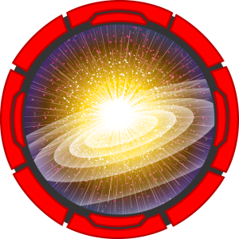 | [BigBang](https://github.com/purplestormctf/Writeups/blob/main/htb/machines/BigBang/syro/BigBang.md) |
| 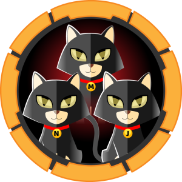 | [Cat](https://github.com/purplestormctf/Writeups/blob/main/htb/machines/Cat/Cat.md) |
| 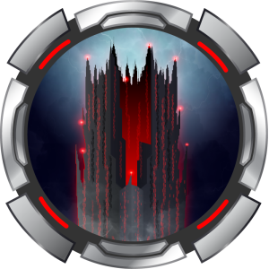 | DarkCorp |
|  | [Titanic](https://github.com/purplestormctf/Writeups/blob/main/htb/machines/Titanic/Titanic.md) |
|  | [Checker](https://github.com/purplestormctf/Writeups/blob/main/htb/machines/Checker/Checker.md) |
|  | [Cypher](https://github.com/purplestormctf/Writeups/blob/main/htb/machines/Cypher/Cypher.md) |
|  | [Dog](https://github.com/purplestormctf/Writeups/blob/main/htb/machines/Dog/Dog.md) |
|  | [TheFrizz](https://github.com/purplestormctf/Writeups/blob/main/htb/machines/TheFrizz/TheFrizz.md) |
| 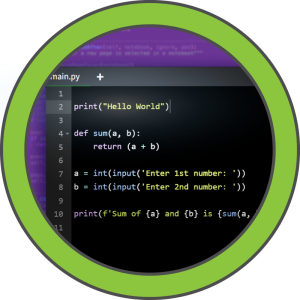 | [Code](https://github.com/purplestormctf/Writeups/blob/main/htb/machines/Code/Code.md) |
|  | [Haze](https://github.com/purplestormctf/Writeups/blob/main/htb/machines/Haze/Haze.md) |
| 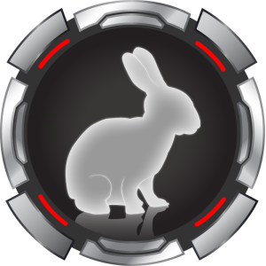 | WhiteRabbit |

</td>
<td>
  
| | |
| --- | --- |
|  | Puppy |
| 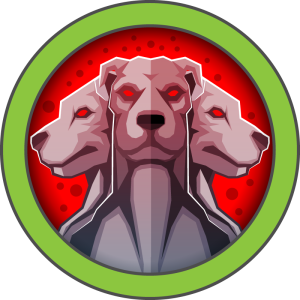 | [Fluffy](https://github.com/purplestormctf/Writeups/blob/main/htb/machines/Fluffy/Fluffy.md) |
|  | Certificate |
| 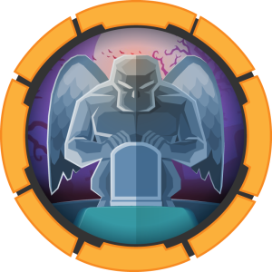 | TombWatcher |
|  | Sorcery |
|  | Artificial |
|  | RustKey |
|  | Voleur |
|  | Outbound |
|  | Mirage |
|  | Era |
|  | Editor |
| 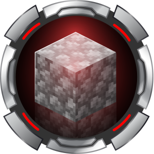 | Cobblestone |

</td>
<td>
  
| | |
| --- | --- |
|  | tba |
|  | tba |
|  | tba |
|  | tba |
|  | tba |
|  | tba |
|  | tba |
|  | tba |
|  | tba |
|  | tba |
|  | tba |
|  | tba |
|  | tba |

</td>

<table>
<tr>
  <th>Season 4  Jan 2024 - Mar 2024</th>
  <th>Season 5  Apr 2024 - Jul 2024</th>
  <th>Season 6  Aug 2024 - Nov 2024</th>
</tr>
<tr>
<td>

| | |
| --- | --- |
| 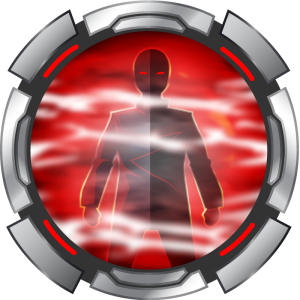 | Mist |
|  | [Headless](https://github.com/purplestormctf/Writeups/blob/main/htb/machines/Headless/Headless.md) |
|  | [WifineticTwo ](https://github.com/purplestormctf/Writeups/blob/main/htb/machines/WifineticTwo/WifineticTwo.md) |
|  | [FormulaX](https://github.com/purplestormctf/Writeups/blob/main/htb/machines/FormulaX/FormulaX.md) |
|  | [Perfection](https://github.com/purplestormctf/Writeups/blob/main/htb/machines/Perfection/Perfection.md) |
|  | [Jab](https://github.com/purplestormctf/Writeups/blob/main/htb/machines/Jab/Jab.md) |
|  | [Office](https://github.com/purplestormctf/Writeups/blob/main/htb/machines/Office/Office.md) |
|  | [Crafty](https://github.com/purplestormctf/Writeups/blob/main/htb/machines/Crafty/Crafty.md) |
|  | Skyfall |
|  | [Pov](https://github.com/purplestormctf/Writeups/tree/main/htb/machines/pov/pov_writeup.md) |
|  | [Analysis](https://github.com/purplestormctf/Writeups/blob/main/htb/machines/analysis/analysis_writeup.md) |
|  | [Monitored](https://github.com/purplestormctf/Writeups/blob/main/htb/machines/monitored/monitored_writeup.md) |
|  | [Bizness](https://github.com/purplestormctf/Writeups/blob/main/htb/machines/bizness/bizness_writeup.md) |

</td>
<td>

| | |
| --- | --- |
|  | Ghost |
|  | [PermX](https://github.com/purplestormctf/Writeups/blob/main/htb/machines/PermX/PermX.md) |
|  | Blazorized |
| 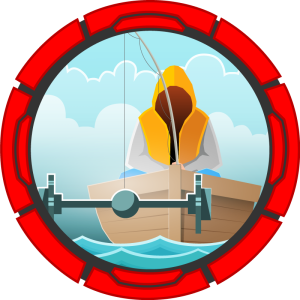 | Axlle |
|  | [Editorial](https://github.com/purplestormctf/Writeups/blob/main/htb/machines/Editorial/Editorial.md) |
| 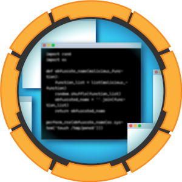 | [Blurry](https://github.com/purplestormctf/Writeups/blob/main/htb/machines/Blurry/Blurry.md) |
|  | [Freelancer](https://github.com/purplestormctf/Writeups/blob/main/htb/machines/Freelancer/Freelancer.md) |
| 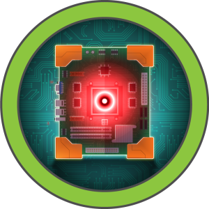 | [BoardLight](https://github.com/purplestormctf/Writeups/blob/main/htb/machines/BoardLight/BoardLight.md) |
|  | [MagicGardens](https://github.com/purplestormctf/Writeups/blob/main/htb/machines/MagicGardens/MagicGardens.md) |
|  | SolarLab |
|  | [Mailing](https://github.com/purplestormctf/Writeups/blob/main/htb/machines/Mailing/Mailing.md) |
|  | Intuition |
|  | [Runner](https://github.com/purplestormctf/Writeups/blob/main/htb/machines/Runner/Runner.md) |

</td>
<td>
  
| | |
| --- | --- |
| 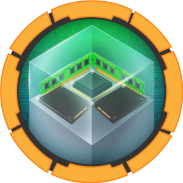 | [Resource](https://github.com/purplestormctf/Writeups/blob/main/htb/machines/Resource/Resource.md) |
|  | [Sea](https://github.com/purplestormctf/Writeups/blob/main/htb/machines/Sea/Sea.md) |
|  | Lantern |
| 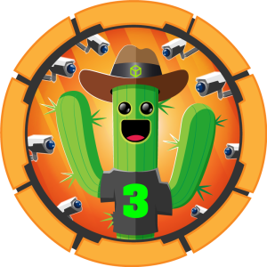 | [MonitorsThree](https://github.com/purplestormctf/Writeups/blob/main/htb/machines/MonitorsThree/MonitorsThree.md) |
|  | [Infiltrator](https://github.com/purplestormctf/Writeups/blob/main/htb/machines/Infiltrator/Infiltrator.md) |
|  | [Sightless](https://github.com/purplestormctf/Writeups/blob/main/htb/machines/Sightless/Sightless.md) |
| 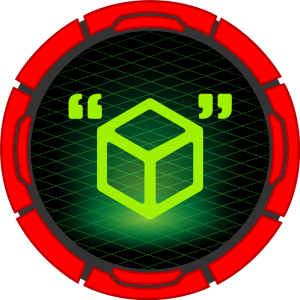 | [Caption](https://github.com/purplestormctf/Writeups/blob/main/htb/machines/Caption/Caption.md) |
|  | [Trickster](https://github.com/purplestormctf/Writeups/blob/main/htb/machines/Trickster/Trickster.md) |
| 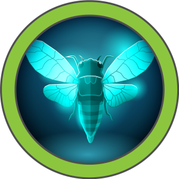 | [Cicada](https://github.com/purplestormctf/Writeups/blob/main/htb/machines/Cicada/Cicada.md) |
|  | [Yummy](https://github.com/purplestormctf/Writeups/blob/main/htb/machines/Yummy/Yummy.md) |
|  | [Instant](https://github.com/purplestormctf/Writeups/blob/main/htb/machines/Instant/Instant.md) |
|  | [Chemistry](https://github.com/purplestormctf/Writeups/blob/main/htb/machines/Chemistry/Chemistry.md) |
|  | [University](https://github.com/purplestormctf/Writeups/blob/main/htb/machines/University/University.md) |

</td>
</tr>
</table>

<table>
<tr>
  <th>Season 1  Mar 2023 - May 2023</th>
  <th>Season 2  Jun 2023 - Sep 2023</th>
  <th>Season 3  Oct 2023 - Dec 2023</th>
</tr>
<tr>
<td>
  
| | |
| --- | --- |
|  | [Bookworm](https://github.com/purplestormctf/Writeups/tree/main/htb/machines/Bookworm/Bookworm.md) | 
|  | [PC](https://github.com/purplestormctf/Writeups/blob/main/htb/machines/pc/pc_writeup.md) |
|  | [Format](https://github.com/purplestormctf/Writeups/blob/main/htb/machines/format/format_writeup.md) |
|  | [Snoopy](https://github.com/purplestormctf/Writeups/tree/main/htb/machines/Snoopy/Snoopy.md) |
|  | [MonitorsTwo](https://github.com/purplestormctf/Writeups/blob/main/htb/machines/monitorstwo/monitorstwo_writeup.md) |
|  | [OnlyForYou](https://github.com/purplestormctf/Writeups/tree/main/htb/machines/OnlyForYou/OnlyForYou.md) |
|  | [Mailroom](https://github.com/purplestormctf/Writeups/tree/main/htb/machines/Mailroom/Mailroom.md) |
|  | [Busqueda](https://github.com/purplestormctf/Writeups/blob/main/htb/machines/busqueda/busqueda_writeup_hacking_thursday.md) |
|  | [Coder](https://github.com/purplestormctf/Writeups/blob/main/htb/machines/coder/Coder.md) |
|  | [Socket](https://github.com/purplestormctf/Writeups/tree/main/htb/machines/Socket/Socket.md) |
|  | [Cerberus](https://github.com/purplestormctf/Writeups/blob/main/htb/machines/Cerberus/Cerberus.md) |
|  | [Inject](https://github.com/purplestormctf/Writeups/blob/main/htb/machines/inject/inject_writeup_hacking_thursday.md) |
|  | [Agile](https://github.com/purplestormctf/Writeups/tree/main/htb/machines/Agile/Agile.md) |

</td>
<td>
  
| | |
| --- | --- |
|  | [Rebound](https://github.com/purplestormctf/Writeups/blob/main/htb/machines/rebound/rebound_writeup.md) |
|  | [CozyHosting](https://github.com/purplestormctf/Writeups/blob/main/htb/machines/cozyhosting/cozyhosting_writeup.md) |
|  | [Zipping](https://github.com/purplestormctf/Writeups/blob/main/htb/machines/zipping/zipping_writeup.md) |
|  | [Cybermonday](https://github.com/purplestormctf/Writeups/blob/main/htb/machines/cybermonday/cybermonday_writeup.md) |
|  | [Keeper](https://github.com/purplestormctf/Writeups/blob/main/htb/machines/keeper/keeper_writeup.md) |
|  | [Download](https://github.com/purplestormctf/Writeups/blob/main/htb/machines/download/download_writeup.md) |
| 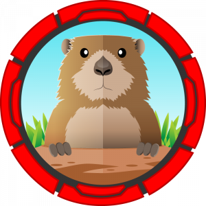 | [Gofer](https://github.com/purplestormctf/Writeups/blob/main/htb/machines/gopher/gopher_writeup.md) |
| 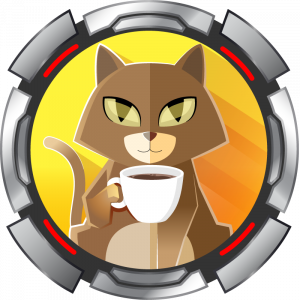 | [RegistryTwo](https://github.com/purplestormctf/Writeups/blob/main/htb/machines/registrytwo/RegistryTwo.md) |
|  | [Authority](https://github.com/purplestormctf/Writeups/tree/main/htb/machines/authority/authority.mdhttps://github.com/purplestormctf/Writeups/tree/main/htb/machines/authority/authority.md) |
|  | [Sau](https://github.com/purplestormctf/Writeups/blob/main/htb/machines/sau/sau_writeup.md) |
| 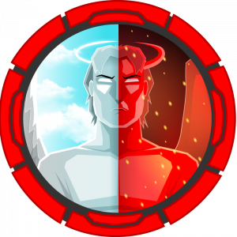 | [Intentions](https://github.com/purplestormctf/Writeups/blob/main/htb/machines/intentions/intentions_writeup.md) |
|  | [Pilgrimage](https://github.com/purplestormctf/Writeups/blob/main/htb/machines/pilgrimage/pilgrimage_writeup.md) |
| 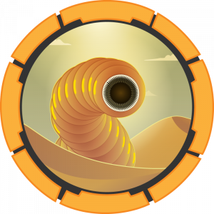 | [Sandworm](https://github.com/purplestormctf/Writeups/blob/main/htb/machines/sandworm/sandworm_writeup.md) |
  
</td>
<td>
  
| | |
| --- | --- |
|  | Corporate |
|  | [Visual](https://github.com/purplestormctf/Writeups/blob/main/htb/machines/visual/visual_writeup.md) |
| 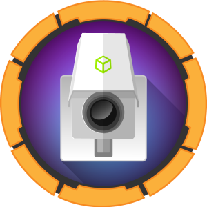 | [Surveillance](https://github.com/purplestormctf/Writeups/blob/main/htb/machines/surveillance/surveillance_writeup.md) |
|  | [Ouija](https://github.com/purplestormctf/Writeups/tree/main/htb/machines/Ouija/Ouija.md) |
|  | [Devvortex](https://github.com/purplestormctf/Writeups/blob/main/htb/machines/devvortex/devvortex_writeup.md) |
|  | [Hospital](https://github.com/purplestormctf/Writeups/blob/main/htb/machines/hospital/hospital_writeup.md) |
|  | [Napper](https://github.com/purplestormctf/Writeups/blob/main/htb/machines/napper/napper_writeup.md) |
|  | [Codify](https://github.com/purplestormctf/Writeups/blob/main/htb/machines/codify/codify_writeup.md) |
|  | [Appsanity](https://github.com/purplestormctf/Writeups/blob/main/htb/machines/appsanity/appsanity_writeup.md) |
|  | [Manager](https://github.com/purplestormctf/Writeups/blob/main/htb/machines/manager/manager_writeup.md) |
|  | [Search](https://github.com/purplestormctf/Writeups/tree/main/htb/machines/Search/Search.md) |
|  | [Drive](https://github.com/purplestormctf/Writeups/blob/main/htb/machines/drive/drive_writeup.md) |
|  | [Analytics](https://github.com/purplestormctf/Writeups/blob/main/htb/machines/analytics/analytics_writeup.md) |

</td>
</tr>
</table>

# Non Seasonal Machines

<table>
<tr>
<td>

| | | 
| --- | --- |
| | [Clicker](https://github.com/purplestormctf/Writeups/blob/main/htb/machines/clicker/clicker_writeup.md) |
|  | [Bagel](https://github.com/purplestormctf/Writeups/blob/main/htb/machines/bagel/bagel_writeup.md) |
|  | [Precious](https://github.com/purplestormctf/Writeups/blob/main/htb/machines/precious/precious_writeup.md) |
| 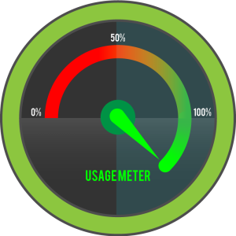 | [Usage](https://github.com/purplestormctf/Writeups/blob/main/htb/machines/Usage/Usage.md) |
|  | [Soccer](https://github.com/purplestormctf/Writeups/blob/main/htb/machines/soccer/Soccer.md) |
|  | [Pollution](https://github.com/purplestormctf/Writeups/blob/main/htb/machines/pollution/pollution_writeup.md) |
|  | [Topology](https://github.com/purplestormctf/Writeups/blob/main/htb/machines/topology/topology_writeup.md) |
|  | [Stocker](https://github.com/purplestormctf/Writeups/blob/main/htb/machines/stocker/stocker_writeup.md) |

</td>
<td>

| | | 
| --- | --- |
|  | Compiled |
|  | [GreenHorn](https://github.com/purplestormctf/Writeups/tree/main/htb/machines/GreenHorn/GreenHorn.md) |
|  | [IClean](https://github.com/purplestormctf/Writeups/blob/main/htb/machines/IClean/syro/IClean.md) |
| 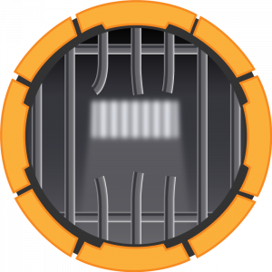  | [Escape](https://github.com/purplestormctf/Writeups/blob/main/htb/machines/escape/escape_writeup.md) |
|  | [Certified](https://github.com/purplestormctf/Writeups/tree/main/htb/machines/Certified/Certified.md) |
|  | [Administrator](https://github.com/purplestormctf/Writeups/tree/main/htb/machines/Administrator/Administrator.md) |
| 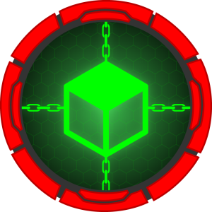 | [BlockBlock](https://github.com/purplestormctf/Writeups/tree/main/htb/machines/BlockBlock/BlockBlock.md) |
|  | [Alert](https://github.com/purplestormctf/Writeups/tree/main/htb/machines/Alert/Alert.md) |

</td>
<td>

| | | 
| --- | --- | 
| 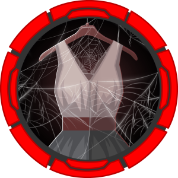 | [Vintage](https://github.com/purplestormctf/Writeups/tree/main/htb/machines/Vintage/Vintage.md) |
| 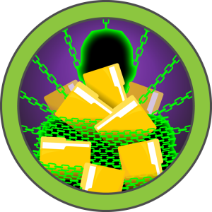 | [LinkVortex](https://github.com/purplestormctf/Writeups/tree/main/htb/machines/LinkVortex/LinkVortex.md) |
|  | [Heal](https://github.com/purplestormctf/Writeups/tree/main/htb/machines/Heal/Heal.md) |
|  | [UnderPass](https://github.com/purplestormctf/Writeups/blob/main/htb/machines/UnderPass/UnderPass.md) |
|  | [Nocturnal](https://github.com/purplestormctf/Writeups/tree/main/htb/machines/Nocturnal/Nocturnal.md) |
|  | [Scepter](https://github.com/purplestormctf/Writeups/tree/main/htb/machines/Scepter/Scepter.md) |
|  | [Eureka](https://github.com/purplestormctf/Writeups/tree/main/htb/machines/Eureka/Eureka.md) |
|  | [Environment](https://github.com/purplestormctf/Writeups/tree/main/htb/machines/Environment/Environment.md) |

</td>
<td>

| | | 
| --- | --- | 
|  | [Planning](https://github.com/purplestormctf/Writeups/tree/main/htb/machines/Planning/Planning.md) |
| 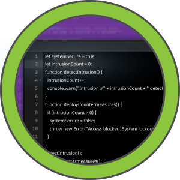 | CodePartTwo |
|  | Previous |
|  | Guardian |
|  | Soulmate |
|  | HackNet |

</td>
</tr>
</table>

